# ORPG: Reconciling Multiple Reward Objectives through Objective-wise Policy Gradients

Shicheng Fang1,2,∗, Yiwen Zhao1,∗, Wenbo Tian1,∗, Jiahao Lu1,2, Yining Zheng1,2,†, Yuxin Wang1,2,†, Xipeng Qiu1,2,†

1Fudan University 2Shanghai Innovation Institute ∗Equal contribution †Corresponding author

## Abstract

Multi-reward policy optimization requires a joint update that reflects both the learning signals and the intended relationships among objectives. We introduce Objective-wise Reconciled Policy Gradient (ORPG), which constructs a separate clipped policy objective for each reward and reconciles the resulting gradients into one policy update. For compatible gradients, a cosine-dependent interpolation coordinates their contributions through a partially normalized reference while preserving the norm of their sum. We characterize this update as the unique solution of a spherical directional compromise. For conflicting gradients, projection follows the task’s priorities. We evaluate the same compatible rule in helpfulness–safety alignment and correctness–cost optimization for mathematical reasoning. ORPG substantially improves average Useful and Harmless scores over the strongest external baseline on each axis. In mathematics, it achieves the highest average full-budget accuracy and three-budget hypervolume among the compared methods, with more accurate and shorter responses than the initial policy. Component comparisons and training dynamics show the larger contribution of compatible coordination and a complementary benefit from conflict handling. These results support gradient reconciliation for objectives with equal standing and for objectives with an explicit priority.

Code: https://github.com/euReKa025/ORPG

## 1 Introduction

Language models are increasingly expected to satisfy several requirements within the same response. Helpfulness and safety jointly shape the behavior of an assistant (Dai et al., 2023; Ouyang et al., 2022), while mathematical reasoning requires accurate answers at a manageable generation cost (Aggarwal & Welleck, 2025; Liu et al., 2025b). Reinforcement learning provides a way to train for these requirements through separate reward signals. These signals guide the same policy, so learning from them involves deciding how each objective contributes to a shared update. The desired relationship between objectives also depends on the task: helpfulness and safety may have equal standing, whereas reducing generation cost should remain subordinate to correctness. Multi-reward policy optimization therefore requires a way to coordinate learning across objectives while respecting these relationships.

Existing multi-reward optimizers combine objectives at diferent stages. GRPO-based methods can combine rewards before group-relative advantage estimation (Shao et al., 2024). MO-GRPO and GDPO retain reward-specific statistics when constructing advantages (Ichihara et al., 2025; Liu et al., 2026b), while GD2PO further processes interactions among reward-wise advantages (Liu et al., 2026a). Gradient-based approaches, including GAPO and PAMA, make the shared update direction an explicit design choice (He & Maghsudi, 2025; Li et al., 2025). Separate gradients create a second design problem: how should they form one update? Their directions determine whether contributions reinforce or oppose one another, while their relative norms determine their amplitudes in a direct sum. Conflict projection alone leaves compatible pairs unchanged (Yu et al., 2020), even when one gradient dominates that sum. This motivates coordinating compatible contributions alongside resolving conflicts according to task priorities.

We propose Objective-wise Reconciled Policy Gradient (ORPG), which retains a separate clipped policy objective for each reward and computes its gradient over the same trainable parameters. For a compatible pair, ORPG forms a reference by partially normalizing gradient magnitudes and interpolates between this reference and the original gradient sum. The mixing strength depends on gradient cosine similarity, and a final normalization preserves the sum’s norm. For a conflicting pair, ORPG applies symmetric projection to objectives with equal standing, or a one-sided projection that preserves the primary gradient. The same compatible rule therefore serves diferent conflict priorities. We characterize the compatible update as the unique solution of a directional compromise on a fixed-radius sphere.

We evaluate ORPG on helpfulness–safety alignment and correctness–cost optimization for mathematical reasoning. ORPG improves both Useful and Harmless scores across all three alignment datasets, with average gains of 0.415 and 0.446 over the strongest external baseline on each axis. In mathematics, it achieves the highest average full-budget accuracy and three-budget hypervolume among the compared methods, while improving accuracy and reducing response length relative to the initial policy. Component comparisons in helpfulness–safety identify compatible coordination as the larger source of improvement, with conflict handling providing an additional benefit. Training measurements connect these gains to stronger joint reward learning and the gradient relationships encountered during optimization.

## Our contributions are:

• We introduce ORPG, which preserves separate clipped policy objectives and reconciles their full gradients through compatible contribution coordination and task-priority conflict resolution.

• We show that the compatible rule uniquely solves a spherical directional compromise, preserves the original sum norm, and bounds the unit-direction contribution ratio between the original and partially normalized ratios.

• We demonstrate joint helpfulness–safety gains and accuracy-prioritized cost reduction in mathematical reasoning. Component comparisons and training measurements identify the roles of compatible coordination and conflict handling.

## 2 Related Work

Multi-objective gradient coordination. Gradient-based multi-task methods provide several ways to construct a shared update. GradNorm adapts task weights using gradient magnitudes and relative training rates (Chen et al., 2018). MGDA-based multi-task learning seeks a common descent direction through a combination of objective gradients (Sener & Koltun, 2018), while gradient similarity can regulate auxiliary updates relative to a primary objective (Du et al., 2018). PCGrad projects conflicting gradients (Yu et al., 2020). GradVac adjusts gradient relationships toward target cosine similarities (Wang et al., 2021), and CAGrad controls the worst local objective improvement around the average gradient (Liu et al., 2021). Aligned-MTL constructs the update through an alignment-based transformation of the gradient system (Senushkin et al., 2023). These approaches difer in the quantity they control: task weights, local directional improvement, pairwise relationships, or the conditioning of the gradient system.

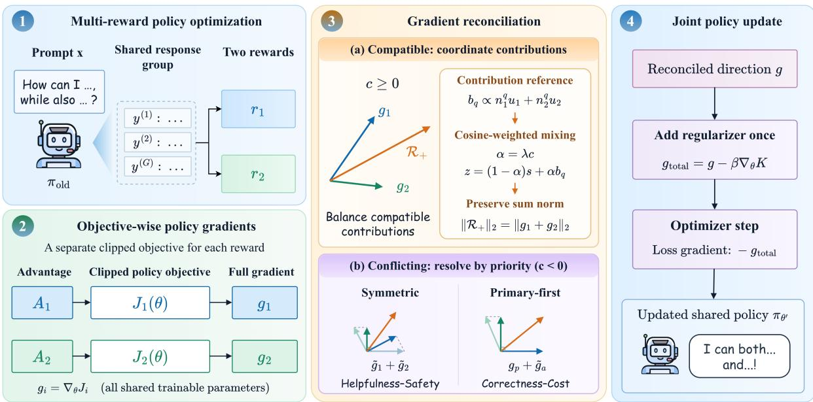  
Figure 1 Overview of ORPG. Each reward retains its own clipped policy objective. Reconciliation uses the relationship between their full policy gradients to form a joint update.

Reinforcement learning and multi-reward policy optimization. PPO introduced a clipped policy objective for stable policy updates (Schulman et al., 2017). GRPO estimates advantages from groups of sampled responses and removes the need for a learned value function (Shao et al., 2024). Subsequent multi-objective alignment methods extended the construction of the update. GAPO rescales objective gradients and solves a minimumnorm combination problem (Li et al., 2025), while PAMA combines a modified policy objective with eficient multi-objective weight calculation (He & Maghsudi, 2025). Dynamic reward weighting adapts objective weights during training (Lu et al., 2025). MO-GRPO and GDPO normalize rewards separately before aggregating their advantages (Ichihara et al., 2025; Liu et al., 2026b). Blockwise advantage estimation assigns objective-specific signals to corresponding response blocks (Pavlenko et al., 2026), and GD2PO filters conflicting reward-wise advantages and reweights prompt groups (Liu et al., 2026a). The combination stage determines which interactions the optimizer can act on explicitly. Reward and advantage methods shape the learning signal before policy diferentiation; gradient methods operate on the parameter update induced by that signal.(Li et al., 2026; Zhao et al., 2026) ORPG preserves each reward through a separate clipped policy objective and reconciles the resulting full policy gradients into a joint update.

Length-aware reasoning methods express generation cost through length targets, penalties, or response selection (Aggarwal & Welleck, 2025; Liu et al., 2025a;b; Luo et al., 2025a; Shrivastava et al., 2025; Yi et al., 2025). This setting gives the objectives a primary–secondary relationship: correctness determines answer quality, while length controls the cost of obtaining it.

## 3 Objective-wise Reconciled Policy Gradient

## 3.1 Policy optimization setup and separate objectives

Let �� be a policy with trainable parameters �. For each prompt $x \sim \mathcal { D } ,$ , a fixed rollout policy $\pi _ { \mathrm { o l d } }$ samples a group of � responses $y ^ { ( 1 ) } , \ldots , y ^ { ( G ) }$ . Reward � assigns each response an advantage $A _ { i } ^ { ( j ) }$ , broadcast over its valid response tokens. GRPO constructs these advantages from within-group reward statistics (Shao et al., 2024); the task-specific constructions used here are given in Section 4 and Appendix B.1.

For token � of response $j ,$ define the importance ratio

$$
\rho _ { j , t } ( \theta ) = \frac { \pi _ { \theta } ( y _ { t } ^ { ( j ) } \mid x , y _ { < t } ^ { ( j ) } ) } { \pi _ { \mathrm { o l d } } ( y _ { t } ^ { ( j ) } \mid x , y _ { < t } ^ { ( j ) } ) } .\tag{1}
$$

PPO-style clipping, also used by GRPO, gives the maximized surrogate integrand (Schulman et al., 2017; Shao et al., 2024)

$$
\phi _ { \mathrm { c l i p } } ( \rho , A ) = \operatorname* { m i n } \{ \rho A , \mathrm { c l i p } ( \rho , 1 - \epsilon _ { - } , 1 + \epsilon _ { + } ) A \} .\tag{2}
$$

ORPG retains a separate objective for each reward:

$$
J _ { i } ( \theta ) = \mathbb { E } _ { \boldsymbol { x } \sim \mathcal { D } , \{ y ^ { ( j ) } \} \sim \pi _ { \mathrm { o l d } } } \left[ \mathrm { R e d u c e } _ { j , t } \phi _ { \mathrm { b a s e } } ( \rho _ { j , t } ( \theta ) , A _ { i } ^ { ( j ) } ) \right] .\tag{3}
$$

Here $\phi _ { \mathrm { b a s e } }$ includes the negative-advantage safeguard specified in Appendix B.1. The reduction is a validtoken mean for helpfulness–safety and a sequence mean of token means for mathematics. Separate clipping preserves objective identity through diferentiation.

We use ascent notation $g _ { i } \ = \ \nabla _ { \theta } J _ { i }$ , with each gradient covering all trainable policy parameters. The reconciliation operator $\mathcal { R }$ combines these gradients, followed by one shared regularizer:

$$
g _ { \mathrm { t o t a l } } = \mathcal { R } ( g _ { 1 } , \ldots , g _ { m } ) - \beta \nabla _ { \theta } K ( \theta ) .\tag{4}
$$

The optimizer uses $- g _ { \mathrm { t o t a l } }$ as its loss gradient. The framework supports multiple rewards; our implemented and evaluated rule treats two

## 3.2 Compatible contributions

For two nonzero gradients, write

$$
n _ { i } = \| g _ { i } \| _ { 2 } , \qquad u _ { i } = g _ { i } / n _ { i } , \qquad c = u _ { 1 } ^ { \top } u _ { 2 } , \qquad s = g _ { 1 } + g _ { 2 } , \qquad S = \| s \| _ { 2 } .\tag{5}
$$

When $c \geq 0$ , both gradients are locally compatible. Their relative norms still determine their amplitudes in $s = n _ { 1 } u _ { 1 } + n _ { 2 } u _ { 2 }$ . ORPG coordinates these amplitudes using a partially normalized reference:

$$
v _ { q } = n _ { 1 } ^ { q } u _ { 1 } + n _ { 2 } ^ { q } u _ { 2 } , \qquad b _ { q } = S \frac { v _ { q } } { \| v _ { q } \| _ { 2 } } , \qquad q \in [ 0 , 1 ] .\tag{6}
$$

The choice $q = 1$ recovers the original sum direction, while $q = 0$ gives equal amplitudes on the unit directions. $\textstyle \mathrm { A t } q = { \frac { 1 } { 2 } } $ , their ratio becomes $\sqrt { n _ { 1 } / n _ { 2 } }$ , halfway between equal amplitudes and the original ratio in logarithmic coordinates. This retains information about gradient magnitude while moderating its influence on the joint direction.

Let $\lambda \in [ 0 , 1 ]$ control the maximum mixing strength and set $\alpha = \lambda c$ . The compatible update is

$$
z = ( 1 - \alpha ) s + \alpha b _ { q } , \qquad \mathcal { R } _ { + } ( g _ { 1 } , g _ { 2 } ) = S \frac { z } { \| z \| _ { 2 } } .\tag{7}
$$

Cosine similarity controls how strongly the reference contributes. Near orthogonality, the adjustment approaches zero. The final normalization retains the magnitude of the original gradient sum while changing its direction.

Proposition 1 (Spherical directional compromise). For nonzero $g _ { 1 } , g _ { 2 }$ with $c \ge 0 , q \in [ 0 , 1 ]$ , and $\lambda \in [ 0 , 1 ]$ Equation (7) is the unique solution of

$$
\operatorname* { m i n i m i z e } _ { \| g \| _ { 2 } = S } \ : \ : ( 1 - \alpha ) \| g - s \| _ { 2 } ^ { 2 } + \alpha \| g - b _ { q } \| _ { 2 } ^ { 2 } .\tag{8}
$$

The objective balances proximity to the original sum and to the contribution reference on the same sphere. Expanding the squares reduces the problem to maximizing $g ^ { \top } z$ under a norm constraint. Its solution is the normalized vector in Equation (7); a full derivation appears in Appendix A.

Several properties follow directly. The output equals � when $\lambda = 0 , c = 0 , q = 1$ , the gradients have equal norms, or they point in the same direction. For an unequal-norm pair, the coeficient ratio after mixing lies between the original ratio and its �-power reference. The adjustment therefore changes contributions continuously rather than replacing gradient magnitudes with a binary choice.

## 3.3 Conflict resolution and priorities

When $d = g _ { 1 } ^ { \top } g _ { 2 } < 0 .$ , ORPG uses a conflict rule determined by the task priorities. With symmetric objectives, it applies the two-objective PCGrad projection (Yu et al., 2020):

$$
\widetilde { g } _ { 1 } = g _ { 1 } - \frac { d } { n _ { 2 } ^ { 2 } } g _ { 2 } , \qquad \widetilde { g } _ { 2 } = g _ { 2 } - \frac { d } { n _ { 1 } ^ { 2 } } g _ { 1 } , \qquad \mathcal { R } _ { - } = \widetilde { g } _ { 1 } + \widetilde { g } _ { 2 } .\tag{9}
$$

Each projected direction removes its component opposing the other objective.

For a primary objective � and a secondary objective �, ORPG preserves $g _ { p }$ and finds the closest secondary direction that does not oppose it:

$$
\widetilde { g } _ { a } = \arg \operatorname* { m i n } _ { h } \frac { 1 } { 2 } \| h - g _ { a } \| _ { 2 } ^ { 2 } \quad \mathrm { s u b j e c t } \ \mathrm { t o } \quad g _ { p } ^ { \top } h \geq 0 .\tag{10}
$$

For a conflicting pair, the closed-form result is

$$
\widetilde { g } _ { a } = g _ { a } - \frac { g _ { p } ^ { \top } g _ { a } } { \| g _ { p } \| _ { 2 } ^ { 2 } } g _ { p } , \qquad \mathcal { R } _ { - } = g _ { p } + \widetilde { g } _ { a } .\tag{11}
$$

The secondary objective retains its orthogonal component, while the primary direction remains intact. In ascent notation, $g _ { p } ^ { \check { \tau } } \mathcal { R } _ { - } = \| g _ { p } \| _ { 2 } ^ { 2 }$ for the conflicting pair. This first-order property concerns the reconciled policy direction before shared regularization and the optimizer update.

## 3.4 Overall update and optimization procedure

At optimization step �, let $\mathcal { B } _ { k }$ be the current minibatch and $g _ { i } ^ { k } = \nabla _ { \theta } J _ { i } ( \theta ; \mathcal { B } _ { k } ) | _ { \theta = \theta _ { k } }$ . The reconciliation rules determine scalar coeficients $\omega _ { i } ^ { k }$ such that

$$
g _ { \mathrm { r e c } } ^ { k } = \mathcal { R } ( g _ { 1 } ^ { k } , g _ { 2 } ^ { k } ) = \sum _ { i = 1 } ^ { 2 } \omega _ { i } ^ { k } g _ { i } ^ { k } .\tag{12}
$$

Holding these coeficients fixed for the current diferentiation gives the local surrogate

$$
\widetilde { J } _ { \mathrm { O R P G } } ^ { k } ( \boldsymbol { \theta } ) = \sum _ { i = 1 } ^ { 2 } s g ( \omega _ { i } ^ { k } ) J _ { i } ( \boldsymbol { \theta } ; \mathcal { B } _ { k } ) - \beta K ( \boldsymbol { \theta } ; \mathcal { B } _ { k } ) ,\tag{13}
$$

where sg denotes stop-gradient. Consequently,

$$
\begin{array} { r } { \nabla _ { \theta } \widetilde { J } _ { \mathrm { O R P G } } ^ { k } ( \theta ) \Big | _ { \theta = \theta _ { k } } = g _ { \mathrm { r e c } } ^ { k } - \beta \nabla _ { \theta } K ( \theta _ { k } ; \mathcal { B } _ { k } ) = g _ { \mathrm { t o t a l } } ^ { k } . } \end{array}\tag{14}
$$

This representation connects the reconciled direction to the reward-specific objectives. The coeficients are recomputed from the current gradients at every optimization minibatch and remain fixed only for that diferentiation. Appendix B.2 gives their closed forms.

Algorithm 1 obtains each full objective gradient separately. Reconciliation then uses three global Gram scalars, $n _ { 1 } ^ { 2 } , n _ { 2 } ^ { 2 } , d ,$ and $O ( P )$ vector operations for � trainable parameters. Appendix B.3 details operations and training costs.

Both symmetric projections use the original gradient pair. When either gradient is zero, the remaining objective passes through unchanged. The shared regularizer is diferentiated separately and included once, with $g _ { K } = 0$ when disabled. The optimizer then clips the total loss gradient and applies AdamW. Thus, policy-objective clipping, gradient reconciliation, and final gradient-norm clipping act at distinct stages.

The rollout policy stays fixed within each rollout batch. Both task settings use the same compatible rule; their advantage construction and conflict priority determine how the objectives enter the update.

Algorithm 1 ORPG update   
Require: $\pi _ { \theta } , r _ { 1 } , r _ { 2 } , q , \lambda , \beta ,$ task rules   
1: for each rollout batch do   
2: Fix $\pi _ { \mathrm { o l d } } ;$ sample response groups   
3: Evaluate rewards; construct $A _ { 1 } , A _ { 2 }$   
4: for each optimization minibatch do   
5: Form separate clipped $J _ { 1 } , J _ { 2 }$   
6: $g _ { i } \gets \nabla \bar { J _ { i } } ; g _ { K } \gets \bar { \nabla } \bar { K }$   
7: Compute global $n _ { 1 } ^ { 2 } , n _ { 2 } ^ { 2 } , d$   
8: if $n _ { 1 } n _ { 2 } = 0$ then   
9: $g  g _ { 1 } + g _ { 2 }$   
10: else if $d \geq 0$ then   
11: $c  d / ( n _ { 1 } n _ { 2 } ) ; \alpha  \lambda c$   
12: $g  \mathcal { R } _ { + } ( g _ { 1 } , g _ { 2 } )$ via Eq. (7)   
13: else if symmetric priority then   
14: $\widetilde { g } _ { 1 }  g _ { 1 } - d g _ { 2 } / n _ { 2 } ^ { 2 }$   
15: $\widetilde { g } _ { 2 }  g _ { 2 } - d g _ { 1 } / n _ { 1 } ^ { \overline { { 2 } } }$   
16: $g  \widetilde { g } _ { 1 } + \widetilde { g } _ { 2 }$ ⊲ Eq. (9)   
17: else   
18: Identify primary $g _ { p } ,$ secondary ��   
19: $\widetilde { g } _ { a }  g _ { a } - d g _ { p } / \| g _ { p } \| _ { 2 } ^ { 2 }$   
20: $g \gets g _ { p } + \widetilde { g } _ { a }$ ⊲ Eq. (11)   
21: end if   
22: $h \gets - ( g - \beta g _ { K } )$ ⊲ Loss gradient   
23: Clip ℎ to the maximum gradient norm   
24: Update � with AdamW using ℎ   
25: end for   
26: end for

## 4 Experiments

## 4.1 Experimental setup

Training and repeated runs. Both settings start from Qwen3-4B-Instruct-2507 (Yang et al., 2025) and use the verl framework (Sheng et al., 2024). Evaluation uses 100-step policies. The default Math run accumulates 21.91 training-step hours on eight H200 GPUs, detailed in Appendix B.3. Unless stated otherwise, means and sample standard deviations are computed across three independent training runs and three evaluation runs for base. Appendix B.1 provides optimization settings; Appendix C.1 specifies repeated-run aggregation.

Data, objectives, and benchmarks. For helpfulness–safety, we follow Safe RLHF’s separation of alignment criteria (Dai et al., 2023), using the Artessay Qwen2.5-7B-SafeRLHF reward and cost models to score helpfulness and harmlessness(Artessay, n.d.a;n; Yang et al., 2024). Training uses Alpaca with disjoint calibration and evaluation subsets (Taori et al., 2023); evaluation covers Alpaca, HH-RLHF, and PKU-SafeRLHF (Bai et al., 2022; Ji et al., 2025). Group-centered advantages share a scale, and conflict resolution is symmetric. For correctness–cost, training uses DeepScaleR preview prompts (Luo et al., 2025b); evaluation covers AIME-24, AMC-22-23, MATH, Minerva-Math, and OlympiadBench (AI-MO, n.d.; He et al., 2024; Hendrycks et al., 2021; Hugging Face H4, n.d.; Lewkowycz et al., 2022). The rewards are binary correctness and an indicator of length at most $\tau = 4 0 0 0$ . ORPG and all external training baselines use these same reward definitions and length threshold. Correctness uses group-relative advantages and receives conflict priority; length advantages are centered within the correct subset and zero elsewhere. Appendices B.1 and C.1 detail objective construction, dataset sizes, and prompts.

Table 1 Helpfulness–safety results. Each dataset reports Useful (U) and Harmless (H); Avg is the equal-weight average across datasets. Both scores are higher-is-better.
<table><tr><td rowspan="2">Method</td><td colspan="2">Alpaca</td><td colspan="2">HH-RLHF</td><td colspan="2"> $\mathrm { P K U - S a f e R L H F }$ </td><td colspan="2"> $\mathrm { A v g }$ </td></tr><tr><td>U</td><td>H</td><td>U</td><td>H</td><td>U</td><td>H</td><td>U</td><td>H</td></tr><tr><td>Base</td><td> $2 . 5 3 6 _ { \pm 0 . 0 2 5 }$ </td><td> $2 . 9 4 1 _ { \pm 0 . 0 2 8 }$ </td><td>2.855±0.002</td><td> $3 . 9 7 7 _ { \pm 0 . 0 0 2 }$ </td><td> $4 . 6 4 4 _ { \pm 0 . 0 0 2 }$ </td><td> $6 . 4 0 4 _ { \pm 0 . 0 0 4 }$ </td><td> $3 . 3 4 5 _ { \pm 0 . 0 0 9 }$ </td><td> $4 . 4 4 1 _ { \pm 0 . 0 1 0 }$ </td></tr><tr><td>GRPO</td><td> $5 . 2 3 2 _ { \pm 0 . 0 3 6 }$ </td><td>6.212±0.080 4.470±0.037 6.082±0.044</td><td></td><td></td><td> $5 . 6 2 0 _ { \pm 0 . 0 1 1 }$ </td><td> $6 . 9 3 8 _ { \pm 0 . 0 0 2 }$ </td><td> $5 . 1 0 7 _ { \pm 0 . 0 2 8 }$ </td><td> $6 . 4 1 1 _ { \pm 0 . 0 3 8 }$ </td></tr><tr><td>GDPO</td><td> $5 . 3 3 5 _ { \pm 0 . 0 1 0 }$ </td><td> $6 . 2 5 0 _ { \pm 0 . 1 2 1 }$ </td><td> $4 . 5 4 6 _ { \pm 0 . 0 0 4 }$ </td><td> $6 . 1 1 6 _ { \pm 0 . 0 1 9 }$ </td><td> $5 . 6 4 0 _ { \pm 0 . 0 0 8 }$ </td><td> $6 . 9 3 9 _ { \pm 0 . 0 0 5 }$ </td><td> $5 . 1 7 4 _ { \pm 0 . 0 0 5 }$ </td><td> $6 . 4 3 5 _ { \pm 0 . 0 4 7 }$ </td></tr><tr><td>GD²PO</td><td> $5 . 3 3 2 _ { \pm 0 . 0 1 0 }$ </td><td></td><td>6.297±0.033 4.541±0.007</td><td> $6 . 1 3 8 _ { \pm 0 . 0 1 0 }$ </td><td> $5 . 6 3 1 _ { \pm 0 . 0 0 1 }$ </td><td> $6 . 9 3 9 _ { \pm 0 . 0 0 2 }$ </td><td> $5 . 1 6 8 _ { \pm 0 . 0 0 5 }$ </td><td> $6 . 4 5 8 _ { \pm 0 . 0 1 3 }$ </td></tr><tr><td>ORPG</td><td> ${ \bf 5 . 9 4 3 _ { \pm 0 . 0 0 2 } }$ </td><td> $\mathbf { 7 . 0 6 1 _ { \pm 0 . 0 0 2 } }$ </td><td> ${ \bf 5 . 0 4 4 } _ { \pm 0 . 0 0 2 }$ </td><td> ${ \bf 6 . 6 7 9 _ { \pm 0 . 0 0 3 } }$ </td><td> ${ \bf 5 . 7 8 1 _ { \pm 0 . 0 0 0 1 } }$ </td><td> $6 . 9 7 2 _ { \pm 0 . 0 0 0 2 }$ </td><td> $5 . 5 8 9 _ { \pm 0 . 0 0 0 4 }$ </td><td> ${ \bf 6 . 9 0 4 _ { \pm 0 . 0 0 1 } }$ </td></tr></table>

Table 2 Mathematical accuracy (Acc, %) and mean response length (Len, tokens) at the 8192-token budget. Each dataset is followed by the equal-weight Avg. A24: AIME-24; AMC: AMC-22-23; Min.: Minerva-Math; Oly.: OlympiadBench.
<table><tr><td rowspan="2">Method</td><td colspan="2">A24</td><td colspan="2">AMC</td><td colspan="2">MATH</td><td colspan="2">Min.</td><td colspan="2">Oly.</td><td colspan="2"> $\operatorname { A v g }$ </td></tr><tr><td> $\operatorname { A c c } \left( \% \right)$ </td><td>Len</td><td> $\operatorname { A c c } \left( \% \right)$ </td><td>Len</td><td> $\operatorname { A c c } \left( \% \right)$ </td><td>Len</td><td> $\operatorname { A c c } \left( \% \right)$ </td><td>Len</td><td> $\operatorname { A c c } \left( \% \right)$ </td><td></td><td>Len Acc (%) Len</td><td></td></tr><tr><td>Base</td><td> $5 3 . 9 _ { \pm 3 . 4 }$ </td><td> $5 6 9 8 _ { \pm 6 0 }$ </td><td> ${ 8 2 . 4 } _ { \pm 0 . 7 }$ </td><td></td><td>3351±86 87.6±0.1 1462±6 37.3±0.3 1495±22 66.4±0.2</td><td></td><td></td><td></td><td></td><td> $3 8 2 1 _ { \pm 9 }$ </td><td> $6 5 . 5 _ { \pm 0 . 7 }$ </td><td> $3 1 6 5 _ { \pm 1 2 }$ </td></tr><tr><td>GRPO</td><td> $4 2 . 2 _ { \pm 1 . 0 }$ </td><td></td><td>2541±135 75.5±2.3 1708±58 86.0±0.2 939±40 37.9±0.6 964±91</td><td></td><td></td><td></td><td></td><td></td><td> $6 1 . 8 _ { \pm 0 . 3 }$ </td><td> $1 6 8 8 _ { \pm 7 1 }$ </td><td> $6 0 . 7 _ { \pm 0 . 5 }$ </td><td> $1 5 6 8 _ { \pm 6 6 }$ </td></tr><tr><td>GDPO</td><td> $3 8 . 6 _ { \pm 1 . 3 }$ </td><td>2255±105</td><td> $7 4 . 7 _ { \pm 0 . 6 }$ </td><td></td><td></td><td></td><td></td><td></td><td>1540±26 85.5±0.1 833±12 37.3±0.6 833±25 60.6±0.6 1501±46</td><td></td><td> $5 9 . 3 _ { \pm 0 . 1 }$ </td><td>1392±38</td></tr><tr><td> $\mathrm { G D } ^ { 2 } \mathrm { P O }$ </td><td> $4 1 . 9 _ { \pm 5 . 4 }$ </td><td> $2 4 7 0 _ { \pm 9 0 }$ </td><td> $7 5 . 1 _ { \pm 1 . 5 }$ </td><td></td><td>1583±51 85.4±0.1 846±12 37.9±1.0</td><td></td><td></td><td> ${ \bf 8 2 6 } _ { \pm 3 4 }$ </td><td> $6 0 . 9 _ { \pm 0 . 3 }$ </td><td>1553±29</td><td> $6 0 . 3 _ { \pm 0 . 8 }$ </td><td> $1 4 5 6 _ { \pm 2 9 }$ </td></tr><tr><td>ORPG</td><td> ${ \pm 6 . 4 } _ { \pm 1 . 9 }$ </td><td> $4 6 1 3 _ { \pm 9 4 }$ </td><td> $\mathbf { 8 2 . 4 _ { \pm 0 . 6 } }$ </td><td> $2 7 4 8 _ { \pm 3 9 }$ </td><td>88.0±0.1 1229±3 39.3±0.5</td><td></td><td></td><td> $1 2 8 7 _ { \pm 2 7 }$ </td><td> ${ \bf 6 7 . 2 _ { \pm 0 . 6 } }$ </td><td> $2 8 9 3 _ { \pm 2 3 }$ </td><td> ${ \bf 6 6 . 7 _ { \pm 0 . 3 } }$ </td><td> $2 5 5 4 _ { \pm 2 2 }$ </td></tr><tr><td></td><td></td><td></td><td></td><td></td><td></td><td></td><td></td><td></td><td></td><td></td><td></td><td></td></tr></table>

Baselines. We compare ORPG with the initial model, GRPO, GDPO, and the hard variant of $\mathrm { G D } ^ { 2 } \mathrm { P O }$ (Liu et al., 2026a;b; Shao et al., 2024). The initial policy anchors changes in task quality and generation cost. GRPO combines rewards before constructing its group-relative update. GDPO separately normalizes reward-wise advantages before aggregation, while GD2PO filters conflicting reward-wise advantages and reweights prompt groups. These comparisons distinguish coordination at the learning-signal level from reconciliation of separate policy gradients. Section 4.3 evaluates the reconciliation components and alternative gradient combination rules under the objective-wise formulation.

Evaluation metrics. For helpfulness–safety, each evaluation run generates one response for every prompt in each complete set. We report mean Useful and Harmless scores. For mathematics, accuracy estimates pass@1 from four responses per problem. Table 2 reports our primary comparison: accuracy and mean length at the 8192-token budget. Table 3 reports hypervolume (HV), which summarizes the accuracy–cost trade-of using 2048-, 4096-, and 8192-token measurements. Shorter-budget responses are exact prefixes of the same generations. For each dataset, HV is the union area of rectangles from (0 0) to accuracy–eficiency points $( a , 1 - \ell / 8 1 9 2 )$ , with eficiency clipped to [0, 1]. Avg weights datasets equally after computing their metrics. Appendix C.2 gives the scoring protocol, formula, and budget-specific values.

## 4.2 Results

Table 1 shows that ORPG achieves the highest Useful and Harmless scores on all three evaluation sets. Its average Useful score of 5.589 exceeds GDPO by 0.415, while its average Harmless score of 6.904 exceeds GD2PO by 0.446. Both scores improve within each dataset, covering general instructions and the two safety-oriented evaluation sets.

Table 2 shows the accuracy-priority outcome in mathematical reasoning. ORPG achieves 66.7% average accuracy at the 8192-token budget, improving on Base by 1.14 percentage points while using 611 fewer tokens per response (19.3%). It exceeds all three external training baselines in accuracy on every dataset. Relative to Base, four datasets improve and AMC-22-23 retains the same mean accuracy. The external baselines produce shorter responses than ORPG but reduce accuracy relative to Base: their average accuracies range from 59.35% to 60.69%. ORPG obtains its cost reduction while improving the primary correctness objective.

Table 3 Mathematical hypervolume (HV, higher is better) over the 2048-, 4096-, and 8192-token budgets. Avg gives equal weight to each dataset.
<table><tr><td>Method</td><td>A24</td><td>AMC</td><td>MATH</td><td>Min.</td><td> ${ \mathrm { O l y } } .$ </td><td> $\mathrm { A v g }$ </td></tr><tr><td>Base</td><td> $0 . 2 8 0 _ { \pm 0 . 0 1 5 }$ </td><td> $0 . 6 0 8 _ { \pm 0 . 0 0 6 }$ </td><td> $0 . 7 6 8 _ { \pm 0 . 0 0 1 }$ </td><td> $0 . 3 2 5 _ { \pm 0 . 0 0 2 }$ </td><td> $0 . 4 8 5 _ { \pm 0 . 0 0 0 5 }$ </td><td> $0 . 4 9 3 _ { \pm 0 . 0 0 4 }$ </td></tr><tr><td>GRPO</td><td> $0 . 3 1 1 _ { \pm 0 . 0 1 1 }$ </td><td> $0 . 6 2 0 _ { \pm 0 . 0 1 4 }$ </td><td> $0 . 7 6 9 _ { \pm 0 . 0 0 3 }$ </td><td> $0 . 3 3 6 _ { \pm 0 . 0 0 3 }$ </td><td> $0 . 5 0 7 _ { \pm 0 . 0 0 7 }$ </td><td> $0 . 5 0 9 _ { \pm 0 . 0 0 3 }$ </td></tr><tr><td>GDPO</td><td> $0 . 2 9 5 _ { \pm 0 . 0 1 1 }$ </td><td> $0 . 6 2 5 _ { \pm 0 . 0 0 5 }$ </td><td> $0 . 7 7 4 _ { \pm 0 . 0 0 1 }$ </td><td> $0 . 3 3 7 _ { \pm 0 . 0 0 6 }$ </td><td> $0 . 5 0 7 _ { \pm 0 . 0 0 6 }$ </td><td> $0 . 5 0 7 _ { \pm 0 . 0 0 2 }$ </td></tr><tr><td>GD²PO</td><td> $0 . 3 1 5 _ { \pm 0 . 0 4 0 }$ </td><td> $0 . 6 2 7 _ { \pm 0 . 0 1 4 }$ </td><td> $0 . 7 7 3 _ { \pm 0 . 0 0 1 }$ </td><td> $0 . 3 4 2 _ { \pm 0 . 0 0 9 }$ </td><td> $0 . 5 0 8 _ { \pm 0 . 0 0 2 }$ </td><td> $0 . 5 1 3 _ { \pm 0 . 0 0 5 }$ </td></tr><tr><td>ORPG</td><td> $\mathbf { 0 . 3 3 9 _ { \pm 0 . 0 1 0 } }$ </td><td> $\mathbf { 0 . 6 3 7 _ { \pm 0 . 0 0 4 } }$ </td><td> $0 . 7 7 7 _ { \pm 0 . 0 0 0 5 }$ </td><td> $\mathbf { 0 . 3 4 4 _ { \pm 0 . 0 0 5 } }$ </td><td> $\mathbf { 0 . 5 1 6 _ { \pm 0 . 0 0 4 } }$ </td><td> $\mathbf { 0 . 5 2 3 _ { \pm 0 . 0 0 2 } }$ </td></tr></table>

Table 4 Reconciliation components and alternative gradient rules on helpfulness–safety. All rows retain separate policy objectives. Scores are averaged over the same three datasets as Table 1.
<table><tr><td>Update</td><td>Useful ↑</td><td>Harmless ↑</td></tr><tr><td>ORPG</td><td> ${ \pm . 5 . 8 9 _ { \pm 0 . 0 0 0 4 } }$ </td><td> ${ \bf 6 . 9 0 4 _ { \pm 0 . 0 0 1 } }$ </td></tr><tr><td>Without compatible coordination</td><td> $5 . 2 1 2 _ { \pm 0 . 0 6 2 }$ </td><td> $6 . 7 1 0 _ { \pm 0 . 0 3 2 }$ </td></tr><tr><td>Without conflict resolution</td><td> $5 . 5 6 3 _ { \pm 0 . 0 0 0 6 }$ </td><td> $6 . 8 5 9 _ { \pm 0 . 0 0 1 }$ </td></tr><tr><td>Without either component</td><td> $5 . 1 9 3 _ { \pm 0 . 0 7 3 }$ </td><td> $6 . 6 9 5 _ { \pm 0 . 0 8 5 }$ </td></tr><tr><td>CAGrad</td><td> $5 . 1 8 3 _ { \pm 0 . 0 0 2 }$ </td><td> $6 . 6 2 6 _ { \pm 0 . 0 0 2 }$ </td></tr><tr><td>Aligned-MTL</td><td> $5 . 0 6 5 _ { \pm 0 . 0 0 2 }$ </td><td> $6 . 5 0 1 _ { \pm 0 . 0 0 5 }$ </td></tr></table>

Table 3 evaluates the joint accuracy–cost outcome across the three budgets. ORPG reaches an average HV of 0.523, compared with 0.493 for Base and 0.513 for $\mathrm { G D } ^ { 2 } \mathrm { P O } ,$ , the strongest external baseline on this metric. ORPG’s leading full-budget accuracy and aggregate HV show improved correctness and joint accuracy–cost performance. Appendix C.2 provides the budget-specific measurements used to compute HV.

## 4.3 Component contributions

All variants in Table 4 retain the same objective-wise policy structure. Without either component uses the direct gradient sum (Sum). Without compatible coordination applies conflict projection and directly sums compatible gradients (PCGrad). Without conflict resolution retains compatible coordination and directly sums opposing gradients. CAGrad and Aligned-MTL replace the reconciliation operator with their respective joint-gradient rules. Appendix D.1 gives the formulas.

Table 4 shows that ORPG achieves the highest Useful and Harmless scores among the objective-wise rules. Its improvement over the version without either component establishes the benefit of coordinating the gradients after preserving separate policy objectives. Compatible coordination provides the larger component gain: removing it reduces Useful by 0.378 and Harmless by 0.193. Removing compatible coordination gives results close to removing both components, while the compatible-only variant approaches the full method. The distinction between these updates is how they combine compatible gradients, connecting the largest gain to the central design choice in ORPG.

Conflict resolution further improves both scores. ORPG also exceeds CAGrad and Aligned-MTL on both axes. Section 4.4 examines the learning dynamics. In mathematics, the full rule achieves the highest 8192-budget accuracy among the four component versions, exceeding the version without conflict resolution by 1.20 percentage points. Appendix D.2 reports the accuracy–cost comparison.

All five configurations per setting outperform the external training baselines on both HS scores, full-budget mathematical accuracy, and HV. The default leads in HS scores and full-budget accuracy; $q = 0 . 7 5$ achieves higher mathematical HV. Appendix D.3 reports the individual � and � scans.

## 4.4 Training dynamics

ORPG learns stronger usefulness and harmlessness together during training. We compare calibrated training rewards against external policy optimizers and objective-wise gradient rules in Figures 2 and 3. Appendix E.2 gives the run-level statistics and advantage measurements.

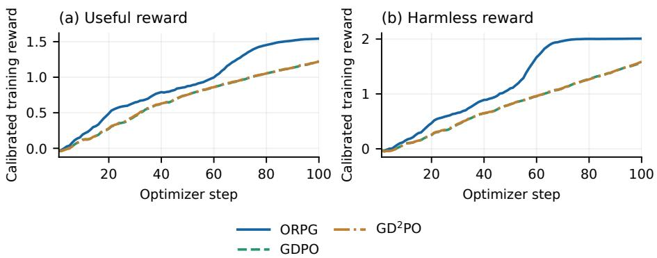  
Figure 2 Training rewards against external baselines. (a) Useful and (b) Harmless. A trailing five-step mean is applied to each curve. These calibrated training rewards difer from the raw evaluation scores in Table 1.

Stronger joint learning than external baselines. Figures 2(a–b) show that ORPG develops an advantage on both rewards and extends it through the middle and later stages. The separation is especially visible around steps 60–80: Useful continues to rise while Harmless reaches a higher level. Over the final 20 steps, ORPG averages 1.522 Useful and 2.005 Harmless, compared with 1.157 and 1.458 for GDPO, and 1.158 and 1.462 for GD2PO. The simultaneous gains connect the stronger held-out scores to improved learning of both training objectives.

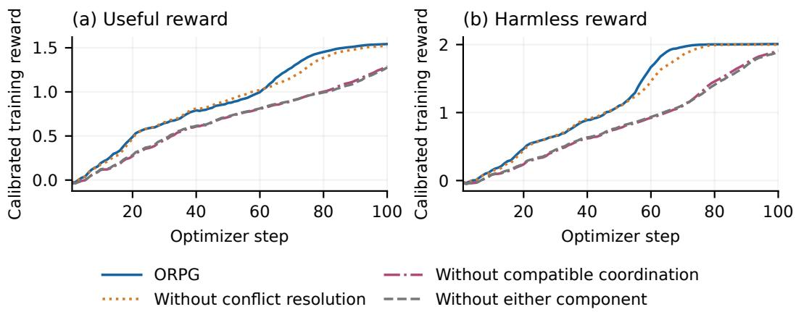  
Figure 3 Training rewards under objective-wise gradient rules. (a) Useful and (b) Harmless. Colors and line styles identify the same versions throughout. Smoothing matches Figure 2.

Compatible coordination provides the main reward gain. Figures 3(a–b) separate the four component versions. The two retaining compatible coordination develop substantially higher rewards in the middle and later stages, while removing this component gives a trajectory close to removing both. Over the final 20 steps, ORPG reaches 1.522 Useful and 2.005 Harmless, compared with 1.492 and 1.999 without conflict resolution. Both exceed the versions without compatible coordination and without either component. Together with Table 4, these trajectories identify the main gain from compatible coordination and the additional improvement from the complete rule.

Learning improves in a predominantly compatible regime. Figure 4(a) shows positive step-average gradient cosine through most of training for all four versions. The reward gains from compatible coordination therefore develop largely in a regime where conflict projection leaves the gradient sum unchanged. This connects the training behavior to the motivation for coordinating contributions even when gradients are locally compatible. The versions without compatible coordination and without either component record zero conflicts, whereas ORPG and the version without conflict resolution encounter conflicts late in training; ORPG’s average projection rate is 6.5%. Appendix E.1 gives conflict and projection trajectories and stage summaries.

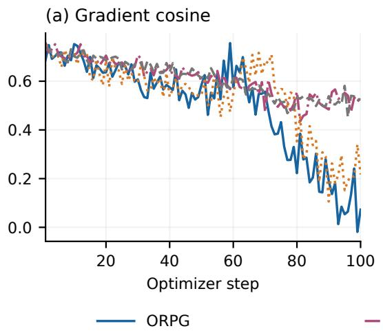

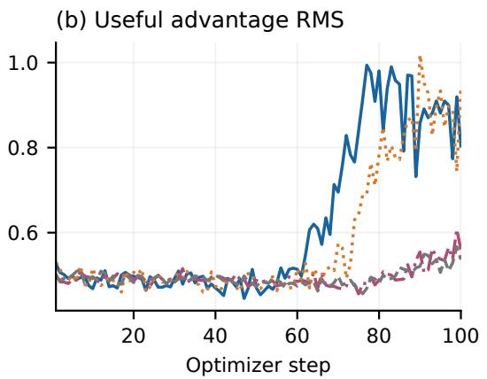  
Figure 4 Training signals for the four component versions. (a) Gradient cosine and (b) Useful advantage RMS, shown as unsmoothed step aggregates. Colors and line styles match Figure 3.

A stronger Useful signal accompanies reward improvement. Figure 4(b) shows that the versions retaining compatible coordination sustain a stronger Useful advantage signal later in training. Over the final 20 steps, Useful RMS reaches 0.887 for ORPG and 0.860 without conflict resolution, compared with 0.528 without compatible coordination and 0.521 without either component. All four use the same group-centering and shared-scale advantage construction. The stronger signal accompanies the higher Useful reward in Figure 3(a), indicating efective optimization of usefulness alongside the higher harmlessness reward.

## 5 Conclusion

We propose ORPG, a gradient-reconciliation method for multi-reward policy optimization that improves joint performance across reward objectives. Its compatible branch coordinates relative contributions while preserving the norm of the gradient sum, and its conflict branch follows task priorities. ORPG improves usefulness and harmlessness jointly and achieves the highest average full-budget accuracy and three-budget hypervolume in mathematical reasoning among the compared methods. Component comparisons and training dynamics in helpfulness–safety identify compatible coordination as the larger source of improvement, with conflict handling adding a complementary benefit. Across the two settings, the results support coordinating objectives according to both their local gradient relationships and their task-level priorities. In summary, ORPG opens a research direction for multi-objective policy optimization through objective-wise gradient reconciliation.

## References

Pranjal Aggarwal and Sean Welleck. L1: Controlling how long a reasoning model thinks with reinforcement learning. arXiv preprint arXiv:2503.04697, 2025. URL https://arxiv.org/abs/2503.04697.

AI-MO. AIMO Validation: AMC, n.d. URL https://huggingface.co/datasets/AI-MO/aimo-validation-amc. Dataset release; accessed September 15, 2026.

Artessay. Qwen2.5-7B-SafeRLHF-CM, n.d.a. URL https://www.modelscope.cn/models/Artessay/Qwen2.5-7 B-SafeRLHF-CM. Model card; accessed September 15, 2026.

Artessay. Qwen2.5-7B-SafeRLHF-RM, n.d.b. URL https://www.modelscope.cn/models/Artessay/Qwen2.5-7 B-SafeRLHF-RM. Model card; accessed September 15, 2026.

Yuntao Bai, Andy Jones, Kamal Ndousse, Amanda Askell, Anna Chen, Nova DasSarma, Dawn Drain, Stanislav Fort, Deep Ganguli, Tom Henighan, Nicholas Joseph, Saurav Kadavath, Jackson Kernion, Tom Conerly, Sheer El-Showk, Nelson Elhage, Zac Hatfield-Dodds, Danny Hernandez, Tristan Hume, Scott Johnston, Shauna Kravec, Liane Lovitt, Neel Nanda, Catherine Olsson, Dario Amodei, Tom Brown, Jack Clark, Sam McCandlish, Chris Olah, Ben Mann, and Jared Kaplan. Training a helpful and harmless assistant with reinforcement learning from human feedback, 2022. URL https://arxiv.org/abs/2204.05862.

Zhao Chen, Vijay Badrinarayanan, Chen-Yu Lee, and Andrew Rabinovich. GradNorm: Gradient normalization for adaptive loss balancing in deep multitask networks. In Proceedings of the 35th International Conference on Machine Learning, volume 80 of Proceedings of Machine Learning Research, pp. 794–803. PMLR, 2018. URL https://proceedings.mlr. press/v80/chen18a.html.

Josef Dai, Xuehai Pan, Ruiyang Sun, Jiaming Ji, Xinbo Xu, Mickel Liu, Yizhou Wang, and Yaodong Yang. Safe RLHF: Safe reinforcement learning from human feedback. arXiv preprint arXiv:2310.12773, 2023. URL https: //arxiv.org/abs/2310.12773.

Yunshu Du, Wojciech M. Czarnecki, Siddhant M. Jayakumar, Razvan Pascanu, and Balaji Lakshminarayanan. Adapting auxiliary losses using gradient similarity, 2018. URL https://arxiv.org/abs/1812.02224.

Chaoqun He, Renjie Luo, Yuzhuo Bai, Shengding Hu, Zhen Thai, Junhao Shen, Jinyi Hu, Xu Han, Yujie Huang, Yuxiang Zhang, Jie Liu, Lei Qi, Zhiyuan Liu, and Maosong Sun. OlympiadBench: A challenging benchmark for promoting AGI with olympiad-level bilingual multimodal scientific problems. In Lun-Wei Ku, Andre Martins, and Vivek Srikumar (eds.), Proceedings of the 62nd Annual Meeting of the Associationfor Computational Linguistics (Volume 1: Long Papers), pp. 3828–3850, Bangkok, Thailand, August 2024. Association for Computational Linguistics. doi: 10.18653/v1/2024.acl-long.211. URL https://aclanthology.org/2024.acl-long.211/.

Qiang He and Setareh Maghsudi. Pareto Multi-Objective Alignment for Language Models, 2025. URL https: //arxiv.org/abs/2508.07768.

Dan Hendrycks, Collin Burns, Saurav Kadavath, Akul Arora, Steven Basart, Eric Tang, Dawn Song, and Jacob Steinhardt. Measuring mathematical problem solving with the math dataset, 2021. URL https://arxiv.org/abs/2103.03874.

Hugging Face H4. AIME 2024 Dataset, n.d. URL https://huggingface.co/datasets/HuggingFaceH4/aime\_2024. Dataset release; accessed September 15, 2026.

Yuki Ichihara, Yuu Jinnai, Tetsuro Morimura, Mitsuki Sakamoto, Ryota Mitsuhashi, and Eiji Uchibe. MO-GRPO: Mitigating Reward Hacking of Group Relative Policy Optimization on Multi-Objective Problems, 2025. URL https: //arxiv.org/abs/2509.22047.

Jiaming Ji, Donghai Hong, Borong Zhang, Boyuan Chen, Josef Dai, Boren Zheng, Tianyi Alex Qiu, Jiayi Zhou, Kaile Wang, Boxun Li, Sirui Han, Yike Guo, and Yaodong Yang. PKU-SafeRLHF: Towards multi-level safety alignment for LLMs with human preference. In Wanxiang Che, Joyce Nabende, Ekaterina Shutova, and Mohammad Taher Pilehvar (eds.), Proceedings of the 63rd Annual Meeting of the Association for Computational Linguistics (Volume 1: Long Papers), pp. 31983–32016, Vienna, Austria, July 2025. Association for Computational Linguistics. ISBN 979-8-89176-251-0. doi: 10.18653/v1/2025.acl-long.1544. URL https://aclanthology.org/2025.acl-long.1544/.

Aitor Lewkowycz, Anders Andreassen, David Dohan, Ethan Dyer, Henryk Michalewski, Vinay Ramasesh, Ambrose Slone, Cem Anil, Imanol Schlag, Theo Gutman-Solo, Yuhuai Wu, Behnam Neyshabur, Guy Gur-Ari, and Vedant Misra. Solving quantitative reasoning problems with language models, 2022. URL https://arxiv.org/abs/2206.14858.

Chengao Li, Hanyu Zhang, Yunkun Xu, Hongyan Xue, Xiang Ao, and Qing He. Gradient-adaptive policy optimization: Towards multi-objective alignment of large language models. In Wanxiang Che, Joyce Nabende, Ekaterina Shutova, and Mohammad Taher Pilehvar (eds.), Proceedings of the 63rd Annual Meeting of the Association for Computational Linguistics (Volume 1: Long Papers), pp. 11214–11232, Vienna, Austria, July 2025. Association for Computational Linguistics. ISBN 979-8-89176-251-0. doi: 10.18653/v1/2025.acl-long.549. URL https://aclanthology.org/2025.acl-long.549/.

Ze-Ping Li, Hongru Wang, Yiwen Zhao, Guanhua Chen, Yixia Li, Keyang Chen, Yixin Cao, Guangnan Ye, Hongfeng Chai, and Zhen-Fei Yin. Rethinking the role of entropy in optimizing tool-use behaviors for large language model agents, 2026. URL https://api.semanticscholar.org/CorpusID:285271471.

Bo Liu, Xingchao Liu, Xiaojie Jin, Peter Stone, and Qiang Liu. Conflict-Averse Gradient Descent for Multi-task learning. In M. Ranzato, A. Beygelzimer, Y. Dauphin, P.S. Liang, and J. Wortman Vaughan (eds.), Advances in Neural Information Processing Systems, volume 34, pp. 18878–18890. Curran Associates, Inc., 2021. URL https://proceedings.neurip s.cc/paper\_files/paper/2021/file/9d27fdf2477ffbff837d73ef7ae23db9-Paper.pdf.

Haotian Liu, Yihao Liu, Jingwei Ni, Siyuan Huang, Xinpeng Liu, Pengyu Cheng, Jiajun Song, Ruijin Ding, Junfeng Li, Zhechao Yu, Mengyu Zhou, Hongteng Xu, Xiaoxi Jiang, and Guanjun Jiang. GD2PO: Mitigating Multi-Reward Conflicts via Group-Dynamic reward-Decoupled Policy Optimization, 2026a. URL https://arxiv.org/abs/2606.16771.

Shih-Yang Liu, Xin Dong, Ximing Lu, Shizhe Diao, Mingjie Liu, Min-Hung Chen, Hongxu Yin, Yu-Chiang Frank Wang, Kwang-Ting Cheng, Yejin Choi, Jan Kautz, and Pavlo Molchanov. DLER: Doing length penalty right – incentivizing more intelligence per token via reinforcement learning. arXiv preprint arXiv:2510.15110, 2025a. URL https://arxiv.org/abs/2510.15110.

Shih-Yang Liu, Xin Dong, Ximing Lu, Shizhe Diao, Peter Belcak, Mingjie Liu, Min-Hung Chen, Hongxu Yin, Yu-Chiang Frank Wang, Kwang-Ting Cheng, Yejin Choi, Jan Kautz, and Pavlo Molchanov. GDPO: Group reward-Decoupled Normalization Policy Optimization for Multi-reward RL Optimization, 2026b. URL https://arxiv.org/abs/2601 .05242.

Wei Liu, Ruochen Zhou, Yiyun Deng, Yuzhen Huang, Junteng Liu, Yuntian Deng, Yizhe Zhang, and Junxian He. Learn to reason eficiently with adaptive length-based reward shaping. arXiv preprint arXiv:2505.15612, 2025b. URL https://arxiv.org/abs/2505.15612.

Yining Lu, Zilong Wang, Shiyang Li, Xin Liu, Changlong Yu, Qingyu Yin, Zhan Shi, Zixuan Zhang, and Meng Jiang. Learning to Optimize Multi-Objective Alignment Through Dynamic Reward Weighting, 2025. URL https: //arxiv.org/abs/2509.11452.

Haotian Luo, Li Shen, Haiying He, Yibo Wang, Shiwei Liu, Wei Li, Naiqiang Tan, Xiaochun Cao, and Dacheng Tao. O1-Pruner: Length-harmonizing fine-tuning for O1-like reasoning pruning. arXiv preprint arXiv:2501.12570, 2025a. URL https://arxiv.org/abs/2501.12570.

Michael Luo, Sijun Tan, Justin Wong, Xiaoxiang Shi, William Y Tang, Manan Roongta, Colin Cai, Jefrey Luo, Li Erran Li, Raluca Ada Popa, et al. Deepscaler: Surpassing o1-preview with a 1.5b model by scaling rl. https://pretty-radio -b75.notion.site/DeepScaleR-Surpassing-O1-Preview-with-a-1-5B-Model-by-Scaling-RL-19681 902c1468005bed8ca303013a4e2, 2025b. Notion Blog.

Long Ouyang, Jef Wu, Xu Jiang, Diogo Almeida, Carroll L. Wainwright, Pamela Mishkin, Chong Zhang, Sandhini Agarwal, Katarina Slama, Alex Ray, John Schulman, Jacob Hilton, Fraser Kelton, Luke Miller, Maddie Simens, Amanda Askell, Peter Welinder, Paul Christiano, Jan Leike, and Ryan Lowe. Training language models to follow instructions with human feedback. arXiv preprint arXiv:2203.02155, 2022. URL https://arxiv.org/abs/2203.02155.

Kirill Pavlenko, Alexander Golubev, Simon Karasik, and Boris Yangel. Blockwise Advantage Estimation for Multi-Objective RL with Verifiable Rewards, 2026. URL https://arxiv.org/abs/2602.10231.

John Schulman, Filip Wolski, Prafulla Dhariwal, Alec Radford, and Oleg Klimov. Proximal policy optimization algorithms, 2017. URL https://arxiv.org/abs/1707.06347.

Ozan Sener and Vladlen Koltun. Multi-task learning as multi-objective optimization. In Advances in Neural Information Processing Systems, volume 31, 2018. URL https://proceedings.neurips.cc/paper\_files/paper/2018/ha sh/432aca3a1e345e339f35a30c8f65edce-Abstract.html.

Dmitry Senushkin, Nikolay Patakin, Arseny Kuznetsov, and Anton Konushin. Independent Component Alignment for Multi-Task Learning. In Proceedings of the IEEE/CVF Conference on Computer Vision and Pattern Recognition (CVPR), pp. 20083–20093, June 2023.

Zhihong Shao, Peiyi Wang, Qihao Zhu, Runxin Xu, Junxiao Song, Xiao Bi, Haowei Zhang, Mingchuan Zhang, Y. K. Li, Y. Wu, and Daya Guo. DeepSeekMath: Pushing the Limits of Mathematical Reasoning in Open Language Models, 2024. URL https://arxiv.org/abs/2402.03300.

Guangming Sheng, Chi Zhang, Zilingfeng Ye, Xibin Wu, Wang Zhang, Ru Zhang, Yanghua Peng, Haibin Lin, and Chuan Wu. HybridFlow: A flexible and eficient RLHF framework. arXiv preprint arXiv:2409.19256, 2024. URL https://arxiv.org/abs/2409.19256.

Vaishnavi Shrivastava, Ahmed Awadallah, Vidhisha Balachandran, Shivam Garg, Harkirat Behl, and Dimitris Papailiopoulos. Sample more to think less: Group filtered policy optimization for concise reasoning. arXiv preprint arXiv:2508.09726, 2025. URL https://arxiv.org/abs/2508.09726.

Rohan Taori, Ishaan Gulrajani, Tianyi Zhang, Yann Dubois, Xuechen Li, Carlos Guestrin, Percy Liang, and Tatsunori B. Hashimoto. Stanford alpaca: An instruction-following llama model. https://github.com/tatsu-lab/stanfor d\_alpaca, 2023.

Zirui Wang, Yulia Tsvetkov, Orhan Firat, and Yuan Cao. Gradient Vaccine: Investigating and Improving Multi-task Optimization in Massively Multilingual Models. In International Conference on Learning Representations, 2021. URL https://openreview.net/pdf/4958372042631716242a4b3f1a10231548614522.pdf.

An Yang, Anfeng Li, Baosong Yang, Beichen Zhang, Binyuan Hui, Bo Zheng, Bowen Yu, Chang Gao, Chengen Huang, Chenxu Lv, Chujie Zheng, Dayiheng Liu, Fan Zhou, Fei Huang, Feng Hu, Hao Ge, Haoran Wei, Huan Lin, Jialong Tang, Jian Yang, Jianhong Tu, Jianwei Zhang, Jianxin Yang, Jiaxi Yang, Jing Zhou, Jingren Zhou, Junyang Lin, Kai Dang, Keqin Bao, Kexin Yang, Le Yu, Lianghao Deng, Mei Li, Mingfeng Xue, Mingze Li, Pei Zhang, Peng Wang, Qin Zhu, Rui Men, Ruize Gao, Shixuan Liu, Shuang Luo, Tianhao Li, Tianyi Tang, Wenbiao Yin, Xingzhang Ren, Xinyu Wang, Xinyu Zhang, Xuancheng Ren, Yang Fan, Yang Su, Yichang Zhang, Yinger Zhang, Yu Wan, Yuqiong Liu, Zekun Wang, Zeyu Cui, Zhenru Zhang, Zhipeng Zhou, and Zihan Qiu. Qwen3 technical report, 2025. URL https://arxiv.org/abs/2505.09388.

Qwen An Yang, Baosong Yang, Beichen Zhang, Binyuan Hui, Bo Zheng, Bo-Wen Yu, Chengyuan Li, Dayiheng Liu, Fei Huang, Guanting Dong, Haoran Wei, Huan Lin, Jian Yang, Jianhong Tu, Jianwei Zhang, Jianxin Yang, Jiaxin Yang, Jingren Zhou, Junyang Lin, Kai Dang, Keming Lu, Keqin Bao, Kexin Yang, Le Yu, Mei Li, Mingfeng Xue, Pei Zhang, Qin Zhu, Rui Men, Runji Lin, Tianhao Li, Tingyu Xia, Xingzhang Ren, Xuancheng Ren, Yang Fan, Yang Su, Yi-Chao Zhang, Yunyang Wan, Yuqi Liu, Zeyu Cui, Zhen-Ru Zhang, Zihan Qiu, Shanghaoran Quan, and Zekun Wang. Qwen2.5 technical report, 2024. URL https://arxiv.org/abs/2412.15115.

Jingyang Yi, Jiazheng Wang, and Sida Li. ShorterBetter: Guiding reasoning models to find optimal inference length for eficient reasoning. arXiv preprint arXiv:2504.21370, 2025. URL https://arxiv.org/abs/2504.21370.

Tianhe Yu, Saurabh Kumar, Abhishek Gupta, Sergey Levine, Karol Hausman, and Chelsea Finn. Gradient Surgery for Multi-Task Learning. In H. Larochelle, M. Ranzato, R. Hadsell, M.F. Balcan, and H. Lin (eds.), Advances in Neural Information Processing Systems, volume 33, pp. 5824–5836. Curran Associates, Inc., 2020. URL https://proceedings. neurips.cc/paper\_files/paper/2020/file/3fe78a8acf5fda99de95303940a2420c-Paper.pdf.

Yiwen Zhao, Zhihao Wen, Yuchen Mao, Mingxuan Jiang, Yihao Hu, Pan Wang, Xin Zhang, and Wei Wu. Towards better agents for multi-turn user interaction: The next user turn is more than context, 2026. URL https://api.semantic scholar.org/CorpusID:291184908.

## A Properties of the reconciliation operator

## A.1 Proof of Proposition 1

For compatible nonzero gradients, $S > 0$ and $v _ { q } \neq 0$ . Moreover,

$$
s ^ { \top } v _ { q } = n _ { 1 } ^ { q + 1 } + n _ { 2 } ^ { q + 1 } + c ( n _ { 1 } n _ { 2 } ^ { q } + n _ { 2 } n _ { 1 } ^ { q } ) > 0 .
$$

Thus $s ^ { \top } b _ { q } > 0 , \ : s \mathbf { o } \ : z = ( 1 - \alpha ) s + \alpha b _ { q }$ is nonzero for all $\alpha \in [ 0 , 1 ]$ . Since $\| s \| = \| b _ { q } \| = \| g \| = S$ , the objective in Equation (8) is

$$
2 S ^ { 2 } - 2 g ^ { \top } \big ( ( 1 - \alpha ) s + \alpha b _ { q } \big ) = 2 S ^ { 2 } - 2 g ^ { \top } z .
$$

Cauchy–Schwarz gives $g ^ { \top } z \leq S \Vert z \Vert .$ , with equality only at $g = S z / \| z \|$ . This proves the unique minimizer.

## A.2 Contribution ratios and identity cases

Before the final normalization $\begin{array} { r } { \mathbf { \epsilon } _ { 1 } , z = a _ { 1 } u _ { 1 } + a _ { 2 } u _ { 2 } } \end{array}$ , where

$$
a _ { i } = ( 1 - \alpha ) n _ { i } + \frac { \alpha S } { \| v _ { q } \| } n _ { i } ^ { q } .
$$

Assume $r = n _ { 1 } / n _ { 2 } \geq 1$ . Let $w = ( 1 - \alpha ) n _ { 2 }$ and $t = \alpha S n _ { 2 } ^ { q } / \| v _ { q } \|$ . Then

$$
\frac { a _ { 1 } } { a _ { 2 } } = \frac { w r + t r ^ { q } } { w + t } \in [ r ^ { q } , r ] .
$$

The common final normalization does not change this ratio. $\textstyle \mathrm { A t } ~ q = { \frac { 1 } { 2 } } .$ , the reference log-ratio is half the original log-ratio. If $\alpha = 0 \mathrm { o r } q = 1$ , Equation (7) returns �. Equal norms make $v _ { q }$ proportional to �, as does $c = 1$ , so these cases also return �. For $q > 0$ , the contribution of a vanishing objective tends to zero; the implementation passes through the other gradient when one objective is inactive.

These properties describe the reconciled policy gradient. The shared regularizer and the optimizer act after reconciliation, as specified in Equation (4).

## A.3 Priority projection

The feasible set $\{ h \ : \ g _ { p } ^ { \top } h \ \geq \ 0 \}$ is a closed half-space. If $g _ { p } ^ { \top } g _ { a } < 0 ,$ its Euclidean projection is $\widetilde { g } _ { a } \ =$ $g _ { a } - ( g _ { p } ^ { \top } g _ { a } ) g _ { p } / \| g _ { p } \| ^ { 2 }$ . It follows that $g _ { p } ^ { \top } \widetilde { g } _ { a } = 0 ,$ , so the joint direction has primary directional derivative $\| g _ { p } \| ^ { 2 }$ For a compatible pair, the operator instead uses Equation (7).

## A.4 Compatible coordination for multiple objectives

The objective-wise construction in Equation (3) permits any number of reward objectives. The compatible reference also admits a direct extension. Let � index the nonzero gradients and suppose $g _ { i } ^ { \top } g _ { j } \ge 0$ for all $i , j \in I .$ . For $q \in [ 0 , 1 ]$ , define

$$
s = \sum _ { i \in I } g _ { i } , \qquad S = \| s \| , \qquad v _ { q } = \sum _ { i \in I } \| g _ { i } \| ^ { q - 1 } g _ { i } , \qquad b _ { q } = S \frac { v _ { q } } { \| v _ { q } \| } .\tag{15}
$$

For nonempty �, both � and $\| v _ { q } \|$ are positive: the squared norms contain positive diagonal terms and nonnegative cross terms. Moreover,

$$
s ^ { \top } v _ { q } = \sum _ { i \in I } \| g _ { i } \| ^ { q + 1 } + \sum _ { \stackrel { i , j \in I } { i \neq j } } \| g _ { j } \| ^ { q - 1 } g _ { i } ^ { \top } g _ { j } > 0 .\tag{16}
$$

Thus $s ^ { \top } b _ { q } > 0$ . Given any mixing weight $\alpha \in [ 0 , 1 ]$ , the vector $z = ( 1 - \alpha ) s + \alpha b _ { q }$ is nonzero, and the same spherical compromise has the unique solution

$$
\arg \operatorname* { m i n } _ { \| g \| = S } \left[ ( 1 - \alpha ) \| g - s \| ^ { 2 } + \alpha \| g - b _ { q } \| ^ { 2 } \right] = S \frac { z } { \| z \| } .\tag{17}
$$

Expanding the objective gives a constant minus $2 g ^ { \top } z .$ , so the result follows by maximizing the inner product on the sphere. This extends Proposition 1 to the reference in Equation (15). Zero gradients are excluded before evaluating the norm powers; if all gradients are zero, the update is zero.

This construction specifies compatible coordination given a mixing weight. A complete rule for multiple objectives additionally requires a choice of � from their joint geometry and a conflict operator for mixed relationships and task priorities. The implemented and evaluated rule in this paper specifies these choices for two objectives.

## B Implementation and computational cost

## B.1 Objective construction and implementation

In the helpfulness–safety setting, the reward scores are calibrated using fixed statistics estimated from the held-out training-calibration subset. Each objective is centered within a response group. A common scale is then applied to the components, retaining their separate values. No evaluation prompt is part of the calibration subset.

For mathematical reasoning, let � denote the correct responses in a group. The secondary advantage is

$$
\begin{array} { r } { A _ { L , j } = \left\{ \begin{array} { l l } { r _ { L , j } - | C | ^ { - 1 } \sum _ { k \in C } r _ { L , k } , } & { j \in C , | C | > 0 , } \\ { 0 , } & { \mathrm { o t h e r w i s e } . } \end{array} \right. } \end{array}
$$

If all responses are incorrect, the secondary objective is inactive. If the length reward is constant on the correct subset, it contributes zero. The correctness advantage retains its primary GRPO normalization. For each response group, correctness scores are centered and divided by their sample standard deviation plus $1 0 ^ { - 6 }$ . In helpfulness–safety, let $B _ { i }$ be the group-centered component broadcast over valid response tokens and � their mask. The common normalization is

$$
A _ { i } = \frac { B _ { i } - \mathrm { { M e a n } } _ { M } ( B _ { i } ) } { \sqrt { \mathrm { { V a r } } _ { M } ( B _ { 1 } + B _ { 2 } ) + 1 0 ^ { - 8 } } } M .
$$

Here $\mathrm { V a r } _ { M }$ is the masked variance used by the policy-training implementation. The masked variance applies Bessel’s correction over valid response tokens.

The policy-loss adapter diferentiates each reward-specific loss over all trainable policy parameters. Distributed reductions produce the global Gram entries. The shared regularization contribution is diferentiated separately and included once. The maximized policy surrogate uses asymmetric clipping and a negative-advantage safeguard:

$$
\phi _ { \mathrm { b a s e } } ( \rho , A ) = \left\{ \begin{array} { l l } { \operatorname* { m a x } \{ \phi _ { \mathrm { c l i p } } ( \rho , A ) , \kappa A \} , } & { A < 0 , } \\ { \phi _ { \mathrm { c l i p } } ( \rho , A ) , } & { A \geq 0 . } \end{array} \right.
$$

Both scenarios use $\kappa = 3 , \epsilon _ { - } = 0 . 2$ , and $\epsilon _ { + } = 0 . 2 8$ . Helpfulness–safety averages over all valid response tokens in the minibatch. Mathematics first averages valid tokens within each response and then averages responses. Exact-zero objective advantages remain zero after normalization, and an inactive objective contributes no gradient.

The mathematical setting uses the MSE log-ratio regularizer

$$
K ( \theta ; \mathcal { B } ) = \frac { 1 } { | \mathcal { B } | } \sum _ { j \in \mathcal { B } } \frac { 1 } { T _ { j } } \sum _ { t = 1 } ^ { T _ { j } } \frac { 1 } { 2 } \left( \log \pi _ { \theta } ( y _ { t } ^ { ( j ) } | x _ { j } , y _ { < t } ^ { ( j ) } ) - \log \pi _ { \mathrm { r e f } } ( y _ { t } ^ { ( j ) } | x _ { j } , y _ { < t } ^ { ( j ) } ) \right) ^ { 2 } ,
$$

where $T _ { j }$ counts valid response tokens and $\pi _ { \mathrm { r e f } }$ is the frozen initial policy. The reduction is the same sequence mean of token means used for the policy objectives, and $\beta = 0 . 0 0 0 5$ . Helpfulness–safety disables this regularizer. Both settings use zero entropy coeficient.

Table 5 lists the training settings for the complete method in both scenarios. All policy parameters are trained. The initial policy is Qwen3-4B-Instruct-2507; helpfulness and harmlessness are scored by the Artessay Qwen2.5-7B-SafeRLHF reward and cost models.

Table 5 Training settings. Token limits refer to training; evaluation budgets are specified separately.
<table><tr><td>Parameter</td><td>Helpfulness-safety</td><td>Correctness-cost</td></tr><tr><td>Training steps</td><td>100</td><td>100</td></tr><tr><td>Batch /minibatch / rollout group</td><td>512 / 128 / 4</td><td>512 / 64 / 8 1</td></tr><tr><td>PPO epochs</td><td>1</td><td></td></tr><tr><td>Learning rate</td><td> $2 \times 1 0 ^ { - 6 }$ </td><td> $1 0 ^ { - 6 }$ </td></tr><tr><td>Optimizer</td><td>AdamW</td><td>AdamW</td></tr><tr><td>Schedule / warmup</td><td>Constant / none</td><td>Constant / none</td></tr><tr><td>Adam  $\left( \beta _ { 1 } , \beta _ { 2 } \right) / \epsilon$ </td><td>(0.9,0.999)  $/ 1 0 ^ { - 8 }$ </td><td>(0.9,0.999)  $/ 1 0 ^ { - 8 }$ </td></tr><tr><td>Weight decay</td><td>0.01</td><td>0.01</td></tr><tr><td>Prompt / response limit</td><td>512 / 1024</td><td>1024 / 8000</td></tr><tr><td>Temperature / top-p / top-k</td><td>0.7 / 1.0 / −1</td><td>1.0 / 1.0 / −1</td></tr><tr><td>PPO clip lower / upper</td><td>0.2 / 0.28</td><td>0.2 / 0.28</td></tr><tr><td>Loss reduction</td><td>Token mean</td><td>Sequence mean of token means</td></tr><tr><td>Gradient norm clip</td><td>1.0</td><td>1.0</td></tr><tr><td>KL coefficient / type</td><td>0 / disabled</td><td>0.0005 / MSE</td></tr><tr><td>Entropy coefficient</td><td>0</td><td>0</td></tr><tr><td>Compatible q / λ</td><td>0.5 / 0.25</td><td>0.5 / 0.25</td></tr><tr><td>Preserve sum norm</td><td>Yes</td><td>Yes</td></tr><tr><td>Conflict rule</td><td>Symmetric</td><td>Correctness priority</td></tr><tr><td>Reward weights</td><td>1/1</td><td>1/1</td></tr><tr><td>Length threshold</td><td></td><td>τ = 4000</td></tr><tr><td>Advantage construction</td><td>Group centered, shared scale</td><td>Primary GRPO; correct-subset length</td></tr><tr><td>Precision / sharding</td><td>bfloat16 / FSDP</td><td>bfloat16 / FSDP</td></tr></table>

Mathematical training uses eight H200 GPUs on one node. LoRA is disabled. Repeated-run aggregation is specified below.

## B.2 Reconciliation coeficients and implementation details

Algorithm 1 computes the joint direction directly. Its rules can also be written as the weighted gradient in Equation (12). All quantities below are evaluated at the current minibatch and parameters; their step superscripts are omitted. For nonzero compatible gradients,

$$
\omega _ { i } = \frac { S } { \| z \| _ { 2 } } \left[ ( 1 - \alpha ) + \frac { \alpha S n _ { i } ^ { q - 1 } } { \| v _ { q } \| _ { 2 } } \right] , \qquad i \in \{ 1 , 2 \} .
$$

For a symmetric conflicting pair with $d = g _ { 1 } ^ { \top } g _ { 2 } < 0 .$

$$
\omega _ { i } = 1 - \frac { d } { n _ { i } ^ { 2 } } , \qquad i \in \{ 1 , 2 \} .
$$

For primary–secondary conflict resolution,

$$
\omega _ { p } = 1 - { \frac { d } { \| g _ { p } \| _ { 2 } ^ { 2 } } } , \qquad \omega _ { a } = 1 .
$$

When either gradient is zero, $\omega _ { 1 } = \omega _ { 2 } = 1$ gives the direct sum. These coeficients are algebraic expansions of the reconciliation rules. They are recomputed at each optimization minibatch and held fixed in the local surrogate’s diferentiation. The coeficient ratio $\omega _ { 1 } / \omega _ { 2 }$ weights the original gradients; the ratio $a _ { 1 } / a _ { 2 }$ in Appendix A weights their unit directions.

## B.3 Training cost and reconciliation operations

The default mathematical run uses eight H200 GPUs for 100 optimizer steps. Summing the recorded duration of these steps gives 21.91 hours, or 175.31 GPU-hours, with a mean of 788.9 seconds per step. This measures accumulated training-step time, excluding queueing, intervals between training processes, initialization outside the step timers, discarded progress, and separate validation and evaluation. Table 6 reports the recorded components. Rollout generation averages 211.1 seconds per step and actor updates 474.4 seconds. Component timers may nest, so their entries are not an additive partition of the total.

Table 6 Recorded training-step costs for the default mathematical run on eight H200 GPUs. Component timers can overlap or nest.
<table><tr><td>Recorded operation</td><td>Seconds per step</td><td>Total hours</td></tr><tr><td>Total training step</td><td>788.9</td><td>21.91</td></tr><tr><td>Rollout generation</td><td>211.1</td><td>5.86</td></tr><tr><td>Actor update</td><td>474.4</td><td>13.18</td></tr><tr><td>Old-policy log probabilities</td><td>48.6</td><td>1.35</td></tr><tr><td>Reference-policy log probabilities</td><td>46.4</td><td>1.29</td></tr><tr><td>Advantage computation</td><td>2.4</td><td>0.07</td></tr><tr><td>Rollout weight update</td><td>3.9</td><td>0.11</td></tr></table>

ORPG first obtains the full gradient of each policy objective. For two gradients in $\mathbb { R } ^ { P }$ , reconciliation then uses the three independent Gram quantities $\overset { \cdot } { a } = \| \overset { \cdot } { g _ { 1 } } \| ^ { 2 } , \overset { \cdot } { b } = \| g _ { 2 } \| ^ { 2 }$ , and $d = g _ { 1 } ^ { \top } g _ { 2 }$ . Computing these quantities and forming the final vector combination each take $O ( P )$ arithmetic; the coeficient calculation is $O ( 1 )$ . With evenly distributed parameter shards over � devices, the local vector operations take ${ \cal O } ( P / D )$ . The compatible coeficients can be computed from the Gram quantities using

$$
V = \| v _ { q } \| , \qquad t _ { i } = ( 1 - \alpha ) + \alpha \frac { S } { V } n _ { i } ^ { q - 1 } , \qquad \omega _ { i } = \frac { S t _ { i } } { \sqrt { t _ { 1 } ^ { 2 } a + t _ { 2 } ^ { 2 } b + 2 t _ { 1 } t _ { 2 } d } } ,\tag{18}
$$

which gives $\mathcal { R } _ { + } = \omega _ { 1 } g _ { 1 } + \omega _ { 2 } g _ { 2 }$ . No parameter-space matrix or diferentiation through the coeficients is needed. The distributed geometry reduction aggregates the three Gram quantities; full-gradient acquisition, FSDP synchronization, and the optimizer perform their own computation and communication. Storing the two objective gradients uses $O ( P )$ memory. The recorded actor-update timer covers the policy update as a whole, including gradient acquisition and reconciliation.

## C Evaluation protocols

## C.1 Prompt construction and evaluation details

Dataset sizes and calibration. Table 7 lists the training, calibration, and evaluation splits. The three Alpaca subsets are disjoint. Mathematical evaluation contains 6,060 problems in total and generates four responses per problem.

Table 7 Dataset sizes. Mathematical training uses DeepScaleR preview prompts.
<table><tr><td>Dataset</td><td>Use</td><td>Count</td></tr><tr><td>Alpaca</td><td>Training</td><td>50,978</td></tr><tr><td>Alpaca</td><td>Reward calibration</td><td>512</td></tr><tr><td>Alpaca</td><td>Evaluation</td><td>512</td></tr><tr><td>HH-RLHF</td><td>Evaluation</td><td>8,520</td></tr><tr><td>PKU-SafeRLHF</td><td>Evaluation</td><td>8,211</td></tr><tr><td>AIME-24</td><td>Evaluation</td><td>30</td></tr><tr><td>AMC-22-23</td><td>Evaluation</td><td>83</td></tr><tr><td>MATH</td><td>Evaluation</td><td>5,000</td></tr><tr><td>Minerva-Math</td><td>Evaluation</td><td>272</td></tr><tr><td>OlympiadBench</td><td>Evaluation</td><td>675</td></tr></table>

Mathematical training prompts. Each DeepScaleR training example supplies one user message. The exact content construction is:

{problem}

Please reason step by step, and put your final answer within \boxed{}.

The problem text is stripped of leading and trailing whitespace before appending the instruction. The reference answer is stored separately for reward evaluation and is not part of the user message.

Helpfulness–safety messages. The policy receives the dataset-provided user/assistant message sequence through its native tokenizer chat template, with add\_generation\_prompt=True. Evaluation preserves the final user request. When a prompt exceeds 512 tokens after template application, the adapter first removes the oldest complete conversation turns; if the remaining user message is still too long, it retains a token sufix that fits the prompt budget. This maintains a valid user-started, user-ended conversation.

Helpfulness–safety decoding. Evaluation uses one response per prompt, temperature 0.7, top- $\cdot p = 1 . 0 ,$ and a maximum of 1024 generated tokens. Reward scoring uses a maximum sequence length of 2048. All three datasets are evaluated in full for each seed. Their means are computed separately and then averaged with equal dataset weights. The policy generation and the two reward-model evaluations use their respective tokenizer interfaces.

Repeated-run aggregation. For each metric, let �� denote a complete run’s result. We report $\begin{array} { r } { \bar { m } = N ^ { - 1 } \sum _ { k } m _ { k } } \end{array}$ and sample standard deviation $s = \sqrt { \sum _ { k } ( m _ { k } - \bar { m } ) ^ { 2 } / ( N - 1 ) }$ . A macro result is constructed within each run before computing its standard deviation. Results in both settings use three runs with seeds 42, 43, and 44.

Budget-level example. The initial policy’s recorded AIME-24 evaluation illustrates the role of the shorter budgets in HV. At 2048, 4096, and 8192 tokens, accuracy is 18.33%, 33.33%, and 57.50%, with mean response lengths of 1971, 3571, and 5761 tokens. The three-point HV is 0.2955, compared with an area of 0.1706 for the 8192 point alone. The additional points measure answer quality available at lower realized costs.

## C.2 Mathematical evaluation and hypervolume

For dataset �, each prompt has four sampled responses. At budget �, the accuracy and mean length are

$$
a _ { D , b } = \frac { 1 } { 4 | D | } \sum _ { x \in D } \sum _ { k = 1 } ^ { 4 } \mathbf { 1 } \{ \mathrm { r e s p o n s e } \left( x , k \right) \mathrm  i s \ c o r r e c t \ a t \} \} , \qquad \ell _ { D , b } = \frac { 1 } { 4 | D | } \sum _ { x \in D } \sum _ { k = 1 } ^ { 4 } L _ { x , k , b } .
$$

All responses remain in the denominator, including unparseable answers. The shorter-budget views use exact token prefixes of the same generated responses. With $e _ { D , b } = 1 - \operatorname* { m i n } ( 1 , \operatorname* { m a x } ( 0 , \ell _ { D , b } / 8 1 9 2 ) )$ , define

$$
\mathrm { H V } _ { D } = \mathrm { A r e a } \left( \bigcup _ { b \in \{ 2 0 4 8 , 4 0 9 6 , 8 1 9 2 \} } \left[ 0 , e _ { D , b } \right] \times \left[ 0 , a _ { D , b } \right] \right) .
$$

The main table reports $^ { a } D , 8 1 9 2$ and $\mathrm { H V } _ { D }$ . Avg is the equal-weight mean over the five datasets. Each repetition is summarized before calculating its mean and sample standard deviation; dataset standard deviations are not averaged to obtain a macro standard deviation.

Table 8 provides the budget-specific macro accuracy and length measurements used to compute HV. The primary accuracy comparison uses the 8192-token budget; HV summarizes the union area defined above.

Table 8 Budget-specific measurements used to compute hypervolume. Accuracy (Acc) is in percent; length (Len) is in tokens.
<table><tr><td rowspan="2">Method</td><td colspan="2">2048</td><td colspan="2">4096</td><td colspan="2">8192</td></tr><tr><td>Acc ↑</td><td>Len ↓</td><td>Acc ↑</td><td>Len ↓</td><td>Acc ↑</td><td>Len ↓</td></tr><tr><td>Base</td><td> $4 3 . 7 6 _ { \pm 0 . 3 4 }$ </td><td>1434±2</td><td> $5 3 . 6 6 _ { \pm 0 . 4 8 }$ </td><td> $2 2 3 2 _ { \pm 1 }$ </td><td> $6 5 . 5 2 _ { \pm 0 . 7 0 }$ </td><td> $3 1 6 5 _ { \pm 1 2 }$ </td></tr><tr><td>GRPO</td><td> $5 1 . 0 9 _ { \pm 0 . 6 6 }$ </td><td> $1 2 9 9 _ { \pm 5 4 }$ </td><td> ${ \bf 6 0 . 4 0 _ { \pm 0 . 4 8 } }$ </td><td> $1 5 5 6 _ { \pm 7 0 }$ </td><td> $6 0 . 6 9 _ { \pm 0 . 5 2 }$ </td><td> $1 5 6 8 _ { \pm 6 6 }$ </td></tr><tr><td>GDPO</td><td> $5 1 . 9 4 _ { \pm 0 . 1 9 }$ </td><td> ${ \bf 1 1 9 2 } _ { \pm 1 9 }$ </td><td> $5 9 . 0 0 _ { \pm 0 . 4 1 }$ </td><td> $\mathbf { 1 } 3 8 5 _ { \pm 3 6 }$ </td><td> $5 9 . 3 5 _ { \pm 0 . 1 2 }$ </td><td> ${ \bf 1 3 9 2 } _ { \pm 3 8 }$ </td></tr><tr><td> $_ \mathrm { G D } { } ^ { 2 } \mathrm { P O }$ </td><td> ${ \bar { 5 } } 2 . 3 \mathbf { 1 } _ { \pm 1 . 2 7 }$ </td><td> $1 2 0 4 _ { \pm 1 9 }$ </td><td> $5 9 . 8 4 _ { \pm 1 . 0 3 }$ </td><td> $1 4 3 9 _ { \pm 3 3 }$ </td><td> $6 0 . 2 6 _ { \pm 0 . 8 5 }$ </td><td> $1 4 5 6 _ { \pm 2 9 }$ </td></tr><tr><td>ORPG</td><td> $4 7 . 0 4 _ { \pm 0 . 3 2 }$ </td><td> $1 4 0 6 _ { \pm 3 }$ </td><td> $5 9 . 0 0 _ { \pm 0 . 2 7 }$ </td><td> $2 0 7 6 _ { \pm 8 }$ </td><td> ${ \bf 6 6 . 6 6 _ { \pm 0 . 2 6 } }$ </td><td> $2 5 5 4 _ { \pm 2 2 }$ </td></tr></table>

## D Component comparisons and parameter sensitivity

## D.1 Definitions of objective-wise comparison rules

All rules below act on the separate reward-specific policy gradients $g _ { 1 } , g _ { 2 }$ before the shared regularization contribution. Sum uses $g _ { 1 } + g _ { 2 }$ for every pair. PCGrad uses the symmetric conflict projection in Algorithm 1 when $g _ { 1 } ^ { \top } g _ { 2 } < 0$ and the direct sum otherwise. Thus, PCGrad is the compatible-coordination-of variant in the HS setting. The conflict-resolution-of variant uses Equation (7) for compatible gradients and the direct sum for conflicting gradients. Removing both components gives Sum. The CAGrad and Aligned-MTL rows use their respective joint-gradient constructions within the same objective-wise policy interface (Liu et al., 2021; Senushkin et al., 2023).

## D.2 Mathematical component comparisons

The four versions share the mathematical reward definitions and objective-wise advantage construction, including length advantages centered within the correct-response subset. Without compatible coordination retains correctness-priority conflict projection and directly sums compatible gradients. Without conflict resolution retains compatible coordination and sums conflicting gradients. Without either component sums the two objective gradients in every case.

Table 9 shows that the complete rule achieves the highest full-budget accuracy. It exceeds the version without conflict resolution by 1.20 percentage points, connecting correctness-priority projection to improved answer quality when compatible coordination is retained. Its accuracy also exceeds the versions without compatible coordination and without either component by 0.51 and 0.62 percentage points. The full rule uses longer responses to attain this accuracy. The version without compatible coordination achieves the highest HV, while direct summation gives the shortest responses. These comparisons show how the components afect the accuracy–cost trade-of under the shared correctness-first objective construction.

Table 9 Mathematical component comparisons. Accuracy and length use the 8192-token budget; HV aggregates the three budget points.
<table><tr><td>Update</td><td>Accuracy (%) ↑</td><td>Length ↓</td><td>HV↑</td></tr><tr><td>ORPG</td><td> ${ \bf 6 6 . 6 6 _ { \pm 0 . 2 6 } }$ </td><td> $2 5 5 4 . 1 4 _ { \pm 2 1 . 8 3 }$ </td><td> $0 . 5 2 2 6 _ { \pm 0 . 0 0 1 7 }$ </td></tr><tr><td>Without compatible coordination</td><td> $6 6 . 1 5 _ { \pm 0 . 1 9 }$ </td><td> $2 4 4 7 . 8 7 _ { \pm 3 0 . 6 1 }$ </td><td> $\mathbf { 0 . 5 2 7 0 _ { \pm 0 . 0 0 2 5 } }$ </td></tr><tr><td>Without conflict resolution</td><td> $6 5 . 4 6 _ { \pm 0 . 5 5 }$ </td><td> $2 4 5 6 . 6 2 _ { \pm 1 8 . 6 4 }$ </td><td> $0 . 5 2 0 3 _ { \pm 0 . 0 0 2 6 }$ </td></tr><tr><td>Without either component</td><td> $6 6 . 0 4 _ { \pm 0 . 1 4 }$ </td><td> $2 3 9 9 . 5 6 _ { \pm 5 . 3 9 }$ </td><td> $0 . 5 2 3 6 _ { \pm 0 . 0 0 2 1 }$ </td></tr></table>

## D.3 Sensitivity to compatible coordination parameters

We vary the reference exponent � and maximum mixing strength � individually around the shared default $\left( q , \lambda \right) = \left( 0 . 5 , 0 . 2 5 \right)$ . The � scan uses {0 25 0 5 0 75} at $\lambda = 0 . 2 5 ;$ the � scan uses $\{ 0 . 1 2 5 , 0 . 2 5 , 0 . 5 \}$ at $q = 0 . 5 .$ The scans share their default point, giving five configurations per setting. Scores follow the main evaluation protocol: full-set mean@1 on $^ { 1 7 , 2 4 3 }$ HS prompts, and four samples per problem on $6 { , } 0 6 0$ mathematical problems with exact-prefix budgets of 2048, 4096, and 8192 tokens. Means and sample standard deviations are computed across the three runs after dataset-level macro aggregation.

Table 10 Sensitivity on helpfulness–safety. Scores are macro averages over the three evaluation sets.
<table><tr><td>9</td><td>λ</td><td>Useful ↑</td><td>Harmless ↑</td></tr><tr><td>0.25</td><td>0.25</td><td> $5 . 5 1 9 7 _ { \pm 0 . 0 0 0 5 }$ </td><td> $6 . 8 4 0 9 _ { \pm 0 . 0 0 1 2 }$ </td></tr><tr><td>0.5</td><td>0.25</td><td> ${ \bf 5 . 5 8 9 1 _ { \pm 0 . 0 0 0 4 } }$ </td><td> ${ \bf 6 . 9 0 3 8 _ { \pm 0 . 0 0 1 4 } }$ </td></tr><tr><td>0.75</td><td>0.25</td><td> $5 . 5 1 2 4 _ { \pm 0 . 0 0 0 4 }$ </td><td> $6 . 8 2 4 8 _ { \pm 0 . 0 0 1 1 }$ </td></tr><tr><td>0.5</td><td>0.125</td><td> $5 . 4 8 1 6 _ { \pm 0 . 0 0 1 7 }$ </td><td> $6 . 8 0 6 4 _ { \pm 0 . 0 0 1 5 }$ </td></tr><tr><td>0.5</td><td>0.5</td><td> $5 . 5 5 4 2 _ { \pm 0 . 0 0 1 2 }$ </td><td> $6 . 8 6 2 0 _ { \pm 0 . 0 0 0 9 }$ </td></tr></table>

Table 11 Sensitivity on mathematics: full-budget accuracy and length, and three-budget hypervolume.
<table><tr><td>9</td><td>λ</td><td>Accuracy (%) ↑</td><td>Length ↓</td><td>HV↑</td></tr><tr><td>0.25</td><td>0.25</td><td> $6 5 . 5 8 _ { \pm 0 . 3 3 }$ </td><td> $2 4 2 5 . 4 2 _ { \pm 3 8 . 6 9 }$ </td><td> $0 . 5 2 2 7 _ { \pm 0 . 0 0 2 3 }$ </td></tr><tr><td>0.5</td><td>0.25</td><td> ${ \bf 6 6 . 6 6 _ { \pm 0 . 2 6 } }$ </td><td> $2 5 5 4 . 1 4 _ { \pm 2 1 . 8 3 }$ </td><td> $0 . 5 2 2 6 _ { \pm 0 . 0 0 1 7 }$ </td></tr><tr><td>0.75</td><td>0.25</td><td> $6 6 . 6 0 _ { \pm 0 . 5 1 }$ </td><td> $2 6 1 3 . 3 3 _ { \pm 1 2 . 8 2 }$ </td><td> $\mathbf { 0 . 5 2 4 3 _ { \pm 0 . 0 0 4 3 } }$ </td></tr><tr><td>0.5</td><td>0.125</td><td> $6 5 . 4 3 _ { \pm 0 . 2 9 }$ </td><td> $2 4 1 3 . 8 3 _ { \pm 1 4 . 0 8 }$ </td><td> $0 . 5 2 0 5 _ { \pm 0 . 0 0 2 8 }$ </td></tr><tr><td>0.5</td><td>0.5</td><td> $6 5 . 5 2 _ { \pm 0 . 4 9 }$ </td><td> $2 4 3 4 . 3 2 _ { \pm 1 1 . 6 5 }$ </td><td> $0 . 5 2 1 8 _ { \pm 0 . 0 0 3 6 }$ </td></tr></table>

Tables 10 and 11 show that the main gains persist across the tested parameter range. Useful ranges from 5.482 to 5.589 and Harmless from 6.806 to 6.904, exceeding the strongest external baseline on each metric in Table 1. Mathematical full-budget accuracy ranges from 65.43% to 66.66% and HV from 0.5205 to 0.5243; all five configurations exceed the external training baselines in Tables 2 and 3 on both metrics.

The default achieves the highest HS scores and full-budget mathematical accuracy among these configurations. Its exponent $q = 0 . 5$ changes the reference amplitude ratio to the square root of the original norm ratio, retaining magnitude information while moderating large-norm contributions. The shared $\lambda = 0 . 2 5$ provides a moderate coordination strength supported by both task settings. Figure 5 shows the local response to each parameter. In mathematics, $q = 0 . 7 5$ gives the highest three-budget HV, while the default gives the highest full-budget accuracy. Table 12 further shows that the accuracy ranking changes with the token budget: $q = 0 . 2 5$ leads at 2048 tokens, $\lambda = 0 . 1 2 5$ at 4096, and the default at 8192. These outcomes describe how the parameters adjust the accuracy–cost trade-of across budgets.

(a) λ = 0.25  
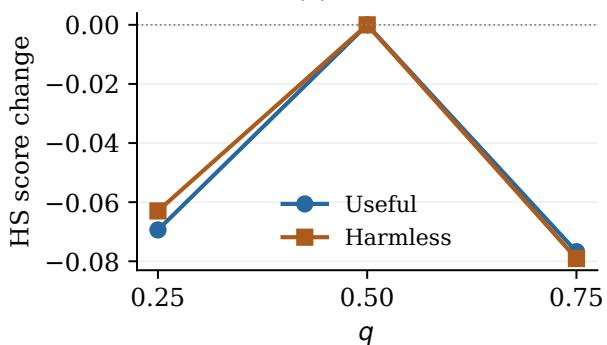

(b) $q = 0 . 5$  
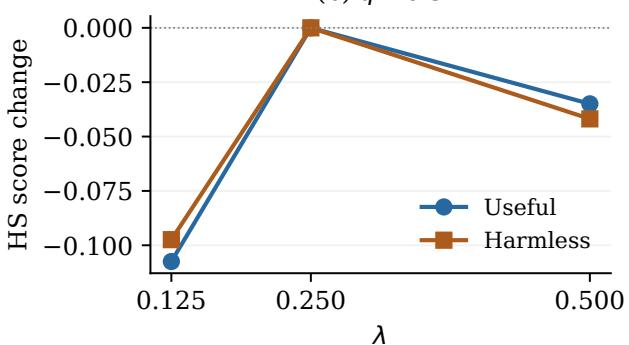

(c) $\lambda = 0 . 2 5$  
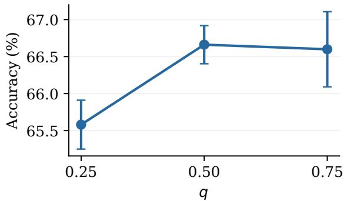  
(e) $\lambda = 0 . 2 5$

(d) $q = 0 . 5$  
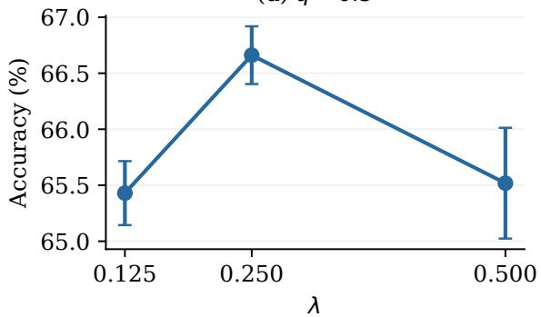  
(f) $q = 0 . 5$

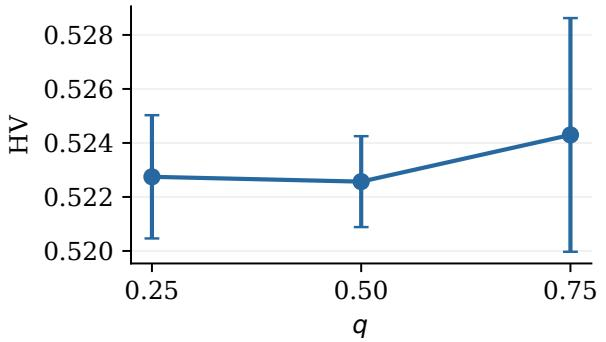

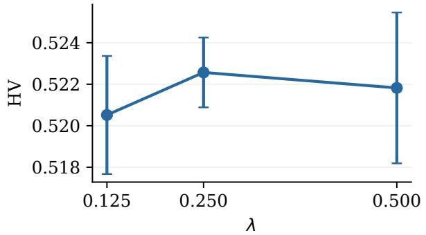  
Figure 5 Parameter sensitivity with one parameter varied at a time. (a–b) HS score changes relative to the default; raw scores appear in Table 10. (c–d) Full-budget mathematical accuracy. (e–f) Three-budget mathematical HV.

Table 12 Mathematical sensitivity at each token budget. Accuracy is in percent and length in tokens.
<table><tr><td></td><td></td><td colspan="2">2048</td><td colspan="2">4096</td><td colspan="2">8192</td></tr><tr><td>q</td><td>λ</td><td>Acc. ↑</td><td>Length ↓</td><td>Acc. ↑</td><td>Length ↓</td><td>Acc. ↑</td><td>Length ↓</td></tr><tr><td>0.25</td><td>0.25</td><td> $4 7 . 7 7 _ { \pm 0 . 4 0 }$ </td><td> $\mathbf { 1 } 3 7 4 . 0 _ { \pm 1 . 7 }$ </td><td> $5 9 . 3 1 _ { \pm 0 . 4 4 }$ </td><td> $2 0 1 5 . 2 _ { \pm 1 1 . 0 }$ </td><td> $6 5 . 5 8 _ { \pm 0 . 3 3 }$ </td><td> $2 4 2 5 . 4 _ { \pm 3 8 . 7 }$ </td></tr><tr><td>0.5</td><td>0.25</td><td> $4 7 . 0 4 _ { \pm 0 . 3 2 }$ </td><td> $1 4 0 6 . 3 _ { \pm 3 . 2 }$ </td><td> $5 9 . 0 0 _ { \pm 0 . 2 7 }$ </td><td> $2 0 7 5 . 9 _ { \pm 7 . 9 }$ </td><td> ${ \bf 6 6 . 6 6 _ { \pm 0 . 2 6 } }$ </td><td> $2 5 5 4 . 1 _ { \pm 2 1 . 8 }$ </td></tr><tr><td>0.75</td><td>0.25</td><td> $4 7 . 2 6 _ { \pm 0 . 6 1 }$ </td><td> $1 3 9 0 . 6 _ { \pm 3 . 2 }$ </td><td> $5 9 . 3 3 _ { \pm 0 . 3 6 }$ </td><td> $2 0 7 9 . 0 _ { \pm 1 9 . 7 }$ </td><td> $6 6 . 6 0 _ { \pm 0 . 5 1 }$ </td><td> $2 6 1 3 . 3 _ { \pm 1 2 . 8 }$ </td></tr><tr><td>0.5</td><td>0.125</td><td> $4 7 . 3 4 _ { \pm 0 . 4 9 }$ </td><td> $1 4 0 8 . 5 _ { \pm 3 . 1 }$ </td><td> ${ \bf 6 0 . 5 5 _ { \pm 0 . 7 7 } }$ </td><td> $2 0 3 5 . 7 _ { \pm 1 4 . 5 }$ </td><td> $6 5 . 4 3 _ { \pm 0 . 2 9 }$ </td><td> $2 4 1 3 . 8 _ { \pm 1 4 . 1 }$ </td></tr><tr><td>0.5</td><td>0.5</td><td> $4 7 . 2 7 _ { \pm 0 . 4 4 }$ </td><td> $1 3 8 0 . 7 _ { \pm 2 . 0 }$ </td><td> $5 9 . 4 4 _ { \pm 0 . 2 1 }$ </td><td> $2 0 3 1 . 8 _ { \pm 2 . 9 }$ </td><td> $6 5 . 5 2 _ { \pm 0 . 4 9 }$ </td><td> $2 4 3 4 . 3 _ { \pm 1 1 . 6 }$ </td></tr></table>

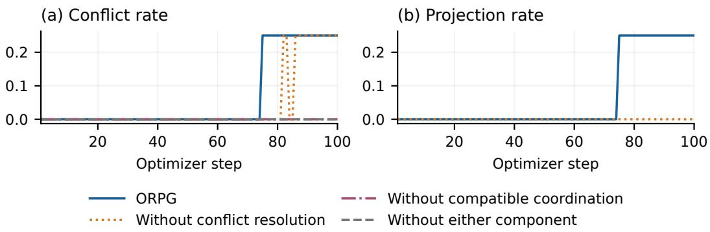

## E Training dynamics and measurements

## E.1 Additional training-gradient analysis

The measurements cover all 100 optimizer steps for the four component versions. Figure 4 presents gradient cosine and Useful RMS in the main text. Table 13 summarizes these signals together with conflict and projection rates over the same three training intervals.

Figure 6(a) shows when conflicting gradient pairs occur. The two versions retaining compatible coordination encounter conflicts later in training, while the other two record zero conflicts. Figure 6(b) shows that ORPG projects those pairs, whereas Without conflict resolution leaves them unprojected. A positive step-average cosine can coexist with conflicts on individual updates within that step.

Figure 6 Unsmoothed conflict and projection statistics. (a) Conflict rates for all four component versions; the two zero-conflict curves overlap. (b) Projection rates for ORPG and Without conflict resolution.  
Table 13 Training-stage gradient relationships and Useful advantage RMS. All versions use the same three step intervals.
<table><tr><td>Update</td><td>Steps</td><td>Cosine</td><td>Conflict</td><td>Projection</td><td>Useful RMS</td></tr><tr><td rowspan="3">ORPG</td><td>1-33</td><td>0.661</td><td>0.000</td><td>0.000</td><td>0.490</td></tr><tr><td>34-66</td><td>0.584</td><td>0.000</td><td>0.000</td><td>0.500</td></tr><tr><td>67-100</td><td>0.265</td><td>0.191</td><td>0.191</td><td>0.857</td></tr><tr><td rowspan="3">Without compatible coordination</td><td>1-33</td><td>0.690</td><td>0.000</td><td>0.000</td><td>0.492</td></tr><tr><td>34-66</td><td>0.616</td><td>0.000</td><td>0.000</td><td>0.488</td></tr><tr><td>67-100</td><td>0.522</td><td>0.000</td><td>0.000</td><td>0.507</td></tr><tr><td rowspan="3">Without conflict resolution</td><td>1-33</td><td>0.661</td><td>0.000</td><td>0.000</td><td>0.493</td></tr><tr><td>34-66</td><td>0.576</td><td>0.000</td><td>0.000</td><td>0.484</td></tr><tr><td>67-100</td><td>0.398</td><td>0.125</td><td>0.000</td><td>0.759</td></tr><tr><td rowspan="3">Without either component</td><td>1-33</td><td>0.692</td><td>0.000</td><td>0.000</td><td>0.493</td></tr><tr><td>34-66</td><td>0.619</td><td>0.000</td><td>0.000</td><td>0.485</td></tr><tr><td>67-100</td><td>0.523</td><td>0.000</td><td>0.000</td><td>0.504</td></tr></table>

Figure 7 supplements these relationships with the angle between the original sum and the compatible output. The statistic uses their normalized vector diference; conflict-branch calls contribute zero. The plot compares the two versions that apply compatible coordination.

## E.2 Training reward and advantage measurements

Training rewards are the calibrated Useful and Harmless values computed on the rollout batch. Evaluation reports raw reward-model scores on held-out prompts. The two quantities share objective meanings but have diferent scales and samples. For display, all reward curves average rewards across training runs at each step and then apply a trailing five-step mean. No variability band is inferred from temporal smoothing.

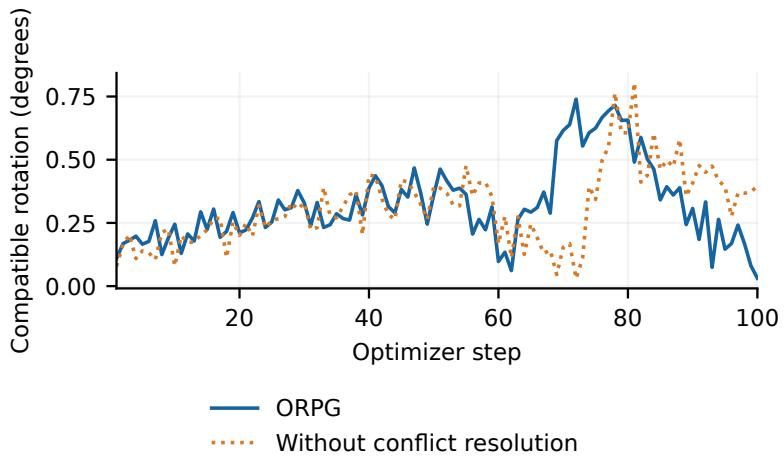  
Figure 7 Compatible-branch rotation for the two versions retaining compatible coordination. Values are unsmoothed step aggregates.

The component advantage RMS is the square root of the mean squared advantage over valid response tokens, recorded separately for each objective. All four component versions use shared-scale normalization and exact-zero handling. The values in Table 14 average steps 81–100 within each trajectory and then average actual training runs. The Useful RMS measurement is interpreted together with the observed Useful reward growth.

Table 14 Late-training calibrated rewards and Useful advantage RMS (steps 81–100).
<table><tr><td>Method</td><td>Useful</td><td>Harmless</td><td>Useful RMS</td></tr><tr><td>GDPO</td><td>1.1568</td><td>1.4582</td><td>一</td></tr><tr><td>GD²PO</td><td>1.1577</td><td>1.4620</td><td></td></tr><tr><td>Without either component</td><td>1.1532</td><td>1.7368</td><td>0.5207</td></tr><tr><td>Without compatible coordination</td><td>1.1738</td><td>1.7676</td><td>0.5278</td></tr><tr><td>Without conflict resolution</td><td>1.4924</td><td>1.9990</td><td>0.8600</td></tr><tr><td>ORPG</td><td>1.5217</td><td>2.0051</td><td>0.8868</td></tr></table>