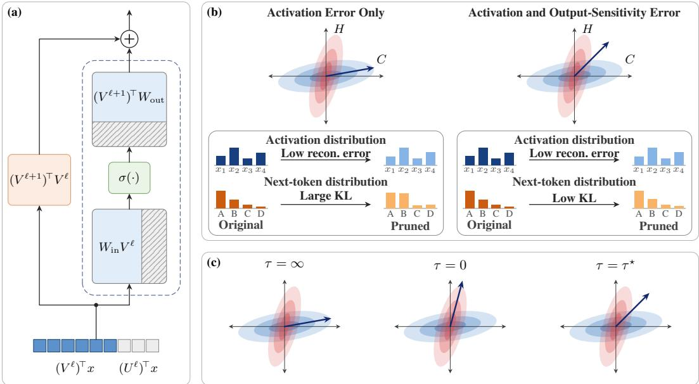
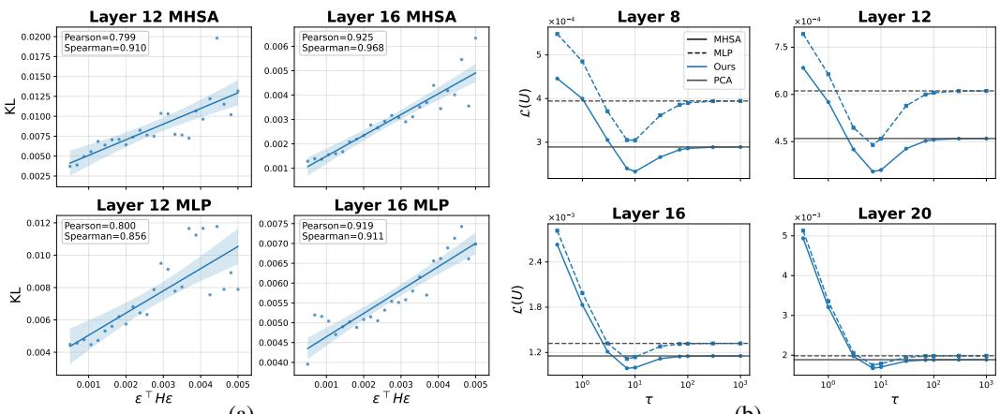
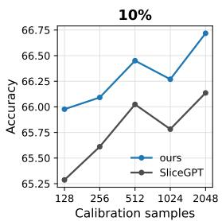
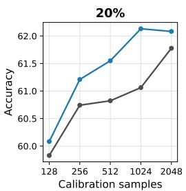
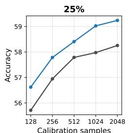
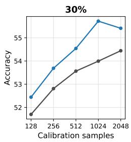
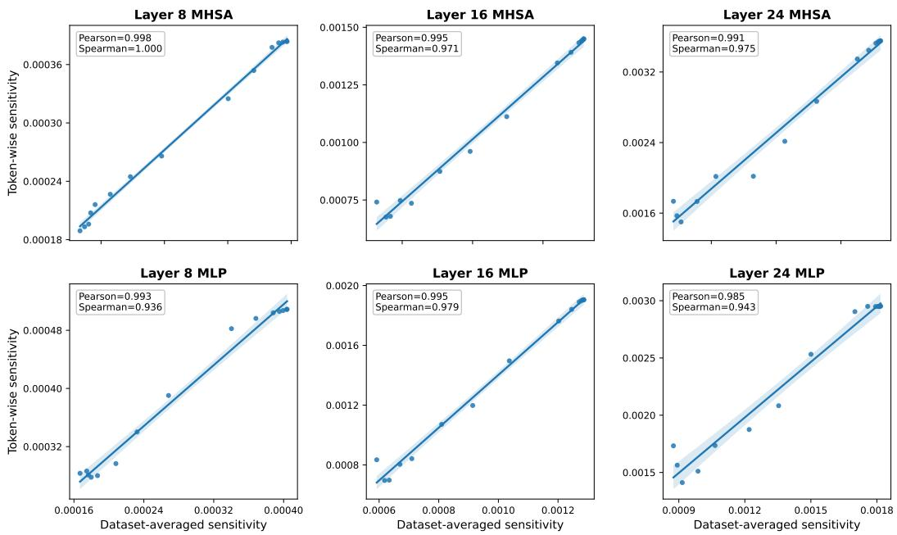

# OUTPUT-AWARE RESIDUAL STREAM PRUNING FOR LARGE LANGUAGE MODELS

Chayne Thrash, Kevin Chen & Soheil Kolouri Department of Computer Science Vanderbilt University Nashville, TN 37235, USA

{chayne.thrash,kevin.l.chen,soheil.kolouri}@vanderbilt.edu

## ABSTRACT

Residual stream pruning methods reduce inference cost by shrinking the model’s hidden dimension, but existing approaches typically choose these dimensions by minimizing activation reconstruction error. This criterion implicitly treats all perturbation directions as equally important, ignoring the sensitivity of downstream layers. We introduce a sensitivity-aware approach to residual-stream pruning that directly accounts for this direction-dependent sensitivity. Using a second-order approximation to the output KL divergence, we characterize the effect of a residual-stream perturbation through both its activation covariance and the local sensitivity of the model output. The resulting subspace selection objective couples these two quantities, but is difficult to optimize directly. We derive a tractable spectral upper bound that reduces subspace selection to an eigendecomposition of a sensitivity-weighted covariance matrix, retaining the efficiency and structural simplicity of rotation-based pruning methods. Across several instruction-tuned language model families, our method consistently reduces calibration KL divergence relative to activation-only pruning and improves perplexity and downstream task performance over a range of compression levels. Our results show that preserving activation energy alone is insufficient for residual-stream pruning, and that explicitly accounting for how perturbations propagate to the model output provides a more effective criterion for selecting dimensions to remove.

## 1 INTRODUCTION

The recent advancements in large language models (LLMs) (Brown et al., 2020; Grattafiori et al., 2024; Jiang et al., 2023; Abdin et al., 2024) have led to widespread adoption across a growing range of applications. At the same time, the increasing size of these models has made deployment increasingly expensive, motivating the development of smaller and more efficient models that retain strong performance on complex tasks.

A variety of techniques have been proposed to reduce the computational and memory requirements of LLMs. Quantization (Frantar et al., 2023; Lin et al., 2024) decreases memory requirements by reducing the number of bits used to represent model weights and activations. Low-rank approximation methods (Wang et al., 2025; Yuan et al., 2025) compress weight matrices using low-rank factorizations, while knowledge distillation (Gu et al., 2024) trains a smaller student model to mimic the behavior of a larger teacher. Structured pruning has also received considerable attention because it can directly reduce both model size and inference cost without requiring customized kernels or costly retraining.

Most structured pruning methods remove neurons, attention heads, or other structures within the self-attention and MLP blocks while leaving the residual-stream dimension unchanged. Residualstream pruning (Ashkboos et al., 2024), in contrast, directly reduces the input and output dimensions of these blocks. By exploiting the invariance of transformer layers to orthogonal changes of basis in the residual stream, such methods can identify and remove entire residual-stream directions while absorbing the corresponding rotations into adjacent linear layers. Ashkboos et al. (2024) selects these directions to minimize reconstruction error in the residual-stream activations. However, minimizing activation error alone does not account for how strongly downstream computations depend on the removed directions: two perturbations of similar magnitude can have substantially different effects on the model’s output distribution.

In this work, we introduce a sensitivity-aware approach to residual-stream pruning that balances the magnitude of the induced activation error with the sensitivity of the model’s output to that error. We derive our objective from a second-order approximation to the KL divergence between the output distributions of the original and pruned models, yielding a curvature-weighted measure of residualstream importance. Although directly optimizing this objective is difficult, we derive a tractable upper bound whose solution requires only a small number of eigendecompositions and can therefore be incorporated into existing residual-stream pruning pipelines. Across multiple model families and compression rates, our approach more effectively preserves the output distribution of the original model and consistently improves downstream performance over activation-only residual-stream pruning.

## 2 RELATED WORK

Pruning Large Language Models. The growing computational and memory requirements of large language models (LLMs) have motivated extensive work on post-training pruning. Classical approaches commonly rely on iterative pruning and retraining (Han et al., 2015; Frankle et al., 2020; Sanh et al., 2020), which becomes increasingly costly at LLM scale. Recent methods therefore emphasize one-shot pruning. SparseGPT (Frantar & Alistarh, 2023) scales second-order techniques such as Optimal Brain Surgeon (Hassibi & Stork, 1992) to billion-parameter models, while Wanda (Sun et al., 2024) combines weight and activation magnitudes. However, the resulting unstructured sparsity generally requires specialized kernels or hardware to realize inference speedups.

Structured pruning instead removes entire network components, directly reducing model size and computation. LLM-Pruner (Ma et al., 2023) uses first-order information to estimate the importance of coupled structures, while LLM-Surgeon (van der Ouderaa et al., 2024) applies a Kronecker factored empirical Fisher to prune rows and columns of weight matrices. Other methods use activation statistics or layerwise reconstruction objectives to remove channels, attention heads, or other internal structures (An et al., 2024; Kurtic et al., 2023; Meng et al., 2024). In contrast, SliceGPT (Ashkboos et al., 2024) reduces the dimensionality of the residual stream itself. Exploiting the rotational invariance of Transformer representations, it uses PCA to identify low-variance direction that can be removed, producing smaller dense weight matrices compatible with standard hardware. Our work builds on this framework by additionally accounting for the sensitivity of the model output when selecting residual-stream directions to remove.

Ouput-Aware Model Compression. A complementary line of work considers how compressioninduced perturbations affect model behavior. Many post-training methods optimize local quantities such as weight magnitude or activation reconstruction error, whereas sensitivity-aware approaches incorporate gradient or curvature information. LLM-Pruner (Ma et al., 2023) uses first-order Taylor approximations for structured importance estimation, while LLM-Surgeon (van der Ouderaa et al., 2024) and GFWSVD (Chekalina et al., 2026) use Kronecker-factored empirical Fisher approximations for structured pruning and low-rank compression, respectively.

More recent methods optimize objectives tied directly to changes in the model’s predictive distribution. YAQA (Tseng et al., 2026) derives a post-training quantization objective from a secondorder approximation to the full-model KL divergence. EvoPress (Sieberling et al., 2025) instead uses evolutionary search to optimize pruning and quantization configurations according to outputdistribution KL, with Tyr-the-pruner (Li et al., 2025) specializing this approach to structured prun-´ ing. Our approach is most closely related to YAQA: we use second-order sensitivity information to approximate changes in the model’s output distribution and combine it with activation statistics to identify residual-stream directions that can be removed with minimal effect on model behavior.

  
Figure 1: Overview of our structured residual-stream pruning method. (a) We remove residualstream dimensions by rotating unimportant directions into removable coordinates, allowing corresponding columns and rows of the attention and MLP weight matrices to be deleted. (b) Directions are selected using both activation variance and output sensitivity. (c) Our objective balances activation reconstruction and output sensitivity through τ, interpolating between the two extremes.

## 3 METHOD

In this section, we present an output-sensitive approach to residual-stream pruning for large language models. An overview of both residual stream pruning and our proposed method can be seen in Figure 1. We first describe residual stream pruning and review the objective used by SliceGPT. We then derive an objective that incorporates both activation reconstruction error and the sensitivity of the model output to removed directions. Finally, we introduce an efficient approximation that generates candidate pruning bases using only a small number of eigendecompositions.

## 3.1 RESIDUAL-STREAM PRUNING

Orthogonal transformations may be merged into the linear layers along the residual stream allowing for arbitrary rotations to be applied to the activations. We review this reparameterization in $\mathsf { A p - }$ pendix B. This invariance can be used to identify bases in which selected directions of the residual stream can be removed with minimal impact on model performance. Formally, let

$$
Q = [ V \quad U ] \in \mathbb { R } ^ { d \times d } , \qquad V \in \mathbb { R } ^ { d \times ( d - k ) } , \quad U \in \mathbb { R } ^ { d \times k } ,
$$

where V spans the directions retained after pruning and U spans those to be removed.

Removing the U-coordinates leaves the reduced representation $V ^ { \top } x \in \mathbb { R } ^ { d - k }$ . Because the associated projections can be absorbed into adjacent linear layers, the truncation reduces the physical width of the model, yielding smaller dense weight matrices.

Due to the residual connection, this construction requires a common orthogonal basis throughout the network. To allow for layer-dependent orthogonal bases, a transition matrix

$$
\left( V ^ { \ell + 1 } \right) ^ { \top } V ^ { \ell } \in \mathbb { R } ^ { ( d - k ) \times ( d - k ) } .
$$

is applied along the residual connection. These transition matrices introduce additional storage and computation along the residual path. Their cost, however, scales as $\mathcal { O } \big ( ( d - k ) ^ { 2 } \big )$ and decreases quadratically with the retained width.

  
(a)  
(b)  
Figure 2: Validation of the proposed approach on Llama 3.2 3B. (a) measures the correlation between our sensitivity approximation with KL. We fix activation reconstruction error to the error induced at 25% pruning rate and vary perturbation direction. (b) shows the value of Equation 3 attained for bases which minimize Equation 5 for various values of τ. Results are shown across different layers at a pruning rate of 25%. We compare with the loss achieved by the SliceGPT solution.

## 4 DIRECTION SELECTION IN SLICEGPT

The remaining question is how to determine which directions should be removed. SliceGPT (Ashkboos et al., 2024) selects directions whose removal minimizes the activation reconstruction error on a calibration set. Let $s \sim \mathcal { D } _ { \mathrm { c a l } }$ denote a calibration sequence and let $x _ { i } \in \mathbb { R } ^ { d }$ be the activation associated with its i-th token at a fixed layer. Define the activation second-moment matrix

$$
C = \mathbb { E } _ { s \sim \mathcal { D } _ { \mathrm { c a l } } } \left[ \frac { 1 } { | s | } \sum _ { i = 1 } ^ { | s | } x _ { i } x _ { i } ^ { \top } \right] .
$$

As shown in Appendix A.1, this selection problem corresponds to uncentered PCA of the residualstream activations: V spans the d − k leading principal directions retained by the model, while U spans the k trailing directions to be removed. Equivalently, U solves

$$
\operatorname* { m i n } _ { U \in \mathbb { R } ^ { d \times k } } \mathcal { L } _ { \mathrm { S G } } ( U ) = \mathrm { T r } \big ( U ^ { \top } C U \big ) .\tag{1}
$$

This objective measures only the activation energy discarded at the current layer, without accounting for how perturbations along different directions are amplified or attenuated downstream. We address this limitation next by deriving an efficient layer-wise criterion that incorporates downstream sensitivity into the direction-selection objective.

## 4.1 SENSITIVITY-AWARE DIRECTION SELECTION

SliceGPT selects the removed subspace by minimizing the activation energy discarded at each layer. We instead select this subspace according to the effect of the resulting perturbation on the model output. Let $\mathcal { U } = \{ U ^ { \ell } \} _ { \ell = 1 } ^ { L }$ denote the collection of removed subspaces across the L pruned blocks. If ˆθ(U) denotes the parameters of the resulting pruned model, the ideal objective is

$$
\operatorname* { m i n } _ { \mathcal { U } } \mathbb { E } _ { s \sim \mathcal { D } _ { \mathrm { c a l } } } \left[ D _ { \mathrm { K L } } \Big ( p _ { \theta } ( \cdot \mid s ) \| p _ { \hat { \theta } ( \mathcal { U } ) } ( \cdot \mid s ) \Big ) \right] ,
$$

where $p _ { \theta } ( \cdot \mid s )$ denotes the predictive distribution of the original model. Jointly optimizing this objective over all pruning bases requires repeated end-to-end evaluations of the pruned model. We therefore construct a layerwise surrogate from the local output sensitivity of the unpruned model.

Fix a layer and suppress its layer index for clarity. Let $x _ { i } \in \mathbb { R } ^ { d }$ be the residual-stream activation associated with token i in a calibration sequence s. For a perturbed activation $\hat { x } _ { i } \in \mathbb { R } ^ { d }$ , let $p _ { \theta } ( \cdot \ |$

$s ; { \hat { x } } _ { i } )$ denote the predictive distribution obtained by replacing $x _ { i }$ with $\hat { x } _ { i }$ while leaving all other activations and model parameters unchanged. Define

$$
D _ { i } ( \hat { x } _ { i } ; s ) = D _ { \mathrm { K L } } ( p _ { \theta } ( \cdot \mid s ) \parallel p _ { \theta } ( \cdot \mid s ; \hat { x } _ { i } ) ) .
$$

Assuming $D _ { i }$ is twice differentiable at ${ \hat { x } } _ { i } = x _ { i }$ , its local expansion is

$$
D _ { i } ( \hat { x } _ { i } ; s ) = \frac { 1 } { 2 } ( \hat { x } _ { i } - x _ { i } ) ^ { \top } H _ { i } ( s ) ( \hat { x } _ { i } - x _ { i } ) + o \big ( \| \hat { x } _ { i } - x _ { i } \| _ { 2 } ^ { 2 } \big ) ,
$$

where $H _ { i } ( s ) = \left. \nabla _ { \hat { x } _ { i } } ^ { 2 } D _ { i } ( \hat { x } _ { i } ; s ) \right| _ { \hat { x } _ { i } = x _ { i } } \in \mathbb { R } ^ { d \times d }$ . The constant and first-order terms vanish because $D _ { i } ( x _ { i } ; s ) = 0$ is a minimum of the KL divergence. Under the usual regularity conditions, $H _ { i } ( s )$ is the Fisher information matrix with respect to the intervened activation.

Perturbing all token activations jointly yields a Hessian over the concatenated sequence representation requiring storage of $| s | ^ { 2 } \ v _ { d } \times \bar { d }$ matrices per sequence which is impractical. We therefore discard the cross-token blocks. Together with our layerwise treatment, this amounts to neglecting both cross-token and cross-layer curvature interactions.

Let $U \in \mathbb { R } ^ { d \times k }$ , with $U ^ { \top } U = I _ { k }$ , span the subspace removed at the current layer. Orthogonal projection onto the retained subspace gives

$$
\begin{array} { r } { \hat { x } _ { i } = \left( I _ { d } - U U ^ { \top } \right) x _ { i } , \qquad x _ { i } - \hat { x } _ { i } = U U ^ { \top } x _ { i } . } \end{array}
$$

Substituting this perturbation into the token-separable quadratic approximation and omitting the constant factor $1 / 2$ gives

$$
\begin{array} { r l } & { \mathcal { L } _ { \mathrm { l o c a l } } ( U ) = \mathbb { E } _ { s \sim \mathcal { D } _ { \mathrm { c a l } } } \left[ \frac { 1 } { | s | } { \displaystyle \sum _ { i = 1 } ^ { | s | } } ( U U ^ { \top } x _ { i } ) ^ { \top } H _ { i } ( s ) ( U U ^ { \top } x _ { i } ) \right] } \\ & { \qquad = \mathbb { E } _ { s \sim \mathcal { D } _ { \mathrm { c a l } } } \left[ \frac { 1 } { | s | } { \displaystyle \sum _ { i = 1 } ^ { | s | } } { \mathrm { T r } \big ( } U ^ { \top } x _ { i } x _ { i } ^ { \top } U U ^ { \top } H _ { i } ( s ) U \big ) \right] . } \end{array}\tag{2}
$$

Using token-specific curvature in a deterministic optimization procedure would require storing or repeatedly recomputing a $d \times d$ matrix for every calibration token. We therefore replace $H _ { i } ( s )$ by the shared layerwise curvature

$$
H = \mathbb { E } _ { s \sim \mathcal { D } _ { \mathrm { c a l } } } \left[ \frac { 1 } { | s | } \sum _ { i = 1 } ^ { | s | } H _ { i } ( s ) \right] .
$$

This approximation removes the token dependence of the curvature and therefore discards correla tions between the activation outer products $x _ { i } x _ { i } ^ { \top }$ and their corresponding curvature matrices $H _ { i } ( s )$ Substituting the shared curvature H into equation 2 yields our final direction-selection objective:

$$
\operatorname* { m i n } _ { U \in \mathbb { R } ^ { d \times k } } \mathcal { L } ( U ) = \mathrm { T r } \big ( U ^ { \top } C U U ^ { \top } H U \big ) ,\tag{3}
$$

The objective requires storing only the two $d \times d$ layerwise statistics C and $H ,$ , with H being the only additional matrix relative to SliceGPT. Additionally, when $H = I _ { d } ,$ , the orthonormality of U exactly recovers equation 1 which is the SliceGPT objective. We additionally examine whether H captures directions to which the model output is particularly sensitive in Figure 2a. Holding activation reconstruction error fixed and varying only the perturbation direction, we observe that directions assigned larger error by the curvature estimate generally induce larger KL divergence. This suggests that H captures output sensitivity that cannot be distinguished using reconstruction error alone.

Optimizing this objective for a general positive semidefinite H, however, equation 3 does not reduce directly to a standard eigenspace problem. Although it can be addressed through iterative optimization on the Stiefel manifold, doing so introduces substantial computational overhead. In the following section, we derive a spectral upper bound that yields a tractable approximation using only a small number of eigendecompositions.

## 4.2 EFFICIENT APPROXIMATION OF THE OBJECTIVE AND ITS THEORETICAL ANALYSIS

Directly minimizing equation 3 over a multidimensional subspace is nontrivial. We first consider removing a single unit direction $u ,$ for which the loss becomes ${ \mathcal { L } } ( u ) = ( u ^ { \top } C u ) ( u ^ { \top } H u )$ We show that this problem admits an equivalent spectral formulation, reducing its solution to a onedimensional search over the smallest eigenvalue of a weighted sum of $C$ and $H$ . This exact rankone characterization motivates our extension to higher-dimensional pruning subspaces. We defer all proofs to Appendix A

Proposition 1. Let $C , H \in \mathbb { R } ^ { d \times d }$ be symmetric positive semidefinite matrices. Then

$$
\operatorname* { m i n } _ { \boldsymbol u \in \mathbb { R } ^ { d } \atop | | \boldsymbol u | | _ { 2 } = 1 } ( \boldsymbol u ^ { \top } \boldsymbol C u ) ( \boldsymbol u ^ { \top } H \boldsymbol u ) = \frac { 1 } { 4 } \operatorname* { i n f } _ { \boldsymbol \tau > 0 } \left[ \lambda _ { \mathrm { m i n } } \big ( \boldsymbol \tau \boldsymbol C + \boldsymbol \tau ^ { - 1 } H \big ) \right] ^ { 2 } .\tag{4}
$$

If C, $H \succ 0 ,$ the infimum is attained at some $\tau _ { \star } > 0 ;$ , and any unit eigenvector associated with the smallest eigenvalue of $\tau _ { \star } C + \tau _ { \star } ^ { - 1 } H$ globally minimizes the rank-one pruning objective.

Motivated by this exact rank-one characterization, we extend the spectral construction to removing a k-dimensional subspace. For each $\tau > 0$ , we form $U$ from the eigenvectors associated with the $k$ smallest eigenvalues of $M _ { \tau } = \tau C + \tau ^ { - 1 } H$ . We show that this basis minimizes an upper bound on the loss in equation 3. Equivalently, it minimizes a regularized version of ${ \mathcal { L } } ( U )$ , with a nonnegative regularization term equal to the gap between the upper bound and the original loss.

Proposition 2. Let $C , H \in \mathbb { R } ^ { d \times d }$ be symmetric positive semidefinite matrices, and let $1 \leq k \leq d .$ For every $\tau > 0 _ { : }$ , define $M _ { \tau } = \tau C + \tau ^ { - 1 } H$ . Then, for any $U \in \mathbb { R } ^ { d \times k }$ satisfying $U ^ { \top } U = I _ { k }$

$$
\mathcal { L } ( U ) = \mathrm { T r } \big ( U ^ { \top } C U U ^ { \top } H U \big ) \leq \underbrace { \frac { 1 } { 4 } \mathrm { T r } \big ( U ^ { \top } M _ { \tau } ^ { 2 } U \big ) } _ { B _ { \tau } ( U ) } .\tag{5}
$$

For fixed $\tau ,$ , this upper bound is globally minimized by choosing the columns of U as eigenvectors associated with the k smallest eigenvalues of $M _ { \tau } ,$ , yielding

$$
\operatorname* { m i n } _ { U ^ { \top } U = I _ { k } } \mathcal { B } _ { \tau } ( U ) = \frac { 1 } { 4 } \sum _ { j = 1 } ^ { k } \lambda _ { j } ( M _ { \tau } ) ^ { 2 } ,\tag{6}
$$

where the eigenvalues are ordered increasingly.

We next show that jointly optimizing this upper bound over U and τ is equivalent to minimizing the original loss ${ \mathcal { L } } ( U )$ augmented by the regularization term $\| U ^ { \top } C U \| _ { F } \| \dot { U } ^ { \top } H U \| _ { F }$ , which couples activation energy and output sensitivity within the removed subspace.

Proposition 3. Let $C , H \in \mathbb { R } ^ { d \times d }$ be symmetric positive semidefinite matrices, and define $M _ { \tau } =$ $\tau C { \dot { + } } \tau ^ { - 1 } H$ . For $1 \leq k \leq d ,$

$$
\frac { 1 } { 4 } \operatorname* { i n f } _ { \tau > 0 } \sum _ { j = 1 } ^ { k } \lambda _ { j } ( M _ { \tau } ) ^ { 2 } = \operatorname* { m i n } _ { U ^ { \top } U = I _ { k } } \Big [ \frac { 1 } { 2 } \mathcal { L } ( U ) + \frac { 1 } { 2 } \| U ^ { \top } C U \| _ { F } \| U ^ { \top } H U \| _ { F } \Big ] ,\tag{7}
$$

where the eigenvalues are ordered increasingly. $I f C , H \succ 0 ,$ , the infimum is attained.

Thus, jointly optimizing the spectral upper bound over the subspace and the scale τ yields the equivalent regularized problem

$$
\operatorname * { a r g m i n } _ { U ^ { \top } U = I _ { k } } \left[ \mathcal { L } ( U ) + \Vert U ^ { \top } C U \Vert _ { F } \Vert U ^ { \top } H U \Vert _ { F } \right] ,\tag{8}
$$

where the commonfactor $1 / 2$ has been omitted.

These results suggest a tractable eigendecomposition approximation to the original pruning objective. While the rank-one case is solved exactly, the higher-dimensional construction minimizes an upper bound that can be interpreted as a regularized form of the desired loss. This yields an efficient basis construction approach described next.

Table 1: Comparison across model families and compression rates. We report KL divergence, perplexity (PPL), and average downstream accuracy (Acc.).
<table><tr><td rowspan="3">Sparsity Method</td><td rowspan="3"></td><td colspan="6">Llama-3.x Instruct</td><td colspan="6">Mistral Instruct</td><td colspan="3">Phi-3 Instruct</td></tr><tr><td colspan="3">3.2 3B</td><td colspan="3">3.1 8B</td><td colspan="3">7B v0.3</td><td colspan="3">Nemo</td><td colspan="3">Medium</td></tr><tr><td> $\scriptstyle \mathbf { D } _ { \mathrm { K L } }$ </td><td>PPL</td><td>Acc.</td><td> $\scriptstyle \mathbf { D } _ { \mathrm { K L } }$ </td><td>PPL</td><td>Acc.</td><td> $\scriptstyle \mathbf { D } _ { \mathrm { K L } }$ </td><td>PPL</td><td>Acc.</td><td> $\scriptstyle \mathbf { D } _ { \mathrm { K L } }$ </td><td>PPL</td><td>Acc.</td><td> $\scriptstyle \mathbf { D } _ { \mathrm { K L } }$ </td><td>PPL</td><td>Acc.</td></tr><tr><td>0%</td><td>N/A</td><td>0.0</td><td>11.76</td><td>60.55</td><td>0.0</td><td>7.21</td><td>68.53</td><td>0.0</td><td>5.49</td><td>69.72</td><td>0.0</td><td>6.09</td><td>70.05</td><td>0.0</td><td>4.30</td><td>72.95</td></tr><tr><td rowspan="2">10%</td><td>SliceGPT</td><td>0.5059</td><td>19.90</td><td>58.11</td><td>0.7507</td><td>15.63</td><td>65.78</td><td>0.1944</td><td>6.58</td><td>67.91</td><td>0.2791</td><td>8.11</td><td>67.06</td><td>0.5192</td><td>6.38</td><td>72.84</td></tr><tr><td>Ours</td><td>0.2017</td><td>14.30</td><td>58.53</td><td>0.4040</td><td>11.04</td><td>66.27</td><td>0.1737</td><td>6.47</td><td>68.02</td><td>0.2170</td><td>7.62</td><td>67.76</td><td>0.4373</td><td>6.05</td><td>72.56</td></tr><tr><td rowspan="2">20%</td><td>SliceGPT</td><td>0.9729</td><td>31.40</td><td>53.49</td><td>1.3165</td><td>27.87</td><td>61.06</td><td>0.4883</td><td>8.75</td><td>64.25</td><td>0.5991</td><td>11.23</td><td>62.28</td><td>1.0421</td><td>10.68</td><td>68.63</td></tr><tr><td>Ours</td><td>0.5139</td><td>19.67</td><td>54.92</td><td>0.8820</td><td>18.04</td><td>62.13</td><td>0.4626</td><td>8.58</td><td>65.02</td><td>0.5254</td><td>10.44</td><td>62.92</td><td>0.8021</td><td>8.43</td><td>69.54</td></tr><tr><td rowspan="2">25%</td><td>SliceGPT</td><td>1.2568</td><td>42.54</td><td>50.57</td><td>1.6814</td><td>40.24</td><td>57.97</td><td>0.7065</td><td>10.81</td><td>61.23</td><td>0.8002</td><td>13.73</td><td>58.92</td><td>1.2801</td><td>13.56</td><td>65.17</td></tr><tr><td>Ours</td><td>0.7290</td><td>24.37</td><td>51.95</td><td>1.1569</td><td>23.79</td><td>59.02</td><td>0.6711</td><td>10.52</td><td>62.52</td><td>0.6982</td><td>12.40</td><td>60.02</td><td>1.0074</td><td>10.27</td><td>67.58</td></tr><tr><td rowspan="2">30%</td><td>SliceGPT</td><td>1.5830</td><td>57.17</td><td>47.40</td><td>2.0086</td><td>55.90</td><td>53.99</td><td>0.9751</td><td>14.06</td><td>57.40</td><td>1.0526</td><td>17.66</td><td>54.03</td><td>1.4912</td><td>16.74</td><td>61.78</td></tr><tr><td>Ours</td><td>0.9435</td><td>30.14</td><td>49.43</td><td>1.4304</td><td>31.32</td><td>55.72</td><td>0.9140</td><td>13.34</td><td>59.30</td><td>0.8931</td><td>15.04</td><td>55.80</td><td>1.2336</td><td>12.84</td><td>64.90</td></tr></table>

Table 2: Comparison of SliceGPT and our method on mathematical reasoning and instruction following tasks. For IFEval, we report strict prompt-level (Prompt) and instruction-level (Inst.) accuracy. For GSM8K, we report strict extraction accuracy for Llama models and flexible extraction for Mistral. All results are reported as percentages.
<table><tr><td rowspan="2">Sparsity Method</td><td rowspan="2"></td><td colspan="3">Llama-3.2 3B Instruct</td><td colspan="3">Llama-3.1 8B Instruct</td><td colspan="3">Mistral Nemo Instruct</td></tr><tr><td colspan="2">IFEval</td><td>GSM8K</td><td colspan="2">IFEval</td><td>GSM8K</td><td colspan="2">IFEval</td><td>GSM8K</td></tr><tr><td></td><td></td><td>Prompt</td><td>t Inst.</td><td>Strict</td><td>Prompt</td><td>Inst.</td><td>Strict</td><td>Prompt</td><td>Inst.</td><td>Flexible</td></tr><tr><td>0%</td><td>N/A</td><td>71.4</td><td>79.5</td><td>76.6</td><td>74.5</td><td>81.8</td><td>85.3</td><td>56.0</td><td>67.4</td><td>80.0</td></tr><tr><td rowspan="2">10%</td><td>SliceGPT Ours</td><td>58.8</td><td>69.3</td><td>66.0</td><td>63.4</td><td>72.4</td><td>80.3</td><td>52.7</td><td>63.1</td><td>77.2</td></tr><tr><td></td><td>63.4</td><td>73.9</td><td>69.7</td><td>65.8</td><td>75.7</td><td>81.4</td><td>54.7</td><td>65.4</td><td>78.5</td></tr><tr><td rowspan="2">20%</td><td>SliceGPT Ours</td><td>50.5</td><td>62.4</td><td>61.6</td><td>54.2</td><td>66.0</td><td>74.0</td><td>47.3</td><td>58.4</td><td>67.1</td></tr><tr><td></td><td>56.2</td><td>67.5</td><td>64.8</td><td>56.8</td><td>67.5</td><td>75.1</td><td>47.9</td><td>60.4</td><td>69.1</td></tr><tr><td rowspan="2">25%</td><td>SliceGPT Ours</td><td>49.7</td><td>56.1</td><td>54.7</td><td>47.3</td><td>60.1</td><td>63.3</td><td>38.8</td><td>51.4</td><td>55.7</td></tr><tr><td></td><td>51.0</td><td>61.5</td><td>60.1</td><td>51.8</td><td>61.8</td><td>65.8</td><td>45.8</td><td>57.0</td><td>61.7</td></tr><tr><td rowspan="2">30%</td><td>SliceGPT</td><td>37.5</td><td>51.0</td><td>47.1</td><td>42.7</td><td>52.3</td><td>52.8 55.1</td><td>30.9</td><td>44.4</td><td>42.2</td></tr><tr><td>Ours</td><td>44.9</td><td>55.0</td><td>51.1</td><td>44.2</td><td>56.2</td><td></td><td>37.5</td><td>50.0</td><td>47.5</td></tr></table>

Candidate selection. The preceding analysis motivates a spectral family of candidate subspaces, which we evaluate using the original objective. Given a grid $\mathbf { \dot { \mathcal { T } } } = \{ \tau _ { j } \} _ { j = 1 } ^ { n } \subset ( 0 , \infty )$ , we compute

$$
U _ { j } = \mathrm { e i g } _ { \mathrm { m i n } , k } ( M _ { \tau _ { j } } ) , \qquad j = 1 , \ldots , n ,
$$

and select $U _ { j ^ { \star } }$ , where

$$
j ^ { \star } \in \underset { 1 \leq j \leq n } { \arg \operatorname* { m i n } } \mathcal { L } ( U _ { j } ) = \underset { 1 \leq j \leq n } { \arg \operatorname* { m i n } } \mathrm { T r } \big ( U _ { j } ^ { \top } C U _ { j } U _ { j } ^ { \top } H U _ { j } \big ) .
$$

This procedure requires n independent eigendecompositions, which can be parallelized to reduce wall-clock time at the cost of additional memory. In our experiments, a grid of $n = 5$ values of τ is sufficient to achieve strong performance.

We validate the candidate construction approach in Figure 2b. Candidates obtained by minimizing ${ \cal B } _ { \tau } ( U )$ across different values of τ attain substantially different values of the original objective ${ \mathcal { L } } ( U )$ , and an appropriate choice of τ consistently yields lower ${ \mathcal { L } } ( U )$ than the SliceGPT solution based only on C, supporting the use of minimizing $\dot { B } _ { \tau } ( U )$ as an efficient mechanism for generating candidate subspaces.

## 5 EXPERIMENTS

We evaluate our method across five instruction-tuned LLMs from three model families. Our primary baseline is SliceGPT (Ashkboos et al., 2024), the most directly related residual-stream pruning method, with additional comparisons to structured approaches that prune components within the attention and MLP blocks. Implementation details are provided in Appendix C.

Calibration samples  

  
Figure 3: Average common-sense reasoning performance of the proposed method and SliceGPT using varying numbers of calibration samples on Llama-3.1 8B Instruct.

We evaluate language modeling, common-sense reasoning, and generative performance. For language modeling, we use WikiText-2 (Merity et al., 2017) and, following Tseng et al. (2026), report perplexity (PPL) and KL divergence from the original model. Common-sense reasoning is evaluated on WinoGrande (Sakaguchi et al., 2021), MMLU (Hendrycks et al., 2021), ARC-Easy and ARC Challenge (Boratko et al., 2018), HellaSwag (Zellers et al., 2019), OpenBookQA (Mihaylov et al., 2018), and PIQA (Bisk et al., 2020). Generative evaluation uses GSM8K (Cobbe et al., 2021) and IFEval (Zhou et al., 2023).

For language modeling and common-sense reasoning, we calibrate using 1,024 FineWeb-Edu (Penedo et al., 2024) sequences of 2,048 tokens. For generative tasks, we instead use 1,024 Tulu3 (Lambert et al., 2025) user–assistant examples with the same maximum sequence length. Because free-form generation may exhibit different output sensitivities than language-modeling data, we compute the sensitivity objective only over assistant-response tokens, so the estimated KL sen sitivity reflects perturbations to generated outputs.

Language modeling and common-sense reasoning results We compare our method with SliceGPT across sparsity ratios of 10%, 20%, 25%, and 30%, where sparsity denotes the fraction of the residual-stream hidden dimension removed. Table 1 reports language modeling and commonsense reasoning performance across the Llama (Grattafiori et al., 2024), Mistral (Jiang et al., 2023), and Phi (Abdin et al., 2024) model families. Our method consistently better preserves the behavior of the original model, achieving lower KL divergence and perplexity than SliceGPT across every model and compression rate evaluated. These improvements also generally translate to downstream performance: our method achieves higher average common-sense reasoning accuracy in almost all settings. The benefit of incorporating output sensitivity becomes particularly pronounced as the compression rate increases. For example, at 30% sparsity, the perplexity of Llama-3.2-3B is reduced from 57.17 with SliceGPT to 30.14 with our method, while average accuracy improves from 47.40 to 49.43. Improvements are also observed across both Mistral models and Phi-3 Medium, demonstrating that the proposed criterion generalizes across different model families.

Mathematical Reasoning and Instruction-Following. We additionally compare our method with SliceGPT on mathematical reasoning and instruction-following across multiple sparsity levels. Results for the instruction-tuned Llama-3.2-3B, Llama-3.1-8B, and Mistral-Nemo models are reported in Table 2. Across all settings, our method better preserves both mathematical reasoning and instruction-following performance, with the gap generally increasing at higher sparsity. These results provide further evidence that preserving the model’s output distribution helps retain capabilities beyond next-token prediction, including mathematical reasoning and instruction following.

Effect of calibration set size Post-training pruning performance depends on the calibration data used. In our main experiments, we use 1,024 calibration sequences for all methods. To evaluate sensitivity to calibration set size, we vary the number of FineWeb-Edu sequences and measure average common-sense reasoning accuracy across multiple sparsity rates. As shown in Figure 3, our method consistently outperforms SliceGPT across all settings. Both methods generally benefit from additional data, with the largest gains occurring between 128 and 512–1,024 sequences. Beyond

1,024 sequences, improvements are small and occasionally non-monotonic, suggesting that 1,024 samples are sufficient for stable pruning decisions in this setting.  
Table 3: Effect of additional optimization of L(U) on Llama-3.1-8B-Instruct. Dcal and $D _ { \mathrm { K L } } ^ { \mathrm { w i k i } }$ denote KL divergence on the calibration data and WikiText-2 test set, respectively.
<table><tr><td>Sparsity Add. Opt.</td><td></td><td>D cal KL</td><td>D wiki KL</td><td>PPL</td><td>Avg. Acc.</td></tr><tr><td rowspan="2">10%</td><td>×</td><td>0.1369</td><td>0.4040</td><td>11.04</td><td>66.27</td></tr><tr><td>√</td><td>0.1371</td><td>0.4038</td><td>11.11</td><td>66.37</td></tr><tr><td rowspan="2">20%</td><td>X</td><td>0.3289</td><td>0.8820</td><td>18.04</td><td>62.13</td></tr><tr><td>√</td><td>0.3252</td><td>0.9178</td><td>18.75</td><td>62.73</td></tr><tr><td rowspan="2">25%</td><td>X</td><td>0.4611</td><td>1.1569</td><td>23.79</td><td>59.02</td></tr><tr><td>√</td><td>0.4520</td><td>1.1856</td><td>24.57</td><td>59.44</td></tr><tr><td rowspan="2">30%</td><td>X</td><td>0.6206</td><td>1.4304</td><td>31.32</td><td>55.72</td></tr><tr><td>√</td><td>0.6059</td><td>1.4487</td><td>31.91</td><td>55.99</td></tr></table>

Effect of additional optimization. The selected subspace to remove comes from minimizing an upper bound of the desired objective rather than Equation 3 itself. We thus investigate whether further optimizing the selected subspace improves downstream performance. Table 3 shows the results of this experiment using 10,000 optimization steps per pruning site. As can be seen, additional optimization yields only small reductions in calibration KL and modest accuracy improvements. This suggests that the spectral candidate selection already produces a strong solution and that further minimizing the calibration objective provides limited benefit.

Table 4: Calibration runtime (HH:MM) comparison on a single NVIDIA H100 GPU. Direction selection includes layerwise covariance accumulation and pruning-basis construction.
<table><tr><td>Model</td><td>Method</td><td>Sensitivity Estimation</td><td>Direction Selection</td><td>Total</td></tr><tr><td></td><td>Llama-3.1 SliceGPT</td><td></td><td>01:03</td><td>01:03</td></tr><tr><td>8B</td><td>Ours</td><td>00:09</td><td>01:05</td><td>01:14</td></tr><tr><td>Phi-3</td><td>SliceGPT</td><td></td><td>01:57</td><td>01:57</td></tr><tr><td>Medium</td><td>Ours</td><td>00:18</td><td>02:01</td><td>02:19</td></tr></table>

Calibration time comparison. Our method adds two sources of overhead relative to SliceGPT: sensitivity estimation and additional eigendecompositions during pruning-direction selection. Table 4 reports calibration runtimes. For both methods, runtime is dominated by direction selection, largely due to double-precision activation covariance accumulation. On Llama-3.1-8B, sensitivity estimation takes 9 minutes, accounting for only 12% of our total calibration time, while the additional eigendecompositions add comparatively little overhead. Overall, calibration time increases only modestly with the incorporation of output sensitivity.

Table 5: Average common-sense reasoning accuracy of additional structured pruning methods on Llama-3.1-8B-Instruct across pruning rates.
<table><tr><td>Method</td><td>10%</td><td>20%</td><td>25%</td><td>30%</td></tr><tr><td>LLM-Pruner OSSCAR</td><td>62.91 64.51</td><td>53.97 58.74</td><td>45.08 55.16</td><td>42.98 46.27</td></tr><tr><td>Wanda-sp</td><td>65.96</td><td>59.58</td><td>52.91</td><td>49.78</td></tr><tr><td>FLAP</td><td>63.59</td><td>58.14</td><td>53.72</td><td>51.21</td></tr><tr><td>SliceGPT Ours</td><td>65.78 66.27</td><td>61.06 62.13 59.02</td><td>57.97</td><td>53.99 55.72</td></tr></table>

Comparison with additional structured pruning methods. We additionally compare residualstream pruning with structured pruning methods that remove parameters within individual transformer blocks. As shown in Table 5, residual-stream pruning remains competitive across the evaluated sparsity rates. However, this comparison is not parameter-equivalent, as the reported sparsity rates exclude the additional parameters introduced by the residual-stream rotations. We therefore view these results primarily as context for the relative behavior of the two pruning paradigms rather than a direct comparison. Reducing this overhead through structured rotations or parameter sharing across blocks represents a promising direction for future work.

## 6 CONCLUSION

We introduced a sensitivity-aware approach to residual-stream pruning that explicitly accounts for the effect of removed activation directions on the model output distribution. Our formulation combines activation covariance with output sensitivity and admits an efficient approximation utilizing only a few eigendcompositions. Across multiple instruction-tuned language models and evaluation settings, the resulting bases consistently preserve model quality more effectively than covarianceonly residual-stream pruning, particularly as sparsity increases. By incorporating output sensitivity directly into the basis construction, our method provides a principled way to identify lowdimensional residual subspaces that better preserve model behavior. This suggests several directions for future work, including shared or more parameter-efficient transformations.

## REFERENCES

Marah Abdin, Jyoti Aneja, Hany Awadalla, Ahmed Awadallah, Ammar Ahmad Awan, Nguyen Bach, Amit Bahree, Arash Bakhtiari, Jianmin Bao, Harkirat Behl, Alon Benhaim, Misha Bilenko, Johan Bjorck, Sebastien Bubeck, Martin Cai, Qin Cai, Vishrav Chaudhary, Dong Chen, Dong-´ dong Chen, Weizhu Chen, Yen-Chun Chen, Yi-Ling Chen, Hao Cheng, Parul Chopra, Xiyang Dai, Matthew Dixon, Ronen Eldan, Victor Fragoso, Jianfeng Gao, Mei Gao, Min Gao, Amit Garg, Allie Del Giorno, Abhishek Goswami, Suriya Gunasekar, Emman Haider, Junheng Hao, Russell J. Hewett, Wenxiang Hu, Jamie Huynh, Dan Iter, Sam Ade Jacobs, Mojan Javaheripi, Xin Jin, Nikos Karampatziakis, Piero Kauffmann, Mahoud Khademi, Dongwoo Kim, Young Jin Kim, Lev Kurilenko, James R. Lee, Yin Tat Lee, Yuanzhi Li, Yunsheng Li, Chen Liang, Lars Liden, Xihui Lin, Zeqi Lin, Ce Liu, Liyuan Liu, Mengchen Liu, Weishung Liu, Xiaodong Liu, Chong Luo, Piyush Madan, Ali Mahmoudzadeh, David Majercak, Matt Mazzola, Caio Cesar Teodoro´ Mendes, Arindam Mitra, Hardik Modi, Anh Nguyen, Brandon Norick, Barun Patra, Daniel Perez-Becker, Thomas Portet, Reid Pryzant, Heyang Qin, Marko Radmilac, Liliang Ren, Gustavo de Rosa, Corby Rosset, Sambudha Roy, Olatunji Ruwase, Olli Saarikivi, Amin Saied, Adil Salim, Michael Santacroce, Shital Shah, Ning Shang, Hiteshi Sharma, Yelong Shen, Swadheen Shukla, Xia Song, Masahiro Tanaka, Andrea Tupini, Praneetha Vaddamanu, Chunyu Wang, Guanhua Wang, Lijuan Wang, Shuohang Wang, Xin Wang, Yu Wang, Rachel Ward, Wen Wen, Philipp Witte, Haiping Wu, Xiaoxia Wu, Michael Wyatt, Bin Xiao, Can Xu, Jiahang Xu, Weijian Xu, Ji long Xue, Sonali Yadav, Fan Yang, Jianwei Yang, Yifan Yang, Ziyi Yang, Donghan Yu, Lu Yuan, Chenruidong Zhang, Cyril Zhang, Jianwen Zhang, Li Lyna Zhang, Yi Zhang, Yue Zhang, Yunan Zhang, and Xiren Zhou. Phi-3 technical report: A highly capable language model locally on your phone, 2024. URL https://arxiv.org/abs/2404.14219.

Yongqi An, Xu Zhao, Tao Yu, Ming Tang, and Jinqiao Wang. Fluctuation-based adaptive structured pruning for large language models. In Proceedings of the Thirty-Eighth AAAI Conference on Artificial Intelligence and Thirty-Sixth Conference on Innovative Applications of Artificial Intelligence and Fourteenth Symposium on Educational Advances in Artificial Intelligence, AAAI’24/IAAI’24/EAAI’24. AAAI Press, 2024. ISBN 978-1-57735-887-9. doi: 10.1609/aaai.v38i10.28960. URL https://doi.org/10.1609/aaai.v38i10.28960.

Saleh Ashkboos, Maximilian L. Croci, Marcelo Gennari do Nascimento, Torsten Hoefler, and James Hensman. SliceGPT: Compress large language models by deleting rows and columns. In The Twelfth International Conference on Learning Representations, 2024. URL https: //openreview.net/forum?id=vXxardq6db.

Yonatan Bisk, Rowan Zellers, Ronan Le bras, Jianfeng Gao, and Yejin Choi. Piqa: Reasoning about physical commonsense in natural language. Proceedings of the AAAI Conference on Artificial Intelligence, 34(05):7432–7439, Apr. 2020. doi: 10.1609/aaai.v34i05.6239. URL https:// ojs.aaai.org/index.php/AAAI/article/view/6239.

Michael Boratko, Harshit Padigela, Divyendra Mikkilineni, Pritish Yuvraj, Rajarshi Das, Andrew McCallum, Maria Chang, Achille Fokoue-Nkoutche, Pavan Kapanipathi, Nicholas Mattei, Ryan Musa, Kartik Talamadupula, and Michael Witbrock. A systematic classification of knowledge, reasoning, and context within the ARC dataset. In Eunsol Choi, Minjoon Seo, Danqi Chen, Robin Jia, and Jonathan Berant (eds.), Proceedings of the Workshop on Machine Reading for Question Answering, pp. 60–70, Melbourne, Australia, July 2018. Association for Computational Linguistics. doi: 10.18653/v1/W18-2607. URL https://aclanthology.org/W18-2607/.

Tom Brown, Benjamin Mann, Nick Ryder, Melanie Subbiah, Jared D Kaplan, Prafulla Dhariwal, Arvind Neelakantan, Pranav Shyam, Girish Sastry, Amanda Askell, Sandhini Agarwal, Ariel Herbert-Voss, Gretchen Krueger, Tom Henighan, Rewon Child, Aditya Ramesh, Daniel Ziegler, Jeffrey Wu, Clemens Winter, Chris Hesse, Mark Chen, Eric Sigler, Mateusz Litwin, Scott Gray, Benjamin Chess, Jack Clark, Christopher Berner, Sam McCandlish, Alec Radford, Ilya Sutskever, and Dario Amodei. Language models are few-shot learners. In H. Larochelle, M. Ranzato, R. Hadsell, M.F. Balcan, and H. Lin (eds.), Advances in Neural Information Processing Systems, volume 33, pp. 1877–1901. Curran Associates, Inc., 2020. URL https://proceedings.neurips.cc/paper\_files/paper/2020/ file/1457c0d6bfcb4967418bfb8ac142f64a-Paper.pdf.

Viktoriia A. Chekalina, Daniil Moskovskiy, Tatyana Matveeva, Andrey Kuznetsov, and Evgeny Frolov. Scalable kronecker-factored fisher approximation for neural network parameter sensitivity. In Forty-third International Conference on Machine Learning, 2026. URL https: //openreview.net/forum?id=pNe5fVK1tR.

Karl Cobbe, Vineet Kosaraju, Mohammad Bavarian, Mark Chen, Heewoo Jun, Lukasz Kaiser, Matthias Plappert, Jerry Tworek, Jacob Hilton, Reiichiro Nakano, Christopher Hesse, and John Schulman. Training verifiers to solve math word problems, 2021. URL https://arxiv. org/abs/2110.14168.

Jonathan Frankle, Gintare Karolina Dziugaite, Daniel Roy, and Michael Carbin. Linear mode connectivity and the lottery ticket hypothesis. In Hal Daume III and Aarti Singh (eds.),´ Proceedings of the 37th International Conference on Machine Learning, volume 119 of Proceed ings of Machine Learning Research, pp. 3259–3269. PMLR, 13–18 Jul 2020. URL https: //proceedings.mlr.press/v119/frankle20a.html.

Elias Frantar and Dan Alistarh. Sparsegpt: massive language models can be accurately pruned in one-shot. In Proceedings of the 40th International Conference on Machine Learning, ICML’23. JMLR.org, 2023.

Elias Frantar, Saleh Ashkboos, Torsten Hoefler, and Dan Alistarh. OPTQ: Accurate quantization for generative pre-trained transformers. In The Eleventh International Conference on Learning Representations, 2023. URL https://openreview.net/forum?id=tcbBPnfwxS.

Leo Gao, Jonathan Tow, Baber Abbasi, Stella Biderman, Sid Black, Anthony DiPofi, Charles Foster, Laurence Golding, Jeffrey Hsu, Alain Le Noac’h, Haonan Li, Kyle McDonell, Niklas Muennighoff, Chris Ociepa, Jason Phang, Laria Reynolds, Hailey Schoelkopf, Aviya Skowron, Lintang Sutawika, Eric Tang, Anish Thite, Ben Wang, Kevin Wang, and Andy Zou. A framework for few-shot language model evaluation, 12 2023. URL https://zenodo.org/records/ 10256836.

Aaron Grattafiori, Abhimanyu Dubey, et al. The llama 3 herd of models, 2024. URL https: //arxiv.org/abs/2407.21783.

Yuxian Gu, Li Dong, Furu Wei, and Minlie Huang. MiniLLM: Knowledge distillation of large language models. In The Twelfth International Conference on Learning Representations, 2024. URL https://openreview.net/forum?id=5h0qf7IBZZ.

Song Han, Jeff Pool, John Tran, and William J. Dally. Learning both weights and connections for efficient neural networks. In Proceedings of the 29th International Conference on Neural Information Processing Systems - Volume 1, NIPS’15, pp. 1135–1143, Cambridge, MA, USA, 2015. MIT Press.

Babak Hassibi and David Stork. Second order derivatives for network pruning: Optimal brain surgeon. In S. Hanson, J. Cowan, and C. Giles (eds.), Advances in Neural Information Processing Systems, volume 5. Morgan-Kaufmann, 1992. URL https://proceedings.neurips.cc/paper\_files/paper/1992/file/ 303ed4c69846ab36c2904d3ba8573050-Paper.pdf.

Dan Hendrycks, Collin Burns, Steven Basart, Andy Zou, Mantas Mazeika, Dawn Song, and Jacob Steinhardt. Measuring massive multitask language understanding. In International Conference on Learning Representations, 2021. URL https://openreview.net/forum?id= d7KBjmI3GmQ.

Albert Q. Jiang, Alexandre Sablayrolles, Arthur Mensch, Chris Bamford, Devendra Singh Chaplot, Diego de las Casas, Florian Bressand, Gianna Lengyel, Guillaume Lample, Lucile Saulnier, Lelio Renard Lavaud, Marie-Anne Lachaux, Pierre Stock, Teven Le Scao, Thibaut Lavril,´ Thomas Wang, Timothee Lacroix, and William El Sayed. Mistral 7b, 2023. URL´ https: //arxiv.org/abs/2310.06825.

Eldar Kurtic, Elias Frantar, and Dan Alistarh. ZipLM: Inference-aware structured pruning of language models. In Thirty-seventh Conference on Neural Information Processing Systems, 2023. URL https://openreview.net/forum?id=d8j3lsBWpV.

Nathan Lambert, Jacob Morrison, Valentina Pyatkin, Shengyi Huang, Hamish Ivison, Faeze Brahman, Lester James Validad Miranda, Alisa Liu, Nouha Dziri, Xinxi Lyu, Yuling Gu, Saumya Malik, Victoria Graf, Jena D. Hwang, Jiangjiang Yang, Ronan Le Bras, Oyvind Tafjord, Christopher Wilhelm, Luca Soldaini, Noah A. Smith, Yizhong Wang, Pradeep Dasigi, and Hannaneh Hajishirzi. Tulu 3: Pushing frontiers in open language model post-training. In Second Conference on Language Modeling, 2025. URL https://openreview.net/forum?id=i1uGbfHHpH.

Guanchen Li, Yixing Xu, Zeping Li, Ji Liu, Xuanwu Yin, Dong Li, and Emad Barsoum. Tyr-the-´ pruner: Structural pruning LLMs via global sparsity distribution optimization. In The Thirtyninth Annual Conference on Neural Information Processing Systems, 2025. URL https:// openreview.net/forum?id=rAuRLePL2R.

Ji Lin, Jiaming Tang, Haotian Tang, Shang Yang, Wei-Ming Chen, Wei-Chen Wang, Guangxuan Xiao, Xingyu Dang, Chuang Gan, and Song Han. Awq: Activation-aware weight quantization for llm compression and acceleration. In MLSys, 2024.

Xinyin Ma, Gongfan Fang, and Xinchao Wang. LLM-pruner: On the structural pruning of large language models. In Thirty-seventh Conference on Neural Information Processing Systems, 2023. URL https://openreview.net/forum?id=J8Ajf9WfXP.

Xiang Meng, Shibal Ibrahim, Kayhan Behdin, Hussein Hazimeh, Natalia Ponomareva, and Rahul Mazumder. OSSCAR: One-shot structured pruning in vision and language models with combinatorial optimization. In Ruslan Salakhutdinov, Zico Kolter, Katherine Heller, Adrian Weller, Nuria Oliver, Jonathan Scarlett, and Felix Berkenkamp (eds.), Proceedings of the 41st International Conference on Machine Learning, volume 235 of Proceedings of Machine Learning Research, pp. 35354–35377. PMLR, 21–27 Jul 2024. URL https://proceedings.mlr.press/ v235/meng24a.html.

Stephen Merity, Caiming Xiong, James Bradbury, and Richard Socher. Pointer sentinel mixture models. In International Conference on Learning Representations, 2017. URL https: //openreview.net/forum?id=Byj72udxe.

Todor Mihaylov, Peter Clark, Tushar Khot, and Ashish Sabharwal. Can a suit of armor conduct electricity? a new dataset for open book question answering. In Ellen Riloff, David Chiang,

Julia Hockenmaier, and Jun’ichi Tsujii (eds.), Proceedings of the 2018 Conference on Empirical Methods in Natural Language Processing, pp. 2381–2391, Brussels, Belgium, October-November 2018. Association for Computational Linguistics. doi: 10.18653/v1/D18-1260. URL https://aclanthology.org/D18-1260/.

Guilherme Penedo, Hynek Kydl´ıcek, Loubna Ben allal, Anton Lozhkov, Margaret Mitchell, Colinˇ Raffel, Leandro Von Werra, and Thomas Wolf. The fineweb datasets: Decanting the web for the finest text data at scale. In The Thirty-eight Conference on Neural Information Processing Systems Datasets and Benchmarks Track, 2024. URL https://openreview.net/forum? id=n6SCkn2QaG.

Keisuke Sakaguchi, Ronan Le Bras, Chandra Bhagavatula, and Yejin Choi. Winogrande: an adversarial winograd schema challenge at scale. Commun. ACM, 64(9):99–106, August 2021. ISSN 0001-0782. doi: 10.1145/3474381. URL https://doi.org/10.1145/3474381.

Victor Sanh, Thomas Wolf, and Alexander Rush. Movement pruning: Adaptive sparsity by fine-tuning. In H. Larochelle, M. Ranzato, R. Hadsell, M.F. Balcan, and H. Lin (eds.), Advances in Neural Information Processing Systems, volume 33, pp. 20378–20389. Curran Associates, Inc., 2020. URL https://proceedings.neurips.cc/paper\_files/ paper/2020/file/eae15aabaa768ae4a5993a8a4f4fa6e4-Paper.pdf.

Oliver Sieberling, Denis Kuznedelev, Eldar Kurtic, and Dan Alistarh. Evopress: Accurate dynamic model compression via evolutionary search. In Forty-second International Conference on Machine Learning, 2025. URL https://openreview.net/forum?id=l7QzcZpjc5.

Mingjie Sun, Zhuang Liu, Anna Bair, and J Zico Kolter. A simple and effective pruning approach for large language models. In The Twelfth International Conference on Learning Representations, 2024. URL https://openreview.net/forum?id=PxoFut3dWW.

Hugo Touvron, Louis Martin, Kevin Stone, Peter Albert, Amjad Almahairi, Yasmine Babaei, Nikolay Bashlykov, Soumya Batra, Prajjwal Bhargava, Shruti Bhosale, Dan Bikel, Lukas Blecher, Cristian Canton Ferrer, Moya Chen, Guillem Cucurull, David Esiobu, Jude Fernandes, Jeremy Fu, Wenyin Fu, Brian Fuller, Cynthia Gao, Vedanuj Goswami, Naman Goyal, Anthony Hartshorn, Saghar Hosseini, Rui Hou, Hakan Inan, Marcin Kardas, Viktor Kerkez, Madian Khabsa, Isabel Kloumann, Artem Korenev, Punit Singh Koura, Marie-Anne Lachaux, Thibaut Lavril, Jenya Lee, Diana Liskovich, Yinghai Lu, Yuning Mao, Xavier Martinet, Todor Mihaylov, Pushkar Mishra, Igor Molybog, Yixin Nie, Andrew Poulton, Jeremy Reizenstein, Rashi Rungta, Kalyan Saladi, Alan Schelten, Ruan Silva, Eric Michael Smith, Ranjan Subramanian, Xiaoqing Ellen Tan, Binh Tang, Ross Taylor, Adina Williams, Jian Xiang Kuan, Puxin Xu, Zheng Yan, Iliyan Zarov, Yuchen Zhang, Angela Fan, Melanie Kambadur, Sharan Narang, Aurelien Rodriguez, Robert Stojnic, Sergey Edunov, and Thomas Scialom. Llama 2: Open foundation and fine-tuned chat models, 2023. URL https://arxiv.org/abs/2307.09288.

Albert Tseng, Zhaofeng Sun, and Christopher De Sa. Model-preserving adaptive rounding, 2026. URL https://openreview.net/forum?id=oGlgHjYKBi.

Tycho F. A. van der Ouderaa, Markus Nagel, Mart Van Baalen, and Tijmen Blankevoort. The LLM surgeon. In The Twelfth International Conference on Learning Representations, 2024. URL https://openreview.net/forum?id=DYIIRgwg2i.

Xin Wang, Yu Zheng, Zhongwei Wan, and Mi Zhang. SVD-LLM: Truncation-aware singular value decomposition for large language model compression. In The Thirteenth International Conference on Learning Representations, 2025. URL https://openreview.net/forum?id= LNYIUouhdt.

Maurice Weber, Daniel Fu, Quentin Anthony, Yonatan Oren, Shane Adams, Anton Alexandrov, Xiaozhong Lyu, Huu Nguyen, Xiaozhe Yao, Virginia Adams, Ben Athiwaratkun, Rahul Chalamala, Kezhen Chen, Max Ryabinin, Tri Dao, Percy Liang, Christopher Re, Irina Rish, and´ Ce Zhang. Redpajama: an open dataset for training large language models, 2024. URL https://arxiv.org/abs/2411.12372.

Jason Wei, Xuezhi Wang, Dale Schuurmans, Maarten Bosma, Brian Ichter, Fei Xia, Ed H. Chi, Quoc V. Le, and Denny Zhou. Chain-of-thought prompting elicits reasoning in large language models. In Proceedings of the 36th International Conference on Neural Information Processing Systems, NIPS ’22, Red Hook, NY, USA, 2022. Curran Associates Inc. ISBN 9781713871088.

Zhihang Yuan, Yuzhang Shang, Yue Song, Dawei Yang, Qiang Wu, Yan Yan, and Guangyu Sun. ASVD: Activation-aware singular value decomposition for compressing large language models, 2025. URL https://openreview.net/forum?id=HyPofygOCT.

Rowan Zellers, Ari Holtzman, Yonatan Bisk, Ali Farhadi, and Yejin Choi. HellaSwag: Can a machine really finish your sentence? In Anna Korhonen, David Traum, and Llu´ıs Marquez\` (eds.), Proceedings of the 57th Annual Meeting of the Association for Computational Linguistics, pp. 4791–4800, Florence, Italy, July 2019. Association for Computational Linguistics. doi: 10. 18653/v1/P19-1472. URL https://aclanthology.org/P19-1472/.

Jeffrey Zhou, Tianjian Lu, Swaroop Mishra, Siddhartha Brahma, Sujoy Basu, Yi Luan, Denny Zhou, and Le Hou. Instruction-following evaluation for large language models, 2023. URL https: //arxiv.org/abs/2311.07911.

## A DERIVATIONS

## A.1 SLICEGPT EQUIVALENCE TO EQUATION 1

Let $U \in \mathbb { R } ^ { d \times k }$ denote an orthonormal basis for the removed subspace, with $U ^ { \top } U = I _ { k } .$ Since the retained and removed subspaces are orthogonal complements, the reconstruction error induced by pruning is

$$
x _ { i } - V V ^ { \top } x _ { i } = U U ^ { \top } x _ { i } .
$$

SliceGPT minimizes the expected squared reconstruction error over calibration activations:

$$
\mathcal { L } _ { \mathrm { S G } } ( U ) = \mathbb { E } _ { s \sim \mathcal { D } _ { \mathrm { c a l } } } \left[ \frac { 1 } { \lvert s \rvert } \sum _ { i = 1 } ^ { \lvert s \rvert } \left. U U ^ { \top } x _ { i } \right. _ { 2 } ^ { 2 } \right]\tag{9}
$$

$$
= \mathbb { E } _ { s \sim \mathcal { D } _ { \mathrm { c a l } } } \left[ \frac { 1 } { | s | } \sum _ { i = 1 } ^ { | s | } { x _ { i } ^ { \top } U U ^ { \top } x _ { i } } \right]\tag{10}
$$

$$
= \mathbb { E } _ { s \sim \mathcal { D } _ { \mathrm { c a l } } } \left[ \frac { 1 } { | s | } \sum _ { i = 1 } ^ { | s | } \mathrm { T r } \big ( U ^ { \top } x _ { i } x _ { i } ^ { \top } U \big ) \right] .\tag{11}
$$

Defining the uncentered activation covariance

$$
C = \mathbb { E } _ { s \sim \mathcal { D } _ { \mathrm { c a l } } } \left[ \frac { 1 } { | s | } \sum _ { i = 1 } ^ { | s | } x _ { i } x _ { i } ^ { \top } \right] ,
$$

we obtain

$$
\begin{array} { r } { \mathcal { L } _ { \mathrm { S G } } ( U ) = \mathrm { T r } \left( U ^ { \top } C U \right) . } \end{array}
$$

By the Ky Fan minimum principle,

$$
\operatorname* { m i n } _ { U ^ { \top } U = I _ { k } } \operatorname { T r } ( U ^ { \top } C U )
$$

is attained when the columns of $U$ span the eigenspace associated with the k smallest eigenvalues of C. Equivalently, the retained subspace is spanned by the $d - k$ leading eigendirections of $C ,$ which is precisely the uncentered PCA solution.

## A.2 DERIVATION OF PROPOSITION 1

Proposition 1. Let $C , H \in \mathbb { R } ^ { d \times d }$ be symmetric positive semidefinite matrices. Then

$$
\operatorname* { m i n } _ { \boldsymbol u \in \mathbb { R } ^ { d } \atop | | \boldsymbol u | | _ { 2 } = 1 } \left( \boldsymbol u ^ { \top } \boldsymbol C u \right) ( \boldsymbol u ^ { \top } H \boldsymbol u ) = \frac { 1 } { 4 } \operatorname* { i n f } _ { \boldsymbol \tau > 0 } \left[ \lambda _ { \mathrm { m i n } } \big ( \boldsymbol \tau \boldsymbol C + \boldsymbol \tau ^ { - 1 } H \big ) \right] ^ { 2 } .\tag{4}
$$

$I f C , H \succ 0 ,$ , the infimum is attained at some $\tau _ { \star } > 0 ;$ , and any unit eigenvector associated with the smallest eigenvalue of $\tau _ { \star } C + \tau _ { \star } ^ { - 1 } H$ globally minimizes the rank-one pruning objective.

Proof. For any $a , b \geq 0 ;$

$$
a b = { \frac { 1 } { 4 } } \operatorname* { i n f } _ { \tau > 0 } ( \tau a + \tau ^ { - 1 } b ) ^ { 2 } .
$$

Applying this identity with $a = u ^ { \top } C u$ and $b = u ^ { \top } H u$ , and interchanging the infima, gives

$$
\begin{array} { r l } & { \underset { | | u | | _ { 2 } = 1 } { \operatorname* { m i n } } ( u ^ { \top } C u ) ( u ^ { \top } H u ) = \frac { 1 } { 4 } \underset { \tau > 0 } { \operatorname* { i n f } } \ \underset { | | u | | _ { 2 } = 1 } { \operatorname* { m i n } } \big [ u ^ { \top } ( \tau C + \tau ^ { - 1 } H ) u \big ] ^ { 2 } } \\ & { \qquad = \frac { 1 } { 4 } \underset { \tau > 0 } { \operatorname* { i n f } } \big [ \lambda _ { \mathrm { m i n } } ( \tau C + \tau ^ { - 1 } H ) \big ] ^ { 2 } , } \end{array}
$$

where the last equality follows from Rayleigh–Ritz and $\tau C + \tau ^ { - 1 } H \succeq 0$

If $C , H \succ 0$ , the spectral objective is continuous and diverges as $\tau \to 0 \mathrm { o r } \tau \to \infty$ , since

$$
\lambda _ { \operatorname* { m i n } } ( \tau C + \tau ^ { - 1 } H ) \geq \tau \lambda _ { \operatorname* { m i n } } ( C ) + \tau ^ { - 1 } \lambda _ { \operatorname* { m i n } } ( H ) .
$$

It therefore attains its minimum at some $\tau _ { \star } > 0$ . For any corresponding unit bottom eigenvector $u _ { \star } ,$ , the scalar inequality above bounds its loss by the global minimum in equation $4 ;$ hence $u _ { \star }$ is globally optimal. □

## A.3 DERIVATION OF PROPOSITION 2

Proposition 2. Let $C , H \in \mathbb { R } ^ { d \times d }$ be symmetric positive semidefinite matrices, and let $1 \leq k \leq d .$ For every $\tau > 0 _ { : }$ , define $M _ { \tau } = \tau C + \tau ^ { - 1 } H$ . Then, for any $U \in \dot { \mathbb { R } } ^ { d \times k }$ satisfying $U ^ { \top } U = I _ { k }$

$$
\mathcal { L } ( U ) = \mathrm { T r } \big ( U ^ { \top } C U U ^ { \top } H U \big ) \leq \underbrace { \frac { 1 } { 4 } \mathrm { T r } \big ( U ^ { \top } M _ { \tau } ^ { 2 } U \big ) } _ { B _ { \tau } ( U ) } .\tag{5}
$$

For fixed $\tau ,$ this upper bound is globally minimized by choosing the columns of U as eigenvectors associated with the k smallest eigenvalues of $M _ { \tau } ,$ , yielding

$$
\operatorname* { m i n } _ { U ^ { \top } U = I _ { k } } \mathcal { B } _ { \tau } ( U ) = \frac { 1 } { 4 } \sum _ { j = 1 } ^ { k } \lambda _ { j } ( M _ { \tau } ) ^ { 2 } ,\tag{6}
$$

where the eigenvalues are ordered increasingly.

Proof. Set $A = U ^ { \top } C U$ and $D = U ^ { \top } H U$ . Since $A , D$ are symmetric,

$$
\begin{array} { r l } & { 4 \mathcal { L } ( U ) = \| \tau A + \tau ^ { - 1 } D \| _ { F } ^ { 2 } - \| \tau A - \tau ^ { - 1 } D \| _ { F } ^ { 2 } } \\ & { \qquad \leq \| U ^ { \top } M _ { \tau } U \| _ { F } ^ { 2 } \leq \| M _ { \tau } U \| _ { F } ^ { 2 } = \operatorname { T r } ( U ^ { \top } M _ { \tau } ^ { 2 } U ) . } \end{array}
$$

The second inequality follows from $U ^ { \top } U = I _ { k } .$ , since multiplication by $U ^ { \top }$ cannot increase the Frobenius norm. Dividing by four proves equation 5.

By the Rayleigh–Ritz theorem,

$$
\operatorname* { m i n } _ { U ^ { \top } U = I _ { k } } \mathcal { B } _ { \tau } ( U ) = \frac { 1 } { 4 } \sum _ { j = 1 } ^ { k } \lambda _ { j } ( M _ { \tau } ^ { 2 } ) ,
$$

with a minimizer formed from the corresponding eigenvectors. Since $M _ { \tau } \succeq 0 .$ , squaring preserves its eigenvectors and eigenvalue ordering, so $\lambda _ { j } ( \breve { M } _ { \tau } ^ { 2 } ) = \lambda _ { j } ( M _ { \tau } ) ^ { 2 }$ . This proves the stated spectral characterization. □

## A.4 DERIVATION OF PROPOSITION 3

Proposition 3. Let $C , H \in \mathbb { R } ^ { d \times d }$ be symmetric positive semidefinite matrices, and define $M _ { \tau } =$ $\tau C { \dot { + } } \tau ^ { - 1 } H$ . For $1 \leq k \leq d ,$

$$
\frac { 1 } { 4 } \operatorname* { i n f } _ { \tau > 0 } \sum _ { j = 1 } ^ { k } \lambda _ { j } ( M _ { \tau } ) ^ { 2 } = \operatorname* { m i n } _ { U ^ { \top } U = I _ { k } } \Big [ \frac { 1 } { 2 } \mathcal { L } ( U ) + \frac { 1 } { 2 } \| U ^ { \top } C U \| _ { F } \| U ^ { \top } H U \| _ { F } \Big ] ,\tag{7}
$$

where the eigenvalues are ordered increasingly. IfC, $H \succ 0 ,$ , the infimum is attained.

Thus, jointly optimizing the spectral upper bound over the subspace and the scale τ yields the equivalent regularized problem

$$
\operatorname * { a r g m i n } _ { U ^ { \top } U = I _ { k } } \left[ \mathcal { L } ( U ) + \Vert U ^ { \top } C U \Vert _ { F } \Vert U ^ { \top } H U \Vert _ { F } \right] ,\tag{8}
$$

where the commonfactor $1 / 2$ has been omitted.

Proof. For $U ^ { \top } U = I _ { k }$ , set $A = U ^ { \top } C U , D = U ^ { \top } H U$ , and define

$$
S _ { \tau } ( U ) = \frac { 1 } { 4 } \| U ^ { \top } M _ { \tau } U \| _ { F } ^ { 2 } .
$$

By eigenvalue interlacing, $\lambda _ { j } ( U ^ { \top } M _ { \tau } U ) \geq \lambda _ { j } ( M _ { \tau } ) \geq 0$ . Consequently,

$$
\operatorname* { m i n } _ { U ^ { \top } U = I _ { k } } S _ { \tau } ( U ) = \frac { 1 } { 4 } \sum _ { j = 1 } ^ { k } \lambda _ { j } ( M _ { \tau } ) ^ { 2 } ,
$$

with equality attained by a bottom eigenspace of $M _ { \tau }$ . By Proposition 2, this is also the minimum of ${ \cal B } _ { \tau } ( U )$ . For fixed $U _ { : }$ , expanding the squared norm gives

$$
S _ { \tau } ( U ) = \frac { 1 } { 4 } \left( \tau ^ { 2 } \| A \| _ { F } ^ { 2 } + \tau ^ { - 2 } \| D \| _ { F } ^ { 2 } + 2 \mathcal { L } ( U ) \right) .
$$

The scalar identity in $\operatorname { \rho } _ { \varepsilon > 0 } ( t a + t ^ { - 1 } b ) = 2 { \sqrt { a b } }$ , for $a , b \geq 0 ,$ , therefore yields

$$
\operatorname* { i n f } _ { \tau > 0 } S _ { \tau } ( U ) = \frac { 1 } { 2 } \mathcal { L } ( U ) + \frac { 1 } { 2 } \| A \| _ { F } \| D \| _ { F } .
$$

Exchanging the infima establishes

$$
\begin{array} { r l } {  { \frac { 1 } { 4 } \operatorname* { i n f } _ { \tau > 0 } \sum _ { j = 1 } ^ { k } \lambda _ { j } ( M _ { \tau } ) ^ { 2 } = \operatorname* { i n f } _ { \tau > 0 } \operatorname* { m i n } _ { U ^ { \top } U = I _ { k } } { \cal S } _ { \tau } ( U ) } } \\ & { = \operatorname* { m i n } _ { U ^ { \top } U = I _ { k } } [ \frac { 1 } { 2 } { \mathcal { L } } ( U ) + \frac { 1 } { 2 } \| U ^ { \top } C U \| _ { \cal F } \| U ^ { \top } H U \| _ { \cal F } ] . } \end{array}
$$

The final minimum exists because its objective is continuous on the compact feasible set.

If $C , H \succ 0$ , the spectral objective is continuous and diverges at both endpoints $\tau  0$ and $\tau \to \infty$ so its infimum is attained. Moreover, for any minimizer $U$ of the regularized objective, choosing

$$
\tau ^ { 2 } = \frac { \| U ^ { \top } H U \| _ { F } } { \| U ^ { \top } C U \| _ { F } }
$$

gives a joint minimizer of ${ \cal { S } } _ { \tau } ( U )$ . Such a subspace is a bottom eigenspace of $M _ { \tau }$ , where $\bar { \boldsymbol { B } } _ { \ u { \tau } } ( U ) \dot { = } \boldsymbol { S } _ { \ u { \tau } } ( U )$ . Conversely, any joint minimizer of ${ \cal B } _ { \tau } ( U )$ minimizes the regularized objective, since ${ \dot { S } } _ { \tau } ( U ) \subseteq { \dot { B } } _ { \tau } ( U )$ and their joint optimal values agree. Finally, removing the common positive factor $1 / 2$ leaves the minimizing subspaces unchanged. □

## B ORTHOGONAL REPARAMETERIZATION INVARIANCE OF LLMS

We briefly review the computational invariance described by Ashkboos et al. (2024), which arises from an orthogonal equivariance of the hidden representations under a corresponding reparameterization of the network weights. Let $x \in \mathbb { R } ^ { d }$ denote a hidden representation and consider a transformer block

$$
F ( x ) = W _ { \mathrm { o u t } } \sigma ( W _ { \mathrm { i n } } x ) ,
$$

where $W _ { \mathrm { i n } } ~ \in ~ \mathbb { R } ^ { m \times d }$ and $W _ { \mathrm { o u t } } \in \mathbb { R } ^ { d \times m }$ are the input and output projections, respectively, and $\sigma : \mathbb { R } ^ { m }  \mathbb { R } ^ { m }$ denotes the intervening nonlinear operation. Let $\dot { Q } \in \mathbb { R } ^ { \breve { d } \times d }$ be orthogonal, so that $Q ^ { \top } Q = Q Q ^ { \top } = I _ { d } .$ , and define

$$
\widetilde { x } = Q x , \qquad \widetilde { W } _ { \mathrm { i n } } = W _ { \mathrm { i n } } Q ^ { \top } , \qquad \widetilde { W } _ { \mathrm { o u t } } = Q W _ { \mathrm { o u t } } .
$$

The transformed block then satisfies

$$
\widetilde { W } _ { \mathrm { o u t } } \sigma \Big ( \widetilde { W } _ { \mathrm { i n } } \widetilde { x } \Big ) = Q W _ { \mathrm { o u t } } \sigma ( W _ { \mathrm { i n } } x ) = Q F ( x ) .
$$

Thus, $Q$ need not commute with $\sigma { : }$ it is canceled before the nonlinearity and restored by the output projection. The residual update is preserved in the rotated basis because

$$
\widetilde { x } + \widetilde { F } ( \widetilde { x } ) = Q x + Q F ( x ) = Q \big ( x + F ( x ) \big ) .
$$

Finally, the unscaled RMSNorm operator

$$
\mathcal { N } ( x ) = \frac { x } { \sqrt { d ^ { - 1 } \| x \| _ { 2 } ^ { 2 } + \varepsilon } } , \qquad \varepsilon \geq 0 ,
$$

is orthogonally equivariant:

$$
{ \mathcal { N } } ( Q x ) = Q { \mathcal { N } } ( x ) .
$$

Moreover, the learned coordinate-wise scale parameters of RMSNorm can be absorbed into the input projection $W _ { \mathrm { i n } }$ of the subsequent block. LayerNorm, in contrast, is not equivariant under arbitrary orthogonal transformations because its mean-centering operation distinguishes the all-ones direction. SliceGPT addresses this by rewriting LayerNorm-connected transformers in an equivalent RMSNorm-connected form, absorbing the centering and affine operations into adjacent linear maps. The change of basis can then be propagated across transformer blocks without requiring the intervening nonlinear operations to be orthogonally equivariant.

## C IMPLEMENTATION DETAILS

We follow SliceGPT and construct pruning bases sequentially. After pruning each site, activations are propagated through the partially pruned model before computing the basis for the next site. For our method, we search over $\tau \in \dot { \{ 1 , 7 , 1 0 , 3 0 , 7 0 \} }$ . We estimate the sensitivity matrices H using one token sampled from the model output distribution per token and accumulate these estimates in single precision. Computing an independent backward pass for every sampled class would be prohibitively expensive; instead, we average the corresponding sampled log-probabilities and obtain the corresponding gradient using a single backward pass.

Following SliceGPT, we accumulate the activation covariance matrices $C$ in double precision, and all eigendecompositions are likewise performed in double precision. For our method, we frobenius normalize both C and H prior to performing the sweep over τ .

We evaluate common-sense reasoning and mathematical reasoning/instruction following using the Language Model Evaluation Harness (Gao et al., 2023). Common-sense reasoning tasks are evaluated zero-shot and normalized accuracy is used for all tasks when available. GSM8K is evaluated 8-shot with chain-of-thought (Wei et al., 2022) prompting, and IFEval zero-shot. Both use each model’s chat template. For GSM8K, we report flexible extraction results for Mistral Nemo as strict extraction mistakenly labels many generations as incorrect for the uncompressed model.

## D PER-TASK COMMON-SENSE REASONING RESULTS

In this section, we report the complete common-sense reasoning results used to produce the average accuracies shown in Table 1. Tables 6–10 show these results per model.

Table 6: Per-task common-sense reasoning accuracy on Llama-3.2 3B Instruct.
<table><tr><td>Sparsity</td><td>Method</td><td>WG</td><td>ARC-E</td><td>ARC-C</td><td>HS OBQA</td><td>PIQA</td><td>MMLU</td><td>Avg.</td></tr><tr><td>0%</td><td>N/A</td><td>67.32</td><td>67.85</td><td>46.16</td><td>70.46 36.00</td><td>75.52</td><td>60.53</td><td>60.55</td></tr><tr><td rowspan="2">10%</td><td>SliceGPT</td><td>65.59</td><td>68.90</td><td>42.06</td><td>65.49 37.00</td><td>73.67</td><td>54.09</td><td>58.11</td></tr><tr><td>Ours</td><td>67.17</td><td>67.98</td><td>42.58</td><td>65.54 37.40</td><td>73.61</td><td>55.42</td><td>58.53</td></tr><tr><td rowspan="2">20%</td><td>SliceGPT</td><td>64.40</td><td>63.89</td><td>37.54</td><td>56.64 35.40</td><td>70.13</td><td>46.45</td><td>53.49</td></tr><tr><td>Ours</td><td>65.27</td><td>64.39</td><td>40.10</td><td>58.61 35.60</td><td>70.89</td><td>49.55</td><td>54.92</td></tr><tr><td rowspan="2">25%</td><td>SliceGPT</td><td>62.43</td><td>59.01</td><td>34.56</td><td>51.95 34.40</td><td>68.17</td><td>43.46</td><td>50.57</td></tr><tr><td>Ours</td><td>63.22</td><td>61.49</td><td>37.20</td><td>53.86</td><td>33.20 68.61</td><td>46.08</td><td>51.95</td></tr><tr><td rowspan="2">30%</td><td>SliceGPT</td><td>60.54</td><td>55.09</td><td>32.94</td><td>47.67 33.20</td><td>64.69</td><td>37.69</td><td>47.40</td></tr><tr><td>Ours</td><td>61.80</td><td>58.46</td><td>33.45</td><td>49.35</td><td>32.60 66.81</td><td>43.56</td><td>49.43</td></tr></table>

Table 7: Per-task common-sense reasoning accuracy on Llama-3.1 8B Instruct.
<table><tr><td>Sparsity</td><td>Method</td><td>WG</td><td>ARC-E</td><td>ARC-C</td><td>HS OBQA</td><td>PIQA</td><td>MMLU</td><td>Avg.</td></tr><tr><td>0%</td><td>N/A</td><td>73.88</td><td>79.59</td><td>54.95</td><td>79.25 43.00</td><td>80.96</td><td>68.10</td><td>68.53</td></tr><tr><td rowspan="2">10%</td><td>SliceGPT</td><td>73.16</td><td>77.90</td><td>51.96</td><td>74.66 42.60</td><td>78.67</td><td>61.52</td><td>65.78</td></tr><tr><td>Ours</td><td>72.77</td><td>78.32</td><td>52.82</td><td>75.27 42.00</td><td>79.00</td><td>63.70</td><td>66.27</td></tr><tr><td rowspan="2">20%</td><td>SliceGPT</td><td>68.75</td><td>73.48</td><td>46.16</td><td>66.71 41.80</td><td>74.37</td><td>56.16</td><td>61.06</td></tr><tr><td>Ours</td><td>70.56</td><td>75.51</td><td>46.93</td><td>67.15</td><td>41.80 74.97</td><td>58.00</td><td>62.13</td></tr><tr><td rowspan="2">25%</td><td>SliceGPT</td><td>67.01</td><td>69.44</td><td>42.49</td><td>61.60 39.60</td><td>71.93</td><td>53.75</td><td>57.97</td></tr><tr><td>Ours</td><td>67.40</td><td>71.93</td><td>44.88</td><td>62.16</td><td>39.40 73.04</td><td>54.33</td><td>59.02</td></tr><tr><td rowspan="2">30%</td><td>SliceGPT</td><td>64.33</td><td>63.93</td><td>37.88</td><td>55.08 38.40</td><td>69.04</td><td>49.30</td><td>53.99</td></tr><tr><td>Ours</td><td>63.77</td><td>68.73</td><td>41.89</td><td>56.53</td><td>37.60 71.00</td><td>50.49</td><td>55.72</td></tr></table>

Table 8: Per-task common-sense reasoning accuracy on Mistral 7B v0.3 Instruct.
<table><tr><td>Sparsity</td><td>Method</td><td>WG</td><td>ARC-E</td><td>ARC-C</td><td>HS OBQA</td><td>PIQA</td><td>MMLU</td><td>Avg.</td></tr><tr><td>0%</td><td>N/A</td><td>74.11</td><td>82.66</td><td>58.87</td><td>82.90 47.20</td><td>82.64</td><td>59.69</td><td>69.72</td></tr><tr><td rowspan="2">10%</td><td>SliceGPT</td><td>74.43</td><td>81.31</td><td>55.80</td><td>78.93</td><td>46.40 80.36</td><td>58.17</td><td>67.91</td></tr><tr><td>Ours</td><td>74.51</td><td>81.23</td><td>56.23</td><td>78.80</td><td>46.00 81.18</td><td>58.18</td><td>68.02</td></tr><tr><td rowspan="2">20%</td><td>SliceGPT</td><td>71.82</td><td>78.37</td><td>51.88</td><td>71.26</td><td>45.20 76.17</td><td>55.05</td><td>64.25</td></tr><tr><td>Ours</td><td>72.69</td><td>80.98</td><td>52.65</td><td>71.32</td><td>46.00 76.39</td><td>55.11</td><td>65.02</td></tr><tr><td rowspan="2">25%</td><td>SliceGPT</td><td>69.46</td><td>76.18</td><td>48.98</td><td>65.63</td><td>43.40 74.10</td><td>50.87</td><td>61.23</td></tr><tr><td>Ours</td><td>69.69</td><td>78.70</td><td>51.11</td><td>65.90</td><td>45.40 74.43</td><td>52.41</td><td>62.52</td></tr><tr><td rowspan="2">30%</td><td>SliceGPT</td><td>67.32</td><td>72.81</td><td>45.14</td><td>59.16</td><td>40.40 70.08</td><td>46.90</td><td>57.40</td></tr><tr><td>Ours</td><td>67.09</td><td>75.80</td><td>49.66</td><td>59.87</td><td>43.00</td><td>71.27 48.42</td><td>59.30</td></tr></table>

Table 9: Per-task common-sense reasoning accuracy on Mistral Nemo Instruct.
<table><tr><td>Sparsity</td><td>Method</td><td>WG</td><td>ARC-E</td><td>ARC-C</td><td>HS</td><td>OBQA</td><td>PIQA</td><td>MMLU Avg.</td></tr><tr><td>0%</td><td>N/A</td><td>74.90</td><td>79.97</td><td>58.87</td><td>82.42</td><td>46.40 82.21</td><td>65.60</td><td>70.05</td></tr><tr><td rowspan="2">10%</td><td>SliceGPT</td><td>71.03</td><td>77.19</td><td>56.83</td><td>77.08</td><td>43.80 80.69</td><td>62.78</td><td>67.06</td></tr><tr><td>Ours</td><td>74.19</td><td>77.02</td><td>56.66</td><td>77.01</td><td>45.40 80.85</td><td>63.22</td><td>67.76</td></tr><tr><td rowspan="2">20%</td><td>SliceGPT</td><td>69.61</td><td>74.49</td><td>50.68</td><td>67.37</td><td>38.60 76.17</td><td>59.04</td><td>62.28</td></tr><tr><td>Ours</td><td>70.72</td><td>75.21</td><td>51.37</td><td>67.50</td><td>40.80 75.79</td><td>59.04</td><td>62.92</td></tr><tr><td rowspan="2">25%</td><td>SliceGPT</td><td>66.89</td><td>71.21</td><td>46.25</td><td>61.65</td><td>37.60 73.01</td><td>55.82</td><td>58.92</td></tr><tr><td>Ours</td><td>68.03</td><td>73.48</td><td>47.87</td><td>61.32</td><td>39.60</td><td>72.96 56.90</td><td>60.02</td></tr><tr><td rowspan="2">30%</td><td>SliceGPT</td><td>63.54</td><td>65.24</td><td>40.19</td><td>53.94</td><td>36.20 68.72</td><td>50.38</td><td>54.03</td></tr><tr><td>Ours</td><td>64.40</td><td>69.32</td><td>43.52</td><td>54.78</td><td>37.20</td><td>69.86 51.53</td><td>55.80</td></tr></table>

Table 10: Per-task common-sense reasoning accuracy on Phi-3 Medium Instruct.
<table><tr><td>Sparsity</td><td>Method</td><td>WG</td><td>ARC-E</td><td>ARC-C</td><td>HS</td><td>OBQA</td><td>PIQA</td><td>MMLU</td><td>Avg.</td></tr><tr><td>0%</td><td>N/A</td><td>76.56</td><td>81.36</td><td>61.60</td><td>82.76</td><td>50.60</td><td>81.66</td><td>76.14</td><td>72.95</td></tr><tr><td rowspan="2">10%</td><td>SliceGPT</td><td>76.56</td><td>85.98</td><td>63.74</td><td>80.37</td><td>49.60</td><td>81.83</td><td>71.79</td><td>72.84</td></tr><tr><td>Ours</td><td>77.43</td><td>84.34</td><td>61.77</td><td>80.38</td><td>48.60</td><td>81.18</td><td>74.21</td><td>72.56</td></tr><tr><td rowspan="2">20%</td><td>SliceGPT</td><td>73.24</td><td>82.66</td><td>58.36</td><td>74.26</td><td>46.00</td><td>79.05</td><td>66.81</td><td>68.63</td></tr><tr><td>Ours</td><td>74.98</td><td>82.62</td><td>58.02</td><td>75.46</td><td>46.20</td><td>79.71</td><td>69.80</td><td>69.54</td></tr><tr><td rowspan="2">25%</td><td>SliceGPT</td><td>71.74</td><td>78.83</td><td>54.69</td><td>70.33</td><td>44.00</td><td>77.04</td><td>59.58</td><td>65.17</td></tr><tr><td>Ours</td><td>75.77</td><td>81.19</td><td>55.72</td><td>71.86</td><td>44.80</td><td>77.58</td><td>66.14</td><td>67.58</td></tr><tr><td rowspan="2">30%</td><td>SliceGPT</td><td>69.77</td><td>74.96</td><td>50.43</td><td>66.43</td><td>42.40</td><td>74.86</td><td>53.63</td><td>61.78</td></tr><tr><td>Ours</td><td>73.32</td><td>78.28</td><td>53.24</td><td>66.65</td><td>44.00</td><td>76.06</td><td>62.77</td><td>64.90</td></tr></table>

## E RESULTS WITH REDPAJAMA CALIBRATION

The results presented use FineWeb-Edu for language modeling and common-sense reasoning evaluation results. In this section, we explore whether our method continues to improve performance when using a different calibration set. Specifically, we generate results on Llama-3.2 3B Instruct and Llama-3.1 8B Instruct using 1,024 samples of length 2,048 from the RedPajama (Weber et al., 2024) dataset and show results in Table 11.

## F RESULTS ON NON-INSTRUCTION TUNED MODELS

Our main experiments focus on instruction-tuned models. To evaluate whether our method remains effective for models without instruction tuning, we additionally prune the base Llama-2 7B (Touvron et al., 2023), Llama-3.2 3B, and Llama-3.1 8B models and report results in Table 12. Our method achieves lower KL divergence and perplexity than SliceGPT across every model and sparsity level, and higher average common-sense reasoning accuracy in all settings.

## G ANALYSIS OF DATASET-AVERAGE CURVATURE

Our objective replaces the token-dependent curvature matrices $H _ { i } ( s )$ with a single dataset-averaged matrix H. While this makes basis generation computationally tractable, it removes the explicit dependence between each token activation and its corresponding output sensitivity. In particular, if the directions to which the model output is sensitive vary substantially across tokens, a shared matrix H may fail to accurately characterize the sensitivity of the perturbations induced by pruning.

Table 11: Results using RedPajama as the calibration set. We report KL divergence, perplexity (PPL), and average downstream accuracy (Acc.).
<table><tr><td colspan="2"></td><td colspan="3">Llama-3.2 3B Instruct</td><td colspan="3">Llama-3.1 8B Instruct</td></tr><tr><td>Sparsity</td><td>Method</td><td> $\scriptstyle \mathbf { D } _ { \mathrm { K L } }$ </td><td>PPL</td><td>Acc.</td><td> $\scriptstyle \mathbf { D } _ { \mathrm { K L } }$ </td><td>PPL</td><td>Acc.</td></tr><tr><td>0%</td><td>N/A</td><td>0.0</td><td>11.76</td><td>60.55</td><td>0.0</td><td>7.21</td><td>68.53</td></tr><tr><td rowspan="2">10%</td><td>SliceGPT</td><td>0.2985</td><td>16.43</td><td>56.81</td><td>0.5505</td><td>12.60</td><td>64.60</td></tr><tr><td>Ours</td><td>0.1540</td><td>13.95</td><td>57.25</td><td>0.4458</td><td>11.49</td><td>65.18</td></tr><tr><td rowspan="2">20%</td><td>SliceGPT</td><td>0.6387</td><td>23.04</td><td>50.55</td><td>1.0121</td><td>20.31</td><td>57.25</td></tr><tr><td>Ours</td><td>0.4209</td><td>18.31</td><td>51.44</td><td>0.8330</td><td>17.09</td><td>57.93</td></tr><tr><td rowspan="2">25%</td><td>SliceGPT</td><td>0.8899</td><td>29.58</td><td>46.61</td><td>1.2805</td><td>26.59</td><td>51.91</td></tr><tr><td>Ours</td><td>0.6143</td><td>22.48</td><td>47.91</td><td>1.0887</td><td>22.10</td><td>52.83</td></tr><tr><td rowspan="2">30%</td><td>SliceGPT</td><td>1.1147</td><td>36.77</td><td>43.23</td><td>1.5838</td><td>35.99</td><td>46.64</td></tr><tr><td>Ours</td><td>0.8363</td><td>29.58</td><td>44.01</td><td>1.3503</td><td>28.64</td><td>47.48</td></tr></table>

Table 12: Results on non-instruction-tuned models. We report KL divergence, perplexity (PPL), and average downstream accuracy (Acc.).
<table><tr><td colspan="2"></td><td colspan="3">Llama-2 7B</td><td colspan="3">Llama-3.2 3B</td><td colspan="3">Llama-3.1 8B</td></tr><tr><td>Sparsity</td><td>Method</td><td> $\mathbf { D } _ { \mathrm { K L } }$ </td><td>PPL</td><td>Acc.</td><td>DKL</td><td>PPL</td><td>Acc.</td><td>DKL</td><td>PPL</td><td>Acc.</td></tr><tr><td>0%</td><td>N/A</td><td>0.0</td><td>5.47</td><td>61.56</td><td>0.0</td><td>7.82</td><td>62.19</td><td>0.0</td><td>6.24</td><td>68.03</td></tr><tr><td rowspan="2">10%</td><td>SliceGPT</td><td>0.3736</td><td>8.16</td><td>60.01</td><td>0.1770</td><td>15.59</td><td>57.44</td><td>0.9215</td><td>15.92</td><td>64.75</td></tr><tr><td>Ours</td><td>0.2007</td><td>6.86</td><td>60.10</td><td>0.1340</td><td>12.56</td><td>58.31</td><td>0.5836</td><td>11.42</td><td>65.53</td></tr><tr><td rowspan="2">20%</td><td>SliceGPT</td><td>0.9157</td><td>14.68</td><td>56.57</td><td>0.4287</td><td>30.46</td><td>51.78</td><td>1.4205</td><td>26.42</td><td>58.99</td></tr><tr><td>Ours</td><td>0.5178</td><td>9.62</td><td>56.82</td><td>0.3377</td><td>19.59</td><td>53.25</td><td>1.1735</td><td>20.82</td><td>60.42</td></tr><tr><td rowspan="2">25%</td><td>SliceGPT</td><td>1.1383</td><td>18.49</td><td>53.79</td><td>0.5927</td><td>40.73</td><td>48.23</td><td>1.7261</td><td>35.85</td><td>55.18</td></tr><tr><td>Ours</td><td>0.7199</td><td>11.88</td><td>54.90</td><td>0.4675</td><td>24.87</td><td>50.82</td><td>1.4607</td><td>27.75</td><td>55.82</td></tr><tr><td rowspan="2">30%</td><td>SliceGPT</td><td>1.3793</td><td>23.77</td><td>51.29</td><td>0.7746</td><td>57.20</td><td>44.02</td><td>2.1285</td><td>53.59</td><td>50.06</td></tr><tr><td>Ours</td><td>0.9473</td><td>15.02</td><td>51.78</td><td>0.6173</td><td>32.48</td><td>47.07</td><td>1.7200</td><td>35.84</td><td>52.13</td></tr></table>

We empirically evaluate the effect of this approximation by sampling $K = 1 2 8$ tokens from the calibration set and estimating the corresponding token-specific curvature matrix $H _ { i } ( s )$ for each token. Because individual estimates are substantially noisier than the dataset-level estimate used by our method, we use 64 Monte Carlo samples from the output distribution for each $H _ { i } ( s )$

For a candidate pruning basis U, let

$$
r _ { i } ( s ; U ) = U U ^ { \top } x _ { i } ( s )
$$

denote the corresponding reconstruction residual. We compare the sensitivity assigned to these residuals by the dataset-averaged metric,

$$
\mathcal { L } _ { \mathrm { { a v g } } } ( U ) = \frac { 1 } { K } \sum _ { s , i } r _ { i } ( s ; U ) ^ { \top } H r _ { i } ( s ; U ) ,
$$

with the sensitivity obtained using the corresponding token-specific matrices,

$$
\mathcal { L } _ { \mathrm { t o k } } ( U ) = \frac { 1 } { K } \sum _ { s , i } r _ { i } ( s ; U ) ^ { \top } H _ { i } ( s ) r _ { i } ( s ; U ) .
$$

  
Figure 4: Comparison of dataset-averaged and token-wise sensitivity across candidate pruning bases. For each basis, we rescale its induced perturbations by a single scalar such that all bases have equal total reconstruction error, isolating differences in output sensitivity from differences in perturbation magnitude. Each panel reports the correlation between the objective computed using the dataset averaged curvature matrix H and the corresponding objective computed using token-specific matrices $\bar { H _ { i } } ( s )$ . The strong agreement indicates that averaging sensitivity across the calibration distribution preserves the relative sensitivity of pruning-relevant directions.

Directly comparing these quantities across different bases can confound sensitivity with reconstruction error: a basis that produces larger residuals will generally receive a larger value under both metrics regardless of whether H accurately approximates the token-specific sensitivity. We therefore rescale the residual induced by each basis using a single scalar $\gamma _ { U }$ , chosen such that all candidate bases produce the same total reconstruction error. Defining

$$
\widetilde { r } _ { i } ( s ; U ) = \gamma _ { U } r _ { i } ( s ; U ) ,
$$

we evaluate the reconstruction-error-matched objectives

$$
\widetilde { \mathcal { L } } _ { \mathrm { a v g } } ( U ) = \frac { 1 } { K } \sum _ { s , i } \widetilde { r } _ { i } ( s ; U ) ^ { \top } H \widetilde { r } _ { i } ( s ; U )
$$

and

$$
\widetilde { \mathcal { L } } _ { \mathrm { t o k } } ( U ) = \frac { 1 } { K } \sum _ { s , i } \widetilde { r } _ { i } ( s ; U ) ^ { \top } H _ { i } ( s ) \widetilde { r } _ { i } ( s ; U ) .
$$

Figure 4 compares these two objectives across candidate pruning bases at several layers. Despite replacing the individual $H _ { i } ( s )$ with a shared dataset-level metric, we observe strong correlation between $\widetilde { \mathcal { L } } _ { \mathrm { a v g } }$ and $\widetilde { \mathcal { L } } _ { \mathrm { t o k } }$ . Importantly, this agreement persists after matching reconstruction error across bases, indicating that the correlation is not explained solely by differences in perturbation magnitude. Instead, the dataset-averaged curvature matrix largely preserves the relative sensitivity assigned to pruning-relevant perturbation directions. Together with the correlation between our surrogate objective and the resulting output KL divergence shown in Figure 2a, these results support the use of a shared dataset-averaged sensitivity matrix for basis selection.