# OmniTide: Co-Designing Algorithms and Systems for Eficient On-Device Omni-LLM Streaming

Zongshang Shen♦, Wangsong Yin♦, Daliang Xu♦, Mengwei Xu♦, Xuanzhe Liu♦#

♦Key Lab of High Confidence Software Technologies (Peking University), Beijing, China ♦State Key Laboratory of Networking and Switching Technology (BUPT), Beijing, China shenzongshang26@stu.pku.edu.cn

## Abstract

On-device streaming omni-modal inference safeguards user privacy and eliminates prohibitive per-token API costs, but faces a critical bottleneck: the continuous influx of multimodal data rapidly exhausts constrained memory and compute budgets via monotonic KV cache growth. Existing sparse attention methods fall short, either incurring prohibitive online estimation latency or destroying interleaved cross-modal context, while failing to resolve physical memory fragmentation. We present OmniTide, the first algorithm-system codesign tailored for eficient on-device streaming omni-modal inference. Driven by the observation of modality-aware structural sparsity, OmniTide adopts a unit-based abstraction with two components: (1) At the algorithm level, OmniPick logically retains critical multimodal context based on unit boundaries and modality importance to preserve task accuracy; (2) At the system level, OmniPage physically partitions the cache by retention likelihood and dynamically compacts surviving sparse tokens, minimizing both memory fragmentation and data-movement overhead. Extensive evaluations across three streaming benchmarks and two consumer-device architectures show that OmniTide achieves up to 12.72× kernel speedups and 2.40× lower stream-loop latency. On StreamingBench, it improves accuracy by up to 18.0 percentage points over sliding-window baselines at comparable session cost. OmniPage further reduces the physical KV span by up to 26.7% relative to native logical eviction, unlocking realtime, infinite-context streaming on edge devices.

## 1 Introduction

Omni-modal models (or omni models) unify cross-modal comprehension and generation—spanning text, speech, images, and video—within an end-to-end architecture [64]. Today, these models power real-time interactive agents, such as ChatGPT Voice & Vision [41], Google Gemini Live [50], and Doubao Real-time Assistant [2]. Unlike traditional single-turn systems, omni models engage in continuous, full-duplex interactions. For instance, a user can stream live camera feeds while speaking naturally; concurrently, the model perceives the audiovisual stream, delivers real-time spoken responses, and dynamically adapts to follow-up corrections.

Bottleneck of on-device streaming omni inference. Deploying omni models directly on consumer devices safeguards privacy and avoids network or per-token costs [9, 76]. However, on-device streaming inference faces a severe bottleneck: Continuously arriving multimodal data rapidly exhausts constrained memory and compute budgets. Because queries may reference any past observation, the runtime incrementally appends temporal chunks (e.g., interleaved video and audio) to the session’s key–value (KV) cache, causing monotonic growth. Our preliminary experiments with MiniCPM-o-4.5 [9] on an Apple M2 Pro highlight this severity. High-resolution frames (640–2, 304 tokens/image) and continuous audio (10–25 tokens/s) inject hundreds of tokens per second. Sustaining just 6.25 minutes of input inflates the context to nearly 80K tokens, consuming nearly 23 GiB of memory—far exceeding the 16 GiB capacity typical of consumer devices. Simultaneously, per-chunk prefill latency degrades by 2.5× (28 s to 69 s), driven primarily by a 19.5× surge in attention-kernel compute time. Therefore, bounding KV history growth while preserving critical multimodal context is a first-order systems challenge for sustained on-device omni inference.

Sparse attention opportunity and gaps in streaming omni inference. Recent methods exploit the inherent sparsity of attention, retaining only a critical subset of tokens to bound KV cache growth without quality degradation [28, 62, 77]. However, existing approaches fall short for on-device omni-modal streams. First, attention-score-based selection (e.g., H O, Quest) [28, 30, 38, 55, 77] dynamically identifies important tokens by computing queries against the history or cache metadata before eviction. Yet, this online estimation introduces unacceptable latency overheads (accounting for 33.02% of attention time in our 80K-token profile). Second, position-based retention policies (e.g., StreamingLLM) [27, 62, 65] avoid online computation by statically keeping tokens based on recency or fixed sink positions. While fast, they are designed for unimodal text or vision and lack the semantic awareness needed to handle highly interleaved, redundant omni-modal streams. Applying them directly to our workloads incurs a quality drop of up to 17.1 percentage points on StreamingBench. More critically, across both approaches, theoretical sparsity does not automatically yield hardware eficiency: retaining scattered tokens causes severe memory fragmentation, and dynamic KV compaction introduces prohibitive memory-copying overheads (up to 59.6% of stream-loop time in our profiling).

OmniTide: Algorithm-system co-design. We present OmniTide, the first system tailored for eficient on-device streaming omni-modal inference. Its goal is to build a trainingfree, modality-aware bounded-history system that preserves the generation quality of full-history attention while translating logical retention into actual reductions in KV-memory footprint and attention work. To achieve this, OmniTide must answer two critical questions: (i) Accuracy (token selection): How can we identify the minimal subset of critical tokens from a highly interleaved, redundant cross-modal stream without costly online computation? (ii) Eficiency (KV management): How can we physically organize the surviving KV cache to prevent severe memory fragmentation and avoid prohibitive dynamic compaction overheads?

To address these challenges, our core insight is that token selection and KV cache management must be co-designed around the abstraction of a unit—the natural multimodal context boundary corresponding to the interleaved image, audio, and text tokens within a single temporal chunk. Based on this abstraction, OmniTide protects the system prefix, retains recent units in full, and selectively retains spans from older history. It introduces two novel techniques:

OmniPick token selection algorithm. OmniPick is driven by three key observations of structured attention in omni modal streams (detailed in §5). First, unit- and modality-local sinks dictate that structural and boundary tokens must be preserved. Second, recent-context concentration motivates retaining a sliding window of complete, recent units. Third, modality-asymmetric attention reveals that certain modalities (e.g., audio) carry higher information density and warrant higher retention priority. Putting this together, when the memory budget is exceeded, OmniPick deterministically secures essential sinks and a recent window of intact units. It then allocates the remaining budget to audio, text, and other tokens based on their modality importance. Finally, the surviving tokens are logically retained and reindexed with updated relative position encodings.

OmniPage KV management system. While OmniPick establishes logical retention, OmniPage translates this into physical eficiency. Our core insight is that grouping tokens by their retention likelihood reduces future memory fragmentation. Therefore, OmniPage employs a partitioned storage strategy: it physically groups KV entries by retention state, organizing them into pages aligned with attention tiles. When the history exceeds the high watermark, OmniPick evicts unselected tokens, and OmniPage plans selective migration of the surviving KV entries to limit data-movement overhead. The plan is executed only if it reduces the number of active pages or subblocks, or shortens the physical span by at least a configured amount.

Implementation and evaluation. We have implemented OmniTide in llama.cpp-omni [40]—adding approximately 9.6K code lines across the runtime, model runners, and backend extensions—and evaluate it on NVIDIA RTX 4090 (CUDA) and Apple M2 Pro GPU (Metal) to assess its efectiveness across consumer-device architectures. We evaluate three omni-modal models (Qwen2.5-Omni-3B/7B [64] and MiniCPM o-4.5 [9]) on three streaming benchmarks (StreamingBench [35] SVBench [69], and LiveSports-3K-CC [6]). To rigorously contextualize our performance, we compare OmniTide against five baselines spanning static retention (Full Context), positionbased sliding (Unit-level FIFO, Token-level sliding, Streaming-LLM [62]), and score-based eviction (H2O [77]). Across 355 StreamingBench video sessions with a median context length of around 70K tokens, OmniTide achieves up to 12.72× Flash-Attention-kernel speedup and 2.40× speedup in post-initialization stream-loop execution compared to the full-context baseline. Across memory budgets, OmniPick improves StreamingBench accuracy by up to 18.0 points over sliding windows, while OmniPage reduces the physical KV span by 26.7%. Crucially, under a 4 GiB consumer budget, OmniTide processes a 241-second stream (220K tokens, Qwen2.5-Omni-7B) using just 0.164 GiB of physical KV, whereas full-context retention balloons to 3.5 GiB in only 67 seconds, demonstrating OmniTide ’s capacity to sustain vastly longer streams with a minimal active footprint. Ultimately, by synergizing logical token selection with physical KV management, OmniTide unlocks real-time, infinite-context streaming inference on consumer devices, generating at 109.9 tokens/s even at the maximum 64K inference window.

## Contributions are summarized as follows:

• We characterize the KV-cache bottleneck in on-device streaming omni inference and identify modality-aware structural sparsity (unit-boundary sinks, recent-context concentration, and modality asymmetry).

• We present OmniTide, an algorithm-system co-design that unites logical token retention based on unit boundaries (OmniPick) with dynamic physical KV compaction to eliminate memory fragmentation (OmniPage).

• Extensive evaluations across 3 omni models, 3 streaming benchmarks and 2 consumer-grade GPUs demonstrate OmniTide’s efectiveness in accuracy, latency, and memory footprints.

## 2 Background

## 2.1 On-device streaming omni-modal inference

Real-time applications, such as meeting assistants and interactive video assistants, process continuous audio and video streams alongside user text [5, 6]. To respond to new inputs, the model may need earlier observations and its own previous responses as context. Running these applications on-device keeps private media local and avoids the network latency of remote inference.

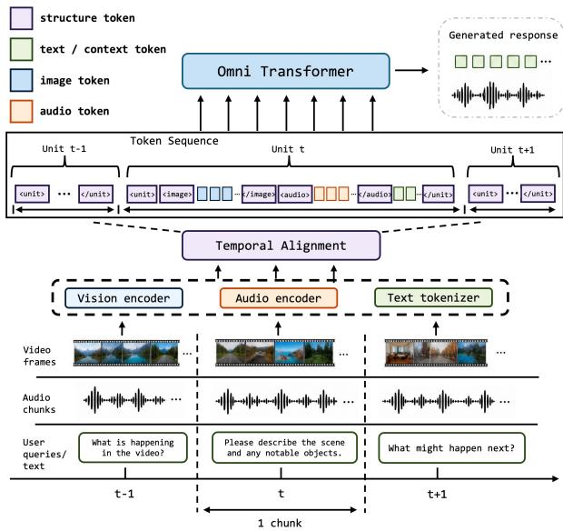  
Figure 1. Streaming omni-modal inference with modalityspecific encoders and an LLM backbone. Explicit unit delimiters are illustrated using MiniCPM-o-4.5 as an example.

Omni model architecture. The term omni model denotes a unified model that processes text, images, audio, and video. A common approach is to encode non-text inputs into representations that an LLM can process [23, 34, 53, 54]. As illustrated in Figure 1, a typical omni-modal model [9, 64] combines modality-specific encoders with a large language model (LLM) backbone. The backbone processes this sequence through prefill and generates responses through decode [79]. During prefill, it computes key and value (KV) states for the new input and appends them to the session’s KV cache. During decode, it generates text one token at a time, reusing the cached states and adding KV states as generated tokens are processed. The cache persists across successive inputs and responses, allowing the model to attend to earlier context. These models also support spoken responses through a speech-generation module [9, 64].

Streaming units. To support incremental processing, as shown in Figure 1, the unified sequence preserves the temporal organization of incoming streams by grouping related modality content into successive chunks. We define a unit as the token sequence associated with one streaming event, including its modality content and any associated structural markers. A unit may contain an aligned audiovisual chunk, a user text segment, or a generated response. MiniCPM-o-4.5 [9] makes unit boundaries explicit through special tokens. Qwen2.5-Omni [64] likewise organizes audiovisual inputs into time-aligned chunks through its time-interleaving method. Thus, our unit definition captures the models’ existing chunk-level organization, regardless of whether dedicated unit delimiters are present.

Table 1. LLM input token counts and estimated audiovisual token growth at one unit per second [9, 42, 64].
<table><tr><td>Model</td><td>Image 1344 × 1344</td><td>Audio</td><td>Est. tokens/s tokens/unit tokens/min</td><td>Est.</td></tr><tr><td>MiniCPM-o-2.6</td><td>640</td><td>25</td><td>≈700</td><td>≈ 42K</td></tr><tr><td>MiniCPM-o-4.5</td><td>640</td><td>10</td><td>≈ 700</td><td>≈ 42K</td></tr><tr><td>Qwen2.5-Omni-7B</td><td>2,304</td><td>25</td><td>≈ 2,300</td><td>≈ 140K</td></tr></table>

MiniCPM inputs use one global view and a 3 × 3 grid of local slices.

## 2.2 On-device omni inference bottlenecks

Prior studies and systems highlight memory and compute constraints in LLM inference on personal devices [31, 52]. Quantization reduces model-weight memory and can lower computation costs [15, 36, 61]. However, fitting the model in memory is only part of the problem. With full-history retention, the KV cache grows as new inputs and responses arrive. A longer history requires more KV storage and more attention computation for each new input. Audiovisual inputs can grow this history rapidly. Table 1 estimates the input rate for a stream containing one 1344 × 1344 image and one second of audio per unit, at one unit per second. Under this assumption, MiniCPM models receive roughly 700 tokens per unit, or 42K tokens per minute, while Qwen2.5-Omni-7B receives roughly 2,300 tokens per unit, or 140K tokens per minute. These estimates exclude user text and generated responses, which further increase the history.

To quantify these costs, we run MiniCPM-o-4.5 on an Apple M2 Pro with full-history retention, processing a 375- s LongVALE [19] video in 75 consecutive 5-s audiovisual chunks. By the end of the stream, the KV cache approaches 80K tokens. Despite a substantial on-device memory budget, retaining just 6.25 minutes of audiovisual history brings the total memory footprint to approximately 23 GiB, leaving little headroom for continued streaming (Figure 2(a)). Per-chunk prefill latency increases from 28 to 69 s (2.5×; Figure 2(b)). Attention accounts for most of this increase: its per-chunk execution time rises from 2 to 39 s, while MLP time stays near 4.5 s and other components change little (Figure 2(c)). Thus, retaining the full history increases both memory use and the time needed to process each new chunk.

## 3 Motivation

Figure 3 compares various history-selection strategies proposed to address the long-context bottleneck, highlighting the inherent tension between bounding cache size and preserving multimodal context.

Dense attention. Dense attention retains the KV states of all preceding tokens, making the complete history available to subsequent queries (Figure 3(a)). Although it avoids information loss from eviction, its cache size and attention cost grow with the session, leading to the on-device bottlenecks characterized in §2.2.

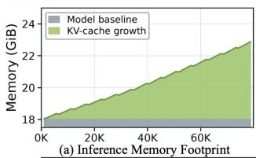

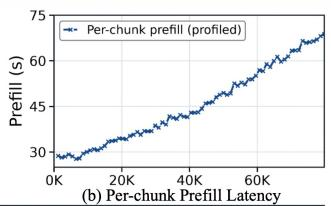

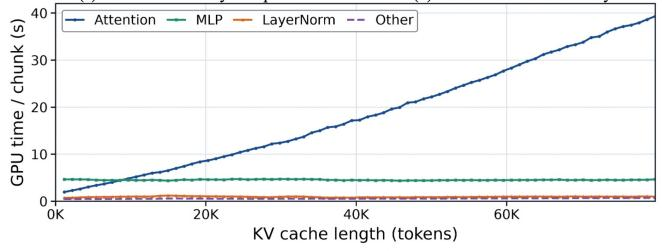  
(c) Component-wise LLM GPU time  
Figure 2. Memory and latency growth with full-history retention on MiniCPM-o-4.5. The model runs on Apple M2 Pro using Q4\_K\_M LLM weights and FP16 vision/audio projectors, with Metal backend and FlashAttention enabled. Around 24 GB of unified memory is available for inference.

Attention-score-based selection. These methods use attention scores as a proxy for token importance, selecting historical KV entries under a cache budget. They difer in when scores are collected and how retention budgets are distributed. One line of work uses attention observed during decoding to guide eviction [38, 43, 77]; for example, $_ \mathrm { H _ { 2 } O }$ retains recent tokens and accumulated-attention heavy hitters (Figure 3(b)). Another uses prompt attention to identify head specific context to retain [18, 33], with SnapKV collecting scores from a trailing observation window. Complementary methods adapt cache allocation across layers or heads rather than assigning uniform budgets [3, 14, 16]. These approaches allow selected historical evidence to survive beyond a recent window. However, obtaining attention statistics and selecting retained entries introduce runtime work beyond positional retention, with costs depending on the scoring schedule and implementation. Moreover, attention-based token ranking does not itself encode multimodal-unit boundaries or the association between modality content and structural spans. Thus, even high-scoring retained tokens need not preserve complete audiovisual units or their boundary context, motivating a retention policy that explicitly represents these relationships.

Position-based retention. These methods retain a recent window and optionally protect designated tokens outside it, evicting older KV entries without online attention-score estimation. Local-window designs use rolling bufers to bound cache growth [27], while prefix-augmented schemes combine initial tokens with recent history [22, 62]; StreamingLLM illustrates this pattern in Figure 3(c). Extensions retain separator tokens beyond the local window [4] or assign diferent windows to diferent modalities [65]. For example, StreamingVLM retains initial sinks, a longer text history, and a shorter vision window. These rules reduce both the retained KV history and subsequent attention work. However, designs for text or vision-language streams do not directly specify retention for interleaved omni-modal units: token cutofs can split an audiovisual unit, and protecting an initial prefix does not preserve recurring local sinks in later units. Separator protection and separate modality windows likewise do not explicitly preserve the association between aligned audiovisual content and its structural spans. This limitation motivates unit-aware retention; in our evaluation, token-level sliding reduces MiniCPM-o-4.5’s StreamingBench accuracy from 74.1% to 57.0%, a 17.1-percentage-point drop relative to full-context retention (Table 2).

OmniTide design goal. These limitations motivate a training-free policy that uses streaming structure without attentionscore collection (Figure 3(d)). OmniTide aims to bound KVcache growth and reduce history-dependent attention cost while preserving response quality. This goal has two parts: preserving useful context within a bounded logical history, and organizing the retained KV entries so that logical eviction can translate into physical execution savings.

## 4 OmniTide overview

Key insight. Streaming omni-modal inputs form units representing concurrent events within a temporal chunk:

<unit> <image> [vision tokens] </image>

<audio> [audio tokens] </audio> [text tokens] </unit>

Because units encapsulate interleaved cross-modal tokens, ignoring these boundaries dismantles temporal alignment and semantic cohesion. Thus, OmniTide uses unit as its core abstraction for token selection and KV cache management. • OmniPick token selection algorithm. Our attention analysis (§5) reveals inter-unit recency (attention concentrates on recent complete units) and intra-unit asymmetry (varying token importance). Consequently, OmniPick organizes retention into three groups: must-keep (e.g., system prompts/text), selected-history (e.g., modality-specific sink), and recent-context (evictable). It uses these groups to deterministically retain critical multimodal context.

• OmniPage KV management system. OmniPage (§6) uses OmniPick’s retention decisions to guide physical KV placement. It groups entries by retention state in tile-aligned pages, reducing mixing between newly arriving content and older units’ retained spans. When the context history exceeds a high watermark, OmniPick evicts content toward a lowwatermark target, leaving room for subsequent inputs. After eviction, OmniPage evaluates whether selectively relocating surviving entries would reduce the number of occupied pages or subblocks, or shorten physical extent presented to attention. It applies the migration plan only when the backend-specific condition is met.

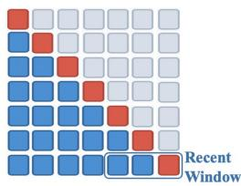  
(a)Dense Attention

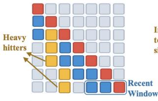  
(b)Sparse Attention(H2O)

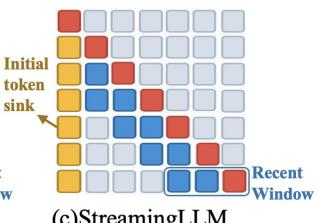  
(c)StreamingLLM

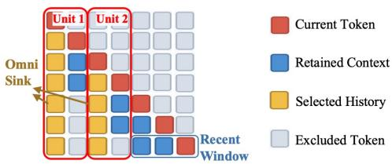  
(d)OmniTide(Ours)

Figure 3. History-selection strategies: (a) dense attention, (b) H O heavy-hitter retention, (c) StreamingLLM’s global sink prefix and recent window, and (d) OmniTide’s unit-aware local sinks and recent context.  
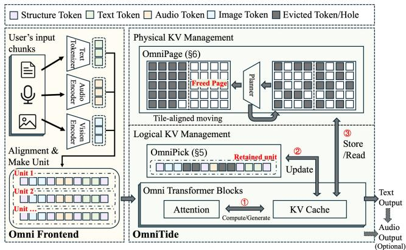  
Figure 4. OmniTide runtime overview. The frontend assembles temporally ordered multimodal units, OmniPick selects the logically retained history, and OmniPage maintains the physical KV layout used by the transformer loop.

Workflow. Figure 4 illustrates the runtime workflow. The Omni Frontend tokenizes text, encodes visual and audio inputs, and assembles their representations into temporally ordered units with modality and structural spans. The transformer backbone processes these units through a persistent KV read–update loop during prefill and decoding ○1 . When the accumulated history crosses the configured retention threshold, OmniPick (§5) updates the logical cache ○2 : it preserves complete recent units, the protected system prefix, and selected structural and modality-local sink spans from older units, then removes the remaining ranges and reindexes surviving positions. OmniPage (§6) manages the physical storage backing KV reads and writes ○3 . It uses retention metadata to guide placement and plans selective relocation after logical eviction. OmniPage moves retained KV entries only if the plan reduces active page or subblock counts, or meets the reduction threshold. This changes the physical layout while preserving the retained history and its logical positions for subsequent inference. The model produces text responses and may additionally generate speech through its optional audio-output path.

## 5 OmniPick design

OmniPick retains complete recent units and selected spans from older units (§5.1). After removing unselected tokens, it updates the positions of retained tokens and their metadata to continue inference with the shortened history (§5.2).

Key insight: structured attention in omni-modal streams. To understand which parts of the history should be retained, we run MiniCPM-o-4.5, MiniCPM-o-2.6, and Qwen2.5-Omni on 10 LongVALE videos [19] using Hugging Face Transformers [60] on an NVIDIA RTX 4090 GPU with CUDA 13.2, collecting attention weights from the LLM backbone and averaging the results over the 10 videos for each model. Figure 5 presents representative examples from selected layer-head pairs, alongside layer-level averages where indicated. These examples highlight three typical, recurring attention patterns shared across the evaluated models. Although their strength varies across layers and heads, these patterns provide a common basis for OmniPick’s retention design.

Unit- and modality-local sinks. Attention sinks can occur at both initial and internal tokens in language models [75]. Figure 5(a) shows narrow vertical bands near unit starts and modality boundaries, indicating that tokens at these locations attract attention from later units. These sinks recur within the history rather than appearing only at the initial text prefix. We refer to them as omni sinks. We hypothesize that some of these tokens serve as local aggregation points for information within a unit, allowing later queries to access earlier context. Their repeated occurrence near structural boundaries motivates retaining small spans at these locations when evicting older content. OmniPick uses unit and modality boundaries to locate these candidate sink spans without collecting attention scores during inference.

Recent-context concentration. Figure 5(b) shows strong attention near the causal diagonal, indicating that queries frequently attend to nearby preceding tokens. This observation motivates retaining recent context alongside older sink spans. OmniPick keeps selected recent units in full so that image and audio tokens from the same unit remain available together. Using unit boundaries also avoids cutting through a chunk at an arbitrary token position.

Modality-asymmetric attention. Figure 5(c) shows distinct attention intensities across image and audio spans. For example, the displayed MiniCPM-o-4.5 head assigns higher attention weights to the marked audio regions than to neighboring image regions. These diferences suggest that retention should account for modality roles within a unit, motivating modality-specific budgets rather than an identical retention rule for every modality. OmniPick therefore uses separate retention budgets for image, audio, and text spans.

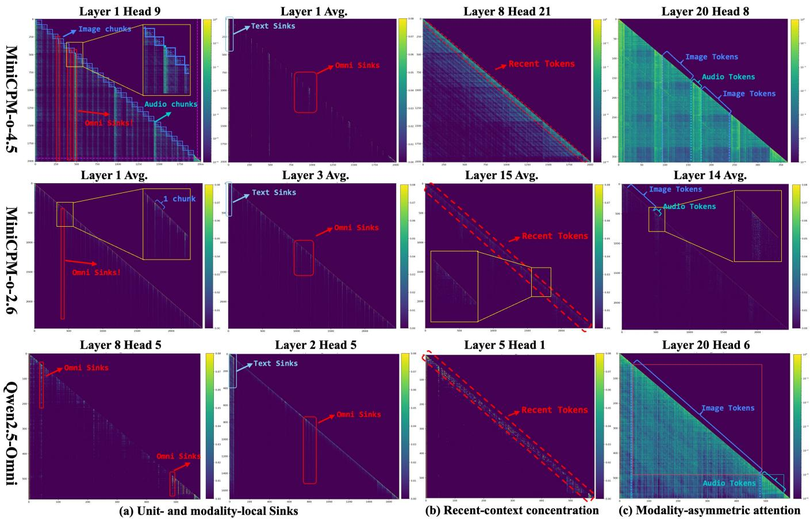  
Figure 5. Selected attention traces from MiniCPM-o-4.5, MiniCPM-o-2.6, and Qwen2.5-Omni (top to bottom).

Together, these observations motivate a unit- and modalityaware retention policy combining local sinks, recent units, and modality-specific budgets. The heatmaps provide qual itative design evidence; we next describe how OmniPick combines these choices under a limited history budget.

## 5.1 Structure-aware retention planning

OmniPick starts retention when the history exceeds the high watermark and uses the low watermark as its trimming target. Figure 6 illustrates the main idea: retain recent units in full and keep only selected spans from older units. The system prefix remains protected throughout.

Keeping recent units intact. OmniPick retains the most recent units in full ○1 , while token-level sliding retains a fixed number of recent tokens regardless of unit boundaries. As shown in Figure 6, the token-level window cuts through the image span of $u _ { n } ,$ retaining only part of the unit. OmniPick instead keeps both $u _ { n }$ and $u _ { n + 1 }$ intact, preserving their image, audio, text, and boundary tokens together.

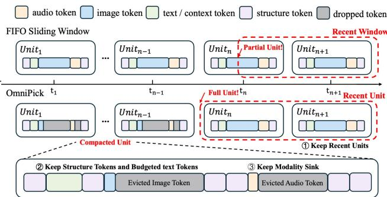  
Figure 6. OmniPick retains a recent window of complete units and selected sink spans from older units. FIFO in this schematic denotes token-level sliding.

Selecting spans from older units. For units not retained in full, OmniPick visits them from oldest to newest. Consider $u _ { n - 1 }$ in Figure 6: OmniPick retains its boundary tokens ○2 and short prefixes of its image and audio spans as candidate sinks ○3 , then discards the remaining modality tokens.

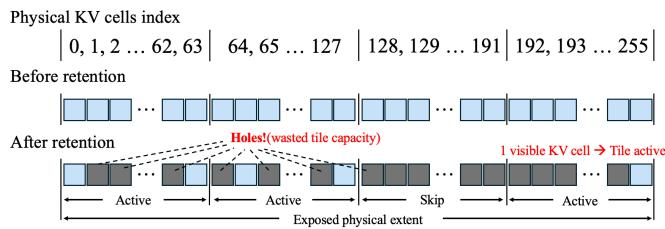  
Figure 7. Logical eviction leaves masked holes between surviving KV entries. Sparse holes keep the exposed physical extent large.

To account for diferences in modality importance, it uses separate prefix lengths for image and audio spans. Text and previous model responses are retained from oldest to newest until their shared token budget is exhausted. For models that represent an image as a source image and local slices, we retain the source-image span in full and keep only the sink prefix of each slice.

If the selected history still exceeds the low watermark, OmniPick drops units, oldest first, prioritizing partially retained units over complete ones. It stops when the target is met or only one unit remains. The low watermark is therefore a trimming target rather than a strict upper bound.

OmniPick generates a plan that lists the spans to retain and the token ranges to delete, without collecting attention scores during inference.

## 5.2 Applying the retention plan

Removing tokens from within a unit changes both token positions and the boundaries of its remaining spans. OmniPick therefore updates the cache and the unit records together. It deletes the unselected ranges and shifts each retained token’s logical position by the number of deleted tokens before it. The runtime applies the corresponding RoPE adjustment to cached keys. For each partially retained unit, OmniPick recomputes its length and span ofsets while preserving the spans’ modality and boundary labels. This allows the next retention round to identify image, audio, text, and boundary spans in the shortened unit. These updates leave surviving KV entries in their physical slots; OmniPage separately decides whether to relocate them (§6).

## 6 OmniPage: physical KV management

Translating logical retention into physical savings. OmniPick reduces retained tokens, but the remaining KV entries can still be scattered across the cache. OmniPage addresses two problems to reduce attention cost.

• Fragmentation after logical eviction. As shown in Figure 7, deleting tokens leaves holes between retained KV entries without moving them. Attention kernels process KV entries in groups called tiles. On paths that support tile skipping, a tile can be skipped only when all its entries are masked.

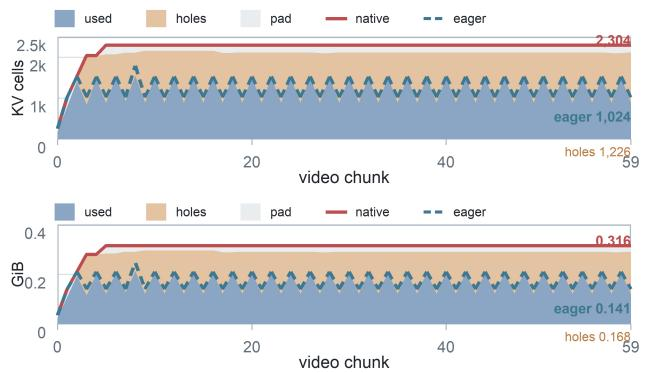  
Figure 8. Native and eager layouts under OmniPick retention in a 60-chunk MiniCPM-o-4.5 Metal pressure run.

Even one retained sink token can therefore keep a tile active. Scattered entries can also keep the physical span—the range of KV slots presented to attention—large. Consequently, retaining fewer tokens does not necessarily reduce attention work by the same proportion.

• Compaction-movement trade-of. Compaction can recover the space left by logical eviction. A straightforward approach is eager compaction, which packs all retained KV entries into a contiguous prefix after every successful eviction. Figure 8 compares this approach with native deletion under the same OmniPick retention policy in a 60-chunk MiniCPM-o-4.5 run on an Apple M2 Pro with Metal. Eager compaction reduces the final physical span from 2,304 to 1,024 KV slots—a 2.25× diference. But it requires K/V copies and synchronization after each eviction. This motivates selective migration: reducing fragmentation while moving only part of the retained history.

Key insight. OmniPick’s retention decisions provide a signal for organizing physical KV storage: newly arriving content and retained spans from older units need not share the same pages. OmniPage therefore groups KV entries by retention state. Pages align with attention tiles, so packing retained entries into fewer tiles can leave fully empty tiles that supported kernels can skip. Selective migration reduces fragmentation without repacking the entire cache.

OmniPage combines retention-aware, tile-aligned paging (§6.1) to guide KV placement with selective KV migration (§6.2) to pack scattered entries into fewer tiles or a shorter physical span. Both mechanisms preserve OmniPick’s selected history and the logical positions of retained entries.

## 6.1 Retention-aware, tile-aligned paging

Organizing KV into tile-aligned pages. OmniPage partitions physical KV storage into fixed-size, contiguous groups of slots called pages. OmniPick groups tokens by input chunks or responses, while OmniPage groups their KV entries by physical location. Page size is tied to the backend’s KV-axis tile width, so that empty pages can be skipped by kernels with tile-skipping support. For kernels with smaller tiles, it also tracks which subblocks within each page still contain KV entries.

  
Figure 9. Class-aware OmniPage placement and selective migration, illustrated with 64-cell pages and 32-cell subblocks.

For example, in our Metal experiments, Figure 9 illustrates a 64-slot page containing two 32-slot subblocks. This organization corresponds to one 64-slot KV tile in the inspected Metal tiled path, or two 32-slot KV tiles in its vector path. Page and subblock sizes follow the attention kernels used by each backend. An empty page can therefore be skipped at either granularity. A page with one empty subblock provides a finer-grained skipping opportunity on the vector path, whereas the 64-slot path still requires the entire page to be empty before skipping its tile. The tile-oriented execution model follows the same distinction between logical visibility and kernel work exposed by FlashAttention-style implementations [11, 72].

On Metal paths with tile-skipping support, packing retained entries into fewer tiles allows empty tiles to be skipped. For selected CUDA configurations, migration instead targets a shorter physical span, reducing the range of KV slots traversed by attention. Thus, the same page-based organization supports diferent backends, while the migration criterion reflects each kernel’s cache access.

Placing entries according to retention state. Tile align ment alone does not prevent fragmentation. Ifnewly arriving content shares pages with spans retained from older units, later eviction can leave a few retained entries scattered across many pages. OmniPage uses the three retention groups in Figure 9 to guide physical placement: must-keep content includes the protected system prefix; selected-history contains spans retained from older units; and recent-context contains recent units that are still retained in full.

New entries enter recent-context. After retention, OmniPage packs the surviving entries into fewer pages and promotes fully packed pages to selected-history. Partially filled pages remain in recent-context, while empty pages can be reused for new entries. These moves are performed only when the migration plan meets the layout criteria (§6.2).

## 6.2 Selective and eficient KV migration

After eviction, retained KV entries may occupy only a few slots in each page. OmniPage first plans which entries to move and where to place them. It then checks whether the proposed moves reduce the number of active pages or subblocks, or shorten the physical span enough to meet the configured threshold. Only accepted plans trigger K/V copies. Packing scattered entries. OmniPage targets entries retained from partially evicted units, leaving pages filled with entries in place. It scans the candidate entries in physical order and assigns them to earlier empty slots. A destination page must be empty or contain only entries of the same allocation class. Filling these slots can leave later pages or subblocks empty, while entries outside the plan remain in place.

Checking layout improvement. Filling holes doesn’t always reduce attention work: moving entries between two pages may still leave both pages active. OmniPage therefore simulates the planned moves and counts the active pages and subblocks before and after migration. A region is active if it contains any retained entry. The plan is accepted only if either count decreases. With tile-aligned pages, empty regions can be skipped by kernels with tile-skipping support.

Some kernels traverse the physical span, so emptying interior pages may not reduce the range they process. For the selected CUDA configurations, OmniPage instead uses an ordered-sufix mode. It scans backward from the end of the cache to find a sufix whose packing would shorten the page-rounded physical span by at least a configured number of pages. It packs only the retained entries in that sufix, preserving their order and leaving the preceding entries untouched. If no sufix meets the threshold, no migration occurs. This mode replaces class-based placement and can move entries from any retention group.

Executing accepted moves eficiently. For an accepted plan, OmniPage only copies selected KV entries. The plan specifies a source-destination mapping shared across the afected layers’ KV tensors. On CUDA, the runtime gathers source rows into scratch space before writing them to destinations. This prevents a write from overwriting a source row needed by another move. Other supported backends apply the mapping through their tensor-copy primitives.

Migration runs after logical deletion and position updates, before inference resumes. The runtime synchronizes pending work, performs the copies, and updates storage metadata. Each moved entry retains its logical position, pending position shift, sequence membership, and allocation class. Migration therefore changes where KV entries are stored without changing the history selected by OmniPick.

## 7 Implementation and evaluation

We implement OmniTide in llama.cpp-omni [40], adding approximately 9.6K code lines across the runtime, model runners, and backend extensions, excluding experiment scripts and tests. Model-specific input adapters translate each model’s omni-modal input structure into a shared unit/span representation, allowing Qwen and MiniCPM to reuse the implementation. We extend llama.cpp’s KV memory interface with allocation classes, range promotion, and selective migration, so model runners can invoke physical maintenance without implementing backend-specific KV movement. OmniTide supports Qwen2.5-Omni-3B/7B [64] and MiniCPM-o-4.5 [9] on CUDA and Metal.

We evaluate latency, quality, memory and KV storage, examining the quality-eficiency tradeof and the contributions of retention budgets and physical maintenance.

## 7.1 Experimental setup

Hardware and precision. We evaluate CUDA on an NVIDIA RTX 4090 (24 GB) and Metal on an Apple M2 Pro (32 GB unified memory). We use Q4\_K\_M backbone weights, Q8\_0 Qwen projectors, FP16 MiniCPM vision/audio projectors, and FP16 KV storage. FlashAttention is enabled for the main timing comparisons.

Workloads. We evaluate timestamped multiple-choice QA on StreamingBench [35], multi-turn video dialogue on SVBench [69], and sports commentary on LiveSports-3K-CC [6]. Main comparisons use inputs within each model’s training context length. Video is sampled at 1 FPS with aligned one-second audio segments when applicable; history persists across inputs and responses.

Baselines and configurations. (i) No-slide (Full Context) retains the complete history. (ii) Unit-level FIFO (basic) evicts the oldest complete units. (iii) Token-level sliding (token-basic) is a strict sliding-window control that evicts the oldest tokens regardless of unit or span boundaries. (iv) StreamingLLM [62] retains a positional sink prefix and a recent sufix. (v) H2O [77] provides an attention-based retention reference. (vi) PagedAttention [29] and (vii) vAttention [44] provide physical-layout references.

Table 2. Task-quality summary. Each cell reports StreamingBench / SVBench / LiveSports-3K-cc. StreamingBench reports percentages; SVBench reports 0–100 Terra dialogue scores; LiveSports reports 0–100 Terra semantic-alignment scores.
<table><tr><td rowspan="2">Method</td><td colspan="2">Qwen2.5-Omni</td><td rowspan="2">MCPM-o-4.5</td></tr><tr><td>3B</td><td>7B</td></tr><tr><td>No-slide</td><td>62.3 / 43.4 / 30.2</td><td>52.0 / 55.1 / 31.2</td><td>9B 74.1 / 43.4 / 17.7</td></tr><tr><td>FIFO / basic</td><td>58.1 / 42.9 / 29.2</td><td>49.8 / 53.9 / 30.2</td><td>69.0 / 40.6 / 17.3</td></tr><tr><td>Token-basic</td><td>56.2 / 42.2 / 28.9</td><td>47.8 / 52.6 / 30.3</td><td>57.0 / 40.1 / 16.8</td></tr><tr><td>StreamingLLM</td><td>59.6 / 42.6 / 28.2</td><td>50.5 / 47.8 / 31.4</td><td>70.1 / 41.3 / 17.5</td></tr><tr><td>H2O</td><td>55.8 / 40.1 / 28.2</td><td>47.0 / 49.2 / 29.2</td><td>52.7 / 35.1 / 17.0</td></tr><tr><td>Ours</td><td>62.8 / 43.5 / 30.2</td><td>52.4 / 54.8 / 33.3</td><td> ${ \bf 7 5 . 0 \cdot / 4 5 . 1 / 1 8 . 8 }$ </td></tr></table>

OmniPick only uses native KV layout with OmniPage disabled; OmniTide enables both components. In the physical ablation (§7.4.2), eager compaction serves as an attentiontime oracle: it repacks all retained KV entries into a contiguous layout while its repacking cost is excluded. Our default high/low watermarks are 2500/1800 tokens; StreamingLLM uses a two-token sink prefix.

Metrics. We report latency per streaming update, mean stream-loop time per session, attention-kernel latency, and KV storage (retained cells and physical span). Task quality is measured by multiple-choice accuracy on StreamingBench and judge scores on SVBench and LiveSports, both reported on a 0–100 scale. We profile kernels separately and disable profiling when measuring streaming-update latency to avoid instrumentation overhead.

## 7.2 Overall performance

7.2.1 Latency. We evaluate how per-update latency changes as no-slide history grows from 4K to 32K tokens (Figures 10 and 11). Upper panels report normal streaming updates; lower panels report separately profiled FlashAttention kernels. H2O requires attention scores that the FlashAttention kernels used here do not expose. It is therefore evaluated without FlashAttention, contributing to its higher update latency, and omitted from the kernel panels. vAttention relies on CUDA virtual memory management [44] and is therefore evaluated only on CUDA. OmniTide keeps update and attention latency comparatively stable as history grows, reducing long-context latency on both backends.

CUDA. At 32K, OmniTide reduces update latency from approximately 429 to 192 ms for Qwen-3B, 535 to 234 ms for Qwen-7B, and 268 to 203 ms for MiniCPM. Qwen-7B attention falls from approximately 133 to 10 ms. OmniPick reduces the retained history, while OmniPage compacts its physical layout to reduce attention work. Streaming-update speedups are smaller than kernel speedups because each update also includes computation outside attention. We examine Omni-Page’s contribution separately in §7.4.2.

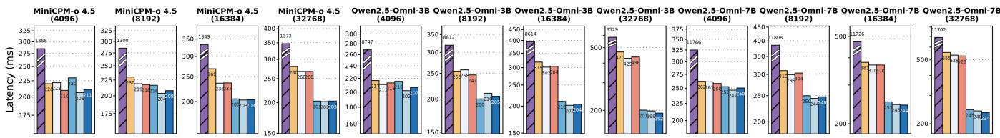  
(a) Normal streaming-update latency

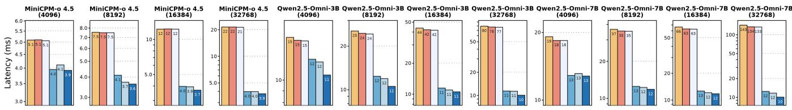  
(b) Separately profiled attention-kernel latency  
Figure 10. CUDA latency at 4K–32K no-slide checkpoints. Panels show three models with four checkpoints each.

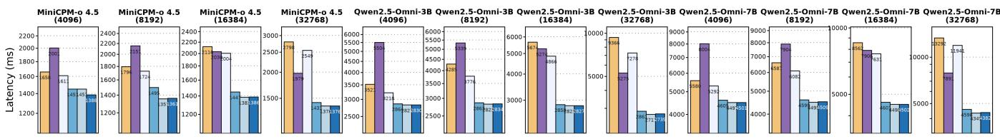  
(a) Normal streaming-update latency

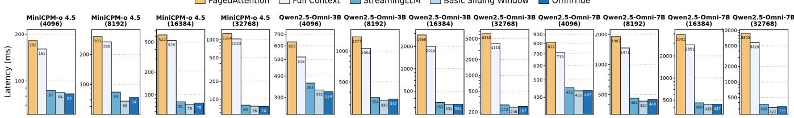  
(b) Separately profiled attention-kernel latency  
Figure 11. Metal latency at matched no-slide checkpoints, with normal update timing above separate attention profiling.

Metal. At 32K, Qwen-3B update latency decreases from approximately 7.3 to 2.7 s and Qwen-7B from 11.9 to 4.3 s. Across the checkpoints, MiniCPM full-context attention grows from approximately 161 to 1,033 ms, whereas OmniTide remains at 74–83 ms. The similar scaling trend on both backends supports bounding retained history as the main source of long-context savings. Other bounded-history policies achieve similar latency, making retention quality a key diferentiator, as evaluated next.

7.2.2 Task quality. We compare retention quality on StreamingBench, SVBench, and LiveSports in Table 2. OmniPick outperforms FIFO and token-level sliding across all nine model–benchmark settings.

Comparison with bounded-history policies. On StreamingBench, unit-level FIFO improves over token-level sliding by 1.9, 2.0, and 12.0 percentage points for Qwen-3B, Qwen-7B, and MiniCPM, respectively. These gains highlight the importance of preserving complete multimodal units during eviction. OmniPick further improves over FIFO by 4.7, 2.6, and 6.0 points: beyond preserving complete recent units, its selected boundary, sink, and modality spans retain older context that FIFO discards. These results evaluate the combined policy rather than individual span types.

Peak physical KVRetained KVPhysical span wasteOmniTide retained KV  
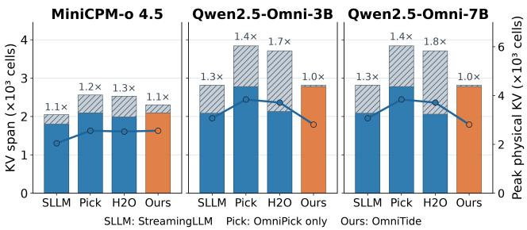  
Figure 12. CUDA KV layout at the 32K checkpoint. Stacked bars show useful cells and physical-span waste (left axis); the line shows cumulative peak physical span (right axis). Labels above bars give span/useful-cell ratios.

Table 3. End-to-end session latency on CUDA, excluding model initialization and system-prompt prefill.
<table><tr><td>Model</td><td>No-slide OmniTide (s)</td><td>(s)</td><td>Speedup</td></tr><tr><td>Qwen2.5-Omni-3B</td><td>40.33</td><td>17.61</td><td>2.290×</td></tr><tr><td>Qwen2.5-Omni-7B</td><td>51.71</td><td>21.52</td><td>2.403×</td></tr></table>

OmniPick remains close to no-slide: StreamingBench differences are +0.5, +0.4, and +0.9 points, while SVBench and LiveSports diferences range from −0.3 to +2.1 points. We report these diferences descriptively rather than claim an accuracy advantage over full-context retention.

7.2.3 Physical KV storage. We evaluate KV storage in Figure 12, separating useful retained cells from the physical span exposed to attention. OmniPage reduces physical span by 26.7% for Qwen and 10.0% for MiniCPM while preserving the retained-cell count.

Both Qwen models retain 2,778 useful cells, while OmniPage reduces physical span from 3,840 to 2,816 cells. MiniCPM retains 2,095 cells within a span of 2,304 rather than 2,560 cells. Qwen’s cumulative peak span also decreases; MiniCPM’s is unchanged. OmniPage fills holes left by logical deletion through selective relocation, reducing physical span without changing retained history.

7.2.4 End-to-end latency. We measure CUDA session latency over 355 sessions (Table 3) excluding model initialization and system-prompt prefill. OmniTide achieves 2.29– 2.40× speedup over no-slide, reducing mean latency from 40.33 to 17.61 s for Qwen-3B and from 51.71 to 21.52 s for Qwen-7B. Bounded history and a consolidated KV layout reduce attention work across successive updates.

## 7.3 Quality–eficiency tradeof

We jointly evaluate StreamingBench accuracy and mean complete-session stream-loop time in Figure 13. Timing includes input processing, prefill, answer generation, and KV maintenance, but excludes initialization and system-prompt prefill. Accuracy and timing use the same runs; OmniTide preserves more task quality than sliding-window baselines at comparable session cost.

For Qwen-3B and Qwen-7B, mean time decreases from 40.3 to 17.5 s and from 51.7 to 21.5 s relative to no-slide, while accuracy rises from 62.3% to 62.8% and from 52.0% to 52.4%. For MiniCPM, time decreases only from 17.9 to 17.3 s, while accuracy rises from 74.1% to 75.0%. Basic, token-basic, and StreamingLLM have similar costs but lower accuracy. Their similar costs are consistent with bounded history limiting execution work, while OmniPick’s structured selection pre serves more useful context at that cost. The smaller MiniCPM timing gain limits how broadly Qwen’s speedups can be generalized.

N/A marks H2O latency because it runs without FlashAttention, and PagedAttention/vAttention accuracy because they change physical layout without selecting history.

## 7.4 Ablation and sensitivity

7.4.1 Watermark sensitivity. We evaluate OmniPick’s sensitivity to high/low watermarks on StreamingBench (Figure 14). Larger retention budgets do not monotonically improve accuracy; the best tested setting depends on the model.

For Qwen-3B, accuracy rises from 62.8% at the default 2500/1800 setting to 68.1% at 5000/3500, then falls to 61.2% at 20000/15000. Qwen-7B peaks at 61.0% with 8000/6000, compared with 52.4% at the default and 52.8% at 20000/15000. MiniCPM also varies non-monotonically: accuracy falls from 75.0% at 2500/1800 to 63.0% at 6000/4500 before reaching 76.0% at 9000/7000. These results show that retention quality depends on the watermark configuration, motivating modelspecific tuning rather than simply increasing the retained history.

7.4.2 Efectiveness of OmniPage. We compare cumulative prefill and decode attention GPU time under native layout, OmniPage, and eager compaction (Figure 15). Omni-Page reduces prefill and decode attention time by 26.1% and 22.5% relative to native layout.

Eager compaction reduces prefill and decode attention time by 29.5% and 27.4% respectively, providing an oracle that fully packs retained KV entries without repacking cost. OmniPage achieves 26.1% and 22.5% reductions, capturing 88.5% and 82.1% of the oracle’s latency reduction through selective migration. These results indicate OmniPage recovers most of the attention benefit of full compaction.

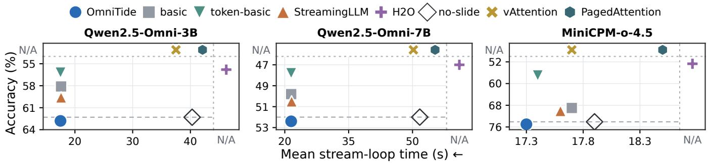  
Figure 13. StreamingBench quality–eficiency tradeof. Lower left is better: session time decreases to the left and accuracy increases downward. Dashed horizontal lines mark no-slide accuracy; N/A bands denote unreported metrics.

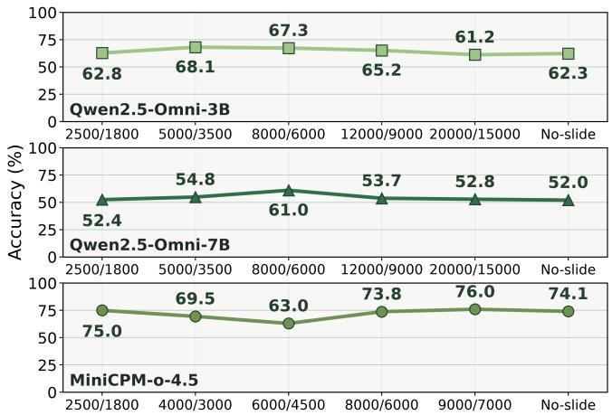

Figure 14. Watermark sensitivity on StreamingBench. The vertical axis is accuracy (%); horizontal labels give high/low watermarks, with no-slide as a reference.  
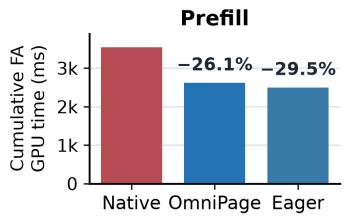

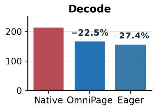  
Figure 15. Cumulative attention GPU time under identical retention. OmniPage includes migration and synchronization costs; Eager excludes them.

## 8 Related work

Multimodal KV retention and compression. Multimodal KV compression exploits modality-dependent relevance, redundancy, and layer-wise importance [26, 56–58], or frequency-domain outliers [68]. Video-oriented methods compress and retrieve historical visual KV states [8, 63]. Visual token reduction operates before LLM processing [59, 66] or prunes tokens within the LLM [7]; STC reuses encoder features. OmniPick instead uses structural metadata to retain complete recent audiovisual units and typed boundary and sink spans from older history.

KV memory management and attention execution. PagedAttention and vAttention optimize KV allocation [29, 44], while GMLake addresses training-time allocation fragmentation [21]. Attention and decoding kernels improve data reuse, parallelism, and scheduling [10, 11, 24, 47, 48, 72]. OmniPage addresses evictioninduced fragmentation within sessions, consolidating survivors to reduce the physical span exposed to attention. KV quantization, ofloading, and selective access. Quantization reduces KV precision [13, 25, 37, 39]; ofloading expands capacity across memory tiers [32, 49]; selective access fetches query-relevant entries or pages [46, 55, 67]. These techniques optimize KV representation, placement, or access, whereas OmniPick selects which interleaved omni-modal units and spans persist across updates.

KV cache reuse. Reuse systems avoid repeated prefill or duplicate storage for shared prefixes, prompt modules, and dialogue history [17, 20, 71, 73, 78]. Mooncake manages reusable KV states across disaggregated serving [45]; CacheBlend and Cache-Craft reuse retrieved chunks with selective recomputation [1, 70], and VLMCache exploits stable visual backgrounds [76]. OmniTide manages growing history within a continuous session without requiring shared prefixes or repeated visual inputs.

Native sparse attention. Native sparse attention incorporates selective access into model architecture and training. NSA combines token compression and selection; VideoNSA adapts this design to video-language models [51, 74]. DeepSeek-V4.1-Flash combines compressed sparse attention with cross-layer KV reuse and low-precision caching [12]. Adapting these learned mechanisms to existing omni-modal checkpoints would require architectural changes and training; OmniTide manages retained history and physical KV layout without retraining.

## 9 Conclusion

This paper presents OmniTide, an eficient inference system that improves the accuracy–latency tradeof for on-device streaming omni-modal applications. It integrates OmniPick for structure-aware logical token retention and OmniPage for selective physical KV consolidation to minimize memory fragmentation and attention overhead. Extensive experiments demonstrate its efectiveness in significantly reducing stream-loop latency and attention computation while preserving or exceeding full-context task accuracy. Ultimately, OmniTide unlocks real-time, infinite-context omni model serving on consumer-grade devices.

## References

[1] Shubham Agarwal, Sai Sundaresan, Subrata Mitra, Debabrata Mahapatra, Archit Gupta, Rounak Sharma, Nirmal Joshua Kapu, Tong Yu, and Shiv Saini. 2025. Cache-Craft: Managing Chunk-Caches for Ef ficient Retrieval-Augmented Generation. Proceedings of the ACM on Management ofData 3, 3 (2025), 1–28. htps://doi.org/10.1145/3725273

[2] ByteDance Seed. 2026. SeedRealtime Audio-Visual Full-Duplex LLM Released: Toward Omni-Modal Natural Interaction. Oficial product announcement. htps://seed.bytedance.com/zh/blog/seedrealtimeaudio-visual-full-duplex-llm-released-toward-omni-modal-naturalinteraction

[3] Zefan Cai, Yichi Zhang, Bofei Gao, Yuliang Liu, Yucheng Li, Tianyu Liu, Keming Lu, Wayne Xiong, Yue Dong, Junjie Hu, and Wen Xiao. 2025. PyramidKV: Dynamic KV Cache Compression based on Pyramidal Information Funneling. In Proceedings ofthe Second Conference on Language Modeling (COLM). htps://openreview.net/forum?id= ayi7qezU87

[4] Guoxuan Chen, Han Shi, Jiawei Li, Yihang Gao, Xiaozhe Ren, Yimeng Chen, Xin Jiang, Zhenguo Li, Weiyang Liu, and Chao Huang. 2025. SepLLM: Accelerate Large Language Models by Compressing One Segment into One Separator. In Proceedings of the 42nd International Conference on Machine Learning (Proceedings of Machine Learning Research, Vol. 267). PMLR, 9008–9028. htps://proceedings.mlr.press/ v267/chen25bf.html

[5] Joya Chen, Zhaoyang Lv, Shiwei Wu, Kevin Qinghong Lin, Chenan Song, Difei Gao, Jia-Wei Liu, Ziteng Gao, Dongxing Mao, and Mike Zheng Shou. 2024. VideoLLM-online: Online Video Large Language Model for Streaming Video. In Proceedings of the IEEE/CVF Conference on Computer Vision and Pattern Recognition (CVPR). 18407–18418. htps://openaccess.thecvf.com/content/CVPR2024 html/Chen\_VideoLLM-online\_Online\_Video\_Large\_Language\_ Model\_for\_Streaming\_Video\_CVPR\_2024\_paper.html

[6] Joya Chen, Ziyun Zeng, Yiqi Lin, Wei Li, Zejun Ma, and Mike Zheng Shou. 2025. LiveCC: Learning Video LLM with Streaming Speech Transcription at Scale. In Proceedings of the IEEE/CVF Conference on Computer Vision and Pattern Recognition (CVPR). htps://arxiv.org/ abs/2504.16030

[7] Liang Chen, Haozhe Zhao, Tianyu Liu, Shuai Bai, Junyang Lin, Chang Zhou, and Baobao Chang. 2024. An Image is Worth 1/2 Tokens After Layer 2: Plug-and-Play Inference Acceleration for Large Vision-Language Models. In Computer Vision – ECCV 2024. 19–35. htps://doi.org/10.1007/978-3-031-73004-7\_2

[8] Tao Chen, Kun Zhang, Qiong Wu, Xiao Chen, Chao Chang, Xiaoshuai Sun, Yiyi Zhou, and Rongrong Ji. 2026. Scaling the Long Video Understanding of Multimodal Large Language Models via Visual Memory Mechanism. In Proceedings of the IEEE/CVF Conference on Computer Vision and Pattern Recognition (CVPR). 31877–31888. htps://openaccess.thecvf.com/content/CVPR2026/html/Chen\_

Scaling\_the\_Long\_Video\_Understanding\_of\_Multimodal\_Large\_ Language\_Models\_CVPR\_2026\_paper.html

[9] Junbo Cui, Bokai Xu, Chongyi Wang, Tianyu Yu, et al. 2026. MiniCPMo 4.5: Towards Real-Time Full-Duplex Omni-Modal Interaction. arXiv preprint arXiv:2604.27393 (2026). htps://arxiv.org/abs/2604.27393

[10] Tri Dao. 2024. FlashAttention-2: Faster Attention with Better Parallelism and Work Partitioning. In International Conference on Learning Representations (ICLR). htps://openreview.net/forum?id= mZn2Xyh9Ec

[11] Tri Dao, Daniel Y. Fu, Stefano Ermon, Atri Rudra, and Christopher Ré. 2022. FlashAttention: Fast and Memory-Eficient Exact Attention with IO-Awareness. In Advances in Neural Information Processing Systems 35 (NeurIPS). htps://arxiv.org/abs/2205.14135

[12] DeepSeek-AI. 2026. DeepSeek-V4.1-Flash: Pushing the Limits of KV Cache Compression. arXiv preprint arXiv:2609.19969 (2026). htps: //arxiv.org/abs/2609.19969

[13] Haojie Duanmu, Zhihang Yuan, Xiuhong Li, Jiangfei Duan, Xingcheng Zhang, and Dahua Lin. 2024. SKVQ: Sliding-window Key and Value Cache Quantization for Large Language Models. In Proceedings of the First Conference on Language Modeling (COLM). htps://arxiv.org/abs/ 2405.06219

[14] Yuan Feng, Junlin Lv, Yukun Cao, Xike Xie, and S. Kevin Zhou. 2025. Ada-KV: Optimizing KV Cache Eviction by Adaptive Budget Allocation for Eficient LLM Inference. In Advances in Neural Information Processing Systems 38 (NeurIPS). htps://doi.org/10.52202/085713-3773

[15] Elias Frantar, Saleh Ashkboos, Torsten Hoefler, and Dan Alistarh. 2023. GPTQ: Accurate Post-Training Quantization for Generative Pre-trained Transformers. In International Conference on Learning Representations (ICLR). htps://arxiv.org/abs/2210.17323

[16] Yu Fu, Zefan Cai, Abedelkadir Asi, Wayne Xiong, Yue Dong, and Wen Xiao. 2025. Not All Heads Matter: A Head-Level KV Cache Compression Method with Integrated Retrieval and Reasoning. In International Conference on Learning Representations (ICLR). htps://proceedings.iclr.cc/paper\_files/paper/2025/hash/ f649556471416b35e60ae0de7c1e3619-Abstract-Conference.html

[17] Bin Gao, Zhuomin He, Puru Sharma, Qingxuan Kang, Djordje Jevdjic, Junbo Deng, Xingkun Yang, Zhou Yu, and Pengfei Zuo. 2024. Cost-Eficient Large Language Model Serving for Multi-turn Conversations with CachedAttention. In 2024 USENIX Annual Technical Conference (USENIX ATC 24). USENIX Association, 111–126. htps://www.usenix. org/conference/atc24/presentation/gao-bin-cost

[18] Suyu Ge, Yunan Zhang, Liyuan Liu, Minjia Zhang, Jiawei Han, and Jianfeng Gao. 2024. Model Tells You What to Discard: Adaptive KV Cache Compression for LLMs. In International Conference on Learning Representations (ICLR). htps://openreview.net/forum?id=uNrFpDPMyo

[19] Tiantian Geng, Jinrui Zhang, Qingni Wang, Teng Wang, Jinming Duan, and Feng Zheng. 2025. LongVALE: Vision-Audio-Language-Event Benchmark Towards Time-Aware Omni-Modal Perception of Long Videos. In Proceedings of the IEEE/CVF Conference on Computer Vision and Pattern Recognition (CVPR). 18959–18969. htps: //tgeng233.github.io/LongVALE/

[20] In Gim, Guojun Chen, Seung-seob Lee, Nikhil Sarda, Anurag Khandelwal, and Lin Zhong. 2024. Prompt Cache: Modular Attention Reuse for Low-Latency Inference. In Proceedings of Machine Learning and Systems, Vol. 6. 325–338. htps://proceedings.mlsys.org/paper\_files/paper/2024/file/ a66caa1703fe34705a4368c3014c1966-Paper-Conference.pdf

[21] Cong Guo, Rui Zhang, Jiale Xu, Jingwen Leng, Zihan Liu, Ziyu Huang, Minyi Guo, Hao Wu, Shouren Zhao,Junping Zhao, and Ke Zhang. 2024. GMLake: Eficient and Transparent GPU Memory Defragmentation for Large-scale DNN Training with Virtual Memory Stitching. In Proceedings of the 29th ACM International Conference on Architectural Supportfor Programming Languages and Operating Systems, Volume 2 (ASPLOS). htps://doi.org/10.1145/3620665.3640423

[22] Chi Han, Qifan Wang, Hao Peng, Wenhan Xiong, Yu Chen, Heng Ji, and Sinong Wang. 2024. LM-Infinite: Zero-Shot Extreme Length Generalization for Large Language Models. In Proceedings of the 2024 Conference ofthe North American Chapter ofthe Association for Computational Linguistics: Human Language Technologies (Volume 1: Long Papers). Association for Computational Linguistics, 3991–4008. htps://doi.org/10.18653/v1/2024.naacl-long.222

[23] Jiaming Han, Kaixiong Gong, Yiyuan Zhang, Jiaqi Wang, Kaipeng Zhang, Dahua Lin, Yu Qiao, Peng Gao, and Xiangyu Yue. 2024. OneLLM: One Framework to Align All Modalities with Language. In Proceedings ofthe IEEE/CVF Conference on Computer Vision and Pattern Recognition (CVPR). htps://github.com/csuhan/OneLLM

[24] Ke Hong, Guohao Dai, Jiaming Xu, Qiuli Mao, Xiuhong Li, Jun Liu, Kangdi Chen, Yuhan Dong, and Yu Wang. 2024. FlashDecoding++: Faster Large Language Model Inference with Asynchronization, Flat GEMM Optimization, and Heuristics. In Proceedings of Machine Learning and Systems 6 (ML-Sys). htps://proceedings.mlsys.org/paper\_files/paper/2024/hash/ 5321b1dabcd2be188d796c21b733e8c7-Abstract-Conference.html

[25] Coleman Hooper, Sehoon Kim, Hiva Mohammadzadeh, Michael W. Mahoney, Yakun Sophia Shao, Kurt Keutzer, and Amir Gholami. 2024. KVQuant: Towards 10 Million Context Length LLM Inference with KV Cache Quantization. In Advances in Neural Information Processing Systems, Vol. 37. Curran Associates, Inc., 1270–1303. htps://doi.org 10.52202/079017-0040

[26] Kai Huang, Hao Zou, Bochen Wang, Ye Xi, Zhen Xie, and Hao Wang. 2025. AirCache: Activating Inter-modal Relevancy KV Cache Compression for Eficient Large Vision-Language Model Inference. In Proceedings of the IEEE/CVF International Conference on Computer Vision (ICCV). 23958– 23967. htps://openaccess.thecvf.com/content/ICCV2025/html/ Huang\_AirCache\_Activating\_Inter-modal\_Relevancy\_KV\_Cache\_ Compression\_for\_Eficient\_Large\_ICCV\_2025\_paper.html

[27] Albert Q. Jiang, Alexandre Sablayrolles, Arthur Mensch, Chris Bamford, Devendra Singh Chaplot, Diego de las Casas, Florian Bressand, Gianna Lengyel, Guillaume Lample, Lucile Saulnier, Lélio Renard Lavaud, Marie-Anne Lachaux, Pierre Stock, Teven Le Scao, Thibaut Lavril, Thomas Wang, Timothée Lacroix, and William El Sayed. 2023. Mistral 7B. arXiv preprint arXiv:2310.06825 (2023). htps://arxiv.org/abs/2310. 06825

[28] Huiqiang Jiang, Yucheng Li, Chengruidong Zhang, Qianhui Wu, Xu fang Luo, Surin Ahn, Zhenhua Han, Amir H. Abdi, Dongsheng Li, Chin-Yew Lin, Yuqing Yang, and Lili Qiu. 2024. MInference 1.0: Ac celerating Pre-filling for Long-Context LLMs via Dynamic Sparse Attention. In Advances in Neural Information Processing Systems 37 (NeurIPS). htps://arxiv.org/abs/2407.02490

[29] Woosuk Kwon, Zhuohan Li, Siyuan Zhuang, Ying Sheng, Lianmin Zheng, Cody Hao Yu, Joseph E. Gonzalez, Hao Zhang, and Ion Stoica. 2023. Eficient Memory Management for Large Language Model Serving with PagedAttention. In Proceedings ofthe 29th Symposium on Operating Systems Principles (SOSP). ACM, 611–626. htps://doi. org/10.1145/3600006.3613165

[30] Xunhao Lai, Jianqiao Lu, Yao Luo, Yiyuan Ma, and Xun Zhou. 2025. FlexPrefill: A Context-Aware Sparse Attention Mechanism for Eficient Long-Sequence Inference. In International Conference on Learning Representations (ICLR). htps://arxiv.org/abs/2502.20766

[31] Stefanos Laskaridis, Kleomenis Katevas, Lorenzo Minto, and Hamed Haddadi. 2024. MELTing Point: Mobile Evaluation of Language Transformers. In Proceedings of the 30th Annual International Conference on Mobile Computing and Networking (Mobi-Com). htps://brave.com/research/melting-point-mobile-evaluationof-language-transformers/

[32] Wonbeom Lee, Jungi Lee, Junghwan Seo, and Jaewoong Sim. 2024. InfiniGen: Eficient Generative Inference ofLarge Language Models with

Dynamic KV Cache Management. In Proceedings ofthe 18th USENIX Symposium on Operating Systems Design and Implementation (OSDI). USENIX Association, 155–172. htps://www.usenix.org/conference/ osdi24/presentation/lee

[33] Yuhong Li, Yingbing Huang, Bowen Yang, Bharat Venkitesh, Acyr Locatelli, Hanchen Ye, Tianle Cai, Patrick Lewis, and Deming Chen. 2024. SnapKV: LLM Knows What You are Looking for Before Generation. In Advances in Neural Information Processing Systems 37 (NeurIPS). htps://doi.org/10.52202/079017-0722

[34] Bin Lin, Yang Ye, Bin Zhu, Jiaxi Cui, Munan Ning, Peng Jin, and Li Yuan. 2024. Video-LLaVA: Learning United Visual Representation by Alignment Before Projection. In Proceedings of the 2024 Conference on Empirical Methods in Natural Language Processing (EMNLP). 5971– 5984. htps://doi.org/10.18653/v1/2024.emnlp-main.342

[35] Junming Lin, Zheng Fang, Chi Chen, Zihao Wan, Fuwen Luo, Peng Li, Yang Liu, and Maosong Sun. 2024. StreamingBench: Assessing the Gap for MLLMs to Achieve Streaming Video Understanding. arXiv preprint arXiv:2411.03628 (2024). htps://arxiv.org/abs/2411.03628

[36] Ji Lin, Jiaming Tang, Haotian Tang, Shang Yang, Wei-Ming Chen, Wei-Chen Wang, Guangxuan Xiao, Xingyu Dang, Chuang Gan, and Song Han. 2024. AWQ: Activation-aware Weight Quantization for On-Device LLM Compression and Acceleration. In Proceedings of Machine Learning and Systems 6 (ML-Sys). htps://proceedings.mlsys.org/paper\_files/paper/2024/hash/ 42a452cbafa9dd64e9ba4aa95cc1ef21-Abstract-Conference.html

[37] Yujun Lin, Haotian Tang, Shang Yang, Zhekai Zhang, Guangxuan Xiao, Chuang Gan, and Song Han. 2025. QServe: W4A8KV4 Quantization and System Co-design for Eficient LLM Serving. In Proceedings of Machine Learning and Systems 7 (ML-Sys). htps://proceedings.mlsys.org/paper\_files/paper/2025/hash/ fbe2b2f74a2ece8070d8fb073717bda6-Abstract-Conference.html

[38] Zichang Liu, Aditya Desai, Fangshuo Liao, Weitao Wang, Victor Xie, Zhaozhuo Xu, Anastasios Kyrillidis, and Anshumali Shrivastava. 2023. Scissorhands: Exploiting the Persistence of Importance Hypothesis for LLM KV Cache Compression at Test Time. In Advances in Neural Information Processing Systems 36 (NeurIPS). htps://doi.org/10.52202 075280-2279

[39] Zirui Liu, Jiayi Yuan, Hongye Jin, Shaochen Zhong, Zhaozhuo Xu, Vladimir Braverman, Beidi Chen, and Xia Hu. 2024. KIVI: A Tuning-Free Asymmetric 2bit Quantization for KV Cache. In Proceedings of the 41st International Conference on Machine Learning (ICML) (Proceedings of Machine Learning Research, Vol. 235). PMLR, 32332–32344. htps: //proceedings.mlr.press/v235/liu24bz.html

[40] llama.cpp-omni Contributors. 2026. llama.cpp-omni: Omni Inference in C/C++. Source code. htps://github.com/tc-mb/llama.cpp-omni

[41] OpenAI. 2024. 12 Days ofOpenAI: Advanced Voice with Video. Oficial product announcement, Day 6. htps://openai.com/12-days/

[42] OpenBMB. 2025. MiniCPM-o 2.6: Oficial Model Documentation. Oficial project documentation. htps://github.com/OpenBMB/MiniCPM-V/blob/main/docs/minicpm\_o2dot6\_en.md

[43] Matanel Oren, Michael Hassid, Nir Yarden, Yossi Adi, and Roy Schwartz. 2024. Transformers are Multi-State RNNs. In Proceedings of the 2024 Conference on Empirical Methods in Natural Language Processing. Association for Computational Linguistics, 18724–18741. htps://doi.org/10.18653/v1/2024.emnlp-main.1043

[44] Ramya Prabhu, Ajay Nayak, Jayashree Mohan, Ramachandran Ramjee, and Ashish Panwar. 2025. vAttention: Dynamic Memory Management for Serving LLMs without PagedAttention. In Proceedings ofthe 30th ACM International Conference on Architectural Supportfor Programming Languages and Operating Systems, Volume 1 (ASPLOS). ACM. htps://doi.org/10.1145/3669940.3707256

[45] Ruoyu Qin, Zheming Li, Weiran He, Jialei Cui, Feng Ren, Mingxing Zhang, Yongwei Wu, Weimin Zheng, and Xinran Xu. 2025. Mooncake: Trading More Storage for Less Computation — A KVCache-centric

Architecture for Serving LLM Chatbot. In 23rd USENIX Conference on File and Storage Technologies (FAST 25). USENIX Association, 155–170. htps://www.usenix.org/conference/fast25/presentation/qin

[46] Luka Ribar, Ivan Chelombiev, Luke Hudlass-Galley, Charlie Blake, Carlo Luschi, and Douglas Orr. 2024. SparQ Attention: Bandwidth Eficient LLM Inference. In Proceedings ofthe 41st International Conference on Machine Learning (ICML) (Proceedings of Machine Learning Research, Vol. 235). PMLR, 42558–42583. htps://proceedings.mlr.press/ v235/ribar24a.htm

[47] Rya Sanovar, Srikant Bharadwaj, Renée St. Amant, Victor Rühle, and Saravan Rajmohan. 2025. LeanAttention: Hardware-Aware Scalable Attention Mechanism for the Decode-Phase of Transformers. In Proceedings of Machine Learning and Systems 7 (ML-Sys). htps://proceedings.mlsys.org/paper\_files/paper/2025/hash/ 16ec6494e9b5a4138de7238761d715b4-Abstract-Conference.html

[48] Jay Shah, Ganesh Bikshandi, Ying Zhang, Vijay Thakkar, Pradeep Ramani, and Tri Dao. 2024. FlashAttention-3: Fast and Accurate Attention with Asynchrony and Low-precision. In Advances in Neural Information Processing Systems 37 (NeurIPS). htps://papers.nips.cc/paper\_files/paper/2024/hash/ 7ede97c3e082c6df10a8d6103a2eebd2-Abstract-Conference.html

[49] Ying Sheng, Lianmin Zheng, Binhang Yuan, Zhuohan Li, Max Ryabinin, Beidi Chen, Percy Liang, Christopher Ré, Ion Stoica, and Ce Zhang. 2023. FlexGen: High-Throughput Generative Inference of Large Language Models with a Single GPU. In Proceedings of the 40th International Conference on Machine Learning (ICML) (Proceedings of Machine Learning Research, Vol. 202). PMLR, 31094–31116. htps://proceedings.mlr.press/v202/sheng23a.html

[50] Isha Sheth. 2025. 5 Ways to Use Gemini Live with Camera and Screen Sharing. Google product blog. htps://blog.google/products-andplatforms/products/gemini/gemini-live-android-tips/

[51] Enxin Song, Wenhao Chai, Shusheng Yang, Ethan Armand, Xiaojun Shan, Haiyang Xu, Jianwen Xie, and Zhuowen Tu. 2026. VideoNSA: Native Sparse Attention Scales Video Understanding. In International Conference on Learning Representations (ICLR). htps://proceedings.iclr.cc/paper\_files/paper/2026/hash/ 2aebc17b683792a17dd4a24fcb038ba6-Abstract-Conference.html

[52] Yixin Song, Zeyu Mi, Haotong Xie, and Haibo Chen. 2024. PowerInfer: Fast Large Language Model Serving with a Consumer-grade GPU. In Proceedings of the ACM SIGOPS 30th Symposium on Operating Systems Principles (SOSP). 590–606. htps://doi.org/10.1145/3694715.3695964

[53] Guangzhi Sun, Wenyi Yu, Changli Tang, Xianzhao Chen, Tian Tan, Wei Li, Lu Lu, Zejun Ma, Yuxuan Wang, and Chao Zhang. 2024. video-SALMONN: Speech-Enhanced Audio-Visual Large Language Models. In Proceedings of the 41st International Conference on Machine Learning (ICML). 47198–47217. htps://proceedings.mlr.press/v235/sun24l.html

[54] Changli Tang, Wenyi Yu, Guangzhi Sun, Xianzhao Chen, Tian Tan, Wei Li, Lu Lu, Zejun Ma, and Chao Zhang. 2024. SALMONN: Towards Generic Hearing Abilities for Large Language Models. In International Conference on Learning Representations (ICLR). htps://openreview. net/forum?id=14rn7HpKVk

[55] Jiaming Tang, Yilong Zhao, Kan Zhu, Guangxuan Xiao, Baris Kasikci, and Song Han. 2024. QUEST: Query-Aware Sparsity for Eficient Long-Context LLM Inference. In Proceedings of the 41st International Conference on Machine Learning (ICML) (Proceedings of Machine Learning Research, Vol. 235). PMLR, 47901–47911. htps://proceedings.mlr. press/v235/tang24l.html

[56] Zhongwei Wan, Hui Shen, Xin Wang, Che Liu, Zheda Mai, and Mi Zhang. 2025. MEDA: Dynamic KV Cache Allocation for Eficient Multimodal Long-Context Inference. In Proceedings ofthe 2025 Conference ofthe Nations ofthe Americas Chapter ofthe Association for Computational Linguistics: Human Language Technologies (Volume 1: Long Papers). Association for Computational Linguistics, 2485–2497. htps://doi.org/10.18653/v1/2025.naacl-long.125

[57] Zhongwei Wan, Ziang Wu, Che Liu, Jinfa Huang, Zhihong Zhu, Peng Jin, Longyue Wang, and Li Yuan. 2024. LOOK-M: Look-Once Optimization in KV Cache for Eficient Multimodal Long-Context Inference. In Findings ofthe Association for Computational Linguistics: EMNLP 2024. Association for Computational Linguistics, 4065–4078. htps://doi.org/10.18653/v1/2024.findings-emnlp.235

[58] Ao Wang, Hui Chen, Jianchao Tan, Kefeng Zhang, Xunliang Cai, Zijia Lin, Jungong Han, and Guiguang Ding. 2025. PrefixKV: Adaptive Prefix KV Cache is What Vision Instruction-Following Models Need for Eficient Generation. In Advances in Neural Information Processing Systems 38 (NeurIPS). htps://proceedings.nips.cc/paper\_files/paper/2025/hash/ 87b8bc2289d95bda4a8b620fc2232a9b-Abstract-Conference.html

[59] Yiyu Wang, Xuyang Liu, Xiyan Gui, Xinying Lin, Boxue Yang, Chenfei Liao, Tailai Chen, and Linfeng Zhang. 2026. Accelerating Streaming Video Large Language Models via Hierarchical Token Compression. In Proceedings of the IEEE/CVF Conference on Computer Vision and Pattern Recognition (CVPR). 18523–18533. htps://openaccess.thecvf.com/content/CVPR2026/html/Wang\_ Accelerating\_Streaming\_Video\_Large\_Language\_Models\_via\_ Hierarchical\_Token\_Compression\_CVPR\_2026\_paper.html

[60] Thomas Wolf, Lysandre Debut, Victor Sanh, Julien Chaumond, Clement Delangue, Anthony Moi, Pierric Cistac, Tim Rault, Remi Louf, Morgan Funtowicz, Joe Davison, Sam Shleifer, Patrick von Platen, Clara Ma, Yacine Jernite, Julien Plu, Canwen Xu, Teven Le Scao, Sylvain Gugger, Mariama Drame, Quentin Lhoest, and Alexander Rush. 2020. Transformers: State-of-the-Art Natural Language Processing. In Proceedings ofthe 2020 Conference on Empirical Methods in Natural Language Processing: System Demonstrations. Association for Compu tational Linguistics, 38–45. htps://doi.org/10.18653/v1/2020.emnlpdemos.6

[61] Guangxuan Xiao, Ji Lin, Mickael Seznec, Hao Wu, Julien Demouth, and Song Han. 2023. SmoothQuant: Accurate and Eficient Post-Training Quantization for Large Language Models. In Proceedings of the 40th International Conference on Machine Learning (ICML). htps: //proceedings.mlr.press/v202/xiao23c.html

[62] Guangxuan Xiao, Yuandong Tian, Beidi Chen, Song Han, and Mike Lewis. 2024. Eficient Streaming Language Models with Attention Sinks. In International Conference on Learning Representations (ICLR). arXiv:2309.17453 htps://arxiv.org/abs/2309.17453

[63] Junbin Xiao, Jiajun Chen, Tianxiang Sun, Xun Yang, and Angela Yao. 2026. MuKV: Multi-Grained KV Cache Compression for Long Streaming Video Question-Answering. In Proceedings ofthe IEEE/CVF Conference on Computer Vision and Pattern Recognition (CVPR). 11381– 11391. htps://openaccess.thecvf.com/content/CVPR2026/html/ Xiao\_MuKV\_Multi-Grained\_KV\_Cache\_Compression\_for\_Long\_ Streaming\_Video\_Question-Answering\_CVPR\_2026\_paper.html

[64] Jin Xu, Zhifang Guo, Jinzheng He, Hangrui Hu, Ting He, Shuai Bai, Keqin Chen, Jialin Wang, Yang Fan, Kai Dang, Bin Zhang, Xiong Wang, Yunfei Chu, and Junyang Lin. 2025. Qwen2.5-Omni Technical Report. arXiv preprint arXiv:2503.20215 (2025). htps://arxiv.org/abs/2503. 20215

[65] Ruyi Xu, Guangxuan Xiao, Yukang Chen, Liuning He, Kelly Peng, Yao Lu, and Song Han. 2026. StreamingVLM: Real-Time Understanding for Infinite Video Streams. In International Conference on Learning Representations (ICLR). htps://openreview.net/forum?id=gVbPWbA97s

[66] Senqiao Yang, Yukang Chen, Zhuotao Tian, Chengyao Wang, Jingyao Li, Bei Yu, and Jiaya Jia. 2025. VisionZip: Longer is Better but Not Necessary in Vision Language Models. In Proceedings of the IEEE/CVF Conference on Computer Vision and Pattern Recognition (CVPR). 19792–19802. htps://openaccess.thecvf.com/content/CVPR2025/ html/Yang\_VisionZip\_Longer\_is\_Beter\_but\_Not\_Necessary\_in\_ Vision\_Language\_CVPR\_2025\_paper.html

[67] Shang Yang, Junxian Guo, Haotian Tang, Qinghao Hu, Guangxuan Xiao, Jiaming Tang, Yujun Lin, Zhijian Liu, Yao Lu, and Song Han. 2025. LServe: Eficient Long-sequence LLM Serving with Unified Sparse Attention. In Proceedings ofMachine Learning and Systems 7 (MLSys). htps://proceedings.mlsys.org/paper\_files/paper/2025/hash/ cc8c6b9d89f7a898a29f58869b238e46-Abstract-Conference.html

[68] Yaoxin Yang, Peng Ye, Xudong Tan, Chongjun Tu, Maosen Zhao, Jia Hao, and Tao Chen. 2026. Revisiting Multimodal KV Cache Compression: A Frequency-Domain-Guided Outlier-KV-Aware Approach. In Proceedings of the IEEE/CVF Conference on Computer Vision and Pattern Recognition (CVPR). 39550–39560. htps: //openaccess.thecvf.com/content/CVPR2026/html/Yang\_Revisiting\_ Multimodal\_KV\_Cache\_Compression\_A\_Frequency-Domain-Guided\_Outlier-KV-Aware\_Approach\_CVPR\_2026\_paper.html

[69] Zhenyu Yang, Yuhang Hu, Zemin Du, Dizhan Xue, Shengsheng Qian, Jiahong Wu, Fan Yang, Weiming Dong, and Changsheng Xu. 2025. SVBench: A Benchmark with Temporal Multi-Turn Dialogues for Streaming Video Understanding. In International Conference on Learning Representations (ICLR). htps://openreview.net/forum?id= Hz4BYVY8YM

[70] Jiayi Yao, Hanchen Li, Yuhan Liu, Siddhant Ray, Yihua Cheng, Qizheng Zhang, Kuntai Du, Shan Lu, and Junchen Jiang. 2025. CacheBlend: Fast Large Language Model Serving for RAG with Cached Knowledge Fusion. In Proceedings ofthe Twentieth European Conference on Computer Systems (EuroSys). ACM, 94–109. htps://doi.org/10.1145/ 3689031.3696098

[71] Lu Ye, Ze Tao, Yong Huang, and Yang Li. 2024. ChunkAttention: Eficient Self-Attention with Prefix-Aware KV Cache and Two-Phase Partition. In Proceedings ofthe 62nd Annual Meeting ofthe Association for Computational Linguistics (Volume 1: Long Papers). 11608–11620. htps://aclanthology.org/2024.acl-long.623

[72] Zihao Ye, Lequn Chen, Ruihang Lai, Wuwei Lin, Yineng Zhang, Stephanie Wang, Tianqi Chen, Baris Kasikci, Vinod Grover, Arvind Krishnamurthy, and Luis Ceze. 2025. FlashInfer: Eficient and Customizable Attention Engine for LLM Inference Serving. In Proceedings of Machine Learning and Systems, Vol. 7. ML-Sys. htps://proceedings.mlsys.org/paper\_files/paper/2025/file/ dbf02b21d77409a2db30e56866a8ab3a-Paper-Conference.pdf

[73] Lingfan Yu, Jinkun Lin, and Jinyang Li. 2025. Stateful Large Language Model Serving with Pensieve. In Proceedings of the Twentieth European Conference on Computer Systems (EuroSys). htps://doi.org/10.1145/ 3689031.3696086

[74] Jingyang Yuan, Huazuo Gao, Damai Dai, Junyu Luo, Liang Zhao, Zhengyan Zhang, Zhenda Xie, Yuxing Wei, Lean Wang, Zhiping Xiao, Yuqing Wang, Chong Ruan, Ming Zhang, Wenfeng Liang, and Wangding Zeng. 2025. Native Sparse Attention: Hardware-Aligned and Natively Trainable Sparse Attention. In Proceedings of the 63rd Annual Meeting ofthe Associationfor Computational Linguistics (Volume 1: Long Papers). Association for Computational Linguistics, 23078–23097. htps://doi.org/10.18653/v1/2025.acl-long.1126

[75] Stephen Zhang, Mustafa Khan, and Vardan Papyan. 2025. Attention Sinks: A ‘Catch, Tag, Release’ Mechanism for Embeddings. In Advances in Neural Information Processing Systems 38 (NeurIPS). htps://proceedings.neurips.cc/paper\_files/paper/2025/hash/ 77cd5a17edf97293eab706caf9bfee39-Abstract-Conference.html

[76] Yinyuan Zhang, Daliang Xu, Zhiyang Chen, Chenghua Wang, Ying Zhang, Mengwei Xu, and Gang Huang. 2026. VLMCache: Eficient On-Device Vision-Language Model Inference. In Proceedings of the 24th Annual International Conference on Mobile Systems, Applications and Services (MobiSys). ACM, 854–867. htps://doi.org/10.1145/3745756. 3809243

[77] Zhenyu Zhang, Ying Sheng, Tianyi Zhou, Tianlong Chen, Lianmin Zheng, Ruisi Cai, Zhao Song, Yuandong Tian, Christopher Ré, Clark Barrett, Zhangyang Wang, and Beidi Chen. 2023. H2O: Heavy-Hitter

Oracle for Eficient Generative Inference of Large Language Models. In Advances in Neural Information Processing Systems 36 (NeurIPS). 34661–34710. htps://doi.org/10.52202/075280-1506

[78] Lianmin Zheng, Liangsheng Yin, Zhiqiang Xie, Chuyue Sun, Jef Huang, Cody Hao Yu, Shiyi Cao, Christos Kozyrakis, Ion Stoica, Joseph E. Gonzalez, Clark Barrett, and Ying Sheng. 2024. SGLang: Eficient Execution of Structured Language Model Programs. In Advances in Neural Information Processing Systems, Vol. 37. Curran Associates, Inc., 62557–62583. htps://doi.org/10.52202/079017-2000

[79] Yinmin Zhong, Shengyu Liu, Junda Chen, Jianbo Hu, Yibo Zhu, Xuanzhe Liu, Xin Jin, and Hao Zhang. 2024. DistServe: Disaggregating Prefill and Decoding for Goodput-optimized Large Language Model Serving. In 18th USENIX Symposium on Operating Systems Design and Implementation (OSDI 24). USENIX Association, 193–210. htps: //www.usenix.org/conference/osdi24/presentation/zhong-yinmin