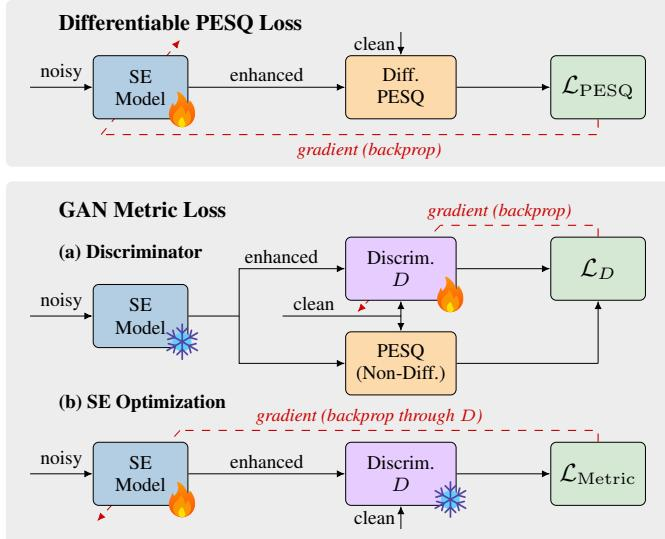
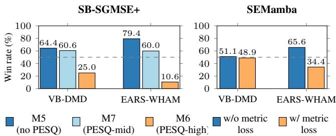
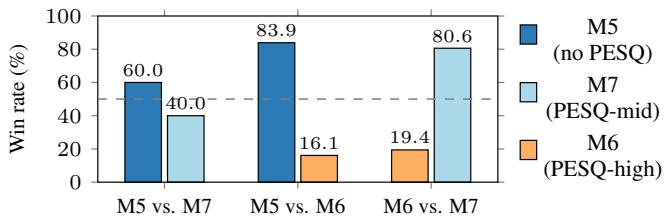

# PERCEPTUAL QUALITY LOSS OR LOSS OF PERCEPTUAL QUALITY?

Danilo de Oliveira, Tal Peer, Maur´ıcio do V. M. da Costa, Timo Gerkmann

Signal Processing, University of Hamburg, Germany

## ABSTRACT

Contemporary deep speech enhancement (SE) models are often trained with specific auxiliary terms in the loss function as a way to improve their performance in terms of perceptual metrics. Nevertheless, a higher score on a perceptual metric does not necessarily correlate with an improved listening experience. Through objective and subjective experiments, we assess the performance of SE models trained with two different types of auxiliary PESQ loss terms. The numerical evaluation on a suite of standard metrics suggests that, while models optimized for PESQ naturally obtain higher PESQ scores in the test set, for most other metrics the scores do not significantly change. In some cases, the PESQ loss even results in worse PESQ scores on mismatched data. A formal listening experiment reveals that the models without a PESQ loss were generally preferred over models that include it, across all settings. Finally, we analyze the relative importance of PESQ in the composite metrics CSIG, CBAK and COVL, and find that PESQ dominates all of them. Our study highlights the perils of over-reliance on PESQ and stresses the importance of a complete evaluation procedure for SE.

Index Terms— speech enhancement evaluation, metric optimization, perceptual loss

## 1. INTRODUCTION

Evaluation of speech enhancement (SE) models is a rich research topic; due to speech quality being highly subjective, reliable speech quality assessment (SQA) is a challenging task [1]. There exists a vast literature of listening evaluation procedures, formalized in International Telecommunication Union (ITU) recommendations [2], [3]. Given the time-consuming nature of such listening experiments, researchers have long devised instrumental measures of speech quality that provide direct feedback, enabling faster iteration in the development of noise suppression algorithms. Deep neural networks (DNNs) have fostered the development of non-intrusive (reference-free) metrics [4], [5]. However, metrics continue to face challenges inherent to the task, e.g. generalization [6] and noise in the subjective ratings [7].

Perceptual quality metrics can be incorporated into SE model optimization, with the goal of improving perceptual quality in the model’s outputs. In cases where the metric is differentiable, this can be done in a straightforward manner; nonetheless, non-differentiable metrics can also be included, e.g. via a metric predictor that acts as a differentiable surrogate [8]. A commonly used metric in this context is the Perceptual Evaluation of Speech Quality (PESQ) [9], an intrusive (reference-based) perceptual measure of relatively lightweight com putation whose implementation is readily available online.1 However, as metrics are imperfect proxies of human perception, optimization of DNNs based on them is prone to unintended artifacts or even complete failure. In [10], it was shown that high PESQ scores do not necessarily correlate with high perceived quality. The PESQetarian, a model optimized with a PESQ-focused objective, yields high PESQ scores while simultaneously performing very poorly in a human listening experiment. Furthermore, it was shown that high PESQ scores can be obtained even when distortions are purposefully induced.

The PESQetarian approach in [10] was designed to demonstrate the inherent problems arising from optimizing and evaluating a model using the same metric. For this, the extreme case of optimizing exclusively for PESQ was considered. In practice, however, metric losses are typically not used exclusively, but are rather combined with regular distance-based losses (e.g. MSE or SI-SDR) [11], [12]. Yet, this setting is still susceptible to Goodhart’s law, which states that “when a measure becomes a target, it ceases to be a good measure” [13]. An SE model optimized with a metric loss should naturally obtain higher performance in that metric. As a result, in terms of this metric, it ceases to be directly comparable to models that have not been optimized for that specific metric. Furthermore, even if constrained by other loss terms, the metric’s imperfect perceptual modeling can still be detrimental to performance on other metrics [14].

In this paper, we thoroughly investigate the effect of the PESQ loss on SE performance according to a suite of instrumental metrics, accompanied by a formal listening experiment. Our investigation includes two different versions of a PESQ loss, as featured in two representative SE systems [14], [15]. Additionally, we analyze the metrics that are included in a widely used evaluation script of composite measures [16]. Our results emphasize the importance of an evaluation process based on a comprehensive panel of metrics and datasets, ideally including data collected from a significantly large pool of human subjects. Moreover, they demonstrate the pitfalls of metric optimization: even as an auxiliary objective, perceptual metrics may not induce any meaningful improvement or even be detrimental to SE performance. Audio samples and an evaluation

## 2. PESQ-BASED LOSS FUNCTIONS

PESQ is a standard reference-based objective metric for SQA. It predicts the mean opinion score (MOS) [2] that would be assigned to a potentially degraded audio sample. Designed for telecommunication settings, PESQ was standardized by the ITU in 2001 as recommendation ITU-T P.862 [17] and superseded in 2011 by Perceptual Objective Listening Quality Analysis (POLQA) [18], in recommendation ITU-T P.863 [19]. Nevertheless, it remains a commonly used method and a standard benchmark for instrumental evaluation of SE algorithms.

PESQ comprises time- and level-alignment stages for normalization of reference and degraded signals, followed by a perceptuallymotivated auditory transform. In the transformed time-frequency representation, disturbances w.r.t. the reference signal are computed, aggregated, and mapped into the MOS scale, i.e. it ranges from 1 to 5, with higher scores representing better perceptual quality.

  
Fig. 1. Differentiable PESQ loss and GAN metric loss frameworks.

## 2.1. Differentiable PESQ Loss

Based on [12], [20], the torch-pesq3 package adapts the PESQ computation steps in a differentiable implementation, as illustrated in Fig. 1 (top). Contrasting with the original implementation, timealignment operations are skipped, and level alignment is performed via IIR filtering. The authors of the implementation have reported that optimizing SE models for the PESQ loss alone does not yield good results, and suggested that an scale invariant signal-to-distortion ratio (SI-SDR) [21] loss term should be used in conjunction with it.

SB-SGMSE+ consists of a diffusion-based model employing a Schrodinger Bridge (¨ SB) [22] to describe the transformation path between the distributions of noisy and clean speech signals [14]. The framework of SBs allows for the incorporation of data prediction losses, e.g. an $L _ { 1 }$ loss term in the time domain [23]. In [14], the authors propose including a differentiable PESQ loss term, weighted by a hyperparameter αP. In this manuscript, models M5, M7, and M6 are evaluated, with α assuming the values of 0 (no PESQ), 0.0005 (PESQ-mid), and 0.001 (PESQ-high), respectively. The checkpoints made available by the authors are used.

## 2.2. GAN Metric Loss

Pioneered by MetricGAN [8], the generative adversarial network (GAN)-style [24] training loss term treats the target metric as a black box and trains a DNN to act as a differentiable surrogate. Despite being metric-agnostic, PESQ was the metric of choice in many subsequent SE works [11], [25], [26].

Figure 1 (bottom) depicts the GAN metric loss term described in the following. The discriminator D takes a reference-degraded pair of magnitude spectrograms as inputs and outputs a prediction of PESQ rescaled in the range [0, 1]. The discriminator loss is

$$
\begin{array} { r l } & { \mathcal { L } _ { D } = \mathbb { E } _ { {\pmb X } _ { m } } [ \| D ( { \pmb X } _ { m } , { \pmb X } _ { m } ) - 1 \| _ { 2 } ^ { 2 } ] } \\ & { \qquad + \mathbb { E } _ { { \pmb X } _ { m } , \hat { \pmb X } _ { m } } [ \| D ( { \pmb X } _ { m } , \hat { \pmb X } _ { m } ) - Q _ { \mathrm { \hat { \mathbf { P } } E S Q } } \| _ { 2 } ^ { 2 } ] , } \end{array}\tag{1}
$$

where $X _ { m }$ is the clean magnitude spectrogram, $\hat { X } _ { m }$ is the enhanced magnitude spectrogram estimated by the SE model in the current training iteration, and $Q _ { \mathrm { P E S Q } }$ is the actual PESQ score rescaled. This means that the metric discriminator is trained to estimate PESQ, encouraging the assignment of the highest score to identical signal pairs. In turn, the generator metric loss term $\mathcal { L } _ { \mathrm { M e t r i c } }$ encourages the SE model to produce outputs with the highest perceptual score, as judged by the discriminator:

$$
\begin{array} { r } { \mathcal { L } _ { \mathrm { M e t r i c } } = \mathbb { E } _ { { X } _ { m } , \hat { { X } } _ { m } } [ \| D ( { X } _ { m } , \hat { { X } } _ { m } ) - 1 \| _ { 2 } ^ { 2 } ] . } \end{array}\tag{2}
$$

SEMamba: Building on the dual magnitude/phase decoder design of MP-SENet [26], the authors of [15] investigated replacing the twostage Conformer blocks in the backbone with Mamba [27] blocks. The resulting model was named SEMamba-advanced, which is referred to as SEMamba in the remainder of this paper. It combines a suite of loss terms based on waveform amplitude, complex shorttime Fourier transform (STFT) coefficients, STFT consistency, and a GAN-based metric loss, as described above. The official code provided by the authors5 is used, retraining with batch size 12 and learning rate 0.001. We train two versions: one excluding the GAN loss from the aforementioned suite of loss terms (SEMamba w/o metric loss), and one with the original loss (SEMamba w/ metric loss), for a direct comparison.

## 3. EXPERIMENTS

## 3.1. Instrumental Metrics

Aiming at obtaining a broad view of the effect of PESQ optimization over SE performance, a variety of metrics is employed, both reference based and reference-free, as listed below.

Composite metrics (CSIG, CBAK, COVL) [16] are combinations of other instrumental measures, fit through linear regression to correlate with listening scores from recommendation ITU-T P.835 [3].

ESTOI [28] is an intrusive metric for speech intelligibility, based on the spectral correlation between temporal envelopes of reference and degraded signals. It is expected to have a monotonic, non-linear, and dataset-dependent relation with speech intelligibility.

segSNR is the average signal-to-noise ratio (SNR) computed over windowed segments.

SI-SDR measures the level of distortion (residual noise, artifacts and, in source separation, interfering sources) between degraded and reference signals in a scale-invariant manner.

POLQA [18] is the successor of PESQ. The approach is similar to its predecessor, with a series of improvements aimed at modern telecommunication systems, including support for full-band audio.

WAcc is the word accuracy, which measures the performance of automatic speech recognition (ASR) models on the enhanced audio. It is defined as 1 WER, where WER is the word error rate, i.e. the edit distance on the text transcriptions and thus a content-intrusive metric. In [29], it was shown that systems with language modeling capabilities can overcome acoustic artifacts. For a focus on acoustics, we therefore make exclusive use ASR models based on connectionist temporal classification (CTC) [30]. The text normalization pipeline corresponds to the wer standardize pipeline from the jiwer package, with additional punctuation removal, expansion of informal contractions, and number-to-word conversion, as in [29].

Table 1. Results of SB-SGMSE+ on the matched VB-DMD and the mismatched EARS-WHAM datasets. Best results highlighted in bold font, alongside other methods whose difference is statistically insignificant according to a paired Wilcoxon signed-rank test. The upper set corresponds to CMGAN’s evaluation script, with the updated ESTOI metric. POLQA∗ indicates only a subset of files produced valid scores
<table><tr><td rowspan="2">Metric</td><td colspan="4">VB-DMD (Matched)</td><td colspan="4">EARS-WHAM (Mismatched)</td></tr><tr><td>Noisy</td><td>SB-SGMSE+ M5 (no PESQ)</td><td> $\scriptstyle \mathbf { S B - S G M S E + }$   $\mathbf { M } 7 \mathrm { ~ ( P E S Q - m i d ) }$ </td><td> ${ \mathrm { S B } } { \mathrm { - } } { \mathrm { S G M S E } } { \mathrm { + } }$   $\mathbf { M } 6 \ \mathrm { ( P E S Q \mathrm { - } h i g h ) }$ </td><td>Noisy</td><td>SB-SGMSE+ M5 (no PESQ)</td><td> $\mathbf { S B - S G M S E + }$   $\mathbf { M } 7 \mathrm { ( P E S Q – m i d ) }$ </td><td> ${ \mathrm { S B } } { \mathrm { - } } { \mathrm { S G M S E } } { \mathrm { + } }$   $\mathbf { M } 6 \ \mathrm { ( P E S Q \mathrm { - } h i g h ) }$ </td></tr><tr><td>PESQ</td><td> $1 . 9 7 \pm 0 . 7 5$ </td><td> $2 . 9 1 \pm 0 . 7 5$ </td><td> $3 . 5 6 \pm 0 . 6 5$ </td><td> ${ \bf 3 . 7 3 \pm 0 . 5 6 }$ </td><td> $1 . 2 4 \pm 0 . 2 1$ </td><td> $1 . 8 5 \pm 0 . 6 2$ </td><td> $2 . 2 6 \pm 0 . 7 0$ </td><td> $\mathbf { 2 . 3 2 \pm 0 . 6 8 }$ </td></tr><tr><td>CSIG</td><td> $3 . 4 9 \pm 0 . 8 1$ </td><td> $4 . 0 3 \pm 0 . 8 3$ </td><td> $4 . 6 3 \pm 0 . 5 2$ </td><td> ${ \bf 4 . 6 9 \pm 0 . 4 5 }$ </td><td> $2 . 7 5 \pm 0 . 5 3$ </td><td> $2 . 7 2 \pm 0 . 8 4$ </td><td> $3 . 3 1 \pm 0 . 8 0$ </td><td> ${ \bf 3 . 3 6 \pm 0 . 7 7 }$ </td></tr><tr><td>CBAK</td><td> $2 . 5 5 \pm 0 . 6 4$ </td><td> $3 . 6 4 \pm 0 . 5 3$ </td><td> ${ \bf 3 . 7 9 \pm 0 . 4 3 }$ </td><td> $3 . 7 3 \pm 0 . 3 8$ </td><td> $2 . 1 0 \pm 0 . 3 8$ </td><td> $2 . 8 3 \pm 0 . 5 2$ </td><td> $\mathbf { 2 . 9 3 \pm 0 . 5 1 }$ </td><td> $2 . 8 4 \pm 0 . 4 8$ </td></tr><tr><td>COVL</td><td> $2 . 7 4 \pm 0 . 7 9$ </td><td> $3 . 5 3 \pm 0 . 8 0$ </td><td> $4 . 2 1 \pm 0 . 6 4$ </td><td> ${ \bf 4 . 3 3 \pm 0 . 5 6 }$ </td><td> $2 . 0 2 \pm 0 . 3 7$ </td><td> $2 . 3 3 \pm 0 . 7 2$ </td><td> $2 . 8 4 \pm 0 . 7 5$ </td><td> $\pm . 8 8 \pm \mathbf { 0 . 7 3 }$ </td></tr><tr><td>ESTOI</td><td> $0 . 7 9 \pm 0 . 1 5$ </td><td> ${ \bf 0 . 8 8 \pm 0 . 1 0 }$ </td><td> $0 . 8 7 \pm 0 . 0 9$ </td><td> $0 . 8 6 \pm 0 . 0 9$ </td><td> $0 . 6 4 \pm 0 . 1 7$ </td><td> ${ \bf 0 . 7 7 \pm 0 . 1 7 }$ </td><td> $0 . 7 6 \pm 0 . 1 7$ </td><td> $0 . 7 4 \pm 0 . 1 8$ </td></tr><tr><td>segSNR [dB]</td><td> $1 . 6 8 \pm 4 . 4 4$ </td><td> ${ \bf 1 0 . 1 8 \pm 3 . 2 3 }$ </td><td> $7 . 5 9 \pm 2 . 7 1$ </td><td> $5 . 5 3 \pm 2 . 3 9$ </td><td> $- 0 . 8 0 \pm 3 . 9 8$ </td><td> ${ \pm . 2 8 \pm 3 . 9 6 }$ </td><td> $3 . 8 8 \pm 3 . 2 8$ </td><td> $2 . 0 6 \pm 2 . 9 5$ </td></tr><tr><td>SI-SDR [dB]</td><td> $8 . 4 4 \pm 5 . 6 2$ </td><td> ${ \bf 1 9 . 4 3 \pm 3 . 4 8 }$ </td><td> $1 3 . 2 1 \pm 2 . 8 7$ </td><td> $7 . 7 0 \pm 2 . 8 6$ </td><td> $5 . 3 6 \pm 5 . 9 1$ </td><td> ${ \bf 1 } 2 . 6 7 \pm 5 . 6 5$ </td><td> $7 . 9 0 \pm 3 . 7 7$ </td><td> $3 . 2 3 \pm 3 . 4 0$ </td></tr><tr><td>POLQA*</td><td> $3 . 2 3 \pm 0 . 8 1$ </td><td>4.32 ± 0.54</td><td> ${ \bf 4 . 4 0 \pm 0 . 4 7 }$ </td><td> $4 . 2 2 \pm 0 . 5 5$ </td><td> $2 . 0 3 \pm 0 . 5 1$ </td><td> $2 . 9 8 \pm 1 . 0 0$ </td><td> ${ \bf 3 . 1 3 \pm 1 . 0 4 }$ </td><td> $2 . 7 7 \pm 1 . 0 1$ </td></tr><tr><td>DistillMOS</td><td> $3 . 6 4 \pm 0 . 3 7$ </td><td> ${ \bf 3 . 9 0 \pm 0 . 3 1 }$ </td><td> $3 . 7 8 \pm 0 . 3 4$ </td><td> $3 . 7 3 \pm 0 . 3 7$ </td><td> $2 . 5 8 \pm 0 . 6 0$ </td><td> ${ \bf 4 . 1 6 \pm 0 . 5 8 }$ </td><td> $4 . 1 1 \pm 0 . 6 4$ </td><td> $3 . 7 9 \pm 0 . 7 8$ </td></tr><tr><td>SCOREQ (NR)</td><td> $3 . 3 2 \pm 0 . 6 4$ </td><td> $4 . 3 4 \pm 0 . 3 3$ </td><td> ${ \bf 4 . 3 9 \pm 0 . 3 0 }$ </td><td> $4 . 2 7 \pm 0 . 4 4$ </td><td> $2 . 1 3 \pm 0 . 5 8$ </td><td> $3 . 1 2 \pm 0 . 9 1$ </td><td> ${ \bf 3 . 1 7 \pm 0 . 8 7 }$ </td><td> $2 . 8 2 \pm 0 . 8 8$ </td></tr><tr><td>SCOREQ (REF) ↓</td><td> $0 . 7 6 \pm 0 . 2 8$ </td><td> ${ \bf 0 . 2 7 \pm 0 . 1 4 }$ </td><td> ${ \bf 0 . 2 6 \pm 0 . 1 3 }$ </td><td> $0 . 3 2 \pm 0 . 1 7$ </td><td> $1 . 1 3 \pm 0 . 2 1$ </td><td> $0 . 6 2 \pm 0 . 3 3$ </td><td> ${ \bf 0 . 6 0 \pm 0 . 3 0 }$ </td><td> $0 . 7 3 \pm 0 . 3 0$ </td></tr><tr><td>WAcc QuartzNet 15x5 [%]</td><td> $9 1 . 8 3 \pm 1 6 . 0 6$ </td><td> ${ \bf 9 3 . 6 8 \pm 1 4 . 0 4 }$ </td><td> ${ \bf 9 3 . 4 9 \pm 1 3 . 9 6 }$ </td><td> $9 2 . 6 7 \pm 1 5 . 2 7$ </td><td> $6 7 . 2 2 \pm 2 9 . 3 5$ </td><td> ${ \bf 7 0 . 4 6 \pm 2 7 . 6 4 }$ </td><td> $\mathbf { 7 0 . 0 4 } \pm 2 7 . 7 2$ </td><td> $6 7 . 9 9 \pm 2 9 . 0 5$ </td></tr><tr><td>WAcc Parakeet CTC 0.6B [%]</td><td> $9 7 . 2 3 \pm 1 0 . 9 4$ </td><td> ${ \bf 9 7 . 9 9 \pm 7 . 3 5 }$ </td><td> ${ \bf 9 7 . 9 4 \pm 9 . 3 2 }$ </td><td> ${ \bf 9 7 . 8 5 \pm 9 . 6 6 }$ </td><td> $9 0 . 6 0 \pm 1 6 . 8 4$ </td><td> ${ \bf 8 6 . 3 8 \pm 2 0 . 9 2 }$ </td><td> $8 4 . 6 1 \pm 2 2 . 7 1$ </td><td> $8 3 . 2 8 \pm 2 3 . 4 3$ </td></tr></table>

Table 2. Results of SEMamba on the matched VB-DMD and the mismatched EARS-WHAM datasets. Best results highlighted in bold font, alongside other methods whose difference is statistically insignificant according to a paired Wilcoxon signed-rank test. The upper set corresponds to CMGAN’s evaluation script, with the updated ESTOI metric. POLQA∗ indicates only a subset of files produced valid scores.
<table><tr><td rowspan="2">Metric</td><td colspan="3">VB-DMD (Matched)</td><td colspan="3">EARS-WHAM (Mismatched)</td></tr><tr><td>Noisy</td><td>SEMamba w/o metric loss</td><td>SEMamba w/ metric loss</td><td>Noisy</td><td>SEMamba w/o metric loss</td><td>SEMamba w/ metric loss</td></tr><tr><td>PESQ Discriminator D</td><td> $2 . 4 5 \pm 0 . 5 8$ </td><td> $3 . 2 6 \pm 0 . 5 8$ </td><td> ${ \bf 3 . 3 4 \pm 0 . 5 6 }$ </td><td> $1 . 6 1 \pm 0 . 1 5$ </td><td> ${ \bf 1 . 7 8 \pm 0 . 5 7 }$ </td><td> $1 . 7 5 \pm 0 . 5 7$ </td></tr><tr><td>PESQ</td><td> $1 . 9 7 \pm 0 . 7 5$ </td><td> $3 . 3 5 \pm 0 . 6 3$ </td><td> ${ \bf 3 . 4 2 \pm 0 . 6 0 }$ </td><td> $1 . 2 4 \pm 0 . 2 1$ </td><td> $\mathbf { 2 . 2 1 \pm 0 . 7 0 }$ </td><td> $2 . 1 6 \pm 0 . 7 2$ </td></tr><tr><td>CSIG</td><td> $3 . 4 9 \pm 0 . 8 1$ </td><td> $4 . 7 1 \pm 0 . 4 3$ </td><td> ${ \bf 4 . 7 2 \pm 0 . 4 2 }$ </td><td> $2 . 7 5 \pm 0 . 5 3$ </td><td> ${ \bf 3 . 7 3 \pm 0 . 6 7 }$ </td><td> $3 . 6 5 \pm 0 . 7 2$ </td></tr><tr><td>CBAK</td><td> $2 . 5 5 \pm 0 . 6 4$ </td><td> $3 . 8 8 \pm 0 . 4 7$ </td><td> ${ \bf 3 . 9 0 \pm 0 . 4 7 }$ </td><td> $2 . 1 0 \pm 0 . 3 8$ </td><td> $\mathbf { 2 . 9 7 \pm 0 . 5 6 }$ </td><td> $2 . 8 9 \pm 0 . 5 6$ </td></tr><tr><td>COVL</td><td> $2 . 7 4 \pm 0 . 7 9$ </td><td> $4 . 1 3 \pm 0 . 5 8$ </td><td> ${ \bf 4 . 1 7 \pm 0 . 5 5 }$ </td><td> $2 . 0 2 \pm 0 . 3 7$ </td><td> ${ \bf 3 . 0 2 \pm 0 . 6 9 }$ </td><td> $2 . 9 5 \pm 0 . 7 2$ </td></tr><tr><td>ESTOI</td><td> $0 . 7 9 \pm 0 . 1 5$ </td><td> ${ \bf 0 . 8 9 \pm 0 . 0 8 }$ </td><td> ${ \bf 0 . 8 9 \pm 0 . 0 8 }$ </td><td> $0 . 6 4 \pm 0 . 1 7$ </td><td> ${ \bf 0 . 7 8 \pm 0 . 1 7 }$ </td><td> $0 . 7 6 \pm 0 . 1 8$ </td></tr><tr><td>segSNR [dB]</td><td> $1 . 6 8 \pm 4 . 4 4$ </td><td> ${ \bf 1 0 . 6 9 \pm 3 . 2 5 }$ </td><td> ${ \bf 1 0 . 4 6 \pm 3 . 5 7 }$ </td><td> $- 0 . 8 0 \pm 3 . 9 8$ </td><td> $\mathbf { 4 . 7 2 \pm 4 . 0 8 }$ </td><td> $3 . 8 5 \pm 3 . 9 8$ </td></tr><tr><td>SI-SDR [dB]</td><td> $8 . 4 4 \pm 5 . 6 2$ </td><td> ${ \bf 2 0 . 1 1 \pm 3 . 4 0 }$ </td><td> $1 9 . 7 0 \pm 3 . 8 1$ </td><td> $5 . 3 6 \pm 5 . 9 1$ </td><td> ${ \bf 1 } 2 . { \bf 0 6 } \pm 5 . 6 7$ </td><td> $9 . 9 6 \pm 5 . 2 1$ </td></tr><tr><td>POLQA*</td><td> $3 . 2 3 \pm 0 . 8 1$ </td><td> ${ \bf 4 . 4 4 \pm 0 . 4 1 }$ </td><td> $4 . 4 3 \pm 0 . 4 1$ </td><td> $2 . 0 3 \pm 0 . 5 1$ </td><td> ${ \bf 3 . 2 6 \pm 0 . 9 9 }$ </td><td> $3 . 1 4 \pm 1 . 0 2$ </td></tr><tr><td>DistillMOS</td><td> $3 . 6 4 \pm 0 . 3 7$ </td><td> ${ \bf 3 . 9 1 \pm 0 . 3 1 }$ </td><td> $3 . 9 0 \pm 0 . 3 2$ </td><td> $2 . 5 8 \pm 0 . 6 0$ </td><td> $3 . 7 7 \pm 0 . 7 7$ </td><td> ${ \bf 3 . 8 2 \pm 0 . 8 1 }$ </td></tr><tr><td>SCOREQ (NR)</td><td> $3 . 3 2 \pm 0 . 6 4$ </td><td> $\mathbf { 4 . 4 2 \ : \pm 0 . 2 5 }$ </td><td> $4 . 4 1 \pm 0 . 2 7$ </td><td> $2 . 1 3 \pm 0 . 5 8$ </td><td> ${ \bf 3 . 2 0 \pm 0 . 9 0 }$ </td><td> ${ \bf 3 . 2 0 \pm 0 . 8 8 }$ </td></tr><tr><td>SCOREQ (REF) ↓</td><td> $0 . 7 6 \pm 0 . 2 8$ </td><td> ${ \bf 0 . 1 8 \pm 0 . 1 0 }$ </td><td> ${ \bf 0 . 1 8 \pm 0 . 1 0 }$ </td><td> $1 . 1 3 \pm 0 . 2 1$ </td><td> ${ \bf 0 . 5 8 \pm 0 . 3 4 }$ </td><td> ${ \bf 0 . 5 7 \pm 0 . 3 3 }$ </td></tr><tr><td>WAcc QuartzNet 15x5 [%]</td><td> $9 1 . 8 3 \pm 1 6 . 0 6$ </td><td> ${ \bf 9 4 . 3 0 \pm 1 2 . 8 8 }$ </td><td> $\mathbf { 9 4 . 4 5 \pm 1 3 . 9 8 }$ </td><td> $6 7 . 2 2 \pm 2 9 . 3 5$ </td><td> $\mathbf { 7 4 . 0 3 \pm 2 5 . 3 4 }$ </td><td> $7 2 . 6 6 \pm 2 6 . 3 0$ </td></tr><tr><td>WAcc Parakeet CTC 0.6B [%]</td><td> $9 7 . 2 3 \pm 1 0 . 9 4$ </td><td> ${ \bf 9 8 . 3 1 \pm 8 . 1 0 }$ </td><td> ${ \bf 9 8 . 2 4 \pm 9 . 5 7 }$ </td><td> $9 1 . 6 0 \pm 1 6 . 8 4$ </td><td> ${ \bf 8 7 . 6 4 \pm 1 9 . 3 5 }$ </td><td> $8 6 . 1 1 \pm 2 1 . 0 2$ </td></tr></table>

## 3.3. Listening Experiment

SCOREQ [4] is a DNN-based model of SQA whose training involves contrastive learning for structuring the representation space according to MOS. It has two modes of operation: reference-based (REF), where the distance between embeddings of clean and degraded audio signals is calculated; and reference-free (NR), where the embeddings are mapped into the MOS scale via fine-tuning.

DistillMOS [5] is a convolutional model trained via distillation of a large self-supervised teacher model, with human-labeled data as targets, as well as unlabeled data “pseudo-labeled” by the teacher.

## 3.2. Data

A formal listening experiment was conducted to assess the effect that objective perceptual loss optimization terms have on the subjective perceived quality of enhanced speech signals. The experiment was designed as a blind preference test, where participants were presented with two stimuli at a time and asked to choose the best-sounding one in terms of overall perceived quality. For SEMamba, the choice was between the default model with all loss terms and one without the $\mathcal { L } _ { \mathrm { M e t r i c } }$ term. For SB-SGMSE+, triplets of samples from models M5, M6, and M7 were presented to participants in pairwise comparisons, distributed randomly throughout the experiment. Thirty samples from each test set were selected. Stimuli were assigned randomly to participants, with the constraints of stratified sampling w.r.t. input SNR. For VB-DMD, whose sentences are generally short, files shorter than 3 seconds are filtered out. In the case of EARS-WHAM, where samples are longer, segments of approximately 6 seconds are cropped, avoiding mid-sentence crops through the use of a voice activity detector (VAD) on the corresponding clean audio files. All stimuli were normalized to -23 LUFS target loudness.

Our analysis considers two SE benchmarks. For a matched setting, the VoiceBank-DEMAND (VB-DMD) test set [31] is used, corresponding to the training set used to optimize the SE models. This test set contains 824 samples with input SNRs in the set 2.5, 5.0, 7.5, . . . , 17.5 dB. For an investigation of generalization to a mismatched, more challenging setting, the EARS-WHAM v2 test set [32] is used. It contains 886 mixtures with SNR continuously distributed in the range [ 2.5, 17.5] dB. Both datasets are down-sampled to 16 kHz.

The experiment was conducted in a sound-proofed listening booth, using Beyerdynamic DT 770 PRO headphones and a fixed volume level across all participants. Twelve audio experts participated in the experiment, each rating 56 pairs of speech signals. Of these, eight pairs were screening (dummy) tests. Three dummy tests were presented in the beginning for training purposes, while the other five were distributed randomly throughout the experiment to probe for continued attention of the participants to the task. Each stimulus was evaluated by three different participants.

  
Fig. 2. Listening experiment win rates (%) by model and dataset.

## 3.4. Composite Metric Analysis

The set of metrics containing PESQ, CSIG, CBAK, COVL, segmental signal-to-noise ratio (segSNR) and ESTOI’s predecessor STOI was used in [11] and has become a popular choice of evaluation procedure. We conduct an analysis of the importance of each component involved in the computation of CSIG, CBAK, and COVL; these are PESQ, log-likelihood ratio, weighted-slope spectral (WSS) distance [33] and segSNR. Since each component operates in a different range, each metric’s share of the total variance in the linear part of the composite is computed. The empirical statistics are calculated from the data of VB-DMD and EARS-WHAM, noisy and enhanced by the models considered in this paper.

## 4. RESULTS

Tables 1 and 2 present evaluation results in terms of the instrumental metrics described in Sec. 3.1. Due to minimum speech length constraints, POLQA could only be computed on 56% and 98% of the VB-DMD and EARS-WHAM test samples, respectively. Comparisons are made within each test set. For SB-SGMSE+, the results are consistent across matched and mismatched conditions: the M6 model (PESQ-high) leads in PESQ, CSIG and COVL by a significant margin over M5 (no PESQ); M7 (PESQ-mid) yields the best POLQA and CBAK values; and M5 gets the highest segSNR, SDR and ESTOI scores. Other metrics generally show close performance between no PESQ and PESQ-mid. For SEMamba, results differ across test sets: in the matched set, performance is generally similar across metrics, with the exception of PESQ and composite metrics. In contrast, the mismatched set shows a clear distinction, with most metrics favoring the model without a metric loss, including the aforementioned PESQ and composite measures. This might be explained by the fact that the metric discriminator itself is also trained on VB-DMD, concurrently with the SE model. The limited size and SNR range of VB-DMD lead to a weak generalization ability of the discriminator, which is visible in the larger gaps to real PESQ values on EARS-WHAM.

The listening experiment results reveal a statistically significant general preference for the models optimized without PESQ loss terms. Fig. 2 shows the win rates of each model, i.e., the percentage of trials in which the model was preferred when featured in a pairwise comparison. In the matched VB-DMD case, SB-SGMSE+ with no PESQ and PESQ-mid have close performance, and the same holds for SE-Mamba with and without metric loss. The differences become clearer in the mismatched case, where the no-PESQ models gain approximately 15 percentage points across both models. In the SB-SGMSE+ analysis, the PESQ-mid model remains stable across conditions, but still behind the model without PESQ. Fig. 3 displays the pairwise win rates. A Bradley-Terry model is applied to convert these into a ranking, indicating the no-PESQ model as the strongest model of the trio (0.534), followed by PESQ-mid (0.371), and PESQ-high ranking lowest (0.095). Corroborating the findings of [10], this shows that too much focus on PESQ optimization is counterproductive to SE performance. For the SEMamba models, a binomial test rejects the hypothesis that listeners’ preference for the model without a metric loss is due to chance (p = .030).

  
Fig. 3. Listening experiment pairwise win rates (%) for SB-SGMSE+.

Table 3. Effective importance of individual metrics in the composite measures as implemented in [16]. Empirical statistics were computed over all models and both datasets.
<table><tr><td></td><td>Metric</td><td>% Var</td><td></td><td>Metric</td><td>% Var</td><td></td><td>Metric</td><td>% Var</td></tr><tr><td>CSIG</td><td>PESQ</td><td>59.2</td><td></td><td>PESQ</td><td>69.0</td><td></td><td>PESQ</td><td>91.1</td></tr><tr><td></td><td>LLR</td><td>40.2</td><td>CBAK</td><td>segSNR</td><td>30.3</td><td>COOD</td><td>LLR</td><td>8.6</td></tr><tr><td></td><td>WSS</td><td>0.7</td><td></td><td>WSS</td><td>0.8</td><td></td><td>WSS</td><td>0.4</td></tr></table>

Table 3 shows the explained variance of each metric within each composite linear combination, following the methodology of Sec. 3.4. Please note that, although the code commonly used to compute them derives from the Matlab script published alongside [1], the metrics and weights in that script actually correspond to [16]. In the data of this experiment, PESQ dominates the variance in all composite measures, while WSS accounts for less than 1% in any of them. Combined with the low variance in ESTOI, this highlights the importance of using a wider a set of metrics beyond CMGAN’s evaluation script.

## 5. CONCLUSION

This paper presents a thorough analysis of two representative SE models with and without a perceptually-motivated loss term (PESQ). Both a differentiable PESQ and a PESQ-surrogate GAN-style discriminator implementations were considered. SE performance was evaluated using a varied set of instrumental metrics and found no consensus beyond PESQ and composite metrics, which were shown to be dominated by PESQ via a variance analysis. In a mismatched setting, the GAN-style loss term was found to be even detrimental to PESQ. A formal listening experiment confirmed listening preference for the models without a PESQ loss, a phenomenon more pronounced in a mismatched setting. Our work demonstrates the risks and caveats of perceptual losses in speech enhancement, even in controlled doses, and highlights the importance of a complete evaluation procedure.

## 6. REFERENCES

[1] P. Loizou, Speech Enhancement: Theory and Practice, Second Edition. CRC Press, 2013.

[2] ITU-T Rec. P.800, “Methods for subjective determination of transmission quality,” Int. Telecom. Union (ITU), 1996.

[3] ITU-T Rec. P.835, “Subjective test methodology for evaluating speech communication systems that include noise suppression algorithm,” Int. Telecom. Union (ITU), 2003.

[4] A. Ragano, J. Skoglund, and A. Hines, “SCOREQ: Speech quality assessment with contrastive regression,” in Advances in Neural Inf. Proc. Systems (NeurIPS), vol. 37, 2024.

[5] B. Stahl and H. Gamper, “Distillation and pruning for scalable self-supervised representation-based speech quality assessment,” in IEEE Int. Conf. on Acoustics, Speech and Signal Process. (ICASSP), 2025.

[6] E. Cooper, W.-C. Huang, T. Toda, and J. Yamagishi, “Generalization ability of mos prediction networks,” in IEEE Int. Conf. on Acoustics, Speech and Signal Process. (ICASSP), 2022.

[7] F. Cumlin, “RHO-PERFECT: Correlation ceiling for subjective evaluation datasets,” in IEEE Int. Conf. on Acoustics, Speech and Signal Process. (ICASSP), 2026.

[8] S.-W. Fu, C.-F. Liao, Y. Tsao, and S.-D. Lin, “MetricGAN: Generative adversarial networks based black-box metric scores optimization for speech enhancement,” in Int. Conf. on Machine Learning (ICML), ser. Proceedings of Machine Learning Research, vol. 97, 2019.

[9] A. Rix, J. Beerends, M. Hollier, and A. Hekstra, “Perceptual evaluation of speech quality (PESQ)-a new method for speech quality assessment of telephone networks and codecs,” in IEEE Int. Conf. on Acoustics, Speech and Signal Process. (ICASSP), vol. 2, 2001.

[10] D. de Oliveira, S. Welker, J. Richter, and T. Gerkmann, “The PESQetarian: On the relevance of Goodhart’s law for speech enhancement,” in Interspeech, 2024.

[11] R. Cao, S. Abdulatif, and B. Yang, “CMGAN: Conformerbased Metric GAN for speech enhancement,” in Interspeech, 2022.

[12] J. Kim, M. El-Khamy, and J. Lee, “End-to-end multi-task denoising for the joint optimization of perceptual speech metrics,” arXiv preprint arXiv:1910.10707, 2019.

[13] M. Strathern, “Improving ratings: Audit in the british university system,” European Review, vol. 5, no. 3, 1997.

[14] J. Richter, D. de Oliveira, and T. Gerkmann, “Investigating training objectives for generative speech enhancement,” in IEEE Int. Conf. on Acoustics, Speech and Signal Process. (ICASSP), 2025.

[15] R. Chao et al., “An investigation of incorporating Mamba for speech enhancement,” in IEEE Spoken Language Technology, 2024.

[16] Y. Hu and P. C. Loizou, “Evaluation of objective measures for speech enhancement,” in Interspeech, 2006.

[17] ITU-T Rec. P.862, “Perceptual evaluation of speech quality (PESQ): An objective method for end-to-end speech quality assessment of narrow-band telephone networks and speech codecs,” Int. Telecom. Union (ITU), 2001.

[18] J. G. Beerends et al., “Perceptual objective listening quality assessment (POLQA), the third generation ITU-T standard for end-to-end speech quality measurement part I - temporal alignment,” J. Audio Engineering Soc., vol. 61, no. 6, 2013.

[19] ITU-T Rec. P.863, “Perceptual objective listening quality prediction,” Int. Telecom. Union (ITU), 2011.

[20] J. M. Martin-Donas, A. M. Gomez, J. A. Gonzalez, and A. M.˜ Peinado, “A deep learning loss function based on the perceptual evaluation of the speech quality,” IEEE Signal Process. Lett. (SPL), vol. 25, no. 11, 2018.

[21] J. Le Roux, S. Wisdom, H. Erdogan, and J. R. Hershey, “SDR - Half-baked or well done?” In IEEE Int. Conf. on Acoustics, Speech and Signal Process. (ICASSP), 2019.

[22] T. Chen, G.-H. Liu, and E. Theodorou, “Likelihood training of schrodinger bridge using forward-backward SDEs theory,”¨ in Int. Conf. on Learning Representations (ICLR), 2022.

[23] A. Jukic, R. Korostik, J. Balam, and B. Ginsburg, “Schr ´ odinger¨ bridge for generative speech enhancement,” in Interspeech, 2024.

[24] I. J. Goodfellow et al., “Generative adversarial nets,” in Advances in Neural Inf. Proc. Systems (NeurIPS), vol. 27, 2014.

[25] Z. Xu, M. Strake, and T. Fingscheidt, “Deep noise suppression maximizing non-differentiable PESQ mediated by a nonintrusive PESQNet,” IEEE/ACM Trans. on Audio, Speech, and Language Process., vol. 30, 2022.

[26] Y.-X. Lu, Y. Ai, and Z.-H. Ling, “MP-SENet: A speech enhancement model with parallel denoising of magnitude and phase spectra,” in Interspeech, 2023.

[27] A. Gu and T. Dao, “Mamba: Linear-time sequence modeling with selective state spaces,” in First Conf. on Language Modeling, 2024.

[28] J. Jensen and C. H. Taal, “An algorithm for predicting the intelligibility of speech masked by modulated noise maskers,” IEEE/ACM Trans. on Audio, Speech, and Language Process., vol. 24, no. 11, pp. 2009–2022, 2016.

[29] D. de Oliveira, T. Peer, and T. Gerkmann, “Too good to be true: A study on modern automatic speech recognition systems for the evaluation of speech enhancement,” in Interspeech, 2026.

[30] A. Graves, S. Fernandez, F. Gomez, and J. Schmidhuber, “Con-´ nectionist temporal classification: Labelling unsegmented sequence data with recurrent neural networks,” in Int. Conf. on Machine Learning (ICML), 2006.

[31] C. Valentini-Botinhao, X. Wang, S. Takaki, and J. Yamagishi, “Investigating RNN-based speech enhancement methods for noise-robust text-to-speech,” in 9th Speech Synthesis Workshop (SSW), 2016.

[32] J. Richter et al., “EARS: An anechoic fullband speech dataset benchmarked for speech enhancement and dereverberation,” in Interspeech, 2024.

[33] D. H. Klatt, “Prediction of perceived phonetic distance from critical-band spectra: A first step,” in IEEE Int. Conf. on Acoustics, Speech and Signal Process. (ICASSP), vol. 7, 1982.