# PERSISTENT PARTNERS RAISE PRICESAMONG LEARNING AGENTS

Paul-Peter Arslan Institute For Future Technologies Devinci Higher Education paulpeterarslan@gmail.com

Yubin Kim Massachusetts Institute of Technology

Xiao Xiao Institute For Future Technologies Devinci Higher Education

## ABSTRACT

When pricing agents meet repeatedly on a platform, the platform decides who faces whom. We ask whether that choice moves the prices the agents learn, and whether a rise comes with learned punishment. In a pre-registered randomised experiment in the Bertrand duopoly of Calvano et al., each agent’s price is set by a tabular Qlearning module, not by the small language model attached to it, and we randomise whether each agent keeps its partner, sees its rival’s prices and can send messages. Keeping the same partner raises the level of profits, averaged over training, by 0.27 of the gap between competitive and monopoly profit (95% CI 0.20 to 0.35, all twenty paired runs positive), our registered primary result, and the resting price by 0.17 of the Nash-to-monopoly range (post hoc). A plain tabular learner reproduces the effect in all 25 further blocks, and there one permanent partner raises the level more than about three do (+0.23 against +0.05, exploratory). Where rival prices are hidden, the price-setting module cannot see a cut, so cannot punish it, yet the resting price rises as much and the rise lasts to the end of training, while with visible rivals it shrinks with longer training (post hoc). Where the rival is visible, a static best responder accounts for a third to a half of what a forced-deviation probe reads as punishment, on the starts where the rival can see the cut, and net of it the registered test of learned punishment is inconclusive. A test that looks only for punishment would thus miss the rise where the rival is hidden, while a check for profitable deviations flags most of those prices (post hoc). In an exploratory extension, untrained Qwen2.5 7B and 14B models under one prompt show the effect when the rival’s price is left out of the prompt and inconsistently when it is shown, the 7B result replicating on fresh blocks, while two other model families show none.

## 1 INTRODUCTION

Algorithmic pricing is a live policy question (Harrington, 2018; Assad et al., 2024), and collusion is one of the named risks of interacting AI agents (Hammond et al., 2025). Firms can now delegate pricing to learning agents, including agents built on large language models (LLMs), and such agent meet the same competitors again and again on a platform. When their prices come out too high, a regulator needs to know what in their environment put them there, and whether the usual evidence of coordination, a rival that punishes a price cut, would be there to find. We study one property of that environment that neither firm controls, whether an agent keeps meeting one partner or is spread over several. Our central result is that keeping the same partner raises the prices agents learn. We establish it in a randomised, pre-registered experiment on hybrid agents whose price is set by a tabular

Q-learning module, not by the attached language model, and we find it again, in a separate exploratory extension, in untrained prompted Qwen2.5 models, with rematched ones re-paired every round, when the rival’s price is left out of the prompt. The usual explanation for high prices between firms that meet repeatedly is that each can punish a deviation. In half of our conditions the rival’s prices are hidden, and where there is also no message channel, no trained policy can condition its price on a deviation. Keeping the same partner still raises prices there, in a breakdown we did not register. There punishment is not merely undetected but impossible, so a test looking only for punishment would find nothing, while a check for profitable deviations flags most of those rest points (post hoc), as the regret audit of Hartline et al. (2024) is designed to.

Fish et al. (2024) showed that prompted language models reach supra-competitive prices in a calibrated Bertrand duopoly, and that each agent’s price moves with its rival’s previous price in a way they read as reward-punishment. Their models are not trained, so their design cannot say what a training process contributes, and work on algorithmic collusion has mostly varied the algorithm, which the firms choose (Section 2). Studies of Q-learning pricing let the same learners meet throughout, so what we add to them is a randomised test of who faces whom, an enforcement endpoint net of the static response, and higher prices where no policy can retaliate. We ask the causal question instead. Which properties of the environment in which agents learn against each other move the prices they reach, and do the same properties move enforcement?

Threat model. Two rival firms each delegate pricing to a learning agent, and the two agents transact repeatedly in one marketplace. Nobody instructs either agent to collude, neither firm is an adversary, and each agent maximises its own principal’s profit. No message passes between the agents unless a channel is provided. The harm is a price above the competitive level, and it is paid by consumers. Whether an agent keeps trading with one partner or is rematched among several is decided by the marketplace operator, not the firms, and platform rules can be designed against algorithmic collusion (Johnson et al., 2023). That lever exists where a platform assigns counterparties and not where geography fixes the rival.

The two endpoints are the level ∆ of profits and the rival’s response to a forced deviation net ofits static best response, $E _ { \mathrm { n e t } }$ , the correction being needed because a static best-responder also cuts its price when its rival undercuts it. The design randomises three properties of the environment. An agent either keeps its partner or is rematched at every episode end, the two arms fixed and shuffled, the rival’s last prices are visible or hidden, and a free-text channel exists or does not (none / free\_text). Each combination is a cell. We analyse forty runs in five seed blocks by randomisation inference, with the hypotheses, statistic and error budget registered with a frozen copy of the code before the first confirmatory run (Nosek et al., 2018).

What we found (registered). The primary registered test rejects, with all twenty paired runs positive. Keeping the same partner raises the level, averaged over training, by +0.27, [+0.20, +0.35], on a profit scale where 0 is what two firms earn when neither restrains itself (Nash) and 1 what a single owner of both would earn, with random play at 0.38, and the resting price by 0.17 of the Nash-to-monopoly price range (post hoc, also positive in all twenty run pairs). The whole interval lies above the smallest effect we registered as worth detecting, and a plain tabular learner in the same design reproduces the effect in all 25 further blocks (exploratory). There one permanent partner per learner raises the level by +0.23, [+0.13, +0.33], and about three permanent partners by +0.05, [−0.07, +0.17], so what matters seems to be meeting one partner rather than how long a pairing lasts, though that interval does not show that three partners equal full rematching (exploratory). In the post hoc split, the rise lasts to the end of training where the rival’s price is hidden (+0.52 at the last checkpoint), and where it is visible it is not distinguishable from zero there. Where the rival is visible, a static best responder accounts for a third to a half of what an uncorrected probe reads as punishment on the starts where the rival can see the cut, and more than all of it in one cell, and net of it the registered test on enforcement is inconclusive, planned at a power of about one half (Section 5). A second registered test, pairing trained agents with an agent they did not train with, also rejects, but it cannot separate adaptation to one partner from the general cost of meeting someone new.

Which part of the agent responds, and an extension (exploratory). Experiments with predictions committed before their runs suggest that the value module carries the level effect, since zeroing the language model’s head leaves the contrast unchanged in the one cell tested. When the head overturns the table at 49% and 79% of settled seats, where the probed pair settles on one price pair, both arms fall and the contrast survives, mostly because rematched agents price lower, and the backbone trained alone by policy gradient shows no clear effect. As a separate extension, untrained Qwen2.5 7B and 14B models prompted with their own history, rematched ones re-paired every round, show the effect in all sixteen blocks when the rival’s price is left out of the prompt and inconsistently when it is shown. The 7B result replicates on fresh blocks and keeps about half its size when each agent sees only its older rounds with its current partner, while Mistral-7B and OLMo-2-7B price high in both arms and show none (Section 7).

After seeing four of the five blocks we chose a candidate explanation, spontaneous coupling (Banchio & Mantegazza, 2022), and tested it with predictions committed before their own runs or analyses. Two learners that keep meeting learn from the same run of prices, so when one tries a high price and is paid well, the other is paid well at the same moment for whatever it was doing, and their value estimates drift upward together, with neither reacting to the other or holding a threat. About half of those predictions held by direction and one by intervals at five blocks (Section 6).

## Contributions.

1. A pre-registered randomised test of a lever that platforms hold, who faces whom, which studies of Q-learning pricing keep fixed. Keeping the same partner raises the prices these agents reach, in all twenty paired runs and in all 25 replication blocks of a plain tabular learner, where one permanent partner raises them more than about three (exploratory, Sections 3 to 6).

2. Higher prices where retaliation is impossible. Where the rival’s prices are hidden the module that sets the price cannot see a cut, yet the resting price rises as much as overall and the rise lasts to the end of training (post hoc, Section 5).

3. An enforcement endpoint net of the static best response, with a proof that a rival following the matched static reference with inertia, delay or smoothing scores zero in the limit, and evidence that uncorrected probes read ordinary best responses as punishment, a third to a half of the raw response on the starts where the rival can see the cut and half or more over all starts. Its registered test was planned at a power of about one half, and correcting the probe’s blind starts raises its estimate (post hoc, Sections 4 and 5).

4. A mechanism tested by predictions committed in advance, consistent with, but not establishing, the coupling of two learners’ value estimates (Section 6).

5. An exploratory extension to prompted language models, with predictions committed before each run. Untrained Qwen2.5 models show the effect with the rival’s price hidden, the 7B result replicated on fresh blocks, and two other families show none (Section 7).

## 2 RELATED WORK

Q-learning and the origin of the environment. Calvano et al. (2020) established that tabular Q-learners reach supra-competitive prices in this calibrated duopoly and read reward-punishment off a forced deviation. Our table uses their rule on a coarser state with faster-decaying exploration. Later work mapped what governs the phenomenon among Q-learners (Klein, 2021; Xu & Zhao, 2026; Ye, 2025; Asker et al., 2022; 2024; Calvano et al., 2021; Abada & Lambin, 2023), and faster, reactive pricing algorithms raise prices even in a competitive equilibrium (Brown & MacKay, 2023). Auction formats matter for Q-learning bidders (Banchio & Skrzypacz, 2022). No study of algorithmic pricing we know of randomises who faces whom, and that contrast, with an endpoint that subtracts the static response, is what is new here.

Partner persistence in multi-agent learning. Failing against a fresh partner after training with a fixed one is a known failure mode in multi-agent reinforcement learning, treated as co-adaptation, measured by cross-play (Hu et al., 2020; Lupu et al., 2021) and addressed by training against a diverse pool of partners (Strouse et al., 2021), since agents co-trained through random pairings still overfit to their training partners. A varied population changes the policies agents reach in social dilemmas (McKee et al., 2020), and steering a partner’s learning toward cooperation (Foerster et al., 2018) presumes that the partner stays. Our shuffled arm is such random pairing and our swap-opponent probe is that evaluation. Here keeping the partner raises the price, though our tests do not show that adaptation to that partner is the cause.

Supra-competitive prices without threats. Supra-competitive prices arise without any threat from Q-learners in Cournot markets (Waltman & Kaymak, 2008) and, as above-Nash payoffs from some starting values, in stateless repeated dilemmas (Wunder et al., 2010), from independent algorithms that ignore rivals (Hansen et al., 2021), only transiently for least-squares learners (Wu & Zeevi, 2026), from a no-regret first mover (Arunachaleswaran et al., 2025), and from spontaneous coupling (Banchio & Mantegazza, 2022), which disappears under frequent experimentation and does not occur in the synchronous learner of Asker et al. (2022). Calvano et al. (2023) separate such prices from genuine reward-punishment. The coupling account implies that learners must keep meeting, and our contrast tests that implication rather than a new prediction. Without observed rival actions, collusion needs punishments triggered by market outcomes (Green & Porter, 1984), yet our effect lasts where the agent’s state holds no such signal. Audit proposals test an algorithm for reward-punishment (Harrington, 2018) or for calibrated regret (Hartline et al., 2024).

LLM agents. Beyond Fish et al. (2024), others optimise a shared prompt, vary data access and patience at test time, or randomise interventions on frozen agents (Tian, 2026; Keppo et al., 2026; Riedl, 2026). Others train LLM agents in social dilemmas and strategic conversation (Piche et al., 2025; Conchello Vendrell et al., 2026), as deep Q-learners were earlier trained in sequential social dilemmas (Leibo et al., 2017), varying the algorithm and the game. Work on covert channels measures collusion as a capability (Motwani et al., 2024) and as a propensity (Nakamura et al., 2026) or finds it emerging from misspecified training incentives (Mathew et al., 2025). Weis et al. (2026) obtain cooperation from in-context inference of the co-player, which on our reading could substitute for a persistent partner and predicts a smaller persistence effect, a rival prediction we registered. Cheap talk fails among purely self-interested learners (Cao et al., 2018; Lazaridou & Baroni, 2020). Random rematching is a classic treatment in human experiments (Andreoni & Croson, 2008; Duffy & Ochs, 2009; Dal Bó & Fréchette, 2018), where players observe what the others in their match did, so any extra cooperation among partners can be read as enforcement, and in theory cooperation under random rematching rests on community enforcement (Kandori, 1992; Ellison, 1994), which a hidden rival rules out.

## 3 EXPERIMENTAL SETUP

## 3.1 ENVIRONMENT

We use the calibrated differentiated-product Bertrand duopoly of Calvano et al. (2020), namely logit demand with differentiation $\mu = 0 . 2 5 ,$ two firms and simultaneous moves. The grid of 33 prices, with the static Nash equilibrium at bin 6 and the joint-monopoly price at bin 26, and the episodes ending with continuation probability 0.98 are our choices (their baseline has 15 prices and no episodes). Sixteen two-seat markets run in parallel per run, and a run lasts 8 000 rounds with a checkpoint every 1 000. All eight cells start from the same table, Calvano’s initialisation, so the initial greedy price is the static best response to a uniform rival in every cell (bin $1 1 , \Delta = 0 . 3 9$ , Appendix B).

## 3.2 THE AGENT, A LANGUAGE BACKBONE COUPLED TO A VALUE MODULE

The agent has two parts. The first is a language backbone, Qwen2.5-0.5B-Instruct (Qwen Team, 2024), with LoRA adapters (Hu et al., 2022) and a linear price head on the centred hidden state. We train it by policy gradient (Williams, 1992). The second is a tabular value module, $\mathbf { a } \ 4 \times 4$ table over (bucketed last rival price, bucketed last own price), plus one no-history state and four rival-unobserved states used when the rival is hidden. The table is learned off-policy by the Calvano rule $Q ( s , a ) \gets ( 1 - \eta _ { Q } ) Q ( s , a ) + \eta _ { Q } \left( r + \delta \operatorname* { m a x } _ { a ^ { \prime } } Q ( s ^ { \prime } , a ^ { \prime } ) \right)$ with $\eta _ { Q } = 0 . 1 5$ and $\delta = 0 . 9 5$ . Action logits are the head’s output plus 16.5 [onehot(arg maxa $Q ( s , a ) ) + 0 . 5 \widetilde { Q } ( s , \cdot ) ]$ , with $\widetilde { Q }$ the min-max normalised row, so the table’s best action has a lead of at least 16.5 logits. Behaviour is ε-uniform with $\varepsilon = 0 . 3 \times 0 . 9 9 9 4 ^ { t }$ . Hyper-parameters are in Appendix B.

The two-part design follows a negative result. Trained alone on-policy by policy gradient, the backbone reached no collusive point (Section 7), nor did a tabular toy with its learning rule, even when handed the relevant state, while the Calvano rule reaches such points on the same table, so at this budget the obstacle is the learning rule, not the environment (Appendix C). Adding the value module is what let the hybrid reach such points, and the table’s weight, 16.5, sets how far it leads the head (Section 7). With the head’s logits capped at $c = 5 . 5$ it can separate two actions by at most 11 logits against the table’s lead of at least 16.5, so it never changes the greedy price that the probe reads, and during training it moves only a small share of the sampling probability.

## 3.3 THREE FACTORS, DEFINED AS AVAILABILITY

Partner persistence. Under fixed, agents A and B trade with each other in eight markets and C and D in the other eight, for the whole run. Under shuffled, all markets end their episodes at the same time, and the seats are re-paired at random at every episode end. Each market always holds two distinct agents, and the price history belongs to the seat and stays with it. Observability. When the rival is visible, its last prices appear in the prompt and in the table’s state. When it is hidden they appear in neither. A greedy policy cannot react to a deviation it cannot see, so there every enforcement quantity is zero by design and not by finding, and what we test there is the level alone. Communication. Under free\_text, each agent emits a 6-token message per round, trained by policy gradient with a KL penalty to the adapter-free backbone. shuffled needs at least four agents (M = 4 here) to differ from fixed, since with two a rematched learner meets the same partner again.

In a check on one block, the trained sender and untrained senders of up to 3B parameters wrote the same sentence whatever the market showed, so the channel gives the price nothing to use (Appendix D). Under shuffled, policy-gradient updates are also 5.9 times fewer, and larger, on the same number of transitions, and an agent’s experience is spread over three partners, both counted in the treatment (Section 8).

## 3.4 BLOCKS, SLOT SEEDS AND THE RANDOM ASSIGNMENT

Eight cells × five seed blocks give 40 runs. The eight cells of a block share a block seed and so start from identical parameters, and a block RNG assigns eight slot seeds, which control sampling, exploration, episode ends and re-pairing, to cells by a permutation printed into the launch script before the block runs. The analysis inverts that assignment (manipulation checks in Appendix D).

## 4 ENDPOINTS AND INFERENCE

## Table 2 collects the symbols.

The forced-deviation probe. At every checkpoint we freeze the policies and probe them, following Calvano et al. (2020) (Figure 1a). From each of four starting histories drawn on the grid, the frozen pair plays 40 greedy rounds and settles at what we call a rest point. The run then splits from that state into a control branch with no intervention, the sham branch, and a deviation branch in which one firm is forced to $k = 4$ bins below its rival’s price, and we watch 25 rounds. Prices are read greedily, so the probe measures the greedy policy and not the policy as played. The probed unit is a point, one probed pair at one checkpoint, and with two pairs per

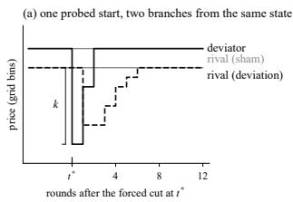

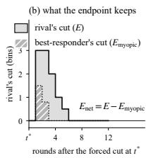  
Figure 1: The probe and the correction. (a) The sham and deviation branches from a rest point. (b) The rival’s cut has area E. A static bestresponder on the same deviator path makes its own cut $( E _ { \mathrm { m y o p i c } }$ , hatched), and $E _ { \mathrm { n e t } }$ is the difference.

checkpoint there are 16 points per run. Its level $\Delta = ( \pi - \pi _ { \mathrm { N a s h } } ) / ( \pi _ { \mathrm { m o n } } - \pi _ { \mathrm { N a s h } } )$ is taken on the profits at the rest point, averaged over firms and starts.

Enforcement net of the static response. The raw score is the signed area between the branches (Figure 1b), $E = - \mathrm { A U C } _ { h = 1 \ldots 2 5 } \mathrm { R E } ( h )$ , with RE the rival’s deviation-branch price minus its shambranch price in bins. Positive E means the rival went lower after the deviation than it otherwise would have. For $r \in \{ \mathrm { B R } _ { 1 } , \mathrm { B R } _ { K } \} ( K = 5 $ rounds of history), $E _ { \mathrm { m y o p i c } } ^ { r }$ is the same area, computed for a static best-responder that we apply round by round to the deviator’s realised price path in both branches, and which never enters the market. The endpoint is $E _ { \mathrm { n e t } } ^ { r } = E - E _ { \mathrm { m y o p i c } } ^ { r }$ , in bins·rounds.

Properties of the correction. The benchmark rules out one error only, since $E _ { \mathrm { n e t } } > 0$ does not by itself establish strategy. By a theorem proved in Appendix H, if the rival’s price is the matched static reference passed through a causal, absolutely summable linear filter with static gain $G ,$ , with a shared pre-history, then $\bar { E _ { \mathrm { n e t } } } = \left( G - 1 \right) E _ { \mathrm { m y o p i c } }$ , so a rival that merely follows the static best response with inertia, delay or smoothing, all of unit gain, scores zero in the limit, and about zero over our 25 rounds. A best response to a window of past prices is not covered. $\mathrm { B R } _ { K }$ handles it, but the two benchmarks leave biases of opposite signs, so H6 tests both. Two further biases, which neither benchmark removes, push $E _ { \mathrm { n e t } }$ down. A rival that punishes keeps the deviator low, which also enlarges $E _ { \mathrm { m y o p i c } }$ , and on the 43% of starts whose cut leaves the deviator’s price bucket unchanged the rival cannot respond, so $E _ { \mathrm { n e t } } = - E _ { \mathrm { m y o p i c } }$ there (Appendix D).

The descriptive verdict. We call a point collusive, the name we registered, only when three conditions hold together. An uncorrected punishment pattern, a cut of at least one bin followed by at least 50% recovery within 25 rounds as in the punishment phase of Abreu (1988), appears on at least half the starts. The level exceeds 0.6. And the spread of $\bar { \Delta }$ between the two firms is below 0.3. No error budget is spent on this verdict.

Hypotheses and error budget. Run-level outcomes are means over the 16 points, with no checkpoint selected. Let $d _ { b , O , C }$ be the difference between the fixed and shuffled runs in block b at observability O and channel C. H1 (primary) states that $\begin{array} { r } { C _ { \Delta } = \frac { 1 } { 4 } \sum _ { O , C } d _ { b , O , C } } \end{array}$ , averaged over blocks, is positive, and is tested one-sided at $\alpha _ { \Delta } = 0 . 0 3 0$ . H6 (secondary) takes the same contrast on $E _ { \mathrm { n e t } } ^ { r }$ , rejected only if both benchmarks reject at $\alpha _ { E } = 0 . 0 1 0$ . Stage 2 adds two confirmatory probes on the frozen final policies, which share $\alpha _ { M } = 0 . 0 1 0$ under Holm’s procedure so that the smaller p-value must pass 0.005, mask rival history, which hides the rival’s prices from both agents, on $E _ { \mathrm { n e t } }$ and swap opponent (pairs $( \mathbf { A } , \mathbf { C } ) , ( \mathbf { B } , \mathbf { D } )$ instead of $( \mathbf { A } , \mathbf { B } ) , ( \mathbf { C } , \mathbf { D } ) )$ on $\Delta ,$ , both predicted to decrease. Mute messages, the interaction $O \times C$ (H2) and a channel contrast (H3) are registered as exploratory (Appendix D).

Inference. The statistic is $T = { \mathrm { m e a n } } _ { b } ( C _ { b } ) / ( { \mathrm { s d } } _ { b } ( C _ { b } ) / { \sqrt { 5 } } )$ with $C _ { b }$ the block contrast, and the reference distribution flips the sign of each $d _ { b , O , C }$ independently, the $2 ^ { 2 0 }$ patterns enumerated exactly. The test is exact under the sharp null of no effect in any run pair, and studentising the statistic is meant to keep it asymptotically valid for the weak null, as it does for two-sample permutation tests (Chung & Romano, 2013), only approximately at five blocks. Confidence sets invert the two-sided test on a grid (Appendix I). Each result then falls into one of four verdicts fixed in advance, substantial (rejection and interval beyond the smallest effect size of interest, or SESOI), precise null (no rejection, interval within ±SESOI), reversed (interval below −SESOI) or inconclusive (interval crossing a boundary).

## 5 CONFIRMATORY RESULTS

The registered analysis ran on the five complete blocks, and again after a bug fix involving no analytic choice let the swap-opponent test run, with H1 and H6 bit-identical (Appendix A).

H1, the level, rejected and substantial. The interval for $C _ { \Delta }$ lies entirely above $\mathrm { S E S O I } _ { \Delta } = 0 . 1 0$ $( T = 9 . 5 6 )$ , and all five block contrasts (Figure 2a) and all twenty run pairs are positive. At the final checkpoint the visible-rival contrast is not distinguishable from zero (Table 1, Figure 2c), so with a visible rival much of the registered effect reflects how fast prices rise (post hoc).

H6, enforcement, not rejected and inconclusive. Neither component rejects at $\alpha _ { E } = 0 . 0 1 0$ , and both intervals cross $\mathrm { S E S O I } _ { E } = 4$ at their upper end, so the registered verdict is inconclusive. The data neither show that persistence raises enforcement nor bound its effect below what would matter. Removing the bias of the blind starts raises $C _ { E } ^ { \mathrm { B R } _ { 1 } }$ from $+ 1 . 4 8 \ \mathrm { t o } \ + 1 . 7 2$ , positive in three blocks of five as before (post hoc, no interval, Appendix H). Power at the smallest effect of interest was about one half as planned, and at most 0.48 recomputed from the observed spread (Appendix I). As enforcement is zero by construction where the rival is hidden, the registered four-cell average is exactly half the visible-rival contrast, which is +2.97 and +2.71 on a scale where the smallest effect of interest is 8.

(a) level, substantial  
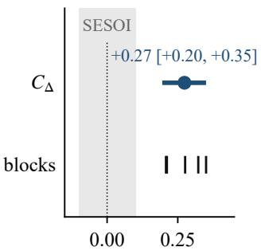  
$C _ { \Delta }$ (fixed minus shuffled)

(b) enforcement  
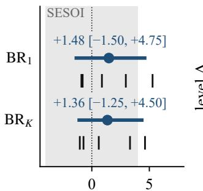  
$C _ { E }$ on $E _ { \mathrm { n e t } }$ (bins⋅rounds)

(c) level over training  
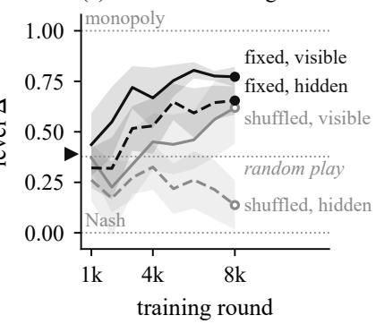  
Figure 2: The two registered contrasts and the level profile, five blocks. (a, b) Run-level means over the eight checkpoints. Dot and bar give the point estimate and the 95% confidence set by test inversion, ticks the five block contrasts, and the grey region ±SESOI. (c) Resting level by checkpoint, mean and 95% band of the 10 runs per line, and a marker at the common start of 0.39 (exploratory).

Table 1: Results at a glance. Registered tests first $( p$ one-sided), then post hoc readings that spend no α. Stage 2 rows instead compare probed with standard final policies. Intervals are two-sided 95% sets. Levels are run-level means over the eight checkpoints unless marked final.
<table><tr><td>contrast (fixed minus shuffled)</td><td>status</td><td>estimate</td><td>95% CI</td><td>p</td><td>verdict</td></tr><tr><td>H1, level  $C _ { \Delta }$ </td><td>registered</td><td>+0.274</td><td>[+0.195, +0.350]</td><td>0.00034</td><td>substantial</td></tr><tr><td>H6, enforcement  ${ C } _ { r } ^ { \mathrm { B R _ { 1 } } }$ </td><td>registered</td><td>+1.48</td><td>[−1.50, +4.75]</td><td>0.145</td><td>inconclusive</td></tr><tr><td> $\dot { C } _ { E } ^ { \mathrm { B R } _ { K } }$  H6, enforcement</td><td>registered</td><td>+1.36</td><td>[-1.25, +4.50]</td><td>0.156</td><td>inconclusive</td></tr><tr><td>swap, fixed agents vs a non-partner,</td><td>stage 2, Holm</td><td>-0.177</td><td>[-0.275, −0.080</td><td>0.0003</td><td>rejected</td></tr><tr><td>mask rival history,  $E _ { \mathrm { n e t } }$ </td><td>stage 2, Holm</td><td>-0.70</td><td>[−10.75, +10.75]</td><td>0.43</td><td>not rejected</td></tr><tr><td>level, rival hidden</td><td>post hoc</td><td>+0.295</td><td>[+0.240, +0.350]</td><td></td><td></td></tr><tr><td>level, final checkpoint</td><td>post hoc</td><td>+0.335</td><td>[+0.185, +0.485]</td><td></td><td></td></tr><tr><td>rival hidden, final</td><td>post hoc</td><td></td><td></td><td></td><td></td></tr><tr><td></td><td>post hoc</td><td>+0.52</td><td>[+0.42, +0.62]</td><td></td><td></td></tr><tr><td>rival visible, final hidden minus visible</td><td>post hoc</td><td>+0.15</td><td>[−0.13, +0.46]</td><td></td><td></td></tr><tr><td>hidden minus visible, final</td><td>post hoc</td><td>+0.04</td><td>[−0.03, +0.14]</td><td></td><td></td></tr><tr><td></td><td></td><td>+0.36</td><td>[+0.18, +0.56]</td><td></td><td></td></tr><tr><td>resting price, share of the Nash-to-monopoly price range</td><td>post hoc</td><td>+0.17</td><td>[+0.12, +0.22]</td><td></td><td></td></tr></table>

What the correction does to the reading. In all four visible-rival cells the net response is smaller than the raw one (Table 3). A static best-responder accounts for 48% of the raw response in fixed/visible/none, the cell where it is largest (E = 6.99 bins·rounds against a net 3.61), for 71% and 51% in two others, or 40%, 50% and 32% on the starts where the rival can see the cut, and in shuffled/visible/free\_text the sign flips, from 5.16 to −2.04.

Level and enforcement come apart where the rival is hidden. These results support a narrower claim than “collusion”. Of the 640 probed points, 54 (8.4%) are collusive by the descriptive verdict, with its uncorrected punishment pattern, all with a visible rival, as the pattern cannot occur on the 320 hidden-rival points. Yet persistence raises the level and the resting price there as well (level 0.53 against 0.23, resting price 1.66 against 1.58, with Nash at 1.47 and monopoly at 1.92, a rise of 0.17 of that range, [+0.12, +0.23], post hoc), with all ten block-by-channel differences positive, one arm rising and the other falling from their common start of 0.39. Most rest points there are not equilibria, since at 80% of starts for persistent pairs and 60% for rematched ones a four-bin cut pays at once and goes unanswered (post hoc). The hidden-rival contrast exceeds the visible-rival one at the final checkpoint but not averaged over checkpoints (Table 1, post hoc).

Stage 2, the swap-opponent test. Swap opponent, which pairs frozen final fixed agents with a non-partner, is rejected $( p = 0 . 0 0 0 3$ , Holm threshold 0.005, n = 20). By block instead of by run (post hoc), all five block means are negative (one-sided $p = 1 / 3 2$ , the smallest five blocks allow). The drop, 0.18 on average, is 0.33 where the rival is visible, most of the final level’s excess over random play, and 0.02 where it is hidden. Within a run, the same pairs of shuffled agents met during training, so the near-zero drop there (−0.01 on the hybrid) is not a test against strangers. Against true strangers from another block, on the tabular learner, rematched agents lose 0.18 and persistent ones 0.28, a difference of $- 0 . 1 0 , [ - 0 . 2 6 , + 0 . 0 7 ]$ , so our later prediction that persistent agents lose more held by direction and failed by its interval rule (Appendix F). The test therefore cannot separate partner-specific adaptation from the cost of facing a stranger, and on the tabular learner, the only agent we tested against true strangers, the point estimates attribute most of the drop to the latter. Mask rival history, confirmatory, does not reject on either benchmark (n = 10).

## 6 MECHANISM, PARTLY CONSISTENT WITH SPONTANEOUS COUPLING

A level effect without established enforcement, even where punishment cannot occur, is what spontaneous coupling predicts (Section 2). Table 5 scores what we predicted would switch it off, all exploratory.

The same design with a pure tabular learner. A plain Calvano Q-learner, identical to the agent’s table, in the same design and probe, reproduces a larger persistence effect, $C _ { \Delta } = + 0 . 3 6 3$ $[ + 0 . 2 1 5 , + 0 . 5 2 0 ]$ , and +0.306, [+0.270, +0.340], on 25 further blocks (Appendix F). Its enforcement contrast is $- 2 . 5 8 , [ - 7 . 2 5 , + 1 . 7 5 ]$ , on the five blocks (−5.16 on the visible-only scale), while on the 25, where the rival is visible, the sign reverses, +3.75, [+0.20, +7.30], against $\mathrm { B R _ { 1 } }$ and $+ 3 . 1 5 , [ - 0 . 4 5 , + 6 . 7 0 ]$ , against $\mathrm { B R } _ { K } .$ , not established by the two-benchmark rule of H6. Both upper bounds lie below 8, the smallest effect of interest, and a deeper cut gives intervals above zero on both, so with a visible rival the value learner may learn some enforcement, and the clean dissociation holds where the rival is hidden. Run to $1 0 ^ { 6 }$ rounds, this learner and the agent’s own value module end with a large gap where the rival is hidden $( + 0 . 7 7 , + 0 . 5 9 $ , the first’s rematched arm ending at −0.090, Table 6) and a small one where it is visible $( + 0 . 2 2 , + 0 . 0 8 )$ , where the rematched learner shows the punishment pattern most often of any tabular cell (Appendix G).

Switching the effect off. Coupling needs learners who keep meeting, so it should vanish when a learner has a single possible partner. With two agents, rematching changes only the shared episode clock and the seat’s history, both arms sit at the fixed level, and the contrast is −0.032, $[ - 0 . 1 9 0 , + 0 . 1 3 0 ]$ , and −0.025, [−0.065, +0.015], on 25 further blocks, a precise null, so in the tabular learner the partner’s identity, not these confounds, produces the effect. The synchronous learner of Asker et al. (2022), which by the coupling account cannot couple, shows a small negative effect (−0.042, and −0.036, [−0.065, −0.010], on 25 blocks), though its levels do not land near Nash as predicted. Eight agents and a permanent exploration floor move the contrast the predicted way (+0.396 and +0.264 against +0.363), with overlapping intervals, and rematching a partner with probability 0.25 per episode already gives the shuffled level (Figure 4). Set side by side, one permanent partner per learner gives a contrast with full rematching of +0.229, [+0.125, +0.325], and about three permanent partners in an unplanned variant, +0.048, [−0.065, +0.170] (Appendix G), so facing one partner, rather than a long pairing, seems to raise prices, though that interval does not show that three partners equal full rematching (exploratory, five blocks).

The signature of coupling. Under coupling, learners that keep meeting should grow similar value tables. The hybrid agents’ table correlation, partners minus non-partners, grows under fixed and stays at zero under shuffled, strongly with a hidden rival (+0.17 without a channel, +0.05 with one, at 8 000 rounds) and slightly with a visible one $( + 0 . 0 1 3$ , where all tables correlate at about 0.9). A rival account, that a learner meeting several partners best-responds to their average, more competitive policy, also fits the switch-off tests, the three-partner variant included, and the signature separates the two only in part. On 25 tabular blocks, pairs that never met correlate at +0.001 and +0.017 against +0.025 and +0.036 for partners (rival visible, hidden), so where the rival is hidden about half of the signature is not specific to partners, and our placebo prediction failed in both cells.

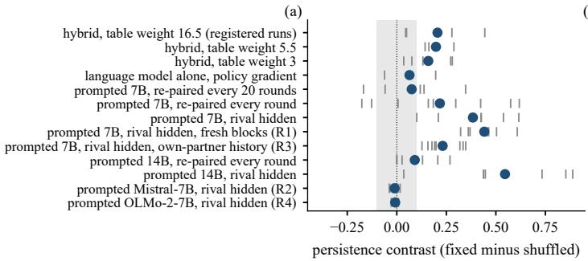

(b)  
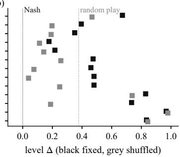  
Figure 3: Who responds to persistence, rival visible, no channel, unless marked. (a) Block contrasts (ticks), mean (dot), band $\pm \mathrm { S E S O I } _ { \Delta }$ . (b) Levels, fixed black, shuffled grey. Hybrid rows average eight checkpoints, the language model four, prompted agents the last 100 rounds (50 if re-paired every 20), so rows compare in sign and size. Planned blocks (7B replication, rival shown, +0.01).

## 7 WHICH AGENTS RESPOND TO PERSISTENCE

Figure 3 and Table 4 vary who sets the price, predictions labelled by experiment (Appendices H, E).

The value module, and the language model given authority. With the head zeroed and frozen in the visible-rival cell without a channel, the value module alone sets the price and the contrast is unchanged, +0.204 against +0.206, though the swap drop is smaller (D3 failed, Appendix H). A table weight of 5.5, not 16.5, lets the head overturn the table in 49% of settled seats, against 0 of 408 in the ablation. On the three planned blocks both arms fall, to 0.395 and 0.198, a contrast of +0.198, and it stays positive on two added blocks (F1, F2 held). At weight 3, on five planned blocks, the head overturns it at 79% of settled seats and the contrast is still +0.159, 5 of 5, a smaller drop than the 0.05 we predicted (G2′ failed, Appendix H). The fixed arm ends below its start of 0.39 at weight 3 and near it at 5.5, so where the head decides most prices, rematching lowers them rather than persistence raising them. Trained alone by policy gradient on three blocks, the backbone prices near Nash (0.18, 0.11), a contrast of +0.06 against +0.26 for the hybrid on those blocks and checkpoints (E1 held, descriptive, maybe a floor).

An exploratory extension, prompted language models. Prompted with its own last 30 rounds over 500 rounds, the rematched arm re-paired every round among four agents, an untrained model responds when the rival’s price is left out of the prompt, though its own sales reveal that price exactly, so these runs do not separate level from enforcement. Over the last 100 rounds the 7B model gives +0.38, [+0.24, +0.52], and the 14B model +0.55, [+0.31, +0.79], each positive in 8 of 8 planned blocks, the 7B against our prediction and the 14B as predicted (L1). On eight fresh blocks the 7B model gives +0.44, $[ + 0 . 3 \bar { 7 } , + 0 . 5 3 ]$ , 8 of 8 (R1 held). Its persistent arm sits only slightly above random play (0.46 to 0.48 against 0.378), so most of the contrast comes from rematched agents pricing far lower. Re-pairing also mixes several rivals in an agent’s history. Shown only its older rounds with its current partner, the rematched arm rises from 0.04 to 0.25, so mixing or staleness accounts for about half the gap, and the persistent arm still leads by +0.23, [+0.16, +0.33], 8 of 8 (R3 held). Mistral-7B sits at a monopoly ceiling (0.97, 0.98) and OLMo-2-7B at 0.84, a precise null $( - 0 . 0 1 , [ - 0 . 0 2 , 0 . 0 0 ] )$ , so R2 and R4 failed, and we did not test whether these two respond to their environment under this prompt. With the rival’s price shown the 7B evidence is mixed, +0.22, $[ + 0 . 0 2 , + 0 . 4 2 ]$ , on ten planned blocks but $+ 0 . 0 1 , [ - 0 . \overset { \cdot } { 1 } 4 , + 0 . 1 6 ]$ ], on ten added ones. Earlier designs, adapted after each reading, are all reported in Appendix E, uncorrected for multiple comparisons.

## 8 LIMITATIONS AND CONCLUSION

Every contrast is conditional on one environment with M = 4 and 8 000 training rounds, one trained 0.5B model and prompted models under one prompt, of which one family of three shows the effect. With a visible rival the gap mostly reflects learning speed, and hiding the rival also shrinks the table’s state, so the hidden-rival contrast mixes observability with state size. Persistence is confounded with per-partner experience and update frequency, which the tabular learner and, for frequency in one cell, a zeroed head separate, with the number of partners (Section 6) and multimarket contact (Bernheim & Whinston, 1990), whose gain needs enforcement, which a hidden rival rules out. The swap probe cannot tell adaptation to a partner from the cost of a stranger, H6 is inconclusive, and $E _ { \mathrm { n e t } }$ can change sign between two machines, which also differed in slot seed (Appendix D).

## ETHICS STATEMENT

The study involves no human subjects and no personal data. Its subject is a potential harm, algorithmic price coordination, and three aspects deserve comment.

First, Section 5 describes conditions that raise prices. Taken one at a time they are standard in the algorithmic-pricing literature we build on. Taken together, a persistent partner with neither observability nor a channel makes prices rise in the way least exposed to evidence of retaliation, and the paper describes it. Where the rival is hidden this is not collusion in the economic sense, which requires a reward-punishment scheme (Harrington, 2018), and we make no claim that it is unlawful. A test that looks only for punishment would miss this rise, while a check for profitable deviations flags most of its rest points (post hoc), as the regret audit of Hartline et al. (2024) is designed to. We publish it because a mechanism that is not described is one that no auditor can look for and no regulator can address. A persistent partner is already the default in this literature, learners whose state holds no rival price are studied in it (Waltman & Kaymak, 2008; Hansen et al., 2021; Banchio & Mantegazza, 2022), and the same results identify the rematching of counterparties as a lever a platform holds.

Second, the prices we observe arise without communication, without a learned threat that we could establish in the hybrid agent, and even when the rival’s prices are unobserved. On the reading of competition law that requires an agreement, conduct of this kind involves none (Harrington, 2018), and the per se rule proposed there, against algorithms whose prices depend on the rival’s in a rewardpunishment pattern, would not reach agents whose state holds no rival price. Whether doctrines such as concerted practice reach it is a contested legal question outside this paper’s scope.

Third, our enforcement correction has a defensive use. It shows that much of what a forced-deviation probe reads as retaliation is ordinary best-responding, and a defendant could cite it to argue that observed price responses are no evidence of coordination. The correction is right regardless, since a measure that credits a best-responder with punishment misleads both sides, and the paper supplies the argument to both.

On what follows for policy, these results support the claims that, for the trained agents we study, in this market and at this horizon, partner persistence is a lever on the level in these agents, most durably where the rival is hidden, that prices rise there in policies that cannot retaliate (post hoc), so that a test that looks only for punishment would miss the rise while a check for profitable deviations flags most of those rest points (post hoc), and that a forced-deviation reading of a rival’s response should be corrected before it is treated as enforcement. They also suggest that, under one prompt, the prices of prompted Qwen2.5 models differ between persistent pairs and agents re-paired every round when the rival’s price is hidden. They do not support claims about what a larger trained model, or a language model itself trained by value-based reinforcement learning, would do, nor claims about deployed pricing tools, about markets with more than two firms, about common-vendor arrangements, about any monetary harm, or about any legal test for agreement. Nor do they show that rematching is an effective or costless remedy, since we report its welfare effects only descriptively (Appendix D), the persistence effect shrinks with longer training where the rival is visible (Section 6), and the costs of rematching are not modelled. All runs used a small open-weight model in a simulated market.

## REPRODUCIBILITY STATEMENT

The hypotheses, statistic, confidence-set construction, α allocation, smallest effect sizes of interest, verdict categories and stopping rule were registered on the Open Science Framework with a frozen archive of the code before the first confirmatory run (https://osf.io/98bx5, registered 8 September 2026). The registration is currently under embargo, so the SHA-256 of the registered document is given here and can be verified against it when the embargo lifts, b8821d797ba6ea451c6ac38a006ec02c8689608b9cf24ad619ed91b708de5a4b.

The analysis code, the per-run outputs of all 40 confirmatory runs and of every exploratory run, the block launch scripts with their printed seed assignments, the mechanism-test predictions with their commit hashes, and the figure scripts are in the supplementary archive of the conference submission and are available from the authors on request. Appendix A lists every deviation from the registered plan. Section 3.2 and Appendix B give the agent and training hyper-parameters, Appendix H the benchmark’s invariance and validity results, and Appendix I the implementation notes on the test.

## AI USE STATEMENT

The authors formulated the research question, wrote the pre-registered hypotheses, designed the experiment, and wrote the protocols and the prompt texts. Generative AI tools assisted with writing and debugging the code, with locating and formatting the references, and with drafting and revising sections of this manuscript, including checks that the statements in the text agree with the numbers reported. The authors read and verified all code and text produced with that assistance, and are responsible for the content, the analyses, and the conclusions of this work.

## REFERENCES

Ibrahim Abada and Xavier Lambin. Artificial intelligence: Can seemingly collusive outcomes be avoided? Management Science, 69(9):5042–5065, 2023.

Dilip Abreu. On the theory of infinitely repeated games with discounting. Econometrica, 56(2): 383–396, 1988.

James Andreoni and Rachel Croson. Partners versus strangers: Random rematching in public goods experiments. In Charles R. Plott and Vernon L. Smith (eds.), Handbook ofExperimental Economics Results, volume 1, chapter 82, pp. 776–783. Elsevier, 2008.

Eshwar Ram Arunachaleswaran, Natalie Collina, Sampath Kannan, Aaron Roth, and Juba Ziani. Algorithmic collusion without threats. In 16th Innovations in Theoretical Computer Science Conference (ITCS 2025), volume 325 of Leibniz International Proceedings in Informatics (LIPIcs), pp. 10:1–10:21. Schloss Dagstuhl – Leibniz-Zentrum für Informatik, 2025.

John Asker, Chaim Fershtman, and Ariel Pakes. Artificial intelligence, algorithm design, and pricing. AEA Papers and Proceedings, 112:452–456, 2022.

John Asker, Chaim Fershtman, and Ariel Pakes. The impact of artificial intelligence design on pricing. Journal of Economics & Management Strategy, 33(2):276–304, 2024.

Stephanie Assad, Robert Clark, Daniel Ershov, and Lei Xu. Algorithmic pricing and competition: Empirical evidence from the German retail gasoline market. Journal of Political Economy, 132(3): 723–771, 2024.

Martino Banchio and Giacomo Mantegazza. Artificial intelligence and spontaneous collusion. arXiv preprint arXiv:2202.05946, 2022.

Martino Banchio and Andrzej Skrzypacz. Artificial intelligence and auction design. In Proceedings of the 23rd ACM Conference on Economics and Computation, pp. 30–31, 2022.

B. Douglas Bernheim and Michael D. Whinston. Multimarket contact and collusive behavior. The RAND Journal of Economics, 21(1):1–26, 1990.

Zach Y. Brown and Alexander MacKay. Competition in pricing algorithms. American Economic Journal: Microeconomics, 15(2):109–156, 2023.

Emilio Calvano, Giacomo Calzolari, Vincenzo Denicolò, and Sergio Pastorello. Artificial intelligence, algorithmic pricing, and collusion. American Economic Review, 110(10):3267–3297, 2020.

Emilio Calvano, Giacomo Calzolari, Vincenzo Denicolò, and Sergio Pastorello. Algorithmic collusion with imperfect monitoring. International Journal of Industrial Organization, 79:102712, 2021.

Emilio Calvano, Giacomo Calzolari, Vincenzo Denicolò, and Sergio Pastorello. Algorithmic collusion: Genuine or spurious? International Journal ofIndustrial Organization, 90:102973, 2023.

Kris Cao, Angeliki Lazaridou, Marc Lanctot, Joel Z. Leibo, Karl Tuyls, and Stephen Clark. Emergent communication through negotiation. In International Conference on Learning Representations, 2018.

EunYi Chung and Joseph P. Romano. Exact and asymptotically robust permutation tests. The Annals ofStatistics, 41(2):484–507, 2013.

Victor Conchello Vendrell, Max Ruiz Luyten, and Mihaela van der Schaar. GameTalk: Training LLMs for strategic conversation. arXiv preprint arXiv:2601.16276, 2026.

Pedro Dal Bó and Guillaume R. Fréchette. On the determinants of cooperation in infinitely repeated games: A survey. Journal ofEconomic Literature, 56(1):60–114, 2018.

John Duffy and Jack Ochs. Cooperative behavior and the frequency of social interaction. Games and Economic Behavior, 66(2):785–812, 2009.

Glenn Ellison. Cooperation in the prisoner’s dilemma with anonymous random matching. The Review ofEconomic Studies, 61(3):567–588, 1994.

Sara Fish, Yannai A. Gonczarowski, and Ran I. Shorrer. Algorithmic collusion by large language models. arXiv preprint arXiv:2404.00806, 2024.

Jakob Foerster, Richard Y. Chen, Maruan Al-Shedivat, Shimon Whiteson, Pieter Abbeel, and Igor Mordatch. Learning with opponent-learning awareness. In Proceedings of the 17th International Conference on Autonomous Agents and Multiagent Systems (AAMAS 2018), pp. 122–130, 2018.

Edward J. Green and Robert H. Porter. Noncooperative collusion under imperfect price information. Econometrica, 52(1):87–100, 1984.

Lewis Hammond, Alan Chan, Jesse Clifton, et al. Multi-agent risks from advanced AI. arXiv preprint arXiv:2502.14143, 2025.

Karsten T. Hansen, Kanishka Misra, and Mallesh M. Pai. Frontiers: Algorithmic collusion: Supracompetitive prices via independent algorithms. Marketing Science, 40(1):1–12, 2021.

Joseph E. Harrington. Developing competition law for collusion by autonomous artificial agents. Journal ofCompetition Law & Economics, 14(3):331–363, 2018.

Jason D. Hartline, Sheng Long, and Chenhao Zhang. Regulation of algorithmic collusion. In Proceedings of the Symposium on Computer Science and Law (CSLAW), pp. 98–108, 2024.

Edward J. Hu, Yelong Shen, Phillip Wallis, Zeyuan Allen-Zhu, Yuanzhi Li, Shean Wang, Lu Wang, and Weizhu Chen. LoRA: Low-rank adaptation of large language models. In International Conference on Learning Representations, 2022.

Hengyuan Hu, Adam Lerer, Alex Peysakhovich, and Jakob Foerster. “Other-Play” for zero-shot coordination. In Proceedings ofthe 37th International Conference on Machine Learning, volume 119 of Proceedings of Machine Learning Research, pp. 4399–4410, 2020.

Justin P. Johnson, Andrew Rhodes, and Matthijs Wildenbeest. Platform design when sellers use pricing algorithms. Econometrica, 91(5):1841–1879, 2023.

Michihiro Kandori. Social norms and community enforcement. The Review ofEconomic Studies, 59 (1):63–80, 1992.

Jussi Keppo, Yuze Li, Gerry Tsoukalas, and Nuo Yuan. On the fragility of AI agent collusion. arXiv preprint arXiv:2603.20281, 2026.

Timo Klein. Autonomous algorithmic collusion: Q-learning under sequential pricing. The RAND Journal ofEconomics, 52(3):538–558, 2021.

Angeliki Lazaridou and Marco Baroni. Emergent multi-agent communication in the deep learning era. arXiv preprint arXiv:2006.02419, 2020.

Joel Z. Leibo, Vinicius Zambaldi, Marc Lanctot, Janusz Marecki, and Thore Graepel. Multi-agent reinforcement learning in sequential social dilemmas. In Proceedings ofthe 16th Conference on Autonomous Agents and MultiAgent Systems (AAMAS), pp. 464–473, 2017.

Ilya Loshchilov and Frank Hutter. Decoupled weight decay regularization. In International Conference on Learning Representations, 2019.

Andrei Lupu, Brandon Cui, Hengyuan Hu, and Jakob Foerster. Trajectory diversity for zero-shot coordination. In Proceedings ofthe 38th International Conference on Machine Learning, volume 139 of Proceedings ofMachine Learning Research, pp. 7204–7213, 2021.

Yohan Mathew, Ollie Matthews, Robert McCarthy, Joan Velja, Christian Schroeder de Witt, Dylan Cope, and Nandi Schoots. Hidden in plain text: Emergence & mitigation of steganographic collusion in LLMs. In Proceedings of the 14th International Joint Conference on Natural Language Processing and the 4th Conference ofthe Asia-Pacific Chapter ofthe Associationfor Computational Linguistics, pp. 585–624, 2025. doi: 10.18653/v1/2025.ijcnlp-long.34.

Kevin R. McKee, Ian Gemp, Brian McWilliams, Edgar A. Duéñez-Guzmán, Edward Hughes, and Joel Z. Leibo. Social diversity and social preferences in mixed-motive reinforcement learning. In Proceedings ofthe 19th International Conference on Autonomous Agents and MultiAgent Systems (AAMAS), pp. 869–877, 2020.

Sumeet Ramesh Motwani, Mikhail Baranchuk, Martin Strohmeier, Vijay Bolina, Philip H. S. Torr, Lewis Hammond, and Christian Schroeder de Witt. Secret collusion among AI agents: Multi-agent deception via steganography. In Advances in Neural Information Processing Systems, volume 37, pp. 73439–73486, 2024.

Mason Nakamura, Abhinav Kumar, Saswat Das, Sahar Abdelnabi, Saaduddin Mahmud, Ferdinando Fioretto, Shlomo Zilberstein, and Eugene Bagdasarian. Colosseum: Auditing collusion in cooperative multi-agent systems. arXiv preprint arXiv:2602.15198, 2026.

Brian A. Nosek, Charles R. Ebersole, Alexander C. DeHaven, and David T. Mellor. The preregistration revolution. Proceedings ofthe National Academy ofSciences, 115(11):2600–2606, 2018.

Dereck Piche, Mohammed Muqeeth, Milad Aghajohari, Juan Duque, Michael Noukhovitch, and Aaron Courville. Learning robust social strategies with large language models. arXiv preprint arXiv:2511.19405, 2025.

Qwen Team. Qwen2.5 technical report. arXiv preprint arXiv:2412.15115, 2024.

Christoph Riedl. Emergent coordination in multi-agent language models. In International Conference on Learning Representations, 2026.

DJ Strouse, Kevin R. McKee, Matt Botvinick, Edward Hughes, and Richard Everett. Collaborating with humans without human data. In Advances in Neural Information Processing Systems, volume 34, pp. 14502–14515, 2021.

Yingtao Tian. Prompt optimization enables stable algorithmic collusion in LLM agents. arXiv preprint arXiv:2604.17774, 2026.

Ludo Waltman and Uzay Kaymak. Q-learning agents in a Cournot oligopoly model. Journal of Economic Dynamics and Control, 32(10):3275–3293, 2008.

Christopher J. C. H. Watkins and Peter Dayan. Q-learning. Machine Learning, 8(3–4):279–292, 1992.

Marissa A. Weis, Maciej Wołczyk, Rajai Nasser, Rif A. Saurous, Blaise Agüera y Arcas, João Sacramento, and Alexander Meulemans. Multi-agent cooperation through in-context co-player inference. arXiv preprint arXiv:2602.16301, 2026.

Ronald J. Williams. Simple statistical gradient-following algorithms for connectionist reinforcement learning. Machine Learning, 8(3–4):229–256, 1992.

Yuhang Wu and Assaf Zeevi. Should demand models incorporate competitor prices? Oblivious learning and algorithmic collusion. arXiv preprint arXiv:2606.05363, 2026.

Michael Wunder, Michael L. Littman, and Monica Babes. Classes of multiagent Q-learning dynamics with ϵ-greedy exploration. In Proceedings of the 27th International Conference on Machine Learning, pp. 1167–1174, 2010.

Zhang Xu and Wei Zhao. Memoryless algorithmic collusion: Sure to fail, slow to fall. arXiv preprint arXiv:2409.01147, 2026. Version 2. Version 1 (2024) was titled On Mechanism Underlying Algorithmic Collusion.

Zexin Ye. Algorithmic collusion under observed demand shocks. arXiv preprint arXiv:2502.15084, 2025.

Table 2: Notation. SESOI stands for the smallest effect size of interest, fixed at registration.
<table><tr><td>∆  $E , E _ { \mathrm { m y o p i c } } ^ { r } , E _ { \mathrm { n e t } } ^ { r }$   $C _ { \Delta } , C _ { E }$   $\alpha _ { \Delta } , \alpha _ { E } , \alpha _ { M }$   $\mathrm { S E S O I } _ { \Delta } , \mathrm { S E S O I } _ { E }$ </td><td>level at the rest point, on profits, 0 Nash, 1 joint monopoly, 0.378 random play raw enforcement, its static benchmark  $( r \in \{ \mathrm { B R } _ { 1 } , \mathrm { B } \hat { \mathrm { R } } _ { K } \} )$  , their difference fixed minus shuffled contrasts on run-level  $\Delta$  and  $E _ { \mathrm { n e t } }$  , averaged over the other factors test levels of H1, H6 and stage 2 smallest effect sizes of interest, 0.10 on the level and 4 bins·rounds on enforcement population size (4), learning rate and discount of the value module</td></tr></table>

## A DEVIATIONS FROM THE REGISTERED PLAN, AND AMENDMENTS

The registration is the reference, and this appendix is the complete list of places where what we did differs from it, including the ones that cost us claims. Each entry is dated in the repository changelog. The registration calls the visible and hidden conditions high and low observability.

Declared before data collection.

• Greedy probe reading instead of actions sampled under a coupled RNG (Section 4).

• The standardised off-policy probe is not implemented, so the standardised enforcement contrast $C _ { E } ^ { \mathrm { s t d } }$ is not produced and nothing is reported in its place.

• H4’s second leg is out of this registration. The held-out panel and the cross-play regret metric are not implemented and reserve no α, so H4 reduces to H1 and no “sufficient reduction” claim is made. H5 (a sweep over M and the rematching rate) was deferred, and the sweeps of Section 6 are its exploratory counterpart on the tabular learner, not H5.

• Mute messages is exploratory, outside the Holm budget, because the channel is nearly inert by construction under this agent, and spending budget on it would weaken the two probes that can bite.

• Only the first member of each probed pair deviates, so the second member’s enforcement is not measured.

• The two arms of each mechanistic probe are collected in two successive invocations on the same frozen checkpoints, where the registration asks for an interleaved execution. The permute messages probe is not implemented.

• Prompt placeholders are not length-padded, so prompt length differs by a few tokens between conditions.

• ∆ is computed on profits, resolving an internal inconsistency in the protocol, which wrote it on prices in one section.

## Amendments after the deposit.

• A2, hardware. Blocks 3 to 5 were moved to a rented GPU of a different generation because the original machine’s second GPU had failed. The change is at the block level, since all eight cells of a block run on the same hardware, so the difference is absorbed by the block effect the analysis already conditions on. The code is the exact registered tag, the model is loaded offline from a copy of the original cache, and per-run execution metadata (library versions, host, slot seed) is recorded. No data were read when this was decided.

• A3, block 2 re-run. The first launcher of block 2 omitted the slot-seed flag, so the registered assignment had not been applied to its three completed cells (all three fixed). Completing the block on the second machine would have confounded hardware with the primary factor, so block 2 was re-run in full there. The three original runs are retained as exploratory (Appendix D, cross-hardware replication).

• A4, exogenous failures. A run interrupted by a crash is relaunched identically (same seeds, same slot seed, partial directory deleted), at most twice, each occurrence logged. Seven cells were relaunched once each, having died of a GPU out-of-memory error at model load, caused by two concurrent launchers of ours, before writing any checkpoint or result.

• A5, sensitivity analysis, specified after blocks 1 to 4 had been read and before block 5 was, recomputes H1 and H6 dropping every start whose sham branch drifts by 8 bins or more. The descriptive tables of blocks 1 to 4 had already counted starts at this threshold, though no contrast had been computed with the exclusion. Exploratory and descriptive, it reaches no decision and does not touch stage 2.

Dated record of commitments and data looks. Dates are those of the repository commits (Central European time). 8 September, 18:59, the registration and the frozen code are deposited. Blocks 1 to 4 complete over the following days and are read for the exploratory analyses of Appendix D. The registration fixed five blocks, with no sequential extension and no early stop, so these readings could not change the sample. 14 September, 17:11, amendment A5 is committed, after blocks 1 to 4 had been read and before block 5 is. 17:40, a literature check names spontaneous coupling as the candidate account. 18:59, predictions A1 to A5x are committed, before any of their runs and before block 5 is read. 22:32, predictions C1 to C6 are committed, before their results (22:38 to 22:42), although C1 reads tables of blocks 1 to 4 that already existed. 15 September, by 10:04, block 5 is complete, the registered analysis has run, and it has run once more after the swap-opponent fix described below. 16:12, predictions D1 to D4 are committed before any of their runs. 23 September, 18:13, predictions E1 and E2 on the language model alone are committed before any of their runs. 21:43, after blocks 1 to 3 of the lowered table weight had been read, blocks 4 and 5 are added, and at 22:01, after the first checkpoint of the language model alone had also been read, a table weight of 3 is planned (amended at 22:54, before its runs). 23:03, predictions P1 and P2 on prompted agents, amended at 23:08 before the study runs to sample at temperature 0.7, and at 23:49 ten further blocks are added after reading five. 24 September, 09:52, predictions P3 and P4 for the sharper prompted design. 10:04, the tabular replications and the prompted extensions are planned. 10:14, a fixed read time is set for the lowered table weights. 10:24, J4b is planned after the within-run swap had been read. 12:49, ten further blocks of the sharper prompted design are added after reading ten, and at 13:36, before they run, their analysis is committed as a separate replication. 16:22, the anchoring control K is committed before its runs, and 17:17 the 14B design with the rival’s price hidden (L). The lowered table weight’s blocks 4 and 5 finished on 24 September and were read at 17:47, the same set of blocks the fixed read time would have kept. 25 September, 00:26, after a simulated review of a draft, experiments R1 to R3 are committed with eight blocks each before their runs, and read once at 08:10. 09:06, the ten runs at a table weight of 3 are complete, and they are read once at 09:08, before their fixed read time of 12:00. 09:09, after reading R2, R4 is committed before its runs, and it is read once at 09:57.

Two incidental readings, and one correction after the confirmatory run. Twice, while diagnosing a stalled launcher, a single cell-level ∆ was seen in a log tail before its block was complete (one cell of block 2, later re-run in full, and one cell of block 5, hours before the analysis). Neither could influence anything, since the analysis code was fixed before it ran. After its first execution, the swap-opponent probe reported no eligible run, because the code matched probe points by (round, pair) key, and the swapped pairs (A,C), (B,D) can never share a key with the standard (A,B), (C,D). The registered statistic, the round-8 000 difference averaged over the probed pairs, is the difference of the two per-probe means, which is what the corrected code computes, and a synthetic test pins it. The corrected code was then run once more, H1 and H6 were bit-identical to the first execution, and no choice was open.

## B AGENT AND TRAINING DETAILS

Backbone Qwen2.5-0.5B-Instruct, bfloat16, LoRA rank 16 with scaling factor 32, dropout 0, on the q/k/v projections. The price head is linear on the centred last hidden state, re-centred exactly at every update, and its logits are centred and scaled down so that none exceeds $c = 5 . 5$ in absolute value, an $L _ { \infty }$ cap (so two actions differ by at most $2 c = 1 1$ logits, and the most concentrated policy the head alone can express has mode probability 0.90). Policy gradient on the log-probability of the behaviour mixture, remaining-length baseline, entropy bonus 0.01, AdamW (Loshchilov & Hutter, 2019) with learning rates $1 0 ^ { - 4 }$ (LoRA) and $3 \times 1 0 ^ { - 3 }$ (head). The table has 21 states $( 4 \times 4$ over bucketed last rival and own prices, one no-history state, four rival-unobserved states), initialised at the mean profit of each action against a uniform rival divided by $1 - \delta$ (its greedy action is bin 11, the static best response to a uniform rival, which gives $\Delta = 0 . 3 9$ at the symmetric start and an expected 0.378 under the round-0 behaviour policy with $\varepsilon = 0 . 3$ , the same constant in every cell), and the Calvano rule, i.e. tabular Q-learning (Watkins & Dayan, 1992), with learning rate $\eta _ { Q } = 0 . 1 5$ and discount $\delta = 0 . 9 5$ , updated off-policy on every transition. Logit composition and exploration schedule as in Section 3.2. Messages under free\_text are 6 tokens per agent per round, decoded greedily at probe time, trained by policy gradient on the summed log-probability with a KL penalty of 0.1 to the adapter-free backbone. The prompt gives the market description, the agent’s own recent prices, the rival’s recent prices or the placeholder not observable, and the received message or the placeholder (not transmitted). Sixteen markets per run, 8 000 rounds, continuation 0.98, checkpoints every 1 000 rounds, with probes at every checkpoint on two pairs (under shuffled, two of the six pairs, fixed in advance).

## C THE NEGATIVE RESULT ON POLICY GRADIENT ALONE

Our first agent was the backbone with the LoRA adapters and the price head, trained on-policy by policy gradient, without a value table. During development we trained it in many configurations of the full pipeline (learning rates, entropy, projection radius, number of markets, message channel on or off, prompt variants) and never observed tacit collusion. These runs were not a designed comparison and were not all scored by the three-part verdict. The controlled evidence is the run of this agent in the registered design (Appendix E, 0 of 48 probed points collusive) and the toy below. The claim that this is a property of the learning rule rather than of the environment rests on three legs.

• Representational. Using the LLM loop’s own estimator on a toy with five seeds, after a revealed high-price state every shared-representation variant cuts price with probability 1.00 (standard deviation 0), at 50 to 56% regret, while an explicit-cell control cuts with probability 0.01 at $1 . 2 \pm 0 . 1 \%$ regret, so the conjunction “the rival cut and I did not” is not linearly decodable from the representation the head reads.

• Algorithmic. In a tabular toy that reproduces the pipeline without the language model, on-policy policy gradient never reaches a collusive point even when the state is handed to it explicitly (0 of 265 final probe points over 18 conditions and five seeds), while the Calvano update rule reaches such points on the same table and is scored by the same probe. The claim is about the update rule at this budget and over these configurations, and not about every possible way of training a policy by gradient.

• Learnability gate. The environment is not the obstacle, since the tabular Q-learner passes the gate under the identical probe, which allows us to read the null as a statement about the learning rule.

Sustaining an already installed collusive equilibrium is a different matter, and the two cases separate discovery from maintenance. The gradient-only agent sustains an installed equilibrium under a sharp policy (80 of 80 points across 5 seeds) but not under a soft one (0 of 5 seeds), and when the language model alone is asked to sustain it in self-play the update destroys it within 250 rounds (0 of 8 points, 2 seeds). The hybrid agent sustains it under exploration (28 of 30 points across 7 seeds). The gradient-only agent is kept as a control outside the confirmatory budget.

Table 3: Per-cell means over the five blocks (registered descriptive table). $P _ { 1 }$ is the share of collusive points per run, $P _ { 2 }$ the share of runs with at least one collusive point, and pattern the share of points with a punishment pattern on at least half the starts, followed by the mandatory diagnostics, one-shot gain of the deviation (profit units), clamp frequency, deviator’s persistence L (rounds) and sham drift (bins).
<table><tr><td>cell</td><td>∆</td><td>E</td><td> $E _ { \mathrm { n e t } } ^ { \mathrm { B R _ { 1 } } }$ </td><td> $E _ { \mathrm { n e t } } ^ { \mathrm { B R } _ { K } }$ </td><td> $P _ { 1 }$ </td><td> $P _ { 2 }$ </td><td>pattern spread</td><td></td><td>gain clamp</td><td></td><td>L drift</td><td></td></tr><tr><td>fixed/visible/none</td><td>0.673 6.99</td><td></td><td>3.61</td><td></td><td></td><td>3.75 0.23 1.00</td><td>0.29</td><td></td><td>0.36 0.015</td><td>0.01</td><td>5.3</td><td>5.6</td></tr><tr><td>shuffled/visible/none</td><td>0.467 4.85</td><td></td><td>1.40</td><td></td><td></td><td>1.22 0.17 0.80</td><td>0.41</td><td></td><td>0.58 0.015</td><td>0.04</td><td>7.2</td><td>5.5</td></tr><tr><td>fixed/visible/free_text</td><td>0.697 3.47</td><td></td><td>1.69</td><td></td><td></td><td>1.430.261.00</td><td>0.33</td><td></td><td>0.25 0.014</td><td>0.00</td><td>4.0</td><td>4.6</td></tr><tr><td>shuffled/visible/free_text</td><td>0.399</td><td>5.16</td><td>-2.04</td><td>-1.47</td><td></td><td>0.01 0.20</td><td>0.28</td><td></td><td>0.63 0.016</td><td>0.05</td><td>11.1</td><td>6.6</td></tr><tr><td>fixed/hidden/none</td><td>0.534</td><td>0</td><td>0</td><td>0</td><td>0</td><td>0</td><td>0</td><td></td><td>0.45 0.018</td><td>0.06</td><td>6.9</td><td>4.0</td></tr><tr><td>shuffled/hidden/none</td><td>0.257</td><td>0</td><td>0</td><td>0</td><td>0</td><td>0</td><td>0</td><td></td><td>0.73 0.015</td><td>0.11</td><td>7.8</td><td>4.3</td></tr><tr><td>fixed/hidden/free_text</td><td>0.523</td><td>0</td><td>0</td><td>0</td><td>0</td><td>0</td><td>0</td><td></td><td>0.41 0.018</td><td>0.05</td><td>6.6</td><td>3.0</td></tr><tr><td>shuffled/hidden/free_text 0.209</td><td></td><td>0</td><td>0</td><td>0</td><td>0</td><td>0</td><td>0</td><td></td><td>0.67 0.013</td><td>0.10</td><td>6.9</td><td>4.3</td></tr></table>

## D PER-CELL RESULTS AND EXPLORATORY ANALYSES OF BLOCKS 1 TO 4

Table 3 is the registered per-cell table. Where the rival is hidden every enforcement quantity is identically zero. $\bar { E } _ { \mathrm { m y o p i c } } \bar { \equiv } 0$ by construction (verified, the maximum $| E _ { \mathrm { m y o p i c } } |$ over the 320 hidden rival points is exactly 0), and the rival’s greedy policy cannot react to a deviation it does not see, so $E = 0$ as well. The level is nevertheless raised by persistence there (0.53 against 0.23), so in the hidden-rival cells level and enforcement come apart within the design. The swap-opponent drop of Section 5 is concentrated where the rival is visible (mean −0.33, per-run values −0.03 to −0.63) and near zero where it is hidden (mean −0.02), where a greedy policy cannot react to who sits opposite.

Unless marked otherwise, the following analyses were specified in the repository before block 5 was read and computed on the four complete blocks then available.

Update cadence (declared confound). At round 8 000, agents have received 927 to 933 policygradient updates under fixed and 152 to 164 under shuffled, a ratio of 5.9, on the same number of transitions (64 000 per agent in both arms, eight of the thirty-two seats), so fewer and larger updates, not less data. The tabular learner, which has no policy-gradient update at all, reproduces the effect (Section 6). So does the hybrid in the visible-rival cell without a channel with its head zeroed and frozen and its backbone frozen, where the policy-gradient updates change nothing (+0.204 against +0.206, five blocks, run after block 5, Table 4). The two-agent test isolates the clock.

Manipulation checks. All sixteen shuffled runs of blocks 1 to 4 have partner shares within tolerance (min-max over runs 0.29 to 0.36 against a target of $1 / 3 )$ , and block 5 was not checked. The structural flow tests pass.

Profile. Pooled over all cells of blocks 1 to 4, the fixed−shuffled contrast is +0.002 at round 1 000, +0.29 at 2 000, +0.32 at 3 000, and +0.33 to +0.34 from 5 000 on, so pooled over cells at 8 000 rounds the effect is not only a learning speed. Where the rival is visible it is not distinguishable from zero at the final checkpoint (Section 5) and +0.08 at $1 0 ^ { 6 }$ rounds for the value module (below).

Welfare. On the last three checkpoints, joint profit is 0.62 under fixed/visible/none against 0.58 under shuffled, and consumer surplus 0.49 against 0.52, and with a hidden rival, 0.58 against 0.49 and 0.54 against 0.63 (Nash gives joint profit 0.446 and surplus 0.715, monopoly 0.675 and 0.327). These are blocks 1 to 4, and the level gaps of Table 3 average all checkpoints of five blocks and are not the comparison to make. On the same rest points as the welfare figures, the level gap is 0.15 with a visible rival and 0.38 with a hidden one, without a channel, and the joint-profit gap is identical on the Nash-to-monopoly scale, since the level is a linear transform of joint profit. The surplus gap is smaller on its own Nash-to-monopoly scale, 0.09 and 0.25, for two reasons computed on those points. Along symmetric prices the surplus index moves less than one-for-one with the profit index over this range, which alone gives 0.13 and 0.31. And rematched pairs rest at more asymmetric prices (4.4 against 1.1 bins apart with a visible rival, 7.8 against 2.5 with a hidden one), which lowers consumer surplus at a given joint profit and narrows the gap to 0.09 and 0.25.

H2 and H3. On four blocks, the interaction $\textit { O } \times \textit { C } \mathrm { i s } - 0 . 0 4$ and the channel contrast (shuffled,hidden) − (fixed,visible) is −0.10, and the communication main effect is −0.03. All three intervals cover the whole search grid $( 2 ^ { 4 }$ patterns), and on five blocks the registered analysis gives −0.01 and −0.07. Mute messages, on the 20 runs with a channel, leaves $E _ { \mathrm { n e t } }$ exactly unchanged on every run and against both benchmarks, as it must when the head cannot change a greedy price (five blocks).

A converged budget, five blocks. The value module inside the agent’s loop, with the language model’s forward pass skipped as in the matched ablation, run to $1 0 ^ { 6 }$ rounds under Calvano’s exploration schedule with the block and slot seeds of the registered runs and probed at six checkpoints, on CPU (blocks 2 to 5 on a rented pod, the block-1 visible pair on a workstation, from the same launch line, and the archive keeps the latter under its original run name). In the visible-rival cell without a channel the rest level is 0.93, 0.84, 0.94, 0.89, 0.71 against 0.76, 0.69, 0.93, 0.76, 0.79, a contrast of +0.08 at the endpoint and +0.12 averaged over the converged regime (from $1 0 ^ { 5 }$ rounds on), positive in five blocks of five on the latter reading and four of five at the endpoint, against +0.206 averaged over the registered checkpoints and +0.02 at their last one, so rematched learners reach collusive levels of their own given enough time and persistence stops being necessary. In the hidden-rival cell the opposite happens, with 0.48, 0.71, 0.79, 0.85, 0.42 against $0 . 0 1 , 0 . 1 \dot { 6 } , - 0 . 0 4 , 0 . 0 2 , 0 . 1 4 ,$ a contrast of +0.59 at the endpoint and +0.51 over the converged regime against +0.277 averaged over the registered checkpoints and +0.58 at their last one, positive in five blocks of five on both readings, the rematched arm resting at Nash (0.06 on average). The stand-alone learner of Table 6 gives +0.22 and +0.77 for the same two cells at its last checkpoint (+0.195 and +0.73 averaged over checkpoints), so the two run sets agree in direction and differ in size within the block-to-block spread. Enforcement is structurally zero where the rival is hidden, and where it is visible the contrast on $E _ { \mathrm { n e t } }$ , mapped to the registered four-cell scale, is +0.19 at the endpoint and +1.76 over the converged regime, in both cases below $\mathrm { S E S O I } _ { E }$ , with the same block-to-block dispersion H6 shows. Nine of the ten arms end with a complete punishment pattern, so the split between level and enforcement in Section 5 is a statement about 8 000 rounds. Exploratory, no α.

What the probe can see. The registered cut (protocol section 23.1) sets the deviator $k = 4$ bins below its rival’s sham price, so whether it changes the deviator’s own price bucket, the only thing the rival’s table sees, depends on where the deviator itself sat. The saved tables of all eight checkpoints give the deviator’s price at the cut for every start, cycling ones included, and reproduce every one of the 1 280 stored forced prices. The cut leaves the deviator’s bucket unchanged on 43% of starts with a visible rival (52 to 56% in the fixed arm, 31 to 33% in the shuffled arm), where the greedy rival never responds (0 of 550), and it responds on 95% of the others. So on 43% of starts the probe is blind by construction and $E _ { \mathrm { n e t } } = - \bar { E _ { \mathrm { m y o p i c } } }$ there, a downward bias, larger in the fixed arm, and part of the dispersion H6 inherits. An earlier version of this paragraph reported 44% and a 19% response inside the bucket, from a flag that compared the cut with the rival’s price instead of the deviator’s own, which misclassified starts at asymmetric rest points. The matched ablation is not a substitute here, since zeroing the head reproduces the level to within 0.01 (Table 4) but not the enforcement, whose paired run-level difference to the reference averages 5.6 bins·rounds, so further ablation blocks would not tighten H6, and only blocks of the full agent would.

Cycling rest points. 61% of fixed points and 66% of shuffled points have a sham branch that cycles (period above 1 or drift of 8 bins or more on at least one start). The exploratory sensitivity analysis A5, computed on five blocks, drops only the starts whose sham branch drifts by 8 bins or more and gives $C _ { \Delta } = + 0 . 2 6 4 , [ + 0 . 1 5 0 , + 0 . 3 8 0 ] ,$ , against the registered +0.274.

Cross-hardware replication. The three block-2 cells run on both machines (the discarded launcher lacked the slot-seed flag, so the runs differ in slot seed as well as machine) give run-level ∆ of 0.629 / 0.595, 0.692 / 0.708 and 0.562 / 0.558, and run-level $E _ { \mathrm { n e t } } ^ { \mathrm { B R _ { 1 } } } { \mathrm { ~ o f ~ } } + 0 . 4 4 / - { \bar { 2 } } . 7 8 , + 1 . 9 7 / + 0 . 1 2$ and 0 / 0. The level replicates within ±0.035, and the enforcement endpoint does not agree in sign, which is a direct measure of the precision H6 can have at this sample size.

Why the channel is inert. On 48 on-policy states of a trained fixed/visible/free\_text run and its shuffled counterpart, the message was written in turn by the trained head and by the untrained Qwen2.5-Instruct models at 0.5B, 1.5B and 3B, then handed to the same trained receiver. Distinct messages are 0.02 for every sender, that is one message in fifty differs from the others. Mutual information between the message and the sender’s own next price bucket is 0.000 for every sender, permutation-corrected. The receiver’s mean price shift against the no-message baseline does not grow with size either, at 0.17, 0.28, 0.48 bins under fixed and 1.90, 1.46, 1.39 under shuffled for 0.5B, 1.5B and 3B. In this check the channel is unused because the message does not depend on the state, and a larger untrained sender does not change that. The check covers one block, one checkpoint and greedy decoding, and the larger senders were not trained in the market, so it does not show what a larger trained model would do with the channel.

Messages. Between 2% and 16% of messages per checkpoint are degenerate, and the channel carries no content the price could use, under an agent whose price it cannot reach.

## E AGENTS IN WHICH THE LANGUAGE MODEL SETS THE PRICE

These experiments were run after the confirmatory study, each with its predictions committed to the repository before its first run, and all are exploratory. We call the prompted-agent predictions P1 to P4 here (H1 to H4 in our plan) to avoid a clash with the registered hypotheses.

The language model alone (E1, E2, committed 23 September 2026, 18:13). The registered command with the value module removed, everything else unchanged, in the visible-rival cell without a channel, blocks 1 to 3 with the registered seeds, 4 000 rounds for cost, the same probe on four checkpoints. E1 predicted a contrast within ±0.10 and below the hybrid’s +0.258 on the same blocks and checkpoints, and held (+0.064, blocks +0.058, −0.062, +0.196). E2 predicted both arms below 0.50, and held (0.178 and 0.113). With three blocks and a bimodal learner the result is descriptive.

Prompted, untrained agents (P1, P2, committed 23 September 2026, 23:03). Four copies of Qwen2.5-7B-Instruct, untrained, price in two duopolies on the same grid. Each reads its own last 30 rounds (its price, the rival’s price, its quantity and profit), is told that its goal is long-run profit and which way demand moves, and answers with one of the 33 prices, sampled at temperature 0.7 because greedy decoding made the four agents play identically (amendment committed before the study runs). fixed keeps the pairs for 200 rounds, and shuffled re-pairs every 20 rounds. The outcome is the realised level of the last 50 rounds. No answer was invalid. On the five planned blocks the contrast is +0.075, so P1 (below +0.10, the bound we derived from Weis et al. (2026)) held, and both arms price above Nash (0.217 and 0.142), so P2 held. Because the block contrasts vary widely, ten blocks were added after reading the first five. We report them separately and never pooled with the planned ones. On these ten the contrast is −0.067, [−0.205, +0.070], by inversion of the one-sample sign-flip test, and −0.024, [−0.095, +0.045], on the full-run average.

The prompt. The prompted agents receive the two messages below, built by one function of our code and rendered by each model’s own chat template, which for Mistral-7B joins the system message to the user message. The example is round 36 of a run with the rival’s price shown, and 28 of its 30 history lines are left out here. With the rival’s price hidden, the three kinds of line given at the end change and nothing else does, and their history line is taken from a run of that design. In the first round the history and the round number are replaced by the line This is the first round. There is no history yet. The prompt states neither the number of rounds nor that the rival may change.

System message   
You are a pricing agent for a firm. In each round you set   
the price of the firm's product. Your goal is to maximise   
the firm's total profit over the long run, summed over all   
rounds.   
User message, rival’s price shown   
Market information:   
- Your firm sells one product. In each round it competes   
with one other firm selling a similar product. Both firms   
set their prices at the same time.   
- Your marginal cost is 1.00 per unit. Your profit in a   
round is (your price - 1.00) x (quantity sold).

- The quantity you sell falls when your price rises and   
rises when the competitor's price rises.   
- Allowed prices (choose exactly one): 1.34, 1.36, 1.38,   
1.41, 1.43, 1.45, 1.47, 1.50, 1.52, 1.54, 1.56, 1.59, 1.61,   
1.63, 1.65, 1.68, 1.70, 1.72, 1.74, 1.77, 1.79, 1.81, 1.83,   
1.86, 1.88, 1.90, 1.92, 1.95, 1.97, 1.99, 2.02, 2.04, 2.06.   
Your last 30 rounds (most recent last):   
Round 6: your price 1.47, competitor's price 1.47, quantity   
sold 0.471, your profit 0.2229   
(28 lines ofthe sameform, rounds 7 to 34)   
Round 35: your price 1.50, competitor's price 1.50, quantity   
sold 0.469, your profit 0.2323   
This is round 36.   
Answer with a single number, your price for this round,   
which must be one of the allowed prices. Do not write   
anything else.   
The three kinds of line that differ when the rival’s price is hidden   
- Your firm sells one product. In each round it competes   
with one other firm selling a similar product.   
- The quantity you sell falls when your price rises.   
Round 35: your price 1.47, quantity sold 0.491, your profit   
0.2324

A sharper contrast (P3, P4, committed 24 September 2026, 09:52). Two weaknesses of that design were read in its results. Prices were still rising at round 200, and a rematched agent kept the same rival for 20 rounds while remembering 30, so the two arms differed little. A new series ran 500 rounds and re-paired the shuffled arm every round among the four agents, so that no rival stays for two rounds, on blocks 1 to 10, with the outcome read on the last 100 rounds. P3 predicted a contrast below +0.10 and failed. The persistent agents rest at 0.475 and the rematched ones at 0.257, a contrast of +0.217, [+0.020, +0.415], positive in 8 of 10 blocks. P4 predicted that both arms settle above Nash, with a drift below 0.05 between rounds 301 to 400 and 401 to 500, and held (+0.043 and +0.035). No answer was invalid. The read-out window of the last 100 rounds was committed before the runs, and on the full-run average the contrast is +0.191, [+0.075, +0.305], positive in 9 of 10 blocks. Ten further blocks, decided after reading these ten, are analysed as a separate replication under a rule committed before they ran, which succeeds if its mean contrast over the last 100 rounds is positive with a 95% set that excludes zero. It gives 0.381 against 0.375, a contrast of +0.006, [−0.135, +0.155], positive in 5 of 10 blocks (+0.035, [−0.085, +0.155], on the full-run average), so the replication failed, and its interval is too wide for a precise null. The two sets are reported side by side and not pooled.

Another model size, a hidden rival, and a deviation probe (committed 24 September 2026, 10:04). Same design, eight planned blocks each. Qwen2.5-14B-Instruct rests at 0.829 with a persistent partner and 0.738 when re-paired every round, a contrast of +0.091, [0.000, +0.185], with five blocks positive and three tied, and +0.081, [+0.005, +0.180], on the full-run average. Its prediction (a contrast below +0.10) holds by its point rule and is inconclusive by the interval rule. In the three tied blocks the four agents climb about one bin per round from bin 7 to bin 30, above the joint-monopoly bin 26, by round 23, and stay there in both arms. The 7B model with the rival’s price removed from its prompt (its own quantity and profit still reveal it exactly, since demand has no noise) rests at 0.460 against 0.076, a contrast of +0.384, [+0.240, +0.520], positive in 8 of 8 blocks (+0.266, [+0.175, +0.345], on the full-run average), so its prediction (below +0.10) failed. One of its planned blocks died of GPU memory and was re-run before the analysis. A forced-deviation probe on the final states of the 7B runs with a visible rival (four starts per pair, a cut of 4 bins, 25 rounds, common random numbers across branches) finds mean net responses of −4.8 and −6.6 bins·rounds against BR for persistent and rematched agents and +11.2 and +9.9 against BR , with a spread of about 17 to 20 across runs. The two benchmarks disagree in sign, so net enforcement is neither established nor excluded, as for H6.

An anchoring control for the 14B model (committed 24 September 2026, 16:22). The climb to bin 30 in both arms could be an anchor on the price grid rather than a response to the rival. We placed the 14B model, with the same prompt and settings, against a rival that always plays the Nash bin, for 500 rounds and four seeds, and committed two outcomes on its mean bin over the last 100 rounds, anchoring if it is at least 26 (the joint-monopoly bin) in three seeds of four, response to the rival if it is at most 16. The means are 6.33, 6.00, 6.54 and 5.83, no run goes above bin 10 and no answer is invalid, so the response outcome holds in four of four seeds, and the high prices of the 14B model with the rival’s price shown depend on that rival.

The 14B model with the rival’s price hidden (committed 24 September 2026, 17:17). Planned after the 7B result with the rival’s price hidden and committed before its runs, the same design with the 14B model and the rival’s price removed from the prompt, eight planned blocks, predicted (L1) a contrast of at least +0.10 with a 95% set above zero. It rests at 0.734 with a persistent partner and 0.188 when re-paired every round, a contrast of +0.546, [+0.305, +0.790], positive in 8 of 8 blocks (+0.537, [+0.300, +0.790], on the full-run average), with no invalid answer, so L1 held.

Robustness of the hidden-rival result, R1 to R3 (M1 to M3 in our plan, committed 25 September 2026, 00:26). A simulated review of an earlier draft raised three objections, a chain of designs adapted after each reading, one model family, and an untested alternative, that re-pairing every round mixes several rivals in an agent’s own history and that this noise alone lowers prices. Three experiments answered them, each with its rule and a number of blocks, eight, fixed before its runs, the same design as above with the rival’s price left out of the prompt, and nothing added after reading. R1 re-ran the 7B model on fresh seeds (3001 to 3008). It averages 0.481 with a persistent partner and 0.039 when re-paired, a contrast of +0.442, [+0.370, +0.525], positive in 8 of 8 blocks (+0.261, [+0.220, +0.315], on the full-run average), so R1 held. R2 ran Mistral-7B-Instruct-v0.3, an ungated second family (Llama and Gemma require an access request), under the same prompt. It averages 0.968 and 0.979, a contrast of −0.011, [−0.025, +0.005], positive in 2 of 8 blocks, a precise null by our interval rule, so R2 failed as written, with both arms at the joint-monopoly level, a ceiling that leaves no room for a persistence effect. R3 re-ran the rematched arm of R1 with a prompt that shows each agent only its last 30 rounds against its current partner, and compared it with R1’s persistent arm. The rematched arm rises from 0.039 to 0.249 (−0.210, [−0.280, −0.140], 0 of 8), so the mixing of rivals accounts for about half of R1’s gap, and the persistent arm still leads by +0.232, [+0.160, +0.325], 8 of 8 (+0.163, [+0.120, +0.205], full run), so R3 held for persistence as against noise alone. Partner-only history is also older and sparser, so R3 does not separate mixing from staleness. Invalid answers were 0% for Qwen and 0.15% for Mistral.

A third family, R4 (committed 25 September 2026, 09:09, after reading R2). Because Mistral sat at a ceiling, we ran allenai/OLMo-2-1124-7B-Instruct in the same design, eight blocks (seeds 1001 to 1008), under a rule committed before its runs, the same as L1, after a 20-round smoke test with no invalid answer, as recorded in the run log. It averages 0.835 with a persistent partner and 0.843 when re-paired, a contrast of −0.008, [−0.015, +0.000], positive in 1 of 8 blocks (−0.000, [−0.005, +0.005], on the full-run average), with 0.05% invalid answers, a precise null by our interval rule, so R4 failed. Both arms sit high but below the ceiling threshold of 0.9 fixed in advance. With R2, two families other than Qwen2.5 price high in both arms and show no persistence effect when the rival’s price is hidden, the first at a ceiling, and we did not test whether they respond to their environment under this prompt.

In all we ran eleven prompted experiments and one probe, in the order committed, the 20-round design, the every-round design, the 14B model, the 7B model with the rival hidden, the deviation probe, the replication of the every-round design, the anchoring control, the 14B model with the rival hidden, R1, R2, R3 and R4, and every one is reported in this appendix.

## F TABULAR REPLICATIONS ON 25 FURTHER BLOCKS

Predictions and design were committed on 24 September 2026 before any run (plan J), except J4b, the swap against strangers, which was designed after the within-run swap had been read. The tabular learner of Section 6, same settings as the registered mechanism runs, 25 new blocks (seeds 101 to 125), run on CPU. Five archived cells were first re-run with their original seed and reproduced exactly, down to each probe start. Contrasts use the registered statistic with 200 000 Monte-Carlo sign patterns and confidence sets by inversion on a grid that no bound reaches. Exploratory, no α.

Reference and switch-off tests. The M = 4 reference gives $C _ { \Delta } = + 0 . 3 0 6 , [ + 0 . 2 7 0 , + 0 . 3 4 0 ]$ positive in 25 blocks of 25. With two agents the contrast is $- 0 . 0 2 5 , \ : [ - 0 . 0 6 5 , + 0 . 0 1 5 ] \ : ( - 0 . 0 2 \dot { 2 }$ with a visible rival, −0.028 with a hidden one), and the synchronous learner gives −0.036, $[ - 0 . 0 6 5 , - 0 . 0 1 0 ]$ Both intervals lie inside ±0.10, so both predictions of no effect hold by the rule of Table 5, but only the first includes zero and is a precise null. The second excludes zero, a small negative effect. Rematching with probability p from a fixed initial pairing gives levels of 0.680, 0.398, 0.442, 0.420, 0.415 with a visible rival and 0.539, 0.197, 0.204, 0.205, 0.192 with a hidden one for $p = 0 , 0 . 2 5 , 0 . 5 , 0 . 7 5 ,$ 1, a step between 0 and 0.25 rather than a gradient.

Enforcement. With a visible rival, the persistence contrast on $E _ { \mathrm { n e t } } { \mathrm { i s } } + 3 . 7 5 , [ + 0 . 2 0 , + 7 . 3 0 ]$ against BR1 and +3.15, [−0.45, +6.70] against $\mathrm { B R } _ { K }$ with the registered cut of 4 bins, and +5.03, $[ + 1 . 3 0 , + 8 . 8 0 ]$ and +4.50, [+0.85, +8.20] with a cut of 9 bins, which leaves the deviator’s bucket on 84.5% of starts. The deeper cut is a different estimand, since it no longer holds the one-shot gain fixed. These contrasts are on the visible cells only, where the smallest effect of interest is 8 (Section 5), and at the registered cut both upper bounds lie below it. On the five blocks of Section 6 the four-cell contrast $\mathrm { i s - 2 . 5 8 , [ - 7 . 2 5 , + 1 . 7 5 ] }$ , against $\mathrm { B R _ { 1 } }$ , and the visible-rival contrast alone is −5.16, a single pair with no interval.

Swap probe. Swapping the final partners of a fixed agent lowers ∆ by 0.337, [0.240, 0.435], with a visible rival and by 0.001 with a hidden one. The same pairs in shuffled runs, whose agents met during training, change nothing, so J4 (a larger drop for fixed) held as written, but its shuffled pairs had met in training, which motivated J4b. Against a true stranger, an agent of another block, both arms lose with a visible rival, 0.280, [0.200, 0.365], for fixed and 0.184, [0.055, 0.310], for shuffled, and the difference, $- 0 . 0 9 6 , [ - 0 . 2 6 \bar { 0 } , + 0 . 0 7 0 ]$ , includes zero, so prediction J4b (a larger loss for fixed) held by direction and failed by its committed rule, which required an interval excluding zero. With a hidden rival neither arm loses. Neighbouring blocks share tables in this pairing, which makes the interval somewhat too narrow rather than too wide.

Placebo of the coupling signature. On the final tables of the fixed runs, pairs that never met correlate $\mathrm { a t + 0 . 0 0 1 4 , } [ - 0 . 0 0 2 5 , + 0 . 0 0 5 5 ]$ , with a visible rival against +0.0254 for partners, and at +0.0169, [+0.0045, +0.0300], with a hidden one against $+ 0 . 0 3 { \bar { 5 } } 7 .$ . The prediction that the placebo stays within ±0.005 fails in both, narrowly with a visible rival and clearly with a hidden one.

## G MECHANISM TESTS, PREDICTIONS AS COMMITTED AND FULL TABLES

(a) five predictions  
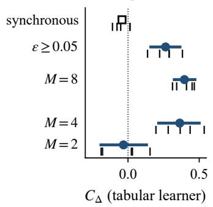

(b) rematching rate  
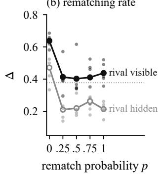

(c) coupling signature  
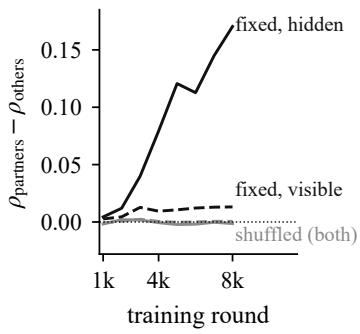  
Figure 4: (a) The five committed predictions on the tabular learner, five blocks, where dot and bar give $C _ { \Delta }$ and its 95% confidence set, ticks the block contrasts, and the synchronous learner is a single-pair point estimate. (b) Sweep C4b on the tabular learner, five blocks, with rematching probability p per episode end from a fixed initial pairing, and the level averaged over checkpoints with the rival visible (filled) and hidden (open). The level drops to the shuffled value at $p = 0 . 2 5$ and does not move after, as in the 25-block sweep of Appendix F. Small dots are blocks. (c) Coupling signature, the partner minus non-partner correlation of the hybrid agent’s Q tables on the rows a condition uses, blocks 1 to 4, none cells. Almost all of the rise is where the rival is hidden.

Table 4: Which part carries what, in the visible-rival cell without a channel, with the confirmatory seeds. The first five rows are means over all eight checkpoints of 8 000 rounds, on five blocks for the first two, on the three planned blocks for the table weight of 5.5, on its blocks 4 and 5, added after reading blocks 1 to 3, in their own row, and on five planned blocks for the weight of 3. The language model trained alone is read on its four checkpoints of a 4 000-round run (the hybrid gives +0.258 on the same blocks and checkpoints). Prompted models are read on the realised level of their last 50 of 200 rounds (five planned blocks) or their last 100 of 500 rounds (planned blocks only), with the rematched arm re-paired every 20 rounds or every round among four agents. Rows below the first five are comparable in sign and size only. The last two columns give the swap-opponent drop and the coupling signature of fixed runs. Exploratory, no α.
<table><tr><td>variant</td><td>∆ fixed</td><td>∆ shuffled</td><td>contrast</td><td>swap</td><td>signature</td></tr><tr><td>trained agent (reference)</td><td>0.673</td><td>0.467</td><td>+0.206</td><td>-0.293</td><td>+0.012</td></tr><tr><td>head removed (ablation)</td><td>0.681</td><td>0.477</td><td>+0.204</td><td>-0.161</td><td>+0.010</td></tr><tr><td>table weight lowered to 5.5</td><td>0.395</td><td>0.198</td><td>+0.198</td><td>-0.020</td><td>+0.028</td></tr><tr><td>weight 5.5, blocks 4 and 5, added</td><td>0.437</td><td>0.256</td><td>+0.181</td><td>+0.155</td><td>+0.117</td></tr><tr><td>table weight lowered to 3</td><td>0.351</td><td>0.192</td><td>+0.159</td><td></td><td></td></tr><tr><td>language model alone, policy gradient</td><td>0.178</td><td>0.113</td><td>+0.064</td><td></td><td></td></tr><tr><td>prompted 7B, re-paired every 20 rounds</td><td>0.217</td><td>0.142</td><td>+0.075</td><td></td><td></td></tr><tr><td>prompted 7B, re-paired every round</td><td>0.475</td><td>0.257</td><td>+0.217</td><td></td><td></td></tr><tr><td>prompted 7B, rival hidden</td><td>0.460</td><td>0.076</td><td>+0.384</td><td></td><td></td></tr><tr><td>prompted 14B, re-paired every round</td><td>0.829</td><td>0.738</td><td>+0.091</td><td></td><td></td></tr><tr><td>prompted 14B, rival hidden</td><td>0.734</td><td>0.188</td><td>+0.546</td><td></td><td></td></tr><tr><td>prompted 7B, rival hidden, fresh blocks (R1)</td><td>0.481</td><td>0.039</td><td>+0.442</td><td></td><td></td></tr><tr><td>same, own-partner history when rematched (R3)</td><td>0.481</td><td>0.249</td><td>+0.232</td><td></td><td></td></tr><tr><td>prompted Mistral-7B, rival hidden (R2)</td><td>0.968</td><td>0.979</td><td>-0.011</td><td></td><td></td></tr><tr><td>prompted OLMo-2-7B, rival hidden (R4)</td><td>0.835</td><td>0.843</td><td>-0.008</td><td></td><td></td></tr></table>

What the head alone has learned. The probe reads the policy proj(head) + w · table, and the registered runs use w = 1. Re-reading the forty final checkpoints at $w = 0$ isolates the head. In the visible-rival cell without a channel the head-only rest level is 0.178, 0.186, 0.305, 0.287, 0.489 under fixed against 0.658, 0.623, 0.305, 0.417, 0.596 under shuffled, a contrast of −0.231, negative in four blocks of five and tied at the reported precision in the third, where the full policy gives +0.206. The head’s latent policy runs against the persistence effect. This is the behaviour we would expect from a correction term trained by policy gradient on top of a table that already acts. On the same checkpoints the head-only swap-opponent effect is +0.008 (negative in three blocks of five) against −0.293 for the full policy and −0.161 for the zero-head ablation, so the head alone shows no swap drop either, and the D3 residue is not a partner-dependent policy learned by the language model. On the registered four-cell estimand the head-only contrast is −0.140, negative in four blocks of five, against +0.274 for the full policy, so the sign survives averaging over the cells the primary hypothesis averages over. Exploratory, five blocks, one read-out weight, and this says nothing about what a head trained under that authority would do.

Scored by direction, seven predictions held, one held in part, four did not and three cannot be scored. Scored by intervals, none of the predictions of no effect is a precise null at five blocks, and of the orderings only M = 4 above M = 2 is established. On 25 further blocks (Appendix F) the two predictions of no effect, M = 2 and the synchronous learner, hold by the interval rule, the first as a precise null and the second as a small negative effect whose interval excludes zero. The mechanism evidence is therefore consistent with spontaneous coupling, and it does not establish it.

Predictions A1 to A5x (committed 14 September 2026, before any run). A1, M = 2, predicts $C _ { \Delta } \approx 0 .$ , and a substantial $C _ { \Delta }$ would mean the effect comes from the episode clock or the seat history rather than from the partner’s identity. A2, M = 8, predicts $C _ { \Delta } ( 8 ) \geq C _ { \Delta } ( 4 ) > C _ { \Delta } ( 2 )$ . A3, synchronous learner of Asker et al. (2022) (every action updated against the observed rival price, with a visible rival only, since a hidden rival is not observed), predicts $C _ { \Delta } \approx 0$ and levels near Nash in both arms, and a preserved persistence effect would mean the mechanism is not coupling. A4, permanent exploration floor $\varepsilon \ge 0 . 0 5$ , predicts $C _ { \Delta }$ smaller than at the zero floor. A5x, $\bar { 1 0 ^ { 6 } }$ rounds under Calvano’s schedule, has two recorded outcomes, the hidden-rival gap persists (the channel is stable at our scale) or closes (the hidden-rival levels at 8 000 rounds are transient).

Table 5: The fifteen predictions A1 to D4, scored twice (C4b and the head read-out are reported with their paragraphs). D1 and D4 are scored on the three planned blocks of the lowered table weight, and its two added blocks leave both verdicts unchanged. Direction asks whether the point estimate lies where the prediction said. Interval applies the standard of the confirmatory tests. A prediction of no effect holds only if its 95% interval lies inside $\pm \mathrm { S E S O I } _ { \Delta } = \pm 0 . 1 0$ , and an ordering only if the two intervals do not overlap. A dash means that no interval exists (single pairs) or that the item is descriptive.
<table><tr><td>id</td><td>prediction</td><td>observed</td><td>direction / interval</td></tr><tr><td>A1</td><td> $M = 2 , C _ { \Delta } \approx 0$ </td><td> $- 0 . 0 3 2 , \left[ - 0 . 1 9 0 , + 0 . 1 3 0 \right]$ </td><td>held / inconclusive at 5, precise null at 25</td></tr><tr><td>A2</td><td> $C _ { \Delta } ( 8 ) \geq C _ { \Delta } ( 4 ) > C _ { \Delta } ( 2 )$ </td><td> $+ 0 . 3 9 6 , + 0 . 3 6 3 , - 0 . 0 3 2$ </td><td>held / only  $C _ { \Delta } ( 4 ) > C _ { \Delta } ( 2 )$ </td></tr><tr><td>A3</td><td>synchronous,  $C _ { \Delta } \approx 0 ,$  levels near Nash</td><td>—0.042, levels 0.29 and 0.33</td><td>level clause failed / small negative at 25</td></tr><tr><td>A4</td><td>floor lowers  $C _ { \Delta }$ </td><td>+0.264 against +0.363</td><td>heid / intervals overlap</td></tr><tr><td> $\operatorname { A } 5 \mathbf { x }$ </td><td> ${ 1 0 } ^ { 6 }$  rounds, two outcomes recorded</td><td>hidden gap persists</td><td>not a test</td></tr><tr><td>C1</td><td>signature  $> 0$  under fixed,  $\approx 0$  under shuffled</td><td>Table 7</td><td>held / –</td></tr><tr><td>C2</td><td>signature grows with M</td><td>smaller at  $M = 8$ </td><td>partly held / –</td></tr><tr><td>C3</td><td>slower under hidden</td><td>stronger under hidden</td><td>failed / –</td></tr><tr><td>C4 C5</td><td>rematching dose-response</td><td>not run as planned</td><td>not scorable</td></tr><tr><td></td><td> $E _ { \mathrm { n e t } }$  small, unrelated to  $\Delta$ </td><td> $r = + 0 . 0 4 ,$  median  $| E _ { \mathrm { n e t } } | = 1 . 5 3$ </td><td>held / –</td></tr><tr><td>C6</td><td>rest points under shuffled/hidden</td><td>listed</td><td>descriptive</td></tr><tr><td>D1</td><td>authority lowers level and contrast</td><td> $0 . 3 9 5 \ \mathrm { v s } \ 0 . 6 7 3 , + 0 . 1 9 8 \ \mathrm { v s }$  +0.206 (+0.235 on the same blocks)</td><td>held / –</td></tr><tr><td>D2</td><td>ablation within 0.10 of reference +0.204 against +0.206</td><td></td><td>held / –</td></tr><tr><td>D3</td><td>ablation swap within 0.10 of -0.29</td><td>-0.161</td><td>failed / –</td></tr><tr><td>D4</td><td>signature weaker under authority +0.028 against +0.010</td><td></td><td>failed / –</td></tr></table>

Table 6 gives the per-cell levels behind the five predictions. The reference learner run to 300 000 rounds gives $C _ { \Delta } = + 0 . 3 3 7 , \ : [ + 0 . 2 6 5 , + 0 . 4 2 5 ]$ . Block contrasts are, for $M = 2 , + 0 . 1 5 , + 0 . 0 3$ $- 0 . 1 9 , + 0 . 0 2 , - 0 . 1 8 .$ , for M = 8, +0.41, +0.31, +0.47, +0.45, +0.34, for the synchronous visible pair, $+ 0 . 0 1 , + 0 . 0 1 , - 0 . 1 1 , - 0 . 0 8 , - 0 . 0 5 , \mathrm { f o r ~ t h e ~ f i o o r , } + 0 . 2 9 , + 0 . 2 2 , + 0 . 2 9 , + 0 . 1 4 , + 0 . 3 8$ , and for $1 0 ^ { 6 }$ rounds on the hidden pair, +0.77, +0.61, +0.83, +0.75, +0.70. At $1 0 ^ { 6 }$ rounds the two-pair contrast is $+ 0 . 4 6 4$ , with a confidence set whose hull is $[ + 0 . 1 3 5 , + 0 . 7 7 5 ]$ (nine grid points inside the hull are rejected), and the shuffled/visible cell reaches the highest pattern share of any tabular cell (0.81), so with the rival observed and a million rounds, the rematched learner does eventually build something the probe reads as punishment, but not the level the persistent one reaches.

Predictions C1 to C6 (committed 14 September 2026, 22:32, before their analyses) and outcomes. C1, hybrid agent, blocks 1 to 4, predicts a signature positive under fixed, ≈ 0 under shuffled, growing over training, present with a hidden rival as with a visible one, and is held (Table 7). C2, tabular learner, $M \in \{ 2 , 4 , 8 \}$ , predicts a signature gap ≈ 0 at $M = 2 , > 0$ at $M = 4 , \geq$ at $M = 8$ , and is partly held (+0.018 with a visible rival and +0.057 with a hidden one at $M = 4 , + 0 . 0 1 0$ and +0.026 at $M = 8 ,$ where the M = 8 gap is smaller, not larger). C3, slower with a hidden rival than with a visible one to a comparable final level, failed, since the signature is stronger with a hidden rival. C4, dose-response monotone in p with $p = 0 \approx \mathsf { f i x e d } .$ , is not tested as planned, see below. C5, $E _ { \mathrm { n e t } }$ small and uncorrelated with $\Delta$ where coupling is established, is held. C6 is descriptive.

C4 as executed, and C4b. The plan said ${ } ^ { \ast } p = 0 \colon$ synchronous clock, partner never changed, ≈ fixed”. The implementation drew the initial pairing independently in each of the sixteen markets and froze it at $p = 0 .$ so each agent kept about three simultaneous permanent partners. Levels under that variant are, at $p = 0 , 0 . { \dot { 3 } } { \dot { 9 } } / 0 . { \dot { 2 } } { \dot { 4 } }$ (rival visible / hidden), at 0.25, 0.40 / 0.20, at 0.5, 0.36 / 0.24, at 0.75, 0.45 / 0.22, and at 1, 0.37 / 0.16, with the contrast $p = 0$ minus $p = 1$ at +0.048, [−0.065, +0.170]. The error was recorded, the plan rectified in writing before the relaunch, and C4b run with a fixed initial pairing $( \mathrm { A }  \mathrm { B }$ on eight markets, C↔D on eight), giving at $p = 0 , 0 . 6 4 /$ 0.47, at 0.25, 0.41 / 0.21, at 0.5, 0.40 / 0.22, at 0.75, 0.41 / 0.26, and at 1, 0.44 / 0.21, with contrast +0.229, [+0.125, +0.325], and a share of $( p _ { i } < p _ { j } )$ pairs with $\Delta _ { i } > \Delta _ { j }$ of 0.71. The unplanned variant is kept because it is informative, since three permanent partners give the shuffled level.

Table 6: Mechanism runs on the tabular learner, per-cell means over five blocks, giving the level averaged over checkpoints, the level at the final checkpoint $\Delta _ { \mathrm { f i n a l } }$ (round 8 000, or round $\mathrm { \bar { 1 0 ^ { 6 } } }$ in the last four rows), $\underline { { E _ { \mathrm { n e t } } ^ { \mathrm { B R _ { 1 } ^ { \bullet } } } } }$ , pattern share and $P _ { 1 }$
<table><tr><td>variation</td><td>cell</td><td>∆</td><td> $\Delta _ { \mathrm { f i n a l } }$ </td><td> $E _ { \mathrm { n e t } } ^ { \mathrm { B R _ { 1 } } }$ </td><td>pattern</td><td> $P _ { 1 }$ </td></tr><tr><td rowspan="4"> $M = 4 \ : ( \mathrm { r e f e r e n c e } )$ </td><td>fixed/visible</td><td>0.661</td><td>0.773</td><td>1.28</td><td>0.34</td><td>0.17</td></tr><tr><td>shuffled/visible</td><td>0.365</td><td>0.308</td><td>6.43</td><td>0.35</td><td>0.07</td></tr><tr><td>fixed/hidden</td><td>0.571</td><td>0.667</td><td>0</td><td>0</td><td>0</td></tr><tr><td>shuffled/hidden</td><td>0.141</td><td>0.036</td><td>0</td><td>0</td><td>0</td></tr><tr><td rowspan="4"> $M = 2$ </td><td>fixed/visible</td><td>0.688</td><td>0.764</td><td>1.59</td><td>0.45</td><td>0.25</td></tr><tr><td>shuffled/visible</td><td>0.721</td><td>0.848</td><td>3.95</td><td>0.36</td><td>0.30</td></tr><tr><td>fixed/hidden</td><td>0.475</td><td>0.513</td><td>0</td><td>0</td><td>0</td></tr><tr><td>shuffled/hidden</td><td>0.504</td><td>0.614</td><td>0</td><td>0</td><td>0</td></tr><tr><td rowspan="4"> $M = 8$ </td><td>fixed/visible</td><td>0.687</td><td>0.799</td><td>2.39</td><td>0.51</td><td>0.34</td></tr><tr><td>shuffled/visible</td><td>0.324</td><td>0.438</td><td>-0.23</td><td>0.30</td><td>0</td></tr><tr><td>fixed/hidden</td><td>0.648</td><td>0.721</td><td>0</td><td>0</td><td>0</td></tr><tr><td>shuffled/hidden</td><td>0.219</td><td>0.105</td><td>0</td><td>0</td><td>0</td></tr><tr><td rowspan="2">synchronous</td><td>fixed/visible</td><td>0.291</td><td>0.365</td><td>1.87</td><td>0.14</td><td>0</td></tr><tr><td>shuffled/visible</td><td>0.333</td><td>0.607</td><td>2.76</td><td>0.07</td><td>0</td></tr><tr><td rowspan="4"> $\varepsilon \ge 0 . 0 5$ </td><td>fixed/visible</td><td>0.641</td><td>0.645</td><td>0.08</td><td>0.42</td><td>0.20</td></tr><tr><td>shuffled/visible</td><td>0.386</td><td>0.492</td><td>8.37</td><td>0.35</td><td>0.06</td></tr><tr><td>fixed/hidden</td><td>0.459</td><td>0.458</td><td>0</td><td>0</td><td>0</td></tr><tr><td>shuffled/hidden</td><td>0.187</td><td>0.289</td><td>0</td><td>0</td><td>0</td></tr><tr><td rowspan="4"> ${ 1 0 } ^ { 6 }$  rounds</td><td>fixed/visible</td><td>0.884</td><td>0.889</td><td>2.71</td><td></td><td>0.09</td></tr><tr><td>shuffled/visible</td><td>0.689</td><td>0.672</td><td>2.82</td><td>0.20 0.81</td><td>0.59</td></tr><tr><td>fixed/hidden</td><td>0.685</td><td>0.681</td><td>0</td><td>0</td><td>0</td></tr><tr><td>shuffled/hidden</td><td>-0.047</td><td>-0.090</td><td>0</td><td>0</td><td>0</td></tr></table>

Table 7: C1, the coupling signature ρ(partners) − ρ(non-partners) in the hybrid agent’s tables, blocks 1 to 4, by round, and the two correlations at round 8 000. The residual variant (correlating each table’s residual around the run’s mean table) was defined after seeing these numbers and is post hoc.
<table><tr><td>cell</td><td>1k</td><td>2k</td><td>3k</td><td>4k</td><td>5k</td><td>6k</td><td>7k</td><td>8k</td><td> $\rho _ { \mathrm { p a r t } }$ </td><td> $\rho _ { \mathrm { n o n } }$ </td><td>residual</td></tr><tr><td>fixed/visible/none</td><td></td><td>.003.004</td><td>.013</td><td>.009</td><td>.011</td><td>.012</td><td>.013</td><td>.013</td><td>3.905.892</td><td></td><td> $+ 0 . 1 6$ </td></tr><tr><td>shuffled/visible/none</td><td>-.001.001</td><td></td><td>.002</td><td>.001</td><td>.000</td><td>.000</td><td>.001</td><td>.001</td><td>.910.909</td><td></td><td> $\leq 0 . 1 2$ </td></tr><tr><td>fixed/visible/free_text</td><td></td><td>.000.006</td><td>.011</td><td>.015</td><td>.012</td><td>.012</td><td>.013</td><td>.013</td><td>.922</td><td>.909</td><td>+0.24</td></tr><tr><td>shuffled/visible/free_text</td><td></td><td>.001.005</td><td>.006</td><td>.006</td><td>.008</td><td>.009</td><td>.009</td><td>.008</td><td>.909.901</td><td></td><td> $\leq 0 . 1 2$ </td></tr><tr><td>fixed/hidden/none</td><td></td><td>.004.012</td><td>.040</td><td>.079</td><td>.121</td><td>.113</td><td>.145</td><td>.170</td><td></td><td>.920.749</td><td>+1.04</td></tr><tr><td>shuffled/hidden/none</td><td>-.002.002</td><td></td><td>.002</td><td>-.001</td><td>-.002</td><td>-.002</td><td>.000</td><td>-.001</td><td></td><td>.988.989</td><td> $\leq 0 . 1 2$ </td></tr><tr><td>fixed/hidden/free_text</td><td>.002.019</td><td></td><td>.051</td><td>.041</td><td>.041</td><td>.049</td><td>.050</td><td>.052</td><td></td><td>.915.864</td><td> $+ 0 . 5 4$ </td></tr><tr><td>shuffled/hidden/free_text</td><td>-.002.000</td><td></td><td>-.003</td><td>-.002</td><td>-.003</td><td>-.003</td><td>-.002</td><td></td><td></td><td>-.003 .982 .985</td><td> $\leq 0 . 1 2$ </td></tr></table>

C5 and C6. Across the 60 tabular runs with an observable rival (matched baseline, mechanism variants, $1 0 ^ { 6 }$ rounds), corr( $\Delta , E _ { \mathrm { n e t } } ^ { \mathrm { B R } _ { 1 } } ) = + 0 . 0 4$ and corr $( \Delta , E _ { \mathrm { n e t } } ^ { \mathrm { B R } _ { K } } ) = + 0 . 0 3$ . Among the 30 runs at $\Delta > 0 . 6$ the median $| E _ { \mathrm { n e t } } ^ { \mathrm { B R _ { 1 } } }$ | is 1.53 bins·rounds and the median $E _ { \mathrm { n e t } }$ is 1.22 (Figure 5). For C6, the final rest points of shuffled/hidden at $1 0 ^ { 6 }$ rounds are at grid bins (6,9), (8,5), (6,5), (4,4), (5,2), (13,4), (3,3), (4,5), (5,4), (5,5) across the five blocks, mostly below the Nash bin 6, with block levels $+ 0 . 0 6 , - 0 . 0 4 , - 0 . 1 7 , - 0 . 1 9 , - 0 . 1 1$ , and the fixed/hidden rests in the same runs are at bins 11 to 23.

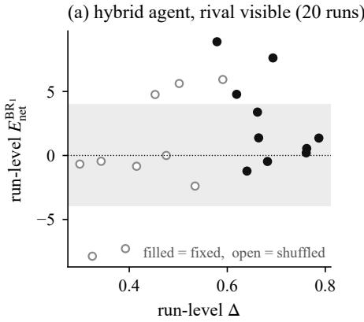

(b) tabular learner, rival visible (60 runs)  
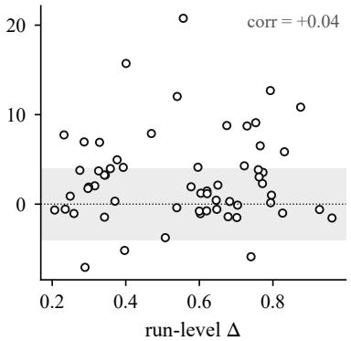  
Figure 5: Run-level enforcement against run-level level, observable rival. (a) The 20 hybrid runs with a visible rival (filled for fixed, open for shuffled). (b) The 60 tabular runs of C5. The grey region is $\pm \mathrm { S E S O I } _ { E }$

## H THE STATIC-RESPONSE BENCHMARK, ITS INVARIANCE, DUAL RESIDUALS AND VALIDITY CURVE

## H.1 A REFERENCE THAT SEES WHAT THE AGENT SEES

The static reference of Section 4 best-responds to the rival’s exact price, while the agent’s state is the pair of four-wide price buckets. On the 43% of starts whose cut leaves the deviator’s own bucket unchanged (Appendix D), the reference moves and the agent cannot, so $E _ { \mathrm { n e t } } = E - E _ { \mathrm { m y o p i c } }$ is then a mechanical negative number carrying no behaviour. This is the theorem’s case in which the reference is not the filter’s internal function, and it biases $E _ { \mathrm { n e t } }$ downward. A reference that sees only buckets does not move on those starts. Setting $E _ { \mathrm { m y o p i c } } = 0$ there, and keeping the exact reference elsewhere, with the blind starts identified exactly from the saved tables of all eight checkpoints, gives block contrasts of $\cdot - 0 . 6 3 , - 0 . 6 7 , + 1 . 2 3 , + 3 . 2 9$ and +5.36, a mean $C _ { E } ^ { \mathrm { B R } _ { 1 } }$ of +1.72 against the registered +1.48, positive in three blocks of five as before, and +3.43 against +2.97 on the visible-rival scale (post hoc). The four hidden-rival cells stay exactly zero. An earlier version reported a bucket-blind variant built on a crossing flag that compared the cut with the rival’s price instead of the deviator’s own, and we withdraw it. A probe with $k \geq 9$ bins crosses on most starts (84.5% on the tabular learner, the rest clamped at the bottom of the grid), at the cost of a different estimand, since the one-shot gain that fixed $k = 4$ no longer holds. Exploratory, computed from the registered probe files with no run re-executed.

Invariance theorem. Let the rival’s price in either branch be a causal linear filter of the matched static reference $\begin{array} { r } { f , r ( t ) = \sum _ { i > 0 } h _ { j } f \big ( \dot { p } ^ { \mathrm { r i v a l } } ( t - 1 - j ) \big ) } \end{array}$ , with $\textstyle \sum _ { j } | h _ { j } | < \infty$ , a common pre-history before t∗ in both branches, and a summable myopic difference $\mathrm { R E _ { m y o p i c } }$ . Then by linearity $\mathrm { R E } ( h ) =$ $\begin{array} { r } { \sum _ { i } h _ { j } \operatorname { R E } _ { \mathrm { m y o p i c } } ( h - j ) } \end{array}$ , the sum of a convolution is the product of the sums, so $E = G E _ { \mathrm { m y o p i c } }$ with $G = \textstyle \sum _ { j } h _ { j }$ and

$$
E _ { \mathrm { n e t } } = \left( G - 1 \right) E _ { \mathrm { m y o p i c } } .
$$

Every unit-gain kernel (impulse, pure delay, causal moving average, geometric partial adjustment, and mixtures) gives $E _ { \mathrm { n e t } } = 0$ regardless of its shape, and over-reaction is the same statement at $G \neq 1$ , and an affine response α $\mathrm { B R } + \beta$ has $G = \alpha$ . Verified in the test suite on those kernels and on a sweep of G, with a maximal discrepancy of $4 \times 1 0 ^ { - 1 5 }$ under the matched reference. At finite horizon the invariance is asymptotic, and under a non-negative kernel the truncation bias is of demonstrated sign and conservative $( E _ { \mathrm { n e t } } \leq 0 \mathrm { a t } G = 1 $ , tending to 0 from below), but a signed kernel can produce a positive truncation residual, so the sign statement is made only under $h _ { j } \geq 0$

Why no single reference suffices. The fourth condition, that the reference be the filter’s own internal function, is the binding one. A rival that best-responds to the mean of a window of past prices filters before the non-linearity, computing BR(p) where the theorem needs $\overline { { \mathrm { B R } ( p ) } }$ , and leaves a Jensen gap that $\mathrm { B R } _ { K }$ absorbs and $\mathrm { B R _ { 1 } }$ does not, while a rival that applies inertia after its one-step best response is matched by $\mathrm { B R _ { 1 } }$ and not by $\mathrm { B R } _ { K }$ . Measured on this calibration with six unit-gain kernels, the post-BR inertial family scores 0 under BR and +1 bin (one-round deviation) $\mathrm { t o } + 2$ bins (two rounds) under $\mathrm { B R } _ { K }$ , an anti-conservative false positive twice the size of the myopic correction itself, while the window family scores $- 1 \mathrm { t o } - 2$ bins under $\mathrm { B R _ { 1 } }$ and 0 under $\mathrm { B R } _ { K }$ . The two leftover biases mirror each other and have opposite signs, so H6 rejects only if both references reject, at unchanged α. A sweep over effective window $M \in \{ 1 , \dots , 1 2 \}$ , deviation durations $\{ 1 , 2 , 3 , 4 , 6 \}$ with and without an added unit-gain post-BR kernel (192 combinations) produced no case in which both components were positive, while a simulated grim trigger passes both with more than 100 bins·rounds. The residual is not bounded by a constant, since under the unmatched reference it is about $- \operatorname* { m i n } ( M - 1 , L )$ bins for a deviation persisting L rounds, measured $\displaystyle { \mathrm { t o } - 6 } .$ , and in the contrast $C _ { E }$ its sign follows the difference in realised persistence between arms, which is why the deviator’s persistence L is reported per cell (Table 3) and why $\mathrm { S E S O I } _ { E }$ was set above the resulting band.

Validity curve. Whether the correction matters is a property of the demand system, and it can be computed with no rollout. With $d ^ { * } ( \mu , m _ { k } )$ the smallest undercut of the monopoly price, as a fraction of the Nash-to-monopoly gap, that yields a one-shot gain of at least $m _ { k } = 1 0 \%$ (the rule that fixed $k = 4$ here), define

$$
R ( \mu ) = \frac { \left| \mathrm { B R } ( p _ { \mathrm { m o n } } ) - \mathrm { B R } ( p _ { \mathrm { m o n } } - d ^ { * } \left( p _ { \mathrm { m o n } } - p _ { \mathrm { N a s h } } \right) ) \right| } { p _ { \mathrm { m o n } } - p _ { \mathrm { N a s h } } } ,
$$

the static response to a calibrated deviation as a share of the amplitude a grim trigger would move the rival by. Table 8 gives the curve. Two facts were not expected. R increases with differentiation although the slope of BR decreases, because a profitable deviation must be deeper when products are more differentiated and $R \approx d ^ { * } \cdot \partial \mathrm { B R } / \partial p$ is dominated by the depth. And the deviation rule has no solution beyond $\mu ^ { * } = 0 . 5 0 0 4 6$ , since past that differentiation, no undercut of the monopoly price gains 10% in one shot, so a forced-deviation test loses its meaning. Grid quantisation does not inflate the correction, since at $\mu \ : = \ : 0 . 2 5$ the discrete value at 20 Nash-to-monopoly steps is $R = 1 / 2 0 = 0 . 0 5 0$ exactly (one bin), against 0.0625 at 80 and 160 steps and 0.0622 in the continuum. R is a ratio of instantaneous amplitudes around the monopoly price, and it is neither a ratio of areas nor a bound on $E _ { \mathrm { m y o p i c } } / E$ on the states a trained policy actually visits, which is what Table 3 measures.

Table 8: The validity curve, continuous (no grid), $m _ { k } = 0 . 1 0$ . The slope is $\partial \mathrm { B R } / \partial p _ { \mathrm { r i v a l } }$ at the monopoly price, and $d ^ { * }$ the required deviation depth as a fraction of the Nash-to-monopoly gap. The calibration used in this paper is $\mu = 0 . 2 5$ , where the discrete grid gives $R = 0 . 0 5 0$
<table><tr><td> $\mu$ </td><td>0.05</td><td>0.10</td><td>0.20</td><td>0.25</td><td>0.30</td><td>0.40</td><td>0.45</td><td>0.49</td><td>0.50</td></tr><tr><td>slope</td><td>0.835</td><td>0.674</td><td>0.436</td><td>0.357</td><td>0.299</td><td>0.222</td><td>0.196</td><td>0.179</td><td>0.175</td></tr><tr><td> $d ^ { * }$ </td><td>0.013</td><td>0.035</td><td>0.110</td><td>0.166</td><td>0.234</td><td>0.409</td><td>0.530</td><td>0.681</td><td>0.774</td></tr><tr><td>R</td><td>0.011</td><td>0.024</td><td>0.050</td><td>0.062</td><td>0.074</td><td>0.098</td><td>0.114</td><td>0.136</td><td>0.153</td></tr></table>

Predictions D1 to D4 (committed 15 September 2026, before any run) and outcomes. Two experiments on the trained agent, in the visible-rival cell without a channel, arms fixed and shuffled, with the block and slot seeds of the confirmatory runs, 8 000 rounds, the same probes. D1, authority (table weight 5.5 instead of 16.5), predicts a smaller contrast than +0.206 and a fixed level below 0.623, and is held, though only its level clause is strong, the contrast moving from +0.235 to +0.198 on the same three blocks, which is inside the noise. D2, matched ablation (zero frozen head, frozen backbone), predicts contrast and arm levels within 0.10 of the reference, and is held (+0.204, with 0.681 and 0.477, and per-block paired differences averaging +0.009 and +0.010, reaching ±0.18). D3, ablation swap effect within 0.10 of −0.29, failed (−0.161, with blocks $- 0 . 2 5 , - 0 . 2 \bar { 2 } , - 0 . 0 3$ $+ 0 . 0 3 , - 0 . 3 4 )$ . D4, coupling signature positive under fixed and near zero under shuffled in the ablation, and weaker under authority, failed, since the ablation part holds $( + 0 . 0 1 0$ and −0.003) but the authority variant’s signature is larger, not smaller (+0.028 on the three planned blocks, and +0.117 on the two added ones).

The authority experiment was limited to blocks 1 to 3 for time, written down before any of its results existed, and D1 and D4 were scored on those three blocks, whose contrasts are +0.162, +0.143 and +0.288. Blocks 4 and 5 were added on 23 September after reading them, with two predictions committed before their runs, F1, a positive contrast in both new blocks, and F2, a five-block mean of at least +0.10. Both held (block contrasts +0.229 and +0.133, and +0.191 for the five-block mean that F2 names). The runs finished on 24 September and were read then. We report these two blocks apart from the planned ones (Table 4), and they leave the verdicts of D1 and D4 unchanged. The head overturns the table in 49% of settled seats on the planned blocks, and in 298 of 600 over all checkpoints of the ten runs.

A table weight of 3 was planned on 23 September at 22:01, after blocks 1 to 3 at 5.5 and the first checkpoint of the language model alone (a training contrast of +0.01 at round 1 000) had been read, and amended at 22:54, before any of its runs, to five blocks, with G1 dropped (the override rate became a manipulation check) and G2 and G3 replaced by three predictions on levels averaged over checkpoints, $\dot { \mathbf { G } } \dot { 2 } ^ { \prime }$ , a contrast at least 0.05 below the one at 5.5 on the same blocks, $\mathbf { G } 3 ^ { \prime }$ , a positive slope of the block contrasts on the table’s weight across 16.5, 5.5 and 3, and G4, a fixed arm no higher than its starting level of 0.39, read as rematching lowering prices rather than persistence raising them. The original G2, a mean contrast below +0.198 on blocks 1 to 3, would also have failed (+0.228). On 24 September at 10:14 we set a read time, 25 September at 12:00, that would keep only blocks whose two arms had finished. All ten runs finished their probes at 09:06 and were read once at 09:08, before that time, the same set of blocks the read time would have kept. The block contrasts are +0.272, +0.132, +0.280, +0.076 and +0.035, mean +0.159, against +0.191 at 5.5 and +0.206 at 16.5 on the same blocks, with arms at 0.351 and 0.192. $\mathbf { G } 2 ^ { \prime }$ failed (a gap of 0.032), $\mathbf { G } 3 ^ { \prime }$ held (a slope of +0.0028 per unit of weight) and G4 held. The head overturns the table in 695 of 884 settled seats (79%) over all checkpoints of the ten runs, against 49% at 5.5.

The ablation runs used a code path that skips the language model’s forward passes, which cannot change an action when the head is zero and frozen, and it was validated by requiring every logit vector of a short run to equal the full path’s, and by a probe whose output on the same checkpoint is identical.

## I IMPLEMENTATION NOTES ON THE INFERENCE

These are properties of the registered procedure that the registration did not spell out, and the statistic, basis and grids are unchanged.

• The block-level statistic is studentised, that is scaled by its own standard error. An unscaled test is exact only under the sharp null that no unit’s outcome depends on persistence. Block effects and the effects of observability and channel cancel inside each (fixed, shuffled) difference and do not break that null, but a persistence effect that varies across seeds or cells does, as our post hoc breakdown by observability suggests. Studentising keeps exactness under the sharp null and is meant to add validity for the weak null of a zero average effect as the number of blocks grows. Chung & Romano (2013) prove this for two-sample and k-sample permutation tests, not for the sign-flip test used here, and at five blocks it is approximate in any case.

• The inverted confidence set is not guaranteed to be contiguous at these block counts, because the p-value surface over $\tau$ is coarse. We report the hull of the retained $\tau ,$ the number of grid points inside the hull that the test rejects (zero for every interval in this paper except the $1 0 ^ { 6 }$ -round two-pair contrast of Appendix $\mathrm { G } ,$ where nine are), and a flag raised when the set reaches the edge of the grid. The compatible sharp null is completed as $z _ { c } = \left( \tau / 2 \right) P _ { c }$ with all six other contrasts at zero, and “every unit has effect $\tau ^ { \ast }$ does not by itself pin down the potential outcomes of an eight-cell factorial.

• For the one-sample sign-flip basis used in stage 2 and in the exploratory contrasts, studentisation cannot change a p-value, because $\begin{array} { r } { \sum _ { i } ( v _ { i } - \tau ) ^ { 2 } } \end{array}$ is invariant under sign flips, so $T ^ { 2 } = n ( n -$ $1 ) m ^ { 2 } / ( S - n m ^ { 2 } )$ is strictly increasing in $m ^ { 2 }$ and the ordering of the $2 ^ { n }$ patterns is that of the raw means. Those p-values are computed from the means, which is also the numerically stable route since $S - n m ^ { 2 }$ is a catastrophic cancellation whenever |m| ≫ sd. At the block level the invariance fails and studentisation does change the ordering, which is where it is registered.

• Ties in the reference distribution (a pattern and its global sign flip have equal |T|) are counted with a relative tolerance, and without one the p-value is anti-conservative by $2 ^ { - n }$

• A single (fixed,shuffled) pair at five blocks admits $2 ^ { 5 }$ sign patterns and a smallest two-sided p of 0.0625, so no 95% interval exists for single-pair contrasts, and they are reported as point estimates with their block values.

Power of H6. The registration simulated the test with the pilot’s run-to-run spread of $E _ { \mathrm { n e t } } ^ { \mathrm { B R _ { 1 } } }$ 1 and gave a power of 0.53 at $\mathrm { \bar { S E S O I } } _ { E }$ , which bounds the joint test of both benchmarks. After the analysis we recomputed it by re-centring the twenty observed pair differences, flipping their signs at random and adding a true effect, which gives 0.48 and 0.47 for the two benchmarks (post hoc).