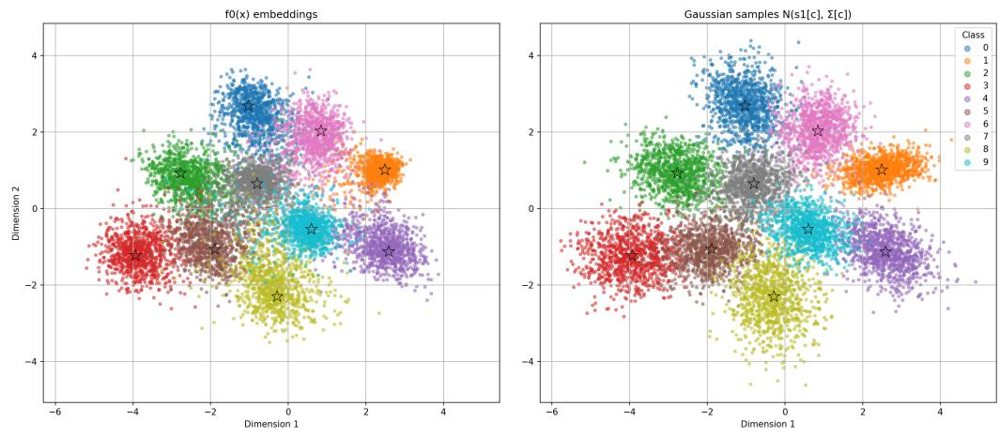
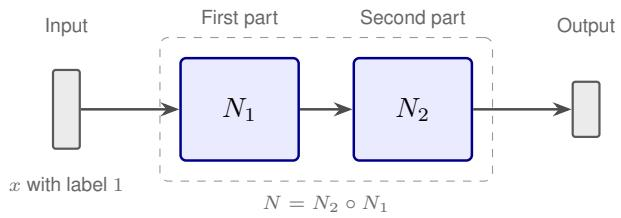
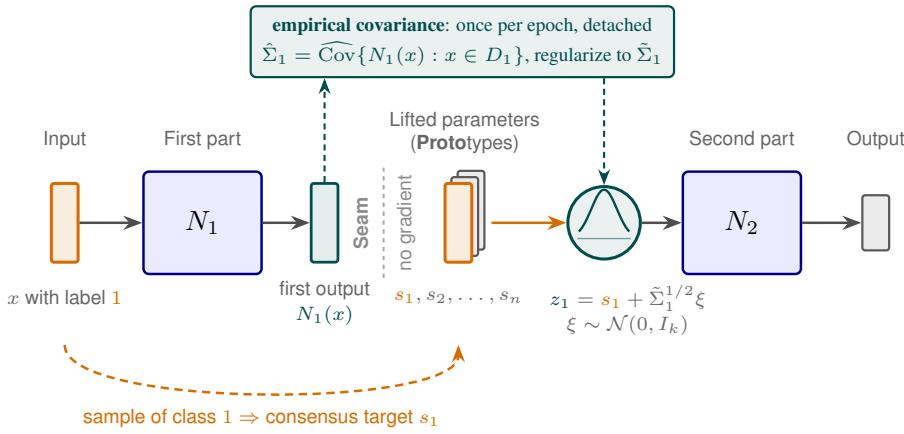
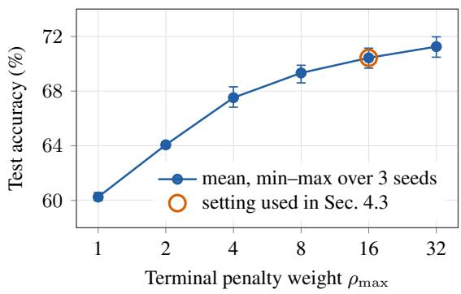
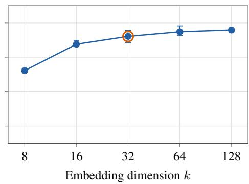
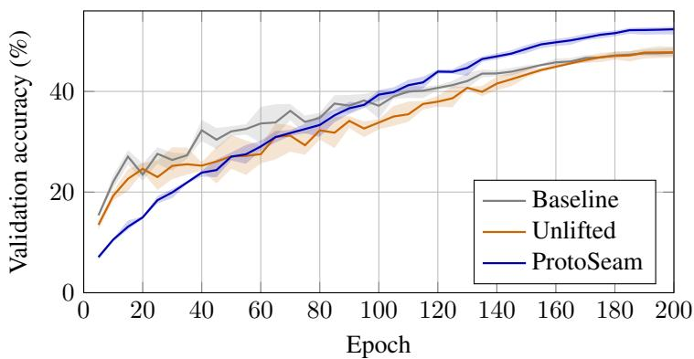
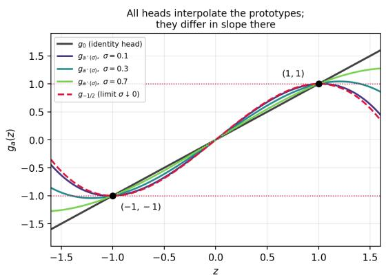
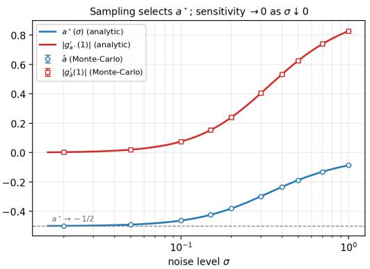
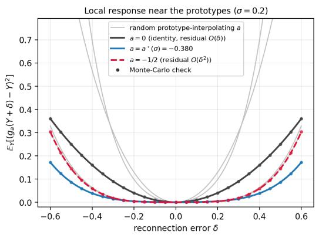
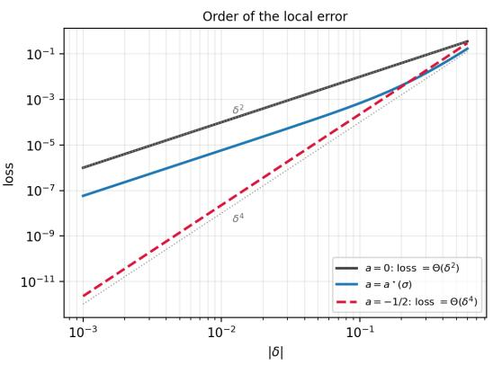

# PROTOSEAM: LIFTING CLASSIFIER TRAINING WITH LATENT GAUSSIAN MIXTURE MODELS

Robert Lampel 1∗ Timon Klein 1 Sebastian Sager 1,2

1Department of Mathematics, Otto von Guericke University (Magdeburg, Germany) 2Max Planck Institute for Dynamics of Complex Technical Systems (Magdeburg, Germany)

## ABSTRACT

We propose a lifted reformulation of supervised classification that improves the final accuracy of standard classifiers without changing the architecture at inference time. A network $N = N _ { 2 } \circ N _ { 1 }$ is split at a single semantic interface and one learnable prototype per class is inserted there. Training combines a quadratic consensus penalty that pulls $N _ { 1 } ( x )$ toward the prototype of its class with a classification loss of $N _ { 2 }$ evaluated on samples drawn around the prototypes, whereat no gradient crosses the interface. At inference the prototypes are discarded and the unmodified network $N _ { 2 } \circ N _ { 1 }$ is used. Across CIFAR-10, CIFAR-100, and TinyImageNet with ResNet and vision transformer backbones, lifted training improves test accuracy by up to five percentage points over variants without lifting under a shared tuning protocol. Moreover, we provide theoretical justification of those results.

## 1 INTRODUCTION

Deep networks for supervised classification are usually trained end-to-end. A single loss is backpropagated through the entire network N in order to maximize test accuracy. We instead view the network as a composition $N = N _ { 2 } \circ N _ { 1 }$ , which introduces no additional parameters at inference time. During end-to-end training, the two subnetworks are coupled in two ways. First, by the chain rule, the gradient signal reaching the early subnetwork $N _ { 1 }$ must pass through the Jacobian of $N _ { 2 }$ Whenever this Jacobian is ill-conditioned or rank-deficient, this can lead to a distorted gradient signal for $N _ { 1 }$ is degraded. Second, the classifier head $N _ { 2 }$ is trained exclusively on the embeddings $N _ { 1 } ( x )$ of the training samples. Nothing in the objective constrains its behavior in a neighborhood of these embeddings, even though small perturbations of the representation are precisely what the head encounters as $N _ { 1 }$ continues to evolve during training.

Prior work addressed the first coupling through decoupled and local training, using per-layer auxiliary variables, local error signals, or synthetic gradients (see Section 2). However, these methods target parallelism or reduced memory, and at best match the accuracy of end-to-end training. Prototype- and margin-based losses, in contrast, shape the embedding geometry but retain the end-to-end gradient path and thus leave the second coupling in place.

Here we propose a lifted reformulation of classifier training that removes both couplings at once, at a single, semantically meaningful interface (the “seam”). The construction transfers Bock’s direct multiple shooting method Bock & Plitt (1984) from control to classification. There, additional variables are introduced together with matching conditions, leading to the same solution upon convergence. Among other advantages, this formulation leads to better conditioning and convergence gains (Lampel & Sager, 2025; 2026). Here, we insert n learnable lifted variables $s _ { 1 } , \ldots , s _ { n } .$ , one prototype per class, at the interface between $N _ { 1 }$ and $N _ { 2 }$ (Figure 2). Assuming that the output of $N _ { 1 }$ for class i is normally distributed around $s _ { i } ,$ the training loss has two decoupled terms:

(i) a consensus penalty that drives $N _ { 1 } ( x )$ toward the prototype of its class, and

(ii) a classification loss that trains $N _ { 2 }$ on samples drawn from the class-conditional distribution around each prototype.

  
Figure 1: Output of the trained first network part $N _ { 1 }$ (left) and the sampled input for the second part $N _ { 2 }$ (right) for the MNIST (Deng, 2012) dataset. The stars denote the position of the lifted variables, i.e., the class means of the sampled normal distribution. Here, $N _ { 1 }$ consists of two convolutional layers, mapping to $\mathbb { R } ^ { 2 }$ . $N _ { 2 }$ consists of one fully connected layer from $\mathbb { R } ^ { 2 }$ to $\mathbb { R } ^ { 1 0 }$

An inter-class repulsion penalty keeps the prototypes separated. No gradient crosses the interface, and by discarding the lifted variables and reconnecting both networks we recover the unmodified composition $N _ { 2 } \circ N _ { 1 }$

The reformulation delivers improved final test accuracy over both a matched end-to-end control and a standard baseline across six dataset-architecture pairs (CIFAR-10, CIFAR-100, and TinyImageNet, each with a ResNet and a custom small vision transformer (ViT-S) backbone), under a shared hyperparameter-tuning protocol (Table 1). We also account for the gain theoretically in Section B).

## Contributions.

1. We formulate lifting at a single semantic interface of a classifier, with a Gaussian classprototype structure at the lifting point and no gradient across it (Section 3, Algorithm 1). The deployed architecture is unchanged.

2. We demonstrate consistent accuracy improvements over both a matched end-to-end control and an unsplit baseline, up to five percentage points across six dataset-architecture pairs, together with a k, $\rho _ { \mathrm { m a x } }$ sweep on CIFAR-100 for the ViT-S backbones (Section 4).

3. We give a theoretical account of the gain (Section B). An interface risk-transfer bound shows that the sampled classification loss is the deployed risk up to mismatch terms the objective itself controls (Theorem B.3). A second-order analysis identifies sampling as an explicit sensitivity regularizer on the head (Theorem B.5). Finally, we consider an exactly solvable one-dimensional model in which the selection effect is closed-form (Theorem B.6).

The Gaussian distributions we impose per class is empirically well-motivated by the neural collapse phenomenon (Papyan et al., 2020). Deep classifiers trained with cross-entropy converge to tight class-conditional clusters with means arranged as a Simplex Equiangular Tight Frame during the terminal phase of training. Our lifted loss promotes a similar geometry from initialization rather than waiting for it to emerge asymptotically (Figure 1). During this process the within-class variance degenerates towards zero, conflicting with our approach of sampling from the empirical covariance. We address this explicitly in Section 3.

The term $l i f t i n g$ has been used for a multitude of ideas across various fields. This work is conceptually distinct from the “lifted neural networks” of Askari et al. (2018), which introduce auxiliary activation variables at every layer to enable block-coordinate descent without imposing any distributional structure. It also differs from metric-learning methods that use the word “lifted” in the sense of lifting pairwise distances to the full-batch distance matrix (Song et al., 2016). Our approach introduces a single set of class prototypes at one semantically meaningful location, grounded both in the multiple-shooting tradition and in the distributional assumptions of variational latent-variable models.

Notation. Throughout, n is the number of classes, m the number of training samples, d the input dimension and k the embedding (lifting) dimension. We write $[ n ] = \{ 1 , \ldots , n \}$ . The network is split as $N = N _ { 2 } \circ N _ { 1 }$ with parameters $\theta _ { 1 } , \mathsf { \bar { \theta } } _ { 2 } ; N _ { 1 } : \mathbb { R } ^ { d } \to \mathbb { R } ^ { k }$ and $\dot { N } _ { 2 } : \dot { \mathbb { R } ^ { k } } \to \mathbb { R } ^ { n }$ . Class prototypes are $s _ { 1 } , \ldots , s _ { n } \in \mathbb { R } ^ { k }$ , collected column-wise in $S \in \mathbb { R } ^ { k \times n }$ . For a symmetric positive semi-definite A we write $\kappa ( A ) = \lambda _ { \mathrm { m a x } } ( A ) / \lambda _ { \mathrm { m i n } } ^ { + } ( A )$ , with $\lambda _ { \operatorname* { m i n } } ^ { + }$ the smallest positive eigenvalue, and vec denotes column-stacking vectorisation, so that vec $( A { \overrightarrow { B } } ) = ( B ^ { \top } \otimes I )$ vec(A).

## 2 RELATED WORK

Lifting and decoupled training. For the numerical solution of optimal control problems direct multiple shooting (Bock & Plitt, 1984) has become a standard approach. The decomposition into smaller subproblems together with matching constraints has various advantages. Among those are superior stability, reduced nonlinearity, and improved convergence speed. The latter aspect has been investigated for boundary value and optimal control problems, including neural ODEs (Lampel & Sager, 2025; 2026; Chen et al., 2018). For multiple shooting the matching constraints hold exactly at the solution (Nocedal & Wright, 2006), whereas we only enforce it using a penalty term in our final objective. The analogy is therefore structural rather than one of constraint satisfaction.

The same idea appears in deep learning as per-layer auxiliary variables: lifted neural networks (Askari et al., 2018) and their Fenchel relaxation (Gu et al., 2020), the Method of Auxiliary Coordinates (Carreira-Perpin˜an & Wang, 2014), and ADMM training (Taylor et al., 2016). Related work´ removes the end-to-end path using local error signals (Nøkland & Eidnes, 2019), greedy layer-wise training (Belilovsky et al., 2019), or predicted gradients (Jaderberg et al., 2017). Techniques from differential equations were transferred to deep residual neural networks to enable layer-parallel training (Gunther et al., 2020). All these decouple every layer and none impose a structure on the latent representation.

Class prototypes and margin losses. Nearest-class-mean classifiers (Mensink et al., 2013) and Prototypical Networks (Snell et al., 2017) evaluate an input based on its distance to a class centroid, which is computed either post hoc or from an episode support set. In constrast, our $s _ { i }$ are being optimized with the network and enter the losses of both subnetworks. The closest related idea is center loss (Wen et al., 2016), which jointly learns a center $c _ { y }$ per class and penalizes $\| f ( x ) - c _ { y } \| _ { 2 } ^ { 2 }$ alongside softmax. The consensus term of (5) coincides with this penalty. What is new in our approach is the removal of the gradient path from the class loss back to the parameters of $N _ { 1 }$ and the inter-class repulsion P. Finally, angular-margin objectives (Liu et al., 2016; 2017; Deng et al., 2019) constrain the classifier weights, while remaining end-to-end.

Gaussian embeddings and neural collapse. Wan et al. (2018) proposed the Large-Margin Gaussian Mixture (L-GM) loss, which models deep features as class-conditional Gaussians and adds a likelihood term to the cross-entropy objective. This is the closest existing work in terms of the assumed distributional model assumed. Both L-GM and our method impose per-class Gaussianity in the penultimate feature space. The distinction is that L-GM trains end-to-end, while our lifted loss decouples $N _ { 1 }$ from $N _ { 2 }$ . Lee et al. (2018) confirm empirically that class-conditional Gaussians fit penultimate-layer features well, using a Mahalanobis-distance detector for out-of-distribution inputs. The neural collapse phenomenon of Papyan et al. (2020) further establishes that deep classifiers naturally develop class-conditional clusters with means on a Simplex ETF at the end of training. Zhu et al. (2021) proved the global optimality of this structure under an unconstrained features model. Closest in spirit to our approach of enforcing structure is Yang et al. (2022), who fix the classifier to a Simplex ETF and train only the backbone against it. That work fixes the geometry a priori while we learn the prototypes and additionally cut the gradient path between the two subnetworks.

Latent-variable models. We borrow the reparameterization trick from the variational auto-encoders (VAE) (Kingma & Welling, 2013), and the per-class Gaussian structure is shared with deep latent Gaussian mixtures (Nalisnick et al., 2016; Kingma et al., 2014) and with FlowGMM (Izmailov et al., 2020). The latter one enforces class-conditional Gaussianity in a normalizing-flow latent space (Rezende & Mohamed, 2015). There are, however, two important differences. First, flows require invertible architectures, incompatible with a standard ResNet (He et al., 2016), whereas our Gaussian structure is a soft penalty applicable to any differentiable model. Second, unlike a VAE, our reparameterization is purely a sampling device for training $N _ { 2 }$

  
Figure 2: The lifting procedure. The original network (top) is split into two parts and one lifted variable is introduced per class (bottom). The part $N _ { 1 }$ is trained against $s _ { i }$ by the consensus term (orange), while $N _ { 2 }$ is trained on samples $z _ { i }$ drawn around $s _ { i } ,$ , so no gradient crosses the interface (seam). The class-conditional covariance (teal) is estimated once per epoch from the embeddings $N _ { 1 } ( x )$ of the whole class, regularized by (3), and then used as the scale of the sampling step (6). At inference lifted variables and sampling step are discarded and the original path $\bar { N _ { 2 } } \circ \bar { N _ { 1 } }$ is restored.

## 3 METHOD

Let $D = \{ ( x ^ { ( j ) } , i ^ { ( j ) } ) \} _ { i = 1 } ^ { m }$ be a labeled dataset with samples $\boldsymbol { x } ^ { ( j ) } \in \mathbb { R } ^ { d }$ and labels $i ^ { ( j ) } \in [ n ]$ , and let $D _ { i } = \{ ( x , l ) \in D \mid l \stackrel { \smile } { = } i \}$ denote the samples of class i. Our goal is to train a network that assigns each sample its corresponding class.

Let N be a neural network which we split into two parts $N _ { 1 }$ and $N _ { 2 }$ such that $N ( x ) = N _ { 2 } ( N _ { 1 } ( x ) )$ Following the reparameterization trick that underlies variational autoencoders (Kingma & Welling, 2013), we make the central assumption that the output of $N _ { 1 }$ is normally distributed within each class in the embedding space $\mathbb { R } ^ { k }$ . Writing (X, Y ) for a random labeled sample,

$$
N _ { 1 } ( X ) \mid Y = i \sim { \mathcal { N } } ( s _ { i } , \Sigma _ { i } ) , \qquad \forall i \in [ n ] ,\tag{1}
$$

where $s _ { i } \in \mathbb { R } ^ { k }$ and $\Sigma _ { i } \in \mathbb { R } ^ { k \times k }$ denote the class-specific mean and covariance. Equation (1) is a modeling assumption and does not hold for any arbitrary trained network. The consensus penalty below is what makes it approximately true.

The training objective is twofold. On the one hand, the prototypes $s _ { 1 } , \ldots , s _ { n }$ must be positioned such that $\bar { N _ { 2 } }$ separates the confidence regions of the distributions $\mathcal { N } ( s _ { i } , \Sigma _ { i } )$ . On the other hand, the output of $N _ { 1 }$ has to actually follow (1).

Covariance estimation Rather than learning means and covariances jointly, we treat only the means $s _ { 1 } , \ldots , s _ { n }$ as learnable parameters and re-estimate the covariances empirically once per epoch

from the class-conditional embeddings,

$$
\hat { \Sigma } _ { i } = \frac { 1 } { \left| D _ { i } \right| } \sum _ { ( x , \cdot ) \in D _ { i } } \left( N _ { 1 } ( x ) - \hat { \mu } _ { i } \right) \left( N _ { 1 } ( x ) - \hat { \mu } _ { i } \right) ^ { \top } , \qquad \hat { \mu } _ { i } = \frac { 1 } { \left| D _ { i } \right| } \sum _ { ( x , \cdot ) \in D _ { i } } N _ { 1 } ( x ) ,\tag{2}
$$

so that each estimate is formed exclusively from the embeddings of the corresponding class. Note that (2) centers on the empirical mean $\hat { \mu } _ { i }$ rather than on the prototype $s _ { i } .$ . Centering on $s _ { i }$ instead would fold the consensus residual into the covariance and inflate it, so we retain $\hat { \mu } _ { i }$

In practice, $\hat { \Sigma } _ { i }$ is singular whenever $k \geq | D _ { i } |$ and potentially ill-conditioned well before that (Section 3.1). Moreover, as the consensus penalty tightens, $\hat { \Sigma } _ { i }  0 .$ , so the samples fed to $N _ { 2 }$ degenerate to the n points $s _ { 1 } , \ldots , s _ { n }$ . In that limit $N _ { 2 }$ is trained on a dataset of n distinct inputs and its behavior between prototypes is unconstrained, while at inference it receives genuine embeddings $N _ { 1 } ( x ) \neq s _ { i }$ . To account for this effect and potential numerical inaccuracies, we always ensure that the estimate remains positive definite, adding a scaled identity matrix if necessary, i.e.,

$$
\tilde { \Sigma } _ { i } = \hat { \Sigma } _ { i } + \sigma _ { 0 } ^ { 2 } I _ { k } , \qquad \sigma _ { 0 } > 0 ,\tag{3}
$$

which then admits a stable Cholesky factorization. The $\sigma _ { 0 }$ can equivalently be interpreted as how much of the embedding space around each prototype $N _ { 2 }$ is required to classify correctly.

Inter-class repulsion As an additional form of regularization, we require the class clusters to be mutually well separated. We therefore introduce the penalty

$$
\mathcal { P } ( s _ { 1 } , \ldots , s _ { n } ) = \sum _ { \stackrel { i , j \in [ n ] } { i < j } } \exp \bigl ( - \alpha \| s _ { i } - s _ { j } \| _ { 2 } \bigr ) , \qquad \alpha > 0 ,\tag{4}
$$

which decays rapidly once the means are far apart and thus penalizes only those pairs that remain close. For all benchmarks we chose the fixed value of $\alpha = 2$ . The main purpose of this penalty is to separate the class clusters at the beginning of the training process. Without this penalty all clusters usually remain very close to each other and are never really separated.

The lifted objective Let $\mathcal { L } _ { \mathrm { c l s } }$ denote the chosen classification loss. We define the lifted training objective as

$$
\mathcal { L } ( \theta _ { 1 } , \theta _ { 2 } , S ) = \underbrace { \frac { \rho } { 2 m } \sum _ { ( x , i ) \in D } \left\| N _ { 1 } ( x ) - s _ { i } \right\| _ { 2 } ^ { 2 } } _ { \mathrm { c o n s e n s u s , t r a i n s } \theta _ { 1 } \mathrm { ~ a n d } S } + \underbrace { \frac { 1 } { n } \sum _ { i = 1 } ^ { n } \mathbb { E } _ { \xi } \big [ \mathcal { L } _ { \mathrm { c l s } } \big ( N _ { 2 } ( z _ { i } ) , i \big ) \big ] } _ { \mathrm { c l a s s i f i c a t i o n , t r a i n s } \theta _ { 2 } \mathrm { ~ a n d } S }\tag{5}
$$

where the embedding fed to $N _ { 2 }$ is sampled via the reparameterization

$$
z _ { i } = s _ { i } + \tilde { \Sigma } _ { i } ^ { 1 / 2 } \xi , ~ \xi \sim { \mathcal N } ( 0 , I _ { k } ) ,\tag{6}
$$

with $\tilde { \Sigma } _ { i } ^ { 1 / 2 }$ the Cholesky factor of (3), treated as a constant with respect to $\theta _ { 1 }$ within an epoch. The first term pulls the embedding of each sample toward the prototype of its class; the second trains $N _ { 2 }$ on samples drawn from the assumed class distribution itself.

Three points deserve emphasis.

(i) The repulsion weight is shared. In our implementation the repulsion strength is given by $\rho \mathcal { P } ( \cdots )$ tied to the penalty $\rho$ of the least squares term. Theoretically, these two terms are independent and introducing a separate scale for $\mathcal { P }$ might be worthwhile. However, since we perform a large ablation study over $\rho ,$ we believe our formulation to be more practical.

(ii) The classification term does not depend on x. Because $z _ { i }$ is a function of $( s _ { i } , \tilde { \Sigma } _ { i } , \xi )$ only, the second term of (5) depends on the data solely through the class index. This is the precise sense in which the two subnetworks are decoupled: the $\theta _ { 2 } .$ -subproblem is an n-component Gaussian classification problem whose cost is independent of $m ,$ and it may be optimized with as many Monte-Carlo draws per class as desired, independently of the minibatch composition. We use the uniform class weighting $\frac { 1 } { n }$ in (5); weighting by empirical frequency $| D _ { i } | / m$ is the alternative appropriate for imbalanced data.

Algorithm 1 Lifted training of $\overline { { N = N _ { 2 } \circ N _ { 1 } } }$   
Require: dataset D, epochs T, schedule $\rho ( \cdot )$ , floor $\sigma _ { 0 }$   
1: initialize $\theta _ { 1 } , \theta _ { 2 } ;$ initialize S (Section 3.1); set $\tilde { \Sigma } _ { i } \gets \sigma _ { 0 } ^ { 2 } I _ { k }$   
2: for $t = 1 , \dots , T$ do   
3: for each minibatch $B \subseteq D$ do   
4: $\begin{array} { r } { \mathcal { L } _ { \mathrm { c o n } }  \frac { \rho ( t ) } { 2 \vert B \vert } \sum _ { ( x , i ) \in B } \| N _ { 1 } ( x ) - s _ { i } \| _ { 2 } ^ { 2 } } \end{array}$   
5: draw $\xi _ { i } \sim \mathcal { N } ( 0 , I _ { k } )$ and set $z _ { i } \gets s _ { i } + \tilde { \Sigma } _ { i } ^ { 1 / 2 } \xi _ { i }$ for $i \in [ n ]$ ▷ $\tilde { \Sigma } _ { i }$ detached   
6: $\begin{array} { r } { \mathcal { L } _ { \mathrm { c l s } }  \frac { 1 } { n } \sum _ { i = 1 } ^ { n } \mathcal { L } _ { \mathrm { c l s } } ( N _ { 2 } ( z _ { i } ) , i ) } \end{array}$   
7: update $\theta _ { 1 } ^ { ' } , \overline { { \theta _ { 2 } } } , \dot { S }$ on $\dot { \mathcal { L } } _ { \mathrm { c o n } } + \dot { \mathcal { L } } _ { \mathrm { c l s } } + \rho \mathcal { P } ( S )$   
8: end for   
9: estimate $\hat { \Sigma } _ { i }$ over D and regularize $\tilde { \Sigma } _ { i }$ by (3) if necessary   
10: end for   
11: return $N _ { 2 } \circ N _ { 1 }$ ▷ $S , { \tilde { \Sigma } }$ discarded

(iii) $\rho$ has two readings. On the one side, it acts as a conventional penalty weight. On the other side, $\frac { \rho } { \gamma } \| \dot { N _ { 1 } } ( x ) - s _ { i } \| _ { 2 } ^ { 2 }$ is the negative log-density of an isotropic Gaussian with variance $\rho ^ { - 1 }$ (up to an additive constant). Hence, its reciprocal quantifies the tolerated spread around each prototype.

This lifting procedure is applied during training only. For validation and at inference time the lifted variables are discarded and the two subnetworks are reconnected, recovering the original architecture $N = N _ { 2 } \circ N _ { 1 }$

The per-epoch empirical covariance computation in Algorithm 1 costs one additional forward pass over the training set, i.e. roughly a $1 / 3$ overhead per epoch relative to a standard forward–backward pass, plus $O ( n \bar { k } ^ { 2 } )$ memory for the factors.

There are alternative and considerably cheaper approaches to compute the covariance. For example, we could compute and add up the dyadic products of $N _ { 1 } ( x ) - s _ { i }$ during the training process to obtain running estimates of the class covariances for the next epoch. In our experiments, this produced almost identical results but occasionally led to numerical difficulties whenever the output distribution of $N _ { 1 }$ changed rapidly during one epoch. An even cheaper approach, with practically no additional cost, would be to estimate the covariance using a scaled identity matrix. For the right scaling of the identity matrices this once again produced similar results to the empirical covariance computation. Based on the interpretation of $\rho ,$ choosing a scaling of $\rho ^ { - 1 }$ would be the obvious choice. A reasonable middle ground would be to start with the separate covariance computation and then switch to the faster variant once the learning rate has decayed enough. For our benchmarks, the main quantity of interest is the final accuracy. Therefore, and to avoid further hyperparameter dependencies through scaling, we use an additional pass to compute the empirical covariance after every epoch.

## 3.1 DESIGN CHOICES

The formulation above leaves several choices open which we discuss in the following and investigated with numerical sweeps reported in Section 4.

Lifting location. The lifting point should not immediately follow a ReLU since the output of $N _ { 1 }$ would then be confined to the non-negative orthant. In this case, a cluster whose prototype lies on the boundary of that region cannot be symmetrically surrounded by the Gaussian of (1). Hence, the model is misspecified exactly where the consensus penalty is tightest. We therefore always lift before such an activation or before the final classification layer. Given our assumption that every class is normally distributed around one mean, the network $\dot { N _ { 2 } }$ need not be very complex to separate these clusters. In fact, we only use a single fully connected layer for $N _ { 2 }$ . Using more complex modeling assumptions, such as a Gaussian mixture for every class, might necessitate larger $N _ { 2 }$ . We address the detailed construction in Section 4.

Lifting dimension. Our approach assumes that the output of $N _ { 1 }$ is normally distributed within each class and estimates the corresponding covariance from data. A non-singular sample covariance in dimension k requires at least $k + 1$ samples per class, so mini $| D _ { i } | > k$ is a hard upper bound on the embedding dimension. Regularization might rectify this issue, but accuracy requires considerably more. For sub-Gaussian class-conditional embeddings, the sample covariance $\hat { \Sigma } _ { m ^ { \prime } }$ formed from $m ^ { \prime }$ samples satisfies (Vershynin, 2018, Thm. 4.7.1 and Rem. 4.7.2)

$$
\begin{array} { r } { \mathbb { E } \bigl \| \hat { \Sigma } _ { m ^ { \prime } } - \Sigma \bigr \| \leq C \Bigl ( \sqrt { \frac { k } { m ^ { \prime } } } + \frac { k } { m ^ { \prime } } \Bigr ) \| \Sigma \| , } \end{array}\tag{7}
$$

with an absolute constant $C$ depending only on the sub-Gaussian norm, so a relative error ε requires $m ^ { \prime } \gtrsim \varepsilon ^ { - 2 } k$ . This bound is very restrictive, applying it to CIFAR-100 with $m \prime = 5 0 0$ training images per class results for $\varepsilon = 0 . { \dot { } }$ 1 in $k \lesssim 5 .$ . In our experiments we observe better performance for way higher dimensions than this. We conjecture that this is a combined effect of the additional repulsion term and the covariances tending towards zero, rendering the relative error bound (7) unimportant.

Initialization of class means. The lifted variables admit custom initialization. The natural choices are the empirical class means $s _ { i } = \mathbb { E } _ { X \mid Y = i } [ N _ { 1 } ( X ) ]$ ] computed from the initial network. Following Lampel & Sager (2025; 2026), we refer to this approach as Forward Sweep Initialization (FSInit).

Using FSInit is motivated by the observation that semantically similar classes are also close to each other in the embedding space, compare Figure 1. Therefore, we expect the FSInit outcome to be an approximation of this final positioning, thus avoiding having to reorder the class clusters. However, the benefits clearly depend on the initialization of the network weights $\theta _ { 1 }$

Alternative initializations are based on random or user-guided values. Also unit vectors can be used if the embedding dimension k is equal to the number n of classes. We only observed a minor impact of initialization on the final accuracy, with FSInit performing best.

Penalty annealing. Rather than holding $\rho$ fixed, we increase it depending on epoch t as

$$
\rho ( t ) = \rho _ { \mathrm { m i n } } + \left( \rho _ { \mathrm { m a x } } - \rho _ { \mathrm { m i n } } \right) \sin \left( { \frac { \pi } { 2 } } \cdot { \frac { t - 1 } { T - 1 } } \right) , \qquad t = 1 , \dots , T .\tag{8}
$$

This increases the penalty fastest towards the beginning of training, then slowly approaches $\rho _ { \mathrm { m a x } }$ for larger t. Using smaller values of $\rho ( t )$ in the early training phase is motivated by allowing the clusters to separate rather than collapse immediately. For later training epochs t the enforcement of consensus becomes a higher priority.

## 4 EXPERIMENTS

## 4.1 PROTOCOL

For a given dataset D and architecture family M, we train and compare three variants under a common recipe, so that any accuracy gap can be attributed to the lifting mechanism rather than to confounding architectural or optimization differences.

Baseline. An independent, non-split reference network is trained end-to-end in the standard way, providing an external calibration point against a conventional model of the same family.

ProtoSeam. The architecture is partitioned into a feature extractor $N _ { 1 }$ and a classifier head $N _ { 2 }$ coupled through the per-class prototype matrix $S \in \mathbb { R } ^ { k \times n }$ . Parameters $\theta _ { 1 } , \theta _ { 2 } , S$ are optimized under (5) with penalty weight $\rho .$ We lift just before the classification layer, meaning that the last fully connected layer of the original architecture (the baseline) is replaced by one mapping to $\mathbb { R } ^ { k }$ to form $\dot { N } _ { 1 }$ . Consequently, $N _ { 2 }$ consists of only one fully connected layer mapping from $\mathbb { R } ^ { k }$ to Rn.

Unlifted. The ProtoSeam architecture is trained end-to-end by ordinary backpropagation, without consensus penalty, the repulsion term and the auxiliary variable S. This separates the effect of the lifting mechanism from those of the minor architecture change between Baseline and ProtoSeam (remember that the final fully connected layer in Baseline mapping to $\mathbb { R } ^ { n }$ is replaced by two fully connected layers; the first maps to $\mathbb { R } ^ { k }$ and the second from $\mathbb { R } ^ { k }$ to ${ \bar { \mathbb { R } } } ^ { n }$ , with no activation function in-between).

Sweep. We perform an exemplary sweep across both the embedding dimension k and the penalty $\rho _ { \mathrm { m a x } }$ for the ViT-S on CIFAR-100 in Figure 3. Tuning both these values for every model type and dataset would increase the lifted accuracy further, but also entail a further expensive hyperparameter search. Therefore, we chose an embedding dimension of $k = 3 2$ and a penalty of $\rho _ { \mathrm { m a x } } = 1 6$ for all further benchmarks in Section 4.3.

Common training recipe. All variants use the same splits, epoch budget T, and optimizer family (SGD with Nesterov momentum, weight decay, short linear warm-up, cosine-annealed decay).

Remark 4.1 (Hyperparameter tuning). To ensure that the better accuracy is not merely an artifact of different hyperparameters, we ran a large grid search to determine the best learning rate and weight decay for both the lifted and the baseline variant, for every dataset and model. For the unlifted variant we used the same hyperparameters as for the baseline, since both train end-to-end. The determined optimal parameters are summarized in Table 2.

## 4.2 DATASETS AND ARCHITECTURES

We consider a ResNet (He et al., 2016) and a custom small Vision Transformer (ViT-S) (Dosovitskiy et al., 2021) backbone on CIFAR-10, CIFAR-100 (Krizhevsky et al., 2009), and TinyImageNet (Le & Yang, 2015). On the one hand these models and datasets are complex enough so that there are still meaningful gains in accuracy to be made. On the other hand, they are small enough to make an exhaustive comparison across a wide range of hyperparameters.

(a) Fixed k = 32  

(b) Fixed $\rho _ { \mathrm { m a x } } = 1 6$  
  
Figure 3: ViT-S on CIFAR-100, using the empirically computed covariance. On the left hand side we compare the test accuracy for different values of $\rho _ { \mathrm { m a x } }$ and a fixed embedding dimension of $k = 3 2$ The right plot shows the test accuracy for different embedding dimensions, this time for a fixed penalty of $\rho _ { \mathrm { m a x } } = 1 6$ . For both ablations we observe a monotonic climb which first increases steeply and then stabilizes. There is no meaningful difference between the test and validation accuracies. We use $\rho _ { \mathrm { m a x } } = 1 6$ and $k = 3 2$ in the following, which we found to work best across all datasets.

## 4.3 RESULTS

We observe a consistent trend across both architectures. Our method always beats both the baseline and the unlifted variant. Therefore, we can rule out the possibility that the advantage comes from the altered architecture. For TinyImageNet, the accuracy improves by more than five percentage points compared to the baseline for ViT-S.

We show an exemplary training run in Figure 4, which presents a typical pattern for all training runs. At first, our method trails behind, while the output of $N _ { 1 }$ is still noisy and the class prototypes are being positioned. After a while, our lifted formulation then overtakes both other variants and maintains its lead.

All technical details are described in Section A.

Figure 4: ViT-S on TinyImageNet: validation accuracy over the epochs for baseline, unlifted, and lifted variant. We show the mean over 3 seeds (42, 43, 44), sampled every 5 epochs. The shaded bands show the full seed range (min to max) at each sampled epoch.
<table><tr><td>Dataset</td><td>Model</td><td>Variant</td><td>seed 42</td><td>seed 43</td><td>seed 44</td><td>Mean</td><td>Spread</td></tr><tr><td>CIFAR-10</td><td>ResNet-8</td><td>Baseline</td><td>94.88</td><td>95.09</td><td>94.77</td><td>94.91</td><td>0.32</td></tr><tr><td></td><td></td><td>Unlifted</td><td>95.09</td><td>95.38</td><td>95.00</td><td>95.16</td><td>0.38</td></tr><tr><td></td><td></td><td>ProtoSeam</td><td>95.27</td><td>95.54</td><td>95.57</td><td>95.46</td><td>0.30</td></tr><tr><td></td><td>ViT-S</td><td>Baseline</td><td>89.45</td><td>89.50</td><td>89.34</td><td>89.43</td><td>0.16</td></tr><tr><td></td><td></td><td>Unlifted</td><td>90.55</td><td>89.94</td><td>89.66</td><td>90.05</td><td>0.89</td></tr><tr><td></td><td></td><td>ProtoSeam</td><td>90.64</td><td>90.34</td><td>90.17</td><td>90.38</td><td>0.47</td></tr><tr><td>CIFAR-100</td><td>ResNet-8</td><td>Baseline</td><td>76.76</td><td>76.96</td><td>76.55</td><td>76.76</td><td>0.41</td></tr><tr><td></td><td></td><td>Unlifted</td><td>74.12</td><td>74.04</td><td>74.55</td><td>74.24</td><td>0.51</td></tr><tr><td></td><td></td><td>ProtoSeam</td><td>78.18</td><td>78.21</td><td>78.63</td><td>78.34</td><td>0.45</td></tr><tr><td></td><td>ViT-S</td><td>Baseline</td><td>66.11</td><td>65.63</td><td>65.99</td><td>65.91</td><td>0.48</td></tr><tr><td></td><td></td><td>Unlifted</td><td>65.49</td><td>65.38</td><td>64.04</td><td>64.97</td><td>1.45</td></tr><tr><td></td><td></td><td>ProtoSeam</td><td>70.48</td><td>71.00</td><td>70.12</td><td>70.53</td><td>0.88</td></tr><tr><td>TinyImageNet</td><td>ResNet-8</td><td>Baseline</td><td>63.17</td><td>63.13</td><td>63.25</td><td>63.18</td><td>0.12</td></tr><tr><td></td><td></td><td>Unlifted</td><td>57.70</td><td>58.51</td><td>58.75</td><td>58.32</td><td>1.05</td></tr><tr><td></td><td></td><td>ProtoSeam</td><td>65.64</td><td>65.48</td><td>65.69</td><td>65.60</td><td>0.21</td></tr><tr><td></td><td>ViT-S</td><td>Baseline</td><td>46.42</td><td>47.45</td><td>47.01</td><td>46.96</td><td>1.03</td></tr><tr><td></td><td></td><td>Unlifted</td><td>48.54</td><td>47.48</td><td>47.76</td><td>47.93</td><td>1.06</td></tr><tr><td></td><td></td><td>ProtoSeam</td><td>51.71</td><td>51.88</td><td>52.78</td><td>52.12</td><td>1.07</td></tr></table>

Table 1: Multi-seed confirmation (seeds 42/43/44): test accuracy (%) for baseline, unlifted, and lifted across both architectures and all three datasets. Bold = lifted’s mean, which beats both comparators at every individual seed on every combination.

## 5 CONCLUSION

We introduced a new technique for training neural networks for classification problems. By splitting a network $N = N _ { 2 } \circ N _ { 1 }$ at a single interface and inserting one Gaussian prototype per class, we formulated an objective in which $N _ { 1 }$ is trained toward the prototype of its class and $N _ { 2 }$ on samples drawn around it, with no gradient crossing the seam. At inference the prototypes are discarded, and the unmodified network is deployed at no additional cost. Across CIFAR-10, CIFAR-100 and TinyImageNet with ResNet-8 and ViT-S backbones, lifted training improved test accuracy over both a baseline model and the matched end-to-end unlifted control on every dataset–architecture pair and at every seed, by up to 5.2 and 7.3 percentage points, respectively (Table 1). The unlifted control rules out the modified architecture as the source. On the theoretical side, we addressed the question of why lifting improves the final accuracy in Section B. Moreover, we constructed a one-dimensional model which exhibits the resulting effect in closed form (Section B.3). Together, these results identify a mechanism by which lifting selects a different, locally more robust local optimum, rather than optimizing the same objective faster.

## REPRODUCIBILITY STATEMENT

The software used to produce all results in this work will be made publicly available in a Git repository upon acceptance of this paper.

## AI USE STATEMENT

In this work, we used generative AI tools to formulate and prove the mathematical claims in the appendix, for feedback on research methodology or experiments, and interpretation of results. We have not used generative AI tools for the generation of synthetic datasets, developing theoretical models, assistance with translation, reformatting datasets, or qualitative and thematic data analysis. Additionally, we used generative AI tools for refining the language, grammar, and readability of this paper, for formatting and the creation of figures, to discover relevant literature, and to assist in the writing of the software code. We have reviewed all AI-assisted work. We checked LLM-generated proofs and theorems for correctness. The LLM-generated code was verified and tested for correctness. We take responsibility for the final content of this work, including text, claims or artifacts produced with the aid of generative AI.

## ETHICS STATEMENT

This is a methodological contribution to supervised image classification. It involves no human subjects, no personal or otherwise sensitive data, and no collection of new data. All experiments use established public benchmarks (CIFAR-10, CIFAR-100 and TinyImageNet) in their standard form and within their intended research use. We are therefore not aware of any application risk it introduces beyond those already associated with image classifiers in general.

## ACKNOWLEDGMENTS

The project has been funded by the Deutsche Forschungsgemeinschaft (DFG, German Research Foundation) via grant 314838170, GRK 2297 MathCoRe and the priority program 2331 ’Machine Learning in Chemical Engineering’ under grant SA 2016/3-1; the European Regional Development Fund under the European Union’s Horizon Europe Research and Innovation Program via grant timingMatters ZS/2023/12/182063, grant intelAlgen ZS/2023/12/182064, grant Center for Dynamic Systems ZS/2023/12/182075; and the Innovationsfonds des Gemeinsamen Bundesausschusses (Innovation Committee of the Federal Joint Committee) under grant number KlimaNot (01VSF23017) which we gratefully acknowledge.

## REFERENCES

Armin Askari, Geoffrey Negiar, Rajiv Sambharya, and Laurent El Ghaoui. Lifted Neural Networks. arXiv preprint arXiv:1805.01532, 2018.

Eugene Belilovsky, Michael Eickenberg, and Edouard Oyallon. Greedy Layerwise Learning Can Scale to ImageNet. In International Conference on Machine Learning (ICML), pp. 583–593, 2019.

Rajendra Bhatia, Tanvi Jain, and Yongdo Lim. On the Bures–Wasserstein distance between positive definite matrices. Expositiones Mathematicae, 37(2):165–191, 2019. arXiv:1712.01504.

Christopher M. Bishop. Training with Noise is Equivalent to Tikhonov Regularization. Neural Computation, 7(1):108–116, 1995. doi: 10.1162/neco.1995.7.1.108.

Hans Georg Bock and K. J. Plitt. A Multiple Shooting Algorithm for Direct Solution of Optimal Control Problems. In IFAC Proceedings Volumes, volume 17, pp. 1603–1608. Elsevier, 1984.

Miguel A. Carreira-Perpi ´ n˜an and Weiran Wang. Distributed Optimization of Deeply Nested Systems.´ In International Conference on Artificial Intelligence and Statistics, pp. 10–19. PMLR, 2014.

Olivier Chapelle, Jason Weston, Leon Bottou, and Vladimir Vapnik. Vicinal Risk Minimization. In´ Advances in Neural Information Processing Systems 13, pp. 416–422, 2000.

Ricky T. Q. Chen, Yulia Rubanova, Jesse Bettencourt, and David K. Duvenaud. Neural Ordinary Differential Equations. In Advances in Neural Information Processing Systems, pp. 6572–6583, 2018.

Jiankang Deng, Jia Guo, Niannan Xue, and Stefanos Zafeiriou. ArcFace: Additive Angular Margin Loss for Deep Face Recognition. In Proceedings ofthe IEEE/CVF Conference on Computer Vision and Pattern Recognition, pp. 4690–4699, 2019.

Li Deng. The mnist database of handwritten digit images for machine learning research. IEEE Signal Processing Magazine, 29(6):141–142, 2012.

Alexey Dosovitskiy, Lucas Beyer, Alexander Kolesnikov, Dirk Weissenborn, Xiaohua Zhai, Thomas Unterthiner, Mostafa Dehghani, Matthias Minderer, Georg Heigold, Sylvain Gelly, Jakob Uszkoreit, and Neil Houlsby. An Image is Worth 16x16 Words: Transformers for Image Recognition at Scale. In International Conference on Learning Representations (ICLR), 2021.

Clark R. Givens and Rae Michael Shortt. A class of Wasserstein metrics for probability distributions. Michigan Mathematical Journal, 31(2):231–240, 1984. doi: 10.1307/mmj/1029003026.

Fangda Gu, Armin Askari, and Laurent El Ghaoui. Fenchel lifted networks: A lagrange relaxation of neural network training. In International Conference on Artificial Intelligence and Statistics, pp. 3362–3371. PMLR, 2020.

Stefanie Gunther, Lars Ruthotto, Jacob B Schroder, Eric C Cyr, and Nicolas R Gauger. Layer-parallel training of deep residual neural networks. SIAM Journal on Mathematics of Data Science, 2(1): 1–23, 2020.

Kaiming He, Xiangyu Zhang, Shaoqing Ren, and Jian Sun. Deep residual learning for image recognition. In Proceedings of the IEEE conference on computer vision and pattern recognition, pp. 770–778, 2016.

Pavel Izmailov, Polina Kirichenko, Marc Finzi, and Andrew Gordon Wilson. Semi-supervised learning with normalizing flows. In International conference on machine learning, pp. 4615–4630. PMLR, 2020.

Max Jaderberg, Wojciech Marian Czarnecki, Simon Osindero, Oriol Vinyals, Alex Graves, David Silver, and Koray Kavukcuoglu. Decoupled Neural Interfaces Using Synthetic Gradients. In International Conference on Machine Learning (ICML), pp. 1627–1635, 2017.

Diederik P Kingma and Max Welling. Auto-encoding variational bayes. arXiv preprint arXiv:1312.6114, 2013.

Diederik P. Kingma, Danilo J. Rezende, Shakir Mohamed, and Max Welling. Semi-Supervised Learning with Deep Generative Models. In Advances in Neural Information Processing Systems (NeurIPS), pp. 3581–3589, 2014.

Alex Krizhevsky, Geoffrey Hinton, et al. Learning multiple layers of features from tiny images. 2009.

Robert Lampel and Sebastian Sager. On liftings that improve convergence properties of Newton’s Method for Boundary Value Optimization Problems. 2025.

Robert Lampel and Sebastian Sager. An Adaptive Multiple Shooting Strategy for Optimal Control. Optimal Control Applications and Methods, 2026.

Ya Le and Xuan Yang. Tiny ImageNet Visual Recognition Challenge. Technical report, Stanford University, CS231N, 2015.

Kimin Lee, Kibok Lee, Honglak Lee, and Jinwoo Shin. A Simple Unified Framework for Detecting Out-of-Distribution Samples and Adversarial Attacks. In Advances in Neural Information Processing Systems, pp. 7167–7177, 2018.

Weiyang Liu, Yandong Wen, Zhiding Yu, and Meng Yang. Large-Margin Softmax Loss for Convolutional Neural Networks. In International Conference on Machine Learning, pp. 507–516. PMLR, 2016.

Weiyang Liu, Yandong Wen, Zhiding Yu, Ming Li, Bhiksha Raj, and Le Song. SphereFace: Deep Hypersphere Embedding for Face Recognition. In Proceedings of the IEEE Conference on Computer Vision and Pattern Recognition, pp. 212–220, 2017.

Thomas Mensink, Jakob Verbeek, Florent Perronnin, and Gabriela Csurka. Distance-Based Image Classification: Generalizing to New Classes at Near-Zero Cost. IEEE Transactions on Pattern Analysis and Machine Intelligence, 35(11):2624–2637, 2013.

Eric Nalisnick, Lars Hertel, and Padhraic Smyth. Approximate inference for deep latent gaussian mixtures. In NIPS Workshop on Bayesian Deep Learning, volume 2, pp. 131, 2016.

Jorge Nocedal and Stephen J. Wright. Numerical Optimization. Springer, 2nd edition, 2006.

Arild Nøkland and Lars Hiller Eidnes. Training Neural Networks with Local Error Signals. In International Conference on Machine Learning, pp. 4839–4850. PMLR, 2019.

Vardan Papyan, X. Y. Han, and David L. Donoho. Prevalence of Neural Collapse during the Terminal Phase of Deep Learning Training. Proceedings of the National Academy of Sciences, 117(40): 24652–24663, 2020.

Danilo Jimenez Rezende and Shakir Mohamed. Variational Inference with Normalizing Flows. In International Conference on Machine Learning, pp. 1530–1538. PMLR, 2015.

Jake Snell, Kevin Swersky, and Richard Zemel. Prototypical Networks for Few-shot Learning. In Advances in Neural Information Processing Systems, pp. 4077–4087, 2017.

Hyun Oh Song, Yu Xiang, Stefanie Jegelka, and Silvio Savarese. Deep Metric Learning via Lifted Structured Feature Embedding. In Proceedings ofthe IEEE Conference on Computer Vision and Pattern Recognition, pp. 4004–4012, 2016.

Gavin Taylor, Ryan Burmeister, Zheng Xu, Bharat Singh, Ankit Patel, and Tom Goldstein. Training Neural Networks Without Gradients: A Scalable ADMM Approach. In International Conference on Machine Learning, pp. 2722–2731. PMLR, 2016.

Roman Vershynin. High-Dimensional Probability: An Introduction with Applications in Data Science. Cambridge University Press, 2018.

Cedric Villani.´ Optimal Transport: Old and New, volume 338 of Grundlehren der mathematischen Wissenschaften. Springer, Berlin, Heidelberg, 2009. doi: 10.1007/978-3-540-71050-9.

Weitao Wan, Yuanyi Zhong, Tianpeng Li, and Jiansheng Chen. Rethinking Feature Distribution for Loss Functions in Image Classification. In Proceedings of the IEEE Conference on Computer Vision and Pattern Recognition, pp. 9117–9126, 2018.

Yandong Wen, Kaipeng Zhang, Zhifeng Li, and Yu Qiao. A Discriminative Feature Learning Approach for Deep Face Recognition. In European Conference on Computer Vision, pp. 499–515. Springer, 2016.

Yibo Yang, Shixiang Chen, Xiangtai Li, Liang Xie, Zhouchen Lin, and Dacheng Tao. Inducing Neural Collapse in Imbalanced Learning: Do We Really Need a Learnable Classifier at the End of Deep Neural Network? In Advances in Neural Information Processing Systems (NeurIPS), pp. 37991–38002, 2022.

Zhihui Zhu, Tianyu Ding, Jinxin Zhou, Xiao Li, Chong You, Jeremias Sulam, and Qing Qu. A Geometric Analysis of Neural Collapse with Unconstrained Features. In Advances in Neural Information Processing Systems, pp. 29820–29834, 2021.

## A TECHNICAL DETAILS

For both the ResNet model and the ViT and every dataset we performed a hyperparameter grid search across the learning rates {0.01, 0.02, 0.05, 0.1} and weight decays $\{ 1 \dot { 0 } ^ { - 4 } , \dot { 2 } \times 1 0 ^ { - 4 } , \bar { 5 } \times$ $1 0 ^ { - 4 } , 1 0 ^ { - 3 } , 2 \times 1 0 ^ { - 3 } \}$ . We always picked the combination with the highest validation accuracy after a full run of 200 epochs. The hyperparameters for the unlifted variant were chosen as the ones from the baseline. All determined hyperparameter combinations are summarized in Table 2.

<table><tr><td>Dataset</td><td>Model</td><td>Variant</td><td>η</td><td>λ</td></tr><tr><td rowspan="2">CIFAR10</td><td>ResNet8</td><td>Baseline ProtoSeam</td><td>0.02 0.05</td><td> $1 0 ^ { - 3 }$   $5 \times 1 0 ^ { - 4 }$ </td></tr><tr><td>ViT</td><td>Baseline ProtoSeam</td><td>0.02 0.01</td><td> $1 0 ^ { - 4 }$   $5 \times 1 0 ^ { - 4 }$ </td></tr><tr><td rowspan="4">CIFAR100</td><td>ResNet8</td><td>Baseline</td><td>0.05</td><td> $2 \times 1 0 ^ { - 3 }$ </td></tr><tr><td></td><td>ProtoSeam</td><td>0.02</td><td> $2 \times 1 0 ^ { - 3 }$ </td></tr><tr><td>ViT</td><td>Baseline</td><td>0.01</td><td> $1 0 ^ { - 4 }$ </td></tr><tr><td></td><td>ProtoSeam</td><td>0.01</td><td> $5 \times 1 0 ^ { - 4 }$ </td></tr><tr><td rowspan="4">TinyImageNet</td><td>ResNet8</td><td>Baseline</td><td>0.05</td><td> $1 0 ^ { - 3 }$ </td></tr><tr><td></td><td>ProtoSeam</td><td>0.02</td><td> $2 \times 1 0 ^ { - 3 }$ </td></tr><tr><td>ViT</td><td>Baseline</td><td>0.1</td><td> $2 \times 1 0 ^ { - 4 }$ </td></tr><tr><td></td><td>ProtoSeam</td><td>0.01</td><td> $5 \times 1 0 ^ { - 4 }$ </td></tr></table>

Table 2: Final, confirmed best hyperparameters for every (dataset, model, variant) combination determined by the grid search.

All three datasets (CIFAR-10, CIFAR-100, TinyImageNet) use the same training-time augmentation pipeline: a random crop with 4-pixel zero-padding back to the native resolution (32×32 for CIFAR-10/100, 64×64 for TinyImageNet), a random horizontal flip, RandAugment (default policy), normalization to each dataset’s own per-channel mean/std, and finally random erasing (probability 0.5, area fraction 0.02–0.33). The held-out validation and test sets receive no stochastic augmentation, only normalization. Hence, accuracy on those splits is never inflated by test-time randomness.

## B WHY LIFTING IMPROVES ACCURACY

The gains of Table 1 call for an explanation. Two mechanisms could be responsible. The first is optimization: the lifted objective may simply be easier to minimize. We do not rule this mechanism out, but it is not the one analysed here. The second mechanism is statistical: the lifted objective may select a different minimizer. This section develops the statistical account in three steps. First, the sampled classification term is not an arbitrary surrogate: it equals the risk of the reconnected network up to an explicit interface-mismatch term, and every component of that term is bounded by a quantity that the method controls (Theorems B.3 and B.4). Second, relative to the loss of the head at the prototypes, sampling adds a non-negative smoothing penalty, which to second order is a curvature penalty on the head (Theorem B.5): in the small-perturbation regime, among heads with equal loss at the prototypes, the sampled objective prefers the one whose loss curves least around them. Third, Section B.3 exhibits a small instance in which this selection effect can be computed in closed form.

## B.1 THE SAMPLED LOSS IS THE DEPLOYED RISK UP TO INTERFACE MISMATCH

At inference the prototypes are discarded, and the deployed classifier is the reconnected network $N _ { 2 } \circ N _ { 1 }$ . Writing

$$
\ell _ { i } ( z ) : = \mathcal { L } _ { \mathrm { c l s } } \big ( N _ { 2 } ( z ) , i \big ) , \qquad z \in \mathbb { R } ^ { k } ,\tag{9}
$$

for the loss of the head on an embedding of class $i ,$ the population risk of the deployed classifier under balanced classes is

$$
R ( \theta _ { 1 } , \theta _ { 2 } ) : = \mathbb { E } \big [ \ell _ { Y } \big ( N _ { 1 } ( X ) \big ) \big ] = \frac { 1 } { n } \sum _ { i = 1 } ^ { n } \mathbb { E } _ { z \sim P _ { i } } \ell _ { i } ( z ) ,\tag{10}
$$

where $P _ { i }$ denotes the law of $N _ { 1 } ( X )$ conditioned on $Y = i$ (an italic $P ,$ not to be confused with the repulsion penalty $\mathcal { P } )$ , with mean $\mu _ { i }$ and covariance $\Sigma _ { i }$ . The classification term of (5) is the same average taken over the sampling distributions instead,

$$
L _ { \mathrm { s m p } } : = \frac { 1 } { n } \sum _ { i = 1 } ^ { n } \mathbb { E } _ { z \sim Q _ { i } } \ell _ { i } ( z ) , \qquad Q _ { i } : = \mathcal { N } \big ( s _ { i } , \tilde { \Sigma } _ { i } \big ) .\tag{11}
$$

Training $N _ { 2 }$ on (11) is vicinal risk minimization Chapelle et al. (2000) at the lifting interface: the empirical embeddings are replaced by Gaussian vicinities around the prototypes. The question is how far $L _ { \mathrm { s m p } }$ can be from the risk R that actually matters at deployment.

We measure the discrepancy between the embedding law and the sampling law in the 1-Wasserstein distance $W _ { 1 }$ Villani (2009) and, between covariance matrices, in the Bures distance

$$
B _ { W } ( A , B ) : = \Bigl ( \mathrm { t r } A + \mathrm { t r } B - 2 \mathrm { t r } \bigl [ \bigl ( B ^ { 1 / 2 } A B ^ { 1 / 2 } \bigr ) ^ { 1 / 2 } \bigr ] \Bigr ) ^ { 1 / 2 } ,\tag{12}
$$

which is a metric on positive semi-definite matrices (Bhatia et al., 2019) and is exactly the covariance part of the 2-Wasserstein distance between Gaussians (Givens & Shortt, 1984).

Assumption B.1. Each head loss ℓ : Rk → R is G-Lipschitz: $| \ell _ { i } ( z ) - \ell _ { i } ( z ^ { \prime } ) | \leq G \| z - z ^ { \prime } \| _ { 2 } f o r$ all $z , z ^ { \prime } \in { \mathbf { \widehat { \mathbb { R } } } } ^ { k }$ and all $i \in [ n ]$

Remark B.2 (The assumption is exact for our architecture). All experiments in Section 4 use a single linear head, $N _ { 2 } ( z ) = \bar { W _ { 2 } } z + b ,$ , with the cross-entropy loss. Then $\nabla _ { z } \ell _ { i } ( z ) = W _ { 2 } ^ { \top } \big ( p ( z ) - e _ { i } \big )$ with $p ( z ) = \mathrm { s o f t m a x } ( W _ { 2 } z + b )$ , and since $\| p - e _ { i } \| _ { 2 } \leq \sqrt { 2 }$ for any probability vector $p ,$ Theorem B.1 holds globally with $G = \sqrt { 2 } \parallel W _ { 2 } \parallel _ { 2 }$ . The weight decay applied to $N _ { 2 }$ therefore directly controls the constant in the bound below.

Theorem B.3 (Interface risk transfer). Under Assumption B.1 and balanced classes,

$$
\left| R - L _ { \mathrm { s m p } } \right| \ \leq \ { \frac { G } { n } } \sum _ { i = 1 } ^ { n } W _ { 1 } ( P _ { i } , Q _ { i } ) ,\tag{13}
$$

andfor every class $i , i f P _ { i }$ hasfinite second moment,

$$
\begin{array} { r } { W _ { 1 } \big ( P _ { i } , Q _ { i } \big ) \ \leq \ \underbrace { W _ { 1 } \big ( P _ { i } , \mathcal { N } ( \mu _ { i } , \Sigma _ { i } ) \big ) } _ { \mathrm { n o n - G a u s s i a n i t y } \Delta _ { i } } + \Big ( \underbrace { \| \mu _ { i } - s _ { i } \| _ { 2 } ^ { 2 } } _ { \mathrm { m e a n } \operatorname* { m i s m a t c h } } + \underbrace { B _ { W } ^ { 2 } \big ( \Sigma _ { i } , \tilde { \Sigma } _ { i } \big ) } _ { \mathrm { c o v a r i a n c e } \operatorname* { m i s m a t c h } } \Big ) ^ { 1 / 2 } . } \end{array}\tag{14}
$$

Proof. For (13), fix i and let $\gamma$ be any coupling of $( P _ { i } , Q _ { i } )$ , i.e. a joint law of $( z , z ^ { \prime } )$ with marginals $P _ { i }$ and $Q _ { i }$ . Then

$$
\begin{array} { r } { \left| \mathbb { E } _ { P _ { i } } \ell _ { i } - \mathbb { E } _ { Q _ { i } } \ell _ { i } \right| = \left| \mathbb { E } _ { ( z , z ^ { \prime } ) \sim \gamma } \big [ \ell _ { i } ( z ) - \ell _ { i } ( z ^ { \prime } ) \big ] \right| \le G \mathbb { E } _ { \gamma } \| z - z ^ { \prime } \| _ { 2 } , } \end{array}
$$

by Theorem B.1. Taking the infimum over couplings gives $\lvert \mathbb { E } _ { P _ { i } } \ell _ { i } - \mathbb { E } _ { Q _ { i } } \ell _ { i } \rvert \leq G W _ { 1 } ( P _ { i } , Q _ { i } )$ (Villani, 2009). Averaging over i and using the triangle inequality for the average yields (13).

For (14), insert the moment-matched Gaussian $\Gamma _ { i } : = \mathcal { N } ( \mu _ { i } , \Sigma _ { i } )$ and use that $W _ { 1 }$ is a metric: $W _ { 1 } ( P _ { i } , Q _ { i } ) \leq W _ { 1 } ( P _ { i } , \Gamma _ { i } ) + W _ { 1 } ( \Gamma _ { i } , Q _ { i } )$ . By Jensen’s inequality $W _ { 1 } \leq W _ { 2 }$ , and for Gaussian measures the $W _ { 2 }$ distance is available in closed form (Givens & Shortt, 1984):

$$
W _ { 2 } ^ { 2 } \big ( \boldsymbol { \mathcal { N } } ( \mu _ { i } , \Sigma _ { i } ) , \boldsymbol { \mathcal { N } } ( s _ { i } , \tilde { \Sigma } _ { i } ) \big ) = \| \mu _ { i } - s _ { i } \| _ { 2 } ^ { 2 } + B _ { W } ^ { 2 } \big ( \Sigma _ { i } , \tilde { \Sigma } _ { i } \big ) ,
$$

with $B _ { W }$ as in (12). Combining the three displays proves the claim.

The argument is elementary. Its point is not technical difficulty but accounting: each term of (14) is bounded by a quantity that the lifted objective controls, as the next corollary makes precise.

Corollary B.4 (The objective controls its own transfer gap). Let $\begin{array} { r } { L _ { \mathrm { c o n } } : = \frac { \rho } { 2 } \mathbb { E } \| N _ { 1 } ( X ) - s _ { Y } \| _ { 2 } ^ { 2 } } \end{array}$ denote the population consensus term of $( 5 ) _ { : }$ , let $\tilde { \Sigma } _ { i } = \hat { \Sigma } _ { i } + \sigma _ { 0 } ^ { 2 } I _ { k }$ as in $( 3 ) ,$ , and let $\begin{array} { r } { \bar { \Delta } : = \frac { 1 } { n } \sum _ { i } \Delta _ { i } } \end{array}$ be the average non-Gaussianity. Then, under the assumptions ofTheorem $B . 3 ,$

$$
\begin{array} { r } { R \leq L _ { \mathrm { s m p } } + G \Big [ \bar { \Delta } + \sqrt { \frac { 2 } { \rho } L _ { \mathrm { c o n } } } + \sqrt { k } \sigma _ { 0 } + \frac { 1 } { 2 \sigma _ { 0 } } \cdot \frac { 1 } { n } \sum _ { i } \bigl \Vert \hat { \Sigma } _ { i } - \Sigma _ { i } \bigr \Vert _ { F } \Big ] . } \end{array}\tag{15}
$$

Moreover, the non-Gaussianity is itself controlled by the consensus term, $\begin{array} { r } { \bar { \Delta } \leq 2 \sqrt { \frac { 2 } { \rho } L _ { \mathrm { c o n } } } , } \end{array}$ , and

$$
\begin{array} { r } { R \leq L _ { \mathrm { s m p } } + G \Big [ \sqrt { 5 } \sqrt { \frac { 2 } { \rho } L _ { \mathrm { c o n } } } + \sqrt { k } \sigma _ { 0 } + \frac { 1 } { 2 \sigma _ { 0 } } \cdot \frac { 1 } { n } \sum _ { i } \left. \hat { \Sigma } _ { i } - \Sigma _ { i } \right. _ { F } \Big ] . } \end{array}\tag{16}
$$

Proof. Apply (13), (14) and ${ \sqrt { a ^ { 2 } + b ^ { 2 } } } \leq a + b$ (valid for $a , b \geq 0 )$ to each class:

$$
R - L _ { \mathrm { s m p } } \ \leq \ \frac { G } { n } \sum _ { i = 1 } ^ { n } \Bigl [ \Delta _ { i } + \| \mu _ { i } - s _ { i } \| _ { 2 } + B _ { W } \bigl ( \Sigma _ { i } , \tilde { \Sigma } _ { i } \bigr ) \Bigr ] .
$$

Mean term. By Jensen’s inequality applied twice,

$$
\begin{array} { c } { \displaystyle \| \mu _ { i } - s _ { i } \| _ { 2 } = \left\| \mathbb { E } _ { P _ { i } } [ z ] - s _ { i } \right\| _ { 2 } \leq \left( \mathbb { E } _ { P _ { i } } \| z - s _ { i } \| _ { 2 } ^ { 2 } \right) ^ { 1 / 2 } , } \\ { \displaystyle \frac { 1 } { n } \sum _ { i } \bigl ( \mathbb { E } _ { P _ { i } } \| z - s _ { i } \| _ { 2 } ^ { 2 } \bigr ) ^ { 1 / 2 } \leq \biggl ( \frac { 1 } { n } \sum _ { i } \mathbb { E } _ { P _ { i } } \| z - s _ { i } \| _ { 2 } ^ { 2 } \biggr ) ^ { 1 / 2 } , } \end{array}
$$

and under balanced classes the bracketed average equals $\begin{array} { r } { \mathbb { E } \| N _ { 1 } ( X ) - s _ { Y } \| _ { 2 } ^ { 2 } = \frac { 2 } { \rho } L _ { \mathrm { c o n } } } \end{array}$

Non-Gaussianity term. Inserting the point mass $\delta _ { \mu _ { i } }$ , and using that the only coupling with a point mass is the product coupling,

$$
\Delta _ { i } \le W _ { 1 } ( P _ { i } , \delta _ { \mu _ { i } } ) + W _ { 1 } ( \delta _ { \mu _ { i } } , \Gamma _ { i } ) = \mathbb { E } _ { P _ { i } } \| z - \mu _ { i } \| _ { 2 } + \mathbb { E } _ { \Gamma _ { i } } \| z - \mu _ { i } \| _ { 2 } \le 2 ( \operatorname { t r } \Sigma _ { i } ) ^ { 1 / 2 } ,
$$

by Jensen’s inequality. Since $\mathbb { E } _ { P _ { i } } \| z - s _ { i } \| _ { 2 } ^ { 2 } = \| \mu _ { i } - s _ { i } \| _ { 2 } ^ { 2 } + \operatorname { t r } { \Sigma _ { i } }$ , the Cauchy–Schwarz inequality in $\check { \mathbb { R } ^ { 2 } }$ gives

$$
\| \mu _ { i } - s _ { i } \| _ { 2 } + \Delta _ { i } \leq \| \mu _ { i } - s _ { i } \| _ { 2 } + 2 ( \operatorname { t r } \Sigma _ { i } ) ^ { 1 / 2 } \leq \sqrt { 5 } \left( \mathbb { E } _ { P _ { i } } \| z - s _ { i } \| _ { 2 } ^ { 2 } \right) ^ { 1 / 2 } ,
$$

and also $\Delta _ { i } \leq 2 ( \mathbb { E } _ { P _ { i } } \Vert z - s _ { i } \Vert _ { 2 } ^ { 2 } ) ^ { 1 / 2 }$ . Averaging over i exactly as for the mean term yields $\bar { \Delta } \leq$ $2 \sqrt { 2 L _ { \mathrm { c o n } } / \rho }$ and the $\sqrt { 5 }$ term of (16).

Covariance term. Since $B _ { W }$ is a metric on positive semi-definite matrices (Bhatia et al., 2019),

$$
B _ { W } \bigl ( \Sigma _ { i } , \tilde { \Sigma } _ { i } \bigr ) \leq B _ { W } \bigl ( \Sigma _ { i } , \Sigma _ { i } + \sigma _ { 0 } ^ { 2 } I _ { k } \bigr ) + B _ { W } \bigl ( \Sigma _ { i } + \sigma _ { 0 } ^ { 2 } I _ { k } , \hat { \Sigma } _ { i } + \sigma _ { 0 } ^ { 2 } I _ { k } \bigr ) .
$$

For the first summand, the variational characterization BW(A, B) = minU unitary $\| A ^ { 1 / 2 } - B ^ { 1 / 2 } U \| _ { F }$ (Bhatia et al., 2019) with $U = I$ gives $B _ { W } ( A , B ) \leq \| A ^ { 1 / 2 } - B ^ { 1 / 2 } \| _ { F } ;$ ; because $\Sigma _ { i }$ and $\Sigma _ { i } + \sigma _ { 0 } ^ { 2 } I _ { k }$ commute, this Frobenius norm equals $\begin{array} { r } { \big ( \sum _ { j = 1 } ^ { k } ( \sqrt { \lambda _ { j } + \sigma _ { 0 } ^ { 2 } } - \sqrt { \lambda _ { j } } ) ^ { 2 } \big ) ^ { 1 / 2 } \leq \sqrt { k } \sigma _ { 0 } } \end{array}$ , where $\lambda _ { j } \geq 0$ are the eigenvalues of $\Sigma _ { i }$ and we used $\sqrt { \lambda + \sigma _ { 0 } ^ { 2 } } - \sqrt { \lambda } \le \sigma _ { 0 }$

For the second summand, let $A : = \Sigma _ { i } + \sigma _ { 0 } ^ { 2 } I _ { k }$ and $B : = \hat { \Sigma } _ { i } + \sigma _ { 0 } ^ { 2 } I _ { k }$ ; both dominate $\sigma _ { 0 } ^ { 2 } I _ { k }$ , since $\hat { \Sigma } _ { i }$ is a sample covariance and hence positive semi-definite. Diagonalize $A = U \mathrm { d i a g } ( \alpha ) U ^ { \top }$ and $\bar { B ^ { } } = V \dim ^ { \cdot } ( \beta ) V ^ { \top }$ with $U , V$ orthogonal and $\alpha _ { j } , \beta _ { l } \geq \sigma _ { 0 } ^ { 2 }$ , and set $\mathbf { \bar { \boldsymbol { C } } } : = \boldsymbol { U } ^ { \top } \boldsymbol { V }$ . Then $U ^ { \top } ( \dot { A } - B ) V$ and $U ^ { \top } ( A ^ { \bar { 1 } / 2 } - B ^ { 1 / 2 } ) V$ have entries $( \alpha _ { j } \mathrm { ~ - ~ } \beta _ { l } ) C _ { j l }$ and $( \sqrt { \alpha _ { j } } - \sqrt { \beta _ { l } } ) C _ { j l }$ , respectively. Since ${ \sqrt { \alpha } } - { \sqrt { \beta } } = ( \alpha - \beta ) / ( { \sqrt { \alpha } } + { \sqrt { \beta } } )$ ) with $\sqrt { \alpha } + \sqrt { \beta } \geq 2 \sigma _ { 0 }$ , and the Frobenius norm is invariant under orthogonal transformations,

$$
\| A ^ { 1 / 2 } - B ^ { 1 / 2 } \| _ { F } ^ { 2 } = \sum _ { j , l } \bigl ( \sqrt { \alpha _ { j } } - \sqrt { \beta _ { l } } \bigr ) ^ { 2 } C _ { j l } ^ { 2 } \leq \frac { 1 } { 4 \sigma _ { 0 } ^ { 2 } } \sum _ { j , l } ( \alpha _ { j } - \beta _ { l } ) ^ { 2 } C _ { j l } ^ { 2 } = \frac { 1 } { 4 \sigma _ { 0 } ^ { 2 } } \| A - B \| _ { F } ^ { 2 } .
$$

With $A - B = \Sigma _ { i } - \hat { \Sigma } _ { i }$ and $B _ { W } \leq \| A ^ { 1 / 2 } - B ^ { 1 / 2 } \| _ { F }$ as above, the second summand is at most $\begin{array} { r } { \frac { 1 } { 2 \sigma _ { 0 } } \| \hat { \Sigma } _ { i } - \Sigma _ { i } \| _ { F } . } \end{array}$

Collecting the mean, non-Gaussianity and covariance terms yields (15); replacing the first two by their joint $\sqrt { 5 }$ bound yields (16). □

Every term on the right of (15) is either part of the lifted objective or explicitly managed by the algorithm:

• the sampled loss $L _ { \mathrm { s m p } }$ is the classification term of (5), minimized directly;

• the mean mismatch $\sqrt { 2 L _ { \mathrm { c o n } } / \rho }$ is the root-mean-square distance of the embeddings from their prototypes. It does not depend on ρ directly, but it is exactly what the consensus term penalizes, and the annealing schedule $( 8 ) _ { : }$ , which raises $\rho$ over training, increases the weight the objective places on it as training proceeds;

• the non-Gaussianity $\bar { \Delta }$ is the modeling residual of assumption (1). It is not optimized directly, but it is bounded by the same root-mean-square distance, $\bar { \Delta } \leq 2 \sqrt { 2 L _ { \mathrm { c o n } } / \rho } ,$ so concentrating the embeddings around their prototypes shrinks it whatever their shape; this is what (16) records. The bound (15) is the sharper of the two when the class-conditional laws are close to Gaussian, as the success of Gaussian models of penultimate features suggests (Lee et al., 2018), and within-class variability is known to collapse late in training (Papyan et al., 2020), which drives $\bar { \Delta }$ to zero;

• the covariance estimation error $\| \hat { \Sigma } _ { i } - \Sigma _ { i } \| _ { F }$ is the error of the per-epoch covariance refresh of Algorithm 1. Covariance concentration bounds such as $( 7 )$ control it when the refreshed embeddings are treated as independent draws from $P _ { i }$ (a bound stated in operator norm converts via $\| \cdot \| _ { F } \leq \sqrt { k } \| \cdot \| _ { 2 } )$ . Because $N _ { 1 }$ is fitted to the same data, this is an idealization rather than a guarantee, but it ties the sample-size discussion of Section 3.1 to a term of the risk bound;

• thefloor bias $\sqrt { k } \sigma _ { 0 }$ is the price paid for the variance floor — the sampling law deliberately over-disperses relative to the embedding law. It trades off against the estimation term, which the floor shrinks: with $\begin{array} { r } { \bar { \varepsilon } : = \frac { 1 } { n } \sum _ { i } \| \hat { \Sigma } _ { i } - \Sigma _ { i } \| _ { F } , } \end{array}$ , the sum $\sqrt { k } \sigma _ { 0 } + \bar { \varepsilon } / ( 2 \sigma _ { 0 } )$ is minimized at $\sigma _ { 0 } ^ { \star } = \big ( \bar { \varepsilon } / ( 2 \sqrt { k } ) \big ) ^ { 1 / 2 }$ , where it equals $\sqrt { 2 } k ^ { 1 / 4 } \bar { \varepsilon } ^ { 1 / 2 }$ . The bound itself thus favors an intermediate floor.

Two caveats apply. The bound controls the cross-entropy risk, which bounds the misclassification probability only up to the factor 1/ log 2, so it speaks to accuracy indirectly. And $L _ { \mathrm { { c o n } } }$ and $\Sigma _ { i }$ are population quantities: the bound holds deterministically for any parameters, and the question of generalization is moved into the gap between the population and training values of the consensus term. With these caveats, discarding the prototypes at inference is sound because the objective that trained $N _ { 2 }$ was, up to these audited terms, the deployed risk itself.

## B.2 SAMPLING IS AN EXPLICIT CURVATURE REGULARIZER

Corollary B.4 explains why reconnection does not degrade the deployed risk. However, it does not explain why lifted training can gain accuracy over end-to-end training. The gain has a separate source: the sampled loss evaluates the head on entire neighborhoods of the prototypes rather than at isolated points. For our head this can only increase the loss relative to the prototypes themselves, and to second order the increase is an explicit, non-negative curvature penalty.

Proposition B.5 (Second-order form of the sampled loss). Let $\ell : \mathbb { R } ^ { k }  \mathbb { R }$ be three times continuously differentiable with $\left| \nabla ^ { 3 } \ell ( z ) [ u , u , u ] \right| \leq M \vert \vert \mathbf { \hat { \mu } } u \vert \vert _ { 2 } ^ { 3 }$ for all $z , u \in \mathbb { R } ^ { k }$ . Then for $Q = \mathcal { N } ( s , \Sigma )$ ,

$$
\begin{array} { r } { \Big | \mathbb { E } _ { z \sim Q } \ell ( z ) - \ell ( s ) - \frac { 1 } { 2 } \operatorname { t r } \big ( \Sigma \nabla ^ { 2 } \ell ( s ) \big ) \Big | \ \le \ \frac { M } 6 3 ^ { 3 / 4 } ( \operatorname { t r } \Sigma ) ^ { 3 / 2 } . } \end{array}\tag{17}
$$

For the linear head with cross-entropy (Theorem B.2), each $\ell _ { i }$ is convex, its Hessian is $\nabla ^ { 2 } \ell _ { i } ( z ) =$ $W _ { 2 } ^ { \top } H ( z ) W _ { 2 }$ with $\begin{array} { r } { H ( z ) = \mathrm { d i a g } \big ( p ( z ) \big ) - p ( z ) p ( z ) ^ { \top } \succeq 0 } \end{array}$ for every z, and the hypothesis above holds with $M = \| W _ { 2 } \| _ { 2 } ^ { 3 } / \sqrt { 2 }$ . Consequently

$$
\mathbb { E } _ { z \sim Q _ { i } } \ell _ { i } ( z ) \ \geq \ \ell _ { i } ( s _ { i } )\tag{18}
$$

exactly, and

$$
\begin{array} { r l } & { \mathbb { E } _ { z \sim Q _ { i } } \ell _ { i } ( z ) = \ell _ { i } ( s _ { i } ) + \underbrace { \frac { 1 } { 2 } \mathrm { t r } \big ( \tilde { \Sigma } _ { i } W _ { 2 } ^ { \top } H ( s _ { i } ) W _ { 2 } \big ) } _ { \ge 0 } + r _ { i } , \qquad | r _ { i } | \le \frac { 3 ^ { 3 / 4 } } { 6 \sqrt { 2 } } \| W _ { 2 } \| _ { 2 } ^ { 3 } ( \mathrm { t r } \tilde { \Sigma } _ { i } ) ^ { 3 / 2 } . } \end{array}\tag{19}
$$

Proof. Write $z = s + \zeta$ with $\zeta \sim \mathcal { N } ( 0 , \Sigma )$ . Third-order Taylor expansion of $t \mapsto \ell ( s + t \zeta )$ with Lagrange remainder gives, for every ζ,

$$
\begin{array} { r } { \Big | \ell ( s + \zeta ) - \ell ( s ) - \nabla \ell ( s ) ^ { \top } \zeta - \frac { 1 } { 2 } \zeta ^ { \top } \nabla ^ { 2 } \ell ( s ) \zeta \Big | \leq \frac { M } { 6 } \| \zeta \| _ { 2 } ^ { 3 } . } \end{array}
$$

Taking expectations, $\mathbb { E } [ \nabla \ell ( s ) ^ { \top } \zeta ] = 0$ and $\begin{array} { r } { \mathbb { E } [ \frac { 1 } { 2 } \zeta ^ { \top } \nabla ^ { 2 } \ell ( s ) \zeta ] = \frac { 1 } { 2 } \operatorname { t r } ( \Sigma \nabla ^ { 2 } \ell ( s ) ) } \end{array}$ ). For the remainder, Holder’s inequality and the Gaussian fourth moment¨ $\mathbb { E } \| \zeta \| _ { 2 } ^ { 4 } = ( \mathrm { \tilde { t r } } \Sigma ) ^ { 2 } + 2 \mathrm { t r } ( \Sigma ^ { 2 } ) \leq 3 ( \mathrm { t r } \Sigma ) ^ { 2 }$ give $\mathbb { E } \| \zeta \| _ { 2 } ^ { 3 } \leq ( \mathbb { E } \| \zeta \| _ { 2 } ^ { 4 } ) ^ { 3 / 4 } \leq 3 ^ { 3 / 4 } ( \mathrm { t r } \Sigma ) ^ { 3 / 2 }$ , proving (17).

For the cross-entropy linear head, $\ell _ { i } ( z ) = - \log p _ { i } ( z ) = \mathrm { L S E } ( W _ { 2 } z + b ) - ( W _ { 2 } z + b ) _ { i }$ with $p ( z ) = \mathrm { s o f t m a x } ( \bar { W _ { 2 } z } + b )$ and LSE the log-sum-exp function. As a convex function of an affine map minus an affine map, $\ell _ { i }$ is convex, and since $\mathbb { E } _ { Q _ { i } } [ z ] = s _ { i }$ , Jensen’s inequality gives (18). The chain rule gives $\nabla \ell _ { i } ( z ) = W _ { 2 } ^ { \top } ( p ( z ) - e _ { i } )$ and $\nabla ^ { 2 } \ell _ { i } ( \bar { z } ) = W _ { 2 } ^ { \top } \big ( \mathrm { d i a g } ( p ( z ) ) - p ( z ) p ( z ) ^ { \top } \big ) W _ { 2 }$ . The middle factor $H ( z )$ is positive semi-definite: for any $\begin{array} { r } { v \in \mathbb { R } ^ { n } , v ^ { \top } H ( z ) v = \sum _ { j } p _ { j } v _ { j } ^ { 2 } - ( \sum _ { j } p _ { j } v _ { j } ) ^ { 2 } \geq 0 } \end{array}$ by Jensen’s inequality, hence $\mathrm { t r } ( \tilde { \Sigma } _ { i } W _ { 2 } ^ { \top } H ( s _ { i } ) W _ { 2 } ) \geq 0$ since the trace of a product of two positive semi-definite matrices is non-negative.

For the third derivative, fix $z , u$ and let $w : = W _ { 2 } u$ . Up to an affine function of $t , t \mapsto \ell _ { i } ( z + t u )$ equals log $\begin{array} { r } { \sum _ { j } p _ { j } ( z ) e ^ { t w _ { j } } } \end{array}$ , the cumulant generating function of $V : = w _ { J }$ with $J \sim p ( z )$ . Hence $\nabla ^ { 3 } \ell _ { i } ( z ) [ u , u , u ] = \mathbb { E } [ ( V - \mathbb { E } V ) ^ { 3 } ]$ . With $r : = \mathrm { m a x } _ { j } w _ { j } - \mathrm { m i n } _ { j } w _ { j }$ we have $| V - \mathbb { E } V | \le r$ and, by Popoviciu’s inequality, Var $V \leq r ^ { 2 } / 4$ , so $| \mathbb { E } [ ( V - \mathbb { E } V ) ^ { 3 } ] | \le r ^ { 3 } / 4$ . Finally $r \leq \sqrt { 2 } \| w \| _ { 2 } \leq$ ${ \sqrt { 2 } } \| W _ { 2 } \| _ { 2 } \| u \| _ { 2 }$ , which gives $M = \lVert W _ { 2 } \rVert _ { 2 } ^ { 3 } / \sqrt { 2 }$ . Equation (19) follows from (17) applied to $\ell _ { i }$ at $s = s _ { i } , \Sigma = \tilde { \Sigma } _ { i }$ □

Equation (19) is the class-prototype analogue of the classical result that training with input noise is, to second order, equivalent to Tikhonov regularization (Bishop, 1995): the sampled loss equals the prototype loss plus a penalty on the $\tilde { \Sigma } _ { i }$ -weighted curvature of the head at the prototype. Fitting the prototypes constrains $\ell _ { i } ( s _ { i } )$ only; among heads that fit them equally well, the sampled objective prefers the one whose loss curves least around them, in the directions of $\tilde { \Sigma } _ { i }$ . Those are the directions in which the head’s inputs at inference, $N _ { 1 } ( x ) = s _ { i } + \delta$ with a nonzero reconnection residual $\delta ,$ deviate from the prototype.

Two qualifications apply to this reading. First, it is a second-order statement. The remainder constant in (19) grows like $| | \dot { W _ { 2 } } | | _ { 2 } ^ { 3 }$ , so ranking heads by the curvature term alone is justified only when the logit perturbation scale $\lVert \bar { W } _ { 2 } \rVert _ { 2 } ( \mathrm { t r } \tilde { \Sigma } _ { i } ) ^ { 1 / 2 }$ is small. Second, curvature at the prototype is not a global sensitivity measure. Writing $\omega _ { j } ^ { \top }$ for the rows of $W _ { 2 }$ and $\begin{array} { r } { \bar { \omega } : = \sum _ { j } p _ { j } ( s _ { i } ) \omega _ { j } } \end{array}$

$$
\mathrm { t r } \big ( { W _ { 2 } ^ { \top } H ( s _ { i } ) W _ { 2 } } \big ) = \sum _ { j = 1 } ^ { n } p _ { j } ( s _ { i } ) \| \omega _ { j } - \bar { \omega } \| _ { 2 } ^ { 2 } ,\tag{20}
$$

the $p ( s _ { i } )$ -weighted spread of the class weight vectors. A head that is saturated at the prototype, $p ( s _ { i } ) \approx e _ { i }$ , makes this spread small even when $\| W _ { 2 } \| _ { 2 }$ , and with it the Lipschitz constant $G ,$ , is large. Scaling up $W _ { 2 }$ in fact drives the curvature penalty to zero exponentially fast. That regime lies outside the validity of the expansion. What keeps the head out of it is the weight decay on $N _ { 2 }$ , which also controls $G$ in (15).

Relation to end-to-end training. Theorem B.5 compares the sampled loss with the loss at the prototypes, not with the end-to-end loss $\mathbb { E } _ { P _ { i } } \ell _ { i }$ on the embeddings themselves. The latter comparison holds exactly in the idealized case $s _ { i } = \mu _ { i } , \hat { \Sigma } _ { i } = \Sigma _ { i }$ . Then $Q _ { i }$ is the convolution of $\Gamma _ { i } = \mathcal { N } ( \mu _ { i } , \Sigma _ { i } )$ with $\mathcal { N } ( 0 , \dot { \sigma _ { 0 } ^ { 2 } } I _ { k } )$ , and convexity of $\ell _ { i }$ gives

$$
\begin{array} { r } { \mathbb { E } _ { Q _ { i } } \ell _ { i } = \mathbb { E } _ { z \sim \Gamma _ { i } } \mathbb { E } _ { \xi \sim \mathcal { N } ( 0 , \sigma _ { 0 } ^ { 2 } I _ { k } ) } \ell _ { i } ( z + \xi ) \ge \mathbb { E } _ { \Gamma _ { i } } \ell _ { i } \ge \mathbb { E } _ { P _ { i } } \ell _ { i } - G \Delta _ { i } , } \end{array}
$$

where the last step is the coupling argument of Theorem B.3. Applying (17) to both Gaussians shows that, to second order, the excess of the sampled loss over $\begin{array} { r } { \mathbb { E } _ { \Gamma _ { i } } \ell _ { i } \mathrm { i s } \ \frac { \sigma _ { 0 } ^ { 2 } } { 2 } \mathrm { t r } ( W _ { 2 } ^ { \top } H ( s _ { i } ) W _ { 2 } ) } \end{array}$ . Relative to end-to-end training, the additional regularization therefore comes from the floor part of $\tilde { \Sigma } _ { i }$ , not from the whole of $\tilde { \Sigma } _ { i }$ . Outside the idealized case, the mean and covariance mismatches of Theorem B.4 enter as well.

It is worth mentioning that the variance regularization via $\sigma _ { 0 }$ keeps the smoothing alive under collapse. Since $Q _ { i }$ is also the convolution of $\mathcal { N } ( s _ { i } , \sigma _ { 0 } ^ { 2 } I _ { k } )$ with $\textstyle { \mathcal { N } } ( 0 , { \hat { \Sigma } } _ { i } )$ , the same convexity argument gives

$$
\begin{array} { r } { \mathbb { E } _ { Q _ { i } } \ell _ { i } \geq \mathbb { E } _ { \xi \sim \mathcal { N } ( 0 , \sigma _ { 0 } ^ { 2 } I _ { k } ) } \ell _ { i } ( s _ { i } + \xi ) , } \end{array}\tag{21}
$$

and, to second order, since $\tilde { \Sigma } _ { i } \succeq \sigma _ { 0 } ^ { 2 } I _ { k }$ and $W _ { 2 } ^ { \top } H ( s _ { i } ) W _ { 2 } \succeq 0 .$

$$
\begin{array} { r } { \frac 1 2 \operatorname { t r } \big ( \tilde { \Sigma } _ { i } W _ { 2 } ^ { \top } H ( s _ { i } ) W _ { 2 } \big ) \ \geq \ \frac { \sigma _ { 0 } ^ { 2 } } { 2 } \operatorname { t r } \big ( W _ { 2 } ^ { \top } H ( s _ { i } ) W _ { 2 } \big ) . } \end{array}\tag{22}
$$

Even in the neural-collapse limit $\hat { \Sigma } _ { i }  0 .$ , in which the estimated covariance degenerates, the sampled loss therefore remains an isotropically smoothed loss at scale $\sigma _ { 0 }$ rather than reducing to the point loss $\ell _ { i } ( s _ { i } )$ . This resolves the tension noted in Section 1: within-class collapse makes the covariance estimate degenerate, but the floor converts the degenerate limit into fixed isotropic smoothing rather than none. The floor alone does not keep the penalty bounded away from zero: by (20), the right side of (22) vanishes as the head saturates. The two safeguards act together: the floor fixes the smoothing scale, and weight decay on $N _ { 2 }$ bounds $\| \boldsymbol { W } _ { 2 } \| _ { 2 }$ and hence the degree of saturation.

## B.3 AN EXACTLY SOLVABLE ONE-DIMENSIONAL INSTANCE

The results of Sections B.1 and B.2 are stated as bounds with remainder terms. This subsection exhibits the selection effect of Theorem B.5 exactly, in the smallest setting in which it occurs: one embedding dimension, two classes, and a one-parameter family of heads.

The example holds the first subnetwork fixed and looks only at the classification problem that the second subnetwork has to solve. It is consequently not a claim that conditioning by itself improves generalization. What it does show, in closed form, is the following. Fitting the class prototypes leaves one degree of freedom of the head completely undetermined, sampling in a neighborhood of the prototypes removes that ambiguity, and the solution it picks out is the one whose output is least sensitive to a perturbation of its input.

## B.3.1 SETUP

Consider balanced binary classification with labels $Y \in \{ - 1 , + 1 \}$ . Take the lifting dimension to be $k = 1$ and assume that the output of the fixed first subnetwork is

$$
N _ { 1 } ( X ) = Y + \varepsilon , \qquad \varepsilon \sim { \mathcal { N } } ( 0 , \sigma ^ { 2 } ) , \qquad \varepsilon { \mathrm { ~ i n d e p e n d e n t ~ o f ~ } } Y ,\tag{23}
$$

so that the two class prototypes are $s _ { - } ~ = ~ - 1$ and $s _ { + } ~ = ~ + 1$ . This is the one-dimensional, homoscedastic instance of the class-conditional model (1); the variance floor of (3) can be absorbed into $\sigma ^ { 2 }$ . We use the squared classification loss $\begin{array} { r } { \mathcal { L } _ { \mathrm { c l s } } ( y , i ) = \frac { 1 } { 2 } \| y - e _ { i } \| _ { 2 } ^ { 2 } } \end{array}$ and replace the linear head by the nonlinear one-parameter family

$$
N _ { 2 } ( z ; a ) = g _ { a } ( z ) : = z + a ( z ^ { 3 } - z ) , \qquad a \in \mathbb { R } .\tag{24}
$$

The point of this family is that the factor $z ^ { 3 } - z$ vanishes at both prototypes. Every member therefore reproduces the prototypes exactly,

$$
g _ { a } ( 1 ) = 1 , \qquad g _ { a } ( - 1 ) = - 1 \qquad \mathrm { f o r ~ a l l } \ a \in \mathbb { R } ,\tag{25}
$$

while the members differ in how they behave near the prototypes, since

$$
g _ { a } ^ { \prime } ( z ) = 1 + a ( 3 z ^ { 2 } - 1 ) , \qquad \mathrm { s o } \qquad g _ { a } ^ { \prime } ( \pm 1 ) = 1 + 2 a .\tag{26}
$$

The parameter a is thus invisible to any criterion that only inspects the prototypes, and it is exactly the local sensitivity of the head.

To separate ”fitting the prototypes” from ”fitting their neighborhoods”, define

$$
L _ { \mathrm { p o i n t } } ( a ) : = \mathbb { E } _ { Y } \big [ ( g _ { a } ( Y ) - Y ) ^ { 2 } \big ] ,\tag{27}
$$

$$
L _ { \mathrm { s a m p l e } } ( a ) : = \mathbb { E } _ { Y , \varepsilon } \bigl [ ( g _ { a } ( Y + \varepsilon ) - Y ) ^ { 2 } \bigr ] .\tag{28}
$$

The first is the zero-variance limit $\sigma \downarrow 0 ,$ in which $N _ { 2 }$ sees only the two prototypes. The second is the population version of the classification term in (5)–(6).

## B.3.2 THE SELECTION RESULT

Proposition B.6 (Sampling determines the local sensitivity). Assume (23)–(24). Then

(i) $L _ { \mathrm { p o i n t } } ( a ) = 0$ for every $a \in \mathbb { R } ;$ the prototype loss does not identify a.

(ii) For every $\sigma > 0$ the sampled loss is the strictly convex quadratic

$$
L _ { \mathrm { s a m p l e } } ( a ) = \sigma ^ { 2 } + 2 a ( 2 \sigma ^ { 2 } + 3 \sigma ^ { 4 } ) + a ^ { 2 } ( 4 \sigma ^ { 2 } + 3 9 \sigma ^ { 4 } + 1 5 \sigma ^ { 6 } ) ,\tag{29}
$$

with the unique minimizer

$$
a ^ { \star } ( \sigma ) = - \frac { 2 + 3 \sigma ^ { 2 } } { 4 + 3 9 \sigma ^ { 2 } + 1 5 \sigma ^ { 4 } } .\tag{30}
$$

(iii) The sensitivity of the selected head at the prototypes is

$$
g _ { a ^ { \star } } ^ { \prime } ( \pm 1 ) = \frac { 3 3 \sigma ^ { 2 } + 1 5 \sigma ^ { 4 } } { 4 + 3 9 \sigma ^ { 2 } + 1 5 \sigma ^ { 4 } } \in ( 0 , 1 ) , \qquad g _ { a ^ { \star } } ^ { \prime } ( \pm 1 ) = \frac { 3 3 } { 4 } \sigma ^ { 2 } + O ( \sigma ^ { 4 } ) \longrightarrow 0 \quad a s \sigma \downarrow 0 .\tag{31}
$$

In words: fitting the prototypes leaves the sensitivity of the head undetermined, whereas sampling any neighborhood ofthemfixes it, and in the small-noise limit the value selected is the one that makes the head stationary at both prototypes.

Proof. Part (i) is immediate from (25).

For (ii), put $q : = \sigma ^ { 2 }$ and $Z : = Y + \varepsilon$ . Expanding the cube and using $Y ^ { 2 } = 1$ , hence $Y ^ { 3 } = Y$

$$
\begin{array} { r l } & { Z ^ { 3 } - Z = ( Y + \varepsilon ) ^ { 3 } - ( Y + \varepsilon ) } \\ & { \qquad = Y ^ { 3 } + 3 Y ^ { 2 } \varepsilon + 3 Y \varepsilon ^ { 2 } + \varepsilon ^ { 3 } - Y - \varepsilon } \\ & { \qquad = 2 \varepsilon + 3 Y \varepsilon ^ { 2 } + \varepsilon ^ { 3 } , } \end{array}\tag{32}
$$

so that the residual of the head is

$$
g _ { a } ( Z ) - Y = \varepsilon + a U , \qquad U : = 2 \varepsilon + 3 Y \varepsilon ^ { 2 } + \varepsilon ^ { 3 } .\tag{33}
$$

Because $\varepsilon$ is centred Gaussian and independent of $Y$ , and because $\mathbb { E } [ Y ] = 0$ by balance, every monomial containing an odd power of $\varepsilon$ or an odd power of Y has zero expectation. With the Gaussian moments

$$
\begin{array} { r } { \mathbb { E } [ \varepsilon ^ { 2 } ] = q , \qquad \mathbb { E } [ \varepsilon ^ { 4 } ] = 3 q ^ { 2 } , \qquad \mathbb { E } [ \varepsilon ^ { 6 } ] = 1 5 q ^ { 3 } , } \end{array}\tag{34}
$$

the two remaining expectations are

$$
\begin{array} { r } { \mathbb { E } [ \varepsilon U ] = \mathbb { E } \big [ 2 \varepsilon ^ { 2 } + 3 Y \varepsilon ^ { 3 } + \varepsilon ^ { 4 } \big ] = 2 q + 3 q ^ { 2 } , } \end{array}\tag{35}
$$

$$
\begin{array} { r } { \mathbb { E } [ U ^ { 2 } ] = \mathbb { E } \big [ 4 \varepsilon ^ { 2 } + 1 2 Y \varepsilon ^ { 3 } + ( 9 Y ^ { 2 } + 4 ) \varepsilon ^ { 4 } + 6 Y \varepsilon ^ { 5 } + \varepsilon ^ { 6 } \big ] = 4 q + 3 9 q ^ { 2 } + 1 5 q ^ { 3 } . } \end{array}\tag{36}
$$

Squaring (33) and taking expectations gives $L _ { \mathrm { s a m p l e } } ( a ) = q + 2 a ( 2 q + 3 q ^ { 2 } ) + a ^ { 2 } ( 4 q + 3 9 q ^ { 2 } + 1 5 q ^ { 3 } )$ which is (29). The coefficient of $a ^ { 2 }$ is $\mathbb { E } [ U ^ { 2 } ] > 0$ for every $q > 0$ , so the quadratic is strictly convex and its stationary point is its unique minimizer:

$$
a ^ { \star } = - \frac { \mathbb { E } [ \varepsilon U ] } { \mathbb { E } [ U ^ { 2 } ] } = - \frac { 2 q + 3 q ^ { 2 } } { 4 q + 3 9 q ^ { 2 } + 1 5 q ^ { 3 } } = - \frac { 2 + 3 q } { 4 + 3 9 q + 1 5 q ^ { 2 } } ,\tag{37}
$$

which is (30). Part (iii) follows from (26):

$$
g _ { a ^ { \star } } ^ { \prime } ( \pm 1 ) = 1 + 2 a ^ { \star } = { \frac { ( 4 + 3 9 q + 1 5 q ^ { 2 } ) - ( 4 + 6 q ) } { 4 + 3 9 q + 1 5 q ^ { 2 } } } = { \frac { 3 3 q + 1 5 q ^ { 2 } } { 4 + 3 9 q + 1 5 q ^ { 2 } } } ,\tag{38}
$$

which lies in $( 0 , 1 )$ for every $q > 0$ and equals $\textstyle { \frac { 3 3 } { 4 } } q + O ( q ^ { 2 } )$ as q ↓ 0. Substituting $q = \sigma ^ { 2 }$ completes the proof. □

## B.3.3 INTERPRETATION

The proposition separates two things that the full algorithm does at once. Identity (25) says that classifying the prototypes perfectly puts no constraint at all on how $N _ { 2 }$ responds to the actual output of $N _ { 1 }$ , which is a noisy version of a prototype. The expectation in (28) supplies exactly the missing constraint.

As $\sigma \downarrow ($ 0 the minimizer tends to $a ^ { \star } = - 1 / 2 ,$ , that is, to

$$
g _ { - 1 / 2 } ( z ) = { \textstyle \frac { 3 } { 2 } } z - { \textstyle \frac { 1 } { 2 } } z ^ { 3 } , \qquad g _ { - 1 / 2 } ^ { \prime } ( \pm 1 ) = 0 .\tag{39}
$$

This is Theorem B.5 made exact: expanding (29) to leading order gives $L _ { \mathrm { s a m p l e } } ( a ) = \sigma ^ { 2 } ( 1 + 2 a ) ^ { 2 } +$ $O ( \sigma ^ { 4 } ) = \sigma ^ { 2 } g _ { a } ^ { \prime } ( \pm 1 ) ^ { 2 } + O ( \sigma ^ { 4 } )$ , which is precisely the sensitivity penalty $\scriptstyle { \frac { 1 } { 2 } } \operatorname { t r } ( \Sigma \nabla ^ { 2 } \ell ( s ) )$ of $( 1 7 )$ in this model (the prototype loss vanishes by (25)), and its minimizer is the flattest head. The higher-order terms in (29) are the remainder of (17), here available in closed form. The reason this matters is visible in the response to a small deterministic reconnection error δ. Setting $\varepsilon = \delta$ in (33),

$$
g _ { a } ( Y + \delta ) - Y = ( 1 + 2 a ) \delta + 3 a Y \delta ^ { 2 } + a \delta ^ { 3 } .\tag{40}
$$

The identity head $a = 0$ makes an error of order $\delta ;$ the limiting sampled solution $a = - 1 / 2$ cancels the linear term and makes an error of order $\delta ^ { 2 }$ , hence a squared loss of order $\delta ^ { 4 }$ rather than $\delta ^ { 2 }$ This is an exact toy instance of feature-space noise acting as a sensitivity regularizer for the second subnetwork.

Remark B.7 (The selected head is matched to the noise level). Sampling does not always favour a flat head. By $( 3 0 ) , a ^ { \star } ( \sigma )  0 { \mathrm { ~ a s ~ } } \sigma  \infty$ , so at large noise the sampled objective returns to the identity head, and $g _ { a ^ { \star } } ^ { \prime } ( \pm 1 )$ increases monotonically from 0 to 1 as σ grows. The mechanism selects the head matched to the noise level, and flatness is the small-noise end of that family rather than the target of the objective.

Remark B.8 (Scope of the conclusion). The conclusion is deliberately local, for two reasons.

First, it is not a statement about clean accuracy. The head $g _ { a }$ is odd, so whenever it is increasing on the interval that carries the data, its decision boundary is $z = 0$ and its accuracy equals that of the identity head. By (26), however, $g _ { a }$ with $a < 0$ is increasing only on $| z | \leq \sqrt { ( 1 - a ) / ( - 3 a ) }$ and changes sign again at $\vert z \vert = \sqrt { 1 - 1 / a }$ . For the limiting head $a = - 1 / 2$ these radii are 1 and ${ \sqrt { 3 } } \colon$ a sample with $| Z | > { \sqrt { 3 } }$ is misclassified even though it is on the correct side of the origin. Since $Z$ is Gaussian, this happens with positive probability, and at moderate noise it is not negligible — Section B.3.4 measures a loss of roughly seven accuracy points at $\sigma = 0 . 5 \mathrm { f o r } a = - 1 / 2 .$ . The σ-matched head $a ^ { \star } ( \sigma )$ is far milder, because $| a ^ { \star } |$ shrinks as σ grows (Theorem $\mathbf { B } . 7 ) ;$ its accuracy stays within 0.15 points of the identity for $\sigma \leq 0 . 5$ and within 0.6 points over the whole range tested.

Second, the cubic should not be extrapolated to large $| z | ,$ where its behavior is not representative of a practical classifier.

What Theorem B.6 does establish is a concrete mechanism by which the changed lifted objective — rather than faster optimization of the same objective — selects a different and locally more robust solution. The experiments below test whether this mechanism mediates the accuracy gains of Section 4.3.

## B.3.4 ILLUSTRATION AND NUMERICAL VERIFICATION

The proposition can be checked without training a network. On a grid of noise levels $\sigma$ we draw $n = 2 \cdot 1 0 ^ { 5 }$ samples $( Y , Z )$ from (23) and minimize the empirical version of (28). Because that empirical loss is again quadratic in a, its minimizer is available in closed form,

$$
\hat { a } = - \frac { \sum _ { i } ( Z _ { i } - Y _ { i } ) \left( Z _ { i } ^ { 3 } - Z _ { i } \right) } { \sum _ { i } ( Z _ { i } ^ { 3 } - Z _ { i } ) ^ { 2 } } ,\tag{41}
$$

which we cross-check against a derivative-free line search. Each configuration is repeated over 25 seeds; the reported error bars are standard deviations across seeds. A held-out sample of the same size is used for the reported losses and accuracies.

Across $\sigma \in [ 0 . 0 2 , 1 ]$ the estimate aˆ agrees with (30) and the measured sensitivity $| g _ { \hat { a } } ^ { \prime } ( 1 ) |$ agrees with (31) to within one seed standard deviation; the empirical loss agrees with the closed form (29) to within Monte-Carlo error. Figure 5 shows both comparisons, and Figure 6 shows the response to a bounded reconnection error.

  
Figure 5: Left: the identity head $g _ { 0 } .$ , the sampled optima $g _ { a ^ { \star } ( \sigma ) }$ for $\sigma \in \{ 0 . 1 , 0 . 3 , 0 . 7 \}$ , and the small-noise limit $g _ { - 1 / 2 } .$ . All curves pass through $( - 1 , - 1 )$ and $( 1 , 1 )$ ; the dotted lines are the tangents there, which are the only thing that distinguishes the family. Right: Monte-Carlo estimates of $a ^ { \star } ( \sigma )$ and of $| g _ { a ^ { \star } } ^ { \prime } ( 1 ) |$ against the closed forms (30) and (31). Markers are means over $2 5$ seeds and error bars are one standard deviation; they are smaller than the markers at most noise levels.

  
Figure 6: Loss $\mathbb { E } _ { Y } [ ( g _ { a } ( Y + \delta ) - Y ) ^ { 2 } ]$ under a bounded deterministic reconnection error $\delta ,$ restricted to the neighborhood of the prototypes for which the local model is intended, at $\sigma = 0 . 2 .$ . Grey curves are randomly drawn prototype-interpolating values of $^ { a , }$ which illustrate that interpolation alone constrains nothing. Right: the same curves on log–log axes, showing the $\Theta ( \delta ^ { 2 } )$ behavior of the identity head against the $\Theta ( \delta ^ { 4 } )$ behavior of $g _ { - 1 / 2 }$ predicted by (40).