# Physics-Attested Federated Learning: Securing Collaborative Anomaly Detection in Critical Water Infrastructure

Jef Nijsse1,\* Shu Su2 Benjamin Oholeguy3

Sreenivas Sremath Tirumala4

1 Department of Software Engineering, RMIT University, Hanoi, Vietnam

Department of Mathematical Sciences, Auckland University of Technology, New Zealand

3 Independent Researcher, New Zealand

4 School of Science, Engineering and Technology, RMIT University, Hanoi, Vietnam

\* Correspondence: jeff.nijsse@rmit.edu.vn

## Abstract

Federated learning enables industrial operators to train shared intrusion detection models without disclosing proprietary operational telemetry. However, existing defenses operate strictly in update space, leaving aggregators blind to data poisoning; model updates derived from fabricated telemetry remain indistinguishable from honest contributions. We repurpose cyber-physical process invariants, such as conservation laws and actuator couplings, from runtime detection heuristics into a verifiable admission requirement for federated updates, mined automatically from clean operational data. We evaluate this admission gate across two physical water testbeds (SWaT, WADI) and a distribution benchmark (BATADAL), testing seven aggregation rules against telemetry fabrication, exposure-only replay poisoning, and an invariant-aware adaptive adversary. Across three testbeds the mined invariants reject none of 100 honest shards and all naively fabricated ones, including optimised perturbations that FoolsGold admits in full. On real telemetry, five mined invariants detect 12 of SWaT’s 35 attacks, while nine invariants detect 20, with no honest shard rejected. With nine rules, the physics gate recovers 69–100% of the targeted-attack recall lost to replay poisoning, and 54–100% of that lost to fabricated telemetry, across five standard aggregators. To reconcile physical admission control with federated data privacy, we show invariant compliance using zero-knowledge proofs (zk-SNARKs) to allow clients to prove batch adherence without revealing operational telemetry.

Keywords: federated learning; data poisoning; industrial control systems; process invariants; anomaly detection; zero-knowledge proofs

## 1 Introduction

Critical infrastructure networks across water, energy, and transport are increasingly targeted through operational-technology attack surfaces. In 2025 Dragos recorded 119 ransomware groups active against industrial organisations, up from 80 the previous year, having a mean dwell time of 42 days inside operational networks [15]. Water and wastewater facilities face acute operational exposure: in late 2023, the United States Cybersecurity and Infrastructure Security Agency issued an advisory confirming active exploitation of Unitronics PLCs across municipal water authorities [14], reflecting systemic vulnerabilities documented across the sector [48]. Countering such intrusions requires detection mechanisms that improve as rapidly as adversaries adapt. For learning-based detectors, however, detection capability is fundamentally constrained by training data scarcity rather than model architecture [31, 42].

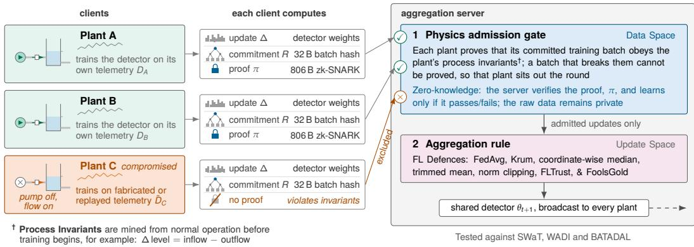  
Figure 1: Physics-attested federated learning. Plants train a shared intrusion detector by only exchanging model updates. We introduce a data-space admission requirement: each plant proves, in zero-knowledge, that its training batch satisfies mined process invariants (e.g., flow rates, mass balances). Batches violating these invariants cannot produce a proof and are excluded before aggregation.

Applying machine learning (ML) for process data analysis is standard practise, as ML-based methods can learn learn complex patterns and relationships within data and facilitate the automated detection of anomalies and intrusions. An anomaly detector is trained on continuous sensor streams, actuator states, set-points from supervisory control and data acquisition (SCADA) systems to learn a plant’s normal operating envelope and flag physical departures from it [24, 32, 33]. A principal bottleneck of this paradigm is the scarcity of localised data.

An isolated plant operates within a narrow regime, records rare documented incidents, and has virtually no labelled attack telemetry. Consequently, detectors trained at one facility generalise poorly to others. Federated learning (FL) ofers an architectural remedy by training locally and transmitting only parameter updates to an aggregation server, where operators can collaboratively train a detector informed by multiple facilities while retaining proprietary telemetry on site [30, 38]. This formulation aligns naturally with industrial requirements, where operational data are commercially sensitive and subject to critical-infrastructure mandates such as the European Union’s NIS2 Directive [16], motivating an expanding literature on federated intrusion detection in operational technology [28].

Because federated aggregation conceals local data to protect the privacy of individual participants, the coordinator cannot inspect the telemetry from which an update was derived [5, 52]. A single compromised operator can exploit this blind spot by training on corrupted telemetry, thereby introducing an exposure poison that teaches the shared detector to reconstruct specific attack profiles as normal operating behaviour [39]. When the target system protects physical infrastructure, a detector conditioned to ignore an attack signature constitutes an immediate safety failure that persists throughout the adversary’s dwell time. The federation thus concentrates operational risk at the exact juncture where it promised collective defence.

Existing federated defences operate exclusively in the update space. Byzantinerobust aggregation rules inspect update geometry, discounting vectors that deviate from the consensus [8, 10, 20, 54], while cryptographic input validation enforces norm bounds on hidden updates [7, 35, 36]. Neither of these mechanisms examines the data behind the update. An update trained on entirely fabricated telemetry is indistinguishable from that computed on honest plant records. Update-space defences are known to fail against adversaries who optimise against them [6, 17, 43], while norm bounds constrain only vector magnitude rather than directional alignment [35]. More fundamentally, robust aggregation relies on consensus: it assumes honest updates cluster closely enough that any outlier is malicious. However, in industrial infrastructure, difering equipment, set-points, and diurnal cycles invalidate that consensus [55]. Honest updates are inherently dispersed, allowing an adversary to hide entirely within legitimate operational variance.

Industrial telemetry has an intrinsic constraint that consumer FL data lacks: it is bounded by the laws of physics. For example, mass balances dictate that tank levels change according to net flow, while hydraulic couplings require that active pumps move fluid and inactive pumps do not. These process invariants are well-established heuristics for real-time intrusion detection [1, 19, 22, 56]. Although an adversary can construct fabricated telemetry that preserves every marginal statistic per-channel, it cannot easily satisfy multivariate physical constraints. In this paper, we convert process invariants from a detection heuristic into an admission requirement: a mathematical condition that a client’s local training batch must satisfy before its update is accepted into the round (Figure 1).

Additionally, because these invariants are afine across measured channels, verification reduces to a set of bounded range checks that a client can prove in zero-knowledge over a committed training batch without disclosing raw telemetry. The resulting admission gate acts directly on the training data, operating before aggregation rules.

This paper investigates three primary research questions:

RQ1: Can an adversary train on physics-violating telemetry to craft model updates that evade robust federated aggregation?

RQ2: How much poisoning capability is neutralised when an adaptive adversary is forced to satisfy the invariants, and does this hold across aggregation rules?

RQ3: Can a participant prove batch compliance with process invariants in zeroknowledge within practical round timeouts?

The principal contributions of this work are fourfold:

1. A data-space admission gate based on automatically mined afine process invariants that rejects every synthetic fabrication breaking cross-channel relations (every fabricated batch across SWaT, WADI, and BATADAL) while achieving zero false rejections across 100 honest client shards.

2. An orthogonality result for data- and update-space defences. We demonstrate across seven aggregation rules and eight attacks that four of the rules admit physics-violating fabrications at 73–100% (including an optimised perturbation that FoolsGold admits in full), while the data gate rejects every fabrication and admits every update-space attack.

3. A removal-and-coverage analysis under adaptive attack. Against an adaptive adversary that projects corrupted batches back onto the invariants, we show that the gate eliminates 69–100% of targeted recall degradation from replay poisoning and 54–100% from fabrication across five aggregation rules.

4. A zero-knowledge feasibility demonstration (PA-FL Lite). We construct and benchmark a succinct zero-knowledge attestation protocol enabling clients to prove batch invariant compliance over sampled rows without disclosing operational telemetry.

The remainder of this article is organised as follows. Section 2 reviews related work in robust FL, cryptographic validation and process invariants. Section 3 formalises the system model, threat framework and admission protocol. Section 4 details the experimental setup and benchmark datasets. Section 5 presents the empirical results across the three operational plants. Section 6 discusses the theoretical and practical implications, and Section 7 concludes the paper.

## 2 Background

The existing literature divides into three disconnected regimes: (1) robust aggregation modifies server-side vector combination heuristics, (2) physics-based monitoring evaluates streaming SCADA telemetry at runtime, and (3) cryptographic federated learning inspects encrypted gradients or proves coordinator fidelity. However, none of these paradigms verify the physical provenance of the client training data.

## 2.1 Byzantine-Robust Aggregation and Evasion in Federated Learning

The first regime addresses adversarial threats at the aggregation server. In traditional FL, distributed participants train local models on private data and transmit parameter updates to a central coordinator. Federated Averaging (FedAvg) [38] combines these updates via a weighted arithmetic mean. Because linear averaging grants equal or proportional trust to all submissions, a single compromised participant can arbitrarily alter the trajectory of the shared model. Byzantine-robust aggregation presents myriad rules to attempt to neutralise this vulnerability by evaluating the geometric configuration of received update vectors. Table 1 summarises these representative approaches, their underlying mechanisms, and the key assumption on which their robustness depends.

Table 1: Representative Byzantine-robust aggregation mechanisms
<table><tr><td>Category</td><td>Method</td><td>Mechanism</td><td>Key Assumption</td></tr><tr><td>Coordinate- wise statistics</td><td>Coordinate-wise median [54]</td><td>Evaluates updates coordinate-wise, selecting the median value for each</td><td>Adversarial perturbations occupy an empirical minority in every coordinate.</td></tr><tr><td rowspan="3">Geometric</td><td>Trimmed mean [54]</td><td>Discards the upper and lower β-fractions along each coordinate before averaging.</td><td>Adversarial perturbations occupy an empirical minority in every coordinate.</td></tr><tr><td>Krum [8]</td><td>Identifies the single update that minimises the sum of squared Euclidean distances</td><td>Benign updates form a dense spatial cluster in parameter space.</td></tr><tr><td>Multi-Krum [8]</td><td>to nearest neighbours. Averages multiple low-scoring updates selected via Krum&#x27;s distance metric.</td><td>Honest updates maintain geometric coherence relative to Byzantine updates.</td></tr><tr><td>Magnitude control</td><td>Norm clipping [45]</td><td>Rescales update vectors whose Euclidean norm exceeds a threshold τ.</td><td>Bounding update norms limits the gradient influence of arbitrary perturbations.</td></tr><tr><td>Trusted reference</td><td>FLTrust [10]</td><td>Assigns client aggregation weights based on cosine similarity between each client update and a trusted reference gradient evaluated.</td><td>Server possesses a clean, representative validation dataset.</td></tr><tr><td>Temporal consistency</td><td>FoolsGold [20]</td><td>Penalises client groups exhibiting sustained multi-round collinearity.</td><td>Sybils controlled by a common adversary exhibit higher mutual similarity than honest clients.</td></tr></table>

Targeted poisoning strategies systematically bypass these update-space heuristics. Adversaries can inject persistent backdoors by scaling gradients to dominate the aggregate [5], or formulate data poisoning by matching surrogate gradients [21]. When adversaries possess knowledge of the aggregation rule and benign data distribution, they can optimise perturbations to lie within the empirical coordinate variance of honest clients, evading distance-based and dimension-wise filters [6, 17, 43, 52].

ML security surveys demonstrate that defences evaluated solely against static or generic attacks frequently sufer from an illusion of security; when evaluated against adaptive adversaries who possess full knowledge of the defence mechanism and optimise against it, empirical protections routinely collapse [4, 11, 47].

However, in these formulations, existing robust aggregation rules only evaluate the parameter vectors submitted $\Delta _ { i } ;$ none inspect or constrain the underlying training telemetry $D _ { i }$ (in Figure 1) from which those parameters were calculated.

## 2.2 Physics-Based Anomaly Detection in Industrial Control Systems

Industrial control security relies extensively on verifying sensor-actuator consistency against the governing hydraulic, thermodynamic, and mechanical relationships [22, 49]. Process invariants formalise these relationships as algebraic constraints across monitored channels, including flow correlations across active pumps and mass balances across storage vessels. Whereas early methods manually derived invariants from process design schematics [1], subsequent techniques automated the extraction of invariants from uncorrupted SCADA historical records using association rule mining, linear regression, and first-order predicate logic [19, 56]. Complementary physicsbased formulations monitor sensor noise profiles [3] or pair neural system identification with Bayesian state estimation [18].

A central operational reality of process invariants is that their defensive capability is strictly bounded by sensor instrumentation. An audit by Cho et al. [13] across the entire SWaT incident record revealed that mined invariants flagged only 13–16 of 36 physical attacks; intrusions targeting unmetered stages or shifting states within normal operational noise escape invariant violations entirely [49].

In this work, rather than deploying invariants as online alarm rules over streaming SCADA data, we repurpose them as pre-aggregation admission requirements for federated training batches (Physics Admission Gate in Figure 1). Crucially, the coverage bounds identified by Cho et al. in runtime monitoring resurface as an explicit constraint on poisoning defence: an invariant gate can neutralise only those poisoning attempts whose underlying telemetry contradicts instrumented physical laws.

## 2.3 Cryptographic Verification in Federated Learning

Secure aggregation protocols rely on threshold cryptography to compute parameter sums over masked updates, preventing the central coordinator from inspecting individual client models [9]. Because homomorphic masking conceals individual client vectors, it precludes geometric anomaly detection by the server, inadvertently shielding poisoned updates. Cryptographic input validation addresses this limitation by verifying structural properties of hidden updates in ZK. RoFL [35] and ACORN [7] employ ZK arguments to verify that encrypted updates adhere to pre-committed $\ell _ { 2 }$ and $\ell _ { \infty }$ norm bounds without exposing vector coordinates. Armadillo [36] formalises privacy-utility trade-ofs for such validation under malicious server threat models. In parallel, verifiable FL frameworks confirm the integrity of the aggregation, proving that the coordinator executed the aggregation arithmetic faithfully or that global models maintain specific architectural constraints [50, 51].

Succinct zero-knowledge arguments (zk-SNARKs), notably Groth16 [26] combined with arithmetisation-oriented hash functions such as Poseidon [25, 27], have demonstrated practical eficiency for ML inference verification and sensor telemetry commitments [12, 34]. However, proving end-to-end model training remains computationally prohibitive because rolling backpropagation and stochastic gradient descent generate billions of arithmetic constraints per iteration [41, 53]. Available cryptographic schemes consequently verify operations on model updates or serverside arithmetic; none verify whether a participant’s local training dataset represents physically valid telemetry.

## 2.4 Operational Testbeds and Baseline Detectors

Empirical evaluation of industrial control security relies on hardware-in-the-loop physical testbeds and high-fidelity hydraulic simulations that capture real-world cyber-physical dynamics. To this end we employ:

SWaT (Secure Water Treatment): A scaled operational water purification facility producing five gallons of treated water per minute in six sequential physical stages (raw water intake, chemical dosing, ultrafiltration, dechlorination, reverse osmosis, and backwash), fully instrumented with 51 physical sensors and actuators of the PLC [23, 37].

WADI (Water Distribution): An operational water supply and distribution network testbed that captures municipal consumer distribution loops, booster pumps, and elevated storage reservoirs in 127 monitored sensor and actuator channels [2].

BATADAL: A city-scale benchmark hydraulic simulation of the C-Town distribution network (comprising seven storage tanks, 11 pumps, and 43 pipes) modelled in EPANET under realistic diurnal consumer demand [46].

HAI (Hardware-in-the-Loop Augmented ICS): A multi-process testbed integrating thermal-power generation, a boiler steam turbine loop, and industrial water treatment with hardware-in-the-loop simulation [44].

Unsupervised deep learning architectures constitute the standard detection baseline across these benchmarks. In particular, 1D convolutional and recurrent reconstruction autoencoders operating on sliding windows of normalised sensor telemetry learn the plant’s normal operating envelope and flag anomalies when reconstruction error exceeds a calibrated threshold [32, 33]. Although these testbeds serve as established benchmarks for centralised intrusion detection and have been used for federated anomaly detection [29], they have not been studied with a physics-based admission check on client training data, nor under coordinated data-poisoning attacks that exploit physical process bounds.

The three regimes remain disconnected: robust aggregation, physics-based monitoring, and cryptographic FL. All of these trust the provenance of the data client’s updates are trained on. A compromised client can train a local model on poisoned data, submit an update whose vector geometry lies within normal client variation, and poison the collective model without detection. Our work addresses this vulnerability by introducing process physics as an admission gate on client training data prior to federated aggregation.

## 3 Methodology: Physics-Attested Admission

## 3.1 System Model and Threat Framework

We consider a federation of n industrial facilities, in this context regional water treatment plants or distribution networks, collaboratively training a shared anomaly detection model under the orchestration of a central aggregation server (Figure 2). Honest participants operate on distinct, non-overlapping temporal shards of historical plant telemetry $D _ { i }$ , retaining proprietary operational data on site. Training progresses across synchronous communication rounds $t = 1 , \dots , T \colon$ at each round, the coordinator broadcasts the global parameter vector $\theta _ { t } ,$ and each client computes local updates $\Delta _ { i } = \theta _ { t , i } - \theta _ { t }$ . Crucially, unlike conventional federated learning where client updates pass directly to server-side aggregation, our framework introduces a data-space admission gate on the local training batch prior to parameter combination.

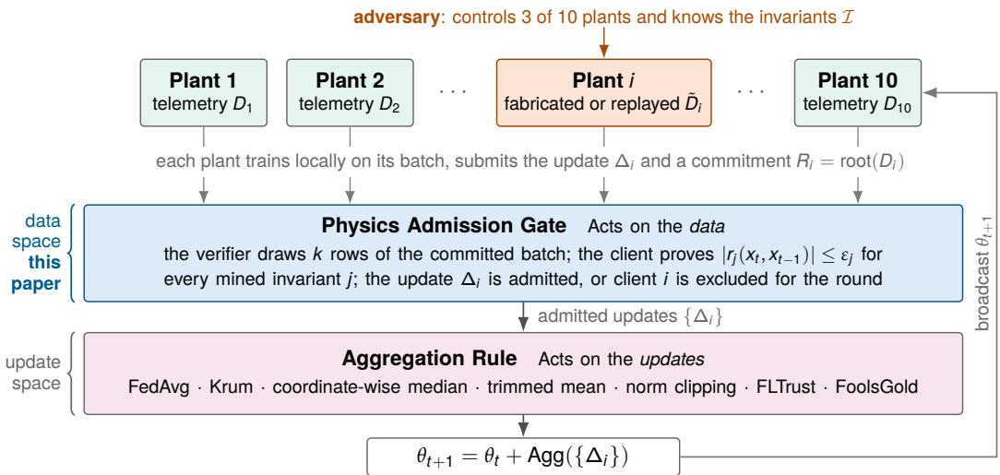  
Figure 2: System model and threat architecture. Ten clients collaboratively train a shared intrusion detector under synchronous federated learning with three malicious participants. The physics gate acts directly on the committed training data batch $D _ { i }$ before the aggregation rule, providing an orthogonal defence prior to traditional update-space filtering.

We assume an adversary who compromises and coordinates m of the n participating facilities $( m = 3$ of $n = 1 0$ in our headline evaluations, representing a 30% adversarial fraction, and $m = 2$ of $n = 5$ in smaller topologies). In accordance with Kerckhofs’ principle, the adversary possesses complete white-box knowledge of the federated protocol, the global parameter state $\theta _ { t } .$ , its own local telemetry records, and the full set of physical invariants and tolerances $\{ \varepsilon _ { j } \}$ enforced by the coordinator.

Rather than mounting an untargeted denial-of-service attack that disrupts global convergence and is readily detected via validation loss monitoring, the adversary executes targeted exposure poisoning. By injecting anomalous process states and labelling them as normal operating conditions, the adversary forces the shared reconstruction autoencoder to reconstruct these attack signatures with low error, blinding the deployed detector to subsequent real-world intrusions. We evaluate two sophistication levels: a naive attacker, who injects raw corrupted or replayed attack telemetry directly into local batches, and a physics-aware attacker, who explicitly projects corrupted batches onto the invariant-feasible subspace to evade the admission check while attempting to preserve poisoning eficacy.

## 3.2 Process Invariants and the Admission Gate

Physical telemetry in water infrastructure is governed by mass conservation and hydraulic operational logic. Following established physics-based monitoring formulations [1, 22], we express these constraints as two distinct families of afine process invariants, with governing parameters mined directly from uncorrupted operational telemetry [19] depicted in Figure 3.

First, Actuator-to-Flow Couplings relate the discrete operational state of an actuator $S _ { j } \in \{ 0 , 1 \}$ (such as a raw water intake pump or motorised chemical valve)

Data: two recorded attacks from SWaT’s labelled attack record; the rules and their tolerances ε (light blue band) are the ones mined from the attack-free recording.

(a) actuator-to-flow coupling

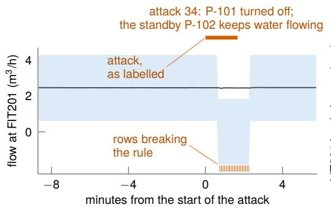  
(b) tank balance

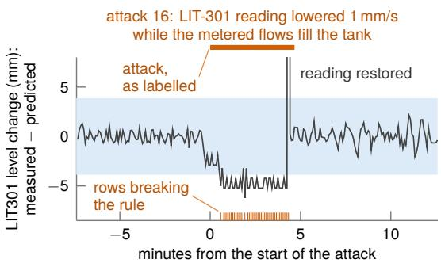  
Figure 3: Process invariants detecting recorded SWaT attacks: (a) actuator-to-flow coupling during Attack 34 (P-101 of while flow persists), and (b) tank mass balance breach during Attack 16 (sensor spoofing while filling). Shaded blue bands denote tolerances ε; orange ticks mark rows violating the invariant ( 1% admission threshold).

to the continuous downstream flow measurement $F _ { j }$ :

$$
r _ { \mathrm { c } } ( x _ { t } ) = F _ { j } ( t ) - \mathbb { I } [ S _ { j } ( t ) = \mathrm { o n } ] \cdot \bar { f } _ { j } ,\tag{1}
$$

where ${ \bar { f } } _ { j }$ denotes the nominal steady-state volumetric flow rate and $\mathbb { I } [ \cdot ]$ is the indicator function. Coupling constraints are evaluated exclusively when the actuator resides in a steady operating state; telemetry rows recorded during switching transitions are marked inapplicable and excluded from residual evaluation.

Second, Tank Mass Balances relate diferential liquid level changes across a storage or process tank $L _ { k }$ to the net volumetric flux across boundary pipes instrumented with flow meters:

$$
r _ { \mathrm { b } } ( x _ { t } , x _ { t - 1 } ) = \Delta L _ { k } ( t ) - \left( \sum _ { j \in \mathcal { F } _ { k } } a _ { k j } F _ { j } ( t ) + c _ { k } \right) ,\tag{2}
$$

where $\Delta L _ { k } ( t ) = L _ { k } ( t ) - L _ { k } ( t - \Delta t )$ represents the empirical liquid level change over sampling interval $\Delta t , F _ { k }$ indexes boundary flow meters, coeficients $a _ { k j }$ capture tank geometry and pipe cross-sections, and ofset $c _ { k }$ captures baseline drainage or minor evaporation.

## 3.2.1 Automated Invariant Mining and Calibration

Rather than relying on manual derivation from piping schematics, invariants are extracted automatically from an uncorrupted calibration record of normal plant operations [19]. Actuator couplings are discovered by evaluating whether discrete actuator states partition continuous flow distributions into distinct, low-variance clusters, subject to minimum support and of-state ratio thresholds. Tank mass balances are identified by performing sparse linear regression of diferential level changes against boundary flow rates, retaining candidate equations whose coeficient of determination satisfies $R ^ { 2 } \geq 0 . 6 0$

Because industrial instrumentation exhibits natural measurement noise, hydraulic turbulence, and minor sensor drift, invariant residuals rarely evaluate to zero during normal operations. For each mined invariant $j \in \mathcal { I }$ , an operational tolerance $\varepsilon _ { j }$ is calibrated on clean holdout telemetry:

$$
\varepsilon _ { j } = 1 . 5 \times Q _ { 0 . 9 9 9 } ( | r _ { j } | ) ,\tag{3}
$$

where $Q _ { 0 . 9 9 9 } ( \cdot )$ denotes the empirical 99.9th percentile of absolute residual magnitudes observed during honest operation.

## 3.2.2 Batch Admission Criterion

During federated training, a telemetry observation $x _ { t }$ violates invariant $j$ if its absolute residual exceeds the calibrated tolerance: $| r _ { j } ( x _ { t } ) | > \varepsilon _ { j }$ . A row is classified as violating if it breaches at least one applicable invariant in $\mathcal { T } _ { \mathrm { a p p } } ( x _ { t } )$ . A candidate training batch B submitted by a participant is admitted to the federated round if and only if the proportion of violating rows does not exceed the admission threshold $\alpha = 1 \%$

$$
\frac { 1 } { | B | } \sum _ { x \in B } \mathbb { I } \left( \bigvee _ { j \in \mathcal { T } _ { \mathrm { a p p } } ( x ) } | r _ { j } ( x ) | > \varepsilon _ { j } \right) \leq \alpha .\tag{4}
$$

The 1% accommodates minor transient disturbances while rejecting systematically corrupted telemetry. We evaluate two operational invariant configurations: a conservative narrow set (5 rules on SWaT) and an expanded wide set (9 rules capturing multi-stage dynamics). An attack pattern is defined as covered by an invariant set when its constituent telemetry produces a batch violation rate exceeding α, ensuring deterministic exclusion prior to parameter aggregation.

## 3.3 Attack Formulations and Threat Vectors

We classify adversary behaviours across two operational representation spaces: dataspace attacks that corrupt local telemetry, $D _ { i }$ , and update-space attacks that alter parameter vectors $\Delta _ { i }$ directly (Table 2).

Table 2: Classification of evaluated adversarial threat vectors across data and update spaces.
<table><tr><td>Attack Class</td><td>Locus</td><td>Mechanisms / Variants</td><td>Targeted Filter</td></tr><tr><td>Historical Replay</td><td>Data (Di)</td><td>Splicing uncorrupted physical attack segments</td><td>Autoencoder reconstruction</td></tr><tr><td>Statistical Fabrication</td><td>Data (Di)</td><td>Channel roll, permutation, scaling, splicing</td><td>Marginal distributions</td></tr><tr><td>Optimised Perturbation</td><td>Data (Di)</td><td>Surrogate-autoencoder error maximisation within ±2.5σ</td><td>Autoencoder reconstruction</td></tr><tr><td>Update Baselines</td><td>Update (∆i)</td><td>Sign-flip, gradient scaling, free-riding, min-max</td><td>Krum, Median, Trimmed Mean</td></tr></table>

Data-space attacks coerce the autoencoder into learning attack patterns as nominal operations. While historical replay mirrors real-world physical intrusions, statistical fabrication isolates multivariate coupling failures under preserved marginal distributions, and the optimised perturbation shifts the continuous channels, within $\pm 2 . 5 \sigma$ , to maximise a surrogate autoencoder’s reconstruction error. Conversely, update-space baselines train on uncorrupted data and modify only $\Delta _ { i } ,$ , establishing the reference benchmark where defense relies exclusively on server-side aggregation heuristics.

## 3.3.1 Adaptive Optimisation (Physics-Aware Adversary)

To assess the gate against an adaptive adversary [11, 47], we model a physics-aware attacker who possesses the complete invariant set  and tolerances $\{ \varepsilon _ { j } \}$ . Given a target poisoned batch $\tilde { X }$ , the adversary projects the data onto the invariant-feasible subspace by solving a constrained quadratic programme:

$$
\operatorname* { m i n } _ { X } \| X - \tilde { X } \| _ { \mathrm { F } } ^ { 2 } \quad \mathrm { s u b j e c t ~ t o } \quad | r _ { j } ( X ) | \leq \varepsilon _ { j } \quad \forall j \in \mathbb { Z } .\tag{5}
$$

Because discrete actuator states cannot be continuously modified without altering physical plant operations, the adversary holds discrete actuator channels fixed and perturbs only continuous sensor readings.

## 3.4 Zero-Knowledge Verification Architecture (PA-FL Lite)

If we send raw training batches to the coordinator for inspection, they violate data confidentiality. We address this with PA-FL Lite, a zero-knowledge attestation protocol built on Groth16 zk-SNARKs [26] and the Poseidon hash function [25]. PA-FL Lite verifies the provenance of plant data through interactive batch sampling, the process is shown briefly in three steps with more detail in Appendix C.

1. Commitment & Challenge. Before receiving the round challenge, the client commits to its local training batch $D _ { i } ~ ( N = 1 , 0 2 4$ observations) using a Poseidon Merkle tree of depth-10, submitting root $R _ { i }$ . The verifier broadcasts an unpredictable nonce $\rho ,$ from which both parties independently derive $k = 3 2$ pseudorandom row indices $I = \mathrm { P R F } ( R _ { i } , \rho )$

2. Succinct Proof Generation. The client generates a Groth16 proof $\pi _ { i }$ over the BN128 curve demonstrating in ZK that: (i) for each $i \in I$ , row $x [ i ]$ and predecessor $x [ i - 1 ]$ open correctly to $R _ { i } ;$ and (ii) invariant residuals satisfy $| r _ { j } | \le \varepsilon _ { j }$ , with total violations across the k samples bounded by public threshold vmax.

3. Constant-Time Verification. The coordinator verifies $\pi _ { i }$ against public inputs $( R _ { i } , I , v _ { \operatorname* { m a x } } , u _ { \operatorname* { m a x } } )$ ; admitted updates proceed to aggregation (per robust rules in Section 4.4); unproven or non-compliant batches are excluded.

At $k = 3 2$ , the arithmetic circuit comprises 297,736 R1CS constraints, generating an 806-byte JSON proof in 12.0 s on commodity hardware. Complete circuit arithmetisation, 32-bit biased fixed-point encodings, and constraint accounting are detailed in Appendix C.

## 4 Experimental Setup

We outline operational testbeds, federation partitioning methodology, training parameters, and evaluation metrics. The experiment evaluates 1,120 trained federations across four industrial records shown in Table 3.

## 4.1 Benchmark Records and Preprocessing

Having established the physical testbed architectures in Section 2.4, we detail the concrete telemetry records, sampling strides, and preprocessing pipelines: (1) SWaT: We evaluate the December 2015 release (seven clean days; four days containing 36 cyber-physical attacks), downsampled to a 5-second stride with the initial 6-hour start-up transient removed. Chemical analyser (AIT) channels are excluded from detector training due to severe non-stationary electrochemical drift (18σ baseline shifts across records; Appendix A.1), and discrete actuators are normalised to unit range; (2) WADI: We evaluate the October 2017 release (14 clean days; 2 attack days under 15 intrusion scenarios) downsampled to a 5-second stride, with four uninformative zero-variance alarm channels dropped and transient communication dropouts filled via linear interpolation; (3) BATADAL: We utilise the full 365-day hourly SCADA recording across 14 cyber-physical attack scenarios under realistic diurnal demand patterns; and (4) HAI: We evaluate release version 21.03 as an explicit negative control, testing non-hydraulic thermal loops where linear mass balances do not apply (Section 5). Grouping contiguous labelled attack observations at the operational stride yields 35 distinct attack segments on SWaT (including a sustained 10-hour filtration disruption) and 14 on WADI.

## 4.2 Federation Partitioning and Threat Synthesis

Following strict temporal separation to eliminate data leakage [4], a 10-client federation is constructed from the normal operational record (Figure 4). The chronological sequence is partitioned into an invariant discovery slice (30%: half for fitting, half for tolerance calibration), a validation slice (15%) for anomaly threshold selection, a server root slice (5%) for FLTrust reference updates, and client training telemetry (50%). The client partition is divided into ten disjoint temporal shards (4,734 rows each on SWaT at 5 s stride). The entire attack record is held out as the global evaluation set.

In compromised federations (m = 3 of 10 clients on SWaT and WADI; 2 of 5 on BATADAL), malicious clients splice attack segments across 25% of shard rows, coordinating against a single target attack set per seed. Attackers either inject statistical fabrications, optimised perturbations, invariant-projected data, or replayed historical attacks, oversampling attack windows to 50% of local batches to ensure gradient impact.

Normal record: the testbed’s attack-free recording, in time order (SWaT: 94,680 rows at a 5 s stride)  
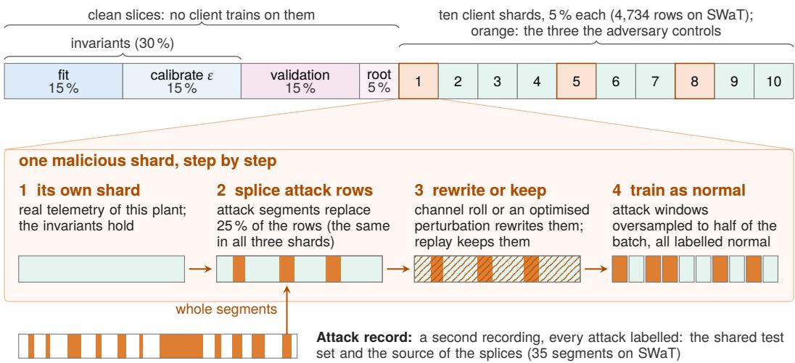  
Figure 4: Federation partitioning and malicious shard synthesis from a single plant record. Chronological normal telemetry is segmented into invariant mining (30%), validation (15%), server root (5%), and ten disjoint client training shards (50%). Compromised clients (m = 3) splice attack segments across 25% of rows and oversample attack windows to 50% of the batch.

Table 3: Experimental grid across industrial benchmark records, detailing participant counts, aggregation rules, attack modes, federations, seeds, invariant sets, and total trained models.
<table><tr><td colspan="7"></td></tr><tr><td>Record</td><td>Clients</td><td></td><td></td><td></td><td>(malicious) Rules Attacks Modes Seeds Invariant sets</td><td>Cells</td></tr><tr><td>SWaT</td><td>10 (3)</td><td>7</td><td>8</td><td>5</td><td>5</td><td>narrow (5), wide (9) 907</td></tr><tr><td>WADI</td><td>10 (3)</td><td>3</td><td>2</td><td>5</td><td>3 default (7)</td><td>90</td></tr><tr><td>BATADAL</td><td>5 (2)</td><td>3</td><td>2</td><td>4</td><td>3 mined (10)</td><td>72</td></tr><tr><td>Simulator</td><td>10 (3)</td><td>6</td><td>1</td><td>5</td><td>3 exact</td><td>51</td></tr></table>

## 4.3 Local Detector Architecture and Training Setup

Following standard ICS anomaly detection benchmarks [32, 33], each facility trains an unsupervised deep reconstruction autoencoder over sliding temporal windows of normalised telemetry $( W = 1 0 )$ . The network compresses each flattened window through a 128-unit dense layer with ReLU activations into a 24-dimensional latent bottleneck, which a symmetric decoder reconstructs under mean squared error. Observations whose reconstruction error exceeds the 99.5th percentile of clean validation loss $\left( \tau _ { \mathrm { d e t } } \right)$ trigger intrusion alarms.

Federated training executes for 25 rounds (2 local epochs per round, Adam with $\eta = 1 0 ^ { - 3 }$ , batch size $B = 1 , 0 2 4 )$ . On commodity hardware, a full 25-round run completes in $< ~ 2 2$ seconds, enabling exhaustive evaluation across the 1,120-cell experimental grid (Table 3). Headline configurations are evaluated across 5 random seeds (redrawing shard boundaries, target sets, and weight initialisations) and 3 seeds on secondary sweeps.

## 4.4 Baseline Aggregation Rules

Because the physics admission gate operates in data space prior to local gradient computation, it is designed to complement server-side aggregation. To test orthogonality across the defensive paradigms introduced in Section 2.1, we benchmark the gate alongside seven representative aggregation rules: (1) unfiltered baseline: FedAvg; (2–3) coordinate-wise estimators: Median and Trimmed Mean (trimming fraction $\beta = 2 0 \% ) ;$ (4–5) geometric filters: Norm Clipping (threshold τ) and Krum (configured with Byzantine allowance $f = m = 3 )$ ; and (6–7) directional and historical scoring: FLTrust (evaluated against the 5% server root partition, see Section 4.2) and FoolsGold (tracked across all 25 rounds).

## 4.5 Federated Execution Modes and Evaluation Metrics

To isolate defensive mechanics, experiments evaluate five federated operational modes: (1) Clean, where all $n = 1 0$ participants train honestly; (2) Honest-Only, where the $n - m = 7$ honest clients train in isolation, establishing the reference baseline that isolates poisoning damage from changes in collective participant capacity; (3) Naive Attack, where 7 honest and 3 malicious clients aggregate without dataspace admission checks; (4) Physics-Aware Attack, where projected malicious updates are aggregated unconditionally; and (5) Gated, the deployed system where batches breaching Equation (4) are excluded prior to aggregation $( w _ { i } = 0 )$

Because attack segments constitute $< 1 2 \%$ of test rows in SWaT, macro F1 is insensitive to targeted poisoning: blinding a detector to three targeted attacks alters global F1 by $< 0 . 0 1$ points [5]. We therefore define Targeted-Attack Recall $( R _ { \mathrm { t a r g } } )$ as the primary metric, measuring detection within the coordinated target attack set $\mathcal { A } _ { \mathrm { t a r g } }$

$$
R _ { \mathrm { t a r g } } = \frac { \sum _ { t \in \mathcal { A } _ { \mathrm { t a r g } } } y _ { t } \cdot \hat { y } _ { t } } { \sum _ { t \in \mathcal { A } _ { \mathrm { t a r g } } } y _ { t } } ,\tag{6}
$$

where $y _ { t } ~ \in ~ \{ 0 , 1 \}$ is the ground-truth label and $\hat { y } _ { t } ~ \in ~ \{ 0 , 1 \}$ indicates whether reconstruction error exceeds threshold $\tau _ { \mathrm { d e t } }$

The Damage-Weighted Removal Ratio quantifies the proportion of naive poisoning damage eliminated by the admission gate relative to the Honest-Only reference baseline:

$$
{ \mathrm { R e m o v a l } } = 1 - { \frac { R _ { \mathrm { r e f } } - R _ { \mathrm { g a t e d } } } { R _ { \mathrm { r e f } } - R _ { \mathrm { n a i v e } } } } ,\tag{7}
$$

where $R _ { \mathrm { r e f } } , \ R _ { \mathrm { n a i v e } } .$ , and $R _ { \mathrm { g a t e d } }$ denote targeted recall under the honest reference baseline, naive attack, and gated admission, respectively. Removal is evaluated over informative seeds where naive attack damage is measurable $( R _ { \mathrm { r e f } } - R _ { \mathrm { n a i v e } } \geq 1 . 0 \% )$ We additionally report untargeted recall $( R _ { \mathrm { u n t a r g } } )$ , clean global F1, Area Under Precision-Recall Curve (AUC-PR), and gate admission rates (w ).

## 4.6 Verification Protocols and Reproducibility

Invariant performance is verified prior to federated training via two protocols (detailed in Appendix A): (1) a Separation Protocol evaluating 200 random 1,000-row batches per record across clean and fabricated telemetry to verify zero false rejections; and

(2) a Coverage Audit scoring all 35 SWaT and 14 WADI attacks individually against narrow and wide invariant sets.

All models, invariant miners, Circom circuits, and analysis scripts are implemented in Python 3.10 and PyTorch. For more information, refer to the Data Availability Statement.

## 5 Results

## 5.1 Vulnerability of Robust Aggregation to Data-Space Poisoning

We first evaluate whether malicious clients can train local models on physics-violating telemetry and introduce poisoned updates into the global model without detection by server-side aggregation rules. A data-space admission gate is viable only if process invariants reliably distinguish uncorrupted industrial telemetry from corrupted or synthetic batches without rejecting honest participants. Following our Separation Protocol (Section 4.6), we evaluate 200 randomly placed batches of N = 1,000 consecutive observations per benchmark under the 1% admission threshold $\alpha = 0 . 0 1$ (Figure 5).

(a) BATADAL (benchmark)  
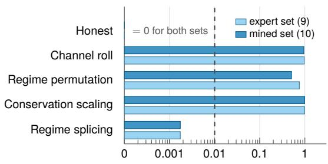

(b) SWaT (physical testbed)  
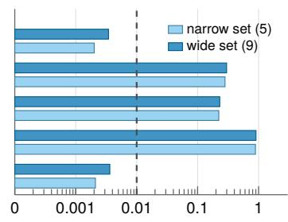  
(d) HAI (scope boundary)

(c) WADI (physical testbed)  
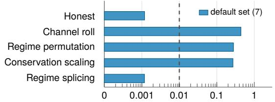

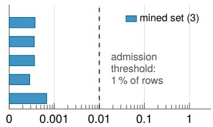  
fraction of rows violating an invariant  
Figure 5: Separation of honest from fabricated telemetry by process invariants. Mean fraction of rows violating at least one invariant over 200 batches of 1,000 rows (log scale; zero plotted at $1 0 ^ { - 4 } )$ . The vertical dashed line marks the 1% admission threshold $\alpha ;$ bars to the left are admitted. (a) BATADAL under expert (9 rules) and mined (10 rules) sets. (b) SWaT under narrow (5 rules) and wide (9 rules) mined sets. (c) WADI under default mined set (7 couplings). (d) HAI scope boundary: no hydraulic couplings exist, admitting all batches.

Across the three benchmarks (SWaT, WADI, and BATADAL), honest data is not rejected; $( \mathrm { F R R } = 0 . 0 0 0 )$ . Across 100 evaluated honest client shards, the highest observed single-shard row violation rate is 0.51% on SWaT (under wide invariants), which sits safely below the 1% admission gate. In contrast, when data statistics are fabricated, they violate physical constraints: (1) Channel Roll desynchronises control commands from hydraulic responses, violating invariants in 28.1% to 96.8% of batch rows; (2) Within-Regime Permutation reassigns actuator states, producing violation rates of 22.2% to 75.6%; and (3) Conservation Scaling disrupts mass and actuator-flow balances, generating violation rates between 26.9% to 99.0%.

Two boundaries emerge from Figure 5. First, Regime Splicing produces an empirical violation rate of only 0.12% to 0.36%. Because spliced sequences consist of genuine historical telemetry segments, physical laws are satisfied internally throughout each contiguous segment, triggering violations exclusively across splice boundaries. Spliced fabrications thus pass row-level percentage checks. Second, HAI, a boiler and steam-turbine testbed, has almost no actuator switching and no tank-style mass balance in its training record, so the miner finds no couplings and only three weak balances. HAI marks our work’s boundary and confirms that the framework applies strictly to hydraulic and mass-conserving physical processes.

## 5.1.1 Damage Measure: Targeted-Attack Recall Rather Than Global F1

The threat model in this investigation is strictly targeted: the adversary trains the shared autoencoder to reconstruct specific attack patterns as nominal operations, leaving benign and untargeted operations unperturbed. On SWaT, normal operations constitute approximately 88% of the test record. Consequently, aggregate metrics averaged throughout the test record barely register severe disruptions confined to brief attack segments—a well-documented pitfall [4, 13].

For FedAvg, the four data-space attacks lower the recall on the targeted attacks by 6.0 to 8.6 points, and by 13.8 points in the five-seed replay experiment of Section 5.2.2, while global F1 does not fall at all and recall on the other attacks moves by at most 1.3 points. Update-space attacks are similar (except sign flipping1) and a defender relying on F1 would think the deployed model is uncompromised. We therefore report damage as the loss in targeted-attack recall, $R _ { \mathrm { t a r g } }$ , measured against the honest-only federation.

## 5.1.2 Evasion of Robust Aggregation Rules

Having established that physical invariants reliably detect corrupted data and that targeted recall captures poisoning damage, we assess whether update-space defenses detect updates trained on corrupted data. Figure 6 (left block) reports the targeted recall loss and client acceptance rates across seven aggregation rules under naive data-space attacks in the absence of the admission gate.

Across all four data-space attacks (replay, channel roll, permutation, and optimised perturbation), update-space aggregation rules fail to prevent model poisoning.

Coordinate estimators and geometric filters: FedAvg, coordinate-wise median and norm clipping admit 100% of the poisoned updates and lose 6.0 to 8.6, 4.2 to 6.2 and 2.7 to 6.5 points respectively across the data-space attacks. Norm clipping rescales the update but keeps its direction, so it behaves like FedAvg. Trimmed mean discards the extreme 20% of each coordinate and admits only 34% of the malicious updates, yet still loses 5.2 to 5.3 points under replay, channel roll

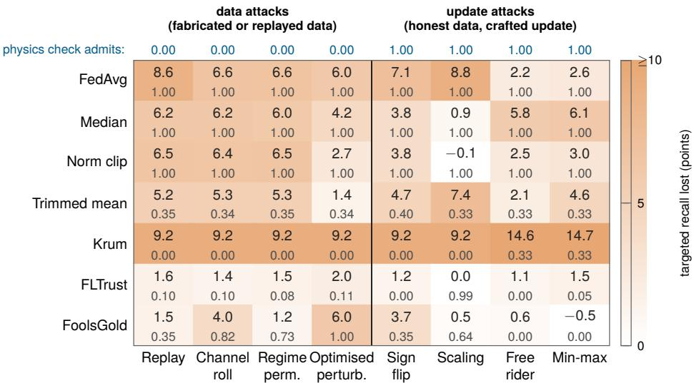  
cell: targeted recall lost (points) over the share of malicious updates the rule admitted

Figure 6: Blind spots of the two defences on SWaT (wide invariant set, no gate). Rows are the aggregation rules; columns are the four data-space attacks on the left and the four update-space attacks on the right. Heat map values are the targeted-attack recall lost over the share of malicious updates the rule admitted. The top row is the share of malicious batches the physics check admits: 0.00 for every data attack, whose batches break the invariants, and 1.00 for every update attack, whose clients train on honest data and tamper only with the update. Each defence is blind to one half of the grid.

and regime permutation (1.4 under optimised perturbation). Krum admits none of them and still shows a uniform 9.2-point drop on every attack: that drop is selection variance, since Krum forwards a single client’s update, and not poisoning.

Directional and similarity-based defences: FLTrust admits 8% to 11% of the poisoned updates by comparing them with a clean server root and holds the loss to 1.4 to 2.0 points. FoolsGold, which penalises updates that stay collinear across rounds, admits 100% of the optimised perturbation updates and loses 6.0 points on them, and admits 82% under channel roll (4.0 points).

In summary, an adversary training on physics-violating telemetry produces parameter updates that conform to the coordinate variance, Euclidean norms, and directional distributions of honest updates. In the absence of data-space admission control, state-of-the-art robust aggregation rules are systematically bypassed. Update attacks are discussed more in Section 5.2.4.

## 5.2 Defensive Mitigation and the Invariant Coverage Dial

Given that update-space defenses fail against data-space attacks, we investigate how much poisoning capability is neutralized when an adaptive adversary is forced to satisfy process invariants, and evaluate the defensive interaction between invariant admission and robust aggregation.

## 5.2.1 Narrow vs. Wide Attack Coverage

Because an admission gate operates by evaluating algebraic invariant residuals, it can exclude only those poisoning attacks whose underlying telemetry contradicts instrumented physical relations. We quantify this relationship across the 35 labelled cyber-physical attacks on SWaT and 14 on WADI (Figure 7 and Table 4).

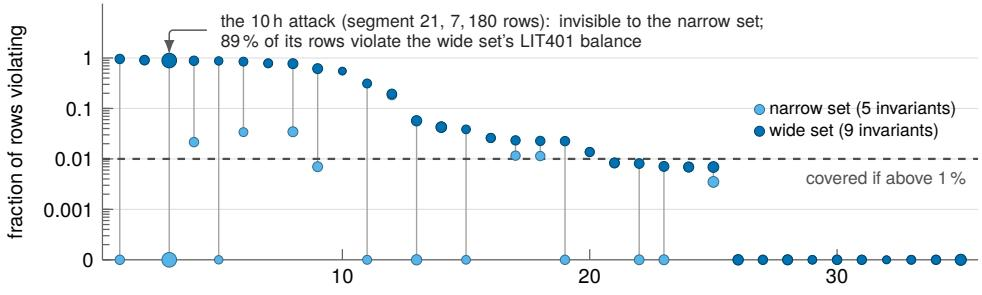  
the 35 labelled SWaT attacks, sorted by violating fraction under the wide set  
Figure 7: SWaT attacks identified by invariant set. The fraction of rows violating at least one invariant for each of the 35 labelled SWaT attacks under narrow (5 rules) and wide (9 rules) sets, sorted by the wide-set value (log scale). Each stem length is the coverage gained by widening the set; marker area scales with attack duration; the dashed line is the 1% admission threshold.

Table 4: Coverage of labelled attacks across invariant sets on SWaT and WADI. An attack segment is covered when its data violation rate strictly exceeds the 1% threshold. Honest row violations are audited over the first 60,000 observations following the discovery slice.
<table><tr><td>Record, setting Rules</td><td></td><td>Couplings balances</td><td>Honest rows Attacks violating</td><td colspan="2">covered</td><td colspan="2">Attack rows covered</td></tr><tr><td>SWaT, narrow</td><td>5</td><td>3/2</td><td>0.21 %</td><td>12</td><td>35</td><td>1,137 10,931</td><td>10%</td></tr><tr><td>SWaT, wide</td><td>9</td><td>6/3</td><td>0.36 %</td><td>20</td><td>35 8,991</td><td>10,931</td><td>82 %</td></tr><tr><td>WADI, default</td><td>7</td><td>7/0</td><td>0.14%</td><td>3</td><td>14</td><td>395 /1,996</td><td>20 %</td></tr></table>

As shown in Figure 7 and Table 4, invariant coverage functions as an operational dial. Under conservative miner defaults $( R ^ { 2 } \geq 0 . 6 0$ , support 0.020), the narrow set keeps only actuator couplings and single-tank balances, and cannot see attacks that move water between stages such as the 10-hour ultrafiltration backwash drain (Segment 21 ), that violates none of its rules and passes the check unseen. Relaxing the thresholds $( R ^ { 2 } \geq 0 . 4 0$ , support 0.005) incorporates multi-stage mass balances P1 through P4: the same attack now violates the LIT401 balance in 89% of its rows while increasing the honest violation rate to only 0.36%, safely below the 1% threshold. On the WADI distribution network, the miner discovers 7 actuator couplings but zero reliable mass balances due to unmetered consumer demand loops, covering 3 of 14 attacks (19.8% of rows) and demonstrating that physical coverage is fundamentally bounded by metering capability.

## 5.2.2 Poison Damage Removal across Aggregation Rules

Having established that robust aggregation cannot prevent data-space poisoning, we examine whether process physics can neutralise this threat across all seven aggregation rules (Figure 8 and Appendix Table 7). We evaluate two distinct defensive barriers relative to the unpoisoned reference: first, whether forcing an adaptive adversary to project poisoned telemetry onto physical invariants diminishes attack potency, and second, whether filtering non-compliant batches at the admission gate restores detection performance.

Table 5: Batch admission and client exclusion rates across industrial benchmark records before and after adaptive projection under the 1% gate.
<table><tr><td></td><td colspan="3">malicious batches admitted</td><td colspan="3">honest shards</td></tr><tr><td>Record (rules)</td><td>fabricated</td><td>replay, replay, before after proj.</td><td>malicious excluded</td><td>rejected violating</td><td></td><td>worst</td></tr><tr><td>BATADAL (10)</td><td>0/6</td><td>6 6 /6</td><td>0.0 of 2</td><td>0</td><td>9</td><td>0.00%</td></tr><tr><td>SWaT narrow (5)</td><td>0 15</td><td>0 41 15 12 15</td><td>0.6 of 3</td><td>0</td><td>35</td><td>0.32 %</td></tr><tr><td>SWaT wide (9)</td><td>0 / 15</td><td>0 / 15 6 / 15</td><td>1.8 of 3</td><td>0/</td><td>35</td><td>0.51%</td></tr><tr><td>WADI (7)</td><td>0/9</td><td>1/9 3/9</td><td>2.0 of 3</td><td>0</td><td>21</td><td>0.13%</td></tr></table>

Even when an adaptive adversary modifies poisoned telemetry to satisfy all physical invariants, this projection alone removes only a small fraction of the poisoning damage. Projection alone removes only 11% to 42% of replay damage under coordinate rules and leaves 40% of projected batches admissible to the gate (Table 5). Because discrete actuator states remain fixed $( \mathrm { e . g . , o n / o f f } )$ , satisfying the invariants forces sensor readings into unnatural configurations2. Although this distortion slightly weakens the poison, it still fails to prevent the model from learning the attack.

In contrast, deploying the admission gate eliminates nearly all poisoning degradations across every evaluable rule for which a ratio can be reported. Under FedAvg, the gate removes 71% of naive replay damage—recovering targeted recall from a 13.8- point drop—and 92% of channel roll damage. Coordinate-level estimators recover even more efectively: trimmed mean removes 91% of replay damage and 89% of channel roll damage, while coordinate-wise median and norm clipping remove 103% and 104% of replay damage (and 101% and 100% for channel roll), restoring recall completely to honest baseline levels.3 FLTrust, which already admits few malicious updates, gains less, with the gate removing 69% of replay damage and 54% of channel roll damage. Krum and FoolsGold yielded too few informative seeds for a ratio (n/a in Figure 8).

## 5.2.3 Invariant Coverage Bounds What the Gate Removes

To confirm that damage removal is governed by physical invariant coverage rather than extraneous artefacts, Figure 9 contrasts gate removal under the narrow set (12/35 attacks, 10% rows) against the wide set (20/35 attacks, 82% rows) across identical seeds and seeds.

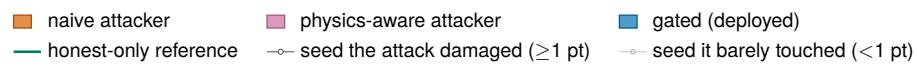

(a) replay attacker  
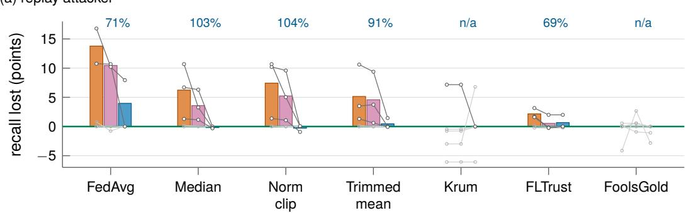  
(b) channel roll, 5-minute shift

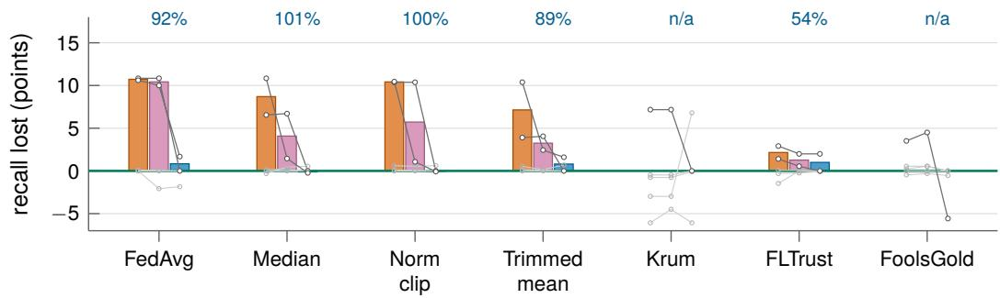  
Figure 8: Poison damage removal across seven aggregation rules on SWaT under the wide invariant set (10 clients, 3 malicious, 5 seeds). Targeted-attack recall lost is evaluated across four federated execution modes: Honest-Only (unpoisoned reference at 0), Naive (unfiltered poisoned training), Physics-Aware (adversary projects telemetry onto invariants), and Gated (deployed server rejects non-compliant batches). Subplots show (a) historical attack replay and (b) channel roll (5-minute shift). Bars represent means; thin lines trace individual seeds; n/a where < 2 seeds qualified.

The contrast in Figure 9 validates the coverage dial hypothesis. Under the narrow set, the admission gate admits 80% of projected batches, excluding an average of only 0.6 of 3 malicious clients per round; consequently, it removes only 8% to 35% of replay damage across coordinate estimators (22% on FedAvg). Under the wide set, the additional multi-stage mass balances reduce batch admission to 40%, excluding an average of 1.8 of 3 malicious clients per round, and raising damage removal to 69% to 100%. Physical invariant coverage directly dictates the proportion of attack damage eliminated.

## 5.2.4 Structural Defense Complementarity

The grid in Figure 6 illustrates the structural division of labour between data-space admission and update-space aggregation rules.

Data-Space Attacks. The malicious participants poison training data (Replay, Channel Roll, Permutation, Optimised Perturbation), update-space defenses are inefective, admitting updates and sufering severe recall drops. The physics admission gate rejects 100% of these batches (admission rate 0.00), preventing corrupted gradients from entering the aggregator.

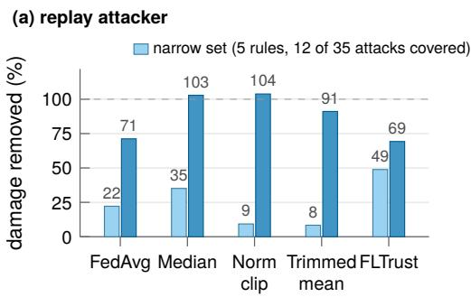

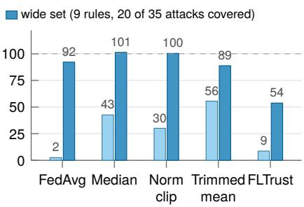  
Figure 9: The coverage dial in removal terms: percentage of targeted damage removed by the deployed gate under narrow (5 rules, sky blue) versus wide (9 rules, blue) invariant sets on SWaT for (a) historical replay and (b) channel roll. Header annotations report the fraction of batches admitted after projection and the average number of malicious clients excluded per round under each set.

Update-space Attacks. The clients train on honest telemetry and alter only the update (sign flip, scaling, free rider, min-max), so the physics check admits every batch, and the aggregation rule is the only defence. Its performance is uneven: FLTrust holds every update attack to 1.5 points or less and FoolsGold all but sign flip, whereas FedAvg loses 7.1 and 8.8 points to sign flip and scaling, median and trimmed mean 4 to 7 points, and Krum, which forwards a single update, is hurt most of all by free rider and min-max (14.6 and 14.7 points). The rule to pair with the gate is, therefore, a choice about the update-space threat,.

In summary, forcing an adaptive adversary to satisfy process invariants removes 69%–100% of targeted poisoning damage under adequate physical coverage. Data-space admission and update-space filtering are fundamentally orthogonal and complementary layers of defense. Data-space admission reliably neutralises data poisoning across aggregation rules and composes well with robust update-space filters.

## 5.3 Zero-Knowledge Verification Feasibility

Having demonstrated the defensive eficacy of the admission gate, we evaluate whether client training batches can be verified in zero-knowledge without disclosing proprietary operational telemetry to the central coordinator.

## 5.3.1 Cryptographic Benchmarks and Circuit Overhead

We evaluate the PA-FL Lite protocol instantiated with Groth16 zk-SNARKs over the BN128 elliptic curve on an Apple M3 Pro workstation (Table 6). PA-FL Lite achieves practical operational eficiency at the k = 32 operating point (with complete k = 16 benchmarks detailed in Appendix Table 8). The Circom circuit compiles to 297,736 R1CS constraints (9,304 constraints per sample, dominated by chunked Poseidon hashing and Merkle opening paths, compared to 148,888 constraints at $k = 1 6 )$ . On the local plant client, generating the attestation proof $\pi _ { i }$ requires 12.0 s and 3.8 GB peak RAM (6.55 s and 2.4 GB at $k = 1 6 )$ ; in synchronous industrial federations where communication intervals span several minutes, this local proving overhead is negligible.

Table 6: PA-FL Lite at the operating point $k = 3 2$ on wide SWaT with N = 1,024 rows per batch (Groth16 over BN128, Apple M3 Pro): the cost of one attestation and the sampling guarantee it buys. The full benchmark, including $k = 1 6 ,$ is Appendix Table 8.
<table><tr><td colspan="2">PA-FL Lite at  $k = 3 2$  sampled rows</td></tr><tr><td>Circuit size (R1CS constraints)</td><td>297,736</td></tr><tr><td>Proof generation on the plant (peak RAM) Proof verification at the server</td><td>12.0 s (3.8 GB) 290 ms</td></tr><tr><td>Proof size  $\pi _ { i }$ </td><td>806 B</td></tr><tr><td>Honest batch accepted,  $P ( v \leq 1 )$  , 19,992 draws</td><td>98.5 %</td></tr><tr><td>Replayed attack batch detected,  $P ( v > 1 )$ </td><td>99.8%</td></tr><tr><td>Channel-roll batch detected,  $P ( v > 1 )$ </td><td>99.8%</td></tr></table>

On the coordinator side, proof verification executes in just 290 ms, while the submitted Groth16 proof $\pi _ { i }$ consumes only 806 bytes of communication bandwidth. Because proof verification requires only three elliptic curve pairings regardless of circuit size, the verifier workload remains constant and shows good promise to scale to large federations.

## 5.3.2 Sampling Soundness and Detection Guarantees

To verify that sampling $k = 3 2$ rows ensures statistical security against poisoning, we evaluate attestation across 19,992 Monte Carlo draws $( v _ { \operatorname* { m a x } } = 1 , u _ { \operatorname* { m a x } } = 8 ;$ Table 8). Honest batches, with 0.39% baseline sensor noise, pass with 98.51% probability $( P ( v \leq 1 ) )$ , rarely triggering false rejections. Conversely, unconstrained attacks—such as channel roll (21.29% violations) and historical replay (23.34%)—are rejected with 99.8% certainty $( P ( v > 1 ) = 0 . 9 9 8 )$ , triggering Circom witness-generation aborts that prevent valid proof construction. While adaptive projection onto the invariant subspace lowers violations to 0.68% to pass verification, this projection alone removes only part of the attack’s poisoning damage. (Section 5.2.2).

In summary, by pairing Poseidon Merkle commitments with Groth16 row-sampling proofs, PA-FL Lite enforces data-space physical admission in 290 ms of verification time with an 806-byte JSON proof, providing cryptographic confidentiality with negligible operational overhead.

## 6 Discussion

## 6.1 Why Are Update-Space Defences Blind to Poisoned Data?

Intrusion detection for FL typically begins by checking the model updates produced by each individual plant for statistical anomalies. Updates that pass are admitted to the subsequent aggregation round. The primary issue here is that the update could have been produced by training on dishonest data; the update itself cannot discern either way. In other words, poisoning that enters through the training data cannot be picked up by rules that evaluate the update. In the next round the aggregation server will evaluate the update for potential anomalies and have none to find (Section 5.1).

It is well known that Byzantine-robust aggregation rules fail against clever adversaries [6, 17, 43] and our results deepen the failure. An adversary manipulating the data space bypasses most robust aggregation rules without needing to model or optimise against the server’s defence. FLTrust presents an exception, however, is impractical due to the clean root dataset required server-side. When confronting data-space poisoning, an update-space rule requires an anchor grounded in data; precisely what physical invariants provide. By verifying against the physical laws in the water infrastructure, the central coordinator does not need to see sensitive telemetry.

We have two main defences and argue that both are required because they operate on distinct objects: the admission gate evaluates the training batch before local computation, while the aggregation rule evaluates the parameter vectors afterward. Each defence is blind to the threat space governed by the other (Figure 6). In this sense, the physics gate acts as a pre-admission filter, similar to how norm bounding is framed in secure aggregation [36]. On the aggregation side, the federated learning literature typically defers poisoning to robust aggregation [28, 40]. Our findings draw a line here: robust aggregation guards update-space manipulations but provides no barrier against data-space corruption.

## 6.2 How Much Protection Does Process Physics Actually Provide?

Process invariants began as hand-derived physical balances for testbed security to sound real-time alarms [1] and have since been refined through automated mining [19, 56]. Repurposing these alarms for federated learning is straightforward in practice and easy computationally: the admission gate runs ofline, once per round, where transient row-level disparities average out. It also raises adversarial dificulty, forcing attackers to fake the coupled multivariate physics, in this case between actuators and flows [56].

The gate’s defensive eficacy comes from batch exclusion rather than from projection neutralising the poisoning payload (Section 5.2.2). As a result, the coverage ceiling that has traditionally constrained invariant-based detectors can be used as a tunable design parameter (Section 5.2.1, Figure 9). On the shop floor, this enables facility owners to audit and configure physical coverage boundaries before initiating training.

When a batch is rejected, the cause is immediately interpretable: a physical invariant has been violated, such as a pump registering impossible negative flow. However, this protection is strictly bounded by sensor coverage—process physics can defend only the operational states the plant actually measures. The gate functions well with metered mass balances, but provides limited protection on unmetered consumer demand loops (as in WADI) and cannot constrain continuously positioned control valves that lack active switching (as in HAI; Figure 5d).

So how much protection does process physics actually provide? As much as plant instrumentation permits: enforcing invariants eliminates 69%–100% of targeted poisoning damage across all evaluated aggregation rules on coupled, metered balances, but ofers no defense over unmonitored dynamics.

## 6.3 Can We Verify the Data Without Seeing It?

The catch with a data-space admission gate is trust: if a compromised client trains on poisoned telemetry, what stops it from simply claiming its data passed the physics check? The intuitive workaround, uploading telemetry to the coordinator so that the server can verify the invariants directly, is a privacy leak. Centralising operational SCADA logs violates participant privacy, and at least in the EU, violates criticalinfrastructure cybersecurity directives and data-governance mandates [16]. On the other hand, relying on an industrial client’s honest updates is an open invitation to poisoning. Zero-knowledge attestation bridges the gap (Section 5.3): by evaluating process invariants inside an arithmetic circuit, a client can mathematically prove that its training batch respects the plant’s governing physics without disclosing a sensor reading.

Early secure aggregation protocols explicitly left the validation of well-formed client inputs as an unresolved challenge [9]. Subsequent cryptographic input validation addressed this for update vectors by proving Euclidean norm bounds [7, 35, 36], while verifiable FL proved the integrity of server aggregation [50, 51]. PA-FL Lite (Section 5.3) advances this work by moving the proved statement directly to the local training data, establishing batch telemetry as a verifiable object in federated systems. While proving full backpropagation training remains computationally prohibitive [41], proving batch compliance with physical predicates represents a compact, well-defined statement along that path, ofering a practical intermediary without waiting for full proof-of-training to become tractable.

There is an irony in using ZK for physical admission: the proof that hides the data also hides the explanation trace. Invariant rejections on their own allow straightforward tracing to their root cause, but after the zk-SNARK, the operator only has knowledge if its valid or invalid. Revealing the underlying data would negate the ZK aspect and the data privacy.

## 6.4 Limitations

The limitations are many as we are dealing with both the theoretical and the practical; although we strive to plug the gaps and keep the mass-flow positive, the experiments presented herein are simplifications of complex and multifaceted systems. With that said, a few words are due regarding adaptive adversaries, prototyping, and generalisability.

As in any setting with intelligence on both sides advancing ofensive and defensive capabilities, adversaries can exploit blind spots: replayed sequences that obey the invariant set, regime-spliced data, and successfully projected batches all evade defences. The damage removal reported in Section 5.2.2 must therefore be read regarding covered attacks rather than universal protection. An adversary that directly optimises the poisoning objective within the feasible invariants and tailors updates to evade downstream aggregation rules, represents a stronger threat. It remains open how much poisoning capability survives when an adversary simultaneously optimises across both the physical invariants and the server’s filters.

PA-FL Lite attests that a committed batch satisfies physical invariants over sampled rows, leaving open whether the submitted update was computed strictly from that batch. Furthermore, the circuit checks a fixed-point representation of the invariants whose strict equivalence to floating-point constraints is argued and not proven [12]. And while ZK conceals the raw telemetry batch, the public verification circuit embeds the invariant coeficients, disclosing aspects of plant topology to the coordinator. This leaves open whether the invariant equations themselves can be evaluated privately.

Lastly, data (and their public availability). The empirical evaluations rely on testbed facilities and simulated distribution networks governed by mass conservation and their publicly available datasets. Extending data-space admission to thermodynamic cycles, electrical grids with uncoupled dynamics (as demonstrated by HAI), and live operating facilities, remains an important direction for future investigation.

## 7 Conclusions

This work establishes that process physics can serve as an efective, privacy-preserving admission gate for federated intrusion detection in critical water infrastructure. Across physical SWaT and WADI records, automatically mined afine invariants admit all honest client shards while neutralising the targeted damage of historical attack replay—even when adversaries possess complete knowledge of the invariant set. By adjusting between narrow and wide rule sets, operators explicitly control their defensive coverage boundaries prior to training. Finally, we show a zk-SNARK data-space admission check proves batch compliance in seconds on local clients and verifies in milliseconds at the coordinator’s end, resolving the tension between data verification and privacy to secure collective industrial defence.

## Acknowledgements

During the preparation of this manuscript, the authors used Claude Code (Fable 5.1) and Gemini (Flash 3.8) for assistance with coding and debugging, and figure generation. Writeful (Overleaf) was used for language editing and figure editing. The authors reviewed and edited the output and take full responsibility for the content of the published article.

## Funding

This research received no external funding.

## Data Availability

The SWaT and WADI datasets analysed during this study are subject to third-party licensing restrictions and cannot be redistributed or republished. They are available for academic research upon formal request to the iTrust Centre for Research in Cyber Security at the Singapore University of Technology and Design (SUTD) at https://itrust.sutd.edu.sg/itrust-labs\_datasets/. The BATADAL benchmark dataset is publicly accessible at http://www.batadal.net/data.html, and the HAI dataset is publicly available at https://github.com/icsdataset/hai. All source code, invariant mining scripts, zero-knowledge verification circuits, unit tests, and raw experimental evaluation results (JSON) supporting this study are publicly available in our GitHub repository at https://github.com/RMIT-BDSL/pafl.

## Conflicts of Interest

The authors declare no conflicts of interest.

## A Data Preparation and Verification Protocols

This appendix records the channel handling applied to the two physical testbeds and specifies the two protocols by which the invariant sets are verified before any federated training (Section 4.6).

## A.1 Testbed Channel Handling

SWaT analyser channels. The Secure Water Treatment facility monitors its chemical dosing loops with Analyser Indicator Transmitters (AIT). Between the seven-day normal record and the attack record these channels drift by up to 18σ of their normal-record spread, a shift that reflects reagent depletion and probe fouling rather than any manipulation of the plant. Left in, the drift dominates an unsupervised detector’s reconstruction error on the attack record: together with a numerical fault in the scaler (six constant actuators divided by a 10−8 spread), it held the clean detector at F1 0.27 with precision 0.16; excluding the AIT channels and flooring the scaler raised clean F1 to 0.756. The AIT channels are therefore excluded from detector training and from invariant mining.

WADI channel handling. Four channels of the WADI release are entirely empty in the historian export (2\_LS\_001\_AL, 2\_LS\_002\_AL, 2\_P\_001\_STATUS, 2\_P\_002\_STATUS) and are dropped; a few analyser channels have short gaps, which are filled from the neighbouring rows.

## A.2 Separation Protocol

The separation protocol asks whether the mined invariants distinguish honest telemetry from fabricated telemetry (without rejecting honest batches):

1. Batch sampling. For each record (SWaT, WADI, BATADAL and HAI), 200 batches of N = 1,000 consecutive rows are drawn at random start positions from the attack-free record.

2. Fabrications. Each batch is fabricated four ways. Channel roll: the actuator channels are rolled cyclically against the sensor channels by 60 rows (5 min at the 5 s stride; 7 rows on BATADAL and HAI), so every marginal distribution is preserved while the actuator–sensor relation breaks. Regime permutation: rows are clustered into four operating regimes on the continuous channels, and the actuator states are permuted within each regime, so regime-conditional statistics survive but the actuator–flow couplings do not. Conservation scaling: the flow channels are multiplied by a constant factor while the level channels are left alone, so every channel stays within its physical range and the mass balance fails by a fixed proportion. Regime splicing: the record is cut into twelve segments that are reordered, so every row is real plant data but the joins are transitions the plant cannot make.

3. Outcome. Every honest and fabricated batch is scored against the calibrated invariant set under the 1% admission rule. The protocol records the fraction of violating rows per batch, the honest false-rejection rate and the rejection rate of each fabrication (Figure 5).

## A.3 Attack Coverage Audit

The coverage audit determines which of the plant’s own labelled attacks an invariant set can see:

1. Segmentation. Each contiguous run of labelled attack rows at the 5 s stride is one attack: 35 on SWaT and 14 on WADI (Section 4.6 gives the counting convention).

2. Scoring. Every attack is scored under each invariant set. An attack counts as covered when more than 1% of its rows violate at least one invariant, the same rule the gate applies to a batch.

3. Honest rate. The honest violation rate of each set is measured on the first 60,000 rows after the invariant slice of the normal record; it is the cost side of the coverage dial (Table 4).

## B Targeted-Recall Damage and Removal per Rule

Table 7 shows the targeted-recall damage and removal across aggregation rules. For each aggregation rule, attacker, and invariant set, the damage of the naive attack in the targeted recall points, the share of that damage removed by projection alone and by the deployed gate, and the share of malicious updates the rule admitted in each federation. The removal ratios are damage-weighted over the informative seeds.

Table 7: Targeted-recall damage and removal across aggregation rules on SWaT (5 seeds). n is the number of informative seeds ( 1.0 point of naive damage against the honest-only reference). Removal above 100% means the gated federation scored above the honest-only reference, within seed variance.
<table><tr><td></td><td></td><td></td><td colspan="2">damage damage removed (%)</td><td colspan="3">rule admits</td></tr><tr><td>Rule</td><td></td><td>n (points) proj.</td><td></td><td></td><td></td><td>gate naive phys.-aware</td><td>gated</td></tr><tr><td colspan="8">Replay, wide set (5 seeds; check admits 0.40 after projection)</td></tr><tr><td>FedAvg</td><td>2</td><td>13.8</td><td>24</td><td>71</td><td>1.00</td><td>1.00</td><td>0.60</td></tr><tr><td>Median</td><td>3</td><td>6.2</td><td>42</td><td>103</td><td>1.00</td><td>1.00</td><td>0.60</td></tr><tr><td>Norm clip</td><td>3</td><td>7.4</td><td>30</td><td>104</td><td>1.00</td><td>1.00</td><td>0.60</td></tr><tr><td>Trimmed mean</td><td>3</td><td>5.1</td><td>11</td><td>91</td><td>0.34</td><td>0.34</td><td>0.17</td></tr><tr><td>Krum</td><td>1</td><td>7.2</td><td>0</td><td>100</td><td>0.00</td><td>0.00</td><td>0.00</td></tr><tr><td>FLTrust</td><td>3</td><td>2.2</td><td>75</td><td></td><td>0.21</td><td>0.05</td><td>0.03</td></tr><tr><td>FoolsGold</td><td>0</td><td></td><td></td><td></td><td>0.43</td><td>0.85</td><td>0.42</td></tr><tr><td colspan="8">Channel roll, wide set (5 seeds; check admits 0.40 after projection)</td></tr><tr><td>FedAvg</td><td>2</td><td>10.7</td><td>3</td><td>92</td><td>1.00</td><td>1.00</td><td>0.60</td></tr><tr><td>Median</td><td>2</td><td>8.7</td><td>53</td><td>101</td><td>1.00</td><td>1.00</td><td>0.60</td></tr><tr><td>Norm clip</td><td>2</td><td>10.4</td><td>45</td><td>100</td><td>1.00</td><td>1.00</td><td>0.60</td></tr><tr><td>Trimmed mean 2</td><td></td><td>7.1</td><td>54</td><td>89</td><td>0.34</td><td>0.34</td><td>0.17</td></tr><tr><td>Krum</td><td>1</td><td>7.2</td><td>0</td><td>100</td><td>0.00</td><td>0.00</td><td>0.00</td></tr><tr><td>FLTrust</td><td>2</td><td>2.2</td><td>41</td><td>54</td><td>0.13</td><td>0.05</td><td>0.03</td></tr><tr><td>FoolsGold</td><td>1</td><td>3.5</td><td>-28</td><td>259</td><td>0.89</td><td>0.91</td><td>0.44</td></tr><tr><td colspan="8">Replay, narrow set (5 seeds; check admits 0.80 after projection)</td></tr><tr><td>FedAvg</td><td>2</td><td>13.8</td><td>22</td><td></td><td>22 1.00</td><td>1.00</td><td>0.80</td></tr><tr><td>Median</td><td>3</td><td>6.2</td><td>35</td><td>35</td><td>1.00</td><td>1.00</td><td>0.80</td></tr><tr><td>Norm clip</td><td>3</td><td>7.4</td><td>9</td><td>9</td><td>1.00</td><td>1.00</td><td>0.80</td></tr><tr><td>Trimmed mean 3</td><td></td><td>5.1</td><td>8</td><td>8</td><td>0.34</td><td>0.34</td><td>0.27</td></tr><tr><td>Krum</td><td>1</td><td>7.2</td><td>0</td><td>100</td><td>0.00</td><td>0.00</td><td>0.00</td></tr><tr><td>FLTrust</td><td>3</td><td>2.2</td><td>49</td><td>49</td><td>0.21</td><td>0.05</td><td>0.04</td></tr><tr><td>FoolsGold</td><td>0</td><td></td><td></td><td></td><td>0.43</td><td>0.67</td><td>0.47</td></tr><tr><td colspan="8">Channel roll, narrow set (5 seeds; check admits 0.80 after projection)</td></tr><tr><td>FedAvg</td><td>2</td><td>10.7</td><td>2</td><td></td><td>2 1.00</td><td>1.00</td><td>0.80</td></tr><tr><td>Median</td><td>2</td><td>8.7</td><td>43</td><td>43</td><td>1.00</td><td>1.00</td><td>0.80</td></tr><tr><td>Norm clip</td><td>2</td><td>10.4</td><td>30</td><td>30</td><td>1.00</td><td>1.00</td><td>0.80</td></tr><tr><td>Trimmed mean 2</td><td></td><td>7.1</td><td>56</td><td>56</td><td>0.34</td><td>0.34</td><td>0.27</td></tr><tr><td>Krum</td><td>1</td><td>7.2</td><td>0</td><td>100</td><td>0.00</td><td>0.00</td><td>0.00</td></tr><tr><td>FLTrust</td><td>2</td><td>2.2</td><td>9</td><td>9</td><td>0.13</td><td>0.04</td><td>0.03</td></tr><tr><td>FoolsGold</td><td>1</td><td>3.5</td><td>-202</td><td>-202</td><td>0.89</td><td>0.87</td><td>0.67</td></tr></table>

## C Zero-Knowledge Circuit Arithmetisation (PA-FL Lite)

This appendix gives the protocol sequence and the arithmetisation of the PA-FL Lite Circom circuit, including fixed-point encoding, the biased representation that prevents field wrap-around, the Poseidon leaf hashing, and the constraint breakdown and prover cost in Table 8.

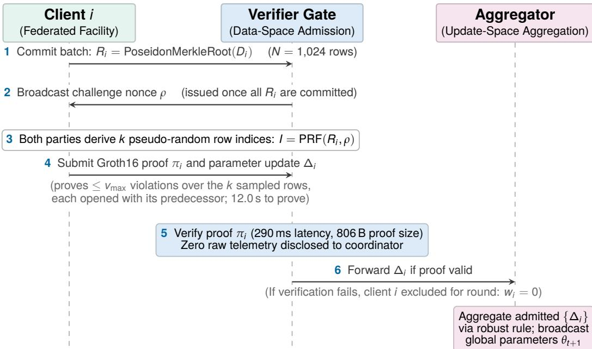  
\* Scope boundary: πi attests batch physical compliance; cryptographic binding of model updates to the batch (proof-of-gradient) is deferred to companion work.

Figure 10: PA-FL Lite protocol round. The client commits to the training batch $( N = 1 , 0 2 4$ rows) as a Poseidon Merkle root; once every commitment is in, the verifier broadcasts a challenge nonce, and both parties derive k pseudo-random row indices. A Groth16 proof is returned that at most $v _ { \mathrm { m a x } }$ sampled rows violate an invariant, and that at most $u _ { \mathrm { m a x } }$ checks are inapplicable. The verifier checks the proof and the aggregator combines the admitted updates with a robust rule; a client whose proof fails is excluded for the round $( w _ { i } = 0 )$ Timings are for $k = 3 2$ (Table 6).

## C.1 Circuit Pipeline and R1CS Optimisations

To validate telemetry inside a rank-1 constraint system within an edge device’s budget, the circuit uses four arithmetisation choices:

1. Constants baked into the template. The invariant parameters, the coeficient matrices $( J _ { \mathrm { p r e v } } , J _ { \mathrm { c u r } } )$ , ofsets $c _ { j }$ and tolerances $\varepsilon _ { j }$ , are compiled into the Circom template as numerical constants. The afine residuals $r _ { j } = { }$ $J _ { \mathrm { p r e v } , j } x [ i - 1 ] + J _ { \mathrm { c u r } , j } x [ i ] + c _ { j }$ are then linear combinations of witness values and cost no multiplication gates. The public inputs are only $( R _ { i } , I , v _ { \operatorname* { m a x } } , u _ { \operatorname* { m a x } } )$ , $k + 3$ field elements (35 at $k = 3 2 )$ .

2. Fixed-point scaling with a biased encoding. Sensor readings and tolerances are scaled to integers by $S \ : = \ : 2 ^ { 1 6 }$ . Field elements of $\mathbb { F } _ { p } \ ( p \approx 2 ^ { 2 5 4 }$ on the BN128 scalar field) have no sign, so a negative value would wrap to near $p ;$ and projected batches do carry negative values, since the adversary’s projection drives unconstrained flow channels below zero (in one projected SWaT batch, FIT401 reads $\mathrm { - 6 2 m ^ { 3 } / h ) }$ . Every value therefore enters the circuit as ${ \hat { x } } = \lfloor x \cdot 2 ^ { 1 6 } \rceil + 2 ^ { 3 1 }$ and is range-checked to 32 bits, and every residual stays below $2 ^ { 5 3 } \ll p ,$ so field arithmetic reproduces signed integer arithmetic exactly.

3. Chunked Poseidon leaf hashing. A Poseidon permutation takes at most 16 inputs, so the 18 constrained channels of a row are hashed in two chunks whose digests are combined with a precomputed digest of the row’s unconstrained channels. A leaf costs 1,095 constraints, against about 1,500 for a single wide sponge.

4. Soft violation accumulation. Instead of asserting $| r _ { j } | \le \varepsilon _ { j }$ row by row, which would make the circuit unsatisfiable at the first violation, each check is a 56-bit comparison on the biased residual that emits a Boolean flag. The flags, and the flags of inapplicable actuator checks, are summed over the k samples and compared with the public budgets $v _ { \mathrm { m a x } }$ and $u _ { \mathrm { m a x } }$ once, at the circuit boundary.

## C.2 Constraint Breakdown and Prover Cost

At $k = 3 2$ samples over a batch of $N = 1 { , } 0 2 4$ rows (Merkle depth 10), the circuit has 297,736 R1CS constraints, 9,304 per sample. The two Merkle path openings $( 2 \times 2 { , } 4 2 0 )$ and the two leaf hashes $( 2 \times 1 , 0 9 5 )$ take 7,030 of these, about 76%; the 36 range checks on the two sampled rows take 1,152 (12%), the nine tolerance checks 1,035 (11%), and the applicability and index-bit checks the remaining 80. Benchmarked on an Apple M3 Pro (Circom 2.1.9, SnarkJS 0.7.4, Groth16 over BN128, Powers of Tau $2 ^ { 2 0 } )$ , proving takes 12.0 s at 3.8 GB peak memory; verification is 290 ms independent of k; and the Groth16 proof consists of three group elements $( A \in G _ { 1 }$ $B \in G _ { 2 } , C \in G _ { 1 } )$ , consuming 256 bytes in binary and 806 bytes in SnarkJS’s JSON encoding. $\mathrm { A t ~ } k = 1 6$ , the circuit has 148,888 constraints and proves in 6.55 s with the same verification cost (Table 8).

Table 8: PA-FL Lite full benchmark across sample sizes k. Attestation outcomes are for the seed-0 SWaT batches under a budget of $v _ { \mathrm { m a x } } = 1$ violations and $u _ { \mathrm { m a x } } = 8$ inapplicable checks; sampling soundness is estimated from 19,992 random index draws over 56 honest windows.
<table><tr><td>Protocol Metric / Circuit Property k = 16 samples k = 32 samples</td></tr><tr><td>R1CS arithmetic constraints (total) 148,888 297,736</td></tr><tr><td>Constraints per sample (2 paths, 2 leaves, physics) 9,306 9,304</td></tr><tr><td>Public / private circuit inputs 19  / 928 35 / 1,856 Circuit compilation time (Circom) 7.47s 15.0s</td></tr><tr><td>Proving key size (.zkey) 108.7MB 217.4MB</td></tr><tr><td>Verification key size (.vk) 6.1 kB 8.9 kB 0.56 s</td></tr><tr><td>Witness generation (honest batch) 0.41 s Proof generation time πi (peak RAM) 6.55 s (2.3 GB) 12.0 s (3.8 GB)</td></tr><tr><td>Proof verification time (coordinator) 300 ms 290 ms</td></tr><tr><td>Proof size (Groth16 πi) 808 B 806 B</td></tr><tr><td>Empirical Attestation Outcome  $( v _ { \mathrm { m a x } } = 1 , u _ { \mathrm { m a x } } = 8$  budget)</td></tr><tr><td>Honest batch (0.39% violating rows) Verified (0/0) Verified (0/0)</td></tr><tr><td>Channel roll (21.29% violating rows) Hard-abort (6/1) Hard-abort (18/1)</td></tr><tr><td>Historical replay (23.34% violating rows) Hard-abort (5/0) Hard-abort (6/0)</td></tr><tr><td>Physics-aware projected (0.68% violating rows) Verified (0/0) Verified (0/0)</td></tr><tr><td>Monte Carlo Sampling Soundness (19,992 draws) Honest batch acceptance  $( P ( v \leq 1 ) )$  99.41% 98.51%</td></tr></table>

## References

[1] Sridhar Adepu and Aditya Mathur. Using process invariants to detect cyber attacks on a water treatment system. In Proceedings of the 31st IFIP TC 11 International Conference on ICT Systems Security and Privacy Protection (IFIP SEC), pages 91–104, Ghent, Belgium, 2016. doi: 10.1007/978-3-319-33630-5\_7.

[2] Chuadhry Mujeeb Ahmed, Venkata Reddy Palleti, and Aditya P. Mathur. WADI: A water distribution testbed for research in the design of secure cyber physical systems. In Proceedings of the 3rd International Workshop on Cyber-Physical Systems for Smart Water Networks (CySWater), pages 25–28, Pittsburgh, PA, USA, 2017. doi: 10.1145/3055366.3055375.

[3] Chuadhry Mujeeb Ahmed, Martín Ochoa, Jianying Zhou, Aditya P. Mathur, Rizwan Qadeer, Carlos Murguia, and Justin Ruths. NoisePrint: Attack detection using sensor and process noise fingerprint in cyber physical systems. In Proceedings of the 2018 ACM on Asia Conference on Computer and Communications Security (AsiaCCS), pages 483–497, Incheon, Republic of Korea, 2018. doi: 10.1145/3196494.3196532.

[4] Daniel Arp, Erwin Quiring, Feargus Pendlebury, Alexander Warnecke, Fabio Pierazzi, Christian Wressnegger, Lorenzo Cavallaro, and Konrad Rieck. Dos and don’ts of machine learning in computer security. In Proceedings of the 31st USENIX Security Symposium (USENIX Security), pages 3971–3988, Boston, MA, USA, 2022. URL https://www.usenix.org/conference/ usenixsecurity22/presentation/arp.

[5] Eugene Bagdasaryan, Andreas Veit, Yiqing Hua, Deborah Estrin, and Vitaly Shmatikov. How to backdoor federated learning. In Proceedings of the Twenty Third International Conference on Artificial Intelligence and Statistics (AISTATS), volume 108 of Proceedings of Machine Learning Research, pages 2938–2948, 2020. URL https://proceedings.mlr.press/v108/ bagdasaryan20a.html.

[6] Gilad Baruch, Moran Baruch, and Yoav Goldberg. A little is enough: Circumventing defenses for distributed learning. In Advances in Neural Information Processing Systems (NeurIPS), volume 32, pages 8635–8645, 2019. URL https://proceedings.neurips.cc/paper/2019/ hash/ec1c59141046cd1866bbbcdfb6ae31d4-Abstract.html.

[7] James Bell, Adrià Gascón, Tancr‘ede Lepoint, Baiyu Li, Sarah Meiklejohn, Mariana Raykova, and Cathie Yun. ACORN: Input validation for secure aggregation. In Proceedings of the 32nd USENIX Security Symposium (USENIX Security), pages 4805–4822, Anaheim, CA, USA, 2023. URL https://www.usenix.org/conference/usenixsecurity23/presentation/bell.

[8] Peva Blanchard, El Mahdi El Mhamdi, Rachid Guerraoui, and Julien Stainer. Machine learning with adversaries: Byzantine tolerant gradient descent. In Advances in Neural Information Processing Systems (NeurIPS), volume 30, pages 119–129, 2017. URL https://proceedings. neurips.cc/paper/2017/hash/f4b9ec30ad9f68f89b29639786cb62ef-Abstract.html.

[9] Keith Bonawitz, Vladimir Ivanov, Ben Kreuter, Antonio Marcedone, H. Brendan McMahan, Sarvar Patel, Daniel Ramage, Aaron Segal, and Karn Seth. Practical secure aggregation for privacy-preserving machine learning. In Proceedings of the 2017 ACM SIGSAC Conference on Computer and Communications Security (CCS), pages 1175–1191, Dallas, TX, USA, 2017. doi: 10.1145/3133956.3133982.

[10] Xiaoyu Cao, Minghong Fang, Jia Liu, and Neil Zhenqiang Gong. FLTrust: Byzantine-robust federated learning via trust bootstrapping. In Proceedings of the Network and Distributed System Security Symposium (NDSS), San Diego, CA, USA, 2021. doi: 10.14722/ndss.2021.24434.

[11] Nicholas Carlini, Anish Athalye, Nicolas Papernot, Wieland Brendel, Jonas Rauber, Dimitris Tsipras, Ian Goodfellow, Aleksander Madry, and Alexey Kurakin. On evaluating adversarial robustness. arXiv preprint arXiv:1902.06705, 2019.

[12] Bing-Jyue Chen, Suppakit Waiwitlikhit, Ion Stoica, and Daniel Kang. ZKML: An optimizing system for ML inference in zero-knowledge proofs. In Proceedings of the Nineteenth European Conference on Computer Systems (EuroSys), pages 560–574, Athens, Greece, 2024. doi: 10.1145/3627703.3650088.

[13] Geumhwan Cho. Attack-level failure analysis of invariant-rule-based anomaly detection in industrial control systems. Mathematics, 14(11):2016, 2026. doi: 10.3390/math14112016.

[14] Cybersecurity and Infrastructure Security Agency. Exploitation of Unitronics PLCs used in water and wastewater systems. Cybersecurity Alert, November 2023. https://www.cisa.gov/news-events/alerts/2023/11/28/ exploitation-unitronics-plcs-used-water-and-wastewater-systems.

[15] Dragos, Inc. OT cybersecurity year in review 2026. Technical report, Dragos, Inc., Hanover, MD, USA, 2026. https://www.dragos.com/ot-cybersecurity-year-in-review/.

[16] European Parliament and Council of the European Union. Directive (EU) 2022/2555 on measures for a high common level of cybersecurity across the Union (NIS2 directive), article 23. Oficial Journal of the European Union, L 333, 80–152, 2022. https://eur-lex.europa. eu/eli/dir/2022/2555/oj.

[17] Minghong Fang, Xiaoyu Cao, Jinyuan Jia, and Neil Zhenqiang Gong. Local model poisoning attacks to Byzantine-robust federated learning. In Proceedings of the 29th USENIX Security Symposium (USENIX Security), pages 1605–1622, Boston, MA, USA, 2020. URL https: //www.usenix.org/conference/usenixsecurity20/presentation/fang.

[18] Cheng Feng and Pengwei Tian. Time series anomaly detection for cyber-physical systems via neural system identification and Bayesian filtering. In Proceedings of the 27th ACM SIGKDD Conference on Knowledge Discovery & Data Mining (KDD), pages 2858–2867, Virtual Event, Singapore, 2021. doi: 10.1145/3447548.3467137.

[19] Cheng Feng, Venkata Reddy Palleti, Aditya Mathur, and Deeph Chana. A systematic framework to generate invariants for anomaly detection in industrial control systems. In Proceedings of the Network and Distributed System Security Symposium (NDSS), San Diego, CA, USA, 2019. doi: 10.14722/ndss.2019.23265.

[20] Clement Fung, Chris J. M. Yoon, and Ivan Beschastnikh. The limitations of federated learning in Sybil settings. In Proceedings of the 23rd International Symposium on Research in Attacks, Intrusions and Defenses (RAID), pages 301–316, San Sebastian, Spain, 2020. USENIX Association. URL https://www.usenix.org/conference/raid2020/presentation/fung.

[21] Jonas Geiping, Liam Fowl, W. Ronny Huang, Wojciech Czaja, Gavin Taylor, Michael Moeller, and Tom Goldstein. Witches’ brew: Industrial scale data poisoning via gradient matching. In Proceedings of the International Conference on Learning Representations (ICLR), 2021. doi: 10.48550/arXiv.2009.02276. URL https://openreview.net/forum?id=01olnfLIbD.

[22] Jairo Giraldo, David Urbina, Alvaro Cardenas, Junia Valente, Mustafa Faisal, Justin Ruths, Nils Ole Tippenhauer, Henrik Sandberg, and Richard Candell. A survey of physics-based attack detection in cyber-physical systems. ACM Computing Surveys, 51(4):76:1–76:36, 2018. doi: 10.1145/3203245.

[23] Jonathan Goh, Sridhar Adepu, Khurum Nazir Junejo, and Aditya Mathur. A dataset to support research in the design of secure water treatment systems. In Critical Information Infrastructures Security (CRITIS 2016), volume 10242 of Lecture Notes in Computer Science, pages 88–99, 2017. doi: 10.1007/978-3-319-71368-7\_8.

[24] Jonathan Goh, Sridhar Adepu, Marcus Tan, and Zi Shan Lee. Anomaly detection in cyber physical systems using recurrent neural networks. In Proceedings of the IEEE International Symposium on High Assurance Systems Engineering (HASE), pages 140–145, 2017. doi: 10.1109/HASE.2017.36.

[25] Lorenzo Grassi, Dmitry Khovratovich, Christian Rechberger, Arnab Roy, and Markus Schofnegger. Poseidon: A new hash function for zero-knowledge proof systems. In Proceedings of the 30th USENIX Security Symposium (USENIX Security), pages 519–535, Vancouver, B.C., Canada, 2021. URL https://www.usenix.org/conference/usenixsecurity21/ presentation/grassi.

[26] Jens Groth. On the size of pairing-based non-interactive arguments. In Advances in Cryptology – EUROCRYPT 2016, volume 9666 of Lecture Notes in Computer Science, pages 305–326, 2016. doi: 10.1007/978-3-662-49896-5\_11.

[27] Hanze Guo, Yebo Feng, Cong Wu, Zengpeng Li, and Jiahua Xu. Benchmarking ZK-friendly hash functions and SNARK proving systems for EVM-compatible blockchains. arXiv preprint arXiv:2409.01976, 2024.

[28] Jose Luis Hernandez-Ramos, Georgios Karopoulos, Efstratios Chatzoglou, Vasileios Kouliaridis, Enrique Marmol, Aurora Gonzalez-Vidal, and Georgios Kambourakis. Intrusion detection based on federated learning: A systematic review. ACM Computing Surveys, 57(12):1–65, 2025. doi: 10.1145/3731596.

[29] Truong Thu Huong, Ta Phuong Bac, Kieu Ngan Ha, Nguyen Viet Hoang, Nguyen Xuan Hoang, Nguyen Tai Hung, and Kim Phuc Tran. Federated learning-based explainable anomaly detection for industrial control systems. IEEE Access, 10:53854–53872, 2022. doi: 10.1109/AC-CESS.2022.3173288.

[30] Peter Kairouz, H. Brendan McMahan, Brendan Avent, Aurélien Bellet, Mehdi Bennis, Arjun Nitin Bhagoji, Kallista Bonawitz, Zachary Charles, Graham Cormode, Rachel Cummings, et al. Advances and open problems in federated learning. Foundations and Trends in Machine Learning, 14(1–2):1–210, 2021. doi: 10.1561/2200000083.

[31] Abigail M. Y. Koay, Ryan K. L. Ko, Hinne Hettema, and Kenneth Radke. Machine learning in industrial control system (ICS) security: Current landscape, opportunities and challenges. Journal of Intelligent Information Systems, 60(2):377–405, 2023. doi: 10.1007/s10844-022- 00753-1.

[32] Moshe Kravchik and Asaf Shabtai. Detecting cyber attacks in industrial control systems using convolutional neural networks. In Proceedings of the 2018 Workshop on Cyber-Physical Systems Security and PrivaCy (CPS-SPC), pages 72–83, Toronto, ON, Canada, 2018. doi: 10.1145/3264888.3264896.

[33] Moshe Kravchik and Asaf Shabtai. Eficient cyber attack detection in industrial control systems using lightweight neural networks and PCA. IEEE Transactions on Dependable and Secure Computing, 19(4):2179–2197, 2022. doi: 10.1109/TDSC.2021.3050101.

[34] Oleksandr Kuznetsov, Yelyzaveta Kuznetsova, Gulzat Ziyatbekova, Yuliia Kovalenko, and Rostyslav Palahusynets. Performance evaluation of zk-SNARK protocols for privacy-preserving sensor data verification. Sensors, 26(8):2486, 2026. doi: 10.3390/s26082486.

[35] Hidde Lycklama, Lukas Burkhalter, Alexander Viand, Nicolas Küchler, and Anwar Hithnawi. RoFL: Robustness of secure federated learning. In Proceedings of the 2023 IEEE Symposium on Security and Privacy (SP), pages 453–476, San Francisco, CA, USA, 2023. doi: 10.1109/SP46215.2023.10179400.

[36] Yiping Ma, Yue Guo, Harish Karthikeyan, and Antigoni Polychroniadou. Armadillo: Robust single-server secure aggregation for federated learning with input validation. In Proceedings of the 2025 ACM SIGSAC Conference on Computer and Communications Security (CCS), Taipei, Taiwan, 2025. doi: 10.1145/3719027.3765216.

[37] Aditya P. Mathur and Nils Ole Tippenhauer. SWaT: A water treatment testbed for research and training on ICS security. In Proceedings of the 2016 International Workshop on Cyber-Physical Systems for Smart Water Networks (CySWater), pages 31–36, Vienna, Austria, 2016. doi: 10.1109/CySWater.2016.7469060.

[38] H. Brendan McMahan, Eider Moore, Daniel Ramage, Seth Hampson, and Blaise Agüera y Arcas. Communication-eficient learning of deep networks from decentralized data. In Proceedings of the 20th International Conference on Artificial Intelligence and Statistics (AISTATS), volume 54 of Proceedings of Machine Learning Research, pages 1273–1282, 2017. URL https: //proceedings.mlr.press/v54/mcmahan17a.html.

[39] Thien Duc Nguyen, Phillip Rieger, Markus Miettinen, and Ahmad-Reza Sadeghi. Poisoning attacks on federated learning-based IoT intrusion detection system. In Proceedings of the Workshop on Decentralized IoT Systems and Security (DISS), co-located with NDSS, San Diego, CA, USA, 2020. Internet Society. doi: 10.14722/diss.2020.23003. Compromised clients inject attack trafic as benign; the federated anomaly detector learns to accept it.

[40] George Dominic Pecherle, Robert Ştefan Győrödi, and Cornelia Aurora Győrödi. Federated learning-based intrusion detection in industrial IoT networks. Future Internet, 18(1):2, 2026. doi: 10.3390/fi18010002.

[41] Zhizhi Peng, Chonghe Zhao, Taotao Wang, Guofu Liao, Zibin Lin, Yifeng Liu, Bin Cao, Long Shi, Qing Yang, and Shengli Zhang. A survey of zero-knowledge proof based verifiable machine learning. Artificial Intelligence Review, 59:57, 2026. doi: 10.1007/s10462-026-11557-y.

[42] Gauthama M. R. Raman, Chuadhry Mujeeb Ahmed, and Aditya Mathur. Machine learning for intrusion detection in industrial control systems: Challenges and lessons from experimental evaluation. Cybersecurity, 4(1):27, 2021. doi: 10.1186/s42400-021-00095-5.

[43] Virat Shejwalkar and Amir Houmansadr. Manipulating the Byzantine: Optimizing model poisoning attacks and defenses for federated learning. In Proceedings of the Network and Distributed System Security Symposium (NDSS), San Diego, CA, USA, 2021. doi: 10.14722/ndss.2021.24498.

[44] Hyeok-Ki Shin, Woomyo Lee, Jeong-Han Yun, and Byung-Gil Min. Two ICS security datasets and anomaly detection contest on the HIL-based augmented ICS testbed. In Proceedings of the 14th Cyber Security Experimentation and Test Workshop (CSET), pages 36–40, Virtual Event, 2021. doi: 10.1145/3474718.3474719.

[45] Ziteng Sun, Peter Kairouz, Ananda Theertha Suresh, and H. Brendan McMahan. Can you really backdoor federated learning? arXiv preprint arXiv:1911.07963, 2019. Norm clipping as a defence against backdoors.

[46] Riccardo Taormina, Stefano Galelli, Nils Ole Tippenhauer, Elad Salomons, Avi Ostfeld, Demetrios G. Eliades, Mohsen Aghashahi, Raanju Sundararajan, Mohsen Pourahmadi, M. Katherine Banks, B. M. Brentan, Enrique Campbell, G. Lima, D. Manzi, D. Ayala-Cabrera, M. Herrera, I. Montalvo, J. Izquierdo, E. Luvizotto, Jr., Sarin E. Chandy, Amin Rasekh, Zachary A. Barker, Bruce Campbell, M. Ehsan Shafiee, Marcio Giacomoni, Nikolaos Gatsis, Ahmad Taha, Ahmed A. Abokifa, Kelsey Haddad, Cynthia S. Lo, Pratim Biswas, M. Fayzul K. Pasha, Bijay Kc, Saravanakumar Lakshmanan Somasundaram, Mashor Housh, and Ziv Ohar. Battle of the attack detection algorithms: Disclosing cyber attacks on water distribution networks. Journal of Water Resources Planning and Management, 144(8):04018048, 2018. doi: 10.1061/(ASCE)WR.1943-5452.0000969.

[47] Florian Tramèr, Nicholas Carlini, Wieland Brendel, and Aleksander Madry. On adaptive attacks to adversarial example defenses. In Advances in Neural Information Processing Systems (NeurIPS), volume 33, pages 1633–1645, 2020. URL https://proceedings.neurips.cc/ paper/2020/hash/11f38f3430f55cf55271a3994c501178-Abstract.html.

[48] Nilufer Tuptuk, Phil Hazell, Jeremy Watson, and Stephen Hailes. A systematic review of the state of cyber-security in water systems. Water, 13(1):81, 2021. doi: 10.3390/w13010081.

[49] David I. Urbina, Jairo A. Giraldo, Alvaro A. Cardenas, Nils Ole Tippenhauer, Junia Valente, Mustafa Faisal, Justin Ruths, Richard Candell, and Henrik Sandberg. Limiting the impact of stealthy attacks on industrial control systems. In Proceedings of the 2016 ACM SIGSAC

Conference on Computer and Communications Security (CCS), pages 1092–1105, Vienna, Austria, 2016. doi: 10.1145/2976749.2978388.

[50] Taotao Wang, Yuxin Jin, Qing Yang, Yihan Xia, Long Shi, and Shengli Zhang. Zero-knowledge federated learning: A new trustworthy and privacy-preserving distributed learning paradigm. arXiv preprint arXiv:2503.15550 (accepted to IEEE Communications Magazine), 2025.

[51] Zhipeng Wang, Nanqing Dong, Jiahao Sun, William Knottenbelt, and Yike Guo. zkFL: Zero-knowledge proof-based gradient aggregation for federated learning. IEEE Transactions on Big Data, 10(4):447–460, 2024. doi: 10.1109/TBDATA.2024.3403370.

[52] Qiong Xia, Wei Chen, Zhibin Yu, and Jianfeng Ma. Poisoning attacks in federated learning: A survey. IEEE Access, 11:10708–10722, 2023. doi: 10.1109/ACCESS.2023.3238823.

[53] Zhibo Xing, Zijian Zhang, Ziang Zhang, Zhen Li, Meng Li, Jiamou Liu, Zongyang Zhang, Yi Zhao, Qi Sun, Liehuang Zhu, and Giovanni Russello. Zero-knowledge proof-based verifiable decentralized machine learning in communication network: A comprehensive survey. IEEE Communications Surveys & Tutorials, 2025. doi: 10.1109/COMST.2025.3561657.

[54] Dong Yin, Yudong Chen, Kannan Ramchandran, and Peter Bartlett. Byzantine-robust distributed learning: Towards optimal statistical rates. In Proceedings of the 35th International Conference on Machine Learning (ICML), volume 80 of Proceedings of Machine Learning Research, pages 5650–5659, 2018. URL https://proceedings.mlr.press/v80/yin18a.html.

[55] Xun Zhou, Zihao Cheng, Chenyu Wang, Shen Wang, Chengxi Tao, Zhengyan Zhou, Xiang Chen, Jiayu Luo, Di Wang, and Haifeng Zhou. A dataset collected in real-world industrial control systems for network attack detection. Scientific Data, 13(1):112, 2026. doi: 10.1038/s41597- 026-06738-x.

[56] Qilin Zhu, Yulong Ding, Jie Jiang, and Shuang-Hua Yang. Anomaly detection using invariant rules in industrial control systems. Control Engineering Practice, 154:106164, 2025. doi: 10.1016/j.conengprac.2024.106164.