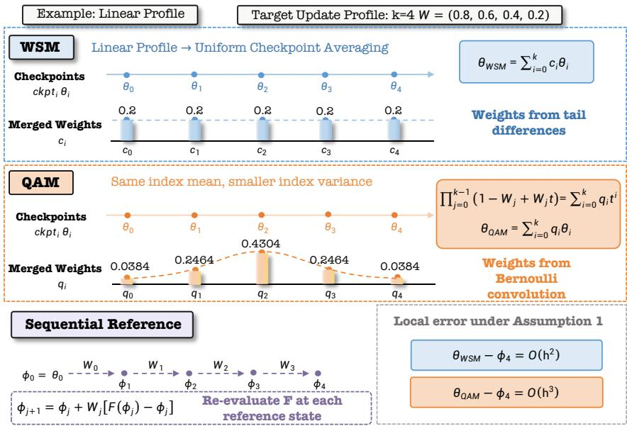
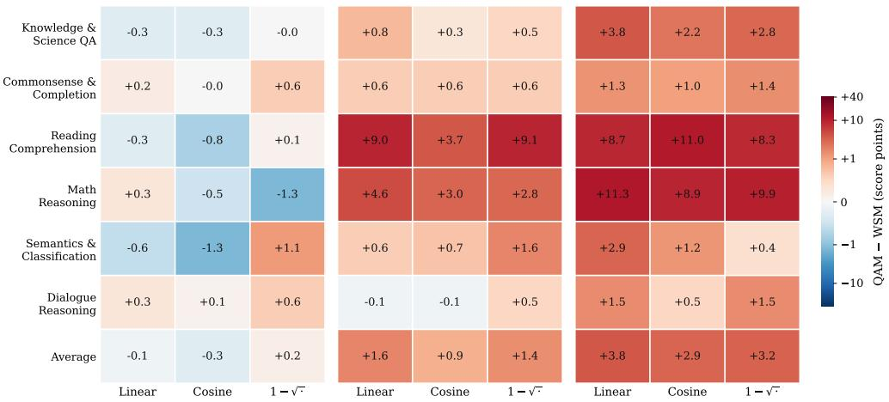
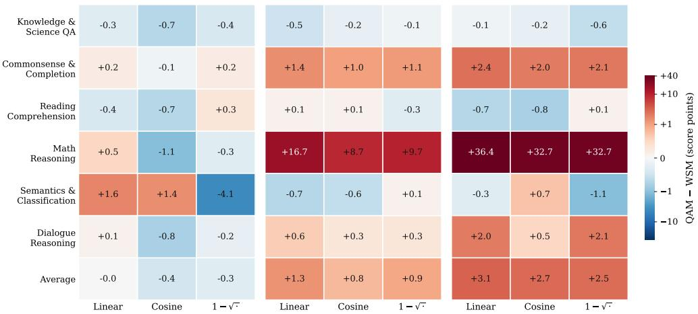
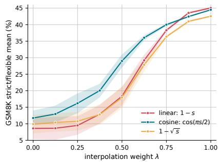
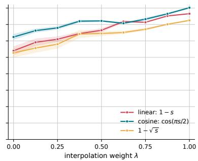
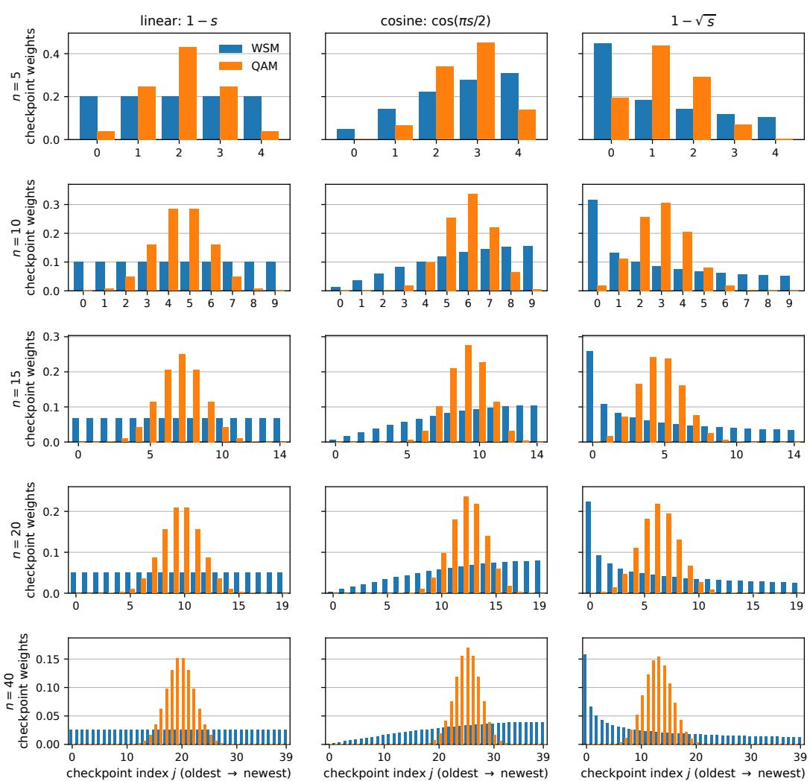
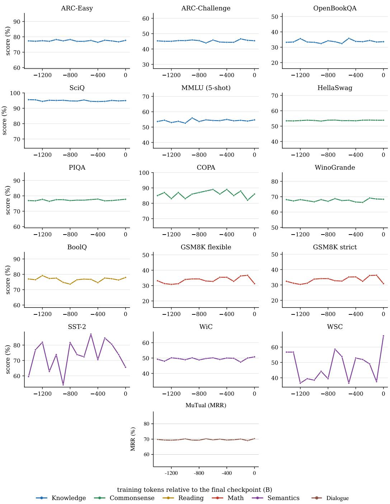
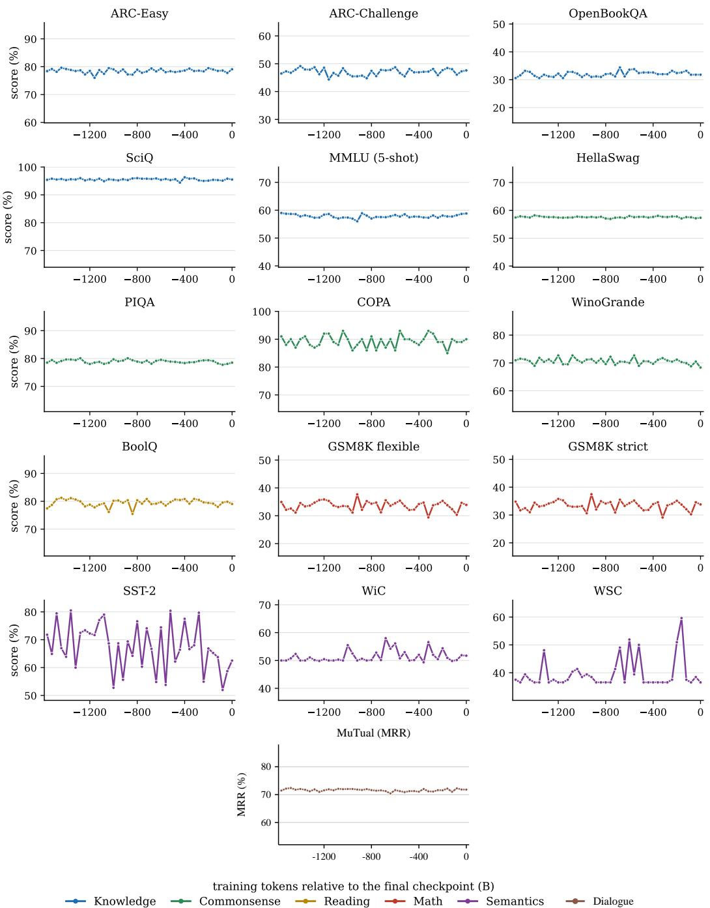

# QAM: Quadratic-Accurate Checkpoint Merging via Sequential Consistency

Shihao Wang1,2, Rui Kong2, Xinran Chen2, Hui Wu2, Qipeng Qian3, Jinman Zhao4, Jiashu Zhao5, Yuchen Li2, Jimmy Huang6, Dawei Yin2

1University of Wisconsin – Madison 2Baidu Inc. 3University of Arizona 4University of Toronto 5Wilfrid Laurier University 6York University yuchenli1230@gmail.com,yindawei@acm.org

## Abstract

Saved checkpoints record states along a training trajectory, but generally do not determine the updates at states that would be visited under a different schedule. We study how accurately these checkpoints can reconstruct the endpoint of a sequential reference with prescribed update strengths. Under a common local transition model, two checkpoint-index moment conditions characterize all convex merges that agree with this reference through second order. We then prove an information limit that for nondegenerate profiles, no algorithm using only a fixedlength gradient-descent (GD) history with step size h can achieve o(h3) endpoint error uniformly over a fixed class of smooth, strongly convex losses. The lower bound follows from two losses with identical GD checkpoint histories but sequential reference endpoints separated by Ω(h3). Quadratic-Accurate Merging (QAM) achieves a matching uniform O(h3) endpoint error bound. Its explicit coefficients also define the unique profile-dependent merge that exactly matches the sequential GD reference across all fixed quadratic objectives. Across two public Adam checkpoint trajectories (SmolLM3-3B and OpenEuroLLM-Prelude-9B), three windows and three profiles per model, and 15 tasks, QAM shows mixed results for short windows and broader advantages over Warmup-Stable and Merge (WSM) for longer windows. Matched-moment GSM8K diagnostics further show that local consistency alone does not fully determine downstream scores. These results characterize the reconstruction limits of saved histories, provide a coefficient rule that attains the optimal rate, and assess its practical utility.

## 1 Introduction

Large language model pretraining often requires adjustments to the training plan, such as introducing new data, revising the data mixture, or extending the training budget. A learning-rate decay schedule fixed in advance makes it harder to accommodate these adjustments. In contrast, warmup-stable schedules offer greater flexibility by maintaining a constant learning rate after warmup. Averaging checkpoints saved during the stable phase can improve model quality without further optimization (Izmailov et al., 2018; Sanyal et al., 2023; Ajroldi et al., 2025). However, choosing the averaging coefficients raises a more fundamental question: what alternative training behavior can a single saved history reconstruct? The history reveals updates at the recorded states, but not the updates at states that a changed schedule would have visited.

Warmup-Stable and Merge (WSM) (Tian et al., 2026) gives an exact tail-sum correspondence between checkpoint weights and strengths assigned to recorded updates. Holding this profile fixed, we define a sequential reference that recomputes each relaxed transition at its current state. At checkpoint scale, a transition represents a complete saved interval. This reference supplies a coefficientdesign criterion while applying its weights to a sparse Adam history remains a heuristic.

We first characterize the entire class of convex merges that agrees with this reference through second order under a common local transition model. We show that two index moments are necessary and sufficient. The base merge’s discrepancy coefficient is a sum of covariances between nested update indicators. Cancelling it preserves the index mean and reduces the variance by twice this sum. The resulting family generally contains many coefficient vectors.

Our main limitation result concerns the information in the training trajectory itself. For any nondegenerate fixed profile, we construct two globally smooth, strongly convex losses with exactly the same GD checkpoints, checkpoint gradients, and checkpoint losses, but reference endpoints separated by $\Omega ( h ^ { 3 } )$ . Hence no reconstruction algorithm, including a nonlinear or state-dependent one, has uniformly smaller error on the specified smooth class as $h  0$ . A second-order-consistent merge attains the matching $O ( h ^ { 3 } )$ upper bound.

Quadratic-Accurate Merging (QAM) realizes this rate using the distribution of a sum of independent Bernoulli variables with the prescribed update strengths. Local quadratic models of pretraining loss motivate an additional selection principle (Li et al., 2025) that exact matching across every quadratic objective uniquely fixes the complete coefficients. Our characterization and information bound locate the attainable local accuracy of this rule among all reconstructions from the same observations. Moreover, QAM itself is simple to construct as it requires only a scalar convolution on the coefficients.

We evaluate its practical utility on two public 3B/9B Adam pretraining trajectories, three windows and three profiles per history, and 15 tasks. Compared with paired WSM, results are mixed at short windows and more favorable at intermediate and long windows. The four intermediate- and long-window linear-profile QAM merges exceed the latest checkpoint in 45/60 task comparisons. A complementary GSM8K diagnostic changes full coefficients while holding their first two index moments fixed. Its score differences demonstrate the empirical freedom left by second-order consistency. Our experiments evaluate QAM’s practical performance, while our theory establishes its optimal reconstruction rate under the stated assumptions.

## 2 Related Work

Checkpoint and weight averaging. Stochastic weight averaging combines models along a training trajectory (Izmailov et al., 2018), while later work studies denser or more diverse forms of weight averaging (Cha et al., 2021; Ramé et al., 2022). LAWA studies early averaging with high learning rates in LLM pretraining (Sanyal et al., 2023), and Ajroldi et al. (2025) examine when and where averaging helps. Beyond same-trajectory averaging, model merging has been studied through model soups, Fisher-weighted merging, task arithmetic, interference-aware merging, and sparsified parameter updates (Wortsman et al., 2022; Matena and Raffel, 2022; Ilharco et al., 2023; Yadav et al., 2023; Yu et al., 2024); see Yang et al. (2026) for a broader survey.

Averaging and update schedules. Sandler et al. (2023) connect iterate averaging with learningrate schedules through models of SGD trajectories, while Meterez et al. (2026) study horizon-free schedules together with weight averaging. For stable-phase LLM pretraining, Tian et al. (2026) derive an exact tail-sum correspondence between checkpoint weights and recorded-update weights. We start from this correspondence and account for the state dependence introduced by sequentially recomputed transitions.

Quadratic models and training dynamics. Li et al. (2025) explain pretraining averaging through a second-order loss expansion, Hessian geometry, and interactions between checkpoint deviations. Quadratic models also clarify averaging and learning-rate schedules (Sandler et al., 2023). This viewpoint motivates our matching criterion. Notice that the resulting coefficients do not require estimating the Hessian or fitting a transition to the history.

## 3 Quadratic-Accurate Checkpoint Merging

We hold an update profile fixed and ask for a merge consistent with applying those update strengths sequentially. This distinguishes the choice of a design criterion from the downstream evaluation.

## 3.1 A sequential reference at checkpoint scale

Let $\theta _ { 0 } , \ldots , \theta _ { k }$ be chronologically ordered checkpoints, $k \geq 1$ , and $c _ { i } \geq 0$ with $\textstyle \sum _ { i } c _ { i } = 1$ a convex base merge. Writing $d _ { j } \bar { = } \theta _ { j + 1 } - \theta _ { j }$ yields WSM’s exact correspondence between checkpoint weights and recorded-update weights (Tian et al., 2026):

$$
\theta _ { c } : = \sum _ { i = 0 } ^ { k } c _ { i } \theta _ { i } = \theta _ { 0 } + \sum _ { j = 0 } ^ { k - 1 } W _ { j } d _ { j } , \qquad W _ { j } : = \sum _ { i = j + 1 } ^ { k } c _ { i } .\tag{1}
$$

$$
c _ { 0 } = 1 - W _ { 0 } , \qquad c _ { i } = W _ { i - 1 } - W _ { i } ( 1 \leq i < k ) , \qquad c _ { k } = W _ { k - 1 } .\tag{2}
$$

Thus c fixes a nonincreasing input profile $W \in [ 0 , 1 ] ^ { k }$ . Reweighting the recorded $d _ { j }$ leaves their evaluation states unchanged. To model the effect of changing those states, take a common transition $F ,$ , with $\theta _ { i + 1 } = F ( \theta _ { i } )$ , and define

$$
\phi _ { 0 } ^ { W } = \theta _ { 0 } , \qquad \phi _ { j + 1 } ^ { W } = \phi _ { j } ^ { W } + W _ { j } \big [ F ( \phi _ { j } ^ { W } ) - \phi _ { j } ^ { W } \big ] .\tag{3}
$$

Each transition is recomputed at the state produced by earlier ones. One transition represents a whole checkpoint interval. For a single GD step, this is learning-rate scaling. Similarly, for a saved block, it is the relaxation of the block displacement. Agreement with this reference is our sequentialconsistency criterion for selecting coefficients.

## 3.2 Local discrepancy and its coefficient geometry

Assumption 1 (Local checkpoint transition). On a neighborhood of the initial state, the common transition obeys

$$
F _ { h } ( \theta ) = \theta + h f ( \theta ) + h ^ { 2 } a ( \theta ) + O ( h ^ { 3 } )\tag{4}
$$

uniformly as $h  0 .$ , with $f \in C ^ { 2 } , a \in C ^ { 1 }$ and bounded local derivatives. The initial state, k, and $W$ remain fixed.

Here h measures the local size of a complete transition, and a includes its second-order withininterval contribution. Set $f _ { 0 } = f ( \theta _ { 0 } ) , a _ { 0 } = a ( \theta _ { 0 } ) , J _ { 0 } = D f ( \theta _ { 0 } )$ , and

$$
A _ { W } : = \sum _ { j = 0 } ^ { k - 1 } W _ { j } , \qquad B _ { W } : = \sum _ { 0 \leq \ell < j \leq k - 1 } W _ { \ell } W _ { j } .\tag{5}
$$

Expanding both finite trajectories (Appendix A.1), the base merge matches the terms in $f _ { 0 }$ and $a _ { 0 }$ but its interaction term differs:

$$
\theta _ { c } - \phi _ { k } ^ { W } = h ^ { 2 } \Delta _ { 2 } ( W ) J _ { 0 } f _ { 0 } + O ( h ^ { 3 } ) , \qquad \Delta _ { 2 } ( W ) : = \sum _ { \ell < j } W _ { j } ( 1 - W _ { \ell } ) \ge 0 .\tag{6}
$$

The discrepancy has a direct interpretation. Consider a checkpoint index $I _ { c } \sim c$ and set $X _ { j } ~ =$ $1 \{ I _ { c } > j \}$ . The indicators are nested, namely selecting an update also selects all earlier ones. Thus $\dot { \mathbb { E } } \dot { X } _ { j } = \dot { W } _ { j }$ and $\mathbb { E } [ X _ { \ell } X _ { j } ] = W _ { j }$ for $\ell < j .$ , whereas the sequential reference weights this interaction by $\dot { W } _ { \ell } W _ { j }$ . Consequently $\begin{array} { r } { \Delta _ { 2 } ( \dot { W } ) = \dot { \sum _ { \ell < j } } \operatorname { C o v } ( X _ { \ell } , X _ { j } ) } \end{array}$ . This identifies a coefficient correction without estimating $J _ { 0 } f _ { 0 }$

## 3.3 QAM and second-order consistency

Replace the nested indicators by independent $Y _ { j } \sim \mathrm { B e r n o u l l i } ( W _ { j } )$ and use the distribution of $I _ { q } =$ $\sum _ { j } Y _ { j }$ as checkpoint weights. Its generating polynomial is

$$
\boxed { Q _ { W } ( t ) : = \prod _ { j = 0 } ^ { k - 1 } ( 1 - W _ { j } + W _ { j } t ) = \sum _ { i = 0 } ^ { k } q _ { i } t ^ { i } , \qquad \theta _ { \mathrm { Q A M } } : = \sum _ { i = 0 } ^ { k } q _ { i } \theta _ { i } . }\tag{7}
$$

The coefficients are nonnegative and sum to $Q _ { W } ( 1 ) = 1$ . Independence gives $\mathbb { E } I _ { q } \ = \ A _ { W }$ and $\mathbb { E } \binom { I _ { q } } { 2 } = B _ { W }$ , matching both interaction terms in the reference.

Theorem 2 (Local sequential consistency). For fixed k, W and convex weights p independent of h and the transition, $\begin{array} { r } { \sum _ { i } ^ { \bullet } p _ { i } \theta _ { i } - \phi _ { k } ^ { W } = O ( \bar { h } ^ { 3 } ) } \end{array}$ for every transition satisfying Assumption 1 if and only if

$$
\mathbb { E } _ { p } I = A _ { W } , \qquad \mathbb { E } _ { p } \binom { I } { 2 } = B _ { W } .
$$

Equivalently, p shares QAM’s index mean and variance. In particular, $\theta _ { \mathrm { Q A M } } - \phi _ { k } ^ { W } = { \cal O } ( h ^ { 3 } )$

  
Figure 1: Illustrative example of QAM with a linearly decaying update profile $W _ { j }$

The characterization separates the consistency criterion from its realization. For $k \geq 3$ and $W _ { j } \in$ (0, 1), the convex solution family has dimension $k - 2 \colon$ normalization and the two moments impose three independent linear constraints on $k + 1$ coefficients, and $q _ { i } > 0$ . Quadratic matching below selects one member of this family. QAM preserves the base merge’s mean and changes its variance by exactly

$$
\mathrm { V a r } ( I _ { c } ) - \mathrm { V a r } ( I _ { q } ) = 2 \Delta _ { 2 } ( W ) \geq 0 .\tag{8}
$$

Thus half the variance reduction equals the weight-dependent factor in Eq. (6). This is a geometric interpretation of the consistency correction, rather than a monotonic relationship between variance and downstream accuracy.

## 3.4 INFORMATION LIMIT FOR CHECKPOINT-ONLY RECONSTRUCTION

The attainable order is limited by the observations, even if the merge can depend nonlinearly on the states. Consider ordinary GD with step h, starting at $0 \in \mathbb { R } ^ { 2 }$ , and the reference GD steps $h W _ { j }$ . For a fixed $M > 0$ , define the fixed loss class

$$
\mathcal { L } _ { M } = \left\{ L \in C ^ { 4 } ( \mathbb { R } ^ { 2 } ) : \begin{array} { l } { \frac { 1 } { 2 } I \preceq \nabla ^ { 2 } L \preceq \frac { 5 } { 2 } I , \quad \| \nabla L ( 0 ) \| \leq 3 , } \\ { \| D ^ { 3 } L \| _ { \infty } , \| D ^ { 4 } L \| _ { \infty } \leq M } \end{array} \right\} .\tag{9}
$$

Let $T _ { h } ( L ) = ( \theta _ { 0 } , \dots , \theta _ { k } )$ be the recorded history. The best worst-case reconstruction error from this information is

$$
R _ { h } = \operatorname* { i n f } _ { \mathcal { A } } \ \operatorname* { s u p } _ { L \in \mathcal { L } _ { M } } \| \mathcal { A } ( T _ { h } ( L ) , h , W ) - \phi _ { k } ^ { W } ( L ) \| ,\tag{10}
$$

where A is any algorithm using only the displayed inputs.

Remark 3. The constants $1 / 2 , 5 / 2$ , and 3 are convenient choices for the construction and have no special threshold significance.

Theorem 4 (Checkpoint-information bound). Fix $k \ge 2 , W \in [ 0 , 1 ] ^ { k }$ , and $M > 0 . \ I f S _ { W } : =$ $\begin{array} { r } { \sum _ { \ell < j } W _ { j } W _ { \ell } ( 1 - \dot { W } _ { \ell } ) > 0 , } \end{array}$ , there are $c , C , h _ { 0 } > 0$ such that $c h ^ { 3 } ~ \leq ~ \bar { R } _ { h } \leq C h ^ { 3 } f o r \mathrm { ~ 0 < } h < h _ { 0 }$ QAM attains the upper bound. The lower bound continues to hold if checkpoint gradients and loss values are also supplied. $I f S _ { W } = 0$ , QAM reconstructs the reference exactly.

The history is insufficient. Set $r ( x , y ) = y - x ^ { 2 } - 2 x$ and $L _ { h } ( x , y ) = { \textstyle { \frac { 1 } { 2 } } } ( 1 + x ) ^ { 2 } + { \textstyle { \frac { 1 } { 2 } } } ( 2 -$ $h ) ( 1 + y ) ^ { 2 }$ . Its ordinary iterates $( ( 1 - h ) ^ { i } - 1 , ( 1 - h ) ^ { 2 i } - 1 )$ lie on $r = 0$ . Adding $\varepsilon r ^ { 2 } / 2$ near this curve, with a smooth cutoff, preserves every recorded state, gradient, and loss. Both objectives belong to the same ${ \mathcal { L } } _ { M }$ for small fixed $\varepsilon > 0$ . Their reference endpoints nevertheless differ by $\varepsilon S _ { W } \bar { h ^ { 3 } } ( 2 , - 1 ) + O ( h ^ { 4 } )$ . The same observations must produce the same reconstruction, so one error is at least half this separation. The matching uniform upper bound follows from QAM’s moment conditions. Appendix A.2 gives the complete construction.

The hard objectives may vary with h inside the fixed class; the result is a uniform minimax rate, not a pointwise lower bound for a fixed loss. Other moment-matching rules can attain the rate, which does not order their constants or task scores. For fixed linear weights, two third-order terms give a corresponding algebraic obstruction; QAM’s leading remainder is proportional to $S _ { W } D ^ { 2 } f [ \breve { f } , f ]$ (Appendix A.3). Quadratic exactness below selects a complete rule where this nonlinear term vanishes.

## 3.5 Quadratic exactness selects a complete rule

Local quadratic loss models motivate a stronger criterion (Li et al., 2025). Let

$$
\begin{array} { r } { L ( \theta _ { 0 } + u ) = L ( \theta _ { 0 } ) + g _ { 0 } ^ { \top } u + \frac { 1 } { 2 } u ^ { \top } H _ { 0 } u , \qquad H _ { 0 } = H _ { 0 } ^ { \top } . } \end{array}\tag{11}
$$

be fixed, and consider ordinary GD with step $\eta$ and reference GD with steps $\eta W _ { j }$ , both initialized at $\theta _ { 0 }$

Theorem 5 (Quadratic endpoint matching and uniqueness). $F i x \ k \geq 1 , W \in [ 0 , 1 ] ^ { k }$ , and $\eta > 0$ For every fixed quadratic objective and initial state, the GD trajectories in Eqs. (23) and (24) satisfy

$$
\sum _ { i = 0 } ^ { k } q _ { i } \theta _ { i } = \phi _ { k } ^ { W } .\tag{12}
$$

Ifreal coefficients $p _ { 0 } ( W ) , \ldots , p _ { k } ( W )$ depending only on W satisfy this identity with p in place of q for every quadratic objective and every initial state, then $p _ { i } ( W ) \stackrel {  } { = } q _ { i } ( W ) f o r a l l i$

For $L ( x ) = { \textstyle \frac { 1 } { 2 } } \lambda x ^ { 2 }$ , set $t = 1 - \eta \lambda$ . Ordinary GD yields $x _ { i } = t ^ { i } x _ { 0 }$ , whereas each reference step multiplies its state by $1 - W _ { j } + W _ { j } t$ . Expanding their product gives the coefficients in Eq. (7); matching this polynomial for every scalar quadratic proves uniqueness. Appendix A.5 gives the full vector proof, including linear terms and singular or indefinite Hessians.

Coefficient construction. Initialize $q _ { 0 } ^ { ( 0 ) } = 1$ , with zero entries outside the support, and apply the convolution

$$
q _ { i } ^ { ( j + 1 ) } = ( 1 - W _ { j } ) q _ { i } ^ { ( j ) } + W _ { j } q _ { i - 1 } ^ { ( j ) } , \qquad i = 0 , \dots , j + 1 .\tag{13}
$$

This costs $O ( k ^ { 2 } )$ scalar operations and $O ( k )$ working memory. The final merge uses the saved checkpoints without gradients, optimizer states, a fitted transition, or additional training. For actual Adam histories, a common local transition is a design model; the experiments assess the resulting weights, not reference-endpoint accuracy.

## 4 Experiments

We evaluate the practical utility of QAM on saved pretraining histories, using matched WSM merges and individual checkpoints as references. These comparisons assess downstream quality rather than reconstruction of a separately trained reference endpoint.

## 4.1 Setup

Trajectories and profiles. We study two public models, SmolLM3-3B and OpenEuroLLM-Prelude-9B, using checkpoints from constant-learning-rate training (Table 1). The SmolLM3 windows contain 5, 10, or 15 checkpoints and span approximately 0.40, 0.90, or 1.40T training tokens. The Prelude windows contain 10, 20, or 40 checkpoints and span 0.36, 0.76, or 1.56T tokens. We call these the short, intermediate, and long windows within each trajectory. For k + 1 checkpoints, ordered oldest to newest, we set $W _ { j } = { \cal D } \bar { ( } ( j + 1 ) / ( k + 1 ) )$ for $j = 0 , \ldots , k - 1$ and use

$$
D _ { \mathrm { l i n e a r } } ( s ) = 1 - s , \qquad D _ { \mathrm { c o s i n e } } ( s ) = \cos ( \pi s / 2 ) , \qquad D _ { 1 - \sqrt { \cdot } } ( s ) = 1 - \sqrt { s } .
$$

Paired WSM and QAM merges use the same checkpoints and profile, changing only the coefficients in Eqs. (2) and (7). Appendix C shows the resulting checkpoint weights across window lengths and profiles. All merges use fp32 accumulation and bf16 export, without additional training or coefficient fitting.

Evaluation and reporting. The suite covers 15 tasks in six capability groups including Knowledge, Commonsense, Reading, Math, Semantics, and Dialogue. MMLU and GSM8K use 5- shot evaluation, and other accuracy tasks use zero-shot. Group scores weight accuracy tasks by evaluation-set size. Math averages flexible and strict GSM8K extraction, and Dialogue uses MuTual MRR. Appendix B gives task membership and checkpoint ranges. We report differences and win counts over the evaluated grid. Configurations share training histories and evaluation examples, and these counts should not be interpreted as independent replications.

Table 1: Model details.
<table><tr><td>Model</td><td>Size</td><td>Checkpoints</td><td>Interval</td><td>Windows</td></tr><tr><td>SmolLM3</td><td>~3.075B</td><td>last 15 constant-LR checkpoints; iter</td><td>~100B tokens</td><td>Last-5/10/15</td></tr><tr><td>OpenEuroLLM Prelude</td><td>～9.095B</td><td>3.64M-4.20M last 40 constant-LR checkpoints; iter 859200-952800</td><td>～40B tokens</td><td>Last-10/20/40</td></tr></table>

## 4.2 Utility across capabilities

Against the mean constituent score, which is the expected score of selecting one checkpoint uni formly from the window, QAM improves in 105/108 capability comparisons, including every Knowledge, Commonsense, Math, and Semantics configuration (Tables 9 and 10). The only three regressions are in SmolLM3 Reading and Dialogue. We next compare coefficient rules and stronger individual-checkpoint references.

## 4.3 Window-dependent comparison with WSM

Figures 2 and 3 show all paired capability-group differences across windows and profiles. Shortwindow differences are small and mixed as the median absolute gap is about 0.35 points, with QAM lower in 21 of 36 comparisons. This is the window scale emphasized in prior work (Tian et al., 2026). At intermediate windows, QAM wins 28 of 36 comparisons, including 22 of 30 when Math is excluded. At long windows, it wins 29 of 36, including 23 of 30 outside Math.

Intermediate and long windows. SmolLM3 improves in 16/18 intermediate-window and all 18 long-window comparisons. Prelude improves in 12/18 and 11/18, respectively. The largest longwindow gains occur in Math: +8.91–+11.30 points for SmolLM3 and +32.68–+36.43 for Prelude. Prelude’s seven long-window decreases are all below 1.2 points and occur in Knowledge, Reading, or Semantics. Its large Math gap includes a WSM generation failure, and Appendix E distinguishes this behavior from the less severe SmolLM3 case.

  
Figure 2: Paired score differences (QAM minus WSM) on SmolLM3 across six capability groups and profiles. Average weights tasks by evaluation-set size.

  
Figure 3: Same as Figure 2, but for OpenEuroLLM Prelude.

## 4.4 Comparison with individual checkpoints

We compare QAM with individual checkpoints across all three windows and all three profiles on each trajectory. Table 2 summarizes comparisons with every constituent checkpoint, the latest checkpoint, and the task-wise best checkpoint within each window.

Table 2: QAM versus individual checkpoints across all nine configurations per trajectory. Entries are wins/ties/losses. “All” counts comparisons with every constituent checkpoint. “Latest” and “Best” each contain 135 task–configuration comparisons per trajectory.
<table><tr><td>Trajectory</td><td>All</td><td>Latest</td><td>Best</td></tr><tr><td>SmolLM3</td><td>1092/48/210</td><td>102/5/28</td><td>70/3/62</td></tr><tr><td>Prelude</td><td>2716/121/313</td><td>117/9/9</td><td>77/2/56</td></tr><tr><td>Total</td><td>3808/169/523</td><td>219/14/37</td><td>147/5/118</td></tr></table>

QAM exceeds the latest checkpoint in 219 of 270 comparisons and the task-wise best constituent in 147 of 270. It wins 80.9% of constituent-checkpoint comparisons on SmolLM3 and 86.2% on Prelude. Appendix H reports the results for every window, profile, and task.

Remark 6. WSC single-checkpoint scores fluctuate substantially, and the best checkpoint can exceed QAM by a large margin (Appendix I). This unfavorable case is retained in all counts and aggregate comparisons.

## 4.5 Comparison with the best tested WSM

We focus on intermediate and long windows, where the paired comparisons show the clearest QAM gains. We examine whether these gains persist when WSM can choose its best window and profile from the full tested grid.

For each task, we compare the best QAM score across these two windows and all three profiles with the best WSM score across all nine tested window/profile combinations. QAM exceeds this baseline on 8 of 15 tasks for SmolLM3 and 9 of 15 for Prelude. These are task-wise maxima, and the maximizing configurations can differ across tasks. Appendix G.3 reports the full task-wise comparison.

Table 3 further examines GSM8K with QAM’s profile fixed to linear, while allowing WSM to choose its best window and profile. QAM exceeds this baseline at both intermediate and long windows on both trajectories, by 1.55–2.12 points.

Table 3: GSM8K with a fixed linear QAM profile versus the best WSM score over all nine tested window/profile combinations on each trajectory. Scores average flexible and strict extraction.
<table><tr><td>Trajectory</td><td>QAM window</td><td>Linear QAM</td><td>Best WSM</td><td> $\Delta$ </td></tr><tr><td>SmolLM3</td><td>Last-10</td><td>43.71</td><td>41.74</td><td>+1.97</td></tr><tr><td>SmolLM3</td><td>Last-15</td><td>43.29</td><td>41.74</td><td>+1.55</td></tr><tr><td>Prelude</td><td>Last-20</td><td>44.47</td><td>42.91</td><td>+1.56</td></tr><tr><td>Prelude</td><td>Last-40</td><td>45.03</td><td>42.91</td><td>+2.12</td></tr></table>

## 5 Second-Order Description and Coefficient geometry

The variance identity relates the local discrepancy to coefficient geometry. We examine this relation empirically on long-window GSM8K, where WSM and QAM differ most. For paired WSM and QAM weights, let $\bar { p } ^ { ( \lambda ) } = ( 1 - \lambda ) c + \lambda q , \lambda \in [ 0 , 1 ]$ . The means of c and q agree, so

$$
\mathrm { V a r } ( I _ { \lambda } ) = \mathrm { V a r } ( I _ { c } ) - 2 \lambda \Delta _ { 2 } ( W ) .\tag{14}
$$

Under Assumption 1, the same path satisfies

$$
\theta _ { \lambda } - \phi _ { k } ^ { W } = h ^ { 2 } ( 1 - \lambda ) \Delta _ { 2 } ( W ) J _ { 0 } f _ { 0 } + O ( h ^ { 3 } ) .\tag{15}
$$

Thus, it reduces both the index variance and the model’s leading discrepancy coefficient. The path also changes higher moments and interpolates between the two merged parameter vectors.

  
Figure 4: WSM–QAM interpolation on Prelude Last-40 (left) and SmolLM3 Last-15 (right). Lines average flexible and strict GSM8K extraction; shading spans the two extraction scores.

Figure 4 shows overall improvement toward QAM for all three profiles on both histories. Prelude’s path also recovers normal generation and termination behavior, whereas the SmolLM3 WSM endpoints show much less severe formatting problems (Appendix E). The trend of performance improvement is shared on both models.

To test whether the two index moments determine these scores, we pair each $\lambda \in \{ 0 . 2 5 , 0 . 5 0 , 0 . 7 5 \}$ mixture with a maximum-entropy (MaxEnt) distribution on the same checkpoint grid. Its coefficients have the form $r _ { i } \propto \exp ( a i + { \bar { b } } { \bar { i } } ^ { 2 } )$ , with $a , b$ set by the mixture’s mean and variance. This fixes a second coefficient vector without choosing it by benchmark performance. Appendix F.1 specifies the construction. Each pair therefore shares the same second-order expansion under the local model, including its residual relative to the fixed reference.

Table 4 gives the paired scores. The rankings vary: on SmolLM3, MaxEnt has higher flexible extraction scores in six of nine pairs, whereas on Prelude the mixture has higher scores in seven of nine. At Prelude $\lambda = 0 . 7 5 ,$ , the flexible-score gaps favoring the mixture are 6.6, 1.1, and 13.4 points for the three profiles. For these pairs, the input grid, center, variance, and second-order reference discrepancy are all held fixed. Averaging the two extraction scores, the largest gap is 15.15 points.

Table 4: GSM8K intermediate-target controls (%). Mix stands for $p ^ { ( \lambda ) }$ . MaxEnt matches its two moments on the same grid.
<table><tr><td></td><td></td><td colspan="4">SmolLM3 Last-15</td><td colspan="4">Prelude Last-40</td></tr><tr><td></td><td></td><td colspan="2">Flex</td><td colspan="2">Strict</td><td colspan="2">Flex</td><td colspan="2">Strict</td></tr><tr><td>Profile</td><td>λ</td><td>Mix</td><td>MaxEnt</td><td>Mix</td><td>MaxEnt</td><td>Mix</td><td>MaxEnt</td><td>Mix</td><td>MaxEnt</td></tr><tr><td>Linear</td><td>0.25</td><td>36.39</td><td>36.85</td><td>34.65</td><td>35.18</td><td>12.3</td><td>12.5</td><td>6.7</td><td>6.9</td></tr><tr><td></td><td>0.50</td><td>38.89</td><td>39.27</td><td>37.60</td><td>38.36</td><td>21.2</td><td>18.1</td><td>15.5</td><td>11.5</td></tr><tr><td></td><td>0.75</td><td>40.86</td><td>39.20</td><td>40.49</td><td>38.67</td><td>38.8</td><td>32.2</td><td>37.8</td><td>29.6</td></tr><tr><td>Cosine</td><td>0.25</td><td>39.50</td><td>40.33</td><td>38.44</td><td>39.73</td><td>19.2</td><td>18.4</td><td>13.2</td><td>13.6</td></tr><tr><td></td><td>0.50</td><td>41.39</td><td>42.00</td><td>40.79</td><td>40.79</td><td>31.0</td><td>27.4</td><td>27.0</td><td>23.0</td></tr><tr><td></td><td>0.75</td><td>42.08</td><td>42.15</td><td>41.17</td><td>41.02</td><td>40.4</td><td>39.3</td><td>39.6</td><td>38.4</td></tr><tr><td>1-√.</td><td>0.25</td><td>35.33</td><td>34.27</td><td>32.68</td><td>32.07</td><td>13.5</td><td>14.1</td><td>8.0</td><td>8.9</td></tr><tr><td></td><td>0.50</td><td>38.06</td><td>37.30</td><td>36.47</td><td>35.71</td><td>21.2</td><td>14.9</td><td>14.7</td><td>8.7</td></tr><tr><td></td><td>0.75</td><td>38.97</td><td>39.35</td><td>38.13</td><td>38.21</td><td>36.8</td><td>23.4</td><td>35.9</td><td>19.0</td></tr></table>

Separate MaxEnt controls matching the linear QAM endpoint’s mean and variance score slightly higher under both extraction rules. Their mean-score advantages are 0.34 points on SmolLM3 and 0.68 on Prelude (Appendix F.2). These point estimates establish neither a significant difference nor equivalence. They provide no empirical advantage for QAM over this same-moment alternative. Quadratic exactness selects a complete rule without guaranteeing a downstream ranking.

The index-variance view suggests a possible explanation for part of QAM’s long-window advantage. Compared with WSM, QAM concentrates the merge weights into a narrower but still nondegenerate region of the checkpoint window. This should not be interpreted as a causal claim that lower variance is always better. Individual checkpoints have zero index variance yet are often outperformed (Table 2), and the matched-moment controls above show that the first two index moments do not fully determine downstream performance.

## 6 Discussion and Limitations

We design the merging coefficients based on a common transition model, while sparse Adam histories need not satisfy those assumptions. The minimax result concerns parameter reconstruction, fixed $k ,$ and $h $ 0 over a specified loss class. It gives neither optimal error constants nor a downstream ordering or guarantee of reproducing decay training. WSM’s original evaluation includes the Warmup-Stable-Decay (WSD) baseline, whereas a matched WSD comparison here would require additional training.

The empirical results cover two histories with shared checkpoints and test examples. Task-wise maxima are retrospective rather than one model’s simultaneous scores. Window length, spacing, and kernel shape are not fully separated as changing merging granularity also changes QAM’s effective width even on a fixed token interval. Prelude’s severe generation failure should not be generalized to all WSM merges.

## 7 Conclusion

A saved history determines second-order reference behavior but leaves third-order ambiguity, even for globally smooth strongly convex losses and unrestricted reconstruction algorithms. QAM attains the sharp uniform local rate and is uniquely selected among profile-based linear rules by exact quadratic matching. Its sparse-Adam use yields practical gains on two pretraining histories, especially at longer windows. Matched-moment diagnostics show why consistency and downstream quality remain distinct questions.

An important open question is to what extent this reconstruction viewpoint can approximate the reference endpoint of an actual learning-rate decay schedule, rather than merely provide a principled criterion for coefficient design. Stronger local models of the training dynamics may be needed to make this connection more faithful.

## References

Niccolò Ajroldi, Antonio Orvieto, and Jonas Geiping. When, Where and Why to Average Weights? In Proceedings of ICML, PMLR 267:925–941, 2025. https://proceedings. mlr.press/v267/ajroldi25a.html.

John C. Butcher. Coefficients for the study of Runge–Kutta integration processes. Journal of the Australian Mathematical Society, 3(2):185–201, 1963. https://doi.org/10.1017/ S1446788700027932.

Junbum Cha, Sanghyuk Chun, Kyungjae Lee, Han-Cheol Cho, Seunghyun Park, Yunsung Lee, and Sungrae Park. SWAD: Domain Generalization by Seeking Flat Minima. In Advances in Neural Information Processing Systems, volume 34, pages 22405–22418, 2021. https://arxiv. org/abs/2102.08604.

Gabriel Ilharco, Marco Tulio Ribeiro, Mitchell Wortsman, Suchin Gururangan, Ludwig Schmidt, Hannaneh Hajishirzi, and Ali Farhadi. Editing Models with Task Arithmetic. In Proceedings of ICLR, 2023. https://arxiv.org/abs/2212.04089.

Pavel Izmailov, Dmitrii Podoprikhin, Timur Garipov, Dmitry Vetrov, and Andrew Gordon Wilson. Averaging Weights Leads to Wider Optima and Better Generalization. arXiv:1803.05407, 2018. https://arxiv.org/abs/1803.05407.

Yunshui Li, Yiyuan Ma, Shen Yan, Chaoyi Zhang, Jing Liu, Jianqiao Lu, Ziwen Xu, Mengzhao Chen, Minrui Wang, Shiyi Zhan, Jin Ma, Xunhao Lai, Yao Luo, Xingyan Bin, Hongbin Ren, Mingji Han, Wenhao Hao, Bairen Yi, Lingjun Liu, Bole Ma, Xiaoying Jia, Xun Zhou, Liang Xiang, and Yonghui Wu. Model Merging in Pre-training of Large Language Models. In Advances in Neural Information Processing Systems, volume 38, 2025. https://proceedings.neurips.cc/paper\_files/paper/2025/hash/ c20447998d6c624b4b97d4466a3bfff5-Abstract-Conference.html.

Michael Matena and Colin Raffel. Merging Models with Fisher-Weighted Averaging. In Advances in Neural Information Processing Systems, volume 35, 2022. https://arxiv.org/abs/ 2111.09832.

Alexandru Meterez, Pranav Ajit Nair, Depen Morwani, Cengiz Pehlevan, and Sham Kakade. Anytime Pretraining: Horizon-Free Learning-Rate Schedules with Weight Averaging. arXiv:2602.03702, 2026. https://arxiv.org/abs/2602.03702.

Alexandre Ramé, Matthieu Kirchmeyer, Thibaud Rahier, Alain Rakotomamonjy, Patrick Gallinari, and Matthieu Cord. Diverse Weight Averaging for Out-of-Distribution Generalization. In Advances in Neural Information Processing Systems, volume 35, 2022. https://arxiv.org/ abs/2205.09739.

Mark Sandler, Andrey Zhmoginov, Max Vladymyrov, and Nolan Miller. Training trajectories, minibatch losses and the curious role of the learning rate. arXiv:2301.02312, 2023. https:// arxiv.org/abs/2301.02312.

Sunny Sanyal, Atula Neerkaje, Jean Kaddour, Abhishek Kumar, and Sujay Sanghavi. Early Weight Averaging meets High Learning Rates for LLM Pre-training. arXiv:2306.03241, 2023. https: //arxiv.org/abs/2306.03241.

Changxin Tian, Jiapeng Wang, Qian Zhao, Kunlong Chen, Jia Liu, Ziqi Liu, Jiaxin Mao, Wayne Xin Zhao, Zhiqiang Zhang, and Jun Zhou. WSM: Decay-Free Learning Rate Schedule via Checkpoint Merging for LLM Pre-training. In Proceedings ofICLR, 2026. https://arxiv.org/abs/ 2507.17634.

Mitchell Wortsman, Gabriel Ilharco, Samir Ya Gadre, Rebecca Roelofs, Raphael Gontijo-Lopes, Ari S. Morcos, Hongseok Namkoong, Ali Farhadi, Yair Carmon, Simon Kornblith, and Ludwig Schmidt. Model soups: averaging weights of multiple fine-tuned models improves accuracy without increasing inference time. In Proceedings of ICML, PMLR 162:23965–23998, 2022. https://proceedings.mlr.press/v162/wortsman22a.html.

Prateek Yadav, Derek Tam, Leshem Choshen, Colin Raffel, and Mohit Bansal. TIES-Merging: Resolving Interference When Merging Models. In Advances in Neural Information Processing Systems, volume 36, 2023. https://arxiv.org/abs/2306.01708.

Enneng Yang, Li Shen, Guibing Guo, Xingwei Wang, Xiaochun Cao, Jie Zhang, and Dacheng Tao. Model Merging in LLMs, MLLMs, and Beyond: Methods, Theories, Applications and Opportunities. ACM Computing Surveys, 58(8), Article 216, 2026. https://doi.org/10. 1145/3787849.

Le Yu, Bowen Yu, Haiyang Yu, Fei Huang, and Yongbin Li. Language Models are Super Mario: Absorbing Abilities from Homologous Models as a Free Lunch. In Proceedings ofICML, PMLR 235:57755–57775, 2024. https://proceedings.mlr.press/v235/yu24p.html.

Yonatan Bisk, Rowan Zellers, Ronan Le Bras, Jianfeng Gao, and Yejin Choi. PIQA: Reasoning about Physical Commonsense in Natural Language. In Proceedings ofAAAI, 34(5):7432–7439, 2020. https://ojs.aaai.org/index.php/AAAI/article/view/6239.

Peter Clark, Isaac Cowhey, Oren Etzioni, Tushar Khot, Ashish Sabharwal, Carissa Schoenick, and Oyvind Tafjord. Think you have Solved Question Answering? Try ARC, the AI2 Reasoning Challenge. arXiv:1803.05457, 2018. https://arxiv.org/abs/1803.05457.

Christopher Clark, Kenton Lee, Ming-Wei Chang, Tom Kwiatkowski, Michael Collins, and Kristina Toutanova. BoolQ: Exploring the Surprising Difficulty of Natural Yes/No Questions. In Proceedings of NAACL-HLT, pages 2924–2936, 2019. https://doi.org/10.18653/v1/ N19-1300.

Karl Cobbe, Vineet Kosaraju, Mohammad Bavarian, Mark Chen, Heewoo Jun, Lukasz Kaiser, Matthias Plappert, Jerry Tworek, Jacob Hilton, Reiichiro Nakano, Christopher Hesse, and John Schulman. Training Verifiers to Solve Math Word Problems. arXiv:2110.14168, 2021. https: //arxiv.org/abs/2110.14168.

Leyang Cui, Yu Wu, Shujie Liu, Yue Zhang, and Ming Zhou. MuTual: A Dataset for Multi-Turn Dialogue Reasoning. In Proceedings of ACL, pages 1406–1416, 2020. https://doi.org/ 10.18653/v1/2020.acl-main.130.

Andrew S. Gordon, Zornitsa Kozareva, and Melissa Roemmele. SemEval-2012 Task 7: Choice of Plausible Alternatives: A New Benchmark for Commonsense Causal Reasoning. In Proceedings of the First Joint Conference on Lexical and Computational Semantics, pages 394–398, 2012. https://aclanthology.org/S12-1052/.

Dan Hendrycks, Collin Burns, Steven Basart, Andrew Zou, Mantas Mazeika, Dawn Song, and Jacob Steinhardt. Measuring Massive Multitask Language Understanding. In Proceedings of ICLR, 2021. https://arxiv.org/abs/2009.03300.

Hector J. Levesque, Ernest Davis, and Leora Morgenstern. The Winograd Schema Challenge. In Proceedings of KR, 2012. https://cdn.aaai.org/ojs/19068/ 19068-13-22935-1-10-20211013.pdf.

Todor Mihaylov, Peter Clark, Tushar Khot, and Ashish Sabharwal. Can a Suit of Armor Conduct Electricity? A New Dataset for Open Book Question Answering. In Proceedings of EMNLP, pages 2381–2391, 2018. https://doi.org/10.18653/v1/D18-1260.

Mohammad Taher Pilehvar and Jose Camacho-Collados. WiC: The Word-in-Context Dataset for Evaluating Context-Sensitive Meaning Representations. In Proceedings of NAACL-HLT, pages 1267–1273, 2019. https://doi.org/10.18653/v1/N19-1128.

Keisuke Sakaguchi, Ronan Le Bras, Chandra Bhagavatula, and Yejin Choi. WinoGrande: An Adversarial Winograd Schema Challenge at Scale. In Proceedings ofAAAI, 34(5):8732–8740, 2020. https://ojs.aaai.org/index.php/AAAI/article/view/6399.

Richard Socher, Alex Perelygin, Jean Wu, Jason Chuang, Christopher D. Manning, Andrew Y. Ng, and Christopher Potts. Recursive Deep Models for Semantic Compositionality Over a Sentiment Treebank. In Proceedings of EMNLP, pages 1631–1642, 2013. https://aclanthology. org/D13-1170/.

Johannes Welbl, Nelson F. Liu, and Matt Gardner. Creating a Dataset for Science Question Answering with Supporting Evidence. In Proceedings of EMNLP, pages 962–967, 2017. https: //doi.org/10.18653/v1/D17-1107.

Rowan Zellers, Ari Holtzman, Yonatan Bisk, Ali Farhadi, and Yejin Choi. HellaSwag: Can a Machine Really Finish Your Sentence? In Proceedings ofACL, pages 4791–4800, 2019. https: //doi.org/10.18653/v1/P19-1472.

## A Proofs and Additional Analysis

## A.1 Proof of local sequential consistency

Proof of Theorem 2. The recorded checkpoints and the reference expand as

$$
\theta _ { i } = \theta _ { 0 } + i h f _ { 0 } + h ^ { 2 } \left[ i a _ { 0 } + \binom { i } { 2 } J _ { 0 } f _ { 0 } \right] + O ( h ^ { 3 } ) ,\tag{16}
$$

$$
\phi _ { k } ^ { W } = \theta _ { 0 } + h A _ { W } f _ { 0 } + h ^ { 2 } [ A _ { W } a _ { 0 } + B _ { W } J _ { 0 } f _ { 0 } ] + O ( h ^ { 3 } ) .\tag{17}
$$

For fixed k and sufficiently small h, bounded $f , a$ and the uniform remainder keep both finite trajectories $O ( h )$ from $\theta _ { 0 }$ within the assumed neighborhood. Taylor expansion gives $f ( \theta _ { 0 } + u ) =$ $f _ { 0 } { + } J _ { 0 } u + O \dot { ( } \| u \| ^ { 2 } )$ and $a ( \theta _ { 0 } + u ) = a _ { 0 } + O ( \lVert u \rVert )$ . Induction on i gives Eq. (16) as the coefficient of $J _ { 0 } f _ { 0 }$ satisfies $C _ { i + 1 } = C _ { i } + i , C _ { 0 } = 0 \mathrm { { ; } }$ , hence $C _ { i } = { \binom { i } { 2 } }$ . Similarly, $A _ { j + 1 } = A _ { j } + W _ { j }$ and $B _ { j + 1 } = B _ { j } + W _ { j } A _ { j }$ give Eq. (17). For any fixed convex p, writing $\begin{array} { r } { \mu _ { p } = \sum _ { i } i p _ { i } } \end{array}$ and $\begin{array} { r } { \nu _ { p } = \sum _ { i } { \binom { i } { 2 } } p _ { i } } \end{array}$ therefore yields

$$
\sum _ { i } p _ { i } \theta _ { i } - \phi _ { k } ^ { W } = h ( \mu _ { p } - A _ { W } ) f _ { 0 } + h ^ { 2 } \big [ ( \mu _ { p } - A _ { W } ) a _ { 0 } + ( \nu _ { p } - B _ { W } ) J _ { 0 } f _ { 0 } \big ] + O ( h ^ { 3 } ) .\tag{18}
$$

This proves sufficiency in Theorem 2. For necessity, consider the one-dimensional maps $F _ { h } ( x ) =$ $x + h$ at $x _ { 0 } = 0$ and then $F _ { h } ( x ) = ( 1 + h ) x { \mathrm { ~ a t ~ } } x _ { 0 } { \overset { \cdot } { = } } 1$ . The first forces $\mu _ { p } = A _ { W }$ and the second forces $\nu _ { p } = B _ { W }$ . The identity $2 \nu _ { p } = \mathrm { V a r } _ { p } ( I ) + \mu _ { p } ^ { 2 } - \mu _ { p }$ gives the equivalent mean-and-variance condition. The base tail sums give $\mu _ { c } = A _ { W }$ and $\begin{array} { r } { \nu _ { c } ^ { ' } = \sum _ { j } j W _ { j } = \sum _ { \ell < j } W _ { j } } \end{array}$ . Substituting these in Eq. (18) proves Eq. (6). For QAM, $Q _ { W } ^ { \prime } ( 1 ) = A _ { W }$ and $Q _ { W } ^ { \prime \prime } ( 1 ) = 2 B _ { W }$ □

Remark 7. The common-map assumption is an idealized model. It includes a finite block of a fixed smooth deterministic update admitting this expansion, but does not assert that a sparse Adam history obeys such a map in its parameter state alone. Neither h nor the expansion’s remainder is estimated from the experimental histories.

## A.2 Proof of the Checkpoint-Information Bound

Recall that ${ \mathcal { L } } _ { M }$ , defined in Eq. (9), consists of $C ^ { 4 }$ losses on $\mathbb { R } ^ { 2 }$ satisfying

$$
\begin{array} { r } { \frac { 1 } { 2 } I \preceq \nabla ^ { 2 } L \preceq \frac { 5 } { 2 } I , \qquad \| \nabla L ( 0 ) \| \leq 3 , \qquad \| D ^ { 3 } L \| _ { \infty } , \| D ^ { 4 } L \| _ { \infty } \leq M . } \end{array}
$$

Fix $M > 0 , k \geq 2 .$ , and $W \in [ 0 , 1 ] ^ { k }$ , with

$$
S _ { W } = \sum _ { \ell < j } W _ { j } W _ { \ell } ( 1 - W _ { \ell } ) > 0 .
$$

The ordinary and reference trajectories start at the origin and satisfy

$$
\theta _ { i + 1 } = \theta _ { i } - h \nabla L ( \theta _ { i } ) , \qquad \phi _ { j + 1 } = \phi _ { j } - h W _ { j } \nabla L ( \phi _ { j } ) , \qquad \theta _ { 0 } = \phi _ { 0 } = 0 .
$$

The observation is $T _ { h } ( L ) = ( \theta _ { 0 } , \dots , \theta _ { k } )$ , and QAM is defined as

$$
Q _ { h } ( L ) = \sum _ { i = 0 } ^ { k } q _ { i } \theta _ { i } , \qquad \sum _ { i = 0 } ^ { k } q _ { i } t ^ { i } = \prod _ { j = 0 } ^ { k - 1 } ( 1 - W _ { j } + W _ { j } t ) .
$$

ProofofTheorem 4. We first bound the error of QAM uniformly over ${ \mathcal { L } } _ { M }$ . We then construct two losses that give exactly the same observations but whose reference endpoints differ at order $h ^ { 3 }$

Uniform upper bound. Write $f = - \nabla L$ . The assumptions give

$$
\begin{array} { r } { \| f ( 0 ) \| \leq 3 , \qquad \| D f \| _ { \infty } \leq \frac { 5 } { 2 } , \qquad \| D ^ { 2 } f \| _ { \infty } , \| D ^ { 3 } f \| _ { \infty } \leq M . } \end{array}
$$

For an ordinary or reference update with weight $w \in [ 0 , 1 ]$

$$
\begin{array} { r } { \| z + h w f ( z ) \| \le ( 1 + \frac 5 2 h ) \| z \| + 3 h . } \end{array}
$$

Thus, starting from zero and iterating at most k times yields

$$
\| z \| \leq 3 k h \exp ( 5 k h / 2 ) .
$$

Thus every state is $O ( h )$ , uniformly over $L \in \mathcal { L } _ { M }$ and $W \in [ 0 , 1 ] ^ { k }$

Let

$$
a = f ( 0 ) , \qquad B = D f ( 0 ) , \qquad H = D ^ { 2 } f ( 0 ) .
$$

Taylor expansion yields

$$
\begin{array} { r } { f ( z ) = a + B z + \frac { 1 } { 2 } H [ z , z ] + O ( \| z \| ^ { 3 } ) , } \end{array}
$$

with a uniform remainder bound. Since each state is $O ( h )$ , the remainder contributes $O ( h ^ { 4 } )$ to one update.

For the ordinary trajectory, write

$$
\theta _ { i } = i h a + h ^ { 2 } c _ { i } B a + h ^ { 3 } \big [ d _ { i } B ^ { 2 } a + v _ { i } H [ a , a ] \big ] + { \cal O } ( h ^ { 4 } ) .
$$

Substituting this expression into $\theta _ { i + 1 } = \theta _ { i } + h f ( \theta _ { i } )$ gives

$$
\begin{array} { r } { c _ { i + 1 } = c _ { i } + i , \qquad d _ { i + 1 } = d _ { i } + c _ { i } , \qquad v _ { i + 1 } = v _ { i } + \frac { 1 } { 2 } i ^ { 2 } , } \end{array}
$$

with $c _ { 0 } = d _ { 0 } = v _ { 0 } = 0$ . Hence

$$
c _ { i } = { \binom { i } { 2 } } , \qquad d _ { i } = { \binom { i } { 3 } } , \qquad v _ { i } = { \binom { i } { 3 } } + { \frac { 1 } { 2 } } { \binom { i } { 2 } } .
$$

It follows that

$$
\theta _ { i } = i h a + h ^ { 2 } { \binom { i } { 2 } } B a + h ^ { 3 } \left[ { \binom { i } { 3 } } B ^ { 2 } a + { \bigg ( } { \binom { i } { 3 } } + { \frac { 1 } { 2 } } { \binom { i } { 2 } } { \bigg ) } H [ a , a ] \right] + O ( h ^ { 4 } ) .
$$

For the reference trajectory, define

$$
A _ { j } = \sum _ { \ell < j } W _ { \ell } , \qquad E _ { 2 , j } = \sum _ { a < b < j } W _ { a } W _ { b } , \qquad E _ { 3 , j } = \sum _ { a < b < c < j } W _ { a } W _ { b } W _ { c } .
$$

The same substitution into the reference trajectory gives

$$
\phi _ { j } = h A _ { j } a + h ^ { 2 } E _ { 2 , j } B a + h ^ { 3 } \big [ E _ { 3 , j } B ^ { 2 } a + R _ { j } H [ a , a ] \big ] + O ( h ^ { 4 } ) ,
$$

where the coefficients satisfy

$$
\begin{array} { r c l } { { } } & { { } } & { { A _ { j + 1 } = A _ { j } + W _ { j } , } } \\ { { } } & { { } } & { { E _ { 2 , j + 1 } = E _ { 2 , j } + W _ { j } A _ { j } , } } \\ { { } } & { { } } & { { E _ { 3 , j + 1 } = E _ { 3 , j } + W _ { j } E _ { 2 , j } , } } \\ { { } } & { { } } & { { R _ { j + 1 } = R _ { j } + \frac 1 2 W _ { j } A _ { j } ^ { 2 } . } } \end{array}
$$

All four coefficients start at zero. If $e _ { m }$ denotes the m-th elementary symmetric polynomial in $W _ { 0 } , \ldots , W _ { k - 1 }$ , then

$$
\phi _ { k } = h e _ { 1 } a + h ^ { 2 } e _ { 2 } B a + h ^ { 3 } \left[ e _ { 3 } B ^ { 2 } a + \textstyle { \frac { 1 } { 2 } } \sum _ { j } W _ { j } A _ { j } ^ { 2 } H [ a , a ] \right] + O ( h ^ { 4 } ) .
$$

All remainder bounds above are uniform because k is fixed and the derivative bounds hold throughout the class.

To compute the corresponding coefficients for QAM, expand its generating polynomial at $t = 1$

$$
\sum _ { i } q _ { i } ( 1 + s ) ^ { i } = \prod _ { j } ( 1 + W _ { j } s ) .
$$

Comparing coefficients of $s ^ { m }$ gives

$$
\sum _ { i } q _ { i } { \binom { i } { m } } = e _ { m } .
$$

Consequently,

$$
Q _ { h } ( L ) = h e _ { 1 } a + h ^ { 2 } e _ { 2 } B a + h ^ { 3 } \left[ e _ { 3 } B ^ { 2 } a + \left( e _ { 3 } + { \textstyle \frac { 1 } { 2 } } e _ { 2 } \right) H [ a , a ] \right] + O ( h ^ { 4 } ) .
$$

Also,

$$
\begin{array} { c } { { { \displaystyle \sum _ { j } { W _ { j } A _ { j } ^ { 2 } } = \sum _ { j } W _ { j } \left( \sum _ { \ell < j } W _ { \ell } ^ { 2 } + 2 \sum _ { a < b < j } W _ { a } W _ { b } \right) } } } \\ { { { = \displaystyle \sum _ { \ell < j } W _ { j } W _ { \ell } ^ { 2 } + 2 e _ { 3 } . } } } \end{array}
$$

Subtracting the reference expansion therefore yields

$$
\begin{array} { r } { Q _ { h } ( L ) - \phi _ { k } ( L ) = \frac { 1 } { 2 } h ^ { 3 } S _ { W } H [ a , a ] + O _ { k , M } ( h ^ { 4 } ) . } \end{array}
$$

Since $\| H [ a , a ] \| \leq 9 M$ , this proves the uniform $O ( h ^ { 3 } )$ upper bound.

Two losses with the same checkpoint record. The lower bound uses a perturbation whose value and gradient vanish on the ordinary trajectory, but its gradient does not vanish on the reference trajectory.

Consider

$$
r ( x , y ) = y - x ^ { 2 } - 2 x .
$$

Choose a fixed smooth cutof $\chi \in C _ { c } ^ { \infty } (  { \mathbb { R } } ^ { 2 } )$ that equals one on the unit ball and zero outside the ball of radius two. Set

$$
P = { \textstyle \frac { 1 } { 2 } } \chi r ^ { 2 } , \qquad K = \operatorname* { m a x } \left\{ 1 , \| D ^ { 2 } P \| _ { \infty } , \| D ^ { 3 } P \| _ { \infty } , \| D ^ { 4 } P \| _ { \infty } \right\} , \qquad \varepsilon = \frac { \operatorname* { m i n } \left\{ 1 / 2 , M \right\} } { K } .
$$

Both $P$ and $\varepsilon > 0$ are independent of h. K is evidently finite since $P$ is compactly supported.

For $0 \leq h \leq 1 / 2$ , define

$$
\begin{array} { r } { { \cal L } _ { h } ^ { ( 0 ) } ( x , y ) = \frac 1 2 ( 1 + x ) ^ { 2 } + \frac 1 2 ( 2 - h ) ( 1 + y ) ^ { 2 } , \qquad { \cal L } _ { h } ^ { ( 1 ) } = { \cal L } _ { h } ^ { ( 0 ) } + \varepsilon P . } \end{array}
$$

We check that both losses belong to the same fixed class ${ \mathcal { L } } _ { M }$ . The Hessian of ${ \cal L } _ { h } ^ { ( 0 ) }$ is $\mathrm { d i a g } ( 1 , 2 - h )$ , which lies between I and 2I. Moreover,

$$
\begin{array} { r } { \| { \varepsilon } D ^ { 2 } P \| _ { \infty } \leq \frac { 1 } { 2 } , \qquad \| { \varepsilon } D ^ { 3 } P \| _ { \infty } , \| { \varepsilon } D ^ { 4 } P \| _ { \infty } \leq M . } \end{array}
$$

These bounds give the required Hessian and higher-derivative bounds for ${ L } _ { h } ^ { ( 1 ) }$ everywhere on $\mathbb { R } ^ { 2 }$ Finally, since $\check { \nabla } P ( 0 ) = 0 .$ , we have

$$
\| \nabla L _ { h } ^ { ( b ) } ( 0 ) \| = \sqrt { 1 + ( 2 - h ) ^ { 2 } } < 3 , \qquad b \in \{ 0 , 1 \} .
$$

Ordinary GD on ${ L } _ { h } ^ { ( 0 ) }$ gives the exact trajectory

$$
\theta _ { i } = \big ( ( 1 - h ) ^ { i } - 1 , ( 1 - h ) ^ { 2 i } - 1 \big ) .
$$

Thus $r ( \theta _ { i } ) = 0$ for every i. On the entire set $\{ r = 0 \}$ , we have

$$
{ \cal P } = 0 , \qquad \nabla { \cal P } = { \scriptstyle { \frac { 1 } { 2 } } } r ^ { 2 } \nabla \chi + \chi r \nabla r = 0 .
$$

The two losses therefore have the same gradient at every ordinary iterate. Starting from the same initial state, they generate exactly the same checkpoint record by induction. Their loss values and gradients also agree at every recorded checkpoint, including $\theta _ { k }$

Separation of the reference endpoints. The uniform state bound proved above applies to both losses. For sufficiently small h, both reference trajectories lie in the unit ball, where $\chi = 1$ . Their negative gradients there are

$$
f _ { h } ( x , y ) = \big ( - ( 1 + x ) , ( - 2 + h ) ( 1 + y ) \big ) , \qquad g _ { h } = f _ { h } - \varepsilon G , \qquad G = r \nabla r .
$$

First consider the reference trajectory for $L _ { h } ^ { ( 0 ) }$ . Write

$$
z _ { j } = \phi _ { j } ( L _ { h } ^ { ( 0 ) } ) = ( x _ { j } , y _ { j } ) , \qquad X _ { j } = 1 + x _ { j } , \qquad Y _ { j } = 1 + y _ { j } .
$$

The updates give

$$
X _ { j + 1 } = ( 1 - h W _ { j } ) X _ { j } , \qquad Y _ { j + 1 } = ( 1 - 2 h W _ { j } + h ^ { 2 } W _ { j } ) Y _ { j } .
$$

Since $r ( z _ { j } ) = Y _ { j } - X _ { j } ^ { 2 }$ , the residual $r _ { j } = r ( z _ { j } )$ satisfies the exact recurrence

$$
r _ { j + 1 } = ( 1 - 2 h W _ { j } + h ^ { 2 } W _ { j } ) r _ { j } + h ^ { 2 } W _ { j } ( 1 - W _ { j } ) X _ { j } ^ { 2 } .
$$

Here $X _ { j } = 1 + O ( h )$ and $r _ { 0 } = 0$ . Induction yields

$$
r _ { j } = h ^ { 2 } V _ { j } + O ( h ^ { 3 } ) , \qquad V _ { j } = \sum _ { \ell < j } W _ { \ell } ( 1 - W _ { \ell } ) .
$$

Also noting that,

$$
\nabla r ( z _ { j } ) = ( - 2 X _ { j } , 1 ) = ( - 2 , 1 ) + O ( h ) ,
$$

and hence

$$
G ( z _ { j } ) = h ^ { 2 } V _ { j } ( - 2 , 1 ) + O ( h ^ { 3 } ) .
$$

Now let

$$
\delta _ { j } = \phi _ { j } ( L _ { h } ^ { ( 1 ) } ) - \phi _ { j } ( L _ { h } ^ { ( 0 ) } ) , \qquad D _ { h } = \mathrm { d i a g } ( - 1 , - 2 + h ) .
$$

Since $f _ { h }$ is affine, subtracting the two reference updates gives the exact recurrence

$$
\delta _ { j + 1 } = ( I + h W _ { j } D _ { h } ) \delta _ { j } - \varepsilon h W _ { j } G ( z _ { j } + \delta _ { j } ) , \qquad \delta _ { 0 } = 0 .
$$

Both trajectories lie in the unit ball, where G has a fixed Lipschitz bound. Since $G ( z _ { j } ) = O ( h ^ { 2 } )$ this recurrence implies

$$
\| \delta _ { j + 1 } \| \le ( 1 + C h ) \| \delta _ { j } \| + C h ^ { 3 }
$$

for a constant $C$ independent of h. Iterating for the fixed number k of steps gives $\delta _ { j } = { \cal O } ( h ^ { 3 } )$

We can now identify the leading term. The bound on $\delta _ { j }$ gives

$$
h W _ { j } D _ { h } \delta _ { j } = O ( h ^ { 4 } ) , \qquad h W _ { j } \big [ G ( z _ { j } + \delta _ { j } ) - G ( z _ { j } ) \big ] = O ( h ^ { 4 } ) .
$$

Thus the difference recurrence reduces to

$$
\begin{array} { l } { { \delta _ { j + 1 } = \delta _ { j } - \varepsilon h W _ { j } G ( z _ { j } ) + { \cal O } ( h ^ { 4 } ) } } \\ { { \qquad = \delta _ { j } + \varepsilon h ^ { 3 } W _ { j } V _ { j } ( 2 , - 1 ) + { \cal O } ( h ^ { 4 } ) . } } \end{array}
$$

Summing over $j ,$ , and using

$$
\sum _ { j } W _ { j } V _ { j } = \sum _ { \ell < j } W _ { j } W _ { \ell } ( 1 - W _ { \ell } ) = S _ { W } ,
$$

we obtain

$$
\phi _ { k } \bigl ( L _ { h } ^ { ( 1 ) } \bigr ) - \phi _ { k } \bigl ( L _ { h } ^ { ( 0 ) } \bigr ) = \varepsilon S _ { W } h ^ { 3 } ( 2 , - 1 ) + O ( h ^ { 4 } ) .
$$

Throughout computations, every remainder constant is independent of $h ,$ and the number of steps is fixed.

From indistinguishability to the lower bound. Any deterministic algorithm returns the same output on the two identical records. By the triangle inequality, at least one of its two errors is at least half the distance between the targets. Therefore,

$$
\begin{array} { l l } { \displaystyle \operatorname* { s u p } _ { L \in \mathcal { L } _ { M } } \| A ( T _ { h } ( L ) , h , W ) - \phi _ { k } ( L ) \| \ge \frac { 1 } { 2 } \| \phi _ { k } ( L _ { h } ^ { ( 1 ) } ) - \phi _ { k } ( L _ { h } ^ { ( 0 ) } ) \| } \\ { \displaystyle \qquad \ge \frac { \varepsilon \sqrt { 5 } S _ { W } } { 2 } h ^ { 3 } - C h ^ { 4 } . } \end{array}
$$

Taking the infimum over algorithms proves the lower bound. For example, after reducing $h _ { 0 } .$ , one may take $c = \varepsilon \sqrt { 5 } S _ { W } / 4 > 0$ . The same argument applies when checkpoint losses and gradients are included in the record, since those observations also agree.

For a randomized algorithm, the common record induces the same output distribution for both losses. If Z has that distribution, then

$$
\operatorname* { m a x } _ { b \in \{ 0 , 1 \} } \mathbb { E } \| Z - \phi _ { k } ( L _ { h } ^ { ( b ) } ) \| \ge \frac { 1 } { 2 } \| \phi _ { k } ( L _ { h } ^ { ( 1 ) } ) - \phi _ { k } ( L _ { h } ^ { ( 0 ) } ) \| .
$$

Thus the lower bound also holds for worst-case expected norm error.

Remark 8. The loss class ${ \mathcal { L } } _ { M }$ is fixed independently of $h .$ . For each $h ,$ the supremum over that class may select a different pair $L _ { h } ^ { ( 0 ) } , L _ { h } ^ { ( 1 ) }$ . The theorem therefore gives a uniform worst-case lower bound, rather than a pointwise lower bound for a single fixed loss.

If $S _ { W } ~ = ~ 0$ , every positive weight that precedes another positive weight must equal one. After zero weights are removed, the profile consists of m ones followed by at most one fractional weight $\alpha \in ( 0 , 1 )$ . With no fractional weight, the reference equals $\theta _ { m }$ . Otherwise, it equals

$$
( 1 - \alpha ) \theta _ { m } + \alpha \theta _ { m + 1 } .
$$

QAM reconstructs these references exactly. The all-zero profile returns $\theta _ { 0 } = 0$

If the derivative bound is instead set to $M = 0$ , every loss in the class is quadratic and QAM is exact.

Remark 9. The theorem holds for fixed $k , W$ , and $M > 0$ as $h  0$ . Allowing these quantities to vary with h requires separate control of the constants. The conclusion concerns the optimal order of parameter reconstruction error. It does not establish an optimal leading constant, a downstream performance ordering, or a guarantee of reproducing decay training.

## A.3 The sharp nonlinear limit of fixed checkpoint weights

For fixed Euler steps, a more specific coefficient obstruction is:

Theorem 10 (Nonlinear order barrier). Fix $k , W$ and let f range over $C ^ { 3 }$ vectorfields with bounded local derivatives. $I f S _ { W } > 0 ;$ , no real coefficients $p _ { i } ( W )$ independent of $h , f$ and the initial state satisfy $\textstyle \sum _ { i } p _ { i } \theta _ { i } - { \dot { \phi } } _ { k } ^ { W } = O ( h ^ { 4 } )$ ) for all such Euler trajectories. QAM has the leading remainder

$$
\begin{array} { r } { \theta _ { \mathrm { Q A M } } - \phi _ { k } ^ { W } = \frac { 1 } { 2 } h ^ { 3 } S _ { W } D ^ { 2 } f ( \theta _ { 0 } ) [ f ( \theta _ { 0 } ) , f ( \theta _ { 0 } ) ] + O ( h ^ { 4 } ) . } \end{array}\tag{19}
$$

$I f S _ { W } = 0 ,$ , QAM matches the reference exactly for every $f .$

The following calculation uses the classical elementary-differential expansion underlying numerical order conditions (Butcher, 1963). The target here is a prescribed sequence of relaxed Euler updates, rather than the exact flow of a differential equation. Fix $k , W , x ,$ let $f \in C ^ { 3 }$ on a neighborhood of $x ,$ with bounded derivatives there, and set $f _ { 0 } ^ { \cdot } = f ( x ) , J = D f ( x ) , \bar { K } = D ^ { 2 } f ( x )$ . For sufficiently small $h ,$ , both finite trajectories remain in that neighborhood. Write

$$
C _ { W } = \sum _ { a < b < c } W _ { a } W _ { b } W _ { c } , \quad D _ { W } = \sum _ { \ell < j } W _ { j } W _ { \ell } ^ { 2 } , \quad S _ { W } = B _ { W } - D _ { W } = \sum _ { \ell < j } W _ { j } W _ { \ell } ( 1 - W _ { \ell } ) .
$$

Taylor expansion gives the following third-order formulas:

$$
\begin{array} { l } { { \theta _ { i } = x + i h f _ { 0 } + h ^ { 2 } { \binom { i } { 2 } } J f _ { 0 } } } \\ { { \qquad + h ^ { 3 } \left[ { \binom { i } { 3 } } J ^ { 2 } f _ { 0 } + \left( { \binom { i } { 3 } } + \frac { 1 } { 2 } { \binom { i } { 2 } } \right) K [ f _ { 0 } , f _ { 0 } ] \right] + O ( h ^ { 4 } ) , } } \end{array}\tag{20}
$$

$$
\begin{array} { l } { { \phi _ { k } ^ { W } = x + h A _ { W } f _ { 0 } + h ^ { 2 } B _ { W } J f _ { 0 } } } \\ { { \qquad + h ^ { 3 } \left[ C _ { W } J ^ { 2 } f _ { 0 } + \left( C _ { W } + \frac { 1 } { 2 } D _ { W } \right) K [ f _ { 0 } , f _ { 0 } ] \right] + O ( h ^ { 4 } ) . } } \end{array}\tag{21}
$$

To verify the first identity, the chain coefficient obeys $\begin{array} { r } { u _ { i + 1 } = u _ { i } + \binom { i } { 2 } } \end{array}$ and hence $u _ { i } = { \binom { i } { 3 } }$ . The branched coefficient obeys $v _ { i + 1 } = v _ { i } + i ^ { 2 } / 2$ and hence $\begin{array} { r } { v _ { i } = i ( i - 1 ) ( 2 i - 1 ) / 1 2 = \binom { i } { 3 } + \frac { 1 } { 2 } \binom { i } { 2 } } \end{array}$ . For the reference, the chain coefficient is $\begin{array} { r } { \sum _ { i } W _ { j } B _ { j } = C _ { W } } \end{array}$ . Its branched coefficient is $\textstyle { \frac { 1 } { 2 } } \sum _ { j } { \bar { W _ { j } } } A _ { j } ^ { 2 } =$ $C _ { W } + D _ { W } / 2$ , where $\begin{array} { r } { A _ { j } = \sum _ { \ell < j } W _ { \ell } } \end{array}$ and $\begin{array} { r } { B _ { j } = \sum _ { a < b < j } W _ { a } W _ { b } } \end{array}$

For any normalized real coefficients $p$ satisfying the two second-order conditions, put $M _ { 3 } ( p ) =$ $\sum _ { i } p _ { i } \binom { i } { 3 }$ . Subtracting the preceding expansions yields

$$
\sum _ { i } p _ { i } \theta _ { i } - \phi _ { k } ^ { W } = h ^ { 3 } \left[ \left( M _ { 3 } ( p ) - C _ { W } \right) J ^ { 2 } f _ { 0 } + \left( M _ { 3 } ( p ) - C _ { W } + \textstyle { \frac { 1 } { 2 } } S _ { W } \right) K [ f _ { 0 } , f _ { 0 } ] \right] + O ( h ^ { 4 } ) .\tag{22}
$$

Thus a single free third factorial moment affects both elementary differentials by the same amount. Their required values differ by $S _ { W } / 2$

ProofofTheorem 10. Universal $O ( h ^ { 4 } )$ matching first forces normalization and the two lower-order moments. Normalization follows by taking $f = 0$ and a nonzero initial state. The scalar fields $f ( x ) = 1$ and $f ( x ) = x$ force the first and second moments; the latter, initialized at $x = 1$ , also forces $M _ { 3 } ( p ) = C _ { W }$ . Taking $f ( x ) = 1 + x ^ { 2 } / 2$ at $x = 0$ then gives $J = 0$ and $K [ f _ { 0 } , f _ { 0 } ] = 1 $ so Eq. (22) forces $S _ { W } = 0$ This argument applies even to signed coefficients. Conversely, the generating polynomial give $M _ { 3 } ( q ) = { \bar { Q } } _ { W } ^ { \prime \prime \prime } ( 1 ) / { \bar { 6 } } = C _ { W }$ , and substitution gives Eq. (19).

Each summand in $S _ { W }$ is nonnegative. Therefore $S _ { W } = 0$ if and only if every positive entry that precedes a later positive entry is one. After zero entries are removed, the profile is consequently a string of m ones followed by at most one fractional entry w. The reference then takes m ordinary steps and one final relaxation, so $\phi _ { k } ^ { W } = ( 1 - w ) \theta _ { m } + \dot { w } \theta _ { m + 1 }$ 1 for every $f$ and every step size for which the iterates exist. QAM has precisely these two coefficients; if no fractional entry occurs, it selects $\theta _ { m }$ . For a nonincreasing profile this is exactly the pattern $( 1 , \dots , 1 , w , 0 , \dots , 0 )$ . This proves the sharp exception. □

As an exact two-update illustration, take $k = 2 , x = 0$ and $f ( x ) = 1 + x ^ { 2 } / 2$ . The ordinary states are $0 , h , 2 h + h ^ { 3 } / \bar { 2 } ,$ and

$$
\begin{array} { r } { \theta _ { \mathrm { Q A M } } - \phi _ { 2 } ^ { W } = \frac 1 2 h ^ { 3 } W _ { 0 } W _ { 1 } ( 1 - W _ { 0 } ) . } \end{array}
$$

The discrepancy already occurs for a one-dimensional gradient field, since $f = - L ^ { \prime }$ for $L ( x ) =$ $- x - x ^ { 3 } / \bar { 6 }$ . This calculation concerns fixed linear weights. Theorem 4 establishes a stronger uniform lower bound for arbitrary reconstruction algorithms with the same checkpoint information; additional off-trajectory gradient queries change that information model.

## A.4 Consecutive GD as a specialization

For a fixed objective L, the ordinary and reference GD trajectories are

$$
\theta _ { i + 1 } = \theta _ { i } - \eta \nabla L ( \theta _ { i } ) , \qquad i = 0 , \ldots , k - 1 .\tag{23}
$$

$$
\phi _ { 0 } ^ { W } = \theta _ { 0 } , \qquad \phi _ { j + 1 } ^ { W } = \phi _ { j } ^ { W } - \eta W _ { j } \nabla L ( \phi _ { j } ^ { W } ) , \qquad j = 0 , \dots , k - 1 .\tag{24}
$$

Assumption 11 (Fixed smooth objective and finite GD trajectories). The objective L is fixed and belongs to $C ^ { 3 }$ on a neighborhood of $\theta _ { 0 } ,$ with locally bounded derivatives through order three. Both trajectories follow Eqs. (23) and (24). The initial state, $k ,$ and $W$ remain fixed as $\eta  0$

Theorem 12 (Characterization of local second-order consistency). $F i x \ k \geq 1 , W \in [ 0 , 1 ] ^ { k }$ , and a convex coefficient vector $p = ( p _ { 0 } , \dotsc , p _ { k } )$ independent of $\therefore \eta , L ,$ and $\theta _ { 0 }$ . The bound

$$
\sum _ { i = 0 } ^ { k } p _ { i } \theta _ { i } - \phi _ { k } ^ { W } = O ( \eta ^ { 3 } )
$$

holds as $\eta  0$ for every fixed objective and initial state satisfying Assumption 11 if and only if

$$
\mathbb { E } _ { p } [ I ] = A _ { W } , \qquad \mathbb { E } _ { p } \left[ { \binom { I } { 2 } } \right] = B _ { W } .\tag{25}
$$

Here $\Pr _ { p } ( I = i ) = p _ { i }$ . Equivalently, $p$ has the same checkpoint-index mean and variance as $q .$ In particular,

$$
\theta _ { \mathrm { Q A M } } - \phi _ { k } ^ { W } = { \cal O } ( \eta ^ { 3 } ) .\tag{26}
$$

This is the $h = \eta , f = - \nabla L , a = 0$ case of Theorem 2.

## A.5 Proof of Theorem 5

## A.5.1 Exactness by composing quadratic GD updates

Proofofexactness. Fix $k \geq 1 , W \in [ 0 , 1 ] ^ { k } , \eta > 0 \mathrm { . }$ , and a quadratic objective as in Eq. (11). Its gradient is $\nabla L ( \theta _ { 0 } + u ) = g _ { 0 } + H _ { 0 } u$ for every u, with arbitrary g and symmetric $H _ { 0 }$ . In displacement coordinates $u = \theta - \theta _ { 0 }$ , introduce

$$
\mathcal { M } _ { \eta } = \left( \begin{array} { c c } { { I - \eta H _ { 0 } } } & { { - \eta g _ { 0 } } } \\ { { 0 } } & { { 1 } } \end{array} \right) .\tag{27}
$$

Ordinary GD acts on $( u , 1 ) ^ { \top }$ through $\mathcal { M } _ { \eta } ;$ a reference step with learning rate $\eta W _ { j }$ acts through

$$
\left( \begin{array} { c c } { I - \eta W _ { j } H _ { 0 } } & { - \eta W _ { j } g _ { 0 } } \\ { 0 } & { 1 } \end{array} \right) = ( 1 - W _ { j } ) I + W _ { j } \mathcal { M } _ { \eta } .
$$

These matrices are polynomials in the same matrix and hence commute. The generating polynomial in Eq. (7) therefore gives the exact matrix identity

$$
\prod _ { j = 0 } ^ { k - 1 } \bigl [ ( 1 - W _ { j } ) I + W _ { j } \mathcal { M } _ { \eta } \bigr ] = Q _ { W } ( \mathcal { M } _ { \eta } ) = \sum _ { i = 0 } ^ { k } q _ { i } \mathcal { M } _ { \eta } ^ { i } .\tag{28}
$$

Both trajectories start from $\theta _ { 0 } .$ , so applying this identity to $( 0 , 1 ) ^ { \top }$ yields

$$
\left( \phi _ { k } ^ { W } - \theta _ { 0 } \right) = \sum _ { i = 0 } ^ { k } q _ { i } \left( { \theta _ { i } - \theta _ { 0 } } \right) .
$$

Since $\textstyle \sum _ { i } q _ { i } = Q _ { W } ( 1 ) = 1$ , the upper coordinates prove Eq. (12). The $\mathrm { t e r m } - \eta g _ { 0 }$ retains the linear part of the quadratic objective throughout the calculation. No stationary point or inverse of $H _ { 0 }$ is needed: $H _ { 0 }$ may be singular or indefinite. This finite algebraic identity requires neither a small step size nor convergence of the GD trajectory. □

## A.5.2 Uniqueness across quadratic objectives

Proofofuniqueness. Fix $k , W ,$ , and $\eta > 0$ , and suppose that the same real coefficient vector $p ( W )$ satisfies the endpoint identity for every quadratic loss and initial state. Keep this vector fixed while varying the one-dimensional convex losses

$$
L _ { \lambda } ( x ) = { \textstyle { \frac { 1 } { 2 } } } \lambda x ^ { 2 } , \qquad x _ { 0 } = 1 , \qquad 0 < \lambda < 1 / \eta .
$$

Writing $t = 1 - \eta \lambda$ gives $x _ { i } = t ^ { i }$ and

$$
\phi _ { k } ^ { W } = \prod _ { j = 0 } ^ { k - 1 } ( 1 - \eta W _ { j } \lambda ) = \prod _ { j = 0 } ^ { k - 1 } ( 1 - W _ { j } + W _ { j } t ) = Q _ { W } ( t ) .
$$

Because t ranges over $( 0 , 1 )$ , exact matching requires

$$
\sum _ { i = 0 } ^ { k } p _ { i } ( W ) t ^ { i } = Q _ { W } ( t ) \qquad { \mathrm { f o r ~ e v e r y ~ } } t \in ( 0 , 1 ) .
$$

Two polynomials agreeing on this set have identical coefficients, so $p _ { i } ( W ) = q _ { i } ( W )$ for all i. No convexity or normalization assumption on p is needed. If the dimension is fixed above one, the same scalar example embeds in a single coordinate. □

The uniqueness requirement is universal across quadratic objectives.

## A.6 Proof of Theorem 12 and the variance identity

ProofofTheorem 12. Under Assumption 11, the GD map satisfies Assumption 1 with $h = \eta , f =$ $- \nabla L$ , and $a = 0 ,$ . The expansions in Appendix A.1 therefore give sufficiency and $\mathbf { Q } \mathbf { A } \mathbf { M } ^ { \prime } \mathbf { s }$ local error bound. The base-discrepancy formula follows from Eq. (6) under the same substitution.

For necessity, $L ( x ) = x { \mathrm { ~ a t ~ } } x _ { 0 } = 0$ forces the first moment condition. With that condition satisfied, $L ( x ) \ = \ x ^ { 2 } / 2$ at $x _ { 0 } ~ = ~ 1$ forces the second. These examples embed in one coordinate in any higher dimension. The equivalent mean-and-variance condition follows from the moment identity in Appendix A.1. □

Scope of the necessity statement. The necessity statement concerns one fixed coefficient rule across objectives, and a particular trajectory may admit other matching weights. As noted in Section 3.3, second-order consistency alone leaves a $\left( k - 2 \right)$ )-dimensional family of convex solutions when $k \geq 3$ and $W _ { j } \in ( 0 , 1 )$ ). Theorem 5 selects $q$ by the stronger requirement of exact matching across quadratics.

Proof of Eq. (8). This calculation uses only the coefficients $c , q$ and their common input profile $W$ For $I _ { c } \sim c$ and $I _ { q } \sim q ,$ the coefficient sums in Appendix A.1 give the common mean $\mathbb { E } [ I _ { c } ] =$ $\mathbb { E } [ I _ { q } ] = A _ { W }$ . Consequently,

$$
\begin{array} { r l } & { \mathrm { V a r } ( I _ { c } ) - \mathrm { V a r } ( I _ { q } ) = 2 ( \nu _ { c } - \nu _ { q } ) } \\ & { \qquad = 2 \displaystyle \sum _ { \ell < j } ( W _ { j } - W _ { \ell } W _ { j } ) = 2 \Delta _ { 2 } ( W ) \geq 0 . } \end{array}
$$

The inequality follows from $0 \leq W _ { j } \leq 1$

## B Evaluation Benchmarks

Main-text Table 1 gives the full checkpoint ranges and storage intervals. A Last-n window uses the last n chronological checkpoints and therefore spans n − 1 intervals.

The SmolLM3 checkpoint steps are $3 , 6 4 0 , 0 0 0 + 4 0 , 0 0 0 i , i = 0 , \ldots , 1 4$ . The Prelude steps are 859,200 + 2,400i, $i \stackrel { - } { = } 0 , \ldots , \bar { 3 9 } .$ These progressions specify the complete checkpoint grids.

Table 5 specifies all 15 tasks. Accuracy tasks use lm\_eval v0.4.13. MMLU and GSM8K use 5-shot evaluation, and the other accuracy tasks use zero-shot evaluation. Capability-group means weight accuracy tasks by evaluation-set size. Math averages the flexible and strict GSM8K extraction scores. MuTual uses MRR. The available matched-kernel protocols are in Appendix F.

Table 5: Capability groups.
<table><tr><td>Group</td><td>Tasks</td><td>Metric</td></tr><tr><td>Knowledge</td><td>ARC-Easy, ARC-Challenge (Clark et al., 2018), OpenBookQA (Mihaylov et al., 2018), SciQ (Welbl et al., 2017), MMLU (5-shot) (Hendrycks et al., 2021)</td><td>acc.</td></tr><tr><td>Commonsense</td><td>HellaSwag (Zellers et al., 2019), PIQA (Bisk et al., 2020), COPA (Gordon et al., 2012), WinoGrande (Sakaguchi et al., 2020)</td><td>acc.</td></tr><tr><td>Reading</td><td>BoolQ (Clark et al., 2019)</td><td>acc.</td></tr><tr><td>Math Semantics</td><td>GSM8K flexible, GSM8K strict (Cobbe et al., 2021)</td><td>exact match</td></tr><tr><td></td><td>SST-2 (Socher et al., 2013), WiC (Pilehvar and Camacho-Collados, 2019), WSC (Levesque et al., 2012)</td><td>acc.</td></tr><tr><td>Dialogue</td><td>MuTual (Cui et al., 2020)</td><td>MRR</td></tr></table>

For each trajectory, window, and profile, QAM and WSM merge the same checkpoints. Merges are accumulated in $\tt f p 3 2$ and exported in bf16, with no additional training, calibration, or prompt tuning.

## C Checkpoint Weights

Figure 5 shows the WSM and QAM weights defined in Eqs. (2) and (7) across the window lengths and profiles used in our experiments.

  
Figure 5: WSM and QAM checkpoint weights. Rows correspond to windows containing n = 5, 10, 15, 20, 40 checkpoints, and columns correspond to the three prescribed profiles. Checkpoint indices increase from oldest to newest.

## D Moment identities for the interpolation diagnostic

For a coefficient distribution $p ,$ let $\mu ( p )$ and $\operatorname { V a r } ( p )$ denote the mean and variance of its checkpoint index. Appendix A.1 gives $\mu ( c ) = \mu ( q ) = A _ { W }$

Consider the interpolation used in Section 5,

$$
p ^ { ( \lambda ) } = ( 1 - \lambda ) c + \lambda q , \qquad 0 \leq \lambda \leq 1 .
$$

Its mean is independent of λ:

$$
\mu ( p ^ { ( \lambda ) } ) = ( 1 - \lambda ) \mu ( c ) + \lambda \mu ( q ) = A _ { W } .
$$

Writing $\mu = A _ { W }$ , we obtain

$$
\begin{array} { l } { { \displaystyle \mathrm { V a r } ( p ^ { ( \lambda ) } ) = \sum _ { i = 0 } ^ { k } ( i - \mu ) ^ { 2 } \big [ ( 1 - \lambda ) c _ { i } + \lambda q _ { i } \big ] } } \\ { { ~ = ( 1 - \lambda ) \mathrm { V a r } ( c ) + \lambda \mathrm { V a r } ( q ) } } \\ { { ~ = \mathrm { V a r } ( c ) - 2 \lambda \Delta _ { 2 } ( W ) , } } \end{array}
$$

where the last equality follows from Eq. (8). Thus the interpolation preserves the mean checkpoint index. Its variance decreases linearly when $\Delta _ { 2 } ( W ) > 0$ and remains constant when $\Delta _ { 2 } ( W ) = 0$

## E Generation and Termination Diagnostics

We report output-level diagnostics on Prelude Last-40 and SmolLM3 Last-15. They describe generation behavior on the tested models.

## E.1 Prelude Last-40

We first examine the unusually low Prelude Last-40 WSM GSM8K endpoint.

The WSM endpoint exhibits abnormal generation behavior. Only a small fraction of outputs contain the expected final-answer delimiter, while many generations lose the normal line-by-line solution structure and enter repeated 10-gram patterns. The median output length is also much larger than at the paired QAM endpoint, indicating that the model often continues generating instead of terminating with a concise final answer. These observations show that the degradation of WSM at long windows is expressed not only through final-answer correctness.

Recall the interpolation path defined in Section 5. As λ increases toward the QAM endpoint, these symptoms are progressively reduced. The generations recover normal answer formatting and line structure, repeated text becomes much less frequent, and the output length returns to the range typical of well-formed GSM8K solutions. The diagnostics in Table 6 quantify these output-level symptoms along the interpolation path.

Table 6: Output diagnostics along the linear Prelude Last-40 interpolation path on GSM8K. The delimiter column records the fraction of generations containing the standard GSM8K answer delimiter. The no-newline column records outputs without a newline. The loop column records repeated 10-gram behavior. Median length is measured in characters.
<table><tr><td>Model</td><td>Delimiter</td><td>No newline</td><td>Loop</td><td>Median length</td></tr><tr><td>λ = 0</td><td>13.7</td><td>83.3</td><td>82.8</td><td>1027</td></tr><tr><td>λ = 1/2</td><td>34.3</td><td>57.2</td><td>60.0</td><td>840</td></tr><tr><td>λ = 3/4</td><td>79.1</td><td>11.0</td><td>14.8</td><td>374</td></tr><tr><td>λ = 1</td><td>91.0</td><td>0.3</td><td>4.7</td><td>298</td></tr></table>

The following are examples of WSM failures, alongside successful solutions produced by QAM on the same problems.

Example 1 (doc\_id 679; gold 576). If6potatoes makes 36 hash browns, how many hash browns can you make out of96 potatoes?

WSM repeats the premise verbatim until truncation and never performs the division;

6 potatoes makes 36 hash browns   
6 potatoes makes 36 hash browns   
... (28 identical lines, truncated at the 256-token limit)   
QAM:   
6 potatoes makes 36 hash browns   
So 1 potato makes 36/6=<<36/6=6>>6   
96 potatoes makes 96\*6=<<96\*6=576>>576   
#### 576

Example 2 (doc\_id 164; gold 15). Jackie is trying to decide whether to do her taxes herself or hire an accountant. If she does the taxes herself, she’ll be able to do 3 fewer hours of freelance work, losing \$35/hour in missed income. The accountant charges \$90. How much more money will she have ifshe hires the accountant?

In this example, WSM computes the first multiplication correctly, but then repeats the intermediate step until truncation instead of subtracting the accountant’s fee.

If she does the taxes herself, she’ll be able to do 3 fewer hours of   
freelance work, losing \$35/hour in missed income.

If she does the taxes herself, she’ll be able to do 3 35=<<3 35=105>>105   
hours of freelance work. (the same line repeated 7 times, truncated)

QAM reaches the same intermediate value and completes the derivation:

... she’ll lose 3\*35=<<3\*35=105>>105 dollars.   
The accountant charges \$90. So, she’ll have 105-90=<<105-90=15>>15   
dollars more if she hires the accountant.   
#### 15

Example 3 (doc\_id 1207; gold 64). Deandre caught 3 tunas last Monday, the first tuna he caught weighs 56 kilograms, the second tuna he caught weighs 46 kilograms, and the last tuna he caught weighs 26 kilograms. Ifa kilogram oftuna costs \$0.50, how much will he earn after selling all the tunas to the market?

WSM echoes the question as a single sentence six and a half times before truncation, and flexible-extract returns the item count 3. QAM prices each fish (56 × 0.5 = 28, 46 × 0.5 = 23, 26 × 0.5 = 13) and sums them to #### 64.

## E.2 SmolLM3 Last-15

Table 7 summarizes the interpolation endpoint diagnostics. Unlike Prelude, all three SmolLM3 WSM endpoints have low no-newline rates and median generation lengths close to those of QAM.

Table 7: SmolLM3 Last-15 diagnostics on the 1,319-question GSM8K test set.
<table><tr><td>Profile</td><td>Method</td><td>Flexible</td><td>Strict</td><td>No newline</td><td>Loop</td><td>Median length</td></tr><tr><td>Linear</td><td>WSM</td><td>33.4</td><td>30.6</td><td>0.8</td><td>9.9</td><td>213</td></tr><tr><td>Linear</td><td>QAM</td><td>43.4</td><td>43.2</td><td>0.4</td><td>3.6</td><td>221</td></tr><tr><td>Cosine</td><td>WSM</td><td>37.1</td><td>35.3</td><td>0.2</td><td>5.9</td><td>233</td></tr><tr><td>Cosine</td><td>QAM</td><td>45.4</td><td>44.8</td><td>0.4</td><td>2.9</td><td>252</td></tr><tr><td>1-√</td><td>WSM</td><td>32.8</td><td>29.9</td><td>1.4</td><td>11.7</td><td>218</td></tr><tr><td>1-√</td><td>QAM</td><td>41.5</td><td>41.0</td><td>0.4</td><td>3.6</td><td>231</td></tr></table>

## F Maximum-Entropy Diagnostics

These diagnostics compare coefficient vectors at specified index moments on the same saved checkpoint grid. Their purpose is to test whether those moments determine downstream scores.

## F.1 Maximum-entropy controls along the interpolation

Use zero-based indices $i = 0 , \ldots , n - 1$ , with $n = 1 5$ for SmolLM3 and $n = 4 0$ for Prelude. For each of the three profiles and $\lambda \in \{ 0 . 2 5 , 0 . 5 0 , 0 . 7 5 \}$ , form $p ^ { ( \lambda ) } = ( 1 - \lambda ) c + \lambda q$ and set

$$
\mu = \sum _ { i } i p _ { i } ^ { ( \lambda ) } , \qquad v = ( 1 - \lambda ) \operatorname { V a r } _ { c } ( I ) + \lambda \operatorname { V a r } _ { q } ( I ) .
$$

The control is the maximum-entropy distribution on this finite grid subject to $\mathbb { E } _ { r } I ~ = ~ \mu$ and $\operatorname { V a r } _ { r } ( I ) = v \colon$

$$
r _ { i } = \frac { \exp ( a i + b i ^ { 2 } ) } { \sum _ { j = 0 } ^ { n - 1 } \exp ( a j + b j ^ { 2 } ) } .
$$

The parameters enforce the two constraints; equivalently, they minimize the convex function

$$
\log \sum _ { i = 0 } ^ { n - 1 } \exp ( a i + b i ^ { 2 } ) - a \mu - b ( \mu ^ { 2 } + v ) .
$$

The gradient gives the residuals in the first and second raw moments, so this specifies the distribution without task-score fitting. The target variance is that of the intermediate mixture, generally larger than the QAM variance at $\lambda = 1$ . On Prelude, the target means in one-based indexing are 20.5000, 25.9615, and 13.8652 for linear, cosine, and $1 - \sqrt { \cdot } ;$ subtract one for the zero-based indices above. Merges use float32 accumulation and bfloat16 export.

Table 4 reports all paired observations. On SmolLM3, MaxEnt wins six of nine flexible-extraction pairs; under strict extraction it wins four, loses four, and ties one. On Prelude, the mixture wins seven of nine flexible and six of nine strict pairs. The target moments therefore do not specify a unique task score or ranking. This comparison is a diagnostic, not a causal isolation of the theoretical truncation error.

## F.2 Separate MaxEnt controls at the QAM endpoint

For the linear profile on SmolLM3 Last-15 and Prelude Last-40, separate MaxEnt merges match QAM’s index moments. With zero-based indices, the target pairs $( \mu , v )$ are respectively

$$
\left( 7 , { \frac { 1 1 2 } { 4 5 } } \right) \quad { \mathrm { a n d } } \quad \left( 1 9 . 5 , { \frac { 5 3 3 } { 8 0 } } \right) .
$$

Each finite-grid MaxEnt distribution uses the same constrained family defined above with the corresponding target moments, and therefore satisfies the two-moment conditions in Theorem 2.

Table 8 reports their five-shot GSM8K scores alongside QAM. The plotted interpolation endpoint at $\lambda = 1$ is QAM itself. The MaxEnt models are separate controls, not additional points on that interpolation segment. The comparison only covers this linear profile and benchmark GSM8K.

Table 8: Five-shot GSM8K scores for linear QAM and moment-matched MaxEnt controls.

<table><tr><td></td><td colspan="2">SmolLM3 Last-15</td><td colspan="2">Prelude Last-40</td></tr><tr><td>Kernel</td><td>Flex</td><td>Strict</td><td>Flex</td><td>Strict</td></tr><tr><td>QAM</td><td>43.37</td><td>43.21</td><td>45.41</td><td>44.66</td></tr><tr><td>MaxEnt</td><td>43.75</td><td>43.52</td><td>46.10</td><td>45.34</td></tr></table>

## G Additional Performance Comparisons

## G.1 Comparison with Mean Constituent Scores

As a complementary comparison, we evaluate QAM against the average score of the individual checkpoints in each window. As shown in Tables 9 and 10, across two trajectories, three windows,

three profiles, and six capability groups, QAM exceeds this reference in 105 of 108 comparisons.   
Single-checkpoint averages are reported to two decimal places.

Table 9: SmolLM3 QAM compared with the average single checkpoint.
<table><tr><td>Model</td><td>Window Profile</td><td></td><td>Knowledge</td><td>Commonsense</td><td>Reading</td><td>Math</td><td>Semantics</td><td>Dialogue</td></tr><tr><td rowspan="9"></td><td rowspan="4">Last-5</td><td>Single-checkpoint average</td><td>58.27 60.90 (+2.63)</td><td>58.64</td><td>76.71</td><td>34.33</td><td>63.48</td><td>69.68</td></tr><tr><td>Linear</td><td></td><td>59.86 (+1.22)</td><td>78.75 (+2.04)</td><td>41.78 (+7.45)</td><td>68.09 (+4.61)</td><td>70.34 (+0.66)</td></tr><tr><td>Cosine</td><td>60.98 (+2.71)</td><td>59.85 (+1.21)</td><td>78.07 (+1.36)</td><td>41.21 (+6.88)</td><td>66.30 (+2.82)</td><td>70.79 (+1.11)</td></tr><tr><td> $1 - { \sqrt { \cdot } }$ </td><td>60.92 (+2.65)</td><td>59.85 (+1.21)</td><td>79.27 (+2.56)</td><td>40.30 (+5.97)</td><td>68.77 (+5.29)</td><td>69.90 (+0.22)</td></tr><tr><td rowspan="3">SmolLM3 Last-10</td><td>Single-checkpoint average</td><td>58.34</td><td>58.59</td><td>76.20</td><td>34.09</td><td>62.98</td><td>69.68</td></tr><tr><td>Linear</td><td>61.24 (+2.90)</td><td>59.69 (+1.10)</td><td> $7 9 . 6 3 \ ( + 3 . 4 3 )$ </td><td>43.71 (+9.62)</td><td>68.40 (+5.42)</td><td>69.56 (-0.12)</td></tr><tr><td>Cosine</td><td>61.10 (+2.76)</td><td>59.78 (+1.19)</td><td> $7 9 . 4 2 \ ( + 3 . 2 2 )$ </td><td>41.17 (+7.08)</td><td>69.14 (+6.16)</td><td>69.81 (+0.13)</td></tr><tr><td rowspan="3"></td><td> $1 - { \sqrt { \cdot } }$ </td><td>61.16 (+2.82)</td><td> $5 9 . 7 7 \ ( + 1 . 1 8 )$ </td><td> $7 8 . 6 5 \ : ( + 2 . 4 5 )$ </td><td>43.78 (+9.69)</td><td>67.91 (+4.93)</td><td>69.96 (+0.28)</td></tr><tr><td>Single-checkpoint average</td><td>58.11</td><td>58.53</td><td>76.63</td><td>33.37</td><td>62.23</td><td>69.66</td></tr><tr><td>Linear</td><td>61.08 (+2.97)</td><td>59.53 (+1.00)</td><td>76.51 (-0.12)</td><td>43.29 (+9.92)</td><td>68.46 (+6.23)</td><td>69.63 (-0.03)</td></tr><tr><td rowspan="3"></td><td rowspan="3">Last-15</td><td></td><td>61.41 (+3.30)</td><td> $5 9 . 8 3 \ ( + 1 . 3 0 ) $ </td><td>79.97 (+3.34) 45.11 (+11.74)</td><td></td><td></td><td></td></tr><tr><td>Cosine  $1 - { \sqrt { \cdot } }$ </td><td> $6 0 . 9 7 \ ( + 2 . 8 6 )$ </td><td> $5 9 . 5 1 \ ( + 0 . 9 8 ) $ </td><td>77.65 (+1.02)</td><td> $4 1 . 2 4 \ : ( + 7 . 8 7 )$ </td><td>67.16 (+4.93) 69.95 (+0.29)</td><td>68.77 (+6.54) 69.72 (+0.06)</td></tr><tr><td></td><td></td><td></td><td></td><td></td><td></td><td></td></tr></table>

Table 10: OpenEuroLLM Prelude QAM compared with the average single checkpoint.
<table><tr><td>Model</td><td>Window Profile</td><td></td><td>Knowledge</td><td>Commonsense</td><td>Reading</td><td>Math</td><td>Semantics</td><td>Dialogue</td></tr><tr><td rowspan="10"></td><td rowspan="4">Last-10</td><td>Single-checkpoint average</td><td>61.16</td><td>61.94</td><td>79.52</td><td>33.16</td><td>57.56</td><td>71.65</td></tr><tr><td>Linear</td><td>64.55 (+3.39)</td><td>63.44 (+1.50)</td><td>81.87 (+2.35)</td><td>42.80 (+9.64)</td><td></td><td>64.19 (+6.63) 72.75 (+1.10)</td></tr><tr><td>Cosine</td><td>63.86 (+2.70)</td><td>63.22 (+1.28)</td><td>81.41 (+1.89)</td><td>41.43 (+8.27)</td><td></td><td>61.53 (+3.97) 72.04 (+0.39)</td></tr><tr><td> $1 - \sqrt { \cdot }$ </td><td>64.19 (+3.03)</td><td>63.42 (+1.48)</td><td>82.32 (+2.80)</td><td>42.65 (+9.49)</td><td>60.22 (+2.66) 72.42 (+0.77)</td><td></td></tr><tr><td rowspan="3">OpenEuroLLM Last-20</td><td>Single-checkpoint average</td><td>61.09</td><td>61.94</td><td>79.66</td><td>33.37</td><td>58.65</td><td>71.42</td></tr><tr><td>Linear</td><td>64.06 (+2.97)</td><td>63.77 (+1.83)</td><td>82.97 (+3.31) 44.47 (+11.10) 65.74 (+7.09) 72.70 (+1.28)</td><td></td><td></td><td></td></tr><tr><td>Cosine</td><td>64.46 (+3.37)</td><td>63.53 (+1.59)</td><td></td><td></td><td></td><td>82.66 (+3.00) 44.13 (+10.76) 63.81 (+5.16) 72.50 (+1.08)</td></tr><tr><td rowspan="4"></td><td> $1 - { \sqrt { \cdot } }$ </td><td>64.24 (+3.15)</td><td>63.65 (+1.71)</td><td></td><td></td><td></td><td>82.23 (+2.57) 42.57 (+9.20)67.97 (+9.32) 72.22 (+0.80)</td></tr><tr><td>Single-checkpoint average Last-40</td><td>61.05</td><td>62.00</td><td>79.47</td><td>33.57</td><td>59.34</td><td>71.60</td></tr><tr><td>Linear</td><td>64.27 (+3.22)</td><td>63.41 (+1.41)</td><td></td><td></td><td></td><td>82.20 (+2.73) 45.03 (+11.46) 66.73 (+7.39) 72.85 (+1.25)</td></tr><tr><td>Cosine  $1 - { \sqrt { \cdot } }$ </td><td>64.39 (+3.34) 64.03 (+2.98)</td><td>63.64 (+1.64) 63.42 (+1.42)</td><td>82.78 (+3.31) 42.57 (+9.00)65.12 (+5.78) 73.31 (+1.71)</td><td></td><td></td><td>82.29 (+2.82) 44.47 (+10.90) 67.91 (+8.57) 72.25 (+0.65)</td></tr></table>

Notice that the improvements differ by capability in both their size and consistency across configurations. Knowledge and Commonsense show consistent gains across all tested windows and profiles, ranging from 2.63 to 3.39 percentage points and from 0.98 to 1.83, respectively. Semantics also improves in every configuration, although the magnitude varies more widely, from 2.66 to 9.32 points.

Math shows particularly large gains on both trajectories. Improvements range from 5.97 to 11.74 percentage points on SmolLM3 and from 8.27 to 11.46 on Prelude, with gains present in every tested configuration.

Reading and Dialogue improve in 17 and 16 of the 18 configurations, respectively, with only small observed regressions. All three negative differences occur on SmolLM3, comprising a 0.12-point decrease in Reading and decreases of 0.12 and 0.03 MRR score points in Dialogue.

This comparison establishes improvements over the mean constituent score. Appendix H reports direct comparisons with the latest and task-best constituent checkpoints.

## G.2 Long-window GSM8K scores

The large Math gap on Prelude Last-40 reflects a sharp decline in WSM’s GSM8K performance. Table 11 reports the paired raw scores. WSM scores only 11.83–14.03 under flexible extraction and 5.38–9.48 under strict extraction, whereas QAM scores 42.84–45.41 and 42.30–44.66, respectively. The individual checkpoints in this window score 29.4–37.7 under flexible extraction. Across all three profiles, WSM falls below every constituent checkpoint, while QAM exceeds all of them under this metric.

Table 11: GSM8K scores for Prelude Last-40 under flexible and strict answer extraction.
<table><tr><td></td><td colspan="2">Linear</td><td colspan="2">Cosine</td><td colspan="2"> $1 - { \sqrt { \cdot } }$ </td></tr><tr><td>Metric</td><td>WSM</td><td>QAM</td><td>WSM</td><td>QAM</td><td>WSM</td><td>QAM</td></tr><tr><td>GSM8K flexible</td><td>11.83</td><td>45.41</td><td>14.03</td><td>44.66</td><td>12.66</td><td>42.84</td></tr><tr><td>GSM8K strict</td><td>5.38</td><td>44.66</td><td>9.48</td><td>44.28</td><td>7.13</td><td>42.30</td></tr><tr><td>flexible — strict</td><td>6.44</td><td>0.76</td><td>4.55</td><td>0.38</td><td>5.53</td><td>0.53</td></tr></table>

## G.3 Task-wise best-observed comparisons

Table 12 makes the cross-window comparison explicit. Each task is considered separately: WSM may use any of the three windows and three profiles, while QAM may use either the intermediate or long window and any of the three profiles. Different rows can therefore select different merged models. These are best observed scores over the evaluated grid, and different tasks may select different configurations.

Table 12: Task-wise best observed scores. WSM uses all tested windows; QAM uses intermediate and long windows. Scores are percentages, except MuTual which is 100 × MRR.
<table><tr><td rowspan="2">Task / metric</td><td colspan="2">SmolLM3</td><td colspan="2">Prelude</td></tr><tr><td>WSM</td><td>QAM ∆</td><td>WSM QAM</td><td>∆</td></tr><tr><td>ARC-Challenge</td><td>47.61 48.12</td><td>+0.51</td><td>50.94 50.68</td><td>-0.26</td></tr><tr><td>ARC-Easy</td><td>79.46 79.84</td><td>+0.38</td><td>80.60 80.85</td><td>+0.25</td></tr><tr><td>BoolQ</td><td>79.17</td><td>79.97 +0.80</td><td>83.06 82.97</td><td>-0.09</td></tr><tr><td>COPA</td><td>87.00</td><td>88.00 +1.00</td><td>92.00 92.00</td><td>0.00</td></tr><tr><td>HellaSwag</td><td>54.89</td><td>55.20 +0.31</td><td>58.97 59.28</td><td>+0.31</td></tr><tr><td>OpenBookQA</td><td>35.80</td><td>34.80 -1.00</td><td>35.80 35.60</td><td>-0.20</td></tr><tr><td>PIQA</td><td>78.62</td><td>78.35 -0.27</td><td>79.76 80.58</td><td>+0.82</td></tr><tr><td>SciQ</td><td>95.60 95.40</td><td>-0.20</td><td>95.90 96.00</td><td>+0.10</td></tr><tr><td>SST-2</td><td>85.78</td><td>85.89 +0.11</td><td>84.52 83.94</td><td>-0.58</td></tr><tr><td>WiC</td><td>51.25</td><td>50.16 -1.09</td><td>50.31 50.78</td><td>+0.47</td></tr><tr><td>WinoGrande</td><td>69.93</td><td>69.06 -0.87</td><td>73.16</td><td>74.27 +1.11</td></tr><tr><td>WSC</td><td>47.12</td><td>47.12 0.00</td><td>36.54</td><td>42.31 +5.77</td></tr><tr><td>MMLU (5-shot)</td><td>57.80</td><td>57.99 +0.19</td><td>62.31</td><td>61.88 -0.43</td></tr><tr><td>GSM8K flexible</td><td>42.23</td><td>45.41 +3.18</td><td>43.06</td><td>45.41 +2.35</td></tr><tr><td>GSM8K strict</td><td>41.24</td><td>44.81 +3.57</td><td>42.76</td><td>44.66 +1.90</td></tr><tr><td>MuTual</td><td>70.65</td><td>69.96 -0.69</td><td>72.79</td><td>73.31+0.52</td></tr></table>

GSM8K counts as one task as flexible and strict extraction give the same win/tie/loss classification. Including MuTual, the totals are 8 wins, 1 tie, and 6 losses for SmolLM3, and 9 wins, 1 tie, and 5 losses for Prelude. Several positive differences are small; these counts describe direction without establishing statistical significance or a universal advantage.

For SmolLM3, the best WSM MuTual score is 70.65 at Last-5 cosine, while the best intermedi-ate/long QAM score is 69.96 at Last-10 1 − √·. For Prelude, the best WSM score is 72.79 at Last-10 cosine, while the best intermediate/long QAM score is 73.31 at Last-40 1 − √·.

## H Comparison with Individual Checkpoints

We compare all 18 QAM configurations with individual checkpoints across the 15 evaluation tasks. Each merge is compared with every checkpoint in its own window, the latest checkpoint, and the highest-scoring checkpoint for each task within that window. The latest checkpoint is shared across windows within each trajectory. The task-wise best checkpoint may differ across tasks.

Scores use a 0–100 scale, including MuTual MRR multiplied by 100. GSM8K averages flexible and strict extraction and counts as one task. Wins, ties, and losses are determined after rounding both scores to two decimal places.

Table 13 summarizes all three windows and all three profiles for each trajectory. Across this complete grid, QAM wins 1092 of 1350 task–checkpoint comparisons on SmolLM3 (80.9%) and 2716 of 3150 on Prelude (86.2%). Across the 270 task–configuration comparisons, QAM beats the latest checkpoint in 219, ties in 14, and loses in 37. Against the task-wise best checkpoint within each window, it wins 147, ties 5, and loses 118. Tables 14 and 15 report the task scores and constituent checkpoint comparisons for all 18 configurations.

Table 13: QAM versus individual checkpoints, broken down by window and profile.
<table><tr><td>Trajectory</td><td>Window</td><td>Profile</td><td>All</td><td>Latest</td><td>Best</td></tr><tr><td>SmolLM3</td><td>Last-5</td><td>Linear</td><td>68/0/7</td><td>14/0/1</td><td>12/0/3</td></tr><tr><td>SmolLM3</td><td>Last-5</td><td>Cosine</td><td>66/2/7</td><td>14/0/1</td><td>11/1/3</td></tr><tr><td>SmolLM3</td><td>Last-5</td><td> $1 - { \sqrt { \cdot } }$ </td><td>58/5/12</td><td>10/2/3</td><td>8/1/6</td></tr><tr><td>SmolLM3</td><td>Last-10</td><td>Linear</td><td>116/5/29</td><td>10/1/4</td><td>7/0/8</td></tr><tr><td>SmolLM3</td><td>Last-10</td><td>Cosine</td><td>123/4/23</td><td>12/0/3</td><td>7/0/8</td></tr><tr><td>SmolLM3</td><td>Last-10</td><td> $1 - { \sqrt { \cdot } }$ </td><td>116/7/27</td><td>9/1/5</td><td>6/1/8</td></tr><tr><td>SmolLM3</td><td>Last-15</td><td>Linear</td><td>174/9/42</td><td>10/1/4</td><td>6/0/9</td></tr><tr><td>SmolLM3</td><td>Last-15</td><td>Cosine</td><td>187/7/31</td><td>12/0/3</td><td>7/0/8</td></tr><tr><td>SmolLM3</td><td>Last-15</td><td> $1 - { \sqrt { \cdot } }$ </td><td>184/9/32</td><td>11/0/4</td><td>6/0/9</td></tr><tr><td>SmolLM3 total</td><td></td><td></td><td>1092/48/210</td><td>102/5/28</td><td>70/3/62</td></tr><tr><td>Prelude</td><td>Last-10</td><td>Linear</td><td>137/3/10</td><td>14/1/0</td><td>10/0/5</td></tr><tr><td>Prelude</td><td>Last-10</td><td>Cosine</td><td>128/5/17</td><td>12/2/1</td><td>8/0/7</td></tr><tr><td>Prelude</td><td>Last-10</td><td> $1 - { \sqrt { \cdot } }$ </td><td>134/2/14</td><td>13/0/2</td><td>9/1/5</td></tr><tr><td>Prelude</td><td>Last-20</td><td>Linear</td><td>251/19/30</td><td>13/1/1</td><td>10/0/5</td></tr><tr><td>Prelude</td><td>Last-20</td><td>Cosine</td><td>257/3/40</td><td>13/1/1</td><td>9/0/6</td></tr><tr><td>Prelude</td><td>Last-20</td><td> $1 - { \sqrt { \cdot } }$ </td><td>261/11/28</td><td>13/1/1</td><td>8/0/7</td></tr><tr><td>Prelude</td><td>Last-40</td><td>Linear</td><td>500/41/59</td><td>12/2/1</td><td>7/1/7</td></tr><tr><td>Prelude</td><td>Last-40</td><td>Cosine</td><td>548/16/36</td><td>13/1/1</td><td>9/0/6</td></tr><tr><td>Prelude</td><td>Last-40</td><td> $1 - { \sqrt { \cdot } }$ </td><td>500/21/79</td><td>14/0/1</td><td>7/0/8</td></tr><tr><td>Prelude total</td><td></td><td></td><td>2716/121/313</td><td>117/9/9</td><td>77/2/56</td></tr><tr><td colspan="2">Combined total</td><td colspan="2">3808/169/523</td><td>219/14/37</td><td>147/5/118</td></tr></table>

Table 14: SmolLM3 QAM versus individual checkpoints for all windows and profiles.
<table><tr><td></td><td></td><td></td><td colspan="2">Linear</td><td colspan="2">Cosine</td><td colspan="2"> $1 - { \sqrt { \cdot } }$ </td></tr><tr><td>Task</td><td>Latest</td><td></td><td>Best QAM W/T/L</td><td></td><td></td><td>QAM W/T/L</td><td>QAM W/T/L</td><td></td></tr><tr><td></td><td colspan="6">Last-5</td><td colspan="2"></td></tr><tr><td>ARC-Challenge</td><td>45.39</td><td>46.59</td><td>47.01</td><td>5/0/0</td><td>47.10</td><td>5/0/0</td><td>47.35</td><td>5/0/0</td></tr><tr><td>ARC-Easy</td><td>77.69</td><td>77.78</td><td>79.00</td><td>5/0/0</td><td>79.50</td><td>5/0/0</td><td>79.21</td><td>5/0/0</td></tr><tr><td>OpenBookQA</td><td>33.60</td><td>34.40</td><td>36.00</td><td>5/0/0</td><td>36.40</td><td>5/0/0</td><td>34.40</td><td>4/1/0</td></tr><tr><td>SciQ</td><td>95.00</td><td>95.10</td><td>95.40</td><td>5/0/0</td><td>95.50</td><td>5/0/0</td><td>95.00</td><td>3/1/1</td></tr><tr><td>MMLU</td><td>54.69</td><td>54.98</td><td>57.42</td><td>5/0/0</td><td>57.42</td><td>5/0/0</td><td>57.48</td><td>5/0/0</td></tr><tr><td>HellaSwag</td><td>53.84</td><td>53.93</td><td>55.07</td><td>5/0/0</td><td>55.06</td><td>5/0/0</td><td>55.13</td><td>5/0/0</td></tr><tr><td>PIQA</td><td>77.80</td><td>77.91</td><td>78.02</td><td>5/0/0</td><td>78.07</td><td>5/0/0</td><td>78.24</td><td>5/0/0</td></tr><tr><td>COPA</td><td>86.00</td><td>89.00</td><td>87.00</td><td>3/0/2</td><td>88.00</td><td>3/1/1</td><td>88.00</td><td>3/1/1</td></tr><tr><td>WinoGrande</td><td>68.35</td><td>69.14</td><td>69.30</td><td>5/0/0</td><td>69.14</td><td>4/1/0</td><td>68.35</td><td>2/1/2</td></tr><tr><td>BoolQ</td><td>77.95</td><td>77.95</td><td>78.75</td><td>5/0/0</td><td>78.07</td><td>5/0/0</td><td>79.27</td><td>5/0/0</td></tr><tr><td>GSM8K</td><td>31.05</td><td>36.51</td><td>41.78</td><td>5/0/0</td><td>41.21</td><td>5/0/0</td><td>40.30</td><td>5/0/0</td></tr><tr><td>SST-2</td><td>65.60</td><td>84.63</td><td>83.37</td><td>4/0/1</td><td>80.05</td><td>3/0/2</td><td>84.86</td><td>5/0/0</td></tr><tr><td>WiC</td><td>50.78</td><td>50.78</td><td>51.10</td><td>5/0/0</td><td>51.25</td><td>5/0/0</td><td>49.84</td><td>1/1/3</td></tr><tr><td>WSC</td><td>67.31</td><td>67.31</td><td>44.23</td><td>1/0/4</td><td>43.27</td><td>1/0/4</td><td>50.00</td><td>2/0/3</td></tr><tr><td>MuTual</td><td>70.33</td><td>70.33</td><td>70.34</td><td>5/0/0</td><td></td><td>5/0/0</td><td>69.90</td><td>3/0/2</td></tr><tr><td>70.79</td><td colspan="6">Last-10</td><td></td><td></td></tr><tr><td>ARC-Challenge</td><td>45.39</td><td>46.59</td><td>48.04</td><td>10/0/0</td><td>47.44</td><td>10/0/0</td><td>47.61</td><td>10/0/0</td></tr><tr><td>ARC-Easy</td><td>77.69</td><td>78.24</td><td>79.84</td><td>10/0/0</td><td>79.00</td><td>10/0/0</td><td>79.71</td><td>10/0/0</td></tr><tr><td>OpenBookQA</td><td>33.60</td><td>35.80</td><td>34.60</td><td>9/0/1</td><td>34.80</td><td>9/0/1</td><td>34.20</td><td>7/1/2</td></tr><tr><td>SciQ</td><td>95.00</td><td>95.40</td><td>95.20</td><td>8/1/1</td><td>95.10</td><td>7/1/2</td><td>95.40</td><td>9/1/0</td></tr><tr><td>MMLU</td><td>54.69</td><td>55.96</td><td>57.72</td><td>10/0/0</td><td>57.72</td><td>10/0/0</td><td>57.67</td><td>10/0/0</td></tr><tr><td>HellaSwag</td><td>53.84</td><td>53.94</td><td>54.98</td><td>10/0/0</td><td>55.05</td><td>10/0/0</td><td>55.20</td><td>10/0/0</td></tr><tr><td>PIQA</td><td>77.80</td><td>77.91</td><td>78.24</td><td>10/0/0</td><td>78.02</td><td>10/0/0</td><td>77.69</td><td>8/0/2</td></tr><tr><td>COPA</td><td>86.00</td><td>89.00</td><td>86.00</td><td>2/3/5</td><td>88.00</td><td>6/2/2</td><td>86.00</td><td>2/3/5</td></tr><tr><td>WinoGrande</td><td>68.35</td><td>69.14</td><td>68.03</td><td>5/0/5</td><td>68.59</td><td>8/0/2</td><td>67.96</td><td>5/0/5</td></tr><tr><td>BoolQ</td><td>77.95</td><td>77.95</td><td>79.63</td><td>10/0/0</td><td>79.42</td><td>10/0/0</td><td>78.65</td><td>10/0/0</td></tr><tr><td>GSM8K</td><td>31.05</td><td>36.51</td><td>43.71</td><td>10/0/0</td><td>41.17</td><td>10/0/0</td><td>43.78</td><td>10/0/0</td></tr><tr><td>SST-2</td><td>65.60</td><td>87.16</td><td>84.75</td><td>9/0/1</td><td>85.89</td><td>9/0/1</td><td>83.37</td><td>8/0/2</td></tr><tr><td>WiC</td><td>50.78</td><td>50.78</td><td>49.84</td><td>4/1/5</td><td>49.84</td><td>4/1/5</td><td>50.16</td><td>7/2/1</td></tr><tr><td>WSC</td><td>67.31</td><td>67.31</td><td>45.19</td><td>4/0/6</td><td>47.12</td><td>4/0/6</td><td>47.12</td><td>4/0/6</td></tr><tr><td>MuTual</td><td>70.33</td><td>70.33</td><td>69.56</td><td>5/0/5</td><td>69.81</td><td>6/0/4</td><td>69.96</td><td>6/0/4</td></tr><tr><td colspan="9">Last-15</td></tr><tr><td>ARC-Challenge</td><td>45.39</td><td>46.59</td><td>47.18</td><td>15/0/0</td><td>47.87</td><td>15/0/0</td><td>48.12</td><td>15/0/0</td></tr><tr><td>ARC-Easy</td><td>77.69</td><td>78.24</td><td>79.84</td><td>15/0/0</td><td>79.80</td><td>15/0/0</td><td>79.71</td><td>15/0/0</td></tr><tr><td>OpenBookQA</td><td>33.60</td><td>35.80</td><td>34.60</td><td>13/0/2</td><td>34.60</td><td>13/0/2</td><td>34.80</td><td>13/0/2</td></tr><tr><td>SciQ</td><td>95.00</td><td>95.60</td><td>95.10</td><td>8/2/5</td><td>95.10</td><td>8/2/5</td><td>95.20</td><td>10/2/3</td></tr><tr><td>MMLU</td><td>54.69</td><td>55.96</td><td>57.58</td><td>15/0/0</td><td>57.99</td><td>15/0/0</td><td>57.36</td><td>15/0/0</td></tr><tr><td>HellaSwag</td><td>53.84</td><td>53.94</td><td>54.76</td><td>15/0/0</td><td>55.09</td><td>15/0/0</td><td>54.58</td><td>15/0/0</td></tr><tr><td>PIQA</td><td>77.80</td><td>77.91</td><td>77.97</td><td>15/0/0</td><td>77.97</td><td>15/0/0</td><td>78.35</td><td>15/0/0</td></tr><tr><td>COPA</td><td>86.00</td><td>89.00</td><td>86.00</td><td>5/3/7</td><td>87.00</td><td>8/3/4</td><td>87.00</td><td>8/3/4</td></tr><tr><td>WinoGrande</td><td>68.35</td><td>69.14</td><td>68.51</td><td>12/1/2</td><td>68.98</td><td>14/0/1</td><td>69.06</td><td>14/0/1</td></tr><tr><td>BoolQ</td><td>77.95</td><td>79.20</td><td>76.51</td><td>6/0/9 15/0/0</td><td>79.97 45.11</td><td>15/0/0 15/0/0</td><td>77.65 41.24</td><td>13/0/2 15/0/0</td></tr><tr><td>GSM8K</td><td>31.05 65.60</td><td>36.51 84.98</td></table>

Table 15: Prelude QAM versus individual checkpoints for all windows and profiles.
<table><tr><td></td><td></td><td></td><td colspan="2">Linear</td><td colspan="2">Cosine</td><td colspan="2">1-√.</td></tr><tr><td>Task</td><td>Latest</td><td>Best</td><td>QAM</td><td>W/T/L</td><td>QAM</td><td>W/T/L</td><td>QAM</td><td>W/T/L</td></tr><tr><td>Last-10</td><td colspan="6"></td><td></td><td></td></tr><tr><td>ARC-Challenge</td><td>47.61</td><td>48.46</td><td>50.77</td><td>10/0/0</td><td>49.23</td><td>10/0/0</td><td>49.91</td><td>10/0/0</td></tr><tr><td>ARC-Easy</td><td>79.08</td><td>79.50</td><td>80.68</td><td>10/0/0</td><td>80.30</td><td>10/0/0</td><td>80.26</td><td>10/0/0</td></tr><tr><td>OpenBookQA</td><td>31.80</td><td>33.20</td><td>33.80</td><td>10/0/0</td><td>35.00</td><td>10/0/0</td><td>34.80</td><td>10/0/0</td></tr><tr><td>SciQ</td><td>95.50</td><td>95.90</td><td>95.60</td><td>7/0/3</td><td>95.50</td><td>6/1/3</td><td>95.40</td><td>5/1/4</td></tr><tr><td>MMLU</td><td>58.82</td><td>58.82</td><td>61.86</td><td>10/0/0</td><td>61.07</td><td>10/0/0</td><td>61.49</td><td>10/0/0</td></tr><tr><td>HellaSwag</td><td>57.33</td><td>58.03</td><td>59.16</td><td>10/0/0</td><td>58.92</td><td>10/0/0</td><td>59.13</td><td>10/0/0</td></tr><tr><td>PIQA</td><td>78.51</td><td>79.38</td><td>79.60</td><td>10/0/0</td><td>79.43</td><td>10/0/0</td><td>79.60</td><td>10/0/0</td></tr><tr><td>COPA</td><td>90.00</td><td>93.00</td><td>90.00</td><td>5/3/2</td><td>90.00</td><td>5/3/2</td><td>91.00</td><td>8/0/2</td></tr><tr><td>WinoGrande</td><td>68.35</td><td>71.74</td><td>71.82</td><td>10/0/0</td><td>71.67</td><td>9/0/1</td><td>71.74</td><td>9/1/0</td></tr><tr><td>BoolQ</td><td>79.05</td><td>80.86</td><td>81.87</td><td>10/0/0</td><td>81.41</td><td>10/0/0</td><td>82.32</td><td>10/0/0</td></tr><tr><td>GSM8K</td><td>33.85</td><td>35.22</td><td>42.80</td><td>10/0/0</td><td>41.43</td><td>10/0/0</td><td>42.65</td><td>10/0/0</td></tr><tr><td>SST-2</td><td>62.50</td><td>79.70</td><td>74.66</td><td>9/0/1</td><td>72.02</td><td>9/0/1</td><td>69.27</td><td>9/0/1</td></tr><tr><td>WiC</td><td>51.72</td><td>56.58</td><td>52.66</td><td>8/0/2</td><td>50.47</td><td>3/1/6</td><td>51.25</td><td>5/0/5</td></tr><tr><td>WSC</td><td>36.54</td><td>59.62</td><td>47.12</td><td>8/0/2</td><td>41.35</td><td>8/0/2</td><td>39.42</td><td>8/0/2</td></tr><tr><td>MuTual</td><td>71.80</td><td>72.24</td><td>72.75</td><td>10/0/0</td><td>72.04</td><td>8/0/2</td><td>72.42</td><td>10/0/0</td></tr><tr><td colspan="9">Last-20</td></tr><tr><td>ARC-Challenge</td><td>47.61</td><td>48.72</td><td>50.68</td><td>20/0/0</td><td>49.66</td><td>20/0/0</td><td>48.55</td><td>19/0/1</td></tr><tr><td>ARC-Easy</td><td>79.08</td><td>79.50</td><td>80.43</td><td>20/0/0</td><td>80.85</td><td>20/0/0</td><td>80.13</td><td>20/0/0</td></tr><tr><td>OpenBookQA</td><td>31.80</td><td>34.40</td><td>33.80</td><td>18/1/1</td><td>35.60</td><td>20/0/0</td><td>34.00</td><td>19/0/1</td></tr><tr><td>SciQ</td><td>95.50</td><td>96.30</td><td>95.80</td><td>13/4/3</td><td>95.50</td><td>9/1/10</td><td>95.80</td><td>13/4/3</td></tr><tr><td>MMLU</td><td>58.82</td><td>58.82</td><td>61.23</td><td>20/0/0</td><td>61.74</td><td>20/0/0</td><td>61.69</td><td>20/0/0</td></tr><tr><td>HellaSwag</td><td>57.33</td><td>58.03</td><td>59.28</td><td>20/0/0</td><td>59.23</td><td>20/0/0</td><td>59.22</td><td>20/0/0</td></tr><tr><td>PIQA</td><td>78.51</td><td>79.54</td><td>80.25</td><td>20/0/0</td><td>79.60</td><td>20/0/0</td><td>80.14</td><td>20/0/0</td></tr><tr><td>COPA</td><td>90.00</td><td>93.00</td><td>92.00</td><td>17/1/2</td><td>91.00</td><td>17/0/3</td><td>90.00</td><td>10/7/3</td></tr><tr><td>WinoGrande</td><td>68.35</td><td>72.69</td><td>73.24</td><td>20/0/0</td><td>72.14</td><td>18/0/2</td><td>72.77</td><td>20/0/0</td></tr><tr><td>BoolQ</td><td>79.05</td><td>80.86</td><td>82.97</td><td>20/0/0</td><td>82.66</td><td>20/0/0</td><td>82.23</td><td>20/0/0</td></tr><tr><td>GSM8K</td><td>33.85</td><td>35.52</td><td>44.47</td><td>20/0/0</td><td>44.13</td><td>20/0/0</td><td>42.57</td><td>20/0/0</td></tr><tr><td>SST-2</td><td>62.50</td><td>80.39</td><td>80.62</td><td>20/0/0</td><td>76.83</td><td>17/0/3</td><td>83.94</td><td>20/0/0</td></tr><tr><td>WiC</td><td>51.72</td><td>57.99</td><td>50.16</td><td>3/3/14</td><td>50.31</td><td>6/0/14</td><td>50.63</td><td>7/0/13</td></tr><tr><td>WSC</td><td>36.54</td><td>59.62</td><td>36.54</td><td>0/10/10</td><td>37.50</td><td>10/2/8</td><td>40.38</td><td>14/0/6</td></tr><tr><td>MuTual</td><td>71.80</td><td>72.24</td><td>72.70</td><td>20/0/0</td><td>72.50</td><td>20/0/0</td><td>72.22</td><td>19/0/1</td></tr><tr><td colspan="9">Last-40</td></tr><tr><td>ARC-Challenge</td><td>47.61</td><td>49.15</td><td>49.15</td><td>39/1/0</td><td>48.81</td><td>39/0/1</td><td>47.95</td><td>30/1/9</td></tr><tr><td>ARC-Easy</td><td>79.08</td><td>79.63</td><td>79.59</td><td>39/0/1</td><td>79.88</td><td>40/0/0</td><td>79.92</td><td>40/0/0</td></tr><tr><td>OpenBookQA</td><td>31.80</td><td>34.40</td><td>33.20</td><td>34/3/3</td><td>34.80</td><td>40/0/0</td><td>33.40</td><td>37/0/3</td></tr><tr><td>SciQ</td><td>95.50</td><td>96.30</td><td>96.00</td><td>37/2/1</td><td>95.90</td><td>34/3/3</td><td>95.60</td><td>20/5/15</td></tr><tr><td>MMLU</td><td>58.82</td><td>59.00</td><td>61.79</td><td>40/0/0</td><td>61.88</td><td>40/0/0</td><td>61.53</td><td>40/0/0</td></tr><tr><td>HellaSwag</td><td>57.33</td><td>58.20</td><td>58.88</td><td>40/0/0</td><td>59.12</td><td>40/0/0</td><td>58.82</td><td>40/0/0</td></tr><tr><td>PIQA</td><td>78.51</td><td>80.09</td><td>80.03</td><td>38/0/2</td><td>80.58</td><td>40/0/0</td><td>79.54</td><td>34/1/5</td></tr><tr><td>COPA</td><td>90.00</td><td>93.00</td><td>90.00</td><td>20/11/9</td><td>90.00</td><td>20/11/9</td><td>91.00</td><td>31/3/6</td></tr><tr><td>WinoGrande</td><td>68.35</td><td>72.69</td><td>73.09</td><td>40/0/0</td><td>72.85</td><td>40/0/0</td><td>74.27</td><td>40/0/0</td></tr><tr><td>BoolQ</td><td>79.05</td><td>81.25</td><td>82.20</td><td>40/0/0</td><td>82.29</td><td>40/0/0</td><td>82.78</td><td>40/0/0 40/0/0</td></tr><tr><td>GSM8K SST-2</td><td>33.85 62.50</td><td>37.57</td><td>45.03 82.45</td><td>40/0/0</td><td>44.47</td><td>40/0/0 40/0/0</td><td>42.57 79.36</td></table>

## I Individual-Checkpoint Results

Figures 6 and 7 show the individual-checkpoint benchmark scores on the two trajectories, including MuTual MRR. Window-level mean scores and the corresponding QAM results are reported in Tables 9 and 10; Table 12 compares the best observed merge scores across the main evaluation suite.

  
Figure 6: Individual-checkpoint benchmark scores for SmolLM3.

  
Figure 7: Individual-checkpoint benchmark scores for OpenEuroLLM Prelude.