# QIYAO-M: MULTIMODAL TIME SERIES FOUNDATIONMODEL WITH ROLE-AWARE MODELING OF ENDOGE-NOUS AND EXOGENOUS MODALITIES

Hanyin Cheng1,∗, Linfeng Wang1,∗, Zhengbo Qu1, Yang Shu1, Zhongwen Rao2B, Meng Wang2, Yijie Li2, Xin Jiang2, Bin Yang1, Chenjuan Guo1B

1East China Normal University

2Huawei Technologies Co., Ltd.

{hycheng,lfwang,zbqu07}@stu.ecnu.edu.cn,   
{raozhongwen,wangmeng71,liyijie5,Jiang.Xin}@huawei.com,   
{yshu,byang,cjguo}@dase.ecnu.edu.cn

## ABSTRACT

Existing multimodal time series foundation models (TSFMs) typically model heterogeneous modalities through largely shared mechanisms, overlooking the distinct forecasting roles of endogenous and exogenous modalities. In this work, we propose QiYao-M, a role-aware multimodal TSFM that models the two types of modalities separately. For endogenous modalities, to capture how they evolve along with the underlying temporal dynamics, we introduce an Endo-Multimodal Predictor and Endo-Multimodal Supervision to explicitly learn their evolution from history to the future. For exogenous modalities, to generalize across domains and across various modality types and numbers under the scarcity of exomultimodal pretraining data, we propose an Exo-Multimodal Retrieval Enhancer that enables rapid downstream adaptation without updating the TSFM parameters. We further introduce Endo-Modality Proxy Training to train this retrieval module without exogenous multimodal pretraining data. Extensive experiments across unimodal and multimodal benchmarks demonstrate strong forecasting performance in scenarios both with and without exogenous modalities.

## 1 INTRODUCTION

Time series forecasting is critical to real-world applications (Sezer et al., 2020; Qiu et al., 2024; Wu et al., 2025b). Recent time series foundation models (TSFMs) have demonstrated strong generalization through pretraining on large-scale numerical time series corpora, learning transferable temporal patterns (Ansari et al., 2025; Fu et al., 2026; Podest et al., 2026), as illustrated in Figure 1(a). Building on this progress, recent studies have developed multimodal TSFMs that are pretrained on multimodal data and designed to jointly model time series with information such as text and images (Wu et al., 2026a; Chen et al., 2025; Ahamed et al., 2026). These advances have opened up a broader paradigm of multimodal TSFMs for exploiting heterogeneous information in forecasting.

Within this emerging paradigm, prior multimodal time series studies have distinguished multimodal information by its origin into two categories (Wang et al., 2026; Razmadze & Shavit, 2026): 1) Endogenous modalities, which are derived from the time series itself and provide alternative views of the same underlying temporal dynamics; and 2) Exogenous modalities, which originate from external sources and provide additional evidence that may influence future evolution. Despite both being forms of multimodal information, their distinct information origins suggest fundamentally different roles in forecasting.

Existing multimodal TSFMs incorporate both endogenous and exogenous modalities through largely shared multimodal mechanisms (Wu et al., 2026a; Ahamed et al., 2026; Wang et al., 2025a), as illustrated in Figure 1(b). However, such treatment overlooks a fundamental asymmetry in how endogenous and exogenous modalities relate to forecasting: endogenous modalities are intrinsically coupled with the time series and evolve with its temporal dynamics, whereas exogenous modalities face limited multimodal pretraining data and diverse modalities in both type and number across forecasting scenarios. Consequently, ignoring this asymmetry in role-agnostic modeling may hinder the learning of temporal evolution and the generalization across exogenous modality configurations. To bridge this gap, we aim to explicitly model endogenous and exogenous multimodality with roleaware strategies that better realize their distinct forecasting roles, as illustrated in Figure 1(c). This presents two key challenges:

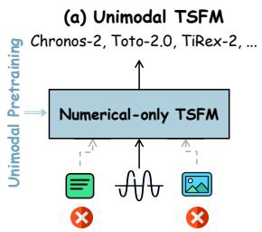

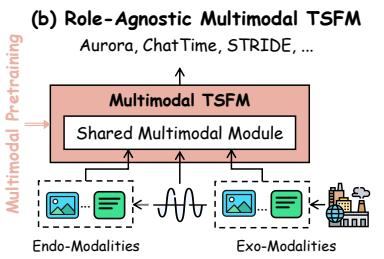

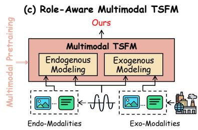  
Figure 1: Illustration of different modeling paradigms for TSFMs. (a) Unimodal TSFMs on numerical time series. (b) Role-agnostic multimodal TSFMs model endogenous (endo-) and exogenous (exo-) modalities through largely shared mechanisms. (c) Our role-aware multimodal TSFM separately models endo- and exo- modalities according to their distinct characteristics.

For endogenous modalities, it remains challenging to capture how endogenous modalities evolve along with the underlying temporal dynamics. Capturing the evolution of endogenous modalities helps characterize the underlying temporal dynamics from multiple perspectives. However, numerical forecasting losses only evaluate the final forecast values, providing no modalityspecific supervision for how endogenous information should evolve toward the future. Existing multimodal TSFMs (Wang et al., 2025a; Wu et al., 2026a) primarily use endogenous modalities to enrich historical context, without explicitly learning how these modalities evolve over time.

For exogenous modalities, limited multimodal pretraining data makes it challenging to generalize across domains and across various modality types and numbers. First, the same exomodality may exhibit different forecasting effects across domains. For example, the same convective weather condition captured by satellite imagery may indicate increasing precipitation in weather forecasting (Park et al., 2025), while the same condition can reduce road traffic flow in traffic forecasting (Jia et al., 2017). Second, forecasting scenarios may differ substantially in the types and numbers of available exo-modalities. Such cross-scenario variations pose substantial challenges to model generalization. This challenge is further exacerbated by the scarcity of exo-multimodal pre training data, making it difficult to learn transferable exogenous knowledge across diverse scenarios.

To address these challenges, we present QiYao-M, which adopts role-aware strategies to model endo- and exo-multimodality differently according to their distinct forecasting characteristics. For endogenous modalities, we introduce Endo-Multimodal Predictor and Endo-Multimodal Supervision to explicitly learn how endogenous modalities evolve along with the underlying time series during pretraining. Specifically, QiYao-M performs patch-wise fusion of endogenous modalities within the historical window. In the forecast window, instead of predicting only numerical values, the Endo-Multimodal Predictor explicitly predicts each endo-modality at the patch level. These predictions are further guided by Endo-Multimodal Supervision, which aligns the predicted endogenous representations with those derived from the ground-truth future sequence, thereby explicitly supervising their evolution from history to the future. For exogenous modalities, rather than relying on pretraining to acquire such generalization capabilities, we design an exo-multimodal retrieval mechanism that enables rapid downstream adaptation to unseen domains, unseen modality types, and various numbers of modalities without updating the TSFM parameters. To this end, we propose an Exo-Multimodal Retrieval Enhancer module and further design a dedicated training strategy, termed Endo-Modality Proxy Training, which trains the retrieval module using diverse endo-modalities as proxies during pretraining. Specifically, the Exo-Multimodal Retrieval Enhancer independently retrieves historical cases for each input exo-modality and uses their corresponding future responses as forecasting evidence, enabling adaptation to downstream tasks with various types and numbers of exo-modalities. The Endo-Modality Proxy Training strategy dynamically samples combinations of readily available endo-modalities to substitute for scarce exo-modalities during pretraining.

Our main contributions are summarized as follows:

• We introduce a role-aware multimodal TSFM, named QiYao-M, which treats endogenous and exogenous modalities with distinct strategies according to their different forecasting characteristics, thereby enabling more effective multimodal forecasting.

• For endogenous modalities, we introduce the Endo-Multimodal Predictor and Endo-Multimodal Supervision to explicitly model how endogenous modalities evolve along with the underlying time series.

• For exogenous modalities, we propose an Exo-Multimodal Retrieval Enhancer module supported by an Endo-Modality Proxy Training strategy, enabling the model to generalize across unseen domains and modality configurations without updating the TSFM parameters.

• Extensive experiments demonstrate that QiYao-M achieves strong performance across forecasting tasks with and without exogenous modalities.

## 2 RELATED WORK

## 2.1 MULTIMODAL TIME SERIES FORECASTING

Recent studies have increasingly explored multimodal information for time series forecasting. One line of work bridges temporal and language representations by adapting pretrained language models to time series, including GPT4TS (Zhou et al., 2023), TEST (Sun et al., 2024), Time-LLM (Jin et al., 2024), CALF (Liu et al., 2025a), LLM-Mixer (Kowsher et al., 2025), and CC-Time (Chen et al., 2025), through reprogramming, representation alignment, or cross-modal interaction. Another line explicitly incorporates auxiliary textual information into forecasting. CMIN (Luo et al., 2023) and Modality-aware Transformer (Emami Gohari et al., 2024) jointly model financial sequences with news or textual reports, while GPT4MTS (Jia et al., 2024), Time-MMD (Liu et al., 2024b), TaTS (Li et al., 2026b), and VoT (Wang et al., 2026) further explore the collection, alignment, fusion, or reasoning of contextual text with time series. Despite this progress, most existing approaches learn multimodal forecasting through task- or dataset-specific adaptation, limiting the transfer of multimodal knowledge to unseen domains.

## 2.2 TIME SERIES FOUNDATION MODELS

Time series foundation models (TSFMs) leverage large-scale pretraining to learn transferable temporal patterns and enable zero-shot generalization across domains. Representative models, including UniTS (Gao et al., 2024), TimesFM (Das et al., 2024), and ROSE (Wang et al., 2025c), explore diverse architectures and pretraining objectives for general-purpose forecasting. More recent models further broaden their capabilities: Toto 2.0 (Khwaja et al., 2026) investigates large-scale model scaling, Chronos-2 (Ansari et al., 2025) supports multivariate and covariate-informed forecasting, TiRex-2 (Podest et al., 2026) enables efficient recurrent and streaming forecasting, and ZEUS (Fu et al., 2026) extends pretraining toward multiple time series tasks. Recently, ChatTime (Wang et al., 2025a), STRIDE (Ahamed et al., 2026) and Aurora (Wu et al., 2026a) further introduce multimodal pretraining and modeling into TSFMs. However, these models primarily support exogenous textual information and struggle to generalize to scenarios with various types and numbers of exomodalities. More importantly, existing multimodal TSFMs typically adopt role-agnostic modeling, using shared mechanisms across heterogeneous modalities without explicitly modeling endogenous and exogenous modalities according to their distinct forecasting characteristics.

## 3 QIYAO-M

In this work, we develop a role-aware multimodal TSFM, named QiYao-M. As shown in Figure 2, we design dedicated multimodal modeling mechanisms and training strategies for endo- and exo modalities according to their distinct forecasting characteristics.

In terms of model architecture, after normalization and patching, the input time series is processed through three main modules: 1) Endo-Multimodal Fusion constructs patch-level endo-modalities and fuses them within each patch to capture fine-grained temporal dynamics; 2) After the Transformer backbone, we introduce an optional Exo-Multimodal Retrieval Enhancer, activated only when exo-modalities are available, which retrieves historical cases with similar exogenous conditions and uses their future responses as forecasting evidence; 3) Endo-Multimodal Predictor predicts both time series and endo-modalities for each future patch, providing explicit training signals for learning their temporal evolution from history to the future. The details are presented in Section 3.1.

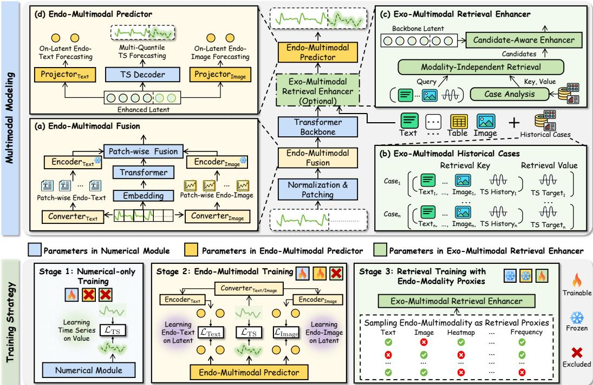  
Figure 2: The Multimodal Modeling and Training Strategy of QiYao-M.

We further design a three-stage training strategy to fully exploit the capabilities of each module and alleviate the scarcity of exo-multimodal data, as detailed in Section 3.2.

## 3.1 MULTIMODAL MODELING

Our method explicitly distinguishes endogenous and exogenous multimodal information and models them separately through dedicated modules to achieve role-aware multimodal modeling. Following the channel-independence strategy (Nie et al., 2023), we aim to predict the future H time steps at Q quantile levels, $\hat { \boldsymbol Y } \in \mathbb R ^ { H \times Q }$ , from the historical sequence $\pmb { X } \in \mathbb { R } ^ { L }$ of length L, optionally augmented with available exogenous multimodal information.

## 3.1.1 ENDO-MULTIMODAL FUSION

To better capture the temporal dynamics of the underlying system from multiple perspectives, we construct endogenous multimodal information for each patch. To balance efficiency and expressiveness, we use statistical-feature descriptions and line plots of multi-order differences as the endogenous modalities, with their construction details provided in Appendix A.2.

Temporal Encoding. Following existing TSFMs (Khwaja et al., 2026; Ansari et al., 2025), we zeropad the historical sequence to the forecast horizon, resulting in $\tilde { \pmb X } \in \mathbb { R } ^ { L + H }$ and augment it with a normalized time index $J \in \mathbb { R } ^ { L + H }$ and an observation mask $M \in \mathbb { R } ^ { L + H }$ . The resulting sequence is patchified and encoded as follows:

$$
\begin{array} { r } { H _ { 0 } = \mathrm { M L P } \Big ( \mathrm { P a t c h } \Big ( \big [ \tilde { X } ; J ; M \big ] \Big ) \Big ) \in \mathbb { R } ^ { N _ { L + F } \times d } , \quad H ^ { \mathrm { T S } } = \mathrm { T r a n s f o r m e r } ( H _ { 0 } ) \in \mathbb { R } ^ { N _ { L + F } \times d } , } \end{array}\tag{1}
$$

where $\tilde { \pmb X } \in \mathbb { R } ^ { L + H }$ is the zero-padded sequence, $\pmb { J } = \left[ - \frac { L } { C } , - \frac { L - 1 } { C } , \ldots , 0 , \ldots , \frac { H - 1 } { C } \right]$ denotes the normalized time index, and $M = [ \mathbf { 1 } ^ { L } , \mathbf { 0 } ^ { H } ]$ distinguishes observed and forecast positions. $N _ { L + F }$ denote the numbers of patches in the historical and forecast windows.

Endo-Multimodal Construction & Encoding. For each patch, we construct statistical feature descriptions and multi-order difference plots as the Endo-Text and Endo-Image, respectively. A frozen pretrained CLIP (Radford et al., 2021) encodes these modalities, and the resulting tokenlevel features are average-pooled to obtain patch-level representations $H ^ { \mathrm { { \mathrm { { T e x t } } } } } , H ^ { \mathrm { { I m a g e } } } \in \mathbb { R } ^ { \mathbf { \tilde { N } \times } d _ { \mathrm { { C l i p } } } }$

Patch-wise Fusion. To bridge the representation-space gap between the pretrained CLIP encoder and the temporal module, we employ multi-stage MLPs to fuse the time-series $H ^ { \mathrm { T S } }$ , text $H ^ { \mathrm { T e x t } }$ and image $\dot { \pmb { H } } ^ { \mathrm { I m a g e } }$ representations at the patch level, which is formulated as follows:

$$
H _ { 1 } = \mathrm { M L P } _ { 1 } \left( \mathrm { C o n c a t } \left( { \cal H } ^ { \mathrm { T S } } , { \cal H } ^ { \mathrm { T e x t } } \right) \right) , \quad H _ { 2 } = \mathrm { M L P } _ { 2 } \left( \mathrm { C o n c a t } \left( { \cal H } ^ { \mathrm { T S } } , { \cal H } ^ { \mathrm { I m a g e } } \right) \right) ,\tag{2}
$$

$$
\begin{array} { r } { \pmb { H } = \mathrm { M L P } _ { 3 } \left( \pmb { H } _ { 1 } + \pmb { H } _ { 2 } + \pmb { H } ^ { \mathrm { T S } } \right) , } \end{array}\tag{3}
$$

where $\mathrm { M L P } _ { 1 } : = \mathbb { R } ^ { d + d _ { \mathrm { C i p } } }  \mathbb { R } ^ { d } , \mathrm { M L P } _ { 2 } : = \mathbb { R } ^ { d + d _ { \mathrm { C i p } } }  \mathbb { R } ^ { d }$ , and $\mathrm { M L P _ { 3 } } : = \mathbb { R } ^ { d }  \mathbb { R } ^ { d }$ denote learnable multilayer perceptrons operating independently on each patch. $\pmb { H } _ { 1 }$ and $H _ { 2 }$ fuse the timeseries representation with the text and image representations, respectively, and are further aggregated by $\mathrm { M L P _ { 3 } }$ to obtain the final patch-level representation H.

## 3.1.2 EXO-MULTIMODAL RETRIEVAL ENHANCER

We introduce this module to accommodate various downstream exogenous modality types and numbers through retrieval from historical cases without updating TSFM parameters. The module is pretrained with an Endo-Modality Proxy Training strategy, which dynamically samples combinations of available endo-modalities as retrieval proxies.

To reduce the noise introduced by irrelevant modalities, we first design an Exo-Multimodal Cases Analysis module (Figure 3(a)), which analyzes the provided historical cases before retrieval and identifies the forecasting contribution of each modality.

To handle various modality types and numbers, we propose Modality-Independent Retrieval (Figure 3(b)), where each modality independently retrieves top-K historical cases as candidates, which are then merged and re-ranked by similarity scores and modality forecasting contributions. The selected candidates are incorporated into the forecasting representation through the Candidate-Aware Enhancer.

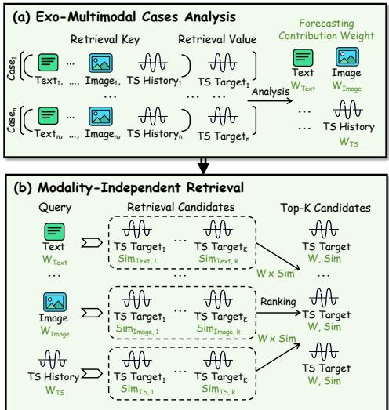  
Figure 3: Key steps of the Exo-Multimodal Retrieval Enhancer.

Exo-Multimodal Cases Analysis. Given $N _ { R }$ historical cases ${ R } = \{ { r } _ { i } \} _ { i = 1 } ^ { N _ { R } }$ , each case is represented as ${ \pmb r } _ { i } = ( { \pmb H } _ { i } ^ { \mathrm { h i s } } , \{ { \pmb E } _ { i } ^ { m } \} _ { m \in \mathcal { M } } , Y _ { i } ^ { \mathrm { f u t } } )$ , where $H _ { i } ^ { \mathrm { { h i s } } }$ and ${ \cal Y } _ { i } ^ { \mathrm { f u t } }$ denote its historical time-series representation and future sequence, respectively. M denotes the set of available exo-modalities with $M = | { \mathcal { M } } |$ |, and $\pmb { { E } } _ { i } ^ { m }$ denotes the representation of modality m $\in \mathcal { M }$

As illustrated in Figure 3(a), we estimate the Forecasting Contribution Weight $\begin{array} { r l } { W } & { { } = } \end{array}$ $( W ^ { 1 } , \dots , W ^ { M } ) \in \mathbb { R } ^ { M }$ by evaluating how effectively each modality retrieves historical cases whose future responses are informative for forecasting.

Specifically, for each reference case $\mathbf { \nabla } _ { \mathbf { r } _ { i } }$ and modality $m \in \mathcal { M }$ , we retrieve the top-K other reference cases according to the modality-specific similarity $s _ { i j } ^ { m } = s ( { E } _ { i } ^ { m } , { E } _ { j } ^ { m } )$ and aggregate their future sequences into a retrieval-based future estimate:

$$
\mathcal { N } _ { i } ^ { m } = \mathrm { T o p K } _ { j \neq i } ( s _ { i j } ^ { m } ) , \quad \hat { Y } _ { i } ^ { m } = \sum _ { j \in \mathcal { N } _ { i } ^ { m } } \mathrm { S o f t m a x } _ { j \in \mathcal { N } _ { i } ^ { m } } ( s _ { i j } ^ { m } ) Y _ { j } ^ { \mathrm { { f u t } } } ,\tag{4}
$$

$$
e _ { i } ^ { m } = \mathrm { M S E } \left( \hat { Y } _ { i } ^ { m } , { \bf Y } _ { i } ^ { \mathrm { f u t } } \right) , \quad w _ { i } ^ { m } = \mathrm { S o f t m a x } _ { m \in \mathcal { M } } ( - e _ { i } ^ { m } ) , \quad W ^ { m } = \frac { 1 } { N _ { R } } \sum _ { i = 1 } ^ { N _ { R } } w _ { i } ^ { m } .\tag{5}
$$

Thus, a larger $W ^ { m }$ indicates higher retrieval-based forecasting utility of modality m.

Modality-Independent Retrieval. As illustrated in Figure 3(b), given a query q, we perform retrieval independently for each available modality to accommodate various modality types and numbers. Each modality retrieves its top-K reference cases, which are then merged and re-ranked using the Forecasting Contribution Weight. Let $s _ { q j } ^ { m } = s ( { E } _ { q } ^ { m } , { E } _ { j } ^ { m } )$ denote the similarity between the query and reference case $\boldsymbol { r } _ { j }$ under modality m:

$$
\mathcal { C } _ { q } ^ { m } = \mathrm { T o p K } _ { j } ( s _ { q j } ^ { m } ) , \quad \mathcal { U } _ { q } = \bigcup _ { m \in \mathcal { M } } \mathcal { C } _ { q } ^ { m } , \quad S _ { q j } = \sum _ { m \in \mathcal { M } } W ^ { m } s _ { q j } ^ { m } , \quad \mathcal { C } _ { q } = \mathrm { T o p K } _ { j \in \mathcal { U } _ { q } } ( S _ { q j } ) ,\tag{6}
$$

where $\mathcal { C } _ { q } ^ { m }$ denotes the top- $\mathbf { \nabla } . K$ reference cases retrieved by modality $m , \mathcal { U } _ { q }$ denotes the union of all modality-specific candidate sets, $S _ { q j }$ denotes the contribution-weighted retrieval score of reference case $\boldsymbol { r } _ { j }$ for query $q ,$ and $\mathcal { C } _ { q }$ denotes the final top-K reference cases after re-ranking.

Candidate-Aware Enhancer. Given the final candidate set $\mathcal { C } _ { q } ,$ , we incorporate the retrieved information into the backbone representation $H ^ { B }$ through cross-attention. For each candidate $\boldsymbol { r } _ { j } \in \mathcal { C } _ { q } .$ we encode its representation $H _ { i } ^ { \mathrm { c a n d } }$ and construct a candidate identifier $I _ { q j }$ from its modality contribution $W ^ { m }$ and retrieval similarity $s _ { q j } ^ { m }$

$$
\begin{array} { r } { { \cal H } _ { j } ^ { \mathrm { c a n d } } = \mathrm { M L P } _ { \mathrm { c a n d } } ( { r _ { j } } ) , \quad { \cal I } _ { q j } = \mathrm { M L P } _ { I } \left( [ W ^ { m } , s _ { q j } ^ { m } ] \right) , \quad { \cal Q } = \mathrm { M L P } _ { { \cal Q } } ( { \cal H } ^ { B } ) , } \end{array}\tag{7}
$$

$$
\begin{array} { r } { K _ { j } , V _ { j } = \mathrm { M L P } _ { K V } \left( H _ { j } ^ { \mathrm { c a n d } } + I _ { q j } \right) , \quad H ^ { \mathrm { E n h } } = \mathrm { C r o s s A t t n } ( Q , K , V ) , } \end{array}\tag{8}
$$

where K and V are obtained by stacking the candidate-wise representations $K _ { j }$ and $V _ { j }$ over all $\boldsymbol { r } _ { j } \in \mathcal { C } _ { q } .$ , respectively. $H ^ { \mathrm { E n h } }$ is the enhanced representation of the input time series.

## 3.1.3 ENDO-MULTIMODAL PREDICTOR

To explicitly model the evolution of endogenous multimodal information from history to the future, we jointly predict the future time series together with its Endo-Text and Endo-Image modalities. Rather than directly generating text tokens or image pixels, we predict their representations for computational efficiency and to avoid unnecessary token- and pixel-level generation noise.

After optionally incorporating exogenous information through the Exo-Multimodal Retrieval Enhancer, we retain only the forecast-window representations $\breve { H } _ { \mathrm { p r e d } } ^ { \mathrm { E n h } } \in \mathbb { R } ^ { N _ { f } \times d }$ for efficient decoding.

Time Series Decoding. To support uncertainty quantification, we employ an MLP-based multiquantile prediction head to produce probabilistic forecasts at Q quantile levels:

$$
\begin{array} { r } { \hat { \pmb Y } = \mathrm { Q u a n t i l e H e a d } \left( \pmb { H } _ { \mathrm { p r e d } } ^ { \mathrm { E n h } } \right) \in \mathbb { R } ^ { H \times Q } . } \end{array}\tag{9}
$$

Endo-Multimodal Projector. We further project the forecast-window representations into the CLIP space to predict future Endo-Text representations $\pmb { F } ^ { \mathrm { T e x t } }$ and Endo-Image representations $\pmb { F } ^ { \mathrm { I m a g e } }$

$$
\begin{array} { r } { F ^ { \mathrm { T e x t } } = \mathrm { P r o j e c t } _ { \mathrm { T } } \left( H _ { \mathrm { p r e d } } ^ { \mathrm { E n h } } \right) \in \mathbb { R } ^ { N _ { f } \times d _ { \mathrm { C l i p } } } , F ^ { \mathrm { I m a g e } } = \mathrm { P r o j e c t } _ { \mathrm { I m a g e } } \left( H _ { \mathrm { p r e d } } ^ { \mathrm { E n h } } \right) \in \mathbb { R } ^ { N _ { f } \times d _ { \mathrm { C l i p } } } . } \end{array}\tag{10}
$$

Here, the projectors are MLPs that map the forecast representations to the CLIP space.

## 3.2 TRAINING STRATEGY

To progressively equip QiYao-M with numerical forecasting, endogenous multimodal modeling, and exogenous retrieval capabilities, we adopt a three-stage training strategy, as illustrated in Figure 2: 1) Numerical-only Training establishes the basic temporal modeling and forecasting capability; 2) Endo-Multimodal Training further learns endogenous multimodal representations and their evolution from history to the future; and 3) Retrieval Training with Endo-Modality Proxies trains the $E x o \mathrm { - }$ Multimodal Retrieval Enhancer using readily available endogenous modalities as retrieval proxies, avoiding reliance on large-scale exo-multimodal pretraining data.

## 3.2.1 NUMERICAL-ONLY TRAINING

In this stage, we train only the numerical forecasting pathway, including the temporal encoder, Transformer backbone, and multi-quantile prediction head, while all multimodal modules are excluded. Given the predicted quantile forecasts $\hat { \boldsymbol { Y } } \in \mathbb { R } ^ { H \times Q }$ and the ground-truth future sequence

$\pmb { Y } \in \mathbb { R } ^ { H }$ , we optimize these parameters using the Pinball loss (Ansari et al., 2025):

$$
\mathcal { L } _ { \mathrm { T S } } = \frac { 1 } { H Q } \sum _ { h = 1 } ^ { H } \sum _ { q = 1 } ^ { Q } \operatorname* { m a x } \left( \tau _ { q } \left( Y _ { h } - \hat { Y } _ { h , q } \right) , ( \tau _ { q } - 1 ) \left( Y _ { h } - \hat { Y } _ { h , q } \right) \right) ,\tag{11}
$$

where $\tau _ { q } \in ( 0 , 1 )$ denotes the q-th quantile level.

## 3.2.2 ENDO-MULTIMODAL TRAINING

In this stage, we optimize the numerical pathway and endogenous multimodal modules, while excluding the Exo-Multimodal Retrieval Enhancer and freezing the pretrained CLIP encoder.

To provide explicit supervision for endogenous evolution, we transform the ground-truth future sequence Y into Endo-Text and Endo-Image modalities using the same procedure as in Section $3 . 1 . 1 .$ , and encode them with the frozen CLIP encoder to obtain future representation targets $\pmb { T } ^ { \mathrm { T e x t } }$ $\pmb { T } ^ { \mathrm { l m a g e } } \in \mathbb { R } ^ { N _ { f } \times d _ { \mathrm { C l i ^ { \prime } p } } }$ . The representation-level supervision is defined as follows:

$$
\mathcal { L } _ { \mathrm { T e x t } } = \frac { \left. F ^ { \mathrm { T e x t } } - T ^ { \mathrm { T e x t } } \right. _ { F } ^ { 2 } } { N _ { f } d _ { \mathrm { C l i p } } } , \qquad \mathcal { L } _ { \mathrm { I m a g e } } = \frac { \left. F ^ { \mathrm { I m a g e } } - T ^ { \mathrm { I m a g e } } \right. _ { F } ^ { 2 } } { N _ { f } d _ { \mathrm { C l i p } } } ,\tag{12}
$$

where $\| \cdot \| _ { F }$ denotes the Frobenius norm. The overall objective is $\mathcal { L } _ { \mathrm { M u l t i } } = \mathcal { L } _ { \mathrm { T S } } + \lambda _ { \mathrm { T e x t } } \mathcal { L } _ { \mathrm { T e x t } } +$ $\lambda _ { \mathrm { I m a g e } } \mathcal { L } _ { \mathrm { I m a g e } }$ , where $\lambda _ { \mathrm { T e x t } }$ and $\lambda _ { \mathrm { I m a g e } }$ balance the two endogenous supervision terms.

## 3.2.3 RETRIEVAL TRAINING WITH ENDO-MODALITY PROXIES

In this stage, we optimize only the Exo-Multimodal Retrieval Enhancer and forecasting head. We introduce Endo-Modality Proxy Training, which dynamically samples various types and numbers of endo-modalities as retrieval proxies, avoiding the need for exo-multimodal pretraining data.

Let $\boldsymbol { \mathcal { M } } _ { \mathrm { e n d o } }$ denote the set of available endogenous modalities. For each training query q, we randomly sample a non-empty subset $\textstyle { \mathcal { S } } _ { q }$ and treat the selected modalities as retrieval proxies.

The sampled proxies are then processed by the same retrieval pipeline described in Section 3.1.2, to obtain the final enhanced latent $H _ { \mathrm { p r o x y } } ^ { \mathrm { E n h } }$ . The forecasting head then generates the prediction $\hat { Y } ^ { \mathrm { p r o x y } }$ and only the parameters of the retrieval enhancer and head are optimized using the forecasting loss:

$$
\mathcal { L } _ { \mathrm { p r o x y } } = \frac { 1 } { H Q } \sum _ { h = 1 } ^ { H } \sum _ { q = 1 } ^ { Q } \operatorname* { m a x } \left( \tau _ { q } \left( Y _ { h } - \hat { Y } _ { h , q } ^ { \mathrm { p r o x y } } \right) , ( \tau _ { q } - 1 ) \left( Y _ { h } - \hat { Y } _ { h , q } ^ { \mathrm { p r o x y } } \right) \right) .\tag{13}
$$

The endogenous proxies are not intended to mimic the semantic content of exogenous modalities; instead, they expose the retrieval enhancer to various modality types, numbers, and combinations while preserving the same retrieval-to-response learning process used at inference time.

## 4 EXPERIMENTS

We conduct extensive experiments to evaluate QiYao-M. Detailed experimental settings are provided in Appendix A, including the pretraining corpus (Appendix A.1), benchmarks (Appendix A.3), baselines (Appendix A.4), and other implementation details. Sections 4.1 and 4.2 evaluate forecasting performance on unimodal benchmarks (GIFT-Eval (Aksu et al., 2024) and TIME (Qiao et al., 2026)) and multimodal benchmarks with 2–4 modalities (Time-MMD (Liu et al., 2024b), MoTime (Zhou et al., 2025), and FinMultiTime (Xu et al., 2025)), respectively. Section 4.3 provides further model analyses.

As an overview, Figure 4 shows that QiYao-M achieves stateof-the-art MASE on unimodal benchmarks and MSE on multimodal benchmarks, demonstrating strong performance in scenarios both with and without exo-modalities.

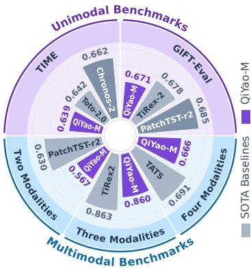  
Figure 4: Evaluation summary.

## 4.1 PERFORMANCE ON UNIMODAL BENCHMARKS

To evaluate QiYao-M with endo-modalities only, we conduct experiments on the unimodal benchmarks GIFT-Eval and TIME. As shown in Figure 5, QiYao-M achieves the best MASE and CRPS on both benchmarks. On GIFT-Eval, QiYao-M reduces MASE and CRPS by 1.0% and 1.3%, respectively, compared with the strongest baseline TiRex-2-Pretrained. It also achieves consistently strong MASE and CRPS rankings across datasets (see Appendix D.1), demonstrating robust generalization across diverse forecasting scenarios. On TIME, QiYao-M achieves a MASE of 0.639 and a CRPS of 0.537, outperforming Toto-2.0-2.5B at 0.642 and 0.539. These consistent gains demonstrate the effectiveness of endo-multimodal modeling across different forecasting benchmarks.

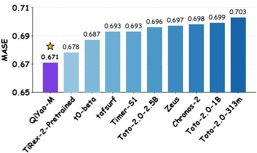  
(a) MASE result on GIFT-Eval

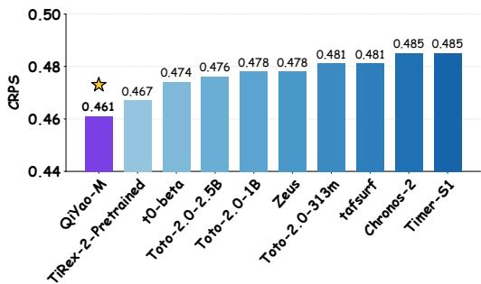  
(b) CRPS result on GIFT-Eva

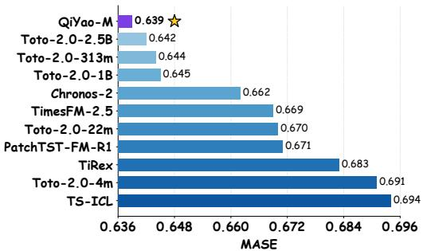  
(c) MASE result on TIME

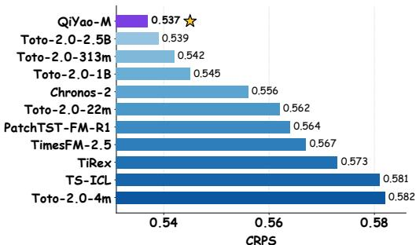  
(d) CRPS result on TIME  
Figure 5: Performance of QiYao-M on unimodal benchmarks.

## 4.2 PERFORMANCE ON MULTIMODAL BENCHMARKS

To evaluate QiYao-M with both endo- and exo-modalities, we conduct experiments on multimodal datasets with diverse modality combinations from Time-MMD, MoTime, and FinMultiTime. As shown in Table 1, incorporating exo-modalities reduces the average MSE of QiYao-M by 5.1%. Compared with baseline foundation and end-to-end models, QiYao-M ranks first on 14/18 metric and within the top two on 17/18 metrics. Compared with the strongest unimodal TSFM on each dataset, QiYao-M reduces the MSE by 4.3% on average. Moreover, while existing multimodal TSFMs primarily support exogenous textual information and struggle with various modality types and numbers, QiYao-M effectively handles diverse exo-modalities, achieving an average MSE reduction of 14.6%. These consistent improvements demonstrate the effectiveness of QiYao-M in utilizing exogenous information for forecasting across different domains.

## 4.3 MODEL ANALYSIS

Ablation Studies. To analyze the contribution of each component of QiYao-M, we conduct ablation studies on four benchmarks and report MASE or MSE results in Table 2. We have the following observations: 1) Comparing Rows 1 and 2, Endo-Multimodal Fusion (Endo. Fusion) consistently improves performance, showing the benefit of incorporating patch-level endo-multimodal information. 2) Comparing Rows 2 and 3, Endo-Multimodal Predictor and Endo-Multimodal Supervision (Endo. Sup.) further improve performance by explicitly supervising the evolution of endomodalities. 3) Comparing Rows 3 and 4, Exo-Multimodal Retrieval Enhancer (Retrieval Enhancer)

Table 1: Average forecasting results on multimodal datasets. The best and second-best results are highlighted in purple and blue, respectively. Full results are listed in Section D.2 of Appendix D.
<table><tr><td rowspan=1 colspan=1>Modal Type</td><td rowspan=1 colspan=5>TS + Text</td><td rowspan=1 colspan=2>TS + Text + Image</td><td rowspan=1 colspan=2>|TS + Text + Image + Table</td></tr><tr><td rowspan=1 colspan=1>Methods</td><td rowspan=1 colspan=1>AgricultureMSE MAE</td><td rowspan=1 colspan=1>ClimateMSE MAE</td><td rowspan=1 colspan=1>EnergyMSE MAE</td><td rowspan=1 colspan=1>HealthMSE MAE</td><td rowspan=1 colspan=1>Social GoodMSEMAE</td><td rowspan=1 colspan=1>TAOBAOMSE MAE</td><td rowspan=1 colspan=1>TianchiMSEMAE</td><td rowspan=1 colspan=1>HS300MSE MAE</td><td rowspan=1 colspan=1>SP500MSEMAE</td></tr><tr><td rowspan=1 colspan=10>Multimodal End-to-End Models</td></tr><tr><td rowspan=4 colspan=1>GPT4MTSCALFTime-VLM TATS 1</td><td rowspan=1 colspan=1>0.2250.298</td><td rowspan=2 colspan=1>1.1820.8891.2860.922</td><td rowspan=1 colspan=1>0.2620.380</td><td rowspan=1 colspan=1>1.4640.799</td><td rowspan=1 colspan=1>0.9200.450</td><td rowspan=1 colspan=1>0.5340.257</td><td rowspan=1 colspan=1>1.3200.147</td><td rowspan=1 colspan=1>0.7800.535</td><td rowspan=2 colspan=1>0.7670.6420.7430.617</td></tr><tr><td rowspan=1 colspan=1>0.2500.315</td><td rowspan=1 colspan=1>0.2440.365</td><td rowspan=1 colspan=1>1.4910.775</td><td rowspan=1 colspan=1>0.9060.401</td><td rowspan=1 colspan=1>0.512 0.250</td><td rowspan=1 colspan=1>1.3200.119</td><td rowspan=1 colspan=1>0.6740.502</td></tr><tr><td rowspan=2 colspan=1>0.2370.3020.2150.301</td><td rowspan=2 colspan=1>1.1950.8991.1800.887</td><td rowspan=2 colspan=1>0.2600.3740.2550.368</td><td rowspan=2 colspan=1>1.5650.8601.3560.767</td><td rowspan=2 colspan=1>0.8680.4440.9180.428</td><td rowspan=1 colspan=1>0.5280.271</td><td rowspan=2 colspan=1>1.3680.1371.3740.136</td><td rowspan=2 colspan=1>0.6620.4990.7170.509</td><td rowspan=2 colspan=1>0.7560.6180.6650.581</td></tr><tr><td rowspan=1 colspan=1>0.5250.263</td></tr><tr><td rowspan=1 colspan=10>Unimodal Foundation Models</td></tr><tr><td rowspan=1 colspan=1>Zeus</td><td rowspan=1 colspan=1>0.2030.295</td><td rowspan=1 colspan=1>0.8520.738</td><td rowspan=1 colspan=1>0.2390.337</td><td rowspan=1 colspan=1>1.5900.845</td><td rowspan=1 colspan=1>0.9990.434</td><td rowspan=1 colspan=1>0.425 0.172</td><td rowspan=1 colspan=1>1.3780.083</td><td rowspan=1 colspan=1>0.7550.524</td><td rowspan=1 colspan=1>0.8580.628</td></tr><tr><td rowspan=1 colspan=1>Chronos-2 amazon</td><td rowspan=1 colspan=1>0.2380.319</td><td rowspan=1 colspan=1>0.8590.730</td><td rowspan=1 colspan=1>0.2260.326</td><td rowspan=1 colspan=1>1.0540.663</td><td rowspan=1 colspan=1>0.9020.384</td><td rowspan=1 colspan=1>0.4450.184</td><td rowspan=1 colspan=1>1.4530.083</td><td rowspan=1 colspan=1>0.8100.501</td><td rowspan=1 colspan=1>0.7170.577</td></tr><tr><td rowspan=1 colspan=1>Toto-2</td><td rowspan=1 colspan=1>0.2360.311</td><td rowspan=1 colspan=1>0.8530.729</td><td rowspan=1 colspan=1>0.2310.337</td><td rowspan=1 colspan=1>1.1090.662</td><td rowspan=1 colspan=1>0.7990.309</td><td rowspan=1 colspan=1>0.4390.182</td><td rowspan=1 colspan=1>41.6180.185</td><td rowspan=1 colspan=1>0.8850.507</td><td rowspan=1 colspan=1>0.7030.571</td></tr><tr><td rowspan=2 colspan=1>PatchTST-r2IBMTiRex2 NXAI</td><td rowspan=1 colspan=1>0.235 0.354</td><td rowspan=1 colspan=1>0.8450.724</td><td rowspan=1 colspan=1>0.2450.353</td><td rowspan=1 colspan=1>0.9890.647</td><td rowspan=1 colspan=1>0.8340.366</td><td rowspan=1 colspan=1>0.5260.200</td><td rowspan=1 colspan=1>1.4110.091</td><td rowspan=1 colspan=1>0.8190.521</td><td rowspan=1 colspan=1>1.0800.634</td></tr><tr><td rowspan=1 colspan=1>0.2550.318</td><td rowspan=1 colspan=1>0.8470.724</td><td rowspan=1 colspan=1>0.2240.330</td><td rowspan=1 colspan=1>1.0970.638</td><td rowspan=1 colspan=1>0.7490.325</td><td rowspan=1 colspan=1>0.4270.171</td><td rowspan=1 colspan=1>1.2990.074</td><td rowspan=1 colspan=1>0.6740.499</td><td rowspan=1 colspan=1>0.7090.580</td></tr><tr><td rowspan=1 colspan=10>Multimodal Foundation Models</td></tr><tr><td rowspan=2 colspan=1>ChatTimeAurora</td><td rowspan=2 colspan=1>0.1960.2930.2720.348</td><td rowspan=2 colspan=1>1.1440.8560.8650.749</td><td rowspan=2 colspan=1>0.2580.3550.2550.370</td><td rowspan=2 colspan=1>2.2781.0011.553 0.850</td><td rowspan=2 colspan=1>1.3190.5410.8380.516</td><td rowspan=2 colspan=1>0.4790.2010.4420.210</td><td rowspan=2 colspan=1>1.6760.0871.4030.090</td><td rowspan=2 colspan=1>1.2080.6860.7360.524</td><td rowspan=1 colspan=1>5.9851.779</td></tr><tr><td rowspan=1 colspan=1>0.8620.649</td></tr><tr><td rowspan=2 colspan=1>Ours (w/o Exo.)|Ours (w Exo.)</td><td rowspan=1 colspan=1>0.1990.288</td><td rowspan=1 colspan=1>0.8280.725|</td><td rowspan=1 colspan=1>0.237 0.338</td><td rowspan=1 colspan=1>0.9150.612</td><td rowspan=1 colspan=1>0.7600.296</td><td rowspan=1 colspan=1>|0.417 0.171</td><td rowspan=1 colspan=1>1.4230.081</td><td rowspan=1 colspan=1>|0.690 0.496 |</td><td rowspan=1 colspan=1>0.6940.569</td></tr><tr><td rowspan=1 colspan=1>0.174 0.284</td><td rowspan=1 colspan=1>0.8270.723</td><td rowspan=1 colspan=1>0.211 0.325</td><td rowspan=1 colspan=1>0.9010.608</td><td rowspan=1 colspan=1>0.7220.293</td><td rowspan=1 colspan=1>0.4170.174</td><td rowspan=1 colspan=1>1.3020.076</td><td rowspan=1 colspan=1>0.6720.493</td><td rowspan=1 colspan=1>0.6600.561</td></tr></table>

Table 2: Ablation study of the key components.

brings further improvements by incorporating exogenous information from historical reference cases. 4) Comparing Rows 4 and 5, Exo-Multimodal Cases Analysis (Cases Analysis) further improves performance by estimating the Forecasting Contribution Weight of different exo-modalities. Overall, the complete QiYao-M achieves the best performance compared to all the variants across all benchmarks.

<table><tr><td></td><td colspan="2">Endo-Modeling</td><td colspan="2">Exo-Modeling</td><td colspan="2">Unimodal Bench.</td><td colspan="2">Multimodal Bench.</td></tr><tr><td>Row</td><td>Endo. Fusion</td><td>Endo. Sup.</td><td>Retrieval Enhancer</td><td>Case Analysis</td><td>GIFT-Eval</td><td>1 TIME</td><td>FinMulti Time</td><td>Time -MMD</td></tr><tr><td>1</td><td>x</td><td>x</td><td>x</td><td>x</td><td>0.686</td><td>0.646</td><td>0.741</td><td>0.605</td></tr><tr><td>2</td><td>√</td><td>x</td><td>x</td><td>x</td><td>0.678</td><td>0.644</td><td>0.728</td><td>0.591</td></tr><tr><td>3</td><td>√</td><td>√</td><td>x</td><td>x</td><td>0.671</td><td>0.639</td><td>0.712</td><td>0.588</td></tr><tr><td>4</td><td>√</td><td>√</td><td>√</td><td>x</td><td>一</td><td>一</td><td>0.672</td><td>0.573</td></tr><tr><td>5</td><td>√</td><td>√</td><td>√</td><td>√</td><td>一</td><td>一</td><td>0.666</td><td>0.567</td></tr></table>

Exo-Modeling does not affect unimodal benchmarks; thus, the corresponding entries are marked as “–”.

Modality Analysis. Figure 6 examines different modality combinations on SP500. We have the following observations: 1) Adding exogenous modalities generally improves forecasting performance, with consistent gains over TS-only retrieval across all tested combinations, suggesting robustness to various modality types and numbers. 2) The Forecasting Contribution Weights $( W _ { \mathrm { T S } } , \cdot \cdot \cdot , \mathbf { \breve { W } } _ { \mathrm { T a b l e } } )$ partially reflect the predictive utility of

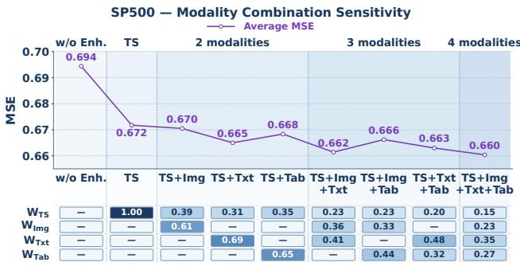  
Figure 6: Modality analysis.

different modalities: when individually added to TS-only retrieval, text, table, and image receive progressively lower weights, consistent with their decreasing MSE reductions.

More analyses on the sensitivity of the retrieval mechanism for exogenous multimodal information are provided in Appendix C.1.

## 5 CONCLUSION

In this work, we present QiYao-M, a role-aware multimodal TSFM that distinguishes endo- and exo modalities according to their forecasting roles. QiYao-M explicitly models endogenous temporal evolution and uses historical-case retrieval to accommodate diverse exo-modality types and numbers without updating TSFM parameters. Experiments on five benchmarks demonstrate strong crossdomain generalization in scenarios both with and without exo-modalities.

## REFERENCES

Md Atik Ahamed, Mihir Parmar, Palash Goyal, Chun-Liang Li, Qiang Cheng, Tomas Pfister, and Jinsung Yoon. Reasoning-aware training for time series forecasting, 2026.

Taha Aksu, Gerald Woo, Juncheng Liu, Xu Liu, Chenghao Liu, Silvio Savarese, Caiming Xiong, and Doyen Sahoo. GIFT-Eval: A benchmark for general time series forecasting model evaluation. In NeurIPS Workshop on Time Series in the Age ofLarge Models, 2024.

Abdul Fatir Ansari, Lorenzo Stella, Caner Turkmen, Xiyuan Zhang, Pedro Mercado, Huibin Shen, Oleksandr Shchur, Syama Syndar Rangapuram, Sebastian Pineda Arango, Shubham Kapoor, Jasper Zschiegner, Danielle C. Maddix, Michael W. Mahoney, Kari Torkkola, Andrew Gor don Wilson, Michael Bohlke-Schneider, and Yuyang Wang. Chronos: Learning the language of time series. Transactions on Machine Learning Research, 2024.

Abdul Fatir Ansari, Oleksandr Shchur, Jaris Küken, Andreas Auer, Boran Han, Pedro Mercado, Syama Sundar Rangapuram, Huibin Shen, Lorenzo Stella, Xiyuan Zhang, Mononito Goswami, Shubham Kapoor, Danielle C. Maddix, Pablo Guerron, Tony Hu, Junming Yin, Nick Erickson, Prateek Mutalik Desai, Hao Wang, Huzefa Rangwala, George Karypis, Yuyang Wang, and Michael Bohlke-Schneider. Chronos-2: From univariate to universal forecasting, 2025. URL https://arxiv.org/abs/2510.15821.

Peng Chen, Yihang Wang, Yang Shu, Yunyao Cheng, Kai Zhao, Zhongwen Rao, Lujia Pan, Bin Yang, and Chenjuan Guo. CC-Time: Cross-model and cross-modality time series forecasting, 2025.

Hanyin Cheng, Xingjian Wu, Xiangfei Qiu, Yang Shu, Bin Yang, and Chenjuan Guo. CCD: Capturing cross-correlations with deformable convolutional networks for multivariate time series forecasting. In KDD, 2026a.

Hanyin Cheng, Ruitong Zhang, Yuning Lu, Peng Chen, Meng Wang, Yang Shu, Bin Yang, and Chenjuan Guo. STAR: Boosting time series foundation models for anomaly detection through state-aware adapter. In NeurIPS, 2026b.

Hanyin Cheng, Jingrong Zhou, Yang Shu, and Chenjuan Guo. KITE: Knowledge-guided probabilistic modeling for time series forecasting with exogenous variables. In ICML, 2026c.

Abhimanyu Das, Weihao Kong, Rajat Sen, and Yichen Zhou. A decoder-only foundation model for time-series forecasting. In Forty-first International Conference on Machine Learning, 2024.

Kuiye Ding, Fanda Fan, Chunyi Hou, Zheya Wang, Lei Wang, Zhengxin Yang, and Jianfeng Zhan. Timemosaic: Temporal heterogeneity guided time series forecasting via adaptive granularity patch and segment-wise decoding. In Proceedings of the AAAI Conference on Artificial Intelligence, volume 40, pp. 20790–20798, 2026.

Hajar Emami Gohari, Xuan-Hong Dang, Syed Yousaf Shah, and Petros Zerfos. Modality-aware transformer for financial time series forecasting. In Proceedings of the 5th ACM International Conference on AI in Finance, pp. 677–685, 2024.

Yisong Fu, Zezhi Shao, Chengqing Yu, Yujie Li, Yongjun Xu, Xueqi Cheng, and Fei Wang. Zeus: Towards tuning-free foundation model for time series analysis. In Forty-third International Conference on Machine Learning, 2026.

Shanghua Gao, Teddy Koker, Owen Queen, Tom Hartvigsen, Theodoros Tsiligkaridis, and Marinka Zitnik. Units: A unified multi-task time series model. Advances in Neural Information Processing Systems, 37:140589–140631, 2024.

Chunyi Hou, Yongchuan Yu, Jinquan Ji, Siyao Zhang, Xumeng Shen, and Jianzhuo Yan. Graph patchformer: Patch interaction transformer with adaptive graph learning for multivariate time series forecasting. Neural Networks, pp. 108140, 2026.

Furong Jia, Kevin Wang, Yixiang Zheng, Defu Cao, and Yan Liu. GPT4MTS: Prompt-based large language model for multimodal time-series forecasting. In AAAI, volume 38, pp. 23343–23351, 2024.

Yuhan Jia, Jianping Wu, and Ming Xu. Traffic flow prediction with rainfall impact using a deep learning method. Journal of advanced transportation, 2017(1):6575947, 2017.

Ming Jin, Shiyu Wang, Lintao Ma, Zhixuan Chu, James Y Zhang, Xiaoming Shi, Pin-Yu Chen, Yuxuan Liang, Yuan-Fang Li, Shirui Pan, and Qingsong Wen. Time-LLM: Time series forecasting by reprogramming large language models. In International Conference on Learning Representations (ICLR), 2024.

Emaad Khwaja, Chris Lettieri, Gerald Woo, Eden Belouadah, Marc Cenac, Guillaume Jarry, Enguerrand Paquin, Xunyi Zhao, Viktoriya Zhukov, Othmane Abou-Amal, Chenghao Liu, Ameet Talwalkar, and David Asker. Toto 2.0: Time series forecasting enters the scaling era, 2026.

Md Kowsher, Md. Shohanur Islam Sobuj, Nusrat Jahan Prottasha, E. Alejandro Alanis, Ozlem Garibay, and Niloofar Yousefi. LLM-Mixer: Multiscale mixing in LLMs for time series fore casting. In Proceedings ofthe 4th Table Representation Learning Workshop, July 2025.

Zhengyu Li, Xiangfei Qiu, Yuhan Zhu, Xingjian Wu, Jilin Hu, Chenjuan Guo, and Bin Yang. GCGNet: Graph-consistent generative network for time series forecasting with exogenous variables. In ICLR, 2026a.

Zihao Li, Xiao Lin, Zhining Liu, Jiaru Zou, Ziwei Wu, Lecheng Zheng, Dongqi Fu, Yada Zhu, Hendrik Hamann, Hanghang Tong, and Jingrui He. Language in the flow of time: Time-seriespaired texts weaved into a unified temporal narrative. In International Conference on Learning Representations (ICLR), 2026b.

Haoxin Liu, Shangqing Xu, Zhiyuan Zhao, Lingkai Kong, Harshavardhan Kamarthi, Aditya B. Sasanur, Megha Sharma, Jiaming Cui, Qingsong Wen, Chao Zhang, and B. Aditya Prakash. Time-MMD: Multi-domain multimodal dataset for time series analysis. In The Thirty-eight Conference on Neural Information Processing Systems Datasets and Benchmarks Track, 2024a.

Haoxin Liu, Shangqing Xu, Zhiyuan Zhao, Lingkai Kong, Harshavardhan Prabhakar Kamarthi, Aditya Sasanur, Megha Sharma, Jiaming Cui, Qingsong Wen, Chao Zhang, et al. Time-mmd: Multi-domain multimodal dataset for time series analysis. In Advances in Neural Information Processing Systems (NeurIPS), 2024b.

Peiyuan Liu, Hang Guo, Tao Dai, Naiqi Li, Jigang Bao, Xudong Ren, Yong Jiang, and Shu-Tao Xia. CALF: Aligning llms for time series forecasting via cross-modal fine-tuning. In AAAI, volume 39, pp. 18915–18923, 2025a.

Xvyuan Liu, Xiangfei Qiu, Hanyin Cheng, Xingjian Wu, Chenjuan Guo, Bin Yang, and Jilin Hu. ASTGI: Adaptive spatio-temporal graph interactions for irregular multivariate time series forecasting. In ICLR, 2026a.

Xvyuan Liu, Xiangfei Qiu, Xingjian Wu, Zhengyu Li, Chenjuan Guo, Jilin Hu, and Bin Yang. Rethinking irregular time series forecasting: A simple yet effective baseline. In AAAI, 2026b.

Yong Liu, Guo Qin, Zhiyuan Shi, Zhi Chen, Caiyin Yang, Xiangdong Huang, Jianmin Wang, and Mingsheng Long. Sundial: A family of highly capable time series foundation models. arXiv preprint arXiv:2502.00816, 2025b.

Junkai Lu, Peng Chen, Chenjuan Guo, Yang Shu, Meng Wang, and Bin Yang. Towards nonstationary time series forecasting with temporal stabilization and frequency differencing. In Proceedings ofthe AAAI Conference on Artificial Intelligence, 2026a.

Junkai Lu, Peng Chen, Xingjian Wu, Yang Shu, Chenjuan Guo, Christian S. Jensen, and Bin Yang. PATRA: Pattern-aware alignment and balanced reasoning for time series question answering. In Proceedings of the International Conference on Machine Learning, 2026b.

Di Luo, Weiheng Liao, Shuqi Li, Xin Cheng, and Rui Yan. Causality-guided multi-memory interaction network for multivariate stock price movement prediction. In ACL, pp. 12164–12176, 2023.

Yuqi Nie, Nam H. Nguyen, Phanwadee Sinthong, and Jayant Kalagnanam. A time series is worth 64 words: Long-term forecasting with transformers. In ICLR, 2023.

Young-Jae Park, Doyi Kim, Minseok Seo, Hae-Gon Jeon, and Yeji Choi. Data-driven precipitation nowcasting using satellite imagery. In Proceedings of the AAAI Conference on Artificial Intelli gence, 2025. doi: 10.1609/aaai.v39i27.35049.

Patrick Podest, Marco Pichler, Elias Bürger, Levente Zólyomi, Bernhard Voggenberger, Wilhelm Berghammer, Daniel Klotz, Sebastian Böck, Günter Klambauer, and Sepp Hochreiter. Tirex-2: Generalizing tirex to multivariate data and streaming, 2026.

Zhongzheng Qiao, Sheng Pan, Anni Wang, Viktoriya Zhukova, Yong Liu, Xudong Jiang, Qingsong Wen, Mingsheng Long, Ming Jin, and Chenghao Liu. It’s TIME: Towards the next generation of time series forecasting benchmarks. In ICML, 2026.

Xiangfei Qiu, Jilin Hu, Lekui Zhou, Xingjian Wu, Junyang Du, Buang Zhang, Chenjuan Guo, Aoying Zhou, Christian S. Jensen, Zhenli Sheng, and Bin Yang. TFB: Towards comprehensive and fair benchmarking of time series forecasting methods. In Proc. VLDB Endow., pp. 2363–2377, 2024.

Xiangfei Qiu, Zhe Li, Wanghui Qiu, Shiyan Hu, Lekui Zhou, Xingjian Wu, Zhengyu Li, Chenjuan Guo, Aoying Zhou, Zhenli Sheng, Jilin Hu, Christian S. Jensen, and Bin Yang. TAB: Unified benchmarking of time series anomaly detection methods. In Proc. VLDB Endow., pp. 2775–2789, 2025a.

Xiangfei Qiu, Xingjian Wu, Yan Lin, Chenjuan Guo, Jilin Hu, and Bin Yang. DUET: Dual clustering enhanced multivariate time series forecasting. In SIGKDD, pp. 1185–1196, 2025b.

Xiangfei Qiu, Kangjia Yan, Xvyuan Liu, Xingjian Wu, and Jilin Hu. Bridging time and frequency: A joint modeling framework for irregular multivariate time series forecasting. In ICML, 2026a.

Xiangfei Qiu, Yuhan Zhu, Zhengyu Li, Xingjian Wu, Bin Yang, and Jilin Hu. DAG: A dual correlation network for time series forecasting with exogenous variables. In ICML, 2026b.

Alec Radford, Jong Wook Kim, Chris Hallacy, Aditya Ramesh, Gabriel Goh, Sandhini Agarwal, Girish Sastry, Amanda Askell, Pamela Mishkin, Jack Clark, et al. Learning transferable visual models from natural language supervision. In International conference on machine learning, pp. 8748–8763, 2021.

Kathy Razmadze and Yoli Shavit. A universal gating framework for multi-expert fusion in heterogeneous multimodal time series forecasting. Scientific Reports, 2026. doi: 10.1038/ s41598-026-54540-x.

Omer Berat Sezer, Mehmet Ugur Gudelek, and Ahmet Murat Özbayoglu. Financial time series forecasting with deep learning : A systematic literature review: 2005-2019. Appl. Soft Comput., 90:106181, 2020.

Chenxi Sun, Hongyan Li, Yaliang Li, and Shenda Hong. TEST: text prototype aligned embedding to activate llm’s ability for time series. In International Conference on Learning Representations (ICLR), 2024.

Chengsen Wang, Qi Qi, Jingyu Wang, Haifeng Sun, Zirui Zhuang, Jinming Wu, Lei Zhang, and Jianxin Liao. Chattime: A unified multimodal time series foundation model bridging numerica and textual data. In Associationfor the Advancement ofArtificial Intelligence (AAAI), 2025a.

Siyuan Wang, Peng Chen, Yihang Wang, Wanghui Qiu, Chenjuan Guo, Bin Yang, and Yang Shu. Unlocking the value of text: Event-driven reasoning and multi-level alignment for time series forecasting. In ICLR, 2026.

Yihang Wang, Yuying Qiu, Peng Chen, Yang Shu, Zhongwen Rao, Lujia Pan, Bin Yang, and Chenjuan Guo. Lightgts: A lightweight general time series forecasting model. In ICML, 2025b.

Yihang Wang, Yuying Qiu, Peng Chen, Kai Zhao, Yang Shu, Zhongwen Rao, Lujia Pan, Bin Yang, and Chenjuan Guo. Towards a general time series forecasting model with unified representation and adaptive transfer. In ICML, 2025c.

Yunshi Wen, Wesley M. Gifford, Chandra Reddy, Lam M. Nguyen, Jayant Kalagnanam, and Anak Agung Julius. Revisiting the generic transformer: Deconstructing a strong baseline for time series foundation models, 2026. URL https://arxiv.org/abs/2602.06909.

Xingjian Wu, Xiangfei Qiu, Hanyin Cheng, Zhengyu Li, Jilin Hu, Chenjuan Guo, and Bin Yang. Enhancing time series forecasting through selective representation spaces: A patch perspective. In NeurIPS, 2025a.

Xingjian Wu, Xiangfei Qiu, Hongfan Gao, Jilin Hu, Bin Yang, and Chenjuan Guo. K2VAE: A koopman-kalman enhanced variational autoencoder for probabilistic time series forecasting. In ICML, 2025b.

Xingjian Wu, Xiangfei Qiu, Zhengyu Li, Yihang Wang, Jilin Hu, Chenjuan Guo, Hui Xiong, and Bin Yang. CATCH: Channel-aware multivariate time series anomaly detection via frequency patching. In ICLR, 2025c.

Xingjian Wu, Jianxin Jin, Wanghui Qiu, Peng Chen, Yang Shu, Bin Yang, and Chenjuan Guo. Aurora: Towards universal generative multimodal time series forecasting. In ICLR, 2026a.

Xingjian Wu, Junkai Lu, Zhengyu Li, Xiangfei Qiu, Jilin Hu, Chenjuan Guo, Christian S Jensen, and Bin Yang. TimeART: Towards agentic time series reasoning via tool-augmentation. arXiv preprint arXiv:2601.13653, 2026b.

Wenyan Xu, Dawei Xiang, Yue Liu, Xiyu Wang, Yanxiang Ma, Liang Zhang, Shu Hu, Chang Xu, and Jiaheng Zhang. FinMultiTime: A four-modal bilingual dataset for financial time-series analysis, 2025.

Siru Zhong, Weilin Ruan, Ming Jin, Huan Li, Qingsong Wen, and Yuxuan Liang. Time-VLM: Exploring multimodal vision-language models for augmented time series forecasting. In International Conference on Machine Learning (ICML), 2025.

Tian Zhou, Peisong Niu, Xue Wang, Liang Sun, and Rong Jin. One Fits All: Power general time series analysis by pretrained LM. In NeurIPS, 2023.

Xin Zhou, Weiqing Wang, Francisco J. Baldán, Wray Buntine, and Christoph Bergmeir. MoTime: A dataset suite for multimodal time series forecasting, 2025.

Yuhan Zhu, Jilin Hu, Xinying Cai, Yingshan Li, Li Ma, Xiangfei Qiu, Linsen Li, Kai Zhang, Yao Fu, Weihao Jiang, and Bin Yang. WPBench: A comprehensive benchmark for wind power forecasting, 2026. URL https://arxiv.org/abs/2609.24444.

## A EXPERIMENTAL DETAILS

## A.1 PRETRAINING CORPUS

We construct the pretraining corpus of QiYao-M from two complementary sources: a large-scale unimodal time series corpus and a multimodal corpus tailored to the three-stage training strategy. The unimodal corpus consists of GIFT-Eval Pretrain, the GIFT-Eval training set (Aksu et al., 2024), and the Chronos corpus, providing broad temporal coverage across heterogeneous domains. Building on this corpus, we further construct 5 million patch-level endogenous multimodal samples and 10 million sequence-level samples for proxy exogenous training, supporting the multimodal objectives at different temporal granularities.

Unimodal Pre-training Data. The unimodal time series corpus combines three large-scale public data sources:

• GIFT-Eval Pretrain. We include the pre-training collection released with GIFT-Eval, which contains a diverse set of time series collected from multiple application domains and sampling frequencies. This corpus serves as one of the primary sources of real-world temporal patterns during pre-training.

• GIFT-Eval Training Set. In addition to the dedicated pre-training split, we incorporate the training portions of the datasets included in GIFT-Eval (Aksu et al., 2024). Only training data are used for pre-training, while the corresponding evaluation portions are kept separated according to the benchmark protocol to avoid test-set leakage.

• Chronos Corpus. We further use the large-scale time-series corpus released for Chronos (Ansari et al., 2024), which aggregates time series from heterogeneous real-world sources. The corresponding evaluation portions are kept separated according to the benchmark protocol to avoid test-set leakage.

Multimodal Pre-training Data. Building on the unimodal time-series corpus, we construct additional multimodal training samples. In total, the multimodal corpus consists of approximately 5 million patch-level endogenous multimodal samples and 10 million sequence-level multimodal samples used as proxies for exogenous multimodal observations.

• Patch-level Endogenous Multimodal Data (∼5M samples). We construct multimodal observations at the local patch level, where auxiliary textual and visual information is derived from and aligned with localized temporal patterns within a time series. These samples are designed to establish fine-grained correspondence between numerical dynamics and their multimodal representations. Because the auxiliary modalities describe information intrinsic to the observed time series itself, we refer to them as endogenous multimodal data. This corpus is primarily used to strengthen cross-modal representation learning and to encourage the model to recover temporal structures from complementary representations of the same underlying signal.

• Sequence-level Multimodal Data (∼10M samples). We additionally construct a substantially larger collection of multimodal samples at the sequence level. Instead of describing individual local patches, the associated textual and visual information is paired with the time series at a coarser sequence-level granularity, providing contextual signals that resemble the external information available in downstream multimodal forecasting scenarios. We therefore use these samples as proxies for exogenous multimodal training. This design exposes the model to heterogeneous context during pre-training and encourages it to integrate temporal observations with complementary information beyond local numerical patterns.

## A.2 MULTIMODAL DATASET GENERATION METHOD

We construct endogenous text and image modalities directly from numerical observations using deterministic templates. The resulting modalities therefore provide complementary views of the same numerical evidence. We generate representations at two granularities: (i) patch-level modalities, which describe fine-grained local dynamics in each patch, and (ii) sequence-level modalities, which summarize the global evolution of a complete input window.

Mask-aware preprocessing. Let a numerical input be $\mathbf { x } ~ = ~ ( x _ { 1 } , \dots , x _ { L } )$ , with an observation mask mobs and a padding mask mpad. We define

$$
v _ { t } = m _ { t } ^ { \mathrm { o b s } } ( 1 - m _ { t } ^ { \mathrm { p a d } } ) ,\tag{14}
$$

where $v _ { t } = 1$ indicates an actually observed value. Left padding and naturally missing observations are recorded separately: padding describes positions outside the available context, whereas missingness describes unobserved positions inside the context. Neither is interpreted as an observed zero. For a patch size $P = 3 2$ , the input is divided chronologically into $\boldsymbol { K } \dot { } = \left\lceil \boldsymbol { L } / P \right\rceil$ non-overlapping patches. If the first patch is incomplete, it is left-padded, and its padded positions remain masked throughout text and image generation. During training, historical modalities are generated from historical values and used as model inputs. Modalities generated from ground-truth future patches may only be used as auxiliary prediction targets for the Endo-Multimodal Predictor. At inference time, only modalities derived from the available history are constructed; future values or future-generated modalities are never supplied to the model.

## A.2.1 PATCH-LEVEL ENDOGENOUS MODALITIES

Patch-level text generation. For patch $k ,$ let $\mathcal { V } _ { k } = \{ r : v _ { k , r } = 1 \}$ denote its valid positions. We compute a fixed set of mask-aware statistics:

$$
\rho _ { k } = \frac { | \mathcal { V } _ { k } | } { P } ,
$$

$$
\left( \mathrm { v a l i d \mathrm { - } d a t a c o v e r a g e } \right)\tag{15}
$$

$$
\Delta _ { k } = x _ { k , r _ { \mathrm { l a s t } } } - x _ { k , r _ { \mathrm { f i r s t } } } ,
$$

$$
( \mathrm { n e t } \mathrm { c h a n g e } )\tag{16}
$$

$$
\beta _ { k } = \frac { \sum _ { r \in \mathcal { V } _ { k } } ( r - \bar { r } ) ( x _ { k , r } - \bar { x } _ { k } ) } { \sum _ { r \in \mathcal { V } _ { k } } ( r - \bar { r } ) ^ { 2 } } ,
$$

$$
( \mathrm { l e a s t - s q u a r e s  t r e n d } )\tag{17}
$$

$$
R _ { k } = Q _ { 0 . 9 5 } ( \mathbf { x } _ { k } ) - Q _ { 0 . 0 5 } ( \mathbf { x } _ { k } ) ,
$$

$$
( { \mathrm { r o b u s t r a n g e } } )\tag{18}
$$

$$
V _ { k } = \mathrm { m e d i a n } _ { r } \left| { d _ { k , r } ^ { ( 1 ) } - \mathrm { m e d i a n } ( { \bf d } _ { k } ^ { ( 1 ) } ) } \right| ,
$$

$$
( \mathrm { l o c a l v o l a t i l i t y } )\tag{19}
$$

where quantiles are computed only over valid values.

The normalized slope, robust range, volatility, lag-one dependence, number of turning points, and largest standardized jump are mapped to predefined linguistic bins. These bins determine the fields [trend], [shape], [variation], [volatility], [event], and [regime]. The coverage and the two masks determine [padding], [missingness], and [coverage]. All thresholds are fixed before downstream evaluation; when data-dependent thresholds are needed, they are estimated from the training split only.

The categorical fields are inserted into the following deterministic template:

“This patch contains [padding] and [missingness], leaving [coverage] valid data coverage. Within the valid observations, the series shows [trend] and follows [shape]. Its local variation is [variation], with [volatility] volatility. The patch contains [event]. Overall, its local behavior is characterized as [regime].”

This constrained vocabulary makes every statement traceable to a numerical statistic and prevents unsupported domain-specific interpretations.

Figure 7 shows the intended presentation of a patch-level example. The middle line explicitly displays the numerical patch from which the text is generated.

Patch-level three-channel image generation. First- and second-order differences are defined as

$$
d _ { k , r } ^ { ( 1 ) } = x _ { k , r } - x _ { k , r - 1 } ,\tag{20}
$$

$$
d _ { k , r } ^ { ( 2 ) } = d _ { k , r } ^ { ( 1 ) } - d _ { k , r - 1 } ^ { ( 1 ) } = x _ { k , r } - 2 x _ { k , r - 1 } + x _ { k , r - 2 } .\tag{21}
$$

The corresponding difference is valid only when all values required by the operation are valid. Hence, differencing never crosses a missing or padded position. Each numerical patch is also rendered as a 224 × 224 RGB image. The three channels encode the value, velocity, and accelerationlike views of the same patch:

$$
\mathcal { T } _ { k } = \mathrm { S t a c k } _ { \mathrm { R G B } } \left( \mathcal { R } ( \widetilde { \mathbf { x } } _ { k } ) , \mathcal { R } ( \widetilde { \mathbf { d } } _ { k } ^ { ( 1 ) } ) , \mathcal { R } ( \widetilde { \mathbf { d } } _ { k } ^ { ( 2 ) } ) \right) ,\tag{22}
$$

Template: This patch contains [padding] and [missingness], leaving [coverage] valid   
data coverage. Within the valid observations, the series shows [trend] and follows [shape]. Its   
local variation is [variation], with [volatility] volatility. The patch contains [event].   
Overall, its local behavior is characterized as [regime].   
Example Series: [76, 41, 27, 26, 15, 6, 6, 4, 11, 8, 11, 13, 4, 8, 12, 8,   
10, 16, 26, 17, 18, 24, 23, 21, 22, 27, 29, 17, 25, 21, 23, 23]. This is   
the first 32-point patch of a real Taobao-Fashion series. It contains no padding or missing obser  
vations.   
Generated Text: This patch contains no padding and no missing observations, leaving full valid  
data coverage. The series starts at 76, drops rapidly to 4 within the first eight positions, and then   
fluctuates at a lower level before partially recovering. Its local variation and volatility are high. The   
patch contains a prominent early decline and several subsequent turning points. Overall, its local   
behavior is characterized as an irregular downward regime.  
Figure 7: Deterministic patch-level text construction for a real 32-point patch from Taobao-Fashion item 948150. The template, numerical patch, and generated description are shown together to make the supervision auditable.

where $\mathcal { R } ( \cdot )$ denotes mask-aware curve rasterization. The original value curve is placed in the red channel, the first-order difference curve in the green channel, and the second-order difference curve in the blue channel. Their roles are complementary:

• Value channel (red): preserves the local level, direction, turning points, and overall shape of the observed patch.

• First-difference channel (green): represents local increments $d _ { k , r } ^ { ( 1 ) }$ and exposes the direction and magnitude of short-term changes. A nearly horizontal trace indicates approximately constant local increments.

• Second-difference channel (blue): represents changes in the first differences. It highlights curvature, acceleration, deceleration, and abrupt changes that may be visually subtle in the raw-value curve.

To reduce sensitivity to isolated outliers, the value channel is robustly normalized using valid patch quantiles:

$$
\widetilde { x } _ { k , r } = \mathrm { c l i p } \left( { \frac { x _ { k , r } - Q _ { 0 . 5 0 } ( \mathbf { x } _ { k } ) } { Q _ { 0 . 9 5 } ( \mathbf { x } _ { k } ) - Q _ { 0 . 0 5 } ( \mathbf { x } _ { k } ) + \epsilon } } , - 1 , 1 \right) .\tag{23}
$$

The two difference channels share a common robust scale

$$
s _ { \Delta , k } = Q _ { 0 . 9 5 } \left( \left\{ \lvert d _ { k , r } ^ { ( 1 ) } \rvert \right\} \cup \left\{ \lvert d _ { k , r } ^ { ( 2 ) } \rvert \right\} \right) + \epsilon ,\tag{24}
$$

and are normalized by $\widetilde { d } _ { k , r } ^ { ( j ) } = \mathrm { c l i p } ( d _ { k , r } ^ { ( j ) } / s _ { \Delta , k } , - 1 , 1 )$ . Sharing the scale preserves the relative magnitudes of the first- and second-order changes. Horizontal coordinates are determined by the original patch positions, and normalized amplitudes determine vertical coordinates. Curves are drawn only between consecutive valid positions. Missing or padded positions remain white and interrupt the curve, rather than being filled or connected across.

## A.2.2 SEQUENCE-LEVEL ENDOGENOUS MODALITIES

Patch-level modalities emphasize local behavior but do not explicitly capture how local regimes evolve over a long context. We therefore additionally construct sequence-level views from the complete input window. These views use the same masks, robust statistics, and deterministic vocabulary as their patch-level counterparts. Unlike patch-level modalities, sequence-level modalities are not directly fused into the numerical backbone as endogenous inputs. Instead, they serve as retrieval proxies during the training of the exo-multimodal retrieval enhancer. Specifically, the generated sequence-level text and images simulate the heterogeneous exogenous information associated with a historical time series, allowing the retrieval module to learn how different exogenous modalities

Example Series: [76, 41, 27, 26, 15, 6, 6, 4, 11, 8, 11, 13, 4, 8, 12, 8, 10, 16, 26, 17, 18, 24, 23, 21, 22, 27, 29, 17, 25, 21, 23, 23]. The red channel encodes the normalized value curve, the green channel encodes $d _ { t } ^ { ( 1 ) }$ , and the blue channel encodes ${ d } _ { t } ^ { ( 2 ) }$

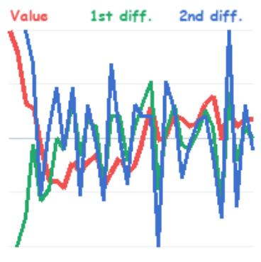  
Figure 8: Actual 224 × 224 patch-level RGB image generated from the listed real 32-point Taobao-Fashion patch. The three colored curves encode the value, first-difference, and second-difference views, respectively.

should identify and aggregate relevant reference cases. This proxy-based training provides scalable supervision for the exogenous module without requiring every pretraining sequence to be paired with naturally occurring exogenous multimodal data.

Sequence-level text generation. For a complete input window, we compute global coverage, robust range, global slope, volatility, dominant periodicity, and salient jumps. We also arrange the patch-level regimes chronologically and compare adjacent patches. A regime transition is recorded when the trend category, variation category, or turning behavior changes between neighboring valid patches. These statistics populate the sequence template:

“This sequence contains [number] patches with [coverage] valid-data coverage. Across the observed history, it shows [global trend] with [global variation] variation and [global volatility] volatility. The local dynamics progress from [early regime] to [late regime], with [transition] near [location]. The sequence contains [global event] and exhibits [periodicity]. Overall, its temporal evolution is characterized as [global pattern].”

Sequence-level line image. For the complete sequence, we draw the valid value, first-difference, and second-difference curves in chronological order. The construction follows the same definitions as the patch-level RGB image, but uses the full historical window and a sequence-level robust scale. This view makes long-term trend, regime changes, repeated oscillations, and change points visible in a single image. Missing intervals remain blank, and curves are not connected across them.

Sequence-level heatmap. To expose relationships across patches, the sequence is reshaped into a $K \times P$ patch matrix. For valid position (k, r), we set

$$
H _ { k , r } = \mathrm { c l i p } \left( \frac { x _ { k , r } - Q _ { 0 . 5 0 } ( { \bf x } ) } { Q _ { 0 . 7 5 } ( { \bf x } ) - Q _ { 0 . 2 5 } ( { \bf x } ) + \epsilon } , - 3 , 3 \right) .\tag{25}
$$

Rows correspond to chronological patches and columns correspond to within-patch positions. A fixed diverging color map represents negative and positive deviations from the sequence median; masked entries are rendered white. Because the normalization is shared across the whole sequence rather than performed independently for every row, differences in level and amplitude remain comparable across patches.

Template: This sequence contains [number] patches with [coverage] valid-data coverage.   
Across the observed history, it shows [global trend] with [global variation] variation   
and [global volatility] volatility. The local dynamics progress from [early regime] to   
[late regime], with [transition] near [location]. The sequence contains [global   
event] and exhibits [periodicity]. Overall, its temporal evolution is characterized as   
[global pattern].   
Example Series: [76, 41, 27, 26, 15, 6, 6, 4, 11, 8, 11, 13, 4, 8, 12, 8, 10, 16, 26,   
17, 18, 24, 23, 21, 22, 27, 29, 17, 25, 21, 23, 23, 18, 19, 32, 25, 31, 34, 33, 45, 54,   
61, 80, 57, 63, 56, 44, 51, 37, 55, 27, 31, 36, 42, 48, 41, 51, 47, 57, 60, 66, 65, 57,   
44, 65, 78, 65, 45, 68, 49, 39, 47, 64, 41, 56, 43, 53, 50, 37, 51, 41, 39, 45, 65, 52,   
49, 71, 69, 46, 41, 48, 66, 60, 62, 49, 172, 57, 54, 41, 59, 54, 60, 59, 43, 49, 58, 36,   
80, 64, 58, 36, 40, 33, 47, 73, 58, 85, 54, 41, 52, 52, 62, 78, 61, 51, 60, 109, 43, 48,   
74, 35, 37, 51, 48, 41, 47, 46, 51, 22, 34, 25, 44, 37, 37, 22, 18, 18, 33, 35, 40, 39,   
27, 41, 39, 30, 30, 26, 35, 26, 33, 25, 46, 29, 39, 40, 44, 31, 33, 38, 54, 41, 51, 49,   
50, 39, 38, 36, 57, 37, 34, 47, 34, 54, 54, 47, 37, 16, 15, 6, 5, 5, 3, 2, 1, 4, 7, 12,   
11, 14, 23, 30, 53, 69, 76, 85, 92, 95, 75, 61, 73, 81, 83, 155, 150, 129, 149, 133, 30,   
1, 1, 1, 0, 0, 0, 0, 1, 0, 0, 0, 0, 0, 0, 0, 10, 11, 9, 9, 10, 5, 7, 10, 8, 8, 9, 8, 4,   
13, 8, 6, 6, 11, 10, 7, 13, 9, 7]. This is a real 256-day window from Taobao-Fashion item   
948150, covering 2014-08-08 to 2015-04-20. It contains eight fully observed 32-point patches;   
zero-valued observations are retained as valid values.   
Generated Text: This sequence contains eight patches with full valid-data coverage. Across the   
observed history, it shows substantial variation and high volatility, with several distinct local regimes.   
It begins with a sharp decline, moves into a sustained medium-level fluctuating regime, and contains   
a prominent spike of 172 near the end of the third patch. The middle patches gradually return to   
lower values. A later rebound reaches 155, followed by an abrupt collapse into a near-zero regime   
and a small recovery near the end. The repeated changes in level dominate any stable periodic   
pattern. Overall, the sequence is characterized as a non-stationary multi-regime trajectory with   
multiple abrupt transitions.  
Figure 9: Deterministic sequence-level text construction from a real 256-point Taobao-Fashion input window. The item identifier and date range are retained to make the example traceable to the source data.

Sequence-level spectrum image. The frequency-domain view describes periodic and multi-scale behavior that may be difficult to identify in the time-domain curves. For a contiguous valid block B, we remove its robust center, apply a Hann window $w _ { t } .$ , and compute the periodogram

$$
S _ { \mathcal { B } } ( f ) = \frac { \left| \sum _ { t \in \mathcal { B } } w _ { t } ( x _ { t } - \bar { x } _ { \mathcal { B } } ) e ^ { - \mathrm { { i } } 2 \pi f t } \right| ^ { 2 } } { \sum _ { t \in \mathcal { B } } w _ { t } ^ { 2 } + \epsilon } .\tag{26}
$$

When missing intervals exist, periodograms are computed separately for valid contiguous blocks and combined on a common normalized-frequency grid, weighted by block length. We never interpolate across a missing interval solely to make the Fourier transform visually continuous. The plotted vertical coordinate is $\log ( 1 + \dot { S } ( f ) )$ , which compresses extreme spectral peaks while retaining the dominant frequencies.

Dataset construction and reproducibility. For every training window, we store the numerical values, observation mask, padding mask, patch boundaries, patch-level text, patch-level RGB images, sequence-level text, and the three sequence-level image views. Each artifact is associated with the source identifier, window endpoint, and generation-version identifier. Identical numerical inputs and masks therefore produce identical multimodal examples. Dataset splitting is performed chronologically before generation statistics are estimated, and any threshold or normalization summary shared across examples is obtained from the training partition only. This construction preserves the forecasting information boundary while providing aligned local and global multimodal supervision.

## A.3 BENCHMARKS

We evaluate QiYao-M on both unimodal and multimodal forecasting benchmarks. For unimodal forecasting, we adopt GIFT-Eval (Aksu et al., 2024) and TIME (Qiao et al., 2026). For forecasting with exogenous modalities, we consider representative multimodal benchmarks covering increasingly diverse modality combinations: Time-MMD (Liu et al., 2024a) (time series + text), MoTime (Zhou et al., 2025) (time series + text + image), and FinMultiTime (Xu et al., 2025) (time series + text + image + table).

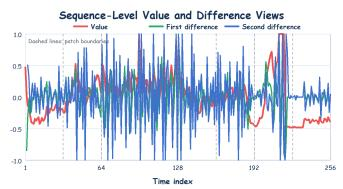  
(a) Value, first-difference, and second-difference curves.

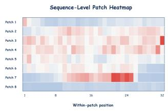  
(b) Mask-aware patch-by-position heatmap.

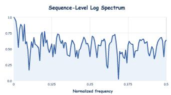  
(c) Log-scaled frequency spectrum.  
Figure 10: The three sequence-level image views generated deterministically from the same real 256-point Taobao-Fashion historical sequence.

Endogenous Multimodal Forecasting. We evaluate forecasting without externally provided modalities on GIFT-Eval and TIME. In this setting, multimodal representations are constructed solely from the observed time series, allowing us to examine whether endogenous multimodal modeling improves forecasting even in the absence of external information. GIFT-Eval contains 23 datasets spanning diverse domains and sampling frequencies, while TIME consists of 50 datasets, resulting in a total of 73 evaluation datasets. We follow the official evaluation protocols of the two benchmarks, including their predefined forecasting horizons, sampling frequencies, and evaluation windows.

Exogenous Multimodal Forecasting. To evaluate the ability of QiYao-M to exploit externally provided information, we further consider 9 multimodal datasets from Time-MMD, MoTime, and FinMultiTime. Specifically, we use Agriculture, Climate, Energy, Health, and Social Good from Time-MMD; Taobao-Fashion and Tianchi from MoTime; and HS300 and SP500 from FinMulti-Time. These datasets cover different combinations of time series, text, images, and tabular information, enabling evaluation under heterogeneous multimodal settings. For Agriculture, Climate, and Social Good, we use prediction lengths $F ~ \in ~ \{ 6 , 8 , 1 0 , 1 2 \}$ . For Energy and Health, the prediction lengths are $F \in { \dot { \{ 1 2 , 2 4 , 3 6 , 4 8 \} } }$ For Taobao-Fashion and Tianchi, we evaluate $F \in \{ 1 , 7 , 1 4 , 2 1 , \bar { 2 } 8 \}$ . For HS300 and SP500, the prediction lengths are $F \in \{ 2 4 , 4 8 , 9 6 \}$

## A.4 BASELINES

We compare QiYao-M against representative forecasting models from three categories. For GIFT-Eval and TIME, we use baseline results reported on the official leaderboards under the corresponding benchmark protocols, which ensures consistent and standardized evaluation across methods. For multimodal forecasting, we consider four end-to-end supervised models, including GPT4MTS (Jia et al., 2024), CALF (Liu et al., 2025a), Time-VLM (Zhong et al., 2025), and TATS (Li et al., 2026b). We further include five unimodal time-series foundation models, namely Zeus (Fu et al., 2026), Chronos-2 (Ansari et al., 2025), Toto-2 (Khwaja et al., 2026), PatchTST-FM-r2 (Wen et al., 2026), and TiRex-2 (Podest et al., 2026), as well as two multimodal foundation models, ChatTime (Wang et al., 2025a) and Aurora (Wu et al., 2026a). The codebases and implementation details of all baselines are provided in Table 6.

## A.5 PRETRAINING SETTINGS

Stage I: Numerical Pretraining. We first train the time series backbone using numerical data only. Historical series are normalized and divided into patches of size $p = 3 2$ , with a maximum input length of 8192 observations. The backbone and forecasting head learn general temporal representations and probabilistic forecasting before any multimodal components are introduced. This stage provides the numerical initialization for the subsequent stages.

Table 3: Dataset statistics and forecasting configurations of GIFT-Eval. Multiple frequencies of the same underlying dataset are grouped into one row.
<table><tr><td>Dataset</td><td>Domain</td><td>Frequency</td><td>Variates</td><td>Prediction Length</td></tr><tr><td>Jena Weather</td><td>Nature</td><td>10T /H/D</td><td>21</td><td>{48, 480, 720} (10T/H); 30 (D)</td></tr><tr><td>BizITObs-Application</td><td>Web/CloudOps</td><td>10S</td><td>2</td><td>{60, 600, 900}</td></tr><tr><td>BizITObs-Service</td><td>Web/CloudOps</td><td>10S</td><td>2</td><td>{60, 600, 900}</td></tr><tr><td>BizITObs-L2C</td><td>Web/CloudOps</td><td>5T/H</td><td>7</td><td>{48, 480, 720}</td></tr><tr><td>Bitbrains-Fast Storage</td><td>Web/CloudOps</td><td>5T/H</td><td>2</td><td>{48, 480, 720} (5T); 48 (H)</td></tr><tr><td>Bitbrains-rnd</td><td>Web/CloudOps</td><td>5T/H</td><td>2</td><td>{48, 480, 720} (5T); 48 (H)</td></tr><tr><td>Restaurant</td><td>Sales</td><td>D</td><td>1</td><td>30</td></tr><tr><td>ETT1</td><td>Energy</td><td>15T/H/D/W</td><td>7</td><td>{48, 480, 720} (15T/H); 30 (D); 8 (W)</td></tr><tr><td>ETT2</td><td>Energy</td><td>15T/H/D/W</td><td>7</td><td>{48, 480, 720} (15T/H); 30 (D); 8 (W)</td></tr><tr><td>Loop Seattle</td><td>Transport</td><td>5T/H/D</td><td>1</td><td>{48, 480, 720} (5T/H); 30 (D)</td></tr><tr><td>SZ-Taxi</td><td>Transport</td><td>15T/H</td><td>1</td><td>{48, 480, 720} (15T); 48 (H)</td></tr><tr><td>M_DENSE</td><td>Transport</td><td>H/D</td><td>1</td><td>{48, 480, 720} (H); 30 (D)</td></tr><tr><td>Solar</td><td>Energy</td><td>10T/H/D/W</td><td>1</td><td>{48, 480, 720} (10T/H); 30 (D); 8 (W)</td></tr><tr><td>Hierarchical Sales</td><td>Sales</td><td>D/W</td><td>1</td><td>30 (D); 8 (W)</td></tr><tr><td>M4</td><td>Econ/Fin</td><td>A/Q/M/W/D/H</td><td>1</td><td>6 / 8 / 18 / 13 / 14 / 48</td></tr><tr><td>Hospital</td><td>Healthcare</td><td>M</td><td>1</td><td>12</td></tr><tr><td>COVID Deaths</td><td>Healthcare</td><td>D</td><td>1</td><td>30</td></tr><tr><td>US Births</td><td>Healthcare</td><td>D/W/M</td><td>1</td><td>30 / 8 / 12</td></tr><tr><td>Saugeen</td><td>Nature</td><td>D/W/M</td><td>1</td><td>30 / 8 / 12</td></tr><tr><td>Temperature Rain</td><td>Nature</td><td>D</td><td>1</td><td>30</td></tr><tr><td>KDD Cup 2018</td><td>Nature</td><td>H/D</td><td>1</td><td>{48, 480, 720} (H); 30 (D)</td></tr><tr><td>Car Parts</td><td>Sales</td><td>M</td><td>1</td><td>12</td></tr><tr><td>Electricity</td><td>Energy</td><td>15T/H/D /W</td><td>1</td><td>{48, 480, 720} (15T/H); 30 (D); 8 (W)</td></tr></table>

Stage II: Endogenous Multimodal Training. We then construct patch-level text and images from the time series using the deterministic generation procedure in Section A.2. The first 16 Transformer layers are frozen, while the remaining 8 layers and the endogenous multimodal modules are trained. The model jointly predicts future numerical values and the latent representations of future endogenous text and images. This design encourages the shared representation to capture temporal evolution from complementary numerical, textual, and visual perspectives, while preserving the general forecasting ability learned in Stage I.

Stage III: Exogenous Retrieval Training. Finally, we freeze the numerical backbone and the endogenous multimodal modules. Only the exogenous retrieval head and its candidate-aware crossattention components are optimized. Reference cases are retrieved independently through the available modalities, and their known future values provide retrieval-based context for the forecast. Retrieval banks and modality weights are constructed or calibrated using the permitted training data; test targets are never used for training or calibration. A null key–value candidate allows the crossattention module to reduce its reliance on unhelpful retrieved cases.

Downstream Forecasting. At inference time, endogenous text and images are generated solely from the observed history. For the exogenous setting, reference cases are selected from the preconstructed bank, and the trained retrieval module enhances the forecast without updating model parameters. We report metrics over all valid forecast points and set drop\_last=False during evaluation so that incomplete final batches are not discarded.

## A.6 EVALUATION METRICS

We follow the official evaluation protocols of the respective benchmarks. For point forecasting, we report Mean Squared Error (MSE) and Mean Absolute Error (MAE). For probabilistic forecasting, we report Mean Absolute Scaled Error (MASE) and Continuous Ranked Probability Score (CRPS) where required. All metrics are computed over valid forecast points only; padded or missing targets are excluded. Let $y _ { i , t }$ and $\hat { y } _ { i , t }$ denote the target and point forecast for series i at future step t, and let $m _ { i , t } \in \{ 0 , 1 \}$ indicate whether that target is valid. Define $\begin{array} { r } { N = \sum _ { i , t } m _ { i , t } } \end{array}$

Table 4: Dataset statistics and forecasting configurations of the TIME benchmark. Different sampling frequencies of the same underlying source are treated as separate evaluation datasets.
<table><tr><td>Domain</td><td>Dataset</td><td>Frequency</td><td>Prediction Length</td></tr><tr><td rowspan="10">Nature</td><td>Water Quality Darwin Current Velocity</td><td>15T 5T</td><td>{16, 96, 288} {36, 288, 864}</td></tr><tr><td></td><td>10T</td><td></td></tr><tr><td>Current Velocity</td><td></td><td>{18, 144, 432}</td></tr><tr><td>Current Velocity</td><td>15T</td><td>{12, 96, 288}</td></tr><tr><td>Current Velocity</td><td>20T</td><td>{9, 72, 216}</td></tr><tr><td>Current Velocity</td><td>H 15T</td><td>{24, 168, 336}</td></tr><tr><td>CPHL</td><td></td><td>{12,96,288}</td></tr><tr><td>CPHL</td><td>30T</td><td>{12, 48, 144}</td></tr><tr><td>CPHL</td><td>H</td><td>{24, 168, 336}</td></tr><tr><td>Coastal T&amp;S</td><td>5T</td><td>{36, 288, 864}</td></tr><tr><td rowspan="8"></td><td>Coastal T&amp;S</td><td>15T</td><td>{12, 96, 288}</td></tr><tr><td>Coastal T&amp;S Coastal T&amp;S</td><td>20T</td><td>{9, 72, 216}</td></tr><tr><td></td><td>H</td><td>{24, 168, 336}</td></tr><tr><td>SG Weather SG PM2.5</td><td>D</td><td>{3, 7, 14}</td></tr><tr><td></td><td>H</td><td>{24, 72, 168}</td></tr><tr><td>NE China Wind</td><td>H</td><td>{24, 72, 168}</td></tr><tr><td>Australia Solar</td><td>H</td><td>{24, 72, 168}</td></tr><tr><td>EPF Electricity Price</td><td>H</td><td>{24, 72, 168}</td></tr><tr><td rowspan="5"></td><td>OpenElectricity NEM EWELD Load</td><td>5T</td><td>{24, 96, 288}</td></tr><tr><td></td><td>15T</td><td>{24, 96, 672}</td></tr><tr><td>SG Carpark</td><td>15T</td><td>{16, 96, 672}</td></tr><tr><td>Finland Traffic</td><td>15T</td><td>{16, 96, 672}</td></tr><tr><td>Port Activity</td><td>D</td><td>30</td></tr><tr><td rowspan="3">Healthcare</td><td>Port Activity</td><td>W</td><td>13</td></tr><tr><td>ECDC COVID</td><td>D</td><td>30</td></tr><tr><td>ECDC COVID Global Influenza</td><td>W</td><td>13</td></tr><tr><td rowspan="3">Finance</td><td></td><td>W</td><td>13</td></tr><tr><td>Crypto US Term Structure</td><td>D</td><td>30</td></tr><tr><td>Oil Price</td><td>B B</td><td>20 20</td></tr><tr><td rowspan="10">Economics</td><td>Job Claims</td><td>W</td><td>13</td></tr><tr><td>Uncertainty 1M</td><td>M</td><td>6</td></tr><tr><td>Housing Inventory</td><td>M</td><td>12</td></tr><tr><td>JOLTS</td><td>M</td><td>12</td></tr><tr><td>US Labor</td><td>M</td><td></td></tr><tr><td>Vehicle Supply</td><td>M</td><td>12</td></tr><tr><td>Auto Production SF</td><td>M</td><td>12</td></tr><tr><td>Commodity Production</td><td>M</td><td>12 12</td></tr><tr><td>Commodity Import</td><td>M</td><td>12</td></tr><tr><td>WUI Global</td><td>Q</td><td>4</td></tr><tr><td>Global Price</td><td></td><td>4</td></tr><tr><td rowspan="4">Sales</td><td>Vehicle Sales</td><td>M</td><td>12</td></tr><tr><td>Online Retail II UCI</td><td>D</td><td>30</td></tr><tr><td>Supply Chain Customer</td><td>D</td><td>30</td></tr><tr><td>Supply Chain Location</td><td>D</td><td>30</td></tr><tr><td rowspan="5">CloudOps</td><td>Azure2019 D</td><td>5T</td><td>288</td></tr><tr><td>Azure2019 I</td><td>5T</td><td>288</td></tr><tr><td>Azure2019 U</td><td>5T</td><td>48</td></tr><tr><td>Smart Manufacturing</td><td>H</td><td>{24, 168, 336}</td></tr><tr><td>MetroPT-3</td><td>5T</td><td>{48, 288, 576}</td></tr></table>

Point forecasting metrics. The MSE penalizes large prediction errors more strongly, whereas the MAE measures their average absolute magnitude:

$$
\mathrm { M S E } = \frac { 1 } { N } \sum _ { i , t } m _ { i , t } ( y _ { i , t } - \hat { y } _ { i , t } ) ^ { 2 } , \qquad \mathrm { M A E } = \frac { 1 } { N } \sum _ { i , t } m _ { i , t } \vert y _ { i , t } - \hat { y } _ { i , t } \vert .\tag{27}
$$

For models producing predictive quantiles, we use the median (0.5 quantile) as the point forecast.

Scale-normalized metrics. When reporting normalized errors, we calculate the standard deviation $\sigma _ { \mathrm { t r a i n } }$ from the training interval only and apply the same scale to every model evaluated on that dataset:

$$
\mathrm { N o r m - M S E } = \frac { \mathrm { M S E } } { \sigma _ { \mathrm { t r a i n } } ^ { 2 } } , \qquad \mathrm { N o r m - M A E } = \frac { \mathrm { M A E } } { \sigma _ { \mathrm { t r a i n } } } .\tag{28}
$$

Normalization changes only the reported metric; it does not use test-set statistics or alter the model forecasts.

Table 5: Statistics of the exogenous multimodal forecasting datasets used in our experiments. The modality column reports the external information available to each dataset.
<table><tr><td>Benchmark</td><td>Dataset</td><td>Modalities</td><td>Frequency</td><td>Scale</td><td>Prediction Length</td></tr><tr><td rowspan="5">TimeMMD</td><td>Agriculture</td><td> $\mathrm { T S } + \mathrm { T e x t }$ </td><td>Monthly</td><td> $4 9 6 \times 1$ </td><td> $\{ 6 , 8 , 1 0 , 1 2 \}$ </td></tr><tr><td>Climate</td><td> $\mathrm { T S } + \mathrm { T e x t }$ </td><td>Monthly</td><td> $4 9 6 \times 5$ </td><td>{6, 8, 10, 12}</td></tr><tr><td>Energy</td><td> $\mathrm { T S } + \mathrm { T e x t }$ </td><td>Weekly</td><td> $1 , 4 7 9 \times 9$ </td><td>{12, 24, 36, 48}</td></tr><tr><td>Health</td><td>TS + Text</td><td>Weekly</td><td> $^ { 1 , 3 8 9 \times 1 1 }$ </td><td>{12, 24, 36, 48}</td></tr><tr><td>Social Good</td><td>TS + Text</td><td>Monthly</td><td> $9 0 0 \times 1$ </td><td>{6, 8, 10, 12}</td></tr><tr><td rowspan="2">MoTIME</td><td>TaobaoFashion</td><td> $\mathrm { T S } + \mathrm { T e x t } + \mathrm { I m a g e }$ </td><td>Daily</td><td> $3 6 5 \times 8 9 0$ </td><td>{1, 7, 14, 21, 28}</td></tr><tr><td>Tianchi</td><td> $\mathrm { T S } + \mathrm { T e x t } + \mathrm { I m a g e }$ </td><td>Daily</td><td> $1 8 4 \times 3 6 { , } 3 9 7$ </td><td>{1, 7, 14, 21, 28}</td></tr><tr><td rowspan="2">FinMultiTime</td><td>HS300</td><td> $\mathrm { T S } + \mathrm { T e x t } + \mathrm { I m a g e } + \mathrm { T a b l e }$ </td><td>Trading Day</td><td>35 stocks</td><td>{24, 48,96}</td></tr><tr><td>SP500</td><td> $\mathrm { T S } + \mathrm { T e x t } + \mathrm { I m a g e } + \mathrm { T a b l e }$ </td><td>Trading Day</td><td>35 stocks</td><td>{24, 48, 96}</td></tr></table>

Table 6: Code and model repositories of the baseline methods used in our experiments.
<table><tr><td>Model Type</td><td>Model</td><td>Code / Model Repository</td></tr><tr><td rowspan="6">Multimodal End-to-End</td><td></td><td>https://github.com/Flora-jia-jfr/ GPT4MTS-Prompt-based-Large-Language-Model-</td></tr><tr><td>GPT4MTS</td><td>for-Multimodal-Time-series-Forecasting</td></tr><tr><td>CALF</td><td>https://github.com/Hank0626/CALF</td></tr><tr><td>Time-VLM</td><td>https://github.com/CityMind-Lab/ICML25-TimeVLM</td></tr><tr><td>TATS</td><td>https://github.com/iDEA-iSAIL-Lab-UIUC/TaTS</td></tr><tr><td></td><td></td></tr><tr><td rowspan="5">Unimodal Foundation</td><td>Zeus</td><td>https://github.com/GestaltCogTeam/Zeus</td></tr><tr><td>Chronos-2 Toto-2.0</td><td>https://github.com/amazon-science/chronos-forecasting https://github.com/DataDog/toto</td></tr><tr><td>PatchTST-FM-r2</td><td>https://huggingface.co/ibm-granite/</td></tr><tr><td></td><td>granite-timeseries-patchtst-fm-r2</td></tr><tr><td>TiRex-2</td><td>https://github.com/NX-AI/tirex-2</td></tr><tr><td rowspan="2">Multimodal Foundation</td><td>ChatTime</td><td>https://github.com/ForestsKing/ChatTime</td></tr><tr><td>Aurora</td><td>https://github.com/decisionintelligence/Aurora</td></tr></table>

Mean Absolute Scaled Error. MASE scales the absolute forecast error by the in-sample seasonal naive error. For series i with training observations $x _ { i , 1 : L _ { i } }$ and seasonality $s _ { i } ,$ , the scaling factor is

$$
d _ { i } = \frac { 1 } { L _ { i } - s _ { i } } \sum _ { u = s _ { i } + 1 } ^ { L _ { i } } | x _ { i , u } - x _ { i , u - s _ { i } } | , \qquad \mathrm { M A S E } = \frac { 1 } { N } \sum _ { i , t } m _ { i , t } \frac { | y _ { i , t } - \hat { y } _ { i , t } | } { d _ { i } } .\tag{29}
$$

The benchmark’s official evaluator determines the seasonality and handles degenerate denominators.

Continuous Ranked Probability Score. For a predictive cumulative distribution function $F _ { i , t }$ CRPS compares the full forecast distribution with the realized target:

$$
\mathrm { C R P S } = \frac { 1 } { N } \sum _ { i , t } m _ { i , t } \int _ { - \infty } ^ { \infty } \left( F _ { i , t } ( z ) - \mathbb { I } \{ y _ { i , t } \leq z \} \right) ^ { 2 } d z .\tag{30}
$$

We use each benchmark’s official evaluator to compute its reported CRPS from the model’s probabilistic forecasts.

## A.7 MODEL CONFIGURATIONS

The numerical backbone contains 312.68M parameters. The endogenous image and text projectors, predictors, and mask tokens add 36.73M parameters. The exogenous target encoder and five

Table 7: Architecture and parameter counts of QiYao-M. The main-model count excludes the frozen CLIP feature encoder and does not double-count the shared forecasting head.
<table><tr><td>Model</td><td>Backbone Layers</td><td>Fusion After</td><td>Model Dim.</td><td>FFN Dim.</td><td>Heads</td><td>Patch Size</td><td>CLIP Dim.</td><td>Retrieval Layers</td><td>Main Parameters</td></tr><tr><td>QiYao-M</td><td>24</td><td>16</td><td>1024</td><td>2736</td><td>16</td><td>32</td><td>512</td><td>5</td><td>375.63M</td></tr></table>

candidate-aware cross-attention layers add 26.21M parameters, yielding 375.63M unique parameters in the main model. The frozen CLIP ViT-B/32 image and text encoder contains an additional 151.28M parameters; including it gives 526.90M parameters.

## B RELATED WORK

## B.1 TIME SERIES FORECASTING

Time series analysis has witnessed rapid progress across diverse tasks, including forecasting (Qiu et al., 2024; Wu et al., 2025b; Cheng et al., 2026c), anomaly detection (Wu et al., 2025c; Qiu et al., 2025a; Cheng et al., 2026b), and emerging reasoning-oriented tasks (Lu et al., 2026b; Wu et al., 2026b). Among them, forecasting (Hou et al., 2026; Ding et al., 2026) has received extensive attention across a variety of settings and modeling perspectives. Recent studies improve multivariate forecasting by capturing cross-variable dependencies and learning effective temporal representations (Cheng et al., 2026a; Qiu et al., 2025b; Wu et al., 2025a), while other efforts address irregularly sampled and non-stationary time series (Liu et al., 2026b; Qiu et al., 2026a; Lu et al., 2026a; Liu et al., 2026a). Another important direction incorporates exogenous variables to enrich the information available for target prediction (Li et al., 2026a; Cheng et al., 2026c; Qiu et al., 2026b). Meanwhile, probabilistic forecasting explicitly characterizes predictive uncertainty (Wu et al., 2025b; Cheng et al., 2026c), and benchmark studies facilitate systematic evaluation across diverse forecasting scenarios (Zhu et al., 2026; Qiu et al., 2024).

## B.2 MULTIMODAL TIME SERIES FORECASTING

Recent studies have increasingly explored multimodal information for time series forecasting. One line of work bridges temporal and language representations by adapting pretrained language models to time series, including GPT4TS (Zhou et al., 2023), TEST (Sun et al., 2024), Time-LLM (Jin et al., 2024), CALF (Liu et al., 2025a), LLM-Mixer (Kowsher et al., 2025), and CC-Time (Chen et al., 2025), through reprogramming, representation alignment, or cross-modal interaction. Another line explicitly incorporates auxiliary textual information into forecasting. CMIN (Luo et al., 2023) and Modality-aware Transformer (Emami Gohari et al., 2024) jointly model financial sequences with news or textual reports, while GPT4MTS (Jia et al., 2024), Time-MMD (Liu et al., 2024b), TaTS (Li et al., 2026b), and VoT (Wang et al., 2026) further explore the collection, alignment, fusion, or reasoning of contextual text with time series. Beyond text, Time-VLM (Zhong et al., 2025) introduces visual representations to complement temporal and textual information. Despite this progress, most existing approaches learn multimodal forecasting through task- or dataset-specific adaptation, rather than large-scale multimodal pretraining across diverse time series domains, limiting the transfer of multimodal knowledge to unseen domains.

## B.3 TIME SERIES FOUNDATION MODELS

Time series foundation models (TSFMs) leverage large-scale pretraining to learn transferable temporal patterns and enable zero-shot generalization across domains. Representative models, including UniTS (Gao et al., 2024), TimesFM (Das et al., 2024), LightGTS (Wang et al., 2025b), PatchTST-FM (Wen et al., 2026), Sundial (Liu et al., 2025b), and ROSE (Wang et al., 2025c), explore diverse architectures and pretraining objectives for general-purpose forecasting. More recent models further broaden their capabilities: Toto 2.0 (Khwaja et al., 2026) investigates large-scale model scaling, Chronos-2 (Ansari et al., 2025) supports multivariate and covariate-informed forecasting, TiRex-2 (Podest et al., 2026) enables efficient recurrent and streaming forecasting, and ZEUS (Fu et al., 2026) extends pretraining toward multiple time series tasks. Recently, ChatTime (Wang et al., 2025a), STRIDE (Ahamed et al., 2026) and Aurora (Wu et al., 2026a) further introduce multimodal pretraining and modeling into TSFMs. However, these models primarily support exogenous textual information and struggle to generalize to scenarios with various types and numbers of exomodalities. More importantly, existing multimodal TSFMs typically adopt role-agnostic modeling, using shared mechanisms across heterogeneous modalities without explicitly modeling endogenous and exogenous modalities according to their distinct forecasting characteristics.

In this work, we propose QiYao-M, a role-aware multimodal TSFM that explicitly distinguishes endogenous and exogenous modalities according to their distinct roles in forecasting. Through roleaware multimodal modeling, QiYao-M learns how endogenous modalities evolve along with the underlying time series during pretraining. For exogenous modalities, QiYao-M directly leverages retrieved reference cases as in-context demonstrations at inference time, enabling tuning-free acqui sition of domain-specific knowledge and flexible adaptation to arbitrary exogenous modalities.

## C MORE ANALYSIS

## C.1 RETRIEVAL ANALYSIS

We study the robustness of our retrieval mechanism by exploring its sensitivity to the retrieval bank size and final top-K, as shown in Figure 11.

For the retrieval bank, QiYao-M already outperforms the internal baseline and strong foundation models using only 5% of the available training samples. As the bank size increases, forecasting performance quickly stabilizes with only minor fluctuations, suggesting that an excessively large retrieval bank is unnecessary. In practice, retaining around 20% of the available samples provides a favorable trade-off between forecasting performance and retrieval efficiency. We further fix the bank size and vary the final top-k from 4 to 24. The forecasting errors remain within a narrow range across different values of k, indicating that QiYao-M is insensitive to the exact number of retrieved samples. These results demonstrate strong robustness to both retrieval bank size and top-k, substantially reducing the need for careful hyperparameter tuning.

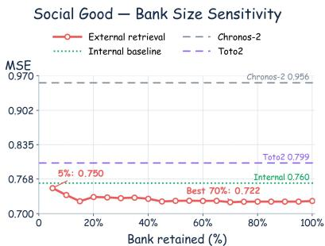  
(a) Bank Size Sensitivity

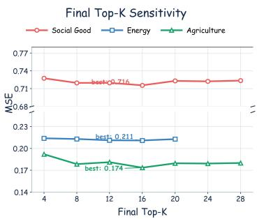  
(b) Top-K Sensitivity  
Figure 11: Sensitivity analysis of the retrieval module.

## D MORE RESULTS

## D.1 GIFT-EVAL RANKINGS

To provide a more comprehensive comparison on GIFT-Eval, we further report the ranking results in terms of MASE and CRPS. As shown in Figures 12 and 13, our model consistently achieves favorable rankings across both metrics, demonstrating clear improvements over the baseline forecasting models. These results further validate the effectiveness and robustness of our model under diverse time-series forecasting scenarios.

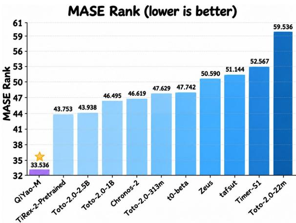  
Figure 12: GIFT-Eval MASE Ranking.

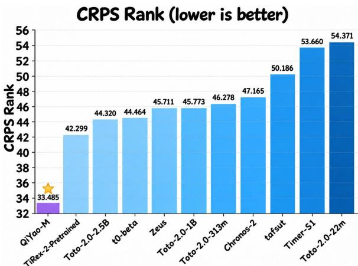  
Figure 13: GIFT-Eval CRPS Ranking.

## D.2 FULL RESULTS

We further provide the complete step-wise forecasting results on multimodal datasets. Specifically, we report the performance of different methods at each forecasting horizon, together with their average performance, enabling a more fine-grained comparison across short- and long-term forecasting settings. The detailed results further demonstrate the consistent effectiveness of our model across different prediction horizons and multimodal forecasting benchmarks.

Table 8: Step-wise forecasting results on Agriculture. Lower MSE and MAE indicate better performance. The best and second-best results are highlighted in purple and blue, respectively.
<table><tr><td>Methods</td><td colspan="2">H=6</td><td colspan="2">H=8</td><td colspan="2">H=10</td><td colspan="2">H=12</td><td colspan="2">Avg.</td></tr><tr><td></td><td>MSE</td><td>MAE</td><td>MSE</td><td>MAE</td><td>MSE</td><td>MAE</td><td>MSE</td><td>MAE</td><td>MSE</td><td>MAE</td></tr><tr><td colspan="9">Multimodal End-to-End Models</td></tr><tr><td>GPT4MTS 1</td><td>0.161</td><td>0.257</td><td>0.207</td><td>0.288</td><td>0.230</td><td>0.305</td><td>0.301</td><td>0.342</td><td>0.225</td><td>0.298</td></tr><tr><td>CALF</td><td>0.142</td><td>0.250</td><td>0.195</td><td>0.285</td><td>0.350</td><td>0.370</td><td>0.314</td><td>0.355</td><td>0.250</td><td>0.315</td></tr><tr><td>Time-VLM</td><td>0.143</td><td>0.245</td><td>0.215</td><td>0.287</td><td>0.271</td><td>0.320</td><td>0.322</td><td>0.359</td><td>0.237</td><td>0.302</td></tr><tr><td>TATS 1</td><td>0.140</td><td>0.251</td><td>0.187</td><td>0.282</td><td>0.244</td><td>0.320</td><td>0.290</td><td>0.350</td><td>0.215</td><td>0.301</td></tr><tr><td colspan="10">Unimodal Foundation Models</td></tr><tr><td>Zeus</td><td>0.122</td><td>0.237</td><td>0.173</td><td>0.279</td><td>0.228</td><td>0.315</td><td>0.289</td><td>0.348</td><td>0.203</td><td>0.295</td></tr><tr><td>Chronos-2 amazon</td><td>0.147</td><td>0.258</td><td>0.208</td><td>0.303</td><td>0.267</td><td>0.340</td><td>0.330</td><td>0.376</td><td>0.238</td><td>0.319</td></tr><tr><td>Toto-2</td><td>0.144</td><td>0.252</td><td>0.203</td><td>0.296</td><td>0.264</td><td>0.330</td><td>0.331</td><td>0.366</td><td>0.236</td><td>0.311</td></tr><tr><td>PatchTST-r2 IBM</td><td>0.167</td><td>0.302</td><td>0.216</td><td>0.341</td><td>0.255</td><td>0.371</td><td>0.302</td><td>0.401</td><td>0.235</td><td>0.354</td></tr><tr><td>TiRex2 NXAI</td><td>0.148</td><td>0.254</td><td>0.216</td><td>0.300</td><td>0.288</td><td>0.338</td><td>0.369</td><td>0.380</td><td>0.255</td><td>0.318</td></tr><tr><td colspan="10">Multimodal Foundation Models</td></tr><tr><td>ChatTime</td><td>0.129</td><td>0.245</td><td>0.170</td><td>0.278</td><td>0.215</td><td>0.306</td><td>0.271</td><td>0.343</td><td>0.196</td><td>0.293</td></tr><tr><td>Aurora</td><td>0.184</td><td>0.295</td><td>0.242</td><td>0.335</td><td>0.297</td><td>0.365</td><td>0.365</td><td>0.398</td><td>0.272</td><td>0.348</td></tr><tr><td>Ours (w/o Exo.)</td><td>0.121</td><td>0.233</td><td>0.173</td><td>0.275</td><td>0.224</td><td>0.307</td><td>0.281</td><td>0.340</td><td>0.199</td><td>0.288</td></tr><tr><td>Ours (w Exo.)</td><td>0.108</td><td>0.232</td><td>0.150</td><td>0.268</td><td>0.192</td><td>0.300</td><td>0.244</td><td>0.336</td><td>0.174</td><td>0.284</td></tr></table>

Table 9: Step-wise forecasting results on Climate. Lower MSE and MAE indicate better perfor mance. The best and second-best results are highlighted in purple and blue, respectively.
<table><tr><td>Horizons</td><td colspan="2">H=6</td><td colspan="2">H=8</td><td colspan="2">H=10</td><td colspan="2">H=12</td><td colspan="2">Avg.</td></tr><tr><td>Metrics</td><td>MSE</td><td>MAE</td><td>MSE</td><td>MAE</td><td>MSE MAE</td><td></td><td>MSE</td><td>MAE</td><td>MSE</td><td>MAE</td></tr><tr><td colspan="9">Multimodal End-to-End Models</td></tr><tr><td>GPT4MTS </td><td>1.199</td><td>0.895</td><td>1.205</td><td>0.899</td><td>1.173</td><td>0.885</td><td>1.152</td><td>0.876</td><td>1.182</td><td>0.889</td></tr><tr><td>CALF</td><td>1.231</td><td>0.910</td><td>1.227</td><td>0.911</td><td>1.508</td><td>0.989</td><td>1.177</td><td>0.883</td><td>1.286</td><td>0.922</td></tr><tr><td>Time-VLM</td><td>1.218</td><td>0.907</td><td>1.181</td><td>0.914</td><td>1.179</td><td>0.880</td><td>1.203</td><td>0.896</td><td>1.195</td><td>0.899</td></tr><tr><td>TATS 1</td><td>1.194</td><td>0.897</td><td>1.178</td><td>0.886</td><td>1.170</td><td>0.881</td><td>1.179</td><td>0.885</td><td>1.180</td><td>0.887</td></tr><tr><td colspan="10">Unimodal Foundation Models</td></tr><tr><td>Zeus</td><td>0.858</td><td>0.741</td><td>0.854</td><td>0.738</td><td>0.847</td><td>0.736</td><td>0.846</td><td>0.737</td><td>0.852</td><td>0.738</td></tr><tr><td>Chronos-2 amazon</td><td>0.858</td><td>0.730</td><td>0.857</td><td>0.728</td><td>0.859</td><td>0.729</td><td>0.863</td><td>0.732</td><td>0.859</td><td>0.730</td></tr><tr><td>Toto-2</td><td>0.844</td><td>0.725</td><td>0.850</td><td>0.728</td><td>0.858</td><td>0.731</td><td>0.861</td><td>0.733</td><td>0.853</td><td>0.729</td></tr><tr><td>PatchTST-r2 IBM</td><td>0.842</td><td>0.724</td><td>0.841</td><td>0.723</td><td>0.846</td><td>0.724</td><td>0.850</td><td>0.726</td><td>0.845</td><td>0.724</td></tr><tr><td>TiRex2 NXAI</td><td>0.839</td><td>0.723</td><td>0.841</td><td>0.722</td><td>0.852</td><td>0.725</td><td>0.856</td><td>0.727</td><td>0.847</td><td>0.724</td></tr><tr><td colspan="10">Multimodal Foundation Models</td></tr><tr><td>ChatTime</td><td>1.100</td><td>0.842</td><td>1.177</td><td>0.863</td><td>1.158</td><td>0.866</td><td>1.143</td><td>0.854</td><td>1.144</td><td>0.856</td></tr><tr><td>Aurora</td><td>0.859</td><td>0.747</td><td>0.858</td><td>0.746</td><td>0.868</td><td>0.748</td><td>0.875</td><td>0.753</td><td>0.865</td><td>0.749</td></tr><tr><td>Ours (w/o Exo.) Ours (w Exo.)</td><td>0.828</td><td>0.724</td><td>0.822</td><td>0.721</td><td>0.830</td><td>0.725</td><td>0.832</td><td>0.728</td><td>0.828</td><td>0.725</td></tr><tr><td></td><td>0.826</td><td>0.723</td><td>0.822</td><td>0.719</td><td>0.829</td><td>0.722</td><td>0.832</td><td>0.727</td><td>0.827</td><td>0.723</td></tr></table>

Table 10: Step-wise forecasting results on Energy. Lower MSE and MAE indicate better performance. The best and second-best results are highlighted in purple and blue, respectively.
<table><tr><td>Horizons</td><td colspan="2">H=12</td><td colspan="2">H=24</td><td colspan="2">H=36</td><td colspan="2">H=48</td><td colspan="2">Avg.</td></tr><tr><td>Metrics</td><td>MSE</td><td>MAE</td><td>MSE</td><td>MAE</td><td>MSE</td><td>MAE</td><td>MSE</td><td>MAE</td><td>MSE</td><td>MAE</td></tr><tr><td colspan="9">Multimodal End-to-End Models</td></tr><tr><td>GPT4MTS W</td><td>0.111</td><td>0.244</td><td>0.232</td><td>0.362</td><td>0.308</td><td>0.418</td><td>0.398</td><td>0.496</td><td>0.262</td><td>0.380</td></tr><tr><td>CALF</td><td>0.102</td><td>0.224</td><td>0.210</td><td>0.346</td><td>0.300</td><td>0.420</td><td>0.365</td><td>0.470</td><td>0.244</td><td>0.365</td></tr><tr><td>Time-VLM</td><td>0.114</td><td>0.253</td><td>0.227</td><td>0.359</td><td>0.309</td><td>0.410</td><td>0.390</td><td>0.475</td><td>0.260</td><td>0.374</td></tr><tr><td>TATS 1</td><td>0.105</td><td>0.232</td><td>0.216</td><td>0.344</td><td>0.309</td><td>0.418</td><td>0.391</td><td>0.480</td><td>0.255</td><td>0.368</td></tr><tr><td colspan="10">Unimodal Foundation Models</td></tr><tr><td>Zeus</td><td>0.094</td><td>0.207</td><td>0.193</td><td>0.312</td><td>0.288</td><td>0.383</td><td>0.380</td><td>0.444</td><td>0.239</td><td>0.337</td></tr><tr><td>Chronos-2 amazon</td><td>0.089</td><td>0.200</td><td>0.182</td><td>0.301</td><td>0.271</td><td>0.368</td><td>0.362</td><td>0.434</td><td>0.226</td><td>0.326</td></tr><tr><td>Toto-2</td><td>0.091</td><td>0.203</td><td>0.190</td><td>0.315</td><td>0.275</td><td>0.383</td><td>0.367</td><td>0.445</td><td>0.231</td><td>0.337</td></tr><tr><td>PatchTST-r2 IBM</td><td>0.087</td><td>0.210</td><td>0.182</td><td>0.319</td><td>0.284</td><td>0.399</td><td>0.426</td><td>0.484</td><td>0.245</td><td>0.353</td></tr><tr><td>TiRex2 NXAI</td><td>0.088</td><td>0.202</td><td>0.181</td><td>0.304</td><td>0.266</td><td>0.373</td><td>0.360</td><td>0.441</td><td>0.224</td><td>0.330</td></tr><tr><td colspan="10">Multimodal Foundation Models</td></tr><tr><td>ChatTime</td><td>0.104</td><td>0.223</td><td>0.213</td><td>0.331</td><td>0.315</td><td>0.403</td><td>0.399</td><td>0.463</td><td>0.258</td><td>0.355</td></tr><tr><td>Aurora</td><td>0.117</td><td>0.245</td><td>0.226</td><td>0.354</td><td>0.292</td><td>0.409</td><td>0.383</td><td>0.472</td><td>0.255</td><td>0.370</td></tr><tr><td>Ours (w/o Exo.)</td><td>0.085</td><td>0.200</td><td>0.186</td><td>0.310</td><td>0.287</td><td>0.387</td><td>0.390</td><td>0.454</td><td>0.237</td><td>0.338</td></tr><tr><td>Ours (w Exo.)</td><td>0.081</td><td>0.196</td><td>0.178</td><td>0.302</td><td>0.262</td><td>0.374</td><td>0.322</td><td>0.428</td><td>0.211</td><td>0.325</td></tr></table>

Table 11: Step-wise forecasting results on Health. Lower MSE and MAE indicate better performance. The best and second-best results are highlighted in purple and blue, respectively.
<table><tr><td>Horizons</td><td colspan="2">H=12</td><td colspan="2">H=24</td><td colspan="2">H=36</td><td colspan="2">H=48</td><td colspan="2">Avg.</td></tr><tr><td>Metrics</td><td>MSE</td><td>MAE</td><td>MSE</td><td>MAE</td><td>MSE</td><td>MAE</td><td>MSE</td><td>MAE</td><td>MSE</td><td>MAE</td></tr><tr><td colspan="9">Multimodal End-to-End Models</td></tr><tr><td>GPT4MTS </td><td>0.985</td><td>0.658</td><td>1.513</td><td>0.802</td><td>1.601</td><td>0.846</td><td>1.757</td><td>0.889</td><td>1.464</td><td>0.799</td></tr><tr><td>CALF</td><td>0.964</td><td>0.609</td><td>1.451</td><td>0.749</td><td>1.713</td><td>0.851</td><td>1.836</td><td>0.889</td><td>1.491</td><td>0.775</td></tr><tr><td>Time-VLM</td><td>1.198</td><td>0.727</td><td>1.491</td><td>0.839</td><td>1.867</td><td>0.967</td><td>1.702</td><td>0.907</td><td>1.565</td><td>0.860</td></tr><tr><td>TATS 1</td><td>0.899</td><td>0.612</td><td>1.307</td><td>0.759</td><td>1.523</td><td>0.827</td><td>1.693</td><td>0.872</td><td>1.356</td><td>0.767</td></tr><tr><td colspan="10">Unimodal Foundation Models</td></tr><tr><td>Zeus</td><td>1.230</td><td>0.668</td><td>1.610</td><td>0.847</td><td>1.728</td><td>0.917</td><td>1.791</td><td>0.949</td><td>1.590</td><td>0.845</td></tr><tr><td>Chronos-2 amazon</td><td>0.650</td><td>0.513</td><td>0.954</td><td>0.632</td><td>1.209</td><td>0.723</td><td>1.402</td><td>0.784</td><td>1.054</td><td>0.663</td></tr><tr><td>Toto-2</td><td>0.702</td><td>0.501</td><td>1.038</td><td>0.637</td><td>1.260</td><td>0.723</td><td>1.437</td><td>0.787</td><td>1.109</td><td>0.662</td></tr><tr><td>PatchTST-r2 IBM</td><td>0.643</td><td>0.512</td><td>0.960</td><td>0.636</td><td>1.119</td><td>0.697</td><td>1.233</td><td>0.743</td><td>0.989</td><td>0.647</td></tr><tr><td>TiRex2 NXAI</td><td>0.754</td><td>0.518</td><td>1.116</td><td>0.635</td><td>1.236</td><td>0.685</td><td>1.280</td><td>0.712</td><td>1.097</td><td>0.638</td></tr><tr><td colspan="10">Multimodal Foundation Models</td></tr><tr><td>ChatTime</td><td>1.266</td><td>0.716</td><td>2.087</td><td>0.952</td><td>2.622</td><td>1.097</td><td>3.137</td><td>1.240</td><td>2.278</td><td>1.001</td></tr><tr><td>Aurora集</td><td>1.093</td><td>0.668</td><td>1.572</td><td>0.849</td><td>1.688</td><td>0.920</td><td>1.857</td><td>0.963</td><td>1.553</td><td>0.850</td></tr><tr><td>Ours (w/o Exo.)</td><td>0.585</td><td>0.469</td><td>0.870</td><td>0.602</td><td>1.034</td><td>0.664</td><td>1.170</td><td>0.712</td><td>0.915</td><td>0.612</td></tr><tr><td>Ours (w Exo.)</td><td>0.574</td><td>0.468</td><td>0.851</td><td>0.598</td><td>1.021</td><td>0.659</td><td>1.156</td><td>0.706</td><td>0.901</td><td>0.608</td></tr></table>

Table 12: Step-wise forecasting results on Social Good. Lower MSE and MAE indicate better performance. The best and second-best results are highlighted in purple and blue, respectively.
<table><tr><td>Horizons</td><td colspan="2">H=6</td><td colspan="2">H=8</td><td colspan="2">H=10</td><td colspan="2">H=12</td><td colspan="2">Avg.</td></tr><tr><td>Metrics</td><td>MSE</td><td>MAE</td><td>MSE</td><td>MAE</td><td>MSE</td><td>MAE</td><td>MSE</td><td>MAE</td><td>MSE</td><td>MAE</td></tr><tr><td colspan="9">Multimodal End-to-End Models</td></tr><tr><td>GPT4MTS </td><td>0.718</td><td>0.378</td><td>0.942</td><td>0.505</td><td>0.929</td><td>0.446</td><td>1.093</td><td>0.470</td><td>0.920</td><td>0.450</td></tr><tr><td>CALF</td><td>0.782</td><td>0.360</td><td>0.874</td><td>0.386</td><td>0.976</td><td>0.420</td><td>0.991</td><td>0.439</td><td>0.906</td><td>0.401</td></tr><tr><td>Time-VLM</td><td>0.732</td><td>0.379</td><td>0.822</td><td>0.427</td><td>0.916</td><td>0.465</td><td>1.005</td><td>0.505</td><td>0.868</td><td>0.444</td></tr><tr><td>TATS 1</td><td>0.753</td><td>0.370</td><td>0.875</td><td>0.409</td><td>0.991</td><td>0.459</td><td>1.053</td><td>0.474</td><td>0.918</td><td>0.428</td></tr><tr><td colspan="10">Unimodal Foundation Models</td></tr><tr><td>Zeus</td><td>0.820</td><td>0.363</td><td>0.926</td><td>0.410</td><td>1.058</td><td>0.461</td><td>1.193</td><td>0.501</td><td>0.999</td><td>0.434</td></tr><tr><td>Chronos-2 amazon</td><td>0.734</td><td>0.312</td><td>0.855</td><td>0.362</td><td>0.959</td><td>0.408</td><td>1.060</td><td>0.453</td><td>0.902</td><td>0.384</td></tr><tr><td>Toto-2</td><td>0.683</td><td>0.261</td><td>0.773</td><td>0.296</td><td>0.841</td><td>0.326</td><td>0.900</td><td>0.355</td><td>0.799</td><td>0.309</td></tr><tr><td>PatchTST-r2 IBM</td><td>0.747</td><td>0.319</td><td>0.816</td><td>0.354</td><td>0.865</td><td>0.382</td><td>0.907</td><td>0.408</td><td>0.834</td><td>0.366</td></tr><tr><td>TiRex2 NXAI</td><td>0.650</td><td>0.277</td><td>0.727</td><td>0.312</td><td>0.785</td><td>0.342</td><td>0.832</td><td>0.369</td><td>0.749</td><td>0.325</td></tr><tr><td colspan="10">Multimodal Foundation Models</td></tr><tr><td>ChatTime</td><td>1.200</td><td>0.488</td><td>1.244</td><td>0.506</td><td>1.281</td><td>0.547</td><td>1.552</td><td>0.621</td><td>1.319</td><td>0.541</td></tr><tr><td>Aurora</td><td>0.701</td><td>0.442</td><td>0.804</td><td>0.493</td><td>0.886</td><td>0.543</td><td>0.960</td><td>0.587</td><td>0.838</td><td>0.516</td></tr><tr><td>Ours (w/o Exo.) Ours (w Exo.)</td><td>0.675</td><td>0.257</td><td>0.739</td><td>0.284 0.283</td><td>0.789 0.753</td><td>0.309 0.305</td><td>0.835 0.800</td><td>0.332 0.331</td><td>0.760</td><td>0.296 0.293</td></tr></table>

Table 13: Step-wise forecasting results on TAOBAO-fashion. Lower MSE and MAE indicate better performance. The best and second-best results are highlighted in purple and blue, respectively.
<table><tr><td>Horizons</td><td colspan="2">H=1</td><td colspan="2">H=7</td><td colspan="2">H=14</td><td colspan="2">H=21</td><td colspan="2">H=28</td><td colspan="2">Avg.</td></tr><tr><td>Metrics</td><td>MSE</td><td>MAE</td><td>MSE</td><td>MAE</td><td>MSE</td><td>MAE</td><td>MSE</td><td>MAE</td><td>MSE</td><td>MAE</td><td>MSE</td><td>MAE</td></tr><tr><td colspan="9">Multimodal End-to-End Models</td><td></td><td></td><td></td><td></td></tr><tr><td>GPT4MTS 1</td><td>0.384</td><td>0.189</td><td>0.473</td><td>0.232</td><td>0.613</td><td>0.297</td><td>0.640</td><td>0.293</td><td>0.559</td><td>0.272</td><td>0.534</td><td>0.257</td></tr><tr><td>CALF</td><td>0.420</td><td>0.230</td><td>0.488</td><td>0.240</td><td>0.544</td><td>0.263</td><td>0.536</td><td>0.254</td><td>0.570</td><td>0.263</td><td>0.512</td><td>0.250</td></tr><tr><td>Time-VLM</td><td>0.419</td><td>0.226</td><td>0.489</td><td>0.257</td><td>0.555</td><td>0.290</td><td>0.568</td><td>0.290</td><td>0.609</td><td>0.289</td><td>0.528</td><td>0.271</td></tr><tr><td>TATS 1</td><td>0.443</td><td>0.242</td><td>0.515</td><td>0.258</td><td>0.538</td><td>0.273</td><td>0.548</td><td>0.267</td><td>0.579</td><td>0.274</td><td>0.525</td><td>0.263</td></tr><tr><td colspan="10">Unimodal Foundation Models</td><td></td><td></td><td></td><td></td></tr><tr><td>Zeus</td><td>0.376</td><td>0.153</td><td>0.394</td><td>0.161</td><td>0.426</td><td>0.172</td><td>0.450</td><td>0.181</td><td>0.477</td><td>0.191</td><td>0.425</td><td>0.172</td></tr><tr><td>Chronos-2 amazon</td><td>0.378</td><td>0.153</td><td>0.411</td><td>0.169</td><td>0.449</td><td>0.186</td><td>0.477</td><td>0.199</td><td>0.509</td><td>0.212</td><td>0.445</td><td>0.184</td></tr><tr><td>Toto-2</td><td>0.371</td><td>0.151</td><td>0.406</td><td>0.166</td><td>0.443</td><td>0.182</td><td>0.471</td><td>0.197</td><td>0.505</td><td>0.213</td><td>0.439</td><td>0.182</td></tr><tr><td>PatchTST-r2 IBM</td><td>0.371</td><td>0.163</td><td>0.503</td><td>0.186</td><td>0.551</td><td>0.201</td><td>0.585</td><td>0.216</td><td>0.621</td><td>0.232</td><td>0.526</td><td>0.200</td></tr><tr><td>TiRex2 NXAI</td><td>0.358</td><td>0.150</td><td>0.400</td><td>0.160</td><td>0.434</td><td>0.172</td><td>0.459</td><td>0.182</td><td>0.487</td><td>0.193</td><td>0.427</td><td>0.171</td></tr><tr><td colspan="10">Multimodal Foundation Models</td><td></td><td></td><td></td></tr><tr><td>ChatTime</td><td>0.544</td><td>0.167</td><td>0.432</td><td>0.185</td><td>0.357</td><td>0.200</td><td>0.527</td><td>0.219</td><td>0.537</td><td>0.231</td><td>0.479</td><td>0.201</td></tr><tr><td>Aurora</td><td>0.365</td><td>0.169</td><td>0.408</td><td>0.192</td><td>0.448</td><td>0.214</td><td>0.475</td><td>0.229</td><td>0.512</td><td>0.247</td><td>0.442</td><td>0.210</td></tr><tr><td>Ours (w/o Exo.)</td><td>0.351</td><td>0.149</td><td>0.391</td><td>0.161</td><td>0.424</td><td>0.172</td><td>0.447</td><td>0.182</td><td>0.473</td><td>0.193</td><td>0.417</td><td>0.171</td></tr><tr><td>Ours (w Exo.)</td><td>0.469</td><td>0.152</td><td>0.359</td><td>0.160</td><td>0.324</td><td>0.173</td><td>0.460</td><td>0.185</td><td>0.472</td><td>0.200</td><td>0.417</td><td>0.174</td></tr></table>

Table 14: Step-wise forecasting results on Tianchi. Lower MSE and MAE indicate better performance. The best and second-best results are highlighted in purple and blue, respectively.
<table><tr><td>Horizons</td><td colspan="2">H=1</td><td colspan="2">H=7</td><td colspan="2">H=14</td><td colspan="2">H=21</td><td colspan="2">H=28</td><td colspan="2">Avg.</td></tr><tr><td>Metrics</td><td>MSE MAE</td><td></td><td>MSE MAE</td><td></td><td>MSE</td><td>MAE</td><td>MSE</td><td>MAE</td><td>MSE</td><td>MAE</td><td>MSE</td><td>MAE</td></tr><tr><td colspan="9">Multimodal End-to-End Models</td><td rowspan="2"></td><td></td><td></td><td></td></tr><tr><td>GPT4MTS 1</td><td>1.931</td><td>0.156</td><td>1.384 0.138</td><td>1.112</td><td>0.154</td><td>1.013</td><td>0.141</td><td>1.162</td><td>0.145</td><td>1.320</td><td>0.147</td></tr><tr><td>CALF</td><td>2.017</td><td>0.128</td><td>1.346 0.108</td><td>1.065</td><td>0.111</td><td>0.996</td><td>0.114</td><td>1.176</td><td>0.134</td><td></td><td>1.320</td><td>0.119</td></tr><tr><td>Time-VLM</td><td>1.982</td><td>0.124</td><td>1.416 0.135</td><td></td><td>1.217</td><td>0.155</td><td>1.027</td><td>0.129</td><td>1.200</td><td>0.140</td><td>1.368</td><td>0.137</td></tr><tr><td>TATS 1</td><td>2.035</td><td>0.135</td><td>1.411 0.134</td><td>1.165</td><td></td><td>0.138</td><td>1.052</td><td>0.133</td><td>1.206</td><td>0.139</td><td>1.374</td><td>0.136</td></tr><tr><td colspan="9">Unimodal Foundation Models</td><td colspan="2"></td><td></td><td></td></tr><tr><td>Zeus</td><td>2.143</td><td>0.085</td><td>1.339</td><td>0.074</td><td>1.188</td><td>0.083</td><td>1.065</td><td>0.083</td><td>1.154</td><td>0.091</td><td>1.378</td><td>0.083</td></tr><tr><td>Chronos-2 amazon</td><td>2.707</td><td>0.089</td><td>1.337</td><td>0.075</td><td>1.129</td><td>0.082</td><td>0.975</td><td>0.082</td><td>1.119</td><td>0.089</td><td>1.453</td><td>0.083</td></tr><tr><td>Toto-2</td><td>2.545</td><td>0.096</td><td>2.882</td><td>0.107</td><td>119.296</td><td>0.303</td><td>54.950</td><td>0.224</td><td>28.415</td><td>0.194</td><td>41.618</td><td>0.185</td></tr><tr><td>PatchTST-r2 IBM</td><td>2.150</td><td>0.087</td><td>1.337</td><td>0.083</td><td>1.396</td><td>0.097</td><td>0.974</td><td>0.091</td><td>1.197</td><td>0.099</td><td>1.411</td><td>0.091</td></tr><tr><td>TiRex2 NXAI</td><td>2.122</td><td>0.078</td><td>1.324</td><td>0.069</td><td>1.033</td><td>0.073</td><td>0.936</td><td>0.072</td><td>1.079</td><td>0.079</td><td>1.299</td><td>0.074</td></tr><tr><td colspan="10">Multimodal Foundation Models</td><td></td><td></td><td></td><td></td></tr><tr><td>ChatTime</td><td>2.478 0.090</td><td></td><td>1.3720.078</td><td></td><td>2.045</td><td>0.094</td><td>1.306</td><td>0.087</td><td>1.179</td><td>0.088</td><td>1.676</td><td>0.087</td></tr><tr><td>Aurora</td><td>2.219</td><td>0.086</td><td>1.321</td><td>0.082</td><td>1.204</td><td>0.088</td><td>0.998</td><td>0.092</td><td>1.272</td><td>0.102</td><td>1.403</td><td>0.090</td></tr><tr><td>Ours (w/o Exo.)</td><td>2.563</td><td>0.089</td><td>1.328</td><td>0.072</td><td>1.053</td><td>0.078</td><td>1.052</td><td>0.081</td><td>1.121</td><td>0.086</td><td>1.423</td><td>0.081</td></tr><tr><td>Ours (w Exo.)</td><td>2.132</td><td>0.081</td><td>1.310</td><td>0.070</td><td>1.021</td><td>0.074</td><td>0.963</td><td>0.075</td><td>1.084</td><td>0.081</td><td>1.302</td><td>0.076</td></tr></table>

Table 15: Step-wise forecasting results on HS300. Lower MSE and MAE indicate better performance. The best and second-best results are highlighted in purple and blue, respectively.
<table><tr><td>Horizons</td><td colspan="2">H=24</td><td colspan="2">H=48</td><td colspan="2">H=96</td><td colspan="2"> $\mathbf { A v g . }$ </td></tr><tr><td>Metrics</td><td>MSE</td><td>MAE</td><td>MSE</td><td>MAE</td><td>MSE</td><td>MAE</td><td>MSE</td><td>MAE</td></tr><tr><td colspan="9">Multimodal End-to-End Models</td></tr><tr><td>GPT4MTS </td><td>0.321</td><td>0.352</td><td>0.626</td><td>0.493</td><td>1.392</td><td>0.759</td><td>0.780</td><td>0.535</td></tr><tr><td>CALF</td><td>0.283</td><td>0.333</td><td>0.574</td><td>0.475</td><td>1.165</td><td>0.696</td><td>0.674</td><td>0.502</td></tr><tr><td>Time-VLM</td><td>0.287</td><td>0.347</td><td>0.500</td><td>0.456</td><td>1.200</td><td>0.693</td><td>0.662</td><td>0.499</td></tr><tr><td>TATS 1</td><td>0.281</td><td>0.330</td><td>0.561</td><td>0.461</td><td>1.309</td><td>0.737</td><td>0.717</td><td>0.509</td></tr><tr><td colspan="9">Unimodal Foundation Models</td></tr><tr><td>Zeus Chronos-2 amazon</td><td>0.306</td><td>0.341</td><td>0.625</td><td>0.493</td><td>1.333</td><td>0.739</td><td>0.755</td><td>0.524</td></tr><tr><td></td><td>0.397</td><td>0.329</td><td>0.728</td><td>0.475</td><td>1.306</td><td>0.699</td><td>0.810</td><td>0.501</td></tr><tr><td>Toto-2 福</td><td>0.501</td><td>0.331</td><td>0.773</td><td>0.475</td><td>1.382</td><td>0.716</td><td>0.885</td><td>0.507</td></tr><tr><td>PatchTST-r2 IBM</td><td>0.292</td><td>0.323</td><td>0.635</td><td>0.481</td><td>1.529</td><td>0.759</td><td>0.819</td><td>0.521</td></tr><tr><td>TiRex2 NXAI</td><td>0.277</td><td>0.322</td><td>0.565</td><td>0.473</td><td>1.179</td><td>0.701</td><td>0.674</td><td>0.499</td></tr><tr><td colspan="9">Multimodal Foundation Models</td></tr><tr><td>ChatTime Aurora</td><td>0.628 0.332</td><td>0.492 0.359</td><td>1.115 0.625</td><td>0.669 0.496</td><td>1.880 1.251</td><td>0.898 0.716</td><td>1.208 0.736</td><td>0.686</td></tr><tr><td>Ours (w/o Exo.) Ours (w Exo.)</td><td>0.273 0.273</td><td>0.319 0.318</td><td>0.567</td><td>0.466 0.463</td><td>1.232 1.194</td><td>0.703 0.698</td><td>0.690</td><td>0.524 0.496</td></tr></table>

Table 16: Step-wise forecasting results on SP500. Lower MSE and MAE indicate better performance. The best and second-best results are highlighted in purple and blue, respectively.
<table><tr><td>Horizons</td><td colspan="2">H=24</td><td colspan="2">H=48</td><td colspan="2">H=96</td><td colspan="2">Avg.</td></tr><tr><td>Metrics</td><td>MSE</td><td>MAE</td><td>MSE</td><td>MAE</td><td>MSE</td><td>MAE</td><td>MSE</td><td>MAE</td></tr><tr><td colspan="9">Multimodal End-to-End Models</td></tr><tr><td>GPT4MTS </td><td>0.484</td><td>0.503</td><td>0.723</td><td>0.635</td><td>1.095</td><td>0.786</td><td>0.767</td><td>0.642</td></tr><tr><td>CALF Time-VLM</td><td>0.368</td><td>0.434</td><td>0.598</td><td>0.564</td><td>1.262</td><td>0.853</td><td>0.743</td><td>0.617</td></tr><tr><td>TATS 1</td><td>0.395</td><td>0.449</td><td>0.760</td><td>0.629</td><td>1.114</td><td>0.776</td><td>0.756</td><td>0.618</td></tr><tr><td></td><td>0.365</td><td>0.430</td><td>0.617</td><td>0.570</td><td>1.014</td><td>0.742</td><td>0.665</td><td>0.581</td></tr><tr><td colspan="9">Unimodal Foundation Models</td></tr><tr><td>Zeus Chronos-2 amazon</td><td>0.385</td><td>0.427</td><td>0.728</td><td>0.595</td><td>1.461</td><td>0.862</td><td>0.858</td><td>0.628</td></tr><tr><td></td><td>0.354</td><td>0.408</td><td>0.651</td><td>0.559</td><td>1.147</td><td>0.765</td><td>0.717</td><td>0.577</td></tr><tr><td>Toto-2</td><td>0.332</td><td>0.395</td><td>0.620</td><td>0.544</td><td>1.157</td><td>0.772</td><td>0.703</td><td>0.571</td></tr><tr><td>PatchTST-r2 IBM</td><td>0.471</td><td>0.434</td><td>0.948</td><td>0.609</td><td>1.822</td><td>0.858</td><td>1.080</td><td>0.634</td></tr><tr><td>TiRex2 NXAI</td><td>0.344</td><td>0.405</td><td>0.624</td><td>0.557</td><td>1.159</td><td>0.779</td><td>0.709</td><td>0.580</td></tr><tr><td colspan="9">Multimodal Foundation Models</td></tr><tr><td>ChatTime Aurora</td><td>5.214 0.449</td><td>1.647 0.476</td><td>5.719</td><td>1.747</td><td>7.022</td><td>1.944</td><td>5.985</td><td>1.779</td></tr><tr><td>Ours (w/o Exo.)</td><td>0.329</td><td>0.396</td><td>0.761 0.612</td><td>0.622 0.545</td><td>1.376 1.142</td><td>0.851 0.767</td><td>0.862 0.694</td><td>0.649 0.569</td></tr><tr><td>Ours (w Exo.)</td><td>0.329</td><td>0.398</td><td>0.591</td><td>0.542</td><td>1.061</td><td>0.744</td><td>0.660</td><td>0.561</td></tr></table>