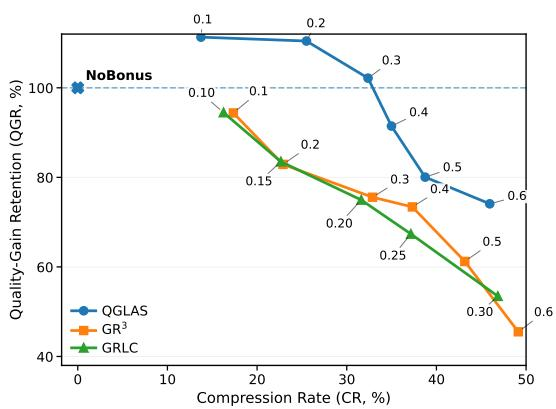
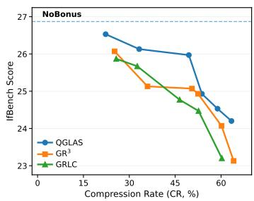
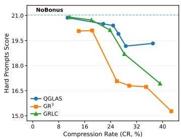
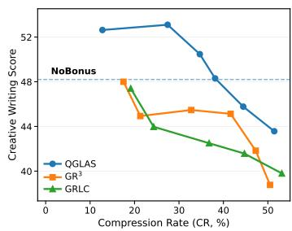
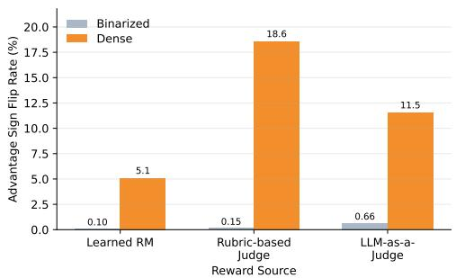
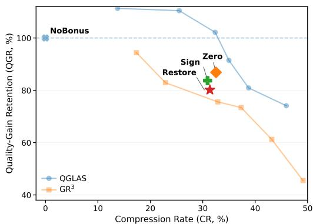

# QUALITY DETERMINES DIRECTION, LENGTH SHAPESMAGNITUDE: LENGTH CONTROL FOR OPEN-ENDEDREINFORCEMENT LEARNING

Zijun Weng1,2,†, Zhongan Bi3,†, Xuanang Gao4,†, Xiaohui Hu2, Shuangyong Song2, Yongxiang Li2, Kaidong Yu2,∗, Xuanjing Huang1,∗

## ABSTRACT

Reinforcement learning (RL) changes not only what language models say, but also how much they say, often increasing response length at the cost of token efficiency. Controlling this length growth is particularly challenging in open-ended RL because (i) response length is entangled with quality, (ii) open-ended tasks lack a natural success boundary for deciding when efficiency should be prioritized, and (iii) dense, graded rewards often yield small within-group quality margins, making quality-induced advantages especially sensitive to reward-level length shaping, which can perturb their magnitudes and even reverse their signs. We therefore adopt an asymmetric principle: quality should determine the direction of reinforcement, while length should only shape its magnitude. We instantiate this principle with Quality-Gated Length Advantage Shaping (QGLAS), which first computes advantages from quality rewards alone, then adds bounded bonuses only to shorter positive-advantage responses, leaving all other advantages unchanged. The bonus strength is further adapted to within-group quality separation, allowing conciseness to matter more when quality-favored responses are similar and less when their quality differences are clear. Across different model families, open-ended benchmarks, and reward sources, QGLAS consistently achieves a stronger quality–length trade-off than representative baselines. At approximately 30% compression, QGLAS retains 98.4–102.0% of the macroaverage quality gains achieved by quality-only RL over the base model, compared with 68.3–75.5% for these baselines at comparable compression.

## 1 INTRODUCTION

Reinforcement learning (RL) changes not only what language models say, but also how much they say. On open-ended tasks such as instruction following, dialogue, decision making, and creative generation, quality gains often accompany substantially longer responses (Chen et al., 2024). Additional tokens can improve coverage and justification, but longer responses may also receive higher reward or evaluation scores without commensurate quality gains (Bu et al., 2025; Dubois et al., 2024; Nohara et al., 2026). RL can therefore exploit verbosity as an optimization shortcut, yet indiscriminate length penalties may suppress useful content. Effective length control must reduce low-value generation while preserving genuine quality gains.

Open-ended RL makes this problem challenging because (i) length is entangled with quality:

  
Figure 1: Quality–length trade-off on Qwen3- 4B. QGLAS retains substantially more quality gain than others at comparable compression.

additional tokens may represent either redundancy or useful reasoning and detail; (ii) graded feedback lacks a natural success boundary for prioritizing efficiency, and absolute reward values need not have comparable meanings across prompts or reward sources; and (iii) dense feedback can yield small within-group quality margins, making relative learning signals sensitive to length-dependent perturbations. Selecting responses for length control and calibrating its strength therefore require attention to the local quality structure.

Many RL-based length-control methods are developed for verifiable-reward settings, where correctness or group-level success statistics guide the balance between task performance and efficiency (Liu et al., 2026d; Aggarwal & Welleck, 2025; Peng et al., 2026). Recent methods, including Group Relative Reward Rescaling (GR3) (Li et al., 2026b) and Group Relative Length Control (GRLC) (NVIDIA, 2025), support continuous feedback and incorporate quality-dependent safeguards. However, they introduce length into the rewards used to compute relative advantages. Consequently, reward-level shaping can alter not only the reinforcement polarity of directly targeted responses, but also the original quality-induced advantages of responses that receive no length adjustment at all.

We examine this effect in a controlled analysis. Applying GR3 with the same coefficient to identical stored rollout groups yields a macro-average sign-reversal rate of 11.73% under dense rewards versus 0.30% averaged over four binarized variants—a nearly 40× difference. Although this comparison does not reproduce RLVR training, it shows that support for continuous feedback alone does not ensure preservation of the reinforcement decisions induced by quality.

These observations motivate an asymmetric principle: quality should determine the direction of reinforcement, while length should only shape its magnitude. We express this requirement as qualitypolarity invariance: length shaping must preserve the sign of every advantage computed from the original quality rewards. Within this constraint, conciseness may still modulate the relative reinforcement strength among quality-favored responses.

We propose Quality-Gated Length Advantage Shaping (QGLAS) to enforce this requirement by construction. QGLAS computes advantages from quality rewards alone, then adds bounded bonuses only to shorter positive-advantage responses. Advantage-level shaping leaves untargeted advantages unchanged, while positive-only, one-sided bonuses preserve every advantage sign. The shaping strength adapts to the overall reward spread and quality separation among favored responses, giving conciseness more weight when their rewards are similar and less when they are clearly separated.

On Qwen3-4B and GLM-4.7-Flash, QGLAS achieves a stronger quality–length trade-off than GR3 and GRLC. At approximately 30% compression relative to quality-only RL, it retains 98.4–102.0% of that policy’s macro-average quality gain over the base model, compared with 68.3–75.5% for these baselines at comparable compression. Repeated runs and alternative reward sources further support its robustness. A fixed-strength ablation also preserves every advantage sign but retains substantially less quality, showing the benefit of adapting shaping strength within the same constraint. Our contributions are threefold:

• We empirically diagnose advantage sign reversals under reward-level length shaping, showing substantially greater sensitivity under dense feedback than under controlled binarizations of the same quality rewards.

• We introduce QGLAS, which isolates length shaping to explicitly targeted responses, preserves quality-induced reinforcement polarity by construction, and adapts shaping strength to the local reward structure.

• We demonstrate improved quality–length trade-offs across policy models and reward sources, with ablations supporting complementary benefits from polarity-preserving constraints and adaptive shaping strength.

## 2 RELATED WORK

Length bias and response efficiency. Excessive response length has been studied at multiple stages of the alignment pipeline. Length-controlled evaluation reduces verbosity-related confounding (Dubois et al., 2024; Hu et al., 2025), while reward-modeling approaches seek to separate genuine quality from superficial preferences for longer responses (Shen et al., 2023; Liu et al., 2025a). A complementary line intervenes directly during RL through length-dependent optimization signals (Li et al., 2026a; Han et al., 2026; Xiang et al., 2025; Liu et al., 2026c). Our work follows this RL time setting, focusing on how efficiency preferences should interact with graded quality feedback.

Length control with verifiable rewards. Many RL-based length-control methods are developed for reinforcement learning with verifiable rewards (RLVR). They use correctness, solve rate, or estimated difficulty to determine which responses to encourage toward conciseness and how strongly (Liu et al., 2026d; Yuan et al., 2026; Xiang et al., 2025; Li et al., 2026a; Liu et al., 2026a). For example, Dynamic Decoupled Conditional Advantage (DDCA) (Peng et al., 2026) computes length advantages within the correct-response subset and scales their strength by the group pass rate.

These designs exploit two properties of binary feedback: correctness provides an eligibility criterion, and successful responses share the same task reward, making length a natural secondary preference within that subset. These foundations do not transfer directly to graded open-ended feedback, where no success threshold exists and quality-favored responses may still differ meaningfully. Length control must therefore determine both which responses are eligible for efficiency optimization and how strongly conciseness should matter relative to their remaining quality differences.

Length control with continuous quality rewards. Representative methods also support length control beyond binary correctness. Group Relative Length Control (GRLC), introduced in the Nemotron 3 Nano technical report (NVIDIA, 2025), adds group-relative length adjustments and quality-gated conciseness bonuses to the quality reward. Group Relative Reward Rescaling $( \mathbf { G } \mathbf { R } ^ { 3 } )$ (Li et al., 2026b), our closest baseline, uses multiplicative reward rescaling, group-relative length normalization, and advantage-aware calibration to protect a representative maximum-reward response with group-average length. Both methods support continuous feedback and incorporate safeguards against indiscriminate length reduction.

However, these safeguards do not fully address the challenges posed by graded quality differences. Both methods incorporate length into rewards before relative advantages are computed, without requiring every response to preserve the reinforcement polarity induced by quality alone. This distinction matters when dense feedback yields small within-group quality margins. Moreover, their quality-dependent gating and calibration do not explicitly adapt shaping strength to the quality sep aration among positive-advantage responses within the current group.

Our work treats the quality-induced advantage as the primary learning signal: quality determines which responses are reinforced or suppressed, while length modulates reinforcement strength through bonuses restricted to shorter positive-advantage responses. We further adapt bonus strength to the overall reward spread and quality separation within this favored subset, combining polarity preservation with quality-adaptive length control. Conciseness thus receives greater weight when quality-favored responses differ little.

## 3 QUALITY-GATED LENGTH ADVANTAGE SHAPING

We propose Quality-Gated Length Advantage Shaping (QGLAS) for controlling response length in open-ended reinforcement learning. Our key principle is asymmetric: quality determines the reinforcement polarity, while length only shapes its magnitude. Accordingly, QGLAS preserves whether a response is reinforced or suppressed according to the quality signal, while allowing conciseness to modulate the relative reinforcement strength among quality-favored responses. QGLAS realizes this principle through three design choices: isolating the length signal from non-targeted responses, restricting length shaping to quality-favored responses, and adapting its strength to the local quality structure.

For a rollout group $^ { g , }$ let $A _ { i } ^ { q }$ denote the quality-induced advantage of response i, computed by the underlying group-relative RL algorithm from the original quality rewards before introducing any length-dependent signal. QGLAS modifies this advantage as

$$
\widetilde { A } _ { i } = A _ { i } ^ { q } + \lambda _ { g } h _ { i } .\tag{1}
$$

Here, $h _ { i } \in [ 0 , 1 ]$ is a response-level length-shaping coefficient that determines whether response i receives a conciseness bonus and, if so, by how much. The group-level scale $\lambda _ { g } \ge 0$ controls how strongly conciseness is allowed to influence the current rollout group. As defined below, $h _ { i }$ is nonzero only for shorter responses whose quality-induced advantage is already positive.

## 3.1 ISOLATING THE LENGTH SIGNAL

QGLAS determines the reinforcement polarity from $A _ { i } ^ { q }$ before introducing any length signal. To see why this matters, consider group-wise standardized advantages (Guo et al., 2025),

$$
A _ { i } ^ { q } = \frac { r _ { i } - \bar { r } } { \sigma _ { r } } .\tag{2}
$$

If reward-level length shaping instead perturbs the reward as $r _ { i } ^ { \prime } = r _ { i } + \delta _ { i }$ , the resulting advantage is

$$
A _ { i } ^ { \prime } = \frac { ( r _ { i } - \bar { r } ) + ( \delta _ { i } - \bar { \delta } ) } { \sigma _ { r + \delta } } .\tag{3}
$$

Thus, length shaping affects responses even when they receive no direct perturbation: for $\delta _ { i } = 0$ their centered reward is shifted by −¯δ. In particular, when $\bar { \delta } > 0$ , a positive quality advantage can reverse sign if $\begin{array} { r } { 0 < r _ { i } - \bar { r } < \bar { \delta } . } \end{array}$ , a risk that is amplified when dense rewards yield small within-group quality margins.

QGLAS instead shapes the already established quality advantage. Responses with $h _ { i } = 0$ therefore remain exactly unchanged, $\widetilde { A } _ { i } = A _ { i } ^ { q }$ , isolating the length signal to explicitly targeted responses.

## 3.2 RESTRICTING THE SCOPE OF LENGTH SHAPING

QGLAS restricts length shaping through two complementary constraints: positive-only gating and one-sided shaping. Let $\mathcal { P } \overset { ^ { \bullet } } { = } \overset {  } { \{ i : A _ { i } ^ { q } > 0 \} }$ denote the quality-favored responses. If $\mathcal { P } = \emptyset$ , we skip length shaping for the group. Otherwise, we define a prompt-adaptive reference length and response-level shaping coefficient as

$$
L _ { \mathrm { r e f } } = \frac { 1 } { | \mathcal { P } | } \sum _ { j \in \mathcal { P } } L _ { j } , \qquad h _ { i } = \mathbf { 1 } [ i \in \mathcal { P } ] \frac { \mathrm { c l i p } \Bigl ( \frac { L _ { \mathrm { r e f } } - L _ { i } } { L _ { \mathrm { r e f } } + \epsilon } , 0 , c \Bigr ) } { c } .\tag{4}
$$

Here, $\epsilon > 0$ is a numerical stabilizer, while $c \in \mathsf { \Gamma } ( 0 , 1 ]$ sets the saturation threshold for relative shortening: $h _ { i }$ increases with relative shortening up to c and is capped at 1 thereafter. Thus, $h _ { i } \in$ $[ 0 , 1 ]$ and $h _ { i } > 0$ only for quality-favored responses shorter than $L _ { \mathrm { r e f } }$ . Positive-only gating prevents brevity from overriding an unfavorable quality signal, while one-sided shaping avoids penalizing longer quality-favored responses. Using only $\mathcal { P }$ to define $L _ { \mathrm { r e f } }$ also prevents short, quality-disfavored responses from setting the efficiency target. Consequently,

$$
\mathrm { s i g n } ( \widetilde { A } _ { i } ) = \mathrm { s i g n } ( A _ { i } ^ { q } ) \qquad \forall i ,\tag{5}
$$

so length shaping preserves the original quality-induced reinforcement polarity.

## 3.3 ADAPTING THE SHAPING STRENGTH

We next define the group-level shaping strength $\lambda _ { g }$ . A fixed shaping strength is poorly calibrated for dense rewards because their scale and local quality separation can vary substantially across rollout groups. We define

$$
s _ { \mathrm { a l l } } = Q _ { 1 0 0 } ( r ) - Q _ { 2 5 } ( r ) , \qquad s _ { + } = \operatorname* { m a x } _ { j \in \mathcal { P } } r _ { j } - \operatorname* { m i n } _ { j \in \mathcal { P } } r _ { j } ,\tag{6}
$$

where $Q _ { p } ( r )$ denotes the $p { \cdot } \mathrm { t h }$ percentile of the group rewards. Here, $s _ { \mathrm { a l l } }$ captures the overall reward scale, while $s _ { + }$ measures the quality separation among quality-favored responses. We use the lower quartile rather than the minimum in $s _ { \mathrm { a l l } }$ to make the scale estimate less sensitive to anomalously low-reward responses. This robustness is particularly useful for estimating the overall group scale, whereas $s _ { + }$ is computed only within the quality-favored subset.

We adapt the shaping strength according to the relative separation among quality-favored responses:

$$
\beta _ { g } = \beta _ { \mathrm { m i n } } + \left( \beta _ { \mathrm { m a x } } - \beta _ { \mathrm { m i n } } \right) \left[ 1 - \mathrm { c l i p } \left( \frac { s _ { + } } { s _ { \mathrm { a l l } } + \epsilon } , 0 , 1 \right) \right] .\tag{7}
$$

When quality-favored responses are weakly separated relative to the overall reward scale, $\beta _ { g }$ approaches $\beta _ { \mathrm { m a x } }$ , allowing conciseness to act as a stronger secondary preference. As their quality

separation increases, $\beta _ { g }$ decreases toward $\beta _ { \mathrm { m i n } } ,$ allowing the original quality differences to dominate. Under group-wise reward standardization, we define the effective shaping scale as

$$
\lambda _ { g } = \frac { s _ { \mathrm { a l l } } } { \sigma _ { r } } \beta _ { g } ,\tag{8}
$$

where $\sigma _ { r }$ is computed from the original quality rewards. This places the length bonus on the same scale as the quality advantage $A _ { i } ^ { q }$ . When ϵ is negligible and clipping is inactive, the effective shaping scale can be written approximately as

$$
\lambda _ { g } \approx \frac { \beta _ { \mathrm { m a x } } s _ { \mathrm { a l l } } - ( \beta _ { \mathrm { m a x } } - \beta _ { \mathrm { m i n } } ) s _ { + } } { \sigma _ { r } } .\tag{9}
$$

This decomposition makes the adaptation explicit: the shaping scale increases with the overall reward variation $s _ { \mathrm { a l l } }$ , but decreases with the quality separation $s _ { + }$ among quality-favored responses. Thus, conciseness matters more when favored responses are difficult to distinguish by quality, and less when quality already separates them clearly.

If the underlying advantage estimator does not use group-wise standard-deviation normalization, the corresponding normalization is omitted, giving $\lambda _ { g } = s _ { \mathrm { a l l } } \beta _ { g }$ . Thus, QGLAS follows the scale convention of the underlying quality advantage instead of introducing a separate normalization scheme.

## 4 EXPERIMENTS

We evaluate QGLAS’s quality–length trade-off, examine advantage sign reversals under dense feedback and their impact on downstream performance. We then disentangle structural constraints from adaptive scaling and test generalization across reward sources.

## 4.1 EXPERIMENTAL SETUP

Models and training. We conduct experiments with Qwen3-4B (Qwen Team, 2025) and GLM-4.7-Flash (30B-A3B) (GLM Team, 2025), covering different model families and dense and mixtureof-experts architectures. Training uses the 13K open-ended prompts introduced by Weng et al. (2026), spanning instruction following, writing, and decision support. All methods are optimized with GSPO (Zheng et al., 2025) for 1,000 steps, with 16 rollouts sampled per prompt. Unless otherwise stated, our main experiments use Skywork-Reward-V2-Llama-3.1-8B (Liu et al., 2026b) as the quality reward model.

Baselines and control strengths. For each policy model, we compare the base model, qualityonly RL (NoBonus), QGLAS, GR3, and GRLC. The latter two are representative reward-level length-control methods applicable to continuous quality feedback. All RL methods use the same training data, quality reward, and optimization budget within each comparison.

$\mathrm { G R ^ { 3 } }$ applies multiplicative reward shaping and requires non-negative rewards to preserve its intended length-control direction. Following its original RLHF setting, we therefore apply the same reference-based sigmoid shaping (Preference As Reward; PAR (Jiang et al., 2024)) to the raw Skywork scores, and use PAR for all methods in these comparisons.

For the quality–length sweeps, we only vary each method’s control strength. For QGLAS, we sweep $\beta _ { \mathrm { m i n } }$ with $\beta _ { \mathrm { m a x } } = 2 \beta _ { \mathrm { m i n } } ;$ for $\mathrm { G R ^ { 3 } }$ , we sweep α; for GRLC, we jointly sweep $( \lambda , \beta )$ with $\beta = \bar { \lambda }$ Detailed baseline configurations are provided in Appendix A.

Evaluation. We evaluate instruction following on IFBench (Pyatkin et al., 2026), challenging open-ended dialogue on the Hard Prompts subset of Arena-Hard-v2, and creative writing on its Creative Writing subset (Li et al., 2024). We follow the official evaluation protocol for each benchmark and use GPT-4.1 as the judge model when judge-based evaluation is required. We report the quality score and average response length for each benchmark, together with their macro averages. Response length counts all generated tokens, including thinking tokens and answer tokens.

To summarize the overall quality–length trade-off, we report quality-gain retention (QGR) and compression rate (CR):

$$
\mathrm { Q G R } ( m ) = \frac { S _ { m } - S _ { \mathrm { B a s e } } } { S _ { \mathrm { N B } } - S _ { \mathrm { B a s e } } } \times 1 0 0 \% , \qquad \mathrm { C R } ( m ) = \left( 1 - \frac { L _ { m } } { L _ { \mathrm { N B } } } \right) \times 1 0 0 \% .\tag{10}
$$

  
(a) IFBench.

  
(b) Hard Prompts.

  
(c) Creative Writing.  
Figure 2: Benchmark-level quality–length trade-offs on Qwen3-4B. Each panel plots benchmark score against benchmark-specific compression rate (CR) relative to NoBonus across evaluated control strengths. Higher scores and higher compression are preferred.

Table 1: Main results at approximately matched compression. ∆Score denotes the score change relative to quality-only RL. QGR and CR are computed from the unrounded macro averages. Best quality results among length-controlled methods are shown in bold.
<table><tr><td rowspan="2">Method</td><td colspan="2">IFBench</td><td colspan="2">Hard Prompts</td><td colspan="2">Creative Writing</td><td colspan="2">Macro Average</td><td colspan="2">Relative Metrics</td></tr><tr><td>Score↑</td><td>∆Score↑</td><td>Score↑</td><td>∆Score↑</td><td>Score↑</td><td>∆Score↑</td><td>Score↑</td><td>#Tok.↓</td><td>QGR↑</td><td>CR↑</td></tr><tr><td>Qwen3-4B</td><td></td><td></td><td></td><td></td><td></td><td></td><td></td><td></td><td></td><td></td></tr><tr><td>Base</td><td>29.22</td><td></td><td>15.63</td><td></td><td>16.53</td><td></td><td>20.46</td><td>3792</td><td>0.0%</td><td>9.9%</td></tr><tr><td>NoBonus</td><td>26.89</td><td>0.00</td><td>21.03</td><td>0.00</td><td>48.20</td><td>0.00</td><td>32.04</td><td>4207</td><td>100.0%</td><td>0.0%</td></tr><tr><td>GR3</td><td>25.07</td><td>-1.82</td><td>17.07</td><td>-3.96</td><td>45.47</td><td>-2.73</td><td>29.20</td><td>2824</td><td>75.5%</td><td>32.9%</td></tr><tr><td>GRLC</td><td>24.78</td><td>-2.11</td><td>20.13</td><td>-0.90</td><td>42.50</td><td>-5.70</td><td>29.14</td><td>2877</td><td>74.9%</td><td>31.6%</td></tr><tr><td>QGLAS</td><td>25.96</td><td>-0.93</td><td>20.40</td><td>-0.63</td><td>50.47</td><td>+2.27</td><td>32.28</td><td>2845</td><td>102.0%</td><td>32.4%</td></tr><tr><td>GLM-4.7-Flash</td><td></td><td></td><td></td><td></td><td></td><td></td><td></td><td></td><td></td><td></td></tr><tr><td>Base</td><td>53.00</td><td></td><td>28.33</td><td></td><td>47.53</td><td></td><td>42.95</td><td>6571</td><td>0.0%</td><td>8.7%</td></tr><tr><td>NoBonus</td><td>40.11</td><td>0.00</td><td>60.23</td><td>0.00</td><td>80.57</td><td>0.00</td><td>60.30</td><td>7199</td><td>100.0%</td><td>0.0%</td></tr><tr><td>GR3</td><td>36.56</td><td>-3.55</td><td>50.03</td><td>-10.20</td><td>78.83</td><td>-1.74</td><td>55.14</td><td>4780</td><td>70.2%</td><td>33.6%</td></tr><tr><td>GRLC</td><td>37.33</td><td>-2.78</td><td>49.17</td><td>-11.06</td><td>77.90</td><td>-2.67</td><td>54.80</td><td>4935</td><td>68.3%</td><td>31.5%</td></tr><tr><td>QGLAS</td><td>39.00</td><td>-1.11</td><td>59.30</td><td>-0.93</td><td>81.80</td><td>+1.23</td><td>60.03</td><td>4904</td><td>98.4%</td><td>31.9%</td></tr></table>

Here, $S _ { m }$ and $L _ { m }$ denote the macro-average quality score and response length of method m, respectively, and NB denotes NoBonus. QGR measures the fraction of the quality improvement from quality-only RL over the base model that is retained after introducing length control, with 100% indicating full retention. CR measures the reduction in response length relative to NoBonus, with larger values indicating stronger compression.

## 4.2 QUALITY–LENGTH TRADE-OFFS

Trade-offs across control strengths. We examine the quality–length trade-off across all evaluated control strengths. Figure 1 plots QGR against CR for QGLAS, GR3, and GRLC on Qwen3-4B, while Figure 2 shows the corresponding benchmark-level trade-offs.

Across the overlapping compression range, QGLAS consistently achieves higher QGR than GR3 and GRLC at comparable compression. QGLAS retains essentially the full macro-average quality improvement of quality-only RL over the base model at compression rates up to roughly 32%. In contrast, all evaluated $\mathrm { { \dot { G } R ^ { 3 } } }$ and GRLC operating points sacrifice part of this gain, with degradation increasing as compression increases. The benchmark-level curves show that this advantage is not driven by a single benchmark. The consistent separation across the sweeps indicates that QGLAS’s advantage is not specific to a single coefficient.

Matched-compression comparison. Table 1 compares all three methods at approximately matched compression. QGLAS retains 102.0% and 98.4% of the macro-average quality gains of quality-only RL on Qwen3-4B and GLM-4.7-Flash, respectively, compared with 75.5% and 70.2% for GR3, and 74.9% and 68.3% for GRLC. While QGR measures aggregate rather than task-wise retention, QGLAS achieves the highest mean quality score among length-controlled methods on every evaluated benchmark for both policy models. Together with the benchmark-level trade-offs in Appendix B.3, this indicates that the aggregate advantage is not driven solely by a single task. Most of the observed IFBench degradation occurs already under quality-only RL, before QGLAS introduces length control; Appendix B.3 examines this behavior further.

  
(a) Sensitivity to reward granularity.  
(b) Targeted correction during training.  
Figure 3: Advantage sign reversals: prevalence and downstream impact. Left: $\mathrm { G R ^ { 3 } }$ flip rates under dense and binarized feedback on identical rollouts within each reward source. Right: Three corrections to $\mathrm { G R ^ { 3 } }$ with $\alpha = 0 . 3$ on Qwen3-4B, shown against the $\mathrm { G R ^ { 3 } }$ and QGLAS sweeps. Higher QGR and CR are preferred.

## 4.3 ADVANTAGE SIGN REVERSALS: PREVALENCE AND IMPACT

Focusing on $\mathrm { G R ^ { 3 } }$ as our closest baseline, we first diagnose sensitivity to reward granularity on fixed rollouts, then intervene during training to test whether correcting sign reversals improves its quality– length trade-off.

## 4.3.1 SENSITIVITY TO REWARD GRANULARITY

We use stored rollouts from steps 100–900 under three reward sources: $\mathrm { G R ^ { 3 } }$ training with $\alpha = 0 . 3$ for Learned RM, and the corresponding NoBonus runs for Rubric-based Judge and LLM-as-a-Judge. Within each source, we hold responses, lengths, and rollout groups fixed and compare the original dense rewards with four binarizations: $\mathbf { 1 } [ \bar { A } _ { i } ^ { q } > 0 ]$ and indicators for the top 25%, 50%, or 75% of responses by quality score. We apply $\mathrm { G } \mathrm { { R } ^ { 3 } }$ with $\alpha = 0 . 3$ to each representation and average binarized results over the four constructions.

A strict sign reversal satisfies $A _ { i } ^ { \mathrm { b e f o r e } } A _ { i } ^ { \mathrm { a f t e r } } < 0 ;$ transitions involving zero are excluded. Each shaped advantage is compared with its own pre-shaping counterpart under the same reward representation. This isolates sensitivity to reward representation on fixed rollouts; it does not reproduce RLVR training.

Figure 3a shows dense-feedback flip rates of 5.08%, 18.56%, and 11.54% for Learned RM, Rubricbased Judge, and LLM-as-a-Judge, respectively, compared with 0.10%, 0.15%, and 0.66% after binarization. The macro average rises from 0.30% to 11.73%, a nearly 40× difference. Thus, the same reward-level shaping rule can reverse quality-induced reinforcement polarity substantially more often under dense feedback.

## 4.3.2 TARGETED CORRECTION OF SIGN REVERSALS

To test whether these reversals matter downstream, we train three variants of $\mathrm { G R ^ { 3 } }$ with $\alpha = 0 . 3$ on Qwen3-4B under the main Learned RM setting. Let $A _ { i } ^ { \mathrm { G R } }$ denote the $\mathrm { G R ^ { 3 } }$ -shaped advantage. Only when $A _ { i } ^ { q } A _ { i } ^ { \mathrm { G R } } < 0 .$ , we replace it by 0 (ZERO), sign( $A _ { i } ^ { q } ) | A _ { i } ^ { \mathrm { G R } } |$ (SIGN), or $A _ { i } ^ { q }$ (RESTORE); all other advantages remain unchanged. ZERO suppresses the conflicting update, whereas SIGN and RE-STORE recover its quality-induced polarity using the shaped and original magnitudes, respectively.

Table 2: Ablation of QGLAS design choices on Qwen3-4B at approximately matched compression. Each ablation modifies full QGLAS independently. IFB. denotes IFBench, Hard denotes Hard Prompts, and Creative denotes Creative Writing. Best quality results among length-controlled variants are shown in bold.
<table><tr><td>Method</td><td>IFB.↑</td><td>Hard↑</td><td>Creative↑</td><td>Avg. Score↑</td><td>Avg. #Tok.↓</td><td>QGR↑</td><td>CR↑</td></tr><tr><td>NoBonus</td><td>26.89</td><td>21.03</td><td>48.20</td><td>32.04</td><td>4207</td><td>100.0%</td><td>0.0%</td></tr><tr><td>QGLAS</td><td>25.96</td><td>20.40</td><td>50.47</td><td>32.28</td><td>2845</td><td>102.0%</td><td>32.4%</td></tr><tr><td colspan="8">A. Structural constraints (adaptive scaling retained)</td></tr><tr><td>w/o All Structural Constraints</td><td>23.33</td><td>16.13</td><td>42.77</td><td>27.41</td><td>2895</td><td>60.0%</td><td>31.2%</td></tr><tr><td>w/o Advantage-Level Shaping</td><td>25.33</td><td>19.93</td><td>46.67</td><td>30.64</td><td>2840</td><td>87.9%</td><td>32.5%</td></tr><tr><td>w/o Positive-Only Gating</td><td>24.89</td><td>17.83</td><td>44.57</td><td>29.10</td><td>2799</td><td>74.6%</td><td>33.5%</td></tr><tr><td>w/o One-Sided Shaping</td><td>24.11</td><td>18.43</td><td>47.80</td><td>30.11</td><td>2782</td><td>83.4%</td><td>33.9%</td></tr><tr><td colspan="8">B. Adaptive scaling (structural constraints retained)</td></tr><tr><td>Fixed Overall Strength (λ = 0.1833)</td><td>25.33</td><td>17.93</td><td>46.60</td><td>29.95</td><td>2937</td><td>82.0%</td><td>30.2%</td></tr><tr><td>Fixed  $s _ { + } = 0 . 3 2 3 4$ </td><td>25.56</td><td>18.40</td><td>48.30</td><td>30.75</td><td>2955</td><td>88.9%</td><td>29.8%</td></tr><tr><td>Fixed  $s _ { \mathrm { a l l } } = 0 . 4 6 7 2$ </td><td>25.11</td><td>18.03</td><td>47.67</td><td>30.27</td><td>2960</td><td>84.7%</td><td>29.6%</td></tr></table>

Figure 3b shows (QGR, CR) values of (86.82%, 32.53%), (83.56%, 30.92%), and (80.02%, 31.36%) for ZERO, SIGN, and RESTORE, respectively, compared with approximately (75.50%, 32.9%) for unmodified GR3. All three corrections improve quality retention at similar compression levels and lie above the interpolated GR3 sweep. ZERO achieves both the highest QGR and the greatest compression among the three corrections, recovering substantial quality at nearly unchanged compression relative to unmodified $\mathrm { G R ^ { 3 } }$ . These interventions support reversal-related interference as a contributor to the quality cost of length shaping in this setting. Nevertheless, all three remain below the QGLAS trade-off curve, indicating that correcting sign reversals alone does not recover its full advantage and motivating the following analysis of structural constraints and adaptive strength.

## 4.4 PRESERVING DIRECTION AND ADAPTING MAGNITUDE

We separate QGLAS’s structural constraints from its adaptive scaling, examining both their overall effects and individual components. Table 2 reports downstream results under the main Learned RM setting. For structural ablations, we vary only the scalar shaping strength to approximately match full QGLAS’s compression rate; adaptive ablations use fixed statistics and achieve slightly weaker compression. Appendix B.4 provides calibration details and unmatched results. The complementary offline flip rates below are macro-averaged across three reward sources.

## 4.4.1 STRUCTURAL CONSTRAINTS FOR QUALITY-ALIGNED SHAPING

Are structural constraints necessary? Removing all three constraints applies two-sided length shaping at the reward level to all responses while retaining the adaptive strength rule. QGR falls from 102.0% to 60.0% at comparable compression (32.4% vs. 31.2%), showing that adaptive strength alone does not recover the full method’s quality retention. We next remove each constraint individually.

Isolating the length signal. Moving shaping from the advantage level to the reward level reduces QGR to 87.9% at 32.5% compression. The corresponding offline diagnostic reports a 0.99% signreversal rate. As discussed in Section 3.1, reward-level shaping changes the group statistics used to form advantages and can therefore affect responses without a direct length bonus. Advantage-level shaping avoids this indirect interference.

Restricting the scope of shaping. Removing positive-only gating reduces QGR to 74.6% at 33.5% compression; allowing two-sided shaping reduces it to 83.4% at 33.9% compression. Their offline flip rates are 3.80% and 2.71%, respectively. Without positive-only gating, brevity bonuses can counteract negative quality advantages; two-sided shaping can instead turn positive advantages negative for longer responses. These results support restricting conciseness bonuses to quality favored responses while leaving longer ones unpenalized.

Table 3: Robustness across training quality rewards on Qwen3-4B. IFB. denotes IFBench, Hard denotes the Hard Prompts subset of Arena-Hard-v2, and Creative denotes its Creative Writing subset.
<table><tr><td>Training Reward</td><td>Method</td><td>IFB.↑</td><td>Hard↑</td><td>Creative↑</td><td>Avg. Score↑</td><td> $\mathbf { A v g } .$  #Tok.↓</td><td>QGR↑</td><td>CR↑</td></tr><tr><td rowspan="2">Learned RM</td><td>NoBonus</td><td>26.89</td><td>21.03</td><td>48.20</td><td>32.04</td><td>4207</td><td></td><td></td></tr><tr><td>QGLAS</td><td>25.96</td><td>20.40</td><td>50.47</td><td>32.28</td><td>2845</td><td>102.0%</td><td>32.4%</td></tr><tr><td rowspan="2">Rubric-based Judge</td><td>NoBonus</td><td>33.11</td><td>19.07</td><td>28.87</td><td>27.02</td><td>4125</td><td></td><td></td></tr><tr><td>QGLAS</td><td>33.44</td><td>18.93</td><td>28.57</td><td>26.98</td><td>2960</td><td>99.4%</td><td>28.2%</td></tr><tr><td rowspan="2">LLM-as-a-Judge</td><td>NoBonus</td><td>32.88</td><td>17.13</td><td>23.50</td><td>24.50</td><td>4248</td><td></td><td></td></tr><tr><td>QGLAS</td><td>32.67</td><td>16.87</td><td>23.90</td><td>24.48</td><td>3016</td><td>99.4%</td><td>29.0%</td></tr></table>

## 4.4.2 QUALITY-ADAPTIVE SCALING BEYOND SIGN PRESERVATION

Does adapting the magnitude matter? All adaptive-scaling ablations retain the structural constraints and preserve every advantage sign. Replacing $\lambda _ { g }$ by its mean over stored full-QGLAS rollout groups, $\lambda _ { \mathrm { f i x e d } } = 0 . 1 8 3 3$ , reduces QGR from 102.0% to 82.0% despite weaker compression (30.2% vs. 32.4%). Thus, sign preservation alone does not ensure strong quality retention; adapting bonus magnitudes across groups provides an additional benefit.

Which reward statistics matter? We separately fix $s _ { + }$ or $s _ { \mathrm { a l l } } .$ , retaining the other statistic’s groupspecific value. Fixing $s _ { + }$ yields 88.9% QGR at 29.8% compression. Fixing $s _ { \mathrm { a l l } }$ in both the outer scale factor and the computation of $\beta _ { g }$ yields 84.7% QGR at 29.6% compression. Both variants retain more quality than fixed overall strength, but remain below full QGLAS despite weaker compression. These results support using both the overall reward spread and the quality separation among positive-advantage responses to calibrate shaping strength.

Where does the reinforcement ordering change? QGLAS preserves advantage signs but allows conciseness to change the ordering within the positive-advantage set. For pairs with $\mathbf { \check { \cal A } } _ { i } ^ { q } > { \cal A } _ { j } ^ { q } > 0$ we count a ranking reversal when $\smash { \widetilde { A } } _ { i } < \widetilde { A } _ { j }$ and divide eligible pairs into five equal-sized bins by their pre-shaping advantage gap, $\Delta _ { i j } ^ { q } = A _ { i } ^ { \check { q } } - A _ { j } ^ { q }$ . Table 9 shows that reordering is concentrated among small-gap pairs; fewer than 1% of pairs in the largest-gap bin are reordered under each reward source. This characterizes how full QGLAS reallocates reinforcement primarily among weakly separated responses, complementing the downstream evidence for adaptive scaling above.

## 4.5 GENERALIZATION ACROSS REWARD SOURCES

Finally, we test whether QGLAS’s benefit depends on the training reward. We replace the Learned RM with Rubric-based Judge and LLM-as-a-Judge feedback, keeping the remaining training setup and QGLAS hyperparameters unchanged. Table 3 shows that QGLAS reduces average response length by 28.2–32.4% across the three reward sources while retaining 99.4–102.0% of the corresponding quality-only RL gains. These results support robustness across a learned reward model and two forms of LLM-based feedback without reward-specific retuning.

## 5 CONCLUSION

In this work, we study length control in open-ended reinforcement learning, where dense quality feedback and the strong coupling between quality and response length make existing RLVR-style solutions difficult to apply directly. We argue that length control should respect the reinforcement direction established by the original quality feedback, rather than allowing length to reverse it. Based on this view, we propose three principles for quality-aligned length control: isolating the length signal, restricting where it can act, and adapting its strength to the local quality structure. We instantiate these principles in QGLAS, which consistently achieves a better quality–length trade-off across evaluated models, benchmarks, and reward sources. At around 30% compression, QGLAS retains nearly all of the macro-average quality improvement achieved by the corresponding qualityonly RL policy over the base model, suggesting that conciseness is best treated as a secondary preference under quality rather than as a competing objective.

## REFERENCES

Pranjal Aggarwal and Sean Welleck. L1: Controlling how long a reasoning model thinks with reinforcement learning. In Second Conference on Language Modeling, 2025. URL https: //openreview.net/forum?id=4jdIxXBNve.

Yuyan Bu, Liangyu Huo, Yi Jing, and Qing Yang. Beyond excess and deficiency: Adaptive length bias mitigation in reward models for RLHF. In Luis Chiruzzo, Alan Ritter, and Lu Wang (eds.), Findings of the Association for Computational Linguistics: NAACL 2025, pp. 3091–3098, Al buquerque, New Mexico, April 2025. Association for Computational Linguistics. ISBN 979-8- 89176-195-7. doi: 10.18653/v1/2025.findings-naacl.169. URL https://aclanthology. org/2025.findings-naacl.169/.

Lichang Chen, Chen Zhu, Jiuhai Chen, Davit Soselia, Tianyi Zhou, Tom Goldstein, Heng Huang, Mohammad Shoeybi, and Bryan Catanzaro. ODIN: Disentangled reward mitigates hacking in RLHF. In Forty-first International Conference on Machine Learning, 2024. URL https:// openreview.net/forum?id=zcIV8OQFVF.

Yann Dubois, Percy Liang, and Tatsunori Hashimoto. Length-controlled alpacaeval: A simple debiasing of automatic evaluators. In First Conference on Language Modeling, 2024. URL https://openreview.net/forum?id=CybBmzWBX0.

GLM Team. Glm-4.5: Agentic, reasoning, and coding (arc) foundation models, 2025. URL https: //arxiv.org/abs/2508.06471.

Daya Guo, Dejian Yang, Haowei Zhang, Junxiao Song, Peiyi Wang, Qihao Zhu, Runxin Xu, Ruoyu Zhang, Shirong Ma, Xiao Bi, et al. Deepseek-r1 incentivizes reasoning in llms through reinforcement learning. Nature, 645(8081):633–638, 2025.

Jinyi Han, Ying Huang, Ying Liao, Haiquan Zhao, Zishang Jiang, Xinyi Wang, Xikun Lu, Guanghao Zhou, Sihang Jiang, Jiaqing Liang, Weikang Zhou, Zeye Sun, Fei Yu, and Yanghua Xiao. Your models have thought enough: Training large reasoning models to stop overthinking. In The Fourteenth International Conference on Learning Representations, 2026. URL https: //openreview.net/forum?id=2u5ZRzDyS0.

Zhengyu Hu, Linxin Song, Jieyu Zhang, Zheyuan Xiao, Zhengyu Chen, and Hui Xiong. Explaining length bias in LLM-based preference evaluations. In ICLR 2025 Workshop on Navigating and Addressing Data Problems for Foundation Models, 2025. URL https://openreview. net/forum?id=tK2pcnNlWw.

Zaifan Jiang, Xing Huang, and Chao Wei. Preference as reward, maximum preference optimization with importance sampling, 2024. URL https://arxiv.org/abs/2312.16430.

Kimi Team. Kimi k2.5: Visual agentic intelligence, 2026. URL https://arxiv.org/abs/ 2602.02276.

Tianjian Li, Yiming Zhang, Ping Yu, Swarnadeep Saha, Daniel Khashabi, Jason Weston, Jack Lanchantin, and Tianlu Wang. Jointly reinforcing diversity and quality in language model generations, 2025. URL https://arxiv.org/abs/2509.02534.

Tianle Li, Wei-Lin Chiang, Evan Frick, Lisa Dunlap, Tianhao Wu, Banghua Zhu, Joseph E. Gonzalez, and Ion Stoica. From crowdsourced data to high-quality benchmarks: Arena-hard and benchbuilder pipeline, 2024. URL https://arxiv.org/abs/2406.11939.

Yanhao Li, Lu Ma, Jiaran Zhang, Lexiang Tang, Wentao Zhang, and Guibo Luo. LEASH: Adaptive length penalty and reward shaping for efficient large reasoning model. In Maria Liakata, Viviane P. Moreira, Jiajun Zhang, and David Jurgens (eds.), Proceedings of the 64th Annual Meeting of the Association for Computational Linguistics (Volume 1: Long Papers), pp. 2846–2856, San Diego, California, United States, July 2026a. Association for Computational Linguistics. ISBN 979-8- 89176-390-6. doi: 10.18653/v1/2026.acl-long.129. URL https://aclanthology.org/ 2026.acl-long.129/.

Zichao Li, Jie Lou, Fangchen Dong, Zhiyuan Fan, Mengjie Ren, Hongyu Lin, Xianpei Han, Debing Zhang, Le Sun, Yaojie Lu, and XingYu Li. Tackling length inflation without trade-offs: Group relative reward rescaling for reinforcement learning. In Forty-third International Conference on Machine Learning, 2026b. URL https://openreview.net/forum?id=quqoVYpzX3.

Chang Liu, Yiran Zhao, Lawrence Liu, Yaoqi Ye, Csaba Szepesvari, and Lin F. Yang. Laconic:´ Length-aware constrained reinforcement learning for llm, 2026a. URL https://arxiv. org/abs/2602.14468.

Chris Yuhao Liu, Liang Zeng, Yuzhen Xiao, Jujie He, Jiacai Liu, Chaojie Wang, Rui Yan, Wei Shen, Fuxiang Zhang, Jiacheng Xu, Yang Liu, and Yahui Zhou. Skywork-reward-v2: Scaling preference data curation via human-ai synergy, 2026b. URL https://arxiv.org/abs/ 2507.01352.

Hanbing Liu, Lang Cao, Yuanyi Ren, Mengyu Zhou, Haoyu Dong, Xiaojun Ma, Shi Han, and Dongmei Zhang. Not all tokens matter: Towards efficient LLM reasoning via token significance in reinforcement learning. In Maria Liakata, Viviane P. Moreira, Jiajun Zhang, and David Jurgens (eds.), Proceedings of the 64th Annual Meeting of the Association for Computational Linguistics (Volume 1: Long Papers), pp. 15989–16016, San Diego, California, United States, July 2026c. Association for Computational Linguistics. ISBN 979-8-89176-390-6. doi: 10.18653/v1/2026. acl-long.726. URL https://aclanthology.org/2026.acl-long.726/.

Tianqi Liu, Wei Xiong, Jie Ren, Lichang Chen, Junru Wu, Rishabh Joshi, Yang Gao, Jiaming Shen, Zhen Qin, Tianhe Yu, Daniel Sohn, Anastasia Makarova, Jeremiah Zhe Liu, Yuan Liu, Bilal Piot, Abe Ittycheriah, Aviral Kumar, and Mohammad Saleh. RRM: Robust reward model training mit igates reward hacking. In The Thirteenth International Conference on Learning Representations, 2025a. URL https://openreview.net/forum?id=88AS5MQnmC.

Wei Liu, Ruochen Zhou, Yiyun Deng, Yuzhen Huang, Junteng Liu, Yuntian Deng, Yizhe Zhang, and Junxian He. Learn to reason efficiently with adaptive length-based reward shaping. In The Fourteenth International Conference on Learning Representations, 2026d. URL https: //openreview.net/forum?id=hj9eKpqxQl.

Zichen Liu, Changyu Chen, Wenjun Li, Penghui Qi, Tianyu Pang, Chao Du, Wee Sun Lee, and Min Lin. Understanding r1-zero-like training: A critical perspective. In Second Conference on Language Modeling, 2025b. URL https://openreview.net/forum?id=5PAF7PAY2Y.

Daisuke Nohara, Taishi Nakamura, and Rio Yokota. On the optimal reasoning length for rl-trained language models, 2026. URL https://arxiv.org/abs/2602.09591.

NVIDIA. Nemotron 3 nano: Open, efficient mixture-of-experts hybrid mamba-transformer model for agentic reasoning, 2025. URL https://arxiv.org/abs/2512.20848.

Keqin Peng, Yuanxin Ouyang, Xuebo Liu, Zhiliang Tian, Ruijian Han, Yancheng Yuan, and Liang Ding. Think dense, not long: Dynamic decoupled conditional advantage for efficient reasoning, 2026. URL https://arxiv.org/abs/2602.02099.

Valentina Pyatkin, Saumya Malik, Victoria Graf, Hamish Ivison, Shengyi Huang, Pradeep Dasigi, Nathan Lambert, and Hannaneh Hajishirzi. Generalizing verifiable instruction following. In The Thirty-ninth Annual Conference on Neural Information Processing Systems Datasets and Benchmarks Track, 2026. URL https://openreview.net/forum?id=yfYgwjj5F8.

Qwen Team. Qwen3 technical report, 2025. URL https://arxiv.org/abs/2505.09388.

Wei Shen, Rui Zheng, Wenyu Zhan, Jun Zhao, Shihan Dou, Tao Gui, Qi Zhang, and Xuanjing Huang. Loose lips sink ships: Mitigating length bias in reinforcement learning from human feedback. In The 2023 Conference on Empirical Methods in Natural Language Processing, 2023. URL https://openreview.net/forum?id=qq6ctdUwCX.

Zijun Weng, Xiaohui Hu, Shuangyong Song, Yongxiang Li, Kaidong Yu, and Xuanjing Huang. Prompt-level reward specifications for open-ended post-training, 2026. URL https:// arxiv.org/abs/2605.29275.

Violet Xiang, Chase Blagden, Rafael Rafailov, Nathan Lile, Sang Truong, Chelsea Finn, and Nick Haber. Just enough thinking: Efficient reasoning with adaptive length penalties reinforcement learning, 2025. URL https://arxiv.org/abs/2506.05256.

Danlong Yuan, Tian Xie, Shaohan Huang, Huishuai Zhang, Zhuocheng Gong, Chong Luo, Furu Wei, and Dongyan Zhao. Shorten after you’re right: Lazy length penalties for reasoning RL. In Maria Liakata, Viviane P. Moreira, Jiajun Zhang, and David Jurgens (eds.), Findings of the Associationfor Computational Linguistics: ACL 2026, pp. 12864–12877, San Diego, California, United States, July 2026. Association for Computational Linguistics. ISBN 979-8-89176-395- 1. doi: 10.18653/v1/2026.findings-acl.626. URL https://aclanthology.org/2026. findings-acl.626/.

Chujie Zheng, Shixuan Liu, Mingze Li, Xiong-Hui Chen, Bowen Yu, Chang Gao, Kai Dang, Yuqiong Liu, Rui Men, An Yang, Jingren Zhou, and Junyang Lin. Group sequence policy optimization, 2025. URL https://arxiv.org/abs/2507.18071.

Table 4: Training configuration for the main experiments.
<table><tr><td>Hyperparameter</td><td>Value</td></tr><tr><td>RL algorithm</td><td>GSPO</td></tr><tr><td>Optimizer</td><td>Adam</td></tr><tr><td>Learning rate</td><td> $1 \times 1 0 ^ { - 6 }$ </td></tr><tr><td>Learning-rate schedule</td><td>Constant</td></tr><tr><td>Adam  $( { \bar { \beta } } _ { 1 } , \beta _ { 2 } )$  Weight decay</td><td>(0.9,0.98)</td></tr><tr><td></td><td>0.1</td></tr><tr><td>Rollout batch size</td><td>32</td></tr><tr><td>Mini-batch size</td><td>32</td></tr><tr><td>Global batch size</td><td>512</td></tr><tr><td>Responses per prompt</td><td>16</td></tr><tr><td>Rollout temperature</td><td>1.0</td></tr><tr><td>Maximum prompt length</td><td>2,048</td></tr><tr><td>Maximum response length</td><td>8,192</td></tr><tr><td>KL coefficient</td><td>0.001</td></tr><tr><td>Entropy coefficient</td><td>0</td></tr><tr><td>Policy clip range</td><td> $3 \times 1 0 ^ { - 4 } / 4 \times 1 0 ^ { - 4 }$ </td></tr><tr><td>Default seed (unless otherwise specified)</td><td>42</td></tr></table>

## A EXPERIMENTAL DETAILS

## A.1 TRAINING CONFIGURATION

Unless otherwise specified, NoBonus, $\mathrm { G R ^ { 3 } }$ , GRLC, and QGLAS use the same training configuration within each policy-model comparison. The main training hyperparameters are summarized in Table 4.

We disable group-wise standard-deviation normalization of the quality advantage in our GSPO implementation (Kimi Team, 2026; Liu et al., 2025b; Li et al., 2025). Accordingly, QGLAS uses the non-standardized form of the group-level shaping scale described in Section 3.3.

For the main matched-compression comparison on Qwen3-4B, we train NoBonus, $\mathrm { G R ^ { 3 } }$ with $\alpha =$ 0.3, GRLC with $( \lambda , \beta ) = ( \overset { \cdot } { 0 } . 2 , 0 . 2 )$ , and QGLAS with $( \beta _ { \mathrm { m i n } } , \beta _ { \mathrm { m a x } } ) = ( 0 . 3 , 0 . 6 )$ using three seeds (42, 43, and 44). The same seeds are used across all four methods, and each trained policy is evaluated three times. The Qwen3-4B matched-compression results reported in the main text are averaged across these three training seeds. For GLM-4.7-Flash, each configuration is trained once because of its substantially higher training cost, and each trained policy is evaluated three times.

Compute resources. Qwen3-4B policies are trained on 8 NVIDIA H800 GPUs, whereas GLM-4.7-Flash policies are trained on 16 H800 GPUs. In experiments using the learned reward model, Skywork-Reward-V2-Llama-3.1-8B is served on an additional 2 H800 GPUs. The resulting compute usage is approximately 160–240 H800 GPU-hours per Qwen3-4B training run and 576–864 H800 GPU-hours per GLM-4.7-Flash training run.

The Rubric-based Judge and LLM-as-a-Judge reward experiments are conducted only with Qwen3- 4B, with Qwen3.5-35B-A3B served on an additional 8 H800 GPUs. Each such training run uses approximately 768 H800 GPU-hours. Compute usage varies with rollout length, with configurations inducing stronger compression generally requiring fewer GPU-hours.

Alternative reward sources. For Rubric-based Judge and LLM-as-a-Judge, we follow the reward construction procedures of Weng et al. (2026), using normalized weighted aggregation of rubriclevel judgments and global scores normalized to [0, 1], respectively. Both use Qwen3.5-35B-A3B as the judge.

## A.2 LENGTH-CONTROL CONFIGURATION

QGLAS. Unless otherwise specified, we use the same QGLAS-specific hyperparameters across experiments. For the response-level length coefficient in equation 4, we set the relative-shortening clipping threshold to $c = 0 . 5$ and the numerical stability constant to $\epsilon = 1 0 ^ { - 8 }$ . The overall reward spread $s _ { \mathrm { a l l } }$ is computed from the 25th and 100th percentiles of the within-group quality rewards.

Table 5: Activation frequency of the clipping threshold $c = 0 . 5$ in equation 4. Statistics are computed from stored rollout groups from steps $1 0 0 – 9 0 0$ of QGLAS $( \beta _ { \mathrm { m i n } } , \beta _ { \mathrm { m a x } } ) = ( 0 . 3 , 0 . 6 )$ training. The denominator includes only responses with $h _ { i } > 0 ;$ “Clipped” denotes responses whose pre-clipping relative-shortening term exceeds c.
<table><tr><td>Reward source</td><td> $\# h _ { i } > 0$ </td><td>Clipped</td><td>Clip rate</td></tr><tr><td>Learned RM</td><td>111,418</td><td>801</td><td>0.719%</td></tr><tr><td>Rubric-based Judge</td><td>118,504</td><td>936</td><td>0.790%</td></tr><tr><td>LLM-as-a-Judge</td><td>101,569</td><td>1,306</td><td>1.286%</td></tr><tr><td>Pooled</td><td>331,491</td><td>3,043</td><td>0.918%</td></tr></table>

The main QGLAS configuration uses $( \beta _ { \mathrm { m i n } } , \beta _ { \mathrm { m a x } } ) = ( 0 . 3 , 0 . 6 )$ . In the control-strength sweeps, we set $\beta _ { \mathrm { m a x } } = 2 \beta _ { \mathrm { m i n } }$ and vary only $\beta _ { \mathrm { m i n } }$ . All other QGLAS-specific hyperparameters are held fixed across policy models and reward sources.

Normalization and clipping behavior. We fix the relative-shortening scale to $c = 0 . 5$ in equation 4. Besides determining the saturation threshold, c also normalizes the response-level shortening coefficient. Let $d _ { i } = ( L _ { \mathrm { r e f } } - L _ { i } ) / ( L _ { \mathrm { r e f } } + \epsilon )$ . In the unsaturated regime, $0 < d _ { i } < c ,$ we have $h _ { i } = d _ { i } / c ,$ so $h _ { i }$ represents the fraction of the shortening scale c attained by response i and reaches its maximum value of 1 when $d _ { i } \geq c .$ . For example, with $c = 0 . 5$ , a 10% relative shortening corresponds to $h _ { i } = 0 . 2$ . Since the group-level shaping scale $\lambda _ { g }$ is proportional to $\beta _ { g } ,$ the effective shaping strength in this linear regime depends on $\beta _ { g } / c ;$ we therefore keep c fixed and vary $\beta _ { g }$ to control the overall strength of length shaping.

We further examine how often the saturation threshold is reached in practice. Using stored rollout groups from steps 100–900 of the Qwen3-4B QGLAS training runs with $( \beta _ { \mathrm { m i n } } , \beta _ { \mathrm { m a x } } ) = ( 0 . 3 , 0 . 6 )$ under each of the three reward sources, we consider only responses receiving a non-zero length bonus $( h _ { i } > 0 )$ and measure the fraction whose pre-clipping relative-shortening term exceeds c.

As shown in Table 5, the threshold is reached by only 0.719%, 0.790%, and 1.286% of bonusreceiving responses under the Learned RM, Rubric-based Judge, and LLM-as-a-Judge settings, respectively. Pooled across the three reward sources, only 3,043 of 331,491 such responses (0.918%) reach the threshold. Thus, more than 99% of shaped responses operate in the linear, unsaturated regime, indicating that the observed behavior of QGLAS is not driven by frequent saturation at the chosen threshold.

GR3. Following the sigmoid reward transformation used in the RLHF setting of $\mathrm { G R ^ { 3 } }$ , we apply PAR-style shaping to the raw reward-model scores:

$$
r _ { i } = \sigma \left( \frac { r _ { i } ^ { \mathrm { r a w } } - r _ { \mathrm { r e f } } ^ { \mathrm { r a w } } } { \tau } \right) .\tag{11}
$$

We use the within-group median raw reward as $r _ { \mathrm { r e f } } ^ { \mathrm { r a w } }$ and fix the temperature at $\tau = 2$ to mitigate sigmoid saturation. The resulting rewards are non-negative, and the same transformation is applied to all methods in the corresponding comparisons.

$\mathrm { G R ^ { 3 } }$ applies multiplicative length-dependent rescaling to the quality reward:

$$
\hat { r } _ { i } = \frac { r _ { i } } { 1 + \alpha L _ { i } / \bar { L } } ,\tag{12}
$$

where $L _ { i }$ is the response length, $\bar { L }$ is the mean response length within the rollout group, and α controls the strength of length regularization.

$\mathrm { G R ^ { 3 } }$ selects α using an advantage-preservation calibration criterion. For a representative maximumreward response with group-average length, the shaped reward is required to satisfy

$$
\frac { r _ { \operatorname* { m a x } } } { 1 + \alpha } \geq \mu _ { \hat { r } } ,\tag{13}
$$

where $\mu _ { \hat { r } }$ denotes the group mean of the shaped rewards. Following the $\mathrm { G R ^ { 3 } }$ calibration procedure, $\alpha$ is chosen as large as possible while maintaining a sufficiently high constraint-satisfaction rate across rollout groups. All coefficients in our $\mathrm { G R ^ { 3 } }$ sweep, including $\alpha = 0 . 6 $ , achieve a constraintsatisfaction rate of at least 99.9%. The matched-compression comparison in Table 1 uses $\alpha = 0 . 3$

GRLC. GRLC (NVIDIA, 2025) performs reward-level length shaping separately for the reasoning and final-answer components of each response. Let $\ell _ { i } ^ { \mathrm { ( t h i n k ) } }$ and $\ell _ { i } ^ { ( \mathrm { a n s w e r } ) }$ denote the corresponding token lengths of response i. For each component $c \in$ {think, answer}, GRLC first computes the group-relative shortness weight

$$
w _ { i } ^ { ( c ) } = 1 - \frac { \ell _ { i } ^ { ( c ) } - \ell _ { \mathrm { m i n } } ^ { ( c ) } } { \ell _ { \mathrm { m a x } } ^ { ( c ) } - \ell _ { \mathrm { m i n } } ^ { ( c ) } } ,\tag{14}
$$

where $\begin{array} { r } { \ell _ { \mathrm { m i n } } ^ { ( c ) } = \operatorname* { m i n } _ { j } \ell _ { j } ^ { ( c ) } } \end{array}$ and $\ell _ { \mathrm { m a x } } ^ { ( c ) } = \operatorname* { m a x } _ { j } \ell _ { j } ^ { ( c ) }$ . The weights are then centered within each rollout group:

$$
\widetilde { w } _ { i } ^ { ( c ) } = w _ { i } ^ { ( c ) } - \frac { 1 } { N } \sum _ { j = 1 } ^ { N } w _ { j } ^ { ( c ) } ,\tag{15}
$$

where N is the rollout-group size. If all responses have the same length for a component, we set the corresponding centered weights to zero.

The resulting length-adjusted reward is

$$
r _ { i } ^ { \mathrm { l e n } } = r _ { i } + \lambda ^ { ( \mathrm { t h i n k } ) } \widetilde { w } _ { i } ^ { ( \mathrm { t h i n k } ) } + \lambda ^ { ( \mathrm { a n s w e r } ) } \widetilde { w } _ { i } ^ { ( \mathrm { a n s w e r } ) } .\tag{16}
$$

GRLC additionally applies quality-gated conciseness bonuses to the responses with the shortest reasoning trace and shortest final answer. Let

$$
k _ { \mathrm { t h i n k } } = \arg \operatorname* { m i n } _ { j } \ell _ { j } ^ { ( \mathrm { t h i n k } ) } , \qquad k _ { \mathrm { a n s w e r } } = \arg \operatorname* { m i n } _ { j } \ell _ { j } ^ { ( \mathrm { a n s w e r } ) } ,\tag{17}
$$

and let $\tau _ { p }$ denote the p-th percentile of the within-group base quality rewards. The final shaped reward is

$$
\begin{array} { r } { \widehat { r } _ { i } = r _ { i } ^ { \mathrm { l e n } } + \beta ^ { ( \mathrm { t h i n k } ) } \mathbb { I } [ i = k _ { \mathrm { t h i n k } } ] \mathbb { I } [ r _ { i } \geq \tau _ { p } ] } \\ { + \beta ^ { ( \mathrm { a n s w e r } ) } \mathbb { I } [ i = k _ { \mathrm { a n s w e r } } ] \mathbb { I } [ r _ { i } \geq \tau _ { p } ] . } \end{array}\tag{18}
$$

A response that is shortest in both components may therefore receive both bonuses.

The original GRLC configuration sets $\lambda ^ { ( \mathrm { t h i n k } ) } = \lambda ^ { ( \mathrm { a n s w e r } ) } = 0 . 5 ~ \mathrm { a n d } ~ \beta ^ { ( \mathrm { t h i n k } ) } = \beta ^ { ( \mathrm { a n s w e r } ) } = 0 . 5 ,$ with $p = 8 0$ (NVIDIA, 2025). In our experiments, we keep $p = 8 0$ fixed and vary only the overall length-control strength. Specifically, we tie the coefficients across the reasoning and final-answer components:

$$
\lambda ^ { ( \mathrm { t h i n k } ) } = \lambda ^ { ( \mathrm { a n s w e r } ) } = \lambda , \qquad \beta ^ { ( \mathrm { t h i n k } ) } = \beta ^ { ( \mathrm { a n s w e r } ) } = \beta ,
$$

and jointly sweep

$$
( \lambda , \beta ) \in \{ ( 0 . 1 , 0 . 1 ) , ( 0 . 1 5 , 0 . 1 5 ) , ( 0 . 2 , 0 . 2 ) , ( 0 . 2 5 , 0 . 2 5 ) , ( 0 . 3 , 0 . 3 ) \} .
$$

For the matched-compression comparison in Table 1, we use $( \lambda , \beta ) = ( 0 . 2 , 0 . 2 )$ , which gives the compression rate closest to the main QGLAS operating point among the evaluated GRLC configurations.

Following the original formulation, reasoning and final-answer lengths are shaped separately rather than combined into total response length. We split each response at the first </think> marker. If the marker is absent, the entire generated response is treated as the reasoning component and the final-answer length is set to zero.

## A.3 EVALUATION CONFIGURATION

Each trained policy is evaluated three times under the benchmark-specific evaluation protocol. We report the resulting average quality score and average response length.

Table 6: Repeated Qwen3-4B results across three training seeds. Mean rows report mean ± sample standard deviation across seeds. Each trained policy is evaluated three times, with evaluation results averaged within each training run.
<table><tr><td></td><td colspan="2">IFBench</td><td colspan="2">Hard Prompts</td><td colspan="2">Creative Writing</td><td colspan="2">Macro Average</td></tr><tr><td>Method</td><td>Score ↑</td><td>#Tok. ↓</td><td>Score ↑</td><td>#Tok. ↓</td><td>Score ↑</td><td>#Tok. ↓</td><td>Score ↑</td><td>#Tok. ↓</td></tr><tr><td>NoBonus</td><td>26.89 ± 0.29</td><td>2834 ± 65</td><td>21.03 ± 0.32</td><td>7149 ± 123</td><td>48.20 ± 0.79</td><td>2638 ± 61</td><td>32.04 ± 0.47</td><td>4207 ± 83</td></tr><tr><td>Run 1 (seed 42)</td><td>26.78</td><td>2816</td><td>20.90</td><td>7105</td><td>47.90</td><td>2620</td><td>31.86</td><td>4180</td></tr><tr><td>Run 2 (seed 43)</td><td>27.22</td><td>2780</td><td>21.40</td><td>7054</td><td>49.10</td><td>2588</td><td>32.57</td><td>4141</td></tr><tr><td>Run 3 (seed 44)</td><td>26.67</td><td>2906</td><td>20.80</td><td>7288</td><td>47.60</td><td>2706</td><td>31.69</td><td>4300</td></tr><tr><td>GR3</td><td>25.07 ± 0.34</td><td>1403 ± 48</td><td>17.07 ± 0.38</td><td>5296 ± 116</td><td>45.47 ± 0.83</td><td>1774 ± 60</td><td>29.20 ± 0.51</td><td>2824 ± 74</td></tr><tr><td>Run 1 (seed 42)</td><td>25.00</td><td>1390</td><td>16.90</td><td>5258</td><td>45.20</td><td>1758</td><td>29.03</td><td>2802</td></tr><tr><td>Run 2 (seed 43)</td><td>24.78</td><td>1363</td><td>16.80</td><td>5204</td><td>44.80</td><td>1724</td><td>28.79</td><td>2764</td></tr><tr><td>Run 3 (seed 44)</td><td>25.44</td><td>1456</td><td>17.50</td><td>5426</td><td>46.40</td><td>1840</td><td>29.78</td><td>2907</td></tr><tr><td>GRLC</td><td>24.78 ± 0.29</td><td>1517 ± 62</td><td>20.13 ± 0.42</td><td>5447 ± 129</td><td>42.50 ± 0.89</td><td>1668 ± 61</td><td>29.14 ± 0.53</td><td>2877 ± 84</td></tr><tr><td>Run 1 (seed 42)</td><td>24.67</td><td>1500</td><td>20.00</td><td>5408</td><td>42.20</td><td>1650</td><td>28.96</td><td>2853</td></tr><tr><td>Run 2 (seed 43)</td><td>24.56</td><td>1465</td><td>19.80</td><td>5342</td><td>41.80</td><td>1618</td><td>28.72</td><td>2808</td></tr><tr><td>Run 3 (seed 44)</td><td>25.11</td><td>1586</td><td>20.60</td><td>5591</td><td>43.50</td><td>1736</td><td>29.74</td><td>2971</td></tr><tr><td>QGLAS</td><td>25.96 ± 0.42</td><td>1432 ± 62</td><td>20.40 ± 0.36</td><td>5379 ± 120</td><td>50.47 ± 0.93</td><td>1723 ± 56</td><td>32.28 ± 0.57</td><td>2845 ± 79</td></tr><tr><td>Run 1 (seed 42)</td><td>25.78</td><td>1415</td><td>20.30</td><td>5342</td><td>50.20</td><td>1705</td><td>32.09</td><td>2821</td></tr><tr><td>Run 2 (seed 43)</td><td>26.44</td><td>1380</td><td>20.80</td><td>5282</td><td>51.50</td><td>1678</td><td>32.91</td><td>2780</td></tr><tr><td>Run 3 (seed 44)</td><td>25.67</td><td>1501</td><td>20.10</td><td>5513</td><td>49.70</td><td>1786</td><td>31.82</td><td>2933</td></tr></table>

IFBench. For IFBench, responses are generated with temperature $0 . 6 , \mathrm { t o p } \mathrm { - } p = 0 . 9 5 , \mathrm { t o p - } k = 2 0 $ and a maximum response length of 16384 tokens. We follow the standard IFBench evaluation procedure and report the prompt-level strict metric throughout the paper.

Arena-Hard-v2. For Arena-Hard-v2, responses are generated with temperature 0.6 and a maximum response length of 32,000 tokens. We do not apply top-p, top-k, or min-p truncation. We follow the official Arena-Hard-v2 evaluation procedure and use GPT-4.1 for judge-based evaluation. The judge uses deterministic decoding with temperature 0 and a maximum output length of 16,000 tokens.

## B ADDITIONAL RESULTS

## B.1 REPEATED QWEN3-4B RUNS

We evaluate the stability of the main Qwen3-4B matched-compression comparison across three training seeds $( 4 2 , 4 3 ,$ , and 44). The same seeds are used for NoBonus, $\mathrm { G R ^ { 3 } }$ with $\alpha = 0 . 3$ , GRLC with $( \lambda , \beta ) = ( 0 . 2 , 0 . 2 )$ , and QGLAS with $( \beta _ { \mathrm { m i n } } , \beta _ { \mathrm { m a x } } ) = ( 0 . 3 , 0 . 6 )$ . All other training settings are held fixed. Each trained policy is evaluated three times, and the evaluation results are first averaged within each training run. Table 6 reports the individual training runs and the mean ± sample standard deviation across seeds.

The repeated runs reproduce the matched-compression advantage reported in Table 1. $\mathrm { G R ^ { 3 } }$ , GRLC, and QGLAS achieve closely matched macro-average response lengths of 2824, 2877, and 2845 tokens, respectively, while QGLAS achieves a substantially higher macro-average quality score of 32.28, compared with 29.20 for $\mathrm { G R ^ { 3 } }$ and 29.14 for GRLC.

Importantly, this advantage is reproduced across all three training seeds. At matched seeds, QGLAS exceeds $\mathrm { G } \mathrm { { \dot { R } } ^ { 3 } }$ in macro-average quality by +3.06, +4.12, and +2.04 points for seeds 42, 43, and 44, respectively, and exceeds GRL $\mathrm { ~ C ~ b y ~ + 3 . 1 3 , ~ + 4 . 1 9 }$ , and +2.08 points. Thus, despite normal variation across training runs, QGLAS consistently maintains a higher macro-average quality score at comparable response lengths, indicating that the matched-compression advantage is not driven by a particular training seed.

## B.2 FULL QUALITY–LENGTH TRADE-OFF RESULTS

Table 7 reports the complete Qwen3-4B quality–length sweeps. For QGLAS, we vary $\beta _ { \mathrm { m i n } }$ while setting $\beta _ { \mathrm { m a x } } ~ = ~ 2 \beta _ { \mathrm { m i n } } ;$ ; for $\bar { \mathrm { G R ^ { 3 } } }$ , we vary α; and for GRLC, we jointly vary $( \lambda , { \dot { \beta } } )$ . All other method-specific hyperparameters are held fixed.

Table 7: Full quality–length trade-off results on Qwen3-4B. Each benchmark reports quality score and average response length. Parenthetical values denote $( \beta _ { \mathrm { m i n } } , \beta _ { \mathrm { m a x } } )$ for QGLAS, α for $\mathrm { G \bar { R } ^ { 3 } }$ , and $( \lambda , \beta )$ for GRLC. QGR and CR are computed according to equation 10. Higher values are preferred for both metrics.
<table><tr><td></td><td colspan="2">IFBench</td><td colspan="2">Hard Prompts</td><td colspan="2">Creative Writing</td><td colspan="2">Macro Average</td><td colspan="2">Relative Metrics</td></tr><tr><td>Method</td><td>Score ↑</td><td>#Tok. ↓</td><td>Score ↑</td><td>#Tok. ↓</td><td>Score ↑</td><td>#Tok. ↓</td><td>Score ↑</td><td>#Tok. ↓</td><td>QGR↑</td><td>CR↑</td></tr><tr><td>Base</td><td>29.22</td><td>2548</td><td>15.63</td><td>6823</td><td>16.53</td><td>2004</td><td>20.46</td><td>3792</td><td>0.0%</td><td>9.9%</td></tr><tr><td>NoBonus</td><td>26.89</td><td>2834</td><td>21.03</td><td>7149</td><td>48.20</td><td>2638</td><td>32.04</td><td>4207</td><td>100.0%</td><td>0.0%</td></tr><tr><td>QGLAS (0.1,0.2)</td><td>26.56</td><td>2203</td><td>20.87</td><td>6382</td><td>52.63</td><td>2301</td><td>33.35</td><td>3629</td><td>111.3%</td><td>13.8%</td></tr><tr><td>QGLAS (0.2,0.4)</td><td>26.11</td><td>1892</td><td>20.50</td><td>5596</td><td>53.10</td><td>1914</td><td>33.24</td><td>3134</td><td>110.3%</td><td>25.5%</td></tr><tr><td>QGLAS (0.3,0.6)</td><td>25.96</td><td>1432</td><td>20.40</td><td>5379</td><td>50.47</td><td>1723</td><td>32.28</td><td>2845</td><td>102.0%</td><td>32.4%</td></tr><tr><td>QGLAS (0.4, 0.8)</td><td>24.89</td><td>1311</td><td>19.90</td><td>5262</td><td>48.30</td><td>1632</td><td>31.03</td><td>2735</td><td>91.3%</td><td>35.0%</td></tr><tr><td>QGLAS (0.5, 1.0)</td><td>24.56</td><td>1166</td><td>19.17</td><td>5100</td><td>45.77</td><td>1465</td><td>29.83</td><td>2577</td><td>80.9%</td><td>38.7%</td></tr><tr><td>QGLAS (0.6, 1.2)</td><td>24.22</td><td>1037</td><td>19.33</td><td>4503</td><td>43.57</td><td>1281</td><td>29.04</td><td>2274</td><td>74.1%</td><td>46.0%</td></tr><tr><td>GR3 (0.1)</td><td>26.00</td><td>2120</td><td>20.07</td><td>6136</td><td>48.00</td><td>2176</td><td>31.36</td><td>3477</td><td>94.1%</td><td>17.3%</td></tr><tr><td>GR3 (0.2)</td><td>25.11</td><td>1815</td><td>20.10</td><td>5841</td><td>44.93</td><td>2076</td><td>30.05</td><td>3244</td><td>82.8%</td><td>22.9%</td></tr><tr><td>GR3 (0.3)</td><td>25.07</td><td>1403</td><td>17.07</td><td>5296</td><td>45.47</td><td>1774</td><td>29.20</td><td>2824</td><td>75.5%</td><td>32.9%</td></tr><tr><td>GR3 (0.4)</td><td>24.89</td><td>1347</td><td>16.80</td><td>5024</td><td>45.13</td><td>1540</td><td>28.94</td><td>2637</td><td>73.2%</td><td>37.3%</td></tr><tr><td>GR3 (0.5)</td><td>24.11</td><td>1129</td><td>16.73</td><td>4652</td><td>41.83</td><td>1391</td><td>27.56</td><td>2391</td><td>61.3%</td><td>43.2%</td></tr><tr><td>GR3 (0.6)</td><td>23.11</td><td>1017</td><td>15.27</td><td>4097</td><td>38.77</td><td>1306</td><td>25.72</td><td>2140</td><td>45.4%</td><td>49.1%</td></tr><tr><td>GRLC (0.1, 0.1)</td><td>25.89</td><td>2105</td><td>20.90</td><td>6332</td><td>47.40</td><td>2133</td><td>31.40</td><td>3523</td><td>94.4%</td><td>16.3%</td></tr><tr><td>GRLC (0.15,0.15)</td><td>25.67</td><td>1910</td><td>20.73</td><td>5856</td><td>43.97</td><td>1997</td><td>30.12</td><td>3254</td><td>83.5%</td><td>22.6%</td></tr><tr><td>GRLC (0.2,0.2)</td><td>24.78</td><td>1517</td><td>20.13</td><td>5447</td><td>42.50</td><td>1668</td><td>29.14</td><td>2877</td><td>74.9%</td><td>31.6%</td></tr><tr><td>GRLC (0.25, 0.25)</td><td>24.44</td><td>1342</td><td>18.70</td><td>5132</td><td>41.57</td><td>1458</td><td>28.24</td><td>2644</td><td>67.2%</td><td>37.2%</td></tr><tr><td>GRLC (0.3, 0.3)</td><td>23.22</td><td>1126</td><td>16.93</td><td>4345</td><td>39.80</td><td>1236</td><td>26.65</td><td>2236</td><td>53.5%</td><td>46.9%</td></tr></table>

Each trained policy is evaluated three times. For the matched-compression configurations, the reported values additionally average across the three training seeds described in Section B.1. QGR and CR are computed from the unrounded macro averages according to equation 10.

Across the overlapping compression range, QGLAS provides a consistently stronger aggregate quality–length trade-off than $\mathrm { G R ^ { 3 } }$ and GRLC. Near 32% compression, QGLAS retains 102.0% of the quality gain at 32.4% compression, compared with 75.5% for $\mathrm { G R ^ { 3 } }$ at 32.9% compression and 74.9% for GRLC at 31.6%. The full sweep shows that this separation is not specific to the matched-compression operating point.

## B.3 ADDITIONAL BENCHMARK-LEVEL ANALYSIS

QGR is an aggregate retention metric and does not imply non-degradation on every individual benchmark. In particular, the quality-only RL policy (NoBonus) may itself improve some benchmarks while degrading others relative to the base model.

IFBench illustrates this distinction. Under the Learned RM setting, Qwen3-4B decreases from 29.22 for Base to 26.89 for NoBonus before any length-control signal is introduced. QGLAS reaches 25.96 at 32.4% compression, only 0.93 points below NoBonus, while outperforming $\mathrm { G R ^ { 3 } }$ and GRLC at comparable compression. The pattern is similar on GLM-4.7-Flash: IFBench decreases from 53.00 for Base to 40.11 for NoBonus, while QGLAS further decreases it by 1.11 points to 39.00. Thus, most of the observed IFBench degradation occurs under quality-only RL rather than after introducing QGLAS.

The alternative reward sources provide a useful contrast. Under Rubric-based Judge and LLM-as-a-Judge rewards, NoBonus achieves IFBench scores of 33.11 and 32.88, respectively, both above the base-model score of 29.22. QGLAS obtains 33.44 and 32.67 while substantially reducing response length. This suggests that the benchmark-level behavior depends primarily on the underlying quality objective rather than reflecting a systematic degradation induced by QGLAS.

Finally, on Creative Writing, the two mildest QGLAS settings improve quality over NoBonus while simultaneously reducing response length, showing that the quality–length trade-off need not be strictly zero-sum in every operating regime.

Table 8: Full QGLAS ablation results on Qwen3-4B. Structural ablations include both original and approximately compression-matched configurations; parenthetical values in “Matched” rows denote the scalar shaping-strength setting. Adaptive ablations use the fixed statistics shown in the Setting column. Each ablation modifies full QGLAS independently. Best quality results among lengthcontrolled variants are bold.
<table><tr><td></td><td></td><td colspan="2">IFBench</td><td colspan="2">Hard Prompts</td><td colspan="2">Creative Writing</td><td colspan="2">Macro Average</td><td colspan="2">Relative Metrics</td></tr><tr><td>Variant</td><td>Setting</td><td>Score↑</td><td>#Tok.↓</td><td>Score↑</td><td>#Tok.↓</td><td>Score↑</td><td>#Tok.↓</td><td>Score↑</td><td>#Tok.↓</td><td>QGR↑</td><td>CR↑</td></tr><tr><td>Base</td><td>一</td><td>29.22</td><td>2548</td><td>15.63</td><td>6823</td><td>16.53</td><td>2004</td><td>20.46</td><td>3792</td><td>0.0%</td><td>9.9%</td></tr><tr><td>NoBonus</td><td></td><td>26.89</td><td>2834</td><td>21.03</td><td>7149</td><td>48.20</td><td>2638</td><td>32.04</td><td>4207</td><td>100.0%</td><td>0.0%</td></tr><tr><td>QGLAS</td><td>(0.3,0.6)</td><td>25.96</td><td>1432</td><td>20.40</td><td>5379</td><td>50.47</td><td>1723</td><td>32.28</td><td>2845</td><td>102.0%</td><td>32.4%</td></tr><tr><td colspan="10">A. Structural constraints (adaptive scaling retained)</td><td></td></tr><tr><td>w/o All Structural</td><td>Original</td><td>23.00</td><td>734</td><td>15.43</td><td>3498</td><td>34.70</td><td>1032</td><td>24.38</td><td>1755</td><td>33.8%</td><td>58.3%</td></tr><tr><td>Constraints</td><td>Matched (0.35)</td><td>23.33</td><td>1576</td><td>16.13</td><td>5311</td><td>42.77</td><td>1799</td><td>27.41</td><td>2895</td><td>60.0%</td><td>31.2%</td></tr><tr><td>w/o Advantage-Level Shaping</td><td>Original Matched (1.3)</td><td>24.89 25.33</td><td>1614</td><td>20.17</td><td>5922</td><td>48.87</td><td>1926 1727</td><td>31.31 30.64</td><td>3154 2840</td><td>93.7% 87.9%</td><td>25.0% 32.5%</td></tr><tr><td>w/o Positive-Only</td><td></td><td>23.33</td><td>1455</td><td>19.93</td><td>5337</td><td>46.67</td><td></td><td></td><td></td><td></td><td>52.7%</td></tr><tr><td>Gating</td><td>Original Matched (0.5)</td><td>24.89</td><td>777 1468</td><td>16.87 17.83</td><td>3993 5249</td><td>39.60 44.57</td><td>1206 1680</td><td>26.60 29.10</td><td>1992 2799</td><td>53.0% 74.6%</td><td>33.5%</td></tr><tr><td>w/o One-Sided</td><td>Original</td><td>23.89</td><td></td><td></td><td></td><td></td><td></td><td></td><td>2248</td><td>65.1%</td><td>46.6%</td></tr><tr><td>Shaping</td><td>Matched (0.6)</td><td>24.11</td><td>1174 1465</td><td>16.17 18.43</td><td>4096 5278</td><td>43.93 47.80</td><td>1475 1603</td><td>28.00 30.11</td><td>2782</td><td>83.4%</td><td>33.9%</td></tr><tr><td></td><td></td><td></td><td></td><td></td><td></td><td></td><td></td><td></td><td></td><td></td><td></td></tr><tr><td colspan="10">B. Adaptive scaling (structural constraints retained)</td></tr><tr><td>Fixed Overall Strength</td><td>λ = 0.1833</td><td>25.33</td><td>1561</td><td>17.93</td><td>5487</td><td>46.60</td><td>1762</td><td>29.95</td><td>2937</td><td>82.0%</td><td>30.2%</td></tr><tr><td>Fixed s+</td><td>s+ = 0.3234</td><td>25.56 25.11</td><td>1542</td><td>18.40</td><td>5512</td><td>48.30</td><td>1811 1793</td><td>30.75 30.27</td><td>2955 2960</td><td>88.9%</td><td>29.8%</td></tr><tr><td>Fixed  $s _ { \mathrm { a l l } }$ </td><td>sall = 0.4672</td><td></td><td>1577</td><td>18.03</td><td>5509</td><td>47.67</td><td></td><td></td><td></td><td>84.7%</td><td>29.6%</td></tr></table>

## B.4 FULL ABLATION RESULTS AND COMPRESSION MATCHING

Structural ablations and compression matching. We remove QGLAS’s three structural constraints either jointly or individually while retaining its adaptive strength rule. The joint ablation applies two-sided length shaping at the reward level to all responses and uses the full-group mean length as its reference. The adaptive statistics are still computed from the original quality rewards, including the quality-favored subset used to define $s _ { + }$

Removing these constraints can substantially change compression, confounding direct quality comparisons at the original strength. For all four structural ablations, we therefore vary only the scalar shaping strength and select an operating point whose macro-average response length is close to that of full QGLAS. All other settings are held fixed, and evaluation quality is not used to select the operating point. Table 8 reports both the original configurations and the matched configurations used in Table 2.

Calibration of adaptive ablations. The adaptive ablations retain all structural constraints and replace either the overall strength or one of its input statistics by a constant. Using stored rollout groups from steps 0–1000 of full QGLAS training with $( \beta _ { \mathrm { m i n } } , \beta _ { \mathrm { m a x } } ^ { \bullet } ) = ( 0 . 3 , 0 . 6 )$ , we compute

$$
\begin{array} { c } { { \bar { \lambda } = \displaystyle \frac { 1 } { | { \mathcal G } | } \displaystyle \sum _ { g \in { \mathcal G } } \lambda _ { g } = 0 . 1 8 3 3 , } } \\ { { { } } } \\ { { \bar { s } _ { + } = \displaystyle \frac { 1 } { | { \mathcal G } | } \displaystyle \sum _ { g \in { \mathcal G } } s _ { + , g } = 0 . 3 2 3 4 , } } \\ { { { } } } \\ { { { \bar { s } } _ { \mathrm { a l l } } = \displaystyle \frac { 1 } { | { \mathcal G } | } \displaystyle \sum _ { g \in { \mathcal G } } s _ { \mathrm { a l l } , g } = 0 . 4 6 7 2 , } } \end{array}\tag{19}
$$

where $\mathcal { G }$ denotes the stored rollout groups used for calibration. Neither evaluation quality nor evaluation response length is used to choose these constants.

Our GSPO implementation omits group-wise standard-deviation normalization, so the full adaptive strength can be written as $\lambda _ { g } = F ( s _ { \mathrm { a l l } , g } , s _ { + , g } )$ , where

$$
F ( s , t ) = s \left[ \beta _ { \mathrm { m i n } } + \left( \beta _ { \mathrm { m a x } } - \beta _ { \mathrm { m i n } } \right) \left( 1 - \mathrm { c l i p } \left( \frac { t } { s + \epsilon } , 0 , 1 \right) \right) \right] .\tag{20}
$$

Table 9: Pairwise ranking-reversal rates among positive-advantage responses. “Overall” is computed over all eligible pairs. Gap-quintile rows report rates conditional on each 20% bin of the pre-shaping quality-advantage gap; smaller-gap bins correspond to more weakly separated quality preferences.
<table><tr><td>Pair set</td><td>Learned RM</td><td>Rubric-based Judge</td><td>LLM-as-a-Judge</td></tr><tr><td>Overall</td><td>3.48%</td><td>3.02%</td><td>1.91%</td></tr><tr><td>Smallest-gap 20%</td><td>12.30%</td><td>5.41%</td><td>5.09%</td></tr><tr><td>20-40%</td><td>4.02%</td><td>5.10%</td><td>2.57%</td></tr><tr><td>40-60%</td><td>0.95%</td><td>2.34%</td><td>0.69%</td></tr><tr><td>60–80%</td><td>0.14%</td><td>1.43%</td><td>0.73%</td></tr><tr><td>Largest-gap 20%</td><td>0.00%</td><td>0.83%</td><td>0.47%</td></tr></table>

The three adaptive ablations use

$$
\lambda _ { g } = \left\{ \begin{array} { l l } { \bar { \lambda } , } & { \mathrm { F i x e d o v e r a l l s t r e n g t h } , } \\ { F ( s _ { \mathrm { a l l } , g } , \bar { s } _ { + } ) , } & { \mathrm { F i x e d } s _ { + } , } \\ { F ( \bar { s } _ { \mathrm { a l l } } , s _ { + , g } ) , } & { \mathrm { F i x e d } s _ { \mathrm { a l l } } . } \end{array} \right.\tag{21}
$$

Thus, fixing $s _ { + }$ removes its group-specific variation while retaining the current group’s overall reward spread. Fixing $s _ { \mathrm { a l l } }$ replaces both its outer multiplicative factor and its occurrence in the ratio used to compute $\beta _ { g } .$ . All other QGLAS components remain unchanged, so every adaptive ablation preserves the original advantage signs.

Results. Without compression matching, removing all structural constraints increases CR from 32.4% to 58.3% and reduces QGR to 33.8%. Removing positive-only gating or one-sided shaping also produces substantially stronger compression, reaching 52.7% and 46.6% CR, respectively. After approximately matching compression, the joint structural ablation retains only 60.0% QGR at 31.2% CR. The individual structural ablations retain 74.6–87.9% QGR, all below full QGLAS’s 102.0%.

Fixing the overall strength, $s _ { + } , \mathrm { o r } s _ { \mathrm { a l l } }$ yields 82.0%, 88.9%, and 84.7% QGR, respectively, despite weaker compression of 29.6–30.2%. Retaining either statistic’s group-specific variation improves quality retention over fixed overall strength in these comparisons, but neither variant recovers the full method’s performance. Together, these results support complementary benefits from the structural constraints and adaptation to both reward statistics.

## B.5 OPTIMIZATION INTERPRETATION AND PAIRWISE REORDERING

Section 4.4.2 examines whether QGLAS can override clear quality preferences within the positiveadvantage set. Here, we first clarify the optimization interpretation of polarity preservation and then characterize where QGLAS changes the relative ordering among quality-favored responses.

Optimization interpretation. We study length control as a conservative intervention on top of a given quality-only RL procedure. Our formulation is conditional on this procedure providing a useful reference optimization: if the quality reward or the quality-only training procedure is poorly specified, correcting that optimization is a separate problem rather than a role of length control. Under this premise, the role of the length signal is not to improve or correct the quality objective, but to reduce generation length while perturbing the reference learning behavior as little as possible. We therefore treat the sign of the quality-induced advantage as the reference decision of whether a sampled response should be reinforced or suppressed. Length may modulate the magnitude of this signal, but should not reverse its polarity. Polarity preservation is thus a fidelity constraint induced by our problem formulation, rather than a claim that advantage sign is universally the uniquely correct invariant or that preserving it guarantees unchanged downstream quality.

This constraint is intentionally weaker than preserving the complete ordering of quality-induced advantages. A sign reversal changes whether a sampled response is reinforced or suppressed rela tive to the quality-only reference, whereas a ranking reversal within the positive-advantage set only reallocates reinforcement strength among responses that remain quality-favored. We therefore preserve the former while allowing the latter as a degree of freedom through which conciseness can act. The targeted corrections in Section 4.3.2 provide complementary empirical evidence that eliminating sign-conflicting updates improves quality retention at similar compression. Below, we further examine whether the remaining positive-set reorderings override clear quality preferences, and find that they are concentrated among responses with small pre-shaping quality-advantage gaps.

Table 10: Statistics of quality-favored responses per rollout group.
<table><tr><td>Training Reward</td><td> $| P | = 0$ </td><td> $| P | = 1$ </td><td> $| P | \ge 4$ </td><td>Mean  $| P |$ </td></tr><tr><td>Learned RM</td><td>0.30%</td><td>0.10%</td><td>99.52%</td><td>8.16</td></tr><tr><td>Rubric-based Judge</td><td>0.08%</td><td>0.12%</td><td>99.02%</td><td>8.67</td></tr><tr><td>LLM-as-a-Judge</td><td>0.61%</td><td>0.20%</td><td>97.54%</td><td>8.46</td></tr></table>

Pairwise reordering. To examine how QGLAS uses this remaining degree of freedom, we consider all response pairs (i, j) satisfying

$$
{ \cal A } _ { i } ^ { q } > { \cal A } _ { j } ^ { q } > 0 ,
$$

so that response i has a larger quality-induced advantage than response $j$ before length shaping. We define the pre-shaping advantage gap as

$$
\Delta _ { i j } ^ { q } = A _ { i } ^ { q } - A _ { j } ^ { q }
$$

and count a pairwise ranking reversal when $\widetilde { A } _ { i } < \widetilde { A } _ { j }$

Let E denote the set of all eligible pairs. The overall pairwise reversal rate is

$$
R _ { \mathrm { a l l } } = \frac { \sum _ { ( i , j ) \in \mathcal { E } } \mathbb { I } [ \widetilde { A } _ { i } < \widetilde { A } _ { j } ] } { | \mathcal { E } | } .
$$

To characterize how reversal frequency depends on the original quality separation, we partition $\mathcal { E }$ into five equal-sized bins according to $\Delta _ { i j } ^ { q }$ . For each gap quintile $B _ { k } .$ , we compute

$$
R _ { k } = \frac { \sum _ { ( i , j ) \in { \mathcal { B } } _ { k } } \mathbb { I } [ \widetilde { A } _ { i } < \widetilde { A } _ { j } ] } { | { \mathcal { B } } _ { k } | } .
$$

Each reported quintile rate is therefore conditional on pairs within that quintile.

As shown in Table 9, the overall reordering rate within the positive-advantage set is low: 3.48%, 3.02%, and 1.91% under the Learned RM, Rubric-based Judge, and LLM-as-a-Judge settings, respectively. More importantly, reordering is concentrated among pairs that are weakly separated by the original quality signal

For the Learned RM, the reversal rate decreases from 12.30% in the smallest-gap quintile to 0.95% in the middle quintile and 0% in the largest-gap quintile. The same pattern holds under the other two reward sources, for which fewer than 1% of pairs in the largest-gap quintile are reordered.

These results clarify the scope of QGLAS’s polarity-preservation constraint. QGLAS does not freeze the complete ordering induced by quality; instead, it allows conciseness to redistribute reinforcement primarily among near-tied quality-favored responses, while clearly separated quality preferences are rarely overridden. In this sense, polarity preservation maintains fidelity to the quality-only reference optimization, whereas adaptive magnitude shaping provides the flexibility required for effective length control.

## B.6 DISTRIBUTION OF QUALITY-FAVORED RESPONSES

QGLAS computes length shaping based on responses with positive quality-induced advantages:

$$
P = \{ i : A _ { i } ^ { q } > 0 \} .
$$

Table 11: Direct Arena-Hard-v2 pairwise evaluation at matched compression. Policies trained with the same seed are compared directly. Scores above 50 indicate an overall preference for QGLAS. The final column reports mean ± sample standard deviation across seeds.
<table><tr><td>Comparison</td><td>Seed 42</td><td>Seed 43</td><td>Seed 44</td><td> $\mathbf { M e a n } \pm \mathbf { S t d } .$ </td></tr><tr><td>Hard Prompts</td><td></td><td></td><td></td><td></td></tr><tr><td>QGLAS vs.  $\mathrm { G R ^ { 3 } }$ </td><td>57.3</td><td>59.2</td><td>59.7</td><td> $5 8 . 7 \pm 1 . 3 $ </td></tr><tr><td>QGLAS vs. GRLC</td><td>54.3</td><td>56.2</td><td>54.9</td><td> $5 5 . 1 \pm 1 . 0$ </td></tr><tr><td>Creative Writing</td><td></td><td></td><td></td><td></td></tr><tr><td>QGLAS vs.  $\mathrm { G R ^ { 3 } }$ </td><td>64.3</td><td>67.2</td><td>66.1</td><td> $6 5 . 9 \pm 1 . 5$ </td></tr><tr><td>QGLAS vs. GRLC</td><td>71.3</td><td>68.8</td><td>70.3</td><td> $7 0 . 1 \pm 1 . 3$ </td></tr></table>

When $P = \varnothing .$ , QGLAS skips length shaping. When $| P | = 1$ , the reference length is identical to the only quality-favored response length, resulting in zero length-shaping coefficient. Therefore, effective length shaping requires multiple quality-favored responses.

To examine whether QGLAS typically operates with a sufficiently populated quality-favored subset, we measure the distribution of $| P |$ during training. As shown in Table 10, groups with no or only one quality-favored response are rare across all reward sources. Moreover, more than 97% of rollout groups contain at least four positive-advantage responses, with an average of 8.16–8.67 positive responses out of 16.

## C EVALUATION ROBUSTNESS

We conduct three complementary checks on the Arena-Hard-v2 evaluation: direct head-to-head comparisons at matched compression, evaluation with Arena-Hard-v2’s built-in length control, and re-evaluation with an alternative LLM judge.

## C.1 DIRECT PAIRWISE EVALUATION AT MATCHED COMPRESSION

The main Arena-Hard-v2 evaluation scores each policy against a fixed benchmark baseline. We additionally compare QGLAS directly against $\mathrm { G R ^ { 3 } }$ and GRLC using the same Arena-Hard-v2 pairwise judging protocol. This provides a direct test of whether QGLAS preserves higher response quality at comparable compression.

We use the matched-compression Qwen3-4B configurations: QGLAS $( \beta _ { \mathrm { m i n } } , \beta _ { \mathrm { m a x } } ) = ( 0 . 3 , 0 . 6 ) .$ $\mathrm { G R ^ { 3 } }$ with $\alpha = 0 . 3$ , and GRLC with $( \lambda , \beta ) = ( 0 . 2 , \breve { 0 . 2 } )$ . Their average response lengths are closely matched: 5379, 5296, and 5447 tokens on Hard Prompts, and 1723, 1774, and 1668 tokens on Creative Writing, respectively.

We perform seed-matched comparisons for seeds 42, 43, and 44, pairing QGLAS with the corresponding $\mathrm { G R ^ { 3 } }$ or GRLC policy trained with the same seed. For each prompt, the Arena-Hard-v2 protocol evaluates both answer orders and aggregates the pairwise judgments into a score relative to the baseline policy. A score of 50 is the indifference point; scores above 50 indicate an overall preference for QGLAS.

As shown in Table 11, QGLAS is preferred over both baselines in every seed-matched comparison. Its mean scores against $\mathrm { { \bar { G } R ^ { 3 } } }$ are 58.7 on Hard Prompts and 65.9 on Creative Writing, while the corresponding scores against GRLC are 55.1 and 70.1. All twelve seed-by-subset comparisons are above the 50-point indifference level. Thus, the quality advantage of QGLAS persists under direct head-to-head evaluation at closely matched response lengths.

## C.2 LENGTH-CONTROLLED ARENA-HARD EVALUATION

Response length can confound preference-based evaluation because longer answers may receive systematically different judgments from shorter ones. This is particularly relevant here because NoBonus produces substantially longer responses than the length-controlled policies.

Table 12: Standard and length-controlled Arena-Hard-v2 evaluation on Qwen3-4B. Lengthcontrolled scores use Arena-Hard-v2’s built-in length feature in the pairwise Bradley–Terry aggregation. Best results among the length-controlled RL methods are shown in bold.
<table><tr><td rowspan="2">Method</td><td colspan="2">Hard Prompts</td><td colspan="2">Creative Writing</td></tr><tr><td>Standard ↑</td><td>Length Ctrl. ↑</td><td>Standard ↑</td><td>Length Ctrl. ↑</td></tr><tr><td>Base</td><td>15.63</td><td>15.03</td><td>16.53</td><td>18.93</td></tr><tr><td>NoBonus</td><td>21.03</td><td>16.60</td><td>48.20</td><td>46.20</td></tr><tr><td>GR³</td><td>17.07</td><td>14.07</td><td>45.47</td><td>44.47</td></tr><tr><td>GRLC</td><td>20.13</td><td>16.93</td><td>42.50</td><td>41.17</td></tr><tr><td>QGLAS</td><td>20.40</td><td>17.30</td><td>50.47</td><td>48.33</td></tr></table>

Table 13: Arena-Hard-v2 scores under two LLM judges. Values in parentheses denote differences relative to NoBonus under the same judge. Despite different absolute score scales, both judges produce the same ordering of the four RL methods.
<table><tr><td rowspan="3">Method</td><td colspan="2">GPT-4.1</td><td colspan="2">Qwen3.5-397B-A17B-FP8</td></tr><tr><td>Hard ↑</td><td>Creative ↑</td><td>Hard ↑</td><td>Creative ↑</td></tr><tr><td>NoBonus</td><td>21.03 (+0.00)</td><td>48.20 (+0.00)</td><td>14.33 (+0.00)</td><td>59.87 (+0.00)</td></tr><tr><td>GR3</td><td>17.07 (−3.96)</td><td>45.47 (−2.73)</td><td>11.13 (−3.20)</td><td> $5 6 . 4 0 \ ( - 3 . 4 7 )$ </td></tr><tr><td>GRLC</td><td>20.13 (−0.90)</td><td> $4 2 . 5 0 \ : \dot { ( } - 5 . 7 0 \dot { ) }$ </td><td> $1 2 . 1 7 \ : ( - 2 . 1 6 )$ </td><td> $5 4 . 2 0 \ : ( - 5 . 6 7 )$ </td></tr><tr><td>QGLAS</td><td>20.40 (−0.63)</td><td> ${ \pmb 5 0 . 4 7 } \ ( + 2 . 2 7 )$ </td><td> $\mathbf { 1 4 . 1 0 \ : ( - 0 . 2 3 ) }$ </td><td> ${ \bf 6 0 . 4 3 } \left( + 0 . 5 6 \right)$ </td></tr></table>

We therefore use Arena-Hard-v2’s built-in length-control procedure. Rather than modifying responses or rerunning the judge, Arena-Hard-v2 adjusts the aggregation of the same pairwise judgments. Specifically, its Bradley–Terry model jointly fits model effects and a normalized relativeresponse-length feature. The resulting model scores therefore account for the systematic association between response length and pairwise preference. This provides a controlled comparison while keeping both the evaluated responses and the underlying judge decisions fixed.

Table 12 shows that the comparative result persists after accounting for response length. On Hard Prompts, QGLAS changes from 20.40 under standard evaluation to 17.30 after length control, compared with 16.60 for NoBonus, 14.07 for $\mathrm { G R ^ { 3 } }$ , and 16.93 for GRLC. On Creative Writing, QGLAS remains highest at 48.33, compared with 46.20 for NoBonus, 44.47 for $\mathrm { G R ^ { 3 } }$ , and 41.17 for GRLC.

The bootstrap intervals for QGLAS and NoBonus overlap: on Hard Prompts, the length-controlled scores are $1 7 . 3 _ { - 1 . 3 } ^ { + 1 . 1 }$ and $1 6 . 6 _ { - 1 . 4 } ^ { \bar { + } 1 . 4 }$ , respectively; on Creative Writing, they are $4 8 . 3 _ { - 2 . 6 } ^ { + 2 . 2 }$ and $4 6 . 2 _ { - 2 . 2 } ^ { + 2 . 5 }$ We therefore do not interpret the small QGLAS–NoBonus differences as statistically significant. The relevant result is that, after accounting for response length, QGLAS remains close to qualityonly RL while outperforming both competing length-control methods on both subsets.

## C.3 ROBUSTNESS TO THE CHOICE OF LLM JUDGE

Our main Arena-Hard-v2 evaluation uses GPT-4.1 as the judge. To test sensitivity to judge choice, we re-evaluate the same model outputs using Qwen3.5-397B-A17B-FP8. Only the judge model is changed; the evaluated responses remain fixed.

As shown in Table 13, the two judges differ substantially in absolute score calibration but produce the same method ordering. On Hard Prompts, both yield NoBonus $> \mathrm { Q G L A S } > \mathrm { G R L C } > \bar { \mathbf { G } } \mathbf { R } ^ { 3 } ;$ on Creative Writing, both yield QGLAS > NoBonus $\dot { > } \mathbf { G } \mathbf { R } ^ { 3 } > \mathbf { G } \mathbf { R } \mathbf { L } \mathbf { C }$ . QGLAS also remains close to NoBonus under both judges while outperforming $\mathrm { G R ^ { 3 } }$ and GRLC on both subsets.

Together, the direct pairwise comparisons, length-controlled aggregation, and cross-judge evaluation provide complementary evidence that QGLAS’s quality advantage over the competing lengthcontrol methods persists across evaluation protocols, after accounting for response length, and under an alternative LLM judge.