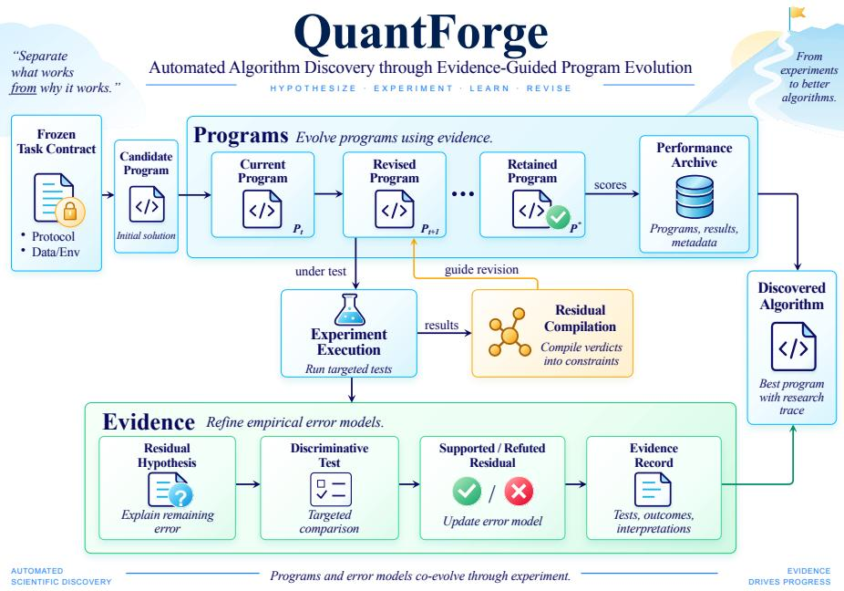
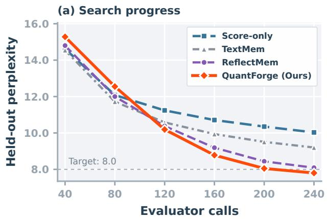
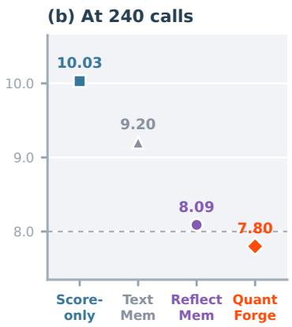

# QUANTFORGE: DISCOVERING RESIDUAL DECOMPOSI-TIONS FOR MXFP4 POST-TRAINING QUANTIZATION

Qiulin Shang, Zhoutong Wu, Jie Hu, Kun Yuan

Peking University

qiulin.shang@stu.pku.edu.cn

## ABSTRACT

Four-bit post-training quantization can reduce the memory demands of large language models, but preserving accuracy under strict MXFP4 W4A4 requires coordinating several design choices. Coordinate transforms change block-encoding errors, which in turn affect the residuals propagated through the network. The useful algorithmic decomposition is therefore not fully known before search. LLM-driven program evolution offers a way to explore these choices, but performance scores alone do not explain which design should change next. We introduce QuantForge, a PTQ discovery system that records competing explanations, selects controls that distinguish them, and checks that successor code implements the resulting conclusions. This residual compilation guides program revisions while retaining useful programs even when their original explanations are rejected. Remeasuring the revised program reveals the next error to address. This process discovers HiRes, a fixed MXFP4 quantizer that shapes coordinates, refines legal code assignments, and recovers errors along attention and MLP paths. Each stage acts on residuals measured after the preceding stage has executed. Across seven tasks, HiRes achieves the lowest seven-model Robust Fit (0.09300) and the lowest quantized Fit-7 at 32B. In matched-budget comparisons of LLM-driven program evolution, each with 240 evaluator calls, QuantForge reaches a held-out transfer target in six of eight runs, compared with three each for textual memory and reflection memory, and one for score-only evolution, despite evaluating fewer new programs. These results show that QuantForge improves the discovery of transferable PTQ algorithms by turning controlled evidence into subsequent program changes.

## 1 INTRODUCTION

Large language models are increasingly used for text generation, question answering, and complex reasoning (Grattafiori et al., 2024; Yang et al., 2025). Deploying them at scale requires reducing the costs of storing and running these models. Post-training quantization (PTQ) reduces these costs without retraining (Frantar et al., 2023). Four-bit weights and activations (W4A4) reduce nominal precision fourfold relative to 16-bit formats. MXFP4 provides a standardized representation: 32 values share a power-of-two scale, allowing short blocks to adapt to local magnitudes with little scaling metadata (Rouhani et al., 2023a;b). This compact representation also couples rounding precision within each block: a scale set by large values can leave smaller values poorly resolved.

A natural response is to transform coordinates so that large values are spread across a block (Ashkboos et al., 2024; Chen et al., 2026). In MXFP4, the transformed values must still fit a sparse four-bit grid with a power-of-two shared scale (Egiazarian et al., 2026; Shao et al., 2026). The coordinate choice therefore affects both scale selection and code assignment. It also changes the input correlations used by second-order reconstruction to compensate for weight-rounding error (Frantar et al., 2023). Once these quantized operators are installed, their errors propagate through attention and interact through the products in gated MLPs (Shazeer, 2020). Accurate PTQ thus requires coordinating coordinate design, discrete encoding, and path-level correction around the realized quantized computation. These dependencies make manual algorithm design difficult: improving one step can change what the next step needs to correct.

  
Figure 1: Overview of QuantForge. Program performance determines which candidates are retained; controlled experiments determine how unresolved questions guide subsequent code revisions.

LLM-driven program evolution can explore these dependencies by rewriting quantization operations as executable code. An evaluator tests alternative constructions under a common protocol, and successful programs inform subsequent proposals. This approach has discovered mathematical constructions and competitive algorithms (Romera-Paredes et al., 2024; Novikov et al., 2025; Liu et al., 2024). Performance is an effective selection signal, but an incomplete design signal. For example, a transform may help by spreading outliers or by improving shared-exponent selection. These explanations suggest different successors: a stronger coordinate transform in one case, revised block encoding in the other. Even when the editable interface can expand (Li et al., 2026b), the score alone cannot distinguish these directions.

We study PTQ algorithm discovery when improving one component changes the errors that subsequent components must address. QuantForge (Figure 1) uses performance to retain useful programs and controlled experiments to direct their revisions. Its defining step is to turn an experimental conclusion into a required code change and verify its implementation with an execution probe. It tracks programs in an executable frontier and unresolved design questions in a residual frontier. Proposals predict how competing explanations respond to controls; QuantForge executes the least costly distinguishing comparison and compiles its outcome into the successor’s requirements. Remeasuring the revised program reveals what to address next, progressively determining the quantization algorithm’s decomposition. We call this process progressive residualfactorization.

This process yields HiRes, a fixed MXFP4 quantizer that adapts each stage to the quantized model produced by the preceding stages. Geometric shaping refines coordinates using errors from actual encoding; discrete realization selects activation codes against the installed quantized weights; structural recovery fits the remaining path errors, remeasuring the MLP residual after attention correction. These conditional updates form a deterministic quantization procedure with strong cross-model numerical quality, as evaluated below.

Our contributions are:

• A formulation for compositional discovery. We formulate progressive residual factorization, using controlled experiments to determine which part of a PTQ algorithm should change next. Remeasuring each revised program reveals dependencies between interventions, allowing the algorithm’s decomposition to emerge during discovery.

• An effective PTQ discovery system. QuantForge turns experimental outcomes into required, checked code revisions while retaining useful programs independently of their proposed explanations. Under matched 240-call budgets, it reaches the held-out target in six of eight runs, versus three each for textual and reflection memory and one for score-only evolution, despite evaluating fewer new programs.

• A strong strict-MXFP4 quantizer. The discovered HiRes links geometric shaping, discrete realization, and structural recovery through remeasured residuals, so later decisions account for the quantized operators produced by earlier steps. Across seven models and seven tasks, it achieves the lowest Robust Fit (0.09300), balancing average and worst-model damage, and the lowest quantized Fit-7 on Qwen3-32B.

## 2 RELATED WORK

Post-training quantization. PTQ methods improve low-bit representations through reconstruction, rescaling, and coordinate transforms. GPTQ uses second-order information to compensate for weight-rounding error (Frantar et al., 2023). AWQ and SmoothQuant redistribute channel magnitudes (Lin et al., 2024b; Xiao et al., 2023), while QuaRot, SpinQuant, and DuQuant alter quantization coordinates (Ashkboos et al., 2024; Liu et al., 2025; Lin et al., 2024a). Microscaling methods address the interaction between block structure and quantization, including MR-GPTQ, BRQ, TORQ, and BATQuant (Egiazarian et al., 2026; Shao et al., 2026; Xu et al., 2026; Li et al., 2026a). WUSH constructs adaptive transforms from weight and activation statistics (Chen et al., 2026). FOCUS learns relaxed, sub-block quantization scales while retaining format-compliant dequantization scales (Yan et al., 2026). HiRes combines an error-supported geometric construction, legal discrete refinement, and recovery fitted to the realized network. We compare their numerical quality under one MXFP4 contract.

Automated algorithm and scientific discovery. FunSearch and AlphaEvolve evolve executable programs against measured performance (Romera-Paredes et al., 2024; Novikov et al., 2025). LLMbased heuristic search extends this approach through evolutionary and tree-based controllers (Liu et al., 2024; van Stein & Back¨ , 2025; Zheng et al., 2025). Reflection, persistent memory, and review can guide exploration beyond scores alone (Ye et al., 2024; Agrawal et al., 2026; Liu et al., 2026; Mroueh et al., 2026); OPTScientist also supports typed optimizer programs and an extensible interface (Li et al., 2026b). Scientific agents address a broader research cycle, from generating ideas to executing experiments (Lu et al., 2024; Yamada et al., 2025; Gottweis et al., 2025). AutoDiscovery selects hypotheses to explore, and Popper turns hypotheses into executable falsification tests (Agarwal et al., 2025; Huang et al., 2025). Our focus is the step from experimental resolution to a subsequent quantizer. QuantForge records competing predictions before evaluation, selects controls that distinguish them, and checks that the conclusion changes later executable code. The resulting evidence guides both program selection and which part of the PTQ problem becomes actionable next.

## 3 PRELIMINARIES: MXFP4 POST-TRAINING QUANTIZATION

MXFP4 W4A4. Under our MXFP4 W4A4 contract, target linear operands use contiguous inputfeature blocks of 32 E2M1 values with one E8M0 power-of-two scale (Rouhani et al., 2023a;b). Strict W4A4 denotes legal MXFP4 operands and stored payloads; low-dimensional recovery runs outside GEMM without adding higher-precision weight matrices. Weights are quantized once and activations dynamically. Weight-reconstruction statistics use pre-A4 calibration activations.

Second-order reconstruction. For weights $W \in \mathbb { R } ^ { m \times d }$ and calibration inputs $\ b { X } \in \mathbb { R } ^ { n \times d }$ , GPTQ (Frantar et al., 2023) minimizes

$$
\mathcal { L } ( \widehat { W } ) = \frac { 1 } { n } \| X ( W - \widehat { W } ) ^ { \top } \| _ { F } ^ { 2 } , \quad \widehat { W } \in \mathcal { Q } , \qquad H = \frac { 1 } { n } X ^ { \top } X ,\tag{1}
$$

where $\mathcal { Q }$ is the quantized feasible set and H determines the row-wise curvature. Rounding error is compensated in the remaining input-feature columns using a stabilized factorization of $H ^ { - 1 }$ . HiRes uses this reconstruction step in transformed coordinates.

Frozen contract. Candidates and controls share the quantization format, target modules, calibration data, evaluator, and resource limits. Experiments use simulated quantization in PyTorch (Paszke et al., 2019) to measure numerical quality. The complete execution contract appears in Appendix B.

## 4 QuantForge: PROGRESSIVE RESIDUAL FACTORIZATION

QuantForge maintains an executable frontier $\mathcal { P } _ { t }$ of useful programs and a residual frontier $\mathcal { R } _ { t }$ of unresolved design questions. Together they form the search state $S _ { t } = ( \mathcal { P } _ { t } , \mathcal { R } _ { t } )$ at round t (Figure 1). Controlled experiments resolve these questions, and their conclusions become requirements on later code. Remeasuring the revised program exposes the next question.

## 4.1 FROM PROGRAM GAIN TO ALGORITHMIC RESIDUAL

Consider an illustrative PTQ setting that permits a fixed mixed-precision budget, unlike our strict MXFP4 benchmark. Suppose keeping the largest 1% of weights at higher precision improves the score. The gain could reflect the importance of those weights or simply the added capacity. Assigning the same budget to a random 1% provides a counterfactual control. Improvement only for the targeted allocation supports weight identity; improvement for both supports capacity as an alternative explanation. These outcomes suggest different successors: refine outlier handling or reconsider how capacity is allocated.

The unresolved question is whether the gain comes from weight identity or added capacity. We call such a design question attached to an executable program an algorithmic residual: competing explanations fit the observation but imply different program changes. Performance determines whether the program remains on $\mathcal { P } _ { t } ;$ controlled evidence determines whether its residual remains on $\mathcal { R } _ { t }$ or closes. A useful program can therefore survive while its original explanation is rejected.

## 4.2 RESOLVING RESIDUALS WITH COUNTERFACTUALS

Before evaluation, a proposal registers explanations $\mathcal { E } ,$ their predicted outcomes $P _ { e } ( c )$ under condition c, and allowed controls U. QuantForge selects the least costly subset that distinguishes every pair of explanations:

$$
\mathcal { U } ^ { * } = \underset { V \subseteq U } { \arg \operatorname* { m i n } } \sum _ { c \in V } \mathrm { c o s t } ( c ) \quad \mathrm { s . t . } \quad \forall e \neq e ^ { \prime } , \exists c \in \{ \mathrm { p r i m a r y } \} \cup V : P _ { e } ( c ) \neq P _ { e ^ { \prime } } ( c ) .\tag{2}
$$

Here $\boldsymbol { e } , \boldsymbol { e } ^ { \prime } \in \mathcal { E }$ , and $\textstyle \cos \mathrm { t } ( c )$ counts the evaluation cost of condition c. The constraint requires a predicted disagreement on at least one executed condition. In the example, one random-allocation control is enough. Predictions are fixed before execution; all conditions share the evaluation contract and differ only in the specified intervention.

Control selection preserves the information needed for the next design decision. Two controls with identical predicted outcomes across the explanations need not both be executed. Conversely, an additional control is useful when it separates accounts that the first leaves indistinguishable. If the allowed controls cannot resolve that ambiguity, the proposal must formulate a better discriminator before consuming an evaluation.

## 4.3 COMPILING RESOLUTION INTO PROGRAM STRUCTURE

Residual compilation turns the experimental verdict into a program response. If both allocations improve, the targeted program can remain useful, but another outlier-specific rule does not resolve the capacity explanation. A successor must remove that dependence or test a sharper distinction. For selected program $P _ { t }$ , residual $\rho _ { t } \in \mathcal { R } _ { t }$ , and controls $\mathcal { U } _ { t } ^ { * }$ , the transition is

$$
v _ { t } = \mathsf { R e s o l v e } ( \rho _ { t } , \mathcal { U } _ { t } ^ { * } ) , \qquad P _ { t + 1 } = \mathsf { C o m p i l e } ( P _ { t } , v _ { t } ) ,\tag{3}
$$

where $v _ { t }$ is the experimental verdict. Supported explanations permit an intervention to be extended; contradicted accounts require a revised construction. Inconclusive controls leave the residual open. The system verifies the response through changed code and a targeted execution probe. Appendix A specifies the verdicts and checks.

This separation preserves a candidate’s measured gain while revising its interpretation. The retained program supplies a strong starting point, and the control supplies a more precise question for its successor. An experiment can therefore change the direction of search even when it does not change which program has the best score. Compilation preserves this information as a requirement on the next relevant computation, rather than leaving each proposal to reinterpret the same result.

## 4.4 PROGRESSIVE RESIDUAL FACTORIZATION

The measurements motivating a program change may no longer describe the revised program. QuantForge therefore remeasures the revised program before choosing the next intervention. The new residual may call for an existing operation or a newly introduced component. Repeating this process produces progressive residual factorization: executed comparisons reveal which interventions are useful and which earlier program states make them relevant. The search backbone remains replaceable; residual compilation supplies the link from evidence to code. In MXFP4, the resulting hierarchy leads from geometric shaping to discrete realization and network-structured recovery, developed next.

## 5 HiRes: HIERARCHICAL RESIDUAL RESOLUTION FOR MXFP4

Across programs retained by QuantForge, function-preserving coordinate changes before Block32 encoding recurred as an effective intervention, building on transform-based PTQ (Ashkboos et al., 2024; Chen et al., 2026). HiRes builds on these coordinate changes by addressing the residuals measured after quantization.

## 5.1 STAGE I: GEOMETRIC SHAPING

One large coordinate can set the shared exponent for 32 values, so equivalent BF16 representations can incur different W4A4 errors. Reference coordinates $P _ { \mathrm { r e f } }$ balance activation statistics against inverse weight geometry. An interaction correction G uses errors from an actual W4A4 encoding pass to refine those coordinates. Diagonal rescaling D then balances weight and activation quantization risk in the resulting coordinate system.

Reference coordinates. We restrict the d input features in Section 3 to one contiguous block of width $q = 3 2$ . Below, $\ b X \in \mathbb { R } ^ { n \times q }$ and $W \in \mathbb { R } ^ { \bar { m } \times q }$ denote the corresponding activation and weight matrices. We use ridge coefficients $\lambda _ { A } , \lambda _ { B }$ for regularization and $\mathrm { D N } ( M ) = M / \operatorname* { d e t } ( M ) ^ { 1 / q }$ to remove overall scale. The operator $\mathrm { C a p } _ { 8 }$ normalizes the determinant to one and limits the condition number to eight. The reference chart is

$$
\begin{array} { r l r } & { \boldsymbol { A } = \boldsymbol { X } ^ { \top } \boldsymbol { X } / n + \lambda _ { A } \boldsymbol { I } , } & { \boldsymbol { B } = \boldsymbol { W } ^ { \top } \boldsymbol { W } / m + \lambda _ { B } \boldsymbol { I } , } \\ & { \boldsymbol { M } _ { 0 } = \frac { 1 } { 2 } [ \mathrm { D N } ( \boldsymbol { A } ) + \mathrm { D N } ( \boldsymbol { B } ^ { - 1 } ) ] , } & { \boldsymbol { P } _ { \mathrm { r e f } } = \mathrm { C a p } _ { 8 } ( \boldsymbol { M } _ { 0 } ^ { - 1 / 2 } ) . } \end{array}\tag{4}
$$

Exact regularizers and the spectral cap are specified in Appendix B.2.

The two operands respond oppositely to a coordinate change: expanding an activation direction contracts the corresponding weight direction. After determinant normalization removes overall scale, the reference chart combines these opposing geometries. Second moments describe signal energy, not the errors produced by legal rounding.

Encoding-error correction. Write $Y = X P _ { \mathrm { r e f } } ^ { \top }$ and $V = W P _ { \mathrm { r e f } } ^ { - 1 }$ , and let $R _ { H } = H _ { 3 2 } / \sqrt { 3 2 }$ denote the normalized Hadamard. With strict anchor quantizers $Q _ { A } , Q _ { W }$ , the activation and weight errors mapped back to the pre-Hadamard coordinates are $E _ { X } \ = \ [ { \dot { Q } } _ { A } ( Y R _ { H } ^ { \top } ) - Y R _ { H } ^ { \top } ] R _ { H }$ and $E _ { W } = [ \hat { Q _ { W } } ( V R _ { H } ^ { \top } ) - V R _ { H } ^ { \top } ] R _ { H }$ . Their error–signal moments

$$
K _ { X } = E _ { X } ^ { \top } Y / n , \qquad K _ { W } = V ^ { \top } E _ { W } / m\tag{5}
$$

identify coordinate-pair interactions after encoding. The update weights each operand’s error by the energy of the other operand, suppresses signals that disagree across sample folds or weight/activation

contributions, and bounds the resulting zero-diagonal correction K. Appendix B.2 gives the pairwise construction and its fixed solver. Writing $G _ { 0 } = I + K$ , the resulting map is

$$
\begin{array} { l l } { { G = | \operatorname* { d e t } G _ { 0 } | ^ { - 1 / q } G _ { 0 } , } } & { { T = R _ { H } G P _ { \mathrm { r e f } } , } } \\ { { \widetilde { X } = X T ^ { \top } , } } & { { \widetilde { W } = W T ^ { - 1 } . } } \end{array}\tag{6}
$$

The bound $\| K \| _ { 2 } \le 1 / 8 < 1$ makes $I + K$ , and hence G, invertible. The paired transformation preserves $\widetilde { X } \widetilde { W } ^ { \top } = X W ^ { \top }$

Weight–activation balance. Quantization in these coordinates reveals the remaining imbalance between activation and weight error. For each of the eight four-coordinate subgroups in a Block32 group, the two scalar risks are

$$
r _ { A } = \mathrm { t r } ( G _ { W } C _ { E } ) , \qquad r _ { W } = \mathrm { t r } ( G _ { E } C _ { X } ) ,\tag{7}
$$

where $C _ { X } , C _ { E }$ are uncentered activation and activation-error second moments, and $G _ { W } , G _ { E }$ the corresponding weight and weight-error Grams, all restricted to that subgroup. Stacking, centering, and projecting the eight regularized log risk ratios gives a bounded, zero-sum proposal $u _ { b } \in \mathbb { R } ^ { \mathbf { \bar { 8 } } }$ for physical block b. Strict reconstruction loss selects its accepted magnitude. Broadcasting each accepted component to its four coordinates yields $u \in \mathbb { R } ^ { 3 2 } ; \bar { D } = \mathrm { D i a g } ( 2 ^ { u } )$ is folded reciprocally into the operands (Appendix B.2). The risks provide a direction for redistributing quantization burden; actual reconstruction measures the outcome when both operands are encoded together. A favorable risk ratio alone is therefore insufficient to accept a step. The accepted geometry fixes the representation, while the next stage decides how that representation is realized by legal codes.

## 5.2 STAGE II: DISCRETE REALIZATION

Fixing the geometry leaves shared exponents and element codes to determine operator quality. HiRes reruns calibration after installing $D T$ and computes GPTQ curvature from the transformed, pre-A4 activations (Frantar et al., 2023). Second-order compensation produces legal Block32 W4 weights with E8M0 exponents and E2M1 codes. Transformed input correlations govern GPTQ’s compensation for weight-rounding error; reconstruction also retains the final operator’s physical block boundaries.

The installed weights also guide activation rounding. For an activation block $x ,$ let $q _ { 0 }$ be its nearest legal vector at the fixed exponent and $d _ { 0 } = q _ { 0 } - x$ . With transformed BF16 weights $\bar { W }$ and decoded W4 weights $\widehat { W }$ , define $\overset { \cdot } { G _ { Q } } = \widehat { W } ^ { \top } \widehat { W }$ and $\widehat { K } _ { Q } = \widehat { W } ^ { \top } ( W - \widehat { W } )$ ). Changing coordinate i to legal value c changes the local quadratic model by

$$
\Delta ( i , c ) = 2 \delta _ { i c } [ G _ { Q } d _ { 0 } - K _ { Q } x ] _ { i } + \delta _ { i c } ^ { 2 } [ G _ { Q } ] _ { i i } , \qquad \delta _ { i c } = c - [ q _ { 0 } ] _ { i } .\tag{8}
$$

The linear term measures how a proposed code change interacts with the current output residual; the quadratic term accounts for its own error cost. The $K _ { Q } x$ term includes the discrepancy of the installed weights, so the preferred activation code depends on the realized W4 operator. The best negative change is accepted; otherwise $q _ { 0 }$ remains unchanged. This dynamic A4 rule keeps the exponent fixed and changes at most one legal code. Once these operators are installed, calibration can measure how their errors interact along the quantized network’s computation paths.

## 5.3 STAGE III: STRUCTURAL RECOVERY

After installing the W4/A4 operators, HiRes fits low-dimensional corrections to the remaining attention and MLP errors. It first corrects value outputs, then remeasures the MLP residual so that the second fit reflects the corrected attention path.

For one layer and one key–value head in grouped-query attention (Ainslie et al., 2023), let $\mathbf { v } _ { t }$ be the realized value output at calibration token t and $\mathbf { v } _ { t } ^ { \star }$ its BF16 counterpart on the same calibration sequence. We suppress the layer and head indices below. A scalar scale a and scalar offset b are shared across tokens and head coordinates. Writing $\mathbf { b } = b \mathbf { 1 }$ , where 1 is the head-dimensional all-ones vector, the update is

$$
( a , b ) = \arg \operatorname* { m i n } _ { a , b } \sum _ { t } \| a \mathbf { v } _ { t } + \mathbf { b } - \mathbf { v } _ { t } ^ { \star } \| _ { 2 } ^ { 2 } , \qquad \bar { \mathbf { v } } _ { t } = a \mathbf { v } _ { t } + \mathbf { b } .\tag{9}
$$

Algorithm 1 HiRes quantization   
1: input: fresh BF16 model; exact 128 × 2048 calibration   
2: construct and fold T, D for each target linear layer   
3: rerun calibration in the realized DT coordinates   
4: realize legal W4 with GPTQ; install dynamic A4 (Eq. 8)   
5: fit and install attention recovery (Eq. 9)   
6: remeasure MLP residuals; fit and install Eq. 10   
7: return the realized MXFP4 W4A4 model

The corrected values continue through the existing attention and quantized output projection. Each head is fitted separately against the paired BF16 trajectory.

The method then collects fresh gate and up outputs $^ { g , }$ u from the attention-corrected model. Their gated product $m = { \mathrm { S i L U } } ( g ) \odot u$ couples errors in both MLP branches (Shazeer, 2020), where ⊙ denotes elementwise multiplication. Three layerwise scalars $\alpha , \beta , \eta$ adjust the gate shift, gate scale, and up scale. To express the shift relative to gate magnitude, let $\sigma _ { g }$ be the regularized standard deviation of g, pooled over all calibration tokens and hidden coordinates in the layer. The update is

$$
\begin{array} { r } { \bar { m } = \mathrm { S i L U } ( ( 1 + \beta ) g + \alpha \sigma _ { g } ) \odot ( 1 + \eta ) u . } \end{array}\tag{10}
$$

The shift changes the operating point of the SiLU gate; the two scales adjust the factors of the product. A weighted ridge fit (Hoerl & Kennard, 1970) jointly estimates the three coefficients from a local linearization against $m ^ { \star } = \mathrm { S i L U } ( g ^ { \star } ) \odot u ^ { \star }$ . Here $g ^ { \star } , u ^ { \star }$ are BF16 projections on the same realized layer input. The definition of $\sigma _ { g }$ and the aggregation and bounds of calibration-cell fits are specified in Appendix B.4. The corrected intermediate enters the strict W4A4 down projection.

Algorithm 1 follows three measurement dependencies. Transformed inputs determine reconstruction curvature; installed W4 weights determine the activation-refinement objective; and attention recovery changes the inputs used to fit MLP recovery. Starting from BF16 $M ^ { ( 0 ) }$ , each intervention measures residual $R _ { k }$ on model state $M ^ { ( k ) }$ , solves for a correction, and installs it:

$$
R _ { k } = \mathsf { M e a s u r e } _ { k } ( M ^ { ( k ) } ) , \qquad M ^ { ( k + 1 ) } = \mathsf { A p p l y } _ { k } \bigl ( M ^ { ( k ) } , 5 \mathsf { o l v e } _ { k } ( R _ { k } ) \bigr ) .\tag{11}
$$

Each fit therefore uses the model state produced by the preceding intervention.

## 6 EXPERIMENTS

We first evaluate HiRes across models and tasks and examine the contributions of its stages. We then test whether QuantForge improves algorithm discovery under matched evaluation budgets and isolate the role of residual compilation.

## 6.1 HiRes: ROBUST MXFP4 QUANTIZATION

Evaluation protocol. We evaluate Llama-3.2-3B (Meta, 2024), Qwen3-4B/8B/32B (Yang et al., 2025), Mistral-7B-v0.3 (Mistral AI, 2024), Llama-3-8B (Grattafiori et al., 2024), and OLMo-2- 13B (Walsh et al., 2025). All use matched BF16 checkpoints, strict MXFP4 W4A4, and 128 ordered C4-train (Raffel et al., 2020) sequences of 2,048 tokens with seed 0; KV caching is disabled during evaluation. The seven tasks are WikiText-2 (Merity et al., 2017) and C4 perplexity, ARC-Challenge/ARC-Easy (Clark et al., 2018), HellaSwag (Zellers et al., 2019), PIQA (Bisk et al., 2020), and WinoGrande (Sakaguchi et al., 2020) accuracy, normalized except on WinoGrande. Table 1 compares HiRes with nine baselines (protocols and endpoints in Appendix C.1). Discovery uses Qwen3-4B feedback and Llama-3.1-8B transfer validation (Appendix A.1). HiRes is frozen before evaluation on all other models, including Llama-3.2-3B and Mistral-7B-v0.3. Post-discovery ablations do not feed back into algorithm design.

Robust Fit penalizes methods whose good average masks large damage on one model. For task j on model m, BF16-relative damage is $d _ { m j } \ = \ \mathrm { P P L } _ { q } / \mathrm { P P } \bar { \mathrm { L } } _ { 1 6 } \ - \ 1$ for perplexity and $d _ { m j } =$ $\mathrm { 1 - A c c } _ { q } / \mathrm { A c c } _ { 1 6 }$ for accuracy. We combine mean and worst-case damage first across tasks (Fit-7),

Table 1: Seven-model Fit-7 under the same MXFP4 operand/encoding contract (lower is better; best in bold).
<table><tr><td></td><td colspan="9">Llama Qwen Mistral Qwen Llama  $\mathrm { O L M o } { - 2 }$ </td></tr><tr><td>Method</td><td>3B↓</td><td>4B↓</td><td>7B↓</td><td>8B↓</td><td>8B↓</td><td>13B↓</td><td>Qwen 32B↓</td><td>Mean↓</td><td>Robust↓</td></tr><tr><td>RTN</td><td>.2594</td><td>.2283</td><td>.1512</td><td>.1666</td><td>.2522</td><td>.1360</td><td>.0919</td><td>.18365</td><td>.22151</td></tr><tr><td>GPTQ</td><td>.1973</td><td>.1252</td><td>.1071</td><td>.1411</td><td>.2283</td><td>.1360</td><td>.0747</td><td>.14422</td><td>.18624</td></tr><tr><td>MR-GPTQ</td><td>.1387</td><td>.0986</td><td>.0541</td><td>.0587</td><td>.1394</td><td>.0846</td><td>.0524</td><td>.08951</td><td>.11447</td></tr><tr><td>BRQ</td><td>.1260</td><td>.0767</td><td>.0573</td><td>.0685</td><td>.1386</td><td>.0811</td><td>.0425</td><td>.08440</td><td>.11152</td></tr><tr><td>WUSH</td><td>.1224.0479</td><td></td><td>.0503</td><td>.0500</td><td>.1248</td><td>.0823</td><td>.0365</td><td>.07345</td><td>.09910</td></tr><tr><td>TORQ</td><td>.2964</td><td>.1929</td><td>.1217</td><td>.1970</td><td>.2654</td><td>.1067</td><td>.0929</td><td>.18185</td><td>.23911</td></tr><tr><td>BATQuant+GPTQ</td><td>.2645</td><td>.2051</td><td>.1482</td><td>.1498</td><td>.2727</td><td>.1311</td><td>.1217</td><td>.18473</td><td>.22871</td></tr><tr><td>SpinQuant+GPTQ</td><td>.3191</td><td>.1409</td><td>.1142</td><td>.0835</td><td>.2588</td><td>.1317</td><td>.1023</td><td>.16435</td><td>.24171</td></tr><tr><td>FOCUS</td><td>.1803</td><td>.0738</td><td>.0749</td><td>.1095</td><td>.1737</td><td>.1195</td><td>.0671</td><td>.11411</td><td>.14718</td></tr><tr><td>HiRes</td><td>.1174</td><td>.0524</td><td>.0452</td><td>.0324</td><td>.1187</td><td>.0773</td><td></td><td>.0274.06726</td><td>.09300</td></tr></table>

Table 2: Post-discovery Fit-3 ablations (WT2, C4, ARC-C; seed $0 ;$ lower is better). Top: cumulative stages. Bottom: interventions in full HiRes with other procedures unchanged (Appendices C.3–C.5).
<table><tr><td>Realized program</td><td>Qwen3-8B↓</td><td>Llama-3-8B↓</td></tr><tr><td>Strict RTN</td><td>.20249</td><td>.31653</td></tr><tr><td>+ Geometric shaping</td><td>.07828</td><td>.16741</td></tr><tr><td>+ Discrete realization</td><td>.06502</td><td>.15530</td></tr><tr><td>+ Structural recovery</td><td>.03259</td><td>.14830</td></tr><tr><td>Remove local interaction K</td><td>.04046</td><td>.15529</td></tr><tr><td>Remove diagonal balance  $( D = I )$ </td><td>.04326</td><td>.15921</td></tr><tr><td>Disable one-code refinement</td><td>.04397</td><td>.15359</td></tr><tr><td>Use stale MLP statistics</td><td>.04173</td><td>.15824</td></tr></table>

then across models (Robust Fit):

$$
\begin{array} { r } { \mathrm { F i t \ - } _ { m } = \frac { 1 } { 2 } \operatorname* { m e a n } _ { j = 1 } ^ { 7 } d _ { m j } + \frac { 1 } { 2 } \operatorname* { m a x } _ { j = 1 } ^ { 7 } d _ { m j } , } \end{array}\tag{12}
$$

$$
\begin{array} { r } { \mathrm { R o b u s t } \mathrm { F i t } = \frac { 1 } { 2 } \operatorname* { m e a n } _ { m = 1 } ^ { 7 } \mathrm { F i t } \cdot 7 _ { m } + \frac { 1 } { 2 } \operatorname* { m a x } _ { m = 1 } ^ { 7 } \mathrm { F i t } \cdot 7 _ { m } . } \end{array}\tag{13}
$$

Lower is better. The same equal weighting applies to every method; Appendix C.2 reports alternative task summaries.

Cross-model robustness. HiRes achieves the lowest seven-model Robust Fit (0.09300), ahead of WUSH (0.09910) and BRQ (0.11152), and the lowest mean Fit-7 (0.06726). It ranks first on Mistral-7B and Llama-3-8B and improves Qwen3-8B Fit-7 from WUSH’s 0.0500 to 0.0324. On the new OLMo-2 architecture and model family, the frozen algorithm achieves the lowest Fit-7 (0.077301), ahead of BRQ (0.081112) and WUSH (0.082295), with no model-specific tuning. Its WikiText-2/C4 perplexity is 5.658/11.339, compared with WUSH’s 5.699/11.376. It also leads the Qwen3-32B comparison with Fit-7 0.027369, followed by WUSH (0.036489) and BRQ (0.042486; Table 9).

Hierarchical residual resolution. Each successive stage improves three-task fitness on both 8B models (Table 2). Geometry supplies the largest initial gain; discrete realization and structural recovery reduce the remaining damage.

Removing local interaction K, diagonal balance D, or one-code refinement increases Fit-3 on both models. Fitting MLP recovery before attention correction also increases damage at the same deployment order and solver budget, supporting remeasurement after the attention path changes. HiRes beats WUSH across three independent calibration seeds on both models. Component and recovery-path rankings also agree across seeds (Appendices C.3, C.4, and C.5).

  
Figure 2: Held-out Llama-3.1-8B WT2 perplexity across eight paired seeds. (a) Recorded median search trajectories. (b) Final medians for all four arms at 240 calls, including ReflectMem. Search observes Qwen3-4B; dashed lines mark the 8.0 target.

## 6.2 QuantForge: EVIDENCE-GUIDED ALGORITHM DISCOVERY

Matched-budget protocol. We test whether controlled evidence and checked revisions improve discovery beyond scores, summaries, and reflection. Score-only, TextMem, ReflectMem, and Quant-Forge share the proposer, initial RTN program, editable interface, evaluator, and 240-call budget across eight paired seeds. Score-only uses code, scores, and execution feedback; TextMem adds free-form experiment summaries; ReflectMem adds reflection on successful and failed programs. QuantForge adds competing explanations, discriminating controls, and checked code responses. Search observes Qwen3-4B WikiText-2 perplexity. All arms evaluate held-out Llama-3.1-8B (Grattafiori et al., 2024) every 20 calls without returning results to search. QuantForge allocates 99 calls to controls and compliance probes and 141 to new programs; baselines use all 240 for new programs. Held-out probes are excluded from this budget. ReflectMem and QuantForge allow 65,536 input tokens, including at most 16,384 for memory (Appendix D.1).

Discovery efficiency. Despite evaluating only 141 new programs, QuantForge reaches median held-out PPL 7.80 at 240 calls, versus 8.09 for ReflectMem, 9.20 for TextMem, and 10.03 for Score-only. It initially progresses more slowly, then overtakes all three baselines between 80 and 120 calls (Figure 2). The PPL ≤ 8.00 target is reached in 6/8, 3/8, 3/8, and 1/8 runs, respectively. Against ReflectMem, QuantForge improves in 7/8 paired seeds, with mean difference −0.250 and 95% CI [−0.386, −0.114] (per-seed results and threshold crossings in Appendix D.1).

Value of residual compilation. Removing mandatory implementation and compliance checks tests whether compilation justifies its budget: the 30 released probe calls increase candidate evaluations from 141 to 171 within the same 240-call budget. With competing explanations, compiled controls, and memory fixed, median held-out PPL rises from 7.80 to 8.06. QuantForge wins 8/8 paired seeds (mean difference −0.275; 95% CI [−0.368, −0.182]; Appendix D.2).

From verdict to code. Replaying 48 transitions from eight trajectories isolates how successors use the same evidence. Each pair shares the parent program, history, and control result. Requiring verdict implementation rather than free reflection increases improving successors from 15/48 (31%) to 28/48 (58%) and improves mean visible PPL change from −0.04 to −0.21 (Table 38), with more improving successors in all eight trajectories.

Control-selection and implementation-checking ablations appear in Appendix D.3; Table 34 reports which stages of the hierarchy in Section 5 appear in retained programs.

## 7 CONCLUSION

We introduced QuantForge to discover PTQ algorithms through progressive residual factorization. Controlled experiments resolve design questions and guide subsequent code changes; remeasurement identifies what remains. This process produced HiRes, whose quantization stages operate on successively realized model states. Its cross-model aggregate and 32B transfer results support the discovered construction.

Matched-budget experiments also show that QuantForge improves held-out performance while spending fewer evaluations on new candidates. Stagewise and fresh-residual controls support the dependence between successive interventions. Experiments can therefore guide how an algorithm is decomposed as well as which program is retained. The primary limitation of our evaluation is that realized latency, throughput, and memory remain untested on native MXFP4 kernels. We leave this deployment study to future work.

## REFERENCES

Dhruv Agarwal, Bodhisattwa Prasad Majumder, Reece Adamson, Megha Chakravorty, Satvika Reddy Gavireddy, Aditya Parashar, Harshit Surana, Bhavana Dalvi Mishra, Andrew McCallum, Ashish Sabharwal, and Peter Clark. AutoDiscovery: Open-ended scientific discovery via Bayesian surprise. In Advances in Neural Information Processing Systems, volume 38, 2025. URL https://proceedings.neurips.cc/paper\_files/paper/2025/ hash/23b127521af7ca7a42f5cdb7507be4f2-Abstract-Conference.html.

Lakshya A. Agrawal, Shangyin Tan, Dilara Soylu, et al. GEPA: Reflective prompt evolution can outperform reinforcement learning. In International Conference on Learning Representations, 2026. URL https://openreview.net/forum?id=RQm2KQTM5r.

Joshua Ainslie, James Lee-Thorp, Michiel de Jong, Yury Zemlyanskiy, Federico Lebron, and Sumit´ Sanghai. GQA: Training generalized multi-query transformer models from multi-head checkpoints. In Proceedings of the 2023 Conference on Empirical Methods in Natural Language Processing, 2023. URL https://aclanthology.org/2023.emnlp-main.298/.

Saleh Ashkboos, Amirkeivan Mohtashami, Maximilian L. Croci, Bo Li, Pashmina Cameron, Martin Jaggi, Dan Alistarh, Torsten Hoefler, and James Hensman. QuaRot: Outlier-free 4-bit inference in rotated LLMs. In Advances in Neural Information Processing Systems, volume 37, pp. 100213– 100240, 2024. URL https://proceedings.neurips.cc/paper\_files/paper/ 2024/hash/b5b939436789f76f08b9d0da5e81af7c-Abstract-Conference. html.

Stella Biderman, Hailey Schoelkopf, Lintang Sutawika, et al. Lessons from the trenches on reproducible evaluation of language models, 2024. URL https://arxiv.org/abs/2405. 14782.

Yonatan Bisk, Rowan Zellers, Ronan Le Bras, Jianfeng Gao, and Yejin Choi. PIQA: Reasoning about physical commonsense in natural language. In Proceedings of the AAAI Conference on Artificial Intelligence, volume 34, pp. 7432–7439, 2020. URL https://ojs.aaai.org/ index.php/AAAI/article/view/6239.

Jiale Chen, Vage Egiazarian, Roberto L. Castro, Torsten Hoefler, and Dan Alistarh. WUSH: Nearoptimal adaptive transforms for LLM quantization. In Proceedings of the 43rd International Conference on Machine Learning, 2026. URL https://openreview.net/forum?id= ZsECxUkbKB.

Peter Clark, Isaac Cowhey, Oren Etzioni, Tushar Khot, Ashish Sabharwal, Carissa Schoenick, and Oyvind Tafjord. Think you have solved question answering? Try ARC, the AI2 reasoning challenge, 2018. URL https://arxiv.org/abs/1803.05457.

David L. Donoho and Iain M. Johnstone. Ideal spatial adaptation by wavelet shrinkage. Biometrika, 81(3):425–455, 1994. doi: 10.1093/biomet/81.3.425.

Cynthia Dwork, Vitaly Feldman, Moritz Hardt, Toniann Pitassi, Omer Reingold, and Aaron Roth. The reusable holdout: Preserving validity in adaptive data analysis. Science, 349(6248):636–638, 2015. doi: 10.1126/science.aaa9375.

Vage Egiazarian, Roberto Castro, Denis Kuznedelev, Andrei Panferov, Eldar Kurtic, Shubhra Pandit, Alexandre Marques, Mark Kurtz, Saleh Ashkboos, Torsten Hoefler, and Dan Alistarh. Bridging the gap between promise and performance for microscaling FP4 quantization. In International Conference on Learning Representations, 2026. URL https://proceedings.iclr.cc/paper\_files/paper/2026/hash/ b87bb4f6346d727b265088235e5bc389-Abstract-Conference.html.

Elias Frantar, Saleh Ashkboos, Torsten Hoefler, and Dan Alistarh. GPTQ: Accurate post-training quantization for generative pre-trained transformers. In International Conference on Learning Representations, 2023. URL https://openreview.net/forum?id=tcbBPnfwxS.

Juraj Gottweis et al. Towards an AI co-scientist, 2025. URL https://arxiv.org/abs/2502. 18864v1. Preprint, version 1.

Aaron Grattafiori, Abhimanyu Dubey, Abhinav Jauhri, et al. The Llama 3 herd of models, 2024. URL https://arxiv.org/abs/2407.21783.

Arthur E. Hoerl and Robert W. Kennard. Ridge regression: Biased estimation for nonorthogonal problems. Technometrics, 12(1):55–67, 1970. doi: 10.1080/00401706.1970.10488634.

Kexin Huang, Ying Jin, Ryan Li, Michael Y. Li, Emmanuel Candes, and Jure Leskovec. Auto-\` mated hypothesis validation with agentic sequential falsifications. In Proceedings of the 42nd International Conference on Machine Learning, volume 267 of Proceedings of Machine Learning Research, pp. 25372–25437, 2025. URL https://proceedings.mlr.press/v267/ huang25n.html.

Ji-Fu Li, Manyi Zhang, Xiaobo Xia, Han Bao, Haoli Bai, Zhenhua Dong, and Xianzhi Yu. BATQuant: Outlier-resilient MXFP4 quantization via learnable block-wise optimization. In European Conference on Computer Vision, 2026a. URL https://eccv.ecva.net/virtual/2026/ poster/4636.

Zhongzheng Li, Tiancan Feng, Wenhao Li, et al. OPTScientist: Multi-agent discovery of typed optimizer programs for transformer pretraining, 2026b. URL https://arxiv.org/abs/ 2607.20486. Preprint.

Haokun Lin, Haobo Xu, Yichen Wu, Jingzhi Cui, Yingtao Zhang, Linzhan Mou, Linqi Song, Zhenan Sun, and Ying Wei. DuQuant: Distributing outliers via dual transformation makes stronger quantized LLMs. In Advances in Neural Information Processing Systems, volume 37, pp. 87766–87800, 2024a. URL https://proceedings.neurips.cc/paper\_files/paper/2024/ hash/9febda1c8344cc5f2d51713964864e93-Abstract-Conference.html.

Ji Lin, Jiaming Tang, Haotian Tang, Shang Yang, Wei-Ming Chen, Wei-Chen Wang, Guangxuan Xiao, Xingyu Dang, Chuang Gan, and Song Han. AWQ: Activationaware weight quantization for on-device LLM compression and acceleration. In Proceedings of Machine Learning and Systems, volume 6, pp. 87–100, 2024b. URL https://proceedings.mlsys.org/paper\_files/paper/2024/hash/ 42a452cbafa9dd64e9ba4aa95cc1ef21-Abstract-Conference.html.

Fei Liu, Xialiang Tong, Mingxuan Yuan, Xi Lin, Fu Luo, Zhenkun Wang, Zhichao Lu, and Qingfu Zhang. Evolution of heuristics: Towards efficient automatic algorithm design using large language model. In Proceedings of the 41st International Conference on Machine Learning, volume 235 of Proceedings of Machine Learning Research, pp. 32201–32223, 2024. URL https: //proceedings.mlr.press/v235/liu24bs.html.

Qi Liu, Ruochen Hao, Can Li, and Wanjing Ma. OR-Agent: Bridging evolutionary search and structured research for automated algorithm discovery, 2026. URL https://arxiv.org/ abs/2602.13769v3. Preprint, version 3.

Zechun Liu, Changsheng Zhao, Igor Fedorov, Bilge Soran, Dhruv Choudhary, Raghuraman Krishnamoorthi, Vikas Chandra, Yuandong Tian, and Tijmen Blankevoort. SpinQuant: LLM quantization with learned rotations. In International Conference on Learning Representations, 2025. URL https://proceedings.iclr.cc/paper\_files/paper/2025/hash/ e5b1c0d4866f72393c522c8a00eed4eb-Abstract-Conference.html.

Chris Lu, Cong Lu, Robert Tjarko Lange, Jakob Foerster, Jeff Clune, and David Ha. The AI scientist: Towards fully automated open-ended scientific discovery, 2024. URL https://arxiv.org/ abs/2408.06292. Preprint.

Stephen Merity, Caiming Xiong, James Bradbury, and Richard Socher. Pointer sentinel mixture models. In International Conference on Learning Representations, 2017. URL https:// openreview.net/forum?id=Byj72udxe.

Meta. Llama-3.2-3B model card, 2024. URL https://huggingface.co/meta-llama/ Llama-3.2-3B.

Mistral AI. Mistral-7B-v0.3 model card, 2024. URL https://huggingface.co/ mistralai/Mistral-7B-v0.3.

Youssef Mroueh, Carlos Fonseca, Brian Belgodere, and David Cox. CliffSearch: Structured agentic co-evolution over theory and code for scientific algorithm discovery, 2026. URL https:// arxiv.org/abs/2604.01210. Preprint.

Alexander Novikov et al. AlphaEvolve: A coding agent for scientific and algorithmic discovery, 2025. URL https://arxiv.org/abs/2506.13131. Preprint.

Adam Paszke, Sam Gross, Francisco Massa, et al. PyTorch: An imperative style, highperformance deep learning library. In Advances in Neural Information Processing Systems, volume 32, 2019. URL https://papers.nips.cc/paper\_files/paper/2019/hash/ bdbca288fee7f92f2bfa9f7012727740-Abstract.html.

Colin Raffel, Noam Shazeer, Adam Roberts, Katherine Lee, Sharan Narang, Michael Matena, Yanqi Zhou, Wei Li, and Peter J. Liu. Exploring the limits of transfer learning with a unified text-to-text transformer. Journal of Machine Learning Research, 21(140):1–67, 2020. URL https://www.jmlr.org/papers/v21/20-074.html.

Bernardino Romera-Paredes, Mohammadamin Barekatain, Alexander Novikov, Matej Balog, M. Pawan Kumar, Emilien Dupont, Francisco J. R. Ruiz, Jordan S. Ellenberg, Pengming Wang, Omar Fawzi, Pushmeet Kohli, and Alhussein Fawzi. Mathematical discoveries from program search with large language models. Nature, 625:468–475, 2024. doi: 10.1038/s41586-023-06924-6.

Bita Darvish Rouhani, Nitin Garegrat, Tom Savell, Ankit More, Kyung-Nam Han, Ritchie Zhao, Mathew Hall, Jasmine Klar, Eric Chung, Yuan Yu, Michael Schulte, Ralph Wittig, Ian Bratt, Nigel Stephens, Jelena Milanovic, John Brothers, Pradeep Dubey, Marius Cornea, Alexander Heinecke, Andres Rodriguez, Martin Langhammer, Summer Deng, Maxim Naumov, Paulius Micikevicius, Michael Siu, and Colin Verrilli. OCP microscaling formats (MX) specification. Specification Version 1.0, Open Compute Project, 2023a. URL https://www.opencompute. org/documents/ocp-microscaling-formats-mx-v1-0-spec-final-pdf.

Bita Darvish Rouhani, Ritchie Zhao, Ankit More, Mathew Hall, Alireza Khodamoradi, Summer Deng, Dhruv Choudhary, Marius Cornea, Eric Dellinger, Kristof Denolf, et al. Microscaling data formats for deep learning, 2023b. URL https://arxiv.org/abs/2310.10537. Preprint.

Peter J. Rousseeuw and Christophe Croux. Alternatives to the median absolute deviation. Journal of the American Statistical Association, 88(424):1273–1283, 1993. doi: 10.1080/01621459.1993. 10476408.

Keisuke Sakaguchi, Ronan Le Bras, Chandra Bhagavatula, and Yejin Choi. WinoGrande: An adversarial Winograd schema challenge at scale. In Proceedings of the AAAI Conference on Artificial Intelligence, volume 34, pp. 8732–8740, 2020. URL https://ojs.aaai.org/ index.php/AAAI/article/view/6399.

Yuantian Shao, Peisong Wang, Yuanteng Chen, Chang Xu, Zhihui Wei, and Jian Cheng. Block rotation is all you need for MXFP4 quantization. In Proceedings ofthe 43rd International Conference on Machine Learning, 2026. URL https://openreview.net/forum?id=cyR2FtZzY1.

Noam Shazeer. GLU variants improve transformer, 2020. URL https://arxiv.org/abs/ 2002.05202.

Jianlin Su, Murtadha Ahmed, Yu Lu, Shengfeng Pan, Wen Bo, and Yunfeng Liu. RoFormer: Enhanced transformer with rotary position embedding. Neurocomputing, 568:127063, 2024. doi: 10.1016/j.neucom.2023.127063.

Niki van Stein and Thomas Back. LLaMEA: A large language model evolutionary algorithm for¨ automatically generating metaheuristics. IEEE Transactions on Evolutionary Computation, 29(2): 331–345, 2025. doi: 10.1109/TEVC.2024.3497793.

Evan Pete Walsh, Luca Soldaini, Dirk Groeneveld, Kyle Lo, et al. 2 OLMo 2 furious (COLM’s version). In Conference on Language Modeling, 2025. URL https://openreview.net/ forum?id=2ezugTT9kU.

Guangxuan Xiao, Ji Lin, Mickael Seznec, Hao Wu, Julien Demouth, and Song Han. SmoothQuant: Accurate and efficient post-training quantization for large language models. In Proceedings of the 40th International Conference on Machine Learning, volume 202 of Proceedings of Machine Learning Research, pp. 38087–38099, 2023. URL https://proceedings.mlr.press/ v202/xiao23c.html.

Zukang Xu, Xing Hu, and Dawei Yang. TORQ: Two-level orthogonal rotation for MXFP4 quantization, 2026. URL https://arxiv.org/abs/2605.19561. Preprint.

Yutaro Yamada, Robert Tjarko Lange, Cong Lu, et al. The AI scientist-v2: Workshop-level automated scientific discovery via agentic tree search, 2025. URL https://arxiv.org/abs/2504. 08066. Preprint.

Xianglong Yan, Hong Liu, Chengzhu Bao, Tianao Zhang, Guanghua Yu, Jianchen Zhu, and Yulun Zhang. FOCUS: FP4 optimization via coupled-relaxation and dual-granularity scaling. arXiv preprint arXiv:2608.01847, 2026. URL https://arxiv.org/abs/2608.01847.

An Yang, Anfeng Li, Baosong Yang, et al. Qwen3 technical report, 2025. URL https://arxiv. org/abs/2505.09388.

Haoran Ye, Jiarui Wang, Zhiguang Cao, et al. ReEvo: Large language models as hyper-heuristics with reflective evolution. In Advances in Neural Information Processing Systems, volume 37, 2024. URL https://proceedings.neurips.cc/paper\_files/paper/2024/ hash/4ced59d480e07d290b6f29fc8798f195-Abstract-Conference.html.

Rowan Zellers, Ari Holtzman, Yonatan Bisk, Ali Farhadi, and Yejin Choi. HellaSwag: Can a machine really finish your sentence? In Proceedings ofthe 57th Annual Meeting ofthe Association for Computational Linguistics, pp. 4791–4800, 2019. URL https://aclanthology.org/ P19-1472/.

Zhi Zheng, Zhuoliang Xie, Zhenkun Wang, and Bryan Hooi. Monte Carlo tree search for comprehensive exploration in LLM-based automatic heuristic design. In Proceedings ofthe 42nd International Conference on Machine Learning, volume 267 of Proceedings of Machine Learning Research, pp. 78338–78373, 2025. URL https://proceedings.mlr.press/v267/zheng25o. html.

## APPENDIX

## A QuantForge: SEARCH PROCEDURE

We first distinguish the two discovery protocols, then describe how QuantForge turns a controlled experiment into a program update.

## A.1 DISCOVERY PROTOCOLS

Algorithm discovery. Algorithm development starts from GPTQ (Frantar et al., 2023) and retains successful descendants as starting points for later revisions. The search can revise the transform, discrete reconstruction, and residual recovery; these components are not fixed to the initial implementation. Each candidate is rebuilt from BF16 weights using the same strict-MXFP4 contract and 128 × 2048 calibration protocol.

Qwen3-4B (Yang et al., 2025) is the search-visible model. Its task results and diagnostic measurements guide subsequent proposals. Llama-3.1-8B (Grattafiori et al., 2024) serves as the transfervalidation model. A visible-model improvement is accepted as transferable only when this validation model also improves against the same comparison program. The proposer receives the aggregate transfer acceptance signal; detailed task, layer, and module diagnostics remain with the evaluator.

Llama-3.2-3B, Mistral-7B-v0.3, Qwen3-8B, and Meta-Llama-3-8B are excluded from proposal generation and candidate selection and are evaluated only after the final algorithm is fixed. Component and stage ablations on Qwen3-8B and Meta-Llama-3-8B then measure the contribution of its parts. Their results do not feed back into discovery or component selection.

The search score combines WikiText-2 and C4 perplexity with ARC-Challenge length-normalized accuracy (acc norm) (Merity et al., 2017; Raffel et al., 2020; Clark et al., 2018). For each model m, damage is measured against its own BF16 reference:

$$
d _ { m , \mathrm { W T 2 } } = \frac { \mathrm { P P L } _ { q , m , \mathrm { W T 2 } } } { \mathrm { P P L } _ { 1 6 , m , \mathrm { W T 2 } } } - 1 , \qquad d _ { m , \mathrm { C 4 } } = \frac { \mathrm { P P L } _ { q , m , \mathrm { C 4 } } } { \mathrm { P P L } _ { 1 6 , m , \mathrm { C 4 } } } - 1 ,\tag{14}
$$

$$
d _ { m , \mathrm { A R C } } = \frac { \mathrm { A c c } _ { 1 6 , m } ^ { \mathrm { n o r m } } - \mathrm { A c c } _ { q , m } ^ { \mathrm { n o r m } } } { \mathrm { A c c } _ { 1 6 , m } ^ { \mathrm { n o r m } } } ,\tag{15}
$$

$$
\mathrm { F i t - } 3 _ { m } = \frac { d _ { m , \mathrm { W T 2 } } + d _ { m , \mathrm { C 4 } } + d _ { m , \mathrm { A R C } } } { 6 } + \frac { 1 } { 2 } \operatorname* { m a x } _ { j \in \{ \mathrm { W T 2 } , \mathrm { C 4 } , \mathrm { A R C } \} } d _ { m j } .\tag{16}
$$

Lower is better. Equal weight on mean and worst-task damage rewards broad improvements while penalizing a large loss on any one task. Damage is not clipped at zero, so gains over BF16 retain their negative sign.

Independent framework comparison. The matched-budget study in Section 6.2 starts each arm from the same strict-MXFP4 round-to-nearest (RTN) program. The proposer revises this code using Qwen3-4B scores and execution feedback; QuantForge additionally carries forward unresolved questions and controlled experimental conclusions. Each accepted revision supplies the parent state for later interventions. The editable program can introduce new operations, so the final three-stage quantizer is not part of the initial RTN program.

Qwen3-4B is search-visible; Llama-3.1-8B is held out for independent transfer assessment. Every 20 evaluator calls, a separate evaluator tests the current champion on Llama. Neither its score nor its pertask, per-layer, or per-module diagnostics are returned to the proposer or used to choose descendants. This evaluator separation follows the holdout principle (Dwork et al., 2015); the recorded outcomes measure transfer under the same search budget.

This controlled study uses WikiText-2 perplexity as its visible objective and held-out endpoint. Its $\mathrm { P P L } \leq 8$ success gate and 240-call results describe this independent framework comparison. The algorithm-development search above uses Fit-3; the quantizer benchmark uses the seven-task panel.

## A.2 CONTROLLED EXPERIMENTS AND PROGRAM UPDATES

Each proposal specifies an executable candidate $p ,$ its parent π, and the residual $\rho$ it aims to reduce. It also records a focal explanation and its competitors in E, their predicted outcomes $P _ { e } ( c )$ under each condition c, and the allowed controls U.

Before execution, the controller applies Eq. 2 and freezes the selected controls together with $p ,$ π, $\rho , \mathcal { E } , P ,$ , and the evaluator identity. The primary run and its controls share this packet. A completed condition can be reused only when the full execution identity matches. If the allowed controls cannot distinguish the registered explanations, the proposal is revised before model evaluation. Every condition shares the model, calibration data, quantizer format, evaluator, and resource ceiling; only the declared intervention changes.

The observed results determine both the status of the explanation and the required response in the next program:
<table><tr><td>Verdict</td><td>Residual status</td><td>Required program response</td></tr><tr><td>Supported</td><td>closed under the focal account</td><td>extend or compose the direction</td></tr><tr><td>Target-only</td><td>gain lacks the predicted signature</td><td>repair the explanation</td></tr><tr><td>Mediator-only</td><td>signature lacks the target gain</td><td>repair transfer to the target</td></tr><tr><td>No effect</td><td>intervention is parent-equivalent</td><td>retire the intervention</td></tr><tr><td>Unresolved</td><td>current controls do not separate accounts</td><td>add a discriminator</td></tr><tr><td>Unsafe</td><td>rollback or contract check fails</td><td>reject and restore the parent</td></tr></table>

Program retention is evaluated separately. A target-only candidate, for example, may remain useful as executable code even though its focal account cannot guide a descendant.

For every response-bearing descendant, the controller compares the declared response with the changed source and an executed probe. A source-level no-op does not count as a residual closure. The check is scoped to the computation named by $\rho ;$ it does not require unrelated code to change.

## A.3 SEARCH CYCLE

The search maintains executable programs and unresolved residuals as separate frontiers. The controller selects parents and schedules experiments; the residual compiler determines which conclusions can guide a program update. Population size, mutation operators, and scheduling can vary while retaining this interface.

After compilation, the revised program is remeasured and exposes the next intervention set:

$$
\begin{array} { r } { \mathcal { R } ( P _ { t + 1 } ) = \mathsf { M e a s u r e } ( P _ { t + 1 } ) , \qquad S _ { t + 1 } = \mathsf { O p e n } ( P _ { t + 1 } , \mathcal { R } ( P _ { t + 1 } ) ) . } \end{array}\tag{17}
$$

Here $\mathcal { R } ( P _ { t + 1 } )$ denotes the residuals remeasured on this program, not a replacement of the full residual frontier. Unresolved questions attached to other retained programs remain available. $\boldsymbol { S } _ { t + 1 }$ contains interventions made actionable by residuals measured on $P _ { t + 1 }$ . It can include existing operations or newly introduced components. The hierarchy records both the operation and the earlier program state that made it relevant.

The history stores completed experiments, Pareto donor programs, duplicate proposals, and stagnation information alongside the two frontiers. These records let the proposer reuse successful computations and distinguish a new condition from a repeated intervention.

Algorithm 2 One QuantForge round   
1: input: executable frontier $\mathcal { P } _ { t } ,$ residual frontier $\mathcal { R } _ { t }$ , frozen contract C   
2: select a program and an actionable residual   
3: propose executable interventions with competing explanations   
4: compile minimum-cost discriminating controls $( \mathrm { E q . } 2 )$   
5: freeze and execute the experiment packet under C   
6: retain programs by measured performance   
7: resolve the residual and verify the required source-level response   
8: remeasure residuals on the changed program; open the next intervention space

## B HiRes: ALGORITHM DETAILS

The details below follow the three stages in Section 5. Each stage uses the model state produced by the preceding one; the table below identifies the measurements and outputs at these boundaries.

## B.1 QUANTIZATION SETUP

The complete implementation starts from fresh BF16 weights and the frozen exact $1 2 8 \times 2 0 4 8 -$ token calibration sequence. It targets the decoder query, key, value, output, gate, up, and down projections. Both operands use contiguous 32-value blocks, E2M1 element values, and E8M0 shared exponents. The representation follows the MX specification (Rouhani et al., 2023a;b); our deterministic encoder conventions are given below. Weights form a static decoded W4 representation; activations are quantized dynamically to A4. Embeddings, normalization, RoPE (Su et al., 2024), and the language-model head remain at higher precision. KV caching is disabled during evaluation for every model, including Qwen3-32B (use cache=False). Curvature uses pre-A4 calibration activations. Evaluation uses logical fake quantization in PyTorch, with explicit checks of element values and shared scales, to measure numerical quality.

For a nonzero block x, the reference encoder sets $e = \mathrm { c l i p } ( \left\lfloor \log _ { 2 } \operatorname* { m a x } _ { i } \left. x _ { i } \right. \right\rfloor - 2 , - 1 2 7 , 1 2 7 )$ and scale $2 ^ { e }$ ; an all-zero block uses $e = - 1 2 7$ . Element magnitudes are drawn from $\{ 0 , { \frac { 1 } { 2 } } , 1 , { \frac { 3 } { 2 } } , 2 , 3 , \overbar { 4 } , 6 \}$ Nearest-code ties select the larger magnitude; the sign bit follows the input sign. These encoder conventions are fixed across our comparisons.

Transform statistics and pair solves use $\mathrm { F P 6 4 ; }$ transforms and their inverses use FP32 during construction. The optimized inference layout retains the folded transform $U = D T$ and releases the construction-only inverse; it stores $G _ { Q }$ in upper-triangular form and $K _ { Q }$ in full FP32 (Appendix C.6). GPTQ uses damping ratio 0.01 and FP32 reconstruction, with decoded weights stored in BF16. Activation-code scores use FP32. Structural fits accumulate in FP64; their runtime corrections use FP32 arithmetic followed by BF16 rounding. The frozen implementation stages captured activation arrays in FP16 between calibration passes. Strict W4A4 applies to all target linear-layer operands. The low-dimensional recovery arithmetic runs outside the quantized GEMM and introduces no higher-precision weight matrix.

<table><tr><td>Stage</td><td>Measured state</td><td>Output</td></tr><tr><td>Geometric shaping</td><td>BF16 weights, calibration inputs, and anchor Transform T and balance D quantization errors</td><td></td></tr><tr><td>Discrete realization</td><td>Installed DT coordinates and transformed pre- W4 weights and dynamic A4 rule A4 inputs</td><td></td></tr><tr><td>Structural recovery</td><td>corrected state</td><td>Installed W4/A4 operators, then the attention- Attention and MLP coefficients</td></tr></table>

Construction starts from BF16 weights. We remeasure transformed activations after shaping, fit attention recovery on the encoded operators, and remeasure the resulting state before fitting MLP recovery. This is the conditional measurement order in Eq. 11.

## B.2 GEOMETRIC SHAPING

Reference coordinates. For a linear operator $Y = X W ^ { \top }$ , Stage I applies an invertible map T by $\widetilde X = X T ^ { \top }$ and $\widetilde { W } = W T ^ { - 1 }$ . Therefore $\widetilde { X } \widetilde { W } ^ { \top } = X W ^ { \top }$ , and the BF16 function is unchanged before discretization. Diagonal balancing uses the same paired folding rule. The map $T = R _ { H } G \bar { P } _ { \mathrm { r e f } }$ combines reference coordinates $P _ { \mathrm { r e f } }$ , a local interaction correction $G ,$ , and the normalized Hadamard $R _ { H }$ . All quantities below are computed independently for each physical Block32 group. With $q = 3 2$ the ridge coefficients in Eq. 4 are

$$
\lambda _ { \cal A } = . 0 1 \mathrm { t r } ( X ^ { \top } X / n ) / q + 2 ^ { - 3 0 } , \qquad \lambda _ { \cal B } = . 0 1 \mathrm { t r } ( { \cal W } ^ { \top } { \cal W } / m ) / q + 2 ^ { - 3 0 } .\tag{18}
$$

Determinant normalization is $\mathrm { D N } ( M ) = M / \operatorname* { d e t } ( M ) ^ { 1 / q }$ . For the spectral cap in Eq. 4, write $S = U \operatorname { D i a g } ( \lambda ) U ^ { \top }$

$$
\mathrm { C a p } _ { \kappa } ( S ) = U \mathrm { D i a g } \left[ \exp \left( \Pi _ { { \mathbf { 1 } } ^ { \top } z = 0 , \parallel z \parallel _ { \infty } \le \frac { 1 } { 2 } \log \kappa } ( \log \lambda ) \right) \right] U ^ { \top } .\tag{19}
$$

Here S is positive definite, log λ is elementwise, and $\Pi _ { \mathcal { C } }$ denotes Euclidean projection onto $\mathcal { C } .$ . For the zero-sum box, the projected entries are $z _ { i } = \mathrm { c l i p } ( x _ { i } - \tau , - b , b )$ , with $x _ { i } = \log \lambda _ { i }$ and $\begin{array} { r } { b = \frac { 1 } { 2 } } \end{array}$ log $\kappa ; \tau$ makes $\textstyle \sum _ { i } z _ { i } = 0$ . The capped eigenvalues have product one and ratio at most κ. The implementation uses a sorted-breakpoint projection for this cap.

Local interaction correction. One anchor quantization identifies errors left by the reference coordinates. The following construction turns those errors into a bounded interaction matrix $K ,$ which determines G in Eq. 6. The anchor uses $Y = X P _ { \mathrm { r e f } } ^ { \top }$ and $V = W P _ { \mathrm { r e f } } ^ { - 1 }$ before the normalized Hadamard $R _ { H } = H _ { 3 2 } / \sqrt { 3 2 }$ . Let $Q _ { A } , Q _ { W }$ be the strict anchor’s activation and weight quantizers. Their errors, mapped back through $R _ { H }$ , are

$$
E _ { X } = [ Q _ { A } ( Y R _ { H } ^ { \top } ) - Y R _ { H } ^ { \top } ] R _ { H } , \qquad E _ { W } = [ Q _ { W } ( V R _ { H } ^ { \top } ) - V R _ { H } ^ { \top } ] R _ { H } .\tag{20}
$$

The full anchor statistics are

$$
C = Y ^ { \top } Y / n , \quad C _ { W } = V ^ { \top } V / m , \quad K _ { X } = E _ { X } ^ { \top } Y / n , \quad K _ { W } = V ^ { \top } E _ { W } / m .\tag{21}
$$

Activations are split by calibration-sequence parity, while weight rows are split by row parity. Let $f \in \{ 0 , 1 \}$ index these folds, and let $\dot { C ^ { ( f ) } } , C _ { W } ^ { ( \hat { f } ) } , \dot { K _ { X } ^ { ( f ) } }$ , and $K _ { W } ^ { ( f ) }$ denote the fold-specific versions of Eq. 21. Write $c _ { i } ^ { ( f ) } = C _ { i i } ^ { ( f ) } , h _ { i } ^ { ( f ) } = [ C _ { W } ^ { ( f ) } ] _ { i i } ,$ and

$$
a _ { i j } ^ { ( f ) } = h _ { i } ^ { ( f ) } [ K _ { X } ^ { ( f ) } ] _ { i j } , \quad b _ { i j } ^ { ( f ) } = - c _ { j } ^ { ( f ) } [ K _ { W } ^ { ( f ) } ] _ { i j } , \quad p _ { i j } ^ { ( f ) } = a _ { i j } ^ { ( f ) } + b _ { i j } ^ { ( f ) } .\tag{22}
$$

The curvature proxy is

$$
q _ { i j } ^ { ( f ) } = ( 2 + 2 ^ { - 8 } ) h _ { i } ^ { ( f ) } c _ { j } ^ { ( f ) } + 2 ^ { - 3 0 } \bar { h } ^ { ( f ) } \bar { c } ^ { ( f ) } ,\tag{23}
$$

where bars denote the mean diagonal value.

For each unordered pair $i < j$ , define reciprocal and directed coordinates

$$
\mathcal { M } ( z _ { i j } , z _ { j i } ) = \left( \frac { z _ { i j } + z _ { j i } } { \sqrt { 2 } } , \frac { z _ { i j } - z _ { j i } } { \sqrt { 2 } } \right) .\tag{24}
$$

Let ${ \bar { p } } , { \bar { a } } ,$ and $\bar { b }$ be the averages of their transformed coordinates over the two folds. The threshold combines

$$
\begin{array} { r } { \delta _ { \mathrm { f o l d } } = \frac { 1 } { 2 } | \mathcal { M } ( p ^ { ( 0 ) } ) - \mathcal { M } ( p ^ { ( 1 ) } ) | , } \end{array}\tag{25}
$$

$$
\begin{array} { r } { \delta _ { \mathrm { o w n } } = \frac { 1 } { 2 } \big ( | \bar { a } | + | \bar { b } | - | \bar { a } + \bar { b } | \big ) , } \end{array}\tag{26}
$$

$$
\delta _ { \mathrm { c a r r i e r } } = \left( 0 , \frac { } { } \left[ | \bar { p } _ { \mathrm { d i r } } | - | \bar { p } _ { \mathrm { r e c } } | \right] _ { + } \right) , \qquad \delta = \delta _ { \mathrm { f o l d } } + \delta _ { \mathrm { o w n } } + \delta _ { \mathrm { c a r r i e r } } .\tag{27}
$$

The first term rejects fold-specific effects. The second penalizes disagreement between weight and activation attribution. The last caps the surviving directed magnitude by the reciprocal magnitude before the other two penalties are applied.

Let $\bar { q }$ be the mean of Eq. 23 over both folds and all off-diagonal entries, and define

$$
\widehat { q } _ { i j } = 1 + \frac { q _ { i j } ^ { ( 0 ) } + q _ { j i } ^ { ( 0 ) } + q _ { i j } ^ { ( 1 ) } + q _ { j i } ^ { ( 1 ) } } { 4 ( \bar { q } + 2 ^ { - 3 0 } ) } .\tag{28}
$$

For both pair modes, the unprojected coefficient is

$$
z _ { i j } = \mathrm { S o f t } \left( \frac { \bar { p } _ { i j } } { ( \bar { q } + 2 ^ { - 3 0 } ) \sqrt { \widehat { q } _ { i j } } } , \frac { \delta _ { i j } } { ( \bar { q } + 2 ^ { - 3 0 } ) \sqrt { \widehat { q } _ { i j } } } \right) .\tag{29}
$$

Here $z _ { i j }$ is a two-vector (reciprocal and directed), all absolute values and thresholds act componentwise, and $[ x ] _ { + } = \operatorname* { m a x } ( \stackrel { . } { x , } 0 )$ . The soft-threshold operator is Soft $( x , t ) = \mathrm { s i g n } ( x ) [ | x | - \bar { t ] } _ { + } .$ the standard shrinkage rule (Donoho & Johnstone, 1994). All $2 { \binom { 3 2 } { 2 } }$ coefficients in a block are jointly projected onto the Euclidean ball of radius $1 / 8 ,$ , producing $( v _ { i j } ^ { \mathrm { r e c } } , v _ { i j } ^ { \mathrm { d i r } } )$ . The dense update is reconstructed as

$$
K _ { i j } = \frac { v _ { i j } ^ { \mathrm { r e c } } + v _ { i j } ^ { \mathrm { d i r } } } { \sqrt { 2 \widehat { q _ { i j } } } } , \qquad K _ { j i } = \frac { v _ { i j } ^ { \mathrm { r e c } } - v _ { i j } ^ { \mathrm { d i r } } } { \sqrt { 2 \widehat { q _ { i j } } } } , \qquad K _ { i i } = 0 .\tag{30}
$$

Equations 22–30 give K in one pass from the anchor statistics. Since $\widehat { q } _ { i j } \geq 1$ , this construction gives $\| \dot { K } \| _ { 2 } \leq \| K \| _ { F } \breve { \leq } \| v \| _ { 2 } \leq 1 / 8 \dot { . } I + K$ is therefore invertible with positive determinant, justifying the volume normalization in Eq. 6.

Weight–activation balance. After fixing T, diagonal scaling D redistributes quantization risk between the two operands. The eight four-coordinate subgroups in each Block32 group use the risks in Eq. 7. For subgroup activation and weight matrices $\bar { \boldsymbol { X } } _ { g } , \boldsymbol { W } _ { g }$ , define $\dot { C } _ { X } \dot { \ = \ } \dot { X } _ { g } ^ { \top } X _ { g } / n$ $\begin{array} { r } { C _ { E } = E _ { X } ^ { \top } E _ { X } / n , G _ { W } = W _ { q } ^ { \top } W _ { g } , } \end{array}$ , and $G _ { E } = E _ { W } ^ { \top } E _ { W }$ , with errors measured after strict encoding. These are uncentered second moments, not centered covariances. For physical block $b ,$ define $\epsilon _ { b } = 2 ^ { - 1 2 } \mathrm { m e d i a n } _ { g } ( r _ { A , b g } + r _ { W , b g } )$ . For $r _ { A , b g } + \epsilon _ { b } > 0$ and $r _ { W , b g } + \epsilon _ { b } > 0$ in every subgroup, the proposed log-scale vector is

$$
u _ { b } = \Pi _ { \mathbf { 1 } ^ { \top } u = 0 , \| u \| _ { \infty } \leq 1 / 8 } \left[ \frac { 1 } { 8 } \left( \log _ { 2 } \frac { r _ { A , b } + \epsilon _ { b } } { r _ { W , b } + \epsilon _ { b } } - \mathrm { m e a n } _ { g } \log _ { 2 } \frac { r _ { A , b g } + \epsilon _ { b } } { r _ { W , b g } + \epsilon _ { b } } \right) \right] .\tag{31}
$$

The zero-sum box projection uses 80 scalar bisection steps. Each real-valued component of $u _ { b } \in \mathbb { R } ^ { 8 }$ is broadcast to four coordinates in $D ;$ the later E8M0 encoding uses integer shared exponents. Each block tests $u _ { b } , u _ { b } / 2$ , and zero by re-encoding both operands. It accepts the full step if its W4/A4 reconstruction loss does not exceed the identity loss, otherwise the half step if it passes, and otherwise the identity. For proposal s, this loss is

$$
J _ { b } ( s ) = \frac { \| \widehat { X } _ { b } ( s ) \widehat { W } _ { b } ( s ) ^ { \top } - X _ { b } W _ { b } ^ { \top } \| _ { F } ^ { 2 } } { \operatorname* { m a x } ( \| X _ { b } W _ { b } ^ { \top } \| _ { F } ^ { 2 } , \varepsilon _ { 6 4 } ) } , \qquad \varepsilon _ { 6 4 } = 2 ^ { - 1 0 2 2 } .\tag{32}
$$

Here $X _ { b } , W _ { b }$ are the Stage-I transformed operands before rescaling. Each trial recomputes GPTQ and activation refinement; the final mixed full/half/identity choice is then re-encoded once more.

## B.3 DISCRETE REALIZATION

GPTQ (Frantar et al., 2023) reconstructs weights in the fixed $D T$ coordinates using curvature from the transformed pre-A4 inputs. Once these W4 weights are installed, activation refinement accounts for their encoding error when choosing an A4 code.

The score in Eq. 8 follows by expanding the block-local output error. For column vectors $x , q \in \mathbb { R } ^ { 3 2 }$ let $r _ { 0 } = \widehat { W } ( q _ { 0 } - x ) - ( W - \widehat { W } ) x$ . Replacing $q _ { 0 }$ by $q _ { 0 } + \delta e _ { i }$ changes $\| r _ { 0 } \| _ { 2 } ^ { 2 }$ by $2 \delta [ \widehat { W } ^ { \top } r _ { 0 } ] _ { i } +$ $\delta ^ { 2 } [ \widehat { W } ^ { \top } \widehat { W } ] _ { i i }$ , which is Eq. 8. Thus the score is the exact change in the output-error objective for this block.

The implementation enumerates all 16 E2M1 bit patterns, including the two signed zeros, for each of the 32 coordinates at the fixed block exponent. It accepts the pair $( i , c )$ with the smallest score only if that score is negative. A zero tie retains nearest rounding; negative-score ties choose the lowest coordinate index and then the lowest unsigned code index. At most one element code changes per physical block.

## B.4 STRUCTURAL RECOVERY

Recovery fits the residuals of the installed W4/A4 model, first along the attention path and then through the gated MLP.

Attention recovery. The attention fit in Eq. 9 pools tokens and head coordinates separately for each layer and key–value head. Writing $v _ { t , j }$ for coordinate $j$ of $\mathbf { v } _ { t }$ , the sums $S _ { x } , S _ { y } , S _ { x x } , S _ { x y }$ accumulate $v _ { t , j } , v _ { t , j } ^ { \star } , v _ { t , j } ^ { 2 }$ , and $v _ { t , j } v _ { t , j } ^ { \star }$ , respectively, and N counts the pooled scalar pairs. The solution is

$$
a = \frac { S _ { x y } - S _ { x } S _ { y } / N } { S _ { x x } - S _ { x } ^ { 2 } / N } , \qquad b = \frac { S _ { y } - a S _ { x } } { N } .\tag{33}
$$

When the denominator is zero, the implementation uses $( a , b ) = ( 1 , 0 )$ . The offset b is broadcast across the head coordinates. The affine map is evaluated in FP32, then rounded to BF16 before continuing through attention.

MLP recovery. After installing the attention correction, we collect new calibration outputs for the gated-MLP fit. It uses a first-order model of $m = { \mathrm { S i L U } } ( g ) \odot u$ . Let $s = \mathrm { s i g m o i d } ( \bar { g } ) , \phi ^ { \prime } =$ $s + \bar { g } s ( 1 - s ) = \mathrm { S i L U } ^ { \prime } ( g )$ , and $e = m ^ { \star } - m$ . The regularized standard deviation uses an expectation over all calibration tokens and hidden coordinates in one layer:

$$
\sigma _ { g } = \sqrt { [ \mathbb { E } [ g ^ { 2 } ] - \mathbb { E } [ g ] ^ { 2 } ] _ { + } + 2 ^ { - 1 2 } \mathbb { E } [ g ^ { 2 } ] + 2 ^ { - 2 0 } } .\tag{34}
$$

The local design vector is

$$
D _ { t j } = [ \sigma _ { g } \phi _ { t j } ^ { \prime } u _ { t j } , g _ { t j } \phi _ { t j } ^ { \prime } u _ { t j } , m _ { t j } ] .\tag{35}
$$

Each $D _ { t j } \in \mathbb { R } ^ { 1 \times 3 }$ is a row vector, and the layer shares one coefficient vector $\theta \in \mathbb { R } ^ { 3 }$ . The BF16 down-projection energy assigns coordinate weight

$$
\widetilde { \omega } _ { j } = \mathrm { c l i p } \left( \frac { \| W _ { \mathrm { d o w n } } [ : , j ] \| _ { 2 } ^ { 2 } } { \mathrm { m e a n } _ { k } \| W _ { \mathrm { d o w n } } [ : , k ] \| _ { 2 } ^ { 2 } + 2 ^ { - 2 0 } } , \frac { 1 } { 4 } , 4 \right) , \qquad \omega _ { j } = \frac { \widetilde { \omega } _ { j } } { \mathrm { m e a n } _ { k } \widetilde { \omega } _ { k } } .\tag{36}
$$

Calibration is partitioned into 32 cells: eight sequence residue classes and four 512-token quarters. In cell $c ,$ the local fit is

$$
\begin{array} { r } { \theta _ { c } = ( G _ { c } + \lambda _ { c } I ) ^ { - 1 } z _ { c } , \qquad G _ { c } = \mathbb { E } _ { ( t , j ) \in c } [ \omega _ { j } D _ { t j } ^ { \top } D _ { t j } ] , \quad z _ { c } = \mathbb { E } _ { ( t , j ) \in c } [ \omega _ { j } D _ { t j } ^ { \top } e _ { t j } ] , } \end{array}\tag{37}
$$

This is the weighted ridge solution (Hoerl & Kennard, 1970), with $\lambda _ { c } ~ = ~ 2 ^ { - 8 } \mathrm { t r } ( G _ { c } ) / 3 ~ +$ $2 ^ { - 2 0 } \mathbb { E } _ { c } [ \omega m ^ { 2 } ] + \overline { { 2 } } ^ { - 3 0 }$ . For each of the three coordinates, let $\mu$ be the median of the 32 cell estimates and $d = 1$ .4826 media $\mathrm { 1 } _ { c } \left| \theta _ { c } - \mu \right|$ , the normal-consistent median absolute deviation (Rousseeuw $\&$ Croux, 1993). Both medians select the lower middle order statistic, matching the frozen implementation. The aggregate is

$$
\widetilde { \theta } = \mathrm { s i g n } ( \mu ) [ | \mu | - d / \sqrt { 3 2 } ] _ { + } , \qquad \theta = \widetilde { \theta } \operatorname * { m i n } \left( 1 , \frac { 1 / 8 } { \| \widetilde { \theta } \| _ { 1 } + 2 ^ { - 2 0 } } \right) .\tag{38}
$$

Writing $\theta = ( \alpha , \beta , \eta )$ yields the update in Eq. 10. The BF16 corrected intermediate is then quantized by the ordinary dynamic-A4 pre-hook of the down projection.

## C HiRes: ADDITIONAL RESULTS

The results cover model accuracy, evaluation stability, the role of each stage, and computational and storage costs. All ablations examine the frozen algorithm.

<table><tr><td>Question</td><td>Comparison</td><td>Section</td></tr><tr><td>Accuracy across models</td><td>Seven-model endpoints from 3B to 32B</td><td>C.1</td></tr><tr><td>Sensitivity to evaluation</td><td>Calibration seeds and score aggregation</td><td>C.2</td></tr><tr><td>Role of geometry</td><td>Stage progression,  $K / D$  ablations, and geometry replacement</td><td>C.3</td></tr><tr><td>Role of code refinement</td><td>Rounding rules, local errors, and runtime cost</td><td>C.4</td></tr><tr><td>Role of recovery paths</td><td>Attention, MLP, and their combination</td><td>C.5</td></tr><tr><td>Role of remeasurement</td><td>Pre/post-encoding and fresh/stale statistics</td><td>C.5</td></tr><tr><td>Computational and storage costs</td><td>Persistent storage, full-forward latency, and quan- C.6 tization time</td><td></td></tr></table>

## C.1 COMPLETE QUANTIZATION RESULTS

All methods use the same BF16 checkpoints and exact 128 × 2048 C4-train calibration with seed 0 (Raffel et al., 2020). Tokenizer, token IDs, sample order, and caches are frozen per model, since evaluation conventions can affect comparisons (Biderman et al., 2024). The endpoints are WikiText-2 (Merity et al., 2017) and C4 perplexity, normalized accuracy on ARC-Challenge/ARC-Easy (Clark et al., 2018), HellaSwag (Zellers et al., 2019), and PIQA (Bisk et al., 2020), and accuracy on WinoGrande (Sakaguchi et al., 2020). ARC-Challenge uses all 299 official validation questions in their original order, read from arc challenge/validation.parquet. The baseline suite comprises RTN, GPTQ, MR-GPTQ, BRQ, WUSH, TORQ, BATQuant+GPTQ, SpinQuant+GPTQ, and FOCUS. These results compare the methods under our common MXFP4 operand/encoding contract.

MR-GPTQ. We adapt the official FP-Quant implementation (Egiazarian et al., 2026), pinned at 239c4168. It retains its transform and intrinsic GPTQ reconstruction, with encoding and decoding adapted to our E2M1/E8M0 contract. For OLMo, the loader divides the decoded exported scale by four to recover the intended scale; the codes and calibration-built artifact are unchanged. We reevaluate all seven tasks with this loader.

WUSH. We adapt the official implementation (Chen et al., 2026), pinned at 0b69f66c, preserving its transform and intrinsic GPTQ reconstruction. Encoding and decoding follow our E2M1/E8M0 contract.

BRQ. BRQ (Shao et al., 2026) uses an official-code direct-core adaptation (0e4ab0b9): normalized Sylvester $H _ { 3 2 }$ transforms on consecutive input-feature blocks, followed by strict GPTQ. This port fixes the block transform; the paper’s stochastic-sign, sharing, and RNG choices remain unresolved. The short table label includes the GPTQ reconstruction step.

TORQ. TORQ (Xu et al., 2026) uses our independent reimplementation of its two-level inter/intrablock rotation, followed by strict GPTQ. The short table label includes this reconstruction step.

BATQuant+GPTQ. Our independent BATQuant reimplementation (Li et al., 2026a) learns GPK transforms and clipping parameters for 160 optimizer steps per transformation group, then applies strict GPTQ. It uses the common C4 calibration cache in place of the paper’s self-generated calibration data. GPTQ reconstructs the transformed weights once, with damping 0.01; all seven tasks restore the resulting payload with dynamic A4.

SpinQuant+GPTQ. We use the Brevitas implementation of learned SpinQuant rotations (Liu et al., 2025), pinned at 6ba27e0b, fuse them into the float model, and apply one strict GPTQ pass. On OLMo2’s post-norm topology, the port uses paired V/O Hadamard rotations across attention, optimized for 100 steps with global batch size eight. The fused float model preserves Base logits to relative RMS error $5 . \dot { 2 } 9 \times 1 0 ^ { - 7 }$ ; GPTQ then reconstructs all 280 target projections. The OLMo row reports this topology-safe paired adaptation, rather than the original Llama residual-rotation recipe. For these compositions, +GPTQ denotes terminal weight reconstruction, not a second quantization of an already-built payload.

FOCUS. We use the official AngelSlim implementation of FOCUS (Yan et al., 2026), with coupledrelaxation scaling and four 8-value subgroups per physical Block32. Optimization keeps BF16 weights frozen and learns scales for one epoch with global batch size 32. Scale and subgrouprelaxation learning rates are 0.02 and 0.05, respectively; the distillation loss uses the top 1,000 teacher logits. Activation quantization remains dynamic MXFP4 without learned activation scales. Export retains FP4 codes and E8M0 dequantization scales, discarding subgroup-relaxation parameters. We replace the public example’s calibration data with our frozen C4 128 × 2048 token cache and adapt module registration for the architectures beyond its Qwen3-4B example. The quantization algorithm is unchanged. All seven tasks evaluate the same exported artifact per model. FOCUS improves on GPTQ’s Fit-7 across all seven models, with Robust Fit 0.14718, compared with 0.18624 for GPTQ and 0.09300 for HiRes.

Tables 3–9 report every raw endpoint used in the seven-model comparison. Accuracy values are percentages, except for the fractions in Table 9. On Llama-3-8B, HiRes lowers WikiText-2/C4 perplexity from WUSH’s 7.133/11.117 to 7.111/11.026; on Mistral-7B, the corresponding values fall from 5.689/8.834 to 5.664/8.810.

Table 3: Complete seven-task results on Llama-3.2-3B Base.
<table><tr><td>Method</td><td>WT2↓</td><td>C4↓</td><td>ARC-C↑</td><td>ARC-E↑</td><td>HS↑</td><td>PIQA↑</td><td>Wino↑</td><td>Fit-7↓</td></tr><tr><td>BF16</td><td>7.818</td><td>11.216</td><td>41.47</td><td>70.50</td><td>72.79</td><td>77.58</td><td>61.17</td><td>.0000</td></tr><tr><td>RTN</td><td>10.266</td><td>15.189</td><td>35.79</td><td>61.83</td><td>65.94</td><td>72.42</td><td>57.30</td><td>.2594</td></tr><tr><td>GPTQ</td><td>9.768</td><td>14.177</td><td>37.12</td><td>62.71</td><td>67.04</td><td>74.10</td><td>57.46</td><td>.1973</td></tr><tr><td>MR-GPTQ</td><td>9.011</td><td>13.333</td><td>36.45</td><td>67.30</td><td>68.67</td><td>76.61</td><td>58.48</td><td>.1387</td></tr><tr><td>BRQ</td><td>8.969</td><td>13.182</td><td>39.46</td><td>67.63</td><td>68.39</td><td>75.90</td><td>58.56</td><td>.1260</td></tr><tr><td>WUSH</td><td>8.905</td><td>13.056</td><td>37.46</td><td>65.87</td><td>69.14</td><td>76.28</td><td>59.19</td><td>.1224</td></tr><tr><td>TORQ</td><td>10.558</td><td>15.597</td><td>31.77</td><td>57.87</td><td>63.94</td><td>71.55</td><td>57.46</td><td>.2964</td></tr><tr><td>BATQuant+GPTQ</td><td>10.429</td><td>15.255</td><td>36.12</td><td>61.95</td><td>64.96</td><td>73.88</td><td>56.12</td><td>.2645</td></tr><tr><td>SpinQuant+GPTQ</td><td>10.867</td><td>16.058</td><td>33.44</td><td>54.34</td><td>65.22</td><td>75.35</td><td>57.06</td><td>.3191</td></tr><tr><td>FOCUS</td><td>9.481</td><td>14.035</td><td>36.79</td><td>65.87</td><td>68.62</td><td>74.76</td><td>59.51</td><td>.1803</td></tr><tr><td>HiRes</td><td>8.889</td><td>13.045</td><td>38.80</td><td>68.56</td><td>69.30</td><td>76.01</td><td>58.64</td><td>.1174</td></tr></table>

Table 4: Complete seven-task results on Qwen3-4B.
<table><tr><td>Method</td><td>WT2↓</td><td>C4↓</td><td>ARC-C↑</td><td>ARC-E↑</td><td>HS↑</td><td>PIQA↑</td><td>Wino↑</td><td>Fit-7↓</td></tr><tr><td>BF16</td><td>13.661</td><td>19.824</td><td>47.16</td><td>77.15</td><td>66.73</td><td>74.86</td><td>57.22</td><td>.0000</td></tr><tr><td>RTN</td><td>18.182</td><td>24.181</td><td>42.47</td><td>69.65</td><td>62.12</td><td>71.55</td><td>56.12</td><td>.2283</td></tr><tr><td>GPTQ</td><td>16.013</td><td>22.538</td><td>43.48</td><td>72.26</td><td>62.56</td><td>73.23</td><td>56.51</td><td>.1252</td></tr><tr><td>MR-GPTQ</td><td>15.528</td><td>21.981</td><td>46.82</td><td>71.89</td><td>62.93</td><td>73.12</td><td>55.96</td><td>.0986</td></tr><tr><td>BRQ</td><td>15.104</td><td>21.455</td><td>47.16</td><td>72.43</td><td>63.30</td><td>73.94</td><td>55.96</td><td>.0767</td></tr><tr><td>WUSH</td><td>14.269</td><td>21.132</td><td>47.83</td><td>73.36</td><td>63.37</td><td>72.96</td><td>57.93</td><td>.0479</td></tr><tr><td>TORQ</td><td>16.998</td><td>24.886</td><td>41.47</td><td>67.42</td><td>59.81</td><td>71.33</td><td>56.27</td><td>.1929</td></tr><tr><td>BATQuant+GPTQ</td><td>17.436</td><td>24.937</td><td>42.81</td><td>68.27</td><td>59.83</td><td>69.75</td><td>55.88</td><td>.2051</td></tr><tr><td>SpinQuant+GPTQ</td><td>14.526</td><td>22.073</td><td>39.46</td><td>63.13</td><td>59.63</td><td>72.25</td><td>55.01</td><td>.1409</td></tr><tr><td>FOCUS</td><td>13.651</td><td>21.324</td><td>45.82</td><td>68.94</td><td>63.98</td><td>73.12</td><td>56.43</td><td>.0738</td></tr><tr><td>HiRes</td><td>14.740</td><td>21.117</td><td>48.83</td><td>74.79</td><td>63.71</td><td>74.65</td><td>57.62</td><td>.0524</td></tr></table>

Table 5: Complete seven-task results on Mistral-7B-v0.3.
<table><tr><td>Method</td><td>WT2↓</td><td>C4↓</td><td>ARC-C↑</td><td>ARC-E↑</td><td>HS↑</td><td>PIQA↑</td><td>Wino↑</td><td>Fit-7↓</td></tr><tr><td>BF16</td><td>5.318</td><td>8.439</td><td>45.48</td><td>73.53</td><td>79.60</td><td>81.28</td><td>70.40</td><td>.0000</td></tr><tr><td>RTN</td><td>6.392</td><td>9.898</td><td>41.47</td><td>68.94</td><td>74.94</td><td>78.78</td><td>64.09</td><td>.1512</td></tr><tr><td>GPTQ</td><td>6.090</td><td>9.334</td><td>44.48</td><td>69.65</td><td>75.40</td><td>79.43</td><td>64.64</td><td>.1071</td></tr><tr><td>MR-GPTQ</td><td>5.731</td><td>8.919</td><td>45.48</td><td>73.11</td><td>77.17</td><td>80.58</td><td>67.88</td><td>.0541</td></tr><tr><td>BRQ</td><td>5.734</td><td>8.923</td><td>44.48</td><td>71.76</td><td>77.28</td><td>80.20</td><td>68.19</td><td>.0573</td></tr><tr><td>WUSH</td><td>5.689</td><td>8.834</td><td>44.82</td><td>72.35</td><td>77.20</td><td>79.87</td><td>68.82</td><td>.0503</td></tr><tr><td>TORQ</td><td>6.120</td><td>9.412</td><td>39.13</td><td>68.18</td><td>75.20</td><td>79.43</td><td>63.93</td><td>.1217</td></tr><tr><td>BATQuant+GPTQ</td><td>6.366</td><td>9.775</td><td>40.47</td><td>69.07</td><td>74.13</td><td>79.43</td><td>64.88</td><td>.1482</td></tr><tr><td>SpinQuant+GPTQ</td><td>6.075</td><td>9.299</td><td>39.13</td><td>67.80</td><td>76.14</td><td>80.09</td><td>64.56</td><td>.1142</td></tr><tr><td>FOCUS</td><td>5.831</td><td>9.070</td><td>42.14</td><td>71.55</td><td>77.67</td><td>80.20</td><td>65.82</td><td>.0749</td></tr><tr><td>HiRes</td><td>5.664</td><td>8.810</td><td>46.15</td><td>73.57</td><td>77.56</td><td>80.25</td><td>67.17</td><td>.0452</td></tr></table>

Table 6: Complete seven-task results on Qwen3-8B.
<table><tr><td>Method</td><td>WT2↓</td><td>C4↓</td><td>ARC-C↑</td><td>ARC-E↑</td><td>HS↑</td><td>PIQA↑</td><td>Wino↑</td><td>Fit-7↓</td></tr><tr><td>BF16</td><td>9.727</td><td>15.665</td><td>54.85</td><td>80.43</td><td>73.46</td><td>77.69</td><td>58.01</td><td>.0000</td></tr><tr><td>RTN</td><td>11.834</td><td>18.829</td><td>46.82</td><td>72.35</td><td>67.85</td><td>74.48</td><td>56.12</td><td>.1666</td></tr><tr><td>GPTQ</td><td>11.554</td><td>18.290</td><td>47.16</td><td>75.04</td><td>68.47</td><td>74.86</td><td>58.41</td><td>.1411</td></tr><tr><td>MR-GPTQ</td><td>10.522</td><td>16.831</td><td>53.85</td><td>79.63</td><td>70.22</td><td>75.57</td><td>58.41</td><td>.0587</td></tr><tr><td>BRQ</td><td>10.701</td><td>16.906</td><td>54.85</td><td>79.50</td><td>70.53</td><td>76.39</td><td>57.38</td><td>.0685</td></tr><tr><td>WUSH</td><td>10.419</td><td>16.594</td><td>53.85</td><td>80.81</td><td>71.25</td><td>76.22</td><td>57.46</td><td>.0500</td></tr><tr><td>TORQ</td><td>12.357</td><td>19.117</td><td>46.15</td><td>74.71</td><td>67.31</td><td>75.41</td><td>56.20</td><td>.1970</td></tr><tr><td>BATQuant+GPTQ</td><td>11.666</td><td>18.472</td><td>46.82</td><td>74.83</td><td>68.07</td><td>74.81</td><td>58.17</td><td>.1498</td></tr><tr><td>SpinQuant+GPTQ</td><td>10.742</td><td>17.236</td><td>51.84</td><td>75.42</td><td>67.61</td><td>75.79</td><td>57.30</td><td>.0835</td></tr><tr><td>FOCUS</td><td>10.423</td><td>17.191</td><td>46.49</td><td>74.03</td><td>70.67</td><td>75.19</td><td>58.33</td><td>.1095</td></tr><tr><td>HiRes</td><td>10.055</td><td>16.299</td><td>54.85</td><td>77.61</td><td>70.94</td><td>76.33</td><td>57.46</td><td>.0324</td></tr></table>

Table 7: Complete seven-task results on Llama-3-8B Base.
<table><tr><td>Method</td><td>WT2↓</td><td>C4↓</td><td>ARC-C↑</td><td>ARC-E↑</td><td>HS↑</td><td>PIQA↑</td><td>Wino↑</td><td>Fit-7↓</td></tr><tr><td>BF16</td><td>6.138</td><td>9.597</td><td>53.18</td><td>76.81</td><td>78.50</td><td>80.52</td><td>62.83</td><td>.0000</td></tr><tr><td>RTN</td><td>8.236</td><td>12.650</td><td>41.81</td><td>69.91</td><td>72.37</td><td>76.55</td><td>59.91</td><td>.2522</td></tr><tr><td>GPTQ</td><td>7.962</td><td>12.148</td><td>40.47</td><td>66.29</td><td>73.25</td><td>75.63</td><td>59.75</td><td>.2283</td></tr><tr><td>MR-GPTQ</td><td>7.249</td><td>11.324</td><td>45.15</td><td>71.21</td><td>75.07</td><td>77.80</td><td>61.40</td><td>.1394</td></tr><tr><td>BRQ</td><td>7.260</td><td>11.245</td><td>45.15</td><td>72.52</td><td>75.69</td><td>78.94</td><td>59.98</td><td>.1386</td></tr><tr><td>WUSH</td><td>7.133</td><td>11.117</td><td>44.82</td><td>73.32</td><td>75.38</td><td>78.35</td><td>61.40</td><td>.1248</td></tr><tr><td>TORQ</td><td>8.253</td><td>13.060</td><td>44.15</td><td>65.53</td><td>72.88</td><td>75.03</td><td>61.09</td><td>.2654</td></tr><tr><td>BATQuant+GPTQ</td><td>8.427</td><td>12.999</td><td>44.15</td><td>67.97</td><td>71.16</td><td>76.22</td><td>59.75</td><td>.2727</td></tr><tr><td>SpinQuant+GPTQ</td><td>8.383</td><td>13.125</td><td>46.15</td><td>71.55</td><td>73.27</td><td>77.42</td><td>62.12</td><td>.2588</td></tr><tr><td>FOCUS</td><td>7.628</td><td>11.790</td><td>45.82</td><td>74.24</td><td>75.88</td><td>77.37</td><td>61.72</td><td>.1737</td></tr><tr><td>HiRes</td><td>7.111</td><td>11.026</td><td>47.49</td><td>72.47</td><td>75.24</td><td>79.87</td><td>60.77</td><td>.1187</td></tr></table>

OLMo-2-13B transfer. We evaluate OLMo-2-1124-13B Base (Walsh et al., 2025) after freezing HiRes, extending the test to a new architecture and model family at 13B parameters. Its results and diagnostics do not enter algorithm design or hyperparameter selection. The calibration and evaluation protocol is unchanged, including disabled KV caching. HiRes achieves the lowest quantized Fit-7 and C4 perplexity, and the highest accuracy on ARC-Challenge, ARC-Easy, HellaSwag, and PIQA (Table 8).

Table 8: Complete seven-task results on OLMo-2-1124-13B Base with the frozen algorithm. Accuracy values are percentages; bold marks the best quantized value in each column. †: topology-safe paired V/O SpinQuant+GPTQ.
<table><tr><td>Method</td><td>WT2↓</td><td>C4↓</td><td>ARC-C↑</td><td>ARC-E↑</td><td>HS↑</td><td>PIQA↑</td><td>Wino↑</td><td>Fit-7↓</td></tr><tr><td>BF16</td><td>5.002954</td><td>10.887155</td><td>52.84</td><td>80.01</td><td>82.95</td><td>81.77</td><td>69.85</td><td>.000000</td></tr><tr><td>RTN</td><td>6.042593</td><td>11.842045</td><td>48.16</td><td>79.00</td><td>81.02</td><td>80.14</td><td>69.22</td><td>.135976</td></tr><tr><td>GPTQ</td><td>6.059833</td><td>11.787111</td><td>50.50</td><td>78.41</td><td>80.68</td><td>80.09</td><td>68.51</td><td>.136012</td></tr><tr><td>MR-GPTQ</td><td>5.657160</td><td>11.367751</td><td>49.50</td><td>79.59</td><td>81.25</td><td>80.36</td><td>70.72</td><td>.084586</td></tr><tr><td>BRQ</td><td>5.672447</td><td>11.388761</td><td>52.84</td><td>81.19</td><td>81.12</td><td>81.01</td><td>69.69</td><td>.081112</td></tr><tr><td>WUSH</td><td>5.699070</td><td>11.375856</td><td>54.52</td><td>80.85</td><td>81.49</td><td>80.25</td><td>69.85</td><td>.082295</td></tr><tr><td>TORQ</td><td>5.851562</td><td>11.587874</td><td>52.17</td><td>80.30</td><td>80.90</td><td>80.52</td><td>68.19</td><td>.106719</td></tr><tr><td>BATQuant+GPTQ</td><td>6.003139</td><td>11.785237</td><td>48.16</td><td>78.66</td><td>81.20</td><td>79.98</td><td>69.46</td><td>.131144</td></tr><tr><td>SpinQuant+GPTQ</td><td>6.032943</td><td>11.808950</td><td>50.50</td><td>80.30</td><td>80.95</td><td>80.79</td><td>67.40</td><td>.131674</td></tr><tr><td>FOCUS</td><td>5.911269</td><td>11.646977</td><td>50.84</td><td>78.87</td><td>79.63</td><td>79.54</td><td>67.64</td><td>.119531</td></tr><tr><td>HiRes</td><td>5.658160</td><td>11.338616</td><td>54.85</td><td>81.31</td><td>81.66</td><td>81.12</td><td>68.19</td><td>.077301</td></tr></table>

Qwen3-32B scale transfer. The complete comparison includes BF16 and ten quantized methods under strict OCP MXFP4 W4A4 with E2M1 values, E8M0 shared scales, and contiguous block size 32. KV caching is disabled during evaluation. Calibration uses C4-train, seed 0, and exactly 128 × 2048 tokens. HiRes achieves the lowest quantized Fit-7 (0.027369), followed by WUSH (0.036489) and BRQ (0.042486). Among quantized methods, it leads on five of seven tasks: WikiText-2/C4 perplexity (7.926348/13.044736), ARC-E, HellaSwag, and PIQA. Its Fit-7 is 25.0% lower than WUSH’s (Table 9).

Table 9: Complete Qwen3-32B seven-task results under strict MXFP4 W4A4 with KV caching disabled. Accuracy values are fractions. Quantized methods are ordered by Fit-7; bold marks the best quantized value in each column.
<table><tr><td>Method</td><td>WT2↓</td><td>C4↓</td><td>ARC-C↑</td><td>ARC-E↑</td><td>HS↑</td><td>PIQA↑</td><td>Wino↑</td><td>Fit-7↓</td></tr><tr><td>BF16</td><td>7.610919</td><td>12.689191</td><td>0.595318</td><td>0.826178</td><td>0.815674</td><td>0.819913</td><td>0.614049</td><td>0.000000</td></tr><tr><td>HiRes</td><td>7.926348</td><td>13.044736</td><td>0.575251</td><td>0.832071</td><td>0.810396</td><td>0.815016</td><td>0.623520</td><td>0.027369</td></tr><tr><td>WUSH</td><td>7.950299</td><td>13.118806</td><td>0.565217</td><td>0.816919</td><td>0.804123</td><td>0.804135</td><td>0.624309</td><td>0.036489</td></tr><tr><td>BRQ</td><td>8.138484</td><td>13.301107</td><td>0.605351</td><td>0.819865</td><td>0.801932</td><td>0.807399</td><td>0.632991</td><td>0.042486</td></tr><tr><td>MR-GPTQ</td><td>8.195791</td><td>13.484847</td><td>0.581940</td><td>0.830808</td><td>0.799243</td><td>0.786181</td><td>0.627466</td><td>0.052413</td></tr><tr><td>FOCUS</td><td>8.141298</td><td>13.909520</td><td>0.581940</td><td>0.815236</td><td>0.789484</td><td>0.792709</td><td>0.614049</td><td>0.067147</td></tr><tr><td>GPTQ</td><td>8.420178</td><td>13.762802</td><td>0.578595</td><td>0.801768</td><td>0.793467</td><td>0.804679</td><td>0.610103</td><td>0.074650</td></tr><tr><td>RTN</td><td>8.614437</td><td>14.146650</td><td>0.568562</td><td>0.813131</td><td>0.793169</td><td>0.796518</td><td>0.614049</td><td>0.091896</td></tr><tr><td>TORQ</td><td>8.667482</td><td>14.188477</td><td>0.595318</td><td>0.805135</td><td>0.797849</td><td>0.790533</td><td>0.621152</td><td>0.092880</td></tr><tr><td>SpinQuant+GPTQ</td><td>8.416143</td><td>13.844641</td><td>0.515050</td><td>0.783670</td><td>0.774547</td><td>0.791077</td><td>0.602210</td><td>0.102274</td></tr><tr><td>BATQuant+GPTQ</td><td>8.973184</td><td>14.626795</td><td>0.575251</td><td>0.796296</td><td>0.789385</td><td>0.792709</td><td>0.624309</td><td>0.121656</td></tr></table>

## C.2 CALIBRATION AND EVALUATION SENSITIVITY

Calibration seeds. We repeat calibration with seeds {0, 3, 5} on Qwen3-8B and Meta-Llama-3-8B, abbreviated as Qwen and Llama in the tables below. Seed 0 matches the main comparison. Each configuration collects its own recovery statistics and reruns downstream evaluation. Table captions distinguish Fit-3 (WT2, C4, ARC-C; Eq. 16) from Fit-7 (Eq. 12); both use the BF16 references in Table 10.

Before running the comparisons, we specified minimum differences of 0.002 for Fit-7 and 0.003 for Fit-3. These thresholds apply to each hypothesis’s designated comparison between the full method and its strongest control. Intervals use the n = 3 t distribution, with $t _ { 0 . 9 7 5 , 2 } = 4 . 3 0 3 ;$ paired directions and intervals are reported together. Accuracy sample counts are 299 for ARC-C, 2376 for ARC-E, 10042 for HellaSwag, 1838 for PIQA, and 1267 for WinoGrande.

Table 10: BF16 references for the multi-seed ablations. Accuracy is reported as a fraction.
<table><tr><td>Model</td><td>WT2↓</td><td>C4↓</td><td>ARC-C↑</td><td>ARC-E↑</td><td>Hella↑</td><td>PIQA↑</td><td>Wino↑</td></tr><tr><td>Qwen</td><td>9.726731</td><td>15.665062</td><td>0.548495</td><td>0.804293</td><td>0.734615</td><td>0.776931</td><td>0.580110</td></tr><tr><td>Llama</td><td>6.138148</td><td>9.597075</td><td>0.531773</td><td>0.768098</td><td>0.785003</td><td>0.805223</td><td>0.628256</td></tr></table>

HiRes improves on WUSH in $3 / 3$ seeds on each model (Table 11). On Qwen3-8B, mean±SD Fit-7 is 0.032692 ± 0.000298 for HiRes and 0.049776 ± 0.002902 for WUSH. The mean paired difference is −0.017085, with SD 0.002763 and 95% CI [−0.023948, −0.010221]. On Llama-3-8B, the corresponding means are $0 . 1 1 6 1 5 8 \pm 0 . 0 0 4 0 0 6$ and 0.121639 ± 0.003560. The mean paired difference is −0.005481, with SD 0.001108 and 95% CI [−0.008233, −0.002729]. Table 17 also lists the per-seed paired differences.

Table 11: Calibration-seed stability under the seven-task protocol. Accuracy columns are fractions; lower Fit-7 is better.
<table><tr><td>Model</td><td>Method</td><td>Seed</td><td>WT2↓</td><td>C4↓</td><td>ARC-C↑</td><td>ARC-E↑</td></tr><tr><td>Qwen</td><td>HiRes</td><td>0</td><td>10.055217</td><td>16.298661</td><td>0.548495</td><td>0.776094</td></tr><tr><td>Qwen</td><td>HiRes</td><td>3</td><td>10.159826</td><td>16.315420</td><td>0.535117</td><td>0.796296</td></tr><tr><td>Qwen</td><td>HiRes</td><td>5</td><td>10.149540</td><td>16.306193</td><td>0.548495</td><td>0.774411</td></tr><tr><td>Qwen</td><td>WUSH</td><td>0</td><td>10.418540</td><td>16.594240</td><td>0.538462</td><td>0.808081</td></tr><tr><td>Qwen</td><td>WUSH</td><td>3</td><td>10.378339</td><td>16.552246</td><td>0.541806</td><td>0.789562</td></tr><tr><td>Qwen</td><td>WUSH</td><td>5</td><td>10.446173</td><td>16.615181</td><td>0.541806</td><td>0.802609</td></tr><tr><td>Llama</td><td>HiRes</td><td>0</td><td>7.110953</td><td>11.026218</td><td>0.474916</td><td>0.724747</td></tr><tr><td>Llama</td><td>HiRes</td><td>3</td><td>7.115418</td><td>10.994374</td><td>0.464883</td><td>0.751684</td></tr><tr><td>Llama</td><td>HiRes</td><td>5</td><td>7.101174</td><td>10.987771</td><td>0.498328</td><td>0.755471</td></tr><tr><td>Llama</td><td>WUSH</td><td>0</td><td>7.132691</td><td>11.116994</td><td>0.448161</td><td>0.733165</td></tr><tr><td>Llama</td><td>WUSH</td><td>3</td><td>7.137809</td><td>11.097389</td><td>0.461538</td><td>0.737795</td></tr><tr><td>Llama</td><td>WUSH</td><td>5</td><td>7.130909</td><td>11.071733</td><td>0.474916</td><td>0.760943</td></tr><tr><td></td><td></td><td></td><td></td><td></td><td></td><td></td></tr><tr><td>Model</td><td>Method</td><td>Seed</td><td>HellaSwag↑</td><td>PIQA↑</td><td>WinoGrande↑</td><td>Fit-7↓</td></tr><tr><td>Qwen</td><td>HiRes</td><td>0</td><td>0.709420</td><td>0.763330</td><td>0.574586</td><td>0.032409</td></tr><tr><td>Qwen</td><td>HiRes</td><td>3</td><td>0.711512</td><td>0.779652</td><td>0.581689</td><td>0.032663</td></tr><tr><td>Qwen</td><td>HiRes</td><td>5</td><td>0.712906</td><td>0.762242</td><td>0.587214</td><td>0.033003</td></tr><tr><td>Qwen</td><td>WUSH</td><td>0</td><td>0.712507</td><td>0.762242</td><td>0.574586</td><td>0.050030</td></tr><tr><td>Qwen</td><td>WUSH</td><td>3</td><td>0.710914</td><td>0.760609</td><td>0.592739</td><td>0.046756</td></tr><tr><td>Qwen</td><td>WUSH</td><td>5</td><td>0.704342</td><td>0.762786</td><td>0.574586</td><td>0.052543</td></tr><tr><td>Llama</td><td>HiRes</td><td>0</td><td>0.752440</td><td>0.798694</td><td>0.607735</td><td>0.118743</td></tr><tr><td>Llama</td><td>HiRes</td><td>3</td><td>0.750747</td><td>0.791621</td><td>0.610892</td><td>0.118187</td></tr><tr><td>Llama</td><td>HiRes</td><td>5</td><td>0.754431</td><td>0.798694</td><td>0.606156</td><td>0.111543</td></tr><tr><td>Llama</td><td>WUSH</td><td>0</td><td>0.753834</td><td>0.783460</td><td>0.614049</td><td>0.124760</td></tr><tr><td>Llama</td><td>WUSH</td><td>3</td><td>0.751344</td><td>0.794342</td><td>0.611681</td><td>0.122394</td></tr><tr><td>Llama</td><td>WUSH</td><td>5</td><td>0.753933</td><td>0.789989</td><td>0.611681</td><td>0.117762</td></tr></table>

Alternative summaries. We also summarize the seven-task endpoints by their mean relative damage and the equally weighted mean of the five accuracy tasks:

$$
\mathrm { M e a n D a m a g e } _ { m } = \frac { 1 } { 7 } \sum _ { j = 1 } ^ { 7 } d _ { m j } , \qquad \mathrm { A c c } 5 _ { m } = \frac { 1 0 0 } { 5 } \sum _ { j \in A } \mathrm { A c c } _ { m j } ,\tag{39}
$$

where A contains ARC-C, ARC-E, HellaSwag, PIQA, and WinoGrande, and accuracies inside the sum are fractions. Damage follows Eq. 12, including negative values for gains over BF16. Fit-7 retains the reported table values; the alternative aggregates are recomputed from the same seven-task endpoints.

HiRes lowers MeanDamage on all seven models (Table 12). On Qwen3-8B, WT2, C4, and Fit-7 improve while Acc5 is slightly lower. The completed Qwen3-32B evaluation gives MeanDamage 0.022416 for WUSH and 0.013294 for HiRes. Their worst-task damages are 0.05056 on ARC-C and 0.04144 on WT2, respectively; the seven endpoints appear in Table 9.

Table 12: Alternative aggregates from the frozen seven-task evaluations at calibration seed 0. All results use the complete 299-question ARC-C validation split.
<table><tr><td>Model</td><td>Method</td><td>Fit-7↓</td><td>MeanDamage↓</td><td>Acc5 (%)↑</td></tr><tr><td>Llama-3.2-3B</td><td>WUSH</td><td>0.122400</td><td>0.080676</td><td>61.5880</td></tr><tr><td rowspan="2">Qwen3-4B</td><td>HiRes</td><td>0.117400</td><td>0.071644</td><td>62.2620</td></tr><tr><td>WUSH</td><td>0.047900</td><td>0.029819</td><td>63.0900</td></tr><tr><td rowspan="2">Mistral-7B</td><td>HiRes</td><td>0.052400</td><td>0.025780</td><td>63.9200</td></tr><tr><td>WUSH HiRes</td><td>0.050300 0.045200</td><td>0.031010 0.025419</td><td>68.6120</td></tr><tr><td>Qwen3-8B</td><td></td><td></td><td></td><td>68.9400</td></tr><tr><td rowspan="2">Llama-3-8B</td><td>WUSH</td><td>0.050030</td><td>0.028935</td><td>67.9176</td></tr><tr><td>HiRes</td><td>0.032409</td><td>0.024372</td><td>67.4385</td></tr><tr><td rowspan="2">OLMo-2-13B</td><td>WUSH</td><td>0.124760</td><td>0.087494</td><td>66.6534</td></tr><tr><td>HiRes</td><td>0.118743</td><td>0.079002</td><td>67.1706</td></tr><tr><td rowspan="2"></td><td>WUSH</td><td>0.082295</td><td>0.025448</td><td>73.3907</td></tr><tr><td>HiRes</td><td>0.077301</td><td>0.023638</td><td>73.4266</td></tr><tr><td rowspan="2">Qwen3-32B</td><td>WUSH</td><td>0.036489</td><td>0.022416</td><td>72.2941</td></tr><tr><td>HiRes</td><td>0.027369</td><td>0.013294</td><td>73.1251</td></tr></table>

## C.3 STAGE AND GEOMETRY ABLATIONS

We first add the three stages in deployment order, then isolate the geometric corrections at fixed downstream procedures. The stage comparison in Table 13 reports Fit-3 on Qwen3-8B and Meta-Llama-3-8B. Each stage lowers damage on both models.

Table 13: Post-discovery stage ablations with raw endpoints. Each row retains the preceding stages. The Discrete row corresponds to the configuration with both structural recovery paths disabled.
<table><tr><td>Model</td><td>Program</td><td>WT2↓</td><td>C4↓</td><td>ARC-C↑</td><td>Mean dmg.↓</td><td>Worst dmg.↓</td><td>Fit-3↓</td></tr><tr><td rowspan="4">Qwen3-8B</td><td>Strict RTN</td><td>11.8342</td><td>18.8285</td><td>46.82</td><td>.18832</td><td>.21667</td><td>.20249</td></tr><tr><td>+ Geometric shaping</td><td>10.5374</td><td>16.7494</td><td>51.17</td><td>.07321</td><td>.08335</td><td>.07828</td></tr><tr><td>+ Discrete realization</td><td>10.1858</td><td>16.4524</td><td>50.84</td><td>.05688</td><td>.07317</td><td>.06502</td></tr><tr><td>+ Structural recovery</td><td>10.0552</td><td>16.2987</td><td>54.85</td><td>.02474</td><td>.04045</td><td>.03259</td></tr><tr><td rowspan="4">Llama-3-8B</td><td>Strict RTN</td><td>8.2362</td><td>12.6497</td><td>41.81</td><td>.29124</td><td>.34181</td><td>.31653</td></tr><tr><td>+ Geometric shaping</td><td>7.1963</td><td>11.2766</td><td>46.15</td><td>.15982</td><td>.17500</td><td>.16741</td></tr><tr><td>+ Discrete realization</td><td>7.1417</td><td>11.1163</td><td>46.82</td><td>.14710</td><td>.16349</td><td>.15530</td></tr><tr><td>+ Structural recovery</td><td>7.1110</td><td>11.0262</td><td>47.49</td><td>.13811</td><td>.15849</td><td>.14830</td></tr></table>

Table 14: Geometric-component ablations at calibration seed 0. Downstream reconstruction and recovery procedures are fixed.
<table><tr><td>Model</td><td>Configuration</td><td>WT2↓</td><td>C4↓</td><td>ARC-C↑</td><td>Fit-3↓</td></tr><tr><td>Qwen3-8B</td><td>Full HiRes</td><td>10.0552</td><td>16.2987</td><td>54.85</td><td>.03259</td></tr><tr><td></td><td>Remove local interaction K</td><td>10.1215</td><td>16.3613</td><td>53.51</td><td>.04046</td></tr><tr><td></td><td>D = I</td><td>10.1480</td><td>16.3925</td><td>53.18</td><td>.04326</td></tr><tr><td></td><td> $K = 0 , D = I$ </td><td>10.2436</td><td>16.5013</td><td>52.17</td><td>.05258</td></tr><tr><td>Llama-3-8B</td><td>Full HiRes</td><td>7.1110</td><td>11.0262</td><td>47.49</td><td>.14830</td></tr><tr><td></td><td>Remove local interaction K</td><td>7.1393</td><td>11.0706</td><td>46.49</td><td>.15529</td></tr><tr><td></td><td>D = I</td><td>7.1525</td><td>11.0931</td><td>45.82</td><td>.15921</td></tr><tr><td></td><td> $K = 0 , D = I$ </td><td>7.1813</td><td>11.1419</td><td>44.48</td><td>.16738</td></tr></table>

The local interaction K improves fitness on both models, by 0.00787 on Qwen3-8B and 0.00699 on Llama-3-8B. Diagonal balance contributes on both as well: removing D degrades Qwen3-8B by 0.01067 and Llama-3-8B by 0.01091, and removing both is worse than removing either alone.

Removing either geometric correction increases damage (Table 15). In all $6 / 6$ model–seed pairs, the full method is best, followed by removing K, removing D, and removing both. Relative to removing K, the strongest control, the full method lowers Fit-7 by 0.005259–0.006581 on Qwen and 0.005361–0.006121 on Llama. Both ranges exceed the 0.002 threshold. Removing both corrections is worse than removing either alone. Each correction also lowers Fit-7 when used without the other.

Table 15: Geometry ablations across calibration seeds. Reference denotes $K = 0 , D = I .$ . Each configuration refits recovery statistics on its own encoded state. Accuracy is reported as a fraction.
<table><tr><td>Model</td><td>Config.</td><td>Seed</td><td>WT2↓</td><td>C4↓</td><td>ARC-C↑</td><td>ARC-E↑</td></tr><tr><td>Qwen</td><td>Full</td><td>0</td><td>10.055217</td><td>16.298661</td><td>0.548495</td><td>0.776094</td></tr><tr><td>Qwen</td><td> $K = 0$ </td><td>0</td><td>10.121483</td><td>16.361274</td><td>0.535117</td><td>0.773569</td></tr><tr><td>Qwen</td><td> $D = I$ </td><td>0</td><td>10.148022</td><td>16.392512</td><td>0.531773</td><td>0.771886</td></tr><tr><td>Qwen</td><td>Reference</td><td>0</td><td>10.243630</td><td>16.501342</td><td>0.521739</td><td>0.766414</td></tr><tr><td>Qwen</td><td>Full</td><td>3</td><td>10.159826</td><td>16.315420</td><td>0.535117</td><td>0.796296</td></tr><tr><td>Qwen</td><td> $K = 0$ </td><td>3</td><td>10.224922</td><td>16.376356</td><td>0.521739</td><td>0.793771</td></tr><tr><td>Qwen</td><td> $D = I$ </td><td>3</td><td>10.244220</td><td>16.399973</td><td>0.518395</td><td>0.792508</td></tr><tr><td>Qwen</td><td>Reference</td><td>3</td><td>10.314493</td><td>16.480255</td><td>0.515050</td><td>0.788300</td></tr><tr><td>Qwen</td><td>Full</td><td>5</td><td>10.149540</td><td>16.306193</td><td>0.548495</td><td>0.774411</td></tr><tr><td>Qwen</td><td> $K = 0$ </td><td>5</td><td>10.208067</td><td>16.361005</td><td>0.535117</td><td>0.772306</td></tr><tr><td>Qwen</td><td> $D = I$ </td><td>5</td><td>10.230606</td><td>16.387448</td><td>0.535117</td><td>0.770623</td></tr><tr><td>Qwen</td><td>Reference</td><td>5</td><td>10.332922</td><td>16.501719</td><td>0.521739</td><td>0.765152</td></tr><tr><td>Llama</td><td>Full</td><td>0</td><td>7.110953</td><td>11.026218</td><td>0.474916</td><td>0.724747</td></tr><tr><td>Llama</td><td> $K = 0$ </td><td>0</td><td>7.139273</td><td>11.070583</td><td>0.464883</td><td>0.719697</td></tr><tr><td>Llama</td><td>D = I</td><td>0</td><td>7.152459</td><td>11.093144</td><td>0.458194</td><td>0.715909</td></tr><tr><td>Llama</td><td>Reference</td><td>0</td><td>7.181305</td><td>11.141896</td><td>0.444816</td><td>0.708754</td></tr><tr><td>Llama</td><td>Full</td><td>3</td><td>7.115418</td><td>10.994374</td><td>0.464883</td><td>0.751684</td></tr><tr><td>Llama</td><td> $K = 0$ </td><td>3</td><td>7.147299</td><td>11.044141</td><td>0.454849</td><td>0.745791</td></tr><tr><td>Llama</td><td> $D = I$ </td><td>3</td><td>7.155975</td><td>11.059539</td><td>0.448161</td><td>0.743266</td></tr><tr><td>Llama</td><td>Reference</td><td>3</td><td>7.174092</td><td>11.090511</td><td>0.441472</td><td>0.738215</td></tr><tr><td>Llama</td><td>Full</td><td>5</td><td>7.101174</td><td>10.987771</td><td>0.498328</td><td>0.755471</td></tr><tr><td>Llama</td><td> $K = 0$ </td><td>5</td><td>7.127631</td><td>11.029130</td><td>0.488294</td><td>0.750842</td></tr><tr><td>Llama</td><td> $D = I$ </td><td>5</td><td>7.140326</td><td>11.050767</td><td>0.481605</td><td>0.747054</td></tr><tr><td></td><td></td><td></td><td></td><td></td><td></td><td></td></tr><tr><td>Llama</td><td>Reference</td><td>5</td><td>7.169855</td><td>11.100461</td><td>0.468227</td><td>0.739899</td></tr><tr><td>Model</td><td>Config.</td><td>Seed</td><td>HellaSwag↑</td><td>PIQA↑</td><td>WinoGrande↑</td><td>Fit-7↓</td></tr><tr><td>Qwen</td><td>Full</td><td>0</td><td>0.709420</td><td>0.763330</td><td>0.574586</td><td>0.032409</td></tr><tr><td>Qwen</td><td> $K = 0$ </td><td>0</td><td>0.707628</td><td>0.760609</td><td>0.573796</td><td>0.037668</td></tr><tr><td>Qwen</td><td> $D = I$ </td><td>0</td><td>0.706831</td><td>0.758977</td><td>0.573007</td><td>0.039912</td></tr><tr><td>Qwen</td><td>Reference</td><td>0</td><td>0.704441</td><td>0.755713</td><td>0.569061</td><td>0.047395</td></tr><tr><td>Qwen</td><td>Full</td><td>3</td><td>0.711512</td><td>0.779652</td><td>0.581689</td><td>0.032663</td></tr><tr><td>Qwen</td><td> $K = 0$ </td><td>3</td><td>0.709819</td><td>0.776931</td><td>0.580900</td><td>0.039244</td></tr><tr><td>Qwen</td><td> $D = I$ </td><td>3</td><td>0.709221</td><td>0.775843</td><td>0.580110</td><td>0.042126</td></tr><tr><td>Qwen</td><td>Reference</td><td>3</td><td>0.707429</td><td>0.773667</td><td>0.576953</td><td>0.047629</td></tr><tr><td>Qwen</td><td>Full</td><td>5</td><td>0.712906</td><td>0.762242</td><td>0.587214</td><td>0.033003</td></tr><tr><td>Qwen</td><td> $K = 0$ </td><td>5</td><td>0.711312</td><td>0.760065</td><td>0.586425</td><td>0.039073</td></tr><tr><td>Qwen</td><td> $D = I$ </td><td>5</td><td>0.710715</td><td>0.758433</td><td>0.585635</td><td>0.040972</td></tr><tr><td>Qwen</td><td>Reference</td><td>5</td><td>0.708126</td><td>0.754625</td><td>0.581689</td><td>0.050820</td></tr><tr><td>Llama</td><td>Full</td><td>0</td><td>0.752440</td><td>0.798694</td><td>0.607735</td><td>0.118743</td></tr><tr><td>Llama</td><td> $K = 0$ </td><td>0</td><td>0.750548</td><td>0.795430</td><td>0.604578</td><td>0.124348</td></tr><tr><td>Llama</td><td> $D = I$ </td><td>0</td><td>0.749054</td><td>0.792165</td><td>0.602210</td><td>0.127689</td></tr><tr><td>Llama</td><td>Reference</td><td>0</td><td>0.746166</td><td>0.787813</td><td>0.598264</td><td>0.134297</td></tr><tr><td>Llama</td><td> $\mathrm { F u l l }$ </td><td>3</td><td>0.750747</td><td>0.791621</td><td>0.610892</td><td>0.118187</td></tr><tr><td>Llama</td><td> $K = 0$ </td><td>3</td><td>0.748656</td><td>0.787813</td><td>0.607735</td><td>0.124308</td></tr><tr><td>Llama</td><td> $D = I$ </td><td>3</td><td>0.747461</td><td>0.785092</td><td>0.605367</td><td>0.126983</td></tr><tr><td>Llama</td><td>Reference</td><td>3</td><td>0.745569</td><td>0.782372</td><td>0.602999</td><td>0.131471</td></tr><tr><td>Llama</td><td>Full</td><td>5</td><td>0.754431</td><td>0.798694</td><td>0.606156</td><td>0.111543</td></tr><tr><td>Llama</td><td> $K = 0$ </td><td>5</td><td>0.752639</td><td>0.795430</td><td>0.602999</td><td>0.116904</td></tr><tr><td>Llama</td><td> $D = I$ </td><td>5</td><td>0.751245</td><td>0.792709</td><td>0.600631</td><td>0.120135</td></tr><tr><td>Llama</td><td>Reference</td><td>5</td><td>0.748257</td><td>0.787813</td><td>0.596685</td><td>0.126871</td></tr><tr><td></td><td></td><td></td><td></td><td></td><td></td><td></td></tr></table>

Geometry replacement. To separate geometry from downstream corrections, we compare WUSH, WUSH+R, and the complete HiRes on Qwen3-8B and Meta-Llama-3-8B, using calibration seeds 0, 3, 5. WUSH+R uses WUSH geometry through a common transform interface, rebuilds W4 in those coordinates, and applies the same one-code refinement and attention-to-MLP recovery as HiRes. Both configurations use GPTQ damping 0.01, FP32 reconstruction, and the same 128 × 2048 C4 calibration sequences and order. They share E2M1/E8M0 Block32 encoding, the one-code rule, and solver budgets.

Each geometry is followed by freshly fitted attention and then MLP recovery, with two affine coefficients per KV head and three MLP coefficients per layer; $\sigma _ { g }$ is a separate scale statistic. The comparison fixes refinement and recovery procedures while changing the geometry and the encoded state it produces.

With refinement and recovery disabled, the common interface reproduces WUSH in all six model– seed configurations: W4 codes and E8M0 exponents match elementwise, the five accuracy tasks give identical correctness vectors, and WT2, C4, and Fit-7 agree at reporting precision. GPTQ ordering, calibration files, and data order are unchanged. We reuse these WUSH and HiRes results and add WUSH+R.

Adding refinement and recovery to WUSH lowers mean Fit-7 by 0.010784 on Qwen and 0.002878 on Llama. With the same recovery capacity, HiRes lowers it by another 0.006301 and 0.002603, respectively (Table 16). Both steps improve Fit-7 in all three paired seeds on each model (Table 17). Mean WT2 and C4 perplexity decrease at both steps on both models. Mean accuracy across the five classification tasks decreases slightly on Qwen and increases on Llama.

Table 16: Geometry replacement with matched refinement and recovery. WT2, C4, and Acc5 are arithmetic means over calibration seeds 0, 3, 5. Acc5 averages the five accuracy tasks equally within each seed before averaging across seeds. Fit-7 is computed per seed; ± denotes sample SD.
<table><tr><td>Model</td><td>Method</td><td>Fit-7↓</td><td>WT2↓</td><td>C4↓</td><td>Acc5 (%)↑</td></tr><tr><td rowspan="3">Qwen</td><td>WUSH</td><td> $0 . 0 4 9 7 7 6 \pm 0 . 0 0 2 9 0 2$ </td><td>10.414351</td><td>16.587222</td><td>67.8509</td></tr><tr><td>WUSH+R</td><td> $0 . 0 3 8 9 9 2 \pm 0 . 0 0 2 2 2 9$ </td><td>10.239410</td><td>16.428239</td><td>67.7899</td></tr><tr><td>HiRes</td><td> $0 . 0 3 2 6 9 2 \pm 0 . 0 0 0 2 9 8$ </td><td>10.121528</td><td>16.306758</td><td>67.7431</td></tr><tr><td rowspan="3">Llama</td><td>WUSH</td><td> $0 . 1 2 1 6 3 9 \pm 0 . 0 0 3 5 6 0$ </td><td>7.133803</td><td>11.095372</td><td>67.2055</td></tr><tr><td>WUSH+R</td><td>0.118761 ± 0.003275</td><td>7.121359</td><td>11.044775</td><td>67.4389</td></tr><tr><td>HiRes</td><td> $0 . 1 1 6 1 5 8 \pm 0 . 0 0 4 0 0 6$ </td><td>7.109182</td><td>11.002788</td><td>67.6096</td></tr></table>

Table 17: Paired Fit-7 differences for geometry replacement. Negative values favor the first method. Intervals use the reported six-decimal differences, $n = 3 ,$ and $t _ { 0 . 9 7 5 , 2 } = 4 . 3 0 3$
<table><tr><td>Model</td><td>Difference</td><td>Seed 0↓</td><td>Seed 3↓</td><td>Seed 5↓</td><td></td><td>Mean [95% CI]↓</td></tr><tr><td rowspan="3">Qwen</td><td rowspan="3">WUSH+R – WUSH HiRes - WUSH+R HiRes – WUSH</td><td rowspan="3">-0.012458 -0.005163</td><td>-0.008913</td><td>-0.010981</td><td>-0.010784</td><td>-0.015207, -0.006361]</td></tr><tr><td>-0.005180</td><td>-0.008559</td><td>-0.006301</td><td>-0.011159, -0.001443</td></tr><tr><td>-0.017621 -0.014093</td><td>-0.019540</td><td>-0.017085</td><td>[-0.023948, -0.010221]</td></tr><tr><td rowspan="3">Llama</td><td>WUSH+R – WUSH</td><td>-0.003866</td><td>-0.001996</td><td>-0.002772</td><td>-0.002878</td><td>1 -0.005212, -0.000544]</td></tr><tr><td>HiRes - WUSH+R</td><td>-0.002151</td><td>-0.002211</td><td>-0.003447</td><td>一 -0.002603</td><td>[-0.004421, -0.000786]</td></tr><tr><td>HiRes – WUSH</td><td>-0.006017</td><td>-0.004207 1</td><td>-0.006219</td><td>-0.005481</td><td>[-0.008233, -0.002729]</td></tr></table>

## C.4 ACTIVATION-CODE REFINEMENT

Sequential reconstruction and one-code refinement both improve Fit-3 (Table 18), with the larger reduction coming from sequential reconstruction. We next isolate the activation-code rule while retaining the same weight reconstruction.

Table 18: Discrete-realization ablations at calibration seed 0. Geometry and structural recovery procedures are fixed.
<table><tr><td>Model</td><td>Configuration</td><td>WT2↓</td><td>C4↓</td><td>ARC-C↑</td><td>Fit-3↓</td></tr><tr><td>Qwen3-8B</td><td>Strict RTN realization</td><td>10.2749</td><td>16.4117</td><td>49.83</td><td>.07831</td></tr><tr><td rowspan="5">Llama-3-8B</td><td>Sequential reconstruction</td><td>10.1817</td><td>16.3898</td><td>53.18</td><td>.04397</td></tr><tr><td>Full discrete realization</td><td>10.0552</td><td>16.2987</td><td>54.85</td><td>.03259</td></tr><tr><td>Strict RTN realization</td><td>7.2654</td><td>11.3159</td><td>43.48</td><td>.18269</td></tr><tr><td>Sequential reconstruction</td><td>7.1464</td><td>11.0486</td><td>47.16</td><td>.15359</td></tr><tr><td>Full discrete realization</td><td>7.1110</td><td>11.0262</td><td>47.49</td><td>.14830</td></tr></table>

We compare nearest rounding, sensitivity-only refinement, and the full mismatch-aware rule from Appendix B.3. Payload format, geometry, weight reconstruction, and structural recovery are fixed. Nearest rounding corresponds to the sequential-reconstruction row in Table 18; the full rule gives HiRes.

The full rule has lower Fit-7 than both controls in all 6/6 model–seed pairs (Table 19). Its mean gain over nearest rounding and sensitivity-only is, respectively, 0.006632 and 0.010177 on Qwen, and 0.005482 and 0.007635 on Llama. The gains range over 0.0055–0.0109 on Qwen and 0.0050–0.0081 on Llama. All endpoint directions also favor the full rule across the 12 configuration comparisons, covering 84 task-level differences across the paired seeds.

Table 19: One-code rule ablations with the same payload format and remaining pipeline. Nearest uses nearest rounding; Sensitivity omits the realized-weight mismatch term; Full includes it.
<table><tr><td>Model</td><td>Method</td><td>Seed</td><td>WT2↓</td><td>C4↓</td><td>ARC-C↑</td><td>ARC-E↑</td></tr><tr><td>Qwen</td><td>Nearest</td><td>0</td><td>10.181742</td><td>16.389816</td><td>0.531773</td><td>0.774411</td></tr><tr><td>Qwen</td><td>Sensitivity</td><td>0</td><td>10.234345</td><td>16.416364</td><td>0.541806</td><td>0.772727</td></tr><tr><td>Qwen</td><td>Full</td><td>0</td><td>10.055217</td><td>16.298661</td><td>0.548495</td><td>0.776094</td></tr><tr><td>Qwen</td><td>Nearest</td><td>3</td><td>10.234382</td><td>16.368622</td><td>0.525084</td><td>0.795034</td></tr><tr><td>Qwen</td><td>Sensitivity</td><td>3</td><td>10.308024</td><td>16.411895</td><td>0.528428</td><td>0.793771</td></tr><tr><td>Qwen</td><td>Full</td><td>3</td><td>10.159826</td><td>16.315420</td><td>0.535117</td><td>0.796296</td></tr><tr><td>Qwen</td><td>Nearest</td><td>5</td><td>10.213381</td><td>16.351769</td><td>0.541806</td><td>0.773148</td></tr><tr><td>Qwen</td><td>Sensitivity</td><td>5</td><td>10.282356</td><td>16.392694</td><td>0.541806</td><td>0.771886</td></tr><tr><td>Qwen</td><td>Full</td><td>5</td><td>10.149540</td><td>16.306193</td><td>0.548495</td><td>0.774411</td></tr><tr><td>Llama</td><td>Nearest</td><td>0</td><td>7.146382</td><td>11.048571</td><td>0.471572</td><td>0.720960</td></tr><tr><td>Llama</td><td>Sensitivity</td><td>0</td><td>7.153818</td><td>11.067518</td><td>0.458194</td><td>0.719276</td></tr><tr><td>Llama</td><td>Full</td><td>0</td><td>7.110953</td><td>11.026218</td><td>0.474916</td><td>0.724747</td></tr><tr><td>Llama</td><td>Nearest</td><td>3</td><td>7.146486</td><td>11.013903</td><td>0.451505</td><td>0.747475</td></tr><tr><td>Llama</td><td>Sensitivity</td><td>3</td><td>7.153895</td><td>11.031315</td><td>0.451505</td><td>0.746633</td></tr><tr><td>Llama</td><td>Full</td><td>3</td><td>7.115418</td><td>10.994374</td><td>0.464883</td><td>0.751684</td></tr><tr><td>Llama</td><td>Nearest</td><td>5</td><td>7.131137</td><td>11.006632</td><td>0.488294</td><td>0.751263</td></tr><tr><td>Llama</td><td>Sensitivity</td><td>5</td><td>7.142052</td><td>11.027072</td><td>0.481605</td><td>0.750000</td></tr><tr><td>Llama</td><td>Full</td><td>5</td><td>7.101174</td><td>10.987771</td><td>0.498328</td><td>0.755471</td></tr></table>

Table 19: Activation-code refinement across calibration seeds (continued).
<table><tr><td>Model</td><td>Method</td><td>Seed</td><td>HellaSwag↑</td><td>PIQA↑</td><td>WinoGrande↑</td><td>Fit-7↓</td></tr><tr><td>Qwen</td><td>Nearest</td><td>0</td><td>0.708425</td><td>0.758433</td><td>0.572218</td><td>0.040086</td></tr><tr><td>Qwen</td><td>Sensitivity</td><td>0</td><td>0.708524</td><td>0.759521</td><td>0.571429</td><td>0.042128</td></tr><tr><td>Qwen</td><td>Full</td><td>0</td><td>0.709420</td><td>0.763330</td><td>0.574586</td><td>0.032409</td></tr><tr><td>Qwen</td><td>Nearest</td><td>3</td><td>0.710715</td><td>0.775299</td><td>0.580110</td><td>0.039377</td></tr><tr><td>Qwen</td><td>Sensitivity</td><td>3</td><td>0.710715</td><td>0.776387</td><td>0.579321</td><td>0.043574</td></tr><tr><td>Qwen</td><td>Full</td><td>3</td><td>0.711512</td><td>0.779652</td><td>0.581689</td><td>0.032663</td></tr><tr><td>Qwen</td><td>Nearest</td><td>5</td><td>0.712209</td><td>0.758977</td><td>0.585635</td><td>0.038507</td></tr><tr><td>Qwen</td><td>Sensitivity</td><td>5</td><td>0.712209</td><td>0.759521</td><td>0.584846</td><td>0.042905</td></tr><tr><td>Qwen</td><td>Full</td><td>5</td><td>0.712906</td><td>0.762242</td><td>0.587214</td><td>0.033003</td></tr><tr><td>Llama</td><td>Nearest</td><td>0</td><td>0.751842</td><td>0.794342</td><td>0.605367</td><td>0.123719</td></tr><tr><td>Llama</td><td>Sensitivity</td><td>0</td><td>0.751643</td><td>0.793254</td><td>0.603788</td><td>0.126800</td></tr><tr><td>Llama</td><td>Full</td><td>0</td><td>0.752440</td><td>0.798694</td><td>0.607735</td><td>0.118743</td></tr><tr><td>Llama</td><td>Nearest</td><td>3</td><td>0.750050</td><td>0.786725</td><td>0.607735</td><td>0.124270</td></tr><tr><td>Llama</td><td>Sensitivity</td><td>3</td><td>0.749950</td><td>0.786725</td><td>0.607735</td><td>0.125177</td></tr><tr><td>Llama</td><td>Full</td><td>3</td><td>0.750747</td><td>0.791621</td><td>0.610892</td><td>0.118187</td></tr><tr><td>Llama</td><td>Nearest</td><td>5</td><td>0.753734</td><td>0.794342</td><td>0.603788</td><td>0.116931</td></tr><tr><td>Llama</td><td>Sensitivity</td><td>5</td><td>0.753635</td><td>0.793254</td><td>0.602210</td><td>0.119400</td></tr><tr><td>Llama</td><td>Full</td><td>5</td><td>0.754431</td><td>0.798694</td><td>0.606156</td><td>0.111543</td></tr></table>

The local objectives explain why sensitivity alone is insufficient in these comparisons (Table 20). Sensitivity-only achieves the lowest value of its own objective, 0.912/0.921 on Qwen/Llama, but raises the mismatch term to 1.043/1.036. The full rule accepts sensitivity terms of 0.947/0.953 while lowering mismatch to 0.918/0.926, and obtains the best endpoints. Local errors are measured on all layers using refinement. Each layer’s error is normalized by its output-element count, then averaged across layers. Measurement segments are independent of, and disjoint from, the rule-fitting data.

Table 20: Local rule objectives at seed 0, each normalized to nearest rounding. Lower is better for both objectives and Fit-7.
<table><tr><td></td><td></td><td>Sensitivity-weighted local error↓</td><td>Mismatch-weighted local error↓</td><td>Fit-7↓</td></tr><tr><td>Model</td><td>Rule</td><td></td><td></td><td></td></tr><tr><td>Qwen Qwen</td><td>Nearest Sensitivity</td><td>1.000 0.912</td><td>1.000 1.043</td><td>0.040086 0.042128</td></tr><tr><td>Qwen</td><td>Full</td><td>0.947</td><td>0.918</td><td>0.032409</td></tr><tr><td>Llama</td><td></td><td>1.000</td><td>1.000</td><td>0.123719</td></tr><tr><td>Llama</td><td>Nearest Sensitivity</td><td>0.921</td><td>1.036</td><td>0.126800</td></tr><tr><td>Llama</td><td>Full</td><td>0.953</td><td>0.926</td><td>0.118743</td></tr></table>

The observed edit rate is below the 1/32 = 3.125% element-level ceiling (Table 21). Qwen changes an average of 0.61 codes per Block32, affecting 1.91% of A4 elements; Llama changes 0.68, affecting 2.12%. Table 22 separates one-time quantization cost from recurring decoding overhead, measured against the same W4A4 model with one-code refinement disabled.

Table 21: Observed one-code edits. Codes per block and the fraction of all A4 elements use different denominators.
<table><tr><td>Model</td><td>Edited codes per Block32</td><td>Edited A4 elements</td><td>Rule ceiling</td></tr><tr><td>Qwen3-8B</td><td>0.61</td><td>1.91%</td><td>3.125%</td></tr><tr><td>Llama-3-8B</td><td>0.68</td><td>2.12%</td><td>3.125%</td></tr></table>

Table 22: One-time quantization cost (upper panel) and per-forward decoding overhead (lower panel) of one-code refinement. Decoding uses batch=1, seq=2048, and greedy generation. Measurements use a single NVIDIA A100-SXM4-80GB GPU with the PyTorch 2.9.1 (CUDA 12.6) eager/reference fake-quant backend.
<table><tr><td>Model</td><td>Without refinement↓</td><td>With refinement↓</td><td>Change↓</td></tr><tr><td>Qwen3-8B Llama-3-8B</td><td>58.2 min</td><td>61.6 min</td><td>+3.4 min (+5.8%)</td></tr><tr><td></td><td>54.7 min</td><td>57.8 min</td><td>+3.1 min (+5.7%)</td></tr><tr><td>Model</td><td>Without refinement↑</td><td>With refinement↑</td><td>Change↑</td></tr><tr><td>Qwen3-8B</td><td></td><td></td><td></td></tr><tr><td>Llama-3-8B</td><td>41.7 tok/s</td><td>40.6 tok/s</td><td>-2.6% -2.5%</td></tr><tr><td></td><td>43.2 tok/s</td><td>42.1 tok/s</td><td></td></tr></table>

## C.5 RECOVERY PATHS AND REMEASUREMENT

We test which paths benefit from recovery and when their fitting statistics should be collected. The path ablations keep per-path capacity fixed; the timing controls keep both operators fixed and change their fitting state.

Table 23: Structural-recovery factorization and fresh-statistics control.
<table><tr><td>Model</td><td>Configuration</td><td>WT2↓</td><td>C4↓</td><td>ARC-C↑</td><td>Fit-3↓</td></tr><tr><td rowspan="5">Qwen3-8B</td><td>Both paths disabled</td><td>10.1858</td><td>16.4524</td><td>50.84</td><td>.06502</td></tr><tr><td>Attention only</td><td>10.1588</td><td>16.4411</td><td>52.17</td><td>.04856</td></tr><tr><td>MLP only</td><td>10.0965</td><td>16.3397</td><td>53.51</td><td>.03911</td></tr><tr><td>Both paths</td><td>10.0552</td><td>16.2987</td><td>54.85</td><td>.03259</td></tr><tr><td>Stale MLP statistics</td><td>10.1090</td><td>16.3722</td><td>53.18</td><td>.04173</td></tr><tr><td rowspan="5">Llama-3-8B</td><td>Both paths disabled</td><td>7.1417</td><td>11.1163</td><td>46.82</td><td>.15530</td></tr><tr><td>Attention only</td><td>7.1328</td><td>11.0855</td><td>46.49</td><td>.15484</td></tr><tr><td>MLP only</td><td>7.1263</td><td>11.0618</td><td>46.49</td><td>.15373</td></tr><tr><td>Both paths</td><td>7.1110</td><td>11.0262</td><td>47.49</td><td>.14830</td></tr><tr><td>Stale MLP statistics</td><td>7.1454</td><td>11.0816</td><td>45.82</td><td>.15824</td></tr></table>

Attention and MLP paths. The full pair is best on both models, improving over the stronger single path by 0.00652 on Qwen3-8B and 0.00543 on Llama-3-8B. On Qwen3-8B each single path also improves clearly over disabling both. On Llama-3-8B the two single paths lie within 0.0016 of the no-recovery control and within 0.0012 of each other. The full pair gives the largest separation from the no-recovery control. Each comparison varies path presence at fixed per-path capacity. The stale control measures the MLP recovery statistics on the Stage-II parent before installing the attention correction, while retaining the normal attention-to-MLP deployment order.

Both recovery paths give the lowest damage across seeds (Table 24). In all 6/6 model–seed pairs, damage increases in the order: both paths, MLP only, attention only, and neither path. The full pair improves over MLP-only recovery, the strongest single-path control, by 0.003562–0.004311 on Qwen and 0.002875–0.003193 on Llama. The two single paths differ by only 0.000289–0.000646 on Llama, versus 0.002494–0.006380 on Qwen. Their Llama gains over no recovery are 0.001628– 0.002464. The full pair has the largest gain, with per-path capacity fixed across the compared configurations.

Table 24: Recovery-path ablations across calibration seeds. Per-path capacity is fixed, and each configuration refits recovery statistics. Accuracy is reported as a fraction.
<table><tr><td>Model</td><td>Config.</td><td>Seed</td><td>WT2↓</td><td>C4↓</td><td>ARC-C↑</td><td>ARC-E↑</td></tr><tr><td>Qwen</td><td>None</td><td>0</td><td>10.185825</td><td>16.452397</td><td>0.508361</td><td>0.783670</td></tr><tr><td>Qwen</td><td>Attention</td><td>0</td><td>10.158764</td><td>16.441078</td><td>0.521739</td><td>0.783670</td></tr><tr><td>Qwen</td><td>MLP</td><td>0</td><td>10.096486</td><td>16.339713</td><td>0.535117</td><td>0.774411</td></tr><tr><td>Qwen</td><td>Both</td><td>0</td><td>10.055217</td><td>16.298661</td><td>0.548495</td><td>0.776094</td></tr><tr><td>Qwen</td><td>None</td><td>3</td><td>10.264299</td><td>16.437247</td><td>0.505017</td><td>0.802189</td></tr><tr><td>Qwen</td><td>Attention</td><td>3</td><td>10.231741</td><td>16.413413</td><td>0.515050</td><td>0.801347</td></tr><tr><td>Qwen</td><td>MLP</td><td>3</td><td>10.196311</td><td>16.351377</td><td>0.521739</td><td>0.794613</td></tr><tr><td>Qwen</td><td>Both</td><td>3</td><td>10.159826</td><td>16.315420</td><td>0.535117</td><td>0.796296</td></tr><tr><td>Qwen</td><td>None</td><td>5</td><td>10.286865</td><td>16.466401</td><td>0.505017</td><td>0.782407</td></tr><tr><td>Qwen</td><td>Attention</td><td>5</td><td>10.231431</td><td>16.417828</td><td>0.528428</td><td>0.780303</td></tr><tr><td>Qwen</td><td>MLP</td><td>5</td><td>10.187542</td><td>16.343661</td><td>0.535117</td><td>0.772727</td></tr><tr><td>Qwen</td><td>Both</td><td>5</td><td>10.149540</td><td>16.306193</td><td>0.548495</td><td>0.774411</td></tr><tr><td>Llama</td><td>None</td><td>0</td><td>7.141691</td><td>11.116290</td><td>0.468227</td><td>0.729798</td></tr><tr><td>Llama</td><td>Attention</td><td>0</td><td>7.132786</td><td>11.085461</td><td>0.464883</td><td>0.734428</td></tr><tr><td>Llama</td><td>MLP</td><td>0</td><td>7.126336</td><td>11.061782</td><td>0.464883</td><td>0.727273</td></tr><tr><td>Llama</td><td>Both</td><td>0</td><td>7.110953</td><td>11.026218</td><td>0.474916</td><td>0.724747</td></tr><tr><td>Llama</td><td>None</td><td>3</td><td>7.143750</td><td>11.077097</td><td>0.458194</td><td>0.756313</td></tr><tr><td>Llama</td><td>Attention</td><td>3</td><td>7.136955</td><td>11.052609</td><td>0.454849</td><td>0.761364</td></tr><tr><td>Llama</td><td>MLP</td><td>3</td><td>7.133187</td><td>11.035307</td><td>0.454849</td><td>0.754630</td></tr><tr><td>Llama</td><td>Both</td><td>3</td><td>7.115418</td><td>10.994374</td><td>0.464883</td><td>0.751684</td></tr><tr><td>Llama</td><td>None</td><td>5</td><td>7.133531</td><td>11.082381</td><td>0.491639</td><td>0.760943</td></tr><tr><td>Llama</td><td>Attention</td><td>5</td><td>7.127492</td><td>11.059036</td><td>0.488294</td><td>0.767256</td></tr><tr><td>Llama</td><td>MLP</td><td>5</td><td>7.119638</td><td>11.030367</td><td>0.488294</td><td>0.758418</td></tr><tr><td>Llama</td><td>Both</td><td>5</td><td></td><td></td><td></td><td></td></tr><tr><td></td><td></td><td></td><td>7.101174</td><td>10.987771</td><td>0.498328</td><td>0.755471</td></tr></table>

Table 24: Recovery-path ablations across calibration seeds (continued).
<table><tr><td>Model</td><td>Config.</td><td>Seed</td><td>HellaSwag↑</td><td>PIQA↑</td><td>WinoGrande↑</td><td>Fit-7↓</td></tr><tr><td>Qwen</td><td>None</td><td>0</td><td>0.707927</td><td>0.760065</td><td>0.576953</td><td>0.055139</td></tr><tr><td>Qwen</td><td>Attention</td><td>0</td><td>0.709221</td><td>0.764962</td><td>0.581689</td><td>0.040171</td></tr><tr><td>Qwen</td><td>MLP</td><td>0</td><td>0.708823</td><td>0.761153</td><td>0.577743</td><td>0.035971</td></tr><tr><td>Qwen</td><td>Both</td><td>0</td><td>0.709420</td><td>0.763330</td><td>0.574586</td><td>0.032409</td></tr><tr><td>Qwen</td><td>None</td><td>3</td><td>0.710317</td><td>0.776931</td><td>0.583268</td><td>0.054925</td></tr><tr><td>Qwen</td><td>Attention</td><td>3</td><td>0.711412</td><td>0.780740</td><td>0.586425</td><td>0.043354</td></tr><tr><td>Qwen</td><td>MLP</td><td>3</td><td>0.711014</td><td>0.777476</td><td>0.584846</td><td>0.036974</td></tr><tr><td>Qwen</td><td>Both</td><td>3</td><td>0.711512</td><td>0.779652</td><td>0.581689</td><td>0.032663</td></tr><tr><td>Qwen</td><td>None</td><td>5</td><td>0.711312</td><td>0.758977</td><td>0.589582</td><td>0.057757</td></tr><tr><td>Qwen</td><td>Attention</td><td>5</td><td>0.712707</td><td>0.763330</td><td>0.592739</td><td>0.039652</td></tr><tr><td>Qwen</td><td>MLP</td><td>5</td><td>0.712408</td><td>0.760065</td><td>0.590371</td><td>0.037158</td></tr><tr><td>Qwen</td><td>Both</td><td>5</td><td>0.712906</td><td>0.762242</td><td>0.587214</td><td>0.033003</td></tr><tr><td>Llama</td><td>None</td><td>0</td><td>0.748357</td><td>0.788357</td><td>0.606946</td><td>0.124082</td></tr><tr><td>Llama</td><td>Attention</td><td>0</td><td>0.752141</td><td>0.793254</td><td>0.607735</td><td>0.122174</td></tr><tr><td>Llama</td><td>MLP</td><td>0</td><td>0.751344</td><td>0.797062</td><td>0.609313</td><td>0.121618</td></tr><tr><td>Llama</td><td>Both</td><td>0</td><td>0.752440</td><td>0.798694</td><td>0.607735</td><td>0.118743</td></tr><tr><td>Llama</td><td>None</td><td>3</td><td>0.746963</td><td>0.781828</td><td>0.610103</td><td>0.123211</td></tr><tr><td>Llama</td><td>Attention</td><td>3</td><td>0.750448</td><td>0.786181</td><td>0.610892</td><td>0.121583</td></tr><tr><td>Llama</td><td>MLP</td><td>3</td><td>0.749552</td><td>0.789989</td><td>0.612470</td><td>0.121294</td></tr><tr><td>Llama</td><td>Both</td><td>3</td><td>0.750747</td><td>0.791621</td><td>0.610892</td><td>0.118187</td></tr><tr><td>Llama</td><td>None</td><td>5</td><td>0.750149</td><td>0.787813</td><td>0.605367</td><td>0.117094</td></tr><tr><td>Llama</td><td>Attention</td><td>5</td><td>0.754133</td><td>0.792165</td><td>0.606156</td><td>0.115382</td></tr><tr><td>Llama</td><td>MLP</td><td>5</td><td>0.753137</td><td>0.797062</td><td>0.607735</td><td>0.114736</td></tr><tr><td>Llama</td><td>Both</td><td>5</td><td>0.754431</td><td>0.798694</td><td>0.606156</td><td>0.111543</td></tr><tr><td></td><td></td><td></td><td></td><td></td><td></td><td></td></tr></table>

Remeasurement after attention. With W4/A4 operators already installed in both conditions, we vary whether MLP statistics are measured before or after the attention correction. Remeasuring after attention improves WT2, C4, and ARC-C individually in all 6/6 model–seed pairs (Table 25). The Fit-3 reduction is 0.006444–0.009132 on Qwen and 0.009304–0.012954 on Llama. For Qwen, fresh minus-stale differences have mean −0.008022, SD 0.001404, and 95% CI $\left[ - 0 . 0 1 1 5 0 9 , - 0 . 0 0 4 5 3 5 \right]$ For Llama, the mean is −0.010734, SD 0.001949, and 95% CI $\left[ - 0 . 0 1 \dot { 5 } 5 7 6 , - 0 . 0 0 5 8 9 1 \right]$ . Each model has 3/3 negative differences. The next control instead varies whether recovery is fitted before or after A4 encoding and measures both local reconstruction error and task endpoints.

Table 25: MLP statistics measured after (fresh) or before (stale) attention recovery. The last column is paired fresh-minus-stale Fit-3; both conditions retain attention-to-MLP deployment.
<table><tr><td>Model</td><td>Seed</td><td>Statistics</td><td>WT2↓</td><td>C4↓</td><td>ARC-C↑</td><td>Fit-3↓</td><td>∆ Fit-3↓</td></tr><tr><td>Qwen</td><td>0</td><td>Fresh</td><td>10.055217</td><td>16.298661</td><td>0.548495</td><td>0.032593</td><td>-0.009132</td></tr><tr><td>Qwen</td><td>0</td><td>Stale</td><td>10.108964</td><td>16.372215</td><td>0.531773</td><td>0.041725</td><td></td></tr><tr><td>Qwen</td><td>3</td><td>Fresh</td><td>10.159826</td><td>16.315420</td><td>0.535117</td><td>0.040669</td><td>-0.006444</td></tr><tr><td>Qwen</td><td>3</td><td>Stale</td><td>10.211284</td><td>16.398624</td><td>0.528428</td><td>0.047113</td><td></td></tr><tr><td>Qwen</td><td>5</td><td>Fresh</td><td>10.149540</td><td>16.306193</td><td>0.548495</td><td>0.035800</td><td>-0.008489</td></tr><tr><td>Qwen</td><td>5</td><td>Stale</td><td>10.203715</td><td>16.372940</td><td>0.535117</td><td>0.044289</td><td></td></tr><tr><td>Llama</td><td>0</td><td>Fresh</td><td>7.110953</td><td>11.026218</td><td>0.474916</td><td>0.148296</td><td>-0.009943</td></tr><tr><td>Llama</td><td>0</td><td>Stale</td><td>7.145382</td><td>11.081647</td><td>0.458194</td><td>0.158239</td><td></td></tr><tr><td>Llama</td><td>3</td><td>Fresh</td><td>7.115418</td><td>10.994374</td><td>0.464883</td><td>0.151372</td><td>-0.009304</td></tr><tr><td>Llama</td><td>3</td><td>Stale</td><td>7.148216</td><td>11.083544</td><td>0.451505</td><td>0.160676</td><td></td></tr><tr><td>Llama</td><td>5</td><td>Fresh</td><td>7.101174</td><td>10.987771</td><td>0.498328</td><td>0.139228</td><td>-0.012954</td></tr><tr><td>Llama</td><td>5</td><td>Stale</td><td>7.139862</td><td>11.069215</td><td>0.474916</td><td>0.152182</td><td></td></tr></table>

Remeasurement after encoding. The recovery operators and parameter counts are identical in both arms: attention uses two affine coefficients $\left( a \ell h , b _ { \ell h } \right)$ per key–value head (Eq. 9), and MLP uses three coefficients $( \alpha , \beta , \eta )$ per layer (Eq. 10). Both use the same weighted ridge fit, median-deviation shrinkage, and projection to $\| [ \alpha , \beta , \eta ] \| _ { 1 } \leq 1 / 8$ for MLP. We change only whether the fitting second moments are collected before A4 encoding or after actual MXFP4 encoding.

Post-encoding statistics improve both the deployed local error and the task endpoints (Table 26). Both arms measure MSE in the same actual encoded state, relative to BF16 layer outputs. We include every layer with attention V/O or MLP recovery, normalize each layer’s squared error by its output-element count, and take the arithmetic mean across layers. The measurement set contains 512 independent sequences of length 2048, disjoint from coefficient-fitting data. The before column measures the common model without recovery; the after column applies the coefficients fitted by each arm.

Table 26: Recovery fitted before or after A4 encoding at seed 0: task endpoints (upper panel) and MSE in the actual encoded state (lower panel). The operator forms and coefficient counts are fixed.
<table><tr><td>Model</td><td>Statistics</td><td>WT2↓</td><td>C4↓</td><td>ARC-C↑</td><td>Fit-3↓</td></tr><tr><td>Qwen Qwen</td><td>pre-encoding post-encoding</td><td>10.142501 10.055217</td><td>16.451416 16.298661</td><td>0.521739 0.548495</td><td>0.048720 0.032593</td></tr><tr><td>Llama Llama</td><td>pre-encoding</td><td>7.148913 7.110953</td><td>11.122943</td><td>0.464883</td><td>0.157243</td></tr><tr><td></td><td>post-encoding</td><td></td><td>11.026218</td><td>0.474916</td><td>0.148296</td></tr><tr><td>Model</td><td>Statistics</td><td>Local MSE before↓</td><td></td><td>Local MSE after↓</td><td>Reduction↑</td></tr><tr><td>Qwen</td><td></td><td>0.0030302292</td><td></td><td></td><td></td></tr><tr><td>Qwen</td><td>pre-encoding</td><td>0.0030302292</td><td></td><td>0.0030296451</td><td>0.019%</td></tr><tr><td>Llama</td><td>post-encoding</td><td>4.1640092e-05</td><td></td><td>0.0027418735</td><td>9.52%</td></tr><tr><td></td><td>pre-encoding</td><td></td><td></td><td>4.1635055e-05</td><td>0.012%</td></tr><tr><td>Llama</td><td>post-encoding</td><td>4.1640092e-05</td><td></td><td>3.8104617e-05</td><td>8.49%</td></tr></table>

Coefficients fitted before encoding barely change deployed MSE: the reductions are 0.019% on Qwen and 0.012% on Llama. Fitting after encoding gives 9.52% and 8.49% reductions with the same operator forms, counts, and locations. Across calibration seeds, post-encoding fitting lowers

Fit-3 by 0.016127–0.016479 on Qwen and 0.008312–0.009614 on Llama, above the 0.003 threshold (Table 27).

Table 27: Encoding-boundary control across seeds. WT2, C4, and ARC-C are pre-encoding-fit endpoints; post-encoding-fit endpoints appear in Table 25 (fresh rows).
<table><tr><td>Model</td><td>Seed</td><td>Pre WT2↓</td><td>Pre C4↓</td><td>Pre ARC-C↑</td><td>Pre Fit-3↓</td><td>Post Fit-3↓</td><td>Gain↑</td></tr><tr><td>Qwen</td><td>0</td><td>10.142501</td><td>16.451416</td><td>0.521739</td><td>0.048720</td><td>0.032593</td><td>0.016127</td></tr><tr><td>Qwen</td><td>3</td><td>10.220455</td><td>16.420544</td><td>0.515050</td><td>0.057148</td><td>0.040669</td><td>0.016479</td></tr><tr><td>Qwen</td><td>5</td><td>10.243144</td><td>16.468566</td><td>0.521739</td><td>0.052074</td><td>0.035800</td><td>0.016274</td></tr><tr><td>Llama</td><td>0</td><td>7.148913</td><td>11.122943</td><td>0.464883</td><td>0.157243</td><td>0.148296</td><td>0.008947</td></tr><tr><td>Llama</td><td>3</td><td>7.157778</td><td>11.101946</td><td>0.454849</td><td>0.160986</td><td>0.151372</td><td>0.009614</td></tr><tr><td>Llama</td><td>5</td><td>7.134994</td><td>11.073777</td><td>0.488294</td><td>0.147540</td><td>0.139228</td><td>0.008312</td></tr></table>

## C.6 COMPUTATIONAL AND STORAGE COSTS

We compare complete HiRes with BF16 for persistent storage and full-forward latency, and report one-time quantization separately. The storage and latency results use the optimized inference layout and fused online operations below.

Persistent storage. Each target linear layer retains its own Block32 matrices: the folded input transform $U = D T$ , the upper triangle of $G _ { Q }$ including its diagonal, and the full $K _ { Q }$ , all in FP32. Symmetric entries of $G _ { Q }$ are recovered by mirroring the stored values. Each input block therefore uses $4 ( 1 0 2 4 + 5 2 8 + 1 0 \dot { 2 } 4 ) = 1 0 { , } 3 0 4$ bytes of matrix state. Attention recovery adds two coefficients per key–value head; MLP recovery adds $\alpha , \beta , \eta , \sigma _ { g }$ per layer. Their FP32 storage totals 2,880, 2,560, and 5,120 bytes for Qwen3-8B, Llama-3-8B, and Qwen3-32B, respectively. Construction-only inverses, intermediate geometry, calibration arrays, Hessians, and BF16 target-weight copies are released after quantization. Table 28 counts decoded BF16 parameters and persistent auxiliary tensors; activations, temporary workspaces, and allocator reserves are outside this static accounting. The total payload exceeds the BF16 parameter payload by 1.87%–2.61%.

Table 28: Static storage in the BF16-decoded implementation. Auxiliary storage includes all retained matrices and recovery coefficients. Blocks are counted separately for each target linear layer; MiB and GiB denote $2 ^ { 2 0 }$ and $2 ^ { 3 0 }$ bytes.
<table><tr><td>Model</td><td>Input blocks</td><td>BF16 (GiB)</td><td>Auxiliary (MiB)</td><td>HiRes total (GiB)</td><td>Increase</td></tr><tr><td>Qwen3-8B</td><td>41,472</td><td>15.256</td><td>407.534</td><td>15.654</td><td>2.61%</td></tr><tr><td>Llama-3-8B</td><td>38,912</td><td>14.958</td><td>382.377</td><td>15.331</td><td>2.50%</td></tr><tr><td>Qwen3-32B</td><td>118,784</td><td>61.024</td><td>1167.255</td><td>62.164</td><td>1.87%</td></tr></table>

Full-forward latency. We use one NVIDIA A100-SXM4-80GB GPU with PyTorch 2.9.1 and CUDA 12.6. BF16 and HiRes share the GEMM and attention backends and mathematical precision settings; HiRes computes logical MXFP4 operations using decoded BF16 weights. Precompiled Block32 operators fuse transformed-input encoding, one-code refinement, and recovery with adjacent elementwise operations to reduce intermediate writes and kernel launches. Refinement reads compact $G _ { Q }$ directly and scores all $3 2 \times 1 6$ legal candidates, retaining FP32 scores, the negative-score acceptance rule, and tie-breaking conventions. Recovery retains its BF16 rounding boundaries.

The workload uses batch size 1, 2,048 input tokens, no generation, and use cache=False, with weights and inputs already on the GPU. After 10 warm-up passes, we report the median of 30 CUDA-synchronized complete forwards. Timing includes input transforms, dynamic A4, candidate scoring and selection, compact-matrix access, structural recovery, GEMM, attention, and final logits. HiRes adds 3.97%–4.49% latency over BF16 (Table 29). Table 22 separately reports the one-code ablation under the eager/reference backend and its decoding workload.

One-time quantization. Construction uses C4-train seed 0 and exactly 128 × 2048 calibration tokens. Timing starts with BF16 weights and calibration data ready and ends with the quantized model and all auxiliary state constructed. It includes geometry, GPTQ, statistics recollection, recovery fitting, and inter-stage transfers. Table 29 reports absolute build times; BF16 has no quantization stage.

Table 29: Complete forward latency and one-time quantization time. Forward latency uses the fused implementation at batch size 1 and input length 2,048, with KV caching disabled. Quantization times cover the full HiRes construction.
<table><tr><td>Model</td><td>BF16 forward (ms)↓</td><td>HiRes forward (ms)↓</td><td></td><td>HiRes quantization (min)↓</td></tr><tr><td></td><td></td><td>1343</td><td>Increase</td><td></td></tr><tr><td>Qwen3-8B Llama-3-8B</td><td>1286 1224</td><td>1279</td><td>4.43% 4.49%</td><td>61.6 57.8</td></tr><tr><td>Qwen3-32B</td><td>5438</td><td>5654</td><td>3.97%</td><td>286.9</td></tr><tr><td></td><td></td><td></td><td></td><td></td></tr></table>

## D QuantForge: ADDITIONAL RESULTS

We first compare complete search systems under matched budgets. The following experiments isolate verdict-guided updates, control selection, and implementation checks using the same full-QuantForge reference runs.

## D.1 MATCHED-BUDGET COMPARISONS

Score-only, TextMem, ReflectMem, and QuantForge use GPT-5.6 Sol with high reasoning effort and otherwise default settings. They share the initial RTN program, editable source, API constraints, evaluator, and eight paired seeds. As specified in Appendix A.1, Qwen3-4B supplies search feedback; a separate evaluator measures Llama-3.1-8B transfer without returning those results to search.

ReflectMem extends TextMem’s free-form summaries with explicit comparison of successful and failed experiments. It records rejected directions and uses those comparisons to propose the next code change. It has the same access to visible-model diagnostics as QuantForge.

Reflection prompt and memory. All eight ReflectMem runs use the following instruction:

Compare this round with its parent and the most relevant successful and failed experiments. Distinguish observations from causal inferences. Record rejected modifications and the conditions under which they were rejected. Propose one code change supported by these historical comparisons, and explain its expected benefit and possible failure modes. If revisiting a rejected direction, explain how the new conditions differ.

Memory retains the best candidate, the latest 20 experiments, up to 16 failed directions, and up to 16 summaries of successful mechanisms. The controller retrieves entries by relevance before assembling each request. When memory exceeds its allowance, it merges duplicates first and then removes the least relevant older entries, without preferentially removing failure records.

ReflectMem and QuantForge have the same application-level input budget of 65,536 tokens per proposer call, including at most 16,384 tokens of memory. The remaining capacity holds system instructions, current code, objectives, and diagnostics. Counts use the proposer tokenizer. QuantForge’s residuals, explanations, controls, and verdict records all count toward the same memory allowance. Neither arm adds an application-level output cap; output settings retain the provider defaults. Context assembly is performed before each request.

Evaluator allocation. The 240-call search budget includes new candidates, controls, and compliance probes. Score-only, TextMem, and ReflectMem each evaluate 240 new candidates. QuantForge instead uses 141 calls for candidates, 69 for controls, and 30 for probes. ReflectMem combines reflection and code generation in one proposer call, followed by one candidate evaluation; its controls, compliance probes, and separate diagnostic reruns each consume zero calls. Reading stored diagnostics requires no additional evaluation.

A separate evaluator tests the champion on held-out Llama-3.1-8B every 20 calls, producing 12 probes per seed. These scores do not feed back to the proposer or candidate selection, and the probes are outside the 240-call search budget. Across eight seeds, ReflectMem uses 1,920 candidate evaluations, 96 held-out probes, and 1,920 proposer calls. The QuantForge reference is the same eight-run set used for the compilation and verdict-replay experiments in Appendix D.2.

Discovery outcomes. QuantForge has lower final perplexity than Score-only in eight paired seeds and than TextMem in seven. Table 30 summarizes these original three-arm runs; Table 32 includes ReflectMem.

ReflectMem reaches median PPL 8.09, compared with TextMem’s 9.20 and QuantForge’s 7.80 (Table 32). The mean paired difference, QuantForge minus ReflectMem, is −0.250000, with a paired $n = 8 t$ interval of $[ - 0 . 3 8 6 0 5 8 , - 0 . 1 1 \bar { 3 } 9 4 2 ]$ . QuantForge improves in seven seeds; ReflectMem is better by 0.08 in seed 6. The $\mathrm { P P L } \leq 8 . 0 0$ gate is reached in 3/8 ReflectMem runs and $6 / 8$ QuantForge runs.

Table 30: Transfer outcomes after 240 matched evaluator calls. Threshold cost identifies the median generation index of the first candidate confirmed to pass, among successful seeds.
<table><tr><td>Arm</td><td>Median PPL↓</td><td>Gate</td><td>Generation index↓</td><td>New programs</td></tr><tr><td>Score-only</td><td>10.03</td><td>1/8</td><td>226</td><td>240</td></tr><tr><td>TextMem</td><td>9.20</td><td>3/8</td><td>214</td><td>240</td></tr><tr><td>QuantForge</td><td>7.80</td><td>6/8</td><td>177</td><td>141</td></tr></table>

Threshold cost has two timestamps: the evaluator-call index at which the passing candidate was generated, and the later held-out call that confirmed it. Confirmation occurs every 20 calls, whereas generation can occur at any call. Table 31 lists both for successful seeds; the anytime curve uses confirmation calls and includes every seed.

Table 31: Recorded threshold crossings, restricted to successful seeds. Generation index identifies the candidate first confirmed below the threshold; confirmation occurs at a held-out observation.
<table><tr><td>Arm</td><td>Seed</td><td>Held-out PPL</td><td>Generation index</td><td>Confirmation call</td></tr><tr><td>QuantForge</td><td>4</td><td>7.38</td><td>138</td><td>140</td></tr><tr><td>QuantForge</td><td>6</td><td>7.47</td><td>152</td><td>160</td></tr><tr><td>QuantForge</td><td>8</td><td>7.59</td><td>175</td><td>180</td></tr><tr><td>QuantForge</td><td>1</td><td>7.74</td><td>179</td><td>180</td></tr><tr><td>QuantForge</td><td>7</td><td>7.86</td><td>208</td><td>220</td></tr><tr><td>QuantForge</td><td>3</td><td>7.98</td><td>233</td><td>240</td></tr><tr><td>TextMem</td><td>6</td><td>7.31</td><td>196</td><td>200</td></tr><tr><td>TextMem</td><td>4</td><td>7.51</td><td>214</td><td>220</td></tr><tr><td>TextMem</td><td>8</td><td>7.97</td><td>227</td><td>240</td></tr><tr><td>Score-only</td><td>4</td><td>7.92</td><td>226</td><td>240</td></tr></table>

The median generation/confirmation indices are 177/180 for QuantForge, 214/220 for TextMem, and 226/240 for Score-only, conditioned on success. At calls 160, 200, and 240, QuantForge has 2, 4, and 6 confirmed successful seeds; Table 33 gives the median trajectories.

Table 32: Held-out Llama-3.1-8B WikiText-2 perplexity after 240 search calls. ReflectMem is the additional arm; the other three reuse the original paired runs. Negative paired differences favor QuantForge.
<table><tr><td>Seed</td><td>Score-only</td><td>TextMem</td><td>ReflectMem</td><td>QuantForge</td><td>QuantForge — ReflectMem</td></tr><tr><td>1</td><td>9.31</td><td>9.06</td><td>8.08</td><td>7.74</td><td>-0.34</td></tr><tr><td>2</td><td>12.83</td><td>11.85</td><td>9.73</td><td>9.31</td><td>-0.42</td></tr><tr><td>3</td><td>10.12</td><td>9.34</td><td>8.25</td><td>7.98</td><td>-0.27</td></tr><tr><td>4</td><td>7.92</td><td>7.51</td><td>7.53</td><td>7.38</td><td>-0.15</td></tr><tr><td>5</td><td>10.55</td><td>10.62</td><td>8.86</td><td>8.44</td><td>-0.42</td></tr><tr><td>6</td><td>9.60</td><td>7.31</td><td>7.39</td><td>7.47</td><td>+0.08</td></tr><tr><td>7</td><td>11.27</td><td>9.89</td><td>8.10</td><td>7.86</td><td>-0.24</td></tr><tr><td>8</td><td>9.94</td><td>7.97</td><td>7.83</td><td>7.59</td><td>-0.24</td></tr><tr><td>Median</td><td>10.03</td><td>9.20</td><td>8.09</td><td>7.80</td><td></td></tr><tr><td>Gate count</td><td>1/8</td><td>3/8</td><td>3/8</td><td>6/8</td><td></td></tr></table>

The BF16 reference is 6.24. We set the transfer gate to $\mathrm { P P L } \leq 8 . 0 0$ before running the comparison.

Table 33: Median held-out perplexity over the matched search budget.
<table><tr><td>Arm</td><td>40</td><td>80</td><td>120</td><td>160</td><td>200</td><td>240</td></tr><tr><td>Score-only</td><td>14.62</td><td>12.08</td><td>11.24</td><td>10.71</td><td>10.35</td><td>10.03</td></tr><tr><td>TextMem</td><td>14.55</td><td>11.72</td><td>10.58</td><td>9.94</td><td>9.51</td><td>9.20</td></tr><tr><td>ReflectMem</td><td>14.80</td><td>12.00</td><td>10.38</td><td>9.19</td><td>8.44</td><td>8.09</td></tr><tr><td>QuantForge</td><td>15.28</td><td>12.55</td><td>10.19</td><td>8.78</td><td>8.05</td><td>7.80</td></tr></table>

Discovered interventions. Table 34 classifies final champions from the original three arms by executable behavior: geometry appears frequently in every arm, while discrete realization and structural recovery are more frequent in QuantForge. Four QuantForge runs contain the full ordered hierarchy, compared with none in either baseline.

Table 34: Intervention-regime audit of final executable champions. Counts are behavioral matches out of eight runs, not textual mentions.
<table><tr><td>Regime</td><td>Score-only</td><td>TextMem</td><td>QuantForge</td></tr><tr><td>Geometric shaping</td><td>6/8</td><td>7/8</td><td>8/8</td></tr><tr><td>Discrete realization</td><td>1/8</td><td>3/8</td><td>6/8</td></tr><tr><td>Structural recovery</td><td>0/8</td><td>1/8</td><td>4/8</td></tr><tr><td>Full ordered hierarchy</td><td>0/8</td><td>0/8</td><td>4/8</td></tr></table>

## D.2 VERDICT-GUIDED PROGRAM UPDATES

These experiments separate the effect of requiring a code response from the information supplied by the experiment. The full-search ablations here and in Appendix D.3 share the protocol and eight QuantForge reference runs from Appendix D.1. Proposer settings and prompt templates are fixed; arms differ in their search-state content. Candidate generation calls the proposer, while controls and compliance probes call the evaluator directly. The local replay then compares successors from identical archived evidence.

Compiling conclusions into code. We remove mandatory implementation and compliance checks while retaining competing explanations, compiled controls, and result memory. The search controller, tool access, diagnostic interface, and information-access rules remain fixed. Each arm obtains evidence from its own successors.

All 30 released probe calls return to new-candidate generation: the ablated arm explores 171 candidates versus 141, or 21% more, with the corresponding 30 additional proposer calls (Table 35).

QuantForge still obtains lower held-out perplexity in $8 / 8$ paired seeds (Table 36). The mean paired difference is −0.275, SD is 0.111, and 95% CI is [−0.368, −0.182].

Table 35: Per-run evaluator allocation with and without residual compilation. Every released probe call funds a new candidate.
<table><tr><td>Arm</td><td>New candidates</td><td>Controls</td><td>Probes</td><td>Total</td></tr><tr><td>QuantForge</td><td>141</td><td>69</td><td>30</td><td>240</td></tr><tr><td>Without compilation</td><td>171</td><td>69</td><td>0</td><td>240</td></tr></table>

Table 36: Paired held-out perplexity for the residual-compilation ablation. Differences are QuantForge minus the ablated arm.
<table><tr><td>Arm / seed</td><td>1</td><td>2</td><td>3</td><td>4</td><td>5</td><td>6</td><td>7</td><td>8</td></tr><tr><td>QuantForge</td><td>7.74</td><td>9.31</td><td>7.98</td><td>7.38</td><td>8.44</td><td>7.47</td><td>7.86</td><td>7.59</td></tr><tr><td>Without compilation</td><td>8.16</td><td>9.68</td><td>8.33</td><td>7.52</td><td>8.71</td><td>7.71</td><td>7.96</td><td>7.90</td></tr><tr><td>Paired difference</td><td>-0.42</td><td>-0.37</td><td>-0.35</td><td>-0.14</td><td>-0.27</td><td>-0.24</td><td>-0.10</td><td>-0.31</td></tr></table>

The median held-out PPL is 7.80 with residual compilation and 8.06 without it (Table 37). Verified residual closures count resolved questions with a confirmed executable response. Verified closures increase by 2.67×, while invalid successors fall from 0.38 to 0.13. The comparison measures manda tory implementation and compliance checking together. Appendix D.3 separates their contributions using a source-diff checker with the same 171-candidate budget as the ablated arm.

Table 37: Residual-compilation outcomes under the same total evaluator budget.
<table><tr><td>Metric</td><td>QuantForge</td><td>Without compilation</td></tr><tr><td>Median held-out PPL</td><td>7.80</td><td>8.06</td></tr><tr><td>Gate (≤ 8.00)</td><td>6/8</td><td>4/8</td></tr><tr><td>Median candidate generation index</td><td>177</td><td>216</td></tr><tr><td>Median confirmation call</td><td>180</td><td>220</td></tr><tr><td>Invalid-successor fraction</td><td>0.13</td><td>0.38</td></tr><tr><td>Verified residual closures per run</td><td> $1 0 . 4 \pm 2 . 6$ </td><td> $3 . 9 \pm 1 . 5$ </td></tr></table>

Replaying an experimental verdict. A verdict constraint improves successors even when both arms receive literally identical evidence. Each replay fixes the parent program, history, and control result; one successor uses free reflection, and the other must implement the verdict. We specified the following sampling rule before running the replay: take each trajectory’s first 6 controls that exclude at least one registered competing explanation, ordered by evaluator call. All eight trajectories contain at least 6 such controls, averaging 11.3. This gives $8 \times { \dot { 6 } } = 4 8$ transitions, with 26 supported and 22 refuted explanations. We generate and evaluate both successors during replay, regardless of whether the original search expanded that parent.

The improving-successor rate rises from $1 5 / 4 8 = 0 . 3 1$ to $2 8 / 4 8 = 0 . 5 8$ , and probe-confirmed implementation rises from 0.35 to 0.92 (Table 38). The gain is larger after refutation, from 0.18 to 0.45, than after support, from 0.42 to 0.69 (Table 39). These correspond to relative gains of 2.5 and 1.6, respectively. A supported explanation already invites continuation; a refuted one requires the successor to change direction. All eight trajectory-level paired differences are positive (Table 40), with mean +1.625 and SD 0.518.

Table 38: Successor outcomes from replaying the same evidence under free reflection or a verdict constraint.
<table><tr><td>Metric</td><td>Free reflection</td><td>Verdict-constrained</td></tr><tr><td>Improving successors</td><td>15/48 = 0.31</td><td> $2 8 / 4 8 = 0 . 5 8$ </td></tr><tr><td>Mean visible PPL change</td><td>-0.04</td><td>-0.21</td></tr><tr><td>Probe-confirmed implementation</td><td>0.35</td><td>0.92</td></tr><tr><td>Repeated refuted mechanism</td><td>0.29</td><td>0.08</td></tr></table>

Table 39: Improving successors by verdict type in the paired replay.
<table><tr><td>Verdict</td><td>Count</td><td></td><td>Free reflection Verdict-constrained</td></tr><tr><td>Explanation supported</td><td>26</td><td> $1 1 / 2 6 = 0 . 4 2$ </td><td> $1 8 / 2 6 = 0 . 6 9$ </td></tr><tr><td>Explanation refuted</td><td>22</td><td> $4 / 2 2 = 0 . 1 8$ </td><td> $1 0 / 2 2 = 0 . 4 5$ </td></tr></table>

Table 40: Improving successors by source trajectory, with 6 replayed transitions per trajectory.
<table><tr><td>Condition / seed</td><td>1</td><td>2</td><td>3</td><td>4</td><td>5</td><td>6</td><td>7</td><td>8</td></tr><tr><td>Free reflection</td><td>2</td><td>1</td><td>2</td><td>3</td><td>1</td><td>2</td><td>2</td><td>2</td></tr><tr><td>Verdict-constrained</td><td>4</td><td>3</td><td>4</td><td>4</td><td>3</td><td>3</td><td>4</td><td>3</td></tr><tr><td>Paired difference</td><td>+2</td><td>+2</td><td>+2</td><td>+1</td><td>+2</td><td>+1</td><td> $+ 2 + 1$ </td><td></td></tr></table>

An example of a verdict-guided update. On visible Qwen3-4B, A4 input-quantization MSE for down proj in layers 18–23 is 3.1× that of up proj inputs in the same layers. The 9728 input features form 304 physical Block32 groups per row.

Two explanations were registered. (a) Channel alignment: a few SwiGLU output channels have much larger magnitudes and occupy adjacent positions. Their concentration in a few blocks raises shared exponents and causes other E2M1 elements in those blocks to underflow. (b) Global dynamic range: the tensor has a large overall range, with error distributed roughly uniformly across its 304 blocks; block membership is irrelevant.

The control fixes a random permutation P of the down proj input features and inversely reorders the weight columns:

$$
W x = ( W P ^ { \top } ) ( P x ) .
$$

This diagnostic control preserves the network function, scale rule, block size, and shared-exponent format while changing block membership. Explanation (a) predicts that dispersing large channels contaminates more blocks and raises MSE. Explanation (b) predicts approximately unchanged MSE.

The error ratio rises from $3 . 1 \times \mathrm { t o } ~ 4 . 6 \times .$ . Contaminated blocks, defined by a within-block maximumto-median absolute-magnitude ratio > 32, increase from 7.2% to 41.5%. This verdict rejects (b) and supports (a) for the registered comparison. The resulting evidence entry records the dependence on block membership for down proj inputs in layers 18–23.

The verdict-constrained successor retains the fixed MXFP4 block layout. Instead, equalize channels() ranks channels by their contribution to their block’s shared exponent, replacing global magnitude ranking. It rescales only the highest contributors, dividing activations by s and multiplying the corresponding down proj weight columns by s. This moves magnitude to the weight side while preserving the function. Reverting the selection criterion changes the probe output, confirming implementation. Contaminated blocks fall from 7.2% to 2.4%, and visible PPL falls from 11.42 to 11.19.

The free-reflection successor instead widens the per-block scale-search range on the same parent, continuing along explanation (b). Its visible PPL is 11.44, with no improvement. The two successors illustrate how the same evidence leads to different code changes under reflection and a required verdict response.

## D.3 CONTROL SELECTION AND IMPLEMENTATION CHECKS

Control selection. We compare the current minimal discriminating policy with equal-cost random legal controls and execution of all pre-specified controls. Every control consumes the same 240- call budget used for candidates and probes. An explicit verdict excludes at least one registered explanation, irrespective of successor behavior. An effective verdict also reaches the successor’s executed computation, as confirmed by a probe. The latter is the verified-closure count used in Appendix D.2.

Minimal discriminating selection gives the best budget-limited result among the three policies (Table 41). It improves held-out PPL over both alternatives in 8/8 seeds (Table 42). At the same 69 control calls, random selection yields 4.6 explicit verdicts versus 11.3, and costs 15.0 calls per verdict versus 6.1. This comparison measures discrimination before implementation enters the count. Executing all registered controls yields 12.1 explicit verdicts, but its 118 control calls leave only 92 new candidates rather than 141. Median held-out PPL worsens to 8.02 despite the additional verdicts

Table 41: Control-selection ablation under the 240-call budget. Explicit verdicts exclude an explanation; effective verdicts also reach code, as confirmed by a probe.
<table><tr><td>Policy</td><td>Control calls</td><td>New candidates</td><td>Explicit verdicts</td><td>Calls per explicit verdict</td><td>Effective verdicts</td><td>Median PPL</td><td>Gate</td></tr><tr><td>Minimal discriminating</td><td>69</td><td>141</td><td>11.3</td><td>6.1</td><td>10.4</td><td>7.80</td><td>6/8</td></tr><tr><td>Random legal</td><td>69</td><td>141</td><td>4.6</td><td>15.0</td><td>4.2</td><td>8.31</td><td>3/8</td></tr><tr><td>All pre-specified</td><td>118</td><td>92</td><td>12.1</td><td>9.8</td><td>11.1</td><td>8.02</td><td>4/8</td></tr></table>

Table 42: Held-out perplexity by seed for the control-selection policies.
<table><tr><td>Policy / seed</td><td>1</td><td>2</td><td>3</td><td>4</td><td>5</td><td>6</td><td>7</td><td>8</td></tr><tr><td>Minimal discriminating</td><td>7.74</td><td>9.31</td><td>7.98</td><td>7.38</td><td>8.44</td><td>7.47</td><td>7.86</td><td>7.59</td></tr><tr><td>Random legal</td><td>8.29</td><td>9.74</td><td>8.60</td><td>7.61</td><td>8.88</td><td>7.83</td><td>8.33</td><td>7.94</td></tr><tr><td>All pre-specified</td><td>7.88</td><td>9.52</td><td>8.19</td><td>7.55</td><td>8.63</td><td>7.72</td><td>8.06</td><td>7.98</td></tr></table>

Implementation rates are similar across policies: 10.4/11.3, 4.2/4.6, and 11.1/12.1, or 0.91–0.92. The two comparisons separate control quality from budget allocation. Equal-cost random controls yield less discriminating evidence; running all controls trades candidate exploration for more verdicts.

Implementation checks. We compare source diffs, the current execution probe, and strict layeroutput comparison. The same 40 injected cases contain 20 genuine implementations and 20 apparent edits that leave the target computation unchanged. Two blinded annotators agree on 38/40 reference labels; discussion resolves the remaining 2 cases. Each checker is tested on these cases and in the eight-seed search comparison.

False accepts count apparent edits accepted as implemented, out of 20. False rejects count genuine implementations rejected, also out of 20. Rejected successors must be redone and consume candidate budget. Table 43 reports both errors, checking calls, remaining candidates, and held-out performance. The execution probe gives the lowest median held-out PPL among the three configurations.

Table 43: Implementation-checker errors on 40 injected cases and subsequent search outcomes. False accepts and false rejects each use 20 cases as the denominator.
<table><tr><td>Checker</td><td>False accepts</td><td>False rejects</td><td>Extra calls</td><td>New candidates</td><td>Median PPL</td><td>Gate</td></tr><tr><td>Source diff</td><td>0.45 (9/20)</td><td>0.00 (0/20)</td><td>0</td><td>171</td><td>7.96</td><td>4/8</td></tr><tr><td>Execution probe</td><td>0.05 (1/20)</td><td>0.05 (1/20)</td><td>30</td><td>141</td><td>7.80</td><td>6/8</td></tr><tr><td>Layer-output comparison</td><td>0.00 (0/20)</td><td>0.20 (4/20)</td><td>74</td><td>97</td><td>7.91</td><td>5/8</td></tr></table>

The source-diff configuration retains the implementation requirement but costs no extra evaluator calls. It shares the 171-candidate budget of the no-compilation arm. The change from 8.06 to 7.96 therefore separates the implementation requirement under source-diff checking from removing that requirement. Replacing source diffs with execution probes lowers the median to 7.80. The sequence 8.06 → 7.96 → 7.80 records the combined gain as 0.10 from the requirement under source checking and 0.16 from the execution-probe configuration. Source diffs accept 0.45 of apparent implementations, consistent with evidence entries closing while the targeted residual persists.

Stricter layer-output comparison accepts none of the 20 apparent edits, but rejects $4 / 2 0$ genuine implementations. Its 74 additional calls and rejected successors leave 97 new candidates, versus 141 for execution probes; median PPL rises to 7.91. The false-accept count is $0 / 2 0$ , with a 95% upper confidence bound of 0.17.