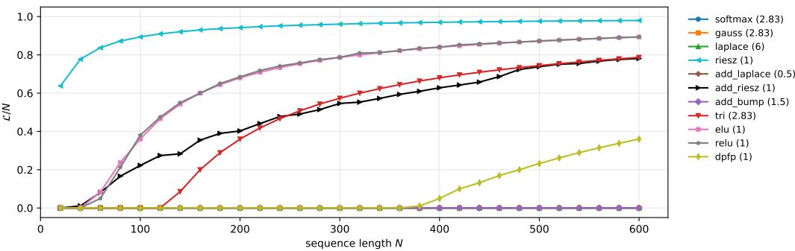
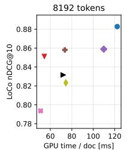
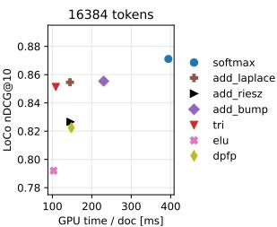
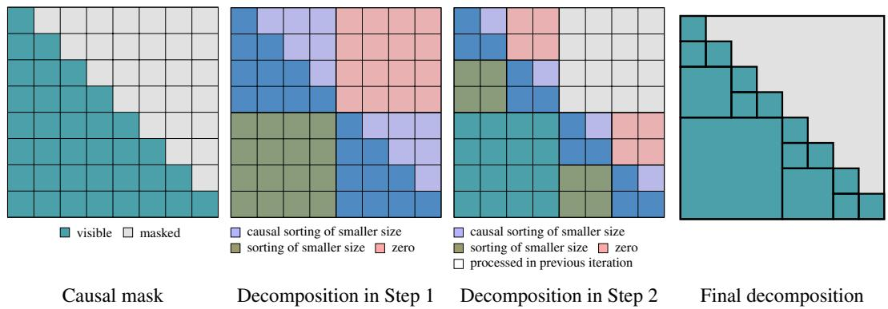

# QUASI LINEAR KERNEL ATTENTION WITH INFINITE CAPACITY

Nicolaj Rux1, Johannes Hertrich2 & Sebastian Neumayer1

1Faculty of Mathematics, Chemnitz University of Technology, 09126 Chemnitz, Germany 2Institute of Computer Science, University of Gottingen, 37073 G ¨ ottingen, Germany¨ {nicolaj.rux,sebastian.neumayer}@mathematik.tu-chemnitz.de johannes.hertrich@uni-goettingen.de

## ABSTRACT

The evaluation cost of transformers with softmax attention scales quadratically with sequence length. Kernel attention addresses this by replacing softmax with a more general kernel function. In this paper, we aim to identify kernels that retain the expressivity of attention while enabling quasi linear computation. To quantify expressivity, we introduce a capacity for each kernel, measuring the maximum sequence length for which the attention matrix can approximate the identity. A higher capacity thus indicates greater expressivity. We show that expressive kernels like softmax, Gauss, and Laplace have infinite capacity. In contrast, common quasi linear kernels, such as those derived from finite dimensional feature maps, exhibit finite capacity. As a solution, we propose additive kernels constructed from univariate spline and polynomial exponential kernels. We prove that these maintain infinite capacity while allowing quasi linear computation via sorting. Finally, we implement additive sorting kernels efficiently and benchmark them against modern softmax backends, demonstrating advantages for long sequences.

## 1 INTRODUCTION

Transformers (Vaswani et al., 2017) are the dominant architecture in language processing (Brown et al., 2020) and computer vision (Dosovitskiy et al., 2021). Their central building block is attention, which computes for query vectors $\pmb q = ( q _ { m } ) _ { m = 1 } ^ { \bar { M } } \subseteq \mathbb { R } ^ { D }$ , key vectors $\pmb { k } = ( k _ { n } ) _ { n = 1 } ^ { N } \subseteq \mathbb { R } ^ { D }$ , and value vectors ${ \pmb v } = ( v _ { n } ) _ { n = 1 } ^ { N } \subseteq \dot { \mathbb { R } } ^ { C }$ the M attention vectors $( y _ { m } ) _ { m = 1 } ^ { \dot { M } }$ as

$$
y _ { m } = \sum _ { n = 1 } ^ { N } \Phi ( q _ { m } , k _ { n } ) v _ { n } \Big / \sum _ { n = 1 } ^ { N } \Phi ( q _ { m } , k _ { n } ) , \qquad m = 1 , \ldots , M .\tag{1}
$$

Most implementations use the softmax kernel $\Phi ( q , k ) = \mathrm { e } ^ { \tau q ^ { \top } k }$ with inverse temperature $\tau > 0$ which acts as similarity score between the vectors q and k. For $M = N$ , the computational effort scales quadratically with the sequence length N. This has become the main computational bottleneck in practice. Current models are trained and deployed with context windows of 128k tokens and beyond (Llama Team, AI @ Meta, 2024), which involves substantial engineering effort (Dao et al., 2022; Dao, 2024). There have been several attempts to escape the quadratic complexity through approximations and windowed attention patterns; see Tay et al. (2022) for an overview.

In this paper, we focus on exact subquadratic attention, where the structure of the kernel Φ allows the computation of (1) in quasi linear time (Tsai et al., 2019). Within this class, Katharopoulos et al. (2020) achieved linear complexity by choosing kernels that factor over a finite feature map (FFM) $\varphi \colon \mathbb { R } ^ { D } \to \mathbb { R } ^ { L } , \mathrm { i . e . , } \Phi ( q , k ) = \mathcal { \bar { \varphi } } ( \dot { q } ) ^ { \top } \varphi ( k )$ . This construction yields symmetric positive definite (spd) kernels, which can be evaluated in linear time. However, for small L, these approaches have been shown to admit only limited expressivity compared to softmax attention, see Schlag et al. (2021). At the same time, the cost of evaluating the finite feature map increases linearly with L.

On the other hand, there exist several univariate kernels (namely D = 1), for which the corresponding kernel sums can be evaluated exactly via quasi linear sorting algorithms. Examples are polynomial exponential kernels like the Laplace kernel (Hofmeyr, 2021) and piecewise linear kernels (Hertrich, 2024; Hertrich et al., 2024; Vialard & Boufadene, 2025). However, most of these\` algorithms do not generalize to higher dimensions. An exception is the Laplace kernel, for which the sums can be evaluated in quasi linear time for arbitrary D, see Langrene & Warin (2021), but´ the complexity depends exponentially on D, making the approach practically infeasible for $D > 6$

Contribution Our goal is to identify kernels Φ such that the attention (1) is both expressive and computable in quasi linear time. To this end, we introduce the capacity of a kernel. Its definition is inspired by the associative recall experiment of Schlag et al. (2021) and measures up to which sequence length the identity can be approximated by the attention algorithm. Intuitively, this corresponds to the number of tokens that can be distinguished. Consequently, a higher capacity indicates higher expressivity. We prove that common choices have infinite capacity, including the softmax, Gauss, and Laplace kernels. This resembles the observation that their associated attention is expressive in practice. For kernels based on an FFM, we prove that the capacity is upper-bounded by the number L of considered features, reflecting their limited expressivity.

In order to achieve quasi linear attention with infinite capacity, we consider additive kernels of the form $\Phi ( q , k ) = \phi ( q _ { 1 } , k _ { 1 } ) + \ldots + \phi ( q _ { D } , k _ { D } )$ , where ϕ is a univariate kernel with quasi linear attention. For the univariate Laplace kernel $\phi ( s , t ) = \exp ( - | s - t | )$ and the bump kernel $\phi ( s , t ) =$ $\operatorname* { m a x } ( 0 , 1 - | s - t | )$ , we prove that the capacity of both ϕ and Φ is infinite, so that we obtain quasi linear attention with infinite capacity. We verify our findings in numerical experiments and provide an efficient CUDA implementation. For sequence lengths $\mathbf { \bar { \Phi } } _ { N } \gtrsim 2 , 0 4 8$ , our implementation is faster than conventional single-precision PyTorch attention, which offers a comparable level of numerical precision and code optimization. Compared to the highly optimized half-precision FlashAttention, we reach the break-even point for $N \gtrsim 2 0 { , } 0 0 0$ Thanks to the quasi linear complexity of our algorithm, the advantage increases rapidly with the sequence length.

Related work Several works reduce the quadratic cost of attention by approximation, either through sparse and windowed attention patterns (Kitaev et al., 2020; Beltagy et al., 2020; Zaheer et al., 2020), or through low-rank approximations of the attention matrix (Wang et al., 2020; Xiong et al., 2021). For an extensive overview, see Tay et al. (2022). The FFM idea was refined by Choromanski et al. (2021); Peng et al. (2021); Qin et al. (2022) with feature maps tailored to the softmax kernel and by Schlag et al. (2021), who increased the feature dimension L after recognizing that it caps the attention capacity. Lower bounds on the recurrent state size required for multi-query associative recall were proven by Arora et al. (2024a). Building on this, Arora et al. (2024b) combine linear attention with sliding windows, while gated linear attention (Yang et al., 2024a) and DeltaNe (Yang et al., 2024b) use data-dependent gating and delta-rule updates of the recurrent state, respectively, to better use a fixed-size state. These models are recurrent and go beyond the normalized kernel sums considered in (1). Alternative notions of expressivity for attention mechanisms were considered in Yun et al. (2020); Furuya et al. (2025). Our proposed bump and Laplace variants have been previously considered in different contexts: Feng et al. (2026) approximate the Laplace kernel attention via a finite feature map/Nystrom approach, and Vialard & Boufad ¨ ene (2025) combine the \` univariate bump kernel with a linear or MLP layer before each attention module to project onto a single dimension. Finally, the additive kernels are related to kernel slicing, see also Appendix B.

## 2 CAPACITY OF KERNEL ATTENTION

In order to determine which kernels Φ lead to an expressive attention mechanism, we assign to each Φ a capacity $\mathrm { C a p } ( \Phi )$ . Intuitively, this measures the maximal number of tokens that can be distinguished by the attention mechanism, which corresponds to the largest sequence length such that the identity can be approximated. Consequently, a larger capacity corresponds to more expressive attention. In this section, we formally define $\dot { \mathrm { C a p } } ( \Phi )$ ) and derive sufficient conditions such that $\mathrm { C a p } ( \Phi ) = \infty$ . These conditions apply in particular to the Gauss, softmax, and Laplace kernels, which are empirically known to correspond to expressive attention mechanisms.

Definition of Capacity For a kernel Φ, keys $\pmb { k } = ( k _ { n } ) _ { n = 1 } ^ { N }$ and queries $\pmb { q } = ( q _ { m } ) _ { m = 1 } ^ { M }$ , we define the Gram matrix $G ( \pmb q , \pmb k ) = ( G _ { m , n } ) _ { m , n = 1 } ^ { M , N }$ and the attention matrix $A ( \pmb q , \pmb k ) = ( A _ { m , n } ) _ { m , n = 1 } ^ { M , N }$ by

$$
\begin{array} { r } { G _ { m , n } = \Phi ( q _ { m } , k _ { n } ) \qquad \mathrm { a n d } \qquad A _ { m , n } = G _ { m , n } / { \sum _ { l = 1 } ^ { N } G _ { m , l } } . } \end{array}\tag{2}
$$

For $\pmb { v } = ( v _ { n } ) _ { n = 1 } ^ { N } \mathrm { i n } \mathbb { R } ^ { C }$ , the attention mechanism can be rewritten as the matrix-vector multiplication $y _ { c } = A ( q , k ) v _ { c } \mathrm { f o r } c = 1 , \dots , C$ . We denote the capacity $\mathrm { C a p } ( \Phi )$ of Φ as the largest sequence length $N$ such that there exist keys k and queries $\pmb q$ for which $\dot { A ( \pmb q , \pmb k ) } \approx \mathrm { I d } _ { N }$ , where $\mathrm { I d } _ { N }$ is the $N \times N$ identity matrix. Formally, we define

$$
\mathrm { C a p } ( \Phi ) = \operatorname* { s u p } \left\{ N \in \mathbb { N } : \operatorname* { i n f } _ { \pmb { q } , \pmb { k } \in ( \mathbb { R } ^ { D } ) ^ { N } } \| \pmb { A } ( \pmb { q } , \pmb { k } ) - \mathrm { I d } _ { N } \| _ { F } ^ { 2 } = 0 \right\} .\tag{3}
$$

In other words, if the sequence length N is larger than $\operatorname { C a p } ( \Phi )$ , the attention mechanism is no longer able to represent the identity, which indicates a lack of expressiveness.

Kernels with Infinite Capacity A kernel Φ is stationary if $\Phi ( q , k ) = F ( q - k )$ for some function F. If F is continuous and fulfills $F ( x )  0$ as $\| { x } \| _ { 2 } \to \infty$ , we call Φ a stationary $\mathcal { C } _ { 0 }$ kernel. Theorem 1. Let Φ be a stationary $\mathcal { C } _ { 0 }$ kernel with $F ( 0 ) > 0$ , then it holds $\mathrm { C a p } ( \Phi ) = \infty .$

The theorem applies in particular to the Gauss kernel $\begin{array} { r } { \Phi ( q , k ) = \exp ( - \frac 1 2 \| q - k \| _ { 2 } ^ { 2 } ) } \end{array}$ and many others including Laplace and Matern kernels. Even though the softmax kernel´ $\ddot { \Phi } ( q , k ) \dot { = } \exp ( q ^ { \top } \dot { k } )$ is not stationary, we can exploit its close relation to the Gauss kernel to show that $\mathrm { C a p } ( \Phi ) = \infty$

Proposition 2. For $D \geq 2 a n d \Phi ( q , k ) = \exp ( q ^ { \top } k )$ , we have $\mathrm { C a p } ( \Phi ) = \infty$

Upper Bounding the Capacity Next, we derive a criterion which upper bounds the capacity of an spd kernel Φ by the dimension of the corresponding reproducing kernel Hilbert space (RKHS). To define the RKHS, we consider the space $\mathcal { H } _ { \Phi } ^ { 0 ^ { \cdot } } : = \operatorname { s p a n } \{ \bar { \Phi } ( \cdot , k ) : \bar { k } \in \mathbb { R } ^ { D } \}$ with the bilinear form

$$
\left. \sum _ { m = 1 } ^ { M } a _ { m } \Phi ( \cdot , q _ { m } ) , \sum _ { n = 1 } ^ { N } b _ { n } \Phi ( \cdot , k _ { n } ) \right. _ { \mathcal { H } _ { \Phi } } = \sum _ { m = 1 } ^ { M } \sum _ { n = 1 } ^ { N } a _ { m } b _ { n } \Phi ( q _ { m } , k _ { n } ) .\tag{4}
$$

Then, the RKHS ${ \mathcal { H } } _ { \Phi }$ is defined as the completion of $\mathcal { H } _ { \Phi } ^ { 0 }$ with respect to the norm induced by $\langle \cdot , \cdot \rangle _ { \mathscr { H } _ { \Phi } }$ . The columns of the Gram matrix $\bar { G } ( \bar { q } , k )$ can be seen as functions $\Phi ( \cdot , k _ { n } ) \in \mathcal { H } _ { \Phi } ^ { 0 }$ evaluated at queries q. Therefore, the rank of $G ( \boldsymbol { q } , \boldsymbol { k } )$ can be bounded via

$$
\operatorname { r a n k } ( G ( \boldsymbol { q } , \boldsymbol { k } ) ) \leq \dim ( \operatorname { s p a n } \{ \Phi ( \cdot , k _ { 1 } ) , \dots , \Phi ( \cdot , k _ { N } ) \} ) \leq \dim ( \mathcal { H } _ { \Phi } ) .\tag{5}
$$

As the attention matrix $A ( \pmb q , \pmb k )$ arises from $G ( \boldsymbol { q } , \boldsymbol { k } )$ by rescaling the rows, we also find that rank $\begin{array} { r } { \cdot ( A ( \pmb q , \pmb k ) ) = \mathrm { r a n k } ( G ( \pmb q , \pmb k ) ) \leq \mathrm { d i m } ( \mathcal { H } _ { \Phi } ) } \end{array}$ ). In particular, we have for any q and k by the Eckart-Young theorem (Eckart & Young, 1936) that

$$
\operatorname* { i n f } _ { \pmb { q } , \pmb { k } \in ( \mathbb { R } ^ { D } ) ^ { N } } \| \pmb { A } ( \pmb { q } , \pmb { k } ) - \mathrm { I d } _ { N } \| _ { F } ^ { 2 } \geq N - \mathrm { d i m } ( \mathcal { H } _ { \Phi } ) .\tag{6}
$$

Thus, the left hand side can only be zero if $N \leq \dim ( \mathcal { H } _ { \Phi } )$ such that $\mathrm { C a p } ( \Phi ) \leq \mathrm { d i m } ( \mathcal { H } _ { \Phi } )$ . We summarize this result in the following theorem.

Theorem 3. Let Φ be an spd kernel, then it holds $\mathrm { C a p } ( \Phi ) \leq \mathrm { d i m } ( \mathcal { H } _ { \Phi } )$

The reverse statement is not true. More precisely, we show in Proposition 8 that there exist kernels Φ such that dim $\begin{array} { r } { ( \mathcal { H } _ { \Phi } ) = \infty , } \end{array}$ , but $\mathrm { C a p } ( \Phi ) ^ { \bullet } < \infty$

## 3 CAPACITY OF QUASI LINEAR ATTENTION

In Theorem 1, we have derived a large class of kernels which admits infinite capacity, indicating a high expressivity. However, the computation of the attention mechanism requires generally $\mathcal { O } \bar { (} N M \bar { ) }$ operations, which is a major computational bottleneck. Therefore, we now focus on kernels for which the attention mechanism can be computed exactly in quasi linear time, i.e., in $\mathcal { O } ( ( N { + } M ) \log ^ { \nu } ( N { + } M ) )$ ) operations for some $\nu > 0$ . We will mainly analyze the complexity of computing the kernel sums

$$
z _ { m } = \sum _ { n = 1 } ^ { N } \Phi ( q _ { m } , k _ { n } ) v _ { n } , \qquad m = 1 , \ldots , M ,\tag{7}
$$

for queries $\pmb { q } = ( q _ { m } ) _ { m = 1 } ^ { M } , \mathrm { k e y s } \pmb { k } = ( k _ { n } ) _ { n = 1 } ^ { N }$ and values $\pmb { v } = ( v _ { n } ) _ { n = 1 } ^ { N }$ . In fact, from a computational viewpoint, considering the kernel sums is equivalent to considering the attention mechanism, as the normalization can be computed in $\mathcal { O } ( M \dot { C } )$ operations. In practice, the time of computing this normalization is dominated by the $\mathcal { O } ( ( N { + } \dot { M } ) ( \dot { D } { + } C ) )$ cost of reading the data.

Laplace Langrene & Warin (2021) propose an algorithm based on (Bentley, 1980) with quasi´ linear complexity to compute kernel sums for the Laplace kernel $\Phi ( q , k ) = \exp ( - \| q - k \| _ { 1 } )$ , which fulfills $\mathrm { C a \bar { p } ( \Phi ) \bar { \Phi } = \infty \ b \bar { y } }$ Theorem 1. However, the algorithm relies on a decomposition of the Laplace kernel sum into $\mathbf { \bar { \boldsymbol { 2 } } } ^ { D }$ generalized empirical cumulative distribution functions. In particular, the complexity depends exponentially on the dimension. Thus, for an exemplary head dimension of $D = 6 4$ , the quasi linear implementation is only expected to be faster than brute-force for sequence lengths larger than $2 ^ { 6 4 } > 1 0 ^ { 1 9 }$ , which makes it a theoretical advance rather than a practical method.

## 3.1 FINITE FEATURE MAPS

Following the idea of random Fourier features (Rahimi & Recht, 2007), several works (Peng et al., 2021; Choromanski et al., 2021; Katharopoulos et al., 2020; Schlag et al., 2021) proposed linear attention algorithms by using finite feature maps (FFMs) φ: RD → RL. The main idea is to choose $\Phi ( q , k ) = \bar { \varphi } ( q ) ^ { \top } \varphi ( k )$ , for which the kernel sum can be computed as

$$
z _ { m } = \sum _ { n = 1 } ^ { N } \Phi ( q _ { m } , k _ { n } ) v _ { n } = \sum _ { n = 1 } ^ { N } \varphi ( q _ { m } ) ^ { \top } \varphi ( k _ { n } ) v _ { n } = \Big ( \sum _ { n = 1 } ^ { N } v _ { n } \varphi ( k _ { n } ) ^ { \top } \Big ) \varphi ( q _ { m } ) .\tag{8}
$$

The inner sum $\textstyle \sum _ { n = 1 } ^ { N } v _ { n } \varphi ( k _ { n } ) ^ { \top }$ no longer depends on m such that all $z _ { m }$ together can be computed in linear complexity ${ \bf \bar { \mathcal { O } } } ( L { \dot { C } } ( N { + } M ) ) ,$ . Schlag et al. (2021) uses the feature dimension as a measure of capacity. This is reasonable because

$$
H _ { \Phi } ^ { 0 } = \operatorname { s p a n } \{ \Phi ( \cdot , k ) \mid k \in \mathbb { R } ^ { D } \} = \operatorname { s p a n } \{ \varphi ( \cdot ) ^ { \top } \varphi ( k ) \mid k \in \mathbb { R } ^ { D } \} \subseteq \operatorname { s p a n } \{ \varphi _ { 1 } , \ldots , \varphi _ { L } \} .\tag{9}
$$

Since the completion of a finite dimensional space is the space itself, we also obtain $\mathcal { H } _ { \Phi } \subseteq$ span $\{ \varphi _ { 1 } , . . . , \varphi _ { L } \}$ , which has at most dimension L. Corollary 4 gives the connection to Schlag et al. (2021) as an immediate consequence of Theorem 3.

Corollary 4. Let $\Phi ( q , k ) = \varphi ( q ) ^ { \top } \varphi ( k )$ with FFM $\varphi : \mathbb { R } ^ { D } \to \mathbb { R } ^ { L }$ , then $\mathrm { C a p } ( \Phi ) \leq \mathrm { d i m } ( \mathcal { H } _ { \Phi } ) \leq L .$

By Corollary 4 the capacity is bounded through the feature dimension L. At the same time, the computational complexity scales linearly with L such that FFMs with more features are slower to evaluate. The next proposition verifies that the assumptions of Theorem 1 are indeed violated for FFMs in the sense that most FFMs are not stationary and the only stationary FFMs are not $\mathcal { C } _ { 0 }$

Proposition 5. Let $\Phi ( q , k ) = \varphi ( q ) ^ { \top } \varphi ( k )$ be a continuous and stationary kernel. Then, it holds $\begin{array} { r } { \Phi ( q , k ) = \sum _ { l = 1 } ^ { L } \alpha _ { l } \cos ( \omega _ { l } ^ { \top } ( q - k ) ) } \end{array}$ , where $\alpha _ { l } \geq 0$ and $\boldsymbol { \omega } _ { l } \in \mathbb { R } ^ { D }$ for $l = 1 , \ldots , L$ . In particular, we have that Φ is a stationary $\mathcal { C } _ { 0 }$ kernel if and only $i f \Phi = 0$

## 3.2 QUASI LINEAR ATTENTION WITH INFINITE CAPACITY IN ONE DIMENSION

There exist several univariate kernels $\phi \colon \mathbb { R } \times \mathbb { R } \to \mathbb { R }$ , for which kernel sums can be computed in quasi linear time via sorting. This involves the Laplace kernel $\phi ( s , t ) = \exp ( - | s - t | )$ (Hofmeyr, 2021; Langrene & Warin, 2021), the distance kernel´ $\phi ( s , t ) = | s - t |$ (Hertrich, 2024; Hertrich et al., 2024; Teuber et al., 2011) and polynomial exponential kernels $\begin{array} { r } { \phi ( s , t ) = p ( | s - t | ) \exp ( - | s - \rrangle } \end{array}$ t|) for some polynomial p (Hofmeyr, 2021). Using that any continuous piecewise linear function $f \colon  { \mathbb { R } } \to  { \mathbb { R } }$ can be represented as the composition of constants, linear terms and absolute values (Streubel et al., 2014), the sorting algorithm for the distance kernel can be deployed for any kernel $\phi ( s , t ) = f ( s - t )$

Proposition 6. Let $f : \mathbb { R } \to$ R be piecewise linear withfinitely many nodes, then $\phi ( s , t ) = f ( s - t )$ is quasi linear.

This includes the bump kernel $f ( u ) = \operatorname* { m a x } ( 0 , 1 - | u | )$ ) with alternative expressivity results by Vialard & Boufadene (2025, Thm. 3.2). Both bump and Laplace have infinite capacity, see Theorem 1.\` Corollary 7. Both the bump kernel $\phi ( s , t ) = \mathrm { m a x } \{ 0 , 1 - | s - t | \}$ and the Laplace kernel $\phi ( s , t ) =$ $\exp ( - | s - t | )$ are quasi linear and have infinite capacity.

On the other hand, the Riesz kernel $r ( s , t ) = | s | + | t | - | s - t |$ is an example for a kernel with infinite dimensional RKHS and finite capacity. Since the RKHS of r can be identified with the infinite dimensional homogeneous Beppo Levi space (Wendland, 2004, Prop. 10.39), its attention matrix has no bound on its rank. Yet, its global structure does not allow to approximate the identity.

Proposition 8. For the Riesz kernel $\phi ( s , t ) = | s | + | t | - | s - t | + \varepsilon w i t h \varepsilon > 0 ,$ , we have $\mathrm { C a p } ( \phi ) = 2 .$

Algorithm 1 Weighted absolute value sum   
# Step Work Memory   
1 Input $\pmb { \mathscr { s } } \in \mathbb { R } ^ { M } , \pmb { \mathscr { t } } \in \mathbb { R } ^ { N }$ and $\mathbf { \overline { { v } } } \in \mathbb { R } ^ { N \times C }$ - $\overline { { ( C + 1 ) N + M } }$   
2 Output $\begin{array} { r } { z _ { m } : = \sum _ { n = 1 } ^ { N } | s _ { m } - t _ { n } | v _ { n } \in \mathbb { R } ^ { C } \quad m = 1 , \dots , M } \end{array}$ MC   
3 $\sigma : = \operatorname { a r g s o r t } ( t ) \operatorname { s . t . } t _ { \sigma ( 1 ) } \leq \ldots \leq t _ { \sigma ( N ) }$ $N \log _ { 2 } N$ N   
4 $p _ { m } : = \operatorname* { m a x } \bigl ( \{ n : t _ { \sigma ( n ) } \leq s _ { m } \} \cup \{ 0 \} \bigr )$ for ${ \dot { m } } = 1 , \dots , M$ $M \log _ { 2 } N$ M   
5 pref $\begin{array} { r } { \mathrm { ~ \underline { ~ } t } _ { n } : = \sum _ { j = 1 } ^ { n } t _ { \sigma ( j ) } v _ { \sigma ( j ) } \in \mathbb { R } ^ { C } } \end{array}$ for $n = 0 , \ldots , N$ $( N { + } 1 ) C$ (N+1)C   
6 pref $\begin{array} { r } { \mathbf { \check { \mathbf { \rho } } } _ { \mathrm { - } } \mathbf { v } _ { n } : = \sum _ { j = 1 } ^ { n } v _ { \sigma ( j ) } \in \mathbb { R } ^ { C } \mathrm { f o r } n = 0 , \dots , N } \end{array}$ $( N { + } 1 ) C$ $( N { + } 1 ) C$   
7 $a _ { m } : = 2 \mathrm { p r e f } _ { - } \overset { \mathcal { \prime } } { \mathbf { v } } _ { p _ { m } } - \mathrm { p r e f } _ { - } \mathbf { v } _ { N } \in \mathbb { R } ^ { C }$ for $m = 1 , \ldots , M$ MC MC   
8 $z _ { m } : = \mathrm { p r e f . t } _ { N } - 2 \mathrm { p r e f . t } _ { p _ { m } } + s _ { m } a _ { m } \in \mathbb { R } ^ { C } \mathrm { f o r } m = 1 , \ldots , M$ MC MC   
9 return z

Weighted Absolute Value Sums For the Riesz and spline kernels, the difficult part is to compute $\begin{array} { r } { \sum _ { n = 1 } ^ { N } | s _ { m } - t _ { n } | v _ { n } } \end{array}$ , where $s _ { m } ~ \in ~ \mathbb { R }$ and $t _ { n } ~ \in ~ \mathbb { R }$ . This sum can be computed in $\mathcal { O } ( ( N + M ) ( \log _ { 2 } N { + } C ) )$ by Algorithm 1. A similar algorithm can be applied for the one dimensional Laplace kernel. The core idea is that after sorting, the keys below and above $s _ { m }$ separate:

$$
\begin{array} { l } { { \displaystyle \sum _ { n = 1 } ^ { N } | s _ { m } - t _ { n } | v _ { n } = \sum _ { n = 1 } ^ { N } | s _ { m } - t _ { \sigma ( n ) } | v _ { \sigma ( n ) } } } \\ { { \displaystyle = \sum _ { n = 1 } ^ { p _ { m } } ( s _ { m } - t _ { \sigma ( n ) } ) v _ { \sigma ( n ) } + \sum _ { n = p _ { m } + 1 } ^ { N } ( t _ { \sigma ( n ) } - s _ { m } ) v _ { \sigma ( n ) } } } \\ { { \displaystyle = s _ { m } \sum _ { n = 1 } ^ { p _ { m } } v _ { \sigma ( n ) } - \sum _ { n = 1 } ^ { p _ { m } } t _ { \sigma ( n ) } v _ { \sigma ( n ) } + \sum _ { n = p _ { m } + 1 } ^ { N } t _ { \sigma ( n ) } v _ { \sigma ( n ) } - s _ { m } \sum _ { n = p _ { m } + 1 } ^ { N } v _ { \sigma ( n ) } } } \\ { { \displaystyle = s _ { m } ( 2 \mathrm { p r e f . } v _ { p _ { m } } - \mathrm { p r e f . } v _ { N } ) + \mathrm { p r e f . } k _ { N } - 2 \mathrm { p r e f . } t _ { p _ { m } } } = z _ { m } . }  \end{array}\tag{10}
$$

The last line (10) depends on the prefix sums over ${ \pmb v } _ { \sigma }$ and $\scriptstyle t _ { \sigma } v _ { \sigma }$ , which can be computed with $\mathcal { O } ( N C )$ work. Once the prefix sums have been computed, the entry at position $p _ { m }$ needs to be extracted, resulting in another $\mathcal { O } ( M C )$ operations. The total work of the one dimensional absolute value sum reduces to $\mathcal { O } ( ( N { + } M ) ( \log _ { 2 } ( \bar { N } ) { + } C ) )$ operations. In short, we pay $\mathcal { O } ( ( N { + } M ) \log _ { 2 } N )$ to then be able to compute the rest in ${ \bar { \mathcal { O } } } ( C ( N + M ) )$ instead of $\mathcal { O } ( C N M )$

Appendix C explains how we implement Algorithm 1 efficiently on the GPU. For the multivariate case, a naive PyTorch implementation needs to build huge temporary tensors in steps 5 to 8. Meanwhile, we compute steps 5 to 8 in a single CUDA kernel and allocate the intermediate tensors pref v and pref t on the fly. This ensures a low memory profile with good parallelism.

## 3.3 ADDITIVE KERNELS FOR QUASI LINEAR ATTENTION WITH INFINITE CAPACITY

In order to carry over the one dimensional algorithms from the previous subsection to higher dimensions, we propose to use additive kernels of the form

$$
\Phi \colon \mathbb { R } ^ { D } \times \mathbb { R } ^ { D } \to \mathbb { R } , \qquad \Phi ( q , k ) = \sum _ { d = 1 } ^ { D } \phi ( q _ { d } , k _ { d } )\tag{11}
$$

for some univariate kernel $\phi \colon \mathbb { R } \times \mathbb { R } \to \mathbb { R }$ . Similar kernels were considered in Hertrich et al. (2025) as quasi-Monte Carlo design for the kernel slicing algorithm; more details are given in Appendix B. By definition, the kernel sums for such kernels can be computed as

$$
z _ { m } = \sum _ { n = 1 } ^ { N } \Phi ( q _ { m } , k _ { n } ) v _ { n } = \sum _ { d = 1 } ^ { D } \sum _ { n = 1 } ^ { N } \phi ( q _ { m , d } , k _ { n , d } ) v _ { n } ,\tag{12}
$$

which has quasi linear complexity if and only if the kernel sum with respect to the univariate kernel ϕ has quasi linear complexity. Even though additive kernels Φ will never be $\mathcal { C } _ { 0 }$ (unless $\Phi = 0 )$ , we prove in the next theorem that $\mathrm { C a p } ( \phi ) = \mathrm { \hat { \infty } }$ implies that $\mathrm { C a p } ( \Phi ) = \infty$

Table 1: For additive kernels, we state the univariate $\phi ( s , t )$ . dpfp is described in Appendix A and the remaining kernels are defined for $q , k \in \mathbb { R } ^ { D }$ . All kernels except $\pm \mathtt { r i }$ are nonnegative. riesz and add riesz use $\varepsilon = 1 0 ^ { - 3 }$ and are partially stationary, i.e., stationary up to terms depending only on q or only on k. The last column is the best known kernel sum complexity in $N { \pm } M$
<table><tr><td>Name</td><td>Formula</td><td>dim</td><td>stationary</td><td>additive</td><td>capacity</td><td>complexity</td></tr><tr><td>softmax</td><td> $\mathrm { e } ^ { q ^ { \top } k }$ </td><td>∞</td><td>no</td><td>no</td><td>∞</td><td>quadratic</td></tr><tr><td>gauss</td><td> $\mathrm { e } ^ { - { \frac { 1 } { 2 } } \| q - k \| _ { 2 } ^ { 2 } }$ </td><td>∞</td><td>yes</td><td>no</td><td>∞</td><td>quadratic</td></tr><tr><td>laplace</td><td> $\check { \mathbf { e } } ^ { - \| \boldsymbol { q } - \boldsymbol { k } \| _ { 1 } }$ </td><td>∞</td><td>yes</td><td>no</td><td>∞</td><td>quasi linear</td></tr><tr><td>riesz</td><td> $\| q \| _ { 2 } + \| k \| _ { 2 } - \| q - k \| _ { 2 } + \varepsilon$ </td><td>∞</td><td>partially</td><td>no</td><td>一</td><td>quadratic</td></tr><tr><td>add_riesz</td><td></td><td>∞</td><td>partially</td><td>yes</td><td>≥ 2D</td><td>quasi linear</td></tr><tr><td>add_laplace</td><td> $\begin{array} { l } { | s | + | t | - | s - t | + \varepsilon } \\ { \mathrm { e } ^ { - | s - t | } } \end{array}$ </td><td>∞</td><td>yes</td><td>yes</td><td>∞</td><td>quasi linear</td></tr><tr><td>add_bump</td><td> $\operatorname* { m a x } \{ 0 , 1 - | s - t | \}$ </td><td>8</td><td>yes</td><td>yes</td><td>8</td><td>quasi linear</td></tr><tr><td>tri</td><td> $\cos ( s - t )$ </td><td>2D</td><td>yes</td><td></td><td>≤ 2D</td><td>linear</td></tr><tr><td>relu</td><td> $\mathrm { R e L U } ( s ) \mathrm { \dot { R e L U } } ( t )$ </td><td>D</td><td>no</td><td>yes yes</td><td>D</td><td>linear</td></tr><tr><td>elu</td><td> $( { \mathrm { e l u } } + 1 ) ( s ) ( { \mathrm { e l u } } + 1 ) ( t )$ </td><td>D</td><td>no</td><td>yes</td><td>≤ D</td><td>linear</td></tr><tr><td>dpfp</td><td>Àppendix A</td><td>6D</td><td>no</td><td>no</td><td>IVIVI 6D</td><td>linear</td></tr></table>

Theorem 9. Let Φ be an additive kernel corresponding to some $\phi .$ Then, we have that $\mathrm { C a p } ( \Phi ) \geq$ $\operatorname { C a p } ( \phi )$ . Moreover, the properties spd, quasi linear and stationary carry over from ϕ to Φ. For the Riesz kernel $\phi = r _ { \varepsilon } ,$ , we have $\mathrm { C a p } ( \Phi ) \geq 2 D$

We now combine Corollary 7 with the arguments in this section to get our main result.

Corollary 10. The additive- Laplace and bump kernel defined by $\begin{array} { r } { \Phi ( q , k ) = \sum _ { d = 1 } ^ { D } \phi ( q _ { d } , k _ { d } ) } \end{array}$ with $\phi ( s , t ) = \exp ( - | s - t | )$ and $\phi ( s , t ) = \mathrm { m a x } ( 0 , 1 - | s - t | ) f u l f i l \ : \mathrm { C a p } ( \Phi ) = \bar { \infty }$ and corresponding kernel sums can be computed in quasi linear complexity.

## 4 IMPLEMENTATION AND EXPERIMENTS

Next, we investigate our findings numerically by three experiments. The first one in Section 4.1 aims to verify theoretical claims from the previous sections. To this end, we perform an associativerecall experiment, which numerically computes the capacity of the considered kernels. The second experiment in Section 4.2 investigates the computation time. To complement theoretical complexity analysis of the proposed quasi linear kernels, we investigate the “break-even” point. This describes the minimal sequence length $N$ such that our attention algorithm is faster than softmax attention. In this part, we also comment on possible implementations of attention. Finally, the third experiment in Section 4.3 evaluates the performance of the kernels based on the text embedding transformer nomic-embed-text-v1 by Nussbaum et al. (2025). We include a similar experiment for a vision transformer in Appendix E. Table 1 gives an overview of the kernels evaluated in this section.

All experiments use PyTorch 2.13.0+cu129 and KeOps 2.3. While training runs on a multi GPU cluster, all time measurements (Table 2 & 5 and Figure 2) were taken on a single NVIDIA GeForce RTX 5090. The code corresponding to our experiments is available on GitHub1.

Bandwidth The bandwidth is set via $\Phi _ { \tau } ( q , k ) : = \Phi ( q / \tau , k / \tau )$ , with $\tau = D ^ { 1 / 4 }$ as default for softmax, gauss and $\pm \mathtt { r i }$ . Since both text and vision transformer use head dimension $D = 6 4$ we use $\tau \approx 2 . 8 2 8$ . We also tested other bandwidths but found $\tau = D ^ { 1 / 4 }$ to be near optimal in both the text and vision transformer. Similarly, $\tau = 1 . 5$ for add bump, $\tau = 0 . 5$ for add laplace and $\tau = 6$ for laplace work well on both tasks. For $\varepsilon = 0$ , the kernels riesz, add riesz, relu and dpfp are scale invariant, $\mathbf { i . e . , } \Phi _ { \tau } = \tau ^ { \alpha } \Phi _ { 1 }$ for all $\tau > 0$ and some $\alpha > 0 .$ . Therefore, the scale cancels out within attention and for $\varepsilon > 0$ it merely rescales ε, so no tuning is necessary. As the only not nonnegative kernel, tri causes numerical instability during training. To stabilize this, we clamp the attention normalization at $1 0 ^ { - 6 }$ and use gradient clipping to avoid overshooting.

## 4.1 ASSOCIATIVE RECALL CAPACITY

Here, we assess the capacity of various kernels by an associative-recall experiment similar to Schlag et al. (2021, Sec. 6.1). More precisely, we start with learnable tokens ${ \pmb u } = \mathrm { \dot { ( } } u _ { n } ) _ { n = 1 } ^ { N } \subseteq \mathbb { R } ^ { D }$ and define

  
Figure 1: Associative-recall: Trained full-batch with Adam (lr 0.03) for at most 120k steps, stopping early once the loss falls below $1 0 ^ { - 4 } , D = 6 4 .$ , where the tokens are initialized as standard normal and $W _ { Q } = W _ { K } = I$ . Curves show the best loss over 3 seeds. Scale $\tau$ in brackets behind kernel name.

keys and queries as $k _ { n } = W _ { K } u _ { n }$ and $q _ { n } = W _ { Q } u _ { n }$ for learnable matrices $W _ { Q } , W _ { K } \in \mathbb { R } ^ { D \times D }$ . Then, for values $v _ { 1 } , \dots , v _ { N } \in \mathbb { R } ^ { N }$ chosen as the unit vectors, we minimize the loss function

$$
\mathcal { L } ( \boldsymbol { \mathsf { u } } , W _ { Q } , W _ { K } ) = \mathbb { E } _ { \sigma , \boldsymbol { \xi } } \left[ \sum _ { n = 1 } ^ { N } \| v _ { \boldsymbol { \xi } ( n ) } - y _ { \sigma ( n ) } \| ^ { 2 } \right] ,\tag{13}
$$

where $\begin{array} { r } { y _ { m } = A ( \pmb { q } , \pmb { k } _ { \sigma } ) \pmb { v } _ { \xi } = \sum _ { l = 1 } ^ { N } A _ { m , l } ( \pmb { q } , \pmb { k } _ { \sigma } ) \pmb { v } _ { \xi ( l ) } } \end{array}$ with $\pmb { k } _ { \sigma } = ( W _ { K } u _ { \sigma ( n ) } ) _ { n = 1 } ^ { N }$ is the attention vector as defined in (1) and σ and $\xi$ are uniformly randomly drawn permutations. The loss does not depend on σ and ξ as the following lemma shows.

Lemma 11. For all permutations σ and $\xi$ it holds

$$
\sum _ { n = 1 } ^ { N } \| v _ { \xi ( n ) } - y _ { \sigma ( n ) } \| _ { 2 } ^ { 2 } = \| A ( \pmb { q } , \pmb { k } ) - \mathrm { I d } _ { N } \| _ { F } ^ { 2 } , \qquad \pmb { k } : = ( W _ { K } \pmb { u } _ { n } ) _ { n = 1 } ^ { N } .\tag{14}
$$

While Schlag et al. (2021) phrase this as a retrieval task, we show in Appendix F that it can be related to our capacity notion in the sense that

$$
\operatorname* { i n f } _ { \pmb { u } , W _ { Q } , W _ { K } } \mathcal { L } ( \pmb { u } , W _ { Q } , W _ { K } ) \geq \operatorname* { i n f } _ { \pmb { q } , \pmb { k } } \| \pmb { A } ( \pmb { q } , \pmb { k } ) - \mathrm { I d } _ { N } \| _ { F } ^ { 2 } .\tag{15}
$$

In particular, we have that in $\mathrm { i f } _ { { \pmb u } , W _ { Q } , W _ { K } } \mathscr { L } ( { \pmb u } , W _ { Q } , W _ { K } ) = 0 \mathrm { o n l y i f } \mathrm { C a p } ( { \Phi } ) \geq N .$

In Figure 1, we plot the minimal value of $\mathcal { L } ( \boldsymbol { \mathbf { \mathscr { u } } } , W _ { Q } , W _ { K } )$ after 120k optimization steps on $W _ { Q } , W _ { K }$ and u for the kernels of Table 1. We observe that all FFM kernels roughly achieve a loss of zero for sequence lengths $N < L$ and end up with a strictly positive loss for $\bar { N } > L$ . This matches Corollary 4 stating that $\mathrm { C a p } ( \Phi ) \leq L$ . On the other hand, the stationary $\mathcal { C } _ { 0 }$ kernels gauss and laplace succeed in this task as predicted by Theorem 1. In alignment with Corollary 10, add laplace and add bump also pass the task up to $N = 6 0 0$ . While Theorem 9 guarantees $\mathrm { C a p } ( \Phi ) \geq 1 2 8$ for add riesz, the optimization already fails around $N = 4 0$ , and riesz performs worst throughout.

## 4.2 IMPLEMENTATIONS AND SPEED BENCHMARKS

Now, we compare the runtime of the different backends of the attention algorithm. We already know that for $M = N$ softmax attention has complexity $\mathcal { O } ( N ^ { 2 } )$ , while our kernels have complexity $\mathcal { O } ( N \log N )$ . Hence, for long enough sequence lengths, quasi linear kernels should eventually become faster. Thus, we are interested in the “break-even” point, i.e., the minimal number N such that the quasi linear algorithms are faster than the standard softmax attention. For the quasi linear algorithms, we provide backends for add laplace and the distance kernel. The latter can be used to compute all spline kernels and we choose add riesz as a simple representative. Here, we consider the following backends.

Table 2: Forward-pass of kernel attention (1) with runtime in milliseconds, mean over 10 runs after 5 warm-up iterations. Relative standard deviations are below 18% for $N \ \leq \ 5 1 2$ , below 4% at $N = 1 0 2 4$ and below 3% for $N \geq 2 0 4 8$ . Bold marks the fastest method overall; underline marks the fastest among the five $\tt f p 3 2$ methods. Shape: $B = 4 , H = 1 2 , D = 6 4 , C = 6 4 , M = N$
<table><tr><td rowspan="2">N</td><td>add_laplace fp32</td><td colspan="3">add_riesz fp32</td><td colspan="4">softmax</td></tr><tr><td>GLOBAL</td><td>GLOBAL</td><td>FUSED</td><td>KEOPS</td><td>MEM_EFF32</td><td>MEM_EFF16</td><td>FLASH16</td><td>CUDNN16</td></tr><tr><td>128</td><td>0.442</td><td>0.455</td><td>0.305</td><td>0.381</td><td>0.029</td><td>0.021</td><td>0.021</td><td>0.023</td></tr><tr><td>256</td><td>0.575</td><td>0.539</td><td>0.353</td><td>0.425</td><td>0.058</td><td>0.031</td><td>0.022</td><td>0.030</td></tr><tr><td>512</td><td>0.824</td><td>0.694</td><td>0.478</td><td>0.688</td><td>0.144</td><td>0.058</td><td>0.041</td><td>0.043</td></tr><tr><td>1024</td><td>1.305</td><td>1.014</td><td>0.719</td><td>1.648</td><td>0.431</td><td>0.152</td><td>0.093</td><td>0.119</td></tr><tr><td>2048</td><td>2.260</td><td>1.690</td><td>1.278</td><td>4.754</td><td>1.645</td><td>0.537</td><td>0.266</td><td>0.265</td></tr><tr><td>4096</td><td>4.472</td><td>3.583</td><td>2.991</td><td>17.14</td><td>6.219</td><td>1.948</td><td>1.016</td><td>1.001</td></tr><tr><td>8192</td><td>9.109</td><td>7.336</td><td>一</td><td>63.94</td><td>24.12</td><td>7.424</td><td>3.780</td><td>3.726</td></tr><tr><td>16384</td><td>20.31</td><td>16.86</td><td></td><td>249.1</td><td>94.95</td><td>29.57</td><td>14.99</td><td>14.90</td></tr><tr><td>32768</td><td>42.07</td><td>34.88</td><td></td><td>985.6</td><td>379.4</td><td>118.8</td><td>59.79</td><td>60.11</td></tr><tr><td>65536</td><td>86.94</td><td>73.76</td><td></td><td>3877</td><td>1523</td><td>478.1</td><td>239.2</td><td>241.3</td></tr><tr><td>131072</td><td>190.1</td><td>200.0</td><td></td><td>15608</td><td>6118</td><td>1930</td><td>968.8</td><td>972.1</td></tr></table>

• GLOBAL: Sorting q, k and computing the prefix sums involves two separate CUDA kernels. Same structure is implemented for both add riesz and add laplace.

• FUSED: all operations are in a single kernel; this is limited by memory to $N \leq 4 0 9 6$

• KEOPS: a GPU-friendly $\mathcal { O } ( N ^ { 2 } )$ reference (Charlier et al., 2021).

We provide implementation details in Appendix C. All backends of the quasi linear attention algorithm run with fp32 precision. While an fp16 implementation is algorithmically possible and can lead to further speedups, it requires substantial code engineering, which goes beyond the scope of this paper. We comment in Appendix C.4 on this issue. We compare the evaluation times of this kernel attention with the standard softmax attention. Here, we consider the softmax backends:

• MEM EFF32 and MEM EFF16 (Lefaudeux et al., 2022) in fp32 and fp16 precision.

• FLASH16 and CUDNN16 (Dao, 2024) using fp16 precision.

Our weighted abs sum supports gradients and padding, such that all spline kernels can be used in both training and inference. Quasi linear causal attention is possible and explained in Appendix C.4 but not implemented. The add laplace is forward only.

We report the runtime of a forward pass of (1) in Table 2. Appendix C covers the backward-pass with similar conclusions. At equal precision FUSED becomes faster than MEM EFF32 at $N \approx \bar { 2 } 0 4 8$ . For N = 131072, GLOBAL is roughly 31× faster. The fp16 backends are 2–6× faster than their $\tt f p 3 2$ counterparts, so the break-even against FLASH16 occurs slightly beyond $N = 1 6 3 8 4$ . We view this as an engineering rather than a conceptual gap: the fp16 backends exploit tensor cores and years of kernel tuning, whereas a flash-style fp16 tiling of the quadratic regime combined with our quasi linear kernel is possible in principle and would move the crossover accordingly. Regarding memory, our backend allocates roughly 3× the forward peak memory of MEM EFF32, as it must hold sorted copies of the queries, keys and their sorting permutations. Unlike a naive PyTorch implementation of Algorithm 1, which must materialize the prefix sums of size O(PDNC), we compute the prefix sums on the fly, such that the overhead reduces to $\mathcal { O } ( P D N )$ ).

## 4.3 TEXT EMBEDDING TRANSFORMER

Finally, we evaluate the performance of the quasi linear kernels on a text embedding transformer. To this end, we consider the sentence embedder nomic-embed-text-v1 (Nussbaum et al., 2025) (12 layers, 12 heads, $D = 6 4$ , rotary positional embeddings (RoPE)).

Setup and Training To avoid the computationally expensive and hyperparameter-sensitive training procedure, we start with a pretrained teacher model using softmax attention and distill student models using other kernels from this teacher model. Here, we proceed in three phases:

1. Initialization: We initialize the student model by copying the weights of the teacher model.

2. Layer-by-layer distillation: For each attention layer, we match the MSE between the softmax teacher and the student.

Table 3: Results after full two-stage distillation for MTEB and LoCo. Best performance among quasi linear kernels is underlined.
<table><tr><td rowspan="2">Kernel</td><td rowspan="2">scale τ</td><td rowspan="2">MTEB ↑ ≤ 512</td><td colspan="3">LoCo (nDCG@10) ↑</td></tr><tr><td>2048</td><td>4096</td><td>8192</td></tr><tr><td>softmax (teacher)</td><td>2.828</td><td>64.41</td><td>0.873</td><td>0.882</td><td>0.883</td></tr><tr><td>gauss</td><td>2.828</td><td>64.41</td><td>0.875</td><td>0.884</td><td>0.886</td></tr><tr><td>laplace</td><td>6.0</td><td>64.38</td><td>0.885</td><td>0.891</td><td>0.887</td></tr><tr><td>riesz</td><td>1.0</td><td>61.69</td><td>0.805</td><td>0.839</td><td>0.858</td></tr><tr><td>add_riesz</td><td>1.0</td><td>61.72</td><td>0.769</td><td>0.813</td><td>0.832</td></tr><tr><td>add_laplace</td><td>0.5</td><td>62.12</td><td>0.830</td><td>0.845</td><td>0.858</td></tr><tr><td>add_bump</td><td>1.5</td><td>62.12</td><td>0.829</td><td>0.843</td><td>0.859</td></tr><tr><td>tri</td><td>2.828</td><td>61.53</td><td>0.829</td><td>0.838</td><td>0.851</td></tr><tr><td>relu</td><td>1.0</td><td>62.29</td><td>0.472</td><td>0.516</td><td>0.556</td></tr><tr><td>elu</td><td>1.0</td><td>61.55</td><td>0.699</td><td>0.773</td><td>0.794</td></tr><tr><td>dpfp</td><td>1.0</td><td>63.42</td><td>0.681</td><td>0.811</td><td>0.823</td></tr></table>

  
Figure 2: LoCo retrieval quality against encoding cost at 8192 and 16384 tokens. Each point is one kernel: y is the mean nDCG@10 over five LoCo tasks, x is GPU time per document.

## 3. End-to-end distillation: We minimize the MSE between the end-to-end application of the teacher and student model.

For both distillations, we use nomic-ai/nomic-embed-unsupervised-data, specifically the reddit title body split. Texts are truncated to 512 tokens, batched in groups of 16, and decorated with one of the task prefixes classification, clustering, search document and search query, sampled with probabilities 0.45, 0.1, 0.35 and 0.1. In the first distillation, each layer is trained for 10,000 steps with Adam, with a learning rate cosine-annealed from $5 \cdot 1 0 ^ { - 4 }$ to $5 \cdot 1 \dot { 0 } ^ { - 5 }$ . In the second distillation, all parameters are trained for 10,000 steps with Adam, with a linear warmup over the first 10% of steps to $5 \cdot 1 0 ^ { - 5 }$ , followed by cosine annealing to $1 0 ^ { - 5 }$

Evaluation and Results We evaluate on two regimes: the MTEB(eng, v2) benchmark (Muennighoff et al., 2023), an average over 41 datasets whose documents are short $( N \leq 5 1 2 )$ , and LoCo long-context retrieval (Saad-Falcon et al., 2024) (nDCG@10, averaged over 5 subsets) at lengths 2048, 4096 and 8192, well beyond the training length of 512.

We observe that gauss and laplace fully recover the teacher. The Riesz kernel and the quasi linear kernels moderately lose performance. The FFM kernels work well for the short sequences from the MTEB benchmark, but mostly degrade in performance for the LoCo. Only the tri kernel achieves reasonable results. On the other hand, the infinite capacity kernels add bump and add laplace remain close to the softmax teacher model. Moreover, on LoCo, stationary kernels tend to extrapolate better than non-stationary ones. This may be due to RoPE (with NTK scaling), which is designed for rotation-invariant kernels such as softmax. While laplace, tri and our additive kernels are not rotation invariant, they remain stationary, whereas the FFM kernels relu, elu and dpfp are neither. For this retrieval task, which relies on few relevant tokens and mean pooling, stationarity appears to matter more for extrapolation than capacity.

Further, we evaluate the time-performance trade-off. More precisely, we plot in Figure 2 the performance on LoCo versus the required evaluation time for each kernel. We consider both sequence lengths of 8192 and 16384, where longer sequences are truncated and shorter sequences are padded. We can see that for long sequences the tri and add laplace kernels both significantly improve the computation time compared to the softmax kernel with a moderate loss of performance. Here, the tri kernel is slightly faster while the add laplace kernel has a slightly better performance.

## 5 CONCLUSIONS, LIMITATIONS AND FUTURE WORK

We analyzed kernel attention to identify kernels that are both expressive and enable quasi linear computation. Expressivity is measured through the maximum sequence length for which the attention matrix can approximate the identity (capacity). We showed that expressive kernels such as softmax, Gauss and Laplace have infinite capacity while finite feature map kernels saturate. By leveraging additive kernels and one dimensional sorting, we identified a class of kernels with infinite capacity and quasi linear complexity. Experiments confirm that our CUDA-based kernel attention is faster than softmax attention for sequence lengths exceeding 2048 elements in fp32.

While our capacity metric provides a rigorous theoretical framework for comparing kernel attention, it captures only one aspect of expressiveness. Theoretically, kernel attention with higher capacity can represent classes of functions that cannot be represented with lower capacity. However, the full expressive power of transformers is influenced by additional properties beyond capacity, such as stationarity and locality. In the long term, an fp16 implementation, leveraging tensor cores and optimized memory access patterns, could yield significant additional speedups, particularly for long sequences. Further, we intend to extend our implementation to causal attention and to evaluate our method on larger-scale benchmarks to validate its scalability and performance.

## AI USE STATEMENT

We did not use generative AI for any tasks with required disclosure: all research ideas, methodology, experimental design, and interpretation of results are the authors’ own work, as is the design of the GPU implementation, including the parallelization strategy, the memory and thread layout and the kernel fusion; synthetic data generation, translation, and dataset cleaning are not applicable. Starting from a complete, author-written implementation of this design, we used generative AI tools to extend and clean up the code and repository, to unify naming and structure, and to apply hardware-specific low-level optimizations; these changes affect how the computation is executed on the device rather than the algorithm itself, they did improve performance, and the runtimes we report are those of the resulting code. We also used generative AI tools to identify related work and candidate citations. All AI-modified code was reviewed by the authors and verified for numerical agreement with the authorwritten reference implementation before being re-tested and re-benchmarked, and all AI-suggested references were verified against the original sources. The paper was written by the authors, with generative AI used to polish wording. We take responsibility for the final content of this work, including text, claims or artifacts produced with the aid of generative AI.

## REPRODUCIBILITY STATEMENT

All required datasets and models are openly available from the literature. The source code for our experiments is available at:

https://github.com/Nicolaj-Rux/quasi-linear-kernel-attention

## ACKNOWLEDGMENTS

JH acknowledges funding from the German Research Foundation (DFG) within project no 530824055 and 572825596. NR acknowledges funding from the European Union and the Free State of Saxony through the European Social Fund (ESF). We are grateful to Michel Steuwer, Nicole Thalia Heinimann, and Dominic Arne Stocker for their guidance on the CUDA implementation, and¨ to Paul Hagemann for valuable advice on model training.

## REFERENCES

Simran Arora, Sabri Eyuboglu, Aman Timalsina, Isys Johnson, Michael Poli, James Zou, Atri Rudra, and Christopher Re. Zoology: Measuring and improving recall in efficient language mod-´ els. In Int. Conf. Learn. Represent., 2024a. URL https://openreview.net/forum?id= LY3ukUANko.

Simran Arora, Sabri Eyuboglu, Michael Zhang, Aman Timalsina, Silas Alberti, James Zou, Atri Rudra, and Christopher Re. Simple linear attention language models balance the recall-throughput´ tradeoff. In Ruslan Salakhutdinov, Zico Kolter, Katherine Heller, Adrian Weller, Nuria Oliver, Jonathan Scarlett, and Felix Berkenkamp (eds.), Int. Conf. Mach. Learn., pp. 1763–1840, 2024b. URL https://proceedings.mlr.press/v235/arora24a.html.

Iz Beltagy, Matthew E. Peters, and Arman Cohan. Longformer: The long-document transformer. arXiv preprint arXiv:2004.05150, 2020.

Jon Louis Bentley. Multidimensional divide-and-conquer. Commun. ACM, 23(4):214–229, 1980. doi: 10.1145/358841.358850.

Siwan Boufadene, Franc¸ois-Xavier Vialard, and Jean Feydy. Fast large deformation matching with the energy distance kernel. arXiv preprint arXiv:2505.03342, 2025.

Tom Brown, Benjamin Mann, Nick Ryder, Melanie Subbiah, Jared D. Kaplan, Prafulla Dhariwal, Arvind Neelakantan, Pranav Shyam, Girish Sastry, Amanda Askell, Sandhini Agarwal, Ariel Herbert-Voss, Gretchen Krueger, Tom Henighan, Rewon Child, Aditya Ramesh, Daniel Ziegler, Jeffrey Wu, Clemens Winter, Chris Hesse, Mark Chen, Eric Sigler, Mateusz Litwin, Scott Gray, Benjamin Chess, Jack Clark, Christopher Berner, Sam McCandlish, Alec Radford, Ilya Sutskever, and Dario Amodei. Language models are few-shot learners. In Adv. Neural Inf. Process. Syst., pp. 1877–1901, 2020. URL https://proceedings.neurips.cc/paper/2020/file/ 1457c0d6bfcb4967418bfb8ac142f64a-Paper.pdf.

Benjamin Charlier, Jean Feydy, Joan Alexis Glaunes, Franc¸ois-David Collin, and Ghislain Durif.\` Kernel operations on the GPU, with autodiff, without memory overflows. J. Mach. Learn. Res., 22(74):1–6, 2021. URL http://jmlr.org/papers/v22/20-275.html.

Krzysztof Marcin Choromanski, Valerii Likhosherstov, David Dohan, Xingyou Song, Andreea Gane, Tamas Sarl´ os, Peter Hawkins, Jared Quincy Davis, Afroz Mohiuddin, Łukasz Kaiser,´ David Benjamin Belanger, Lucy J. Colwell, and Adrian Weller. Rethinking attention with Per formers. In Int. Conf. Learn. Represent., 2021. URL https://openreview.net/forum? id=Ua6zuk0WRH.

Tri Dao. FlashAttention-2: Faster attention with better parallelism and work partitioning. In Int. Conf. Learn. Represent., 2024. URL https://openreview.net/forum?id= mZn2Xyh9Ec.

Tri Dao, Daniel Y. Fu, Stefano Ermon, Atri Rudra, and Christopher Re. FlashAttention: Fast´ and memory-efficient exact attention with IO-awareness. In Adv. Neural Inf. Process. Syst., pp. 16344–16359, 2022. doi: 10.52202/068431-1189.

Alexey Dosovitskiy, Lucas Beyer, Alexander Kolesnikov, Dirk Weissenborn, Xiaohua Zhai, Thomas Unterthiner, Mostafa Dehghani, Matthias Minderer, Georg Heigold, Sylvain Gelly, Jakob Uszkoreit, and Neil Houlsby. An image is worth 16x16 words: Transformers for image recognition at scale. In Int. Conf. Learn. Represent., 2021. URL https://openreview.net/forum? id=YicbFdNTTy.

Carl Eckart and Gale Young. The approximation of one matrix by another of lower rank. Psychometrika, 1(3):211–218, 1936. doi: 10.1007/BF02288367.

Zhe Feng, Sen Lian, Changwei Wang, Muyang Zhang, Tianlong Tan, Rongtao Xu, Weiliang Meng, and Xiaopeng Zhang. LaplacianFormer: Rethinking linear attention with Laplacian kernel. In Int. Conf. Learn. Represent., 2026. URL https://openreview.net/forum?id= bJZExGYWqx.

Takashi Furuya, Maarten V. de Hoop, and Gabriel Peyre. Transformers are universal in-context´ learners. In Int. Conf. Learn. Represent., 2025. URL https://openreview.net/forum? id=6S4WQD1LZR.

Johannes Hertrich. Fast kernel summation in high dimensions via slicing and Fourier transforms. SIAM J. Math. Data Sci., 6(4):1109–1137, 2024. doi: 10.1137/24M1632085.

Johannes Hertrich, Christian Wald, Fabian Altekruger, and Paul Hagemann. Generative sliced MMD¨ flows with Riesz kernels. In Int. Conf. Learn. Represent., 2024. URL https://openreview. net/forum?id=VdkGRV1vcf.

Johannes Hertrich, Tim Jahn, and Michael Quellmalz. Fast summation of radial kernels via QMC slicing. In Int. Conf. Learn. Represent., 2025. URL https://openreview.net/forum? id=iNmVX9lx9l.

David P. Hofmeyr. Fast exact evaluation of univariate kernel sums. IEEE Trans. Pattern Anal. Mach. Intell., 43(2):447–458, 2021. doi: 10.1109/TPAMI.2019.2930501.

Angelos Katharopoulos, Apoorv Vyas, Nikolaos Pappas, and Franc¸ois Fleuret. Transformers are RNNs: Fast autoregressive transformers with linear attention. In Hal Daume III and Aarti Singh ´ (eds.), Int. Conf. Mach. Learn., pp. 5156–5165, 2020. URL https://proceedings.mlr. press/v119/katharopoulos20a.html.

Nikita Kitaev, Łukasz Kaiser, and Anselm Levskaya. Reformer: The efficient transformer. In Int. Conf. Learn. Represent., 2020. URL https://openreview.net/forum?id= rkgNKkHtvB.

Nicolas Langrene and Xavier Warin. Fast multivariate empirical cumulative distribution function´ with connection to kernel density estimation. Comput. Stat. Data Anal., 162:107267, 2021. doi: 10.1016/j.csda.2021.107267.

Benjamin Lefaudeux, Francisco Massa, Diana Liskovich, Wenhan Xiong, Vittorio Caggiano, Sean Naren, Min Xu, Jieru Hu, Marta Tintore, Susan Zhang, Patrick Labatut, Daniel Haziza, Luca Wehrstedt, Jeremy Reizenstein, and Grigory Sizov. xFormers: A modular and hackable Transformer modelling library. https://github.com/facebookresearch/xformers, 2022.

Llama Team, AI @ Meta. The Llama 3 herd of models. arXiv preprint arXiv:2407.21783, 2024.

Niklas Muennighoff, Nouamane Tazi, Loic Magne, and Nils Reimers. MTEB: Massive text embedding benchmark. In Andreas Vlachos and Isabelle Augenstein (eds.), Conf. Eur. Chapter Assoc. Comput. Linguist., pp. 2014–2037, Dubrovnik, Croatia, 2023. doi: 10.18653/v1/2023.eacl-main. 148.

Zach Nussbaum, John Xavier Morris, Andriy Mulyar, and Brandon Duderstadt. Nomic Embed: Training a reproducible long context text embedder. Trans. Mach. Learn. Res., 2025. URL https://openreview.net/forum?id=IPmzyQSiQE.

Hao Peng, Nikolaos Pappas, Dani Yogatama, Roy Schwartz, Noah A. Smith, and Lingpeng Kong. Random feature attention. In Int. Conf. Learn. Represent., 2021. URL https: //openreview.net/forum?id=QtTKTdVrFBB.

Zhen Qin, Weixuan Sun, Hui Deng, Dongxu Li, Yunshen Wei, Baohong Lv, Junjie Yan, Lingpeng Kong, and Yiran Zhong. cosFormer: Rethinking softmax in attention. In Int. Conf. Learn. Represent., 2022. URL https://openreview.net/forum?id=Bl8CQrx2Up4.

Ali Rahimi and Benjamin Recht. Random features for large-scale kernel machines. In Adv. Neural Inf. Process. Syst., pp. 1177–1184, 2007. URL https://proceedings.neurips.cc/ paper/2007/file/013a006f03dbc5392effeb8f18fda755-Paper.pdf.

Nicolaj Rux, Johannes Hertrich, and Sebastian Neumayer. Numerical methods for kernel slicing. arXiv preprint arXiv:2510.11478, 2025.

Jon Saad-Falcon, Daniel Y. Fu, Simran Arora, Neel Guha, and Christopher Re. Benchmarking and´ building long-context retrieval models with LoCo and M2-BERT. In Ruslan Salakhutdinov, Zico Kolter, Katherine Heller, Adrian Weller, Nuria Oliver, Jonathan Scarlett, and Felix Berkenkamp (eds.), Int. Conf. Mach. Learn., pp. 42918–42946, 2024. URL https://proceedings. mlr.press/v235/saad-falcon24a.html.

Imanol Schlag, Kazuki Irie, and Jurgen Schmidhuber. Linear transformers are secretly fast weight¨ programmers. In Marina Meila and Tong Zhang (eds.), Int. Conf. Mach. Learn., pp. 9355–9366, 2021. URL https://proceedings.mlr.press/v139/schlag21a.html.

M. A. Shubin. Almost periodic functions and partial differential operators. Russian Math. Surveys, 33(2):1–52, 1978. doi: 10.1070/RM1978v033n02ABEH002303.

Ingo Steinwart and Andreas Christmann. Support Vector Machines. Information Science and Statistics. Springer, New York, 2008. doi: 10.1007/978-0-387-77242-4.

Tom Streubel, Andreas Griewank, Manuel Radons, and Jens-Uwe Bernt. Representation and analysis of piecewise linear functions in abs-normal form. In Christian Potzsche, Clemens Heuberger,¨ Barbara Kaltenbacher, and Franz Rendl (eds.), Syst. Model. Optim., pp. 327–336, Klagenfurt, Austria, 2014. doi: 10.1007/978-3-662-45504-3 32.

Yi Tay, Mostafa Dehghani, Dara Bahri, and Donald Metzler. Efficient transformers: A survey. ACM Comput. Surv., 55(6):109:1–109:28, 2022. doi: 10.1145/3530811.

Tanja Teuber, Gabriele Steidl, Pascal Gwosdek, Christian Schmaltz, and Joachim Weickert. Dithering by differences of convex functions. SIAM J. Imaging Sci., 4(1):79–108, 2011. doi: 10.1137/100790197.

Yao-Hung Hubert Tsai, Shaojie Bai, Makoto Yamada, Louis-Philippe Morency, and Ruslan Salakhutdinov. Transformer dissection: An unified understanding for transformer’s attention via the lens of kernel. In Kentaro Inui, Jing Jiang, Vincent Ng, and Xiaojun Wan (eds.), Conf. Empir. Methods Nat. Lang. Process. and Int. Jt. Conf. Nat. Lang. Process., pp. 4344–4353, Hong Kong, China, 2019. doi: 10.18653/v1/D19-1443.

Ashish Vaswani, Noam Shazeer, Niki Parmar, Jakob Uszkoreit, Llion Jones, Aidan N. Gomez, Łukasz Kaiser, and Illia Polosukhin. Attention is all you need. In Adv. Neural Inf. Process. Syst., pp. 5998–6008, 2017. URL https://proceedings.neurips.cc/paper/2017/ file/3f5ee243547dee91fbd053c1c4a845aa-Paper.pdf.

Franc¸ois-Xavier Vialard and Siwan Boufadene. Sliced ReLU attention: Quasi-linear contextual\` expressivity via sorting. arXiv preprint arXiv:2512.11411, 2025.

Sinong Wang, Belinda Z. Li, Madian Khabsa, Han Fang, and Hao Ma. Linformer: Self-attention with linear complexity. arXiv preprint arXiv:2006.04768, 2020.

Holger Wendland. Scattered Data Approximation, volume 17 of Cambridge Monographs on Applied and Computational Mathematics. Cambridge University Press, Cambridge, 2004. doi: 10.1017/ CBO9780511617539.

Yunyang Xiong, Zhanpeng Zeng, Rudrasis Chakraborty, Mingxing Tan, Glenn Fung, Yin Li, and Vikas Singh. Nystromformer: A Nystr¨ om-based algorithm for approximating self-attention.¨ Proc. AAAI Conf. Artif. Intell., 35(16):14138–14148, 2021. doi: 10.1609/aaai.v35i16.17664.

Songlin Yang, Bailin Wang, Yikang Shen, Rameswar Panda, and Yoon Kim. Gated linear attention transformers with hardware-efficient training. In Ruslan Salakhutdinov, Zico Kolter, Katherine Heller, Adrian Weller, Nuria Oliver, Jonathan Scarlett, and Felix Berkenkamp (eds.), Int. Conf. Mach. Learn., pp. 56501–56523, 2024a. URL https://proceedings.mlr.press/ v235/yang24ab.html.

Songlin Yang, Bailin Wang, Yu Zhang, Yikang Shen, and Yoon Kim. Parallelizing linear transformers with the delta rule over sequence length. In Adv. Neural Inf. Process. Syst., pp. 115491– 115522, 2024b. doi: 10.52202/079017-3668.

Chulhee Yun, Srinadh Bhojanapalli, Ankit Singh Rawat, Sashank Reddi, and Sanjiv Kumar. Are transformers universal approximators of sequence-to-sequence functions? In Int. Conf. Learn. Represent., 2020. URL https://openreview.net/forum?id=ByxRM0Ntvr.

Manzil Zaheer, Guru Guruganesh, Kumar Avinava Dubey, Joshua Ainslie, Chris Alberti, Santiago Ontanon, Philip Pham, Anirudh Ravula, Qifan Wang, Li Yang, and Amr Ahmed. Big Bird: Transformers for longer sequences. In Adv. Neural Inf. Process. Syst., pp. 17283–17297, 2020. URL https://papers.neurips.cc/paper/2020/file/ c8512d142a2d849725f31a9a7a361ab9-Paper.pdf.

## A BACKGROUND ON FFMS

Here, we discuss the feature maps proposed by Katharopoulos et al. (2020); Choromanski et al. (2021); Peng et al. (2021); Schlag et al. (2021). In Katharopoulos et al. (2020), the feature map $\varphi \colon \mathbb { R } ^ { D }  \bar { \mathbb { R } ^ { D } }$ with $\varphi ( x ) : = [ \mathrm { e l u } ( x _ { 1 } ) + 1 , \dots , \mathrm { e l u } ( x _ { D } ) + 1 ]$ is used. Later, Peng et al. (2021) used Bochner’s theorem to construct a feature map that approximates the Gauss kernel via

$$
\varphi _ { \mathrm { c o s } } : \mathbb { R } ^ { D }  \mathbb { R } ^ { 2 L } , \varphi _ { \mathrm { c o s } } ( x ) : = 1 / \sqrt { L } \big [ \sin ( \omega _ { 1 } ^ { \top } x ) , \dots , \sin ( \omega _ { L } ^ { \top } x ) , \cos ( \omega _ { 1 } ^ { \top } x ) , \dots , \cos ( \omega _ { L } ^ { \top } x ) \big ] ,\tag{16}
$$

where $\omega _ { 1 } , \ldots , \omega _ { L } \sim \mathcal { N } ( 0 , \tau I _ { D } )$ are sampled i.i.d. The associated kernel is then given as

$$
\begin{array} { l } { \displaystyle \varphi _ { \mathrm { c o s } } ( q ) ^ { \top } \varphi _ { \mathrm { c o s } } ( k ) = \frac { 1 } { L } \sum _ { l = 1 } ^ { L } ( \sin ( \omega _ { l } ^ { \top } q ) \sin ( \omega _ { l } ^ { \top } k ) + \cos ( \omega _ { l } ^ { \top } q ) \cos ( \omega _ { l } ^ { \top } k ) ) } \\ { \displaystyle = \frac { 1 } { L } \sum _ { l = 1 } ^ { L } \cos \bigl ( \omega _ { l } ^ { \top } ( q - k ) \bigr ) . } \end{array}\tag{17}
$$

Now, Bochner’s theorem implies for $z = q - k$ the relation

$$
G ( \boldsymbol { q } , \boldsymbol { k } ) = ( 2 \pi \tau ) ^ { - \frac { D } { 2 } } \int _ { \mathbb { R } ^ { D } } \cos ( \omega ^ { \top } \boldsymbol { z } ) \mathrm { e } ^ { - \frac { \| \omega \| ^ { 2 } } { 2 \tau } } \mathrm { d } \omega = \underset { \omega \sim N ( 0 , \tau I _ { D } ) } { \mathbb { E } } [ \cos ( \omega ^ { \top } \boldsymbol { z } ) ] \approx \frac { 1 } { L } \sum _ { l = 1 } ^ { L } \cos ( \omega _ { l } ^ { \top } \boldsymbol { z } ) .\tag{18}
$$

This idea is due to Rahimi & Recht (2007), who also establish error estimates. The kernel induced by this feature map is not nonnegative anymore, which can lead to numerical instability.

In Peng et al. (2021), they resample $\omega _ { l }$ during training, but keep them fixed at test time, as they did not notice any change of behavior when resampling. Moreover, they use exactly $L = D { \mathrm { ~ d i } } .$ rections. Attention generates the queries q, keys k and values v by multiplying a token $u \in \mathbb { R } ^ { D }$ with three separate matrices $W _ { Q } , \mathbf { \bar { \it W } } _ { K } , \boldsymbol { \it W } _ { V } ^ { \mathbf { \bar { \it V } } } \in \mathbf { \bar { \it R } } ^ { D \times D }$ . The linear projections $\omega _ { 1 } , \ldots , \omega _ { D }$ can be fused with the matrices $W _ { Q }$ and $W _ { K }$ to $\omega W _ { K }$ and $\omega W _ { Q }$ , and we can assume instead the form $1 / L \textstyle \sum _ { l = 1 } ^ { L } \cos ( q _ { l } - k _ { l } )$ with $\dot { \boldsymbol { L } } = \boldsymbol { D }$ . Therefore, we interpret the resampling during training as a training mechanism rather than a property of the kernel or attention.

Choromanski et al. (2021) use a similar argument to directly approximate the softmax kernel with the feature map $\varphi _ { \mathrm { e x p } } ( x ) = \exp ( - \vert \vert x \vert \vert _ { 2 } ^ { 2 } / 2 ) [ \exp ( x _ { 1 } ) , \ldots , \exp ( x _ { D } ) ]$ ]. With the same argument for $\varphi _ { \mathrm { c o s } }$ from the previous paragraph we omit the random projections. In contrast to $\varphi _ { \mathrm { c o s } } .$ , their FFM $\varphi _ { \mathrm { e x p } }$ is nonnegative, but not stationary, see Proposition 5. Among the FFMs introduced by Choromanski et al. (2021), they found $\mathcal { \dot { S } } _ { \mathrm { R e L U } } ( x ) = \mathbf { \dot { \Phi } } [ \mathrm { R e L U } ( x _ { 1 } ) , \dots , \mathbf { \bar { R e L U } } ( x _ { D } ) ]$ to generally perform best, which is why we use $\varphi _ { \mathrm { R e L U } }$ during the numerical comparison.

Table 4 summarizes the previous FFMs $\varphi \colon \mathbb { R } ^ { D }  \mathbb { R } ^ { J D }$ of Katharopoulos et al. (2020); Choromanski et al. (2021); Peng et al. (2021), which all are of the form

$$
\varphi ( \boldsymbol { x } ) = [ f _ { 1 } ( x _ { 1 } ) , \ldots , f _ { 1 } ( x _ { D } ) , \ldots , f _ { J } ( x _ { 1 } ) , \ldots , f _ { J } ( x _ { D } ) ] ^ { \intercal } \in \mathbb { R } ^ { J D } .\tag{19}
$$

Table 4: Examples of FFMs of the form (19).
<table><tr><td>Paper</td><td> $\varphi$ </td><td> $J$ </td><td> $f _ { j }$ </td></tr><tr><td>Katharopoulos et al. (2020)</td><td> $\varphi _ { \mathrm { e l u } }$ </td><td>1</td><td> $f _ { 1 } ( x ) = \mathrm { e l u } ( x ) + 1$ </td></tr><tr><td>Peng et al. (2021)</td><td> $\varphi _ { \mathrm { t r i } }$ </td><td>2</td><td> $f _ { 1 } ( x ) = \sin ( x ) , f _ { 2 } ( x ) = \cos ( x )$ </td></tr><tr><td>Choromanski et al. (2021)</td><td> $\varphi _ { \mathrm { R e L U } }$ </td><td>1</td><td> $f _ { 1 } ( x ) = \mathrm { R e L U } ( x )$ </td></tr></table>

Note that all FFM of the form (19) are additive kernels over $F ( s , t ) = f ( s ) ^ { \top } f ( t )$ , because

$$
\Phi ( q , k ) = \varphi ( q ) ^ { \top } \varphi ( k ) = \sum _ { d = 1 } ^ { D } F ( q _ { d } , k _ { d } ) , \quad { \mathrm { ~ w i t h ~ } } \quad F ( s , t ) = f ( s ) ^ { \top } f ( t ) .\tag{20}
$$

However, their univariate kernel $F$ is a FFM with dim $\mathcal { H } _ { F } ~ = ~ J$ of dimension 1 or 2, while the Laplace, Riesz and bump kernel have infinite dimension.

Schlag et al. (2021) replaces the random features proposed by Choromanski et al. (2021); Peng et al. (2021) with deterministic parameter-free projection (DPFP): Let $r \colon \mathbb { R } ^ { D } \to \mathbb { R } ^ { 2 D }$ with $r ( x ) =$ $[ \mathrm { R e L U } ( x )$ , ReL $. \mathrm { U } ( - x ) ] \in \mathbb { R } ^ { 2 D }$ and $\nu \in \{ \bar { 1 } , \dotsc , \bar { D } - 1 \}$ . The DPFP feature map is $\varphi \colon \mathbb { R } ^ { D }  \dot { \mathbb { R } } ^ { 2 D \nu }$ with $\varphi _ { 2 D j + k } ( x ) = r ( x ) _ { k } r ( x ) _ { k + j }$ for $j = 0 , \ldots , \nu - 1$ 1 and $k = 1 , \ldots , 2 D ,$ , where the indices are taken modulo $2 D$ . This differs from the general form (19). Here, we require $\nu < D$ , so that the components of $\varphi$ are linearly independent. In fact, $\nu \geq D$ is wasteful, as it does not increase the dimension of the RKHS anymore. In practice, we follow Schlag et al. (2021) and use $\nu = 3$ with $D = 6 4$ , so that dim $\mathcal { H } = 2 \nu D = 3 8 4$

## B CONNECTION TO SLICING

Additive kernels can be seen as a deterministic slicing of radial kernels. Given a univariate kernel $f ( | s - t | )$ , the sliced kernel identity by Hertrich (2024) expresses a radial kernel on $\mathbb { R } ^ { D }$ as an expectation over uniformly random directions,

$$
F ( \| q - k \| _ { 2 } ) = \mathbb { E } _ { \xi \sim \mathcal { U } ( \mathbb { S } ^ { D - 1 } ) } \big [ f ( | \langle q - k , \xi \rangle | ) \big ] \approx \frac { 1 } { L } \sum _ { l = 1 } ^ { L } f ( | \langle q - k , \xi _ { l } \rangle | ) ,\tag{21}
$$

where F is obtained from $f$ by the Riemann Liouville transform $\textstyle S _ { d } .$ , see also Rux et al. (2025, Eq. (10)). The fast summation of Hertrich (2024) estimates $( 2 1 )$ by drawing $L$ directions $\xi _ { 1 } , \ldots , \xi _ { L }$ and applying a one dimensional fast summation along each of them, which costs $\mathcal { O } ( L ( N { + } M )$ log $N )$ and converges at the Monte Carlo rate $\mathcal { O } ( L ^ { - 1 \top _ { 2 } } )$ . Replacing the random directions by the fixed coordinate axes $e _ { 1 } , \ldots , e _ { D }$ yields, up to the factor $^ { 1 / D } \cdot$ exactly the additive kernel,

$$
\frac { 1 } { L } \sum _ { l = 1 } ^ { L } f ( | \langle q - k , \xi _ { l } \rangle | ) = \frac { 1 } { D } \sum _ { l = 1 } ^ { D } f ( | \langle q - k , e _ { l } \rangle | ) = \frac { 1 } { D } \sum _ { d = 1 } ^ { D } f ( | q _ { d } - k _ { d } | )\tag{22}
$$

The two constructions therefore share the same one dimensional primitive. Choosing for $L = D$ the directions $\xi _ { l } = e _ { l }$ can further be interpreted as quasi-Monte Carlo design for the integration of the sphere, which sometimes achieves better error rates than the previously mentioned standard estimate for Monte Carlo methods. We refer to Hertrich et al. (2025) for details.

In the special case of Riesz, the sliced multivariate Riesz kernel yields the univariate Riesz kernel. Therefore, additive Riesz $\| q \| _ { 1 } + \| k \| _ { 1 } - \| q - k \| _ { 1 }$ can be seen as a Monte Carlo approximation of the multivariate Riesz kernel $\| q \| _ { 2 } + \| k \| _ { 2 } - \| q - k \| _ { 2 }$ . However, the additive Laplace kernel does not appear as Monte Carlo approximation neither of $\ell _ { 1 }$ Laplace nor of $\ell _ { 2 }$ Laplace. Instead additive Laplace is the Monte Carlo approximation of a power series given in Hertrich (2024, Table. 1). For more background on slicing see Hertrich (2024); Rux et al. (2025). Applications of the slicing algorithm were also presented in Hertrich et al. (2024); Boufadene et al. (2025).

## C FAST COMPUTATION OF SPLINE-KERNEL ATTENTION

In most transformer architectures, the head dimension D is either 32, 64 or 128, and the number of channels C usually equals D, or $C = D { + } 1$ if the values are extended by a row of constant ones for normalization. We are interested in the case where the sequence lengths satisfy $N \approx M$ and $N , M \gg D , C$ . Let $\pmb q \in \mathbb { R } ^ { M \times D } , \pmb k \in \mathbb { R } ^ { N \times D }$ and ${ \pmb v } \in \mathbb { R } ^ { N \times C }$ . We focus on the efficient computation of absolute value sums

$$
z _ { m } = \sum _ { n = 1 } ^ { N } \| q _ { m } - k _ { n } \| _ { 1 } v _ { n } , \qquad m = 1 , \ldots , M .\tag{23}
$$

The naive computation of the absolute value sum requires $\mathcal { O } ( ( D + C ) N M )$ operations and would be the computational bottleneck if N and M are both large. Instead, it is possible to reduce the complexity to $\mathcal { O } ( D ( N { + } M ) ( \log _ { 2 } N { + } C ) )$ . Simply, rewrite

$$
\sum _ { n = 1 } ^ { N } \| q _ { m } - k _ { n } \| _ { 1 } v _ { n } = \sum _ { d = 1 } ^ { D } \sum _ { n = 1 } ^ { N } | q _ { m , d } - k _ { n , d } | v _ { n } .\tag{24}
$$

Each inner sum is of the type $\begin{array} { r } { \sum _ { n = 1 } ^ { N } | s _ { m } - t _ { n } | v _ { n } . } \end{array}$ , where $s _ { m } = q _ { m , d } \in \mathbb { R }$ and $t _ { n } = k _ { n , d } \in \mathbb { R }$ The absolute value sum in R can be computed in $\mathcal { O } ( ( N + M ) ( \log _ { 2 } N { + } C ) )$ by Algorithm 1. By Proposition 6 all spline kernels with finitely many nodes, can be computed in quasi linear time, by calling Algorithm 1 on each node. More details are given inside the proof of Proposition 6

## C.1 PARALLELIZATION AND MEMORY OVERHEAD

In practice, an efficient scalable implementation is often worth more than theoretical runtime asymptotics. Although flash attention (Dao et al., 2022) did not change the asymptotic work, it had $\mathrm { s i g . }$ nificant impact. While (23) can be computed asymptotically fast, two questions must be answered simultaneously for both the forward and the backward pass: (i) Can the implementation be parallelized? and (ii) Can we handle memory efficiently? Without a parallel implementation, this method cannot compete against massively parallel algorithms such as flash attention. Even a parallel imple mentation will not convince in practice if it is not memory efficient.

In practice, each tensor has an additional batch dimension $P ,$ namely $\pmb { q } \in \mathbb { R } ^ { P \times D \times M } , \pmb { k } \in \mathbb { R } ^ { P \times D \times N }$ and ${ \pmb v } \in \mathbb { R } ^ { P \times N \times C }$ . If we implement Algorithm 1 via PyTorch primitives, then the prefix sums are materialized for each $D$ and each batch ${ \check { P } } ,$ , resulting in $\dot { \mathcal { O } } ( ( N + \mathrm { \bar { \mathcal { M } } } ) D C P )$ memory costs. This is a known issue that has been attacked already by Dao et al. (2022); Charlier et al. (2021) for certain expand-reduce computations. Of course, we could instead serialize over D and compute each part independently or in a smaller batch, but then again we pay with parallelism for memory. Yet, there is a way to parallelize completely over P, D and C, staying serial only in $N / M _ { : }$ , without materializing any huge intermediates. The idea is to sort q as well and never materialize the entire prefix sums. Instead, for each $d ,$ we scan through the sorted keys $k _ { \sigma ( n ) , d }$ and values $v _ { \sigma ( n ) }$ for $n = 1 , \ldots , N$ compute the prefix sums on the fly and write the result for query m as soon as the scan reaches position $p _ { m }$ . Since we also sort ${ \mathbf { } } q ,$ the positions $p _ { m }$ are monotonically increasing, which ensures that no previous values are needed again. In the end, we correct the result with the total sum. In practice, we use a grid of size $( D , P )$ and block size $C .$ Since a warp always works in 32 threads, our implementation favors C being a multiple of 32 and $C \leq 1 0 2 4$ , which is usually satisfied. The fused scan kernel has no thread divergence and data independent runtime. One disadvantage is that the final reduction over D cannot be performed within a block, so atomic stores are needed. This is the main bottleneck of our implementation.

## C.2 GRADIENTS AND AUTODIFF

Since our implementation is in CUDA, we need to implement the gradient for autograd ourselves. All gradients of our method can be computed in $\mathcal { O } ( ( \bar { N } { + } M ) \log ( \bar { N } { + } M ) )$ ), such that both forward and backward run subquadratic in $N { \pm } M$ . The subgradient of the absolute value is sign, and within the gradients it is necessary to compute sums of the form

$$
\begin{array} { r l } & { \displaystyle \sum _ { n = 1 } ^ { N } \mathrm { s i g n } \big ( s _ { m } - t _ { n } \big ) v _ { n } = \displaystyle \sum _ { n = 1 } ^ { N } \mathrm { s i g n } \big ( s _ { m } - t _ { \sigma ( n ) } \big ) v _ { \sigma ( n ) } = \displaystyle \sum _ { n = 1 } ^ { p _ { m } } v _ { \sigma ( n ) } - \sum _ { n = p _ { m } + 1 } ^ { N } v _ { \sigma ( n ) } } \\ & { \quad \quad \quad = 2 \mathrm { p r e f } _ { - } \mathbf { v } _ { p _ { m } } - \mathrm { p r e f } _ { - } \mathbf { v } _ { N } . } \end{array}\tag{25}
$$

Again, these sums can be computed with $\mathcal { O } ( ( N + M ) ( \log _ { 2 } N { + } C ) )$ work.

Let $z \in \mathbb { R } ^ { M \times C }$ be the output of (23) and $\pmb { \mathscr { g } } \in \mathbb { R } ^ { M \times C }$ the upstream gradient. In the following, we compute the vector Jacobian products (VJP) of $\mathcal { I } = \langle \pmb { g } , \pmb { z } \rangle$ . The VJP w.r.t. $\pmb { v } \in \mathbb { R } ^ { N \times C }$ is

$$
\frac { \partial \mathcal { I } } { \partial v _ { n , c } } = \sum _ { d = 1 } ^ { D } \sum _ { m = 1 } ^ { M } \left| q _ { m , d } - k _ { n , d } \right| g _ { m , c } .\tag{26}
$$

This gradient can be computed just like the forward pass by swapping ${ \pmb q } $ k and replacing v by $\mathbf { \pmb { g } } .$ The $\bar { \mathsf { V } } \bar { \mathsf { J } } \mathsf { P }$ w.r.t. $\pmb q \in \mathbb { R } ^ { M \times b }$ reads

$$
{ \frac { \partial { \mathcal { I } } } { \partial q _ { m , d } } } = \sum _ { c = 1 } ^ { C } g _ { m , c } \sum _ { n = 1 } ^ { N } \mathrm { s i g n } ( q _ { m , d } - k _ { n , d } ) v _ { n , c } .\tag{27}
$$

In theory, the tensor pref v could be passed from the forward to the backward pass. However, as we compute it on the fly, we need to recompute it during the backward pass. Lastly, the VJP w.r.t.

Table 5: Forward+backward of kernel attention (1) with runtime in milliseconds, mean over 10 runs after 5 warm-up iterations, with forward and backward timed together in a single region. Relative standard deviations are below 10% for $N \leq 5 1 2$ , below 1.2% at $N = 1 0 2 4$ and below 0.7% for $N \geq 2 0 4 8$ . Bold marks the fastest method overall; underline marks the fastest among the four fp32 methods. Shape: $B = 4 , H = 1 2 , D = 6 4 , C = 6 4 , M = N$
<table><tr><td rowspan="2">N</td><td colspan="3">add_riesz fp32</td><td colspan="4">softmax</td></tr><tr><td>GLOBAL</td><td>FUSED</td><td>KEOPS</td><td>MEM_EFF32</td><td>MEM_EFF16</td><td>FLASH16</td><td>CUDNN16</td></tr><tr><td>128</td><td>1.066</td><td>0.913</td><td>1.598</td><td>0.098</td><td>0.071</td><td>0.059</td><td>0.057</td></tr><tr><td>256</td><td>1.329</td><td>1.147</td><td>2.424</td><td>0.233</td><td>0.104</td><td>0.067</td><td>0.069</td></tr><tr><td>512</td><td>1.832</td><td>1.620</td><td>4.087</td><td>0.609</td><td>0.231</td><td>0.132</td><td>0.143</td></tr><tr><td>1024</td><td>2.950</td><td>2.664</td><td>11.96</td><td>1.923</td><td>0.634</td><td>0.324</td><td>0.363</td></tr><tr><td>2048</td><td>5.283</td><td>4.927</td><td>40.33</td><td>7.360</td><td>2.262</td><td>0.978</td><td>1.050</td></tr><tr><td>4096</td><td>11.19</td><td>10.66</td><td>140.5</td><td>27.95</td><td>8.363</td><td>3.731</td><td>4.029</td></tr><tr><td>8192</td><td>23.18</td><td></td><td>520.9</td><td>109.0</td><td>31.72</td><td>13.90</td><td>14.99</td></tr><tr><td>16384</td><td>50.03</td><td>一</td><td>2007</td><td>433.4</td><td>129.8</td><td>54.35</td><td>57.88</td></tr><tr><td>32768</td><td>103.8</td><td></td><td>7903</td><td>1729</td><td>503.6</td><td>214.9</td><td>228.6</td></tr><tr><td>65536</td><td>219.1</td><td></td><td>31550</td><td>6905</td><td>1990</td><td>856.9</td><td>913.2</td></tr><tr><td>131072</td><td>600.6</td><td>一</td><td>125800</td><td>27730</td><td>8008</td><td>3442</td><td>3666</td></tr></table>

$\pmb { k } \in \mathbb { R } ^ { N \times D }$ is given via

$$
\frac { \partial \mathcal { I } } { \partial k _ { n , d } } = \sum _ { c = 1 } ^ { C } v _ { n , c } \sum _ { m = 1 } ^ { M } \mathrm { s i g n } ( k _ { n , d } - q _ { m , d } ) g _ { m , c } .\tag{28}
$$

Both sign sums have a reduction over $C ,$ which is our block dimension. Therefore, this reduction can be performed within a block and no atomics are needed anymore.

Table 5 measures the speed of our additive Riesz attention versus softmax backend. For FUSED, only the forward pass is fused: the backward walk reuses the sorted tensors, which the fused forward does not materialize, so it runs on the GLOBAL backward. The break even points are slightly better than the forward computation in Table 2, as GLOBAL even beats FLASH16 before $N = \dot { 1 } 6 3 8 4$ This has a simple reason: We measure the elapsed time for the forward and the $\mathbf { \delta q } ,$ , k and v- backwards. Usually, those are 4 equally sized computations. For example, FLASH $. 6 \ ' s$ forward+backward at $N = \dot { 1 3 } 1 0 7 2$ is 3442 and about 3.55× larger than its forward 968.8 in Table 2. However, GLOBAL’s presort of q and $k ,$ can be reused during the three backwards leading to a factor of 3 from 200 to 600.6. Similarly, the relative memory overhead between GLOBAL and fp32 softmax backend is around 1.5, while the forward was around 3 times larger.

## C.3 PADDING

Consider a batch of P samples with sequence lengths $N _ { p } , p \ = \ 1 , \ldots , P $ , and maximal length $N = \operatorname* { m a x } _ { p } N _ { p } .$ . Padding extends the queries $\pmb q \in \mathbb { R } ^ { D \times N _ { F } }$ , keys $\pmb { k } \in \mathbb { R } ^ { D \times N _ { p } }$ and values $\pmb { v } \in \mathbb { R } ^ { C \times N _ { p } }$ of sample p to $\tilde { \pmb q } , \tilde { \pmb k } \in \mathbb { R } ^ { D \times N }$ and $\pmb { \tilde { v } } \in \mathbb { R } ^ { C \times N }$ with

$$
\tilde { q } _ { n } = q _ { n } , \tilde { k } _ { n } = k _ { n } , \tilde { v } _ { n } = v _ { n } \quad \mathrm { f o r } n \leq N _ { p } , \quad \tilde { q } _ { n } = 0 , \tilde { k } _ { n } = 0 , \tilde { v } _ { n } = 0 \quad \mathrm { f o r } N _ { p } < n \leq N .\tag{29}
$$

Since the padded values vanish, the kernel sums (7) are unchanged, $\begin{array} { r } { \tilde { z } _ { m } = \sum _ { n = 1 } ^ { N } \Phi ( \tilde { q } _ { m } , \tilde { k } _ { n } ) \tilde { v } _ { n } = } \end{array}$ $z _ { m }$ for $m \leq N _ { p } ,$ so the weighted absolute value sums of Algorithm 1 are applied to the padded tensors without any modification. Only the normalization $\begin{array} { r } { \sum _ { n = 1 } ^ { N } \Phi ( \tilde { q } _ { m } , \tilde { k } _ { n } ) } \end{array}$ counts every padded key with weight one and hence contains the additional term $\overline { { ( N } } - \overline { { \ l } } N _ { p } ) \Phi ( \tilde { q } _ { m } , 0 )$ . In order to fix the normalization, we compute this correction for all queries in $\dot { \mathcal { O } } ( N D )$ operations, which is negligible compared to the kernel sums. Then, we obtain for $m = 1 , \ldots , N _ { p }$ that

$$
\frac { \sum _ { n = 1 } ^ { N _ { p } } \Phi ( q _ { m } , k _ { n } ) v _ { n } } { \sum _ { n = 1 } ^ { N _ { p } } \Phi ( q _ { m } , k _ { n } ) } = \frac { \sum _ { n = 1 } ^ { N } \Phi ( \tilde { q } _ { m } , \tilde { k } _ { n } ) \tilde { v } _ { n } } { \sum _ { n = 1 } ^ { N } \Phi ( \tilde { q } _ { m } , \tilde { k } _ { n } ) - ( N - N _ { p } ) \Phi ( \tilde { q } _ { m } , 0 ) } ,\tag{30}
$$

while the outputs of the padded queries $m \ > \ N _ { p }$ are discarded. Thus, we can pad samples of different length to a common length N in order to process inputs of different sizes in one batch, which is necessary, for example, for text models.

Algorithm 2 Sorting algorithm for causal masked kernel sums   
1 Input s ∈ RM, t ∈ RN and $\overline { { \boldsymbol { v } \in \mathbb { R } ^ { N \times C } } }$   
2 Output $( z _ { m } ) _ { m = 1 } ^ { M } = \mathrm { C }$ ausalSorting(s, t, v) given by $\begin{array} { r } { z _ { m } : = \sum _ { n = 1 } ^ { m } \phi ( s _ { m } , t _ { n } ) v _ { n } \in \mathbb { R } ^ { C } } \end{array}$   
3 Denote by Sorting(s, t, v) the application of Algorithm 1   
4 If min(M, N) = 1:   
5 compute $( z _ { m } ) _ { m = 1 } ^ { M }$ naively   
6 Else:   
7 compute $( z _ { m } ) _ { m = 1 } ^ { M / 2 } = \mathrm { C a u s a l S o r t i n g } ( ( s _ { m } ) _ { m = 1 } ^ { M / 2 } , ( t _ { n } ) _ { n = 1 } ^ { N / 2 } , ( v _ { n } ) _ { n = 1 } ^ { N / 2 } )$   
8 compute $( z _ { m , 1 } ) _ { m = M / 2 + 1 } ^ { M } = \mathrm { S o r t i n g } ( ( s _ { m } ) _ { m = M / 2 + 1 } ^ { M } , ( t _ { n } ) _ { n = 1 } ^ { N / 2 } , ( v _ { n } ) _ { n = 1 } ^ { N / 2 } )$   
9 $\mathrm { c o m p u t e } \left( z _ { m , 2 } \right) _ { m = M / 2 + 1 } ^ { M } = \mathrm { C a u s a l S o r t i n g } \bigl ( \bigl ( s _ { m } ^ { ^ { \prime } } \bigr ) _ { m = M / 2 + 1 } ^ { M } , \ : \ : ( t _ { n } ) _ { n = N / 2 + 1 } ^ { N } , \ : \ : ( v _ { n } ) _ { n = N / 2 + 1 } ^ { N } \bigr )$   
10 set $z _ { m } = z _ { m , 1 } + z _ { m , 2 }$ for m = M/2 + 1, ..., M   
11 return z

## C.4 CAUSAL MASKING

  
Figure 3: Illustration of the causal mask and of Algorithm 2 for computing the kernel summation with causal mask in quasi linear time. From left to right: causal mask applied to the kernel matrix; block decomposition in the first step of Algorithm 2; block decomposition in the second step; the resulting block partition after the full recursion.

Many current transformers use causal masking. That is, the kernel sum (7) is replaced by $\begin{array} { r } { z _ { m } = \sum _ { n = 1 } ^ { m } \Phi ( q _ { m } , k _ { n } ) v _ { n } } \end{array}$ for $m = 1 , \ldots , N$ . We refer to Figure 3 for an illustration of the mask. In this setting, Algorithm 1 is not directly applicable, since every query now sees a different set of keys. Nevertheless, we can overcome this issue by a divide-and-conquer algorithm outlined in Algorithm 2. For simplicity, we assume that the sequence lengths M and N are powers of two. The main idea of the algorithm (for $M = N )$ is that we split the masked kernel matrix into four blocks. Each diagonal block corresponds to a kernel sum with causal masking with sequence length $N / 2 .$ The upper right off-diagonal block is zero (since the mask is zero). The lower left off-diagonal block is a standard kernel sum without masking and can be computed by Algorithm 1 (or the equivalent algorithm for the one dimensional Laplace kernel).

To verify the quasi linear complexity (simply assuming that $M = N = 2 ^ { K } )$ , we note that for each length $2 ^ { k ^ { \prime } }$ for $k = 1 , \ldots , K$ , we call $2 ^ { \check { K } - k }$ times Algorithm 1 with sequence length $2 ^ { k }$ . In particular, we have for each k the cost $\mathcal { O } ( 2 ^ { K - k } 2 ^ { k } \log ( 2 ^ { k } ) ) = \mathcal { O } ( 2 ^ { K } \log ( 2 ^ { k } ) ) \leq \mathcal { O } ( \breve { N } \log ( N ) )$ So in total, we obtain the complexity $\mathcal { O } ( K N \log ( N ) ) \le \mathcal { O } ( N \log ^ { 2 } ( N ) )$ . In effect, Algorithm 2 decomposes the triangular mask into $\mathrm { \bar { 2 } } N - 1$ blocks, see the final decomposition in Figure 3, which it traverses serially by the recursion. This order is not required, however: all blocks can be computed independently, since synchronization is only needed in line 10, which can be resolved by atomic additions accumulating into the output tensor.

Algorithm 3 Weighted Laplace sum   
# Step Work Memory   
1 Input $\overline { { \pmb { s } \in \mathbb { R } ^ { M } , \pmb { t } \in \mathbb { R } ^ { N } } }$ and $\mathbf { \overline { { v } } } \in \mathbb { R } ^ { N \times C }$ $\overline { { ( C + 1 ) N + M } }$   
2 Output $\begin{array} { r }  z _ { m } \ : = \ \sum _ { n = 1 } ^ { N } \exp ( - | s _ { m } - t _ { n } | ) v _ { n } \ \in \ \mathbb { R } ^ { C } \quad m \ = \ \begin{array} { r } { - } \end{array} \ . \end{array}$ MC   
$1 , \ldots , M$   
3 $\sigma : = \operatorname { a r g s o r t } ( t ) \operatorname { s . t . } t _ { \sigma ( 1 ) } \leq . . . \leq t _ { \sigma ( N ) }$ $N \log _ { 2 } N$ N   
4 $p _ { m } : = \operatorname* { m a x } \bigl ( \{ n : t _ { \sigma ( n ) } \leq s _ { m } \} \cup \{ 0 \} \bigr )$ for $m = 1 , \ldots , M$ $M \log _ { 2 } N$ M   
5 $\delta _ { n } : = t _ { \sigma ( n ) } - t _ { \sigma ( n - 1 ) } \geq 0 \mathrm { f o r } n = 2 , \ldots , N$ N N   
6 $L _ { n } : = e ^ { \dot { - } \delta _ { n } } L _ { n - 1 } + \dot { v } _ { \sigma ( n ) } \in \mathbb { R } ^ { C } \mathrm { ~ f o r ~ } n = 1 , \dots , N , L _ { 0 } : = \mathbf { 0 }$ 2NC $( N { + } 1 ) C$   
7 $R _ { n } : = e ^ { - \delta _ { n + 1 } } R _ { n + 1 } + \dot { v } _ { \sigma ( n ) } \in \mathbb { R } ^ { C } { \mathrm { ~ f o r ~ } } n = N , \dots , 1 , R _ { N + 1 } : = \mathbf { 0 }$ 2NC (N+1)C   
8 $z _ { m } : = e ^ { - ( s _ { m } - t _ { \sigma ( p _ { m } ) } ) } L _ { p _ { m } } + e ^ { - ( t _ { \sigma ( p _ { m } + 1 ) } - s _ { m } ) } R _ { p _ { m } + 1 } \in \mathbb { R } ^ { C }$ for MC MC   
$m = 1 , \ldots , M$   
9 return z

## C.5 AUTOREGRESSIVE DECODING

During autoregressive decoding, tokens are generated one at a time. With causal attention, the keys and values of previous tokens do not change and are stored in a KV cache of size $O ( N ( D { + } C ) ) ,$ . For each new query, softmax attention reads the full cache at cost $\mathcal { O } ( N ( D { + } C ) )$ , so decoding is memorybound rather than compute-bound. This procedure does not depend on the softmax structure and can be done for any kernel.

## D WEIGHTED LAPLACE SUMS

For the Laplace kernel the difficult part is to compute $\begin{array} { r } { \sum _ { n = 1 } ^ { N } \exp ( - | s _ { m } - t _ { n } | ) v _ { n } } \end{array}$ , where $s _ { m } \in \mathbb { R }$ and $t _ { n } \in \mathbb { R }$ . Splitting at $s _ { m }$ as in (10) gives $\begin{array} { r } { e ^ { - s _ { m } } \sum _ { t _ { n } \leq s _ { m } } \tilde { e } ^ { t _ { n } } v _ { n } + e ^ { s _ { m } } \sum _ { t _ { n } > s _ { m } } e ^ { - t _ { n } } v _ { n } . } \end{array}$ , so the same prefix-sum idea applies. The individual factors $e ^ { \pm t _ { n } }$ and $e ^ { \mp s _ { m } }$ , however, overflow in floating point as soon as the inputs leave a small range, even though their product is bounded by one. Algorithm 3 avoids this by expressing the prefix sums relative to the current node instead of the origin, which costs $\mathcal { O } ( ( N \dot { + } M ) ^ { * } ( \log _ { 2 } \ddot { N } + \dot { C } ) )$ as well.

By induction, $\begin{array} { r } { L _ { n } = \sum _ { j = 1 } ^ { n } e ^ { - \left( t _ { \sigma ( n ) } - t _ { \sigma ( j ) } \right) } v _ { \sigma ( j ) } } \end{array}$ and $\begin{array} { r } { R _ { n } = \sum _ { i = n } ^ { N } e ^ { - \left( t _ { \sigma ( j ) } - t _ { \sigma ( n ) } \right) } v _ { \sigma ( j ) } } \end{array}$ , so that with $t _ { \sigma ( n ) } \leq s _ { m }$ for $n \leq p _ { m }$ and $t _ { \sigma ( n ) } > s _ { m }$ for $n > p _ { m }$ the last line indeed equals $z _ { m }$ , where empty terms are read as zero.

Every exponent occurring in Algorithm 3 is non-positive: $\delta _ { n } \geq 0$ by sorting, $s _ { m } - t _ { \sigma ( p _ { m } ) } \geq 0$ and $t _ { \sigma ( p _ { m } + 1 ) } - s _ { m } > 0$ by the definition of $p _ { m }$ . Hence, all exponentials lie in $( 0 , 1 ]$ , and induction gives $\begin{array} { r } { | L _ { n } ^ { ( c ) } | \leq \sum _ { j \leq n } | v _ { \sigma ( j ) } ^ { ( c ) } } \end{array}$ | and $\begin{array} { r } { | R _ { n } ^ { ( c ) } | \leq \sum _ { j \geq n } | v _ { \sigma ( j ) } ^ { ( c ) } | } \end{array}$ for every channel c, so that $\begin{array} { r } { | z _ { m } ^ { ( c ) } | \leq \sum _ { n = 1 } ^ { N } | v _ { n } ^ { ( c ) } | } \end{array}$ All intermediate quantities are thus bounded by the same quantity as the exact sum itself, independently of the magnitude of s and t.

In weighted laplace sum we provide a parallel implementation following the structure of the weighted abs sum. Gradients and masking are out of scope.

## E VISION TRANSFORMER

We train a small vision transformer (Dosovitskiy et al., 2021) for classification on CIFAR-10: 12 layers, 3 heads of dimension $D = 6 4$ , hidden dimension 192, patch size 4, hence sequence length 64. Since the sequence length does not exceed the head dimension, even a 64-dimensional RKHS suffices to separate all tokens and the capacity mechanism of the previous section cannot bind. This experiment is therefore deliberately a controlled sanity check: any remaining quality differences must come from properties other than dimension.

Each model is trained once from scratch with random initialization, as well as being distilled from a softmax teacher model (96.57% accuracy) in three stages: The student shares the architecture of the teacher and differs only in the kernel, so that stage copy simply utilizes the teacher weights.

Layer-by-layer then finetunes one student attention module at a time to minimize the MSE to the teacher’s attention output at that layer, and end-to-end finally finetunes all parameters against the teacher logits with temperature-scaled KL. This distillation setup is identical to the text transformer with the single difference of using the KL divergence instead of the MSE loss for end-to-end.

Training from scratch uses AdamW, lr $1 0 ^ { - 3 }  1 0 ^ { - 5 }$ cosine annealing with 100 warmup epochs, weight decay 0.1, 1000 epochs, batch size 128, RandAugment, MixUp/CutMix and label smoothing 0.1. In both the vision and text transformers, the layer-by-layer stage runs 10k steps per layer. The end-to-end stage runs 50k steps with KL temperature $\dot { T } = 4$ for the vision transformer, and 10k steps with the MSE loss for the text transformer (Section 4.3).

Table 6: CIFAR-10 test accuracy (%). Training from scratch as well as piecewise distillation.
<table><tr><td></td><td></td><td></td><td colspan="3">distillation from softmax</td></tr><tr><td>Kernel</td><td>scale τ</td><td>scratch ↑</td><td>copy ↑</td><td>+layerwise ↑</td><td>+end-to-end ↑</td></tr><tr><td>softmax (teacher)</td><td>2.828</td><td>96.57</td><td></td><td></td><td></td></tr><tr><td>gauss</td><td>2.828</td><td>96.70</td><td>96.10</td><td>96.56</td><td>96.55</td></tr><tr><td>laplace</td><td>6.0</td><td>96.71</td><td>94.92</td><td>96.57</td><td>96.64</td></tr><tr><td>riesz</td><td>1.0</td><td>94.14</td><td>58.12</td><td>95.61</td><td>95.83</td></tr><tr><td>add_riesz</td><td>1.0</td><td>93.68</td><td>55.93</td><td>95.84</td><td>96.21</td></tr><tr><td>add_laplace</td><td>0.5</td><td>93.94</td><td>43.67</td><td>95.96</td><td>96.40</td></tr><tr><td>add_bump</td><td>1.5</td><td>94.56</td><td>43.33</td><td>96.13</td><td>96.26</td></tr><tr><td>tri</td><td>2.828</td><td>94.63</td><td>39.47</td><td>96.01</td><td>96.13</td></tr><tr><td>relu</td><td>1.0</td><td>95.08</td><td>62.40</td><td>96.12</td><td>95.91</td></tr><tr><td>elu</td><td>1.0</td><td>95.17</td><td>43.17</td><td>96.17</td><td>96.35</td></tr><tr><td>dpfp</td><td>1.0</td><td>95.15</td><td>75.84</td><td>96.39</td><td>96.41</td></tr></table>

Table 6 supports three conclusions. First, as predicted, no capacity gap appears: all kernels train to within 1.0% accuracy of softmax after full distillation. Second, the softmax–Gauss correspondence (32) is not merely formal, as the copy stage Gauss student already reaches 96.10%, so the reweighting argument holds numerically, not just algebraically. Interestingly, laplace with $\tau = 6$ also reaches 94.92% without any finetuning, while all other kernels lie at least 19% below. Third, distillation matches or improves training from scratch for all kernels, in both accuracy and training time; the layer-by-layer stage does most of the work and end-to-end adds less than 1%.

## F ASSOCIATIVE RECALL

Schlag et al. (2021, Sec. 6.1 & 6.2) introduce associative recall in order to verify the capacity limits. They start with a set of tokens $\mathcal { N } : = \{ 1 , \ldots , N \}$ and a learnable embedding $\mathbf { \bar { \boldsymbol { E } } } \colon \mathcal { N } \ {  } \ \mathbb { \boldsymbol { \mathbb { R } } } ^ { \mathbf { \bar { \boldsymbol { D } } } }$ . Two random permutations $\sigma , \xi$ of N are sampled and the sequence of embedded tokens $( u _ { 1 } , \ldots , u _ { N } )$ with $u _ { n } = E ( \sigma ( n ) )$ is built. To each token $u _ { n }$ a one-hot value $v _ { n } = e _ { \xi ( n ) } \in \mathbb { R } ^ { N }$ is assigned. The keys are computed via $k _ { n } = W _ { K } [ u _ { n } ; v _ { n } ]$ with a learnable $W _ { K } \in \mathbb { R } ^ { D \times ( D + N ) }$ . To recall the value of token m $\in \mathcal { N } .$ , a query $q _ { m } = W _ { Q } E ( m )$ with learnable $\bar { W _ { Q } } \in \mathbb { R } ^ { D \times D }$ is built and the value is retrieved as $\begin{array} { r } { \hat { v } ^ { ( m ) } = \sum _ { n = 1 } ^ { N } A _ { m , n } ( \pmb q , \dot { \pmb k } ) \hat { v _ { n } } \in \mathbb { R } ^ { N } } \end{array}$ with $\pmb { k } = ( k _ { n } ) _ { n = 1 } ^ { N } , \pmb { q } = ( q _ { m } ) _ { m = 1 } ^ { N }$ and A from (2). The loss is

$$
\ell ( \hat { v } ^ { ( m ) } , v ^ { \star ( m ) } ) = \frac { 1 } { 2 } \sum _ { j = 1 } ^ { N } ( \hat { v } _ { j } ^ { ( m ) } - v _ { j } ^ { \star ( m ) } ) ^ { 2 } = \frac { 1 } { 2 } \| \hat { v } ^ { ( m ) } - v ^ { \star ( m ) } \| _ { 2 } ^ { 2 } ,\tag{31}
$$

where $\boldsymbol { v } ^ { \star ( m ) }$ is the value assigned to token $m ,$ , and it is evaluated for all m $\in \mathcal { N } .$ . The loss is (up to a factor of $^ 1 / 2 )$ exactly the inner term of (13), so that Lemma 11 also yields the form with the Frobenius norm. We differ only in the key matrix: we use $W _ { K } \in \mathbb { R } ^ { D \times D }$ and $k _ { n } = W _ { K } u _ { n }$ , as in the standard transformer. Our setting is contained in that of Schlag et al. (2021) by extending $W _ { K }$ with a zero matrix $0 \in \mathbb { R } ^ { D \times N }$

## G PROOFS

Proof of Theorem 1. By assumption, there exists some $\mathcal { C } _ { 0 }$ function F with $\Phi ( q , k ) = F ( q - k ) $ Now, for arbitrary $N \in { \mathbb { N } } ,$ , let $( \bar { x } _ { n } ) _ { n = 1 } ^ { N }$ be a collection of points with $\begin{array} { r } { \varepsilon : = \operatorname* { m i n } _ { n \neq m } \| x _ { n } - x _ { m } \| _ { 2 } ^ { 2 } > 0 } \end{array}$ Then, we have by definition for all $r > 0$ with $k _ { n } = q _ { n } = r x _ { n }$ that the Gram matrix G fulfills

$G _ { n , n } = F ( 0 )$ and $G _ { m , n } = F ( r ( x _ { m } - x _ { n } ) ) \to 0 { \mathrm { ~ a s ~ } } r \to \infty$ since $r \| x _ { m } - x _ { n } \|  \infty$ . This yields that $A _ { n , n } \to 1$ and $A _ { m , n } \to 0$ for all m $\neq n$ such that $\mathrm { C a p } ( \Phi ) \geq N$ for all $N \in \mathbb { N }$ and thus $\mathrm { C a p } ( \Phi ) = \infty$ . While many transformers normalize the tokens $x _ { n } ,$ the keys and queries are obtained via $q _ { n } \ = \ W _ { Q } x _ { n }$ and $k _ { n } ~ = ~ W _ { K } x _ { n }$ , where $W _ { Q } , W _ { K } \in \mathbb { R } ^ { D \times \tilde { D } }$ are weight matrices. Choosing $W _ { Q } = W _ { K } \stackrel { \bullet } { = } r \operatorname { I d } _ { D }$ recovers $q _ { n } = k _ { n } = r x _ { n }$ from the proof. □

ProofofProposition 2. For the Gauss kernel $\begin{array} { r } { \Psi ( q , k ) = \exp ( - \frac 1 2 \| q - k \| _ { 2 } ^ { 2 } ) } \end{array}$ , we have that $\Phi ( q , k ) =$ $\begin{array} { r } { \Psi ( q , k ) \exp ( \frac { 1 } { 2 } ( \| q \| _ { 2 } ^ { 2 } + \| k \| _ { 2 } ^ { 2 } ) ) } \end{array}$ ). In particular, if $\| k _ { 1 } \| _ { 2 } = \cdot \cdot \cdot = \| k _ { N } \| _ { 2 }$ , the attention matrices $A ( \pmb q , \pmb k )$ with respect to Φ and Ψ coincide, since

$$
A _ { \Phi } ( \pmb { q } , \pmb { k } ) = \frac { \mathrm { e } ^ { q _ { m } ^ { \top } k _ { n } } } { \sum _ { l = 1 } ^ { N } \mathrm { e } ^ { q _ { m } ^ { \top } k _ { l } } } = \frac { \mathrm { e } ^ { \frac { 1 } { 2 } ( \| k _ { 1 } \| _ { 2 } ^ { 2 } + \| q _ { m } \| _ { 2 } ^ { 2 } ) } \mathrm { e } ^ { - \frac { 1 } { 2 } \| q _ { m } - k _ { n } \| _ { 2 } ^ { 2 } } } { \mathrm { e } ^ { \frac { 1 } { 2 } ( \| k _ { 1 } \| _ { 2 } ^ { 2 } + \| q _ { m } \| _ { 2 } ^ { 2 } ) } \sum _ { l = 1 } ^ { N } \mathrm { e } ^ { - \frac { 1 } { 2 } \| q _ { m } - k _ { l } \| _ { 2 } ^ { 2 } } } = A _ { \Psi } ( \pmb { q } , \pmb { k } ) .\tag{32}
$$

Thus, we obtain by the same proof as for Theorem 1 that $\mathrm { C a p } ( \Phi ) = \infty$ , provided that we choose $\| x _ { m } \| = 1$ for all m in that proof, which is possible because the sphere $\{ \dot { x } \in \mathbb { R } ^ { D } \colon \| x \| _ { 2 } = 1 \}$ for $D \geq 2$ has infinitely many points. □

ProofofProposition 5. As Φ is continuous and stationary there is continuous $F \colon  { \mathbb { R } ^ { D } } \to  { \mathbb { R } }$ with $\Phi ( q , \dot { k } ) = \dot { F } ( q - k )$ . Since Φ has a FFM expansion $F ( \bar { q } - k ) = \Phi ( q , k ) = \varphi ( q ) ^ { \top } \varphi ( k )$ we know that F is spd and has RKHS ${ \mathcal { H } } _ { \Phi }$ . By Bochner’s theorem, there is a real nonnegative Borel measure $\xi \in \mathcal { M }$ such that $\begin{array} { r } { F ( \boldsymbol { x } ) = \mathcal { F } [ \boldsymbol { \xi } ] ( \boldsymbol { x } ) \stackrel { \circ } { = } \int _ { \mathbb { R } ^ { D } } \mathrm { e } ^ { - \mathrm { i } \boldsymbol { \omega } ^ { \mathrm { ~ T ~ } } \boldsymbol { x } } \mathrm { d } \boldsymbol { \xi } ( \boldsymbol { \omega } ) } \end{array}$ . Since F is real symmetric ξ, is symmetric too and $\begin{array} { r } { F ( x ) = \int _ { \mathbb { R } ^ { D } } \cos ( \omega ^ { \top } \dot { x } ) \mathrm { d } \xi ( \omega ) } \end{array}$ . A feature space of ${ \mathcal { H } } _ { \Phi }$ is given by $H _ { 0 } : = E \oplus O$ , where $E$ and O denote the even and odd function classes of $L ^ { 2 } ( \xi ) . \mathrm { ~ A ~ }$ feature map of Φ is $\Phi _ { 0 } ( x ) ( \omega ) : =$ $[ \cos ( \omega ^ { \top } x ) , \sin ( \omega ^ { \top } x ) ]$ ], because

$$
\langle \Phi _ { 0 } ( q ) , \Phi _ { 0 } ( k ) \rangle _ { H _ { 0 } } = \int _ { \mathbb { R } ^ { D } } \cos ( \omega ^ { \top } ( q - k ) ) \mathrm { d } \xi ( \omega ) = F ( q - k ) = \Phi ( q , k ) .\tag{33}
$$

By Steinwart & Christmann (2008, Thm. 4.21) the map $V \colon H _ { 0 } \to \mathcal { H } _ { \Phi }$ given by $V ( h ) : = \langle h , \Phi _ { 0 } \rangle$ is surjective. For $h = [ h _ { E } , h _ { O } ] ^ { \dagger } \in H _ { 0 }$ with $h _ { E } \in E$ and $h _ { O } \in O$ , this operator is given by

$$
\begin{array} { r l } & { V ( h ) ( x ) = \langle h , \Phi _ { 0 } ( x ) \rangle = \displaystyle \int _ { \mathbb R ^ { D } } h _ { E } ( \omega ) \cos ( \omega ^ { \top } x ) + h _ { O } \sin ( \omega ^ { \top } x ) { \mathrm { d } } \xi ( \omega ) } \\ & { \quad \quad \quad = \displaystyle \int _ { \mathbb R ^ { D } } \mathrm { e } ^ { - \mathrm { i } \omega ^ { \top } x } ( h _ { E } + \mathrm { i } h _ { O } ) { \mathrm { d } } \xi ( \omega ) = \mathcal F [ ( h _ { E } + \mathrm { i } h _ { O } ) \xi ] ( x ) . } \end{array}\tag{34}
$$

As the Fourier transformation is injective $V ( h ) = 0$ implies $( h _ { E } + \mathrm { i } h _ { O } ) \xi = 0$ and thus $h _ { E } \xi = 0$ and $h _ { O } \xi = 0$ . Therefore, $h _ { E } , h _ { O }$ vanish ξ-almost everywhere and V is injective. Since Φ has FFM $\varphi \colon \mathbb { R } ^ { \breve { D } }  \mathbb { R } ^ { 2 L }$ , it holds dim $\mathcal { H } _ { \Phi } \le 2 L < \infty$ . Since $V$ is a linear bijection, $H _ { 0 }$ is finite dimensional, which renders $L ^ { 2 } ( \xi ) \cong E \oplus O = H _ { 0 }$ to be finite dimensional. This implies supp ξ to be a finite set and hence $\begin{array} { r } { \xi = \sum _ { l = 1 } ^ { L } \scriptscriptstyle { \alpha _ { l } } / \scriptscriptstyle { 2 } ( \delta _ { \omega _ { l } } + \delta _ { - \omega _ { l } } ) } \end{array}$ for $\alpha _ { l } \geq 0$ and $\boldsymbol { \omega } _ { l } \in \mathbb { R } ^ { D }$ . By Bochner’s theorem, we thus obtain

$$
\Phi ( q , k ) = F ( q - k ) = \int _ { \mathbb { R } ^ { D } } \cos ( \omega ^ { \top } ( q - k ) ) \mathrm { d } \xi ( \omega ) = \sum _ { l = 1 } ^ { L } \alpha _ { l } \cos ( \omega _ { l } ^ { \top } ( q - k ) ) .\tag{35}
$$

The function F is a trigonometric polynomial, hence almost periodic. Its mean value satisfies $M \{ F ^ { 2 } \} \ge \frac { 1 } { 2 } \sum _ { l = 1 } ^ { L } \alpha _ { l } ^ { 2 } > 0$ unless $F ~ = ~ 0$ , by the orthogonality of characters (Shubin, 1978, Prop. 1.5). Since $F \in { \mathcal { C } } _ { 0 }$ implies ${ \cal M } \{ F ^ { 2 } \} = 0$ (Shubin, 1978, Prop. 1.8) we conclude $F = 0 . \qquad \bigsqcup$

Proof of Proposition 6. Any continuous piecewise linear function $f : \mathbb { R } $ R with finitely many nodes can be expressed in terms of absolute values (Streubel et al., $2 0 1 4 , \mathsf { p } . 3 2 8 )$ as

$$
f ( x ) = a + b x + \sum _ { j = 1 } ^ { J } c _ { j } | x - x _ { j } | , \qquad x \in \mathbb { R } .\tag{36}
$$

Let $s _ { 1 } , \ldots , s _ { M } \in \mathbb { R } , t _ { 1 } , \ldots , t _ { N } \in \mathbb { R }$ and $v _ { 1 } , \ldots , v _ { N } \in \mathbb { R } ^ { C }$ . Inserting (36) into the kernel sum yields

$$
\sum _ { n = 1 } ^ { N } f ( s _ { m } - t _ { n } ) v _ { n } = \underbrace { ( a + b s _ { m } ) \sum _ { n = 1 } ^ { N } v _ { n } - b \sum _ { n = 1 } ^ { N } t _ { n } v _ { n } } _ { \alpha _ { m } ^ { ( 0 ) } } + \underbrace { \sum _ { j = 1 } ^ { J } c _ { j } \sum _ { n = 1 } ^ { N } | s _ { m } - ( x _ { j } + t _ { n } ) | v _ { n } } _ { \alpha _ { m } ^ { ( j ) } } .\tag{37}
$$

The constant and linear part $( \alpha _ { m } ^ { ( 0 ) } ) _ { m = 1 } ^ { M }$ can be computed in $\mathcal { O } ( C ( N { + } M ) )$ operations. For each $j ,$ we shift the keys to $t _ { n } ^ { ( j ) } : = t _ { n } \sp { \setminus } \to x _ { 1 }$ and compute $( \stackrel { \bullet } { \alpha } _ { m } ^ { ( j ) } ) _ { m = 1 } ^ { M }$ by the fast summation of the distance kernel applied to $( s _ { m } ) _ { m = 1 } ^ { M } , ( t _ { n } ^ { ( j ) } ) _ { n = 1 } ^ { N ^ { \prime } }$ and $( v _ { n } ) _ { n = 1 } ^ { N }$ . Each call costs $\mathcal { O } ( C ( N { + } M )$ log $N )$ operations, which results in a total of $\mathcal { O } ( C J ( N + M ) \log N )$ . Note that the sorting of $\pmb { t } ^ { ( j ) }$ is the same as that of t and does not need to be repeated for each node. Further, s can be sorted once to avoid the repeated bisection. Therefore, the complexity can be improved to $\mathcal { O } ( ( N + M ) ( \log ( N { + } M ) + C J ) )$ ).

Note that the statement extends to the noncontinuous case: every piecewise linear function with finitely many nodes decomposes into a continuous piecewise linear function and a piecewise constant function. The latter only requires the evaluation of $\begin{array} { r } { \sum _ { n = 1 } ^ { N } \mathrm { s i g n } ( s _ { m } - t _ { n } ) v _ { n } } \end{array}$ which can be solved in quasi linear time as explained in (25). □

ProofofProposition 8. For the Riesz kernel let $N \geq 3$ and $s _ { n } , t _ { n } \in \mathbb { R }$ be arbitrary points with $n \in \dot { \mathcal { N } } = \hat { \{ 1 , . . . , N \} }$ . Further, let $\varepsilon > 0$ and $A : = A _ { r _ { \varepsilon } } ( s , t )$ denote the attention matrix of $r _ { \varepsilon }$ given s and t. Fix $n _ { + } \in \arg \operatorname* { m a x } _ { n \in N } t _ { n }$ and $n _ { - } \ \in \ \mathrm { a r g } \operatorname* { m i n } _ { n \in \mathcal { N } } t _ { n }$ . The map $t \mapsto r _ { \varepsilon } ( s _ { n } , t ) =$ $| s _ { n } | + | t | - | s _ { n } - t | + \varepsilon$ is monotone for all $n \in \mathcal N ,$ hence the maximum is attained at $t _ { n ^ { \star } }$ where $n ^ { \star } \in \{ n _ { + } , n _ { - } \}$ . For all $n \in \mathcal { N } \backslash \{ n _ { + } , n _ { - } \}$ it holds $A _ { n , n ^ { \star } } \geq A _ { n , n } \geq 0$ and thus

$$
\begin{array} { r } { \| A _ { n , : } \ - e _ { n } \| _ { 2 } ^ { 2 } \geq ( A _ { n , n } - 1 ) ^ { 2 } + A _ { n , n ^ { \star } } ^ { 2 } \geq ( 1 - A _ { n , n } ) ^ { 2 } + A _ { n , n } ^ { 2 } \geq \frac { 1 } { 2 } . } \end{array}\tag{38}
$$

Since $\# ( \mathcal { N } \backslash \{ n _ { + } , n _ { - } \} ) \geq N - 2$ we have $\begin{array} { r } { \sum _ { n \in \mathcal { N } } \| A _ { n , : } - e _ { n } \| _ { 2 } ^ { 2 } \geq \frac { N - 2 } { 2 } } \end{array}$ . For $N = 2$ we can choose $s _ { 1 } = t _ { 1 } = \tau$ and $s _ { 2 } = t _ { 2 } = - \tau$ . Then it holds $A \to \operatorname { I d } _ { 2 } { \mathrm { ~ a s ~ } } \tau \to \infty ,$ , so the capacity is exactly 2. □

ProofofTheorem 9. To distinguish the Gram and attention matrices with respect to Φ and $\phi ,$ we denote them by $G _ { \Phi }$ and $G _ { \phi }$ or AΦ and $A _ { \phi }$ , respectively. Now let $N \leq \mathrm { C a p } ( \phi )$ and $\varepsilon > 0$ . Then, we know that there exist ${ \bf \Psi } _ { s , t } \in \mathbb { R } ^ { N }$ such that $\| A _ { \phi } ( s , t ) - \mathrm { I d } _ { N } \| _ { F } ^ { 2 } < \varepsilon$ . Define $q , k \in ( \mathbb { R } ^ { D } ) ^ { N }$ by $q _ { m , d } = s _ { m }$ and $k _ { n , d } = t _ { n }$ . Then, we obtain by definition that $G _ { \Phi } ( \pmb { q } , \pmb { k } ) = D G _ { \phi } ( \pmb { s } , \pmb { t } )$ and therefore $A _ { \Phi } ( q , k ) = A _ { \phi } ( s , t )$ . In particular, we have $\Vert A _ { \Phi } ( q , k ) - \mathrm { I d } _ { N } \Vert _ { F } ^ { 2 } = \Vert A _ { \phi } ( s , t ) - \mathrm { I d } _ { N } \Vert _ { F } ^ { 2 } < \varepsilon$ . Since this works for any $\varepsilon > 0$ , we obtain that in $\begin{array} { r } { \ell _ { \pmb { q } , \pmb { k } } \| A _ { \Phi } ( \pmb { q } , \pmb { k } ) - \mathrm { I d } _ { N } \| _ { F } ^ { 2 } = 0 } \end{array}$ and $\mathrm { C a p } ( \Phi ) \geq N$

Let $\phi = r _ { \varepsilon }$ be the Riesz kernel. For arbitrary D and $N = 2 D$ , we can choose $q _ { n } = k _ { n } = \tau e _ { n }$ for $n = 1 , \ldots , D$ and $q _ { n } = k _ { n } = - \tau e _ { n - D }$ for $n = D + 1 , \dotsc , 2 D$ . Then it holds for n $\neq m ,$ that $G _ { m , n } ( \pmb q , \pmb k ) = D \varepsilon$ and for $n = m , G _ { n , n } ( { \pmb q } , { \pmb k } ) = D \varepsilon + 2 \tau$ . Hence, we get $A ( \pmb q , \pmb k )  \mathrm { I d } _ { N }$ as $\tau  \infty ,$ , so the capacity is at least 2D.

Symmetry and translation invariance clearly carry over from $\phi$ to Φ. If ϕ is positive definite, then for all $\alpha _ { 1 } , \dots , \alpha _ { N } \in \mathbb { R }$ and $x _ { 1 } , \ldots , x _ { N } \in \dot { \mathbb { R } } ^ { D }$ it holds

$$
\sum _ { n , m = 1 } ^ { N } \alpha _ { n } \alpha _ { m } \Phi ( x _ { n } , x _ { m } ) = \sum _ { d = 1 } ^ { D } \sum _ { n , m = 1 } ^ { N } \alpha _ { n } \alpha _ { m } \phi ( x _ { n , d } , x _ { m , d } ) \ge 0 ,\tag{39}
$$

so Φ is positive definite. Now, let $\phi$ be quasi linear and let $q _ { 1 } , \ldots , q _ { M } \in \mathbb { R } ^ { D } , k _ { 1 } , \ldots , k _ { N } \in \mathbb { R } ^ { D }$ and $v _ { 1 } , \ldots , \bar { v } _ { N } \in \mathbb { R } ^ { C }$ . Rearranging the kernel sum yields

$$
z _ { m } = \sum _ { n = 1 } ^ { N } \Phi ( q _ { m } , k _ { n } ) v _ { n } = \sum _ { d = 1 } ^ { D } \sum _ { n = 1 } ^ { N } \phi ( q _ { m , d } , k _ { n , d } ) v _ { n } .\tag{40}
$$

Since $\phi$ is quasi linear, each of the D inner sums can be computed in quasi linear time for all $m = 1 , \ldots , M$ simultaneously. Summing the results over d costs another $\mathcal { O } ( M D C )$ operations, hence $( z _ { m } ) _ { m = 1 } ^ { M }$ is computed in quasi linear time for every fixed D. □

ProofofLemma 11. Since the normalization in (2) sums over all keys, we have $A _ { m , l } ( \pmb q , \pmb k _ { \sigma } ) =$ $A _ { m , \sigma ( l ) } ( \pmb { q } , \pmb { k } )$ . With $A : = A ( \pmb { q } , \pmb { k } )$ this gives $\begin{array} { r } { y _ { \sigma ( j ) } = \sum _ { l } A _ { \sigma ( j ) , \sigma ( l ) } e _ { \xi ( l ) } } \end{array}$ , and thus

$$
\begin{array} { l } { { \displaystyle \sum _ { j = 1 } ^ { N } \| e _ { \xi ( j ) } - y _ { \sigma ( j ) } \| _ { 2 } ^ { 2 } = \sum _ { j = 1 } ^ { N } \left\| \sum _ { l = 1 } ^ { N } \left( \delta _ { j , l } - A _ { \sigma ( j ) , \sigma ( l ) } \right) e _ { \xi ( l ) } \right\| _ { 2 } ^ { 2 } } } \\ { { \displaystyle \qquad = \sum _ { j = 1 } ^ { N } \sum _ { l = 1 } ^ { N } \left( \delta _ { \sigma ( j ) , \sigma ( l ) } - A _ { \sigma ( j ) , \sigma ( l ) } \right) ^ { 2 } } } \\ { { \displaystyle \qquad = \sum _ { m = 1 } ^ { N } \sum _ { n = 1 } ^ { N } \left( \delta _ { m , n } - A _ { m , n } \right) ^ { 2 } = \| A - \mathrm { I d } _ { N } \| _ { F } ^ { 2 } } . } \end{array}\tag{41}
$$

The second equality uses that $( e _ { \xi ( l ) } ) _ { l = 1 } ^ { N }$ is an orthonormal basis, and the third substitutes $n = \sigma ( l )$ and $m = \sigma ( j )$ . 口