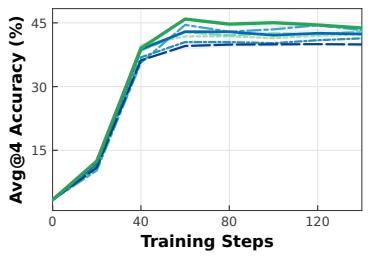
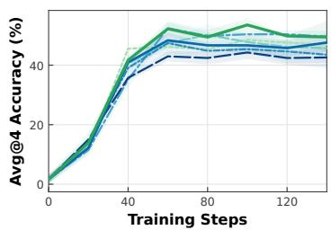
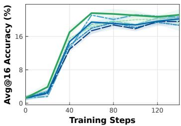
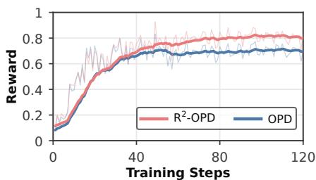
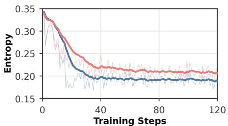
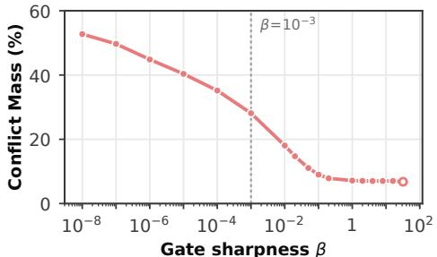
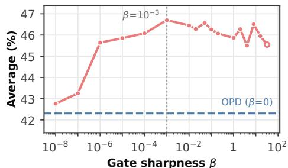
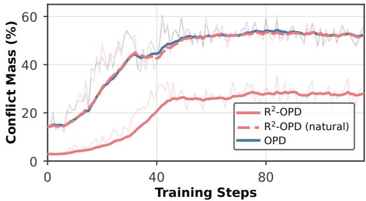
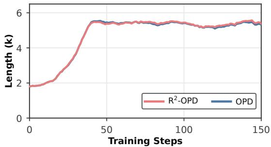
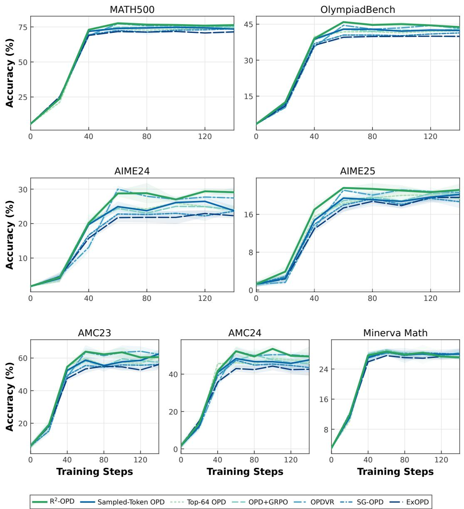

# REWARD-ALIGNED REWEIGHTING FOR ON-POLICYDISTILLATION

Haofeng Xu1,2∗, Junwei Su1,3, Lansong Diao2, Wenchao Zhou2, Chuan Wu1†

1The University of Hong Kong 2Alibaba Group

3University of Science and Technology of China

## ABSTRACT

On-policy distillation (OPD) has become a standard stage of large language model post-training: a student learns from a stronger teacher on trajectories generated by its own policy. Yet on-policy feedback does not make every teacher correction equally useful. Standard OPD weights token-level distillation terms uniformly, implicitly treating local teacher preference as a proxy for correction utility. A decision’s task value, however, depends on how the student completes the subsequent reasoning. This mismatch can cause imitation to suppress viable student strategies or reinforce paths the student cannot reliably execute. Verified trajectory outcomes provide complementary evidence about continuation quality, but do not directly identify the utility of individual decisions. This motivates using outcome evidence to guide the relative strength of teacher corrections. We introduce Reward-Aligned Reweighting for On-Policy Distillation (R2-OPD), which continuously reallocates teacher supervision using outcome agreement and the magnitude of teacher–student disagreement. It gives reward-aligned corrections greater relative influence while retaining dense feedback, moving beyond uniform imitation and hard filtering. Our analysis formalizes the mismatch between local teacher preference and student continuation value, and establishes sufficient conditions for reallocation to improve first-order task progress over uniform OPD. Across seven mathematical reasoning benchmarks, R2-OPD achieves the highest average accuracy among the compared training methods in both cross-size and same-size distillation. It outperforms standard OPD on all seven benchmarks, with average gains of +3.5 and +2.4 for 1.7B and 4B students, respectively. An extension to code generation yields an average gain of +1.6 over standard OPD. Together, these results highlight outcome-guided supervision allocation as an effective means of translating dense teacher feedback into stronger student performance across model scales and task domains.

## 1 INTRODUCTION

On-policy distillation (OPD) trains a student language model with dense teacher feedback on trajectories generated by the student itself. By querying the teacher at student-visited prefixes, it reduces the mismatch between training contexts and inference-time behavior (Agarwal et al., 2024; Gu et al., 2024; Lu & Thinking Machines Lab, 2025). However, aligning the contexts in which supervision is provided does not ensure that every teacher correction helps the student complete the task. Effective distillation therefore requires considering not only where teacher feedback is obtained, but also how strongly each correction should influence learning.

Standard sampled-token OPD uses teacher–student log-probability gaps as token-level correction coefficients, without outcome-dependent reweighting. These coefficients encode local teacher preference, whereas task success depends on student continuation value: the expected reward after a decision when the student, rather than the teacher, generates the remaining response. This distinction gives rise to two potential failure modes. Over-correction on successful trajectories: suppressing teacher-disfavored decisions can erode valid student strategies that differ from the teacher’s (Yuan et al., 2023). Over-trust on failed trajectories: reinforcing teacher-preferred decisions can encourage reasoning paths that the student cannot reliably complete. In Section 3, we formalize this preference–value mismatch: moving a local next-token distribution toward the teacher can reduce reverse KL while decreasing expected task reward when the student’s continuation policy is held fixed. Closer agreement with the teacher is therefore not, by itself, sufficient evidence of useful supervision.

Verified trajectory outcomes provide complementary evidence about continuation quality, but do not identify the utility of individual decisions. Existing approaches use outcome feedback to combine learning objectives or select teacher supervision (Li et al., 2026a; Xu et al., 2026a; Lin et al., 2026). However, deciding whether to retain a correction does not resolve how strongly it should influence learning, and hard filtering discards feedback whose utility remains uncertain. This motivates a different use of outcomes: guiding correction strength rather than treating outcome agreement as a definitive token-value label.

We introduce Reward-Aligned Reweighting for On-Policy Distillation $( \mathbf { R } ^ { 2 } { \bf - O P D } )$ , a continuous reweighting method that combines outcome agreement with the magnitude of teacher–student disagreement. It gives reward-aligned corrections greater relative influence while retaining feedback that disagrees with the outcome. The reweighting preserves correction signs and each response’s total absolute coefficient mass, reallocating rather than simply reducing teacher supervision. Our analysis establishes sufficient reward–utility agreement conditions under which this reallocation improves first-order task progress relative to uniform OPD. $\mathtt { R } ^ { 2 }$ -OPD uses outcomes to guide imitation without requiring a separate reinforcement-learning objective or a learned value estimator.

We evaluate $\mathrm { R ^ { 2 } { - } O P D }$ in same-size and cross-size distillation settings studied in prior OPD work (Lin et al., 2026; Yang et al., 2026b). Across seven mathematical reasoning benchmarks, $\mathrm { R ^ { 2 } { - } O P D }$ achieves the highest average accuracy among the compared methods in both settings, with gains of +3.5 and +2.4 over standard OPD for 1.7B and 4B students, respectively. An extension to code generation yields an average gain of +1.6 over standard OPD. Learning curves show early performance gains, while ablations support the joint use of outcome alignment, disagreement magnitude, and coefficient-mass normalization.

Contributions. (1) Preference–value analysis. We formalize the mismatch between local teacher preference and student continuation value, and establish sufficient conditions for supervision reallocation to improve first-order task progress over standard OPD. (2) Reward-aligned supervision allocation. We introduce $\mathrm { R ^ { 2 }  – O P D }$ , a continuous, magnitude-sensitive reweighting method that uses verified outcomes while preserving nonzero teacher feedback, correction signs, and per-response absolute coefficient mass. (3) Empirical validation across tasks and scales. Experiments on seven mathematical reasoning benchmarks and two code-generation benchmarks demonstrate gains over standard OPD, with ablations examining the roles of the key reweighting components.

## 2 PRELIMINARIES

## 2.1 NOTATION AND DISTILLATION OBJECTIVE

Let $q \sim \mathcal { D }$ denote a prompt and $o = \left( o _ { 1 } , \ldots , o _ { | o | } \right)$ a response, with $s _ { t } = \left( q , o _ { < t } \right)$ and $\pi ( o \mid q ) =$ $\textstyle \prod _ { t = 1 } ^ { | o | } \pi ( o _ { t } \mid s _ { t } )$ . We consider a trainable student π and a frozen teacher $\pi _ { T }$ over a shared finite vocabulary V. At each iteration, rollouts are generated by a fixed student snapshot $\pi _ { \bar { \theta } }$ . For the identities below, we assume a differentiable student, positive teacher and student probabilities, and a bounded generation horizon. Following reverse-KL distillation (Gu et al., 2024), we define

$$
\begin{array} { r l } & { K _ { t } ( \theta ) = D _ { \mathrm { K L } } ( \pi _ { \theta } ( \cdot  { | \ s _ { t } ) \| } \pi _ { T } ( \cdot  { | \ s _ { t } ) } ) } \\ & { \quad \quad \quad = \displaystyle \sum _ { v \in \mathcal { V } } \pi _ { \theta } ( v  { | \ s _ { t } ) } \log \frac { \pi _ { \theta } ( v  { | \ s _ { t } ) } } { \pi _ { T } ( v  { | \ s _ { t } ) } } . } \end{array}\tag{1}
$$

## 2.2 ON-POLICY DISTILLATION

OPD supervises the student on prefixes visited by its own rollouts (Agarwal et al., 2024). Given $o \sim \pi _ { \bar { \theta } } ( \cdot \mid q )$ , the statewise reverse-KL objective is

$$
\mathcal { L } _ { \mathrm { O P D } } ( \theta ; \bar { \theta } ) = \mathbb { E } _ { o \sim \pi _ { \bar { \theta } } ( \cdot | q ) } \left[ \sum _ { t = 1 } ^ { | o | } K _ { t } ( \theta ) \right] .\tag{2}
$$

The rollout distribution and sampled prefixes are held fixed when differentiating with respect to $\theta .$ Evaluating the full-vocabulary KL requires a vocabulary-wide comparison at every visited prefix, which can be expensive for large vocabularies and long responses. We therefore focus on sampledtoken OPD, which uses teacher log-probabilities at student-sampled tokens (Lu & Thinking Ma chines Lab, 2025). For $o _ { t } \sim \pi _ { \bar { \theta } } ( \cdot \mid s _ { t } )$ , define the distillation advantage

$$
A _ { t } = \log { \frac { \pi _ { T } { \bigl ( } o _ { t } \mid s _ { t } { \bigr ) } } { \pi _ { \bar { \theta } } { \bigl ( } o _ { t } \mid s _ { t } { \bigr ) } } } .\tag{3}
$$

Conditional on $s _ { t }$ , this gives $\mathbb { E } [ - A _ { t } \ | \ s _ { t } ] = K _ { t } ( \bar { \theta } ) , \ s _ { 0 } - A _ { t }$ is an unbiased single-sample estimate of the local reverse KL at the rollout parameters. For analysis, we use the detached log-probability surrogate

$$
\mathcal { L } _ { \mathrm { O P D } } ^ { \mathrm { s a m p l e } } ( \theta ; \bar { \theta } ) = - \mathbb { E } _ { \underset { o \sim \pi _ { \bar { \theta } } ( \cdot | q ) } { \mathbb { E } _ { \hat { \theta } \sim \mathbb { D } } } } \left[ \sum _ { t = 1 } ^ { | o | } \mathrm { s g } [ A _ { t } ] \log \pi _ { \theta } ( o _ { t } \mid s _ { t } ) \right] ,\tag{4}
$$

where sg[·] denotes the stop-gradient operator. At $\theta = { \bar { \theta } } ,$ its expected gradient matches that of the fixed-rollout reverse-KL objective:

$$
\nabla _ { \theta } \mathcal { L } _ { \mathrm { O P D } } ^ { \mathrm { s a m p l e } } ( \theta ; \bar { \theta } ) \Big | _ { \theta = \bar { \theta } } = \nabla _ { \theta } \mathcal { L } _ { \mathrm { O P D } } \big ( \theta ; \bar { \theta } \big ) \big | _ { \theta = \bar { \theta } } .\tag{5}
$$

This is a first-order identity at the rollout parameters, not an equality of loss values or a derivative through the state-visitation distribution. In an individual surrogate term, positive and negative $A _ { t }$ contribute to reinforcing and suppressing the sampled token, respectively, while $| A _ { t } |$ measures the sampled-token log-probability discrepancy. Standard sampled-token OPD uses these coefficients without additional outcome-dependent reweighting: they encode local teacher preference rather than verified trajectory outcomes.

## 2.3 REINFORCEMENT LEARNING WITH VERIFIABLE REWARDS

We consider tasks with a binary verifier $R ( q , o ) \in \{ 0 , 1 \}$ . Reinforcement learning with verifiable rewards (RLVR) seeks to maximize the expected task reward

$$
J ( \theta ) = \mathbb { E } _ { \underset { o \sim \pi _ { \theta } ( \cdot | q ) } { q \sim \mathcal { D } } } \left[ R ( q , o ) \right] .\tag{6}
$$

Reinforcement learning with verifiable rewards provides a trajectory-level signal indicating whether a sampled response satisfies the task verifier. We encode this outcome as

$$
z ( q , o ) = 2 R ( q , o ) - 1 \in \{ - 1 , + 1 \} ,\tag{7}
$$

where +1 denotes success and −1 denotes failure. The outcome is shared by all tokens in the response and does not identify the utility of any individual decision. This differs from the tokenspecific distillation signal $A _ { t } ,$ which measures the teacher’s preference for the sampled token at position t.

## 3 TEACHER PREFERENCE VERSUS STUDENT CONTINUATION VALUE

The over-correction and over-trust described in the Introduction raise a question: when does local teacher imitation improve the student’s expected task reward? We isolate this question through a local distributional intervention using the distillation advantage $A _ { t }$ defined in Eq. (3).

Local imitation versus student value. Fix a visited prefix $s = s _ { t }$ . The task value of the next action depends on how the student completes the response:

$$
Q _ { R } ^ { \bar { \theta } } ( s , a ) = \mathbb { E } _ { o _ { > t } \sim \pi _ { \bar { \theta } } ( \cdot | s , a ) } \left[ R ( q , o _ { < t } a o _ { > t } ) \right] .\tag{8}
$$

The continuation follows the rollout student, not the teacher. To isolate the effect of local imitation, we interpolate only the next-action distribution toward the teacher:

$$
\pi _ { \epsilon } ( a \mid s ) \propto \pi _ { \bar { \theta } } ( a \mid s ) ^ { 1 - \epsilon } \pi _ { T } ( a \mid s ) ^ { \epsilon } , \qquad 0 \leq \epsilon \leq 1 .\tag{9}
$$

The distribution is normalized over actions, while all subsequent decisions remain governed by $\pi _ { \bar { \theta } }$ The continuation values $Q _ { R } ^ { \bar { \theta } } ( s , a )$ remain fixed along the interpolation. Let $D _ { s } ( \epsilon )$ denote the reverse KL in Eq. (1) evaluated at $\pi _ { \epsilon } ( \cdot \mid s )$ , and let $F _ { s } ( \epsilon ) = \mathbb { E } _ { a \sim \pi _ { \epsilon } ( \cdot | s ) } [ Q _ { R } ^ { \bar { \theta } } ( s , a ) ]$ denote the corresponding conditional expected reward. Moments with subscript s are taken over $o _ { t } \sim \pi _ { \bar { \theta } } ( \cdot \mid s )$

Proposition 1 (Local imitation need not improve student value). For afinite action set with positive teacher and student probabilities, the interpolation in Eq. (9) satisfies

$$
D _ { s } ^ { \prime } ( 0 ) = - \operatorname { V a r } _ { s } [ A _ { t } ] ,\tag{10}
$$

$$
F _ { s } ^ { \prime } ( 0 ) = \mathrm { C o v } _ { s } \Big ( A _ { t } , Q _ { R } ^ { \bar { \theta } } ( s , o _ { t } ) \Big ) .\tag{11}
$$

If the covariance is negative, every sufficiently small positive ϵ strictly decreases both the local reverse KL and the student’s conditional expected reward.

The proof is given in Appendix G. The proposition separates distributional agreement from task utility: local reverse KL decreases to first order whenever $A _ { t }$ is nonconstant, whereas the reward change depends on how teacher preference covaries with student continuation value. To relate this distinction to the two failure modes, write

$$
F _ { s } ^ { \prime } ( 0 ) = \mathbb { E } _ { s } \big [ ( A _ { t } - \mathbb { E } _ { s } [ A _ { t } ] ) ( Q _ { R } ^ { \bar { \theta } } ( s , o _ { t } ) - F _ { s } ( 0 ) ) \big ] .\tag{12}
$$

Under this interpolation, the centered preference $A _ { t } - \mathbb { E } _ { s } [ A _ { t } ]$ determines the direction of first-order probability change. The value-based forms of over-correction and over-trust are therefore shifts away from actions with above-average student continuation value and toward those with belowaverage value, respectively, with $F _ { s } ( 0 )$ as the reference. Both contribute negatively to Eq. (12), although contributions from other actions can offset them. This is a local probability-space analysis, not a characterization of an arbitrary parameter-space update.

Implications for supervision allocation. Trajectory outcomes provide evidence about student continuation value: under student-generated continuations, $\mathbb { E } [ z ( q , o ) | s _ { t } = s , o _ { t } = a ] =$ $2 Q _ { R } ^ { \bar { \theta } } ( s , a ) - 1$ . Although disagreement $z ( q , o ) A _ { t } ~ < ~ 0$ does not establish that an individual correction is harmful, outcome feedback complements local teacher preference with evidence about the student’s ability to complete the task. This complementarity motivates $\mathrm { R ^ { 2 } { - } O P D }$ , which uses reward alignment to guide the relative strength of teacher corrections.

## 4 REWARD-ALIGNED REWEIGHTING

To realize this allocation principle, we combine continuous token-level gating with per-response normalization. The gate adjusts correction strength using reward alignment and disagreement magnitude, while normalization preserves the original absolute coefficient mass within each response.

## 4.1 REWARD-ALIGNED DISTILLATION ADVANTAGES

For a complete response $^ { O , }$ let $A _ { t }$ and ${ z ( q , o ) }$ denote the distillation advantage and signed outcome defined in Section 2. A correction is reward-aligned if $z ( q , o ) A _ { t } ~ > ~ 0$ and reward-inconsistent if $z ( q , o ) A _ { t } < 0$ . We combine alignment and disagreement magnitude through a response-local scale and a sigmoid gate:

$$
\nu _ { o } = \mathrm { m a x } \big \{ \mathrm { m e d i a n } _ { 1 \leq j \leq | o | } | A _ { j } | , \epsilon \big \} , \qquad \epsilon > 0 ,\tag{13}
$$

$$
g _ { t } = \sigma \left( \beta \frac { z ( q , o ) A _ { t } } { \nu _ { o } } \right) , \qquad \beta \geq 0 ,\tag{14}
$$

Algorithm 1 One step of $\mathrm { R } ^ { 2 } { \cdot } \mathrm { O P D } .$   
Require: Student $\pi _ { \theta } ,$ teacher πT, prompts $\begin{array} { l } { \pi _ { T } , } \\ { \setminus D } \end{array}$ $\mathcal { D } ,$ verifier $R ;$ sharpness $\beta \geq 0 ,$ scale floor $\epsilon > 0 .$   
1: Freeze $\bar { \theta }  \theta ;$ sample $\{ q _ { i } \} _ { i = 1 } ^ { B } \sim \mathcal { D } .$   
2: Sample $o _ { i } \sim \pi _ { \bar { \theta } } ( { \cdot \ } | \ q _ { i } ) ;$ collect $\boldsymbol { B } = \{ ( q _ { i } , o _ { i } ) \} _ { i = 1 } ^ { B }$   
3: for each $( q , o ) \in B$ with $| o | > 0 \mathrm { d } \mathbf { 0 }$   
4: Query πT to compute ${ \bf \dot { \boldsymbol { A } } } _ { t } ;$ obtain ${ z ( q , o ) }$ from R. ▷ token-wise teacherfeedback   
5: $\begin{array} { r } { A _ { t } ^ { \mathrm { R 2 } }  A _ { t } ; M _ { o }  \sum _ { t } | A _ { t } | . } \end{array}$ ▷ vanillafallback   
6: if o is complete and $\bar { M _ { o } } >$ 0 then   
7: Compute $\nu _ { o } ; g _ { t }  \sigma ( \beta z ( q , o ) A _ { t } / \nu _ { o } ) .$ ▷ soft alignment   
8: $\begin{array} { r } { Z _ { o }  M _ { o } / ( \sum _ { j } g _ { j } | A _ { j } | ) ; A _ { t } ^ { \mathrm { R 2 } }  Z _ { o } g _ { t } A _ { t } . } \end{array}$ ▷ mass-preserving reweighting   
9: Update θ via the OPD surrogate with $\mathrm { s g } [ A _ { t } ^ { \mathrm { R 2 } } ] .$

where $\sigma ( u ) = ( 1 + e ^ { - u } ) ^ { - 1 }$ . Scaling by $\nu _ { o }$ expresses disagreement relative to its typical withinresponse magnitude, while $\beta$ controls the sharpness of the weighting. For $\beta > 0$ , aligned corrections receive $g _ { t } > 1 / 2$ and inconsistent corrections receive $g _ { t } < \bar { 1 / 2 }$ . When $\beta | A _ { t } | / \nu _ { o }$ is small, the gate remains close to $1 / 2 .$ , producing a gradual adjustment. For finite $\beta _ { ; }$ , the gate remains strictly positive.

Since gating alone reduces absolute coefficient mass, we normalize each response to preserve $M _ { o } =$ $\textstyle \sum _ { t } | A _ { t } ^ { \mathbf { \bar { \alpha } } } |$ . For $M _ { o } > 0$ , the reweighted distillation advantage is:

$$
Z _ { o } = { \frac { M _ { o } } { \sum _ { j } g _ { j } | A _ { j } | } } , \quad \quad A _ { t } ^ { \mathrm { R 2 } } = Z _ { o } g _ { t } A _ { t } .\tag{15}
$$

The common factor $Z _ { o }$ restores the original coefficient budget without changing the relative gate multipliers across positions.

## 4.2 TRAINING OBJECTIVE

Substituting $A _ { t } ^ { \mathrm { R 2 } }$ into Eq. (4) gives the token-summed analysis surrogate

$$
\mathcal { L } _ { \mathrm { R 2 } } ( \theta ; \bar { \theta } ) = - \mathbb { E } \left[ \sum _ { t } \mathrm { s g } [ A _ { t } ^ { \mathrm { R 2 } } ] \log \pi _ { \theta } ( o _ { t } \mid s _ { t } ) \right] .\tag{16}
$$

Advantages and reweighting factors are detached; gradients flow only through log $\pi _ { \boldsymbol { \theta } } { \big ( } o _ { t } ~ { \big | } ~ s _ { t } { \big ) }$ . Reward modulates existing token-level contributions without an additional policy-gradient term. $\mathrm { A l } \cdot$ gorithm 1 summarizes reweighting; the implemented loss, response-wise reduction, and gradient correspondence are detailed in Appendix A.2.

## 4.3 STRUCTURAL PROPERTIES

The multiplicative reweighting admits the following exact decomposition into a teacher-preference component and an outcome-dependent modulation.

Proposition 2 (Exact teacher–outcome decomposition). For a complete response withfinite advan tages, $M _ { o } > 0 _ { : }$ , andfinite $\beta \geq 0 _ { i }$

$$
A _ { t } ^ { \mathrm { R 2 } } = \underbrace { \underbrace { \frac { Z _ { o } } { 2 } A _ { t } } _ { T e r m A } + \underbrace { \frac { Z _ { o } } { 2 } z ( q , o ) | A _ { t } | \operatorname { t a n h } \left( \frac { \beta | A _ { t } | } { 2 \nu _ { o } } \right) } _ { T e r m e f e r e n c e } . } _ { r e w a r d - a l i g n e d m o d u l a t i o n } .\tag{17}
$$

Term A preserves the teacher’s signed correction under a common response-level scale. Term B is nonnegative on successful responses and nonpositive on failed responses. Relative to Term A, it attenuates suppression on successful responses and reinforcement on failed responses, while strengthening reward-aligned corrections. This provides a coefficient-level interpretation of how the reweighting addresses over-correction and over-trust. The tanh factor controls the modulation strength through the normalized disagreement.

For nonzero $A _ { t }$ and finite $\beta ,$ Term B has strictly smaller magnitude than Term $\mathbf { A } ,$ so their sum preserves the original coefficient sign. The two terms form a decomposition of a single distillation coefficient. Term B is an outcome-dependent component of this coefficient, rather than a separate or generally unbiased task-advantage estimator. Appendix H.1 provides the proof.

We quantify supervision allocation by coefficient mass. For $M _ { o } > 0$ , define the reward-inconsistent mass share

$$
\kappa _ { o } ( \beta ) = \frac { \sum _ { t : z ( q , o ) A _ { t } < 0 } | A _ { t } ^ { \mathrm { R 2 } } | } { \sum _ { t } | A _ { t } ^ { \mathrm { R 2 } } | } .\tag{18}
$$

Proposition 3 (Mass-preserving reward-aligned allocation). Fix a complete response with finite advantages and $M _ { o } > 0$ . For every finite $\bar { \beta } \geq 0$ , reweighting retains all nonzero corrections and their signs, with

$$
\sum _ { t } | A _ { t } ^ { \mathrm { R 2 } } | = M _ { o } , \qquad \kappa _ { o } ^ { \prime } ( \beta ) < 0 i f 0 < \kappa _ { o } ( 0 ) < 1 .\tag{19}
$$

The derivative at zero is right-sided. At $\beta = 0 , A _ { t } ^ { \mathrm { R 2 } } = A _ { t } .$ . If aligned mass is positive, the limit $\beta \to \infty$ is hard reward-aligned filtering renormalized to mass $M _ { o } .$

When both groups carry mass, increasing $\beta$ monotonically shifts a fixed coefficient budget toward reward-aligned feedback. This does not imply monotonic changes for individual token coefficients. $\mathbf { A } \mathbf { s } \beta  \infty$ , the update converges to mass-normalized hard reward-aligned gating. Preserving coef ficient mass does not preserve the parameter-gradient norm, since token score vectors may reinforce or cancel one another. The proof and boundary cases are given in Appendix H.2.

## 4.4 WHEN REALLOCATION IMPROVES TASK PROGRESS

The preceding results describe supervision allocation, but not its task utility. We therefore connect the allocation to first-order progress on the expected reward $J ( \theta ) \ = \ \mathbb { E } _ { q \sim \mathcal { D } , o \sim \pi _ { \theta } } [ R ( q , o ) ]$ . Let $g _ { R } ~ = ~ \nabla J ( \bar { \theta } )$ and $\psi _ { t } ~ = ~ \nabla _ { \theta } \log \pi _ { \theta } { \left( o _ { t } \mid s _ { t } \right) } | _ { \theta = \bar { \theta } }$ . For a fixed complete response with $M _ { o } \ > \ 0 .$ define

$$
p _ { o } ( t ) = \frac { | A _ { t } | } { M _ { o } } , \qquad u _ { t } = \mathrm { s g n } ( A _ { t } ) \langle g _ { R } , \psi _ { t } \rangle .\tag{20}
$$

Here, $p _ { o } ( t )$ is the original absolute-coefficient mass share at position t, not an action probability, and $u _ { t }$ is the task-gradient projection per unit mass in the teacher-directed score direction. Its sign need not coincide with reward alignment. The corresponding per-response surrogate directions are $\begin{array} { r } { d _ { \mathrm { V } } ( o ) = \sum _ { t } A _ { t } \psi _ { t } } \end{array}$ and $\begin{array} { r } { d _ { \mathrm { R 2 } } ( o ) = \sum _ { t } A _ { t } ^ { \mathrm { R 2 } } \psi _ { t } } \end{array}$ •

Proposition 4 (Conditional task-progress identity). For the fixed response and directions above,

$$
\langle g _ { R } , d _ { \mathrm { R 2 } } ( o ) - d _ { \mathrm { V } } ( o ) \rangle = \frac { M _ { o } \mathrm { C o v } _ { p _ { o } } ( g , u ) } { \mathbb { E } _ { p _ { o } } [ g ] } .\tag{21}
$$

Since $\mathbb { E } _ { p _ { o } } [ g ] > 0$ , reweighting improves the response-level first-order task projection over standard OPD if and only if $\mathrm { C o v } _ { p _ { o } } ( g , u ) \ > \ 0 .$ . Thus, larger gates must be associated with higher taskprojection utility under the original mass distribution. Reducing reward-inconsistent mass alone does not guarantee task progress. Neither $g _ { R }$ nor $u _ { t }$ is a training input; both are used only for analysis. Appendix H.3 proves the identity and gives a sufficient reward–utility agreement condition. Appendices H.4 and H.5 distinguish this local criterion from finite-step reward ascent and surrogategradient compatibility.

## 5 EXPERIMENTS

We assess $\mathrm { R ^ { 2 } { - } O P D }$ across student sizes and task domains, with controlled ablations to examine the role of reward-aligned supervision allocation.

## 5.1 EXPERIMENTAL SETTINGS

Models and training data. We initialize students from Qwen3-4B-Base and Qwen3-1.7B-Base (Yang et al., 2025). The teacher, denoted Qwen3-4B-GRPO, is obtained by applying GRPO (Shao et al., 2024) to Qwen3-4B-Non-Thinking. The same frozen checkpoint is shared across all mathematical distillation methods and student sizes. Both teacher RL and student OPD use DAPO-Math-17k (Yu et al., 2025). We use a fixed $\beta = 0 . 0 0 1$ across all $\mathbb { R } ^ { 2 } .$ -OPD experiments, without experiment-specific tuning. Full training details are provided in Appendix A.

  
(a) Results on OlympiadBench

  
(b) Results on AMC24

  
(c) Results on AIME25  
R2-OPD Sampled-Token OPD Top-64 OPD OPD+GRPO OPDVR SG-OPD ExOPD  
Figure 1: Evaluation accuracy on OlympiadBench, AMC24, and AIME25 during cross-size distillation from Qwen3-4B-GRPO to Qwen3-1.7B-Base. Curves show the mean, and shaded bands indicate ± one sample standard deviation across three independent training seeds.

Table 1: Accuracy (%) on mathematical reasoning benchmarks under cross-size and same-size distillation. Within each distillation setting, bold and underlined scores indicate the best and second-best results in each column, respectively.
<table><tr><td>Method</td><td>AIME24</td><td>AIME25</td><td>AMC23</td><td>AMC24</td><td>MATH500</td><td>Minerva</td><td>Olympiad</td><td>Avg.</td></tr><tr><td colspan="9">Reference models</td></tr><tr><td>Qwen3-1.7B-Base (Student)</td><td>1.9</td><td>1.7</td><td>4.4</td><td>2.2</td><td>5.8</td><td>3.1</td><td>3.7</td><td>3.3</td></tr><tr><td>Qwen3-4B-Base (Student)</td><td>3.1</td><td>1.4</td><td>11.9</td><td>3.3</td><td>8.4</td><td>4.4</td><td>4.8</td><td>5.3</td></tr><tr><td>Qwen3-4B-GRPO (Teacher)</td><td>30.1</td><td>26.5</td><td>62.5</td><td>51.1</td><td>77.2</td><td>31.0</td><td>46.1</td><td>46.4</td></tr><tr><td colspan="9">Qwen3-4B-GRPO → Qwen3-1.7B-Base</td></tr><tr><td>Sampled-Token OPD</td><td> $2 5 . 5 { \scriptstyle \pm 1 . 1 }$ </td><td> $2 0 . 2 { \scriptstyle \pm 0 . 8 }$ </td><td> $6 0 . 0 { \scriptstyle \pm 2 . 7 }$ </td><td> $4 8 . 3 { \scriptstyle \pm 2 . 4 }$ </td><td> $7 4 . 7 _ { \pm 0 . 2 }$ </td><td>27.6±0.9</td><td> $4 2 . 9 { \scriptstyle \pm 0 . 5 }$ </td><td> $4 2 . 7 _ { \pm 0 . 6 }$ </td></tr><tr><td>Top-64 OPD</td><td> $2 5 . 0 { \scriptstyle \pm 1 . 3 }$ </td><td> $2 0 . 1 _ { \pm 0 . 9 }$ </td><td> $6 0 . 6 { \scriptstyle \pm 1 . 0 }$ </td><td> $4 8 . 5 { \scriptstyle \pm 2 . 7 }$ </td><td> $7 4 . 5 { \scriptstyle \pm 1 . 2 }$ </td><td> $2 7 . 1 { \scriptstyle \pm 0 . 4 }$ </td><td> $4 2 . 3 { \scriptstyle \pm 0 . 0 }$ </td><td> $4 2 . 6 _ { \pm 0 . 4 }$ </td></tr><tr><td>OPD + GRPO</td><td> $2 6 . 1 { \pm } 1 . 0$ </td><td> $2 1 . 2 { \pm } 1 . 2$ </td><td> $6 0 . 6 { \scriptstyle \pm 3 . 4 }$ </td><td> $5 0 . 2 { \scriptstyle \pm 3 . 6 }$ </td><td> $7 5 . 1 { \pm } 0 . 3 $ </td><td> $\mathbf { 3 0 . 6 { \scriptstyle \pm 0 . 6 } }$ </td><td> $4 3 . 0 { \scriptstyle \pm 0 . 4 }$ </td><td> $4 3 . 8 { \scriptstyle \pm 0 . 9 }$ </td></tr><tr><td>OPDVR</td><td> $\mathbf { 2 9 . 8 { \scriptstyle \pm 1 . 0 } }$ </td><td> $2 0 . 4 _ { \pm 0 . 5 }$ </td><td> ${ \bf 6 3 . 3 _ { \pm 3 . 0 } }$ </td><td> ${ \underline { { 5 2 . 4 } } } _ { \pm 2 . 0 }$ </td><td> ${ } _ { 7 6 . 3 \pm 1 . 3 }$ </td><td> $2 8 . 0 { \scriptstyle \pm 1 . 0 }$ </td><td> $\underline { { 4 4 . 5 _ { \pm 0 . 3 } } }$ </td><td> $4 5 . 0 { \scriptstyle \pm 0 . 3 }$ </td></tr><tr><td>SG-OPD</td><td> $2 3 . 6 _ { \pm 0 . 2 }$ </td><td> $1 9 . 4 { \scriptstyle \pm 0 . 6 }$ </td><td> $5 8 . 4 { \scriptstyle \pm 2 . 4 }$ </td><td> $4 7 . 4 _ { \pm 3 . 6 }$ </td><td> $7 3 . 7 _ { \pm 0 . 2 }$ </td><td> $2 7 . 8 { \scriptstyle \pm 0 . 9 }$ </td><td> $4 1 . 4 { \scriptstyle \pm 0 . 3 }$ </td><td> $\overline { { 4 1 . 7 _ { \pm 0 . 2 } } }$ </td></tr><tr><td>ExOPD R2-OPD</td><td> $2 4 . 9 _ { \pm 1 . 1 }$ </td><td> $1 9 . 6 _ { \pm 1 . 1 }$ </td><td> $5 9 . 0 { \scriptstyle \pm 3 . 4 }$ </td><td> $4 4 . 3 _ { \pm 2 . 2 }$ </td><td> $7 1 . 8 { \scriptstyle \pm 0 . 2 }$ </td><td> $2 7 . 9 { \scriptstyle \pm 0 . 1 }$ </td><td> $4 0 . 0 { \scriptstyle \pm 0 . 0 }$ </td><td> $4 1 . 1 _ { \pm 0 . 1 }$ </td></tr><tr><td></td><td> $2 9 . 4 { \scriptstyle \pm 0 . 8 }$ </td><td> $\mathbf { 2 4 . 6 { \scriptstyle \pm 0 . 9 } }$ </td><td> $6 3 . 0 { \scriptstyle \pm 2 . 0 }$ </td><td> ${ \bf 5 3 . 5 \pm 2 . 1 }$ </td><td> ${ \bf 7 7 . 6 { \scriptstyle \pm 0 . 8 } }$ </td><td> $2 9 . 1 { \pm } 0 . 6 $ </td><td> ${ \bf 4 5 . 9 2 0 . 3 }$ </td><td> $\mathbf { 4 6 . 2 \pm 0 . 4 }$ </td></tr><tr><td colspan="9">Qwen3-4B-GRPO → Qwen3-4B-Base</td></tr><tr><td>Sampled-Token OPD</td><td>32.9</td><td>26.8</td><td>65.5</td><td>53.8</td><td>80.6</td><td>32.1</td><td>47.3</td><td>48.4</td></tr><tr><td>Top-64 OPD</td><td>32.6</td><td>27.0</td><td>65.2</td><td>53.2</td><td>80.1</td><td>31.6</td><td>46.9</td><td>48.1</td></tr><tr><td>OPD + GRPO</td><td>33.3</td><td>26.5</td><td>66.5</td><td>57.3</td><td>82.3</td><td>33.1</td><td>48.1</td><td>49.6</td></tr><tr><td>OPDVR</td><td>33.5</td><td>26.9</td><td>67.6</td><td>55.2</td><td>84.6</td><td>32.5</td><td>48.4</td><td>49.8</td></tr><tr><td>SG-OPD</td><td>33.1</td><td>26.6</td><td>67.9</td><td>54.9</td><td>81.8</td><td>31.3</td><td>47.6</td><td>49.0</td></tr><tr><td>ExOPD</td><td>34.7</td><td>27.6</td><td>68.9</td><td>54.5</td><td>82.1</td><td>33.9</td><td>47.5</td><td>49.9</td></tr><tr><td>R²-OPD</td><td>35.1</td><td>28.1</td><td>68.3</td><td>57.8</td><td>83.6</td><td>33.5</td><td>48.9</td><td>50.8</td></tr></table>

Evaluation. We report avg@16 on AIME24/25 (MAA, n.d.a), and avg@4 on AMC23/24 (MAA, n.d.b), MATH500 (Hendrycks et al., 2021; Lightman et al., 2024), MinervaMath (Lewkowycz et al., 2022), and OlympiadBench (He et al., 2024). For the main 1.7B cross-size mathematical comparison, each method uses three independent training seeds with the same initial student and fixed teacher checkpoints, and results are reported as mean ± sample standard deviation. Given the computational budget, all remaining experiments use one training run per method or variant. The two initial students and fixed teacher are each evaluated once under the same benchmark-specific sam pling protocol. Evaluation details are provided in Appendix A.3.

Baselines. We compare sampled-token OPD (Lu & Thinking Machines Lab, 2025), OPDVR (Lin et al., 2026), SG-OPD (Xu et al., 2026a), and ExOPD (Yang et al., 2026b). We also include Top-64 OPD, our top-k implementation control of reverse-KL distillation (Gu et al., 2024), and OPD + GRPO, an additive GRPO–OPD control (Shao et al., 2024; Lu & Thinking Machines Lab, 2025). The initial students and fixed teacher are reference models, not additional trained baselines.

## 5.2 MAIN RESULTS

As shown in Table $1 , { \mathrm { R } } ^ { 2 } { \mathrm { - O P D } }$ achieves the highest average accuracy in both distillation settings and outperforms standard OPD on all seven benchmarks. It reaches $4 6 . 2 \pm 0 . 4 \%$ with the 1.7B student and 50.8% with the 4B student, improving over standard OPD with average gains of +3.5 and +2.4, respectively. It also surpasses the strongest competing baselines, OPDVR and ExOPD, by +1.2 and +0.9, respectively. The gains are especially pronounced on challenging competition-mathematics benchmarks, reaching +4.4 on AIME25, +5.2 on AMC24, and +3.0 on OlympiadBench in the 1.7B setting. Figure 1 shows that these gains emerge early: a clear mean-accuracy advantage on AIME25 is already visible around step 40. Across all plotted benchmarks, $\mathrm { R ^ { 2 } \mathrm { - } O P D }$ approaches near-peak accuracy by roughly step 60 and generally maintains higher mean accuracy thereafter, indicating both faster early learning and sustained performance gains.

## 5.3 EXTENSION TO CODE GENERATION

We further evaluate $\mathrm { R ^ { 2 } { - } O P D }$ on code generation by distilling an separate RL-trained Qwen3-4B-Non-Thinking teacher into a Qwen3-1.7B-Base student. Both teacher RL and student OPD use TACO (Li et al., 2023), and we report avg@4 on HumanEval+ (Liu et al., 2023) and LiveCodeBench (Jain et al., 2025). As shown in Table 2, $\mathrm { R ^ { 2 } { - } O P D }$ outperforms vanilla OPD and OPDVR (Lin et al., 2026) on both benchmarks, achieving an average avg@4 of 61.2% with gains of +1.6 and +1.0, respectively. These results extend the observed benefits beyond mathematical reasoning.

Table 2: Code-generation avg@4 (%) under cross-size distillation from Qwen3-4B-GRPO to Qwen3-1.7B-Base. Bold and underlined scores indicate the best and second-best results among student-training methods.
<table><tr><td>Method</td><td>HumanEval+</td><td>LiveCodeBench</td><td>Avg.</td></tr><tr><td>Student</td><td>64.0</td><td>21.1</td><td>42.6</td></tr><tr><td>Teacher</td><td>78.0</td><td>46.5</td><td>62.3</td></tr><tr><td>Vanilla OPD</td><td>75.4</td><td>43.7</td><td>59.6</td></tr><tr><td>OPDVR</td><td>76.2</td><td>44.2</td><td>60.2</td></tr><tr><td>R²-OPD</td><td>77.3</td><td>45.1</td><td>61.2</td></tr></table>

## 5.4 ABLATION STUDIES

Table 3 examines reward alignment, disagreement magnitude, and per-response coefficientmass normalization, using one training run per variant. Reversed alignment negates $z ( q , o ) A _ { t }$ in the gate without changing coefficient signs, yielding the largest average accuracy drop of 3.8. The sharpness sweep retains strong performance across the tested values from $\bar { 1 0 } ^ { - 4 }$ to $1 0 ^ { - 1 }$ (Appendix C). Together, these observations support reward-consistent allocation without requiring narrowly tuned gate sharpness. The outcome-permuted control shuffles labels across complete responses while preserv-

Table 3: Accuracy (%) for ablation studies and GRPO composition. $\Delta _ { \mathrm { a v g } }$ denotes the change in mean accuracy across the three benchmarks relative to full $\mathrm { R ^ { 2 } \mathrm { - } O P D }$
<table><tr><td>Variant</td><td>AIME24</td><td>MATH500</td><td>Minerva</td><td> $\Delta _ { \mathrm { a v g } }$ </td></tr><tr><td>R²-OPD (full)</td><td>30.1</td><td>77.8</td><td>29.4</td><td></td></tr><tr><td>Reversed alignment</td><td>25.4</td><td>73.5</td><td>26.9</td><td>-3.8</td></tr><tr><td>Outcome-permuted</td><td>27.9</td><td>75.9</td><td>28.5</td><td>-1.7</td></tr><tr><td>Sign-only gate</td><td>27.3</td><td>76.6</td><td>28.7</td><td>-1.6</td></tr><tr><td>Magnitude-only gate</td><td>26.1</td><td>75.8</td><td>28.2</td><td>-2.4</td></tr><tr><td>No mass-norm</td><td>28.1</td><td>76.7</td><td>29.8</td><td>-0.9</td></tr><tr><td> $\mathbf { R } ^ { 2 } { \cdot } \mathbf { O P D } + \mathbf { G R P O }$ </td><td>31.5</td><td>78.0</td><td>30.2</td><td>+0.8</td></tr></table>

ing per-response mass and the marginal outcome distribution. Its 1.7 drop supports the value of correctly matched outcome feedback beyond mass preservation. The sign-only gate removes magnitude dependence while retaining the original advantages, reducing average accuracy by 1.6; the magnitude-only gate removes outcome alignment and incurs a larger decline of 2.4. These controls favor the full outcome- and magnitude-dependent configuration under the shared settings. Removing mass normalization while retaining the response-local scale reduces accuracy by 0.9 points, supporting normalization in this configuration. Adding GRPO improves all three benchmarks with an average gain of +0.8, suggesting complementarity with direct reward optimization. Control def initions and the $\beta$ sensitivity analysis are provided in Appendices B and C, respectively.

## 5.5 TRAINING DYNAMICS

To examine how reward-aligned supervision allocation affects the distillation process, we track training reward and student policy entropy. Figure 2 compares $\mathrm { R ^ { 2 } { - } O P D }$ with standard sampled-token

  
(a) Training Reward

  
(b) Entropy  
Figure 2: Training reward and student policy entropy for $\mathrm { R ^ { 2 } { - } O P D }$ and standard OPD. Thin lines show raw observations; thick lines show smoothed trends.

OPD, denoted as OPD in the figure. Both methods improve training reward, but $\mathbf { R } ^ { 2 } .$ -OPD maintains a higher smoothed reward trajectory over most of the plotted interval, with a separation that persists into late training. The raw observations fluctuate and overlap, so this comparison describes the overall trend rather than an advantage at every update. Policy entropy decreases for both methods, while R2-OPD retains higher entropy during the middle and later stages. Thus, its higher reward trajectory coexists with higher policy entropy, rather than a greater reduction in entropy.

## 6 RELATED WORK

On-policy distillation of language models. Knowledge distillation transfers a teacher distribution into a smaller student (Hinton et al., 2015). For autoregressive language models, MiniLLM adopts the mode-seeking reverse KL (Gu et al., 2024), GKD reduces train–test mismatch by querying the teacher on student-generated prefixes (Agarwal et al., 2024), and DistiLLM studies divergence choice and adaptive reuse of student rollouts (Ko et al., 2024). A common scalable formulation of on-policy distillation casts the detached teacher–student log-probability gap as a per-token reward in a policy-gradient-style objective (Lu & Thinking Machines Lab, 2025). Such objectives have been adopted in large-scale reasoning post-training (Yang et al., 2025; Xiao et al., 2026; DeepSeek-AI, 2026); see Song & Zheng (2026) for a broader survey. Recent work studies OPD optimization and failure modes (Li et al., 2026c; Fu et al., 2026), improves sampled-token estimation or target shaping (Oh et al., 2026; Jang et al., 2026), and rebalances training data (Hou et al., 2026). G-OPD generalizes OPD as dense KL-constrained RL; its ExOPD variant amplifies teacher–reference log-ratio rewards relative to KL regularization (Yang et al., 2026b).

Selective token supervision in OPD. Complementary work asks whether OPD should supervise every visited position equally. TSD-KD applies direct distribution matching to selected tokens and weaker preference feedback elsewhere (Kim & Baek, 2026). Other methods select or reweight tokens using teacher–student disagreement, uncertainty, or support compatibility (Xu et al., 2026b; Wang et al., 2026b; Xing et al., 2026; Jin et al., 2026); asymmetric or hierarchical schemes distinguish positive- and negative-advantage regions or combine trajectory filtering with token weighting (Jia et al., 2026; Li et al., 2026d). EGRSD incorporates outcome information by coupling rewardgrounded update directions with teacher-derived magnitudes and confidence gating (Ke et al., 2026).

Outcome-guided distillation and RLVR. RLVR complements dense OPD feedback with outcome-level rewards (Shao et al., 2024; Guo et al., 2025). Existing methods combine or sequence these objectives (Xu et al., 2025; Xiao et al., 2026; Li et al., 2026a), route samples between them (Li et al., 2026b), or incorporate teacher information and verifier feedback into RL and self distillation (Wang et al., 2026a; Yang et al., 2026a; Cai et al., 2026). Closely related, SG-OPD combines token-level sign-consistency routing with phased sampling of verified teacher responses (Xu et al., 2026a); and OPDVR masks outcome-inconsistent corrections (Lin et al., 2026). Related diagnostics examine outcome-dependent local supervision (Ma, 2026). R2-OPD continuously reweights the original distillation coefficients using outcome alignment and disagreement magnitude.

## 7 CONCLUSION

We revisit uniform supervision in on-policy distillation through the mismatch between local teacher preference and student continuation value. Our analysis shows that local imitation can reduce reverse KL while lowering expected reward under a fixed student continuation policy, providing a unified account of over-correction and over-trust. This motivates $\mathrm { R ^ { 2 }  – O P D }$ , which uses trajectory outcomes as evidence for supervision allocation and continuously reweights teacher corrections using reward alignment and disagreement magnitude. The method preserves dense feedback, correction signs, and per-response absolute coefficient mass. We establish sufficient reward–utility agreement conditions under which reallocation improves first-order task progress over uniform OPD. Experiments across student sizes and task domains demonstrate consistent gains over standard OPD in mathematical reasoning and code generation, while ablations support the core design. Together, these findings highlight that effective OPD depends not only on where teacher feedback is collected, but also on how its influence is allocated using evidence of student task success.

## REPRODUCIBILITY STATEMENT

Section 4 and Algorithm 1 specify the reweighting rule and the training procedure; Appendix A reports the training configurations, computing environment, and evaluation protocols, and Appendix B defines the ablations. Assumptions and derivations appear in Appendices F and G, and the taskprogress analysis in Appendix H.3.

## AI USE STATEMENT

Large language models assisted with literature search, manuscript drafting and editing, checks of mathematical derivations, and LATEX formatting. The authors designed and conducted the experiments, reviewed the AI-assisted content, and take full responsibility for the methodology, theoretical claims, empirical results, and final manuscript.

## REFERENCES

Rishabh Agarwal, Nino Vieillard, Yongchao Zhou, Piotr Stanczyk, Sabela Ramos, Matthieu Geist, and Olivier Bachem. On-policy distillation of language models: Learning from self-generated mistakes. In International Conference on Learning Representations, 2024. URL https://proceedings.iclr.cc/paper\_files/paper/2024/hash/ 5be69a584901a26c521c2b51e40a4c20-Abstract-Conference.html.

Qiye Cai, Yichuan Ma, Peiji Li, Yongkang Chen, Qipeng Guo, Yicheng Zou, Linyang Li, Xiaocheng Feng, and Bing Qin. H2sd: Hybrid hindsight self-distillation, 2026. URL https://arxiv. org/abs/2607.18955.

DeepSeek-AI. Deepseek-v4: Towards highly efficient million-token context intelligence. arXiv preprint arXiv:2606.19348, 2026. URL https://arxiv.org/abs/2606.19348.

Yuqian Fu, Haohuan Huang, Kaiwen Jiang, Jiacai Liu, Zhuo Jiang, Yuanheng Zhu, and Dongbin Zhao. Revisiting on-policy distillation: Empirical failure modes and simple fixes. arXiv preprint arXiv:2603.25562, 2026. URL https://arxiv.org/abs/2603.25562.

Yuxian Gu, Li Dong, Furu Wei, and Minlie Huang. Minillm: Knowledge distillation of large language models. In International Conference on Learning Representations, 2024. URL https://proceedings.iclr.cc/paper\_files/paper/2024/hash/ 8ac015d409635f196f9e3e9dcfb9a94e-Abstract-Conference.html.

Daya Guo, Dejian Yang, Haowei Zhang, et al. DeepSeek-R1 incentivizes reasoning in LLMs through reinforcement learning. Nature, 645(8081):633–638, 2025. doi: 10.1038/s41586-025-09422-z. URL https://www.nature.com/articles/ s41586-025-09422-z.

Chaoqun He, Renjie Luo, Yuzhuo Bai, Shengding Hu, Zhen Leng Thai, Junhao Shen, Jinyi Hu, Xu Han, Yujie Huang, Yuxiang Zhang, Jie Liu, Lei Qi, Zhiyuan Liu, and Maosong Sun. Olympiadbench: A challenging benchmark for promoting agi with olympiad-level bilingua multimodal scientific problems. In Proceedings of the 62nd Annual Meeting of the Association for Computational Linguistics (Volume 1: Long Papers), pp. 3828–3850. Association for Computational Linguistics, 2024. doi: 10.18653/v1/2024.acl-long.211. URL https: //aclanthology.org/2024.acl-long.211/.

Dan Hendrycks, Collin Burns, Saurav Kadavath, Akul Arora, Steven Basart, Eric Tang, Dawn Song, and Jacob Steinhardt. Measuring mathematical problem solving with the math dataset. In Proceedings of the Neural Information Process ing Systems Track on Datasets and Benchmarks, volume 1, 2021. URL https: //datasets-benchmarks-proceedings.neurips.cc/paper/2021/hash/ be83ab3ecd0db773eb2dc1b0a17836a1-Abstract-round2.html.

Geoffrey Hinton, Oriol Vinyals, and Jeff Dean. Distilling the knowledge in a neural network. arXiv preprint arXiv:1503.02531, 2015. URL https://arxiv.org/abs/1503.02531.

Wenjin Hou, Shangpin Peng, Weinong Wang, Zheng Ruan, Yue Zhang, Zhenglin Zhou, Mingqi Gao, Yifei Chen, Kaiqi Wang, Hongming Yang, Chengquan Zhang, Zhuotao Tian, Han Hu, Yi Yang, Fei Wu, and Hehe Fan. Uni-opd: Unifying on-policy distillation with a dual-perspective recipe. arXiv preprint arXiv:2605.03677, 2026. URL https://arxiv.org/abs/2605.03677.

Naman Jain, King Han, Alex Gu, Wen-Ding Li, Fanjia Yan, Tianjun Zhang, Sida I. Wang, Armando Solar-Lezama, Koushik Sen, and Ion Stoica. Livecodebench: Holistic and contamination free evaluation of large language models for code. In International Conference on Learning Representations, 2025. URL https://proceedings.iclr.cc/paper\_files/paper/2025/ hash/94074dd5a072d28ff75a76dabed43767-Abstract-Conference.html.

Ijun Jang, Jewon Yeom, Juan Yeo, Hyunggyu Lim, and Taesup Kim. Stable on-policy distillation through adaptive target reformulation. In Findings of the Association for Computational Linguistics: ACL 2026, pp. 42217–42227. Association for Computational Linguistics, 2026. doi: 10.18653/v1/2026.findings-acl.2094. URL https://aclanthology.org/2026. findings-acl.2094/.

Nan Jia, Haojin Yang, Xing Ma, Jiesong Lian, Shuailiang Zhang, Weipeng Zhang, Ke Zeng, Xunliang Cai, and Zequn Sun. Asymmetric on-policy distillation: Bridging exploitation and imitation at the token level, 2026. URL https://arxiv.org/abs/2605.06387.

Woogyeol Jin, Taywon Min, Yongjin Yang, Dennis Wei, Yi Zhou, Swanand Ravindra Kadhe, Nathalie Baracaldo, and Kimin Lee. Entropy-aware on-policy distillation of language models. In Proceedings of the 43rd International Conference on Machine Learning, 2026. URL https://arxiv.org/abs/2603.07079.

Junlong Ke, Zichen Wen, Weijia Li, Conghui He, and Linfeng Zhang. Respecting self-uncertainty in on-policy self-distillation for efficient llm reasoning, 2026. URL https://arxiv.org/ abs/2605.13255.

Minsang Kim and Seung Jun Baek. Explain in your own words: Improving reasoning via tokenselective dual knowledge distillation. In International Conference on Learning Representations, 2026. URL https://proceedings.iclr.cc/paper\_files/paper/2026/hash/ a89331e2ecbbd9d9618bc94717a91155-Abstract-Conference.html.

Jongwoo Ko, Sungnyun Kim, Tianyi Chen, and Se-Young Yun. Distillm: Towards streamlined distillation for large language models. In Proceedings of the 41st International Conference on Machine Learning, volume 235 of Proceedings ofMachine Learning Research, pp. 24872–24895. PMLR, 2024. URL https://proceedings.mlr.press/v235/ko24c.html.

Aitor Lewkowycz, Anders Andreassen, David Dohan, Ethan Dyer, Henryk Michalewski, Vinay Ramasesh, Ambrose Slone, Cem Anil, Imanol Schlag, Theo Gutman-Solo, Yuhuai Wu, Behnam Neyshabur, Guy Gur-Ari, and Vedant Misra. Solving quantitative reasoning problems with language models. In Advances in Neural Information Processing Systems, volume 35, 2022. doi: 10.52202/068431-0278. URL https://proceedings.neurips.cc/paper\_files/ paper/2022/hash/18abbeef8cfe9203fdf9053c9c4fe191-Abstract.html.

Boyan Li, Bingsen Chen, Chenghao Yang, Ping Nie, Chen Zhao, and Xi Ye. Sequential beats joint: On the interplay between on-policy distillation and rlvr, 2026a. URL https://arxiv.org/ abs/2609.04108.

Gengsheng Li, Tianyu Yang, Junfeng Fang, Mingyang Song, Mao Zheng, Haiyun Guo, Dan Zhang, Jinqiao Wang, and Tat-Seng Chua. Unifying group-relative and self-distillation policy optimization via sample routing, 2026b. URL https://arxiv.org/abs/2604.02288.

Rongao Li, Jie Fu, Bo-Wen Zhang, Tao Huang, Zhihong Sun, Chen Lyu, Guang Liu, Zhi Jin, and Ge Li. Taco: Topics in algorithmic code generation dataset, 2023. URL https://arxiv. org/abs/2312.14852.

Yaxuan Li, Yuxin Zuo, Bingxiang He, Jinqian Zhang, Chaojun Xiao, Cheng Qian, Tianyu Yu, Huanang Gao, Wenkai Yang, Zhiyuan Liu, and Ning Ding. Rethinking on-policy distillation of large language models: Phenomenology, mechanism, and recipe. arXiv preprint arXiv:2604.13016, 2026c. URL https://arxiv.org/abs/2604.13016. Accepted at the ICML 2026 FoGen Workshop.

Yuying Li, Leqi Zheng, Yongzi Yu, Wenrui Zhou, Xuchang Zhong, Xing Hu, Jing Jin, Hangjie Yuan, and Tao Feng. Filter, then reweight: Rethinking optimization granularity in on-policy distillation, 2026d. URL https://arxiv.org/abs/2606.02684.

Hunter Lightman, Vineet Kosaraju, Yura Burda, Harri Edwards, Bowen Baker, Teddy Lee, Jan Leike, John Schulman, Ilya Sutskever, and Karl Cobbe. Let’s verify step by step. In International Conference on Learning Representations, 2024. URL https://proceedings.iclr.cc/paper\_files/paper/2024/hash/ aca97732e30bcf1303bc22ac3924fd16-Abstract-Conference.html.

Wenze Lin, Jiale Zhao, Xitai Jiang, Songde Rao, Yining Li, Shenzhi Wang, Bingxiang He, and Gao Huang. On-policy distillation with verifiable reward, 2026. URL https://arxiv.org/ abs/2608.24696.

Jiawei Liu, Chunqiu Steven Xia, Yuyao Wang, and Lingming Zhang. Is your code generated by chatgpt really correct? rigorous evaluation of large language models for code generation. In Advances in Neural Information Processing Systems, volume 36, 2023. doi: 10.52202/075280-0943. URL https://proceedings.neurips.cc/paper\_files/ paper/2023/hash/43e9d647ccd3e4b7b5baab53f0368686-Abstract.html.

Kevin Lu and Thinking Machines Lab. On-policy distillation. Thinking Machines Lab: Connectionism, 2025. URL https://thinkingmachines.ai/blog/ on-policy-distillation/. Blog post.

Guoqing Ma. Outcome-confounded local supervision in on-policy distillation, 2026. URL https: //arxiv.org/abs/2607.23731.

MAA. MAA invitational competitions: American invitational mathematics examination (AIME). Mathematical Association of America website, n.d.a. URL https://maa.org/ maa-invitational-competitions/. Accessed: 2026-09-15.

MAA. American mathematics competitions. Mathematical Association of America website, n.d.b. URL https://maa.org/student-programs/amc/. Accessed: 2026-09-15.

Minjae Oh, Sangjun Song, Gyubin Choi, Yunho Choi, and Yohan Jo. Kl for a kl: On-policy distillation with control variate baseline, 2026. URL https://arxiv.org/abs/2605.07865.

Zhihong Shao, Peiyi Wang, Qihao Zhu, Runxin Xu, Junxiao Song, Xiao Bi, Haowei Zhang, Mingchuan Zhang, Y. K. Li, Y. Wu, and Daya Guo. Deepseekmath: Pushing the limits of mathematical reasoning in open language models. arXiv preprint arXiv:2402.03300, 2024. URL https://arxiv.org/abs/2402.03300.

Mingyang Song and Mao Zheng. A survey of On-Policy Distillation for large language models. arXiv preprint arXiv:2604.00626, 2026. URL https://arxiv.org/abs/2604.00626.

Chen Wang, Zhaochun Li, Jionghao Bai, Yining Zhang, Hexuan Deng, Ge Lan, and Yue Wang. Distilled reinforcement learning for llm post-training, 2026a. URL https://arxiv.org/ abs/2607.17247.

Yuanyi Wang, Su Lu, Yanggan Gu, Pengkai Wang, Yifan Yang, Zhaoyi Yan, Congkai Xie, Jianmin Wu, and Hongxia Yang. Nnot all disagreement is learnable: Token teachability in on-policy distillation. arXiv preprint arXiv:2605.26844, 2026b. URL https://arxiv.org/abs/ 2605.26844.

Bangjun Xiao et al. MiMo-V2-Flash technical report. arXiv preprint arXiv:2601.02780, 2026. URL https://arxiv.org/abs/2601.02780.

Xingrun Xing, Haoqing Wang, Boyan Gao, Ziheng Li, and Yehui Tang. Trust region on-policy distillation, 2026. URL https://arxiv.org/abs/2606.01249.

Haoran Xu, Hongyu Wang, Yifei Gao, Jiaze Li, Xiaofeng Zhang, and Xiaosong Yuan. Sg-opd: Sign-gated on-policy distillation via sign-consistency gating and phased teacher sampling. arXiv preprint arXiv:2606.09304, 2026a. URL https://arxiv.org/abs/2606.09304.

Hongling Xu, Qi Zhu, Heyuan Deng, Jinpeng Li, Lu Hou, Yasheng Wang, Lifeng Shang, Ruifeng Xu, and Fei Mi. Kdrl: Post-training reasoning llms via unified knowledge distillation and reinforcement learning, 2025. URL https://arxiv.org/abs/2506.02208.

Yuanda Xu, Hejian Sang, Zhengze Zhou, Ran He, Zhipeng Wang, and Alborz Geramifard. Tip: Token importance in on-policy distillation. arXiv preprint arXiv:2604.14084, 2026b. URL https://arxiv.org/abs/2604.14084.

An Yang et al. Qwen3 technical report. arXiv preprint arXiv:2505.09388, 2025. URL https: //arxiv.org/abs/2505.09388.

Chenxu Yang, Chuanyu Qin, Qingyi Si, Minghui Chen, Naibin Gu, Dingyu Yao, Zheng Lin, Weiping Wang, Jiaqi Wang, and Nan Duan. Self-distilled rlvr, 2026a. URL https://arxiv.org/ abs/2604.03128.

Wenkai Yang, Weijie Liu, Ruobing Xie, Kai Yang, Saiyong Yang, and Yankai Lin. Learning beyond teacher: Generalized on-policy distillation with reward extrapolation, 2026b. URL https: //arxiv.org/abs/2602.12125.

Qiying Yu, Zheng Zhang, Ruofei Zhu, Yufeng Yuan, Xiaochen Zuo, Yu Yue, Weinan Dai, Tiantian Fan, Gaohong Liu, Juncai Liu, Lingjun Liu, Xin Liu, Haibin Lin, Zhiqi Lin, Bole Ma, Guangming Sheng, Yuxuan Tong, Chi Zhang, Mofan Zhang, Ru Zhang, Wang Zhang, Hang Zhu, Jinhua Zhu, Jiaze Chen, Jiangjie Chen, Chengyi Wang, Hongli Yu, Yuxuan Song, Xiangpeng Wei, Hao Zhou, Jingjing Liu, Wei-Ying Ma, Ya-Qin Zhang, Lin Yan, Yonghui Wu, and Mingxuan Wang. Dapo: An open-source llm reinforcement learning system at scale. In Advances in Neural Information Processing Systems, volume 38, 2025. doi: 10.52202/085713-3775. URL https://proceedings.neurips.cc/paper\_files/paper/2025/hash/ a4277440d50f1f15d2cb4c14f7e0c0d2-Abstract-Conference.html.

Zheng Yuan, Hongyi Yuan, Chengpeng Li, Guanting Dong, Keming Lu, Chuanqi Tan, Chang Zhou, and Jingren Zhou. Scaling relationship on learning mathematical reasoning with large language models, 2023. URL https://arxiv.org/abs/2308.01825.

## A IMPLEMENTATION DETAILS

Table 4: Training settings and mathematical evaluation.
<table><tr><td>Parameter</td><td>Value</td></tr><tr><td colspan="2">Optimization</td></tr><tr><td>Optimizer</td><td>AdamW</td></tr><tr><td>Learning rate (η)</td><td> $1 \times 1 0 ^ { - 6 }$ </td></tr><tr><td>Schedule / warmup AdamW</td><td>Constant / none (0.9, 0.99)</td></tr><tr><td> $( \beta _ { 1 } , \beta _ { 2 } )$  AdamW €</td><td>10⁻8</td></tr><tr><td>Weight decay</td><td>0.1</td></tr><tr><td>Global l2-norm clip</td><td></td></tr><tr><td>Accumulation and all-reduce</td><td>1.0 FP32</td></tr><tr><td>precision Distillation loss</td><td></td></tr><tr><td>Clipping (€low, €high)</td><td>(0.2, 0.2)</td></tr><tr><td>OPD multiplier (cOPD)</td><td></td></tr><tr><td>Scale floor (€)</td><td>2-23</td></tr><tr><td>Dual clipping</td><td>Disabled</td></tr><tr><td>Entropy / reference-KL coefficients</td><td>0/0</td></tr><tr><td>Training and rollout</td><td></td></tr><tr><td>Prompts per rollout batch</td><td></td></tr><tr><td>Responses per prompt</td><td>64</td></tr><tr><td>Optimizer batch (responses)</td><td>256</td></tr><tr><td>Micro-batch tokens per device</td><td> $\leq 1 0 { , } 2 4 0$ </td></tr><tr><td>Rollout temperature</td><td>1.0</td></tr><tr><td>Rollout top-p / top-k</td><td>1 / disabled</td></tr><tr><td>Maximum prompt length</td><td>2,048 tokens</td></tr><tr><td>Maximum response length</td><td>8,192 tokens</td></tr><tr><td></td><td></td></tr><tr><td>Mathematical evaluation</td><td></td></tr><tr><td>Samples per AIME24/25 problem</td><td></td></tr><tr><td>Samples per other problem</td><td>16</td></tr><tr><td></td><td></td></tr><tr><td>Temperature</td><td>1.0</td></tr><tr><td>Top-p</td><td>0.95</td></tr></table>

## A.1 TRAINING CONFIGURATION

Mathematical reasoning and code generation share the optimization and rollout settings in Table 4.   
Unless otherwise specified, controlled comparisons use the same prompt budget.

Hardware and software. All experiments use a single machine with eight NVIDIA H800-80GB GPUs interconnected via 400 GB/s NVLink. The software environment comprises Ubuntu 22.04.5, Python 3.11.15, PyTorch 2.11.0, CUDA 12.9, NCCL 2.26.2, Ray 2.55.1, SGLang 0.5.12.post1, Transformers 5.6.0, and FlashAttention 2.7.4.post1.

## A.2 POLICY LOSS AND OPTIMIZATION PROTOCOL

Policy loss and reduction. For a batch B of N responses, let $m _ { i , t }$ t mark valid response tokens, $\begin{array} { r } { n _ { i } = \sum _ { t } m _ { i , t } , \widetilde { n } _ { i } = \operatorname* { m a x } \{ n _ { i } , 1 \} } \end{array}$ , and $\widehat { A } _ { i , t } = \mathrm { s g } [ c _ { \mathrm { O P D } } A _ { i , t } ^ { \mathrm { R 2 } } ]$ . With a detached snapshot denominator,

define $\rho _ { i , t } ( \theta ) = \pi _ { \theta } ( o _ { i , t } \mid s _ { i , t } ) / \pi _ { \bar { \theta } } ( o _ { i , t } \mid s _ { i , t } )$ . The implemented loss is

$$
\begin{array} { l } { \widehat { \mathcal { L } } _ { \mathrm { i m p l } } ( \theta ; \mathcal { B } ) = \displaystyle \frac { 1 } { N } \sum _ { i = 1 } ^ { N } \frac { 1 } { \widetilde { n } _ { i } } \sum _ { t } m _ { i , t } \ell _ { \mathrm { c l i p } } \big ( \rho _ { i , t } ( \theta ) , \widehat { A } _ { i , t } \big ) , } \\ { \ell _ { \mathrm { c l i p } } ( \rho , a ) = - \operatorname* { m i n } \{ \rho a , \mathrm { c l i p } ( \rho , 1 - \epsilon _ { \mathrm { l o w } } , 1 + \epsilon _ { \mathrm { h i g h } } ) a \} , } \end{array}\tag{22}
$$

with numerical settings in Table 4. This averages per-response token means rather than pooling tokens across responses. Masks include generated tokens and terminal EOS when present, exclude prompts and padding, and retain truncated responses; empty masks contribute zero. Distributed accumulation preserves the weights $1 / ( N \widetilde { n } _ { i } )$ . No additional advantage whitening, centering, coefficient clipping, or weight cap is applied. Truncated responses retain standard OPD coefficients, and zero-mass responses retain zero coefficients. Pure distillation uses outcomes only through the gate, without an additional reward-derived advantage.

Rollout and update schedule. Each fresh rollout batch forms one optimizer batch, with gradients accumulated across token-packed micro-batches before a single optimizer step, without replay or additional optimization epochs. Student weights are synchronized before sampling and remain unchanged until the update. The trainer recomputes detached snapshot log probabilities for both $A _ { i , t }$ and the ratio denominator; teacher scores and reweighting coefficients remain fixed throughout accumulation. Engine–trainer log-probability discrepancies are logged without importance-sampling correction. With consistent trainer evaluations, $\rho _ { i , t } ( \bar { \theta } ) = 1$ , so clipping is inactive and the policy loss gradient matches the detached log-probability surrogate with the same response-wise reduction. Its relation to the token-summed analysis is given in Appendix I.

## A.3 EVALUATION AND REPORTING

Using the benchmark-specific sample count $k \varepsilon$ and sampling settings in Table 4, we report

$$
\operatorname { A c c } ^ { ( s ) } ( \mathcal { E } ) = \frac { 1 0 0 } { | \mathcal { E } | k _ { \mathcal { E } } } \sum _ { q \in \mathcal { E } } \sum _ { j = 1 } ^ { k \varepsilon } R ( q , o _ { q , j } ^ { ( s ) } ) .\tag{23}
$$

For the main mathematical comparison, we report mean ± sample standard deviation across three training seeds for 1.7B cross-size distillation and single-run results for 4B same-size distillation. Reference checkpoints are evaluated once. The seven-benchmark macro-average is computed within each run before cross-seed aggregation.

## B ABLATION EXPERIMENTS

Unless otherwise specified, the controls in Table 3 use the same training and evaluation settings as full $\mathrm { R ^ { 2 } { - } O P D }$

## B.1 ABLATION DEFINITION

Response-level normalization. For a complete response with $\begin{array} { r } { M _ { o } = \sum _ { t } \left| A _ { t } \right| > 0 } \end{array}$ , each modified gate $g _ { t } ^ { ( v ) }$ uses a recomputed normalizer:

$$
Z _ { o } ^ { ( v ) } = { \frac { M _ { o } } { \sum _ { j } g _ { j } ^ { ( v ) } | A _ { j } | } } , \qquad A _ { t } ^ { ( v ) } = Z _ { o } ^ { ( v ) } g _ { t } ^ { ( v ) } A _ { t } .\tag{24}
$$

This preserves coefficient mass under each gate modification; no mass-norm is the exception. All advantages and reweighting factors are detached. Zero-mass responses retain zero coefficients with $Z _ { o } = 1$ ; truncated responses retain standard OPD coefficients. Below, $z = z ( q , o )$ and $\nu _ { o }$ follows Eq. (13).

Reversed alignment. Negating the alignment signal gives

$$
g _ { t } ^ { \mathrm { r e v } } = \sigma \biggl ( - \beta \frac { z A _ { t } } { \nu _ { o } } \biggr ) .\tag{25}
$$

This reverses the gate’s relative emphasis on aligned and inconsistent corrections without changing $A _ { t }$ or verifier labels.

Outcome-permuted. Within each rollout batch, we permute outcome labels across complete responses while retaining their advantages, scales, and token masks. For a permutation ϖ of these responses, the gate is

$$
g _ { i , t } ^ { \mathrm { p e r m } } = \sigma \bigg ( \beta \frac { z _ { \varpi ( i ) } A _ { i , t } } { \nu _ { o _ { i } } } \bigg ) .\tag{26}
$$

The normalizer is recomputed using Eq. (24), preserving per-response coefficient mass and the marginal outcome distribution. Truncated responses retain standard OPD coefficients.

Sign-only gate. We remove magnitude dependence from the gate by assigning one fixed level per alignment group:

$$
g _ { t } ^ { \mathrm { s i g n } } = \left\{ { \begin{array} { l l } { 3 / 4 , } & { z A _ { t } > 0 , } \\ { 1 / 4 , } & { z A _ { t } < 0 , } \\ { 1 / 2 , } & { z A _ { t } = 0 , } \end{array} } \right.\tag{27}
$$

so the gate reads neither $\beta$ nor $\nu _ { o }$ , while the original $A _ { t }$ remains in Eq. (??). Let a denote the aligned share of the response’s coefficient mass. Normalization gives multipliers $Z _ { o } ^ { \mathrm { s i g n } } g _ { t } ^ { \mathrm { s i g n } } = 3 / ( 1 + 2 a )$ on aligned positions and $1 / ( 1 + 2 a )$ on inconsistent ones, so aligned corrections receive exactly three times the multiplier of inconsistent ones, within [1, 3] and $[ 1 / 3 , 1 ]$ respectively. This control removes magnitude dependence at a fixed reallocation ratio; it does not match the full gate’s reweighting strength, which for two positions of equal magnitude and opposite alignment is exactly $\exp ( \bar { \beta } | A _ { t } | \bar { / } \nu _ { o } )$ , about 1.001 at a median-magnitude position under the shared $\beta = 1 0 ^ { - 3 }$

Magnitude-only gate. We retain disagreement magnitude without outcome alignment:

$$
g _ { t } ^ { \mathrm { m a g } } = \sigma \bigg ( \beta \frac { | A _ { t } | } { \nu _ { o } } \bigg ) .\tag{28}
$$

Weighting depends only on normalized disagreement magnitude; the final coefficients retain their original signs.

No mass-norm. Setting $Z _ { o } = 1$ while retaining the full gate and scale gives

$$
A _ { t } ^ { \mathrm { n o - n o r m } } = g _ { t } A _ { t } .\tag{29}
$$

This removes coefficient-mass restoration, not the scale $\nu _ { o } .$ . It changes coefficient scale and is therefore not a direction-only comparison.

Composition with GRPO. We replace the OPD component in OPD + GRPO with the full $\mathbf { R } ^ { 2 } \cdot$ OPD coefficient:

$$
A _ { t } ^ { \mathrm { j o i n t } } = A _ { t } ^ { \mathrm { G R P O } } + \lambda _ { \mathrm { O P D } } A _ { t } ^ { \mathrm { R 2 } } , \qquad \lambda _ { \mathrm { O P D } } = 1 .\tag{30}
$$

The GRPO advantage is computed unchanged and excluded from the $\mathtt { R } ^ { 2 }$ gate and response-level coefficient-mass normalization. The combined detached advantage is inserted into the clipped policy surrogate using the mean of per-response token means, as specified in Appendix A.2. All OPD coefficients are detached. This control tests the complementarity between direct reward optimization and reward-aligned distillation.

## B.2 OUTCOME-BRANCH CONTROLS

Table 5 compares full $\mathrm { R ^ { 2 }  – O P D }$ with reweighting restricted to successful or failed responses, using one training run per variant. For complete responses, the controls are defined as follows.

Success-only. We reweight successful responses and retain standard OPD on failures:

$$
\begin{array} { r } { A _ { t } ^ { \mathrm { s u c c e s s } } = \left\{ { A _ { t } ^ { \mathrm { R 2 } } , \quad z = + 1 , } _ { } \right. } \\ { A _ { t } , \quad z = - 1 . } \end{array}\tag{31}
$$

Relative to full $\mathrm { R ^ { 2 } { - } O P D }$ , this removes reweighting on failed responses without discarding their teacher supervision.

Table 5: Accuracy (%) on seven mathematical reasoning benchmarks for outcome-branch controls. $\Delta _ { \mathrm { a v g } }$ reports the change in the seven-benchmark average relative to full R2-OPD.
<table><tr><td>Variant</td><td>AIME24</td><td>AIME25</td><td>AMC23</td><td>AMC24</td><td>MATH500</td><td>Minerva</td><td>Olympiad</td><td> $\Delta _ { \mathrm { a v g } }$ </td></tr><tr><td> $\scriptstyle \mathrm { \mathrm { R } } ^ { 2 }$  -OPD (full)</td><td>30.1</td><td>24.5</td><td>65.0</td><td>54.4</td><td>77.8</td><td>29.4</td><td>45.9</td><td></td></tr><tr><td>Success-only</td><td>31.3</td><td>22.3</td><td>63.7</td><td>50.0</td><td>76.3</td><td>29.1</td><td>45.8</td><td>-1.2</td></tr><tr><td>Failure-only</td><td>28.1</td><td>20.0</td><td>63.7</td><td>52.2</td><td>75.1</td><td>28.7</td><td>43.7</td><td>-2.2</td></tr></table>

Failure-only. We reweight failed responses and retain standard OPD on successes:

$$
A _ { t } ^ { \mathrm { f a i l u r e } } = { \left\{ \begin{array} { l l } { A _ { t } , } & { z = + 1 , } \\ { A _ { t } ^ { \mathrm { R 2 } } , } & { z = - 1 . } \end{array} \right. }\tag{32}
$$

Relative to full $\mathrm { R ^ { 2 } { - } O P D }$ , this removes reweighting on successful responses without discarding their teacher supervision.

Both controls use the full gate and per-response normalization on the selected branch, without rescaling for branch frequency. Truncated responses retain standard OPD coefficients. The full reference uses the same experimental setting as the branch controls.

Results and interpretation. Full $\mathrm { R ^ { 2 } { - } O P D }$ achieves the highest seven-benchmark average of 46.7, exceeding Success-only and Failure-only by 1.2 and 2.2, respectively. The larger decline of Failureonly suggests that removing reweighting on successful responses is more detrimental in this setting. Together, these results support reweighting both outcome branches, consistent with their complementary roles in addressing over-correction and over-trust. The comparisons reflect branch-level effects under the observed outcome distribution, not causal token-level utility.

## C HYPERPARAMETER SENSITIVITY

We examine gate sharpness in the Qwen3-4B-GRPO → Qwen3-1.7B-Base setting through an accuracy sweep, a fixed-rollout coefficient analysis, and training-time mass profiles. All settings retain the full reweighting rule, with the response-level normalizer recomputed for each $\beta .$ Accuracy results use one training run per setting; the default $\beta = 1 0 ^ { - 3 }$ is shared across the main experiments without experiment-specific tuning.

  
(a) Conflict Mass Share

  
(b) Accuracy vs. $\beta$  
Figure 3: Gate-sharpness analysis. (a) Mean response-level inconsistent coefficient-mass share on a fixed rollout batch, holding advantages, outcomes, response-local scales, and token masks constant across $\beta .$ Responses are equally weighted, including identity-fallback responses. (b) Average mathematical accuracy from one training run per setting. Vertical dotted lines mark $\beta = 1 0 ^ { - 3 }$ ; the horizontal dashed line in (b) denotes standard OPD, corresponding to $\beta = 0$

## C.1 SENSITIVITY OF TASK PERFORMANCE

Figure 3(b) shows that accuracy varies non-monotonically with gate sharpness. It increases from approximately $4 2 . 8 \%$ at $\beta = 1 \dot { 0 } ^ { - 8 } { \bf t o } 4 6 . 7 \%$ at $\beta = 1 0 ^ { - 3 }$ , the highest observed score in the sweep. The sampled values between $1 0 ^ { - 4 }$ and $1 0 ^ { - 1 }$ achieve roughly 46.1–46.7%, whereas those with $\beta \geq 1$

yield approximately 45.5–46.5%. All tested settings exceed the displayed OPD reference. Thus, strong performance extends beyond a single sharpness value, but stronger gating offers no consistent improvement over the default.

## C.2 REWARD-INCONSISTENT MASS ALLOCATION

For a response with $M _ { o } \ > \ 0 , \ \kappa _ { o } ( \beta )$ is the fraction of its absolute coefficient mass assigned to positions with $z ( q , o ) A _ { t } \ < \ 0 \ ( \mathrm { E q . \ ( 1 8 ) } )$ . For a rollout batch B of $N = | \boldsymbol { B } |$ responses, we report $\begin{array} { r } { \bar { \kappa } \boldsymbol { p } ( \beta ) = \dot { N ^ { - 1 } } \sum _ { o \in \mathcal { B } } \kappa _ { o } ( \beta ) } \end{array}$ , using equal response weights $\omega _ { o } ~ = ~ 1 / N$ rather than pooling coefficient mass across responses. Truncated responses routed to the vanilla fallback remain in the average. Their original coefficients give $\kappa _ { o } ( \beta ) = \kappa _ { o } ( 0 )$ for every $\beta ;$ their outcomes are used for this diagnostic but not for reweighting.

Fixed-rollout reallocation. Figure 3(a) applies the reweighting rule and its fallback to identical rollouts. The mean inconsistent share decreases from approximately 53% at $\beta = 1 0 ^ { - 8 }$ to 28% at the default, approaching 7% at large sharpness. The default thus lowers the mean response-level share by about 25 percentage points with batch membership and original coefficients fixed. Unchanged fallback contributions remain part of the residual share.

Paired training-time analysis. Figure 4 compares original and applied coefficients on each $\mathbf { R } ^ { 2 } \cdot$ OPD rollout batch. $\mathrm { R ^ { 2 } \mathrm { - } O P \bar { D } }$ (natural) uses the original $A _ { t } .$ , corresponding to $\bar { \kappa } _ { B } ( 0 )$ on that batch, not a separate training run. Its trajectory closely tracks independently trained OPD, indicating similar mean pre-reweighting conflict shares. From approximately step 50 onward, the natural share remains near 50–55%, whereas the applied share is 25–30%. The paired curves use identical responses, advantages, outcomes, masks, and equal response weights; fallback responses contribute identically to both curves. Their gap therefore isolates the direct reallocation effect on the mean within-response share, which is approximately halved while per-response coefficient mass is preserved.

  
Figure 4: Mean response-level inconsistent coefficient-mass share during 4B-to-1.7B distillation, averaged equally over all batch responses, including identity-fallback responses. $\mathrm { R ^ { 2 } { - } O P D }$ (red solid) uses the applied coefficients at $\bar { \beta } = 1 0 ^ { - 3 } ; \mathrm { R } ^ { 2 } \mathrm { - } \bar { \mathrm { O P D } }$ (natural, red dashed) uses the original coefficients on the same rollouts. OPD (blue solid) denotes an independent standard-OPD run. Thin traces show raw observations; thick curves show smoothed trends.

Effective weighting and coefficient redistribution. For $M _ { o } \ > \ 0 ,$ let $p _ { o } ( t ) \ = \ | A _ { t } | / M _ { o }$ . On reweighted responses, the effective multiplier at nonzero-advantage positions is

$$
w _ { t } ( \beta ) = \frac { A _ { t } ^ { \mathrm { R 2 } } ( \beta ) } { A _ { t } } = \frac { g _ { t } ( \beta ) } { \mathbb { E } _ { p _ { o } } [ g ( \beta ) ] } .\tag{33}
$$

On identity-fallback responses, $w _ { t } ( \beta ) = 1$ . Thus, effective reweighting depends on normalized disagreement and its coefficient-mass distribution, not on $\beta$ alone. Near-uniform gating at a median magnitude token does not imply near-identity weighting over the response.

Using the same full-batch denominator, define

$$
D _ { \mathcal { B } } ( \beta ) = \frac { 1 } { N } \sum _ { o \in \mathcal { B } } d _ { o } ( \beta ) , \qquad d _ { o } ( \beta ) = \mathbb { E } _ { p _ { o } } [ | w _ { t } ( \beta ) - 1 | ] .\tag{34}
$$

Fallback responses have $d _ { o } = 0$ but remain counted in N. If their batch fraction is $f _ { B } < 1$ , then $D _ { B } = ( 1 - f _ { B } ) \bar { d } _ { \mathrm { n o n f b } }$ , where $d _ { \mathrm { n o n f b } }$ is the mean displacement over the remaining responses. Mass conservation holds on both reweighted and fallback responses, so the triangle inequality gives

$$
D _ { B } ( \beta ) \geq 2 \left| \bar { \kappa } _ { B } ( \beta ) - \bar { \kappa } _ { B } ( 0 ) \right| .\tag{35}
$$

Proposition 3 gives nonincreasing shares on reweighted responses, while fallback shares are constant. Hence $\bar { \kappa } \bar { \boldsymbol { B } } ( 0 ) \geq \bar { \kappa } \boldsymbol { B } ( 1 0 ^ { - 8 } )$ ), and the reported shares imply $D _ { B } ( 1 0 ^ { - 3 } ) \gtrsim 0 . 5 0$ . This is a lower bound on the mean response-normalized coefficient displacement across the full batch, including unchanged fallback responses, not on a pooled mass ratio or parameter-gradient displacement. It does not identify the mass-weighted tail of normalized disagreement or attribute accuracy gains to particular token ranges.

Implications for supervision allocation. The fixed-rollout analysis shows substantial withinresponse reallocation at the default, while the accuracy sweep shows that stronger suppression of inconsistent mass does not consistently improve performance. This distinction is consistent with Eq. (21): first-order task progress depends on the association between gate weights and correction utility, not on inconsistent mass alone. The results support calibrating correction strength using outcome evidence, without treating maximal outcome selectivity as the goal.

## D ADDITIONAL TRAINING DYNAMICS

## D.1 RESPONSE LENGTH

Figure 5 compares training-time response lengths for $\mathrm { R ^ { 2 } { - } O P D }$ and standard sampled-token OPD. Both methods exhibit rapid length growth during early training, reaching approximately 5.5k tokens by step 40. Their trajectories remain closely matched thereafter, including similar fluctuations during later training. The performance gains therefore coexist with comparable response lengths, providing evidence against longer training rollouts as their primary explanation.

  
Figure 5: Training-time response length for $\mathrm { R ^ { 2 } { - } O P D }$ and standard sampled-token OPD, denoted as OPD. Length is measured in thousands of tokens.

## D.2 EVALUATION TRAJECTORIES ACROSS ALL BENCHMARKS

Figure 6 extends the learning curves in Figure 1 to all seven mathematical benchmarks in the 1.7B cross-size setting. Most methods improve rapidly within the first 40–60 training steps and change more gradually thereafter. $\mathbf { R } ^ { 2 } .$ -OPD shows early and sustained gains on several benchmarks, with particularly visible separation on AIME24, AIME25, AMC24, and OlympiadBench. These benchmark-wise trajectories complement the reported results in Table 1 and reveal variation in the magnitude of the gains.

## E COMPUTATIONAL COST

Model computation. For matched rollout batches and update schedules, $\mathrm { R ^ { 2 }  – O P D }$ uses the same student generation, teacher scoring, and student optimization as standard sampled-token OPD. Reweighting introduces no additional model passes, trainable parameters, or inference-time components. Neither teacher-generated responses nor auxiliary value estimation is required.

  
Figure 6: Evaluation accuracy across seven mathematical reasoning benchmarks during cross-size distillation from Qwen3-4B-GRPO to Qwen3-1.7B-Base. Curves show the mean and shaded bands indicate ± one sample standard deviation across three independent training seeds.

Reweighting overhead. For a batch containing N valid response tokens, let I index complete positive-mass responses and $n _ { i }$ denote their lengths. The additional coefficient computation has cost

$$
C _ { \mathrm { r w } } = \sum _ { i \in \mathbb { Z } } C _ { \mathrm { m e d } } ( n _ { i } ) + O ( N ) ,\tag{36}
$$

where $C _ { \mathrm { m e d } }$ denotes the implementation-dependent median cost; gate evaluation and mass normalization are linear in token count. Reweighting can be implemented with $O ( N )$ auxiliary scalar storage, excluding median workspace, without additional vocabulary-sized tensors. All reweighting operations are detached from backpropagation.

Verification and end-to-end cost. Outcome verification adds task-dependent cost when the baseline does not already score the same rollouts; otherwise, verifier outputs can be reused. Online teacher scoring belongs to distillation cost, whereas teacher preparation and benchmark evaluation are separate costs. End-to-end runtime also depends on realized response lengths and implementation, so unchanged model-pass counts alone do not establish wall-clock equivalence or negligible overhead.

## F GRADIENT ANALYSIS OF SAMPLED-TOKEN OPD

This appendix derives Eq. (5) and clarifies the coefficient-level meaning of reward alignment. We adopt the assumptions of Section 2 and assume the regularity required to interchange differentiation and expectation. Rollout distributions and sampled coefficients are fixed during differentiation. The analysis concerns the unclipped surrogate, not subsequent optimizer transformations.

## F.1 STATEWISE REVERSE-KL GRADIENT

At a fixed prefix s, write

$$
K _ { s } ( \theta ) = \sum _ { a \in \mathcal { V } } \pi _ { \theta } ( a \mid s ) \log \frac { \pi _ { \theta } ( a \mid s ) } { \pi _ { T } ( a \mid s ) } .\tag{37}
$$

Differentiation gives

$$
\begin{array} { l } { \displaystyle \nabla _ { \theta } K _ { s } ( \theta ) = \sum _ { a } \nabla _ { \theta } \pi _ { \theta } ( a \mid s ) \log \frac { \pi _ { \theta } ( a \mid s ) } { \pi _ { T } ( a \mid s ) } + \sum _ { a } \nabla _ { \theta } \pi _ { \theta } ( a \mid s ) } \\ { = \mathbb { E } _ { a \sim \pi _ { \theta } ( \cdot \mid s ) } \left[ \log \frac { \pi _ { \theta } ( a \mid s ) } { \pi _ { T } ( a \mid s ) } \nabla _ { \theta } \log \pi _ { \theta } ( a \mid s ) \right] , } \end{array}\tag{38}
$$

where $\textstyle \sum _ { a } \nabla _ { \theta } \pi _ { \theta } ( a \mid s ) = 0$ by normalization. Define $A _ { \theta } ( s , a ) = \log \pi _ { T } ( a \mid s ) - \log \pi _ { \theta } ( a \mid s )$ , so that $A _ { t } = A _ { \bar { \theta } } ( s _ { t } , o _ { t } )$ in Eq. (3). Then

$$
\nabla _ { \boldsymbol { \theta } } K _ { s } ( { \boldsymbol { \theta } } ) = - \mathbb { E } _ { a \sim \pi _ { \boldsymbol { \theta } } ( . | s ) } [ A _ { \boldsymbol { \theta } } ( s , a ) \nabla _ { \boldsymbol { \theta } } \log \pi _ { \boldsymbol { \theta } } ( a \mid s ) ] .\tag{39}
$$

Equation (39) gives an unbiased single-action gradient estimator. Separately,

$$
\begin{array} { r } { \mathbb E _ { a \sim \pi _ { \theta } ( . | s ) } [ A _ { \theta } ( s , a ) ] = - K _ { s } ( \theta ) \le 0 . } \end{array}\tag{40}
$$

A nonpositive mean coefficient does not imply uniform suppression: the update depends on its association with the action-dependent score function, whose expectation is zero.

## F.2 FIRST-ORDER EQUIVALENCE OF THE SAMPLED SURROGATE

Let $\mathbb { E } _ { \bar { \theta } }$ denote expectation over $q \sim \mathcal { D }$ and $o \sim \pi _ { \bar { \theta } } ( \cdot \mid q )$ . The main-text surrogate is

$$
\mathcal { L } _ { \mathrm { O P D } } ^ { \mathrm { s a m p l e } } ( \theta ; \bar { \theta } ) = - \mathbb { E } _ { \bar { \theta } } \left[ \sum _ { t = 1 } ^ { | o | } \mathrm { s g } [ A _ { t } ] \log \pi _ { \theta } ( o _ { t } \mid s _ { t } ) \right] .\tag{41}
$$

Proposition 5 (Rollout-point gradient equivalence). With the rollout distribution fixed,

$$
\nabla _ { \theta } \mathcal { L } _ { \mathrm { O P D } } ^ { \mathrm { s a m p l e } } ( \theta ; \bar { \theta } ) \Big | _ { \theta = \bar { \theta } } = \nabla _ { \theta } \mathcal { L } _ { \mathrm { O P D } } \big ( \theta ; \bar { \theta } \big ) \big | _ { \theta = \bar { \theta } } .\tag{42}
$$

Proof. Let $\begin{array} { r c l } { \psi _ { t } } & { = } & { \nabla _ { \theta } \log \pi _ { \theta } \big ( o _ { t } \mid s _ { t } \big ) \big | _ { \theta = \bar { \theta } } . } \end{array}$ Since $A _ { t }$ is detached, the left-hand side equals $- \mathbb { E } _ { \bar { \theta } } [ \sum _ { t } A _ { t } \psi _ { t } ]$ . Conditioning on each visited prefix and applying Eq. (39) gives

$$
- \mathbb { E } _ { o _ { t } \sim \pi _ { \bar { \theta } } ( \cdot | s _ { t } ) } [ A _ { t } \psi _ { t } ~ | ~ s _ { t } ] = \nabla _ { \theta } K _ { t } ( \theta ) | _ { \theta = \bar { \theta } } .\tag{43}
$$

Summing over response positions and taking the rollout expectation therefore yields

$$
\begin{array} { r l r } {  { - \mathbb { E } _ { \bar { \theta } } [ \sum _ { t } A _ { t } \psi _ { t } ] = \mathbb { E } _ { \bar { \theta } } [ \sum _ { t } \nabla _ { \theta } K _ { t } ( \theta ) \vert _ { \theta = \bar { \theta } } ] } } \\ & { } & { = \nabla _ { \theta } \mathcal { L } _ { \mathrm { O P D } } ( \theta ; \bar { \theta } ) \big \vert _ { \theta = \bar { \theta } } , } \end{array}\tag{44}
$$

which proves Eq. (5).

The identity establishes gradient equivalence at the rollout parameters, not equality of loss values or differentiation through state visitation. It also requires the sampling distribution to agree with the π¯ used in $A _ { t }$ . For comparison, the importance-ratio surrogate uses $\bar { r _ { t } } ( \theta ) = \pi _ { \theta } ( o _ { t } \mid s _ { t } ) / \pi _ { \bar { \theta } } ( o _ { t } \mid s _ { t } )$ in place of log $\pi _ { \boldsymbol { \theta } } { \bigl ( } O _ { t } \mid s _ { t } { \bigr ) }$ . It has the same rollout-point gradient because $\nabla _ { \theta } r _ { t } ( \theta ) | _ { \theta = \bar { \theta } } = \psi _ { t }$ , but the two surrogates generally differ away from ¯θ.

## F.3 OUTCOME-ALIGNED COEFFICIENT DECOMPOSITION

For a fixed complete response, let $z = z ( q , o ) \in \{ - 1 , + 1 \}$ and let $m _ { t } \in \{ 0 , 1 \}$ mark valid response tokens. Define the aligned and inconsistent components

$$
a _ { t } ^ { \mathrm { a l i } } = m _ { t } A _ { t } \mathbb { I } [ z A _ { t } > 0 ] , \qquad a _ { t } ^ { \mathrm { i n c } } = m _ { t } A _ { t } \mathbb { I } [ z A _ { t } < 0 ] .\tag{45}
$$

The two events partition all nonzero coefficients, giving

$$
m _ { t } A _ { t } = a _ { t } ^ { \mathrm { a l i } } + a _ { t } ^ { \mathrm { i n c } } .\tag{46}
$$

For $A _ { t } \neq 0 , \mathbb { I } [ z A _ { t } > 0 ] = ( 1 + z \operatorname { s g n } ( A _ { t } ) ) / 2 .$ Using At sgn(At) = |At| yields

$$
a _ { t } ^ { \mathrm { a l i } } = \frac { m _ { t } } { 2 } ( A _ { t } + z | A _ { t } | ) , \qquad a _ { t } ^ { \mathrm { i n c } } = \frac { m _ { t } } { 2 } ( A _ { t } - z | A _ { t } | ) .\tag{47}
$$

Both identities also hold when $A _ { t } = 0$

For $\begin{array} { r } { \ell _ { o } ( w ; \theta ) = - \sum _ { t } \operatorname { s g } [ w _ { t } ] \log \pi _ { \theta } ( o _ { t } \mid s _ { t } ) } \end{array}$ , linearity in detached coefficients gives

$$
\begin{array} { r l } & { \ell _ { o } ( m A ; \theta ) = \ell _ { o } ( a ^ { \mathrm { a l i } } ; \theta ) + \ell _ { o } ( a ^ { \mathrm { i n c } } ; \theta ) , } \\ & { \nabla _ { \theta } \ell _ { o } ( m A ; \theta ) = \nabla _ { \theta } \ell _ { o } ( a ^ { \mathrm { a l i } } ; \theta ) + \nabla _ { \theta } \ell _ { o } ( a ^ { \mathrm { i n c } } ; \theta ) . } \end{array}\tag{48}
$$

These identities extend to batch averages under the same linear reduction, without separately normalizing the two components. This partition describes the dense coefficients; it is not the $\mathrm { R ^ { 2 } \mathrm { - } O P D }$ update rule. At finite sharpness, $\mathrm { R ^ { 2 } \mathrm { - } \bar { O P D } }$ retains nonzero corrections in both groups through positive reweighting; truncated responses retain standard OPD.

## F.4 TOKEN-LEVEL ALIGNMENT AND ITS SCOPE

At ¯θ, let $\psi _ { t } = \nabla _ { \theta }$ log $\scriptstyle { \pi _ { \theta } } ( o _ { t } \mid s _ { t } ) | _ { \theta = { \bar { \theta } } }$ and define

$$
d _ { t } ^ { \mathrm { o u t } } = z \psi _ { t } , \qquad d _ { t } ^ { \mathrm { a l i } } = a _ { t } ^ { \mathrm { a l i } } \psi _ { t } , \qquad d _ { t } ^ { \mathrm { i n c } } = a _ { t } ^ { \mathrm { i n c } } \psi _ { t } .\tag{49}
$$

The coefficient partition implies

$$
\begin{array} { r l } & { \langle d _ { t } ^ { \mathrm { a l i } } , d _ { t } ^ { \mathrm { o u t } } \rangle = m _ { t } \mathbb { I } [ z A _ { t } > 0 ] | A _ { t } | \| \psi _ { t } \| _ { 2 } ^ { 2 } \geq 0 , } \\ & { \langle d _ { t } ^ { \mathrm { i n c } } , d _ { t } ^ { \mathrm { o u t } } \rangle = - m _ { t } \mathbb { I } [ z A _ { t } < 0 ] | A _ { t } | \| \psi _ { t } \| _ { 2 } ^ { 2 } \leq 0 . } \end{array}\tag{50}
$$

The inequalities are strict on the corresponding active component when $\psi _ { t } \neq 0$ . They characterize alignment with an outcome-signed direction for the same token, not with the expected task gradient $g _ { R } .$ . Summing in the direct-sum space of token directions preserves these signs; aggregation in the shared parameter space introduces cross-token inner products and need not preserve them. Consequently, token-level outcome alignment alone does not imply reward ascent. The task-progress criterion in Eq. (21) additionally depends on correction utility.

Trajectory centering. For $\begin{array} { r } { N _ { o } = \sum _ { t } m _ { t } > 0 } \end{array}$ , define $\begin{array} { r } { \bar { A } _ { o } = N _ { o } ^ { - 1 } \sum _ { t } m _ { t } A _ { t } } \end{array}$ and $\tilde { A } _ { t } = A _ { t } - \bar { A } _ { o }$ Then $\begin{array} { r } { \sum _ { t } m _ { t } \widetilde { A } _ { t } = 0 . } \end{array}$ so nonconstant valid advantages acquire both positive and negative centered values. Routing by $z { \widetilde { A } } _ { t }$ therefore need not agree with routing $\mathrm { { \bf { y } } } \ z A _ { t } ; \ { \mathrm { { \bf { R } } ^ { 2 } { \mathrm { - } } O P D } }$ uses the latter. This response-level centering is also distinct from the conditional action centering $A _ { t } - \mathbb { E } _ { s } [ A _ { t } ]$ in Eq. (12).

## G TEACHER PREFERENCE AND STUDENT CONTINUATION VALUE: FURTHER ANALYSIS

This appendix proves Proposition 1, relates its covariance criterion to over-correction and over-trust, and clarifies the outcome evidence motivating supervision allocation in Section 3.

## G.1 SETUP AND NORMALIZED LOCAL PERTURBATION

Fix a prefix $s = s _ { t } = ( q , o _ { < t } )$ and a finite action set $\gamma _ { s }$ on which $\pi _ { \bar { \theta } } ( \cdot \ | \ s )$ and $\pi _ { T } ( \cdot \mid s )$ are normalized and strictly positive. A finite generation horizon and a common termination convention ensure that the binary reward is defined, so $Q _ { R } ^ { \bar { \theta } } ( s , a ) \in [ 0 , 1 ]$ . Only the next-action distribution at s changes; the continuation policy remains $\pi _ { \bar { \theta } }$ , leaving $Q _ { R } ^ { \theta } ( s , a )$ fixed. Unless stated otherwise, moments indexed by s are taken over $o _ { t } \sim \pi _ { \bar { \theta } } ( \cdot \mid s )$ , with $A _ { t }$ defined in Eq. (3).

For $0 \leq \epsilon \leq 1$ , the normalized interpolation in Eq. (9) is

$$
Z _ { s } ( \epsilon ) = \sum _ { a \in \mathcal { V } _ { s } } \pi _ { \bar { \theta } } ( a \mid s ) ^ { 1 - \epsilon } \pi _ { T } ( a \mid s ) ^ { \epsilon } ,\tag{51}
$$

$$
\pi _ { \epsilon } ( a \mid s ) = \frac { \pi _ { \bar { \theta } } ( a \mid s ) ^ { 1 - \epsilon } \pi _ { T } ( a \mid s ) ^ { \epsilon } } { Z _ { s } ( \epsilon ) } .\tag{52}
$$

Thus $Z _ { s } ( 0 ) = Z _ { s } ( 1 ) = 1 , \pi _ { 0 } = \pi _ { \bar { \theta } }$ , and $\pi _ { 1 } = \pi _ { T }$ at the fixed prefix. Finiteness and strict positivity imply smoothness in a neighborhood of $\epsilon = 0$ . Differentiating gives

$$
\frac { \partial } { \partial \epsilon } \log \pi _ { \epsilon } ( a \mid s ) = \log \frac { \pi _ { T } ( a \mid s ) } { \pi _ { \bar { \theta } } ( a \mid s ) } - \frac { Z _ { s } ^ { \prime } ( \epsilon ) } { Z _ { s } ( \epsilon ) } .\tag{53}
$$

$$
\mathrm { A t } \epsilon = 0 ,
$$

$$
\frac { Z _ { s } ^ { \prime } ( 0 ) } { Z _ { s } ( 0 ) } = \sum _ { a } \pi _ { \bar { \theta } } ( a \mid s ) \log \frac { \pi _ { T } ( a \mid s ) } { \pi _ { \bar { \theta } } ( a \mid s ) } = \mathbb { E } _ { s } [ A _ { t } ] .\tag{54}
$$

Writing $\smash { \dot { \pi } _ { \epsilon } ( a \mid s ) = \partial _ { \epsilon } \pi _ { \epsilon } ( a \mid s ) }$ , we obtain

$$
\dot { \pi } _ { 0 } ( a \mid s ) = \pi _ { \bar { \theta } } ( a \mid s ) \left( \log \frac { \pi _ { T } ( a \mid s ) } { \pi _ { \bar { \theta } } ( a \mid s ) } - \mathbb { E } _ { s } [ A _ { t } ] \right) ,\tag{55}
$$

with $\textstyle \sum _ { a } { \dot { \pi } } _ { 0 } ( a \mid s ) = 0$ . This normalized probability-space intervention need not coincide with gradient descent in shared model parameters.

## G.2 PROOF OF PROPOSITION 1

Proof. The local reverse KL is

$$
D _ { s } ( \epsilon ) = \sum _ { a } \pi _ { \epsilon } ( a \mid s ) \log { \frac { \pi _ { \epsilon } ( a \mid s ) } { \pi _ { T } ( a \mid s ) } } .
$$

Differentiating and using $\textstyle \sum _ { a } { \dot { \pi } } _ { \epsilon } ( a \mid s ) = 0$ yields

$$
\begin{array} { l } { { \displaystyle D _ { s } ^ { \prime } ( \epsilon ) = \sum _ { a } \dot { \pi } _ { \epsilon } ( a \mid s ) \log \frac { \pi _ { \epsilon } ( a \mid s ) } { \pi _ { T } ( a \mid s ) } + \sum _ { a } \dot { \pi } _ { \epsilon } ( a \mid s ) } } \\ { { \displaystyle ~ = \sum _ { a } \dot { \pi } _ { \epsilon } ( a \mid s ) \log \frac { \pi _ { \epsilon } ( a \mid s ) } { \pi _ { T } ( a \mid s ) } . } } \end{array}\tag{56}
$$

At $\epsilon = 0$ , the log ratio is $- A _ { t }$ for $o _ { t } = a$ . Substituting Eq. (55) gives

$$
\begin{array} { r l } & { D _ { s } ^ { \prime } ( 0 ) = - \mathbb { E } _ { s } [ ( A _ { t } - \mathbb { E } _ { s } [ A _ { t } ] ) A _ { t } ] } \\ & { \qquad = - \operatorname { V a r } _ { s } [ A _ { t } ] , } \end{array}\tag{57}
$$

which proves Eq. (10).

Since the continuation values are fixed, differentiating $\begin{array} { r } { F _ { s } ( \epsilon ) = \sum _ { a } \pi _ { \epsilon } ( a \mid s ) Q _ { R } ^ { \bar { \theta } } ( s , a ) } \end{array}$ yields

$$
\begin{array} { l } { { { \cal F } _ { s } ^ { \prime } ( 0 ) = \displaystyle \sum _ { a } \dot { \pi } _ { 0 } ( a \mid s ) Q _ { R } ^ { \bar { \theta } } ( s , a ) } } \\ { { { } } } \\ { { { } = \mathbb { E } _ { s } \Big [ ( A _ { t } - \mathbb { E } _ { s } [ A _ { t } ] ) Q _ { R } ^ { \bar { \theta } } ( s , o _ { t } ) \Big ] } } \\ { { { } } } \\ { { { } = \operatorname { C o v } _ { s } \Big ( A _ { t } , Q _ { R } ^ { \bar { \theta } } ( s , o _ { t } ) \Big ) ~ , } } \end{array}\tag{58}
$$

proving Eq. (11).

Negative covariance implies that $A _ { t }$ is nonconstant and hence $\mathrm { V a r } _ { s } [ A _ { t } ] > 0$ . Smoothness gives

$$
D _ { s } ( \epsilon ) - D _ { s } ( 0 ) = - \epsilon \mathrm { V a r } _ { s } [ A _ { t } ] + O ( \epsilon ^ { 2 } ) ,\tag{59}
$$

$$
F _ { s } ( \epsilon ) - F _ { s } ( 0 ) = \epsilon \mathrm { C o v } _ { s } \Bigl ( A _ { t } , Q _ { R } ^ { \bar { \theta } } ( s , o _ { t } ) \Bigr ) + O ( \epsilon ^ { 2 } ) .\tag{60}
$$

Both first-order coefficients are strictly negative, so there exists $\epsilon _ { 0 } > 0$ such that both quantities decrease for every $0 < \epsilon < \epsilon _ { 0 }$ □

## G.3 CENTERED PREFERENCES AND THE TWO FAILURE MODES

Since $F _ { s } ( 0 ) = \mathbb { E } _ { s } [ Q _ { R } ^ { \bar { \theta } } ( s , o _ { t } ) ]$ and $\mathbb { E } _ { s } [ A _ { t } - \mathbb { E } _ { s } [ A _ { t } ] ] = 0$ , the reward derivative also admits the centered form

$$
F _ { s } ^ { \prime } ( 0 ) = \mathbb { E } _ { s } \Big [ ( A _ { t } - \mathbb { E } _ { s } [ A _ { t } ] ) ( Q _ { R } ^ { \bar { \theta } } ( s , o _ { t } ) - F _ { s } ( 0 ) ) \Big ] .\tag{61}
$$

Under the local interpolation, the value-based forms of the two failure modes are

$$
\mathrm { O v e r - c o r r e c t i o n : \quad } A _ { t } - \mathbb { E } _ { s } [ A _ { t } ] < 0 , \quad Q _ { R } ^ { \bar { \theta } } ( s , o _ { t } ) > F _ { s } ( 0 ) ,\tag{62}
$$

$$
\begin{array} { r } { \mathrm { O v e r - t r u s t : \quad } A _ { t } - \mathbb { E } _ { s } [ A _ { t } ] > 0 , \quad Q _ { R } ^ { \theta } ( s , o _ { t } ) < F _ { s } ( 0 ) . } \end{array}\tag{63}
$$

The former shifts probability away from actions with above-average student value; the latter shifts it toward actions with below-average value. Both contribute negatively to Eq. (61), but the net derivative depends on the probability-weighted contributions of all actions.

The distinction between raw and centered preference is essential. The sign of $A _ { t }$ describes an individual surrogate coefficient, whereas normalized probability changes depend on $A _ { t } - \mathbb { E } _ { s } [ A _ { t } ]$ Because

$$
\mathbb { E } _ { s } [ A _ { t } ] = - K _ { t } ( \bar { \theta } ) \le 0 ,\tag{64}
$$

a negative $A _ { t }$ need not imply decreasing action probability along the interpolation. Neither sign alone determines an aggregate parameter update, which also depends on the remaining token contributions and parameter sharing.

## G.4 WHAT TRAJECTORY OUTCOMES REVEAL

The signed outcome in Eq. (7) provides evidence about continuation quality. Conditional on the prefix and next action,

$$
\mathbb { E } [ z ( q , o ) \mid s _ { t } = s , o _ { t } = a ] = 2 Q _ { R } ^ { \theta } ( s , a ) - 1 ,\tag{65}
$$

where the suffix follows $\pi _ { \bar { \theta } }$ . For moments involving $z ( q , o )$ , the conditional rollout law includes both the next action and the student-generated suffix. Since $A _ { t }$ depends only on the fixed prefix and next action, the tower property gives

$$
\begin{array} { r l } & { \mathrm { C o v } _ { s } ( A _ { t } , z ( q , o ) ) = \mathbb { E } _ { s } [ ( A _ { t } - \mathbb { E } _ { s } [ A _ { t } ] ) z ( q , o ) ] } \\ & { \quad \quad \quad \quad = \mathbb { E } _ { s } \Big [ ( A _ { t } - \mathbb { E } _ { s } [ A _ { t } ] ) \big ( 2 Q _ { R } ^ { \bar { \theta } } ( s , o _ { t } ) - 1 \big ) \Big ] } \\ & { \quad \quad \quad = 2 \mathrm { C o v } _ { s } \Big ( A _ { t } , Q _ { R } ^ { \bar { \theta } } ( s , o _ { t } ) \Big ) = 2 F _ { s } ^ { \prime } ( 0 ) . } \end{array}\tag{66}
$$

This expectation-level identity links outcome evidence to the local value criterion without identifying the utility of a single correction. In particular, the sign of $z ( q , o ) A _ { t }$ need not match the sign of an action’s contribution to Eq. (61): z compares a sampled reward with a fixed threshold, not with $F _ { s } ( 0 )$ , and contains continuation sampling noise. Excluding outcomes from the definition of $A _ { t }$ therefore does not imply statistical independence between $A _ { t }$ and $z ( q , o )$

$\mathrm { R ^ { 2 } { - } O P D }$ combines this outcome evidence with the sign and magnitude of $A _ { t }$ to reallocate teacher supervision. Positive weights preserve coefficient signs and nonzero feedback, while per-response normalization conserves absolute coefficient mass. Proposition 1 motivates this allocation principle but does not identify optimal weights, establish the sigmoid as task-optimal, or guarantee positive reward change under reweighting. The method’s allocation properties and empirical performance remain distinct from this local diagnostic.

## G.5 AN ANALYTIC TWO-ROUTE COUNTEREXAMPLE

Consider a finite decision process in which two actions at a fixed prefix select routes $a _ { 1 }$ and $a _ { 2 }$ followed by a terminal success/failure action. The probabilities below specify an illustrative construction, not empirical measurements from a language model.

<table><tr><td>Route</td><td> $\pi _ { \bar { \theta } } ( a \mid s )$ </td><td> $\pi _ { T } ( a \mid s )$ </td><td> $Q _ { R } ^ { \theta } ( s , a )$ </td></tr><tr><td> $a _ { 1 }$ </td><td>0.2</td><td>0.8</td><td>0.1</td></tr><tr><td>a2</td><td>0.8</td><td>0.2</td><td>0.8</td></tr></table>

The final column gives the student’s continuation success probabilities. Let the teacher succeed with probabilities 0.95 and 0.90 after selecting $a _ { 1 }$ and $a _ { 2 } .$ , respectively. Its total success probability is $0 . { \overset { \cdot } { 8 } } ( 0 . 9 5 ) + 0 . 2 ( 0 . 9 0 ) = 0 . 9 4$ , whereas the student’s is

$$
F _ { s } ( 0 ) = 0 . 2 ( 0 . 1 ) + 0 . 8 ( 0 . 8 ) = 0 . 6 6 .
$$

The distillation advantages are log 4 and − log 4, with mean −0.6 log 4 and centered values 1.6 log 4 and −0.4 log 4. The corresponding student values relative to $F _ { s } ( 0 )$ are $- 0 . 5 6$ and 0.14. Thus, $a _ { 1 }$ illustrates over-trust and $a _ { 2 }$ over-correction in the value-based sense above, with

$$
D _ { s } ^ { \prime } ( 0 ) = - 0 . 6 4 ( \log 4 ) ^ { 2 } < 0 ,\tag{67}
$$

$$
F _ { s } ^ { \prime } ( 0 ) = 0 . 2 ( 0 . 8 ) ( 2 \log 4 ) ( 0 . 1 - 0 . 8 ) = - 0 . 2 2 4 \log 4 < 0 .\tag{68}
$$

At $\epsilon = 1$ , route selection exactly matches the teacher, so $D _ { s } ( 1 ) = 0 \mathrm { , }$ , compared with $D _ { s } ( 0 ) =$ 0.6 log 4. Keeping the student’s continuation policy fixed nevertheless gives

$$
F _ { s } ( 1 ) = 0 . 8 ( 0 . 1 ) + 0 . 2 ( 0 . 8 ) = 0 . 2 4 .
$$

The example isolates partial imitation: adopting the teacher’s route selection does not transfer its ability to complete those routes. It establishes the possibility of the preference–value mismatch, not its prevalence in language models or a guarantee that $\mathrm { R ^ { 2 } \mathrm { - } O P D }$ resolves this particular decision process.

## H CORE PROOFS AND THEIR SCOPE

For the coefficient-space results, fix a nonempty complete response $^ { O , }$ its finite advantages $A _ { t } ,$ outcome $z = z ( q , o ) \in \{ - 1 , + 1 \}$ , and scale $\nu _ { o } > 0 .$ . These quantities remain fixed as $\beta$ varies. Unless stated otherwise, $\begin{array} { r } { M _ { o } = \sum _ { t } \left| \bar { \boldsymbol { A } } _ { t } \right| > 0 } \end{array}$ and $0 \leq \beta < \infty$ . All sums are over valid response tokens, and normalization is exact.

## H.1 PROOF OF PROPOSITION 2

Proof. Substituting the sigmoid gate into Eq. (15) gives

$$
A _ { t } ^ { \mathrm { R 2 } } = Z _ { o } g _ { t } A _ { t } = Z _ { o } A _ { t } \sigma \Bigg ( \frac { \beta z A _ { t } } { \nu _ { o } } \Bigg ) .\tag{69}
$$

Using the identity

$$
\sigma ( x ) = \frac { e ^ { x } } { 1 + e ^ { x } } = \frac { 1 } { 2 } \left( 1 + \operatorname { t a n h } \frac { x } { 2 } \right) ,\tag{70}
$$

we obtain

$$
A _ { t } ^ { \mathrm { R 2 } } = \frac { Z _ { o } } { 2 } A _ { t } + \frac { Z _ { o } } { 2 } A _ { t } \operatorname { t a n h } \biggl ( \frac { \beta z A _ { t } } { 2 \nu _ { o } } \biggr ) .\tag{71}
$$

For $A _ { t } \neq 0 ,$ , oddness of tanh and $A _ { t } \operatorname { s g n } ( A _ { t } ) = | A _ { t } |$ imply

$$
A _ { t } \operatorname { t a n h } \biggl ( \frac { \beta z A _ { t } } { 2 \nu _ { o } } \biggr ) = z | A _ { t } | \operatorname { t a n h } \biggl ( \frac { \beta | A _ { t } | } { 2 \nu _ { o } } \biggr ) .\tag{72}
$$

Both sides vanish when $A _ { t } ~ = ~ 0$ . Substitution into Eq. (71) proves Eq. (17). The identity holds pointwise in $\beta ,$ , including the dependence of $Z _ { o }$ on $\beta ;$ no small-sharpness approximation is required. □

For nonzero $A _ { t } ,$ , the magnitude ratio of Term B to Term A is tanh $\ L _ { 1 } ( \beta | A _ { t } | / ( 2 \nu _ { o } ) ) < 1$ , so the coefficient retains its sign. This does not determine the token’s probability change after a shared-parameter batch update.

## H.2 PROOF OF PROPOSITION 3

Proof. Write $b _ { t } = | A _ { t } | , a _ { t } = z A _ { t } / \nu _ { o }$ , and Do = P gtbt, so gt = σ(βat) and $Z _ { o } = M _ { o } / D _ { o }$

Sign and mass preservation. For finite $\beta , 0 < g _ { t } < 1$ implies $D _ { o } \ > \ 0$ and $Z _ { o } ~ > ~ 0$ . Thus, multiplication by $Z _ { o } g _ { t }$ preserves nonzero coefficients and their signs, with

$$
\sum _ { t } | A _ { t } ^ { \mathrm { R 2 } } | = Z _ { o } \sum _ { t } g _ { t } b _ { t } = \frac { M _ { o } } { D _ { o } } D _ { o } = M _ { o } .\tag{73}
$$

Monotone reallocation. Let $\mathcal { A } _ { o } = \{ t : a _ { t } > 0 \}$ and $\mathcal { C } _ { o } = \{ t : a _ { t } < 0 \}$ ; zero-advantage positions carry no mass. Define the unnormalized group masses

$$
B _ { \mathrm { A } } = \sum _ { t \in A _ { o } } b _ { t } g _ { t } , \qquad B _ { \mathrm { C } } = \sum _ { t \in \mathcal { C } _ { o } } b _ { t } g _ { t } .\tag{74}
$$

The common normalizer cancels in the inconsistent mass share:

$$
\kappa _ { o } ( \beta ) = \frac { Z _ { o } B _ { \mathrm { C } } } { Z _ { o } ( B _ { \mathrm { A } } + B _ { \mathrm { C } } ) } = \frac { B _ { \mathrm { C } } } { B _ { \mathrm { A } } + B _ { \mathrm { C } } } .\tag{75}
$$

With $a _ { t }$ fixed,

$$
g _ { t } ^ { \prime } ( \beta ) = a _ { t } g _ { t } ( 1 - g _ { t } ) .\tag{76}
$$

If both groups carry positive mass, then $B _ { \mathrm { A } } , B _ { \mathrm { C } } > 0 , B _ { \mathrm { A } } ^ { \prime } > 0$ , and $B _ { \mathrm { C } } ^ { \prime } < 0$ . The quotient rule therefore yields

$$
\kappa _ { o } ^ { \prime } ( \beta ) = \frac { B _ { \mathrm { C } } ^ { \prime } B _ { \mathrm { A } } - B _ { \mathrm { C } } B _ { \mathrm { A } } ^ { \prime } } { ( B _ { \mathrm { A } } + B _ { \mathrm { C } } ) ^ { 2 } } < 0 .\tag{77}
$$

At $\beta = 0$ , the derivative is right-sided. Since total mass remains $M _ { o }$ , inconsistent mass $M _ { o } \kappa _ { o }$ decreases while aligned mass $M _ { o } ( 1 - \kappa _ { o } )$ increases.

Endpoints. At $\beta = 0 , g _ { t } = 1 / 2$ and $Z _ { o } = 2$ , giving $A _ { t } ^ { \mathrm { R 2 } } = A _ { t } . { \mathrm { A s ~ } } \beta \to \infty , g _ { t }$ tends to one on $\scriptstyle A _ { o }$ and zero on $\begin{array} { r } { \mathcal { C } _ { o } . \operatorname { I f } M _ { o } ^ { \mathrm { a l i } } = \sum _ { t \in \mathcal { A } _ { o } } b _ { t } > 0 } \end{array}$ , then $\tilde { D _ { o } _ { o } } \mathrm { \stackrel { . } {  } } \tilde { M } _ { o } ^ { \mathrm { a l i } }$ and $Z _ { o } \to M _ { o } / \bar { M } _ { o } ^ { \mathrm { a l i } }$ . Hence

$$
\operatorname* { l i m } _ { \beta \to \infty } A _ { t } ^ { \mathrm { R 2 } } = \frac { M _ { o } } { M _ { o } ^ { \mathrm { a l i } } } A _ { t } \mathbb { I } [ t \in \mathcal { A } _ { o } ] .\tag{78}
$$

Zero advantages remain zero at both endpoints.

Boundary cases and scope. If all nonzero advantages are aligned or all are inconsistent, $\kappa _ { o }$ is identically zero or one, respectively. The all-inconsistent case is excluded from Eq. (78): for $z = 1$ and $A = \mathsf { \bar { ( - 1 , - 1 ) } }$ , identical gates give $Z _ { o } = 1 / g$ , so the coefficients remain $( - 1 , - 1 )$ for every finite β. For $M _ { o } = 0$ , the coefficients are zero and $\kappa _ { o }$ is undefined. Monotonicity applies to group mass, not individual coefficients, and the hard endpoint is not generally equivalent to unnormalized masking. Recovering the full vanilla update at $\beta = 0$ additionally requires identical data, masks, loss reduction, optimizer state, and settings.

## H.3 PROOF OF PROPOSITION 4

Assume J is differentiable at $\bar { \theta }$ and define $g _ { R } = \nabla J ( \bar { \theta } )$ and $\psi _ { t } = \nabla _ { \theta } \log \pi _ { \theta } ( o _ { t } \mid s _ { t } ) \big | _ { \theta = \bar { \theta } }$ . Rollout expectations are finite and admit differentiation under the expectation, with the rollout distribution held fixed. Differentiating the detached log-probability surrogate in Eq. (16) gives

$$
- \left. \nabla _ { \theta } \mathcal { L } _ { \mathrm { R 2 } } ( \theta ; \bar { \theta } ) \right| _ { \theta = \bar { \theta } } = \mathbb { E } \left[ \sum _ { t } A _ { t } ^ { \mathrm { R 2 } } \psi _ { t } \right] = \mathbb { E } [ d _ { \mathrm { R 2 } } ( o ) ] .\tag{79}
$$

Replacing $A _ { t } ^ { \mathrm { R 2 } }$ by $A _ { t }$ gives $\mathbb { E } [ d _ { \mathrm { V } } ( o ) ]$

For comparison, the probability ratio $\rho _ { t } ( \theta ) = \pi _ { \theta } ( o _ { t } \mid s _ { t } ) / \pi _ { \bar { \theta } } ( o _ { t } \mid s _ { t } ) \mathrm { s a t i s f i e s }$

$$
\nabla _ { \boldsymbol { \theta } } \rho _ { t } ( \boldsymbol { \theta } ) = \rho _ { t } ( \boldsymbol { \theta } ) \nabla _ { \boldsymbol { \theta } } \log \pi _ { \boldsymbol { \theta } } \big ( \boldsymbol { o } _ { t } ~ \big | ~ \boldsymbol { s } _ { t } \big ) , \qquad \rho _ { t } ( \bar { \boldsymbol { \theta } } ) = 1 .\tag{80}
$$

Replacing the log probability by this ratio gives the same gradient at ${ \bar { \theta } } ,$ , but not generally away from the rollout parameters.

Proof. For the fixed complete response, recall $p _ { o } ( t ) = \vert A _ { t } \vert / M _ { o }$ and $u _ { t } = \mathrm { s g n } ( A _ { t } ) \langle g _ { R } , \psi _ { t } \rangle$ . Here $p _ { o }$ is a distribution over token positions. Its mean gate satisfies

$$
\mu _ { g } : = \mathbb { E } _ { p _ { o } } [ g ] = \frac { \sum _ { t } | A _ { t } | g _ { t } } { M _ { o } } = \frac { 1 } { Z _ { o } } > 0 .\tag{81}
$$

Using $A _ { t } = \left| A _ { t } \right| \operatorname { s g n } ( A _ { t } )$ , the standard OPD projection is

$$
\langle g _ { R } , d _ { \mathrm { V } } ( o ) \rangle = \sum _ { t } A _ { t } \langle g _ { R } , \psi _ { t } \rangle = M _ { o } \mathbb { E } _ { p _ { o } } [ u ] .\tag{82}
$$

Similarly,

$$
\langle g _ { R } , d _ { \mathrm { R 2 } } ( o ) \rangle = Z _ { o } \sum _ { t } g _ { t } | A _ { t } | u _ { t } = \frac { M _ { o } \mathbb { E } _ { p _ { o } } [ g u ] } { \mu _ { g } } .\tag{83}
$$

Subtracting yields

$$
\begin{array} { r l r } {  { \langle g _ { R } , d _ { \mathrm { R 2 } } ( o ) - d _ { \mathrm { V } } ( o ) \rangle = \frac { M _ { o } } { \mu _ { g } } ( \mathbb { E } _ { p _ { o } } [ g u ] - \mu _ { g } \mathbb { E } _ { p _ { o } } [ u ] ) } } \\ & { } & { = \frac { M _ { o } \operatorname { C o v } _ { p _ { o } } ( g , u ) } { \mathbb { E } _ { p _ { o } } [ g ] } , \quad \quad } \end{array}\tag{84}
$$

which proves Eq. (21). Zero-advantage positions have zero $p _ { o }$ mass.

A sufficient reward–utility agreement condition. Suppose $\scriptstyle A _ { o }$ and $\scriptstyle { \mathcal { C } } _ { o }$ both carry positive mass, and let $\alpha = p _ { o } ( \mathcal { A } _ { o } ) \in ( 0 , 1 )$ ). For $G \in \{ \mathcal { A } _ { o } , \mathcal { C } _ { o } \}$ , define $\mu _ { g , G } = \mathbb { E } _ { p _ { o } } [ g \mid G ] , \mu _ { u , G } = \mathbb { E } _ { p _ { o } } [ u \mid G ]$ and $c _ { G } = \operatorname { C o v } _ { p _ { o } } ( g , u \mid G )$ . Conditioning on the two groups gives

$$
\begin{array} { r l } & { \mathbb { E } _ { p _ { o } } [ g u ] = \alpha ( c _ { A } + \mu _ { g , A } \mu _ { u , A } ) + ( 1 - \alpha ) ( c _ { \mathscr C } + \mu _ { g , \mathscr C } \mu _ { u , \mathscr C } ) , } \\ & { \mathbb { E } _ { p _ { o } } [ g ] = \alpha \mu _ { g , A } + ( 1 - \alpha ) \mu _ { g , \mathscr C } , } \\ & { \mathbb { E } _ { p _ { o } } [ u ] = \alpha \mu _ { u , A } + ( 1 - \alpha ) \mu _ { u , \mathscr C } . } \end{array}
$$

Subtracting the product of the last two expressions from the first yields

$$
\begin{array} { r l } & { \mathrm { C o v } _ { p _ { o } } ( g , u ) = \alpha c _ { A } + ( 1 - \alpha ) c _ { \mathcal { C } } } \\ & { \qquad + \alpha ( 1 - \alpha ) ( \mu _ { g , A } - \mu _ { g , \mathcal { C } } ) ( \mu _ { u , A } - \mu _ { u , \mathcal { C } } ) . } \end{array}\tag{85}
$$

For $\beta > 0$ , the gate satisfies $\mu _ { g , A } > 1 / 2 > \mu _ { g , \mathcal { C } }$ . Consequently, $\mu _ { u , \mathcal { A } } > \mu _ { u , \mathcal { C } }$ and $\alpha c _ { \mathcal { A } } + ( 1 - \alpha ) c _ { \mathcal { C } } \geq$ 0 suffice for a strictly positive per-response projection gain. More generally, the between-group term must outweigh any negative within-group contribution. These are additional utility conditions, not consequences of outcome alignment alone.

## H.4 RELATIVE PROGRESS AND REWARD ASCENT

Let $d _ { \mathrm { V } } = \mathbb { E } [ d _ { \mathrm { V } } ( o ) ]$ ] and $d _ { \mathrm { R 2 } } = \mathbb { E } [ d _ { \mathrm { R 2 } } ( o ) ]$ use the same rollout distribution and reduction, and define

$$
\Delta _ { R } = \langle g _ { R } , d _ { \mathrm { R 2 } } - d _ { \mathrm { V } } \rangle , \qquad P _ { \mathrm { V } } = \langle g _ { R } , d _ { \mathrm { V } } \rangle .\tag{86}
$$

By linearity, $\Delta _ { R } = \mathbb { E } [ \Delta _ { o } ]$ , where $\Delta _ { o }$ is the right-hand side of $\operatorname { E q . } \left( 2 1 \right)$ for complete positive-mass responses and zero for zero-mass or identity-fallback responses.

Suppose $\nabla J$ is $L _ { J ^ { - 1 } }$ Lipschitz, with $L _ { J } > 0 _ { : }$ , on a neighborhood containing both update segments. For either fixed direction d and step size η $> 0$

$$
J ( \bar { \theta } + \eta d ) - J ( \bar { \theta } ) - \eta \langle g _ { R } , d \rangle = \int _ { 0 } ^ { \eta } \langle \nabla J ( \bar { \theta } + t d ) - g _ { R } , d \rangle d t .\tag{87}
$$

Cauchy–Schwarz and Lipschitz continuity bound the absolute remainder by $L _ { J } \eta ^ { 2 } \vert \vert d \vert \vert _ { 2 } ^ { 2 } / 2$ . Applying the lower bound to $d _ { \mathrm { R 2 } }$ and the upper bound to $d _ { \mathrm { V } }$ gives

$$
J ( \bar { \theta } + \eta d _ { \mathrm { R 2 } } ) - J ( \bar { \theta } + \eta d _ { \mathrm { V } } )
$$

$$
\geq \eta \Delta _ { R } - \frac { L _ { J } \eta ^ { 2 } } { 2 } \left( \Vert d _ { \mathrm { R 2 } } \Vert _ { 2 } ^ { 2 } + \Vert d _ { \mathrm { V } } \Vert _ { 2 } ^ { 2 } \right) .\tag{88}
$$

If $\Delta _ { R } > 0 _ { : }$ , relative reward improvement follows whenever both update segments remain in the stated neighborhood and

$$
0 < \eta < \frac { 2 \Delta _ { R } } { L _ { J } \left( \Vert d _ { \mathrm { R 2 } } \Vert _ { 2 } ^ { 2 } + \Vert d _ { \mathrm { V } } \Vert _ { 2 } ^ { 2 } \right) } .
$$

Reward ascent from the original policy is a separate condition. Since $\langle g _ { R } , d _ { \mathrm { R 2 } } \rangle = P _ { \mathrm { V } } + \Delta _ { R }$

$$
J ( \bar { \theta } + \eta d _ { \mathrm { R 2 } } ) - J ( \bar { \theta } ) \geq \eta ( P _ { \mathrm { V } } + \Delta _ { R } ) - \frac { L _ { J } \eta ^ { 2 } } { 2 } \| d _ { \mathrm { R 2 } } \| _ { 2 } ^ { 2 } .\tag{89}
$$

If $P _ { \mathrm { V } } + \Delta _ { R } > 0$ , this guarantees local ascent for

$$
0 < \eta < \frac { 2 ( P _ { \mathrm { V } } + \Delta _ { R } ) } { L _ { J } \| d _ { \mathrm { R 2 } } \| _ { 2 } ^ { 2 } } .
$$

In particular, overcoming a negative baseline projection $\mathit { P v } < 0$ at first order requires $\Delta _ { R } > - P _ { \mathrm { V } }$ not merely $\Delta _ { R } \ > \ 0$ . These bounds concern the specified deterministic directions, not arbitrary stochastic or adaptive-optimizer updates.

## H.5 GRADIENT COMPATIBILITY AND TASK PROGRESS

On a fixed batch of complete responses, define the aligned OPD loss by restricting Eq. (4) to $z ( q , o ) A _ { t } ~ > ~ 0$ . Let $G _ { \mathrm { a l i } } \mathrm { ~ \bar { \Omega } = ~ } \nabla \mathcal { L } _ { \mathrm { a l i } } ( \bar { \theta } )$ and $G _ { \mathrm { R 2 } } = \nabla \bar { \mathcal { L } } _ { \mathrm { R 2 } } ( \bar { \theta } )$ use the same reduction. If $\mathcal { L } _ { \mathrm { a l i } }$ is $L _ { \mathrm { a l i } }$ -smooth along the update segment, then

$$
{ \mathcal { L } } _ { \mathrm { a l i } } ( { \bar { \theta } } - \eta G _ { \mathrm { R 2 } } ) - { \mathcal { L } } _ { \mathrm { a l i } } ( { \bar { \theta } } )
$$

$$
\leq - \eta \langle { G _ { \mathrm { a l i } } , G _ { \mathrm { R 2 } } } \rangle + \frac { L _ { \mathrm { a l i } } \eta ^ { 2 } } { 2 } \| G _ { \mathrm { R 2 } } \| _ { 2 } ^ { 2 } .\tag{90}
$$

A positive inner product therefore permits aligned-surrogate descent for a sufficiently small step, but does not establish reward ascent. Likewise, coefficient-mass preservation does not fix update magnitude:

$$
\| d _ { \mathrm { R 2 } } ( o ) \| _ { 2 } ^ { 2 } = \sum _ { i , j } A _ { i } ^ { \mathrm { R 2 } } A _ { j } ^ { \mathrm { R 2 } } \langle \psi _ { i } , \psi _ { j } \rangle .\tag{91}
$$

The cross-token inner products determine how gradient contributions reinforce or cancel one another.

## I IMPLEMENTATION CONVENTIONS

Fallback and masking. Responses terminated by the length limit retain $A _ { t } ^ { \mathrm { R 2 } } = A _ { t } ;$ their outcomes are not used for reweighting. This fallback preserves standard OPD supervision rather than discarding responses. Prompt and padding positions are excluded from the scale, mass, and loss; empty responses contribute no token loss. Complete zero-mass responses retain zero coefficients with $Z _ { o } = 1$

Relation to the analyzed surrogate. For a fixed batch, all coefficients, masks, response lengths, and snapshot log probabilities are detached. Under consistent trainer evaluations, $\rho _ { i , t } ( \bar { \theta } ) = 1$ and $\nabla _ { \theta } \rho _ { i , t } ( \theta ) | _ { \bar { \theta } } = \psi _ { i , t }$ . Since the ratio lies inside the clipping interval, Eq. (22) has the rollout-point gradient

$$
\left. - \nabla _ { \boldsymbol { \theta } } \widehat { \mathcal { L } } _ { \mathrm { i m p l } } \right| _ { \bar { \boldsymbol { \theta } } } = \frac { 1 } { N } \sum _ { i = 1 } ^ { N } \frac { 1 } { \widetilde { n } _ { i } } \sum _ { t } m _ { i , t } A _ { i , t } ^ { \mathrm { R 2 } } \psi _ { i , t } .\tag{92}
$$

This equals the gradient direction of the detached log-probability surrogate with the same perresponse reduction. The equivalence is exact under the stated forward-evaluation assumption; separate floating-point passes may introduce numerical deviations.

For $X \in \{ \mathrm { V } , \mathrm { R 2 } \}$ , let $\begin{array} { r } { \widehat { d } _ { X } ^ { \mathrm { r e s p } } \ = \ N ^ { - 1 } \sum _ { i } d _ { X } ( o _ { i } ) / \widetilde { n } _ { i } } \end{array}$ , with the per-response directions defined in Section 4.4 and zero direction for empty responses. Applying Eq. (21) response by response gives

$$
\left. g _ { R } , \widehat { d } _ { \mathrm { R 2 } } ^ { \mathrm { r e s p } } - \widehat { d } _ { \mathrm { V } } ^ { \mathrm { r e s p } } \right. = \frac { 1 } { N } \sum _ { i \in \mathbb { Z } } \frac { M _ { o _ { i } } } { n _ { i } } \frac { \mathrm { C o v } _ { p _ { o _ { i } } } \left( g , u \right) } { \mathbb { E } _ { p _ { o _ { i } } } \left[ g \right] } ,\tag{93}
$$

where I indexes complete, positive-mass responses; identity-fallback responses have zero difference. Thus, response averaging preserves the within-response allocation identity while introducing inverse-length weights in batch aggregation. Population directions accordingly use $\mathbb { E } [ d _ { X } ( o ) / \widetilde { n } _ { o } ]$ rather than $\mathbf { \bar { E } } [ d _ { X } ( o ) ]$ ].

The reverse-KL gradient identity in Eq. (5) concerns the token-summed analysis surrogate. It does not automatically extend to inverse-length weighting, since realized response length depends on sampled actions. The coefficient identities and the fixed-batch gradient relation above remain valid independently of that expectation-level identity. These relations describe the policy-loss gradient before global norm clipping and AdamW; finite-step guarantees for direct gradient updates are not guarantees for arbitrary adaptive-optimizer displacements.

Exact normalization. The scale floor in $\nu _ { o }$ preserves the coefficient identities, whereas adding a positive constant to the mass denominator does not. For $\begin{array} { r } { M _ { o } > 0 , D _ { o } = \sum _ { t } g _ { t } | A _ { t } | } \end{array}$ , and $Z _ { o } =$ $M _ { o } / ( D _ { o } + \epsilon _ { \mathrm { d e n } } )$ with $\epsilon _ { \mathrm { d e n } } > 0$

$$
\sum _ { t } | A _ { t } ^ { \mathrm { R 2 } } | = \frac { M _ { o } } { D _ { o } + \epsilon _ { \mathrm { d e n } } } \sum _ { t } g _ { t } | A _ { t } | = \frac { M _ { o } D _ { o } } { D _ { o } + \epsilon _ { \mathrm { d e n } } } < M _ { o } .
$$

This modification breaks exact mass conservation and the vanilla endpoint at $\beta = 0$ . Strict gate positivity holds in exact arithmetic; floating-point saturation and underflow require separate numerical care.