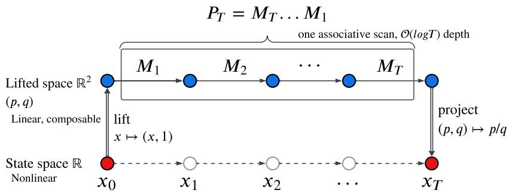
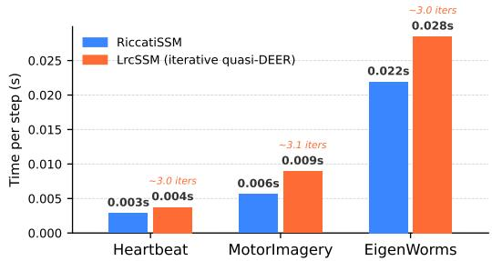
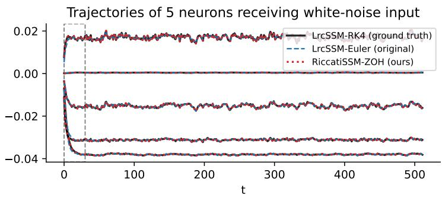
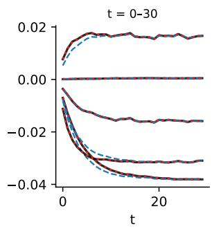
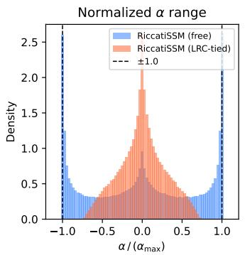
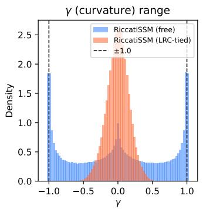
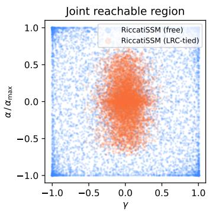

# RICCATI STATE SPACE MODELS: NON-ITERATIVE PARALLELIZATION FOR NONLINEAR SEQUENCE MODELING

Monika Farsang´ 1,2 Ramin Hasani2,3 Daniela Rus2 Radu Grosu1

## ABSTRACT

State space models (SSMs) achieve efficient sequence processing because their affine state updates are closed under composition and can therefore be evaluated with an associative parallel scan. Nonlinear recurrent models can provide richer, state-dependent dynamics, but generally lose this compositional structure: parallel evaluation then requires iterative methods that repeatedly linearize and scan the recurrence. We ask, what state-dependent nonlinear dynamics can be designed to remain exactly composable? We answer by introducing RiccatiSSM, a nonlinear SSM, in which each state dimension follows an input-conditioned Riccati differential equation. Its quadratic state dependence makes the local Jacobian explicitly state-dependent, while its exact per-step flow under piecewise-constant inputs is a Mobius transformation. Since M ¨ obius maps are closed under composition and¨ compose through 2 × 2 matrix multiplication, the complete nonlinear state trajectory can be evaluated exactly with a single associative parallel scan, without iterative linearization. We further derive a constrained parameterization that ensures bounded, contractive dynamics, and avoids poles in the fractional-linear state update. Across long-sequence classification, regression, and forecasting tasks, RiccatiSSM achieves competitive predictive performance while reducing runtime by 22−33% compared to the nonlinear LrcSSM under matched architectures. These results demonstrate that state-dependent nonlinear dynamics can retain exact composability and be evaluated efficiently within a single parallel scan.

## 1 INTRODUCTION

State space models (SSMs) have emerged as efficient sequence models for long-context tasks, combining recurrent state updates with highly parallel training (Gu et al., 2022; Smith et al., 2023; Gu and Dao, 2024). A key source of this efficiency is the structure of their recurrence: although the transition parameters may depend on the input, the state update remains affine in the previous state. Affine maps are closed under composition, allowing an entire sequence to be evaluated using an associative parallel scan with linear work and logarithmic parallel depth.

This computational structure, however, restricts the dynamics that can be represented within the recurrent state update. In particular, the local state Jacobian of an affine recurrence does not depend on the current state. Nonlinear recurrent models can instead make the dynamics themselves state-dependent, allowing their local contraction rates and effective timescales to change along a trajectory. Liquid time-constant neural networks (LTC) provide a prominent example of this behavior by placing the current state inside the continuous-time neuron dynamics (Hasani et al., 2021). Such state dependence increases the flexibility of the dynamics, but in general destroys the compositional structure of the model, that enables a single parallel scan.

Recent methods recover parallelism for nonlinear recurrences by treating sequence evaluation as a nonlinear trajectory-solving problem. DEER (Lim et al., 2024), for example, applies Newton iterations on the state trajectory, where each iteration linearizes the recurrence around the current estimate and solves the resulting affine recurrence in parallel. LrcSSM (Farsang and Grosu, 2025) applies this approach to biologically plausible liquid-resistance, liquid-capacitance recurrent dynamics, while designing the neuron dynamics such that they have a diagonal Jacobian, substantially reducing the cost of each iteration. Nevertheless, evaluating the nonlinear recurrence still requires repeated parallel scans, with the number of iterations determined by convergence.

In this work, we take a different approach: rather than starting from a general nonlinear recurrence and recovering parallelism through iterative linearization, we ask whether the nonlinear dynamics themselves can be chosen to remain exactly composable. This requires a nonlinear family whose time-step maps are closed under composition with a fixed-size representation. We show that inputconditioned Riccati dynamics provide such a construction. Their exact per-step flow maps under piecewise-constant inputs are fractional-linear, or Mobius transformations, which compose through¨ multiplication of $2 \times 2$ matrices. Consequently, the complete nonlinear state trajectory can be evaluated within a single associative parallel scan, without Newton or fixed-point iterations.

This leads us to RiccatiSSM, a diagonal nonlinear state space model, in which each state dimension follows an input-conditioned Riccati differential equation. The quadratic state term makes the local Jacobian explicitly state-dependent, preserving the central dynamical property motivating liquid recurrent models. Moreover, the Riccati structure makes the exact flow compositionally closed. Since unrestricted Riccati equations can exhibit finite-time divergence, we further derive a constrained parameterization that provides stable, bounded dynamics while preserving the exact Mobius flow.¨ RiccatiSSM therefore occupies a middle ground between affine SSMs, which admit direct parallel scans but lack state-dependent local dynamics, and general nonlinear recurrent models, which provide such dynamics but require iterative methods for parallel evaluation.

## Our main contributions in this paper are as follows:

• We introduce RiccatiSSM, a nonlinear state-dependent sequence model whose discrete-time flow maps are Mobius transformations. Their closure under composition enables exact, ¨ non-iterative sequence evaluation with a single associative scan.

• We derive a constrained Riccati parameterization that makes these Riccati dynamics particularly suitable for sequence modeling by ensuring a bounded invariant state interval, contractive transitions, and a pole-free projective readout.

• We evaluate RiccatiSSM on long-sequence classification, regression, and forecasting tasks, where it achieves competitive predictive performance while reducing runtime by 22 − 33% relative to iterative nonlinear LrcSSM under matched architectures.

## 2 BACKGROUND AND MOTIVATION

## 2.1 PARALLEL SCANS AND STATE-DEPENDENT DYNAMICS

Modern SSMs achieve efficient sequence evaluation because their discrete-time recurrence is affine in the previous state,

$$
\boldsymbol { x } _ { t } = \boldsymbol { \Lambda } _ { t } \boldsymbol { x } _ { t - 1 } + \boldsymbol { b } _ { t } ,\tag{1}
$$

where $\Lambda _ { t }$ and $b _ { t }$ may depend on the current input $u _ { t }$ but not on $x _ { t - 1 }$ . Each time step therefore defines an affine map $f _ { t } ( x ) = \Lambda _ { t } x + b _ { t }$ . Affine maps are closed under composition:

$$
f _ { 2 } ( f _ { 1 } ( x ) ) = \Lambda _ { 2 } \Lambda _ { 1 } x + \Lambda _ { 2 } b _ { 1 } + b _ { 2 } ,\tag{2}
$$

so a pair $( \Lambda _ { t } , b _ { t } )$ provides a fixed-size representation of each update and can be combined with an associative operator. The complete sequence can consequently be evaluated using a parallel prefix scan with ${ \cal O } ( { \bar { T } } )$ work and ${ \cal O } ( \log T )$ parallel depth.

Allowing the dynamics to depend nonlinearly on the current state changes the recurrent update to:

$$
x _ { t } = f _ { t } ( x _ { t - 1 } ) ,\tag{3}
$$

where $f _ { t }$ is nonlinear. For a general nonlinear family, composing two updates does not yield another map with the same fixed-size representation. For example, composing two degree-k polynomials generally produces a degree- $\cdot k ^ { 2 }$ polynomial. The representation therefore grows under composition, preventing the recurrence from being evaluated by a single fixed-size associative scan.

Table 1: RiccatiSSM compared with DEER/ELK-style (Lim et al., 2024; Gonzalez et al., 2024) parallelization of general nonlinear recurrences. Both evaluate state-dependent dynamics with associative scans, but DEER/ELK approximate the general nonlinear update by Newton iteration updates until convergence, whereas RiccatiSSM restricts the dynamics to a family that composes exactly in a single step. T is the sequence length, D the number of channels, and K the number of sweeps.
<table><tr><td></td><td>DEER/ELK-based models</td><td>RiccatiSSM</td></tr><tr><td>Dynamics</td><td>any  $f ( x _ { t - 1 } , u _ { t } )$ </td><td>Riccati:  $\alpha + \beta x + \gamma x ^ { 2 }$ </td></tr><tr><td>Scan element</td><td>affine  $( ( J _ { t } , c _ { t } ) , J _ { t }$  the state Jacobian)</td><td>fractional-linear,  $M _ { t } \in \mathbb { R } ^ { 2 \times 2 }$ </td></tr><tr><td>Composition</td><td>approximate (per iteration)</td><td>exact</td></tr><tr><td>Sweeps per layer</td><td>until convergence (K, data-dependent)</td><td>1, fixed</td></tr><tr><td>Depth per layer</td><td>O(K log T)</td><td>O(log T)</td></tr><tr><td>Work per layer</td><td>O(KTD)</td><td>O(TD)</td></tr><tr><td>Within-step integration</td><td>based on the model</td><td>exact (matrix exponential)</td></tr><tr><td>Convergence</td><td>data-dependent, may stall</td><td>not applicable</td></tr></table>

Methods such as DEER (Lim et al., 2024) recover parallelism for general nonlinear recurrences through Newton iterations over the full state trajectory. At each iteration, the nonlinear recurrence is linearized, which is then evaluated by a parallel scan, but several such iterations may be required. Thus, general nonlinear state dependence can be parallelized, but at the cost of repeated scans. Lrc-SSM (Farsang and Grosu, 2025) applies this approach to liquid recurrent dynamics while designing the model to have a diagonal Jacobian, reducing the cost of each iteration.

## 2.2 CLOSURE UNDER COMPOSITION

An alternative is to restrict the nonlinear update family itself. For a recurrence to admit exact evaluation by a single associative scan, we seek a family $\mathcal { F }$ whose elements have a fixed-size representation and are closed under composition:

$$
f _ { 1 } , f _ { 2 } \in \mathcal { F } \quad \Longrightarrow \quad f _ { 2 } \circ f _ { 1 } \in \mathcal { F } .\tag{4}
$$

Affine maps satisfy this property, but they remain linear in the state. We instead seek a nonlinear family that preserves the same closure property.

For a scalar state, fractional-linear (rational-linear), or Mobius, maps provide such a family:¨

$$
f ( x ) = { \frac { a x + b } { c x + d } } .\tag{5}
$$

Each such map can be represented projectively by $\phantom { - } 1 2 \times 2$ matrix:

$$
M _ { f } = { \binom { a } { c } } \ d \biggr ) \ ,\tag{6}
$$

and the composition of two Mobius maps corresponds to matrix multiplication:¨

$$
M _ { f _ { 2 } \circ f _ { 1 } } = M _ { f _ { 2 } } M _ { f _ { 1 } } ,\tag{7}
$$

Since matrix multiplication is associative, a sequence of Mobius updates can be composed exactly¨ with a parallel prefix scan while retaining a fixed $2 \times 2$ representation at every step.

This observation motivates RiccatiSSM. Rather than approximating a general nonlinear recurrence through repeated linearization, we construct the state dynamics such that their exact discrete-time flow is a Mobius map. Riccati differential equations generate such fractional-linear flow maps, pro-¨ viding the continuous-time dynamics underlying RiccatiSSM, which we introduce next in Section 3.

## 3 RICCATI STATE SPACE MODEL

We now construct a nonlinear sequence layer whose state-dependent dynamics admit exact parallel evaluation. The construction has four steps: (1) We first define an input-conditioned Riccati vector field. (2) We lift this nonlinear scalar ODE to a two-dimensional linear system, whose exact zeroorder-hold solution induces a Mobius state update. (3) Since M¨ obius maps compose through matrix¨ multiplication, the full sequence can be evaluated with a single associative scan. (4) Finally, we constrain the coefficients to ensure bounded trajectories and contractive state transitions.

  
Figure 1: RiccatiSSM evaluates a nonlinear recurrence by a detour through a two-dimensional linear one. Bottom (grey, dashed): the states $x _ { t }$ of one channel, whose Mobius updates are nonlinear in the ¨ state. Composing such maps directly requires clearing nested fractions, so the bottom row offers no cheap merge to scan over. Top (blue, solid): the same states as homogeneous pairs $( p _ { t } , q _ { t } )$ , where each step is the matrix $M _ { t }$ . The initial state is lifted once, $x _ { 0 } \mapsto ( x _ { 0 } , 1 )$ , and states are recovered by $x _ { t } = p _ { t } / q _ { t }$ . Matrix multiplication is associative, so the top row collapses into prefix products $P _ { t } = M _ { t } \cdot \cdot \cdot M _ { 1 }$ under one associative scan of depth ${ \mathcal { O } } ( \log T )$ , with no fixed-point iterations; all $D$ channels scan in parallel in the same round.

## 3.1 INPUT-DEPENDENT RICCATI DYNAMICS

Let $u _ { t }$ denote the input at time $t ,$ and let $\boldsymbol { x } _ { t } \in \mathbb { R } ^ { D }$ denote the hidden state. As in diagonal state space models and LrcSSM (Farsang and Grosu, 2025), RiccatiSSM uses independent scalar dynamics across state dimensions; interactions between dimensions are handled by the surrounding input and output projections. For each dimension $i ,$ we define the continuous-time dynamics as:

$$
\dot { x } _ { i } = \varepsilon _ { i } ( u ) \left[ \alpha _ { i } ( u ) + \beta _ { i } ( u ) x _ { i } + \gamma _ { i } ( u ) x _ { i } ^ { 2 } \right] .\tag{8}
$$

The coefficients $\alpha _ { i } ( u ) , \beta _ { i } ( u ) , \gamma _ { i } ( u )$ , and $\varepsilon _ { i } ( u )$ are produced by input-dependent parameter heads. Here, $\alpha _ { i }$ controls the input drive, $\beta _ { i }$ the linear state dependence, $\gamma _ { i }$ the quadratic curvature. Inspired by LRCs (Farsang et al., 2024), we use $\varepsilon _ { i } \in ( 0 , 1 )$ to control the overall speed of the dynamics.

Unlike in an input-varying affine SSM, the local state Jacobian of the dynamics described in Equation $^ { 8 , }$ depends explicitly on the current state:

$$
\frac { \partial \dot { x } _ { i } } { \partial x _ { i } } = \varepsilon _ { i } \left( \beta _ { i } + 2 \gamma _ { i } x _ { i } \right) .\tag{9}
$$

Thus, the local contraction rate of the dynamics can vary with both the input, through the coefficients $\varepsilon , \beta$ and $\gamma ,$ and the current state, through the quadratic term, giving the dynamics a liquid, input and-state dependent character, like in Hasani et al. (2021); Farsang et al. (2024).

When $\gamma _ { i } = 0$ , Equation $^ 8$ reduces to an input-varying linear ODE. The quadratic term is therefore the lowest-degree polynomial term that introduces explicit state-dependence into the local Jacobian.

## 3.2 PROJECTIVE LIFT AND EXACT DISCRETIZATION

A scalar Riccati equation can be represented as the ratio of two coordinates evolving under a linear system. For clarity, we suppress the state index i and write

$$
x = { \frac { p } { q } } .
$$

Define the lifted state $z = ( p , q ) ^ { \top }$ , and consider the linear system:

$$
\frac { d } { d t } \binom { p } { q } = \binom { \dot { p } } { \dot { q } } = L \binom { p } { q } , \qquad L = \varepsilon \binom { \beta / 2 } { - \gamma } \quad - \beta / 2 \biggr ) .\tag{10}
$$

Applying the quotient rule to $x = p / q$ gives:

$$
\dot { x } = \frac { \dot { p } q - p \dot { q } } { q ^ { 2 } } = \varepsilon \left( \alpha + \beta x + \gamma x ^ { 2 } \right) ,\tag{11}
$$

recovering Equation 8. A full derivation of Equation 8 is given in Appendix A.2.

We apply a zero-order hold over each interval $[ t \Delta t , ( t + 1 ) \Delta t )$ : the coefficients are computed from $u _ { t }$ and held constant over the interval. The lifted system then has the exact one-step solution:

$$
\binom { p _ { t } } { q _ { t } } = M _ { t } \binom { p _ { t - 1 } } { q _ { t - 1 } } , \qquad M _ { t } = \exp ( \Delta t L _ { t } ) .\tag{12}
$$

Since $L _ { t }$ is traceless and satisfies $L _ { t } ^ { 2 } = \omega _ { t } ^ { 2 } I ,$ , its exponential has the closed form:

$$
M _ { t } = \cosh ( \omega _ { t } \Delta t ) I + \frac { \sinh ( \omega _ { t } \Delta t ) } { \omega _ { t } } L _ { t } , \qquad \omega _ { t } = \sqrt { \varepsilon _ { t } ^ { 2 } \left( \frac { \beta _ { t } ^ { 2 } } { 4 } - \alpha _ { t } \gamma _ { t } \right) } .\tag{13}
$$

Our stability parameterization that we introduce below, makes sure that $\omega _ { t } > 0$ , so the hyperbolic form in Equation 13 is always well defined. Writing:

$$
M _ { t } = { \binom { a _ { t } \quad b _ { t } } { c _ { t } \quad d _ { t } } } ,
$$

the induced update of the original scalar state becomes:

$$
x _ { t } = \frac { a _ { t } x _ { t - 1 } + b _ { t } } { c _ { t } x _ { t - 1 } + d _ { t } } .\tag{14}
$$

Thus, exact zero-order-hold integration of a Riccati ODE produces a Mobius update. This is the¨ property that makes the nonlinear recurrence scan-compatible. Although the dynamics are linear in the lifted coordinates, the projected state $( x = p / q )$ follows the nonlinear, state-dependent Riccati dynamics in Equation 8. We discuss this and its relation to liquid dynamics further in Appendix B.

## 3.3 PARALLEL SEQUENCE EVALUATION

The Mobius updates in Equation 14 compose directly through their matrix representations. Define¨ the the following prefix product:

$$
P _ { t } = M _ { t } M _ { t - 1 } \cdot \cdot \cdot M _ { 1 } = \binom { P _ { t } ^ { ( 1 1 ) } } { P _ { t } ^ { ( 2 1 ) } } \ P _ { t } ^ { ( 1 2 ) } \Sigma _ { t }\tag{15}
$$

Since matrix multiplication is associative, all prefix products $\{ P _ { t } \} _ { t = 1 } ^ { T }$ can be computed with a single parallel scan. The state at every time step is then recovered from the initial state $x _ { 0 }$ as:

$$
x _ { t } = \frac { P _ { t } ^ { ( 1 1 ) } x _ { 0 } + P _ { t } ^ { ( 1 2 ) } } { P _ { t } ^ { ( 2 1 ) } x _ { 0 } + P _ { t } ^ { ( 2 2 ) } } .\tag{16}
$$

The forward pass therefore consists of three non-iterative stages:

1. Coefficient generation. Compute the coefficients $( \alpha _ { t } , \beta _ { t } , \gamma _ { t } , \varepsilon _ { t } )$ and the corresponding matrices $M _ { t }$ , for all time steps and state dimensions, in parallel.

2. Parallel scan. Compute the matrix prefix-products in Equation 15, by using the associativity property of $2 \times 2$ matrix multiplication.

3. Projective readout. Recover the state $x _ { t }$ from the readout of Equation 16.

It is important to note that for a diagonal state dynamics of dimension D and sequence length $T$ , the recurrent computation requires $\mathcal { O } ( \overline { { T } } D )$ work and ${ \mathcal { O } } ( \log T )$ parallel depth. Under the zero-orderhold assumption, each Riccati step is integrated exactly. Hence the scan introduces neither iterative approximation nor a within-step numerical integration error.

## 3.4 STABLE PARAMETERIZATION

Unfortunately, a general Riccati equation can diverge in finite time. In the fractional-linear update of Equation 14, this divergence corresponds to the denominator approaching zero (a pole). We avoid this behavior by constraining the Riccati coefficients in such a way that the dynamics admit a bounded invariant interval, and the state transition is contractive within this interval. The resulting parameterization and stability conditions are detailed in Appendix A.1.

## 3.5 RELATION TO LIQUID DYNAMICS

RiccatiSSM and LrcSSM both use diagonal continuous-time neuron dynamics, in order to avoid the matrix-multiplication blow-up within the associative scan. However, they differ in how they represent state dependence. LrcSSM places the state inside saturating nonlinearities, making its update, leak, and speed (elastance) factor state-dependent. RiccatiSSM instead uses input-dependent coefficients and represents state dependence explicitly through a quadratic term. This structure yields an exact fractional-linear step map that can be composed with a single associative scan.

We establish a local correspondence between the two models by constructing a second-order Taylor approximation of the LRC vector field with respect to the state around its zero value. We further evaluate the accuracy of this local approximation and distinguish it from the discretization error introduced by the explicit-Euler update used in LrcSSM. The derivation and the matched-dynamics experiments are provided in Appendix B.1 and B.2.

## 4 EXPERIMENTS

We evaluate RiccatiSSM on long-sequence classification, regression, and forecasting tasks, comparing its predictive performance with transformer-based architectures, neural differential equation models, and with linear, oscillatory, input-selective and nonlinear SSMs. We then measure the computational benefit of replacing the iterative quasi-DEER evaluation of LrcSSM with the exact single-scan evaluation of RiccatiSSM. Finally, we ablate the RiccatiSSM parameterization to study the effects of input-dependent coefficients and the connection to LRC dynamics.

## 4.1 EXPERIMENTAL SETUP

RiccatiSSM follows the sensory-synapse input encoding of LrcSSM (Farsang and Grosu, 2025), but uses independent learned projections of this representation to produce the Riccati coefficients $\alpha ( u ) , \beta ( u ) , \gamma ( u )$ , and ε(u). The resulting coefficients are mapped through the constrained parameterization of Section A.1, which enforces the stability conditions of RiccatiSSM. We separately evaluate an LRC-tied parameterization in Section 4.4, where these coefficients are constrained by the Taylor-matching relations derived in Appendix B.1.

Table 2: Test accuracy comparison of different models. The performance of the models marked by † is reported from Rusch and Rus (2025), those with ‡ from Moreno-Pino et al. (2024), and ⋄ from Farsang and Grosu (2025). The same hyperparameter tuning protocol and dataset splitting over the same 5 seeds were used. Bold highlights the top 3 models.
<table><tr><td>Sequence length</td><td>Heart 405</td><td>SCP1 896</td><td>SCP2 1,152</td><td>Ethanol 1,751</td><td>Motor 3,000</td><td>Worms 17,984</td></tr><tr><td>Input size #Classes</td><td>61</td><td>6</td><td>7</td><td>2</td><td>63</td><td>6</td></tr><tr><td></td><td>2</td><td>2</td><td>2</td><td>4</td><td>2</td><td>5</td></tr><tr><td>Transformer‡ RFormer</td><td> $7 0 . 5 \pm 0 . 1$ </td><td> $8 4 . 3 \pm 6 . 3$ </td><td> $4 9 . 1 \pm 2 . 5$ </td><td> ${ \bf 4 0 . 5 \pm 6 . 3 }$ </td><td> $5 0 . 5 \pm 3 . 0$ </td><td>OOM</td></tr><tr><td></td><td> $7 2 . 5 \pm 0 . 1$ </td><td> $8 1 . 2 \pm 2 . 8$ </td><td> $5 2 . 3 \pm { 3 . 7 }$ </td><td> $3 4 . 7 \pm 4 . 1$ </td><td> $5 5 . 8 \pm 6 . 6$ </td><td> ${ \bf 9 0 . 3 \pm 0 . 1 }$ </td></tr><tr><td>NRDE†</td><td> $7 3 . 9 \pm 2 . 6$ </td><td> $7 6 . 7 \pm 5 . 6$ </td><td> $4 8 . 1 \pm 1 1 . 4$ </td><td> $3 1 . 4 \pm 4 . 5$ </td><td> $5 4 . 0 \pm 7 . 8$ </td><td> $7 7 . 2 \pm 7 . 1$ </td></tr><tr><td>NCDE†</td><td> $6 8 . 1 \pm 5 . 8$ </td><td> $8 0 . 0 \pm 2 . 0$ </td><td> $4 9 . 1 \pm 6 . 2$ </td><td> $2 2 . 0 \pm 1 . 0$ </td><td> $5 1 . 6 \pm 6 . 2$ </td><td> $6 2 . 2 \pm 2 . 2$ </td></tr><tr><td>Log-NCDE†</td><td> $7 4 . 2 \pm 2 . 0$ </td><td> $8 2 . 1 \pm 1 . 4$ </td><td> $5 4 . 0 \pm 2 . 6$ </td><td> $3 5 . 9 \pm 6 . 1$ </td><td> $5 7 . 2 \pm 5 . 6$ </td><td> $8 2 . 8 \pm 2 . 7$ </td></tr><tr><td>LRU†</td><td> ${ \bf 7 8 . 1 \pm 7 . 6 }$ </td><td> $8 4 . 5 \pm 4 . 6$ </td><td> $4 7 . 4 \pm 4 . 0$ </td><td> $2 3 . 8 \pm 2 . 8$ </td><td> $5 1 . 9 \pm 8 . 6$ </td><td> $8 5 . 0 \pm 6 . 2$ </td></tr><tr><td>S5†</td><td> $7 3 . 9 \pm 3 . 1$ </td><td> $8 7 . 1 \pm 2 . 1$ </td><td> ${ \bf 5 5 . 1 \pm 3 . 3 }$ </td><td> $2 5 . 6 \pm 3 . 5$ </td><td> $5 3 . 0 \pm 3 . 9$ </td><td> $8 3 . 9 \pm 4 . 1$ </td></tr><tr><td>LinOSS-IMEX†</td><td> $7 5 . 5 \pm 4 . 3$ </td><td> ${ \bf 8 7 . 5 \pm 4 . 0 }$ </td><td> ${ \bf 5 8 . 9 \pm 8 . 1 }$ </td><td> $2 9 . 9 \pm 1 . 0$ </td><td> $5 7 . 9 \pm 5 . 3$ </td><td> $8 0 . 0 \pm 2 . 7$ </td></tr><tr><td>LinOSS-IM†</td><td> $7 5 . 8 \pm 3 . 7$ </td><td> ${ \bf 8 7 . 8 \pm 2 . 6 }$ </td><td> ${ \bf 5 8 . 2 \pm 6 . 9 }$ </td><td> $2 9 . 9 \pm 0 . 6$ </td><td> ${ \bf 6 0 . 0 \pm 7 . 5 }$ </td><td> ${ \bf 9 5 . 0 \pm 4 . 4 }$ </td></tr><tr><td> $\mathbf { M a m b a } ^ { \dagger }$ </td><td> ${ \bf 7 6 . 2 \pm 3 . 8 }$ </td><td> $8 0 . 7 \pm 1 . 4$ </td><td> $4 8 . 2 \pm { 3 . 9 }$ </td><td> $2 7 . 9 \pm 4 . 5$ </td><td> $4 7 . 7 \pm 4 . 5$ </td><td> $7 0 . 9 \pm 1 5 . 8$ </td></tr><tr><td> ${ \bf S } 6 ^ { \dagger }$ </td><td> ${ \bf 7 6 . 5 \pm 8 . 3 }$ </td><td> $8 2 . 8 \pm 2 . 7$ </td><td> $4 9 . 9 \pm 9 . 4$ </td><td> $2 6 . 4 \pm 6 . 4$ </td><td> $5 1 . 3 \pm 4 . 7$ </td><td> $8 5 . 0 \pm 1 6 . 1$ </td></tr><tr><td> $\mathrm { L r c S S M } ^ { \diamondsuit }$ </td><td></td><td></td><td></td><td></td><td></td><td></td></tr><tr><td>RiccatiSSM (ours)</td><td> $7 2 . 7 \pm 5 . 7$   $7 3 . 0 \pm 6 . 8$ </td><td> $8 5 . 2 \pm 2 . 1$   ${ \bf 8 7 . 4 \pm 4 . 3 }$ </td><td> $5 3 . 9 \pm 7 . 2$   $5 3 . 2 \pm 4 . 3$ </td><td> ${ \bf 3 6 . 9 \pm 5 . 3 }$   ${ \bf 3 6 . 6 \pm 3 . 4 }$ </td><td> ${ \bf 5 8 . 6 \pm 3 . 1 }$   ${ \bf 5 9 . 6 \pm 3 . 1 }$ </td><td> ${ \bf 9 0 . 6 \pm 1 . 4 }$   $8 3 . 9 \pm 6 . 4$ </td></tr></table>

Results are reported over five random seeds. Datasets, model configurations, and hyperparameter ranges are provided in Appendix C, with the complete hyperparameter settings.

## 4.2 LONG-SEQUENCE BENCHMARK RESULTS

Classification. We first evaluate RiccatiSSM on six multivariate time-series classification datasets from the UEA archive, spanning sequence lengths from 405 to 17,984. Table 2 compares RiccatiSSM with continuous-time recurrent models, linear SSMs, Transformer-based architectures, and the nonlinear LrcSSM baseline. RiccatiSSM is competitive across datasets and closely matches LrcSSM while avoiding its iterative sequence evaluation. In particular, it improves over LrcSSM on SCP1 and MotorImagery, while obtaining similar performance on Heartbeat, SCP2, and Ethanol-Concentration. On EigenWorms, RiccatiSSM shows higher variability across seeds, with individual runs ranging from 77.8% to 91.7%, suggesting greater sensitivity to optimization on this dataset.

Long-range Regression and Forecasting We next evaluate regression on PPG-DaLiA (Reiss et al., 2019). Following the same tuning protocol, RiccatiSSM achieves an MSE of $7 . 1 5 \pm 1 . 0 1 \times$ $1 0 ^ { - 2 }$ (Table 3), improving over LrcSSM $( 1 0 . 8 9 \pm 0 . 9 6 \times 1 0 ^ { - 2 } )$ and remaining competitive with the strongest linear SSM baseline, the LinOSS.

Table 3: Mean squared error $( \mathrm { M S E } \times 1 0 ^ { - 2 } )$ for different models on the PPG-DaLiA dataset. The performance of the models marked by † is reported from Rusch and Rus (2025) and ⋄ from Farsang and Grosu (2025). All results are averaged over 5 seeds.
<table><tr><td>Model</td><td> $\mathrm { M S E } \times 1 0 ^ { - 2 } \left( \downarrow \right)$ </td></tr><tr><td>NRDE† (Morrill et al., 2021) NCDE† (Kidger et al., 2020) Log-NCDE† (Walker et al., 2024)</td><td> $9 . 9 0 \pm 0 . 9 7$   $1 3 . 5 4 \pm 0 . 6 9$   $9 . 5 6 \pm 0 . 5 9$ </td></tr><tr><td> $\mathrm { L R U } ^ { \dagger }$  (Orvieto et al., 2023)  ${ \bf S } { \bar { \bf 5 } } ^ { \dagger }$  (Smith et al., 2023) LinOSS-IMEX† (Rusch and Rus, 2025)  $\mathrm { L i n O S S  – I M ^ { \dagger } }$  (Rusch and Rus, 2025)</td><td> $1 2 . 1 7 \pm 0 . 4 9$   $1 2 . 6 3 \pm 1 . 2 5$   ${ \bf 7 . 5 0 \pm 0 . 4 6 }$   ${ \bf 6 . 4 0 \pm 0 . 2 3 }$ </td></tr><tr><td> ${ \bf S } 6 ^ { \dagger }$  (Gu and Dao, 2024) Mamba† (Gu and Dao, 2024) LrcSSM° (Farsang and Grosu, 2025) RiccatiSSM (ours)</td><td> $1 2 . 8 8 \pm 2 . 0 5$   $1 0 . 6 5 \pm 2 . 2 0$   $1 0 . 8 9 \pm 0 . 9 6$   ${ \bf 7 . 1 5 \pm 1 . 1 3 }$ </td></tr></table>

To evaluate long-horizon forecasting, we use the Weather dataset with an input context of 720 time steps and predict the subsequent 720 steps, following Zhou et al. (2021). As shown in Table 4, RiccatiSSM obtains a mean absolute error of 0.5681, improving over LrcSSM (0.5888) and several recurrent, Transformer-based, and state-space baselines, while remaining close to LinOSS.

Table 4: Mean absolute error on the weather dataset predicting 720 future time steps based on 720 past time steps. The performance of the models marked by † is reported from Rusch and Rus (2025).
<table><tr><td>Model</td><td>Mean Absolute Error (↓)</td></tr><tr><td>Informer† (Zhou et al., 2021)</td><td>0.731</td></tr><tr><td>LogTrans† (Li et al., 2019)</td><td>0.773</td></tr><tr><td>Reformer† (Kitaev et al., 2020)</td><td>1.575</td></tr><tr><td>LSTMa† (Bahdanau et al., 2014)</td><td>1.109</td></tr><tr><td>LSTnet† (Lai et al., 2018)</td><td>0.757</td></tr><tr><td>S4† (Gu et al., 2022)</td><td>0.5783</td></tr><tr><td>LinOSS-IMEX† (Rusch and Rus, 2025)</td><td>0.5081</td></tr><tr><td>LinOSS-IM† (Rusch and Rus, 2025)</td><td>0.5282</td></tr><tr><td>LrcSSM (Farsang and Grosu, 2025)</td><td>0.5888</td></tr><tr><td>RiccatiSSM (ours)</td><td>0.5681</td></tr></table>

  
Figure 2: Time per step (seconds) for RiccatiSSM and LrcSSM across three UEA time-series classification datasets using the same architecture on an NVIDIA A100 GPU. RiccatiSSM evaluates each layer with a single parallel scan, whereas LrcSSM requires approximately three quasi-DEER iterations. The runtime gap is largest for the longer EigenWorms sequences.

## 4.3 RUNTIME AND PARALLEL-EVALUATION COST

We next evaluate whether eliminating iterative nonlinear sequence evaluation translates into an endto-end computational benefit. We compare RiccatiSSM with LrcSSM using the same 6-layer architecture and a state size of 64. While RiccatiSSM evaluates its recurrent dynamics with a single associative scan, LrcSSM requires approximately three quasi-DEER iterations, each involving a scan of a linearized recurrence.

Figure 2 shows that eliminating these iterative solves consistently reduces wall-clock runtime. The reduction is smaller than the approximately 3× difference in the number of scans because sequence evaluation constitutes only part of the complete architecture: embeddings, MLPs, normalization layers, and other operations are evaluated once in both models. Across the three datasets, RiccatiSSM requires $6 7 - 7 8 \%$ of the LrcSSM runtime, corresponding to a $2 2 - 3 3 \%$ reduction in end-to-end computation. The difference is largest on EigenWorms, which has the longest sequences. Additional runtime measurements are provided in Table 8 in the Appendix.

## 4.4 ABLATIONS

Input-dependent coefficients. We ablate several components of the RiccatiSSM parameterization using PPG-DaLiA. First, we remove the input-dependent speed factor ε(u), which increases the test MSE by $1 . 3 \times 1 0 ^ { - 2 }$ . We then restrict $\beta , \gamma ,$ and ε to be input-independent, leaving only $\alpha ( u )$ to inject the input into the state dynamics. Note that at least one of the coefficients should remain input dependent, such that the input can influence the state dynamics. The results indicate that input-dependent modulation of the full Riccati dynamics is beneficial.

Free vs. LRC-tied parameterization. The local correspondence derived in Appendix B.1 provides a second way to parameterize RiccatiSSM. Rather than learning the Riccati coefficients independently, we constrain them according to the Taylor-matching relations derived from the LrcSSM vector field. This LRC-tied parameterization obtains an MSE of $8 . 4 7 \pm 0 . 4 7 \times 1 0 ^ { - 2 }$ , compared with $7 . 1 5 \pm 1 . 0 1 \times 1 0 ^ { - 2 }$ for the freely parameterized RiccatiSSM. Thus, retaining the LRC-derived coupling is not necessary for RiccatiSSM and is more restrictive than learning the Riccati coefficients independently subject to the stability constraints.The reachable coefficient spaces induced by the free and LRC-tied parameterizations are visualized in Figure 4 in the Appendix.

## 4.5 LIMITATIONS

Compared to general nonlinear systems, RiccatiSSM is restricted to a specific second-order polynomial form in which the coefficients can be input-dependent but not state-dependent, i.e., $\alpha , \beta ,$ and γ depend only on the input. State-dependent nonlinearity instead enters explicitly through the quadratic curvature term $\gamma ( \bar { u } ) x ^ { 2 }$ Additional constraints are required to ensure stable dynamics. Despite these restrictions, RiccatiSSMs define an interesting new family of nonlinear SSMs that can be parallelized exactly with a single scan without iterative methods.

Table 5: Ablation of the RiccatiSSM parameterization on PPG-DaLiA. Test MSE $( \times 1 0 ^ { - 2 }$ , lower is better), reported as mean ± standard deviation over five seeds.
<table><tr><td>Model</td><td>Input-dependent coefficients</td><td>MSE (↓)</td></tr><tr><td>RiccatiSSM (ours)</td><td> $\alpha ( u ) , \beta ( u ) , \gamma ( u ) , \varepsilon ( u )$ </td><td> ${ \bf 7 . 1 5 \pm 1 . 0 1 }$ </td></tr><tr><td>ε ablation</td><td> $\alpha ( u ) , \beta ( u ) , \gamma ( u )$ </td><td> $8 . 4 5 \pm 0 . 3 8$ </td></tr><tr><td>Reduced input dependence</td><td> $\alpha ( u ) , \beta , \gamma , \varepsilon$ </td><td> $8 . 7 1 \pm 1 . 1 0$ </td></tr><tr><td>RiccatiSSM (LRC-tied)</td><td>LRC Taylor-matched</td><td> $8 . 4 7 \pm 0 . 4 7$ </td></tr></table>

## 5 RELATED WORK

Parallel evaluation of nonlinear recurrences. Linear and input-dependent linear SSMs evaluate long sequences with associative scans because affine state updates are closed under composition (Smith et al., 2023; Gu and Dao, 2024). Several recent methods extend parallel evaluation to nonlinear recurrences through iterative linearization. DEER (Lim et al., 2024) formulates sequence evaluation as a fixed-point problem and applies Newton-style iterations, where each iteration scans a linearized recurrence. Quasi-DEER and ELK (Gonzalez et al., 2024) develop related iterative schemes intended to improve stability and scalability. Fixed-Point RNNs (Movahedi et al., 2025) express dense linear recurrences as fixed points of parallelizable diagonal systems, while Gonzalez et al. (2026) study Newton, Picard, and Jacobi approaches within a common successive-linearization framework. Gonzalez et al. (2025) further relate the convergence of these methods to properties such as contractivity of the underlying dynamics. Here, we explore the boundary of associative scans.

Liquid and continuous-time models. LTC (Hasani et al., 2021) makes each neuron’s effective time constant depend on it own state, by using a liquid conductance. CfC (Hasani et al., 2022) removes the ODE solver by integrating a single step in closed form, but the sequence recursion remains sequential and its coefficients remain state-dependent, so parallelization over T still requires DEER-style iteration. LRC and LrcSSM (Farsang et al., 2024; Farsang and Grosu, 2025) extend this family with a liquid capacitance, and scale it to long sequences with a diagonal Jacobian and a contraction-based gradient-stability guarantee. While not fully following the biological constraints anymore, RiccatiSSM keeps both the state-dependent time constant (Equation 9) and the contraction guarantee, and additionally makes the within-step discretization exact rather than explicit Euler.

Mobius maps and parallel prefix.¨ That fractional-linear maps compose thruough a $2 \times 2$ matrix multiplication, and that first-order rational recurrences therefore admit parallel-prefix evaluation, is classical (Kogge and Stone, 1973; Kogge, 1974); we claim no novelty for the primitive itself. In machine learning, Mobius transformations have been used as feature maps in attention (Halacheva¨ et al., 2024), but as static transformations of representations, not as temporal dynamics composed over time. The closest use of the primitive as a sequence recurrence is Kalman Linear Attention (Shaj et al., 2026), where the information-form precision of a linear-Gaussian latent follows a Mobius re-¨ cursion composed by an associative scan. The hidden state evolves linearly and the fractional-linear map acts on an uncertainty statistic. In RiccatiSSM the map acts on the state itself (Equation 8), which is what yields a state-dependent time constant and places the model in the liquid family.

## 6 CONCLUSION

We introduced RiccatiSSM, a nonlinear sequence layer whose input-conditioned Riccati dynamics yield exact fractional-linear state updates. Because these updates are closed under composition through $2 \times 2$ matrix multiplication, RiccatiSSM evaluates the full sequence with a single associative parallel scan, avoiding the iterative Newton updates required by general nonlinear recurrences. A constrained parameterization keeps the dynamics bounded and contractive while retaining state-dependent timescales. Across long-sequence classification, regression, and forecasting tasks, RiccatiSSM achieves competitive predictive performance, while reducing end-to-end runtime by 22 − 33% relative to the iterative LrcSSM implementation. More broadly, RiccatiSSM shows that state-dependent nonlinear dynamics and exact parallel evaluation need not be mutually exclusive: restricting the dynamics to a nonlinear family closed under composition provides a middle ground between linear SSMs and general nonlinear recurrent models.

## ACKNOWLEDGMENTS

Research was sponsored by the Department of the Air Force Artificial Intelligence Accelerator and was accomplished under Cooperative Agreement Number FA8750-19-2-1000. The views and conclusions contained in this document are those of the authors and should not be interpreted as representing the official policies, either expressed or implied, of the Department of the Air Force or the U.S. Government. The U.S. Government is authorized to reproduce and distribute reprints for Government purposes notwithstanding any copyright notation herein.

## REFERENCES

Dzmitry Bahdanau, Kyunghyun Cho, and Yoshua Bengio. Neural machine translation by jointly learning to align and translate. arXiv preprint arXiv:1409.0473, 2014.

Monika Farsang and Radu Grosu. Parallelization of non-linear state-space models: Scaling up´ liquid-resistance liquid-capacitance networks for efficient sequence modeling. In The Thirtyninth Annual Conference on Neural Information Processing Systems, 2025. URL https:// openreview.net/forum?id=ENYvdnyhLl.

Monika Farsang, Sophie A Neubauer, and Radu Grosu. Liquid resistance liquid capacitance net-´ works. In The First Workshop on NeuroAI@ NeurIPS2024, 2024.

Xavier Gonzalez, Andrew Warrington, Jimmy Smith, and Scott Linderman. Towards scalable and stable parallelization of nonlinear rnns. Advances in Neural Information Processing Systems, 37: 5817–5849, 2024.

Xavier Gonzalez, Leo Kozachkov, David M. Zoltowski, Kenneth L. Clarkson, and Scott Linderman. Predictability enables parallelization of nonlinear state space models. In The Thirty-ninth Annual Conference on Neural Information Processing Systems, 2025. URL https://openreview. net/forum?id=7AGXSlXcK6.

Xavier Gonzalez, E. Kelly Buchanan, Hyun Dong Lee, Jerry Weihong Liu, Ke Alexander Wang, David M. Zoltowski, Leo Kozachkov, Chris Re, and Scott W. Linderman. A unifying framework ´ for parallelizing sequential models with linear dynamical systems. Transactions on Machine Learning Research (TMLR), 2026.

Albert Gu and Tri Dao. Mamba: Linear-time sequence modeling with selective state spaces. In First Conference on Language Modeling, 2024. URL https://openreview.net/forum?id= tEYskw1VY2.

Albert Gu, Karan Goel, and Christopher Re. Efficiently modeling long sequences´ with structured state spaces, 2022. URL https://arxiv.org/abs/2111.00396. doi:10.48550/arXiv.2111.00396.

Anna-Maria Halacheva, Mojtaba Nayyeri, and Steffen Staab. Expanding expressivity in transformer models with m\” obiusattention. arXiv preprint arXiv:2409.12175, 2024.

Ramin Hasani, Mathias Lechner, Alexander Amini, Daniela Rus, and Radu Grosu. Liquid timeconstant networks. In Proc. of the AAAI Conference on Artificial Intelligence, volume 35(9), pages 7657–7666, 2021. doi:10.1609/aaai.v35i9.16936.

Ramin Hasani, Mathias Lechner, Alexander Amini, Lucas Liebenwein, Aaron Ray, Max Tschaikowski, Gerald Teschl, and Daniela Rus. Closed-form continuous-time neural networks. Nature Machine Intelligence, 4(11):992–1003, 2022.

Patrick Kidger, James Morrill, James Foster, and Terry Lyons. Neural controlled differential equations for irregular time series. Advances in neural information processing systems, 33:6696–6707, 2020.

Nikita Kitaev, Łukasz Kaiser, and Anselm Levskaya. Reformer: The efficient transformer. arXiv preprint arXiv:2001.04451, 2020.

Peter M Kogge. Parallel solution of recurrence problems. IBM Journal of Research and Development, 18(2):138–148, 1974.

Peter M Kogge and Harold S Stone. A parallel algorithm for the efficient solution of a general class of recurrence equations. IEEE transactions on computers, 100(8):786–793, 1973.

Guokun Lai, Wei-Cheng Chang, Yiming Yang, and Hanxiao Liu. Modeling long-and short-term temporal patterns with deep neural networks. In The 41st international ACM SIGIR conference on research & development in information retrieval, pages 95–104, 2018.

Shiyang Li, Xiaoyong Jin, Yao Xuan, Xiyou Zhou, Wenhu Chen, Yu-Xiang Wang, and Xifeng Yan. Enhancing the locality and breaking the memory bottleneck of transformer on time series forecasting. Advances in neural information processing systems, 32, 2019.

Yi Heng Lim, Qi Zhu, Joshua Selfridge, and Muhammad Firmansyah Kasim. Parallelizing nonlinear sequential models over the sequence length. In The Twelfth International Conference on Learning Representations, 2024.

Fernando Moreno-Pino, Alvaro Arroyo, Harrison Waldon, Xiaowen Dong, and´ Alvaro´ Cartea. Rough transformers: Lightweight and continuous time series modelling through signature patching. In A. Globerson, L. Mackey, D. Belgrave, A. Fan, U. Paquet, J. Tomczak, and C. Zhang, editors, Advances in Neural Information Processing Systems, volume 37, pages 106264–106294. Curran Associates, Inc., 2024. URL https://proceedings.neurips.cc/paper\_files/paper/2024/file/ bfe167fee3be2d862a56af82dee77720-Paper-Conference.pdf.

James Morrill, Cristopher Salvi, Patrick Kidger, and James Foster. Neural rough differential equations for long time series. In International Conference on Machine Learning, pages 7829–7838. PMLR, 2021.

Sajad Movahedi, Felix Sarnthein, Nicola Muca Cirone, and Antonio Orvieto. Fixed-point RNNs: Interpolating from diagonal to dense. In The Thirty-ninth Annual Conference on Neural Information Processing Systems, 2025. URL https://openreview.net/forum?id=KT8y9pFgJE.

Philipp\* Nazari, Francesco Maria\* Ruscio, Benedict\* Armstrong, and T. Konstantin Rusch. Discretax: A lightweight collection of state space models in jax, 2025. URL https://github. com/camail-official/discretax.

Antonio Orvieto, Samuel L Smith, Albert Gu, Anushan Fernando, Caglar Gulcehre, Razvan Pascanu, and Soham De. Resurrecting recurrent neural networks for long sequences. In International Conference on Machine Learning, pages 26670–26698. PMLR, 2023.

Attila Reiss, Ina Indlekofer, Philip Schmidt, and Kristof Van Laerhoven. Deep ppg: Large-scale heart rate estimation with convolutional neural networks. Sensors, 19(14):3079, 2019.

T Konstantin Rusch and Daniela Rus. Oscillatory state-space models. In The Thirteenth International Conference on Learning Representations, 2025.

Vaisakh Shaj, Cameron Barker, Aidan Scannell, Andras Szecsenyi, Elliot J Crowley, and Amos Storkey. Kalman linear attention: Parallel bayesian filtering for efficient language modelling and state tracking. arXiv preprint arXiv:2602.10743, 2026.

Jimmy TH Smith, Andrew Warrington, and Scott W Linderman. Simplified state space layers for sequence modeling. In ICLR, 2023.

Benjamin Walker, Andrew Donald McLeod, Tiexin Qin, Yichuan Cheng, Haoliang Li, and Terry Lyons. Log neural controlled differential equations: The lie brackets make a difference. In Fortyfirst International Conference on Machine Learning, 2024.

Haoyi Zhou, Shanghang Zhang, Jieqi Peng, Shuai Zhang, Jianxin Li, Hui Xiong, and Wancai Zhang. Informer: Beyond efficient transformer for long sequence time-series forecasting. In Proceedings ofthe AAAI conference on artificial intelligence, volume 35, pages 11106–11115, 2021.

## A ADDITIONAL THEORETICAL RESULTS

This appendix proves the algebraic and stability properties underlying RiccatiSSM. We first show the parametrization, then that a Riccati equation is the projective image of a two-dimensional linear system. We then derive the exact matrix exponential used for zero-order-hold discretization, establish closure of the resulting Mobius updates under composition, and prove the guarantees of the ¨ constrained parameterization.

## A.1 STABLE PARAMETERIZATION

A general Riccati equation can diverge in finite time. In the fractional-linear update of Equation 14, such a divergence corresponds to the denominator approaching zero. We avoid this behavior by parameterizing the coefficients such that a fixed interval $[ - B , \breve { B } ]$ ], with $B > 0$ , is forward-invariant and the dynamics are contractive within this interval.

For readability, we suppress the state-dimension and time indices in this subsection. At each time step, the coefficient network produces four unconstrained real-valued outputs

$$
( \hat { \alpha } , \hat { \beta } , \hat { \gamma } , \hat { \varepsilon } ) \in \mathbb { R } ^ { 4 } .\tag{17}
$$

The hats indicate raw network outputs before applying the constraints. We first define

$$
\varepsilon = \sigma ( \hat { \varepsilon } ) , \qquad s = s _ { \mathrm { m i n } } + \mathrm { s o f t p l u s } ( \hat { \beta } ) , \qquad \gamma = \hat { \gamma } ,\tag{18}
$$

where $s _ { \operatorname* { m i n } } > 0$ is a fixed minimum contraction margin. The remaining Riccati coefficients are then parameterized as

$$
\alpha = \left( s B + | \gamma | B ^ { 2 } \right) \operatorname { t a n h } ( \hat { \alpha } ) , \qquad \beta = - \left( s + 2 | \gamma | B \right) .\tag{19}
$$

Thus, $, \hat { \alpha }$ determines the bounded drive coefficient $\alpha , { \hat { \beta } }$ determines the positive contraction margin $s ,$ $\hat { \gamma }$ determines the curvature $\gamma$ , and εˆ determines the speed factor $\varepsilon \in ( 0 , 1 )$

In particular, $\hat { \beta }$ does not directly parameterize the linear Riccati coefficient $\beta .$ Instead, it determines the positive margin $s ,$ from which $\beta$ is constructed to offset the largest possible state-dependent contribution $2 | \gamma |$ x to the Jacobian over $x \in [ - B , B ]$ , while retaining a contraction margin of at least $s .$ The resulting coefficients satisfy,

$$
| \alpha | \le s B + | \gamma | B ^ { 2 } , \qquad \beta \le - s \le - s _ { \mathrm { m i n } } .\tag{20}
$$

These constraints give three properties.

Bounded trajectories. Consider the scalar Riccati vector field without its positive speed factor,

$$
g ( x ) = \alpha + \beta x + \gamma x ^ { 2 } .\tag{21}
$$

At the upper boundary $x = B .$ , using Equation 19, the coefficient bounds in Equation 20 imply

$$
\begin{array} { r l } & { g ( B ) = \alpha - \left( s + 2 | \gamma | B \right) B + \gamma B ^ { 2 } } \\ & { \qquad \leq \left( s B + | \gamma | B ^ { 2 } \right) - s B - 2 | \gamma | B ^ { 2 } + \gamma B ^ { 2 } } \\ & { \qquad = \left( \gamma - | \gamma | \right) B ^ { 2 } \leq 0 . } \end{array}\tag{22}
$$

At the lower boundary $x = - B$

$$
\begin{array} { r l } & { g ( - B ) = \alpha + \left( s + 2 | \gamma | B \right) B + \gamma B ^ { 2 } } \\ & { \qquad \geq - \left( s B + | \gamma | B ^ { 2 } \right) + s B + 2 | \gamma | B ^ { 2 } + \gamma B ^ { 2 } } \\ & { \qquad = \left( | \gamma | + \gamma \right) B ^ { 2 } \geq 0 . } \end{array}\tag{23}
$$

Since $\varepsilon > 0 .$ , the full vector field $\dot { x } = \varepsilon g ( x )$ points inward or is tangent at both boundaries. Hence, $[ - B , B ]$ is forward-invariant: if $x _ { 0 } \in [ - B , B ]$ , then $x _ { t } \in [ - B , B ]$ for all subsequent times. The trajectory therefore remains finite, and the corresponding projective representation does not encounter a pole along the trajectory.

Contractive state transitions. For every $x \in [ - B , B ]$ , the state Jacobian satisfies

$$
\begin{array} { r l r } {  { \frac { \partial \dot { x } } { \partial x } = \varepsilon ( \beta + 2 \gamma x ) } } \\ & { } & { = \varepsilon ( - s - 2 | \gamma | B + 2 \gamma x ) } \\ & { } & { \leq - \varepsilon s \leq - \varepsilon s _ { \mathrm { m i n } } . } \end{array}\tag{24}
$$

Thus, the continuous-time dynamics are strictly contractive with respect to the state throughout the invariant interval. Under the zero-order hold used in Equation $1 2 , \varepsilon _ { t }$ and $s _ { t }$ are constant within each step, and the exact one-step flow therefore satisfies

$$
0 < \frac { \partial x _ { t } } { \partial x _ { t - 1 } } \leq \exp ( - \varepsilon _ { t } s _ { t } \Delta t ) \leq \exp ( - \varepsilon _ { t } s _ { \operatorname* { m i n } } \Delta t ) < 1 .\tag{25}
$$

Hence, the recurrent state transition is contractive within $[ - B , B ]$

Real matrix-exponential branch. Finally, the discriminant in Equation 13 is strictly positive:

$$
\begin{array} { c } { { \displaystyle { \frac { \beta ^ { 2 } } { 4 } } - \alpha \gamma \ge \displaystyle { \frac { \left( s + 2 \vert \gamma \vert B \right) ^ { 2 } } { 4 } } - \left( s B + \vert \gamma \vert B ^ { 2 } \right) \vert \gamma \vert } } \\ { { = \displaystyle { \frac { s ^ { 2 } } { 4 } } > 0 . } } \end{array}\tag{26}
$$

It follows that

$$
\omega ^ { 2 } = \varepsilon ^ { 2 } \left( \frac { \beta ^ { 2 } } { 4 } - \alpha \gamma \right) \ge \frac { \varepsilon ^ { 2 } s ^ { 2 } } { 4 } > 0 .\tag{27}
$$

This ω is real and strictly positive, and the exact matrix exponential in Equation 13 therefore always takes the real hyperbolic branch. In summary, the proposed parameterization provides a bounded invariant state interval, contractive state transitions within that interval, pole-free trajectories, and a real-valued closed-form discretization.

## A.2 PROJECTIVE LIFT OF RICCATI DYNAMICS

For this subsection, suppress the state-dimension and time indices. Consider the scalar Riccati equation

$$
\dot { x } = \varepsilon \left( \alpha + \beta x + \gamma x ^ { 2 } \right) .\tag{28}
$$

Projective lift. Let $p ( t )$ and $q ( t )$ satisfy

$$
\frac { d } { d t } \left( \begin{array} { r } { { p } } \\ { { q } } \end{array} \right) = L \left( \begin{array} { r } { { p } } \\ { { q } } \end{array} \right) , \qquad L = \varepsilon \left( \begin{array} { r r } { { \beta / 2 } } & { { \quad \alpha } } \\ { { - \gamma } } & { { - \beta / 2 } } \end{array} \right) .\tag{29}
$$

If $q ( t ) \neq 0$ on an interval I, then $x ( t ) = p ( t ) / q ( t )$ satisfies Equation 28 on I.

Proof. Expanding Equation 29 componentwise gives

$$
\dot { p } = \varepsilon \left( \frac { \beta } { 2 } p + \alpha q \right) , \qquad \dot { q } = \varepsilon \left( - \gamma p - \frac { \beta } { 2 } q \right) .\tag{30}
$$

Since $x = p / q$ , the quotient rule gives

$$
\begin{array} { r l } & { \dot { x } = \frac { \dot { p } q - p \dot { q } } { q ^ { 2 } } } \\ & { \quad = \frac { \varepsilon \left[ \left( \frac { \beta } { 2 } p + \alpha q \right) q - p \left( - \gamma p - \frac { \beta } { 2 } q \right) \right] } { q ^ { 2 } } } \\ & { \quad = \varepsilon \left( \alpha + \beta \frac { p } { q } + \gamma \frac { p ^ { 2 } } { q ^ { 2 } } \right) } \\ & { \quad = \varepsilon \left( \alpha + \beta x + \gamma x ^ { 2 } \right) . } \end{array}\tag{31}
$$

which recovers Equation 28.

The projective representation is unchanged under a common nonzero scaling of $p$ and $q .$ More generally, adding a scalar multiple of the identity to L only introduces a common multiplicative factor in the lifted coordinates and therefore leaves the ratio $x = p / q$ unchanged. We choose the traceless representative in Equation 29, for which $\mathrm { t r } ( L ) = 0$ . This choice yields the convenient identity $L ^ { 2 } = \omega ^ { 2 } I$ used in Equation 13.

## A.3 EXACT MATRIX EXPONENTIAL

Under the zero-order hold, the coefficients $( \alpha , \beta , \gamma , \varepsilon )$ are constant over one time interval of duration $\Delta t$ . The lifted state is therefore updated by

$$
z _ { t } = \exp ( \Delta t L _ { t } ) z _ { t - 1 } , \qquad z _ { t } = { \binom { p _ { t } } { q _ { t } } } .
$$

Closed-form step matrix. Let L be the generator in Equation 29, and define the characteristic rate

$$
\omega = \sqrt { \varepsilon ^ { 2 } \left( \frac { \beta ^ { 2 } } { 4 } - \alpha \gamma \right) } .\tag{32}
$$

If $\omega \neq 0 ,$ the exact step matrix is

$$
\exp ( \Delta t L ) = \cosh ( \omega \Delta t ) I + \frac { \sinh ( \omega \Delta t ) } { \omega } L .\tag{33}
$$

Proof. Direct multiplication gives

$$
L ^ { 2 } = \varepsilon ^ { 2 } \left( \begin{array} { c c } { \beta / 2 } & { \alpha } \\ { - \gamma } & { - \beta / 2 } \end{array} \right) ^ { 2 } = \varepsilon ^ { 2 } \left( \frac { \beta ^ { 2 } } { 4 } - \alpha \gamma \right) I = \omega ^ { 2 } I .\tag{34}
$$

Thus, even powers of $L$ are scalar multiples of $I ,$ and odd powers are scalar multiples of $L$ . Substituting these identities into the power-series definition of the matrix exponential gives

$$
\begin{array} { l } { { \displaystyle \exp ( \Delta t L ) = \sum _ { k = 0 } ^ { \infty } \frac { ( \Delta t L ) ^ { k } } { k ! } } \ ~ } \\ { { \displaystyle ~ = \sum _ { k = 0 } ^ { \infty } \frac { ( \omega \Delta t ) ^ { 2 k } } { ( 2 k ) ! } I + \frac { 1 } { \omega } \sum _ { k = 0 } ^ { \infty } \frac { ( \omega \Delta t ) ^ { 2 k + 1 } } { ( 2 k + 1 ) ! } L } \ ~ } \\ { { \displaystyle ~ = \cosh ( \omega \Delta t ) I + \frac { \sinh ( \omega \Delta t ) } { \omega } L , } \ ~ } \end{array}\tag{35}
$$

which proves Equation 33.

The stable parameterization in Section A.1 guarantees $\beta ^ { 2 } / 4 - \alpha \gamma > 0$ , and since $\varepsilon \in \mathsf { \Gamma } ( 0 , 1 )$ it follows that $\omega ^ { 2 } > 0$ . Thus the constrained RiccatiSSM always uses the real hyperbolic form in Equation 33.

## A.4 COMPOSITION OF MOBIUS UPDATES¨

Mobius composition. ¨ For a matrix

$$
M = \left( \begin{array} { c c } { { a } } & { { b } } \\ { { c } } & { { d } } \end{array} \right) ,
$$

define the associated fractional-linear map

$$
f _ { M } ( x ) = { \frac { a x + b } { c x + d } } ,\tag{36}
$$

whenever $c x + d \neq 0$ . For any two matrices $M _ { 1 }$ and $M _ { 2 }$ ,

$$
f _ { M _ { 2 } } \left( f _ { M _ { 1 } } ( x ) \right) = f _ { M _ { 2 } M _ { 1 } } ( x )\tag{37}
$$

whenever the corresponding fractional-linear maps are defined.

Proof. Let

$$
M _ { 1 } = \left( { a _ { 1 } } \quad b _ { 1 } \right) , \qquad M _ { 2 } = \left( { a _ { 2 } } \quad { b _ { 2 } } \right) .
$$

Substituting $f _ { M _ { 1 } } ( x )$ into $f _ { M _ { 2 } }$ gives

$$
\begin{array} { l } { f _ { M _ { 2 } } \left( f _ { M _ { 1 } } ( x ) \right) = \displaystyle \frac { a _ { 2 } \left( \frac { a _ { 1 } x + b _ { 1 } } { c _ { 1 } x + d _ { 1 } } \right) + b _ { 2 } } { c _ { 2 } \left( \frac { a _ { 1 } x + b _ { 1 } } { c _ { 1 } x + d _ { 1 } } \right) + d _ { 2 } } } \\ { = \displaystyle \frac { ( a _ { 2 } a _ { 1 } + b _ { 2 } c _ { 1 } ) x + ( a _ { 2 } b _ { 1 } + b _ { 2 } d _ { 1 } ) } { ( c _ { 2 } a _ { 1 } + d _ { 2 } c _ { 1 } ) x + ( c _ { 2 } b _ { 1 } + d _ { 2 } d _ { 1 } ) } . } \end{array}\tag{38}
$$

These coefficients are exactly the entries of $M _ { 2 } M _ { 1 }$ , which proves Equation 37.

Repeated application of Equation 37 therefore represents the composed updates up to time t by the ordered prefix product

$$
P _ { t } = M _ { t } M _ { t - 1 } \cdot \cdot \cdot M _ { 1 }
$$

as defined in Equation 15. Since matrix multiplication is associative, all prefix products can be computed with a single associative parallel scan.

## B RELATION TO LIQUID DYNAMICS

Remark: Linear lift and nonlinear state dynamics. Equation 10 shows that in the lifted coordinates $( p , q )$ each channel evolves as a two-dimensional linear time-varying system with input-only coefficients, followed by the projective state $x = p / q$ . This structure is what allows the sequence to be evaluated with a single scan. The nonlinearity enters through the projective representation, but x is the state exposed to the next layer and follows the nonlinear Riccati dynamics in Equation 8. In x, the dynamics are bounded, contractive, exactly integrated, and have a state-dependent local contraction rate, and hence a state-dependent effective time constant, shown in Equation 9, as in liquid models. What the lift cannot provide is nonlinear feedback into the coefficients, since making $\alpha , \beta , \gamma \mathrm { o r } \varepsilon$ depend on x would break closure under composition.

## B.1 SECOND-ORDER LOCAL CORRESPONDENCE

For a fixed input $u ,$ write the continuous-time vector field of an LRC neuron as

$$
f _ { i } ( x ; u ) = \sigma \big ( \varepsilon _ { i } ^ { * } ( x , u ) \big ) \left[ - \sigma \big ( f _ { i } ^ { * } ( x , u ) \big ) x + \tau \big ( z _ { i } ^ { * } ( x , u ) \big ) e _ { i } ^ { l e a k } \right] ,\tag{39}
$$

where $f _ { i } ^ { * } , z _ { i } ^ { * }$ , and $\varepsilon _ { i } ^ { * }$ are the LRC pre-activations, and $\sigma$ and $\tau$ are its nonlinearities. With u fixed, $f _ { i } ( \cdot ; u )$ is a scalar function of the state x.

Expanding the LRC vector field around the reference state $x = 0$ gives

$$
f _ { i } ( x ; u ) = a _ { i } ( u ) + b _ { i } ( u ) x + c _ { i } ( u ) x ^ { 2 } + { \mathcal O } ( | x | ^ { 3 } ) ,\tag{40}
$$

where

$$
a _ { i } ( u ) = f _ { i } ( 0 ; u ) , \qquad b _ { i } ( u ) = f _ { i } ^ { \prime } ( 0 ; u ) , \qquad c _ { i } ( u ) = { \frac { 1 } { 2 } } f _ { i } ^ { \prime \prime } ( 0 ; u ) .\tag{41}
$$

The corresponding quadratic field

$$
g _ { i } ( x ; u ) = a _ { i } ( u ) + b _ { i } ( u ) x + c _ { i } ( u ) x ^ { 2 }\tag{42}
$$

is the unique polynomial of degree at most two that matches the LRC field’s value, slope, and curvature at $x = 0$

This quadratic field is a Riccati vector field with speed factor $\varepsilon _ { i } ( u ) = 1$ . More generally, for any chosen positive speed factor $\varepsilon _ { i } ( u )$ , the equivalent Riccati coefficients are

$$
\alpha _ { i } ( u ) = \frac { a _ { i } ( u ) } { \varepsilon _ { i } ( u ) } , \qquad \beta _ { i } ( u ) = \frac { b _ { i } ( u ) } { \varepsilon _ { i } ( u ) } , \qquad \gamma _ { i } ( u ) = \frac { c _ { i } ( u ) } { \varepsilon _ { i } ( u ) } .\tag{43}
$$

Only the products $\varepsilon _ { i } \alpha _ { i } , \varepsilon _ { i } \beta _ { i }$ , and $\varepsilon _ { i } \gamma _ { i }$ determine the vector field. Thus, the decomposition into a speed factor and the remaining coefficients is a parameterization choice.

Table 6: Relative RMSE over $T = 5 1 2$ steps, receiving white-noise input.
<table><tr><td>Factor isolated</td><td>Comparison</td><td>Relative RMSE</td></tr><tr><td>Truncation effect (Exact integration)</td><td>RiccatiSSM-ZOH vs. LrcSSM-RK4</td><td> $1 . 7 3 \times 1 0 ^ { - 5 }$ </td></tr><tr><td>Truncation effect (Euler integration)</td><td>RiccatiSSM-Euler vs. LrcSSM-Euler</td><td> $1 . 7 3 \times 1 0 ^ { - 5 }$ </td></tr><tr><td>Integrator choice LrcSSM</td><td>LrcSSM-Euler vs. LrcSSM-RK4</td><td> $7 . 1 6 \times 1 0 ^ { - 3 }$ </td></tr></table>

The correspondence is local and does not imply global agreement between the models. In particular, the LRC field is globally bounded by its saturating nonlinearities, whereas an unconstrained quadratic field can develop a pole outside the local operating region. The trained RiccatiSSM uses the constrained parameterization described in Section A.1 to prevent this behavior.

The next section empirically evaluates the accuracy and range of validity of this local correspondence, including the error introduced by the explicit-Euler discretization used by LrcSSM.

## B.2 MATCHED-DYNAMICS EXPERIMENT

We next compare the continuous-time dynamics of the two models while holding their local vector fields fixed. At every time step $t ,$ we compute the Taylor coefficients $( a _ { i , t } , b _ { i , t } , c _ { i , t } )$ from Equation 41 using the current input frame $u _ { t }$ . We obtain the derivatives by automatic differentiation of the implemented LRC vector field. The Riccati systems in this analysis use the resulting matched quadratic field

$$
\dot { x } _ { i } = a _ { i , t } + b _ { i , t } x _ { i } + c _ { i , t } x _ { i } ^ { 2 }\tag{44}
$$

instead of the learned RiccatiSSM coefficients. With this design, we aim to isolate the difference between the LRC and quadratic vector fields from differences in parameterization and training. So with these experiments, we aim to answer whether the two models express the same dynamics.

We compare four systems on identical input sequences:

• LrcSSM-RK4 integrates the full LRC vector field Equation 39 using fourth-order Runge– Kutta with 64 substeps per model time step. We use this high-accuracy numerical solution as a reference trajectory.

• LrcSSM-Euler integrates the same LRC vector field with one explicit-Euler step per model time step, matching the discretization used by the original model.

• RiccatiSSM-ZOH integrates the matched quadratic field Equation 44. The coefficients are held constant within each time step, and the resulting Riccati flow is evaluated exactly using Equation 13.

• RiccatiSSM-Euler integrates the same matched quadratic field with one explicit-Euler step per model time step.

These four systems distinguish approximation error from integration error. The comparison between RiccatiSSM-ZOH and LrcSSM-RK4 measures the combined effect of replacing the LRC field with its local quadratic approximation while exactly integrating both held-input systems. The comparison between LrcSSM-Euler and LrcSSM-RK4 measures the explicit-Euler error of the original LRC dynamics. Comparing RiccatiSSM-Euler with LrcSSM-Euler evaluates the quadratic approximation under the same Euler integrator.

Over 512 steps, this divergence is $1 . 7 \cdot 1 0 ^ { - 5 }$ in relative RMSE, roughly two orders of magnitude smaller than the $7 . 2 \cdot 1 0 ^ { - 3 }$ error that LrcSSM already incurs by discretizing its own equation with an explicit Euler step. Truncating the dynamics at second order is therefore not the limiting approximation in this model: RiccatiSSM can track the continuous LRC equation more closely than LrcSSM’s own update does.

## B.3 REACHABLE CONSTRAINT-COEFFICIENT SPACE

Figure 4 visualizes the coefficient space induced by the free and LRC-tied Riccati parameterizations. In the LRC-tied variant, the Riccati coefficients are coupled through the Taylor-matching relations derived in Section B.1, restricting the combinations of coefficients that can be realized. The default RiccatiSSM instead learns independent projections to the coefficients before applying the stability constraints, allowing it to explore a broader region of the admissible Riccati parameter space. This illustrates the additional flexibility of the free parameterization underlying the performance comparison in Section 4.4.

Figure 3: Hidden-state trajectories of 5 neurons under three models with matched Taylor coefficients driven by white-noise input. LrcSSM-RK4 (black, 64 RK4 substeps) serves as ground truth for the full dynamics; LrcSSM-Euler (blue dashed) is the model’s single Euler step as in (Farsang and Grosu, 2025); RiccatiSSM-ZOH (red dotted) solves the quadratic (Riccati) truncation exactly via zero-order hold. The inset shows the first 30 timesteps (dashed box). Close match between RiccatiSSM-ZOH and both LrcSSM variants indicates that the dominant discretisation error comes from the Euler integrator rather than the quadratic truncation of the vector field.  

  
Figure 4: Reachable constraint-coefficient space under free vs. LRC-tied Riccati parameterizations, sampled over 500k random initializations. (Left) Distribution of normalized stability coefficient $\alpha / \alpha _ { m a x } \mathrm { : }$ the free variant saturates at ±1, while the LRC-tied variant concentrates near zero due to double-squashing through the circuit nonlinearities. (Center) Distribution of curvature coefficient γ: LRC-tied outputs are similarly compressed relative to the free range. (Right) Joint $( \gamma , \alpha / \alpha _ { m a x } )$ reachable region; the LRC-tied parameterization occupies a strictly smaller subspace, reflecting the structural constraints imposed by the underlying neural circuit dynamics.

## C ADDITIONAL EXPERIMENTAL DETAILS

Our codebase builds on the implementations of Rusch and Rus (2025) and Farsang and Grosu (2025). For the Weather dataset, we additionally build on the code from Nazari et al. (2025). All experiments were run on NVIDIA A40 and A100 GPUs.

We performed a grid search over learning rates $\{ 1 0 ^ { - 5 } , 1 0 ^ { - 4 } , 1 0 ^ { - 3 } \}$ hidden dimensions {16, 64, 128}, state-space dimensions {16, 64, 256}, and numbers of blocks {2, 4, 6}, following the search space of Walker et al. (2024); Rusch and Rus (2025). For each dataset, we selected the configuration with the highest mean validation accuracy across five data splits generated using the same random seeds, ensuring direct comparability with the reported baselines. For the Weather dataset, we instead performed a random hyperparameter search over the same ranges as in (Rusch and Rus, 2025).

The best-performing hyperparameter configuration selected for each dataset is reported in Table 7.

Table 7: Optimized hyperparameters used for the classification, PPG-DaLiA and Weather datasets.
<table><tr><td></td><td>lr</td><td>hidden dim.</td><td>state-space dim.</td><td>number of layers</td></tr><tr><td>Heart</td><td>10-3</td><td>64</td><td>64</td><td>4</td></tr><tr><td>SCP1</td><td>10-4</td><td>64</td><td>16</td><td>6</td></tr><tr><td>SCP2</td><td>10-3</td><td>16</td><td>16</td><td>2</td></tr><tr><td>Ethanol</td><td>10-3</td><td>64</td><td>16</td><td>6</td></tr><tr><td>Motor</td><td>10-3</td><td>16</td><td>256</td><td>4</td></tr><tr><td>Worms</td><td>10-3</td><td>16</td><td>16</td><td>4</td></tr><tr><td>PPG-DaLiA</td><td>10-3</td><td>64</td><td>64</td><td>6</td></tr><tr><td>Weather</td><td>6.8· 10−4</td><td>32</td><td>64</td><td>4</td></tr></table>

## C.1 RUNTIME

Table 8 reports the runtime of the best-performing configuration selected for each dataset. These configurations may differ in architecture and model size, as they correspond to the reported benchmark results. RiccatiSSM achieves low runtimes across these configurations.

RiccatiSSM is slower than LrcSSM on SCP1 and Ethanol; however, these comparisons are not architecture-matched. On both datasets, the selected RiccatiSSM configuration uses six layers, whereas the selected LrcSSM configuration uses only two. For a direct comparison with LrcSSM under an identical architecture, we refer to Section 4.3 and Figure 2.

Table 8: Runtime in seconds for the models for 1000 training steps, using the best configuration for each. Values for the models are taken from Rusch and Rus (2025) and Farsang and Grosu (2025).
<table><tr><td></td><td>NRDE</td><td>NCDE</td><td>Log-NCDE</td><td>LRU</td><td>S5</td><td>Mamba</td><td>S6</td><td>LinOSS-IMEX</td><td>LinOSS-IM</td><td>LrcSSM</td><td>RiccatiSSM</td></tr><tr><td>Heart</td><td>9539</td><td>1177</td><td>826</td><td>8</td><td>11</td><td>34</td><td>4</td><td>4</td><td>7</td><td>23</td><td>21</td></tr><tr><td>SCP1</td><td>1014</td><td>973</td><td>635</td><td>9</td><td>17</td><td>7</td><td>3</td><td>42</td><td>38</td><td>12</td><td>33</td></tr><tr><td>SCP2</td><td>1404</td><td>1251</td><td>583</td><td>9</td><td>9</td><td>32</td><td>7</td><td>55</td><td>22</td><td>15</td><td>12</td></tr><tr><td>Ethanol</td><td>2256</td><td>2217</td><td>2056</td><td>16</td><td>9</td><td>255</td><td>4</td><td>48</td><td>8</td><td>15</td><td>26</td></tr><tr><td>Motor</td><td>7616</td><td>3778</td><td>730</td><td>51</td><td>16</td><td>35</td><td>34</td><td>128</td><td>11</td><td>31</td><td>27</td></tr><tr><td>Worms</td><td>5386</td><td>24595</td><td>1956</td><td>94</td><td>31</td><td>122</td><td>68</td><td>37</td><td>90</td><td>33</td><td>23</td></tr></table>