# RIDE: REFERENCE-ANCHORED INFERENCE-TIME DIFFUSION EDITING FOR SCAFFOLD HOPPING

Ruoxi Gao<sup>1</sup>, Frazier N. Baker<sup>1</sup>, Trieu Nguyen<sup>1</sup>, and Xia Ning<sup>1,2,3,4,∗</sup>

<sup>1</sup> Department of Computer Science and Engineering, The Ohio State University

<sup>2</sup> Department of Biomedical Informatics, The Ohio State University

<sup>3</sup> Translational Data Analytics Institute, The Ohio State University

<sup>4</sup> Division of Medicinal Chemistry and Pharmacognosy, The Ohio State University

<sup>∗</sup>Corresponding author: ning.104@osu.edu

## ABSTRACT

Scaffold hopping is a critical task in drug discovery, which seeks to discover new, structurally distinct molecules that share key functional groups and similar 3D shape with a reference binding ligand. Existing diffusion-based scaffold hopping methods formulate the problem as conditional generation of scaffolds given the functional groups. However, they lack a principled mechanism to jointly enforce 2D structural novelty and preserve the 3D shape of the reference ligand. Here, we introduce RIDE, a Reference-anchored Inference-time Diffusion Editing framework for scaffold hopping. RIDE recovers the reference diffusion noise trajectory conditioned on the binding pocket and functional groups, selects an optimal trajectory segment for editing via noise perturbation, and conducts a value-guided scaffold sampling to generate new scaffolds. Extensive experimental results demonstrate that, compared to baselines, RIDE consistently generates scaffolds with lower 2D similarity and higher 3D similarity to the reference, with an average improvements of 11.7% and 7.3%, respectively. Further analysis reveals that RIDE can accommodate various reward functions, and can preserve 3D similarity even when this is not explicitly included in the reward. Two case studies illustrate RIDE’s ability to generate distinct scaffolds with different structures and properties, and its ability to introduce substantial 2D variation while maintaining very high 3D similarity. RIDE is publicly available at https://anonymous.4open.science/r/RIDE-C8A0.

## 1 INTRODUCTION

Scaffold hopping is a critical task in drug discovery, which seeks to discover new, structurally distinct molecules that share key functional groups and similar 3D shape with a reference binding ligand (Bohm et al., 2004). Effective¨ scaffold hopping increases the success rate of drug discovery by exploring a variety of molecule structures with similar binding but different properties, synthesizability, and patentability (Bohm et al., 2004). Recently, generative AI¨ methods have opened new avenues for scaffold hopping (Zheng et al., 2021; Torge et al., 2023; Yoo et al., 2024; Yang et al., 2026). These methods provide the ability to sample new molecular structures from distributions learned from vast datasets, enabling the exploration of chemical spaces beyond those familiar to domain experts and expanding opportunities to discover novel molecular scaffolds.

Among generative AI methods, diffusion models are particularly promising for scaffold hopping, as their iterative denoising process enables flexible and fine-grained control over generation. Several efforts (Torge et al., 2023; Adams et al., 2025; Yang et al., 2026) have applied diffusion to scaffold hopping, formulating the problem as the conditional generation of scaffolds given the functional groups. While these methods can generate new scaffolds, they rely on sampling stochasticity to diversify their generated results, and lack a principled mechanism to promote structural novelty, leaving the extent of structural divergence from the original scaffold largely to chance. While scaffold hopping based on diffusion models for structure-based drug design (SBDD) (Guan et al., 2023; 2024; Huang et al., 2024) can leverage protein-ligand binding information, it lacks explicit guarantees of substantial 2D structural novelty relative to known ligands. Conversely, approaches based on diffusion for ligand-based drug design (LBDD) (Chen et al., 2025; Adams et al., 2025) can explore structurally distinct scaffolds but lack explicit guidance from protein-ligand binding.

We introduce RIDE, a Reference-anchored Inference-time Diffusion Editing framework for scaffold hopping. RIDE reformulates scaffold hopping as a diffusion editing process that transforms the reference scaffold into new scaffolds. As shown in Figure 1, it operates in three steps: (1) recovery of the reference diffusion noise trajectory conditioned on the binding pocket and functional groups, (2) selection of an optimal trajectory segment for editing via noise perturbation, and (3) value-guided scaffold sampling to generate new scaffolds. RIDE leverages a reward function measuring 2D structural novelty and 3D shape similarity to guide noise perturbation and scaffold sampling, jointly enforcing 2D structural novelty and preserving the 3D shape of the reference ligand. As a framework for inferencetime editing, RIDE can adapt pre-trained diffusion-based molecular generative models for controllable scaffold hopping without retraining.

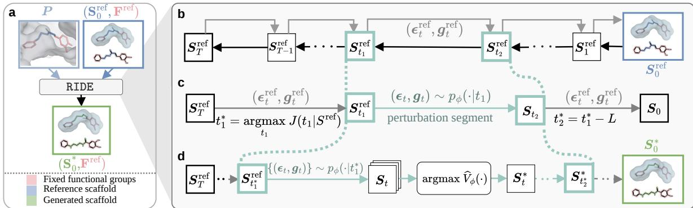  
Figure 1: Overview of RIDE. a, RIDE generates new scaffolds based on a reference scaffold, fixed functional groups, and protein pocket; b, RIDE recovers the noise trajectory for the reference ligand from a diffusion-based molecule generation model adapted to scaffold hopping; c, RIDE identifies a reference-optimal noise trajectory segment for editing; and d, RIDE performs a value-guided transition within the reference-optimal trajectory segment for a controlled editing of the noise trajectory, thus sampling a set of new scaffolds.

We rigorously evaluate RIDE with state-of-the-art baseline models on 60 scaffold hopping tasks for protein-ligand complexes related to major human diseases. Compared to baselines, RIDE consistently generates scaffolds with lower 2D similarity and higher 3D similarity to the reference, with an average improvements of 11.7% and 7.3%, respectively. Further analysis reveals that RIDE can accommodate various reward functions, and can preserve 3D similarity even when this is not explicitly included in the reward. RIDE can be applied iteratively to explore even more structurally distinct scaffolds, where a RIDE-generated molecule is used as a new “reference” to RIDE for further scaffold hopping. Experiments reveal a trade-off in multiple hops between progressively improving the similarity profile and preserving binding. Additionally, two case studies illustrate RIDE’s ability to generate distinct scaffolds with different structures and properties, and its ability to introduce substantial 2D variation while maintaining very high 3D similarity. RIDE is publicly available at https://anonymous.4open.science/r/RIDE-C8A0.

## 2 RELATED WORK

Generative models for Scaffold Hopping Recently, generative models have shown substantial promise in SBDD, LBDD, and scaffold hopping (Zheng et al., 2021; Guan et al., 2023; Torge et al., 2023). SBDD methods generate molecules tailored to specific protein pockets without relying on a reference ligand (Guan et al., 2023; 2024; Huang et al., 2024; Gu et al., 2024; Yang et al.; Gao et al., 2026). For example, IPDiff (Huang et al., 2024) incorporates learned pocket-ligand interaction embeddings into the diffusion processes to generate molecules with strong binding affinity. Similarly, conDitar-dev (Gao et al., 2026) trains its diffusion model to leverage pretrained pocket representations and supports inference-time trajectory optimization to optimize various molecule properties. In contrast to SBDD, LBDD methods leverage known binding ligands as references to generate molecules with high 3D shape similarity to the reference (Chen et al., 2025; Adams et al., 2025; Li et al., 2026). For example, ShEPhERD (Adams et al., 2025) jointly learns molecular structures with 3D shape, electrostatics, and pharmacophore to generate molecules that resemble the reference ligand with respect to these features. Generative models for scaffold hopping can be formulated under either SBDD or LBDD through inpainting (Schneuing et al., 2024; Li et al., 2026) or additional conditioning on functional groups (Torge et al., 2023; Yoo et al., 2024). However, structure-based scaffold hopping and ligand-based scaffold hopping emphasize either binding affinity or the 3D similarity to the reference, respectively. Moreover, current formulations do not explicitly optimize 2D similarity to the reference scaffold. Our work instead incorporates the reference scaffold into the generation process of structure-based models, providing a unified framework for achieving low 2D similarity and high 3D similarity while maintaining strong binding affinity.

## 3 PRELIMINARIES

## 3.1 INVERSION-BASED DIFFUSION METHODS

Inversion-based diffusion methods aim to invert a reference sample into its latent diffusion trajectory and edit the recovered trajectory for controlled generation (Kim et al., 2022; Mokady et al., 2023; Hertz et al., 2022). By editing the recovered trajectory, these methods can generate samples that preserve reference-specific features and introduce desired changes. These methods build upon the reverse sampling process of diffusion models. A common approach to recovering the reference state trajectory is DDIM inversion (Song et al., 2020; Wallace et al., 2023). Starting from a reference sample $s _ { 0 } ^ { \mathrm { r e f } }$ , DDIM inversion maps it back to the corresponding intermediate states $\{ s _ { t } ^ { \mathrm { r e f } } \} _ { t = 1 } ^ { T }$ , where $T$ denotes the total number of diffusion timesteps. The inversion process is represented as

$$
\begin{array} { r } { s _ { t } ^ { \mathrm { r e f } } = \sqrt { \bar { \alpha } _ { t } } \big ( \big ( s _ { t - 1 } ^ { \mathrm { r e f } } - \sqrt { 1 - \bar { \alpha } _ { t - 1 } } \epsilon _ { \theta } \big ( s _ { t - 1 } ^ { \mathrm { r e f } } , t - 1 \big ) \big ) / \sqrt { \bar { \alpha } _ { t - 1 } } \big ) \stackrel { * } { + } \sqrt { 1 - \bar { \alpha } _ { t } } \epsilon _ { \theta } \big ( s _ { t - 1 } ^ { \mathrm { r e f } } , t - 1 \big ) , } \end{array}\tag{1}
$$

where $\epsilon _ { \theta } ( s _ { t } , t )$ is the noise predictor learned during diffusion training, $\bar { \alpha } _ { t } \in ( 0 , 1 )$ is a time-dependent cumulative coefficient determined by the predefined noise schedule. Under DDPM sampling (Ho et al., 2020), each transition $s _ { t } ^ { \mathrm { r e f } }  s _ { t - } ^ { \mathrm { r e f } } .$ along the recovered reference state trajectory is associated with a specific sampling noise $\epsilon _ { t } ^ { \mathrm { r e f } }$ . Therefore, the reference state trajectory can be equivalently represented by a corresponding noise sequence $\{ \epsilon _ { t } ^ { \mathrm { r e f } } \} _ { t = 1 } ^ { T }$ , with each $\epsilon _ { t } ^ { \mathrm { r e f } }$ recovered as follows (Huberman-Spiegelglas et al., 2024),

$$
\epsilon _ { t } ^ { \mathrm { r e f } } = ( s _ { t - 1 } ^ { \mathrm { r e f } } - \mu _ { \theta } ( s _ { t } ^ { \mathrm { r e f } } , t ) ) / \sigma _ { t } ,\tag{2}
$$

where $\begin{array} { r } { \pmb { \mu } _ { \theta } ( \pmb { s } _ { t } , t ) = \frac { 1 } { \sqrt { \alpha _ { t } } } ( \pmb { s } _ { t } - \frac { \beta _ { t } } { \sqrt { 1 - \bar { \alpha } _ { t } } } \pmb { \epsilon } _ { \theta } ( \pmb { s } _ { t } , t ) ) } \end{array}$ is the parameterized mean of the reverse transition distribution, $\beta _ { t }$ is the noise variance schedule at timestep t, and $\sigma _ { t }$ is the predefined standard deviation of the transition distribution.

Although the inversion-based methods were originally proposed for Gaussian diffusion, the inversion can also be extended to categorical diffusion, where each state $s _ { t } ^ { \mathrm { r e f } }$ in the reference trajectory is categorical. The inversion process can be constructed as follows (He et al., 2026), $s _ { t } ^ { \mathrm { r e f } } \sim q ( s _ { t } \mid s _ { t - 1 } ^ { \mathrm { r e f } } )$ (3)

where $q ( s _ { t } \mid s _ { t - 1 } ) = \operatorname { C a t } ( \alpha _ { t } ^ { c } e _ { s _ { t - 1 } } ) + ( 1 - \alpha _ { t } ^ { c } ) { \frac { 1 } { d } } \mathbf { 1 } )$ denotes the categorical forward transition (Hoogeboom et al., 2021), $e _ { s }$ is the one-hot vector corresponding to category $s ,$ d is the number of discrete categories, and $\alpha _ { t } ^ { c } \in ( 0 , 1 )$ is predefined noise schedule at timestep t. Given the recovered categorical reference trajectory $\{ s _ { t } ^ { \mathrm { r e f } } \} _ { t = 1 } ^ { T }$ , the corresponding noise sequence $\{ g _ { t } ^ { \mathrm { r e f } } \} _ { t = 1 } ^ { T }$ can be determined as follows,

$$
\begin{array} { r } { g _ { t , k } ^ { \mathrm { r e f } } = \left[ \operatorname* { m a x } _ { j \neq s _ { i - 1 } ^ { \mathrm { r e f } } } \log p \theta \left( s _ { t - 1 } = j \mid s _ { t } ^ { \mathrm { r e f } } \right) - \log p \theta \left( s _ { t - 1 } = s _ { t - 1 } ^ { \mathrm { r e f } } \mid s _ { t } ^ { \mathrm { r e f } } \right) + \delta \right] _ { + } , \mathrm { i f } \ k = s _ { t - 1 } ^ { \mathrm { r e f } } ; \ \mathrm { o t h e r w i s e } , \ 0 , } \end{array}\tag{4}
$$

where $p _ { \theta } ( s _ { t - 1 } \mid s _ { t } )$ denotes the one-step reverse categorical transition, δ is a small positive margin to ensure that the category can be stricly selected, and $[ \cdot ] _ { + } = \operatorname* { m a x } ( \cdot , 0 )$ denotes the positive-part operator.

## 3.2 VALUE-BASED METHODS FOR INFERENCE-TIME OPTIMIZATION IN DIFFUSION

Inference-time optimization methods for diffusion models focus on modifying their reverse process to improve generated samples with respect to specific objectives (Chung et al., 2022; Tang et al., 2024; Kim et al., 2025). However, most existing approaches rely on gradients (Guo et al., 2026; Yang et al., 2024), which are not often available for objectives in molecular generation (Shen et al., 2025; Tan et al., 2025). Value-based methods provide an alternative for non-differentiable objectives by estimating the expected future reward of an intermediate state $\mathbf { \Delta } _ { \mathbf { \mathcal { S } } _ { t } }$ with the value function defined as $V ( \bar { \pmb { s } _ { t } } ) = \mathbb { E } _ { \pmb { s } _ { 0 } \sim \pmb { p } _ { \theta } ( \cdot | \pmb { s } _ { t } ) } \left[ \mathcal { \bar { R } } ( \pmb { s } _ { 0 } ) \right]$ (Li et al., 2024; Uehara et al., 2025), where $\mathcal { R } ( \cdot )$ is the reward function defined on the final state $\scriptstyle { \pmb { s } } _ { 0 }$

Recent efforts (Kim et al., 2026) reformulate the value estimates using the samples generated from $p _ { \theta } ( s _ { 0 } )$ as follows to bypass potential computational limitations in using $p _ { \theta } ( \cdot \mid s _ { t } )$ (Li et al., 2024; Jain et al., 2025):

$$
V ( s _ { t } ) = \mathbb { E } _ { p _ { \theta } ( s _ { 0 } ) } \left[ q ( s _ { t } \mid s _ { 0 } ) \mathcal { R } ( s _ { 0 } ) \right] / \mathbb { E } _ { p _ { \theta } ( s _ { 0 } ) } \left[ q ( s _ { t } \mid s _ { 0 } ) \right] .\tag{5}
$$

This reformulation enables $V ( s _ { t } )$ to be estimated in two steps: (1) perform s -independent lookahead sampling from the noise prior $q ( s _ { T } )$ to obtain $s _ { 0 }$ and $\mathcal { R } ( s _ { 0 } )$ , and (2) compute $V ( s _ { t } )$ in closed form by connecting $\mathbf { \boldsymbol { s } } _ { t }$ to the lookahead samples $\scriptstyle { \pmb { s } } _ { 0 }$ through the forward transition $q ( s _ { t } \mid s _ { 0 } )$ .

## 4 METHODS

## 4.1 PROBLEM DEFINITION AND NOTATIONS

A ligand can be decomposed into a scaffold and a set of functional groups. The functional groups correspond to atoms involved in key interactions with the ligand’s binding pocket, and the scaffold atoms define the molecular backbone connecting them. Scaffold hopping seeks to identify ligands that preserve the 3D shape and binding pattern of a known reference ligand $( \mathrm { o r } \ ^ { \cdots } r e f e r e n c e ^ { ; 9 } )$ and that are also structurally distinct from it in 2D. Accordingly, we represent a ligand as $M = ( S , F )$ , where S denotes the scaffold and F denotes the functional groups, and represent the protein pocket as $P . \ S , F .$ , and P are all represented as sets of atoms involved, with each atom a characterized by a continuous position x $\in \mathbb { R } ^ { 3 }$ and a categorical atom type $v \in \{ 1 , \ldots , d \}$

Given a pocket P and a reference ligand $M ^ { \mathrm { r e f } } = ( S ^ { \mathrm { r e f } } , F ^ { \mathrm { r e f } } )$ bound to P, scaffold hopping can be formulated as generating a new ligand $M = ( S , \bar { F } ^ { \mathrm { r e f } } )$ by replacing the reference scaffold $S ^ { \mathrm { r e f } }$ with a different, generated scaffold S. Existing methods (Torge et al., 2023; Yoo et al., 2024) typically formulate this problem as conditional scaffold generation using a diffusion model, that is, $S \sim p _ { \theta } ( \cdot \mid P , \dot { F } ^ { \mathrm { \scriptsize { r e f } } } ) .$ , parameterized by $\theta ,$ where the reference scaffold ${ \bf \bar { \cal S } } ^ { \mathrm { r e f } }$ is not involved in the generation process. As a result, the diffusion model cannot explicitly exploit the structural features of the reference scaffold to tailor generation to the desired 2D and 3D similarity profile.

Here, we propose RIDE (Figure 1), a novel reference-anchored editing framework that reformulates scaffold hopping as a principled transformation from the reference scaffold $S ^ { \mathrm { r e f } }$ to a set of new scaffolds S . This formulation enables critical reference-specific features, such as the 3D shape and binding pose, to be preserved while introducing desired 2D changes to the scaffolds. To implement this formulation, RIDE first adapts state-of-the-art SBDD models to scaffold hopping to construct the base model $p _ { \theta } ( S \mid P , F ^ { \mathrm { r e f } } )$ ), with details described in Appendix $\mathrm { A . 1 }$ , and propose an inference-time method that modifies its sampling process to obtain a new distribution $\tilde { p } _ { \theta } ( \tilde { \boldsymbol { S } } \mid \boldsymbol { P } , \boldsymbol { F } ^ { \mathrm { r e f } } ; \boldsymbol { S } ^ { \mathrm { r e f } } )$ anchored to $S ^ { \mathrm { r e f } }$ (Section 4.2). Thus, the new distribution can be identified by solving the following new optimization problem:

$$
\begin{array} { r } { \operatorname* { m a x } _ { \tilde { p } _ { \theta } } \mathbb { E } _ { S \sim \tilde { p } _ { \theta } ( \cdot \vert P , F ^ { \mathrm { r e f } } ; S ^ { \mathrm { r e f } } ) } \left[ \mathcal { R } ( S , S ^ { \mathrm { r e f } } ) \right] , } \end{array}\tag{6}
$$

where $\mathcal { R } ( )$ is the reward function defined as follows:

$$
\begin{array} { r } { \mathcal { R } ( \cdot , S ^ { \mathrm { r e f } } ) = \lambda ( 1 - \mathrm { S i m } _ { 2 \mathrm { D } } ( \cdot , S ^ { \mathrm { r e f } } ) ) + ( 1 - \lambda ) \mathrm { S i m } _ { 3 \mathrm { D } } ( \cdot , S ^ { \mathrm { r e f } } ) , } \end{array}\tag{7}
$$

which considers 2D similarity $\mathrm { S i m _ { 2 D } }$ and 3D similarity $\mathrm { S i m _ { 3 D } }$ to $S ^ { \mathrm { r e f } } ;$ ; and $\lambda \in [ 0 , 1 ]$ balances the two similarities.   
The reward is computed only for structurally valid scaffolds and is set to 0 for invalid ones.

## 4.2 REFERENCE-ANCHORED SCAFFOLD GENERATION VIA NOISE EDITING

Our goal is to construct the generation distribution $\tilde { p } _ { \theta } ( S \mid P , F ^ { \mathrm { r e f } } ; S ^ { \mathrm { r e f } } )$ from the base scaffold generation distribution $p _ { \theta } ( { \cal \check { S } } \mid { \cal P } , { \cal F } ^ { \mathrm { r e f } } )$ . To address the competing objectives of low 2D similarity and high 3D similarity with $S ^ { \mathrm { r e f } }$ desired by the generated scaffolds, we anchor scaffold generation to $S ^ { \mathrm { r e f } }$ retain 3D shape, and apply a new value-guided sampling to encourage simultaneous 2D deviation. The algorithm is summarized in Appendix A.2.

## 4.2.1 REFERENCE NOISE TRAJECTORY RECOVERY

To establish a reference anchor for controlled scaffold generation during inference time, RIDE first recovers the state and noise trajectory reproducing $S ^ { \mathrm { r e f } }$ under the base diffusion model $p _ { \theta } \mathbf { \bar { ( } } S \mathbf { \theta \vert } P , F ^ { \mathrm { r e f } } )$ , as illustrated in Figure 1b. We represent $S ^ { \mathrm { r e f } } \mathrm { a s } ( \mathbf { \bar { X } } ^ { \mathrm { r e f } } , V ^ { \mathrm { r e f } } )$ , where $X ^ { \mathrm { r e f } }$ and $V ^ { \mathrm { r e f } }$ denote the scaffold atom positions and atom types, respectively. As the base model employs Gaussian diffusion for atom positions and categorical diffusion for atom types, we recover the reference position trajectory $\{ X _ { t } ^ { \mathrm { r e f } } \} _ { t = 0 } ^ { T }$ and reference atom-type trajectory $\{ V _ { t } ^ { \mathrm { r e f } } \} _ { t = 0 } ^ { T }$ using Eq. 1 and Eq. 3, respectively, with $X _ { 0 } ^ { \mathrm { r e f } } = X ^ { \mathrm { r e f } }$ and ${ \check { V } } _ { 0 } ^ { \mathrm { r e f } } = { \check { V } } ^ { \mathrm { r e f } }$ . The corresponding position noise trajectory $\{ \check { \epsilon } _ { t } ^ { \mathrm { r e f } } \} _ { t = 1 } ^ { T }$ and atomtype noise trajectory $\langle { g } _ { t } ^ { \mathrm { r e f } } \} _ { t = 1 } ^ { T }$ are then derived from the reference state trajectories using Eq. 2 and Eq. 4, respectively.

Here, we denote the reverse transition with a specific noise sequence from timestep $t _ { 1 }$ to $t _ { 2 } \left( T \geq t _ { 1 } > t _ { 2 } \geq 0 \right)$ as

$$
\begin{array} { r l } { \mathscr { T } _ { \theta , t _ { 1 } : t _ { 2 } } \big ( S _ { t _ { 1 } } , \{ ( \epsilon _ { \tau } , g _ { \tau } ) \} _ { \tau = t _ { 2 } + 1 } ^ { t _ { 1 } } ; P , F ^ { \mathrm { r e f } } \big ) , } \end{array}\tag{8}
$$

and the transition using the reference noise as

$$
\begin{array} { r l } & { \mathcal { T } _ { \theta , t _ { 1 } : t _ { 2 } } ^ { \mathrm { r e f } } ( S _ { t _ { 1 } } ; P , F ^ { \mathrm { r e f } } ) = \mathcal { T } _ { \theta , t _ { 1 } : t _ { 2 } } \big ( S _ { t _ { 1 } } , \{ ( \epsilon _ { \tau } ^ { \mathrm { r e f } } , g _ { \tau } ^ { \mathrm { r e f } } ) \} _ { \tau = t _ { 2 } + 1 } ^ { t _ { 1 } } ; P , F ^ { \mathrm { r e f } } \big ) . } \end{array}\tag{9}
$$

Thus, we have

$$
\begin{array} { r } { S _ { t } ^ { \mathrm { r e f } } = \mathcal { T } _ { \theta , T : t } ^ { \mathrm { r e f } } ( S _ { T } ^ { \mathrm { r e f } } ; P , F ^ { \mathrm { r e f } } ) . } \end{array}\tag{10}
$$

For notational simplicity, we omit P and $F ^ { \mathrm { r e f } }$ in $\mathcal { T } _ { \theta }$ below.

## 4.2.2 REFERENCE TRAJECTORY EDITING VIA NOISE PERTURBATION

RIDE explores alternative scaffolds similar to the reference via reference trajectory editing, and implement this as noise perturbation over a segment of the reference noise trajectory between $t _ { 1 }$ and $t _ { 2 } ,$ with $t _ { 2 } ~ = ~ \operatorname* { m a x } ( t _ { 1 } ~ -$ $L , 0 )$ , where $L \ > \ 0$ is the segment length. Specifically, we design a perturbation distribution $p _ { \phi } ( \epsilon _ { t } , g _ { t } )$

$t _ { 1 } ; P , F ^ { \mathrm { r e f } } , \{ ( \epsilon _ { t } ^ { \mathrm { r e f } } , g _ { t } ^ { \mathrm { r e f } } ) \} _ { t = t _ { 2 } + 1 } ^ { t _ { 1 } } , L )$ over the atom position noise $\epsilon _ { t }$ and type noise $\mathbf { \sigma } _ { \mathbf { \sigma } _ { \mathbf { \sigma } _ { \mathbf { \lambda } } } } \mathbf { \sigma } _ { \mathbf { \sigma } _ { \mathbf { \lambda } } } \mathbf { \sigma } _ { \mathbf { \lambda } _ { \mathbf { \lambda } } } \mathbf { \sigma } _ { \mathbf { \lambda } _ { \mathbf { \lambda } } } \mathbf { \sigma } _ { \mathbf { \lambda } _ { \mathbf { \lambda } } } \mathbf { \sigma } _ { \mathbf { \lambda } _ { \mathbf { \lambda } } } \mathbf { \sigma } _ { \mathbf { \lambda } _ { \mathbf { \lambda } } } \mathbf { \sigma } _ { \mathbf { \lambda } _ { \mathbf { \lambda } } }$ as follows $( P , \ F ^ { \mathrm { r e f } }$ $\{ ( \epsilon _ { t } ^ { \mathrm { r e f } } , \pmb { g } _ { t } ^ { \mathrm { r e f } } ) \} _ { t = t _ { 2 } + 1 } ^ { t _ { 1 } }$ and $L$ are omitted below for simplicity):

$$
\begin{array} { r } { p _ { \phi } ( \epsilon _ { t } , \pmb { g } _ { t } \mid t _ { 1 } ) = p _ { \phi _ { \epsilon } } ( \epsilon _ { t } \mid t _ { 1 } ) p _ { \phi _ { g } } ( \pmb { g } _ { t } \mid t _ { 1 } ) , } \end{array}\tag{11}
$$

where

$$
p _ { \phi _ { \epsilon } } ( \epsilon _ { t } \mid t _ { 1 } ) = \left\{ { \mathcal { N } } ( \epsilon _ { t } ; \mathbf { 0 } , I ) , \quad t _ { 1 } \geq t > t _ { 2 } \right. \qquad p _ { \phi _ { \epsilon } } ( g _ { t } \mid t _ { 1 } ) = \left\{ { \mathrm { G u m b e l } } ( g _ { t } ; 0 , 1 ) , \quad t _ { 1 } \geq t > t _ { 2 } , \right. \qquad \epsilon _ { t } > \epsilon _ { t } ,\tag{12}
$$

$\delta ( \cdot )$ is the Dirac delta function. That is, RIDE explores different trajectories by editing the reference noise $( \epsilon _ { t } ^ { \mathrm { r e f } } , g _ { t } ^ { \mathrm { r e f } } )$ between $t _ { 1 }$ and $t _ { 2 } ,$ , replacing it with sampled noise from $( \mathcal { N } ( \mathbf { 0 } , \pmb { I } )$ , Gumbel(0, 1)), with the remaining noise intact. Unlike existing inversion-based methods that directly modify recovered intermediate states, we perturb the trajectories by resampling the diffusion noise at selected timesteps. This avoids the difficulty of designing appropriate state-space edits and reduces the risk of moving the generation too far from the diffusion manifold. Meanwhile, retaining a majority of the original reference noise trajectories outside $t _ { 1 }$ and $t _ { 2 }$ provides a strong mechanism for preserving 3D shape and binding pose enabled by $p _ { \theta }$

Reference-Optimal Perturbation Segment Selection The optimal trajectory segment to edit depends on the reference ligand. Thus, RIDE adopts a reference-specific strategy to optimally select a noise trajectory segment, illustrated in Figure 1c. RIDE first discretizes the search space of $t _ { 1 }$ as $\begin{array} { r } { t _ { 1 } \in \{ \tau _ { n } = \frac { n T } { N } : n = n _ { 1 } , \dots , \bar { n _ { 2 } } \} } \end{array}$ , where $N > 0$ denotes the number of uniformly sampled timesteps along the full diffusion trajectory, and $n _ { 1 }$ and n specify the allowed range for $t _ { 1 }$ . For each candidate $t _ { 1 }$ , we generate K Monte Carlo samples following Eq. 11 and define a score J to quantify $t _ { 1 }$ over the $K$ samples as follows:

$$
J ( t _ { 1 } \mid S ^ { \mathrm { r e f } } ) = \frac { 1 } { K } \sum _ { k = 1 } ^ { K } \left[ \mathcal { R } ( S ^ { ( k ) } ( t _ { 1 } ) , S ^ { \mathrm { r e f } } ) \right] ,\tag{13}
$$

where

$$
\begin{array} { r } { S ^ { ( k ) } ( t _ { 1 } ) = \mathcal { T } _ { \theta , t _ { 1 } : 0 } ( S _ { t _ { 1 } } ^ { \mathrm { r e f } } , \{ ( \epsilon _ { t } ^ { ( k ) } , g _ { t } ^ { ( k ) } ) \} _ { t = 1 } ^ { t _ { 1 } } ) , \quad \{ ( \epsilon _ { t } ^ { ( k ) } , g _ { t } ^ { ( k ) } ) \} \sim p _ { \phi } ( \cdot \mid t _ { 1 } ) , } \end{array}\tag{14}
$$

and $\mathcal { R } ( )$ is the reward function $( \mathrm { E q . } 7 )$ . Given that the recovered reference trajectory already provides strong preservation of the reference 3D shape, we prioritize reducing 2D similarity when identifying the optimal $t _ { 1 }$ . Thus, we select the optimal $t _ { 1 }$ as follows,

$$
\begin{array} { r } { t _ { 1 } ^ { * } ( S ^ { \mathrm { r e f } } ) = \arg \operatorname* { m a x } _ { t _ { 1 } \in \{ \tau _ { n } \} } J ( t _ { 1 } \mid S ^ { \mathrm { r e f } } ) , \mathrm { a n d ~ t h u s } , t _ { 2 } ^ { * } = \operatorname* { m a x } ( t _ { 1 } ^ { * } - L , 0 ) , } \end{array}\tag{15}
$$

where $L$ is a hyperparameter determining the length of the perturbation segment. That is, the optima $t _ { 1 } ^ { * } \ ( S ^ { \mathrm { r e f } }$ is omitted for simplicity) identifies a segment that produces promising scaffolds under $p _ { \phi } .$ , providing a favorable starting point for subsequent optimization.

## 4.2.3 VALUE-GUIDED SCAFFOLD SAMPLING

With the optimal perturbation segment starting from $t _ { 1 } ^ { * }$ , RIDE estimates the value of each intermediate scaffold state $S _ { t } \ ( t _ { 1 } ^ { * } > t > t _ { 2 } ^ { * } )$ sampled under $p _ { \phi } ( \cdot \mid t _ { 1 } ^ { * } ) \ ( \mathrm { E q . ~ } 1 1 )$ to guide state selection within the segment, as illustrated in Figure 1d. RIDE reformulates the value estimator in Eq. 5 to adapt it to a new reference-anchored sampling, using $S _ { t _ { 1 } ^ { * } } ^ { \mathrm { r e f } }$ and samples from the segment endpoint $t _ { 2 } ^ { * }$

Theorem 1. Given a selected perturbation starting timestep $t _ { 1 } ^ { * }$ and the corresponding reference state $S _ { t _ { 1 } ^ { * } } ^ { \mathrm { r e f } }$ , the value ofany intermediate state $S _ { t } ,$ , where $t _ { 1 } ^ { * } > t > t _ { 2 } ^ { * }$ , can be expressed as

$$
V _ { \phi } ( \pmb { S } _ { t } \mid S _ { t _ { 1 } ^ { * } } ^ { \mathrm { r e f } } ) = \frac { \mathbb { E } _ { p _ { \theta , \phi } ( S _ { t _ { 2 } ^ { * } } \mid S _ { t _ { 1 } ^ { * } } ^ { \mathrm { r e f } } ) } \left[ w ( S _ { t _ { 2 } ^ { * } } ; \pmb { S } _ { t } , S _ { t _ { 1 } ^ { * } } ^ { \mathrm { r e f } } ) \mathcal { R } ( \mathcal { T } _ { \theta , t _ { 2 } ^ { * } ; 0 } ^ { \mathrm { r e f } } ( S _ { t _ { 2 } ^ { * } } ) , S ^ { \mathrm { r e f } } ) \right] } { \mathbb { E } _ { p _ { \theta , \phi } ( S _ { t _ { 2 } ^ { * } } \mid S _ { t _ { 1 } ^ { * } } ^ { \mathrm { r e f } } ) } \left[ w ( S _ { t _ { 2 } ^ { * } } ; \pmb { S } _ { t } , S _ { t _ { 1 } ^ { * } } ^ { \mathrm { r e f } } ) \right] } ,\tag{16}
$$

where

$$
w ( S _ { t _ { 2 } ^ { * } } ; S _ { t } , S _ { t _ { 1 } ^ { * } } ^ { \mathrm { r e f } } ) = q ( S _ { t } \mid S _ { t _ { 2 } ^ { * } } ) / q ( S _ { t _ { 1 } ^ { * } } ^ { \mathrm { r e f } } \mid S _ { t _ { 2 } ^ { * } } ) ,\tag{17}
$$

$\mathcal { R } ( \cdot , S ^ { \mathrm { r e f } } )$ is the reward function (Eq. 7), and $p _ { \theta , \phi } ( S _ { t _ { 2 } ^ { * } } \mid S _ { t _ { 1 } ^ { * } } ^ { \mathrm { r e f } } )$ (conditioning on P and $F ^ { \mathrm { r e f } }$ is omitted for simplicity) denotes the transition distribution from timestep t<sup>∗</sup> to t<sup>∗</sup> under $p _ { \phi } ( \cdot \mid t _ { 1 } ^ { * } )$ and diffusion parameters θ.

The conditioning on $P , F ^ { \mathrm { r e f } }$ and $S ^ { \mathrm { r e f } }$ is also omitted in $V _ { \phi } ( S _ { t } \mid S _ { t _ { 1 } ^ { * } } ^ { \mathrm { r e f } } )$ to align with $p _ { \theta , \phi } ( S _ { t _ { 2 } ^ { * } } \mid S _ { t _ { 1 } ^ { * } } ^ { \mathrm { r e f } } )$ . We provide the proof in Appendix A.3.1. In practice, we approximate the distribution $p _ { \theta , \phi } ( S _ { t _ { 2 } ^ { * } } \mid S _ { t _ { 1 } ^ { * } } ^ { \mathrm { r e f } } )$ using samples obtained from it, which yields a Monte Carlo estimator $\widehat { V } _ { \phi } ( S _ { t } \mid S _ { t _ { 1 } ^ { * } } ^ { \mathrm { r e f } } )$ , described in Appendix A.3.2.

Value-Guided Transition Within the perturbation segment between $t _ { 1 } ^ { * }$ and $t _ { 2 } ^ { * }$ , RIDE performs value-guided greedy search for optimal scaffold state candidates. Specifically, at selected timesteps, given the current state $\bar { S _ { t } ( t _ { 1 } ^ { * } > t - 1 > }$ $t _ { 2 } ^ { * } )$ , RIDE samples noises from $p _ { \phi } ( \cdot \mid t _ { 1 } ^ { * } ) ( \mathrm { E q . 1 1 } )$ , and identifies the optimal noise based on the estimated value (Eq. 21) as follows,

$$
( \epsilon _ { t } ^ { * } , g _ { t } ^ { * } ) = \arg \operatorname* { m a x } _ { ( \epsilon _ { t } , g _ { t } ) \sim p _ { \phi } ( \cdot | t _ { 1 } ^ { * } ) } \widehat { V } _ { \phi } ( \mathcal { T } _ { \theta , t : t - 1 } ( S _ { t } , ( \epsilon _ { t } , g _ { t } ) \mid S _ { t _ { 1 } ^ { * } } ^ { \mathrm { r e f } } ) .\tag{18}
$$

and thus, the optimal next scaffold state as

$$
\begin{array} { r } { \pmb { S } _ { t - 1 } ^ { * } = \mathcal { T } _ { \boldsymbol { \theta } , t : t - 1 } \big ( \pmb { S } _ { t } , \big ( \pmb { \epsilon } _ { t } ^ { * } , \pmb { g } _ { t } ^ { * } \big ) \big ) . } \end{array}\tag{19}
$$

By iteratively selecting the optimal scaffold states along the edited noise trajectories, RIDE provides a new transition distribution to address scaffold hopping (Eq. 6).

## 5 EXPERIMENTS

## 5.1 EXPERIMENTAL SETTING

Datasets We adapt the SBDD models using the training sets of the original models, which are all derived from CrossDocked2020 training data (Francoeur et al., 2020). We evaluate RIDE on the test set introduced by Gao et al. (2026), excluding pocket-ligand complexes for which either no or all ligand atoms are identified as functional-group atoms, resulting in 60 complexes with 58 unique ligands. We use this test set because it focuses exclusively on human protein targets related to major diseases, avoiding the substantial proportion (67%) of non-human targets in the CrossDocked2020 test set and providing a more human-disease-relevant evaluation setting. This test set has no overlap with the CrossDocked2020 training set. The identification of functional-group atoms follows the protocol introduced by Guan et al. (2024). Across the 60 test complexes, ligands have an average of 28.7 heavy atoms, including 13.8 scaffold atoms and 14.9 functional-group atoms.

Baselines We evaluate three types of baselines on scaffold hopping: (1) conDitar (Gao et al., 2026) and IPDiff (Huang et al., 2024), adapted to scaffold hopping (Appendix A.1), referred to as conDitar-a and IPDiff-a, respectively. (2) DiffHopp (Torge et al., 2023); and (3) ShEPhERD (Adams et al., 2025), due to their strong generation performance and the availability of public checkpoints for adaptation. These three models, conDitar-a, IPDiff-a, and DiffHopp, serve two roles in our experiments: they are evaluated directly as scaffold hopping baselines, and they are also used as the base models on which RIDE performs inference-time editing. Details on datasets are available in Appendix A.4.

Evaluation Metrics We evaluate the generated scaffolds from two perspectives: (1) similarities with respect to the reference ligands (Sim<sub>2D</sub>, Sim<sub>3D</sub>), and (2) general physicochemical properties for drug development (Vina S/M/D, QED, SA, Conn.(%)). These metrics are described in detail in Appendix A.5.

Iterative Hopping To explore more structurally distinct scaffolds, we use a generated scaffold S<sup>gen</sup> from RIDE as a new “reference” ligand and apply RIDE over S<sup>gen</sup> for a second “hop.” The details on S<sup>gen</sup> selection are provided in Appendix A.6. We denote RIDE with two hops as RIDE<sup>(2)</sup>, and the original RIDE with one hop as RIDE<sup>(1)</sup>. Note that in RIDE<sup>(2)</sup>, the reward (Eq. 7) in the second hop is evaluated against the original reference $S ^ { \mathrm { r e f } }$

Experimental Protocol In RIDE, we use the same hyperparameters as the corresponding base models. Because RIDE performs atom-level trajectory recovery of the reference scaffold, the edited scaffold is constrained to have the same number of atoms as the reference. To ensure fair comparison, we use the same scaffold size for all baselines. A potential pitfall of encouraging greater 2D structural novelty is that the generated molecules may deviate from the favorable chemical characteristics of the reference, leading to less desirable drug-like properties. Therefore, we introduce a second setting for RIDE<sup>(1)</sup> and RIDE<sup>(2)</sup> where $\mathrm { S i m } _ { 3 \mathrm { D } }$ is replaced with QED in the reward function (Eq. 7). Results under this reward function are indicated by “(QED)”. The implementation details are provided in A.7.

## 5.2 EXPERIMENTAL RESULTS

## 5.2.1 OVERALL COMPARISON

Comparison of RIDE with Baselines Table 1 presents a comprehensive comparison between RIDE and all the baselines. Overall, RIDE<sup>(1)</sup> consistently achieves lower $\mathrm { S i m } _ { 2 \mathrm { D } }$ and higher $\mathrm { S i m } _ { 3 \mathrm { D } }$ than those from corresponding base models (as baselines). In terms of improvement of RIDE with a base model (e.g., RIDE<sup>(1)</sup> with conDitar-a(QED)) over its corresponding base model (e.g., conDitar-a), RIDE<sup>(1)</sup> achieves 11.7% decrease in Sim<sub>2D</sub> and 7.3% increase in Sim on average across all base models (ShEPhERD is excluded in this calculation). Compared to the baselines, the fundamental difference of RIDE is in its value-guided editing over the reference noise trajectories in the base models – the reference noise trajectories help preserve the reference 3D shape during editing, whereas value-guided search directs the generation toward low $\mathrm { S i m } _ { 2 \mathrm { D } } .$ . The superior performance of RIDE<sup>(1)</sup> demonstrates that such editing is able to effectively steer the scaffold generation toward the desired chemical subspace beyond what is explored by the baselines. Meanwhile, on Vina S, RIDE<sup>(1)</sup> achieves an average improvement 39.1% over conDitar-a and DiffHopp, while maintaining similar Vina M and Vina D scores compared to those of all the base models. In terms of Conn.(%), $\mathtt { R I D E } ^ { ( 1 ) }$ also introduces a noticeable average improvement 5.0% over the base models. Although RIDE<sup>(1)</sup> exhibits slight degradation in QED and SA scores, the resulting values remain within acceptable ranges. Such slight degradation also reflects $\mathtt { R I D E } ^ { ( 1 ) } \bar { \mathbf { s } }$ exploration of novel chemical structures essential for scaffold hopping.

Table 1: Comparison of RIDE with baselines on the test set with L = 100. Best and second-best results are shown in bold and underlined, respectively.
<table><tr><td rowspan="2"></td><td rowspan="2">Model</td><td colspan="2">Similarity</td><td colspan="3">Vina</td><td rowspan="2">QED↑</td><td rowspan="2"> $\mathrm { S A \uparrow }$ </td><td rowspan="2">Conn. (%)↑</td></tr><tr><td> $\mathrm { S i m } _ { 2 \mathrm { D } } \downarrow$ </td><td> $\sin _ { 3 \mathrm { D } } \uparrow$ </td><td> $\operatorname { V i n a } S \downarrow$ </td><td>Vina M↓</td><td>Vina D ↓</td></tr><tr><td rowspan="4">Baselines</td><td>conDitar-a</td><td>0.398</td><td>0.795</td><td>-7.192</td><td>-7.753</td><td>-8.564</td><td>0.455</td><td>0.622</td><td>85.2</td></tr><tr><td>IPDiff-a</td><td>0.420</td><td>0.856</td><td>-7.706</td><td>-8.176</td><td>-8.897</td><td>0.456</td><td>0.619</td><td>94.7</td></tr><tr><td>DiffHopp</td><td>0.426</td><td>0.812</td><td>-2.223</td><td>-6.209</td><td>-8.642</td><td>0.535</td><td>0.667</td><td>89.5</td></tr><tr><td>ShEPhÊRD</td><td>0.417</td><td>0.881</td><td>-6.471</td><td>-7.402</td><td>-8.390</td><td>0.404</td><td>0.576</td><td>29.4</td></tr><tr><td rowspan="5">RIDE(1)</td><td>conDitar-a</td><td>0.354</td><td>0.884</td><td>-7.508</td><td>-8.049</td><td>-8.833</td><td>0.427</td><td>0.601</td><td>91.5</td></tr><tr><td>conDitar-a(QED)</td><td>0.354</td><td>0.859</td><td>-7.636</td><td>-8.163</td><td>-8.828</td><td>0.457</td><td>0.610</td><td>95.8</td></tr><tr><td>IPDiff-a</td><td>0.363</td><td>0.903</td><td>-7.422</td><td>-7.975</td><td>-8.688</td><td>0.408</td><td>0.584</td><td>93.1</td></tr><tr><td>IPDiff-a(QED)</td><td>0.356</td><td>0.897</td><td>-7.368</td><td>-7.975</td><td>-8.683</td><td>0.437</td><td>0.581</td><td>93.8</td></tr><tr><td>DiffHopp</td><td>0.395</td><td>0.867</td><td>-4.593</td><td>-6.983</td><td>-8.820</td><td>0.511</td><td>0.696</td><td>96.4</td></tr><tr><td rowspan="5">RIDE(2)</td><td>conDitar-a</td><td>0.325</td><td>0.893</td><td>-7.405</td><td>-7.988</td><td>-8.783</td><td>0.426</td><td>0.607</td><td>93.7</td></tr><tr><td>conDitar-a(QED)</td><td>0.334</td><td>0.844</td><td>-7.488</td><td>-8.064</td><td>-8.801</td><td>0.470</td><td>0.604</td><td>93.0</td></tr><tr><td>IPDiff-a</td><td>0.322</td><td>0.892</td><td>-7.088 -7.046</td><td>-7.604 -7.648</td><td>-8.477</td><td>0.403</td><td>0.587</td><td>95.3</td></tr><tr><td>IPDiff-a(QED)</td><td>0.333 0.372</td><td>0.874 0.863</td><td>-4.759</td><td>-7.109</td><td>-8.550 -8.802</td><td>0.471 0.498</td><td>0.595 0.708</td><td>94.4</td></tr><tr><td>DiffHopp</td><td></td><td></td><td></td><td></td><td></td><td></td><td></td><td>98.2</td></tr></table>

Base model-specific RIDE performance With Sim and Sim in the optimization objectives (Eqs. 6 and 7), RIDE<sup>(1)</sup> exhibits different improvement patterns across the two adapted SBDD models, conDitar-a and IPDiff-a. On conDitar-a, RIDE<sup>(1)</sup> improves both $\mathrm { S i m } _ { 2 \mathrm { D } }$ and $\mathrm { S i m } _ { 3 \mathrm { D } }$ substantially, reducing $\mathrm { S i m } _ { 2 \mathrm { D } }$ by 11.1% while increasing Sim<sub>3D</sub> by 11.2%. In contrast, on IPDiff-a, which starts with worse $\mathrm { S i m } _ { 2 \mathrm { D } }$ and better $\mathrm { S i m } _ { 3 \mathrm { D } }$ as a baseline compared to conDitar-a, $\mathtt { R I D E } ^ { ( 1 ) }$ achieves a larger gain in $\mathrm { S i m } _ { 2 \mathrm { D } }$ (13.6%) but a more moderate improvement in $\mathrm { S i m } _ { 3 \mathrm { D } } ~ ( 5 . 5 \% )$ These results suggest that $\mathtt { R I D E } ^ { ( 1 ) }$ can adapt to different SBDD base models by adjusting its optimization focus based on base models’s generation behaviors. On DiffHopp, RIDE<sup>(1)</sup> also consistently improves both $\mathrm { S i m } _ { 2 \mathrm { D } }$ and $\mathrm { S i m } _ { 3 \mathrm { D } } .$ , with improvements of 7.3% and 6.8%, respectively. Note that DiffHopp has a much worse Vina S ( 2.223) than the other baselines, and therefore, the noise trajectory of the reference ligand, which has high binding affinity and thus good Vina S, could be out of distribution for DiffHopp. The fact that RIDE<sup>(1)</sup> substantially improves Vina S to 4.593 over DiffHopp suggests that its in-distribution perturbation and value-guided editing could partially compensate for the distribution mismatch. Overall, these improvements across different base models demonstrate that RIDE<sup>(1)</sup> can serve as a plug-and-play inference-time editing framework that generalizes across different molecular diffusion models.

In addition to the three structure-based models, we compare $\mathtt { R I D E } ^ { ( 1 ) }$ with the ligand-based model ShEPhERD, which is specifically trained to generate molecules with shapes similar to the reference. $\mathtt { R I D E } ^ { ( 1 ) }$ can achieve Sim<sub>3D</sub> even higher than that of ShEPhERD, demonstrating its strong capability of retaining preferred 3D shapes.

Comparison of Different Reward Functions in RIDE We further investigate whether RIDE remains effective under various reward functions. Under RIDE<sup>(1)</sup>, with a reward function combining $\mathrm { S i m } _ { 2 \mathrm { D } }$ and QED of generated molecules, conDitar-a(QED) and IPDiff-a(QED) achieve 7.0% and 7.1% higher QED than conDitar-a and IPDiff-a, respectively. The corresponding gains increase to 10.3% and 16.9% under RIDE<sup>(2)</sup>. This suggests that RIDE can accommodate different reward functions, and could be extended to other molecular properties through appropriate reward design. Note that although not explicitly optimized, $\mathrm { S i m } _ { 3 \mathrm { D } }$ after Sim<sub>2D</sub> and QED optimization in $\mathtt { R I D E } ^ { ( \mathrm { i } ) }$ still remains higher than that of the corresponding baseline, with improvements of 8.1% and 4.8% for conDitar-a(QED) and IPDiff-$\mathrm { a } ( \mathrm { Q E D } )$ , respectively. This suggests that the reference noise trajectory helps retain favorable 3D shape even when $\mathrm { S i m } _ { 3 \mathrm { D } }$ is not explicitly included in the reward.

Comparison of RIDE<sup>(1)</sup> and RIDE<sup>(2)</sup> Table 1 also shows the performance changes between $\mathtt { R I D E } ^ { ( 1 ) }$ and $\mathtt { R I D E } ^ { ( 2 ) }$ Compared with RIDE<sup>(1)</sup>, RIDE<sup>(2)</sup> generally further reduces Sim<sub>2D</sub> while maintaining high Sim<sub>3D</sub>. For example, Sim<sub>2D</sub> decreases from 0.354 to 0.325 on conDitar-a and from 0.363 to 0.322 on IPDiff-a, while $\mathrm { S i m } _ { 3 \mathrm { D } }$ remains above 0.890 for both models. However, this increased 2D diversification is accompanied by weaker binding affinity: when averaged over conDitar-a and IPDiff-a, with and without QED optimization, Vina $\dot { \mathsf { S } }$ changes from 7.484 under $\mathtt { R I D E } ^ { ( 1 ) }$ to $- 7 . 2 5 7$ under $\mathtt { R I D E } ^ { ( 2 ) }$ . This might be due to the fact that the second hop uses a generated molecule as its anchor. This may cause deviations to accumulate across hops in properties not constrained by the similarity profile, potentially degrading binding affinity. Overall, these results highlight a trade-off in RIDE, and more generally, in scaffold hopping, between progressively improving the similarity profile and preserving binding affinity over multiple hops.

## 5.2.2 COMPARISON OF RANDOM PERTURBATION AND VALUE-GUIDED SAMPLING

Table 2: Comparison of random perturbation and value-guided sampling on $L = T / 1 0$ and $L = T$ (perturbation segment starting from $t _ { 1 } ^ { * }$ to the end of the diffusion trajectory), using conDitar-a as the base model. Best and secondbest results are shown in bold and underlined, respectively.
<table><tr><td rowspan="2"></td><td rowspan="2">L</td><td rowspan="2"></td><td colspan="2">Similarity</td><td colspan="3">Vina</td><td rowspan="2">QED↑</td><td rowspan="2">SA↑</td><td rowspan="2">Conn. (%) ↑</td></tr><tr><td>Sim2D ↓</td><td>Sim3D ↑</td><td>Vina S↓</td><td>Vina M↓</td><td>Vina D↓</td></tr><tr><td rowspan="4">random perturbation (Eq. 11)</td><td rowspan="2"> $T / 1 0$ </td><td> $\mathtt { R I D E } ^ { ( 1 ) }$ </td><td>0.387</td><td>0.898</td><td>-7.742</td><td>-8.213</td><td>-8.840</td><td>0.442</td><td>0.614</td><td>86.6</td></tr><tr><td> $\mathtt { R I D E } ^ { ( 2 ) }$ </td><td>0.343</td><td>0.874</td><td>-7.581</td><td>-8.091</td><td>-8.813</td><td>0.425</td><td>0.604</td><td>90.0</td></tr><tr><td rowspan="2"></td><td> $\mathtt { R I D E } ^ { ( 1 ) }$ </td><td>0.391</td><td>0.866</td><td>-7.837</td><td>-8.308</td><td>-9.028</td><td>0.462</td><td>0.629</td><td>92.3</td></tr><tr><td> $\mathtt { R I D E } ^ { ( 2 ) }$ </td><td>0.356</td><td>0.854</td><td>-7.763</td><td>-8.232</td><td>-8.915</td><td>0.450</td><td>0.620</td><td>95.2</td></tr><tr><td rowspan="4">value-guided sampling (Eq. 18)</td><td rowspan="2"> $T / 1 0$ </td><td> $\mathtt { R I D E } ^ { ( 1 ) }$ </td><td>0.354</td><td>0.884</td><td>-7.508</td><td>-8.049</td><td>-8.833</td><td>0.427</td><td>0.601</td><td>91.5</td></tr><tr><td> $\mathtt { R I D E } ^ { ( 2 ) }$ </td><td>0.325</td><td>0.893</td><td>-7.405</td><td>-7.988</td><td>-8.783</td><td>0.426</td><td>0.607</td><td>93.7</td></tr><tr><td rowspan="2"> $T$ </td><td> $\mathtt { R I D E } ^ { ( 1 ) }$ </td><td>0.340</td><td>0.882</td><td>-7.612</td><td>-8.157</td><td>-8.904</td><td>0.440</td><td>0.628</td><td>95.1</td></tr><tr><td> $\mathtt { R I D E } ^ { ( 2 ) }$ </td><td>0.334</td><td>0.887</td><td>-7.539</td><td>-8.054</td><td>-8.806</td><td>0.432</td><td>0.621</td><td>93.8</td></tr></table>

Table 2 compares results with random perturbation (Eq. 11) and value-guided sampling (Eq. 18) applied in RIDE. We choose conDitar-a for this study because RIDE applied to conDitar-a achieves strong performance and maintaining stable Vina S across hops. Overall, pairwise comparisons across the 4 settings $( \check { T } / \hat { 1 } 0$ vs $T , \mathtt { R I D E } ^ { ( 1 ) }$ vs ${ \tt R I D E } ^ { ( 2 ) } )$ show that value-guided sampling reduces average $\mathrm { S i m } _ { 2 \mathrm { D } }$ by 8.3% and improves Sim by 1.6% relative to random perturbation. This suggests that the performance gains arise from guided search toward desired properties rather than from perturbation-induced changes alone.

Table 2 also compares the performance of RIDE under two perturbation segment lengths: a shorter segment covering one-tenth of the diffusion trajectory $( L = T / 1 0 )$ and a longer segment extending from $t _ { 1 } ^ { * }$ to the end of the diffusion trajectory (denoted as $L = T )$ We use $T / 1 0$ to provide a moderate discretization granularity over the diffusion trajectory, balancing exploration of distinct molecules and preservation of reference shapes. With $L = T / 1 0$ , when averaged over $\mathtt { R I D E } ^ { ( 1 ) }$ and $\mathtt { R I D E } ^ { ( 2 ) }$ , value-guided sampling improves $\mathrm { S i m } _ { 2 \mathrm { D } }$ by 6.9% over random perturbation, with a minor improvement in $\mathrm { S i m } _ { 3 \mathrm { D } }$ of 0.31%. This trend becomes more significant with $L = T$ , where value-guided sampling reduces $\mathrm { S i m } _ { 2 \mathrm { D } }$ by $9 . 6 \%$ and increases $\mathrm { S i m } _ { 3 \mathrm { D } }$ by 2.9%. The larger gains with $L = T$ may be explained by the longer perturbation segment, which preserves less information from the reference structure and provides greater room for value-guided sampling to adjust the similarity profile.

## 5.2.3 COMPARISON OF REFERENCE-OPTIMAL $t _ { 1 } ^ { * }$ AND FIXED $t _ { 1 }$

Figures 2a and 2b illustrate $\mathrm { S i m } _ { 2 \mathrm { D } }$ and $\mathrm { S i m } _ { 3 \mathrm { D } }$ across candidate $t _ { 1 }$ values and at the reference-optimal $t _ { 1 } ^ { * }$ , using conDitar-a and IPDiff-a as the base model, respectively, under random perturbation (Eq. 11). On both hops, compared with a fixed $t _ { 1 }$ , the reference-optimal $t _ { 1 } ^ { * }$ achieves the best $\mathrm { S i m } _ { 2 \mathrm { D } }$ while with competitive $\mathrm { S i m } _ { 3 \mathrm { D } }$ , indicating that the reference-optimal $t _ { 1 } ^ { * }$ identifies a strong starting point for subsequent value-guided sampling. Meanwhile, $\mathtt { R I D E } ^ { ( 1 ) }$ and $\mathtt { R I D E } ^ { ( 2 ) }$ exhibit different trends in $\mathrm { S i m } _ { 2 \mathrm { D } }$ and $\mathrm { S i m } _ { 3 \mathrm { D } }$ across candidate $t _ { 1 }$ values. With $\mathtt { R I D E } ^ { ( 1 ) }$ , a later perturbation improves Sim<sub>3D</sub> at the cost of degrading $\mathrm { S i m } _ { 2 \mathrm { D } }$ , which is consistent with the intuition that later perturbation preserves more of the reference shapes. A similar pattern in $\mathrm { S i m } _ { 2 \mathrm { D } }$ and $\mathrm { S i m } _ { 3 \mathrm { D } }$ is observed with $\mathtt { R I D E } ^ { ( 2 ) }$ , but with lower $\mathrm { S i m } _ { 2 \mathrm { D } }$ and $\mathrm { S i m } _ { 3 \mathrm { D } }$ than those in $\mathtt { R I D E } ^ { ( 1 ) }$ and smaller variations across candidate $t _ { 1 }$ values, indicating that the $\mathtt { R I D E } ^ { ( 2 ) }$ is less sensitive to the choice of perturbation segment. This may be due to the fact that the $\mathtt { R I D E } ^ { ( 2 ) }$ is anchored to a generated molecule that is already structurally distant from the original reference. Therefore, further perturbations can induce only limited additional changes in the similarity profile with respect to the reference molecule.

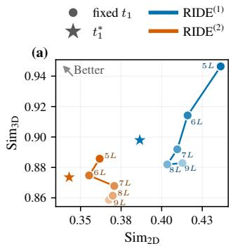

(a)  
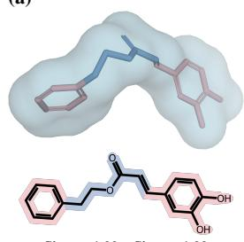

(b)  
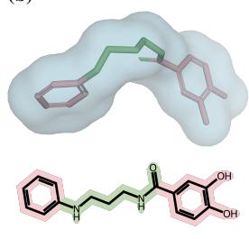

(c)  
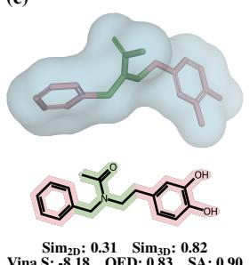  
Figure 3: Example of generated scaffolds for AK1BA (PDB ID: 5liu).

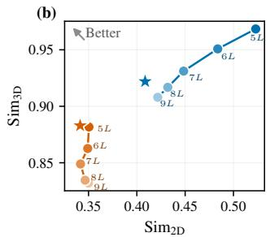  
Figure 2: Comparison of Sim<sub>2D</sub> vs. $\mathrm { S i m } _ { 3 \mathrm { D } }$ across $t _ { 1 } \in \{ n L \} _ { n = 5 } ^ { 9 }$ and t<sup>∗</sup> with $L = T / 1 0$ . (a) conDitar-a; (b) IPDiff-a.

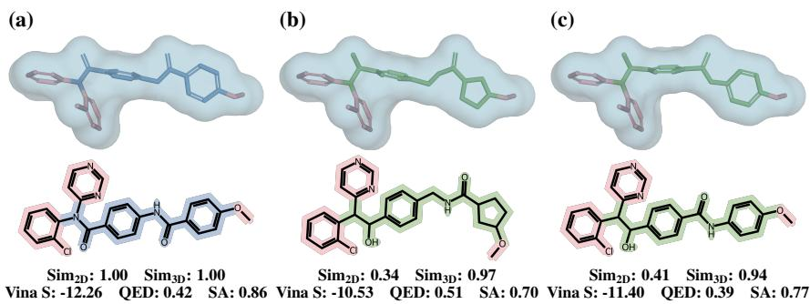  
Figure 4: Example of generated scaffolds for TNKS2 (PDB ID: 5aeh).

## 5.2.4 CASE STUDIES

Figures 3b and 3c show two generated scaffolds by RIDE for AK1BA, a protein target involved in gastrointestinal cancers (Wang et al., 2026). Both generated scaffolds have low $\mathrm { S i m } _ { 2 \mathrm { D } }$ and high $\mathrm { S i m } _ { 3 \mathrm { D } }$ with the reference scaffold, as in Figure 3a. However, these scaffolds differ greatly in flexibility. The scaffold in Figure 3b is more flexible, with 6 rotatable bonds in the linker compared to 5 in that of the reference scaffold. Flexible molecules can better adapt to protein conformation shifts or resistance mutations in cancer (Fang et al., 2014). However, such flexibility often incurs an entropic penalty to the binding energies; this aligns with the slightly lower Vina S observed here. In contrast, the scaffold in Figure 3c has a shorter, more rigid linker than the reference, with only 4 rotatable linker bonds. More rigid molecules tend to have lower entropic binding penalties and higher selectivity, improving effectiveness while reducing off-target effects (Fang et al., 2014), Together, these examples show RIDE can generate scaffolds with different structures and properties.

Figures 4 presents another example from RIDE for TNKS2, a target implicated in many cancers (Huang et al., 2009). Both generated scaffolds (Figures 4b-c) have moderately low $\mathrm { S i m } _ { 2 \mathrm { D } }$ and very high $\mathrm { S i m } _ { 3 \mathrm { D } }$ with the reference scaffold in Figure 4a. The generated scaffolds share some common deviations from the reference: both use carbon to bind the two cyclic functional groups and replace one ketone with an alcohol. These changes alter physicochemical properties (e.g., pKa, lipophilicity) that influence absorption, distribution, metabolism, excretion, and toxicity properties of molecules. The scaffold in Figure 4b also uses cyclopentane in place of one benzene and adds an additional rotatable bond. These changes generally increase flexibility. Meanwhile, the generated scaffolds retain some key reference scaffold features – a benzene ring connected to another ring by a linker with a ketone. This helps the generated scaffolds attain very high Sim<sub>3D</sub>, while still introducing substantial 2D variation via atom-type, bond-type, ring-size, and linker changes.

## 6 CONCLUSION

RIDE is a novel inference-time diffusion editing framework for scaffold hopping. Our experimental results demonstrate that RIDE is effective, consistently generating scaffolds with low 2D similarity and high 3D similarity to the reference scaffold. Furthermore, RIDE has demonstrated its effectiveness under a variety of different settings, including different base models, reward functions, perturbation segment lengths, and number of scaffold hopping iterations. These results motivate future work to extend the framework to optimize additional molecular properties and further improve generated molecule quality. Future work may also investigate the development of more adaptive perturbation strategies for even more effective optimization.

## ACKNOWLEDGMENTS

This project was made possible, in part, by support from the National Science Foundation grant no. IIS-2435819 (X.N.), the National Library of Medicine grant no. 1R01LM014385 (X.N.), and the Sanofi iDEA-TECH Awards North America (X.N.). Any opinions, findings, conclusions or recommendations expressed in this paper are those of the authors and do not necessarily reflect the views of the funding agency. The authors would like to thank Benjamin Burns and Ye Liu for their proofreading of the manuscript. The authors would also like to thank Daniel Adu-ampratwum for a helpful discussion regarding case study molecules.

## AI USE STATEMENT

During the preparation of this work, the authors used AI tools to assist with language editing, improving the clarity of the manuscript, and identifying relevant literature. All AI-assisted content was reviewed and verified by the authors.

## ETHICS STATEMENT

RIDE is a novel inference-time diffusion editing framework for scaffold hopping, which is an important problem in chemistry. While we have not designed RIDE for any unsafe or harmful purpose, we acknowledge that not all generated scaffolds and molecules are safe, and that RIDE could generate harmful content. Therefore, we strongly encourage responsible human expert supervision for any use of RIDE or its generated scaffolds and molecules. Specifically, human expert chemists should verify the safety of any generated scaffolds and molecules before any attempt is made to synthesize or test them in the laboratory. Furthermore, we exhort all users of RIDE to follow all applicable safety regulations, ethical guidelines, laws, and professional best practices.

## REPRODUCIBILITY STATEMENT

All the source code has been made available at https://anonymous.4open.science/r/RIDE-C8A0. All the datasets are public. We reported all the experimental protocal in Section 5.1, and all the hyperparameters in Appendix A.6.

## REFERENCES

Keir Adams, Kento Abeywardane, Jenna Fromer, and Connor Coley. Shepherd: Diffusing shape, electrostatics, and pharmacophores for bioisosteric drug design. In International Conference on Learning Representations, volume 2025, pp. 32280–32342, 2025.

Hans-Joachim Bohm, Alexander Flohr, and Martin Stahl. Scaffold hopping.¨ Drug discovery today: Technologies, 1 (3):217–224, 2004.

Ziqi Chen, Bo Peng, Tianhua Zhai, Daniel Adu-Ampratwum, and Xia Ning. Generating 3d small binding molecule using shape-conditioned diffusion models with guidance. Nature machine intelligence, 7(5):758–770, 2025.

Hyungjin Chung, Jeongsol Kim, Michael T Mccann, Marc L Klasky, and Jong Chul Ye. Diffusion posterior sampling for general noisy inverse problems. arXiv preprint arXiv:2209.14687, 2022.

Jerome Eberhardt, Diogo Santos-Martins, Andreas F. Tillack, and Stefano Forli. Autodock vina 1.2.0: New docking methods, expanded force field, and python bindings. Journal of Chemical Information and Modeling, 61(8):3891– 3898, 08 2021. ISSN 1549-9596. doi: 10.1021/acs.jcim.1c00203. URL https://doi.org/10.1021/acs. jcim.1c00203.

Zengjun Fang, Yu’ning Song, Peng Zhan, Qingzhu Zhang, and Xinyong Liu. Conformational restriction: an effective tactic in ‘follow-on’-based drug discovery. Future medicinal chemistry, 6(8):885–901, 2014.

Paul G. Francoeur, Tomohide Masuda, Jocelyn Sunseri, Andrew Jia, Richard B. Iovanisci, Ian Snyder, and David R. Koes. Three-dimensional convolutional neural networks and a cross-docked data set for structure-based drug design. Journal of Chemical Information and Modeling, 60(9):4200–4215, 09 2020. ISSN 1549-9596. doi: 10.1021/acs. jcim.0c00411. URL https://doi.org/10.1021/acs.jcim.0c00411.

Ruoxi Gao, Jiangweizhi Peng, Ziqi Chen, Frazier N Baker, David C Kombo, John L Kane Jr, Andrew A Scholte, Yi Li, Matthew J LaMarche, Luigi I Iconaru, et al. Generating developable 3d molecules via pocket-conditioned diffusion and property-aware optimization. arXiv preprint arXiv:2607.12349, 2026.

Siyi Gu, Minkai Xu, Alexander Powers, Weili Nie, Tomas Geffner, Karsten Kreis, Jure Leskovec, Arash Vahdat, and Stefano Ermon. Aligning target-aware molecule diffusion models with exact energy optimization. Advances in neural information processing systems, 37:44040–44063, 2024.

Jiaqi Guan, Wesley Wei Qian, Xingang Peng, Yufeng Su, Jian Peng, and Jianzhu Ma. 3d equivariant diffusion for target-aware molecule generation and affinity prediction. arXiv preprint arXiv:2303.03543, 2023.

Jiaqi Guan, Xiangxin Zhou, Yuwei Yang, Yu Bao, Jian Peng, Jianzhu Ma, Qiang Liu, Liang Wang, and Quanquan Gu. Decompdiff: diffusion models with decomposed priors for structure-based drug design. arXiv preprint arXiv:2403.07902, 2024.

Yingqing Guo, Yukang Yang, Hui Yuan, and Mengdi Wang. Training-free guidance beyond differentiability: Scalable path steering with tree search in diffusion and flow models. Advances in Neural Information Processing Systems, 38:73343–73384, 2026.

Paul CD Hawkins, A Geoffrey Skillman, and Anthony Nicholls. Comparison of shape-matching and docking as virtual screening tools. Journal of medicinal chemistry, 50(1):74–82, 2007.

Xiaoxiao He, Quan Dao, Ligong Han, Song Wen, Minhao Bai, Di Liu, Han Zhang, Felix Juefei-Xu, Chaowei Tan, Bo Liu, et al. Dice: Discrete inversion enabling controllable editing for masked generative models. In 2026 IEEE/CVF Winter Conference on Applications of Computer Vision (WACV), pp. 762–772. IEEE, 2026.

Amir Hertz, Ron Mokady, Jay Tenenbaum, Kfir Aberman, Yael Pritch, and Daniel Cohen-Or. Prompt-to-prompt image editing with cross attention control.(2022). URL https://arxiv. org/abs/2208.01626, 3(3), 2022.

Jonathan Ho, Ajay Jain, and Pieter Abbeel. Denoising diffusion probabilistic models. Advances in neural information processing systems, 33:6840–6851, 2020.

Emiel Hoogeboom, Didrik Nielsen, Priyank Jaini, Patrick Forre, and Max Welling. Argmax flows and multinomial´ diffusion: Learning categorical distributions. Advances in neural information processing systems, 34:12454–12465, 2021.

Shih-Min A Huang, Yuji M Mishina, Shanming Liu, Atwood Cheung, Frank Stegmeier, Gregory A Michaud, Olga Charlat, Elizabeth Wiellette, Yue Zhang, Stephanie Wiessner, et al. Tankyrase inhibition stabilizes axin and antagonizes wnt signalling. Nature, 461(7264):614–620, 2009.

Zhilin Huang, Ling Yang, Xiangxin Zhou, Zhilong Zhang, Wentao Zhang, Xiawu Zheng, Jie Chen, Yu Wang, Bin CUI, and Wenming Yang. Protein-ligand interaction prior for binding-aware 3d molecule diffusion models. In B. Kim, Y. Yue, S. Chaudhuri, K. Fragkiadaki, M. Khan, and Y. Sun (eds.), International Conference on Learning Representations, volume 2024, pp. 18453–18474, 2024. URL https://proceedings.iclr.cc/paper\_ files/paper/2024/file/50ca96a1a9ebe0b5e5688a504feb6107-Paper-Conference.pdf.

Inbar Huberman-Spiegelglas, Vladimir Kulikov, and Tomer Michaeli. An edit friendly ddpm noise space: Inversion and manipulations. In 2024 IEEE/CVF Conference on Computer Vision and Pattern Recognition (CVPR), pp. 12469–12478. IEEE, 2024.

Vineet Jain, Kusha Sareen, Mohammad Pedramfar, and Siamak Ravanbakhsh. Diffusion tree sampling: Scalable inference-time alignment of diffusion models. In The Thirty-ninth Annual Conference on Neural Information Processing Systems, 2025. URL https://openreview.net/forum?id=3D88hCO0Gd.

Gwanghyun Kim, Taesung Kwon, and Jong Chul Ye. Diffusionclip: Text-guided diffusion models for robust image manipulation. In 2022 IEEE/CVF Conference on Computer Vision and Pattern Recognition (CVPR), pp. 2416– 2425. IEEE, 2022.

Sunwoo Kim, Minkyu Kim, and Dongmin Park. Test-time alignment of diffusion models without reward over optimization. In International Conference on Learning Representations, volume 2025, pp. 87238–87272, 2025.

Yeongmin Kim, Donghyeok Shin, Byeonghu Na, Minsang Park, Richard Lee Kim, and Il chul Moon. Lookahead sample reward guidance for test-time scaling of diffusion models. In Forty-third International Conference on Machine Learning, 2026. URL https://openreview.net/forum?id=IbRm6gwmew.

Bohao Li, Xinyu Wu, Yu Cao, Jie Lin, Jingpeng Zhong, Hua Chen, Yongzhi Lu, Miru Tang, Jinping Lei, Ting Ran, et al. De novo molecular design via shape-constrained diffusion models. Journal of Chemical Information and Modeling, 66(8):4592–4606, 2026.

Xiner Li, Yulai Zhao, Chenyu Wang, Gabriele Scalia, Gokcen Eraslan, Surag Nair, Tommaso Biancalani, Shuiwang Ji, Aviv Regev, Sergey Levine, et al. Derivative-free guidance in continuous and discrete diffusion models with soft value-based decoding. arXiv preprint arXiv:2408.08252, 2024.

Shitong Luo, Jiaqi Guan, Jianzhu Ma, and Jian Peng. A 3d generative model for structure-based drug design. Advances in neural information processing systems, 34:6229–6239, 2021.

Ron Mokady, Amir Hertz, Kfir Aberman, Yael Pritch, and Daniel Cohen-Or. Null-text inversion for editing real images using guided diffusion models. In 2023 IEEE/CVF Conference on Computer Vision and Pattern Recognition (CVPR), pp. 6038–6047. IEEE, 2023.

Arne Schneuing, Charles Harris, Yuanqi Du, Kieran Didi, Arian Jamasb, Ilia Igashov, Weitao Du, Carla Gomes, Tom L Blundell, Pietro Lio, et al. Structure-based drug design with equivariant diffusion models. Nature Computational Science, 4(12):899–909, 2024.

Yuchen Shen, Chenhao Zhang, Sijie Fu, Chenghui Zhou, Newell Washburn, and Barnabas Poczos. Chemistry-inspired diffusion with non-differentiable guidance. In International Conference on Learning Representations, volume 2025, pp. 10211–10245, 2025.

Jiaming Song, Chenlin Meng, and Stefano Ermon. Denoising diffusion implicit models. arXiv preprint arXiv:2010.02502, 2020.

Kim Yong Tan, Yueming Lyu, Ivor Tsang, and Yew-Soon Ong. Fast direct: Query-efficient online black-box guidance for diffusion-model target generation. In International Conference on Learning Representations, volume 2025, pp. 19385–19422, 2025.

Zhiwei Tang, Jiangweizhi Peng, Jiasheng Tang, Mingyi Hong, Fan Wang, and Tsung-Hui Chang. Inference-time alignment of diffusion models with direct noise optimization. arXiv preprint arXiv:2405.18881, 2024.

Jos Torge, Charles Harris, Simon V Mathis, and Pietro Lio. Diffhopp: A graph diffusion model for novel drug design via scaffold hopping. arXiv preprint arXiv:2308.07416, 2023.

Masatoshi Uehara, Yulai Zhao, Chenyu Wang, Xiner Li, Aviv Regev, Sergey Levine, and Tommaso Biancalani. Inference-time alignment in diffusion models with reward-guided generation: Tutorial and review. arXiv preprint arXiv:2501.09685, 2025.

Bram Wallace, Akash Gokul, and Nikhil Naik. Edict: Exact diffusion inversion via coupled transformations. In 2023 IEEE/CVF Conference on Computer Vision and Pattern Recognition (CVPR), pp. 22532–22541. IEEE, 2023.

Chen Wang, Zhuang Xiong, Xiang Wang, Jing Liang, Haoyang Li, Siqi He, Chengkun Wang, and Yang Zhang. The pathway network of aldo-keto reductase 1b10: a new perspective on gene-targeted therapy. npj Gut and Liver, 3(1): 20, 2026.

Brian Yang, Huangyuan Su, Nikolaos Gkanatsios, Tsung-Wei Ke, Ayush Jain, Jeff Schneider, and Katerina Fragkiadaki. Diffusion-es: Gradient-free planning with diffusion for autonomous and instruction-guided driving. In 2024 IEEE/CVF Conference on Computer Vision and Pattern Recognition (CVPR), pp. 15342–15353. IEEE, 2024.

Julong Yang, Wen Huang, Junhui Chen, and Jian Peng. Decode: Decoupling binding position and molecular conformation in 3d ligand diffusion for structure-based drug design. In Forty-third International Conference on Machine Learning.

Yuwei Yang, Xiaoqing Gong, Shukai Gu, Jing Li, Bo Liu, Yanan Tian, Qianqian Zhang, Xiaojun Yao, and Huanxiang Liu. Diffusion-based generative model with scaffold-hopping strategy yields highly potent bioactive molecules. Advanced Science, pp. e75674, 2026.

Kiwoong Yoo, Owen Oertell, Junhyun Lee, Sanghoon Lee, and Jaewoo Kang. Turbohopp: accelerated molecule scaffold hopping with consistency models. Advances in neural information processing systems, 37:41157–41185, 2024.

Shuangjia Zheng, Zengrong Lei, Haitao Ai, Hongming Chen, Daiguo Deng, and Yuedong Yang. Deep scaffold hopping with multimodal transformer neural networks. Journal of cheminformatics, 13(1):87, 2021.

## A APPENDIX

## A.1 ADAPTING DIFFUSION-BASED SBDD MODELS TO SCAFFOLD HOPPING

To adapt a pretrained diffusion-based SBDD model, denoted as $p _ { \theta } ( ( S , F ) \mid P )$ , to a base model $p _ { \theta } ( S \mid P , F ^ { \mathrm { r e f } } )$ for scaffold hopping, with $F ^ { \mathrm { r e f } }$ as additional conditioning, we fix ${ \dot { \mathbf { F } } } ^ { \mathrm { r e f } }$ and restrict the diffusion loss to scaffold atoms and update the diffusion parameters as follows,

$$
\begin{array} { r } { \operatorname* { m i n } _ { \theta } \mathbb { E } _ { t , M _ { t } } \left[ \sum _ { i = 1 } ^ { n } \mathbb { I } ( \pmb { a } _ { i } \in \pmb { S } _ { t } ) \mathcal { L } _ { \theta } ^ { i } ( M _ { t } ; \pmb { P } , t ) \right] , } \end{array}\tag{20}
$$

where $M _ { t } = ( S _ { t } , F ^ { \mathrm { r e f } } )$ denotes the partially noised ligand with fixed functional groups at $t , \mathbb { I } ( a _ { i } \in S _ { t } )$ indicates whether the i-th atom belongs to the noised scaffold $S _ { t }$ , and $\mathcal { L } _ { \theta } ^ { i }$ denotes the SBDD diffusion loss on the i-th atom.

Although the additional conditioning can also be imposed through inpainting during inference time of SBDD models, inpainting can create a mismatch with the distribution $p _ { \theta } ( ( S , \mathbf { \bar { F } } ) \mid \mathbf { \bar { \phi } } _ { P ) }$ learned during training, potentially leading to invalid molecular structures and unfavorable conformations. The distribution mismatch may also make the model more vulnerable to modifications on the diffusion trajectory, thereby reducing control over the generated structures. Compared to training a conditional generative model from scratch or inpainting, adapting a pretrained SBDD model offers multiple benefits: Adaptation leverages the pretrained SBDD model’s capacity as a strong prior for generating chemically valid molecules with favorable binding affinity and 3D shapes; it also optimizes the model parameters to accommodate the additional conditioning $( F ^ { \mathrm { r e f } } )$ .

## A.2 ALGORITHMS

## A.2.1 RIDE

Algorithm 1 RIDE   
Input: Protein pocket $P ,$ reference scaffold and functional groups $( S ^ { \mathrm { r e f } } , F ^ { \mathrm { r e f } } )$ , perturbation length $L ,$ diffusion   
model θ   
Output: Generated scaffold $S _ { 0 }$   
Reference noise trajectory recovery   
1: $\{ ( X _ { t } ^ { \mathrm { r e f } } , V _ { t } ^ { \mathrm { r e f } } ) \} _ { t = 0 } ^ { T } , \stackrel { \bullet } { \{ ( \epsilon _ { t } ^ { \mathrm { r e f } } , \pmb { g } _ { t } ^ { \mathrm { r e f } } ) \} } _ { t = 1 } ^ { T } = \mathrm { I N V E R S I O N } ( S ^ { \mathrm { r e f } } , P , F ^ { \mathrm { r e f } } )$ ▷ Details in Algorithm 2   
Reference-optimal perturbation segment selection   
2: $t _ { 1 } ^ { * } = s$ EGMENTSELECTION( $\{ ( \boldsymbol { X } _ { t } ^ { \mathrm { r e f } } , \boldsymbol { V } _ { t } ^ { \mathrm { r e f } } ) \} , \{ ( \epsilon _ { t } ^ { \mathrm { r e f } } , g _ { t } ^ { \mathrm { r e f } } ) \} , P , F ^ { \mathrm { r e f } } , L )$ ▷ Details in Algorithm 3   
3: $t _ { 2 } ^ { \star } \gets \operatorname* { m a x } ( t _ { 1 } ^ { * } - L , 0 )$   
Value-guided scaffold sampling   
4: S<sub>t</sub>∗ = VALUEGUIDEDSAMPLING( $\{ ( \boldsymbol { X } _ { t } ^ { \mathrm { r e f } } , \boldsymbol { V } _ { t } ^ { \mathrm { r e f } } ) \} , \{ ( \epsilon _ { t } ^ { \mathrm { r e f } } , g _ { t } ^ { \mathrm { r e f } } ) \} , \boldsymbol { P } , \boldsymbol { F } ^ { \mathrm { r e f } } , t _ { 1 } ^ { * } , t _ { 2 } ^ { * } )$ ▷ Details in Algorithm 4   
5: ${ \overline { { S _ { 0 } } } } ^ { \mathrm { ~ - ~ } } = \mathcal { T } _ { \theta , t _ { 2 } ^ { * } : 0 } ^ { \mathrm { r e f } } ( S _ { t _ { 2 } ^ { * } } )$ ▷ Reuse reference noise   
6: return $S _ { 0 }$

RIDE is summarized in Algorithm 1. The following sections describe each component in detail.

## A.2.2 REFERENCE TRAJECTORY INVERSION

The inversion of reference scaffold is summarized in Algorithm 2.

## A.2.3 OPTIMAL t<sub>1</sub> SELECTION

The procedure for selecting $t _ { 1 } ^ { * }$ is summarized in Algorithm 3.

## A.2.4 VALUE-GUIDED SAMPLING

The procedure for value estimation and value-guided sampling is summarized in Algorithm 4.

```latex
Algorithm 2 Trajectory Inversion of $S ^ { \mathrm { r e f } }$
1: function INVERSION $( S ^ { \mathrm { r e f } } , P , F ^ { \mathrm { r e f } } )$
2: $( X _ { 0 } ^ { \mathrm { r e f } } , V _ { 0 } ^ { \mathrm { r e f } } )  ( X ^ { \mathrm { r e f } } , V ^ { \mathrm { r e f } } )$
3: for ${ t } = 1 , \ldots , T . \mathbf { d o }$
4: $\hat { \epsilon } \gets \tilde { \epsilon } _ { \theta } ( X _ { t - 1 } ^ { \mathrm { r e f } } , t - 1 ; V _ { t - 1 } ^ { \mathrm { r e f } } , P , F ^ { \mathrm { r e f } } )$
5: ${ \bf { X } } _ { t } ^ { \mathrm { { r e f } } }  \sqrt { \bar { \alpha } _ { t } } ( \frac { X _ { t - 1 } ^ { \mathrm { { r e f } } } - \sqrt { 1 - \bar { \alpha } _ { t - 1 } } \hat { \epsilon } } { \sqrt { \bar { \alpha } _ { t - 1 } } } ) + \sqrt { 1 - \bar { \alpha } _ { t } } \hat { \epsilon }$
6: $V _ { t } ^ { \mathrm { r e f } } \sim q \left( V _ { t } \mid V _ { t - 1 } ^ { \mathrm { r e f } } \right)$
7: for $t = 1 , \dots , T$ do
8: $\epsilon _ { t } ^ { \mathrm { r e f } }  \frac { X _ { t - 1 } ^ { \mathrm { r e f } } - \mu _ { \theta } ( X _ { t } ^ { \mathrm { r e f } } , t ; V _ { t } ^ { \mathrm { r e f } } , P , F ^ { \mathrm { r e f } } ) } { - }$
σ
9: $\hat { p } _ { t } \gets p _ { \theta } ( V _ { t - 1 } \mid X _ { t } ^ { \mathrm { r e f } } , V _ { t } ^ { \mathrm { r e f } } ; P , F ^ { \mathrm { r e f } } )$
10: $c _ { i } ^ { \mathrm { r e f } } \gets V _ { t - 1 , i } ^ { \mathrm { r e f } } , \quad i = 1 , \ldots , n$
11: $g _ { t , i , k } ^ { \mathrm { r e f } }  \{ [ \underset { j \neq c _ { i } ^ { \mathrm { r e f } } } { \operatorname* { m a x } } \log \hat { p } _ { t , i , j } - \log \hat { p } _ { t , i , c _ { i } ^ { \mathrm { r e f } } } + \delta ] _ { + } , k = c _ { i } ^ { \mathrm { r e f } } , $
$i = 1 , \ldots , n , \quad k = 1 , \ldots , d$
12: return $\{ ( \boldsymbol { X } _ { t } ^ { \mathrm { r e f } } , \boldsymbol { V } _ { t } ^ { \mathrm { r e f } } ) \} _ { t = 0 } ^ { T } , \{ ( \boldsymbol { \epsilon } _ { t } ^ { \mathrm { r e f } } , \boldsymbol { g } _ { t } ^ { \mathrm { r e f } } ) \} _ { t = 1 } ^ { T }$
13: end function
```

Algorithm 3 Selection of $t _ { 1 }$   
1: function SEGMENTSELECTION $\{ ( \boldsymbol { X } _ { t } ^ { \mathrm { r e f } } , \boldsymbol { V } _ { t } ^ { \mathrm { r e f } } ) \} , \{ ( \epsilon _ { t } ^ { \mathrm { r e f } } , g _ { t } ^ { \mathrm { r e f } } ) \} , P , F ^ { \mathrm { r e f } } , L )$   
2: for $\begin{array} { r } { t _ { 1 } \in \{ \tau _ { n } = \frac { n T } { N } : n = n _ { 1 } , . . . , n _ { 2 } \} } \end{array}$ do   
3: for $k = 1 , \dots , K$ do   
4: $\{ ( \epsilon _ { t } ^ { ( k ) } , \pmb { g } _ { t } ^ { ( k ) } ) \} \sim p _ { \phi } ( \cdot \mid t _ { 1 } )$   
5: $S ^ { ( k ) } ( t _ { 1 } ) \gets \mathcal { T } _ { \theta , t _ { 1 } : 0 } ( S _ { t _ { 1 } } ^ { \mathrm { r e f } } , \{ ( \epsilon _ { t } ^ { ( k ) } , \mathbf { \vec { g } } _ { t } ^ { ( k ) } ) \} )$   
6: $\begin{array} { r } { J ( t _ { 1 } \mid P , F ^ { \mathrm { r e f } } , S ^ { \mathrm { r e f } } , L ) \gets \frac { 1 } { K } \sum _ { k = 1 } ^ { K } \left[ \eta ( 1 - \mathrm { S i m } _ { 2 \mathrm { D } } ( S ^ { ( k ) } ( t _ { 1 } ) , S ^ { \mathrm { r e f } } ) ) + ( 1 - \eta ) \mathrm { S i m } _ { 3 \mathrm { D } } ( S ^ { ( k ) } ( t _ { 1 } ) , S ^ { \mathrm { r e f } } ) \right] } \end{array}$   
7: $\begin{array} { r } { t _ { 1 } ^ { * } \gets \arg \operatorname* { m a x } _ { t _ { 1 } } J ( t _ { 1 } \mid P , F ^ { \mathrm { r e f } } , S ^ { \mathrm { r e f } } , L ) } \end{array}$   
8: return $t _ { 1 } ^ { * }$   
9: end function

Algorithm 4 Value-Guided Sampling   
1: function VALUEGUIDEDSAMPLING( $\{ ( X _ { t } ^ { \mathrm { r e f } } , V _ { t } ^ { \mathrm { r e f } } ) \} , \{ ( \epsilon _ { t } ^ { \mathrm { r e f } } , g _ { t } ^ { \mathrm { r e f } } ) \} , P , F ^ { \mathrm { r e f } } , t _ { 1 } ^ { * } , t _ { 2 } ^ { * } )$   
2: $S _ { t _ { 1 } ^ { * } } \gets S _ { t _ { 1 } ^ { * } } ^ { \mathrm { r e f } }$   
3: for $m = 1 , \ldots , M$ do   
4: $S _ { t _ { 2 } ^ { * } } ^ { ( m ) } \sim p _ { \theta } ( S _ { t _ { 2 } ^ { * } } \mid S _ { t _ { 1 } ^ { * } } ^ { \mathrm { r e f } } ) , \quad R ^ { ( m ) } = \mathcal { R } ( \mathcal { T } _ { \theta , t _ { 2 } ^ { * } ; 0 } ^ { \mathrm { r e f } } ( S _ { t _ { 2 } ^ { * } } ^ { ( m ) } ) , S ^ { \mathrm { r e f } } )$ ▷ Prepare lookahead samples   
5: for $t = t _ { 1 } ^ { * } , \ldots , t _ { 2 } ^ { * } + 1$ do   
6: if t is a guided timestep then   
7: for $\bar { b } = 1 , \dotsc , B$ do   
8: $( \epsilon _ { t } ^ { ( b ) } , g _ { t } ^ { ( b ) } ) \sim p _ { \phi } ( \cdot \mid t _ { 1 } ^ { * } ) , ~ S _ { t - 1 } ^ { ( b ) } = \mathcal { T } _ { \theta , t : t - 1 } ( S _ { t } , ( \epsilon _ { t } ^ { ( b ) } , g _ { t } ^ { ( b ) } ) )$ ▷ Propose a candidate for selection   
9: $\widehat { V } ^ { ( b ) } = \widehat { V } _ { \phi } ( S _ { t - 1 } ^ { ( b ) } \mid S _ { t _ { 1 } ^ { * } } ^ { \mathrm { r e f } } )$ ▷ Estimate value using Eq. 21   
10: $b ^ { * } = \arg \operatorname* { m a x } _ { b } \widehat V ^ { ( b ) } , \quad \dot { S _ { t - 1 } } \gets S _ { t - 1 } ^ { ( b ^ { * } ) }$ ▷ Value-guided selection   
11: else   
12: $( \epsilon _ { t } , g _ { t } ) \sim p _ { \phi } ( \cdot \mid t _ { 1 } ^ { * } ) , ~ S _ { t - 1 } = \mathcal { T } _ { \theta , t : t - 1 } ( S _ { t } , ( \epsilon _ { t } , g _ { t } ) )$ ▷ Reverse transition without selection   
13: return $S _ { t _ { 2 } ^ { * } }$   
14: end function

## A.3 ADDITIONAL THEORIES

## A.3.1 PROOF FOR THEOREM 1

Proof. By definition, the value of an intermediate state $S _ { t }$ is the expected terminal reward obtained by continuing the reverse process from $S _ { t }$

Then,

$$
\begin{array} { r l r } { \varepsilon _ { \mathrm { S S } } ^ { ( 2 ) } = } & { \nu _ { 0 } ^ { 2 } \nu _ { 0 } ^ { 2 } - \nu _ { 0 } ^ { 2 } \nu _ { 0 } ^ { 2 } } & { \nu _ { 0 } ^ { 2 } \nu _ { 0 } ^ { 2 } } \\ & { } & { - \int \{ \nu _ { 0 } \mathbf { x } _ { 0 } ^ { \perp \perp } \mathbf { x } _ { 0 } ^ { \perp \perp } \mathbf { x } _ { 0 } ^ { \perp \perp } \mathbf { x } _ { 0 } ^ { \perp \perp } \nu _ { 0 } ^ { 2 } \mathbf { x } _ { 0 } ^ { \perp \perp } \nu _ { 0 } ^ { 2 } \mathbf { x } _ { 0 } ^ { \perp \perp } \nu _ { 0 } ^ { 2 } \mathbf { x } _ { 0 } ^ { \perp \perp } \nu _ { 0 } ^ { 2 } \mathbf { x } _ { 0 } ^ { \perp \perp }  } \\ & { } & {  \int \{ \alpha \mathbf { x } _ { 0 } ^ { \perp \perp } \mathbf { x } _ { 0 } ^ { \perp \perp } \mathbf { x } _ { 0 } ^ { \perp \perp } - \nu _ { 0 } ^ { 2 } \nu _ { 0 } ^ { 2 } \mathbf { x } _ { 0 } ^ { \perp \perp } \nu _ { 0 } ^ { 2 } \mathbf { x } _ { 0 } ^ { \perp \perp } \nu _ { 0 } ^ { 2 } \mathbf { x } _ { 0 } ^ { \perp \perp } \nu _ { 0 } ^ { 2 } \mathbf { x } _ { 0 } ^ { \perp \perp } \nu _ { 0 } ^ { 2 } \mathbf { x } _ { 0 } ^ { \perp \perp }   } \\ & { } &  -   \int \int \alpha \mathbf { x } _ { 0 } ^ { \perp \perp } \mathbf { x } _ { 0 } ^ { \perp \perp } \mathbf { x } _ { 0 } ^ { \perp \perp } \mathbf { x } _ { 0 } ^ { \perp \perp } \mathbf { x } _ { 0 } ^ { \perp \perp } \mathbf { x } _ { 0 } ^ { \perp \perp } \mathbf { x } _ { 0 } ^ { \perp \perp } \mathbf { x } _ { 0 } ^ { \perp \perp } \mathbf  \end{array}
$$

## A.3.2 THEOREM 2

Theorem 2. Given M samples $\{ S _ { t _ { 2 } ^ { * } } ^ { ( m ) } \} _ { m = 1 } ^ { M } f r o m p _ { \theta , \phi } ( S _ { t _ { 2 } ^ { * } } \mid S _ { t _ { 1 } ^ { * } } ^ { \mathrm { r e f } } )$ , the value ofan intermediate state $S _ { t }$ in $E q$ . 16 can be estimated as

$$
\widehat { V } _ { \phi } ( S _ { t } \mid S _ { t _ { 1 } ^ { * } } ^ { \mathrm { r e f } } ) = \sum _ { m = 1 } ^ { M } \mathrm { s o f t m a x } _ { m } ( \{ \ell _ { t } ^ { ( j ) } \} _ { j = 1 } ^ { M } ) { \mathcal R } ( { \mathcal T } _ { \theta , t _ { 2 } ^ { * } ; 0 } ^ { \mathrm { r e f } } ( S _ { t _ { 2 } ^ { * } } ^ { ( m ) } ) , S ^ { \mathrm { r e f } } ) ,\tag{21}
$$

where

$$
\ell _ { t } ^ { ( m ) } = \log q ( S _ { t } \mid S _ { t _ { 2 } ^ { * } } ^ { ( m ) } ) - \log q ( S _ { t _ { 1 } ^ { * } } ^ { \mathrm { r e f } } \mid S _ { t _ { 2 } ^ { * } } ^ { ( m ) } ) .\tag{22}
$$

The two log-transition terms in $\ell _ { t } ^ { ( m ) }$ are calculated in closed form using the Gaussian forward kernel for atom positions and the categorical forward kernel for atom types. We provide the proof and detailed derivation of the log-transition terms below.

## Proof for theorem 2

Proof. By applying a Monte Carlo approximation to the expectations in Eq. 16, we obtain

$$
\widehat { V } _ { \phi } ( S _ { t } \mid S _ { t _ { 1 } ^ { * } } ^ { \mathrm { r e f } } ) = \frac { \sum _ { m = 1 } ^ { M } \frac { q ( S _ { t } \mid S _ { t _ { 2 } ^ { * } } ^ { ( m ) } ) } { q ( S _ { t _ { 1 } ^ { * } } ^ { \mathrm { r e f } } \mid S _ { t _ { 2 } ^ { * } } ^ { ( m ) } ) } \mathcal { R } ( \mathcal { T } _ { \theta , t _ { 2 } ^ { * } ; 0 } ^ { \mathrm { r e f } } ( S _ { t _ { 2 } ^ { * } } ^ { ( m ) } ) , S ^ { \mathrm { r e f } } ) } { \sum _ { m = 1 } ^ { M } \frac { q ( S _ { t } \mid S _ { t _ { 2 } ^ { * } } ^ { ( m ) } ) } { q ( S _ { t _ { 1 } ^ { * } } ^ { \mathrm { r e f } } \mid S _ { t _ { 2 } ^ { * } } ^ { ( m ) } ) } } ,
$$

with $\begin{array} { r } { w _ { t } ^ { ( m ) } = \frac { q ( S _ { t } | S _ { t _ { 2 } ^ { * } } ^ { ( m ) } ) } { q ( S _ { t _ { 1 } ^ { * } } ^ { \mathrm { r e f } } | S _ { t _ { 2 } ^ { * } } ^ { ( m ) } ) } } \end{array}$ and $\begin{array} { r } { \widetilde { w } _ { t } ^ { ( m ) } = \frac { w _ { t } ^ { ( m ) } } { \sum _ { j = 1 } ^ { M } w _ { t } ^ { ( j ) } } , } \end{array}$

$$
\widehat { V } _ { \phi } ( S _ { t } \mid S _ { t _ { 1 } ^ { * } } ^ { \mathrm { r e f } } ) = \sum _ { m = 1 } ^ { M } \widetilde { w } _ { t } ^ { ( m ) } { \mathcal R } ( { \mathcal T } _ { \theta , t _ { 2 } ^ { * } \colon 0 } ^ { \mathrm { r e f } } ( S _ { t _ { 2 } ^ { * } } ^ { ( m ) } ) , S ^ { \mathrm { r e f } } ) .
$$

Define

$$
\ell _ { t } ^ { ( m ) } = \log q ( S _ { t } \mid S _ { t _ { 2 } ^ { * } } ^ { ( m ) } ) - \log q ( S _ { t _ { 1 } ^ { * } } ^ { \mathrm { r e f } } \mid S _ { t _ { 2 } ^ { * } } ^ { ( m ) } ) ,
$$

then,

$$
\widetilde { w } _ { t } ^ { ( m ) } = \frac { \exp ( \ell _ { t } ^ { ( m ) } ) } { \sum _ { j = 1 } ^ { M } \exp ( \ell _ { t } ^ { ( j ) } ) } = \mathrm { s o f t m a x } _ { m } ( \{ \ell _ { t } ^ { ( j ) } \} _ { j = 1 } ^ { M } ) .
$$

Therefore,

$$
\widehat { V } _ { \phi } ( S _ { t } \mid S _ { t _ { 1 } ^ { * } } ^ { \mathrm { r e f } } ) = \sum _ { m = 1 } ^ { M } \mathrm { s o f t m a x } _ { m } ( \{ \ell _ { t } ^ { ( j ) } \} _ { j = 1 } ^ { M } ) \mathcal { R } ( { \cal T } _ { \theta , t _ { 2 } ^ { * } ; 0 } ^ { \mathrm { r e f } } ( S _ { t _ { 2 } ^ { * } } ^ { ( m ) } ) , S ^ { \mathrm { r e f } } ) .
$$

## Detailed derivations of log transitions

Proof. The forward transition factorizes over atom positions and atom types,

$$
q ( S _ { t } \mid S _ { t _ { 2 } ^ { * } } ) = q ( X _ { t } \mid X _ { t _ { 2 } ^ { * } } ) q ( V _ { t } \mid V _ { t _ { 2 } ^ { * } } ) ,
$$

then,

$$
\log q ( S _ { t } \mid S _ { t _ { 2 } ^ { * } } ) = \log q ( X _ { t } \mid X _ { t _ { 2 } ^ { * } } ) + \log q ( V _ { t } \mid V _ { t _ { 2 } ^ { * } } ) .
$$

Similarly,

$$
\log q ( S _ { t _ { 1 } ^ { * } } ^ { \mathrm { r e f } } \mid S _ { t _ { 2 } ^ { * } } ) = \log q ( S _ { t _ { 1 } ^ { * } } ^ { \mathrm { r e f } } \mid X _ { t _ { 2 } ^ { * } } ) + \log q ( V _ { t _ { 1 } ^ { * } } ^ { \mathrm { r e f } } \mid V _ { t _ { 2 } ^ { * } } ) .
$$

Therefore,

$$
\ell _ { t } ^ { ( m ) } = \ell _ { t , X } ^ { ( m ) } + \ell _ { t , V } ^ { ( m ) } ,
$$

where

$$
\begin{array} { r } { \ell _ { t , X } ^ { ( m ) } = \log q ( X _ { t } \mid X _ { t _ { 2 } ^ { * } } ^ { ( m ) } ) - \log q ( X _ { t _ { 1 } ^ { * } } ^ { \mathrm { r e f } } \mid X _ { t _ { 2 } ^ { * } } ^ { ( m ) } ) , } \end{array}
$$

and

$$
\ell _ { t , V } ^ { ( m ) } = \log q ( V _ { t } \mid V _ { t _ { 2 } ^ { * } } ^ { ( m ) } ) - \log q ( V _ { t _ { 1 } ^ { * } } ^ { \mathrm { r e f } } \mid V _ { t _ { 2 } ^ { * } } ^ { ( m ) } ) .
$$

For atom positions, the DDPM forward process admits the closed-form transition

$$
q ( \boldsymbol { X } _ { t } \mid \boldsymbol { X } _ { t _ { 2 } ^ { * } } ) = \mathcal { N } ( \boldsymbol { X } _ { t } ; \sqrt { \frac { \bar { \alpha } _ { t } ^ { x } } { \bar { \alpha } _ { t _ { 2 } ^ { * } } ^ { x } } } \boldsymbol { X } _ { t _ { 2 } ^ { * } } , ( 1 - \frac { \bar { \alpha } _ { t } ^ { x } } { \bar { \alpha } _ { t _ { 2 } ^ { * } } ^ { x } } ) \boldsymbol { I } ) .
$$

Let

$$
\alpha _ { t | t _ { 2 } ^ { * } } ^ { x } = \frac { \bar { \alpha } _ { t } ^ { x } } { \bar { \alpha } _ { t _ { 2 } ^ { * } } ^ { x } } , \qquad \sigma _ { t | t _ { 2 } ^ { * } } ^ { 2 } = 1 - \alpha _ { t | t _ { 2 } ^ { * } } ^ { x } .
$$

Then, for a scaffold with n atoms,

$$
\log q ( \pmb { X } _ { t } \mid \pmb { X } _ { t _ { 2 } ^ { * } } ^ { ( m ) } ) = - \frac { 3 n } { 2 } \log ( 2 \pi \sigma _ { t \mid t _ { 2 } ^ { * } } ^ { 2 } ) - \frac { \left\| \pmb { X } _ { t } - \sqrt { \alpha _ { t \mid t _ { 2 } ^ { * } } ^ { x } } \pmb { X } _ { t _ { 2 } ^ { * } } ^ { ( m ) } \right\| _ { 2 } ^ { 2 } } { 2 \sigma _ { t \mid t _ { 2 } ^ { * } } ^ { 2 } } .
$$

Similarly,

$$
\log q ( X _ { t _ { 1 } ^ { * } } ^ { \mathrm { r e f } } \mid X _ { t _ { 2 } ^ { * } } ^ { ( m ) } ) = - \frac { 3 n } { 2 } \log ( 2 \pi \sigma _ { t _ { 1 } ^ { * } | t _ { 2 } ^ { * } } ^ { 2 } ) - \frac { \left\| X _ { t _ { 1 } ^ { * } } ^ { \mathrm { r e f } } - \sqrt { \alpha _ { t _ { 1 } ^ { * } | t _ { 2 } ^ { * } } ^ { x } } X _ { t _ { 2 } ^ { * } } ^ { ( m ) } \right\| _ { 2 } ^ { 2 } } { 2 \sigma _ { t _ { 1 } ^ { * } | t _ { 2 } ^ { * } } ^ { 2 } } .
$$

Therefore,

$$
\begin{array} { l } { { \displaystyle \ell _ { t , { X } } ^ { ( m ) } = - \frac { 3 n } { 2 } \log \frac { \sigma _ { t \mid t _ { 2 } ^ { * } } ^ { 2 } } { \sigma _ { t _ { 1 } ^ { * } \mid t _ { 2 } ^ { * } } ^ { 2 } } - \frac { \left\| { X } _ { t } - \sqrt { \alpha _ { t \mid t _ { 2 } ^ { * } } ^ { x } } { X } _ { t _ { 2 } ^ { * } } ^ { ( m ) } \right\| _ { 2 } ^ { 2 } } { 2 \sigma _ { t \mid t _ { 2 } ^ { * } } ^ { 2 } } } } \\ { { \displaystyle ~ + \frac { \left\| { X } _ { t _ { 1 } ^ { * } } ^ { \mathrm { r e f } } - \sqrt { \alpha _ { t _ { 1 } ^ { * } \mid t _ { 2 } ^ { * } } ^ { x } } { X } _ { t _ { 2 } ^ { * } } ^ { ( m ) } \right\| _ { 2 } ^ { 2 } } { 2 \sigma _ { t _ { 1 } ^ { * } \mid t _ { 2 } ^ { * } } ^ { 2 } } . } } \end{array}
$$

For atom types, the forward process is

$$
q ( V _ { t } \mid V _ { t _ { 2 } ^ { * } } ) = \operatorname { C a t } ( \alpha _ { t \mid t _ { 2 } ^ { * } } ^ { c } { \mathrm { ~ o n e h o t } } ( V _ { t _ { 2 } ^ { * } } ) + ( 1 - \alpha _ { t \mid t _ { 2 } ^ { * } } ^ { c } ) { \frac { 1 } { d } } { \bf 1 } ) ,
$$

where

$$
\alpha _ { t | t _ { 2 } ^ { * } } ^ { c } = \frac { \bar { \alpha } _ { t } ^ { c } } { \bar { \alpha } _ { t _ { 2 } ^ { * } } ^ { c } } .
$$

For a n-atom scaffold,

$$
\log q ( { V _ { t } \mid V _ { t _ { 2 } ^ { * } } ^ { ( m ) } } ) = \sum _ { i = 1 } ^ { n } \log \left[ \alpha _ { t | t _ { 2 } ^ { * } } ^ { c } \mathrm { o n e h o t } ( V _ { t _ { 2 } ^ { * } , i } ^ { ( m ) } ) + ( 1 - \alpha _ { t | t _ { 2 } ^ { * } } ^ { c } ) \frac { 1 } { d } { \bf 1 } \right] _ { V _ { t , i } } ,
$$

and

$$
\log q ( { V _ { t _ { 1 } ^ { * } } ^ { \mathrm { r e f } } } \ | \ V _ { t _ { 2 } ^ { * } } ^ { ( m ) } ) = \sum _ { i = 1 } ^ { n } \log \left[ \alpha _ { t _ { 1 } ^ { * } | t _ { 2 } ^ { * } } ^ { c } \ \mathrm { o n e h o t } ( V _ { t _ { 2 } ^ { * } , i } ^ { ( m ) } ) + ( 1 - \alpha _ { t _ { 1 } ^ { * } | t _ { 2 } ^ { * } } ^ { c } ) \frac { 1 } { d } \mathbf { 1 } \right] _ { V _ { t _ { 1 } ^ { * } , i } ^ { \mathrm { r e f } } } .
$$

Therefore,

$$
\begin{array} { l } { { \displaystyle \ell _ { t , V } ^ { ( m ) } = \sum _ { i = 1 } ^ { n } \log ( \left[ \alpha _ { t \mid t _ { 2 } ^ { * } } ^ { c } \mathrm { o n e h o t } ( V _ { t _ { 2 } ^ { * } , i } ^ { ( m ) } ) + ( 1 - \alpha _ { t \mid t _ { 2 } ^ { * } } ^ { c } ) \frac { 1 } { d } { \bf 1 } \right] _ { V _ { t , i } } ) } } \\ { { \displaystyle ~ - \sum _ { i = 1 } ^ { n } \log ( \left[ \alpha _ { t _ { 1 } ^ { * } \mid t _ { 2 } ^ { * } } ^ { c } \mathrm { o n e h o t } ( V _ { t _ { 2 } ^ { * } , i } ^ { ( m ) } ) + ( 1 - \alpha _ { t _ { 1 } ^ { * } \mid t _ { 2 } ^ { * } } ^ { c } ) \frac { 1 } { d } { \bf 1 } \right] _ { V _ { t _ { 1 } ^ { * } , i } ^ { * } } ) . } } \end{array}
$$

## A.4 BASELINES FOR EXPERIMENTS

We evaluate three types of baselines on scaffold hopping: (1) SBDD models adapted to scaffold hopping (Appendix A.1), (2) a structure-based scaffold hopping model, DiffHopp (Torge et al., 2023) and (3) a ligand-based scaffold hopping model, ShEPhERD (Adams et al., 2025). For SBDD models, we choose two recent state-of-the-art diffusion-based models, conDitar (Gao et al., 2026) and IPDiff (Huang et al., 2024), due to their strong generation performance and the availability of public checkpoints for adaptation. To enable stable trajectory recovery and bet ter preservation of reference shape and interaction with the binding pockets, we slightly modify IPDiff’s generation process, with details provided in Appendix A.8. We denote the adapted models of conDitar and IPDiff as conDitar-a and IPDiff-a, respectively. We also include DiffHopp, the only structure-based diffusion model for scaffold hopping with publicly available checkpoints. These three models, conDitar-a, IPDiff-a, and DiffHopp, serve two roles in our experiments: they are evaluated directly as scaffold hopping baselines, and they are also used as the base models on which RIDE performs inference-time editing. In addition to these models, we use a ligand-based model, ShEPhERD, as a baseline. ShEPhERD performs scaffold hopping via ligand-based inpainting given 3D shape, functional group, and/or electrostatic conditions. We do not use ShEPhERD as a base model for RIDE because it generates molecule through inpainting, making both RIDE and its adaptation strategy not directly applicable.

## A.5 EVALUATION METRICS

We evaluate the generated scaffolds from two perspectives: (1) similarities with respect to the reference ligands, and (2) general physicochemical properties for drug development. Please note, we use similarities between entire molecules as a proxy for scaffold similarity, as functional groups already remain fixed for a given reference. For similarities with the reference ligands, we use $\mathrm { S i m } _ { 2 \mathrm { D } }$ , which is measured by the Tanimoto distance between molecular fingerprints, and $\mathrm { S i m } _ { 3 \mathrm { D } }$ , which is calculated using ROCS tool following Hawkins et al. (2007). To ensure that reference functionalgroup atoms remain at the same positions in the generated and reference molecules, we skip the pre-alignment step in ROCS before $\mathrm { S i m } _ { 3 \mathrm { D } }$ computation, ensuring $\mathrm { S i m } _ { 3 \mathrm { D } }$ reflects the generated pose. For general physicochemical properties, we report three binding affinity metrics predicted by AutoDock Vina (Eberhardt et al., 2021): Vina Score (Vina S) on the original generated pose, Vina Minimization (Vina M) after local energy minimization, and Vina Dock (Vina D) after docking. We also use quantitative estimates of drug-likeness (QED) and synthetic accessibility (SA) following Luo et al. (2021) as metrics to assess the overall physicochemical profile and synthesizability of generated molecules. In addition, following Torge et al. (2023), we evaluate Conn.(%), defined as the percentage of generated molecules in which the generated scaffold is successfully connected to reference functional groups. For each reference ligand, we generate 100 samples and consider only the resulting valid and connected molecules for evaluation. Each metric is first averaged over the generated molecules on a per-reference basis and then across all test complexes.

## A.6 ANCHOR MOLECULE SELECTION FOR RIDE<sup>(2)</sup>

For $\mathtt { R I D E } ^ { ( 2 ) }$ , we select the anchor molecule from the molecules generated in one hop using a simple hierarchical filtering procedure. For each reference, we first retain the top 30% of molecules according to 3D shape similarity to the reference, and then select the candidate with the lowest 2D similarity as the anchor for two hops.

## A.7 IMPLEMENTATION DETAILS AND REPRODUCIBILITY

$\mathtt { R I D E } ^ { ( 1 ) }$ uses $\lambda = 1$ in its reward for reference-optimal perturbation segment selection for all models. $\mathtt { R I D E } ^ { ( 2 ) }$ follows the same settings, except for IPDiff-a, where $\lambda = 0 . 7$ segment selection. During value-guided scaffold sampling, $\mathtt { R I D E } ^ { ( 1 ) }$ uses $\lambda = 0 . 8$ for its reward, while $\mathtt { R I D E } ^ { ( 2 ) }$ uses $\lambda = 0 . 5$ to better encourage retaining the reference 3D shape over multiple hops. Both conDitar-a and IPDiff-a use $T = 1 0 0 0$ , following their original papers (Gao et al., 2026; Huang et al., 2024). For these models, $\mathtt { R I D E } ^ { ( 1 ) }$ and $\mathtt { R I D E } ^ { ( 2 ) }$ use $N = 1 0 , n _ { 1 } = 5$ and $n _ { 2 } = 9$ . DiffHopp uses $T = 5 0 0 \mathrm { . }$ following its original paper (Torge et al., 2023). Therefore, RIDE<sup>(1)</sup> and $\mathtt { R I D E } ^ { ( 2 ) }$ use $N = 5 , n _ { 1 } = 3$ and $n _ { 2 } = 5$ for this model to maintain the same segment length as other models. For selecting optimal segment in 13, we use $K = 1 0 0$ For estimating the value in 21, we use $\bar { M } = 1 0 0 0$

## A.8 MODIFICATION TO IPDIFF’S GENERATION PROCESS

IPDiff extends the standard SBDD diffusion process by incorporating protein-ligand interaction embeddings into both the forward and reverse diffusion processes. During generation, IPDiff dynamically extracts the interaction embeddings at each timestep using the predicted clean ligand from the previous timestep, leading to transition distributions evolving over the denoising trajectory. To enable a consistent and stable trajectory recovery and preserve the reference 3D shape and pocket-ligand interaction pattern, we modify IPDiff’s original inference process by fixing the interaction embeddings to those extracted from the anchor ligand during generation in both hopping iterations.

## A.9 ADDITIONAL EXPERIMENTAL RESULTS

Comparison of Value-Guided Sampling and Random Perturbation under QED optimization We observe a similar behavior to that in Figure 2 when the downstream objective is changed from $\mathrm { S i m } _ { 3 \mathrm { D } }$ to QED, as shown in Figure 5. Across candidate $t _ { 1 }$ values, lower $\mathrm { S i m } _ { 2 \mathrm { D } }$ is accompanied by changes in QED, showing that the perturbation starting timestep also controls the trade-off between the $\mathrm { S i m } _ { 2 \mathrm { D } }$ and QED objectives. By comparing the QED curves with the $\mathrm { S i m } _ { 3 \mathrm { D } }$ curves, we observe that QED and $\mathrm { S i m } _ { 3 \mathrm { D } }$ show similar responses to the perturbation starting timestep, with higher QED generally corresponding to higher $\mathrm { S i m } _ { 3 \mathrm { D } }$ under random perturbation. This suggests that 3D preservation is partially aligned with good QED. Our similarity-based dynamic timestep selection also identifies a reasonable starting point balancing $\mathrm { S i m } _ { 2 \mathrm { D } }$ , QED and $\mathrm { S i m } _ { 3 \mathrm { D } }$ for subsequent optimization.

Comparison of Inversion and Non-Inversion By comparing results with and without inversion in Table 3, we observe that removing inversion leads to worse Sim<sub>3D</sub> and $\mathrm { S i m } _ { 2 \mathrm { D } }$ , highlighting the importance of trajectory inversion in balancing 2D novelty and 3D shape preservation. With RIDE<sup>(1)</sup>, trajectory inversion consistently improves both objectives, increasing $\mathrm { S i m } _ { 3 \mathrm { D } }$ from 0.833 to 0.866 at $t _ { 1 } ^ { * }$ and from 0.852 to 0.882 after search, while also reducing Sim<sub>2D</sub>. With $\mathtt { R I D E } ^ { ( 2 ) }$ , the improvement is more modest but remains consistent, with Sim<sub>3D</sub> increasing from 0.845 to 0.854 at $t _ { 1 } ^ { * }$ and from 0.884 to 0.887 after search, together with a further improvement in $\mathrm { S i m } _ { 2 \mathrm { D } }$ after value-guided sampling.

Table 3: Comparison of generation results with and without trajectory inversion using conDitar-a as the base model. Random perturbation corresponds to generation under $p _ { \phi } ( \cdot \mid t _ { 1 } ^ { * } )$ , while value-guided sampling further performs search from $t _ { 1 } ^ { * } \mathrm { t o } t = 0 .$ . Best and second-best results are shown in bold and underlined, respectively.
<table><tr><td rowspan="2">Inversion</td><td rowspan="2">Sampling</td><td rowspan="2"></td><td colspan="2">Similarity</td><td colspan="3">Vina</td><td rowspan="2"> $\mathrm { Q E D \uparrow }$ </td><td rowspan="2"> $\mathrm { S A \uparrow }$ </td><td rowspan="2">Conn. (%) ↑</td></tr><tr><td> $\mathrm { S i m } _ { 2 \mathrm { D } }$  →</td><td> $\sin _ { 3 \mathrm { D } } \uparrow$ </td><td>Vina S↓</td><td>VinaM↓</td><td> $\mathrm { V i n a D \downarrow }$ </td></tr><tr><td rowspan="4">V</td><td>random perturbation</td><td> $\mathtt { R I D E } ^ { ( 1 ) }$   $\mathtt { R I D E } ^ { ( 2 ) }$ </td><td>0.391 0.356</td><td>0.866 0.854</td><td>-7.837 -7.763</td><td>-8.308 -8.232</td><td>-9.028 -8.915</td><td>0.462 0.450</td><td>0.629 0.620</td><td>92.3 95.2</td></tr><tr><td>value-guided</td><td> $\mathtt { R I D E } ^ { ( 1 ) }$ </td><td></td><td></td><td></td><td></td><td></td><td></td><td></td><td></td></tr><tr><td>sampling</td><td> $\mathtt { R I D E } ^ { ( 2 ) }$ </td><td>0.340 0.334</td><td>0.882 0.887</td><td>-7.612 -7.539</td><td>-8.157 -8.054</td><td>-8.904 -8.806</td><td>0.440 0.432</td><td>0.628 0.621</td><td>95.1 93.8</td></tr><tr><td></td><td></td><td></td><td></td><td></td><td></td><td></td><td></td><td></td><td></td></tr><tr><td rowspan="4">x</td><td>random perturbation</td><td> $\mathtt { R I D E } ^ { ( 1 ) }$   $\mathtt { R I D E } ^ { ( 2 ) }$ </td><td>0.401 0.354</td><td>0.833 0.845</td><td>-7.668 -7.825</td><td>-8.144 -8.275</td><td>-8.794 -8.853</td><td>0.460 0.450</td><td>0.623 0.622</td><td>91.7 97.2</td></tr><tr><td></td><td></td><td></td><td></td><td></td><td></td><td></td><td></td><td></td><td></td></tr><tr><td>value-guided</td><td> $\mathtt { R I D E } ^ { ( 1 ) }$ </td><td>0.353</td><td>0.852</td><td> $- 7 . 4 9 7$ </td><td>-7.985</td><td>-8.757</td><td>0.426</td><td>0.634</td><td>95.9</td></tr><tr><td>sampling</td><td> $\mathtt { R I D E } ^ { ( 2 ) }$ </td><td>0.341</td><td>0.884</td><td>-7.644</td><td>-8.220</td><td>-9.053</td><td>0.443</td><td>0.624</td><td>94.7</td></tr></table>

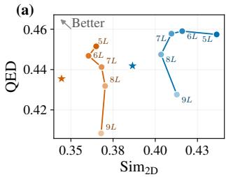

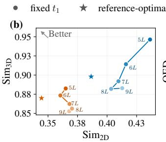

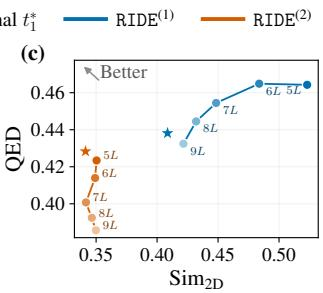

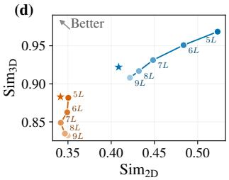  
Figure 5: Comparison of $\mathrm { S i m } _ { 2 \mathrm { D } }$ vs. QED and Sim<sub>2D</sub> vs. $\mathrm { S i m } _ { 3 \mathrm { D } }$ results across $t _ { 1 }$ values $( \{ n L \} _ { n = 5 } ^ { 9 } )$ and $t _ { 1 } ^ { * }$ with $L \stackrel { - } { = } T / 1 0$ , under reward function of $\mathrm { S i m } _ { 2 \mathrm { D } }$ and QED. (a)-(b): conDitar-a, (c)-(d): IPDiff-a.

Sensitivity to λ Figure 6 reports the results of two hops with λ varied from 0 to 1 in increments of 0.1. Across the tested values, increasing λ is associated with lower Sim and a gradual decrease in Sim . This trend is consistent with the role of λ in the reward, where larger values prioritize 2D dissimilarity over 3D similarity. The other molecular properties, including QED and SA, remain relatively stable across different λ values. Vina S shows moderate variation with better values generally observed at higher $\mathrm { S i m } _ { 3 \mathrm { D } }$ . Among the Pareto-optimal subset of the tested λ values, $\lambda = 0 . 5$ provides a favorable trade-off between low $\mathrm { S i m } _ { 2 \mathrm { D } }$ and high $\mathrm { S i m } _ { 3 \mathrm { D } }$

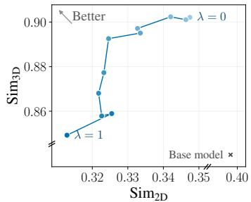

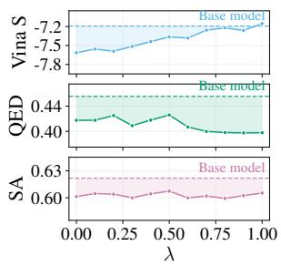  
Figure 6: Sensitivity analysis of the reward weight λ in the second hop.