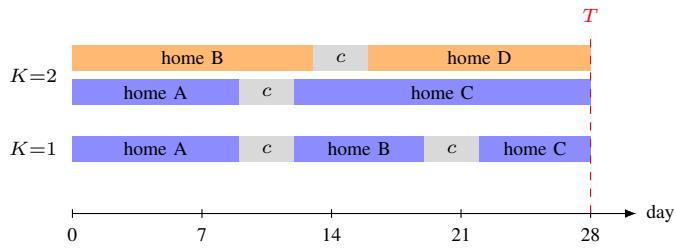
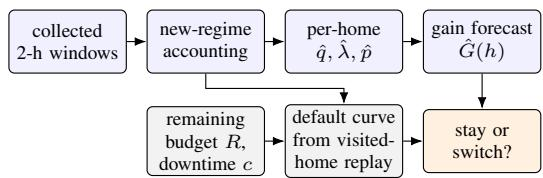
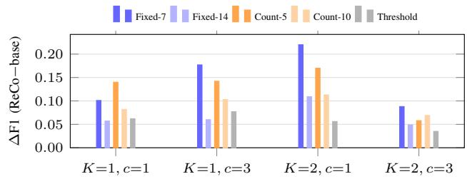
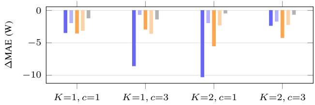

# ReCo: When to Relocate Sensor Kits under Deployment Constraints—A NILM Case Study

Haokun Chen McMaster University Hamilton, ON, Canada chenh397@mcmaster.ca

Yu Tong

Shanghai Eneintel Technology Co., Ltd.

Shanghai, China

tongyu@eneintel.com

Yehai Chen

Shanghai Eneintel Technology Co., Ltd.

Shanghai, China

chenyehai@eneintel.com

Abstract—Many sensing tasks obtain training labels only by deploying instruments in the field. With a limited number of sensor kits, a collection deadline, and measurement downtime at every move, the collector must repeatedly decide whether to stay at the current site or relocate. We study this decision in non-intrusive load monitoring (NILM), which estimates the power drawn by individual appliances from a home’s main meter and is trained on data from homes temporarily fitted with appliance-level sub-meters. In NILM, appliance usage varies with the appliance, season and climate, and the value of new data depends on how diverse the combinations of target operation and background load are. To address this, we propose a constraintbased relocation framework and instantiate it for NILM as ReCo (Relocation by Coverage gain). ReCo counts new operating regimes in a joint target–background feature space, forecasts each home’s future gain from the data collected so far, and each night weighs the gain of staying against the gain of moving elsewhere after the downtime. In replayed deployments on the Plegma dataset under two kit counts and two downtime costs, ReCo outperforms fixed-dwell and count-based schedules and a threshold rule using the same metric in every setting. Its advantage is not explained by collecting more days alone and reflects allocating the days to more valuable homes and periods.

Index Terms—constrained data collection, non-intrusive load monitoring, sensor deployment, sequential decision making

## I. INTRODUCTION

Many sensing-based learning tasks acquire their labels by physically deploying instruments at field sites: energy disaggregation, wearable activity recognition and environmental monitoring are typical examples. Such campaigns run under hard resource constraints. Sensor kits are expensive to buy and to install, so for economic reasons a project can deploy only a limited number of them. Access to sites and the project itself are limited in time, so all collection must end by a deadline. Moving a kit is not free either: removal, transport, scheduling and reinstallation take days during which the kit records nothing. Under these constraints, every extra day at one site is a day lost elsewhere: staying too long spends the budget on redundant data, while moving too early pays the downtime repeatedly and may abandon a still-informative site, and this balance shifts as the deadline approaches. The collector must therefore keep deciding from field data whether to stay or move, which no fixed schedule does well for every site.

Non-intrusive load monitoring (NILM) [1] is a representative instance of this problem. NILM, also called energy disaggregation, estimates how much power each appliance in a home draws using only the household’s main meter. This appliance-level breakdown supports energy feedback to residents and demand management without installing a meter on every appliance. Current NILM models are learned from data: a home is temporarily fitted with sub-meters, such as smart plugs or circuit-level meters on the target appliances, which record the true appliance power alongside the aggregate, and a model trained on such homes is then applied to homes that have only the main meter. The sub-meters and the aggregate logger form the sensor kit in our setting, and deciding how long to keep it at each home before relocating it to the next is the collection problem studied here. Two properties of NILM mean that there is no single answer to how long to stay at a home. First, appliance usage frequency varies widely with the appliance, the season and the climate: a refrigerator cycles all day, whereas a washing machine typically runs only a few times per week; an air conditioner may run almost daily in a hot summer yet stay idle for weeks in mild seasons; water-heater use also changes with temperature. The same appliance can therefore yield very different numbers of runs in different homes and periods, and no fixed dwell time suits all cases. Second, the aggregate is the sum of all appliances: a model must learn both the target appliance itself and how it appears on top of different background loads. Whether collected data are useful therefore depends mainly on how diverse the combinations of target operation and background load are.

Existing work has studied related but different questions. ActSense [2] chooses which home–appliance pairs receive a permanent sub-meter in order to complete a tensor of monthly energy use. Other work considers short-term collection in a single household [3], or how model performance scales with the amount of data and the number of subjects [4], [5], [6]. Uncertainty-based criteria have been used to decide when data are sufficient and collection or labeling can stop [7], [8]; these criteria look only at the data and are not applied under a budget of kits, time and relocation cost. We focus on the reuse of a fixed number ofrecoverable kits and on the dwell-time decision under relocation downtime.

This paper asks: under constraints on the number of kits, the deadline and the relocation downtime, how should the collector decide from field data when to relocate? Our contributions are:

1) A constraint-based relocation framework. The number of kits, the collection deadline and the cost of relocation downtime are the constraints of the collection framework. Based on these constraints, each night the expected gain of staying one more day is compared with that of relocating after paying the downtime to decide whether to move, so dwell times adapt to what each site yields and to the remaining budget. The framework does not depend on a particular gain measure and could in future be transferred to other field-deployed sensing tasks.

2) A regime-coverage gain for NILM. As one instantiation of the gain, we count previously unseen operating regimes in a joint space of target-appliance and background features, without training a NILM model.

3) An empirical study. Under two kit counts and two downtime costs we compare ReCo with fixed dwell, count-based switching and a threshold rule, examine the substitution of an alternative surprise metric and a component ablation of ReCo, and test three diversity scenarios that change the downstream model, the target appliance or the dataset.

The framework is intended for tasks that combine field deployment, synchronous labels and the need to generalize across sites; the coverage metric, however, has to be redesigned and validated for each domain. The empirical conclusions of this paper are limited to NILM data.

## II. RELATED WORK

Sensor deployment for energy disaggregation. Act-Sense [2] applies active tensor completion to monthly energy data to choose which home–appliance pairs receive a permanent sub-meter, so that monthly appliance consumption can be estimated for homes without one. Its meters are never recovered or moved, there is no downtime, and decisions follow model uncertainty; how long a movable kit should stay at a site is not part of the problem.

Constrained sensing campaigns. Koasidis et al. [3] propose an equipment- and time-constrained acquisition protocol that builds a household-specific database for a single home. De Bruin et al. [9] decide where and when to move sensors by the expected value of information including movement cost, and their goal is to monitor an environmental state.

Scale and allocation. Studies in speech [5], brain imaging [6] and NILM [4] examine how performance depends on the amount of data and the number of subjects. Vellandurai et al. [10] use deep reinforcement learning to decide which trips in a transit timetable carry the limited occupancy sensors, so that imputation of the unsensed trips is most accurate. These works do not model relocation downtime or sequential deployment, and the allocation in [10] is optimized offline for reconstruction accuracy.

Novelty- and uncertainty-based stopping. Criteria based on novelty or uncertainty decide whether to stop, e.g., truncating training data [7] or stopping label queries [8]. They address whether to stop. Our threshold baseline follows this stopping logic, and our surprise-metric substitution turns such a criterion into a stay-or-switch rule.

Patch leaving and switching costs. Our stay-or-switch rule has the form of the marginal value theorem [11] and is related to optimal stopping; our contribution is its use for constrained field data collection with per-home forecasts of the coverage gain.

Active learning for NILM. Patel et al. [12] use active learning to choose which home to fit with sub-meters next, and Tanoni et al. [13] combine weak supervision with active learning to choose which data windows users should label. The former decides where to deploy and the latter what to label; neither decides how long a kit should stay at a site.

Coverage and data valuation. Core-set selection [14], convex-hull-based data selection (ApproxHull) for NILM [15], submodular coverage [16] and k-nearest-neighbor data valuation [17] inspire our regime-coverage metric; RHO-LOSS [18] is a related idea of prioritizing data that are worth learning and not yet learnt.

## III. PROBLEM FORMULATION

## A. Deployment constraints

A campaign is characterized by three constraints: (i) K sensor kits, so at most K sites are recorded simultaneously; (ii) a deadline of T days by which all collection must finish; and (iii) a relocation downtime of c days, incurred by a kit every time it moves to another site. If a kit makes n visits (a site may be revisited) with dwell times $d _ { 1 } , \ldots , d _ { n } .$ , then

$$
\sum _ { i = 1 } ^ { n } d _ { i } + ( n - 1 ) c \ \leq \ T .\tag{1}
$$

The first installation incurs no downtime. For a fair comparison, schedules are compared only under the same $( K , T , c ) ;$ changing K changes the budget and changing c changes the calendar, so absolute values are not comparable across K or c, and we never rank schedules across them.

## B. Objective

The collected data train a model of fixed architecture, which is evaluated on sites that took no part in the collection. Formally, given an exogenous visiting route π, a schedule S specifies each kit’s dwell times and hence its relocation times along π. With D(S) the data it collects and $f _ { \mathcal { D } ( S ) }$ the model trained on them, the goal is ma $\mathsf { \tilde { \iota } } _ { S \in \Sigma ( \pi ) } \mathbb { E } \bigl [ M ( \dot { f } _ { \mathcal { D } ( S ) } ) \bigr ]$ for a downstream metric M such as on-state F1, where $\dot { \Sigma } ( \pi )$ is the set of such schedules that satisfy Eq. (1) for every kit, and the expectation is over the evaluation sites and the training randomness. This objective can only be evaluated after training, so the nightly rule of Section IV is a heuristic approximation that uses a data-side gain as a proxy.

Fig. 1. Deployment constraints.  
  
Fig. 2. Pipeline of ReCo.

## C. Replay evaluation protocol

We simulate deployments on a public dataset in which many sites were recorded simultaneously, so that any choice of “which site, which days” can be cut from real recordings. All schedules are completed within the same calendar window and differ only in when they relocate. Holding the window fixed controls only the coarse time range: the days actually collected still differ between schedules, so date effects cannot be ruled out completely. Fig. 1 illustrates the constraints: each line is one kit, collection alternates with c days of relocation downtime, and all collection ends by the deadline T.

## IV. METHOD

We call the full method ReCo (Relocation by Coverage gain). Each evening it processes only the candidate-home windows collected so far.

Each evening, ReCo asks a simple question: is one more day at this home likely to show the model something it has not yet seen? It answers by counting how many genuinely new combinations of target-appliance operation and background load the home has produced so far, and by forecasting how quickly that novelty is running out. This expected gain from staying is then compared with the gain per day of moving on, which includes the days lost to relocation. The kit stays while the current home still pays off better than the next home would after the downtime, and moves once it no longer does. The rest of this section makes each of these three steps precise: counting new regimes (Section IV-A), forecasting a home’s remaining gain (Section IV-B), and the stay-or-switch comparison (Section IV-C).

Fig. 2 summarizes its steps.

## A. New-regime accounting

Each day is divided into twelve two-hour windows, processed in collection order. Windows in which the target appliance is off enter an off space described by background power and time-of-day features; such a window is a new regime if no seen off-window lies within a fixed radius. Windows in which the target appliance runs enter a run space described by run features and background level (for the washing machine: run duration, energy, peak power, heating duration and background level); such a window is a new regime if no seen window matches it within per-feature tolerances. New regimes join the seen set immediately, so similar windows later on the same day do not score again. The two spaces are counted separately and combined into the daily proxy gain, a measure of collection novelty that is computed without training the model.

## B. Per-home forecasts of q, λ and p

Each evening ReCo forecasts how many new regimes the current home will still yield. Let N be the windows scheduled at the home, V those that meet the validity rule of Table I and have a determinable target state, A the target-active windows among V , and U the new-regime windows among A; windows whose target state cannot be determined count in N only and are never used as off-windows. ReCo estimates three quantities:

• q, the share of usable windows, observed as $V / N$ ;

• λ, the active windows per day if all windows were usable, observed as $1 2 A / V ;$

• p, the probability that an active window is new with respect to the global seen set, observed as $U / A$

Early in a stay these ratios rest on only a few windows and are unstable, so ReCo borrows from the homes it has already seen. Each of the underlying proportions $V / N , A / V$ and $U / A$ is estimated from the home’s trials i with outcomes $y _ { i } \in \{ 0 , 1 \}$ which are the scheduled windows for $V / N$ , the valid windows for $A / V$ and the active windows for $U / A .$ . A trial recorded $\Delta t _ { i }$ days ago receives the forgetting weight $w _ { i } = 2 ^ { - \Delta t _ { i } / H }$ and

$$
\hat { \rho } = \frac { \sum _ { i } w _ { i } y _ { i } + 1 + \kappa m } { \sum _ { i } w _ { i } + 2 + \kappa } ,\tag{2}
$$

shrunk with strength κ towards a center m formed from the other homes already visited by that evening; without such homes, $\kappa ~ = ~ 0$ and only a weak Beta(1, 1) prior remains. $H = \infty$ gives the unweighted estimate. The more data the current home has, the less it borrows. Each evening $( \kappa , H )$ is chosen from a small candidate set by the one-step-ahead forecast loss, using only the history collected before that evening.

The forecast gain of staying h more days is

$$
\hat { G } ( h ) = \sum _ { k = 1 } ^ { h } \Big [ \hat { q } \hat { \lambda } \hat { p } ( E _ { k - 1 } ) + \omega \hat { q } \hat { o } _ { k } \Big ] , \qquad E _ { k } = E _ { k - 1 } + \hat { q } \hat { \lambda } .\tag{3}
$$

The first term is the expected number of new run regimes per day (usable share × active windows × novelty rate); the second adds new off regimes, where oˆ is their daily rate under full availability and ω their weight. The longer ReCo stays, the more of the home’s regimes it has already seen, so novelty decays as coverage grows: with $E _ { 0 }$ the valid active windows collected so far, $\hat { p } ( E ) = p _ { 0 } ( E _ { 0 } + \kappa _ { p } + 2 ) / ( E + \kappa _ { p } + 2 )$ , where p0 is tonight’s estimate of p and $\kappa _ { p }$ its shrinkage strength.

The off rate decays in the same way with off exposure: $\hat { o } _ { k } =$ $\hat { o } _ { 1 } ( E _ { \mathrm { o f f } } + \kappa _ { \mathrm { o f f } } + 1 ) / ( E _ { \mathrm { o f f } } + \kappa _ { \mathrm { o f f } } + 1 + u _ { k } )$ with $u _ { k } = ( k -$ $1 ) \hat { q } \left( 1 2 - \hat { \lambda } \right) / 1 2$ , where $\hat { o } _ { 1 }$ is tonight’s estimate, $E _ { \mathrm { o f f } }$ the off exposure collected so far and $\kappa _ { \mathrm { o f f } }$ its shrinkage strength. The decay applies only to future days; $p _ { 0 }$ and $\hat { o } _ { 1 }$ are re-estimated every evening.

## C. Stay or switch

Each evening ReCo asks whether to spend the next day at the current home or to move. Staying is worth $\hat { G } _ { \mathrm { c u r } } ( 1 )$ , the gain expected tomorrow; one day suffices because the question is asked again the next evening. Moving first costs c days without data, so the next home is valued by its average gain per day over the downtime plus a stay of h days, using the best h that still fits into the remaining budget R:

$$
\mathrm { s w i t c h } \iff \operatorname* { m a x } _ { h \in \mathcal { H } ( R ) } \frac { \hat { G } _ { \mathrm { n e x t } } ( h ) } { c + h } > \hat { G } _ { \mathrm { c u r } } ( 1 ) ,\tag{4}
$$

where $\mathcal { H } ( R )$ is the set of such h. A longer downtime lowers this average and therefore keeps the kit at a home longer. If the next home was visited before (the route is cyclic), its $\hat { G } _ { \mathrm { n e x t } }$ is forecast from its own history. Otherwise ReCo uses a default curve that describes what a newly visited home typically yields day by day: it replays the first stay of each visited (donor) home in order, counting a window as new if it differs from all valid windows collected up to decision night t at the other visited candidate homes and from the earlier replayed windows of the donor. The donor’s own later data, evaluation homes and future data are excluded. Each replayed day scores its new run regimes plus ω times its new off regimes, so off regimes enter both the stay and the switch side. For a donor whose first stay covers days $1 , \ldots , L _ { b } ,$ , those days use its leave-one-out replayed gain. From day $L _ { b } { + 1 }$ on, $\boldsymbol { \hat { q } } , \boldsymbol { \hat { \lambda } } , \boldsymbol { \hat { p } }$ and oˆ estimated from that prefix are propagated with the per-day exposure recursion of Eq. (3), without the donor’s later revisits or any data after the decision night. Every donor is extended to the largest feasible dwell of the night, the default curve averages the donors with equal weight day by day, and the switch value in Eq. (4) maximizes the cumulative gain of the first h days divided by $c + h .$ A donor observed for 7 days thus contributes replayed gains for days 1–7 and forecasts for days 8–12 when the candidate dwell is 12 days; the dwell is neither truncated to 7 days nor extended by repeating day 7. Each kit starts with a fixed start-up dwell at its first home, whose installation carries no downtime; the minimum dwell and end-of-budget actions are given in Section V-C. Algorithm 1 summarizes the nightly procedure.

## V. EXPERIMENTS

## A. Data and evaluation protocol

We use the washing machine in the Plegma dataset [19] (10-s samples, twelve two-hour windows per day). Its eleven usable homes form four folds with two evaluation and nine candidate homes each. The evaluation homes are the eight homes with complete September data, namely {3,13}, {1,7}, {6,11} and {8,12}. Collection runs from 1 May to 28 August 2023 (T=120 days) and evaluation from 1 May to 28 September 2023; collection and evaluation dates may overlap, but homes never do. Evaluation homes are never used for collection, routing, forecasting, tuning or training, and days with missing data still count toward the budget. Each setting is run with three seeds, each drawing a random visiting order that all methods share together with the training setup. Metrics are averaged with equal weight over the two evaluation homes, then over the seeds and finally over the four folds, and the per-fold best baseline is selected on the fold-level values. We report on-state F1, which measures how well the model detects when the washing machine is running (balancing precision and recall; higher is better), and overall MAE, the mean absolute error of the predicted appliance power in watts (lower is better).

Algorithm 1 ReCo: nightly stay-or-switch decision for one kit   
Require: route π (random visiting order); deadline T; downtime c;   
start-up dwell h ; minimum dwell $h _ { \mathrm { m i n } } ;$ candidate shrinkage and   
forgetting settings Θ   
1: install the kit at the first home of $\pi ; \tau  0$   
2: for $t = 1 , \dots , T$ do   
3: if the kit is in downtime then continue   
4: collect day t at the current home; $\tau  \tau + 1$   
5: count new off/run regimes against the global seen set and add   
them to it   
6: $\yen 7$ h (first home) or $\tau < h _ { \operatorname* { m i n } }$ then continue   
7: $R \gets T - { \dot { t } }$   
8: if $R \leq c + h _ { \operatorname* { m i n } }$ or no free home remains then continue   
9: select $\theta \in \Theta$ by one-step-ahead loss on earlier prefixes   
10: update $\hat { q } , \hat { \lambda } , \hat { p }$ and oˆ for the current home with θ   
11: $\bar { G } _ { \mathrm { s t a y } }  \hat { G } _ { \mathrm { c u r } } ( 1 )$ ▷ Eq. (3)   
12: build $\hat { G } _ { \mathrm { n e x t } }$ from the next home’s own history if revisited, else   
by time-progressive replay of visited homes   
13: $G _ { \mathrm { m o v e } } \gets \operatorname* { m a x } _ { h \in \mathcal { H } ( R ) } \hat { G } _ { \mathrm { n e x t } } ( h ) / ( c + h )$   
14: if $G _ { \mathrm { m o v e } } > G _ { \mathrm { s t a y } }$ then   
15: move to the next free home on π; start c days of   
downtime; $\tau  0$   
16: end if   
17: end for

## B. Features and downstream model

The regime features are listed in Table I. The downstream model is a temporal convolutional disaggregation model (dilated residual TCN with a gated power head, about 3.2M parameters) that maps 721 samples to the central 121 points. All methods share its inputs, training steps, on-threshold and seeds, so only the collection calendar differs.

## C. Implementation settings

Table I lists the settings used for the washing machine. The event-rule and run-space values correspond to visible features of the appliance’s power waveform: the on-power threshold to the step between standby and running, the gap limit to the longest pause within a wash cycle, and the minimum event length to the shortest complete cycle; the run-space features and tolerances likewise describe how cycles differ from one another. The event and regime settings are fixed before any calendar is generated and are not tuned on the downstream results. Adapting ReCo to another appliance therefore only requires reading these values off a few example waveforms of that appliance; a kettle, for instance, needs a higher on-power threshold and no 10-minute minimum, while the stay-or-switch rule itself is unchanged. A run crossing a window boundary counts once for Count-5/10 but enters the regime accounting in each of its windows. For each seed, the nine candidates are visited in a random order, and kits cycle through it. With K=2, a home hosts at most one kit at a time; kit 1 has priority and the other takes the next free home. When at most c+1 days remain or no home is free, the kit stays.

TABLE I  
IMPLEMENTATION SETTINGS OF THE NILM INSTANCE
<table><tr><td>Item</td><td>Setting</td></tr><tr><td>Data and folds</td><td>Plegma washing machine; 11 homes, 4 folds; 2 eval- uation and 9 candidate homes per fold</td></tr><tr><td>Time grid</td><td>10-s samples; 12 two-hour windows of 720 samples per day; a window is valid only if ≥576 samples have both aggregate and target label and, under the appliance&#x27;s event rules, gaps change neither its on/off class nor its number of run starts; otherwise it is unknown</td></tr><tr><td>Budget Dwell</td><td>T=120 days;  $K \in \{ 1 , 2 \} ; c \in \{ 1 , 3 \}$  days start-up dwell  $h _ { 0 } { = } 7 \ \mathrm { d a y s }$  at the first home of each kit (ReCo, Threshold); minimum dwell  $h _ { \mathrm { m i n } } { = } 1$  full day for all methods; decisions at the end of a day</td></tr><tr><td>Target run (washing label power &gt;50 W; gaps of machine)</td><td> $\leq 1 1 0$  samples merged; duration ≥10 min</td></tr><tr><td>Off space</td><td>background median power, fluctuation and time of day, scaled by 200 W, 100 W and 4 h (circular time); seen if normalized distance ≤1.0</td></tr><tr><td>Run space</td><td>same regime if duration ±20 min, energy ±0.15 kWh, peak ±300 W, heating ±10 min and background ±200 W all hold</td></tr><tr><td>Forecast and rule</td><td>ω=0.25; shrinkage candidates q: {0,12,36,72} win- dows, λ/off: {0,2,5,10} valid days (12 valid windows each), p: {0,4,12,24} active windows; half-life H ∈ {7, 14, 28, ∞} days; Threshold relocates when the mean gain of the last 3 valid dwell days is &lt;1.00 new regimes/day</td></tr></table>

## D. Baselines

Baselines are Fixed-7/14 (relocate after 7 or 14 days), Count-5/10 (relocate after 5 or 10 complete target runs), and a Threshold rule that uses the same regime metric with a fixed threshold of 1.00 new regimes per day, set empirically and used in all scenarios. The threshold rule averages the gain over the last three valid dwell days and keeps the kit in place until three such days are available. Fixed dwell and count-based switching provide intuitive calendar references; the threshold rule isolates the stay-or-switch rule. With K=2, the two kits follow the seed’s common random candidate route and decide separately every evening, sharing the seen-regime set and home-occupancy state; downtime is charged to each kit’s own calendar.

## E. Main results

Table II and Fig. 3 compare ReCo with each baseline. In all four settings ReCo achieves higher on-state F1 and lower MAE than every baseline. The per-fold best stitching is a stricter reference: in each fold it picks, after the fact, the best of all five baselines including the threshold rule, separately for F1 and for MAE, so the two may come from different methods. ReCo still outperforms it in F1 in all four settings and in MAE in three. The parentheses in the ReCo row of Table II give ReCo minus the per-fold best (mean ± SD over the four folds). The one exception (MAE at $K { = } 1 , c { = } 3 )$ is not surprising: the perfold best is picked after the fact, separately per fold and per metric, and is not available in a real deployment. ReCo adapts to each budget and stays at or near the best baseline chosen in hindsight.

  
Fig. 3. Paired differences, ReCo minus baseline.

## F. Collection calendars

Table III summarizes the calendars: the number of relocations (Sw), the collected days per visit (Dwell) and the valid two-hour windows (Win); collected device-days equal $K T - c \cdot \mathrm { S w }$ . ReCo relocates less often than Fixed-7, Count-5 and the threshold rule. The threshold rule relocates most, staying only 4.6–6.2 days per visit, so downtime consumes the most days and it collects the fewest valid windows. ReCo’s advantage is not explained by collecting more days alone: Fixed-14 and Count-10 collect about as many or more devicedays and a similar or larger number of windows yet are less accurate. Instead, ReCo allocates its days to more valuable homes and periods, and it collects the most valid windows per collected day in every setting.

## G. Alternative gain metric

Because the framework takes the gain measure as an input, the regime-coverage gain can be replaced or improved without changing the stay-or-switch rule. As an alternative we use a surprise metric (Surprise), which scores each day by the Bayesian surprise of step events in the aggregate signal. The original work [7] uses surprise as a stopping criterion; we turn it into a stay-or-switch rule inside the same relocation framework, under the same folds and constraints as ReCo. On each day j the step events in the valid windows update a Bayesian model of step events, and the day’s gain $B _ { j }$ is the KL divergence of the updated from the previous model $( B _ { j } = 0$ for a valid day without steps; a day without any determinable window is missing). With effective-day exposure $e _ { j } ~ = ~ V _ { j } / 1 2 .$ , the current rate is $\begin{array} { r } { a _ { t } \ = \ \sum _ { j } w _ { j } B _ { j } / \sum _ { j } w _ { j } e _ { j } } \end{array}$ with $\dot { w _ { j } } = 2 ^ { - ( t - j ) / H _ { B } }$ , and the forecast for future day k is $\hat { g } _ { k } ^ { B } = \check { \hat { q } } a _ { t } ( E _ { t } + \kappa _ { B } + 1 ) / ( E _ { t } + \kappa _ { B } + 1 + ( k - 1 ) \hat { q } )$ , where $E _ { t }$ is the effective-day exposure collected so far. As in ReCo, $H _ { B }$ and $\kappa _ { B }$ are selected from a candidate set by one-stepahead forecast loss. Staying and switching are compared as in Eq. (4) with $\begin{array} { r } { \hat { G } ^ { B } ( h ) \dot { \ } = \ et { } { ' } \sum _ { k = 1 } ^ { h } \hat { g } _ { k } ^ { B } } \end{array}$ in place of ${ \hat { G } } ( h )$ ; the default curve for unvisited homes is rebuilt each night by refitting this step-event model with each visited donor left out, replaying its raw step events and recomputing the KL divergence; days already observed use the replayed values, and only later days are forecast. Table IV shows the result, with each entry given as ReCo / Surprise, and their difference (mean ± SD over folds) below it: ReCo has higher F1 in three settings and lower MAE in all four.

TABLE II  
MAIN RESULTS ON PLEGMA WASHING MACHINE
<table><tr><td rowspan="2">Method</td><td colspan="2"> $K { = } 1 , \ c { = } 1$ </td><td colspan="2">K=1, c=3</td><td colspan="2">K=2, c=1</td><td colspan="2">K=2, c=3</td></tr><tr><td>F1</td><td>MAE</td><td>F1</td><td>MAE</td><td>F1</td><td>MAE</td><td>F1</td><td>MAE</td></tr><tr><td>Fixed-7</td><td>0.577</td><td>11.72</td><td>0.508</td><td>19.29</td><td>0.523</td><td>17.45</td><td>0.618</td><td>10.35</td></tr><tr><td>Fixed-14</td><td>0.620</td><td>10.19</td><td>0.625</td><td>11.37</td><td>0.634</td><td>9.10</td><td>0.656</td><td>9.69</td></tr><tr><td>Count-5</td><td>0.537</td><td>11.81</td><td>0.543</td><td>13.64</td><td>0.573</td><td>12.68</td><td>0.647</td><td>12.22</td></tr><tr><td>Count-10</td><td>0.595</td><td>11.37</td><td>0.582</td><td>14.29</td><td>0.630</td><td>9.46</td><td>0.637</td><td>10.21</td></tr><tr><td>Threshold</td><td>0.616</td><td>9.45</td><td>0.608</td><td>12.08</td><td>0.687</td><td>7.60</td><td>0.671</td><td>8.64</td></tr><tr><td>Per-fold best</td><td>0.648</td><td>8.55</td><td>0.643</td><td>10.59</td><td>0.695</td><td>7.45</td><td>0.675</td><td>8.56</td></tr><tr><td>ReCo</td><td>0.678 (+0.030 ± 0.013)</td><td>8.29  $( - 0 . 2 6 \pm 0 . 0 4 )$ </td><td>0.685  $( + 0 . 0 4 2 \pm 0 . 0 0 7 )$ </td><td>10.73 (+0.14±0.10)</td><td>0.743 (+0.048 ± 0.006)</td><td>7.19 (−0.26±0.04)</td><td>0.706 (+0.031 ± 0.015)</td><td>8.02 (−0.54 ± 0.06)</td></tr></table>

TABLE III  
COLLECTION CALENDARS
<table><tr><td></td><td colspan="3"> $K = 1 , \ c = 1$ </td><td colspan="3"> $K { = } 1 , \ c { = } 3$ </td><td colspan="3"> $K = 2 , \ c = 1$ </td><td colspan="3"> $K = 2 , \ c = 3$ </td></tr><tr><td>Method</td><td>Sw</td><td>Dwell</td><td>Win</td><td>Sw</td><td>Dwell</td><td>Win</td><td>Sw</td><td>Dwell</td><td>Win</td><td>Sw</td><td>Dwell</td><td>Win</td></tr><tr><td>ReCo</td><td>9.3</td><td>10.7</td><td>1207</td><td>7.3</td><td>11.8</td><td>1083</td><td>19.3</td><td>10.4</td><td>2374</td><td>11.8</td><td>14.8</td><td>2203</td></tr><tr><td>Fixed-7</td><td>14.0</td><td>7.1</td><td>1127</td><td>11.0</td><td>7.3</td><td>923</td><td>28.0</td><td>7.1</td><td>2267</td><td>22.0</td><td>7.3</td><td>1841</td></tr><tr><td>Fixed-14</td><td>7.0</td><td>14.1</td><td>1196</td><td>6.0</td><td>14.6</td><td>1074</td><td>14.0</td><td>14.1</td><td>2417</td><td>12.0</td><td>14.6</td><td>2130</td></tr><tr><td>Count-5</td><td>12.8</td><td>7.8</td><td>1124</td><td>10.8</td><td>7.4</td><td>927</td><td>23.5</td><td>8.5</td><td>2267</td><td>19.8</td><td>8.3</td><td>1937</td></tr><tr><td>Count-10</td><td>6.3</td><td>15.6</td><td>1198</td><td>5.8</td><td>15.1</td><td>1094</td><td>11.5</td><td>16.9</td><td>2431</td><td>10.5</td><td>16.7</td><td>2183</td></tr><tr><td>Threshold</td><td>20.5</td><td>4.6</td><td>1047</td><td>13.8</td><td>5.3</td><td>827</td><td>37.3</td><td>5.2</td><td>2146</td><td>24.8</td><td>6.2</td><td>1773</td></tr></table>

TABLE IV  
ALTERNATIVE GAIN METRIC

## H. Component ablation

We compare the full ReCo with three single removals: w/o availability correction sets the forecast availability to one, i.e. qˆ=1 in Eq. (3) and in the off exposure $u _ { k } ,$ , and leaves the handling of history unchanged; w/o home novelty replaces the per-home novelty rate by a pooled cross-home rate; w/o adaptive shrinkage/forgetting fixes the settings to 36 windows for q, 5 valid days (60 windows) for λ and the off-regime rate, 12 active windows for $p$ and a 28-day half-life; $q / \lambda / p$ are still updated daily, but the settings are no longer reselected by forecast loss.

<table><tr><td>Cell</td><td>F1</td><td>MAE (W) ReCo / Surprise ReCo / Surprise</td></tr><tr><td> $K { = } 1 , c { = } 1$ </td><td> $0 . 6 7 8 \mathrm { ~ / ~ } 0 . 6 3 9$   $( + 0 . 0 3 9 \pm 0 . 0 1 4 )$ </td><td>8.29 / 8.94  $( - 0 . 6 6 \pm 0 . 2 4 )$ </td></tr><tr><td> $K { = } 1 , c { = } 3$ </td><td> $0 . 6 8 5 \mathrm { ~ / ~ } 0 . 6 9 0$   $( - 0 . 0 0 5 \pm 0 . 0 0 4 )$ </td><td> $1 0 . 7 3 \ / \ 1 3 . 0 2$   $( - 2 . 2 9 \pm 0 . 8 0 )$ </td></tr><tr><td> $K = 2 , c = 1$ </td><td> $0 . 7 4 3 \mathrm { ~ / ~ } 0 . 6 9 7$   $( + 0 . 0 4 6 \pm 0 . 0 0 7 )$ </td><td>7.19 / 7.54  $( - 0 . 3 5 \pm 0 . 0 7 )$ </td></tr><tr><td> $K { = } 2 , c { = } 3$ </td><td> $0 . 7 0 6 \mathrm { ~ / ~ } 0 . 6 6 8$   $( + 0 . 0 3 8 \pm 0 . 0 2 0 ) $ </td><td> $8 . 0 2 \ : / \ : 8 . 5 7$   $( - 0 . 5 5 \pm 0 . 2 0 ) $ </td></tr></table>

Table V shows the results; values in parentheses are the setting minus full ReCo (mean ± SD over the four folds), so a negative F1 change or a positive MAE change means worse. Removing per-home novelty causes the largest F1 drop in three of four cells (−0.090 to −0.097) together with MAE increases of 1.57–1.72 W. Removing the availability correction lowers F1 by 0.057–0.084 in all cells. Its MAE rises in three cells but falls by 0.45 W at K=1, c=3. Fixing shrinkage and forgetting has the smallest effect on F1 (−0.005 to −0.053) but consistently raises MAE (0.85–0.97 W).

## I. Diversity scenarios

Each diversity scenario changes one factor of the main setting and keeps the four constraint settings: the downstream model is replaced by an SGN [20] adapted to the same input and output (about 74M parameters), the target appliance by the air conditioner, or the dataset by REFIT [21] with the washing machine as target. ReCo, Fixed-14, Count-10 and the threshold rule are compared for $K \in \{ 1 , 2 \}$ . The baseline in Table VI is built like the per-fold best above: in each fold, the best of Fixed-14, Count-10 and the threshold rule is taken separately for F1 and for MAE. Because the gain scale differs across appliances and datasets, a fixed threshold may be less well calibrated in these scenarios; Fixed-14 and Count-10, which do not depend on this scale, are therefore also included in the baseline. The air-conditioner scenario uses the Plegma dates, restricted to the homes with air-conditioner channels; all airconditioner channels of a home are summed as the target (onpower >50 W, complete events ≥180 s, gaps ≤2100 s merged). REFIT collects from 4 October 2014 to 31 January 2015 and is evaluated in February 2015, with four folds; its roughly 8-s samples are aligned to the 10-s grid by nearest neighbor (at most 8 s apart, no interpolation), grid points without a match count as missing, and the washing-machine rules are on-power >20 W, gaps <10 min merged and runs ≥10 min. Results are averaged over three seeds and four folds in every scenario, and the differences in Table VI are given as mean ± SD over the four folds.

TABLE V COMPONENT ABLATION
<table><tr><td></td><td colspan="2">K=1, c=1</td><td colspan="2">K=1, c=3</td><td colspan="2">K=2, c=1</td><td colspan="2">K=2, c=3</td></tr><tr><td>Setting</td><td>F1</td><td>MAE</td><td>F1</td><td>MAE</td><td>F1</td><td>MAE</td><td>F1</td><td>MAE</td></tr><tr><td>Full ReCo</td><td>0.678 0.599</td><td>8.29 9.78</td><td>0.685</td><td>10.73</td><td>0.743</td><td>7.19</td><td>0.706</td><td>8.02</td></tr><tr><td>w/o availability corr.</td><td></td><td></td><td>0.618</td><td>10.28</td><td>0.686</td><td>8.53</td><td>0.622 (−0.078 ± 0.011)(+1.49 ± 0.77)(−0.067 ± 0.043)(−0.45 ± 0.22)(−0.057 ± 0.008)(+1.34 ± 0.82)(−0.084 ± 0.022)(+1.42 ± 0.82)</td><td>9.44</td></tr><tr><td>w/o home novelty</td><td>0.588</td><td>9.94</td><td>0.589</td><td>12.46</td><td>0.647</td><td>8.75</td><td>0.635 (−0.090 ± 0.057)(+1.66 ± 0.27)(−0.097 ± 0.024)(+1.72 ± 1.01)(−0.097 ± 0.015)(+1.57 ± 0.79)(−0.071 ± 0.045)(+1.67 ± 0.98)</td><td>9.69</td></tr><tr><td>w/o adapt. shrink./forget.</td><td>0.673 (−0.005 ± 0.005)(+0.85 ± 0.55)(−0.038 ± 0.016)(+0.97 ± 0.46)(−0.032 ± 0.018)(+0.92 ± 0.51)(−0.053 ± 0.026)(+0.90 ± 0.45)</td><td>9.13</td><td>0.647</td><td>11.71</td><td>0.711</td><td>8.11</td><td>0.653</td><td>8.92</td></tr></table>

Table VI compares ReCo with this per-fold best baseline. ReCo largely keeps its advantage when the model, the target appliance or the dataset changes: ReCo’s F1 exceeds the strongest baseline in ten of twelve combinations (by more than 0.05 in seven). In the remaining two, both on REFIT, it is lower by about 0.045 while its MAE remains lower. Its MAE is higher in one case (SGN, K=1, c=3).

## VI. DISCUSSION

Why coverage and the decision rule matter. Window counts alone do not explain the differences between methods. The threshold rule collects the fewest valid windows, yet its F1 exceeds that of Fixed-7 and Count-5 in every setting, and at K=2 it is the best single baseline in both F1 and MAE. Both it and ReCo leave a home when its new regimes run out, which suggests that the regime-coverage metric itself accounts for part of the gain over fixed-dwell and count-based schedules. The effect is not uniform, however: at K=1 Fixed-14 is slightly ahead of the threshold rule in F1, and at K=1, c=3 also in MAE, so a coverage signal alone does not guarantee a better calendar. The decision rule adds a further improvement on top of the coverage metric, whose size depends on the setting and the metric: the threshold rule leaves as soon as recent gain drops, and part of its budget goes to downtime that could have yielded further regimes. Since ReCo differs from the threshold rule in both its per-home forecasts and its cost-aware comparison, this improvement reflects both rather than the downtime term alone. ReCo weighs this cost and improves both F1 and MAE in all four settings, although the margin varies and is smallest in F1 at $K { = } 2 , c { = } 3$ , so the benefit of the decision rule is not uniform.

What the ablations suggest. Modeling novelty per home gave the most consistent benefit. Homes differ in how quickly they run out of new regimes, so a rate pooled across homes tends to keep a kit too long at a repetitive home and to move it too early from a varied one. Accounting for data availability also mattered: without it, the gain obtainable under valid observation is taken as the gain actually obtainable over calendar time, which distorts the comparison between staying and switching. Reselecting shrinkage and forgetting online had a smaller effect, mainly on MAE, which suggests that the forecasts are reasonably robust to these settings but still benefit from adapting to each home.

Future directions. Because the stay-or-switch rule takes the gain measure as an input, the most direct extension is a better gain: one that is weighted towards the final metric, that uses model uncertainty or expected error reduction once a first model is available, or that is learned from past campaigns. A second direction is to decide where to go next as well as when to leave, combining ReCo with active selection of the next home instead of a random route. Coordinating several kits more closely than by simple priority, handling several target appliances at once, and including monetary cost and travel explicitly in the downtime are further steps towards real campaigns. Finally, a field deployment would test the rule under real installation, access and failure conditions.

## VII. LIMITATIONS

Our evaluation replays recorded data instead of deploying kits in the field, so practical factors such as installation, site access and equipment failures are not yet reflected. The multiplicative forecast is also a simplification: it does not model dependence between its factors and is less reliable on a first visit with little history. Finally, this work currently focuses on NILM; applying the framework to other sensingbased collection tasks remains to be explored.

TABLE VIDIVERSITY SCENARIOS
<table><tr><td>Scenario</td><td>Cell</td><td></td><td>F1: ReCo / baseline (∆ ± SD) MAE (W): ReCo / baseline (∆ ± SD)</td></tr><tr><td rowspan="4">Model → SGN</td><td> $K = 1 , c = 1$ </td><td> $0 . 7 4 0 \mathrm { ~ / ~ } 0 . 5 6 3 \mathrm { ~ } ( + 0 . 1 7 7 \pm 0 . 0 0 8 )$ </td><td> $3 . 3 9 \mathrm { ~ / ~ } 6 . 1 1 \mathrm { ~ ( - 2 . 7 2 \pm 0 . 5 6 ) ~ }$ </td></tr><tr><td> $K { = } 1 , c { = } 3$ </td><td> $0 . 6 9 2 \mathrm { ~ / ~ } 0 . 6 4 6 \mathrm { ~ ( + 0 . 0 4 6 \pm 0 . 1 8 1 ) ~ }$ </td><td> $4 . 9 6 \ : / \ : 4 . 1 4 \ : ( + 0 . 8 2 \pm 0 . 8 9 )$ </td></tr><tr><td> $K = 2 , c = 1$ </td><td> $0 . 7 2 2 \ : / \ : 0 . 6 7 3 \ : ( + 0 . 0 4 9 \pm 0 . 0 4 5 )$ </td><td> $3 . 4 4 / 4 . 3 2 ( - 0 . 8 8 \pm 0 . 3 0 )$ </td></tr><tr><td> $K { = } 2 , c { = } 3$ </td><td> $0 . 7 2 1 / 0 . 5 2 5 ( + 0 . 1 9 6 \pm 0 . 1 1 3 )$ </td><td> $3 . 8 3 / 5 . 6 6 ( - 1 . 8 3 \pm 0 . 1 2 )$ </td></tr><tr><td rowspan="4">Target → air conditioner</td><td> $K = 1 , c = 1$ </td><td> $0 . 6 9 5 / 0 . 5 3 0 ( + 0 . 1 6 5 \pm 0 . 0 1 3 )$ </td><td> $3 4 . 9 7 / 4 7 . 2 8 ( - 1 2 . 3 1 \pm 1 . 7 4 )$ </td></tr><tr><td> $K { = } 1 , c { = } 3$ </td><td> $0 . 6 8 1 / 0 . 4 8 6 ( + 0 . 1 9 5 \pm 0 . 0 2 3 )$ </td><td> $3 8 . 5 5 / 5 3 . 3 3 ( - 1 4 . 7 8 \pm 2 . 3 1 )$ </td></tr><tr><td> $K = 2 , c = 1$ </td><td> $0 . 7 2 9 \mathrm { ~ / ~ } 0 . 5 2 9 \mathrm { ~ ( + 0 . 2 0 0 \pm 0 . 0 1 7 ) }$ </td><td> $3 2 . 9 4 / 4 2 . 2 0 ( - 9 . 2 6 \pm 2 . 1 4 )$ </td></tr><tr><td> $K { = } 2 , c { = } 3$ </td><td> $0 . 6 9 9 \mathrm { ~ / ~ } 0 . 6 5 1 \mathrm { ~ } ( + 0 . 0 4 8 \pm 0 . 0 2 0 )$ </td><td> $3 6 . 6 0 \ : / \ : 4 4 . 5 6 \ : ( - 7 . 9 6 \pm 1 . 2 2 )$ </td></tr><tr><td rowspan="4">Dataset → REFIT</td><td> $K = 1 , c = 1$ </td><td> $0 . 5 9 5 / 0 . 6 3 9 ( - 0 . 0 4 4 \pm 0 . 0 5 8 )$ </td><td> $7 . 6 6 / 9 . 5 7 ( - 1 . 9 1 \pm 0 . 6 0 )$ </td></tr><tr><td> $K { = } 1 , c { = } 3$ </td><td> $0 . 6 5 5 \mathrm { ~ / ~ } 0 . 4 8 8 \mathrm { ~ ( + 0 . 1 6 7 \pm 0 . 0 2 8 ) ~ }$ </td><td> $7 . 9 7 / 1 0 . 1 2 ( - 2 . 1 5 \pm 0 . 3 5 )$ </td></tr><tr><td> $K = 2 , c = 1$ </td><td> $0 . 6 7 9 \ / \ 0 . 4 9 7 \ ( + 0 . 1 8 2 \pm 0 . 0 3 9 )$ </td><td> $7 . 1 6 / 9 . 5 8 ( - 2 . 4 2 \pm 0 . 4 9 )$ </td></tr><tr><td> $K { = } 2 , c { = } 3$ </td><td> $0 . 6 0 1 / 0 . 6 4 6 ( - 0 . 0 4 5 \pm 0 . 0 0 4 )$ </td><td> $7 . 5 0 / 1 0 . 2 0 ( - 2 . 7 0 \pm 0 . 6 1 )$ </td></tr></table>

## VIII. CONCLUSION

We studied data collection for sensing-based learning when kits are few, time is limited and every relocation costs downtime, and framed it as a nightly decision between staying at the current site and moving on. The resulting framework compares the gain of staying with the gain achievable elsewhere after the downtime and treats the gain measure as a replaceable input. For NILM we instantiated it as ReCo, which counts new operating regimes of the target appliance against its background and forecasts, for each home, how many more it is likely to yield.

In replayed deployments on real household data, ReCo outperformed fixed-dwell and count-based schedules under every combination of kit count and downtime, and stayed at or near the best baseline chosen in hindsight. It achieved this by allocating the collection days to more valuable homes and periods, and its advantage largely carried over when the downstream model, the target appliance or the dataset was changed. These results suggest that treating relocation as an explicit, budget-aware decision is a simple and effective way to spend a limited collection budget, and that the framework offers a natural place to plug in better gain measures in future work.

## REFERENCES

[1] G. W. Hart, “Nonintrusive appliance load monitoring,” Proc. IEEE, vol. 80, no. 12, pp. 1870–1891, 1992, doi: 10.1109/5.192069.

[2] Y. Jia, N. Batra, H. Wang, and K. Whitehouse, “Active collaborative sensing for energy breakdown,” in Proc. 28th ACM Int. Conf. Inf. Knowl. Manage. (CIKM), 2019, pp. 1943–1952, doi: 10.1145/3357384.3357929.

[3] K. Koasidis, V. Marinakis, H. Doukas, N. Doumouras, A. Karamaneas, and A. Nikas, “Equipment- and time-constrained data acquisition protocol for non-intrusive appliance load monitoring,” Energies, vol. 16, no. 21, 2023, Art. no. 7315, doi: 10.3390/en16217315.

[4] C. Shin, S. Rho, H. Lee, and W. Rhee, “Data requirements for applying machine learning to energy disaggregation,” Energies, vol. 12, no. 9, 2019, Art. no. 1696, doi: 10.3390/en12091696.

[5] Z.-X. Yong, V. Pratap, M. Auli, and J. Maillard, “Effects of speaker count, duration, and accent diversity on zero-shot accent robustness in low-resource ASR,” in Proc. Interspeech, 2025, pp. 1148–1152, doi: 10.21437/Interspeech.2025-2351.

[6] L. Q. R. Ooi et al., “Longer scans boost prediction and cut costs in brain-wide association studies,” Nature, vol. 644, no. 8077, pp. 731– 740, 2025, doi: 10.1038/s41586-025-09250-1.

[7] R. Jones, C. Klemenjak, S. Makonin, and I. V. Bajic, “Stop! Ex-´ ploring Bayesian surprise to better train NILM,” in Proc. 5th Int. Workshop Non-Intrusive Load Monit. (NILM), 2020, pp. 39–43, doi: 10.1145/3427771.3429388.

[8] T. Sobot, V. Stankovic, and L. Stankovic, “Human in the loop active learning for time-series electrical measurement data,” Eng. Appl. Artif. Intell., vol. 133, pt. F, 2024, Art. no. 108589, doi: 10.1016/j.engappai.2024.108589.

[9] S. de Bruin, D. Ballari, and A. K. Bregt, “Where and when should sensors move? Sampling using the expected value of information,” Sensors, vol. 12, no. 12, pp. 16274–16290, 2012, doi: 10.3390/s121216274.

[10] A. Vellandurai, A. Sharma, T. Samon, V. Kumar, and K. Banerjee, “Optimizing imputation accuracy with DRL-based sensor-less scheduling,” in Proc. IEEE Int. Conf. Big Data (BigData), 2024, pp. 5225–5232, doi: 10.1109/BigData62323.2024.10825365.

[11] E. L. Charnov, “Optimal foraging, the marginal value theorem,” Theor. Popul. Biol., vol. 9, no. 2, pp. 129–136, 1976, doi: 10.1016/0040- 5809(76)90040-X.

[12] D. Patel, A. K. Jain, H. Khandor, X. Choudhary, and N. Batra, “Benchmarking active learning for NILM,” 2024, arXiv:2411.15805.

[13] G. Tanoni, T. Sobot, E. Principi, V. Stankovic, L. Stankovic, and S. Squartini, “A weakly supervised active learning framework for nonintrusive load monitoring,” Integr. Comput.-Aided Eng., vol. 32, no. 1, pp. 39–56, 2025, doi: 10.3233/ICA-240738.

[14] O. Sener and S. Savarese, “Active learning for convolutional neural networks: A core-set approach,” in Proc. Int. Conf. Learn. Representations (ICLR), 2018.

[15] I. Laouali, A. Ruano, M. da G. Ruano, S. Dosse Bennani, and H. El Fadili, “Non-intrusive load monitoring of household devices using a hybrid deep learning model through convex hull-based data selection,” Energies, vol. 15, no. 3, 2022, Art. no. 1215, doi: 10.3390/en15031215.

[16] G. L. Nemhauser, L. A. Wolsey, and M. L. Fisher, “An analysis of approximations for maximizing submodular set functions—I,” Math. Program., vol. 14, no. 1, pp. 265–294, 1978, doi: 10.1007/BF01588971.

[17] R. Jia et al., “Efficient task-specific data valuation for nearest neighbor algorithms,” Proc. VLDB Endow., vol. 12, no. 11, pp. 1610–1623, 2019, doi: 10.14778/3342263.3342637.

[18] S. Mindermann et al., “Prioritized training on points that are learnable, worth learning, and not yet learnt,” in Proc. 39th Int. Conf. Mach. Learn (ICML), PMLR, vol. 162, 2022, pp. 15630–15649.

[19] S. Athanasoulias et al., “The Plegma dataset: Domestic appliance-level and aggregate electricity demand with metadata from Greece,” Sci. Data, vol. 11, no. 1, 2024, Art. no. 376, doi: 10.1038/s41597-024-03208-0.

[20] C. Shin, S. Joo, J. Yim, H. Lee, T. Moon, and W. Rhee, “Subtask gated networks for non-intrusive load monitoring,” in Proc. AAAI Conf. Artif. Intell., vol. 33, no. 1, 2019, pp. 1150–1157, doi: 10.1609/aaai.v33i01.33011150.

[21] D. Murray, L. Stankovic, and V. Stankovic, “An electrical load measurements dataset of United Kingdom households from a two-year longitudinal study,” Sci. Data, vol. 4, no. 1, 2017, Art. no. 160122, doi: 10.1038/sdata.2016.122.