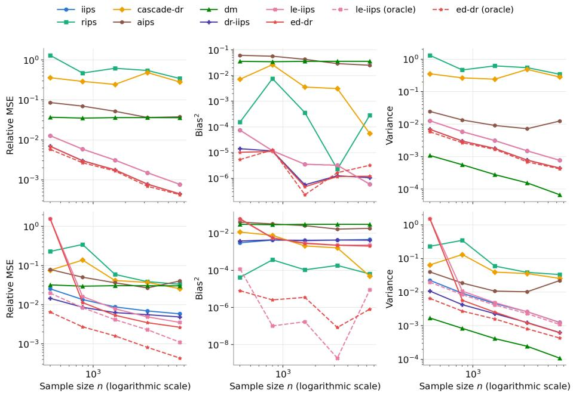
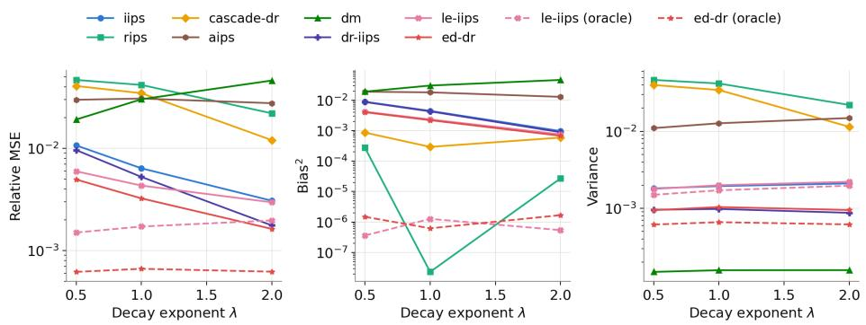
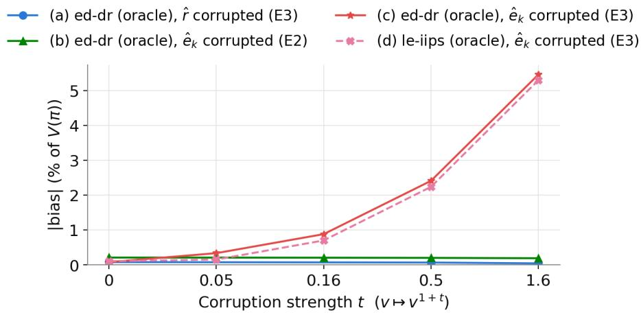
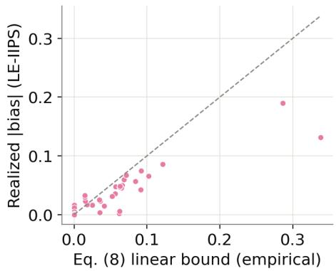
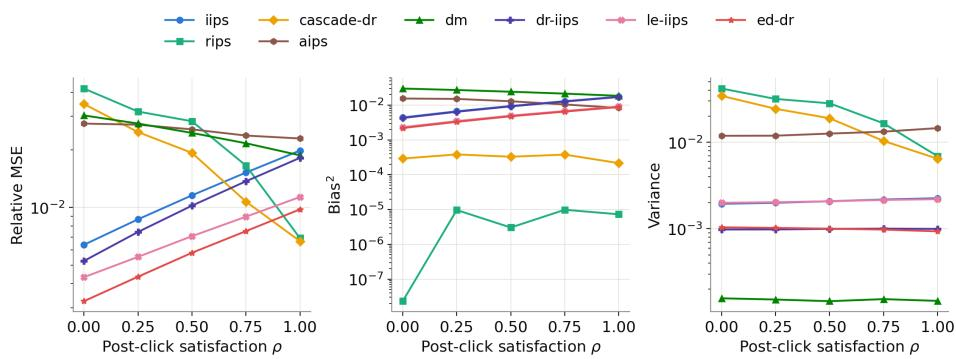
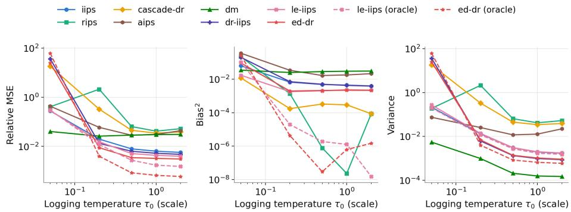

# Recommendation Ranking Of-Policy Evaluation under Ranking-Dependent Examination via Examination-Relevance Decomposition

Riki Okamura and Toshiharu Sugawara

Department of Computer Science and Communications Engineering, Waseda

University, Tokyo, Japan

r.okamura@isl.cs.waseda.ac.jp, sugawara@waseda.jp

Abstract. Of-policy evaluation, which estimates evaluation policy performance from logged data, is key for recommender ranking policies. However, logged clicks cannot distinguish unexamined items from examined non-clicks, causing bias in existing estimators when the assumed examination structures fail. We propose two estimators based on the decomposition of clicks into examination and relevance. First, the latentexamination independent inverse propensity score (LE-IIPS) estimator corrects the IIPS bias using policy examination probability ratios. Second, the examination-decomposed doubly robust (ED-DR) estimator extends LE-IIPS to a doubly robust framework. ED-DR is unbiased if the examination probabilities are correct regardless of relevance accuracy, or under ranking-independent examination, even if both model estimates are inaccurate. Experiments show that ED-DR achieves a lower MSE than existing methods with large sample sizes, especially when the examination depends on ranking. We also highlight its limitations under small samples or cascade user behavior conditions.

Keywords: Of-policy evaluation · Recommender systems · Ranking · Click models

## 1 Introduction

Ranking policies are widely used in recommender systems, such as those of Amazon and Netflix. When introducing a new evaluation policy into such a system, assessing its value through online experiments, such as A/B tests, entails risks to user experience and operational costs. Of-policy evaluation (OPE) avoids these risks and costs by estimating the value of an evaluation policy from logged data collected by a deployed logging policy [8, 24].

Logs from ranking policies record clicks at each position, but an unclicked item does not reveal whether the user examined it and chose not to click it or never examined it at all. Even interaction logs, such as scrolling records, cannot confirm whether a displayed item was examined. Despite this ambiguity, existing ranking OPE estimators, such as independent inverse propensity score (IIPS) [16], reward-interaction inverse propensity scoring (reward-interaction IPS, RIPS) [17], cascade doubly robust (cascade DR) [14], and adaptive IPS (AIPS) [15], describe user behavior solely by which items afect the click at each position, without explicitly modeling examination. For instance, IIPS assumes that the click at a position depends only on the item presented there, an assumption that holds under the position-based model (PBM) where examination depends only on position. However, when examination probabilities depend on the broader ranking, such as when neighboring items draw attention away, existing estimators become biased.

In this study, we propose two estimators based on a click model that decomposes clicks into examination and relevance [6, 7]. First, the latent-examination IIPS (LE-IIPS) corrects the IIPS bias using policy examination probability ratios. Second, the examination-decomposed doubly robust (ED-DR) estimator extends LE-IIPS to a doubly robust (DR) framework, maintaining unbiasedness when examination probabilities are correctly estimated or under ranking-independent examination. Our experiments using synthetic data show that, with large samples, ED-DR achieves the lowest MSE among the compared estimators, especially when examination depends on ranking. However, it underperforms existing methods with small samples, and under cascade user behavior, it exhibits higher relative MSE than RIPS and cascade DR, clarifying both its advantages and limitations.1

## 2 Related Work

Standard OPE estimators are the direct method (DM) [2], inverse propensity score (IPS) [11], and DR [9]. DM averages the reward predictions under the evaluation policy and is biased when the predictions are inaccurate. IPS reweights the observed rewards by the ratio of the evaluation and logging policies’ probabilities [19, 24]; it is unbiased under common support, but its variance grows as the two policies diverge. DR combines the two to control both bias and variance [8].

In slate and ranking recommendations, where multiple items are recommended simultaneously, the vast action space causes the variance of IPS and DR to explode. For slate recommendation, where only a total reward is observed, the pseudoinverse estimator [25] decomposes the expected reward into perslot contributions, a control variate method reduces variance [26], and latent IPS [13] compresses slates into low-dimensional representations. For ranking recommendation, where rewards are observed per position, IIPS [16] assumes that a position’s reward depends only on the item presented there. RIPS [17] and cascade DR [14] relax this to a cascade assumption, where rewards can also depend on higher-positioned items, while AIPS [15] selects behavior assumptions adaptively per context.

Click models that decompose clicks into examination and relevance are foundational in information retrieval [6]. PBM [7, 20] assumes examination depends solely on position. The cascade model [7] assumes a sequential top-to-bottom examination that stops at the first relevant item. The dynamic Bayesian network (DBN) model [3] incorporates post-click satisfaction, assuming that users leave only when satisfied.

Building on these click models, unbiased learning to rank (ULTR) learns ranking models from clicks weighted by inverse examination probabilities [12], which are often estimated via regression EM [27] or extended with DR-type estimators [18]. Although ULTR leverages examination estimates to optimize ranking algorithms, our study focuses on of-policy evaluation, directly estimating the expected reward under a target evaluation policy.

In recommendation, observed feedback is biased because users select which items to rate; unbiased recommender learning corrects this bias by reweighting feedback with observation probabilities [4, 23]. In particular, Saito et al. [22] decomposed clicks into examination and relevance to minimize the loss of un observed relevance via inverse examination weighting. However, these studies address missing user–item feedback rather than evaluating policy performance.

In summary, while ULTR and unbiased recommender learning use click decomposition to debias training, no prior OPE work explicitly models examination and relevance as random variables. This study bridges this gap by embedding this decomposition into OPE estimators.

## 3 Preliminaries

We formalize OPE for rankings and review the IIPS estimator, which underpins our proposed methods. The logged dataset $\mathcal { D } = \{ ( x _ { i } ,  { \mathbf { a } } _ { i } , Y _ { i } ) \} _ { i = } ^ { n }$ 1 is generated by

$$
p ( \mathcal { D } ) = \prod _ { i = 1 } ^ { n } p ( x _ { i } ) \pi _ { 0 } ( \pmb { a } _ { i } \mid x _ { i } ) p ( \pmb { Y } _ { i } \mid x _ { i } , \pmb { a } _ { i } ) ,\tag{1}
$$

where n is the sample size and $x \sim p ( x )$ denotes the context $( \mathrm { e . g . }$ , user profile). A ranking $\pmb { a } = ( \pmb { a } ( 1 ) , \dots , \pmb { a } ( K ) ) \in \varPi _ { K } ( \pmb { A } )$ of distinct items $\pmb { a } ( k ) \in \mathcal { A }$ is chosen by the logging policy $\pi _ { 0 } ( \pmb { a } \mid x )$ . The vector $\pmb { Y } = ( Y _ { 1 } , \dots , Y _ { K } )$ captures clicks, with $Y _ { k } \in \{ 0 , 1 \}$ indicating a click at position k. We define $q _ { k } ( x , \pmb { a } ) : = \mathbb { E } [ Y _ { k } \mid x , \pmb { a } ]$

We define the value of an evaluation policy π as

$$
V ( \pi ) : = \mathbb { E } _ { p ( x ) \pi ( \pm | x ) p ( { \pmb Y } | x , { \pmb a } ) } \left[ \sum _ { k = 1 } ^ { K } \alpha _ { k } Y _ { k } \right] ,\tag{2}
$$

where $\alpha _ { k } \geq 0$ is a position weight determined by the provider; for example, $\alpha _ { k } = 1$ gives the total number of clicks, and $\alpha _ { k } = 1 / \log _ { 2 } ( k + 1 )$ gives DCG. We measure the accuracy of an estimator $\hat { V } ( \pi ; \mathcal { D } )$ of $V ( \pi )$ by $\operatorname { M S E } [ \hat { V } ] : = \mathbb { E } _ { p ( \mathcal { D } ) } \big [ ( \hat { V } ( \pi ; \mathcal { D } ) -$ $V ( \pi ) ) ^ { 2 } \big { \mid \ } = \mathrm { B i a s } ( \hat { V } ) ^ { 2 } + \mathbb { V } ( \hat { V } )$ , where Bias $( \hat { V } ) : = \mathbb { E } [ \hat { V } ] - V ( \pi )$ and $\mathbb { V } ( \hat { V } ) : =$ $\mathbb { E } \big [ ( \mathbb { E } [ \hat { V } ] - \hat { V } ) ^ { 2 } \big ]$

The IIPS estimator [16], a representative method for ranking OPE, assumes the following independence condition for clicks at position k:

$$
\forall x , \mathbf { a } , k , \quad \mathbb { E } [ Y _ { k } \mid x , \mathbf { a } ] = \mathbb { E } [ Y _ { k } \mid x , \mathbf { a } ( k ) ] ,\tag{A1}
$$

and is defined as

$$
\hat { V } _ { \mathrm { I I P S } } ( \pi ; \mathcal { D } ) : = \frac { 1 } { n } \sum _ { i = 1 } ^ { n } \sum _ { k = 1 } ^ { K } w _ { k } ^ { \mathrm { I I P S } } ( x _ { i } , \pmb { a } _ { i } ) \alpha _ { k } Y _ { i , k } ,\tag{3}
$$

where $w _ { k } ^ { \mathrm { I I P S } } ( x , { \pmb a } ) : = \pi ( { \pmb a } ( k ) \mid x , k ) / \pi _ { 0 } ( { \pmb a } ( k ) \mid x , k )$ is the ratio of the marginal probabilities $\begin{array} { r } { \pi ( a \mid x , k ) : = \sum _ { \pmb { a } ^ { \prime } \in { \cal { I } } _ { K } ( { \cal { A } } ) } \pi ( \pmb { a } ^ { \prime } \mid x ) \mathbb { I } \{ \pmb { a } ^ { \prime } ( k ) = a \} } \end{array}$ and $\pi _ { 0 } ( \boldsymbol { a } \ | \ \boldsymbol { x } , \boldsymbol { k } )$ that item a is presented at position k. Under (A1) and the marginal common support condition

$$
\forall x , a , k , \quad \pi ( a \mid x , k ) > 0 \Rightarrow \pi _ { 0 } ( a \mid x , k ) > 0 ,\tag{S1}
$$

IIPS is unbiased for $V ( \pi )$ . However, when the examination at position k depends on the full ranking, $\mathbb { E } [ Y _ { k } \mid x , a ]$ depends on items beyond ${ \pmb a } ( k )$ alone; thus, (A1) fails, and IIPS sufers from bias. To explicitly model this dependence, Section 4.1 introduces our click-model framework.

## 4 Proposed Method

## 4.1 Click Models

To resolve the ambiguity in $Y _ { k } = 0 \ \mathrm { ( S e c t i o n \ 1 ) }$ , we follow standard click models [6, 7] and formulate

$$
Y _ { k } = O _ { k } R _ { k } ,\tag{4}
$$

where the latent variables ${ \cal O } _ { k } \sim \mathrm { B e r n } \big ( e _ { k } ( x , { \pmb a } ) \big )$ and $R _ { k } \ \sim$ Bern $\big ( r ( x , \pmb { a } ( k ) ) \big )$ denote examination and relevance, respectively. Examination $e _ { k } ( x , a )$ may depend on context and the full ranking, while relevance $r ( x , \pmb { a } ( k ) )$ depends only on context and item ${ \pmb a } ( k )$ . Thus, $Y _ { k } = 0$ splits into non-examination $( O _ { k } = 0 )$ and non-relevance $( O _ { k } = 1 , R _ { k } = 0 )$ . We assume:

$$
\forall x , a , k , \quad O _ { k } \perp R _ { k } \mid x , a\tag{A2}
$$

$$
\forall x , \mathbf { a } , k , \quad q _ { k } ( x , \mathbf { a } ) = e _ { k } ( x , \mathbf { a } ) r ( x , \mathbf { a } ( k ) ) .\tag{A3}
$$

Assumption (A3) follows from Eq. (4) and (A2); see Appendix A.1 for details.

We classify click models by the variables governing $\mathit { e } _ { k } \colon$

(E1) $\mathrm { P B M } , e _ { k } ( x , \pmb { a } ) = \theta _ { k } ;$

(E2) contextual $P B M \ ( \mathrm { C P B M } ) , e _ { k } ( x , \pmb { a } ) = \theta _ { k } ( x ) ; \mathrm { a n d }$

(E3) ranking-dependent examination,

where $e _ { k } ( x , \pmb { a } )$ depends on a. Since $q _ { k } ( x , \pmb { a } ) = e _ { k } ( x , \pmb { a } ) r ( x , \pmb { a } ( k ) )$ by (A3) and r depends only on $\pmb { a } ( k )$ , (A1) holds if and only if $e _ { k }$ does not depend on a: IIPS is unbiased under (E1) and (E2), but biased under (E3). This work focuses on (E3), the most general case. In contrast, the cascade model and DBN fall outside (E1)–(E3) because examination at position k depends on realized relevance at higher positions.

Finally, the decomposition $q _ { k } = e _ { k } r$ in (A3) raises two identifiability issues. First, scaling $( \boldsymbol { e } _ { k } , \boldsymbol { r } )  ( c \boldsymbol { e } _ { k } , \boldsymbol { r } / c )$ leaves $q _ { k }$ unchanged; however, this ambiguity is harmless because $V ( \pi )$ depends on $( e _ { k } , r )$ solely through $q _ { k }$ . Second, identifying $e _ { k }$ requires presenting the same item across multiple positions with positive probability [1,10], which is satisfied by stochastic policies (e.g., the Plackett–Luce model) but not deterministic ones. Lastly, $( e _ { k } , r )$ is unidentifiable when (A2) fails.

## 4.2 Proposed Estimators

Based on Assumption (A3), we propose two estimators. The first estimator is LE-IIPS, which corrects the bias of IIPS under the click model (E3) by the ratio of examination probabilities under the evaluation and logging policies:

$$
\hat { V } _ { \mathrm { L E } } ( \pi ; \mathcal { D } ) : = \frac { 1 } { n } \sum _ { i = 1 } ^ { n } \sum _ { k = 1 } ^ { K } \hat { w } _ { k } ( x _ { i } , \pmb { a } _ { i } ) \alpha _ { k } Y _ { i , k } ,\tag{5}
$$

where

$$
\hat { w } _ { k } ( x , \pmb { a } ) : = \frac { \pi ( \pmb { a } ( k ) \mid x , k ) } { \pi _ { 0 } ( \pmb { a } ( k ) \mid x , k ) } \frac { \hat { e } _ { k } ^ { \pi } ( x , \pmb { a } ( k ) ) } { \hat { e } _ { k } ( x , \pmb { a } ) } ,\tag{6}
$$

$\hat { e } _ { k } ( x , \pmb { a } )$ estimates $e _ { k } ( x , \pmb { a } )$ , and $\hat { \bar { e } } _ { k } ^ { \pi } ( x , a ) : = \mathbb { E } _ { a \sim \pi ( a \mid x ) } [ \hat { e } _ { k } ( x , a ) \mid a ( k ) = a ]$ is the expectation of $\hat { e } _ { k }$ under evaluation policy π. When $\hat { e } _ { k } = e _ { k }$ , we write $\hat { \bar { e } } _ { k } ^ { \pi } ( x , a ) =$ $\mathbb { E } _ { \pmb { a } \sim \pi ( \pmb { a } | \boldsymbol { x } ) } [ e _ { k } ( \boldsymbol { x } , \pmb { a } ) | \mathbf { \delta } \pmb { a } ( k ) = a ] = : \bar { e } _ { k } ^ { \pi } ( \boldsymbol { x } , \boldsymbol { a } )$ . Under (E1) and (E2), $\hat { e } _ { k } ( x , { \pmb a } ) = \hat { \theta } _ { k } ( x )$ does not depend on ${ \pmb a } ,$ so $\hat { \bar { e } } _ { k } ^ { \pi } ( x , { \pmb a } ( k ) ) = \hat { e } _ { k } ( x , { \pmb a } )$ and LE-IIPS coincides with IIPS.

However, because LE-IIPS ignores non-clicked observations $( Y _ { i , k } = 0 )$ , we define our second estimator, ED-DR, to utilize all observations:

$$
\hat { V } _ { \mathrm { E D - D R } } ( \pi ; \mathcal { D } ) : = \frac { 1 } { n } \sum _ { i = 1 } ^ { n } \bigg ( \mathbb { E } _ { \pi ( a | x _ { i } ) } \Big [ \sum _ { k = 1 } ^ { K } \alpha _ { k } \hat { q } _ { k } ( x _ { i } , a ) \Big ] + \sum _ { k = 1 } ^ { K } \alpha _ { k } \hat { w } _ { k } \big ( Y _ { i , k } - \hat { q } _ { k } \big ) \bigg ) ,\tag{7}
$$

where $\hat { q } _ { k } ( x , \pmb { a } ) : = \hat { e } _ { k } ( x , \pmb { a } ) \hat { r } ( x , \pmb { a } ( k ) ) , \hat { r } ( x , \pmb { a } ( k ) )$ estimates $r ( x , \pmb { a } ( k ) )$ , and $\hat { w } _ { k }$ is the weight in Eq. (6). In the second term, the arguments of $\hat { w } _ { k }$ and $\hat { q } _ { k }$ are $( x _ { i } , \pmb { a } _ { i } )$

Conventional DR estimators directly regress expected clicks, whereas ED-DR decomposes them into examination and relevance. This provides two main advantages. First, because ${ \hat { r } } ( x , \pmb { a } ( k ) )$ is position-independent, it pools data across all positions where an item appears, improving the estimation accuracy for rare item-position pairs. Second, ED-DR remains unbiased whenever $\hat { e } _ { k } = e _ { k }$ 2 regardless of $\hat { r } \mathrm { : s }$ accuracy (Proposition 2 in Section 4.3).

Finally, because neither examination $O _ { k }$ nor relevance $R _ { k }$ is observed, we estimate $( \hat { e } _ { k } , \hat { r } )$ by regression EM [27], with inputs $( x , k , a )$ and $( x , a ( k ) )$ , respectively, as in (A3). We approximate $\hat { \bar { e } } _ { k } ^ { \pi } ( x _ { i } , a )$ and the DM term of Eq. (7) by Monte Carlo averages over $S$ rankings drawn from $\pi ( \pmb { a } \mid x _ { i } )$ , and use cross-fitting [5] to train $( \hat { e } _ { k } , \hat { r } )$ and evaluate the estimators.

## 4.3 Theoretical Analysis

We analyze the bias and variance of the proposed estimators and compare them with the MSEs of IIPS and ED-DR under (E3). Assuming cross-fitting, $( \hat { e } _ { k } , \hat { r } )$ are learned on independent folds and treated as deterministic functions. Function arguments are omitted when they are clear from the context. All proofs are given in Appendix A.

Proposition 1 (Unbiasedness of LE-IIPS). Under (A2), (A3), and (S1), if $\hat { e } _ { k } = e _ { k }$ , then $\mathbb { E } _ { p ( \mathcal { D } ) } [ \hat { V } _ { \mathrm { L E } } ( \pi ; \mathcal { D } ) ] = V ( \pi )$

The bias of LE-IIPS with respect to the error in $\hat { e } _ { k }$ is bounded by

$$
\left| \mathrm { B i a s } \big ( \hat { V } _ { \mathrm { L E } } \big ) \right| \leq \sum _ { k = 1 } ^ { K } \alpha _ { k } \mathbb { E } \left[ w _ { k } ^ { \mathrm { I I P S } } \left| \frac { \hat { \overline { { e } } } _ { k } ^ { \pi } } { \hat { e } _ { k } } - \frac { \bar { e } _ { k } ^ { \pi } } { e _ { k } } \right| e _ { k } r \right] ,\tag{8}
$$

which depends on the estimation error in the ratio $\bar { e } _ { k } ^ { \pi } / e _ { k }$ rather than $\hat { e } _ { k }$ itself.

Proposition 2 (Bias of ED-DR). Under (A2) and $( A \mathcal { 3 } ) , ~ ( S \it { 1 } )$ , and the full common support condition (S2): ∀x, $\mathbf { a } , \ \pi ( \pmb { a } \mid x ) > 0 \Rightarrow \pi _ { 0 } ( \pmb { a } \mid x ) > 0$ 2

$$
\mathrm { B i a s } \big ( \hat { V } _ { \mathrm { E D - D R } } \big ) = \mathbb { E } _ { p ( x ) \pi _ { 0 } ( a | x ) } \left[ \sum _ { k = 1 } ^ { K } \alpha _ { k } \left( \hat { w } _ { k } - w ^ { * } \right) \varDelta _ { k } \right]\tag{9}
$$

holds, where $w ^ { * } ( x , { \pmb a } ) : = \pi ( { \pmb a } \mid x ) / \pi _ { 0 } ( { \pmb a } \mid x )$ and $\varDelta _ { k } ( x , a ) : = q _ { k } ( x , a ) - \hat { q } _ { k } ( x , a )$

Thus, the bias equals the expected product of the weight error $\hat { w } _ { k } - w ^ { * }$ and the reward prediction error $\varDelta _ { k }$ . We obtain the following corollaries.

Corollary 2.1 (Unbiasedness under correct examination probabilities). Under the assumptions of Proposition $\mathcal { Q } , i f \hat { e } _ { k } = e _ { k }$ , then Bias $( \hat { V } _ { \mathrm { E D - D R } } ) = 0$

Corollary 2.2 (Unbiasedness under (E1) and (E2)). Under the assumptions of Proposition 2, if the examination probabilities satisfy (E1) or (E2), then Bias $( \hat { V } _ { \mathrm { E D - D R } } ) = 0$

These corollaries show that ED-DR is unbiased if the examination probabilities are correctly estimated (Corollary 2.1) or under ranking-independent examination $\mathrm { ( E 1 ) / ( E 2 ) }$ even with inaccurate estimates (Corollary 2.2). Because weights $\hat { w } _ { k }$ depend on $\hat { e } _ { k }$ , bias under (E3) persists when $\hat { e } _ { k } \neq e _ { k }$ even if ${ \hat { r } } = r$ . Thus, relevance estimation errors afect only the variance, which we analyze next.

Proposition 3 (Variance analysis). Under (S1), for any evaluation policy π,

$$
\mathbb { V } _ { p ( \mathcal { D } ) } \big ( \hat { V } _ { \mathrm { L E } } \big ) = \frac { 1 } { n } \Big \{ \sigma _ { Y } ^ { 2 } + \mathbb { E } _ { p ( x ) } \Big [ \mathbb { V } _ { \pi _ { 0 } ( a | x ) } \Big ( \sum _ { k = 1 } ^ { K } \alpha _ { k } \hat { w } _ { k } q _ { k } \Big ) \Big ] + \sigma _ { x } ^ { 2 } \Big \}\tag{10}
$$

$$
\mathbb { V } _ { p ( \mathcal { D } ) } \big ( \hat { V } _ { \mathrm { E D - D R } } \big ) = \frac { 1 } { n } \Big \{ \sigma _ { Y } ^ { 2 } + \mathbb { E } _ { p ( x ) } \Big [ \mathbb { V } _ { \pi _ { 0 } ( \pmb { a } | x ) } \Big ( \sum _ { k = 1 } ^ { K } \alpha _ { k } \hat { w } _ { k } \varDelta _ { k } \Big ) \Big ] + \sigma _ { x } ^ { 2 } \Big \}\tag{11}
$$

hold, where

$$
\begin{array} { r } { \sigma _ { Y } ^ { 2 } : = \mathbb { E } _ { p ( x ) \pi _ { 0 } ( a | x ) } \big [ \mathbb { V } _ { p ( Y | x , a ) } \big ( \sum _ { k } \alpha _ { k } \hat { w } _ { k } Y _ { k } \big ) \big ] , \sigma _ { x } ^ { 2 } : = \mathbb { V } _ { p ( x ) } \big ( \mathbb { E } _ { \pi _ { 0 } ( a | x ) } \big [ \sum _ { k } \alpha _ { k } \hat { w } _ { k } q _ { k } \big ] \big ) . } \end{array}
$$

Equations (10) and (11) decompose the variance into the click, logging-policy, and context components. Because the first $\left( \sigma _ { Y } ^ { 2 } \right)$ and third $( \sigma _ { x } ^ { 2 } )$ are identical for both estimators, their variance diference depends solely on the second term: weighted expected clicks $\textstyle \sum _ { k } \alpha _ { k } \hat { w } _ { k } q _ { k }$ for LE-IIPS versus weighted residuals $\textstyle \sum _ { k } \alpha _ { k } \hat { w } _ { k } \varDelta _ { k }$ for ED-DR. Thus, more accurate estimates $( \hat { e } _ { k } , \hat { r } )$ that minimize $\varDelta _ { k }$ yield a lower variance for ED-DR.

We next compare the variances of IIPS and ED-DR under (E1) and (E2), where IIPS is already unbiased.

Proposition 4 (Variance comparison). Under (S1), if examination probabilities satisfy (E1) or (E2), then for any evaluation policy $\pi _ { : }$

$$
\mathbb { V } _ { p ( \mathcal { D } ) } \big ( \hat { V } _ { \mathrm { E D - D R } } \big ) - \mathbb { V } _ { p ( \mathcal { D } ) } \big ( \hat { V } _ { \mathrm { I I P S } } \big ) = \frac { 1 } { n } \bigg [ \mathbb { V } _ { p ( x ) \pi _ { 0 } ( a | x ) } \big ( D - \hat { D } \big ) - \mathbb { V } _ { p ( x ) \pi _ { 0 } ( a | x ) } \big ( D \big ) \bigg ]\tag{12}
$$

holds, where $\begin{array} { r } { S : = \sum _ { k } \alpha _ { k } w _ { k } ^ { \mathrm { I I P S } } q _ { k } , \hat { S } : = \sum _ { k } \alpha _ { k } w _ { k } ^ { \mathrm { I I P S } } \hat { q } _ { k } , D : = S - \mathbb { E } _ { \pi _ { 0 } ( a | x ) } [ S ] } \end{array}$ and $\hat { D } : = \hat { S } - \mathbb { E } _ { \pi _ { 0 } ( \pmb { a } | x ) } [ \hat { S } ]$

Thus, ED-DR achieves lower variance than IIPS if and only $\mathrm { i f } \ \mathbb { V } ( D - \hat { D } ) \leq \mathbb { V } ( D )$ which holds when Dˆ accurately predicts D. Conversely, ED-DR has higher variance if $\hat { D }$ is negatively correlated with D.

To compare the MSEs of IIPS and ED-DR under (E3), we express IIPS bias as

$$
b _ { \mathrm { I I P S } } : = \mathbb { E } _ { p ( x ) \pi ( a | x ) } \Big [ \sum _ { k = 1 } ^ { K } \alpha _ { k } \left( \bar { e } _ { k } ^ { \pi _ { 0 } } ( x , a ( k ) ) - \bar { e } _ { k } ^ { \pi } ( x , a ( k ) ) \right) r ( x , a ( k ) ) \Big ] ,\tag{13}
$$

which measures examination probability diferences between policies and expands with policy divergence.

Proposition 5 (MSE comparison between IIPS and ED-DR). Under the assumptions of Corollary 2.1, let $\sigma _ { \mathrm { E D D R } } ^ { 2 } / n : = \mathbb { V } _ { p ( \mathcal { D } ) } ( \hat { V } _ { \mathrm { E D - D R } } )$ and $\sigma _ { \mathrm { I I P S } } ^ { 2 } / n : =$ $\mathbb { V } _ { p ( \mathcal { D } ) } \big ( \hat { V } _ { \mathrm { I I P S } } \big )$ . If bIIPS $\neq 0$ and $\sigma _ { \mathrm { E D D R } } ^ { 2 } > \sigma _ { \mathrm { I I P S } } ^ { 2 }$ , then

$$
\mathrm { M S E } _ { \mathrm { E D - D R } } < \mathrm { M S E } _ { \mathrm { I I P S } } \Longleftrightarrow \boldsymbol { n } > \boldsymbol { n } ^ { * } : = \frac { \sigma _ { \mathrm { E D D R } } ^ { 2 } - \sigma _ { \mathrm { I I P S } } ^ { 2 } } { b _ { \mathrm { I I P S } } ^ { 2 } }\tag{14}
$$

holds.

Thus, ED-DR achieves lower MSE than IIPS for $n > n ^ { * }$ , and for all n when $\sigma _ { \mathrm { E D D R } } ^ { 2 } \leq \sigma _ { \mathrm { I I P S } } ^ { 2 }$ . Because $n ^ { * }$ shrinks as bIIPS increases, ED-DR excels at smaller sample sizes under greater policy divergence, as empirically verified in Section 5.

## 5 Experiments

We evaluate the proposed estimators using synthetic data. Beyond confirming the theoretical behavior predicted in Section 4.3, we assess the robustness of the estimators when assumptions such as (A1) and (A2) are not satisfied.

## 5.1 Experimental Setup

Following AIPS [15], contexts $x \sim \mathcal { N } ( \mathbf { 0 } , I _ { 5 } )$ , with $m = 1 0$ items, ranking length $K = 5$ , and $n = 4 0 0 0$ logged samples, by default. The logging policy $\pi _ { 0 }$ follows the Plackett–Luce model:

$$
\pi _ { 0 } ( \pmb { a } | x ) = \prod _ { k = 1 } ^ { K } \frac { \exp { \left( f ( x , \pmb { a } ( k ) ) / \tau _ { 0 } \right) } } { \sum _ { \substack { a \in \mathcal { A } \backslash a ( < k ) } } \exp { \left( f ( x , a ) / \tau _ { 0 } \right) } } ,
$$

where $\mathbf { \delta } \mathbf { \mathbf { { a } } } ( \mathbf { \xi } < k )$ contains items placed above position $k , f ( x , a )$ is a linear scoring function, and temperature $\tau _ { 0 }$ (default 1) governs the policy stochasticity. The evaluation policy π is ϵ-greedy on relevance $( \epsilon = 0 . 2 )$

The examination probabilities for (E1)–(E3) are specified as

$$
\begin{array} { r l } & { \mathrm { ( E 1 ) } \ e _ { k } ( x , \pmb { a } ) = 1 / k ^ { \lambda } ; } \\ & { \mathrm { ( E 2 ) } \ e _ { k } ( x , \pmb { a } ) = 1 / k ^ { \lambda _ { u ( x ) } } ; } \\ & { \mathrm { ( E 3 ) } \ e _ { k } ( x , \pmb { a } ) = 1 / k ^ { \lambda } \exp \left( - \beta \sum _ { \pmb { a } \in \pmb { a } ( < k ) } \mathrm { a t t r a c t } ( x , \pmb { a } ) \right) , } \end{array}
$$

where $\lambda = 1 \ ( \mathrm { d e f a u l t } ) , \ u ( x ) \in \{ 1 , 2 \}$ via $x _ { \mathrm { ~ S ~ } } ^ { \prime }$ first component with $( \lambda _ { 1 } , \lambda _ { 2 } ) =$ $( \lambda / 2 , 2 \lambda )$ , and $\beta = 1 $ . Attractiveness attract $( x , a ) \in ( 0 , 1 )$ correlates with relevance $r ( x , a )$ [21]. Clicks are generated via $Y _ { k } = O _ { k } R _ { k }$ with independent $O _ { k } \sim \operatorname { B e r n } ( e _ { k } )$ and $R _ { k } \ \sim \ \mathrm { B e r n } ( r )$ , guaranteeing (A2) and (A3), respectively. Unless stated otherwise, the experiments default to (E3) and vary one hyperparameter at a time.

We evaluate ED-DR and LE-IIPS (including their oracle variants with true $e _ { k }$ and $r )$ against IIPS [16], RIPS [17], cascade DR [14], AIPS [15], DM, and DR-IIPS, a DR [9] extension of IIPS. The regression EM uses logistic models with $S = 1 0 0$ Monte Carlo samples and intervention harvesting initialization [1]. The results are robust to these implementation choices, including S, initialization, and default position weights $\alpha _ { k } = 1$ (figures omitted). The performance is evaluated using relative MSE, $\mathbb { E } _ { p ( \mathcal { D } ) } { \left[ \left( \hat { V } - V ( \pi ) \right) ^ { 2 } / V ( \pi ) ^ { 2 } \right] }$ , alongside its squared bias and variance, averaged over independent random seeds.

## 5.2 Results

Except for the oracle estimators, ED-DR consistently achieves the lowest relative MSE. Performance degrades only when the underlying assumptions are violated, with such degradation appearing solely as increased bias rather than variance.

Efect of the sample size. We varied $n \in \{ 4 0 0 , 8 0 0 , 1 6 0 0 , 3 2 0 0 , 6 4 0 0 \}$ under (E1) (Fig. 1, top) and (E3) (bottom). Because (A2) and (A3) hold, ED-DR and LE-IIPS are unbiased under both settings, with variance decreasing as $1 / n$ . Under (E1), (A1) holds and IIPS is unbiased, yielding comparable performance across estimators; ED-DR matches IIPS despite using estimated parameters $( \hat { e } _ { k } , \hat { r } )$ Under (E3), (A1) fails, causing a constant bias $b _ { \mathrm { I I P S } }$ in Eq. (13). Consequently, ED-DR outperforms IIPS for large $n ,$ whereas IIPS dominates at small n owing to its lower variance, confirming the crossover $n ^ { * }$ from Proposition $5 .$

  
Fig. 1. Estimation error. Top row: (E1) PBM; bottom row: (E3) ranking independent.

  
Fig. 2. Estimation error against the decay exponent λ.

Efect of decay exponent λ. We varied $\lambda \in \{ 0 . 5 , 1 . 0 , 2 . 0 \}$ under (E3) (Fig. 2). A larger λ reduces examination at lower positions and concentrates clicks at top ranks, decreasing estimation error across most estimators. ED-DR consistently achieves the lowest relative MSE, maintaining a slight edge over DR-IIPS at $\lambda = 2$

  
Fig. 3. |Bias| of ED-DR (oracle) against the size t of the error injected into one estimate. (a) rˆ corrupted under (E3); (b) $\hat { e } _ { k }$ corrupted under (E2); (c) $\hat { e } _ { k }$ corrupted under (E3), with (d) LE-IIPS (oracle) given the same $\hat { e } _ { k }$ for reference.

Table 1. Relative MSE of ED-DR $( \times 1 0 ^ { - 3 } )$ under misspecified examination structures. Rows: true examination structure; columns: examination structure assumed by EM.
<table><tr><td>True \ Assumed (E1)</td><td>(E2)</td><td>(E3)</td></tr><tr><td>(E1)</td><td>0.73 0.73</td><td>0.84</td></tr><tr><td>(E2)</td><td>0.65 0.61</td><td>0.72</td></tr><tr><td>(E3)</td><td>5.24 5.25</td><td>3.24</td></tr></table>

Efect of errors in the examination and relevance estimates. We empiri cally verified that ED-DR bias depends exclusively on examination estimation errors. Starting from ED-DR (oracle), we corrupt either $e _ { k }$ or r as $v \mapsto v ^ { 1 + t }$ $( t \geq 0 )$ and plot |Bias| against t (Fig. 3). We consider three cases: (a) under (E3), corrupting only $\hat { r } ;$ (b) under (E2), corrupting only $\hat { e } _ { k }$ while maintaining ranking independence; and (c) under (E3), corrupting only $\boldsymbol { \hat { e } } _ { k }$ alongside LE-IIPS (oracle) given the same corrupted $\hat { e } _ { k }$ . Bias stays zero for all t in (a) and (b), growing with t only in (c) where ED-DR matches LE-IIPS. This confirms Corollaries 2.1 and 2.2: relevance errors never induce bias, examination errors introduce no bias under (E2), and the bias under (E3) is determined solely by $\hat { e } _ { k }$

Efect of misspecified examination probabilities. We independently varied the true and EM-assumed examination structures over (E1)–(E3) (Table 1). Misspecification barely afects the relative MSE under true (E1) and has a minor efect under (E2), but substantially increases the error under (E3). Thus, the misspecification loss increases with the complexity of the true examination model. Figure 4 shows the evaluation of the LE-IIPS bias bound from Eq. (8) across all combinations in Table 1, plotting the theoretical bound against the actual bias $| \mathrm { B i a s } ( \hat { V } _ { \mathrm { L E } } ) |$ |. Most points fall below $y = x ,$ empirically validating that the misspecification bias remains within the theoretical bound.

Fig. 4. Actual bias $| \mathrm { B i a s } ( \hat { V } _ { \mathrm { L E } } ) |$ of LE-IIPS against the bound of $\operatorname { E q . }$ . (8).  
  
Fig. 5. Estimation error against the probability $\rho$ under DBN.

Under DBN. We evaluated estimator performance under the DBN model (Fig. 5), where satisfied users leave with probability $\rho .$ A higher $\rho$ increases $O _ { k } \mathrm { { ' s } }$ dependence on higher-position relevance $R _ { j } ~ ( j < k )$ , deviating further from $\left( \mathrm { A 2 } \right)$ As $\rho$ grows, ED-DR’s bias increases while variance stays constant, confirming that violations of (A2) introduce bias rather than variance. However, the bias of ED-DR increases more slowly than that of IIPS, keeping ED-DR superior unless $\rho  1$ . At $\rho = 1$ , clicks occur only at top ranks, preventing weight accumulation at lower positions for RIPS and cascade $\operatorname { D R } ;$ their variance drops significantly, outperforming ED-DR in relative MSE.

Efect of logging policy temperature $\tau _ { 0 }$ . We varied the logging temperature $\tau _ { 0 }$ (Fig. 6). Lower $\tau _ { 0 }$ makes the logging policy deterministic, rendering $e _ { k }$ and $r$ unidentifiable (Section 4.1) and causing importance weights to diverge. At small $\tau _ { 0 }$ , all weight-based estimators sufer from exploding variance, whereas DM remains stable but exhibits persistent bias. For larger $\tau _ { 0 } .$ , ED-DR consistently achieves the lowest relative MSE. Here, the bias of ED-DR exceeds its variance; because oracle ED-DR lacks this bias, it stems entirely from EM estimation.

  
Fig. 6. Estimation error against the temperature $\tau _ { 0 }$ of the logging policy.

## 6 Conclusion

We addressed the ambiguity in ranking OPE, where logged clicks confound unexamined items with examined non-clicks. By decomposing clicks into examination and relevance, we proposed LE-IIPS, which corrects IIPS bias, and its doubly robust extension, ED-DR. We established that ED-DR is unbiased if examination probabilities are accurately estimated or under ranking-independent examination (Proposition 2), and that it achieves a lower MSE than IIPS for sample sizes exceeding $n ^ { * }$ under ranking-dependent examination (Proposition 5). Experiments demonstrated that ED-DR consistently achieves the lowest MSE for large samples, falling behind only under small sample sizes, nearly deterministic policies, or strong user departure dynamics in DBN.

Future work includes dynamically selecting or posterior-averaging the assumed examination structure per context (as in AIPS), and extending the click decomposition to sequential examination to accommodate cascade models and DBN.

## A Appendix — Omitted Proofs

A.1 Derivation of (A3)

$$
\begin{array} { r l } { q _ { k } ( x , \pmb { a } ) = \mathbb { E } [ O _ { k } R _ { k } \ | \ x , \pmb { a } ] \qquad } & { \qquad ( \therefore \ \mathrm { E q . ~ ( 4 ) } ) } \\ { = \mathbb { E } [ O _ { k } \ | \ x , \pmb { a } ] \mathbb { E } [ R _ { k } \ | \ x , \pmb { a } ] \qquad } & { \qquad ( \cdot \ \mathrm { A 2 } ) } \\ { = e _ { k } ( x , \pmb { a } ) r ( x , \pmb { a } ( k ) ) \qquad } & { \qquad ( \cdot \ \cdot O _ { k } , R _ { k } \sim \mathrm { B e r n } ) } \end{array}
$$

## A.2 Auxiliary Lemmas

The following two lemmas are used repeatedly in the proofs below.

Lemma 1. Under (S1), for any $x , k ,$ and any integrable function $f ( x , a )$ ，

$$
\begin{array} { r } { \mathbb { E } _ { \pi _ { 0 } ( a | x ) } \big [ w _ { k } ^ { \mathrm { I I P S } } f ( x , \pmb { a } ( k ) ) \big ] = \mathbb { E } _ { \pi ( \pmb { a } | x ) } \big [ f ( x , \pmb { a } ( k ) ) \big ] } \end{array}
$$

holds.

Proof.

$$
\begin{array} { l } { \mathbb { E } _ { \alpha _ { \star } ( a ( \lambda ) ) } \Big [ \pi _ { \lambda } ^ { \mathrm { H F } } \int ( x , a ( k ) ) \Big ] } \\ { = \displaystyle \sum _ { a ^ { \prime } } \pi _ { 0 } ( a \mid x ) \frac { \pi _ { 0 } ( a ( k ) ; x , b ) } { \pi _ { 0 } ( a ( k ) ; x , b ) } f ( x , a ( k ) ) } \\ { = \displaystyle \sum _ { a ^ { \prime } } \pi _ { 0 } ( a \mid x ) \sum _ { a ^ { \prime } \leq a ^ { \prime } ( [ \alpha ( 1 , k ) ] ) } ^ { \pi _ { 0 } ( a ( 1 , k ) ) } \mathbb { I } _ { a } ( a ( k ) = a ) f ( x , a ) } \\ { = \displaystyle \sum _ { a ^ { \prime } \leq a ^ { \prime } } \pi _ { 0 } ( a \mid x ) \mathbb { I } _ { a } ( a ( k ) = a ) \frac { \pi _ { 0 } ( a ( k ) ; x , b ) } { \pi _ { 0 } ( a ( [ \alpha ( 1 , k ) ] ) } f ( x , a ) } \\ { = \displaystyle \sum _ { a ^ { \prime } \leq a ^ { \prime } } \pi _ { 0 } ( a \mid x ) \pi _ { 0 } ( a ( k ) ) \frac { \pi _ { 0 } ( a ( k ) ; x , b ) } { \pi _ { 0 } ( a ( 1 , k ) ) } f ( x , a ) } \\ { = \displaystyle \sum _ { a ^ { \prime } \leq a ^ { \prime } } \pi _ { 0 } ( a \mid x ) \mathbb { I } _ { a ( [ \alpha ] ) \times b } ^ { \pi _ { 0 } ( a ( k ) ; x , b ) } f ( x , a ) } \\ { = \displaystyle \sum _ { a ^ { \prime } \leq a ^ { \prime } } \pi _ { 0 } ( a \mid x ) \mathbb { I } _ { a } ( a ( k ) = a ) f ( x , a ) } \\ { = \displaystyle \sum _ { a ^ { \prime } \leq a ^ { \prime } } \pi _ { 0 } ( a \mid x ) f ( x , a ( k ) ) = \mathbb { E } _ { \tau ( a , x ) } \left[ f ( x , a ( k ) \right] } \\  = \displaystyle \sum _ { a ^ { \prime } \leq a ^ { \prime } } \pi ( a \mid x ) f ( x , a \end{array}
$$

Lemma 2. For any $x , k ,$ , and any integrable function $f ( x , a )$ ，

$$
\begin{array} { r } { { \mathbb E } _ { \pi ( a | x ) } \big [ \bar { e } _ { k } ^ { \pi } ( x , a ( k ) ) f ( x , a ( k ) ) \big ] = { \mathbb E } _ { \pi ( a | x ) } \big [ e _ { k } ( x , a ) f ( x , a ( k ) ) \big ] } \end{array}
$$

holds.

Proof.

$$
\begin{array} { l } { { \{ \mathrm { I } \mathrm { H S } \} = \displaystyle \sum _ { a } \pi ( a \mid x ) \bar { e } _ { b } ^ { \overline { { x } } } ( x , a ( k ) ) f ( x , a ( k ) ) } } \\ { { \displaystyle \qquad = \sum _ { a \in A } \sum _ { a } \pi ( a \mid x ) \mathbb { I } \{ a ( k ) = a \} \bar { c } _ { b } ^ { \overline { { x } } } ( x , a ) f ( x , a ) } } \\ { { \displaystyle \qquad = \sum _ { a \in A } \pi ( a \mid x , k ) \bar { e } _ { b } ^ { \overline { { x } } } ( x , a ) f ( x , a ) } } \\ { { \displaystyle \mathrm { ( R H S ) } = \sum _ { a } \pi ( a \mid x ) e _ { b } ( x , a ) f ( x , a ( k ) ) } } \\ { { \displaystyle \qquad = \sum _ { a \in A } \sum _ { a } \pi ( a \mid x ) e _ { b } ( x , a ) \mathbb { I } \{ a ( k ) = a \} f ( x , a ) } } \\ { { \displaystyle \qquad = \sum _ { a \in A } \pi ( a \mid x , k ) \bar { e } _ { k } ^ { \pi } ( x , a ) f ( x , a ) \ . } } \end{array}
$$

Hence (LHS) = (RHS).

## A.3 Proof of Proposition 1 and Eq. (8)

Proof.

$$
\begin{array} { r l } & { \mathbb { E } _ { \rho ( \rho ) } \big [ \tilde { \Gamma } _ { \rho ( \mathbf { r } ) } ( \pi ; \rho ) \big ] } \\ & { = \mathbb { E } _ { \rho ( \rho ) } \Bigg [ \sum _ { k } \frac { \alpha ( k , \omega ( k ) \vert \varepsilon , b ) } { \varepsilon } \frac { \partial ^ { 2 } ( \varepsilon , k ) } { \partial ( \varepsilon , k ) \vert \varepsilon , b ) } \frac { \partial ^ { 2 } ( \varepsilon , \omega ( k ) ) } { \partial \varepsilon ( k , \omega ) } Y _ { k } \Bigg ] \ \in \mathop { : } \operatorname { l a d d } } \\ & { = \mathbb { E } _ { \rho ( \tilde { z } ) \cap \{ \rho ( \mathbf { z } ) \vert \geq } [ \sum _ { k } \Delta \varepsilon \mathcal { W } _ { k } ^ { \mathrm { G P S } } \varepsilon _ { k } ^ { \intercal \prime } \varepsilon _ { k } ( \varepsilon , \omega ) ] }  \\ & { = \mathbb { E } _ { \rho ( \tilde { z } ) \cap \{ \rho ( \mathbf { z } ) \vert \geq } [ \sum _ { k } \Delta \varepsilon \mathcal { W } _ { k } ^ { \mathrm { H P S } } \varepsilon _ { k } ^ { \intercal \prime } \varepsilon _ { k } ( \varepsilon , \omega ( k ) ) ] } \ \qquad \mathrm { ( : ~ } \mathrm { a : : } \ \ \mathrm { ~ }  \\ & { = \mathbb { E } _ { \rho ( \tilde { z } ) \cap \{ \rho ( \mathbf { z } ) \vert \geq } [ \sum _ { k } \Delta \varepsilon \mathcal { W } _ { k } ^ { \mathrm { H P S } } \varepsilon _ { k } ^ { \intercal \prime } \varepsilon _ { k } ( \varepsilon , \omega ( k ) ) ] \ \ \in \{ \mathcal { O } ( \varepsilon ) \} \rangle } \\ & { = \mathbb { E } _ { \rho ( \tilde { z } ) \cap \{ \rho ( \mathbf { z } ) \vert \geq } [ \sum _ { k } \Delta \varepsilon \tilde { \varepsilon } _ { k } ^ { \intercal } \varepsilon _ { k } ^ { \intercal } ] \ \in \ L \mathrm { a n a } \lambda ) }  \\ &  = \mathbb { E } _ { \rho ( \varepsilon ) \cap \{ \rho ( \mathbf { z } ) \vert \geq } ( \sum _ { k } \Delta \end{array}
$$

Proof of $E q . \ ( 8 )$

$$
\mathrm { B i a s } \big ( \hat { V } _ { \mathrm { L E } } \big ) = \mathbb { E } _ { p ( \mathcal { D } ) } \big [ \hat { V } _ { \mathrm { L E } } ( \pi ; \mathcal { D } ) \big ] - V ( \pi )
$$

$$
\begin{array} { l } { { \displaystyle ( \mathrm { f i r s t ~ t e r m } ) = \mathbb { E } _ { p ( x ) \pi _ { 0 } ( \alpha | x ) } \left[ \sum _ { k } \alpha _ { k } w _ { k } ^ { \mathrm { I I P S } } \frac { e _ { k } ^ { \pi } } { \hat { e } _ { k } } e _ { k } r \right] } } \\ { { \displaystyle ( \mathrm { s e c o n d ~ t e r m } ) = \mathbb { E } _ { p ( x ) \pi ( \alpha | x ) } \left[ \sum _ { k } \alpha _ { k } e _ { k } r \right] \ ( \mathrm { ~ : ~ ( ~ A 3 ) ) } } } \\ { { \displaystyle ~ = \mathbb { E } _ { p ( x ) \pi ( \alpha | x ) } \left[ \sum _ { k } \alpha _ { k } \hat { e } _ { k } ^ { \pi } r \right] \ ( \mathrm { ~ : ~ } \mathrm { L e m m a 2 } ) } } \\ { { \displaystyle ~ = \mathbb { E } _ { p ( x ) \pi _ { 0 } ( \alpha | x ) } \left[ \sum _ { k } \alpha _ { k } w _ { k } ^ { \mathrm { I I P S } } \hat { e } _ { k } ^ { \pi } r \right] \ ( \mathrm { ~ : ~ } \mathrm { L e m m a ~ 1 } ) } } \\ { { \displaystyle ~ = \mathbb { E } _ { p ( x ) \pi _ { 0 } ( \alpha | x ) } \left[ \sum _ { k } \alpha _ { k } w _ { k } ^ { \mathrm { I I P S } } \frac { e _ { k } ^ { \pi } } { e _ { k } } e _ { k } r \right] \ ( \mathrm { ~ : ~ } \mathrm { L e m m a ~ 1 } ) } } \end{array}
$$

$$
\begin{array} { r l } { \therefore } & { \left| \mathrm { B i a s } \left( \hat { V } _ { \mathrm { L E } } \right) \right| = \left| { \mathbb { E } } \Big [ \sum _ { k } \alpha _ { k } w _ { k } ^ { \mathrm { I I P S } } \Big ( \frac { \hat { e } _ { k } ^ { \pi } } { \hat { e } _ { k } } - \frac { \bar { e } _ { k } ^ { \pi } } { e _ { k } } \Big ) e _ { k } r \Big ] \right| } \\ & { \qquad \leq \displaystyle \sum _ { k } \alpha _ { k } { \mathbb { E } } \Big [ w _ { k } ^ { \mathrm { I I P S } } \Big | \frac { \hat { e } _ { k } ^ { \pi } } { \hat { e } _ { k } } - \frac { \bar { e } _ { k } ^ { \pi } } { e _ { k } } \Big | e _ { k } r \Big ] } \end{array}
$$

## A.4 Proof of Proposition 2 and Corollaries 2.1 and 2.2

Proof.

$$
\begin{array} { r l } & { \mathbb { E } _ { \rho \rho \rho , \eta } ( \mathbf { r } , \mathbf { u } , \mathbf { u } , \mathbf { u } ^ { \prime } ) } \\ & { = \mathbb { E } _ { \rho \rho , \eta } ( \rho , \mathbf { u } , \mathbf { u } , \mathbf { u } ^ { \prime } ) } \\ & { \quad + \sum _ { \rho \in \mathcal { N } , \eta \in \mathcal { N } , \eta \in \mathcal { N } , \eta } \mathbb { E } _ { \rho \rho , \eta } ( \mathbf { r } , \mathbf { u } , \mathbf { u } ^ { \prime } ) } \\ & { \quad + \sum _ { \rho \in \mathcal { N } , \eta \in \mathcal { N } , \eta \in \mathcal { N } , \eta } \mathbb { E } _ { \rho \rho , \eta } ( \mathbf { r } , \mathbf { u } , \mathbf { u } ^ { \prime } ) } \\ & { \quad - \mathbb { E } _ { \rho \rho , \eta } ( \rho , \mathbf { u } , \mathbf { u } , \mathbf { u } ^ { \prime } ) - \mathbb { E } _ { \rho \rho , \eta } ( \rho , \mathbf { u } , \mathbf { u } ^ { \prime } ) } \\ & { \quad \quad \quad \quad \quad \quad \quad \quad \quad \quad \quad \quad \quad \quad \quad \quad \quad \quad \quad \quad \quad \quad \quad \quad }  \\ & { \quad \quad \quad \quad \quad \quad \quad \quad \quad \quad \quad \quad \quad \quad \quad \quad \quad \quad \quad \quad \quad \quad \quad \quad \quad \quad \quad \quad \quad \quad \quad \quad }  \\ & { \quad \quad \quad \quad \quad \quad \quad \quad \quad \quad \quad \quad \quad \quad \quad \quad \quad \quad \quad \quad \quad \quad \quad \quad \quad \quad \quad \quad \quad \quad \quad \quad \quad \quad \quad } \\ & { = - \mathbb { E } _ { \rho \rho , \eta } ( \rho , \mathbf { u } , \mathbf { u } , \mathbf { u } ^ { \prime } ) - \mathbb { E } _ { \rho \rho , \eta } ( \rho , \mathbf { u } , \mathbf { u } ^ { \prime } ) } \\ &  \quad \quad \quad \quad \quad \quad \quad \quad \quad \quad \quad \quad \quad \quad \quad \quad \quad \quad \quad \quad \quad \quad \quad \quad \quad \quad \quad \quad \quad \quad \quad \quad \end{array}
$$

Proof of Corollary 2.1.

$$
\begin{array} { r l } & { \| \boldsymbol { \mathrm { B i s s } } ( \hat { V } _ { \mathrm { F } } \mathbf { u } ) - \boldsymbol { \mathrm { p r } } \boldsymbol { \mathrm { \hat { u } } } \boldsymbol { \mathrm { j } } } \\ & { = \mathbb { E } _ { \boldsymbol { \mathrm { p } } ( x ) \sim ( a , b ) } \Big [ \displaystyle \sum _ { k } \alpha _ { k } \big ( \hat { w } _ { k } - w ^ { * } \big ) A _ { k } \Big ] } \\ & { = \mathbb { E } _ { \boldsymbol { \mathrm { p } } ( x ) \sim ( a , b ) } [ \displaystyle \sum _ { k } C _ { k } w _ { k } ^ { \mathrm { H F S } } \hat { w } _ { k } ^ { \mathrm { G F } } e ^ { - \boldsymbol { \hat { v } } } ] } \\ & { \quad - \mathbb { E } _ { \boldsymbol { \mathrm { p } } ( x ) \sim ( a , b ) } \Big [ \displaystyle \sum _ { k } \alpha _ { k } e _ { k } ( r - \boldsymbol { \hat { v } } ) \Big ] \quad \mathbb { C } _ { k } \mathrm { e } _ { \mathrm { e } ^ { - \boldsymbol { \mathrm { B r } } } \boldsymbol { \mathrm { \hat { v } } } } \boldsymbol { \mathrm { \hat { u } } } \boldsymbol { \mathrm { \hat { v } } } \boldsymbol { \mathrm { \hat { u } } } \boldsymbol { \mathrm { \hat { v } } } \boldsymbol { \cdot } \boldsymbol { \hat { v } } } \\ & { = \mathbb { E } _ { \boldsymbol { \mathrm { p } } ( x ) \sim ( a , b ) } [ \displaystyle \sum _ { k } \alpha _ { k } e _ { k } ^ { \mathrm { H F S } } ( r - \boldsymbol { \hat { v } } ) ] } \\ & { \quad - \mathbb { E } _ { \boldsymbol { \mathrm { p } } ( x ) \sim ( a , b ) } [ \displaystyle \sum _ { k } \alpha _ { k } e _ { k } ^ { \mathrm { H F S } } ( r - \boldsymbol { \hat { v } } ) ] } \\ &  = \mathbb { E } _ { \boldsymbol { \mathrm { p } } ( x ) \sim ( a , b ) } [ \displaystyle \sum _ { k } \alpha _ { k } e _ { k } ( r - \boldsymbol { \hat { v } } ) ] \quad \mathbb { E } _  \boldsymbol { \mathrm { f r } } \mathrm { f o r m a } \ \end{array}
$$

$$
- \mathbb { E } _ { p ( x ) \pi ( a | x ) } \Big [ \sum _ { k } \alpha _ { k } e _ { k } \big ( r - \hat { r } \big ) \Big ] = 0 \ \mathrm { ( : : ~ L e m m a ~ 2 ) }
$$

⊓⊔

Proof of Corollary 2.2.

$$
\begin{array} { r l } & { \mathrm { B i a s } \Big ( \hat { V } _ { \mathrm { E D - D R } } \Big ) } \\ & { = \mathbb { E } _ { p ( x ) \pi _ { 0 } ( a | x ) } \Big [ \displaystyle \sum _ { k } \alpha _ { k } \left( \hat { w } _ { k } - w ^ { * } \right) \varDelta _ { k } \Big ] } \\ & { = \mathbb { E } _ { p ( x ) \pi _ { 0 } ( a | x ) } \Big [ \displaystyle \sum _ { k } \alpha _ { k } \left( w _ { k } ^ { \mathrm { I I P S } } - w ^ { * } \right) \varDelta _ { k } \Big ] \quad ( \cdot \cdot \ \hat { e } _ { k } = \hat { \theta } _ { k } ( x ) ) } \\ & { = \mathbb { E } _ { p ( x ) \pi ( a | x ) } \Big [ \displaystyle \sum _ { k } \alpha _ { k } \mathcal { A } _ { k } \Big ] } \\ & { \quad - \mathbb { E } _ { p ( x ) \pi ( a | x ) } \Big [ \displaystyle \sum _ { k } \alpha _ { k } \mathcal { A } _ { k } \Big ] = 0 \quad ( \cdot \cdot \ \mathrm { r e m m a \ 1 } ) } \end{array}
$$

⊓⊔

## A.5 Proofs of Propositions 3 and 4

Proof of Proposition 3. Let $\begin{array} { r } { \hat { g } ( x ) : = \mathbb { E } _ { \pi ( \pmb { a } ^ { \prime } | x ) } \big [ \sum _ { k } \alpha _ { k } \hat { q } _ { k } ( x , \pmb { a } ^ { \prime } ) \big ] } \end{array}$ denote the DM term in $\operatorname { E q . } \ ( 7 )$ .

$$
\begin{array} { r l } & { \| \nabla _ { \phi , \phi } \nabla _ { \phi } \hat { H } ( \phi , z ) \| ^ { 2 } } \\ & { = \frac { 1 } { \alpha } \frac { 1 } { \alpha } \frac { 1 } { \alpha } \frac { 1 } { \alpha } \phi \phi \phi _ { \phi , \phi } \{ i + \sum _ { \phi \in \phi } \phi _ { \phi , \phi } ( \sum _ { \phi \in \phi } \phi _ { \phi , \phi } - i \phi _ { \phi } ) \ \} \ \langle \phi , \phi , \phi \rangle } \\ & { = \frac { 1 } { \alpha } \{ \sum _ { \phi \in \phi , \phi \in \phi , \phi \in \phi , \phi } [ \phi _ { \phi , \phi } ] ^ { 2 } \} \qquad } \\ & { \qquad \quad \quad \frac { 1 } { \alpha } \{ \sum _ { \phi \in \phi , \phi \in \phi , \phi \in \phi , \phi } [ \phi _ { \phi , \phi } ] ^ { 2 } \} \qquad } \\ & { \qquad \quad \quad \frac { 1 } { \alpha } \{ \sum _ { \phi \in \phi , \phi \in \phi , \phi \in \phi , \phi } [ \phi _ { \phi , \phi } ] ^ { 2 } \} \qquad \mathrm { a r s ~ f o r ~ } \partial \phi \leq \phi \leq \phi \} } \\ & { = \frac { 1 } { \alpha } \frac { 1 } { \alpha } \{ \sum _ { \phi \in \phi , \phi \in \phi , \phi \in \phi , \phi } [ \sum _ { \phi \in \phi , \phi \in \phi , \phi } ( \sum _ { \phi \in \phi , \phi \in \tilde { \mathcal { Z } } _ { \phi } } ) ] \} } \\ & { \qquad \quad \pm \sum _ { \phi \in \phi , \phi \in \phi , \phi \in \phi , \phi } \{ \sum _ { \phi \in \phi , \phi \in \phi , \phi } [ \phi _ { \phi , \phi } ] ^ { 2 } \} } \\ & { \qquad \quad \quad \quad \quad \quad \quad \quad \quad \quad \quad \quad \quad \quad \quad \quad \quad \quad \quad \quad \quad \quad \quad \quad \quad \quad \quad \quad \quad } \\ &  = \frac { 1 }  \end{array}
$$

$$
+ \mathbb { V } _ { p ( x ) } \Big ( \mathbb { E } _ { \pi _ { 0 } ( a | x ) } \Big [ \sum _ { k } \alpha _ { k } \hat { w } _ { k } q _ { k } \Big ] \Big ) \Big \}
$$

(∵ (S1), Lemma 1, Lemma 2)

Eq. (10) follows analogously.

Proof of Proposition $\it 4 .$

$$
\begin{array} { r l } { \int _ { 0 } ^ { \infty } \log _ { 1 } \log _ { 2 } \log _ { 3 } \log _ { 4 } \log _ { 4 } \log _ { 4 } \log _ { 4 } \log _ { 4 } } \\ { = \log _ { 1 } \log _ { 2 } \log _ { 4 } \log _ { 4 } \log _ { 4 } \log _ { 4 } \log _ { 4 } \log _ { 4 } } \\ { = \log _ { 1 } \log _ { 2 } \log _ { 4 } \log _ { 4 } \log _ { 4 } \log _ { 4 } \log _ { 4 } \log _ { 4 } } \\ { = \log _ { 1 } \log _ { 2 } \log _ { 4 } \log _ { 4 } \log _ { 4 } \log _ { 4 } \log _ { 4 } } \\ { = \log _ { 1 } \log _ { 4 } \log _ { 4 } \log _ { 4 } \log _ { 4 } \log _ { 4 } \log _ { 4 } } \\ { = \log _ { 1 } \log _ { 4 } \log _ { 4 } \log _ { 4 } \log _ { 4 } \log _ { 4 } } \\ { = \log _ { 1 } \log _ { 4 } \log _ { 4 } \log _ { 4 } \log _ { 4 } } \\ { = \log _ { 1 } \log _ { 4 } \log _ { 4 } \log _ { 4 } \log _ { 4 } } \\ { = \log _ { 1 } \log _ { 4 } \log _ { 4 } \log _ { 4 } \log _ { 4 } } \\ { = \log _ { 1 } \log _ { 4 } \log _ { 4 } \log _ { 4 } } \\ { = \log _ { 1 } \log _ { 4 } \log _ { 4 } \log _ { 4 } } \\ { = \log _ { 4 } \log _ { 4 } \log _ { 4 } } \\ { = \log _ { 4 } \log _ { 4 } \log _ { 4 } } \\ { = \log _ { 4 } \log _ { 4 } \log _ { 4 } } \\ { = \log _ { 4 } \log _ { 4 } } \\ { = \log _ { 4 } \log _ { 4 } } \\ { = \log _ { 4 } \log _ { 4 } } \\ { = \log _ { 4 } \log _ { 4 } } \\ { = \log _ { 4 } \log _ { 4 } } \\  = \log _ { 4 } \log _  4 \end{array}
$$

## A.6 Derivation of Eq. (13) and Proof of Proposition 5

The bias of IIPS in Eq. (13) is derived as follows.

$$
\begin{array} { r l } & { k _ { \mathrm { B } } \omega _ { \mathrm { p } } = - \ c _ { \mathrm { p } } \gamma _ { \mathrm { o } } [ \hat { L } _ { 1 } ^ { \mathrm { e q } } ] - [ \hat { L } _ { 1 } ^ { \mathrm { e q } } ] - [ \hat { L } _ { 2 } ^ { \mathrm { e q } } ] } \\ & { = \operatorname { F } _ { \mathrm { p } } \omega _ { \mathrm { p } } [ \sum _ { i = 1 } ^ { N } \sum _ { j = 1 } ^ { N } \sum _ { j = 1 } ^ { N } \omega _ { i } ] \cos ^ { \mathrm { i j } } \omega _ { \mathrm { p } } } \\ & { \quad - \ \operatorname { F } _ { \mathrm { p } } ( \omega _ { \mathrm { p } } ) \cos \omega _ { \mathrm { p } } [ \sum _ { i = 1 } ^ { N } \omega _ { i } ] } \\ & { = - \ \operatorname { F } _ { \mathrm { p } } \omega _ { \mathrm { p } } [ \sum _ { i = 1 } ^ { N } \omega _ { i } ] \cos ^ { \mathrm { i j } } \omega _ { \mathrm { p } } [ \cos ( \omega _ { \mathrm { p } } ) ] \cos ( \omega _ { i } ) } \\ & { \quad - \operatorname { F } _ { \mathrm { p } } ( \omega _ { \mathrm { p } } ) \sin ^ { \mathrm { i j } } \omega _ { \mathrm { p } } \left[ \sin ( \omega _ { \mathrm { p } } ) - \sin ( \omega _ { \mathrm { p } } ) \right] } \\ & { \quad \quad \quad \quad \quad \quad \quad \quad \quad \quad \quad \quad \quad \quad \quad \quad \quad \quad \quad \quad \quad \quad } \\ & { \quad \quad \quad \quad \quad \quad \quad \quad \quad \quad \quad \quad \quad \quad \quad \quad \quad \quad \quad \quad \quad \quad \quad \quad \quad \quad \quad \quad } \\ &  = \operatorname { F } _ { \mathrm { p } } \omega _ { \mathrm { p } } [ \sum _ { i = 1 } ^ { N } \omega _ { i } ] \sin ^ { \mathrm { i j } } \omega _ { \mathrm { p } } \left[ \sin ( \omega _ { i } ) - \sin ( \omega _ { i } ) \right] \sin ^ { \mathrm { i j } } \omega _ { \mathrm { p } } \ \end{array}
$$

Proof of Proposition 5.

$$
\begin{array} { r l } { \mathrm { M S E } _ { \mathrm { I I P S } } - \mathrm { M S E } _ { \mathrm { E D - D R } } = b _ { \mathrm { I I P S } } ^ { 2 } + \frac { \sigma _ { \mathrm { I I P S } } ^ { 2 } } { n } - \frac { \sigma _ { \mathrm { E D D R } } ^ { 2 } } { n } > 0 } & { } \\ { \iff n > \frac { \sigma _ { \mathrm { E D D R } } ^ { 2 } - \sigma _ { \mathrm { I I P S } } ^ { 2 } } { b _ { \mathrm { I I P S } } ^ { 2 } } } \end{array}
$$

⊓⊔

## References

1. Agarwal, A., Zaitsev, I., Wang, X., Li, C., Najork, M., Joachims, T.: Estimating position bias without intrusive interventions. In: Proc. 12th ACM Int. Conf. Web Search and Data Mining (WSDM). pp. 474–482. Melbourne, VIC, Australia (Feb 2019)

2. Beygelzimer, A., Langford, J.: The ofset tree for learning with partial labels. In: Proc. 15th ACM SIGKDD Int. Conf. Knowledge Discovery and Data Mining (KDD). pp. 129–138. Paris, France (Jun 2009)

3. Chapelle, O., Zhang, Y.: A dynamic Bayesian network click model for web search ranking. In: Proc. 18th Int. Conf. World Wide Web (WWW). pp. 1–10. Madrid, Spain (Apr 2009)

4. Chen, J., Dong, H., Wang, X., Feng, F., Wang, M., He, X.: Bias and debias in recommender system: A survey and future directions. ACM Trans. Information Systems 41(3), 67:1–67:39 (2023)

5. Chernozhukov, V., Chetverikov, D., Demirer, M., Duflo, E., Hansen, C., Newey, W., Robins, J.: Double/debiased machine learning for treatment and structural parameters. The Econometrics Journal 21(1), C1–C68 (2018)

6. Chuklin, A., Markov, I., de Rijke, M.: Click Models for Web Search. Synthesis Lectures on Information Concepts, Retrieval, and Services, Morgan & Claypool Publishers (2015)

7. Craswell, N., Zoeter, O., Taylor, M.J., Ramsey, B.: An experimental comparison of click position-bias models. In: Proc. 1st ACM Int. Conf. Web Search and Data Mining (WSDM). pp. 87–94. Palo Alto, CA, USA (Feb 2008)

8. Dud´ık, M., Erhan, D., Langford, J., Li, L.: Doubly robust policy evaluation and optimization. Statistical Science 29(4), 485–511 (2014)

9. Dud´ık, M., Langford, J., Li, L.: Doubly robust policy evaluation and learning. In: Proc. 28th Int. Conf. Machine Learning (ICML). pp. 1097–1104. Bellevue, WA, USA (Jun 2011)

10. Hager, P., Zoeter, O., de Rijke, M.: Unidentified and confounded? understanding two-tower models for unbiased learning to rank. In: Proc. ACM SIGIR Int. Conf. Innovative Concepts and Theories in Information Retrieval (ICTIR). pp. 347–357. Padua, Italy (Jul 2025)

11. Horvitz, D.G., Thompson, D.J.: A generalization of sampling without replacement from a finite universe. Journal of the American Statistical Association 47(260), 663–685 (1952)

12. Joachims, T., Swaminathan, A., Schnabel, T.: Unbiased learning-to-rank with biased feedback. In: Proc. 10th ACM Int. Conf. Web Search and Data Mining (WSDM). pp. 781–789. Cambridge, UK (Feb 2017)

13. Kiyohara, H., Nomura, M., Saito, Y.: Of-policy evaluation of slate bandit policies via optimizing abstraction. In: Proc. ACM Web Conf. (WWW). pp. 3150–3161. Singapore (May 2024)

14. Kiyohara, H., Saito, Y., Matsuhiro, T., Narita, Y., Shimizu, N., Yamamoto, Y.: Doubly robust of-policy evaluation for ranking policies under the cascade behavior model. In: Proc. 15th ACM Int. Conf. Web Search and Data Mining (WSDM). pp. 487–497. Tempe, AZ, USA (Feb 2022)

15. Kiyohara, H., Uehara, M., Narita, Y., Shimizu, N., Yamamoto, Y., Saito, Y.: Ofpolicy evaluation of ranking policies under diverse user behavior. In: Proc. 29th ACM SIGKDD Int. Conf. Knowledge Discovery and Data Mining (KDD). pp. 1154–1163. Long Beach, CA, USA (Aug 2023)

16. Li, S., Abbasi-Yadkori, Y., Kveton, B., Muthukrishnan, S., Vinay, V., Wen, Z.: Ofline evaluation of ranking policies with click models. In: Proc. 24th ACM SIGKDD Int. Conf. Knowledge Discovery and Data Mining (KDD). pp. 1685–1694. London, UK (Aug 2018)

17. McInerney, J., Brost, B., Chandar, P., Mehrotra, R., Carterette, B.A.: Counterfactual evaluation of slate recommendations with sequential reward interactions. In: Proc. 26th ACM SIGKDD Int. Conf. Knowledge Discovery and Data Mining (KDD). pp. 1779–1788. Virtual Event, CA, USA (Aug 2020)

18. Oosterhuis, H.: Doubly robust estimation for correcting position bias in click feedback for unbiased learning to rank. ACM Trans. Information Systems 41(3), 61:1–61:33 (2023)

19. Precup, D., Sutton, R.S., Singh, S.: Eligibility traces for of-policy policy evaluation. In: Proc. 17th Int. Conf. Machine Learning (ICML). pp. 759–766. Stanford, CA, USA (Jun 2000)

20. Richardson, M., Dominowska, E., Ragno, R.: Predicting clicks: Estimating the click-through rate for new ads. In: Proc. 16th Int. Conf. World Wide Web (WWW). pp. 521–530. Banf, AB, Canada (May 2007)

21. Saito, Y., Aihara, S., Matsutani, M., Narita, Y.: Open bandit dataset and pipeline: Towards realistic and reproducible of-policy evaluation. In: Proc. 35th Conf. Neural Information Processing Systems (NeurIPS), Track on Datasets and Benchmarks. Virtual Event (Dec 2021)

22. Saito, Y., Yaginuma, S., Nishino, Y., Sakata, H., Nakata, K.: Unbiased recommender learning from missing-not-at-random implicit feedback. In: Proc. 13th ACM Int. Conf. Web Search and Data Mining (WSDM). pp. 501–509. Houston, TX, USA (Feb 2020)

23. Schnabel, T., Swaminathan, A., Singh, A., Chandak, N., Joachims, T.: Recommendations as treatments: Debiasing learning and evaluation. In: Proc. 33rd Int. Conf. Machine Learning (ICML). vol. PMLR 48, pp. 1670–1679. New York, NY, USA (Jun 2016)

24. Strehl, A.L., Langford, J., Li, L., Kakade, S.M.: Learning from logged implicit exploration data. In: Proc. 24th Conf. Neural Information Processing Systems (NeurIPS). pp. 2217–2225. Vancouver, BC, Canada (Dec 2010)

25. Swaminathan, A., Krishnamurthy, A., Agarwal, A., Dud´ık, M., Langford, J., Jose, D., Zitouni, I.: Of-policy evaluation for slate recommendation. In: Proc. 31st Conf. Neural Information Processing Systems (NeurIPS). pp. 3632–3642. Long Beach, CA, USA (Dec 2017)

26. Vlassis, N., Chandrashekar, A., Gil, F.A., Kallus, N.: Control variates for slate of-policy evaluation. In: Proc. 35th Conf. Neural Information Processing Systems (NeurIPS). pp. 3667–3679. Virtual Event (Dec 2021)

27. Wang, X., Golbandi, N., Bendersky, M., Metzler, D., Najork, M.: Position bias estimation for unbiased learning to rank in personal search. In: Proc. 11th ACM Int. Conf. Web Search and Data Mining (WSDM). pp. 610–618. Marina Del Rey, CA, USA (Feb 2018)