# Retrieval-Augmented Diffusion Modeling for Stochastic Discount Factor Portfolios

Kelvin J.L. Koa\*† Xinyang Li\* Ke-Wei Huang

National University of Singapore Asian Institute of Digital Finance kelvin.koa@u.nus.edu, xinyangli5579@gmail.com, dishkw@nus.edu.sg

## Abstract

In this work, we study portfolio optimization under the stochastic discount factor (SDF) framework by learning market state representations that capture the underlying risk structures of financial data. This is challenging due to several factors: financial markets exhibit non-stationary dynamics with shifting regimes, multimodal inputs such as price and news data often contain stochastic noise, and existing diffusion-based approaches, while effective for modeling stochastic dynamics, rely on assumptions such as isotropic Gaussian noise that fail to capture the state-dependent nature of financial uncertainty. To address these challenges, we introduce RADAR, a retrieval-augmented diffusion framework that learns market representations by conditioning on similar historical regimes. RADAR leverages retrieval to construct context-dependent noise distributions, applies conditional diffusion to denoise multimodal representations, and initializes the diffusion process using empirical statistics to reflect state-dependent uncertainty. Experiments show that RADAR achieves state-of-the-art performance on key risk-adjusted metrics while producing economically meaningful signals on asset returns and correlations. Our code is available at: https://github.com/xinyangli5579-star/RADAR.

## 1 Introduction

Portfolio optimization is a central problem in quantitative finance, where the objective is to allocate capital across assets to achieve an optimal trade-off between risk and return [38]. Classical approaches such as mean–variance optimization [37] formalize this trade-off by maximizing expected returns subject to a penalty on its variance, thereby optimizing for stable portfolio returns under uncertain conditions. In modern asset pricing theory, this objective can be equivalently expressed through the stochastic discount factor (SDF) [22, 23], which provides a unified framework for valuing uncertain future financial payoffs. The SDF characterizes asset values as expectations under a market state-dependent weighting of payoffs, thereby encoding both risk and return within a single object.

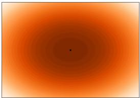

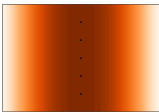

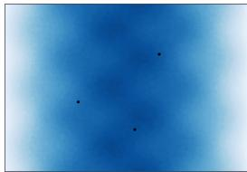  
(a) The returns forecasting task opti- (b) The SDF estimation task admits (c) Noisy representations distort mizes for a single point optimum. a manifold of equivalent solutions. manifold, causing spurious minima. Figure 1: Comparison of forecasting and SDF objectives, and the impact of noisy representations.

Unlike returns forecasting [9], which focuses on predicting conditional expectations, SDF estimation is inherently underdetermined and requires learning representations that are sufficient to satisfy pricing constraints across all assets (see Figure 1a-b). This requires capturing the joint structure of market states and their associated risk, rather than extracting predictive signals for individual assets.

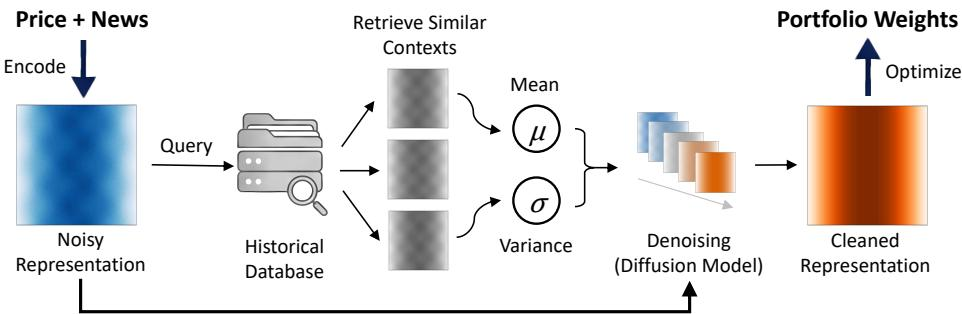  
Figure 2: Overview of RADAR, which learns a clean market state representation for SDF estimation.

To obtain market representations, two fundamental limitations exist in current deep-learning methods. Firstly, financial markets are inherently non-stationary, often exhibiting regime shifts [16] that alter the structural relationships between features and returns. As a result, models can be biased by the relative coverage of different regimes in the dataset. Some methods attempt to address non-stationarity through temporal weighting [31] or trend decomposition [51], but they typically rely on heuristics and fail to capture contextual similarities across market states. Secondly, while textual data provides useful signals [20, 52], it is often noisy and contains irrelevant information with limited economic relevance [49]. Training on such embeddings makes it harder for the model to capture economically meaningful signals, leading to suboptimal pricing and asset allocation decisions (see Figure 1c).

Among existing modeling paradigms, diffusion-based methods have recently emerged as a promising approach for learning robust representations and capturing uncertainty in stochastic environments [24, 15]. However, they typically operate only on the time-series modality and rely on isotropic Gaussian noise during training, which does not capture the state-dependent and heteroskedastic nature of financial uncertainty. The closest alternative is Retrieval-Augmented Time-series Diffusion model (RATD) [30], which retrieves similar historical states as reference to a diffusion model. However, these retrieved states are used to condition the denoising process rather than guide the stochastic noise generation in the diffusion process. Furthermore, they also do not deal with multimodal inputs.

To address these, we propose Retrieval-Augmented Diffusion-based Assets Representation (RADAR), a framework for learning market representations for SDF estimation (see Figure 2). Firstly, to account for non-stationarity, we introduce a retrieval-augmented diffusion process that conditions on contextually similar historical regimes. This enables regime-aware representations that are grounded in relevant historical conditions rather than aggregated across unrelated periods. Secondly, to mitigate noise in unstructured data, we treat the latent representations of both price and news as corrupted observations and refine them via a conditional diffusion process, which iteratively denoises the representations. This allows the model to generalize across similar contexts while suppressing the idiosyncratic noise from individual observations. Lastly, to capture state-dependent uncertainty, we initialize the diffusion process using the mean and variance of the retrieved contexts. This grounds the denoising trajectory in empirical conditional distributions, enabling the learned representations to better reflect the risk–return characteristics of the current market state for downstream SDF estimation.

Experimental results show that RADAR consistently achieves state-of-the-art performance across key risk-adjusted metrics, including Sharpe, Sortino, and Calmar ratios. Additional analyses on the learned representations also show that the model produce economically meaningful signals on asset returns and correlations that are beneficial for portfolio outcomes. In summary, our contributions are:

• We introduce a state-dependent diffusion formulation where the noise distribution is conditioned on retrieved historical contexts, addressing a key mismatch between standard diffusion assumptions and financial data.

• We show that retrieval can be used to model conditional uncertainty, enabling regime-aware representation learning in non-stationary environments.

• We propose the RADAR framework for learning clean market representations for SDF-based portfolio optimization using multimodal inputs and context-aware denoising.

• We demonstrate strong empirical performance and provide analyses showing that the learned representations are economically meaningful and effective for portfolio construction.

## 2 Related Works

Financial Forecasting. The financial forecasting task is primarily concerned with extracting predictive signals from input data to estimate stock prices. While early approaches in financial forecasting explored the applicability of deep learning techniques on forecasting stock movements [9, 43], recent works have seen practitioners incorporating stylized financial characteristics into their model designs. For example, works have explored the use of textual information [20, 52] to capture market trends and volatility, following the concept of informationally efficient financial markets [11, 25]. Other works have also explored using diffusion noise to model the stochastic noise in financial prices [24, 15], following the idea of randomness in financial markets [36, 12]. These two perspectives are typically studied in isolation in existing works. In contrast, our approach integrates both information-driven signals and stochastic noise modeling, and applies this unified framework to portfolio applications.

Deep Learning for Portfolio Optimization. The portfolio optimization task aims to allocate capital across multiple assets to achieve optimal balance between risk and returns [38]. Beyond classical mean-variance approaches [37], recent works have also seen practitioners incorporate deep-learning methods into portfolio optimization applications. For example, Hierarchical Risk Parity (HRP) [34] leverages hierarchical clustering to construct diversified portfolios based on graph theory; reinforcement learning (RL) is used to learn portfolio weights that dynamically adjust over time [21, 50]. The most recent theory-based approaches adopt the stochastic discount factor (SDF) framework [22, 23], which provides a unified formulation for evaluating assets through risk-adjusted valuation. Rather than directly forecasting returns, this framework learns a pricing model that leverages shared structure across assets, implicitly capturing risk premia and state-dependent riskreturn trade-offs. This aligns with a broader trend of learning structured representations in financial markets [47, 39, 14] which aim to encode cross-asset relationships for downstream portfolio decisions. However, learning such asset representations remains challenging in practice due to non-stationarity, noisy inputs, and the context-dependent nature of financial risk, which our work aims to tackle.

Non-Isotropic Diffusion Processes. Standard diffusion models typically adopt a fixed isotropic Gaussian noise process [18]. However, recent works have also explored the use of non-isotropic diffusion processes. For example, some approaches learn input-dependent multivariate noise schedules, allowing different data dimensions to receive noise at different rates [46]. Other works explored using flexible forward processes to make the reverse generation path easier to learn [4], or performing time-dependent non-linear transformations of the data during diffusion [3]. In time-series forecasting, works have introduced learned non-linear transformations and conditioning variables into the forward process [45], or adapted the endpoint distribution and noise schedule using forecasted conditional statistics [53, 28]. However, most of these works primarily learn how to modify the diffusion process, whereas our approach constructs the noise distribution directly from retrieved historical samples.

## 3 The RADAR Framework

In this section, we first study the portfolio optimization problem within the stochastic discount factor (SDF) framework from a deep-learning perspective. We then explain the proposed Retrieval-Augmented Diffusion-based Assets Representation (RADAR) framework, shown in Figure 3.

## 3.1 Problem Formulation

At each time step t, we observe two input modalities which are describing the market state: time-series asset prices $\mathbf { x } _ { t } ^ { ( p ) }$ and textual news data $\mathbf { x } _ { t } ^ { ( n ) }$ . Our goal is to learn the joint representative embeddings:

$$
\begin{array} { r } { \hat { \mathbf { z } } _ { t } = f ( \mathbf { x } _ { t } ^ { ( p ) } , \mathbf { x } _ { t } ^ { ( n ) } ) , } \end{array}\tag{1}
$$

which should capture useful information about the current market state. This representation is used to learn the asset portfolio weights $\hat { \mathbf { w } } _ { t } \in \mathbb { R } ^ { N }$ , where N is the number of assets. Formally, we have:

$$
\hat { \mathbf { w } } _ { t } = g ( \hat { \mathbf { z } } _ { t } ) .\tag{2}
$$

We adopt the stochastic discount factor (SDF) framework [23, 17] to define a principled training objective. Given the next-period asset return $\mathbf { r } _ { t + 1 } \in \mathbb { R } ^ { N }$ , the predicted weights induce a portfolio return $\hat { \mathbf { w } } _ { t } ^ { \top } \mathbf { r } _ { t + 1 }$ , where a value of 0 corresponds to no change in wealth. The SDF is then defined as $1 - \hat { \mathbf { w } } _ { t } ^ { \top } \mathbf { r } _ { t + 1 }$ , and minimizing its second moment makes it price every asset with zero error [23].

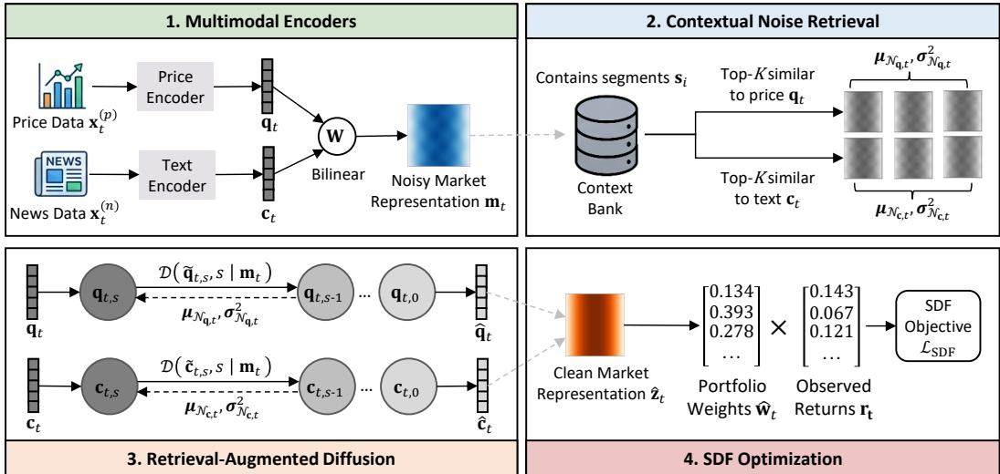  
Figure 3: The RADAR framework. The price and text embeddings, noisy market representation and retrieved contextual noise are used in the diffusion process to obtain the clean market representation.

Intuitively, minimizing this pricing error encourages the model to ensure that portfolio outcomes are consistent with the information used to construct them. Both positive and negative pricing errors on an asset indicate a mismatch between the learned representation and future returns. In particular, systematic mispricing suggests that the representation $\hat { \mathbf { z } } _ { t }$ fails to capture structure in the returns that could be explained by the input data. By penalizing such errors, the model is driven to learn representations that account for the predictable components of returns, rather than spurious patterns.

Following this, we then train the model by minimizing the corresponding SDF-based objective:

$$
\mathcal { L } _ { \mathrm { S D F } } = \mathbb { E } _ { t } \left[ \left( 1 - \hat { \mathbf { w } } _ { t } ^ { \top } \mathbf { r } _ { t + 1 } \right) ^ { 2 } \right] + \lambda \| \hat { \mathbf { w } } _ { t } \| _ { 2 } ^ { 2 } ,\tag{3}
$$

where $\lambda \| \hat { \mathbf { w } } _ { t } \| _ { 2 } ^ { 2 }$ is a $\ell _ { 2 }$ regularization term to prevent any unstable extreme [27] portfolio weights.

## 3.2 Multimodal Encoders

To obtain the initial embeddings from the heterogeneous multi-modal inputs, we first employ modalityspecific encoders [48] for the time-series asset prices and textual news data, and blend them.

For the price time-series data, we model the temporal dependencies using a gated recurrent unit (GRU) price encoder. Given the historical price sequence $\mathbf { x } _ { t } ^ { ( p ) }$ , we extract the hidden states, which are then aggregated via a temporal attention mechanism $\mathrm { A t t n } _ { p }$ to produce the price representation:

$$
\begin{array} { r } { \mathbf q _ { t } = \mathrm { A t t n } _ { p } \big ( \mathrm { G R U } _ { p } ( \mathbf x _ { t } ^ { ( p ) } ) \big ) , } \end{array}\tag{4}
$$

For the text modality, we leverage pre-trained financial language models [2] to extract embeddings from the textual news data $\mathbf { x } _ { t } ^ { ( n ) }$ . We then model the sequential dependencies of these embeddings using a GRU news encoder and a sequential attention mechanism to derive the text representation:

$$
\begin{array} { r } { \mathbf { c } _ { t } = { \mathrm { A t t n } } _ { n } \left( { \mathrm { G R U } } _ { n } \big ( { \mathrm { E m b e d } } ( \mathbf { x } _ { t } ^ { ( n ) } ) \big ) \right) , } \end{array}\tag{5}
$$

Given the modality-specific representations $\mathbf { q } _ { t }$ and $\mathbf { c } _ { t }$ , we blend them by applying a bilinear transformation which captures cross-modality dependencies. Specifically, we compute a joint representation:

$$
\begin{array} { r } { \mathbf { m } _ { t } = \mathrm { R e L U } \left( \mathbf { q } _ { t } ^ { \top } \mathbf { W } \mathbf { c } _ { t } + \mathbf { b } \right) , } \end{array}\tag{6}
$$

where W and b are the learnable parameters, and ReLU is the non-linear activation function.

## 3.3 Contextual Noise Retrieval

The learnt representation is unstable, as asset price data contains stochastic noise [24] while news data often contains chaotic irrelevant information [20], which requires denoising. On the other hand, standard diffusion denoising techniques typically rely on isotropic Gaussian noise, which is independent of the input and may fail to preserve meaningful structure in the representation.

To address this issue, we introduce a retrieval-based mechanism to construct context-dependent noise distributions from historically similar market states. The data is first organized around news events. Let $\{ \tau _ { i } \} _ { i = 1 } ^ { M }$ denote the time indices at which news events arrive, ordered chronologically. For each news event at time $\tau _ { i } ,$ we define an event segment consisting of the news observed at that time together with their subsequent asset price sequences up to, but excluding, the next news event:

$$
\mathbf { s } _ { i } = \left( \mathbf { x } _ { \tau _ { i } } ^ { ( n ) } , \mathbf { x } _ { \tau _ { i } : \tau _ { i + 1 } - 1 } ^ { ( p ) } \right) .\tag{7}
$$

Each segment $\mathbf { s } _ { i }$ captures the impact of a news event on the market before new information arrives. We then encode each event segment using the same encoders and bilinear transformation used in Equations 4, 5 and 6, to obtain the segment representations $\tilde { \bf { s } } _ { i } .$ , which are stored in a context bank.

At each time step $t ,$ we retrieve the most relevant historical segments in the current context bank across both modalities, calculated using the cosine similarity metric. For each modality, we have:

$$
\mathcal { N } _ { \mathbf { q } , t } = \mathrm { T o p K } _ { i : \tau _ { i } < t } \cos \big ( \mathbf { q } _ { t } , \tilde { \mathbf { s } } _ { i } \big ) ,\tag{8}
$$

This captures similar historical price trajectories, and the news information that just preceded them.

$$
\mathcal { N } _ { \mathbf { c } , t } = \mathrm { T o p K } _ { i : \tau _ { i } < t } \cos { \left( \mathbf { c } _ { t } , \tilde { \mathbf { s } } _ { i } \right) } ,\tag{9}
$$

This captures historical news with similar semantic content, and their subsequent price trajectories.

The retrieved sets represent the possible states that the market could be in, for each modality. We model their means and variances as noise distribution parameters. For the price modality, we have:

$$
\mu _ { \mathcal { N } _ { \mathbf { q } , t } } = \frac { 1 } { K } \sum _ { k = 1 } ^ { K } \tilde { \mathbf { s } } _ { k } , \quad \pmb { \sigma } _ { \mathcal { N } _ { \mathbf { q } , t } } ^ { 2 } = \frac { 1 } { K } \sum _ { k = 1 } ^ { K } \left( \tilde { \mathbf { s } } _ { k } - \pmb { \mu } _ { \mathcal { N } _ { \mathbf { q } , t } } \right) ^ { 2 } , \qquad \tilde { \mathbf { s } } _ { k } \in \mathcal { N } _ { \mathbf { q } , t } .\tag{10}
$$

The noise distribution of the text modality $\left( \mu _ { \mathcal { N } _ { \mathbf { c } , t } } , \sigma _ { \mathcal { N } _ { \mathbf { c } , t } } ^ { 2 } \right)$ is then calculated in a similar manner.

## 3.4 Retrieval-Augmented Diffusion

In this step, we refine the learnt modality embeddings $\mathbf { q } _ { t }$ and $\mathbf { c } _ { t }$ through a diffusion process, guided by the retrieved contextual noise distribution and conditioned on the joint market representation.

Forward Process. We adopt a dual-path formulation that perturbs the price and text representations independently. At each diffusion step $s ,$ we inject the retrieved contextual noise into the embeddings:

$$
\widetilde { \mathbf { q } } _ { t , s } = \sqrt { \bar { \alpha } _ { s } } \mathbf { q } _ { t } + \sqrt { 1 - \bar { \alpha } _ { s } } \left( \pmb { \mu } _ { \mathcal { N } _ { \mathbf { q } , t } } + \pmb { \sigma } _ { \mathcal { N } _ { \mathbf { q } , t } } \odot \pmb { \epsilon } _ { \mathbf { q } } \right) ,\tag{11}
$$

$$
\widetilde { \mathbf { c } } _ { t , s } = \sqrt { \bar { \alpha } _ { s } } \mathbf { c } _ { t } + \sqrt { 1 - \bar { \alpha } _ { s } } \left( \pmb { \mu } _ { \mathcal { N } _ { \mathbf { c } , t } } + \pmb { \sigma } _ { \mathcal { N } _ { \mathbf { c } , t } } \odot \mathbf { \epsilon } _ { \mathbf { c } } \right) ,\tag{12}
$$

where $\epsilon _ { \mathbf { q } } , \epsilon _ { \mathbf { c } } \sim \mathcal { N } ( \mathbf { 0 } , \mathbf { I } )$ , and $\bar { \alpha } _ { s }$ controls the noise schedule. Unlike standard diffusion models that employ isotropic Gaussian noise, the perturbations are governed by context-specific statistics, allowing them to model potential unrealized paths using historically similar market states.

Reverse Process. To recover clean representations, we employ the denoising functions $\mathcal { D } _ { p }$ and $\textstyle { \mathcal { D } } _ { n } \colon$

$$
\hat { \mathbf { q } } _ { t } = \mathcal { D } _ { p } \big ( \tilde { \mathbf { q } } _ { t , s } , s \mid \mathbf { m } _ { t } \big ) , \qquad \hat { \mathbf { c } } _ { t } = \mathcal { D } _ { n } \big ( \tilde { \mathbf { c } } _ { t , s } , s \mid \mathbf { m } _ { t } \big ) .\tag{13}
$$

Each denoiser conditions on the shared market representation $\mathbf { m } _ { t } ,$ enabling cross-modal information exchange during reconstruction, while denoising towards a generalized state for each modality.

The denoiser contains a self-attention layer, applied to the two noisy embeddings $\mathbf { q } _ { t }$ and $\mathbf { c } _ { t } .$ , together with the market-state conditioning $\mathbf { m } _ { t } ,$ and a sinusoidal embedding of the diffusion step s. The layer applies LayerNorm, followed by the query, key, value projections and scaled dot-product attention.

Denoising Objective. We train the model using a joint reconstruction objective over both modalities:

$$
\mathcal { L } _ { \mathrm { D i f f } } = \mathbb { E } _ { t , s } \left[ \left\| \mathbf { q } _ { t } - \hat { \mathbf { q } } _ { t } \right\| _ { 2 } ^ { 2 } + \left\| \mathbf { c } _ { t } - \hat { \mathbf { c } } _ { t } \right\| _ { 2 } ^ { 2 } \right] .\tag{14}
$$

This objective encourages the model to reconstruct modality-specific representations from their noisy counterparts, serving as refined features for subsequent market representation construction.

A derivation of the diffusion process formulation used in RADAR can be found in Appendix A.

Final Representation. Using the denoised modality-specific representations $\hat { \mathbf { q } } _ { t }$ and $\hat { \mathbf { c } } _ { t } .$ , we construct the final, refined market representation by aggregating across the refined cross-modal signals:

$$
\hat { \mathbf { z } } _ { t } = ( 1 - \gamma ) \left( \hat { \mathbf { q } } _ { t } + \hat { \mathbf { c } } _ { t } \right) + \gamma \mathbf { q } _ { t } ,\tag{15}
$$

where $\gamma$ is a hyperparameter that balances the contribution between the denoised cross-modal information and the original price representation. The price representation is used as an additional signal for portfolio optimization, with cross-modal information serving as the cleaned state representation.

## 3.5 Overall Training Objective

Finally, the model is trained by jointly optimizing the diffusion and SDF-based portfolio objective:

$$
\mathcal { L } = \mathcal { L } _ { \mathrm { S D F } } + \rho \cdot \mathcal { L } _ { \mathrm { D i f f } } ,\tag{16}
$$

where $\rho$ balances the market representation learning and downstream portfolio optimization task.

## 4 Experiments

Dataset. We evaluate RADAR on the S&P 500 constituent stocks. We collect daily adjusted close prices from Yahoo Finance and financial news articles from FNSPID [10], and the final dataset includes 377 U.S. equities that appear in both the S&P 500 index and the news corpus. The duration spans from June 2011 to June 2020, covering approximately 2,270 trading days. To avoid look-ahead bias, we adopt a rolling-window protocol: each window uses 4 years of data for training (with a 90:10 train/validation split) and the subsequent 1 year for out-of-sample testing, rolling forward by 1 year.

Baselines. Following our motivation, we compare RADAR against two families of baselines.

Time-seriesforecasting models. We compare against StockNet [52], which incorporates both price and textual signals; HAN [20], which models hierarchical text representations; NGAT [41], which captures cross-asset relationships via graph attention; iTransformer [32], a recent transformer-based time-series model; and RATD [30], a retrieval-augmented diffusion model for time-series forecasting. RATD is the closest related work as it also incorporates context retrieval into the diffusion process; however, it uses retrieved sequences as conditional guidance over the diffusion process, rather than using them to construct context-dependent noise for the diffusion process, as was done in our work. These models were used to predict future stock returns. From these forecasts, we construct portfolios by ranking the predicted returns and equally weighting the top-50 stocks at each rebalancing date.

End-to-end portfolio optimization models. We also compare against the same baselines used in the original SDF work: BSV [5], a linear characteristic-based model; DKKM [7], a high-dimensional nonlinear model based on random features; MLP, a deep neural network using own-asset characteristics; Linear Attention (LinAttn), which introduces cross-asset interactions through attention; and SDF [23], a transformer-based model that incorporates cross-asset information sharing, which performed the best in the SDF work. These models directly learn portfolio weights from the input features.

We evaluate portfolio performance using returns-based, risk-based, and risk-adjusted portfolio metrics. The cumulative and annualized returns measure the overall profitability of the portfolio. However, profitability metrics alone may be insufficient, as high returns can usually be achieved by taking on excessive risk. To account for this, we include risk-based metrics such as maximum drawdown and volatility, which capture the downside risk and the variability of returns. Finally, we report risk-adjusted metrics including the Sharpe, Sortino, and Calmar ratios, which assess the efficiency of returns relative to different notions of risk, and serve as the main indicators of portfolio quality.

Implementation Details. RADAR uses GRU-based encoders with additive attention pooling for both price and text modalities, fused via a bilinear layer. The hidden dimension is set to 64. The diffusion module uses T = 100 timesteps with a linear noise schedule. We retrieve the top K = 10 nearest neighbors from the context bank, which is refreshed every 5 epochs. We use an input sequence length of 60 trading days and a rebalancing horizon of H = 7 days. The model is optimized with AdamW and cosine annealing over 50 epochs with early stopping (patience = 10). Gradients are clipped at 1.0. All experiments are conducted on a single NVIDIA GeForce RTX 4090 GPU.

## 5 Results

Table 1: Performance comparison. The best baselines are underlined, and the best results are bolded.
<table><tr><td>Model</td><td>Sharpe (↑)</td><td>Sortino (↑)</td><td>Calmar (↑)</td><td>CumRet (↑)</td><td>AnnRet (↑)</td><td>MaxDD (↓)</td><td>Vol (↓)</td></tr><tr><td>Benchmarks</td><td></td><td></td><td></td><td></td><td></td><td></td><td></td></tr><tr><td>S&amp;P 500</td><td>0.513</td><td>0.576</td><td>0.244</td><td>0.487</td><td>0.083</td><td>0.339</td><td>0.191</td></tr><tr><td>Equal Weight [6]</td><td>0.795</td><td>0.873</td><td>0.393</td><td>1.005</td><td>0.149</td><td>0.380</td><td>0.200</td></tr><tr><td>Forecasting</td><td></td><td></td><td></td><td></td><td></td><td></td><td></td></tr><tr><td>HAN [20]</td><td>0.705</td><td>0.816</td><td>0.355</td><td>0.892</td><td>0.123</td><td>0.347</td><td>0.191</td></tr><tr><td>StockNet [52]</td><td>0.780</td><td>0.899</td><td>0.387</td><td>1.218</td><td>0.156</td><td>0.404</td><td>0.216</td></tr><tr><td>iTransformer [32]</td><td>0.758</td><td>0.877</td><td>0.393</td><td>0.997</td><td>0.134</td><td>0.342</td><td>0.190</td></tr><tr><td>NGAT [41]</td><td>0.710</td><td>0.817</td><td>0.334</td><td>0.893</td><td>0.123</td><td>0.369</td><td>0.189</td></tr><tr><td>RATD [30]</td><td>0.680</td><td>0.754</td><td>0.302</td><td>0.844</td><td>0.130</td><td>0.431</td><td>0.214</td></tr><tr><td>Portfolio Opt</td><td></td><td></td><td></td><td></td><td></td><td></td><td></td></tr><tr><td>BSV [5]</td><td>0.361</td><td>0.481</td><td>0.164</td><td>0.252</td><td>0.046</td><td>0.281</td><td>0.160</td></tr><tr><td>DKKM [7]</td><td>0.367</td><td>0.489</td><td>0.177</td><td>0.229</td><td>0.042</td><td>0.238</td><td>0.139</td></tr><tr><td>LinAttn</td><td>0.407</td><td>0.558</td><td>0.326</td><td>0.195</td><td>0.036</td><td>0.111</td><td>0.100</td></tr><tr><td>MLP</td><td>0.502</td><td>0.710</td><td>0.406</td><td>0.203</td><td>0.038</td><td>0.093</td><td>0.080</td></tr><tr><td>SDF [23]</td><td>0.505</td><td>0.690</td><td>0.313</td><td>0.211</td><td>0.039</td><td>0.125</td><td>0.083</td></tr><tr><td>Our Model</td><td></td><td></td><td></td><td></td><td></td><td></td><td></td></tr><tr><td>RADAR</td><td>1.062</td><td>1.352</td><td>0.924</td><td>2.502</td><td>0.285</td><td>0.308</td><td>0.271</td></tr></table>

Performance Comparison. Table 1 reports the forecasting results. We can observe the following:

• The Equal Weight portfolio obtained strong results across all metrics, and achieved the secondhighest Sharpe ratio. Prior work [6] have shown that it is often difficult to outperform naive equal-weighted diversification in practice, as forecasted returns are often noisy, and portfolio optimization strategies amplifies any forecasting errors. Equal weighting avoids this issue by ignoring forecasts altogether and therefore remains highly robust on the out-of-sample test data.

• The forecasting models achieved close performance, with StockNet delivering the second-best results on some metrics. Here, the portfolio is constructed by buying the forecasted top-50 assets, which allows these models to perform better on the returns compared to the portfolio methods, but also realizing higher volatilities. However, we note that their results remain relatively consistent with each other and similar to equal-weighting regardless of model forecasting performance. By buying a larger number of assets, any forecasting errors for an asset get neutralized by the others, showing that forecasting ability might not matter much in a real-life multi-asset portfolio setting.

• The portfolio methods show results that are largely consistent with those reported in the original SDF work [23]. The Sharpe performance increases from BSV which is linear, across higher levels of model expressiveness in DKKM, LinAttn and MLP. The original SDF model introduces crossasset information sharing, which outperforms the others. In that sense, our results are consistent with the reported takeaway that both model expressiveness and cross-asset structures matter for portfolio performance. We note that these models demonstrate lower drawdowns and volatility than the forecasting models due to not optimizing only for returns. However, their Sharpe ratios remain lower, which might be due to their lower expressiveness compared to the deep-learning models.

• RADAR attains the best performance on most metrics including the Sharpe, Sortino, and Calmar ratios, indicating the best overall risk-return trade-off among all methods. It also achieved lower drawdowns than the forecasting models. The non-ratios metric performances could be less crucial here, as the model seeks to optimize for the best trade-offs to get the best portfolio results.

We also provide statistical significance and robustness analyses in Appendix B.

Table 2: Ablation study across different data and component variations of the RADAR framework.
<table><tr><td>Model</td><td>Sharpe (↑)</td><td>Sortino (↑)</td><td>Calmar (↑)</td><td>CumRet (↑)</td><td>AnnRet (↑)</td><td>MaxDD (↓)</td><td>Vol (↓)</td></tr><tr><td>Data</td><td></td><td></td><td></td><td></td><td></td><td></td><td></td></tr><tr><td>w/o News</td><td>0.650</td><td>0.821</td><td>0.304</td><td>1.229</td><td>0.174</td><td>0.573</td><td>0.332</td></tr><tr><td>w/o Price</td><td>0.797</td><td>0.878</td><td>0.395</td><td>1.003</td><td>0.149</td><td>0.377</td><td>0.200</td></tr><tr><td>Components</td><td></td><td></td><td></td><td></td><td></td><td></td><td></td></tr><tr><td>SDF (baseline)</td><td>0.505</td><td>0.690</td><td>0.313</td><td>0.211</td><td>0.039</td><td>0.125</td><td>0.083</td></tr><tr><td>+ Embeddings</td><td>0.859</td><td>0.959</td><td>0.429</td><td>1.138</td><td>0.164</td><td>0.383</td><td>0.201</td></tr><tr><td>+ Diffusion</td><td>0.411</td><td>0.466</td><td>0.108</td><td>0.501</td><td>0.085</td><td>0.784</td><td>0.525</td></tr><tr><td>Our Model</td><td></td><td></td><td></td><td></td><td></td><td></td><td></td></tr><tr><td>RADAR</td><td>1.062</td><td>1.352</td><td>0.924</td><td>2.502</td><td>0.285</td><td>0.308</td><td>0.271</td></tr></table>

Ablation Study. We conduct an ablation study to demonstrate the effectiveness of the model design.

• From Table 2, removing either of the news or price inputs degrade performance, showing that both information sources are crucial for model performance. Among the two, the No Price variant shows relatively low volatility results, which suggests that much of the volatility is driven by the noisy price data. This is consistent with prior literature [6, 24] which show that price information often contain noise, leading to more volatile forecasts, which are further amplified in portfolio strategies.

• Moving from the SDF baseline to +Embeddings yields a clear improvement across most metrics. In the original SDF work [23], the portfolio learning component operates directly on the raw features, whereas we first learn a market representation before optimization. The improvement suggests that the representation learning helps to organize the market data into a cleaner latent space, separating the information from noise and making the downstream portfolio optimization more effective.

• Moving from +Embeddings to +Diffusion unexpectedly reduces performance. A plausible explanation is that the learnt embeddings already capture most of the useful information available in the data, so further corrupting them with unrelated Gaussian noise weakens the representation rather than improving it. This could be corroborated by the degraded performance in the max drawdown and volatility metrics. Here, diffusion noise appears to act more as distortion than regularization.

• RADAR achieves the best performance across most key metrics. Unlike +Diffusion, RADAR introduces a context bank that retrieves relevant historical states, hence the added noise is no longer arbitrary but grounded in meaningful past market conditions. This provides a set of plausible future states over which the portfolio can be optimized, resulting in a more robust risk-return trade-off.

Parameter Selection. For the context bank, we do a study over different values of top K, which determines the number of relevant historical segments used to determine the diffusion parameters.

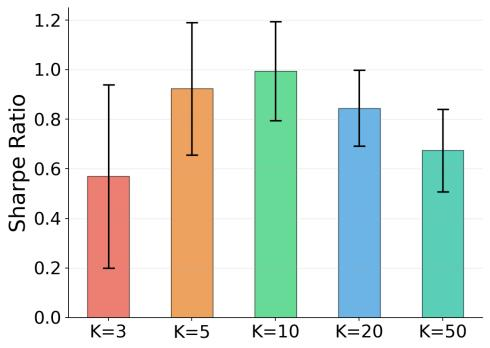  
(a) Sharpe Ratio (mean ± std)

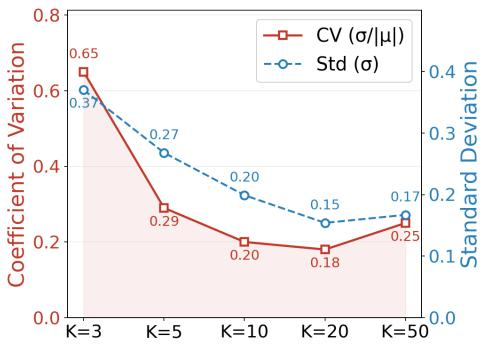  
(b) Cross-Seed Instability: CV and Std  
Figure 4: Effect of different top-K values on performance and stability across random seeds.

From Figure 4, we see a clear trade-off between retrieval robustness and signal fidelity as K varies. When K is small, performance exhibits substantial cross-seed variability, indicating that the retrieval process is not stable. Intuitively, relying on only a few retrieved neighbors makes the estimated signal highly sensitive to small perturbations, which propagates into downstream portfolio outcomes.

On the other hand, at larger values of $K ,$ , although variability remains low, the mean Sharpe performance begins to deteriorate. This indicates that incorporating too many retrieved samples also introduces less relevant information, effectively diluting the signal and reducing overall effectiveness.

We chose $K = 1 0$ as our setting, which shows strong performance while maintaining low variability.

Market Representation Study. Our work aims to learn market representations that improve portfolio outcomes. We study whether the denoised embeddings capture meaningful market structure.

In Figure 5, we study the asset correlation information (required for portfolio optimization) captured by the original noisy embeddings $\mathbf { m } _ { t }$ and the cleaned RADAR embeddings $\hat { \mathbf { z } } _ { t }$

Here, all asset pairs are ranked by cosine similarity in the embedding space and grouped into deciles, from least (Decile 1) to most similar (Decile 10). For each decile, we compute the average realised return correlation between the corresponding asset pairs.

A meaningful representation should produce a monotonic relationship: higher embedding similarities should correspond to stronger correlations.

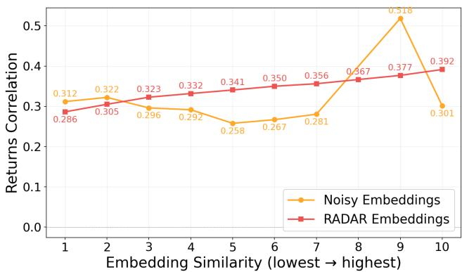  
Figure 5: Embedding Similarity vs Returns Correlation. Reported values are aggregated over 5 rolling windows.

As shown, the RADAR embeddings yield a clearer and more monotonic increase in correlation across deciles compared to the noisy embeddings. This indicates that the context-aware denoising process helps to improve alignment between embedding similarity and true market co-movement.

In Figure 6, we evaluate whether the cleaned RADAR embeddings $\hat { \mathbf { z } } _ { t }$ capture any useful information about the constituent asset returns performance, which are also required for portfolio optimization.

At each rebalancing date, the learnt asset embeddings are mapped to scalar scores via a MLP scoring network. Assets are then ranked by these scores and partitioned into quintiles, from highest (Q1) to lowest (Q5). Each quintile forms an equal-weighted portfolio, and we track cumulative NAV over time using forward returns.

A meaningful representation should induce a monotonic ordering: portfolios formed from the higher-scoring assets should outperform those formed from lower-scoring assets.

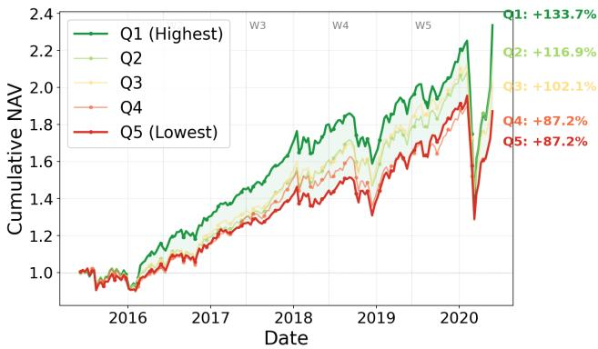  
Figure 6: Quintile Portfolio NAV by Asset Scoring.

As shown, the NAV curves exhibit a clear separation, with Q1 consistently

outperforming the lower quintiles. This indicates that the RADAR embeddings capture economically meaningful cross-sectional asset returns signals that translate into improved portfolio performance.

Robustness to Context and Target Lengths. We further evaluate the robustness of RADAR across different input and output lengths by varying the input length $L \in \{ 6 0 , 1 2 0 \}$ and rebalancing horizon $H \in \{ 1 , 7 , 2 0 \}$ . As shown in Figure 7, RADAR consistently achieves the highest Sharpe ratio and cumulative return across all six configurations. Performance generally decreases as the rebalancing horizon increases as longer horizons introduce greater uncertainty in future price movements, but RADAR remains consistently above the forecasting baselines. These results demonstrate that the performance gains of RADAR are not specific to any particular choice of input or output lengths.

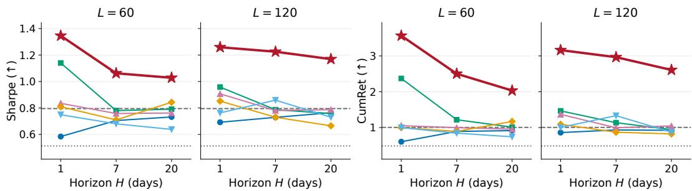  
RADAR (ours) HAN StockNet iTransformer NGAT RATD S&P 500 Equal Weight  
Figure 7: Performance across different input length L and rebalancing horizon H. Each pair shares its y-axis. S&P 500 and Equal Weight do not depend on L and H, and are drawn as reference lines.

Generalizability to Other Domains. For generalizability, we further evaluate RADAR on Time-MMD [29], a multi-modal (text + numerical) time-series benchmark spanning multiple domains.

Overall, we find that RADAR is largely generalizable across multiple domains. In some cases such as Security and Traffic, No Diffusion performs the best, which might be attributed to the lack of noise in the data. In other cases, injecting Gaussian noise does not appear to degrade performance, unlike the observations in our financial domain. This might indicate that the noise distribution of data in these domains is closer to Gaussian. These observations could be studied further in future work, based on the specific noise characteristics of each domain.

Table 3: Generalizability on different domains.
<table><tr><td>Domain</td><td>No Diff.</td><td>Gaussian</td><td>RADAR</td></tr><tr><td>Agriculture</td><td>2.328</td><td>2.375</td><td>2.240</td></tr><tr><td>Climate</td><td>0.484</td><td>0.464</td><td>0.464</td></tr><tr><td>Energy</td><td>1.753</td><td>0.540</td><td>0.517</td></tr><tr><td>Environment</td><td>0.931</td><td>0.946</td><td>0.928</td></tr><tr><td>Health (AFR)</td><td>2.413</td><td>4.203</td><td>1.635</td></tr><tr><td>Health (US)</td><td>1.007</td><td>0.956</td><td>0.821</td></tr><tr><td>Security</td><td>1.526</td><td>1.584</td><td>1.557</td></tr><tr><td>SocialGood</td><td>0.953</td><td>0.547</td><td>0.512</td></tr><tr><td>Traffic</td><td>1.154</td><td>1.350</td><td>1.290</td></tr></table>

Additional Results. More detailed performance analyses on the RADAR framework are provided in the appendix. In particular, Appendix C reports cross-sectional analyses across volatility groups and industry sectors, while Appendix D provides financial factor analyses and portfolio alpha studies.

## 6 Conclusion

In this work, we studied the portfolio task under the stochastic discount factor (SDF) framework. We explore learning clean market representations to better capture the underlying structure of financial data to perform portfolio optimization. This problem is challenging due to several factors: financial markets exhibit time-varying dynamics with shifting regimes, the multimodal inputs of price and news data often contain noise, and isotropic noise do not capture the state-dependent and heteroskedastic nature of financial uncertainty. To address these issues, we introduced RADAR, a retrieval-augmented diffusion framework that learns context-aware market representations by conditioning on similar historical regimes to denoise multimodal features. We conducted extensive experiments on forecasting and portfolio models, and showed that RADAR achieves strong performance on key risk-adjusted metrics, while producing representations that align with assets co-movement and returns structure.

Limitations. Our experiments rely on the FNSPID news dataset [10], which is relatively sparse in coverage. Since our retrieval mechanism depends on the availability of relevant historical contexts, limited news coverage would affect the quality of the learnt representations. However, we also note that the FNSPID dataset is widely used in literature [33, 29, 1], whereas more comprehensive but proprietary sources (e.g., Bloomberg, Reuters) could reduce the overall replicability of the work.

Compared to classical SDF approaches [22, 23] that operate directly on raw characteristics, our use of embeddings to optimize portfolio weights may reduce interpretability, as the resulting representations are less directly tied to economically meaningful factor inputs. This limits the ability of the framework to capture feature importance. However, this limitation could be mitigated by applying post-hoc explanation techniques such as SHAP [35] or LIME [44], which we will leave for future work.

## References

[1] Divyansh Agarwal, Alexander Richard Fabbri, Ben Risher, Philippe Laban, Shafiq Joty, and Chien-Sheng Wu. Prompt leakage effect and mitigation strategies for multi-turn llm applications. In Proceedings of the 2024 Conference on Empirical Methods in Natural Language Processing: Industry Track, pages 1255–1275, 2024.

[2] Dogu Araci. Finbert: Financial sentiment analysis with pre-trained language models. arXiv preprint arXiv:1908.10063, 2019.

[3] Grigory Bartosh, Dmitry Vetrov, and Christian A Naesseth. Neural diffusion models. arXiv preprint arXiv:2310.08337, 2023.

[4] Grigory Bartosh, Dmitry Vetrov, and Christian A Naesseth. Neural flow diffusion models: Learnable forward process for improved diffusion modelling. Advances in Neural Information Processing Systems, 37:73952–73985, 2024.

[5] Michael W Brandt, Pedro Santa-Clara, and Rossen Valkanov. Parametric portfolio policies: Exploiting characteristics in the cross-section of equity returns. The Review ofFinancial Studies, 22(9):3411–3447, 2009.

[6] Victor DeMiguel, Lorenzo Garlappi, and Raman Uppal. Optimal versus naive diversification: How inefficient is the 1/n portfolio strategy? The review ofFinancial studies, 22(5):1915–1953, 2009.

[7] Antoine Didisheim, Shikun Barry Ke, Bryan T Kelly, and Semyon Malamud. Apt or “aipt”? the surprising dominance of large factor models. Technical report, National Bureau of Economic Research, 2024.

[8] Francis X Diebold and Robert S Mariano. Comparing predictive accuracy. Journal ofBusiness & economic statistics, 20(1):134–144, 2002.

[9] Xiao Ding, Yue Zhang, Ting Liu, and Junwen Duan. Deep learning for event-driven stock prediction. In IJCAI, volume 15, pages 2327–2333, 2015.

[10] Zihan Dong, Xinyu Fan, and Zhiyuan Peng. Fnspid: A comprehensive financial news dataset in time series. In Proceedings of the 30th ACM SIGKDD Conference on Knowledge Discovery and Data Mining, pages 4918–4927, 2024.

[11] Eugene F Fama. Efficient capital markets: A review of theory and empirical work. The journal ofFinance, 25(2):383–417, 1970.

[12] Fuli Feng, Huimin Chen, Xiangnan He, Ji Ding, Maosong Sun, and Tat-Seng Chua. Enhancing stock movement prediction with adversarial training. arXiv preprint arXiv:1810.09936, 2018.

[13] Ronald Aylmer Fisher. Statistical methods for research workers. 1934.

[14] Xavier Gabaix, Ralph SJ Koijen, Robert J Richmond, and Motohiro Yogo. Asset embeddings. Technical report, National Bureau of Economic Research, 2025.

[15] Yuan Gao, Haokun Chen, Xiang Wang, Zhicai Wang, Xue Wang, Jinyang Gao, and Bolin Ding. Diffsformer: A diffusion transformer on stock factor augmentation. arXiv preprint arXiv:2402.06656, 2024.

[16] James D Hamilton. A new approach to the economic analysis of nonstationary time series and the business cycle. Econometrica: Journal ofthe econometric society, pages 357–384, 1989.

[17] Lars Peter Hansen and Scott F Richard. The role of conditioning information in deducing testable restrictions implied by dynamic asset pricing models. Econometrica: Journal ofthe Econometric Society, pages 587–613, 1987.

[18] Jonathan Ho, Ajay Jain, and Pieter Abbeel. Denoising diffusion probabilistic models. Advances in neural information processing systems, 33:6840–6851, 2020.

[19] Emiel Hoogeboom and Tim Salimans. Blurring diffusion models. In The Eleventh International Conference on Learning Representations, 2023.

[20] Ziniu Hu, Weiqing Liu, Jiang Bian, Xuanzhe Liu, and Tie-Yan Liu. Listening to chaotic whispers: A deep learning framework for news-oriented stock trend prediction. In Proceedings ofthe eleventh ACM international conference on web search and data mining, pages 261–269, 2018.

[21] Zhengyao Jiang, Dixing Xu, and Jinjun Liang. A deep reinforcement learning framework for the financial portfolio management problem. arXiv preprint arXiv:1706.10059, 2017.

[22] Bryan Kelly, Boris Kuznetsov, Semyon Malamud, and Teng Andrea Xu. Large (and deep) factor models. arXiv preprint arXiv:2402.06635, 2024.

[23] Bryan T Kelly, Boris Kuznetsov, Semyon Malamud, and Teng Andrea Xu. Artificial intelligence asset pricing models. Technical report, National Bureau of Economic Research, 2025.

[24] Kelvin JL Koa, Yunshan Ma, Ritchie Ng, and Tat-Seng Chua. Diffusion variational autoencoder for tackling stochasticity in multi-step regression stock price prediction. In Proceedings of the 32nd ACM International Conference on Information and Knowledge Management, pages 1087–1096, 2023.

[25] Kelvin JL Koa, Yunshan Ma, Ritchie Ng, and Tat-Seng Chua. Learning to generate explainable stock predictions using self-reflective large language models. In Proceedings ofthe ACM web conference 2024, pages 4304–4315, 2024.

[26] Oliver Ledoit and Michael Wolf. Robust performance hypothesis testing with the sharpe ratio. Journal of Empirical Finance, 15(5):850–859, 2008.

[27] Olivier Ledoit and Michael Wolf. Honey, i shrunk the sample covariance matrix. UPF economics and business working paper, (691), 2003.

[28] Yuxin Li, Wenchao Chen, Xinyue Hu, Bo Chen, Mingyuan Zhou, et al. Transformer-modulated diffusion models for probabilistic multivariate time series forecasting. In International Conference on Learning Representations, volume 2024, pages 18604–18622, 2024.

[29] Haoxin Liu, Shangqing Xu, Zhiyuan Zhao, Lingkai Kong, Harshavardhan Prabhakar Kamarthi, Aditya Sasanur, Megha Sharma, Jiaming Cui, Qingsong Wen, Chao Zhang, et al. Time-mmd: Multi-domain multimodal dataset for time series analysis. Advances in Neural Information Processing Systems, 37:77888–77933, 2024.

[30] Jingwei Liu, Ling Yang, Hongyan Li, and Shenda Hong. Retrieval-augmented diffusion models for time series forecasting. Advances in Neural Information Processing Systems, 37:2766–2786, 2024.

[31] Yong Liu, Haixu Wu, Jianmin Wang, and Mingsheng Long. Non-stationary transformers: Exploring the stationarity in time series forecasting. Advances in neural information processing systems, 35:9881–9893, 2022.

[32] Yong Liu, Tengge Hu, Haoran Zhang, Haixu Wu, Shiyu Wang, Lintao Ma, and Mingsheng Long. itransformer: Inverted transformers are effective for time series forecasting. arXiv preprint arXiv:2310.06625, 2023.

[33] Zhaowei Liu, Xin Guo, Zhi Yang, Fangqi Lou, Lingfeng Zeng, Jinyi Niu, Mengping Li, Qi Qi, Zhiqiang Liu, Yiyang Han, et al. Fin-r1: A large language model for financial reasoning through reinforcement learning. arXiv preprint arXiv:2503.16252, 2025.

[34] Marcos Lopez de Prado. Building diversified portfolios that outperform out-of-sample. Journal of Portfolio Management, 2016.

[35] Scott M Lundberg and Su-In Lee. A unified approach to interpreting model predictions. Advances in neural information processing systems, 30, 2017.

[36] Burton G. Malkiel. A Random Walk Down Wall Street. W. W. Norton & Company, 1973.

[37] Harry M. Markowitz. Portfolio selection. The Journal ofFinance, 7(1):77–91, March 1952. doi: 10.2307/2975974.

[38] Harry M. Markowitz. The utility of wealth. The Journal of Political Economy, 60(2):151–158, April 1952. doi: 10.1086/257177.

[39] Dhagash Mehta, John RJ Thompson, Hoyoung Lee, and Yongjae Lee. Clustering and similarity learning in financial markets: A tutorial for the practitioners. Available at SSRN 5587353, 2025.

[40] Whitney K Newey and Kenneth D West. A simple, positive semi-definite, heteroskedasticity and autocorrelationconsistent covariance matrix. 1986.

[41] Yingjie Niu, Mingchuan Zhao, Valerio Poti, and Ruihai Dong. Ngat: A node-level graph attention network for long-term stock prediction. In International Conference on Artificial Neural Networks, pages 204–215. Springer, 2025.

[42] Dimitris N Politis and Joseph P Romano. The stationary bootstrap. Journal ofthe American Statistical association, 89(428):1303–1313, 1994.

[43] Yao Qin, Dongjin Song, Haifeng Chen, Wei Cheng, Guofei Jiang, and Garrison Cottrell. A dual-stage attention-based recurrent neural network for time series prediction. arXiv preprint arXiv:1704.02971, 2017.

[44] Marco Tulio Ribeiro, Sameer Singh, and Carlos Guestrin. " why should i trust you?" explaining the predictions of any classifier. In Proceedings of the 22nd ACM SIGKDD international conference on knowledge discovery and data mining, pages 1135–1144, 2016.

[45] J Rishi, GVS Mothish, and Deepak Subramani. Conditional diffusion model with nonlinear data transformation for time series forecasting. In Forty-second International Conference on Machine Learning, 2025.

[46] Subham S Sahoo, Aaron Gokaslan, Chris De, and Volodymyr Kuleshov. Diffusion models with learned adaptive noise. Advances in Neural Information Processing Systems, 37:105730– 105779, 2024.

[47] Bhaskarjit Sarmah, Nayana Nair, Riya Jain, Dhagash Mehta, and Stefano Pasquali. Learning embedded representation of the stock correlation matrix using graph machine learning. In 2024 IEEE Symposium on Computational Intelligence for Financial Engineering and Economics (CIFEr), pages 1–9. IEEE, 2024.

[48] Ramit Sawhney, Shivam Agarwal, Arnav Wadhwa, and Rajiv Shah. Deep attentive learning for stock movement prediction from social media text and company correlations. In Proceedings of the 2020 conference on empirical methods in natural language processing (EMNLP), pages 8415–8426, 2020.

[49] Paul C Tetlock. Giving content to investor sentiment: The role of media in the stock market. The Journal offinance, 62(3):1139–1168, 2007.

[50] Jingyuan Wang, Yang Zhang, Ke Tang, Junjie Wu, and Zhang Xiong. Alphastock: A buyingwinners-and-selling-losers investment strategy using interpretable deep reinforcement attention networks. In Proceedings of the 25th ACM SIGKDD international conference on knowledge discovery & data mining, pages 1900–1908, 2019.

[51] Haixu Wu, Jiehui Xu, Jianmin Wang, and Mingsheng Long. Autoformer: Decomposition transformers with auto-correlation for long-term series forecasting. Advances in neural information processing systems, 34:22419–22430, 2021.

[52] Yumo Xu and Shay B Cohen. Stock movement prediction from tweets and historical prices. In Proceedings ofthe 56th Annual Meeting ofthe Associationfor Computational Linguistics (Volume 1: Long Papers), pages 1970–1979, 2018.

[53] Weiwei Ye, Zhuopeng Xu, and Ning Gui. Non-stationary diffusion for probabilistic time series forecasting. In Forty-second International Conference on Machine Learning, 2025.

## A Diffusion Process Formulation

The standard diffusion process corrupts data with Gaussian noise of $\mathcal { N } ( \mathbf { 0 } , \mathbf { I } )$ . In Equations (11) and (12), we instead corrupt the representations with Gaussian noise parameterized by $( \mu _ { \mathcal { N } _ { q , t } } , \sigma _ { \mathcal { N } _ { q , t } } )$ which are the the retrieved statistics. A shifted, rescaled Gaussian remains Gaussian, so the process is still a standard diffusion process expressed in new coordinates. We can derive the formulation:

Forward Process. Equation (11) gives the marginal distribution at an arbitrary diffusion step s:

$$
\tilde { \mathbf { q } } _ { t , s } = \sqrt { \bar { \alpha } _ { s } } \mathbf { q } _ { t } + \sqrt { 1 - \bar { \alpha } _ { s } } \left( \pmb { \mu } _ { \mathcal { N } _ { q , t } } + \pmb { \sigma } _ { \mathcal { N } _ { q , t } } \odot \epsilon \right) .
$$

For compactness, we define:

$$
r _ { s } = \sqrt { 1 - \bar { \alpha } _ { s } } , \qquad \Sigma _ { q , t } = \mathrm { d i a g } \left( \sigma _ { \mathcal { N } _ { q , t } } ^ { 2 } \right) ,
$$

and let $\alpha _ { s } = 1 - \beta _ { s } . \mathrm { ~ A ~ }$ stepwise forward process consistent with Equation (11) is:

$$
q \left( \tilde { \mathbf { q } } _ { t , s } \mid \tilde { \mathbf { q } } _ { t , s - 1 } , \mathcal { N } _ { q , t } \right) = \mathcal { N } \left( \sqrt { \alpha _ { s } } \tilde { \mathbf { q } } _ { t , s - 1 } + \delta _ { s } \mu _ { \mathcal { N } _ { q , t } } , \ \beta _ { s } \Sigma _ { q , t } \right) ,
$$

where:

$$
\delta _ { s } = r _ { s } - \sqrt { \alpha _ { s } } r _ { s - 1 } .
$$

If we define a mean-centered variable:

$$
\mathbf { y } _ { t , s } ^ { q } = \tilde { \mathbf { q } } _ { t , s } - r _ { s } \mu _ { \mathcal { N } _ { q , t } } ,
$$

then:

$$
\mathbf { y } _ { t , s } ^ { q } = \sqrt { \alpha _ { s } } \mathbf { y } _ { t , s - 1 } ^ { q } + \sqrt { \beta _ { s } } \pmb { \sigma } _ { \mathcal { N } _ { q , t } } \odot \epsilon _ { s } .
$$

This is the standard diffusion formulation, after subtracting the context-dependent mean and scaling the noise by the context-dependent standard deviation.

Reverse Posterior. Given the clean representation $\mathbf { q } _ { t }$ , the exact posterior is:

$$
q \left( \tilde { \mathbf { q } } _ { t , s - 1 } \mid \tilde { \mathbf { q } } _ { t , s } , \mathbf { q } _ { t } , \mathcal { N } _ { q , t } \right) = \mathcal { N } \left( \tilde { \pmb { \mu } } _ { q , s } , \ \tilde { \beta } _ { s } \pmb { \Sigma } _ { q , t } \right) ,
$$

where:

$$
\tilde { \beta } _ { s } = \frac { \beta _ { s } ( 1 - \bar { \alpha } _ { s - 1 } ) } { 1 - \bar { \alpha } _ { s } } ,
$$

and:

$$
\tilde { \pmb { \mu } } _ { q , s } = A _ { s } \mathbf { q } _ { t } + B _ { s } \left( \tilde { \mathbf { q } } _ { t , s } - r _ { s } \pmb { \mu } _ { \mathcal { N } _ { q , t } } \right) + r _ { s - 1 } \pmb { \mu } _ { \mathcal { N } _ { q , t } } ,
$$

with:

$$
A _ { s } = \frac { \beta _ { s } \sqrt { \bar { \alpha } _ { s - 1 } } } { 1 - \bar { \alpha } _ { s } } , \qquad B _ { s } = \frac { \sqrt { \alpha _ { s } } ( 1 - \bar { \alpha } _ { s - 1 } ) } { 1 - \bar { \alpha } _ { s } } .
$$

Link to Equation (13). The true $\mathbf { q } _ { t }$ is unavailable during reverse sampling. The denoising function predicts it as:

$$
\hat { \bf q } _ { t } = D _ { p } \left( \tilde { \bf q } _ { t , s } , s \mid { \bf m } _ { t } \right) .
$$

We define the learned reverse process by replacing the unknown $\mathbf { q } _ { t }$ in the exact posterior with $\hat { \mathbf { q } } _ { t }$ :

$$
p _ { \boldsymbol { \theta } } \left( \tilde { \mathbf { q } } _ { t , s - 1 } \mid \tilde { \mathbf { q } } _ { t , s } , \mathbf { m } _ { t } , \mathcal { N } _ { q , t } \right) = \mathcal { N } \left( \boldsymbol { \mu } _ { \boldsymbol { \theta } , \boldsymbol { q } , s } , \tilde { \boldsymbol { \beta } } _ { s } \boldsymbol { \Sigma } _ { q , t } \right) ,
$$

where:

$$
\pmb { \mu } _ { \pmb { \theta } , \pmb { q } , \mathscr { s } } = A _ { s } D _ { p } \left( \widetilde { \mathbf { q } } _ { t , s } , \pmb { \mathrm { ~ \mathscr { s } ~ } } | \mathbf { \Delta m } _ { t } \right) + B _ { s } \left( \widetilde { \mathbf { q } } _ { t , s } - r _ { s } \pmb { \mu } _ { N _ { q , t } } \right) + r _ { s - 1 } \pmb { \mu } _ { \mathscr { N } _ { q , t } } .
$$

Sampling one reverse step is then:

$$
\tilde { \mathbf { q } } _ { t , s - 1 } = \pmb { \mu } _ { \theta , q , s } + \sqrt { \tilde { \beta } _ { s } } \pmb { \sigma } _ { \mathcal { N } _ { q , t } } \odot \mathbf { z } , \qquad \mathbf { z } \sim \mathcal { N } ( \mathbf { 0 } , \mathbf { I } ) .
$$

At the final step, $s = 1$

$$
\tilde { \bf q } _ { t , 0 } = D _ { p } \left( \tilde { \bf q } _ { t , 1 } , 1 \mid \mathbf { m } _ { t } \right) .
$$

The same formulation applies to the text path.

Deriving Equation (14). The denoising network is defined as a $x _ { 0 } \cdot$ -prediction model:

$$
D _ { p } \left( \tilde { \mathbf { q } } _ { t , s } , s \mid \mathbf { m } _ { t } \right) \approx \mathbf { q } _ { t } .
$$

Under the reverse formulation above, the exact variational term for $s > 1$ is proportional to:

$$
\lambda _ { s } \left. \Sigma _ { q , t } ^ { - 1 / 2 } \left( \mathbf { q } _ { t } - \hat { \mathbf { q } } _ { t } \right) \right. _ { 2 } ^ { 2 } ,
$$

where:

$$
\lambda _ { s } = \frac { A _ { s } ^ { 2 } } { 2 \tilde { \beta } _ { s } } .
$$

Equation (14) is the simplified $x _ { 0 }$ -prediction objective obtained by dropping the timestep-dependent and covariance-dependent weighting $\lambda _ { s }$ and $\Sigma _ { q , t } ^ { - 1 / 2 }$

$$
\mathcal { L } _ { \mathrm { D i f f } } = \mathbb { E } _ { t , s } \left[ \left\| \mathbf { q } _ { t } - \hat { \mathbf { q } } _ { t } \right\| _ { 2 } ^ { 2 } + \left\| \mathbf { c } _ { t } - \hat { \mathbf { c } } _ { t } \right\| _ { 2 } ^ { 2 } \right] .
$$

This follows established diffusion practices: the classic denoising diffusion probabilistic model [18] discards the timestep-dependent variational weighting in its objective, while other works [19] also adopt an unweighted squared-error objective for a generalized non-isotropic diffusion process.

## B Statistical Significance and Robustness

We evaluate if the performance improvements of RADAR over baselines are statistically significant.

Difference series. For each baseline, we construct the out-of-sample returns difference series:

$$
\mathrm { D i f f e r e n c e } = r _ { t } ^ { \mathrm { R A D A R } } - r _ { t } ^ { \mathrm { b a s e l i n e } } ,
$$

and test the one-sided hypothesis that RADAR portfolio returns outperforms the baselines.

Pooled time-series tests. We first perform significance tests on the pooled return differences:

• Monthly t-test: Aggregates daily returns to the monthly level before testing. This reduces the microstructure noise and short-term dependence, providing a lower-frequency validation to show that the performance gains persist beyond daily fluctuations and transient market effects.

• Newey–West HAC t-test [40]: Adjusts for autocorrelation and heteroskedasticity in the return difference series. This is important because daily financial returns violate the i.i.d. assumption, and naive t-tests would otherwise systematically overstate statistical significance.

• Diebold–Mariano (DM) test [8]: Evaluates differences in predictive accuracy over time by comparing the loss (return differences) sequence directly. Unlike standard t-tests, it is specifically designed for time-series forecast comparisons and remains statistically valid under serial dependence.

• Ledoit–Wolf (LW) test [26]: Tests for differences in Sharpe ratios while accounting for estimation error in the mean and covariance of returns. This is particularly important because Sharpe ratios are non-linear functionals of returns and cannot be reliably compared using standard t-tests.

Robustness checks. To further validate the reliability of the results, we perform robustness checks:

• Block bootstrap [42]: Resamples the return series using block-based sampling to preserve temporal dependence, providing a non-parametric validation that does not rely on asymptotic assumptions.

• Bootstrap Sharpe test: Evaluates the significance of Sharpe ratio improvements under resampling. This complements parametric tests by directly assessing the variability of the performance metric.

• Fisher aggregation [13]: Combines p-values across seeds, verifying that significance holds consistently across different random initializations rather than being driven by a subset of runs.

Table 4: Pooled significance tests comparing RADAR against baselines. The reported results are taken from observations across five random seeds. Significance levels: $^ { * * * } p < 0 . 0 1 , ^ { - * * } p < 0 . 0 5 , ^ { * } p < 0 . 1$
<table><tr><td>Baseline</td><td>Monthly p</td><td> $\mathrm { H A C } ~ p$ </td><td> $\boldsymbol { \mathrm { D M } } \boldsymbol { p }$ </td><td> $\mathrm { L W } p$ </td></tr><tr><td>Equal Weight</td><td> $0 . 0 0 1 6 ^ { * * * }$ </td><td> $0 . 0 0 1 5 ^ { * * * }$ </td><td> $0 . 0 0 1 5 ^ { * * * }$ </td><td> $0 . 0 0 7 9 ^ { \ast \ast \ast }$ </td></tr><tr><td>HAN</td><td>0.0015***</td><td> $0 . 0 0 1 6 ^ { * * * }$ </td><td> $0 . 0 0 1 6 ^ { * * * }$ </td><td> $0 . 0 1 0 5 ^ { * * }$ </td></tr><tr><td>StockNet</td><td>0.0021***</td><td> $0 . 0 0 3 0 ^ { * * * }$ </td><td> $0 . 0 0 3 0 ^ { * * * }$ </td><td> $0 . 0 1 3 7 ^ { \ast \ast }$ </td></tr><tr><td>iTransformer</td><td>0.0041***</td><td> $0 . 0 0 4 2 ^ { * * * }$ </td><td> $0 . 0 0 4 1 ^ { \ast \ast \ast }$ </td><td> $0 . 0 4 0 2 ^ { * * }$ </td></tr><tr><td>NGAT</td><td>0.0011***</td><td> $0 . 0 0 1 3 ^ { * * * }$ </td><td> $0 . 0 0 1 2 ^ { * * * }$ </td><td> $0 . 0 0 8 1 ^ { \ast \ast \ast }$ </td></tr><tr><td>RATD</td><td>0.0003***</td><td> $0 . 0 0 0 5 ^ { * * * }$ </td><td> $0 . 0 0 0 5 ^ { * * * }$ </td><td> $0 . 0 0 1 8 ^ { * * * }$ </td></tr><tr><td>BSV</td><td> $0 . 0 0 2 6 ^ { * * * }$ </td><td> $0 . 0 0 5 0 ^ { * * * }$ </td><td> $0 . 0 0 5 0 ^ { * * * }$ </td><td> $0 . 0 0 8 6 ^ { * * * }$ </td></tr><tr><td>DKKM</td><td> $0 . 0 0 1 7 ^ { * * * }$ </td><td> $0 . 0 0 1 4 ^ { * * * }$ </td><td> $0 . 0 0 1 4 ^ { * * * }$ </td><td> $0 . 0 0 7 1 ^ { \ast \ast \ast \ast }$ </td></tr><tr><td>MLP</td><td> $0 . 0 0 2 9 ^ { \ast \ast \ast }$ </td><td> $0 . 0 0 2 4 ^ { * * * }$ </td><td> $0 . 0 0 2 4 ^ { * * * }$ </td><td> $0 . 0 1 4 0 ^ { * * }$ </td></tr><tr><td>LinAttn</td><td> $0 . 0 0 4 5 ^ { * * * }$ </td><td> $0 . 0 0 5 2 ^ { \ast \ast \ast }$ </td><td> $0 . 0 0 5 2 ^ { \ast \ast \ast }$ </td><td> $0 . 0 2 5 3 ^ { \ast \ast }$ </td></tr><tr><td>SDF</td><td> $0 . 0 0 4 6 ^ { * * * }$ </td><td> $0 . 0 0 3 6 ^ { * * * }$ </td><td> $0 . 0 0 3 5 ^ { * * * }$ </td><td> $0 . 0 1 8 9 ^ { * * }$ </td></tr></table>

Table 5: Robustness statistical significance. Significance levels: $^ { * * * } p < 0 . 0 1 , ^ { * * } p < 0 . 0 5 , ^ { * } p < 0 . 1$
<table><tr><td>Baseline</td><td>Bootstrap p</td><td>Boot ∆Sharpe p</td><td>Fisher HAC p</td><td>Fisher Monthly p</td></tr><tr><td>Equal Weight</td><td> $0 . 0 0 2 3 ^ { \ast \ast \ast }$ </td><td> $0 . 0 1 5 3 ^ { * * }$ </td><td> $0 . 0 0 1 2 ^ { * * * }$ </td><td> $0 . 0 0 2 0 ^ { * * * }$ </td></tr><tr><td>HAN</td><td> $0 . 0 0 1 9 ^ { * * * }$ </td><td> $0 . 0 1 2 9 ^ { * * }$ </td><td> $0 . 0 0 0 8 ^ { * * * }$ </td><td> $0 . 0 0 1 3 ^ { * * * }$ </td></tr><tr><td>StockNet</td><td> $0 . 0 0 4 5 ^ { * * * }$ </td><td> $0 . 0 2 3 6 ^ { * * }$ </td><td> $0 . 0 0 4 1 ^ { * * * }$ </td><td> $0 . 0 0 6 4 ^ { * * * }$ </td></tr><tr><td>iTransformer</td><td> $0 . 0 0 4 4 ^ { * * * }$ </td><td> $0 . 0 3 1 4 ^ { * * }$ </td><td> $0 . 0 0 2 4 ^ { * * * }$ </td><td> $0 . 0 0 3 6 ^ { * * * }$ </td></tr><tr><td>NGAT</td><td> $0 . 0 0 2 0 ^ { * * * }$ </td><td> $0 . 0 1 2 6 ^ { * * }$ </td><td> $0 . 0 0 0 7 ^ { * * * }$ </td><td> $0 . 0 0 1 1 ^ { \ast \ast \ast }$ </td></tr><tr><td>RATD</td><td> $0 . 0 0 1 2 ^ { * * * }$ </td><td> $0 . 0 0 4 4 ^ { * * * }$ </td><td> $0 . 0 0 0 5 ^ { * * * }$ </td><td> $0 . 0 0 1 0 ^ { * * * }$ </td></tr><tr><td>BSV</td><td> $0 . 0 0 4 3 ^ { * * * }$ </td><td> $0 . 0 1 3 4 ^ { * * }$ </td><td> $0 . 0 0 8 6 ^ { * * * }$ </td><td> $0 . 0 1 3 9 ^ { * * }$ </td></tr><tr><td>DKKM</td><td> $0 . 0 0 1 2 ^ { * * * }$ </td><td> $0 . 0 1 3 2 ^ { * * }$ </td><td> $0 . 0 0 1 0 ^ { * * * }$ </td><td> $0 . 0 0 1 6 ^ { * * * }$ </td></tr><tr><td>MLP</td><td> $0 . 0 0 1 9 ^ { * * * }$ </td><td> $0 . 0 2 0 3 ^ { * * }$ </td><td> $0 . 0 0 0 7 ^ { * * * }$ </td><td> $0 . 0 0 1 1 ^ { \ast \ast \ast }$ </td></tr><tr><td>LinAttn</td><td> $0 . 0 0 3 8 ^ { * * * }$ </td><td> $0 . 0 3 0 7 ^ { * * }$ </td><td> $0 . 0 0 4 8 ^ { * * * }$ </td><td> $0 . 0 0 7 2 ^ { * * * }$ </td></tr><tr><td>SDF</td><td> $0 . 0 0 3 2 ^ { \ast \ast \ast }$ </td><td> $0 . 0 4 3 7 ^ { * * }$ </td><td> $0 . 0 0 1 3 ^ { * * * }$ </td><td> $0 . 0 0 2 1 ^ { \ast \ast \ast }$ </td></tr></table>

From Table 4, we observe that RADAR consistently achieves statistically significant improvements across all baselines and testing procedures. The significance holds under monthly aggregation, HAC-adjusted inference, and Sharpe-based evaluation, indicating that the results are not driven by any particular modeling assumption. From Table 5, the results remain robust under block bootstrap resampling and cross-seed aggregation, indicating that the findings are stable with respect to temporal dependence and random initialization. Furthermore, the bootstrap Sharpe and Ledoit–Wolf tests confirm that the improvements in Sharpe ratio (our primary evaluation metric) are also statistically significant, which reinforces the practical relevance of the observed performance gains.

## C Cross-Sectional Performance Analysis

We conduct experiments to analyze cross-sectional performance across volatility regimes and market sectors, providing further insights into model behavior under heterogeneous market conditions.

Figure 8 reports the results across assets sorted by volatility groups. We can observe the following:

• RADAR achieves the highest annualized returns across all volatility groups, with the improvement gap widening as volatility increases. Typically, high-volatility environments are more challenging for the baseline models, as the the signal-to-noise ratio is lower, making it harder for them to extract useful information. The denoising process in RADAR helps to refine latent representations and mitigate the impact of noise, allowing the model to generalize effectively under noisy conditions.

• The Sharpe Ratio performance trend do not strictly follow those of the annualized returns, as market volatility would cause some degradation in Sharpe (Sharpe Ratio is a ratio of returns over portfolio volatility). In terms of risk-adjusted performance, RADAR attains the highest Sharpe ratios in both the low- and high-volatility groups, and remains competitive in the mid-volatility group. This indicates that the returns improvements are not driven solely by higher risk-taking, but rather by more efficient extraction of market representative signals within each volatility regime.

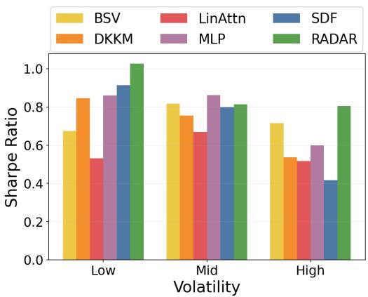  
(a) Sharpe Ratio across volatility groups.

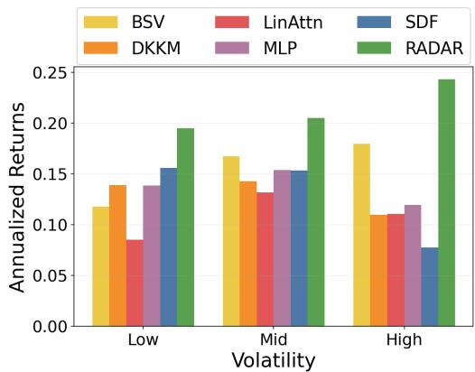  
(b) Annualized Returns across volatility groups.  
Figure 8: Performance comparison across different volatility groups. RADAR consistently achieves higher risk-adjusted performance while maintaining competitive returns across all volatility segments.

• These results are consistent with the framework design of RADAR. The retrieval-augmented component enables the model to condition on historically similar regimes, which becomes especially important in high-volatility periods where market dynamics deviate from average conditions. The diffusion-based denoising further refines the latent representations by suppressing idiosyncratic noise, allowing the model to generalize more effectively across similar contexts. Together, these mechanisms help improve stability and model performance, even in high-volatility environments.

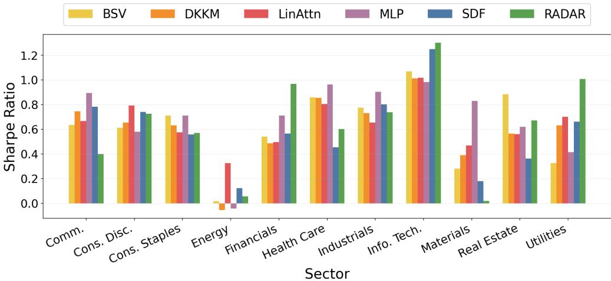  
Figure 9: Sharpe ratio across sector groups.  
Figures 9 and 10 present the results across assets sorted by sectors. We can observe the following:

• RADAR achieves the strongest performance in most sectors, with particularly large gains in Information Technology and Financials. These sectors are typically characterized by higher cross-sectional heterogeneity and stronger interdependencies across firms. The improvements suggest that RADAR is effective at capturing complex interactions and non-linear relationships within these sectors.

• In more stable sectors such as Utilities and Consumer Staples, RADAR remains competitive and achieves strong Sharpe performance. This suggests that the model does not rely solely on highvolatility opportunities, but is also able to extract signals within lower-variance environments.

• We note that the gains are more limited in sectors such as Energy and Real Estate, where returns are often driven by exogenous macro factors (e.g., commodity prices or interest rates) which may not be fully captured by firm-level representations that was learnt in our work. This indicates that while RADAR improves modeling of cross-sectional structure, its benefits are less pronounced in sectors dominated by external shocks. We believe that the RADAR framework could be further improved with the addition of macro-economic data, which we seek to incorporate in future work.

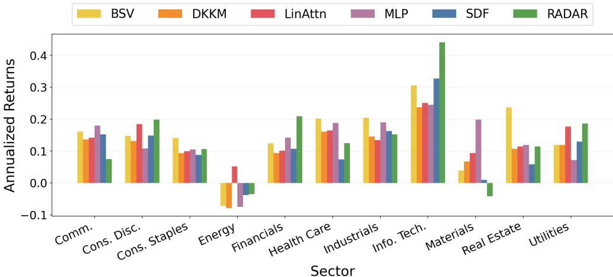  
Figure 10: Annualized returns across sector groups.

Overall, the results suggest that RADAR improves portfolio performance by better modeling statedependent and noisy market environments. The retrieval-augmented mechanism enables the model to adapt to non-stationarity by conditioning on historically similar regimes, while the diffusion-based denoising refines latent representations by reducing noise in the multimodal inputs. This appears especially beneficial in high-volatility assets and sectors with complex interactions, where baselines such as MLP and transformers (SDF) show degraded performance. The initialization of the diffusion process using empirical conditional statistics further grounds the learnt representations, allowing the model to more accurately capture the underlying risk–return trade-offs in different market states.

## D Financial Analysis of Portfolios

To understand the sources of portfolio performance, we conduct standard financial analysis using the Capital Asset Pricing Model (CAPM) and the Fama–French factor model. These models decompose returns into components explained by systematic risk factors and residual alpha, allowing us to assess whether the performance arises from true signal extraction or exposure to common risk premia.

CAPM regression. We first estimate the CAPM model on daily returns:

$$
R _ { \mathrm { R A D A R } , t } - R _ { f , t } = \alpha + \beta \big ( R _ { \mathrm { m a r k e t } , t } - R _ { f , t } \big ) + \epsilon _ { t } ,
$$

where:

$( R _ { \mathrm { R A D A R } , t } - R _ { f , t } )$ : The excess return of the RADAR portfolio on day t.

$( R _ { \mathrm { m a r k e t } , t } - R _ { f , t } )$ : The excess return of the market benchmark on day t.

• Alpha (α): The intercept, representing the portion of returns not explained by market exposure.

• Beta (β): The slope, which measures the RADAR portfolio’s systematic risk relative to market.

A strong strategy should exhibit a positive and statistically significant $\alpha ,$ indicating that it generates excess returns beyond what can be explained by market exposure. An α close to zero would suggest performance comparable to the CAPM benchmark. In addition, we report the $R ^ { 2 }$ , which measures the proportion of return variation explained by the model. A lower $R ^ { 2 }$ implies that the strategy is not simply replicating common risk exposures, and is instead capturing useful idiosyncratic signals.

The CAPM results reveal several key findings. Firstly, RADAR achieves the highest annualized alpha (18.71%), which is statistically significant at the 5% level. This indicates that its performance cannot be explained solely by market exposure. In contrast, baseline models exhibit substantially lower alpha, even when statistically significant.

Secondly, the estimated beta for RADAR is close to one (0.977), suggesting moderate market exposure rather than a market-neutral strategy. Importantly, the relatively low $\overline { { R } } ^ { 2 } ~ ( 0 . 4 7 6 )$ indicates that a large portion of return variation is not explained by market movements, pointing to meaningful idiosyncratic signal extraction. By comparison, traditional models such as Equal Weight exhibit much higher $R ^ { 2 ^ { \bullet } }$ values (above 0.95), implying that their returns are largely driven by market factors.

Table 6: CAPM regression results. Significance levels: ∗∗∗ $p < 0 . 0 1$ $^ { * * } p < 0 . 0 5 .$ $^ { * } p < 0 . 1$
<table><tr><td>Model</td><td>α</td><td>t-stat</td><td>p-value</td><td> $\beta$ </td><td> $R ^ { 2 }$ </td></tr><tr><td>Equal Weight</td><td>4.78%***</td><td>2.712</td><td>0.003</td><td>1.030</td><td>0.957</td></tr><tr><td>BSV</td><td>6.60%*</td><td>1.614</td><td>0.053</td><td>1.248</td><td>0.849</td></tr><tr><td>DKKM</td><td>4.10%***</td><td>2.403</td><td>0.008</td><td>1.019</td><td>0.960</td></tr><tr><td>MLP</td><td>4.86%**</td><td>1.864</td><td>0.031</td><td>0.893</td><td>0.897</td></tr><tr><td>LinAttn</td><td>7.13%**</td><td>2.208</td><td>0.014</td><td>1.051</td><td>0.859</td></tr><tr><td>SDF</td><td>5.34%*</td><td>1.352</td><td>0.088</td><td>0.983</td><td>0.816</td></tr><tr><td>RADAR (Ours)</td><td>18.71%**</td><td>2.159</td><td>0.016</td><td>0.977</td><td>0.476</td></tr></table>

Fama–French factor analysis. We further analyze performance using a three-factor model:

$$
R _ { p , t } - R _ { f , t } = \alpha + \beta _ { m } ( R _ { m } - R _ { f } ) + \beta _ { s } { \bf S } { \bf M } { \bf B } + \beta _ { h } { \bf H } { \bf M } { \bf L } + \epsilon _ { t } ,
$$

where:

• SMB: Size factor, defined as the return difference between small-cap and large-cap stocks.

• HML: Value factor, defined as the return difference between high and low book-to-market stocks.

$\beta _ { m } , \beta _ { s } , \beta _ { h }$ : Factor loadings measuring exposure to the market, size, and value factors, respectively.

Similar to the CAPM setting, we look for a positive and statistically significant value α, which indicates excess returns beyond common risk factors. The $R ^ { 2 }$ now reports the proportion of return variation explained jointly by all factors. A lower $R ^ { 2 }$ suggests that the strategy captures useful idiosyncratic signals. The $\beta$ coefficients capture the model’s exposure to the respective factors.

Table 7: Fama–French regression results. Significance levels: $^ { * * * } p < 0 . 0 1 , ^ { * * } p < 0 . 0 5 , ^ { * } p < 0 . 1$
<table><tr><td>Model</td><td>α</td><td>t-stat</td><td>p-value</td><td> $\beta _ { m }$ </td><td> $\beta _ { S M B }$ </td><td> $\beta _ { H M L }$ </td><td> $R ^ { 2 }$ </td></tr><tr><td>Equal Weight</td><td>4.63%***</td><td>3.233</td><td>0.001</td><td>0.999</td><td>0.079</td><td>0.159</td><td>0.975</td></tr><tr><td>BSV</td><td>8.73%***</td><td>2.833</td><td>0.002</td><td>1.192</td><td>0.402</td><td>0.327</td><td>0.918</td></tr><tr><td>DKKM</td><td>3.88%***</td><td>2.735</td><td>0.003</td><td>0.988</td><td>0.042</td><td>0.156</td><td>0.974</td></tr><tr><td>MLP</td><td>2.30%</td><td>0.870</td><td>0.192</td><td>0.892</td><td>-0.079</td><td>-0.064</td><td>0.896</td></tr><tr><td>LinAttn</td><td>8.05%***</td><td>2.448</td><td>0.007</td><td>1.007</td><td>0.134</td><td>0.245</td><td>0.889</td></tr><tr><td>SDF</td><td>7.42%**</td><td>2.002</td><td>0.023</td><td>0.927</td><td>0.108</td><td>0.347</td><td>0.863</td></tr><tr><td>RADAR (Ours)</td><td>15.47%**</td><td>1.814</td><td>0.035</td><td>0.988</td><td>0.064</td><td>-0.173</td><td>0.488</td></tr></table>

Under the multi-factor specification, RADAR continues to exhibit strong and statistically significant alpha (15.47%), confirming that its performance cannot be attributed to the other common risk factors such as size or value. Notably, RADAR shows relatively small exposure to SMB and a negative loading on HML, suggesting that its returns are not driven by standard factor tilts such as small-cap or value strategies. It also achieves the lowest average $R ^ { 2 }$ among all baseline models, indicating that a much smaller fraction of its overall returns variation can be explained by the compared factors.

Overall, these results demonstrate that RADAR captures economically meaningful alpha beyond market explanations. The combination of high alpha, moderate beta, and low $R ^ { 2 }$ supports the conclusion that the model extracts genuine predictive signals rather than relying on factor exposures.