# SANTA++: SAMPLING ATTENTION THROUGH REPRE-SENTATIVE KEYS

Kyle Lee<sup>1</sup> Christian Z. Pratt<sup>1</sup> Ruoyu Fang<sup>1</sup> Heekyung Lee<sup>1</sup>

Avinash Lohitsa<sup>1</sup> Ryan Modafe<sup>1</sup> Kerem Y. Camsari<sup>1,2</sup>

<sup>1</sup>Department of Electrical and Computer Engineering University of California, Santa Barbara, CA, USA

<sup>2</sup>Flucta, San Francisco, CA, USA

## ABSTRACT

Attention often concentrates on a small subset of tokens in the context, but which subset matters changes from one query to the next. To exploit this changing structure, we introduce SANTA++, a training-free stochastic attention method that uses representative keys for memory-efficient selection without scanning the entire key-value (KV) cache. Cached keys are organized into teams, and the query scores one representative from each team to decide which teams to sample. We compute exact attention scores within the sampled teams and reweight each team’s contribution by the inverse of its inclusion probability. This importance sampling correction estimates attention over the full cache, with a sampling budget that lets us trade memory reads for accuracy. Remarkably, with 32 or 64 sampled teams, SANTA++ uses 16% to 22% of dense attention’s KV reads and retains 94% to 99% of the dense-attention baseline’s scores on LongBench v2 and HELMET’s retrieval-augmented generation subset, and 85% to 91% on RULER, with Qwen2.5-7B-Instruct at 32K context. With 31 sampled teams, our GPU implementation delivers a 1.69 attention speedup over the dense FlashAttention baseline at 32K context. By reducing the number of cache entries read, SANTA++ in principle complements architectures with compressed KV representations, such as multi-head latent attention. Our kernels are available at: https://github.com/OPUSLab/santapp-kernel-demo.git.

## 1 INTRODUCTION

Which cached tokens make the largest contributions to attention depends on the current decoding query. At long context lengths, attention can concentrate on a small subset of cached tokens (Zhang et al., 2023; Tang et al., 2024), but identifying that subset from exact attention scores still requires reading every key. Selecting fewer tokens then saves value reads while leaving a full-key scan. When decoding is limited by memory bandwidth, these key-value (KV) cache reads are costly, and their cost grows with context length (Ribar et al., 2024). For example, with Qwen2.5-7B-Instruct at a 32K-token context, streaming bf16 keys and values amounts to about 64 MiB per layer for each generated token. To reduce both selection and evaluation reads, a sparse method must find useful entries without first scoring every key.

We introduce SANTA++, a training-free attention method that routes queries through actual-key representatives (Figure 1). After dense prefill, we divide prompt keys into parent groups, choose representative keys within each parent, and assign the remaining keys to their nearest representative. Each resulting team contains its representative. For each decoding query, we use each representative score and team size to estimate the team’s attention mass, then sample teams according to these estimates. We then read the selected teams’ keys and values and evaluate every selected member’s exact query–key score. Newly generated tokens form a separate suffix evaluated exactly. SANTA constructs the exact attention distribution by scoring every cached key, then samples from that distribution (Lee et al., 2026). In the limiting case where every key forms its own team, each representative is the key itself, and SANTA++ recovers this exact-attention sampling distribution.

SANTA++ can therefore be viewed as a grouped generalization of SANTA, replacing the full-key scan with approximate routing to enable substantially lower KV access.

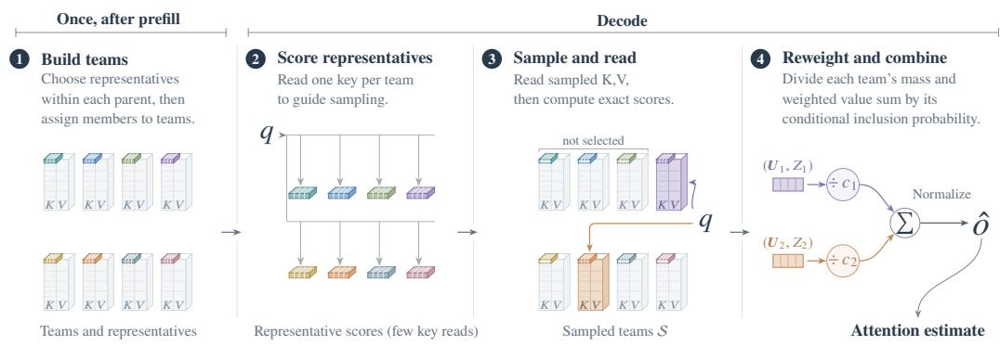  
Figure 1: Representative-guided attention sampling. After prefill, parent groups cover the prompt, and actual member keys represent the teams built within each parent. For each decoding query, we form a routing weight for each team from its representative score and team size, and use these weights to sample teams . Selected teams’ keys and values are read in full, and their members’ exact attention contributions are computed. Each team’s unnormalized attention mass and weighted value sum are divided by its conditional inclusion probability $c _ { g }$ before the corrected sums are combined and normalized (Section 2).

Actual-key representatives avoid relying on a group’s exponentiated mean-key score to estimate its attention mass. Averaging logits before exponentiation can suppress a high-scoring member’s contribution. Representative scores guide selection, while exact member scores determine the selected teams’ contributions. Because teams have unequal chances of selection, we divide each selected team’s unnormalized attention mass and weighted value sum by its conditional inclusion probability before normalization (Section 2). This correction targets full-cache contributions rather than simply renormalizing an uncorrected selected subset.

The nominal budget S controls how many teams are selected, providing an adjustable accuracy– KV-access trade-off. Actual access also depends on team sizes, routing and suffix reads, and overlap across query heads. We form parent groups either with k-means or from contiguous token spans. K-means groups keys by similarity. Contiguous spans instead define parents directly from token positions, avoiding the k-means preparation step. Both use the same distance-based team construction, and every prompt team remains eligible for each query. For the Qwen2.5-7B-Instruct evaluations below, we fix the nominal parent size to P = 16 and use up to R = 4 representatives per parent. These values were chosen heuristically and kept fixed across benchmarks, budgets, and the k-mean and contiguous grouping policies.

Our evaluation with Qwen2.5-7B-Instruct at 32K context shows that SANTA++ can retain most of dense attention’s accuracy while reading much less of the KV cache. On LongBench v2 (Bai et al., 2025), it retains 99.07% of the dense baseline’s score while using 16.68% of its KV reads. On HEL-MET’s retrieval-augmented generation subset (Yen et al., 2025), it retains 98.00% of the dense score at 38.49% KV access. On RULER (Hsieh et al., 2024), increasing the sampling budget raises the retained score from 91.07% to 98.54% while KV access increases from 19.95% to 46.95%. Contiguous grouping avoids the k-means preparation step and remains competitive in several settings, providing a simpler alternative when clustering cost matters.

Separately, our Triton implementation gives a 1.69 attention-operator speedup over Flash SDPA on a 32K-context, batch-one, FP16 workload from layer 14 of Qwen2.5-7B-Instruct on an NVIDIA GeForce RTX 5090 Laptop GPU (Section 4). The comparison uses 31 sampled teams per query head (nominal budget S = 124), an implementation-specific setting described in Section 4. Appendix F tests the method’s applicability to Multi-Head Latent Attention (MLA), and whether useful token sparsity remains in DeepSeek-V2-Lite-Chat after latent compression and head sharing.

## 2 METHOD

At long context lengths, attention can be concentrated on a small subset of cached tokens, but selecting that subset by its exact attention logits requires reading every key. To reduce these selection reads, SANTA++ makes its routing decisions from one representative key per team rather than scoring every prompt key.

For one decoding query $\pmb q \in \mathbb { R } ^ { d } ,$ , let  index the currently cached key-value pairs $( k _ { i } , v _ { i } )$ . The keys and query include the model’s positional embedding. The full-cache attention output is

$$
s _ { i } = \frac { q ^ { \top } k _ { i } } { \sqrt { d } } , ~ Z = \sum _ { i \in \mathcal { C } } e ^ { s _ { i } } , ~ U = \sum _ { i \in \mathcal { C } } e ^ { s _ { i } } v _ { i } , ~ o = \frac { U } { Z } .\tag{1}
$$

Here Z is the full-cache unnormalized attention mass, and U is its value-weighted numerator. SANTA++ approximates these two sums by sampling teams and evaluating all members of the selected teams (Figure 1). Representatives guide which teams to read, and they do not replace the selected members’ keys or values in the attention calculation.

## 2.1 APPROXIMATING GROUP MASS

A single mean key is a convenient summary for routing, but it gives a group’s mean logit rather than its attention mass. For a group $\mathcal { G }$ of n keys, write $\begin{array} { r } { \bar { \pmb { k } } = n ^ { - 1 } \sum _ { i \in \mathcal { G } } \pmb { k } _ { i } } \end{array}$ and $\bar { s } = { q ^ { \top } \bar { k } / \sqrt { d } } .$ . Convexity of the exponential gives

$$
\underbrace { n e ^ { \bar { s } } } _ { \mathrm { c e n t r o i d } \ : \mathrm { m a s s \ : s u r r o g a t e } } \le \underbrace { \sum _ { i \in \mathcal { G } } e ^ { s _ { i } } } _ { \mathrm { e x a c t \ : g r o u p \ : m a s s } } .\tag{2}
$$

Because the surrogate exponentiates the group’s mean logit rather than exponentiating each member before summing, a large member logit is averaged with the others, while the exact sum retains its full contribution. Figure 2 illustrates the consequence: 16 constructed logits give an exact mass of approximately $2 . 2 0 \times 1 0 ^ { 4 }$ , compared with approximately 29 for the surrogate.

Equality holds when all within-group logits are equal. The bound applies to unnormalized mass, not to each normalized group probability. Different gaps across groups can change their relative routing weights and hence which groups are likely to be selected. Appendix B.1 gives additional examples.

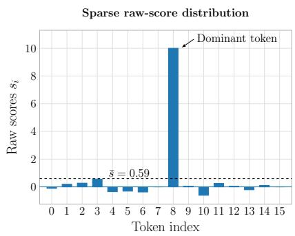

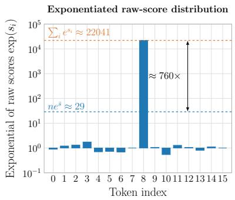  
Figure 2: A mean-key mass surrogate for 16 constructed logits. One high score dominates the exact mass, which is approximately 760 the surrogate.

## 2.2 PREPARING PARENT GROUPS AND TEAMS

SANTA++ divides each parent group into teams represented by actual keys. This lets a query choose among different parts of the parent instead of assigning all its members one mean-key routing weight.

Parent groups restrict the distance comparisons needed to build teams. After dense prefill, we form them separately for each layer and KV head from the N prompt keys after rotary position encoding (RoPE) (Su et al., 2024), using either k-means on the keys or consecutive spans of P tokens. Here

$P$ is a nominal parent size. K-means parent sizes can vary. Contiguous parents avoid clustering while still covering the full prompt. Both alternatives use the same team construction, in which each member is compared only with representatives from its own parent. Our distance diagnostic finds that contiguous groups are more compact than random groups, although less compact than k-means groups (Appendix B.3).

Within each parent, we choose up to $R$ actual keys as representatives. The first is nearest the parent’s mean key. Each later choice is farthest from its nearest existing representative, to cover members poorly represented so far. The mean thus helps choose the first actual key rather than serving as the routing key itself. Every member joins its nearest representative’s team, and each representative belongs to its own team. Distances are squared Euclidean distances on the unnormalized keys. Contiguous parents need not yield contiguous teams, because assignment uses key distance rather than token order.

The resulting M nonempty teams $\mathcal { T } _ { g }$ partition all prompt rows. We store each team’s representative $\ell _ { g } ,$ size $\begin{array} { r } { n _ { g } , } \end{array}$ and member indices. Parent formation and team construction are performed once after prefill, and the resulting records are reused throughout decoding. Their preparation cost is therefore spread over the generated tokens. Every prompt team remains eligible at each query. Newly generated rows form a separate suffix $\mathcal { E }$ evaluated exactly. Appendices B.4 and B.5 give additional diagnostics on contiguous windows and key-versus-probe clustering, respectively.

## 2.3 SAMPLING AND CORRECTING TEAM CONTRIBUTIONS

The routing weight should reflect both query relevance and team size. We compute it using one representative key per team:

$$
\widetilde { Z } _ { g } = n _ { g } \exp \left( \frac {  { \mathbf { q } } ^ { \intercal } \ell _ { g } } { \sqrt { d } } \right) , \qquad \phi _ { g } = \log \widetilde { Z } _ { g } .\tag{3}
$$

The factor $n _ { g }$ accounts for how many members the representative describes. We add independent Gumbel noise to $\phi _ { g }$ and select the K teams with the largest perturbed routing scores using the Gumbel-top-K trick (Kool et al., 2019), forming a set  sampled globally without replacement. The nominal budget S determines $K$ but is not a row count. With $P \overset { ^ { \cdot } } { = } 1 6 , \overset { ^ { \cdot } } { R } = 4 , S = \overset { ^ { \cdot } } { 1 } 2 8$ requests 32 teams. The selected prompt-row count is $\textstyle \sum _ { g \in S } n _ { g }$ , which can vary. Representative routing reads and exact-suffix reads are additional to those selected rows. Appendix A gives the budget rules and sampler.

After selection, we read the keys and values of every member of each selected team and evaluate its exact contribution: $\begin{array} { r } { Z _ { g } = \sum _ { i \in \mathcal { T } _ { q } } e ^ { s _ { i } } } \end{array}$ and $\begin{array} { r } { U _ { g } = \sum _ { i \in \mathcal { T } _ { g } } e ^ { s _ { i } } \pmb { v } _ { i } } \end{array}$ . Thus an approximate representative score decides what to read.

Without correction, frequently selected teams would receive too much weight relative to teams selected less often. We therefore divide both a selected team’s mass and its weighted value sum by the same inclusion correction before normalization. For a selected team, $c _ { g }$ is its inclusion probability conditional on the other teams’ perturbed routing scores and the current query, cache, team records, and budget. Appendix A derives the conditional correction and gives its expression in Equation 7. Defining $Z _ { \mathcal { E } }$ and $U _ { \mathcal { E } }$ by the same sums over the exact suffix, we use

$$
\widehat { U } = U \varepsilon + \sum _ { g \in \mathcal { S } } \frac { U _ { g } } { c _ { g } } , \quad \widehat { Z } = Z \varepsilon + \sum _ { g \in \mathcal { S } } \frac { Z _ { g } } { c _ { g } } , \quad \widehat { o } = \frac { \widehat { U } } { \widehat { Z } } .\tag{4}
$$

All members receive the same correction because the team is the sampling unit. The two unnormalized sums are unbiased (Equation 9 in Appendix A). Their ratio, which gives the attention output, is generally biased. Selecting all teams, with $c _ { g } = 1$ , recovers dense attention.

For grouped-query attention (GQA), query heads associated with the same KV head use the same team partition but make independent selections and retain their own inclusion corrections. Keys and values are read for the union of those selections, while each team contributes only to the heads that selected it.

## 2.4 ATTENTION-DISTRIBUTION DIAGNOSTIC

Inclusion correction accounts for unequal selection chances, but routing still determines which teams are likely to be read at a limited budget. We therefore use Kullback–Leibler (KL) divergence to compare how closely each routing distribution follows dense attention over the same prompt tokens. We spread each group’s routing probability equally across its members and compare the resulting token distribution with dense attention over the prompt.

As a diagnostic baseline, we compare SANTA++’s actual-key representatives with centroid-guided sampling, where each k-means group is routed using its arithmetic-mean key. We evaluate two nominal group sizes for this baseline, B = 4 and $B = 1 6$ . The P = 16, R = 4 team variant with k-means parents has lower mean KL divergence than both centroid-guided variants on all three tasks (Table 1). All variants use the same queries and cache states from dense SDPA generation with Qwen2.5-7B-Instruct at 8,192-token context, with 20 prompts per task. This diagnostic measures routing agreement with dense attention before sampling. Appendix B.2 defines the distributions and averaging procedure and reports the separate 100-prompt-per-task accuracy comparison.

<table><tr><td>Task</td><td>Teams (k-means)  $P = 1 6 , R = 4$ </td><td>Centroid-guided sampling B = 4</td><td>Centroid-guided sampling  $B = 1 6$ </td></tr><tr><td>CWE</td><td>1.621</td><td>2.806</td><td>3.429</td></tr><tr><td>S-NIAH-1</td><td>1.248</td><td>2.076</td><td>2.827</td></tr><tr><td>QA-1</td><td>1.613</td><td>2.429</td><td>3.495</td></tr></table>

Table 1: Routing approximation to dense attention. Mean $\mathrm { K L } ( p | | q )$ in nats, where p is dense attention over prompt tokens and q spreads each group’s routing probability equally across its members. All variants use the same dense SDPA queries and cache states. No sampling is performed in this diagnostic. Appendix B.2 gives the definitions and averaging procedure.

## 3 ACCURACY AND THEORETICAL KV ACCESS

SANTA++ reduces reported logical KV access below SANTA’s full-key-scan cost at useful operating points across three benchmarks. We compare dense scaled dot-product attention (SDPA), SANTA (Lee et al., 2026), which samples from exact attention weights after a full-key scan, and SANTA++ with k-means or contiguous grouping using Qwen2.5-7B-Instruct (Qwen Team, 2024). All main results use a 32K context budget and cover HELMET retrieval-augmented generation (RAG) (Yen et al., 2025), LongBench v2 (Bai et al., 2025), and RULER (Hsieh et al., 2024). Their complete 32K aggregate sweeps are reported in Tables 2, 3, and 4, respectively. Evaluation setup and access accounting are given in Appendix C.1, with additional HELMET, LongBench v2, and RULER results in Appendices C.2, C.3, and C.4, respectively.

KV denotes reported logical key and value vector access relative to dense decoding. For full clarity, these tables do not report measured DRAM traffic, resident cache size, or latency. Under the reference counter’s equal costs for key and value vectors, SANTA’s full-key scan contributes 50% before sampled value reads. For SANTA++, team sizes and selected-row overlap across query heads sharing a KV head affect access, so the nominal budget S is not a unique-row count. Equal S therefore does not impose equal access. Appendix C.1 gives the counter and aggregation details.

HELMET RAG. At 32K context, SANTA++ with k-means retains 98.00% of the SDPA RAG score at 38.49% KV access (S = 1024; Table 2). A smaller budget of S = 128 retains 94.43% at 17.49% access, providing a lower-access option.

Contiguous grouping omits parent k-means while retaining the same team construction within each parent. $\mathrm { { A t } } \ S = 1 0 2 4$ , it retains 97.56% of the SDPA score at 31.23% access. Its absolute score is 56.00%, compared with 56.25% for k-means: a difference of 0.25 percentage points with 7.26 percentage points less access, while also avoiding the parent clustering step.

The RAG score and access summaries weight the four RAG tasks equally. Access includes representative-key routing reads as well as selected KV reads. Appendix C.2 reports the other HEL-MET tasks separately because their metrics differ. Not all of them are as robust as RAG: at 32K,

JSON KV retrieval falls from 96.80% under SDPA to 45.60% with k-means at S = 128 (33.40% with contiguous grouping), recovering to 87.00% at $S = 5 1 2$ (Table 10).

Table 2: HELMET RAG: full 32K budget sweep with Qwen2.5-7B-Instruct. Score (abs) is the equal-weight mean substring exact match on Natural Questions, TriviaQA, PopQA, and HotpotQA. Score (norm) is the absolute score divided by the corresponding SDPA score at the same context length, expressed as a percentage. KV is the equal-weight mean of the four RAG task-level totalaccess percentages, including representative-key routing reads. S is the nominal budget. The entries are 95% bootstrap confidence interval half-widths.
<table><tr><td>Method</td><td>S</td><td>KV (%)</td><td>Score (norm) (%)</td><td>Score (abs) (%)</td></tr><tr><td>SDPA</td><td>一</td><td>100.00</td><td>100.00</td><td>57.40 ± 2.00</td></tr><tr><td rowspan="5">SANTA</td><td>128</td><td>50.43</td><td>99.13</td><td> $5 6 . 9 0 \pm 2 . 0 5$ </td></tr><tr><td>256</td><td>50.75</td><td>99.04</td><td> $5 6 . 8 5 \pm 2 . 0 5$ </td></tr><tr><td>512</td><td>51.30</td><td>100.17</td><td> $5 7 . 5 0 \pm 2 . 0 2$ </td></tr><tr><td>1024</td><td>52.17</td><td>99.48</td><td> $5 7 . 1 0 \pm 2 . 0 7$ </td></tr><tr><td>2048</td><td>53.53</td><td>99.65</td><td> $5 7 . 2 0 \pm 2 . 0 8$ </td></tr><tr><td rowspan="5">SANTA++ (k-means)</td><td>128</td><td>17.49</td><td>94.43</td><td> $5 4 . 2 0 \pm 2 . 0 5$ </td></tr><tr><td>256</td><td>21.82</td><td>95.56</td><td> $5 4 . 8 5 \pm 2 . 0 3$ </td></tr><tr><td>512</td><td>28.58</td><td>96.43</td><td> $5 5 . 3 5 \pm 2 . 0 5$ </td></tr><tr><td>1024</td><td>38.49</td><td>98.00</td><td> $5 6 . 2 5 \pm 2 . 0 2$ </td></tr><tr><td>2048</td><td>52.13</td><td>99.22</td><td> $5 6 . 9 5 \pm 2 . 0 7$ </td></tr><tr><td rowspan="5">SANTA++ (contiguous)</td><td>128</td><td>15.66</td><td>92.51</td><td> $5 3 . 1 0 \pm 2 . 0 5$ </td></tr><tr><td>256</td><td>18.49</td><td>94.77</td><td> $5 4 . 4 0 \pm 2 . 0 5$ </td></tr><tr><td>512</td><td>23.35</td><td>95.03</td><td> $5 4 . 5 5 \pm 2 . 0 7$ </td></tr><tr><td>1024</td><td>31.23</td><td>97.56</td><td> $5 6 . 0 0 \pm 2 . 0 7$ </td></tr><tr><td>2048</td><td>43.34</td><td>97.30</td><td> $5 5 . 8 5 \pm 2 . 0 5$ </td></tr></table>

LongBench v2. With a 32K context cap, SANTA++ with k-means retains 99.07% of the SDPA score at 16.68% reported KV access $( S = 1 2 8 ; \mathrm { T a b l e } 3 )$ . Its absolute accuracy is 31.61%, compared with 31.91% for SDPA, a difference of 0.30 percentage points. This configuration uses 66.9% less reported access than SANTA’s lowest-access tested setting, which uses 50.36%. Near-dense accuracy is therefore possible well below the access cost of a full-key scan. The k-means and SANTA sweeps do not show a consistent increase in accuracy as access grows.

To avoid the preparation cost of parent k-means, contiguous grouping forms parents directly from consecutive token spans, then applies the same distance-based team construction within each parent. At 15.27% reported access $\bar { ( . \cal { S } } = 1 2 8 )$ , it reaches 30.91% absolute accuracy, 0.70 percentage points below the k-means configuration above while using slightly less access. Increasing access to 22.15% $( S = 5 1 2 )$ raises its absolute accuracy to 31.41%, or 98.44% of the SDPA score. Thus, on LongBench v2, retaining a near-dense score at less than one-quarter of dense KV access does not require parent k-means.

RULER. At 32K, SANTA++ with k-means retains 91.07% of the SDPA aggregate score at 19.95% reported KV access (S = 256; Table 4). Increasing access to 25.70% $( S = 5 1 2 )$ raises the retained score to 93.99%, providing a higher-accuracy option while still using roughly onequarter of dense access. For comparison, SANTA’s lowest-access tested setting retains 99.15% of the SDPA score at 50.32% access. The 19.95%-access SANTA++ configuration reduces reported access by 60.4% relative to that setting.

Contiguous grouping removes the parent k-means preparation step and offers a similar aggregate score at a nearby access level. At 21.37% access $( \bar { S } \ = \ 5 1 2 )$ , it reaches an absolute aggregate score of 75.37%, compared with 76.05% for k-means at 19.95% access. For these configurations, omitting parent k-means gives a score 0.68 percentage points lower with 1.42 percentage points more access. At 28.16% access $( S = 1 0 2 4 )$ , contiguous grouping reaches 79.40% absolute score, retaining 95.07% of the SDPA aggregate. The simpler parent formation therefore remains useful below 30% access, without requiring parent clustering.

Table 3: LongBench v2: full budget sweep with a 32K context cap. Qwen2.5-7B-Instruct is evaluated on 503 prompts using the brief-reasoning prompt and middle-truncation procedure in Appendix C.3. Score (abs) is accuracy. Score (norm) is the absolute score divided by the corresponding SDPA score, expressed as a percentage. KV is reported GQA-aware logical access, and S is the nominal budget. The entries are the reported 95% bootstrap confidence interval half-widths.
<table><tr><td>Method</td><td>S</td><td>KV (%)</td><td>Score (norm) (%)</td><td>Score (abs) (%)</td></tr><tr><td>SDPA</td><td>一</td><td>100.00</td><td>100.00</td><td> $3 1 . 9 1 \pm 2 . 0 4$ </td></tr><tr><td rowspan="4">SANTA</td><td>128</td><td>50.36</td><td>95.95</td><td> $3 0 . 6 2 \pm 2 . 0 6$ </td></tr><tr><td>256</td><td>50.59</td><td>102.80</td><td> $3 2 . 8 0 \pm 1 . 9 6$ </td></tr><tr><td>512</td><td>50.97</td><td>106.85</td><td> $3 4 . 1 0 \pm 2 . 0 4$ </td></tr><tr><td>1024</td><td>51.56</td><td>99.84</td><td> $3 1 . 8 6 \pm 1 . 9 1$ </td></tr><tr><td rowspan="4">SANTA++ (k-means)</td><td>128</td><td>16.68</td><td>99.07</td><td> $3 1 . 6 1 \pm 2 . 0 1$ </td></tr><tr><td>256</td><td>20.41</td><td>95.33</td><td> $3 0 . 4 2 \pm 1 . 9 6$ </td></tr><tr><td>512</td><td>26.46</td><td>101.71</td><td> $3 2 . 4 6 \pm 2 . 0 9$ </td></tr><tr><td>1024</td><td>35.62</td><td>99.38</td><td> $3 1 . 7 1 \pm 2 . 0 4$ </td></tr><tr><td rowspan="4">SANTA++ (contiguous)</td><td>128</td><td>15.27</td><td>96.88</td><td> $3 0 . 9 1 \pm 2 . 0 9$ </td></tr><tr><td>256</td><td>17.74</td><td>97.35</td><td> $3 1 . 0 6 \pm 2 . 0 1$ </td></tr><tr><td>512</td><td>22.15</td><td>98.44</td><td> $3 1 . 4 1 \pm 1 . 9 6$ </td></tr><tr><td>1024</td><td>29.52</td><td>98.60</td><td> $3 1 . 4 6 \pm 2 . 0 4$ </td></tr></table>

The aggregate includes all 13 RULER tasks, with 500 completed prompts per task. Table 12 shows that accuracy retention varies across tasks. For contiguous grouping at ${ \bar { S } } = 1 0 2 4 .$ , the three S-NIAH tasks each score at least 98.80%, but MK-NIAH-3 scores 60.20%, compared with 89.60% for SDPA.

Table 4: RULER: full 32K budget sweep with Qwen2.5-7B-Instruct. Score (abs) is the equalweight mean of all 13 task scores over 500 completed prompts per task. Score (norm) is the absolute score divided by the corresponding SDPA score at the same context length, expressed as a percentage. KV is pooled GQA-aware logical access, including representative-key routing reads, and S is the nominal budget. Absolute-score entries are 95% task-stratified bootstrap confidence interval half-widths.
<table><tr><td>Method</td><td>S</td><td>KV (%)</td><td>Score (norm) (%)</td><td>Score (abs) (%)</td></tr><tr><td>SDPA</td><td>一</td><td>100.00</td><td>100.00</td><td> $8 3 . 5 1 \pm 0 . 6 6$ </td></tr><tr><td rowspan="5">SANTA</td><td>128</td><td>50.32</td><td>99.15</td><td> $8 2 . 8 0 \pm 0 . 6 4$ </td></tr><tr><td>256</td><td>50.54</td><td>99.75</td><td> $8 3 . 3 1 \pm 0 . 6 7$ </td></tr><tr><td>512</td><td>50.91</td><td>100.11</td><td> $8 3 . 6 1 \pm 0 . 6 5$ </td></tr><tr><td>1024</td><td>51.52</td><td>99.92</td><td> $8 3 . 4 5 \pm 0 . 6 7$ </td></tr><tr><td>2048 4096</td><td>52.49</td><td>99.99</td><td> $8 3 . 5 0 \pm 0 . 6 6$ </td></tr><tr><td rowspan="5">SANTA++ (k-means)</td><td></td><td>53.96</td><td>99.91</td><td> $8 3 . 4 4 \pm 0 . 6 7$ </td></tr><tr><td>128</td><td>16.38</td><td>85.41</td><td> $7 1 . 3 3 \pm 0 . 7 4$ </td></tr><tr><td>256</td><td>19.95</td><td>91.07</td><td> $7 6 . 0 5 \pm 0 . 7 4$ </td></tr><tr><td>512</td><td>25.70</td><td>93.99</td><td> $7 8 . 4 9 \pm 0 . 7 4$ </td></tr><tr><td>1024 2048</td><td>34.44</td><td>96.27</td><td> $8 0 . 4 0 \pm 0 . 7 2$ </td></tr><tr><td rowspan="6">SANTA++ (contiguous)</td><td>4096</td><td>46.95 63.65</td><td>98.54 99.48</td><td> $8 2 . 2 9 \pm 0 . 6 6$   $8 3 . 0 8 \pm 0 . 6 4$ </td></tr><tr><td></td><td></td><td></td><td></td></tr><tr><td>128 256</td><td>15.03 17.31</td><td>77.50</td><td> $6 4 . 7 2 \pm 0 . 7 7$ </td></tr><tr><td>512</td><td>21.37</td><td>84.46 90.25</td><td> $7 0 . 5 4 \pm 0 . 7 6$ </td></tr><tr><td>1024</td><td>28.16</td><td>95.07</td><td> $7 5 . 3 7 \pm 0 . 7 5$ </td></tr><tr><td>2048</td><td>38.89</td><td></td><td> $7 9 . 4 0 \pm 0 . 7 3$ </td></tr><tr><td></td><td>4096</td><td>54.68</td><td>97.49 98.86</td><td> $8 1 . 4 2 \pm 0 . 7 2$   $8 2 . 5 6 \pm 0 . 6 7$ </td></tr></table>

## 4 GPU IMPLEMENTATION AND ATTENTION LATENCY

SANTA++ reduces complete attention-operator latency from 107.33 µs for Flash SDPA to 63.52 µs, a 1.69 speedup on a single-token decode workload from layer 14 of Qwen2.5-7B-Instruct (Table 5). The workload has 32,768 cached tokens, batch size one, and FP16 inputs, and runs on an NVIDIA GeForce RTX 5090 Laptop GPU. SANTA++ selects $K = 3 1$ teams per query head (nominal budget $S = 1 2 4 )$ , with no appended suffix. This value is implementation-driven: the sampler retains the top K teams plus the next-highest Gumbel-perturbed routing score needed to compute the conditional-inclusion threshold. Thus $K = 3 1$ gives a power-of-two working set of 32 scores for the Triton top-K stage.

The implementation scores actual-key representatives rather than all cached keys during selection. Under grouped-query attention (GQA) (Ainslie et al., 2023), it reuses both representative-key loads and selected-member key and value loads across query heads that share a KV head. Each head keeps its own selected teams and conditional inclusion corrections, and accumulates contributions only from teams it selected. Representatives guide selection, while the selected members’ exact scores determine their contributions. Inverse-inclusion weights apply to both the unnormalized attention mass and the weighted value sum. Appendix D describes the five kernel programs.

The dense baseline is PyTorch SDPA using FlashAttention (Dao, 2024) with native GQA enabled. We time the complete attention operation, including routing, selection, and all five kernel launches. Preparation, including cache packing and allocation of temporary buffers, is completed before tim ing. End-to-end gains also depend on preparation cost and generation length.

The kernel benchmark uses $S = 1 2 4$ , while the task-accuracy sweeps start at $S = 1 2 8$ . Appendix E gives the complete kernel profiling protocol.

Table 5: Complete attention-operator latency on the captured 32K, batch-one FP16 workload. Measurements include selection and all launches. Preparation is excluded.
<table><tr><td>Method</td><td>GPU launches</td><td>Median latency (µs)</td><td>Speedup vs. Flash</td></tr><tr><td>SANTA++</td><td>5</td><td>63.52</td><td>1.69×</td></tr><tr><td>Forced Flash SDPA</td><td>2</td><td>107.33</td><td>1.00×</td></tr></table>

## 5 RELATED WORK

Compressed representations. Quantization (Liu et al., 2024; Frantar et al., 2023) and KV sharing or latent compression (Ainslie et al., 2023; DeepSeek-AI et al., 2024) reduce the memory occupied by model weights or the KV–cache. SANTA++ targets a complementary cost: how many cached entries each decoding query reads. Reducing these reads can save memory traffic even when the cache already uses compact representations.

Sparse attention and cache retention. Sparse attention methods reduce computation by evaluating or approximating only part of the full attention computation, using structured patterns (Child et al., 2019; Zaheer et al., 2020; Beltagy et al., 2020), low-rank projections (Wang et al., 2020), hashing (Kitaev et al., 2020), or deterministic top-k selection (Gupta et al., 2021). SANTA++ instead treats sparse decode-time access as an estimation problem: it uses query-dependent sampling and corrects the sampled contributions toward the full-cache attention sums. Cache-retention methods such as $_ \mathrm { H _ { 2 } O }$ , StreamingLLM, and DuoAttention (Zhang et al., 2023; Xiao et al., 2024b; 2025) reduce memory use by limiting which KV entries remain available. SANTA++ does not require permanently dropping prompt tokens, so entries skipped for one query can still be selected later. For very long contexts where some eviction is acceptable, the two approaches can also be combined: cache retention reduces storage, while SANTA++ reduces the memory traffic from reading the retained cache.

Query-aware retrieval and grouping. Query-aware methods use approximate scores or group summaries to identify promising parts of the cache (Ribar et al., 2024; Tang et al., 2024; Sun et al.,

2025; Hao et al., 2025). InfLLM (Xiao et al., 2024a), for example, uses selected tokens to represent contiguous memory blocks, while centroid-based methods use group means for retrieval, merging, or approximation (Liu et al., 2025; Hooper et al., 2025b; Hu et al., 2026; Hooper et al., 2025a). SANTA++ builds on the same general idea of routing through a small group summary, but our analysis identifies a limitation of using the arithmetic-mean key for this purpose. By Jensen’s inequality, scoring a mean key systematically underestimates the group’s unnormalized attention mass (Equation 2). This motivates our use of actual keys as representatives rather than mean keys. This observation may also inform centroid-based retrieval methods, where replacing or correcting mean-key scores could better preserve group attention mass.

Sampling and importance correction. Sampling-based attention approximations have also been explored (Kim & Ko, 2022). SANTA (Lee et al., 2026) samples from the exact post-softmax attention distribution, which requires scoring every cached key before sampling. SANTA++ can be viewed as a grouped generalization of this idea: representative scores and team sizes approximate each team’s attention mass, replacing the full-key scan with group-level routing. In the limit where the number of teams equals the context length, every key forms its own team, and SANTA++ recovers SANTA’s exact sampling distribution. With larger teams, SANTA++ trades exact routing for lower KV access. MagicPIG (Chen et al., 2025) is closely related in spirit: it also treats sparse attention as an estimation problem rather than simply renormalizing over a selected subset, using locality-sensitive hashing for self-normalized importance sampling. SANTA++ develops the same estimator view through explicit groups, using representative estimates to allocate samples across the cache and correcting the selected contributions for their sampling probabilities.

## 6 CONCLUSION

SANTA++ exploits query-dependent attention sparsity without scanning the full KV cache. It uses actual-key representatives to route queries to teams, computes exact attention scores within the selected teams, and corrects their contributions for unequal inclusion probabilities. This provides an adjustable trade-off between attention accuracy and KV access without retraining.

Under a 32K context budget, SANTA++ with k-means retains 99.07% of the SDPA score on Long-Bench v2 at 16.68% logical KV access and 98.00% on HELMET RAG at 38.49% access. On RULER, a larger budget retains 98.54% at 46.95% KV access. Contiguous grouping provides a simpler alternative when the preparation cost of k-means is undesirable: on HELMET RAG, it retains 97.56% of the SDPA score at 31.23% access while avoiding k-means clustering entirely. Our Triton implementation reduces attention-operator latency from 107.33 µs to 63.52 µs on the evaluated 32K workload, a 1.69 speedup.

The DeepSeek-V2-Lite-Chat experiments in Appendix F further suggest that useful token sparsity can remain after latent compression and head sharing. This motivates combining SANTA++’s selective token access with MLA-style architectures to reduce memory traffic in already compressed models.

## AI USE STATEMENT

We used generative AI tools to assist with writing and presentation, software implementation and debugging, methodological and mathematical development, and the analysis and interpretation of experimental results. All AI-assisted outputs were reviewed and validated by the authors.

## REPRODUCIBILITY STATEMENT

We release our GPU kernels as open-source software on GitHub, linked in the abstract.

Acknowledgments— This material is based upon work supported by ARO award W911NF-24-1- 0228.

## REFERENCES

Joshua Ainslie, James Lee-Thorp, Michiel de Jong, Yury Zemlyanskiy, Federico Lebron, and Sumit Sanghai. GQA: Training generalized multi-query transformer models from multi-head checkpoints. In Proceedings of the 2023 Conference on Empirical Methods in Natural Language Processing, pp. 4895–4901. Association for Computational Linguistics, December 2023. URL https://aclanthology.org/2023.emnlp-main.298/.

Yushi Bai, Shangqing Tu, Jiajie Zhang, Hao Peng, Xiaozhi Wang, Xin Lv, Shulin Cao, Jiazheng Xu, Lei Hou, Yuxiao Dong, Jie Tang, and Juanzi Li. LongBench v2: Towards deeper understanding and reasoning on realistic long-context multitasks. In Proceedings of the 63rd Annual Meeting of the Association for Computational Linguistics (Volume 1: Long Papers), pp. 3639–3664. Association for Computational Linguistics, July 2025. URL https://aclanthology.org/ 2025.acl-long.183/.

Iz Beltagy, Matthew E Peters, and Arman Cohan. Longformer: The long-document transformer. arXiv preprint arXiv:2004.05150, 2020.

Zhuoming Chen, Ranajoy Sadhukhan, Zihao Ye, Yang Zhou, Jianyu Zhang, Niklas Nolte, Yuandong Tian, Matthijs Douze, Leon Bottou, Zhihao Jia, and Beidi Chen. MagicPIG: LSH sampling for efficient LLM generation. In International Conference on Learning Representations, volume 2025, pp. 44169–44190, 2025. URL https://openreview.net/forum?id=ALzTQUgW8a.

Rewon Child, Scott Gray, Alec Radford, and Ilya Sutskever. Generating long sequences with sparse transformers. arXiv preprint arXiv:1904.10509, 2019.

Tri Dao. Flashattention-2: Faster attention with better parallelism and work partitioning. In International Conference on Learning Representations, volume 2024, pp. 35549–35562, 2024. URL https://proceedings.iclr.cc/paper\_files/paper/2024/file/ 98ed250b203d1ac6b24bbcf263e3d4a7-Paper-Conference.pdf.

DeepSeek-AI et al. DeepSeek-V2: A strong, economical, and efficient mixture-of-experts language model, 2024. URL https://arxiv.org/abs/2405.04434.

Elias Frantar, Saleh Ashkboos, Torsten Hoefler, and Dan Alistarh. OPTQ: Accurate quantization for generative pre-trained transformers. In The Eleventh International Conference on Learning Representations, 2023. URL https://openreview.net/forum?id=tcbBPnfwxS.

Ankit Gupta, Guy Dar, Shaya Goodman, David Ciprut, and Jonathan Berant. Memory-efficient transformers via top-k attention. In Nafise Sadat Moosavi, Iryna Gurevych, Angela Fan, Thomas Wolf, Yufang Hou, Ana Marasovic, and Sujith Ravi (eds.),´ Proceedings of the Second Workshop on Simple and Efficient Natural Language Processing, pp. 39–52, Virtual, November 2021. Association for Computational Linguistics. doi: 10.18653/v1/2021.sustainlp-1.5. URL https://aclanthology.org/2021.sustainlp-1.5/.

Jitai Hao, Yuke Zhu, Tian Wang, Jun Yu, Xin Xin, Bo Zheng, Zhaochun Ren, and Sheng Guo. OmniKV: Dynamic context selection for efficient long-context LLMs. In International Conference on Learning Representations, volume 2025, pp. 87443–87464, 2025. URL https://proceedings.iclr.cc/paper\_files/paper/2025/file/ da1131a86ac3c70e0b7cae89c3d4df22-Paper-Conference.pdf.

Coleman Hooper, Sebastian Zhao, Luca Manolache, Sehoon Kim, Michael Mahoney, Sophia Shao, Kurt Keutzer, and Amir Gholami. Multipole attention for efficient long context reasoning. In D. Belgrave, C. Zhang, H. Lin, R. Pascanu, P. Koniusz, M. Ghassemi, and N. Chen (eds.), Advances in Neural Information Processing Systems, volume 38, Main Conference, pp. 37382–37405. Curran Associates, Inc., 2025a. doi: 10.52202/ 085713-1255. URL https://proceedings.neurips.cc/paper\_files/paper/ 2025/file/359f442022ef31bcd9e41959576107ef-Paper-Conference.pdf.

Coleman Richard Charles Hooper, Sehoon Kim, Hiva Mohammadzadeh, Monishwaran Mah eswaran, Sebastian Zhao, June Paik, Michael W. Mahoney, Kurt Keutzer, and Amir Gholami. Squeezed attention: Accelerating long context length LLM inference. In Wanxiang Che, Joyce

Nabende, Ekaterina Shutova, and Mohammad Taher Pilehvar (eds.), Proceedings ofthe 63rd Annual Meeting of the Association for Computational Linguistics (Volume 1: Long Papers), pp. 32631–32652, Vienna, Austria, July 2025b. Association for Computational Linguistics. ISBN 979-8-89176-251-0. doi: 10.18653/v1/2025.acl-long.1568. URL https://aclanthology. org/2025.acl-long.1568/.

Cheng-Ping Hsieh, Simeng Sun, Samuel Kriman, Shantanu Acharya, Dima Rekesh, Fei Jia, and Boris Ginsburg. RULER: What’s the real context size of your long-context language models? In First Conference on Language Modeling, 2024. URL https://openreview.net/forum? id=kIoBbc76Sy.

Jie Hu, Shengnan Wang, Yutong He, Ping Gong, Jiawei Yi, Juncheng Zhang, Youhui Bai, Renhai Chen, Gong Zhang, Cheng Li, and Kun Yuan. CentroidKV: Efficient long-context LLM inference via KV cache clustering. Transactions on Machine Learning Research, 2026. ISSN 2835-8856. URL https://openreview.net/forum?id=T3EeupQhGj.

Hyunjun Kim and JeongGil Ko. Fast monte-carlo approximation of the attention mechanism. In Proceedings of the AAAI conference on artificial intelligence, volume 36, pp. 7185–7193, 2022.

Nikita Kitaev, Lukasz Kaiser, and Anselm Levskaya. Reformer: The efficient transformer. In International Conference on Learning Representations, 2020. URL https://openreview. net/forum?id=rkgNKkHtvB.

Wouter Kool, Herke Van Hoof, and Max Welling. Stochastic beams and where to find them: The gumbel-top-k trick for sampling sequences without replacement. In International conference on machine learning, pp. 3499–3508. PMLR, 2019.

Kyle Lee, Corentin Delacour, Kevin Callahan-Coray, Kyle Jiang, Can Yaras, Samet Oymak, Tathagata Srimani, and Kerem Yunus Camsari. Stochastic sparse attention for memory-bound inference. In Forty-third International Conference on Machine Learning, 2026. URL https: //openreview.net/forum?id=ptaIjzIuoY.

Guangda Liu, Chengwei Li, Jieru Zhao, Chenqi Zhang, and Minyi Guo. Clusterkv: Manipulating llm kv cache in semantic space for recallable compression. In 2025 62nd ACM/IEEE Design Automation Conference (DAC), pp. 1–7. IEEE, 2025.

Zirui Liu, Jiayi Yuan, Hongye Jin, Shaochen Zhong, Zhaozhuo Xu, Vladimir Braverman, Beidi Chen, and Xia Hu. KIVI: A tuning-free asymmetric 2bit quantization for KV cache. In Forty-first International Conference on Machine Learning, 2024. URL https://openreview.net/ forum?id=L057s2Rq8O.

Qwen Team. Qwen2.5 technical report, 2024. URL https://arxiv.org/abs/2412. 15115.

Luka Ribar, Ivan Chelombiev, Luke Hudlass-Galley, Charlie Blake, Carlo Luschi, and Douglas Orr. SparQ attention: Bandwidth-efficient LLM inference. In Ruslan Salakhutdinov, Zico Kolter, Katherine Heller, Adrian Weller, Nuria Oliver, Jonathan Scarlett, and Felix Berkenkamp (eds.), Proceedings of the 41st International Conference on Machine Learning, volume 235 of Proceedings of Machine Learning Research, pp. 42558–42583. PMLR, 21–27 Jul 2024. URL https://proceedings.mlr.press/v235/ribar24a.html.

Jianlin Su, Murtadha Ahmed, Yu Lu, Shengfeng Pan, Wen Bo, and Yunfeng Liu. RoFormer: Enhanced transformer with rotary position embedding. Neurocomputing, 568:127063, 2024. ISSN 0925-2312. URL https://www.sciencedirect.com/science/article/ pii/S0925231223011864.

Hanshi Sun, Li-Wen Chang, Wenlei Bao, Size Zheng, Ningxin Zheng, Xin Liu, Harry Dong, Yuejie Chi, and Beidi Chen. ShadowKV: KV cache in shadows for high-throughput long-context LLM inference. In Aarti Singh, Maryam Fazel, Daniel Hsu, Simon Lacoste-Julien, Felix Berkenkamp, Tegan Maharaj, Kiri Wagstaff, and Jerry Zhu (eds.), Proceedings of the 42nd International Conference on Machine Learning, volume 267 of Proceedings of Machine Learning Research, pp. 57355–57373. PMLR, 13–19 Jul 2025. URL https://proceedings.mlr.press/ v267/sun25b.html.

Jiaming Tang, Yilong Zhao, Kan Zhu, Guangxuan Xiao, Baris Kasikci, and Song Han. QUEST: Query-aware sparsity for efficient long-context LLM inference. In Proceedings of the 41st International Conference on Machine Learning, volume 235 of Proceedings ofMachine Learning Research, pp. 47901–47911. PMLR, 2024. URL https://proceedings.mlr.press/ v235/tang24l.html.

Sinong Wang, Belinda Z Li, Madian Khabsa, Han Fang, and Hao Ma. Linformer: Self-attention with linear complexity. arXiv preprint arXiv:2006.04768, 2020.

Chaojun Xiao, Pengle Zhang, Xu Han, Guangxuan Xiao, Yankai Lin, Zhengyan Zhang, Zhiyuan Liu, and Maosong Sun. InfLLM: Training-free long-context extrapolation for LLMs with an efficient context memory. In The Thirty-eighth Annual Conference on Neural Information Processing Systems, 2024a. URL https://openreview.net/forum?id=bTHFrqhASY.

Guangxuan Xiao, Yuandong Tian, Beidi Chen, Song Han, and Mike Lewis. Efficient streaming language models with attention sinks. In International Conference on Learning Representations, volume 2024, pp. 21875–21895, 2024b. URL https://proceedings.iclr.cc/paper\_files/paper/2024/file/ 5e5fd18f863cbe6d8ae392a93fd271c9-Paper-Conference.pdf.

Guangxuan Xiao, Jiaming Tang, Jingwei Zuo, Junxian Guo, Shang Yang, Haotian Tang, Yao Fu, and Song Han. Duoattention: Efficient long-context LLM inference with retrieval and streaming heads. In The Thirteenth International Conference on Learning Representations, 2025. URL https://openreview.net/forum?id=cFu7ze7xUm.

Howard Yen, Tianyu Gao, Minmin Hou, Ke Ding, Daniel Fleischer, Peter Izsak, Moshe Wasserblat, and Danqi Chen. HELMET: How to evaluate long-context models effectively and thoroughly. In International Conference on Learning Representations, volume 2025, pp. 98914–98965, 2025. URL https://proceedings.iclr.cc/paper\_files/paper/2025/file/ f5332c8273d02729730a9c24dec2135e-Paper-Conference.pdf.

Manzil Zaheer, Guru Guruganesh, Kumar Avinava Dubey, Joshua Ainslie, Chris Alberti, Santiago Ontanon, Philip Pham, Anirudh Ravula, Qifan Wang, Li Yang, and Amr Ahmed. Big bird: Transformers for longer sequences. In H. Larochelle, M. Ranzato, R. Hadsell, M.F. Balcan, and H. Lin (eds.), Advances in Neural Information Processing Systems, volume 33, pp. 17283–17297. Curran Associates, Inc., 2020. URL https://proceedings.neurips.cc/paper\_files/ paper/2020/file/c8512d142a2d849725f31a9a7a361ab9-Paper.pdf.

Zhenyu Zhang, Ying Sheng, Tianyi Zhou, Tianlong Chen, Lianmin Zheng, Ruisi Cai, Zhao Song, Yuandong Tian, Christopher Re, Clark Barrett, Zhangyang ”Atlas” Wang, and Beidi ´ Chen. H2O: Heavy-hitter oracle for efficient generative inference of large language models. In Advances in Neural Information Processing Systems, volume 36, pp. 34661–34710, 2023. URL https://proceedings.neurips.cc/paper\_files/paper/2023/ file/6ceefa7b15572587b78ecfcebb2827f8-Paper-Conference.pdf.

## A ALGORITHM AND ESTIMATOR DETAILS

We separate parent formation, team construction, and query-dependent sampling. Algorithms 3 and 4 provide alternative prompt partitions. Both use the same team builder (Algorithm 2) and decode estimator (Algorithm 1).

Cache state and budget. For one layer and KV head, let $k _ { i } ^ { \mathrm { p r e } }$ be the key saved during dense prefill. Queries and keys are post-RoPE; construction uses raw keys without normalization or feature standardization. The M nonempty teams $\mathcal { T } _ { g }$ partition the N prompt indices, $n _ { g } = | T _ { g } |$ , and $\ell _ { g }$ is an actual prefill key from team $g .$ Memberships and representative keys remain fixed after prefill. The current cache is the disjoint union of the prompt teams and the exact generated suffix $\bar { \mathcal { E } } ,$ , with only query-visible positions. Query heads sharing a KV head share team records, but sample independently with their own thresholds and corrections. Reading their union does not add another head’s selections to a head’s estimator.

For positive integer parameters $P , R , S ,$ , require $P$ to be divisible by R and S to be divisible by $P / R .$ The selected-team count is

$$
K = \operatorname* { m i n } \biggl \{ M , \frac { S } { P / R } \biggr \} .\tag{5}
$$

The number of selected prompt rows is $\textstyle \sum _ { g \in S } n _ { g } ;$ this excludes representative-routing reads and the exact suffix. After t generated tokens have been fed back, the suffix is $\mathcal { E } = \{ N + 1 , \ldots , N + t \}$ . It is empty for the first sparse prediction, which the reference obtains by recomputing the final prompt token rather than using dense-prefill logits. No prompt window is reserved for exact evaluation, including a short final contiguous parent.

Algorithm 1 SANTA++ attention for one query head   
Require: Query q; current KV cache; team records $( \mathcal { T } _ { g } , \ell _ { g } ) _ { g = 1 } ^ { M }$ ; exact indices $\varepsilon ;$ requested integer team count   
$K \geq 1 .$   
Ensure: Estimated attention output ${ \widehat { \mathbf { o } } } .$   
1: $K \gets \operatorname* { m i n } ( K , M )$   
2: if $K = M$ then   
3: $S \gets \{ 1 , \ldots , M \}$ and $c _ { g } \gets 1$ for every $g \in S$   
4: else   
5: $\phi _ { g } \gets$ log $n _ { g } + \pmb { q } ^ { \top } \pmb { \ell } _ { g } / \sqrt { d }$ for $g = 1 , \ldots , M$   
6: Draw independent $\check { G _ { g } } \sim \mathrm { G u m b e l } ( 0 , 1 )$ and set $Y _ { g } \gets \phi _ { g } + G _ { g }$ for every $g$   
7: S ← indices of the K largest perturbed routing scores among ${ \bar { Y } } _ { 1 } , \dots , { Y } _ { M }$   
8: τ ← the $( K + 1$ )st-largest perturbed routing score among $Y _ { 1 } , \dots , Y _ { M }$   
9: $c _ { g } \gets 1 - \exp [ - \exp ( \bar { \phi } _ { g } - \bar { \tau } ) ]$ for every $g \in { \mathcal { S } }$   
10: end if   
11: ${ \mathcal { T } }  { \mathcal { E } } \cup \bigcup { \mathcal { T } } _ { g }$   
g∈S   
12: for each $i \in \mathcal { T }$ do   
13: Read $( k _ { i } , v _ { i } )$ and compute s<sub>i</sub> $ { \pmb q } ^ { \top } { \pmb k } _ { i } / \sqrt { d } , a _ { i }  e ^ { s _ { i } }$   
14: end for   
15: ${ \widehat { U } } \gets \sum a _ { i } { \pmb v } _ { i } + \sum { \frac { 1 } { c _ { * } } } \sum$ a<sub>i</sub>v<sub>i</sub>   
i∈E g∈S <sup>g</sup> i∈T<sub>g</sub>   
16: $\widehat { Z } \gets \sum _ { i \in \mathcal { E } } a _ { i } + \sum _ { g \in \mathcal { S } } \frac { 1 } { c _ { g } } \sum _ { i \in \mathcal { T } _ { g } } a _ { i }$   
17: return $\widehat { \mathbf { o } } = \widehat { \mathbf { U } } / \widehat { Z }$

Conditional inclusion correction. We use the threshold-based inclusion correction for Gumbeltop-K sampling (Kool et al., 2019). For $1 \leq K < M$ , condition on the state before sampling: the current query, cache, team records, exact suffix, and budget. Assume finite logits and values, positive routing weights, and fresh independent standard Gumbel draws conditional on ${ \mathcal { D } } ,$ with cumulative distribution $\begin{array} { r } { \mathrm { \tilde { P r } } ( G _ { g } \leq x ) = \dot { \exp } [ - \exp ( - x ) ] } \end{array}$ . The perturbed routing scores $Y _ { g } = \phi _ { g } + G _ { g }$ then have no ties with probability one. The ordered sampling law chooses among remaining teams in proportion to $\widetilde { Z } _ { g } .$ , so $p _ { g } = \widetilde { Z } _ { g } / \sum _ { h } \widetilde { Z } _ { h }$ is the first-draw probability, not generally the inclusion probability.

Let $Y _ { - g } ~ = ~ ( Y _ { h } ) _ { h \ne g }$ and let $T _ { - g }$ be the Kth-largest perturbed routing score among those other teams. Team $g$ is selected exactly when $Y _ { g } > \breve { T } _ { - g }$ . Independence and the Gumbel cumulative distribution give

$$
\mathrm { P r } ( g \in \mathcal { S } \mid \mathcal { D } , Y _ { - g } ) = \rho _ { g } ( T _ { - g } ) ,\tag{6}
$$

$$
\rho _ { g } ( t ) = 1 - \exp [ - \exp ( \phi _ { g } - t ) ] .\tag{7}
$$

For a selected team $^ { g , }$ omitting its perturbed routing score leaves exactly $K - 1$ scores above the global $( K + 1 ) \mathrm { s t }$ Thus $T _ { - g }$ equals the observed $( K + 1$ )st-largest perturbed routing score $\tau _ { \ast }$ and the algorithm computes $c _ { g } ~ = ~ \rho _ { g } ( \tau )$ for selected teams. This is why selection retains one extra perturbed routing score, not one extra team. The marginal inclusion probability is instead $\pi _ { g } = \operatorname { \mathbb { E } } [ \rho _ { g } ( T _ { - g } ) \mid { \mathcal { D } } ]$ . The correction uses the leave-one-out threshold because the global threshold depends on $Y _ { g } .$

Unnormalized sums. Let $X _ { g }$ denote either $\begin{array} { r } { \begin{array} { l r } { Z _ { g } } & { = } & { \sum _ { i \in \mathcal { T } _ { a } } e ^ { s _ { i } } } \end{array} } \end{array}$ or one coordinate of $U _ { g } \ =$ $\textstyle \sum _ { i \in T _ { g } } e ^ { s _ { i } } { \pmb { v } } _ { i }$ . These quantities are fixed given . Let ${ \bf 1 } \{ { g \in S } \}$ denote the indicator that team $g$ is selected. With exact arithmetic,

$$
\mathbb { E } \Bigg [ \frac { \mathbf { 1 } \{ g \in \mathcal { S } \} X _ { g } } { \rho _ { g } ( T _ { - g } ) } \Bigg | \mathcal { D } , Y _ { - g } \Bigg ] = \frac { X _ { g } \operatorname* { P r } ( g \in \mathcal { S } \mid \mathcal { D } , Y _ { - g } ) } { \rho _ { g } ( T _ { - g } ) } = X _ { g } .\tag{8}
$$

For selected teams the denominator equals $c _ { g } ;$ unselected teams contribute zero. Summing and taking iterated expectations, with the disjoint suffix added exactly, gives

$$
\mathbb { E } [ \widehat { U } \mid \mathcal { D } ] = U , \qquad \mathbb { E } [ \widehat { Z } \mid \mathcal { D } ] = Z .\tag{9}
$$

No factor of $1 / K$ is needed. The two sums are unbiased for the current query and cache. Their normalized ratio is generally biased. When $K = M$ , all corrections are one and the output equals dense attention on the current cache in exact arithmetic.

Shared team construction. Build teams once per layer and KV head. The parent mean chooses only the first actual-key representative; farthest-first choices then cover keys poorly represented so far. Resolve representative-selection ties by increasing token index and assignment ties by representative-selection order. Forcing each representative to own its row keeps every team nonempty, even when duplicate keys create ties.

Algorithm 2 Build actual-key teams from a parent partition   
Require: Prefill keys $( k _ { i } ^ { \mathrm { p r e } } ) _ { i = 1 } ^ { N } ;$ nonempty parents $\mathcal { P }$ partitioning $\{ 1 , \ldots , N \}$ ; maximum representatives per   
parent $R \geq 1 .$   
Ensure: Team records $( T _ { g } , \ell _ { g } ) _ { g = 1 } ^ { M }$ partitioning all prompt indices.   
1: T ← empty list   
2: for each parent $C \in \mathcal { P }$ do   
3: r ← min $( R , | C | )$ and $\pmb { \mu }  \frac { 1 } { | C | } \sum _ { i \in C } \pmb { k } _ { i } ^ { \mathrm { p r e } }$   
4: $j _ { 1 } \gets \arg \operatorname* { m i n } _ { i \in C } \| \pmb { k } _ { i } ^ { \mathrm { p r e } } - \pmb { \mu } \| _ { 2 } ^ { 2 } ; L \gets ( j _ { 1 } )$   
5: for $u = 2 , \ldots , r$ do   
6: j<sub>u</sub> ← arg max min $\| \pmb { k } _ { i } ^ { \mathrm { p r e } } - \pmb { k } _ { j } ^ { \mathrm { p r e } }$ ∥<sup>2</sup><sub>2</sub>   
i∈C\{j<sub>1</sub>,...,j<sub>u−1</sub>} j∈L   
7: Append $j _ { u }$ to L   
8: end for   
9: for each $i \in C$ do   
10: $b _ { i } \gets \arg \operatorname* { m i n } _ { u \in \{ 1 , . . . , r \} } \| \pmb { k } _ { i } ^ { \mathrm { p r e } } - \pmb { k } _ { j _ { u } } ^ { \mathrm { p r e } } \| _ { 2 } ^ { 2 }$   
11: end for   
12: $b _ { j _ { u } } \gets u \mathrm { f o r } u = 1 , \dots , r$ ▷ Representative self-ownership   
13: for $u = 1 , \ldots , r$ do   
14: Append $\big ( \{ i \in C : b _ { i } = u \} , k _ { j _ { u } } ^ { \mathrm { p r e } } \big )$ to T   
15: end for   
16: end for   
17: return T

Algorithm 3 Global minibatch k-means parent partition   
Require: Prefill keys $( k _ { i } ^ { \mathrm { p r e } } ) _ { i = 1 } ^ { N } , N \geq 2 ;$ nominal parent size $P \geq 1 ;$ minibatch k-means settings θ and seed   
$\xi .$   
Ensure: Nonempty parents P partitioning all prompt indices.   
1: M<sub>parent</sub> ← minN, max $( \dot { 2 } , \lfloor N / P \rfloor ) \big )$   
2: $( \pmb { \mu } _ { 1 } , \dots , \pmb { \mu } _ { M _ { \mathrm { p a r e n t } } } ) $ MINIBATCHKMEANS $( ( k _ { i } ^ { \mathrm { p r e } } ) _ { i = 1 } ^ { N } , M _ { \mathrm { p a r e n t } } ; \theta , \xi )$   
3: b<sub>i</sub> ← arg min $\| \pmb { k } _ { i } ^ { \mathrm { p r e } } - \pmb { \mu } _ { u } \| _ { 2 } ^ { 2 }$ for every $i = 1 , \ldots , N$   
u∈{1,...,M<sub>parent</sub>}   
4: return $\mathcal { P } = \left\{ \{ i : b _ { i } = u \} : u = 1 , \ldots , M _ { \mathrm { p a r e n t } } , \ \{ i : b _ { i } = u \} \neq \emptyset \right\}$

```latex
Algorithm 4 Contiguous parent partition
Require: Prompt length $N \geq .$ 1 and parent size $P \geq 1 .$
Ensure: Nonempty parents $\mathcal { P }$ partitioning all prompt indices in token order.
1: $M _ { \mathrm { p a r e n t } }  \tilde { \lceil } \tilde { N } / \tilde { P } \rceil$
2: $C _ { u } ^ { \cdot } \gets \{ ( u - 1 ) ^ { \cdot } P _  + 1 , \cdot \cdot \cdot , \mathrm { m i n } ( u P , N ) \} \mathrm { f o r } u = 1 , \dots , M _ { \mathrm { p a r e n t } }$
3: return $\ddot { \mathcal { P } } = \{ \dot { C } _ { 1 } , \hdots , \dot { C } _ { M _ { \mathrm { p a r e n t } } } \}$
```

MINIBATCHKMEANS fits squared-Euclidean centers to raw post-RoPE keys. It uses greedy kmeans++ initialization, minibatches sampled with replacement, and cumulative-count center updates. For the reported runs, θ uses a minibatch size of 4096, one initialization, at most 100 iterations, a 10-minibatch no-improvement stopping rule, and a reassignment ratio of 0.01. The centerchange tolerance is zero and the initialization sample size follows the implementation default. The random seed is $\xi = 0 .$ . Final assignments break ties by center index. Empty parents are omitted. Neither parent construction reorders the original KV cache. The GPU benchmark instead creates a separate packed copy during preparation (Appendix D).

## B DIAGNOSTICS AND ABLATIONS

## B.1 ADDITIONAL JENSEN EXAMPLES

These examples ask how the distribution of logits within a group changes the error in its mean-key mass surrogate. An arithmetic-mean key gives the mean logit, whereas attention mass sums the exponentials of individual logits. For n keys, let ${ \bar { k } } = n ^ { - 1 } \breve { \sum } _ { i = 1 } ^ { n } k _ { i }$ . Here only, absorb the scale $1 / \sqrt { d }$ into the fixed query q. Convexity of the exponential gives

$$
\begin{array} { r l } & { \exp \left( \displaystyle \frac { 1 } { n } \sum _ { i = 1 } ^ { n } q ^ { \top } k _ { i } \right) = \exp \left( q ^ { \top } \bar { k } \right) \leq \displaystyle \frac { 1 } { n } \sum _ { i = 1 } ^ { n } \exp \left( q ^ { \top } k _ { i } \right) , } \\ { \Longrightarrow } & { ~ \displaystyle \sum _ { i = 1 } ^ { n } \exp \left( q ^ { \top } k _ { i } \right) \geq n \exp \left( q ^ { \top } \bar { k } \right) . } \end{array}\tag{10}
$$

The centroid mass surrogate on the right equals the exact unnormalized mass on the left only when all member logits are equal. Figure 3 holds the group size at 16 logits while changing their distri bution. The near-uniform example has the smallest gap. In the bimodal, heavy-tailed, and sparse examples, high-scoring members contribute much more to the exponential sum than to the mean logit.

The different gaps explain why one mean key can distort the relative weights of groups with different logit distributions. The inequality concerns unnormalized mass, and it does not say that every normalized group probability is underestimated. These are constructed examples of the approximation.

(a)  
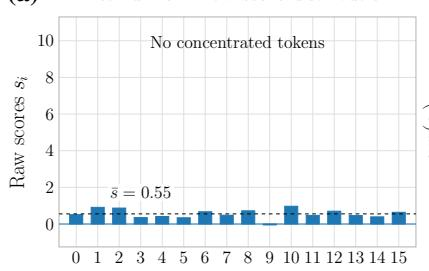

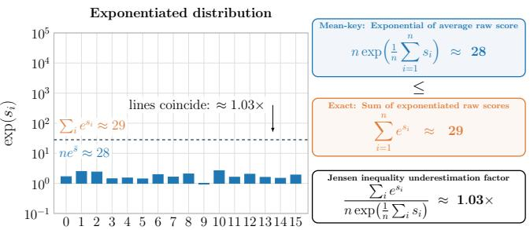

(b)  
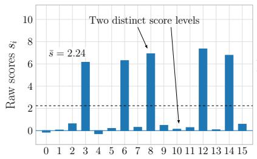

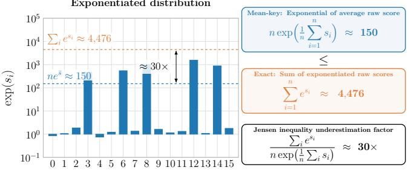

(c)  
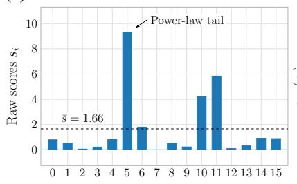

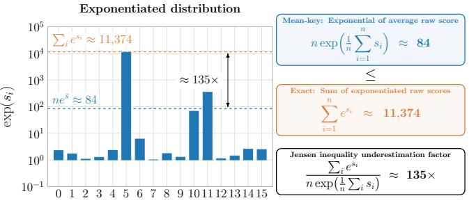

(d)  
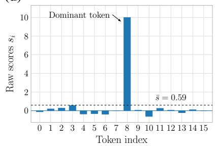

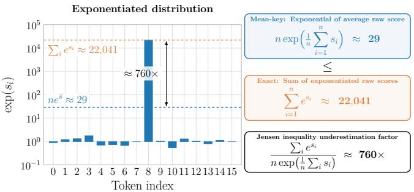  
Figure 3: Additional Jensen examples. Each row compares 16 raw logits $s _ { i } ,$ their exponentials, and the exact-to-surrogate mass ratio $\begin{array} { r } { \sum _ { i } e ^ { s _ { i } } / \left[ n \exp ( n ^ { - 1 } \sum _ { i } s _ { i } ) \right] } \end{array}$ . The displayed ratios are approximately (a) 1.03 for near-uniform logits, (b) 30 for bimodal logits, (c) 135 for the heavy-tailed example, and (d) 760 for the sparse example. The exponentiated-score axes are logarithmic.

## B.2 DENSE-TRAJECTORY KL AND TASK-VARIANT EVALUATION

The KL diagnostic asks how the variants compare when their queries and caches are held fixed. For Table 1, we run dense SDPA once per prompt and record its queries and KV states at each measured decode step. Evaluating every variant on these same states removes differences from divergent generated histories. The model is Qwen2.5-7B-Instruct at 8,192-token context, with 20 prompts per task. The mean measured decode-step counts per prompt are 32 for CWE, 9.75 for S-NIAH-1, and 10.55 for QA-1.

Compared distributions. For each recorded query, we compare two distributions over the N tokens in the fixed prompt prefix. The reference probability $p _ { i }$ is the dense SDPA attention weight for token $i ,$ restricted to that prefix and renormalized to sum to one. Generated suffix tokens are excluded from this comparison.

For a group g with $n _ { g }$ members, we form its routing probability $P ( g )$ by applying a softmax over groups to log $n _ { g }$ plus the scaled query–key score of its routing key. The team variant uses an actual representative key. The centroid-guided variants use the arithmetic mean of the group’s keys. We then spread each group’s probability equally across its members. Writing $g ( i )$ for the group containing token i, the token proposal and reported divergence are

$$
q _ { i } = { \frac { P ( g ( i ) ) } { n _ { g ( i ) } } } , \qquad \mathrm { K L } ( p \| q ) = \sum _ { i = 1 } ^ { N } p _ { i } \log { \frac { p _ { i } } { q _ { i } } } .\tag{11}
$$

The dense reference is the first argument, and the logarithm is natural, so KL divergence is reported in nats. These probabilities describe the routing proposal. Each grouping covers every prompt token once and has no empty groups. For finite scores, the softmax therefore gives positive probability to every prompt token in exact arithmetic.

Averaging. No sampling is performed in this diagnostic, so the sample budget S does not enter the comparison. Once the query, cached keys, and grouping are fixed, both distributions are fixed. We average KL uniformly over decode steps, all 28 layers, and all 28 query heads within each prompt, then average the prompt means equally within each task. Longer generations therefore do not receive more prompt-level weight. Because the variants differ in both grouping and routing keys, the comparison does not isolate the effect of representative choice alone.

Task-accuracy comparison. The separate task evaluation measures accuracy and logical KV access. Table 6 uses 100 prompts per task across all 13 RULER tasks, with the same model and context length as the KL diagnostic. It compares the $P = 1 6 , R = 4$ team variant with k-means parents against centroid-guided variants at $B = 4$ and $B = 1 6$ , using nominal budgets $S \in \{ 1 2 8 , 2 5 \bar { 6 } , 5 1 2 \}$

For the centroid-guided variants, B is the nominal cluster size, not a fixed number of members. With N prompt tokens, it sets the requested number of k-means clusters to min N, max $( 2 , \lfloor N / B \rfloor ) \}$ per layer and KV head. Clustering uses post-RoPE keys, and actual cluster sizes vary. The $B = 1 6$ variant matches the team variant’s nominal parent size; $B = 4$ provides a finer grouping.

Each centroid-guided variant scores the cluster’s mean key and adds the logarithm of its size to form the routing logit. At budget S, it selects $\lfloor S / B \rfloor$ clusters using the same Gumbel sampling without replacement as the team variant. Every member of a selected cluster is read and evaluated with its exact token score. The cluster’s attention mass and weighted value sum are divided by its conditional inclusion probability before the corrected sums are combined and normalized.

Whole-team sampling has the highest all-task point estimate at every tested budget, at the cost of the highest reported KV access. $\mathrm { A t } { \bar { S } } = 1 2 8$ , it reaches 84.16% accuracy compared with 87.09% for SDPA while accessing 24.97% of dense KV. Increasing the team budget narrows the aggregate score gap but requires more access. Both guided variants use fewer logical reads at the same nominal S.

The aggregate ordering hides task-specific trade-offs. Guided $B = 4$ has the higher QA-2 poin estimate at every budget, whereas teams have higher point estimates on CWE and VT. Guided $B =$ 16 gives the lowest access but has a particularly low MK-NIAH-3 score at $S = 1 2 8$ and low VT scores throughout. More sampling does not improve every team result: the VT point estimate falls at $S = 2 5 6$ before recovering at $\bar { S } = 5 1 2$ , and QA-2 declines between those two budgets. These task differences matter when choosing a budget even though the all-task score increases.

Logical KV access. The reported total includes both routing reads and the keys and values used for attention. Within each KV head, we take the union of prompt rows selected by its seven query heads before counting one key and one value per row. We also count the keys and values in the exactly attended generated suffix. Routing adds one key-vector read per group and KV head at each decode step; it does not read values.

We sum the underlying access counts across decode steps, layers, and prompts, then divide by the corresponding summed dense counts. The reported percentage is therefore a ratio of total counts.
<table><tr><td></td><td></td><td colspan="2">S-NIAH-1</td><td colspan="2">S-NIAH-2</td><td colspan="2">S-NIAH-3</td><td colspan="2">MK-NIAH-1</td><td colspan="2">MK-NIAH-2</td></tr><tr><td>Method</td><td>S</td><td>KV (%)</td><td>Acc (%)</td><td>KV (%)</td><td>Acc (%)</td><td>KV (%)</td><td>Acc (%)</td><td>KV (%)</td><td>Acc (%)</td><td>KV (%)</td><td>Acc (%)</td></tr><tr><td>SDPA</td><td>一</td><td>100.00</td><td>100.00 ± 0.00</td><td>100.00</td><td> $1 0 0 . 0 0 \pm 0 . 0 0$ </td><td>100.00</td><td> $1 0 0 . 0 0 \pm 0 . 0 0$ </td><td>100.00</td><td>100.00 ± 0.00</td><td>100.00</td><td> $9 8 . 0 0 \pm 2 . 5 0 $ </td></tr><tr><td>SANTA++</td><td>128</td><td>22.54</td><td> $1 0 0 . 0 0 \pm 0 . 0 0$ </td><td>25.37</td><td> $1 0 0 . 0 0 \pm 0 . 0 0$ </td><td>25.50</td><td> $1 0 0 . 0 0 \pm 0 . 0 0$ </td><td>24.95</td><td> $9 9 . 0 0 \pm 1 . 5 0 $ </td><td>25.57</td><td> $9 4 . 0 0 \pm 4 . 5 0 $ </td></tr><tr><td>(Teams)</td><td>256</td><td>30.33</td><td> $1 0 0 . 0 0 \pm 0 . 0 0$ </td><td>34.75</td><td> $9 9 . 0 0 \pm 1 . 5 0 $ </td><td>34.77</td><td> $1 0 0 . 0 0 \pm 0 . 0 0$ </td><td>34.05</td><td> $1 0 0 . 0 0 \pm 0 . 0 0$ </td><td>34.60</td><td> $9 8 . 0 0 \pm 2 . 5 0 $ </td></tr><tr><td></td><td>512</td><td>42.60</td><td> $1 0 0 . 0 0 \pm 0 . 0 0$ </td><td>48.49</td><td> $1 0 0 . 0 0 \pm 0 . 0 0$ </td><td>48.19</td><td> $1 0 0 . 0 0 \pm 0 . 0 0$ </td><td>47.63</td><td> $1 0 0 . 0 0 \pm 0 . 0 0$ </td><td>47.78</td><td> $9 5 . 0 0 \pm 4 . 5 0$ </td></tr><tr><td></td><td>128</td><td>20.90</td><td> $1 0 0 . 0 0 \pm 0 . 0 0$ </td><td>22.06</td><td> $1 0 0 . 0 0 \pm 0 . 0 0$ </td><td>22.53</td><td> $9 8 . 0 0 \pm 2 . 5 0 $ </td><td>21.98</td><td> $9 9 . 0 0 \pm 1 . 5 0 $ </td><td>22.87</td><td> $9 8 . 0 0 \pm 2 . 5 0 $ </td></tr><tr><td>Centroid-guided (B = 4)</td><td>256</td><td>28.29</td><td> $1 0 0 . 0 0 \pm 0 . 0 0$ </td><td>30.32</td><td> $1 0 0 . 0 0 \pm 0 . 0 0$ </td><td>30.52</td><td> $9 8 . 0 0 \pm 2 . 5 0 $ </td><td>29.85</td><td> $1 0 0 . 0 0 \pm 0 . 0 0$ </td><td>31.14</td><td> $9 7 . 0 0 \pm 3 . 0 0$ </td></tr><tr><td></td><td>512</td><td>40.20</td><td> $1 0 0 . 0 0 \pm 0 . 0 0$ </td><td>43.33</td><td> $1 0 0 . 0 0 \pm 0 . 0 0$ </td><td>43.45</td><td> $1 0 0 . 0 0 \pm 0 . 0 0$ </td><td>42.67</td><td> $9 8 . 0 0 \pm 2 . 5 0 $ </td><td>43.90</td><td> $9 6 . 0 0 \pm 3 . 5 0$ </td></tr><tr><td></td><td>128</td><td>10.75</td><td> $9 7 . 0 0 \pm 3 . 5 0 $ </td><td>11.96</td><td> $9 7 . 0 0 \pm 3 . 5 0 $ </td><td>12.11</td><td> $8 7 . 0 0 \pm 6 . 5 0$ </td><td>11.55</td><td> $9 6 . 0 0 \pm 3 . 5 0$ </td><td>12.69</td><td> $8 1 . 0 0 \pm 7 . 5 0$ </td></tr><tr><td>Centroid-guided  $( B = 1 6 )$ </td><td>256</td><td>17.68</td><td> $9 9 . 0 0 \pm 1 . 5 0 $ </td><td>19.54</td><td> $9 8 . 0 0 \pm 2 . 5 0 $ </td><td>19.61</td><td> $9 7 . 0 0 \pm 3 . 0 1 $ </td><td>19.01</td><td> $9 8 . 0 0 \pm 2 . 5 0 $ </td><td>20.71</td><td> $9 2 . 0 0 \pm 5 . 0 0$ </td></tr><tr><td></td><td>512</td><td>29.09</td><td> $1 0 0 . 0 0 \pm 0 . 0 0$ </td><td>32.38</td><td> $1 0 0 . 0 0 \pm 0 . 0 0$ </td><td>32.26</td><td> $1 0 0 . 0 0 \pm 0 . 0 0$ </td><td>31.36</td><td> $1 0 0 . 0 0 \pm 0 . 0 0$ </td><td>33.26</td><td> $9 4 . 0 0 \pm 4 . 5 0 $ </td></tr></table>

<table><tr><td></td><td></td><td colspan="2">MK-NIAH-3</td><td colspan="2">MQ-NIAH</td><td colspan="2">MV-NIAH</td><td colspan="2">VT</td></tr><tr><td>Method</td><td>S</td><td>KV (%)</td><td> $\operatorname { A c c } \left( \% \right)$ </td><td>KV (%)</td><td>Acc (%)</td><td>KV (%)</td><td> $\operatorname { A c c } \left( \% \right)$ </td><td>KV (%)</td><td>Acc (%)</td></tr><tr><td>SDPA</td><td>一</td><td>100.00</td><td> $9 7 . 0 0 \pm 3 . 5 0 $ </td><td>100.00</td><td> $9 9 . 7 5 \pm 0 . 3 8$ </td><td>100.00</td><td> $9 8 . 0 0 \pm 1 . 2 6 $ </td><td>100.00</td><td> $3 5 . 8 0 \pm 9 . 1 0$ </td></tr><tr><td>SANTA++</td><td>128</td><td>23.79</td><td> $9 1 . 0 0 \pm 5 . 5 0 $ </td><td>25.61</td><td> $9 8 . 2 5 \pm 1 . 3 8$ </td><td>25.82</td><td> $9 3 . 5 0 \pm 2 . 6 3$ </td><td>22.11</td><td> $3 3 . 8 0 \pm 9 . 4 0$ </td></tr><tr><td>(Teams)</td><td>256 512</td><td>31.67 43.99</td><td> $9 5 . 0 0 \pm 4 . 0 0$ </td><td>34.53 47.96</td><td> $9 9 . 7 5 \pm 0 . 3 8$   $1 0 0 . 0 0 \pm 0 . 0 0$ </td><td>34.85 48.35</td><td> $9 4 . 2 5 \pm 2 . 2 5$   $9 5 . 7 5 \pm 1 . 8 8$ </td><td>29.14 40.38</td><td> $2 6 . 0 0 \pm 8 . 5 0$ </td></tr><tr><td></td><td></td><td></td><td> $9 8 . 0 0 \pm 2 . 5 0 $ </td><td></td><td></td><td></td><td></td><td></td><td> $3 4 . 8 0 \pm 9 . 0 0$ </td></tr><tr><td>Centroid-guided (B = 4)</td><td>128</td><td>21.99</td><td> $9 3 . 0 0 \pm 4 . 5 0$ </td><td>22.51</td><td> $9 8 . 5 0 \pm 1 . 1 2$ </td><td>22.79</td><td> $8 8 . 0 0 \pm 2 . 5 0 $ </td><td>20.38</td><td> $1 6 . 2 0 \pm 7 . 2 0$ </td></tr><tr><td></td><td>256 512</td><td>29.26 41.08</td><td> $9 8 . 0 0 \pm 2 . 5 0 $ </td><td>30.35</td><td> $9 8 . 0 0 \pm 1 . 6 2 $ </td><td>30.73</td><td> $9 1 . 0 0 \pm 2 . 2 5$ </td><td>26.87</td><td> $1 6 . 4 0 \pm 7 . 2 0$ </td></tr><tr><td></td><td></td><td></td><td> $9 8 . 0 0 \pm 2 . 5 0 $ </td><td>43.12</td><td> $9 9 . 2 5 \pm 0 . 8 8$ </td><td>43.58</td><td> $9 4 . 5 0 \pm 2 . 1 2$ </td><td>37.80</td><td> $2 4 . 8 0 \pm 8 . 2 0$ </td></tr><tr><td></td><td>128</td><td>12.10</td><td> $2 1 . 0 0 \pm 7 . 5 0$ </td><td>12.08</td><td> $9 6 . 7 5 \pm 1 . 6 2$ </td><td>12.21</td><td> $8 4 . 5 0 \pm 2 . 7 5$ </td><td>10.33</td><td> $1 5 . 2 0 \pm 6 . 6 0$ </td></tr><tr><td>Centroid-guided (B = 16)</td><td>256</td><td>19.00</td><td> $6 8 . 0 0 \pm 9 . 0 0$ </td><td>19.36</td><td> $9 7 . 7 5 \pm 1 . 3 8$ </td><td>19.67</td><td> $8 8 . 0 0 \pm 2 . 7 5$ </td><td>16.34</td><td> $7 . 8 0 \pm 5 . 0 0$ </td></tr><tr><td></td><td>512</td><td>30.43</td><td> $9 5 . 0 0 \pm 4 . 0 0$ </td><td>31.82</td><td> $9 8 . 7 5 \pm 1 . 0 0$ </td><td>32.17</td><td> $8 8 . 7 5 \pm 2 . 6 2$ </td><td>26.77</td><td> $1 8 . 8 0 \pm 7 . 1 0$ </td></tr></table>

<table><tr><td></td><td></td><td colspan="2">CWE</td><td colspan="2">FWE</td><td colspan="2">QA-1</td><td colspan="2">QA-2</td><td colspan="2">All Tasks</td></tr><tr><td>Method</td><td>S</td><td>KV (%)</td><td>Acc (%)</td><td>KV (%)</td><td>Acc (%)</td><td>KV (%)</td><td>Acc (%)</td><td>KV (%)</td><td>Acc (%)</td><td>KV (%)</td><td>Acc (%)</td></tr><tr><td>SDPA</td><td>一</td><td>100.00</td><td> $9 3 . 3 0 \pm 1 . 7 5$ </td><td>100.00</td><td> $8 0 . 3 3 \pm 3 . 3 4$ </td><td>100.00</td><td> $7 1 . 0 0 \pm 9 . 0 0$ </td><td>100.00</td><td> $5 9 . 0 0 \pm 9 . 0 0$ </td><td>100.00</td><td> $8 7 . 0 9 \pm 1 . 3 0$ </td></tr><tr><td>SANTA++</td><td>128</td><td>24.85</td><td> $8 8 . 9 0 \pm 2 . 3 0$ </td><td>23.61</td><td> $7 8 . 6 7 \pm 3 . 8 4$ </td><td>28.37</td><td> $6 5 . 0 0 \pm 9 . 0 0$ </td><td>26.59</td><td> $5 2 . 0 0 \pm 9 . 5 0$ </td><td>24.97</td><td> $8 4 . 1 6 \pm 1 . 4 5$ </td></tr><tr><td>(Teams)</td><td>256 512</td><td>33.37 46.13</td><td> $8 9 . 2 0 \pm 2 . 5 0$   $9 2 . 1 0 \pm 1 . 8 0$ </td><td>32.08</td><td> $7 9 . 0 0 \pm 3 . 8 4$ </td><td>39.06</td><td> $6 7 . 0 0 \pm 9 . 5 0$ </td><td>36.09</td><td> $5 7 . 0 0 \pm 9 . 5 0$   $5 5 . 0 0 \pm 9 . 5 0$ </td><td>33.79</td><td> $8 4 . 9 4 \pm 1 . 3 4$ </td></tr><tr><td></td><td></td><td></td><td></td><td>45.30</td><td> $8 0 . 3 3 \pm 3 . 1 7$ </td><td>53.86</td><td> $7 0 . 0 0 \pm 9 . 0 0$ </td><td>50.05</td><td></td><td>46.98</td><td> $8 6 . 2 3 \pm 1 . 3 4$ </td></tr><tr><td></td><td>128</td><td>22.65</td><td> $8 2 . 3 0 \pm 3 . 1 0$ </td><td>21.65</td><td> $7 7 . 0 0 \pm 3 . 1 8$ </td><td>24.60</td><td> $6 5 . 0 0 \pm 9 . 5 0$ </td><td>22.94</td><td> $5 5 . 0 0 \pm 9 . 5 0$ </td><td>22.30</td><td> $8 2 . 3 1 \pm 1 . 3 5$ </td></tr><tr><td>Centroid-guided (B = 4)</td><td>256</td><td>30.61 43.15</td><td> $8 5 . 9 0 \pm 2 . 3 0$ </td><td>29.39</td><td> $7 9 . 6 7 \pm 3 . 6 6$ </td><td>33.90</td><td> $7 2 . 0 0 \pm 8 . 5 0$ </td><td>31.32</td><td> $5 9 . 0 0 \pm 9 . 5 0 $ </td><td>30.20</td><td> $8 4 . 2 3 \pm 1 . 2 7$ </td></tr><tr><td></td><td>512</td><td></td><td> $9 0 . 4 0 \pm 2 . 2 5$ </td><td>42.13</td><td> $8 3 . 6 7 \pm 3 . 5 0$ </td><td>48.33</td><td> $7 0 . 0 0 \pm 9 . 0 1$ </td><td>44.58</td><td> $5 9 . 0 0 \pm 9 . 5 0 $ </td><td>42.87</td><td> $8 5 . 6 6 \pm 1 . 3 2$ </td></tr><tr><td></td><td>128</td><td>12.21</td><td> $6 6 . 0 0 \pm 3 . 5 5$ </td><td>11.37</td><td> $7 0 . 6 7 \pm 4 . 5 1$ </td><td>14.31</td><td> $6 9 . 0 0 \pm 9 . 0 0$ </td><td>12.63</td><td> $5 3 . 0 0 \pm 9 . 5 0$ </td><td>12.02</td><td> $7 1 . 8 6 \pm 1 . 6 6$ </td></tr><tr><td>Centroid-guided (B = 16)</td><td>256</td><td>19.33</td><td> $7 7 . 6 0 \pm 3 . 1 0$ </td><td>18.70</td><td> $7 4 . 6 7 \pm 3 . 8 3$ </td><td>23.20</td><td> $6 7 . 0 0 \pm 9 . 0 0$ </td><td>20.56</td><td> $5 3 . 0 0 \pm 9 . 0 1$ </td><td>19.44</td><td> $7 8 . 2 9 \pm 1 . 4 9$ </td></tr><tr><td></td><td>512</td><td>31.23</td><td> $8 0 . 9 0 \pm 3 . 6 0$ </td><td>31.24</td><td> $7 9 . 3 3 \pm 3 . 8 4$ </td><td>37.25</td><td> $6 9 . 0 0 \pm 9 . 0 0$ </td><td>33.92</td><td> $5 5 . 0 0 \pm 1 0 . 0 0$ </td><td>31.78</td><td> $8 3 . 0 4 \pm 1 . 3 4$ </td></tr></table>

Table 6: Task-variant evaluation on RULER at 8K context. Qwen2.5-7B-Instruct with 100 prompts per task. SANTA++ (teams) uses whole-team sampling with $P = 1 6 , R = 4 ;$ Centroidguided $( B = 4 )$ and $( B = 1 6 )$ denote the two centroid-guided baselines. S is the nominal budget. KV is the reported theoretical GQA-aware access relative to dense SDPA. Accuracy is reported as mean 95% bootstrap confidence interval half-width. All Tasks accuracy is the equal-weight mean over all 13 tasks, with a stratified bootstrap that resamples prompts within each task. This is a sepa rate evaluation from the 20-prompt dense-trajectory KL diagnostic.

## B.3 CENTROID-DISTANCE DIAGNOSTIC

Contiguous parents avoid clustering, but do they still group nearby keys? Figure 4 compares key clusters, contiguous chunks, and random chunks using the mean Euclidean distance from each raw key vector to the arithmetic centroid of its group. Here, distances to group centroids measure group compactness. The experiment uses Qwen2.5-7B-Instruct at 8,192-token context, with 100 prompts per RULER task and group size $P = 1 6$

Key clustering applies k-means independently for each layer and KV head. Contiguous grouping partitions the token sequence into consecutive groups of 16, while the random baseline uses one fixed random shuffle of token positions before partitioning them into groups of 16. For each task, we report the arithmetic mean of token-to-centroid distances over all tokens, KV heads, layers, and prompts.

Across all 13 tasks, contiguous chunks have larger mean distances than key clusters but smaller distances than random chunks. Position thus retains some local structure in the keys without requiring key-space clustering, while key clustering produces the more compact groups on these inputs. This gives a geometric reason to consider contiguous parents rather than random grouping.

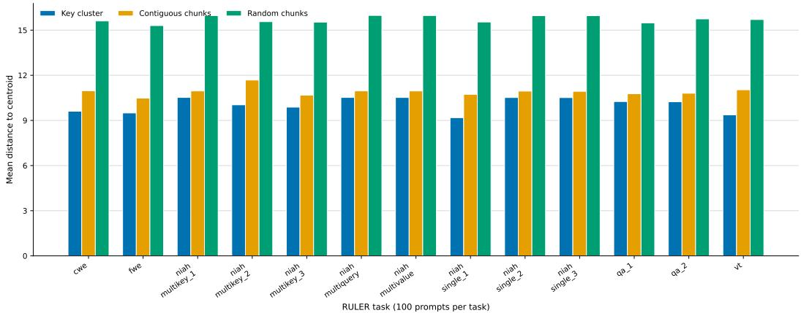  
Figure 4: Key-to-centroid distance across RULER tasks. Mean distance for key clusters, contiguous chunks, and random chunks on 100 prompts per task, using Qwen2.5-7B-Instruct at 8,192-token context and nominal group size $P = 1 \bar { 6 }$ . Contiguous chunks lie between key clusters and random chunks on every plotted task.

## B.4 ORACLE PREFILL-WINDOW DIAGNOSTIC

We measure how much attention mass a small number of contiguous windows can retain compared with selecting the same number of tokens individually. This oracle analysis uses dense attention weights from the final prefill query token. It uses 10 prompts per task for CWE and MV-NIAH, with Qwen2.5-7B-Instruct at context lengths of 8,192 and 32,768 tokens. We partition the prompt into disjoint windows of width $w = 1 6$ and select $K _ { \mathrm { w } } = 3 2$ windows.

For each prompt, layer, and attention head, let $a _ { i }$ be the dense attention weight on token i. Let ${ \mathcal { T } } _ { K _ { \mathrm { v } } }$ index the $K _ { \mathrm { w } }$ windows with the largest summed attention weight, and let $w _ { j }$ contain the token positions in window j. As a reference with the same w $K _ { \mathrm { w } } = 5$ 12-token budget, let $\mathcal { D } _ { w K _ { \mathrm { w } } }$ contain the 512 token positions with the largest individual attention weights for the same prompt, layer, and head. The window effectiveness ratio (WER) is

$$
\mathrm { W E R } = \frac { \displaystyle \sum _ { j \in \mathbb { Z } _ { K _ { \mathrm { w } } } } \sum _ { i \in \mathcal { W } _ { j } } a _ { i } } { \displaystyle \sum _ { i \in \mathcal { D } _ { w K _ { \mathrm { w } } } } a _ { i } } .\tag{12}
$$

Because the reference set contains the 512 highest-attention tokens, $0 \leq \mathrm { W E R } \leq 1$ . A WER close to one means that the selected windows retain nearly as much attention mass as the unconstrained 512-token reference set. Table 7 shows that a majority of heads reach the 0.50 threshold in every task–context pair, whereas only 15.1%–23.6% reach 0.90. Thus the 32 windows capture at least half of the reference mass for most heads, while near-complete recovery is less common.

<table><tr><td>Task</td><td>Context length</td><td>WER threshold</td><td>Heads (%)</td></tr><tr><td>CWE CWE</td><td>8192</td><td>≥ 0.50</td><td>82.1 [79.8, 84.9] 80.2 [76.9, 84.8]</td></tr><tr><td>CWE</td><td>32768</td><td>≥ 0.50</td><td></td></tr><tr><td>CWE</td><td>8192 32768</td><td>≥ 0.75 ≥ 0.75</td><td>54.0 [48.4, 60.7] 49.5 [41.7, 60.7]</td></tr><tr><td>CWE</td><td></td><td></td><td></td></tr><tr><td>CWE</td><td>8192</td><td>≥ 0.90</td><td>22.1 [18.4, 27.0]</td></tr><tr><td></td><td>32768</td><td>≥ 0.90</td><td>23.6 [16.2, 36.4]</td></tr><tr><td>MV-NIAH</td><td>8192</td><td>≥ 0.50</td><td>79.0 [75.2, 83.4]</td></tr><tr><td>MV-NIAH</td><td>32768</td><td>≥ 0.50</td><td>73.8 [72.0, 75.7]</td></tr><tr><td>MV-NIAH</td><td>8192</td><td>≥ 0.75</td><td>51.3 [43.7, 60.7]</td></tr><tr><td>MV-NIAH</td><td>32768</td><td>≥ 0.75</td><td>42.6 [39.4, 46.0]</td></tr><tr><td>MV-NIAH</td><td>8192</td><td>≥ 0.90</td><td></td></tr><tr><td>MV-NIAH</td><td>32768</td><td>≥ 0.90</td><td>22.0 [15.6, 30.8] 15.1 [13.4, 17.0]</td></tr></table>

Table 7: Oracle prefill-window effectiveness. Percentage of heads across all layers meeting each WER threshold from Equation 12. For each prompt, layer, and head, WER compares the attention mass in the top $K _ { \mathrm { w } } = 3 2$ disjoint windows of width $w = 1 6$ with the mass in the w $K _ { \mathrm { w } } = 5 1 2$ highest-attention tokens. Results use 10 prompts per task at 8K and 32K context. Brackets give 95% bootstrap confidence intervals from resampling prompts.

## B.5 KEY VERSUS PROBE-FINGERPRINT CLUSTERING

Clustering keys directly avoids forming their attention-score fingerprints under probe queries. This separate evaluation uses Qwen2.5-7B-Instruct at 8K context on 50 prompts per task for CWE, MK-NIAH-3, QA-1, and QA-2, with S 128, 256, 512 and $P = 1 6 , \mathbf { \bar { \mathit { R } } } = \mathbf { \bar { \mathit { 4 } } }$

For key clustering, we apply k-means directly to the unnormalized key vectors independently for each prompt, layer, and KV head. For probe-fingerprint clustering, the final 64 prefill-token queries serve as probes. Each key is represented by its dot-product scores with these probe queries from the query heads sharing its KV head, and each fingerprint dimension is z-score standardized across prompt tokens before k-means. The two variants otherwise use the same team construction, attention estimator, and sampling procedure. Error bars are 95% percentile-bootstrap confidence intervals from 10,000 resamples.

Key clustering has higher point estimates on MK-NIAH-3 at all three budgets, whereas probe fingerprints have higher CWE point estimates at $S = 1 2 8$ and 256. On QA-2, the ordering reverses with budget, and both clustering variants remain below the dense point estimate. The QA intervals overlap substantially.

There is no uniform accuracy advantage from constructing probe fingerprints in this comparison. Direct key clustering is a simpler preparation choice, while the lower-budget CWE results identify a setting in which probe fingerprints have the higher point estimates.

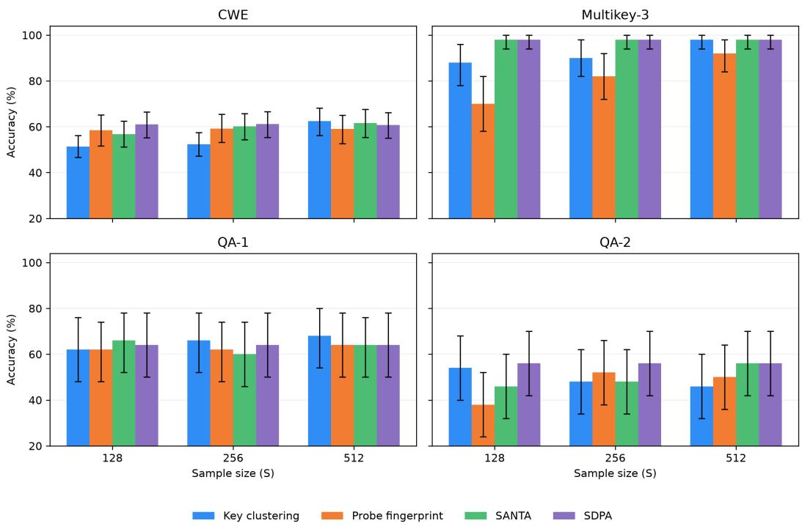  
Figure 5: Key versus probe-fingerprint clustering. Accuracy on four RULER tasks with 50 prompts per task and nominal budgets S = 128, 256, 512. Bars compare key clustering, probefingerprint clustering, SANTA, and dense SDPA; error bars denote the displayed 95% confidence intervals.

## C EVALUATION DETAILS AND FULL BENCHMARK RESULTS

## C.1 SETUP AND METRICS

We evaluate Qwen2.5-7B-Instruct with dense scaled dot-product attention (SDPA), SANTA, and SANTA++ using k-means or contiguous parent groups. HELMET and RULER use 8K and 32K contexts; LongBench v2 uses a 32K context cap, retaining shorter prompts at their original length. Budgets double from $S  { \mathrm { ~ \ r ~ { ~ \vert ~ { ~ \ - ~ 1 2 8 } ~ } ~ } }$ through 2048 for HELMET RAG, through 1024 for LongBench v2 and 8K RULER, and through 4096 for 32K RULER. The complete 32K aggregate sweeps are reported in Tables 2, 3, and 4, respectively.

For SANTA++, the nominal budget requests ${ \cal K } = \mathrm { m i n } \{ M , S / ( P / R ) \}$ teams, with integral $P / R$ and $S / ( P / R )$ , where M is the number of teams. This conversion requires the run’s $P , { \bar { R } } ;$ it does not give the number of unique rows read. As specified in Appendix A, the reference partitions the prompt after dense prefill and keeps newly generated cache rows in a separate exact suffix. That suffix starts empty and grows as generated tokens are fed back; no prompt window is reserved for exact evaluation.

Absolute scores retain each benchmark’s metric. The full aggregate tables retain their normalized columns, computed as the absolute score divided by the corresponding SDPA score from the same benchmark and context, expressed as a percentage. HELMET, LongBench, and RULER report 95% bootstrap confidence interval half-widths.

Reference logical-access counter. For one layer, KV head, and decoding call $c ,$ let $N _ { c }$ be the current cache length, $e _ { c }$ the exact generated-suffix length, and $m _ { c }$ the number of team representatives scanned for routing. Let $I _ { c , h }$ be the selected prompt-row indices for query head h and set $u _ { c } =$ $| \cup _ { h } I _ { c , h } |$ , with the union restricted to query heads sharing that KV head. The reference counts one

key and one value per dense row and computes

$$
\mathrm { K V } _ { \mathrm { t o t a l } } ( \% ) = 1 0 0 \frac { \sum _ { c } \left[ m _ { c } + 2 ( u _ { c } + e _ { c } ) \right] } { \sum _ { c } 2 N _ { c } } .\tag{13}
$$

The selected prompt rows and exact suffix are disjoint. A representative read for routing and again as a selected member counts in both passes. Counts also add across layers and decoding steps. Prefill and team construction are outside this counter. For SANTA, the corresponding numerator per call is $N _ { c }$ plus the number of distinct sampled value rows across sharing query heads, so its full-key scan alone costs 50%.

Access aggregation. The reference also records a selected-KV-only access measure that omits the routing term $m _ { c } .$ . The main RULER tables instead use the total-access measure in Equation 13, which includes routing. For RULER aggregates, we sum the raw numerators and denominators across prompts and tasks before division rather than averaging the displayed task percentages. For HELMET RAG, aggregate access is the equal-weight mean of the four RAG task-level total-access percentages, including representative-key routing reads (Appendix C.2).

## C.2 HELMET

Table 2 reports the main 32K RAG sweep, and Table 8 gives the corresponding 8K sweep. Both use $S \in \{ 1 2 8 , 2 5 6 , 5 1 2 , 1 0 2 4 , 2 0 4 8 \}$ . The RAG score is the equal-weight mean of substring exact match on Natural Questions, TriviaQA, PopQA, and HotpotQA. KV access is the equal-weight mean of those four tasks’ total-access percentages, including representative-key routing reads. Tables 9 and 10 give individual RAG task results at all five budgets; the non-RAG tasks and the all-task summary cover $S \in \{ 1 2 8 , 2 5 6 , 5 1 2 \}$ only.

The additional tasks expose losses outside the RAG mean. At 32K, JSON KV scores fall from SDPA’s 96.80% to 45.60% with k-means and 33.40% with contiguous grouping at $S = 1 2 8$ . At $S = 5 1 2 .$ , these rise to 87.00% and 68.60%, respectively. Non-RAG tasks use their own scoring metrics. The detailed tables’ “All tasks average” summarizes all 13 tasks.
<table><tr><td>Method</td><td>S</td><td>KV (%)</td><td>Acc (norm) (%)</td><td>Acc (abs) (%)</td></tr><tr><td>SDPA</td><td>一</td><td>100.00</td><td>100.00</td><td> $6 2 . 6 5 \pm 2 . 0 2$ </td></tr><tr><td rowspan="4">SANTA</td><td>128</td><td>51.62</td><td>100.24</td><td> $6 2 . 8 0 \pm 2 . 0 2$ </td></tr><tr><td>256</td><td>52.70</td><td>99.60</td><td> $6 2 . 4 0 \pm 2 . 0 3$ </td></tr><tr><td>512</td><td>54.39</td><td>99.60</td><td> $6 2 . 4 0 \pm 2 . 0 3$ </td></tr><tr><td>1024 2048</td><td>56.77</td><td>100.16</td><td> $6 2 . 7 5 \pm 2 . 0 5$ </td></tr><tr><td rowspan="5">SANTA++ (k-means)</td><td>128</td><td>60.14</td><td>100.00</td><td> $6 2 . 6 5 \pm 2 . 0 7$ </td></tr><tr><td>256</td><td>27.55</td><td>97.85</td><td> $6 1 . 3 0 \pm 1 . 9 8$ </td></tr><tr><td>512</td><td>37.60</td><td>98.72</td><td> $6 1 . 8 5 \pm 2 . 0 0$ </td></tr><tr><td>1024</td><td>51.83</td><td>99.28</td><td> $6 2 . 2 0 \pm 2 . 0 0$ </td></tr><tr><td>2048</td><td>69.95 90.18</td><td>98.56 100.40</td><td> $6 1 . 7 5 \pm 2 . 0 0$ </td></tr><tr><td rowspan="5">SANTA++ (Contiguous)</td><td>128</td><td></td><td></td><td> $6 2 . 9 0 \pm 2 . 0 5$ </td></tr><tr><td>256</td><td>23.69</td><td>96.09</td><td> $6 0 . 2 0 \pm 2 . 0 2$ </td></tr><tr><td>512</td><td>32.38</td><td>100.80</td><td> $6 3 . 1 5 \pm 2 . 0 3$ </td></tr><tr><td>1024</td><td>45.73</td><td>99.44</td><td> $6 2 . 3 0 \pm 2 . 0 2$ </td></tr><tr><td>2048</td><td>64.10 86.28</td><td>99.52 99.76</td><td> $6 2 . 3 5 \pm 2 . 0 5$   $6 2 . 5 0 \pm 2 . 0 7$ </td></tr></table>

Table 8: HELMET RAG: full 8K budget sweep with Qwen2.5-7B-Instruct. Acc (abs) is the equal-weight mean substring exact match on Natural Questions, TriviaQA, PopQA, and HotpotQA. Acc (norm) is the absolute score divided by the corresponding SDPA score at the same context length, expressed as a percentage. KV is the equal-weight mean of the four RAG task-level totalaccess percentages, including representative-key routing reads. S is the nominal budget. The entries are the reported score-interval half-widths.

(a) RAG and reranking
<table><tr><td rowspan="2">Method</td><td rowspan="2">S</td><td colspan="2">Natural Questions</td><td colspan="2">TriviaQA</td><td colspan="2">PopQA</td><td colspan="2">HotpotQA</td><td colspan="2">MS MARCO</td></tr><tr><td>Total access (%)</td><td> $\operatorname { A c c } \left( \% \right)$ </td><td>Total access (%)</td><td> $\operatorname { A c c } \left( \% \right)$ </td><td>Total access (%)</td><td>Acc (%)</td><td>Total access (%)</td><td>Acc (%)</td><td>Total access (%)</td><td>Acc (%)</td></tr><tr><td>SDPA</td><td>=</td><td>100.00</td><td> $5 3 . 2 0 \pm 4 . 3 0$ </td><td>100.00</td><td> $8 2 . 2 0 \pm 3 . 3 0$ </td><td>100.00</td><td> $6 4 . 4 0 \pm 4 . 1 0$ </td><td>100.00</td><td> $5 0 . 8 0 \pm 4 . 4 0$ </td><td>100.00</td><td> $5 8 . 5 1 \pm 3 . 8 9$ </td></tr><tr><td rowspan="7">SANTA</td><td>128</td><td>51.62</td><td> $5 4 . 4 0 \pm 4 . 4 0$ </td><td>51.55</td><td> $8 2 . 4 0 \pm 3 . 4 0$ </td><td>51.79</td><td> $6 3 . 0 0 \pm 4 . 2 0$ </td><td>51.51</td><td> $5 1 . 4 0 \pm 4 . 3 0$ </td><td>51.72</td><td> $5 9 . 1 6 \pm 3 . 8 1$ </td></tr><tr><td>256 512</td><td>52.73 54.46</td><td>53.80 ± 4.40  $5 3 . 0 0 \pm 4 . 3 0$ </td><td>52.58</td><td>81.80 ± 3.40  $8 2 . 2 0 \pm 3 . 3 0$ </td><td>52.97</td><td>63.80 ± 4.20</td><td>52.52</td><td>50.20 ± 4.50  $5 0 . 2 0 \pm 4 . 5 0$ </td><td>52.75</td><td>58.03 ± 3.75</td></tr><tr><td>1024</td><td>56.90</td><td></td><td>54.21</td><td></td><td>54.79</td><td> $6 4 . 2 0 \pm 4 . 2 0$ </td><td>54.09</td><td></td><td>54.27</td><td> $5 9 . 0 6 \pm 3 . 8 4$ </td></tr><tr><td></td><td></td><td> $5 4 . 4 0 \pm 4 . 3 0$ </td><td>56.49</td><td>82.20 ± 3.30</td><td>57.30</td><td> $6 4 . 0 0 \pm 4 . 1 0$ </td><td>56.39</td><td> $5 0 . 4 0 \pm 4 . 4 0$ </td><td></td><td></td></tr><tr><td>2048</td><td>60.37</td><td>54.00 ± 4.30</td><td>59.77</td><td>82.20 ± 3.30</td><td>60.83</td><td> $6 4 . 0 0 \pm 4 . 2 0 $ </td><td>59.58</td><td>50.40 ± 4.40</td><td></td><td></td></tr><tr><td>128</td><td>27.49</td><td> $\overline { { 5 3 . 8 0 \pm 4 . 4 0 } }$ </td><td>26.87</td><td> $\overline { { 8 3 . 2 0 \pm 3 . 3 0 } }$ </td><td>28.88</td><td> $\overline { { 6 1 . 6 0 \pm 4 . 3 0 } }$ </td><td>26.96</td><td> $\overline { { 4 6 . 6 0 \pm 4 . 4 0 } }$ </td><td>28.23</td><td> $\overline { { 5 6 . 9 9 \pm 3 . 8 4 } }$ </td></tr><tr><td>256 512</td><td>37.46 51.58</td><td> $5 4 . 8 0 \pm 4 . 3 0$ </td><td>36.64</td><td> $8 1 . 2 0 \pm 3 . 5 0$ </td><td>39.55</td><td> $6 4 . 2 0 \pm 4 . 3 0$ </td><td>36.73</td><td> $4 7 . 2 0 \pm 4 . 3 0$ </td><td>37.32</td><td> $5 7 . 9 1 \pm 3 . 9 1$ </td></tr><tr><td>SANTA++ (K-means)</td><td></td><td> $5 3 . 2 0 \pm 4 . 5 0$ </td><td>50.57</td><td> $8 3 . 2 0 \pm 3 . 3 0$ </td><td>54.46 73.13</td><td> $6 3 . 0 0 \pm 4 . 2 0$ </td><td>50.69</td><td> $4 9 . 4 0 \pm 4 . 4 0$ </td><td>50.36</td><td> $5 9 . 0 2 \pm 3 . 6 7$ </td></tr><tr><td></td><td>1024</td><td>69.43 52.40 ± 4.40</td><td></td><td>68.53 81.80 ± 3.30</td><td></td><td> $6 3 . 0 0 \pm 4 . 2 0$ </td><td>68.70</td><td>49.80 ± 4.30</td><td></td><td></td><td></td></tr><tr><td></td><td>2048</td><td>89.46</td><td> $5 4 . 2 0 \pm 4 . 3 0$ </td><td>88.82</td><td> $8 2 . 8 0 \pm 3 . 3 0$ </td><td>93.44</td><td> $6 4 . 0 0 \pm 4 . 2 0 $ </td><td>88.98</td><td> $5 0 . 6 0 \pm 4 . 4 0$ </td><td></td><td></td></tr><tr><td></td><td>128</td><td>23.66</td><td> $5 3 . 0 0 \pm 4 . 4 0$ </td><td>23.05</td><td> $8 0 . 4 0 \pm 3 . 4 0$ </td><td>24.80</td><td> $6 0 . 8 0 \pm 4 . 3 0$ </td><td>23.25</td><td> $4 6 . 6 0 \pm 4 . 3 0$ </td><td>25.03</td><td> $4 4 . 9 5 \pm 3 . 9 9$ </td></tr><tr><td>SANTA++ (Contiguous)</td><td>256</td><td>32.28</td><td> $5 5 . 2 0 \pm 4 . 3 0$ </td><td>31.41</td><td> $8 2 . 2 0 \pm 3 . 4 0$ </td><td>34.15</td><td> $6 3 . 8 0 \pm 4 . 3 0$ </td><td>31.69</td><td> $5 1 . 4 0 \pm 4 . 4 0$ </td><td>33.13</td><td> $4 9 . 5 9 \pm 4 . 0 4$ </td></tr><tr><td></td><td>512 1024</td><td>45.51 63.72</td><td>53.60 ± 4.40</td><td>44.35 62.44</td><td> $8 2 . 4 0 \pm 3 . 3 0$ </td><td>48.34 67.18</td><td> $6 3 . 0 0 \pm 4 . 4 0$   $6 3 . 6 0 \pm 4 . 3 0$ </td><td>44.72 63.07</td><td>50.20 ± 4.40</td><td>45.37</td><td> $5 4 . 8 1 \pm 3 . 5 3$ </td></tr><tr><td></td><td>2048</td><td>85.50</td><td> $5 4 . 4 0 \pm 4 . 3 0$   $5 3 . 2 0 \pm 4 . 3 0$ </td><td>84.51</td><td> $8 1 . 6 0 \pm 3 . 3 0$   $8 1 . 8 0 \pm 3 . 4 0$ </td><td>90.06</td><td> $6 4 . 2 0 \pm 4 . 2 0$ </td><td>85.03</td><td> $4 9 . 8 0 \pm 4 . 4 0$   $5 0 . 8 0 \pm 4 . 4 0$ </td><td></td><td></td></tr><tr><td></td><td></td><td></td><td></td><td></td><td></td><td></td><td></td><td></td><td></td><td></td><td></td></tr><tr><td>Method</td><td>S Total access (%)</td><td>TREC coarse</td><td> $\operatorname { A c c } \left( \% \right)$ </td><td>TREC fine Total access (%)</td><td> $\operatorname { A c c } \left( \% \right)$ </td><td>NLU Total access (%)</td><td> $\operatorname { A c c } \left( \% \right)$ </td><td>Banking77 Total access (%)</td><td> $\operatorname { A c c } \left( \% \right)$ </td><td>CLINC150 Total access (%)</td><td> $\operatorname { A c c } \left( \% \right)$ </td></tr><tr><td>SDPA</td><td>=</td><td>100.00</td><td> $8 3 . 0 0 \pm 3 . 2 0$ </td><td>100.00</td><td> $4 1 . 8 0 \pm 4 . 4 0$ </td><td>100.00</td><td> $7 9 . 6 0 \pm 3 . 5 0$ </td><td>100.00</td><td> $7 5 . 2 0 \pm 3 . 8 0$ </td><td>100.00</td><td> $8 1 . 6 0 \pm 3 . 4 0$ </td></tr><tr><td></td><td>128</td><td>52.03</td><td> $8 3 . 2 0 \pm 3 . 3 0$ </td><td>52.00</td><td> $4 0 . 2 0 \pm 4 . 3 0$ </td><td>52.00</td><td> $7 8 . 0 0 \pm 3 . 6 0$ </td><td>52.01</td><td> $7 6 . 0 0 \pm 3 . 6 0$ </td><td>51.96</td><td> $7 9 . 4 0 \pm 3 . 6 0$ </td></tr><tr><td>SANTA</td><td>256</td><td>53.39</td><td>83.00 ± 3.20</td><td>53.36</td><td>43.20 ± 4.30</td><td>53.38</td><td>79.60 ± 3.50</td><td>53.34</td><td>76.20 ± 3.70</td><td>53.30</td><td>80.40 ± 3.50</td></tr><tr><td></td><td>512</td><td>55.47</td><td> $8 2 . 8 0 \pm 3 . 3 0$ </td><td>55.44</td><td> $4 2 . 4 0 \pm 4 . 3 0$ </td><td>55.50</td><td> $8 0 . 0 0 \pm 3 . 5 0$ </td><td>55.37</td><td> $7 5 . 6 0 \pm 3 . 7 0$ </td><td>55.37</td><td> $8 2 . 2 0 \pm 3 . 4 0$ </td></tr><tr><td></td><td>128</td><td>28.41</td><td> $7 9 . 2 0 \pm 3 . 6 0$ </td><td>27.95</td><td> $3 9 . 0 0 \pm 4 . 2 0$ </td><td>27.79</td><td> $7 7 . 4 0 \pm 3 . 6 0$ </td><td>27.41</td><td> $7 4 . 2 0 \pm 3 . 9 0$ </td><td>27.61</td><td> $7 4 . 2 0 \pm 3 . 9 0$ </td></tr><tr><td></td><td>256</td><td>38.74</td><td> $8 3 . 0 0 \pm 3 . 4 0$ </td><td>37.99</td><td> $4 1 . 6 0 \pm 4 . 3 0$ </td><td>37.85</td><td> $7 8 . 2 0 \pm 3 . 5 0$ </td><td>37.14</td><td> $7 6 . 0 0 \pm 3 . 7 0$ </td><td>37.39</td><td>77.80 ± 3.70</td></tr><tr><td>SANTA++ (K-means)</td><td>512</td><td>53.25</td><td> $8 3 . 2 0 \pm 3 . 2 0$ </td><td>52.16</td><td> $4 1 . 8 0 \pm 4 . 4 0$ </td><td>51.96</td><td> $7 9 . 6 0 \pm 3 . 6 0$ </td><td>50.94</td><td> $7 6 . 2 0 \pm 3 . 7 0$ </td><td>51.15</td><td> $7 9 . 6 0 \pm 3 . 5 0$ </td></tr><tr><td></td><td>128</td><td>23.95</td><td></td><td></td><td></td><td></td><td></td><td></td><td></td><td></td><td></td></tr><tr><td>SANTA++</td><td>256</td><td>32.85</td><td> $8 0 . 4 0 \pm 3 . 4 0$   $8 3 . 4 0 \pm 3 . 2 0$ </td><td>23.71</td><td>35.80 ± 4.20</td><td>23.89 32.74</td><td> $7 5 . 2 0 \pm 3 . 9 0$ </td><td>23.47</td><td>72.80 ± 3.90</td><td>23.43</td><td> $7 4 . 0 0 \pm 3 . 8 0$ </td></tr><tr><td>(Contiguous)</td><td>512</td><td>46.45</td><td> $8 3 . 2 0 \pm 3 . 3 0$ </td><td>32.44 45.81</td><td> $3 9 . 2 0 \pm 4 . 4 0$ </td><td>46.19</td><td> $7 9 . 2 0 \pm 3 . 5 0$ </td><td>31.97</td><td> $7 6 . 6 0 \pm 3 . 8 0$ </td><td>31.94</td><td> $7 7 . 2 0 \pm 3 . 7 0$ </td></tr><tr><td></td><td></td><td></td><td></td><td></td><td> $4 2 . 8 0 \pm 4 . 4 0$ </td><td></td><td> $7 8 . 0 0 \pm 3 . 7 0$ </td><td>44.98</td><td> $7 6 . 0 0 \pm 3 . 7 0$ </td><td>44.96</td><td> $7 9 . 0 0 \pm 3 . 5 0$ </td></tr><tr><td></td><td></td><td></td><td></td><td></td><td></td><td></td><td></td><td></td><td></td><td></td><td></td></tr><tr><td>Method</td><td>S</td><td>InfBench QA</td><td></td><td></td><td>InfBench MC</td><td></td><td></td><td>JSON KV</td><td></td><td>All tasks average</td><td></td></tr><tr><td></td><td></td><td> $\mathrm { T o t a l } \ a c c e s s \ ( \% )$ </td><td></td><td> $\operatorname { A c c } \left( \% \right)$ </td><td>Total access (%)</td><td> $\operatorname { A c c } \left( \% \right)$ </td><td>Total access (%)</td><td> $\operatorname { A c c } \left( \% \right)$ </td><td></td><td> $\mathrm { T o t a l } \ a c c e s s \ ( \% )$ </td><td> $\operatorname { A c c } \left( \% \right)$ </td></tr><tr><td>SDPA</td><td></td><td>100.00</td><td> $2 0 . 0 8 \pm 3 . 5 4$ </td><td></td><td>100.00</td><td> $4 0 . 6 1 \pm 6 . 3 3$ </td><td>100.00</td><td> $9 9 . 4 0 \pm 0 . 7 0$ </td><td></td><td>100.00</td><td> $6 3 . 8 8 \pm 3 . 7 6$ </td></tr><tr><td></td><td>128 256</td><td></td><td>51.24  $1 9 . 2 2 \pm 3 . 5 1$ </td><td></td><td>50.99</td><td> $4 2 . 3 6 \pm 6 . 3 3$ </td><td>51.29</td><td> $9 9 . 4 0 \pm 0 . 7 0$ </td><td></td><td>51.67  $6 3 . 7 0 \pm 3 . 7 7$  52.77</td></tr><tr><td rowspan="2">Method</td><td rowspan="2">S</td><td colspan="2">Natural Questions</td><td colspan="2">TriviaQA</td><td colspan="2">PopQA</td><td colspan="2"> $_ \mathrm { H o t p o t Q A }$ </td><td colspan="2">MS MARCO</td></tr><tr><td>Total access (%)</td><td>Acc (%)</td><td>Total access (%)</td><td>Acc (%)</td><td>Total access (%)</td><td> $\operatorname { A c c } \left( \% \right)$ </td><td>Total access (%)</td><td>Acc (%)</td><td>Total access (%)</td><td>Acc (%)</td></tr><tr><td>SDPA</td><td></td><td>100.00</td><td> $4 6 . 2 0 \pm 4 . 3 0$ </td><td>100.00</td><td> $8 2 . 0 0 \pm 3 . 5 0$ </td><td>100.00</td><td> $6 2 . 8 0 \pm 4 . 3 0$ </td><td>100.00</td><td>38.60 ± 4.20</td><td>100.00</td><td> $3 4 . 3 9 \pm 4 . 3 6$ </td></tr><tr><td rowspan="8">SANTA</td><td>128</td><td>50.43</td><td> $4 6 . 4 0 \pm 4 . 3 0$ </td><td>50.41</td><td> $8 1 . 0 0 \pm 3 . 5 0$ </td><td>50.46</td><td> $6 2 . 2 0 \pm 4 . 2 0$ </td><td>50.41</td><td> $3 8 . 0 0 \pm 4 . 3 0 $ </td><td>50.46</td><td> $3 7 . 6 3 \pm 4 . 6 0$ </td></tr><tr><td>256</td><td>50.77</td><td> $4 5 . 6 0 \pm 4 . 4 0$ </td><td>50.71</td><td>81.00 ± 3.40</td><td>50.81</td><td> $6 2 . 8 0 \pm 4 . 2 0$ </td><td>50.71</td><td>38.00 ± 4.40</td><td>50.77</td><td> $3 5 . 7 9 \pm 4 . 5 8$ </td></tr><tr><td>512</td><td>51.33</td><td>46.00 ± 4.40</td><td>51.23</td><td> $8 1 . 4 0 \pm 3 . 3 0$ </td><td>51.40</td><td> $6 2 . 8 0 \pm 4 . 2 0$ </td><td>51.23</td><td> $3 9 . 8 0 \pm 4 . 2 0$ </td><td>51.29</td><td> $3 4 . 4 9 \pm 4 . 3 5$ </td></tr><tr><td>1024</td><td>52.23</td><td> $4 6 . 4 0 \pm 4 . 4 0$ </td><td>52.05</td><td> $8 0 . 4 0 \pm 3 . 4 0$ </td><td>52.32</td><td> $6 2 . 8 0 \pm 4 . 2 0$ </td><td>52.06</td><td> $3 8 . 8 0 \pm 4 . 1 0$ </td><td></td><td></td></tr><tr><td>2048</td><td>53.65</td><td> $4 6 . 8 0 \pm 4 . 4 0$ </td><td>53.35</td><td> $8 0 . 4 0 \pm 3 . 4 0$ </td><td>53.76</td><td> $6 2 . 8 0 \pm 4 . 3 0$ </td><td>53.37</td><td> $3 8 . 8 0 \pm 4 . 3 0$ </td><td></td><td></td></tr><tr><td></td><td></td><td></td><td></td><td></td><td></td><td></td><td></td><td></td><td></td><td></td></tr><tr><td>128</td><td>17.48 21.80</td><td>43.80 ± 4.30  $4 4 . 6 0 \pm 4 . 3 0$ </td><td>17.27</td><td>80.80 ± 3.40</td><td>17.86</td><td> $5 4 . 4 0 \pm 4 . 4 0$   $5 9 . 6 0 \pm 4 . 2 0$ </td><td>17.34</td><td>37.80 ± 4.20</td><td>17.40</td><td>27.70 ± 4.14</td></tr><tr><td>256 512</td><td>28.56</td><td> $4 6 . 4 0 \pm 4 . 4 0$ </td><td>21.50 28.12</td><td> $7 9 . 0 0 \pm 3 . 5 0$   $7 9 . 0 0 \pm 3 . 5 0$ </td><td>22.37 29.39</td><td> $5 9 . 4 0 \pm 4 . 3 0$ </td><td>21.60 28.25</td><td> $3 6 . 2 0 \pm 4 . 3 0$   $3 6 . 6 0 \pm 4 . 2 0$ </td><td>21.34 27.55</td><td> $2 8 . 9 8 \pm 4 . 3 3$   $3 0 . 3 0 \pm 4 . 3 5$ </td></tr><tr><td>(K-means) 1024</td><td>38.43</td><td> $4 5 . 0 0 \pm 4 . 3 0$ </td><td>37.95</td><td> $8 1 . 0 0 \pm 3 . 4 0$ </td><td>39.60</td><td> $6 1 . 0 0 \pm 4 . 3 0$ </td><td>37.97</td><td>38.00 ± 4.40</td><td></td><td></td></tr><tr><td>2048</td><td></td><td>52.02 47.20 ± 4.40</td><td></td><td> $8 1 . 4 0 \pm 3 . 5 0$ </td><td>53.65</td><td> $6 2 . 2 0 \pm 4 . 3 0$ </td><td>51.44</td><td> $3 7 . 0 0 \pm 4 . 2 0 $ </td><td></td><td></td><td></td></tr><tr><td rowspan="5">SANTA++</td><td>128</td><td>15.66</td><td> $4 2 . 8 0 \pm 4 . 4 0$ </td><td>51.41 15.51</td><td></td><td>15.90</td><td> $5 8 . 6 0 \pm 4 . 4 0 $ </td><td>15.58</td><td></td><td></td><td></td></tr><tr><td>256</td><td>18.46</td><td> $4 2 . 6 0 \pm 4 . 3 0$ </td><td>18.23</td><td> $7 5 . 6 0 \pm 3 . 8 0$   $7 7 . 2 0 \pm 3 . 8 0$ </td><td>18.89</td><td> $6 1 . 0 0 \pm 4 . 3 0$ </td><td>18.36</td><td> $3 5 . 4 0 \pm 4 . 2 0$ </td><td>15.87</td><td> $1 7 . 5 6 \pm 3 . 3 9$ </td></tr><tr><td>512</td><td>23.29</td><td> $4 4 . 6 0 \pm 4 . 3 0$ </td><td>22.92</td><td> $7 6 . 2 0 \pm 3 . 7 0$ </td><td>24.03</td><td> $6 0 . 2 0 \pm 4 . 3 0$ </td><td>23.14</td><td> $3 6 . 8 0 \pm 4 . 2 0$   $3 7 . 2 0 \pm 4 . 2 0$ </td><td>18.50 23.03</td><td> $2 3 . 5 2 \pm 3 . 8 7$ </td></tr><tr><td>1024</td><td>31.09</td><td>46.00 ± 4.40</td><td>30.66</td><td></td><td>32.27</td><td></td><td>30.88</td><td>38.40 ± 4.30</td><td></td><td> $2 4 . 6 9 \pm 4 . 0 3$ </td></tr><tr><td>2048</td><td>43.15</td><td> $4 6 . 4 0 \pm 4 . 4 0$ </td><td>42.50</td><td>78.60 ± 3.60  $7 8 . 0 0 \pm 3 . 6 0$ </td><td>44.91</td><td> $6 1 . 0 0 \pm 4 . 2 0$   $6 2 . 0 0 \pm 4 . 3 0$ </td><td></td><td></td><td></td><td></td></tr></table>

Table 9: HELMET task results at 8K context length. Each accuracy is reported as the mean the half-width of its 95% confidence interval.

<table><tr><td rowspan="2">Method</td><td rowspan="2">S</td><td colspan="2">TREC coarse</td><td colspan="2">TREC fine</td><td colspan="2">NLU</td><td colspan="2">Banking77</td><td colspan="2">CLINC150</td></tr><tr><td>Total access (%)</td><td> $\operatorname { A c c } \left( \% \right)$ </td><td>Total access (%)</td><td> $\operatorname { A c c } \left( \% \right)$ </td><td>Total access (%)</td><td> $\operatorname { A c c } \left( \% \right)$ </td><td>Total access (%)</td><td> $\operatorname { A c c } \left( \% \right)$ </td><td>Total access (%)</td><td>Acc (%)</td></tr><tr><td>SDPA</td><td>=</td><td>100.00</td><td> $8 3 . 2 0 \pm 3 . 3 0$ </td><td>100.00</td><td> $5 0 . 8 0 \pm 4 . 4 0$ </td><td>100.00</td><td> $8 6 . 2 0 \pm 3 . 0 0$ </td><td>100.00</td><td> $8 3 . 4 0 \pm 3 . 3 0$ </td><td>100.00</td><td> $8 9 . 8 0 \pm 2 . 6 0$ </td></tr><tr><td></td><td>128</td><td>50.61</td><td> $8 3 . 2 0 \pm 3 . 3 0$ </td><td>50.59</td><td> $4 8 . 8 0 \pm 4 . 2 0$ </td><td>50.58</td><td> $8 5 . 0 0 \pm 3 . 1 0$ </td><td>50.58</td><td> $8 3 . 2 0 \pm 3 . 3 0$ </td><td>50.56</td><td> $8 9 . 0 0 \pm 2 . 9 0$ </td></tr><tr><td></td><td>256</td><td>51.07</td><td> $8 3 . 6 0 \pm 3 . 3 0$ </td><td>51.03</td><td>50.80 ± 4.30</td><td>51.02</td><td>86.20 ± 3.00</td><td>51.01</td><td>83.20 ± 3.20</td><td>51.00</td><td>90.80 ± 2.50</td></tr><tr><td>SANTA</td><td>512</td><td>51.84</td><td> $8 3 . 6 0 \pm 3 . 2 0$ </td><td>51.78</td><td> $5 0 . 8 0 \pm 4 . 3 0$ </td><td>51.77</td><td> $8 4 . 6 0 \pm 3 . 2 0$ </td><td>51.72</td><td> $8 2 . 4 0 \pm 3 . 3 0$ </td><td>51.72</td><td> $8 9 . 6 0 \pm 2 . 7 0$ </td></tr><tr><td></td><td>128</td><td>17.95</td><td> $8 1 . 6 0 \pm 3 . 5 0$ </td><td>17.79</td><td> $4 6 . 6 0 \pm 4 . 5 0$ </td><td>17.52</td><td> $8 0 . 8 0 \pm 3 . 4 0$ </td><td>17.31</td><td> $8 3 . 0 0 \pm 3 . 3 0$ </td><td>17.46</td><td> $8 6 . 4 0 \pm 3 . 0 0$ </td></tr><tr><td></td><td>256</td><td>22.50</td><td> $8 4 . 4 0 \pm 3 . 1 0$ </td><td>22.19</td><td> $4 7 . 8 0 \pm 4 . 4 0$ </td><td>21.85</td><td> $8 5 . 2 0 \pm 3 . 2 0$ </td><td>21.47</td><td> $8 3 . 4 0 \pm 3 . 3 0$ </td><td>21.69</td><td> $8 9 . 6 0 \pm 2 . 6 0$ </td></tr><tr><td>SANTA++ (K-means)</td><td>512</td><td>29.57</td><td> $8 5 . 0 0 \pm 3 . 2 0$ </td><td>29.03</td><td> $5 0 . 8 0 \pm 4 . 4 0$ </td><td>28.66</td><td> $8 4 . 4 0 \pm 3 . 1 0$ </td><td>28.05</td><td> $8 1 . 4 0 \pm 3 . 4 0$ </td><td>28.31</td><td> $8 8 . 2 0 \pm 2 . 8 0$ </td></tr><tr><td></td><td>128</td><td>15.74</td><td> $\overline { { 8 3 . 8 0 \pm 3 . 2 0 } }$ </td><td>15.61</td><td> $\overline { { 4 1 . 6 0 \pm 4 . 4 0 } }$ </td><td>15.64</td><td> $\overline { { 7 8 . 4 0 \pm 3 . 7 0 } }$ </td><td>15.55</td><td> $\overline { { 7 8 . 6 0 \pm 3 . 6 0 } }$ </td><td>15.56</td><td> $\overline { { 8 3 . 6 0 \pm 3 . 3 0 } }$ </td></tr><tr><td></td><td>256</td><td>18.66</td><td> $8 5 . 6 0 \pm 3 . 0 0$ </td><td>18.41</td><td>44.00 ± 4.50</td><td>18.49</td><td> $8 0 . 4 0 \pm 3 . 4 0$ </td><td>18.30</td><td>81.00 ± 3.50</td><td>18.30</td><td> $8 6 . 4 0 \pm 3 . 0 0$ </td></tr><tr><td>SANTA++ (Contiguous)</td><td>512</td><td>23.71</td><td> $8 5 . 8 0 \pm 3 . 0 0$ </td><td>23.28</td><td> $4 6 . 2 0 \pm 4 . 3 0$ </td><td>23.43</td><td> $8 2 . 6 0 \pm 3 . 4 0$ </td><td>23.07</td><td> $8 1 . 6 0 \pm 3 . 3 0$ </td><td>23.07</td><td> $8 7 . 8 0 \pm 2 . 8 0$ </td></tr></table>

<table><tr><td rowspan="2">Method</td><td rowspan="2">S</td><td colspan="2">InfBench QA</td><td colspan="2">InfBench MC</td><td colspan="2">JSON KV</td><td colspan="2">All tasks average</td></tr><tr><td> $\mathrm { T o t a l } \ a c c e s s \ ( \% )$ </td><td> $\operatorname { A c c } \left( \% \right)$ </td><td> $\mathrm { T o t a l } \ a c c e s s \left( \% \right)$ </td><td> $\operatorname { A c c } \left( \% \right)$ </td><td> $\mathrm { T o t a l } \ a c c e s s \ ( \% )$ </td><td> $\operatorname { A c c } \left( \% \right)$ </td><td> $\mathrm { T o t a l } \ a c c e s s \ ( \% )$ </td><td> $\operatorname { A c c } \left( \% \right)$ </td></tr><tr><td>SDPA</td><td>一</td><td>100.00</td><td> $1 5 . 0 0 \pm 2 . 5 4$ </td><td>100.00</td><td> $5 1 . 0 9 \pm 6 . 5 5$ </td><td>100.00</td><td> $9 6 . 8 0 \pm 1 . 5 0$ </td><td>100.00</td><td> $6 3 . 1 0 \pm 3 . 6 8$ </td></tr><tr><td rowspan="3"></td><td>128</td><td>50.36</td><td> $1 3 . 8 7 \pm 2 . 3 6$ </td><td>50.28</td><td> $4 6 . 2 9 \pm 6 . 5 5$ </td><td>50.36</td><td> $9 6 . 4 0 \pm 1 . 7 0$ </td><td>50.47</td><td> $6 2 . 3 8 \pm 3 . 7 2$ </td></tr><tr><td>256</td><td>50.62</td><td>14.80 ± 2.55</td><td>50.48</td><td>48.47 ± 6.55</td><td>50.60</td><td>96.80 ± 1.50</td><td>50.82</td><td> $6 2 . 9 1 \pm 3 . 6 8$ </td></tr><tr><td>512</td><td>51.07</td><td> $1 4 . 5 2 \pm 2 . 5 1$ </td><td>50.79</td><td> $4 8 . 4 7 \pm 6 . 5 5$ </td><td>51.00</td><td> $9 6 . 8 0 \pm 1 . 5 0$ </td><td>51.40</td><td> $6 2 . 7 1 \pm 3 . 6 7$ </td></tr><tr><td></td><td>128</td><td>16.97</td><td> $1 3 . 4 0 \pm 2 . 2 8$ </td><td>16.42</td><td> $5 0 . 6 6 \pm 6 . 5 5$ </td><td>15.87</td><td> $4 5 . 6 0 \pm 4 . 5 0$ </td><td>17.28</td><td> $5 6 . 3 5 \pm 3 . 9 6$ </td></tr><tr><td></td><td>256</td><td>21.14</td><td> $1 4 . 4 5 \pm 2 . 5 4$ </td><td>20.51</td><td> $4 8 . 9 1 \pm 6 . 5 5$ </td><td>19.01</td><td> $7 0 . 2 0 \pm 4 . 1 0$ </td><td>21.46</td><td> $5 9 . 4 1 \pm 3 . 8 8$ </td></tr><tr><td>SANTA++ (K-means)</td><td>512</td><td>27.80</td><td> $1 3 . 7 3 \pm 2 . 4 2$ </td><td>27.14</td><td> $4 8 . 4 7 \pm 6 . 5 5$ </td><td>24.35</td><td> $8 7 . 0 0 \pm 3 . 0 0$ </td><td>28.06</td><td> $6 0 . 8 2 \pm 3 . 8 2$ </td></tr><tr><td></td><td>128</td><td>15.27</td><td> $1 1 . 9 2 \pm 2 . 0 5$ </td><td>14.94</td><td> $4 6 . 7 2 \pm 6 . 5 5$ </td><td>15.00</td><td> $3 3 . 4 0 \pm 4 . 1 0$ </td><td>15.53</td><td> $5 2 . 9 2 \pm 3 . 9 3$ </td></tr><tr><td></td><td>256</td><td>17.85</td><td> $1 2 . 6 1 \pm 2 . 2 7$ </td><td>17.41</td><td> $4 8 . 4 7 \pm 6 . 5 5$ </td><td>17.18</td><td> $5 4 . 6 0 \pm 4 . 4 0$ </td><td>18.23</td><td> $5 6 . 4 8 \pm 3 . 9 3$ </td></tr><tr><td> $\mathrm { S A N T A + + }$  (Contiguous)</td><td>512</td><td>22.39</td><td> $1 3 . 5 4 \pm 2 . 3 0$ </td><td>21.95</td><td> $4 8 . 9 1 \pm 6 . 5 5$ </td><td>21.20</td><td> $6 8 . 6 0 \pm 4 . 0 0$ </td><td>22.96</td><td> $5 8 . 3 0 \pm 3 . 8 6$ </td></tr></table>

Table 10: HELMET task results at 32K context length. Each accuracy is reported as the mean  the half-width of its 95% confidence interval.

## C.3 LONGBENCH V2

Table 3 reports the complete aggregate budget sweep on 503 distinct LongBench v2 prompts using Qwen2.5-7B-Instruct. We use the repository’s middle-truncation scheme with a 32K context cap. Prompts longer than the cap are middle-truncated. Prompts at or below the cap retain their original length.

Prompting. Each prompt begins with Qwen’s assistant preamble. We modify the repository’s prompting to request brief reasoning and a fixed answer format by appending the following instruction:

Keep your reasoning concise (under 3 sentences). There is exactly one correct option. On the final line, provide your answer in the exact format: ’Final Answer: [X]’ where X is a single letter (A, B, C, or D).

## C.4 RULER

Table 4 reports the full 32K aggregate sweep. Tables 11 and 12 give all 13 tasks: S-NIAH-1/2/3, MK-NIAH-1/2/3, MQ-NIAH, MV-NIAH, VT, CWE, FWE, QA-1, and QA-2. The main RULER evaluations use the reference repository’s task definitions, prompting, and grading conventions with Qwen2.5-7B-Instruct. At both 8K and 32K, all 13 tasks have 500 completed prompts per task. Smaller diagnostic and MLA runs are separate and are not pooled into these results.

Each task has its own reported GQA-aware KV percentage. The main RULER results use the totalaccess measure in Equation 13, which includes both selected GQA KV reads and representative-key reads used for routing. Aggregate access pools the underlying read counts across prompts and tasks before division rather than averaging the displayed task percentages.

<table><tr><td rowspan="2">Method</td><td rowspan="2">S</td><td colspan="2">S-NIAH-1</td><td colspan="2">S-NIAH-2</td><td colspan="2">S-NIAH-3</td><td colspan="2">MK-NIAH-1</td><td colspan="2">MK-NIAH-2</td></tr><tr><td>KV (%)</td><td>Acc (%)</td><td>KV (%)</td><td>Acc (%)</td><td>KV (%)</td><td> $\operatorname { A c c } \left( \% \right)$ </td><td>KV (%)</td><td> $\operatorname { A c c } \left( \% \right)$ </td><td>KV (%)</td><td>Acc (%)</td></tr><tr><td>SDPA</td><td>一</td><td>100.00</td><td> $1 0 0 . 0 0 \pm 0 . 0 0$ </td><td>100.00</td><td> $1 0 0 . 0 0 \pm 0 . 0 0$ </td><td>100.00</td><td> $1 0 0 . 0 0 \pm 0 . 0 0$ </td><td>100.00</td><td> $1 0 0 . 0 0 \pm 0 . 0 0$ </td><td>100.00</td><td>98.80 ± 0.90</td></tr><tr><td rowspan="5">SANTA</td><td>128</td><td>50.97</td><td> $1 0 0 . 0 0 \pm 0 . 0 0$ </td><td>51.11</td><td> $1 0 0 . 0 0 \pm 0 . 0 0$ </td><td>51.06</td><td> $9 9 . 8 0 \pm 0 . 3 0 $ </td><td>51.13</td><td> $1 0 0 . 0 0 \pm 0 . 0 0$ </td><td>51.25</td><td> $9 8 . 8 0 \pm 0 . 9 0$ </td></tr><tr><td>256</td><td>51.56</td><td> $1 0 0 . 0 0 \pm 0 . 0 0$ </td><td>51.81</td><td> $1 0 0 . 0 0 \pm 0 . 0 0$ </td><td>51.72</td><td> $9 9 . 8 0 \pm 0 . 3 0 $ </td><td>51.83</td><td> $1 0 0 . 0 0 \pm 0 . 0 0$ </td><td>52.08</td><td> $9 9 . 0 0 \pm 0 . 9 0 $ </td></tr><tr><td>512</td><td>52.52</td><td> $1 0 0 . 0 0 \pm 0 . 0 0$ </td><td>52.93</td><td> $1 0 0 . 0 0 \pm 0 . 0 0$ </td><td>52.76</td><td> $1 0 0 . 0 0 \pm 0 . 0 0$ </td><td>52.94</td><td> $1 0 0 . 0 0 \pm 0 . 0 0$ </td><td>53.41</td><td> $9 8 . 2 0 \pm 1 . 1 0$ </td></tr><tr><td>1024</td><td>53.98</td><td> $1 0 0 . 0 0 \pm 0 . 0 0$ </td><td>54.62</td><td> $1 0 0 . 0 0 \pm 0 . 0 0$ </td><td>54.35</td><td> $1 0 0 . 0 0 \pm 0 . 0 0$ </td><td>54.62</td><td> $1 0 0 . 0 0 \pm 0 . 0 0$ </td><td>55.43</td><td> $9 8 . 2 0 \pm 1 . 1 0$ </td></tr><tr><td>128</td><td>22.53</td><td> $1 0 0 . 0 0 \pm 0 . 0 0$ </td><td>25.43</td><td> $9 9 . 4 0 \pm 0 . 8 0$ </td><td>25.46</td><td> $9 8 . 0 0 \pm 1 . 2 0 $ </td><td>24.95</td><td> $9 8 . 4 0 \pm 1 . 1 0$ </td><td>25.57</td><td> $9 6 . 0 0 \pm 1 . 6 0$ </td></tr><tr><td rowspan="4">SANTA++ (K-means)</td><td>256</td><td>30.37</td><td> $1 0 0 . 0 0 \pm 0 . 0 0$ </td><td>34.75</td><td> $9 9 . 6 0 \pm 0 . 5 0 $ </td><td>34.63</td><td> $9 9 . 6 0 \pm 0 . 5 0 $ </td><td>34.04</td><td> $9 9 . 8 0 \pm 0 . 3 0$ </td><td>34.59</td><td> $9 8 . 4 0 \pm 1 . 1 0$ </td></tr><tr><td>512</td><td>42.54</td><td> $1 0 0 . 0 0 \pm 0 . 0 0$ </td><td>48.54</td><td> $1 0 0 . 0 0 \pm 0 . 0 0$ </td><td>48.16</td><td> $1 0 0 . 0 0 \pm 0 . 0 0$ </td><td>47.57</td><td> $1 0 0 . 0 0 \pm 0 . 0 0$ </td><td>47.76</td><td> $9 7 . 8 0 \pm 1 . 2 0 $ </td></tr><tr><td>1024</td><td>60.33</td><td> $1 0 0 . 0 0 \pm 0 . 0 0$ </td><td>66.64</td><td> $1 0 0 . 0 0 \pm 0 . 0 0$ </td><td>66.20</td><td> $1 0 0 . 0 0 \pm 0 . 0 0$ </td><td>65.69</td><td> $1 0 0 . 0 0 \pm 0 . 0 0$ </td><td>65.51</td><td> $9 7 . 6 0 \pm 1 . 3 0$ </td></tr><tr><td>128</td><td>20.10</td><td> $1 0 0 . 0 0 \pm 0 . 0 0$ </td><td>21.99</td><td> $9 9 . 2 0 \pm 0 . 7 0$ </td><td>22.46</td><td> $9 8 . 4 0 \pm 1 . 1 0$ </td><td>21.78</td><td> $9 9 . 0 0 \pm 0 . 9 0$ </td><td>22.59</td><td> $9 1 . 4 0 \pm 2 . 5 0$ </td></tr><tr><td rowspan="4">SANTA++ (Contiguous)</td><td>256</td><td>27.08</td><td> $1 0 0 . 0 0 \pm 0 . 0 0$ </td><td>29.86</td><td> $9 9 . 0 0 \pm 0 . 9 0$ </td><td>30.13</td><td> $9 9 . 6 0 \pm 0 . 6 0$ </td><td>29.38</td><td> $9 8 . 6 0 \pm 1 . 1 0$ </td><td>30.71</td><td> $9 6 . 2 0 \pm 1 . 6 0$ </td></tr><tr><td>512</td><td>38.72</td><td> $1 0 0 . 0 0 \pm 0 . 0 0$ </td><td>42.36</td><td> $1 0 0 . 0 0 \pm 0 . 0 0$ </td><td>42.49</td><td> $9 9 . 8 0 \pm 0 . 3 0 $ </td><td>41.68</td><td> $1 0 0 . 0 0 \pm 0 . 0 0$ </td><td>43.34</td><td> $9 7 . 4 0 \pm 1 . 4 0$ </td></tr><tr><td>1024</td><td>55.97</td><td> $1 0 0 . 0 0 \pm 0 . 0 0$ </td><td>60.42</td><td> $1 0 0 . 0 0 \pm 0 . 0 0$ </td><td>60.36</td><td> $9 9 . 8 0 \pm 0 . 4 0 $ </td><td>59.62</td><td> $1 0 0 . 0 0 \pm 0 . 0 0$ </td><td>60.94</td><td> $9 8 . 0 0 \pm 1 . 3 0 $ </td></tr></table>

<table><tr><td rowspan="2">Method</td><td rowspan="2">S</td><td colspan="2">MK-NIAH-3</td><td colspan="2">MQ-NIAH</td><td colspan="2">MV-NIAH</td><td colspan="2">VT</td></tr><tr><td>KV (%)</td><td> $\operatorname { A c c } \left( \% \right)$ </td><td>KV (%)</td><td> $\operatorname { A c c } \left( \% \right)$ </td><td>KV (%)</td><td>Acc (%)</td><td>KV (%)</td><td>Acc (%)</td></tr><tr><td>SDPA</td><td>一</td><td>100.00</td><td> $9 7 . 0 0 \pm 1 . 4 0 $ </td><td>100.00</td><td> $9 9 . 9 0 \pm 0 . 1 2$ </td><td>100.00</td><td> $9 7 . 7 5 \pm 0 . 6 5$ </td><td>100.00</td><td> $3 0 . 6 0 \pm 3 . 7 8$ </td></tr><tr><td rowspan="4">SANTA</td><td>128</td><td>51.19</td><td> $9 6 . 4 0 \pm 1 . 5 0$ </td><td>51.19</td><td> $9 9 . 9 0 \pm 0 . 1 2$ </td><td>51.21</td><td> $9 7 . 2 5 \pm 0 . 7 0$ </td><td>51.05</td><td> $2 8 . 4 4 \pm 3 . 8 4$ </td></tr><tr><td>256</td><td>51.94</td><td> $9 6 . 2 0 \pm 1 . 6 0$ </td><td>51.90</td><td> $9 9 . 8 5 \pm 0 . 1 7$ </td><td>51.96</td><td> $9 7 . 2 0 \pm 0 . 7 0$ </td><td>51.63</td><td> $2 9 . 5 2 \pm 3 . 8 0$ </td></tr><tr><td>512</td><td>53.10</td><td> $9 6 . 4 0 \pm 1 . 5 0$ </td><td>53.00</td><td> $9 9 . 9 0 \pm 0 . 1 2$ </td><td>53.12</td><td> $9 7 . 5 0 \pm 0 . 7 0$ </td><td>52.50</td><td> $3 0 . 5 6 \pm 3 . 9 6$ </td></tr><tr><td>1024</td><td>54.85</td><td> $9 6 . 6 0 \pm 1 . 5 0$ </td><td>54.64</td><td> $9 9 . 8 5 \pm 0 . 1 7$ </td><td>54.86</td><td> $9 7 . 5 0 \pm 0 . 6 5$ </td><td>53.76</td><td> $3 1 . 8 4 \pm 4 . 0 4$ </td></tr><tr><td rowspan="4">SANTA++ (K-means)</td><td>128</td><td>23.80</td><td> $8 7 . 6 0 \pm 2 . 8 0$ </td><td>25.59</td><td> $9 9 . 0 0 \pm 0 . 4 8$ </td><td>25.78</td><td> $9 2 . 3 0 \pm 1 . 1 2$ </td><td>22.11</td><td> $2 4 . 5 6 \pm 3 . 6 4$ </td></tr><tr><td>256</td><td>31.71</td><td> $9 4 . 8 0 \pm 1 . 9 0 $ </td><td>34.51</td><td> $9 9 . 7 5 \pm 0 . 2 3$ </td><td>34.86</td><td> $9 4 . 8 5 \pm 0 . 9 3$ </td><td>29.16</td><td> $3 2 . 0 0 \pm 4 . 0 0$ </td></tr><tr><td>512</td><td>44.02</td><td> $9 6 . 8 0 \pm 1 . 4 0$ </td><td>47.92</td><td> $9 9 . 8 5 \pm 0 . 1 7$ </td><td>48.33</td><td> $9 6 . 0 5 \pm 0 . 8 2$ </td><td>40.39</td><td> $3 5 . 5 2 \pm 4 . 2 0$ </td></tr><tr><td>1024</td><td>61.63</td><td> $9 6 . 8 0 \pm 1 . 4 0$ </td><td>65.91</td><td> $9 9 . 8 5 \pm 0 . 1 7$ </td><td>66.35</td><td> $9 6 . 8 0 \pm 0 . 7 3$ </td><td>56.94</td><td> $3 0 . 6 0 \pm 3 . 9 4$ </td></tr><tr><td rowspan="4">SANTA++ (Contiguous)</td><td>128</td><td>21.97</td><td> $4 2 . 4 0 \pm 4 . 3 0$ </td><td>22.37</td><td> $9 7 . 8 0 \pm 0 . 6 8$ </td><td>22.47</td><td> $8 7 . 5 0 \pm 1 . 3 8$ </td><td>19.52</td><td> $1 7 . 1 2 \pm 3 . 3 4$ </td></tr><tr><td>256</td><td>29.09</td><td> $8 0 . 4 0 \pm 3 . 3 0$ </td><td>29.90</td><td> $9 8 . 6 5 \pm 0 . 4 8$ </td><td>30.14</td><td> $9 0 . 6 5 \pm 1 . 2 0$ </td><td>25.46</td><td> $2 1 . 8 0 \pm 3 . 3 8$ </td></tr><tr><td>512</td><td>40.49</td><td> $9 3 . 0 0 \pm 2 . 1 0$ </td><td>42.02</td><td> $9 9 . 7 0 \pm 0 . 2 3 $ </td><td>42.43</td><td> $9 3 . 3 5 \pm 1 . 0 5$ </td><td>35.86</td><td> $2 5 . 3 2 \pm 3 . 7 6$ </td></tr><tr><td>1024</td><td>57.42</td><td> $9 5 . 6 0 \pm 1 . 8 0$ </td><td>59.76</td><td> $9 9 . 8 5 \pm 0 . 1 7$ </td><td>60.26</td><td> $9 5 . 9 0 \pm 0 . 8 3$ </td><td>51.86</td><td> $2 8 . 6 0 \pm 3 . 9 8$ </td></tr></table>

<table><tr><td></td><td></td><td colspan="2">CWE</td><td colspan="2">FWE</td><td colspan="2">QA-1</td><td colspan="2">QA-2</td></tr><tr><td>Method</td><td>S</td><td>KV (%)</td><td>Acc (%)</td><td>KV (%)</td><td>Acc (%)</td><td>KV (%)</td><td>Acc (%)</td><td>KV (%)</td><td>Acc (%)</td></tr><tr><td>SDPA</td><td>一</td><td>100.00</td><td> $9 3 . 8 6 \pm 0 . 8 6$ </td><td>100.00</td><td> $8 1 . 6 0 \pm 1 . 5 3$ </td><td>100.00</td><td> $7 4 . 6 0 \pm 3 . 8 0$ </td><td>100.00</td><td> $5 5 . 2 0 \pm 4 . 5 0$ </td></tr><tr><td rowspan="4">SANTA</td><td>128</td><td>51.27</td><td> $9 1 . 6 2 \pm 0 . 9 9$ </td><td>51.35</td><td> $8 2 . 3 3 \pm 1 . 5 7$ </td><td>51.47</td><td> $7 5 . 0 0 \pm 4 . 0 0$ </td><td>51.28</td><td> $5 4 . 6 0 \pm 4 . 3 0$ </td></tr><tr><td>256</td><td>52.11</td><td> $9 3 . 3 2 \pm 0 . 8 6$ </td><td>52.26</td><td> $8 1 . 8 0 \pm 1 . 5 3$ </td><td>52.45</td><td> $7 4 . 4 0 \pm 3 . 8 0$ </td><td>52.11</td><td> $5 5 . 2 0 \pm 4 . 3 0$ </td></tr><tr><td>512</td><td>53.42</td><td> $9 3 . 9 2 \pm 0 . 8 9$ </td><td>53.70</td><td> $8 1 . 9 3 \pm 1 . 5 3$ </td><td>54.02</td><td> $7 4 . 4 0 \pm 3 . 8 0$ </td><td>53.43</td><td> $5 5 . 4 0 \pm 4 . 5 0$ </td></tr><tr><td>1024</td><td>55.39</td><td> $9 4 . 0 4 \pm 0 . 7 6$ </td><td>55.89</td><td> $8 1 . 5 3 \pm 1 . 5 0$ </td><td>56.39</td><td> $7 4 . 4 0 \pm 3 . 8 0$ </td><td>55.42</td><td> $5 6 . 2 0 \pm 4 . 3 0$ </td></tr><tr><td rowspan="4">SANTA++ (K-means)</td><td>128</td><td>24.85</td><td> $8 9 . 8 0 \pm 0 . 9 0$ </td><td>23.62</td><td> $8 0 . 3 3 \pm 1 . 5 3$ </td><td>28.35</td><td> $7 2 . 2 0 \pm 3 . 8 0$ </td><td>26.61</td><td> $5 2 . 6 0 \pm 4 . 5 0$ </td></tr><tr><td>256</td><td>33.40</td><td> $9 2 . 1 0 \pm 0 . 9 5$ </td><td>32.10</td><td> $8 1 . 3 3 \pm 1 . 6 3$ </td><td>38.81</td><td> $7 4 . 0 0 \pm 3 . 9 0$ </td><td>36.31</td><td> $5 2 . 0 0 \pm 4 . 3 0$ </td></tr><tr><td>512</td><td>46.19</td><td> $9 2 . 7 2 \pm 0 . 9 4$ </td><td>45.33</td><td> $8 1 . 6 7 \pm 1 . 4 7$ </td><td>53.51</td><td> $7 3 . 6 0 \pm 3 . 8 0$ </td><td>50.27</td><td> $5 3 . 4 0 \pm 4 . 4 0$ </td></tr><tr><td>1024</td><td>63.64</td><td> $9 3 . 1 6 \pm 0 . 9 8$ </td><td>63.78</td><td> $8 2 . 1 3 \pm 1 . 5 0$ </td><td>72.14</td><td> $7 5 . 2 0 \pm 3 . 8 0$ </td><td>68.31</td><td> $5 4 . 6 0 \pm 4 . 4 0$ </td></tr><tr><td rowspan="4">SANTA++ (Contiguous)</td><td>128</td><td>21.95</td><td> $7 3 . 9 2 \pm 1 . 2 8$ </td><td>20.99</td><td> $7 4 . 3 3 \pm 1 . 7 3$ </td><td>24.45</td><td> $6 8 . 8 0 \pm 4 . 2 0$ </td><td>23.15</td><td> $5 1 . 4 0 \pm 4 . 2 0$ </td></tr><tr><td>256</td><td>29.34</td><td> $8 2 . 7 2 \pm 1 . 1 7$ </td><td>28.40</td><td> $7 8 . 1 3 \pm 1 . 7 3$ </td><td>33.65</td><td> $7 2 . 4 0 \pm 3 . 8 0$ </td><td>31.60</td><td> $5 3 . 8 0 \pm 4 . 4 0$ </td></tr><tr><td>512</td><td>41.31</td><td> $8 9 . 3 8 \pm 0 . 9 8$ </td><td>40.66</td><td> $8 0 . 6 0 \pm 1 . 6 3$ </td><td>47.67</td><td> $7 3 . 6 0 \pm 3 . 9 0$ </td><td>44.56</td><td> $5 3 . 4 0 \pm 4 . 2 0$ </td></tr><tr><td>1024</td><td>58.57</td><td> $9 0 . 7 2 \pm 0 . 9 5$ </td><td>58.84</td><td> $8 1 . 1 3 \pm 1 . 5 0$ </td><td>66.71</td><td> $7 4 . 6 0 \pm 3 . 8 0$ </td><td>62.86</td><td> $5 4 . 4 0 \pm 4 . 4 0$ </td></tr></table>

Table 11: Per-task accuracy and KV memory access on RULER (8K context) on Qwen2.5-7B-Instruct. KV is the theoretical GQA-aware KV memory access (%), and S denotes the nominal budget. Accuracy values are reported as mean  95% bootstrap confidence interval half-width.

<table><tr><td rowspan=1 colspan=15>S-NIAH-1          S-NIAH-2          S-NIAH-3         MK-NIAH-1        MK-NIAH-2Method     S KV (%)   $\operatorname { A c c } \left( \% \right)$   KV (%)   $\operatorname { A c c } \left( \% \right)$   KV (%)   $\operatorname { A c c } \left( \% \right)$   KV (%)   $\operatorname { A c c } \left( \% \right)$   KV (%)  Acc (%)</td></tr><tr><td rowspan=1 colspan=15>SDPA      一  100.00  $1 0 0 . 0 0 \pm 0 . 0 0$  100.00  $1 0 0 . 0 0 \pm 0 . 0 0$  100.00  $9 8 . 6 0 \pm 1 . 0 0$  100.00  $9 9 . 0 0 \pm 0 . 9 0 $  100.00  $9 3 . 4 0 \pm 2 . 2 0$ </td></tr><tr><td rowspan=2 colspan=15>128 50.28  $1 0 0 . 0 0 \pm 0 . 0 0$  50.31  $1 0 0 . 0 0 \pm 0 . 0 0$  50.30  $9 9 . 2 0 \pm 0 . 7 0$  50.31  $9 9 . 2 0 \pm 0 . 7 0$  50.37  $9 3 . 2 0 \pm 2 . 2 0$ 256 50.47  $1 0 0 . 0 0 \pm 0 . 0 0$  50.53  $1 0 0 . 0 0 \pm 0 . 0 0$ </td></tr><tr><td rowspan=1 colspan=6></td></tr><tr><td rowspan=2 colspan=11>50.81                                50.87SANTA    1024 51.37  $1 0 0 . 0 0 \pm 0 . 0 0$  51.53  $1 0 0 . 0 0 \pm 0 . 0 0$  51.45</td><td rowspan=1 colspan=1>512</td><td rowspan=1 colspan=2>25</td><td rowspan=1 colspan=1></td></tr><tr><td rowspan=1 colspan=5> $9 8 . 6 0 \pm 1 . 0 0$  51.51  $9 9 . 0 0 \pm 0 . 9 0 $  51.92  $9 3 . 4 0 \pm 2 . 1 0$ </td></tr><tr><td rowspan=1 colspan=15>2048 52.28  $1 0 0 . 0 0 \pm 0 . 0 0$  52.54  $1 0 0 . 0 0 \pm 0 . 0 0$  52.39  $9 8 . 6 0 \pm 1 . 0 0$  52.49  $9 9 . 0 0 \pm 0 . 9 0 $  53.17  $9 3 . 4 0 \pm 2 . 2 0$ </td></tr><tr><td rowspan=1 colspan=15>4096 53.69  $1 0 0 . 0 0 \pm 0 . 0 0$  54.03  $1 0 0 . 0 0 \pm 0 . 0 0$  53.82  $9 8 . 6 0 \pm 1 . 1 0$  53.97  $9 9 . 0 0 \pm 0 . 9 0 $  55.02  $9 3 . 6 0 \pm 2 . 1 0$ </td></tr><tr><td rowspan=4 colspan=15>128 15.65  $9 7 . 4 0 \pm 1 . 3 0$  16.82  $9 8 . 8 0 \pm 0 . 9 0$  16.79  $9 6 . 4 0 \pm 1 . 7 0$  16.69  $9 5 . 4 0 \pm 1 . 7 0$  16.55  $7 7 . 0 0 \pm 3 . 9 0$ 256 18.71  $9 8 . 8 0 \pm 0 . 9 0$  20.64  $9 9 . 4 0 \pm 0 . 7 0$  20.56  $9 8 . 6 0 \pm 1 . 0 0$  20.50             20.31  $8 7 . 0 0 \pm 3 . 0 0$ SANTA++  512 23.77  $1 0 0 . 0 0 \pm 0 . 0 0$  26.65  $9 9 . 6 0 \pm 0 . 5 0 $  26.59                              26.24  $8 8 . 2 0 \pm 2 . 9 0$ </td></tr><tr><td rowspan=1 colspan=1>.50 95.80 ± 1.80</td></tr><tr><td rowspan=1 colspan=3>99.00 ± 0.90 26.49</td></tr><tr><td rowspan=1 colspan=8></td><td rowspan=1 colspan=3>00 35.6</td><td rowspan=1 colspan=3>62 99.20 ± 0.70 35.51</td><td rowspan=1 colspan=1>89.60 ± 2.80</td></tr><tr><td rowspan=1 colspan=9>2048</td><td rowspan=2 colspan=6>47.90  $9 2 . 6 0 \pm 2 . 3 0$ 61.16  $1 0 0 . 0 0 \pm 0 . 0 0$  64.94  $1 0 0 . 0 0 \pm 0 . 0 0$  64.89  $9 9 . 2 0 \pm 0 . 7 0$  64.85  $9 9 . 0 0 \pm 0 . 9 0 $  64.80  $9 3 . 4 0 \pm 2 . 2 0$ </td></tr><tr><td rowspan=1 colspan=3>4096</td><td></td><td></td><td></td><td></td><td></td><td></td></tr><tr><td rowspan=1 colspan=15>128 14.63  $9 9 . 4 0 \pm 0 . 7 0$  15.08  $9 1 . 4 0 \pm 2 . 4 0$  15.16  $8 6 . 8 0 \pm 3 . 0 0$  15.01  $9 0 . 2 0 \pm 2 . 6 0$  15.19  $4 7 . 4 0 \pm 4 . 8 0$ 256 16.74  $9 9 . 8 0 \pm 0 . 3 0 $  17.42   $9 6 . 6 0 \pm 1 . 6 0$  17.53  $9 4 . 0 0 \pm 2 . 0 0$  17.33  $9 4 . 4 0 \pm 1 . 9 0$  17.72  $6 5 . 2 0 \pm 4 . 2 0$ SANTA++ 512  20.66  $9 9 . 8 0 \pm 0 . 3 0 $  21.55   $9 8 . 2 0 \pm 1 . 1 0$  21.69  $9 7 . 6 0 \pm 1 . 3 0$  21.42  $9 7 . 0 0 \pm 1 . 5 0 $  22.15  $8 0 . 2 0 \pm 3 . 3 0$ </td></tr><tr><td rowspan=1 colspan=15>(Contiguous) 1024 27.40  $1 0 0 . 0 0 \pm 0 . 0 0$  28.47  $9 9 . 6 0 \pm 0 . 5 0 $  28.63  $9 8 . 8 0 \pm 1 . 1 0$  28.32  $9 8 . 6 0 \pm 0 . 9 0$  29.43  $8 8 . 2 0 \pm 2 . 8 0$ </td></tr><tr><td rowspan=1 colspan=15>2048 38.21  $1 0 0 . 0 0 \pm 0 . 0 0$  39.36  $1 0 0 . 0 0 \pm 0 . 0 0$  39.55  $9 9 . 0 0 \pm 0 . 9 0 $  39.17  $9 9 . 0 0 \pm 0 . 9 0 $  40.66  $9 1 . 6 0 \pm 2 . 4 0$ 4096 54.15  $1 0 0 . 0 0 \pm 0 . 0 0$  55.24  $1 0 0 . 0 0 \pm 0 . 0 0$  55.45  $9 9 . 6 0 \pm 0 . 5 0 $  55.14  $9 9 . 4 0 \pm 0 . 7 0$  56.81  $9 3 . 2 0 \pm 2 . 2 0$ </td></tr><tr><td rowspan=1 colspan=14>SDPA      一  100.00  $8 9 . 6 0 \pm 2 . 7 0$  100.00  $9 9 . 4 0 \pm 0 . 3 3$  100.00  $9 0 . 3 5 \pm 1 . 1 7$  100.00  $3 3 . 3 2 \pm 3 . 5 8$ </td><td></td></tr><tr><td rowspan=1 colspan=14>128  50.33  $8 8 . 4 0 \pm 2 . 8 0$  50.31  $9 9 . 2 5 \pm 0 . 3 8$  50.32  $8 9 . 0 0 \pm 1 . 2 5$  50.28  $3 0 . 6 4 \pm 3 . 7 2$ </td><td></td></tr><tr><td rowspan=1 colspan=14>256 50.56  $8 9 . 4 0 \pm 2 . 5 0$  50.52  $9 9 . 4 5 \pm 0 . 3 3$  50.54  $8 9 . 6 0 \pm 1 . 2 3 $  50.46  $3 4 . 2 0 \pm 3 . 6 6$ </td><td></td></tr><tr><td rowspan=1 colspan=14>512 50.94  $8 9 . 6 0 \pm 2 . 6 0$  50.87  $9 9 . 4 0 \pm 0 . 3 3$  50.90  $9 0 . 2 5 \pm 1 . 1 7$  50.75  $3 3 . 8 8 \pm 3 . 7 8$ SANTA1024 51.57  $9 0 . 0 0 \pm 2 . 5 0$  51.43 99.30 ± 0.35 51.51  $9 0 . 2 5 \pm 1 . 1 8$  51.21  $3 1 . 8 0 \pm 3 . 6 0$ </td><td></td></tr><tr><td rowspan=1 colspan=14>2048 52.57 89.60 ± 2.60 52.34  $9 9 . 4 5 \pm 0 . 3 0$  52.47  $9 0 . 2 5 \pm 1 . 1 3$  51.95 32.04 ± 3.60</td><td></td></tr><tr><td rowspan=1 colspan=14>4096 54.08  $8 9 . 4 0 \pm 2 . 7 0$  53.72  $9 9 . 3 5 \pm 0 . 3 5$  53.94  $9 0 . 2 5 \pm 1 . 1 8$  53.06  $3 3 . 0 4 \pm 3 . 8 2$ </td><td></td></tr><tr><td rowspan=1 colspan=14>128 15.91  $1 6 . 8 0 \pm 3 . 2 0$  16.63  $9 4 . 2 0 \pm 1 . 1 0$  16.83  $8 1 . 6 0 \pm 1 . 6 3$  15.28  $2 4 . 0 0 \pm 3 . 4 4$ 256  19.00  $4 5 . 0 0 \pm 4 . 5 0$  20.34  $9 7 . 6 5 \pm 0 . 6 7$  20.58  $8 5 . 0 5 \pm 1 . 5 0$  18.10  $2 7 . 5 2 \pm 3 . 6 4$ </td><td></td></tr><tr><td rowspan=1 colspan=14>SANTA++  512 24.16  $6 1 . 8 0 \pm 4 . 2 0$  26.33 98.25 ± 0.60 26.58  $8 6 . 6 5 \pm 1 . 2 5$  22.85  $2 8 . 6 0 \pm 3 . 4 4$ </td><td></td></tr><tr><td rowspan=1 colspan=6>(K-means)  1024 32.24  $7 5 . 0 0 \pm 3 . 8 0$ </td><td rowspan=1 colspan=8>35.34  $9 8 . 6 5 \pm 0 . 4 7$  35.65  $8 7 . 8 0 \pm 1 . 2 5$  30.37  $2 8 . 3 6 \pm 3 . 6 8$ </td><td></td></tr><tr><td rowspan=1 colspan=6>2048 44.25  $8 6 . 6 0 \pm 2 . 9 0$ </td><td rowspan=1 colspan=8>48.11  $9 9 . 3 0 \pm 0 . 3 5$  48.44  $8 9 . 1 5 \pm 1 . 2 5$  41.78  $2 6 . 0 8 \pm 3 . 5 4$ </td><td></td></tr><tr><td rowspan=1 colspan=14>4096 61.04  $8 9 . 0 0 \pm 2 . 6 0$  64.75  $9 9 . 2 0 \pm 0 . 3 8$  65.06  $8 9 . 8 0 \pm 1 . 2 0 $  58.62  $3 1 . 8 4 \pm 3 . 5 6$ </td><td></td></tr><tr><td rowspan=1 colspan=8>128 15.05  $1 . 8 0 \pm 1 . 1 0$  15.07  $8 9 . 2 0 \pm 1 . 2 7$ </td><td rowspan=1 colspan=6>15.14  $7 0 . 2 5 \pm 2 . 0 3$  14.38  $3 1 . 7 6 \pm 3 . 4 2$ </td><td></td></tr><tr><td rowspan=1 colspan=6>256 17.27  $1 2 . 4 0 \pm 2 . 9 0$ </td><td rowspan=1 colspan=2>17.37 93.15 ± 1.15</td><td rowspan=1 colspan=6>17.45  $7 7 . 0 0 \pm 1 . 5 8$  16.24  $4 2 . 1 2 \pm 3 . 8 8$ </td><td></td></tr><tr><td rowspan=1 colspan=6>SANTA++ 512  21.19 35.80 ± 4.20</td><td rowspan=1 colspan=1>21.46</td><td rowspan=1 colspan=1> $9 5 . 6 5 \pm 1 . 0 8$ </td><td rowspan=1 colspan=6>21.54  $8 0 . 7 5 \pm 1 . 3 3$  19.75 43.68 ± 3.90</td><td></td></tr><tr><td rowspan=1 colspan=6>(Contiguous) 1024 27.73  $6 0 . 2 0 \pm 4 . 2 0$ </td><td rowspan=1 colspan=1>28.33</td><td rowspan=1 colspan=1> $9 7 . 7 0 \pm 0 . 6 8$ </td><td rowspan=1 colspan=6>28.42  $8 5 . 3 0 \pm 1 . 2 5$  25.88  $3 9 . 9 6 \pm 3 . 7 2$ </td><td></td></tr><tr><td rowspan=1 colspan=6>2048 38.13  $7 3 . 2 0 \pm 3 . 7 0$ </td><td rowspan=1 colspan=1>39.19</td><td rowspan=1 colspan=1> $9 8 . 5 0 \pm 0 . 5 2$ </td><td rowspan=1 colspan=6>39.25  $8 7 . 7 5 \pm 1 . 2 5$  35.72  $3 5 . 6 0 \pm 3 . 8 2$ </td><td></td></tr><tr><td rowspan=1 colspan=6>4096 53.71  $8 5 . 2 0 \pm 3 . 1 0$ </td><td rowspan=1 colspan=2>55.12  $9 9 . 1 5 \pm 0 . 3 8$ </td><td rowspan=1 colspan=6>55.22  $8 8 . 8 5 \pm 1 . 2 0$  50.44  $2 8 . 4 0 \pm 3 . 6 8$ </td><td></td></tr><tr><td rowspan=2 colspan=6>CWEMethod     S KV (%)   $\operatorname { A c c } \left( \% \right)$ </td><td rowspan=1 colspan=2>FWE</td><td rowspan=1 colspan=6>QA-1            QA-2</td><td></td></tr><tr><td rowspan=1 colspan=2>KV (%)   $\operatorname { A c c } \left( \% \right)$ </td><td rowspan=1 colspan=6>KV (%)   $\operatorname { A c c } \left( \% \right)$   KV (%)  Acc (%)</td><td></td></tr><tr><td rowspan=1 colspan=6>SDPA      一  100.00  $7 4 . 3 4 \pm 1 . 9 2$ </td><td rowspan=1 colspan=2>100.00  $9 1 . 8 7 \pm 1 . 3 0 $ </td><td rowspan=1 colspan=6>100.00  $6 9 . 8 0 \pm 3 . 9 0$  100.00  $4 6 . 0 0 \pm 4 . 5 0$ </td><td></td></tr><tr><td rowspan=1 colspan=5>128 50.31</td><td rowspan=1 colspan=1> $7 0 . 2 0 \pm 1 . 9 1$ </td><td rowspan=1 colspan=1>50.41</td><td rowspan=1 colspan=1> $8 9 . 7 3 \pm 1 . 4 3$ </td><td rowspan=1 colspan=2>50.36</td><td rowspan=1 colspan=2> $6 9 . 4 0 \pm 4 . 0 0$ </td><td rowspan=1 colspan=2>50.34</td><td rowspan=1 colspan=1> $4 8 . 2 0 \pm 4 . 5 0$ </td></tr><tr><td rowspan=1 colspan=3>256</td><td rowspan=1 colspan=2>50.53</td><td rowspan=1 colspan=1> $7 1 . 8 6 \pm 1 . 9 4$ </td><td rowspan=1 colspan=1>50.73</td><td rowspan=1 colspan=1> $9 1 . 6 7 \pm 1 . 3 0$ </td><td rowspan=1 colspan=2>50.62</td><td rowspan=1 colspan=2>69.20 ± 4.00</td><td rowspan=1 colspan=2>50.59</td><td rowspan=1 colspan=1> $4 7 . 0 0 \pm 4 . 4 0$ </td></tr><tr><td rowspan=2 colspan=3>512SANTA1024</td><td rowspan=1 colspan=2>50.89</td><td rowspan=1 colspan=1> $7 3 . 7 2 \pm 1 . 8 9$ </td><td rowspan=1 colspan=1>51.27</td><td rowspan=1 colspan=1> $9 1 . 4 7 \pm 1 . 3 7$ </td><td rowspan=1 colspan=2>51.08</td><td rowspan=1 colspan=2> $7 0 . 4 0 \pm 4 . 0 0$ </td><td rowspan=1 colspan=2>51.01</td><td rowspan=1 colspan=1> $4 6 . 8 0 \pm 4 . 6 0$ </td></tr><tr><td rowspan=1 colspan=2>51.50</td><td rowspan=1 colspan=1> $7 3 . 9 8 \pm 1 . 9 8$ </td><td rowspan=1 colspan=1>52.17</td><td rowspan=1 colspan=1> $9 1 . 6 7 \pm 1 . 3 3$ </td><td rowspan=1 colspan=2>51.84</td><td rowspan=1 colspan=2> $7 0 . 0 0 \pm 3 . 9 0$ </td><td rowspan=1 colspan=2>51.71</td><td rowspan=1 colspan=1> $4 6 . 8 0 \pm 4 . 3 0$ </td></tr><tr><td rowspan=1 colspan=5>2048 52.45</td><td rowspan=1 colspan=1> $7 5 . 0 2 \pm 1 . 7 9$ </td><td rowspan=1 colspan=1>53.62</td><td rowspan=1 colspan=1> $9 1 . 4 0 \pm 1 . 4 0$ </td><td rowspan=1 colspan=2>53.02</td><td rowspan=1 colspan=2> $7 0 . 0 0 \pm 3 . 8 0$ </td><td rowspan=1 colspan=2>52.82</td><td rowspan=1 colspan=1> $4 6 . 8 0 \pm 4 . 4 0$ </td></tr><tr><td rowspan=1 colspan=6>4096 53.88  $7 4 . 1 8 \pm 1 . 8 5$ </td><td rowspan=1 colspan=1>55.80</td><td rowspan=1 colspan=1> $9 1 . 5 3 \pm 1 . 3 3$ </td><td rowspan=1 colspan=4>54.81  $6 9 . 6 0 \pm 3 . 9 0$ </td><td rowspan=1 colspan=2>54.49  $4 6 . 2 0 \pm 4 . 4 0$ </td><td></td></tr><tr><td rowspan=1 colspan=6>128 16.13  $5 6 . 8 0 \pm 1 . 8 0$ </td><td rowspan=1 colspan=1>16.02</td><td rowspan=1 colspan=1> $7 7 . 6 7 \pm 2 . 1 3$ </td><td rowspan=1 colspan=4>17.06  $6 5 . 0 0 \pm 4 . 0 0$ </td><td rowspan=1 colspan=2>16.90  $4 6 . 2 0 \pm 4 . 2 0$ </td><td></td></tr><tr><td rowspan=1 colspan=6>256 19.71  $5 9 . 0 8 \pm 1 . 9 8$ </td><td rowspan=1 colspan=1>19.48</td><td rowspan=1 colspan=1> $7 8 . 8 0 \pm 2 . 1 3$ </td><td rowspan=1 colspan=2>21.20</td><td rowspan=1 colspan=2> $6 9 . 0 0 \pm 4 . 1 0$ </td><td rowspan=1 colspan=2>20.95  $4 7 . 0 0 \pm 4 . 5 0$ </td><td></td></tr><tr><td rowspan=1 colspan=6>SANTA++  512 25.44  $6 2 . 9 4 \pm 1 . 9 0$ </td><td rowspan=1 colspan=1>25.22</td><td rowspan=1 colspan=1> $8 2 . 3 3 \pm 1 . 6 7$ </td><td rowspan=1 colspan=2>27.64</td><td rowspan=1 colspan=2> $6 9 . 6 0 \pm 4 . 1 0$ </td><td rowspan=1 colspan=2>27.24  $4 6 . 8 0 \pm 4 . 3 0$ </td><td></td></tr><tr><td rowspan=1 colspan=6>2048 46.58  $7 0 . 3 4 \pm 1 . 9 7$ </td><td rowspan=1 colspan=2>47.47  $8 9 . 3 3 \pm 1 . 4 0$ </td><td rowspan=1 colspan=2>50.10</td><td rowspan=1 colspan=2> $7 0 . 2 0 \pm 4 . 0 0$ </td><td rowspan=1 colspan=2>49.62  $4 7 . 8 0 \pm 4 . 3 0$ </td><td></td></tr><tr><td rowspan=1 colspan=6>4096 63.25  $7 2 . 7 6 \pm 1 . 8 4$ </td><td rowspan=1 colspan=2>65.20  $9 0 . 0 7 \pm 1 . 3 3$ </td><td rowspan=1 colspan=4>66.79  $7 0 . 2 0 \pm 3 . 9 0$ </td><td rowspan=1 colspan=2>66.42  $4 5 . 6 0 \pm 4 . 5 0$ </td><td></td></tr><tr><td rowspan=1 colspan=6>128 14.98  $4 1 . 3 2 \pm 1 . 3 8$ </td><td rowspan=1 colspan=2>14.92  $8 3 . 8 7 \pm 1 . 7 3$ </td><td rowspan=1 colspan=6>15.28  $6 3 . 8 0 \pm 4 . 2 0$  15.25  $4 4 . 2 0 \pm 4 . 5 0$ </td><td></td></tr><tr><td rowspan=1 colspan=6>256 17.23  $4 7 . 1 8 \pm 1 . 4 3$ </td><td rowspan=1 colspan=2>17.28  $8 4 . 9 3 \pm 1 . 6 0$ </td><td rowspan=1 colspan=6>17.82  $6 5 . 0 0 \pm 4 . 1 0$  17.83  $4 5 . 2 0 \pm 4 . 2 0$ </td><td></td></tr><tr><td rowspan=1 colspan=6>SANTA++ 512 21.26  $5 1 . 8 6 \pm 1 . 7 6$ </td><td rowspan=1 colspan=2>21.52  $8 5 . 4 7 \pm 1 . 8 3$ </td><td rowspan=1 colspan=4>22.24  $6 6 . 8 0 \pm 3 . 9 0$ </td><td rowspan=1 colspan=2>22.29  $4 7 . 0 0 \pm 4 . 6 0$ </td><td></td></tr><tr><td rowspan=1 colspan=6>(Contiguous)1024 28.01  $5 8 . 0 0 \pm 1 . 7 0$ </td><td rowspan=1 colspan=1>28.75</td><td rowspan=1 colspan=1> $8 8 . 2 0 \pm 1 . 6 3$ </td><td rowspan=1 colspan=2>29.48</td><td rowspan=1 colspan=2> $6 9 . 0 0 \pm 3 . 7 0$ </td><td rowspan=1 colspan=2>29.65  $4 8 . 6 0 \pm 4 . 4 0$ </td><td></td></tr><tr><td rowspan=1 colspan=5>2048 38.65</td><td rowspan=1 colspan=1> $6 3 . 4 2 \pm 1 . 9 8$ </td><td rowspan=1 colspan=1>40.37</td><td rowspan=1 colspan=1> $9 1 . 5 3 \pm 1 . 3 3$ </td><td rowspan=1 colspan=2>40.70</td><td rowspan=1 colspan=2> $7 0 . 2 0 \pm 3 . 9 0$ </td><td rowspan=1 colspan=2>41.05  $4 8 . 6 0 \pm 4 . 3 0$ </td><td></td></tr><tr><td rowspan=1 colspan=5>4096 54.22</td><td rowspan=1 colspan=1> $6 9 . 9 6 \pm 2 . 0 3$ </td><td rowspan=1 colspan=1>57.46</td><td rowspan=1 colspan=1> $9 1 . 1 3 \pm 1 . 4 3$ </td><td rowspan=1 colspan=6>56.90  $7 0 . 2 0 \pm 3 . 9 0$  57.42  $4 8 . 2 0 \pm 4 . 7 0$ </td><td></td></tr></table>

Table 12: Per-task accuracy and KV memory access on RULER (32K context) on Qwen2.5- 7B-Instruct. KV is the theoretical GQA-aware KV memory access (%), and S denotes the nominal budget. Accuracy values are reported as mean  95% bootstrap confidence interval half-width.

## D TRITON DECODE KERNELS

The reference team construction in Section 2 records member indices and actual-key representatives without reordering the original KV cache. For this GPU benchmark, preparation creates separate packed copies of the prompt keys and values so each team’s members occupy contiguous ranges; the original cache remains unchanged. For the captured 32K FP16 workload, packed K/V add 64.0 MiB per layer, frozen representative keys add 7.73 MiB, and team starts/lengths add 0.24 MiB, for 71.98 MiB of persistent preparation storage beyond the original K/V, excluding kernel workspaces. Construction and packing occur before the five timed launches below. Here K denotes the number of teams selected per query head.

1. Grouped representative scorer. The first kernel computes each query’s dot product with one representative key per team. Query heads sharing a KV head are processed together so that representative-key loads can be reused, but the kernel writes separate scores for each query head. It reads neither values nor the other member keys at this stage.

2. Parallel per-query top-K. To parallelize candidate selection, the second kernel processes blocks of teams independently. It scales the representative scores by $1 / \sqrt { d }$ and adds the logarithm of team size to form the routing logits. Independent Gumbel noise for each query-head–team pair gives Gumbel-perturbed routing scores. Each block retains its largest $K + 1$ scores and their team indices. For the timed configuration, $K = 3 1$ , so this gives a power-of-two working set of 32 scores. The extra (K + 1)st score supplies the conditional-inclusion threshold for the K sampled teams.

3. Fused exact merge and GQA union. For each query head, the third kernel merges the local candidate lists to recover the global top-K teams and the $( K + 1$ )st score. It uses this extra score and the unperturbed routing logits to compute the selected teams’ conditional inclusion corrections (Equation 7). In the same launch, it forms the union of teams selected by query heads sharing a KV head. Each team appears once, with metadata identifying its member range and the heads that selected it. This shared read plan preserves each head’s selection and corrections.

4. Grouped selected attention. The fourth kernel reads the union’s member keys and values and computes their exact query–key scores. Reads are shared across query heads, but each head accumulates contributions only from its own selected teams. Each team’s inverse-inclusion weight is applied to both the unnormalized weighted value sum and the attention mass. The kernel does this by subtracting log $c _ { g }$ from each selected member’s logit, so the same correction enters both sums. To evaluate selected rows in parallel, the kernel divides them into disjoint ranges. Each range produces partial sums and the softmax scaling information needed to combine them.

5. Split-softmax reducer. Partial results may use different softmax scales, so the final kernel first rescales them to a common scale for each query head. It then adds the weighted value sums and attention masses and divides the former by the latter to produce the attention output. This kernel reads only partial results.

## E KERNEL EVALUATION PROTOCOL AND PROFILING

Captured workload. The layer-14 Qwen2.5-7B-Instruct input used in Table 5 has 32,768 cached tokens, batch size one, one query token, 28 query heads, four KV heads, head dimension 128, and FP16 inputs. Seven query heads share each KV head. The operator selects K = 31 teams per query head (nominal budget $\dot { S _ { \mathrm { ~ } } } = 1 2 4 )$ . The number of selected rows varies with team size. The query, prompt cache, and team structure remain fixed, with no appended suffix. The captured team partition was constructed with k-means parents. Prefill, team construction, cache packing, input preparation, and workspace allocation are excluded from timing.

Device, software, and baseline. Measurements use an NVIDIA GeForce RTX 5090 Laptop GPU, NVIDIA driver 610.74, CUDA runtime 13.0, PyTorch 2.12.1+cu130, Triton 3.7.1, and Python 3.12.14. TF32 matrix multiplication is disabled. The dense baseline is PyTorch SDPA with the

Flash backend explicitly forced and native GQA enabled. Its observed execution consists of split-KV forward and combine launches. SANTA++ timing covers all five launches in Appendix D.

Sampled-reference validation. The reported pre-timing checks cover random-number generation, local top-K selection and exact merging, inclusion corrections, GQA union construction, and buffer guards. Outputs are compared with an independent reference using identical selected rows and conditional inclusion corrections. The reported maximum absolute output error across three checked sampling realizations is less than $4 . 3 \dot { 0 } \times 1 0 ^ { - 6 }$ . The dense Flash result is checked separately, and the observed kernel catalog verifies the five-launch sparse and two-launch dense paths.

Profiler-off timing. Canonical latency uses CUDA events with profiling disabled and without CUDA Graph capture. We collect 20 paired rounds, each preceded by 300 warm-up pairs and containing 1,000 complete-operator observations per method, for 20,000 observations per method overall. Measurements are interleaved, with the starting method reversed between adjacent rounds. Before each measured invocation, a 512 MiB eviction buffer is read and written outside the timed interval to reduce repeated-input cache reuse. There is no eviction between kernels within an invocation, so intermediate data can be reused. The event interval includes GPU execution and device idle gaps between host-issued launches, rather than host wall-clock latency. Implementation and launch parameters remain fixed throughout collection.

Aggregation and variability. For each method, we take the median of its 1,000 observations within each round, then the median of the 20 round medians. Speedup is the ratio of the Flash and SANTA++ estimates. The reported paired-round bootstrap uses 10,000 resamples and gives a 95% interval of [1.689, 1.691] for this ratio, preserving the two methods’ within-round correspondence when resampling rounds. This interval summarizes within-session uncertainty in the speedup ratio. Round medians span 63.42–100.90 µs for SANTA++ and 105.38–168.14 µs for Flash. Both methods are slower in the first two rounds. All 20 rounds are retained.

Isolated-stage measurements. Each stage has 500 observations per round, or 10,000 overall. Upstream eviction precedes the timed stage, and stage order rotates across measurements. Table 13 reports medians of round medians. These stages have different cache and timing boundaries from the uninterrupted operator, so their medians must not be summed or interpreted as additive percent ages of its latency. The final row is a separate direct measurement of all five launches.

Table 13: Profiler-off SANTA++ timings for independently measured regions of the captured 32K workload. Entries are medians of round medians; the complete operator is measured directly.
<table><tr><td>Directly timed region</td><td>Median latency (µs)</td></tr><tr><td>Grouped representative scorer</td><td>20.32</td></tr><tr><td>Parallel per-query top-K</td><td>15.51</td></tr><tr><td>Fused exact merge + GQA union</td><td>16.16</td></tr><tr><td>Grouped selected attention</td><td>19.97</td></tr><tr><td>Split-softmax reducer</td><td>9.95</td></tr><tr><td>Complete five-launch SANTA++</td><td>63.52</td></tr></table>

NCU replay and metric definitions. Nsight Compute (NCU) 2025.3.1 provides separate diagnostic measurements. Each row in Table 14 reports per-metric medians from three captures of the same workload and a fixed sampling realization, using kernel replay, cache control all, and clock control none. Replay durations do not replace canonical profiler-off latency. CTAs are launched thread blocks; Occ. is achieved active-warps occupancy; $\bar { E } l i g .$ is the average number of eligible warps per scheduler per active cycle; and Reg./thr. is register allocation per thread. DRAM (%) reports throughput as a percentage of peak sustained throughput.

The profiler distinguishes resource use across stages. Dense split-KV forward reports 83.95% DRAM throughput, compared with 63.85% for representative scoring and 19.46% for selected attention. Top-K achieves 84.51% occupancy, whereas merge/union launches only four blocks.

Table 14: Nsight Compute measurements for the captured 32K, batch-one workload. Entries are permetric medians of three independent captures of a fixed sampling realization; durations use kernel replay.
<table><tr><td>Kernel</td><td>CTAs</td><td>NCU dur.  $( \mu \mathrm { s } )$ </td><td> $0 \%$ </td><td> ${ \mathrm { E l i g . } }$ </td><td>DRAM (%)</td><td>Reg./thr.</td></tr><tr><td>SANTA++ representative scorer</td><td>248</td><td>14.14</td><td>24.49</td><td>0.08</td><td>63.85</td><td>56</td></tr><tr><td>SANTA++ top-K</td><td>868</td><td>10.78</td><td>84.51</td><td>2.40</td><td>10.61</td><td>30</td></tr><tr><td>SANTA++ merge + union</td><td>4</td><td>10.94</td><td>16.62</td><td>0.38</td><td>1.59</td><td>44</td></tr><tr><td>SANTA++ selected attention</td><td>128</td><td>14.30</td><td>12.88</td><td>0.20</td><td>19.46</td><td>144</td></tr><tr><td>SANTA++ reducer</td><td>28</td><td>4.80</td><td>8.33</td><td>0.05</td><td>11.07</td><td>40</td></tr><tr><td>Flash split-KV forward</td><td>128</td><td>89.92</td><td>8.33</td><td>0.10</td><td>83.95</td><td>200</td></tr><tr><td>Flash split-KV combine</td><td>7</td><td>21.92</td><td>8.30</td><td>0.03</td><td>3.04</td><td>44</td></tr></table>

## F TOKEN SPARSITY AFTER LATENT COMPRESSION

Multi-head latent attention (MLA) in DeepSeek-V2-Lite-Chat already compresses the representation stored for each token and shares it across all 16 attention heads. Each cache row contains one 512-dimensional normalized content latent and one 64-dimensional rotary-position key. We test whether useful token sparsity remains after this compression and sharing. SANTA++ selects which token rows to evaluate for a query rather than further compressing each row. With a shared cache, a small per-head selection need not give a small shared-row union: a row is omitted from selected attention only when no head selects it.

We evaluate four budgets, $S \in \{ 1 2 8 , 2 5 6 , 5 1 2 , 1 0 2 4 \}$ , on three RULER tasks at 8K context, using 50 matched prompts per task. The dense reference uses SDPA through the same compressed-cache adapter and precision settings as SANTA++. Access is counted in shared latent rows, including both routing and the union of selected rows across heads, as defined below.

Accuracy–access trade-off. At $S = 5 1 2 ,$ SANTA++ reaches a mean accuracy of 84.56% versus 86.22% for SDPA, retaining 98.07% of the dense mean with 86.18% logical shared-row access (Table 15). This reduces logical access by a further 13.82% relative to an already shared latent cache. A lower budget trades more accuracy for fewer reads: $S = 2 5 6$ retains 91.56% of the dense mean at 70.09% logical access. These results suggest that selective token access can complement latent compression and head sharing.

<table><tr><td>Method</td><td>S</td><td>KV (%)</td><td>Acc (norm) (%) Acc (abs) (%)</td><td></td></tr><tr><td>SDPA</td><td></td><td>100.00</td><td>100.00</td><td> $8 6 . 2 2 \pm 4 . 5 6$ </td></tr><tr><td rowspan="4">SANTA++ (Latent k-means)</td><td>128</td><td>56.28</td><td>80.80</td><td> $6 9 . 6 7 \pm 5 . 9 2$ </td></tr><tr><td>256</td><td>70.09</td><td>91.56</td><td> $7 8 . 9 4 \pm 5 . 1 4$ </td></tr><tr><td>512</td><td>86.18</td><td>98.07</td><td> $8 4 . 5 6 \pm 4 . 7 2$ </td></tr><tr><td>1024</td><td>101.89</td><td>97.81</td><td> $8 4 . 3 3 \pm 5 . 0 0$ </td></tr></table>

Table 15: Token sparsity in a shared-latent cache at 8K. DeepSeek-V2-Lite-Chat, with 50 matched prompts per task on niah multivalue, fwe, and qa 1. Absolute accuracy is the equalweight task mean; normalized accuracy divides it by the SDPA mean, times 100. KV denotes logical shared-row access, including routing, under Equation 14. Throughout these tables,  gives half the span of a 95% percentile-bootstrap interval using 10,000 resamples. Prompts are resampled within each task, retaining task strata for the aggregate. Interval endpoints need not be symmetric about the point estimate.

Shared-row accounting. For a layer-level decoding call c, let ${ \mathcal { T } } _ { c , h }$ contain head h’s selected prompt members and exact generated suffix. Let $r _ { c }$ charge one routing row per representative, and let $d _ { c }$ be the current dense shared-row count. We report

$$
\mathrm { K V } _ { \mathrm { M L A } } \left( \% \right) = 1 0 0 \frac { \sum _ { c } \left( r _ { c } + \left. \bigcup _ { h } \mathcal { T } _ { c , h } \right. \right) } { \sum _ { c } d _ { c } } .\tag{14}
$$

One counted row represents a token’s shared content latent and rotary-position key, without separate charges for an expanded key and value. The union counts an attention row once across heads without changing any head’s estimator. A row used in both routing and attention is counted in both passes. Counts are pooled across prompts, layers, and decoding steps, and across tasks for the aggregate, before division.

Each method’s denominator is the dense shared-row count along its own generation trajectory, not the total from the separate SDPA run. Generation length and the sparse first-token replay described below can therefore change the denominator. The reference implementation stores expanded routing keys and reconstructs full K/V before selection. These measurements describe logical access opportunities, not realized memory-traffic savings or a latent-cache speedup.

Head sharing and routing limit the reduction. Independent head selections can cover a large fraction of the shared cache even when each head selects few teams. $\mathrm { { A t } } \ S = 5 1 2$ , the attention union and exact suffix account for 63.75% of the dense shared-row count, and routing adds 22.43%. At $S = 1 0 2 4$ , the attention term grows to 79.51%; including routing raises total logical access to 101.89%, without improving the aggregate accuracy point estimate. A value above 100% is possible because routing and attention are separate passes. Thus, increasing the per-head budget can consume the remaining shared-row savings before it improves task accuracy.

Task dependence. The additional sparsity is useful on some tasks at a smaller accuracy cost than on others (Tables 16–18). At $S = 5 1 2 .$ , fwe matches SDPA’s 96.67% score with 80.34% logical access. Multivalue retrieval is one percentage point below its dense score, whereas qa 1 remains four points below. Increasing the budget to $S = 1 0 2 4$ raises the qa 1 point estimate but lowers the multivalue-retrieval estimate. The full sweep therefore shows a task-dependent trade-off rather than a monotonic accuracy gain from reading more rows.

<table><tr><td>Method</td><td>S</td><td>KV (%)</td><td>Acc (norm) (%) Acc (abs) (%)</td><td></td></tr><tr><td>SDPA</td><td></td><td>100.00</td><td>100.00</td><td> $9 6 . 6 7 \pm 2 . 6 7$ </td></tr><tr><td rowspan="4">SANTA++ (Latent k-means)</td><td>128</td><td>47.57</td><td>84.82</td><td> $8 2 . 0 0 \pm 7 . 0 0$ </td></tr><tr><td>256</td><td>62.25</td><td>94.48</td><td> $9 1 . 3 3 \pm 5 . 3 3$ </td></tr><tr><td>512</td><td>80.34</td><td>100.00</td><td> $9 6 . 6 7 \pm 3 . 0 0$ </td></tr><tr><td>1024</td><td>98.45</td><td>99.31</td><td> $9 6 . 0 0 \pm 3 . 0 0$ </td></tr></table>

Table 16: RULER fwe at 8K. Accuracy on 50 matched prompts per method. Normalized accuracy divides the reported two-decimal task score by SDPA’s score on this task, times 100. Access and uncertainty follow Table 15.

<table><tr><td>Method</td><td>S</td><td>KV (%)</td><td>Acc (norm) (%) Acc (abs) (%)</td><td></td></tr><tr><td>SDPA</td><td></td><td>100.00</td><td>100.00</td><td> $9 4 . 0 0 \pm 4 . 0 0$ </td></tr><tr><td rowspan="4">SANTA++ (Latent k-means)</td><td>128</td><td>57.88</td><td>77.66</td><td> $7 3 . 0 0 \pm 8 . 7 5$ </td></tr><tr><td>256</td><td>71.89</td><td>93.09</td><td> $8 7 . 5 0 \pm 5 . 5 0 $ </td></tr><tr><td>512</td><td>87.67</td><td>98.94</td><td> $9 3 . 0 0 \pm 4 . 7 5$ </td></tr><tr><td>1024</td><td>102.64</td><td>92.55</td><td> $8 7 . 0 0 \pm 7 . 7 5$ </td></tr></table>

Table 17: RULER niah multivalue at 8K. Accuracy on 50 matched prompts per method. Normalized accuracy divides the reported two-decimal task score by SDPA’s score on this task, times 100. Access and uncertainty follow Table 15.

Model, precision, and generation. Weights use bitsandbytes LLM.int8 quantization, except for the latent-to-K/V projection and language-model output head. These unquantized modules and the cache use BF16. Routing scores and sampled attention reductions use FP32. The dense reference uses SDPA through the same compressed-cache adapter, rather than the unmodified checkpoint’s generation path. SDPA may select its Flash or memory-efficient backend; the math backend is disabled.

<table><tr><td>Method</td><td>S</td><td>KV (%)</td><td>Acc (norm) (%)</td><td>Acc (abs) (%)</td></tr><tr><td>SDPA</td><td></td><td>100.00</td><td>100.00</td><td> $6 8 . 0 0 \pm 1 3 . 0 0$ </td></tr><tr><td rowspan="4">SANTA++ (Latent k-means)</td><td>128</td><td>58.41</td><td>79.41</td><td> $5 4 . 0 0 \pm 1 4 . 0 0$ </td></tr><tr><td>256</td><td>72.81</td><td>85.29</td><td> $5 8 . 0 0 \pm 1 4 . 0 0$ </td></tr><tr><td>512</td><td>88.50</td><td>94.12</td><td> $6 4 . 0 0 \pm 1 3 . 0 0$ </td></tr><tr><td>1024</td><td>103.87</td><td>102.94</td><td> $7 0 . 0 0 \pm 1 3 . 0 0$ </td></tr></table>

Table 18: RULER qa 1 at 8K. Accuracy on 50 matched prompts per method. Normalized accuracy divides the reported two-decimal task score by SDPA’s score on this task, times 100. Access and uncertainty follow Table 15.

All methods use the same prompts, answer references, and chat formatting. Decoding is greedy and stops at the end-of-sequence token or at 50, 128, and 32 new tokens for fwe, niah multivalue, and qa 1, respectively. Data generation and prompt selection use seed 42, and k-means uses seed 0. Sampling uses deterministic prompt-specific seeds derived from base seed 0 and each prompt’s identifier, shared between budgets. Prompt scores count the fraction of required answers recovered for fwe and niah multivalue; qa 1 checks whether any accepted answer appears in the output.

Teams and head-specific selection. Minibatch k-means and representative assignment use the content latents after the checkpoint’s normalization, without additional unit-norm normalization or the rotary components. This produces one partition per layer shared by all heads. Representatives are actual members selected within each parent, and each representative is assigned to its own team.

Each head scores a representative using its query and that head’s reconstructed representative key, including the rotary-position component, with the checkpoint’s attention scale. These routing keys are frozen after dense prefill. Selected contributions use current-cache keys and values. Heads share teams but draw independently and retain their own conditional inclusion corrections (Section 2). We use $P = 1 6$ and $R = 4 ,$ so the four nominal budgets request 32, 64, 128, and 256 teams per head, respectively, capped by availability.

Exact generated suffix. The fixed teams cover the entire prompt. After dense prefill, the sparse adapter removes the last prompt entry from the cache and replays that token at its original position through sparse attention. The first generated token therefore depends on sparse attention as well. There is no exact prompt tail: the exact suffix is empty on the first sparse call and grows with newly generated tokens, which are not added to the fixed teams.