# SCALABLE IN-CONTEXT REINFORCEMENT LEARNING WITH RECURRENT ALGORITHM DISTILLATION

Yuanqing Ma, Zhenrui Zheng, Chenjun Xiao

The Chinese University of Hong Kong, Shenzhen

{yuanqingma, zhenruizheng1}@link.cuhk.edu.cn, chenjunx@cuhk.edu.cn

## ABSTRACT

Algorithm Distillation (AD) has demonstrated the remarkable ability of Transformers to perform in-context reinforcement learning without explicit weight updates. However, capturing long-term learning progress necessitates expansive context windows, which incur prohibitive memory costs and limit scalability in complex, long-horizon tasks. To address this bottleneck, we propose Recurrent Algorithm Distillation (RAD). RAD employs a dual-component architecture: a Compression Transformer that distills extended interaction histories into compact latent tokens, and an AD Transformer that auto-regressively generates actions using a hybrid context of these compressed memories and recent transitions. By maintaining a fixed-size latent buffer, RAD decouples the effective history length from computational complexity, functionally providing the model with a longhorizon memory. Empirical evaluations across diverse environments demonstrate that RAD matches the asymptotic performance of standard AD with significantly reduced context window sizes, offering a scalable solution for efficient in-context decision-making. Code is available at https://github.com/tommyma3/ rad.

## 1 INTRODUCTION

In-Context Reinforcement Learning (ICRL) enables agents to adapt to new tasks during inference without parameter updates. A prominent example is Algorithm Distillation (AD) (Laskin et al., 2022), which frames RL as a sequence modeling problem. By training on across-episodic learning histories of source RL algorithms, AD distills the “improvement operator” itself, enabling agents to autoregressively predict actions and solve unseen tasks by attending to their own interaction history. Despite its promise, to capture the “improvement operator”, AD requires an expansive context window to encompass sufficient transitions, which is expensive to process due to Transformers’ quadratic complexity (Vaswani et al., 2017). Pratical implementations therefore truncate older history, which may potentially discard information essential for long-horizon adaptation.

In this work, we argue that this bottleneck arises from a “brute-force” approach to history. In many environments, transitions do not contribute equally to the learning signal; much of the interaction data is redundant, and the essential information can often be represented in a more compact form. We observe that an ideal ICRL agent should be able to maintain a fixed-size representation of the past information while remaining capable of simulating a long horizon. To realize this vision, we propose Recurrent Algorithm Distillation (RAD). As illustrated in Figure 1, RAD replaces the long context window of traditional AD with a dual-transformer architecture designed for recursive context compression. The system consists of: (1) a Compression Transformer that distills long interaction sequences into a fixed-length set of latent tokens stored in the long-term memory, and (2) an AD Transformer that generates actions by attending to a hybrid context of the latent long-term memories and recent transitions in the working memory. Crucially, as the context window fills, the system recursively recompresses its context to update the long-term memory, enabling the model to preserve information from the distant past while operating under a fixed memory budget.

We evaluate RAD across a diverse suite of RL benchmarks. Our results demonstrate that RAD generally matches or exceeds AD while using substantially shorter contexts, demonstrating that recurrent context compression provides an effective approach to scalable long-horizon ICRL.

(a) Autoregressive interaction  
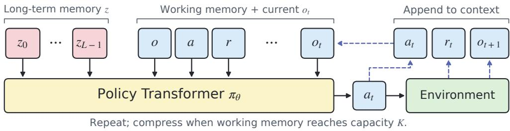

(b) Compress, update, and retain  
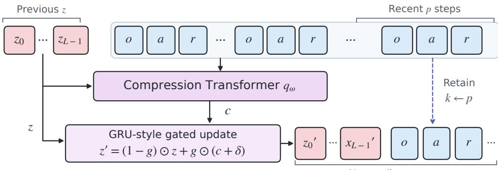  
Figure 1: RAD inference workflow: During evaluation, the AD Transformer $\pi _ { \theta }$ is able to autoregressively rollout the policy by predicting actions conditioned on the long-term memory z and the working memory $x _ { t - k : t }$ . When working memory reaches its capacity $K \dot { }$ , the Compression Transformer $q _ { \omega }$ compresses the previous long-term memory (represented as L latent tokens) and the older working-memory context into candidate latent tokens. The update gate $U _ { \phi }$ integrates these candidates with the previous latent state to form the new long-term memory $z ^ { \prime }$ , while the most recent p steps remain in working memory. At the first compression, since no previous long-term memory exists, z is set directly to $q _ { \omega } ( x _ { 0 : K } )$ , bypassing the update gate.

## 2 BACKGROUND

Partially Observable Markov Decision Processes. We frame the reinforcement learning problem within a Partially Observable Markov decision process (POMDP), defined by the tuple $\mathcal { M } = ( \mathcal { A } , \mathcal { O } , \mathcal { T } , \mathcal { R } , \gamma )$ . At each time step t, the agent selects an action $a _ { t } ~ \in ~ { \cal A }$ according to a policy π, conditioning on the current observation $o _ { t } ~ \in ~ \mathcal { O }$ and the history of past interactions $\left( o _ { 0 } , a _ { 0 } , r _ { 0 } , \ldots , a _ { t - 1 } , r _ { t - 1 } \right)$ The environment receives $a _ { t } .$ , transitions to a new configuration according to the transition function $\tau .$ , and provides the agent with a reward $r _ { t }$ and a subsequent observation $o _ { t + 1 }$ based on the reward function R and the system’s dynamics. The agent’s objective is to maximize the expected return $\begin{array} { r } { \mathbb { E } _ { \pi , M } [ \sum _ { t = 0 } ^ { \infty } \gamma ^ { t } r _ { t } ] } \end{array}$

Transformers. Transformers process sequential data using the self-attention mechanism, which allows each token to dynamically aggregate information from other tokens in the sequence. Given query, key, and value representations $Q , K$ , and $V$ , respectively, scaled dot-product attention is computed as:

$$
{ \mathrm { A t t e n t i o n } } ( Q , K , V ) = { \mathrm { s o f t m a x } } \left( { \frac { Q K ^ { T } } { \sqrt { D } } } \right) V ,
$$

where D denotes the model dimension. By directly modeling pairwise dependencies between tokens, self-attention enables Transformers to capture both local and long-range relationships without relying on recurrent computation.

## 3 IN-CONTEXT RL AND ALGORITHM DISTILLATION

We consider the problem of in-context reinforcement learning (ICRL). In this paradigm, an agent performs gradient-free adaptation by utilizing its interaction history—the input context—to internalize environment dynamics and identify optimal behaviors. Unlike standard RL, which relies on gradient-based parameter updates, an ICRL agent leverages its context window to refine its policy during a single forward pass.

Algorithm Distillation (AD) (Laskin et al., 2022) formalizes ICRL as a sequential prediction task. The core premise of AD is that the training histories of an RL algorithm inherently encode the logic of policy improvement. By modeling these histories as long history-conditioned policies that map past experiences to subsequent actions, AD aims to induce the underlying learning rule directly from data, enabling the agent to solve novel decision-making problems without further weight updates.

We define the context information up to time t as:

$$
x _ { t } = \left( o _ { 0 } , a _ { 0 } , r _ { 0 } , \ldots , o _ { t - 1 } , a _ { t - 1 } , r _ { t - 1 } , o _ { t } \right) \in \mathcal { X } .
$$

where X denotes the set of all contexts. An RL algorithm is formalized as a mapping $\phi : \mathcal { X } $ $\Delta ( \mathcal { A } )$ , which maps the current context information to a distribution over actions $\Delta ( \mathcal { A } )$ . Given a set of training tasks $\mathcal { M }$ and a task distribution $\rho ,$ we sample N tasks $\{ M _ { n } \} _ { n = 1 } ^ { N } \sim \rho$ i.i.d. A dataset D of learning histories is then collected by running a source algorithm $\phi$ on each task for $T$ steps:

$$
\mathcal { D } = \Bigl \{ \bigl ( o _ { 0 } ^ { n } , a _ { 0 } ^ { n } , r _ { 0 } ^ { n } , \ldots , a _ { T - 1 } ^ { n } , r _ { T - 1 } ^ { n } , o _ { T } ^ { n } \bigr ) \sim P _ { \phi } ( \cdot | M _ { n } ) \Bigr \} _ { n = 1 } ^ { N } ,
$$

where $P _ { \phi } ( \cdot | M )$ is the probability distribution over learning sequences induced by executing algorithm $\phi$ on task $M$ . AD optimizes a Transformer model $\pi _ { \theta }$ by minimizing the following crossentropy loss:

$$
L _ { \mathrm { A D } } ( \boldsymbol { \theta } ) = - \sum _ { n = 1 } ^ { N } \sum _ { t = 0 } ^ { T - 1 } \log \pi _ { \boldsymbol { \theta } } ( a _ { t } ^ { n } | x _ { t } ^ { n } ) .\tag{1}
$$

This objective enables the transformer model $\pi _ { \theta }$ to internalize the source algorithm’s policy improvement patterns in-context. During deployment on a novel task, the model identifies optimal behaviors by auto-regressively sampling actions conditioned on the accumulating interaction history.

AD as Posterior Sampling We show that AD implicitly performs posterior sampling. Define the marginal distribution over learning sequences under the task prior $\rho \colon$

$$
P _ { \phi } ( x ) = \sum _ { M } \rho ( M ) P _ { \phi } ( x | M ) .
$$

The AD loss (1) is a sampled approximation of the cross-entropy between $P _ { \phi }$ and $P _ { \theta }$

$$
\begin{array} { l } { { { \cal L } _ { \mathrm { A D } } ( \theta ) \approx \displaystyle - \sum _ { M } \rho ( M ) \sum _ { x } P _ { \phi } ( x | M ) \log \pi _ { \theta } ( x ) = \displaystyle - \sum _ { x } \sum _ { M } \rho ( M ) P _ { \phi } ( x | M ) \log \pi _ { \theta } ( x ) ~ } } \\ { { { } } } \\ { { = \displaystyle - \sum _ { x } P _ { \phi } ( x ) \log \pi _ { \theta } ( x ) . } } \end{array}
$$

Applying the chain rule for cross-entropy, we obtain:

$$
L _ { \mathrm { A D } } ( \theta ) \approx \sum _ { t = 0 } ^ { T } \mathbb { E } _ { x _ { t } \sim P _ { \phi } } \left[ - \sum _ { a _ { t } } P _ { \phi } ( a _ { t } | x _ { t } ) \log \pi _ { \theta } ( a _ { t } | x _ { t } ) \right] .
$$

The optimal model thus satisfies $\pi _ { \theta ^ { * } } ( a _ { t } | x _ { t } ) = P _ { \phi } ( a _ { t } | x _ { t } )$ for all sequences in the support of $P _ { \phi }$ . By applying Bayes’ rule, we can decompose this optimal policy:

$$
\begin{array} { l } { \displaystyle P _ { \phi } ( a _ { t } | x _ { t } ) = \frac { P _ { \phi } ( a _ { t } , x _ { t } ) } { P _ { \phi } ( x _ { t } ) } = \frac { \sum _ { M } \rho ( M ) P _ { \phi } ( a _ { t } , x _ { t } | M ) } { \sum _ { M ^ { \prime } } \rho ( M ^ { \prime } ) P _ { \phi } ( x _ { t } | M ^ { \prime } ) } } \\ { \displaystyle \qquad = \sum _ { M } \left( \frac { \rho ( M ) P _ { \phi } ( x _ { t } | M ) } { \sum _ { M ^ { \prime } } \rho ( M ^ { \prime } ) P _ { \phi } ( x _ { t } | M ^ { \prime } ) } \right) P _ { \phi } ( a _ { t } | x _ { t } , M ) = \sum _ { M } P _ { \phi } ( M | x _ { t } ) P _ { \phi } ( a _ { t } | x _ { t } , M ) . } \end{array}
$$

This confirms that AD learns a posterior sampling policy. Specifically, the model first performs implicit inference to identify the task given the current history and observation, then acts according to the source algorithm ϕ for that inferred task:

$$
\pi _ { \theta ^ { * } } ( a _ { t } | x _ { t } ) = \sum _ { M } P _ { \phi } ( M | x _ { t } ) P _ { \phi } ( a _ { t } | x _ { t } , M ) .\tag{2}
$$

Scalability Bottleneck of AD Practical implementations of AD typically employ a fixed-size context window, where older interactions are discarded via a sliding window mechanism once the max imum capacity is reached. However, this method is suboptimal for tasks involving long-range dependencies. Since ICRL relies on the context window to act as a “working memory”, the sliding window creates a truncated view of the agent’s experience. This limitation forces the agent to rely on a localized and potentially incomplete historical subset, thereby severing the long-term temporal dependencies required for accurate posterior inference (Eq. 2). Consequently, this leads to inconsistent or suboptimal decision-making in complex environments where distal context is critical. This dependency creates a scalability bottleneck, making it difficult to extend AD to complex domains that require extensive historical context.

## 4 RECURRENT ALGORITHM DISTILLATION

This paper explores how to optimize the utilization of long-term historical information in algorithm distillation, addressing the inherent limitations of fixed-length context windows. We introduce Recurrent Algorithm Distillation (RAD), a novel approach featuring a dual-memory architecture. By maintaining a high-fidelity working memory alongside a compressed long-term memory, RAD allows a Transformer-based policy to condition its in-context decision-making on a significantly extended historical horizon.

## 4.1 MEMORY REPRESENTATION

RAD maintains two complementary memory components:

• Working memory stores the agent’s most recent transitions to capture immediate context. Let K be the working memory’s maximum capacity denoted by the number of transitions. At timestep t, let $1 \leq k \leq \bar { K }$ be a lookback window, the contents of the working memory are defined as 1:

$$
x _ { t - k : t } = \left( o _ { t - k } , a _ { t - k } , r _ { t - k } , \ldots , o _ { t - 1 } , a _ { t - 1 } , r _ { t - 1 } \right) .
$$

• Long-term Memory consists of latent representations designed to capture distal dependencies that extend beyond the immediate context. It is structured as a collection of L latent tokens:

$$
z _ { t } = ( z _ { t , 0 } , z _ { t , 1 } , . . . , z _ { t , L - 1 } ) ,
$$

where L denotes the long-term memory’s maximum capacity. The long-term memory is initialized as an empty set, and is updated whenever the working memory reaches its maximum capacity.

The dual-memory architecture enables RAD to compress and preserve critical historical dependencies that would otherwise be lost as the working memory’s sliding window advances. We employ a transformer-based compression model based on Context Cascade Compression (C3) (Liu & Qiu, 2025). Given an input sequence of tokens $\left( y _ { 1 } , \ldots , y _ { m } \right)$ , the compressor $q _ { \omega }$ produces a compressed sequence of tokens $( y _ { 1 } ^ { \prime } , \ldots , y _ { m ^ { \prime } } ^ { \prime } )$ conditioned on $m ^ { \prime }$ learnable query tokens with $m ^ { \prime } \ll m .$ . This compression is achieved by jointly training a reconstruction model-also a Transformer-which aims to recover the original sequence $\left( y _ { 1 } , \ldots , y _ { m } \right)$ conditioned on the latent tokens $\left( y _ { 1 } ^ { \prime } , \ldots , y _ { m ^ { \prime } } ^ { \prime } \right)$

## 4.2 TOKENIZATION

In contrast to Lee et al. (2023) and Son et al. (2025)’s tokenizer which embeds each transition $\left( o _ { t - 1 } , a _ { t - 1 } , r _ { t - 1 } , o _ { t } \right)$ into a single embedding vector, at timestep t, we treat observation $o _ { t } .$ , action $a _ { t }$ , reward $r _ { t }$ as distinct tokens, and each is embedded separately into $\mathbb { R } ^ { d }$ . Each timestep therefore contributes three tokens. To ensure architectural compatibility, the long-term memory is likewise composed of d-dimensional latent tokens, allowing the latent state to be directly concatenated with tokenized transitions, forming a unified input sequence for both the policy $\pi _ { \theta }$ and the compression model $q _ { w }$ . To preserve the temporal structure, we set L to a multiple of 3, ensuring that compression does not split the $\left( o _ { t } , a _ { t } , r _ { t } \right)$ tuple at any timestep t.

## 4.3 INFERENCE

RAD autoregressively generates actions conditioned on both memory components. At timestep t, given the current long-term memory z, the action is sampled as:

$$
a _ { t } \sim \pi _ { \theta } ( \cdot \mid z , x _ { t - k : t } , o _ { t } ) .
$$

RAD then takes an environment step, receiving reward $r _ { t }$ and the next observation $o _ { t + 1 } . \ a _ { t }$ and $r _ { t }$ are appended to the working memory, after which RAD proceeds to predict the next action.

When the working memory reaches its capacity $k = K$ , we perform a compression update to distill critical information from the current context into a new latent state. A compression Transformer $q _ { \omega }$ produces a candidate latent state c from the current context:

$$
c = q _ { \omega } ( z , x _ { t - K : t } ) \in \mathbb { R } ^ { L \times d } .
$$

The candidate is integrated with the previous long-term memory using a GRU-style gated update. Denote $v = [ z , c ]$ as the concatenation along the feature dimension at each latent position. The new latent state is updated as:

$$
z \gets ( 1 - g ) \odot z + g \odot ( c + \delta ) ,
$$

where $g = \sigma ( W _ { g } v + b _ { g } )$ and $\delta = \operatorname { t a n h } ( W _ { \delta } v + b _ { \delta } )$ . Particularly, at the first compression event, since the long-term memory is empty, we bypass the gated update and directly set ${ z  q _ { \omega } ( x _ { 0 : K } ) }$ .

Immediately following the latent state update, the lookback window is set to p where $p < < K$ preserving a small window of recent context across memory updates while reserving context for subsequent interactions. This inference procedure is detailed in Algorithm 1.

## 4.4 TRAINING

RAD utilizes the same dataset $\mathcal { D }$ as standard Algorithm Distillation $( \mathrm { A D } ) .$ , constructed by collecting the source RL algorithm’s learning histories across multiple tasks. We jointly optimize the policy, compressor, and gated memory update through action prediction. Consider a sampled training sequence $x _ { t _ { 0 } : t _ { 0 } + \ell } ,$ where $t _ { 0 }$ is its starting timestep and $\ell = K + n D$ . Here, K is the workingmemory capacity, $p < K$ is the number of transitions retained after compression, $n$ is the number of compression events, and $D = K - p$ is the number of transitions advanced per compression.

The history incorporated into long-term memory is partitioned into $( n + 1 )$ contiguous segments:

$$
x _ { t _ { 0 } : t _ { 0 } + D } , \ x _ { t _ { 0 } + D : t _ { 0 } + 2 D } , \ \ldots , \ x _ { t _ { 0 } + ( n - 1 ) D : t _ { 0 } + n D } , x _ { t _ { 0 } + n D : t _ { 0 } + \ell }
$$

We recursively apply the compressor $q _ { \omega }$ and gated update $U _ { \phi }$ defined in Section 4.3. Starting from empty memory $z _ { 0 } = \emptyset$ , we obtain latent states $\left( z _ { 1 } , \ldots , z _ { n } \right)$ by

$$
z _ { 1 } = q _ { \omega } ( x _ { t _ { 0 } , t _ { 0 } + K } ) ,\tag{3}
$$

$$
z _ { i } = U _ { \phi } ( z _ { i - 1 } , q _ { \omega } ( z _ { i - 1 } , x _ { t _ { 0 } + ( i - 1 ) D : t _ { 0 } + ( i - 1 ) D + K } ) ) , \qquad i = 2 , \ldots , n\tag{4}
$$

The policy is then trained to predict the source learner’s actions throughout the final working memory $x _ { t _ { 0 } + n D : t _ { 0 } + \ell } .$ . At timestep t, it conditions on the final latent state $z _ { n }$ , the preceding workingmemory history $\scriptstyle x _ { t _ { 0 } + n D : t } .$ , and the current observation $o _ { t } .$ . The RAD objective is

$$
\mathcal { L } _ { \mathrm { R A D } } ( \theta , \omega , \phi ) = - \mathbb { E } _ { x _ { t _ { 0 } : t _ { 0 } + \varepsilon } \sim \mathcal { D } } \left[ \frac { 1 } { K } \sum _ { \substack { t = t _ { 0 } + n D } } ^ { t _ { 0 } + \ell - 1 } \log \pi _ { \theta } \left( a _ { t } \mid z _ { n } , x _ { t _ { 0 } + n D : t } , o _ { t } \right) \right] ,\tag{5}
$$

where the expectation is over training sequences sampled from the learning histories in $\mathcal { D } _ { : }$ , including their starting timesteps and number of compression events.

To bound the cost of backpropagation through the recurrent memory, we retain gradients through only the most recent G compression events. The training procedure is detailed in Algorithm 2.

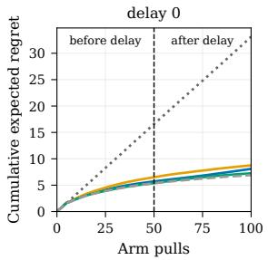

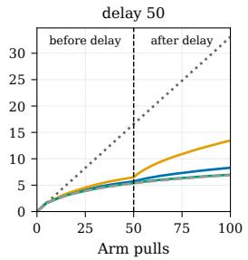

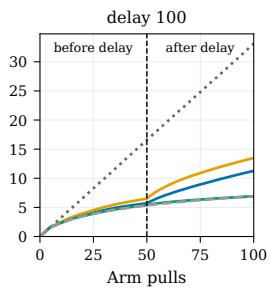  
ad\_long ad\_short rad Random UCB

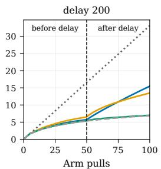  
Figure 2: Cumulative regret on Delayed-Bandit. Panels show delays of $D \in \{ 0 , 5 0 , 1 0 0 , 2 0 0 \} \mathrm { z e r o } .$ reward distractor steps. Results are averaged over 5 training seeds and 5 evaluation seeds.

## 5 EXPERIMENTS

## 5.1 ENVIRONMENTS

We evaluate the performance of RAD across a diverse set of discrete and continuous environments characterized by varying task complexities and horizon lengths.

Delayed-Bandit Delayed-Bandit evaluates the ability to retain useful information across interruptions in a stationary multi-armed bandit task. The base bandit setting follows Lee et al. (2023)’s design, where each arm has a fixed mean sampled independently from U[0, 1], with rewards drawn from $\mathcal { N } ( \mu _ { a } , 0 . 3 ^ { 2 } )$ , and a bandit algorithm runs for 100 arm pulls. However, Delayed-Bandit inserts distractions into the learning histories. The resulting trajectories each consists of 50 arm pulls, followed by $N _ { \mathrm { d e l a y } }$ distractor transitions with uniformly sampled actions and zero rewards, and then 50 additional pulls on the same task.

Grid-World We consider two discrete grid-world maze environments: Darkroom and Dark Keyto-Door. In Darkroom, the agent starts at the center of a 9 × 9 grid and must locate a hidden goal while observing only its current coordinates. The 81 tasks, defined by distinct goal locations, are partitioned into a 9:1 train-test split. Each episode lasts 20 steps, and the agent receives a reward of 1 upon reaching the goal. Dark Key-to-Door extends this setting by requiring the agent to find a key before reaching the goal, yielding 6561 distinct task configurations and an episode horizon of 50 steps. The agent receives a reward of 1 for finding the key and an additional reward of 1 for reaching the goal, for a maximum episode reward of 2.

Meta-World The Meta-World robotic manipulation benchmark suite McLean et al. (2025) is employed to evaluate RAD’s performance. We utilize the ML1 tasks, which focus on meta-learning a single task type across 50 different seeds representing varied object and goal locations. These tasks feature horizons of 100 steps.

## 5.2 DATASET GENERATION

Similar to AD, we first generated a dataset for each environment which consists of training histories of the source RL algorithm solving the training tasks. In this research, we used UCB (Lai & Robbins, 1985) for bandits and PPO (Schulman et al., 2017) for MDPs. Particularly, for Dark Key-to-Door, due to difficulty of exploration in sparse reward settings, we stacked the past 8 observations for the PPO agent as input, but saving only the true observation at the current timestep to ensure compatibility in the training dataset.

## 5.3 RESULTS

The main research question is whether AD can incorporate with a long-term memory buffer and reinforcement learn in context but with a shorter context window. The following are analyzed.

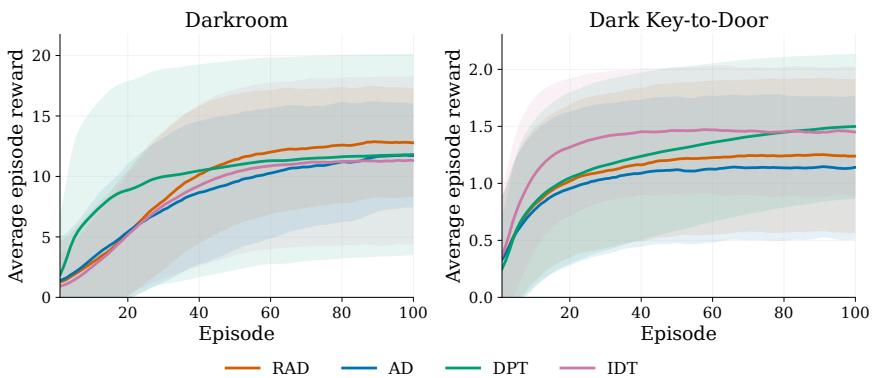  
Figure 3: Average episode reward in Darkroom and Dark Key-to-Door, comparing RAD, AD, DPT (Lee et al., 2023), and IDT (Huang et al., 2024). Results are averaged over 3 training seeds and 20 evaluation seeds. RAD outperforms all baseline models in Darkroom, and also gains higher rewards than AD in Dark Key-to-Door. DPT and IDT achieve higher rewards in Dark Key-to-Door, but both require domain knowledge including optimal actions and desired returns respectively, which generally are not acquirable in regular tasks. On the contrary, though constrained by the high sub-optimality of the source RL algorithm, RAD and AD can autonomously generalize without additional information.

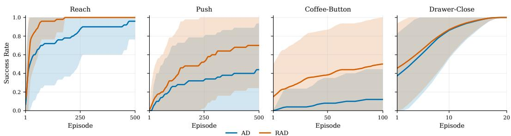  
Figure 4: Success rates on Meta-World tasks. Each environment is trained on 50 training tasks, and results are averaged over 50 testing tasks.

Can RAD effectively perform in-context reinforcement learning on tasks where keeping history is important? We first collect source data for Delayed-Bandit by running UCB (Lai & Robbins, 1985) for 1000 train tasks, insert $ { N _ { \mathrm { d e l a y } } } = 5 0$ distractor transitions for each trajectory, and then train AD and RAD. We compare two AD variants: $\mathrm { A D } _ { \mathrm { s h o r t } }$ with the same context window as RAD, and $\mathrm { A D } _ { \mathrm { l o n g } }$ with a window exceeding the training trajectory length. We evaluate all models on 100 held-out tasks across varying delay lengths.

Figure 2 shows that all models effectively distill UCB for standard multi-armed bandit tasks with no delay. However, once delay takes place, $\mathrm { \bf A D _ { \mathrm { s h o r t } } }$ loses pre-delay experience from its sliding window and is forced to re-explore. Both $\mathrm { A D } _ { \mathrm { l o n g } }$ and RAD retain useful history through full-context attention and latent memory respectively when $N _ { \mathrm { d e l a y } } ~ = ~ 5 0$ , with RAD achieving lower regret. Additionally, RAD generalizes across unseen delays, consistently matching UCB for $N _ { \mathrm { d e l a y } } = \mathrm { \bar { 1 0 0 } }$ and 200, whereas $\mathrm { A D } _ { \mathrm { l o n g } }$ degrades substantially. These results suggest that RAD effectively learns latent representations for long-term memories, which is able to filter noise and preserve essential information for action prediction.

Can RAD explore, assign credit, and generalize in MDP settings? As shown in Figure 3, RAD outperforms AD on Grid-World tasks despite a potentially shorter active context. Like AD, RAD autonomously generalizes to unseen Grid-World tasks, learning in context to explore, assign credit from sparse rewards, and exploit acquired knowledge without parameter updates. These results suggest that RAD’s recursive compression preserves the “improvement operator” learned through distillation.

Does RAD solve continuous-controll tasks effectively? Meta-World features a set of continuous robot manipulation tasks with large state and action spaces, emphasizing on generalization across observations and actions. Shown in Figure 4, RAD generally matches and outperforms AD on the tasks like Reach and Push, demonstrating its ability to maintain a useful long-term memory in highdimensional continuous settings.

How computationally efficient is RAD? We profile inference across all experiments and report average FLOPs per action prediction in Table 1. RAD reduced computation for more than 80% in most environment (except for Dark Key-to-Door due to the extreme sparsity in rewards and the hardness of preserving useful information), indicating that RAD provides a scalable solution for efficient in-context decision-making.

Table 1: Inference FLOPs per action for each sequence.
<table><tr><td>Environment</td><td>AD FLOPs / Action</td><td>RAD FLOPs / Action</td><td>Compute Ratio ↓</td></tr><tr><td rowspan="2">Bandit</td><td>59.8 M (short)</td><td>43.0 M</td><td>0.72×</td></tr><tr><td>263.4 M (long)</td><td></td><td>0.16×</td></tr><tr><td>Darkroom</td><td>144.8M</td><td>27.8M</td><td>0.19×</td></tr><tr><td>Dark Key-to-Door</td><td>203.4 M</td><td>85.9 M</td><td>0.42×</td></tr><tr><td>Meta-World</td><td>1.84 G</td><td>130.6 M</td><td>0.07×</td></tr></table>

## 6 ABLATION STUDIES

We evaluate and discuss the key design choices in RAD. More details are discussed in Appendix C.

Effect of the Long-term Memory Update Gate. We compare the following long-term memory update methods on Darkroom:

• Replace: Directly adopt the candidate: $z  c .$

• Residual: Add the candidate to the old latent state and normalize: $z \gets \mathrm { L a y e r N o r m } ( z + c )$

• Multiplicative: Compute a gate from old latents to scale each candidate feature: $z \gets \sigma ( W _ { g } z + b _ { g } ) \odot c .$

• GRU: The method adopted in this work.

Figure 5 shows that GRU gating yields a higher median reward and a narrower interquartile range, supporting its use for recurrent memory updates, possibly due to its role in stabilizing gradient flow during back propagation through the recurrent memory.

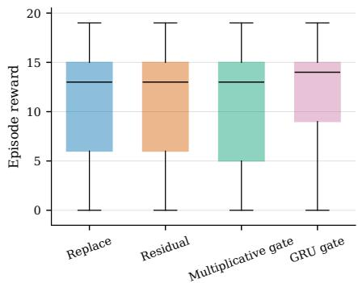

Comparison of Different Tokenizers. We compare our tokenization method with Lee et al. (2023)’s DPTstyle tokenizer as introduced in Section 4.2. As illustrated in Figure 6, both tokenization schemes achieved comparable returns for AD and RAD.

However, this work’s tokenizer supports more efficient training since its context grows by appending tokens between compression steps, allowing a single Transformer forward pass to supervise multiple observation positions. On the contrary, DPT-style tokenization reconstructs the context at each timestep during inference and therefore can only supervise one observation per input sequence during training.

Figure 5: Comparison of different longterm memory update methods.  
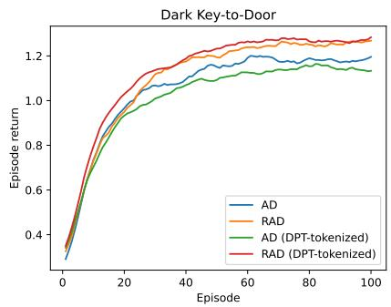  
Figure 6: Performance of AD/RAD with different tokenizers on Dark Keyto-Door.

## 7 RELATED WORK

In-Context Reinforcement Learning. Transformers have been widely applied to offline RL and sequential decision-making (Chen et al., 2021; Janner et al., 2021; Furuta et al., 2021; Lee et al., 2022; Reed et al., 2022). Beyond learning a fixed policy, in-context RL (ICRL) aims to adapt to new tasks from interaction history without parameter updates. Algorithm Distillation (AD) (Laskin et al., 2022) trains a Transformer on multi-episode RL learning histories to reproduce its learning process in context. Decision-Pretrained Transformer (DPT) (Lee et al., 2023) instead learns to infer optimal actions directly from interaction data. Subsequent work has improved ICRL by injecting noise into training data (Zisman et al., 2023), supporting variable action spaces (Sinii et al., 2023), scaling up high-quality training tasks (Wang et al., 2026), introducing mixture-of-experts architectures (Wu et al., 2026), reweighting action-prediction losses (Dong et al., 2026), and adopting richer prediction objectives, including transition and action-value functions (Son et al., 2025; Mukherjee et al., 2025; Liu et al., 2026). These works primarily improve how in-context policies are learned, whereas RAD focuses on extending the interaction history that can be retained under a fixed memory budget.

Long-Context Modeling and Memory. Handling long sequences efficiently has been a longstanding challenge for Transformers. One line of work reduces the computational cost of directly processing long contexts through sparse or linear attention (Beltagy et al., 2020; Zaheer et al., 2020; Katharopoulos et al., 2020; Yang et al., 2025; Team et al., 2025). Another line instead propagates information across bounded segments. Transformer-XL (Dai et al., 2019) caches hidden states from previous segments, while Compressive Transformer (Rae et al., 2019) further compresses evicted activations into a lower-resolution memory. Block-Recurrent Transformer (Hutchins et al., 2022) maintains recurrent state vectors with gated updates across blocks, and Recurrent Memory Transformer (Bulatov et al., 2022) takes a different approach by propagating learned memory tokens between segments, maintaining a fixed-size recurrent representation of past context. More recent approaches such as Infini-attention (Munkhdalai et al., 2024) combine local attention with bounded compressive memory, while Titans (Behrouz et al., 2026) combines attention-based short-term context with persistent neural long-term memory. Retrieval-based approaches such as Memorizing Transformers (Wu et al., 2022) instead maintain an external store of past representations.

Long-context mechanisms have subsequently been applied to reinforcement learning, where agents must reason over extended interaction histories. GTrXL (Parisotto et al., 2020) adapts Transformer-XL-style recurrence to RL, while RATE (Cherepanov et al., 2026b) and ELMUR (Cherepanov et al., 2026a) augment Transformer policies with recurrent or structured external memories for longhorizon decision making. Elastic Decision Transformer (EDT) (Wu et al., 2023) dynamically adjusts the amount of provided trajectory history to facilitate trajectory stitching. For ICRL, Lu et al. (Lu et al., 2023) employ structured state-space models to summarize interaction history in a recurrent latent state, while AMAGO (Grigsby et al., 2024), in contrast, retains a Transformer-based agent and enables end-to-end off-policy RL over long interaction sequences, relying on an explicitly long context as the agent’s memory. RA-DT (Schmied et al., 2024) addresses the context bottleneck through retrieval, storing past experiences in an external memory and selecting relevant sub-trajectories for the current decision. RAD takes a complementary approach: rather than retaining or retrieving an expanding set of past experiences, it preserves recent interactions at full fidelity while recursively consolidating older learning history into a fixed-size latent state optimized for in-context action prediction.

## 8 CONCLUSION

This study has illustrated that Recurrent Algorithm Distillation provides a scalable solution for In-Context Reinforcement Learning. Through a dual-memory architecture with recursive compression, RAD enables efficient long-horizon inference while reducing memory and computational requirements. A key limitation is training stability, as recurrent memory updates require backpropagation through time, increasing optimization and computation difficulty over long horizons. Future work could investigate more stable training objectives, alternative memory-update mechanisms, or approaches that reduce the need for long-range gradient propagation. Overall, RAD provides a promising direction toward long-horizon ICRL agents that retain useful historical information under bounded computational and memory budgets.

## REFERENCES

Ali Behrouz, Peilin Zhong, and Vahab Mirrokni. Titans: Learning to memorize at test time. Advances in Neural Information Processing Systems, 38:113506–113543, 2026.

Iz Beltagy, Matthew E Peters, and Arman Cohan. Longformer: The long-document transformer. arXiv preprint arXiv:2004.05150, 2020.

Aydar Bulatov, Yury Kuratov, and Mikhail Burtsev. Recurrent memory transformer. Advances in Neural Information Processing Systems, 35:11079–11091, 2022.

Lili Chen, Kevin Lu, Aravind Rajeswaran, Kimin Lee, Aditya Grover, Misha Laskin, Pieter Abbeel, Aravind Srinivas, and Igor Mordatch. Decision transformer: Reinforcement learning via sequence modeling. In M. Ranzato, A. Beygelzimer, Y. Dauphin, P.S. Liang, and J. Wortman Vaughan (eds.), Advances in Neural Information Processing Systems, volume 34, pp. 15084–15097. Curran Associates, Inc., 2021.

Egor Cherepanov, Alexey Kovalev, and Aleksandr Panov. Elmur: External layer memory with update/rewrite for long-horizon rl problems. In International Conference on Learning Representations, volume 2026, pp. 141814–141844, 2026a.

Egor Cherepanov, Aleksei Staroverov, Alexey Kovalev, and Aleksandr Panov. Recurrent action transformer with memory. In International Conference on Learning Representations, volume 2026, pp. 129379–129407, 2026b.

John Co-Reyes, YuXuan Liu, Abhishek Gupta, Benjamin Eysenbach, Pieter Abbeel, and Sergey Levine. Self-consistent trajectory autoencoder: Hierarchical reinforcement learning with trajectory embeddings. In International conference on machine learning, pp. 1009–1018. PMLR, 2018.

Zihang Dai, Zhilin Yang, Yiming Yang, Jaime G Carbonell, Quoc Le, and Ruslan Salakhutdinov. Transformer-xl: Attentive language models beyond a fixed-length context. pp. 2978–2988, 2019.

Juncheng Dong, Moyang Guo, Ethan X Fang, Zhuoran Yang, and Vahid Tarokh. In-context reinforcement learning from suboptimal historical data. arXiv preprint arXiv:2601.20116, 2026.

Ron Dorfman, Idan Shenfeld, and Aviv Tamar. Offline meta reinforcement learning – identifiability challenges and effective data collection strategies. In M. Ranzato, A. Beygelzimer, Y. Dauphin, P.S. Liang, and J. Wortman Vaughan (eds.), Advances in Neural Information Processing Systems, volume 34, pp. 4607–4618. Curran Associates, Inc., 2021.

Yan Duan, John Schulman, Xi Chen, Peter L Bartlett, Ilya Sutskever, and Pieter Abbeel. RL2: Fast reinforcement learning via slow reinforcement learning. arXiv preprint arXiv:1611.02779, 2016.

Chelsea Finn, Pieter Abbeel, and Sergey Levine. Model-agnostic meta-learning for fast adaptation of deep networks. In Doina Precup and Yee Whye Teh (eds.), Proceedings ofthe 34th International Conference on Machine Learning, volume 70 of Proceedings of Machine Learning Research, pp. 1126–1135. PMLR, 06–11 Aug 2017.

Hiroki Furuta, Yutaka Matsuo, and Shixiang Shane Gu. Generalized decision transformer for offline hindsight information matching. arXiv preprint arXiv:2111.10364, 2021.

Jake Grigsby, Jim Fan, and Yuke Zhu. Amago: Scalable in-context reinforcement learning for adaptive agents. In International Conference on Learning Representations, volume 2024, pp. 26919–26952, 2024.

Sili Huang, Jifeng Hu, Hechang Chen, Lichao Sun, and Bo Yang. In-context decision transformer: Reinforcement learning via hierarchical chain-of-thought. arXiv preprint arXiv:2405.20692, 2024.

DeLesley Hutchins, Imanol Schlag, Yuhuai Wu, Ethan Dyer, and Behnam Neyshabur. Blockrecurrent transformers. Advances in neural information processing systems, 35:33248–33261, 2022.

Michael Janner, Qiyang Li, and Sergey Levine. Offline reinforcement learning as one big sequence modeling problem. In M. Ranzato, A. Beygelzimer, Y. Dauphin, P.S. Liang, and J. Wortman Vaughan (eds.), Advances in Neural Information Processing Systems, volume 34, pp. 1273–1286. Curran Associates, Inc., 2021.

Angelos Katharopoulos, Apoorv Vyas, Nikolaos Pappas, and Franc¸ois Fleuret. Transformers are rnns: Fast autoregressive transformers with linear attention. In International conference on machine learning, pp. 5156–5165. PMLR, 2020.

Diederik P Kingma and Max Welling. Auto-encoding variational bayes. arXiv preprint arXiv:1312.6114, 2013.

Tze Leung Lai and Herbert Robbins. Asymptotically efficient adaptive allocation rules. Advances in applied mathematics, 6(1):4–22, 1985.

Michael Laskin, Luyu Wang, Junhyuk Oh, Emilio Parisotto, Stephen Spencer, Richie Steigerwald, DJ Strouse, Steven Hansen, Angelos Filos, Ethan Brooks, et al. In-context reinforcement learning with algorithm distillation. arXiv preprint arXiv:2210.14215, 2022.

Jonathan Lee, Annie Xie, Aldo Pacchiano, Yash Chandak, Chelsea Finn, Ofir Nachum, and Emma Brunskill. Supervised pretraining can learn in-context reinforcement learning. In A. Oh, T. Naumann, A. Globerson, K. Saenko, M. Hardt, and S. Levine (eds.), Advances in Neural Information Processing Systems, volume 36, pp. 43057–43083. Curran Associates, Inc., 2023.

Kuang-Huei Lee, Ofir Nachum, Mengjiao (Sherry) Yang, Lisa Lee, Daniel Freeman, Sergio Guadarrama, Ian Fischer, Winnie Xu, Eric Jang, Henryk Michalewski, and Igor Mordatch. Multi-game decision transformers. In S. Koyejo, S. Mohamed, A. Agarwal, D. Belgrave, K. Cho, and A. Oh (eds.), Advances in Neural Information Processing Systems, volume 35, pp. 27921–27936. Curran Associates, Inc., 2022.

Fanfan Liu and Haibo Qiu. Context cascade compression: Exploring the upper limits of text compression. arXiv preprint arXiv:2511.15244, 2025.

Jinmei Liu, Fuhong Liu, Zhenhong Sun, Jianye Hao, Huaxiong Li, Bo Wang, Daoyi Dong, Chunlin Chen, and Zhi Wang. Scalable in-context q-learning. In International Conference on Learning Representations, volume 2026, pp. 97519–97539, 2026.

Ilya Loshchilov and Frank Hutter. Decoupled weight decay regularization. arXiv preprint arXiv:1711.05101, 2017.

Chris Lu, Yannick Schroecker, Albert Gu, Emilio Parisotto, Jakob Foerster, Satinder Singh, and Feryal Behbahani. Structured state space models for in-context reinforcement learning. Advances in Neural Information Processing Systems, 36:47016–47031, 2023.

Reginald McLean, Evangelos Chatzaroulas, Luc McCutcheon, Frank Roder, Tianhe Yu, Zhanpeng¨ He, K.R. Zentner, Ryan Julian, J K Terry, Isaac Woungang, Nariman Farsad, and Pablo Samuel Castro. Meta-world+: An improved, standardized, RL benchmark. In The Thirty-ninth Annual Conference on Neural Information Processing Systems Datasets and Benchmarks Track, 2025.

Eric Mitchell, Rafael Rafailov, Xue Bin Peng, Sergey Levine, and Chelsea Finn. Offline metareinforcement learning with advantage weighting. In Marina Meila and Tong Zhang (eds.), Pro ceedings ofthe 38th International Conference on Machine Learning, volume 139 of Proceedings ofMachine Learning Research, pp. 7780–7791. PMLR, 18–24 Jul 2021.

Subhojyoti Mukherjee, Josiah P. Hanna, Qiaomin Xie, and Robert Nowak. Pretraining Decision Transformers with Reward Prediction for In-Context Multi-task Structured Bandit Learning. In Proceedings ofthe Reinforcement Learning Conference (RLC), August 2025.

Tsendsuren Munkhdalai, Manaal Faruqui, and Siddharth Gopal. Leave no context behind: Efficient infinite context transformers with infini-attention. arXiv preprint arXiv:2404.07143, 2024.

Tianwei Ni, Benjamin Eysenbach, Erfan Seyedsalehi, Michel Ma, Clement Gehring, Aditya Mahajan, and Pierre-Luc Bacon. Bridging state and history representations: Understanding selfpredictive rl. In International Conference on Learning Representations, volume 2024, pp. 23555– 23569, 2024.

Alex Nichol, Joshua Achiam, and John Schulman. On first-order meta-learning algorithms. arXiv preprint arXiv:1803.02999, 2018.

Fabian Paischer, Thomas Adler, Vihang Patil, Angela Bitto-Nemling, Markus Holzleitner, Sebastian Lehner, Hamid Eghbal-Zadeh, and Sepp Hochreiter. History compression via language models in reinforcement learning. In International Conference on Machine Learning, pp. 17156–17185. PMLR, 2022.

Emilio Parisotto, Francis Song, Jack Rae, Razvan Pascanu, Caglar Gulcehre, Siddhant Jayakumar, Max Jaderberg, Raphael Lopez Kaufman, Aidan Clark, Seb Noury, et al. Stabilizing transformers for reinforcement learning. In International conference on machine learning, pp. 7487–7498. PMLR, 2020.

Adam Paszke, Sam Gross, Francisco Massa, Adam Lerer, James Bradbury, Gregory Chanan, Trevor Killeen, Zeming Lin, Natalia Gimelshein, Luca Antiga, et al. Pytorch: An imperative style, highperformance deep learning library. Advances in neural information processing systems, 32, 2019.

Gandharv Patil, Aditya Mahajan, and Doina Precup. On learning history-based policies for controlling markov decision processes. In International Conference on Artificial Intelligence and Statistics, pp. 3511–3519. PMLR, 2024.

Jack W Rae, Anna Potapenko, Siddhant M Jayakumar, and Timothy P Lillicrap. Compressive transformers for long-range sequence modelling. arXiv preprint arXiv:1911.05507, 2019.

Antonin Raffin, Ashley Hill, Adam Gleave, Anssi Kanervisto, Maximilian Ernestus, and Noah Dormann. Stable-baselines3: Reliable reinforcement learning implementations. Journal of Machine Learning Research, 22(268):1–8, 2021.

Kate Rakelly, Aurick Zhou, Chelsea Finn, Sergey Levine, and Deirdre Quillen. Efficient off-policy meta-reinforcement learning via probabilistic context variables. In Kamalika Chaudhuri and Ruslan Salakhutdinov (eds.), Proceedings of the 36th International Conference on Machine Learning, volume 97 of Proceedings of Machine Learning Research, pp. 5331–5340. PMLR, 09–15 Jun 2019.

Scott Reed, Konrad Zolna, Emilio Parisotto, Sergio Gomez Colmenarejo, Alexander Novikov, Gabriel Barth-Maron, Mai Gimenez, Yury Sulsky, Jackie Kay, Jost Tobias Springenberg, et al. A generalist agent. arXiv preprint arXiv:2205.06175, 2022.

Thomas Schmied, Fabian Paischer, Vihang Patil, Markus Hofmarcher, Razvan Pascanu, and Sepp Hochreiter. Retrieval-augmented decision transformer: External memory for in-context rl. arXiv preprint arXiv:2410.07071, 2024.

John Schulman, Philipp Moritz, Sergey Levine, Michael Jordan, and Pieter Abbeel. Highdimensional continuous control using generalized advantage estimation. arXiv preprint arXiv:1506.02438, 2015.

John Schulman, Filip Wolski, Prafulla Dhariwal, Alec Radford, and Oleg Klimov. Proximal policy optimization algorithms. arXiv preprint arXiv:1707.06347, 2017.

Viacheslav Sinii, Alexander Nikulin, Vladislav Kurenkov, Ilya Zisman, and Sergey Kolesnikov. In-context reinforcement learning for variable action spaces. arXiv preprint arXiv:2312.13327, 2023.

Jaehyeon Son, Soochan Lee, and Gunhee Kim. Distilling reinforcement learning algorithms for in-context model-based planning. arXiv preprint arXiv:2502.19009, 2025.

Alexander L Strehl and Michael L Littman. An analysis of model-based interval estimation for markov decision processes. Journal ofComputer and System Sciences, 74(8):1309–1331, 2008.

Kimi Team, Yu Zhang, Zongyu Lin, Xingcheng Yao, Jiaxi Hu, Fanqing Meng, Chengyin Liu, Xin Men, Songlin Yang, Zhiyuan Li, et al. Kimi linear: An expressive, efficient attention architecture. arXiv preprint arXiv:2510.26692, 2025.

Aaron Van Den Oord, Oriol Vinyals, et al. Neural discrete representation learning. Advances in neural information processing systems, 30, 2017.

Ashish Vaswani, Noam Shazeer, Niki Parmar, Jakob Uszkoreit, Llion Jones, Aidan N Gomez, Ł ukasz Kaiser, and Illia Polosukhin. Attention is all you need. In I. Guyon, U. Von Luxburg, S. Bengio, H. Wallach, R. Fergus, S. Vishwanathan, and R. Garnett (eds.), Advances in Neural Information Processing Systems, volume 30. Curran Associates, Inc., 2017.

Fan Wang, Pengtao Shao, Yiming Zhang, Bo Yu, Shaoshan Liu, Ning Ding, Yang Cao, Yu Kang, and Haifeng Wang. Towards large-scale in-context reinforcement learning by meta-training in randomized worlds. Advances in Neural Information Processing Systems, 38:171669–171704, 2026.

Jane X Wang, Zeb Kurth-Nelson, Dhruva Tirumala, Hubert Soyer, Joel Z Leibo, Remi Munos, Charles Blundell, Dharshan Kumaran, and Matt Botvinick. Learning to reinforcement learn. arXiv preprint arXiv:1611.05763, 2016.

Zheng Wang, Cheng Long, and Gao Cong. Trajectory simplification with reinforcement learning. In 2021 IEEE 37th International Conference on Data Engineering (ICDE), pp. 684–695. IEEE, 2021.

Wenhao Wu, Fuhong Liu, Haoru Li, Zican Hu, Daoyi Dong, Chunlin Chen, and Zhi Wang. Mixtureof-experts meets in-context reinforcement learning. Advances in Neural Information Processing Systems, 38:24751–24785, 2026.

Yueh-Hua Wu, Xiaolong Wang, and Masashi Hamaya. Elastic decision transformer. Advances in neural information processing systems, 36:18532–18550, 2023.

Yuhuai Wu, Markus N Rabe, DeLesley Hutchins, and Christian Szegedy. Memorizing transformers. arXiv preprint arXiv:2203.08913, 2022.

Songlin Yang, Jan Kautz, and Ali Hatamizadeh. Gated delta networks: Improving mamba2 with delta rule. In International Conference on Learning Representations, volume 2025, pp. 29687– 29707, 2025.

Haoqi Yuan and Zongqing Lu. Robust task representations for offline meta-reinforcement learning via contrastive learning. In Kamalika Chaudhuri, Stefanie Jegelka, Le Song, Csaba Szepesvari, Gang Niu, and Sivan Sabato (eds.), Proceedings of the 39th International Conference on Machine Learning, volume 162 of Proceedings of Machine Learning Research, pp. 25747–25759. PMLR, 17–23 Jul 2022.

Manzil Zaheer, Guru Guruganesh, Kumar Avinava Dubey, Joshua Ainslie, Chris Alberti, Santiago Ontanon, Philip Pham, Anirudh Ravula, Qifan Wang, Li Yang, et al. Big bird: Transformers for longer sequences. Advances in neural information processing systems, 33:17283–17297, 2020.

Ilya Zisman, Vladislav Kurenkov, Alexander Nikulin, Viacheslav Sinii, and Sergey Kolesnikov. Emergence of in-context reinforcement learning from noise distillation. arXiv preprint arXiv:2312.12275, 2023.

## A RAD ALGORITHM DETAILS

The following are the pseudocodes for RAD, including inference and training.

Algorithm 1 RAD Inference   
Require: AD Transformer $\pi _ { \theta } .$ , Compression Transformer $q _ { \omega }$ , Update Gate $U _ { \phi } , K , p$   
$\ 1 \colon \ i \gets 0 , t \gets 0 , x \gets ( ) , z _ { 0 } \gets \emptyset$   
2: while not terminal do   
3: $a _ { t } \sim \pi _ { \theta } ( \cdot \mid z _ { i } , x , o _ { t } )$   
4: $\left( r _ { t } , o _ { t + 1 } \right) \gets$ ENVIRONMENT $\cdot ( a _ { t } )$   
5: $x  x \parallel ( o _ { t } , a _ { t } , r _ { t } )$   
6: $\mathbf { i f } \left| x \right| = K$ then   
7: $\mathbf { i } \mathbf { \dot { f } } i = 0$ then   
8: $z _ { i + 1 } \gets q _ { \omega } ( x )$   
9: else   
10: $z _ { i + 1 } \gets U _ { \phi } ( z _ { i } , q _ { \omega } ( z _ { i } , x ) )$   
11: end if   
12: $x  x _ { K - p + 1 : K }$   
13: $i \gets i + 1$   
14: end if   
15: $t \gets t + 1$   
16: end while

Algorithm 2 RAD Training   
Require: Training dataset D, AD Transformer $\pi _ { \theta } ,$ Compression Transformer $q _ { \omega } .$ , Update Gate $U _ { \phi } .$   
Reconstruction Model $d _ { \psi } , K , p$   
1: $D \gets K - p$   
2: while not converged do ▷ Phase 1: Compression Pretraining   
3: Sample $x _ { t - k : t } \sim \mathcal { D }$   
4: Update $( \omega , \psi )$ by minimizing   
$\mathcal { L } _ { \mathrm { p r e } } = \mathbb { E } _ { \boldsymbol { x } _ { t - k : t } \sim \mathcal { D } } \left[ \left| \left| d _ { \psi } ( q _ { \omega } ( \boldsymbol { x } _ { t - k : t } ) ) - \boldsymbol { y } \right| \right| _ { F } ^ { 2 } \right]$   
5: end while   
6: while not converged do ▷ Phase 2: Action Distillation   
7: Sample $x _ { t _ { 0 } : t _ { 0 } + \ell } \sim \mathcal { D } ,$ where $\ell = K + n D$   
8: for $i = 1 , \ldots , n$ do   
9: if $\cdot i = 1$ then   
10: ${ z _ { i } \gets q _ { \omega } ( x _ { t _ { 0 } : t _ { 0 } + K } ) }$   
11: else   
12: ${ \underset { \ r { k = 0 } } { \chi _ { i } } }  U _ { \phi } { ( { z _ { i - 1 } , q _ { \omega } ( { z _ { i - 1 } , { x _ { t } } _ { 0 + ( i - 1 ) D : t _ { 0 } + ( i - 1 ) D + K } } ) } ) }$   
13: end if   
14: end for   
15: Compute   
$\mathcal { L } _ { \mathrm { R A D } } \gets - \frac { 1 } { K } \sum _ { { t = t _ { 0 } + n D } } ^ { { t _ { 0 } + \ell - 1 } } \log \pi _ { \theta } \left( a _ { t } \mid { z _ { n } } , { x _ { t _ { 0 } + n D ; t } } , o _ { t } \right)$   
16: Update $( \theta , \omega , \phi )$ by minimizing $\mathcal { L } _ { \mathrm { R A D } }$   
17: end while

## B EXPERIMENT DETAILS

This appendix specifies the architectures, source RL algorithms, and training configurations used for training RAD. We distinguish an environment transition from a Transformer token: each completed transition contributes three tokens, corresponding to its observation, action, and reward. A latent memory token is a learned vector and does not correspond to an individual transition in token length.

## B.1 MODEL ARCHITECTURES

AD Transformer. The policy backbone is a GPT-2-style decoder-only Transformer that predicts actions from the preceding interaction history. We embed observations, actions, and rewards separately and interleave their embeddings in temporal order, $\left( o _ { 0 } , a _ { 0 } , r _ { 0 } , o _ { 1 } , a _ { 1 } , r _ { 1 } , . ~ . ~ . , o _ { t } \right)$ . Learned token-type embeddings distinguish the three modalities, and learned absolute positional embeddings encode their positions within the current context. Grid-World observations are embedded using a lookup table over grid positions. Delayed-Bandit uses an embedding table for the two observation types, genuine interaction and distraction. For Meta-World, a linear layer embeds the 11-dimensional observation used by the sequence model. Discrete actions are one-hot encoded and linearly projected; continuous actions and scalar rewards have separate linear projections.

Each Transformer block consists of multi-head self-attention and a two-layer feed-forward network with GELU activation, residual connections, and pre-layer normalization. A final layer normalization precedes a linear action-prediction head. Action predictions are read from observation-token outputs, with causal attention over the uncompressed history.

Compression Transformer. RAD augments the policy backbone with a query-based Compression Transformer. Given embedded history tokens, m learned query tokens are appended to the sequence and the sequence gets forwarded into the Compression Transformer. Each compression layer applies self-attention among the queries, cross-attention from the queries to the input history, and a GELU feed-forward network. Each sublayer uses pre-layer normalization and a residual connection. A final layer normalization is applied to output the candidate updates.

## B.2 SOURCE REINFORCEMENT-LEARNING ALGORITHMS

We construct the offline datasets from the interaction histories produced while the source algorithms learn each task. These histories preserve the temporal order of experience and the progression of the source learner.

Upper Confidence Bound (UCB). UCB balances exploitation of arms with high empirical rewards and exploration of less frequently sampled arms. We use the UCB variant with the exploration bonus used in MBIE-EB (Strehl & Littman, 2008). After pulling each arm once in index order, the algorithm selects

$$
a _ { t } = \mathop { \arg \operatorname* { m a x } } _ { a } \left[ \widehat { \mu } _ { a } + \frac { \beta } { \sqrt { N _ { a } } } \right] , \qquad \beta = 1 ,\tag{6}
$$

where $N _ { a }$ counts genuine pulls of arm a and $\widehat { \mu } _ { a }$ is its empirical mean reward. Ties are broken in favor of the lowest arm index. During the distractor interval, actions are sampled uniformly and rewards are zero. These transitions remain in the model’s input history, while the UCB statistics remain unchanged. Only genuine arm pulls contribute action targets during distillation.

Proximal Policy Optimization (PPO). For Grid-World and Meta-World, we use the Stable-Baselines3 (Raffin et al., 2021) implementation of PPO (Schulman et al., 2017). PPO is an on-policy actor–critic method that alternates between collecting rollouts and optimizing a clipped policy surrogate. With probability ratio $\rho _ { t } ( \theta ) = \pi _ { \theta } ( a _ { t } \mid o _ { t } ) / \pi _ { \theta _ { \mathrm { o l d } } } ( a _ { t } \mid o _ { t } )$ , its policy objective is

$$
\mathcal { I } _ { \mathrm { c l i p } } ( \theta ) = \mathbb { E } _ { t } \Big [ \operatorname* { m i n } \Big ( \rho _ { t } ( \theta ) \widehat { A } _ { t } , \mathrm { c l i p } ( \rho _ { t } ( \theta ) , 1 - \epsilon , 1 + \epsilon ) \widehat { A } _ { t } \Big ) \Big ] .\tag{7}
$$

Advantages are estimated using Generalized Advantage Estimation (GAE) (Schulman et al., 2015) and normalized before policy updates. The value function is trained by regression to the estimated returns. The actor and critic each use two hidden layers of 64 units with tanh activations. We use a categorical policy for Grid-World and a diagonal-Gaussian policy for Meta-World. Each source learner collects experience from 100 parallel environment streams for its task. The histories of these streams are retained for sequence-model training.

## B.3 TRAINING DETAILS

Hardware and optimization. Experiments were run using eight NVIDIA GeForce RTX 4090 GPUs. Sequence models are implemented in PyTorch. We optimize the sequence models with

AdamW (Loshchilov & Hutter, 2017), using $( \beta _ { 1 } , \beta _ { 2 } ) = ( 0 . 9 , 0 . 9 9 )$ , weight decay 0.01, and gradient clipping at an $\ell _ { 2 }$ norm of 1.0. Training uses linear learning-rate warmup followed by cosine decay. Table 4 reports the configured batch sizes and optimization budgets.

Curriculum. For Grid-World and Meta-World, policy training gradually increases the allowed number of compression events and shifts sampling toward longer histories. Each training batch uses a single compression-count bucket. Let c denote the number of compressions. We group counts into short $( c = 0 )$ , medium $( c = 1 \mathrm { - } 2 )$ , long $( c = 3 – 8 )$ , and very long $( c \geq 9 )$ categories. Within a category, probability is divided equally among the available counts; probability assigned to an unavailable harder category is added to the largest allowed count. Table 5 gives the stage boundaries, compression limits, and category probabilities.

At each curriculum transition, the learning rate warms up from 10% of its group-specific peak to that peak, then decays cosinusoidally toward 10% over the remainder of the stage. Initial warmup lasts 2,000 steps; later stage warmups last 1,000 steps for Darkroom and Meta-World and 2,000 steps for Dark Key-to-Door. Delayed-Bandit uses no staged compression curriculum and samples genuine-action targets uniformly over the dataset.

## B.4 HYPERPARAMETERS

Tables 2–5 provide the architecture, context, source-algorithm, and training settings. DR denotes Darkroom and DKTD denotes Dark Key-to-Door.

Table 2: AD and RAD hyperparameters. RAD uses the same policy architecture as AD. Context windows and capacities are measured in tokens unless otherwise specified (1 transition = 3 tokens).
<table><tr><td>Hyperparameter</td><td>Delayed-Bandit</td><td>DR</td><td>DKTD</td><td>Meta-World</td></tr><tr><td>AD baseline</td><td></td><td></td><td></td><td></td></tr><tr><td>Policy model dimension</td><td>64</td><td>64</td><td>64</td><td>64</td></tr><tr><td>Policy Transformer layers</td><td>4</td><td>4</td><td>4</td><td>4</td></tr><tr><td>Policy attention heads</td><td>4</td><td>4</td><td>4</td><td>8</td></tr><tr><td>Policy feed-forward dimension</td><td>256</td><td>256</td><td>256</td><td>256</td></tr><tr><td>Attention / residual dropout</td><td>0.1</td><td>0.1</td><td>0.1</td><td>0.1</td></tr><tr><td>Policy context window</td><td>150 / 900</td><td>240</td><td>300</td><td>1200</td></tr><tr><td>RAD</td><td></td><td></td><td></td><td></td></tr><tr><td>Compression model dimension</td><td>64</td><td>64</td><td>64</td><td>64</td></tr><tr><td>Compression Transformer layers</td><td>2</td><td>3</td><td>4</td><td>4</td></tr><tr><td>Compression attention heads</td><td>4</td><td>4</td><td>4</td><td>4</td></tr><tr><td>Compression feed-forward dimension</td><td>256</td><td>256</td><td>256</td><td>256</td></tr><tr><td>Compression dropout</td><td>0.1</td><td>0.1</td><td>0.1</td><td>0.1</td></tr><tr><td>Latent memory tokens m</td><td>15</td><td>15</td><td>60</td><td>60</td></tr><tr><td>Working memory size (transition) K</td><td>50</td><td>25</td><td>52</td><td>80</td></tr><tr><td>Retained recent transitions p</td><td>5</td><td>5</td><td>10</td><td>20</td></tr><tr><td>Gradient-bearing compression rounds G</td><td>∞</td><td>5</td><td>5</td><td>6</td></tr><tr><td>Policy context window</td><td>165</td><td>90</td><td>216</td><td>300</td></tr></table>

Table 3: PPO source-algorithm configuration.
<table><tr><td>Hyperparameter</td><td>DR</td><td>DKTD</td><td>Meta-World</td></tr><tr><td>Parallel streams per learner</td><td>100</td><td>100</td><td>100</td></tr><tr><td>Rollout steps per stream</td><td>80</td><td>50</td><td>100</td></tr><tr><td>Optimization minibatch size</td><td>40</td><td>100</td><td>200</td></tr><tr><td>Epochs per rollout update</td><td>20</td><td>10</td><td>20</td></tr><tr><td>Total Timesteps</td><td>100,000</td><td>100,000</td><td>1,000,000</td></tr><tr><td>Learning rate</td><td> $3 \times 1 0 ^ { - 4 }$ </td><td> $3 \times 1 0 ^ { - 4 }$ </td><td> $3 \times 1 0 ^ { - 4 }$ </td></tr><tr><td>Discount factor γ</td><td>0.99</td><td>0.99</td><td>0.99</td></tr><tr><td>GAE parameter  $\lambda$ </td><td>0.95</td><td>0.95</td><td>0.95</td></tr><tr><td>Policy clip range €</td><td>0.2</td><td>0.2</td><td>0.2</td></tr><tr><td>Value-loss coefficient</td><td>0.5</td><td>0.5</td><td>0.5</td></tr><tr><td>Entropy coefficient</td><td>0</td><td>0</td><td>0</td></tr><tr><td>Gradient clip norm</td><td>0.5</td><td>0.5</td><td>0.5</td></tr></table>

All three configurations use tanh activations, Adam with its default $( \beta _ { 1 } , \beta _ { 2 } ) = ( 0 . 9 , 0 . 9 9 9 )$ , optimizer epsilon $1 0 ^ { - 5 }$ , and no weight decay. Implementations are inherited from Stable-Baselines3 (Raffin et al., 2021) and PyTorch (Paszke et al., 2019).

Table 4: AD/RAD training hyperparameters
<table><tr><td>Hyperparameter</td><td>Delayed-Bandit</td><td>DR</td><td>DKTD</td><td>Meta-World</td></tr><tr><td>AD policy training</td><td></td><td></td><td></td><td></td></tr><tr><td>Training steps</td><td> $5 0 \mathbf { k } / 1 0 0 \mathbf { k } ^ { a }$ </td><td>50k</td><td>50k</td><td>50k</td></tr><tr><td>Configured batch size</td><td>64</td><td>512</td><td>512</td><td>256</td></tr><tr><td>Peak learning rate</td><td> $3 \times 1 0 ^ { - 4 }$ </td><td> $3 \times 1 0 ^ { - 4 }$ </td><td> $3 \times 1 0 ^ { - 4 }$ </td><td> $3 \times 1 0 ^ { - 4 }$ </td></tr><tr><td>Warmup steps</td><td>500</td><td>1,000</td><td>1,000</td><td>5,000</td></tr><tr><td>RAD compression pretraining</td><td></td><td></td><td></td><td></td></tr><tr><td>Training steps</td><td>20k</td><td>40k</td><td>50k</td><td>50k</td></tr><tr><td>Configured batch size</td><td>64</td><td>512</td><td>1,024</td><td>256</td></tr><tr><td>Peak learning rate</td><td> $1 0 ^ { - 4 }$ </td><td> $3 \times 1 0 ^ { - 4 }$ </td><td> $3 \times 1 0 ^ { - 4 }$ </td><td> $3 \times 1 0 ^ { - 4 }$ </td></tr><tr><td>Warmup steps</td><td>500</td><td>3,000</td><td>2,000</td><td>3,000</td></tr><tr><td>RAD policy training</td><td></td><td></td><td></td><td></td></tr><tr><td>Training steps</td><td>100k</td><td>100k</td><td>100k</td><td>100k</td></tr><tr><td>Configured batch size</td><td>64</td><td>256</td><td>1,024</td><td>128</td></tr><tr><td>Policy / compressor / latent  $\boldsymbol { \mathrm { L R } ^ { b } }$ </td><td>3/1/3</td><td>3/1/3</td><td>3/1/3</td><td>3/1/3</td></tr><tr><td>Initial warmup steps</td><td>500</td><td>2,000</td><td>2,000</td><td>2,000</td></tr><tr><td>Later stage warmup steps</td><td></td><td>1,000</td><td>2,000</td><td>1,000</td></tr><tr><td>Learning-rate floor / peak</td><td>0</td><td>0.1</td><td>0.1</td><td>0.1</td></tr></table>

aThe two values correspond to AD-Short / AD-Long.  
bAll three learning rates are in units of $1 0 ^ { - 4 } .$

Table 5: RAD curriculum. Probabilities correspond to short, medium, long, and very-long compression-count categories.
<table><tr><td>Environment</td><td>Start step</td><td>Max. c</td><td>Short</td><td>Medium</td><td>Long</td><td>Very long</td></tr><tr><td>DR</td><td>0</td><td>1</td><td>0.60</td><td>0.35</td><td>0.05</td><td>0.00</td></tr><tr><td>DR</td><td>30k</td><td>3</td><td>0.35</td><td>0.40</td><td>0.20</td><td>0.05</td></tr><tr><td>DR</td><td>50k</td><td>6</td><td>0.25</td><td>0.30</td><td>0.30</td><td>0.15</td></tr><tr><td>DR</td><td>75k</td><td>∞</td><td>0.25</td><td>0.25</td><td>0.25</td><td>0.25</td></tr><tr><td>DKTD</td><td>0</td><td>2</td><td>0.30</td><td>0.55</td><td>0.15</td><td>0.00</td></tr><tr><td>DKTD</td><td>25k</td><td>4</td><td>0.20</td><td>0.45</td><td>0.30</td><td>0.05</td></tr><tr><td>DKTD</td><td>50k</td><td>6</td><td>0.15</td><td>0.35</td><td>0.35</td><td>0.15</td></tr><tr><td>DKTD</td><td>75k</td><td>∞</td><td>0.15</td><td>0.30</td><td>0.30</td><td>0.25</td></tr><tr><td>Meta-World</td><td>0</td><td>2</td><td>0.30</td><td>0.55</td><td>0.15</td><td>0.00</td></tr><tr><td>Meta-World</td><td>25k</td><td>4</td><td>0.20</td><td>0.45</td><td>0.30</td><td>0.05</td></tr><tr><td>Meta-World</td><td>50k</td><td>6</td><td>0.15</td><td>0.35</td><td>0.35</td><td>0.15</td></tr><tr><td>Meta-World</td><td>75k</td><td>∞</td><td>0.15</td><td>0.30</td><td>0.30</td><td>0.25</td></tr></table>

## C EXTENDED EXPERIMENTS

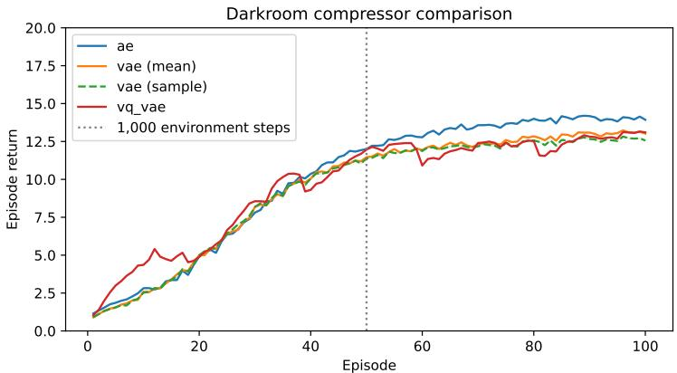  
Figure 7: Compressor ablation in Darkroom. Episode returns for RAD with AE, VAE (posterior mean or sampling), and VQ-VAE compressors. AE achieves the highest late-stage returns. The vertical dotted line marks the 1,000-step training-history horizon (50 episodes).

Comparison of Different Compressors. We compare three Transformer-based compressors in Darkroom, using the same backbone, latent-token dimensions, and recurrent memory update:

• AE: the compressor adopted in this work, featuring a deterministic autoencoder with continuous latent representations.

• VAE: a variational autoencoder with a Gaussian latent distribution and KL regularization, evaluated using either posterior means or sampled latents (Kingma & Welling, 2013).

• VQ-VAE: a vector-quantized autoencoder that maps compressor outputs to a learned discrete codebook before the recurrent memory update (Van Den Oord et al., 2017).

Shown in Figure 7, all variants improve with accumulated interaction. Its advantage becomes clearer beyond 50 episodes, corresponding to the 1,000-step training-history horizon. VAE performs similarly with posterior means and sampled latents, with a small late-stage advantage for mean-based evaluation. VQ-VAE initially improves faster but exhibits larger fluctuations and ultimately attains returns comparable to VAE. These results favor the deterministic continuous AE for this setting: neither variational regularization nor vector quantization improves downstream performance.

Effect of the Long-term memory size. Figure 8 shows the performance of RAD with the same working memory size and different long-term memory size. RAD successfully exhibits in-context adaptation even for a small long-term memory, possibly since preserving information in Darkroom is relatively simple. A long-term memory with 15 latent tokens exhibits the best performance while maintaining a relatively small long-term memory.

Convergence speed of AD/RAD. Figure 9 tracks online regret on held-out tasks as a function of the number of training updates; all three variants start from a regret of ≈33 at initialization and improve steadily thereafter. AD-short descends fastest early but saturates at a suboptimal plateau, since its short context cannot fully resolve feedback that is 50 steps old; AD-long, whose context spans the entire history, learns more slowly—it still trails AD-short at 20k updates—but does not saturate, crossing below AD-short around 25–30k updates and converging to 6.9. RAD converges the slowest among the methods, achieving the optimal performance at around 60k updates, yet it is more efficient during inference, matching AD-long’s performance with significantly smaller context window.

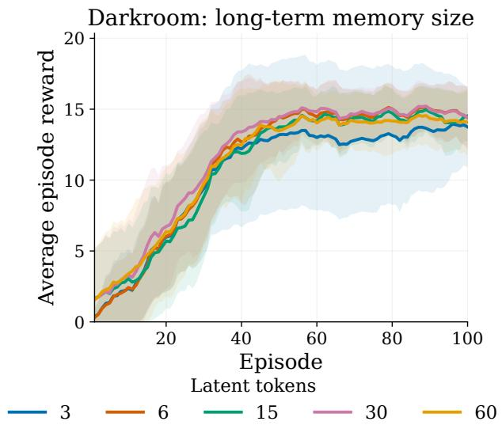  
Figure 8: Average rewards of RAD with different long-term memory size on Darkroom

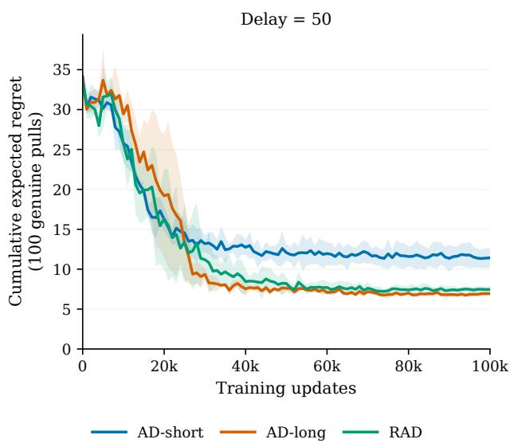  
Figure 9: Training convergence of AD-short, AD-long, and RAD under delayed feedback (delay = 50): mean cumulative expected regret over 100 genuine pulls (50 before and 50 after the delay) on 100 fixed held-out tasks, evaluated periodically during distillation, with shading showing one standard deviation across 3 training seeds; RAD starts from compression-pretrained checkpoints (pretraining updates excluded from the horizontal axis), and all methods receive the same distillation update budget.

## D EXTENDED RELATED WORK

History and Trajectory Representations in RL. RAD is also related to methods that learn compact representations of trajectories or interaction histories. SeCTAR (Co-Reyes et al., 2018) learns latent trajectory representations for hierarchical RL, while history-based representation methods study how past observations can be summarized into compact states for control (Patil et al., 2024; Ni et al., 2024). HELM (Paischer et al., 2022) similarly constructs compact history representations for partially observable RL. Trajectory simplification has also been formulated as an RL problem (Wang et al., 2021), where redundant trajectory points are removed while preserving geometric information. These methods primarily seek representations sufficient for control, prediction, or trajectory reconstruction. RAD instead targets the learning history of an in-context RL agent: its long-term memory recursively summarizes experience across episodes and is optimized to retain the information needed to continue the adaptation process of the distilled source algorithm.

Meta Reinforcement Learning. Meta-reinforcement learning (Meta-RL) aims to learn the underlying structure of RL, enabling rapid adaptation to new tasks. Early deep meta-RL methods primarily focused on online adaptation, where recurrent architectures are trained to implicitly implement RL algorithms through their internal states, enabling fast within-episode learning (Duan et al., 2016; Wang et al., 2016). On the other hand, gradient-based meta-learning approaches seek to learn parameter initializations that can be efficiently adapted to new tasks via a small number of gradient updates (Finn et al., 2017; Nichol et al., 2018).

More recently, offline meta-RL has emerged as an important paradigm by leveraging pre-collected datasets of trajectories to meta-train without additional environment interaction. Existing offline meta-RL methods span multiple classes, including gradient-based adaptation (Mitchell et al., 2021), Bayesian inference over latent task variables (Rakelly et al., 2019; Dorfman et al., 2021), and representation-learning or contrastive approaches for task inference from offline data (Yuan & Lu, 2022).