# SOLO: PRETRAINING BILLION-PARAMETER LANGUAGE MODELS WITH SHARED-OUTPUT LOCAL LEARNING

A PREPRINT

Bojian Yin\* Shurong Wang Yuqi Pan Guoqi Li Institute of Automation, Chinese Academy of Sciences bojian.yin@ia.ac.cn

## ABSTRACT

Large language models are trained with backpropagation, whose global gradient coordinates all layers but forces each to hold its activations and wait for the gradient to pass back through every deeper layer. Conventional local learning removes this update locking by training each module to predict the target through its own readout, but has not scaled to billion-parameter pretraining. We identify these private readouts as a key weakness, since they leave each module without information from deeper modules. We propose Shared-Output LOcal learning (SOLO), which replaces them with a shared, read-only copy of the final module’s readout, the only one trained on the output of the whole network. Taken from the previous step, the copy transmits information from the final module without passing gradients between modules or reintroducing update locking. SOLO approaches backpropagation on Transformers of 340M to 2B parameters pretrained on 15B tokens, staying within one point in average zero-shot accuracy with a perplexity gap that narrows with scale. Readout ablations attribute SOLO’s improvement over private readouts to sharing. Without update locking, each of p pipeline stages holds activations for O(1) micro-batches instead of O(p). The freed memory permits larger micro-batches, which reach up to 1.44× the best measured throughput of pipeline on the same backpropagation partition. To our knowledge, SOLO is the first local learning method to show such memory and throughput gains in billion-parameter language-model pretraining. Local learning thus becomes a practical alternative to backpropagation for large-scale pretraining.

## 1 Introduction

End-to-end backpropagation (BP) is both the engine and the bottleneck of large language model training. Its global gradient, derived from a single objective at the final output, coordinates the updates of every layer. However, the same gradient reaches a layer only after propagating back through all deeper layers, and until then the layer can neither update nor release its activations. This dependency, known as update locking (Jaderberg et al., 2017; Belilovsky et al., 2020), creates large memory overheads and idle time at scale. Activation checkpointing, optimizer sharding, and parallelism strategies reduce training memory overheads, but do not remove the dependency (Chen et al., 2016; Rajbhandari et al., 2020; Huang et al., 2019; Narayanan et al., 2019). Local learning instead removes update locking by splitting the network into modules, giving each module its own learning signal, and passing no gradient between modules (Belilovsky et al., 2019, 2020; Laskin et al., 2020; Löwe et al., 2019). Each module can then update and release its activations without waiting for deeper ones. This independence comes at the expense of the global gradient, so we ask:

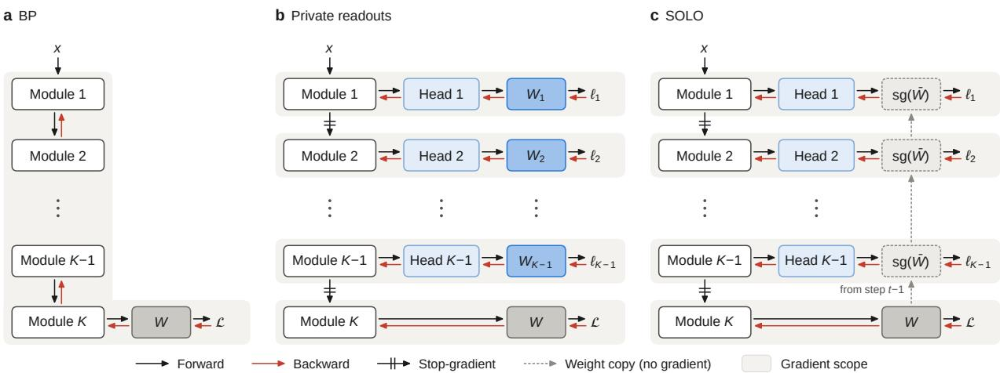  
Figure 1: Three ways to train a network of K modules. (a) BP trains every module with the final loss L through the terminal readout W. (b) Local learning stops the gradient between modules and gives each auxiliary head a trainable private readout $W _ { k }$ with its own loss $\ell _ { k } .$ . (c) SOLO keeps the stop-gradients, but every head predicts through sg(W¯ ), a read-only copy of W from the previous step. Gradients flow through the copy into its head but do not update it; only L updates W, so no head waits for its current update.

train small models, use limited token budgets, or apply local objectives only after pretraining (Laskin et al., 2020; Shing et al., 2026; Shi et al., 2026; Sushma et al., 2026). To our knowledge, no billion-parameter language model has been pretrained with local learning.

The main challenge is that removing the global gradient also removes the coordination it provided. Each module therefore learns from a lightweight auxiliary head that predicts the network’s target and is discarded at inference (Lee et al., 2015). This signal ties the module to the target but carries no information from deeper modules. Existing methods give each head a private readout, the final linear map to logits, either learned locally (Belilovsky et al., 2019, 2020; Laskin et al., 2020; Ma et al., 2024) or fixed at random (Mostafa et al., 2018; Yin and Corradi, 2025). Local learning, however, requires isolated gradients, not isolated output readouts. The final module’s terminal readout could thus serve every head, giving all modules one output space of tens of thousands of tokens, far beyond ImageNet’s 1,000 classes (Deng et al., 2009). At this size, the placement of tokens in the readout matters, and sharing keeps it consistent across all modules. Language models already share components across depth, in looped and recurrent Transformers (Dehghani et al., 2019; Geiping et al., 2025; Zhu et al., 2025) and early-exit models with a shared readout (Elbayad et al., 2020; Elhoushi et al., 2024). All are trained end to end, so they show the potential of sharing across depth but cannot tell whether it still helps in local learning.

We close this gap by introducing SOLO, Shared-Output LOcal learning, which isolates gradients but shares the readout. It changes a single component of local learning. Every auxiliary head predicts through a read-only copy of the terminal readout instead of a private one, which already makes SOLO parameter-efficient (Figure 1c). More importantly, only the final objective updates the terminal readout, so its previous-step copy transmits information from the final module to every head. SOLO thus restores a path for information from deeper modules without reintroducing update locking. We test both halves of this claim, pretraining Transformers from 340M to 2B parameters on 15B tokens and comparing pipeline training with BP under the same partition into stages. SOLO approaches BP at every scale tested. In readout ablations, its intermediate states become decodable through the terminal readout, and its local gradients align more closely with $\mathrm { B P ^ { \bullet } s }$ than under private readouts. Without update locking, each of the p pipeline stages holds activations for O(1) micro-batches instead of $O ( p )$ . The freed memory permits larger micro-batches and thus higher pipeline throughput.

We make three contributions. Scale. We demonstrate that SOLO pretrains language models of 340M to 2B parameters to within one point of token-matched BP in average zero-shot accuracy. To our knowledge, SOLO is the first local-learning method to pretrain billion-parameter language models from scratch. Mechanism. We show that SOLO outperforms private readouts and identify sharing as the source of the gain. Readout ablations separate sharing from training, and the gain appears in language modeling but not in image classification, where even a random readout costs little. Systems. We show that removing update locking turns saved activation memory into up to 1.44× the best measured BP. Local learning thus pretrains billion-parameter language models close to $\mathbf { B } \dot { \mathsf { P } } ,$ and more efficiently under limited memory or bandwidth.

## 2 Method

We factor the gradient that each module receives under BP and under local learning into a path, a readout, and a residual (Section 2.1). Cutting the gradient between modules makes the path and the residual local but does not require a local readout. SOLO therefore shares the terminal readout across all modules (Section 2.2), which matches the readout factor to BP (Section 2.3).

## 2.1 Local learning

Consider a network of K modules, $h _ { k } = f _ { k } ( h _ { k - 1 } ; \theta _ { k } )$ with $h _ { 0 } = x$ , whose readout W maps the last state to logits $z = W h _ { K }$ . BP trains all modules on one loss $\mathcal { L } ( z , y )$ . Local learning instead cuts the gradient between modules by feeding each module $\mathrm { s g } ( h _ { k - 1 } )$ , where sg passes the value but not the gradient. Each module then learns from its own auxiliary head $\phi _ { k }$ and readout $W _ { k } ,$ , which produce logits $z _ { k } = W _ { k } \phi _ { k } ( h _ { k } )$ and a loss $\ell _ { k } = \mathcal { L } ( \boldsymbol { z } _ { k } , y )$ . The last module keeps $\dot { W }$ and the original loss, and the heads are discarded after training.

The two rules send different gradients to $h _ { k }$ . With the residuals $\delta = \partial \mathcal { L } / \partial z$ and $\delta _ { k } = \partial \ell _ { k } / \partial z _ { k }$

$$
\begin{array} { r } { g _ { k } ^ { \mathrm { B P } } = \nabla _ { h _ { k } } \mathcal { L } = \underbrace { M _ { k } ^ { \top } } _ { \mathrm { p a t h } } \underbrace { W ^ { \top } } _ { \mathrm { r e a d o u t ~ r e s i d u a l } } , \qquad \hat { g } _ { k } = \nabla _ { h _ { k } } \ell _ { k } = \underbrace { J _ { k } ^ { \top } } _ { \mathrm { p a t h } } \underbrace { W _ { k } ^ { \top } } _ { \mathrm { r e a d o u t ~ r e s i d u a l } } , } \end{array}\tag{1}
$$

where $M _ { k } = \partial h _ { K } / \partial h _ { k }$ and $J _ { k } = \partial \phi _ { k } ( h _ { k } ) / \partial h _ { k }$ . BP sends every module the same residual through the same readout, and only the path changes with depth. This gradient is available only after the forward and backward passes through every deeper module, so module k must wait before it updates. Existing local learning makes all three factors local. Avoiding this wait requires it only for the path and the residual, which BP computes from the deeper modules on the current sample. The readout is a parameter, not a signal computed on the current sample, so it need not be local.

## 2.2 SOLO: local learning with a shared readout

SOLO keeps the local path and residual, but gives every head the terminal readout W. Each head predicts through a read-only copy of it,

$$
z _ { k } = \tau _ { k } \ : \mathrm { s g } ( \bar { W } ) \phi _ { k } ( h _ { k } ) ,\tag{2}
$$

where $\bar { W }$ is the readout from an earlier step and $\tau _ { k }$ is a learned scalar temperature that sets the head’s logit scale. Only the final loss updates W; each head trains only $\phi _ { k }$ and $\tau _ { k }$ . The copy thus transmits information from the final module to every head without passing a gradient between modules. The heads also share the map W itself, not only its range, so every head predicts in one basis (Section 3.2). The local gradient of Eq. (1) becomes

$$
\hat { g } _ { \boldsymbol k } = J _ { \boldsymbol k } ^ { \top } \tau _ { \boldsymbol k } \bar { W } ^ { \top } \delta _ { \boldsymbol k } ,\tag{3}
$$

so each module’s residual returns through the same readout as in BP, up to the scale $\tau _ { k }$ and the delay of $\bar { W }$ . The delay allows modules to run without waiting, since at step t every head uses $\dot { \bar { W } } = W _ { t - 1 }$ while the final module computes $\dot { W _ { t } }$ Refreshing the copy only every S steps further reduces synchronization (Section 3.4).

Just as delay avoids waiting, sharing avoids the cost of private readouts. Each is a $V \times d$ matrix, which is large in language models. With a 32k-token vocabulary and width 2048, it holds 67M parameters, plus their optimizer states. SOLO replaces all $K - 1$ private readouts with read-only copies that need neither gradients nor optimizer states. Algorithm 1 gives the full training step.

Relation to feedback alignment. Because each module maps its residual back through $\bar { W } ^ { \top }$ , SOLO resembles feedback alignment (Lillicrap et al., 2016; Nøkland, 2016), sending errors to early layers through an untrained matrix. The difference lies in the error. Feedback alignment sends the final error of the current sample, whereas a SOLO module propagates only its own residual $\delta _ { k }$ through its own head. The copy is still a backward channel, since W¯ changes with the final module’s updates, but it carries parameters that summarize past batches, not errors on the current sample. Hence no module receives the derivative of a deeper loss with respect to its own output, and the modules remain gradient-isolated. For the same reason, RAND (Table 1) controls the prediction map, not a feedback pathway.

## 2.3 How sharing changes the local gradient

Sharing matches one factor of the local gradient to BP, but not the other two. For a head that predicts through $\tau _ { k } W _ { k }$ the gap to the BP gradient splits exactly into a readout, a residual, and a path term,

$$
\widehat { g } _ { k } - g _ { k } ^ { \mathrm { B P } } = \underbrace { J _ { k } ^ { \top } \left( \tau _ { k } W _ { k } - W \right) ^ { \top } \delta _ { k } } _ { \mathrm { r e a d o u t } } + \underbrace { J _ { k } ^ { \top } W ^ { \top } ( \delta _ { k } - \delta ) } _ { \mathrm { r e s i d u a l } } + \underbrace { \left( J _ { k } - M _ { k } \right) ^ { \top } W ^ { \top } \delta } _ { \mathrm { p a t h } } .\tag{4}
$$

Table 1: Readout sources. Each variant changes only the readout of the auxiliary heads; $\phi _ { k }$ and $\tau _ { k }$ are common to all variants. The last column counts trainable readout parameters per head.
<table><tr><td>Variant</td><td>Readout of head k</td><td>Shared</td><td>Source</td><td>Trainable</td></tr><tr><td>RAND</td><td>Wrand, , frozen</td><td>no</td><td>random</td><td>0</td></tr><tr><td>PRIV</td><td> $W _ { k } ^ { \mathrm { p r i v } }$  , learned</td><td>no</td><td>own head</td><td>Vd</td></tr><tr><td>SOLO</td><td>W, read-only copy</td><td>yes</td><td>live terminal readout</td><td>0</td></tr><tr><td>PRETRAINED (SOLO)</td><td> $W _ { \mathrm { S O L O } } ^ { \star } ,$  frozen</td><td>yes</td><td>fully trained SOLO</td><td>0</td></tr><tr><td>PRETRAINED (BP)</td><td> $W _ { \mathrm { B P } } ^ { \star } , \mathrm { f r o z e n }$ </td><td>yes</td><td>fully trained BP</td><td>0</td></tr></table>

Table 2: Pretraining on 15B SlimPajama tokens. Quality values are three-seed means; bold marks the best local-learning variant per column. Throughput and peak memory per GPU are measured on four A100s at micro-batch 8 under data parallelism, with BP sharded at 2B. LMB-p and LMB-a are LAMBADA perplexity and accuracy.
<table><tr><td colspan="2"></td><td colspan="2">Perplexity↓</td><td colspan="6">Zero-shot accuracy (%) ↑</td><td colspan="2">Cost</td></tr><tr><td colspan="2">Scale Variant</td><td>Wiki. LMB-p</td><td></td><td>LMB-a PIQA Hella. Wino. ARC-e ARC-c Avg.</td><td></td><td></td><td></td><td></td><td></td><td></td><td>tok/s ↑ Mem. GB↓</td></tr><tr><td rowspan="5"></td><td>BP (DP)</td><td>28.04</td><td>39.5</td><td>31.8</td><td>64.2</td><td>34.6</td><td>49.9</td><td>43.4</td><td>25.0</td><td>41.5</td><td>247k 29.6</td></tr><tr><td> $\operatorname { S O L O } , K { = } 2$ </td><td>29.05</td><td>44.6</td><td>29.8</td><td>64.0</td><td>34.0 51.9</td><td>45.6</td><td>23.6</td><td>41.5</td><td>208k</td><td>15.8</td></tr><tr><td>340M PRIV,  $K { = } 2$ </td><td>29.47</td><td>46.3</td><td>29.2</td><td>65.1</td><td>33.8</td><td>51.0</td><td>44.4</td><td>22.5 41.0</td><td>209k</td><td>15.9</td></tr><tr><td> $\operatorname { S O L O } , K { = } 4$ </td><td>31.19</td><td>47.9</td><td>28.6</td><td>63.3</td><td>33.1</td><td>51.3</td><td>46.0</td><td>23.7 41.0</td><td>156k</td><td>11.2</td></tr><tr><td>PRIV, K=4</td><td>31.79</td><td>55.6</td><td>26.6</td><td>62.5</td><td>32.9</td><td>53.4</td><td>44.1</td><td>23.4 40.5</td><td>157k</td><td>11.5</td></tr><tr><td rowspan="4">1.3B</td><td>BP (DP)</td><td>21.61</td><td>20.0</td><td>38.9</td><td>68.0</td><td>41.1</td><td>53.2</td><td>48.2</td><td>25.9</td><td>45.9</td><td>76k 48.9</td></tr><tr><td>SOLO, K=2</td><td>22.29</td><td>22.8</td><td>37.8</td><td>67.3</td><td>39.6</td><td>52.7</td><td>50.1</td><td>24.8 45.4</td><td>77k</td><td>32.7</td></tr><tr><td>PRIV, K=2</td><td>22.73</td><td>28.1</td><td>35.8</td><td>65.8</td><td>39.1</td><td>50.7</td><td>47.8</td><td>23.9 43.8</td><td>76k</td><td>33.1</td></tr><tr><td>SOLO, K=4</td><td>23.59</td><td>23.9</td><td>37.3</td><td>66.4</td><td>38.1 54.1</td><td>49.5</td><td>24.4</td><td>45.0</td><td>63k</td><td>20.9</td></tr><tr><td rowspan="3">2B</td><td>BP (FSDP)</td><td>20.93</td><td>22.7</td><td>39.9</td><td>67.4</td><td>41.9</td><td>51.9</td><td>50.6</td><td>25.1</td><td>46.1 62k</td><td>48.0</td></tr><tr><td>SOLO, K=2</td><td>21.57</td><td>23.0</td><td>37.9</td><td>67.9</td><td>41.6</td><td>51.8</td><td>49.8</td><td>25.8</td><td>45.8 53k</td><td>42.9</td></tr><tr><td>SOLO, K=4</td><td>22.21</td><td>23.6</td><td>37.1</td><td>66.8</td><td>40.3</td><td>51.5</td><td>49.4</td><td>26.5 45.3</td><td>46k</td><td>26.7</td></tr></table>

SOLO sets $W _ { k } = { \bar { W } } ,$ , so the readout term vanishes when $\tau _ { k } = 1$ and the copy is current; the temperature and the delay reintroduce it. The residual and path terms remain, so sharing does not guarantee a perfect alignment with BP (Appendix B). The terms are vectors that can partly cancel, so the norm of a term is not its share of the gap; we use the norms only to compare readout sources. Section 3.2 measures cos $( \hat { g } _ { k } , g _ { k } ^ { \mathrm { B P } } )$ on fixed probe batches for each readout source.

Readout sources. Table 1 changes only the readout of the heads. RAND freezes an independent random readout per head, PRIV learns one per head, and SOLO shares the live terminal readout. Two PRETRAINED variants freeze the terminal readout of a finished SOLO or BP run and train a fresh model with it. Because these readouts have already seen the corpus, they are diagnostic probes, not training methods. All variants learn $\tau _ { k } ,$ so every head has the same freedom in logit scale.

## 3 Experiments

We ask whether SOLO pretrains competitive language models at scale, why it outperforms private readouts, and what removing update locking changes in pipeline training. Section 3.1 compares SOLO with token-matched BP from 340M to 2B parameters, Section 3.2 varies only the readout of the auxiliary heads, and Section 3.3 compares SOLO with pipeline BP under the same partition. Section 3.4 varies the refresh period and the head depth, and Appendix C gives the training details.

## 3.1 SOLO pretrains models up to 2B near BP quality

We pretrain Transformers of 340M, 1.3B, and 2B parameters on 15B SlimPajama tokens, following the training setup of Yang et al. (2024), and evaluate WikiText perplexity and six zero-shot tasks with the lm-evaluation-harness (Gao et al., 2023). Both methods train with data parallelism, and BP is sharded at 2B. Each model has 24 layers, which we split into two or four modules. Eight modules would leave three layers per module while adding seven two-block heads, 89% more compute per token at 340M (Table 13), so we do not use finer splits.

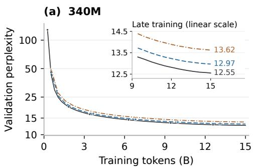

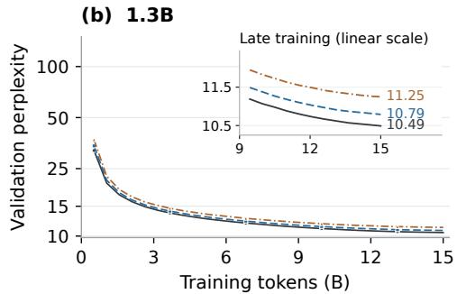  
Figure 2: Validation perplexity during pretraining at (a) 340M and (b) 1.3B; insets show the final 9 to 15B tokens on a linear scale.

(a)  
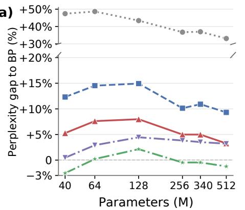

(b)  
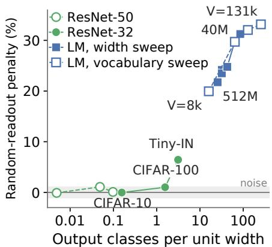  
Figure 3: Readout source across scale and modality. (a) Perplexity gap to BP on the one-epoch WikiText-103 sweep with K = 4, three-seed means. pre-SOLO and pre-BP are the PRETRAINED variants, which freeze the terminal readout of a fully trained SOLO or BP model. (b) Cost of a random readout relative to a private one, as the relative increase in validation perplexity (language) or test error (vision), against the number of output classes per unit width. Numbers are in Appendix D.

SOLO stays close to BP. With two modules, SOLO approaches BP to within 1.01, 0.68, and 0.64 WikiText perplexity from 340M to 2B, and with four modules to within 3.15, 1.98, and 1.28 (Table 2). Average zero-shot accuracy stays within 0.5 points of BP with two modules and within 0.9 with four. With two modules, SOLO is within 1.5 points of BP on PIQA, HellaSwag, WinoGrande, and both ARC sets, and it exceeds BP on ARC-easy at 340M and 1.3B. LAMBADA shows the largest deficit, 1 to 2 points in accuracy. The auxiliary heads add 11–13% FLOPs per token with two modules (Table 13).

The gap narrows with scale. From 340M to 2B, the relative perplexity gap falls from 3.6% to 3.1% with two modules and from 11.2% to 6.1% with four. It narrows most on LAMBADA, where the perplexity gap falls from 5.1 to 2.8 and 0.3 with two modules. The gap also does not grow with training. SOLO trains as smoothly as BP, without loss spikes, and its gap forms in the first 2B tokens and then stays flat(Figures 2 and 6).

Sharing outperforms private readouts at equal cost. At the same throughput and memory, sharing lowers WikiText perplexity by 0.42 and 0.44 at 340M and 1.3B with two modules, and by 0.60 at 340M with four. With two modules, it raises average zero-shot accuracy by 0.5 and 1.6 points. The largest gain is on LAMBADA, where perplexity falls from 28.1 to 22.8 at 1.3B. Section 3.2 traces these gains to sharing.

Every module decodes. Keeping the heads turns every module into an early exit. In the 1.3B model with four modules, the exit after the first module already matches the full 340M BP model in WikiText perplexity (28.20 against 28.04; Table 10). A BP model can be read only at its final layer. Read through the same readout, its intermediate layers agree with its final prediction only 16–51% of the time, against 71–75% for the SOLO exits. Each deeper exit refines rather than rewrites the prediction (Figure 9; Appendix E).

Table 3: Readout sources under a published WikiText-103 recipe, mean over three seeds. Perplexity per subword token, word-level in parentheses; ∆par denotes trainable parameters beyond BP’s 62.3M, and § an additional 11.9M-parameter frozen pretrained readout.
<table><tr><td rowspan="2">K Variant</td><td rowspan="2"></td><td colspan="2">Perplexity</td><td colspan="3">Cost</td></tr><tr><td>Val ↓</td><td>Test ↓</td><td></td><td>tok/s ↑ Peak mem (GB) ↓ ∆par (M)</td><td></td></tr><tr><td></td><td>1 BP (end-to-end)</td><td>23.15 (38.30)</td><td>23.59 (41.59)</td><td>88k</td><td>16.6</td><td></td></tr><tr><td rowspan="4">2</td><td>SOLO</td><td>23.49 (38.95)</td><td>24.02 (42.48)</td><td>53k</td><td>12.9</td><td>+4.8</td></tr><tr><td>PRIV</td><td>23.64 (39.25)</td><td>24.20 (42.87)</td><td>52k</td><td>13.0</td><td>+16.7</td></tr><tr><td>PRETRAINED (SOLO)</td><td>23.59 (39.10)</td><td>24.06 (42.56)</td><td>52k</td><td>13.0</td><td>+4.8§</td></tr><tr><td>PRETRAINED (BP)</td><td>23.82 (39.59)</td><td>24.30 (43.07)</td><td>52k</td><td>12.9</td><td>+4.8§</td></tr><tr><td rowspan="2">4</td><td>SOLO</td><td>24.35 (40.62)</td><td>24.82 (44.17)</td><td>29k</td><td>10.6</td><td>+14.4</td></tr><tr><td>PRIV</td><td>24.77 (41.42)</td><td>25.24 (45.05)</td><td>29k</td><td>11.1</td><td>+50.2</td></tr></table>

## 3.2 SOLO’s gain over private readouts comes from sharing

We next identify the source of SOLO’s gain over private readouts. The gain is robust. SOLO leads PRIV by 2.1-4.7 perplexity from 40M to 512M parameters on the one-epoch WikiText-103 setting (Figure 3a), and by 0.15 and 0.42 with two and four modules in the Transformer-XL 30-epoch training (Dai et al., 2019), with 4.8M rather than 16.7M added parameters at two modules (Table 3). The two readouts differ along two axes. A private readout is trained by it own head and used by that head alone, whereas the SOLO readout is trained by the final module and shared by every head. We vary the two axes independently.

The best readout is learned together with local modules. In PRETRAINED variants, every head predicts from the first step through the frozen terminal readout of a fully trained model (Table 1). First, the trained SOLO readout outperforms the live copy on the one-epoch sweep with four modules (Figure 3a). After 30 epochs with two modules, the live copy has matured and is best (Table 3). In the same one-epoch runs, the live copy reaches the same gradient alignment after roughly 2,000 steps (Figure 4a). A readout therefore helps more once the final module has learned it. Second, the fully trained BP readout, despite coming from the stronger model, trails the fully trained SOLO readout by 1.0-2.0 perplexity, and only the latter makes the module outputs directly decodable (Figure 10). A useful readout must therefore also be learned together with local modules, a condition that the live copy of SOLO meets.

Sharing helps through a common basis. Table 9 compares shared and unshared versions of the trained terminal readout and of a random matrix on the 40M model. Rotating the trained readout by a different orthogonal matrix for each module (ROT) keeps its content and the logits each head can reach, but raises perplexity by up to 13.3 over SOLO. Sharing one random matrix across all heads (RSHARE), instead of drawing one per head, lowers perplexity by up to 12.0. A common basis thus helps even without trained content. Through the skip connections each module inherits the basis of its input. A shared readout decodes this basis directly, whereas a rotated one forces each later module to translate it, and their local gradients lose alignment with BP (Appendix D). Deeper heads do not close the gap between SOLO and PRIV, so head capacity cannot substitute for a shared readout.

Sharing brings local gradients closer to BP. As predicted in Section 2.3, sharing eliminates the readout term of the gap to the BP gradient while leaving the residual and path terms (Figure 4c). Local gradients also align better with BP. Their cosine with the BP gradient rises from 0.32 under RAND to 0.52 under PRIV and 0.70 under SOLO, tracking perplexity, and the order holds at every module (Figure 4a,b). Alignment alone does not explain perplexity, since SOLO and PRETRAINED (SOLO) reach similar alignment yet differ in perplexity (Figure 4d).

Sharing helps in language, where the vocabulary is large, but not in vision. From CIFAR to ImageNet-1k, sharing yields no consistent gain over PRIV (Appendix D). The readout itself matters far less there. Relative to a private readout, a random one costs almost nothing when a classifier has fewer classes than feature dimensions, but up to 33% in language, where the vocabulary is 26–85 times the model width (Figure 3b). Sharing pays off only where the readout matters.

## 3.3 SOLO turns saved activation memory into pipeline throughput

Update locking matters most in pipeline parallelism, where each GPU holds one stage, a group of consecutive layers. We therefore compare SOLO with pipeline BP under the same partition into p=K stages, one module each, which isolates the effect of removing update locking. We train a 96-layer, 1.2B-parameter model on eight A100 GPUs with M=24 or 72 micro-batches per step. The BP baselines are the one-forward-one-backward schedule (1F1B), which alternates forward and backward passes, and its interleaved variant with v virtual stages per GPU (VPP; Narayanan et al., 2021) (Figure 5; Appendix H).

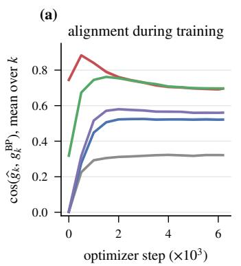

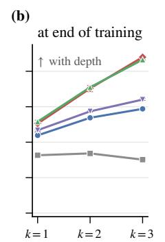

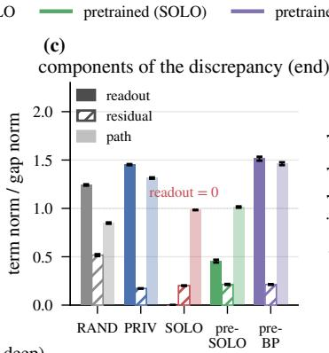

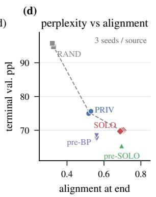  
Figure 4: Gradient alignment on the 40M WikiText-103 sweep, three seeds per variant. (a) Alignment during training; (b) alignment at the end, by module; (c) norms of the three terms of Eq. (4) at the end, divided by the norm of the gap; (d) terminal perplexity against alignment. The terms can partly cancel, so their norms are not shares of the gap. Setting aside $\tau _ { k }$ , the readout term is zero under SOLO by construction.

Each stage holds activations for O(1) micro-batches instead of $O ( p )$ . Under 1F1B, each stage keeps the activations of a micro-batch until its gradient returns from the later stages. The first stage therefore holds p micro-batches at once (Figure 5a), and its activation memory equals that of the unsplit model, however many stages are added. A SOLO stage runs its local backward pass right after its forward pass and releases the activations. It holds a single micro-batch (Figure 5b), so its activation memory falls as $1 / p . \mathrm { A t } p { = } 8$ , peak activation memory drops from 17.4 to 2.5 GB, and for $p = 2 , 4 , 6 ,$ , 8 the reduction is 1.9, 3.7, 5.4, and 7.0-fold, close to p (Figure 5d; Table 16). Pipeline BP reaches this level only by recomputing every block (2.1 GB), at three quarters of its throughput, whereas VPP raises activation memory to 24.8 GB to shrink the bubble (Appendix H).

Without update locking, the pipeline has no backward bubble. In 1F1B, a stage cannot start a backward pass until the next stage returns a gradient, so the pipeline sits idle for a fraction $( p - 1 ) / ( M + p - 1 )$ of each step, known as the bubble. SOLO stages never wait for a gradient, so this bubble disappears. In exchange, each stage runs its auxiliary head, whose share of the work shrinks as the stage holds more layers. With 12 layers per stage at $p { = } 8 .$ , the heads add about 1.4% of a step per additional module, and SOLO is faster whenever M is below about 70 (Appendix H). With a 50-step refresh, it reaches 1.18× the throughput of 1F1B at M=24, matches it at M=72, and beats the faster VPP schedule by 10% at M=24 (Figure 5c). Per-step refresh synchronizes the stages and costs up to 7%, which a 10-step refresh recovers. On the 24-layer pretraining models, with 3 to 12 layers per stage, SOLO reaches 0.72–0.91× 1F1B at a fixed micro-batch (Figure 13b).

The freed memory becomes throughput. At a fixed global batch, a larger micro-batch uses the GPU more efficiently but leaves fewer micro-batches per step. 1F1B cannot exploit this trade, because a larger micro-batch both raises its activation memory and widens its bubble, so its throughput peaks at micro-batch 4. SOLO has no bubble and a small activation footprint, so its throughput rises until the GPU kernels saturate, reaching 1.44× the best 1F1B throughput at micro-batch 16 and 1.43× at equal memory (Table 17; Figure 14).

SOLO tolerates slow links between stages. SOLO propagates activations forward and no gradients backward, which halves the traffic between stages (Figure 5e). Since no stage waits for a gradient, a slow link also cannot stall the backward pass. On a 24-layer model split into two stages, throttling the link to 1 Gb/s reduces the throughput of SOLO by 1.2% and that of 1F1B by 51% (Table 18).

Local learning thus relaxes the memory, micro-batch, and bandwidth limits of pipelines, and schedules designed for it may widen these gains across nodes.

## 3.4 Ablations

Refresh period. The pretraining runs of Table 2 read the copy at every step (S=1), but the copy can also be refreshed less often. On WikiText-103 with four modules, periods up to S=50 change validation perplexity by at most 0.4%, while S=100 and S=200 raise it by 1.9% and 3.0% (Appendix F). A period of 10 to 50 steps therefore keeps quality and recovers the 7% throughput that per-step refresh costs in pipelines (Section 3.3).

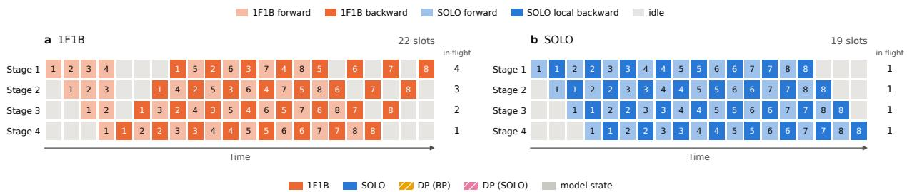

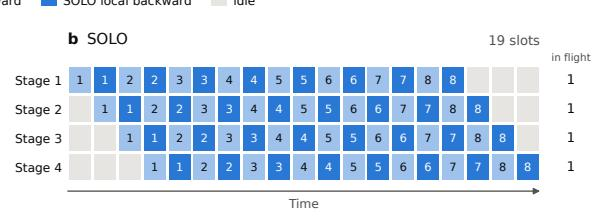

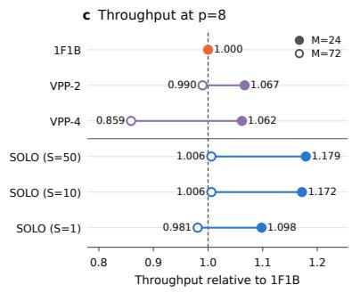

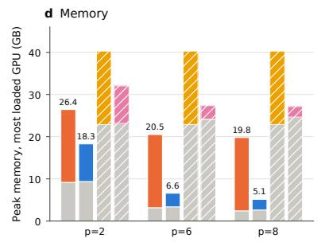

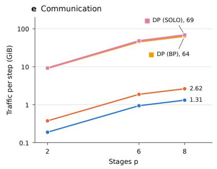  
Figure 5: SOLO against pipeline BP under the same partition. (a, b) Schedules of 1F1B and SOLO with p=4 stages and eight micro-batches, ignoring the auxiliary heads. Each cell is one forward or backward pass of one micro-batch; 1F1B takes 22 slots and SOLO 19, and the right column gives the peak number of micro-batches in flight per stage. Only one step is drawn; with S>1, SOLO’s idle slots at the start and end overlap with the neighboring steps. (c) Throughput relative to 1F1B at p=8; VPP-v is interleaved 1F1B with v virtual stages per GPU, and S is the refresh period of the copy in steps. (d) Peak memory on the most loaded GPU, with model state in gray and activations in color. (e) Communication volume per step. Panels (d) and (e) use M=24; data-parallel runs are shown for reference.

Auxiliary-head depth. Deeper heads and sharing help independently. On WikiText-103 with four modules, from 40M to 256M parameters, deepening SOLO’s heads from a linear readout (H=0) to three blocks shrinks its perplexity gap to BP from 8.6–13.5% to 2.7-5.2% (Table 8). PRIV improves along the same curve but stays 5.4-7.8% behind SOLO in all sixteen cells, so even at its best depth it trails SOLO with one-block heads by 2.3–2.4% (Figure 7). Beyond H=2, each extra head block adds the computation of K−1 layers and narrows the gap by only about one point (Figure 13c), so we use H=2.

## 4 Related work

Local learning. Local learning approaches BP in image classification (Belilovsky et al., 2019; Nøkland and Eidnes, 2019; Belilovsky et al., 2020; Siddiqui et al., 2024; Ma et al., 2024; Yin and Corradi, 2025), but language-model studies stop at a 6M-parameter Transformer on LM1B (Laskin et al., 2020), 12-layer Llama-2-style models (Shing et al., 2026), or 774M parameters over repeated passes of WikiText-103 (Sushma et al., 2026), or apply local objectives only after pretraining (Shi et al., 2026). These methods refine the local objectives and heads (Wang et al., 2021; Pyeon et al., 2021) but maintain a private readout per module, learned or fixed at random (Mostafa et al., 2018). SOLO instead shares the terminal readout across modules.

Other ways to avoid update locking. Delayed and synthetic gradients, forward gradients, and LocoProp pass a downstream derivative, an estimate of it, or a target derived from it (Huo et al., 2018; Jaderberg et al., 2017; Baydin et al., 2022; Qin and Huang, 2026; Amid et al., 2022), and feedback alignment sends the final error, or the label, through a fixed or learned matrix (Lillicrap et al., 2016; Akrout et al., 2019; Launay et al., 2020). Forward-only rules avoid derivatives but have not reached language-model pretraining (Hinton, 2022; Dellaferrera and Kreiman, 2022). SOLO passes no error or derivative between modules, only a copy of a parameter (Section 2.2).

Sharing a readout across depth. Early-exit language models reuse or align one readout across depth (Elbayad et al., 2020; Schuster et al., 2022; Elhoushi et al., 2024), but train end to end, so every exit loss updates the readout and the layers below. Lenses decode intermediate layers after training (nostalgebraist, 2020; Belrose et al., 2023), and aligned training makes one classifier serve several layers (Jiang et al., 2024). SOLO shares the readout during training and updates it only with the final objective. Fixed random classifiers suffice for image classification (Hoffer et al., 2018), but not for language in our experiments.

Pipeline parallelism. Schedules such as GPipe, 1F1B, and its interleaved variant reduce idle time between stages (Huang et al., 2019; Narayanan et al., 2019, 2021), and zero-bubble schedules fill the rest by splitting the backward pass (Qi et al., 2024). All keep update locking, so each stage must hold its activations, or recompute them (Chen et al., 2016), until its gradient returns. Local-learning and interlocking pipelines have mainly targeted image classifiers (Gomez et al., 2022; Guo et al., 2024). DiLoCo reduces the synchronization across replicas (Douillard et al., 2023), while SOLO eliminates the wait for gradients across depth.

## 5 Discussion and Conclusion

Local learning usually isolates both the gradients and the readouts of its modules. Our results show that only the gradients need isolation. A shared readout gives all modules one basis, restores information flow from the final module, and brings local gradients closer to BP. It helps most when learned with local modules and when the vocabulary is large, as in language. Sharing across depth, used by looped and early-exit models under end-to-end training, thus also works without gradients between modules.

Limitations. We test two and four modules, since eight would leave only three layers per module in our 24-layer models. Finer partitions add more heads, and their trade-off between quality and efficiency remains open. Our comparisons match training tokens, while the heads add 11–13% FLOPs per token with two modules. The systems study runs on one node, and on the 24-layer pretraining models SOLO trails 1F1B at a fixed micro-batch. Finally, we study plain Transformers without mixture-of-experts layers, grouped-query attention, long contexts, or post-training, and we give no convergence guarantee.

Future work. Cheaper heads would make finer partitions affordable, and refreshing the copy asynchronously would remove the remaining synchronization between stages and let pipelines span nodes, where SOLO’s tolerance of slow links matters most. The pretrained readouts show that a mature copy helps, and schedules such as an exponential moving average of the readout may bring this benefit into a single run. Extending SOLO to modern architectures and post-training would test its scope. Isolation across depth may also complement low-communication training across replicas (Douillard et al., 2023), which reduces synchronization along the other axis.

Conclusion. To our knowledge, SOLO is the first local-learning method to pretrain billion-parameter language models from scratch. Sharing a read-only copy of the terminal readout gives every module shared basis while keeping gradients isolated, and brings local learning close to BP from 340M to 2B parameters. Without update locking, each pipeline stage holds activations for O(1) micro-batches, and the freed memory becomes throughput. Local learning thus becomes a practical option for pretraining when memory or interconnect bandwidth is limited.

## Acknowledgments

We thank Sander Bohte, Lorenzo Pes, and Chenxi Dou for helpful discussions.

## References

Mohamed Akrout, Collin Wilson, Peter C. Humphreys, Timothy Lillicrap, and Douglas B. Tweed. Deep learning without weight transport. In Advances in Neural Information Processing Systems (NeurIPS), 2019. arXiv:1904.05391.

Ehsan Amid, Rohan Anil, and Manfred K. Warmuth. Locoprop: Enhancing backprop via local loss optimization. In International Conference on Artificial Intelligence and Statistics (AISTATS), 2022.

Atılım Güne¸s Baydin, Barak A. Pearlmutter, Don Syme, Frank Wood, and Philip Torr. Gradients without backpropagation. arXiv preprint arXiv:2202.08587, 2022.

Eugene Belilovsky, Michael Eickenberg, and Edouard Oyallon. Greedy layerwise learning can scale to ImageNet. In International Conference on Machine Learning (ICML), 2019.

Eugene Belilovsky, Michael Eickenberg, and Edouard Oyallon. Decoupled greedy learning of CNNs. In International Conference on Machine Learning (ICML), 2020.

Nora Belrose, Zach Furman, Logan Smith, Danny Halawi, Igor Ostrovsky, Lev McKinney, Stella Biderman, and Jacob Steinhardt. Eliciting latent predictions from transformers with the tuned lens. arXiv preprint arXiv:2303.08112, 2023.

Tianqi Chen, Bing Xu, Chiyuan Zhang, and Carlos Guestrin. Training deep nets with sublinear memory cost. arXiv preprint arXiv:1604.06174, 2016.

Zihang Dai, Zhilin Yang, Yiming Yang, Jaime Carbonell, Quoc V. Le, and Ruslan Salakhutdinov. Transformer-XL: Attentive language models beyond a fixed-length context. In Annual Meeting ofthe Associationfor Computational Linguistics (ACL), 2019. arXiv:1901.02860.

Mostafa Dehghani, Stephan Gouws, Oriol Vinyals, Jakob Uszkoreit, and Łukasz Kaiser. Universal transformers. In International Conference on Learning Representations (ICLR), 2019.

Giorgia Dellaferrera and Gabriel Kreiman. Error-driven input modulation: Solving the credit assignment problem without a backward pass. In International Conference on Machine Learning (ICML), 2022.

Jia Deng, Wei Dong, Richard Socher, Li-Jia Li, Kai Li, and Li Fei-Fei. ImageNet: A large-scale hierarchical image database. In IEEE Conference on Computer Vision and Pattern Recognition (CVPR), 2009.

Arthur Douillard, Qixuan Feng, Andrei A. Rusu, Rachita Chhaparia, Yani Donchev, Adhiguna Kuncoro, Marc’Aurelio Ranzato, Arthur Szlam, and Jiajun Shen. DiLoCo: Distributed low-communication training of language models. arXiv preprint arXiv:2311.08105, 2023.

Maha Elbayad, Jiatao Gu, Edouard Grave, and Michael Auli. Depth-adaptive transformer. In International Conference on Learning Representations (ICLR), 2020. arXiv:1910.10073.

Mostafa Elhoushi, Akshat Shrivastava, Diana Liskovich, Basil Hosmer, Bram Wasti, Liangzhen Lai, Anas Mahmoud, Bilge Acun, Saurabh Agarwal, Ahmed Roman, Ahmed A. Aly, Beidi Chen, and Carole-Jean Wu. LayerSkip: Enabling early exit inference and self-speculative decoding. In Annual Meeting ofthe Associationfor Computational Linguistics (ACL), 2024. arXiv:2404.16710.

Leo Gao, Jonathan Tow, Baber Abbasi, Stella Biderman, et al. A framework for few-shot language model evaluation, 2023.

Jonas Geiping, Sean McLeish, Neel Jain, John Kirchenbauer, Siddharth Singh, Brian R. Bartoldson, Bhavya Kailkhura, Abhinav Bhatele, and Tom Goldstein. Scaling up test-time compute with latent reasoning: A recurrent depth approach. arXiv preprint arXiv:2502.05171, 2025.

Aidan N. Gomez, Oscar Key, Kuba Perlin, Stephen Gou, Nick Frosst, Jeff Dean, and Yarin Gal. Interlocking backpropagation: Improving depthwise model-parallelism. Journal ofMachine Learning Research (JMLR), 23(171): 1–28, 2022. arXiv:2010.04116.

Xiuyuan Guo, Chengqi Xu, Guinan Guo, Feiyu Zhu, Changpeng Cai, Peizhe Wang, Xiaoming Wei, Junhao Su, and Jialin Gao. Faster multi-GPU training with PPLL: A pipeline parallelism framework leveraging local learning. arXiv preprint arXiv:2411.12780, 2024.

Geoffrey Hinton. The forward-forward algorithm: Some preliminary investigations. arXiv preprint arXiv:2212.13345, 2022.

Elad Hoffer, Itay Hubara, and Daniel Soudry. Fix your classifier: The marginal value of training the last weight layer. In International Conference on Learning Representations (ICLR), 2018. arXiv:1801.04540.

Yanping Huang, Youlong Cheng, Ankur Bapna, Orhan Firat, Dehao Chen, Mia Xu Chen, HyoukJoong Lee, Jiquan Ngiam, Quoc V. Le, Yonghui Wu, and Zhifeng Chen. GPipe: Efficient training of giant neural networks using pipeline parallelism. In Advances in Neural Information Processing Systems (NeurIPS), 2019.

Zhouyuan Huo, Bin Gu, Qian Yang, and Heng Huang. Decoupled parallel backpropagation with convergence guarantee. In International Conference on Machine Learning (ICML), 2018. arXiv:1804.10574.

Max Jaderberg, Wojciech Marian Czarnecki, Simon Osindero, Oriol Vinyals, Alex Graves, David Silver, and Koray Kavukcuoglu. Decoupled neural interfaces using synthetic gradients. In International Conference on Machine Learning (ICML), 2017.

Jiachen Jiang, Jinxin Zhou, and Zhihui Zhu. Tracing representation progression: Analyzing and enhancing layer-wise similarity. arXiv preprint arXiv:2406.14479, 2024.

Michael Laskin, Luke Metz, Seth Nabarro, Mark Saroufim, Badreddine Noune, Carlo Luschi, Jascha Sohl-Dickstein, and Pieter Abbeel. Parallel training of deep networks with local updates. arXiv preprint arXiv:2012.03837, 2020.

Julien Launay, Iacopo Poli, François Boniface, and Florent Krzakala. Direct feedback alignment scales to modern deep learning tasks and architectures. In Advances in Neural Information Processing Systems (NeurIPS), 2020. arXiv:2006.12878.

Chen-Yu Lee, Saining Xie, Patrick Gallagher, Zhengyou Zhang, and Zhuowen Tu. Deeply-supervised nets. In International Conference on Artificial Intelligence and Statistics (AISTATS), 2015.

Timothy P. Lillicrap, Daniel Cownden, Douglas B. Tweed, and Colin J. Akerman. Random synaptic feedback weights support error backpropagation for deep learning. Nature Communications, 7:13276, 2016.

Sindy Löwe, Peter O’Connor, and Bastiaan S. Veeling. Putting an end to end-to-end: Gradient-isolated learning of representations. In Advances in Neural Information Processing Systems (NeurIPS), 2019. arXiv:1905.11786.

Chenxiang Ma, Jibin Wu, Chenyang Si, and Kay Chen Tan. Scaling supervised local learning with augmented auxiliary networks. In International Conference on Learning Representations (ICLR), 2024.

Stephen Merity, Caiming Xiong, James Bradbury, and Richard Socher. Pointer sentinel mixture models. In International Conference on Learning Representations (ICLR), 2017. arXiv:1609.07843.

Hesham Mostafa, Vishwajith Ramesh, and Gert Cauwenberghs. Deep supervised learning using local errors. Frontiers in Neuroscience, 12:608, 2018. arXiv:1711.06756.

Deepak Narayanan, Aaron Harlap, Amar Phanishayee, Vivek Seshadri, Nikhil R. Devanur, Gregory R. Ganger, Phillip B. Gibbons, and Matei Zaharia. PipeDream: Generalized pipeline parallelism for DNN training. In ACM Symposium on Operating Systems Principles (SOSP), 2019.

Deepak Narayanan, Mohammad Shoeybi, Jared Casper, Patrick LeGresley, Mostofa Patwary, Vijay Korthikanti, Dmitri Vainbrand, Prethvi Kashinkunti, Julie Bernauer, Bryan Catanzaro, Amar Phanishayee, and Matei Zaharia. Efficient large-scale language model training on GPU clusters using Megatron-LM. In International Conference for High Performance Computing, Networking, Storage and Analysis (SC), 2021.

Arild Nøkland. Direct feedback alignment provides learning in deep neural networks. In Advances in Neural Information Processing Systems (NeurIPS), 2016.

Arild Nøkland and Lars Hiller Eidnes. Training neural networks with local error signals. In International Conference on Machine Learning (ICML), 2019.

nostalgebraist. interpreting gpt: the logit lens. LessWrong, https://www.lesswrong.com/posts/ AcKRB8wDpdaN6v6ru/interpreting-gpt-the-logit-lens, 2020.

Ofir Press and Lior Wolf. Using the output embedding to improve language models. In Conference ofthe European Chapter ofthe Associationfor Computational Linguistics (EACL), 2017. arXiv:1608.05859.

Myeongjang Pyeon, Jihwan Moon, Taeyoung Hahn, and Gunhee Kim. SEDONA: Search for decoupled neural networks toward greedy block-wise learning. In International Conference on Learning Representations (ICLR), 2021.

Penghui Qi, Xinyi Wan, Guangxing Huang, and Min Lin. Zero bubble pipeline parallelism. In International Conference on Learning Representations (ICLR), 2024.

Tian Qin and Wei-Min Huang. Backpropagation-free trunk training via the split forward gradients. arXiv preprint arXiv:2607.16612, 2026.

Samyam Rajbhandari, Jeff Rasley, Olatunji Ruwase, and Yuxiong He. ZeRO: Memory optimizations toward training trillion parameter models. In International Conferencefor High Performance Computing, Networking, Storage and Analysis (SC), 2020. arXiv:1910.02054.

Tal Schuster, Adam Fisch, Jai Gupta, Mostafa Dehghani, Dara Bahri, Vinh Q. Tran, Yi Tay, and Donald Metzler. Confident adaptive language modeling. In Advances in Neural Information Processing Systems (NeurIPS), 2022. arXiv:2207.07061.

Hengyu Shi, Tianyang Han, Peizhe Wang, Zhiling Wang, Xu Yang, and Junhao Su. Rethinking local learning: A cheaper and faster recipe for LLM post-training. arXiv preprint arXiv:2605.04913, 2026.

Makoto Shing, Masanori Koyama, and Takuya Akiba. DiffusionBlocks: Block-wise neural network training via diffusion interpretation. In International Conference on Learning Representations (ICLR), 2026. arXiv:2506.14202.

Shoaib Ahmed Siddiqui, David Krueger, Yann LeCun, and Stéphane Deny. Blockwise self-supervised learning at scale. Transactions on Machine Learning Research (TMLR), 2024. arXiv:2302.01647.

Daria Soboleva, Faisal Al-Khateeb, Robert Myers, Jacob R. Steeves, Joel Hestness, and Nolan Dey. SlimPajama: A 627b token cleaned and deduplicated version of RedPajama. https://huggingface.co/datasets/cerebras/ SlimPajama-627B, 2023.

Neeraj Mohan Sushma, Aditya Nagarsekar, Cabrel Teguemne Fokam, Robin Schiewer, Amit Kumar Pal, Anand Subramoney, and David Kappel. Breaking chains with trees: Model-parallel deep learning with O(log N) time complexity. arXiv preprint arXiv:2606.21497, 2026.

Yulin Wang, Zanlin Ni, Shiji Song, Le Yang, and Gao Huang. Revisiting locally supervised learning: An alternative to end-to-end training. In International Conference on Learning Representations (ICLR), 2021.

Songlin Yang, Bailin Wang, Yikang Shen, Rameswar Panda, and Yoon Kim. Gated linear attention transformers with hardware-efficient training. In International Conference on Machine Learning (ICML), 2024.

Bojian Yin and Federico Corradi. Stochastic layer-wise learning: Scalable and efficient alternative to backpropagation. arXiv preprint arXiv:2505.05181, 2025.

Rui-Jie Zhu, Zixuan Wang, Kai Hua, Tianyu Zhang, Ziniu Li, Haoran Que, Boyi Wei, Zixin Wen, Fan Yin, He Xing, Lu Li, Jiajun Shi, Kaijing Ma, Shanda Li, Taylor Kergan, Andrew Smith, Xingwei Qu, Mude Hui, Bohong Wu, Qiyang Min, Hongzhi Huang, Xun Zhou, Wei Ye, Jiaheng Liu, Jian Yang, Yunfeng Shi, Chenghua Lin, Enduo Zhao, Tianle Cai, Ge Zhang, Wenhao Huang, Yoshua Bengio, and Jason Eshraghian. Scaling latent reasoning via looped language models. arXiv preprint arXiv:2510.25741, 2025.

## A The SOLO step

Algorithm 1 states one optimizer step, where Step applies one optimizer update to the parameters it lists. A module updates as soon as its own forward and local backward passes have run, before the next module starts, so no module waits for a deeper one. In one process, the modules run in sequence and W¯ is a view of W with the gradient stopped, which gives the previous-step copy of Section 2.2 at no cost. In the pipelines of Section 3.3, each module runs on its own GPU, activations stream forward, and line 1 becomes a one-way broadcast of W from the last GPU every S steps. No gradient is passed between modules.

Algorithm 1 SOLO, one optimizer step with $\overline { { K } }$ gradient-isolated modules. Blue   
marks a parameter this step updates, orange the read-only copy W¯ that no local loss   
updates.   
Input: modules $f _ { 1 } , \ldots , f _ { K }$ with parameters $\theta _ { k } ;$ auxiliary heads $\left( \phi _ { k } , \tau _ { k } , b _ { k } \right)$ for $k <$   
K; terminal readout $( W , b ) ;$ minibatch $( x , y )$   
1: $\bar { W }  \mathrm { s g } ( W )$ for all $k < K$ ▷ read-only copy   
2: $h _ { 0 } \gets x$   
3: for $k = 1 , \ldots , K - 1$ do ▷ module k starts   
4: $h _ { k }  f _ { k } ( \mathrm { s g } ( h _ { k - 1 } ) ; \theta _ { k } )$   
5: $\ell _ { k } \gets \mathrm { C E } ( \mathrm { s o f t m a x } ( \tau _ { k } W _ { k } \phi _ { k } ( h _ { k } ) + b _ { k } ) , y )$   
6: $( \theta _ { k } , \phi _ { k } , \tau _ { k } , b _ { k } ) \gets \mathrm { S t e p } ( \nabla \ell _ { k } )$ ▷ module k done   
7: end for   
8: $h _ { K }  f _ { K } ( \mathrm { s g } ( h _ { K - 1 } ) ; \theta _ { K } )$   
9: $\mathcal { L } \gets \mathrm { C E } \big ( \mathrm { s o f t m a x } ( W h _ { K } + b ) , y \big )$   
10: $( \theta _ { K } , W , b ) \gets \mathrm { S t e p } ( \nabla \mathcal { L } )$ ▷ update of W

## B The local gradient when readout and path match

Equation (4) splits the gap between the local and the BP gradient into a readout, a residual, and a path term. This appendix shows what remains when the readout and path terms vanish. For a head that predicts through $\tau _ { k } W _ { k }$ , Eq. (1) gives $\hat { g } _ { k } = J _ { k } ^ { \top } ( \tau _ { k } W _ { k } ) ^ { \top } \delta _ { k }$

Proposition 1. $L e t \tau _ { k } W _ { k } = W$ and $J _ { k } = M _ { k }$ . Then $\langle \hat { g } _ { k } , g _ { k } ^ { \mathrm { B P } } \rangle = \delta _ { k } ^ { \top } G _ { k }$ δ with $G _ { k } = W M _ { k } M _ { k } ^ { \top } W ^ { \top } \succeq 0 .$ . If moreover $\delta _ { k } = \delta ,$ , then $\hat { g } _ { k } = g _ { k } ^ { \mathrm { B P } }$

Proof. $\begin{array} { r } { \mathbf { B y } \mathrm { E q . } ( 1 ) , \langle \hat { g } _ { k } , g _ { k } ^ { \mathrm { B P } } \rangle = \delta _ { k } ^ { \top } \big ( \tau _ { k } W _ { k } \big ) J _ { k } M _ { k } ^ { \top } W ^ { \top } \delta } \end{array}$ . Substituting $\tau _ { k } W _ { k } = W$ and $J _ { k } = M _ { k }$ gives the first claim. With $\delta _ { k } = \delta$ as well, all three terms of Eq. (4) vanish, which gives the second. □

The inner product can still be negative, because a positive semidefinite form can be negative off its diagonal. Writing $\| v \| _ { G _ { k } } = \dot { \| } M _ { k } ^ { \top } W ^ { \top } v \|$ , so that $\lVert \delta \rVert _ { G _ { k } } = \lVert g _ { k } ^ { \mathrm { B P } } \rVert$ , and expanding $\delta _ { k } = \delta + ( \delta _ { k } - \delta )$ gives, by the Cauchy–Schwarz inequality for $G _ { k }$

$$
\begin{array} { r } { \langle \hat { g } _ { k } , g _ { k } ^ { \mathrm { B P } } \rangle = \| g _ { k } ^ { \mathrm { B P } } \| ^ { 2 } + ( \delta _ { k } - \delta ) ^ { \top } G _ { k } \delta \geq \| \delta \| _ { G _ { k } } \big ( \| \delta \| _ { G _ { k } } - \| \delta _ { k } - \delta \| _ { G _ { k } } \big ) . } \end{array}\tag{5}
$$

The local gradient thus has a positive inner product with the BP gradient whenever $\| \delta _ { k } - \delta \| _ { G _ { k } } < \| \delta \| _ { G _ { k } }$ . Under cross-entropy, $\delta _ { k } - \delta = p _ { k } - p .$ , the difference between the distributions predicted by the head and by the final module, so the condition asks the head to predict close to the final module.

SOLO meets the readout condition up to $\tau _ { k }$ and the lag of $\bar { W }$ (Section 2.3). The path condition does not hold in general, since the head is much shallower than the modules after module k. Alignment at $h _ { k }$ also does not imply alignment in the parameters $\theta _ { k }$ unless the two gradients are equal. Section 3.2 therefore measures the alignment directly (Figure 4).

## C Experimental details

Language. The pretraining runs follow the Transformer++ recipe of Yang et al. (2024), a single pass over 15B SlimPajama tokens (Soboleva et al., 2023) at 340M, 1.3B, and 2B parameters. Neither method ties the input embedding to the readout (Press and Wolf, 2017). Each auxiliary head stacks H Transformer++ blocks and a final RMSNorm, with H=2 unless stated otherwise. Both methods train with data parallelism on four A100s. BP is replicated (DDP) at 340M and 1.3B and sharded (FSDP) at 2B, where replicated training exceeds an 80 GB device. SOLO is replicated at every scale. Each GPU holds all modules and heads, runs the modules in sequence, and releases the activations of each module after its local backward pass. The heads read W¯ from the previous step (S=1). Table 2 thus compares the two methods under data parallelism, and Section 3.3 compares them under pipeline parallelism with the same partition. We evaluate with the lm-evaluation-harness (Gao et al., 2023) on WikiText perplexity, the word-level perplexity on the WikiText-2 test set (Merity et al., 2017), and six zero-shot tasks. Accuracy is length-normalized for HellaSwag and ARC-challenge and raw for the other tasks. The readout sweep trains for one epoch on WikiText-103 at six sizes from 40M to 512M parameters, each split into K=4 modules with two-block heads, and refreshes the shared copy every 100 steps. The head-depth grid of Table 8 refreshes it every step.

Gap along training. Figure 6 divides SOLO’s validation perplexity by BP’s at the same token count along the runs of Figure 2. The gap is largest in the first billion tokens and settles by 2B; from there to 15B it stays within half a point at K=2 (2.9 to 3.3% at 340M, 2.4 to 2.9% at 1.3B) and within 1.2 points at K=4 (7.9 to 9.1% and 6.5 to 7.2%).

$$
\begin{array} { r l } { - \cdot \exists 1 - } & { { } 5 0 \mathsf { L } 0 , \mathsf { K } = 2 \qquad - \mathsf { a } - \mathsf { \nabla } 5 0 \mathsf { L } 0 , \mathsf { K } = 4 } \end{array}
$$

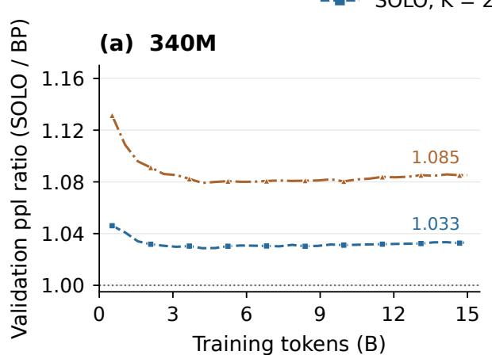

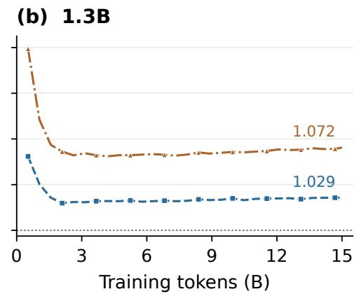  
Figure 6: Relative perplexity gap during pretraining, SOLO validation perplexity divided by $\mathrm { B P ^ { \bullet } s }$ at the same token count, for (a) 340M and (b) 1.3B, from the single-seed training-log curves of Figure 2; ratios at matching evaluation steps, no interpolation or smoothing; the dotted line is parity.

Vision. The vision sweep trains ResNet-32 on CIFAR-10, CIFAR-100, and Tiny-ImageNet, split into fifteen modules, each non-terminal module with a four-layer convolutional auxiliary head with a 64-dimensional readout; single-seed ResNet-50 runs repeat the three datasets at a readout width of 2048. Per-dataset schedules differ, so comparisons across datasets are qualitative.

## D Readout sweeps

Tables 4 and 5 give the numbers behind Figure 3; Table 6 extends the vision comparison to ImageNet-1k.

Head depth. Table 8 and Figure 7 vary the depth H of the auxiliary head on the sweep of Table 4 at three sizes, for SOLO and PRIV; H=0 is a linear readout and $\bar { H = 8 } ,$ run at 256M only, an over-deep control. Section 3.4 reads the gap to BP and the advantage of sharing off these numbers.

Table 4: Language readout sweep across scale, WikiText-103 validation perplexity (word-level, V=32,768, one epoch, K=4), three-seed means. The sub-row gives $V / d ,$ which falls from 85 to 26 from left to right. The shaded BP row is the end-to-end reference, and bold marks the best local-learning variant per column. Rows run from worst to best, an order that holds at every size. The two PRETRAINED variants freeze the terminal readout of a fully trained SOLO or BP model (pre-SOLO and pre-BP in Figure 3); they are diagnostic probes, not training methods.
<table><tr><td rowspan="2">Variant</td><td colspan="6">Validation perplexity ↓</td></tr><tr><td>40M V/d=85</td><td>64M 64</td><td>128M 43</td><td>256M 32</td><td>340M 32</td><td>512M 26</td></tr><tr><td>BP (end-to-end)</td><td>67.08</td><td>54.91</td><td>44.46</td><td>40.47</td><td>39.51</td><td>36.81</td></tr><tr><td>RAND</td><td>98.88</td><td>81.63</td><td>63.76</td><td>55.34</td><td>54.12</td><td>48.99</td></tr><tr><td>PRIV</td><td>75.34</td><td>62.89</td><td>51.10</td><td>44.57</td><td>43.82</td><td>40.24</td></tr><tr><td>SOLO</td><td>70.62</td><td>59.09</td><td>48.01</td><td>42.49</td><td>41.48</td><td>38.01</td></tr><tr><td>PRETRAINED, BP</td><td>67.40</td><td>56.51</td><td>46.44</td><td>42.02</td><td>40.90</td><td>37.99</td></tr><tr><td>PRETRAINED, SOLO</td><td>65.37</td><td>55.03</td><td>45.41</td><td>40.28</td><td>39.33</td><td>36.36</td></tr></table>

Table 5: Vision readout sweep, terminal test accuracy (%), backbones split into 15 gradient-isolated modules. ResNet-32 columns are three-seed means; ResNet-50 columns are single-seed scouting runs (†). Datasets are ordered by classes per unit width, C/d within each backbone. Bold: best per column. ‡Trainable parameters over BP on ResNet-50 Tiny-ImageNet, millions.
<table><tr><td rowspan="2">Variant</td><td colspan="3">ResNet-32 (d=64)</td><td colspan="3"> $\mathbf { R e s N e t - 5 0 ( } d \mathbf { = } 2 0 4 8 \mathbf { ) } ^ { \dagger }$ </td><td rowspan="2"> $\Delta \mathbf { p a r } ^ { \ddag }$  R50, M</td></tr><tr><td>C-10 C/d=0.16</td><td>C-100 1.56</td><td>Tiny-IN 3.1</td><td>C-10 0.005</td><td>C-100 0.049</td><td>Tiny-IN 0.098</td></tr><tr><td>RAND</td><td>92.53</td><td>67.28</td><td>44.30</td><td>95.80</td><td>78.56</td><td>63.54</td><td>+41.1</td></tr><tr><td>PRIV</td><td>92.51</td><td>67.97</td><td>47.35</td><td>95.71</td><td>79.43</td><td>63.60</td><td>+47.2</td></tr><tr><td>SOLO</td><td>92.57</td><td>67.22</td><td>46.14</td><td>95.34</td><td>79.13</td><td>63.31</td><td>+41.1</td></tr><tr><td>PRETRAINED SOLO</td><td>92.27</td><td>67.63</td><td>46.48</td><td>95.43</td><td>79.55</td><td>64.59</td><td>+41.1</td></tr></table>

Table 6: ImageNet-1k $( 2 2 4 ^ { 2 } .$ , batch 256, 90 epochs; mean over three seeds). Memory change is relative to the end-to-end baseline of the same backbone. Bold: best per column within each backbone.
<table><tr><td>Backbone</td><td>Variant</td><td>Split</td><td>Top-1</td><td>Peak mem</td></tr><tr><td rowspan="5">ResNet-50</td><td>BP</td><td></td><td>76.49</td><td>25.3 GB</td></tr><tr><td>PRIV, K=2</td><td>[5|11]</td><td>76.27</td><td>18.3 GB (-28%)</td></tr><tr><td>SOLO, K=2</td><td>[5|11]</td><td>76.22</td><td>18.3 GB (-28%)</td></tr><tr><td>PRIV, K=4</td><td>[2, 3, 6, 5]</td><td>75.15</td><td>14.0 GB (-45%)</td></tr><tr><td>SOLO, K=4</td><td>[2, 3, 6, 5]</td><td>75.03</td><td>13.7 GB (-45%)</td></tr><tr><td rowspan="3">ResNet-101</td><td>BP</td><td></td><td>76.87</td><td>42.3 GB</td></tr><tr><td>PRIV, K=4</td><td>[3, 6, 11, 13]</td><td>76.61</td><td>16.6 GB (-61%)</td></tr><tr><td>SOLO, K=4</td><td>[3, 6, 11, 13]</td><td>76.56</td><td>15.6 GB (−63%)</td></tr></table>

Table 8: Auxiliary-head depth on the WikiText-103 sweep, validation perplexity (word-level, $V { = } 3 2 { , } 7 6 8$ , one epoch, K=4, seed 42) with H blocks per head; H=8 is run at 256M only, as an over-deep control. The last column is the end-to-end BP reference of Table 4. This grid re-reads the shared copy every step, whereas the sweep of Table 4 refreshed it every 100 steps, so the H=2 cells differ slightly. Bold: best local variant per row pair.
<table><tr><td>Scale</td><td>Variant</td><td>H=0</td><td> $H { = } 1$ </td><td> $H { = } 2$ </td><td> $H { = } 3$ </td><td> $H { = } 5$ </td><td> $H { = } 8$ </td><td>BP</td></tr><tr><td rowspan="2"> $4 0 \mathbf { M } , 8 \mathrm { L } , d = 3 8 4$ </td><td>SOLO</td><td>76.13</td><td>72.06</td><td>70.05</td><td>69.58</td><td>70.10</td><td></td><td>67.08</td></tr><tr><td>PRIV</td><td>81.75</td><td>76.48</td><td>75.36</td><td>73.77</td><td>73.91</td><td></td><td></td></tr><tr><td rowspan="2">128M, 16L, d=768</td><td>SOLO</td><td>49.93</td><td>48.31</td><td>47.38</td><td>46.75</td><td>46.22</td><td></td><td>44.46</td></tr><tr><td>PRIV</td><td>52.98</td><td>51.87</td><td>51.06</td><td>49.90</td><td>49.44</td><td></td><td></td></tr><tr><td rowspan="2">256M, 16L, d=1024</td><td>SOLO</td><td>43.95</td><td>42.90</td><td>41.95</td><td>41.56</td><td>41.18</td><td>41.48</td><td>40.47</td></tr><tr><td>PRIV</td><td>46.94</td><td>45.54</td><td>44.54</td><td>44.10</td><td>43.87</td><td>44.12</td><td></td></tr></table>

Table 7: Language points of Figure 3b: the random-readout penalty, $\left( \mathrm { p p l } _ { \mathrm { R A N D } } / \mathrm { p p l } _ { \mathrm { P R I V } } - 1 \right) \times 1 0 0 \%$ , against the number of output classes per unit width, $V / d .$ (a) Width sweep at fixed vocabulary, the runs of Table 4. (b) Vocabulary sweep at fixed width; for this sweep we report only the penalty. The two sweeps meet at V/d=64 (d=512, V=32,768), where they give 29.80 and 29.72%, a difference within run-to-run noise.
<table><tr><td colspan="5">(a) Width sweep, V=32,768</td></tr><tr><td colspan="5">Perplexity</td></tr><tr><td>Size</td><td>d V/d</td><td>RAND</td><td>PRIV</td><td>Penalty (%)</td></tr><tr><td>40M</td><td>384 85.3</td><td>98.88</td><td>75.34</td><td>31.25</td></tr><tr><td>64M</td><td>512 64.0</td><td>81.63</td><td>62.89</td><td>29.80</td></tr><tr><td>128M</td><td>768 42.7</td><td>63.76</td><td>51.10</td><td>24.77</td></tr><tr><td>256M</td><td>1024 32.0</td><td>55.34</td><td>44.57</td><td>24.16</td></tr><tr><td>340M</td><td>1024 32.0</td><td>54.12</td><td>43.82</td><td>23.51</td></tr><tr><td>512M</td><td>1280 25.6</td><td>48.99</td><td>40.24</td><td>21.74</td></tr></table>

<table><tr><td colspan="2">(b) Vocabulary sweep, d=512</td></tr><tr><td>V V/d</td><td>Penalty (%)</td></tr><tr><td>8,192</td><td>16 19.95</td></tr><tr><td>32,768</td><td>64 29.72</td></tr><tr><td>65,536 128</td><td>32.05</td></tr><tr><td>131,072 256</td><td>33.16</td></tr></table>

(a) PRIV is worse than SOLO at every head depth and every scale  
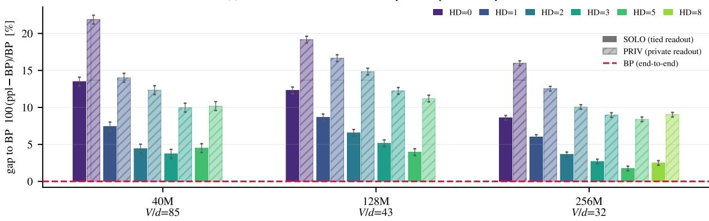

(b) the SOLO advantage survives every head depth (all bars > 0)  
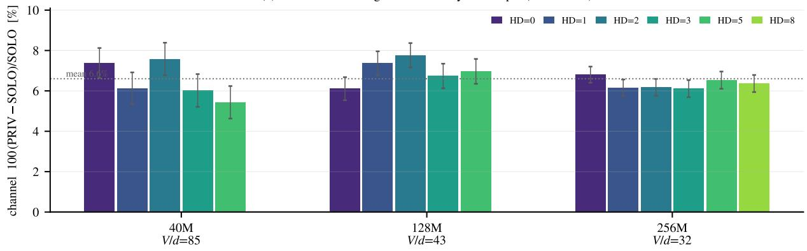  
Figure 7: Auxiliary-head depth on the WikiText-103 sweep (Table 8). (a) Gap to BP, $1 0 0 \mathrm { ( p p l - B P ) / B P }$ , for SOLO (solid) and PRIV (hatched) at $H \in \{ 0 , 1 , 2 , 3 , 5 \}$ , and 8 at 256M. (b) Advantage of the shared readout, $1 0 0 \mathrm { ( P R I V - S O L O ) / S O L O } ;$ ; the dotted line is the mean over the sixteen cells, 6.6%. Bars are seed-42 runs; error bars are the seed-to-seed standard deviation estimated from paired second-seed runs, 0.40 ppl at 40M and 0.12 at 256M, and inferred at 128M.

Content and basis of the readout. Table 9 and Figure 8 separate what the shared readout provides. ROT multiplies the terminal readout by a fixed random orthogonal matrix $R _ { k }$ per module. The rotation keeps the content and the range of the readout and changes only its basis. It costs 13.3 perplexity at H=0 and 7.4 at H=2 over SOLO. RSHARE shares one frozen random matrix across heads and beats RAND, one matrix per head, by 12.0 and 4.2. Each effect exceeds the paired-seed standard deviation of 0.40 by more than ten times. The gap between PRIV and SOLO stays at 5.5 and 5.3, so the advantage of sharing in Table 8 does not depend on head depth.

The parameter-space cosine between the local and the end-to-end gradient orders the variants as the perplexities do, and its pattern across modules shows why the basis matters. Each module adds its update to its input, so its output keeps the basis of the modules before it. The first module also learns the token embedding and can set its own basis. Under ROT at H=0, its local gradient aligns with the end-to-end gradient as well as under SOLO (0.80 for both). Modules 2 and 3 inherit a basis that their heads do not share, and their alignment falls to 0.67 and 0.61, against 0.78 and 0.84 under SOLO. Two head blocks learn part of the translation between bases and halve both the perplexity cost and the alignment gap on the last module, from 0.23 to 0.11. The heads cannot undo $R _ { k }$ exactly, since each ends in a skip connection and an RMSNorm with an element-wise gain, and neither commutes with $R _ { k }$

Table 9: Content and basis of the auxiliary readout on the 40M WikiText-103 sweep (8 layers, d=384, V=32,768, one epoch, K=4, copy refreshed every step; seed 42, paired-seed σ=0.40 ppl). Terminal validation perplexity with $H { = } 0$ and H=2 head blocks, and the parameter-space cosine between the local and the end-to-end gradient of modules 1 to 3 at the end of training. ROT uses the terminal readout in a fixed random orthogonal basis $R _ { k }$ per module, so its range equals SOLO’s; RSHARE freezes one random matrix shared by all heads, RAND one per head. †PRIV at H=2 is the matched run of Table 8; the two scripts reproduce each other to within 0.04 ppl.
<table><tr><td rowspan="2">Arm Readout of module</td><td rowspan="2"> $k < K$ </td><td colspan="2">Perplexity ↓</td><td colspan="2">Parameter-space cosine ↑</td></tr><tr><td>H=0</td><td>H=2</td><td>H=0</td><td>H=2</td></tr><tr><td>BP</td><td>end-to-end, no auxiliary readout</td><td>67.08</td><td></td><td></td><td></td></tr><tr><td>SOLO</td><td> $\mathrm { s g } ( { \bar { W } } )$  , shared, live copy</td><td>76.16</td><td>70.08</td><td>.80 / .78 / .84</td><td>.68 / .80 / .90</td></tr><tr><td>PRIV</td><td> $W _ { k } ,$  private, learned</td><td>81.71</td><td>75.36†</td><td>.75 / .64 / .57</td><td></td></tr><tr><td>ROT</td><td> $\mathrm { s g } ( \bar { W } ) R _ { k } ,$  same content, per-module basis</td><td>89.41</td><td>77.44</td><td>.80 / .67 / .61</td><td>.63 / .74 / .79</td></tr><tr><td>RSHARE</td><td> $W _ { \mathrm { r a n d } }$  , frozen, shared by all heads</td><td>104.36</td><td>94.62</td><td>.50 / .31 / .28</td><td>.46 / .48 / .37</td></tr><tr><td>RAND</td><td> $W _ { \mathrm { r a n d } , k } ,$  frozen, one per head</td><td>116.36</td><td>98.79</td><td>.49 / .33 / .30</td><td>.45 / .47 / .36</td></tr></table>

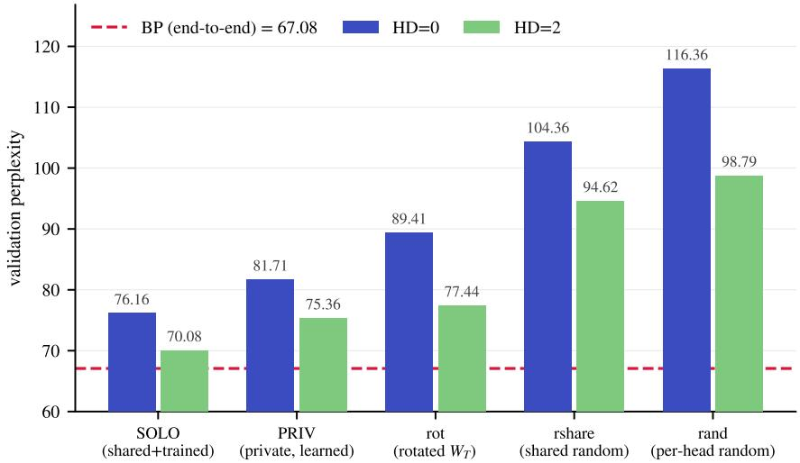  
Figure 8: The five variants of Table 9 at H=0 and H=2, terminal validation perplexity on the 40M sweep; BP dashed. A per-module basis of the same readout (ROT) costs 13 ppl at H=0 and 7 at H=2; one shared random matrix (RSHARE) beats independent ones (RAND) by 12 and 4.

## E Every depth of a SOLO model decodes

Table 10 sets the auxiliary exits of the 1.3B models against the logit lens applied to the BP model at the same depths. A SOLO exit decodes through the head and shared readout it was trained with; the lens applies the BP terminal norm and unembedding to an intermediate state that was never trained to be read.

Exits at the token level. Figure 9 shows what the exits of Table 10 do on one passage, word by word. The 6-layer exit already reads most of the passage; each deeper exit changes a handful of words, most often the ones that depend on an earlier mention, and the terminal differs from the end-to-end model on a few positions rather than everywhere.

Target The Roman Empire was an empire of the Roman Empire , formed by the Emperor Augustus in the Roman Empire and the Emperor Justinian in the Byzantine Empire . It was the largest empire in the world and the second most powerful empire in the Roman Empire.

Table 10: Exits against the logit lens at 1.3B, ppl by depth, mean over three seeds; 24L is the terminal. On the battery (geometric-mean ppl over 27 prompts) every SOLO exit is within 2 ppl of its terminal and the BP lens is not; SOLO exits match the BP terminal’s top prediction 71 to 75% of the time, the lens 16 to 51%.
<table><tr><td rowspan="2">Variants</td><td colspan="4">WikiText ppl</td><td colspan="4">Battery ppl</td></tr><tr><td>8L</td><td>14L</td><td>20L</td><td>24L</td><td>8L</td><td>14L</td><td>20L</td><td>24L</td></tr><tr><td>SOLO, K=4</td><td>28.20</td><td>24.83</td><td>24.17</td><td>23.59</td><td>29.4</td><td>28.4</td><td>29.0</td><td>27.8</td></tr><tr><td>SOLO, K=2</td><td></td><td>24.16</td><td></td><td>22.29</td><td></td><td>22.6</td><td></td><td>21.7</td></tr><tr><td>BP logit lens</td><td></td><td></td><td></td><td>21.61</td><td>1347</td><td>290</td><td>45.9</td><td>19.5</td></tr></table>

BP The Catholic was a empire that the Roman Empire by the Roman Constant in Empire, the Roman Constant in the Roman   
Empire The was the largest empire in the world at the most largest powerful in in the world Empire   
SOLO The Catholic, a empire of the Roman Empire, and by the Roman Augustus Empire . the Emperor August in the Roman   
Empire The was the largest empire in the Roman, the largest largest powerful empire in the world Empire   
The Catholic the empire that the Roman Empire which by the Roman Augustus Empire theEmperorAugustin the   
Roman Empire wasthe first empire in the world the largest largest powerful empire inthe world Empire   
18L The Catholic , the empire that the Roman Empire which by the Emperor Augustus Empire , the Emperor Augustin the   
Roman Empire . was the first empire in the world the largest largest powerful empire in the world Empire   
24L The Catholic , the empire that the Roman Empire , which by theRoman Augustus Empire the Emperor Tra in the Roman   
Empire . was the first empire in the world , the largestlargestpowerful empire in the worldEmpire   
∆ log p(target): decrease increase · darker = larger change · outline = changed prediction italic = incorrect  
Figure 9: One passage decoded word by word by every exit of the 1.3B K=4 model. A row gives one readout’s next-word prediction, the word itself when correct and the prediction in italics when not; shading is the change in log p of the true word from the previous exit (legend in the figure). Rows are labeled by model depth; 6, 12, and 18 layers are the 8L, 14L, and 20L exits of Table 10.

Terminal-readout probes on the sweep. Figure 10 asks whether the shared readout reaches the module outputs themselves rather than only the outputs of the auxiliary heads. On the 40M sweep of Figure 4, the output of every module under each variant is decoded with that variant’s own terminal readout, bypassing the auxiliary heads, and compared with BP’s logit lens at the matched depth. Under SOLO and under the under PRETRAINED (SOLO) the intermediate states are already decodable by the terminal readout, with top-1 agreement with BP of about 0.6 to 0.75 from the from the first module on, whereas under PRIV, RAND, and the PRETRAINED (BP) agreement stays near 0.1 to 0.25 until the final module, where all variants meet. The module outputs, not only the head outputs, are thus written in a form the terminal readout reads.

## F Refresh period of the shared readout

Table 11: Refresh period S of the shared readout copy (WikiText-103 recipe of Table 3, K=4, one epoch of 7242 steps; mean over three seeds). Subword perplexity with word-level in parentheses; exits listed shallow to deep; ens is the exit ensemble. ∆ is the change in validation perplexity relative to S=1.
<table><tr><td>S</td><td>refreshes/epoch</td><td>val ppl</td><td>exits, shallow to deep</td><td>ens</td><td>test ppl</td><td>∆ val</td></tr><tr><td>1</td><td>7242</td><td>65.93 (129.0)</td><td>71.14 / 68.12 / 67.43 / 65.93</td><td>66.70</td><td>67.55</td><td></td></tr><tr><td>10</td><td>724</td><td>65.69 (128.5)</td><td>71.00 / 67.88 / 67.17 / 65.69</td><td>66.48</td><td>67.33</td><td>-0.24 (−0.4%)</td></tr><tr><td>50</td><td>145</td><td>66.16 (129.5)</td><td>71.44 / 68.26 / 67.59 / 66.16</td><td>66.92</td><td>67.73</td><td>+0.23 (+0.3%)</td></tr><tr><td>100</td><td>72</td><td>67.16 (131.8)</td><td>72.19 / 69.21 / 68.59 / 67.16</td><td>67.91</td><td>68.71</td><td>+1.23 (+1.9%)</td></tr><tr><td>200</td><td>36</td><td>67.93 (133.6)</td><td>73.04 / 69.99 / 69.35 / 67.93</td><td>68.67</td><td>69.48</td><td>+2.00 (+3.0%)</td></tr></table>

With S=1 the copy is re-read after every terminal update; with S>1 it is frozen and refreshed every S optimizer steps, the form whose throughput Section 3.3 measures across devices. Table 11 varies S on the WikiText-103 recipe of Table 3 with K=4 and two-block heads over one epoch of 7242 steps, three seeds per setting. Up to S=50 the terminal stays within 0.3 perplexity of per-step reading, and S=10 is marginally the best setting; S=100 costs 1.9% and S=200 3.0%, with every exit moving together. The cost of a period is set by how far the readout moves within it. Figure 11 tracks the relative change $\dot { r _ { S } ( t ) } = \| W ( t ) - W ( t - \dot { S } ) \| _ { F } / \| W ( t - \dot { S } ) \| _ { F }$ along the same runs. After warmup the

(a) prediction agreement  
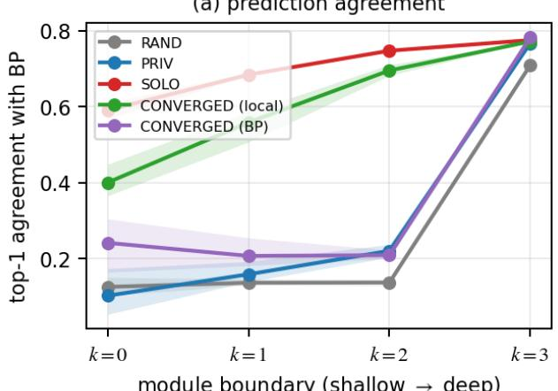  
module boundary (shallow → deep)

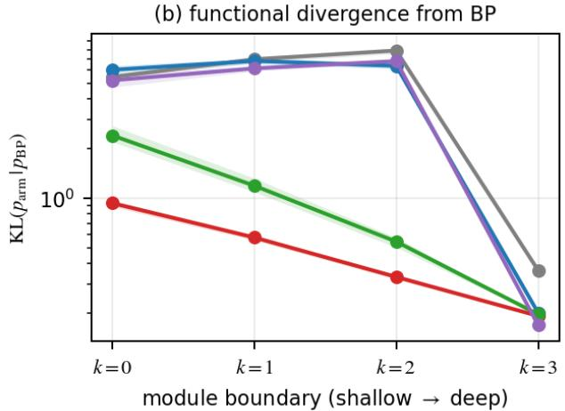  
Figure 10: Terminal-readout probes across depth on the 40M WikiText-103 sweep. The output of each module is decoded with the model’s own terminal readout and compared with BP’s logit-lens distribution at the matched depth. (a) Top-1 prediction agreement. (b) $\mathrm { K L } ( p \| p _ { \mathrm { B P } } )$ on a logarithmic scale. Means over three seeds; bands are the minimum and maximum across seeds. SOLO and PRETRAINED (local) agree more and diverge less at intermediate boundaries than PRIV, RAND, and PRETRAINED (BP); the differences narrow at the terminal modules (k=3). The probe bypasses the auxiliary heads, so it measures terminal-readout decoding of intermediate representations, not the predictions of the trained auxiliary exits.

readout moves by about 0.1% of its norm per step, 1% over 10 steps, 3% over 50, 5% over 100, and 10% over 200, and every curve falls with the cosine schedule. Set against Table 11, a copy is harmless while it lags the readout by up to about 3% of its norm and costs 1.9% at 5%. The pretraining runs of Table 2 re-read the copy at every step (S=1) and pay none of this cost; the periods measured across devices in Section 3.3, 50 steps and below, lie in the harmless range. In Figure 4 the alignment of the live copy coincides with that of a the pretrained copy after the first two thousand steps, so the tolerance to a delayed copy should grow rather than shrink over a longer run.

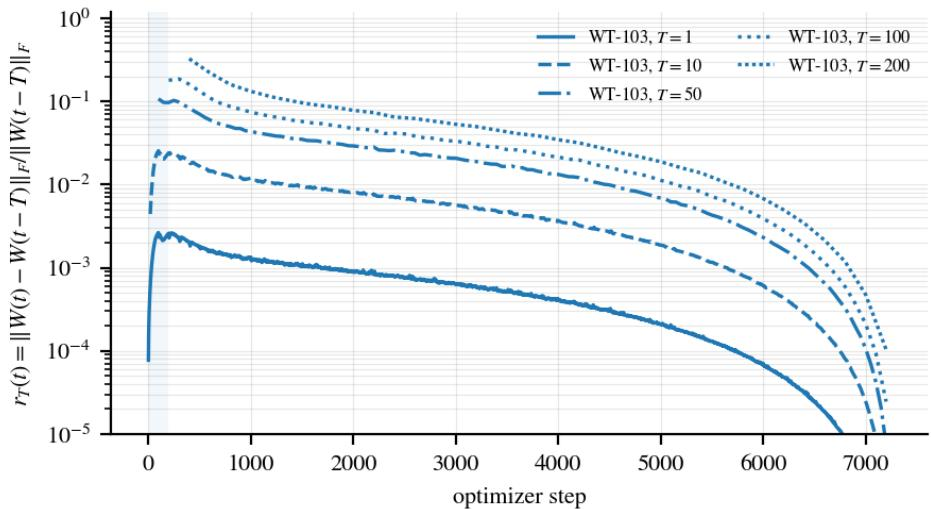  
Figure 11: Relative change of the terminal readout over one refresh period, $\boldsymbol { r } _ { S } ( t ) = \Vert \boldsymbol { W } ( t ) - \boldsymbol { W } ( t { - } S ) \Vert _ { F } / \Vert \boldsymbol { W } ( t { - } S ) \Vert _ { F } ,$ along the WikiText-103 runs of Table 11 for $S \in \{ 1 , 1 0 , 5 0 , 1 0 0 , \hat { 2 } 0 0 \}$ . The shaded band is the learning-rate warmup; the fall at the end follows the cosine decay.

## G Systems measurements

Against data-parallel backpropagation. This appendix compares SOLO and BP when both use data parallelism. BP is replicated (DDP) at 340M and 1.3B and sharded (FSDP) at 2B, as in Table 2, and we also measure FSDP at the smaller sizes. SOLO is replicated at every size. Figure 12 follows the four configurations from 130M to 2B parameters on four A100s at a matched micro-batch. Against DDP, the throughput ratio of SOLO rises with width, to 0.88 at K=2 and 0.76 at K=4 by 1.3B, because the auxiliary heads are a fixed cost per module that shrinks relative to the model. At 2B, replicated DDP no longer fits an 80 GB device. FSDP is the stronger baseline. It overtakes DDP from 560M and fits 2B in 48 GB at 62k tokens per second. Against FSDP, SOLO runs at 0.78 to 0.88 of the throughput from 340M up with K=2 (0.86 at 2B) and at 0.64 to 0.74 with K=4. SOLO still uses 11 to 25% less memory at K=2 and 35 to 48% less at K=4, because each module releases its activations after its local backward pass.

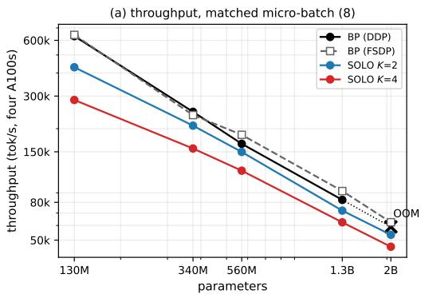

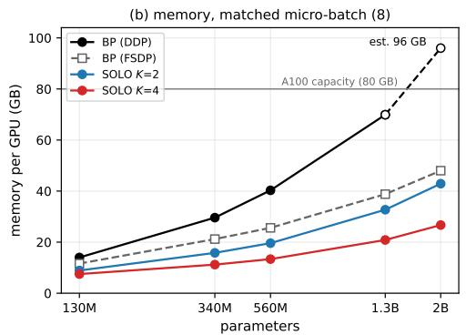  
Figure 12: Throughput (a) and per-GPU memory (b) against model size on four A100s at matched micro-batch 8, for replicated (DDP) and sharded (FSDP) backpropagation and the SOLO pipelines. DDP does not fit at 2B; its memory there is extrapolated (dashed).

Setup. Figure 12 measures five Transformer++ shapes, from 130M parameters (12 layers, width 768) to 2B (24 layers, width 2560), on four A100s with fused execution, micro-batch 8 per device for DDP and per pipeline stage, an effective batch of 524,288 tokens, and marginal throughput over steps 50 to 150. The throughput ratio rises from about 0.68 to 0.90 at K=2 and from about 0.45 to 0.76 at K=4. At 2B replicated DDP allocates 75.6 GB, requests a further 1.95 GB, and fails on an 80 GB device; the estimated 96 GB requirement is the reference for the 2B memory savings, and the pipeline trains in 27 to 43 GB. With each configuration at its own memory-optimal micro-batch, DDP fits 2B at micro-batch 2 and runs at 46.6k tokens per second in 55.2 GB; the K=2 pipeline runs at 53.4k in 42.9 GB and the K=4 pipeline at 44.9k in 26.7 GB. Table 2 reports the sweep values at 340M and 2B and the training-run values at 1.3B. The FSDP configuration uses PyTorch fully sharded data parallelism with full sharding and per-block wrapping, bf16 all-gather with fp32 reduction, compiled execution, and the same optimizer, schedule, micro-batch, effective batch, and 150-step probe as every other configuration; a same-day DDP rerun at 560M reproduced the earlier sweep value to within 1%. Memory for DDP and FSDP is the rank-0 peak of a training step, which is symmetric across ranks; memory for the pipelines is the four-GPU peak average.

Two baselines at 1.3B. At 1.3B, Table 2 reports the training runs, whose DDP baseline used micro-batch 4, 76k tokens per second in 48.9 GB; against it the K=2 pipeline (77k, 32.7 GB) is at parity in throughput with 33% less memory. At micro-batch 8, DDP runs at 82.5k tokens per second in 69.9 GB; against it the K=2 pipeline saves 53% of memory at 0.88 of the throughput and the K=4 pipeline 70% at 0.76. FSDP at 1.3B runs at 92.1k tokens per second in 38.8 GB; against it the K=2 pipeline saves 16% of memory at 0.78 of the throughput and the K=4 pipeline 46% at 0.68. All describe the same pipelines against different baselines. At 340M the two setup agree, 15.8 against 29.6 GB at 0.84 of DDP’s throughput.

Interconnect. On NVLink, DDP’s gradient all-reduce costs under 1% of a step and the pipeline pays for its auxiliary heads with nothing to win back. Table 12 removes the RDMA-class link: NCCL is forced onto its socket transport, the path it takes on any network without RDMA, over the loopback interface of one node. The model, GPUs per configuration, execution, and batch are those of the 340M runs. Leaving NVLink costs DDP 72% of its throughput and the pipeline 8%, so the ratio inverts to 2.2, because DDP’s per-step all-reduce moves the full gradient in one synchronized burst of latency-sensitive exchanges, whereas the pipeline’s traffic is a few large activation transfers per micro-batch overlapped with compute. This is a single-node emulation; the same-split comparison against 1F1B under a slowed link is Table 18.

What is not measured. FSDP is measured on NVLink only. Off NVLink it does not change the comparison, since sharding moves a parameter-sized all-gather and reduce-scatter across the link every step, at least as much traffic as DDP’s all-reduce, so the inversion of Table 12 would only grow; we did not run it. Pipelined backpropagation, which trades the 2B memory cliff for 1F1B bubbles, is compared with SOLO under the same split at two, six, and eight stages in Appendix H, on a different model shape from the one measured here.

Table 12: Throughput off RDMA-class interconnect (340M, four GPUs per arm), a single-node emulation. Ratio is pipeline over DDP; busy is the fraction of wall-clock the pipeline stages spend computing. The NVLink row is this session’s own reference and differs from the sweep of Table 2 (247k, 156k) by 1 to 4%.
<table><tr><td>Interconnect</td><td>BP-DDP (tok/s)</td><td>SOLO K=4 (tok/s)</td><td>ratio</td><td>pipeline busy</td></tr><tr><td>NVLink (reference)</td><td>250k</td><td>163k</td><td>0.65</td><td>0.96</td></tr><tr><td>socket transport, unshaped</td><td>69.2k</td><td>150.1k</td><td>2.2</td><td>0.92</td></tr></table>

Table 13: Training FLOPs per token. One forward pass counts as one unit, so a block costs 3b with $b = 1 2 d ^ { 2 } + 2 T d$ multiply-accumulate operations per token, the terminal readout costs $3 r$ with $r = V d ,$ , and an auxiliary readout costs $2 r ,$ since its weights are a detached copy and no gradient with respect to them is computed. One multiply-accumulate is two FLOPs. Embedding lookups are excluded. The SlimPajama rows use context 2048 and a 32k vocabulary and assume two-block auxiliary heads; the last row is the configuration of Table 15. The auxiliary blocks, not the readouts, account for most of the difference.
<table><tr><td></td><td></td><td></td><td></td><td></td><td colspan="2">BP</td><td colspan="3">SOLO</td><td></td></tr><tr><td>model</td><td>L</td><td></td><td>d K</td><td>H</td><td>total</td><td>layers</td><td>total</td><td>aux. blocks</td><td>readouts</td><td>ρ</td></tr><tr><td>340M</td><td>24</td><td>1024</td><td>2</td><td>2</td><td>2.61</td><td>2.42</td><td>2.94</td><td>0.20</td><td>0.33</td><td>1.127</td></tr><tr><td>1.3B</td><td>24</td><td>2048</td><td>2</td><td>2</td><td>8.85</td><td>8.46</td><td>9.82</td><td>0.70</td><td>0.66</td><td>1.109</td></tr><tr><td>2B</td><td>24</td><td>2560</td><td>4</td><td>2</td><td>13.33</td><td>12.83</td><td>17.52</td><td>3.21</td><td>1.48</td><td>1.315</td></tr><tr><td>96-block 1.2B</td><td>96</td><td>1024</td><td>8</td><td>1</td><td>8.51</td><td>8.46</td><td>9.36</td><td>0.62</td><td>0.29</td><td>1.100</td></tr></table>

All totals in GFLOPs per token. ρ is defined in (6). It is sensitive to the head depth and to the number of modules: for the 340M shape it is 1.089, 1.266 and 1.621 at $K { = } 2 ,$ 4, 8 with $H { = } 1$ , and 1.127, 1.382 and 1.891 with $H { = } 2$

FLOPs and utilization. Table 13 counts training FLOPs per token for BP and for ${ \mathrm { S O L O } } ,$ separating the model layers from the auxiliary blocks, terminal included, and Table 14 converts the measured throughput into model FLOPs utilization (MFU). The speed comparison is against DDP and FSDP as PyTorch provides them, so the denominator is plain BP rather than an implementation that hides communication behind compute.

## H Comparison with pipeline-parallel backpropagation

Appendix G compares SOLO with backpropagation under data parallelism. Update locking costs most in pipeline parallelism, where each stage waits for the gradient of the next. This appendix therefore gives both methods the same split into the same number of stages, so that the only difference is whether a stage waits for that gradient.

Setup. A model of L=96 blocks with d=1024, T=1024 and V=8192, about 1.2B parameters, is split evenly across p stages of one A100-80GB each, on one node with NVLink. Micro-batches hold $\bar { B } { = } 4$ sequences and an optimizer step consumes M of them, so both methods use the same global batch and the same number of optimizer steps. SOLO places $K { = } p$ modules with one auxiliary block per head $( \breve { H } = 1 )$ and a shared readout refreshed by a broadcast from the last stage every $S$ steps. Training is bf16 with AdamW on synthetic Zipf-distributed tokens. We report the throughput of the slowest stage, peak memory from the allocator, and inter-stage traffic computed from tensor shapes. Throughput is measured over 10 steps after 5 warm-up steps, and over 50 steps for the configurations whose readout broadcast has to fall inside the window. Repeated measurements of the same cell agree to within 0.4% for 1F1B and SOLO and 0.7% for recomputation. The BP baselines are the 1F1B schedule (Narayanan et al., 2019), the interleaved schedule (VPP) with v virtual stages per GPU (Narayanan et al., 2021), and 1F1B with activation recomputation of every block. VPP uses the $\mathrm { P y }$ Torch implementation, and so does a second 1F1B baseline, used as a check on our own.

Cost model. Per token, a block costs $b = 1 2 d ^ { 2 } + 2 T d$ multiply-accumulate operations and a full-vocabulary readout costs $r = V d$ . We count one forward pass as one unit, so a block costs 3b and the terminal readout costs 3r. An auxiliary readout costs $2 r .$ , because its weights are a detached copy of the terminal readout and no gradient with respect to them is computed. Hence $W _ { \mathrm { B P } } = 3 L b \bar { + }$ 3r and $W _ { \mathrm { S O L O } } = \dot { 3 } \dot { ( } L + ( K - 1 ) H ) b + ( 2 K + 1 ) \dot { r }$

Table 14: Model FLOPs utilization of the measured runs, computed from Table 13 and the reported throughput, with 312 TFLOPs as the bf16 peak of an A100 and throughput summed over the devices of a run. The SOLO row uses its own FLOPs per token, so the auxiliary heads count as work rather than as overhead. The 96-block configuration used for the pipeline comparison runs at about a third of the utilization of the pretraining runs, because its blocks are narrow and its module is not compiled; its absolute throughput is therefore not representative and only ratios within a row of Table 15 should be read.
<table><tr><td>run</td><td>parallelism</td><td>GPUs</td><td>tok/s</td><td>GFLOPs/token</td><td>MFU</td></tr><tr><td rowspan="3">1.3B, micro-batch 8 1.3B 2B</td><td>BP, replicated DP</td><td>4</td><td>82,500</td><td>8.85</td><td>58.5%</td></tr><tr><td>BP, sharded DP</td><td>4</td><td>92,100</td><td>8.85</td><td>65.3%</td></tr><tr><td>BP, sharded DP</td><td>4</td><td>62,000</td><td>13.33</td><td>66.2%</td></tr><tr><td>96-block 1.2B</td><td>BP, replicated DP</td><td>8</td><td>65,471</td><td>8.51</td><td>22.3%</td></tr><tr><td>96-block 1.2B</td><td>BP, 1F1B pipeline</td><td>8</td><td>59,441</td><td>8.51</td><td>20.3%</td></tr><tr><td>96-block 1.2B</td><td> ${ \mathrm { S O L O } } ,$  pipeline</td><td>8</td><td>59,770</td><td>9.36</td><td>22.4%</td></tr></table>

Table 15: Throughput under the same split, relative to 1F1B at the same p and M. Values above one mean the method is faster than 1F1B. Configuration (A): L=96, d=1024, T=1024, V=8192, H=1, micro-batch 4, $K { = } p .$ . A dash means the configuration was not run at that p. The data-parallel runs use the same p devices as full replicas with the same global batch, and are included as context rather than as a same-split comparison.
<table><tr><td rowspan="2">method</td><td colspan="2"> $p { = } 2$ </td><td colspan="2"> $p { = } 4$ </td><td colspan="2"> $p { = } 6$ </td><td colspan="2"> $p { = } 8$ </td></tr><tr><td>M=24</td><td>72</td><td>24</td><td>72</td><td>24</td><td>72</td><td>24</td><td>72</td></tr><tr><td>BP, 1F1B</td><td>1.000</td><td>1.000</td><td>1.000</td><td>1.000</td><td>1.000</td><td>1.000</td><td>1.000</td><td>1.000</td></tr><tr><td>BP, 1F1B (PyTorch)</td><td></td><td></td><td></td><td></td><td>一</td><td></td><td>0.980</td><td>0.978</td></tr><tr><td>BP, VPP-2</td><td></td><td></td><td>1.017</td><td>0.982</td><td></td><td></td><td>1.067</td><td>0.990</td></tr><tr><td>BP, VPP-4</td><td></td><td></td><td>1.040</td><td>0.956</td><td></td><td></td><td>1.062</td><td>0.859</td></tr><tr><td>BP, 1F1B + recomputation</td><td>0.766</td><td>0.768</td><td>一</td><td></td><td>0.750</td><td>0.745</td><td>0.748</td><td>0.736</td></tr><tr><td>SOLO, S=50</td><td>1.018</td><td>0.992</td><td>1.072</td><td>0.994</td><td>1.123</td><td>0.998</td><td>1.179</td><td>1.006</td></tr><tr><td>SOLO, S=10</td><td></td><td></td><td>1.070</td><td>0.993</td><td>1</td><td></td><td>1.172</td><td>1.006</td></tr><tr><td>SOLO, S=1</td><td></td><td>一</td><td>1.038</td><td>0.983</td><td></td><td>一</td><td>1.098</td><td>0.981</td></tr><tr><td>BP, data parallel</td><td>1.032</td><td>1.011</td><td>一</td><td>一</td><td>1.175</td><td>1.068</td><td>1.246</td><td>1.097</td></tr><tr><td>SOLO, data parallel</td><td>1.020</td><td>0.999</td><td>一</td><td></td><td>1.108</td><td>1.008</td><td>1.147</td><td>1.011</td></tr></table>

Proposition 2 (Work ratio). Let $\gamma \triangleq r / ( L b ) = V / \big ( L ( 1 2 d + 2 T ) \big )$ be the cost ofone readout relative to the L blocks. Then

$$
\rho \triangleq \frac { W _ { \mathrm { S O L O } } } { W _ { \mathrm { B P } } } = \frac { 1 + \frac { ( K - 1 ) H } { L } + \frac { ( 2 K + 1 ) \gamma } { 3 } } { 1 + \gamma } , \qquad \rho - 1 = ( K - 1 ) \frac { H / L + 2 \gamma / 3 } { 1 + \gamma } .\tag{6}
$$

Both terms in $\rho - 1$ become small for large models. The readout term scales $\operatorname { a s } \gamma \sim V / ( L d )$ . The head term $( K - 1 ) H / L$ is approximately $H / ( L / p )$ , the number of auxiliary blocks divided by the number of blocks per stage. Width does not appear in the head term, because model blocks and auxiliary blocks have the same cost at any width. To check the model without pipeline effects we measured each stage separately with communication turned off and added the times. At L=24 with d, T and V as above, $K { = } p { = } 2$ and micro-batch 4, the two stages take $0 . 1 2 9 7 + 0 . 1 3 1 7 = 0 . 2 6 1 4 \mathrm { s }$ for backpropagation, $0 . 1 3 3 0 + 0 . 1 4 2 8 = \bar { 0 } . 2 7 5 9 \mathrm { s }$ for SOLO with H=1 and $0 . { \overset { \vartriangle } { 1 } } 4 3 6 + 0 . 1 4 2 8 = 0 . 2 8 6 4$ s with H=2, giving ρ = 1.0552 and 1.0953 against predicted 1.0562 and 1.0969, a difference of at most 0.2%.

Condition for SOLO to be faster. With M micro-batches per step the 1F1B schedule is idle for a fraction $\beta =$ $( p - 1 ) / ( M + p - 1 )$ of the time, because stage s cannot run the backward pass of one micro-batch until stage s+1 has returned the gradient of the previous one. A SOLO stage runs its backward pass without waiting, so its pipeline has no idle time of this kind. SOLO has higher steady-state throughput when $\rho < \bar { 1 } / ( 1 - \beta ) = 1 + ( \bar { p ^ { . } } - 1 ) / \bar { M } . \mathrm { W i t h } p = K$ the factor K − 1 in (6) cancels and the condition becomes

$$
M < M ^ { \star } = \frac { 1 + \gamma } { H / L + 2 \gamma / 3 } \ : \ : \longrightarrow \ : \ : \frac { L } { H } ,\tag{7}
$$

which does not depend on the number of stages. For the configuration above (7) gives $M ^ { \star } = 6 9 . 9 .$

Throughput. Table 15 and Figure 15 give the measurements. We fit $\rho$ on the M=72 column of the SOLO row with S=50 and predict the M=24 column, which no fit uses. The fitted values are ρ = 1.022, 1.048, 1.072 and 1.091 at

Table 16: Memory and communication at $p { = } 8$ and M=24, configuration (A). Peak memory is given for the most loaded device and as the mean over the eight devices. Activations are the peak minus resident state minus gradients. Traffic is computed from tensor shapes; the pipeline runs scale linearly with M and the data-parallel runs do not. The VPP and PyTorch 1F1B runs send activations in fp32, which doubles their traffic relative to an implementation that sends bf16.
<table><tr><td>method</td><td></td><td>peak GB, max peak GB, mean act. GB, max act. GB, mean</td><td></td><td></td><td>traffic GiB/step</td></tr><tr><td>BP, 1F1B</td><td>19.8</td><td>12.1</td><td>17.4</td><td>9.8</td><td>2.6</td></tr><tr><td>BP, 1F1B  $( { \mathrm { P y T o r c h } } )$ </td><td>20.1</td><td>13.2</td><td>17.3</td><td>9.7</td><td>5.3</td></tr><tr><td>BP, VPP-2</td><td>28.8</td><td>21.6</td><td>24.8</td><td>17.0</td><td>11.3</td></tr><tr><td>BP, VPP-4</td><td>27.0</td><td>一</td><td>20.9</td><td>一</td><td>23.3</td></tr><tr><td>BP, 1F1B + recomputation</td><td>4.5</td><td>3.6</td><td>2.1</td><td>1.3</td><td>2.6</td></tr><tr><td>SOLO, S=50</td><td>5.1</td><td>5.0</td><td>2.5</td><td>2.5</td><td>1.3</td></tr><tr><td>BP, data parallel</td><td>40.3</td><td>40.3</td><td>17.4</td><td>17.4</td><td>64.0</td></tr><tr><td>SOLO, data parallel</td><td>27.1</td><td>27.1</td><td>2.5</td><td>2.5</td><td>68.6</td></tr></table>

$p = 2 , 4$ , 6 and 8; the predicted ratios at $M { = } 2 4$ are $1 . 0 1 9 , 1 . 0 7 3 , 1 . 1 2 7$ and 1.184 against measured 1.018, 1.072, 1.123 and 1.179. The per-module cost $( \rho - 1 ) / ( p - 1 )$ is 0.022, 0.016, 0.014 and 0.013, against 0.0143 from (6); at $p { = } 2$ the single auxiliary module absorbs all fixed overhead. The measured crossover $M ^ { \star } = \bar { ( } p - 1 ) / ( \rho - 1 )$ is 45, 63, 69 and $^ { 7 7 , }$ close to the $p \mathrm { - }$ independent value 69.9 of (7) except at $p { = } 2 .$ . As a check on the schedule itself, the ratio of 1F1B throughput between the two values of M agrees with $M / ( M + p - 1 )$ to within $0 . 3 \%$ at every $p ,$ and the PyTorch 1F1B implementation runs at 0.98 of ours, so the baseline is not weakened by our implementation.  
Measured against the fastest pipeline schedule in each cell rather than against 1F1B alone, SOLO with $S { = } 1 0$ is 10% faster at $p { = } 8 .$ , M=24 and 0.6% faster at $M { = } 7 2 ;$ ; with S=1 it is 2.9% faster and 1.9% slower. VPP reaches 0.95 of the throughput its own bubble model predicts at $v { = } 2$ and 0.88 at v=4 for $M { = } 2 4$ , and 0.80 at v=4 for $M { = } 7 2$ , where it sends 69.8 GiB per step. An implementation that reached the bubble model would match SOLO at M=24, so the margin at small M depends on how efficiently interleaving is implemented.

Large M and a second model shape. Figure 13 extends Table 15 in two directions. At p=8 on the 96-block model, the ratio to 1F1B continues past the crossover to 0.966 at M=128 and 0.943 at M=256 with the copy refreshed every 50 steps (0.953 and 0.936 every step), on the curve $( M + p - 1 ) / ( \rho M )$ with $\rho$ fitted at $M { = } 7 2$ alone, and approaches $1 / \rho = 0 . 9 2$ from above, so the penalty at large M is bounded by the arithmetic overhead. The 24-block model of the pretraining runs (d=2048, T=2048, V =32k, H=2, micro-batch 1) has 12 to 3 blocks per stage as p grows from 2 to 8 and loses with $p \colon 0 . 9 1 , 0 . 8 7 ,$ and 0.82 of 1F1B at M=24 and 0.88, 0.81, and 0.72 at $M { = } 7 2$ . The per-module cost $( \rho - 1 ) / ( p - 1 )$ recovered from these ratios is 0.08 to 0.15, against 0.013 to 0.022 on the 96-block model, and a one-block head at p=4 brings the ratio back to 0.98. The sign of the same-split comparison is thus set by the number of blocks per stage relative to the head, as (7) predicts; on shallow models the memory saving and the micro-batch lever of Table 17 are what remain. Figure 13c measures the per-module cost directly, under data parallelism, where there is no bubble and $\rho$ is the ratio of the two throughputs, for $K { = } 2 , 4 , 8$ and H=1, 2, 4 on the 24-block model at micro-batch 8. The nine cells fall on one line, $0 . 0 1 0 + 0 . 0 4 0 H$ , whose slope equals the head-block term of (6), $( 1 / L ) / ( 1 + \gamma ) = 0 . 0 4 0$ and whose intercept is a third of the readout term, 0.030, so the extra readouts cost less than their FLOP count. The values recovered from the pipeline throughput ratios at p=4 have a slope 29% higher; the difference is scheduling and implementation overhead, not arithmetic.

Memory. The 1F1B schedule keeps $p - s + 1$ micro-batches in progress on stage $s = 1 , \ldots , p ,$ so that stage stores $( p - s + 1 ) ( L / p ) a$ activations, where a is the activation of one block for one micro-batch. The first stage therefore stores $L a ,$ as much as the unsplit model, for any $p ,$ and the mean over stages is ${ \textstyle \frac { p + 1 } { 2 p } } L a .$ . A SOLO stage holds one micro-batch, that is $( L / p ) a$ plus its auxiliary head. Table 16 matches this. The activation peak of 1F1B is 17.25, 17.29, 17.33 and 17.37 GB a $\cdot p = 2 , 4 , 6$ and 8, and equals the 17.39 GB of a single data-parallel replica; its ratio to SOLO is 1.94, 3.73, 5.40 and 6.95, against $p$ from the model, and the ratio of the means at $p { = } 8$ is 3.95 against $( p + 1 ) / 2 = 4 . 5$ The difference is the auxiliary head, which also raises the resident state of SOLO by 0.2 GB per device. Peak memory on the most loaded device falls from 26.4, 22.0, 20.5 and 19.8 GB to 18.3, 9.5, 6.6 and 5.1 GB. Memory does not change with M for either method, except in the PyTorch runs, which hold one fp32 message per micro-batch.

Recomputation. Backpropagation can reach SOLO’s activation memory by recomputing. Recomputing every block leaves only block inputs, which brings the activation peak to 2.1 GB, below SOLO, at 0.74 to 0.77 of 1F1B throughput across p and $M ,$ against $3 ( 1 + \gamma ) / ( \bar { 4 } + 3 \gamma ) = 0 . 7 5 1$ from the cost model. SOLO is then 1.29 to 1.57 times faster than this baseline while using 13 to 35% more memory than it. Interpolating between the two backpropagation end points to the peak memory of SOLO, which assumes that time and memory are linear in the fraction of recomputed blocks, gives SOLO a factor of 1.19, 1.47 and 1.55 at $M { = } 2 4$ and 1.16, 1.31 and 1.35 at $M { = } 7 2$ for $p = 2 ,$ , 6 and 8. Limiting the number of micro-batches in flight is the other way to save memory at the cost of utilization, and a worse one: holding $k \leq p$ of them gives activation $\bar { k } ( L / p ) q$ and throughput about $k / p$ of the bubble-free rate, so k=1 reaches the memory of SOLO at 16% of the throughput of 1F1B at $p { = } 8$ , M=24.

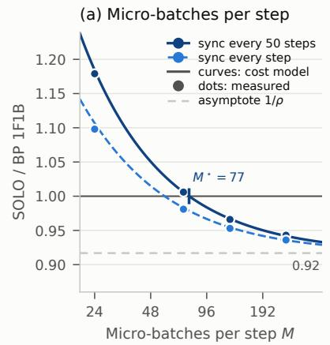

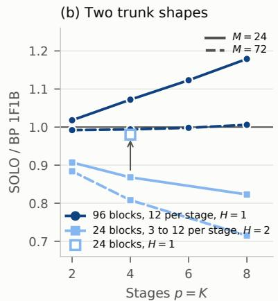

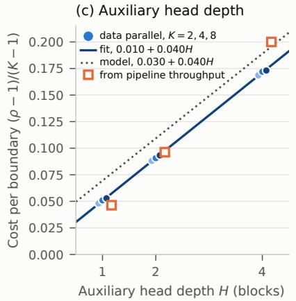  
Figure 13: Same-split throughput and the per-module cost. (a) SOLO relative to 1F1B against micro-batches per step at $p { = } 8$ on the 96-block model of configuration (A); curves are the cost model with $\rho$ fitted at $M { = } 7 2$ , dots are measured, the dashed curve adds the synchronization cost of a broadcast at every step, the gray line is $1 / \rho .$ (b) The same ratio against the number of stages at $M { = } 2 4$ (solid) and 72 (dashed), for the 96-block model with $H { = } 1$ and for the 24-block model of the pretraining runs (d=2048, $\scriptstyle { T = 2 0 4 8 }$ $V { = } 3 2 \mathbf { k } .$ , micro-batch 1) with $H { = } 2 ;$ the open marker is the 24-block model with $H { = } 1$ at $p { = } 4$ . (c) Cost per module $( \rho - 1 ) / ( K - 1 )$ against auxiliary-head depth under data parallelism on the 24-block model (micro-batch 8, $M { = } 2 4 )$ , for $K = 2 , 4 , 8 ;$ ; solid line the fit, dotted line the FLOP model of (6), open squares the values recovered from pipeline throughput at $p { = } 4$

Micro-batch sweep. Table 17 and Figure 14 hold the global batch fixed at 96 sequences per step, 98,304 tokens, at p=8 and vary the micro-batch from 1 to 32 sequences, so $M { = } 9 6 / B$ . Under 1F1B a larger micro-batch multiplies the activations in flight and shrinks M, which widens the bubble $( p - 1 ) / ( M + p - 1 )$ from 23% at M=24 to 70% at $M { = } 3 ;$ its throughput peaks at micro-batch 4, 50.6k tokens per second in 19.8 GB, and falls to 25.4k at micro-batch 32. A SOLO stage holds one micro-batch and has no bubble, so its throughput rises with the micro-batch until the kernels saturate, to 72.9k at micro-batch 16 in 11.6 GB and 72.4k at micro-batch 32 in 20.3 GB. At each method’s best micro-batch SOLO is 1.44× faster, and at equal peak memory, 20 GB, 1.43×. With the copy refreshed every step the improvement is smaller, 60.4k at micro-batch $^ { 8 , }$ since the stages align at every refresh. SOLO’s throughput times the 1F1B bubble factor $M / ( M + p - 1 )$ , the dotted line in Figure 14b, tracks the 1F1B curve to within the auxiliary-head overhead, so the fall of 1F1B is the bubble and not arithmetic. The activation memory that gradient isolation frees therefore converts into throughput through the micro-batch at a fixed global batch.

Table 17: Micro-batch sweep at a fixed global batch of 96 sequences per step, configuration $( \mathrm { A } ) , p { = } 8$ . Peak memory on the most loaded device; SOLO with the copy refreshed every 50 steps and every step.
<table><tr><td colspan="2"></td><td colspan="2">BP, 1F1B</td><td colspan="3">SOLO</td></tr><tr><td>B</td><td>M</td><td>tok/s</td><td>peak GB</td><td> $\mathrm { \ t o k / s , \ } S \mathrm { = } 5 0$ </td><td> $\mathrm { \ t o k / s } , S { = } 1$ </td><td>peak GB</td></tr><tr><td>1</td><td>96</td><td>21,980</td><td>8.4</td><td>20,272</td><td>20,994</td><td>3.5</td></tr><tr><td>2</td><td>48</td><td>43,125</td><td>12.3</td><td>40,784</td><td>41,218</td><td>4.0</td></tr><tr><td>4</td><td>24</td><td>50,576</td><td>19.8</td><td>59,333</td><td>55,537</td><td>5.1</td></tr><tr><td>8</td><td>12</td><td>48,042</td><td>34.7</td><td>68,545</td><td>60,361</td><td>7.3</td></tr><tr><td>16</td><td>6</td><td>37,943</td><td>48.5</td><td>72,877</td><td>57,387</td><td>11.6</td></tr><tr><td>32</td><td>3</td><td>25,374</td><td>47.9</td><td>72,361</td><td>47,615</td><td>20.3</td></tr></table>

Readout synchronization. The broadcast sends $( p - 1 ) ( V d + V )$ numbers every $S$ steps, 2.2 MiB per step at $S { = } 5 0$ and 112 MiB at $S { = } 1$ in this configuration, against 2688 MiB of activations. Its cost is not the transfer but the alignment it forces, since the stages, which otherwise run one forward pass apart, must reach the same step. The throughput lost relative to S=50 follows $0 . 2 4 \left( p - 1 \right) / ( M S )$ , fitted through the origin on eight points. $\mathrm { { A t } } \ S { = } 1$ the measured loss is

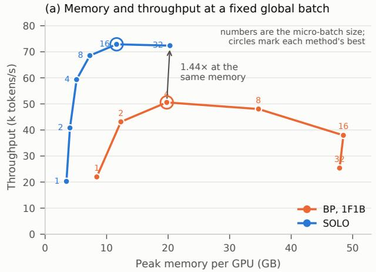

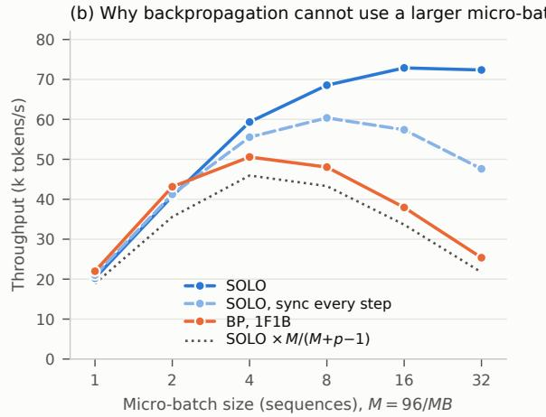  
Figure 14: Micro-batch sweep of Table 17. (a) Throughput against peak memory per GPU, points labeled by micro-batch size, circles at each method’s best. (b) Throughput against micro-batch size; the dotted line is SOLO’s throughput times the 1F1B bubble factor $M / ( M + p - 1 )$

Table 18: Throughput for different link speeds, configuration (B): $L { = } 2 4 , H { = } 2 , M { = } 8 , p { = } 2$ , each method using the fastest of the layer splits 11:13, 12:12 and 13:11. This configuration differs from Table 15 and the two should not be compared directly. The rows from 10 Gb/s down shape the loopback link of a single node with tc tbf. At the two slowest settings the measured transfer rate is 88 to 92% of the nominal rate.
<table><tr><td>link</td><td>nominal MB/s</td><td>1F1B</td><td>SOLO</td><td>SOLO / 1F1B</td></tr><tr><td>NVLink</td><td>n/a</td><td>57,685</td><td>59,606</td><td>1.033</td></tr><tr><td>socket</td><td>n/a</td><td>55,679</td><td>59,363</td><td>1.066</td></tr><tr><td>10 Gb/s</td><td>1250</td><td>52,667</td><td>59,318</td><td>1.126</td></tr><tr><td>5 Gb/s</td><td>625</td><td>48,401</td><td>59,328</td><td>1.226</td></tr><tr><td>2 Gb/s</td><td>250</td><td>38,989</td><td>59,213</td><td>1.519</td></tr><tr><td>1 Gb/s</td><td>125</td><td>28,084</td><td>58,901</td><td>2.097</td></tr><tr><td>0.5 Gb/s</td><td>62</td><td>14,568</td><td>30,351</td><td>2.083</td></tr></table>

3.2% and 1.1% at $p { = } 4$ and 6.9% and 2.4% at $p { = } 8$ for $M { = } 2 4$ and $M { = } 7 2 ;$ at $S { = } 1 0$ it is at most 0.6%. SOLO sends less than 1F1B in total when $S M B T > V$ . In this configuration that holds by three orders of magnitude, but for V=128k, d=4096, T=4096, B=1, M=32 and $p { = } 8$ the two totals are equal at $S { \stackrel { - } { = } } 1$ , and SOLO sends 0.55 of 1F1B at S=10.

Communication and link speed. Across the same $p - 1$ links between stages, SOLO sends activations once and 1F1B sends them twice, so SOLO sends half as much for any p, and a quarter to a ninth of VPP at equal precision, which places v virtual stages per GPU and multiplies traffic by $( v p - 1 ) / ( p - 1 )$ (a ninth to an eighteenth against the PyTorch implementation, which sends fp32). This comparison applies to pipeline parallelism only. Data-parallel backpropagation exchanges gradients sized by the parameter count, 64 GiB per step at $p { = } 8$ here, independent of M. Table 18 measures the effect of a slower link in configuration (B). The throughput of backpropagation falls as the link slows, while SOLO changes by less than 1.2% down to 1 Gb/s, where the ratio reaches 2.10, the ratio of the bytes sent. Beyond a node, the removed dependency matters more than the halved byte count: a SOLO stage never waits for a gradient, so its throughput is flat where 1F1B’s has halved. Cross-node pipelines, the regime this points to, are not run here.

What the pipeline saves and what gradient isolation saves. Under the same split the parameter and optimizer memory of the two methods is the same, up to the auxiliary heads, so the pipeline accounts for that part of the saving reported in Section 3.3 and gradient isolation accounts for the activation part. Within pipeline parallelism, backpropagation must give up activation memory or utilization, through recomputation, through the number of microbatches in flight, or through an uneven split, and SOLO faces no such choice. Against data parallelism the picture is different. On this node data-parallel backpropagation is the fastest configuration at every $p ,$ at 40.3 GB per device and 64 GiB of gradient traffic per step, and SOLO under data parallelism runs at $1 / \rho$ of its throughput, with the same activation saving as under a pipeline.

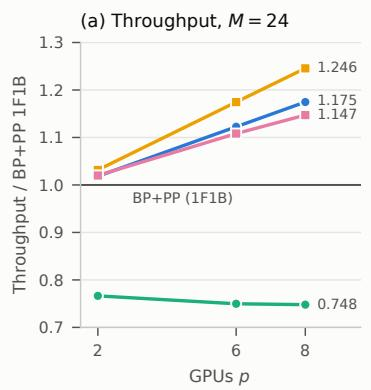  
(d) Pipeline schedules, p = 4

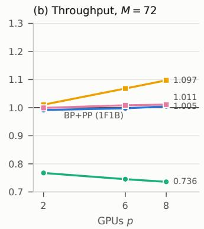

(c) Bubble model and crossover m ⋆  
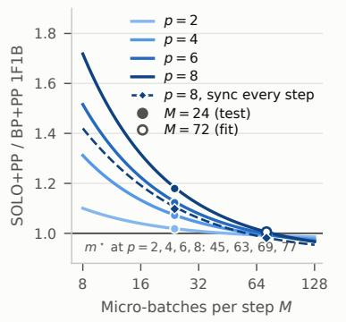

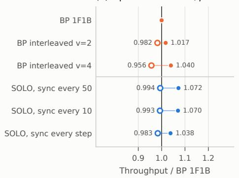  
(g) Max vs mean GPU, p = 8

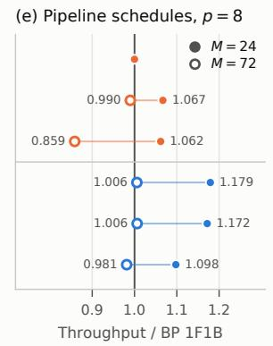

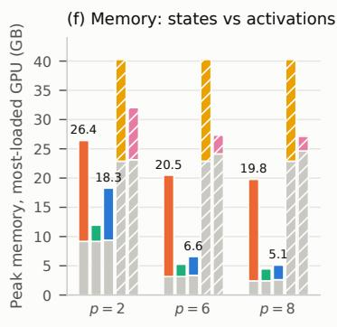

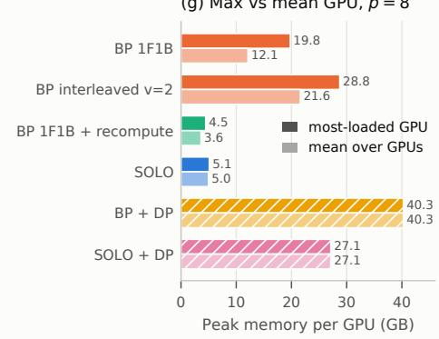

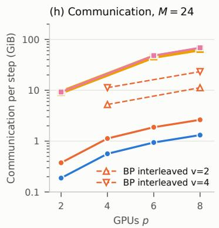

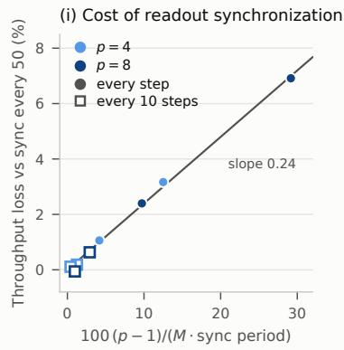  
Figure 15: Same-split comparison, configuration (A). (a, b) Throughput relative to 1F1B against the number of stages at $M { = } 2 4$ and $M { = } 7 2 .$ . (c) The bubble model of (7) against the number of micro-batches, with $\rho$ fitted at $M { = } 7 2$ and the $M { = } 2 4$ points held out; the dashed line adds the synchronization cost at S=1. (d, e) Throughput of each schedule at $p { = } 4$ and $p { = } 8 .$ (f) Peak memory on the most loaded device, split into resident state and activations. (g) Peak memory at $p { = } 8 ,$ most loaded device against the mean over devices. (h) Traffic per step. (i) Throughput lost to readout synchronization against $( p - 1 ) / ( M \breve { S } )$ , with the fitted slope.

Limitations. All measurements are on one node with NVLink and on synthetic tokens, and the model is the one of configuration (A) rather than the models of Section 3.1. Traffic is computed from tensor shapes rather than measured on the wire. We did not measure zero-bubble schedules (Qi et al., 2024), which split each backward pass into its input-gradient and weight-gradient halves and fill the bubble with the latter; their ZB-H1 variant keeps the activation memory of 1F1B at about a third of its bubble, and ZB-H2 removes the bubble at higher memory. On the bubble model with the fitted $\rho , \mathrm { Z B - H 1 }$ would be about level with SOLO at $M { = } 2 4$ and ahead of it at $M { = } 7 2$ . The VPP baseline uses the PyTorch implementation, which sends $\mathrm { f p } 3 2$ and reaches 0.80 to 0.95 of its own bubble model, so its throughput is a lower bound on what interleaving can achieve. The benefit depends on the shape of the model through (6), and Table 19 gives $M ^ { \star }$ for common shapes. A shallow model split into many stages is the hardest case: at $L { = } 2 4 , d { = } 2 0 4 8 , T { = } 2 0 4 8 .$

Table 19: Crossover $M ^ { \star }$ from (7) for common model shapes. SOLO is faster than 1F1B when the number of microbatches per step is below $M ^ { \star }$ . The value does not depend on the number of stages. Computed, not measured.
<table><tr><td>parameters</td><td> $L$ </td><td> $d$ </td><td> $T$ </td><td> $V$ </td><td> $M ^ { \star } , H { = } 1$ </td><td> $M ^ { \star } , H { = } 2$ </td></tr><tr><td>7B</td><td>32</td><td>4096</td><td>4096</td><td>32,000</td><td>23.7</td><td>13.7</td></tr><tr><td>8B</td><td>32</td><td>4096</td><td>8192</td><td>128,256</td><td>14.7</td><td>10.3</td></tr><tr><td>70B</td><td>80</td><td>8192</td><td>4096</td><td>32,000</td><td>66.9</td><td>36.5</td></tr><tr><td>70B</td><td>80</td><td>8192</td><td>8192</td><td>128,256</td><td>46.5</td><td>29.5</td></tr></table>

$V { = } 3 2 \mathbf { k }$ and $H { = } 1 .$ , eight modules give $\rho = 1 . 4 9$ and $M ^ { \star } = 1 4$ , against $\rho = 1 . 0 9$ and $M ^ { \star } = 7 0$ for the 96-block model measured here. Finally, this appendix reports systems costs only. The perplexity gap of Section 3.1 is not included in any of these ratios.