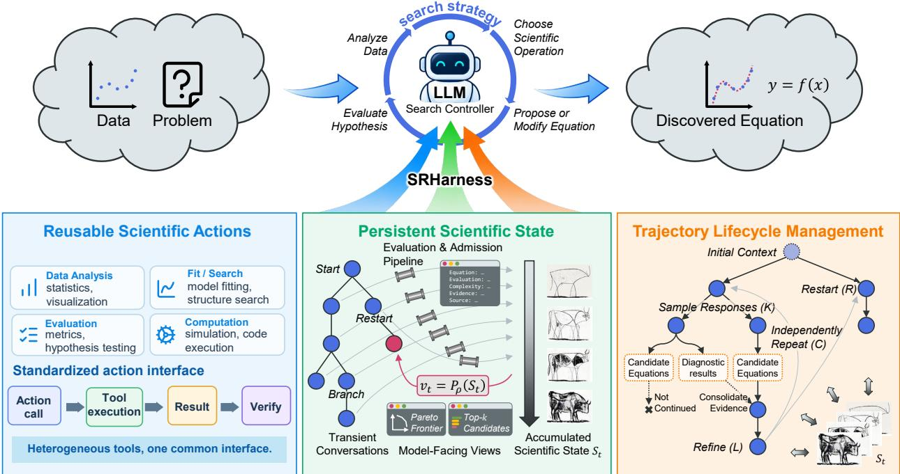
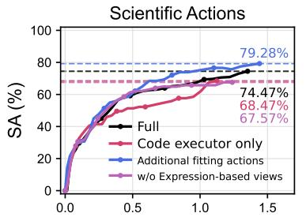
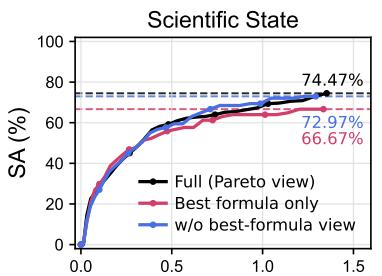
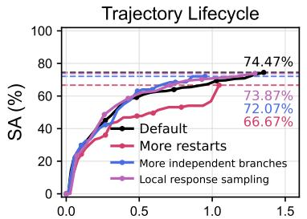
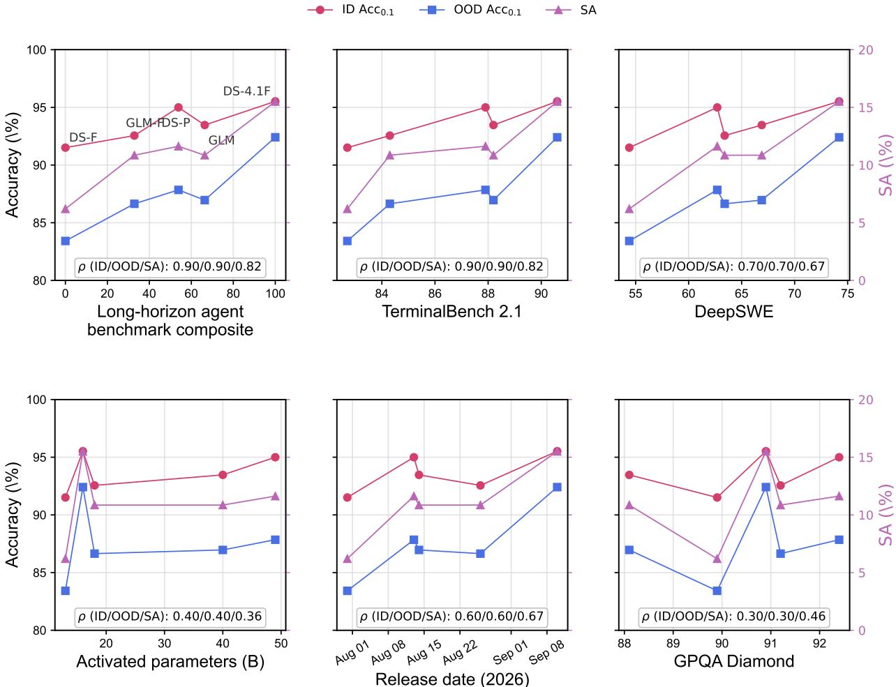
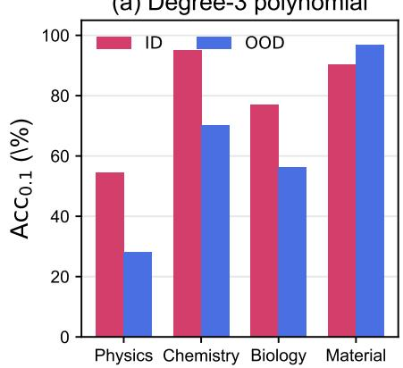
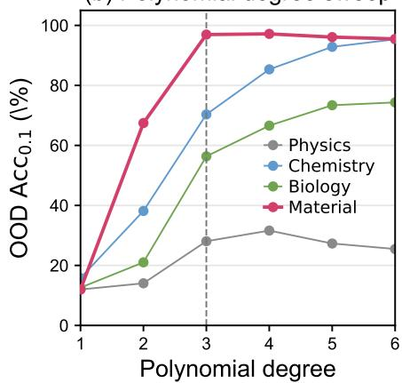
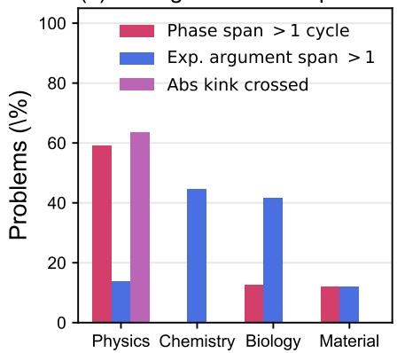
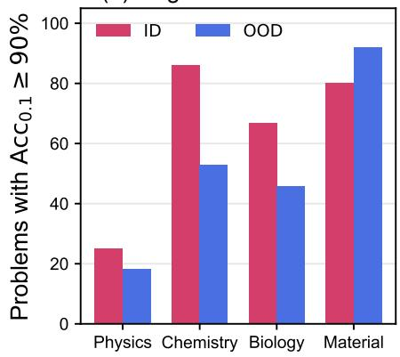

# SRHARNESS: A HARNESS FOR AGENTIC SYMBOLIC REGRESSION

Zihan Yu1, Shixuan Zhou1, Hao Huang2, Jingtao Ding3∗, Yong Li1∗ 1Department of Electronic Engineering, BNRist, Tsinghua University, Beijing, China 2College of AI, Tsinghua University, Beijing, China 3Department of Earth System Science, Tsinghua University, Beijing, China yuzh23@mails.tsinghua.edu.cn, {dingjingtao, liyong07}@tsinghua.edu.cn

## ABSTRACT

Recent agentic symbolic regression approaches increasingly rely on large language models to analyze data, select scientific operations, and refine hypotheses over long search trajectories. In such systems, performance depends not only on the underlying model and search strategy, but also on the runtime infrastructure that supports scientific search. We introduce SRHarness, a domain-specific harness for agentic symbolic regression built around three mechanisms: composable scientific actions that provide a common interface over raw, transformed, and candidate-derived quantities; persistent scientific state that retains evaluated hypotheses and exposes compact model-facing views; and trajectory lifecycle management that coordinates continuation, branching, restart, and termination. On LLM-SRBench, SRHarness consistently improves both numerical generalization and symbolic recovery under matched LLM backbones. With DeepSeek-v4-flash-0731, it achieves 93.69% symbolic accuracy on LSR-Transform, compared with 62.16% for SR-Scientist, and retains 72.97% accuracy on an anonymized variant that removes scientific descriptions and variable semantics, versus 39.64% for SR-Scientist. Under the same DeepSeek-v4-flash-0731 backbone, SRHarness also substantially outperforms Codex (72.97% vs. 20.72%) and reaches performance comparable to Codex with GPT-5.5, while simply providing Codex with the same scientific tools does not reproduce this advantage. These results show that effective agentic symbolic regression depends not only on models or tools, but also on structured runtime support for organizing scientific actions, accumulated hypotheses, and long-horizon search.

## 1 Introduction

Symbolic regression (SR) aims to discover interpretable mathematical expressions that explain observed data. Traditional SR methods design algorithms, such as genetic programming, to search the combinatorial space of mathematical expressions Koza (1994), while recent LLM-based approaches leverage scientific knowledge, reasoning, and code generation to guide the discovery of mathematical expressions from data Ma et al. (2024); Grayeli et al. (2024); Shojaee et al. (2025a); Guo et al. (2025). Recent agentic SR methods take this idea further, elevating the LLM from a component that proposes or modifies equations within a predefined search procedure to a controller that autonomously selects scientific operations based on intermediate evidence Xia et al. (2026); Yang et al. (2026); Wang et al. (2026). As LLMs play a more active role in long-horizon equation discovery, system behavior increasingly depends not only on the underlying model and search strategy, but also on the surrounding execution infrastructure.

This infrastructure is commonly described as an agent harness, which has recently received increasing attention as the layer that supports and governs agent execution over extended interactions Meng et al. (2026). For symbolic regression, such a harness must support the agent in analyzing observed data through different scientific operations while maintaining an evolving space of competing scientific hypotheses. In this process, candidate equations obtained through heterogeneous operations should share consistent representations and evaluation semantics so that they can be compared directly, while remaining available to be revisited, revised, and reused as new evidence emerges. Supporting such hypothesis-centric scientific search places domain-specific requirements on the harness, including composable scientific operations, persistent hypothesis and evidence management, and lifecycle management across long-running search trajectories. Although existing agentic SR systems already implement parts of this support, these mechanisms are typically designed around their respective search strategies rather than treated as an independent layer, so comparisons across systems may conflate differences in search strategy with differences in the supporting harness Zhang et al. (2026c).

To address these requirements, we introduce SRHarness, a domain-specific harness for agentic symbolic regression that provides reusable runtime support without prescribing a particular search strategy. First, composable scientific actions separate agent-specified scientific arguments from harness-managed execution context and support expression based views over raw, transformed, and candidate-derived quantities, allowing heterogeneous analysis, fitting, and search procedures to operate through a common interface and evaluation semantics. Second, persistent scientific state retains evaluated hypotheses and their supporting evidence outside the transient conversation while exposing compact model-facing views of the accumulated search state. Third, trajectory lifecycle management coordinates continuation, branching, restart, and termination while preserving useful scientific information across long-horizon search. Together, these mechanisms make runtime support explicit, separating recurring execution, state-management, and trajectory-management concerns from the scientific search logic.

We evaluate SRHarness on LLM-SRBench and find consistent improvements over representative LLM-based and agentic SR methods under matched LLM backbones. On LSR-Synth, with DeepSeek-v4-flash-0731, SRHarness reaches 78.00%, 78.87%, 87.09%, and 96.00% OOD accuracy on physics, chemistry, biology, and materials science, respectively. On the complementary LSR-Transform track, which places greater emphasis on exact symbolic recovery, SRHarness achieves 93.69% symbolic accuracy, compared with 62.16% for SR-Scientist under the same backbone. We further construct LSR-Transform-Anon, which removes scientific descriptions and variable semantics while preserving the numerical observations; SRHarness still achieves 72.97% symbolic accuracy, compared with 39.64% for SR-Scientist. To further isolate the role of the harness, we compare against Codex under the same DeepSeek-v4-flash-0731 backbone, where SRHarness achieves 72.97% symbolic accuracy versus 20.72% for Codex, and reaches performance comparable to Codex with GPT-5.5 (68.47%). Providing the same scientific tools to Codex does not reproduce this advantage. Together, these results show that effective agentic symbolic regression depends not only on the underlying model or available tools, but also on structured runtime support that organizes scientific actions, accumulated hypotheses, and long-horizon search.

## 2 Related Work

LLM-guided symbolic regression. LLM-guided SR incorporates large language models as components of algorithmic search procedures. LLM-SR uses the LLM as a mutation operator, proposing new candidates from high-scoring equations within an evolutionary loop Shojaee et al. (2025a). LaSR uses LLM-based mutation and crossover on a learned concept library Grayeli et al. (2024). SGA combines LLM-based structural search with numerical parameter optimization Ma et al. (2024). SR-LLM uses retrieved knowledge to generate symbolic building blocks Guo et al. (2025). Other methods improve proposal context: DrSR combines data with past generations Wang et al. (2025), ProAug supplies code-based data analysis Liu et al. (2026), and IGSR uses term-level influence scores to guide LLM proposals within Monte Carlo tree search Saveliev et al. (2026). In these methods, the LLM serves as a component that proposes or modifies equations within a predefined search procedure. Recent agentic systems like SRHarness instead treat the LLM as a controller that executes a designed search strategy by autonomously choosing scientific operations based on intermediate evidence Xia et al. (2026); Yang et al. (2026); Wang et al. (2026).

Agentic symbolic regression. Recent systems extend the LLM’s role from proposing equations to controlling analysis and search. SR-Scientist lets the agent write code to analyze observations, propose equations, and refine them through evaluation feedback Xia et al. (2026). KeplerAgent follows a scientist-like reasoning process, applying physics-guided tools to first identify symmetries and other physical structure to constrain equation search Yang et al. (2026). LLM-PySR focuses on configuring the numerical solver’s search space Xie et al. (2026). MOT-SR coordinates tool-based analysis and equation generation to balance accuracy, complexity, and generalization Wang et al. (2026). Deliberate Evolution (DE) adapts the choice of refinement, mutation, crossover, or regeneration to the search state Pang et al. (2026), while A-SR focuses on coordination among specialized agents through adaptive interaction protocols Zhao et al. (2026). These works primarily develop search strategies, with supporting mechanisms typically designed around their respective strategies. In contrast, SRHarness provides reusable runtime support without prescribing a particular search strategy. Its composable scientific actions, persistent scientific state, and trajectory lifecycle management separate recurring execution, state-management, and trajectory-management concerns from the scientific search logic.

  
Figure 1: Overview of the three core mechanisms in SRHarness.

Agent harnesses for scientific search. Recent studies explicitly construct harnesses to support agent execution across different tasks. Ref Zhang et al. (2025) compose perception, memory, and reasoning modules into a reusable harness for multiple gaming environments. For scientific information processing, domain-specific designs include Beaver, which combines multimodal evidence tools and staged execution for scientific curation Zhang et al. (2026b). Ref Zhang et al. (2026a) similarly organizes an evidence-based workflow, coordinating planning, research, and writing with verification for multimodal report generation. These systems tailor execution support to environmental interaction or evidence synthesis. SRHarness supports heterogeneous analysis, fitting, and search procedures on shared scientific quantities, with candidate equations sharing consistent representations and evaluation semantics.

## 3 SRHarness: A Domain-Specific Harness for Symbolic Regression

## 3.1 Overview

For agentic symbolic regression, it is useful to distinguish three layers: the base model supplies the underlying reasoning capability, the search strategy organizes the scientific discovery process, and the harness provides the runtime support required to execute and sustain that process. Following the general characterization of agent harnesses in Ref Meng et al. (2026), we organize this supporting layer along three dimensions: execution environment, cognitive management, and governance. SRHarness instantiates these dimensions for symbolic regression through three mechanisms, as illustrated in Figure 1. Composable scientific actions separate agent-specified scientific decisions from harness-managed execution context, allow heterogeneous analyses and search procedures to operate on shared scientific quantities, and place candidate-producing operations under consistent evaluation semantics. Persistent scientific state maintains evaluated hypotheses, supporting evidence, and provenance outside the transient conversational context while selectively exposing a compact view of the evolving search space to the model. Trajectory lifecycle management coordinates long-horizon execution across continuation, branching, restart, and termination while preserving useful scientific information across them.

## 3.2 Composable Scientific Actions

Agentic symbolic regression involves sequences of heterogeneous scientific operations whose inputs may evolve throughout the search. An agent may inspect statistical relationships, transform variables, analyze the residual of a current candidate, invoke a numerical or symbolic search procedure, and then use the resulting quantities to guide subsequent operations. To support such composition, SRHarness separates the scientific arguments chosen by the agent from the execution context managed by the harness, as illustrated in Figure 1. We write a scientific action as $r = \mathcal { A } ( q ; \kappa )$ , where q specifies the scientific quantities and options relevant to the agent’s decision, while κ contains persistent execution context such as data bindings, train–validation partitions, and runtime configuration. Importantly, q need not refer only to fixed dataset columns: action arguments can be specified as expression-based views over the current data, allowing the same analysis or fitting procedure to operate on a raw variable $x _ { i }$ , a transformed view such as log $x _ { i }$ or $x _ { i } / x _ { j }$ , or a candidate-derived view such as the residual $y - f ( x )$ of a current equation. Intermediate views constructed during one stage of discovery can therefore become inputs to later actions without materializing a new dataset or introducing strategy-specific interfaces. The agent can thus specify what scientific operation to perform and on which quantities, without repeatedly reconstructing dataset references, split assignments, or other execution settings required by each action.

Composition requires not only a common way to specify action inputs, but also a common way to handle their outputs. Candidate-producing actions therefore follow a shared candidate–evidence contract that records the expression together with its evaluation, complexity, diagnostic evidence, and provenance, while the harness applies common validity and evaluation semantics before admitting it to persistent scientific state. At the same time, each action separates it machine-readable result from the compact observation returned to the model, allowing the runtime to preserve detailed evidence and execution metadata without filling the conversational context with the full execution record. Together, these mechanisms allow data views, candidate equations, and supporting evidence to flow consistently across otherwise heterogeneous scientific actions.

## 3.3 Persistent Scientific State

Long-horizon symbolic regression produces multiple candidate equations that may need to be compared, refined, or revisited as the search progresses. SRHarness therefore maintains the structured scientific state shown in Figure 1 outside the conversational transcript. Candidates are admitted under the common validity and evaluation semantics introduced above and stored together with their quantitative evaluations, complexity, supporting evidence, and provenance. This state persists across conversational trajectories: admitted candidates remain available even when their originating branches are no longer continued, and a conversational restart does not reset the accumulated state.

SRHarness further separates the state it retains from the view presented to the model. Let $S _ { t }$ denote the accumulated scientific state; the harness constructs a bounded model-facing view $v _ { t } = P _ { \rho } ( S _ { t } )$ , where $\rho$ denotes the projection policy. In our implementation, a fit–complexity Pareto view highlights trade-offs among candidate equations, while a Top-k view presents leading historical candidates. These projections expose compact subsets of the accumulated state rather than reproducing the full archive in the conversational context. These projections expose compact subsets of the accumulated state rather than reproducing the full archive in the conversational context. Candidates omitted from the current model-facing view remain in the persistent state and can be included in later views.

## 3.4 Trajectory Lifecycle Management

Agentic symbolic regression need not unfold as a single linear conversation. SRHarness therefore manages the trajectory transitions summarized in Figure 1: continuation, branching, restart, and termination. Continuation advances an existing conversational context, branching creates alternative continuations from a common prefix, and restart initializes a new conversation from a model-facing view of the persistent scientific state. The lifecycle layer records provenance across these transitions, including conversational predecessors, restart origins, and information transferred across branches.

These lifecycle operations are independent of any particular scheduling policy. Our reference implementation instantiates them through a configurable $R \times { \bf \bar {  { C } } } \times L \times K$ scheduler, corresponding to restart rounds, independent conversational branches, refinement depth, and local response sampling, respectively, as summarized in Algorithm 1. At each restart, a Top-k view of the persistent scientific state supplies historical candidates to initialize a new conversation. Within each branch, refinement proceeds for up to L steps, with the model receiving the Pareto view described in Section 3.3. When $K > 1$ , multiple local responses are sampled at each step; one response is selected for continuation according to the quality of its resulting candidates, while diagnostic results and other non-competing scientific evidence from the remaining samples can be consolidated into the continuing context. Intermediate results are recorded throughout execution, and the best available candidate is preserved under early stopping, interruption, or execution failure.

Algorithm 1 R–C–L–K trajectory scheduling.   
Require: Dataset $( X , y )$ , task description d, budgets $( R , C , L , K )$   
Ensure: Best discovered expression   
1: $( D _ { \mathrm { t r } } , D _ { \mathrm { v a l } } ) \gets \mathsf { S P L I T } ( \hat { X } , y )$   
2: $\dot { \boldsymbol { S } }  \emptyset$   
3: for $r = 1 , \ldots , R$ do   
4: $H \gets \mathrm { T o P K } ( S )$   
5: p0 ← INITIALPROMPT $( d , X , y , H , L )$   
6: for $c = 1 , \ldots , C$ do   
7: $B  \mathrm { C o P Y } ( p ^ { 0 } )$   
8: for $\ell = 1 , \ldots , \hat { L }$ do   
9: if $\ell = 1$ then   
10: B ← DIAGNOSE(B)   
11: end if   
12: $p \gets \mathrm { P R O M P T } ( B , P ( S ) , \ell , L )$   
13: $z _ { 1 : K } \gets \mathrm { L L M } ( p , K )$   
14: $o _ { 1 : K } \gets \mathrm { A C T } ( z _ { 1 : K } )$   
15: $\hat { \mathcal { S } } \gets \mathrm { A D M I T } \big ( \hat { S } , \dot { \mathrm { E v a l } } ( o _ { 1 : K } ; D _ { \mathrm { t r } } , D _ { \mathrm { v a l } } ) \big )$   
16: k⋆ ← BESTRESPONSE(o1:K)   
17: $B \gets \mathrm { C O N T I N U E } ( B , z _ { k ^ { \star } } , o _ { k ^ { \star } } , E ( o _ { - k ^ { \star } } ) , \mathcal { S } )$   
18: ${ \mathsf { R E C O R D } } ( r , c , \ell )$   
19: if PERFECTFIT(S) then   
20: return BEST(S)   
21: end if   
22: end for   
23: end for   
24: end for   
25: return BEST(S)

## 4 Experiment

## 4.1 Experiment Setup

Benchmark. We evaluate SRHarness on LLM-SRBench Shojaee et al. (2025b), which covers two complementary tracks with 240 problems in total. LSR-Synth contains 128 synthetically generated problems across physics, chemistry, biology, and materials science, and evaluates numerical generalization on both in-domain (ID) and out-of-domain (OOD) test sets. LSR-Transform contains 111 problems obtained by transforming established scientific equations into less familiar forms, placing greater emphasis on exact symbolic recovery. We additionally construct LSR-Transform-Anon, a variant of LSR-Transform that preserves the same numerical observations while removing scientific descriptions and anonymizing all variable names, requiring agents to discover the formula solely through data analysis rather than by utilizing scientific knowledge.

Baselines. We compare against PySR Cranmer (2023), a representative conventional symbolic-regression method, and three LLM-based methods spanning different levels of agentic search: LLM-SR Shojaee et al. (2025a), IGSR Saveliev et al. (2026), and SR-Scientist Xia et al. (2026). For controlled comparisons, we rerun the LLM-based baselines using their official open-source implementations with matched backbones.

Metrics. Following LLM-SRBench, we evaluate both numerical fidelity and symbolic recovery. We report pointwise accuracy Acc and normalized mean squared error (NMSE) for numerical performance, together with symbolic accuracy (SA), which measures whether the discovered expression is structurally equivalent to the reference equation. Because LSR-Transform does not provide an OOD test split, it cannot directly evaluate extrapolation, making numerical performance on this track more susceptible to overfitting. We therefore additionally report expression complexity on LSR-Transform and LSR-Transform-Anon to help distinguish compact laws from overly complex surrogate fits. We additionally report wall-clock time, model-token usage, and API cost where available.

Evaluation Protocol. For each problem, the official training observations are provided to the agent, while all benchmark test observations are never exposed during search or candidate selection. Unless otherwise stated, SRHarness uses the same action set and search configuration across all experiments. All locally reproduced methods are evaluated using a common numerical and symbolic evaluation pipeline. Full benchmark descriptions, baseline configurations, metric definitions, and implementation details are provided in Appendix A

## 4.2 Results and Analysis

## 4.2.1 Performance on LSR-Synth

In Table 1 we summarize numerical and symbolic performance on LSR-Synth. Under both matched backbones, SRHarness achieves the strongest overall results across the more challenging physics, chemistry, and biology domains, on both ID and OOD splits. The improvement also extends to exact symbolic recovery: with DeepSeek-v4-flash-0731, SRHarness reaches 6.20% SA compared with below 1% for the matched LLM-based baselines, while with GLM-5.3- flash it reaches 10.85%. This consistency across different base models supports the central motivation of SRHarness: the harness provides reusable runtime support for scientific search that is not tied to a particular backbone. Materialscience problems appear to be substantially easier, with most methods already approaching numerical saturation; our diagnostics show that many material laws are well approximated by low-degree polynomials over the sampled ranges (Appendix B.1.2).

A second notable observation is the search efficiency of agentic methods. Unlike LLM-SR and IGSR, which execute largely predefined iterative search procedures, SRHarness allows the LLM to act as the controller and adaptively decide which scientific operation to perform next. With DeepSeek-v4-flash-0731, SRHarness requires 11.11 minutes per problem on average, compared with 24.02 minutes for IGSR and 57.67 minutes for LLM-SR. SR-Scientist, which similarly gives the LLM substantially more control over the search process, is also markedly faster than these predefined search baselines. This suggests that adaptive agentic control can achieve strong discovery performance without requiring longer search time.

Varying the backbone within the same SRHarness reveals a clear but non-monotonic model dependence: larger or nominally stronger models do not consistently perform better on LSR-Synth. An exploratory comparison across the five fully evaluated backbones further shows that SR performance aligns more closely with long-horizon agent benchmarks than with model scale or scientific question-answering scores (Appendix B.1.1). These observations suggest that performance in agentic symbolic regression depends not only on the base model’s static capabilities, but also on how effectively it operates within a long-horizon, feedback-driven search process, highlighting the interaction between the model and the harness. Domain-level NMSE and resource usage are reported in Appendix B.1.

Table 1: Performance on LSR-Synth across domains, reporting ID/OOD numerical accuracy, symbolic accuracy (SA), and average search time.
<table><tr><td rowspan="2">Base Model</td><td rowspan="2">Method</td><td colspan="2">Physics (Acc0.1↑)</td><td colspan="2">Chemistry (Acc0.1↑)</td><td colspan="2">Biology (Acc0.1↑)</td><td colspan="2">Material (Acc0.1↑)</td><td colspan="2">Overall</td></tr><tr><td>ID</td><td>OOD</td><td>ID</td><td>OOD</td><td>ID</td><td>OOD</td><td>ID</td><td>OOD</td><td>SA (%) ↑</td><td>Time (min)</td></tr><tr><td>(no LLM)</td><td>PySR</td><td>86.83%</td><td>82.87%</td><td>92.49%</td><td>66.68%</td><td>75.52%</td><td>59.26%</td><td>99.90%</td><td>100.00%</td><td>6.20%</td><td>25.46</td></tr><tr><td rowspan="4">Deepseek-v4-flash-0731</td><td>LLM-SR</td><td>71.41% 72.37%</td><td>60.53%</td><td>72.02% 91.71%</td><td>47.52%</td><td>68.78%</td><td>55.30%</td><td>95.00%</td><td>92.10% 100.00%</td><td>0.00%</td><td>57.67</td></tr><tr><td>IGSR</td><td></td><td>61.92%</td><td></td><td>76.14%</td><td>86.95%</td><td>71.84%</td><td>98.89%</td><td></td><td>0.78%</td><td>24.02</td></tr><tr><td>SR-Scientist 77.48%</td><td></td><td>69.83%</td><td>78.08%</td><td>60.63%</td><td>70.17%</td><td>60.43%</td><td>95.76%</td><td>97.19%</td><td>0.78%</td><td>16.62</td></tr><tr><td>Ours</td><td>84.46%</td><td>78.00%</td><td>95.24%</td><td>78.87%</td><td>95.14%</td><td>87.09%</td><td>95.06%</td><td>96.00%</td><td>6.20%</td><td>11.11</td></tr><tr><td rowspan="4">GLM-5.3-flash</td><td>LLM-SR</td><td>67.71%</td><td>54.56%</td><td>92.22%</td><td>78.06%</td><td>74.09%</td><td>62.30%</td><td>96.24%</td><td>97.45%</td><td>0.78%</td><td>23.06</td></tr><tr><td>IGSR</td><td>68.33%</td><td>58.84%</td><td>89.41%</td><td>74.18%</td><td>73.27%</td><td>54.82%</td><td>95.24%</td><td>97.48%</td><td>1.55%</td><td>1.43</td></tr><tr><td>SR-Scientist 63.23%</td><td></td><td>56.00%</td><td>60.80%</td><td>48.42%</td><td>68.36%</td><td>59.05%</td><td>96.74%</td><td>96.28%</td><td>6.98%</td><td>16.72</td></tr><tr><td>Ours</td><td>88.84%</td><td>85.55%</td><td>97.08%</td><td>86.17%</td><td>88.10%</td><td>79.61%</td><td>96.86%</td><td>96.00%</td><td>10.85%</td><td>13.07</td></tr><tr><td>Deepseek-v4-flash-0731</td><td></td><td>84.46%</td><td>78.00%</td><td>95.24%</td><td>78.87%</td><td>95.14%</td><td>87.09%</td><td>95.06%</td><td>96.00%</td><td>6.20%</td><td>11.11</td></tr><tr><td rowspan="4">Deepseek-v4.1-flash Deepseek-v4-pro-0813</td><td rowspan="4">Ours</td><td>92.68%</td><td>89.67%</td><td>93.94%</td><td>86.36%</td><td>98.44%</td><td>98.59%</td><td></td><td>100.00%</td><td>15.50%</td><td></td></tr><tr><td>93.73%</td><td>92.18%</td><td>96.86%</td><td>81.39%</td><td>89.51%</td><td>76.93%</td><td>100.00% 99.82%</td><td>100.00%</td><td>11.63%</td><td>41.20 16.63</td></tr><tr><td>88.84%</td><td>85.55%</td><td>97.08%</td><td>86.17%</td><td>88.10%</td><td>79.61%</td><td>96.86%</td><td>96.00%</td><td>10.85%</td><td>13.07</td></tr><tr><td>87.06%</td><td>83.16%</td><td>96.49%</td><td>83.30%</td><td>95.99%</td><td>86.51%</td><td>97.97%</td><td>99.36%</td><td>10.85%</td><td>7.48</td></tr></table>

## 4.2.2 Performance on LSR-Transform

We next evaluate SRHarness on LSR-Transform, where successful discovery requires recovering transformed scientific relationships rather than merely fitting the observations. As shown in Table 2, SRHarness achieves the strongest symbolic recovery under both matched backbones, reaching 93.69% SA with DeepSeek-v4-flash-0731 and 84.68% with GLM-5.3-flash, while retaining strong numerical accuracy and yielding the lowest-complexity expressions among matched LLM-based methods. Notably, numerical accuracy alone poorly distinguishes symbolic discovery quality. Under DeepSeek-v4-flash-0731, all matched LLM-based methods reach NMSE on the order of 10−14, yet their SA differs substantially. LLM-SR and IGSR obtain average expression complexities of 64.46 and 42.14, respectively, compared with 14.64 for SRHarness. Thus, near-perfect numerical fitting can be achieved by substantially more complex surrogate expressions without recovering the intended symbolic structure, whereas SRHarness more consistently identifies compact expressions that are structurally equivalent to the target equations.

This distinction is important for scientific equation discovery: the objective is not merely to interpolate the observed data, but to identify a concise mathematical law underlying them. The LSR-Transform results therefore suggest that SRHarness improves symbolic recovery while maintaining strong numerical fidelity. Additional backbones show the same behavior; Appendix B.2 reports detailed efficiency and backbone comparisons.

Table 2: Performance on LSR-Transform, reporting numerical performance, symbolic accuracy (SA), expression complexity, and average search time.
<table><tr><td rowspan="2">Base Model</td><td rowspan="2">Method</td><td colspan="5">LSR-Transform</td></tr><tr><td>Test Acc0.1 (%)↑</td><td>Test NMSE↓ SA (%) ↑</td><td></td><td>Complexity↓ Time (min)</td><td></td></tr><tr><td>(no LLM)</td><td>PySR</td><td>77.33%</td><td>1.44E-04</td><td>35.14%</td><td>17.57</td><td>25.49</td></tr><tr><td rowspan="5">Deepseek-v4-flash-0731</td><td>LLM-SR</td><td>79.48%</td><td>2.80E-14</td><td>45.05%</td><td>64.46</td><td>72.74</td></tr><tr><td>IGSR</td><td>86.44%</td><td>1.05E-14</td><td>48.65%</td><td>42.14</td><td>23.67</td></tr><tr><td>SR-Scientist</td><td>79.62%</td><td>2.50E-14</td><td>62.16%</td><td>17.50</td><td>6.72</td></tr><tr><td>Ours</td><td>88.37%</td><td>1.24E-14</td><td>93.69%</td><td>14.64</td><td>12.47</td></tr><tr><td>LLM-SR</td><td>78.45%</td><td>2.50E-14</td><td>45.95%</td><td>45.19</td><td>27.56</td></tr><tr><td rowspan="4">GLM-5.3-flash</td><td>IGSR</td><td>52.00%</td><td>3.77E-02</td><td>20.72%</td><td>42.30</td><td>1.58</td></tr><tr><td>SR-Scientist</td><td>86.38%</td><td>2.41E-14</td><td>66.67%</td><td>17.62</td><td>7.41</td></tr><tr><td>Ours</td><td>86.99%</td><td>1.50E-14</td><td>84.68%</td><td>15.83</td><td>7.09</td></tr><tr><td></td><td>88.37%</td><td>1.24E-14</td><td>93.69%</td><td>14.64</td><td>12.47</td></tr><tr><td>Deepseek-v4-flash-0731 Deepseek-v4-pro</td><td>Ours</td><td>86.55%</td><td>1.27E-14</td><td>84.68%</td><td>19.01</td><td>13.77</td></tr><tr><td colspan="2">GLM-5.3-flash</td><td>86.99%</td><td>1.50E-14</td><td>84.68%</td><td>15.83</td><td>7.09</td></tr><tr><td colspan="2">GLM-5.3</td><td>89.91%</td><td>1.24E-14</td><td>90.09%</td><td>14.34</td><td>3.57</td></tr></table>

## 4.3 Equation Discovery without Semantic Priors

Although LSR-Transform was designed to reduce direct memorization by rewriting familiar scientific equations into less common forms, it still preserves the original scientific context and variable semantics. Prior work suggests that these cues can provide strong signals for recovering transformed laws, even without access to numerical observations Xia et al. (2026); Zheng et al. (2026). To address this issue, we construct LSR-Transform-Anon as a paired evaluation setting: the numerical observations and target equations are unchanged, while problem descriptions and variable semantics are removed (see Appendix A.1 for the exact anonymization procedure). This setting more directly probes whether an agent can use scientific tools to interrogate numerical observations, identify mathematical patterns, and iteratively recover the underlying equation.

Table 3 shows that anonymization substantially degrades all LLM-based methods, confirming that semantic priors contribute to equation recovery. The extent of this degradation, however, differs sharply across search paradigms. LLM-SR and IGSR each retain only 28% of their original symbolic accuracy, whereas SR-Scientist retains 64% and SRHarness retains 78%. After semantic cues are removed, LLM-SR and IGSR even fall below the non-LLM PySR baseline in symbolic accuracy, while both agentic methods remain substantially ahead of it. SRHarness is strongest in this setting, reaching 72.97% SA while maintaining near-machine-precision numerical fit. Notably, its search time remains essentially unchanged after anonymization, whereas several baselines require substantially longer trajectories while recovering far fewer target equations (see Appendix B.3 for the full resource comparison). Together, these results suggest that SRHarness’s advantage is not solely attributable to exploiting pretrained scientific knowledge. Even when problem-specific semantic cues are removed, its structured support for data analysis, hypothesis testing, and iterative search enables substantially stronger recovery of mathematical structure from numerical observations.

Table 3: Performance on LSR-Transform-Anon after removing problem-specific semantic cues, reporting numerical performance, symbolic accuracy (SA), SA retention, expression complexity, and search efficiency.
<table><tr><td rowspan="2">Base Model</td><td rowspan="2">Method</td><td colspan="7">LSR-Transform (Anonymized)</td></tr><tr><td></td><td></td><td>Test Acc0.1 (%)↑ Test NMSE↓ SA (%) ↑ SA Retention (%)↑ Complexity↓ Time (min)↓ Time Ratio (×)↓</td><td></td><td></td><td></td><td></td></tr><tr><td>(no LLM)</td><td>PySR</td><td>77.33%</td><td>1.44E-04</td><td>35.14%</td><td>100%</td><td>17.57</td><td>25.49</td><td>1</td></tr><tr><td rowspan="4">Deepseek-v4-flash-0731</td><td>LLM-SR</td><td>67.59%</td><td>1.21E-03</td><td>12.61%</td><td>28%</td><td>87.85</td><td>286.13</td><td>3.93</td></tr><tr><td>IGSR</td><td>47.36%</td><td>8.36E-02</td><td>13.51%</td><td>28%</td><td>34.05</td><td>55.60</td><td>2.35</td></tr><tr><td>SR-Scientist</td><td>73.74%</td><td>6.00E-05</td><td>39.64%</td><td>64%</td><td>30.73</td><td>22.30</td><td>3.32</td></tr><tr><td>Ours</td><td>91.69%</td><td>1.24E-14</td><td>72.97%</td><td>78%</td><td>33.36</td><td>12.34</td><td>0.99</td></tr><tr><td>Deepseek-v4-flash-0731</td><td></td><td>91.69%</td><td>1.24E-14</td><td>72.97%</td><td>78%</td><td>33.36</td><td>12.34</td><td>0.99</td></tr><tr><td>Deepseek-v4-pro</td><td>Ours</td><td>86.64%</td><td>1.24E-14</td><td>65.77%</td><td>78%</td><td>41.06</td><td>17.30</td><td>1.26</td></tr><tr><td>GLM-5.3-flash</td><td></td><td>86.33%</td><td>2.47E-14</td><td>59.46%</td><td>70%</td><td>41.65</td><td>15.15</td><td>2.14</td></tr></table>

## 4.4 Harness Design Beyond Models and Tools

To disentangle the contribution of the harness from that of the base model, we compare SRHarness with Codex under the same DeepSeek-v4-flash-0731 backbone. As reported in Table 4, SRHarness achieves 72.97% symbolic accuracy, compared with 20.72% for Codex. Since both systems use the same underlying model, this gap highlights the substantial role of the surrounding runtime system in agentic symbolic regression. Notably, SRHarness with DeepSeek-v4-flash-0731 reaches comparable symbolic recovery to Codex with GPT-5.5, which achieves 68.47% SA on the same anonymized benchmark. These results suggest that harness design and base-model capability are complementary sources of performance: structured domain-specific support can substantially amplify the capability of the underlying model. Appendix B.3.1 reports the corresponding resource usage.

  
Mean cumulative tokens (million)

  
Mean cumulative tokens (million)

  
Mean cumulative tokens (million)  
Figure 2: Ablation results on LSR-Transform-Anon. Curves show symbolic accuracy (SA) against mean cumulative token usage; dashed lines indicate final SA.

Moreover, simply providing the same scientific tools is not sufficient to reproduce the benefits of the harness. Exposing the scientific tools of SRHarness directly to Codex with GPT-5.5 decreases symbolic accuracy from 68.47% to 64.86%, while increasing runtime and token consumption. This suggests that the value of scientific actions depends not only on their availability, but also on how they are integrated with persistent state, evaluation, and trajectory management throughout the search. More broadly, these comparisons show that an effective SR harness is not merely a collection of tools around an LLM, but a runtime system that organizes model decisions, scientific actions, accumulated hypotheses, and feedback into structured scientific search.

Table 4: Comparison of SRHarness and Codex on LSR-Transform-Anon under different model and tool configurations.  
LSR-Transform (Anonymized)
<table><tr><td rowspan="2">Base Model Harness</td><td colspan="4">Test Acc0.1 (%)↑ Test NMSE↓ SA (%) ↑ Complexity↓</td></tr><tr><td></td><td></td><td></td><td></td></tr><tr><td rowspan="3">Deepseek-v4-flash-0731</td><td>Ours</td><td>91.69%</td><td>1.24E-14 72.97%</td><td>33.36</td></tr><tr><td>Codex</td><td>66.74%</td><td>1.59E-02 20.72%</td><td>91.72</td></tr><tr><td>Codex</td><td>93.20%</td><td>1.63E-14 68.47%</td><td>2547.55</td></tr><tr><td>GPT-5.5</td><td>Codex (+tools)</td><td>91.45%</td><td>2.49E-14 64.86%</td><td>902.47</td></tr></table>

## 4.5 Ablation Study

We analyze three design dimensions of SRHarness on LSR-Transform-Anon: the scientific action space, the modelfacing view of persistent scientific state, and trajectory lifecycle management. We use DeepSeek-v4-flash-0731 throughout and take the three-run average of the full configuration as the reference (see Appendix Table 11 for the individual runs). The ablation results are summarized in Figure 2, which plots symbolic accuracy against mean cumulative token usage for each variant (see Appendix B.4 for complete variant definitions and additional metrics).

Scientific action space. We first examine the role of the scientific action interface. Restricting SRHarness to the code executor only reduces symbolic accuracy from 74.47% to 68.47%, showing that structured scientific actions provide useful support beyond unrestricted code execution. We further disable expression-based views by restricting action inputs to raw dataset variables rather than transformed or candidate-derived quantities; this reduces SA to 67.57%, indicating that composability over intermediate scientific quantities is an important part of the action interface. Conversely, adding further fitting actions improves SA to 79.28%, demonstrating that new scientific capabilities can be incorporated through the same standardized interface and contribute to symbolic discovery (see Appendix Table 12).

Model-facing view of scientific state. We next study how accumulated hypotheses should be presented back to the model. Compared with the 74.47% SA achieved by the Pareto-based view, presenting only the single best formula reduces symbolic accuracy to 66.67%. Interestingly, removing the explicit best-formula view still achieves 72.97%, only slightly below the full configuration. One possible explanation is that the Pareto view already exposes strong candidates while preserving structurally diverse alternatives, whereas repeatedly emphasizing a single incumbent may bias subsequent refinement toward an early solution. The much larger degradation from replacing the Pareto view with a single-best view than from removing the explicit best-formula view suggests that the Pareto representation provides the primary benefit, while the best-formula signal plays a secondary role (see Appendix Table 13).

Trajectory lifecycle management. Finally, we study how the search budget is allocated across restart, independent branching, refinement depth, and local response sampling. Relative to the default R1-C1-L30-K1 configuration at 74.47% SA, reallocating refinement steps to additional restarts (L → 15, R → 2) reduces SA to 66.67%, while additional independent branches reach 72.07% and local response sampling reaches 73.87%. These results show that trajectory organization itself affects discovery performance: among the tested alternatives, preserving longer refinement trajectories is more effective than allocating the same nominal budget to additional restarts or branches, while local response sampling remains closest to the default configuration. This suggests that, under the current search budget, maintaining sufficient refinement depth should take priority over increasing trajectory-level diversity, with local diversification imposing a smaller penalty than restarting or spawning additional long-horizon branches (see Appendix Table 14).

## 5 Conclusion

We introduced SRHarness, a domain-specific harness for agentic symbolic regression that separates reusable runtime support from the underlying model and search strategy. Through composable scientific actions, persistent scientific state, and trajectory lifecycle management, SRHarness consistently improves numerical and symbolic equation discovery across matched backbones and remains effective when problem-specific semantic cues are removed. Comparisons with Codex further show that these gains cannot be explained by the base model or tool availability alone: under the same backbone, SRHarness achieves substantially stronger symbolic recovery, while providing Codex with the same scientific tools does not reproduce the advantage. Together, these results establish the harness as a first-class component of agentic symbolic regression, organizing model decisions, scientific actions, accumulated hypotheses, and long-horizon search into an effective discovery process.

## AI use statement

In this work, we used generative AI tools to assist with research ideation and hypothesis refinement, the development and critique of the methodological framework and experimental design, and the implementation and debugging of research code. We did not use generative AI to formulate or prove mathematical theorems, generate or alter benchmark datasets, or conduct qualitative or thematic data analysis; tasks involving surveys, interviews, or human-subject data were not applicable to this work. Additionally, we used generative AI tools for literature search and summarization, brainstorming, improving presentation and readability, and suggesting paper structure, terminology, titles, and keywords. We have reviewed all AI-assisted work, verifying and testing the LLM-generated code for correctness. We take responsibility for the final content of this work, including text, claims or artifacts produced with the aid of generative AI.

## Ethics statement

This work does not involve human subjects, personal or private data, or decisions affecting individuals. We foresee no ethical concerns.

## Reproducibility statement

Our code are publicly available at https://github.com/tsinghua-fib-lab/SRHarness.

## References

Miles Cranmer. Interpretable machine learning for science with pysr and symbolicregression. jl. arXiv preprint arXiv:2305.01582, 2023.

Arya Grayeli, Atharva Sehgal, Omar Costilla-Reyes, Miles Cranmer, and Swarat Chaudhuri. Symbolic regression with a learned concept library. Advances in Neural Information Processing Systems, 37:44678–44709, 2024.

Zelin Guo, Siqi Wang, Yonglin Tian, Jing Yang, Hui Yu, Xiaoxiang Na, Levente Kovacs, Li Li, Petros A Ioannou, and´ Fei-Yue Wang. Sr-llm: An incremental symbolic regression framework driven by llm-based retrieval-augmented generation. Proceedings ofthe National Academy ofSciences, 122(52):e2516995122, 2025.

John R Koza. Genetic programming as a means for programming computers by natural selection. Statistics and computing, 4(2):87–112, 1994.

Hao Liu, Xiao-Wen Yang, Atharva Sehgal, Yixin Wang, Lan-Zhe Guo, Yu-Feng Li, and Yisong Yue. Programmatic context augmentation for llm-based symbolic regression. arXiv preprint arXiv:2605.03101, 2026.

Pingchuan Ma, Tsun-Hsuan Wang, Minghao Guo, Zhiqing Sun, Joshua B Tenenbaum, Daniela Rus, Chuang Gan, and Wojciech Matusik. Llm and simulation as bilevel optimizers: A new paradigm to advance physical scientific discovery. arXiv preprint arXiv:2405.09783, 2024.

Qianyu Meng, Yanan Wang, Liyi Chen, Yihang Li, Wei Wu, Wenyuan Jiang, Qimeng Wang, Chengqiang Lu, Yan Gao, Yi Wu, et al. Agent harness for large language model agents: A survey. 2026.

Xinyu Pang, Zhanke Zhou, Xuan Li, Fangrui Lv, Shanshan Wei, Sen Cui, Bo Han, and Changshui Zhang. Deliberate evolution: Agentic reasoning for sample-efficient symbolic regression with llms. arXiv preprint arXiv:2606.04360, 2026.

David Rein, Betty Li Hou, Asa Cooper Stickland, Jackson Petty, Richard Yuanzhe Pang, Julien Dirani, Julian Michael, and Samuel R Bowman. Gpqa: A graduate-level google-proof q&a benchmark. arXiv preprint arXiv:2311.12022, 2023.

Evgeny S Saveliev, Samuel Holt, Nabeel Seedat, David L Bentley, Jim Weatherall, and Mihaela van der Schaar. Influence-guided symbolic regression: Scientific discovery via llm-driven equation search with granular feedback. arXiv preprint arXiv:2605.29184, 2026.

Parshin Shojaee, Kazem Meidani, Shashank Gupta, Amir Barati Farimani, and Chandan Reddy. Llm-sr: Scientific equation discovery via programming with large language models. In International Conference on Learning Representations, volume 2025, pp. 16054–16085, 2025a.

Parshin Shojaee, Ngoc-Hieu Nguyen, Kazem Meidani, Amir Barati Farimani, Khoa D Doan, and Chandan K Reddy. Llm-srbench: A new benchmark for scientific equation discovery with large language models. arXiv preprint arXiv:2504.10415, 2025b.

Boxiao Wang, Runxiang Wang, Kai Li, Chongming Li, Zhiwei Chen, Yifan Zhang, and Jian Cheng. Mot-sr: Multiobjective tool-augmented scientific equation discovery with large language models. arXiv preprint arXiv:2607.29561, 2026.

Runxiang Wang, Boxiao Wang, Kai Li, Yifan Zhang, and Jian Cheng. Drsr: Llm based scientific equation discovery with dual reasoning from data and experience. arXiv preprint arXiv:2506.04282, 2025.

Shijie Xia, Yuhan Sun, and Pengfei Liu. Sr-scientist: Scientific equation discovery with agentic ai. In International Conference on Learning Representations, volume 2026, pp. 75787–75811, 2026.

Zikai Xie, Wenmei Li, Man Luo, Jun Jiang, and Linjiang Chen. Language models guide symbolic equation discovery by controlling search. arXiv preprint arXiv:2607.04156, 2026.

Anyi Xu, Bangcai Lin, Bing Xue, Bingxuan Wang, Bingzheng Xu, Bochao Wu, Bowei Zhang, Chaofan Lin, Chen Dong, Chenchen Ling, et al. Deepseek-v4: Towards highly efficient million-token context intelligence. arXiv preprint arXiv:2606.19348, 2026.

Jianke Yang, Ohm Venkatachalam, Mohammad Kianezhad, Sharvaree Vadgama, and Rose Yu. Think like a scientist: Physics-guided llm agent for equation discovery. arXiv preprint arXiv:2602.12259, 2026.

Aohan Zeng, Xin Lv, Zhenyu Hou, Zhengxiao Du, Qinkai Zheng, Bin Chen, Da Yin, Chendi Ge, Chenghua Huang, Chengxing Xie, et al. Glm-5: from vibe coding to agentic engineering. arXiv preprint arXiv:2602.15763, 2026.

Chenghao Zhang, Guanting Dong, Yufan Liu, Tong Zhao, Xiaoxi Li, and Zhicheng Dou. Towards verifiable multimodal deep research: A multi-agent harness for interleaved report generation. arXiv preprint arXiv:2605.29861, 2026a.

Sheng Zhang, Qin Liu, Renqian Luo, Shufang Xie, Reuben Tan, Sean Hayes, Gregory Bryman, Wendong Ge, Ruilian Zhang, Oluwaseun Egbelowo, et al. Building agent harnesses for scientific curation from multimodal sources. arXiv preprint arXiv:2606.21005, 2026b.

Yunbei Zhang, Janet Wang, Yingqiang Ge, Weijie Xu, Jihun Hamm, and Chandan K Reddy. Stop comparing llm agents without disclosing the harness. arXiv preprint arXiv:2605.23950, 2026c.

Yuxuan Zhang, Haoyang Yu, Lanxiang Hu, Haojian Jin, and Hao Zhang. General modular harness for llm agents in multi-turn gaming environments. arXiv preprint arXiv:2507.11633, 2025.

Wenxiao Zhao, Dong Liu, Kaiyi Xu, Feng Liu, Zhen Zhao, Fei Ben, Shu Wang, Wenhao Li, Yingnian Wu, Fenghua Ling, et al. A-sr: Self-evolving agentic llms for symbolic regression via hierarchical coordination. arXiv preprint arXiv:2608.04872, 2026.

Tianshi Zheng, Kiu Wai Tam, Kim Hue Nam Nguyen, Baixuan Xu, Zhaowei Wang, Cheng Jiayang, Hong Ting Tsang, Weiqi Wang, Jiaxin Bai, Tianqing Fang, Yangqiu Song, Ginny Wong, and Simon See. Newtonbench: Benchmarking generalizable scientific law discovery in llm agents. In C. Vondrick, B. Hariharan, C. Raffel, L. Pinto, D. Yang, and A. Faust (eds.), International Conference on Learning Representations, volume 2026, pp. 99018–99088, 2026. URL https://proceedings.iclr.cc/paper\_files/paper/2026/file/ a0e1c2c40fc245b5fe7251ea33fbb045-Paper-Conference.pdf.

## A Experiment Setup

## A.1 Benchmark

We evaluate SRHarness on LLM-SRBench Shojaee et al. (2025b), a benchmark designed to evaluate scientific equation discovery with LLM-based methods. Our evaluation contains 240 problems in two complementary tracks: 128 LSR-Synth problems and 111 LSR-Transform problems. We additionally evaluate an anonymized view of the same 111 LSR-Transform problems to separate discovery from numerical observations from the use of semantic scientific priors. The anonymized track is a different agent-facing condition, not an additional set of numerical problems.

LSR-Synth. LSR-Synth contains 128 synthetically generated equation-discovery problems spanning physics (44), chemistry (36), biology (24), and materials science (25). Unlike benchmarks based primarily on well-known equations, LSR-Synth emphasizes discovery from numerical observations. Each problem has an official training set, an in-domain (ID) test set, and an out-of-domain (OOD) test set. We report ID and OOD numerical performance separately for each domain, while symbolic accuracy and resource usage are aggregated over all 128 problems.

LSR-Transform. LSR-Transform contains 111 problems derived by transforming established scientific equations into less familiar mathematical representations. The transformations preserve the underlying relationship while reducing the usefulness of directly recalling a canonical equation from model pretraining. Compared with LSR-Synth, these problems retain meaningful scientific descriptions and variable semantics, and therefore jointly test data-driven reasoning and the ability of LLMs to exploit relevant scientific priors.

LSR-Transform-Anon. To further isolate active structure discovery from semantic recall, we construct an anonymized agent-facing view of LSR-Transform. The target is renamed y, inputs are renamed x , x , . . ., and scientific variable descriptions are replaced by generic labels such as “target variable” and “input variable 1.” The original variable names, descriptions, and reference expression are not included in the agent prompt or tool context; only the generic input/output roles and the unchanged numerical observations remain. The reference expression is renamed consistently and retained only by the evaluator. Standard and anonymized LSR-Transform therefore use identical training and test values, and differ only in the semantic information available to the method.

## A.2 Baselines

We compare SRHarness against representative methods spanning conventional symbolic regression, LLM-guided search, and autonomous symbolic-regression agents. For controlled comparisons, we rerun methods with matched LLM backbones whenever their implementations permit. PySR provides a non-LLM reference, while LLM-SR, IGSR, and SR-Scientist are compared primarily under DeepSeek-v4-flash-0731 and GLM-5.3-flash. Rows marked with an asterisk are the corresponding paper’s own reported results under a different backbone or budget; they are included for context but are not treated as controlled comparisons. We do not copy a paper’s measurements of other methods into these rows.

PySR.Cranmer (2023) We include PySR as a representative non-LLM symbolic-regression baseline. PySR performs equation search using an evolutionary symbolic-regression procedure and, therefore, provides a reference point for comparing agentic approaches against a mature conventional SR system.

LLM-SR Shojaee et al. (2025a) is an LLM-based symbolic-regression method that iteratively proposes and evolves candidate programs within a predefined optimization workflow. It represents the class of methods in which the LLM serves primarily as a candidate generator or modifier, while the surrounding search procedure determines how candidates are evaluated and selected.

We reproduce LLM-SR using its official island-model evolutionary search framework, where the LLM proposes candidate program skeletons and learnable constants are fitted to training observations via BFGS (scipy.optimize.minimize). Under our controlled comparison, we use a budget of 200 LLM samples per problem rather than the 1000 samples used in the original LLM-SRBench protocol. Because LLM-SR’s prompts are much shorter than our agent’s full-dialogue context, a call-count-aligned budget would over-budget LLM-SR in tokens; we instead align on a token basis, so the reduced budget does not disadvantage the baseline. Backbones are matched to deepseek/deepseek-v4-flash and z-ai/glm-5.3-flash via OpenRouter. Both use temperature=1.0; chain-of-thought reasoning is disabled for DeepSeek (reasoning: {enabled: false}) and set to low effort for GLM-5.3-flash (reasoning: {effort: low}). Evaluation follows the same unified protocol as all baselines in this work.2

IGSR Saveliev et al. (2026) incorporates LLM reasoning into the iterative symbolic search and represents a recent strong LLM-based equation-discovery approach. We include IGSR to compare SRHarness with methods that make more extensive use of LLM-guided search while retaining a largely predefined optimization procedure.

SR-Scientist Xia et al. (2026) is a representative agentic symbolic-regression method that elevates the LLM from an equation proposer to an autonomous search controller. The agent can analyze data through code execution, evaluate candidate equations, and refine its hypotheses over long interaction trajectories. It therefore provides the most direct baseline for evaluating whether the domain-specific runtime support provided by SRHarness improves autonomous symbolic discovery.

We adopt the official open-source implementation of SR-Scientist Xia et al. (2026) with its default toolset and agentic loop unchanged. For controlled comparison, backbones are matched to deepseek-v4-flash and glm-5.3-flash via OpenRouter (reasoning disabled). We cap each problem at 75 LLM calls (3 outer turns × 25 inner rounds), which deviates from the 1000-call budget in the original paper. Because SR-Scientist’s agentic loop accumulates full dialogue history and tool outputs across calls, a call-count-aligned budget would over-budget it in tokens; we instead align on a token basis, holding SR-Scientist within the same token order of magnitude as our method, so the reduced budget does not disadvantage the baseline. We also evaluate on both LSR-Synth and LSR-Transform rather than LSR-Synth alone. Consequently, these numbers are not directly comparable to the original paper, but they use the unified symbolic-accuracy criterion (get symbolic acc) shared across all baselines in this work.

All locally reproduced methods are evaluated from their archived submitted expression or algorithm-native prediction artifact using the same test data and numerical evaluator. Method-specific adapters are used when a submission is an executable program rather than a formula; when the original program did not persist its fitted parameters, we refit those parameters on the official training data before extracting and evaluating the formula. This avoids silently assigning different numerical semantics to different methods while preserving each method’s native prediction semantics as closely as its artifacts permit.

## A.3 Metrics

Following LLM-SRBench, we evaluate discovered equations from two complementary perspectives: numerical fidelity and symbolic recovery. Numerical metrics measure whether the discovered expression reproduces the observed relationship, whereas symbolic accuracy evaluates whether it recovers the underlying mathematical law.

Pointwise accuracy $( \mathrm { A c c } _ { 0 . 1 } )$ . For a problem with n valid test predictions, we compute the fraction of test points whose absolute error is at most 10% of the magnitude of the target:

$$
\operatorname { A c c } _ { 0 . 1 } = \frac { 1 } { n } \sum _ { i = 1 } ^ { n } \mathbb { I } [ | \hat { y } _ { i } - y _ { i } | \leq 0 . 1 | y _ { i } | ] .\tag{1}
$$

We average this per-problem fraction across problems and report it as a percentage. Following the benchmark implementation, test points with a NaN prediction are excluded and the retained point count is recorded for each problem. Thus, our $\mathrm { A c c } _ { 0 . 1 }$ is not the stricter $\mathrm { A c c A l l _ { 0 . 1 } }$ criterion that declares a problem successful only when every test point passes the threshold. For LSR-Synth, it is evaluated separately on the ID and OOD test sets.

Normalized Mean Squared Error (NMSE). For each problem, we additionally compute

$$
\mathrm { N M S E } = \frac { \frac { 1 } { n } \sum _ { i } ( \hat { y } _ { i } - y _ { i } ) ^ { 2 } } { \frac { 1 } { n } \sum _ { i } ( y _ { i } - \bar { y } ) ^ { 2 } } ,\tag{2}
$$

which captures the magnitude of numerical prediction errors beyond the binary threshold used by $\mathrm { A c c } _ { 0 . 1 }$ . Lower values indicate better numerical agreement. We report the median NMSE across problems to reduce sensitivity to a small number of severely failed predictions.

Symbolic Accuracy (SA). Symbolic accuracy measures whether the submitted expression is mathematically equivalent to the reference equation, rather than merely producing similar predictions on sampled points. We uniformly re-evaluate locally reproduced results with our symbolic-accuracy implementation. It first performs strict numerical diagnostics $( \mathrm { a t o l } = 1 0 ^ { - 8 }$ and $\mathrm { r t o l } = 1 0 ^ { - 6 }$ , including a conservative simplification of fitted constants), and then uses DeepSeek-v4- flash-0731 as a structural equivalence judge. The judge is given both expressions and the observed variable ranges and is instructed to accept algebraic rearrangements, valid domain identities, and small fitted-coefficient rounding, but to reject polynomial, rational, or Taylor surrogates for a different function family. The structural verdict determines SA; numerical closeness alone is not treated as proof of symbolic recovery. We report the mean of the resulting per-problem Boolean verdicts.

Unless noted otherwise, $\mathrm { A c c } _ { 0 . 1 }$ is the mean and NMSE is the median over the available successfully archived submissions. SA instead uses the complete benchmark as its denominator (128 problems for LSR-Synth and 111 for either LSR-Transform condition), so a missing or unevaluable submission counts as symbolically incorrect. Parenthesized values marked † are paper-reported AccAll0.1 or mean NMSE values and therefore are not directly comparable down the corresponding column. Asterisked rows retain the reporting convention of the source paper. Time is mean wall-clock search time in minutes per problem, Token is mean model-token usage in millions, and Cost is mean recorded API cost in U.S. dollars. Unavailable or non-auditable usage are denoted by a slash (“/”).

## A.4 Implementation Details

For SRHarness, we use the search configuration R1-C1-L30-K1: one restart round, one global conversation branch, at most 30 refinement steps, and one local response sample at each step. The experiment seed is 26091320. The primary DeepSeek-v4-flash-0731 runs allow 4,096 output tokens per model call, whereas the primary GLM-5.3-flash runs allow 8,192; other backbone-specific limits are recorded with their runs.

For each problem, we randomly split the official training observations into 80% fitting data and 20% validation data with split seed 42. Scientific actions fit candidates on the fitting portion and return both fitting and validation evidence; candidates in the persistent state are ranked by validation MSE. Neither the official ID test set nor the LSR-Synth OOD test set is exposed during search or used for candidate selection. They are accessed only after a final expression has been submitted.

Across the main SRHarness experiments, the action set is statistics analysis, relationship analysis, read skill, evaluate formula, submit formula, constant fit, call pysr, call sindy, and code executor. Before the first model response, the harness runs the same statistical and relationship diagnostics and loads the same symbolic-law-discovery skill. The action set, random split, and R1-C1-L30-K1 schedule are held fixed across the three benchmark conditions and primary backbones; model-specific response limits are the exception noted above.

For controlled method comparisons, we primarily use DeepSeek-v4-flash-0731 and GLM-5.3-flash as matched backbones. We additionally run SRHarness with larger or alternative models to measure portability across model families. Every canonical result retains a pointer and hash to its immutable raw log, while numerical metrics and SA are recomputed in a common evaluation layer. This separation allows evaluator corrections without modifying the original submission, prompt, tool trace, or usage record.

## B Detailed Experimental Results

## B.1 Detailed LSR-Synth Results

Tables 5 and 6 supplement the accuracy summary with domain-level NMSE and resource usage. Detailed numerical errors in Table 5 corroborate the main-text observation that SRHarness achieves superior numerical fidelity across the more challenging scientific domains. For instance, under DeepSeek-v4-flash-0731, SRHarness attains a physics ID NMSE of $1 . { \overset { - } { 4 8 } } \times { \overset { - } { 1 0 ^ { - 5 } } }$ , outperforming SR-Scientist $( 1 . 8 5 \times \mathrm { \dot { 1 } 0 ^ { - 5 } } )$ and IGSR $( 1 . 3 4 \times 1 0 ^ { - 4 } )$ , while remaining highly competitive on chemistry and biology ID splits. The material domain, as discussed in Section 4.2, exhibits near-saturation for all methods, which is consistent with the low-order functional forms of material laws over the sampled ranges.

Table 6 further reveals the search efficiency and cost profile of SRHarness. It requires an average of 11.11 minutes per problem under DeepSeek-v4-flash-0731, substantially faster than LLM-SR (57.67 minutes) and IGSR (24.02 minutes). Notably, this runtime advantage is achieved with a competitive API cost (\$0.03) despite a higher total token count, owing to a favorable input-dominant token profile (see Appendix B.2 for details). These resource statistics align with the main-text finding that adaptive agentic control avoids unnecessary predefined search operations.

Table 5: Domain-level ID and OOD NMSE on LSR-Synth.
<table><tr><td rowspan="2">Base Model</td><td rowspan="2">Method</td><td colspan="2">Physics (NMSE↓)</td><td colspan="2">Chemistry (NMSE↓)</td><td colspan="2">Biology (NMSE↓)</td><td colspan="2">Material (NMSE↓)</td></tr><tr><td>ID</td><td>OOD</td><td>ID</td><td>OOD</td><td>ID</td><td>OOD</td><td>ID</td><td>OOD</td></tr><tr><td>(no LLM)</td><td>PySR</td><td>8.01E-06</td><td>7.57E-05</td><td>5.07E-06</td><td>4.59E-01</td><td>2.50E-06</td><td>1.17E-02</td><td>1.31E-09</td><td>2.56E-07</td></tr><tr><td rowspan="4">Deepseek-v4-flash-0731</td><td>LLM-SR</td><td>8.71E-05</td><td>1.99E-03</td><td>1.08E-04</td><td>9.51E-01</td><td>7.79E-06</td><td>3.90E-02</td><td>8.31E-08</td><td>4.41E-06</td></tr><tr><td>IGSR</td><td>1.34E-04</td><td>1.43E-03</td><td>9.28E-08</td><td>2.84E-03</td><td>1.87E-08</td><td>6.84E-06</td><td>1.94E-11</td><td>1.54E-08</td></tr><tr><td>SR-Scientist</td><td>1.85E-05</td><td>3.83E-04</td><td>3.05E-05</td><td>8.26E-02</td><td>2.81E-05</td><td>1.02E-02</td><td>2.39E-09</td><td>5.13E-07</td></tr><tr><td>Ours</td><td>1.48E-05</td><td>8.21E-05</td><td>1.80E-08</td><td>8.70E-04</td><td>1.75E-07</td><td>2.25E-05</td><td>3.21E-14</td><td>1.91E-10</td></tr><tr><td rowspan="4">GLM-5.3-flash</td><td>LLM-SR</td><td>2.62E-04</td><td>8.60E-03</td><td>3.08E-06</td><td>2.29E-02</td><td>6.41E-06</td><td>6.71E-02</td><td>2.03E-08</td><td>4.09E-06</td></tr><tr><td>IGSR</td><td>2.02E-04</td><td>3.04E-03</td><td>4.65E-07</td><td>2.17E-04</td><td>2.17E-06</td><td>1.07E-02</td><td>1.94E-09</td><td>3.96E-07</td></tr><tr><td>SR-Scientist</td><td>7.38E-04</td><td>6.51E-03</td><td>1.03E-04</td><td>7.89E-01</td><td>6.54E-06</td><td>1.14E-03</td><td>7.68E-14</td><td>2.20E-10</td></tr><tr><td>Ours</td><td>1.95E-06</td><td>1.32E-05</td><td>1.13E-09</td><td>6.72E-04</td><td>1.45E-08</td><td>6.35E-06</td><td>2.84E-12</td><td>2.20E-10</td></tr><tr><td>Deepseek-v4-flash-0731 Deepseek-v4.1-flash</td><td rowspan="5"></td><td>1.48E-05</td><td>8.21E-05</td><td>1.80E-08</td><td>8.70E-04</td><td>1.75E-07</td><td>2.25E-05</td><td>3.21E-14</td><td>1.91E-10</td></tr><tr><td>Deepseek-v4-pro-0813 GLM-5.3-flash</td><td>9.71E-07</td><td>5.12E-06</td><td>6.64E-12</td><td>7.03E-07</td><td>1.34E-12</td><td>1.32E-08</td><td></td><td>2.79E-14 3.51E-12</td></tr><tr><td>Ours</td><td>6.42E-06</td><td>1.82E-05</td><td>5.75E-09</td><td>3.05E-04</td><td>4.84E-09</td><td>1.38E-06</td><td>1.92E-14</td><td>7.50E-12</td></tr><tr><td></td><td>1.95E-06</td><td>1.32E-05</td><td>1.13E-09</td><td>6.72E-04</td><td>1.45E-086.35E-06</td><td></td><td>2.84E-12</td><td>2.20E-10</td></tr><tr><td></td><td>5.64E-06</td><td>8.96E-05</td><td>2.48E-10</td><td>1.13E-05</td><td>4.05E-10</td><td>1.91E-08</td><td>9.62E-141.78E-11</td><td></td></tr></table>

Table 6: Runtime, token usage, and API cost on LSR-Synth.
<table><tr><td>Base Model</td><td>Method</td><td>Time (min)</td><td>Token (M)</td><td>Cost ($)</td></tr><tr><td>(no LLM)</td><td>PySR</td><td>25.46</td><td>1</td><td>1</td></tr><tr><td>Deepseek-v4-flash-0731</td><td>LLM-SR IGSR SR-Scientist Ours</td><td>57.67 24.02 16.62 11.11</td><td>1.00 0.125 1.63 1.53</td><td>0.05 0.0198 0.05 0.03</td></tr><tr><td>GLM-5.3-flash</td><td>LLM-SR IGSR SR-Scientist Ours</td><td>23.06 1.43 16.72 13.07 11.11</td><td>0.28 0.020 0.91 0.912</td><td>0.09 0.0023 0.04 0.0324</td></tr><tr><td>Deepseek-v4-flash-0731 Deepseek-v4.1-flash Deepseek-v4-pro-0813 GLM-5.3-flash GLM-5.3</td><td>Ours</td><td>41.20 16.63 13.07 7.48</td><td>1.53 1.888 1.63 0.912 0.906</td><td>0.03 0.0726 0.21 0.0324 0.3582</td></tr></table>

## B.1.1 Backbone Dependence on LSR-Synth

To examine what properties of the base model predict symbolic-regression performance, we compare the five SRHarness backbones for which all 128 LSR-Synth problems are complete. We exclude the two partial Qwen runs from this analysis. Table 7 reports aggregate LSR-Synth performance together with model scale, release date, two long-horizon agent benchmarks, and GPQA Diamond as a proxy for scientific question answering Rein et al. (2023). Parameter counts and benchmark scores are taken from the corresponding model cards and release documentation Xu et al. (2026); Zeng et al. (2026); the GLM-5.3-Flash GPQA value is an independently measured score.

The rankings align much more closely with long-horizon agent benchmarks than with raw model scale (Figure 3). Across the five models, TerminalBench 2.1 has Spearman rank correlations of 0.90, 0.82, and 0.90 with overall ID $\mathrm { A c c } _ { 0 . 1 }$ , SA, and $- \log _ { 1 0 }$ median NMSE, respectively. DeepSWE is especially aligned with numerical fidelity: its ordering—DeepSeek-v4.1-flash, GLM-5.3, GLM-5.3-flash, DeepSeek-v4-pro-0813, and DeepSeek-v4-flash-0731— exactly matches the ordering by median NMSE (ρ = 1.00). By contrast, total parameter count has correlations of only 0.70, 0.62, and 0.30 with the same three outcomes, while activated parameter count is weaker still (0.40, 0.36, and 0.10). GPQA also has limited correspondence (0.30, 0.46, and −0.20), indicating that static scientific question answering alone does not explain performance in interactive equation discovery.

These comparisons are consistent with the view that performance under SRHarness depends strongly on capabilities required for long-horizon, feedback-driven search, rather than being explained primarily by model scale or static scientific question answering. A successful trajectory requires repeatedly generating hypotheses, selecting analyses and fitting procedures, interpreting numerical feedback, and revising candidate structures over a long interaction. This is consistent with the strong alignment to TerminalBench and DeepSWE. It also explains why scale is not monotonic: DeepSeek-v4.1-flash, with 16B activated parameters during decoding, outperforms the 49B-active DeepSeek-v4-pro-0813 overall, while the two GLM variants obtain identical SA despite their substantial difference in scale.

Table 7: SRHarness performance with five fully evaluated LSR-Synth backbones and selected model attributes. Parameter counts are total/activated parameters per token; DeepSeek-v4.1-flash activates 8B parameters during prefill and 16B during decoding. Benchmark scores use the publicly reported evaluation settings of each model and are therefore descriptive rather than a strictly controlled cross-model evaluation.
<table><tr><td rowspan="2">Method</td><td rowspan="2">Base Model</td><td colspan="3">LSR-Synth Performance</td><td rowspan="2">Parameters</td><td rowspan="2">Release Date</td><td colspan="3">Benchmark Score</td></tr><tr><td>ID Acc0.1 ↑</td><td>ID Median NMSE ↓</td><td>SA↑</td><td>TerminalBench 2.1</td><td>DeepSWE</td><td>GPQA Diamond</td></tr><tr><td rowspan="5">Ours</td><td>DeepSeek-v4-flash-0731</td><td>91.51%</td><td> $1 . 6 8 \times 1 0 ^ { - 7 }$ </td><td>6.20%</td><td>284B / 13B</td><td>2026-07-31</td><td>82.7</td><td>54.4</td><td>89.9</td></tr><tr><td>DeepSeek-v4-pro-0813</td><td>95.00%</td><td> $5 . 0 0 \times 1 0 ^ { - 9 }$ </td><td>11.63%</td><td>1.6T / 49B</td><td>2026-08-13</td><td>87.9</td><td>62.7</td><td>92.4</td></tr><tr><td>DeepSeek-v4.1-flash</td><td>95.52%</td><td> $\mathbf { 1 . 9 6 \times 1 0 ^ { - 1 2 } }$ </td><td>15.50%</td><td>552B / 8-16B</td><td>2026-09-10</td><td>90.6</td><td>74.2</td><td>90.9</td></tr><tr><td>GLM-5.3-flash</td><td>92.56%</td><td> $1 . 8 4 \times 1 0 ^ { - 9 }$ </td><td>10.85%</td><td>320B / 18B</td><td>2026-08-26</td><td>84.3</td><td>63.4</td><td>91.2†</td></tr><tr><td>GLM-5.3</td><td>93.47%</td><td> $7 . 5 8 \times 1 0 ^ { - 1 0 }$ </td><td>10.85%</td><td>744B / 40B</td><td>2026-08-14</td><td>88.2</td><td>66.9</td><td>88.1</td></tr></table>

† Independent Artificial Analysis measurement; the other GPQA values are reported in the DeepSeek-v4.1 model card. External benchmark protocols, scaffolds, and reasoning settings are not fully matched.

The aggregate ranking nevertheless hides meaningful domain-specific behavior. DeepSeek-v4.1-flash is substantially stronger on biology, reaching 98.44% ID and 98.59% OOD Acc , whereas DeepSeek-v4-pro-0813 reaches 89.51% and 76.93%. Conversely, DeepSeek-v4-pro-0813 obtains the highest physics ID/OOD accuracies (93.73%/92.18%). GLM-5.3 combines competitive aggregate accuracy with the shortest observed runtime, although wall-clock time also depends on token consumption and provider throughput and should not be interpreted as an intrinsic modelspeed measurement. Overall, the evidence suggests that capabilities associated with long-horizon agent behavior and feedback-driven search may be more informative for SRHarness performance than parameter count alone. Because this analysis contains only five models and the external benchmarks use different scaffolds and evaluation protocols, these correlations should be viewed as hypothesis-generating rather than causal evidence.

  
Figure 3: Relationship between backbone attributes and aggregate LSR-Synth performance. Accuracy uses the left axis and SA the right axis, with identical vertical scales in all panels. The first row shows a long-horizon agent composite and its two constituents; the composite averages separately min–max-normalized TerminalBench 2.1 and DeepSWE scores. Activated parameter count is per token and uses the 16B decoding value for DeepSeek-v4.1-flash. Insets report Spearman rank correlations.

## B.1.2 Domain-Specific Difficulty in LSR-Synth

The material-science subset is close to numerical saturation for many methods, and its OOD $\mathrm { A c c } _ { 0 . 1 }$ can even exceed its ID accuracy. To isolate the source of this behavior, we fit complete polynomials, including all interaction terms, using only the official training observations and evaluate them on the untouched ID and OOD sets with the same numerical pipeline and per-problem aggregation used in the main experiments. Inputs are standardized before fitting for numerical conditioning, which does not change the polynomial function class in the original variables. A degree-three polynomial reaches 90.31% ID and 96.94% OOD Acc0.1 on material problems, compared with 54.34%/28.06% for physics, 95.02%/70.32% for chemistry, and 77.07%/56.35% for biology. Moreover, 92% of material tasks individually exceed 90% OOD accuracy, versus 18%, 53%, and 46% in the other three domains. The degree sweep in Figure 4(b) shows that material OOD performance already saturates at degree three, whereas chemistry and biology require higher degrees and physics does not extrapolate reliably.

The formula-scale statistics provide a consistent explanation. All material tasks use strain ϵ and temperature T: train and ID cover $\epsilon \in [ 0 , 0 . 5 4 ]$ and $\dot { T } \in [ 2 7 3 , 5 4 3 ] \mathrm { ~ K ~ }$ , while OOD extends them to $\epsilon \in ( 0 . 5 4 , 0 . 6 0 ]$ and $T \in ( 5 4 3 , 5 7 3 ]$ K. Four of 25 material expressions are exact polynomials, and most remaining nonlinearities vary weakly over these intervals: the two sin(ϵ) terms cover only 0.095 cycles, $\log ( 1 + \epsilon )$ changes by only $\log ( 1 . 6 ) = 0 . 4 7$ , and the Arrhenius arguments in $\exp [ - C / ( R T ) ]$ change by at most 0.022. The median exponential-argument span is consequently 0.016 in material, versus 1.00, 4.24, and 4.95 in physics, chemistry, and biology. Although three temperature-sinusoid and three narrow

(a) Degree-3 polynomial  

(b) Polynomial degree sweep  

(c) Strong nonlinear exposure  

(d) Degree-3 success rate  
  
Figure 4: Diagnostics for the differing numerical difficulty of the four LSR-Synth domains. (a) Accuracy of the same degree-three polynomial baseline on every domain. (b) OOD accuracy as polynomial degree increases; the dashed line marks degree three. (c) Fractions of problems with strong nonlinear exposure over the combined train, ID, and OOD range: a periodic argument covering more than one cycle, an exponential argument spanning more than one dimensionless unit, or observations crossing an absolute-value kink. (d) Fractions of individual problems on which the degree-three polynomial exceeds 90% accuracy.

Gaussian material tasks are harder exceptions, only 12% of material problems cross more than one periodic cycle and 12% span more than one exponential-argument unit. By contrast, 26 of 44 physics problems contain sin(t) over t ∈ [0, 40]—6.37 cycles—and 28 of 44 cross an absolute-value kink; chemistry and biology expose 44% and 42% of their tasks to an exponential-argument span above one. Thus, across most of the material subset, the observed variable ranges cover a substantially smoother portion of each nonlinear law, making low-degree polynomial approximation unusually effective.

## B.2 Detailed LSR-Transform Results

Table 8 provides the runtime, token usage, and API cost associated with the LSR-Transform results in the main text. SRHarness requires only 12.47 minutes per problem under DeepSeek-v4-flash-0731, substantially faster than LLM-SR (72.74 minutes). Notably, this efficiency does not translate into higher cost: despite consuming a comparable number of total tokens (1.143M), SRHarness achieves an API cost of \$0.0204 per problem, far lower than LLM-SR (\$0.0535). This discrepancy is explained by the composition of tokens. SRHarness’s calls are dominated by input: prompt tokens constitute approximately 97% of its total usage, and about 93% of these prompt tokens hit the provider’s prefix cache, while output tokens account for only approximately 3%. LLM-SR shows the opposite profile: its prompts are short, but every call generates a long program, so most of its usage is billed at the expensive, non-cacheable output rate. Consequently, SRHarness’s token-weighted cost (\$0.018/M) is far below LLM-SR’s (\$0.053/M) despite its larger total token count. Under GLM-5.3-flash, SRHarness further reduces runtime to 7.09 minutes at \$0.0242 per problem.

Table 8: Runtime, token usage, and API cost on LSR-Transform.
<table><tr><td>Base Model</td><td>Method</td><td>Time (min)</td><td>Token (M)</td><td>Cost ($)</td></tr><tr><td>(no LLM)</td><td>PySR</td><td>25.49</td><td>1</td><td>1</td></tr><tr><td rowspan="3">Deepseek-v4-flash-0731</td><td>LLM-SR</td><td>72.74</td><td>1.015</td><td>0.0535</td></tr><tr><td>IGSR</td><td>23.67</td><td>0.140</td><td>0.0224</td></tr><tr><td>SR-Scientist Ours</td><td>6.72 12.47</td><td>0.9151 1.143</td><td>0.028 0.0204</td></tr><tr><td rowspan="4">GLM-5.3-flash</td><td>LLM-SR</td><td>27.56</td><td>0.3454</td><td>0.1176</td></tr><tr><td>IGSR</td><td>1.58</td><td>0.024</td><td>0.0027</td></tr><tr><td>SR-Scientist</td><td>7.41</td><td>0.4032</td><td>0.0204</td></tr><tr><td>Ours</td><td>7.09</td><td>0.690</td><td>0.0242</td></tr><tr><td>Deepseek-v4-flash-0731</td><td></td><td>12.47</td><td>1.143</td><td>0.0204</td></tr><tr><td>Deepseek-v4-pro</td><td>Ours</td><td>13.77</td><td>1.272</td><td>0.2486</td></tr><tr><td>GLM-5.3-flash</td><td></td><td>7.09</td><td>0.690</td><td>0.0242</td></tr><tr><td>GLM-5.3</td><td></td><td>3.57</td><td>0.666</td><td>0.2325</td></tr></table>

## B.3 Detailed LSR-Transform-Anon Results

Table 9 reports the corresponding resource usage on LSR-Transform-Anon. SRHarness requires only 12.34 minutes and \$0.0252 per problem under DeepSeek-v4-flash-0731, substantially outperforming LLM-SR (286.13 minutes, \$0.1187) and SR-Scientist (22.30 minutes, \$0.0449). Notably, this cost and runtime remain essentially unchanged from the standard LSR-Transform setting (12.47 minutes, \$0.0204), indicating that removing semantic priors does not increase the search burden for SRHarness. By contrast, several baselines require drastically longer trajectories to recover far fewer target equations, corroborating the main-text finding that structured tool-mediated exploration partially compensates for the loss of semantic cues. This efficiency is robust across backbones, with GLM-5.3-flash yielding 15.15 minutes and \$0.0310 per problem.

Table 9: Runtime, token usage, and API cost on LSR-Transform-Anon.
<table><tr><td>Base Model</td><td>Method</td><td>Time (min)↓</td><td>Token (M)</td><td>Cost ($)</td></tr><tr><td>(no LLM)</td><td>PySR</td><td>25.49</td><td>1</td><td>1</td></tr><tr><td rowspan="4">Deepseek-v4-flash-0731</td><td>LLM-SR</td><td>286.13</td><td>2.253</td><td>0.1187</td></tr><tr><td>IGSR</td><td>55.60</td><td>0.163</td><td>0.0269</td></tr><tr><td>SR-Scientist</td><td>22.30</td><td>1.587</td><td>0.0449</td></tr><tr><td>Ours</td><td>12.34</td><td>1.300</td><td>0.0252</td></tr><tr><td>Deepseek-v4-flash-0731</td><td></td><td>12.34</td><td>1.300</td><td>0.0252</td></tr><tr><td>Deepseek-v4-pro</td><td>Ours</td><td>17.30</td><td>1.508</td><td>0.2862</td></tr><tr><td>GLM-5.3-flash</td><td></td><td>15.15</td><td>0.883</td><td>0.0310</td></tr></table>

## B.3.1 Codex Evaluation Protocol and Additional Comparison

We evaluate Codex as a single-agent solver by launching a fresh Codex CLI process for each problem in an isolated, workspace-write sandbox with a 900-second wall-clock limit and no sub-agents. Its public workspace contains the official training observations, agent-facing variable metadata, and instructions to write one discovered expression to a designated result file. It does not contain the reference expression or the benchmark test observations. Standard LSR-Transform supplies the original variable names and descriptions, whereas LSR-Transform-Anon supplies only y, x1, x2, . . . and generic input/output labels. The DeepSeek-v4-flash-0731 comparison uses Codex CLI v0.152.0 through an OpenRouter profile; the GPT-5.5 runs invoked an unpinned @openai/codex@latest, whose exact historical CLI version was not retained. In the no-tools condition, the SRHarness scientific-action wrapper is disabled, but Codex retains its native sandboxed terminal and can write Python analyses over the training data. In the tools condition, the same Codex controller additionally receives the SRHarness scientific actions; interactive human assistance and unrestricted workspace-shell actions remain disabled.

Table 10 gives the resource comparison between SRHarness and the Codex configurations evaluated on LSR-Transform Anon. Under the matched DeepSeek-v4-flash-0731 backbone, SRHarness and Codex consume comparable time (12.34 vs. 12.81 min) and token counts (1.300M vs. 1.146M), yet SRHarness achieves an SA of 72.97% versus 20.72% for Codex (main text Table 4). Furthermore, directly exposing SRHarness’s scientific tools to Codex with GPT-5.5 increases both runtime (5.54 to 7.47 min) and token consumption (0.618M to 1.231M), while its SA actually drops from 68.47% to 64.86%. These statistics corroborate the main-text argument that a harness is not merely a collection of tools, and that enlarging the action space without proper integration can introduce unnecessary search burden.

Table 10: Resource usage for the SRHarness–Codex comparison on LSR-Transform-Anon.
<table><tr><td rowspan="2">Base Model</td><td rowspan="2">Harness</td><td colspan="3">LSR-Transform (Anonymized)</td></tr><tr><td>Time (min)</td><td>Token (M)</td><td>Cost ($)</td></tr><tr><td rowspan="3">Deepseek-v4-flash-0731</td><td>Ours</td><td>12.34</td><td>1.300</td><td>0.0252</td></tr><tr><td>Codex</td><td>12.81</td><td>1.146</td><td>0.0333</td></tr><tr><td>Codex</td><td>5.54</td><td>0.618</td><td>1</td></tr><tr><td>GPT-5.5</td><td>Codex (+tools)</td><td>7.47</td><td>1.231</td><td>1</td></tr></table>

## B.4 Detailed Ablation Results

We validate the three design dimensions of SRHarness on LSR-Transform-Anon with DeepSeek-v4-flash-0731. We want to show that the agent must analyze numerical observations, maintain competing hypotheses, and refine them using intermediate evidence. The following results complement Section 4.5 by relating symbolic recovery to numerical fidelity, expression complexity, and resource usage.

## B.4.1 Repeated Runs

Table 11 lists the three runs and their average used to define the full-configuration ablation reference. SA ranges from 72.97% to 75.68%, with an average of 74.47%, while numerical accuracy remains between 91.69% and 92.77%. Expression complexity varies from 17.55 to 33.36, despite all three runs achieving median NMSE on the order of 10−14. Thus, similar numerical fidelity can accompany different discovered structures, consistent with the distinction between fitting observations and recovering symbolic laws in the main experiments.

Table 11: Variation across the three runs used for the full-configuration ablation reference.
<table><tr><td rowspan="2">Base Model Harness</td><td rowspan="2"></td><td colspan="7">LSR-Transform (Anonymized)</td></tr><tr><td>Test Acc0.1 (%)↑ Test NMSE↓ SA (%) ↑ Complexity↓ Time (min) Token (M) Cost ($)</td><td></td><td></td><td></td><td></td><td></td><td></td></tr><tr><td rowspan="4">Deepseek-v4-flash-0731</td><td>Ours (run 1)</td><td>91.69%</td><td>1.24E-14</td><td>72.97%</td><td>33.36</td><td>12.34</td><td>1.300</td><td>0.0252</td></tr><tr><td>Ours (run 2)</td><td>92.30%</td><td>1.09E-14</td><td>74.77%</td><td>18.67</td><td>15.92</td><td>1.379</td><td>0.0403</td></tr><tr><td>Ours (run 3)</td><td>92.77%</td><td>1.09E-14</td><td>75.68%</td><td>17.55</td><td>16.55</td><td>1.382</td><td>0.0404</td></tr><tr><td>Ours (3 runs average)</td><td>92.25%</td><td>1.24E-14</td><td>74.47%</td><td>23.19</td><td>14.93</td><td>1.354</td><td>0.0353</td></tr></table>

## B.4.2 Ablation of Scientific Actions

Table 12 reports the complete numerical, symbolic, complexity, and resource metrics for the scientific-action variants. Restricting SRHarness to the code executor reduces SA from 74.47% to 68.47%, although mean search time changes only from 14.93 to 14.34 minutes. This supports the value of structured scientific actions beyond general computation. Such support is especially relevant when scientific descriptions are unavailable and search must be guided by evidence extracted from the data.

Removing expression-based views reduces SA to 67.57%, even though median NMSE remains near 10−14. These views allow heterogeneous operations to act on transformed variables and candidate-derived quantities so that a current hypothesis can guide subsequent analysis. The decline is consistent with our motivation for composable scientific actions: effective discovery requires not only applying tools to the original observations, but also reusing intermediate evidence to refine an evolving hypothesis.

Adding fitting actions increases SA to 79.28%, illustrating how the shared action interface can accommodate capabilities that benefit discovery. However, the mean complexity increases from 23.19 to 33.16, and both runtime and token usage increase. These results support extensible scientific actions while showing that their value must be assessed through the resulting search behavior, rather than only the tool availability.

Table 12: Ablation of the scientific action space on LSR-Transform-Anon.
<table><tr><td rowspan="2" colspan="2">Base Model Harness</td><td colspan="7">LSR-Transform (Anonymized) Test Acc0.1 (%)↑ Test NMSE↓ SA (%) ↑ Complexity↓ Time (min) Token (M)</td></tr><tr><td></td><td></td><td></td><td></td><td></td><td></td><td>Cost ($)</td></tr><tr><td></td><td>Ours (Full, 3 runs average)</td><td>92.25%</td><td>1.24E-14</td><td>74.47%</td><td>23.19</td><td>14.93</td><td>1.354</td><td>0.0353</td></tr><tr><td></td><td>Ours (Code executor only)</td><td>88.15%</td><td>1.66E-14</td><td>68.47%</td><td>26.39</td><td>14.34</td><td>1.124</td><td>0.0349</td></tr><tr><td>Deepseek-v4-flash-0731</td><td>Ours (Additional fitting actions)</td><td>92.39%</td><td>1.07E-14</td><td>79.28%</td><td>33.16</td><td>17.39</td><td>1.449</td><td>0.0419</td></tr><tr><td></td><td>Ours (w/o Expression-based views)</td><td>90.29%</td><td>1.54E-14</td><td>67.57%</td><td>25.07</td><td>11.59</td><td>1.238</td><td>0.0311</td></tr></table>

## B.4.3 Ablation of Persistent State

Table 13 reports the complete results for the alternative model-facing views of persistent scientific state. Presenting only the best formula reduces SA from 74.47% to 66.67%, with little reduction in token usage and a longer mean runtime. By contrast, removing the explicit best-formula view retains 72.97% SA.

The variant without the explicit best-formula view also achieves higher numerical accuracy and lower mean complexity than the full configuration, while its SA is slightly lower. These metrics capture different aspects of discovery, so neither numerical fit nor compactness alone establishes better symbolic recovery. The results show that trajectory lifecycle management needs a trade-off among refinement, exploration, and execution cost.

Table 13: Ablation of the model-facing scientific-state view on LSR-Transform-Anon.
<table><tr><td rowspan="2">Base Model Harness</td><td colspan="7">LSR-Transform (Anonymized)</td></tr><tr><td>Test Acc0.1 (%)↑ Test NMSE↓ SA (%) ↑ Complexity↓ Time (min) Token (M)</td><td></td><td></td><td></td><td></td><td></td><td>Cost ($)</td></tr><tr><td>Ours (Pareto view, 3 runs average)</td><td>92.25%</td><td>1.24E-14</td><td>74.47%</td><td>23.19</td><td>14.93</td><td>1.354</td><td>0.0353</td></tr><tr><td>Deepseek-v4-flash-0731Ours (Best-formula view)</td><td>90.84%</td><td>1.61E-14</td><td>66.67%</td><td>25.75</td><td>17.49</td><td>1.341</td><td>0.0400</td></tr><tr><td>Ours (w/o Best-formula view)</td><td>93.12%</td><td>1.24E-14</td><td>72.97%</td><td>19.56</td><td>15.04</td><td>1.297</td><td>0.0385</td></tr></table>

## B.4.4 Ablation of Trajectory Management

Table 14 reports the complete results for the alternative trajectory-budget allocations. Relative to the default R1-C1-L30- K1 configuration, the alternatives halve the refinement depth and allocate the remaining budget to another trajectory dimension. They test scheduling choices supported by the lifecycle layer, rather than the presence or absence of lifecycle management.

More restarts and more independent branches yield 66.67% and 72.07% SA, respectively, compared with the default 74.47%. We think that shorter trajectories leave fewer steps to refine hypotheses using accumulated evidence. Although persistent scientific state preserves candidates across restarts, retrieving those candidates does not reproduce the full conversational context in which they were developed. Independent branches may repeat earlier exploration instead of extending a promising line of refinement. Under the tested budget, allocating more capacity to fresh trajectories doe not compensate for reduced refinement depth.

Local response sampling achieves 73.87% SA, within the range of the three default runs, while improving numerical accuracy to 95.38% and reducing mean complexity to 16.30. Comparing alternative continuations under the same accumulated scientific context may help select more accurate and compact candidates, but these results do not establish improved symbolic recovery. The results show that trajectory lifecycle management needs a trade-off among refinement, exploration, and execution cost

Table 14: Ablation of trajectory-budget allocation on LSR-Transform-Anon.
<table><tr><td colspan="2">Base Model Harness</td><td colspan="7">LSR-Transform (Anonymized)</td></tr><tr><td></td><td></td><td>Test Acc0.1 (%)↑ Test NMSE↓ SA (%) ↑ Complexity↓ Time (min) Token (M)</td><td></td><td></td><td></td><td></td><td></td><td>Cost ($)</td></tr><tr><td rowspan="4">Deepseek-v4-flash-0731</td><td>Ours (Default, R1-C1-L30-K1, 3 runs average)</td><td>92.25%</td><td>1.24E-14</td><td>74.47%</td><td>23.19</td><td>14.93</td><td>1.354</td><td>0.0353</td></tr><tr><td>Ours (More restarts, R2-C1-L15-K1)</td><td>91.34%</td><td>1.14E-14</td><td>66.67%</td><td>20.35</td><td>27.60</td><td>1.050</td><td>0.0379</td></tr><tr><td>Ours (More independent branches, R1-C2-L15-K1)</td><td>91.80%</td><td>1.24E-14</td><td>72.07%</td><td>22.09</td><td>22.98</td><td>0.950</td><td>0.0358</td></tr><tr><td>Ours (Local response sampling, R1-C1-L15-K2)</td><td>95.38%</td><td>9.76E-15</td><td>73.87%</td><td>16.30</td><td>23.73</td><td>1.296</td><td>0.0411</td></tr></table>