# SYMBOLICARENA: A UNIFIED INFRASTRUCTURE FOR BENCHMARK DISTILLATION AND DYNAMIC EVALUA-TION IN SYMBOLIC REGRESSION

Ziwen Zhang<sup>1,2</sup>† Xiju Wu<sup>2,3</sup>† Yuheng Jing<sup>1,2</sup>∗ Runxiang Wang<sup>1,2</sup> Boxiao Wang<sup>1,2</sup> Yifan Zang<sup>1,2</sup> Yifan Zhang<sup>2,3</sup> Yang Wang<sup>1,2</sup> Kai Li<sup>1,2</sup>∗ Yifan Zhang<sup>2</sup> Huilin Xu<sup>3</sup> Jian Cheng<sup>2,4</sup>

<sup>1</sup>School of Artificial Intelligence, University of Chinese Academy of Sciences

<sup>2</sup>C<sup>2</sup>DL, Institute of Automation, Chinese Academy of Sciences

<sup>3</sup>Nanjing University of Science and Technology

<sup>4</sup>School of Future Technology, University of Chinese Academy of Sciences

Code: https://github.com/scientific-intelligent-modelling

## ABSTRACT

Symbolic regression (SR) seeks concise and interpretable mathematical expressions from data for scientific equation discovery. Existing SR benchmarks face a tradeoff between evaluation cost and benchmark validity. Repeated evaluation of large task pools is expensive, and compact benchmarks lack systematic evidence of preserved task diversity and algorithm discriminability. SymbolicArena provides a unified infrastructure for benchmark distillation and dynamic evaluation. The framework standardizes 664 heterogeneous tasks with executable ground truth expressions and distills the Full Task Set into Core50, a validated benchmark of 50 tasks. The distillation process preserves task coverage and algorithm discrimination under explicit balance constraints. SymbolicArena applies a unified execution protocol to heterogeneous SR algorithms and produces comparable outputs and search trajectories. Multi Axis Evaluation characterizes numerical quality, symbolic quality, and search behavior. Core50 reduces evaluation workload by 92.5% and maintains agreement with Full Task Set evaluations. Experiments show that SymbolicArena achieves 72.6% to 86.7% lower approximation error than alternative selectors, further supporting its fidelity to the Full Task Set. Evaluation reveals a substantial gap between numerical fitting and symbolic recovery across current SR methods, suggesting that reliable equation recovery remains an open challenge.

## 1 INTRODUCTION

Symbolic regression (SR) aims to recover compact and interpretable mathematical expressions from data, providing an approach for scientific equation discovery and symbolic modeling (Langley, 1981; Schmidt & Lipson, 2009). Recent progress in SR has expanded from evolutionary search (Cranmer, 2023; Koza, 1992) to neural generation (Landajuela et al., 2022; Valipour et al., 2021) and large language model assisted discovery (Grayeli et al., 2024; Shojaee et al., 2025a). The growing number of SR algorithms increases the demand for reliable and consistent evaluation.

Existing SR benchmarks provide resources for algorithm comparison. Large benchmark collections support broad task coverage at substantial cost. Compact collections reduce evaluation cost, yet evidence that compact collections preserve conclusions from larger task populations remains limited. A reliable compact benchmark requires validation beyond task diversity. Selected tasks maintain algorithm discrimination and preserve conclusions from a larger task population. A systematic strategy for constructing compact and reliable SR benchmarks remains unavailable.

The evaluation challenge becomes stronger as SR algorithms adopt diverse search mechanisms and output representations. Existing benchmarks mainly emphasize task collection and final performance measurement. Reliable comparison also requires consistent execution and evaluation criteria that characterize different aspects of algorithm behavior.

SymbolicArena provides a unified framework for benchmark distillation and evaluation in symbolic regression. Compact benchmark construction is formulated as a distillation problem. The framework combines task information and algorithm responses from 664 standardized SR tasks to construct Core50, a validated benchmark of 50 tasks. The distillation process preserves task coverage and algorithm discrimination at a reduced evaluation budget. Beyond benchmark construction, SymbolicArena provides a unified evaluation protocol for diverse SR algorithms. The framework standardizes execution and records search trajectories. Multi Axis Evaluation organizes metrics into numerical quality, symbolic quality, and search behavior.

Experiments on 15 representative SR algorithms validate the fidelity and diagnostic value of SymbolicArena. Core50 reduces approximation error to the Full Task Set by 72.6% to 86.7% relative to alternative selectors. Across nine algorithms at both scales, Spearman rank correlation reaches 0.9833 for ID and 0.9667 for OOD. The OOD ordering of three validation algorithms, FePySR, SymbolFit, and JAXSR, is preserved. The main contributions are as follows.

Benchmark Distillation. We formulate compact SR benchmark construction as a distillation problem and derive Core50, a validated 50 task subset from 664 executable tasks.

Unified Evaluation. SymbolicArena standardizes heterogeneous SR algorithms in a unified execution protocol, enabling reproducible comparison across representative methods.

Multi Axis Evaluation. We evaluate numerical quality, symbolic quality, and search behavior, revealing tradeoffs beyond final numerical error.

## 2 RELATED WORK

Symbolic Regression Benchmarks. SR evaluation ranges from classical equation sets to broader benchmark suites. Nguyen (Uy et al., 2011), Keijzer (Keijzer, 2003), Korns (Korns, 2011), and Vladislavleva (Vladislavleva et al., 2009) provide controlled settings for equation recovery and extrapolation. SRBench (La Cava et al., 2021) expands evaluation across synthetic and real world regression problems, and SRBench 2025 (Imai Aldeia et al., 2025) considers predictive accuracy and expression complexity. SRSD (Matsubara et al., 2024) focuses on scientific equation rediscovery, and LLM SRBench (Shojaee et al., 2025b) evaluates LLM based equation discovery. Table 1 compares representative benchmarks and evaluation capabilities. Existing SR benchmarks provide broad task coverage and specialized evaluation protocols. Validation of compact benchmark fidelity remains limited, particularly for preserving task coverage and algorithm discrimination.

Table 1: Comparison with representative symbolic regression benchmarks.
<table><tr><td>Benchmark</td><td>Tasks</td><td>Focus</td><td>HP</td><td> CP VC ST</td><td></td><td></td></tr><tr><td>SRBench (La Cava et al., 2021)</td><td>252</td><td>Algorithm comparison</td><td>√</td><td></td><td>X</td><td>×</td></tr><tr><td>SRBench 2025 (Imai Aldeia et al., 2025)</td><td>24</td><td>Accuracy and complexity</td><td>√</td><td>√</td><td>X</td><td>×</td></tr><tr><td>SRSD (Matsubara et al., 2024)</td><td>240</td><td>Scientific equation rediscovery</td><td>×</td><td>X</td><td>X</td><td>X</td></tr><tr><td>LLM-SRBench (Shojaee et al., 2025b)</td><td>240</td><td>LLM based equation discovery</td><td>×</td><td>×</td><td>×</td><td>×</td></tr><tr><td>Nguyen (Uy et al., 2011)</td><td>12</td><td></td><td></td><td></td><td></td><td></td></tr><tr><td>Keijzer (2003) Korns (2011)</td><td>15 15</td><td>Equation recovery and extrapolation</td><td>× </td><td>×</td><td> × ×</td><td></td></tr><tr><td>Vladislavleva (2009)</td><td>8</td><td></td><td></td><td></td><td></td><td></td></tr><tr><td>SymbolicArena</td><td>664→50</td><td>Validated benchmark distillation</td><td>VVVV</td><td></td><td></td><td></td></tr></table>

HP: heterogeneous task pool. CP: cross paradigm evaluation. VC: validated compact benchmark. ST: search trajectory recording.

Efficient Benchmarking. Efficient evaluation has received attention in machine learning. tiny-Benchmarks (Polo et al., 2024), Anchor Points (Vivek et al., 2024), and SubLIME (Saranathan et al., 2025) investigate compact subset selection for approximating benchmark performance or preserving model rankings. Prior research concentrates on NLP and general machine learning. Compact SR evaluation remains less explored due to heterogeneous tasks and diverse algorithm responses. A broader review of related work is provided in Section A.

## 3 SYMBOLICARENA

SymbolicArena contains two stages for compact and reproducible SR evaluation, as shown in Figure 1. Benchmark distillation constructs a compact task set that preserves task coverage and algorithm responses from the Full Task Set. Unified evaluation applies a common execution protocol to the Core50 and measures numerical quality, symbolic quality, and search behavior.

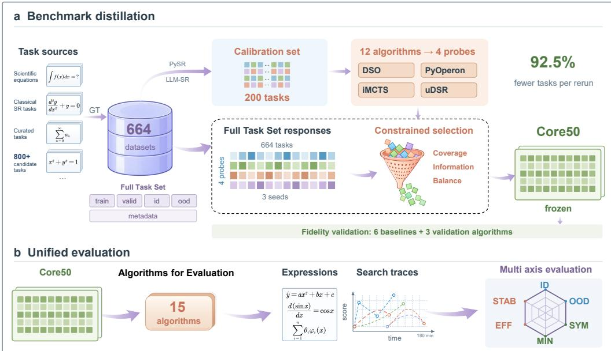  
Figure 1: Overview of SymbolicArena. a. Benchmark distillation retains 664 tasks from 800 candidates, forming the Full Task Set. The Calibration Set tasks support selection of the four probes. Task properties and probe responses across Full Task Set guide selection of 50 tasks in Core50. b. SymbolicArena runs 15 SR algorithms on Core50 using a common protocol and records outputs and search trajectories. Multi Axis Evaluation reports numerical quality (ID and OOD), symbolic quality (SYM and MIN), and search behavior (EFF and STAB).

## 3.1 BENCHMARK DISTILLATION

We formulate compact SR evaluation as a subset selection problem. The goal is to identify a task subset whose aggregate scores and algorithm separation remain consistent with the Full Task Set. The construction proceeds from task standardization to calibration selection, probe selection, and final benchmark distillation. The details and the task manifest appear in Section C and Table 7.

Full Task Set Construction. To support consistent evaluation across heterogeneous SR tasks, SymbolicArena maps each candidate task to a unified schema. The schema specifies feature ordering, target information, and fixed data splits. Ground truth expressions and structural metadata are retained for symbolic analysis and duplicate control.

A validation pipeline checks expression parsing, variable consistency, and target recomputation. The candidate pool exceeds 800 tasks. The 664 valid tasks form Full Task Set, denoted by $\mathcal { D } _ { 6 6 4 }$

$$
\mathcal { D } _ { 6 6 4 } = \big \{ \big ( f _ { i } ^ { * } , D _ { i } ^ { \mathrm { t r a i n } } , D _ { i } ^ { \mathrm { I D } } , D _ { i } ^ { \mathrm { O O D } } , m _ { i } \big ) \big \} _ { i = 1 } ^ { 6 6 4 } ,
$$

where $f _ { i } ^ { * }$ denotes the ground truth expression, $D _ { i } ^ { \cdot }$ denotes the fixed data splits, and $m _ { i }$ represents task metadata. Detailed validation procedures are provided in Section B.

Calibration Task Selection. The Calibration Set is constructed to identify informative tasks from the Full Task Set. PySR and LLM-SR serve as initial probes because the search mechanisms produce complementary response patterns. Each probe runs once on every task in Full Task Set to obtain an initial performance signal. Calibration selection only identifies informative tasks.

Tasks are ranked according to the normalized performance difference between PySR and LLM-SR on ID and OOD evaluation. The Calibration Set contains tasks with strong probe disagreement and tasks solved by a single probe. Additional tasks with moderate disagreement are included to maintain broader task coverage. The construction audit is provided in Section C.1.

Probe Selection. Probe selection maximizes mean calibration usability subject to coverage of at least three primary paradigms. Calibration usability combines finite result rate and resistance to numerical explosion. The 12 algorithms on the 200 calibration tasks remain eligible. Among four algorithm subsets covering at least three primary paradigms, the unique optimum is

$$
\begin{array} { r } { \mathcal { A } _ { 4 } = \{ \mathrm { D S O } , \mathrm { P y O p e r o n } , \mathrm { i M C T S } , \mathrm { u D S R } \} . } \end{array}
$$

The four probes cover Neural Policy Search, Evolutionary Search, and Structured Search. Definitions and selection results appear in Section C.2.

Core50 Construction. The four probes are evaluated on 664 tasks in the Full Task Set using three random seeds. Error summaries, output validity, and seed variation characterize each task. Structural descriptors encode task properties. Response descriptors capture performance differences among the probes. Task informativeness combines discrimination and construction stability as Info = Disc · Stab . Core50 is selected as a feasible subset of 50 tasks by considering task coverage, mean task informativeness, and distributional balance. The selection maximizes the objective function

$$
J ( S ) = 0 . 4 5 \mathrm { C o v e r a g e } ( S ) + 0 . 3 5 \mathrm { M e a n I n f o } ( S ) + 0 . 2 0 \mathrm { B a l a n c e } ( S ) , \qquad S \in { \mathcal { F } } ,
$$

where MeanInfo $\begin{array} { r } { \mathbf { \eta } ^ { \prime } ( S ) = | S | ^ { - 1 } \sum _ { i \in S } \mathrm { I n f o } _ { i } , | S | = 5 0 } \end{array}$ . The coverage is defined as follows

$$
\mathrm { C o v e r a g e } ( S ) = 0 . 6 \mathrm { S t r u c t u r a l C o v e r a g e } ( S ) + 0 . 4 \mathrm { R e s p o n s e C o v e r a g e } ( S ) .
$$

Balance(S) measures how well the subset represents the distributions of task difficulty and failure modes. The feasible set F controls source composition and duplicate membership. Additional constraints regulate difficulty and failure patterns. Details appear in Section C.3.

We optimize the objective using greedy initialization followed by feasible single task swaps, and freeze the best observed subset as Core50 before fidelity validation and formal evaluation.

## 3.2 UNIFIED EVALUATION PROTOCOL

SymbolicArena evaluates 15 SR algorithms on Core50 under a standardized execution protocol. Each algorithm uses a common wrapper. Inputs comprise the training split, feature names, and target information. ID and OOD test splits and ground truth expressions are reserved for evaluation.

Algorithm specific environments remain isolated. Data loading, metric computation, and expression processing follow a shared implementation. The execution layer records standardized outputs and trajectories of expressions selected by each algorithm’s native rule. The records support reproducible comparison and search analysis. Implementation details are provided in Section D.

## 3.3 MULTI AXIS EVALUATION

Multi Axis Evaluation assesses numerical quality with ID and OOD. SYM and MIN assess symbolic quality. EFF and STAB describe search behavior. Details are provided in Section E.

Opus 5 postprocessing simplifies final expressions and provides symbolic judgments for SYM and the structural component of STAB. MIN is computed from the frozen simplified expressions. Processed expressions and judgments are frozen before metric aggregation. The postprocessing procedure is detailed in Section E.3.

The metrics are defined on a [0, 1] scale. All metrics except STAB use empirical averages across tasks and random seeds. STAB is aggregated across runs within each task and averaged across tasks. In the following formulas, E denotes the corresponding empirical average.

In-distribution quality ID measures numerical predictive quality on the ID test set

$$
\mathrm { S c o r e } ^ { \mathrm { I D } } = \mathbb { E } \left[ q ^ { \mathrm { I D } } \right] , \qquad q ^ { \mathrm { I D } } = \phi ( \mathrm { N M S E } ^ { \mathrm { I D } } ) ,
$$

where $\mathrm { N M S E } ^ { \mathrm { I D } }$ is the normalized mean squared error on the ID test set. For a valid NMSE value x, the clipped log error is

$$
r ( x ) = \mathrm { c l i p } ( \log _ { 1 0 } ( \operatorname* { m a x } ( x , \epsilon ) ) , \ell _ { \mathrm { m i n } } , \ell _ { \mathrm { m a x } } ) .
$$

Numerical quality is obtained by linear rescaling

$$
\phi ( x ) = \frac { \ell _ { \mathrm { m a x } } - r ( x ) } { \ell _ { \mathrm { m a x } } - \ell _ { \mathrm { m i n } } } , \qquad \phi ( x ) \in [ 0 , 1 ] .
$$

The bounds are $\ell _ { \mathrm { m i n } } = - 1 2$ and $\ell _ { \mathrm { m a x } } = 2$ , with $\epsilon = 1 0 ^ { - 1 2 }$ . Lower error yields higher quality.   
Invalid or unevaluable outputs receive quality zero.

Out-of-distribution quality OOD measures numerical predictive quality on the OOD test set with the same map

$$
\mathrm { S c o r e } ^ { \mathrm { O O D } } = \mathbb { E } \left[ q ^ { \mathrm { O O D } } \right] , \qquad q ^ { \mathrm { O O D } } = \phi ( \mathrm { N M S E } ^ { \mathrm { O O D } } ) ,
$$

where $\mathrm { N M S E } ^ { \mathrm { O O D } }$ is the normalized mean squared error on the OOD test set.

Symbolic fidelity SYM prioritizes symbolic equivalence judgments

$$
\mathrm { S c o r e } ^ { \mathrm { S Y M } } = \mathbb { E } \left[ m ^ { \mathrm { S Y M } } \right] , \qquad m ^ { \mathrm { S Y M } } = \left\{ \begin{array} { l l } { 1 , } & { E q = 1 , } \\ { 0 . 5 ( S _ { \mathrm { t r e e } } F _ { v } F _ { o } ) ^ { 1 / 3 } , } & { E q = 0 , } \end{array} \right.
$$

where the indicator $E q$ records the evaluator’s equivalent judgment for the processed prediction and reference. The quantities $S _ { \mathrm { t r e e } } , F _ { v }$ , and $F _ { o }$ measure tree similarity, variable recovery, and operator recovery, respectively, as defined in Section E.4.

Minimality MIN measures expression minimality relative to the reference

$$
\mathrm { S c o r e } ^ { \mathrm { M I N } } = \mathbb { E } \left[ m ^ { \mathrm { M I N } } \right] , \qquad m ^ { \mathrm { M I N } } = \mathrm { m i n } \left( 1 , \frac { C ^ { r e f } } { C ^ { p r e d } } \right) ,
$$

where $C ^ { r e f }$ and $C ^ { p r e d }$ denote the expression tree sizes of the simplified reference and prediction.

Efficiency EFF measures how rapidly search approaches the best numerical quality reached within a run. Let T denote the number of checkpoints on the fixed time grid

$$
{ \mathrm { S c o r e } } ^ { \mathrm { E F F } } = \mathbb { E } [ m ^ { \mathrm { E F F } } ] , \qquad m ^ { \mathrm { E F F } } = \frac { 1 } { T } \sum _ { t = 1 } ^ { T } \frac { q ( t ) } { q ^ { * } } ,
$$

where the numerical quality is $q ( t ) = ( q ^ { \mathrm { I D } } ( t ) { + } q ^ { \mathrm { O O D } } ( t ) ) / 2$ , and the normalization reference is $q ^ { * } =$ $\operatorname* { m a x } _ { 1 \leq t \leq T } q ( t )$ . A run with $q ^ { * } = 0$ receives $m ^ { \mathrm { E F F } } = \mathrm { 0 }$ . The experiment records one checkpoint per minute, and T is expressed in minutes. At each checkpoint, $q ( t )$ evaluates the expression selected by the algorithm’s native rule. Test quality does not guide candidate selection.

Stability STAB combines numerical consistency, output validity, and structural consistency

$$
{ \mathrm { S c o r e } } ^ { \mathrm { S T A B } } = \mathbb { E } [ m ^ { \mathrm { S T A B } } ] , \qquad m ^ { \mathrm { S T A B } } = ( N V C ) ^ { 1 / 3 } ,
$$

where N, V , and C denote numerical consistency, valid run fraction, and structural consistency.   
Detailed definitions are provided in Section E.5.

## 4 EXPERIMENTS

Experiments examine benchmark fidelity, generalization beyond construction probes, and diagnostic value.

## 4.1 EXPERIMENTAL SETUP

Construction and fidelity evaluation. Core50 construction follows Section 3.1. The four probes are evaluated on all 664 tasks using three random seeds. Fidelity validation uses a separate one hour evaluation of nine algorithms on Full Task Set. FePySR (Yu et al., 2026), SymbolFit (Tsoi et al., 2025), and JAXSR (Kitchin, 2024) are excluded from benchmark construction and serve as validation algorithms. Scores on Core50 use the same evaluation records restricted to the frozen 50 tasks. PySR and LLM-SR use seed 1314. The remaining seven algorithms use seeds 520, 521, and 522. Probe selection sensitivity appears in Section F.

Formal evaluation. The comparison evaluates 15 algorithms on frozen Core50 using seeds 520, 521, and 522. Section H presents the algorithms and configurations. Runs have a three hour budget. Clean evaluation provides the six axis results. Supplementary experiments perturb training labels at 1% and 5%. Construction, fidelity validation, and formal evaluation use separate records. Metric definitions appear in Section 3.3. The execution protocol is described in Section D.

## 4.2 FIDELITY TO THE FULL TASK SET

Core50 best preserves aggregate benchmark behavior. We evaluate how closely each 50 task subset reproduces aggregate probe scores on Full Task Set. Six alternative selectors are defined in Section C.4. All selectors use the same construction records. Let $A _ { p } ( S )$ denote the mean task score of probe p on task set S. Aggregate fidelity is measured by

$$
\mathrm { M A E } ( S , { \mathcal { D } } _ { 6 6 4 } ) = \frac { 1 } { | { \mathcal { A } } _ { 4 } | } \sum _ { p \in { \mathcal { A } } _ { 4 } } | A _ { p } ( S ) - A _ { p } ( { \mathcal { D } } _ { 6 6 4 } ) | .
$$

Lower MAE indicates closer agreement with Full Task Set.

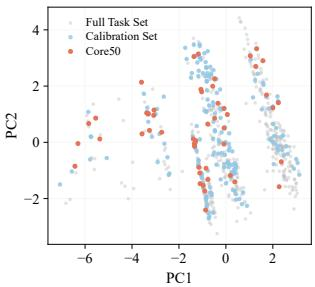  
a. Coverage

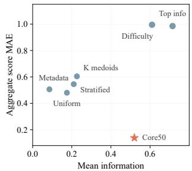  
b. Tradeoff

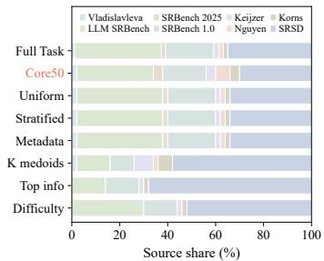  
c. Composition  
Figure 2: Aggregate fidelity and task representation. a. PCA projection of structural and probe response descriptors for Full Task Set, Calibration Set, and Core50. b. Mean task information and aggregate score MAE for Core50 and six alternative selectors. c. Source proportions for Full Task Set and the evaluated 50 task subsets.

Core50 achieves the lowest aggregate score MAE of 0.1388. In Figure 2a, Core50 occupies the major regions of the joint structural and response space, indicating broad representation of the task population. In Figure 2b, top information and difficulty balanced selection achieve higher mean task information yet produce much larger MAE. In Figure 2c, several baselines closely match the source proportions of Full Task Set yet retain higher MAE. The results indicate that benchmark fidelity benefits from both representative coverage and informative algorithm responses. Optimizing either factor alone is insufficient among the evaluated selectors.

Fidelity on algorithms excluded from construction. We evaluate nine algorithms on both Full Task Set and Core50 using identical evaluation records. Figure 3a and Figure 3b report ID and OOD score and rank agreement across the two scales. FePySR, SymbolFit, and JAXSR are excluded from benchmark construction and serve as validation algorithms. Across all nine algorithms, Spearman correlations reach $\rho = 0 . 9 8 3 3$ for ID and $\rho = 0 . 9 6 6 7$ for OOD. The three validation algorithms preserve their OOD ordering, and one ID pair changes order. The strong agreement provides evidence that Core50 fidelity is not confined to the construction probes.

Best (1st) Second-best (2nd)

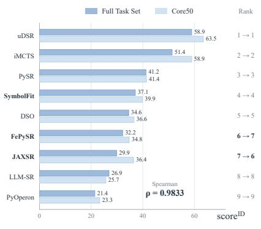  
a. ID

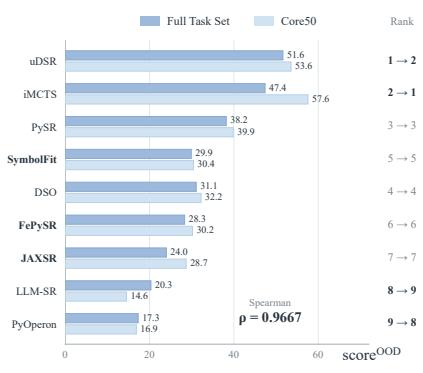  
b. OOD  
Figure 3: Numerical score and rank agreement. ID and OOD scores for nine algorithms on Full Task Set and Core50. FePySR, SymbolFit, and JAXSR are excluded from benchmark construction. Scores use identical evaluation records and a one hour budget.

## 4.3 DIAGNOSTIC ANALYSIS OF SR METHODS

The validated Core50 enables diagnostic comparison of 15 representative SR algorithms. Table 2 reports point estimates on clean Core50. Task bootstrap intervals are provided in Section G.2, and axis correlations appear in Section G.1.

Table 2: Six-axis profiles of 15 symbolic regression methods on Core50 (clean). Methods are grouped by their primary search paradigm. Higher values denote better performance on each axis.
<table><tr><td rowspan="2">Paradigm</td><td rowspan="2">Algorithm</td><td colspan="2">Numerical</td><td colspan="2">Symbolic</td><td colspan="2">Search</td></tr><tr><td>D↑</td><td>OOD ↑</td><td>SYM↑</td><td>MIN↑</td><td>EFF↑</td><td>STAB ↑</td></tr><tr><td rowspan="3">Structured Search</td><td>iMCTS</td><td>77.91</td><td>73.35</td><td>42.15</td><td>80.37</td><td>91.66</td><td>23.31</td></tr><tr><td>QLattice</td><td>34.79</td><td>25.37</td><td>29.82</td><td>55.12</td><td>87.81</td><td>31.12</td></tr><tr><td>JAXSR</td><td>37.99</td><td>30.21</td><td>32.00</td><td>75.03</td><td>99.99</td><td>97.43</td></tr><tr><td rowspan="4">Evolutionary Search</td><td>PySR</td><td>70.34</td><td>66.28</td><td>44.60</td><td>82.62</td><td>91.94</td><td>31.03</td></tr><tr><td>PyOperon</td><td>38.89</td><td>30.64</td><td>25.06</td><td>44.88</td><td>97.28</td><td>15.34</td></tr><tr><td>gplearn</td><td>31.37</td><td>24.96</td><td>28.25</td><td>53.55</td><td>94.67</td><td>5.86</td></tr><tr><td>SymbolFit</td><td>59.04</td><td>48.46</td><td>29.96</td><td>38.92</td><td>87.30</td><td>5.38</td></tr><tr><td rowspan="2">Neural Policy Search</td><td>uDSR</td><td>64.84</td><td>55.94</td><td>41.25</td><td>51.41</td><td>85.83</td><td>20.20</td></tr><tr><td>DSO</td><td>38.56</td><td>34.14</td><td>43.19</td><td>79.90</td><td>89.60</td><td>31.92</td></tr><tr><td rowspan="2">Hybrid Search</td><td>FePySR</td><td>59.84</td><td>55.45</td><td>48.13</td><td>89.55</td><td>93.56</td><td>46.53</td></tr><tr><td>RAG-SR</td><td>48.58</td><td>35.45</td><td>20.66</td><td>11.25</td><td>99.74</td><td>1.37</td></tr><tr><td rowspan="2">Transformer Methods</td><td>E2ESR</td><td>57.09</td><td>42.40</td><td>29.96</td><td>31.50</td><td>90.95</td><td>55.70</td></tr><tr><td>TPSR</td><td>27.60</td><td>20.84</td><td>29.60</td><td>42.46</td><td>87.33</td><td>84.20</td></tr><tr><td>LLM Assisted</td><td>DrSR</td><td>41.86</td><td>32.82</td><td>39.51</td><td>63.94</td><td>83.93</td><td>10.92</td></tr><tr><td>Search</td><td>LLM-SR</td><td>42.59</td><td>32.78</td><td>35.89</td><td>59.06</td><td>80.55</td><td>17.72</td></tr></table>

Display scale 0–100.

No evaluated method dominates all dimensions. Table 2 shows that the highest point estimates occur in different methods across numerical, symbolic, and search metrics. iMCTS leads ID and OOD, FePySR leads SYM and MIN, and JAXSR leads EFF and STAB. PySR ranks second on ID, OOD, SYM, and MIN. Figure 4 further reveals distinct profile shapes across methods, indicating strong capability specialization.

Strong numerical accuracy does not guarantee symbolic recovery. Table 2 shows that strong numerical performance does not consistently correspond to strong symbolic fidelity. iMCTS leads both numerical axes yet attains a SYM score of 42.15. A clean Nguyen-9 case in Section G.4 provides a direct example. Near zero numerical error can coexist with failure of strict symbolic equivalence. Final numerical error alone is insufficient to characterize equation recovery.

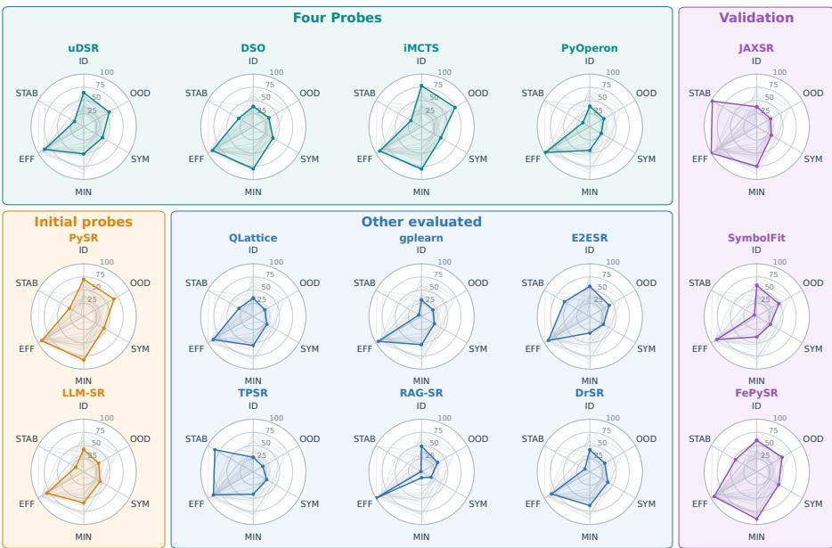  
Figure 4: Per algorithm six axis profiles on Core50. Each panel displays the six axis scores of one algorithm. Normalized scores are multiplied by 100 for a common 0 to 100 display scale. Gray profiles show the remaining algorithms for reference. The panels reveal differences beyond a single numerical ranking.

Search behavior is distinct from attained quality. Table 2 also reveals a clear separation between search behavior and attained solution quality. JAXSR reaches near maximal EFF and STAB yet attains moderate ID and OOD scores. iMCTS shows a contrasting profile, leading both numerical axes with a STAB score of 23.31. A high EFF score can reflect early attainment of a modest peak because EFF is normalized to each run’s observed maximum. High STAB indicates repeatability and does not directly imply high attained quality. Search progress and repeatability provide complementary information to final solution quality.

## 5 LIMITATIONS

Benchmark scope and fidelity. Core50 is distilled from the current Full Task Set using responses from the four probes. Fidelity is validated only for the current task distribution and the algorithmic paradigms represented in the evaluation. New task families or substantially different search paradigms may require renewed fidelity validation of Core50. Core50 also inherits the coverage boundary of the Full Task Set. Scientific domains and operator families absent from the current 664 tasks remain outside the validated scope.

Algorithm configuration. The evaluation uses official default or recommended configurations when available and applies only adaptations required by the shared protocol. Algorithm specific hyperparameter optimization is not included. Absolute scores and relative rankings may change with dedicated tuning. The reported results characterize each method in a standardized benchmark configuration.

## 6 CONCLUSION

SymbolicArena provides a unified framework for efficient and reproducible symbolic regression evaluation. The framework standardizes 664 executable SR tasks and distills Core50, reducing the evaluation workload by 92.5%. Relative to six alternative 50 task selectors, Core50 reduces aggregate score MAE by 72.6% to 86.7% and preserves strong ranking agreement with Full Task Set. Validation on algorithms excluded from benchmark construction further supports the fidelity of the compact benchmark.

Evaluation of 15 representative SR methods reveals clear differences across numerical quality, symbolic quality, and search behavior. No evaluated method dominates all dimensions. Strong numerical accuracy does not consistently correspond to faithful symbolic recovery, and strong search progress or repeatability does not imply high attained solution quality. The results show that final numerical error alone provides an incomplete view of SR performance. SymbolicArena offers a reproducible benchmark and evaluation protocol for studying such differences at substantially lower cost.

Reproducibility Statement. SymbolicArena fixes task manifests, data splits, random seeds, execution budgets, algorithm configurations, and evaluation protocols. Appendices B to E document benchmark construction, execution procedures, and metric definitions. Appendix I documents model assisted symbolic evaluation, prompt templates, and information access controls. The supplementary material provides the manifests, scripts, configurations, and frozen symbolic judgments required to reproduce the reported results.

## AI USE STATEMENT

Generative AI tools assisted manuscript drafting and revision, LaTeX editing, figure preparation, literature retrieval, code inspection, and analysis of existing experimental records. AI tools also supported research discussion, experimental design review, consistency checks, and interpretation of experimental results. All methodological decisions, experimental designs, and reported results were reviewed and verified by the authors. Opus 5 assisted final expression simplification, equivalence assessment, and structural judgments for seed pairs in the evaluation pipeline. The resulting processed expressions and judgments were frozen before metric aggregation and retained for auditing.

## REFERENCES

Anthropic. System card: Claude opus 5. https://www.anthropic.com/claude-opus-5-system-card, July 2026.

Luca Biggio, Tommaso Bendinelli, Alexander Neitz, Aurelien Lucchi, and Giambattista Parascandolo. Neural symbolic regression that scales. In International Conference on Machine Learning, pp. 936–945, 2021.

Kevin René Broløs, Meera Vieira Machado, Chris Cave, Jaan Kasak, Valdemar Stentoft-Hansen, Victor Galindo Batanero, Tom Jelen, and Casper Wilstrup. An approach to symbolic regression using Feyn, 2021. URL https://arxiv.org/abs/2104.05417.

Bogdan Burlacu, Gabriel Kronberger, and Michael Kommenda. Operon C++: An efficient genetic programming framework for symbolic regression. In Proceedings of the 2020 Genetic and Evolutionary Computation Conference Companion, pp. 1562–1570. Association for Computing Machinery, 2020. doi: 10.1145/3377929.3398099.

Miles Cranmer. Interpretable machine learning for science with PySR and SymbolicRegression.jl, 2023. URL https://arxiv.org/abs/2305.01582.

Aaron Grattafiori et al. The llama 3 herd of models. arXiv preprint arXiv:2407.21783, 2024.

Arya Grayeli, Atharva Sehgal, Omar Costilla-Reyes, Miles Cranmer, and Swarat Chaudhuri. Symbolic regression with a learned concept library. In Advances in Neural Information Processing Systems, volume 37, pp. 44678–44709, 2024. doi: 10.52202/079017-1419.

Zhengyao Huang, Daniel Zhengyu Huang, Tiannan Xiao, Dina Ma, Zhenyu Ming, Hao Shi, and Yuanhui Wen. Improving Monte Carlo tree search for symbolic regression, 2025. URL https://arxiv.org/abs/2509.15929.

Guilherme Seidyo Imai Aldeia, Hengzhe Zhang, Geoffrey Bomarito, Miles Cranmer, Alcides Fonseca, Bogdan Burlacu, William G. La Cava, and Fabrício Olivetti de França. Call for action: Towards the next generation of symbolic regression benchmark. In Proceedings of the Genetic and Evolutionary Computation Conference Companion, pp. 2529–2538. Association for Computing Machinery, 2025. doi: 10.1145/3712255.3734309.

Pierre-Alexandre Kamienny, Stéphane d’Ascoli, Guillaume Lample, and François Charton. End-to-end symbolic regression with transformers. In Advances in Neural Information Processing Systems, volume 35, pp. 10269–10281, 2022. doi: 10.52202/068431-0746.

Pierre-Alexandre Kamienny, Guillaume Lample, Sylvain Lamprier, and Marco Virgolin. Deep generative symbolic regression with Monte-Carlo tree search. In Proceedings ofthe 40th International Conference on Machine Learning, volume 202 of Proceedings of Machine Learning Research, pp. 15655–15668. PMLR, 2023. URL https://proceedings.mlr.press/v202/kamienny23a.html.

Maarten Keijzer. Improving symbolic regression with interval arithmetic and linear scaling. In Genetic Programming: Proceedings ofEuroGP 2003, volume 2610 of Lecture Notes in Computer Science, pp. 70–82. Springer, 2003. doi: 10.1007/3-540-36599-0\_7.

Douwe Kiela, Max Bartolo, Yixin Nie, Divyansh Kaushik, Atticus Geiger, Zhengxuan Wu, Bertie Vidgen, Grusha Prasad, Amanpreet Singh, Pratik Ringshia, Zhiyi Ma, Tristan Thrush, Sebastian Riedel, Zeerak Waseem, Pontus Stenetorp, Robin Jia, Mohit Bansal, Christopher Potts, and Adina Williams. Dynabench: Rethinking benchmarking in NLP. In Proceedings ofthe 2021 Conference ofthe North American Chapter ofthe Associationfor Computational Linguistics: Human Language Technologies, pp. 4110–4124, 2021. URL https://aclanthology.org/2021.naacl-main.324/.

John Kitchin. JAXSR: JAX-based symbolic regression. Software repository, 2024. URL https://github.com/jkitchin/jaxsr.

Michael F. Korns. Accuracy in symbolic regression. In Genetic Programming Theory and Practice IX, Genetic and Evolutionary Computation, pp. 129–151. Springer, 2011. doi: 10.1007/978-1-4614-1770-5\_8.

John R. Koza. Genetic Programming: On the Programming ofComputers by Means ofNatural Selection. MIT Press, 1992.

William La Cava, Patryk Orzechowski, Bogdan Burlacu, Fabrício Olivetti de França, Marco Virgolin, Ying Jin, Michael Kommenda, and Jason H. Moore. Contemporary symbolic regression methods and their relative performance. In Proceedings ofthe Neural Information Processing Systems Track on Datasets and Benchmarks, volume 1, 2021. URL https://datasets-benchmarks-proceedings.neurips.cc/paper/2021/hash/ c0c7c76d30bd3dcaefc96f40275bdc0a-Abstract-round1.html.

Mikel Landajuela, Chak Lee, Jiachen Yang, Ruben Glatt, Claudio P. Santiago, Ignacio Aravena, Terrell N. Mundhenk, Garrett Mulcahy, and Brenden K. Petersen. A unified framework for deep symbolic regression. In Advances in Neural Information Processing Systems, volume 35, pp. 33985–33998, 2022. doi: 10.52202/068431-2463.

Pat Langley. Data-driven discovery of physical laws. Cognitive Science, 5(1):31–54, 1981.

Zhiyi Ma, Kawin Ethayarajh, Tristan Thrush, Somya Jain, Ledell Wu, Robin Jia, Christopher Potts, Adina Williams, and Douwe Kiela. Dynaboard: An evaluation-as-a-service platform for holistic next-generation benchmarking. In Advances in Neural Information Processing Systems, volume 34, pp. 10351–10367, 2021. URL https://proceedings.neurips.cc/paper/2021/hash/ 55b1927fdafef39c48e5b73b5d61ea60-Abstract.html.

Yoshitomo Matsubara, Naoya Chiba, Ryo Igarashi, and Yoshitaka Ushiku. Rethinking symbolic regression datasets and benchmarks for scientific discovery. Journal ofData-centric Machine Learning Research, 1(3):1–38, 2024. URL https://openreview.net/forum?id=qrUdrXsiXX.

Mark Mazumder, Colby Banbury, Xiaozhe Yao, Bojan Karlaš, William Gaviria Rojas, Sudnya Diamos, Greg Diamos, Lynn He, Alicia Parrish, Hannah Rose Kirk, Jessica Quaye, Charvi Rastogi, Douwe Kiela, David Jurado, David Kanter, Rafael Mosquera, Will Cukierski, Juan Ciro, Lora Aroyo, Bilge Acun, Lingjiao Chen, Mehul Raje, Max Bartolo, Evan Sabri Eyuboglu, Amirata Ghorbani, Emmett Goodman, Addison Howard, Oana Inel, Tariq Kane, Christine R. Kirkpatrick, D. Sculley, Tzu-Sheng Kuo, Jonas W. Mueller, Tristan Thrush, Joaquin Vanschoren, Margaret Warren, Adina Williams, Serena Yeung, Newsha Ardalani, Praveen Paritosh, Ce Zhang, James Zou, Carole-Jean Wu, Cody Coleman, Andrew Ng, Peter Mattson, and Vijay Janapa Reddi. DataPerf: Benchmarks for data-centric AI development. In Advances in Neural Information Processing Systems, volume 36, pp. 5320–5347, 2023. doi: 10.52202/075280-0235.

Aaron Meurer, Christopher P. Smith, Mateusz Paprocki, Ondˇrej Certík, Sergey B. Kirpichev,<sup>ˇ</sup> Matthew Rocklin, AMiT Kumar, Sergiu Ivanov, Jason K. Moore, Sartaj Singh, Thilina Rathnayake, Sean Vig, Brian E. Granger, Richard P. Muller, Francesco Bonazzi, Harsh Gupta, Shivam Vats, Fredrik Johansson, Fabian Pedregosa, Matthew J. Curry, Andy R. Terrel, Štepánˇ Roucka, Ashutosh Saboo, Isuru Fernando, Sumith Kulal, Robert Cimrman, and Anthonyˇ Scopatz. Sympy: symbolic computing in python. PeerJ Computer Science, 3:e103, 2017. doi: 10.7717/peerj-cs.103.

T. Nathan Mundhenk, Mikel Landajuela, Ruben Glatt, Claudio P. Santiago, Daniel M. Faissol, and Brenden K. Petersen. Symbolic regression via neural-guided genetic programming population seeding. In Advances in Neural Information Processing Systems, volume 34, pp. 24912–24923, 2021. URL https://proceedings.neurips.cc/paper/2021/hash/ d073bb8d0c47f317dd39de9c9f004e9d-Abstract.html.

Yotam Perlitz, Elron Bandel, Ariel Gera, Ofir Arviv, Liat Ein-Dor, Eyal Shnarch, Noam Slonim, Michal Shmueli-Scheuer, and Leshem Choshen. Efficient benchmarking (of language models). In Proceedings ofthe 2024 Conference ofthe North American Chapter ofthe Associationfor Computational Linguistics: Human Language Technologies (Volume 1: Long Papers), pp. 2519–2536, 2024. doi: 10.18653/v1/2024.naacl-long.139.

Brenden K. Petersen, Mikel Landajuela, T. Nathan Mundhenk, Claudio P. Santiago, Sookyung Kim, and Joanne T. Kim. Deep symbolic regression: Recovering mathematical expressions from data via risk-seeking policy gradients. In International Conference on Learning Representations, 2021. URL https://openreview.net/forum?id=m5Qsh0kBQG.

Felipe Maia Polo, Lucas Weber, Leshem Choshen, Yuekai Sun, Gongjun Xu, and Mikhail Yurochkin. tinyBenchmarks: Evaluating LLMs with fewer examples. In Proceedings ofthe 41st International Conference on Machine Learning, pp. 34303–34326, 2024. URL https://proceedings.mlr.press/v235/polo24a.html.

Gayathri Saranathan, Cong Xu, Mahammad Parwez Alam, Tarun Kumar, Martin Foltin, Soon Yee Wong, and Suparna Bhattacharya. SubLIME: Subset selection via rank correlation prediction for data-efficient LLM evaluation. In Proceedings of the 63rd Annual Meeting of the Association for Computational Linguistics (Volume 1: Long Papers), pp. 30572–30593, 2025. doi: 10.18653/v1/2025.acl-long.1477.

Michael Schmidt and Hod Lipson. Distilling free-form natural laws from experimental data. Science, 324(5923):81–85, 2009.

Parshin Shojaee, Kazem Meidani, Amir Barati Farimani, and Chandan K. Reddy. Transformer-based planning for symbolic regression. In Advances in Neural Information Processing Systems, volume 36, pp. 45907–45919, 2023. doi: 10.52202/075280-1990.

Parshin Shojaee, Kazem Meidani, Shashank Gupta, Amir Barati Farimani, and Chandan K. Reddy. LLM-SR: Scientific equation discovery via programming with large language models. In International Conference on Learning Representations, 2025a. URL https://openreview.net/forum?id=m2nmp8P5in.

Parshin Shojaee, Kazem Meidani, Shashank Gupta, Amir Barati Farimani, and Chandan K. Reddy. LLM-SRBench: A new benchmark for scientific equation discovery with large language models, 2025b. URL https://arxiv.org/abs/2504.10415.

Trevor Stephens. gplearn: Genetic programming in Python, with a scikit-learn inspired API. Software repository, 2016. URL https://github.com/trevorstephens/gplearn.

Ho Fung Tsoi, Dylan Rankin, Cecile Caillol, Miles Cranmer, Sridhara Dasu, Javier Duarte, Philip Harris, Elliot Lipeles, and Vladimir Loncar. SymbolFit: Automatic parametric modeling with symbolic regression. Computing and Softwarefor Big Science, 9:12, 2025. doi: 10.1007/s41781-025-00140-9.

Nguyen Quang Uy, Nguyen Xuan Hoai, Michael O’Neill, R. I. McKay, and Edgar Galván-López. Semantically-based crossover in genetic programming: Application to real-valued symbolic regression. Genetic Programming and Evolvable Machines, 12(2):91–119, 2011. doi: 10.1007/s10710-010-9121-2.

Mojtaba Valipour, Bowen You, Maysum Panju, and Ali Ghodsi. SymbolicGPT: A generative transformer model for symbolic regression, 2021. URL https://arxiv.org/abs/2106.14131.

Rajan Vivek, Kawin Ethayarajh, Diyi Yang, and Douwe Kiela. Anchor points: Benchmarking models with much fewer examples. In Proceedings of the 18th Conference of the European Chapter of the Association for Computational Linguistics (Volume 1: Long Papers), pp. 1576–1601, 2024. doi: 10.18653/v1/2024.eacl-long.95.

Ekaterina J. Vladislavleva, Guido F. Smits, and Dick den Hertog. Order of nonlinearity as a complexity measure for models generated by symbolic regression via Pareto genetic programming. IEEE Transactions on Evolutionary Computation, 13(2):333–349, 2009. doi: 10.1109/TEVC.2008.926486.

Runxiang Wang, Boxiao Wang, Kai Li, Yifan Zhang, and Jian Cheng. DrSR: LLM-based scientific equation discovery with dual reasoning from data and experience, 2025. URL https://arxiv.org/abs/2506.04282.

Zhiming Yu, Wangtao Lu, and Xin Lai. FePySR: A neural feature extraction framework for efficient and scalable symbolic regression, 2026. URL https://arxiv.org/abs/2605.12704.

Hengzhe Zhang, Chao Chen, Bing Xue, Wolfgang Banzhaf, and Mengjie Zhang. RAG-SR: Retrieval-augmented generation for neural symbolic regression. In International Conference on Learning Representations, 2025. URL https://openreview.net/forum?id=NdHka08uWn.

## APPENDIX CONTENTS

A Related Work 15   
B Full Task Set Construction and Standardization 16   
B.1 Task Sources and Admission 16   
B.2 Unified Task Representation . 16   
B.3 Full Task Set Composition . 17   
C Core50 Distillation and Validation 18   
C.1 Calibration Set Mining 18   
C.2 Selection of Four Probes . 18   
C.3 Core50 Construction . 20   
C.4 Selection Baselines and Fidelity Validation 21   
C.5 Core50 Manifest . 23   
D Unified Execution Protocol 25   
D.1 Wrapper and Execution Architecture 25   
D.2 Unified Run Procedure 26   
D.3 Recorded Results and Search Trajectories . 26   
D.4 Execution Isolation and Reproducibility Boundary 26   
E Multi Axis Evaluation Details 27   
E.1 Numerical Quality Mapping 27   
E.2 Numerical Quality 27   
E.3 Opus Assisted Symbolic Postprocessing 27   
E.4 Symbolic Quality 28   
E.5 Search Behavior 29   
E.6 Bootstrap Confidence Intervals 30   
E.7 Supplementary Training Noise Robustness 30   
F Sensitivity Analysis 31   
F.1 Probe4 Selection Stability and Replacement Structure 31   
F.2 Core50 Construction . 32   
G Additional Experimental Results 34   
G.1 Correlation Among Evaluation Axes 34   
G.2 Uncertainty in Six Axis Scores 34   
G.3 Robustness to Training Noise 34   
G.4 Numerical Approximation and Symbolic Recovery 36   
H Evaluated Algorithms and Experimental Settings 38   
I LLM Usage and Information Boundaries 40   
I.1 Llama in LLM-SR and DrSR 40   
I.2 Opus 5 in Symbolic Evaluation . 41   
I.3 Information Isolation and Leakage Control 42

## A RELATED WORK

Symbolic Regression Algorithms. Genetic programming and evolutionary optimization provide established approaches to symbolic regression (Burlacu et al., 2020; Cranmer, 2023). Learning methods guide expression search using several complementary strategies. Deep Symbolic Regression uses reinforcement learning to optimize expression generation (Petersen et al., 2021). Deep Generative Symbolic Regression (Kamienny et al., 2023), iMCTS (Huang et al., 2025), and TPSR (Shojaee et al., 2023) explore tree search and planning. Neural models also guide symbolic search (Landajuela et al., 2022; Mundhenk et al., 2021). NeSymReS and End-to-End Symbolic Regression generate expressions directly from data (Biggio et al., 2021; Kamienny et al., 2022). LLM-SR (Shojaee et al., 2025a) and LaSR (Grayeli et al., 2024) use large language models for equation discovery. RAG-SR (Zhang et al., 2025) and DrSR (Wang et al., 2025) explore further LLM based discovery strategies. The diversity of search strategies and inductive biases motivates a unified evaluation across paradigms.

Symbolic Regression Benchmarks. Existing SR benchmarks support broad algorithm comparison and controlled scientific equation discovery. The Keijzer benchmark (2003) evaluates numerical fitting, linear scaling, and extrapolation. The Vladislavleva benchmark (2009) emphasizes model complexity, numerical accuracy, and extrapolation performance. The Korns benchmark (2011) assesses the exact recovery of complex multivariate expressions. Nguyen evaluates elementary analytical function recovery and genetic programming search capabilities (Uy et al., 2011). SRBench evaluates contemporary SR algorithms across synthetic and real-world regression problems (La Cava et al., 2021). Its recent extension broadens algorithm coverage and compares predictive accuracy, expression complexity, and computational cost (Imai Aldeia et al., 2025). SRSD reconstructs scientific equation-discovery tasks with physically meaningful sampling ranges and expression-level similarity measures (Matsubara et al., 2024). LLM-SRBench evaluates LLM-based equation discovery on tasks designed to reduce direct formula memorization (Shojaee et al., 2025b). The benchmarks provide valuable datasets and evaluation protocols, yet construction, execution, and diagnostic coverage remain heterogeneous. A unified framework that preserves benchmark fidelity and supports cross-paradigm evaluation is still missing.

Benchmark Distillation. Efficient benchmarking seeks to reduce evaluation cost and preserve conclusions from the full benchmark. Perlitz et al. (2024) study how smaller evaluation sets can retain reliable model comparisons. tinyBenchmarks selects compact subsets to approximate full benchmark performance (Polo et al., 2024). Anchor Points identifies representative examples for data-efficient evaluation (Vivek et al., 2024). SubLIME considers subset selection based on modelranking preservation (Saranathan et al., 2025). Compact evaluation sets can support reliable model comparison. Symbolic regression introduces additional requirements because task structures and algorithm behaviors are heterogeneous.

Dynamic and Multi Axis Evaluation. Recent benchmarking studies assess model behavior beyond a single aggregate score. Dynabench introduced evaluation that evolves alongside model development (Kiela et al., 2021). Dynaboard extended dynamic benchmarking toward multidimensional evaluation and standardized comparison across systems (Ma et al., 2021). DataPerf emphasized reproducible and data-centric benchmarking protocols (Mazumder et al., 2023). SR benchmarks also provide numerical, symbolic, and computational diagnostics (La Cava et al., 2021; Matsubara et al., 2024; Shojaee et al., 2025b). Existing evaluation focuses largely on final outcomes using protocols specific to each benchmark. SymbolicArena complements existing protocols with standardized execution and Multi Axis Evaluation. The framework incorporates search trajectories and failure analysis.

## B Full Task Set CONSTRUCTION AND STANDARDIZATION

Full Task Set is a population of 664 symbolic regression tasks collected from multiple benchmark sources. Construction covers task admission, representation standardization, and validation. Duplicate control and composition auditing complete the process. Ground truth formulas and static metadata are used during Full Task Set construction. Algorithm response features are excluded.

## B.1 TASK SOURCES AND ADMISSION

The initial pool exceeds 800 symbolic regression tasks collected from modern benchmarks and classical equation sets. Modern sources include SRSD (Matsubara et al., 2024) and LLM-SRBench (Shojaee et al., 2025b). SRBench and its 2025 extension provide further tasks (Imai Aldeia et al., 2025; La Cava et al., 2021). Classical sources comprise the Keijzer (2003), Korns (2011), and Vladislavleva (2009) benchmarks. The Nguyen equation set provides further tasks (Uy et al., 2011).

Admission to Full Task Set requires all four conditions below.

• The ground truth formula is unambiguous, parseable as a symbolic expression tree, and executable as a numerical program.

• Variables, constants, and operators are resolvable and consistent with the dataset columns.

• Train, ID test, and OOD test splits are available or reproducibly generated from the executable ground truth program.

• Metadata for provenance, structural analysis, and split reconstruction are available. Duplicate control metadata are also available.

Tasks with ambiguous or unresolvable definitions are excluded. Admission yields the 664 tasks in Full Task Set.

## B.2 UNIFIED TASK REPRESENTATION

Each admitted task is converted to a common executable schema. The main field groups are summarized in Table 3.

Table 3: Unified schema of Full Task Set.
<table><tr><td>Field group</td><td>Stored information</td></tr><tr><td>Identity and provenance</td><td>dataset_id, source family, and subgroup. Original basename and source benchmark</td></tr><tr><td>Variables and target</td><td>Ordered feature names and target name. Number of features and dummy variable indicator</td></tr><tr><td>Ground truth expression</td><td>Raw source formula and executable expression. Normalized symbolic forms and expression tree</td></tr><tr><td>Data splits</td><td>Fixed train, ID test, and OOD test samples. Split sizes and parameters required for deterministic regeneration</td></tr><tr><td>Structural metadata</td><td>Formula complexity and operator types. Variable count bin and OOD type</td></tr><tr><td>Duplicate metadata</td><td>Semantic duplicate group identifier and provenance links used for duplicate auditing</td></tr></table>

The raw source formula is preserved for provenance. A normalized symbolic representation is generated separately for structural comparison across sources. Expression normalization provides a unified representation by standardizing equivalent expressions and enforcing deterministic serialization.

Structural analysis uses the resulting expression strings, tree representations, and normalized operator forms. Additional representations are retained for duplicate detection and recovery analysis. The representations support symbolic equivalence analysis, tree comparison, and structural consistency analysis. Recovery analysis covers variables and operators.

The training split serves as the input for symbolic expression search. The ID test split measures generalization within the observed training distribution, and the OOD test split measures extrapolation beyond it. Compatible official splits are retained. Missing splits are generated deterministically from the executable ground truth program. Task metadata record the parameters required to regenerate the splits.

All materialized splits remain fixed and are shared across algorithms. Official numerical metrics are computed on the frozen ID and OOD test splits.

Validation and duplicate control. All standardized tasks are validated by replaying executable ground truth expressions, checking fixed data splits, and reproducing the normalized symbolic representations. Tasks with unresolved inconsistencies are excluded. Semantically equivalent or closely related tasks are assigned a shared semantic\_duplicate\_group, which prevents multiple members of one group from entering Core50. The resulting Full Task Set forms an executable and reproducible population for subsequent benchmark construction.

## B.3 Full Task Set COMPOSITION

The 664 tasks cover eight benchmark sources, multiple formula types, and three complexity levels, as summarized in Table 4. All statistics are derived solely from task formulas and static metadata and define the population available for subsequent Core50 distillation.

Table 4: Composition of Full Task Set (664 tasks).
<table><tr><td>Dimension</td><td>Categories and task counts</td></tr><tr><td>Task sources</td><td>LLM-SRBench (240), SRSD (232), SRBench 1.0 (133), Keijzer (15), SRBench 2025 first-principles subset (12), Nguyen (12), Korns (12), Vladislavleva (8)</td></tr><tr><td>Formula types</td><td>Rational (282), Trigonometric (137), Polynomial (124), Exponential / logarithmic (86), Mixed (34), Unknown (1)</td></tr><tr><td>Formula complexity</td><td>Simple (284), Moderate (188), Complex (192)</td></tr></table>

Counts appear in parentheses. Each task belongs to one category within each dimension according to its recorded metadata.

Operator count complexity. Formula complexity is characterized using an operator count extracted from the Python abstract syntax tree of each task’s formula.py. For task i, the count is defined as

$$
\begin{array} { r } { C _ { i } = N _ { i } ^ { \mathrm { B i n O p } } + N _ { i } ^ { \mathrm { U n a r y O p } } + N _ { i } ^ { \mathrm { C o m p a r e } } , } \end{array}
$$

where $N _ { i } ^ { \mathrm { B i n O p } } , N _ { i } ^ { \mathrm { U n a r y O p } }$ , and $N _ { i } ^ { \mathrm { C o m p a r e } }$ denote the numbers of binary operation, unary operation, and comparison nodes in the complete source file. Function calls are excluded from the operator count, and auxiliary functions in $\mathtt { f o r m u l a . p y }$ contribute to $C _ { i }$ when they contain any counted node type. For example, the stored implementation of Keijzer-1 has $C _ { i } = 7 .$ The target expression $0 . 3 x _ { 1 } \sin ( 2 \pi x _ { 1 } )$ contributes four binary operation nodes, and auxiliary logic in the same source file contributes three comparison nodes, placing the task in the Moderate group. The 664 tasks are partitioned according to the empirical one third and two thirds quantiles of $C _ { i } .$ , yielding boundarie of 5 and 8

$$
{ \mathrm { S i m p l e : ~ } } C _ { i } \leq 5 , \qquad { \mathrm { M o d e r a t e : ~ } } 6 \leq C _ { i } \leq 8 , \qquad { \mathrm { C o m p l e x : ~ } } C _ { i } \geq 9 .
$$

Tasks with equal operator counts remain in the same group, producing 284 Simple, 188 Moderate, and 192 Complex tasks. The unequal group sizes arise from ties near the quantile boundaries. The resulting categories describe relative operator count complexity in the stored source implementation. Function calls such as sin and exp receive no additional complexity weight, and auxiliary implementation logic can affect the count. The categories serve as static descriptive metadata for Full Task Set composition, separate from empirical task difficulty.

## C Core50 DISTILLATION AND VALIDATION

Core50 construction proceeds from Calibration Set mining to four probes selection and final task selection. Construction records are separated from fidelity validation and formal evaluation.

## C.1 Calibration Set MINING

Calibration Set contains 200 tasks selected to expose informative differences among SR algorithms. PySR and LLM-SR serve as initial probes, with one evaluation per probe on every task in Full Task Set. Calibration selection is separate from the later selection of four probes.

For task i and algorithm $^ { a , }$ let $\ell _ { i , a } ^ { \mathrm { i d } }$ and $\ell _ { i , a } ^ { \mathrm { o o d } }$ denote the clipped log NMSE on the ID and OOD test splits. The performance gaps are

$$
g _ { i } ^ { i d } = \ell _ { i , \mathrm { L L M S R } } ^ { i d } - \ell _ { i , \mathrm { P y S R } } ^ { i d } , \qquad g _ { i } ^ { o o d } = \ell _ { i , \mathrm { L L M S R } } ^ { o o d } - \ell _ { i , \mathrm { P y S R } } ^ { o o d } .
$$

A positive gap indicates an advantage for PySR, and a negative gap indicates an advantage for LLM-SR. The disagreement score combines the ID and OOD differences

$$
G _ { i } = \frac { | g _ { i } ^ { i d } | + | g _ { i } ^ { o o d } | } { 2 } .
$$

Calibration Set contains three diagnostic groups. The high disagreement group contributes 140 tasks from the largest response gaps. One sided evaluability contributes 20 tasks for which only one initial probe obtains a successful solution. The moderate gap group contributes 40 tasks from intermediate disagreement regions and broadens coverage beyond extreme cases.

Across source families, Calibration Set contains 70 tasks from SRSD, 70 from LLM-SRBench, and 33 from SRBench1.0. Korns contributes 9 tasks. Keijzer, Nguyen, and SRBench2025 contribute 6 tasks each.

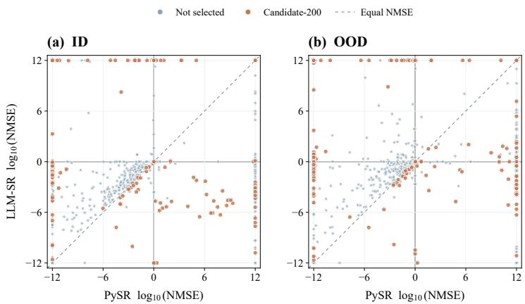  
Figure 5: Dual probe mining diagnostic. Each point represents one task in the PySR and LLM-SR response space. Off diagonal points indicate large performance differences. Selected Calibration Set tasks cover distinct ID and OOD response regions.

Figure 5 shows that Calibration Set retains highly separable tasks and less extreme response regions.

## C.2 SELECTION OF FOUR PROBES

Probe selection uses one recorded run for each of 12 algorithms on the 200 calibration tasks. The objective favors reliable responses subject to coverage of at least three primary paradigms. The criterion prioritizes reliable response availability and coverage across search paradigms. Task discriminability is measured later from the selected probes on Full Task Set, keeping calibration usability separate from final task selection.

Calibration usability. Let $\mathcal { D } _ { \mathrm { c a l } }$ contain the $N = 2 0 0$ calibration tasks, and let $e _ { i , a } ^ { s }$ denote the NMSE for algorithm a on task i and split s. The tasks with jointly available errors are

$$
\mathcal { Q } _ { a } = \left\{ i \in \mathcal { D } _ { \mathrm { c a l } } : e _ { i , a } ^ { s } \in \mathbb { R } _ { \ge 0 } \mathrm { ~ f o r ~ a l l ~ } s \in \left\{ \mathrm { t r a i n } , \mathrm { I D } , \mathrm { O O D } \right\} \right\} .
$$

Membership in $\mathbb { R } _ { \geq 0 }$ requires a finite and nonnegative value. The finite result rate is

$$
q ( a ) = { \frac { | { \mathcal { Q } } _ { a } | } { N } } .
$$

For a positive threshold $\tau ,$ define the explosion tasks as

$$
\mathcal { B } _ { a , \tau } = \left\{ i \in \mathcal { D } _ { \mathrm { c a l } } : \exists s \in \{ \mathrm { I D } , \mathrm { O O D } \} , e _ { i , a } ^ { s } \in \mathbb { R } _ { \geq 0 } , e _ { i , a } ^ { s } > \tau \right\} .
$$

The explosion rate is

$$
b _ { \tau } ( a ) = \frac { | B _ { a , \tau } | } { N } .
$$

Both rates use all 200 tasks as the denominator. An unavailable error on one split and an explosion on another can affect both rates. Reaching the time limit does not reduce usability if evaluable outputs remain available.

Calibration usability is

$$
H _ { \alpha } ( a ; \tau ) = \alpha q ( a ) + ( 1 - \alpha ) \bigl [ 1 - b _ { \tau } ( a ) \bigr ] , \qquad 0 \le \alpha \le 1 .
$$

The default values are $\alpha \ : = \ : 0 . 5$ and $\tau = 1 0 0$ . The score combines numerical availability and resistance to numerical explosion.

For visualization, $q ( a ) \geq 0 . 9$ and $b _ { 1 0 0 } ( a ) \leq 0 . 3$ define a reference region. Figure 6 visualizes the calibration usability of all 12 candidates at the default setting. All 12 algorithms remain eligible in the subsequent subset search.

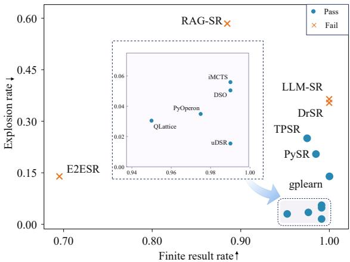  
Figure 6: Calibration usability of candidate algorithms. Points show finite result rate $q ( a )$ and explosion rate $b _ { 1 0 0 } ( a )$ on Calibration Set. The reference region marks high availability and low explosion rates. All 12 algorithms remain eligible for probe selection.

Probe objective and paradigm coverage. Let $\boldsymbol { A } _ { 1 2 }$ denote the calibration algorithms and $g ( a )$ denote the primary paradigm label used in Table 2. DSO and uDSR belong to Neural and Policy Search. iMCTS and QLattice belong to Structured Search. The labels represent primary categories and do not imply mutually exclusive mechanisms.

For a minimum of m primary paradigms, feasible subsets are

$$
{ \mathcal { P } } _ { m } = \left\{ P \subseteq A _ { 1 2 } : | P | = 4 , \quad | \{ g ( a ) : a \in P \} | \geq m \right\} .
$$

Subset usability is

$$
U ( P ; \alpha , \tau ) = \frac { 1 } { | P | } \sum _ { a \in P } H _ { \alpha } ( a ; \tau ) .
$$

The default rule selects

$$
\mathscr { A } _ { 4 } \in \underset { P \in \mathscr { P } _ { 3 } } { \arg \operatorname* { m a x } } U ( P ; 0 . 5 , 1 0 0 ) .
$$

All ${ \binom { 1 2 } { 4 } } \ = \ 4 9 5$ subsets are enumerated, and 468 satisfy the three paradigm requirement. Exact rational arithmetic preserves tied scores. A four algorithm subset covering at least three paradigms contains at most two members from one primary paradigm.

Table 5: Highest scoring feasible four probe combinations. Mean calibration usability uses $\alpha =$ 0.5 and τ = 100. Each reported subset covers three primary paradigms.
<table><tr><td></td><td>Rank Candidate combination</td><td>Mean usability</td></tr><tr><td>1 1</td><td>DSO, PyOperon, iMCTS, uDSR</td><td>0.971250</td></tr><tr><td></td><td>2 DSO, PyOperon, QLattice, uDSR</td><td>0.969375</td></tr><tr><td></td><td>3 PyOperon, iMCTS, QLattice, uDSR</td><td>0.968750</td></tr></table>

Table 5 gives the unique optimum

$$
\begin{array} { r } { \mathcal { A } _ { 4 } = \{ \mathrm { D S O } , \mathrm { P y O p e r o n } , \mathrm { i M C T S } , \mathrm { u D S R } \} . } \end{array}
$$

The selected subset covers three primary paradigms. Sensitivity analysis appears in Section F.

## C.3 Core50 CONSTRUCTION

Core50 selects 50 tasks from Full Task Set using probe responses and task descriptors. The same eligibility rules apply to every source family.

Construction records and aggregation. Each record contains ID and OOD NMSE, output validity, and run status. Valid expressions remain evaluable after timeout, while missing or invalid outputs retain explicit annotations.

Finite nonnegative NMSE values use

$$
\ell ( x ) = \mathrm { c l i p } \left( \log _ { 1 0 } ( \operatorname* { m a x } ( x , 1 0 ^ { - 1 2 } ) ) , - 1 2 , 1 2 \right) .
$$

For each task i and probe $p ,$ let $S _ { i , p } ^ { \mathrm { v a l i d } }$ contain seeds with valid evaluable outputs. For split $a \in$ {id, ood}, the median log error and seed variability are

$$
\begin{array} { r l r l } & { m _ { i , p } ^ { a } = \operatorname * { m e d i a n } _ { s \in S _ { i , p } ^ { \mathrm { v a l i d } } } \ell ( \mathrm { N M S E } _ { i , p , s } ^ { a } ) , } & & { q _ { i , p } ^ { a } = \mathrm { I Q R } _ { s \in S _ { i , p } ^ { \mathrm { v a l i d } } } \ell ( \mathrm { N M S E } _ { i , p , s } ^ { a } ) . } \end{array}
$$

The valid fraction $v _ { i , p }$ uses all K = 3 scheduled seeds. An empty valid seed set leaves the corresponding median and IQR unavailable.

Task descriptors and information. Structural descriptors encode task properties and redundancy information. Response descriptors encode probe performance, validity, and seed variation.

Let $\mathcal { N }$ denote normalization to [0, 1], and let $H _ { i }$ measure the entropy of the valid output pattern across probes. The discrimination score is

$$
\begin{array} { r l } & { \mathrm { D i s c } _ { i } = 0 . 4 5 \mathcal { N } \left( \mathrm { V a r } _ { p } ( m _ { i , p } ^ { \mathrm { i d } } ) \right) + 0 . 4 5 \mathcal { N } \left( \mathrm { V a r } _ { p } ( m _ { i , p } ^ { \mathrm { o o d } } ) \right) } \\ & { \quad \quad \quad + 0 . 1 0 \mathcal { N } ( H _ { i } ) . } \end{array}
$$

Construction instability and stability are

$$
u _ { i } = \mathrm { M e a n } _ { p } \left[ q _ { i , p } ^ { \mathrm { i d } } + q _ { i , p } ^ { \mathrm { o o d } } + 1 - v _ { i , p } \right] , \qquad \mathrm { S t a b } _ { i } = 1 - \mathcal { N } ( u _ { i } ) .
$$

Task information combines discrimination and stability

$$
\mathrm { I n f o } _ { i } = \mathrm { D i s c } _ { i } \mathrm { S t a b } _ { i } .
$$

A high information score requires probe separation and consistency across seeds. Construction stability is distinct from the final evaluation axis STAB.

Difficulty, failure mode, and eligibility. Tasks with unusable probe responses are excluded. Partially failed or high variance tasks remain eligible subject to category limits. A timeout alone does not determine eligibility if evaluable outputs remain available.

Difficulty is

$$
\mathrm { D i f f i c u l t y } _ { i } = \mathrm { M e a n } _ { p } \left[ \frac { m _ { i , p } ^ { \mathrm { i d } } + m _ { i , p } ^ { \mathrm { o o d } } } { 2 } \right] .
$$

Difficulty thresholds define easy, medium, hard, and extreme tasks. Validity and ID to OOD degradation define failure annotations.

Core50 objective and constraints. Coverage and mean task information are

Coverage(S) = 0.6 StructuralCoverage(S) + 0.4 ResponseCoverage(S),

$$
\mathrm { M e a n I n f o } ( S ) = \frac { 1 } { | S | } \sum _ { i \in S } \mathrm { I n f o } _ { i } .
$$

For feasible subsets satisfying $| S | = 5 0$ , the objective combines coverage, mean task information, and distributional balance

$$
\big | J ( S ) = 0 . 4 5 \operatorname { C o v e r a g e } ( S ) + 0 . 3 5 \operatorname { M e a n I n f o } ( S ) + 0 . 2 0 \operatorname { B a l a n c e } ( S ) \big |
$$

The feasible set requires

• exactly 50 tasks

• at most one task per semantic duplicate group

• at most one task per basename

• at most 6 tasks per subgroup

• family counts within the shared quota formula

• 4 to 10 easy tasks, 14 to 24 medium tasks, 12 to 22 hard tasks, and 3 to $^ 6$ extreme tasks

• at most 8 limited quota tasks

• at most 2 one sided tasks

• at most 5 unstable tasks

• at most 5 all struggle tasks

• 3 to 20 tasks per winning probe

Let $n = 5 0 , N = 6 6 4$ , and F denote the number of source families. Let $n _ { f }$ denote the number of Full Task Set tasks from family f. Family targets use

$$
t _ { f } = n \left( \beta \frac { n _ { f } } { N } + ( 1 - \beta ) \frac { 1 } { F } \right) , \qquad \beta = 0 . 6 ,
$$

with bounds

$$
\begin{array} { r } { q _ { f } ^ { \mathrm { m i n } } = \operatorname* { m a x } ( 1 , \lfloor t _ { f } - 1 \rfloor ) , \qquad q _ { f } ^ { \mathrm { m a x } } = \lceil t _ { f } + 2 \rceil . } \end{array}
$$

The same quota rule and eligibility criteria apply to every family.

Search and freezing. Greedy initialization constructs feasible subsets using coverage and task information. Feasible single task swaps refine the objective across multiple initializations. The highest observed feasible solution is frozen as Core50 before fidelity validation.

## C.4 SELECTION BASELINES AND FIDELITY VALIDATION

We compare the frozen Core50 with six alternative selectors that each produce 50 tasks.

• random-50 selects 50 distinct dataset IDs uniformly from all 664 tasks.

• family-stratified random-50 samples distinct dataset IDs within source families using the smoothed targets $t _ { f }$ defined above. Largest remainder rounding assigns integer quotas totaling 50 tasks.

• metadata-diverse-50 selects diverse tasks using metadata only. Inputs include source family, feature count, and formula complexity. Sample count is also included.

• response-space K-medoids-50 selects medoids in the response space of four probes. The response representation contains ID and OOD behavior, validity, and stability.

• top-information-50 selects the 50 tasks with the largest In $\mathrm { f o } _ { i }$ values.

• difficulty-balanced-50 applies quotas across difficulty bins and uses task information to break ties.

Aggregate score fidelity. For task i and probe $p ,$ let K be the number of scheduled runs and $f _ { i , p }$ the number of runs with no valid evaluable output. For a task and probe pair with at least one valid run,

$$
\bar { m } _ { i , p } = \frac { m _ { i , p } ^ { \mathrm { i d } } + m _ { i , p } ^ { \mathrm { o o d } } } { 2 } .
$$

The task score is

$$
z _ { i , p } = - \bar { m } _ { i , p } - \lambda \frac { f _ { i , p } } { K } , \qquad f _ { i , p } < K .
$$

The evaluation uses $K = 3$ and $\lambda = 2 .$ A task and probe pair with no valid run receives $z _ { i , p } = - 1 2$ Probe scores are averaged across all tasks in S

$$
A _ { p } ( S ) = \frac { 1 } { | S | } \sum _ { i \in S } z _ { i , p } .
$$

Aggregate fidelity is measured by

$$
\boxed { \mathrm { M A E } ( S , \mathcal { D } _ { 6 6 4 } ) = \frac { 1 } { | A _ { 4 } | } \sum _ { p \in A _ { 4 } } | A _ { p } ( S ) - A _ { p } ( \mathcal { D } _ { 6 6 4 } ) | , \qquad | A _ { 4 } | = 4 } .
$$

All selectors use the same construction records and scoring rule. NMAE divides MAE by the range of the four aggregate probe scores on $\mathcal { D } _ { 6 6 4 }$ . At the default setting, Core50 achieves an MAE of 0.1388 and an NMAE of 2.33%.

Penalty sensitivity is evaluated at $\lambda \in \{ 0 , 0 . 5 , 1 , 2 , 4 \}$ . Core50 membership and the −12 assignment for zero valid runs remain fixed. All five settings preserve the probe ordering on Full Task Set. NMAE ranges from 2.29% to 2.55%.

Repeated random selection. Each random selector is evaluated on 100 independently sampled subsets of 50 tasks. MAE is computed separately for each draw using fixed probe responses. Table 6 reports the mean and sample standard deviation. Empirical 2.5th and 97.5th percentiles describe variation across sampled subsets.

Two of the 100 uniform draws obtain lower MAE than the fixed Core50. No draw from the smoothed family stratified selector reaches the Core50 value in the current sample. A proportional family quota check yields a mean MAE of 0.4931 and a standard deviation of 0.1959. Complete memberships and per draw results accompany the supplementary data.

The remaining four selectors are reported as fixed point estimates.

Ranking validation. Fidelity is also assessed using algorithm rankings. Validation considers Spearman and Kendall correlations and pairwise order agreement. The four construction probes define six unordered pairs. Validation algorithms excluded from benchmark construction provide additional evidence beyondfour probes. Ranking results are reported in the main experiments.

Table 6: Aggregate score fidelity of 50 task selectors. Random selectors report mean $\mathrm { { M A E \pm } }$ standard deviation and empirical 95% ranges across 100 draws from Full Task Set. Other selectors report point estimates. Core50 is fixed, and the final row gives a proportional family quota check.
<table><tr><td>Selector</td><td>MAE</td><td>Empirical 95% range</td></tr><tr><td>Uniform random</td><td> $0 . 5 2 9 8 \pm 0 . 2 5 5 0$ </td><td>[0.1605, 1.1819]</td></tr><tr><td>Smoothed family stratified</td><td> $0 . 5 4 3 8 \pm 0 . 2 0 7 2$ </td><td>[0.2257, 1.0102]</td></tr><tr><td>Metadata diverse</td><td>0.5060</td><td></td></tr><tr><td>Response K-medoids</td><td>0.6044</td><td></td></tr><tr><td>Top information</td><td>1.0339</td><td></td></tr><tr><td>Difficulty balanced</td><td>1.0430</td><td></td></tr><tr><td>Core50</td><td>0.1388</td><td></td></tr><tr><td>Proportional family quota check</td><td> $0 . 4 9 3 1 \pm 0 . 1 9 5 9$ </td><td>[0.2459, 0.9728]</td></tr></table>

## C.5 Core50 MANIFEST

Table 7 presents the Core50 membership and ground truth expressions. Core50 includes 16 LLM-SRBench tasks, 15 SRSD tasks, 9 SRBench1.0 tasks, 3 Nguyen tasks, 2 each from SRBench2025, Korns, and Keijzer, and 1 Vladislavleva task.

Table 7: Core50 ground truth formula manifest. Tasks are grouped by source family. Variables follow the recorded order, and constants use at most four decimal places. Exact expressions and task identifiers are provided in the released metadata.
<table><tr><td>Idx Task</td><td>Variables</td><td>Ground Truth</td></tr><tr><td colspan="2">SRSD 15 tasks</td></tr><tr><td>1 Feynman II.27.18</td><td> $x _ { 0 } , x _ { 1 } , x _ { 2 }$   $8 . 8 5 4 \times 1 0 ^ { - 1 2 } x _ { 0 } ^ { 2 }$ </td></tr><tr><td>2 Feynman I.43.31  $x _ { 0 } , x _ { 1 }$ </td><td> $1 . 3 8 0 6 \times 1 0 ^ { - 2 3 } x _ { 0 } x _ { 1 }$ </td></tr><tr><td>3 Feynman II.34.11  $x _ { 0 } , \ldots , x _ { 6 }$ </td><td> $\frac { x _ { 0 } x _ { 2 } x _ { 4 } } { 2 x _ { 5 } }$ </td></tr><tr><td>4 Feynman I.18.16  $x _ { 0 } , \ldots , x _ { 5 }$ </td><td> $x _ { 0 } x _ { 1 } x _ { 3 } \sin x _ { 4 }$ </td></tr><tr><td>Feynman II.34.2a  $x _ { 0 } , \ldots , x _ { 4 }$   $\frac { x _ { 1 } x _ { 3 } } { 2 \pi x _ { 4 } }$ </td><td></td></tr><tr><td>6 Feynman I.39.22</td><td> $\frac { 1 . 3 8 \dot { 0 } 6 \times 1 0 ^ { - 2 3 } x _ { 1 } x _ { 3 } } { x _ { 4 } }$   $x _ { 0 } , \ldots , x _ { 4 }$ </td></tr><tr><td>7 Feynman I.11.19  $x _ { 0 } , \ldots , x _ { 7 }$   $x _ { 0 } x _ { 1 } + x _ { 2 } x _ { 3 } + x _ { 5 } x _ { 6 }$ </td><td></td></tr><tr><td>8 Feynman II.4.23  $x _ { 0 } , x _ { 1 }$ </td><td> $2 . 8 2 4 \times 1 0 ^ { 1 0 } ~ \frac { x _ { 0 } } { \pi x _ { 1 } }$ </td></tr><tr><td>9 Feynman III.7.38  $x _ { 0 } , x _ { 1 }$ </td><td> $6 . 0 3 6 8 \times 1 0 ^ { 3 3 } \pi x _ { 0 } x _ { 1 }$ </td></tr><tr><td>10 Feynman I.13.12  $6 . 6 7 4 3 \times 1 0 ^ { - 1 1 } x _ { 0 } x _ { 1 } \left( { \textstyle { \frac { 1 } { x _ { 2 } } } } - { \textstyle { \frac { 1 } { x _ { 3 } } } } \right)$   $x _ { 0 } , \ldots , x _ { 3 }$ </td><td></td></tr><tr><td>11 Feynman III10.19  $x _ { 0 } , \ldots , x _ { 5 }$ </td><td> $x _ { 2 } \sqrt { x _ { 3 } ^ { 2 } + x _ { 4 } ^ { 2 } + x _ { 5 } ^ { 2 } }$ </td></tr><tr><td>12 Feynman I.32.5  $6 . 9 8 6 2 \times 1 0 ^ { - 1 6 } x _ { 0 } ^ { 2 } x _ { 1 } ^ { 2 }$   $x _ { 0 } , x _ { 1 }$  π</td><td></td></tr><tr><td>13 Feynman I.29.16  $x _ { 0 } , \ldots , x _ { 3 }$ </td><td> $\sqrt { x _ { 0 } ^ { 2 } + 2 x _ { 0 } x _ { 1 } \cos ( x _ { 2 } - x _ { 3 } ) + x _ { 1 } ^ { 2 } }$ </td></tr><tr><td>14 Feynman I.15.3t</td><td> $\underline { { x _ { 1 } - 1 . 1 1 2 6 \times 1 0 ^ { - 1 7 } x _ { 3 } x _ { 4 } } }$   $x _ { 0 } , \ldots , x _ { 4 }$   $\overline { { \phantom { 1 0 } \sqrt { 1 - 1 . 1 1 2 6 \times 1 0 ^ { - 1 7 } x _ { 3 } ^ { 2 } } } }$ </td></tr><tr><td>15 Feynman Bonus 20</td><td> $\frac { 7 . 8 3 7 0 \times 1 0 ^ { - 2 9 } x _ { 2 } ^ { 2 } \left( \frac { x _ { 2 } } { x _ { 3 } } - \sin ^ { 2 } x _ { 5 } + \frac { x _ { 3 } } { x _ { 2 } } \right) } { \pi x _ { 3 } ^ { 2 } }$   $x _ { 0 } , \ldots , x _ { 5 }$ </td></tr><tr><td colspan="2">SRBench 1.0 9 tasks 16 Feynman I.27.6</td></tr><tr><td>17 Feynman II.15.4  $m o m , B , \theta$ </td><td> $d _ { 1 } , d _ { 2 } , n$   $\frac { 1 } { { \frac { 1 } { d _ { 1 } } } + { \frac { n } { d _ { 2 } } } }$   $- m o m B \cos { \theta }$ </td></tr><tr><td>cosx  $x , y$ </td><td></td></tr><tr><td>18 Strogatz Shear Flow 1 19 Strogatz Predator Prey 2</td><td>tan y  $\begin{array} { r } { y \left( \frac { x } { 1 + x } - 0 . 0 7 5 y \right) } \end{array}$ </td></tr><tr><td>x, y</td><td>x,y  $0 . 5 \sin ( y - x ) - \sin y$ </td></tr><tr><td>20 Strogatz Bar Mag 2 21 Strogatz Bar Mag 1 x, y</td><td> $0 . 5 \sin ( x - y ) - \sin x$ </td></tr></table>

Table 7: Core50 ground truth formula manifest (continued).
<table><tr><td>Idx Task</td><td></td><td>Variables</td><td>Ground Truth</td></tr><tr><td>22</td><td>Feynman I.12.11</td><td> $q , E _ { f } , B , v , \theta$ </td><td> $q \left( E _ { f } + B v \sin \theta \right)$ </td></tr><tr><td>23</td><td>Strogatz Van der Pol 1</td><td> $x , y$ </td><td> $1 0 \left( y - { \textstyle { \frac { 1 } { 3 } } } x ^ { 3 } + { \textstyle { \frac { 1 } { 3 } } } x \right)$ </td></tr><tr><td>24</td><td>Feynman Test 15</td><td> $c , v , \omega , \theta$ </td><td> $\frac { \sqrt { 1 - v ^ { 2 } / c ^ { 2 } } \omega } { 1 + \frac { v } { c } \cos \theta }$ </td></tr><tr><td colspan="4">SRBench 2025 2 tasks</td></tr><tr><td>25</td><td>Hubble Law</td><td>D</td><td>73.3 D</td></tr><tr><td>26</td><td>Leavitt Law</td><td> $\log P$ </td><td> $- 2 . 0 8 4 \log P + 1 5 . 6 5$ </td></tr><tr><td colspan="4">LLM-SRBench 16 tasks</td></tr><tr><td>27 II.34.2</td><td></td><td> $m o m , q , r$ </td><td>2 mom</td></tr><tr><td>28</td><td>III.21.20</td><td> $j , \rho _ { c , 0 } , q , A _ { \mathrm { v e c } }$ </td><td> $\underset { - } { \overset { q r } { \underbrace { A _ { \mathrm { v e c } } q \rho _ { c , 0 } } } }$ </td></tr><tr><td>29</td><td>I.11.19</td><td> $A , x _ { 1 } , x _ { 2 } , x _ { 3 } , y _ { 1 } , y _ { 3 }$ </td><td> $\frac { - A + x _ { 1 } y _ { 1 } - x _ { 3 } y _ { 3 } } { x _ { 2 } }$ </td></tr><tr><td>30</td><td>II.11.27</td><td> $P _ { o l } , n , \varepsilon , E _ { f }$ </td><td> $\overline { { n ( 3 E _ { f } \varepsilon + P _ { o l } ) } }$ </td></tr><tr><td>31</td><td>Chemical Reaction 11</td><td> $t , A$ </td><td> $- 0 . 8 8 1 7 A ^ { 2 } + 0 . 8 8 1 7 \sin { \sqrt { A } }$ </td></tr><tr><td>32</td><td>Chemical Reaction 10</td><td> $t , A$ </td><td> $- 0 . 1 7 4 9 A ^ { 2 } + 0 . 1 7 4 9 \sin \ln ( A + 1 )$ </td></tr><tr><td>33</td><td>Chemical Reaction 34</td><td> $t , A$ </td><td> $- 0 . 1 6 8 9 A ^ { 2 } + 0 . 1 6 8 9 A ^ { 0 . 3 3 3 3 }$ </td></tr><tr><td>34</td><td>Physical Oscillation 19</td><td> $x , t , v$ </td><td> $- 0 . 2 v - x e ^ { - | x | }$ </td></tr><tr><td>35</td><td>Chemical Reaction 0</td><td> $t , A$ </td><td> $\begin{array} { r } { - 0 . 1 8 9 9 A ^ { 2 } + \frac { 0 . 1 8 9 9 A ^ { 2 } } { 0 . 7 4 9 7 A ^ { 4 } + 1 } } \end{array}$ </td></tr><tr><td>36</td><td>Physical Oscillation 41</td><td> $x , t , v$ </td><td> $- 0 . 3 2 5 4 ( 1 - x ^ { 2 } ) v - 0 . 3 3 3 3 ^ { 2 } x e ^ { - | x | }$ </td></tr><tr><td>37</td><td>Chemical Reaction 33</td><td> $t , A$ </td><td> $- 0 . 1 1 8 4 { \sqrt { A } } - 0 . 1 1 8 4 A ^ { 2 } +$   $0 . 1 1 8 4 t \sin \ln ( A + 1 )$ </td></tr><tr><td>38</td><td>II.6.15b</td><td> $E _ { f } , \varepsilon , p _ { d } , \theta$ </td><td> $\frac { 6 ^ { 1 / 3 } } { 2 \pi ^ { 1 / 3 } } \left( \frac { p _ { d } \sin \theta \cos \theta } { E _ { f } \varepsilon } \right) ^ { 1 / 3 }$ </td></tr><tr><td>39</td><td>Bio Population Growth 5</td><td> $t , P$ </td><td> $\overline { { 0 . 9 1 9 8 P \left( 1 - \frac { P } { 8 4 . 0 2 8 3 } \right) + \frac { 0 . 9 1 9 8 P ^ { 2 } } { 7 . 5 3 1 4 P + 1 } } }$ </td></tr><tr><td>40</td><td>Materials Science 21</td><td> $\varepsilon , T$ </td><td> $2 8 . 5 8 0 4 \varepsilon ^ { 2 } - 0 . 2 8 5 7 ( T - 2 8 1 . 8 7 0 2 ) +$   $4 . 2 7 8 4 \varepsilon ^ { 3 } ( T - 2 8 1 . 8 \dot { 7 } 0 2 )$ </td></tr><tr><td>41</td><td>Bio Population Growth 3</td><td> $t , P$ </td><td> $\begin{array} { r } { 0 . 8 4 5 0 P \left( \frac { P } { 5 . 1 1 5 3 } - 1 \right) \left( 1 - \frac { P } { 3 4 . 4 3 8 8 } \right) + } \end{array}$   $0 . 8 4 5 0 P \left( 1 - e ^ { - 0 . 0 9 6 8 P } \right)$ </td></tr><tr><td></td><td>42 Bio Population Growth 9</td><td> $t , P$ </td><td> $\begin{array} { r l } { 0 . 1 6 9 9 P \left( \frac { P } { 1 . 0 4 7 2 } - 1 \right) \left( 1 - \frac { P } { 1 0 . 2 1 0 5 } \right) + } & { { } } \end{array}$   $\begin{array} { r } { 0 . 1 6 9 9 P \left( 1 - \frac { P } { 1 0 . 2 1 0 5 } \right) + } \end{array}$   $0 . 1 6 9 9 P \left( 1 - e ^ { - 0 . 0 9 7 0 P } \right)$ </td></tr><tr><td colspan="4">Nguyen 3 tasks</td></tr><tr><td>43</td><td>Nguyen 12</td><td> $x _ { 1 } , x _ { 2 }$ </td><td> $\begin{array} { r } { x _ { 1 } ^ { 4 } - x _ { 1 } ^ { 3 } + \frac { x _ { 2 } ^ { 2 } } { 2 } - x _ { 2 } } \end{array}$ </td></tr><tr><td>44</td><td>Nguyen 6</td><td> $x _ { 1 }$ </td><td> $\sin ( x _ { 1 } ) + \sin ( x _ { 1 } + x _ { 1 } ^ { 2 } )$ </td></tr><tr><td>45 Nguyen 9</td><td></td><td> $x _ { 1 } , x _ { 2 }$ </td><td> $\sin ( x _ { 1 } ) + \sin ( x _ { 2 } ^ { 2 } )$ </td></tr><tr><td colspan="4">Korns 2 tasks</td></tr><tr><td>46 Korns 4</td><td></td><td> $x _ { 1 } , \ldots , x _ { 5 }$ </td><td> $0 . 1 3 \sin ( x _ { 3 } ) - 2 . 3$ </td></tr><tr><td>47</td><td>Korns 2</td><td> $x _ { 1 } , \ldots , x _ { 5 }$ </td><td> $0 . 2 3 + 1 4 . 2 \ \mathrm { p d i v } ( x _ { 4 } + x _ { 2 } , 3 x _ { 5 } )$ </td></tr><tr><td colspan="4">Keijzer 2 tasks</td></tr><tr><td></td><td>48 Keijzer 11</td><td> $x _ { 1 } , x _ { 2 }$ </td><td> $x _ { 1 } x _ { 2 } + \sin { \big ( } ( x _ { 1 } - 1 ) ( x _ { 2 } - 1 ) { \big ) }$ </td></tr><tr><td>49</td><td>Keijzer 2</td><td> $x _ { 1 }$ </td><td> $0 . 3 x _ { 1 } \sin ( 2 \pi x _ { 1 } )$ </td></tr><tr><td colspan="4">Vladislavleva 1 task</td></tr><tr><td></td><td>50 Vladislavleva 4</td><td> $x _ { 1 } , \ldots , x _ { 5 }$ </td><td> $\frac { 1 0 } { 5 + \sum _ { i = 1 } ^ { 5 } ( x _ { i } - 3 ) ^ { 2 } }$ </td></tr></table>

For Korns 2, protected division is defined as pdiv $( a , b ) = a / b$ for $\vert b \vert > 1 0 ^ { - 3 }$ and 1 otherwise.

## D UNIFIED EXECUTION PROTOCOL

The protocol provides a shared contract for heterogeneous SR algorithms. Each run specifies an algorithm, task, seed, and time budget. Algorithms receive training data and permitted task information. Fixed ID and OOD test splits and ground truth expressions remain reserved for evaluation. Algorithm specific configurations are reported separately.

## D.1 WRAPPER AND EXECUTION ARCHITECTURE

Figure 7 presents the execution architecture of SymbolicArena. All entry points share one dataset contract and evaluation interface. Algorithm dependencies remain isolated. Wrappers expose common fitting, prediction, and expression retrieval operations. Native search procedures and model selection rules remain unchanged.

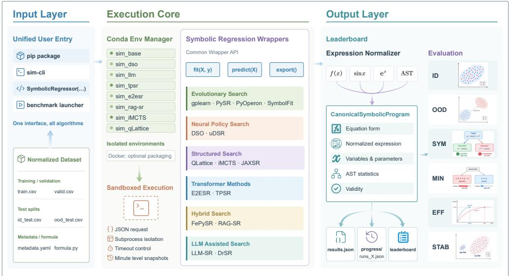  
Figure 7: SymbolicArena execution architecture. A shared task contract connects isolated algorithm wrappers to standardized evaluation artifacts.

The execution core maps each algorithm to an isolated environment. Conda provides isolated environments, and Docker supports optional packaging. A structured request specifies task inputs and run configuration. Subprocess supervision isolates execution, enforces the run budget, and records termination status.

Algorithm 1 defines the common adapter interface. Each wrapper maps native operations to shared fitting, prediction, and expression retrieval functions.

Algorithm 1 Unified SR adapter   
Require: Native method A, identifier a, environment E<sub>a</sub>   
1: W CREATEADAPTER(A)   
2: BIND(W<sub>a</sub>.fit, A.fit)   
3: BIND(W .predict, A.predict)   
4: BIND(W .get\_optimal\_equation, A)   
5: BIND(W .get\_total\_equations, A)   
6: REGISTER(a, E<sub>a</sub>, W<sub>a</sub>)

Native outputs are converted to a shared symbolic representation before metric computation. The representation binds expression content to variables and fitted parameters. Structural statistics and validity information support symbolic evaluation and output checks. Raw outputs are retained for auditing. Symbolic simplification and adjudication follow Section E.

## D.2 UNIFIED RUN PROCEDURE

Algorithm 2 specifies one run defined by an algorithm, task, seed, and evaluation condition.

Algorithm 2 Unified symbolic regression run procedure   
Require: Algorithm a, dataset d, seed s, condition c, budget B, checkpoint interval ∆   
1: D  LOADANDVALIDATE(d)   
2: $\theta \gets \mathbf { B U I L D C O N F I G } ( a , s , B ,$ Schema(D))   
3: $\widetilde { D } _ { \mathrm { t r } }$ PERTURBTRAININGLABEL ${ \mathfrak { s } } ( D _ { \operatorname { t r } } , c , s )$   
e4: w STARTISOLATEDFIT $( a , \widetilde { D } _ { \mathrm { t r } } , \theta )$   
e5: EMPTYTRAJECTORY; t 1   
6: while RUNNING(w) $\wedge t \Delta \leq B$ do   
7: WAITUNTILCHECKPOINT(t∆)   
8: (f<sub>t</sub>, u<sub>t</sub>, e<sub>t</sub>)  READNATIVEINCUMBENT(w)   
9: if $e _ { t }$ provides an auditable candidate then   
10: p<sub>t</sub> EXPORTPROGRAM(f<sub>t</sub>)   
11: m<sub>t</sub> EVALUATENUMERIC(p<sub>t</sub>, D<sub>ID</sub>, D<sub>OOD</sub>)   
12: $\mathcal { T } [ t ]  ( p _ { t } , u _ { t } , m _ { t } , e _ { t } )$   
13: else   
14: [t]  UNAVAILABLE(e<sub>t</sub>)   
15: end if   
16: $t \gets t + 1$   
17: end while   
18: COMPLETETRAJECTOR $\cdot ( \mathcal { T } , B , \Delta )$   
19: $( { \hat { f } } , \sigma )$ FINALIZEORRECOVER ${ \mathrm { . } } ( w , \tau )$   
20: if VALID( <sup>ˆ</sup>f) then   
21: p EXPORTPROGRAM( <sup>ˆ</sup>f)   
22: M EVALUATENUMERIC(p, D<sub>ID</sub>, D<sub>OOD</sub>)   
23: else   
24: $p $ Unavailable; $M \gets \mathrm { N A }$   
25: end if   
26: RECORD(a, d, s, c, p, , M, σ)

Let $D = \left( D _ { \mathrm { t r } } , D _ { \mathrm { v a l } } , D _ { \mathrm { I D } } , D _ { \mathrm { O O D } } \right)$ , and let θ denote the algorithm specific configuration. At each checkpoint, the wrapper records the native incumbent and its provenance. An auditable incumbent is exported to the shared representation and evaluated on the fixed ID and OOD splits.

ID and OOD scores remain external to search and candidate selection. Training label noise modifies $D _ { \mathrm { t r } }$ only. Failed or unavailable outputs retain explicit status labels.

## D.3 RECORDED RESULTS AND SEARCH TRAJECTORIES

Each run produces a final artifact and search trajectory. The final artifact stores the selected expression, evaluation results, and run status. Trajectory records store checkpoint expressions and provenance.

Formal evaluation uses 180 minutes with one checkpoint per minute. Each checkpoint stores the native best so far expression supported by auditable evidence. The latest auditable expression is carried forward between updates and after early termination. A checkpoint lacking sufficient evidence remains marked as unavailable.

Recorded artifacts support Multi Axis Evaluation. Final expressions support numerical and symbolic evaluation. Search trajectories provide temporal evidence for EFF, and repeated seed runs provide the records required by STAB.

## D.4 EXECUTION ISOLATION AND REPRODUCIBILITY BOUNDARY

Separate environments and subprocess isolation reduce dependency conflicts across algorithms. Frozen task inputs, execution rules, environment specifications, and recorded artifacts define the reproducibility boundary. Additional boundaries for language model assisted search and symbolic postprocessing are described in Section I.

## E MULTI AXIS EVALUATION DETAILS

The six axes are fixed independently of the evaluated algorithm set. ID and OOD measure numerical quality, SYM and MIN measure symbolic quality, and EFF and STAB characterize search behavior.

Formal evaluation uses 50 tasks and three random seeds

$$
\begin{array} { r } { { \cal S } = \{ 5 2 0 , 5 2 1 , 5 2 2 \} . } \end{array}
$$

All axes except STAB are computed per task and seed and averaged across 150 runs. STAB is computed per task across the three seeds and averaged across 50 tasks. Unless stated otherwise, E[·] denotes the empirical average associated with a metric. Metrics use the [0, 1] scale and the 0 to 100 display scale.

## E.1 NUMERICAL QUALITY MAPPING

ID and OOD use the same bounded transformation of NMSE. EFF and the numerical component of STAB reuse the mapping. For a valid NMSE value x, the clipped log error is

$$
r ( x ) = \mathrm { c l i p } ( \log _ { 1 0 } ( \operatorname* { m a x } ( x , \epsilon ) ) , \ell _ { \mathrm { m i n } } , \ell _ { \mathrm { m a x } } ) .
$$

Numerical quality is

$$
\phi ( x ) = \frac { \ell _ { \mathrm { m a x } } - r ( x ) } { \ell _ { \mathrm { m a x } } - \ell _ { \mathrm { m i n } } } .
$$

The bounds are $\ell _ { \mathrm { m i n } } = - 1 2$ and $\ell _ { \mathrm { m a x } } = 2$ , with $\epsilon = 1 0 ^ { - 1 2 }$ . The mapping satisfies $\phi ( x ) \in [ 0 , 1 ]$ Lower error yields higher quality. Invalid or unevaluable outputs receive quality zero.

For a final expression

$$
q ^ { \mathrm { I D } } = \phi ( \mathrm { N M S E } ^ { \mathrm { I D } } ) , \qquad q ^ { \mathrm { O O D } } = \phi ( \mathrm { N M S E } ^ { \mathrm { O O D } } ) .
$$

## E.2 NUMERICAL QUALITY

ID and OOD measure final numerical quality on the fixed evaluation splits

$$
\Bigl | \mathrm { S c o r e } ^ { \mathrm { I D } } = \mathbb { E } [ q ^ { \mathrm { I D } } ] , \qquad \mathrm { S c o r e } ^ { \mathrm { O O D } } = \mathbb { E } [ q ^ { \mathrm { O O D } } ] \Bigr | .
$$

ID to OOD degradation is reported separately for diagnostic analysis

$$
\log _ { 1 0 } \frac { \mathrm { N M S E } ^ { \mathrm { O O D } } + \epsilon } { \mathrm { N M S E } ^ { \mathrm { I D } } + \epsilon } .
$$

The OOD score excludes the degradation measure.

## E.3 OPUS ASSISTED SYMBOLIC POSTPROCESSING

Opus 5 assists symbolic postprocessing following search completion. Each request contains the selected final expression, fixed variable mappings, and coefficients. Domain and operator assumptions are also supplied. Ground truth expressions are processed separately and remain fixed across algorithms. Model assisted processing remains external to search and candidate selection.

Simplification and validation. The model returns a structured JSON record with outcome simplified, unchanged, or unable. An optional expression and brief justification are also returned. The prompt requires preservation of mathematical meaning and excludes coefficient refitting, variable renaming, and additional domain assumptions.

Responses must satisfy a fixed schema. Candidate expressions pass syntax and variable checks. Symbolic comparisons and numerical probes provide diagnostic evidence. An unable outcome retains the original expression and an explicit fallback flag.

Ordinary expressions use normalized expression trees implemented with SymPy (Meurer et al., 2017). gplearn retains protected operators as typed prefix nodes and uses its native evaluator near guard boundaries. Protected operators remain distinct from ordinary division, logarithms, and square roots.

Adjudication. Separate requests compare each processed prediction with its reference for SYM. Seed pairs from the same algorithm, task, and condition are compared for the structural component of STAB. Ground truth is excluded from the seed pair comparison.

Structural judgments distinguish mathematical equivalence, agreement after abstraction of numerical constants, and different or undetermined structure. MIN and partial SYM use deterministic expression tree statistics. A positive model judgment provides evaluation evidence and does not constitute formal mathematical proof.

Freezing and reuse. Processed expressions and judgments are frozen before metric aggregation. Artifacts retain original and processed expressions, input and response hashes, and model identifiers. Prompt and schema versions are also retained. Cached judgments are reused only after matching frozen expression dependencies and run provenance. Audit corrections remain linked to original responses. Metric aggregation requires no additional model calls.

## E.4 SYMBOLIC QUALITY

SYM. SYM measures agreement between the recovered expression and the underlying symbolic relation. Ground truth and predicted expressions use the same simplification procedure

$$
f ^ { \mathrm { r e f } } = { \cal S } ( f ^ { \mathrm { g t } } ) , \qquad \widetilde { f } = { \cal S } ( \widehat { f } ) .
$$

Let $d _ { \mathrm { e q } }$ denote the evaluator’s equivalence judgment. The equivalence indicator is

$$
E q = \mathbf { 1 } \left[ d _ { \mathrm { e q } } = \mathsf { e q u i v a l e n t } \right] .
$$

For predictions lacking a positive equivalence judgment, partial recovery uses expression structure and symbolic content. Tree similarity is

$$
S _ { \mathrm { t r e e } } = 1 - \mathrm { N E D } \left( \widetilde { f } , f ^ { \mathrm { r e f } } \right) ,
$$

where NED denotes normalized expression tree distance.

Variable and operator recovery are

$$
F _ { v } = \mathrm { F 1 } _ { \mathrm { v a r i a b l e } } , \qquad F _ { o } = \mathrm { F 1 } _ { \mathrm { o p e r a t o r } } ,
$$

where both scores compare the corresponding symbolic sets of $\widetilde { f }$ and $f ^ { \mathrm { r e f } }$

For an invalid or unparsable expression

$$
E q = S _ { \mathrm { t r e e } } = F _ { v } = F _ { o } = 0 .
$$

The symbolic score for one task and seed is

$$
m ^ { \mathrm { S Y M } } = \left\{ \begin{array} { l l } { 1 , } & { E q = 1 , } \\ { 0 . 5 \ : ( S _ { \mathrm { t r e e } } F _ { v } F _ { o } ) ^ { 1 / 3 } , } & { E q = 0 . } \end{array} \right.
$$

The final SYM score is

$$
\boxed { \mathrm { S c o r e } ^ { \mathrm { S Y M } } = \mathbb { E } [ m ^ { \mathrm { S Y M } } ] } .
$$

MIN. MIN measures expression complexity relative to the simplified reference used by SYM. Complexity is the number of nodes in the expression tree

$$
C ^ { \mathrm { r e f } } = C ( f ^ { \mathrm { r e f } } ) , \qquad C ^ { \mathrm { p r e d } } = C ( \widetilde { f } ) .
$$

The minimality score for one task and seed is

$$
\boxed { m ^ { \mathrm { M I N } } = \operatorname* { m i n } \left( 1 , \frac { C ^ { \mathrm { r e f } } } { C ^ { \mathrm { p r e d } } } \right) } .
$$

An invalid or unparsable final expression receives

$$
m ^ { \mathrm { M I N } } = 0 .
$$

The final MIN score is

$$
\boxed { \mathrm { S c o r e } ^ { \mathrm { M I N } } = \mathbb { E } [ m ^ { \mathrm { M I N } } ] } .
$$

A larger MIN score indicates lower expression complexity relative to the reference.

## E.5 SEARCH BEHAVIOR

EFF. EFF measures search progress relative to the best numerical quality reached in each run. One numerical evaluation is recorded per minute. Symbolic judgments remain external to EFF.

For

$$
t \in \{ 1 , \ldots , T \} , \qquad T = 1 8 0 ,
$$

the evaluator measures the ID and OOD quality of the expression selected by the algorithm’s native objective or model selection rule. Test results remain external to candidate selection. Numerical quality at minute t is

$$
q ( t ) = \frac { q ^ { \mathrm { I D } } ( t ) + q ^ { \mathrm { O O D } } ( t ) } { 2 } ,
$$

where

$$
\begin{array} { r } { q ^ { \mathrm { I D } } ( t ) = \phi \left( \mathrm { N M S E ^ { I D } } ( t ) \right) , \qquad q ^ { \mathrm { O O D } } ( t ) = \phi \left( \mathrm { N M S E ^ { O O D } } ( t ) \right) . } \end{array}
$$

The maximum observed quality is

$$
q ^ { * } = \operatorname* { m a x } _ { 1 \leq t \leq T } q ( t ) .
$$

For a complete auditable trajectory, the run score is

$$
\boxed { m ^ { \mathrm { E F F } } = \frac { 1 } { T } \sum _ { t = 1 } ^ { T } \frac { q ( t ) } { q ^ { * } } } .
$$

A run with $q ^ { * } = 0$ receives

$$
m ^ { \mathrm { E F F } } = 0 .
$$

The final EFF score is

$$
\boxed { \mathrm { S c o r e } ^ { \mathrm { E F F } } = \mathbb { E } [ m ^ { \mathrm { E F F } } ] } .
$$

The trajectory $q ( t )$ may decrease after expression updates. The value $q ^ { * }$ is computed at run end and used only for normalization. Unavailable checkpoints follow the trajectory completion rule in Section D.3.

STAB. STAB measures consistency across repeated random seed runs on the same task. For $K =$ |S| runs, consistency is evaluated across $\binom { K } { 2 }$ seed pairs. The experiment uses $K \ : = \ : 3$ . STAB combines numerical consistency, output validity, and structural consistency.

Numerical consistency. For seeds i and j

$$
\delta _ { i j } ^ { \mathrm { n u m } } = \frac { \left| { q _ { i } ^ { \mathrm { I D } } - q _ { j } ^ { \mathrm { I D } } } \right| + \left| { q _ { i } ^ { \mathrm { O O D } } - q _ { j } ^ { \mathrm { O O D } } } \right| } { 2 } .
$$

Numerical consistency for one task is

$$
N = 1 - \frac { 1 } { \binom { | \mathcal { S } | } { 2 } } \sum _ { i < j } \delta _ { i j } ^ { \mathrm { n u m } } .
$$

Output validity. The valid run fraction for one task is

$$
V = \frac { \# \{ \mathrm { v a l i d s e e d s } \} } { | S | } .
$$

Structural consistency. The evaluator judges every scheduled pair of frozen final expressions. A valid pair receives a positive judgment for mathematical equivalence or matching structure after abstraction of numerical constants. The indicator is

$$
\begin{array}{c} I _ { i j } ^ { \mathrm { s t r u c t } } = \left\{ { 1 , \atop \mathrm { { \ o t h e r w i s e . } } } \right. \nonumber  \end{array}
$$

Invalid pairs and judgments labeled undetermined or non\_applicable receive zero. Structural consistency is

$$
C = \frac { 1 } { \binom { K } { 2 } } \sum _ { i < j } I _ { i j } ^ { \mathrm { s t r u c t } } .
$$

The stability score for one task is

$$
\boxed { m ^ { \mathrm { S T A B } } = ( N V C ) ^ { 1 / 3 } } .
$$

The final STAB score is

$$
\begin{array} { r } { \boxed { \mathrm { S c o r e } ^ { \mathrm { S T A B } } = \mathbb { E } [ m ^ { \mathrm { S T A B } } ] } . } \end{array}
$$

The geometric mean requires all three components to remain high.

Adjudication limitations. An audit found inconsistent pairwise symbolic judgments for 3 clean, 2 one percent noise, and 3 five percent noise algorithm task groups. The cases limit interpretation of the structural component of STAB.

## E.6 BOOTSTRAP CONFIDENCE INTERVALS

Confidence intervals use 1000 task bootstrap replicates. Each replicate samples 50 tasks from Core50 with replacement and retains the three recorded runs for each sampled task. The same task draws are used across algorithms, axes, and evaluation conditions.

For the five axes defined per run, each replicate averages the sampled run scores. STAB averages the sampled task scores. The 2.5th and 97.5th percentiles define the 95% interval on the 0 to 100 display scale.

Evaluation outputs and symbolic judgments remain fixed during resampling. The intervals quantify task resampling variability within the empirical Core50 sample and are not interpreted as significance tests.

## E.7 SUPPLEMENTARY TRAINING NOISE ROBUSTNESS

Training noise robustness is reported separately from the six formal evaluation axes. Two supplementary conditions are evaluated

$$
\sigma \in \{ 0 . 0 1 , 0 . 0 5 \} .
$$

Training labels are perturbed according to

$$
y ^ { \prime } = y + \sigma \operatorname { s t d } ( y ) \epsilon , \qquad \epsilon \sim { \mathcal { N } } ( 0 , 1 ) .
$$

The values of σ set the Gaussian noise standard deviation to 1% and 5% of the training target standard deviation. ID and OOD test sets remain clean.

Clean and noisy numerical quality is reported on both evaluation splits. Performance degradation is reported for each noise condition.

## F SENSITIVITY ANALYSIS

The analysis examines two construction decisions in SymbolicArena: Probe4 selection and Core50 construction. Each decision is re-evaluated across controlled perturbations.

## F.1 PROBE4 SELECTION STABILITY AND REPLACEMENT STRUCTURE

All 12 calibration algorithms remain eligible for probe selection. The observed selection mass concentrates on a small competitive set, motivating an audit of panel stability and replacement structure. We examine the default panel

$$
\mathcal { A } _ { 4 } = \{ \mathrm { D S O } , \mathrm { P y O p e r o n } , \mathrm { i M C T S } , \mathrm { u D S R } \}
$$

across variation in the calibration sample and selection rule, followed by direct member removal tests. All analyses reuse the 2,400 Calib200 records from Appendix C.2 and require no additional SR runs.

Calibration resampling. We perform 1,000 family stratified task bootstrap replicates. Each replicate samples task blocks with replacement and preserves the original source family counts. The 12 algorithm records associated with each sampled task move as one block. Probe selection is repeated at the default setting $\alpha = 0 . 5 , \tau = 1 0 0$ , and $m = 3 .$ with all tied optima retained. The default Probe4 is the unique optimum in 63.4% of replicates and belongs to the optimal set in 73.4%. Its tie averaged selection mass is 68.3%, and its median competition rank is 1 with an interquartile range of 1–2.

Table 8 shows a concentrated competitive set. uDSR and PyOperon receive nearly all bootstrap inclusion mass. DSO and iMCTS remain frequent members, and QLattice is the principal alternative. gplearn receives limited mass. The other candidates receive none. The pattern emerges from the complete 12 algorithm selection procedure and is not imposed by prior filtering.

Table 8: Calibration usability and bootstrap inclusion of the 12 eligible probe candidates. Inclusion frequency averages tied optima uniformly.
<table><tr><td>Algorithm</td><td>Probe4</td><td>H</td><td>Inclusion (%)</td><td>Any optimum (%)</td></tr><tr><td>uDSR</td><td>Yes</td><td>0.9875</td><td>100.0</td><td>100.0</td></tr><tr><td>PyOperon</td><td>Yes</td><td>0.9600</td><td>98.8</td><td>99.3</td></tr><tr><td>DSO</td><td>Yes</td><td>0.9700</td><td>88.1</td><td>91.5</td></tr><tr><td>iMCTS</td><td>Yes</td><td>0.9675</td><td>81.4</td><td>85.4</td></tr><tr><td>QLattice</td><td></td><td>0.9600</td><td>30.5</td><td>35.0</td></tr><tr><td>gplearn</td><td></td><td>0.9300</td><td>1.2</td><td>1.9</td></tr><tr><td>PySR</td><td></td><td>0.8750</td><td>0.0</td><td>0.0</td></tr><tr><td>TPSR</td><td></td><td>0.8625</td><td>0.0</td><td>0.0</td></tr><tr><td>DrSR</td><td></td><td>0.8225</td><td>0.0</td><td>0.0</td></tr><tr><td>LLM-SR</td><td></td><td>0.8175</td><td>0.0</td><td>0.0</td></tr><tr><td>E2ESR</td><td></td><td>0.7775</td><td>0.0</td><td>0.0</td></tr><tr><td>RAG-SR</td><td></td><td>0.6500</td><td>0.0</td><td>0.0</td></tr></table>

Selection rule perturbation. We vary α from 0.30 to 0.70 in increments of 0.05 and evaluate τ ∈ {10, 30, 100, 300, 1000} with m = 3 fixed. Across 45 settings, Probe4 is the unique optimum in 31 and belongs to the optimal set in 33. Its competition rank remains within the top three for every tested setting. The result indicates stable competition across moderate changes in the usability definition.

Member removal. Each Probe4 member is removed in turn, and the complete selection procedure is rerun on the remaining 11 algorithms. QLattice replaces DSO, iMCTS, or uDSR, and gplearn replaces PyOperon. Every fallback panel preserves three paradigms. Table 9 reports the resulting replacement panels and usability losses. The largest usability loss is 0.007500, corresponding to 0.75 percentage points on the [0, 1] usability scale. The result shows that the selection procedure admits structured fallback choices with limited loss in calibration usability.

Table 9: Probe4 replacement analysis. U denotes panel usability, and $\Delta U$ measures the loss from the default Probe4 score $U = 0 . 9 \dot { 7 } 1 2 5 0$
<table><tr><td>Removed</td><td>Replacement</td><td>Best U</td><td> $\Delta U$ </td><td>Paradigms</td></tr><tr><td>iMCTS</td><td>QLattice</td><td>0.969375</td><td>0.001875</td><td>3</td></tr><tr><td>DSO</td><td>QLattice</td><td>0.968750</td><td>0.002500</td><td>3</td></tr><tr><td>uDSR</td><td>QLattice</td><td>0.964375</td><td>0.006875</td><td>3</td></tr><tr><td>PyOperon</td><td>gplearn</td><td>0.963750</td><td>0.007500</td><td>3</td></tr></table>

Paradigm coverage. The minimum paradigm requirement isolates the role of search diversity in probe selection. $\mathbf { A } \mathbf { t } m = 2 ,$ , the default panel shares the optimum with a second panel at the same best usability of $0 . 9 7 1 2 5 0$ . Requiring three paradigms removes the tie and preserves the same best usability. $\mathrm { A t } m = 4 .$ , the default panel becomes infeasible, and the best feasible panel changes to

$$
\mathrm { \{ P y O p e r o n , i M C T S , T P S R , u D S R \} , }
$$

with usability 0.944375. The three paradigm setting resolves the ambiguity at $m \ : = \ : 2$ with no reduction in maximum usability.

Overall, all 12 candidates enter the selection procedure, yet the evidence consistently concentrates on a small competitive set. Probe4 remains dominant or near dominant across calibration resampling and rule perturbations. Member removal produces structured fallback panels with small usability loss and preserved paradigm coverage. The analysis supports the stability of the selection process and exposes its principal alternatives.

## F.2 Core50 CONSTRUCTION

The Core50 selection objective is

$$
S ^ { * } = \arg \operatorname* { m a x } _ { S \subset \mathcal { D } _ { 6 6 4 } , | S | = 5 0 } \left[ w _ { C } \mathrm { C o v e r a g e } ( S ) + w _ { I } \mathrm { M e a n I n f o } ( S ) + w _ { B } \mathrm { B a l a n c e } ( S ) \right] ,
$$

where Coverage measures task coverage in the structural and probe response spaces, MeanInfo measures task-level discriminative power across algorithms and stability, and Balance controls distributional shifts in difficulty and failure modes. The default weights are $\pmb { w } _ { 0 } = ( 0 . 4 5 , 0 . 3 5 , 0 . 2 0 )$

Single-parameter weight sensitivity. Each weight $w _ { j }$ is adjusted to a given value v, and the other two weights are renormalized to sum to one. The examined ranges are $w _ { C } \in [ 0 . 4 0 , 0 . 5 0 ]$ $w _ { I } \in [ 0 . 3 0 , 0 . 4 0 ]$ , and $w _ { B } \in [ 0 . 1 5 , 0 . 2 5 ]$

For each setting, 30 independent random restarts are performed, yielding 450 selection results in total. The full-ranking rate is the frequency with which the complete ordering uDSR ${ } > \mathrm { i M C T S } >$ $\mathrm { D S O } > \mathrm { P y C }$ peron is preserved.

Table 10: Single-parameter weight perturbation results. Jaccard similarity and overlapping tasks are measured against the default-weight selection under 30 random restarts per setting. Within-group Jaccard similarity compares the 30 restarts of one setting.
<table><tr><td colspan="3">Median Jaccard</td><td rowspan="2">Overlapping tasks</td><td rowspan="2">Median within- group Jaccard</td><td rowspan="2">Full-ranking rate</td></tr><tr><td>Perturbed weight</td><td>Weight range</td><td>vs. default</td></tr><tr><td>Coverage</td><td>[0.40, 0.50]</td><td>0.724</td><td>42</td><td>0.667</td><td>100%</td></tr><tr><td>MeanInfo</td><td>[0.30, 0.40]</td><td>0.710</td><td>41.5</td><td>0.667</td><td>100%</td></tr><tr><td>Balance</td><td>[0.15, 0.25]</td><td>0.710</td><td>41.5</td><td>0.667</td><td>100%</td></tr></table>

Table 10 shows that weight perturbations mainly affect tasks near the selection boundary. The median Jaccard similarity between the reselected 50 task sets and the default set is approximately 0.710, corresponding to 41 to 42 overlapping tasks. The median within-group Jaccard similarity across the 30 restarts under the same weight setting is 0.667, indicating that approximately 40 highquality tasks are selected consistently, and the remaining positions are occupied by interchangeable marginal tasks. These results demonstrate that the Core50 objective is robust to moderate perturbations of the default weights.

Joint random weight analysis. To examine joint variations in multiple weights, the sampling region is

$$
\mathcal { W } _ { \mathrm { b o x } } = \{ \pmb { w } | \begin{array} { l } { w _ { C } \in [ 0 . 4 0 , 0 . 5 0 ] , } \\ { w _ { I } \in [ 0 . 3 0 , 0 . 4 0 ] , } \\ { w _ { B } = 1 - w _ { C } - w _ { I } \in [ 0 . 1 5 , 0 . 2 5 ] } \end{array} \} .
$$

5,000 weight vectors are sampled uniformly from $\mathcal { W } _ { \mathrm { b o x } }$ . For each sampled vector, all candidate 50 task sets are rescored, and the highest-scoring set is retained. Table 11 shows that four distinct optimal sets are obtained across the 5,000 samples, with the default-weight optimal set accounting for 40.24% of the selections.

Table 11: Distribution of optimal sets under joint weight sampling. Selections report the number of the 5,000 sampled weight vectors that produce each optimal set. S0 denotes the default-weight selection.
<table><tr><td colspan="4"></td></tr><tr><td>Optimal set</td><td>Selections</td><td>Share</td><td>Jaccard vs. default</td></tr><tr><td>SO (Core50)</td><td>2012</td><td>40.24%</td><td>1.000</td></tr><tr><td>S1</td><td>1803</td><td>36.06%</td><td>0.724</td></tr><tr><td>S2</td><td>1173</td><td>23.46%</td><td>0.786</td></tr><tr><td>S3</td><td>12</td><td>0.24%</td><td>0.754</td></tr></table>

Table 12 reports a mean Jaccard similarity to the default set of 0.850, corresponding to approximately 46 overlapping tasks on average. All 5,000 selected sets preserve the ranking of the four probes on Full Task Set.

Task inclusion frequencies further reveal a stable core: 37 tasks are selected in all 5,000 runs, 38 appear in at least 90% of the runs, and 42 appear in at least 75%.

Table 12: Joint random weight analysis results. Statistics summarize the 5,000 sampled weight vectors.
<table><tr><td>Statistic</td><td>Result</td></tr><tr><td>Mean Jaccard vs. default Minimum overlapping tasks</td><td>0.850</td></tr><tr><td></td><td>42/50</td></tr><tr><td>Full-ranking rate</td><td>100%</td></tr><tr><td>Tasks selected in all runs</td><td>37</td></tr><tr><td>Tasks in ≥ 90% of runs</td><td>38</td></tr><tr><td>Tasks in ≥ 75% of runs</td><td>42</td></tr></table>

Under joint variations of all three weights, the optimal sets continue to overlap substantially with Core50, and the resulting algorithm ranking remains unchanged.

## G ADDITIONAL EXPERIMENTAL RESULTS

The appendix provides supporting evidence for Multi Axis Evaluation in SymbolicArena. The analyses examine redundancy among evaluation axes and quantify uncertainty from task sampling. Additional results assess robustness to training noise and examine a representative gap between numerical approximation and symbolic recovery.

## G.1 CORRELATION AMONG EVALUATION AXES

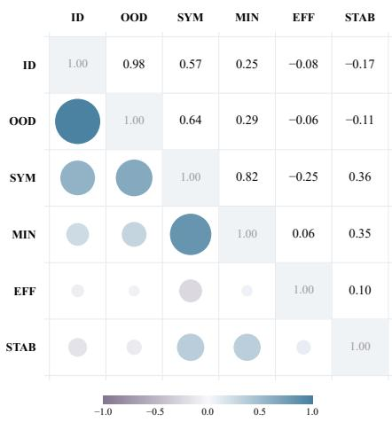  
Figure 8: Spearman correlations among the six evaluation axes across 15 algorithms on clean Core50.

Figure 8 shows distinct association patterns among the six axes. ID and OOD are strongly correlated $( \rho = 0 . 9 8 )$ , indicating similar numerical rankings across the two evaluation distributions. SYM and MIN also show a strong association $( \rho = 0 . 8 2 )$ ). Numerical quality has moderate correlation with SYM $( \rho = 0 . 5 7 \mathrm { t o } 0 . 6 4 )$ and weaker correlation with MIN $( \rho = 0 . 2 5 \mathrm { t o } 0 . 2 9 )$ ).

EFF shows little association with final numerical quality, with correlations of −0.08 for ID and −0.06 for OOD. STAB also has weak association with numerical quality. The observed structure provides empirical support for retaining separate dimensions for numerical quality, symbolic quality, and search behavior.

## G.2 UNCERTAINTY IN SIX AXIS SCORES

Figure 9 quantifies task sampling uncertainty for all six axes. Interval widths differ across algorithms and metrics, indicating different sensitivity to the sampled tasks. Small gaps between point estimates should consequently be interpreted alongside their bootstrap intervals. The analysis complements the six axis profiles reported in the main text.

## G.3 ROBUSTNESS TO TRAINING NOISE

Training label perturbations extend the clean evaluation to corrupted training signals.

Table 13 shows substantial variation in numerical robustness across algorithms. High clean OOD performance does not consistently correspond to small degradation under noise. iMCTS retains the highest OOD score across all evaluated conditions, whereas DSO shows a smaller absolute drop from its clean score. FePySR remains competitive at both noise levels. The pattern distinguishes clean numerical quality from robustness to training corruption.

Tables 14 and 15 report the complete six axis profiles at $\sigma = 0 . 0 1$ and $\sigma = 0 . 0 5$ . The tables extend the numerical robustness analysis to symbolic quality and search behavior, using the same metric definitions as the clean evaluation. Clean profiles are reported in Table 2.

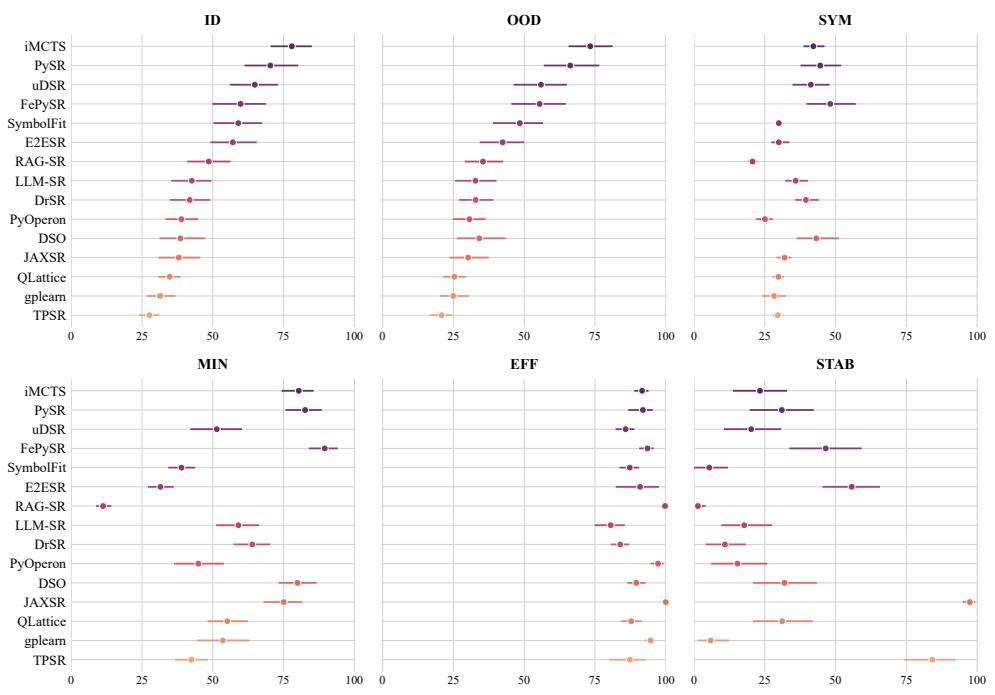  
Figure 9: Mean scores and 95% task bootstrap intervals on clean Core50. Points denote mean scores and bars denote percentile intervals from 1,000 resamples of 50 task blocks. Each sampled block retains the three recorded runs. Scores use the 0 to 100 display scale.

Table 13: Numerical robustness of 15 symbolic regression methods under training label noise. ID and OOD scores are reported under clean, 1%, and 5% noise conditions. $\Delta _ { 5 \% }$ denotes the score change from clean to 5% noise.
<table><tr><td colspan="2"></td><td colspan="4">ID</td><td colspan="4">OOD</td></tr><tr><td>Paradigm</td><td>Algorithm</td><td>Clean ↑</td><td>1%↑</td><td>5%↑</td><td> $\pmb { \Delta _ { 5 \% } } \uparrow$ </td><td>Clean ↑</td><td>1%↑</td><td>5%↑</td><td> $\pmb { \Delta _ { 5 \% } } \uparrow$ </td></tr><tr><td rowspan="3">Structured Search</td><td>iMCTS</td><td>77.91</td><td>55.08</td><td>46.69</td><td>-31.22</td><td>73.35</td><td>49.40</td><td>40.73</td><td>-32.62</td></tr><tr><td>QLattice</td><td>34.79</td><td>32.36</td><td>29.18</td><td>-5.61</td><td>25.37</td><td>23.09</td><td>20.27</td><td>-5.10</td></tr><tr><td>JAXSR</td><td>37.99</td><td>32.62</td><td>31.00</td><td>-6.99</td><td>30.21</td><td>25.91</td><td>24.56</td><td>-5.65</td></tr><tr><td rowspan="4">Evolutionary Search</td><td>PySR</td><td>70.34</td><td>48.42</td><td>41.05</td><td>-29.29</td><td>66.28</td><td>41.50</td><td>35.53</td><td>-30.75</td></tr><tr><td>PyOperon</td><td>38.89</td><td>36.29</td><td>32.97</td><td>-5.92</td><td>30.64</td><td>27.85</td><td>24.42</td><td>-6.22</td></tr><tr><td>gplearn</td><td>31.37</td><td>30.14</td><td>29.93</td><td>-1.44</td><td>24.96</td><td>23.97</td><td>23.84</td><td>-1.12</td></tr><tr><td>SymbolFit</td><td>59.04</td><td>44.38</td><td>38.42</td><td>-20.62</td><td>48.46</td><td>33.87</td><td>28.26</td><td>-20.20</td></tr><tr><td>Neural Policy Search</td><td>uDSR DSO</td><td>64.84 38.56</td><td>44.61 37.27</td><td>38.87 37.61</td><td>-25.97 -0.95</td><td>55.94 34.14</td><td>32.86 32.95</td><td>27.44</td><td>-28.50</td></tr><tr><td rowspan="2">Hybrid Search</td><td>FePySR</td><td>59.84</td><td>46.69</td><td></td><td></td><td>55.45</td><td></td><td>32.84</td><td>-1.30</td></tr><tr><td>RAG-SR</td><td>48.58</td><td>39.95</td><td>41.69 36.33</td><td>-18.15 -12.25</td><td>35.45</td><td>42.77 27.26</td><td>36.92 24.35</td><td>-18.53</td></tr><tr><td rowspan="2">Transformer Methods</td><td>E2ESR</td><td>57.09</td><td>43.64</td><td></td><td></td><td>42.40</td><td>31.36</td><td></td><td>-11.10</td></tr><tr><td>TPSR</td><td>27.60</td><td>26.83</td><td>36.31 24.48</td><td>-20.78 -3.12</td><td>20.84</td><td>19.81</td><td>25.97 18.05</td><td>-16.43</td></tr><tr><td rowspan="2">LLM Assisted</td><td></td><td></td><td>37.67</td><td></td><td></td><td>32.82</td><td>28.55</td><td></td><td>-2.79</td></tr><tr><td>DrSR</td><td>41.86</td><td></td><td>31.76</td><td>-10.10</td><td></td><td></td><td>23.44</td><td>-9.38</td></tr><tr><td>Search</td><td>LLM-SR</td><td>42.59</td><td>35.12</td><td>33.36</td><td>-9.23</td><td>32.78</td><td>26.08</td><td>23.00</td><td>-9.78</td></tr></table>

Display scale: 0–100. $\Delta _ { 5 \% } = \mathrm { S c o r e } _ { 5 \% } - \mathrm { S c o r e } _ { c l e a n } .$

Table 14: Six-axis profiles of 15 symbolic regression methods on Core50 at 1% training-label noise $( \sigma = 0 . 0 1 )$ . Methods are grouped by their primary search paradigm. Higher values denote better performance on each axis.
<table><tr><td></td><td></td><td colspan="2">Numerical</td><td colspan="2">Symbolic</td><td colspan="2">Search</td></tr><tr><td>Paradigm</td><td>Algorithm</td><td>D↑</td><td>O0D↑</td><td>SYM↑</td><td>MIN↑</td><td>EFF↑</td><td>STAB ↑</td></tr><tr><td rowspan="3">Structured Search</td><td>iMCTS</td><td>55.08</td><td>49.40</td><td>37.22</td><td>72.88</td><td>89.34</td><td>12.82</td></tr><tr><td>QLattice</td><td>32.36</td><td>23.09</td><td>29.59</td><td>54.60</td><td>90.87</td><td>38.32</td></tr><tr><td>JAXSR</td><td>32.62</td><td>25.91</td><td>30.88</td><td>76.16</td><td>99.95</td><td>91.33</td></tr><tr><td rowspan="4">Evolutionary Search</td><td>PySR</td><td>48.42</td><td>41.50</td><td>30.53</td><td>60.26</td><td>86.08</td><td>6.02</td></tr><tr><td>PyOperon</td><td>36.29</td><td>27.85</td><td>25.14</td><td>43.76</td><td>97.30</td><td>15.92</td></tr><tr><td>gplearn</td><td>30.14</td><td>23.97</td><td>28.03</td><td>53.30</td><td>94.24</td><td>7.77</td></tr><tr><td>SymbolFit</td><td>44.38</td><td>33.87</td><td>29.48</td><td>36.93</td><td>84.49</td><td>2.74</td></tr><tr><td rowspan="2">Neural Policy Search</td><td>uDSR</td><td>44.61</td><td>32.86</td><td>27.79</td><td>32.64</td><td>83.80</td><td>4.14</td></tr><tr><td>DSO</td><td>37.27</td><td>32.95</td><td>43.32</td><td>81.81</td><td>90.21</td><td>32.25</td></tr><tr><td rowspan="2">Hybrid Search</td><td>FePySR</td><td>46.69</td><td>42.77</td><td>35.82</td><td>83.67</td><td>89.49</td><td>43.75</td></tr><tr><td>RAG-SR</td><td>39.95</td><td>27.26</td><td>19.35</td><td>9.64</td><td>99.35</td><td>0.00</td></tr><tr><td rowspan="2">Transformer Methods</td><td>E2ESR</td><td>43.64</td><td>31.36</td><td>27.65</td><td>28.21</td><td>89.44</td><td>4.09</td></tr><tr><td>TPSR</td><td>26.83</td><td>19.81</td><td>29.36</td><td>41.17</td><td>87.37</td><td>8.13</td></tr><tr><td rowspan="2">LLM Assisted Search</td><td>DrSR</td><td>37.67</td><td>28.55</td><td>34.65</td><td>64.07</td><td>84.74</td><td>11.73</td></tr><tr><td>LLM-SR</td><td>35.12</td><td>26.08</td><td>30.85</td><td>50.86</td><td>81.69</td><td>8.23</td></tr></table>

Display scale 0–100.  
Best (1st) Second-best (2nd)

Table 15: Six-axis profiles of 15 symbolic regression methods on Core50 at 5% training-label noise (σ = 0.05). Methods are grouped by their primary search paradigm. Higher values denote better performance on each axis.
<table><tr><td></td><td></td><td colspan="2">Numerical</td><td colspan="2">Symbolic</td><td colspan="2">Search</td></tr><tr><td>Paradigm</td><td>Algorithm</td><td>D↑</td><td>OOD↑</td><td>SYM↑</td><td>MIN↑</td><td>EFF↑</td><td>STAB ↑</td></tr><tr><td rowspan="3">Structured Search</td><td>iMCTS</td><td>46.69</td><td>40.73</td><td>36.43</td><td>66.26</td><td>86.11</td><td>5.24</td></tr><tr><td>QLattice</td><td>29.18</td><td>20.27</td><td>29.19</td><td>54.99</td><td>85.95</td><td>29.66</td></tr><tr><td>JAXSR</td><td>31.00</td><td>24.56</td><td>31.29</td><td>77.47</td><td>99.95</td><td>91.95</td></tr><tr><td rowspan="4">Evolutionary Search</td><td>PySR</td><td>41.05</td><td>35.53</td><td>30.66</td><td>59.16</td><td>85.28</td><td>6.73</td></tr><tr><td>PyOperon</td><td>32.97</td><td>24.42</td><td>23.60</td><td>39.83</td><td>97.27</td><td>15.33</td></tr><tr><td>gplearn</td><td>29.93</td><td>23.84</td><td>27.30</td><td>53.52</td><td>93.24</td><td>3.90</td></tr><tr><td>SymbolFit</td><td>38.42</td><td>28.26</td><td>29.23</td><td>36.38</td><td>83.24</td><td>2.77</td></tr><tr><td rowspan="2">Neural Policy Search</td><td>uDSR</td><td>38.87</td><td>27.44</td><td>27.88</td><td>32.53</td><td>82.47</td><td>7.05</td></tr><tr><td>DSO</td><td>37.61</td><td>32.84</td><td>42.83</td><td>80.35</td><td>90.29</td><td>29.73</td></tr><tr><td rowspan="2">Hybrid Search</td><td>FePySR</td><td>41.69</td><td>36.92</td><td>36.44</td><td>84.89</td><td>88.83</td><td>40.14</td></tr><tr><td>RAG-SR</td><td>36.33</td><td>24.35</td><td>18.79</td><td>8.66</td><td>99.47</td><td>0.00</td></tr><tr><td rowspan="2">Transformer Methods</td><td>E2ESR</td><td>36.31</td><td>25.97</td><td>27.30</td><td>26.51</td><td>89.18</td><td>1.99</td></tr><tr><td>TPSR</td><td>24.48</td><td>18.05</td><td>28.62</td><td>42.08</td><td>88.48</td><td>2.75</td></tr><tr><td rowspan="2">LLM Assisted Search</td><td>DrSR</td><td>31.76</td><td>23.44</td><td>33.36</td><td>61.38</td><td>83.43</td><td>12.44</td></tr><tr><td>LLM-SR</td><td>33.36</td><td>23.00</td><td>31.26</td><td>51.32</td><td>80.96</td><td>4.05</td></tr></table>

Display scale 0–100.

## G.4 NUMERICAL APPROXIMATION AND SYMBOLIC RECOVERY

A clean Nguyen-9 run from PySR illustrates the distinction between numerical approximation and symbolic recovery. For seed 520, the reference expression and processed prediction are

$$
\begin{array} { l } { { f ^ { \mathrm { g t } } ( x _ { 1 } , x _ { 2 } ) = \sin ( x _ { 1 } ) + \sin ( x _ { 2 } ^ { 2 } ) , } } \\ { { \widetilde f ( x _ { 1 } , x _ { 2 } ) = f ^ { \mathrm { g t } } ( x _ { 1 } , x _ { 2 } ) + 1 . 1 6 8 5 1 8 8 \times 1 0 ^ { - 8 } . } } \end{array}
$$

The recorded NMSE values are $4 . 5 4 \times 1 0 ^ { - 1 5 }$ on the fixed ID split and $8 . 2 8 \times 1 0 ^ { - 1 7 }$ on the fixed OOD split. Despite the near exact numerical fit, the evaluator assigns not\_equivalent, producing $\dot { m } ^ { \mathrm { S Y M } } = \dot { 0 } . 4 8 8 6$

The prediction preserves the principal functional structure and differs from the reference by a small additive residual. Exact symbolic equivalence is lost despite negligible numerical error. The example provides a concrete motivation for evaluating numerical quality and symbolic recovery separately in SymbolicArena.

## H EVALUATED ALGORITHMS AND EXPERIMENTAL SETTINGS

The study evaluates 15 symbolic regression algorithms across six primary search paradigms. FePySR (Yu et al., 2026), SymbolFit (Tsoi et al., 2025), and JAXSR (Kitchin, 2024) are excluded from benchmark construction and serve as validation algorithms. All methods are evaluated on the frozen Core50 benchmark.

Algorithm panel. Table 16 characterizes the algorithmic coverage of the evaluation by grouping the 15 methods according to their primary search paradigms and search mechanisms.

Table 16: Symbolic regression algorithms evaluated in SymbolicArena. Bold marks validation algorithms.
<table><tr><td>Paradigm</td><td>Method</td><td>Description</td></tr><tr><td>Structured Search</td><td>iMCTS (Huang et al., 2025)</td><td>Monte Carlo tree search for guided expression exploration.</td></tr><tr><td></td><td>QLattice (Broløs et al., 2021)</td><td>Probabilistic graph search for compact symbolic models.</td></tr><tr><td></td><td>JAXSR (Kitchin, 2024)</td><td>Structured symbolic model construction with optimization in JAX.</td></tr><tr><td>Neural Policy Search</td><td>uDSR (Landajuela et al., 2022) DSO (Petersen et al., 2021)</td><td>Neural symbolic search with evolutionary refinement. Policy search using risk seeking optimization.</td></tr><tr><td>Evolutionary Search</td><td>PySR (Cranmer, 2023)</td><td>Population search with complexity aware model</td></tr><tr><td></td><td>PyOperon (Burlacu et al., 2020)</td><td>selection. Evolutionary tree search with constant optimization.</td></tr><tr><td></td><td>gplearn (Stephens, 2016)</td><td>Genetic programming with protected operators and parsimony control.</td></tr><tr><td></td><td>SymbolFit (Tsoi et al., 2025)</td><td>Hybrid symbolic search with numerical parameter optimization.</td></tr><tr><td>Transformer Methods</td><td>E2ESR (Kamienny et al., 2022)</td><td>Pretrained neural generation of expressions from</td></tr><tr><td></td><td>TPSR (Shojaee et al., 2023)</td><td>numerical data. Pretrained expression generation guided by planning.</td></tr><tr><td>Hybrid Search</td><td>FePySR (Yu et al., 2026)</td><td>PySR based symbolic regression with feature</td></tr><tr><td></td><td>RAG-SR (Zhang et al., 2025)</td><td>enhancement. Retrieval guided symbolic search with evolutionary</td></tr><tr><td>LLM Assisted Search</td><td>DrSR (Wang et al., 2025)</td><td>optimization. LLM symbolic regression with iterative candidate</td></tr><tr><td></td><td></td><td>refinement.</td></tr><tr><td></td><td>LLM-SR (Shojaee et al., 2025a)</td><td>LLM equation proposals with numerical parameter refinement.</td></tr></table>

Evaluation configurations. Table 17 records the configurations used in the formal Core50 evaluation. The evaluated uDSR configuration uses the fixed uDSR trunk variant, which combines a DSO style controller, the LINEAR poly token, and GP meld.

Table 17: Algorithm specific configurations for the formal Core50 evaluation. Gray rows mark validation algorithms.
<table><tr><td>Algorithm</td><td>Search setting</td><td>Operators and basis</td><td>Fixed settings</td></tr><tr><td>gplearn</td><td>Population 1000.</td><td>sin, cos</td><td>add, sub, mul, div, sqrt, log, 1 job, tournament 20, initial depth 2 to 6, MAE metric, parsimony 0.001, crossover 0.9, subtree, hoist, and point mutation 0.01.</td></tr><tr><td>PyOperon</td><td>Population 500, pool 500.</td><td>add, sub, mul, div, aq, exp, log, sin, cos, tanh, sqrt, square, constants, variables</td><td>4 threads, max length 50, max depth 10, tournament 5, keep best reinsertion, LM optimizer, local search probability 1.0.</td></tr><tr><td>PySR</td><td></td><td>8 populations of size 64, Binary +, −, × , /. Unary 500 cycles per iteration. square, cube, exp, log, sin, cos.</td><td>Serial execution with 1 process, max size 30, max depth 10, parsimony 0.001, deterministic mode, precision 32, best model selection.</td></tr><tr><td>QLattice</td><td>BIC criterion.</td><td>QLattice/Feyn internal symbolic basis</td><td>4 threads, regression mode, BIC model selection, 4 significant digits.</td></tr><tr><td>DSO</td><td>Batch size 1000.</td><td>add, sub, mul, div, sin, cos, exp, log</td><td>4 batch cores, reward inv NRMSE, € = 0.05, learning rate 5 × 10−4, entropy weight 0.03, expression length 4 to 64.</td></tr><tr><td>uDSR</td><td>Batch size 1000, GP 20 generations.</td><td>add, sub, mul, div, sin, cos, meld population 100 for exp, log, sqrt, 1.0, constants, poly token</td><td>1 batch core, reward inv NRMSE, € = 0.05, learning rate  $5 \times 1 0 ^ { - 4 } .$  entropy weight 0.03, expression length 4 to 100, GP meld and linear poly enabled.</td></tr><tr><td>iMCTS</td><td> $K = 5 0 0 .$  max depth 6.</td><td> $+ , - , \times , / ,$  sin, cos, exp, log, real constant token</td><td>Exploration constant 4.0,  $\gamma = 0 . 5 ,$  GP rate 0.2, mutation 0.1, exploration 0.2, max constants 10, LN Nelder–Mead optimization.</td></tr><tr><td>E2ESR</td><td>200 input points, 10 bags, refine 10 trees, stop refinement after 1.</td><td>Pretrained E2E decoder vocabulary with arithmetic, inverse and powers, log and zero. exp, trigonometric and inverse trigonometric functions.</td><td>Single Torch thread, rescaling and execution forced to CPU, top k feature selection and relabeling, missing variables filled with</td></tr><tr><td>TPSR</td><td>200 input points, 10 bags, refine 10 trees, beam size 10, width 3, rollout 3, horizon 200.</td><td>Pretrained E2E decoder vocabulary. Unsupported variables projected to zero.</td><td>4 CPU threads and 1 interop thread, E2E backbone, sampling beam, one beam,  $\lambda = 0 . 1 ,$  no value training, reward sample limit 2048, prefix cache disabled, CPU mode.</td></tr><tr><td>LLM-SR</td><td>max 10 fitted parameters.</td><td>from an LLM. Constants are fitted.</td><td>4 samples per iteration, Python expression skeletons Semantic prompt injection and prompt variables enabled, sample persistence disabled, DeepInfra Llama-3.1-8B-Instruct-Turbo, max 1024 tokens, temperature 0.6, top p 0.3, top k 30.</td></tr><tr><td>DrSR</td><td>10 fitted parameters.</td><td>400000 proposals, max from an LLM. Constants are fitted.</td><td>4 samples per iteration, Python expression skeletons Same prompt contract as LLM-SR, one sampler and one evaluator, sample persistence disabled, DeepInfra Llama-3.1-8B-Instruct-Turbo, max 1024 tokens, temperature 0.6, top p 0.3, top k 30.</td></tr><tr><td>RAG-SR</td><td>Population 200, gene number 10.</td><td>Add, Sub, Mul, AQ, Sqrt, RCos, Max, Min, Neg</td><td>4 CPU threads, automatic lexicase selection, crossover 0.9, AbsLog, Abs, Square, RSin, mutation 0.1, max height 10, RidgeCV, MinMax normalization, R2 score, external archive enabled, number_of_invokes=0.</td></tr><tr><td>SymbolFit</td><td>Max size and complexity 25.</td><td>Binary +, −, ×, /. Unary sin, cos, exp, log.</td><td>Serial deterministic search with one process, model selection based on accuracy, input rescaling, mean target scaling, max stderr 20, fixed target uncertainty 1, no uncertainty fitting.</td></tr><tr><td>FePySR</td><td>epochs with batch size sin, cos, exp, log. 64, PySR uses 4 populations of 40 and 100 cycles per iteration.</td><td>8 experiments, FMN 30 Binary +, −, ×, /. Unary</td><td>4 workers, FMN learning rate 0.1, 10 extracted features, 6 PySR features, max size 20, max depth 8.</td></tr><tr><td>JAXSR</td><td>Max 5 terms, CV with 5 folds, greedy forward polynomials of degree 3, selection.</td><td>Constant and linear bases, and interactions of order 2. No transcendental or ratio terms.</td><td>BIC model selection, no regularization, constant and linear bases enabled, polynomial and interaction bases enabled.</td></tr></table>

## I LLM USAGE AND INFORMATION BOUNDARIES

SymbolicArena uses language models in two separate roles. Llama participates in equation search for LLM-SR and DrSR. Opus 5 performs symbolic postprocessing after search completion. Search models cannot access ground truth expressions or ID and OOD evaluation targets. Section D defines the execution boundary. The appendix specifies model roles, prompt settings, and information access for language model components.

Table 18 summarizes the model roles and their relation to search.

Table 18: Language model roles in SymbolicArena. Opus 5 operates only during evaluator side postprocessing.
<table><tr><td>Model</td><td>Stage</td><td>Primary role</td><td>Affects search</td></tr><tr><td>Opus 5</td><td>Postprocessing</td><td>Symbolic processing and judgment</td><td>No</td></tr><tr><td>Llama</td><td>LLM-SR search</td><td>Equation structure generation</td><td>Yes</td></tr><tr><td>Llama</td><td>DrSR search</td><td>Generation and diagnostic feedback</td><td>Yes</td></tr></table>

## I.1 LLAMA IN LLM-SR AND DRSR

The formal Core50 evaluation uses Llama 3.1 8B Instruct (Grattafiori et al., 2024), served as meta-llama/Meta-Llama-3.1-8B-Instruct-Turbo by DeepInfra<sup>1</sup> for LLM-SR and DrSR. Generation uses temperature=0.6, top\_p=0.3, and max\_tokens=1024. Model weights remain fixed. Candidate selection and coefficient fitting use training objectives. ID and OOD splits remain reserved for evaluation.

LLM-SR. LLM-SR iteratively requests equation structures from Llama. Prompts contain task context and variable descriptions. Historical candidates provide additional search context. Multiple islands maintain separate candidate histories. Each generation prompt includes up to two functions selected by training score. Each iteration requests four new structures.

For each structure, BFGS optimizes coefficients in params using training MSE. All coefficients are initialized to one. Candidates with higher training scores can enter the history pool.

The shared generation instruction is:

You are a helpful assistant tasked with discovering mathematical   
function structures for scientific systems.   
Complete the ’equation’ function below, considering the physical   
meaning and relationships of inputs.

## The LLM-SR user message follows:

```python
[fixed generation instruction]
[task background]
[variable descriptions]
[code preamble]
def equation_v0(...):
def equation_v1(...):
"""Improved version of ‘equation_v0‘."""
```

Historical functions come from candidates recorded during the current run. The final empty equation\_vN function requests the next structure. Candidate evaluation occurs outside the Llama request.

DrSR. DrSR uses the same equation generation mechanism and candidate pool design. Additional Llama calls provide experience feedback and residual analysis.

Experience feedback. Candidate outcomes are categorized using training score changes or execution failures. Selected outcomes are converted into compact guidance for later generation.

Residual analysis. Improved candidates can trigger a residual analysis request containing training data, the current expression, and prediction residuals. The numerical matrix is

$$
[ X , \ y , \ y - y _ { \mathrm { p r e d } } ] ,
$$

and displayed values use three decimal places. The generated analysis can enter later generation prompts.

DrSR uses the task header:

Find the mathematical function skeleton that represents   
{dependent}, given data on {independent}.

DrSR adds a single line output requirement to the shared generation instruction:

Write the final formula as a single-line return statement only.   
Example: return params[0] + params[1] <sub>\*</sub> x0 + params[2] <sub>\*</sub> x1

A generation message follows:

[task header]   
[optional residual analysis]   
[optional previous experience]   
[fixed generation instruction]   
Variables:   
{variables\_block}   
Background:   
{background\_text}   
[candidate functions]   
def equation\_vN(...):

Candidate coefficients are evaluated locally. The formal DrSR evaluator uses five Uniform(−1, 1) initializations for BFGS and retains the solution with the lowest training MSE. Optimization uses maxiter=200, gtol=1e-10, and eps=1e-12.

## I.2 OPUS 5 IN SYMBOLIC EVALUATION

Claude Opus 5 (Anthropic, 2026) operates only on completed runs. Requests use claude-opus-5, contain no conversation history, and process final expressions only. The configuration uses adaptive thinking, extra high effort, and max\_tokens=65536. Minute level trajectories used by EFF never invoke Opus 5.

Detailed simplification and adjudication procedures appear in Section E.3. Opus 5 supports expression simplification, equivalence assessment, and pairwise structural assessment. Ground truth and predicted expressions are processed independently before comparison. Protected operator semantics and declared domain assumptions remain fixed.

Opus 5 does not directly compute evaluation scores. Deterministic code aggregates frozen expressions and stored judgments. Table 19 records its contribution to each axis.

Table 19: Role of Opus 5 in Multi Axis Evaluation.  
Axis Role of Opus 5   
ID None   
OOD None   
SYM Simplification and equivalence judgment   
MIN Simplification before deterministic tree size computation   
EFF None   
STAB Pairwise structural judgment of final expressions

## I.3 INFORMATION ISOLATION AND LEAKAGE CONTROL

Search models cannot access ground truth expressions or ID and OOD evaluation targets. Formal runs map variable names to x<sub>0</sub>, x<sub>1</sub>, . . . and the target to y. Declared semantic descriptions can be supplied as algorithm inputs. Such descriptions remain separate from ground truth formulas and evaluation targets.

For tasks lacking semantic metadata, the generic background is:

Find the mathematical function skeleton that represents   
{target\_desc}, given data on {feature\_text}.

For SRSD tasks containing distractor variables, semantic roles are exposed as an unordered multiset. The association between roles and individual variables remains hidden:

There are {n\_total} candidate variables in an unknown order.   
The unordered semantic-role multiset is: {role\_text}.   
The mapping from semantic roles to variable names is intentionally   
hidden; do not assume which x\_i corresponds to which semantic role.

The masking prevents direct identification of the numerical column associated with a semantic role.

Benchmark construction. The initial LLM-SR probe used for Calibration Set mining disables semantic prompt injection and uses a generic symbolic regression background. The final four probes consists of DSO, PyOperon, iMCTS, and uDSR. All four construction probes operate without language models. Final Full Task Set responses used for Core50 selection therefore contain no LLM generated probe responses.

Evaluator separation. Opus 5 receives ground truth only during symbolic processing of completed runs. Its output cannot alter candidate generation or recorded search trajectories. Processed expressions and judgments are frozen before metric aggregation. Model identifiers and prompt hashes are retained for auditing.