# Separating personal from population gains when calibrating EEG foundation models for new users

Xilin Tao1, Kani Chen1,2,\*

1Department of Mathematics, The Hong Kong University of Science and Technology, Hong Kong SAR, China

2Department of Industrial Engineering and Decision Analytics, The Hong Kong University of Science and Technology, Hong Kong SAR, China

Correspondence: Kani Chen (makchen@ust.hk)

Xilin Tao: xilin.tao@connect.ust.hk

## Abstract

Foundation models are increasingly adapted to individual users, but an apparent personalization gain can simply reflect a stronger population model. This distinction matters for brain–computer interfaces, where every new user must be calibrated. We evaluated personal adaptation of three frozen EEG foundation models (CBraMod, REVE and LaBraM) in 235 held-out subjects from three motorimagery datasets, comparing each subject’s adapter with the population model and with adapters fitted to other subjects. Using all first-half session labels, personal adapters improved mean balanced accuracy over the population model by 1.5–5.4 percentage points and outperformed exchanged adapters by 2.3–7.3 points in all nine model–dataset combinations. The size of this benefit depended on population training: with four times the original budget, median gains remained positive (1.0–2.0 points) but were smaller for every model, and no population model reached a confirmed plateau. Acquiring the benefit cheaply was unreliable: few-label calibration was consistently non-negative on only one dataset, and in CBraMod neither unlabeled context nor meta-learned initialization outperformed matched controls. Personalization should therefore be evaluated against both a population reference and exchanged parameters, across population-training budgets.

## 1 Introduction

Brain–computer interfaces must interpret neural signals from people whose recordings differ from those used to build the decoder. Calibration imposes a practical cost: collecting labeled trials from each new user delays use and requires sustained participation, motivating methods that reuse information across people or sessions [1]. EEG foundation models, including CBraMod, REVE and LaBraM, learn reusable representations from large recording collections [2–4]. Their value for a new user depends both on the population decoder and on the additional benefit obtained from that person’s data.

Personal adaptation can modify a small parameter set using feature-wise modulation, low-rank updates or a learned initialization [5–7]. EEG-specific approaches include shared and personal adapter branches, subject-specific encoders, and transfer from resting-state recordings [8–10]. Yet an apparent personal gain can arise when the comparison model has a weaker head, less trainable capacity or less population training. A shared adapter may improve predictions without information about the target; meta-training may improve the starting decoder before target labels are available. Final accuracy combines these population improvements with any contribution from personal fitting.

Two paired comparisons help distinguish these sources. Does personal fitting improve on a specified population decoder? Does the resulting adapter work better for its owner than an adapter fitted to another person? The first measures net benefit and the second measures personal specificity under the chosen donor procedure. Either alone is incomplete: an additional fit can transfer across people, and parameter exchange can damage predictions even when the owner’s adapter fails to improve on the population model. Benchmark comparisons with conventional decoders address another question: whether a foundation model is useful under a given training and evaluation protocol [11]. That question complements attribution of an adaptation gain to personal information.

The availability of a beneficial personal fit also differs from its inexpensive acquisition. Fitting all earlier labels characterizes achievable behavior within a fixed adapter family and optimization budget. Calibration with few labels, unlabeled context or meta-learning must recover that benefit with less target information. We study these questions in same-session motor imagery, with subjects excluded from downstream population training and validation (Figure 1). Our results support four conclusions: personal fitting provides benefit and an owner-matching advantage across the tested model–dataset combinations; its magnitude depends on population training; few-label and tested unlabeled acquisition routes are unreliable; and personalization should be reported jointly against a named population reference and exchanged parameters across training budgets.

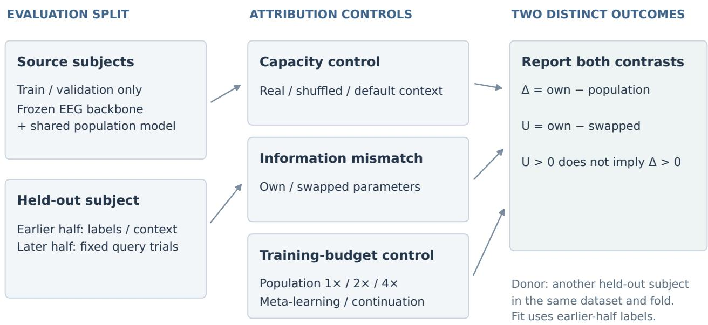  
Figure 1: Information boundaries and comparisons. Earlier target trials provide permitted labels or context; later query labels score predictions. Donor adapters are fitted using other held-out subjects’ earlier labels. The core contrasts measure net benefit over the population reference and the advantage of owner-matched parameters.

## 2 Results

The core evaluation includes 235 held-out subjects from PhysioNet, Dreyer and Cho (Table 1). Balanced accuracy (BA) is scored on later query trials after calibration on earlier trials from the same session. Figures show subject medians with bootstrap 95% confidence intervals after averaging seeds within subject; Table 2 gives the means used in the abstract, and Supplementary Section S1 provides mean versions of the figures.

Table 1: Analysis populations and CBraMod input/readout channels. EO denotes eyes-open rest. REVE and LaBraM use native-input pipelines on the core datasets; Lee and BNCI are CBraMod-only extensions. Fit/query counts are trials per subject in the temporal splits, including their ranges. Dataset sources are cited in Methods.
<table><tr><td>Dataset</td><td>N</td><td>Session</td><td>EEG / readout</td><td>Fit / query trials</td><td>Rest</td></tr><tr><td>PhysioNet</td><td>103</td><td>single</td><td>64/27</td><td>22/23</td><td>EO</td></tr><tr><td>Dreyer</td><td>80</td><td>single</td><td>27/27</td><td>80-120 / 80-120</td><td>EO</td></tr><tr><td>Cho</td><td>52</td><td>single</td><td>64/27</td><td>100-120 / 100-120</td><td>EO</td></tr><tr><td>Lee</td><td>54</td><td>1</td><td>62/26</td><td>100 / 100</td><td>EO</td></tr><tr><td>BNCI</td><td>9</td><td>2</td><td>22 / 19</td><td>72/72</td><td>EO</td></tr></table>

## 2.1 Personal adapters improve performance and favor their owners across models

Full-support personal fitting improves on the population decoder and favors the adapter’s owner across all nine model–dataset combinations. At the initial population-training budgets, personal LoRA improves mean BA over the population reference by 1.5–5.4 percentage points (pp) and outperforms exchanged adapters by 2.3–7.3 pp (Table 2); every corresponding median is also positive (Figure 2A–B).

The pattern also holds in the six combinations whose dataset is not listed among the model’s reported pretraining sources: CBraMod on PhysioNet, Dreyer and Cho; REVE on PhysioNet; and LaBraM on Dreyer and Cho. Population adaptation itself improves median BA over the task head in PhysioNet and Dreyer for all three models, with less consistent results in Cho (Figure 2C).

For LaBraM on Cho, mean own-minus-exchanged (4.78 pp) is smaller than mean own-minuspopulation (5.38 pp; Table 2); equation (3) gives a mean exchanged-minus-population estimate of 0.60 [-0.03, 1.24] pp. This positive estimate is consistent with a transferable component of personal fitting under the donor procedure, with an interval that includes zero.

The CBraMod extensions show why both contrasts matter. In Lee, personal FiLM has a mean matching advantage of 3.91 [2.17, 5.81] pp but a mean benefit over the population reference of -0.67 [-2.12, 0.84] pp. Lee LoRA’s mean benefit is 1.02 [-0.09, 2.16] pp. The BNCI exchange comparison has eight targets forming four donor pairs; its population comparison includes all nine subjects (Supplementary Sections S1 and S2).

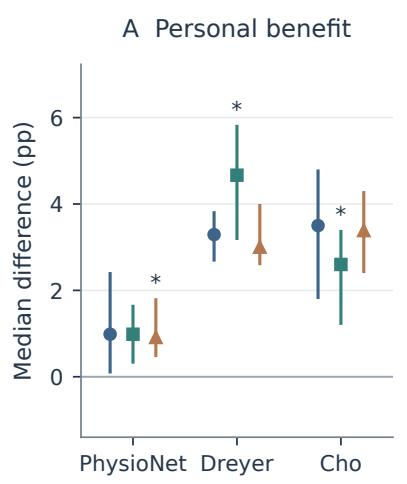

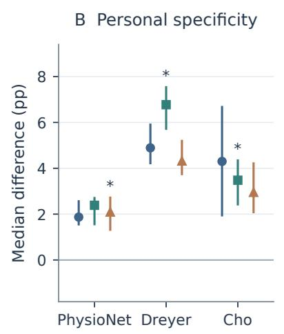

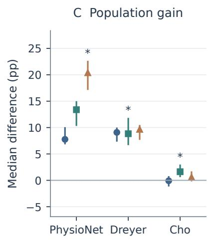  
Figure 2: Cross-model attribution at the initial budgets. Points are medians of paired subject differences; bars are percentile subject-bootstrap 95% confidence intervals after averaging seeds. A: own minus population. B: own minus exchanged. C: population minus task head. Asterisks mark datasets listed in each model’s pretraining sources. Mean versions appear in Supplementary Section S1.

Table 2: Mean personal contrasts at the initial budgets, in pp, with subject-bootstrap 95% confidence intervals in brackets. Each subject contributes one seed-averaged paired difference. Sample sizes are 103, 80 and 52 for PhysioNet, Dreyer and Cho, respectively.
<table><tr><td>Model</td><td>Dataset</td><td>Own - population</td><td>Own - exchanged</td></tr><tr><td>CBraMod</td><td>PhysioNet</td><td>1.64 [0.77, 2.51]</td><td>2.55 [1.74, 3.40]</td></tr><tr><td>CBraMod</td><td>Dreyer</td><td>3.58 [2.94, 4.24]</td><td>5.28 [4.64, 5.93]</td></tr><tr><td>CBraMod</td><td>Cho</td><td>5.13 [3.13, 7.46]</td><td>6.43 [4.34, 8.83]</td></tr><tr><td>REVE</td><td>PhysioNet</td><td>1.55 [0.91, 2.19]</td><td>2.59 [2.02, 3.19]</td></tr><tr><td>REVE</td><td>Dreyer</td><td>5.38 [4.38, 6.43]</td><td>7.25 [6.21, 8.33]</td></tr><tr><td>REVE</td><td>Cho</td><td>3.35 [2.26, 4.65]</td><td>4.38 [3.25, 5.70]</td></tr><tr><td>LaBraM</td><td>PhysioNet</td><td>1.52 [0.84, 2.24]</td><td>2.35 [1.64, 3.08]</td></tr><tr><td>LaBraM</td><td>Dreyer</td><td>3.91 [3.12, 4.76]</td><td>5.41 [4.63, 6.25]</td></tr><tr><td>LaBraM</td><td>Cho</td><td>5.38 [3.75, 7.20]</td><td>4.78 [3.21, 6.62]</td></tr></table>

## 2.2 Personal gains depend on population training and remain positive at the largest budget

Personal benefit depends on population-training budget: at four times the initial update budget, the pooled median own-minus-population gain is lower for every model (Figure 3).

REVE shows the largest observed reduction, with a paired-bootstrap change in medians of -1.42 [- 1.83, -0.68] pp from the initial to quadrupled budget; CBraMod and LaBraM change less and follow nonmonotonic paths. REVE’s smaller personal gain is not accompanied by a stronger population model: its population mean BA also falls from 81.13 [79.51, 82.70]% to 79.81 [78.32, 81.32]%. Dataset-specific trajectories can differ from the pooled direction (Supplementary Figure S13). At the largest budget, median gains remain between 1.0 and 2.0 pp, and matching advantages remain positive in all three models. No population model reaches a confirmed joint training/validation plateau (Supplementary Section S9).

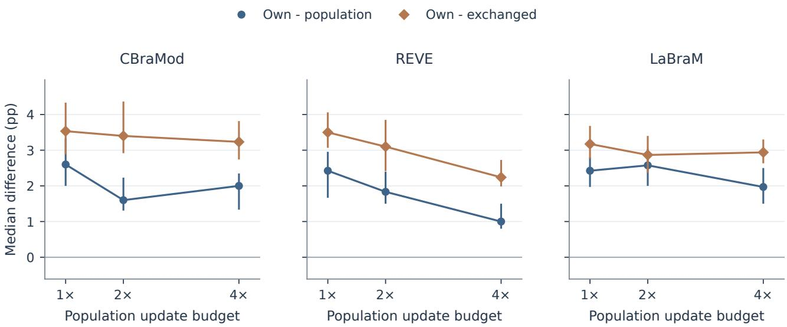  
Figure 3: Personal benefit and matching advantage across population-training budgets. Medians and subjectbootstrap 95% intervals use the same 235 subjects after seed averaging. Budgets are multiples of each run’s initially selected population-update count, and lines connect observed endpoints. Dataset-specific results and population scores appear in Supplementary Section S9.

## 2.3 Cheaper calibration recovers the benefit inconsistently

Reducing target-label requirements produces inconsistent gains across datasets: few-label calibration has nonnegative mean gains at every tested label budget for all three models only on PhysioNet. Calibration uses the earliest chronological label prefixes, which can contain only one class. Figure 4 shows medians, with means in Supplementary Section S1.

In CBraMod, the sole backbone tested for unlabeled context and meta-learning, true rest-conditioned FiLM and LoRA have median differences from shuffled context of 0.00 [0.00, 0.00] and 0.00 [0.00, 0.00] pp, respectively, and mean differences of -0.01 [-0.10, 0.09] and 0.01 [-0.11, 0.11] pp. True versus default context also has zero median differences, but true context is slightly worse on average, with mean differences of -0.21 [-0.38, -0.04] and -0.23 [-0.48, -0.01] pp for FiLM and LoRA, respectively. Collapsed median intervals reflect the concentration of subject differences at zero. Selecting a single donor using rest or unlabeled task features also gives no dependable improvement over both random selection and the population reference (Figure 5); exploratory exceptions and multi-donor comparisons appear in Supplementary Section S2.

Meta-learned initialization likewise shows no clear advantage over ordinary cross-entropy continuation with the same scheduled outer-update budget and target calibration procedure. At ten labels, first-order MAML and the variant with learned inner rates have mean differences from continuation of -0.05 [-0.32, 0.21] and -0.08 [-0.34, 0.17] pp. Both median differences are zero, with intervals 0.00 [-0.20, 0.08] and 0.00 [-0.17, 0.08] pp. Figure 6 separates initial performance, final performance and calibration increments. The mean increment differences are 0.27 [-0.02, 0.56] and 0.19 [-0.10, 0.48] pp, providing no evidence of a reliable adaptation advantage under this procedure.

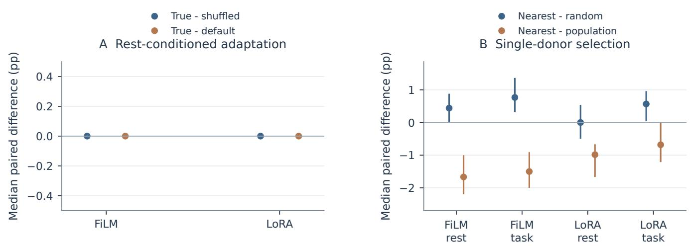

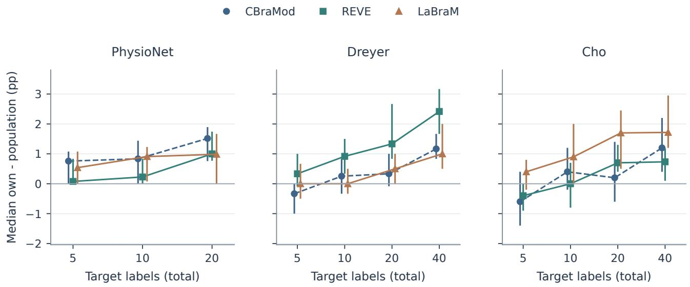  
Figure 4: Few-label own-minus-population gains. Markers are subject medians; bars are subject-bootstrap 95% confidence intervals. Label counts are shown on equally spaced positions with small model offsets. Forty labels are available only for Dreyer and Cho. Lines join observed budgets. Mean versions appear in Supplementary Section S1.  
Figure 5: Unlabeled context comparisons in CBraMod. A: paired true-minus-shuffled and true-minus-default con trasts within the same-capacity contextual model. B: one-nearest-donor versus random-donor and population controls, using rest or unlabeled task features. Points are subject medians with subject-bootstrap 95% intervals.

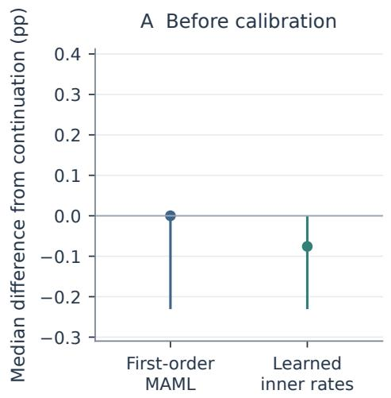

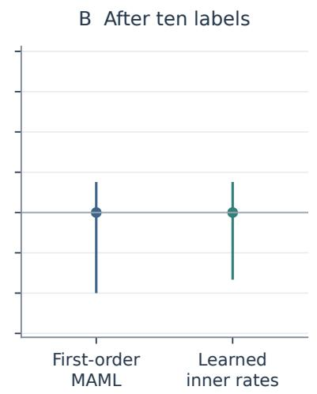

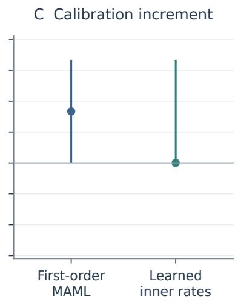  
Figure 6: CBraMod meta-learning versus ordinary continuation. Subject medians and subject-bootstrap 95% intervals compare first-order MAML and learned inner rates with ordinary continuation before calibration (A), after ten labels (B) and in calibration increments (C).

## 3 Discussion

Across the nine core model–dataset combinations, personal fitting improved on the population decoder and favored its owner, but the gain depended on population training and cheaper calibration did not recover it reliably. These findings motivate reporting both net personal benefit and owner-matching advantage against a named population reference across training budgets.

The two contrasts distinguish useful fitting from owner matching. A harmful donor exchange can create a matching advantage without improving on the population model, while a useful personal fit can transfer to other people. Jointly positive contrasts support useful owner matching under the donor procedure; its interpretation depends on donor support sizes, class balance and same-session recording conditions. This reasoning could guide evaluation in other settings combining foundation models with persona adaptation, although our evidence is limited to EEG.

Yang et al.’s ICLR 2026 benchmark compares foundation models with traditional decoders across tasks and evaluation protocols [11]. Lopes et al. report no accuracy advantage for personal encoders over a fine-tuned shared baseline when both use target labels [9, p. 20], addressing a different question from our comparison of a personal adapter with a population model fitted and selected without target information.

Our contribution is to evaluate population-relative benefit and exchanged-adapter performance together across population-training budgets (Supplementary Section S3).

Training-budget curves make the population reference part of the result. Additional updates can change validation and query performance differently, so observed personal gains should be reported alongside population scores; their behavior beyond the tested budgets remains unresolved. Acquisition likewise depends on the procedure. Rest-based generative transfer, baseline correction and test-time training have reported benefits with other representations and update procedures [10, 12, 13], and ordinary transfer can compete with meta-learning in motor imagery [14, 15]. These comparisons motivate acquisition methods that distinguish the quality of an initial decoder from its adaptation increment.

The evidence is limited to binary motor imagery with within-session calibration, with a small BNCI cohort and a channel-restricted Lee readout. Differences in preprocessing, population adapters and pretraining-source overlap limit attribution of between-model differences to the backbone alone. Subject-bootstrap intervals are pointwise and conditional on selected checkpoints, omit dependence from shared population models and reused donors, and do not establish benefit for every user. The negative meta-learning result reflects one procedure with matched scheduled outer updates but additional innerloop computation, subject to the failure handling in Supplementary Section S9.7, and does not establish equivalence.

## 4 Methods

## 4.1 Evaluation unit and estimands

Let s be a target subject held out from downstream population training and validation. Within the same session, earlier task trials form a support set $S _ { s }$ and later trials form a query set $Q _ { s }$ . Unlabeled context $c _ { s }$ comprises eligible earlier rest or support-task features. A frozen backbone $f _ { \theta }$ is shared, with population parameters $\phi$ and target parameters $a _ { s }$ . Core population checkpoints and personal-fitting hyperparameters are selected without $Q _ { s }$ labels. Supplementary Section S7 describes the query-informed prior controls, which use test-query information and are therefore excluded from the main comparisons. We measure balanced accuracy on $Q _ { s }$ , averaging training seeds within subject before calculating group summaries.

For a named population model P, define

$$
\Delta _ { s } ( P ) = \mathrm { B A } ( Q _ { s } ; P , a _ { s } ) - \mathrm { B A } ( Q _ { s } ; P ) ,\tag{1}
$$

$$
\begin{array} { r } { U _ { s } ( P ) = \mathrm { B A } ( Q _ { s } ; P , a _ { s } ) - \mathrm { B A } ( Q _ { s } ; P , a _ { d ( s ) } ) , } \end{array}\tag{2}
$$

where the swapped score averages the specified donor draws. $\Delta$ measures benefit over the population reference; $U$ measures personal specificity against exchanged parameters. Their relationship is

$$
U _ { s } ( P ) = \Delta _ { s } ( P ) - \bigl [ \mathrm { B A } ( Q _ { s } ; P , a _ { d ( s ) } ) - \mathrm { B A } ( Q _ { s } ; P ) \bigr ] .\tag{3}
$$

A harmful swap can make $U _ { s }$ positive even when $\Delta _ { s }$ is negative. Full-support fitting characterizes attainable performance within the tested parameterization and optimization budget.

Two CBraMod examples illustrate why both contrasts matter. Lee FiLM has positive specificity and meets the exchange criterion, yet its mean $\Delta$ is -0.67 pp. Conversely, one held-out Cho subject has mean population, own-adapter and exchanged-adapter BA of 54.00, 56.00 and 57.28%, respectively: $\Delta = 2 . 0 0$ pp while $U = - 1 . 2 8 { \mathrm { p p } }$ . Even when both means are positive, some gains may remain transferable across people.

## 4.2 Population-budget curves as part of attribution

For each prespecified population budget b, we report both median $. \Delta _ { s } ( P _ { b } )$ and median $U _ { s } ( P _ { b } )$ after averaging seeds within subject. The subjects, donor procedure and validation-selected personal-fitting grid are held constant across budgets. Population test performance and validation trajectories accompany these contrasts to show how reference quality changes with update count.

## 4.3 Three control families

Own-versus-population and own-versus-swapped LoRA diagnostics span all three backbones. Contextual capacity controls and ordinary-continuation sensitivity are restricted to CBraMod.

Capacity without personal information. The contextual models generate FiLM parameters or mixing weights over shared LoRA bases from a context representation. Real, shuffled and default-context conditions use the same trained model. Default context removes target-specific information while keeping shared learned capacity. The population reference continues contextual training and is scored with default context. Capacity is matched across context interventions; the task head and population model differ in capacity, and personal LoRA adds trainable parameters.

Information mismatch. Context is shuffled within dataset, while personal adapters are exchanged with other test subjects in the same dataset and fold. Donor labels fit the donor adapter; the target’s query set measures transfer. Nearest-neighbor diagnostics compare context-based selection with random donors under the same pool and transfer procedure, reporting both nearest-minus-random and nearest-minuspopulation. This analysis requires labeled donor support and a choice among eligible donors.

Additional population training. Ordinary continuation trains shared LoRA bases and the task head using default mixture weights and cross-entropy. First-order MAML and its learned-rate variant use sourcesubject support/query episodes. Scheduled outer updates are matched, with additional inner-loop computation and sample exposure for meta-learning. The primary population reference uses contextual training, so comparing it with ordinary continuation also changes the objective and selection procedure. Sensitivity comparisons across population references use the same subject-level paired mean statistic.

## 4.4 Decision rules and interpretation

Rules were fixed before each stage’s results in a successive-stage design, rather than a single independently preregistered study. Supplementary Section S10.1 defines the joint criteria and Holm correction families; Supplementary Data 1 reports all decisions, including unsuccessful and query-informed comparisons.

## 4.5 Data and evaluation populations

## 4.5.1 Signal processing and subject selection

The CBraMod pipeline resamples EEG to 200 Hz, applies a 0.3 Hz high-pass filter and dataset-specific mains notch, and average-references native EEG channels. Signals are expressed in microvolts divided by 100 and stored in half precision. Task windows are four seconds for PhysioNet, Dreyer and Lee, and three seconds for Cho; the BNCI configuration supplies its fixed window. Dataset-specific settings appear in the supplement. The data sources are PhysioNet EEGMMIDB [16, 17], Dreyer [18], Cho [19], Lee [20], and BCI Competition IV dataset 2a, distributed as BNCI2014-001 [21].

PhysioNet uses imagined left/right runs, excluding six subjects with sampling-rate or run-duration anomalies. Dreyer excludes seven subjects according to the original authors’ annotations, and all Cho subjects are included. Alpha-power checks are diagnostic only; the screening procedures are detailed in Supplementary Section S10.7.

Support/query allocation follows run and onset order, with trial counts and between-subject ranges in Table 1. Few-shot supports are chronological prefixes and may contain only one class. Budgets exceeding available support are treated as missing; query BA uses the two-class query set. Cho’s independent timeline-verification scope is described in Supplementary Section S10.7.

Lee uses session one, ordered from offline/train to online/test trials, with the earliest pre-train eyesopen rest. Its 62-channel EEG enters the backbone, and a 26-channel readout intersection excludes the unavailable shared channel. Sensitivity to this readout-channel selection remains untested.

BNCI uses session two, left/right trials and task-preceding eyes-open rest, with expert-flagged trials included. Each subject has balanced support and query halves; the 19-channel readout uses 22 native EEG channels. The test partitions leave one subject without a donor and each remaining target with a unique eligible donor. Own-versus-population is thus estimable for all subjects and own-versus-swapped for the donor-eligible subset; nearest-donor selection is not identifiable.

## 4.5.2 Subject-disjoint folds

Table 3 gives the subject partitions. Core-cohort subjects share a population model across datasets. Lee and BNCI each train population models using the corresponding core-cohort fold/seed hyperparameters, with their own validation subjects selecting checkpoints under the same rule.

Table 3: Subject-disjoint partitions. The core cohort combines PhysioNet, Dreyer and Cho. Counts are people; seeds do not add independent subjects.
<table><tr><td>Cohort</td><td>Fold</td><td>Train Validation</td><td></td><td>Test</td></tr><tr><td>Core cohort</td><td>0</td><td>169</td><td>18</td><td>48</td></tr><tr><td>Core cohort</td><td>1</td><td>169</td><td>18</td><td>48</td></tr><tr><td>Core cohort</td><td>2</td><td>170</td><td>18</td><td>47</td></tr><tr><td>Core cohort</td><td>3</td><td>171</td><td>18</td><td>46</td></tr><tr><td>Core cohort</td><td>4</td><td>171</td><td>18</td><td>46</td></tr><tr><td>Lee</td><td>0</td><td>39</td><td>4</td><td>11</td></tr><tr><td>Lee</td><td>1</td><td>39</td><td>4</td><td>11</td></tr><tr><td>Lee</td><td>2</td><td>39</td><td>4</td><td>11</td></tr><tr><td>Lee</td><td>3</td><td>39</td><td>4</td><td>11</td></tr><tr><td>Lee</td><td>4</td><td>40</td><td>4</td><td>10</td></tr><tr><td>BNCI</td><td>0</td><td>6</td><td>1</td><td>2</td></tr><tr><td>BNCI</td><td>1</td><td>6</td><td>1</td><td>2</td></tr><tr><td>BNCI</td><td>2</td><td>6</td><td>1</td><td>2</td></tr><tr><td>BNCI</td><td>3</td><td>6</td><td>1</td><td>2</td></tr><tr><td>BNCI</td><td>4</td><td>7</td><td>1</td><td>1</td></tr></table>

## 4.5.3 Pretraining overlap

Reported pretraining sources list Dreyer, Cho and Lee for REVE, and PhysioNet for LaBraM; none of the evaluated motor-imagery datasets is listed for CBraMod. No core dataset is unlisted for all three models. These are source-list comparisons without record-level deduplication, so “unseen subject” denotes exclusion from downstream population training and validation [22, 23]. Source strata are marked in the figures and tables.

## 4.6 CBraMod implementation and selection

CBraMod’s contextual model generates FiLM modulation or mixing weights over shared LoRA bases. Personal FiLM adds zero-initialized offsets; personal LoRA adds a zero-increment weight update while the shared parameters, head and backbone remain fixed. Training, parameterization and selection details appear in Supplementary Section S10.2 and Table S11.

For each target and training run, full-support exchange draws ten other subjects uniformly with replacement from the same dataset and held-out fold. Draws use the run seed and can vary across seeds; all budget endpoints use the same donor list. Donor BA is averaged within run before averaging seeds within target. A singleton donor is repeated, and absent donors yield missing exchange results. Multi-donor LoRA transfer averages weight updates. Personal-fitting settings are selected on validation subjects.

Ordinary continuation and meta-learning start from the same population LoRA model. Continuation uses cross-entropy and default mixture weights; first-order MAML uses source-subject support/query episodes [7], and the learned-rate variant learns layer-specific inner rates. Evaluation uses the same fullbatch SGD support updates and validation-selected inner settings. Numerical failure handling and event counts are detailed in Supplementary Sections S10.2 and S9.7.

## 4.7 REVE and LaBraM implementation

REVE and LaBraM use base pretrained encoders with fixed normalization and position parameters and native EEG-channel inputs [3, 4]. Shared attention LoRA and a task head are trained with cross-entropy. Personal fitting adds a separate zero-increment adapter while keeping the backbone, shared adapter and head fixed. FiLM, LoRA and the set encoder follow their respective method families [5, 6, 24].

Preprocessing, patch extraction, channel readout, normalization and candidate ordering are specified in Supplementary Section S10.3. No target-query normalization is used. Validation-subject scores select task-head and personal-fitting settings; mean cross-entropy selects population continuation checkpoints, including the initial checkpoint as a candidate. Only the selected population candidate is continued, restoring optimizer and random-number state.

## 4.8 Computational resources

GPU runs used RTX 3090 hardware. Supplementary Section S6 reports stage and run-level costs, counting shared training once and identifying incomplete exploratory accounting.

## 4.9 Statistical analysis and fixed decision rules

BA is the arithmetic mean of per-class recalls on the query set. For each contrast, we average seeds within subject, calculate paired differences, and resample subjects with replacement 20,000 times. The 2.5th and 97.5th percentiles of the bootstrap mean or median give pointwise 95% confidence intervals. These intervals are conditional on the selected fits and omit dependence from shared population models and reused donors, as well as model-selection and training-seed uncertainty; positive group summaries do not establish benefit for every subject. A fixed reporting seed makes resampling reproducible. The same sampled subject indices are used at both budget endpoints to estimate the difference of medians. Pooled resampling draws from the full cohort without fixing dataset counts. Means and medians are reported separately; SDs and interquartile ranges describe between-subject heterogeneity.

Personal-specificity, contextual, neighbor and meta-learning tests use directional paired Wilcoxon procedures with the normal approximation, dropping zero differences and assigning a unit p-value when all differences vanish. Holm correction applies within each specified family. Alignment comparisons use their two-sided procedures and correction families. The CBraMod alignment diagnostics whiten native EEG before the encoder; implementation and results appear in Supplementary Sections S10.5 and S2.1. Supplementary Data 1 provides test directions, raw and corrected p-values, sample sizes and decisions. These analyses test directional differences; they do not test equivalence.

Supplementary Section S10.4 specifies correction slots, eligibility criteria and descriptive consistency rules. Few-shot stability requires nonnegative means at every prescribed budget and no decreases with increasing budget. Missing budgets and absent donors remain missing. BNCI’s two contrasts use their respective eligible populations. Sensitivity comparisons across population references use paired means on the same eligible subjects; median-based decision criteria are reported separately. At the subject level, the final meta-learning contrast equals the initial contrast plus the calibration-increment contrast; means preserve this identity, whereas the medians in Figure 6 summarize each contrast separately.

## 4.10 Population-training budget extension

Each run’s initially selected population-update count defines its reference budget. Continuation uses the same objective, learning rate and sampling procedure, with endpoints at twice and four times that count and no intermediate checkpoint selection. REVE and LaBraM restore optimizer and random-number states; CBraMod restarts them because its starting checkpoint lacks those states. Nonfinite objectives stop a run; validation deterioration does not trigger checkpoint substitution.

At each new endpoint, personal LoRA settings are reselected on validation subjects using the same grid and donors; the reference endpoint uses its initial fit. Endpoint evaluation and differences from the initial core scores are detailed in Supplementary Section S9. Few-shot results use the initial population-training budget only. Complete-cohort contrasts require every subject and seed. The CBraMod curve combines 24 trajectories with one precision-adjusted rerun, whose implementation and prior failure are detailed in Supplementary Section S10.6.

The joint stopping criterion combines training/validation loss ranges and validation-score stability. Supplementary Section S10.6 gives its thresholds, attenuation and stable-positive-gain rules, and correction slots.

## 4.11 Ethics statement

This study used only publicly available EEG datasets. Ethical approval and participant consent for the original data collection were the responsibility of the original investigators, as documented in the source studies. No new participant data were collected for this study.

## 4.12 AI use declaration

The authors used Anthropic’s Claude to discuss study design, analysis planning, literature-search planning and critique of the manuscript. OpenAI Codex was used to implement and execute the analysis code, organize evidence, generate figures, and draft and revise the manuscript text. All experiments were run with code executed on the authors’ computing resources, and all reported numbers are generated from saved results by scripts included in the code release. X.T. reviewed the analyses and verified the reported results; all authors approved the manuscript and take responsibility for its content.

## Data availability

The original EEG recordings are available from PhysioNet’s EEG Motor Movement/Imagery Dataset (https://physionet.org/content/eegmmidb/1.0.0/), the Dreyer motor-imagery database (https://zenodo.org/ records/8089820; analysis distribution: https://osf.io/8tdk5/), GigaDB for Cho (https://gigadb.org/dataset/ 100295) and Lee (https://gigadb.org/dataset/100542), and BNCI2014-001 (https://bnci-horizon-2020.eu/ database/data-sets). Access and reuse are subject to the source repositories’ terms. Supplementary Data 1 contains all 904 comparison records and their column and correction-family definitions. Saved subjectlevel results, split definitions and numerical provenance records accompany the analysis-code release. Original EEG recordings and pretrained model weights are obtained separately from their source repositories. Source data are provided with this paper.

## Code availability

The original analysis code, fixed configurations, dependency specifications, reporting scripts and saved results are publicly available at https://github.com/gaivrt/eeg-personal-population-benefit, version 1.0.0 (commit 06fc75f). The reporting scripts regenerate the summaries and figures from saved results without training or model inference. The original analysis software is released under the MIT license; derived tables and documentation use CC BY 4.0, and third-party materials retain their original terms. The version 1.0.0 archive (assigned DOI: 10.5281/zenodo.22999685) is available at https://zenodo.org/records 22999685.

## References

[1] Matthias Krauledat, Michael Tangermann, Benjamin Blankertz, and Klaus-Robert Müller. Towards Zero Training for Brain-Computer Interfacing. PLoS ONE, 3(8):e2967, 2008. doi: 10.1371/journal. pone.0002967. URL https://doi.org/10.1371/journal.pone.0002967.

[2] Jiquan Wang, Sha Zhao, Zhiling Luo, Yangxuan Zhou, Haiteng Jiang, Shijian Li, Tao Li, and Gang Pan. CBraMod: A Criss-Cross Brain Foundation Model for EEG Decoding. In International Conference on Learning Representations, 2025. URL https://proceedings.iclr.cc/paper\_files/paper/2025/ hash/bbbd6d915cb90be21c1254a82d45cedd-Abstract-Conference.html.

[3] Yassine El Ouahidi, Jonathan Lys, Philipp Thölke, Nicolas Farrugia, Bastien Pasdeloup, Vincent Gripon, Karim Jerbi, and Giulia Lioi. REVE: A Foundation Model for EEG – Adapting to Any Setup with Large-Scale Pretraining on 25,000 Subjects, 2025. URL https://arxiv.org/abs/2510.21585v1.

[4] Wei-Bang Jiang, Li-Ming Zhao, and Bao-Liang Lu. Large Brain Model for Learning Generic Representations with Tremendous EEG Data in BCI. In International Conference on Learning Representations, 2024. URL https://proceedings.iclr.cc/paper\_files/paper/2024/hash/ 47393e8594c82ce8fd83adc672cf9872-Abstract-Conference.html.

[5] Ethan Perez, Florian Strub, Harm De Vries, Vincent Dumoulin, and Aaron Courville. FiLM: Visual Reasoning with a General Conditioning Layer. Proceedings of the AAAI Conference on Artificial Intelligence, 32(1), 2018. doi: 10.1609/aaai.v32i1.11671. URL https://doi.org/10.1609/aaai.v32i1. 11671.

[6] Edward J. Hu, Yelong Shen, Phillip Wallis, Zeyuan Allen-Zhu, Yuanzhi Li, Shean Wang, Lu Wang, and Weizhu Chen. LoRA: Low-Rank Adaptation of Large Language Models. In International Conference on Learning Representations, 2022. URL https://arxiv.org/abs/2106.09685.

[7] Chelsea Finn, Pieter Abbeel, and Sergey Levine. Model-Agnostic Meta-Learning for Fast Adaptation of Deep Networks. In Proceedings of the 34th International Conference on Machine Learning, 2017. URL https://proceedings.mlr.press/v70/finn17a.html.

[8] Aymen Sarhane, Fouad Lbakali, Mouad Souissi, Jonathan Lys, and Giulia Lioi. Stacked LoRA for Subject-Adaptive EEG Foundation Models in Motor Imagery Decoding, 2026. URL https://arxiv. org/abs/2607.03094v1.

[9] Bruna J. Lopes, Gabriel Schwartz, Sylvain Chevallier, Raphael Y. de Camargo, and Bruno Aris timunha. Learning aligned EEG representations with subject-specific encoders. Scientific Reports, 2026. doi: 10.1038/s41598-026-69220-z. URL https://doi.org/10.1038/s41598-026-69220-z. Article in Press; accepted 26 August 2026.

[10] Sion An, Myeongkyun Kang, Soopil Kim, Philip Chikontwe, Li Shen, and Sang Hyun Park. Subject-Adaptive Transfer Learning Using Resting State EEG Signals for Cross-Subject EEG Motor Imagery Classification, 2024. URL https://arxiv.org/abs/2405.19346v2.

[11] Liuyin Yang, Qiang Sun, Ang Li, and Marc M. Van Hulle. Are EEG Foundation Models Worth It? Comparative Evaluation with Traditional Decoders in Diverse BCI Tasks. In International Conference on Learning Representations, 2026. URL https://openreview.net/forum?id=5Xwm8e6vbh.

[12] Youngchul Kwak, Kyeongbo Kong, Woo-Jin Song, and Seong-Eun Kim. Subject-Invariant Deep Neural Networks Based on Baseline Correction for EEG Motor Imagery BCI, 2023. URL https: //doi.org/10.1109/JBHI.2023.3238421.

[13] Suli Wang, Yangshen Deng, Zhenghua Bao, Xinyu Zhan, and Yiqun Duan. NeuroTTT: Bridging Pretraining-Downstream Task Misalignment in EEG Foundation Models via Test-Time Training, 2025. URL https://arxiv.org/abs/2509.26301v2.

[14] Anupam Sharma and Krishna Miyapuram. Evaluating Fast Adaptability of Neural Networks for Brain-Computer Interface, 2024. URL https://arxiv.org/abs/2404.15350v1.

[15] Daniil A. Berdyshev, Artem M. Grachev, Sergei L. Shishkin, and Bogdan L. Kozyrskiy. EEG-Reptile: An Automatized Reptile-Based Meta-Learning Library for BCIs, 2025. URL https://arxiv. org/abs/2412.19725v2.

[16] Gerwin Schalk. EEG Motor Movement/Imagery Dataset, 2009. URL https://physionet.org/content/ eegmmidb/1.0.0/. PhysioNet, version 1.0.0.

[17] G. Schalk, D.J. McFarland, T. Hinterberger, N. Birbaumer, and J.R. Wolpaw. BCI2000: A General-Purpose Brain-Computer Interface (BCI) System. IEEE Transactions on Biomedical Engineering, 51(6):1034–1043, 2004. doi: 10.1109/tbme.2004.827072. URL https://doi.org/10.1109/tbme.2004. 827072.

[18] Pauline Dreyer, Aline Roc, Léa Pillette, Sébastien Rimbert, and Fabien Lotte. A large EEG database with users’ profile information for motor imagery brain-computer interface research. Scientific Data, 10(1):580, 2023. doi: 10.1038/s41597-023-02445-z. URL https://doi.org/10.1038/ s41597-023-02445-z.

[19] Hohyun Cho, Minkyu Ahn, Sangtae Ahn, Moonyoung Kwon, and Sung Chan Jun. EEG datasets for motor imagery brain–computer interface. GigaScience, 6(7):gix034, 2017. doi: 10.1093/gigascience/ gix034. URL https://doi.org/10.1093/gigascience/gix034.

[20] Min-Ho Lee, O-Yeon Kwon, Yong-Jeong Kim, Hong-Kyung Kim, Young-Eun Lee, John Williamson, Siamac Fazli, and Seong-Whan Lee. EEG dataset and OpenBMI toolbox for three BCI paradigms: an investigation into BCI illiteracy. GigaScience, 8(5):giz002, 2019. doi: 10.1093/gigascience/giz002. URL https://doi.org/10.1093/gigascience/giz002.

[21] Michael Tangermann, Klaus-Robert Müller, Ad Aertsen, Niels Birbaumer, Christoph Braun, Clemens Brunner, Robert Leeb, Carsten Mehring, Kai J. Miller, Gernot R. Müller-Putz, Guido Nolte, Gert Pfurtscheller, Hubert Preissl, Gerwin Schalk, Alois Schlögl, Carmen Vidaurre, Stephan Waldert, and Benjamin Blankertz. Review of the BCI Competition IV. Frontiers in Neuroscience, 6, 2012. doi: 10.3389/fnins.2012.00055. URL https://doi.org/10.3389/fnins.2012.00055.

[22] Jun-You Lin, Ying Choon Wu, and Tzyy-Ping Jung. The Identity Trap in EEG Foundation Models: A Diagnostic Audit, 2026. URL https://arxiv.org/abs/2606.06647v1.

[23] Dingkun Liu, Yuheng Chen, Zhu Chen, Zhenyao Cui, Yaozhi Wen, Jiayu An, Jingwei Luo, and Dongrui Wu. EEG-FM-Compass: Progress, Benchmarking, and Future Directions for EEG Foundation Models, 2026. URL https://arxiv.org/abs/2601.17883v3.

[24] Manzil Zaheer, Satwik Kottur, Siamak Ravanbakhsh, Barnabas Poczos, Ruslan Salakhutdinov, and Alexander J. Smola. Deep Sets. In Advances in Neural Information Processing Systems, 2017. URL https://papers.nips.cc/paper/2017/hash/f22e4747da1aa27e363d86d40ff442fe-Abstract.html.

## Acknowledgements

The authors thank the original dataset investigators for making their EEG recordings publicly available.

## Funding

Computational resources and access to AI tools were provided through Kani Chen’s research group at The Hong Kong University of Science and Technology.

## Author contributions

X.T. designed the study and methodology, developed the software, curated the data, performed the experiments and analyses, validated the results, prepared the visualizations, and drafted and revised the manuscript. K.C. provided guidance on the overall research direction, supervision and computational resources.

## Competing interests

The authors declare no competing interests.

# Supplementary information Separating personal from population gains when calibrating EEG foundation models for new users

Xilin Tao1, Kani Chen1,2,\*

1Department of Mathematics, The Hong Kong University of Science and Technology, Hong Kong SAR, China 2Department of Industrial Engineering and Decision Analytics, The Hong Kong University of Science and Technology, Hong Kong SAR, China

Correspondence: Kani Chen (makchen@ust.hk)

Xilin Tao: xilin.tao@connect.ust.hk

## S0 Notation

Table S1 defines mathematical symbols, condition labels, parameter names and record identifiers used in the article, supplement and Supplementary Data 1. Codes in source-record identifiers are retained for traceability; their components use the definitions below. Comparisons are left minus right unless a row states otherwise. Column definitions, units, test directions and correctionfamily membership accompany Supplementary Data 1.

Table S1: Notation and identifier key. Capitalization distinguishes model families, scored conditions and experiment stages.
<table><tr><td>Code</td><td>Meaning</td></tr><tr><td>Quantities</td><td></td></tr><tr><td>BA; accuracy</td><td>Balanced accuracy; unbalanced classification accuracy. BA is the mean class recall. Absolute scores are percentages; score contrasts use percentage points (pp).</td></tr><tr><td>Delta; U</td><td>Own-minus-population benefit; own-minus-exchanged personal specificity, respectively, de- fined in Methods 4.1.</td></tr><tr><td>s; d(s); S_s; Q_s; c_s</td><td>Target subject; assigned donor; earlier labeled support; later query set; eligible unlabeled context.</td></tr><tr><td>P; P_b; b</td><td>Named population reference; reference at population-training budget b; original, doubled or quadrupled update budget.</td></tr><tr><td>f_theta; phi; a_s; a_d(s)</td><td>Frozen backbone; population parameters; target personal parameters; donor personal parame- ters.</td></tr><tr><td>N; n; SD; CI; CE</td><td>Subject count; count or label budget as specified; between-subject standard deviation; confi- dence interval; cross-entropy loss.</td></tr><tr><td>p; p_H; pH; p_raw; p_adjusted</td><td>Raw p-value; saved Holm-adjusted p-value (p_H and pH); raw and adjusted data columns. Missing adjusted values are not zero.</td></tr><tr><td>own; swapped; exchanged</td><td>Target adapter on its owner; adapters fitted to other subjects and evaluated on that target. Swapped and exchanged are synonyms.</td></tr><tr><td>own_gain; upper_bound</td><td>Saved names for own-minus-population and own-minus-swapped contrasts. The latter name does not imply a mathematical upper bound.</td></tr><tr><td>nearest_gain; random_gain; differ- ence</td><td>Nearest-donor minus population; random-donor minus population; nearest minus random.</td></tr><tr><td>ba; adapt_gain</td><td>In a comparison measure field: final balanced accuracy; improvement from zero labels to the specified label budget.</td></tr><tr><td>NA; n.a.; blank; – Conditions</td><td>Unavailable or inapplicable result. None is an observed zero or a negative test.</td></tr><tr><td>BO; BO_linear; BO_mlp B1;B1a</td><td>Task head on frozen features; the suffix selects a linear or multilayer-perceptron head. B1 is the superseded initial alignment reference. B1a uses all available task/rest data for</td></tr><tr><td>B1b</td><td>Euclidean alignment using all unlabeled target task trials for test covariance; transductive because query inputs are included.</td></tr><tr><td>B1c</td><td>Euclidean alignment using only each subject's eyes-open rest for training, validation and test covariance.</td></tr><tr><td>B2; B2_T3A; T3A</td><td>As a condition, B2 denotes the rest-supported test-time classifier adjustment (B2_T3A). As a stage identifier, B2 instead denotes the full-forward personal-adapter experiment below.</td></tr><tr><td>B3; B3_film; B3_lora</td><td>Default-context prediction by the trained contextual model; same learned capacity without target-specific context. Suffix specifies the parameter family.</td></tr><tr><td>B4; B4_film; B4_lora</td><td>Shuffled-context control of the corresponding contextual model; a same-dataset donor supplies context.</td></tr><tr><td>B5; B5_n10; B5_n20; B5_n40; B5_ n80</td><td>Personal all-layer FiLM fitted to the earliest n labeled support trials. The n suffix is the total target-label count.</td></tr><tr><td>B6; B6_film_all; B6_film_first2; B6_ lora4; B6_lora8</td><td>Full-earlier-half supervised personal-adapter references imported from the full-forward exper- iment; suffix gives the adapter variant.</td></tr><tr><td>G; G_film_offset; G_lora8</td><td>Continued population reference; suffixed names identify the corresponding FiLM or LoRA population family.</td></tr><tr><td>R0; R1; R2; R2*</td><td>Initial population LoRA; random-prior control with test-query-informed validation selection; ordinary cross-entropy continuation. R2* flags use of the LoRA population reference for</td></tr><tr><td>M1; M2</td><td>FiLM sensitivity. First-order MAML initialization; meta-learned initialization with learned layer-specific inner</td></tr><tr><td>PO; P1; P2</td><td>rates. Population reference; random-donor parameter prior; feature-selected donor prior. These prior</td></tr><tr><td>Parameters</td><td>diagnostics can use other donors' query labels.</td></tr><tr><td>m_film; m_lora</td><td>Lowercase model-family identifiers: context-generated FiLM and a context-weighted mixture</td></tr><tr><td>M_film; M_lora</td><td>of shared LoRA bases. They do not denote meta-learning methods. Uppercase prediction-condition identifiers: the FiLM or LoRA contextual model using the</td></tr><tr><td>M_film_lambda0; M_lora_lambda0</td><td>target's real context. M alone is the meta-learning stage. Corresponding real-context model trained with zero weight on the context-mismatch objec-</td></tr><tr><td>film_offset</td><td>tive. An additive personal FiLM offset on the selected default-context population model. The</td></tr><tr><td>mix_offset</td><td>ordinary-continuation sensitivity can place FiLM on a LoRA population model. Personal additive offsets to the mixture weights of shared LoRA bases. Unexecuted slots in</td></tr><tr><td>film2; film4; beta4</td><td>later correction families remain unavailable. FiLM on the last two or last four encoder layers; shift-only adaptation on the last four layers,</td></tr><tr><td></td><td>in the cached-feature experiment.</td></tr><tr><td>film_first2; film_all lora4; lora8</td><td>FiLM on the first two or all encoder layers in the full-forward personal-adapter experiment. Personal attention LoRA with rank four or eight. Model-family and starting-reference fields</td></tr><tr><td>head; linear; mlp; scratch_head</td><td>distinguish the source experiment. Head-only tuning; linear classifier; multilayer perceptron; randomly reinitialized head fitted</td></tr><tr><td></td><td>with personal support labels.</td></tr><tr><td>selected_film film; FILM; lora; LORA</td><td>FiLM variant selected on validation subjects from the candidates of that source experiment. Display aliases for FiLM and LoRA parameter families.</td></tr><tr><td>Stages A; B; B2</td><td>Frozen-feature/alignment baselines; cached-feature personal adaptation; full-forward personal</td></tr><tr><td>C; C-all</td><td>adaptation. Stage B2 is distinct from condition B2_T3A. Contextual-generator comparisons on later query trials; compatibility summaries on all trials,</td></tr><tr><td>C2; C3; C3-few; C4</td><td>respectively. Personal-parameter exchange and rest-neighbor diagnostics; rest/task neighbor comparison;</td></tr><tr><td>M; W; X; X1</td><td>few-label adaptation from default context; fixed donor-prior calibration. Meta-learning comparisons; population-continuation and personal-specificity comparisons;</td></tr><tr><td></td><td>REVE/LaBraM extension. X1 denotes its core original-budget comparisons.</td></tr><tr><td>W-pooled; WF; WF-BNCI</td><td>Pooled neighbor summaries; follow-up population-reference/BNCI analyses; BNCI popula- tion controls.</td></tr><tr><td>WF-R2-own_minus_population; WF-</td><td>Ordinary-continuation reference sensitivity: own-minus-population or own-minus-swapped</td></tr><tr><td>R2-own_minus_swap WF-few; WF-own</td><td>contrast. BNCI few-label and full-support own-minus-population summaries.</td></tr><tr><td>T0001-T0904</td><td>Stable comparison-row identifiers in Supplementary Data 1; each appears once. Rows from overlapping cohorts are not independent replications.</td></tr><tr><td>H01–H12; none</td><td>Documentation keys for the original Holm correction families in Supplementary Data 1. The Families sheet lists their members; none means no adjusted value is supplied in that row.</td></tr><tr><td>E01-E13; N01–N14</td><td>Engineering/data checks; unexecuted, unavailable or superseded items. Each item is described in the corresponding titled table in S4.</td></tr><tr><td>D1; D2; D3; diagnostic1; diagnostic2; diagnostic2_3</td><td>Owner-versus-exchanged specificity; rest-neighbor selection; task-neighbor selection; corre- sponding source diagnostic names.</td></tr><tr><td>B-G; B2-*; C-*; C2-D1-*; C2-D2-*;</td><td>Composite decision identifiers: stage, endpoint, parameter family and optional dataset/budget. C3-D3-*; C4-main; C4-secondary-*; A suffix retains the definitions in this table; each complete decision row states its rule.</td></tr><tr><td>M-main-*; M-secondary-*; W-* R2_sensitivity_diagnostic1; BNCI_</td><td>Owner/exchanged sensitivity against ordinary continuation; BNCI specificity among subjects</td></tr><tr><td>diagnostic1_available_subset Fields</td><td>with an available donor.</td></tr><tr><td>versus start; population_family; source; k;</td><td>variant; method; condition; control; Personal parameterization; model/method identifier; scored condition; named comparator. The hypothesis defines subtraction order. Starting reference; population parameter family; rest/task donor-selection context (inside con-</td></tr><tr><td>shots; comparison; measure</td><td>dition strings); number of donors; total labeled support trials; ordered contrast; score or calibration-increment measure.</td></tr><tr><td>rest; task; P1-P0; P2-P0; P2-P1; M1- R0; M1-R1; M1-R2; M2-R0; M2-R1; nus right, using the conditions defined above. M2-R2; M2-M1</td><td>Resting or unlabeled support-task context; hyphenated comparison expressions mean left mi-</td></tr><tr><td>Execution fold; seed; selected; run; initial; extra</td><td>Cross-validation fold; repeated initialization; selected checkpoint updates; executed updates;</td></tr><tr><td>CE_patience; step_budget; plateau</td><td>starting-fit updates; additional continuation updates. These counts do not increase the number of subjects.</td></tr><tr><td>B3_continued_original_objective</td><td>Early stop after the validation cross-entropy patience interval; update cap; joint train- ing/validation plateau condition Saved configuration name for ordinary cross-entropy continuation with default mixture</td></tr><tr><td>P0/P1/P2; 1x/2x/4x</td><td>weights, not the context-mismatch objective used for population continuation.</td></tr><tr><td></td><td>Slashes list separate prior conditions; x denotes the multiplier of the original population- update budget.</td></tr><tr><td>Datasets Dreyer2023; Cho; Cho2017;</td><td>PhysioNet; PhysionetMI; Dreyer; Display and saved identifiers for the three core motor-imagery datasets.</td></tr><tr><td>Cho2017MI Lee; Lee2019_MI;</td><td>BNCI; Display and saved identifiers for the two external datasets.</td></tr><tr><td>BNCI2014_001; BNCI2014.001 pooled; starter; Dreyer+Cho</td><td>All available subjects in the stated core comparison; alias for the initial core cohort; pooled</td></tr><tr><td></td><td>Dreyer and Cho subset. Row-specific N defines the denominator.</td></tr><tr><td>Abbreviations EEG; BCI; MI; EA; LOSO</td><td>Electroencephalography; brain-computer interface; motor imagery; Euclidean alignment;</td></tr><tr><td></td><td>leave-one-subject-out evaluation.</td></tr><tr><td>FiLM; LoRA; MAML; MLP; SGD;</td><td>Feature-wise linear modulation; low-rank adaptation; model-agnostic meta-learning; multi-</td></tr><tr><td>GPU</td><td>layer perceptron; stochastic gradient descent; graphics processing unit.</td></tr><tr><td>CBraMod; REVE; LaBraM</td><td>The three pretrained EEG backbones evaluated; original model references are provided in the</td></tr><tr><td>q/k/v/o; Q/K/V/O; Hz; s; pp</td><td>main manuscript. Query/key/value/output attention projections; hertz; seconds when used as a time unit; per-</td></tr></table>

## S1 Subject-bootstrap uncertainty and mean figures

All comparisons in this section use existing predictions or their saved subject scores. Seeds are averaged within subject before calculation of paired contrasts. For each contrast we draw 20,000 bootstrap samples of subjects with replacement, retaining paired observations, and use the 2.5th and 97.5th percentiles. The original sample size is retained in each resample. Pooled results resample the empirical subject mixture; per-dataset results resample that dataset alone. Budget changes resample the same subjects at both endpoints and subtract their two sample medians. This differs from the median of paired changes.

These are pointwise intervals conditional on the recorded model fits and donor assignments. They do not account for shared model dependence, reused donors, hyperparameter selection or training-seed uncertainty. They are not a new multiplicityadjusted test family and do not alter original decisions. Some median intervals collapse at zero because many subjects have identical scores between conditions. The mean intervals and original distribution tables retain information about nonzero subjec differences.

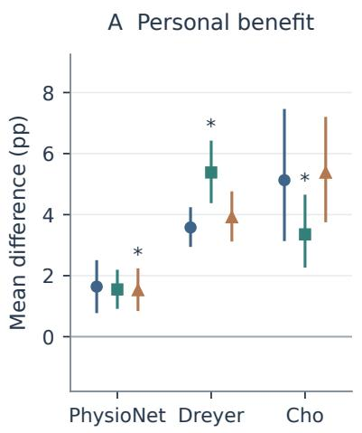

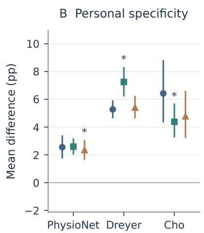

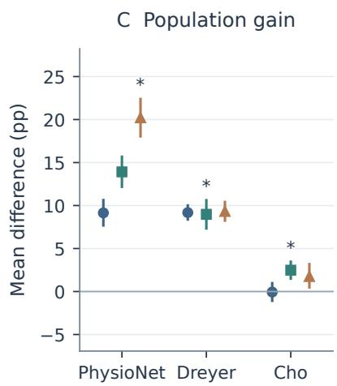  
Figure S1: Mean version of main Figure 2, with subject-bootstrap 95% intervals. Asterisks identify listed pretraining sources.

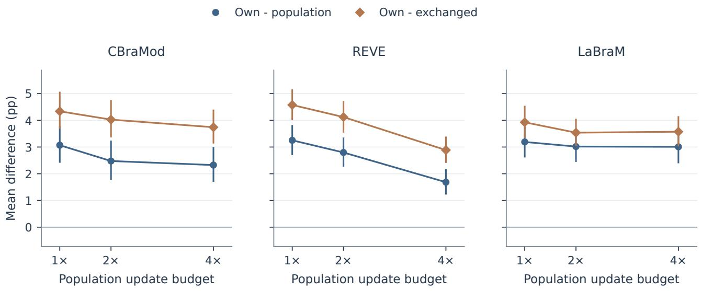  
Figure S2: Mean version of main Figure 3, using the same paired contrasts, subjects and budget endpoints.

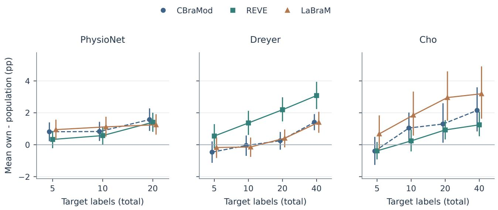  
Figure S3: Mean version of main Figure 4. Only PhysioNet has nonnegative means at every available budget for all models. The nonnegativeand-nondecreasing criterion uses means.

C Calibration increment  
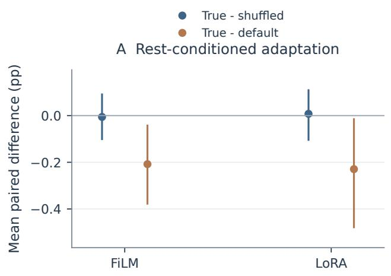

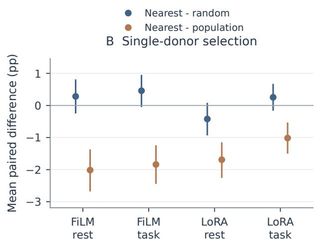  
Figure S4: Mean version of main Figure 5. Each interval is for a within-subject difference.

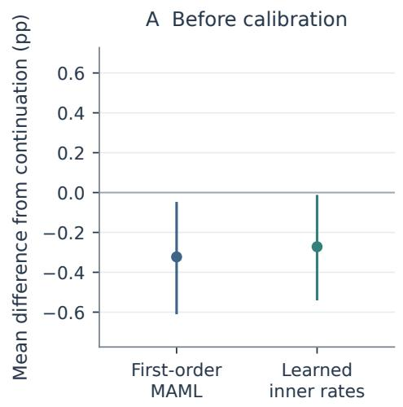

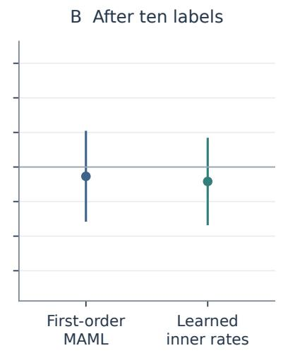

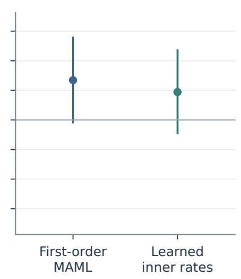  
Figure S5: Mean version of main Figure 6. Final differences equal initial differences plus differences in calibration increments. Unlike the medians, the means obey this additive identity.

## S1.1 Complete intervals for the main comparisons

All values are percentage points; population BA rows are percentages. Mean and median bootstrap intervals use the same subject draws within each contrast. A budget-change row is the 4× statistic minus the 1× statistic. FILM/LORA denote the FiLM/LoRA families; nearest\_gain, random\_gain and difference denote nearest minus population, random minus population and nearest minus random, respectively.

Table S2: Subject-bootstrap intervals for all main-text comparisons. Population balanced accuracy is in percent; paired differences are in percentage points.
<table><tr><td>Model</td><td>Dataset</td><td>Contrast / condition</td><td>N Median [95% CI]</td><td>Mean [95% CI]</td></tr><tr><td>CBraMod</td><td>PhysioNet</td><td>Personal benefit</td><td>103 0.98 [0.08, 2.42]</td><td>1.64 [0.77, 2.51]</td></tr><tr><td>CBraMod</td><td>PhysioNet</td><td>Personal specificity</td><td>103 1.87 [1.51, 2.61]</td><td>2.55 [1.74, 3.40]</td></tr><tr><td>CBraMod</td><td>PhysioNet</td><td>Population gain</td><td>103 7.77 [6.82, 10.08]</td><td>9.14 [7.54, 10.78]</td></tr><tr><td>CBraMod</td><td>Dreyer</td><td>Personal benefit</td><td>80 3.29 [2.67, 3.83]</td><td>3.58 [2.94, 4.24]</td></tr><tr><td>CBraMod</td><td>Dreyer</td><td>Personal specificity</td><td>80 4.89 [4.17, 5.95]</td><td>5.28 [4.64, 5.93]</td></tr><tr><td>CBraMod</td><td>Dreyer</td><td>Population gain</td><td>80 9.08 [7.33, 10.00]</td><td>9.18 [8.23, 10.15]</td></tr><tr><td>CBraMod</td><td>Cho</td><td>Personal benefit</td><td>52 3.50 [1.80, 4.80]</td><td>5.13 [3.13, 7.46]</td></tr><tr><td>CBraMod</td><td>Cho</td><td>Personal specificity</td><td>52 4.30 [1.90, 6.72]</td><td>6.43 [4.34, 8.83]</td></tr><tr><td>CBraMod</td><td>Cho</td><td>Population gain</td><td>52 -0.08 [-1.17, 0.80]</td><td>-0.06 [-1.22, 1.12]</td></tr><tr><td>REVE</td><td>PhysioNet</td><td>Personal benefit</td><td>103 0.98 [0.30, 1.67]</td><td>1.55 [0.91, 2.19]</td></tr><tr><td>REVE</td><td>PhysioNet</td><td>Personal specificity</td><td>103 2.39 [1.52, 2.75]</td><td>2.59 [2.02, 3.19]</td></tr><tr><td>REVE</td><td>PhysioNet</td><td>Population gain</td><td>103 13.38 [10.30, 15.00]</td><td>13.92 [12.03, 15.82]</td></tr><tr><td>REVE</td><td>Dreyer</td><td>Personal benefit</td><td>804.67 [3.17, 5.83]</td><td>5.38 [4.38, 6.43]</td></tr><tr><td>REVE</td><td>Dreyer</td><td>Personal specificity</td><td>80 6.78 [5.67, 7.58]</td><td>7.25 [6.21, 8.33]</td></tr><tr><td>REVE</td><td>Dreyer</td><td>Population gain</td><td>80 8.83 [6.67, 11.83]</td><td>8.98 [7.19, 10.76]</td></tr><tr><td>REVE</td><td>Cho</td><td>Personal benefit</td><td>52 2.60 [1.20, 3.40]</td><td>3.35 [2.26, 4.65]</td></tr><tr><td>REVE</td><td>Cho</td><td>Personal specificity</td><td>52 3.48 [2.38, 4.39]</td><td>4.38 [3.25, 5.70]</td></tr><tr><td>REVE</td><td>Cho</td><td>Population gain</td><td>52 1.63 [0.60, 3.00]</td><td>2.48 [1.36, 3.61]</td></tr><tr><td>LaBraM</td><td>PhysioNet</td><td>Personal benefit</td><td>103 0.91 [0.45, 1.82]</td><td>1.52 [0.84, 2.24]</td></tr><tr><td>LaBraM</td><td>PhysioNet</td><td>Personal specificity</td><td>103 2.09 [1.27, 2.77]</td><td>2.35 [1.64, 3.08]</td></tr><tr><td>LaBraM</td><td>PhysioNet</td><td>Population gain</td><td>103 20.38 [17.12, 22.65]</td><td>20.21 [17.90, 22.54]</td></tr><tr><td>LaBraM</td><td>Dreyer</td><td>Personal benefit</td><td>80 3.00 [2.58, 4.00]</td><td>3.91 [3.12, 4.76]</td></tr><tr><td>LaBraM</td><td>Dreyer</td><td>Personal specificity</td><td>80 4.32 [3.70, 5.24]</td><td>5.41 [4.63, 6.25]</td></tr><tr><td>LaBraM</td><td>Dreyer</td><td>Population gain</td><td>80 9.67 [7.67, 10.50]</td><td>9.31 [8.10, 10.56]</td></tr><tr><td>LaBraM</td><td>Cho</td><td>Personal benefit</td><td>52 3.38 [2.40, 4.30]</td><td>5.38 [3.75, 7.20]</td></tr><tr><td>LaBraM</td><td>Cho</td><td>Personal specificity</td><td>52 2.95 [2.04, 4.26]</td><td>4.78 [3.21, 6.62]</td></tr><tr><td>LaBraM</td><td>Cho</td><td>Population gain</td><td>52 0.60 [-0.20, 1.70]</td><td>1.74 [0.33, 3.33]</td></tr><tr><td>LaBraM</td><td>Cho</td><td>Exchanged minus population</td><td>52 0.44 [-0.22, 0.94]</td><td>0.60 [-0.03, 1.24]</td></tr><tr><td>CBraMod</td><td>Pooled</td><td>1x Personal benefit</td><td>235 2.60 [2.00, 3.33]</td><td>3.07 [2.41, 3.78]</td></tr><tr><td>CBraMod</td><td>Pooled</td><td>1x Personal specificity</td><td>235 3.53 [2.88, 4.33]</td><td>4.34 [3.68, 5.07]</td></tr><tr><td>CBraMod</td><td>Pooled</td><td>1x Population BA</td><td>235 79.09 [76.97, 80.85]</td><td>77.06 [75.33, 78.77]</td></tr><tr><td>CBraMod</td><td>Pooled</td><td>2x Personal benefit</td><td>235 1.60 [1.31, 2.23]</td><td>2.48 [1.76, 3.24]</td></tr><tr><td>CBraMod</td><td>Pooled</td><td>2x Personal specificity</td><td>235 3.40 [2.92, 4.36]</td><td>4.03 [3.36, 4.76]</td></tr><tr><td>CBraMod</td><td>Pooled</td><td>2x Population BA</td><td>235 80.33 [78.03, 82.50]</td><td>77.98 [76.24, 79.69]</td></tr><tr><td>CBraMod</td><td>Pooled</td><td>4x Personal benefit</td><td>235 2.00 [1.33, 2.35]</td><td>2.33 [1.70, 3.00]</td></tr><tr><td>CBraMod</td><td>Pooled</td><td>4x Personal specificity</td><td>235 3.23 [2.74, 3.82]</td><td>3.74 [3.13, 4.40]</td></tr><tr><td>CBraMod</td><td>Pooled</td><td>4x Population BA</td><td>235 80.50 [78.20, 82.05]</td><td>78.25 [76.60, 79.88]</td></tr><tr><td>CBraMod</td><td>Pooled</td><td>4x minus 1x</td><td>235 -0.60 [-1.33, 0.00]</td><td>-0.74 [-1.20, -0.29]</td></tr><tr><td>REVE</td><td>Pooled</td><td>1x Personal benefit</td><td>235 2.42 [1.67, 2.95]</td><td>3.25 [2.70, 3.82]</td></tr><tr><td>REVE</td><td>Pooled</td><td>1x Personal specificity</td><td>235 3.50 [3.07, 4.06]</td><td>4.58 [4.01, 5.16]</td></tr><tr><td>REVE</td><td>Pooled</td><td>1x Population BA</td><td>235 82.00 [79.80, 84.80]</td><td>81.13 [79.51, 82.70]</td></tr><tr><td>REVE</td><td>Pooled</td><td>2x Personal benefit</td><td>235 1.83 [1.50, 2.40]</td><td>2.80 [2.26, 3.35]</td></tr><tr><td>REVE</td><td>Pooled</td><td>2x Personal specificity</td><td>235 3.10 [2.42, 3.85]</td><td>4.12 [3.54, 4.72]</td></tr><tr><td>REVE</td><td>Pooled</td><td>2x Population BA</td><td>235 84.17 [81.89, 85.23]</td><td>81.80 [80.20, 83.37]</td></tr><tr><td>REVE</td><td>Pooled</td><td>4x Personal benefit</td><td>235 1.00 [0.80, 1.50]</td><td>1.68 [1.22, 2.17]</td></tr><tr><td>REVE</td><td>Pooled</td><td>4x Personal specificity</td><td>235 2.24 [1.98, 2.73]</td><td>2.89 [2.41, 3.39]</td></tr><tr><td>REVE</td><td>Pooled</td><td>4x Population BA</td><td>235 80.76 [78.67, 83.00]</td><td>79.81 [78.32, 81.32]</td></tr><tr><td>REVE</td><td>Pooled</td><td>4x minus 1x</td><td>235 -1.42 [-1.83, -0.68]</td><td>-1.57 [-1.99, -1.15]</td></tr><tr><td>LaBraM</td><td>Pooled</td><td>1x Personal benefit</td><td>235 2.42 [1.97, 2.80]</td><td>3.19 [2.61, 3.82]</td></tr><tr><td>LaBraM</td><td>Pooled</td><td>1x Personal specificity</td><td>235 3.17 [2.77, 3.68]</td><td>3.93 [3.35, 4.54]</td></tr><tr><td>LaBraM</td><td>Pooled</td><td>1x Population BA</td><td>235 81.14 [77.73, 83.26]</td><td>77.81 [75.92, 79.69]</td></tr><tr><td>LaBraM</td><td>Pooled</td><td>2x Personal benefit</td><td>235 2.58 [2.00, 3.03]</td><td>3.02 [2.44, 3.60]</td></tr><tr><td>LaBraM</td><td>Pooled</td><td>2x Personal specificity</td><td>235 2.87 [2.37, 3.40]</td><td>3.54 [3.04, 4.06]</td></tr><tr><td>LaBraM</td><td>Pooled</td><td>2x Population BA</td><td>235 81.21 [78.83, 83.25]</td><td>78.46 [76.59, 80.26]</td></tr><tr><td>LaBraM</td><td>Pooled</td><td>4x Personal benefit</td><td>235 1.97 [1.50, 2.50]</td><td>3.01 [2.39, 3.66]</td></tr><tr><td>LaBraM</td><td>Pooled</td><td>4x Personal specificity</td><td>235 2.94 [2.63, 3.30]</td><td>3.57 [3.02, 4.16]</td></tr><tr><td>LaBraM</td><td>Pooled</td><td>4x Population BA</td><td>235 82.33 [79.09, 84.70]</td><td>78.69 [76.82, 80.52]</td></tr><tr><td>LaBraM</td><td>Pooled</td><td>4x minus 1x</td><td>235 -0.45 [-0.99, 0.10]</td><td>-0.18 [-0.65, 0.28]</td></tr><tr><td>CBraMod</td><td>Cho</td><td>5 labels</td><td>52 -0.60 [-1.40, 0.40]</td><td>-0.40 [-1.26, 0.49]</td></tr><tr><td>CBraMod</td><td>Cho</td><td>10 labels</td><td>52 0.40 [-0.20, 1.20]</td><td>1.05 [0.14, 2.02]</td></tr><tr><td>CBraMod</td><td>Cho</td><td>20 labels</td><td>52 0.20 [-0.60, 1.40]</td><td>1.30 [0.13, 2.60]</td></tr><tr><td>CBraMod</td><td>Cho</td><td>40 labels</td><td>52 1.20 [0.40, 2.20]</td><td>2.15 [0.83, 3.60]</td></tr><tr><td>CBraMod</td><td>Dreyer</td><td>5 labels</td><td>80 -0.33 [-1.00, 0.00]</td><td>-0.46 [-1.13, 0.21]</td></tr><tr><td>CBraMod</td><td>Dreyer</td><td>10 labels</td><td>80 0.25 [-0.33, 0.83]</td><td>-0.05 [-0.70, 0.58]</td></tr><tr><td>CBraMod</td><td>Dreyer</td><td>20 labels</td><td>80 0.33 [-0.08, 1.00]</td><td>0.25 [-0.31, 0.80]</td></tr><tr><td>CBraMod</td><td>Dreyer</td><td>40 labels</td><td>80 1.17 [0.83, 1.67]</td><td>1.41 [0.91, 1.92]</td></tr><tr><td>CBraMod</td><td>PhysioNet</td><td>5 labels</td><td>103 0.76 [0.00, 1.08]</td><td>0.81 [0.22, 1.40]</td></tr><tr><td>CBraMod</td><td>PhysioNet</td><td>10 labels</td><td>103 0.83 [0.00, 1.44]</td><td>0.83 [0.24, 1.44]</td></tr><tr><td>CBraMod</td><td>PhysioNet</td><td>20 labels</td><td>103 1.52 [0.76, 1.89]</td><td>1.57 [0.87, 2.28]</td></tr><tr><td>REVE</td><td>Cho</td><td>5 labels</td><td>52 -0.40 [-0.90, 0.00]</td><td>-0.38 [-0.92, 0.17]</td></tr><tr><td>REVE</td><td>Cho</td><td>10 labels</td><td>52 0.00 [-0.80, 0.70]</td><td>0.24 [-0.42, 0.96]</td></tr><tr><td>REVE</td><td>Cho</td><td>20 labels</td><td>52 0.70 [0.40, 1.30]</td><td>0.93 [0.33, 1.54]</td></tr><tr><td>REVE</td><td>Cho</td><td>40 labels</td><td>52 0.73 [0.10, 1.18]</td><td>1.25 [0.53, 2.07]</td></tr><tr><td>REVE</td><td>Dreyer</td><td>5 labels</td><td>80 0.33 [-0.08, 1.00]</td><td>0.54 [-0.24, 1.29]</td></tr><tr><td>REVE</td><td>Dreyer</td><td>10 labels</td><td>80 0.92 [0.33, 1.50]</td><td>1.36 [0.61, 2.12]</td></tr><tr><td>REVE</td><td>Dreyer</td><td>20 labels</td><td>80 1.33 [0.83, 2.67]</td><td>2.19 [1.46, 2.97]</td></tr><tr><td>REVE</td><td>Dreyer</td><td>40 labels</td><td>80 2.42 [1.67, 3.17]</td><td>3.08 [2.23, 3.94]</td></tr><tr><td>REVE</td><td>PhysioNet</td><td>5 labels</td><td>103 0.08 [0.00, 0.83]</td><td>0.33 [-0.22, 0.86]</td></tr><tr><td>REVE</td><td>PhysioNet</td><td>10 labels</td><td>103 0.23 [0.00, 0.83]</td><td>0.57 [0.02, 1.14]</td></tr><tr><td>REVE</td><td>PhysioNet</td><td>20 labels</td><td>103 1.00 [0.77, 1.74]</td><td>1.41 [0.81, 2.01]</td></tr><tr><td>LaBraM</td><td>Cho</td><td>5 labels</td><td>52 0.40 [-0.20, 0.80]</td><td>0.68 [-0.32, 1.84]</td></tr><tr><td>LaBraM</td><td>Cho</td><td>10 labels</td><td>52 0.90 [0.00, 2.00]</td><td>1.86 [0.57, 3.33]</td></tr><tr><td>LaBraM</td><td>Cho</td><td>20 labels</td><td>52 1.70 [0.50, 2.45]</td><td>2.96 [1.50, 4.60]</td></tr><tr><td>LaBraM</td><td>Cho</td><td>40 labels</td><td>52 1.72 [1.20, 2.95]</td><td>3.19 [1.63, 4.91]</td></tr><tr><td>LaBraM</td><td>Dreyer</td><td>5 labels</td><td>80 0.00 [-0.50, 0.67]</td><td>-0.17 [-0.83, 0.44]</td></tr><tr><td>LaBraM</td><td>Dreyer</td><td>10 labels</td><td>80 0.00 [-0.33, 0.50]</td><td>-0.14 [-0.76, 0.45]</td></tr><tr><td>LaBraM</td><td>Dreyer</td><td>20 labels</td><td>80 0.50 [0.00, 1.00]</td><td>0.41 [-0.17, 0.96]</td></tr><tr><td>LaBraM</td><td>Dreyer</td><td>40 labels</td><td>801.00 [0.50, 2.00]</td><td>1.41 [0.75, 2.06]</td></tr><tr><td>LaBraM</td><td>PhysioNet</td><td>5 labels</td><td>103 0.54 [0.00, 1.08]</td><td>0.95 [0.35, 1.57]</td></tr><tr><td>LaBraM</td><td>PhysioNet</td><td>10 labels</td><td>103 0.91 [0.08, 1.23]</td><td>1.12 [0.51, 1.75]</td></tr><tr><td>LaBraM</td><td>PhysioNet</td><td>20 labels</td><td>103 0.98 [0.00, 1.67]</td><td>1.25 [0.63, 1.91]</td></tr><tr><td>CBraMod</td><td>Pooled</td><td>FILM True - shuffled</td><td>235 0.00 [0.00, 0.00]</td><td>-0.01 [-0.10, 0.09]</td></tr><tr><td>CBraMod</td><td>Pooled</td><td>FILM True - default</td><td>235 0.00 [0.00, 0.00]</td><td>-0.21 [-0.38, -0.04]</td></tr><tr><td>CBraMod</td><td>Pooled</td><td>LORA True - shuffled</td><td>235 0.00 [0.00, 0.00]</td><td>0.01 [-0.11, 0.11]</td></tr><tr><td>CBraMod CBraMod</td><td>Pooled</td><td>LORA True - default</td><td>235 0.00 [0.00, 0.00]</td><td>-0.23 [-0.48, -0.01]</td></tr><tr><td></td><td>Pooled</td><td>FiLM rest Nearest - population</td><td>235 -1.67 [-2.20, -1.00]</td><td>-2.01 [-2.68, -1.37]</td></tr><tr><td>CBraMod</td><td>Pooled</td><td>FiLM rest Random - population</td><td>235 -2.16 [-2.67, -1.73]</td><td>-2.30 [-2.67, -1.92]</td></tr><tr><td>CBraMod</td><td>Pooled</td><td>FiLM rest Nearest - random</td><td>235 0.44 [-0.02, 0.88]</td><td>0.28 [-0.25, 0.81]</td></tr><tr><td>CBraMod</td><td>Pooled</td><td>FiLM task Nearest - population</td><td>235 -1.50 [-2.00, -0.91]</td><td>-1.84 [-2.44, -1.24]</td></tr><tr><td>CBraMod</td><td>Pooled</td><td>FiLM task Random - population</td><td>235 -2.16 [-2.67, -1.73]</td><td>-2.30 [-2.69, -1.91]</td></tr><tr><td>CBraMod</td><td>Pooled</td><td>FiLM task Nearest - random</td><td>235 0.77 [0.32, 1.36]</td><td>0.46 [-0.05, 0.95]</td></tr><tr><td>CBraMod</td><td>Pooled</td><td>LoRA rest Nearest - population</td><td>235 -0.98 [-1.67, -0.67]</td><td>-1.69 [-2.26, -1.15]</td></tr><tr><td>CBraMod</td><td>Pooled</td><td>LoRA rest Random - population</td><td>235 -1.38 [-1.73, -1.02]</td><td>-1.27 [-1.54, -0.99]</td></tr><tr><td>CBraMod</td><td>Pooled</td><td>LoRA rest Nearest - random</td><td>235 0.00 [-0.50, 0.54]</td><td>-0.42 [-0.93, 0.08]</td></tr><tr><td>CBraMod</td><td>Pooled</td><td>LoRA task Nearest - population</td><td>235 -0.68 [-1.21, 0.00]</td><td>-1.02 [-1.50, -0.53]</td></tr><tr><td>CBraMod</td><td>Pooled</td><td>LoRA task Random - population</td><td>235 -1.38 [-1.73, -1.02]</td><td>-1.27 [-1.55, -1.00]</td></tr><tr><td>CBraMod</td><td>Pooled</td><td>LoRA task Nearest - random</td><td>235 0.57 [0.04, 0.96]</td><td>0.25 [-0.16, 0.67]</td></tr><tr><td>CBraMod</td><td>Pooled</td><td>First-order MAML Before</td><td>235 0.00 [-0.23, 0.00]</td><td>-0.32 [-0.61, -0.05]</td></tr><tr><td>CBraMod</td><td>Pooled</td><td>First-order MAML After</td><td>235 0.00 [-0.20, 0.08]</td><td>-0.05 [-0.32, 0.21]</td></tr><tr><td>CBraMod</td><td>Pooled</td><td>First-order MAML Calibration incre- 235 0.17 [0.00, 0.33]</td><td></td><td>0.27 [-0.02, 0.56]</td></tr><tr><td>CBraMod</td><td>Pooled</td><td>ment Learned inner rates Before</td><td>235 -0.08 [-0.23, 0.00]</td><td>-0.27 [-0.54, -0.01]</td></tr><tr><td>CBraMod</td><td>Pooled</td><td>Learned inner rates After</td><td>235 0.00 [-0.17, 0.08]</td><td>-0.08 [-0.34, 0.17]</td></tr><tr><td>CBraMod</td><td>Pooled</td><td>Learned inner rates Calibration incre- 235 0.00 [0.00, 0.33]</td><td></td><td>0.19 [-0.10, 0.48]</td></tr><tr><td>CBraMod</td><td>Lee</td><td>ment FiLM Own - population</td><td>54 -0.50 [-2.70, 1.00]</td><td>-0.67 [-2.12, 0.84]</td></tr><tr><td>CBraMod</td><td>Lee</td><td>FiLM Own - exchanged</td><td>54 2.50 [0.45, 4.60]</td><td>3.91 [2.17, 5.81]</td></tr><tr><td>CBraMod</td><td>Lee</td><td>LoRA Own - population</td><td>54 1.00 [-0.80, 2.60]</td><td>1.02 [-0.09, 2.16]</td></tr><tr><td>CBraMod</td><td>Lee</td><td>LoRA Own - exchanged</td><td>54 2.58 [1.87, 4.35]</td><td>3.78 [2.43, 5.24]</td></tr><tr><td>CBraMod</td><td>BNCI</td><td>FiLM Own - population</td><td>9 5.56 [-2.22, 11.94]</td><td>5.12 [1.57, 8.67]</td></tr><tr><td>CBraMod</td><td>BNCI</td><td>FiLM Own - exchanged</td><td>8 6.94 [-0.28, 16.11]</td><td>7.85 [2.50, 13.16]</td></tr><tr><td>CBraMod</td><td>BNCI</td><td>LoRA Own - population</td><td>9 5.00 [-3.61, 11.39]</td><td>4.81 [0.80, 8.61]</td></tr><tr><td>CBraMod</td><td>BNCI</td><td>LoRA Own - exchanged</td><td>812.08 [0.56, 14.72]</td><td>9.76 [5.17, 13.78]</td></tr></table>

## S2 CBraMod Supplementary Results

The descriptive tables report paired subject means, subject standard deviations, and sample sizes. Standard deviations quantify heterogeneity, not standard errors or confidence intervals. Zero-label gains are defined by the matched starting model; unavailable budgets remain absent.

Table S3: CBraMod few-label calibration: paired subject means and between-subject standard deviations. Gains are in percentage points.
<table><tr><td>Dataset</td><td>Start</td><td>Labels</td><td>N</td><td>Mean gain (pp)</td><td>Subject SD (pp)</td></tr><tr><td>PhysioNet</td><td>B3</td><td>5</td><td>103</td><td>0.78</td><td>2.98</td></tr><tr><td>PhysioNet</td><td>B3</td><td>10</td><td>103</td><td>0.93</td><td>3.36</td></tr><tr><td>PhysioNet</td><td>B3</td><td>20</td><td>103</td><td>1.50</td><td>3.91</td></tr><tr><td>PhysioNet</td><td>G</td><td>5</td><td>103</td><td>0.81</td><td>3.07</td></tr><tr><td>PhysioNet</td><td>G</td><td>10</td><td>103</td><td>0.83</td><td>3.11</td></tr><tr><td>PhysioNet</td><td>G</td><td>20</td><td>103</td><td>1.57</td><td>3.65</td></tr><tr><td>Dreyer</td><td>B3</td><td>5</td><td>80</td><td>-0.18</td><td>3.09</td></tr><tr><td>Dreyer</td><td>B3</td><td>10</td><td>80</td><td>-0.09</td><td>2.94</td></tr><tr><td>Dreyer</td><td>B3</td><td>20</td><td>80</td><td>0.41</td><td>2.86</td></tr><tr><td>Dreyer</td><td>B3</td><td>40</td><td>80</td><td>1.64</td><td>2.78</td></tr><tr><td>Dreyer</td><td>G</td><td>5</td><td>80</td><td>-0.46</td><td>3.11</td></tr><tr><td>Dreyer</td><td>G</td><td>10</td><td>80</td><td>-0.05</td><td>2.93</td></tr><tr><td>Dreyer</td><td>G</td><td>20</td><td>80</td><td>0.25</td><td>2.54</td></tr><tr><td>Dreyer</td><td>G</td><td>40</td><td>80</td><td>1.41</td><td>2.31</td></tr><tr><td>Cho</td><td>B3</td><td>5</td><td>52</td><td>0.19</td><td>3.17</td></tr><tr><td>Cho</td><td>B3</td><td>10</td><td>52</td><td>1.27</td><td>3.86</td></tr><tr><td>Cho</td><td>B3</td><td>20</td><td>52</td><td>1.36</td><td>4.31</td></tr><tr><td>Cho</td><td>B3</td><td>40</td><td>52</td><td>2.36</td><td>5.72</td></tr><tr><td>Cho</td><td>G</td><td>5</td><td>52</td><td>-0.40</td><td>3.24</td></tr><tr><td>Cho</td><td>G</td><td>10</td><td>52</td><td>1.05</td><td>3.46</td></tr><tr><td>Cho</td><td>G</td><td>20</td><td>52</td><td>1.30</td><td>4.63</td></tr><tr><td>Cho</td><td>G</td><td>40</td><td>52</td><td>2.15</td><td>5.14</td></tr><tr><td>Lee</td><td>G</td><td>5</td><td>54</td><td>-1.22</td><td>2.12</td></tr><tr><td>Lee</td><td>G</td><td>10</td><td>54</td><td>-0.70</td><td>1.80</td></tr><tr><td>Lee</td><td>G</td><td>20</td><td>54</td><td>-0.34</td><td>3.13</td></tr><tr><td>BNCI</td><td>G</td><td>5</td><td>9</td><td>-0.65</td><td>2.90</td></tr><tr><td>BNCI</td><td>G</td><td>10</td><td>9</td><td>2.69</td><td>2.67</td></tr><tr><td>BNCI</td><td>G</td><td>20</td><td>9</td><td>0.68</td><td>4.26</td></tr></table>

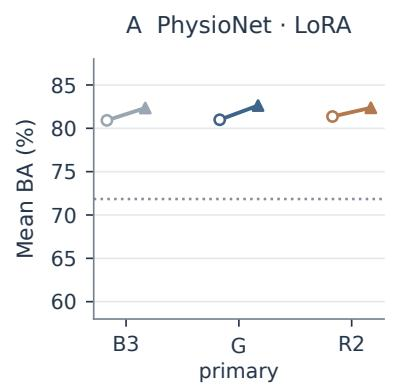

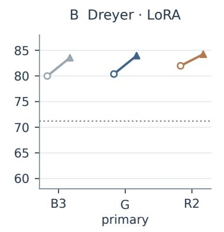

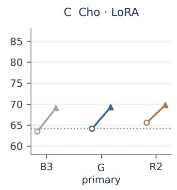

D Reference sensitivity  
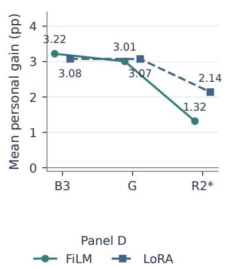

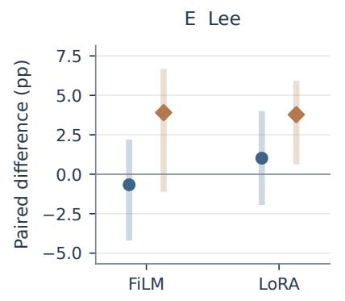

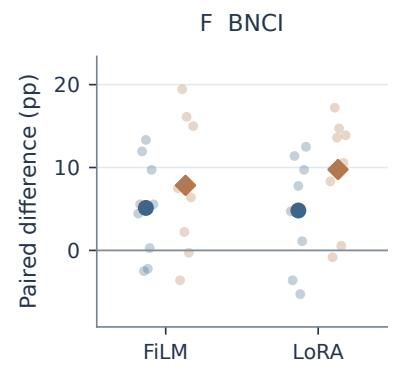  
BNCI: Δ uses all subjects; U uses the available donors.

Figure S6: CBraMod decomposition under B3, G, and R2. Personal gains use the same paired means; Lee and BNCI also distinguish ownminus-population from own-minus-swapped. Lee panel E shows subject interquartile ranges as vertical lines; BNCI panel F shows individual subject differences as faint points. R2-FiLM changes the population parameter family.

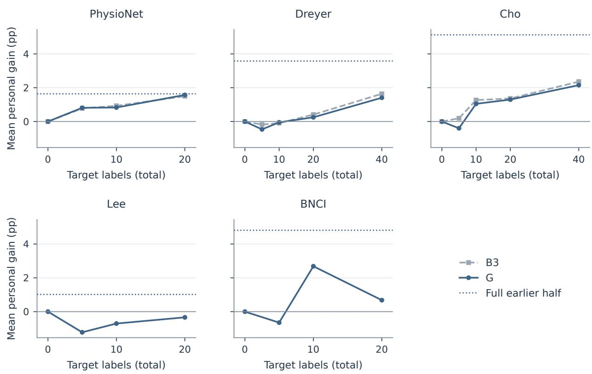  
Figure S7: CBraMod few-shot gains, including the external datasets and default-context reference. Full-half reference lines use the matched scoring path.

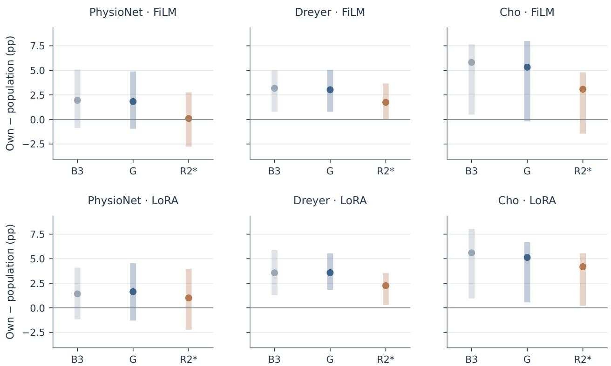  
Figure S8: Personal-gain means (points) and subject interquartile ranges (bars), separately by dataset, family, and population start. R2\* is a LoRA population model also used for the FiLM sensitivity analysis.

## S2.1 Euclidean alignment and positive counterexamples

The EA experiments whiten native multichannel inputs before the frozen backbone. Their results include substantial PhysioNet degradation and an exception: all-unlabeled-task EA with the multilayer head improves Dreyer by 1.43 pp on average, with original Holm $p = 0 . 0 2 3 9$ . This variant uses unlabeled query-task inputs and is transductive. The rest-only and matched eyes-open variants, head variants, dataset results, and negative directions all remain in the Supplementary Data 1.

EA was applied to stored microvolt-scaled signals with fixed diagonal shrinkage. Whitening changes signal amplitude and spatial structure, and EA/non-EA intermediate precision paths are not identical. Hence this comparison does not isolate spatia mixing alone. The original EA work [1] and positive results in ordinary deep networks [2] limit any general claim that alignment is harmful. Reduced-channel and Riemannian recentering approaches also have favorable frozen-model configurations [3]. Their channel projection and covariance geometry differ from native-channel arithmetic-mean whitening here. Compas discusses the possible interaction with pretrained spatial structure [4]; amplitude, channel rank, and covariance estimation are further hypotheses, not established causes. Adaptive EA results involving target-test performance for projection selection require that selection condition to be stated [5].

## S2.2 Rest-based transfer and few-shot disagreements

ResTL’s positive evidence concerns generating task examples from target rest and updating a decoder, including a noise-versus rest comparison [6]. Its task-adjacent baseline, optimization path, and decoder updates differ from our independent-context generator and donor-parameter transfer. Baseline correction and test-time training provide additional positive evidence under other procedures [7, 8]. These differences could affect how useful personal information is extracted, but have not been separately manipulated here.

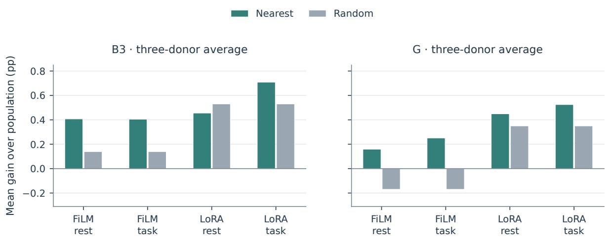  
Figure S9: All initial-cohort secondary three-donor averages. FiLM and LoRA nearest-minus-G means are positive; the LoRA random-donor averages also exceed G. These are secondary, uncorrected comparisons.

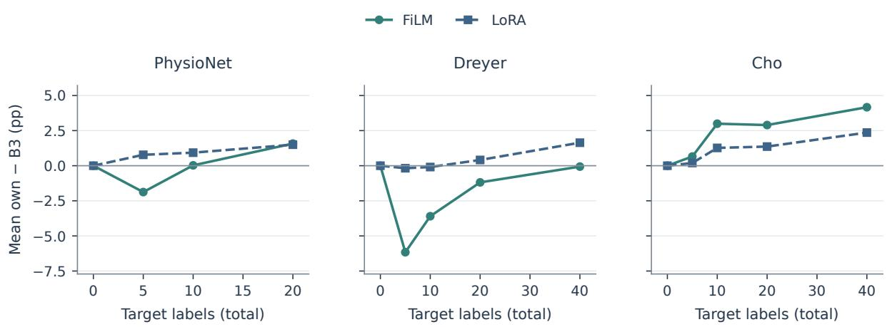  
Figure S10: Default-context few-shot curves for both personal families. FiLM’s low-budget negative mean gains remain visible. Curves connect observed budgets only; their zero-label reference is an identity.

Likewise, positive results from personal encoders and EEG-Reptile [9, 10] can coexist with our negative small-budget outcomes. Label budget, target parameterization, source-model quality, and validation size may contribute. The available abstract for the LaBraM calibration work supports its relevance but not a precise reconstruction of its label budget or all controls [11]. A mismatch between outcomes is therefore a boundary on generalization, not a basis for declaring those studies incorrect.

## S3 Literature Comparison and Search Scope

The literature comparison uses the publisher’s Scientific Reports Article in Press for Lopes et al. (accepted 26 August 2026, published 3 September 2026, DOI 10.1038/s41598-026-69220-z), separately from their arXiv preprint. Page references below count the cover as page 1 of that 24-page publisher PDF; the final typeset pagination may differ.

Table S4: Related evaluation questions, target settings and controls. The comparison concerns study designs and inspected controls, not an accuracy ranking.
<table><tr><td>Work</td><td>Reference</td><td>Question</td><td>Subject / target setting</td><td>Verified control scope</td></tr><tr><td>Identity Trap</td><td>[12]</td><td>Representation identity audit</td><td>/ Task- and dependent not established here</td><td>dataset- Identity diagnostics; attribution package</td></tr><tr><td>EEG-FM- Compass</td><td>[4]</td><td>Benchmark adaptation compari- subject</td><td>and LOSO and within- Separate</td><td>protocols; no joint few-shot own/population/swapped gain decom-</td></tr><tr><td>Stacked LoRA [13]</td><td></td><td>son Shared and personal Subjects low-rank adapters</td><td>separately seen pooled trial split</td><td>position in Global adapter comparison; different ca- pacity; mismatch not reported in read text</td></tr><tr><td>Lopes et (Scientific Reports)</td><td>al. [14]</td><td>and alignment tion</td><td></td><td>Personal encoders LOSO; target calibra- Low-rank, shared-adaptation, mismatch, capacity and normalization controls</td></tr><tr><td>Nguyen et al.</td><td>[15]</td><td>Frozen-model popu- Held-out subjects lation LoRA</td><td></td><td>Head versus LoRA; no target personal adapter in evaluated pipeline</td></tr><tr><td>ResTL</td><td>[6]</td><td>Rest-based tive transfer</td><td>genera- LOSO; target rest</td><td>Noise/rest control; updates decoder; donor- rest swap not reported in read text</td></tr><tr><td>Sharma et al.</td><td>[16]</td><td>Transfer learning Held-out versus MAML</td><td>few-shot labels</td><td>subjects; Ordinary transfer baseline; optimizers dif- fer; total training budget not matched</td></tr><tr><td>This study</td><td></td><td>Gain attribution on Held-out frozen backbone</td><td>same-session split</td><td>subjects; Default/shuffled; own/swapped; outer- update continuation; separate Delta and U</td></tr></table>

## S3.1 Control-by-control comparison with Lopes et al.

Table S5: Control-by-control comparison with the published Lopes et al. study. Page numbers refer to the publisher PDF described above.
<table><tr><td>Dimension</td><td>Lopes et al., published article [14]</td><td>Present study</td></tr><tr><td>Population split</td><td>LOSO; validation holds out 20% of trials within each source subject (p. 8, implemen- tation details).</td><td>Downstream train/validation/test subjects disjoint; core pools three datasets.</td></tr><tr><td>Target labels</td><td>First 48 trials for encoder selection and fine- tuning (p. 7, Eq. 10; Fig. 2).</td><td>Full earlier half and specified few-label prefixes; later half for evaluation.</td></tr><tr><td>Parameters</td><td>ual input-channel low-rank layers (pp. 6–8; tention LoRA; CBraMod FiLM extension. Table 1, p. 13).</td><td>Subject-specific encoder branches and resid- Frozen pretrained transformers with personal at-</td></tr><tr><td>Shared reference</td><td>Shared encoder (p. 6); the discussion reports no encoder-bank accuracy advantage over a fine-tuned shared baseline under matched</td><td>Named population reference and ordinary- continuation sensitivity, with paired BA contrasts.</td></tr><tr><td>Mismatch</td><td>adaptation (p. 20). Class distinctiveness and matched/mismatchedlatentgeometry; source-subject routing (pp. 14–16, Figs. 6B</td><td>Held-out target query BA using owner versus donor adapters fitted on earlier support labels.</td></tr><tr><td>Capacity</td><td>and 8). batch-normalization controls (p. 15, after the lation and personal fits have different capacity. matched/mismatched analysis).</td><td>Widened shared model and subject-specific Same-capacity true/shuffled/default context; popu-</td></tr><tr><td>Alignment</td><td></td><td>With/without Euclidean Alignment; prospec- Separate native-channel alignment diagnostics, in- tive covariance estimation (pp. 4–5, Eqs. 6– cluding transductive and precision limitations.</td></tr><tr><td>Training budget</td><td>8; Fig. 3). Fixed recipes and early stopping (p. 8); Exact original, doubled and quadrupled validation-loss trajectories in Fig. 9, but population-update endpoints; no corresponding personal-gain budget curve unconfirmed. identified.</td><td>convergence</td></tr></table>

The overlap includes personal low-rank parameterization and shared/mismatch controls. The additional question here is their joint classification benefit in frozen EEG foundation models as population training varies. The comparison concerns the published methods and results.

## S3.2 Distinguishing model benchmarking from personal attribution

Yang et al.’s ICLR 2026 article, Are EEG Foundation Models Worth It? Comparative Evaluation with Traditional Decoders in Diverse BCI Tasks, compares foundation models with traditional decoders across six evaluation protocols and introduces ST EEGFormer [17]. The author repository and ICLR listing verify the conference identity; it is distinct from EEG-FM-Compass [4] and the earlier ST-EEGFormer submission. Its model-ranking question differs from the two paired adaptation contrasts reported here. No claim that all of its controls are absent is needed for that distinction.

The comparisons concern target settings, information access and control scope; accuracies are not pooled across different tasks, label budgets, metrics or pretrained sources.

## S4 Complete Prespecified Checks and Comparisons

The appendix includes engineering checks, joint decisions, complete comparison rows, convergence records, and nonexecuted or nonidentifiable items. Later extensions do not retrospectively change earlier failures. Tables reuse overlapping pooled, perdataset, and subgroup summaries; repeated rows and reused EA tables are not independent replication. A blank statistic denotes unavailable or inapplicable evidence and is never imputed as zero. Raw and corrected p-values retain the correction families specified for each analysis. The complete comparison inventory in Supplementary Data 1 includes negative and nonsignificant results.

## S4.1 Engineering and data checks

Table S6: Engineering and data checks with their preserved outcomes.
<table><tr><td>ID</td><td>Check</td><td>Preserved outcome</td></tr><tr><td>E01</td><td>Split, temporal, shuffle, identity and statistics contracts</td><td>Implementation checks passed; synthetic checks do not establish task performance.</td></tr><tr><td>E02</td><td>Checkpoint source and compute compatibility</td><td>Execution checks passed; pretraining overlap remains a separate source audit.</td></tr><tr><td>E03</td><td>Initial data-screening stop rule</td><td>Triggered for PhysioNet; the initial implementation also rejected Cho. Screening was revised before the subsequent analyses; the ini- tial failures remain reported.</td></tr><tr><td>E04</td><td>Initial task-head accuracy stop rule</td><td>Saved head results exceed the threshold; the later record-only rule does not erase the previous data-screening failure.</td></tr><tr><td>E05</td><td>Matched eyes-closed versus eyes- open alpha diagnostic</td><td>Most PhysioNet records agree; exceptions retained. Dreyer/Cho do not support the same diagnostic.</td></tr><tr><td>E06</td><td>Rest availability, state, boundaries, duration and finite values</td><td>Included subjects and exceptional boundaries preserved; missing records are not marked as passed.</td></tr><tr><td>E07</td><td>Cho original ordering</td><td>Cohort metadata checked; limited independent signal check. A com- plete continuous-timeline reconstruction is not established.</td></tr><tr><td>E08</td><td>Half-split labels and available sup- ports</td><td>Saved counts and imbalance diagnostics retained without subject re- moval; unavailable high-label budgets omitted.</td></tr><tr><td>E09</td><td>Default-model score identity</td><td>Batch-dependent boundary changes broke strict score equality. The observed discrepancies and the scoring rule specified before subse- quent runs are reported.</td></tr><tr><td>E10</td><td>Population-continuation predic- tions, labels, donors and frozen settings</td><td>Saved audits verified the completed predictions; rare initial-cohort batch-path differences and exact Lee checks retained.</td></tr><tr><td>E11</td><td>Accuracy trend at population-model early stopping</td><td>Not recoverable: only loss trajectories and overwritten best check- points were saved.</td></tr><tr><td>E12</td><td>BNCI raw-event/rest/task corre- spondence</td><td>Recorded audit passed. Native/readout distinction and donor-pool limitations retained.</td></tr><tr><td>E13</td><td>Follow-up prediction and frozen- source consistency</td><td>Saved R2/BNCI audits agree with completed outputs; isolated R2 batch-path flips retained with matched baselines.</td></tr></table>

## S4.2 Original joint gates and specified secondary endpoints

R1-based M gates below use test-query-informed validation priors; their original decisions describe that query-informed acces condition and are not independent confirmation under test-label isolation. This caveat applies to both primary and secondary R1 comparisons. “Pass” refers only to the named original rule. In particular, an own-versus-swapped pass does not establish a positive own-versus-population gain, and a secondary pass does not rescue a failed primary endpoint. Median differences and mean gains use pp; recovery and decline rates in the table are fractions. The contextual recovery statistic divides the mean contextual gain over B0 by the mean designated supervised-reference gain over B0; it is not a mean of individual ratios. Its observed reference means are positive, and no zero- or negative-denominator decision is inferred. W and the follow-up preserve the original three-slot own-versus-swapped Holm family: the unexecuted mixture-offset variant occupies a conservative unit-p slot internally, while its actual result remains unavailable. It is not an observed negative test.

Table S7: Original joint decision rules, observed components and decisions. A favorable component does not override a failed joint rule.
<table><tr><td>Gate ID</td><td>Cohort</td><td>Prespecified rule</td><td>Observed</td><td>Decision</td></tr><tr><td>B-G</td><td>pooled</td><td>Median vs B0 &gt;= 2 pp</td><td>median 1.000</td><td>Fail</td></tr><tr><td>B2-film_first2</td><td>pooled</td><td>Median vs B0 &gt;= 2 pp; one-sided Holm(4) median 1.833; pH 0.030713 vs tuned head &lt; .05</td><td></td><td>Fail</td></tr><tr><td>B2-film_all</td><td>pooled</td><td>Median vs B0 &gt;= 2 pp; one-sided Holm(4) median 2.833; pH 1.155e-08 vs tuned head &lt; .05</td><td></td><td>Pass</td></tr><tr><td>B2-lora4</td><td>pooled</td><td>Median vs B0 &gt;= 2 pp; one-sided Holm(4) median 2.800; pH 1.2765e-15 vs tuned head &lt; .05</td><td></td><td>Pass</td></tr><tr><td>B2-lora8</td><td>pooled</td><td>Median vs B0 &gt;= 2 pp; one-sided Holm(4) median 3.409; pH 1.3182e-17 vs tuned head &lt; .05</td><td></td><td>Pass</td></tr><tr><td>C-M_film</td><td>pooled</td><td>One-sided Holm(4) vs B4 and B0 &lt; .05; re- both p pass False; recovery Fail covery &gt;= .30; drop &gt; 2 pp &lt;= .10</td><td>0.981; drop 0.230</td><td></td></tr><tr><td>C-M_lora</td><td>pooled</td><td>One-sided Holm(4) vs B4 and B0 &lt; .05; re- both p pass False; recovery Fail</td><td></td><td></td></tr><tr><td>C2-D1-film_offset</td><td>pooled</td><td>covery &gt;= .30; drop &gt; 2 pp &lt;= .10 U median &gt;= 2 pp; Holm(3) &lt; .05</td><td>1.561; drop 0.128 median 4.617; pH 4.1681e-31</td><td>Pass</td></tr><tr><td>C2-D1-mix_offset</td><td>pooled</td><td>U median &gt;= 2 pp; Holm(3) &lt; .05</td><td>median 2.580; pH 7.1335e-23</td><td>Pass</td></tr><tr><td>C2-D1-lora8</td><td>pooled</td><td>U median &gt;= 2 pp; Holm(3) &lt; .05</td><td>median 3.470; pH 5.0123e-28</td><td>Pass</td></tr><tr><td>C2-D2-film_offset</td><td>pooled</td><td>After D1: nearest &gt; random; Holm(3) &lt; .05 median 0.561; pH 0.10124</td><td></td><td>Fail</td></tr><tr><td>C2-D2-mix_offset</td><td>pooled</td><td>After D1: nearest &gt; random; Holm(3) &lt; .05 median 0.367; pH 0.10124</td><td></td><td>Fail</td></tr><tr><td>C2-D2-lora8</td><td>pooled</td><td>After D1: nearest &gt; random; Holm(3) &lt; .05 median 0.017; pH 0.73119</td><td></td><td>Fail</td></tr><tr><td>C3-D3-film_offset</td><td>pooled</td><td>Task nearest &gt; random; k=1; Holm(2) &lt; .05 median 0.917; pH 0.00051699</td><td></td><td>Pass</td></tr><tr><td>C3-D3-lora8</td><td>pooled</td><td>Task nearest &gt; random; k=1; Holm(2) &lt; .05 median 0.189; pH 0.17997</td><td></td><td>Fail</td></tr><tr><td>C4-main</td><td>pooled</td><td>LoRA n=10; P2 &gt; P1 and P0; both one- P2-P1: p 0.89273; P2-P0:</td><td></td><td>p Fail</td></tr><tr><td>C4-secondary-n0</td><td>pooled</td><td>sided raw p &lt; .05 P2 &gt; P1; Holm(2) across label budgets &lt; median 0.180; pH 0.078435</td><td>0.44768</td><td>Fail</td></tr><tr><td>C4-secondary-n5</td><td>pooled</td><td>.05 P2 &gt; P1; Holm(2) across label budgets &lt; median 0.100; pH 0.29768</td><td></td><td>Fail</td></tr><tr><td>M-main-M1</td><td>pooled</td><td>.05 vs R1; Holm(2) &lt; .05; median &gt;= 1 pp; median 0.517; pH 6.7044e-05; Fail</td><td></td><td></td></tr><tr><td>M-main-M2</td><td>pooled</td><td>drop &gt; 2 pp &lt;= .10 vs R1; Holm(2) &lt; .05; median &gt;= 1 pp; median 0.576; pH 6.7044e-05; Fail</td><td>drop 0.123</td><td></td></tr><tr><td>M-secondary-n5-M1</td><td>pooled</td><td>drop &gt; 2 pp &lt;= .10 vs R1; Holm(2) &lt; .05; median &gt;= 1 pp; median 0.483; pH 0.0036885; Fail</td><td>drop 0.132</td><td></td></tr><tr><td>M-secondary-n5-M2</td><td>pooled</td><td>drop &gt; 2 pp &lt;= .10 vs R1; Holm(2) &lt; .05; median &gt;= 1 pp; median 0.500; pH 0.00033439; Fail</td><td>drop 0.153</td><td></td></tr><tr><td>M-secondary-n20-M1</td><td>pooled</td><td>drop &gt; 2 pp &lt;= .10</td><td>drop 0.128 vs R1; Holm(2) &lt; .05; median &gt;= 1 pp; median 0.467; pH 0.0010864; Fail</td><td></td></tr><tr><td>M-secondary-n20-M2</td><td>pooled</td><td>drop &gt; 2 pp &lt;= .10 vs R1; Holm(2) &lt; .05; median &gt;= 1 pp; median 0.333; pH 0.0010864; Fail</td><td>drop 0.140</td><td></td></tr><tr><td>M-adapt-M1</td><td>pooled</td><td>drop &gt; 2 pp &lt;= .10 Adaptation increment vs R1; Holm(2) &lt; .05 mean 0.316; pH 0.041048</td><td>drop 0.094</td><td>Pass</td></tr><tr><td>M-adapt-M2 W-diagnostic1-film_offset-</td><td>pooled</td><td>Adaptation increment vs R1; Holm(2) &lt; .05 mean 0.235; pH 0.06045</td><td></td><td>Fail</td></tr><tr><td>W-diagnostic1-lora8-</td><td>pooled</td><td>U median &gt;= 2 pp; Holm(3) &lt; .05</td><td>median 4.689; pH 9.1247e-32</td><td>Pass</td></tr><tr><td></td><td>pooled</td><td>U median &gt;= 2 pp; Holm(3) &lt; .05</td><td>median 3.533; pH 3.1524e-28</td><td>Pass</td></tr><tr><td>W-diagnostic2_3-film_offset-rest</td><td>pooled</td><td>Nearest &gt; random; k=1; rest Holm(3), task median 0.440; pH 0.10461 Holm(2) &lt; .05</td><td></td><td>Fail</td></tr><tr><td>W-diagnostic2_3-lora8-rest</td><td>pooled</td><td>Nearest &gt; random; k=1; rest Holm(3), task median 0.000; pH 1</td><td></td><td>Fail</td></tr><tr><td>W-diagnostic2_3-film_offset-task pooled</td><td></td><td>Holm(2) &lt; .05 Nearest &gt; random; k=1; rest Holm(3), task median 0.767; pH 0.0042664</td><td></td><td>Pass</td></tr><tr><td>W-diagnostic2_3-lora8-task</td><td>pooled</td><td>Holm(2) &lt; .05 Nearest &gt; random; k=1; rest Holm(3), task median 0.567; pH 0.053663</td><td></td><td>Fail</td></tr><tr><td>W-Lee_diagnostic1-film_offset-</td><td>Lee</td><td>Holm(2) &lt; .05 U median &gt;= 2 pp; Holm(3) &lt; .05</td><td>median 2.500; pH 0.00015151</td><td>Pass</td></tr><tr><td>W-Lee_diagnostic1-lora8-</td><td>Lee</td><td>U median &gt;= 2 pp; Holm(3) &lt; .05</td><td>median 2.580; pH 2.2285e-06</td><td>Pass</td></tr><tr><td>W-Lee_diagnostic2-film_offset-</td><td>Lee</td><td>Nearest &gt; random; k=1; rest Holm(3), task median 0.500; pH 0.62662 Holm(2) &lt; .05</td><td></td><td>Fail</td></tr><tr><td>W-Lee_diagnostic2-lora8-</td><td>Lee</td><td>Nearest &gt; random; k=1; rest Holm(3), task median 1.190; pH 0.016588</td><td></td><td>Pass</td></tr><tr><td>WF-R2_sensitivity_diagnostic1-</td><td>pooled</td><td>Holm(2) &lt; .05 U median &gt;= 2 pp; Holm(3) &lt; .05</td><td>median 4.008; pH 4.4201e-29</td><td>Pass</td></tr><tr><td>film_offset- WF-R2_sensitivity_diagnostic1-</td><td>pooled</td><td>U median &gt;= 2 pp; Holm(3) &lt; .05</td><td>median 3.447; pH 4.3558e-26</td><td>Pass</td></tr><tr><td>lora8- WF-BNCI_diagnostic1_available_BNCI;</td><td></td><td>U median &gt;= 2 pp; Holm(3) &lt; .05</td><td>median 6.944; pH 0.04995</td><td>Pass</td></tr><tr><td>subset-film_offset-</td><td>swap subset</td><td></td><td></td><td></td></tr><tr><td>WF-BNCI_diagnostic1_available_BNCI; subset-lora8-</td><td>swap</td><td>U median &gt;= 2 pp; Holm(3) &lt; .05</td><td>median 12.083; pH 0.037593</td><td>Pass</td></tr></table>

## S4.3 Unexecuted, unavailable, and superseded items

Table S8: Unexecuted, unavailable and superseded items with their interpretation.
<table><tr><td>ID</td><td>Item</td><td>Status and interpretation</td></tr><tr><td>N01</td><td>Initial success reference B1</td><td>Replaced by B0 before the subsequent experiment; success was not assessed retrospectively against B1.</td></tr><tr><td>N02</td><td>Meta-learning confirmation on Lee</td><td>Not executed because the M primary gate failed. The separate W Lee evaluation is not that confirmation.</td></tr><tr><td>N03</td><td>Cross-session robustness</td><td>Not executed; current performance evidence is within-session.</td></tr><tr><td>N04</td><td>Context-duration curve</td><td>Planned mechanism stage not started; no result or negative test in- ferred.</td></tr><tr><td>N05</td><td>Eyes-open, eyes-closed and combined context</td><td>Not executed under the matched-duration design.</td></tr><tr><td>N06</td><td>Rest-versus-task contextual generator</td><td>Not executed; task-neighbor transfer is a different operation.</td></tr><tr><td>N07</td><td>Covariance / embedding / combined Not executed. context ablation</td><td></td></tr><tr><td>N08 N09</td><td>Training-subject scaling Context probes for identity and opti-</td><td>Not executed. Not executed.</td></tr><tr><td></td><td>mal personal parameters</td><td></td></tr><tr><td>N10</td><td>Mechanism-stage margin removal</td><td>Mechanism stage not started; the corresponding zero-margin con- textual diagnostic is already in the contextual-model tables. Unavailable for affected subjects/datasets; not filled by repeating</td></tr><tr><td>N11</td><td>Label budgets above available support</td><td>labels.</td></tr><tr><td>N12 N13</td><td>Swap for BNCI&#x27;s singleton test fold BNCI nearest-donor choice</td><td>Not estimable; own-versus-G still includes this target. Structurally unidentifiable: absent or unique donor; no inference of</td></tr><tr><td>N14</td><td>Validation accuracy at early stopping</td><td>information absence Unrecorded and not recoverable from the saved loss series.</td></tr></table>

## S4.4 Cross-model scope

The LoRA core on the initial three datasets is complete for REVE and LaBraM; Supplementary Section S8 records its original decisions and descriptive comparisons. Their FiLM, rest/task neighbors, external-dataset, and meta-learning extensions remain unexecuted. Supplementary Section S9 reports the completed three-model population-budget curves, including CBraMod’s documented precision exception and initial failure. Those results retain the original decisions printed here.

## S4.5 Run-level convergence records

“Both flat” requires the original train and validation plateau criteria together. Update columns report additional continuation updates; fold indices and seeds are retained for traceability. None of these records confirms joint convergence.

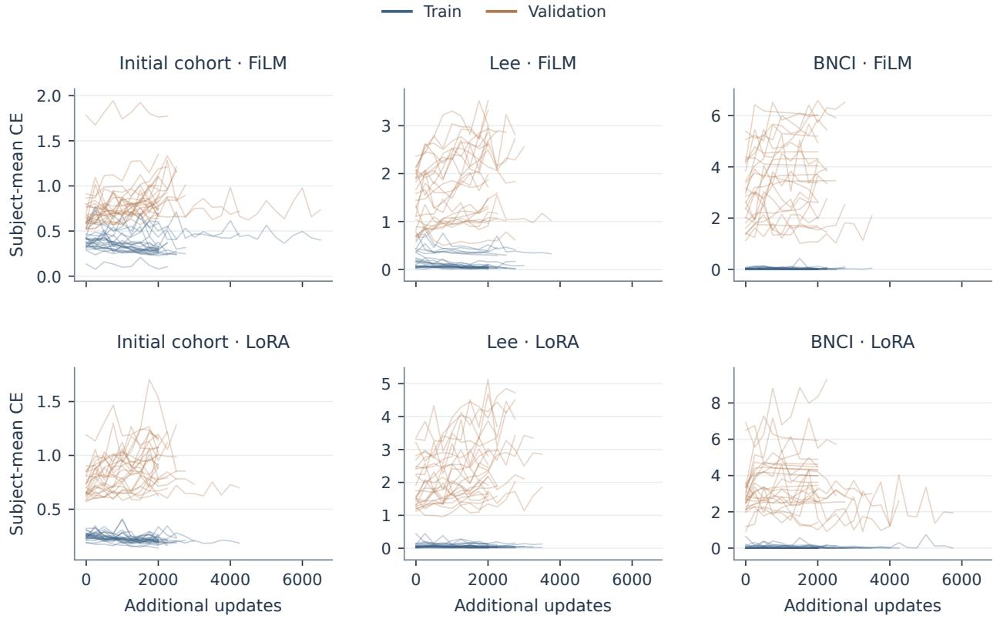  
Figure S11: Continuation-loss trajectories. Each line represents one fold/seed run through its stopping point. Training and validation subject mean cross-entropy are shown separately without smoothing or extrapolation.

Table S9: CBraMod continuation records by dataset, parameter family, fold and seed. Update counts are additional continuation updates; no run confirms the joint plateau.
<table><tr><td>Cohort</td><td>Family</td><td>Fold</td><td>Seed</td><td>Run steps</td><td>Selected</td><td>Train flat</td><td>Val. flat</td><td>Both flat</td></tr><tr><td>Core cohort</td><td>FiLM population</td><td>0</td><td>11</td><td>2750</td><td>750</td><td>False</td><td>False</td><td>False</td></tr><tr><td>Core cohort</td><td>LoRA population</td><td>0</td><td>11</td><td>2000</td><td>0</td><td>False</td><td>False</td><td>False</td></tr><tr><td>Core cohort</td><td>FiLM population</td><td>0</td><td>23</td><td>2250</td><td>250</td><td>False</td><td>False</td><td>False</td></tr><tr><td>Core cohort</td><td>LoRA population</td><td>0</td><td>23</td><td>2500</td><td>500</td><td>False</td><td>False</td><td>False</td></tr><tr><td>Core cohort</td><td>FiLM population</td><td>0</td><td>37</td><td>2500</td><td>500</td><td>False</td><td>False</td><td>False</td></tr><tr><td>Core cohort</td><td>LoRA population</td><td>0</td><td>37</td><td>2000</td><td>0</td><td>False</td><td>False</td><td>False</td></tr><tr><td>Core cohort</td><td>FiLM population</td><td>0</td><td>53</td><td>2000</td><td>0</td><td>False</td><td>False</td><td>False</td></tr><tr><td>Core cohort</td><td>LoRA population</td><td>0</td><td>53</td><td>2000</td><td>0</td><td>False</td><td>False</td><td>False</td></tr><tr><td>Core cohort</td><td>FiLM population</td><td>0</td><td>71</td><td>2000</td><td>0</td><td>False</td><td>False</td><td>False</td></tr><tr><td>Core cohort</td><td>LoRA population</td><td>0</td><td>71</td><td>2000</td><td>0</td><td>False</td><td>False</td><td>False</td></tr><tr><td>Core cohort</td><td>FiLM population</td><td>1</td><td>11</td><td>2250</td><td>250</td><td>False</td><td>False</td><td>False</td></tr><tr><td>Core cohort</td><td>LoRA population</td><td>1</td><td>11</td><td>2000</td><td>0</td><td>False</td><td>False</td><td>False</td></tr><tr><td>Core cohort</td><td>FiLM population</td><td>1</td><td>23</td><td>2500</td><td>500</td><td>False</td><td>False</td><td>False</td></tr><tr><td>Core cohort</td><td>LoRA population</td><td>1</td><td>23</td><td>2000</td><td>0</td><td>False</td><td>False</td><td>False</td></tr><tr><td>Core cohort</td><td>FiLM population</td><td>1</td><td>37</td><td>2000</td><td>0</td><td>False</td><td>False</td><td>False</td></tr><tr><td>Core cohort</td><td>LoRA population</td><td>1</td><td>37</td><td>2250</td><td>250</td><td>False</td><td>False</td><td>False</td></tr><tr><td>Core cohort</td><td>FiLM population</td><td>1</td><td>53</td><td>2750</td><td>750</td><td>False</td><td>False</td><td>False</td></tr><tr><td>Core cohort</td><td>LoRA population</td><td>1</td><td>53</td><td>2000</td><td>0</td><td>False</td><td>False</td><td>False</td></tr><tr><td>Core cohort</td><td>FiLM population</td><td>1</td><td>71</td><td>2500</td><td>500</td><td>False</td><td>False</td><td>False</td></tr><tr><td>Core cohort</td><td>LoRA population</td><td>1</td><td>71</td><td>2500</td><td>500</td><td>False</td><td>False</td><td>False</td></tr><tr><td>Core cohort</td><td>FiLM population</td><td>2</td><td>11</td><td>4250</td><td>2250</td><td>False</td><td>False</td><td>False</td></tr><tr><td>Core cohort</td><td>LoRA population</td><td>2</td><td>11</td><td>4250</td><td>2250</td><td>False</td><td>False</td><td>False</td></tr><tr><td>Core cohort</td><td>FiLM population</td><td>2</td><td>23</td><td>6500</td><td>4500</td><td>False</td><td>False</td><td>False</td></tr><tr><td>Core cohort</td><td>LoRA population</td><td>2</td><td>23</td><td>2250</td><td>250</td><td>False</td><td>False</td><td>False</td></tr><tr><td>Core cohort</td><td>FiLM population</td><td>2</td><td>37</td><td>2000</td><td>0</td><td>False</td><td>False</td><td>False</td></tr><tr><td>Core cohort</td><td>LoRA population</td><td>2</td><td>37</td><td>2000</td><td>0</td><td>False</td><td>False</td><td>False</td></tr><tr><td>Core cohort</td><td>FiLM population</td><td>2</td><td>53</td><td>2000</td><td>0</td><td>False</td><td>False</td><td>False</td></tr><tr><td>Core cohort</td><td>LoRA population</td><td>2</td><td>53</td><td>3000</td><td>1000</td><td>False</td><td>False</td><td>False</td></tr><tr><td>Core cohort</td><td>FiLM population</td><td>2</td><td>71</td><td>2500</td><td>500</td><td>False</td><td>False</td><td>False</td></tr><tr><td>Core cohort</td><td>LoRA population</td><td>2</td><td>71</td><td>2500</td><td>500</td><td>False</td><td>False</td><td>False</td></tr><tr><td>Core cohort</td><td>FiLM population</td><td>3</td><td>11</td><td>2000</td><td>0</td><td>False</td><td>False</td><td>False</td></tr><tr><td>Core cohort</td><td>LoRA population</td><td>3</td><td>11</td><td>2000</td><td>0</td><td>False</td><td>False</td><td>False</td></tr><tr><td>Core cohort</td><td>FiLM population</td><td>3</td><td>23</td><td>2000</td><td>0</td><td>False</td><td>False</td><td>False</td></tr><tr><td>Core cohort</td><td>LoRA population</td><td>3</td><td>23</td><td>2000</td><td>0</td><td>False</td><td>False</td><td>False</td></tr><tr><td>Core cohort</td><td>FiLM population</td><td>3</td><td>37</td><td>2000</td><td>250</td><td>False</td><td>False</td><td>False</td></tr><tr><td>Core cohort</td><td>LoRA population</td><td>3</td><td>37</td><td>2000</td><td>0</td><td>False</td><td>False</td><td>False</td></tr><tr><td>Core cohort</td><td>FiLM population</td><td>3</td><td>53</td><td>2000</td><td>0</td><td>False</td><td>False</td><td>False</td></tr><tr><td>Core cohort</td><td>LoRA population</td><td>3</td><td>53</td><td>2750</td><td>750</td><td>False</td><td>False</td><td>False</td></tr><tr><td>Core cohort</td><td>FiLM population</td><td>3</td><td>71</td><td>2000</td><td>0</td><td>False</td><td>False</td><td>False</td></tr><tr><td>Core cohort</td><td>LoRA population</td><td>3</td><td>71</td><td>2250</td><td>250</td><td>False</td><td>False</td><td>False</td></tr><tr><td>Core cohort</td><td>FiLM population</td><td>4</td><td>11</td><td>2000</td><td>0</td><td>False</td><td>False</td><td>False</td></tr><tr><td>Core cohort</td><td>LoRA population</td><td>4</td><td>11</td><td>2000</td><td>0</td><td>False</td><td>False</td><td>False</td></tr><tr><td>Core cohort</td><td>FiLM population</td><td>4</td><td>23</td><td>2000</td><td>0</td><td>False</td><td>False</td><td>False</td></tr><tr><td>Core cohort</td><td>LoRA population</td><td>4</td><td>23</td><td>2500</td><td>500</td><td>False</td><td>False</td><td>False</td></tr><tr><td>Core cohort</td><td>FiLM population</td><td>4</td><td>37</td><td>2250</td><td>250</td><td>False</td><td>False</td><td>False</td></tr><tr><td>Core cohort</td><td>LoRA population</td><td>4</td><td>37</td><td>2000</td><td>0</td><td>False</td><td>False</td><td>False</td></tr><tr><td>Core cohort</td><td>FiLM population</td><td>4</td><td>53</td><td>2000</td><td>0</td><td>False</td><td>False</td><td>False</td></tr><tr><td>Core cohort</td><td>LoRA population</td><td>4</td><td>53</td><td>2000</td><td>0</td><td>False</td><td>False</td><td>False</td></tr><tr><td>Core cohort</td><td>FiLM population</td><td>4</td><td>71</td><td>2250</td><td>250</td><td>False</td><td>False</td><td>False</td></tr><tr><td>Core cohort</td><td>LoRA population</td><td>4</td><td>71</td><td>2250</td><td>250</td><td>False</td><td>False</td><td>False</td></tr><tr><td>Lee2019_MI</td><td>FiLM population</td><td>0</td><td>11</td><td>2000</td><td>0</td><td>False</td><td>False</td><td>False</td></tr><tr><td>Lee2019_MI</td><td>LoRA population</td><td>0</td><td>11</td><td>2250</td><td>250</td><td>False</td><td>False</td><td>False</td></tr><tr><td>Lee2019_MI</td><td>FiLM population</td><td>0</td><td>23</td><td>2000</td><td>0</td><td>False</td><td>False</td><td>False</td></tr><tr><td>Lee2019_MI</td><td>LoRA population</td><td>0</td><td>23</td><td>2000</td><td>0</td><td>False</td><td>False</td><td>False</td></tr><tr><td>Lee2019_MI</td><td>FiLM population</td><td>0</td><td>37</td><td>2000</td><td>0</td><td>False</td><td>False</td><td>False</td></tr><tr><td>Lee2019_MI</td><td>LoRA population</td><td>0</td><td>37</td><td>3250</td><td>1250</td><td>False</td><td>False</td><td>False</td></tr><tr><td>Lee2019_MI</td><td>FiLM population</td><td>0</td><td>53</td><td>2750</td><td>750</td><td>False</td><td>False</td><td>False</td></tr><tr><td>Lee2019_MI</td><td>LoRA population</td><td>0</td><td>53</td><td>2500</td><td>500</td><td>False</td><td>False</td><td>False</td></tr><tr><td>Lee2019_MI</td><td>FiLM population</td><td>0</td><td>71</td><td>2000</td><td>0</td><td>False</td><td>False</td><td>False</td></tr><tr><td>Lee2019_MI</td><td>LoRA population</td><td>0</td><td>71</td><td>2750</td><td>750</td><td>False</td><td>False</td><td>False</td></tr><tr><td>Lee2019_MI</td><td>FiLM population</td><td>1</td><td>11</td><td>2000 2000</td><td>0 0</td><td>False False</td><td>False False</td><td>False False</td></tr><tr><td>Lee2019_MI Lee2019_MI</td><td>LoRA population FiLM population</td><td>1 1</td><td>11 23 2000</td></tr><tr><td>Lee2019_MI</td><td>LoRA population</td><td>2</td><td>37</td><td>2000</td><td>0</td><td>False</td><td>False</td><td>False</td></tr><tr><td>Lee2019_MI</td><td>FiLM population</td><td>2</td><td>53</td><td>2500</td><td>500</td><td>False</td><td>False</td><td>False</td></tr><tr><td>Lee2019_MI</td><td>LoRA population</td><td>2</td><td>53</td><td>2250</td><td>250</td><td>False</td><td>False</td><td>False</td></tr><tr><td>Lee2019_MI</td><td>FiLM population</td><td>2</td><td>71</td><td>2000</td><td>0</td><td>False</td><td>False</td><td>False</td></tr><tr><td>Lee2019_MI</td><td>LoRA population</td><td>2</td><td>71</td><td>3000</td><td>1000</td><td>False</td><td>False</td><td>False</td></tr><tr><td>Lee2019_MI</td><td>FiLM population</td><td>3</td><td>11</td><td>2250</td><td>250</td><td>False</td><td>False</td><td>False</td></tr><tr><td>Lee2019_MI</td><td>LoRA population</td><td>3</td><td>11</td><td>2750</td><td>750</td><td>False</td><td>False</td><td>False</td></tr><tr><td>Lee2019_MI</td><td>FiLM population</td><td>3</td><td>23</td><td>2000</td><td>0</td><td>False</td><td>False</td><td>False</td></tr><tr><td>Lee2019_MI</td><td>LoRA population</td><td>3</td><td>23</td><td>2750</td><td>750</td><td>False</td><td>False</td><td>False</td></tr><tr><td>Lee2019_MI</td><td>FiLM population</td><td>3</td><td>37</td><td>2000</td><td>0</td><td>False</td><td>False</td><td>False</td></tr><tr><td>Lee2019_MI</td><td>LoRA population</td><td>3</td><td>37</td><td>2250</td><td>250</td><td>False</td><td>False</td><td>False</td></tr><tr><td>Lee2019_MI</td><td>FiLM population</td><td>3</td><td>53</td><td>3000</td><td>1000</td><td>False</td><td>False</td><td>False</td></tr><tr><td>Lee2019_MI</td><td>LoRA population</td><td>3</td><td>53</td><td>2250</td><td>250</td><td>False</td><td>False</td><td>False</td></tr><tr><td>Lee2019_MI</td><td>FiLM population</td><td>3</td><td>71</td><td>2500</td><td>500</td><td>False</td><td>False</td><td>False</td></tr><tr><td>Lee2019_MI</td><td>LoRA population</td><td>3</td><td>71</td><td>2750</td><td>750</td><td>False</td><td>False</td><td>False</td></tr><tr><td>Lee2019_MI</td><td>FiLM population</td><td>4</td><td>11</td><td>2000</td><td>0</td><td>False</td><td>False</td><td>False</td></tr><tr><td>Lee2019_MI</td><td>LoRA population</td><td>4</td><td>11</td><td>2000</td><td>0</td><td>False</td><td>False</td><td>False</td></tr><tr><td>Lee2019_MI</td><td>FiLM population</td><td>4</td><td>23</td><td>2000</td><td>0</td><td>False</td><td>False</td><td>False</td></tr><tr><td>Lee2019_MI</td><td>LoRA population</td><td>4</td><td>23</td><td>2250</td><td>250</td><td>False</td><td>False</td><td>False</td></tr><tr><td>Lee2019_MI</td><td>FiLM population</td><td>4</td><td>37</td><td>2000</td><td>0</td><td>False</td><td>False</td><td>False</td></tr><tr><td>Lee2019_MI</td><td>LoRA population</td><td>4</td><td>37</td><td>2750</td><td>750</td><td>False</td><td>False</td><td>False</td></tr><tr><td>Lee2019_MI</td><td>FiLM population</td><td>4</td><td>53</td><td>2250</td><td>250</td><td>False</td><td>False</td><td>False</td></tr><tr><td>Lee2019_MI</td><td>LoRA population</td><td>4</td><td>53</td><td>2000</td><td>0</td><td>False</td><td>False</td><td>False</td></tr><tr><td>Lee2019_MI</td><td>FiLM population</td><td>4</td><td>71</td><td>2000</td><td>0</td><td>False</td><td>False</td><td>False</td></tr><tr><td>Lee2019_MI</td><td>LoRA population</td><td>4</td><td>71</td><td>2000</td><td>0</td><td>False</td><td>False</td><td>False</td></tr><tr><td>BNCI</td><td>FiLM population</td><td>0</td><td>11</td><td>2000</td><td>0</td><td>False</td><td>False</td><td>False</td></tr><tr><td>BNCI</td><td>LoRA population</td><td>0</td><td>11</td><td>2000</td><td>0</td><td>False</td><td>False</td><td>False</td></tr><tr><td>BNCI</td><td>FiLM population</td><td>0</td><td>23</td><td>2000</td><td>0</td><td>False</td><td>False</td><td>False</td></tr><tr><td>BNCI</td><td>LoRA population</td><td>0</td><td>23</td><td>2000</td><td>0</td><td>False</td><td>False</td><td>False</td></tr><tr><td>BNCI</td><td>FiLM population</td><td>0</td><td>37</td><td>2250</td><td>250</td><td>False</td><td>False</td><td>False</td></tr><tr><td>BNCI</td><td>LoRA population</td><td>0</td><td>37</td><td>2000</td><td>0</td><td>False</td><td>False</td><td>False</td></tr><tr><td>BNCI</td><td>FiLM population</td><td>0</td><td>53</td><td>2500</td><td>500</td><td>False</td><td>False</td><td>False</td></tr><tr><td>BNCI</td><td>LoRA population</td><td>0</td><td>53</td><td>2000</td><td>0</td><td>False</td><td>False</td><td>False</td></tr><tr><td>BNCI</td><td>FiLM population</td><td>0</td><td>71</td><td>2000</td><td>0</td><td>False</td><td>False</td><td>False</td></tr><tr><td>BNCI</td><td>LoRA population</td><td>0</td><td>71</td><td>2000</td><td>0</td><td>False</td><td>False</td><td>False</td></tr><tr><td>BNCI</td><td>FiLM population</td><td>1</td><td>11</td><td>3500</td><td>1500</td><td>False</td><td>False</td><td>False</td></tr><tr><td>BNCI</td><td>LoRA population</td><td></td><td>11</td><td>2000</td><td>0</td><td>False</td><td>False</td><td>False</td></tr><tr><td>BNCI</td><td>FiLM population</td><td>1</td><td>23</td><td>2000</td><td>0</td><td>False</td><td>False</td><td>False</td></tr><tr><td>BNCI</td><td>LoRA population</td><td></td><td>23</td><td>2750</td><td>750</td><td>True</td><td>False</td><td>False</td></tr><tr><td>BNCI</td><td>FiLM population</td><td>1</td><td>37</td><td>2250</td><td>250</td><td>False</td><td>False</td><td>False</td></tr><tr><td>BNCI</td><td>LoRA population</td><td>1</td><td>37</td><td>4250</td><td>2250</td><td>False</td><td>False</td><td>False</td></tr><tr><td>BNCI</td><td>FiLM population</td><td>1</td><td>53</td><td>2750</td><td>750</td><td>False</td><td>False</td><td>False</td></tr><tr><td>BNCI</td><td>LoRA population</td><td>1</td><td>53</td><td>5750</td><td>3750</td><td>False</td><td>False</td><td>False</td></tr><tr><td>BNCI</td><td>FiLM population</td><td>1</td><td>71</td><td>2000 4000</td><td>0 2000</td><td>False False</td><td>False False</td><td>False False</td></tr><tr><td>BNCI BNCI</td><td>LoRA population FiLM population</td><td>1 2</td><td>71 11 2750</td></tr><tr><td>BNCI</td><td>LoRA population</td><td>3</td><td>23</td><td>2000</td><td>0</td><td>False</td><td>False</td><td>False</td></tr><tr><td>BNCI</td><td>FiLM population</td><td>3</td><td>37</td><td>2000</td><td>0</td><td>False</td><td>False</td><td>False</td></tr><tr><td>BNCI</td><td>LoRA population</td><td>3</td><td>37</td><td>2000</td><td>0</td><td>False</td><td>False</td><td>False</td></tr><tr><td>BNCI</td><td>FiLM population</td><td>3</td><td>53</td><td>2000</td><td>0</td><td>False</td><td>False</td><td>False</td></tr><tr><td>BNCI</td><td>LoRA population</td><td>3</td><td>53</td><td>2250</td><td>250</td><td>False</td><td>False</td><td>False</td></tr><tr><td>BNCI</td><td>FiLM population</td><td>3</td><td>71</td><td>2000</td><td>0</td><td>False</td><td>False</td><td>False</td></tr><tr><td>BNCI</td><td>LoRA population</td><td>3</td><td>71</td><td>2000</td><td>0</td><td>False</td><td>False</td><td>False</td></tr><tr><td>BNCI</td><td>FiLM population</td><td>4</td><td>11</td><td>2250</td><td>250</td><td>False</td><td>False</td><td>False</td></tr><tr><td>BNCI</td><td>LoRA population</td><td>4</td><td>11</td><td>2000</td><td>0</td><td>True</td><td>False</td><td>False</td></tr><tr><td>BNCI</td><td>FiLM population</td><td>4</td><td>23</td><td>2250</td><td>250</td><td>False</td><td>False</td><td>False</td></tr><tr><td>BNCI</td><td>LoRA population</td><td>4</td><td>23</td><td>2000</td><td>0</td><td>False</td><td>False</td><td>False</td></tr><tr><td>BNCI</td><td>FiLM population</td><td>4</td><td>37</td><td>2000</td><td>0</td><td>False</td><td>False</td><td>False</td></tr><tr><td>BNCI</td><td>LoRA population</td><td>4</td><td>37</td><td>2500</td><td>500</td><td>False</td><td>False</td><td>False</td></tr><tr><td>BNCI</td><td>FiLM population</td><td>4</td><td>53</td><td>2250</td><td>250</td><td>False</td><td>False</td><td>False</td></tr><tr><td>BNCI</td><td>LoRA population</td><td>4</td><td>53</td><td>2000</td><td>0</td><td>False</td><td>False</td><td>False</td></tr><tr><td>BNCI</td><td>FiLM population</td><td>4</td><td>71</td><td>2000</td><td>0</td><td>False</td><td>False</td><td>False</td></tr><tr><td>BNCI</td><td>LoRA population</td><td>4</td><td>71</td><td>2000</td><td>0</td><td>False</td><td>False</td><td>False</td></tr></table>

## S5 All statistical comparison rows

Supplementary Data 1 provides all 904 comparison rows (T0001–T0904) in CSV and XLSX formats, including negative and nonsignificant results. The files contain the original identifiers, values, missing entries, source-row links and decisions, together with column definitions, units, contrast directions and original correction-family descriptions. A saved Holm-adjusted value belongs only to its identified source family; no correction across this combined inventory is applied, and a blank adjusted value is unavailable rather than zero. Later-half and all-trial compatibility comparisons are distinguished, as are query-informed prior comparisons. The companion README describes the CSV columns; the XLSX contains the same records plus Columns, Families and Notation sheets. See Supplementary Data 1 (CSV) and Supplementary Data 1 (XLSX).

## S6 Recorded training resources

GPU runs used the recorded RTX 3090 environment. The population and personal-adaptation evaluation consumed 21.14 GPU card-hours, and the ordinary continuation/BNCI follow-up consumed 7.30 GPU card-hours. These are measured stage totals, not a complete estimate for all exploratory work. Shared initial-cohort training cost is not charged separately to each constituent dataset. Recorded meta-learning and ordinary-continuation run times appear in Supplementary Table S10. The initial budget batch used 17.81, 51.59 and 18.70 GPU card-hours for CBraMod, REVE and LaBraM, respectively, including the failed CBraMod run. The separately registered CBraMod retry added 0.69 GPU card-hours. The total including both attempts was 88.79 GPU card-hours; shared-dataset training is counted once. No hardware cost is inferred for missing records. Shared multi-dataset runs are counted once; incomplete run accounting prevents a complete total for exploratory work.

## S7 Query-informed prior controls and configuration grids

The query-informed random-prior control (R1) has test-query information leakage: its validation prior neighborhood and shrinkage were selected using query scores from the test pool. The original R1 comparisons are retained as records of that procedure and cannot establish independent confirmation under test-label isolation. No corrected experiment was performed. The main meta-learning comparison with ordinary continuation is independent of that prior branch.

No target labels After calibration

Table S10: Recorded CBraMod training times. M1 and M2 include inner-loop work despite matching R2 in scheduled outer-update budget. Times are per-run means, not total study costs.
<table><tr><td>Method</td><td>Inner steps</td><td>Outer updates</td><td>Mean seconds</td><td>Runs</td></tr><tr><td>M1</td><td>5</td><td>2000</td><td>704.2</td><td>25</td></tr><tr><td>M1</td><td>10</td><td>2000</td><td>1250.1</td><td>25</td></tr><tr><td>M1</td><td>20</td><td>2000</td><td>2342.3</td><td>25</td></tr><tr><td>M2</td><td>5</td><td>2000</td><td>695.4</td><td>25</td></tr><tr><td>M2</td><td>10</td><td>2000</td><td>1235.3</td><td>25</td></tr><tr><td>M2</td><td>20</td><td>2000</td><td>2308.5</td><td>25</td></tr><tr><td>R2</td><td>0</td><td>2000</td><td>145.3</td><td>25</td></tr></table>

The original joint endpoint required at least one percentage point of median improvement over the validation-selected prior control, corrected significance, and at most ten percent of subjects declining by more than two points.

At ten labels, the first-order MAML and learned-rate variants have median gains over R1 of 0.52/0.58 pp, with corrected $p = 6 . 7 \times 1 0 ^ { - 5 }$ for both. Both fail their original joint criterion; the secondary increment criterion passes for the first-orde method and fails for the learned-rate variant. These decisions have the leakage condition stated above.

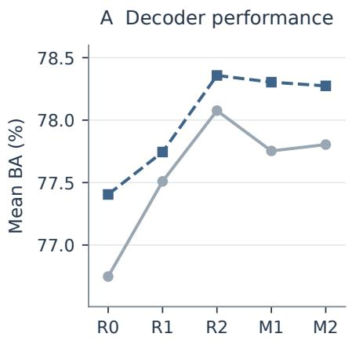

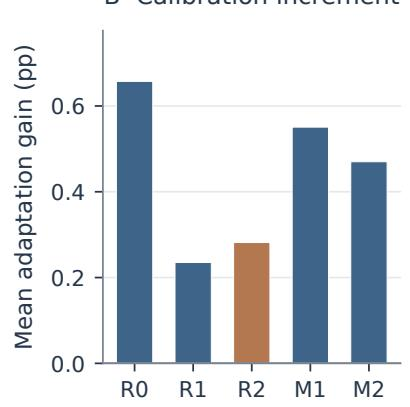

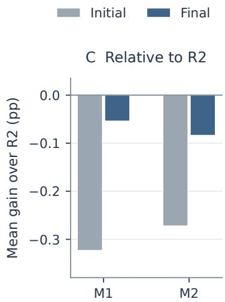  
Figure S12: Mean meta-learning decomposition, including the query-informed prior control. R1 accesses test-query information during validation-prior selection. Its displayed comparisons are query-informed diagnostics. R2 is ordinary continuation; M1 is first-order MAML; M2 also learns inner rates.

The fixed prior diagnostic labels its population reference P0, random donor prior P1, and feature-selected prior P2. Its prior neighborhood and shrinkage selection may use other donors’ later-half labels under the recorded leave-one-out protocol; the target’s own query labels remain held out. This access condition is stronger than an entirely unlabeled deployment pipeline. The failed P2 calibrated endpoint does not establish the proposed label-saving claim, even where the source file contains interpolation summaries.

R1’s validation initialization has a distinct information boundary. The executed script selects its prior neighborhood and shrinkage from query scores over the same-dataset test pool, then uses that prior for validation-subject calibration and control ranking. Consequently, the query-informed R1 comparisons are not strictly isolated from test-query labels, even though their final inner settings and reference ranking are evaluated on validation subjects. Their original numerical decisions are retained as records under this access condition. M1, M2, R0 and R2 are selected independently of this R1 branch; the M-minus-R2

comparison does not use its priors.

## S7.1 Configuration grids and execution identifiers

Table S11 lists the saved configuration grids. The identifier key is given in Supplementary Section S0; source-record links are included in Supplementary Data 1. Search grids and selection metadata are retained for reproducibility. Configuration constants specify the recorded procedures; they are separate from measured outcomes. The R2 configuration field B3\_continued\_original\_objective denotes ordinary cross-entropy with default mixture weights, as specified by its saved configuration comment; it does not denote G’s context-mismatch objective.

Table S11: Recorded architecture and optimization settings. Semicolons in each value cell follow the setting-column order; commas enumerate a search grid. Forty-label conditions require sufficient earlier support. New-model entries refer to REVE and LaBraM; personal optimization follows the common grid.
<table><tr><td>Component</td><td>Setting (semicolon order)</td><td>Value / grid</td></tr><tr><td>Partitions</td><td>Folds; seed values</td><td>5; 11, 23, 37, 53, 71</td></tr><tr><td>Task head</td><td>Learning rates; epochs; batch</td><td>0.001, 0.0003; 50; 128</td></tr><tr><td>Task head</td><td>Weight decay; MLP hidden width</td><td>0.01; 128</td></tr><tr><td>CBraMod input</td><td>Hz; high-pass Hz; rest segment s</td><td>200; 0.3; 4</td></tr><tr><td>Mains notch</td><td>PhysioNet; Dreyer; Cho (Hz)</td><td>60; 50; 60</td></tr><tr><td>Personal diagnostics</td><td>Earlier FiLM variants</td><td>film2, film4, beta4, head</td></tr><tr><td>Personal diagnostics</td><td>Extended variants</td><td>film_first2, film_all, lora4, lora8, scratch_head</td></tr><tr><td>Personal diagnostics</td><td>FiLM rate; head/LoRA rate</td><td>0.01, 0.1; 0.0001, 0.001</td></tr><tr><td>Personal diagnostics</td><td>Steps; weight decay; batch</td><td>20, 60; 0.0, 0.01; 32</td></tr><tr><td>Context</td><td>Minimum duration s; bands Hz</td><td>30; 8-13, 13-30</td></tr><tr><td>Context</td><td>Band-filter order</td><td>4</td></tr><tr><td>Context</td><td>Feature projection; hidden; latent</td><td>64; 128; 16</td></tr><tr><td>Context</td><td>Generator hidden; FiLM bound</td><td>128; 0.1</td></tr><tr><td>Context LoRA</td><td>Bases; rank; output-factor init SD</td><td>8; 8; 0.01</td></tr><tr><td>Context training</td><td>Learning rates; candidate updates</td><td>0.0003, 0.001; 1000, 3000</td></tr><tr><td>Context training</td><td>Margin weights; margins; zero ablation</td><td>0.1, 1.0; 0.1, 0.5; 0.0</td></tr><tr><td>Context training</td><td>Batch; context dropout; decay; clip</td><td>32; 0.2; 0.01; 1.0</td></tr><tr><td>Personal fitting</td><td>FiLM and mixture-offset rates; LoRA rates</td><td>0.01, 0.1; 0.0001, 0.001</td></tr><tr><td>Personal fitting</td><td>Steps; weight decay; batch; rank</td><td>20, 60; 0.0, 0.01; 32; 8</td></tr><tr><td>Exchange</td><td>Donor draws</td><td>10</td></tr><tr><td>Few-shot fitting</td><td>Total label budgets</td><td>5, 10, 20, 40</td></tr><tr><td>Neighbors</td><td>Primary k; secondary k; random draws</td><td>1; 3; 10</td></tr><tr><td>Prior</td><td>Neighbors k; shrinkage alpha</td><td>3, 5; 0.25, 0.5, 1.0</td></tr><tr><td>Prior Prior</td><td>LoRA labels; penalty mu</td><td>0, 5, 10, 20; 0.0, 0.1, 1.0</td></tr><tr><td></td><td>FiLM labels; penalty mu</td><td>0, 10; 0.0, 0.01, 0.1</td></tr><tr><td>Prior</td><td>Steps; weight decay; batch</td><td>20, 60; 0.0; 32</td></tr><tr><td>Prior</td><td>Test draws; validation draws</td><td>10;1</td></tr><tr><td>G continuation</td><td>Additional-step multiplier; check period</td><td>3; 250</td></tr><tr><td>G continuation</td><td>Patience checks; minimum CE change</td><td>8; 0.0001</td></tr><tr><td>G plateau</td><td>Window checks; relative loss range</td><td>8; 0.01</td></tr><tr><td>Meta inner loop</td><td>SGD steps; learning rates</td><td>5, 10, 20; 0.003, 0.01, 0.03</td></tr><tr><td>Meta inner pilot</td><td>Scanned learning rates; labels</td><td>0.001, 0.003, 0.01, 0.03, 0.1, 0.3, 1.0, 3.0, 10.0; 10</td></tr><tr><td>Meta outer loop</td><td>Episode labels; candidate updates</td><td>5, 10, 20; 1000, 2000</td></tr><tr><td>Meta outer loop</td><td>Learning rate; decay; gradient clip</td><td>0.0001; 0.01; 1.0</td></tr><tr><td>Meta outer loop</td><td>Subjects per batch; M2 log-rate LR</td><td>1; 0.001</td></tr><tr><td>REVE encoder</td><td>Depth; width; patch samples; stride</td><td>22; 512; 200; 180</td></tr><tr><td>LaBraM encoder</td><td>Depth; width; patch samples; stride</td><td>12; 200; 200; 200</td></tr><tr><td>LaBraM input</td><td>High-pass; low-pass; notch (Hz)</td><td>0.1; 75; 50</td></tr><tr><td>REVE input</td><td>High-pass Hz; sampling Hz</td><td>0.3; 200</td></tr><tr><td>New-model LoRA</td><td>Rank; scale/rank; dropout</td><td>8; 1; 0</td></tr><tr><td>New-model population Learning rates; candidate updates</td><td></td><td>0.0003, 0.001; 1000, 3000</td></tr><tr><td>New-model population Batch; decay; gradient clip</td><td></td><td>32; 0.01; 1.0</td></tr><tr><td>New-model plateau</td><td>Checks; relative CE range; floor</td><td>8; 0.01; 0.0001</td></tr><tr><td>New-model plateau</td><td>Accuracy/BA range; best-gain threshold</td><td>0.005; 0.001</td></tr><tr><td>Budget extension</td><td>Update multipliers; check period</td><td>1,2, 4; 250</td></tr><tr><td>Budget extension</td><td>Directional-test alpha</td><td>0.05</td></tr><tr><td>BNCI input</td><td>Window endpoints after trial start s</td><td>2,6</td></tr><tr><td>Euclidean alignment</td><td>Fixed diagonal shrinkage</td><td>0.001</td></tr></table>

## S8 Cross-model results

## S8.1 Effect summaries and source strata

The table preserves the mean contrasts used for direction labels. Source status refers to the published pretraining-source lists.   
Shared parameterization and objectives differ from CBraMod, and source-unlisted is not a record-level exclusion certificate.

Table S12: Mean and median core contrasts and pretraining-source-list status. Differences are in percentage points; seeds are averaged within subject.
<table><tr><td>Dataset</td><td>Model</td><td>Source</td><td>G-B0 mean</td><td>Own-G mean</td><td>Own-swap mean</td><td>Own-swap median</td></tr><tr><td>PhysioNet</td><td>CBraMod</td><td>unlisted</td><td>+9.14</td><td>+1.64</td><td>+2.55</td><td>+1.87</td></tr><tr><td>PhysioNet</td><td>REVE</td><td>unlisted</td><td>+13.92</td><td>+1.55</td><td>+2.59</td><td>+2.39</td></tr><tr><td>PhysioNet</td><td>LaBraM</td><td>listed</td><td>+20.21</td><td>+1.52</td><td>+2.35</td><td>+2.09</td></tr><tr><td>Dreyer</td><td>CBraMod</td><td>unlisted</td><td>+9.18</td><td>+3.58</td><td>+5.28</td><td>+4.89</td></tr><tr><td>Dreyer</td><td>REVE</td><td>listed</td><td>+8.98</td><td>+5.38</td><td>+7.25</td><td>+6.78</td></tr><tr><td>Dreyer</td><td>LaBraM</td><td>unlisted</td><td>+9.31</td><td>+3.91</td><td>+5.41</td><td>+4.32</td></tr><tr><td>Cho</td><td>CBraMod</td><td>unlisted</td><td>-0.06</td><td>+5.13</td><td>+6.43</td><td>+4.30</td></tr><tr><td>Cho</td><td>REVE</td><td>listed</td><td>+2.48</td><td>+3.35</td><td>+4.38</td><td>+3.48</td></tr><tr><td>Cho</td><td>LaBraM</td><td>unlisted</td><td>+1.74</td><td>+5.38</td><td>+4.78</td><td>+2.95</td></tr></table>

## S8.2 Original diagnostics and descriptive comparisons

The original pooled specificity test requires median own-minus-swapped at least two pp and the saved three-slot Holm criterion. Unexecuted FiLM and mixture slots remain unit-p placeholders for correction, with unavailable observed results. CBraMod’s original family includes executed FiLM and is preserved in the original decision table. No correction across the displayed model–dataset grid is introduced.

Table S13: Original pooled specificity decisions for REVE and LaBraM. The saved three-slot correction is retained.
<table><tr><td>Model</td><td>N</td><td>Median U (pp)</td><td>Original Holm p</td><td>Decision</td></tr><tr><td>REVE</td><td>235</td><td>3.50</td><td>1.38e-35</td><td>Pass</td></tr><tr><td>LaBraM</td><td>235</td><td>3.17</td><td>1.19e-29</td><td>Pass</td></tr></table>

All completed cross-model core comparison rows below retain their original descriptive raw p-values. They are not nine new confirmatory tests. Means, medians and SDs are in pp; seeds are averaged within subjects.

Table S14: REVE and LaBraM core contrasts by dataset. Means, medians and standard deviations are in percentage points; p-values are the saved descriptive raw values.
<table><tr><td>Model</td><td>Dataset</td><td>Contrast</td><td>N</td><td>Mean</td><td>Median</td><td>SD</td><td>Rawp</td></tr><tr><td>REVE</td><td>Cho</td><td>G minus B0</td><td>52</td><td>2.479</td><td>1.633</td><td>4.207</td><td>6.83e-05</td></tr><tr><td>REVE</td><td>Cho</td><td>own minus G</td><td>52</td><td>3.353</td><td>2.600</td><td>4.472</td><td>1.27e-08</td></tr><tr><td>REVE</td><td>Cho</td><td>own minus swap</td><td>52</td><td>4.383</td><td>3.480</td><td>4.556</td><td>2.57e-10</td></tr><tr><td>REVE</td><td>Dreyer</td><td>G minus B0</td><td>80</td><td>8.978</td><td>8.833</td><td>8.121</td><td>5.54e-12</td></tr><tr><td>REVE</td><td>Dreyer</td><td>own minus G</td><td>80</td><td>5.381</td><td>4.667</td><td>4.725</td><td>6.75e-14</td></tr><tr><td>REVE</td><td>Dreyer</td><td>own minus swap</td><td>80</td><td>7.251</td><td>6.775</td><td>4.911</td><td>4.39e-15</td></tr><tr><td>REVE</td><td>PhysioNet</td><td>G minus B0</td><td>103</td><td>13.915</td><td>13.385</td><td>9.854</td><td>7.16e-18</td></tr><tr><td>REVE</td><td>PhysioNet</td><td>own minus G</td><td>103</td><td>1.548</td><td>0.985</td><td>3.316</td><td>1.26e-05</td></tr><tr><td>REVE</td><td>PhysioNet</td><td>own minus swap</td><td>103</td><td>2.593</td><td>2.386</td><td>3.053</td><td>1.54e-13</td></tr><tr><td>LaBraM</td><td>Cho</td><td>G minus B0</td><td>52</td><td>1.742</td><td>0.600</td><td>5.573</td><td>0.0403</td></tr><tr><td>LaBraM</td><td>Cho</td><td>own minus G</td><td>52</td><td>5.375</td><td>3.383</td><td>6.448</td><td>1.12e-09</td></tr><tr><td>LaBraM</td><td>Cho</td><td>own minus swap</td><td>52</td><td>4.780</td><td>2.950</td><td>6.310</td><td>7.77e-09</td></tr><tr><td>LaBraM</td><td>Dreyer</td><td>G minus B0</td><td>80</td><td>9.313</td><td>9.667</td><td>5.717</td><td>7.34e-15</td></tr><tr><td>LaBraM</td><td>Dreyer</td><td>own minus G</td><td>80</td><td>3.915</td><td>3.000</td><td>3.788</td><td>1.26e-13</td></tr><tr><td>LaBraM</td><td>Dreyer</td><td>own minus swap</td><td>80</td><td>5.406</td><td>4.317</td><td>3.701</td><td>3.92e-15</td></tr><tr><td>LaBraM</td><td>PhysioNet</td><td>G minus B0</td><td>103</td><td>20.207</td><td>20.385</td><td>12.077</td><td>1.26e-18</td></tr><tr><td>LaBraM</td><td>PhysioNet</td><td>own minus G</td><td>103</td><td>1.524</td><td>0.909</td><td>3.633</td><td>5.53e-05</td></tr><tr><td>LaBraM</td><td>PhysioNet</td><td>own minus swap</td><td>103</td><td>2.347</td><td>2.091</td><td>3.786</td><td>1.72e-08</td></tr></table>

## S8.3 Few-shot reliability and original descriptive endpoints

Stability requires all prescribed mean gains to be nonnegative and nondecreasing across label budgets. It does not require every person to improve or constitute an inferential success threshold. The decline column below is the fraction of subjects losing more than two pp.

Table S15: Descriptive consistency of few-label calibration across the prescribed label budgets.
<table><tr><td>Dataset</td><td>Model</td><td>Descriptive stability</td></tr><tr><td>PhysioNet</td><td>CBraMod</td><td>Stable</td></tr><tr><td>PhysioNet</td><td>REVE</td><td>Stable</td></tr><tr><td>PhysioNet</td><td>LaBraM</td><td>Stable</td></tr><tr><td>Dreyer</td><td>CBraMod</td><td>Not stable</td></tr><tr><td>Dreyer</td><td>REVE</td><td>Stable</td></tr><tr><td>Dreyer</td><td>LaBraM</td><td>Not stable</td></tr><tr><td>Cho</td><td>CBraMod</td><td>Not stable</td></tr><tr><td>Cho</td><td>REVE</td><td>Not stable</td></tr><tr><td>Cho</td><td>LaBraM</td><td>Stable</td></tr></table>

## REVE.

Table S16: REVE few-label results. Gains are in percentage points; decline is the subject fraction losing more than two points.
<table><tr><td>Dataset</td><td>Labels</td><td>N</td><td>Mean</td><td>Median</td><td>SD</td><td>Decline fraction</td><td>Rawp</td></tr><tr><td>Cho</td><td>5</td><td>52</td><td>-0.383</td><td>-0.400</td><td>2.036</td><td>0.154</td><td>0.963</td></tr><tr><td>Cho</td><td>10</td><td>52</td><td>0.241</td><td>0.000</td><td>2.574</td><td>0.115</td><td>0.409</td></tr><tr><td>Cho</td><td>20</td><td>52</td><td>0.928</td><td>0.700</td><td>2.212</td><td>0.077</td><td>0.00296</td></tr><tr><td>Cho</td><td>40</td><td>52</td><td>1.247</td><td>0.733</td><td>2.855</td><td>0.038</td><td>0.00164</td></tr><tr><td>Dreyer</td><td>5</td><td>80</td><td>0.544</td><td>0.333</td><td>3.523</td><td>0.138</td><td>0.0253</td></tr><tr><td>Dreyer</td><td>10</td><td>80</td><td>1.363</td><td>0.917</td><td>3.418</td><td>0.087</td><td>0.000253</td></tr><tr><td>Dreyer</td><td>20</td><td>80</td><td>2.193</td><td>1.333</td><td>3.421</td><td>0.050</td><td>2e-07</td></tr><tr><td>Dreyer</td><td>40</td><td>80</td><td>3.081</td><td>2.417</td><td>3.940</td><td>0.075</td><td>1.84e-09</td></tr><tr><td>PhysioNet</td><td>5</td><td>103</td><td>0.332</td><td>0.077</td><td>2.776</td><td>0.126</td><td>0.0483</td></tr><tr><td>PhysioNet</td><td>10</td><td>103</td><td>0.574</td><td>0.227</td><td>2.978</td><td>0.155</td><td>0.0256</td></tr><tr><td>PhysioNet</td><td>20</td><td>103</td><td>1.408</td><td>1.000</td><td>3.094</td><td>0.097</td><td>3.96e-06</td></tr></table>

## LaBraM.

Table S17: LaBraM few-label results. Gains are in percentage points; decline is the subject fraction losing more than two points.
<table><tr><td>Dataset</td><td>Labels</td><td>N</td><td>Mean</td><td>Median</td><td>SD</td><td>Decline fraction</td><td>Raw p</td></tr><tr><td>Cho</td><td>5</td><td>52</td><td>0.680</td><td>0.400</td><td>4.006</td><td>0.154</td><td>0.182</td></tr><tr><td>Cho</td><td>10</td><td>52</td><td>1.860</td><td>0.900</td><td>5.147</td><td>0.135</td><td>0.00777</td></tr><tr><td>Cho</td><td>20</td><td>52</td><td>2.956</td><td>1.700</td><td>5.768</td><td>0.077</td><td>4.08e-05</td></tr><tr><td>Cho</td><td>40</td><td>52</td><td>3.194</td><td>1.717</td><td>6.072</td><td>0.077</td><td>1.19e-05</td></tr><tr><td>Dreyer</td><td>5</td><td>80</td><td>-0.175</td><td>0.000</td><td>2.922</td><td>0.175</td><td>0.518</td></tr><tr><td>Dreyer</td><td>10</td><td>80</td><td>-0.141</td><td>0.000</td><td>2.769</td><td>0.163</td><td>0.4</td></tr><tr><td>Dreyer</td><td>20</td><td>80</td><td>0.409</td><td>0.500</td><td>2.611</td><td>0.138</td><td>0.0319</td></tr><tr><td>Dreyer</td><td>40</td><td>80</td><td>1.407</td><td>1.000</td><td>3.014</td><td>0.075</td><td>2.16e-06</td></tr><tr><td>PhysioNet</td><td>5</td><td>103</td><td>0.947</td><td>0.538</td><td>3.173</td><td>0.107</td><td>0.00219</td></tr><tr><td>PhysioNet</td><td>10</td><td>103</td><td>1.119</td><td>0.909</td><td>3.236</td><td>0.117</td><td>0.00019</td></tr><tr><td>PhysioNet</td><td>20</td><td>103</td><td>1.249</td><td>0.985</td><td>3.339</td><td>0.097</td><td>0.000244</td></tr></table>

## S8.4 Prespecified family inventory

Table S18: Cross-model scope of the specified evaluation families.
<table><tr><td>Family</td><td>Current evidence and status</td></tr><tr><td>Source and structure audits</td><td>Completed source and input/adapter audits; source overlap remains visible. Lee full- channel extension remains unexecuted.</td></tr><tr><td>Engineering and formal entry</td><td>Saved loading, freezing, selection, prediction, and source checks completed; engineering checks alone are not performance evidence.</td></tr><tr><td>Resource accounting</td><td>Completed saved allocation audit includes unsuccessful cache work; shared multi-dataset</td></tr><tr><td>G trajectories</td><td>training costs are counted once. All completed new-model trajectories fail to establish the specified plateau; selected and</td></tr><tr><td>Core specificity Core population and personal</td><td>run steps are listed below. Both new models pass the original pooled gate; own-minus-G is separately reported.</td></tr><tr><td>gains</td><td>Every model/dataset core comparison is present above; dataset-level tests remain descrip- tive.</td></tr><tr><td>Core few-shot and consistency</td><td>All prescribed label budgets and direction/stability labels are retained, including negative means.</td></tr><tr><td>FiLM specificity extension</td><td>Not executed; no negative result inferred</td></tr><tr><td>Rest-neighbor extension</td><td>Not executed; original eligibility and correction rules remain specified.</td></tr><tr><td>Task-neighbor extension</td><td>Not executed; no rest-neighbor eligibility gate is imposed.</td></tr><tr><td>tensions</td><td>External specificity / rest ex- Lee and BNCI not executed for the new models; CBraMod results do not fill these cells.</td></tr><tr><td>ondary extensions</td><td>Meta-learning primary / sec- Not executed; no cross-model meta-learning conclusion is drawn.</td></tr><tr><td>Population-training curves</td><td>budget All three complete-cohort curves are available; CBraMod includes one documented preci- sion exception. Initial failure and final results are separated in Supplementary Section S9.</td></tr></table>

## S8.5 New-model convergence records

Initial and selected counts refer to the recorded checkpoints; extra run counts include updates after the selected point. Every plateau field is false. These records do not establish the behavior of a fully trained population model.

Table S19: REVE and LaBraM continuation records. Selected and executed updates are distinguished; the stopping rule does not establish a joint plateau.
<table><tr><td>Model</td><td>Fold</td><td>Seed</td><td>Initial</td><td>Selected updates</td><td>Extra run</td><td>Stop</td><td>Plateau</td></tr><tr><td>REVE</td><td>0</td><td>11</td><td>3000</td><td>1500</td><td>3500</td><td>Loss patience</td><td>No</td></tr><tr><td>REVE</td><td>0</td><td>23</td><td>3000</td><td>1500</td><td>3500</td><td>Loss patience</td><td>No</td></tr><tr><td>REVE</td><td>0</td><td>37</td><td>3000</td><td>250</td><td>2250</td><td>Loss patience</td><td>No</td></tr><tr><td>REVE</td><td>0</td><td>53</td><td>1000</td><td>1000</td><td>3000</td><td>Loss patience</td><td>No</td></tr><tr><td>REVE</td><td>0</td><td>71</td><td>3000</td><td>0</td><td>2000</td><td>Loss patience</td><td>No</td></tr><tr><td>REVE</td><td>1</td><td>11</td><td>3000</td><td>1250</td><td>3250</td><td>Loss patience</td><td>No</td></tr><tr><td>REVE</td><td>1</td><td>23</td><td>3000</td><td>750</td><td>2750</td><td>Loss patience</td><td>No</td></tr><tr><td>REVE</td><td>1</td><td>37</td><td>3000</td><td>250</td><td>2250</td><td>Loss patience</td><td>No</td></tr><tr><td>REVE</td><td>1</td><td>53</td><td>3000</td><td>750</td><td>2750</td><td>Loss patience</td><td>No</td></tr><tr><td>REVE</td><td>1</td><td>71</td><td>3000</td><td>250</td><td>2250</td><td>Loss patience</td><td>No</td></tr><tr><td>REVE</td><td>2</td><td>11</td><td>1000</td><td>250</td><td>2250</td><td>Loss patience</td><td>No</td></tr><tr><td>REVE</td><td>2</td><td>23</td><td>3000</td><td>0</td><td>2000</td><td>Loss patience</td><td>No</td></tr><tr><td>REVE</td><td>2</td><td>37</td><td>3000</td><td>750</td><td>2750</td><td>Loss patience</td><td>No</td></tr><tr><td>REVE</td><td>2</td><td>53</td><td>1000</td><td>750</td><td>2750</td><td>Loss patience</td><td>No</td></tr><tr><td>REVE</td><td>2</td><td>71</td><td>3000</td><td>500</td><td>2500</td><td>Loss patience</td><td>No</td></tr><tr><td>REVE</td><td>3</td><td>11</td><td>3000</td><td>0</td><td>2000</td><td>Loss patience</td><td>No</td></tr><tr><td>REVE</td><td>3</td><td>23</td><td>3000</td><td>1000</td><td>3000</td><td>Loss patience</td><td>No</td></tr><tr><td>REVE</td><td>3</td><td>37</td><td>1000</td><td>0</td><td>2000</td><td>Loss patience</td><td>No</td></tr><tr><td>REVE</td><td>3</td><td>53</td><td>3000</td><td>500</td><td>2500</td><td>Loss patience</td><td>No</td></tr><tr><td>REVE</td><td>3</td><td>71</td><td>3000</td><td>0</td><td>2000</td><td>Loss patience</td><td>No</td></tr><tr><td>REVE</td><td>4</td><td>11</td><td>3000</td><td>1750</td><td>3750</td><td>Loss patience</td><td>No</td></tr><tr><td>REVE</td><td>4</td><td>23</td><td>3000</td><td>2000</td><td>4000</td><td>Loss patience</td><td>No</td></tr><tr><td>REVE</td><td>4</td><td>37</td><td>3000</td><td>0</td><td>2000</td><td>Loss patience</td><td>No</td></tr><tr><td>REVE</td><td>4</td><td>53</td><td>3000</td><td>1250</td><td>3250</td><td>Loss patience</td><td>No</td></tr><tr><td>REVE</td><td>4</td><td>71</td><td>1000</td><td>0</td><td>2000</td><td>Loss patience</td><td>No</td></tr><tr><td>LaBraM</td><td>0</td><td>11</td><td>3000</td><td>750</td><td>2750</td><td>Loss patience</td><td>No</td></tr><tr><td>LaBraM</td><td>0</td><td>23</td><td>3000</td><td>750</td><td>2750</td><td>Loss patience</td><td>No</td></tr><tr><td>LaBraM</td><td>0</td><td>37</td><td>3000</td><td>0</td><td>2000</td><td>Loss patience</td><td>No</td></tr><tr><td>LaBraM</td><td>0</td><td>53</td><td>3000</td><td>500</td><td>2500</td><td>Loss patience</td><td>No</td></tr><tr><td>LaBraM</td><td>0</td><td>71</td><td>3000</td><td>0</td><td>2000</td><td>Loss patience</td><td>No</td></tr><tr><td>LaBraM</td><td>1</td><td>11</td><td>3000</td><td>1500</td><td>3500</td><td>Loss patience</td><td>No</td></tr><tr><td>LaBraM</td><td>1</td><td>23</td><td>1000</td><td>500</td><td>2500</td><td>Loss patience</td><td>No</td></tr><tr><td>LaBraM</td><td>1</td><td>37</td><td>3000</td><td>500</td><td>2500</td><td>Loss patience</td><td>No</td></tr><tr><td>LaBraM</td><td>1</td><td>53</td><td>3000</td><td>3500</td><td>5500</td><td>Loss patience</td><td>No</td></tr><tr><td>LaBraM</td><td>1</td><td>71</td><td>3000</td><td>1000</td><td>3000</td><td>Loss patience</td><td>No</td></tr><tr><td>LaBraM</td><td>2</td><td>11</td><td>3000</td><td>250</td><td>2250</td><td>Loss patience</td><td>No</td></tr><tr><td>LaBraM</td><td>2</td><td>23</td><td>3000</td><td>250</td><td>2250</td><td>Loss patience</td><td>No</td></tr><tr><td>LaBraM</td><td>2</td><td>37</td><td>1000</td><td>0</td><td>2000</td><td>Loss patience</td><td>No</td></tr><tr><td>LaBraM</td><td>2</td><td>53</td><td>3000</td><td>0</td><td>2000</td><td>Loss patience</td><td>No</td></tr><tr><td>LaBraM</td><td>2</td><td>71</td><td>3000</td><td>500</td><td>2500</td><td>Loss patience</td><td>No</td></tr><tr><td>LaBraM</td><td>3</td><td>11</td><td>3000</td><td>4500</td><td>6500</td><td>Loss patience</td><td>No</td></tr><tr><td>LaBraM</td><td>3</td><td>23</td><td>3000</td><td>500</td><td>2500</td><td>Loss patience</td><td>No</td></tr><tr><td>LaBraM</td><td>3</td><td>37</td><td>3000</td><td>2000</td><td>4000</td><td>Loss patience</td><td>No</td></tr><tr><td>LaBraM</td><td>3</td><td>53</td><td>3000</td><td>0</td><td>2000</td><td>Loss patience</td><td>No</td></tr><tr><td>LaBraM</td><td>3</td><td>71</td><td>3000</td><td>500</td><td>2500</td><td>Loss patience</td><td>No</td></tr><tr><td>LaBraM</td><td>4</td><td>11</td><td>1000</td><td>2250</td><td>3000</td><td>Update cap</td><td>No</td></tr><tr><td>LaBraM</td><td>4</td><td>23</td><td>3000</td><td>0</td><td>2000</td><td>Loss patience</td><td>No</td></tr><tr><td>LaBraM</td><td>4</td><td>37</td><td>3000</td><td>0</td><td>2000</td><td>Loss patience</td><td>No</td></tr><tr><td>LaBraM</td><td>4</td><td>53</td><td>3000</td><td>0</td><td>2000</td><td>Loss patience</td><td>No</td></tr><tr><td>LaBraM</td><td>4</td><td>71</td><td>3000</td><td>250</td><td>2250</td><td>Loss patience</td><td>No</td></tr></table>

## S9 Completed population-budget extension results

All three models cover the original subjects and seeds at each prescribed endpoint. CBraMod combines 24 original successful runs and one documented rerun using the numerical-precision exception described in Methods. The initial failure remain documented below. G denotes population mean BA in percent; Delta and U denote own-minus-G and own-minus-swapped in pp. Parentheses contain between-subject SDs, after within-subject seed averaging.

## S9.1 CBraMod

Table S20: Completed CBraMod population-budget results. Population balanced accuracy is in percent; personal benefit and specificity are in percentage points.
<table><tr><td>Dataset</td><td>Budget</td><td>N G mean (SD)</td><td>Delta mean (SD)</td><td></td><td>Median U mean (SD)</td><td>Median</td></tr><tr><td>PhysioNet</td><td></td><td></td><td>1x 103 80.99 (11.70)</td><td>1.63 (4.59)</td><td>0.985 2.55 (4.35)</td><td>1.871</td></tr><tr><td>PhysioNet</td><td></td><td>2x 103 81.02 (11.88)</td><td></td><td>0.94 (5.15)</td><td>0.758 2.26 (4.53)</td><td>1.932</td></tr><tr><td>PhysioNet</td><td></td><td>4x 103 80.98 (11.57)</td><td></td><td>0.76 (4.55)</td><td>0.227 2.03 (3.91)</td><td>1.742</td></tr><tr><td>Dreyer</td><td>1x</td><td>8080.37 (8.46)</td><td></td><td>3.58 (2.99)</td><td>3.292 5.28 (2.94)</td><td>4.892</td></tr><tr><td>Dreyer</td><td>2x</td><td>80 82.18 (8.30)</td><td></td><td>2.93 (2.93)</td><td>2.5004.71 (3.03)</td><td>4.442</td></tr><tr><td>Dreyer</td><td>4x</td><td>80 82.21 (8.42)</td><td></td><td>3.09 (3.10)</td><td>2.333 4.33 (2.95)</td><td>3.975</td></tr><tr><td>Cho</td><td>1x</td><td>52 64.16 (15.05)</td><td></td><td>5.13 (8.10)</td><td>3.500 6.43 (8.49)</td><td>4.300</td></tr><tr><td>Cho</td><td>2x</td><td>52 65.51 (15.16)</td><td></td><td>4.82 (8.71)</td><td>1.500 6.48 (8.25)</td><td>5.213</td></tr><tr><td>Cho</td><td></td><td></td><td>4x 52 66.76 (14.48)</td><td>4.26 (7.18)</td><td>2.500 6.23 (7.54)</td><td>3.980</td></tr><tr><td>Pooled</td><td></td><td></td><td>1x 235 77.06 (13.44)</td><td>3.07 (5.34)</td><td>2.6004.34 (5.44)</td><td>3.533</td></tr><tr><td>Pooled</td><td></td><td></td><td>2x 235 77.98 (13.40)</td><td>2.48 (5.77)</td><td>1.6004.03 (5.45)</td><td>3.400</td></tr><tr><td>Pooled</td><td></td><td>4x 235 78.25 (12.88)</td><td></td><td>2.33 (5.06)</td><td>2.000 3.74 (4.98)</td><td>3.233</td></tr></table>

## S9.2 REVE

Table S21: Completed REVE population-budget results. Population balanced accuracy is in percent; personal benefit and specificity are in percentage points.
<table><tr><td>Dataset</td><td>Budget</td><td>N G mean (SD)</td><td>Delta mean (SD)</td><td>Median U mean (SD)</td><td>Median</td></tr><tr><td>PhysioNet</td><td></td><td>1x 103 84.71 (11.20)</td><td>1.55 (3.32)</td><td>0.985 2.59 (3.05)</td><td>2.386</td></tr><tr><td>PhysioNet</td><td></td><td>2x 103 84.87 (10.79)</td><td>1.19 (3.59)</td><td>0.769 2.26 (3.33)</td><td>1.769</td></tr><tr><td>PhysioNet</td><td></td><td>4x 103 82.56 (10.97)</td><td>0.18 (2.80)</td><td>0.000 1.42 (3.08)</td><td>1.288</td></tr><tr><td>Dreyer</td><td>1x</td><td>80 83.91 (8.37)</td><td>5.38 (4.73)</td><td>4.667 7.25 (4.91)</td><td>6.775</td></tr><tr><td>Dreyer</td><td>2x</td><td>80 85.75 (7.65)</td><td>4.09 (3.93)</td><td>3.583 6.51 (4.56)</td><td>5.642</td></tr><tr><td>Dreyer</td><td>4x</td><td>80 82.70 (8.34)</td><td>3.16 (3.71)</td><td>1.7504.74 (4.02)</td><td>3.792</td></tr><tr><td>Cho</td><td>1x</td><td>52 69.77 (13.63)</td><td>3.35 (4.47)</td><td>2.600 4.38 (4.56)</td><td>3.480</td></tr><tr><td>Cho</td><td>2x</td><td>52 69.68 (13.84)</td><td>3.99 (5.24)</td><td>2.2004.15 (5.33)</td><td>2.640</td></tr><tr><td>Cho</td><td></td><td>4x 52 69.90 (12.59)</td><td>2.39 (4.10)</td><td>1.100 2.95 (3.68)</td><td>2.230</td></tr><tr><td>Pooled</td><td></td><td>1x 235 81.13 (12.48)</td><td>3.25 (4.42)</td><td>2.4244.58 (4.57)</td><td>3.500</td></tr><tr><td>Pooled</td><td></td><td>2x 235 81.80 (12.43)</td><td>2.80 (4.34)</td><td>1.833 4.12 (4.64)</td><td>3.100</td></tr><tr><td>Pooled</td><td></td><td>4x 235 79.81 (11.77)</td><td>1.68 (3.69)</td><td>1.000 2.89 (3.83)</td><td>2.240</td></tr></table>

## S9.3 LaBraM

Table S22: Completed LaBraM population-budget results. Population balanced accuracy is in percent; personal benefit and specificity are in percentage points.
<table><tr><td>Dataset</td><td>Budget</td><td>N G mean (SD)</td><td>Delta mean (SD)</td><td>Median U mean (SD)</td><td>Median</td></tr><tr><td>PhysioNet</td><td></td><td>1x 103 82.29 (12.04)</td><td>1.52 (3.63)</td><td>0.909 2.35 (3.79)</td><td>2.091</td></tr><tr><td>PhysioNet</td><td></td><td>2x 103 82.78 (11.89)</td><td>1.10 (3.85)</td><td>0.909 2.27 (3.81)</td><td>2.030</td></tr><tr><td>PhysioNet</td><td></td><td>4x 103 82.48 (12.18)</td><td>1.21 (4.48)</td><td>0.303 2.53 (4.41)</td><td>2.129</td></tr><tr><td>Dreyer</td><td></td><td>1x 80 83.17 (8.06)</td><td>3.91 (3.79)</td><td>3.000 5.41 (3.70)</td><td>4.317</td></tr><tr><td>Dreyer</td><td>2x</td><td>8083.47 (8.42)</td><td>3.94 (3.68)</td><td>3.417 4.35 (3.30)</td><td>3.467</td></tr><tr><td>Dreyer</td><td>4x</td><td>8084.34 (7.91)</td><td>3.30 (3.15)</td><td>2.543 4.05 (3.00)</td><td>3.283</td></tr><tr><td>Cho</td><td>1x</td><td>52 60.70 (15.03)</td><td>5.38 (6.45)</td><td>3.383 4.78 (6.31)</td><td>2.950</td></tr><tr><td>Cho</td><td>2x</td><td>52 62.18 (14.71)</td><td>5.39 (5.57)</td><td>4.2004.81 (4.63)</td><td>3.580</td></tr><tr><td>Cho</td><td></td><td>4x 52 62.49 (14.78)</td><td>6.12 (6.40)</td><td>4.3004.90 (5.72)</td><td>3.390</td></tr><tr><td>Pooled</td><td></td><td>1x 235 77.81 (14.77)</td><td>3.19 (4.70)</td><td>2.424 3.93 (4.64)</td><td>3.174</td></tr><tr><td>Pooled</td><td></td><td>2x 235 78.46 (14.44)</td><td>3.02 (4.58)</td><td>2.576 3.54 (4.00)</td><td>2.867</td></tr><tr><td>Pooled</td><td></td><td>4x 235 78.69 (14.45)</td><td>3.01 (4.96)</td><td>1.970 3.57 (4.43)</td><td>2.939</td></tr></table>

## S9.4 Prespecified interpretations and complete comparison inventory

No model meets the attenuation-to-negligible-gain rule. CBraMod meets the prespecified stable-positive-gain rule after continued population training. REVE retains the descriptive classification. LaBraM also retains the descriptive classification. Thi numerical condition does not establish convergence, uniformity across datasets or behavior beyond the tested budgets. The following corrected p-values belong to the completed six-slot positive-gain family only. Completing CBraMod changes the REVE largest-budget adjusted p-value through the shared family; its raw results and medians are unchanged.

Table S23: Completed population-budget decision records with the original six-slot positive-gain correction.
<table><tr><td>Model</td><td>Budget</td><td>Six-slot Holm p</td><td>Curve interpretation</td></tr><tr><td>REVE</td><td>2x</td><td>3.02e-21</td><td>Descriptive only</td></tr><tr><td>REVE</td><td>4x</td><td>6.57e-13</td><td>Descriptive only</td></tr><tr><td>LaBraM</td><td>2x</td><td>5.62e-20</td><td>Descriptive only</td></tr><tr><td>LaBraM</td><td>4x</td><td>1.62e-20</td><td>Descriptive only</td></tr><tr><td>CBraMod</td><td>2x</td><td>5.69e-12</td><td>Operational criterion met</td></tr><tr><td>CBraMod</td><td>4x</td><td>6.57e-13</td><td>Operational criterion met</td></tr></table>

The table label “Operational criterion met” denotes the prespecified numerical rule across the pooled doubled and quadrupled endpoints; it is not a statistical demonstration of curve stability or model convergence. All recorded dataset-level and pooled comparisons follow. The budget-extension specificity correction and diagnostic apply to the pooled rows; dataset-level p-values remain descriptive. At each model and budget, the family contains the observed LoRA test and two unexecuted variant slots assigned unit p-values. CBraMod W instead uses its observed FiLM comparison in the three-slot family. Consequently, the original W and budget-extension adjusted p-values are distinct records even at the reference budget; neither overwrites the other. Decline columns are subject fractions losing more than two pp. These comparisons supplement, and do not replace, the comparison inventory.

Table S24: All completed population-budget comparisons. Difference columns are in percentage points; decline columns are subject fractions.
<table><tr><td>Model</td><td>Dataset</td><td></td><td>Budget Delta raw p</td><td>U raw p</td><td>U budget Holm Delta decline U decline</td><td></td><td></td></tr><tr><td>REVE</td><td>Cho</td><td>1x</td><td>1.27e-08</td><td>2.57e-10</td><td></td><td>0.000</td><td>0.000</td></tr><tr><td>REVE</td><td>Dreyer</td><td>1x</td><td>6.75e-14</td><td>4.39e-15</td><td></td><td>0.013</td><td>0.000</td></tr><tr><td>REVE</td><td>PhysioNet 1x</td><td></td><td>1.26e-05</td><td>1.54e-13 一</td><td></td><td>0.107</td><td>0.029</td></tr><tr><td>REVE</td><td>Pooled</td><td>1x</td><td>2.1e-24</td><td>4.6e-36</td><td>1.38e-35</td><td>0.051</td><td>0.013</td></tr><tr><td>REVE</td><td>Cho</td><td>2x</td><td>2.31e-09</td><td>4.32e-09</td><td></td><td>0.000</td><td>0.000</td></tr><tr><td>REVE</td><td>Dreyer</td><td>2x</td><td>2.31e-13</td><td>3.92e-15</td><td></td><td>0.013</td><td>0.000</td></tr><tr><td>REVE</td><td>PhysioNet 2x</td><td></td><td>0.000385</td><td>9.1e-11</td><td></td><td>0.097</td><td>0.058</td></tr><tr><td>REVE</td><td>Pooled</td><td>2x</td><td>5.03e-22</td><td>4.36e-33</td><td>1.31e-32</td><td>0.047</td><td>0.026</td></tr><tr><td>REVE</td><td>Cho</td><td>4x</td><td>5.98e-06</td><td>1.75e-08</td><td></td><td>0.019</td><td>0.000</td></tr><tr><td>REVE</td><td>Dreyer</td><td>4x</td><td>5.07e-14</td><td>3.92e-15</td><td></td><td>0.000</td><td>0.000</td></tr><tr><td>REVE</td><td>PhysioNet 4x</td><td></td><td>0.192</td><td>5.62e-07</td><td></td><td>0.155</td><td>0.078</td></tr><tr><td>REVE</td><td>Pooled</td><td>4x</td><td>3.2e-13</td><td>4.09e-28</td><td>1.23e-27</td><td>0.072</td><td>0.034</td></tr><tr><td>LaBraM</td><td>Cho</td><td>1x</td><td>1.12e-09</td><td>7.77e-09 1</td><td></td><td>0.000</td><td>0.019</td></tr><tr><td>LaBraM</td><td>Dreyer</td><td>1x</td><td>1.26e-13</td><td>3.92e-15 一</td><td></td><td>0.013</td><td>0.000</td></tr><tr><td>LaBraM</td><td>PhysioNet 1x</td><td></td><td>5.53e-05</td><td>1.72e-08 1</td><td></td><td>0.136</td><td>0.136</td></tr><tr><td>LaBraM</td><td>Pooled</td><td>1x</td><td>3.66e-24</td><td>3.96e-301.19e-29</td><td></td><td>0.064</td><td>0.064</td></tr><tr><td>LaBraM</td><td>Cho</td><td>2x</td><td>9.2e-10</td><td>2.63e-10</td><td></td><td>0.019</td><td>0.000</td></tr><tr><td>LaBraM</td><td>Dreyer</td><td>2x</td><td>4.62e-14</td><td>7.17e-15</td><td></td><td>0.000</td><td>0.000</td></tr><tr><td>LaBraM</td><td>PhysioNet 2x</td><td></td><td>0.00348</td><td>2.01e-08</td><td></td><td>0.233</td><td>0.136</td></tr><tr><td>LaBraM</td><td>Pooled</td><td>2x</td><td>1.4e-20</td><td>9.01e-302.7e-29</td><td></td><td>0.106</td><td>0.060</td></tr><tr><td>LaBraM</td><td>Cho</td><td>4x</td><td>8.8e-10</td><td>8.98e-10</td><td></td><td>0.019</td><td>0.000</td></tr></table>

<table><tr><td>Model</td><td>Dataset</td><td>Budget Delta raw p</td><td></td><td>U raw p</td><td>U budget Holm Delta decline U decline</td><td></td></tr><tr><td>LaBraM</td><td>Dreyer</td><td>4x</td><td>1.29e-14</td><td>3.92e-15</td><td>0.000</td><td>0.000</td></tr><tr><td>LaBraM</td><td>PhysioNet 4x</td><td></td><td>0.0101</td><td>1.36e-08 1</td><td>0.155</td><td>0.107</td></tr><tr><td>LaBraM</td><td>Pooled</td><td>4x</td><td>3.24e-21</td><td>8.38e-302.51e-29</td><td>0.072</td><td>0.047</td></tr><tr><td>CBraMod</td><td>Cho</td><td>1x</td><td>1.18e-06</td><td>5.23e-08</td><td>0.096</td><td>0.077</td></tr><tr><td>CBraMod</td><td>Dreyer</td><td>1x</td><td>1.49e-13</td><td>3.92e-15</td><td>0.000</td><td>0.000</td></tr><tr><td></td><td>CBraMod PhysioNet 1x</td><td></td><td>0.000734</td><td>5.74e-08 1</td><td>0.204</td><td>0.136</td></tr><tr><td>CBraMod Pooled</td><td></td><td>1x</td><td>3.68e-18</td><td>1.58e-284.73e-28</td><td>0.111</td><td>0.077</td></tr><tr><td>CBraMod Cho</td><td></td><td>2x</td><td>1.51e-05</td><td>1.16e-08</td><td>0.077</td><td>0.038</td></tr><tr><td>CBraMod Dreyer</td><td></td><td>2x</td><td>5.52e-12</td><td>1.12e-14</td><td>0.037</td><td>0.013</td></tr><tr><td></td><td>CBraMod PhysioNet 2x</td><td></td><td>0.0713</td><td>2.09e-06 一</td><td>0.272</td><td>0.146</td></tr><tr><td>CBraMod Pooled</td><td></td><td>2x</td><td>5.69e-12</td><td>3.2e-26 9.59e-26</td><td>0.149</td><td>0.077</td></tr><tr><td>CBraMod Cho</td><td></td><td>4x</td><td>7.08e-07</td><td>4.57e-09</td><td>0.077</td><td>0.038</td></tr><tr><td>CBraMod Dreyer</td><td></td><td>4x</td><td>2.56e-12</td><td>9.14e-15 1</td><td>0.013</td><td>0.000</td></tr><tr><td>CBraMod PhysioNet 4x</td><td></td><td></td><td>0.0638</td><td>1.37e-06 1</td><td>0.233</td><td>0.146</td></tr><tr><td>CBraMod Pooled</td><td></td><td>4x</td><td>2.19e-13</td><td>1.17e-263.52e-26</td><td>0.123</td><td>0.072</td></tr></table>

## S9.5 Validation behavior alongside the test curves

Each endpoint summary below weights the recorded fold/seed runs equally. Within a run, validation subjects are weighted equally. The parenthesized SD is across runs and is not an uncertainty estimate based on independent validation cohorts. CE denotes cross-entropy. The completed runs end at their budget caps without satisfying the joint plateau. REVE’s deteriorating population score is therefore reported alongside its remaining personal contrast, rather than interpreted as a fully trained strong reference.

Table S25: Validation performance at each completed population-budget endpoint. Run-level means and standard deviations use equal fold/seed weights.
<table><tr><td>Model Dataset</td><td></td><td>Budget CE mean (SD)</td><td>Accuracy % (SD) BA % (SD)</td><td></td></tr><tr><td>CBraMod Cho</td><td>1x</td><td>0.714 (0.145)</td><td>64.117 (6.690)</td><td>64.117 (6.690)</td></tr><tr><td>CBraMod Dreyer</td><td>1x</td><td>0.531 (0.162)</td><td>81.178 (2.943)</td><td>81.178 (2.943)</td></tr><tr><td>CBraMod PhysioNet 1x</td><td></td><td>0.839 (0.213)</td><td>81.957 (3.430)</td><td>82.013 (3.449)</td></tr><tr><td>CBraMod Pooled</td><td>1x</td><td>0.709 (0.129)</td><td>77.733 (2.681)</td><td>77.758 (2.693)</td></tr><tr><td>CBraMod Cho</td><td>2x</td><td>0.827 (0.224)</td><td>65.407 (5.218)</td><td>65.407 (5.218)</td></tr><tr><td>CBraMod Dreyer</td><td>2x</td><td>0.643 (0.123)</td><td>82.239 (2.116)</td><td>82.239 (2.116)</td></tr><tr><td>CBraMod PhysioNet 2x</td><td></td><td>1.402 (0.469)</td><td>80.848 (3.561)</td><td>80.887 (3.550)</td></tr><tr><td>CBraMod Pooled</td><td>2x</td><td>1.021 (0.209)</td><td>77.880 (2.380)</td><td>77.898 (2.400)</td></tr><tr><td>CBraMod Cho</td><td>4x</td><td>0.918 (0.230)</td><td>67.245 (4.812)</td><td>67.245 (4.812)</td></tr><tr><td>CBraMod Dreyer</td><td>4x</td><td>0.957 (0.221)</td><td>82.283 (2.436)</td><td>82.283 (2.436)</td></tr><tr><td>CBraMod PhysioNet 4x</td><td></td><td>2.037 (0.763)</td><td>80.457 (3.664)</td><td>80.442 (3.729)</td></tr><tr><td>CBraMod Pooled</td><td>4x</td><td>1.428 (0.364)</td><td>78.130 (2.557)</td><td>78.123 (2.582)</td></tr><tr><td>LaBraM Cho</td><td>1x</td><td>0.684 (0.117)</td><td>61.610 (4.233)</td><td>61.610 (4.233)</td></tr><tr><td>LaBraM</td><td>Dreyer 1x</td><td>0.467 (0.063)</td><td>83.667 (2.239)</td><td>83.667 (2.239)</td></tr><tr><td>LaBraM</td><td>PhysioNet 1x</td><td>0.703 (0.259)</td><td>83.891 (3.669)</td><td>83.732 (3.736)</td></tr><tr><td>LaBraM</td><td>Pooled 1x</td><td>0.620 (0.122)</td><td>78.865 (2.463)</td><td>78.794 (2.484)</td></tr><tr><td>LaBraM</td><td>Cho 2x</td><td>0.914 (0.411)</td><td>61.953 (4.674)</td><td>61.953 (4.674)</td></tr><tr><td>LaBraM</td><td>Dreyer 2x</td><td>0.618 (0.245)</td><td>83.439 (3.899)</td><td>83.439 (3.899)</td></tr><tr><td>LaBraM</td><td>PhysioNet 2x</td><td>1.149 (0.366)</td><td>83.543 (3.955)</td><td>83.516 (3.998)</td></tr><tr><td>LaBraM</td><td>Pooled 2x</td><td>0.920 (0.245)</td><td>78.711 (2.549)</td><td>78.699 (2.569)</td></tr><tr><td>LaBraM</td><td>Cho</td><td>4x 1.058 (0.518)</td><td>62.050 (5.148)</td><td>62.050 (5.148)</td></tr><tr><td>LaBraM</td><td>Dreyer</td><td>4x 0.759 (0.227)</td><td>84.561 (1.816)</td><td>84.561 (1.816)</td></tr><tr><td>LaBraM</td><td>PhysioNet 4x</td><td>1.522 (0.629)</td><td>82.804 (3.594)</td><td>82.726 (3.680)</td></tr><tr><td>LaBraM</td><td>Pooled</td><td>4x 1.165 (0.378)</td><td>78.778 (2.254)</td><td>78.743 (2.286)</td></tr><tr><td>REVE</td><td>Cho</td><td>1x 1.055 (0.573)</td><td>68.463 (5.779)</td><td>68.463 (5.779)</td></tr><tr><td>REVE</td><td>Dreyer</td><td>1x 0.374 (0.111)</td><td>84.944 (8.015)</td><td>84.944 (8.015)</td></tr><tr><td>REVE</td><td>PhysioNet 1x</td><td>0.506 (0.155)</td><td>86.239 (7.605)</td><td>86.125 (8.201)</td></tr><tr><td>REVE</td><td>Pooled</td><td>1x</td><td>0.584 (0.178) 81.857 (6.691)</td><td>81.807 (6.959)</td></tr><tr><td>REVE</td><td>Cho</td><td>2x</td><td>1.448 (0.822) 68.053 (5.640)</td><td>68.053 (5.640)</td></tr><tr><td>REVE</td><td>Dreyer</td><td>2x</td><td>0.438 (0.149) 85.989 (8.125)</td><td>85.989 (8.125)</td></tr><tr><td>REVE</td><td>PhysioNet 2x</td><td></td><td>0.875 (0.428) 85.587 (7.591)</td><td>85.345 (8.174)</td></tr><tr><td>REVE</td><td>Pooled</td><td>2x</td><td>0.857 (0.353) 81.825 (6.664)</td><td>81.717 (6.932)</td></tr><tr><td>REVE</td><td>Cho</td><td>4x</td><td>1.982 (1.237) 67.942 (7.103)</td><td>67.942 (7.103)</td></tr><tr><td>REVE</td><td>Dreyer</td><td>4x</td><td>0.601 (0.273) 83.178 (12.687)</td><td>83.178 (12.687)</td></tr><tr><td>REVE</td><td>PhysioNet 4x</td><td></td><td>1.068 (0.389) 82.717 (11.940)</td><td>82.387 (12.605)</td></tr><tr><td>REVE</td><td>Pooled</td><td>4x 1.115 (0.429)</td><td>79.587 (10.388)</td><td>79.440 (10.684)</td></tr></table>

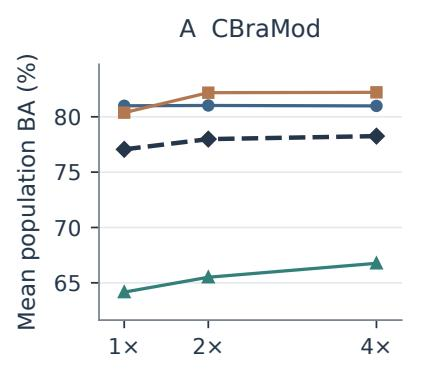

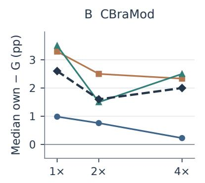

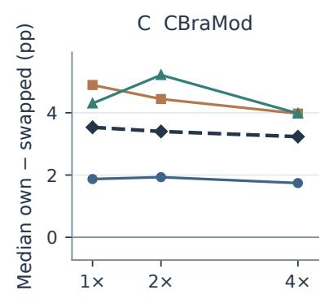

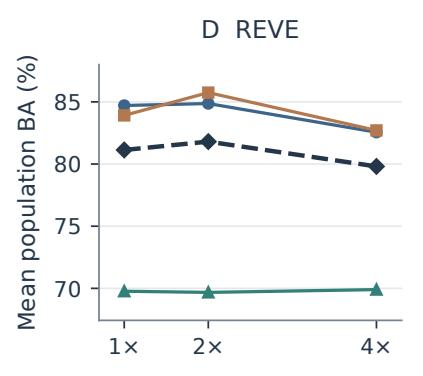

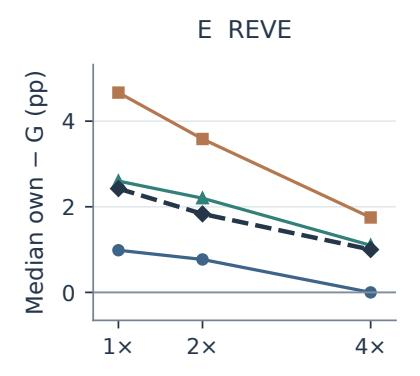

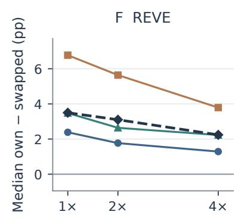

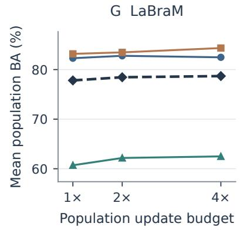

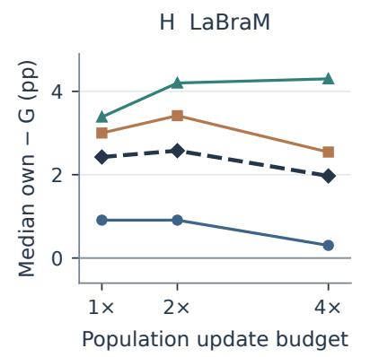

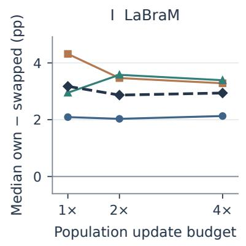  
Figure S13: Population performance and dataset-specific budget curves. Each model row shows mean population BA, median own-minus-G and median own-minus-swapped. Solid curves show individual datasets; the dashed curve pools the subjects after within-subject seed averaging. Lines join the tested budgets. REVE’s PhysioNet personal-gain median reaches zero at the largest budget; LaBraM’s Cho median increases, showing that the pooled net reduction is not universal across datasets.

## S9.6 Initial CBraMod failure, missingness and run-level record

The following tables preserve the initial batch before its documented rerun; they are not the completed-cohort tables above. At each budget the original 235 subjects and 5 seeds form the intended denominator. Initially, 1127 subject–seed pairs were observed; 187 subjects had all seeds and 48 lacked a seed. No complete-case subset was substituted. The retry subsequently supplies that trajectory’s personal diagnostics under the disclosed precision exception. The original-budget cross-model result remains a separate analysis.

Table S26: Subject and seed coverage in the initial CBraMod budget batch before the documented rerun.
<table><tr><td></td><td>Budget Dataset</td><td>N</td><td>Seeds</td><td>Planned pairs</td><td>Observed pairs</td><td>Complete N</td><td>Incomplete N</td></tr><tr><td>1x</td><td>PhysioNet</td><td>103</td><td>5</td><td>515</td><td>494</td><td>82</td><td>21</td></tr><tr><td>1x</td><td>Dreyer</td><td>80</td><td>5</td><td>400</td><td>384</td><td>64</td><td>16</td></tr><tr><td>1x</td><td>Cho</td><td>52</td><td>5</td><td>260</td><td>249</td><td>41</td><td>11</td></tr><tr><td>1x</td><td>Pooled</td><td>235</td><td>5</td><td>1175</td><td>1127</td><td>187</td><td>48</td></tr><tr><td>2x</td><td>PhysioNet</td><td>103</td><td>5</td><td>515</td><td>494</td><td>82</td><td>21</td></tr><tr><td>2x</td><td>Dreyer</td><td>80</td><td>5</td><td>400</td><td>384</td><td>64</td><td>16</td></tr><tr><td>2x</td><td>Cho</td><td>52</td><td>5</td><td>260</td><td>249</td><td>41</td><td>11</td></tr><tr><td>2x</td><td>Pooled</td><td>235</td><td>5</td><td>1175</td><td>1127</td><td>187</td><td>48</td></tr><tr><td>4x</td><td>PhysioNet</td><td>103</td><td>5</td><td>515</td><td>494</td><td>82</td><td>21</td></tr><tr><td>4x</td><td>Dreyer</td><td>80</td><td>5</td><td>400</td><td>384</td><td>64</td><td>16</td></tr><tr><td>4x</td><td>Cho</td><td>52</td><td>5</td><td>260</td><td>249</td><td>41</td><td>11</td></tr><tr><td>4x</td><td>Pooled</td><td>235</td><td>5</td><td>1175</td><td>1127</td><td>187</td><td>48</td></tr></table>

The following rows describe each run’s test fold separately. Fold and seed are execution identifiers, not extra independent subjects. N is the saved observed-subject count; G is a mean percentage, while Delta and U are within-run subject medians in pp. These rows do not estimate the seed-averaged complete-cohort medians in the main figure. Missing personal diagnostics remain NA, including at preserved earlier population checkpoints of the failed run. Machine-readable source tables retain the dataset-level means, SDs and medians as well.

Table S27: Initial CBraMod budget results by fold and seed. Missing personal diagnostics remain unavailable.
<table><tr><td>Fold</td><td>Seed</td><td>Budget</td><td>Status</td><td>N</td><td>G mean</td><td>Delta median</td><td>U median</td></tr><tr><td>0</td><td>11</td><td>1x</td><td>complete</td><td>48</td><td>75.774</td><td>4.083</td><td>5.208</td></tr><tr><td>0</td><td>11</td><td>2x</td><td>complete</td><td>48</td><td>77.521</td><td>4.083</td><td>5.483</td></tr><tr><td>0</td><td>11</td><td>4x</td><td>complete</td><td>48</td><td>77.868</td><td>2.083</td><td>3.826</td></tr><tr><td>0</td><td>23</td><td>1x</td><td>complete</td><td>48</td><td>76.888</td><td>3.750</td><td>5.958</td></tr><tr><td>0</td><td>23</td><td>2x</td><td>complete</td><td>48</td><td>78.172</td><td>0.833</td><td>4.178</td></tr><tr><td>0</td><td>23</td><td>4x</td><td>complete</td><td>48</td><td>77.488</td><td>3.894</td><td>5.140</td></tr><tr><td>0</td><td>37</td><td>1x</td><td>complete</td><td>48</td><td>76.705</td><td>3.923</td><td>4.866</td></tr><tr><td>0</td><td>37</td><td>2x</td><td>complete</td><td>48</td><td>77.339</td><td>0.994</td><td>1.483</td></tr><tr><td>0</td><td>37</td><td>4x</td><td>complete</td><td>48</td><td>77.990</td><td>1.833</td><td>4.271</td></tr><tr><td>0</td><td>53</td><td>1x</td><td>complete</td><td>48</td><td>75.920</td><td>4.167</td><td>5.542</td></tr><tr><td>0</td><td>53</td><td>2x</td><td>complete</td><td>48</td><td>77.560</td><td>3.333</td><td>5.800</td></tr><tr><td>0</td><td>53</td><td>4x</td><td>complete</td><td>48</td><td>77.657</td><td>4.083</td><td>4.110</td></tr><tr><td>0</td><td>71</td><td>1x</td><td>complete</td><td>48</td><td>75.659</td><td>3.167</td><td>5.042</td></tr><tr><td>0</td><td>71</td><td>2x</td><td>complete</td><td>48</td><td>77.690</td><td>1.250</td><td>4.746</td></tr><tr><td>0</td><td>71</td><td>4x</td><td>complete</td><td>48</td><td>76.926</td><td>1.833</td><td>4.792</td></tr><tr><td>1</td><td>11</td><td>1x</td><td>complete</td><td>48</td><td>78.713</td><td>2.917</td><td>3.970</td></tr><tr><td>1</td><td>11</td><td>2x</td><td>complete</td><td>48</td><td>78.853</td><td>3.817</td><td>3.458</td></tr><tr><td>1</td><td>11</td><td>4x</td><td>complete</td><td>48</td><td>80.059</td><td>0.917</td><td>3.125</td></tr><tr><td>1</td><td>23</td><td>1x</td><td>complete</td><td>48</td><td>78.143</td><td>0.000</td><td>1.487</td></tr><tr><td>1</td><td>23</td><td>2x</td><td>complete</td><td>48</td><td>78.560</td><td>0.833</td><td>3.267</td></tr><tr><td>1</td><td>23</td><td>4x</td><td>complete</td><td>48</td><td>78.178</td><td>3.000</td><td>3.341</td></tr><tr><td>1</td><td>37</td><td>1x</td><td>failed</td><td>0</td><td>NA</td><td>NA</td><td>NA</td></tr><tr><td>1</td><td>37</td><td>2x</td><td>failed</td><td>0</td><td>NA</td><td>NA</td><td>NA</td></tr><tr><td>1</td><td>37</td><td>4x</td><td>failed</td><td>0</td><td>NA</td><td>NA</td><td>NA</td></tr><tr><td>1</td><td>53</td><td>1x</td><td>complete</td><td>48</td><td>78.063</td><td>0.917</td><td>2.250</td></tr><tr><td>1</td><td>53</td><td>2x</td><td>complete</td><td>48</td><td>79.627</td><td>1.667</td><td>4.023</td></tr><tr><td>1</td><td>53</td><td>4x</td><td>complete</td><td>48</td><td>77.768</td><td>1.667</td><td>2.542</td></tr><tr><td>1</td><td>71</td><td>1x</td><td>complete</td><td>48</td><td>75.711</td><td>4.545</td><td>5.119</td></tr><tr><td>1</td><td>71</td><td>2x</td><td>complete</td><td>48</td><td>78.815</td><td>2.500</td><td>2.250</td></tr><tr><td>1</td><td>71</td><td>4x</td><td>complete</td><td>48</td><td>80.295</td><td>0.000</td><td>1.792</td></tr><tr><td>2</td><td>11</td><td>1x</td><td>complete</td><td>47</td><td>75.754</td><td>1.667</td><td>4.700</td></tr><tr><td>2</td><td>11</td><td>2x</td><td>complete</td><td>47</td><td>75.693</td><td>2.500</td><td>4.886</td></tr><tr><td>2</td><td>11</td><td>4x</td><td>complete</td><td></td><td>4775.658</td><td>3.333</td><td>3.068</td></tr><tr><td>2</td><td>23</td><td>1x</td><td>complete</td><td>47</td><td>73.422</td><td>3.788</td><td>5.152</td></tr><tr><td>2</td><td>23</td><td>2x</td><td>complete</td><td>47</td><td>74.153</td><td>4.167</td><td>4.250</td></tr><tr><td>2</td><td>23</td><td>4x</td><td>complete</td><td>47</td><td>74.454</td><td>3.333</td><td>3.000</td></tr><tr><td>2</td><td>37</td><td>1x</td><td>complete</td><td>47</td><td>73.172</td><td>2.586</td><td>4.083</td></tr><tr><td>2</td><td>37</td><td>2x</td><td>complete</td><td>47</td><td>73.082</td><td>2.500</td><td>4.250</td></tr><tr><td>2</td><td>37</td><td>4x</td><td>complete</td><td>47</td><td>73.613</td><td>3.448</td><td>3.417</td></tr><tr><td>2</td><td>53</td><td>1x</td><td>complete</td><td>47</td><td>74.275</td><td>5.000</td><td>5.917</td></tr><tr><td>2</td><td>53</td><td>2x</td><td>complete</td><td>47</td><td>75.975</td><td>2.500</td><td>4.250</td></tr><tr><td>2</td><td>53</td><td>4x</td><td>complete</td><td>47</td><td>75.612</td><td>2.500</td><td>5.583</td></tr><tr><td>2</td><td>71</td><td>1x</td><td>complete</td><td>47</td><td>73.086</td><td>3.448</td><td>5.492</td></tr><tr><td>2</td><td>71</td><td>2x</td><td>complete</td><td>47</td><td>74.338</td><td>0.862</td><td>2.750</td></tr><tr><td>2</td><td>71</td><td>4x</td><td>complete</td><td>47</td><td>74.235</td><td>2.500</td><td>2.083</td></tr><tr><td>3</td><td>11</td><td>1x</td><td>complete</td><td>46</td><td>76.578</td><td>0.000</td><td>3.250</td></tr><tr><td>3</td><td>11</td><td>2x</td><td>complete</td><td>46</td><td>77.722</td><td>0.833</td><td>2.394</td></tr><tr><td>3</td><td>11</td><td>4x</td><td>complete</td><td>46</td><td>77.555</td><td>1.000</td><td>1.417</td></tr><tr><td>3</td><td>23</td><td>1x</td><td>complete</td><td>46</td><td>77.168</td><td>1.667</td><td>3.840</td></tr><tr><td>3</td><td>23</td><td>2x</td><td>complete</td><td>46</td><td>78.387</td><td>1.000</td><td>2.128</td></tr><tr><td>3</td><td>23</td><td>4x</td><td>complete</td><td>46</td><td>77.600</td><td>2.250</td><td>2.238</td></tr><tr><td>3</td><td>37</td><td>1x</td><td>complete</td><td>46</td><td>78.071</td><td>1.827</td><td>3.592</td></tr><tr><td>3</td><td>37</td><td>2x</td><td>complete</td><td>46</td><td>77.688</td><td>0.000</td><td>3.250</td></tr><tr><td>3</td><td>37</td><td>4x</td><td>complete</td><td>46</td><td>78.948</td><td>0.917</td><td>3.667</td></tr><tr><td>3</td><td>53</td><td>1x</td><td>complete</td><td>46</td><td>78.243</td><td>1.667</td><td>2.000</td></tr><tr><td>3</td><td>53</td><td>2x</td><td>complete</td><td>46</td><td>78.116</td><td>1.000</td><td>3.200</td></tr><tr><td>3</td><td>53</td><td>4x</td><td>complete</td><td>46</td><td>79.803</td><td>0.000</td><td>4.408</td></tr><tr><td>3</td><td>71</td><td>1x</td><td>complete</td><td>46</td><td>77.732</td><td>2.917</td><td>2.148</td></tr><tr><td>3</td><td>71</td><td>2x</td><td>complete</td><td>46</td><td>79.036</td><td>1.250</td><td>3.038</td></tr><tr><td>3</td><td>71</td><td>4x</td><td>complete</td><td>46</td><td>79.119</td><td>0.833</td><td>2.583</td></tr><tr><td>4</td><td>11</td><td>1x</td><td>complete</td><td>46</td><td>79.994</td><td>2.250</td><td>3.208</td></tr><tr><td>4</td><td>11</td><td>2x</td><td>complete</td><td>46</td><td>80.267</td><td>1.333</td><td>4.178</td></tr><tr><td>4</td><td>11</td><td>4x</td><td>complete</td><td>46</td><td>80.653</td><td>2.500</td><td>3.080</td></tr><tr><td>4</td><td>23</td><td>1x</td><td>complete</td><td>46</td><td>82.435</td><td>1.250</td><td>2.958</td></tr><tr><td>4</td><td>23</td><td>2x</td><td>complete</td><td>46</td><td>82.390</td><td>1.000</td><td>3.292</td></tr><tr><td>4</td><td>23</td><td>4x</td><td>complete</td><td>46</td><td>82.538</td><td>0.189</td><td>1.614</td></tr><tr><td>4</td><td>37</td><td>1x</td><td>complete</td><td>46</td><td>80.989</td><td>1.212</td><td>2.242</td></tr><tr><td>4</td><td>37</td><td>2x</td><td>complete</td><td>46</td><td>81.150</td><td>0.833</td><td>3.333</td></tr><tr><td>4</td><td>37</td><td>4x</td><td>complete</td><td>46</td><td>82.048</td><td>1.250</td><td>3.027</td></tr><tr><td>4</td><td>53</td><td>1x</td><td>complete</td><td>46</td><td>82.204</td><td>0.833</td><td>3.558</td></tr><tr><td>4</td><td>53</td><td>2x</td><td>complete</td><td>46</td><td>82.354</td><td>0.795</td><td>2.352</td></tr><tr><td>4</td><td>53</td><td>4x</td><td>complete</td><td>46</td><td>81.556</td><td>0.000</td><td>3.333</td></tr><tr><td>4</td><td>71</td><td>1x</td><td>complete</td><td>46</td><td>75.650</td><td>0.917</td><td>1.382</td></tr><tr><td>4</td><td>71</td><td>2x</td><td>complete</td><td>46</td><td>77.061</td><td>3.705</td><td>4.803</td></tr><tr><td>4</td><td>71</td><td>4x</td><td>complete</td><td>46</td><td>79.482</td><td>3.333</td><td>4.550</td></tr></table>

The failed run’s saved validation observations are retained below; no later endpoint is filled. Its population-training objective became nonfinite before backpropagation; personal selection and scoring were scheduled after population continuation and had not begun. The budget evaluation also records a reference-path discrepancy in CBraMod: one saved population hard prediction differs from its original-budget counterpart, while its personal and exchanged predictions are unchanged. For the affected subject–seed comparison, G increases by 4.17 pp and own-minus-G decreases by the same amount; own-minus-swapped is unchanged. The source parameters are unchanged, and the precise numerical cause is not identified. The extension uses its matched scoring path and preserves the original-budget scores separately; it does not replace missing personal diagnostics with original-budget values.

Table S28: Available validation observations from the failed initial CBraMod run. Later endpoints are not filled.
<table><tr><td>Fold Seed</td><td></td><td>Budget Dataset</td><td></td><td>CE</td><td>Accuracy (%) BA (%)</td><td></td></tr><tr><td>1</td><td>37</td><td>1x</td><td>Cho</td><td>0.5447</td><td>66.50</td><td>66.50</td></tr><tr><td>1</td><td>37</td><td>1x</td><td>Dreyer</td><td>0.5782</td><td>79.44</td><td>79.44</td></tr><tr><td>1</td><td>37</td><td>1x</td><td>PhysioNet</td><td>1.0935</td><td>79.35</td><td>79.11</td></tr><tr><td>1</td><td>37</td><td>1x</td><td>Pooled</td><td>0.7998</td><td>76.52</td><td>76.42</td></tr><tr><td>1</td><td>37</td><td>2x</td><td>Cho</td><td>1.1068</td><td>67.00</td><td>67.00</td></tr><tr><td>1</td><td>37</td><td>2x</td><td>Dreyer</td><td>0.5750</td><td>82.64</td><td>82.64</td></tr><tr><td>1</td><td>37</td><td>2x</td><td>PhysioNet</td><td>1.8851</td><td>79.89</td><td>79.78</td></tr><tr><td>1</td><td>37</td><td>2x</td><td>Pooled</td><td>1.2754</td><td>77.94</td><td>77.89</td></tr></table>

The initial six-slot correction is retained below to distinguish its unavailable observations from the final observed endpoints. These adjusted p-values describe the incomplete-run analysis; the completed family’s correction is reported above.

Table S29: Initial incomplete-batch budget decisions and their original six-slot correction, separate from the completed analysis.
<table><tr><td>Model</td><td>Budget</td><td>Initial six-slot Holm p</td><td>Initial interpretation</td></tr><tr><td>REVE</td><td>2x</td><td>3.02e-21</td><td>Descriptive only</td></tr><tr><td>REVE</td><td>4x</td><td>9.6e-13</td><td>Descriptive only</td></tr><tr><td>LaBraM</td><td>2x</td><td>5.62e-20</td><td>Descriptive only</td></tr><tr><td>LaBraM</td><td>4x</td><td>1.62e-20</td><td>Descriptive only</td></tr><tr><td>CBraMod</td><td>2x</td><td>NA</td><td>Incomplete cohort</td></tr><tr><td>CBraMod</td><td>4x</td><td>NA</td><td>Incomplete cohort</td></tr></table>

The retry changes three hard predictions in its original-budget comparison with the original scoring path. G and own BA are unchanged; the maximum absolute swapped-BA difference for one subject and seed is 0.30 pp. These differences are not averaged away or used to revise the original-budget W/X1 results. The final CBraMod curve combines the retry with the original successful trajectories and does not isolate a causal precision effect.

## S9.7 Recorded numerical events in the meta-learning runs

The formal run manifests record 6 inner-loop divergences across 3 of 25 runs. The table lists the original counters by supportlabel count. A counter is an inner-loop event, not a distinct affected test subject or a confirmed chance-valued test score. The saved aggregate manifest does not identify each event’s method and execution phase. The original scores and failure-handling policy remain unchanged; a per-method attribution and an assessment of its effect remain unresolved.

Table S30: Recorded inner-loop numerical events by fold, seed and support-label count. Counts are events, not affected subjects.
<table><tr><td>Fold</td><td>Seed</td><td>All recorded events</td><td>Five labels</td><td>Ten labels</td><td>Twenty labels</td></tr><tr><td>0</td><td>11</td><td>0</td><td>0</td><td>0</td><td>0</td></tr><tr><td>0</td><td>23</td><td>0</td><td>0</td><td>0</td><td>0</td></tr><tr><td>0</td><td>37</td><td>0</td><td>0</td><td>0</td><td>0</td></tr><tr><td>0</td><td>53</td><td>0</td><td>0</td><td>0</td><td>0</td></tr><tr><td>0</td><td>71</td><td>0</td><td>0</td><td>0</td><td>0</td></tr><tr><td>1</td><td>11</td><td>0</td><td>0</td><td>0</td><td>0</td></tr><tr><td>1</td><td>23</td><td>0</td><td>0</td><td>0</td><td>0</td></tr><tr><td>1</td><td>37</td><td>0</td><td>0</td><td>0</td><td>0</td></tr><tr><td>1</td><td>53</td><td>0</td><td>0</td><td>0</td><td>0</td></tr><tr><td>1</td><td>71</td><td>0</td><td>0</td><td>0</td><td>0</td></tr><tr><td>2</td><td>11</td><td>1</td><td>1</td><td>0</td><td>0</td></tr><tr><td>2</td><td>23</td><td>1</td><td>0</td><td>0</td><td>1</td></tr><tr><td>2</td><td>37</td><td>0</td><td>0</td><td>0</td><td>0</td></tr><tr><td>2</td><td>53</td><td>0</td><td>0</td><td>0</td><td>0</td></tr><tr><td>2</td><td>71</td><td>0</td><td>0</td><td>0</td><td>0</td></tr><tr><td>3</td><td>11</td><td>0</td><td>0</td><td>0</td><td>0</td></tr><tr><td>3</td><td>23</td><td>0</td><td>0</td><td>0</td><td>0</td></tr><tr><td>3</td><td>37</td><td>0</td><td>0</td><td>0</td><td>0</td></tr><tr><td>3</td><td>53</td><td>0</td><td>0</td><td>0</td><td>0</td></tr><tr><td>3</td><td>71</td><td>0</td><td>0</td><td>0</td><td>0</td></tr><tr><td>4</td><td>11</td><td>0</td><td>0</td><td>0</td><td>0</td></tr><tr><td>4</td><td>23</td><td>0</td><td>0</td><td>0</td><td>0</td></tr><tr><td>4</td><td>37</td><td>0</td><td>0</td><td>0</td><td>0</td></tr><tr><td>4</td><td>53</td><td>0</td><td>0</td><td>0</td><td>0</td></tr><tr><td>4</td><td>71</td><td>4</td><td>2</td><td>1</td><td>1</td></tr></table>

The query-informed R1 control uses test-pool query scores when selecting priors for validation subjects. Its original endpoint and secondary decisions in the comparison inventory therefore describe this query-informed procedure. They are not independent confirmation under test-label isolation. The separate M-minus-R2 results do not use this R1 branch.

## S10 Supplementary Methods

Implementation details and stage-specific decision rules complement the main Methods.

## S10.1 Decision rules and interpretation

The study proceeded through successive stages with rules fixed before their respective results. These stage-specific rules do not constitute a single independently preregistered confirmatory design. Original decisions are preserved, including stopped extensions and failed gates. Directional tests use the saved paired Wilcoxon procedures and their original Holm families; descriptive comparisons retain their original status. The budget extension has its separately prespecified correction family, described below

The contextual-model criterion jointly required corrected superiority to shuffled context and the task head, recovery of at least thirty percent of the mean supervised-reference gain, and no more than ten percent of subjects declining by over two percentage points. The own-versus-swapped diagnostic required a median specificity difference of at least two percentage points and its corrected directional test. The prior-based meta-learning endpoint and its information-access problem are described in Supplementary Section S7; the main comparison uses ordinary continuation. The original rules and decision summaries appea in Supplementary Section S4; Supplementary Data 1 supplies the complete comparison records.

## S10.2 CBraMod implementation and selection

## S10.2.1 Shared and personal parameterization

The following implementation details concern CBraMod. The REVE and LaBraM implementation appears in Supplementary Section S10.3; their complete results appear in Supplementary Section S8. The task head reads compatible channel representations from the frozen backbone. In the contextual FiLM family, a context encoder and generator output bounded affine modulation across encoder layers. The LoRA family produces mixture weights over shared low-rank bases applied to query, key, value, and output projections in spatial and temporal attention. Context combines backbone embeddings with covariance tangent-space features; the tangent reference is estimated from training-subject segments. Dimension-normalized feature blocks define Euclidean distance for donor selection. The frozen grids in the supplement specify ranks, dimensions, bands, and regularization.

For contextual training, a source-subject episode has ordinary cross-entropy $\ell ( c _ { s } )$ and, when context is retained, a mismatch margin term:

$$
\begin{array} { r } { \mathcal { L } = \ell ( c _ { s } ) + \lambda \operatorname* { m a x } \{ 0 , \ell ( c _ { s } ) - \ell ( c _ { d } ) + m \} . } \end{array}\tag{S1}
$$

The donor context is from another source-training subject in the same dataset. Default-context dropout episodes use the ordinary term without an identity margin. Validation selection uses the prespecified ordering of median improvement, mean improvement, and fixed tie-breaks. The zero-margin-weight diagnostic is kept in the full comparison tables.

Personal FiLM adds zero-initialized offsets to the default generated modulation. Personal LoRA adds a zero-initialized weight update while shared bases, mixture weights, head, and backbone remain fixed. FiLM-on-LoRA continuation uses the explicitly allowed FiLM-on-LoRA path, explaining the family difference in Supplementary Figure S6. The full-support and few-shot AdamW grids are selected on validation subjects. For each target and training run, full-support exchange draws ten other subjects uniformly with replacement from the same dataset and held-out fold. The donor generator is initialized with the run seed; draws can vary across seeds, and the budget extension reuses the recorded donor list at every endpoint. Donor BA scores are averaged within a run before averaging seeds within each target. A singleton eligible donor is therefore repeated.

When no eligible donor exists, the exchange result is missing. For multi-donor LoRA transfer, weight updates are averaged, not factor matrices independently.

## S10.2.2 Continuation and meta-learning

The population model continues the contextual training procedure with the selected hyperparameters and an optimizer restart. Validation-subject mean cross-entropy is checked every 250 updates. Patience is eight checks with the fixed minimum improvement, and the minimum-loss checkpoint includes the original start. The continuation cap is proportional to each start’s selected training budget. A separate loss-range rule describes a plateau; early stopping and a plateau are different events. The supplementary run-level flags show that joint train/validation plateaus were not established.

The initial population LoRA model is the shared starting point. Ordinary continuation trains it with cross-entropy and fixed default mixture weights. First-order MAML uses the recorded first-order meta-learning procedure [18]; the learned-rate variant additionally learns layer-specific inner learning rates. Meta-training uses source subjects only. Evaluation uses the same fullbatch SGD support updates for all compared methods, with inner settings chosen on validation subjects. Each meta-learning and ordinary-continuation training run executes the saved outer-update budget; meta-learning additionally computes the support-set updates. The inner loop updates only personal LoRA, treating support-loss gradients as constants. Query-loss backpropagation updates the shared LoRA bases and task head while treating the fitted personal weights as fixed, without differentiating through support updates. In the learned-rate variant, a layer’s log-rate gradient is minus its rate multiplied by the dot product of the query gradient on its personal parameters and its accumulated support gradients. The resulting wall time and gradient/sample counts need not match ordinary continuation.

Following divergence in the initial inner-rate scan, the formal runs used a fixed handling rule: stop a divergent adaptation, assign chance-level scores at unreached update counts, record the event, and skip divergent meta episodes. The 25 formal run manifests record 6 inner-loop divergences across 3 runs. These counters combine calls across training, validation and evaluation; the manifest does not retain complete event-to-method, phase or subject assignments. Skipping a meta-training episode also skips its optimizer update. The matching therefore specifies scheduled outer-update budgets; equal counts of successfu updates cannot be independently verified from these aggregate records. Supplementary Section S9.7 lists the saved counts. The reported results include this failure-handling policy; its effect has not been isolated. Validation accuracy trajectories for the continued population model were not saved, so the direction of accuracy at its selected stopping point cannot be reconstructed from loss alone.

## S10.3 REVE and LaBraM implementation

The cross-model core uses the base pretrained REVE and LaBraM encoders, with their frozen normalization and position parameters. REVE uses the base pretrained weights rather than task-finetuned weights [19]. CBraMod and LaBraM use their original published architectures [20, 21]. FiLM, LoRA, and the permutation-invariant set encoder follow their respective method families [22–24].

Both models receive native EEG channels. REVE follows the fixed public motor-imagery input route: average reference, the recorded high-pass and mains-notch filters, resampling and microvolt scaling. LaBraM is reprocessed from raw data using its recorded band-pass and notch filters. Supplementary Table S11 gives the numerical settings. No signal z-scoring or targetquery normalization is added. REVE keeps its overlapping patch extraction without tail padding; therefore some trailing input samples are not represented by tokens. LaBraM uses nonoverlapping patches, retains the pretrained norm and reads EEG patch tokens instead of the class token. Final tokens are averaged over time within each channel and the common channel readout is flattened. Feature normalization is fitted on the task head training subjects and retained for population and personal models.

Each attention layer receives independent low-rank updates to query, key, value and output projections. The low-rank factors are initialized with a random input factor and a zero output factor, producing a zero initial weight increment. Only the population adapter and task head are trained for the shared model. Personal fitting adds a separate zero-increment adapter with the backbone, the continued population model and head frozen. The parameter rank, scaling and optimizer grids are specified in Supplementary Table S11.

Task-head selection compares linear and multilayer heads using validation-subject mean BA and the specified tie-breaks. Initial shared-adapter candidates are ranked by validation gain median, then mean, followed by update and learning-rate tie breaks. Population continuation trains only the selected candidate, restoring optimizer and random-number state. Validation subject mean cross-entropy selects the continuation checkpoint, including the initial point and choosing the earlier point for ties. The loss-based stopping criterion and separate plateau rules do not expand the candidate set or use target-query performance. Full-support and few-shot personal grids likewise use validation subjects. REVE/LaBraM population models use an ordinary shared LoRA with cross-entropy, whereas CBraMod uses shared bases learned through contextual training. This difference and the native input pipelines constrain attribution of between-model performance differences.

## S10.4 Correction families and descriptive rules

The contextual gate corrects across both methods and both designated controls. The specificity gate retains the original threevariant family. An unexecuted variant has an unavailable observed result but reserves a unit-p correction slot; it is not counted as a measured failure. For the new models, only LoRA is executed in that family. Rest-neighbor testing is conditional on the original specificity eligibility gate; task-neighbor comparisons retain their separate two-variant family. Secondary multi-donor results remain explicitly exploratory and do not replace the primary single-donor decision.

Cross-model consistency is descriptive: a direction label reflects the mean contrast in each dataset. Few-shot stability requires nonnegative means at every prescribed label budget and no decreases with increasing budget. Neither rule asserts that every subject improves or creates a new significance threshold. The full-support fit is an empirical reference within the tested family and current population-training budgets, rather than an optimized upper bound over all possible adaptations. Missing label budgets, absent donors and unexecuted methods remain missing. BNCI own-minus-population and own-minus-swapped have different eligible populations, and their aggregate means are not subtracted to manufacture another contrast.

The symmetry and independent-pair interpretation of signed-rank tests is limited by shared fitted models and donor reuse.

## S10.5 Euclidean alignment implementation

The CBraMod alignment diagnostics whiten native multichannel signals using the recorded covariance reference and diagonal shrinkage, then pass the whitened signals directly to the frozen encoder. Rest-only and eyes-open-matched variants use their named rest sources; the all-task variant can access unlabeled target queries and is transductive. Whitening is applied to the stored microvolt-scaled signals. The alignment and unaligned activation-precision paths differ, so spatial mixing is not isolated. The numerical settings appear in Supplementary Table S11; all saved comparisons remain in the supplementary inventory.

## S10.6 Population-budget endpoints and interpretation rules

The extension starts from each run’s originally reported population checkpoint. Its cumulative selected population-update count defines the reference budget; subsequent endpoints are the states at twice and four times that count. The existing training objective, learning rate and sampling procedure are retained. REVE and LaBraM restore their saved optimizer and random number states. CBraMod’s original checkpoint lacks those states, so its continuation restarts them using the original settings. Endpoint states are used directly, without selecting a better checkpoint from the interval. Runs stop at the first joint plateau or the specified cap; nonfinite objectives stop a run and leave subsequent endpoints missing. Validation deterioration does not trigger substitution of an earlier checkpoint.

The joint plateau uses the recorded equally spaced check window: training and validation CE ranges must satisfy their relative and absolute tolerances, validation accuracy and BA must satisfy the range tolerance, and neither validation score may achieve the specified running-best improvement. Supplementary Table S11 gives these thresholds. At each new endpoint, the personal LoRA settings are selected again on validation subjects using the original grid, then evaluated using the original donor assignments. The reference endpoint reuses its original personal fit and selection. The core table retains original-budget scoring, whereas the budget curves use extension-reference scoring. Recorded precision-path and reference-scoring differ ences can therefore produce small differences between their original-budget summaries; Supplementary Section S9 documents them. Budget changes are evaluated within the extension scoring path. Label budgets and few-shot curves are not reselected. Complete-cohort contrasts require all original subjects and seeds; no seed deletion, original-budget score substitution or chancescore imputation is applied to this extension.

One original CBraMod trajectory stopped on a nonfinite objective before backpropagation and before personal diagnostics, despite retaining earlier population checkpoints. A single retry was registered after that failure: remove the eighth-layer acti vation’s half-precision round trip, retain float32 and disable TF32, while preserving the original population gradient clipping and other settings. Its successful results replace that failed trajectory in the complete-cohort aggregation; the original failure, incomplete-cohort summaries and validation observations remain in Supplementary Section S9.6 (Tables S26, S27, S28 and S29). CBraMod therefore combines 24 original trajectories and one precision exception. Successful completion does not establish the original failure’s root cause. Original-path and retry-path prediction differences, along with their scoring effects, are documented in Supplementary Section S9.

The interpretation rules use the pooled median own-minus-population after averaging seeds within subject. Let these medians at the original, doubled and quadrupled budgets be $m _ { a } , m _ { b } , m _ { c } .$ The attenuation-to-negligible-gain rule requires $m _ { a } \ge$ $m _ { b } \geq m _ { c } ,$ at least one strict decrease, and $m _ { c } < 0 . 5 \mathrm { p p } .$ . Otherwise, the stable-positive-gain rule requires $| m _ { c } - m _ { b } | < 0 . 5$ pp, positive $m _ { b } , m _ { c }$ , and positive directional tests at both added endpoints. This is the prespecified criterion for a stable positive personal gain after population continuation; its scope is the two observed added endpoints. The latter tests use the prespecified six-slot Holm family spanning the models and added endpoints. Initially missing slots reserved unit p-values for correction; the completed retry supplies their observed values in the same family. The initial correction record is retained separately. All remaining complete cases are descriptive; incomplete subject/seed coverage leaves the interpretation undetermined. Specificity uses a separate three-slot family at each model and endpoint: the observed LoRA comparison and two unexecuted variant slot with unit p-values. This budget-extension family differs from the CBraMod specificity family, which includes the observed FiLM test. The original specificity adjusted p-value is retained separately. These rules do not replace original decision families, establish convergence or identify a pure causal effect of compute.

## S10.7 Screening procedures and scope of Cho timeline checks

Subject exclusions. PhysioNet excludes subjects 88, 89, 92, 100, 104 and 106 because of sampling-rate or run-duration anomalies. Dreyer excludes subjects 4, 9, 17, 29, 41, 78 and 79 according to the original authors’ annotations. All Cho subjects are included. These dataset-specific subject exclusions are distinct from trial screening.

Trial screening and diagnostic checks. Initial automated screening applied amplitude rejection and a post-screening classimbalance stopping rule, and triggered a stop. The revised procedure retained all finite-valued trials and removed these two criteria; the initial screening outcomes remain in the released records. Alpha-power checks are diagnostic and do not retrospectively remove subjects. Dreyer lacks the required occipital channels for that diagnostic, and Cho lacks the corresponding closed-eye segment. These checks did not replace the dataset-specific exclusion criteria.

Cho ordering and verification scope. The official trial-order metadata were checked for all included Cho subjects. In dependent signal-level and packaged-event cross-checks covered subject s01. The within-class packaged events are not an independent record of the original continuous timeline, so these checks do not reconstruct every subject’s continuous recording or establish the absolute rest-to-task interval. The evaluation uses the available trial-order metadata to order the task trials.

BNCI task-preceding eyes-open rest was verified from raw-event records and aligned task data. Expert-flagged trials are included under the study protocol.

## References

[1] He He and Dongrui Wu. Transfer Learning for Brain-Computer Interfaces: A Euclidean Space Data Alignment Approach, 2020. URL https://doi.org/10.1109/TBME.2019.2913914.

[2] Bruna Junqueira, Bruno Aristimunha, Sylvain Chevallier, and Raphael Y. de Camargo. A Systematic Evaluation of Euclidean Alignment with Deep Learning for EEG Decoding, 2024. URL https://arxiv.org/abs/2401.10746v2.

[3] Kuntal Kokate, Bruno Aristimunha, Dung Truong, and Arnaud Delorme. Channel Adaptation for EEG Foundation Models: A Systematic Benchmark Across Architectures, Tasks, and Training Regimes, 2026. URL https://arxiv.org/abs/2604. 23091v1.

[4] Dingkun Liu, Yuheng Chen, Zhu Chen, Zhenyao Cui, Yaozhi Wen, Jiayu An, Jingwei Luo, and Dongrui Wu. EEG-FM-Compass: Progress, Benchmarking, and Future Directions for EEG Foundation Models, 2026. URL https://arxiv.org/abs 2601.17883v3.

[5] Huiyang Wang, Hongfang Han, John Q. Gan, and Haixian Wang. Lightweight Source-Free Domain Adaptation Based on Adaptive Euclidean Alignment for Brain-Computer Interfaces, 2025. URL https://doi.org/10.1109/JBHI.2024.3463737.

[6] Sion An, Myeongkyun Kang, Soopil Kim, Philip Chikontwe, Li Shen, and Sang Hyun Park. Subject-Adaptive Transfer Learning Using Resting State EEG Signals for Cross-Subject EEG Motor Imagery Classification, 2024. URL https: //arxiv.org/abs/2405.19346v2.

[7] Youngchul Kwak, Kyeongbo Kong, Woo-Jin Song, and Seong-Eun Kim. Subject-Invariant Deep Neural Networks Based on Baseline Correction for EEG Motor Imagery BCI, 2023. URL https://doi.org/10.1109/JBHI.2023.3238421.

[8] Suli Wang, Yangshen Deng, Zhenghua Bao, Xinyu Zhan, and Yiqun Duan. NeuroTTT: Bridging Pretraining-Downstream Task Misalignment in EEG Foundation Models via Test-Time Training, 2025. URL https://arxiv.org/abs/2509.26301v2.

[9] Bruna J. Lopes, Gabriel Schwartz, Sylvain Chevallier, Raphael Y. de Camargo, and Bruno Aristimunha. Learning aligned EEG representations with subject-specific encoders, 2026. URL https://arxiv.org/abs/2606.16462v1.

[10] Daniil A. Berdyshev, Artem M. Grachev, Sergei L. Shishkin, and Bogdan L. Kozyrskiy. EEG-Reptile: An Automatized Reptile-Based Meta-Learning Library for BCIs, 2025. URL https://arxiv.org/abs/2412.19725v2.

[11] Urban Širca, Lovro Brulec, and Maryam Alimardani. Parameter-Efficient Fine-Tuning of EEG Foundation Models for Plug-and-Play Motor Imagery BCIs, 2026. URL https://doi.org/10.1109/BCI69045.2026.11435102.

[12] Jun-You Lin, Ying Choon Wu, and Tzyy-Ping Jung. The Identity Trap in EEG Foundation Models: A Diagnostic Audit, 2026. URL https://arxiv.org/abs/2606.06647v1.

[13] Aymen Sarhane, Fouad Lbakali, Mouad Souissi, Jonathan Lys, and Giulia Lioi. Stacked LoRA for Subject-Adaptive EEG Foundation Models in Motor Imagery Decoding, 2026. URL https://arxiv.org/abs/2607.03094v1.

[14] Bruna J. Lopes, Gabriel Schwartz, Sylvain Chevallier, Raphael Y. de Camargo, and Bruno Aristimunha. Learning aligned EEG representations with subject-specific encoders. Scientific Reports, 2026. doi: 10.1038/s41598-026-69220-z. URL https://doi.org/10.1038/s41598-026-69220-z. Article in Press; accepted 26 August 2026.

[15] Anh T. Nguyen, Zihua Sun, and Michelle J. Johnson. Lightweight Adaptation of EEG Foundation Models for Stroke Motor Imagery Decoding: Domain Shift and Subject-Level Robustness, 2026. URL https://arxiv.org/abs/2609.00282v1.

[16] Anupam Sharma and Krishna Miyapuram. Evaluating Fast Adaptability of Neural Networks for Brain-Computer Interface, 2024. URL https://arxiv.org/abs/2404.15350v1.

[17] Liuyin Yang, Qiang Sun, Ang Li, and Marc M. Van Hulle. Are EEG Foundation Models Worth It? Comparative Evalu ation with Traditional Decoders in Diverse BCI Tasks. In International Conference on Learning Representations, 2026. URL https://openreview.net/forum?id=5Xwm8e6vbh.

[18] Chelsea Finn, Pieter Abbeel, and Sergey Levine. Model-Agnostic Meta-Learning for Fast Adaptation of Deep Networks. In Proceedings ofthe 34th International Conference on Machine Learning, 2017. URL https://proceedings.mlr.press/v70/ finn17a.html.

[19] Yassine El Ouahidi, Jonathan Lys, Philipp Thölke, Nicolas Farrugia, Bastien Pasdeloup, Vincent Gripon, Karim Jerbi, and Giulia Lioi. REVE: A Foundation Model for EEG – Adapting to Any Setup with Large-Scale Pretraining on 25,000 Subjects, 2025. URL https://arxiv.org/abs/2510.21585v1.

[20] Jiquan Wang, Sha Zhao, Zhiling Luo, Yangxuan Zhou, Haiteng Jiang, Shijian Li, Tao Li, and Gang Pan. CBraMod: A Criss-Cross Brain Foundation Model for EEG Decoding. In International Conference on Learning Representations, 2025. URL https://proceedings.iclr.cc/paper\_files/paper/2025/hash/ bbbd6d915cb90be21c1254a82d45cedd-Abstract-Conference.html.

[21] Wei-Bang Jiang, Li-Ming Zhao, and Bao-Liang Lu. Large Brain Model for Learning Generic Representations with Tremendous EEG Data in BCI. In International Conference on Learning Representations, 2024. URL https://proceedings. iclr.cc/paper\_files/paper/2024/hash/47393e8594c82ce8fd83adc672cf9872-Abstract-Conference.html.

[22] Ethan Perez, Florian Strub, Harm De Vries, Vincent Dumoulin, and Aaron Courville. FiLM: Visual Reasoning with a General Conditioning Layer. Proceedings of the AAAI Conference on Artificial Intelligence, 32(1), 2018. doi: 10.1609 aaai.v32i1.11671. URL https://doi.org/10.1609/aaai.v32i1.11671.

[23] Edward J. Hu, Yelong Shen, Phillip Wallis, Zeyuan Allen-Zhu, Yuanzhi Li, Shean Wang, Lu Wang, and Weizhu Chen. LoRA: Low-Rank Adaptation of Large Language Models. In International Conference on Learning Representations, 2022. URL https://arxiv.org/abs/2106.09685.

[24] Manzil Zaheer, Satwik Kottur, Siamak Ravanbakhsh, Barnabas Poczos, Ruslan Salakhutdinov, and Alexander J. Smola. Deep Sets. In Advances in Neural Information Processing Systems, 2017. URL https://papers.nips.cc/paper/2017/hash f22e4747da1aa27e363d86d40ff442fe-Abstract.html.