# SincDPNet: Interpretable Raw-Waveform Bathroom Activity Recognition for Assistive Living

Debolina Chowdhury1, Suman Samui2,∗, Sujoy Saha1

1Department of Computer Science and Engineering, National Institute of Technology Durgapur,

Durgapur 713209, West Bengal, India

2Department of Electronics and Communication Engineering, National Institute of Technology Durgapur, Durgapur 713209, West Bengal, India

Emails: debolinarimuchowdhury@gmail.com (D. Chowdhury), ssamui.ece@nitdgp.ac.in (S. Samui), ssaha.cse@gnitdgp.ac.in (S. Saha)

∗Corresponding author

## Abstract

Bathroom acoustic-event recognition can support ambient assisted living in settings where continuous video monitoring is undesirable. However, practical deployment requires models that are compact, interpretable, and robust to changes in the recording environment. This work introduces SnaanGhar7, a seven-class bathroom acoustic-event dataset containing 21,387 annotated clips recorded across five environments, and proposes SincDPNet, a compact raw-waveform classifier with a learnable sinc filter bank followed by a depthwise-separable convolutional body. Each sinc filter is controlled by two frequency parameters, allowing the learned passbands to be inspected directly in hertz while keeping the front end small. To reduce room-specific leakage, recording sessions and environments are separated before overlapping windows are assigned to the training, validation, and test partitions. We further use multi-objective Bayesian optimization as a design tool to examine the validation performance–model-size trade-of across 24 configurations. The selected designs span diferent operating points: the best-performing model achieves 80.2% accuracy and 0.760 macro-F1 with 14,040 parameters, while the compact $N _ { f } = 2 5$ configuration uses only 2,848 parameters and achieves 75.7% accuracy, 0.661 macro-F1, and 0.716 MCC on the held-out environment. Analysis of the learned filters and confusion patterns shows that spectral overlap contributes to confusion among water-related events, while the Door/Walker/Crutch errors also reflect similarities in their transient temporal structure.

Keywords: Acoustic scene classification; Bathroom acoustic event recognition; Raw-waveform learning; SincNet; Interpretable deep learning; Bayesian optimization; Ambient assisted living; TinyML; Edge AI

## 1. Introduction

Acoustic event classification (AEC) provides a means of recognizing human activities and environmental context without requiring wearable sensors or visual monitoring [12, 14]. Acoustic sensing has therefore been explored as a less visually intrusive option for indoor activity monitoring, particularly in privacy-sensitive environments [19]. Bathrooms are an important example: they are private spaces where continuous camera-based monitoring is generally unacceptable [13, 35], yet information about activities such as flushing, showering, tap use, door movement, and walker or crutch use can be relevant to Ambient Assisted Living (AAL).

This setting is particularly relevant for older adults living independently, for whom bathroom activities may be associated with slips, falls, or delayed assistance. A sequence of acoustic events can provide a simple account of bathroom activity without continuous video capture. For example, combinations of door, mobility-aid, tap, shower, and flush events can indicate the progress of a routine and, in a future assistive system, provide evidence of prolonged inactivity or unusual activity patterns.

Several practical dificulties make this problem less straightforward than general environmental sound classification. Suitable public datasets are limited. Widely used corpora such as ESC-50 [29], UrbanSound8K [32], AudioSet [12], FSD50K [9], and the TAU acoustic scene datasets [22] contain few or no recordings targeted at bathroom activities, while many studies in this area rely on private data. The second challenge relates to model interpretability. Standard spectrogram-based approaches can obtain high accuracy on recognition, yet the learned representation does not provide any information regarding the acoustic characteristics that can be used to diferentiate, say, flushing a toilet and turning on a faucet. Interpretability of such mistakes becomes very relevant in assistive monitoring, where one should be able to explain the mistake in terms of the actual sound. Resource-eficient implementation, however, poses another constraint: accuracy should be traded of against model complexity. Accordingly, this work makes the following contributions:

1. The SnaanGhar7 dataset. We consolidate and publicly release a real-world, multi-site assistive-living bathroom acoustic corpus containing seven activity-related classes, including a heterogeneous non-target unknown class. The dataset contains 21,387 annotated clips, standardized data splits, and baseline implementations (Section 3). Its scope is compared with the closest existing bathroom and environmental acoustic resources in Section 2.

2. The SincDPNet architecture. We develop a compact raw-waveform model that combines a learnable sinc band-pass front end with a depthwise-separable convolutional back end (Section 5). Each sinc filter is represented by two frequency parameters, giving a filter-bank cost of only 2� trainable parameters while retaining a direct interpretation in hertz. SincDPNet difers from SincNet [30][23] in the architecture following the sinc layer: the parameter-intensive convolutional and classification stages [23] are replaced by a compact separable back end. The resulting model retains the frequency interpretability of the sinc representation while reducing the network to a few thousand trainable parameters.

3. Acoustic analysis and reproducible design exploration. We examine acoustic overlap between classes before model training and relate this structure to the errors observed after training. The analysis shows that pairwise acoustic overlap is informative about several dominant confusion patterns, although a single class-level dificulty score does not predict the complete error ranking. We further report the multi-objective design study using all 24 evaluated configurations (Section 6), allowing the resulting accuracy–size trade-of to be inspected directly.

The optimization procedure itself is used as a design tool; no new Bayesian optimization method is introduced. Similarly, SnaanGhar7 is presented as a new resource for the particular combination of bathroom activities studied here, rather than as the first bathroom acoustic dataset. The contribution of the study lies in the combination of an interpretable compact raw-waveform model, an acoustic analysis that can be related to its learned filter bank and error structure, and a dataset that permits these relationships to be studied under environment-disjoint evaluation.

The remainder of the paper is organized as follows. Section 2 reviews related work on bathroom and environmental acoustic datasets, spectral and raw-waveform front ends, compact edge-audio models, and multi-objective optimization. Section 3 introduces SnaanGhar7, including its recording protocol, annotation, and statistics. Section 4 examines the signal-level structure and inter-class acoustic similarity. Section 5 describes SincDPNet and its relationship to SincNet, and Section 6 presents the multi-objective design study. Section 7 reports the benchmark, ablation, interpretability, and error analyses, followed by the deployment evaluation in Section 8. The findings are discussed in Section 9, and Section 10 concludes the paper.

## 2. Related Work

Literature related to this work is divided into the following five categories, which are interrelated: dataset of bathroom and environmental acoustics, spectral and waveform signal front-end, compressed models for edge audio, multi-objective design and evaluation in case of domain shift. All these categories represent real constraints associated with monitoring bathroom acoustics, namely limited data, similar acoustic classes, computational constraint, and evaluation outside of training domains.

## 2.1 Environmental and Bathroom Acoustic Datasets

Progress in acoustic event classification has been supported by large general-purpose corpora such as ESC-50 [29], UrbanSound8K [32], and AudioSet [12]. These datasets contain a variety of sounds from urban, domestic, and everyday settings, however, bathroom-related sound events are missing or not well covered.

Bathroom acoustic sensing has been studied for considerably longer than the size of the literature might suggest. Chen et al. [5] showed that flushing, showering, and tap use could be distinguished from audio alone. More recently, Hyun [15] considered an edge-oriented system for three water-usage activities, using YAMNet for water-event detection followed by a fine-tuned classifier on a Raspberry Pi. Öztürk et al. [26] released a public restroom corpus of approximately 460 minutes recorded in five bathrooms and reported 97.8% accuracy over eleven fine-grained events using a RegNetY backbone with three-channel mel spectrograms.

These studies establish the feasibility of bathroom acoustic monitoring, but their event coverage is concentrated mainly on water-related activities. Sounds relevant to assistive monitoring, such as door movement and walker/crutch use, are less commonly represented, and an explicit heterogeneous non-target class is generally absent. In addition, most published systems rely on comparatively large spectral models, leaving the performance of very small raw-waveform models less well characterized. Table 1 summarizes the position of SnaanGhar7 relative to representative environmental and bathroom acousti resources.

Table 1: Representative datasets for environmental sound recognition and bathroom monitoring. SnaanGhar7 adds mobility-aid events, an explicit non-target class, and raw-waveform edge baselines.
<table><tr><td>Dataset</td><td>Domain</td><td>Bathroom</td><td>Public</td><td>Non-target class</td><td>Raw-waveform baselines</td></tr><tr><td>ESC-50 [29]</td><td>Environmental</td><td>x</td><td>√</td><td>x</td><td>X</td></tr><tr><td>UrbanSound8K [32]</td><td>Urban</td><td>x</td><td>√</td><td>x</td><td>X</td></tr><tr><td>AudioSet [12]</td><td>General</td><td>Partial</td><td>√</td><td>x</td><td>x</td></tr><tr><td>Chen et al. [5]</td><td>Bathroom</td><td>√</td><td>x</td><td>x</td><td>x</td></tr><tr><td>Hyun [15]</td><td>Water/bathroom</td><td>√</td><td>x</td><td>X</td><td>X</td></tr><tr><td>Öztürk et al. [26]</td><td>Restroom</td><td>√</td><td>√</td><td>x</td><td>x</td></tr><tr><td>SnaanGhar7 (ours)</td><td>Bathroom events</td><td>√</td><td>√</td><td>√</td><td>√</td></tr></table>

## 2.2 Spectral and Raw-Waveform Front Ends

Most acoustic classifiers use a fixed spectral representation before classification. Mel-frequency cepstral coeficients and mel spectrograms remain common choices [1], typically followed by convolutional or recurrent models [3, 31]. These representations are efective, but their frequency scale and analysis filters are specified before training and therefore do not adapt directly to the target domain. Earlier work by Chu et al. [7] also noted that environmental sounds often have broadband noise-like spectra and explored physically interpretable time–frequency representations based on matching pursuit.

Raw-waveform models remove the need for a fixed spectral transform by learning the first-stage representation directly from the signal. A fully unconstrained convolution, however, requires one parameter per filter tap and ofers little direct physical interpretation. Parametric front ends provide an alternative. SincNet [30] constrains each first-layer filter to a band-pass response described by two cutof frequencies. Related approaches learn sub-band boundaries directly from data [16] or use parameterized gammatone filters [27]. Park and Yoo [27], for example, reported improved generalization from a constrained filter shape compared with a substantially larger unconstrained convolution. Bittner et al. [2] pursue interpretability through a diferent route, using diagonal state-space models for compact raw-audio classification.

These studies show that a properly designed front-end system could decrease the number of free parameters while maintaining an immediate dependence on the signal. This feature is especially important in the current problem since the learned frequency bands could be observed in hertz and compared to the spectrum features of bathroom events. The current research aims at analyzing if this structural approach proves efective when the entire classifier is represented by just several thousand of parameters.

## 2.3 Compact Models for Resource-Constrained Audio

Compact audio models commonly rely on depthwise-separable convolutions, quantization, pruning, knowledge distillation, and careful control of the receptive field. DS-CNN [36] demonstrated the efectiveness of depthwise-separable convolutions for microcontroller keyword spotting, and the DPNet family [6] applies a related strategy to bathroom sounds. Lightweight inception-style models have also been developed for edge acoustic scene classification [28]. Other approaches reduce deployment cost through pruning and quantization [24], teacher–student distillation [4, 17], or receptive-field design [18].

The DCASE low-complexity acoustic-scene tasks provide a useful reference for such constraints. The 2021 edition [20] limited model size to 128 kB, while the 2022 edition [21] specified a budget of 128 k INT8 parameters and 30 million multiply–accumulate operations. Similar resource constraints have continued in later editions [33], with successful systems making extensive use of separable convolutions, quantization, and receptive-field tuning [34].

Much of this literature starts with a comparatively large architecture and then reduces its cost. The present study instead begins with a small parameter budget and uses a structured sinc front end together with a depthwise-separable body. This allows model size and interpretability to be considered jointly during design. Related work on acoustic monitoring also shows the importance of maintaining robustness across recording environments, including through domain adaptation [25].

## 2.4 Multi-Objective Optimization for Edge Models

The task of picking a particular edge model involves trade-ofs between predictive accuracy and model complexity/inference cost. This is because of the dependencies between the criteria, and the natural way to formulate the design problem is through a Pareto front. Multi-objective Bayesian optimization provides a convenient tool for searching such design spaces eficiently when evaluation of the models is expensive. In the present study, we use expected hypervolume improvement proposed by Daulton et al. [8]. The optimization procedure is not introduced as a methodological novelty, but is used just to find operating points on a fixed budget

## 2.5 Evaluation Practice and the Gap We Address

Model selection is only meaningful if the evaluation split reflects the conditions expected at deployment. This issue is especially important for small bathroom datasets, where recordings are obtained from only a few rooms. Reverberation, microphone position, plumbing fixtures, and other room-specific characteristics can remain consistent across many clips from the same environment. A random clip-level split can therefore place closely related recordings from the same room in both training and test sets, allowing room characteristics to contribute to the reported performance.

Similar concerns are addressed explicitly in the DCASE low-complexity tasks, where device and city information are incorporated into the evaluation protocol [20, 33]. Koutini et al. [18] likewise emphasize the role of evaluation design in assessing generalization.

For this reason, the experiments in this study use environment-disjoint splits, so that the environment held out for testing is not present during training. The resulting scores are lower than those obtained with random clip-level partitioning, but they provide a more realistic estimate of performance in an unseen recording environment. The signal-level analysis is used alongside this protocol to identify acoustically similar class pairs before training and to examine whether those similarities reappear in the model’s confusion patterns. This combination of environment-disjoint evaluation and signal-based error analysis forms the basis for the experimental study that follows.

## 3. The SnaanGhar7 Dataset

Building on the data gap identified in Section 2, we first describe the corpus used throughout the study.

SnaanGhar7 is a real-world acoustic dataset developed for assistive-living monitoring in bathrooms, with particular relevance to older adults living independently. Bathrooms are private spaces in which several routine activities can be monitored acoustically without continuous visual observation. The dataset therefore focuses on activity-related sounds that are relevant to this setting.

The seven classes are Flush, Shower, Bathroom Tap, Basin Tap, Door, Walker/Crutch, and an Unknown Class. These classes were selected from an assistive-living perspective. Water-related sounds represent common hygiene activities, Door provides a cue for entry or exit, and Walker/Crutch represents mobility-aid use. When considered over time, these events could provide a simple activity timeline and support future systems for identifying prolonged or unusual bathroom activity. Figure 1 illustrates the intended use scenario.

  
Figure 1: Assistive-living use scenario of SnaanGhar7. The selected sound classes represent bathroom activities relevant to an older adult living independently. Door and walker/crutch sounds provide entry, exit, and mobility cues, while tap, shower, and flush-related sounds correspond to common hygiene activities.

Approximately 55 minutes of manually annotated recordings were collected per class across five real-world bathroom environments, giving roughly 385 minutes of original audio. Table 2 summarizes the dataset, while Table 3 lists the classes and their principal acoustic characteristics.

Table 2: Summary of the SnaanGhar7 dataset and its embedded recording platform.
<table><tr><td>Property</td><td>Value</td></tr><tr><td>Classes</td><td>7</td></tr><tr><td>Recording environments</td><td>5 (residential, hostel, institutional)</td></tr><tr><td>Contributors</td><td>3</td></tr><tr><td>Original duration</td><td>≈385 min</td></tr><tr><td>Total segmented windows</td><td>21,387</td></tr><tr><td>Clip duration</td><td>1.51125 s (30,225 samples)</td></tr><tr><td>Class imbalance ratio</td><td>1.2×</td></tr><tr><td>Recording platform</td><td>Raspberry Pi Zero 2 W</td></tr><tr><td>Audio interface</td><td>Waveshare WM8960 Audio HAT</td></tr><tr><td>Sampling rate / depth</td><td>20 kHz / 32-bit I2S, mono</td></tr></table>

Table 3: Class definitions and dominant acoustic characteristics.
<table><tr><td>Class</td><td>Description</td><td>Acoustic characteristics</td></tr><tr><td>Flush</td><td>Toilet flushing</td><td>Broadband water flow with transient onset</td></tr><tr><td>Shower</td><td>Shower water flow</td><td>Continuous broadband noise</td></tr><tr><td>Bathroom Tap</td><td>Bathroom tap running</td><td>Continuous water flow, varying intensity</td></tr><tr><td>Basin Tap</td><td>Basin tap running</td><td>Localized continuous water flow</td></tr><tr><td>Door</td><td>Opening/closing/knocking</td><td>Short impulsive sounds</td></tr><tr><td>Walker/Crutch</td><td>Mobility-aid movement</td><td>Repeated transient impacts</td></tr><tr><td>Unknown Class</td><td>Background/non-target</td><td>Diverse environmental sounds</td></tr></table>

## 3.1 Recording Setup

Recordings were collected from five residential, hostel, and institutional bathrooms (Table 4)1 by three contributors using a custom embedded platform based on a Raspberry Pi Zero 2 W and a Waveshare WM8960 Audio HAT (Fig. 2; platform details are given in Table 2). The five environments introduce variation in room acoustics, reverberation, plumbing characteristics, and background noise. This variation is used explicitly in the cross-environment evaluation described in Section 7.1.

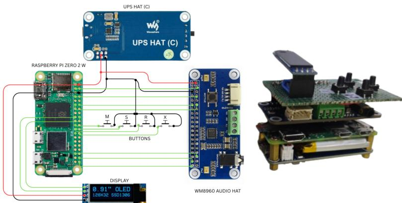  
Figure 2: Embedded recording platform used for data acquisition.

Table 4: Recording environments.
<table><tr><td>ID</td><td>Location</td><td>Type</td></tr><tr><td>E01</td><td>NIT Durgapur</td><td>Institutional</td></tr><tr><td>E02</td><td>Residential Home, Howrah</td><td>Residential</td></tr><tr><td>E03</td><td>Hall-6, NIT Durgapur</td><td>Hostel</td></tr><tr><td>E04</td><td>DS-1B, NIT Durgapur</td><td>Residential</td></tr><tr><td>E05</td><td>Hall-9, NIT Durgapur</td><td>Hostel</td></tr></table>

## 3.2 Annotation and Preprocessing

The continuous recordings were manually annotated at the event level and then divided into fixed windows of 30,225 samples (1.51125 s at 20 kHz) with a hop of 10,225 samples, giving approximately 66% overlap within each source recording. This procedure produced 21,387 segmented windows. Each window is peak-normalized and centre-cropped or zero-padded only when required to preserve the fixed input length.

Source recordings are partitioned by recording session and environment before overlapping windows are generated. Consequently, windows that share audio content or recording-specific characteristics remain within the same training, validation, or test partition. A random window-level split could otherwise place overlapping or closely related windows across diferent partitions and allow room-specific cues to contribute to the reported performance. Session- and environment-disjoint splitting is therefore used throughout the study (Section 7.1). Figure 3 summarizes the data collection, annotation, preprocessing, and partitioning procedure.

## 3.3 Dataset Statistics

The corpus contains 21,387 segmented windows with a near-balanced class distribution (Fig. 4). The largest class (Shower, 3,242) and the smallest (Door, 2,688) give a maximum imbalance ratio of 1.2×. Class imbalance is therefore limited in the present benchmark. Having established the corpus composition and partitioning protocol, Section 4 next examines the acousti structure of the seven classes before model training.

## 4. Dataset Characterization

With the recording and preprocessing protocol established, we next examine the corpus at the signal level. The aim is to identify acoustic similarities and diferences among the classes before any model is trained, and then test whether these patterns are reflected in the learned representation and error structure reported in Section 7. All analyses in this section use hand-crafted signal descriptors and are therefore independent of the learned model.

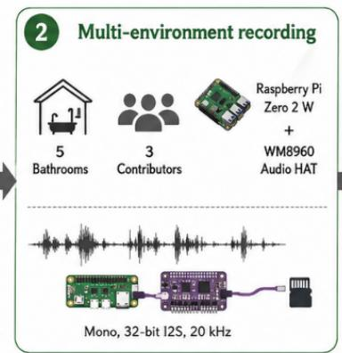

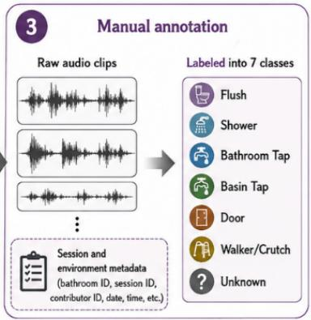

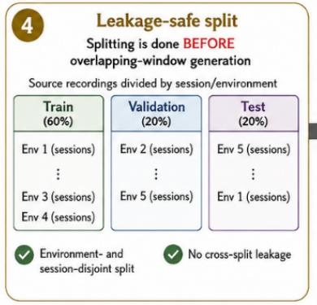

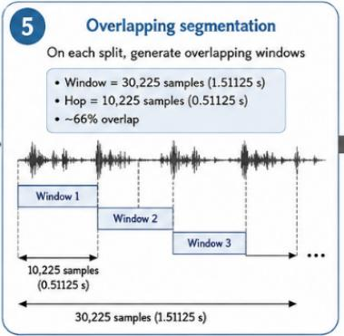

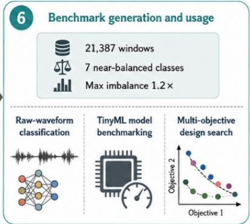  
Figure 3: Overview of the SnaanGhar7 data collection, annotation, preprocessing, and benchmark-generation pipeline.

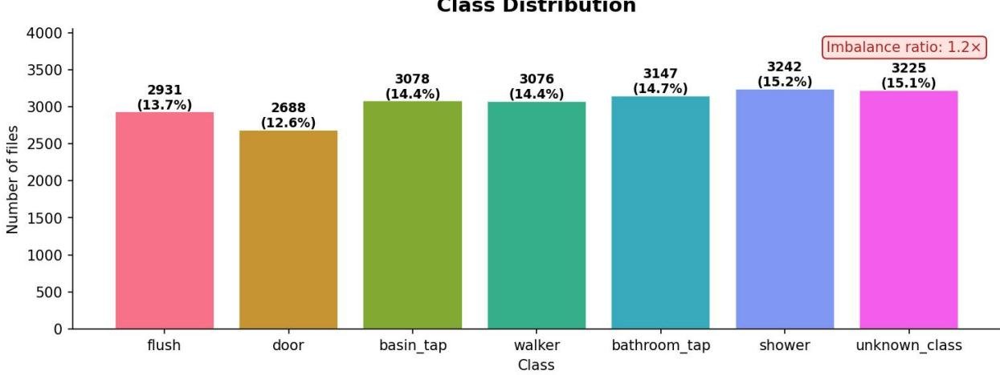  
Figure 4: Class distribution of the SnaanGhar7 dataset.

## 4.1 Signal-Level and Spectral Structure

We calculate low-level features such as the RMS energy, zero-crossing rate (ZCR), spectral kurtosis, and silence ratio for each clip, along with the mean power spectrum for each class. As shown in Fig. 5, the classes are distinct on several of these measures. The Door and Walker/Crutch clips, which include brief impulsive events, usually have higher kurtosis values and temporally localized signals. However, the Shower, Bathroom Tap, and Flush classes, which display extended broadband activity, are at the other extreme, and the Basin Tap class is intermediate. Kruskal-Wallis tests show that there are diferences among the seven classes on RMS, ZCR, and kurtosis (� < 0.001).

The power spectra provide a complementary view. As shown in Fig. 6, the sustained water classes share substantial midfrequency energy, suggesting that spectral overlap may make some of these classes dificult to separate. The mel-spectrogram examples in Fig. 7 show the same distinction in the time–frequency domain. The impulsive events are dominated by short onset structures, whereas Flush, Bathroom Tap, and Shower contain more sustained broadband energy.

Because SincDPNet operates directly on the waveform, temporal structure is also relevant. Figure 8 shows the average temporal energy profile for each class. The impulsive events contain a sharp onset followed by rapid decay, whereas the water-related classes maintain a more sustained energy envelope. These diferences provide temporal cues that complement the spectral information in Fig. 6. Their usefulness to the classifier is examined later through the learned representation and confusion analysis.

Figure 9 summarizes additional spectral descriptors, including centroid, bandwidth, roll-of, and flatness. The impulsive classes generally occupy higher-centroid and higher-flatness regions, while the sustained water classes are concentrated at lower centroids with smoother spectral profiles. These descriptors therefore provide another view of the same broad acoustic separation.

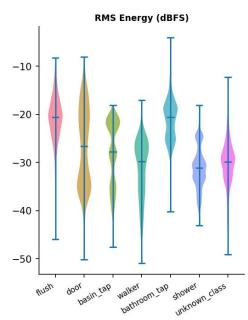

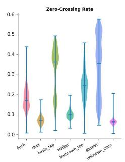

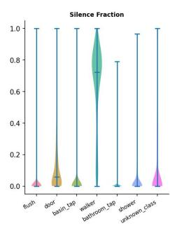

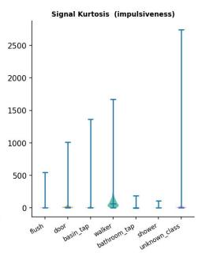

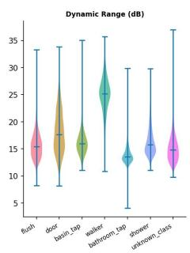  
Figure 5: Signal-level statistics per class (violin plots). Impulsive classes (Door, Walker/Crutch) show markedly higher kurtosis and zero-crossing rate than the sustained water classes, providing a purely time-domain axis of separation that a raw-waveform model can exploit.

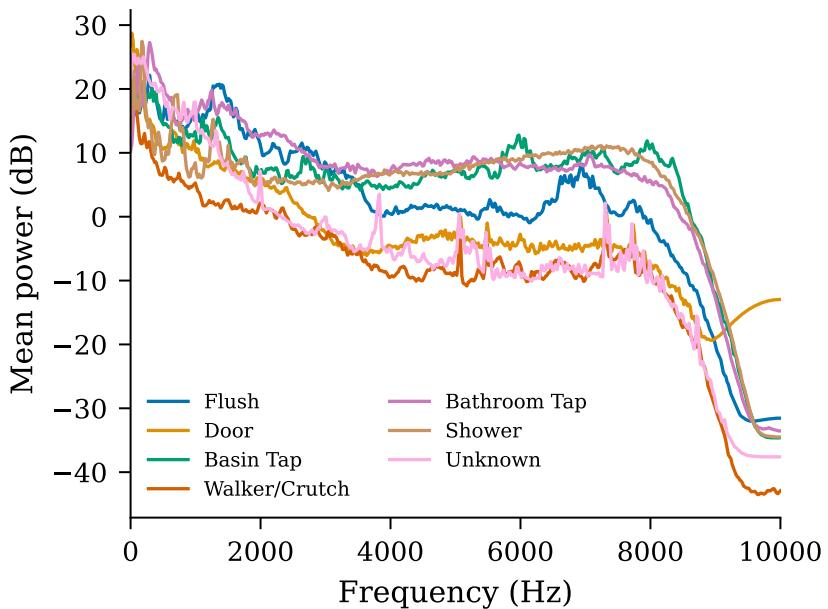  
Figure 6: Per-class mean power spectra. The sustained water classes (Flush, Shower, Bathroom Tap) overlap in the mid-frequency band, foreshadowing the model’s principal confusions, whereas impulsive classes carry distinct high-frequency transient energy.

Mel-Spectrograms — One Example per Class  
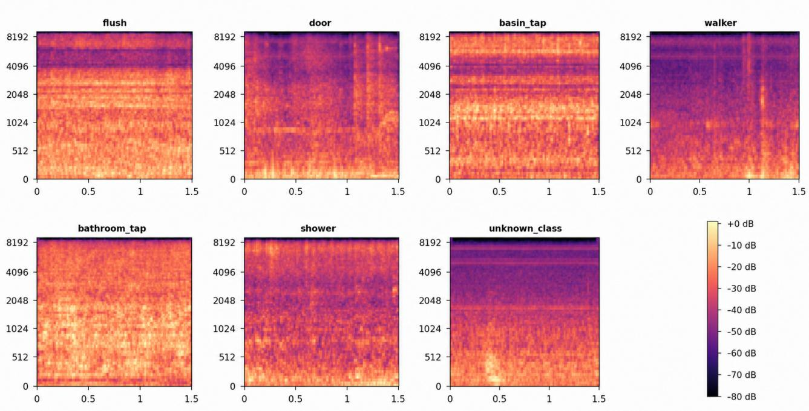  
Figure 7: Representative mel-spectrogram per class. Impulsive events (Door, Walker/Crutch) appear as brief vertical onset stripes; the sustained water classes fill the window with visually similar broadband energy, previewing their confusability.

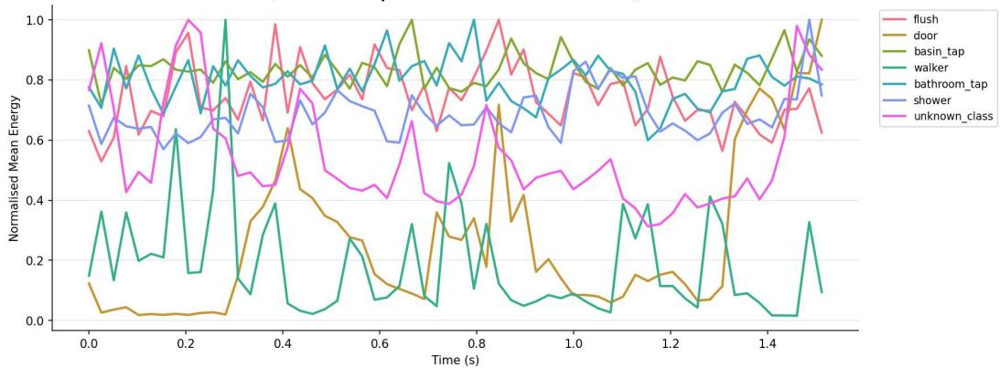  
Figure 8: Per-class temporal energy profile. Impulsive events (Door, Walker/Crutch) show a sharp onset and decay; sustained water events maintain a flat envelope. The onset structure gives a time-domain cue that complements the overlapping spectra of Fig. 6.

Within-class variability is shown in Fig. 10. The water-related classes exhibit relatively large internal spread, which is consistent with changes in flow rate, source position, and basin or room geometry. This variability is important because a class may be dificult to recognize not only when it overlaps with another class, but also when its own acoustic distribution is broad.

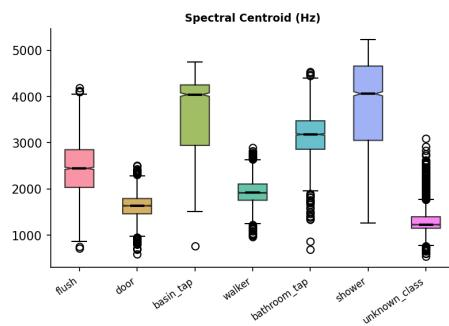

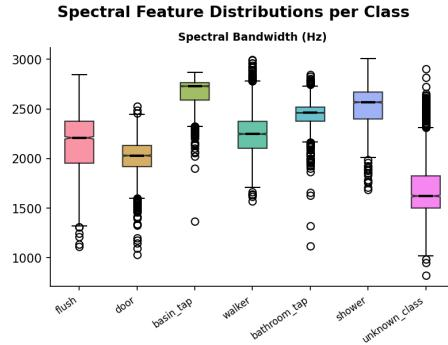

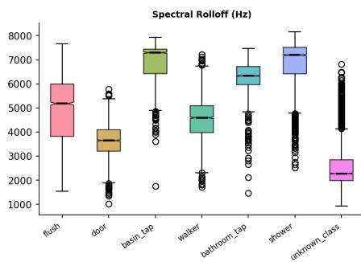

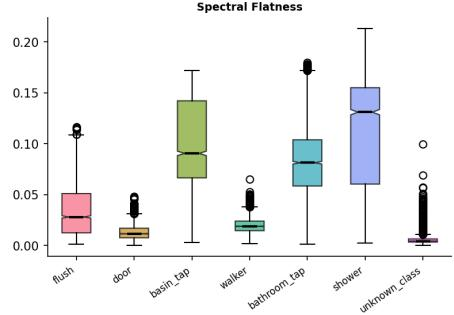

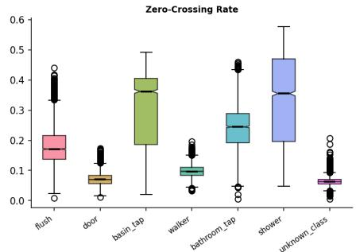

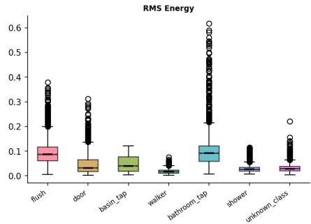  
Figure 9: Per-class spectral descriptors (centroid, bandwidth, roll-of, flatness). Impulsive classes show higher centroids and flatness; sustained water classes cluster at lower centroids with smoother spectra, separating the two families along the same axis the model exploits.

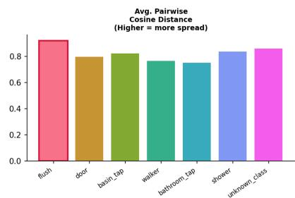

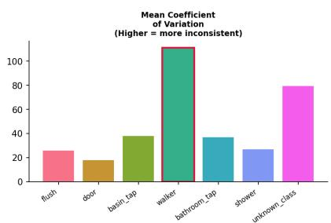

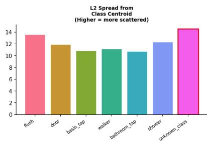  
Figure 10: Within-class variability per class. The sustained water classes are internally variable (flow rate, basin geometry) as well as mutually overlapping, whereas impulsive classes are tighter. The combination of high intra-class spread and high inter-class overlap that makes the water triad the hardest group.

## 4.2 Inter-Class Overlap and a Dificulty Score

The preceding analysis describes individual signal properties. We next quantify how strongly the class distributions overlap. For each pair of classes, we compute a Bhattacharyya-coeficient overlap using Gaussian approximations of selected spectral features. For two class distributions with means $\mu _ { i } , \mu _ { j }$ and variances $\sigma _ { i } ^ { 2 } , \sigma _ { j } ^ { 2 }$ , the Bhattacharyya coeficient is

$$
\begin{array} { r } { \mathrm { B C } ( i , j ) = \exp \Big ( - \frac { 1 } { 4 } \ln \Big [ \frac { 1 } { 4 } \Big ( \frac { \sigma _ { i } ^ { 2 } } { \sigma _ { j } ^ { 2 } } + \frac { \sigma _ { j } ^ { 2 } } { \sigma _ { i } ^ { 2 } } + 2 \Big ) \Big ] - \frac { 1 } { 4 } \frac { ( \mu _ { i } - \mu _ { j } ) ^ { 2 } } { \sigma _ { i } ^ { 2 } + \sigma _ { j } ^ { 2 } } \Big ) , } \end{array}\tag{1}
$$

with $\mathbf { B C } \in [ 0 , 1 ]$ , where larger values indicate greater overlap. The coeficient is averaged across the selected discriminative spectral features.

To summarize several sources of dificulty in a single quantity, we combine inter-class overlap, intra-class spread, class imbalance, silence fraction, and energy variability into a per-class diagnostic score $D _ { c }$

$$
D _ { c } = \sum _ { k } w _ { k } \ : \tilde { s } _ { k , c } ,\tag{2}
$$

where $\tilde { s } _ { k , c } \in [ 0 , 1 ]$ is the min–max-normalized value of diagnostic � for class $c , w _ { k } \ge 0 .$ , and $\begin{array} { r } { \sum _ { k } w _ { k } = 1 } \end{array}$ . Larger values therefore indicate classes that appear more dificult according to the selected signal-level diagnostics. We treat $D _ { c }$ as a descriptive heuristic rather than a predictor of model error; its sensitivity to the choice of weights is examined in Section 7.7. Table 5 reports the resulting ranking.

Table 5: Per-class dificulty ranking from the signal-level analysis (higher = predicted harder), computed before model training. The aggregate score is a heuristic: its class-level correlation with model error is weak $( \rho = - 0 . 0 7 )$ , while pairwise overlap is more useful for explaining specific confusions (Section 7.7).
<table><tr><td>Class</td><td> $D _ { c }$ </td><td>Mean overlap</td><td>Intra spread</td></tr><tr><td>Flush</td><td>0.74</td><td>0.50</td><td>0.92</td></tr><tr><td>Door</td><td>0.54</td><td>0.42</td><td>0.79</td></tr><tr><td>Basin Tap</td><td>0.45</td><td>0.46</td><td>0.81</td></tr><tr><td>Shower</td><td>0.43</td><td>0.47</td><td>0.83</td></tr><tr><td>Walker/Crutch</td><td>0.31</td><td>0.38</td><td>0.77</td></tr><tr><td>Bathroom Tap</td><td>0.25</td><td>0.42</td><td>0.76</td></tr><tr><td>Unknown Class</td><td>0.22</td><td>0.31</td><td>0.85</td></tr></table>

Figure 11 separates $D _ { c }$ into its five component diagnostics. The figure is useful because similar aggregate scores can arise for diferent reasons. Flush, for example, has relatively high inter-class overlap and intra-class spread, whereas the impulsive classes are influenced more by silence fraction and energy variability. The Unknown class shows substantial intra-class variation, consistent with its heterogeneous composition.

A linear-discriminant projection provides an additional view of class separability. Figure 12 projects the hand-crafted feature space onto the first two discriminant axes. The impulsive classes and Basin Tap occupy relatively distinct regions, whereas Flush, Bathroom Tap, and Shower remain partially overlapping. This pattern is consistent with the pairwise spectral analysis, although the two-dimensional projection should be interpreted qualitatively. A similar arrangement is later observed in the learned embedding space (Fig. 17).

## 4.3 Design Implications

The signal-level analysis provides two hypotheses for the model evaluation. First, the sustained water classes are expected to produce substantial cross-class confusion because of their spectral overlap and internal variability. Second, successful discrimination should depend on cues that remain distinct despite this overlap, including temporal onset structure and frequency regions in which the class spectra difer.

These are hypotheses about the acoustic structure of the data rather than claims about the behavior of a particular network. The extent to which they are supported, contradicted, or refined by SincDPNet is examined later through the learned filter responses, embedding structure, and confusion analysis in Section 7.7.

## 5. SincDPNet Architecture

The acoustic structure identified in Section 4 motivates a front end that is both frequency-aware and compact. SincDPNet operates directly on the raw waveform and consists of two stages: a learnable sinc band-pass front end that produces an interpretable time–frequency representation, followed by a depthwise-separable convolutional body for classification. Figure 13 shows the overall architecture.

## 5.1 Learnable Sinc Band-Pass Front End

The first layer is implemented as a filter bank whose filters are described by frequency parameters rather than free convolutional weights. Consider the ideal frequency response of a band-pass filter that passes frequencies between $f _ { 1 }$ and $f _ { 2 }$

Difficulty Profile Radar per Class  
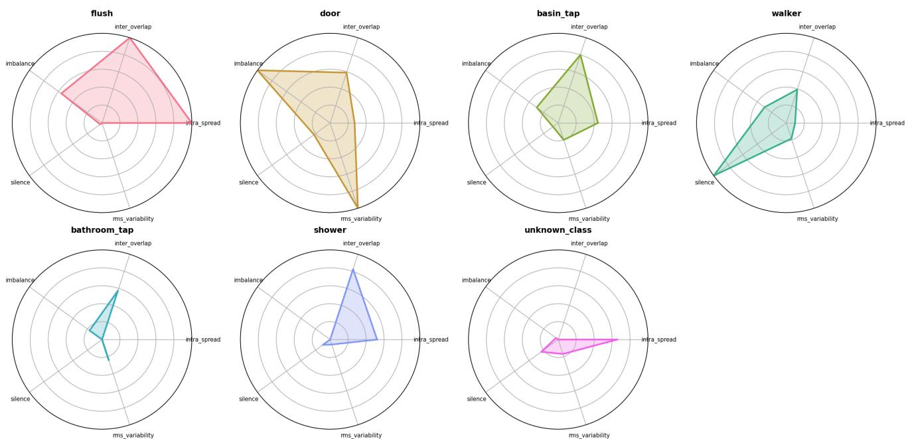  
Figure 11: Per-class dificulty profiles across the five component diagnostics of Eq. (2) (inter-class overlap, intra-class spread, class imbalance, silence fraction, energy variability). Each class is hard for a diferent combination of reasons; Flush scores high on both overlap and spread, while the impulsive classes are driven by silence and energy variability.

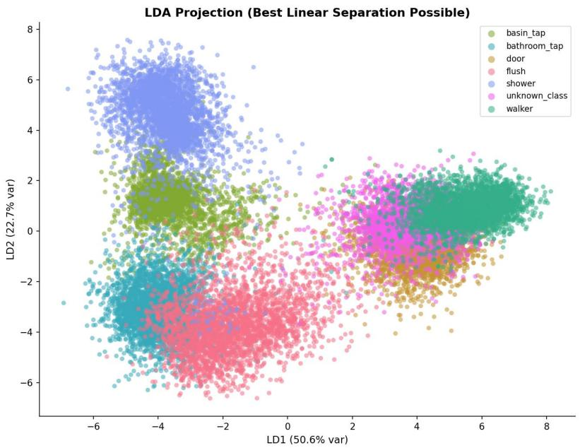  
Figure 12: Linear-discriminant projection of the hand-crafted feature space. Impulsive classes and Basin Tap separate cleanly, while the sustained water classes overlap even under the best linear projection, an intrinsic, model-independent property of the acoustics.

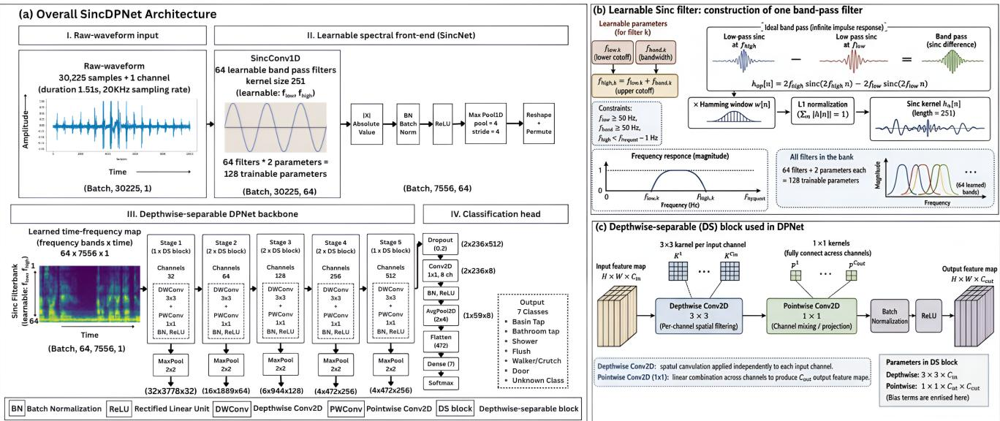  
Figure 13: SincDPNet architecture. A learnable sinc filter bank, parameterized by per-filter cutof and bandwidth in Hz, maps the raw waveform to $N _ { f }$ band-pass channels. A depthwise-separable convolutional body then performs classification. The front end contains only $2 N _ { f }$ trainable parameters.

$$
G ( f ) = \mathrm { r e c t } \biggl ( \frac { f } { 2 f _ { 2 } } \biggr ) - \mathrm { r e c t } \biggl ( \frac { f } { 2 f _ { 1 } } \biggr ) ,\tag{3}
$$

where rect(·) is 1 on $[ - \frac { 1 } { 2 } , \thinspace \frac { 1 } { 2 } ]$ and 0 elsewhere. Since the inverse Fourier transform of a rectangle of width $2 f _ { c }$ is $2 f _ { c }$ sinc $( 2 \pi f _ { c } n )$ the corresponding time-domain band-pass impulse response can be written as the diference of two low-pass responses,

$$
g [ n ; f _ { 1 } , f _ { 2 } ] = 2 f _ { 2 } \operatorname { s i n c } ( 2 \pi f _ { 2 } n ) - 2 f _ { 1 } \operatorname { s i n c } ( 2 \pi f _ { 1 } n ) ,\tag{4}
$$

where sinc $( x ) = \sin ( x ) / x .$ , sinc(0) = 1, and frequencies are normalized by the sampling rate $f _ { s }$ . Thus, a filter of length � is determined by only two frequency parameters rather than � independent coeficients. Following SincNet [30], the filter shape is fixed by Eq. (4), while its frequency limits are learned from the data.

Filter � is parameterized by a low cutof $f _ { 1 } ^ { ( i ) }$ and bandwidth $b ^ { ( i ) }$ :

$$
f _ { 1 } ^ { ( i ) } = f _ { \operatorname * { m i n } } + | \hat { f } _ { 1 } ^ { ( i ) } | , \qquad f _ { 2 } ^ { ( i ) } = \operatorname * { m i n } \bigl ( f _ { 1 } ^ { ( i ) } + f _ { \operatorname * { m i n } } + | \hat { b } ^ { ( i ) } | , ~ f _ { s } / 2 \bigr ) ,\tag{5}
$$

so that the cutofs remain positive and below the Nyquist frequency during training. Only $\hat { f } _ { 1 } ^ { ( i ) }$ and $\hat { b } ^ { ( i ) }$ are trainable. To reduce spectral leakage caused by the finite kernel length �, each filter is multiplied by a Hamming window �[�],

$$
\begin{array} { r } { g _ { w } [ n ; i ] = g [ n ; f _ { 1 } ^ { ( i ) } , f _ { 2 } ^ { ( i ) } ] w [ n ] , \qquad n = - \frac { L - 1 } { 2 } , \ldots , \frac { L - 1 } { 2 } . } \end{array}\tag{6}
$$

The input waveform is convolved with the $N _ { f }$ filters, followed by magnitude computation, batch normalization, ReLU activation, and temporal max-pooling. Importantly, the number of trainable front-end parameters is independent of $L \colon$ the complete filter bank requires only $2 N _ { f }$ parameters. Since these parameters define frequency limits, the learned passbands can also be inspected directly in hertz after training (Section 7.6).

Relation to SincNet. SincDPNet adopts the sinc-filter parameterization introduced in SincNet [30], in which each first-layer band-pass filter is controlled by two frequency parameters rather than � free coeficients. The main architectural diference lies in the processing that follows this front end. SincNet was developed for speaker recognition and uses standard convolutional layers followed by large fully connected classification layers, resulting in a model with on the order of $1 0 ^ { 5 }$ parameters.

SincDPNet instead reshapes the $N _ { f }$ band-pass outputs into a two-dimensional time–frequency representation (Section 5.2) and processes it using a depthwise-separable convolutional body. This substantially reduces the cost of the back end while retaining the frequency interpretation of the sinc filters. The resulting compact configuration contains only a few thousand parameters and is approximately 28× smaller than the SincNet implementation considered in Table 10. The architectural contribution therefore lies in combining the interpretable sinc front end with a lightweight depthwise-separable body designed for resource-constrained acoustic classification

## 5.2 Depthwise-Separable Convolutional Body

After temporal pooling, the front end produces $N _ { f }$ band-pass channels of length �. These are reshaped into a two-dimensional map $\mathbf { X } \in \bar { \mathbb { R } } ^ { N _ { f } \times \bar { T } \times 1 }$ , where the vertical axis indexes the learned frequency bands and the horizontal axis represents time. The resulting representation is analogous to a spectrogram, except that the frequency bands are learned directly from the waveform. To keep the subsequent processing compact, the network uses depthwise-separable convolutions. Consider a convolutional layer with a $k \times k$ kernel that maps $C _ { \mathrm { i n } }$ input channels to $C _ { \mathrm { o u t } }$ output channels over a feature map of size $H \times W$ . A standard convolution requires

$$
P _ { \mathrm { s t d } } = k ^ { 2 } C _ { \mathrm { i n } } C _ { \mathrm { o u t } } \quad { \mathrm { p a r a m e t e r s , a n d } } \quad M _ { \mathrm { s t d } } = k ^ { 2 } C _ { \mathrm { i n } } C _ { \mathrm { o u t } } H W\tag{7}
$$

multiply–accumulate operations. A depthwise-separable convolution decomposes this operation into a depthwise convolution followed by a pointwise convolution. The depthwise stage applies one $k \times k$ kernel to each input channel independently, while the $1 \times 1$ pointwise stage combines information across channels. The resulting costs are

$$
\begin{array} { r l r } { P _ { \mathrm { d s } } = } & { } & { \underbrace { k ^ { 2 } C _ { \mathrm { i n } } } _ { \mathrm { d e p t h w i s e } } + \underbrace { C _ { \mathrm { i n } } C _ { \mathrm { o u t } } } _ { \mathrm { p o i n t w i s e } } , \qquad M _ { \mathrm { d s } } = \left( k ^ { 2 } C _ { \mathrm { i n } } + C _ { \mathrm { i n } } C _ { \mathrm { o u t } } \right) H W . } \end{array}\tag{8}
$$

Dividing Eq. (8) by Eq. (7) gives

$$
\frac { P _ { \mathrm { d s } } } { P _ { \mathrm { s t d } } } = \frac { k ^ { 2 } C _ { \mathrm { i n } } + C _ { \mathrm { i n } } C _ { \mathrm { o u t } } } { k ^ { 2 } C _ { \mathrm { i n } } C _ { \mathrm { o u t } } } = \frac { 1 } { C _ { \mathrm { o u t } } } + \frac { 1 } { k ^ { 2 } } .\tag{9}
$$

For the $k = 3$ kernels used here, this becomes $1 / C _ { \mathrm { o u t } } + 1 / 9 . \mathrm { A s } \ C _ { \mathrm { o u t } }$ increases, the parameter cost therefore approaches approximately one ninth of that of a corresponding standard convolution.

The convolutional body contains � such blocks. Each block applies a depthwise-separable convolution, batch normalization, ReLU activation, and, when the relevant spatial dimensions permit, $2 \times 2$ max-pooling. The channel width is defined as

$$
C _ { b } = \operatorname * { m i n } \bigl ( \alpha 2 ^ { b } , 8 \alpha \bigr ) , \qquad b = 0 , \ldots , B - 1 ,\tag{10}
$$

where the width multiplier � controls the number of channels and the growth saturates at $8 \alpha .$ . The parameters � and � therefore control the size of the convolutional body and are included in the design space explored in Section 6.

Global average pooling of the final feature map produces an embedding $\mathbf { z } \in \mathbb { R } ^ { C _ { B - 1 } }$ . A linear classification layer followed by softmax gives

$$
p ( y = c \mid \mathbf { x } ) = \frac { \exp ( \mathbf { w } _ { c } ^ { \top } \mathbf { z } + b _ { c } ) } { \sum _ { c ^ { \prime } = 1 } ^ { C } \exp ( \mathbf { w } _ { c ^ { \prime } } ^ { \top } \mathbf { z } + b _ { c ^ { \prime } } ) } ,\tag{11}
$$

where ${ \bf w } _ { c }$ and $b _ { c }$ denote the classifier weights and bias for class �, and $^ { c , }$ $C = 7$ is the number of classes. The network is trained by minimizing the cross-entropy loss

$$
\mathcal { L } = - \frac { 1 } { N } \sum _ { n = 1 } ^ { N } \log p ( y = y _ { n } \mid \mathbf { x } _ { n } ) ,
$$

where ${ \bf { X } } _ { n }$ and $y _ { n }$ denote the �th training clip and its corresponding label.

## 5.3 Parameter and Complexity Budget

Table 6 summarizes the parameter allocation of the compact $N _ { f } = 2 5$ configuration, one of the representative designs evaluated in Section 7. The sinc filter bank contributes only a small fraction of the total parameter count, while most parameters belong to the convolutional body and classification head. Model size is therefore controlled primarily by the body configuration and the number of sinc filters, both of which are explored in the multi-objective design study of Section 6.

Table 6: Parameter budget of the compact SincDPNet $( N _ { f } = 2 5 )$ . The filter-bank parameter count is independent of kernel length �.

<table><tr><td>Component</td><td>Parameters</td><td>Share</td></tr><tr><td>Sinc front-end  $( 2 N _ { f } )$ </td><td>50</td><td>1.76%</td></tr><tr><td>Depthwise-separable body + head</td><td>2,798</td><td>98.24%</td></tr><tr><td>Total</td><td>2,848</td><td>100%</td></tr></table>

## 6. Multi-Objective Design Optimization: A Practical Case Study

This section describes the design procedure used to select representative SincDPNet configurations. A quality-based coreset is first used to reduce the cost of evaluating candidate architectures. The design problem is then studied through two bi-objective searches covering the accuracy–size and accuracy–latency trade-ofs. We finally examine the sensitivity of the search to the acquisition function and surrogate kernel, and select representative operating points from the resulting Pareto fronts.

## 6.1 Scope and Framing

Multi-objective Bayesian optimization (MOBO) is used here as an engineering tool for exploring the SincDPNet design space rather than as a methodological contribution. The aim is to make the model-selection procedure reproducible while avoiding manual tuning of the accuracy–size and accuracy–latency trade-ofs. Section 6.4 examines whether the selected design region is sensitive to the acquisition function or surrogate kernel.

To reduce the computational cost of each search evaluation, candidate models are trained on a quality-based coreset. Each training clip is assigned a composite score based on estimated SNR, clipping fraction, silence fraction, spectral flatness, and within-class outlierness. The highest-scoring fraction within each class is retained for the search (Fig. 14); in the experiments reported here, this fraction is 25%.

The purpose of the coreset is to provide a lower-cost estimate of relative candidate quality rather than to replace full-data training. Figure 14b compares validation macro-F1 obtained from the 25% coreset with the corresponding result after full-data retraining for the same candidate architectures. The observed rank agreement supports its use for ordering candidates during search. All selected configurations are subsequently retrained on the complete training set before final evaluation.

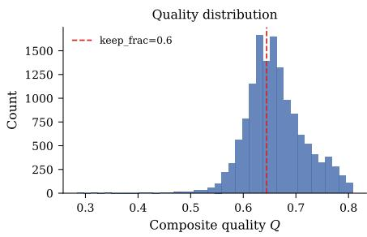

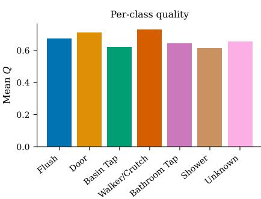  
(a) Quality-score distribution.

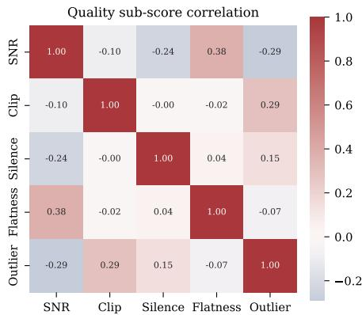  
(b) Coreset vs. full-data accuracy.

Figure 14: Quality-based coreset construction. (a) Distribution of the composite quality score across training clips; the top 25% per class is retained for search. (b) Validation macro-F1 for the same candidate architectures under coreset and full-data training. The reported rank correlation indicates how well the coreset preserves the ordering used during optimization.

With the reduced evaluation set established, we next define the design variables and optimization objectives.

## 6.2 Search Space and Objectives

Table 7 summarizes the design variables. Two independent bi-objective studies are considered:

• Study A: maximize validation macro-F1 and minimize model size (FP32 parameter footprint, KB);

• Study B: maximize validation accuracy and minimize inference latency (ms) measured on the target class of device.

The two studies are kept separate because they address diferent deployment trade-ofs and are influenced diferently by the architectural variables. Study A emphasizes parameter footprint, whereas Study B explicitly includes measured inference time. Separate two-dimensional Pareto fronts also allow the corresponding trade-ofs to be inspected directly.

Table 7: Design variables for the MOBO case study.
<table><tr><td>Variable</td><td>Symbol</td><td>Range</td><td>Primarily affects</td></tr><tr><td>Sinc filters</td><td>Nf</td><td>16-128</td><td>size, F1, resolution</td></tr><tr><td>Sinc kernel length</td><td>L</td><td>101–401 (odd)</td><td>latency, F1</td></tr><tr><td>Body width mult.</td><td>α</td><td>2-12</td><td>size (dominant)</td></tr><tr><td>DS-conv blocks</td><td>B</td><td>3-6</td><td>size, latency</td></tr><tr><td>Peak LR</td><td>η</td><td> $1 0 ^ { - 3 } – 3 { \times } 1 0 ^ { - 2 }$ </td><td>F1 (convergence)</td></tr><tr><td>Pooling stride</td><td>S</td><td>{2, 4, 8}</td><td>latency, F1</td></tr></table>

## 6.3 MOBO Formulation

Let x denote a candidate configuration and $\mathbf { f } ( \mathbf { x } ) = ( f _ { 1 } ( \mathbf { x } ) , f _ { 2 } ( \mathbf { x } ) )$ denote the two objectives after sign adjustment so that both are minimized. An independent Gaussian-process (GP) surrogate is fitted to each objective. Candidate selection uses the �-Expected Hypervolume Improvement (qEHVI) acquisition [8] relative to a reference point r dominated by all feasible outcomes,

$$
\mathbf { x } ^ { \star } = \arg \operatorname* { m a x } _ { \mathbf { x } } ~ \mathbb { E } \big [ \operatorname { H V I } \big ( \{ \mathbf { f } ( \mathbf { x } ) \} \cup \mathcal { P } \big ) \big | \mathcal { D } \big ] ,\tag{12}
$$

where $\mathcal { P }$ is the current Pareto set, HVI denotes the hypervolume improvement relative to r, and D is the set of evaluated configurations. The search begins with a Sobol design of $n _ { 0 }$ configurations and continues for a total budget of � evaluations [11]. Algorithm 1 summarizes the procedure.

Algorithm 1 MOBO design loop (per study)   
1: Draw Sobol design $\big \{ \mathbf { x } _ { 1 } , \ldots , \mathbf { x } _ { n _ { 0 } } \big \} ;$ ; evaluate f on validation split   
2: Initialize Pareto set $\mathcal { P } ;$ fit GP surrogates   
3: for $t = n _ { 0 } + 1$ to � do   
4: x ← arg max qEHVI (Eq. 12)   
5: Train configuration $\mathbf { x } _ { t } ;$ evaluate $\mathbf { f } ( \mathbf { x } _ { t } )$ on validation   
6: Update $\mathcal { P } ;$ refit surrogates; log hypervolume   
7: end for   
8: return Pareto set $\mathcal { P }$ and knee-point configurations

All objectives used during optimization are computed on the validation split. The held-out test set is used only after configuration selection for the results reported in Section 7. For Study B, latency is measured on the target device rather than inferred from training-GPU timing.

## 6.4 Acquisition and Kernel Sensitivity

To examine whether the search outcome depends strongly on one optimizer setting, Study A is repeated with several acquisition functions and surrogate kernels at the same evaluation budget. Table 8 compares qEHVI, qNEHVI, and qParEGO with Matérn- ${ \cdot } 5 / 2$ and RBF kernels, together with a random/Sobol baseline. Figure 15 shows the corresponding hypervolume trajectories.

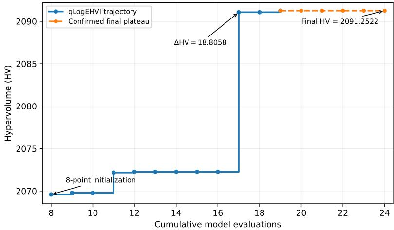  
Figure 15: Hypervolume versus evaluation for Study A. The surrogate-guided configurations reach similar final hypervolume values and outperform random search within the fixed evaluation budget.

The four surrogate-guided settings finish within 1.84 hypervolume units of one another, corresponding to approximately 0.088% of the best final value. In comparison, the diference between the best surrogate run (C1, qEHVI with a Matérn-5/2 kernel; $\mathrm { H V } = 2 0 9 1 . 2 7 )$ and random search $( \mathrm { C } 5 ; \mathrm { H V } = 2 0 7 8 . 4 9 )$ is 12.78 units, or approximately 0.61%.

The convergence rates show the same pattern. C1 reaches 90% of its hypervolume gain after 17 evaluations, and all surrogate-guided settings reach this level within 22 evaluations. Random search does not reach the same threshold within the 24-evaluation budget. Within the settings examined here, the final design is therefore relatively insensitive to the particular acquisition/kernel combination, while surrogate-guided search reaches the high-hypervolume region more consistently within the available budget.

Table 8: Acquisition and kernel sensitivity for Study A at a fixed budget of 24 model evaluations. Higher final hypervolume (HV) is better, while “Evals to 90%” indicates the evaluations required to reach 90% of the best HV gain. Best values are shown in bold.
<table><tr><td>Config</td><td>Acquisition</td><td>Kernel</td><td>Final HV</td><td>Evals to 90%</td></tr><tr><td>C1</td><td>qEHVI</td><td>Matérn-5/2</td><td>2091.27</td><td>17</td></tr><tr><td>C2</td><td>qNEHVI</td><td>Matérn-5/2</td><td>2090.65</td><td>18</td></tr><tr><td>C3</td><td>qParEGO</td><td>Matérn-5/2</td><td>2089.43</td><td>22</td></tr><tr><td>C4</td><td>qEHVI</td><td>RBF</td><td>2090.12</td><td>19</td></tr><tr><td>C5</td><td>Random</td><td>一</td><td>2078.49</td><td>&gt; 24</td></tr></table>

## 6.5 Configuration Selection by Weighted Scoring

Figure 16 shows the Pareto fronts obtained from the two design studies. For Study A, a weighted score is also recorded for each of the 24 evaluated configurations to summarize the validation macro-F1–size trade-of. The highest-scoring configuration uses $N _ { f } = 7 8 , \alpha = 4$ , and five blocks, with validation macro-F1 0.8443, model size 13.3 KB, and a weighted score of 0.8523. The highest validation macro-F1, 0.8942, is obtained by the larger $N _ { f } = 5 9 , \alpha = 1 0$ , five-block configuration, which occupies 54.8 KB. The two configurations therefore represent diferent operating points on the same accuracy–size trade-of.

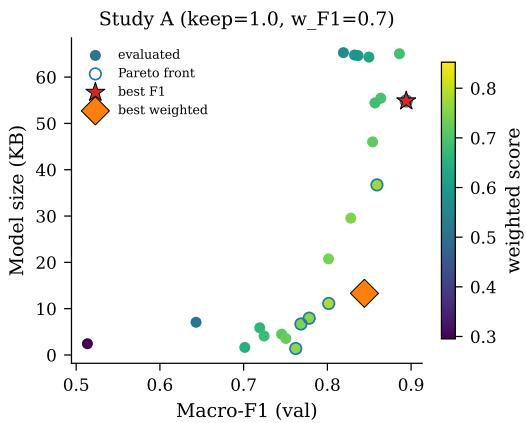  
(a) Study A: F1 vs. size.

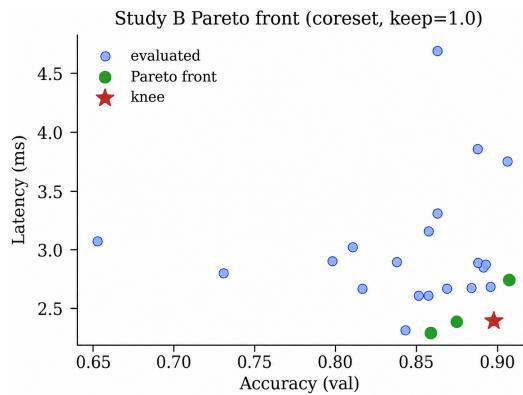  
(b) Study B: accuracy vs. latency.  
Figure 16: Pareto fronts from the two design studies. Dominated configurations are shown faded; points are colored by weighted score, and the highest-F1 and highest weighted-score selections are marked.

The non-dominated Study-A configurations cover a broad range of model sizes and validation macro-F1 values, from 1.4 KB and 0.7622 macro-F1 to 54.8 KB and 0.8942. Seven of the 24 configurations are Pareto-optimal in the macro-F1–size plane. The results also show that a larger parameter footprint does not necessarily produce higher validation performance; several configurations near 65 KB, for example, obtain lower macro-F1 than the 13.3 KB highest-score model. Table 9 reports all evaluated Study-A configurations. The compact $N _ { f } = 2 5$ configuration used elsewhere in the paper is retained as one of the representative operating points.

The representative operating points selected from this analysis are evaluated under the environment-disjoint protocol in Section 7.

## 7. Experiments and Results

This section evaluates SincDPNet under environment-disjoint splitting. We first describe the experimental protocol and compare the proposed models with representative raw-waveform and MFCC-based baselines. We then examine the embedding structure, architectural ablations, and learned sinc filters. Finally, the observed classification errors are related to the acoustic properties of the corresponding classes. The source code, model implementation, and experimental scripts used in this study are publicly available in the project repository.2

## 7.1 Experimental Setup

We compare SincDPNet against six baselines spanning both input domains: raw-waveform models (DPNet [6], ACDNet [24], SincNet [30]) and MFCC models (DS-CNN [36], CRNN [3], TinyCNN [36]).

Splitting. The recordings come from five environments, each with its own room response. A random clip-level split would therefore place acoustically related windows from the same environment in both training and test sets. We avoid this by using an environment-disjoint split: each recording environment is assigned entirely to training, validation, or testing. All models are evaluated using the same assignments. We additionally report leave-one-environment-out (LOEO) cross-validation to assess generalization across environments

Table 9: Study-A configurations ranked according to the weighted score. $N _ { f }$ denotes the number of sinc filters, � denotes the width multiplier, and � denotes the number of depthwise-separable blocks. A ★ indicates a Pareto-optimal configuration in the Macro-F1–model-size plane. Bold values indicate the best overall values.
<table><tr><td rowspan="2">Rank</td><td colspan="3">Architecture</td><td colspan="2">Performance</td><td colspan="2">Selection</td></tr><tr><td> $N _ { f }$ </td><td>α</td><td>B</td><td>Size (KB)</td><td>Macro-F1</td><td>Weighted</td><td>Pareto</td></tr><tr><td></td><td>78</td><td>4</td><td>5</td><td>13.3</td><td>0.8443</td><td>0.8523</td><td>★</td></tr><tr><td>123</td><td>25</td><td>6</td><td>4</td><td>11.1</td><td>0.8016</td><td>0.7842</td><td>★</td></tr><tr><td></td><td>24</td><td></td><td></td><td>36.7</td><td>0.8592</td><td>0.7698</td><td>★</td></tr><tr><td>4</td><td>20</td><td>823</td><td>53</td><td>1.4</td><td>0.7622</td><td>0.7574</td><td>★</td></tr><tr><td>5</td><td>24</td><td></td><td>5</td><td>7.9</td><td>0.7783</td><td>0.7562</td><td>★</td></tr><tr><td>6</td><td>59</td><td>10</td><td></td><td>54.8</td><td>0.8942</td><td>0.7490</td><td>★</td></tr><tr><td>7</td><td>34</td><td>7</td><td>55</td><td>29.5</td><td>0.8279</td><td>0.7460</td><td>一</td></tr><tr><td>8</td><td>110</td><td>2</td><td>5</td><td>6.7</td><td>0.7684</td><td>0.7439</td><td>★</td></tr><tr><td>9</td><td>23</td><td>9</td><td>4</td><td>20.7</td><td>0.8014</td><td>0.7385</td><td></td></tr><tr><td>10</td><td>62</td><td>4</td><td>3</td><td>3.6</td><td>0.7505</td><td>0.7256</td><td></td></tr><tr><td>11</td><td>69</td><td>9</td><td>5</td><td>46.0</td><td>0.8540</td><td>0.7166</td><td></td></tr><tr><td>12</td><td>16</td><td>2</td><td>5555333</td><td>4.5</td><td>0.7454</td><td>0.7119</td><td></td></tr><tr><td>13</td><td>84</td><td>10</td><td></td><td>55.4</td><td>0.8638</td><td>0.6904</td><td></td></tr><tr><td>14</td><td>72</td><td>11</td><td></td><td>65.0</td><td>0.8861</td><td>0.6862</td><td></td></tr><tr><td>15</td><td>41</td><td>10</td><td></td><td>54.4</td><td>0.8568</td><td>0.6823</td><td></td></tr><tr><td>16</td><td>112</td><td></td><td></td><td>4.1</td><td>0.7245</td><td>0.6753</td><td></td></tr><tr><td>17</td><td>60</td><td>372</td><td></td><td>5.9</td><td>0.7192</td><td>0.6574</td><td></td></tr><tr><td>18</td><td>30</td><td></td><td></td><td>1.6</td><td>0.7014</td><td>0.6445</td><td></td></tr><tr><td>19</td><td>41</td><td>11</td><td>5</td><td>64.3</td><td>0.8496</td><td>0.6225</td><td></td></tr><tr><td>20</td><td>55</td><td>11</td><td>55</td><td>64.6</td><td>0.8366</td><td>0.5972</td><td></td></tr><tr><td>21</td><td>60</td><td>11</td><td></td><td>64.8</td><td>0.8324</td><td>0.5888</td><td></td></tr><tr><td>22</td><td>82</td><td>11</td><td>5</td><td>65.3</td><td>0.8192</td><td>0.5621</td><td></td></tr><tr><td>23</td><td>111</td><td>72</td><td>33</td><td>7.1</td><td>0.6431</td><td>0.5119</td><td></td></tr><tr><td>24</td><td>64</td><td></td><td></td><td>2.4</td><td>0.5134</td><td>0.2952</td><td></td></tr></table>

Fixed split and LOEO protocol. For the main experiment, E01–E03 are used for training, E04 for validation, and E05 for testing. The LOEO evaluation contains five folds. In each fold, one environment is reserved for testing, one of the remaining environments is used for validation, and the other three are used for training. Model selection uses only the validation environment.

Training and metrics. Waveforms are peak-normalized and center-cropped or padded to 30,225 samples. Amplitude augmentation of ±25% is applied only to the training set after splitting. Models are trained using class-balanced categorical cross-entropy. Accuracy, balanced accuracy, macro-F1, and Matthews correlation coeficient (MCC) are reported as mean ± standard deviation over three random seeds. Macro-F1 and MCC are given particular attention because they provide information about class-wise performance that is not captured by overall accuracy alone.

## 7.2 Benchmark Results

Table 10 summarizes the environment-disjoint results. The baseline models obtain accuracies between 69.3% and 76.7% and macro-F1 scores between 0.612 and 0.712. These values are substantially lower than the near-saturated results obtained with random clip-level splitting on the same corpus. The diference is expected because random splitting allows windows from the same recording environment to occur in both training and test sets. The environment-disjoint protocol therefore provides a more demanding estimate of performance in a previously unseen room.

Among the proposed configurations, the best-F1 SincDPNet reaches 80.2% accuracy, 0.847 balanced accuracy, and 0.760 macro-F1 with 14,040 parameters. The rank-1 configuration reduces the model to 3,408 parameters while retaining 0.673 macro-F1 and 0.714 MCC. The compact $N _ { f } = 2 5$ model is the smallest model in the comparison, with 2,848 parameters, and obtains 75.7% accuracy, 0.661 macro-F1, and 0.716 MCC.

The compact model is particularly informative when compared with DPNet, since the two models have similar lightweight backbones. Replacing the generic convolutional front end with the sinc parameterization increases macro-F1 from 0.612 to 0.661 and MCC from 0.645 to 0.716 while reducing the parameter count from 4,944 to 2,848. At the other end of the trade-of, the best-F1 SincDPNet achieves the highest accuracy, balanced accuracy, and macro-F1 in Table 10, whereas TinyCNN retains the highest MCC. The results therefore provide several useful operating points rather than a single configuration that is preferable under every resource budget.

## 7.3 Raw-Waveform versus Spectral-Domain Analysis

The benchmark also allows us to examine whether raw-waveform input alone provides an advantage over MFCC-based representations. Among the baseline models, there is no consistent separation between the two input domains. SincNet obtains a macro-F1 of 0.712, slightly above the 0.705 of DS-CNN, whereas the raw-waveform ACDNet and DPNet obtain lower scores of 0.639 and 0.612, respectively.

These results suggest that the choice of front end is more consequential than the input representation by itself. In particular, both SincNet and SincDPNet constrain the first layer to learn band-pass filters, whereas ACDNet and DPNet use generic convolutional filters. The direct comparison between the compact SincDPNet and DPNet supports this interpretation: SincDPNet achieves higher macro-F1 and MCC with fewer parameters. For the present small-data setting, imposing physically meaningful structure on the front end appears to be an efective use of a limited parameter budget. To see whether this

Table 10: Performance comparison on SnaanGhar7 under environment-disjoint splitting. Results are reported as mean ± standard deviation over three random seeds. Parameter counts are exact. The best result in each metric is shown in bold.
<table><tr><td>Model</td><td>Input</td><td>Params</td><td> $\mathbf { A c c . } \left( \% \right)$ </td><td> $\mathbf { B a l . \ A c c . }$ </td><td>Macro-F1</td><td>MCC</td></tr><tr><td>DS-CNN [36]</td><td>MFCC</td><td>18,311</td><td> $7 5 . 3 \pm 6 . 8$ </td><td> $0 . 8 1 1 \pm 0 . 0 5 3$ </td><td> $0 . 7 0 5 \pm 0 . 0 6 3$ </td><td> $0 . 7 1 5 \pm 0 . 0 7 1$ </td></tr><tr><td>CRNN [3]</td><td>MFCC</td><td>236,967</td><td> $7 4 . 6 \pm 4 . 3$ </td><td> $\mathbf { 0 . 8 2 6 \pm 0 . 0 2 4 }$ </td><td> $0 . 6 9 5 \pm 0 . 0 2 7$ </td><td> $0 . 7 0 9 \pm 0 . 0 4 1$ </td></tr><tr><td>TinyCNN [36]</td><td>MFCC</td><td>93,575</td><td> $7 6 . 5 \pm 7 . 4$ </td><td> $0 . 8 0 9 \pm 0 . 0 5 8$ </td><td> $0 . 6 9 8 \pm 0 . 0 7 0$ </td><td> $\mathbf { 0 . 7 2 9 \pm 0 . 0 7 6 }$ </td></tr><tr><td>SincNet [30]</td><td>Raw</td><td>132,327</td><td> ${ \bf 7 6 . 7 \pm 1 . 8 }$ </td><td> $0 . 8 0 9 \pm 0 . 0 2 7$ </td><td> $\mathbf { 0 . 7 1 2 \pm 0 . 0 1 3 }$ </td><td> $0 . 7 2 1 \pm 0 . 0 2 3$ </td></tr><tr><td>ACDNet [24]</td><td>Raw</td><td>22,055</td><td> $7 1 . 7 \pm 3 . 0$ </td><td> $0 . 7 2 9 \pm 0 . 0 3 2$ </td><td> $0 . 6 3 9 \pm 0 . 0 3 3$ </td><td> $0 . 6 7 0 \pm 0 . 0 2 8$ </td></tr><tr><td>DPNet [6]</td><td>Raw</td><td>4,944</td><td> $6 9 . 3 \pm 2 . 0$ </td><td> $0 . 6 8 9 \pm 0 . 0 1 6$ </td><td> $0 . 6 1 2 \pm 0 . 0 0 9$ </td><td> $0 . 6 4 5 \pm 0 . 0 2 0$ </td></tr><tr><td colspan="7">Proposed SincDPNet configurations</td></tr><tr><td>SincDPNet best-F1</td><td>Raw</td><td>14,040</td><td> $8 0 . 2 \pm 3 . 2 $ </td><td> $0 . 8 4 7 \pm 0 . 0 2 2$ </td><td> $0 . 7 6 0 \pm 0 . 0 1 9$ </td><td> $0 . 7 1 6 \pm 0 . 0 5 2$ </td></tr><tr><td>SincDPNet rank-1</td><td>Raw</td><td>3,408</td><td> $7 5 . 6 \pm 1 . 8$ </td><td> $0 . 8 2 1 \pm 0 . 0 1 2$ </td><td> $0 . 6 7 3 \pm 0 . 0 2 9$ </td><td> $0 . 7 1 4 \pm 0 . 0 2 0$ </td></tr><tr><td>SincDPNet compact  $( N _ { f } { = } 2 5 )$ </td><td>Raw</td><td>2,848</td><td> $7 5 . 7 \pm 3 . 8$ </td><td> $0 . 8 0 1 \pm 0 . 0 6 2$ </td><td> $0 . 6 6 1 \pm 0 . 0 4 9$ </td><td> $0 . 7 1 6 \pm 0 . 0 4 2$ </td></tr></table>

Note: All results are reported as mean ± standard deviation over three random seeds. Parameter counts are exact.  
distinction is also reflected in the learned representation, we next examine the test-set embedding space.

## 7.4 Embedding-Space Structure

Figure 17 shows two-dimensional t-SNE projections of the penultimate-layer embeddings for the held-out test set. Since these embeddings are obtained from samples that were not used for training, the plots provide a qualitative view of how the learned representation behaves in the unseen environment.

Several patterns are visible. The sustained water classes (Flush, Bathroom Tap, and Shower) occupy adjacent and partially overlapping regions, consistent with their spectral overlap. The Unknown samples are more dispersed, as expected for a class containing heterogeneous non-target sounds. The impulsive classes and Basin Tap form comparatively compact regions in the two-dimensional projection.

The last observation should be interpreted with care. In particular, Basin Tap appears relatively compact in the t-SNE projection despite its low recall in the classifier. A compact two-dimensional cluster therefore does not imply reliable class separation in the original embedding space. For this reason, we use t-SNE only as qualitative support and base the quantitative analysis on the confusion matrices and correlation measures in Section 7.7.

The two configurations obtained from the multi-objective search show broadly similar layouts in Fig. 17. Both retain the overlap among the sustained water classes while maintaining more compact regions for the impulsive events. This similarity indicates that the main embedding pattern is reasonably stable across the two selected operating points.

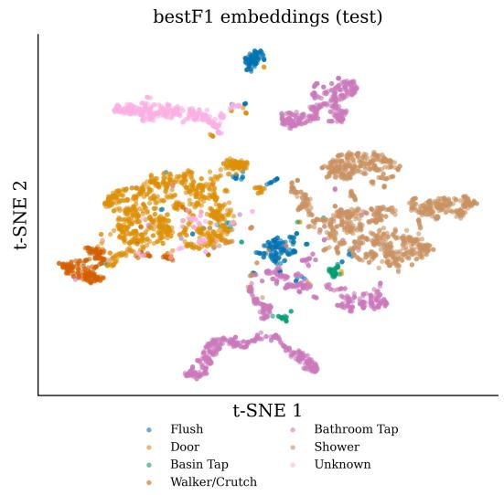  
(a) Best-macro-F1 model (�� = 59, � = 10, 5 blocks).

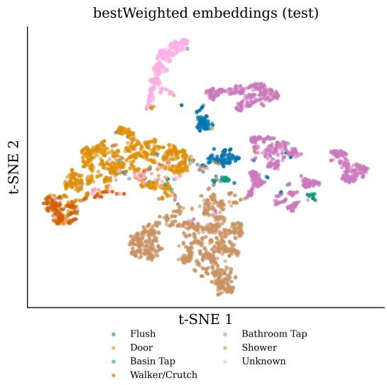  
(b) Rank-1 weighted-score model $( N _ { f } = 7 8 , \alpha = 4 ,$ 5 blocks).  
Figure 17: Test-set t-SNE embeddings of the two configurations selected by the search. The best-F1 model (a) uses more capacity and pulls the water classes slightly further apart, while the compact rank-1 model (b) keeps the same overall layout at a fraction of the size. In both, the impulsive classes separate cleanly and the sustained water classes share one region, so the structure is preserved across the trade-of.

## 7.5 Ablation Study

Table 11 examines the contribution of the main architectural and training choices.

A1: Front-end design. Replacing the learned sinc front end with a fixed sinc bank reduces macro-F1 from 0.651 to 0.644, while a matched trainable convolution gives 0.615. The MFCC front end reaches 0.636. The largest reduction in this group therefore occurs when the band-pass constraint is removed. The diferences should, however, be interpreted in relation to the variation across seeds; they support the use of the structured front end but do not imply that every pairwise diference is statistically significant.

A2: Number of sinc filters. Increasing $N _ { f }$ improves mean macro-F1 from 0.613 at $N _ { f } = 1 6$ to 0.628 at $N _ { f } = 3 2$ and 0.663 at $N _ { f } = 6 4$ . Increasing the filter count further to 128 gives 0.672. The improvement therefore becomes smaller beyond 64 filters, while the front-end width and computational cost continue to increase.

A3: Convolutional body. Replacing the depthwise-separable body with standard convolutions gives a macro-F1 of 0.658 compared with 0.651 for A0. This small diference is well within the observed seed-to-seed variation, whereas the standard convolutions require substantially more parameters. The separable body is therefore retained for the compact models.

A4 and A5: Kernel length and augmentation. Macro-F1 increases from 0.638 at $L = 1 0 1$ to 0.652 at $L = 2 5 1$ and 0.657 at $L = 4 0 1$ , indicating a modest benefit from the longer sinc kernel. Removing amplitude augmentation reduces macro-F1 to 0.625. This result is consistent with the variation in signal level introduced by diferent recording distances and environments. Overall, the ablation results place most of the sensitivity in the front-end configuration and amplitude augmentation. Changes to the convolutional body have a comparatively small efect. The best mean macro-F1 in the ablation table is 0.672 at $N _ { f } = 1 2 8 .$ but the improvement over A0 is modest relative to the additional filter count.

Table 11: Component ablations under environment-disjoint splitting (macro-F1, mean ± standard deviation over three seeds). Δ denotes the change in mean macro-F1 relative to A0. Best macro-F1 is shown in bold.
<table><tr><td>ID</td><td>Variant</td><td>Macro-F1</td><td>∆ vs. A0</td></tr><tr><td>A0</td><td>SincDPNet (reference:  $N _ { f } = 2 5 , L = 4 0 1 )$ </td><td> $0 . 6 5 1 \pm 0 . 0 4 9$ </td><td>0.000</td></tr><tr><td>Ala</td><td>Fixed (non-learnable) sinc front-end</td><td> $0 . 6 4 4 \pm 0 . 0 4 6$ </td><td>-0.007</td></tr><tr><td>A1b</td><td>Plain trainable conv front-end</td><td> $0 . 6 1 5 \pm 0 . 0 5 1$ </td><td>-0.036</td></tr><tr><td>A1c</td><td>MFCC + same body</td><td> $0 . 6 3 6 \pm 0 . 0 4 4$ </td><td>-0.015</td></tr><tr><td>A2a</td><td> $N _ { f } = 1 6$ </td><td> $0 . 6 1 3 \pm 0 . 0 5 2$ </td><td>-0.038</td></tr><tr><td>A2b</td><td> $N _ { f } = 3 2$ </td><td> $0 . 6 2 8 \pm 0 . 0 4 7$ </td><td>-0.023</td></tr><tr><td>A2c</td><td> $N _ { f } = 6 4$ </td><td> $0 . 6 6 3 \pm 0 . 0 4 9$ </td><td>+0.012</td></tr><tr><td>A2d</td><td> $N _ { f } = 1 2 8$ </td><td> $\mathbf { 0 . 6 7 2 \pm 0 . 0 4 6 }$ </td><td>+0.021</td></tr><tr><td>A3</td><td>Standard conv body (no DS-conv)</td><td> $0 . 6 5 8 \pm 0 . 0 4 8$ </td><td>+0.007</td></tr><tr><td>A4a</td><td>Kernel length  $L = 1 0 1$ </td><td> $0 . 6 3 8 \pm 0 . 0 5 0$ </td><td>-0.013</td></tr><tr><td>A4b</td><td>Kernel length  $L = 2 5 1$ </td><td> $0 . 6 5 2 \pm 0 . 0 4 7$ </td><td>+0.001</td></tr><tr><td>A4c</td><td>Kernel length  $L = 4 0 1$ </td><td> $0 . 6 5 7 \pm 0 . 0 4 9$ </td><td>+0.006</td></tr><tr><td>A5</td><td>Without amplitude augmentation</td><td> $0 . 6 2 5 \pm 0 . 0 5 4$ </td><td>-0.026</td></tr></table>

## 7.6 Learned Filter Interpretation

The ablation results establish the contribution of the front end; we now inspect what the learned sinc bank represents. Figures 18, 19, and 20 show the learned passbands and their frequency responses, while Figs. 21 and 22 show how the filters respond across classes.

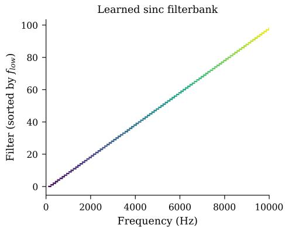  
Figure 18: Learned SincDPNet filter bank (each bar is one band-pass filter; width = bandwidth). The learned allocation of spectral resolution is directly readable in Hz.

These filter-level observations motivate the next analysis, which tests whether the acoustic overlap identified before training is reflected quantitatively in the model errors.

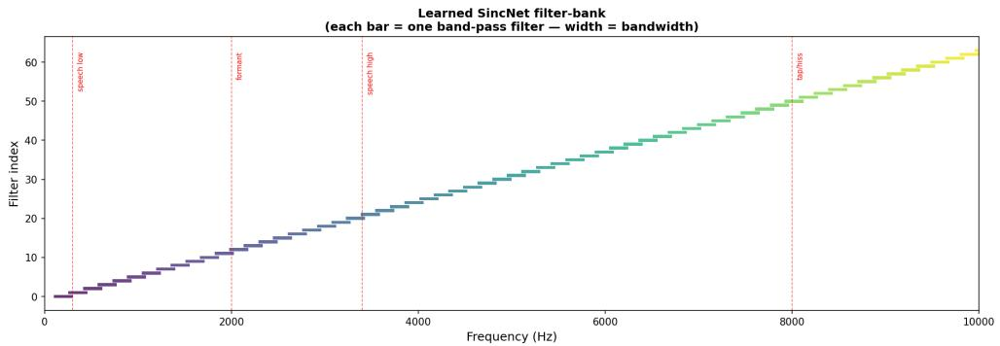  
Figure 19: Overlaid magnitude responses of the full learned filter bank on a shared frequency axis. The dense overlap in the low-to-mid band and the sparse coverage of the high band show, in a single view, how the bank concentrates spectral resolution where the water classes carry their energy.

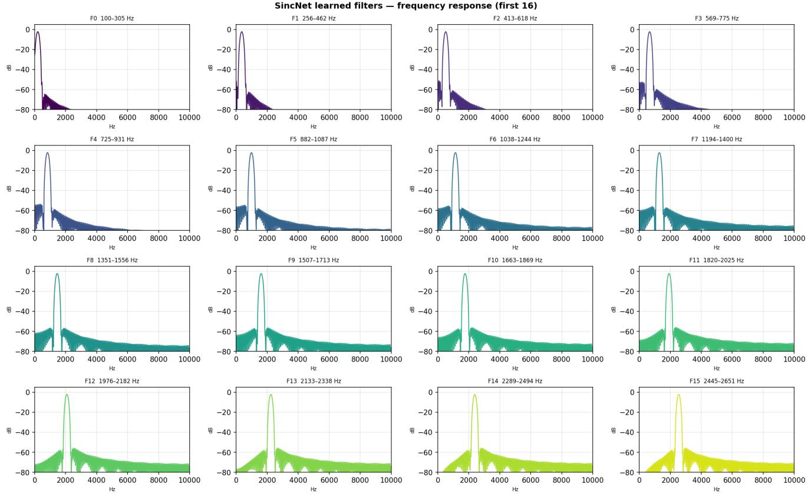  
Figure 20: Frequency-magnitude responses of the learned sinc filters. The band-pass channels tile the low-to-mid frequency range densely and the high range sparsely, the frequency-domain view of the allocation in Fig. 18.

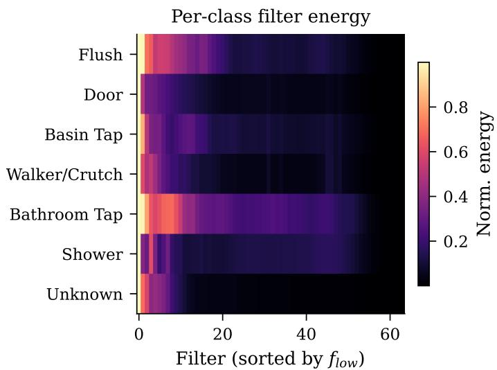  
Figure 21: Per-class mean activation energy across learned filters. Sustained water classes share active bands (explaining their confusability), whereas Basin Tap and impulsive classes occupy distinct bands.

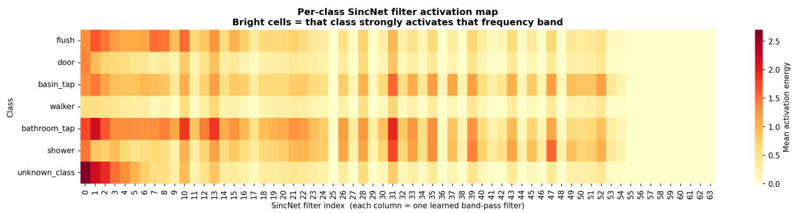  
Figure 22: Per-class activation traced across individual learned filters. The sustained water classes activate nearly the same filters, while the impulsive classes and Basin Tap each drive a separable group, mirroring the confusion structure of Fig. 24.

## 7.7 The Interpretability Bridge

We next examine whether the acoustic structure observed before training is reflected in the errors of the trained model. Two comparisons are used.

At the class level, the dificulty score $D _ { c }$ has little association with the error rate of the compact $N _ { f } = 2 5$ model (Spearman $\rho = - 0 . 0 7$ over seven classes). The scalar score is therefore not a reliable predictor of class-wise performance. At the pairwise level, the Bhattacharyya overlap has a modest positive association with of-diagonal confusion $( \rho = 0 . 3 9 )$ . The larger confusions occur mainly among acoustically similar water-flow classes and between Door and Walker/Crutch.

Figure 23 summarizes these results. The correspondence between acoustic overlap, learned-filter responses, and confusion is useful at the pairwise level, although it does not account for every classification error. Temporal structure remains important for transient events.

We also vary the five weights used to construct the dificulty score. The class ordering changes under these perturbations and no stable positive class-level correlation is obtained. We therefore retain the scalar score as a descriptive summary of the acoustic analysis and rely on pairwise overlap when relating the signal statistics to model confusions.

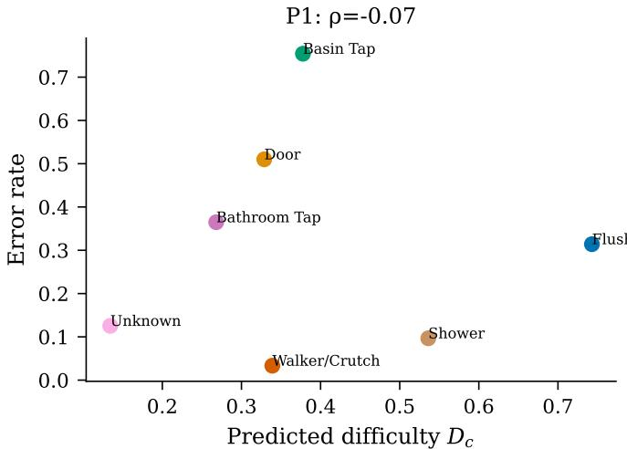

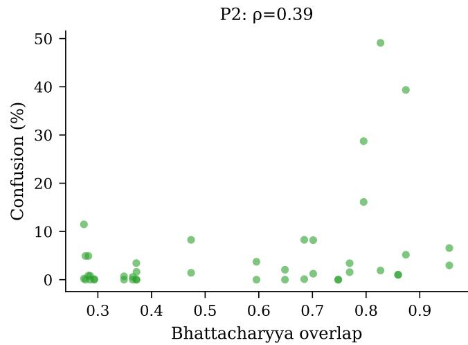  
Figure 23: Acoustic-to-model comparison for the compact $N _ { f } = 2 5$ model. Left: the aggregate class-dificulty score has little association with class error. Right: pairwise acoustic overlap has a modest positive association with of-diagonal confusion.

## 7.8 Confusion Structure and Error Characterization

We examine the class-wise errors of the compact $N _ { f } = 2 5$ SincDPNet on the held-out test environment. Figure 24 also compares the two configurations selected by the multi-objective search. The resulting error pattern is partly consistent with th spectral analysis, while several errors reveal the importance of temporal structure.

The compact model achieves high recall for Walker/Crutch (97.6%), Shower (89.4%), and Unknown (88.0%), with Bathroom Tap reaching 77.0%. The lowest recalls occur for Basin Tap (8.2%) and Door (24.9%). Most Basin Tap errors are assigned to Bathroom Tap (55.7%) or Shower (23.0%), consistent with the overlap among water-related sounds. Flush reaches 61.6% recall and is most often confused with Bathroom Tap (23.6%). Figure 25 provides the corresponding pairwise overlap matrix. A diferent mechanism appears for Door. It is classified as Walker/Crutch in 67.7% of cases, whereas only 1.0% of Walker/Crutch samples are classified as Door. Both classes contain short broadband impacts, but walker or crutch recordings often contain repeated impacts. A single impact from such a sequence can resemble a door event. The strong asymmetry therefore cannot be accounted for by average spectral overlap alone and points to temporal organization and event boundaries as additional sources of information.

The higher-capacity best-F1 model substantially improves the two weakest classes of the compact model, raising Basin Tap recall from 8.2% to 85.2% and Door recall from 24.9% to 69.0%. The smaller rank-1 configuration retains high recall for Walker/Crutch, Unknown, Shower, and Flush, but remains weak on Basin Tap. These results show where the additional capacity is used: most of the gain occurs for classes that are poorly separated by the compact representation.

## 7.9 Comparison Against the Strongest Baseline

Among the baseline models, SincNet obtains the highest macro-F1 (Table 10), making it a useful comparison for the compact SincDPNet. SincNet uses approximately 28× more parameters and obtains higher recall for Flush (88.8% versus 61.6%), Door (73.6% versus 24.9%), and Basin Tap (83.6% versus 8.2%). The compact SincDPNet gives slightly higher recall for Bathroom Tap (77.0% versus 75.6%) and Shower (89.4% versus 78.0%), while the two models perform similarly on Unknown. Both recognize Walker/Crutch reliably.

Despite the diference in model size, the main confusion regions are similar. Water-related classes remain dificult to separate, and Door/Walker/Crutch confusion is present in both models. The larger SincNet reduces several of these errors, but does not eliminate the underlying pattern.

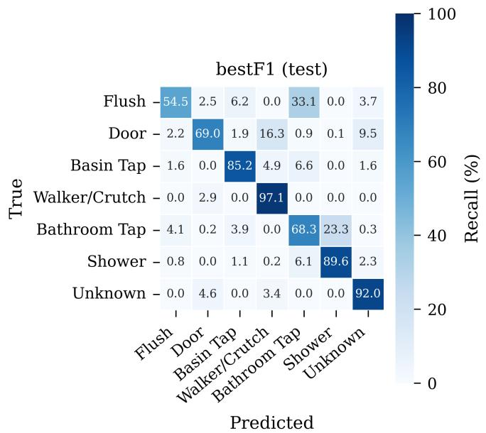  
(a) Best-macro-F1 model $( N _ { f } = 5 9 , \alpha = 1 0 , :$ 5 blocks; 54.8 KB).

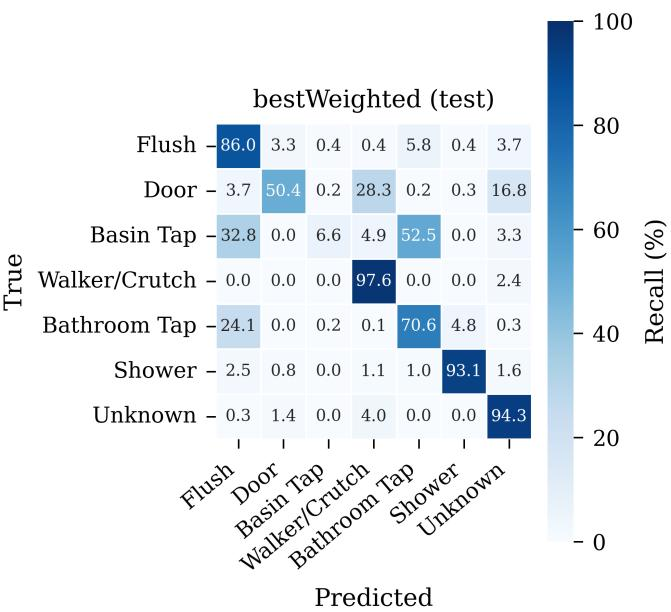  
(b) Rank-1 weighted-score model $( N _ { f } = 7 8 , \alpha = 4 , 5$ blocks; 13.3 KB).  
Figure 24: Row-normalized (recall, %) confusion matrices of the two configurations selected by the multi-objective search. The best-F1 model (a) recovers Basin Tap and Door, the classes the compact model sacrifices, at the cost of 12× more footprint; the rank-1 weighted model (b) preserves the easy classes at 13.3 KB but leaves Basin Tap unresolved. Added capacity is spent precisely on the hardest, most overlapping classes.

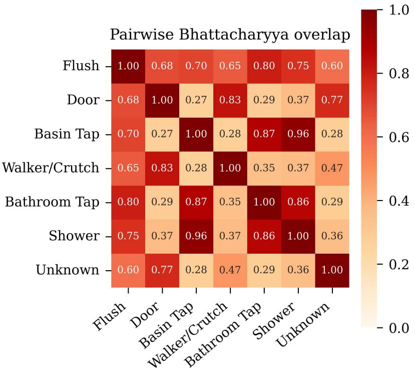  
Figure 25: Pairwise Bhattacharyya overlap (Eq. 1) between class feature distributions (1 = identical). The sustained water classes form the highest-overlap block, providing the a priori prediction that the trained model later confirms in its confusion matrix (Fig. 24).

Figure 26 illustrates the comparative visualization of the embedding spaces. It can be noted that partial overlapping of sustained water sounds occurs in all architectures, whereas transient categories tend to have smaller clusters. Such regularity across all tested architectures is in line with the acoustic characteristics of the dataset, although this two-dimensional mapping does not prove the cause of this efect.

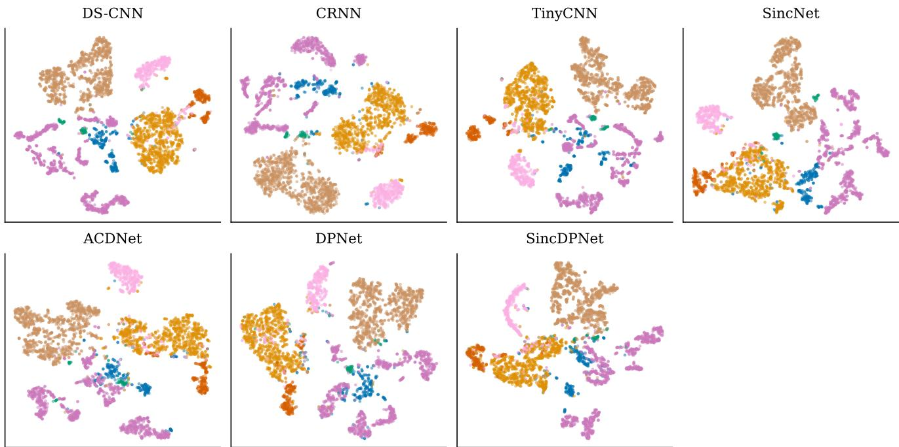  
Figure 26: t-SNE embeddings of the held-out test set for all benchmarked models. The sustained water classes form a single overlapping region in every model regardless of size, while the impulsive classes and Basin Tap stay separated, evidence that the confusability structure is a property of the data, not of any one architecture.

Together, the benchmark, embedding, and error analyses identify the operating points that merit hardware evaluation. The next section therefore turns from recognition behaviour to deployment-aware model selection.

## 8. Deployment-Aware Selection and Hardware Evaluation

The architecture search in Study A produces a set of solutions with diferent trade-ofs between recognition performance and model footprint. Selecting only the configuration with the highest validation macro-F1 may result in unnecessary memory and computational overhead, whereas selecting only the smallest model may lead to an unacceptable reduction in recognition performance. We therefore perform an additional deployment-aware analysis using three representative configurations: (i) the highest weighted-score model, which balances validation macro-F1 and model size; (ii) the highest-validation-F1 model, representing the accuracy-oriented operating point; and (iii) a compact Pareto-optimal model, representing the deployment-oriented operating point.

The weighted ranking in Study A is obtained after min–max normalization of validation macro-F1 and model-size eficiency. The normalized objectives are combined as

$$
S _ { i } = 0 . 7 \frac { F _ { i } - F _ { \mathrm { m i n } } } { F _ { \mathrm { m a x } } - F _ { \mathrm { m i n } } } + 0 . 3 \left( 1 - \frac { M _ { i } - M _ { \mathrm { m i n } } } { M _ { \mathrm { m a x } } - M _ { \mathrm { m i n } } } \right) ,\tag{13}
$$

where $F _ { i }$ and $M _ { i }$ denote the validation macro-F1 and model size of the �th configuration, respectively. The first term favours recognition quality, whereas the second term assigns a higher score to smaller models. Configurations are ranked in descending order of $S _ { i }$

Table 12 summarizes the three configurations selected for detailed deployment analysis. The highest weighted-score model uses $N _ { f } = 7 8$ Sinc filters, a width multiplier of $\alpha = 4 .$ , and five depthwise-separable blocks. It achieves a validation macro-F1 (search-time) of 0.8443 with a recorded search-time model size of 13.3 KB. The accuracy-oriented model uses $N _ { f } = 5 9$ $\alpha = 1 0$ , and five blocks, and obtains the highest validation macro-F1 of 0.8942, although its recorded size increases to 54.8 KB. The compact Pareto configuration uses only $N _ { f } = 2 5$ filters, $\alpha = 6 .$ , and four blocks. Its validation macro-F1 is 0.8016, which is lower than that of the accuracy-oriented model but is obtained with a substantially smaller recorded footprint of 11.1 KB. This configuration is retained because no other evaluated solution simultaneously provides a higher macro-F1 and a smaller search-time model size.

Before timing these configurations on hardware, we first verify that deployment conversion preserves their predictions.

## 8.1 Freezing and TFLite Conversion

The learned Sinc filters are first converted into an equivalent fixed convolutional kernel before TensorFlow Lite conversion. This removes the analytical filter-construction operations from the inference graph while preserving the learned frequency responses. Prediction agreement between the original Keras model and the frozen model is 100% for all three completed configurations. The frozen Keras and FP32 TensorFlow Lite models also reproduce the original Keras predictions exactly on the complete held-out test set.

Table 12: Study-A configurations selected for deployment-aware evaluation. The three configurations represent distinct points on the Pareto frontier: best weighted score (rank-1), highest validation macro-F1, and a compact model.
<table><tr><td>Selection role</td><td> $N _ { f }$ </td><td>α</td><td>Blocks</td><td>Val. macro-F1</td><td>Size (KB)</td></tr><tr><td>Highest weighted score (rank-1)</td><td>78</td><td>4</td><td>5</td><td>0.8443</td><td>13.3</td></tr><tr><td>Highest validation F1</td><td>59</td><td>10</td><td>5</td><td>0.8942</td><td>54.8</td></tr><tr><td>Compact Pareto model</td><td>25</td><td>6</td><td>4</td><td>0.8016</td><td>11.1</td></tr></table>

Table 13: Single-clip inference performance of DPNet and selected SincDPNet configurations on embedded and reference hardware for a 1.5 s audio clip. Inference time excludes audio capture; $\mathrm { R T F } < 1$ indicates faster-than-real-time operation.
<table><tr><td>Device (RAM, clock)</td><td>Model</td><td>Params</td><td>Acc. (%)</td><td>Macro-F1</td><td>Inf. time</td><td>RTF</td></tr><tr><td rowspan="4">Raspberry Pi Zero 2 W (512 MB, 1 GHz)</td><td>DPNet (baseline)</td><td>4,944</td><td>69.2</td><td>0.612</td><td>15 ms</td><td>0.01</td></tr><tr><td>SincDPNet, compact  $( N _ { f } { = } 2 5 )$ </td><td>2,848</td><td>75.7</td><td>0.661</td><td>435.6 ms</td><td>0.29</td></tr><tr><td>SincDPNet, best-F1</td><td>14,040</td><td>80.2</td><td>0.760</td><td>920.4 ms</td><td>0.61</td></tr><tr><td>SincDPNet, rank-1 (weighted)</td><td>3,408</td><td>75.6</td><td>0.673</td><td>886.3 ms</td><td>0.59</td></tr><tr><td rowspan="4">Laptop (Intel Core U5) (16 GB, 1.2 GHz)</td><td>DPNet (baseline)</td><td>4,944</td><td>69.2</td><td>0.612</td><td>2.5 ms</td><td>0.0016</td></tr><tr><td>SincDPNet, compact  $( N _ { f } { = } 2 5 )$ </td><td>2,848</td><td>75.7</td><td>0.661</td><td>28.0 ms</td><td>0.0186</td></tr><tr><td>SincDPNet, best-F1</td><td>14,040</td><td>80.2</td><td>0.760</td><td>53.4 ms</td><td>0.0356</td></tr><tr><td>SincDPNet, rank-1 (weighted)</td><td>3,408</td><td>75.6</td><td>0.673</td><td>59.4 ms</td><td>0.0396</td></tr></table>

This result is important because it separates errors caused by graph conversion from those introduced by numerical quantization. In the present experiments, the conversion from the trainable Sinc formulation to a frozen convolution and then to FP32 TensorFlow Lite introduces no measurable degradation. Therefore, the FP32 TensorFlow Lite models provide reliable software representations for subsequent hardware evaluation.

## 8.2 Deployment on Embedded Hardware

In order to evaluate the practical applicability of the models beyond training, we ran the models on a low-power single board computer and calculated the inference latency. It should be noted that in this section, the objective is not to optimize the model performance for a specific hardware platform, but rather to demonstrate that the proposed interpretable raw wave form design is still lightweight enough to work on hardware commonly used in always-on acoustic sensing applications where the constraints on power and cost are critical. Inference times for one 1.5 s audio clip are provided below.

The primary target is the Raspberry Pi Zero 2 W, a low-cost board with a quad-core 1 GHz processor and 512 MB of RAM and no dedicated accelerator, so all computation runs on the CPU. As a reference point we also time the compact model on a laptop with an Intel Core U5 processor. Both run the identical exported model and the same pre-processing front end, so the only variable is the hardware. Inference time is measured as the compute time for a single clip and excludes the fixed 1.5 s needed to capture the audio, since capture duration is a property of the task rather than of the model or device.

We use two metrics to describe on-device behaviour. Inference time is the median wall-clock time to classify one 1.5 s clip, measured on the device and excluding audio capture. The real-timefactor (RTF) is the ratio of this inference time to the clip duration,

$$
\mathrm { R T F } = \frac { t _ { \mathrm { i n f e r e n c e } } } { t _ { \mathrm { c l i p } } } , \qquad t _ { \mathrm { c l i p } } = 1 . 5 \ : \mathrm { s } ,\tag{14}
$$

so that RTF < 1 means the model classifies a clip faster than the clip takes to record, leaving the processor idle for part of each cycle, whereas $\mathrm { R T F } \geq 1$ means inference cannot keep pace with a continuous audio stream. A low RTF is therefore desirable for always-on monitoring, since the remaining time budget can be used for audio capture, bufering, and any post-processing within the same cycle. Table 13 reports the measured latency and RTF for the baseline and the three selected SincDPNet configurations on both hardware platforms.

All four models achieve a real-time factor well below one on the Raspberry Pi Zero 2 W, confirming that even the accuracyoriented configuration is deployable on this class of hardware, while the compact model leaves the largest idle margin. This is the deciding information when selecting a model for embedded acoustic monitoring, where a small loss in accuracy may be acceptable in exchange for a substantially lower on-device latency.

These hardware results complete the empirical evaluation and provide the basis for the broader interpretation that follows.

## 9. Discussion

There is one common thread that runs through all of the above contributions. On this task, the hard problems come from the data, not the model. The superior model is the one whose architecture matches the problem, rather than its capacity. The signal analysis identifies the hard examples prior to training. The front-end then provides the model with filters tuned to the same frequencies as determined by the analysis. The architectural search and ablation study prove that going beyond a few thousand parameters in capacity provides no benefit. The error analysis reveals the residual errors come from places where the acoustics are inherently ambiguous. The big black box may have equal or superior performance, but it cannot explain itself as this work can. On the privacy-sensitive edge device, the explanation is part of the product. The rest of this section covers each of the above contributions in sequence, but at each point we also make clear what the data do not show.

SnaanGhar7 is unique by virtue of what it highlights rather than by its volume Table 1 shows the gap it fills. Existing bathroom corpora capture water events, but none also adds door and mobility-aid sounds together with an explicit out-of-distribution class. This is evidenced by the outcome of the study. These impulsive classes are only available in this corpus, and they yield the largest number of errors. As shown in Table 14, this number equals 774 of 1,209. Without the events of water, this corpus would never reveal this flaw.

Table 14: Error characterization of the deployed SincDPNet over its � = 1,209 misclassified test clips, assigned to mutually exclusive categories by an automated rule-based audit (each clip is counted once, under the first matching rule). Two acoustic categories account for 97.6% of all errors.
<table><tr><td>Error category</td><td>Count</td></tr><tr><td>Transient/impulsive overlap</td><td>774</td></tr><tr><td>Broadband water-flow ambiguity</td><td>406</td></tr><tr><td>Non-target/unknown confusion</td><td>29</td></tr><tr><td>Low SNR / background masking</td><td>0</td></tr><tr><td>Annotation-boundary (partial event capture) Total</td><td>0 1,209</td></tr></table>

This dataset is consistent with the analysis performed in this paper. The figures 5 and 8 lay the ground for distinguishing the transient vs sustained case using only statistics. The figure 6 depicts the water classes overlap at the middle frequency range. The figure 25 computes this overlap class by class. The figure 12 demonstrates that this overlap persists after the optimal linear projection. Four diferent ways of looking at this problem give the same result before training a single network.

The benchmark in Table 10 is strong evidence for something beyond “our model is small.” Interpreting the results as a function of front-end type rather than rank produces a clear trend: the two raw-waveform models with unconstrained front-ends come up at the bottom (DPNet 0.612 macro-F1, ACDNet 0.639 macro-F1). Meanwhile, the two models with constrained band-pass front-ends appear near the top (SincNet 0.712 macro-F1, SincDPNet 0.661 macro-F1). The input domain does not split the field; rather, it is the front-end structure that does. The most direct contrast in terms of performance comes from SincDPNet vs DPNet: at nearly identical size (2,848 versus 4,944 parameters), the sinc front-end provides a boost of +0.096 macro-F1 and +0.085 MCC. As both models are of the same family, this contrast isolates the role of the constrained front-end.

Equation (4) explains why this is possible. Each filter has two parameters, not �, thus making the whole filterbank equivalent to $2 N _ { f }$ parameters, i.e., 128 parameters out of 2,848 (2.8%) of the model’s total parameters (Table 6). Equation (9) explains the cost-efectiveness of the front-end: separable convolutions are $C _ { \mathrm { o u t } } + k ^ { 2 }$ times less expensive than a regular convolution. Taken together, the properties make the model 10-fold cheaper than the 128 k budget of DCASE [21], while delivering the second-best MCC result in Table 10.

The ablation experiment in Table 11 provides support for this observation from within the model instead of across models and further refines it. By disentangling the two efects of the front-end, we see that the band-pass design efect adds 0.014 macro-F1 compared to a regular convolution, and learning the band-pass edges efect adds 0.027 macro-F1 each of which is not suficient to explain the improvement. Replacing the separable body with standard convolutions adds or subtracts 0.002 in accuracy, which is less than seed noise but adds nine times more parameters. An architectural search adds a diferent line of evidence: according to Table 9, the best architecture is 5.1 KB while the biggest one that was explored (65 KB) achieves 0.550 macro-F1. Thus, three independent pieces of evidence—a cross-model benchmark, an within-model ablation, and an architecture search all converge on the conclusion that the binding constraint here is not capacity. .

This discussion should not be misinterpreted. SincDPNet does not deliver the highest macro-F1. This honor belongs to SincNet, but at 28× more parameters. The point being made concerns Pareto-eficiency, not dominance. The correct interpretation of Table 10 is that structuring the front-end brings considerable gains when scaled to small size, but it cannot entirely substitute the lack of capacity.

A central result is Figure 23. We compute a dificulty score from signal statistics alone, before any training, and compare it with the trained model’s per-class errors. The hardest class in Table 5 is Flush, and it is indeed among the worst served (61.6% recall). The clear exception is Basin Tap, which the score ranks mid-dificulty yet the model serves worst of all. We discuss that case below. The overlap-versus-confusion correlation is $\rho = 0 . 3 9$ . Read together, the two results are informative. Acoustic overlap explains much of how hard a class is, but not all of it, and which confusion happens also depends on the model’s temporal resolution.

Table 14 makes this concrete, and it corrects a prediction. We expected water-flow ambiguity to dominate. It is second, at 406 errors. The impulsive Door↔Walker/Crutch confusion is first, at 774. Both are short broadband knocks whose useful information sits in fine temporal detail. The pooling that makes the body cheap throws some of that detail away. This is a direct cost of the eficiency built in Section 5.2, and we had not noticed it before. The reason why we describe this fact instead of the predicted one is to establish an error taxonomy. There are two error-free categories. No errors caused by low signal-to-noise ratio and clipped events were found (Table 14). It means that the corpus is properly segmented and recorded, and the rest of errors come from real acoustic ambiguity.

Interpretability of the Learned Filter Bank: The interpretability of SincDPNet comes directly from its first layer. Figure 18 shows the frequency ranges learned by the sinc filters, while Fig. 21 shows how strongly these filters respond to each activity class. Clear class-dependent patterns can be observed. Impulsive events and Basin Tap, for example, concentrate their energy in relatively distinct groups of filters, whereas sustained water-related activities produce broader responses across the low- and mid-frequency bands. These patterns provide a physical explanation for both successful predictions and class confusions, rather than relying only on internal feature activations.

This is particularly useful for an assistive monitoring system, where it is important to understand not only the overall recognition accuracy but also which events are likely to be confused and why. For example, the strong recognition of shower, tap, and mobility-aid sounds is consistent with their characteristic filter-response patterns. In contrast, the similar responses observed for Door and Walker help explain their higher mutual confusion. This suggests that separating these two activities may require additional temporal context or a dedicated secondary classifier. Thus, the learned sinc filters provide an interpretable link between the acoustic characteristics of an event and the final recognition behaviour of the model. For reproducibility and further analysis, the learned filter-bank parameters are also released with the implementation.

From a privacy-first assistive monitoring point of view, interpretability is of practical use. Not only it takes into account the average F1 score per class but also answers the following two questions: what events may go undetected, and are we able to justify it? In our case, showers, taps, and sounds of mobility aids are detected with a high confidence level, while detection of the Door/Walker pair requires either longer time window or special sub-classification. These observations follow from interpretation of particular frequency bands rather than from non-transparent activation patterns. This focus on interpretability is our rationale for publishing learned filter banks.

The MOO-based Design Procedure: We claim no methodological novelty in the optimization, so the relevant question is whether our reported design depends on optimizer settings. Table 8 answers it. The four surrogate-guided variants finish within 0.087% of one another in hypervolume. The gap to random search is 0.61%, about seven times larger. Figure 15 shows the same ordering in the trajectories. Every surrogate variant reaches 90% of its hypervolume gain within 22 evaluations, and random search does not reach that within the budget. So a reader who repeats this study with a diferent acquisition function should get a similar design. One point is worth stating plainly: on a space this small, Bayesian optimization buys convergence speed and reproducibility, not a dramatically better front.

Broader Implications: Even though this research addresses the recognition of activities in the bathroom setting, the presented framework can be applied for other similar small audio classification problems including recognition of household activities, monitoring condition of machines, and classification of animal sounds [10]. The above mentioned applications share similar characteristics related to small training datasets and classes that have spectral and/or temporal structures.

On the whole, the work illustrates an easy-to-use design rule: study the separability of classes prior to training, incorporate the result into the architecture of the front end, and test using splits that capture the principal variance, which could be the room, device, site, subject, or recording session. This will enable you to understand whether your system has captured the desired acoustic events or other characteristics of the recording environment. These findings provide us with the results outlined below.

## 10. Conclusion

In this paper, SnaanGhar7 and SincDPNet are introduced for bathroom acoustic event classification from waveforms. For the experiment, recordings are divided into sessions and environments before overlapping segments are made, which avoids having correlated segments across training, validation, and testing. Under this environment-disjoint protocol, the compact $N _ { f } = 2 5$ SincDPNet achieves 75.7% accuracy, 0.661 macro-F1, and 0.716 MCC with 2,848 trainable parameters.

The main contribution is a model that brings together compact raw waveforms and physically interpretable acoustic features. In sinc front-end, there are just $2 N _ { f }$ learnable frequency variables (say, 50 in the compact $N _ { f } = 2 5$ model) and the passbands are immediately readable in hertz. Pairwise acoustic decomposition, as well as the confusion matrix, indicate the same dificult-to-classify groups: similar water flow acoustic samples, and the two impulse classes. Class dificulty measure cannot reliably predict the error order in all cases; however, pairwise class overlap reveals more.

The multi-objective search spans 24 evaluated configurations. The highest weighted-score configuration uses $N _ { f } = 7 8$ and reaches macro-F1 0.8443 at 13.3 KB, while the highest validation macro-F1, 0.8942, is obtained by a larger $N _ { f } = 5 9$ configuration at 54.8 KB. These results show why a Pareto view is useful: the most accurate design and the most balanced design are diferent. From this Pareto set we analyze three representative operating points, including the compact $N _ { f } = 2 5$ model used for the detailed error and deployment analysis.

Future work will focus on three directions. First, the dominant Door/Walker confusion will be addressed by preserving finer temporal information, either through longer temporal context or a lightweight secondary classifier for acoustically similar impulsive events. Second, the generalizability of the proposed framework will be examined across a broader range of rooms with diferent acoustic characteristics, recording devices, and acquisition conditions. This evaluation will assess the extent to which the learned sinc bands remain transferable beyond the present corpus. Finally, the selected Pareto-optimal models will be deployed on more resource-constrained platforms, including microcontroller-class hardware, to measure memory usage, inference latency, and energy consumption directly under deployment conditions.

## Data and Code Availability

The dataset used in this study can be requested through the Dataset Access Form. The source code, model configurations, and experimental scripts used in this study are publicly available at https://github.com/debolina-34/SnaanGhar7.

## Ethics Statement

All participants voluntarily consented to the collection and public release of anonymized recordings for academic research;   
property-owner permission was obtained for each site.

## Acknowledgments

The authors thank the participating households and institutions for granting access to their facilities for data collection.

## References

[1] Daniele Barchiesi, Dimitrios Giannoulis, Dan Stowell, and Mark D. Plumbley. Acoustic scene classification: Classifying environments from the sounds they produce. IEEE Signal Processing Magazine, 32(3):16–34, 2015.

[2] Matthias Bittner, Daniel Schnöll, Matthias Wess, and Axel Jantsch. Eficient and interpretable raw audio classification with diagonal state space models. Machine Learning, 114(7):175, 2025.

[3] Emre Cakır, Giambattista Parascandolo, Toni Heittola, Heikki Huttunen, and Tuomas Virtanen. Convolutional recurrent neural networks for polyphonic sound event detection. IEEE/ACM Transactions on Audio, Speech, and Language Processing, 25(6):1291–1303, 2017.

[4] Gianmarco Cerutti, Rahul Prasad, Alessio Brutti, and Elisabetta Farella. Neural network distillation on IoT platforms for sound event detection. In Proc. INTERSPEECH, pages 3609–3613, 2019.

[5] Jianfeng Chen, Alvin Harvey Kam, Jianmin Zhang, Ning Liu, and Louis Shue. Bathroom activity monitoring based on sound. In Proc. Int. Conf. on Pervasive Computing, pages 47–61, 2005.

[6] Debolina Chowdhury, C Vinod, Suman Samui, M Saha, and Sujoy Saha. DPNet: A lightweight TinyML model for real-time bathroom sound classification. In 2026 18th Int. Conf. on Communication Systems and Networks (COMSNETS), pages 1409–1414. IEEE, 2026.

[7] Selina Chu, Shrikanth Narayanan, and C.-C. Jay Kuo. Environmental sound recognition with time–frequency audio features. IEEE Transactions on Audio, Speech, and Language Processing, 17(6):1142–1158, 2009.

[8] Samuel Daulton, Maximilian Balandat, and Eytan Bakshy. Diferentiable expected hypervolume improvement for parallel multi-objective bayesian optimization. In Advances in Neural Information Processing Systems (NeurIPS), volume 33, pages 9851–9864, 2020.

[9] Eduardo Fonseca, Xavier Favory, Jordi Pons, Frederic Font, and Xavier Serra. FSD50K: An open dataset of human-labeled sound events. IEEE/ACM Transactions on Audio, Speech, and Language Processing, 30:829–852, 2022.

[10] Soumen Garai and Suman Samui. Advances in small-footprint keyword spotting for TinyML: A comprehensive review of eficient models and algorithms. Neurocomputing, 695:134028, 2026.

[11] Soumen Garai, Danilo Pau, and Suman Samui. Oasi: Objective-aware surrogate initialization for multi-objective bayesian optimization in tinyml. IEEE Embedded Systems Letters, pages 1–1, 2026. doi: 10.1109/LES.2026.3710915.

[12] Jort F Gemmeke, Daniel P W Ellis, Dylan Freedman, Aren Jansen, Wade Lawrence, R Channing Moore, Manoj Plakal, and Marvin Ritter. Audio set: An ontology and human-labeled dataset for audio events. In Proc. IEEE Int. Conf. on Acoustics, Speech and Signal Processing (ICASSP), pages 776–780, 2017.

[13] Stefan Goetze et al. Audio-based active and assisted living: A review of selected applications and future trends. Computers in Biology and Medicine, 149:106027, 2022.

[14] Shawn Hershey, Sourish Chaudhuri, Daniel P W Ellis, Jort F Gemmeke, Aren Jansen, R Channing Moore, Manoj Plakal, Devin Platt, Rif A Saurous, Bryan Seybold, et al. Cnn architectures for large-scale audio classification. In Proc. IEEE Int. Conf. on Acoustics, Speech and Signal Processing (ICASSP), pages 131–135, 2017.

[15] Seung-Ho Hyun. Sound-event detection of water-usage activities using transfer learning. Sensors, 24(1):22, 2024.

[16] Donghyeon Kim, Sangwook Park, David K. Han, and Hanseok Ko. Multi-band CNN architecture using adaptive frequency filter for acoustic event classification. Applied Acoustics, 172:107579, 2021. doi: 10.1016/j.apacoust.2020.107579.

[17] Qiuqiang Kong, Yin Cao, Turab Iqbal, Yuxuan Wang, Wenwu Wang, and Mark D. Plumbley. PANNs: Large-scale pretrained audio neural networks for audio pattern recognition. IEEE/ACM Transactions on Audio, Speech, and Language Processing, 28:2880–2894, 2020.

[18] Khaled Koutini, Hamid Eghbal-zadeh, and Gerhard Widmer. Receptive field regularization techniques for audio classification and tagging with deep convolutional neural networks. IEEE/ACM Transactions on Audio, Speech, and Language Processing, 29:1987–2000, 2021.

[19] Patrick Marmaroli, Mark Allado, and Romain Boulandet. Towards the detection and classification of indoor events using a loudspeaker. Applied Acoustics, 202:109161, 2023. doi: 10.1016/j.apacoust.2022.109161.

[20] Irene Martín-Morató, Toni Heittola, Annamaria Mesaros, and Tuomas Virtanen. Low-complexity acoustic scene classification for multi-device audio: Analysis of DCASE 2021 challenge systems. In Proc. Detection and Classification ofAcoustic Scenes and Events (DCASE), pages 85–89, 2021.

[21] Irene Martín-Morató, Francesco Paissan, Alberto Ancilotto, Toni Heittola, Annamaria Mesaros, Elisabetta Farella, Alessio Brutti, and Tuomas Virtanen. Low-complexity acoustic scene classification in DCASE 2022 challenge. In Proc. Detection and Classification ofAcoustic Scenes and Events (DCASE), 2022.

[22] Annamaria Mesaros, Toni Heittola, and Tuomas Virtanen. A multi-device dataset for urban acoustic scene classification. Proc. Detection and Classification ofAcoustic Scenes and Events (DCASE) Workshop, pages 9–13, 2018.

[23] Simon Mittermaier, Ludwig Kürzinger, Bernd Waschneck, and Gerhard Rigoll. Small-footprint keyword spotting on raw audio data with sinc-convolutions. In ICASSP 2020 - 2020 IEEE International Conference on Acoustics, Speech and Signal Processing (ICASSP), pages 7454–7458, 2020. doi: 10.1109/ICASSP40776.2020.9053395.

[24] Md Mohaimenuzzaman, Christoph Bergmeir, Ian West, and Bernd Meyer. Environmental sound classification on the edge: A pipeline for deep acoustic networks on extremely resource-constrained devices. Pattern Recognition, 133: 109025, 2023.

[25] Miguel Molina-Moreno, Daniel de la Prida, Luis Antonio Azpicueta-Ruiz, and Antonio Pedrero. A noise monitoring system with domain adaptation based on standard parameters measured by sound analyzers. Applied Acoustics, 218: 109892, 2024. doi: 10.1016/j.apacoust.2024.109892.

[26] Ali Emre Öztürk, Erkan Kıyımık, and Kağan Mehmet Özkök. Novel dataset and model for restroom sound event classification. Scientific Reports, 15:32212, 2025.

[27] Hyunsin Park and Chang D. Yoo. CNN-based learnable gammatone filterbank and equal-loudness normalization for environmental sound classification. IEEE Signal Processing Letters, 27:411–415, 2020.

[28] Lam Pham, Dusan Salovic, Anahid Jalali, Alexander Schindler, Khoa Tran, Dat Ngo, Phu Nguyen, and Canh Vu. Lightweight deep neural networks for acoustic scene classification and an efective visualization for presenting sound scene contexts. Applied Acoustics, 211:109489, 2023. doi: 10.1016/j.apacoust.2023.109489.

[29] Karol J Piczak. ESC: Dataset for environmental sound classification. In Proc. ACM Int. Conf. on Multimedia, pages 1015–1018, 2015.

[30] Mirco Ravanelli and Yoshua Bengio. Speaker recognition from raw waveform with SincNet. In 2018 IEEE Spoken Language Technology Workshop (SLT), pages 1021–1028, 2018.

[31] Justin Salamon and Juan Pablo Bello. Deep convolutional neural networks and data augmentation for environmental sound classification. IEEE Signal Processing Letters, 24(3):279–283, 2017.

[32] Justin Salamon, Christopher Jacoby, and Juan Pablo Bello. A dataset and taxonomy for urban sound research. In Proc. ACM Int. Conf. on Multimedia, pages 1041–1044, 2014.

[33] Florian Schmid, Paul Primus, Toni Heittola, Annamaria Mesaros, Irene Martín-Morató, and Gerhard Widmer. Lowcomplexity acoustic scene classification with device information in the DCASE 2025 challenge. In Proc. Detection and Classification ofAcoustic Scenes and Events (DCASE), 2025.

[34] Arshdeep Singh and Mark D. Plumbley. Low-complexity CNNs for acoustic scene classification. In Proc. Detection and Classification ofAcoustic Scenes and Events (DCASE), 2022.

[35] Kevin Tong, Keith Attenborough, David Sharp, Shahram Taherzadeh, Manjula Deepak-Gopinath, and Jitka Vseteckova. Acceptability of remote monitoring in assisted living/smart homes in the united kingdom and associated use of sounds and vibrations—a systematic review. Applied Sciences, 14(2):843, 2024.

[36] Yundong Zhang, Naveen Suda, Liangzhen Lai, and Vikas Chandra. Hello edge: Keyword spotting on microcontrollers. arXiv preprint arXiv:1711.07128, 2017.