# SpikeCredit: Temporal Credit Carrier for Reinforcement Learning with Sparse Rewards

Yingchao Yu1,2, Pengfei Sun3, Wenxuan Pan2, Wei Chen2, Yitian Hong4, Kuangrong Hao1, Yaochu Jin2∗

1 School of Information and Intelligent Science, Donghua University, Shanghai, China

2 School of Engineering, Westlake University, Hangzhou, China

3 Department of Electrical and Electronic Engineering, Imperial College London, London, United Kingdom   
4 School of Information Science and Engineering, East China University of Science and Technology, Shanghai, China   
yingchaoyu@mail.dhu.edu.cn, p.sun@imperial.ac.uk, panwenxuan@westlake.edu.cn, chenwei06@westlake.edu.cn, ythong1314@mail.ecust.edu.cn, krhao@dhu.edu.cn, jinyaochu@westlake.edu.cn

## Abstract

Reinforcement learning (RL) with sparse rewards is challenging because delayed outcomes provide little guidance about which intermediate computations caused success or failure. We argue that reliable credit assignment requires policy dynamics that preserve and expose credit-relevant information over time, a role we formalize as Temporal Credit Carriers (TCCs) and that spiking neural networks (SNNs) naturally fulfill through graded membrane traces and event-driven spikes. Based on this hypothesis, we propose SpikeCredit, an SNN-based framework for RL with sparse rewards that first performs task-adaptive TCC selection and then closes the loop between a fast TCC-reading pathway, where self-motion feedback constraint uses local behavior-grounded cues to constrain transition-level credit recovery, and a slow TCC-writing pathway, where credit-targeted trace alignment feeds recovered credit back into the actor to make future TCC dynamics more credit-readable. Across sparse-reward MuJoCo tasks, Spike-Credit improves Last10 return over sparse SNN baselines by +1169% on Ant, +953% on Hopper, +723% on Swimmer, and +1781% on Walker2d, and exceeds the dense-reward baseline on Swimmer by +113%. Mechanistic analyses further show substantially stronger alignment with dense rewards than the sparse SNN baseline. These results position spiking dynamics as credit-preserving substrates for sparse-reward RL.

## Introduction

Sparse rewards remain a fundamental challenge in reinforcement learning (RL), particularly in long-horizon control (Pignatelli et al. 2024; Sutton and Barto 1998). When meaningful feedback is delayed until the end of a trajectory, the learner knows whether the overall behavior succeeded or failed but receives little guidance about which intermediate states, actions, or computations were responsible. This creates a temporal credit-assignment problem: many diferent step-wise explanations are compatible with the same episodic outcome, making it dificult to distinguish causally useful behavior from incidental correlations. The resulting weak learning signal impedes exploration and forces value estimates or policy gradients to propagate information across long temporal distances (Andrychowicz et al. 2017; Arjona-Medina et al. 2019).

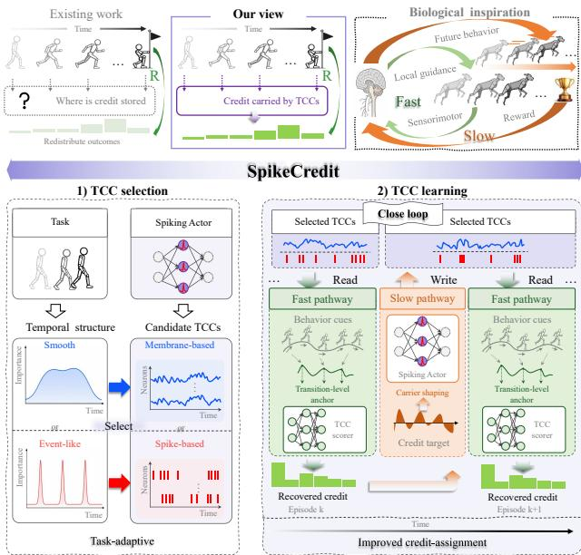  
Figure 1: Motivation and core idea of SpikeCredit. Inspired by biological fast-slow learning, SpikeCredit treats spiking actor dynamics as task-adaptive temporal credit carriers (TCCs): the fast pathway reads credit from current dynamics, while the slow pathway writes recovered targets to reshape future dynamics, forming a closed read-write loop.

A broad line of work addresses this dificulty by constructing more informative supervision from sparse outcomes. Hindsight methods relabel past experience to expose otherwise unavailable successes (Andrychowicz et al. 2017); return-decomposition and reward-redistribution methods assign delayed outcomes to selected portions of a trajectory (Arjona-Medina et al. 2019; Patil et al. 2022; Kapoor et al. 2025); and reward-shaping approaches learn auxiliary reward functions or models that provide denser feedback (Ng, Harada, and Russell 1999; Ma et al. 2024; Venugopal et al. 2026). Despite their diferent implementations, these approaches primarily focus on how to infer, redistribute, or reconstruct transition-level learning signals from trajectorylevel outcomes. However, a delayed outcome contains little temporal structure by itself and cannot recover transitionlevel information that was not preserved in the policy or its interaction history. Rather than asking only how delayed outcomes should be redistributed, we ask a prior question: where is the credit-relevant temporal information required for reliable redistribution preserved in thefirst place?

We posit that reliable credit recovery depends on policy dynamics that preserve and expose credit-relevant structure. We define such internal dynamics as Temporal Credit Carriers (TCCs): neural states whose temporal evolution preserves information that can later support transition-level credit inference from delayed outcomes. Spiking neural network (SNN) actors provide a particularly suitable instantiation of TCCs through two complementary temporal dynamics. Membrane potentials integrate information over time, providing graded temporal traces that can preserve slowly evolving behavioral dependencies relevant to credit assignment. By contrast, spikes provide sparse and localized markers of salient behavioral events, which may expose event-specific temporal evidence for credit assignment.

Building on this insight, we propose SpikeCredit, a creditaware temporal dynamics learning framework for sparsereward RL, as illustrated in Figure 1. SpikeCredit instantiates TCCs through task-adaptive selection between membrane traces and spike events according to the temporal characteristics of the task. However, selecting a suitable carrier is insuficient: a useful TCC should not only preserve temporal information, but also make such information readable for delayed credit inference and become adaptable through learning. SpikeCredit therefore couples two complementary operations: reading transition-level credit from current TCC dynamics and writing the recovered signals back to shape future dynamics.

This read-write mechanism draws inspiration from the complementary timescales of biological motor learning: rapid sensorimotor feedback constrains ongoing movement and provides local behavioral guidance, whereas delayed reward-related teaching signals reshape future control (Wolpert, Diedrichsen, and Flanagan 2011; Scott 2004; Schultz, Dayan, and Montague 1997). We translate this principle into a closed loop between credit reading and credit writing. The fast pathway, implemented by Self-Motion Feedback Constraint (SMF), uses local behavior-grounded cues as temporal anchors to constrain credit inference from the actor’s current TCC dynamics. The slow pathway, implemented by Credit-Targeted Trace Alignment (CTT), feeds recovered credit targets back into the actor, shaping future TCC dynamics to become more readable for credit assignment. The updated dynamics are then reused by SMF in subsequent episodes, forming a closed loop in which credit inference and representation shaping mutually reinforce each other. This read-write loop reduces the ambiguity of returnonly credit assignment while progressively improving future temporal credit recovery. To sum up, our contributions are as follows:

• We formulate Temporal Credit Carriers (TCCs), which consider internal policy dynamics as learnable substrates for preserving and exposing temporal evidence required for credit assignment. We instantiate TCCs in SNN actors through complementary membrane traces and spike events.

• We propose SpikeCredit, a fast-read and slow-write framework in which Self-Motion Feedback Constraint (SMF) uses behavior-grounded temporal anchors to recover credit from current TCC dynamics, while Credit-Targeted Trace Alignment (CTT) feeds the recovered targets back into the actor to improve the credit readability of future dynamics.

• Experiments on four sparse-reward MuJoCo tasks show consistent gains over sparse-reward artificial neural network (ANN) and SNN baselines. Mechanistic analyses and controlled ablations further demonstrate meaningful alignment with dense-reward structure and verify the complementary roles of carrier selection, SMF, and CTT.

## Related Work

## Sparse-Reward RL

Sparse-reward RL methods intervene at diferent stages of the learning process: exploration methods improve the discovery of rewarding trajectories (Pathak et al. 2017; Burda et al. 2019; Pathak, Gandhi, and Gupta 2019; Sekar et al. 2020); demonstration, curriculum, and subgoal approaches reduce the dificulty of reaching them (Salimans and Chen 2018; Wilcox et al. 2022; Florensa et al. 2018; Chen et al. 2021); hindsight relabeling reinterprets failed experience (Andrychowicz et al. 2017; Fang et al. 2019; Li, Pinto, and Abbeel 2020; Pitis et al. 2020); and reward shaping provides denser optimization signals (Ng, Harada, and Russell 1999; Devidze, Kamalaruban, and Singla 2022; Ma et al. 2024, 2025; Venugopal et al. 2026). Temporal credit-assignment and reward-redistribution methods further identify which earlier decisions contributed to delayed outcomes (Arjona-Medina et al. 2019; Harutyunyan et al. 2019; Patil et al. 2022; Han et al. 2022; Kapoor et al. 2025). By contrast, SpikeCredit focuses on whether internal policy dynamics contain credit-relevant information. It selects a task-adaptive TCC and refines its dynamics through a closed credit readwrite loop, rather than relying on exploration bonuses or standalone reward redistribution.

## Spiking RL

Early spiking RL focuses on how delayed rewards or temporal-diference signals modulate local synaptic plasticity through eligibility traces and reward-modulated spiketiming-dependent plasticity (Izhikevich 2007; Florian 2007; Potjans, Morrison, and Diesmann 2009; Frémaux, Sprekeler, and Gerstner 2013). Deep spiking RL then targets scalable continuous control, using population coding, surrogategradient optimization, dynamic neurons, and fully spiking action readouts to improve the representation and deployment of spiking policies (Tang et al. 2021; Tan, Patel, and Kozma 2021; Zhang et al. 2022; Chen et al. 2025). More recent work tailors target updates, gradient estimation, recurrent memory, and normalization to the discrete temporal dynamics and non-stationary training conditions of spiking

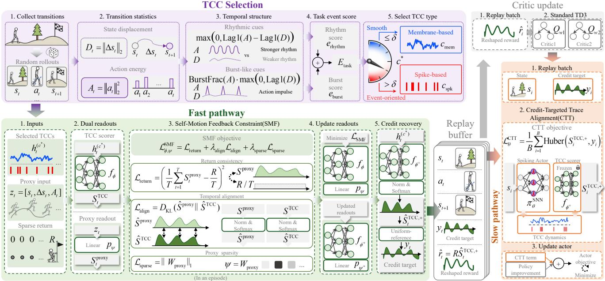  
Figure 2: Overview of SpikeCredit. Task statistics select membrane- or spike-based TCCs. The fast pathway uses Self-Motion Feedback Constraint (SMF) to read credit from the selected dynamics and generate reshaped rewards and replay targets, while the slow pathway uses Credit-Targeted Trace Alignment (CTT) to write these targets back into the actor, progressively improving future TCC readability.

RL (Xu et al. 2025; Van den Berghe et al. 2025; Qin et al. 2025; Xu et al. 2026). Overall, these studies primarily address how spiking policies are learned, represented, stabilized, and deployed. By contrast, to the best of our knowledge, Spike-Credit is the first spiking RL framework to exploit the distinct temporal characteristics of membrane potentials and spike events for sparse-reward credit assignment.

## Preliminaries

## Sparse-Reward RL

A RL problem is typically modeled as a Markov Decision Process (MDP) $\boldsymbol { \mathcal { M } } = ( \mathcal { S } , \mathcal { A } , P , r , \gamma )$ , where $\quad S , A , P , r ,$ and $\gamma$ denote the state space, action space, transition dynamics, reward function, and discount factor, respectively. A policy $\pi _ { \boldsymbol { \theta } } ( a _ { t } \mid s _ { t } )$ , together with P, induces trajectories $\tau = \left( s _ { 1 } , a _ { 1 } , \dots , s _ { T } , a _ { T } , s _ { T + 1 } \right)$ of T transitions.

We consider a sparse-reward setting in which the agent receives no intermediate rewards and only observes a terminal trajectory-level outcome R:

$$
r _ { t } = { \left\{ \begin{array} { l l } { 0 , } & { t < T , } \\ { R , } & { t = T . } \end{array} \right. }\tag{1}
$$

This terminal-only supervision creates temporal credit ambiguity, since the same terminal outcome can be explained by multiple transition-level credit assignments.

## Spiking Actor

We adopt an actor-critic framework whose actor is implemented by an SNN policy $\pi _ { \theta } ^ { \mathrm { S N N } }$ that maps a continuous state

$s _ { t }$ to an action $a _ { t } \colon$

$$
a _ { t } = \pi _ { \theta } ^ { \operatorname { S N N } } ( s _ { t } ) .\tag{2}
$$

The spiking actor consists of a spiking encoder, a spiking MLP, and a spiking decoder. Given $s _ { t } ,$ , the encoder first converts it into a population-coded spike train:

$$
x _ { t } = \mathrm { E n c } ^ { \mathrm { S N N } } ( s _ { t } ) ,\tag{3}
$$

where $x _ { t } \in \{ 0 , 1 \} ^ { d _ { x } \times K } , d _ { x }$ is the encoding dimension, and K is the number of SNN simulation steps within each environment transition. The encoded spike train is then processed by the spiking MLP:

$$
o _ { t } = \mathrm { M L P } ^ { \mathrm { S N N } } ( x _ { t } ) ,\tag{4}
$$

where $o _ { t }$ denotes its output spike train. In addition to producing $o _ { t } ,$ , the hidden layers of the spiking MLP expose temporally structured internal dynamics, including membrane-potential traces $m _ { t } \in \mathbb { R } ^ { d _ { h } \times } { \bf K }$ and spike events $e _ { t } ~ \in ~ \{ 0 , \dot { 1 } \} ^ { d _ { h } \times K }$ , where $d _ { h }$ denotes the hidden feature dimension. We treat these dynamics as candidate TCCs. Specifically, a TCC state is obtained by selecting a carrier type $c \in \mathcal { C } = \{ c _ { \mathrm { m e m } } , c _ { \mathrm { s p k } } \}$

$$
h _ { t } ^ { ( c ) } = \left\{ { m _ { t } , \atop c = c _ { \mathrm { s p k } } } , \right.\tag{5}
$$

where $c _ { \mathrm { m e m } }$ and $c _ { \mathrm { s p k } }$ denote the membrane-based and spikebased carrier types, respectively. Finally, the decoder converts the output spike train into a continuous control action:

$$
a _ { t } = a _ { \operatorname* { m a x } } \odot \mathrm { D e c } ^ { \mathrm { S N N } } ( o _ { t } ) ,\tag{6}
$$

where $a _ { \mathrm { m a x } }$ denotes the action bound and ⊙ denotes elementwise multiplication.

## Methodology

As shown in Figure 2, SpikeCredit addresses sparse-reward credit assignment by treating spiking actor dynamics as taskadaptive Temporal Credit Carriers (TCCs). It first selects a suitable carrier, then uses Self-Motion Feedback Constraint (SMF) to recover transition-level credit and Credit-Targeted Trace Alignment (CTT) to write the recovered targets back into the actor, forming a closed read-write loop that progressively improves the credit readability of future TCC dynamics.

## Task-Adaptive TCC Selection

SpikeCredit selects a suitable TCC type according to the temporal structure of each task. We consider two complementary carrier types:

$$
\mathcal { C } = \{ c _ { \mathrm { m e m } } , c _ { \mathrm { s p k } } \} ,\tag{7}
$$

where membrane traces provide graded temporal integration, whereas spike events provide localized event markers. Diferent temporal structures may therefore favor diferent carrier types.

During TCC selection, we collect a small number of random rollouts and record the transition tuples $( s _ { t } , a _ { t } , s _ { t + 1 } )$ For each transition, we compute

$$
D _ { t } = \| \Delta s _ { t } \| _ { 2 } , \qquad A _ { t } = \| a _ { t } \| _ { 2 } ^ { 2 } ,\tag{8}
$$

where $\Delta s _ { t } = s _ { t + 1 } - s _ { t }$ . Here, $D _ { t }$ measures local state displacement and $A _ { t }$ measures action energy.

We then define the task event score as

$$
E _ { \mathrm { t a s k } } = e _ { \mathrm { r h y t h m } } + e _ { \mathrm { b u r s t } } ,\tag{9}
$$

where

$$
e _ { \mathrm { r h y t h m } } = \operatorname* { m a x } \left( 0 , \operatorname { L a g 1 } ( A ) - \operatorname { L a g 1 } ( D ) \right) ,\tag{10}
$$

$$
e _ { \mathrm { b u r s t } } = \operatorname { B u r s t F r a c } ( A ) \cdot \operatorname* { m a x } \left( 0 , \operatorname { L a g } 1 ( D ) \right) .\tag{11}
$$

The rhythm component captures periodic structures in action dynamics, while the burst component captures localized action events under coherent state transitions. BurstFrac(x) denotes the fraction of local peaks above threshold in the normalized sequence.

The carrier type is selected by:

$$
c ^ { * } = \left\{ { \begin{array} { l l } { c _ { \mathrm { s p k } } , } & { E _ { \mathrm { t a s k } } > \delta , } \\ { c _ { \mathrm { m e m } } , } & { E _ { \mathrm { t a s k } } \le \delta , } \end{array} } \right.\tag{12}
$$

where $\delta$ is a fixed selection threshold. A larger $E _ { \mathrm { t a s k } }$ indicates stronger rhythmic or event-oriented temporal structure and favors spike-based carriers. Otherwise, membrane-based carriers are selected for smoother temporal dynamics. This selection stage is training-free.

## Fast Pathway: SMF for TCC Reading

After selecting the task-adaptive TCC type $c ^ { * }$ , SpikeCredit collects an episode and records the corresponding selected TCC dynamics $\{ h _ { t } ^ { ( c ^ { * } ) } \} _ { t = 1 } ^ { T }$ . To estimate transition-level credit from these dynamics, we introduce a lightweight TCC scorer $f _ { \phi } \colon$

$$
\begin{array} { r } { S _ { t } ^ { \mathrm { T C C } } = f _ { \phi } \left( h _ { t } ^ { ( c ^ { * } ) } \right) . } \end{array}\tag{13}
$$

However, the terminal outcome R alone does not provide suficient information to uniquely determine transition-level credit. SMF therefore introduces behavior-grounded temporal anchors. Specifically, we construct the self-motion proxy input

$$
\begin{array} { r } { \boldsymbol { z } _ { t } = [ s _ { t } , \Delta s _ { t } , A _ { t } ] , } \end{array}\tag{14}
$$

A linear proxy readout produces a behavior-grounded transition score:

$$
S _ { t } ^ { \mathrm { p r o x y } } = p _ { \psi } ( z _ { t } ) = W _ { \mathrm { p r o x y } } ^ { \top } z _ { t } , \qquad \psi = W _ { \mathrm { p r o x y } } .\tag{15}
$$

This proxy does not provide an additional reward signal. Instead, it acts as a temporal constraint that guides credit inference from the TCC dynamics.

SMF optimizes the temporal scores using

$$
{ \mathcal { L } } _ { \mathrm { S M F } } = { \mathcal { L } } _ { \mathrm { r e t u r n } } + \lambda _ { \mathrm { a l i g n } } { \mathcal { L } } _ { \mathrm { a l i g n } } + \lambda _ { \mathrm { s p a r s e } } { \mathcal { L } } _ { \mathrm { s p a r s e } } ,\tag{16}
$$

where $\lambda _ { \mathrm { a l i g n } }$ and $\lambda _ { \mathrm { s p a r s e } }$ are loss coeficients.

The return-consistency term is

$$
\mathcal { L } _ { \mathrm { r e t u r n } } = \left( \frac { 1 } { T } \sum _ { t = 1 } ^ { T } S _ { t } ^ { \mathrm { p r o x y } } - \frac { R } { T } \right) ^ { 2 } .\tag{17}
$$

This term encourages the proxy scores to aggregate to the observed episodic outcome while keeping the loss scale less sensitive to the trajectory length.

Before temporal alignment, we transform the proxy and TCC score sequences into comparable trajectory-level distributions:

$$
\hat { S } ^ { \mathrm { p r o x y } } = \mathrm { S o f t m a x } \left( \mathrm { N o r m } \left( \{ S _ { t } ^ { \mathrm { p r o x y } } \} _ { t = 1 } ^ { T } \right) / \tau _ { f } \right) ,\tag{18}
$$

$$
\hat { S } ^ { \mathrm { T C C } } = \mathrm { S o f t m a x } \left( \mathrm { N o r m } \left( \{ S _ { t } ^ { \mathrm { T C C } } \} _ { t = 1 } ^ { T } \right) / \tau _ { f } \right) ,\tag{19}
$$

where $\tau _ { f }$ is a temperature parameter and Norm(·) denotes normalization over the trajectory. The temporal alignment objective is

$$
\mathcal { L } _ { \mathrm { a l i g n } } = D _ { \mathrm { K L } } \left( \hat { S } ^ { \mathrm { p r o x y } } \Big | \Big | \hat { S } ^ { \mathrm { T C C } } \right) .\tag{20}
$$

We additionally impose sparsity on the proxy readout:

$$
\mathcal { L } _ { \mathrm { s p a r s e } } = \| W _ { \mathrm { p r o x y } } \| _ { 1 } .\tag{21}
$$

This regularization encourages the proxy to rely on a compact subset of self-motion features rather than behaving as an unconstrained predictor. Together, ${ \mathcal { L } } _ { \mathrm { r e t u r n } }$ grounds the proxy scores in the episodic outcome, $\mathcal { L } _ { \mathrm { a l i g n } }$ transfers their behavior-grounded temporal structure to the TCC scorer, and $\mathcal { L } _ { \mathrm { s p a r s e } }$ keeps the proxy interpretable and compact.

After each episode, we hold the actor fixed and update $( \psi , \phi )$ by minimizing LSMF. Using the updated scorer $f _ { \phi ^ { + } }$ we then recompute the TCC score sequence:

$$
S ^ { \mathrm { T C C , + } } = \left\{ f _ { \phi ^ { + } } \Big ( h _ { t } ^ { ( c ^ { * } ) } \Big ) \right\} _ { t = 1 } ^ { T } .\tag{22}
$$

A direction-aware trajectory-level credit distribution is obtained as

$$
\hat { S } ^ { \mathrm { T C C , + } } = \mathrm { S o f t m a x } \left( \mathrm { s g n } ( R ) \mathrm { N o r m } \left( S ^ { \mathrm { T C C , + } } \right) / \tau _ { s } \right)\tag{23}
$$

where $\tau _ { s }$ is a temperature parameter. For $R > 0$ , higherscoring transitions receive larger credit weights; for $R < 0 ,$ the ordering is reversed, assigning larger weights to lowerscoring transitions.

The terminal outcome is redistributed as

$$
\hat { r } _ { t } = R \hat { S } _ { t } ^ { \mathrm { T C C , + } } .\tag{24}
$$

We further construct a uniform-referenced log-credit target:

$$
y _ { t } = \log \left( T \hat { S } _ { t } ^ { \mathrm { T C C , + } } \right) .\tag{25}
$$

Since $1 / T$ is the uniform credit level, $y _ { t } > 0 , y _ { t } = 0 .$ and $y _ { t } ~ < ~ 0$ indicate above-uniform, uniform, and belowuniform credit, respectively. Thus, $y _ { t }$ specifies whether the corresponding transition should produce a stronger or weaker credit-readable TCC than the uniform trajectory reference. The redistributed reward $\hat { r } _ { t }$ and credit target $y _ { t }$ are stored with the corresponding transition in the replay bufer.

## Slow Pathway: CTT for TCC Writing

Credit-Targeted Trace Alignment (CTT) uses SMF-recovered credit targets to reshape future TCC dynamics for credit assignment.

During actor updates, replayed states si are passed through the current spiking actor to generate new selected TCC dynamics $h _ { \theta } ^ { ( c ^ { * } ) } ( s _ { i } )$ . A frozen TCC scorer $f _ { \phi ^ { + } }$ , where $\phi ^ { + }$ denotes the scorer parameters updated by the fast pathway and held fixed during the actor update, maps these dynamics to current TCC scores. We align these scores with the stored credit targets y using the Huber loss (Huber 1964):

$$
\mathcal { L } _ { \theta } ^ { \mathrm { C T T } } = \frac { 1 } { B } \sum _ { i = 1 } ^ { B } \mathrm { H u b e r } \left( f _ { \phi ^ { + } } \left( h _ { \theta } ^ { ( c ^ { * } ) } ( s _ { i } ) \right) , y _ { i } \right) ,\tag{26}
$$

where B is the replay batch size. Freezing the scorer ensures that the recovered credit remains a fixed shaping target, so gradients from $\mathcal { L } _ { \mathrm { { C T T } } }$ update only the actor rather than altering the credit estimator.

Through this slow replay-based update, credit targets inferred after each episode are written back into the actor’s internal representation. Consequently, future TCC dynamics become more informative for the frozen scorer to read, closing the credit loop from post-hoc TCC reading to creditguided TCC writing.

## Closed-Loop Optimization

Algorithm 1 summarizes the closed fast-slow optimization loop. After each completed episode, the fast pathway reads a temporal credit distribution from the current TCC dynamics and produces redistributed rewards $\hat { r } _ { t }$ and credit targets yt. The slow pathway then uses $\hat { r } _ { t }$ to update the critics and aligns future TCC dynamics with $y _ { t }$ during delayed actor updates, progressively improving their credit readability.

For a replay mini-batch $\{ ( s _ { i } , a _ { i } , s _ { i } ^ { \prime } , \hat { r } _ { i } , d _ { i } ) \} _ { i = 1 } ^ { \hat { B } } ,$ , we update the twin critics $Q _ { \omega 1 }$ and $Q _ { \omega _ { 2 } }$ following standard TD3 (Fujimoto, van Hoof, and Meger 2018), with the environment reward replaced by the redistributed reward $\boldsymbol { { \hat { r } } } _ { i }$ :

$$
\mathcal { L } _ { \mathrm { c r i t i c } } = \frac { 1 } { B } \sum _ { i = 1 } ^ { B } \sum _ { j = 1 } ^ { 2 } \left( Q _ { \omega _ { j } } ( s _ { i } , a _ { i } ) - q _ { i } ^ { \mathrm { t a r } } \right) ^ { 2 } ,\tag{27}
$$

Algorithm 1: Closed-Loop Optimization in SpikeCredit   
1: Select the task-adaptive TCC type $c ^ { * }$ and initialize replay   
bufer D.   
2: for each episode do   
3: Collect a trajectory $B _ { \tau }$   
$\{ ( s _ { t } , a _ { t } , s _ { t + 1 } , d _ { t } , z _ { t } , h _ { t } ^ { ( c ^ { * } ) } ) \} _ { t = 1 } ^ { T } ,$ where $z _ { t }$   
$[ s _ { t } , \Delta s _ { t } , A _ { t } ] .$   
4: Observe the terminal outcome R.   
5: Fast pathway: read credit from current TCCs   
6: Hold the actor fixed and update $( \psi , \phi )$ by minimizing   
$\mathcal { L } _ { \mathrm { S M F } }$ on $B _ { \tau }$   
7: Use $f _ { \phi ^ { + } }$ to obtain $\hat { S } ^ { \mathrm { T C C , + } }$ , and compute   
$\begin{array} { r } { \hat { r } _ { t } = R \hat { S } _ { t } ^ { \mathrm { T C C , + } } , \qquad y _ { t } = \log ( T \hat { S } _ { t } ^ { \mathrm { T C C , + } } ) . } \end{array}$   
8: Store $\left( s _ { t } , a _ { t } , s _ { t + 1 } , \hat { r } _ { t } , y _ { t } , d _ { t } \right)$ in $\mathcal { D } .$   
9: Slow pathway: write credit into future TCCs   
10: Sample replay mini-batches from D and update the   
twin critics using ${ \hat { r } } _ { i } .$   
11: On delayed actor-update steps, freeze $f _ { \phi ^ { - } }$ + and update   
the actor using $\mathcal { L } _ { \mathrm { a c t o r } } .$   
12: end for 12: end for

##

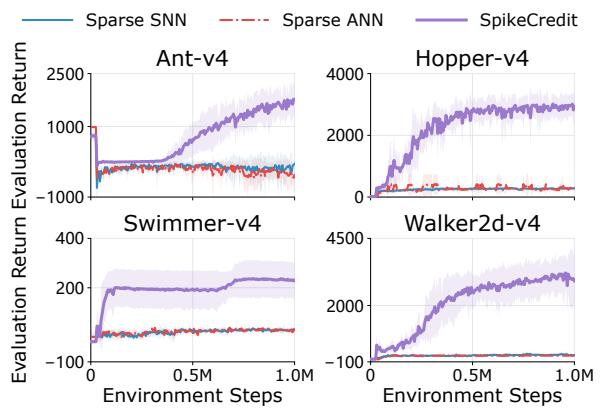  
Figure 3: Learning curves of SpikeCredit, sparse-reward SNN and ANN baselines on four MuJoCo tasks. Lines and shaded regions denote the mean and standard deviation over five seeds, respectively.

where $q _ { i } ^ { \mathrm { t a r } }$ is the standard TD3 target computed using $\hat { r } _ { i } .$ On delayed policy-update steps, the actor objective combines standard policy improvement with CTT:

$$
\mathcal { L } _ { \mathrm { a c t o r } } = - \frac { 1 } { B } \sum _ { i = 1 } ^ { B } Q _ { \omega _ { 1 } } \left( s _ { i } , \pi _ { \theta } ^ { \mathrm { S N N } } ( s _ { i } ) \right) + \lambda _ { \mathrm { C T T } } \mathcal { L } _ { \theta } ^ { \mathrm { C T T } } ,\tag{28}
$$

where $\lambda _ { \mathrm { C T T } }$ controls the strength of TCC shaping.

## Experiment

## Experimental Setup

We evaluate SpikeCredit on four MuJoCo benchmarks (Todorov, Erez, and Tassa 2012; Todorov 2014) from Gymnasium (Brockman et al. 2016; Towers et al. 2024): Ant (Schulman et al. 2015), Hopper (Erez, Tassa, and Todorov

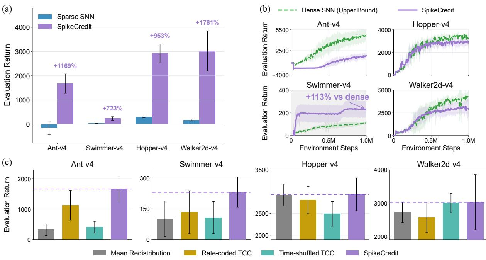  
Figure 4: Overall performance on four MuJoCo tasks. (a) Last10 returns against the sparse SNN baseline. (b) Learning curves against the dense SNN upper bound. (c) Comparisons with three alternative credit-assignment methods. Mean ± standard deviation over five seeds.

2012), Swimmer (Coulom 2002), and Walker2d. These tasks cover diverse control characteristics, including quadrupedal coordination, periodic hopping, phase-coordinated propulsion, and bipedal locomotion. For the sparse setting, intermediate rewards are set to zero, and their undiscounted sum is revealed only at termination or truncation. We adopt the recently proposed CaRe-BN (Xu et al. 2026) as the backbone of SpikeCredit. ANN and SNN methods in this work share the same twin critics and difer only in the actor. SMF is updated once per episode, whereas CTT is enabled only during delayed actor updates after warm-up. We report results over five random seeds. Environment illustrations, network and spiking-neuron configurations, RL and SpikeCredit hyperparameters, and evaluation details are provided in the Appendix.

## Efective Credit Recovery with SpikeCredit

We first evaluate SpikeCredit under trajectory-level sparse rewards. Figure 3 shows sustained learning across all four tasks, while the sparse-reward SNN and ANN baselines remain at substantially lower returns. The Last10 results in Figure 4a confirm this advantage: relative to the sparse SNN, SpikeCredit improves the evaluation return by 1169%, 723%, 953%, and 1781% on Ant, Swimmer, Hopper, and Walker2d, respectively. These gains show that the closed TCC readwrite loop substantially improves sparse-reward learning beyond the underlying spiking actor. Compared with the same SNN trained on original dense rewards, Figure 4b shows that SpikeCredit approaches dense-reward performance on Hopper and Walker2d, despite receiving only one return per episode, while a larger gap remains on Ant. On Swimmer, it exceeds the dense-reward baseline by approximately 113%, showing that sparse episodic supervision does not necessarily limit final performance when temporal credit is efectively recovered.

To verify that these gains arise from meaningful carrier structure rather than redistribution alone, Figure 4c compares SpikeCredit with three controlled alternatives. Uniform mean redistribution removes carrier information and transition-specific diferentiation; rate-coded TCCs preserve aggregate spiking activity but discard fine-grained temporal dynamics; and time-shufled TCCs preserve carrier values but break their trajectory alignment. SpikeCredit achieves the highest average performance on all four tasks, whereas no alternative performs consistently well across environments. Together, these results suggest that SpikeCredit’s consistent advantage comes from jointly exploiting transition-specific credit information, fine-grained TCC dynamics, and their correct temporal alignment.

## Mechanistic Analysis

Task-adaptive carrier selection. We first examine whether the task-event score can select a suitable credit carrier for each environment. As shown in Figure 5, Ant and Hopper exhibit event scores below the threshold and therefore select membrane traces, whereas Swimmer and Walker2d select spike events due to their stronger rhythmic or burst signatures. The selected carrier achieves the highest average return on all four tasks: membrane TCCs outperform spike TCCs on Ant and Hopper, while spike TCCs perform better on Swimmer and Walker2d. These results support the task-adaptive selection rule and show that no single carrier is uniformly optimal across diferent control dynamics. In particular, stronger event-level temporal structure favors spikebased carriers, whereas tasks with weaker event signatures benefit more from graded membrane dynamics.

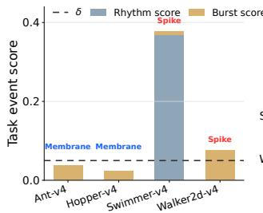

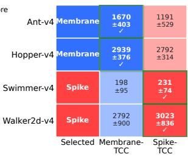  
Figure 5: Task-adaptive TCC selection. Left: task event scores determine the carrier. Right: Last10 returns verify that the selected candidate performs best on each task. Results are averaged over five seeds.

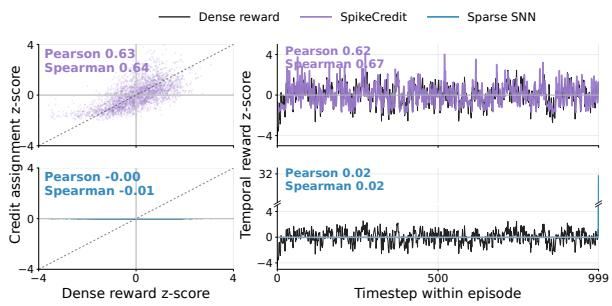  
Figure 6: Alignment between credit signals and dense rewards on Ant-v4. Left: transition-wise correlations. Right: temporal profiles over an episode. Dense rewards are used only as a diagnostic reference.

Recovery of transition-level credit. We next examine whether SpikeCredit recovers meaningful temporal credit from episodic outcomes, using the original dense reward only as a diagnostic reference. As shown in Figure 6, its credit signals on Ant align well with dense rewards, with transition-wise Pearson/Spearman correlations of 0.63/0.64 and temporal-profile correlations of 0.62/0.67. By contrast, the sparse SNN remains nearly uncorrelated. These results show that SpikeCredit converts terminal-only feedback into temporally diferentiated credit that tracks the dense-reward structure.

Behavioral grounding of SMF. Figure 7 shows that SMF relies mainly on state and state-change features, with limited contribution from action energy. The dominant cues are taskdependent: forward velocity on Ant, joint and foot velocities on Hopper and Walker2d, and pose and coordinated joint motion on Swimmer. Thus, SMF derives behavior-grounded temporal anchors from task-relevant self-motion cues rather than relying on a predefined motion rule.

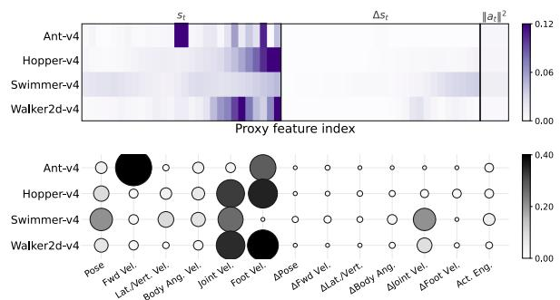

Figure 7: Task-dependent SMF proxy attribution. Top: feature importance over $s _ { t } , \Delta s _ { t } .$ and $\lVert \boldsymbol { a } _ { t } \rVert _ { 2 } ^ { 2 }$ . Bottom: attribution aggregated by physical feature groups. Semantic groupings of observation fields used for self-motion proxy attribution are provided in the Appendix.
<table><tr><td>Methods</td><td>Last10 Return</td><td>Peak Return</td><td>Peak Step</td></tr><tr><td>SpikeCredit</td><td> $1 6 6 9 . 9 \pm 4 0 2 . 8$ </td><td> $1 7 7 7 . 5 \pm 4 6 6 . 8$ </td><td>995K</td></tr><tr><td>w/o  $s _ { t }$ </td><td> $5 4 4 . 4 \pm 3 8 9 . 7$ </td><td> $7 3 8 . 1 \pm 9 1 . 5$ </td><td>20K</td></tr><tr><td>w/o  $\Delta { } s _ { t }$   $\| a _ { t } \| _ { 2 } ^ { 2 }$ </td><td> $1 1 0 6 . 3 \pm 4 7 0 . 5$ </td><td> $1 2 1 2 . 2 \pm 4 9 0 . 5$ </td><td>985K</td></tr><tr><td>w/o w/o SMF</td><td> $8 4 5 . 8 \pm 6 7 2 . 7$ </td><td> $9 3 9 . 5 \pm 6 5 4 . 9$ </td><td>980K</td></tr><tr><td></td><td> $1 9 2 . 7 \pm 7 8 . 6$ </td><td> $7 3 8 . 1 \pm 9 1 . 5$ </td><td>20K</td></tr><tr><td>SpikeCredit</td><td> $1 6 6 9 . 9 \pm 4 0 2 . 8$ </td><td> $1 7 7 7 . 5 \pm 4 6 6 . 8$ </td><td>995K</td></tr><tr><td>w/o CTT</td><td> $1 4 0 3 . 8 \pm 5 4 7 . 0$ </td><td> $1 5 1 4 . 5 \pm 6 1 8 . 9$ </td><td>975K</td></tr></table>

Table 1: Ablation of SMF inputs and CTT on Ant-v4. Results are averaged over five seeds.

## Ablation Analysis

We ablate SMF and its behavioral cues $z _ { t } = [ s _ { t } , \Delta s _ { t } , \lVert a _ { t } \rVert _ { 2 } ^ { 2 } ]$ on Ant. As shown in Table 1, SpikeCredit achieves a Last10 return of1669.9±402.8. Removing $s _ { t } , \Delta s _ { t } , \mathbf { o r } \| a _ { t } \| _ { 2 } ^ { 2 }$ reduces it to 544.4, 1106.3, and 845.8, respectively, while removing SMF causes it to collapse to $1 9 2 . 7 \pm 7 8 . 6 $ . Moreover, the variants without $s _ { t }$ or SMF peak at only 20K steps, whereas the full model continues improving until nearly 1M steps. These results show that the three inputs provide complementary behavioral context, motion, and control-efort cues, with $s _ { t }$ being particularly important for sustained learning. Removing CTT reduces the Last10 return from 1669.9 to 1403.8 and the peak return from 1777.5 to 1514.5, although learning continues until 975K steps. Overall, the ablations reveal complementary roles: SMF supports credit reading and sustained policy learning, while CTT further improves performance through credit writing.

## Conclusion

We present SpikeCredit, a sparse-reward RL framework that uses spiking dynamics as temporal credit carriers within a closed read-write loop. Across four MuJoCo tasks, Spike-Credit consistently outperforms sparse-reward ANN and SNN baselines, while mechanistic analyses show that the recovered credit captures meaningful temporal structure.

Andrychowicz, M.; Wolski, F.; Ray, A.; Schneider, J.; Fong, R.; Welinder, P.; McGrew, B.; Tobin, J.; Abbeel, P.; and Zaremba, W. 2017. Hindsight Experience Replay. In Advances in Neural Information Processing Systems, volume 30.

Arjona-Medina, J. A.; Gillhofer, M.; Widrich, M.; Unterthiner, T.; Brandstetter, J.; and Hochreiter, S. 2019. RUD-DER: Return Decomposition for Delayed Rewards. In Advances in Neural Information Processing Systems, volume 32.

Brockman, G.; Cheung, V.; Pettersson, L.; Schneider, J.; Schulman, J.; Tang, J.; and Zaremba, W. 2016. OpenAI Gym. arXiv preprint arXiv:1606.01540.

Burda, Y.; Edwards, H.; Storkey, A.; and Klimov, O. 2019. Exploration by Random Network Distillation. In International Conference on Learning Representations.

Burkitt, A. N. 2006. A Review of the Integrate-and-Fire Neuron Model: I. Homogeneous Synaptic Input. Biological Cybernetics, 95(1): 1–19.

Chen, D.; Peng, P.; Huang, T.; and Tian, Y. 2025. Fully Spiking Actor Network With Intralayer Connections for Reinforcement Learning. IEEE Transactions on Neural Networks and Learning Systems, 36(2): 2881–2893.

Chen, J.; Zhang, Y.; Xu, Y.; Ma, H.; Yang, H.; Song, J.; Wang, Y.; and Wu, Y. 2021. Variational Automatic Curriculum Learning for Sparse-Reward Cooperative Multi-Agent Problems. In Advances in Neural Information Processing Systems, volume 34, 9681–9693.

Coulom, R. 2002. Reinforcement Learning Using Neural Networks, with Applications to Motor Control. Ph.D. thesis, Institut National Polytechnique de Grenoble, Grenoble, France.

Devidze, R.; Kamalaruban, P.; and Singla, A. 2022. Exploration-Guided Reward Shaping for Reinforcement Learning under Sparse Rewards. In Advances in Neural Information Processing Systems, volume 35, 5829–5842.

Erez, T.; Tassa, Y.; and Todorov, E. 2012. Infinite-Horizon Model Predictive Control for Periodic Tasks with Contacts. In Robotics: Science and Systems VII.

Fang, M.; Zhou, T.; Du, Y.; Han, L.; and Zhang, Z. 2019. Curriculum-Guided Hindsight Experience Replay. In Advances in Neural Information Processing Systems, volume 32, 12602–12613.

Florensa, C.; Held, D.; Geng, X.; and Abbeel, P. 2018. Automatic Goal Generation for Reinforcement Learning Agents. In Proceedings of the 35th International Conference on Machine Learning, volume 80 of Proceedings of Machine Learning Research, 1515–1528. PMLR.

Florian, R. V. 2007. Reinforcement Learning Through Modulation of Spike-Timing-Dependent Synaptic Plasticity. Neural Computation, 19(6): 1468–1502.

Frémaux, N.; Sprekeler, H.; and Gerstner, W. 2013. Reinforcement Learning Using a Continuous Time Actor-Critic Framework with Spiking Neurons. PLOS Computational Biology, 9(4): e1003024.

Fujimoto, S.; van Hoof, H.; and Meger, D. 2018. Addressing Function Approximation Error in Actor-Critic Methods. In Proceedings ofthe 35th International Conference on Machine Learning, volume 80 of Proceedings of Machine Learning Research, 1587–1596. PMLR.

Han, B.; Ren, Z.; Wu, Z.; Zhou, Y.; and Peng, J. 2022. Of-Policy Reinforcement Learning with Delayed Rewards. In Proceedings of the 39th International Conference on Machine Learning, volume 162 of Proceedings of Machine Learning Research, 8280–8303. PMLR.

Harutyunyan, A.; Dabney, W.; Mesnard, T.; Azar, M. G.; Piot, B.; Heess, N.; van Hasselt, H.; Wayne, G.; Singh, S.; Precup, D.; and Munos, R. 2019. Hindsight Credit Assignment. In Advances in Neural Information Processing Systems, volume 32.

Huber, P. J. 1964. Robust Estimation ofa Location Parameter. The Annals ofMathematical Statistics, 35(1): 73–101.

Izhikevich, E. M. 2007. Solving the Distal Reward Problem through Linkage of STDP and Dopamine Signaling. Cerebral Cortex, 17(10): 2443–2452.

Kapoor, A.; Tessera, K.-a.; Baranwal, M.; Khadilkar, H.; Peters, J.; Albrecht, S.; and Sun, M. 2025. Redistributing Rewards Across Time and Agents for Multi-Agent Reinforcement Learning. arXiv preprint arXiv:2502.04864.

Li, A.; Pinto, L.; and Abbeel, P. 2020. Generalized Hindsight for Reinforcement Learning. In Advances in Neural Information Processing Systems, volume 33, 7754–7767.

Ma, H.; Li, F.; Lim, J. Y.; Luo, Z.; Vo, T. V.; and Leong, T.-Y. 2025. Catching Two Birds with One Stone: Reward Shaping with Dual Random Networks for Balancing Exploration and Exploitation. In Proceedings ofthe 42nd International Conference on Machine Learning, volume 267 of Proceedings of Machine Learning Research, 41975–41991. PMLR.

Ma, H.; Sima, K.; Vo, T. V.; Fu, D.; and Leong, T.-Y. 2024. Reward Shaping for Reinforcement Learning with An Assistant Reward Agent. In Proceedings ofthe 41st International Conference on Machine Learning, volume 235 of Proceedings ofMachine Learning Research, 33925–33939. PMLR.

Ng, A. Y.; Harada, D.; and Russell, S. J. 1999. Policy Invariance Under Reward Transformations: Theory and Application to Reward Shaping. In Proceedings of the 16th International Conference on Machine Learning, 278–287. Morgan Kaufmann.

Pathak, D.; Agrawal, P.; Efros, A. A.; and Darrell, T. 2017. Curiosity-Driven Exploration by Self-Supervised Prediction. In Proceedings of the 34th International Conference on Machine Learning, volume 70 of Proceedings of Machine Learning Research, 2778–2787. PMLR.

Pathak, D.; Gandhi, D.; and Gupta, A. 2019. Self-Supervised Exploration via Disagreement. In Proceedings of the 36th International Conference on Machine Learning, volume 97 of Proceedings of Machine Learning Research, 5062–5071. PMLR.

Patil, V.; Hofmarcher, M.; Dinu, M.-C.; Dorfer, M.; Blies, P. M.; Brandstetter, J.; Arjona-Medina, J.; and Hochreiter, S. 2022. Align-RUDDER: Learning From Few Demonstrations

by Reward Redistribution. In Proceedings of the 39th International Conference on Machine Learning, volume 162 of Proceedings ofMachine Learning Research, 17531–17572. PMLR.

Pignatelli, E.; Ferret, J.; Geist, M.; Mesnard, T.; van Hasselt, H.; and Toni, L. 2024. A Survey of Temporal Credit Assignment in Deep Reinforcement Learning. Transactions on Machine Learning Research. Survey Certification.

Pitis, S.; Chan, H.; Zhao, S.; Stadie, B.; and Ba, J. 2020. Maximum Entropy Gain Exploration for Long Horizon Multi-Goal Reinforcement Learning. In Proceedings of the 37th International Conference on Machine Learning, volume 119 of Proceedings of Machine Learning Research, 7750–7761. PMLR.

Potjans, W.; Morrison, A.; and Diesmann, M. 2009. A Spiking Neural Network Model of an Actor-Critic Learning Agent. Neural Computation, 21(2): 301–339.

Qin, L.; Wang, Z.; Jiang, R.; Yan, R.; and Tang, H. 2025. GRSN: Gated Recurrent Spiking Neurons for POMDPs and MARL. In Proceedings ofthe AAAI Conference on Artificial Intelligence, volume 39, 1483–1491.

Salimans, T.; and Chen, R. 2018. Learning Montezuma’s Revenge from a Single Demonstration. arXiv preprint arXiv:1812.03381.

Schulman, J.; Moritz, P.; Levine, S.; Jordan, M. I.; and Abbeel, P. 2015. High-Dimensional Continuous Control Using Generalized Advantage Estimation. arXiv preprint arXiv:1506.02438.

Schultz, W.; Dayan, P.; and Montague, P. R. 1997. A Neural Substrate of Prediction and Reward. Science, 275(5306): 1593–1599.

Scott, S. H. 2004. Optimal Feedback Control and the Neural Basis of Volitional Motor Control. Nature Reviews Neuroscience, 5(7): 532–545.

Sekar, R.; Rybkin, O.; Daniilidis, K.; Abbeel, P.; Hafner, D.; and Pathak, D. 2020. Planning to Explore via Self-Supervised World Models. In Proceedings of the 37th International Conference on Machine Learning, volume 119 of Proceedings of Machine Learning Research, 8583–8592. PMLR.

Sutton, R. S.; and Barto, A. G. 1998. Reinforcement Learning:An Introduction. Cambridge, MA: The MIT Press. ISBN 9780262193986.

Tan, W.; Patel, D.; and Kozma, R. 2021. Strategy and Benchmark for Converting Deep Q-Networks to Event-Driven Spiking Neural Networks. In Proceedings ofthe AAAI Conference on Artificial Intelligence, volume 35, 9816–9824.

Tang, G.; Kumar, N.; Yoo, R.; and Michmizos, K. P. 2021. Deep Reinforcement Learning with Population-Coded Spiking Neural Network for Continuous Control. In Proceedings ofthe 2020 Conference on Robot Learning, volume 155 of Proceedings ofMachine Learning Research, 2016–2029. PMLR.

Todorov, E. 2014. Convex and Analytically-Invertible Dynamics with Contacts and Constraints: Theory and Implementation in MuJoCo. In 2014 IEEE International Conference on Robotics and Automation, 6054–6061. IEEE.

Todorov, E.; Erez, T.; and Tassa, Y. 2012. MuJoCo: A Physics Engine for Model-Based Control. In 2012 IEEE/RSJ International Conference on Intelligent Robots and Systems, 5026–5033. IEEE.

Towers, M.; Kwiatkowski, A.; Terry, J.; Balis, J. U.; De Cola, G.; Deleu, T.; Goulão, M.; Kallinteris, A.; Krimmel, M.; KG, A.; Perez-Vicente, R.; Pierré, A.; Schulhof, S.; Tai, J. J.; Tan, H.; and Younis, O. G. 2024. Gymnasium: A Standard Interface for Reinforcement Learning Environments. arXiv preprint arXiv:2407.17032.

Van den Berghe, K.; Stroobants, S.; Janapa Reddi, V.; and de Croon, G. 2025. Adaptive Surrogate Gradients for Sequential Reinforcement Learning in Spiking Neural Networks. In Advances in Neural Information Processing Systems, volume 38, 147904–147926.

Venugopal, A.; Chen, J.; Wu, X.; Zheng, C.; Eysenbach, B.; and Schneider, J. 2026. Occupancy Reward Shaping: Improving Credit Assignment for Ofline Goal-Conditioned Reinforcement Learning. In International Conference on Learning Representations.

Wilcox, A.; Balakrishna, A.; Dedieu, J.; Benslimane, W.; Brown, D. S.; and Goldberg, K. 2022. Monte Carlo Augmented Actor-Critic for Sparse Reward Deep Reinforcement Learning from Suboptimal Demonstrations. In Advances in Neural Information Processing Systems, volume 35, 2254– 2267.

Wolpert, D. M.; Diedrichsen, J.; and Flanagan, J. R. 2011. Principles of Sensorimotor Learning. Nature Reviews Neuroscience, 12(12): 739–751.

Xu, Z.; Bu, T.; Hao, Z.; Ding, J.; and Yu, Z. 2025. Proxy Target: Bridging the Gap Between Discrete Spiking Neural Networks and Continuous Control. InAdvances in Neural Information Processing Systems, volume 38, 159158–159184.

Xu, Z.; Shi, X.; Dong, Y.; Huang, Z.; and Yu, Z. 2026. CaRe-BN: Precise Moving Statistics for Stabilizing Spiking Neural Networks in Reinforcement Learning. In International Conference on Learning Representations.

Zhang, D.; Zhang, T.; Jia, S.; and Xu, B. 2022. Multi-Sacle Dynamic Coding Improved Spiking Actor Network for Reinforcement Learning. In Proceedings of the AAAI Conference on Artificial Intelligence, volume 36, 59–67.

## Model Architecture

## Dynamic neuron model

We use the second-order Dynamic Neuron (DN) model (Zhang et al. 2022) as the spiking unit in the SNN actor. Compared with the standard leaky integrate-and-fire (LIF) neuron (Burkitt 2006), each DN maintains a membrane potential V and an adaptation variable U, enabling richer internal dynamics during action generation.

For layer l and internal simulation step k, the synaptic current is updated as

$$
C _ { k } ^ { l } = \alpha C _ { k - 1 } ^ { l } + X _ { k } ^ { l } ,\tag{29}
$$

where $X _ { k } ^ { l }$ denotes the afine input to layer l, and α is the synaptic-current decay factor.

Before integrating the state at step $k ,$ a spike emitted at the previous step resets the membrane potential and updates the adaptation variable:

$$
\tilde { V } _ { k - 1 } ^ { l } = ( 1 - S _ { k - 1 } ^ { l } ) V _ { k - 1 } ^ { l } + S _ { k - 1 } ^ { l } \theta _ { r } ,\tag{30}
$$

$$
\tilde { U } _ { k - 1 } ^ { l } = U _ { k - 1 } ^ { l } + S _ { k - 1 } ^ { l } \theta _ { s } ,\tag{31}
$$

where $\theta _ { r }$ is the reset potential and $\theta _ { s }$ is the spike-triggered increment of U.

The DN state is then updated using explicit Euler discretization with unit step size:

$$
\Delta V _ { k } ^ { l } = ( \tilde { V } _ { k - 1 } ^ { l } ) ^ { 2 } - \tilde { V } _ { k - 1 } ^ { l } - \tilde { U } _ { k - 1 } ^ { l } + C _ { k } ^ { l } ,\tag{32}
$$

$$
\Delta U _ { k } ^ { l } = \theta _ { v } \tilde { V } _ { k - 1 } ^ { l } + \theta _ { u } \tilde { U } _ { k - 1 } ^ { l } ,\tag{33}
$$

$$
V _ { k } ^ { l } = \tilde { V } _ { k - 1 } ^ { l } + \Delta V _ { k } ^ { l } , \qquad U _ { k } ^ { l } = \tilde { U } _ { k - 1 } ^ { l } + \Delta U _ { k } ^ { l } .\tag{34}
$$

Here, $\theta _ { v }$ and $\theta _ { u }$ are coupling coeficients governing the adaptation dynamics.

The spike event is generated by

$$
\begin{array} { r } { S _ { k } ^ { l } = H ( V _ { k } ^ { l } - V _ { \mathrm { t h } } ) , } \end{array}\tag{35}
$$

where $V _ { \mathrm { t h } }$ is the firing threshold and $H ( \cdot )$ is the Heaviside step function.

During backpropagation, its derivative is approximated using a rectangular surrogate:

$$
\frac { \partial S _ { k } ^ { l } } { \partial V _ { k } ^ { l } } \approx \mathbb { I } \left( \left| V _ { k } ^ { l } - V _ { \mathrm { t h } } \right| < w \right) ,\tag{36}
$$

where w denotes the surrogate-gradient window.

## Actor-critic architectures

All compared methods are implemented within the standard TD3 framework (Fujimoto, van Hoof, and Meger 2018). The critic architecture is identical across all SNN and ANN methods and consists oftwo independent ANN-based Q-networks. Each Q-network takes the concatenated state-action pair $\left( { { s _ { t } } , { a _ { t } } } \right)$ as input and contains two hidden layers with 256 units and ReLU activations, followed by a scalar Q-value output. Our SpikeCredit therefore operates on the actor-side spiking dynamics and introduces temporal credit redistribution while leaving the critic architecture unchanged.

For SNN-based methods, we adopt a population-coded spiking actor based on CaRe-BN (Xu et al. 2026). Each continuous observation is first encoded into population spike trains, processed by a two-layer DN spiking MLP, and decoded into a continuous action through a population decoder. The hidden-layer membrane traces and spike events exposed by the spiking MLP serve as candidate TCCs.

For the ANN baseline, we use a conventional two-layer MLP actor with 256 hidden units per layer and ReLU activations. Its output layer uses a tanh activation and is scaled according to the action bounds. The ANN baseline uses the same critic architecture, TD3 training procedure, and core optimization settings as the SNN baselines, but replaces the spiking actor with a non-spiking policy network.

## Experimental Details

## Experiment environments

We evaluate all methods on four continuous-control tasks from the Gymnasium MuJoCo-v4 suite: Ant-v4, Hopper-v4, Swimmer-v4, and Walker2d-v4 (Towers et al. 2024; Todorov, Erez, and Tassa 2012). As shown in Figure 8, these environments cover locomotion tasks with diferent morphologies and control dynamics. Sparse rewards are constructed from the original dense rewards following the procedure described in the main text.

## Spiking neuron parameters

All SNN-based methods use the same DN parameters and surrogate-gradient configuration across all tasks. As summarized in Table 2, all neuron-dynamics parameters and the surrogate-gradient window are fixed throughout the experiments.

## Actor-critic architecture hyperparameters

All methods follow the same TD3 framework and use an identical twin-critic architecture across tasks, while difering in the actor architecture. As summarized in Table 3, all hidden-layer configurations are fixed across environments. Task-dependent observation and action dimensions afect only the corresponding input and output sizes of the actor, critic, population encoder, and population decoder. Here, $d _ { s }$ and $d _ { a }$ denote the observation and action dimensions, respectively.

## RL and SpikeCredit hyperparameters

The training, TD3, and SpikeCredit hyperparameters are summarized in Table 4. All tasks use the same training budget and TD3 optimization schedule. Shared SpikeCredit hyperparameters are also fixed across tasks, while λCTT and $\lambda _ { \mathrm { s p a r s e } }$ are task-specific. BN recalibration is applied only to SNN-based methods.

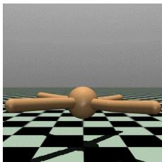  
(a) Ant-v4

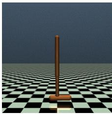  
(b) Hopper-v4

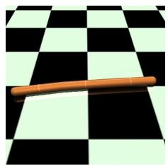  
(c) Swimmer-v4

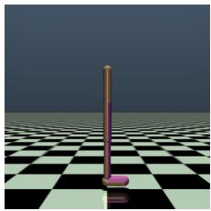  
(d) Walker2d-v4  
Figure 8: Rendered views of the four MuJoCo continuous-control environments used in our experiments: (a) Ant-v4, (b) Hopperv4, (c) Swimmer-v4, and (d) Walker2d-v4.

## Observation-space categorization

For the self-motion proxy attribution analysis, we group the observation dimensions according to their physical meanings. As summarized in Table 5, the resulting categories describe pose, translational velocity, angular velocity, and joint-motion features, together with their abbreviations used in the main text. Table 6 provides the task-specific mapping from observation indices to these semantic categories.

The observation indices follow the default Gymnasium MuJoCo-v4 observation vectors (Towers et al. 2024). Contact-force observations are not included for Ant-v4. The field names in Table 6 are descriptive labels based on the Gymnasium observation ordering and the corresponding MuJoCo joint semantics.

For the proxy input $\boldsymbol { z } _ { t } ~ = ~ [ s _ { t } , \Delta s _ { t } , \lVert \boldsymbol { a } _ { t } \rVert _ { 2 } ^ { 2 } ]$ , each dimension of $\Delta { } s _ { t }$ inherits the category of its corresponding state dimension in $s _ { t } .$ , while $\| a _ { t } \| _ { 2 } ^ { 2 }$ is treated as a separate actionenergy feature. These groupings are used only to aggregate and visualize feature attribution and do not afect training.

## Additional experiments

## Sensitivity analysis of SpikeCredit

Figure 9 shows that SpikeCredit is robust to its main hyperparameters. Across all tested values of $\lambda _ { \mathrm { a l i g n } } , \lambda _ { \mathrm { s p a r s e } } ,$ and $\lambda _ { \mathrm { { C T T } } } ,$ , SpikeCredit remains above both Sparse SNN and Mean Redistribution baselines. The best performance is obtained near moderate alignment and sparsity strengths, while overly strong alignment or overly weak sparsity reduces performance but does not collapse learning. Increasing λCTT further improves return, supporting the role of credit-targeted trace alignment in reshaping actor dynamics into more creditreadable representations.

<table><tr><td>Parameter</td><td>Value</td></tr><tr><td>α</td><td>0.5</td></tr><tr><td> $V _ { \mathrm { t h } }$ </td><td>0.5</td></tr><tr><td> $w$ </td><td>0.5</td></tr><tr><td> $\theta _ { v }$ </td><td>-0.172</td></tr><tr><td> $\theta _ { u }$ </td><td>0.529</td></tr><tr><td> $\theta _ { r }$ </td><td>0.021</td></tr><tr><td> $\theta _ { s }$ </td><td>0.132</td></tr></table>

Table 2: Dynamic neuron parameters used in all SNN experiments.

<table><tr><td>Component</td><td>Hyperparameter</td><td>Value</td></tr><tr><td>TD3 critic</td><td>Number of critics</td><td>2</td></tr><tr><td>TD3 critic</td><td>Input dimension</td><td> $d _ { s } + d _ { a }$ </td></tr><tr><td>TD3 critic</td><td>Hidden layers</td><td> $2 5 6 , 2 5 6$ </td></tr><tr><td>TD3 critic</td><td>Activation</td><td> $\mathrm { R e L U }$ </td></tr><tr><td>TD3 critic</td><td>Output dimension</td><td>1</td></tr><tr><td>SNN actor</td><td>Input / output dimension</td><td> $d _ { s }  d _ { a }$ </td></tr><tr><td>SNN actor</td><td>Hidden layers</td><td> $2 5 6 , 2 5 6$ </td></tr><tr><td>SNN actor</td><td>Internal SNN steps K</td><td> $5$ </td></tr><tr><td>SNN actor</td><td>Neuron type</td><td>DN</td></tr><tr><td>SNN encoder</td><td>Population size</td><td> $1 0 d _ { s }$ </td></tr><tr><td>SNN encoder</td><td>Mean range</td><td> $[ - 1 , 1 ]$ </td></tr><tr><td>SNN encoder</td><td>Std.</td><td> $\sqrt { 0 . 0 5 }$ </td></tr><tr><td>SNN encoder</td><td>Threshold</td><td> $0 . 9 9 9$ </td></tr><tr><td>SNN decoder</td><td>Population size</td><td> $1 0 d _ { a }$ </td></tr><tr><td>SNN decoder</td><td>Output activation</td><td> $\operatorname { t a n h }$ </td></tr><tr><td>SNN layers</td><td>Normalization</td><td> $\mathrm { \ e n a b l e d { \ell } }$ </td></tr><tr><td>ANN actor</td><td>Input dimension</td><td> $d _ { s }$ </td></tr><tr><td>ANN actor</td><td>Hidden layers</td><td> $2 5 6 , 2 5 6$ </td></tr><tr><td>ANN actor</td><td>Activation</td><td> $\mathrm { R e L U }$ </td></tr><tr><td>ANN actor</td><td>Output dimension</td><td> $d _ { a }$ </td></tr><tr><td>ANN actor</td><td>Output activation</td><td>tanh</td></tr><tr><td>Task dims.</td><td>Ant-v4  $( d _ { s } , d _ { a } )$ </td><td>(27, 8)</td></tr><tr><td>Task dims.</td><td>Hopper-v4  $( d _ { s } , d _ { a } )$ </td><td>(11, 3)</td></tr><tr><td>Task dims.</td><td>Swimmer-v4  $( d _ { s } , d _ { a } )$ </td><td>(8,2)</td></tr><tr><td>Task dims.</td><td>Walker2d-v4  $( d _ { s } , d _ { a } )$ </td><td>(17,6)</td></tr></table>

Table 3: Actor-critic architecture hyperparameters.

<table><tr><td>Group</td><td>Hyperparameter</td><td>Value</td></tr><tr><td rowspan="6">Training</td><td>Random seed</td><td>0,1, 2,3,4 256</td></tr><tr><td>Batch size</td><td></td></tr><tr><td>Replay buffer size</td><td>10⁶</td></tr><tr><td>Warm-up random-action steps</td><td>25,000</td></tr><tr><td>Maximum training steps</td><td>1,000,000</td></tr><tr><td>Evaluation interval</td><td>5,000 steps</td></tr><tr><td rowspan="6">TD3</td><td>Actor learning rate</td><td> $3 \times 1 0 ^ { - 4 }$ </td></tr><tr><td>Critic learning rate</td><td> $3 \times 1 0 ^ { - 4 }$ </td></tr><tr><td>Discount factor γ</td><td>0.99</td></tr><tr><td>Target update rate τ</td><td>0.005</td></tr><tr><td>Exploration-noise standard deviation</td><td>0.1</td></tr><tr><td>Target-policy-noise standard deviation Target-noise clipping range</td><td>0.2 [−0.5, 0.5]</td></tr><tr><td rowspan="2">SNN training</td><td>Delayed policy update frequency BN recalibration interval</td><td>5,000 steps</td></tr><tr><td>BN recalibration mini-batches</td><td>100</td></tr><tr><td rowspan="9">SpikeCredit</td><td>TCC scorer architecture</td><td>MLP</td></tr><tr><td>TCC scorer learning rate</td><td> $1 \times 1 0 ^ { - 4 }$ </td></tr><tr><td>TCC temperature</td><td>2.0</td></tr><tr><td> $\tau _ { c }$  SMF updates per episode</td><td>1</td></tr><tr><td>TCC scorer gradient-norm clip</td><td>1.0</td></tr><tr><td>Self-motion proxy architecture</td><td>Linear</td></tr><tr><td>Alignment coefficient</td><td>1.0</td></tr><tr><td> $\lambda _ { \mathrm { a l i g n } }$  CTT start step</td><td>200,000</td></tr><tr><td>Credit-target epsilon</td><td>10-6</td></tr><tr><td rowspan="5">Hopper-v4</td><td>Credit-target clipping range</td><td>[−5,5] 1.0</td></tr><tr><td>λCTT</td><td></td></tr><tr><td>Asparse</td><td>0.01</td></tr><tr><td>λCTT</td><td>2.0</td></tr><tr><td> $\lambda _ { \mathrm { s p a r s e } }$ </td><td>0.05</td></tr><tr><td>Swimmer-v4</td><td> $\lambda _ { \mathrm { C T T } }$ </td><td>2.0 0.05</td></tr><tr><td rowspan="2">Walker2d-v4</td><td> $\lambda _ { \mathrm { s p a r s e } }$   $\lambda _ { \mathrm { C T T } }$ </td><td>2.0</td></tr><tr><td></td><td></td></tr><tr><td rowspan="2"></td><td> $\lambda _ { \mathrm { s p a r s e } }$ </td><td>0.05</td></tr></table>

Table 4: RL and SpikeCredit hyperparameters used in the main experiments.
<table><tr><td>Abbreviation</td><td>Category</td><td>Meaning</td></tr><tr><td>Pose Fwd Vel.</td><td>Body / joint pose Forward velocity</td><td>Body height, orientation, joint angles, and foot angles Translational velocity along the forward direction</td></tr><tr><td>Lat./Vert. Vel. Body Ang. Vel. Joint Vel.</td><td>Lateral / vertical velocity Body angular velocity Joint velocity</td><td>Sideways or vertical translational velocity Angular velocity of torso or body orientation Hip, thigh, leg, rotor, or non-foot joint velocity</td></tr><tr><td>Foot Vel. ∆Pose ∆Fwd Vel.  $\Delta \mathrm { L a t . / V e r t . }$ </td><td>Foot / ankle velocity Change in pose Change in forward velocity Change in lateral / vertical velocity</td><td>Foot or ankle joint velocity Temporal difference of Pose features Temporal difference of Fwd Vel. features Temporal difference of Lat./Vert. Vel. features</td></tr></table>

Table 5: Semantic proxy-feature categories and abbreviations used in the attribution analysis.

<table><tr><td>Task</td><td>Observation indices</td><td>Observation fields</td><td>Category</td></tr><tr><td rowspan="5">Ant-v4</td><td>0-12</td><td>torso_z; torso_quat_w/x/y/z;</td><td>Pose</td></tr><tr><td></td><td>hip_1-4_angle; ankle_1-4_angle</td><td>Fwd Vel.</td></tr><tr><td>13</td><td>torso_x_velocity torso_y_velocity; torso_z_velocity</td><td>Lat./Vert. Vel.</td></tr><tr><td>14-15</td><td>torso_roll_velocity;</td><td></td></tr><tr><td>16-18 19,21,23, 25</td><td>torso_pitch_velocity; torso_yaw_velocity hip_1-4_velocity</td><td>Body Ang. Vel. Joint Vel.</td></tr><tr><td rowspan="6">Hopper-v4</td><td>20, 22, 24, 26</td><td>ankle_1-4_velocity</td><td>Foot Vel.</td></tr><tr><td>0-4</td><td>root_z; root_angle; thigh_angle; leg_angle; foot_angle</td><td>Pose</td></tr><tr><td>5</td><td>root_x_velocity</td><td>Fwd Vel.</td></tr><tr><td>6</td><td>root_z_velocity</td><td>Lat./Vert. Vel.</td></tr><tr><td>7</td><td>root_angle_velocity</td><td>Body Ang. Vel.</td></tr><tr><td>8-9</td><td>thigh_velocity; leg_velocity</td><td>Joint Vel.</td></tr><tr><td rowspan="5">Swimmer-v4</td><td>10</td><td>foot_velocity</td><td>Foot Vel.</td></tr><tr><td>0-2 3</td><td>body_angle; motor1_angle; motor2_angle</td><td>Pose Fwd Vel.</td></tr><tr><td>4</td><td>x_velocity</td><td></td></tr><tr><td>5</td><td>y_velocity</td><td>Lat./Vert. Vel.</td></tr><tr><td>6-7</td><td>body_angle_velocity motor1_velocity; motor2_velocity</td><td>Body Ang. Vel. Joint Vel.</td></tr><tr><td rowspan="6">Walker2d-v4</td><td>0-7</td><td>root_z; root_angle; right/left thigh_angle;</td><td></td></tr><tr><td></td><td>right/left leg_angle; right/left foot_angle</td><td>Pose</td></tr><tr><td>8</td><td>root_x_velocity</td><td>Fwd Vel.</td></tr><tr><td>9</td><td>root_z_velocity</td><td>Lat./Vert. Vel.</td></tr><tr><td>10</td><td>root_angle_velocity</td><td>Body Ang. Vel.</td></tr><tr><td>11–12, 14–15 13,16</td><td>right/left thigh_velocity; right/left leg_velocity right/left foot_velocity</td><td>Joint Vel. Foot Vel.</td></tr></table>

Table 6: Task-specific mapping from Gymnasium MuJoCo-v4 observation dimensions to semantic proxy-feature categories.

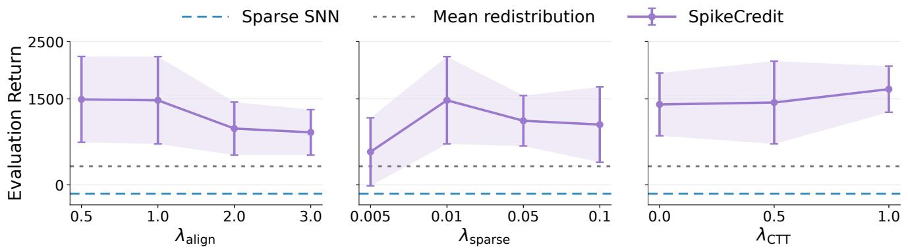  
Figure 9: Hyperparameter sensitivity of SpikeCredit on Ant-v4. We vary $\lambda _ { \mathrm { a l i g n } } , \lambda _ { \mathrm { s p a r s e } } ,$ and $\lambda _ { \mathrm { C T T } }$ while keeping other settings fixed, and report Last10 evaluation returns over five seeds. Dashed lines denote Sparse SNN and Mean Redistribution baselines. SpikeCredit consistently outperforms both baselines across all tested values, indicating that its gains are not tied to a narrow hyperparameter choice.