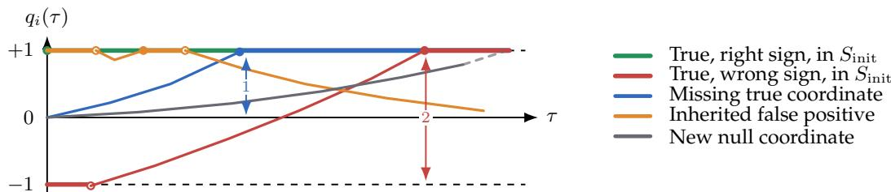
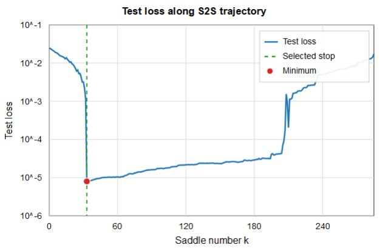
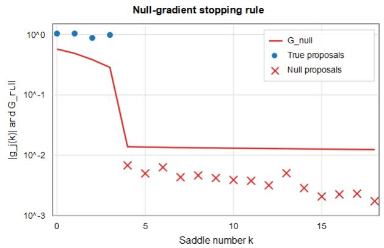
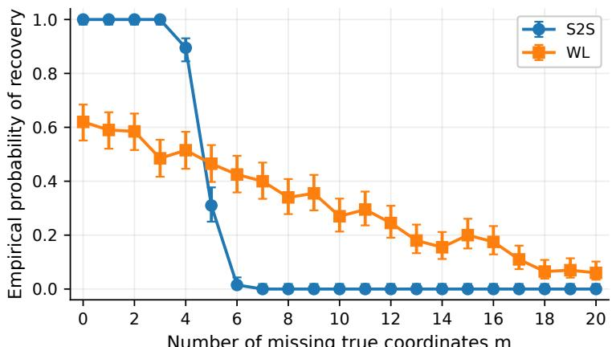

# Statistical Benefits of Fine-Tuning from Pretrained Initialization in Diagonal Linear Networks

Alexandre Decleves\` TML, EPFL, Lausanne, Switzerland alexandre.decleves@gmail.com

Etienne Boursier INRIA, LMO, Universite Paris-Saclay,´ Orsay, France etienne.boursier@inria.fr

Nicolas Flammarion TML, EPFL, Lausanne, Switzerland nicolas.flammarion@epfl.ch

## Abstract

Adapting pretrained models to downstream tasks with limited data has become a central paradigm in modern deep learning. Yet, despite its widespread practical success, how fine-tuning leverages information from pretraining remains poorly understood theoretically. We study fine-tuning from pretrained weights through the lens of sparse linear regression and two-layer diagonal linear networks. In our setting, pretraining provides information through the support (and signs) of the initialization predictor, which may contain coordinates relevant to the downstream task. We show how pretrained information reshapes the implicit bias and training dynamics, and can thereby reduce the sample complexity of recovering the target parameters and support. In particular, for a clean initialization with correctly inherited signs, we show that the required sample size is comparable to that of a weighted Lasso estimator that explicitly exploits the pretrained support through a suitably chosen regularizer. Our results thus show how information encoded in pretrained weights can be implicitly exploited by gradient-based fine-tuning, reducing the amount of data needed to recover a downstream task.

## 1 Introduction

Fine-tuning has become a standard approach for leveraging pretrained models on new tasks, from transferring visual representations to adapting language models to instructions (Kornblith et al., 2019; Wei et al., 2022). Rather than starting from scratch, fine-tuning uses information acquired from previous data to guide learning on the downstream task. In practice, this information is encoded in the pretrained parameters, which serve as the initialization for a gradient-based optimization procedure. Yet how, and under what conditions, fine-tuning can exploit this initialization to reduce the data required for the downstream task remains poorly understood theoretically. In particular, two fundamental questions arise: What information encoded in a pretrained model can reduce the amount of data required to learn a downstream task? And when can fine-tuning exploit this information without simultaneously learning spuriousfeatures?

A large body of work has studied the implicit bias of gradient descent: how the model parameterization and optimization dynamics favor particular solutions even in the absence of explicit regularization. This perspective has revealed how gradient-based training can favor simple predictors and how initialization shapes the selected solution (Chizat et al., 2019; Woodworth et al., 2020; Boursier et al., 2022). Much of this theory, however, considers small and uninformative initializations, where training begins without knowledge inherited from a previous task. Fine-tuning instead starts from a structured predictor that may already identify features relevant to the downstream task. Understanding its statistical benefits therefore requires characterizing how the resulting implicit bias allows useful inherited information to be retained while the remaining signal is learned.

We make this theoretical study of fine-tuning concrete in the setting of sparse linear regression with twolayer diagonal linear networks. Here, pretraining provides a nonzero predictor whose support may already identify relevant coordinates, although their downstream coefficients need not be accurately estimated. Without support information, estimating an s-sparse target in d dimensions from n noisy observations has minimax squared error of order $\sigma ^ { 2 } s \log ( d / s ) / n$ under suitable design conditions (Wainwright, 2019). Suppose instead that pretraining correctly identifies $s - m$ of the relevant coordinates, leaving only m to be discovered. This suggests a statistical gain: the ambient-dimensional logarithmic cost should only be incurred for coordinates whose membership in the target support is unknown, while the cost of estimating the coefficients on all s coordinates remains. We first formalize this benefit through a weighted Lasso benchmark, which explicitly favors the pretrained support and achieves a corresponding support-dependent guarantee.

The weighted Lasso benchmark, however, does not answer the central question of whether gradient-based fine-tuning can extract the same statistical benefit from initialization alone. We show that pretraining indeed modifies the implicit bias through the inherited signed support. In the limit of vanishing layer imbalance, with fixed initial predictor, we characterize the resulting implicit regularizer in terms of the inherited signed support. The penalty favors reusing inherited coordinates with their pretrained signs rather than preserving their coefficient magnitudes: coordinates absent from the pretrained support incur the usual $\ell _ { 1 }$ cost, whereas inherited coordinates incur no cost when their signs are preserved. This asymmetry explains why correctly inherited signs are favored, and why incorrect signs and inherited false positives require separate treatment. In the noiseless setting, it yields an exact-recovery guarantee: for a clean, correctly signed initialization, a sample size of order $s + m \log ( d )$ suffices, so only the m missing coordinates incur the ambient-dimensional log cost.

The main difficulty arises with noisy observations. Characterizing the interpolating solution selected at convergence is no longer enough: it does not establish whether the trajectory recovers the missing signal before fitting the noise and activating irrelevant coordinates. We therefore study the fine-tuning path through its limiting saddle-to-saddle dynamics, building on the construction of Pesme & Flammarion (2023) while retaining the nonzero pretrained predictor. Under a Gaussian design and suitable sample-size and signal-strength conditions, we show that the trajectory preserves correctly inherited true coordinates, corrects initially wrong signs, and recovers the remaining signal before introducing any new false positive. We also derive a gradient-based stopping rule, calibrated using an upper bound on the number of missing or incorrectly signed true coordinates and inherited false positives. The stopped trajectory achieves exact support recovery for a clean initialization; with an imperfect initialization, its support contains the true support and can differ from it only through inherited false positives. We complement our theoretical results with synthetic experiments illustrating the role of early stopping and the dependence of support recovery on initialization quality (Appendix F).

## 1.1 Related work

Theoretical analyses of fine-tuning. Shachaf et al. (2021) relate the sample complexity and inductive bias of fine-tuning to source–target similarity in linear-teacher models. Wu et al. (2022) establish excess risk bounds for pretraining and fine-tuning with SGD in linear regression under covariate shift. Jones-McCormick et al. (2025) prove sample-complexity improvements from unsupervised pretraining and transfer learning in single-index models. Other analyses study the distortion of pretrained features under distribution shift (Kumar et al., 2022) and characterize language-model fine-tuning through neural tangent kernels (Malladi et al., 2023; Tomihari & Sato, 2024). Beyond the fixed-kernel regime, Lauditi et al. (2026) analyze transfer learning in infinite-width networks with feature learning during both pretraining and adaptation.

Sparse recovery with prior support information. Prior support information can improve sparse recovery through weighted $\ell _ { 1 }$ minimization, which penalizes likely support coordinates less heavily (Zou, 2006; Von Borries et al., 2007; Khajehnejad et al., 2009; Oymak et al., 2012). Vaswani & Lu (2010); Jacques (2010) analyzed a compressed sensing algorithm, assigning zero weights to an estimated support. Friedlander et al. (2011) allowed nonzero weights and established recovery conditions depending on the size and accuracy of the estimate. Mansour & Saab (2017) established weighted null-space conditions and uniform

Gaussian recovery guarantees for sufficiently accurate support estimates. Rauhut & Ward (2016) developed a weighted-sparsity framework for function interpolation, while Bah & Ward (2016) derived nonuniform Gaussian sample-complexity bounds reflecting the alignment between the weights and the true support. Flinth (2016); Lian et al. (2018) further study the choice of weights from prior support information, including optimal weighting and statistical prior-support models. Our weighted-Lasso benchmark specializes this literature to the pretrained-support setting and provides a statistical reference for the fine-tuning guarantees.

Implicit bias in diagonal linear networks. Diagonal linear networks (DLN) provide a tractable setting for studying implicit bias. For least-squares regression, Woodworth et al. (2020) show that the implicit bias interpolates between $\ell _ { 2 } -$ and $\ell _ { 1 }$ -norm minimization as the initialization scale decreases. The connection between multiplicative parameterizations and mirror descent provides a useful framework for analyzing this bias and the resulting sparsity-inducing optimization dynamics (Ghai et al., 2020; Vaskevicius et al., 2020; Azulay et al., 2021). Beyond characterizing the terminal solution, Vaskevi ˇ cius et al. ˇ (2019); Zhao et al. (2022) establish sparse-estimation guarantees for early-stopped gradient descent from small initialization under restricted isometry assumptions. In a complementary direction, Berthier (2023); Pesme & Flammarion (2023); Berthier $\&$ Pillaud-Vivien (2026) describe the limiting gradient-flow trajectory as a sequence of saddles in the vanishing-initialization regime. In the fine-tuning setting, Lippl & Lindsey (2024); Anguita et al. (2026) characterize how pretrained weights shape implicit bias and feature reuse when the end-to-end predictor is reset to zero before fine-tuning. We instead retain a nonzero pretrained predictor and quantify how its support affects the implicit bias and fine-tuning trajectory.

## 2 A minimal model of fine-tuning

## 2.1 Sparse regression and pretrained model

We study fine-tuning in sparse linear regression, where pretraining can provide partial information about the relevant coordinates. We observe a design matrix $\mathbf { X } \in \mathbb { R } ^ { n \times d }$ and a response vector $\mathbf { y } \in \mathbb { R } ^ { n }$ generated as

$$
\begin{array} { r } { { \mathbf y } = { \mathbf X } { \boldsymbol \beta } ^ { \star } + \frac { \sigma } { \sqrt { n } } \varepsilon , \qquad { \mathbf X } _ { j } \stackrel { \mathrm { i . i . d . } } { \sim } { \mathcal N } \big ( 0 , \frac { 1 } { n } I _ { n } \big ) , \qquad \varepsilon \sim { \mathcal N } ( 0 , I _ { n } ) , } \end{array}
$$

where $\mathbf { X } _ { j }$ denotes the j-th column of X, the noise ε is independent of X, $\sigma \geq 0$ and the target $\beta ^ { \star } \in \mathbb { R } ^ { d }$ is sparse. We write $S ^ { \star } = \operatorname * { s u p p } ( \beta ^ { \star } )$ and $s = | S ^ { \star } |$

The downstream quadratic loss is

$$
\begin{array} { r } { L ( \boldsymbol { \beta } ) : = \frac { 1 } { 2 } \| \mathbf { y } - \mathbf { X } \boldsymbol { \beta } \| _ { 2 } ^ { 2 } . } \end{array}\tag{1}
$$

We model pretraining through a predictor $\beta ^ { 0 } \in \mathbb { R } ^ { d } .$ , treated as fixed independently of the design matrix and noise, and write $\mathbf { \bar { \mathit { S } } } _ { \mathrm { i n i t } } = \mathbf { \bar { \ s u p p } } ( \beta ^ { 0 } )$ . Our analysis takes this predictor as given rather than modeling the pretraining phase itself. Intuitively, $\beta ^ { 0 }$ is inherited from a previous pretraining phase on a different but related data distribution, so that its support provides partial information about $S ^ { \star }$

The overlap $S ^ { \star } \cap S _ { \mathrm { i n i t } }$ represents relevant coordinates already identified by pretraining. Their downstream coefficients are not assumed to be known or accurately estimated, while the coordinates in $S ^ { \star } \setminus S _ { \mathrm { i n i t } }$ still need to be identified. In the clean case, $S _ { \mathrm { i n i t } } \subseteq S ^ { \star }$ . More generally, the pretrained support may contain null coordinates, i.e., coordinates in $( S ^ { \star } ) ^ { c }$ , which are irrelevant to the downstream task.

## 2.2 Weighted Lasso

To quantify the statistical advantage of the pretrained support, we consider the estimation rate of an explicit regularization benchmark, the weighted Lasso (Zou, 2006), defined for $\lambda \geq 0$ and $\alpha \geq 1$ by

$$
\widehat { \beta } ^ { \mathrm { W L } } \in \arg \operatorname* { m i n } _ { \beta \in \mathbb { R } ^ { d } } \big \{ L ( \beta ) + \lambda \big ( \| \beta _ { S _ { \mathrm { i n i t } } ^ { c } } \| _ { 1 } + \frac { 1 } { \alpha } \| \beta _ { S _ { \mathrm { i n i t } } } \| _ { 1 } \big ) \big \} .
$$

The parameter α controls how strongly the pretrained support is favored.

Proposition 1 (Weighted-Lasso benchmark). Let $\delta \in \mathsf { \Gamma } ( 0 , 1 )$ and suppose $1 \ \leq \ | S _ { \mathrm { i n i t } } | \ \leq \ d / 2$ . Choose $\alpha _ { \star } ^ { 2 } =$ $\frac { \log ( 4 | S _ { \mathrm { i n i t } } ^ { c } | / \delta ) } { \log ( 4 | S _ { \mathrm { i n i t } } | / \delta ) }$ and $\lambda = C \sigma \sqrt { \frac { \log ( 4 | S _ { \mathrm { i n i t } } ^ { c } | / \delta ) } { n } } ^ { }$ 1, for a sufficiently large universal constant C. Then there exists a universal constant $C _ { 0 }$ such that if

$$
n \geq C _ { 0 } \left( 1 + \frac { \sigma ^ { 2 } } { \operatorname* { m i n } _ { i \in S ^ { \ast } } ( \beta _ { i } ^ { \star } ) ^ { 2 } } \right) \cdot \left( | S ^ { \star } \setminus S _ { \mathrm { i n i t } } | \log \frac { 4 | S _ { \mathrm { i n i t } } ^ { c } | } { \delta } + | S ^ { \star } \cap S _ { \mathrm { i n i t } } | \log \frac { 4 | S _ { \mathrm { i n i t } } | } { \delta } \right) ,
$$

then with probability at least $1 - \delta ,$ , both

$$
\| \widehat { \beta } ^ { \mathrm { W L } } - \beta ^ { \star } \| _ { 2 } \leq C _ { 0 } \frac { \sigma } { \sqrt { n } } \sqrt { | S ^ { \star } \setminus S _ { \mathrm { i n i t } } | \log \frac { 4 | S _ { \mathrm { i n i t } } ^ { c } | } { \delta } + | S ^ { \star } \cap S _ { \mathrm { i n i t } } | \log \frac { 4 | S _ { \mathrm { i n i t } } | } { \delta } }
$$

The bound separates the statistical costs associated with the two regions defined by the pretrained support. The coordinates in $S ^ { \star } \backslash S _ { \mathrm { i n i t } }$ must be identified among the $| S _ { \mathrm { i n i t } } ^ { c } |$ coordinates not selected by pretraining, and therefore incur a logarithmic factor in $| S _ { \mathrm { i n i t } } ^ { c } |$ . By contrast, coordinates already contained in $S _ { \mathrm { i n i t } }$ only incur a logarithmic factor in the size of this smaller candidate set. This rate improves over the usual Lasso rate in which all s active coordinates pay the ambient-dimensional logarithmic cost. Thus, although the estimator is a single weighted Lasso, its rate reflects two distinct support-identification problems inside and outside the pretrained support. In sparse regimes, this agrees, up to logarithmic refinements, with the natural statistical complexity of sparse estimation with such two-block support information. The signal-to-noise prefactor in the sample-size condition accounts for detecting the smallest nonzero coefficient in exact support recovery; the estimation bound alone holds without this prefactor (Appendix E).

An oracle choice of α depending on $S ^ { \star }$ yields a sharper bound (see Equation (13) in Appendix E), requiring only

$$
n \gtrsim | S ^ { \star } \setminus S _ { \mathrm { i n i t } } | \log _ { + } \frac { 4 | S _ { \mathrm { i n i t } } ^ { c } \cap ( S ^ { \star } ) ^ { c } | } { \delta } + | S ^ { \star } \cap S _ { \mathrm { i n i t } } | \log _ { + } \frac { 4 | S _ { \mathrm { i n i t } } \setminus S ^ { \star } | } { \delta }
$$

samples for recovery, where log $\mathbf { \mu } _ { - } ( t ) = \operatorname* { m a x } ( 1 , \log ( t ) )$ . For a clean initialization $( S _ { \mathrm { i n i t } } \subseteq S ^ { \star } )$ , this oracle choice (given by $\alpha = \infty )$ removes the logarithmic cost on inherited true coordinates, leaving only the $| S ^ { \star } \setminus S _ { \mathrm { i n i t } } |$ missing coordinates to incur the ambient-dimensional logarithmic cost.

Proposition 1 specializes weighted- ${ \boldsymbol { \mathbf { \ell } } } _ { \mathbf { \ell } } - { \boldsymbol { \ell } } _ { 1 }$ recovery with prior support information to our pretrained-support model. Its proof combines the Gaussian weighted-cone bounds of Bah & Ward (2016) with standard weighted-Lasso estimation and primal-dual support-recovery arguments. We include a self-contained derivation in Appendix E to make the dependence on the pretrained support explicit.

Weighted Lasso exploits the pretrained support through explicit regularization and provides good guarantees for support recovery. In practical fine-tuning of deep learning models, however, one typically relies on gradient-based optimization initialized at the pretrained weights. We therefore use weighted Lasso as a statistical benchmark against which we compare the solution obtained through such gradient-based finetuning.

## 3 Fine-tuning diagonal linear networks

Motivated by practical fine-tuning, we now study gradient-based optimization initialized at pretrained weights. More precisely, we consider diagonal linear networks (DLNs), a simple neural network archi tecture that nevertheless exhibits nonconvex optimization dynamics.

## 3.1 Parameterization and gradient flow

We parameterize the predictor as a two-layer DLN $\beta _ { w } = u \odot v ,$ , where $w = ( u , v ) \in \mathbb { R } ^ { 2 d }$ and $\odot$ denotes the (Hadamard) componentwise multiplication. The fine-tuning training objective is

$$
F ( w ) : = L ( u \odot v ) .\tag{2}
$$

While the loss $L$ is convex in the end-to-end predictor $\beta _ { w } = u \odot v , F$ is non-convex in the network parameters w. This simple reparameterization already produces a rich, non-trivial training trajectory. We model fine-tuning by training both layers from an initialization representing the pretrained predictor $\beta ^ { 0 }$ . As the limiting dynamics of the (stochastic) gradient descent with infinitesimal step-sizes, we study gradient flow

$$
\dot { w } _ { t } ^ { \mu } = - \nabla F ( w _ { t } ^ { \mu } ) .
$$

For $\mu > 0$ , we initialize the weights so that

$$
u ^ { \mu } ( 0 ) \odot v ^ { \mu } ( 0 ) = \beta ^ { 0 } , \qquad u _ { i } ^ { \mu } ( 0 ) ^ { 2 } - v _ { i } ^ { \mu } ( 0 ) ^ { 2 } = 2 \mu , \qquad i \in [ d ] .
$$

Equivalently, $u _ { i } ^ { \mu } ( 0 ) ^ { 2 } = \sqrt { ( \beta _ { i } ^ { 0 } ) ^ { 2 } + \mu ^ { 2 } } + \mu ,$ , and $v _ { i } ^ { \mu } ( 0 ) ^ { 2 } = \sqrt { ( \beta _ { i } ^ { 0 } ) ^ { 2 } + \mu ^ { 2 } } - \mu ,$ for $i \in [ d ]$ , with signs chosen so that $u _ { i } ^ { \bar { \mu } } ( 0 ) v _ { i } ^ { \mu } ( 0 ) \dot { = } \bar { \beta _ { i } ^ { 0 } }$ . The first condition ensures that fine-tuning starts from the pretrained predictor, retaining the information acquired before the downstream task. The second controls the imbalance between the two layers.

This imbalance $u _ { i } ^ { \mu } ( t ) ^ { 2 } - v _ { i } ^ { \mu } ( t ) ^ { 2 }$ is preserved along the flow and plays a key role in the implicit bias of the dynamics. We study the regime $\mu \to 0$ with $\beta ^ { 0 ^ { \smash { \scriptstyle \bigwedge } } }$ fixed: the layer imbalance vanishes, not the pretrained predictor. The next section characterizes the limiting dynamics obtained in that regime.

## 3.2 Mirror flow and the limiting fine-tuning path

To study how pretraining affects support recovery during fine-tuning, we first describe the mirror-flow dynamics and their limiting saddle-to-saddle trajectory.

Mirror flow and implicit bias. Although the network parameter $w ^ { \mu }$ follows a nonconvex gradient flow, the end-to-end predictor $\beta ^ { \mu } = u ^ { \mu } \odot v ^ { \mu }$ evolves according to a mirror flow for the convex loss L (Azulay et al., 2021). In our parametrization, the conserved layer imbalance gives

$$
\frac { \mathrm { d } } { \mathrm { d } t } \nabla \phi _ { \mu } ( \beta ^ { \mu } ( t ) ) = - \nabla L ( \beta ^ { \mu } ( t ) ) , \quad \mathrm { w h e r e } \quad \phi _ { \mu } ( \beta ) : = \frac { 1 } { 2 } \sum _ { i = 1 } ^ { d } \Big [ \beta _ { i } \arcsin \Big ( \frac { \beta _ { i } } { \mu } \Big ) - \sqrt { \beta _ { i } ^ { 2 } + \mu ^ { 2 } } \Big ]\tag{3}
$$

is the hyperbolic entropy (Ghai et al., 2020). The mirror flow structure provides a direct characterization of the implicit bias of gradient flow and makes the role of initialization explicit. If the flow converges to an interpolator $\beta _ { \infty } ^ { \mu }$ , the mirror identity implies

$$
\beta _ { \infty } ^ { \mu } = \underset { \beta \in \mathbb { R } ^ { d } : \mathbf { X } \beta = \mathbf { y } } { \arg \operatorname* { m i n } } D _ { \phi _ { \mu } } ( \beta , \beta ^ { 0 } ) ,\tag{4}
$$

where $D _ { \phi _ { \mu } } ( \beta , \beta ^ { 0 } ) : = \phi _ { \mu } ( \beta ) - \phi _ { \mu } ( \beta ^ { 0 } ) - \langle \nabla \phi _ { \mu } ( \beta ^ { 0 } ) , \beta - \beta ^ { 0 } \rangle$ is the associated Bregman divergence. Thus initialization affects the selected interpolator through the reference point of the divergence. The mirrordescent representation also allows us to characterize the limiting fine-tuning trajectory as $\mu  0 ,$ , while keeping the pretrained predictor $\beta ^ { 0 }$ fixed.

Limiting saddle-to-saddle dynamics. To obtain a nondegenerate limit of the dynamics as $\mu \ \to \ 0 .$ , we rescale time. Indeed, writing $\lambda _ { \mu } : = \textstyle { \frac { 1 } { 2 } } \log ( 1 / \mu )$ , the mirror potential satisfies $\phi _ { \mu } / \lambda _ { \mu } \to \parallel \cdot \parallel _ { 1 }$ . We therefore consider the accelerated predictor $\widetilde { \beta } ^ { \mu } ( \tau ) : = \beta ^ { \mu } ( \lambda _ { \mu } \tau )$ . Integrating Equation (3) gives

$$
\frac { \nabla \phi _ { \mu } ( \widetilde { \beta } ^ { \mu } ( \tau ) ) } { \lambda _ { \mu } } = \frac { \nabla \phi _ { \mu } ( \beta ^ { 0 } ) } { \lambda _ { \mu } } - \int _ { 0 } ^ { \tau } \nabla L ( \widetilde { \beta } ^ { \mu } ( s ) ) \mathrm { d } s .\tag{5}
$$

Algorithm 1 Saddle-to-saddle dynamics with pretrained initialization   
1: Initialize $q  q ^ { 0 }$ as in Equation (6), and $\tau  0$   
2: $\beta  \mathrm { a r g }$ min $. \beta \in \mathcal { F } ( q ) ~ L ( \beta )$   
3: while $\nabla L ( \beta ) \neq { \dot { 0 } }$ and the stopping criterion is not satisfied do   
4: ∆ ← inf $\{ \rho > 0 : \exists i ,$ $[ \nabla L ( \mathbf { \hat { \boldsymbol { \beta } } } ) ] _ { i } \neq 0$ and $q _ { i } - \rho [ \nabla L ( \beta ) ] _ { i } \in \{ - 1 , + 1 \} \}$   
5: $\left( \tau , q \right) \gets \left( \tau + \Delta , q - \Delta \cdot \nabla L ( \beta ) \right)$   
6: β ← arg min $L ( \beta )$   
$\beta \in \mathcal { F } ( q )$   
7: end while   
8: return successive values of $( \tau , \beta , q )$

Following the construction of Pesme & Flammarion (2023), we use the formal limit of this identity to describe a piecewise-constant trajectory $\beta ^ { \circ }$ satisfying

$$
q ( \tau ) : = q ^ { 0 } - \int _ { 0 } ^ { \tau } \nabla L ( \beta ^ { \circ } ( s ) ) \mathrm { d } s \in \partial \Vert \beta ^ { \circ } ( \tau ) \Vert _ { 1 } , \qquad q _ { i } ^ { 0 } = \left\{ \begin{array} { l l } { \mathrm { s i g n } ( \beta _ { i } ^ { 0 } ) , } & { i \in S _ { \mathrm { i n i t } } , } \\ { 0 , } & { i \not \in S _ { \mathrm { i n i t } } . } \end{array} \right.\tag{6}
$$

The difference from zero initialization is the nonzero initial dual state $q ^ { 0 } { \mathrm { : } }$ inherited coordinates start at the boundary of $[ - 1 , 1 ]$ with their pretrained signs, whereas the other coordinates start at its center.

Equation (6) determines the constraints on the predictor: if $| q _ { i } | < 1$ , then $\beta _ { i } = 0 ; \mathrm { i f } q _ { i } = \pm 1$ then $\beta _ { i }$ is either zero or has the corresponding sign. The saddle-to-saddle algorithm alternates between least-squares fits subject to these constraints and linear evolution of $q .$ . Specifically, define

$$
{ \mathcal { F } } ( q ) : = \{ \beta \in \mathbb { R } ^ { d } : q \in \partial \| \beta \| _ { 1 } \} , \qquad \beta ( q ) \in \arg \operatorname* { m i n } _ { \beta \in { \mathcal { F } } ( q ) } L ( \beta ) .
$$

Starting from $q ^ { 0 } ,$ , the algorithm first computes $\beta ( q ^ { 0 } )$ : a least-squares refit on the pretrained support, constrained to preserve its signs, but allowed to set coordinates to zero. The predictor then remains constant while the dual variable evolves according to $\dot { q } = - \nabla L ( \beta )$ . When a moving coordinate of q reaches either boundary, the predictor is refitted on the resulting signed face, and the procedure repeats. These refits may activate or deactivate coordinates. Algorithm 1 gives the complete recursion defining the piecewise constant limit path $\beta ^ { \circ } . \mathrm { ~ A ~ }$ precise statement of convergence from the accelerated gradient flow to this path, together with the required assumptions, is given in Appendix A.

## 4 Statistical guarantees for fine-tuning

Having characterized the fine-tuning dynamics, we now study the solutions they select. We first identify how pretraining modifies the terminal implicit bias, before establishing recovery guarantees under early stopping. Let $\bar { F _ { 0 } } : = S _ { \mathrm { i n i t } } \ : \backslash \ : S ^ { \star }$ be the inherited false positive coordinates, and define

$$
R _ { 0 } : = ( S ^ { \star } \setminus S _ { \mathrm { i n i t } } ) \cup \left\{ i \in S ^ { \star } \cap S _ { \mathrm { i n i t } } : \mathrm { s i g n } ( \beta _ { i } ^ { 0 } ) \neq \mathrm { s i g n } ( \beta _ { i } ^ { \star } ) \right\} .
$$

The set $R _ { 0 }$ contains the true coordinates that must be learned or relearned due to an initial wrong sign. We write $m : = | R _ { 0 } |$ and $f _ { 0 } : = | F _ { 0 } |$

## 4.1 Recovery in the noiseless setting

We first consider the noiseless setting $\mathbf { y } = \mathbf { X } \beta ^ { \star }$ . We can characterize the bias in the small-µ regime.

Proposition 2 (Leading implicit bias). For fixed $\beta , \beta ^ { 0 } \in \mathbb { R } ^ { d } ,$ , let $\begin{array} { r } { \lambda _ { \mu } : = \frac { 1 } { 2 } \log ( 1 / \mu ) } \end{array}$ . As µ → 0

$$
\begin{array} { r } { \frac { D _ { \phi _ { \mu } } ( \beta , \beta ^ { 0 } ) } { \lambda _ { \mu } } \longrightarrow R _ { \beta ^ { 0 } } ( \beta ) : = \sum _ { j \notin S _ { \mathrm { i n i t } } } | \beta _ { j } | + \sum _ { i \in S _ { \mathrm { i n i t } } } \bigr ( | \beta _ { i } | - \mathrm { s i g n } ( \beta _ { i } ^ { 0 } ) \beta _ { i } \bigr ) . } \end{array}
$$

Proposition 2 shows that the leading implicit bias induced by pretraining depends on the inherited signed support, rather than on the pretrained coefficient magnitudes. Pretrained magnitudes only appear in the second-order correction given in Appendix A. Coordinates outside $S _ { \mathrm { i n i t } }$ incur the usual $\ell _ { 1 }$ cost. In contrast, on an inherited coordinate, any coefficient preserving the pretrained sign has zero leading-order cost, while reversing the sign incurs a penalty $2 | \beta _ { i } |$ . The leading penalty therefore favors the inherited signs without requiring inherited coordinates to remain active. This sign asymmetry contrasts with the diagonal-network setting of Lippl & Lindsey (2024), where fine-tuning starts from a zero predictor and induces a penalty invariant to coordinate sign changes. Importantly, this bias does not distinguish between inherited true coordinates and inherited false positives: both receive the same treatment at leading order. In particular, the leading penalty alone does not favor removing false positives inherited from initialization.

The following result gives conditions under which $\beta ^ { \star }$ is its unique minimizer, quantifying how the pretrained initialization affects exact recovery. We study the associated interpolation problem minβ: $\mathbf { \Delta x } _ { \beta = \mathbf { y } } R _ { \beta ^ { 0 } } ( \beta )$ In this case, the leading implicit bias is sufficient for exact recovery.

Theorem 1 (Noiseless recovery). Let $\delta \in ( 0 , 1 )$ and $\sigma = 0$ . There exists a universal constant C such that if

$$
n \geq C { \big ( } s + f _ { 0 } + m \log ( d ) + \ln ( 1 / \delta ) { \big ) } ,
$$

then with probability at least $1 - \delta \colon$

1. $\beta ^ { \star }$ is the unique minimizer of minβ: $\mathbf { x } \beta { = } \mathbf { y } R _ { \beta ^ { 0 } } ( \beta ) ,$

2. lim $1 _ { \mu \to 0 } \beta _ { \infty } ^ { \mu } = \beta ^ { \star } .$

Theorem 1 establishes exact recovery in the noiseless setting. The true predictor uniquely minimizes the leading term of the implicit-bias objective, and the gradient-flow endpoints converge to it as $\mu \to 0$ . The sample-size requirement reveals that the benefit of pretraining depends on the accuracy of the inherited signed support. Indeed, $m = | R _ { 0 } |$ counts both true coordinates missing from the pretrained support and true coordinates present with an incorrect sign. Both contribute to the ambient-dimensional logarithmic term m log(d), whereas correctly signed inherited true coordinates avoid this cost. This differs from the weighted-Lasso bound, whose ambient-dimensional logarithmic term depends only on $\vert S ^ { \star } \ \backslash \ S _ { \mathrm { i n i t } } \vert :$ its weights exploit support information without using the pretrained signs. The remaining term $s + f _ { 0 } =$ $| S ^ { \star } \cup S _ { \mathrm { i n i t } }$ | represents the dimension cost associated with fitting coefficients on the union of the true and pretrained supports, analogous to least squares once this set is known. Its dependence on $f _ { 0 }$ also highlights a limitation of the inherited bias. On $S _ { \mathrm { i n i t } }$ , coefficients preserving the pretrained signs incur no penalty, so the regularizer does not encourage sparsity within this candidate set. Accordingly, the bound depends on its full size, including inherited false positives. Weighted Lasso, by retaining a nonzero sparsity penalty within $S _ { \mathrm { i n i t } } ,$ can instead exploit sparsity among the inherited coordinates.

With noisy observations, the interpolating solution reached at convergence overfits the training data and therefore generalizes poorly to unseen data. Early stopping is thus necessary: ideally, at some point along the fine-tuning trajectory, the model has recovered the remaining signal without yet activating spurious coordinates. The implicit-bias characterization in Equation (4), however, does not determine whether such an intermediate iterate is reached, as it only characterizes the terminal point of the trajectory.

## 4.2 Recovery in the noisy setting: ideal early stopping

We first consider an ideal stopping rule which stops the first time, if finite, $S ^ { \star }$ is included in the estimated support; and returns the corresponding saddle. This rule is not available in practice, but isolates the main statistical question: does the trajectory recover the remaining signal before proposing a new null coordinate?

We state the main result in a balanced regime, for the sake of presentation. The more general conditions and their proofs are deferred to Appendix C.

Assumption 1 (Balanced low-noise regime). There exist $a > 0$ and $L \geq 1$ such that

$$
a \leq | \beta _ { i } ^ { \star } | \leq L a , \quad \quad i \in S ^ { \star } , \quad \quad \sigma \leq L a \sqrt { m } .
$$

  
Figure 1: Schematic dual trajectories under non-zero initialization. Missing and wrongly signed true coordinates travel dual distances 1 and $2 ,$ respectively, before entering with the correct sign.

The lower bound on the non-zero coefficients rules out arbitrarily weak signals for which exact support recovery is statistically ill-posed. The bounded range of coordinates and noise level place us in a regime where the remaining support is detectable.

Theorem 2 (Noisy recovery under ideal early stopping). Consider Assumption 1. There exists $C _ { L } > 0 ,$ , depending only on L, such that, $i f$

$$
\begin{array} { r } { n \ge C _ { L } \Big ( s + f _ { 0 } + m ^ { 2 } + m f _ { 0 } + m \log \frac { d } { \delta } \Big ) , } \end{array}
$$

then, with probability at least $1 - \delta ,$ , there exists an ideal stopping time $\tau _ { \mathrm { o r a c l e } } \in \mathbb { R } _ { + }$ such that, for some universal constant $C ,$

$$
S ^ { \star } \subseteq \operatorname { s u p p } ( \beta ^ { \circ } ( \tau _ { \mathrm { o r a c l e } } ) ) \subseteq S ^ { \star } \cup F _ { 0 } , \qquad \| \beta ^ { \circ } ( \tau _ { \mathrm { o r a c l e } } ) - \beta ^ { \star } \| _ { 2 } \leq C \sigma \sqrt { \frac { s + f _ { 0 } + \log ( 2 / \delta ) } { n } } .
$$

Under noisy observations, ideal early stopping allows the limiting trajectory to recover all true coordinates before proposing any new null coordinate. At this stopping time, the estimation error has the least-squares scaling associated with the union $S ^ { \star } \cup S _ { \mathrm { i n i t } }$ , with no ambient-dimensional logarithmic factor in the error bound. In particular, when $f _ { 0 } = 0 ,$ the stopped trajectory achieves exact support recovery and the estimation rate associated with knowing the true support. With inherited false positives, the recovered support can differ from $S ^ { \star }$ only through coordinates already present at initialization, and the error bound accounts for these additional coordinates through $f _ { 0 } .$ As in Theorem 1, the ambient-dimensional logarithmic term in the sample-size requirement involves $m = | R _ { 0 } |$ , counting both missing and incorrectly signed true coordinates. The additional terms $m ^ { 2 } + m f _ { 0 }$ arise in our current analysis of the trajectory. We conjecture that these terms can be removed through a sharper analysis, while retaining the same recovery and estimation guarantees.

When $S _ { \mathrm { i n i t } } ~ = ~ \emptyset .$ , Theorem 2 gives exact support recovery and squared $\ell _ { 2 }$ error of order $\sigma ^ { 2 } s / n$ for the early-stopped S2S trajectory, provided $n \gtrsim s ^ { \bar { 2 } } +$ s log d. For comparison, Vaskevi ˇ cius et al. ˇ (2019) establish looser estimation rates $\sigma ^ { 2 } s$ log $d / n ,$ improving to $\sigma ^ { 2 } \varepsilon$ s log $s / n$ at high signal-to-noise ratio, for early-stopped gradient descent under RIP. For bounded signal condition number, their RIP assumption is ensured by $\stackrel { \smile } { n } \ \stackrel { > } { \sim } \ s ^ { 2 } \log ( e d / s )$ Gaussian samples. Our guarantees concern the limiting S2S trajectory under Gaussian design, whereas theirs apply to finite-step gradient descent on designs satisfying RIP.

Proof sketch. Our proof relies on the saddle-to-saddle dynamics described in Section 3.2. Figure 1 illustrates the three ingredients of the recovery argument. First, the initial signed least-squares refit removes wrongly signed inherited true coordinates. Second, a uniform stability property ensures that correctly inherited true coordinates, as well as those subsequently recovered, remain active with the correct signs. Third, the remaining true coordinates must reach their correct dual boundary: missing coordinates start at zero and must travel a dual distance one, whereas wrongly signed coordinates start at the opposite boundary and, after their initial removal, must travel a dual distance two. Concentration bounds for the projected gradients ensure that every remaining true coordinate progresses toward its correct boundary faster than any new null coordinate progresses toward either boundary. Consequently, all true coordinates are recovered before any new null coordinate is activated.

These bounds hold uniformly over the possible signed faces, so the argument remains valid despite intervening activations and deactivations of inherited false positives. In the balanced regime, this uniform control contributes the $m ^ { 2 } + m f _ { 0 }$ terms to the sample-size requirement. We believe it is an artifact of the analysis. The complete proof is given in Appendix C. □

Inherited false positives. Unlike new null coordinates, inherited false positives start on the dual boundary. Even after deactivation, their distance to a subsequent boundary may be arbitrarily small, allowing them to reactivate before the remaining true coordinates have been learned. The recovery argument accommodates these events without requiring the removal of inherited false positives. Accordingly, the guarantee excludes new false positives but allows those inherited from initialization to remain. This cannot in general be removed by imposing a larger sample-size condition.

Another way to see this is directly from the hyperbolic entropy limit established in Proposition 2. Its leading term does not penalize inherited false positives when they retain the sign of their initialization. Consequently, the implicit regularization does not encourage these coefficients to vanish. This is in contrast to weighted Lasso, which continues to penalize inherited false positives, albeit with a smaller weight, thereby driving their coefficients toward zero.

## 4.3 Recovery with the null-gradient stopping rule

To get a computable stopping time with similar statistical properties, we introduce a data-dependent criterion based on the gradient of the next coordinate proposed by the saddle-to-saddle path of Algorithm 1. Our stopping rule builds on the residual-correlation criteria of Osher et al. (2016) for sparse recovery via Bregman inverse-scale-space dynamics. Here, we test the next proposed coordinate only when it lies outside $S _ { \mathrm { i n i t } }$ , using a threshold calibrated uniformly over the possible trajectory faces. At each saddle of the trajectory, let $j _ { k + 1 }$ denote the next proposed coordinate. We compare the magnitude of its gradient coordinate with a threshold $G _ { \mathrm { n u l l } }$ , chosen as a uniform high-probability upper bound for null coordinates over the possible faces of the trajectory.

The sharp theoretical calibration uses the path-complexity quantity $m + f _ { 0 }$ and is given by Equation (11) in Appendix D. The same rule can be implemented using any known upper bound $B \geq m + f _ { 0 } ;$ see Remark 1. For a new coordinate $j _ { k + 1 } ,$ the trajectory is continued if either $j _ { k + 1 } \in S _ { \mathrm { i n i t } }$ or

$$
| [ \nabla L ( \beta ^ { ( k ) } ) ] _ { j _ { k + 1 } } | > G _ { \mathrm { n u l l } } ,
$$

and is stopped otherwise. We state the result for the sharp calibration $B = m + f _ { 0 }$

Theorem 3 (Recovery with null-gradient early stopping). Consider Assumption 1. Denoting by $\tau _ { \mathrm { s t o p } }$ the stopping time associated to the above stopping rule, which isfully described in Appendix D, there exists $C _ { L } > 0$ , depending only on $L ,$ such that, $i f$

$$
\begin{array} { r } { n \ge C _ { L } \left( s + f _ { 0 } + m ^ { 2 } + m f _ { 0 } + m \log \frac { d } { \delta } \right) , } \end{array}
$$

then, with probability at least $1 - \delta ,$ ,for some universal constant $C ,$

$$
S ^ { \star } \subseteq \operatorname { s u p p } ( \beta ^ { \circ } ( \tau _ { \mathrm { s t o p } } ) ) \subseteq S ^ { \star } \cup F _ { 0 } , \qquad \| \beta ^ { \circ } ( \tau _ { \mathrm { s t o p } } ) - \beta ^ { \star } \| _ { 2 } \leq C \sigma \sqrt { \frac { s + f _ { 0 } + \log ( 2 / \delta ) } { n } } .
$$

Thus, with high probability, the null-gradient rule matches the oracle stopping time of Theorem 2: the remaining true coordinates are still detected, whereas a newly proposed false coordinate is not.

Remark 1 (Unknown path complexity). The preceding theorem uses the oracle calibration $B = m + f _ { 0 }$ only to display the sharpest theoretical sample complexity. More generally, replacing m $+ \ f _ { 0 }$ by any known upper bound $B \geq m + f _ { 0 }$ in the definition of $\dot { G } _ { \mathrm { n u l l } }$ (Equation (11)) yields the same recovery guarantee under the sample-size requirement n $\gtrsim s + f _ { 0 } + m B + m$ log $\begin{array} { l } { { \frac { d } { \delta } } } \end{array}$

## 4.4 Comparison with Weighted Lasso

We compare in this section the fine-tuning guarantees with the weighted-Lasso benchmark of Proposition 1, using the prescribed weight $\alpha _ { \star }$ . Both methods exploit the pretrained support, but fine-tuning also depends on the inherited signs. Write $m _ { \mathrm { m i s s } } : = | S ^ { \star } \setminus S _ { \mathrm { i n i t } } |$ and $s _ { \mathrm { i n i t } } : = | S _ { \mathrm { i n i t } } |$ . Table 1 summarizes the noisy samplesize scalings under the respective signal-strength assumptions.

When $F _ { 0 } = \varnothing$ , both methods recover the true support under their respective assumptions, even if some inherited signs are incorrect. For a clean, correctly signed initialization, we additionally have $m = m _ { \mathrm { m i s s } } =$ $s - s _ { \mathrm { i n i t } }$ , so both bounds restrict the ambient-dimensional logarithmic cost to the missing coordinates. Beyond the common term m log(d), the S2S bound contains $s + m ^ { 2 } .$ , whereas the weighted-Lasso bound with the prescribed weight $\alpha _ { \star }$ contains $( s - m ) \log ( s - m )$ . Thus, S2S avoids the inherited logarithmic term but incurs the additional cost of controlling the trajectory. When $m \lesssim \log ( d )$ , its sample-size requirement simplifies to n $\gtrsim s + m \log ( d )$ . Neither displayed sample-size scaling uniformly dominates the other.

<table><tr><td></td><td>Early-stopped S2S</td><td>Weighted Lasso</td></tr><tr><td>Sample size</td><td> $n \gtrsim s + f _ { 0 } + m ^ { 2 } + m f _ { 0 } + m \log ( d )$ </td><td> $n \gtrsim m _ { \mathrm { m i s s } } \log ( d ) + ( s - m _ { \mathrm { m i s s } } ) \log ( s _ { \mathrm { i n i t } } )$ </td></tr><tr><td>Support guarantee</td><td> $S ^ { \star } \subseteq S _ { \mathrm { f i n a l } } \subseteq S ^ { \star } \cup F _ { 0 }$ </td><td> $\mathrm { s u p p } ( \widehat { \beta } ^ { \mathrm { W L } } ) = S ^ { \star }$ </td></tr></table>

Table 1: Noisy recovery guarantees under the respective assumptions: Theorem 3 with $B = m + f _ { 0 }$ for S2S, and Proposition 1 with $\sigma /$ min $i \in S ^ { \star } \left| \beta _ { i } ^ { \star } \right| = O ( 1 )$ for weighted Lasso. Numerical constants and confidence dependence are suppressed.

With an imperfect initialization, weighted Lasso is unaffected by inherited sign errors, whereas fine-tuning counts wrongly signed true coordinates among the m coordinates to be relearned. Inherited false positives enlarge $s _ { \mathrm { i n i t } }$ in the weighted-Lasso bound and contribute through $f _ { 0 }$ and $m f _ { 0 }$ in the S2S bound. The guarantees also differ: weighted Lasso recovers $S ^ { \star }$ exactly, whereas the noisy S2S guarantee allows inherited false positives to remain, $S ^ { \star } \subseteq \operatorname { s u p p } ( \beta ^ { \circ } ( \tau _ { \mathrm { s t o p } } ) ) \subseteq S ^ { \star } \cup { \bar { F } } _ { 0 }$ . This gap between S2S and weighted-Lasso is here mostly due to the fact that S2S does not penalize at all the pretrained support, and thus the inherited false positives.

Without noise, Theorem 1 gives exact recovery of the gradient-flow endpoint as $\mu \to 0$ under $n \gtrsim s + f _ { 0 } +$ m log $d + \log ( 1 / \delta )$ . Thus, the additional $m ^ { 2 } + \dot { m } f _ { 0 }$ terms are absent from the noiseless endpoint guarantee,2 which also ensures the removal of inherited false positives.

Finally, for a common recovered support, least-squares refitting produces the same estimator regardless of how that support was selected. The comparison therefore concerns the support recovered and the sample requirements for recovering it, rather than the estimation mechanism after selection.

## 5 Conclusion

We studied how a pretrained initialization can reduce the statistical cost of learning a sparse downstream task in DLNs. The pretrained initialization changes both the implicit bias and training trajectory, allowing inherited coordinates to avoid the ambient-dimensional support-identification cost. In the noiseless setting, this yields exact recovery with a sample requirement depending on the coordinates that remain to be learned, while with noise, an appropriately stopped saddle-to-saddle trajectory recovers the remaining signal before introducing new false positives. These results provide a simple setting in which the statistical benefit of fine-tuning can be characterized precisely.

Limitations and extensions. Our analysis assumes an independent Gaussian design, and the simplified noisy guarantees use a balanced low-noise regime. Extending the recovery analysis to correlated designs would require additional control of the projected gradients along the data-dependent trajectory. The pathwise guarantees concern the vanishing-imbalance limit; quantitative guarantees for finite layer imbalance $\mu > 0$ remain to be established.

## AI use statement

In this work, we used generative AI tools to assist with polishing the writing, coding, and identifying relevant literature references. Generative AI tools were also used to explore some mathematical arguments.

All mathematical proofs presented in the paper were developed, verified, and written by the human authors. Where AI tools provided useful suggestions, the authors critically evaluated, adapted, clarified, and improved them before incorporating the resulting arguments into the paper.

## Acknowledgments

This work was partially funded by the Swiss National Science Foundation, grant number 212111. This work benefited from the support of the FMJH Program PGMO.

## References

Nicolas Anguita, Francesco Locatello, Andrew M Saxe, Marco Mondelli, Flavia Mancini, Samuel Lippl, and Clementine Domine. A theory of how pretraining shapes inductive bias in fine-tuning. In Forty-third International Conference on Machine Learning, 2026. 3

Shahar Azulay, Edward Moroshko, Mor Shpigel Nacson, Blake E. Woodworth, Nathan Srebro, Amir Globerson, and Daniel Soudry. On the implicit bias of initialization shape: Beyond infinitesimal mirror descent. In Proceedings ofthe 38th International Conference on Machine Learning, volume 139 of Proceedings ofMachine Learning Research, pp. 468–477. PMLR, 2021. 3, 5

Bubacarr Bah and Rachel Ward. The sample complexity of weighted sparse approximation. IEEE Transactions on Signal Processing, 64(12):3145–3155, 2016. 3, 4, 31, 32, 33

Raphael Berthier. Incremental learning in diagonal linear networks. ¨ Journal of Machine Learning Research, 24 (171):1–26, 2023. 3

Raphael Berthier and Loucas Pillaud-Vivien. Incremental learning in mirror flows, 2026. ¨ 3

Etienne Boursier, Loucas Pillaud-Vivien, and Nicolas Flammarion. Gradient flow dynamics of shallow relu networks for square loss and orthogonal inputs. Advances in Neural Information Processing Systems, 35: 20105–20118, 2022. 1

Lenaic Chizat, Edouard Oyallon, and Francis Bach. On lazy training in differentiable programming. Advances in neural information processing systems, 32, 2019. 1

Axel Flinth. Optimal choice of weights for sparse recovery with prior information. IEEE Transactions on Information Theory, 62(7):4276–4284, 2016. 3

Michael P Friedlander, Hassan Mansour, Rayan Saab, and Ozg¨ ur Yilmaz. Recovering compressively sam-¨ pled signals using partial support information. IEEE Transactions on Information Theory, 58(2):1122–1134, 2011. 2

Udaya Ghai, Elad Hazan, and Yoram Singer. Exponentiated gradient meets gradient descent. In Algorithmic learning theory, pp. 386–407. PMLR, 2020. 3, 5

Laurent Jacques. A short note on compressed sensing with partially known signal support. Signal Processing, 90(12):3308–3312, 2010. 2

Taj Jones-McCormick, Aukosh Jagannath, and Subhabrata Sen. Provable benefits of unsupervised pretraining and transfer learning via single-index models. In Forty-second International Conference on Machine Learning, 2025. 2

M Amin Khajehnejad, Weiyu Xu, A Salman Avestimehr, and Babak Hassibi. Weighted ℓ minimization for sparse recovery with prior information. In 2009 IEEE international symposium on information theory, pp. 483–487. IEEE, 2009. 2

Simon Kornblith, Jonathon Shlens, and Quoc V Le. Do better imagenet models transfer better? In Proceedings of the IEEE/CVF conference on computer vision and pattern recognition, pp. 2661–2671, 2019. 1

Ananya Kumar, Aditi Raghunathan, Robbie Matthew Jones, Tengyu Ma, and Percy Liang. Fine-tuning can distort pretrained features and underperform out-of-distribution. In International Conference on Learning Representations, 2022. 2

Clarissa Lauditi, Blake Bordelon, and Cengiz Pehlevan. Transfer learning in infinite width feature learning networks. In International Conference on Learning Representations, volume 2026, pp. 53982–54028, 2026. 2

Beatrice Laurent and Pascal Massart. Adaptive estimation of a quadratic functional by model selection.´ The Annals ofStatistics, 28(5):1302–1338, 2000. 20, 34, 36

Lixiang Lian, An Liu, and Vincent KN Lau. Weighted lasso for sparse recovery with statistical prior support information. IEEE Transactions on Signal Processing, 66(6):1607–1618, 2018. 3

Samuel Lippl and Jack Lindsey. Inductive biases of multi-task learning and finetuning: multiple regimes of feature reuse. Advances in Neural Information Processing Systems, 37:118745–118776, 2024. 3, 7

Sadhika Malladi, Alexander Wettig, Dingli Yu, Danqi Chen, and Sanjeev Arora. A kernel-based view of language model fine-tuning. In International Conference on Machine Learning, pp. 23610–23641. PMLR, 2023. 2

Hassan Mansour and Rayan Saab. Recovery analysis for weighted $\ell _ { 1 }$ -minimization using the null space property. Applied and Computational Harmonic Analysis, 43(1):23–38, 2017. 2, 17

Stanley Osher, Feng Ruan, Jiechao Xiong, Yuan Yao, and Wotao Yin. Sparse recovery via differential inclusions. Applied and Computational Harmonic Analysis, 41(2):436–469, 2016. doi: 10.1016/j.acha.2016.01.002. 9

Samet Oymak, M Amin Khajehnejad, and Babak Hassibi. Recovery threshold for optimal weight $\ell _ { 1 }$ minimization. In 2012 IEEE International Symposium on Information Theory Proceedings, pp. 2032–2036. IEEE, 2012. 2

Scott Pesme and Nicolas Flammarion. Saddle-to-saddle dynamics in diagonal linear networks. In Advances in Neural Information Processing Systems, volume 36, 2023. 2, 3, 6, 15, 16, 17

Holger Rauhut and Rachel Ward. Interpolation via weighted $\ell _ { 1 }$ minimization. Applied and Computational Harmonic Analysis, 40:321–351, 2016. 3

Gal Shachaf, Alon Brutzkus, and Amir Globerson. A theoretical analysis of fine-tuning with linear teachers. Advances in Neural Information Processing Systems, 34:15382–15394, 2021. 2

Akiyoshi Tomihari and Issei Sato. Understanding linear probing then fine-tuning language models from ntk perspective. Advances in Neural Information Processing Systems, 37:139786–139822, 2024. 2

Tomas Vaskevi ˇ cius, Varun Kanade, and Patrick Rebeschini. Implicit regularization for optimal sparse re-ˇ covery. In Advances in Neural Information Processing Systems, volume 32, 2019. 3, 8

Tomas Vaskevicius, Varun Kanade, and Patrick Rebeschini. The statistical complexity of early-stopped mirror descent. Advances in Neural Information Processing Systems, 33:253–264, 2020. 3

Namrata Vaswani and Wei Lu. Modified-cs: Modifying compressive sensing for problems with partially known support. IEEE Transactions on Signal Processing, 58(9):4595–4607, 2010. 2

R Von Borries, C Jacques Miosso, and C Potes. Compressed sensing using prior information. In 2007 2nd IEEE International Workshop on Computational Advances in Multi-Sensor Adaptive Processing, pp. 121–124. IEEE, 2007. 2

Martin J Wainwright. High-Dimensional Statistics: A Non-Asymptotic Viewpoint, volume 48. Cambridge university press, 2019. 2

Jason Wei, Maarten Bosma, Vincent Zhao, Kelvin Guu, Adams Wei Yu, Brian Lester, Nan Du, Andrew M. Dai, and Quoc V Le. Finetuned language models are zero-shot learners. In International Conference on Learning Representations, 2022. URL https://openreview.net/forum?id=gEZrGCozdqR. 1

Blake Woodworth, Suriya Gunasekar, Jason D Lee, Edward Moroshko, Pedro Savarese, Itay Golan, Daniel Soudry, and Nathan Srebro. Kernel and rich regimes in overparametrized models. In Conference on Learning Theory, pp. 3635–3673. PMLR, 2020. 1, 3

Jingfeng Wu, Difan Zou, Vladimir Braverman, Quanquan Gu, and Sham Kakade. The power and limitation of pretraining-finetuning for linear regression under covariate shift. Advances in Neural Information Processing Systems, 35:33041–33053, 2022. 2

Peng Zhao, Yun Yang, and Qiao-Chu He. High-dimensional linear regression via implicit regularization. Biometrika, 109(4):1033–1046, 2022. 3

Hui Zou. The adaptive lasso and its oracle properties. Journal ofthe American Statistical Association, 101(476): 1418–1429, 2006. doi: 10.1198/016214506000000735. 2, 3

## Appendix

## Table of Contents

A Additional Results on the Saddle-to-Saddle Dynamics 14   
A.1 Implicit-bias expansion 14   
A.2 Signed constrained saddles 15   
A.3 Convergence to the saddle-to-saddle dynamics 16   
A.4 Noiseless recovery 17   
B Statistical Preliminaries for Saddle-to-Saddle Recovery 18   
B.1 Contaminated faces and residual representation 18   
B.2 Gradient bounds on a fixed contaminated face 19   
C Proof of Recovery under Ideal Stopping 20   
C.1 From gradient separation to correct arrivals 20   
C.2 Uniform recovery conditions . 21   
C.3 Recovery on the uniform event . 25   
C.4 Balanced low-noise regime 25   
C.5 Estimation after recovery 26   
C.6 Proof of Theorem 2 27   
D Null-Gradient Early Stopping 27   
D.1 Null-gradient calibration 27   
D.2 Uniform separation around the null threshold 28   
D.3 The non-stopping rule . 29   
D.4 Proof of Theorem 3 30   
D.5 Using an upper bound on the path complexity 31   
E Proof of the Weighted-Lasso Benchmark 31   
E.1 Weighted geometry and estimation bounds . 31   
E.2 Exact signed support recovery 35   
E.3 Choice of the weight parameter 38   
F Experiments 40

## A Additional Results on the Saddle-to-Saddle Dynamics

This section provides the proofs of the dynamical results stated in Section 3. We first derive the smallµ expansion of the Bregman divergence associated with the non-zero initialization. We then record the properties of the constrained saddles needed for the saddle-to-saddle reduction.

## A.1 Implicit-bias expansion

Proof of Proposition 2. Write $\begin{array} { r } { \phi _ { \mu , i } ( x ) = \frac { 1 } { 2 } \left\lceil x \mathrm { a r c s i n h } ( x / \mu ) - \sqrt { x ^ { 2 } + \mu ^ { 2 } } \right\rceil } \end{array}$ and recall that $\begin{array} { r } { \lambda _ { \mu } = \frac { 1 } { 2 } \log ( 1 / \mu ) } \end{array}$ . For every fixed $x \neq 0 ,$

$$
\operatorname { a r c s i n h } { \left( { \frac { x } { \mu } } \right) } = \operatorname { s i g n } ( x ) \left( \log { \frac { 1 } { \mu } } + \log ( 2 | x | ) \right) + o ( 1 ) .
$$

Consequently,

$$
\phi _ { \mu , i } ( x ) = \lambda _ { \mu } | x | + \frac { 1 } { 2 } \bigl ( | x | \log ( 2 | x | ) - | x | \bigr ) + o ( 1 ) ,
$$

and

$$
\phi _ { \mu , i } ^ { \prime } ( x ) = \mathrm { s i g n } ( x ) \left( \lambda _ { \mu } + \frac { 1 } { 2 } \log ( 2 | x | ) \right) + o ( 1 ) .
$$

$\operatorname { I f } j \not \in S _ { \mathrm { i n i t } }$ , then $\beta _ { j } ^ { 0 } = 0$ and $\phi _ { \mu , j } ^ { \prime } ( 0 ) = 0$ . Hence

$$
D _ { \phi _ { \mu } , j } ( \beta _ { j } , 0 ) = \lambda _ { \mu } | \beta _ { j } | + \frac { 1 } { 2 } \big ( | \beta _ { j } | \log ( 2 | \beta _ { j } | ) - | \beta _ { j } | \big ) + o ( 1 ) .
$$

In particular, $D _ { \phi _ { \mu } , j } ( \beta _ { j } , 0 ) / \lambda _ { \mu }  | \beta _ { j } |$

Consider now $i \in S _ { \mathrm { i n i t } }$ and set $\varepsilon _ { i } : = \mathrm { s i g n } ( \beta _ { i } ^ { 0 } )$ and $a _ { i } : = | \beta _ { i } ^ { 0 } |$ . Using the previous expansions in

$$
D _ { \phi _ { \mu } , i } ( \beta _ { i } , \beta _ { i } ^ { 0 } ) = \phi _ { \mu , i } ( \beta _ { i } ) - \phi _ { \mu , i } ( \beta _ { i } ^ { 0 } ) - \phi _ { \mu , i } ^ { \prime } ( \beta _ { i } ^ { 0 } ) ( \beta _ { i } - \beta _ { i } ^ { 0 } ) ,
$$

we obtain

$$
\begin{array} { l } { { \displaystyle D _ { \phi _ { \mu } , i } ( \beta _ { i } , \beta _ { i } ^ { 0 } ) = \lambda _ { \mu } \big ( | \beta _ { i } | - \varepsilon _ { i } \beta _ { i } \big ) } } \\ { { \displaystyle \qquad + \frac { 1 } { 2 } \Big ( | \beta _ { i } | \log ( 2 | \beta _ { i } | ) - \varepsilon _ { i } \beta _ { i } \log ( 2 a _ { i } ) - | \beta _ { i } | + a _ { i } \Big ) + o ( 1 ) . } } \end{array}
$$

If $\mathrm { s i g n } ( \beta _ { i } ) = \varepsilon _ { i } ,$ the singular term vanishes and the finite correction reduces to

$$
\frac { 1 } { 2 } \left[ | \beta _ { i } | \log \frac { | \beta _ { i } | } { | \beta _ { i } ^ { 0 } | } - | \beta _ { i } | + | \beta _ { i } ^ { 0 } | \right] .
$$

If sign(βi) = −εi, then $| \beta _ { i } | - \varepsilon _ { i } \beta _ { i } = 2 | \beta _ { i } | .$ , so changing the inherited sign incurs a cost of order $\lambda _ { \mu } | \beta _ { i } |$

Dividing by $\lambda _ { \mu }$ and summing over the coordinates gives

$$
{ \frac { D _ { \phi _ { \mu } } ( \beta , \beta ^ { 0 } ) } { \lambda _ { \mu } } } \longrightarrow \sum _ { j \notin { \cal S } _ { \mathrm { i n i t } } } | \beta _ { j } | + \sum _ { i \in { \cal S } _ { \mathrm { i n i t } } } \left( | \beta _ { i } | - \mathrm { s i g n } ( \beta _ { i } ^ { 0 } ) \beta _ { i } \right) ,
$$

which proves Proposition 2.

## A.2 Signed constrained saddles

We next record the properties of the constrained minimizers used in the limiting dynamics. Recall that, for $q \in [ - 1 , 1 ] ^ { d }$

$$
F ( q ) = \{ \beta \in \mathbb { R } ^ { d } : q \in \partial \| \beta \| _ { 1 } \} \qquad I ( q ) = \{ j : | q _ { j } | = 1 \}
$$

We assume both of the following conditions:

Assumption 2. The design satisfies the general-position condition of Pesme $\mathcal { E }$ Flammarion (2023): for any $r \ \leq$ min $( n , d )$ , any distinct $j _ { 1 } , \dots , j _ { r }$ and signs $\varepsilon _ { 1 } , \ldots , \varepsilon _ { r } \in \{ - 1 , 1 \}$ , the affine span of $\varepsilon _ { 1 } X _ { j _ { 1 } } , \ldots , \varepsilon _ { r } X _ { j _ { \imath } }$ contains no other signed column $\pm X _ { j }$ .

Assumption 3. Moreover, every signed face visited by the saddle-to-saddle trajectory satisfies $| I ( q ) | < n$

Pesme & Flammarion (2023) uses a different assumption to prove the uniqueness of the constrained saddles. In the zero-initialization setting, the limiting dual process starts from $q ^ { ( 0 ) } = 0$ and remains in $\operatorname { s p a n } ( X ^ { \top } )$ . Combined with their general-position assumption, this implies that the signed columns associated with the active dual face are linearly independent, and hence that the constrained minimizer is unique.

With a general non-zero initialization, the limiting dual state $q ^ { ( 0 ) }$ need not belong to span $( X ^ { \top } )$ , so this argument cannot be used directly. We instead impose Assumption 3. Since every visited face satisfies $| I ( q ) | < n ,$ , the Gaussian design ensures that $X _ { I ( q ) }$ has full column rank almost surely, which yields the uniqueness required in Lemma 1.

As in Pesme & Flammarion (2023, Proposition 1), the saddles of the diagonal parametrization correspond to minimizers of L restricted to a set of active coordinates.

Lemma 1 (Constrained saddles). Assume Assumption 3. Under the Gaussian design, almost surely, for every signed face visited by the saddle-to-saddle trajectory,

$$
\beta ( q ) = \underset { \beta \in F ( q ) } { \arg \operatorname* { m i n } } L ( \beta )
$$

is uniquely defined.

Proof. Fix a visited dual state q and write $I = I ( q )$ . By Assumption $3 , \ | I | \ < \ n$ . Since $X _ { I } \ \in \ \mathbb { R } ^ { n \times | I | }$ has independent Gaussian columns, it has full column rank almost surely. As there are finitely many subsets of $\{ 1 , \ldots , d \}$ , this property holds simultaneously for every I with $| I | < { \dot { n } }$

The restriction of L to the coordinate subspace supported on I has Hessian $X _ { I } ^ { \top } X _ { I } \succ 0$ . Hence it is strictly convex and coercive on this subspace, and therefore also strictly convex on the closed convex face $F ( q )$ . The constrained minimizer exists and is unique. □

## A.3 Convergence to the saddle-to-saddle dynamics

We now justify the reduction of the continuous mirror flow to the saddle-to-saddle dynamics. The proof follows the convergence argument of Pesme & Flammarion (2023, Theorem 2 and Appendix E). The main difference is that the limiting dual process starts from the non-zero state $q ^ { ( 0 ) }$ induced by $\beta ^ { 0 }$

Theorem 4 (Convergence to the saddle-to-saddle dynamics). Let $\beta ^ { \mu }$ solve the mirrorflow and set $\begin{array} { r } { \lambda _ { \mu } = \frac { 1 } { 2 } \log ( 1 / \mu ) } \end{array}$ and $q ^ { \mu } ( \tau ) = \nabla \phi _ { \mu } ( \beta ^ { \mu } ( \lambda _ { \mu } \tau ) ) / \lambda _ { \mu }$ . Assume Assumptions 2 and $^ { 3 , }$ and let $( \beta ^ { ( k ) } , q ^ { ( k ) } , \tau _ { k } ) _ { k }$ be the sequence generated by Algorithm 1. Define the associated piecewise-constant trajectory by $\beta ^ { \circ } ( \tau ) = \beta ^ { ( k ) } f o r \tau \in ( \tau _ { k } , \tau _ { k + 1 } )$

Then, almost surely with respect to the Gaussian design, for every compact set ${ \mathcal { K } } \subset ( 0 , \infty ) \setminus \{ \tau _ { 1 } , \tau _ { 2 } , . . . \} .$

$$
\operatorname * { s u p } _ { \tau \in { \mathcal K } } \| \beta ^ { \mu } ( \lambda _ { \mu } \tau ) - \beta ^ { \circ } ( \tau ) \| _ { 2 } \longrightarrow 0 \qquad a s \mu \downarrow 0 .
$$

Proof. We first identify the initial dual state. For $i \in S _ { \mathrm { i n i t } }$ , the expansion of $\partial _ { i } \phi _ { \mu } ( \beta _ { i } ^ { 0 } )$ gives $q _ { i } ^ { \mu } ( 0 ) \to \mathrm { s i g n } ( \beta _ { i } ^ { 0 } )$ while $q _ { i } ^ { \mu } ( 0 ) = 0$ for $i \not \in S _ { \mathrm { i n i t } }$ . Hence $q ^ { \mu } ( 0 ) \to q ^ { ( 0 ) }$

The accelerated mirror equation is

$$
q ^ { \mu } ( \tau ) = q ^ { \mu } ( 0 ) - \int _ { 0 } ^ { \tau } \nabla L \big ( \beta ^ { \mu } ( \lambda _ { \mu } s ) \big ) \mathrm { d } s .
$$

We now use the arc-length compactness argument of Pesme & Flammarion (2023, Appendix E). Set $\widetilde { \beta } ^ { \mu } ( \tau ) =$ $\beta ^ { \mu } ( \lambda _ { \mu } \tau )$ and define $a _ { \mu } ( \tau ) = \tau + \int _ { 0 } ^ { \tau } \| \dot { \widetilde { \beta } } ^ { \mu } ( s ) \| _ { 2 }$ ds. Writing $t _ { \mu } = a _ { \mu } ^ { - 1 }$ and $\widehat { \beta } ^ { \mu } ( r ) = \widetilde { \beta } ^ { \mu } ( t _ { \mu } ( r ) )$ , one has ${ \dot { t } } _ { \mu } + \| \stackrel { \sim } { \beta } \| _ { 2 } =$ 1.

The uniform path-length bound and the Arzela–Ascoli argument used in\` Pesme & Flammarion (2023, Proposition 6 and Proposition 8) therefore give, up to extraction, local uniform convergence $( t _ { \mu } , \widehat { \beta } ^ { \mu } ) \to ( t , \widehat { \beta } )$ Passing to the limit in the equation above, the corresponding dual limit satisfies

$$
q ( r ) = q ^ { ( 0 ) } - \int _ { 0 } ^ { r } \dot { t } ( s ) \nabla L ( \widehat { \beta } ( s ) ) \mathrm { d } s .\tag{A.2}
$$

Moreover, the small-µ limit of the normalized mirror map gives $q ( r ) \in \partial \Vert \widehat { \beta } ( r ) \Vert .$ , and therefore $\widehat { \beta } ( r ) \in$ $F ( q ( r ) )$

We next identify the extracted limit. This follows the induction used in Pesme & Flammarion (2023, Theorem 3). During a saddle phase the primal variable is constant. By Lemma 1, the constrained minimizer on the current signed face is unique, so this constant value is necessarily $\begin{array} { r } { \beta ^ { ( k ) } = \arg \operatorname* { m i n } _ { \beta \in F ( q ^ { ( k ) } ) } L ( \beta ) } \end{array}$ . On the corresponding accelerated-time interval, the previous equation reduces to

$$
q ( \tau ) = q ^ { ( k ) } - ( \tau - \tau _ { k } ) \nabla L ( \beta ^ { ( k ) } ) .
$$

The phase ends exactly when an inactive dual coordinate first reaches one of the thresholds $\pm 1$ . The resulting hitting time and face update are therefore those of Algorithm 1.

It follows inductively that every subsequential limit visits the same constrained saddles, with the same dual evolution and the same event times as the saddle-to-saddle trajectory $\beta ^ { \circ }$ . Since the constrained saddle associated with every visited face is unique, the limiting process is unique. Consequently all convergent subsequences have the same limit.

Finally, mapping the arc-length parametrization back to accelerated time as in the proof of Pesme & Flammarion (2023, Theorem 2, Appendix E.1) yields $\beta ^ { \mu } ( \lambda _ { \mu } \tau ) \to \beta ^ { \circ } ( \tau )$ uniformly on every compact set that does not contain an event time. □

## A.4 Noiseless recovery

We here prove Theorem 1.

Proof. First notice that as we are in the noiseless setting, the feasible interpolating set is characterized as follows:

$$
\left\{ { \boldsymbol { \beta } } \in \mathbb { R } ^ { d } \mid \mathbf { X } { \boldsymbol { \beta } } = \mathbf { y } \right\} = { \boldsymbol { \beta } } ^ { \star } + \ker ( \mathbf { X } ) .
$$

Thus, for any interpolating solution $\beta ,$ we can write it as $\beta = \beta ^ { \star } + h$ with $h \in \ker ( \mathbf { X } )$ . For any such $h ,$ we then have:

$$
R _ { \beta ^ { 0 } } ( \beta ^ { \star } + h ) - R _ { \beta ^ { 0 } } ( \beta ^ { \star } ) = \sum _ { \substack { i \in S ^ { \star } \backslash S _ { \mathrm { i n i t } } } } ( | \beta _ { i } ^ { \star } + h _ { i } | - | \beta _ { i } ^ { \star } | ) + \sum _ { \substack { i \in ( S _ { \mathrm { i n i t } } \cup S ^ { \star } ) ^ { c } } } | h _ { i } | + 
$$

The first sum is lower bounded b $\begin{array} { r } { \mathsf { y } - \| h _ { S ^ { \star } \setminus S _ { \mathrm { i n i t } } } \| _ { 1 } } \end{array}$ , the second by $\left\| h _ { \left( S _ { \mathrm { i n i t } } \cup S ^ { \star } \right) ^ { c } } \right\| .$ and the fourth by 0. For the third sum, we have the identity

$$
| \beta _ { i } ^ { \star } + h _ { i } | = \left| | \beta _ { i } ^ { \star } | + \mathrm { s i g n } ( \beta _ { i } ^ { \star } ) h _ { i } \right| \geq | \beta _ { i } ^ { \star } | + \mathrm { s i g n } ( \beta _ { i } ^ { \star } ) h _ { i } ,
$$

so that

$$
\begin{array} { r l } & { { R } _ { \beta ^ { 0 } } ( \beta ^ { \star } + h ) - { R } _ { \beta ^ { 0 } } ( \beta ^ { \star } ) \geq \| h _ { ( { S } _ { \mathrm { i n i t } } \cup { S } ^ { \star } ) ^ { c } } \| _ { 1 } - \| h _ { S ^ { \star } \setminus { S } _ { \mathrm { i n i t } } } \| _ { 1 } - 2 \| h _ { W _ { 0 } } \| _ { 1 } } \\ & { \qquad \geq \| h _ { ( { S } _ { \mathrm { i n i t } } \cup { S } ^ { \star } ) ^ { c } } \| _ { 1 } - 2 \| h _ { R _ { 0 } } \| _ { 1 } } \end{array}\tag{7}
$$

where $W _ { 0 } = \bigl \{ i \in S _ { \mathrm { i n i t } } \cap S ^ { \star } \mid \mathrm { s i g n } ( \beta _ { i } ^ { 0 } ) \neq \mathrm { s i g n } ( \beta _ { i } ^ { \star } ) \bigr \}$ , and $R _ { 0 } = W _ { 0 } \cup ( S ^ { \star } \setminus S _ { \mathrm { i n i t } } )$ as defined in Section 4.

From there, we can apply Theorem 5 of Mansour & Saab (2017) with, following their notations, $T = S ^ { \star } \cup S _ { \mathrm { i n i t } }$ $\widetilde { T } = ( S ^ { \star } \cup S _ { \mathrm { i n i t } } ) \setminus R _ { 0 } , A = \mathbf { X } , w = 0$ and $C = 1 / 3$ , so that if

$$
n \gtrsim | S ^ { \star } \cup S _ { \mathrm { i n i t } } | + | R _ { 0 } | \ln ( d ) + \ln ( 1 / \delta ) ,
$$

then with probability at least $1 - \delta ,$ , uniformly over all $h \in \ker ( \mathbf { X } )$

$$
\| h _ { R _ { 0 } } \| _ { 1 } \leq \frac { 1 } { 3 } \| h _ { ( S _ { \mathrm { i n i t } } \cup S ^ { \star } ) ^ { c } } \| _ { 1 } .\tag{8}
$$

In the following, we assume that Equation (8) holds, since our specified sample complexity matches the one above $( | S ^ { \star } \cup S _ { \mathrm { i n i t } } | = s + f _ { 0 }$ and $| R _ { 0 } \rrangle = m )$ . Equation (7) then implies that for any $h \in \ker ( \bar { \mathbf { X } } )$

$$
R _ { \beta ^ { 0 } } ( \beta ^ { \star } + h ) \geq R _ { \beta ^ { 0 } } ( \beta ^ { \star } ) + \frac { 1 } { 3 } \| h _ { ( S _ { \mathrm { i n i t } } \cup S ^ { \star } ) ^ { c } } \| _ { 1 } .\tag{9}
$$

Moreover, since $\mathbf { X } \in \mathbb { R } ^ { n \times d }$ has values drawn as i.i.d. standard Gaussian, its distribution is invariant by rotation. In consequence, ker(X) is a $d - n$ subspace3 of $\mathbb { R } ^ { d }$ selected uniformly at random. Hence, for any

fixed subspace of dimension at most $n ,$ its intersection with ker(X) is almost surely trivial. In particular, since $s + f _ { 0 } \leq n$ , it holds almost surely that

$$
\ker ( \mathbf { X } ) \cap \{ h \in \mathbb { R } ^ { d } \mid h _ { ( S _ { \mathrm { i n i t } } \cup S ^ { \star } ) ^ { c } } = \mathbf { 0 } \} = \{ \mathbf { 0 } \} .
$$

Equation (9) then implies that $R _ { \beta ^ { 0 } } ( \beta ^ { \star } { + } h ) > R _ { \beta ^ { 0 } } ( \beta ^ { \star } )$ for any $h \in \ker ( \mathbf { X } ) \backslash \{ \mathbf { 0 } \} , \mathrm { i . e . , } \beta ^ { \star }$ is the unique minimizer of the considered problem.

The second point is a direct consequence of the first one and Proposition 2, since by definition $\beta _ { \infty } ^ { \mu } \ =$ arg min $\cdot \beta \in \mathbb { R } ^ { d } : \mathbf { X } \beta = \mathbf { y } ^ { } D _ { \phi _ { \mu } } ( \beta , \beta ^ { 0 } )$ . So in particular, any limit point of $\beta _ { \infty } ^ { \mu }$ as $\mu \to 0$ minimizes, among the interpolating solutions, the dominating term of $D _ { \phi _ { \mu } } ( \beta , \beta ^ { 0 } )$ as $\mu  0 .$ , which is exactly given by $R _ { \beta _ { 0 } }$ □

## B Statistical Preliminaries for Saddle-to-Saddle Recovery

We collect here the Gaussian estimates used in the recovery analysis. All results are first stated on a fixed contaminated face. Uniform control over the possible faces of the trajectory is postponed to Section C.

Throughout this section, let $T : = ( S ^ { \star } ) ^ { c }$ . For $H \subseteq S ^ { \star }$ and $B \subseteq F _ { 0 }$ , let $\beta ^ { H , B }$ denote the constrained saddle whose active support is $H \cup B ,$ , with the correct signs on H and the inherited signs on B. We write $r ^ { H , B } : =$ $\mathbf { y } - \mathbf { X } \beta ^ { H , B }$ and $\overset { \mathbf { \phi } ^ { \mathbf { \scriptscriptstyle i } } } { g ^ { H , B } } : = \mathbf { X } ^ { \top } r ^ { H , B }$

## B.1 Contaminated faces and residual representation

For a pair (H, B), define the orthogonal projector

$$
\begin{array} { r } { P _ { H \cup B } ^ { \perp } : = I - \mathbf { X } _ { H \cup B } \left( \mathbf { X } _ { H \cup B } ^ { \top } \mathbf { X } _ { H \cup B } \right) ^ { - 1 } \mathbf { X } _ { H \cup B } ^ { \top } , } \end{array}
$$

and let $\nu _ { H , B } : = n - | H | - | B |$ denote its rank.

Lemma 2 (Residual representation on a contaminated face). Let $H \subseteq S ^ { \star }$ and $B \subseteq F _ { 0 }$ , and assume that the saddle $\beta ^ { H , B }$ lies in the relative interior of its signed face. Then $\mathbf { X } _ { H \cup B } ^ { \top } r ^ { H , B } = 0$ and

$$
r ^ { H , B } = P _ { H \cup B } ^ { \perp } \left( \mathbf { X } _ { S ^ { \star } \setminus H } \beta _ { S ^ { \star } \setminus H } ^ { \star } + \frac { \sigma } { \sqrt { n } } \varepsilon \right) .\tag{10}
$$

In particular, $r ^ { H , B }$ is measurable with respect to $\sigma ( \mathbf { X } _ { S ^ { \star } \cup F _ { 0 } } , \varepsilon )$ and is independent of the columns $( \mathbf { X } _ { j } ) _ { j \in T \backslash F _ { 0 } }$

Proof. The relative-interior assumption gives the active normal equations $\mathbf { X } _ { H \cup B } ^ { \top } r ^ { H , B } = 0$ . Since $B \subseteq T$ $\beta _ { B } ^ { \star } = 0$ , while

$$
\mathbf { y } = \mathbf { X } _ { H } \beta _ { H } ^ { \star } + \mathbf { X } _ { S ^ { \star } \setminus H } \beta _ { S ^ { \star } \setminus H } ^ { \star } + \frac { \sigma } { \sqrt { n } } \varepsilon .
$$

The residual is therefore the orthogonal projection of the last two terms onto $\operatorname { s p a n } ( \mathbf { X } _ { H \cup B } ) ^ { \perp }$ , which gives Equation (10). The measurability and independence statements follow from the independence of the Gaussian columns. □

Lemma 3 (Residual norm on a contaminated face). Under the assumptions of Lemma 2, there exists a universal constant $C > 0$ such that, for every $\eta \in ( 0 , 1 )$ , with probability at least $1 - \eta$

$$
\| r ^ { H , B } \| _ { 2 } \leq C \sqrt { \frac { \nu _ { H , B } } { n } } \left( \| \beta _ { S ^ { \star } \setminus H } ^ { \star } \| _ { 2 } + \sigma \right) ,
$$

provided $\nu _ { H , B } \geq C \log ( 2 / \eta )$

Proof. Conditionally on $\mathbf { X } _ { H \cup B } ,$ , the vector in Equation (10) is centered Gaussian with covariance

$$
\frac { \| \beta _ { S ^ { \star } \setminus H } ^ { \star } \| _ { 2 } ^ { 2 } + \sigma ^ { 2 } } { n } P _ { H \cup B } ^ { \bot } .
$$

Its norm is therefore a multiple of a chi-square norm in dimension $\nu _ { H , B }$ . Gaussian norm concentration gives the stated bound. □

## B.2 Gradient bounds on a fixed contaminated face

We first record the elementary conditional Gaussian estimate used to control coordinates independent of a given residual.

Lemma 4 (Conditional Gaussian maximum). Let $\mathcal { F }$ be a sigma- $- f i e l d ,$ let $v \in \mathbb { R } ^ { n }$ be ${ \mathcal { F } } .$ -measurable, and let $J \subseteq [ d ]$ be nonempty. Assume that, conditionally on ${ \mathcal { F } } ,$ the columns $( \mathbf { X } _ { j } ) _ { j \in J }$ are independent with distribution $\mathcal { N } ( 0 , I _ { n } / n )$ Then, for every $\eta \in ( 0 , 1 )$ , almost surely,

$$
\mathbb { P } \left( \operatorname* { m a x } _ { j \in J } | \mathbf { X } _ { j } ^ { \top } v | > \frac { \| v \| _ { 2 } } { \sqrt { n } } \sqrt { 2 \log \left( \frac { 2 | J | } { \eta } \right) } \Bigg | \ F \right) \leq \eta .
$$

Consequently, with probability at least $1 - \eta$

$$
\operatorname* { m a x } _ { j \in J } | \mathbf { X } _ { j } ^ { \top } v | \leq \frac { \| v \| _ { 2 } } { \sqrt { n } } \sqrt { 2 \log \left( \frac { 2 | J | } { \eta } \right) } .
$$

Proof. Conditionally on ${ \mathcal { F } } ,$ the vector v is fixed and, for every $j \in J ,$

$$
\mathbf { X } _ { j } ^ { \top } v \mid { \mathcal { F } } \sim { \mathcal { N } } \left( 0 , { \frac { \| v \| _ { 2 } ^ { 2 } } { n } } \right) .
$$

Hence, for every $t > 0$

$$
\mathbb { P } \left( | \mathbf { X } _ { j } ^ { \top } \boldsymbol { v } | > t \bigm | \mathcal { F } \right) \leq 2 \exp \left( - \frac { n t ^ { 2 } } { 2 \| \boldsymbol { v } \| _ { 2 } ^ { 2 } } \right) ,
$$

with the result being immediate when $v = 0$ . A conditional union bound over $j \in J$ gives

$$
\mathbb P \left( \operatorname* { m a x } _ { j \in J } | \mathbf X _ { j } ^ { \top } \boldsymbol v | > t \Bigg | \mathcal F \right) \le 2 | J | \exp \left( - \frac { n t ^ { 2 } } { 2 \| \boldsymbol v \| _ { 2 } ^ { 2 } } \right) .
$$

Taking $\begin{array} { r } { t = \frac { \| v \| _ { 2 } } { \sqrt { n } } \sqrt { 2 \log ( 2 | J | / \eta ) } } \end{array}$ proves the conditional bound. Taking expectations removes the conditioning. □

The next estimate controls the gradient of one true coordinate which is not yet active on the current face.

Lemma 5 (One-coordinate true-gradient lower bound). Under the assumptions of Lemma $2 , f i x \ i \in S ^ { \star } \setminus H$ There exists a universal constant $C > 0$ such that,for every $\eta \in ( 0 , 1 )$ , with probability at least $1 - \eta ,$

$$
\begin{array} { l } { \displaystyle \mathrm { s i g n } ( \beta _ { i } ^ { \star } ) g _ { i } ^ { H , B } \geq \frac { \nu _ { H , B } } { 2 n } | \beta _ { i } ^ { \star } | } \\ { \displaystyle \qquad - C \frac { \sqrt { \nu _ { H , B } } } { n } \left( \| \beta _ { S ^ { \star } \setminus ( H \cup \{ i \} ) } ^ { \star } \| _ { 2 } + \sigma \right) \sqrt { \log \frac { 6 } { \eta } } , } \end{array}
$$

provided $\nu _ { H , B } \geq C \log ( 6 / \eta )$

Proof. Separating the contribution of i in Equation (10) gives

$$
\begin{array} { r l } & { \mathrm { s i g n } ( \beta _ { i } ^ { \star } ) g _ { i } ^ { H , B } = | \beta _ { i } ^ { \star } | \mathbf { X } _ { i } ^ { \top } P _ { H \cup B } ^ { \bot } \mathbf { X } _ { i } } \\ & { \qquad + \mathrm { s i g n } ( \beta _ { i } ^ { \star } ) \mathbf { X } _ { i } ^ { \top } P _ { H \cup B } ^ { \bot } \left( \mathbf { X } _ { S ^ { \star } \setminus ( H \cup \{ i \} ) } \beta _ { S ^ { \star } \setminus ( H \cup \{ i \} ) } ^ { \star } + \frac { \sigma } { \sqrt { n } } \varepsilon \right) . } \end{array}
$$

We control the two terms separately. Conditionally on $\mathbf { X } _ { H \cup B } ,$

$$
n { \bf X } _ { i } ^ { \top } P _ { H \cup B } ^ { \bot } { \bf X } _ { i } \sim { \boldsymbol \chi } _ { \nu _ { H , B } } ^ { 2 } .
$$

The lower-tail inequality of Laurent & Massart (2000, Lemma 1) gives

$$
\begin{array} { r } { \mathbb { P } \left( \chi _ { \nu _ { H , B } } ^ { 2 } \leq \nu _ { H , B } - 2 \sqrt { \nu _ { H , B } t } \right) \leq e ^ { - t } . } \end{array}
$$

Taking $t = \log ( 6 / \eta )$ shows that the quadratic term is at least $\nu _ { H , B } / ( 2 n )$ under the displayed lower bound on $\nu _ { H , B } .$

For the second term, apply Lemma 3 to the partial residual obtained after removing the contribution of i. Conditionally on this partial residual and on $\mathbf { X } _ { H \cup B . }$ , its scalar product with $\mathbf { X } _ { i }$ is centered Gaussian with variance equal to the squared partial-residual norm divided by n. A Gaussian tail bound gives the second term in the claimed inequality. A union bound over the chi-square event, the partial-residual norm event and the scalar-product event concludes the proof. □

We finally control all null coordinates that were not inherited from the initialization.

Lemma 6 (Null gradients on a contaminated face). Under the assumptions of Lemma 2, there exists a universal constant $C > 0$ such that,for every $\eta \in ( 0 , 1 )$ , with probability at least $1 - \eta ,$

$$
\operatorname* { m a x } _ { j \in T \setminus F _ { 0 } } \vert g _ { j } ^ { H , B } \vert \leq C \frac { \sqrt { \nu _ { H , B } } } { n } \left( \| \beta _ { S ^ { \star } \setminus H } ^ { \star } \| _ { 2 } + \sigma \right) \sqrt { \log \frac { 2 d } { \eta } } ,
$$

provided $\nu _ { H , B } \geq C \log ( 2 / \eta )$

Proof. By Equation $( 1 0 ) , r ^ { H , B }$ is measurable with respect to $\sigma ( \mathbf { X } _ { S \star \cup F _ { 0 } } , \varepsilon )$ . Conditionally on this sigma-field, the columns $( \mathbf { X } _ { j } ) _ { j \in T \backslash F _ { 0 } }$ remain independent Gaussian columns. Applying Lemma 4 with $v = \overline { { r } } ^ { H , B }$ and $J = T \setminus F _ { 0 } ,$ , and then using Lemma 3 together with $| T \setminus F _ { 0 } | \leq d ,$ gives the result. □

## C Proof of Recovery under Ideal Stopping

We now prove the recovery result of Theorem 2. We first introduce the decomposition of the initialization used throughout the proof.

Let

$$
G _ { 0 } : = \left\{ i \in S _ { \mathrm { i n i t } } \cap S ^ { \star } : \mathrm { s i g n } ( \beta _ { i } ^ { 0 } ) = \mathrm { s i g n } ( \beta _ { i } ^ { \star } ) \right\} ,
$$

and let

$$
W _ { 0 } : = \left\{ i \in S _ { \mathrm { i n i t } } \cap S ^ { \star } : \mathrm { s i g n } ( \beta _ { i } ^ { 0 } ) \neq \mathrm { s i g n } ( \beta _ { i } ^ { \star } ) \right\} .
$$

We also write $M _ { 0 } : = S ^ { \star } \setminus S _ { \mathrm { i n i t } }$ , so that $R _ { 0 } = M _ { 0 } \cup W _ { 0 }$ and $m = | R _ { 0 } |$ . Recall that $F _ { 0 } = S _ { \mathrm { i n i t } } \backslash S ^ { \star }$ and $f _ { 0 } = | F _ { 0 } |$

A coordinate in $M _ { 0 }$ starts from the center of the dual interval and has to travel distance one. A coordinate in $W _ { 0 } ,$ , once removed from the first signed saddle, has to travel from the wrong boundary to the correct one and therefore has to travel distance two. For $i \in R _ { 0 } ,$ define $d _ { i } = 1 \mathrm { i f } \ i \in M _ { 0 }$ and $d _ { i } = 2 \dot { \operatorname { i f } } i \in W _ { 0 }$ . For every nonempty $V \subseteq S ^ { \star }$ , let $\beta _ { \mathrm { m i n } } ( V ) : = \mathrm { m i n } _ { i \in V } \left| \beta _ { i } ^ { \star } \right|$

For $A \subseteq R _ { 0 }$ and $B \subseteq F _ { 0 } ,$ we denote by $\beta ^ { A , B }$ a contaminated constrained saddle whose true active coordinates are $G _ { 0 } \cup A _ { * }$ , with their correct signs, and whose active inherited false positives are B, with the signs they carry on the considered signed face. The sign pattern on B is left implicit in the notation.

We write $r ^ { A , B } : = \mathbf { y } - \mathbf { X } \beta ^ { A , B }$ and $g ^ { A , B } : = \mathbf { X } ^ { \top } r ^ { A , B }$ . All statements below involving $( A , B )$ are understood uniformly over the possible sign patterns of the active false-positive coordinates in B.

## C.1 From gradient separation to correct arrivals

We first isolate the deterministic link between gradient separation and dual hitting times.

Lemma 7 (Effective-score separation implies hitting-time separation). Consider the S2S path after the initial signed saddle, and ignore activation and deactivation events involving coordinates in $F _ { 0 }$ . Suppose that at every contaminated saddle indexed by $A \subsetneq R _ { 0 }$ and $B \subseteq F _ { 0 }$ , and for every sign pattern carried by the active false-positive coordinates in B,

$$
\mathrm { s i g n } ( g _ { i } ^ { A , B } ) = \mathrm { s i g n } ( \beta _ { i } ^ { \star } ) , \qquad i \in { \cal R } _ { 0 } \setminus A ,
$$

and

$$
\operatorname* { m i n } _ { i \in R _ { 0 } \setminus A } \frac { | g _ { i } ^ { A , B } | } { d _ { i } } > \operatorname* { m a x } _ { j \in ( S ^ { \star } ) ^ { c } \setminus F _ { 0 } } | g _ { j } ^ { A , B } | .
$$

Then the next effective arrival belongs to $R _ { 0 } \backslash$ A and reaches the dual boundary with the correct sign.

Proof. For $i \in R _ { 0 } .$ , let $q _ { i } ^ { \mathrm { s t a r t } }$ denote its dual value at the beginning of the learning phase. Thus sign $( \beta _ { i } ^ { \star } ) q _ { i } ^ { \mathrm { s t a r t } } =$ 0 for $i \in M _ { 0 }$ and sig $\begin{array} { r } { \imath ( \beta _ { i } ^ { \star } ) q _ { i } ^ { \mathrm { s t a r t } } = - 1 } \end{array}$ for $i \in W _ { 0 }$ . Define its normalized dual progress by

$$
p _ { i } ( \tau ) : = \frac { \mathrm { s i g n } ( \beta _ { i } ^ { \star } ) \big ( q _ { i } ( \tau ) - q _ { i } ^ { \mathrm { s t a r t } } \big ) } { d _ { i } } .
$$

Before activation, $p _ { i }$ starts from zero and reaches one exactly when coordinate i reaches the correct dual boundary.

For a new null coordinate $j \in ( S ^ { \star } ) ^ { c } \setminus F _ { 0 }$ , one has $q _ { j } ( 0 ) = 0$ . Between two consecutive saddles,

$$
\dot { p } _ { i } ( \tau ) = \frac { \mathrm { s i g n } ( \beta _ { i } ^ { \star } ) g _ { i } ^ { A , B } } { d _ { i } } = \frac { | g _ { i } ^ { A , B } | } { d _ { i } } ,
$$

whereas, almost everywhere,

$$
\frac { \mathrm { d } } { \mathrm { d } \tau } | q _ { j } ( \tau ) | \leq | g _ { j } ^ { A , B } | .
$$

The assumed separation therefore implies that every remaining true coordinate makes normalized progress faster than any new null coordinate.

Events involving coordinates in $F _ { 0 }$ do not reset the dual coordinates of the other inactive variables. Hence the same comparison can be restarted after each such event. Since all normalized progresses start from zero, a new null coordinate cannot reach $| q _ { j } | = 1$ before one of the remaining true coordinates reaches $p _ { i } = 1$ . The sign assumption guarantees that this true coordinate hits the correct boundary. □

## C.2 Uniform recovery conditions

The recovery argument uses three properties of the contaminated path.

(C1) Initial purification. The first signed saddle removes every wrongly signed inherited true coordinate, i.e., $\beta _ { i } ^ { ( 0 ) } = 0$ for every $i \in W _ { 0 }$

(C2) Uniform stability. For every $A \subseteq R _ { 0 } , B \subseteq F _ { 0 }$ , and every sign pattern on the active coordinates in $B ,$ one has $\beta _ { i } ^ { A , B } \beta _ { i } ^ { \star } > 0$ for every $i \in G _ { 0 } \cup A$

(C3) Uniform detectable correct arrivals. For every $A \subsetneq R _ { 0 } , B \subseteq F _ { 0 } .$ , and every sign pattern on the active coordinates in $B , \mathrm { s i g n } ( g _ { i } ^ { A , B } ) = \mathrm { s i g n } ( \beta _ { i } ^ { \star } )$ for every $i \in R _ { 0 } \setminus A .$ , and

$$
\operatorname* { m i n } _ { i \in R _ { 0 } \setminus A } \frac { | g _ { i } ^ { A , B } | } { d _ { i } } > \operatorname* { m a x } _ { j \in ( S ^ { \star } ) ^ { c } \setminus F _ { 0 } } | g _ { j } ^ { A , B } | .
$$

The following proposition verifies these three properties using the fixed-face estimates of Section B.

Proposition 3 (Uniform recovery conditions). There exists a universal constant $C > 0$ such that the following statements hold.

(i) Assume Condition (C2). $I f W _ { 0 } \ne \emptyset ,$ , then Condition (C1) holds outside an additional event of probability at most δ provided

$$
n \geq s + f _ { 0 } + C \frac { \left( \| \beta _ { R _ { 0 } } ^ { \star } \| _ { 2 } + \sigma \right) ^ { 2 } } { \beta _ { \operatorname* { m i n } } ( W _ { 0 } ) ^ { 2 } } \left( f _ { 0 } + \log \frac { 2 m } { \delta } \right) .
$$

(ii) Condition (C2) holds with probability at least $1 - \delta$ provided

$$
n \geq s + f _ { 0 } + C \left( 1 + \operatorname* { m a x } _ { A \subseteq R _ { 0 } } \frac { \| \beta _ { R _ { 0 } \backslash A } ^ { \star } \| _ { 2 } ^ { 2 } + \sigma ^ { 2 } } { \beta _ { \operatorname* { m i n } } ( G _ { 0 } \cup A ) ^ { 2 } } \right) \left( m + f _ { 0 } + \log \frac { s } { \delta } \right) .
$$

(iii) Condition (C3) holds with probability at least $1 - \delta$ provided

$$
n \geq s + f _ { 0 } + C \left( 1 + \operatorname* { m a x } _ { A \subseteq R _ { 0 } } \frac { \left( \| \beta _ { R _ { 0 } \setminus A } ^ { \star } \| _ { 2 } + \sigma \right) ^ { 2 } } { \beta _ { \operatorname* { m i n } } ( R _ { 0 } \setminus A ) ^ { 2 } } \right) \left( m + f _ { 0 } + \log \frac { d } { \delta } \right) .
$$

The numerical cost of $\mathrm { \Delta } d _ { i } \in \{ 1 , 2 \}$ is absorbed into $C .$

Proof. We prove the three statements separately. Numerical changes in the failure probability are absorbed into the logarithms.

Uniform stability. Work on the probability-one event that $X _ { S ^ { \star } \cup F _ { 0 } }$ has full column rank $( n \geq s + f _ { 0 } )$ . For $A \subseteq R _ { 0 }$ and $D \subseteq F _ { 0 }$ , set

$$
H _ { A } : = G _ { 0 } \cup A , \qquad R _ { A } : = R _ { 0 } \setminus A , \qquad J : = H _ { A } \cup D .
$$

For $H _ { A } \neq \varnothing .$ , define the ordinary least-squares fit

$$
\widehat { b } ^ { A , D } : = ( X _ { J } ^ { \top } X _ { J } ) ^ { - 1 } X _ { J } ^ { \top } y .
$$

Also set

$$
Q : = \operatorname* { m a x } _ { A \subseteq R _ { 0 } } \frac { \| \beta _ { R _ { A } } ^ { \star } \| _ { 2 } ^ { 2 } + \sigma ^ { 2 } } { \beta _ { \operatorname* { m i n } } ( H _ { A } ) ^ { 2 } } .
$$

Under Assumption 1, $Q = C m$ for each sample-size displayed afterward. We first show that, simultaneously for all such $A , D ,$

$$
\mathrm { s i g n } ( \beta _ { i } ^ { \star } ) \widehat { b } _ { i } ^ { A , D } > 0 , \qquad i \in { \cal H } _ { A } .
$$

Since $S ^ { \star } = H _ { A } \sqcup R _ { A }$ and $\beta _ { D } ^ { \star } = 0$ , write

$$
y = X _ { J } \beta _ { J } ^ { \star } + z _ { A } , \qquad z _ { A } : = X _ { R _ { A } } \beta _ { R _ { A } } ^ { \star } + \frac { \sigma } { \sqrt { n } } \varepsilon , \qquad v _ { A } ^ { 2 } : = \| \beta _ { R _ { A } } ^ { \star } \| _ { 2 } ^ { 2 } + \sigma ^ { 2 } .
$$

For deterministic $A , D ,$ , the vector $z _ { A }$ is independent of $X _ { J }$ and has distribution $\mathcal { N } ( 0 , v _ { A } ^ { 2 } I _ { n } / n )$ . Consequently,

$$
\widehat { b } ^ { A , D } - \beta _ { J } ^ { \star } \mid X _ { J } \sim { \mathcal { N } } \bigg ( 0 , \frac { v _ { A } ^ { 2 } } { n } ( X _ { J } ^ { \top } X _ { J } ) ^ { - 1 } \bigg ) .
$$

For $i \in H _ { A }$ , let

$$
U _ { J , i } : = n X _ { i } ^ { \top } P _ { J \backslash \{ i \} } ^ { \bot } X _ { i } , \qquad k _ { J } : = n - | J | + 1 .
$$

The Schur-complement identity gives

$$
[ ( X _ { J } ^ { \top } X _ { J } ) ^ { - 1 } ] _ { i i } = { \frac { n } { U _ { J , i } } } , \qquad U _ { J , i } \sim \chi _ { k _ { J } } ^ { 2 } .
$$

If $v _ { A } > 0$ , then conditionally on $X _ { J }$

$$
\operatorname* { P r } \left( \operatorname { s i g n } ( \beta _ { i } ^ { \star } ) \widehat { b } _ { i } ^ { A , D } \leq 0 \Big | X _ { J } \right) \leq \exp \left( - \frac { ( \beta _ { i } ^ { \star } ) ^ { 2 } } { 2 v _ { A } ^ { 2 } } U _ { J , i } \right) .
$$

Taking expectations and using $\mathbb { E } [ e ^ { - t \chi _ { k } ^ { 2 } } ] = ( 1 + 2 t ) ^ { - k / 2 }$ gives

$$
\begin{array} { r l r } & { } & { \mathrm { P r } \left( \mathrm { s i g n } ( \beta _ { i } ^ { \star } ) \widehat { b } _ { i } ^ { A , D } \leq 0 \right) \leq \left( 1 + \frac { ( \beta _ { i } ^ { \star } ) ^ { 2 } } { v _ { A } ^ { 2 } } \right) ^ { - k { \ j } / 2 } } \\ & { } & { \leq \exp \left( - \frac { n - s - f _ { 0 } + 1 } { 2 ( 1 + Q ) } \right) , } \end{array}
$$

where we used $v _ { A } ^ { 2 } / ( \beta _ { i } ^ { \star } ) ^ { 2 } \leq Q$ and log $( 1 + 1 / Q ) \geq 1 / ( 1 + Q )$ for $Q > 0$ . If $v _ { A } = 0 ,$ , the fit is exact and the failure probability is zero.

There are at most $s 2 ^ { m + f _ { 0 } }$ triples (A, D, i). Hence, by a union bound, the result holds with probability at least $1 - \delta$ provided

$$
n \geq s + f _ { 0 } + C ( 1 + Q ) \left( m + f _ { 0 } + \log \frac { s } { \delta } \right) .
$$

This is exactly the sample-size condition in (ii).

Fix now $A \subseteq R _ { 0 }$ with $H _ { A } \neq \varnothing , B \subseteq F _ { 0 }$ , and any prescribed signs $\xi \in \{ - 1 , + 1 \} ^ { B }$ . Relax all sign constraints on the true block and let

$$
\widetilde b : = \arg \operatorname* { m i n } _ { b } \left\{ L ( b ) : b _ { j } = 0 \mathrm { f o r } j \notin H _ { A } \cup B , \xi _ { j } b _ { j } \ge 0 \mathrm { f o r } j \in B \right\} .
$$

Set

$$
D : = \{ j \in B : \widetilde { b } _ { j } \neq 0 \} .
$$

The coordinates in $H _ { A }$ are unconstrained, and for every $j \in D$ one has $\xi _ { j } \widetilde { b } _ { j } > 0 .$ , so the sign constraints on $D$ are inactive. Thus first-order optimality gives

$$
X _ { H _ { A } \cup D } ^ { \top } ( y - X \widetilde { b } ) = 0 .
$$

This identity holds even if some coordinates in $H _ { A }$ are zero. Since $\widetilde { b } _ { j } = 0 \mathrm { f o r } j \notin H _ { A } \cup { \cal D } _ { { \cal A } }$ , it follows that

$$
X _ { H _ { A } \cup D } ^ { \top } \big ( y - X _ { H _ { A } \cup D } \widetilde { b } _ { H _ { A } \cup D } \big ) = 0 .
$$

As $X _ { H _ { A } \cup D }$ has full column rank,

$$
\widetilde { b } _ { H _ { A } \cup D } = ( X _ { H _ { A } \cup D } ^ { \top } X _ { H _ { A } \cup D } ) ^ { - 1 } X _ { H _ { A } \cup D } ^ { \top } y = \widehat { b } ^ { A , D } .
$$

On $\mathcal { E } _ { \mathrm { { O L S } } }$ , all coordinates in $H _ { A }$ therefore have their strictly correct signs. Hence $\widetilde { b }$ is feasible for the original fully sign-constrained problem. Since it minimizes over the larger, partially relaxed feasible set, it also minimizes over the original face. Uniqueness gives $\widetilde { b } = \beta ^ { A , B }$ and proves Condition (C2).

When $H _ { A } = \varnothing$ , the condition on this face is vacuous. The argument holds for every sign pattern on $B ,$ without an additional union bound over these signs.

Initial purification. Assume $W _ { 0 } \neq \emptyset .$ . Consider the first signed least-squares problem with the additional constraints $\beta _ { i } = 0$ for every $i \in W _ { 0 }$ . Work on the stability event of condition (C2). Every coordinate in $G _ { 0 }$ then remains active. Let $B \subseteq F _ { 0 }$ be the false-positive set active at this reduced minimizer. Since this is the first signed saddle, these active false-positive coordinates still carry their inherited signs.

For $i \in W _ { 0 } ,$ , the remaining KKT condition for the full first-saddle problem is

$$
\mathrm { s i g n } ( \beta _ { i } ^ { 0 } ) g _ { i } ^ { G _ { 0 } , B } \leq 0 .
$$

Since sign $\mathrm { \Lambda } _ { 1 } ( \beta _ { i } ^ { 0 } ) = - \mathrm { s i g n } ( \beta _ { i } ^ { \star } )$ , it is enough to prove sign $( \beta _ { i } ^ { \star } ) g _ { i } ^ { G _ { 0 } , B } > 0$ . For fixed i and $B ,$ this follows from Lemma 5.

There are at most $m 2 ^ { f _ { 0 } }$ possible pairs (i, B). Taking $\eta _ { 0 } = \delta / ( m 2 ^ { f _ { 0 } } )$ , using $\nu _ { G _ { 0 } , B } \geq n - s - f _ { 0 }$ , and bounding

$$
\begin{array} { r } { \| \beta _ { R _ { 0 } \backslash \{ i \} } ^ { \star } \| _ { 2 } \leq \| \beta _ { R _ { 0 } } ^ { \star } \| _ { 2 } , } \end{array}
$$

the required inequalities hold simultaneously provided

$$
n \geq s + f _ { 0 } + C \frac { \left( \| \beta _ { R _ { 0 } } ^ { \star } \| _ { 2 } + \sigma \right) ^ { 2 } } { \beta _ { \operatorname* { m i n } } ( W _ { 0 } ) ^ { 2 } } \left( f _ { 0 } + \log \frac { 2 m } { \delta } \right) .
$$

Therefore, on Condition (C2), Condition (C1) fails with additional probability at most $\delta ,$ which proves statement (i).

Uniform detectable arrivals. We are placing ourselves under the event described in condition (C2). Fix $A \subsetneq R _ { 0 } , B \subseteq F _ { 0 } .$ , and a sign pattern on the active coordinates in $B ,$ and set

$$
H : = G _ { 0 } \cup A , \qquad R : = R _ { 0 } \setminus A , \qquad D : = \{ j \in B : \beta _ { j } ^ { A , B } \neq 0 \} .
$$

By Condition (C2), every coordinate in H is nonzero, while every coordinate in $D$ is nonzero by definition. Moreover, $\beta ^ { A , \dot { B } }$ is feasible for the reduced signed face on $H \cup { \dot { D } }$ . Since this reduced face is contained in the original one, $\beta ^ { A , B }$ also minimizes L over the reduced face. It therefore lies in its relative interior. The residual and gradient are unchanged, so the fixed-face estimates apply to this reduced face with $D$ in place of B.

For every $i \in R ,$ Lemma 5 gives

$$
\begin{array} { l } { \displaystyle \mathrm { s i g n } ( \beta _ { i } ^ { \star } ) g _ { i } ^ { A , B } \geq \frac { \nu _ { H , D } } { 2 n } | \beta _ { i } ^ { \star } | } \\ { \displaystyle - C \frac { \sqrt { \nu _ { H , D } } } { n } \left( \| \beta _ { R \setminus \{ i \} } ^ { \star } \| _ { 2 } + \sigma \right) \sqrt { \log \frac { 6 } { \eta _ { 0 } } } . } \end{array}
$$

At the same saddle, Lemma 6 gives

$$
\operatorname* { m a x } _ { j \in ( S ^ { \star } ) ^ { c } \setminus F _ { 0 } } | g _ { j } ^ { A , B } | \leq C \frac { \sqrt { \nu _ { H , D } } } { n } \left( \| \beta _ { R } ^ { \star } \| _ { 2 } + \sigma \right) \sqrt { \log \frac { 2 d } { \eta _ { 0 } } } .
$$

Since $\nu _ { H , D } \geq n - s - f _ { 0 } .$ , the sample-size condition in (iii), after increasing the universal constant $C ,$ implies simultaneously

$$
\mathrm { s i g n } ( g _ { i } ^ { A , B } ) = \mathrm { s i g n } ( \beta _ { i } ^ { \star } ) , \qquad i \in { \cal R } ,
$$

and

$$
\operatorname* { m i n } _ { i \in R } \frac { | g _ { i } ^ { A , B } | } { d _ { i } } > \operatorname* { m a x } _ { j \in ( S ^ { \star } ) ^ { c } \setminus F _ { 0 } } | g _ { j } ^ { A , B } | .
$$

Here we only use $d _ { i } \leq 2 .$

For each $B \subseteq F _ { 0 } ,$ , there are at most $2 ^ { | B | }$ possible sign patterns. Hence there are at most

$$
2 ^ { m } \sum _ { B \subseteq F _ { 0 } } 2 ^ { | B | } = 2 ^ { m } 3 ^ { f _ { 0 } }
$$

contaminated signed faces. Taking the face-wise failure probability of order $\delta / ( 2 ^ { m } 3 ^ { f _ { 0 } } )$ , and absorbing the additional union over the at most m remaining true coordinates into $\log ( d / \delta )$ , the previous inequalities hold simultaneously provided

$$
n \geq s + f _ { 0 } + C \left( 1 + \operatorname* { m a x } _ { A \subseteq R _ { 0 } } \frac { \left( \| \beta _ { R _ { 0 } \setminus A } ^ { \star } \| _ { 2 } + \sigma \right) ^ { 2 } } { \beta _ { \operatorname* { m i n } } ( R _ { 0 } \setminus A ) ^ { 2 } } \right) \left( m + f _ { 0 } + \log \frac { d } { \delta } \right) .
$$

Thus, outside an event of probability at most $\delta ,$ Condition (C2) implies Condition (C3), which proves statement (iii). □

Remark 2. The stability event is uniform over every signed configuration that may be visited before recovery. For a fixed active false-positive support $B \subseteq F _ { 0 } ,$ , there are $2 ^ { \left| B \right| }$ | possible sign patterns, and hence at most $\dot { 2 } ^ { m } 3 ^ { f _ { 0 } }$ contaminated signed faces in total. Initial purification is cheaper because, at the first signed saddle, active false positives still carry their inherited signs.

## C.3 Recovery on the uniform event

Lemma 8 (Pathwise recovery on the uniform event). Assume Conditions $( C 1 ) { - } ( C 3 )$ . Let $\tau _ { \mathrm { o r a c l e } }$ be thefirst saddle time at which every coordinate of $S ^ { \star }$ is active with its correct sign. Then $\tau _ { \mathrm { o r a c l e } } <$ ∞ and

$$
S ^ { \star } \subseteq \operatorname { s u p p } ( \beta ^ { \circ } ( \tau _ { \mathrm { o r a c l e } } ) ) \subseteq S ^ { \star } \cup F _ { 0 } .
$$

In particular, $\tau _ { \mathrm { o r a c l e } }$ is reached before the ideal stopping rule rejects any proposed coordinate outside $S ^ { \star } \cup S _ { \mathrm { { i n i t } } }$

Proof. Condition (C1) removes every coordinate in $W _ { 0 }$ at the first saddle, while Condition (C2) keeps every coordinate in $G _ { 0 }$ active with its correct sign.

We argue by induction over the effective arrivals, namely the arrivals outside the activation and deactivation cycles of $F _ { 0 } ^ { \mathrm { { \dot { \alpha } } } }$ . Suppose that, after some effective arrival, the set of learned true coordinates is $G _ { 0 } \cup A _ { . }$ , with $A \subseteq R _ { 0 }$ . The current inherited false-positive set may be any $B \subseteq F _ { 0 } ,$ , with the sign pattern carried by the current signed face. If $A \ne R _ { 0 } ,$ , Condition (C3) and Lemma 7 imply that the next effective arrival belongs to $R _ { 0 } \backslash A$ and enters with the correct sign. Condition (C2) then prevents its subsequent removal. Thus A grows by one at every effective true arrival.

The saddle-to-saddle process terminates after finitely many events under the general-position assumptions. It cannot terminate while $A \ \ne \ R _ { 0 }$ , since Condition (C3) gives a nonzero gradient on a remaining true coordinate and therefore a finite future hitting time. Consequently, after at most m effective true arrivals, $A = R _ { 0 }$ and $\tau _ { \mathrm { o r a c l e } } < \infty$

Before $\tau _ { \mathrm { o r a c l e } } ,$ no coordinate in $( S ^ { \star } ) ^ { c } \setminus F _ { 0 }$ can be the next effective arrival. $\mathrm { A t } \tau _ { \mathrm { o r a c l e } } ,$ every true coordinate is active with its correct sign, while the only possible additional active coordinates belong to $F _ { 0 }$ . Hence

$$
S ^ { \star } \subseteq \operatorname { s u p p } ( \beta ^ { \circ } ( \tau _ { \mathrm { o r a c l e } } ) ) \subseteq S ^ { \star } \cup F _ { 0 } .
$$

## C.4 Balanced low-noise regime

Throughout this subsection, we work under Assumption 1.

Proposition 4 (Balanced recovery event). Assume Assumption 1. There exists $C _ { L } > 0$ , depending only on $L ,$ such that, $i f$

$$
n \geq C _ { L } \left( s + f _ { 0 } + m ^ { 2 } + m f _ { 0 } + m \log { \frac { d } { \delta } } \right) ,
$$

then Conditions (C1)–(C3) hold simultaneously with probability at least $1 - \delta$

Proof. For every nonempty $V \subseteq S ^ { \star }$

$$
\begin{array} { r } { \beta _ { \operatorname* { m i n } } ( V ) \geq a , \qquad \| \beta _ { V } ^ { \star } \| _ { 2 } \leq L a \sqrt { | V | } , \qquad \sigma \leq L a \sqrt { m } . } \end{array}
$$

Therefore condition (C1) follows from

$$
n \geq C _ { L } \left( s + f _ { 0 } + m f _ { 0 } + m \log { \frac { 2 m } { \delta } } \right) .
$$

Moreover, for every $A \subsetneq R _ { 0 } .$

$$
\frac { \left( \| \beta _ { R _ { 0 } \backslash A } ^ { \star } \| _ { 2 } + \sigma \right) ^ { 2 } } { \beta _ { \operatorname* { m i n } } ( R _ { 0 } \setminus A ) ^ { 2 } } \le C _ { L } m ,
$$

and the same bound holds with $\beta _ { \operatorname* { m i n } } ( G _ { 0 } \cup A )$ whenever $G _ { 0 } \cup A \neq \emptyset$ . Hence condition (C2) follows from

$$
n \geq C _ { L } \left( s + f _ { 0 } + m ^ { 2 } + m f _ { 0 } + m \log { \frac { s } { \delta } } \right) ,
$$

while condition (C3) follows from

$$
n \geq C _ { L } \left( s + f _ { 0 } + m ^ { 2 } + m f _ { 0 } + m \log { \frac { d } { \delta } } \right) .
$$

The last bound also implies the stability bound. Apply Proposition 3 with failure level $\delta / 3$ in each argument and take a union bound. The numerical factor three is absorbed into the logarithms. □

## C.5 Estimation after recovery

The support statement alone is not sufficient for Theorem 2, which also gives an estimation bound. We use the same least-squares argument for any recovered support between $S ^ { \star }$ and $S ^ { \star } \cup F _ { 0 }$

Lemma 9 (Least-squares estimation on the recovered support). Suppose

$$
S ^ { \star } \subseteq S _ { \mathrm { f i n a l } } \subseteq S ^ { \star } \cup F _ { 0 } ,
$$

and let $\beta ^ { \mathrm { a l g } }$ be the corresponding constrained saddle. Then, provided $n \geq C ( s + f _ { 0 } + \log ( 1 / \delta ) )$ ), with probability at least $1 - \delta ,$

$$
\| \beta ^ { \mathrm { a l g } } - \beta ^ { \star } \| _ { 2 } \leq C \sigma \sqrt { \frac { s + f _ { 0 } + \log ( 2 / \delta ) } { n } } .
$$

Proof. Set $B : = S _ { \mathrm { f i n a l } } \setminus S ^ { \star } \subseteq F _ { 0 }$ and consider the Gram event

$$
\boldsymbol { \mathcal { E } } _ { \mathrm { G r a m } } : = \left\{ \frac { 1 } { 2 } I \preceq \mathbf { X } _ { S ^ { \star } \cup F _ { 0 } } ^ { \top } \mathbf { X } _ { S ^ { \star } \cup F _ { 0 } } \preceq 2 I \right\} .
$$

It holds with probability at least $1 - \delta / 4$ provided $n \geq C ( s + f _ { 0 } + \log ( 4 / \delta ) )$ ).

The normal equations on $S ^ { \star } \cup B$ give

$$
\boldsymbol { \beta } _ { B } ^ { \mathrm { a l g } } = \left( \mathbf { X } _ { B } ^ { \top } P _ { S ^ { \star } } ^ { \bot } \mathbf { X } _ { B } \right) ^ { - 1 } \mathbf { X } _ { B } ^ { \top } P _ { S ^ { \star } } ^ { \bot } \frac { \sigma } { \sqrt { n } } \boldsymbol { \varepsilon } .
$$

On $\mathcal { E } _ { \mathrm { G r a m } }$ , every corresponding Schur complement is bounded below by ${ \scriptstyle { \frac { 1 } { 2 } } } I ,$ , hence

$$
\| \beta _ { B } ^ { \mathrm { a l g } } \| _ { 2 } \leq 2 \left. \mathbf { X } _ { F _ { 0 } } ^ { \top } P _ { S ^ { \star } } ^ { \perp } \frac { \sigma } { \sqrt { n } } \varepsilon \right. _ { 2 } .
$$

This bound no longer depends on the random subset B. Conditionally on X, Gaussian norm concentration gives, with probability at least $1 - \delta / 8$

$$
\| \beta _ { B } ^ { \mathrm { a l g } } \| _ { 2 } \leq C \sigma \sqrt { \frac { f _ { 0 } + \log ( 8 / \delta ) } { n } } .
$$

The active normal equations also give

$$
\begin{array} { r l } & { \beta _ { S ^ { \star } } ^ { \mathrm { a l g } } - \beta _ { S ^ { \star } } ^ { \star } = ( \mathbf { X } _ { S ^ { \star } } ^ { \top } \mathbf { X } _ { S ^ { \star } } ) ^ { - 1 } \mathbf { X } _ { S ^ { \star } } ^ { \top } \frac { \sigma } { \sqrt { n } } \varepsilon } \\ & { \phantom { \beta _ { S ^ { \star } } ^ { \star } } - ( \mathbf { X } _ { S ^ { \star } } ^ { \top } \mathbf { X } _ { S ^ { \star } } ) ^ { - 1 } \mathbf { X } _ { S ^ { \star } } ^ { \top } \mathbf { X } _ { B } \beta _ { B } ^ { \mathrm { a l g } } . } \end{array}
$$

On $\mathcal { E } _ { \mathrm { G r a m . } }$

$$
\| \boldsymbol { \beta } _ { S ^ { \star } } ^ { \mathrm { a l g } } - \boldsymbol { \beta } _ { S ^ { \star } } ^ { \star } \| _ { 2 } \leq C \left\| \mathbf { X } _ { S ^ { \star } } ^ { \top } \frac { \sigma } { \sqrt { n } } \boldsymbol { \varepsilon } \right\| _ { 2 } + C \| \boldsymbol { \beta } _ { B } ^ { \mathrm { a l g } } \| _ { 2 } .
$$

With conditional probability at least $1 - \delta / 8 ,$

$$
\left\| \mathbf { X } _ { S ^ { \star } } ^ { \top } \frac { \sigma } { \sqrt { n } } \varepsilon \right\| _ { 2 } \leq C \sigma \sqrt { \frac { s + \log ( 8 / \delta ) } { n } } .
$$

Combining the previous estimates and taking a union bound yields

$$
\| \beta ^ { \mathrm { a l g } } - \beta ^ { \star } \| _ { 2 } \leq C \sigma \sqrt { \frac { s + f _ { 0 } + \log ( 2 / \delta ) } { n } } .
$$

## C.6 Proof of Theorem 2

Proof. Apply Proposition 4 with confidence parameter $\delta / 2$ . Under the sample-size assumption of the theorem, Conditions (C1)–(C3) therefore hold simultaneously with probability at least $1 - \delta / 2$

On this event, Lemma 8 shows that the S2S trajectory reaches a finite saddle time $\tau _ { \mathrm { o r a c l e } }$ before accepting any coordinate outside $S ^ { \star } \cup S _ { \mathrm { { i n i t } } }$ , and

$$
S ^ { \star } \subseteq \operatorname { s u p p } ( \beta ^ { \circ } ( \tau _ { \mathrm { o r a c l e } } ) ) \subseteq S ^ { \star } \cup F _ { 0 } .
$$

Applying Lemma 9 with failure probability $\delta / 2$ gives

$$
\| \beta ^ { \circ } ( \tau _ { \mathrm { o r a c l e } } ) - \beta ^ { \star } \| _ { 2 } \leq C \sigma \sqrt { \frac { s + f _ { 0 } + \log ( 2 / \delta ) } { n } } .
$$

The additional Gram requirement in Lemma 9 is implied by the displayed sample-size condition in the balanced regime after increasing $C _ { L }$ if necessary. A final union bound gives probability at least $1 - \delta$ □

## D Null-Gradient Early Stopping

We now prove the validity of the data-dependent stopping rule used in Theorem 3. The main difficulty is that the saddle visited by S2S is data-dependent. A fixed-face Gaussian calibration is therefore not sufficient: the null-gradient bound must hold simultaneously over the contaminated faces that may be visited before and after recovery.

## D.1 Null-gradient calibration

We first record the fixed-saddle calibration underlying the stopping rule.

Lemma 10 (Null-gradient calibration at a fixed saddle). Fix a saddle-to-saddle step k. Let $\mathcal { F } _ { k }$ be a sigma-field such that $r ^ { ( k ) }$ and $\breve { U } _ { k } \subseteq [ d ] \setminus S _ { k }$ are $\mathcal { F } _ { k }$ -measurable. Assume that, conditionally on $\mathcal { F } _ { k } ,$ , the columns $( \mathbf { X } _ { j } ) _ { j \in U _ { k } }$ are independent with distribution $\mathcal { N } ( 0 , I _ { n } / n )$ . Then, for every $\eta \in ( 0 , 1 )$ , almost surely,

$$
\mathbb { P } \left( \operatorname* { m a x } _ { j \in U _ { k } } | g _ { j } ^ { ( k ) } | > \frac { \| r ^ { ( k ) } \| _ { 2 } } { \sqrt { n } } \sqrt { 2 \log \left( \frac { 2 | U _ { k } | } { \eta } \right) } \Bigg | \mathcal { F } _ { k } \right) \leq \eta .
$$

The unconditionalfailure probability is also at most $\eta .$

Proof. By assumption, $r ^ { ( k ) }$ and $U _ { k }$ are $\mathcal { F } _ { k } .$ -measurable, while conditionally on $\mathcal { F } _ { k }$ the columns $( \mathbf { X } _ { j } ) _ { j \in U _ { k } }$ are independent Gaussian vectors with law $\mathcal { N } ( 0 , I _ { n } / n )$ . Apply Lemma 4 with $\mathcal { F } = \mathcal { F } _ { k } , v = r ^ { ( k ) }$ and $J = U _ { k }$ Since $g ^ { ( k ) } = \mathbf { X } ^ { \top } r ^ { ( k ) }$ , this gives the stated threshold. The unconditional failure probability is at most η by taking expectations. □

A fixed-saddle calibration cannot be applied directly after conditioning on a trajectory selected using the null columns. We therefore uniformize the previous bound over all contaminated signed faces. For each active false-positive support $B \subseteq F _ { 0 }$ , all $2 ^ { | \hat { B } | }$ sign patterns must be considered. Hence there are at most $2 ^ { m } 3 ^ { f _ { 0 } }$ such faces. For a contaminated saddle $\beta ^ { A , \breve { B } }$ , define

$$
U _ { A , B } ^ { \mathrm { n e w } } : = ( [ d ] \setminus S _ { \mathrm { i n i t } } ) \setminus \mathrm { s u p p } ( \beta ^ { A , B } ) .
$$

We use the threshold

$$
G _ { \mathrm { n u l l } } ( A , B ; \eta ) : = \frac { \| r ^ { A , B } \| _ { 2 } } { \sqrt { n } } \sqrt { 2 \log \left( \frac { 2 | U _ { A , B } ^ { \mathrm { n e w } } | 2 ^ { m } 3 ^ { f _ { 0 } } } { \eta } \right) } .\tag{11}
$$

Since $| U _ { A , B } ^ { \mathrm { n e w } } | \leq d ,$

$$
\log \left( \frac { 2 \vert U _ { A , B } ^ { \mathrm { n e w } } \vert 2 ^ { m } 3 ^ { f _ { 0 } } } { \eta } \right) \lesssim m + f _ { 0 } + \log \frac { d } { \eta } .
$$

Remark 3 (Oracle calibration of the threshold). The factor $2 ^ { m } 3 ^ { f _ { 0 } }$ depends on the oracle quantities m and $f _ { 0 } ,$ so the sharp theoretical threshold is not $f u l l y$ measurable from the algorithmic history. It can be replaced by $3 ^ { B }$ for any known upper bound $B \geq m + f _ { 0 }$ , since

$$
2 ^ { m } 3 ^ { f _ { 0 } } \leq 3 ^ { m + f _ { 0 } } \leq 3 ^ { B } .
$$

The resulting proof is unchanged, with the face-complexity term $m + f _ { 0 }$ replaced by $B ,$ up to universal constants.

## D.2 Uniform separation around the null threshold

The following lemma is the key event used by the stopping rule.

Lemma 11 (Uniform separation around the null threshold). Assume the sample-size requirement of Proposition 3(iii), with $\log ( d / \delta )$ replaced by $\log ( d / ( \delta \eta ) )$ . Then, with probability at least $1 - \delta - \eta ,$ simultaneously for every $A \subseteq R _ { 0 } , B \subseteq F _ { 0 } $ , and every sign pattern on the active coordinates in $B ,$

$$
\operatorname* { m a x } _ { j \in U _ { A , B } ^ { \mathrm { n e w } } \cap \left( S ^ { \star } \right) ^ { c } } | g _ { j } ^ { A , B } | \leq G _ { \mathrm { n u l l } } ( A , B ; \eta ) .
$$

Moreover, $i f A \subsetneq R _ { 0 } ,$ then

$$
G _ { \mathrm { n u l l } } ( A , B ; \eta ) < \operatorname* { m i n } _ { i \in { \cal R } _ { 0 } \setminus A } \frac { | g _ { i } ^ { A , B } | } { d _ { i } } .
$$

Hence, before recovery, every genuinely new true proposal lies above the null threshold, whereas after recovery every genuinely new null proposal lies below it.

Proof. We construct two uniform events, one for the true-gradient lower bound and one for the residualnorm upper bound, each with failure probability at most $\delta \bar { / } 2$

Work on Condition (C2). Fix a saddle before full recovery, indexed by $A \subsetneq R _ { 0 } , B \subseteq F _ { 0 } ,$ and the prescribed sign pattern on $B ,$ and set

$$
H : = G _ { 0 } \cup A , \qquad R : = R _ { 0 } \setminus A , \qquad D : = \{ j \in B : \beta _ { j } ^ { A , B } \neq 0 \} .
$$

By Condition (C2), every coordinate in H is nonzero, while every coordinate in D is nonzero by definition. Moreover, $\beta ^ { A , \dot { B } }$ also minimizes $L$ over the reduced signed face on $H \cup D _ { * }$ , and lies in its relative interior. Hence the fixed-face estimates apply on this reduced face. Set

$$
\nu : = n - | H | - | D | = n - | G _ { 0 } | - | A | - | D | .
$$

Using the true-gradient estimate uniformly over the deterministic reduced signed faces, with total failure probability at most $\delta / 2 ,$ and absorbing $d _ { i } \in \{ 1 , 2 \}$ into the universal constants, we obtain

$$
\operatorname* { m i n } _ { i \in { \cal R } } \frac { | g _ { i } ^ { A , B } | } { d _ { i } } \geq c \frac { \nu } { n } \beta _ { \operatorname* { m i n } } ( { \cal R } ) .
$$

Here the residual and gradient at the original saddle are unchanged when the zero coordinates in $B \backslash D$ are removed from the face.

For the same deterministic reduced face, the projected residual is

$$
\rho ^ { H , D } = P _ { H \cup D } ^ { \perp } \left( X _ { R } \beta _ { R } ^ { \star } + \frac { \sigma } { \sqrt { n } } \varepsilon \right) .
$$

Gaussian norm concentration, followed by the same uniformization over the deterministic reduced signed faces, gives with total failure probability at most $\delta / 2 .$

$$
\| r ^ { A , B } \| _ { 2 } = \| \rho ^ { H , D } \| _ { 2 } \leq C \sqrt { \frac { \nu } { n } } \left( \| \beta _ { R } ^ { \star } \| _ { 2 } + \sigma \right) .
$$

Thus, on the intersection of these two events, which has probability at least $1 - \delta ,$ both estimates hold simultaneously at every saddle for which Condition (C2) holds.

Since $| U _ { k } ^ { \mathrm { n e w } } | \leq d ,$ we therefore have

$$
\begin{array} { r } { G _ { n u l l } ( k , \eta _ { k } ; U _ { k } ^ { \mathrm { n e w } } ) = \displaystyle \frac { \| r ^ { A , B } \| _ { 2 } } { \sqrt { n } } \sqrt { 2 \log \left( \displaystyle \frac { 2 | U _ { k } ^ { \mathrm { n e w } } | } { \eta _ { k } } \right) } } \\ { \leq C \displaystyle \frac { \sqrt { \nu } } { n } \left( \| \beta _ { R } ^ { \star } \| _ { 2 } + \sigma \right) \sqrt { \log \displaystyle \frac { 2 d } { \eta _ { k } } } . } \end{array}
$$

Since $\eta _ { k } \ge \eta _ { \mathrm { m i n } } ,$ the strengthened sample-size assumption, with

$$
\log { \frac { d } { \delta } } \quad { \mathrm { r e p l a c e d b y } } \quad \log { \frac { d } { \delta \eta _ { \mathrm { m i n } } } } ,
$$

implies, after increasing the universal constant,

$$
c \frac { \nu } { n } \beta _ { \mathrm { m i n } } ( R ) > C \frac { \sqrt { \nu } } { n } \left( \| \beta _ { R } ^ { \star } \| _ { 2 } + \sigma \right) \sqrt { \log \frac { 2 d } { \eta _ { k } } } .
$$

Hence

$$
\operatorname* { m i n } _ { i \in R _ { 0 } \setminus A } \frac { | g _ { i } ^ { A , B } | } { d _ { i } } > G _ { n u l l } ( k , \eta _ { k } ; U _ { k } ^ { \mathrm { n e w } } ) .
$$

Finally, a genuinely new true proposal belongs to $M _ { 0 } ,$ , and therefore has $d _ { j _ { k + 1 } } = 1$ . Consequently,

$$
| g _ { j _ { k + 1 } } ^ { ( k ) } | > G _ { n u l l } ( k , \eta _ { k } ; U _ { k } ^ { \mathrm { n e w } } ) ,
$$

which proves the claim.

## D.3 The non-stopping rule

We now give the precise stopping rule used in Theorem 3. At saddle $\beta ^ { ( k ) }$ , let $j _ { k + 1 }$ be the coordinate proposed by the next saddle-to-saddle hitting time and set

$$
U _ { k } ^ { \mathrm { n e w } } : = ( [ d ] \setminus S _ { \mathrm { i n i t } } ) \setminus S _ { k } .
$$

The threshold evaluated at the current saddle is

$$
G _ { \mathrm { n u l l } } ( k , \eta ) : = \frac { \| r ^ { ( k ) } \| _ { 2 } } { \sqrt { n } } \sqrt { 2 \log \left( \frac { 2 | U _ { k } ^ { \mathrm { n e w } } | 2 ^ { m } 3 ^ { f _ { 0 } } } { \eta } \right) } .
$$

Coordinates inherited from the initialization are declared non-stopping. More precisely, ${ \mathrm { i f ~ } } j _ { k + 1 } \in { S } _ { \mathrm { i n i t } }$ , the trajectory is continued without testing its gradient. If $j _ { k + 1 } \notin S _ { \mathrm { i n i t } }$ , the proposal is accepted when

$$
| g _ { j _ { k + 1 } } ^ { ( k ) } | > G _ { \mathrm { n u l l } } ( k , \eta ) ,
$$

and the trajectory is stopped otherwise.

The exclusion of $S _ { \mathrm { i n i t } }$ from the stopping test is necessary because an inherited coordinate may be deactivated while its dual variable remains arbitrarily close to the boundary. Its next hitting time

$$
\Delta \tau _ { k , j } = \frac { 1 - \mathrm { s i g n } ( g _ { j } ^ { ( k ) } ) q _ { j } ^ { ( k ) } } { | g _ { j } ^ { ( k ) } | }
$$

can then be arbitrarily small even when $| g _ { j } ^ { ( k ) } |$ is compatible with noise. Such activation–deactivation cycles should therefore not trigger stopping.

Since the event of Lemma 11 is simultaneous over all contaminated faces, no additional union bound over tests, visited saddles, or repeated visits to the same face is needed.

Proposition 5 (Validity of the null-gradient stopping rule). Assume Conditions (C1)–(C3) and the sample-size requirement ofLemma 11. Then, with probability at least $1 - \delta - \eta ,$ , the stopping rule reachesfull recovery and rejects the first genuinely new null proposal. Consequently,

$$
S ^ { \star } \subseteq S _ { \mathrm { f i n a l } } \subseteq S ^ { \star } \cup F _ { 0 } .
$$

Proof. By Condition (C3) and Lemma 7, every effective arrival before full recovery belongs to $R _ { 0 }$ and enters with the correct sign. Work on the event of Lemma 11.

A proposal in $W _ { 0 } \subseteq S _ { \mathrm { i n i t } }$ is non-stopping by definition. A genuinely new true proposal therefore belongs to $M _ { 0 } ,$ , and the second inequality of Lemma 11 gives

$$
| g _ { j _ { k + 1 } } ^ { ( k ) } | > G _ { \mathrm { n u l l } } ( k , \eta ) .
$$

Thus the rule cannot stop before full recovery.

After recovery, the first genuinely new null proposal is evaluated on a face $( R _ { 0 } , B )$ for some $B \subseteq F _ { 0 }$ . The first inequality of Lemma 11 gives

$$
| g _ { j _ { k + 1 } } ^ { ( k ) } | \leq G _ { \mathrm { n u l l } } ( k , \eta ) ,
$$

so this proposal is rejected. At that time every true coordinate is active, and any additional active coordinate belongs to $F _ { 0 } ,$ which proves the support inclusion. □

## D.4 Proof of Theorem 3

Proof. Assume Assumption 1. Apply Proposition 4 with failure probability $\delta / 3$ . Under the sample-size condition of the theorem, the three recovery conditions therefore hold simultaneously with probability at least $1 - \delta / 3$

Next apply Lemma 11 with recovery failure level $\delta / 3$ and null-threshold failure level $\eta = \delta / 3 .$ . Since

$$
\log \left( \frac { 2 d 2 ^ { m } 3 ^ { f _ { 0 } } } { \eta } \right) \lesssim m + f _ { 0 } + \log \frac { d } { \delta } ,
$$

and the true-gradient comparison already carries a face-wise confidence factor, the required sample size is, after increasing $C _ { L }$ ,

$$
n \geq C _ { L } \left( s + f _ { 0 } + m ^ { 2 } + m f _ { 0 } + m \log { \frac { d } { \delta ^ { 2 } } } \right) .
$$

On the intersection of these events, Proposition 5 yields

$$
S ^ { \star } \subseteq \operatorname { s u p p } ( \beta ^ { \circ } ( \tau _ { \mathrm { s t o p } } ) ) \subseteq S ^ { \star } \cup F _ { 0 } .
$$

Finally, apply Lemma 9 with failure probability $\delta / 3 .$ It gives

$$
\| \beta ^ { \circ } ( \tau _ { \mathrm { s t o p } } ) - \beta ^ { \star } \| _ { 2 } \leq C \sigma \sqrt { \frac { s + f _ { 0 } + \log ( 2 / \delta ) } { n } } .
$$

The Gram requirement of Lemma 9 is implied by the sample-size condition above after increasing $C _ { L }$ if necessary. A union bound over the three events gives the result with probability at least $1 - \delta$ □

## D.5 Using an upper bound on the path complexity

For completeness, the stopping rule does not require exact knowledge of $m + f _ { 0 }$ . If $B \geq m + f _ { 0 }$ is any known upper bound, one may replace $2 ^ { m } 3 ^ { f _ { 0 } }$ by $3 ^ { B }$ in $G _ { \mathrm { n u l l } }$ . The proof of Lemma 11 is unchanged since

$$
2 ^ { m } 3 ^ { f _ { 0 } } \leq 3 ^ { m + f _ { 0 } } \leq 3 ^ { B } .
$$

In the balanced regime, this only changes universal constants and gives, up to constants,

$$
n \gtrsim s + f _ { 0 } + m B + m \log \frac { d } { \delta } .
$$

The universal choice $B = d$ is fully observable but leads to the conservative requirement $n \gtrsim$ md.

## E Proof of the Weighted-Lasso Benchmark

We write $m _ { \mathrm { m i s s } } : = | S ^ { \star } \setminus S _ { \mathrm { i n i t } } | , a _ { 0 } : = | S ^ { \star } \cap S _ { \mathrm { i n i t } } |$ and $s _ { \alpha } : = m _ { \mathrm { m i s s } } + a _ { 0 } / \alpha ^ { 2 } . \operatorname { L e t } z : = X ^ { \top } ( \sigma \varepsilon / { \sqrt { n } } )$ and

$$
L _ { \alpha , \delta } : = \operatorname* { m a x } \left\{ \alpha \sqrt { \log \frac { 4 | S _ { \mathrm { i n i t } } | } { \delta } } , \sqrt { \log \frac { 4 | S _ { \mathrm { i n i t } } ^ { c } | } { \delta } } \right\} .
$$

We also write for any $\begin{array} { r } { \beta \in \mathbb { R } ^ { d } , \| \beta \| _ { 1 , \alpha } : = \| \beta _ { S _ { \mathrm { i n i t } } ^ { c } } \| _ { 1 } + \frac { 1 } { \alpha } \| \beta _ { S _ { \mathrm { i n i t } } } \| _ { 1 } } \end{array}$ .

## E.1 Weighted geometry and estimation bounds

Define $\mathcal { C } _ { \alpha } ( S ^ { \star } ) : = \{ v : \| v _ { ( S ^ { \star } ) ^ { c } } \| _ { 1 , \alpha } \leq 3 \| v _ { S ^ { \star } } \| _ { 1 , \alpha } \}$ and

$$
\phi _ { \alpha } ^ { 2 } : = \operatorname* { i n f } _ { v \in \mathcal { C } _ { \alpha } ( S ^ { \star } ) \backslash \left\{ 0 \right\} } \frac { s _ { \alpha } \| X v \| _ { 2 } ^ { 2 } } { \| v _ { S ^ { \star } } \| _ { 1 , \alpha } ^ { 2 } } , \qquad \kappa _ { \alpha } ^ { 2 } : = \operatorname* { i n f } _ { v \in \mathcal { C } _ { \alpha } ( S ^ { \star } ) \backslash \left\{ 0 \right\} } \frac { \| X v \| _ { 2 } ^ { 2 } } { \| v \| _ { 2 } ^ { 2 } } .
$$

We first record a sufficient Gaussian condition ensuring that these two quantities are bounded away from zero.

Lemma 12 (Weighted geometry). There exists a universal constant $C > 0$ such that, for every $\eta \in ( 0 , 1 ) , i f$

$$
n \geq C \left[ s + s _ { \alpha } \operatorname* { m a x } \left( \alpha ^ { 2 } \log ( \operatorname* { m a x } ( 1 , | S _ { \mathrm { i n i t } } \setminus S ^ { \star } | ) ) , \log ( \operatorname* { m a x } ( 1 , | ( S _ { \mathrm { i n i t } } \cup S ^ { \star } ) ^ { c } | ) ) \right) + \log \frac { 1 } { \eta } \right] ,
$$

then, with probability at least $1 - \eta , \kappa _ { \alpha } ^ { 2 } \geq 1 / 4$ and $\phi _ { \alpha } ^ { 2 } \ge 1 / 4$

Proof. We apply Theorem 3.4 and Lemma 3.5 of Bah & Ward (2016) to the weighted cone $\mathcal { C } _ { \alpha } ( S ^ { \star } )$

Multiplying all the weights defining $\| \cdot \| _ { 1 , \alpha }$ by α does not change the cone. Introduce the auxiliary weights

$$
w _ { j } : = \left\{ \begin{array} { l l } { 3 , } & { j \in S ^ { \star } \cap S _ { \mathrm { i n i t } } , } \\ { 3 \alpha , } & { j \in S ^ { \star } \setminus S _ { \mathrm { i n i t } } , } \\ { 1 , } & { j \in S _ { \mathrm { i n i t } } \setminus S ^ { \star } , } \\ { \alpha , } & { j \in ( S _ { \mathrm { i n i t } } \cup S ^ { \star } ) ^ { c } . } \end{array} \right.
$$

Then $w _ { j } \geq 1$ and

$$
v \in \mathcal { C } _ { \alpha } ( S ^ { \star } ) \quad \iff \quad \| v _ { ( S ^ { \star } ) ^ { c } } \| _ { w , 1 } \leq \| v _ { S ^ { \star } } \| _ { w , 1 } ,
$$

where $\| \cdot \| _ { w , 1 }$ follows the definition of Bah & Ward (2016).

Hence $\mathcal { C } _ { \alpha } ( S ^ { \star } )$ is equal to the cone $Z _ { w , S ^ { \star } }$ of Bah & Ward (2016, Lemma 3.5). Moreover,

$$
w ( S ^ { \star } ) = \sum _ { j \in S ^ { \star } } w _ { j } ^ { 2 } = 9 \left( a _ { 0 } + \alpha ^ { 2 } m _ { \mathrm { m i s s } } \right) = 9 \alpha ^ { 2 } s _ { \alpha } .
$$

Lemma 3.5 of Bah & Ward (2016) therefore gives

$$
\begin{array} { r l r } {  { \omega \big ( \mathcal { C } _ { \alpha } ( S ^ { \star } ) \cap \mathbb { S } ^ { d - 1 } \big ) \le \sqrt { s } + \operatorname* { i n f } _ { h \ge 0 } \bigg [ 3 h \alpha \sqrt { s _ { \alpha } } } } \\ & { } & { + ( \frac { 2 } { \pi e } ) ^ { 1 / 4 } ( \frac { e ^ { - h ^ { 2 } / 2 } } { h ^ { 2 } } | S _ { \mathrm { i n i t } } \setminus S ^ { \star } | + \frac { e ^ { - \alpha ^ { 2 } h ^ { 2 } / 2 } } { \alpha ^ { 2 } h ^ { 2 } } | ( S _ { \mathrm { i n i t } } \cup S ^ { \star } ) ^ { c } | ) ^ { 1 / 2 } \bigg ] , } \end{array}
$$

where $\omega \big ( \mathcal { C } _ { \alpha } ( S ^ { \star } ) \cap \mathbb { S } ^ { d - 1 } \big )$ is the Gaussian width of $\mathcal { C } _ { \alpha } ( S ^ { \star } )$

Let

$$
A : = | S _ { \mathrm { i n i t } } \setminus S ^ { \star } | , \qquad B : = | ( S _ { \mathrm { i n i t } } \cup S ^ { \star } ) ^ { c } | .
$$

By Lemma 3.5 of Bah & Ward (2016),

$$
\omega \big ( \mathcal { C } _ { \alpha } ( S ^ { \star } ) \cap \mathbb { S } ^ { d - 1 } \big ) \leq \sqrt { s } + \operatorname* { i n f } _ { h > 0 } \left[ 3 h \alpha \sqrt { s _ { \alpha } } + C \left( \frac { A e ^ { - h ^ { 2 } / 2 } } { h ^ { 2 } } + \frac { B e ^ { - \alpha ^ { 2 } h ^ { 2 } / 2 } } { \alpha ^ { 2 } h ^ { 2 } } \right) ^ { 1 / 2 } \right] .
$$

Set

$$
M : = \operatorname* { m a x } \left\{ \log ( 1 + A ) , { \frac { 1 } { \alpha ^ { 2 } } } \log ( 1 + e B ) \right\} ,
$$

with the corresponding term omitted when one of the sets is empty, and take

$$
h ^ { 2 } = c M
$$

for a sufficiently large universal constant c.

The first term satisfies

$$
3 h \alpha \sqrt { s _ { \alpha } } = 3 \sqrt { c } \alpha \sqrt { s _ { \alpha } M } \lesssim \sqrt { s _ { \alpha } \operatorname* { m a x } \big \{ \alpha ^ { 2 } \log ( 1 + A ) , \log ( 1 + B ) \big \} } .
$$

Moreover, since $M \geq \log ( 1 + A )$

$$
A e ^ { - h ^ { 2 } / 2 } \leq A e ^ { - c \log ( e A ) / 2 } = e ^ { - c / 2 } A ^ { 1 - c / 2 } .
$$

Thus, for $c \geq 4 ,$

$$
{ \frac { A e ^ { - h ^ { 2 } / 2 } } { h ^ { 2 } } } \lesssim 1 .
$$

Similarly, since $\alpha ^ { 2 } M \geq \log ( 1 + B )$

$$
B e ^ { - \alpha ^ { 2 } h ^ { 2 } / 2 } \le B e ^ { - c \log ( e B ) / 2 } = e ^ { - c / 2 } B ^ { 1 - c / 2 } ,
$$

and therefore

$$
\frac { B e ^ { - \alpha ^ { 2 } h ^ { 2 } / 2 } } { \alpha ^ { 2 } h ^ { 2 } } \lesssim 1 .
$$

Hence

$$
\left( \frac { A e ^ { - h ^ { 2 } / 2 } } { h ^ { 2 } } + \frac { B e ^ { - \alpha ^ { 2 } h ^ { 2 } / 2 } } { \alpha ^ { 2 } h ^ { 2 } } \right) ^ { 1 / 2 } \lesssim 1 .
$$

We conclude that

$$
\omega \big ( \mathcal { C } _ { \alpha } ( S ^ { \star } ) \cap \mathbb { S } ^ { d - 1 } \big ) \lesssim \sqrt { s } + \sqrt { s _ { \alpha } \operatorname* { m a x } \big \{ \alpha ^ { 2 } \log ( 1 + A ) , \log ( 1 + B ) \big \} } .
$$

Using $( a + b + c ) ^ { 2 } \lesssim a ^ { 2 } + b ^ { 2 } + c ^ { 2 }$ and absorbing the constant term into s, we obtain

$$
\omega ^ { 2 } ( \mathcal { C } _ { \alpha } ( S ^ { \star } ) \cap \mathbb { S } ^ { d - 1 } ) \lesssim s + s _ { \alpha } \operatorname* { m a x } \left\{ \alpha ^ { 2 } \log ( e A ) , \log ( e B ) \right\} .
$$

Equivalently,

$$
\omega ^ { 2 } \big ( \mathcal { C } _ { \alpha } ( S ^ { \star } ) \cap \mathbb { S } ^ { d - 1 } \big ) \lesssim s + s _ { \alpha } \operatorname* { m a x } \big \{ \alpha ^ { 2 } \log \ ( e | S _ { \mathrm { i n i t } } \setminus S ^ { \star } | ) , \log \ ( e | ( S _ { \mathrm { i n i t } } \cup S ^ { \star } ) ^ { c } | ) \big \} .
$$

Now write $X = A / { \sqrt { n } }$ , where A has i.i.d. standard Gaussian entries, and set

$$
T : = { \mathcal { C } } _ { \alpha } ( S ^ { \star } ) \cap \mathbb { S } ^ { d - 1 } .
$$

By Gordon’s escape-through-a-mesh theorem, Theorem 3.4 of Bah & Ward (2016), for every $t > 0$ , with probability at least $1 - e ^ { - t ^ { 2 } / 2 }$ 1

$$
\operatorname* { i n f } _ { v \in T } \| A v \| _ { 2 } \geq \mathbb { E } \| g \| _ { 2 } - \omega ( T ) - t ,
$$

where $g \sim \mathcal { N } ( 0 , I _ { n } )$ . Taking $t = \sqrt { 2 \log ( 1 / \eta ) }$ therefore gives, with probability at least $1 - \eta ,$

$$
\operatorname* { i n f } _ { v \in T } \| X v \| _ { 2 } \geq \frac { \mathbb { E } \| g \| _ { 2 } - \omega ( T ) - \sqrt { 2 \log ( 1 / \eta ) } } { \sqrt { n } } .
$$

From the Gaussian-width estimate above,

$$
\omega ( T ) ^ { 2 } \lesssim s + s _ { \alpha } \operatorname* { m a x } \left. \alpha ^ { 2 } \log ( e | S _ { \mathrm { i n i t } } \setminus S ^ { \star } | ) , \log ( e | ( S _ { \mathrm { i n i t } } \cup S ^ { \star } ) ^ { c } | ) \right. .
$$

Hence, under the stated sample-size condition,

$$
\omega ( T ) + \sqrt { 2 \log ( 1 / \eta ) } \leq c \sqrt { n }
$$

for a sufficiently small universal constant $c > 0 ,$ , after increasing the constant in the sample-size bound.

Moreover, for $g \sim \mathcal { N } ( 0 , I _ { n } ) , \mathbb { E } \| g \| _ { 2 } \asymp \sqrt { n } ;$ in particular, $\mathbb { E } \| g \| _ { 2 } \ge c _ { 0 } \sqrt { n }$ for a universal constant $c _ { 0 } > 1 / 2$ Choosing the universal constant in the sample-size condition large enough therefore yields

$$
\mathbb { E } \| g \| _ { 2 } - \omega ( T ) - \sqrt { 2 \log ( 1 / \eta ) } \ge \frac { 1 } { 2 } \sqrt { n } .
$$

Consequently,

$$
\operatorname* { i n f } _ { v \in T } \| X v \| _ { 2 } \geq { \frac { 1 } { 2 } } .
$$

By homogeneity,

$$
\kappa _ { \alpha } ^ { 2 } = \operatorname* { i n f } _ { v \in { \mathcal { C } } _ { \alpha } ( S ^ { \star } ) \setminus \{ 0 \} } \frac { \| X v \| _ { 2 } ^ { 2 } } { \| v \| _ { 2 } ^ { 2 } } = \operatorname* { i n f } _ { v \in T } \| X v \| _ { 2 } ^ { 2 } \geq \frac { 1 } { 4 } .
$$

Therefore

$$
\kappa _ { \alpha } ^ { 2 } \geq \frac { 1 } { 4 } .
$$

Finally, by Cauchy–Schwarz,

$$
\| v _ { S ^ { \star } } \| _ { 1 , \alpha } \leq \sqrt { \frac { a _ { 0 } } { \alpha ^ { 2 } } + m _ { \operatorname* { m i s s } } } \| v _ { S ^ { \star } } \| _ { 2 } \leq \sqrt { s _ { \alpha } } \| v \| _ { 2 } .
$$

Consequently,

$$
\phi _ { \alpha } ^ { 2 } = \operatorname* { i n f } _ { v \in \mathcal { C } _ { \alpha } ( S ^ { \star } ) \setminus \{ 0 \} } \frac { s _ { \alpha } \| X v \| _ { 2 } ^ { 2 } } { \| v _ { S ^ { \star } } \| _ { 1 , \alpha } ^ { 2 } } \ge \kappa _ { \alpha } ^ { 2 } \ge \frac { 1 } { 4 } .
$$

In particular, $\phi _ { \alpha } ^ { 2 } \ge 1 / 4 _ { \ L }$ , as claimed.

We next control the stochastic term in the basic Lasso inequality. The dual weighted norm is $\| z \| _ { \infty , \alpha } =$ max{α ma ${ \mathrm { : } } _ { j \in S _ { \mathrm { i n i t } } } | z _ { j } | , \operatorname* { m a x } _ { j \in S _ { \mathrm { i n i t } } ^ { c } } | z _ { j } | \}$

Lemma 13 (Weighted Gaussian score). For every $\eta \in ( 0 , 1 ) , i f n \geq 2 \log ( 2 / \eta )$ , then with probability at least $1 - 2 \eta ,$

$$
\| z \| _ { \infty , \alpha } \leq C { \frac { \sigma } { \sqrt { n } } } L _ { \alpha , \eta } .
$$

Proof. Since $\| \varepsilon \| _ { 2 } ^ { 2 } \sim \chi _ { n } ^ { 2 }$ , (Laurent & Massart, 2000) gives

$$
\mathbb { P } \left( \| \varepsilon \| _ { 2 } ^ { 2 } > n + 2 \sqrt { n x } + 2 x \right) \leq e ^ { - x } .
$$

Taking $x = \log ( 1 / \eta )$ , the assumption $n \geq 2 \log ( 2 / \eta )$ implies $\| \varepsilon \| _ { 2 } \leq C { \sqrt { n } }$ with probability at least $1 - \eta$

Conditionally on $\varepsilon ,$ the coordinates $z _ { j } = ( \sigma / \sqrt { n } ) X _ { j } ^ { \top } i$ ε are independent centered Gaussians with variance $\sigma ^ { 2 } \| \varepsilon \| _ { 2 } ^ { 2 } / n ^ { 2 } \lesssim \sigma ^ { 2 } / n$ . A Gaussian tail bound and separate union bounds over $S _ { \mathrm { i n i t } }$ and $S _ { \mathrm { i n i t } } ^ { c } \mathrm { g i v e }$ , with conditional probability at least $1 - \eta$

$$
\alpha \operatorname* { m a x } _ { j \in S _ { \mathrm { i n i t } } } | z _ { j } | \lesssim \frac { \sigma } { \sqrt { n } } \alpha \sqrt { \log \frac { 2 | S _ { \mathrm { i n i t } } | } { \eta } } ,
$$

and

$$
\operatorname* { m a x } _ { j \in S _ { \mathrm { i n i t } } ^ { c } } | z _ { j } | \lesssim \frac { \sigma } { \sqrt { n } } \sqrt { \log \frac { 2 | S _ { \mathrm { i n i t } } ^ { c } | } { \eta } } .
$$

Combining these bounds with the Laurent–Massart event proves the claim.

Lemma 14 (Weighted-Lasso estimation). On the event $\lambda \geq 2 \| z \| _ { \infty , \alpha , \ L }$

$$
\| \widehat { \beta } ^ { \mathrm { W L } } - \beta ^ { \star } \| _ { 2 } \leq \frac { 3 \sqrt { s _ { \alpha } } \lambda } { \kappa _ { \alpha } \phi _ { \alpha } } .
$$

Proof. Set $\Delta : = { \widehat { \beta } } ^ { \mathrm { W L } } - \beta ^ { \star }$ . Optimality of ${ \widehat { \beta } } ^ { \mathrm { W L } }$ gives

$$
\frac { 1 } { 2 } \| X \Delta \| _ { 2 } ^ { 2 } \leq z ^ { \top } \Delta + \lambda \left( \| \beta ^ { \star } \| _ { 1 , \alpha } - \| \beta ^ { \star } + \Delta \| _ { 1 , \alpha } \right) .
$$

By weighted Holder,¨ $z ^ { \top } \Delta \leq ( \lambda / 2 ) \| \Delta \| _ { 1 , \alpha }$ . Since $\beta ^ { \star }$ is supported on $S ^ { \star }$ , decomposability gives

$$
\| \boldsymbol { \beta } ^ { \star } \| _ { 1 , \alpha } - \| \boldsymbol { \beta } ^ { \star } + \Delta \| _ { 1 , \alpha } \leq \| \Delta _ { S ^ { \star } } \| _ { 1 , \alpha } - \| \Delta _ { ( S ^ { \star } ) ^ { c } } \| _ { 1 , \alpha } .
$$

Therefore

$$
\frac { 1 } { 2 } \| X \Delta \| _ { 2 } ^ { 2 } \leq \frac { 3 \lambda } { 2 } \| \Delta _ { S ^ { \star } } \| _ { 1 , \alpha } - \frac { \lambda } { 2 } \| \Delta _ { ( S ^ { \star } ) ^ { c } } \| _ { 1 , \alpha } .
$$

Since the left-hand side is nonnegative, $\| \Delta _ { ( S ^ { \star } ) ^ { c } } \| _ { 1 , \alpha } \leq 3 \| \Delta _ { S ^ { \star } } \| _ { 1 , \alpha } .$ , hence $\Delta \in { \mathcal { C } } _ { \alpha } ( S ^ { \star } )$

By definition of $\phi _ { \alpha }$ ,

$$
\| \Delta _ { S ^ { \star } } \| _ { 1 , \alpha } \leq \frac { \sqrt { s _ { \alpha } } } { \phi _ { \alpha } } \| X \Delta \| _ { 2 } .
$$

Substitution in the previous inequality gives

$$
\| X \Delta \| _ { 2 } \leq \frac { 3 \sqrt { s _ { \alpha } } \lambda } { \phi _ { \alpha } } .
$$

Since $\Delta$ belongs to the weighted cone, $\kappa _ { \alpha } \| \Delta \| _ { 2 } \leq \| X \Delta \| _ { 2 } ,$ , which proves the result.

Thus, on the event of Lemma 12 $\phi _ { \alpha }$ and $\kappa _ { \alpha }$ are bounded below by numerical constants and $\lambda \geq C \sigma L _ { \alpha , \eta } / \sqrt { n } ,$

$$
\lVert \widehat { \boldsymbol { \beta } } ^ { \mathrm { W L } } - \boldsymbol { \beta } ^ { \star } \rVert _ { 2 } \lesssim \frac { \sigma } { \sqrt { n } } \sqrt { s _ { \alpha } } L _ { \alpha , \eta } .
$$

## E.2 Exact signed support recovery

Set $H : = X ^ { \top } X$ and $\rho : = \mathrm { s i g n } ( \beta _ { S ^ { \star } } ^ { \star } )$ . The proof uses a primal-dual witness: we impose support $S ^ { \star }$ and signs $\rho ,$ solve the KKT equations on $S ^ { \star }$ , and verify strict dual feasibility on $( S ^ { \star } ) ^ { c }$

Let W be the diagonal matrix of weights $\begin{array} { r } { [ W ] _ { i i } = \frac { 1 } { \alpha } \mathrm { ~ i f ~ } i \in S _ { i n i t } , } \end{array}$ else 1.

For the recovery bounds define

$$
L _ { \alpha , \eta } ^ { \mathrm { r e c } } : = \operatorname* { m a x } \left\{ \alpha \sqrt { \log \frac { 2 | S _ { \mathrm { i n i t } } \setminus S ^ { \star } | } { \eta } } , \sqrt { \log \frac { 2 | S _ { \mathrm { i n i t } } ^ { c } \cap ( S ^ { \star } ) ^ { c } | } { \eta } } \right\} ,
$$

with the corresponding term omitted when one of the two sets is empty.

We first control the Gram matrix on the true support.

Lemma 15 (Gram matrix on $S ^ { \star } )$ . There exists a universal constant $C > 0$ such that, $i f$

$$
n \geq C \left( s + \log { \frac { 2 } { \eta } } \right) ,
$$

then, with probability at least $1 - \eta ,$

$$
\frac { 1 } { 2 } I \preceq H _ { S ^ { \star } , S ^ { \star } } \preceq \frac { 3 } { 2 } I .
$$

In particular, $\| H _ { S ^ { \star } , S ^ { \star } } ^ { - 1 } \| _ { \mathrm { o p } } \leq 2 .$

Proof. The matrix $\sqrt { n } X _ { S ^ { \star } }$ has i.i.d. standard Gaussian entries. The usual upper and lower singular-value bounds give

$$
1 - C \sqrt { \frac { s } { n } } - C \sqrt { \frac { \log ( 2 / \eta ) } { n } } \le \lambda _ { \operatorname* { m i n } } ^ { 1 / 2 } ( H _ { S ^ { \star } , S ^ { \star } } )
$$

and the corresponding upper bound for $\lambda _ { \operatorname* { m a x } } ^ { 1 / 2 } ( H _ { S ^ { \star } , S ^ { \star } } )$ , with probability at least $1 - \eta .$ . Increasing the universal constant in the sample-size condition gives the claim. □

The next bound controls the deterministic part of the inactive KKT conditions.

Lemma 16 (Weighted irrepresentability). On the event of Lemma 15, conditionally on $X _ { S ^ { \star } }$ , with probability at least $1 - \eta$

$$
\left\| \boldsymbol { W } _ { ( S ^ { \star } ) ^ { c } } ^ { - 1 } \boldsymbol { H } _ { ( S ^ { \star } ) ^ { c } , S ^ { \star } } H _ { S ^ { \star } , S ^ { \star } } ^ { - 1 } \boldsymbol { W } _ { S ^ { \star } } \rho \right\| _ { \infty } \leq C \sqrt { \frac { s _ { \alpha } } { n } } L _ { \alpha , \eta } ^ { \mathrm { r e c } } .
$$

In particular, the left-hand side is at most $1 / 2$ provided

$$
\begin{array} { r } { n \geq C s _ { \alpha } \left( L _ { \alpha , \eta } ^ { \mathrm { r e c } } \right) ^ { 2 } . } \end{array}
$$

Proof. Let $u : = X _ { S ^ { \star } } H _ { S ^ { \star } , S ^ { \star } } ^ { - 1 } W _ { S ^ { \star } } \rho$ . On the Gram event,

$$
\| u \| _ { 2 } ^ { 2 } = \rho ^ { \top } W _ { S ^ { \star } } H _ { S ^ { \star } , S ^ { \star } } ^ { - 1 } W _ { S ^ { \star } } \rho \leq 2 s _ { \alpha } .
$$

Conditionally on $X _ { S ^ { \star } }$ , every inactive column $X _ { j }$ is independent of $u ,$ and

$$
X _ { j } ^ { \top } u \sim \mathcal { N } \left( 0 , \frac { \| u \| _ { 2 } ^ { 2 } } { n } \right) .
$$

For $j \in S _ { \mathrm { i n i t } } \setminus S ^ { \star }$ , division by the weight $w _ { j } = \alpha ^ { - 1 }$ produces the factor $\alpha ,$ so a Gaussian union bound gives

$$
\operatorname* { m a x } _ { j \in S _ { \mathrm { i n i t } } \backslash S ^ { \star } } \frac { | X _ { j } ^ { \top } u | } { w _ { j } } \lesssim \sqrt { \frac { s _ { \alpha } } { n } } \alpha \sqrt { \log \frac { 2 | S _ { \mathrm { i n i t } } \setminus S ^ { \star } | } { \eta } } .
$$

For $j \in S _ { \mathrm { i n i t } } ^ { c } \cap ( S ^ { \star } ) ^ { c }$ , one has $w _ { j } = 1$ , hence

$$
\operatorname* { m a x } _ { j \in S _ { \mathrm { i n i t } } ^ { c } \cap ( S ^ { \star } ) ^ { c } } | X _ { j } ^ { \top } u | \lesssim \sqrt { \frac { s _ { \alpha } } { n } } \sqrt { \log \frac { 2 | S _ { \mathrm { i n i t } } ^ { c } \cap ( S ^ { \star } ) ^ { c } | } { \eta } } .
$$

The two bounds hold simultaneously with probability at least $1 - \eta ,$ after adjusting numerical constants, and give the claim. □

We now control the stochastic part of the inactive KKT conditions.

Lemma 17 (Inactive noise). $I f n \geq 2 \log ( 2 / \eta )$ , then, with probability at least $1 - 2 \eta ,$

$$
\left\| W _ { ( S ^ { \star } ) ^ { c } } ^ { - 1 } \left( z _ { ( S ^ { \star } ) ^ { c } } - H _ { ( S ^ { \star } ) ^ { c } , S ^ { \star } } H _ { S ^ { \star } , S ^ { \star } } ^ { - 1 } z _ { S ^ { \star } } \right) \right\| _ { \infty } \leq C \frac { \sigma } { \sqrt { n } } L _ { \alpha , \eta } ^ { \mathrm { r e c } } .
$$

Proof. Let $P _ { S ^ { \star } } ^ { \perp } : = I - X _ { S ^ { \star } } H _ { S ^ { \star } , S ^ { \star } } ^ { - 1 } X _ { S ^ { \star } } ^ { \top }$ . Then

$$
z _ { ( S ^ { \star } ) ^ { c } } - H _ { ( S ^ { \star } ) ^ { c } , S ^ { \star } } H _ { S ^ { \star } , S ^ { \star } } ^ { - 1 } z _ { S ^ { \star } } = \frac { \sigma } { \sqrt { n } } X _ { ( S ^ { \star } ) ^ { c } } ^ { \top } P _ { S ^ { \star } } ^ { \bot } \varepsilon .
$$

Conditionally on $( X _ { S ^ { \star } } , \varepsilon )$ , every inactive column is independent of $P _ { S ^ { \star } } ^ { \perp } \varepsilon$ . Hence each coordinate is centered Gaussian with variance at most $\sigma ^ { 2 } \| \boldsymbol { \varepsilon } \| _ { 2 } ^ { 2 } / n ^ { 2 }$

As in Lemma 13, (Laurent & Massart, 2000) gives $\| \varepsilon \| _ { 2 } \lesssim { \sqrt { n } }$ with probability at least $1 - \eta$ . On this event, separate Gaussian union bounds over $S _ { \mathrm { i n i t } } \backslash \bar { S } ^ { \star }$ and $S _ { \mathrm { i n i t } } ^ { c } \cap ( S ^ { \star } ) ^ { c }$ yield respectively

$$
C \frac { \sigma } { \sqrt { n } } \alpha \sqrt { \log \frac { 2 | S _ { \mathrm { i n i t } } \setminus S ^ { \star } | } { \eta } }
$$

and

$$
C \frac { \sigma } { \sqrt { n } } \sqrt { \log \frac { 2 | S _ { \mathrm { i n i t } } ^ { c } \cap ( S ^ { \star } ) ^ { c } | } { \eta } } .
$$

Taking their maximum proves the result.

The last ingredient is a beta-min condition ensuring that the active coefficients keep the correct signs.

Assumption 4 (Beta-min condition for weighted-Lasso recovery). There exists a universal constant $C > 0$ such that

$$
\beta _ { \operatorname* { m i n } } : = \operatorname* { m i n } _ { j \in S ^ { \star } } | \beta _ { j } ^ { \star } | \geq C \frac { \sigma } { \sqrt { n } } \sqrt { \log \frac { 2 s } { \eta } } + C \lambda \sqrt { s _ { \alpha } } .
$$

Lemma 18 (Active-coordinate control). On the event of Lemma 15, with probability at least $1 - \eta ,$

$$
\left\| H _ { S ^ { \star } , S ^ { \star } } ^ { - 1 } z _ { S ^ { \star } } \right\| _ { \infty } \leq C \frac { \sigma } { \sqrt { n } } \sqrt { \log \frac { 2 s } { \eta } } .
$$

Moreover,

$$
\left\| H _ { S ^ { \star } , S ^ { \star } } ^ { - 1 } W _ { S ^ { \star } } \rho \right\| _ { \infty } \leq 2 \sqrt { s _ { \alpha } } .
$$

Consequently,

$$
\left\| H _ { S ^ { \star } , S ^ { \star } } ^ { - 1 } \left( z _ { S ^ { \star } } - \lambda W _ { S ^ { \star } } \rho \right) \right\| _ { \infty } \leq C \frac { \sigma } { \sqrt { n } } \sqrt { \log \frac { 2 s } { \eta } } + 2 \lambda \sqrt { s _ { \alpha } } .
$$

Proof. Conditionally on $X _ { S ^ { \star } }$

$$
H _ { S ^ { \star } , S ^ { \star } } ^ { - 1 } z _ { S ^ { \star } } \sim \mathcal { N } \left( 0 , \frac { \sigma ^ { 2 } } { n } H _ { S ^ { \star } , S ^ { \star } } ^ { - 1 } \right) .
$$

On the Gram event, every diagonal element of $H _ { S ^ { \star } , S ^ { \star } } ^ { - 1 }$ ⋆ is at most 2, so a Gaussian union bound over $S ^ { \star }$ gives the first inequality.

For the second,

$$
\begin{array} { r } { \left\| H _ { S ^ { \star } , S ^ { \star } } ^ { - 1 } W _ { S ^ { \star } } \rho \right\| _ { \infty } \leq \| H _ { S ^ { \star } , S ^ { \star } } ^ { - 1 } \| _ { \mathrm { o p } } \| W _ { S ^ { \star } } \rho \| _ { 2 } \leq 2 \sqrt { s _ { \alpha } } . } \end{array}
$$

The last inequality follows by the triangle inequality.

We can now verify the KKT conditions of the full weighted-Lasso problem.

Lemma 19 (Primal-dual witness). Assume the Gram event of Lemma 15, the bound in Lemma 16 is at most $1 / 2 ,$ and the bound in Lemma $^ { 1 7 }$ is at most $\lambda / 4$ . Under Assumption 4, the weighted Lasso recovers the exact signed support:

$$
\mathrm { s u p p } ( \widehat { \beta } ^ { \mathrm { W L } } ) = S ^ { \star } , \qquad \mathrm { s i g n } ( \widehat { \beta } _ { S ^ { \star } } ^ { \mathrm { W L } } ) = \rho .
$$

Proof. Set $\widetilde { \beta } _ { \left( S ^ { \star } \right) ^ { c } } : = 0$ and define

$$
\widetilde { \beta } _ { S ^ { \star } } : = \beta _ { S ^ { \star } } ^ { \star } + H _ { S ^ { \star } , S ^ { \star } } ^ { - 1 } \left( z _ { S ^ { \star } } - \lambda W _ { S ^ { \star } } \rho \right) .
$$

By Lemma 18 and the beta-min assumption, sign $( \widetilde { \beta } _ { S ^ { \star } } ) = \rho .$

The definition of $\widetilde { \beta }$ gives

$$
\boldsymbol { X } _ { S ^ { \star } } ^ { \top } ( \boldsymbol { y } - \boldsymbol { X } \widetilde { \boldsymbol { \beta } } ) = \lambda W _ { S ^ { \star } } \boldsymbol { \rho } ,
$$

so the active KKT conditions hold. On the inactive coordinates,

$$
\begin{array} { r l } & { W _ { ( S ^ { \star } ) ^ { c } } ^ { - 1 } X _ { ( S ^ { \star } ) ^ { c } } ^ { \top } ( y - X \widetilde { \beta } ) } \\ & { = W _ { ( S ^ { \star } ) ^ { c } } ^ { - 1 } \Big ( z _ { ( S ^ { \star } ) ^ { c } } - H _ { ( S ^ { \star } ) ^ { c } , S ^ { \star } } H _ { S ^ { \star } , S ^ { \star } } ^ { - 1 } z _ { S ^ { \star } } \Big ) } \\ & { \quad + \lambda W _ { ( S ^ { \star } ) ^ { c } } ^ { - 1 } H _ { ( S ^ { \star } ) ^ { c } , S ^ { \star } } H _ { S ^ { \star } , S ^ { \star } } ^ { - 1 } W _ { S ^ { \star } } \rho . } \end{array}
$$

The inactive-noise and irrepresentability bounds therefore give

$$
\left\| { \cal W } _ { ( S ^ { \star } ) ^ { c } } ^ { - 1 } \boldsymbol { X } _ { ( S ^ { \star } ) ^ { c } } ^ { \top } ( y - { \cal X } \widetilde { \beta } ) \right\| _ { \infty } \leq \frac { \lambda } { 4 } + \frac { \lambda } { 2 } < \lambda .
$$

Thus the inactive dual variables are strictly feasible and $\widetilde { \beta }$ satisfies the KKT conditions of the full problem.

All weighted-Lasso minimizers have the same fitted value and therefore the same residual. The strict inactive inequalities force every minimizer to vanish on $( S ^ { \star } ) ^ { c }$ . Since $H _ { S ^ { \star } , S ^ { \star } }$ is invertible, the restricted problem on $S ^ { \star }$ is strictly convex, so the minimizer is unique. This proves the claim. □

Combining the preceding lemmas, exact signed recovery holds with probability at least $1 - C \eta$ whenever

$$
n \geq C \left[ s + \log \frac { 1 } { \eta } + s _ { \alpha } \left( L _ { \alpha , \eta } ^ { \mathrm { r e c } } \right) ^ { 2 } \right] ,
$$

$$
\lambda \geq C \frac { \sigma } { \sqrt { n } } L _ { \alpha , \eta } ^ { \mathrm { r e c } } , \qquad \beta _ { \operatorname* { m i n } } \geq C \frac { \sigma } { \sqrt { n } } \sqrt { \log \frac { 2 s } { \eta } } + C \lambda \sqrt { s _ { \alpha } } .
$$

## E.3 Choice of the weight parameter

We finally optimize the weighted complexity $s _ { \alpha } ( L _ { \alpha , \delta } ^ { \mathrm { r e c } } ) ^ { 2 }$ appearing in the above bound. Let

$$
\ell _ { \mathrm { o u t } } : = \left\{ \begin{array} { l l } { \log \left( \frac { 4 | S _ { \mathrm { i n i t } } ^ { c } \cap ( S ^ { \star } ) ^ { c } | } { \delta } \right) , } & { S _ { \mathrm { i n i t } } ^ { c } \cap ( S ^ { \star } ) ^ { c } \neq \emptyset , } \\ { 0 , } & { \mathrm { o t h e r w i s e } , } \end{array} \right.
$$

and

$$
\ell _ { \mathrm { i n } } : = \left\{ \begin{array} { l l } { \displaystyle \log \left( \frac { 4 | S _ { \mathrm { i n i t } } \setminus S ^ { \star } | } { \delta } \right) , } & { S _ { \mathrm { i n i t } } \setminus S ^ { \star } \ne \emptyset , } \\ { 0 , } & { \mathrm { o t h e r w i s e . } } \end{array} \right.
$$

Then

$$
s _ { \alpha } \left( L _ { \alpha , \delta } ^ { \mathrm { r e c } } \right) ^ { 2 } = \left( m _ { \mathrm { m i s s } } + \frac { a _ { 0 } } { \alpha ^ { 2 } } \right) \operatorname* { m a x } \{ \ell _ { \mathrm { o u t } } , \alpha ^ { 2 } \ell _ { \mathrm { i n } } \} .\tag{12}
$$

If $\ell _ { \mathrm { i n } } = 0 ,$ , the second inactive block is absent and the right-hand side decreases with $\alpha ,$ so the oracle optimum is attained in the limit $\alpha  \infty . \mathrm { I f } \ell _ { \mathrm { i n } } > 0 ,$ , the same piecewise minimization as above gives

$$
\alpha _ { \mathrm { o r } } ^ { 2 } = \operatorname* { m a x } \left\{ 1 , \frac { \ell _ { \mathrm { o u t } } } { \ell _ { \mathrm { i n } } } \right\} .
$$

Consequently,

$$
\operatorname* { i n f } _ { \alpha \geq 1 } s _ { \alpha } \left( L _ { \alpha , \delta } ^ { \mathrm { r e c } } \right) ^ { 2 } = m _ { \mathrm { m i s s } } \operatorname* { m a x } \{ \ell _ { \mathrm { o u t } } , \ell _ { \mathrm { i n } } \} + a _ { 0 } \ell _ { \mathrm { i n } } .\tag{13}
$$

In the regime $\ell _ { \mathrm { o u t } } \geq \ell _ { \mathrm { i n } }$ , which is the regime of interest in our work, this becomes

$$
\operatorname* { i n f } _ { \alpha \geq 1 } s _ { \alpha } \left( L _ { \alpha , \delta } ^ { \mathrm { r e c } } \right) ^ { 2 } = m _ { \mathrm { m i s s } } \ell _ { \mathrm { o u t } } + a _ { 0 } \ell _ { \mathrm { i n } } .
$$

If $\ell _ { \mathrm { i n } } = 0$ , the second inactive block is absent and the right-hand side decreases with α. Hence

$$
\operatorname* { i n f } _ { \alpha \geq 1 } s _ { \alpha } \left( L _ { \alpha , \delta } ^ { \mathrm { r e c } } \right) ^ { 2 } = m _ { \mathrm { m i s s } } \ell _ { \mathrm { o u t } } ,
$$

with the infimum achieved in the limiting sense $\alpha \to \infty$ . In particular, when $S _ { \mathrm { i n i t } } \subseteq S ^ { \star }$ , there is no inheritedfalse-positive block, and the oracle choice corresponds to $\alpha _ { \mathrm { o r } } = + \infty \colon$ : initialized coordinates are left unpenalized, while only the $m _ { \mathrm { m i s s } } = | S ^ { \star } \setminus S _ { \mathrm { i n i t } } |$ missing coordinates contribute to the support-search complexity.

This choice is oracle because $\ell _ { \mathrm { o u t } }$ and $\ell _ { \mathrm { i n } }$ depend on the unknown support $S ^ { \star }$

This optimization concerns only the weighted logarithmic contribution. Independently, the design event used in Lemma 12 requires n $\gtrsim s + \log ( 1 / \delta )$ . This term is dominated in the regime emphasized in the main text, but must be retained in degenerate edge cases; in particular, when $S _ { \mathrm { i n i t } } \stackrel { = } { = } S ^ { \star }$ , the optimized weighted contribution vanishes and the remaining requirement is $\iota \gtrsim s + \log ( 1 / \delta )$

For a computable choice, use $\left| S _ { \mathrm { i n i t } } \right. \backslash \left. S ^ { \star } \right| \leq \left| S _ { \mathrm { i n i t } } \right|$ and $| S _ { \mathrm { i n i t } } ^ { c } \cap ( S ^ { \star } ) ^ { c } | \le | S _ { \mathrm { i n i t } } ^ { c } | .$ , so that $L _ { \alpha , \delta } ^ { \mathrm { r e c } } \ \leq \ L _ { \alpha , \delta }$ . Since $| S _ { \mathrm { i n i t } } | \le d / 2$ , the same minimization gives

$$
\alpha _ { \star } ^ { 2 } = \frac { \log ( 4 | S _ { \mathrm { i n i t } } ^ { c } | / \delta ) } { \log ( 4 | S _ { \mathrm { i n i t } } | / \delta ) } \geq 1 .
$$

At this value,

$$
L _ { \alpha _ { \star } , \delta } ^ { 2 } = \log \frac { 4 | S _ { \mathrm { i n i t } } ^ { c } | } { \delta } ,
$$

and

$$
s _ { \alpha _ { \star } } L _ { \alpha _ { \star } , \delta } ^ { 2 } = m _ { \mathrm { m i s s } } \log \frac { 4 | S _ { \mathrm { i n i t } } ^ { c } | } { \delta } + a _ { 0 } \log \frac { 4 | S _ { \mathrm { i n i t } } | } { \delta } .
$$

Taking $\eta$ to be a sufficiently small numerical multiple of $\delta ,$ the failure probabilities above sum to at most $\delta ,$ while replacing η by this multiple only changes universal constants in the logarithms. Hence the computable choice

$$
\alpha _ { \star } ^ { 2 } = \frac { \log ( 4 | S _ { \mathrm { i n i t } } ^ { c } | / \delta ) } { \log ( 4 | S _ { \mathrm { i n i t } } | / \delta ) }
$$

and

$$
\lambda = C \sigma \sqrt { \frac { \log ( 4 | S _ { \mathrm { i n i t } } ^ { c } | / \delta ) } { n } }
$$

give that Assumption 4 holds under the specified sample complexity. It then yields

$$
\| \widehat { \beta } ^ { \mathrm { W L } } - \beta ^ { \star } \| _ { 2 } \lesssim \frac { \sigma } { \sqrt { n } } \sqrt { m _ { \mathrm { m i s s } } \log \frac { 4 | S _ { \mathrm { i n i t } } ^ { c } | } { \delta } + a _ { 0 } \log \frac { 4 | S _ { \mathrm { i n i t } } | } { \delta } } ,
$$

provided

$$
n \gtrsim m _ { \mathrm { m i s s } } \log \frac { 4 | S _ { \mathrm { i n i t } } ^ { c } | } { \delta } + a _ { 0 } \log \frac { 4 | S _ { \mathrm { i n i t } } | } { \delta } .
$$

Indeed, by Lemma 12, it is sufficient that

$$
n \gtrsim s + s _ { \alpha _ { \star } } \operatorname* { m a x } \left\{ \alpha _ { \star } ^ { 2 } \log \bigl ( 1 + | S _ { \mathrm { i n i t } } \setminus S ^ { \star } | \bigr ) , \log \bigl ( 1 + | ( S _ { \mathrm { i n i t } } \cup S ^ { \star } ) ^ { c } | \bigr ) \right\} + \log \frac { 1 } { \delta } .
$$

Using

$$
\operatorname* { m a x } ( 1 , | S _ { \mathrm { i n i t } } \setminus S ^ { \star } | ) \leq | S _ { \mathrm { i n i t } } | , \qquad \operatorname* { m a x } ( 1 , | ( S _ { \mathrm { i n i t } } \cup S ^ { \star } ) ^ { c } | ) \leq | S _ { \mathrm { i n i t } } ^ { c } | ,
$$

and the definition of $\alpha _ { \star }$ , the maximum in Equation (12) is bounded, up to universal constants, by

$$
\log \frac { 4 | S _ { \mathrm { i n i t } } ^ { c } | } { \delta } .
$$

Therefore

$$
s _ { \alpha _ { \star } } \log \frac { 4 | S _ { \mathrm { i n i t } } ^ { c } | } { \delta } = m _ { \mathrm { m i s s } } \log \frac { 4 | S _ { \mathrm { i n i t } } ^ { c } | } { \delta } + a _ { 0 } \log \frac { 4 | S _ { \mathrm { i n i t } } | } { \delta } .
$$

Since this quantity also controls s up to universal constants, the preceding condition reduces to the stated sample-size requirement.

We also need the beta-min condition of Lemma 19 to have exact recovery

$$
\beta _ { \mathrm { m i n } } \gtrsim \frac { \sigma } { \sqrt { n } } \left[ \sqrt { \log \frac { 4 s } { \delta } } + \sqrt { m _ { \mathrm { m i s s } } \log \frac { 4 | S _ { \mathrm { i n i t } } ^ { c } | } { \delta } + a _ { 0 } \log \frac { 4 | S _ { \mathrm { i n i t } } | } { \delta } } \right] .
$$

Under these conditions, $\operatorname { s u p p } ( { \widehat { \beta } } ^ { \mathrm { W L } } ) = S ^ { \star }$ and the signs are recovered exactly.

For $\sigma = 0 , \operatorname { f i x } \alpha = \alpha ,$ ⋆. On the design event of Lemma 12, Lemma 14 applies for every $\lambda > 0$ and gives

$$
\begin{array} { r } { \| \widehat { \beta } _ { \lambda } ^ { \mathrm { W L } } - \beta ^ { \star } \| _ { 2 } \leq 1 2 \lambda \sqrt { s _ { \alpha _ { \star } } } \longrightarrow 0 \qquad \mathrm { a s } \lambda  0 . } \end{array}
$$

Moreover, any minimizer of the weighted $\ell _ { 1 }$ penalty subject to $X \beta = y$ differs from $\beta ^ { \star }$ by an element of $C _ { \alpha _ { \star } } ( S ^ { \star } ) \cap \ker \mathbf { \bar { X } } = \{ \mathbf { 0 } \}$ . Thus this constrained minimizer is unique and coincides with the limiting estimator, proving the noiseless case.

## F Experiments

All experiments use the Gaussian sparse regression model of Section 2.1. The saddle-to-saddle trajectory is implemented by solving the signed constrained least-squares problem at each visited face and then advancing the dual variable to the next boundary hit. In trajectory plots, we use the saddle index on the horizontal axis rather than accelerated time, since consecutive hitting-time intervals may have very different scales.

  
Figure 2: Early stopping along S2S trajectories on two independent instances. Left: test loss for $d = 3 0 0 ,$ $n _ { \mathrm { t r a i n } } = 2 2 0 , n _ { \mathrm { t e s t } } = 1 2 0 0 , s = 4 0 _ { \cdot }$ , and $\sigma ~ = ~ 0 . 0 9$ . The test loss reaches its oracle minimum at saddle $k = 3 3$ and then increases sharply as the trajectory continues. Right: null-gradient stopping rule for $d = 3 2$ $n = 2 2 0 , s = 6 ,$ and $\sigma = 0 . 0 5$ . The four missing true coordinates are proposed before any null coordinate; the first null proposal falls below the stopping threshold and is therefore rejected.

Early-stopping illustrations. The left panel of Figure 2 uses seed 0, with $g _ { 0 } = 1 2 , w _ { 0 } = 0 _ { \ L }$ , initialization scale 0.2, and $\eta = 0 . 1$ . We follow the trajectory for 285 events, beyond the point that would be useful for prediction. The test loss is minimized at saddle $k = 3 3$ , where it equals $7 . 9 5 \times \dot { 1 } 0 ^ { - 6 }$ . Continuing the trajectory yields a final test loss of $1 . 7 3 \times 1 0 ^ { - 2 }$ , more than $2 \times 1 0 ^ { 3 }$ times larger, while the final support contains 297 of the 300 coordinates. This panel is not meant to evaluate the stopping rule itself: it illustrates the overfitting that occurs when the S2S trajectory is followed too far, and hence the need for an early-stopping criterion.

The right panel directly illustrates the stopping criterion. We use seed 0, $d = 3 2 , n = 2 2 0 , s = 6 , g _ { 0 } = 2 ,$ $w _ { 0 } = f _ { 0 } = 0 , \sigma = 0 . 0 5$ and $\eta = 0 . 1$ . Thus four true coordinates remain to be learned. At each saddle, we plot the absolute gradient coordinate associated with the next proposed variable together with the uniform null-gradient threshold of Section D. The first four proposals are precisely the four missing true coordinates and lie above the threshold. At saddle $k = 4$ , the first null coordinate is proposed, with $| \bar { g } _ { j } | = 6 . 7 9 \times 1 0 ^ { - 3 } .$ while $G _ { \mathrm { n u l l } } = 1 . 3 8 \times 1 0 ^ { - 2 }$ . The stopping rule therefore rejects this proposal and stops before introducing a false positive.

The two panels illustrate the two roles of early stopping along the S2S path. The left panel shows that continuing the trajectory well beyond the useful part of the path can lead to severe overfitting, even though the training procedure keeps activating coordinates. The right panel shows that the null-gradient rule can identify a natural stopping point: the missing true coordinates are accepted first, while the first null proposal falls below the threshold and is rejected. Together, these experiments suggest that the stopping criterion can truncate the trajectory near the statistically relevant part of the path, before spurious activations start to accumulate.

Recovery as a function of initialization quality. For Figure $^ { 3 , }$ we use a clean initialization, so $F _ { 0 } = \varnothing .$ , with $d = 2 6 0 , n = 1 4 0 , s = 2 0 \AA$ , and $\sigma = 0 . 0 0 5$ . The nonzero entries of $\beta ^ { \star }$ take values in $\{ - 1 , + 1 \}$ . For each value of $m ,$ the initialization contains s − m true coordinates with their correct signs and no false positive. We use the S2S stopping rule with $\eta = 1 0 ^ { - 3 }$ . The weighted-Lasso baseline uses the balanced weight $\begin{array} { r } { \alpha _ { \star } ^ { 2 } = \frac { \log \left( 4 \lvert S _ { \mathrm { i n i t } } ^ { c } \rvert / \delta \right) } { \log \left( 4 \lvert S _ { \mathrm { i n i t } } \rvert / \delta \right) } } \end{array}$ described in Section 4. Recovery is declared when the estimated support equals $S ^ { \star } ;$ since the initialization is clean, this is equivalent to $S ^ { \star } \subseteq S _ { \mathrm { f i n a l } } \subseteq S ^ { \star } \cup F _ { 0 }$ . Each point is averaged over 200 independent instances and the error bars report Monte Carlo standard errors. Both methods are evaluated on the same generated instances.

  
Number of missing true coordinates m  
Figure 3: Empirical probability of exact support recovery as a function of the number m of missing true coordinates for a clean initialization $( d = 2 6 0 , n = 1 4 0 , s = 2 0 , \sigma = 0 . 0 0 5 )$ . Probabilities are estimated over lambda\_scale=1, recovery: S\* subset S\_final subset S\* union F0200 independent trials. S2S succeeds with high probability when few true coordinates remain to be learned, while its recovery probability decreases sharply as m increases. Weighted Lasso degrades more gradually.

This experiment isolates the effect of the number of true coordinates that remain to be learned. As m increases, S2S becomes more likely to stop before all true coordinates have entered: the stopping rule prevents null coordinates from being accepted, but does not by itself guarantee full recovery. Weighted Lasso performs a single global support selection and degrades more gradually in this experiment. Its regularization parameter is set at the theoretical scale rather than tuned by cross-validation, so the comparison concerns the theoretically calibrated procedures rather than optimal predictive performance.