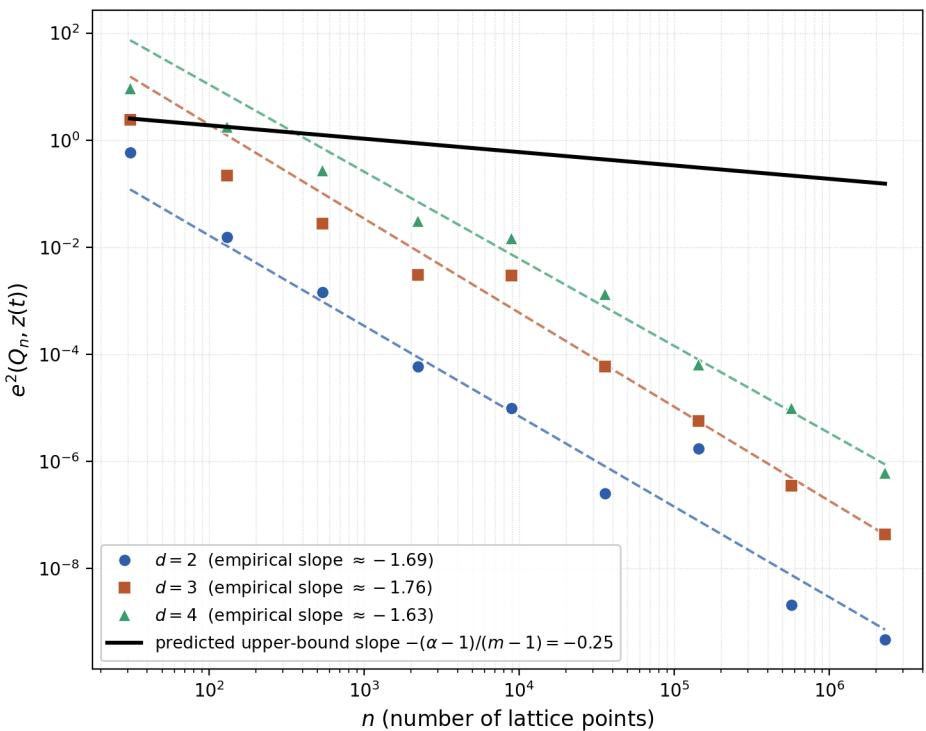
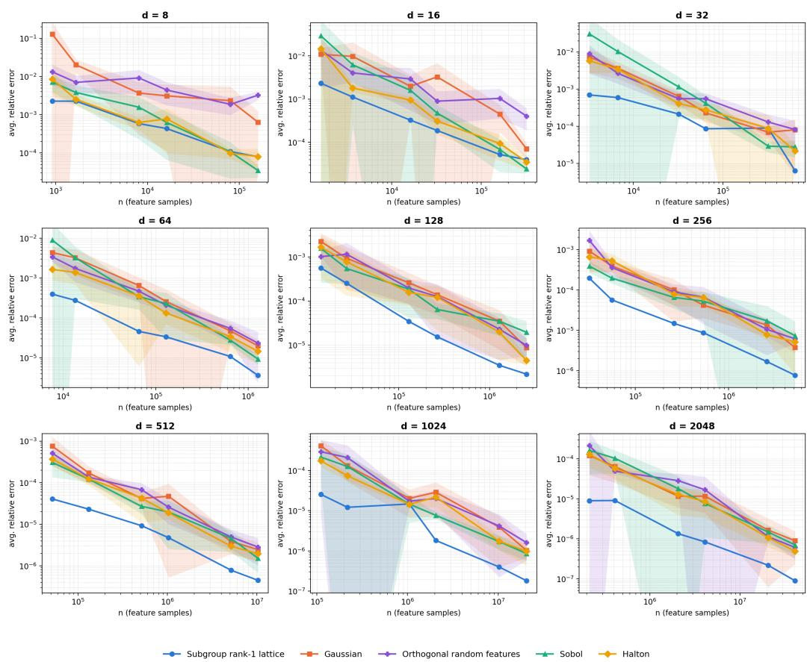
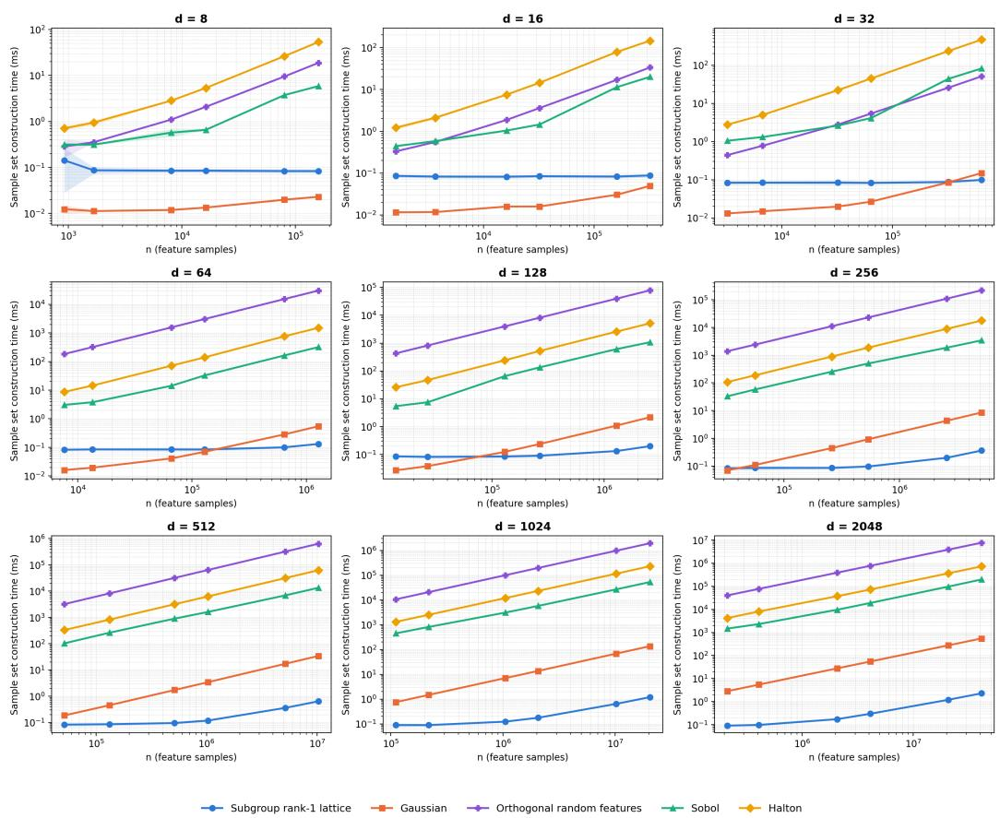
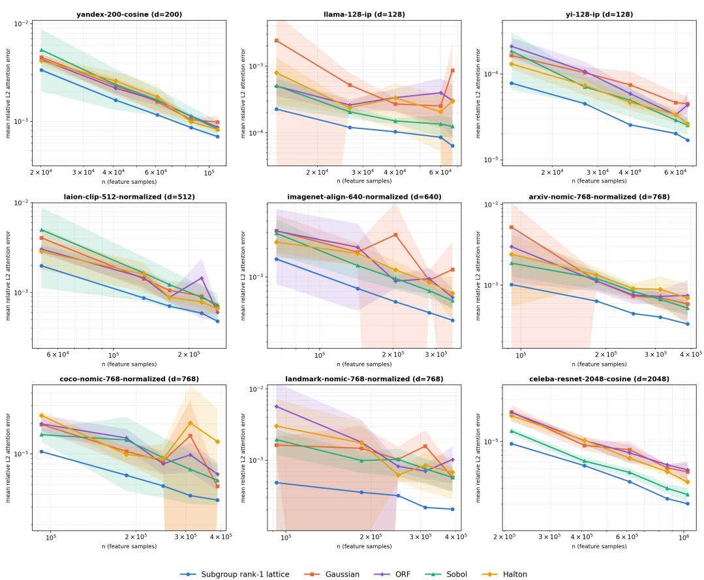

# Subgroup Rank-1 Lattice for Practical High-dimensional Black-box Integral Approximation

Yueming LYU

yueminglyu@gmail.com

Centre for Frontier AI Research (CFAR)

Agency for Science, Technology and Research (A\*STAR)

## Abstract

1 Fusionopolis Way #16-16 Connexis Singapore, 138632

Estimating integrals of black-box, high-dimensional functions (expectations, normalizing constants, kernel mean embeddings, or the softmax kernel inside the self-attention of large language models) is a basic subroutine in machine learning. Rank-1 lattice rules suit this setting because they query the integrand only at a point set fixed in advance and need no gradients. When the n lattice points are also used as a design matrix $\ b { X } \in \mathbb { R } ^ { n \times d }$ for a feature map, however, applying an elementwise nonlinearity Ψ and then aggregating, $\boldsymbol { Y } = \boldsymbol { \Psi } ( \boldsymbol { X } ) ^ { \intercal } \boldsymbol { v } ,$ or expanding, $u = \Psi ( X ) w _ { \mathfrak { m } }$ costs $O ( n d )$ time and $O ( n d )$ memory for any standard quasi-Monte Carlo point set. This becomes prohibitive when n and d are both large. We study subgroup rank-1 lattices, whose Korobov power-form generator $( 1 , t , \dots , t ^ { d - 1 } )$ uses a scalar t of fixed, n-independent multiplicative order m. Splitting $\mathbb { F } _ { n } ^ { \times }$ into the cosets of ⟨t⟩ reduces both maps to short cyclic correlations evaluated by FFT, so Y and u are computed exactly, for an arbitrary Ψ, in O(n log m) time (O(n log d) when $m = \Theta ( d ) )$ and O(n) memory, without ever forming X. Fixing m places the rule outside the classical component-bycomponent averaging theory, so we prove convergence directly: using resultants with the cyclotomic polynomial $\Phi _ { m } ,$ we show that for prime $m \geq d + 1$ the squared worst-case error in the Korobov space decays as $O ( n ^ { - ( \alpha - 1 ) / ( \bar { m } - 1 ) } )$ ), and that this threshold is exact, since for $m \leq d$ the error has an n-independent floor. Using the complete splitting of n in $\mathbb { Q } ( \zeta _ { m } )$ we further show that averaging over the m − 1 admissible generators improves the constant by a factor $\Theta ( m - 1 )$ . Empirically, the subgroup lattice is more accurate than Gaussian random features, orthogonal random features, and scrambled Sobol’ and Halton points in 49 of 54 synthetic kernel-estimation settings and in all 45 softmax-attention settings on nine real embedding datasets. At $d = 2 0 4 8$ and $n \approx 4 . 1 \times 1 0 ^ { 7 }$ it builds its sample set in 2.3 ms, against 0.55 s for Gaussian sampling and minutes to hours for the other baselines.

Keywords: quasi-Monte Carlo, rank-1 lattice rules, elementwise nonlinear feature maps, Korobov space, worst-case error, fast Fourier transform, cyclotomic polynomials, numerical integration

## 1 Introduction

Many computations in machine learning reduce to estimating an integral of a black-box function over a high-dimensional domain: an expectation under a model, a normalizing constant, a kernel mean embedding, or a shift-invariant kernel written as an expectation over random frequencies (Rahimi and Recht, 2007). The last case now sits inside large language models, where linear-time attention mechanisms replace the softmax kernel $\exp ( \mathbf { x } ^ { \top } \mathbf { y } )$ by a Monte Carlo average of random features (Choromanski et al., 2021). In this setting the integrand can be queried only through its values: gradients are unavailable or expensive, and no tractable density is exposed. Sampling-based methods such as Langevin and stochasticgradient Monte Carlo (Roberts and Tweedie, 1996; Welling and Teh, 2011) rely on exactly this missing gradient information, and gradient-free Metropolis–Hastings samplers (Robert and Casella, 2004) return a correlated, sequentially generated chain rather than a fixed design. Quasi-Monte Carlo (QMC) quadrature needs neither. It evaluates the integrand on a deterministic point set fixed in advance, so the evaluations are embarrassingly parallel and the same points can be reused across many integrands. Among QMC constructions, the rank-1 lattice rule is one of the simplest and most widely used: its n points $\{ l \mathbf { z } / n \}$ $l = 0 , \ldots , n - 1$ , are determined by a single generating vector $\mathbf { z } \in ( \mathbb { Z } / n \mathbb { Z } ) ^ { d }$ , and a well-chosen z attains a squared worst-case error of order $n ^ { - \alpha + \delta }$ , for any $\delta > 0 .$ , in the Korobov space of smoothness α (Sloan and Reztsov, 2002; Kuo, 2003; Dick et al., 2013).

In machine learning, however, a QMC point set is rarely used only to average function values. Its n points form a design matrix $\boldsymbol { X } \in \mathbb { R } ^ { n \times d }$ that is passed through a scalar nonlinearity Ψ applied entrywise and then combined linearly with data. A QMC feature map for a shift-invariant kernel (Avron et al., 2016) is the standard example, and the positive random features used for softmax attention (Choromanski et al., 2021) have the same form. Two operations recur: aggregating n per-point values into d per-coordinate summaries, $\boldsymbol { Y } = \boldsymbol { \Psi } ( \boldsymbol { X } ) ^ { \top } \boldsymbol { v } .$ , and expanding d coeficients to all n points, $u = \Psi ( X ) w$ . Computed from their definitions, both cost $O ( n d )$ time, $O ( n d )$ evaluations of Ψ, and $O ( n d )$ memory to hold X or $\Psi ( X )$ . This is the cost for every standard point set, whether a Halton or Sobol sequence (Halton, 1960; Sobol’, 1967) or a rank-1 lattice with a generating vector found by the component-by-component (CBC) algorithm (Sloan and Reztsov, 2002; Kuo, 2003; Nuyens and Cools, 2006a), because none of these constructions relates its $d$ coordinates to one another in a way the computation could exploit. The product nd is the problem. Accurate estimates in high dimension need both n and d large at once, and at $d = 2 0 4 8$ with $n \approx 4 . 1 \times 1 0 ^ { 7 }$ , the largest setting in our experiments, X has about $8 . 4 \times 1 0 ^ { 1 0 }$ entries, roughly 670 GB in double precision. Direct evaluation is then not slow but impossible, and even generating the point set takes minutes to hours for scrambled Sobol’, Halton, or orthogonal random features (Section 8.1.2).

This paper shows that a specific structured rank-1 lattice removes the factor of d from both time and memory. We use the classical Korobov power-form generator ${ \bf z } ( t ) =$ $( 1 , t , \dots , t ^ { d - 1 } )$ mod n (Korobov, 1959), with n prime, and require the scalar $t \in \mathbb { F } _ { n } ^ { \times }$ to have a small multiplicative order $m \mid n - 1$ that is fixed independently of $n$ . We call the result a subgroup rank-1 lattice. The restriction organizes $\mathbb { F } _ { n } ^ { \times }$ into $q = ( n - 1 ) / m$ cosets of the order-m subgroup $H = \langle t \rangle$ . Multiplication by t acts on each coset as a cyclic shift, so every coordinate of every lattice point is an entry of one of q short sequences of length m, and the elementwise transform on each coset becomes a single length-m cyclic correlation, which an FFT evaluates in O(m log m) time. Processing the cosets one at a time gives Y and u exactly, for an arbitrary Ψ, in O(n log m) time and $O ( n )$ memory, which is O(n log d) time when $m = \Theta ( d )$ . The matrix $X$ is never formed.

The restriction has a price that the classical theory does not cover. As n grows, only the $\varphi ( m )$ elements of order m are admissible values of t, a pool that stays fixed while $\mathbb { F } _ { n } ^ { \times }$ grows. CBC would not select such a generator, and the averaging arguments behind CBC error bounds, which average over a candidate pool that grows with $n ,$ cannot be applied. Whether a subgroup rank-1 lattice converges at all is therefore a genuine question. We answer it directly. Writing the aliasing condition h · $\mathbf { z } ( t ) \equiv 0$ (mod n) as the vanishing of an integer polynomial at a root of the cyclotomic polynomial $\Phi _ { m }$ modulo $n ,$ and bounding the corresponding resultant, we show that for prime m $\geq d + 1$ the squared worst-case error decays as $O ( n ^ { - ( \alpha - 1 ) / ( m - 1 ) } ) $ ) for every admissible t, and that for $m \leq d$ it is bounded below by a constant for all n. This exponent is weaker than the one CBC certifies for a generic generating vector. What the theorem establishes is that the structure needed for the fast transform is compatible with convergence, and it identifies the exact dimension threshold at which convergence is lost. Using the complete splitting of n in the cyclotomic field $\mathbb { Q } ( \zeta _ { m } )$ , we then show that averaging over the $m - 1$ admissible generators improves the constant by a factor $\Theta ( m - 1 )$ , which justifies choosing the best member of this small pool.

Empirically, the subgroup rank-1 lattice is both faster and more accurate than the feature-map constructions in common use. With the best of the $m - 1$ generators selected once on a held-out batch and cached, it gives the lowest error of five constructions in 49 of 54 synthetic kernel-estimation settings and in all 45 softmax-attention settings on nine real embedding datasets, and it builds its complete sample set at $d = 2 0 4 8$ and $n \approx 4 . 1 \times 1 0 ^ { 7 }$ in 2.3 ms.

## 1.1 Contributions

1. A fast, memory-light elementwise lattice transform (Section 5). For a powerform generator t of order m and an arbitrary map $\Psi : \mathbb { R }  \mathbb { R }$ , accessed only through its values, we show that $\boldsymbol { Y } = \boldsymbol { \Psi } ( \boldsymbol { X } ) ^ { \intercal } \boldsymbol { v }$ and $u = \Psi ( X ) w$ can be computed exactly in $O ( n$ log m) arithmetic operations, n evaluations of Ψ, and $O ( n )$ memory (Theorems 11 and 12; Algorithms 1 and 2). Direct evaluation on any standard point set costs $O ( n d )$ time, $O ( n d )$ evaluations of Ψ, and $O ( n d )$ memory. The argument is a reindexing of the lattice by the cosets of $H = \langle t \rangle$ and uses no property of $\Psi$ , such as continuity or $\Psi ( 0 ) = 0$ . The same coset structure means the whole sample set $\Psi ( X )$ is determined by $n - 1$ numbers rather than nd. Numerically, the fast transform agrees with direct evaluation to floating-point precision and is 13 to 35 times faster at $n \approx 1 . 5 \times 1 0 ^ { 6 }$ (Section 5.5).

2. Convergence of the subgroup rank-1 lattice, with an exact threshold (Section 6). For prime $m \geq d + 1$ and every t of order $m ,$ the squared worst-case error of the full n-point rule in the Korobov space satisfies $e ^ { 2 } ( Q _ { n } , \mathbf { z } ( t ) ) \leq C ( d , \alpha , m ) n ^ { - ( \alpha - 1 ) / ( m - 1 ) }$ for all suficiently large primes $n \equiv 1$ (mod m) (Theorem 17). The proof is deterministic: it bounds the resultant of the aliasing polynomial with $\Phi _ { m } .$ , and needs no averaging over a growing pool of generators. The condition $m \geq d + 1$ cannot be relaxed: for $m \leq d$ the coeficient vector of $\Phi _ { m }$ is itself an aliasing frequency, so $e ^ { 2 } ( Q _ { n } , \mathbf { z } ( t ) ) \geq 2$ for every n (Theorems 18 and 19).

3. A sharper constant from the small candidate pool (Section 7). A frequency that aliases for $N _ { h }$ of the $m - 1$ admissible generators forces $n ^ { N _ { h } }$ , not merely n, to divide its resultant (Theorem 21). The proof uses the complete splitting of n in $\mathbb { Q } ( \zeta _ { m } )$ and unique factorization of ideals in $\mathbb { Z } [ \zeta _ { m } ]$ . Combined with a log-weighted tail bound (Theorem 22), this shows that the average squared worst-case error over the $m - 1$ generators is a factor $\Theta ( m - 1 )$ below the uniform bound of Theorem 17, at the same exponent, so at least one generator attains this sharper bound (Theorem 23).

4. Experiments on kernel estimation and softmax attention (Section 8). We compare the subgroup rank-1 lattice with Gaussian random features, orthogonal random features (Yu et al., 2016), and scrambled Sobol’ and Halton points, all passed through the same nonlinearity. On estimation of $\exp ( \mathbf { x } ^ { \top } \mathbf { y } )$ with d from 8 to 2048, it is the most accurate method in 49 of 54 settings, with an advantage over the best baseline that is largest at $d \ : = \ : 2 0 4 8$ , reaching 13.5× at the smallest and 5.5× at the largest n tested. On self-normalized softmax attention over nine real embedding datasets, it is the most accurate method in all 45 settings (mean advantage 1.67×). At $d = 2 0 4 8$ and $n \approx 4 . 1 \times 1 0 ^ { 7 }$ it builds its sample set in 2.3 ms, against 0.55 s for Gaussian sampling and 197 s to 2.1 h for the other baselines. The cost of these gains is a one-time search over the $m - 1$ candidate generators, paid once per $( d , m , n )$ and cached.

Scope and relation to earlier work. This paper studies the full n-point lattice rule built from a general fixed-order power-form generator. Our earlier work (Lyu et al., 2020) used the subgroup structure with specific $m = 2 d$ to to build a small closed-form point set by investigating the pairwise toroidal distance. The fast transform, the convergence theory, and the averaging result for the full lattice developed here are new and do not follow from that construction. Throughout, n is prime; the convergence results of Sections 6 and 7 additionally assume that m is prime.

Organization. Section 2 reviews related work and Section 3 recalls the Korobov space, worst-case error, and rank-1 lattice rules. Section 4 defines the subgroup rank-1 lattice and its coset structure. Section 5 gives the fast elementwise transform, Section 6 proves the convergence rate and the exact threshold, and Section 7 sharpens the constant by averaging over the candidate pool. Section 8 reports the experiments and Section 9 concludes.

## 2 Related Work

Rank-1 lattice rules and their construction. Rank-1 lattice rules go back to Korobov (1959); the classical theory is covered by Niederreiter (1992), Sloan and Joe (1994), and Leobacher and Pillichshammer (2014), and Dick et al. (2013) survey the modern theory in the shift-invariant Korobov setting used here. The standard way to choose a generating vector is the component-by-component (CBC) algorithm (Sloan and Reztsov, 2002; Kuo, 2003), which fixes one coordinate at a time by minimizing the worst-case error over all of $\mathbb { F } _ { n } ^ { \times }$ . Nuyens and Cools (2006a,b) reduced its cost to $O ( d n \log n )$ , and Cools et al. (2006) extended it to embedded sequences of lattices; the LatticeBuilder software of L’Ecuyer and Munger (2016) implements these searches, and L’Ecuyer and Lemieux (2002) survey randomized variants. The error bounds for CBC come from averaging the worst-case error over a pool of candidates whose size grows with n. Which weighted function spaces make this error independent of dimension is the subject of tractability theory (Sloan and Wo´zniakowski, 1998, 2001; Hickernell and Wo´zniakowski, 2000; Novak and Wo´zniakowski, 2008), with connections to generalized discrepancy (Hickernell, 1998) and ANOVA-type decompositions (Kuo et al., 2010, 2011). Our construction departs from this line in two ways.

It restricts the generating vector to a pool of fixed size $\varphi ( m )$ , so the averaging argument is unavailable and convergence has to be proved by other means (Section 6). And it is chosen for the structure it gives the point set rather than for the smallest worst-case error; its proven exponent is weaker than the one CBC certifies.

Other low-discrepancy constructions. The other main family of QMC point sets consists of digital nets and sequences: Halton (Halton, 1960), Sobol’ (Sobol’, 1967; Joe and Kuo, 2003, 2008), and Faure (Faure, 1982) sequences, and the general $( t , m , s )$ -net framework of Niederreiter (1987). Their analysis rests on classical equidistribution and discrepancy theory (Weyl, 1916; Roth, 1954; Matouˇsek, 1998, 1999); see Niederreiter and Xing (2001) for algebraic constructions and Dick and Pillichshammer (2010) for a treatment that also covers polynomial lattice rules (Dick et al., 2005). Randomized QMC, in particular Owen’s scrambling (Owen, 1995, 1997) and its higher-order extensions (Dick, 2008, 2011), adds an unbiased error estimate at little cost in rate. None of these constructions relates the coordinates of a point to one another, so pushing an elementwise nonlinearity through n points in d dimensions costs $O ( n d )$ . Scrambled Sobol’ and Halton points are two of the baselines in Section 8.

FFTs and rank-1 lattices. Fast CBC (Nuyens and Cools, 2006a) already exploits multiplicative structure: reindexing $\mathbb { F } _ { n } ^ { \times }$ by a primitive root turns the CBC search over all $n - 1$ candidates into a circulant matrix–vector product evaluated by FFT. Our coset decomposition is related in spirit but solves a diferent problem. Fast CBC accelerates the search for a generic generating vector; we fix a structured generator and accelerate the use of the resulting point set. Rank-1 lattices are also used to sample and reconstruct multivariate trigonometric polynomials, where a single one-dimensional FFT of length n recovers the Fourier coeficients on a frequency set (K¨ammerer, 2014; K¨ammerer et al., 2015a,b, 2021), and fast CBC variants construct lattices for function approximation rather than integration (Kuo et al., 2009; Cools et al., 2021). Those methods apply the FFT along the point index l to recover a function from its samples. Our transform applies length-m FFTs along the orbits of ⟨t⟩ in order to apply an arbitrary nonlinearity Ψ to the point set itself, a task those methods do not address.

Random features and fast structured feature maps. Random Fourier features (Rahimi and Recht, 2007) approximate a shift-invariant kernel by a Monte Carlo average over random frequencies, and Avron et al. (2016) replaced the random frequencies by QMC points to reduce the approximation error; Yang et al. (2014) did the same for semigroup kernels. Random features are now also used to linearize softmax attention (Vaswani et al., 2017; Choromanski et al., 2021). Orthogonal random features (Yu et al., 2016) reduce variance by orthogonalizing Gaussian directions, and are another baseline in Section 8. Fast structured constructions reduce the $O ( n d )$ cost of multiplying by a dense random matrix: Fastfood (Le et al., 2013) and structured orthogonal random features (Yu et al., 2016) replace it by products of Hadamard and random diagonal matrices, computed in $O ( n \log d )$ time. The subgroup rank-1 lattice reaches the same $O ( n \log d )$ cost by a diferent route. Its speed-up comes from the algebra of a deterministic lattice rather than from a randomized matrix factorization, it applies to an arbitrary nonlinearity Ψ acting on the points, and the underlying lattice rule comes with the worst-case error guarantees of Sections 6 and 7.

Algebraic number theory in lattice error analysis. Our convergence proof relates the aliasing condition to resultants of an integer polynomial with the cyclotomic polynomial $\Phi _ { m }$ (Apostol, 1970; Ireland and Rosen, 1990), and the averaging result uses the complete splitting of a prime $n \equiv 1$ (mod m) in $\mathbb { Q } ( \zeta _ { m } )$ and unique factorization of ideals in its ring of integers (Washington, 1997). To our knowledge, neither tool has previously been used to prove a convergence rate for a QMC rule. Our earlier work $( \mathrm { L y u }$ et al., 2020) used the subgroup structure with specific $m = 2 d$ to to build a small closed-form point set by investigating the pairwise toroidal distance; the results of the present paper concern the ful n-point lattice with general m and fast computation and convergence rate properties.

QMC and Markov chain Monte Carlo. MCMC methods, including Langevin and stochastic-gradient samplers (Roberts and Tweedie, 1996; Welling and Teh, 2011) and gradient-free Metropolis–Hastings (Robert and Casella, 2004), are the default for integrating against an unnormalized density, but they return a correlated chain rather than a fixed, reusable design, and the scalable variants need gradients. The two approaches have been combined: low-discrepancy sequences can drive a Metropolis chain in place of i.i.d. uniforms (Owen and Tribble, 2005), with discrepancy bounds for the resulting estimators (Dick et al., 2016), and QMC has replaced random sampling inside sequential Monte Carlo (Gerber and Chopin, 2015) and approximate Bayesian computation (Buchholz and Chopin, 2019). Our contribution is complementary: it makes a fixed lattice design cheaper to use at large n and $d ,$ and could be used inside such hybrid schemes.

High-dimensional applications of QMC. QMC was first shown to beat Monte Carlo on high-dimensional problems in computational finance (Paskov and Traub, 1995), an effect explained by the low efective dimension of the integrands (Caflisch et al., 1997); see L’Ecuyer (2004) for a survey. Rank-1 lattice rules are now standard in uncertainty quantification for PDEs with random coeficients, where d can reach the thousands (Graham et al., 2011; Kuo et al., 2012; Dick et al., 2014; Kuo and Nuyens, 2016), including multilevel variants (Kuo et al., 2017) and eigenvalue problems (Gilbert and Scheichl, 2024); the MCQMC proceedings (e.g. Cools and Nuyens, 2016) track the field. These works control the cost of large d through weighted spaces, dimension truncation, and multilevel variance reduction. The fast transform developed here attacks a diferent cost, the $O ( n d )$ cost of evaluating an elementwise map on the point set, and can be combined with those techniques.

## 3 Preliminaries

Throughout, n is prime and $\mathbb { F } _ { n } = \mathbb { Z } / n \mathbb { Z }$ , so that $\mathbb { F } _ { n } ^ { \times }$ is cyclic of order $n - 1$ . We fix an integer $d \geq 1$ (the dimension) and a real smoothness parameter $\alpha > 1$ , and write $e ( x ) : = e ^ { 2 \pi i x }$

## 3.1 The Korobov space and worst-case error

Definition 1 (Korobov space) For k $\begin{array} { r } { \in \mathbb { Z } ^ { d } l e t \rho ( { \bf k } ) : = \prod _ { j = 1 } ^ { d } \operatorname* { m a x } ( 1 , | k _ { j } | ) ^ { \alpha } } \end{array}$ , so that $\rho ( \mathbf { 0 } ) = 1$ Define

$$
\mathcal { H } _ { d } ^ { \alpha } : = \Big \{ f \in L ^ { 2 } ( [ 0 , 1 ] ^ { d } ) : \| f \| ^ { 2 } : = \sum _ { \mathbf { k } \in \mathbb { Z } ^ { d } } | \hat { f } ( \mathbf { k } ) | ^ { 2 } \rho ( \mathbf { k } ) < \infty \Big \} , \qquad \hat { f } ( \mathbf { k } ) : = \int _ { [ 0 , 1 ] ^ { d } } f ( \mathbf { x } ) e ( - \mathbf { k } \cdot \mathbf { x } ) d \mathbf { x } .\tag{1}
$$

Since $\begin{array} { r } { \alpha > 1 , \sum _ { k \in { \mathbb Z } } \operatorname* { m a x } ( 1 , | k | ) ^ { - \alpha } = 1 + 2 \zeta ( \alpha ) < \infty } \end{array}$ , so $\mathcal { H } _ { d } ^ { \alpha }$ is a reproducing-kernel Hilbert space with kernel

$$
K ( \mathbf { x } , \mathbf { y } ) = \sum _ { \mathbf { k } \in \mathbb { Z } ^ { d } } \rho ( \mathbf { k } ) ^ { - 1 } e \big ( \mathbf { k } \cdot ( \mathbf { x } - \mathbf { y } ) \big ) .\tag{2}
$$

For a node set $X = \{ \mathbf { x } _ { 1 } , . . . , \mathbf { x } _ { N } \} \subset [ 0 , 1 ) ^ { d }$ , the associated equal-weight quadrature rule is $\begin{array} { r } { Q _ { X } ( f ) : = \frac { 1 } { N } \sum _ { l = 1 } ^ { N } f ( \mathbf { x } _ { l } ) } \end{array}$ , approximating $\begin{array} { r } { I ( f ) : = \hat { f } ( \mathbf { 0 } ) = \int _ { [ 0 , 1 ) ^ { d } } f ( \mathbf { x } ) d \mathbf { x } } \end{array}$ . Its worst-case error over the unit ball of $\mathcal { H } _ { d } ^ { \alpha }$

$$
e ( Q _ { X } , \mathcal { H } _ { d } ^ { \alpha } ) : = \operatorname* { s u p } _ { \| f \| \leq 1 } | Q _ { X } ( f ) - I ( f ) | .\tag{3}
$$

Lemma 2 (Worst-case-error representation) For any node set $X = \{ \mathbf { x } _ { 1 } , \ldots , \mathbf { x } _ { N } \}$ ，

$$
e ^ { 2 } ( Q _ { X } , \mathcal { H } _ { d } ^ { \alpha } ) = \sum _ { \mathbf { k } \neq \mathbf { 0 } } \rho ( \mathbf { k } ) ^ { - 1 } \Big \vert \frac { 1 } { N } \sum _ { l = 1 } ^ { N } e ( \mathbf { k } \cdot \mathbf { x } _ { l } ) \Big \vert ^ { 2 } .\tag{4}
$$

Proof By the reproducing property, $f ( \mathbf { y } ) = \langle f , K ( \cdot , \mathbf { y } ) \rangle$ , so $\begin{array} { r } { Q _ { X } ( f ) = \langle f , \frac { 1 } { N } \sum _ { l } K ( \cdot , \mathbf { x } _ { l } ) \rangle } \end{array}$ Since $\begin{array} { r } { \int _ { [ 0 , 1 ) ^ { d } } e ( \mathbf { k } \cdot \mathbf { x } ) d \mathbf { x } = \mathbf { 1 } [ \mathbf { k } = \mathbf { 0 } ] } \end{array}$ , integrating $K ( \mathbf { x } , \mathbf { y } )$ over x kills every Fourier term except $\mathbf k = \mathbf 0$ , so $\begin{array} { r } { \int _ { [ 0 , 1 ) ^ { d } } K ( \mathbf { x } , \mathbf { y } ) d \mathbf { x } \equiv 1 } \end{array}$

Let $1 ( \cdot )$ denotes the constant function equal to 1 everywhere. Then, its Fourier coeficients are $\begin{array} { r } { \hat { 1 } ( \pmb { k } ) = \int _ { [ 0 , 1 ) ^ { d } } e ( - \mathbf { k } \cdot \mathbf { x } ) d \mathbf { x } = \mathbf { 1 } [ \mathbf { k } = \mathbf { 0 } ] } \end{array}$ . Then, we have that

$$
\langle f , 1 ( \cdot ) \rangle = \sum _ { \mathbf { k } \in \mathbb { Z } ^ { d } } \hat { f } ( \mathbf { k } ) \hat { 1 } ( \pmb { k } ) \rho ( \mathbf { k } ) = \hat { f } ( \mathbf { 0 } ) \rho ( \mathbf { 0 } ) = \hat { f } ( \mathbf { 0 } ) = I ( f )
$$

So the constant function 1(·) represents I under the inner product of $\mathcal { H } _ { d } ^ { \alpha }$ . Hence $Q _ { X } ( f ) -$ $\begin{array} { r } { I ( f ) = \langle f , \frac { 1 } { N } \sum _ { l } K ( \cdot , \mathbf { x } _ { l } ) - 1 ( \cdot ) \rangle = \langle f , \gamma ( \cdot ) \rangle } \end{array}$ . Then

$$
\gamma ( { \bf y } ) = \frac { 1 } { N } \sum _ { l } K ( { \bf x } _ { l } , { \bf y } ) - 1 = \sum _ { { \bf k } \neq { \bf 0 } } \rho ( { \bf k } ) ^ { - 1 } e ( - { \bf k } \cdot { \bf y } ) \Big ( \frac { 1 } { N } \sum _ { l } e ( { \bf k } \cdot { \bf x } _ { l } ) \Big ) ,
$$

the $\mathbf k = \mathbf 0$ terms of the two pieces having cancelled exactly. By Cauchy–Schwarz, $e ( Q _ { X } , \mathcal { H } _ { d } ^ { \alpha } ) =$ $\begin{array} { r } { \operatorname* { s u p } _ { \| { f } \| \le 1 } | \langle { f } , \gamma ( \cdot ) \rangle | = \| \gamma ( \cdot ) \| } \end{array}$ , and Parseval’s theorem applied to the last display gives the claim.

## 3.2 Integration lattices and generator matrices

We first recall the classical notion of a lattice rule (Niederreiter, 1992; Sloan and Joe, 1994; Dick et al., 2013), of which the rank-1 construction used throughout this paper is the simplest nontrivial special case.

Definition 3 (Lattice, generator matrix) A lattice $\Lambda \subset \mathbb { R } ^ { d }$ is a set of the form $\Lambda = B \mathbb { Z } ^ { d } : =$ $\{ B \mathbf { k } : \mathbf { k } \in \mathbb { Z } ^ { d } \}$ for some nonsingular matrix $B \in \mathbb { R } ^ { d \times d }$ , called a generator matrix of Λ. Two matrices generate the same lattice, $B \mathbb { Z } ^ { d } = B ^ { \prime } \mathbb { Z } ^ { d } .$ , if and only if $B ^ { \prime } = B U$ for some U in $G L _ { d } ( \mathbb { Z } )$ (an integer matrix with det $U = \pm 1 ) ;$ in particular | det B| depends only on Λ, not on the choice of B. An integration lattice is a lattice with $\mathbb { Z } ^ { d } \subseteq \Lambda ;$ equivalently, some $( a n y )$ generator matrix B can be chosen with $B ^ { - 1 }$ an integer matrix, and then $N : = |$ det $B | ^ { - 1 } =$ $[ \Lambda : \mathbb { Z } ^ { d } ]$ (the index of $\mathbb { Z } ^ { d }$ in Λ, i.e. the order of the finite quotient group $\Lambda / \mathbb { Z } ^ { d } )$ is a positive integer.

Because $\mathbb { Z } ^ { d } \subseteq \Lambda$ , translating any point of Λ by an integer vector remains in Λ, so $\Lambda \cap [ 0 , 1 ) ^ { d }$ , the lattice points that lie inside the unit cube, is a set of exactly N representatives, one for each coset of $\mathbb { Z } ^ { d }$ in Λ (a fundamental domain for $\Lambda / \mathbb { Z } ^ { d } )$ .

Definition 4 (Lattice rule) For an integration lattice Λ of index N, the associated (equalweight) lattice rule is $\begin{array} { r } { Q _ { \Lambda } ( f ) : = \frac { 1 } { N } \sum _ { { \bf x } \in \Lambda \cap [ 0 , 1 ) ^ { d } } f ( { \bf x } ) } \end{array}$

Three properties of this construction are used repeatedly below.

(i) Periodicity and well-posedness. $Q _ { \Lambda }$ depends only on Λ, not on the particular choice of the N coset representatives used to enumerate $\Lambda \cap [ 0 , 1 ) ^ { d } \colon$ for a $\mathbb { Z } ^ { d } .$ -periodic function (such as any $f \in \mathcal { H } _ { d } ^ { \alpha }$ , via its Fourier series), summing over any fundamental domain of $\Lambda / \mathbb { Z } ^ { d }$ gives the same value.

(ii) Duality and the aliasing set. The dual lattice $\Lambda ^ { * } : = \{ \mathbf { k } \in \mathbb { R } ^ { d } : \mathbf { k } \cdot \mathbf { x } \in \mathbb { Z } \forall \mathbf { x } \in \Lambda \}$ satisfies $\Lambda ^ { * } \subseteq \mathbb { Z } ^ { d }$ whenever $\mathbb { Z } ^ { d } \subseteq \Lambda$ (duality reverses inclusions, and $( \mathbb { Z } ^ { d } ) ^ { * } = \mathbb { Z } ^ { d } )$ Equivalently, $\Lambda ^ { * }$ consists of exactly the frequencies k $\in \mathbb { Z } ^ { d }$ for which the character $e ( { \bf k } \cdot { \bf x } )$ is identically 1 on Λ. This is precisely the set that controls the Fourier/worstcase-error analysis of Theorem 2: applying that lemma with $N = | \Lambda \cap [ 0 , 1 ) ^ { d } |$ and the geometric-sum identity $\begin{array} { r } { \frac { 1 } { N } \sum _ { \mathbf { x } \in \Lambda \cap \left[ 0 , 1 \right) ^ { d } } e ( \mathbf { k } \cdot \mathbf { x } ) = \mathbf { 1 } [ \mathbf { k } \in \Lambda ^ { * } ] } \end{array}$ shows that only $\Lambda ^ { * } \setminus \{ { \bf 0 } \}$ contributes to $e ^ { 2 } ( Q _ { \Lambda } , \mathcal { H } _ { d } ^ { \alpha } )$

$$
e ^ { 2 } ( Q _ { \Lambda } , \mathcal { H } _ { d } ^ { \alpha } ) = \sum _ { \mathbf { k } \in \Lambda ^ { * } \setminus \{ \mathbf { 0 } \} } \rho ( \mathbf { k } ) ^ { - 1 } .\tag{5}
$$

(iii) Rank. The finite abelian group $\Lambda / \mathbb { Z } ^ { d }$ is, by the structure theorem, a product of r nontrivial cyclic groups $\mathbb { Z } / n _ { 1 } \times \cdots \times \mathbb { Z } / n _ { r } \ ( n _ { 1 } , \ldots , n _ { r } \geq 2 , \ N = n _ { 1 } \cdots n _ { r } )$ for a unique $r \geq 0$ (the elementary-divisor/Smith normal form of $\boldsymbol { B } ^ { - 1 } ) ; \boldsymbol { r }$ is the rank of the lattice rule, and each cyclic factor is generated by the class of some integer vector $\mathbf { z } _ { i } / n _ { i }$ mod $\mathbb { Z } ^ { d }$ . Rank 0 is $\Lambda = \mathbb { Z } ^ { d }$ itself $( N = 1$ , the trivial rule); this paper is concerned exclusively with the simplest nontrivial case, $r = 1$

## 3.3 Rank-1 lattice rules and the power-form generator

A rank-1 integration lattice is generated by a single vector: for $\mathbf { z } \in \mathbb { Z } ^ { d }$ and $n \geq 1$ 2

$$
\begin{array} { r } { \Lambda ( \mathbf { z } , n ) : = \frac { 1 } { n } \mathbb { Z } \mathbf { z } + \mathbb { Z } ^ { d } = \Big \{ \frac { l } { n } \mathbf { z } + \mathbf { k } : l \in \mathbb { Z } , ~ \mathbf { k } \in \mathbb { Z } ^ { d } \Big \} . } \end{array}\tag{6}
$$

Only z mod n matters, so we may (and do) take $\mathbf { z } ~ \in ~ ( \mathbb { Z } / n \mathbb { Z } ) ^ { d }$ . The $N \ = \ n$ points of $\Lambda ( \mathbf { z } , n ) \cap [ 0 , 1 ) ^ { d }$ are $\mathbf { x } _ { l } : = \{ l \mathbf { z } / n \}$ for $l = 0 , \ldots , n - 1$ (coordinatewise fractional part), which recovers the familiar rank-1 lattice rule:

Definition 5 (Full rank-1 lattice rule) For a generating vector $\mathbf { z } \in ( \mathbb { Z } / n \mathbb { Z } ) ^ { d } .$ , the full rank-1 lattice rule $Q _ { n }$ uses all n points $\mathbf { x } _ { l } : = \{ l \mathbf { z } / n \} , l = 0 , \dots , n - 1$ , with $\begin{array} { r } { \dot { Q _ { n } } ( f ) : = \frac { 1 } { n } \sum _ { l = 0 } ^ { n - 1 } f ( \mathbf { x } _ { l } ) } \end{array}$

Here (5) specializes, via $\Lambda ( \mathbf { z } , n ) ^ { * } = \{ \mathbf { t } \in \mathbb { Z } ^ { d } : \mathbf { t } \cdot \mathbf { z } \equiv 0 ( \mathrm { m o d } ~ n ) \}$ , to the aliasing identity

$$
e ^ { 2 } ( Q _ { n } , \mathcal { H } _ { d } ^ { \alpha } ) = \sum _ { \mathbf { t } \neq \mathbf { 0 } \atop \mathbf { t } \cdot \mathbf { z } \equiv 0 ( n ) } \rho ( \mathbf { t } ) ^ { - 1 } ,\tag{7}
$$

which is the basis for the convergence analysis of Section 6.

Generator matrix for a rank-1 lattice. A rank-1 lattice rule is genuinely rank 1, rather than a rank-0 rule in disguise, exactly when $\operatorname* { g c d } ( z _ { 1 } , n ) = 1$ for at least one coordinate $z _ { i } ;$ relabelling coordinates and replacing z by $z _ { i } ^ { - 1 } \mathbf { z }$ mod n (a mere re-indexing $l \mapsto l z _ { i }$ mod n of the same point set) lets us take $z _ { 1 } = 1$ without loss of generality, exactly the normalization used by the power-form generator below. With $z _ { 1 } = 1$ , an explicit generator matrix realizing Theorem 3 for $\Lambda ( { \bf z } , n )$ is the lower unitriangular matrix

$$
B ( \mathbf { z } , n ) = \frac { 1 } { n } \left( \begin{array} { l l l l } { 1 } & { 0 } & { \cdots } & { 0 } \\ { z _ { 2 } } & { n } & { \cdots } & { 0 } \\ { \vdots } & { } & { \ddots } \\ { z _ { d } } & { 0 } & { \cdots } & { n } \end{array} \right) , \qquad \operatorname* { d e t } B ( \mathbf { z } , n ) = \frac { 1 } { n } ,\tag{8}
$$

so that $\begin{array} { r } { B ( \mathbf { z } , n ) \mathbb { Z } ^ { d } = \frac { 1 } { n } \mathbb { Z } \mathbf { z } + \mathbb { Z } ^ { d } = \Lambda ( \mathbf { z } , n ) } \end{array}$ , confirming index $N = n$ directly from Theorem 3 (this is the Hermite normal form of $B ^ { - 1 }$ , unique up to the $\mathrm { r i g h t } - G L _ { d } ( \mathbb { Z } )$ freedom already noted). Every other valid generator matrix for $\Lambda ( { \bf z } , n )$ is $B ( { \mathbf z } , n ) U$ for some $U \in G L _ { d } ( \mathbb { Z } )$

Throughout, we work with the classical Korobov power-form generator, in which the d coordinates of z are consecutive powers of a single scalar, a specific, highly structured construction rule for the generating vector z (equivalently, via (8), for the generator matrix B itself), rather than an arbitrary rank-1 vector as in (6).

Definition 6 (Power-form generator) For $t \in \mathbb { F } _ { n } ^ { \times }$ and $d \geq 1$ , write $\mathbf { z } ( t ) : = ( 1 , t , t ^ { 2 } , \ldots , t ^ { d - 1 } )$ mod $n \in ( \mathbb { Z } / n \mathbb { Z } ) ^ { d }$

## 4 Subgroup rank-1 lattice

The component-by-component algorithm chooses a generating vector, power form or otherwise, to directly optimize $e ( Q _ { n } , \mathcal { H } _ { d } ^ { \alpha } )$ , and the resulting optimal t (or optimal z) is generic: it depends on n and d in a way that carries no simpler algebraic description. This section instead studies the family obtained by fixing the multiplicative order of $t ,$ independently of $n ,$ namely, subgroup rank-1 lattice construction that gives this paper its name, and works out, in some detail, the group-theoretic structure that this restriction imposes on the generating vector and on $\mathbb { F } _ { n } ^ { \times }$ itself. That structure is exactly what Section 5 and Section 6 exploit, respectively, for fast computation and for convergence.

## 4.1 Fixed-order power-form generators

Definition 7 (Fixed-order power-form generator) Fix a divisor m of $n - 1$ with $m \geq d + 1$ Since $\mathbb { F } _ { n } ^ { \times }$ is cyclic, it has a unique subgroup $H \leq \mathbb { F } _ { n } ^ { \times }$ of order m, and $H = \langle t \rangle$ for any $t \in \mathbb { F } _ { n } ^ { \times }$ of multiplicative order exactly m. We study the power-form generator ${ \bf z } ( t )$ for such $\textit { a t } ,$ , with m held fixed as $n \to \infty$ (so that, as n grows over primes with m $\lvert n - 1$ , only the $\varphi ( m )$ generators of H are ever used). We impose m $\geq d + 1$ throughout the construction, rather than the weaker $d \leq m$ that sufices merely for the power-form generator to be well posed (Section 5.1), because $m \geq d + 1$ is exactly the condition under which Theorem 17 proves the resulting lattice rule converges, and Theorem 19 shows this threshold is exact: convergence provably fails once m $\leq d .$

Writing g for a fixed primitive root modulo the prime $n ,$ the elements of H of order exactly m are the $g ^ { k ( n - 1 ) / m }$ with $\operatorname* { g c d } ( k , m ) = 1$ ; taking $t = g ^ { ( n - 1 ) / m }$ (the case $k = 1$ ， without loss of generality up to relabelling the generator) gives the closed-form generating vector

$$
\mathbf { z } ( t ) = \left( g ^ { 0 } , g ^ { ( n - 1 ) / m } , g ^ { 2 ( n - 1 ) / m } , \ldots , g ^ { ( d - 1 ) ( n - 1 ) / m } \right) { \bmod { n } } , \qquad m \mid ( n - 1 ) , \ m \geq d + 1 ,\tag{9}
$$

which yields a full rank-1 lattice rule via (6).

Two elementary facts about cyclic groups make Theorem 7 well posed and worth isolating explicitly, since both are used repeatedly below without further comment. First, existence and uniqueness of H: because $\mathbb { F } _ { n } ^ { \times }$ is cyclic of order $n - 1$ , its subgroups are in order-preserving bijection with the divisors of $n - 1$ , one subgroup per divisor, so “the” subgroup of order m is unambiguous exactly when m $\mid n - 1$ , the divisibility hypothesis in Theorem 7 is therefore not a simplifying assumption but a necessary condition for H to exist at all. Second, the true size of the generator pool: an element $t \in H$ generates H (rather than a proper subgroup of it) if t has order exactly m, and a cyclic group of order m has exactly $\varphi ( m )$ such elements $( \varphi$ the Euler totient), so $\varphi ( m )$ , not $m ,$ and certainly not $n ,$ is the true size of the candidate pool underlying Theorem 7. This is a severe restriction: as $n  \infty$ along primes with $m \mid n - 1$ , the pool of admissible t does not grow at all, in sharp contrast to a CBC-style search, which optimizes over a pool of candidate generators that grows with n.

Example 8 (A subgroup of prime order 5) Take $n = 1 1$ , so $\mathbb { F } _ { 1 1 } ^ { \times }$ is cyclic of order 10 and $m = 5$ is a valid choice since $5 \ | \ 1 0 \}$ ; note m is itself prime. Fixing the primitive root $g = 2$ modulo 11 (indeed $2 ^ { 1 0 } \equiv 1$ and no smaller power does), direct computation gives $t = g ^ { ( n - 1 ) / m } = 2 ^ { 2 } = 4$ , which has order 5: $4 ^ { 1 } = 4 , 4 ^ { 2 } = 1 6 \equiv 5 , 4 ^ { 3 } \equiv 9 , 4 ^ { 4 } \equiv 3 , 4 ^ { 5 } \equiv 1$ (mod 11). Hence $H = \langle 4 \rangle = \{ 1 , 4 , 5 , 9 , 3 \}$ is the unique subgroup of order 5. Because m is prime, H has no nontrivial proper subgroups (Lagrange’s theorem leaves only the divisors 1 and m of m itself), so every nontrivial element of H already has order exactly m and so generates all of H: the full generator pool is $\varphi ( 5 ) = 4$ elements, namely all of $H \setminus \{ 1 \} = \{ 3 , 4 , 5 , 9 \}$ , with none wasted on smaller subgroups. Taking $d = 3$ , so that $m = 5 \geq d + 1 = 4 ,$ comfortably inside the construction’s requirement (Theorem 7). Two of the four admissible fixed-order power-form generators for this $( n , m , d )$ are

$$
\mathbf { z } ( 4 ) = ( 1 , 4 , 5 ) , \qquad \mathbf { z } ( 3 ) = ( 1 , 3 , 9 ) \quad ( \mathrm { m o d } 1 1 ) ,
$$

each giving a full 11-point rank-1 lattice rule via (6); the two vectors already difer in their second coordinate, so, despite generating the same subgroup H, $t = 4$ and $t = 3$ do not produce the same lattice, only two (of four) lattices built from the same underlying group of prime order.

## 4.2 The coset decomposition of $\mathbb { F } _ { n } ^ { \times }$ induced by H

The single group-theoretic fact underlying both the fast algorithm of Section 5 and the convergence analysis of Section 6 is that multiplication by t organizes all of $\mathbb { F } _ { n } ^ { \times }$ , not just H itself, into H-orbits of a very simple, explicit shape.

Lemma 9 (Coset decomposition and cyclic shift structure) Let $t \in \mathbb { F } _ { n } ^ { \times }$ have order exactly $m > 1$ , let $H = \langle t \rangle$ , and let $q : = ( n - 1 ) / m$ . Then:

(i) $\mathbb { F } _ { n } ^ { \times }$ partitions into exactly q cosets of H, each of size m;

(ii) the map $\pi : r \mapsto$ rt mod n permutes $\mathbb { F } _ { n } ^ { \times }$ , has no fixed points, and its orbits are exactly these q cosets; restricted to a single coset $C = r H = \{ r , r t , \ldots , r t ^ { m - 1 } \}$ , π acts as the cyclic shift $r t ^ { i } \mapsto r t ^ { i + 1 }$ 1 mod m.

Proof (i) is Lagrange’s theorem applied to $H \leq \mathbb { F } _ { n } ^ { \times }$ : the cosets of H partition $\mathbb { F } _ { n } ^ { \times }$ into classes of size $| H | = m$ , and there are $| \mathbb { F } _ { n } ^ { \times } | / | H | = ( n - 1 ) / m = q$ of them. For (ii), π is a bijection of $\mathbb { F } _ { n } ^ { \times }$ because t is invertible mod n. For any $r \in \mathbb { F } _ { n } ^ { \times }$ and $k \geq 1 , \pi ^ { k } ( r ) = r t ^ { k }$ , so $\pi ^ { k } ( r ) = r$ if $t ^ { k } \equiv 1$ (mod n) if m | k, since t has order exactly m; taking $k = 1$ shows π has no fixed points, and taking $k = m$ (the least such $k )$ shows the orbit of r under π has size exactly m. That orbit is $\{ r , r t , \ldots , r t ^ { m - 1 } \} = r H$ , a coset of size m equal to the orbit itself, so π maps rH to itself as a single m-cycle, i.e. the stated cyclic shift, rather than splitting rH into shorter orbits.

Remark 10 Theorem 9 is exactly the mechanism used, with π taken to be multiplication by $t ^ { - 1 }$ rather than t, in the proof of Theorem 11: the coset-FFT decomposition of Section 5 applies a length-m $F F T$ once per coset because Theorem $g _ { ( i ) }$ already guarantees there are only $q = ( n - 1 ) / m$ cosets to process, and it is valid to treat each coset’s contribution as a single length-m cyclic correlation only because Theorem $g ( i i )$ says the relevant reindexing is genuinely one m-cycle on that coset, not some other permutation of the same m points. The same partition of $\mathbb { F } _ { n } ^ { \times }$ into q cosets of H reappears in Section 6 in a diferent guise, indexing the aliasing frequencies that a fixed subgroup-order generator can and cannot kill (Equation (7)).

## 4.3 Scope of the restriction

Theorem 7 is a severe, non-generic restriction on the generating vector, and it is not something CBC would produce: as $n  \infty$ the pool of admissible t does not grow at all, it is pinned at $\varphi ( m )$ elements, all lying in the single fixed subgroup H, however large n becomes. The remainder of the paper works out what this buys and what it costs. Section 5 shows this restriction buys a genuine computational advantage for the elementwise lattice transform underlying feature maps built on the lattice, via exactly the coset structure of Theorem 9. Section 6 shows, despite the classical average-case convergence theory not covering a pool of candidates that stays fixed in size, that the restriction is compatible with convergence of the resulting quadrature rule, at an explicit (if not provably tight) polynomial rate, again by way of the algebraic structure of H (now viewed through the m-th cyclotomic polynomial rather than through the coset decomposition above). Section 7 then asks how much averaging over the small pool of $\varphi ( m )$ candidates, all we have, in place of a pool that would ordinarily grow with n, can sharpen that rate’s constant.

## 5 A fast $O ( n \log d )$ algorithm for the elementwise lattice transform

This section is the technical core of the paper: it gives a fast algorithm for the elementwise lattice transform $\Psi ( X ) ^ { \top } v$ and $\Psi ( X ) w$ that underlies lattice-based feature maps, for an arbitrary scalar map Ψ, with no assumption on Ψ anywhere in the argument. This is a computational advantage of the fixed-order construction that is independent of, and complementary to, the convergence question of Section 6.

## 5.1 Setting

Let n be prime, let $t \in \mathbb { F } _ { n } ^ { \times }$ have multiplicative order exactly m $\mid n - 1$ , and let $q : = ( n { - } 1 ) / m$ Let $X \in \mathbb { R } ^ { n \times m }$ be the full n-point lattice-point matrix over all m columns compatible with $t ,$

$$
X _ { l , j } : = \{ l t ^ { j - 1 } / n \} , \qquad l = 0 , \ldots , n - 1 , ~ j = 1 , \ldots , m ,
$$

so that the first $d \leq m - 1$ columns of X are exactly the coordinates of the n points underlying $Q _ { n }$ in Section 3.3 (recall $d \leq m - 1$ is required there for the power-form construction to be well-posed, i.e. for $t ^ { 0 } , \ldots , t ^ { d - 1 }$ to be pairwise distinct within one period of $H = \langle t \rangle )$ .

Fix an arbitrary elementwise map $\Psi : \mathbb { R }  \mathbb { R }$ , this is the operative generality of this section: no continuity, linearity, monotonicity, or $\Psi ( 0 ) = 0$ assumption is made anywhere below, and write $\Psi ( X ) \in \mathbb { R } ^ { n \times m }$ for its entrywise action, $\Psi ( X ) _ { l , j } : = \Psi \big ( \{ l t ^ { j - 1 } / n \} \big )$ . For $v \in$ $\mathbb { R } ^ { n }$ (e.g. n function evaluations, or quadrature weights to be aggregated) and $w \in \mathbb { R } ^ { m }$ (e.g. m per-coordinate coeficients), our two objects of study are the aggregation and expansion maps

$$
Y : = \Psi ( X ) ^ { \top } v \in \mathbb { R } ^ { m } , \qquad u : = \Psi ( X ) w \in \mathbb { R } ^ { n } .
$$

Direct evaluation of either from its definition costs $O ( n m )$ arithmetic operations and $O ( n m )$ evaluations of Ψ, the same cost incurred when X instead collects the coordinates of a Halton sequence, a Sobol’ sequence, or a rank-1 lattice with a generic (non-power-form) generating vector, since none of these point sets admit a faster elementwise transform; this $O ( n m )$ direct-evaluation cost is the baseline against which the rest of this section is measured. As the proofs below make clear, the coset-FFT saving is a pure reindexing argument that never invokes linearity, continuity, or any other structural property of Ψ: it is exactly as insensitive to Ψ as it is to the numerical entries of v or w, so it applies uniformly across every choice of $\Psi$ at once, with no distinguished case. This is precisely the primitive needed to evaluate a quasi-Monte-Carlo feature map (Avron et al., 2016), where a fixed scalar nonlinearity is applied to every lattice coordinate before the linear aggregation or expansion step.

## 5.2 Main result: a coset-FFT decomposition

Proposition 11 (Fast elementwise lattice transform) In the setting above, for any $\Psi : \mathbb { R } $ R and any $v \in \mathbb { R } ^ { n } , Y = \Psi ( X ) ^ { \top } v \in \mathbb { R } ^ { m }$ can be computed exactly in $O ( n \log m )$ arithmetic operations plus n evaluations of Ψ, O(n log d) arithmetic operations once $m = \Theta ( d )$ , as against $O ( n m )$ arithmetic operations plus nm evaluations of Ψ for direct evaluation.

Proof Fix $j \in \{ 1 , \dots , m \}$ and expand

$$
Y _ { j } = \sum _ { l = 0 } ^ { n - 1 } v _ { l } \Psi \big ( \{ l t ^ { j - 1 } / n \} \big ) .
$$

Since $t ^ { j - 1 } \in \mathbb { F } _ { n } ^ { \times }$ , the map $l \mapsto r : = l t ^ { j - 1 }$ mod n is a bijection of $\{ 0 , \ldots , n - 1 \}$ with inverse $l = r t ^ { - ( j - 1 ) }$ mod $n ;$ substituting r for l,

$$
Y _ { j } = \sum _ { r = 0 } ^ { n - 1 } \Psi ( w _ { r } ) v _ { r t ^ { - ( j - 1 ) } \mathrm { m o d } n } , \qquad w _ { r } : = \frac { r } { n } , \quad \pi ( r ) : = r t ^ { - 1 } \bmod n .\tag{10}
$$

Unlike when $\Psi = \mathrm { i d } , \Psi ( w _ { 0 } ) = \Psi ( 0 )$ need not vanish, so the fixed point $r = 0$ of $\pi$ now contributes to (10); separate it out and apply the coset decomposition to the remaining $r \in \mathbb { F } _ { n } ^ { \times }$ . Restricted to $\mathbb { F } _ { n } ^ { \times }$ , π is multiplication by the order-m element $t ^ { - 1 }$ ; its orbits there are exactly the q cosets of $H = \langle t \rangle$ , each of size m. Fix one coset $C = \{ c , c t ^ { - 1 } , \ldots , c t ^ { - ( m - 1 ) } \}$ and set $a _ { i } : = \Psi ( w _ { c t ^ { - i } } ) , b _ { i } : = v _ { c t ^ { - i } } \mathrm { f o r } i = 0 , \ldots , m - 1$ (indices cyclic mod $m ,$ since $t ^ { - m } = 1 )$ Because $\pi ^ { j - 1 } ( c t ^ { - i } ) = c t ^ { - ( i + j - 1 ) }$

$$
\sum _ { r \in C } \Psi ( w _ { r } ) v _ { \pi ^ { j - 1 } ( r ) } = \sum _ { i = 0 } ^ { m - 1 } a _ { i } b _ { ( i + j - 1 ) \mathrm { m o d } m } = \operatorname { c o r r } ( a , b ) [ j - 1 ] ,
$$

the length-m cyclic correlation of a and b evaluated at shift $j - 1$ . Summing over the $q$ cosets and adding back the $r = 0$ term,

$$
Y _ { j } = \Psi ( 0 ) v _ { 0 } + \sum _ { s = 1 } ^ { q } \mathrm { c o r r } \left( a ^ { ( s ) } , b ^ { ( s ) } \right) [ j - 1 ] , \qquad j = 1 , \ldots , m .\tag{11}
$$

Each of the q cyclic correlations is a single length-m FFT pair, cor $\mathbf { \partial } \cdot ( a , b ) = \mathrm { I F F T } \left( { \overline { { \mathrm { F F T } ( a ) } } } \right)$ $\mathrm { F F T } ( b ) )$ , costing O(m log m) (Cooley and Tukey, 1965); all m of its output shifts are read out in (11), since Y has m entries. Forming each $a ^ { ( s ) }$ costs m evaluations of $\Psi \ ( n - 1$ in total across the q cosets), which changes none of the $O ( m \log m )$ arithmetic cost of the FFT pair used to evaluate $\mathrm { c o r r } ( a ^ { ( s ) } , b ^ { ( s ) } )$ . The total arithmetic cost is $O ( q \cdot m \log m ) + O ( n ) =$ $O \big ( ( n - 1 ) \log m \big ) + O ( n ) = O \big ( n \log m \big )$ , the additional $O ( n )$ term covering construction of the q cosets and the final sum (11); taking $m = \Theta ( d )$ gives $O ( n \log d )$ On top of this, forming the $a ^ { ( s ) } \mathrm { { _ S } }$ and the single correction term costs exactly n evaluations of Ψ (one per coordinate $l = 0 , \ldots , n - 1$ , counting $\Psi ( 0 )$ once).

Algorithm 1 summarizes the algorithm underlying Theorem 11.

## 5.3 The advantage of the fast transform

Theorem 11 is a genuine improvement over the $O ( n d )$ direct-evaluation baseline, i.e., the cost of applying the same elementwise feature map on top of a Halton sequence, a Sobol sequence, or a rank-1 lattice with a generic generating vector, none of which admit a faster elementwise transform to our knowledge. The saving, $O ( n d ) \to O ( n \log m )$ with $m =$ $\Theta ( d )$ , comes entirely from the fixed, n-independent multiplicative order of the power-form generator’s scalar parameter t: this is what lets $\mathbb { F } _ { n } ^ { \times }$ be decomposed into $q = ( n - 1 ) / m$ cosets of the order-m subgroup $H = \langle t \rangle$ , each reducing to a single length-m FFT pair (Theorem 9). It is specific to this structured construction and gives no general recipe for accelerating the elementwise transform for an arbitrary generating vector, a question we do not address here. Table 1 summarizes the resulting picture, and Section 5.5 reports real wall-clock measurements confirming it.

Algorithm 1 Fast elementwise lattice transform $Y = \Psi ( X ) ^ { \top }$ v for a fixed-order power-form   
generator   
Require: prime n; $t \in \mathbb { F } _ { n } ^ { \times }$ of order m $\mid n - 1 ;$ elementwise map $\Psi : \mathbb { R }  \mathbb { R } ;$ data vector   
$v \in \mathbb { R } ^ { n }$   
Ensure: $Y \in \mathbb { R } ^ { m }$ with $\begin{array} { r } { Y _ { j } = \sum _ { l = 0 } ^ { n - 1 } v _ { l } \Psi \big ( \{ l t ^ { j - 1 } / n \} \big ) } \end{array}$   
1: $Y  \Psi ( 0 ) v _ { 0 } \cdot { \bf 1 } \in \mathbb { R } ^ { m }$ ▷ additive correction, $O ( m )$   
2: Partition $\mathbb { F } _ { n } ^ { \times }$ into the $q = ( n - 1 ) / m$ cosets of $H = \langle t \rangle$ ; let $c _ { 1 } , \ldots , c _ { q }$ be coset represen  
tatives   
3: for $s = 1 , \ldots , q$ do   
4: $a _ { i }  \Psi \big ( ( c _ { s } t ^ { - i } \bmod n ) / n \big ) , \quad b _ { i }  v _ { c _ { s } t ^ { - i } }$ mod n, for $i = 0 , \ldots , m - 1$   
5: $r \gets \mathrm { I F F T } \big ( \overline { { \mathrm { F F T } ( a ) } } \cdot \mathrm { F F T } ( b ) \big )$ ▷ length-m cyclic correlation, O(m log m)   
6: for $j = 1 , \dots ,$ m do   
7: $Y _ { j } \gets Y _ { j } + r _ { j - 1 }$   
8: end for   
9: end for   
10: return Y

Table 1: Cost of computing $\boldsymbol { Y } ~ = ~ \boldsymbol { \Psi } ( \boldsymbol { X } ) ^ { \top } \boldsymbol { v }$ for the full n-point lattice, for an arbitrary elementwise map Ψ.
<table><tr><td>Method</td><td>Cost</td><td>Requires</td></tr><tr><td>Direct evaluation, i.e., the standard cost for a Halton or Sobol’ sequence, or a generic</td><td> $O ( n d )$ </td><td>nothing</td></tr><tr><td>rank-1 lattice Theorem 11 (coset FFTs)</td><td>O(n log m)  $\begin{array} { r l } { ( \mathrm { i . e . } } & { { } O ( n \log d ) } \end{array}$  Θ(d))</td><td>power-form generator, small for m = order  $( m \ll n )$ </td></tr></table>

The comparison above is stated for $\boldsymbol { Y } = \boldsymbol { \Psi } ( \boldsymbol { X } ) ^ { \intercal } \boldsymbol { v }$ for a general elementwise Ψ from the outset, since that is this paper’s object of study: each method’s Ψ-dependence is confined to an additive $O ( n )$ (direct evaluation: $O ( n m ) )$ term of pointwise evaluations, which changes none of the arithmetic comparison in the table.

## 5.4 The transpose direction: fast computation of $\Psi ( X ) w$

Theorem 11 computes the “many-to-few” aggregation $\boldsymbol { Y } = \boldsymbol { \Psi } ( \boldsymbol { X } ) ^ { \top } \boldsymbol { v } \in \mathbb { R } ^ { m }$ from n data values $v \in \mathbb { R } ^ { n }$ . The dual direction is a “few-to-many” expansion: given a coeficient vector $w \in \mathbb { R } ^ { m }$ (for instance a set of per-coordinate weights, or a linear functional to be evaluated at every lattice point), compute $u : = \Psi ( X ) w \in \mathbb { R } ^ { n }$ , i.e.

$$
u _ { l } = \sum _ { j = 1 } ^ { m } \Psi ( X ) _ { l , j } w _ { j } = \sum _ { j = 1 } ^ { m } \Psi \big ( \{ l t ^ { j - 1 } / n \} \big ) w _ { j } , \qquad l = 0 , \ldots , n - 1 .
$$

Direct evaluation again costs $O ( n m )$ arithmetic operations and $O ( n m )$ evaluations of $\Psi$ The same coset structure gives an O(n log m) algorithm (plus $O ( n )$ evaluations of Ψ) for this direction as well.

Proposition 12 (Fast elementwise transpose lattice transform) In the setting of Section $5 . 1$ (prime n, t of order m $\mid n - 1 , q = ( n - 1 ) / m )$ , for any $\Psi : \mathbb { R }  \mathbb { R }$ and any $w \in \mathbb { R } ^ { m }$ ， $u =$ $\Psi ( X ) w$ can be computed exactly in O(n log m) arithmetic operations plus n evaluations of Ψ, O(n log d) arithmetic operations once $m = \Theta ( d )$ , as against $O ( n m )$ arithmetic operations plus nm evaluations of Ψ for direct evaluation.

Proof Since $X _ { 0 , j } = \{ 0 \} = 0$ for every $j ,$ $\begin{array} { r } { u _ { 0 } = \sum _ { j = 1 } ^ { m } \Psi ( 0 ) w _ { j } = \Psi ( 0 ) \sum _ { j = 1 } ^ { m } w _ { j } } \end{array}$ , computed once in $O ( m )$ . Fix a nonzero $l \in \mathbb { F } _ { n } ^ { \times }$ ; it lies in a unique coset $C = \{ c , c t ^ { - 1 } , \ldots , c t ^ { - ( m - 1 ) } \}$ of $H = \langle t \rangle$ (coset representative $c )$ , so $l = c t ^ { - i }$ for a unique $i \in \{ 0 , \ldots , m - 1 \}$ . Define, for the coset containing l,

$$
\phi _ { k } : = \Psi \bigl ( \{ c t ^ { k } / n \} \bigr ) , \qquad k = 0 , \ldots , m - 1
$$

(indices cyclic mod $m ,$ since $t ^ { m } = 1 )$ . Then, using $l t ^ { j - 1 } = c t ^ { j - 1 - i }$

$$
u _ { l } = \sum _ { j = 1 } ^ { m } \Psi \left( \{ c t ^ { j - 1 - i } / n \} \right) w _ { j } = \sum _ { k = 0 } ^ { m - 1 } \phi _ { ( k - i ) \bmod m } w _ { k + 1 } = \mathrm { c o r r } ( \phi , w ) [ i ] ,
$$

the length-m cyclic correlation of $\phi$ and w evaluated at shift i, i.e., the same correlation identity underlying (11), run with the roles of the two vectors, and of “coordinate index” versus “point index,” exchanged. As in the proof of Theorem 11, each coset’s correlation here directly supplies the m entries of u indexed by that coset, with no summation across cosets (because each of the n entries of u depends only on its own coset), and all m outputs of each of the q correlations are needed, since together they supply all $n - 1$ nonzero entries of u. Since $w \in \mathbb { R } ^ { m }$ already has the full length m that the correlation needs, no zero-padding is required (nor, for a general Ψ with $\Psi ( 0 ) \neq 0$ , would zero-padding even be meaningful).

Precompute $\mathrm { F F T } ( w )$ once, in $O ( m \log m )$ . For each of the q cosets, form $\phi ^ { ( s ) }$ (m evaluations of Ψ), compute corr $\left( \phi ^ { ( s ) } , w \right) = \mathrm { I F F T } \left( \overline { { \mathrm { F F T } ( \phi ^ { ( s ) } ) } } \cdot \mathrm { F F T } ( w ) \right)$ in $O ( m \log m )$ , and scatter its m entries into the corresponding m entries of u in $O ( m )$ . The total arithmetic cost is $O ( m \log m ) + O ( q \cdot m \log m ) = O \big ( ( n - 1 ) \log m \big ) + O ( m \log m ) = O ( n \log m )$ , which is $O ( n \log d )$ once $m = \Theta ( d )$ , plus the $n - 1$ evaluations of Ψ used to form the $\phi ^ { ( s ) } \mathrm { { ^ { s } _ { s } } }$ (and the single Ψ(0) for $u _ { 0 } )$ , n in total.

Algorithm 2 summarizes the algorithm underlying Theorem 12.

Algorithm 2 Fast elementwise transpose lattice transform $u = \Psi ( X ) w$ for a fixed-order   
power-form generator   
Require: prime $n ; t \in \mathbb { F } _ { n } ^ { \times }$ of order $m \mid n - 1 ;$ ; elementwise map $\Psi : \mathbb { R }  \mathbb { R } ;$ ; coeficient   
vector $w \in \mathbb { R } ^ { m }$   
Ensure: $u \in \mathbb { R } ^ { n }$ with $\begin{array} { r } { u _ { l } = \sum _ { j = 1 } ^ { m } \Psi \big ( \{ l t ^ { j - 1 } / n \} \big ) w _ { j } } \end{array}$   
1: $\begin{array} { r } { u _ { 0 } \gets \Psi ( 0 ) \sum _ { i = 1 } ^ { m } w _ { j } } \end{array}$ ▷ additive correction, $O ( m )$   
2: Precompute $\check { F } \gets \mathrm { F F T } ( w )$   
3: Partition $\mathbb { F } _ { n } ^ { \times }$ into the $q = ( n - 1 ) / m$ cosets of $H = \langle t \rangle$ ; let $c _ { 1 } , \ldots , c _ { q }$ be coset represen  
tatives   
4: for $s = 1 , \ldots , q$ do   
5: $\phi _ { k } \gets \Psi \big ( ( c _ { s } t ^ { k }$ mod $n ) / n )$ , for $k = 0 , \ldots , m - 1$   
6: $r \gets \mathrm { I F F T } ( \overline { { \mathrm { F F T } ( \phi ) } } \cdot F )$ ▷ length-m cyclic correlation, O(m log m)   
7: for $i = 0 , \ldots , m - 1$ do   
8: $u _ { c _ { s } t ^ { - i } \mathrm { ~ m o d ~ } n } \gets r _ { i }$   
9: end for   
10: end for   
11: return u

Remark 13 (Duality) Theorem 11 and Theorem 12 are transpose computations, $Y =$ $\Psi ( X ) ^ { \top } v$ and $u = \Psi ( X ) w$ , built from the same coset-correlation primitive, run in complementary directions: aggregation across many points into few coordinates (sum over cosets, plus the $\Psi ( 0 ) v _ { 0 }$ correction) versus expansion from few coordinates into many points (no sum across cosets, plus the $\Psi ( 0 ) \sum _ { j } w _ { j }$ correction). Both cost $O ( n \log m ) \ = \ O ( n \log d )$ arithmetic operations plus $O ( n )$ evaluations of Ψ, for $m = \Theta ( d )$ . Neither proof uses continuity, monotonicity, boundedness, or $\Psi ( 0 ) = 0 .$ : the entire saving is a reindexing of which entries get multiplied together, so it is exactly as insensitive to the scalar function Ψ sitting at each entry as it is to the values of v or w themselves; Ψ enters the cost only through the n pointwise evaluations needed to form the relevant entries of Ψ(X), and the single additive correction term that appears once $\Psi ( 0 ) \neq 0$ . Theorem 11 and Theorem 12 together give a single matching pair offast primitives for the two directions in which the lattice-point matrix X, or its elementwise transform $\Psi ( X )$ , is used throughout quasi-Monte Carlo computation, e.g., evaluating a linear functional of m coeficients at all n points, and aggregating n function values or residuals back into m per-coordinate summaries, exactly the operation needed to evaluate a quasi-Monte Carlo feature map (Avron et al., 2016). We emphasize that this section is purely computational: it says nothing about how well $\Psi ( X ) ^ { \top } v$ or Ψ(X)w approximates any target quantity for a particular choice of Ψ (e.g. a random Fourier feature map), which is a separate, approximation-theoretic question outside the scope of this paper.

## 5.5 Numerical experiments

We verify Theorem 11 and Theorem 12 (Algorithm 1 and Algorithm 2) against direct $O ( n m )$ evaluation of $\boldsymbol { Y } = \boldsymbol { \Psi } ( \boldsymbol { X } ) ^ { \intercal } \boldsymbol { v }$ and $u = \Psi ( X ) w$ , i.e., the cost incurred by the same elementwise feature map on top of a Halton sequence, a Sobol’ sequence, or a rank-1 lattice with a generic generating vector, for two choices of Ψ that stress the claimed generality from opposite ends: a genuinely nonlinear Ψ with $\Psi ( 0 ) \neq 0 , { \mathrm { i . e . , ~ } } \Psi ( x ) = \cos ( 2 \pi x ) + 0 . 3 x ^ { 2 }$ in the spirit of a quasi-Monte Carlo feature map, and the trivial map $\Psi = \mathrm { i d }$ , for which the additive correction term in every proposition above vanishes identically.

Table 2: Correctness check: maximum absolute entrywise error between each fast method and direct $O ( n m )$ evaluation, for both the nonlinear and the trivial Ψ. All errors are at floating-point rounding level.
<table><tr><td>n</td><td>m</td><td>d</td><td>Ψ</td><td>max |err Y| (Alg. 1) max |err u| (Alg. 2)</td></tr><tr><td>113</td><td>7</td><td>5 id</td><td></td><td> $2 . 0 \times 1 0 ^ { - 1 5 }$   $8 . 9 \times 1 0 ^ { - 1 6 }$ </td></tr><tr><td>113</td><td>7</td><td>5</td><td> $\cos + 0 . 3 x ^ { 2 }$ </td><td> $3 . 6 \times 1 0 ^ { - 1 5 }$   $1 . 8 \times 1 0 ^ { - 1 5 }$ </td></tr><tr><td>1321</td><td>11</td><td>8 id</td><td> $3 . 6 \times 1 0 ^ { - 1 4 }$ </td><td> $1 . 8 \times 1 0 ^ { - 1 5 }$ </td></tr><tr><td>1321</td><td>11</td><td>8</td><td> $\cos + 0 . 3 x ^ { 2 }$   $5 . 3 \times 1 0 ^ { - 1 4 }$ </td><td> $2 . 7 \times 1 0 ^ { - 1 5 }$ </td></tr><tr><td>2029</td><td>13</td><td>9 id</td><td> $6 . 4 \times 1 0 ^ { - 1 4 }$ </td><td> $2 . 7 \times 1 0 ^ { - 1 5 }$ </td></tr><tr><td>2029</td><td>13</td><td>9</td><td> $\cos + 0 . 3 x ^ { 2 }$   $4 . 3 \times 1 0 ^ { - 1 4 }$ </td><td> $1 . 8 \times 1 0 ^ { - 1 5 }$ </td></tr><tr><td>919</td><td>17</td><td>12 id</td><td> $1 . 6 \times 1 0 ^ { - 1 4 }$ </td><td> $1 . 8 \times 1 0 ^ { - 1 5 }$ </td></tr><tr><td>919</td><td>17</td><td>12</td><td> $\cos + 0 . 3 x ^ { 2 }$   $2 . 8 \times 1 0 ^ { - 1 4 }$ </td><td> $2 . 7 \times 1 0 ^ { - 1 5 }$ </td></tr><tr><td>11317</td><td>23</td><td>15 id</td><td> $4 . 8 \times 1 0 ^ { - 1 3 }$ </td><td> $3 . 6 \times 1 0 ^ { - 1 5 }$ </td></tr><tr><td>11317</td><td>23</td><td>15</td><td> $\cos + 0 . 3 x ^ { 2 }$   $4 . 0 \times 1 0 ^ { - 1 3 }$ </td><td> $5 . 3 \times 1 0 ^ { - 1 5 }$ </td></tr></table>

Correctness. Table 2 reports, for five $( n , m , d )$ instances spanning n from 113 to 11,317 and m from 7 to 23 (with t chosen of exact order m in each case) and for both choices of Ψ, the maximum absolute entrywise disagreement between Algorithm 1 (resp. Algorithm 2) and direct evaluation of Y (resp. u). Entries of v and w were drawn i.i.d. $\mathcal { N } ( 0 , 1 )$

Every entry in Table 2 is at the level expected from double-precision floating-point rounding across the O(m log m)-deep FFT computation graph (worst case $4 . 8 \times 1 0 ^ { - 1 3 }$ , on data and outputs of order $1 - 1 0 ^ { 2 } )$ , uniformly across both choices of Ψ and across both fast methods, direct numerical confirmation of Theorem 11 and Theorem 12 beyond the proofs above, including the additive correction term that each proposition introduces for a general Ψ with $\Psi ( 0 ) \neq 0$

Timing. Table 3 reports wall-clock time (best of three runs, single-threaded numpy, vectorized coset construction) for direct evaluation, i.e., the $O ( n d )$ cost of applying the same elementwise feature map on top of a Halton sequence, a Sobol’ sequence, or a rank-1 lattice with a generic generating vector, against Algorithm 1, computing $Y = \Psi ( X ) ^ { \top }$ v of the subgroup rank-1 lattice for $d = 5 0 \ ( m = 5 3$ , the smallest prime exceeding d), for n ranging from 16,007 to 1,500,007 and $\Psi = \mathrm { i d } ;$ relative errors (not shown) match Table $2 \mathrm { { ^ { \circ } s } }$ floating-point level throughout, topping out at $4 . 2 \times 1 0 ^ { - 1 4 }$ at the largest n.

The coset-FFT algorithm is the fastest method at every n tested (already by a factor of $\sim 5 . 5 \times$ over direct evaluation at $n = 1 6 { , } 0 0 7$ , widening to $\sim 1 3 \times$ at $n = 1 , 5 0 0 , 0 0 7 )$ consistent with Table 1: O(n log m) with $m = 5 3$ fixed grows only slightly faster than linearly in n, while direct evaluation’s $O ( n d ) = O ( 5 0 n )$ term grows linearly with a much larger constant. Repeating the same sweep with the nonlinear $\Psi = \cos ( 2 \pi \cdot ) + 0 . 3 ( \cdot ) ^ { 2 }$ leaves the coset-FFT and direct-evaluation timings within the range predicted by their respective $O ( n )$ and $O ( n m )$ evaluation-cost terms: at $n = 1 , 5 0 0 , 0 0 7$ , coset-FFT rises from 0.1412s to 0.1765s (a 25% increase, consistent with its additive $O ( n )$ evaluation term), while direct evaluation rises from 1.8574s to 5.7959s (a 212% increase, consistent with its $O ( n m ) = O ( 5 0 n )$ evaluation term dominating once Ψ itself is expensive to evaluate). The transpose direction (Algorithm 2, computing $u = \Psi ( X ) w )$ was checked over the same design-rule setting $\left( d = 5 0 , m = 5 3 \right)$ at $n \in \{ 3 1 , 2 7 1$ , 170,873, 725,041, 1,517,921}: coset-FFT again wins throughout, by a factor growing from ∼ 9× (id) $/ \sim 2 0 \times$ (nonlinear) at the smallest n to $\sim 1 7 \times \ : / \sim 3 5 \times$ at the largest, with relative errors again at floating-point level $( \leq 6 . 9 \times 1 0 ^ { - 1 6 }$ throughout, smaller than the Y-direction errors, since $u \mathrm { { s } }$ coset-FFT computation involves one correlation and a scatter rather than a cross-coset summation).

Table 3: Wall-clock time (seconds, best of 3 runs) for $Y = \Psi ( X ) ^ { \top } v \ ( d = 5 0 , m = 5 3$ Ψ = id shown; nonlinear Ψ discussed in text), direct $O ( n d )$ evaluation vs. coset-FFT (Algorithm 1).
<table><tr><td>n</td><td> $q = ( n - 1 ) / m$ </td><td>direct  $O ( n d )$ </td><td>coset-FFT O(n log m)</td></tr><tr><td>16,007</td><td>302</td><td>0.0077</td><td>0.0014</td></tr><tr><td>31,907</td><td>602</td><td>0.0174</td><td>0.0027</td></tr><tr><td>57,559</td><td>1,086</td><td>0.0382</td><td>0.0046</td></tr><tr><td>132,607</td><td>2,502</td><td>0.1114</td><td>0.0114</td></tr><tr><td>337,081</td><td>6,360</td><td>0.3813</td><td>0.0292</td></tr><tr><td>717,091</td><td>13,530</td><td>0.8562</td><td>0.0672</td></tr><tr><td>1,500,007</td><td>28,302</td><td>1.8574</td><td>0.1412</td></tr></table>

## 6 Convergence rate for a fixed subgroup-order generator

Section 5 shows that restricting t to have small, fixed multiplicative order m is computationally attractive. This section asks whether it is a statistically sound restriction at all: if the generating vector is built from a subgroup order that is fixed independently of $n ,$ does the resulting full n-point lattice rule $Q _ { n }$ still converge as $n  \infty ?$ This is not automatic. As n grows, t ranges over only the $\varphi ( m )$ generators of a single fixed-order subgroup, a pool that does not grow with $n ,$ so the generating vector is far from the “generic, CBC-optimal” case that the classical convergence theory for lattice rules is built around; that theory typically argues by averaging the worst-case error over a pool of candidate generators whose size grows with n (e.g. all of $\mathbb { F } _ { n } ^ { \times } )$ , which is simply unavailable here.

## 6.1 Setting

In this section m is additionally assumed prime. Fix d with $2 \leq d \leq m - 1$ . For every prime $n \equiv 1$ (mod m) and every $t \in \mathbb { F } _ { n } ^ { \times }$ of multiplicative order exactly m (there are $\varphi ( m ) = m - 1$ such t, since m is prime), let $\mathbf { z } ( t ) : = ( 1 , t , \dots , t ^ { d - 1 } )$ mod n and let $Q _ { n }$ be the full n-point lattice rule of Section 3.3 built from ${ \bf z } ( t )$

## 6.2 Algebraic tools: cyclotomic polynomials and resultants

Lemma 14 (Order-m elements are roots of the cyclotomic polynomial modulo n) Let $\Phi _ { m } ( x ) : = 1 + x + \cdot \cdot \cdot + x ^ { m - 1 } \in \mathbb { Z } [ x ]$ (m prime; the m-th cyclotomic polynomial, irreducible over Q and of degree $m - 1 ;$ see $e . g$ . Ireland and Rosen 1990, Ch. 7). If n is prime, $m \mid n - 1$ and $t \in \mathbb { F } _ { n } ^ { \times }$ has order exactly m, then $\Phi _ { m } ( t ) \equiv 0$ (mod n), and moreover $\Phi _ { m }$ splits into $m - 1$ distinct linear factors over $\mathbb { F } _ { n } $ , one root per order-m element of $\mathbb { F } _ { n } ^ { \times }$

Proof Over Z, $x ^ { m } - 1 = ( x - 1 ) \Phi _ { m } ( x )$ . Reducing mod n: $( t - 1 ) \Phi _ { m } ( t ) \equiv t ^ { m } - 1 \equiv 0$ (mod n), since $t ^ { m } = 1$ . As n is prime, $\mathbb { F } _ { n }$ is a field; since t has order exactly $m > 1 , t \not \equiv 1$ ， so t − 1 is invertible mod $n _ { \mathrm { : } }$ , forcing $\Phi _ { m } ( t ) \equiv 0$ (mod n). For the splitting claim: $m \mid n - 1$ means the cyclic group $\mathbb { F } _ { n } ^ { \times }$ of order $n - 1$ contains a full set of m-th roots of unity, so $x ^ { m } - 1$ splits into m distinct linear factors over $\mathbb { F } _ { n }$ (distinct because $\operatorname* { g c d } ( m , n ) = 1$ makes $x ^ { m } - 1$ separable); removing the factor $( x - 1 )$ leaves $\Phi _ { m }$ splitting into the remaining $m - 1$ , which are exactly the elements of order dividing m but $\neq 1$ , i.e. order exactly m since m is prime.

Lemma 15 (Resultant criterion) For $h \ = \ ( h _ { 0 } , \ldots , h _ { d - 1 } ) \ \in \ \mathbb { Z } ^ { d } \ \backslash \ \{ \mathbf { 0 } \}$ write $P _ { h } ( x ) \ : =$ $\textstyle \sum _ { j = 0 } ^ { d - 1 } h _ { j } x ^ { j }$ and $R ( h ) : = \operatorname { R e s } ( P _ { h } , \Phi _ { m } ) \in \mathbb { Z }$ (the Sylvester resultant, taken at formal degrees $d - 1$ and m − 1). Then:

(a) $R ( h ) \neq 0 \ ( u s e s \ d \leq m - 1 )$

(b) $| R ( h ) | \leq ( d \| h \| _ { \infty } ) ^ { m - 1 }$

$$
( c ) ~ I f h \cdot \mathbf { z } ( t ) \equiv 0 ~ ( \mathrm { m o d } ~ n ) ~ t h e n ~ n ~ | ~ R ( h ) .
$$

Proof Since $\Phi _ { m }$ is monic, the resultant identity $\begin{array} { r } { \operatorname { R e s } ( f , \Phi _ { m } ) = \prod _ { \Phi _ { m } ( \beta ) = 0 } f ( \beta ) } \end{array}$ holds for any f of formal degree $\leq m - 2$ , the product over the $m - 1$ roots of $\Phi _ { m }$ in C (equivalently, in $\mathbb { F } _ { n }$ once $m \mid n - 1$ , by Theorem 14); this identity needs only that $\Phi _ { m } \mathrm { { ' s } }$ leading coeficient $( = 1 )$ does not vanish, not any assumption on $f \mathrm { ^ { \prime } s }$ actual degree. Apply it over C with $\begin{array} { r } { \zeta : = e ^ { 2 \pi i / m } : R ( h ) = \prod _ { k = 1 } ^ { m - 1 } P _ { h } ( \zeta ^ { k } ) } \end{array}$

(a) If $R ( h ) = 0$ then $P _ { h } ( \zeta ^ { k } ) = 0$ for some $k \in \{ 1 , \ldots , m - 1 \}$ , i.e. $P _ { h }$ has the primitive m-th root of unity $\zeta ^ { k }$ as a root. Since $\Phi _ { m }$ is the minimal polynomial of $\zeta ^ { k }$ over $\mathbb { Q } , \Phi _ { m } \mid P _ { h }$ in $\mathbb { Q } [ x ]$ , forcing deg $P _ { h } \ge m - 1$ or $P _ { h } \equiv 0$ . Both are excluded: deg $P _ { h } \leq d - 1 \leq m - 2$ and $h \neq \mathbf { 0 }$ . So $R ( h ) \neq 0$

$\begin{array} { r } { ( b ) \ | P _ { h } ( \zeta ^ { k } ) | \leq \sum _ { i = 0 } ^ { d - 1 } | h _ { j } | \leq d \| h \| _ { \infty } } \end{array}$ for every k (triangle inequality, $| \zeta ^ { j k } | = 1 )$ ; multiply the m − 1 factors.

(c) Applying the same resultant-as-product formula over $\mathbb { F } _ { n }$ (valid since $\Phi _ { m }$ splits there, by Theorem 14): $\begin{array} { r } { \overline { { R ( h ) } } = \prod _ { k } \overline { { P _ { h } } } ( \beta _ { k } ) } \end{array}$ over the $m - 1$ roots $\beta _ { k } \in \mathbb { F } _ { n } ^ { \times }$ of $\Phi _ { m }$ mod $n ,$ one of which is t. Since $h \cdot \mathbf { z } ( t ) \equiv 0$ (mod n) means exactly $\overline { { P _ { h } } } ( t ) \equiv 0$ (mod n), that factor vanishes, so the whole product is 0 in $\mathbb { F } _ { n } , \mathrm { i . e . } n \mid R ( h )$ (reduction mod n of the integer $R ( h )$ , an integer polynomial in the coeficients of $P _ { h }$ and $\Phi _ { m }$ , via the Sylvester determinant, agrees with the resultant of the reduced polynomials, since reduction mod n is a ring homomorphism and the determinant is a fixed polynomial in the matrix entries). 7

Lemma 16 (Tail bound for the Korobov weight) For $\alpha > 1 , d \geq 1 , T \geq 1$

$$
\sum _ { \stackrel { h \in \mathbb { Z } ^ { d } } { | h | | \infty > T } } \rho ( h ) ^ { - 1 } \leq \kappa ( d , \alpha ) T ^ { - ( \alpha - 1 ) } , \qquad \kappa ( d , \alpha ) : = \frac { 2 d } { \alpha - 1 } \big ( 1 + 2 \zeta ( \alpha ) \big ) ^ { d - 1 } .\tag{12}
$$

where ζ(α) denotes the Riemann Zeta function.

Proof Union-bound over which coordinate exceeds T in absolute value:

$$
\sum _ { | | h | | _ { \infty } > T } \rho ( h ) ^ { - 1 } \leq \sum _ { i = 1 } ^ { d } \Big ( \sum _ { | k | > T } \operatorname* { m a x } ( 1 , | k | ) ^ { - \alpha } \Big ) \prod _ { j \neq i } \Big ( \sum _ { k \in \mathbb { Z } } \operatorname* { m a x } ( 1 , | k | ) ^ { - \alpha } \Big ) = d \cdot S _ { T } \cdot \big ( 1 + 2 \zeta ( \alpha ) \big ) ^ { d - 1 } ,
$$

where $\begin{array} { r } { S _ { T } : = 2 \sum _ { k > T } k ^ { - \alpha } \le 2 \int _ { T } ^ { \infty } x ^ { - \alpha } d x = \frac { 2 } { \alpha - 1 } T ^ { 1 - \alpha } } \end{array}$ by integral comparison (valid for $T \geq 1 , \alpha > 1 )$ ■

## 6.3 Main convergence theorem

Theorem 17 (Convergence rate for a fixed prime subgroup order) Let m be prime, $2 \leq$ $d \leq m - 1 , \alpha > 1$ . Set

$$
n _ { 0 } ( d , m ) : = ( 4 d ) ^ { m - 1 } , \qquad C ( d , \alpha , m ) : = \kappa ( d , \alpha ) \left( 4 d \right) ^ { \alpha - 1 } = \frac { 2 d ( 4 d ) ^ { \alpha - 1 } } { \alpha - 1 } \bigl ( 1 + 2 \zeta ( \alpha ) \bigr ) ^ { d - 1 } .
$$

Then for every prime $n \geq n _ { 0 } ( d , m )$ with $n \equiv 1$ (mod m) and every $t \in \mathbb { F } _ { n } ^ { \times }$ of order exactly m,

$$
e ^ { 2 } ( Q _ { n } , { \bf z } ( t ) ) \leq C ( d , \alpha , m ) n ^ { - ( \alpha - 1 ) / ( m - 1 ) } .\tag{13}
$$

Equivalently, $e ( Q _ { n } , \mathbf { z } ( t ) ) = O _ { d , \alpha , m } { \big ( } n ^ { - ( \alpha - 1 ) / ( 2 ( m - 1 ) ) } { \big ) }$ as n → ∞ along primes $n \equiv 1$ (mod m).

Proof Let $T _ { n } : = \lfloor n ^ { 1 / ( m - 1 ) } / ( 2 d ) \rfloor$ . For $n \geq n _ { 0 } ( d , m ) , T _ { n } \geq n ^ { 1 / ( m - 1 ) } / ( 4 d )$ (the floor loses at most a factor 2 once $n ^ { 1 / ( m - 1 ) } / ( 2 d ) \geq 2$ , which holds exactly when $n \geq n _ { 0 } ( d , m ) )$ . By Theorem $1 5 ( \mathrm { b } ) , ( d T _ { n } ) ^ { m - 1 } \leq \left( n ^ { 1 / ( m - 1 ) } / 2 \right) ^ { m - 1 } = n / 2 ^ { m - 1 } < n$ . So if some nonzero h with $\| h \| _ { \infty } \leq T _ { n }$ satisfied $h \cdot \mathbf { z } ( t ) \equiv 0 { \pmod { n } }$ , Theorem $\mathrm { 1 5 ( c ) }$ would give $n \mid R ( h )$ , and $R ( h ) \neq 0$ by Theorem 15(a) (using $d \leq m - 1 )$ , forcing $n \leq | R ( h ) | \leq ( d T _ { n } ) ^ { m - 1 } < n$ , a contradiction. Hence every nonzero h with $h \cdot \mathbf { z } ( t ) \equiv 0$ (mod n) has $\| h \| _ { \infty } > T _ { n \cdot } \mathrm { ~ B y ~ } ( 7 )$ ，

$$
e ^ { 2 } ( Q _ { n } , \mathbf { z } ( t ) ) = \sum _ { \stackrel { h \neq 0 } { h \neq ( t ) \equiv 0 ( n ) } } \rho ( h ) ^ { - 1 } \leq \sum _ { \| h \| _ { \infty } > T _ { n } } \rho ( h ) ^ { - 1 } \overset { \mathrm { L e m . ~ 1 6 } } { \leq } \kappa ( d , \alpha ) T _ { n } ^ { - ( \alpha - 1 ) } \leq \kappa ( d , \alpha ) ( 4 d ) ^ { \alpha - 1 } n ^ { - ( \alpha - 1 ) / ( m - 1 ) } ,
$$

using $T _ { n } \geq n ^ { 1 / ( m - 1 ) } / ( 4 d )$ in the last step. This is (13).

  
Figure 1: empirical decay v.s. predicted upper-bound exponent at $m = 5$ (prime) and $\alpha = 2$

## 6.4 Sharpness of the dimension restriction

Proposition 18 (A permanent floor once $d > m - 1 ) \ I f d \geq m$ , then $f o r$ every $n , t$ as in Section 6.1,

$$
e ^ { 2 } ( Q _ { n } , \mathbf { z } ( t ) ) \geq 2 ,
$$

so $e ^ { 2 } ( Q _ { n } , \mathbf { z } ( t ) ) \not \to 0$ for every n in the family, regardless of how large n grows.

Proof Let $h ^ { \star } : = ( 1 , 1 , \ldots , 1 , 0 , \ldots , 0 ) \in \mathbb { Z } ^ { d }$ be the coeficient vector of $\Phi _ { m }$ padded with zeros to length d (so $\rho ( h ^ { \star } ) ^ { - 1 } = 1$ , since every nonzero entry equals 1). By Theorem 14, $\Phi _ { m } ( t ) \equiv 0$ (mod n) identically, i.e. $h ^ { \star } \cdot { \bf z } ( t ) = 1 + t + \cdots + t ^ { m - 1 } \equiv 0$ (mod n) for every valid pair $( n , t )$ , not merely below some threshold. Since $\displaystyle h ^ { \star } \neq \mathbf { 0 }$ (as $d \ge m > 0 )$ , it contributes $\rho ( h ^ { \star } ) ^ { - 1 } = 1$ to the sum (7); so does $\ – h ^ { \star }$ (same congruence, same weight, since $\rho ( - h ) = \rho ( h ) )$ , and $h ^ { \star } \neq - h ^ { \star }$ . Both terms are always present, giving the stated floor.

Corollary 19 (Exact threshold) For a fixed-order subgroup generator with m prime, the full lattice $Q _ { n }$ converges, at the explicit rate (13), if $m \geq d { + } 1$ , and provably fails to converge, with an explicit, n-independent floor $e ^ { 2 } ( Q _ { n } , \mathbf { z } ( t ) ) \geq 2 $ , if $m \leq d .$ . The condition “m prime, $m \geq d + 1 ^ { \prime \prime }$ is therefore not merely a safe suficient margin; it is the exact threshold, one unit inside the boundary $m = d$ at which convergence becomes impossible.

## 7 A sharper constant via averaging over the candidate pool

Theorem 17 is proved uniformly: the argument never distinguishes among the m − 1 orderm generators $t _ { 1 } , \ldots , t _ { m - 1 } \ \in \ \mathbb { F } _ { n } ^ { \times }$ , so the same bound (13) holds for every one of them simultaneously. This raises a natural question, can averaging the worst-case error over these $m - 1$ candidates certify a sharper bound for at least one of them? A naive combination of the tools already in hand does not work: bounding, by Lagrange’s theorem, how many of the $m - 1$ candidates can share a single bad h by d − 1, independent of $\| h \| _ { \infty } ,$ gives a multiplicity bound that cannot be combined with Theorem 17’s size-dependent threshold, and yields no decay in n at all. What does work is a sharper fact from algebraic number theory, specific to the cyclotomic structure already underlying Theorem 14.

## 7.1 Complete splitting and the resultant as a field norm

Lemma 20 (Complete splitting; the resultant as a field norm) Let $\zeta _ { m } : = e ^ { 2 \pi i / m } , K : =$ $\mathbb { Q } ( \zeta _ { m } )$ , and $\mathcal { O } _ { K } = \mathbb { Z } [ \zeta _ { m } ]$ its ring of integers (m prime). Since $m \mid n - 1$ , the rational prime n splits completely in ${ \mathcal { O } } _ { K }$

$$
n { \mathcal { O } } _ { K } = { \mathfrak { p } } _ { 1 } { \mathfrak { p } } _ { 2 } \cdot \cdot \cdot { \mathfrak { p } } _ { m - 1 } ,
$$

a product of $m - 1$ distinct prime ideals, each of norm exactly n, in canonical bijection with the m − 1 order-m elements $t _ { 1 } , \ldots , t _ { m - 1 } \in \mathbb { F } _ { n } ^ { \times } \colon \mathcal { O } _ { K } / { \mathfrak { p } } _ { i } \cong \mathbb { F } _ { n }$ via $\zeta _ { m } \mapsto t _ { i }$ , so for $\beta \in { \mathcal { O } } _ { K } , \beta \equiv 0$ (mod p ) if the image of β under $\zeta _ { m } \mapsto t _ { i }$ vanishes mod n. Moreover, for $h \in \mathbb { Z } ^ { d } \setminus \{ \mathbf { 0 } \} , d \leq m - 1$ , setting $\beta : = P _ { h } ( \zeta _ { m } ) \in \mathcal { O } _ { K }$

$$
R ( h ) = N _ { K / \mathbb { Q } } ( \beta ) : = \prod _ { \sigma \in \mathrm { G a l } ( K / \mathbb { Q } ) } \sigma ( \beta ) .
$$

Proof That n splits completely in $\mathbb { Q } ( \zeta _ { m } )$ if $n \equiv 1$ (mod m) is classical (see e.g. Washington 1997, Thm. 2.13, or Dedekind’s factorization theorem applied to $\Phi _ { m } .$ whose reduction mod n we already showed in Theorem 14 splits into $m - 1$ distinct linear factors, one irreducible factor of degree 1 per prime above $n ,$ since n is unramified, $\operatorname* { g c d } ( n , m ) = 1 )$ . The Kummer– Dedekind correspondence identifies each prime ${ \mathfrak { p } } _ { i }$ with the ideal $( n , \zeta _ { m } - t _ { i } )$ , giving the stated residue map. For the norm identity: $\operatorname { G a l } ( K / \mathbb { Q } ) \cong ( \mathbb { Z } / m \mathbb { Z } ) ^ { \times }$ acts via $\sigma _ { k } : \zeta _ { m } \mapsto \zeta _ { m } ^ { k }$ for $k = 1 , \ldots , m - 1$ (all of $( \mathbb { Z } / m \mathbb { Z } ) ^ { \times }$ since m is prime), and $\sigma _ { k } ( \beta ) = \sigma _ { k } ( P _ { h } ( \zeta _ { m } ) ) = P _ { h } ( \zeta _ { m } ^ { k } )$ since $P _ { h }$ has rational coeficients. So $\begin{array} { r } { N _ { K / \mathbb { Q } } ( \beta ) = \prod _ { k = 1 } ^ { m - 1 } P _ { h } ( \zeta _ { m } ^ { k } ) } \end{array}$ , matching the product formula already used to define $R ( h )$ in Theorem 15.

Lemma 21 (Multiplicity forces a higher power of n) For $h \in \mathbb { Z } ^ { d } \setminus \{ \mathbf { 0 } \} , d \leq m - 1$ , define

$$
N _ { h } : = \# \{ i \in \{ 1 , \ldots , m - 1 \} : h \cdot \mathbf { z } ( t _ { i } ) \equiv 0 { \pmod { n } } \} .
$$

Then $n ^ { N _ { h } } \mid R ( h )$

Proof Let $\beta : = P _ { h } ( \zeta _ { m } )$ as in Theorem 20. By construction, $h \cdot \mathbf { z } ( t _ { i } ) \equiv 0$ (mod n) if $\beta \equiv 0$ (mod pi). If this holds for $N _ { h }$ distinct indices, $\beta$ lies in each of $N _ { h }$ distinct (hence pairwise coprime) prime ideals of ${ \mathcal { O } } _ { K } ;$ by unique factorization of ideals in the Dedekind domain ${ \mathcal { O } } _ { K }$ their product, an ideal of norm $n ^ { N _ { h } }$ , divides the ideal (β). Norms are multiplicative over ideal divisibility, so $n ^ { N _ { h } } \mid N _ { K / \mathbb { Q } } ( \beta ) = R ( h )$ (in absolute value).

Table 4: Verification of Theorem 21 at $m = 5 , d = 3$ : the shortest h simultaneously bad for two non-inverse order-5 elements, and the resulting resultant.
<table><tr><td>n</td><td>shortest simultaneous-bad h</td><td> $R ( h )$ </td><td> $R ( h ) / n ^ { 2 }$ </td></tr><tr><td>41</td><td> $( - 7 , 2 , - 3 )$ </td><td>1,681</td><td>1</td></tr><tr><td>131</td><td> $( - 7 , 2 , - 1 3 )$ </td><td>17,161</td><td>1</td></tr><tr><td>401</td><td> $( - 2 7 , 1 5 , - 1 9 )$ </td><td>160,801</td><td>1</td></tr><tr><td>1231</td><td> $( 4 3 , - 3 2 , - 8 4 )$ </td><td>92,437,021</td><td>61</td></tr></table>

This is a genuine strengthening of Theorem $\mathrm { 1 5 ( c ) }$ , which only gives $n ^ { 1 } \mid R ( h )$ : the more of the $m - 1$ candidates share a bad h, the more of n’s “budget” inside $R ( h ) ^ { \prime }$ s bounded size gets used up.

Table 4 illustrates Theorem 21 at $m = 5 , d = 3 \quad$ for each prime $n ,$ we searched directly for the shortest h that is simultaneously bad $\left( h { \cdot } \mathbf { z } ( t _ { i } ) \equiv 0 { \pmod { n } } \right)$ for two order-5 elements $t _ { i }$ that are not an inverse pair. (An inverse pair $t , t ^ { - 1 }$ admits an unrelated, cheaper shortcut, replacing t by $t ^ { - 1 }$ only reverses the d coordinates of ${ \bf z } ( t )$ , so $e ^ { 2 } ( Q _ { n } , \mathbf { z } ( t ) ) = e ^ { 2 } ( Q _ { n } , \mathbf { z } ( t ^ { - 1 } ) )$ exactly, making a shared bad h far easier to arrange between such a pair than between two unrelated candidates.) We verified independently, by direct computation of both the order-5 elements mod n and the resultant $R ( h )$ , that $R ( h ) / n ^ { 2 }$ is an exact integer in every row, confirming $n ^ { 2 } \mid R ( h )$ (not merely $n ^ { 1 } )$ whenever $N _ { h } = 2$ , exactly as Theorem 21 predicts.

## 7.2 A sharper average, via a log-weighted tail bound

Converting Theorem 21 into a bound on the average worst-case error over the $m - 1$ candidates requires a version of Theorem 16 that also tracks the multiplicity $N _ { h } .$ , which Theorem 21 controls only logarithmically (via Theorem $\mathrm { 1 5 ( b ) } )$ . This forces a log-weighted tail bound.

Lemma 22 (Log-weighted tail bound, explicit constant) For $\alpha > 1 , d \geq 2 , T \geq 3$

$$
\sum _ { \| h \| _ { \infty } > T } \rho ( h ) ^ { - 1 } \ln ( d \| h \| _ { \infty } ) \\leq \lambda ( d , \alpha ) T ^ { - ( \alpha - 1 ) } \ln ( d T ) ,\tag{14}
$$

where

$$
\lambda ( d , \alpha ) : = \frac { 2 d } { \alpha - 1 } \big ( 1 + 2 \zeta ( \alpha ) \big ) ^ { d - 2 } \left[ \frac { \alpha \big ( 1 + 2 \zeta ( \alpha ) \big ) } { \alpha - 1 } + 2 ( d - 1 ) \big ( - \zeta ^ { \prime } ( \alpha ) \big ) \right] .
$$

Proof Using $\begin{array} { r } { \| h \| _ { \infty } \leq \prod _ { j } \operatorname* { m a x } ( 1 , | h _ { j } | ) } \end{array}$ (each factor $\geq 1 )$ , $\begin{array} { r } { \ln ( d \| h \| _ { \infty } ) \leq } \end{array}$ ln $d + \textstyle \sum _ { j = 1 } ^ { d }$ ln $^ + | h _ { j } |$ Bound $\begin{array} { r } { \sum _ { \| h \| _ { \infty } > T } \rho ( h ) ^ { - 1 } } \end{array}$ ln d by Theorem 16. For each $j ,$ , bound $\begin{array} { r } { A _ { j } : = \sum _ { \| h \| _ { \infty } > T } \bar { \rho } ( h ) ^ { - 1 } \ln ^ { + } | h _ { j } | } \end{array}$ by the union bound over the dominant coordinate exactly as in Theorem 16’s proof: the “dominant coordinate is j itself” case uses the tail estimate $\begin{array} { r } { 2 \sum _ { k > T } k ^ { - \alpha } \ln k \le \frac { 2 T ^ { 1 - \alpha } } { \alpha - 1 } \big ( \ln T + } \end{array}$ $\textstyle { \frac { 1 } { \alpha - 1 } } \int$ (integration by parts; x−α ln x is eventually decreasing, valid once $T \ge 3 > e ^ { 1 / \alpha }$ for every $\alpha > 1 )$ , contributing a factor $( 1 + 2 \zeta ( \alpha ) ) ^ { d - 1 }$ from the other d−1 unweighted coordinates;

the “dominant coordinate is some $i \neq j "$ case $( d - 1$ such i) uses $\begin{array} { r } { 2 \sum _ { k > T } k ^ { - \alpha } \leq \frac { 2 } { \alpha - 1 } T ^ { 1 } } \end{array}$ −α (Theorem 16) times the finite constant $\begin{array} { r } { L ( \alpha ) : = \sum _ { k } \operatorname* { m a x } ( 1 , | k | ) ^ { - \alpha } \ln ^ { + } | k | = 2 \sum _ { k > 1 } k ^ { - \alpha } } \end{array}$ ln $k =$ $- 2 \zeta ^ { \prime } ( \alpha )$ in place of $j ^ { \prime } \mathrm { s }$ own factor, times $( 1 + 2 \zeta ( \alpha ) ) ^ { d - 2 }$ from the remaining coordinates. Summing $A _ { j }$ over $j = 1 , \ldots , d$ (all equal by symmetry) and adding the ln d piece, then using $\ln ( d T ) \geq \ln 3 > 1$ (from $T \geq 3 )$ to absorb every bare additive constant, the $1 / ( \alpha - 1 )$ inside the integration-by-parts term, and the implicit factor needed to fold the ln d piece in, into the ln(dT)-carrying term, collects everything into the stated closed form.

## 7.3 Existence of a sharper-constant generator

Theorem 23 (Existence of a sharper-constant generator) Let m be prime, $2 \leq d \leq m - 1$ ， $\alpha > 1$ , and let $t _ { 1 } , \ldots , t _ { m - 1 }$ be the $m - 1$ order-m elements of $\mathbb { F } _ { n } ^ { \times }$ . Then, as $n \to \infty$ along primes $n \equiv 1$ (mod m),

$$
{ \frac { 1 } { m - 1 } } \sum _ { i = 1 } ^ { m - 1 } e ^ { 2 } ( Q _ { n } , \mathbf { z } ( t _ { i } ) ) \leq { \frac { \lambda ( d , \alpha ) ( 4 d ) ^ { \alpha - 1 } } { m - 1 } } n ^ { - ( \alpha - 1 ) / ( m - 1 ) } { \bigl ( } 1 + o ( 1 ) { \bigr ) } .\tag{15}
$$

In particular, there exists $t ^ { \star } \in \{ t _ { 1 } , \ldots , t _ { m - 1 } \}$ (at least one, possibly n-dependent) with $e ^ { 2 } ( Q _ { n } , { \bf z } ( t ^ { \star } ) )$ at most the average, a factor $\Theta ( m - 1 )$ below Theorem $\mathit { 1 7 3 }$ bound (13), which holds uniformly for every choice.

Proof Averaging over the $m - 1$ candidates and exchanging summation order,

$$
\frac 1 { m - 1 } \sum _ { i = 1 } ^ { m - 1 } e ^ { 2 } ( Q _ { n } , \mathbf { z } ( t _ { i } ) ) = \sum _ { h \ne 0 } \rho ( h ) ^ { - 1 } \frac { N _ { h } } { m - 1 } .
$$

For $\| h \| _ { \infty } \leq T _ { n }$ (the Theorem 17 threshold), $N _ { h } = 0$ by Theorem 15 exactly as before, so these terms vanish. For $\| h \| _ { \infty } > T _ { n }$ , Theorem 21 combined with Theorem $\mathrm { 1 5 ( b ) }$ gives $n ^ { N _ { h } } \leq | R ( h ) | \leq ( d \| h \| _ { \infty } ) ^ { m - 1 }$ , i.e. $N _ { h } \leq ( m - 1 ) \ln ( d \| h \| _ { \infty } ) /$ ln n. So

$$
\sum _ { | | h | \big | _ { \infty } > T _ { n } } \rho ( h ) ^ { - 1 } \frac { N _ { h } } { m - 1 } \le \frac { 1 } { \ln n } \sum _ { | | h | \big | _ { \infty } > T _ { n } } \rho ( h ) ^ { - 1 } \ln ( d | | h | | _ { \infty } ) \overset { \mathrm { L e m . ~ 2 2 } } { \le } \frac { \lambda ( d , \alpha ) } { \ln n } T _ { n } ^ { - ( \alpha - 1 ) } \ln ( d T _ { n } ) .
$$

With $T _ { n } \sim n ^ { 1 / ( m - 1 ) } / ( 4 d )$ (Theorem 17), $T _ { n } ^ { - ( \alpha - 1 ) } \sim ( 4 d ) ^ { \alpha - 1 } n ^ { - ( \alpha - 1 ) / ( m - 1 ) }$ and l $1 ( d T _ { n } ) / \ln n \to$ $1 / ( m - 1 )$ , giving (15).

## 8 Experiments

Section 5 and Section 6 make a structural argument for the fixed-order power-form generator: it is fast to turn into an elementwise feature map, and, despite drawing from a pool of only $\varphi ( m ) = m - 1$ candidates rather than one that grows with n, it still converges at an explicit rate. This section asks the complementary empirical question: on the downstream task that motivates the construction in the first place, does the resulting feature map actually estimate the target kernel more accurately than the constructions practitioners use today? We evaluate this on two tasks that instantiate Ψ(X)w-style expansion maps directly: a synthetic estimator of the exponential inner-product kernel $\exp ( \mathbf { x } ^ { \top } \mathbf { y } )$ (Section 8.1), and a self-normalized softmax-attention estimator on nine real embedding datasets (Section 8.2), the latter being exactly the large-language-model attention application named in Section 1. Both compare our subgroup rank-1 lattice rule against four feature-map constructions in standard use, namely, i.i.d. Gaussian random features, Orthogonal Random Features (ORF; Yu et al., 2016), and scrambled Sobol’ and Halton low-discrepancy sequences, all mapped through the same elementwise nonlinearity so that any diference in accuracy is attributable to the point set alone.

Method and generator selection, common to both experiments. For a target dimension d, the subgroup order is fixed at $m =$ the smallest prime with $m \geq 2 d - 1$ (so $m \geq d { + } 1$ whenever d $\geq 2$ , satisfying Theorem 7 and the threshold of Theorem $1 7 ;$ the lattice size n is then the smallest prime with $n \equiv 1$ (mod m) at or above a target $n _ { 0 }$ . Because m is prime, every nonzero residue generates the order-m subgroup H (Theorem 8), so all $\varphi ( m ) =$ $m - 1$ admissible power-form generators are available; for each $( d , m , n )$ configuration we search this entire pool exhaustively, evaluating every candidate’s empirical error on a holdout batch via the coset-FFT elementwise transform of Section 5 and caching the arg-min to disk for reuse. This is the same pool Theorem 17 bounds uniformly and Theorem 23 shows is, on average, a factor $\Theta ( m - 1 )$ below that uniform bound; the experiments below pick the best of the pool based on the hold-out batch rather than relying on either guarantee directly, so the results are a best-case realization of what a $\varphi ( m )$ -sized candidate pool can deliver, not a test of Theorem 17’s bound itself. This search is the one place a fixed subgroup order costs something beyond the $O ( n \log m )$ evaluation cost of Section 5: it is $O ( m )$ candidate evaluations, each itself dominated by FFT work whose cost can vary by close to an order of magnitude between otherwise similarly sized primes $m$ , depending on which prime-length FFT algorithm the underlying FFT implementation falls back to; in the synthetic sweep below it ranged from under a second at small d to 3.02 hours for the single largest configuration tested $( d = 2 0 4 8 , n \approx 2 \times 1 0 ^ { 7 } )$ on a single GPU. Because the result depends only on $( d , m , n )$ and not on the downstream task, it needs to be paid once and cached, after which evaluation-only runs incur no search cost at all.

## 8.1 Synthetic kernel estimation

In this subsection, we evaluate the subgroup rank-1 lattice by comparing the approximation of the exponential inner-product kernel studied in (Choromanski et al., 2021):

$$
\mathrm { e x p } ( \mathbf { x } ^ { \top } \mathbf { y } ) = \mathrm { e x p } ( - \frac { \| \mathbf { x } \| ^ { 2 } + \| \mathbf { y } \| ^ { 2 } } { 2 } ) \mathbb { E } _ { \pmb { w } \sim \mathcal { N } ( \mathbf { 0 } , I _ { d } ) } \mathrm { c o s h } ( \pmb { w } ^ { \top } ( \mathbf { x } + \mathbf { y } ) )\tag{16}
$$

The approximation in (16) needs constructing feature maps by samples from Gaussian distribution $\mathcal { N } ( \mathbf { 0 } , \pmb { I } _ { d } )$ . Thus, for the Quasi-Monte Carlo baselines (Sobol’ and Halton), we construct the Quasi Gaussian samples from transforming the QMC points in cube $[ 0 , 1 ) ^ { d }$ to the Gaussian via element-wise inverse cumulative density function of standard Gaussian, $\mathrm { i . e . , \Phi ^ { - 1 } ( \cdot ) }$ . For subgroup rank-1 lattice, we construct Quasi Gaussian samples via elementwise mapping:

$$
\Psi ( X ) = \Phi ^ { - 1 } ( \{ X + 0 . 5 \} ) ,\tag{17}
$$

where {·} denotes the element-wise operation that takes the fractional part. Notable, $\Psi ( 0 ) =$ $\Phi ^ { - 1 } ( \{ 0 + 0 . 5 \} ) = 0$

For each trial, vectors $\mathbf { x } , \mathbf { y } \in \mathbb { R } ^ { d }$ are drawn i.i.d. Uniform $[ 0 , 1 ] ^ { d }$ and rescaled by a fixed global norm constant; the ground truth is $\mathrm { G T } = \exp ( \mathbf { x } ^ { \top } \mathbf { y } )$ , each method produces an estimate $\widehat { \mathrm { G T } }$ from n feature samples, and the reported error is the mean squared relative error $\mathrm { R L e r r } \ : = \ : \mathrm { m e a n } \big ( ( | \mathrm { G T - \widehat { G T } } | / \mathrm { G T } ) ^ { 2 } \big )$ , averaged over a batch of trial pairs and further averaged, with standard deviation, over independent repeats. We sweep $d \in$ $\{ 8 , 1 6 , 3 2 , 6 4 , 1 2 8 , 2 5 6 , 5 1 2 , 1 0 2 4 , 2 0 4 8 \}$ and, for each $d ,$ six target ratios $n _ { 0 } / d$ such that ${ n _ { 0 } } / d \in \{ 1 0 0 , 2 0 0 , 1 0 0 0 , 2 0 0 0 , 1 0 0 0 0 , 2 0 0 0 0 \}$ with $\quad n _ { 0 } = ( n _ { 0 } / d ) \cdot d ,$ for $9 \times 6 = 5 4$ configurations in total; the number of repeats is fixed at $n _ { - } r u n = 5$ and the trial-batch size at $B N = 2 0 0 0$ for every configuration, so that all 54 configurations are evaluated with the same statistical power. The index best jj is reused from the cached exhaustive search over BN search = 512 independent trials described above rather than recomputed. The evaluation-only time of the full sweep was $1 0 0 , 4 0 4 . 1 \mathrm { s } \ ( \approx 2 7 . 9$ hours) on a single GPU, with the single largest configuration $( d = 2 0 4 8 , n _ { 0 } / d = 2 0 , 0 0 0 )$ alone accounting for 43,605.1 s (≈ 12.1 hours) of that total. Almost all of this time is spent in the baselines: summed over all 54 configurations, ORF took 88,581 s, Halton 9,138 s, Sobol 2,423 s and Gaussian 104 s, whereas the subgroup rank-1 lattice took only 161 s in total.

## 8.1.1 Empirical Error Evaluation

Headline result. The subgroup lattice attains the lowest mean error in 49 of the 54 configurations (91%); Table 5 lists every exception, and in each of them the most accurate method is one of the two QMC baselines (Sobol or Halton). Four of the five exceptions are concentrated at the smallest tested dimensions $( d = 8 , 1 6 , 3 2 )$ and only at the largest tested ratios; the fifth $( d = 1 0 2 4 , n _ { 0 } / d = 1 0 0 0 )$ is a near-tie (1.5% apart) discussed separately below. For every $d \geq 6 4$ other than that single d = 1024 point, the subgroup lattice is the best method at every n tested.

Table 5: Synthetic $\exp ( \mathbf { x } ^ { \top } \mathbf { y } )$ estimation: the five (of 54) configurations in which the subgroup lattice was not the most accurate method. Four of them are at the smallest tested dimensions and the largest tested $n ;$ the fifth is an isolated near-tie at $d = 1 0 2 4$
<table><tr><td> $d$ </td><td> $n _ { 0 } / d$ </td><td>n</td><td>winning method</td><td>subgroup RLerr</td><td>winner&#x27;s RLerr</td></tr><tr><td>8</td><td>10,000</td><td>80,071</td><td>Halton</td><td> $1 . 0 8 3 \times 1 0 ^ { - 4 }$ </td><td> $9 . 8 5 6 \times 1 0 ^ { - 5 }$  (within noise)</td></tr><tr><td>8</td><td>20,000</td><td>160,073</td><td>Sobol</td><td> $7 . 9 2 7 \times 1 0 ^ { - 5 }$ </td><td> $3 . 4 5 5 \times 1 0 ^ { - 5 }$ </td></tr><tr><td>16</td><td>20,000</td><td>320,107</td><td>Sobol</td><td> $3 . 9 8 2 \times 1 0 ^ { - 5 }$ </td><td> $2 . 4 2 8 \times 1 0 ^ { - 5 }$ </td></tr><tr><td>32</td><td>10,000</td><td>321,199</td><td>Sobol</td><td> $8 . 9 1 6 \times 1 0 ^ { - 5 }$ </td><td> $2 . 8 9 5 \times 1 0 ^ { - 5 }$ </td></tr><tr><td>1024</td><td>1,000</td><td>1,047,031</td><td>Halton</td><td> $1 . 4 7 0 \times 1 0 ^ { - 5 }$ </td><td> $1 . 4 4 8 \times 1 0 ^ { - 5 }$  (within noise, 1.5% apart)</td></tr></table>

Magnitude and scaling of the advantage. Table 6 and Figure 2 show that, at the smallest tested n for a given d, the subgroup lattice’s advantage already ranges from roughly $1 . 8 \times$ to 13.5×, the largest being at $d = 2 0 4 8 ;$ at the largest tested n for $d \geq 3 2$ it remains between 2.0× and 5.5×, again largest at $d = 2 0 4 8 , \ n \approx 4 . 1 \times 1 0 ^ { 7 }$ , where the subgroup lattice’s mean relative error of $8 . 9 5 \times 1 0 ^ { - 8 }$ is below all four baselines, including the closest, Halton, at $4 . 9 2 \times 1 0 ^ { - 7 } .$ . The advantage is not monotone in d at the largest n $( 3 . 4 \times , 2 . 6 \times$ $2 . 0 \times , 4 . 9 \times , 3 . 4 \times , 4 . 7 \times , 5 . 5 \times$ for $d = 3 2 , \dots , 2 0 4 8 )$ , but it is at least 2× throughout this range. This is consistent with Theorem 23, by the exhaustive search over its small candidate pool $( \varphi ( m ) = m - 1 )$ , the error bound can further reduce at least $O ( { \textstyle { \frac { 1 } { m } } } )$ . Four of the five exceptions in Table 5 sit exactly where this adaptivity has the least room to work: at $d = 8 , 1 6$ , 32 the subgroup order is itself small $( m = 1 7 , 3 1 , 6 7$ respectively), so the candidate pool $\varphi ( m ) = m - 1$ is small and the lattice’s structural advantage is correspondingly limited, while the four baselines are already in, or close to, their asymptotic sampling-density regime at these small dimensions and largest tested n. The fifth exception, at $d = 1 0 2 4 .$ , does not fit this pattern, m is large there and the lattice wins at every other n tested for that $d ,$ and is a property of this specific point in the sweep rather than of the subgroup construction generally: its error curve is flat rather than decreasing between $n _ { 0 } / d = 2 0 0$ and $n _ { 0 } / d = 1 0 0 0$ (mean RLerr $2 . 5 5 \times 1 0 ^ { - 5 }$ then $1 . 2 2 \times 1 0 ^ { - 5 }$ then $1 . 4 7 \times 1 0 ^ { - 5 }$ , before dropping roughly $8 \times$ at the next point), with per-repeat standard deviations small enough relative to the mean that this is unlikely to be sampling noise from the 5 repeats alone. This may due to the deterministic points set construction without randomness as Monte Carlo. Nevertheless, the subgroup rank-1 lattice is still a near-tie with the best baselines in this case (1.5% above Halton and 0.5% above Sobol).

Table 6: Advantage of the subgroup lattice (best-of-{Gaussian, ORF, Sobol, Halton} error ÷ subgroup error; $> 1$ favors the subgroup lattice) at the smallest and the largest tested n for each d, with the closest competing baseline named in parentheses.
<table><tr><td></td><td>d subgroup RLerr @ smallest n</td><td></td><td>advantage subgroup RLerr @ largest n</td><td>advantage</td></tr><tr><td>8</td><td> $2 . 2 6 5 \times 1 0 ^ { - 3 }$ </td><td> $3 . 2 \times ~ \mathrm { ( S o b o l ) }$ </td><td> $7 . 9 2 7 \times 1 0 ^ { - 5 }$ </td><td> $0 . 4 \times ~ ( \mathrm { S o b o l ~ w i n s } )$ </td></tr><tr><td>16</td><td> $2 . 3 2 9 \times 1 0 ^ { - 3 }$ </td><td> $4 . 7 \times \ ( \mathrm { G a u s s i a n } )$ </td><td> $3 . 9 8 2 \times 1 0 ^ { - 5 }$ </td><td> $0 . 6 \times ~ ( \mathrm { S o b o l ~ w i n s } )$ </td></tr><tr><td>32</td><td> $6 . 9 7 9 \times 1 0 ^ { - 4 }$ </td><td> $8 . 4 \times \ ( \mathrm { H a l t o n } )$ </td><td> $6 . 2 9 2 \times 1 0 ^ { - 6 }$ </td><td> $3 . 4 \times \ ( \mathrm { H a l t o n } )$ </td></tr><tr><td>64</td><td> $3 . 9 7 2 \times 1 0 ^ { - 4 }$ </td><td> $4 . 2 \times \ ( \mathrm { H a l t o n } )$ </td><td> $3 . 6 1 0 \times 1 0 ^ { - 6 }$ </td><td> $2 . 6 \times \ \mathrm { ( S o b o l ) }$ </td></tr><tr><td>128</td><td> $5 . 6 2 8 \times 1 0 ^ { - 4 }$ </td><td> $1 . 8 \times ~ ( \mathrm { O R F } )$ </td><td> $2 . 1 8 7 \times 1 0 ^ { - 6 }$ </td><td> $2 . 0 \times \ ( \mathrm { H a l t o n } )$ </td></tr><tr><td>256</td><td> $1 . 9 6 9 \times 1 0 ^ { - 4 }$ </td><td> $2 . 0 \times \ \mathrm { ( S o b o l ) }$ </td><td> $7 . 7 4 6 \times 1 0 ^ { - 7 }$ </td><td> $4 . 9 \times \ \mathrm { ( G a u s s i a n ) }$ </td></tr><tr><td>512</td><td> $4 . 0 6 7 \times 1 0 ^ { - 5 }$ </td><td> $7 . 5 \times \ \mathrm { ( S o b o l ) }$ </td><td> $4 . 4 9 8 \times 1 0 ^ { - 7 }$ </td><td> $3 . 4 \times ~ \mathrm { ( S o b o l ) }$ </td></tr><tr><td>1024</td><td> $2 . 5 5 1 \times 1 0 ^ { - 5 }$ </td><td> $6 . 8 \times \ ( \mathrm { H a l t o n } )$ </td><td> $1 . 8 1 6 \times 1 0 ^ { - 7 }$ </td><td> $4 . 7 \times ~ \mathrm { ( S o b o l ) }$ </td></tr><tr><td>2048</td><td> $9 . 0 0 6 \times 1 0 ^ { - 6 }$ </td><td> $1 3 . 5 \times \mathrm { ( G a u s s i a n ) }$ </td><td> $8 . 9 5 1 \times 1 0 ^ { - 8 }$ </td><td> $5 . 5 \times \ \mathrm { ( H a l t o n ) }$ </td></tr></table>

Throughout this paper m is fixed to the first prime such that $m \geq 2 d - 1$ . We re-ran the single $( d = 1 0 2 4 , n _ { 0 } = 1 , 0 2 4 , 0 0 0 )$ configuration with m set instead to the second prime such that $m \geq 2 d - 1 ~ ( m = 2 0 6 3$ instead of 2053, giving $n = 1 , 1 1 8 , 1 4 7$ instead of 1,047,031), together with a full exhaustive search over all $m - 1 = 2 0 6 2$ candidates at BN search = 2000. The result is a substantially lower subgroup error, $3 . 4 7 6 \times 1 0 ^ { - 6 } \pm 9 . 1 \times 1 0 ^ { - 8 }$ , a 4.2× reduction from the first-next-prime run’s $1 . 4 7 0 \times 1 0 ^ { - 5 }$ , which now beats every baseline at this $( d , n _ { 0 } )$ by a comfortable margin (Sobol, the closest baseline, at $1 . 2 8 6 \times 1 0 ^ { - 5 }$ : a 3.7× advantage, versus 8.1× over the worst baseline, Gaussian), turning the earlier near-loss into a clear win. This single comparison suggests that a small change of m may mitigate the ”not good” lattice corresponding to the $( d , m , n )$ -pair due to the deterministic points set construction.

  
Figure 2: Subgroup rank-1 lattice vs. Gaussian $/ \mathrm { { ~ O R F ~ } } /$ Sobol / Halton: mean relative error of $\exp ( \mathbf { x } ^ { \top } \mathbf { y } )$ estimation, one panel per dimension $d \in \{ 8 , \ldots , 2 0 4 8 \}$ , log-log axes, shaded bands ±1 standard deviation over repeats.

## 8.1.2 Sample set construction time comparison

The accuracy comparison above holds the number of feature samples n fixed across methods. It does not say what each sample set costs to build. We therefore time, on the same grid of 54 configurations $( d \in \{ 8 , \ldots , 2 0 4 8 \}$ , n0/d ∈ {100, 200, 1000, 2000, 10000, 20000}, the same m, n and cached best jj as above), the construction of each method’s complete set of n Gaussianized projection directions in $\mathbb { R } ^ { d }$ . No data are involved: nothing is projected, exponentiated or compared with the kernel, so the timings isolate the cost of the point set itself.

What each method builds. For the four baselines the sample set is a dense $d \times n$ matrix: torch.randn(d, n) for Gaussian; $n / d$ independent $d \times d$ orthogonal blocks, each obtained from an SVD and scaled by ${ \sqrt { d } } ,$ , for ORF; and scrambled Sobol’ or Halton points in $[ 0 , 1 ] ^ { d }$ mapped entrywise through $\Phi ^ { - 1 }$ for the two QMC baselines. The subgroup lattice does not need this matrix. Write $n - 1 = m q$ and let $c _ { 1 } , \ldots , c _ { q }$ be representatives of the q cosets of $H = \langle t \rangle$ in $\mathbb { F } _ { n } ^ { \times }$ (Section 5.1). Every nonzero lattice point $l = c _ { s } t ^ { k }$ has coordinates

Table 7: Sample set construction time at the largest tested n for each d $( n _ { 0 } / d = 2 0 , 0 0 0 )$ ， mean over 5 repeats. The last column is the Gaussian time divided by the subgroup time (> 1 favors the subgroup lattice).
<table><tr><td> $d$ </td><td>n</td><td>Subgroup</td><td>Gaussian</td><td>ORF</td><td>Sobol&#x27;</td><td>Halton</td><td>Gauss. / Subgr.</td></tr><tr><td>8</td><td>160,073</td><td>0.083 ms</td><td>0.023 ms</td><td>18.9ms</td><td>5.9ms</td><td>53.6 ms</td><td>0.28×</td></tr><tr><td>16</td><td>320,107</td><td>0.088 ms</td><td>0.049 ms</td><td>33.5 ms</td><td>20.0ms</td><td>146 ms</td><td>0.56×</td></tr><tr><td>32</td><td>641,057</td><td>0.099 ms</td><td>0.150 ms</td><td>50.9ms</td><td>81.8 ms</td><td>466 ms</td><td>1.5×</td></tr><tr><td>64</td><td>1,280,161</td><td>0.132 ms</td><td>0.549 ms</td><td>30.3s</td><td>0.32s</td><td>1.51s</td><td>4.2×</td></tr><tr><td>128</td><td>2,561,263</td><td>0.198 ms</td><td>2.18 ms</td><td>78.4s</td><td>1.08s</td><td>5.14s</td><td>11×</td></tr><tr><td>256</td><td>5,130,809</td><td>0.362 ms</td><td>8.56 ms</td><td>220s</td><td>3.43s</td><td>17.7s</td><td>24×</td></tr><tr><td>512</td><td>10,318,249</td><td>0.646 ms</td><td>34.4ms</td><td>643s</td><td>13.5s</td><td>63.0s</td><td>53×</td></tr><tr><td>1024</td><td>20,493,047</td><td>1.20 ms</td><td>137ms</td><td>1,954s</td><td>53.2s</td><td>231 s</td><td>114×</td></tr><tr><td>2048</td><td>41,039,189</td><td>2.29 ms</td><td>548 ms</td><td>7,690s</td><td>197s</td><td>726s</td><td>239×</td></tr></table>

$X _ { l , j } = \{ c _ { s } t ^ { k + j - 1 } / n \} , ~ j = 1 , \ldots , d ,$ which is a length-d cyclic window of the single coset sequence $( \{ c _ { s } t ^ { i } / n \} ) _ { i = 0 } ^ { m - 1 }$ ; the point $l = 0$ maps to $\Psi ( 0 ) = 0$ . The whole sample set $\Psi ( X )$ is therefore determined by the $m \times q$ array

$$
\Delta _ { i , s } : = \Psi \big ( ( c _ { s } t ^ { i } \bmod n ) / n \big ) = \Phi ^ { - 1 } \big ( \{ c _ { s } t ^ { i } / n + 0 . 5 \} \big ) , \qquad i = 0 , \dots , m - 1 , \ s = 1 , \dots , q ,\tag{18}
$$

whose q columns are exactly the coset vectors $\phi ^ { ( 1 ) } , \ldots , \phi ^ { ( q ) }$ consumed by Algorithm 2 (and, up to reversing the order within each coset, the vectors $a ^ { ( s ) }$ of Algorithm 1). Building the sample set thus means filling $m q = n - 1$ entries instead of $d n ,$ with no loss of information: the cyclic shifts of the columns of $\Delta$ along the i axis recover all $n - 1$ nonzero directions. We time exactly this step.

Protocol. All methods run in float64 with PyTorch 2.8.0 on a single NVIDIA H200 NVL GPU (host CPU: AMD EPYC 9655). Each measurement is one untimed warmup call followed by 5 timed repeats, each bracketed by torch.cuda.synchronize(); we report the mean and standard deviation over the repeats. Sobol’ and Halton points are generated on the CPU (torch.quasirandom.SobolEngine and scipy.stats.qmc.Halton, respectively), as in the accuracy experiments, then copied to the GPU for the $\Phi ^ { - 1 }$ map. To bound memory, every method builds its matrix in chunks of at most $8 \times 1 0 ^ { 8 }$ entries, discarding each chunk once built.

Headline result. Figure 3 and Table 7 show that the subgroup lattice is the fastest method in every configuration with $d \geq 5 1 2 .$ , and that its construction time never exceeds 2.3 ms anywhere on the grid. At the largest configuration $( d = 2 0 4 8 , n \approx 4 . 1 \times 1 0 ^ { 7 } )$ it builds the sample set in 2.29 ms, against 0.55 s for Gaussian (239× slower), 197 s for Sobol’, 726 s for Halton, and 7,690 s (2.1 hours) for ORF.

Scaling. The gap follows directly from the entry counts: $n - 1$ for the subgroup lattice against dn for every baseline. At fixed $d ,$ the log-log slope in n between the two largest tested n is 0.96–1.01 for Gaussian, ORF and Halton once $d \geq 6 4$ , and 0.83–1.04 for Sobol’. The subgroup lattice instead sits at a floor of about 0.08 ms, which is the fixed cost of launching its few GPU kernels, up to $n \approx 1 0 ^ { 5 } – 1 0 ^ { 6 }$ (slope 0.0–0.2 for $d \leq 3 2 )$ , and approaches linear growth only at the largest sizes (slope 0.83–0.93 for $d \geq 2 5 6 )$ . Along the diagonal $n \propto d$ (fitting $n _ { 0 } / d = 1 0 0 0$ over $d \in \{ 2 5 6 , \dots , 2 0 4 8 \} _ { \cdot }$ ), Gaussian grows as $d ^ { 2 . 0 }$ , matching its dn $\propto d ^ { 2 }$ entries, Sobol’, Halton and ORF as $d ^ { 1 . 7 } – d ^ { 1 . 8 }$ , and the subgroup lattice as only $d ^ { 0 . 3 4 }$ , since at these sizes it is still close to its fixed-cost floor.

  
Figure 3: Wall-clock time to construct the full sample set of $n$ Gaussianized directions, subgroup rank-1 lattice vs. Gaussian $/ \mathrm { { ~ O R F ~ } } /$ Sobol’ $/$ Halton, one panel per dimension $d \in \{ 8 , \ldots , 2 0 4 8 \}$ , log-log axes, shaded bands $\pm 1$ standard deviation over 5 repeats.

Where Gaussian is faster. Gaussian sampling is a single torch.randn call and is faster than the subgroup construction when dn is small: for every n at $d \leq 1 6 ,$ , for $n \leq 3 . 2 \times 1 0 ^ { 5 }$ at $d = 3 2$ , for $n \leq 1 . 3 \times 1 0 ^ { 5 }$ at $d = 6 4$ , for $n \leq 2 . 7 \times 1 0 ^ { 4 }$ at $d = 1 2 8$ , and only at the smallest n $( 3 . 2 \times 1 0 ^ { 4 } )$ at $d = 2 5 6$ . In all of these configurations both methods finish in about 0.15 ms or less, so the diference is immaterial in practice. From $d = 5 1 2$ upward the subgroup lattice is faster at every $n ,$ and its lead grows with both d and n.

The structured baselines. ORF is the slowest method for every $d \geq 6 4 ;$ ; its cost is dominated by one $d \times d \operatorname { S V D }$ per block of d columns. Its time jumps by about 600× between d = 32 and $d = 6 4$ at the largest n (50.9 ms to 30.3 s), far more than the change in the number of SVDs. We have not profiled this, but a plausible cause is that the batched float64 SVD in PyTorch uses a fast batched cuSOLVER path only for matrices up to $3 2 \times 3 2$ . Halton and Sobol’ are the next slowest, largely because their points are generated on the CPU and then copied to the GPU. A GPU-native QMC generator would narrow this gap, but not close it, since it would still have to produce dn entries.

Noise and scope. The standard deviation over repeats is below 7% of the mean for every timing longer than 1 s and at most 20% everywhere except the smallest configuration $( d = 8 , n = 9 1 9 )$ , where the subgroup $( 0 . 1 4 3 \pm 0 . 1 1 5 \mathrm { m s } )$ and ORF $( 0 . 2 9 \pm 0 . 1 2 \mathrm { { m s } ) }$ timings are dominated by launch overhead at the sub-millisecond floor. These numbers measure construction only, not the application of the feature map to data. Construction is a one-time cost that can be reused across data batches, but for the ORF, Sobol’ and Halton baselines at large d and n it runs from minutes to hours per sample set, which is a real cost whenever n or d changes. All timings come from a single GPU.

## 8.2 Real-data softmax-attention approximation

The second experiment applies the same five feature-map constructions to self-normalized softmax attention (Vaswani et al., 2017; Choromanski et al., 2021) on real, high-dimensional embedding vectors rather than synthetic uniform data. For a batch of embedding vectors $\mathbf { x } _ { i }$ sampled from a dataset and rescaled by a global norm constant, the ground truth is the exact row-softmax attention matrix $\mathrm { G T } = \operatorname { s o f t m a x } ( X X ^ { \top } )$ ; each method’s feature map is turned into a self-normalized attention-row estimate by dividing by a feature-based softmax normalizer, matching the positive-random-feature (FAVOR+-style) construction of Choromanski et al. (2021), and the reported error is the mean squared relative error mean $\big ( ( | \mathrm { G T } - \widehat { \mathrm { G T } } | / \operatorname* { m i n } ( \mathrm { G T } , 1 - \mathrm { G T } ) ) ^ { 2 } \big )$ , normalized to stay well behaved near the [0, 1] boundary of a softmax probability. Table 8 lists the nine $\mathrm { d a t a s e t s ^ { 1 } }$ tested, spanning three embedding families (text, image, and multimodal), dimensions from 128 to 2048, and 114K to 1.34M points; for each we test five target ratios ${ n _ { 0 } } / d \mathrm { ~ \in ~ } \{ 1 0 0 , 2 0 0 , 3 0 0 , 4 0 0 , 5 0 0 \}$ , for $9 \times 5 = 4 5$ configurations, with the number of repeats fixed at $\ n _ { - } s e e d s = 5$ for every configuration. Evaluation at batch with batchsize BN final = 5000 took ≈ 1 h 51 m of GPU time across all nine datasets, dominated by celeba-resnet-2048-cosine alone (≈ 1 h 4 m, its largest n exceeding $1 0 ^ { 6 } )$ . With index best jj reused from the cached exhaustive search over m − 1 generator candidate on a held-out batch with batchsize BN search = 5000.

Headline result. The subgroup lattice attains the lowest mean attention error in all 45 of 45 configurations (100%; Table 9), a stronger result than the 91% win rate on synthetic data. Averaged over all 45 configurations the advantage ranges from 1.13× to 3.37× (mean 1.67×, median 1.57×); Table 9 shows no clear monotonic trend of advantage with d over the five ratios range on diferent datasets, landmark-nomic-768-normalized showing the largest mean advantage (2.83×) and yandex-200-cosine the smallest (1.25×, still a win at every tested n).

Runner-up and variance. Across all 45 configurations, which of the four baselines comes closest to the subgroup lattice: Sobol is closest in 22/45 (49%), Halton in 10/45 (22%), ORF in 8/45 (18%), and Gaussian in 5/45 (11%). Sobol is the strongest baseline on real data, more consistently so than on the synthetic benchmark, where Halton was comparably competitive. Gaussian and Halton show the widest, sometimes non-monotonic, ±1-std bands in Figure 4, especially on imagenet-align-640-normalized, llama-128-ip, and landmark-nomic-768-normalized; the subgroup lattice’s curve is again both the lowest-error and the tightest-banded curve in every one of the nine panels, echoing Section 8.1’s finding that it is more stable, not merely more accurate. ORF’s underperformance is likewise confirmed on this second, independent task: it is the strongest of the four baselines in only 8/45 (18%) of configurations, behind both Sobol and Halton and only modestly ahead of plain Gaussian.

Table 8: Dataset Summary
<table><tr><td>Dataset</td><td>Points (N) Dimension (d)</td></tr><tr><td>yandex-200-cosine</td><td>1,000,000 200</td></tr><tr><td>laion-clip-512-normalized</td><td>999,448 512</td></tr><tr><td>arxiv-nomic-768-normalized</td><td>1,344,643 768</td></tr><tr><td>landmark-nomic-768-normalized</td><td>760,757 768</td></tr><tr><td>imagenet-align-640-normalized</td><td>315,648 640</td></tr><tr><td>llama-128-ip</td><td>255,921 128</td></tr><tr><td>celeba-resnet-2048-cosine</td><td>201,599 2,048</td></tr><tr><td>yi-128-ip</td><td>186,843 128</td></tr><tr><td>coco-nomic-768-normalized</td><td>114,054 768</td></tr></table>

Table 9: Subgroup lattice’s advantage over the best of {Gaussian, ORF, Sobol, Halton} on softmax-attention approximation, by dataset, across the five tested ratios $n _ { 0 } / d \in$ {100, . . . , 500}.
<table><tr><td>Dataset</td><td>d</td><td>subgroup wins</td><td>advantage range</td><td>mean advantage</td></tr><tr><td>celeba-resnet-2048-cosine</td><td>2048</td><td>5/5</td><td>1.13-1.39×</td><td>1.27×</td></tr><tr><td>arxiv-nomic-768-normalized</td><td>768</td><td>5/5</td><td>1.57-1.84×</td><td>1.70×</td></tr><tr><td>landmark-nomic-768-normalized</td><td>768</td><td>5/5</td><td>1.95-3.37×</td><td>2.83×</td></tr><tr><td>coco-nomic-768-normalized</td><td>768</td><td>5/5</td><td>1.37-1.82×</td><td>1.59×</td></tr><tr><td>imagenet-align-640-normalized</td><td>640</td><td>5/5</td><td>1.52-1.76×</td><td>1.66×</td></tr><tr><td>laion-clip-512-normalized</td><td>512</td><td>5/5</td><td>1.25-1.64×</td><td>1.38×</td></tr><tr><td>yandex-200-cosine</td><td>200</td><td>5/5</td><td>1.15-1.36×</td><td>1.25×</td></tr><tr><td>llama-128-ip</td><td>128</td><td>5/5</td><td>1.45-2.21×</td><td>1.78×</td></tr><tr><td>yi-128-ip</td><td>128</td><td>5/5</td><td>1.43-1.83×</td><td>1.60×</td></tr></table>

## 8.3 Discussion

Taken together, the two experiments show the fast elementwise transform of Section 5 is not merely an eficient way to compute an existing feature map, but a route to a more accurate one: on both a raw exponential-kernel estimator and a self-normalized softmax-attention estimator, on both synthetic and real, high-dimensional embedding data, selecting a powerform generator from the small, fixed-order candidate pool of Theorem 7 gives a feature map that is simultaneously lower-error and lower-variance than Gaussian, ORF, Sobol, or Halton features at almost every scale tested, with the one systematic exception (small d, very large n) plausibly explained by the candidate pool $\varphi ( m ) = m - 1$ itself being small there. This advantage is not free: it requires the one-time, cacheable, $O ( m )$ -candidate exhaustive search described above, whose cost is dominated by FFT work, a genuine practical cost, but one paid once per $( d , m , n )$ triple rather than once per use.

  
Figure 4: Subgroup rank-1 lattice vs. Gaussian / ORF / Sobol / Halton: self-normalized softmax-attention approximation error on all 9 datasets of Table 8, one panel per dataset, log-log axes, shaded bands ±1 standard deviation over repeats.

## 9 Conclusion

We studied subgroup rank-1 lattices: full n-point rank-1 lattice rules whose Korobov powerform generator $\mathbf { z } ( t ) = ( 1 , t , \dots , t ^ { d - 1 } )$ uses a scalar t of fixed, n-independent multiplicative order m. The standard component-by-component construction would never produce such a generator, because it searches a pool of candidates that grows with n. Our results show that the restriction is nonetheless a useful trade: it gives up generic freedom in the generating vector and receives algebraic structure in return, and that structure pays of in three ways.

The first is computational. The elementwise transforms $\Psi ( X ) ^ { \top }$ v and $\Psi ( X ) w$ that underlie lattice-based feature maps can be computed exactly in $O ( n \log m )$ arithmetic operations, $O ( n \log d )$ when $m = \Theta ( d )$ , and $O ( n )$ memory, for an arbitrary scalar map Ψ (Theorems 11 and 12). The baseline for any standard point set (a Halton or Sobol’ sequence, or a rank-1 lattice with a generic generating vector) is $O ( n d )$ time and memory. The saving comes from a coset decomposition of $\mathbb { F } _ { n } ^ { \times }$ into short cyclic correlations evaluated by $\mathrm { F F T } .$ , and it never requires the $n \times d$ matrix X to be stored. In our measurements the coset-FFT transform matched direct evaluation to floating-point precision, ran 13× to 35× faster at $n \approx 1 . 5 \times 1 0 ^ { 6 }$ and built a complete sample set of $n \approx 4 . 1 \times 1 0 ^ { 7 }$ points in $d = 2 0 4 8$ dimensions in 2.3 ms, where the baselines took between 0.55 s and 2.1 hours.

The second is theoretical. Because the candidate pool has only $\varphi ( m )$ members, classical average-case arguments do not apply, so convergence has to be proved directly. Viewing the aliasing condition as the vanishing of an integer polynomial at a root of the cyclotomic polynomial $\Phi _ { m }$ modulo n, we showed that for prime $m \geq d + 1$ every admissible generator satisfies $e ^ { 2 } ( Q _ { n } , \mathbf { z } ( t ) ) = O ( n ^ { - ( \alpha - 1 ) / ( m - 1 ) } )$ (Theorem $1 7 )$ , and that the threshold is exact: for $m \leq d$ the squared worst-case error is bounded below by 2 for every $n$ (Theorems 18 and 19). The complete splitting of n in $\mathbb { Q } ( \zeta _ { m } )$ then shows that a bad frequency shared by several candidates forces a correspondingly higher power of n to divide its resultant, which improves the average worst-case error over the candidate pool by a factor $\Theta ( m - 1 )$ (Theorem 23).

The third is empirical. Using the best of the $m - 1$ admissible generators, selected once on a held-out batch and cached, the subgroup lattice was the most accurate of five featuremap constructions in 49 of 54 synthetic $\exp ( \mathbf { x } ^ { \top } \mathbf { y } )$ estimation settings, with an advantage of up to $1 3 . 5 \times$ (at $d = 2 0 4 8 )$ , and in all 45 self-normalized softmax-attention settings on nine real embedding datasets (mean advantage 1.67×), where it also had the narrowest error bands across repeats on every dataset.

Selecting the generator requires a one-time search over $m - 1$ candidates, which cost up to about five GPU hours for our largest configuration, although it is paid once per $( d , m , n )$ and reused afterwards. The construction was least competitive at small d with very large $n ,$ where the candidate pool is small, and in one configuration a poorly suited $( d , m , n )$ triple was fixed simply by moving to the next admissible prime m. Finally, all theory assumes that both n and m are prime.

## References

T. M. Apostol. Resultants of cyclotomic polynomials. Proceedings of the American Mathematical Society, 24(3):457–462, 1970.

H. Avron, V. Sindhwani, J. Yang, and M. W. Mahoney. Quasi-Monte Carlo feature maps for shift-invariant kernels. Journal of Machine Learning Research, 17(120):1–38, 2016.

A. Buchholz and N. Chopin. Improving approximate Bayesian computation via quasi-Monte Carlo. Journal of Computational and Graphical Statistics, 28(1):205–219, 2019.

R. E. Caflisch, W. Morokof, and A. B. Owen. Valuation of mortgage-backed securities using Brownian bridges to reduce efective dimension. Journal of Computational Finance, 1(1): 27–46, 1997.

K. Choromanski, V. Likhosherstov, D. Dohan, X. Song, A. Gane, T. Sarlos, P. Hawkins, J. Davis, A. Mohiuddin, L. Kaiser, D. Belanger, L. Colwell, and A. Weller. Rethinking attention with Performers. In International Conference on Learning Representations (ICLR), 2021.

J. W. Cooley and J. W. Tukey. An algorithm for the machine calculation of complex Fourier series. Mathematics of Computation, 19(90):297–301, 1965.

R. Cools and D. Nuyens, editors. Monte Carlo and Quasi-Monte Carlo Methods: MCQMC, Leuven, Belgium, April 2014, volume 163 of Springer Proceedings in Mathematics & Statistics. Springer, 2016.

R. Cools, F. Y. Kuo, and D. Nuyens. Constructing embedded lattice rules for multivariate integration. SIAM Journal on Scientific Computing, 28(6):2162–2188, 2006.

R. Cools, F. Y. Kuo, D. Nuyens, and I. H. Sloan. Fast component-by-component construction of lattice algorithms for multivariate approximation with POD and SPOD weights. Mathematics of Computation, 90:787–812, 2021.

J. Dick. Walsh spaces containing smooth functions and quasi-Monte Carlo rules of arbitrary high order. SIAM Journal on Numerical Analysis, 46(3):1519–1553, 2008.

J. Dick. Higher order scrambled digital nets achieve the optimal rate of the root mean square error for smooth integrands. The Annals of Statistics, 39(3):1372–1398, 2011.

J. Dick and F. Pillichshammer. Digital Nets and Sequences: Discrepancy Theory and Quasi-Monte Carlo Integration. Cambridge University Press, Cambridge, UK, 2010.

J. Dick, F. Y. Kuo, F. Pillichshammer, and I. H. Sloan. Construction algorithms for polynomial lattice rules for multivariate integration. Mathematics of Computation, 74(252): 1895–1921, 2005.

J. Dick, F. Y. Kuo, and I. H. Sloan. High-dimensional integration: the quasi-Monte Carlo way. Acta Numerica, 22:133–288, 2013.

J. Dick, D. Nuyens, and F. Pillichshammer. Lattice rules for nonperiodic smooth integrands. Numerische Mathematik, 126(2):259–291, 2014.

J. Dick, D. Rudolf, and H. Zhu. Discrepancy bounds for uniformly ergodic Markov chain quasi-Monte Carlo. Annals of Applied Probability, 26(5):3178–3205, 2016.

H. Faure. Discr´epance de suites associ´ees \`a un syst\`eme de num´eration (en dimension s). Acta Arithmetica, 41(4):337–351, 1982.

M. Gerber and N. Chopin. Sequential quasi Monte Carlo. Journal of the Royal Statistical Society: Series B (Statistical Methodology), 77(3):509–579, 2015.

A. D. Gilbert and R. Scheichl. Multilevel quasi-Monte Carlo for random elliptic eigenvalue problems I: Regularity and error analysis. IMA Journal of Numerical Analysis, 44(1): 466–503, 2024.

I. G. Graham, F. Y. Kuo, D. Nuyens, R. Scheichl, and I. H. Sloan. Quasi-Monte Carlo methods for elliptic PDEs with random coeficients and applications. Journal of Computational Physics, 230(10):3668–3694, 2011.

J. H. Halton. On the eficiency of certain quasi-random sequences of points in evaluating multi-dimensional integrals. Numerische Mathematik, 2(1):84–90, 1960.

F. J. Hickernell. A generalized discrepancy and quadrature error bound. Mathematics of Computation, 67(221):299–322, 1998.

F. J. Hickernell and H. Wo´zniakowski. Integration and approximation in arbitrary dimensions. Advances in Computational Mathematics, 12(1):25–58, 2000.

K. Ireland and M. Rosen. A Classical Introduction to Modern Number Theory, volume 84 of Graduate Texts in Mathematics. Springer-Verlag, New York, 2nd edition, 1990.

S. Joe and F. Y. Kuo. Remark on Algorithm 659: Implementing Sobol’s quasirandom sequence generator. ACM Transactions on Mathematical Software, 29(1):49–57, 2003.

S. Joe and F. Y. Kuo. Constructing Sobol sequences with better two-dimensional projections. SIAM Journal on Scientific Computing, 30(5):2635–2654, 2008.

L. K¨ammerer. High Dimensional Fast Fourier Transform Based on Rank-1 Lattice Sampling. PhD thesis, Technische Universit¨at Chemnitz, 2014.

L. K¨ammerer, D. Potts, and T. Volkmer. Approximation of multivariate periodic functions by trigonometric polynomials based on rank-1 lattice sampling. Journal of Complexity, 31(4):543–576, 2015a.

L. K¨ammerer, D. Potts, and T. Volkmer. Approximation of multivariate periodic functions by trigonometric polynomials based on sampling along rank-1 lattice with generating vector of Korobov form. Journal of Complexity, 31(3):424–456, 2015b.

L. K¨ammerer, D. Potts, and T. Volkmer. High-dimensional sparse FFT based on sampling along multiple rank-1 lattices. Applied and Computational Harmonic Analysis, 51:225– 257, 2021.

N. M. Korobov. The approximate computation of multiple integrals. Doklady Akademii Nauk SSSR, 124:1207–1210, 1959. (In Russian).

F. Y. Kuo. Component-by-component constructions achieve the optimal rate of convergence for multivariate integration in weighted Korobov and Sobolev spaces. Journal of Complexity, 19(3):301–320, 2003.

F. Y. Kuo and D. Nuyens. Application of quasi-Monte Carlo methods to elliptic PDEs with random difusion coeficients: A survey of analysis and implementation. Foundations of Computational Mathematics, 16(6):1631–1696, 2016.

F. Y. Kuo, G. W. Wasilkowski, and H. Wo´zniakowski. Lattice algorithms for multivariate L∞ approximation in the worst case setting. Constructive Approximation, 30:475–493, 2009.

F. Y. Kuo, I. H. Sloan, G. W. Wasilkowski, and H. Wo´zniakowski. On decompositions of multivariate functions. Mathematics of Computation, 79(270):953–966, 2010.

F. Y. Kuo, C. Schwab, and I. H. Sloan. Quasi-Monte Carlo methods for high-dimensional integration: The standard (weighted Hilbert space) setting and beyond. The ANZIAM Journal, 53(1):1–37, 2011.

F. Y. Kuo, C. Schwab, and I. H. Sloan. Quasi-Monte Carlo finite element methods for a class of elliptic partial diferential equations with random coeficients. SIAM Journal on Numerical Analysis, 50(6):3351–3374, 2012.

F. Y. Kuo, R. Scheichl, C. Schwab, I. H. Sloan, and E. Ullmann. Multilevel quasi-Monte Carlo methods for lognormal difusion problems. Mathematics of Computation, 86(308): 2827–2860, 2017.

Q. Le, T. Sarl´os, and A. Smola. Fastfood – approximating kernel expansions in loglinear time. In Proceedings of the 30th International Conference on Machine Learning (ICML), 2013.

P. L’Ecuyer. Quasi-Monte Carlo methods in finance. In Proceedings of the 2004 Winter Simulation Conference, pages 1645–1655. IEEE, 2004.

P. L’Ecuyer and C. Lemieux. Recent advances in randomized quasi-Monte Carlo methods. In M. Dror, P. L’Ecuyer, and F. Szidarovszky, editors, Modeling Uncertainty: An Examination of Stochastic Theory, Methods, and Applications, volume 46 of International Series in Operations Research & Management Science, pages 419–474. Kluwer Academic Publishers, 2002.

P. L’Ecuyer and D. Munger. Algorithm 958: LatticeBuilder: A general software tool for constructing rank-1 lattice rules. ACM Transactions on Mathematical Software, 42(2), 2016.

G. Leobacher and F. Pillichshammer. Introduction to Quasi-Monte Carlo Integration and Applications. Compact Textbooks in Mathematics. Birkh¨auser, Cham, Switzerland, 2014.

Y. Lyu, Y. Yuan, and I. W. Tsang. Subgroup-based rank-1 lattice quasi-Monte Carlo. In Advances in Neural Information Processing Systems 33 (NeurIPS 2020), 2020.

J. Matouˇsek. On the L2-discrepancy for anchored boxes. Journal of Complexity, 14(4): 527–556, 1998.

J. Matouˇsek. Geometric Discrepancy: An Illustrated Guide, volume 18 of Algorithms and Combinatorics. Springer, Berlin, Heidelberg, 1999.

H. Niederreiter. Point sets and sequences with small discrepancy. Monatshefte f¨ur Mathematik, 104(4):273–337, 1987.

H. Niederreiter. Random Number Generation and Quasi-Monte Carlo Methods, volume 63 of CBMS-NSF Regional Conference Series in Applied Mathematics. SIAM, Philadelphia, PA, 1992.

H. Niederreiter and C. Xing. Rational Points on Curves over Finite Fields: Theory and Applications. Number 285 in London Mathematical Society Lecture Note Series. Cambridge University Press, Cambridge, UK, 2001.

E. Novak and H. Wo´zniakowski. Tractability of Multivariate Problems, Volume I: Linear Information, volume 6 of EMS Tracts in Mathematics. European Mathematical Society, Z¨urich, Switzerland, 2008.

D. Nuyens and R. Cools. Fast component-by-component construction of rank-1 lattice rules with a non-prime number of points. Journal of Complexity, 22(1):4–28, 2006a.

D. Nuyens and R. Cools. Fast algorithms for component-by-component construction of rank-1 lattice rules in shift-invariant reproducing kernel hilbert spaces. Mathematics of Computation, 75(254):903–920, 2006b.

A. B. Owen. Randomly permuted (t,m,s)-nets and (t,s)-sequences. In H. Niederreiter and P. J.-S. Shiue, editors, Monte Carlo and Quasi-Monte Carlo Methods in Scientific Computing, volume 106 of Lecture Notes in Statistics, pages 299–317. Springer, New York, NY, 1995.

A. B. Owen. Scrambled net variance for integrals of smooth functions. The Annals of Statistics, 25(4):1541–1562, 1997.

A. B. Owen and S. D. Tribble. A quasi-Monte Carlo Metropolis algorithm. Proceedings of the National Academy of Sciences, 102(25):8844–8849, 2005.

S. H. Paskov and J. F. Traub. Faster valuation of financial derivatives. The Journal of Portfolio Management, 22(1):113–120, 1995.

A. Rahimi and B. Recht. Random features for large-scale kernel machines. In Advances in Neural Information Processing Systems 20 (NIPS 2007), pages 1177–1184, 2007.

C. P. Robert and G. Casella. Monte Carlo Statistical Methods. Springer Texts in Statistics. Springer-Verlag, New York, 2nd edition, 2004.

G. O. Roberts and R. L. Tweedie. Exponential convergence of Langevin distributions and their discrete approximations. Bernoulli, 2(4):341–363, 1996.

K. F. Roth. On irregularities of distribution. Mathematika, 1(2):73–79, 1954.

I. H. Sloan and S. Joe. Lattice Methods for Multiple Integration. Oxford University Press, Oxford, UK, 1994.

I. H. Sloan and A. V. Reztsov. Component-by-component construction of good lattice rules. Mathematics of Computation, 71(237):263–274, 2002.

I. H. Sloan and H. Wo´zniakowski. When are quasi-Monte Carlo algorithms eficient for high dimensional integrals? Journal of Complexity, 14(1):1–33, 1998.

I. H. Sloan and H. Wo´zniakowski. Tractability of multivariate integration for weighted Korobov classes. Journal of Complexity, 17(4):697–721, 2001.

I. M. Sobol’. On the distribution of points in a cube and the approximate evaluation of integrals. USSR Computational Mathematics and Mathematical Physics, 7(4):86–112, 1967.

A. Vaswani, N. Shazeer, N. Parmar, J. Uszkoreit, L. Jones, A. N. Gomez, L. Kaiser, and I. Polosukhin. Attention is all you need. In Advances in Neural Information Processing Systems 30 (NeurIPS 2017), 2017.

L. C. Washington. Introduction to Cyclotomic Fields, volume 83 of Graduate Texts in Mathematics. Springer-Verlag, New York, 2nd edition, 1997.

M. Welling and Y. W. Teh. Bayesian learning via stochastic gradient Langevin dynamics. In Proceedings of the 28th International Conference on Machine Learning (ICML-11), pages 681–688, 2011.

H. Weyl. Uber die gleichverteilung von zahlen mod. eins. ¨ Mathematische Annalen, 77(3): 313–352, 1916.

J. Yang, V. Sindhwani, Q. Fan, H. Avron, and M. W. Mahoney. Random Laplace feature maps for semigroup kernels on histograms. In Proceedings of the IEEE Conference on Computer Vision and Pattern Recognition (CVPR), pages 971–978, 2014.

F. X. Yu, A. T. Suresh, K. M. Choromanski, D. N. Holtmann-Rice, and S. Kumar. Orthogonal random features. In Advances in Neural Information Processing Systems 29 (NeurIPS 2016), pages 1975–1983, 2016.