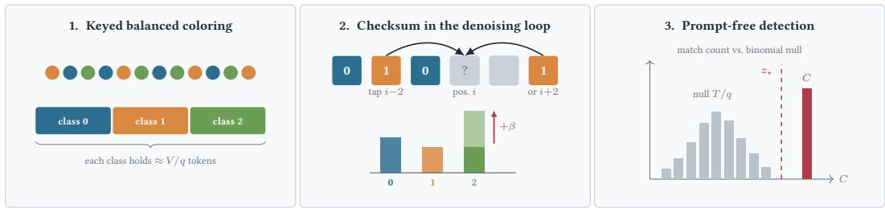
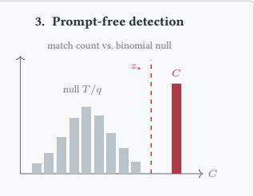
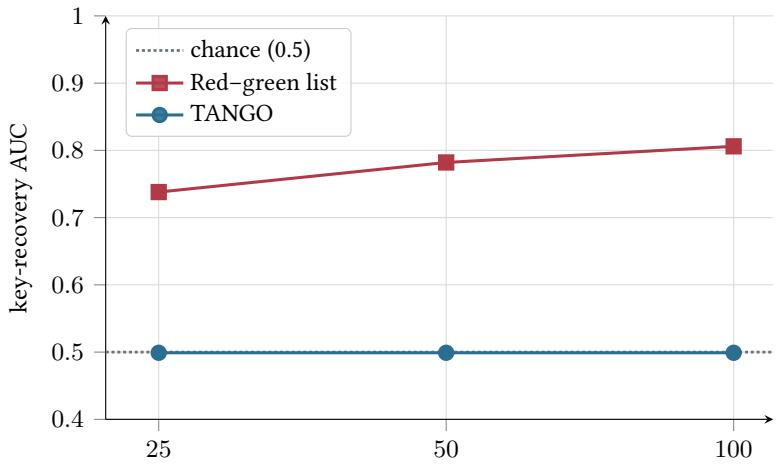
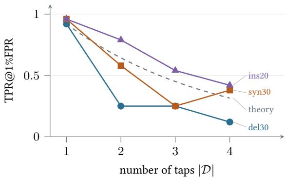
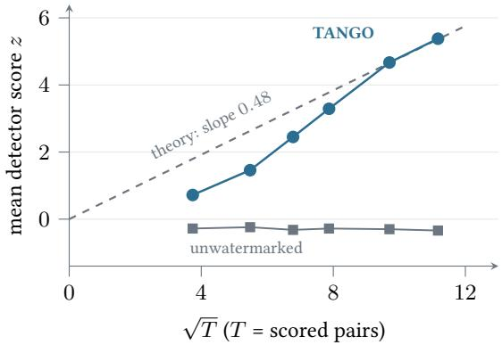
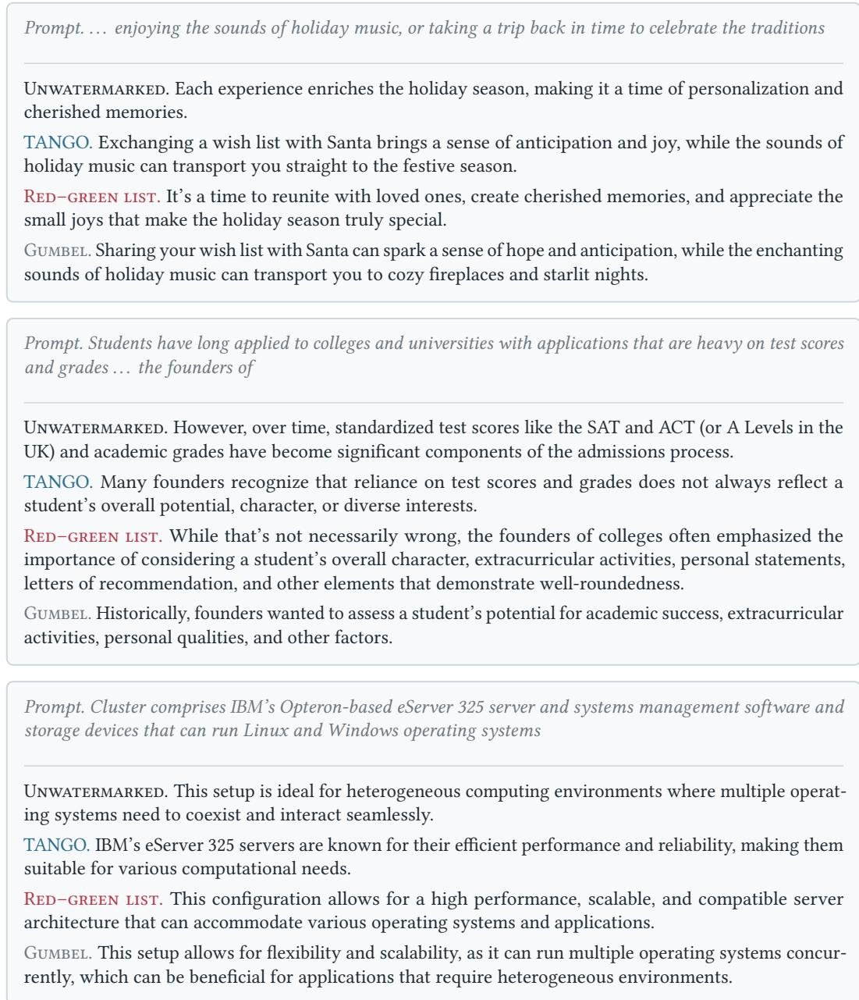

# TANGO: Watermarking Masked Diffusion Language Models in Token Pairs

Kasra Arabi Nir Weinberger

Micah Goldblum Niv Cohen

## Abstract

Masked-difusion language models fill in masked positions in parallel and in no fixed order. Most practical text watermarks assume left-to-right generation. They key each token to the tokens before it, and in a difusion model those tokens may still be masked. A fixed green list needs no such context, but it favors the same tokens at every position, so these tokens appear more often in watermarked text. An attacker who compares token frequencies in watermarked and unwatermarked text can recover the list and forge text that the provider’s own detector accepts. We present TANGO, a watermark for masked-difusion language models that keys each new token to a nearby token that is already unmasked. A secret key splits the vocabulary into color classes, and TANGO biases the new token toward a color determined by the key and the nearby token’s color. The watermark is therefore embedded in pairs of tokens. Because the favored color changes from position to position, token frequencies stay much closer to those of unwatermarked text than under a fixed green list. Detection needs only the text and the key, and it does not assume any unmasking order. On two masked-difusion models, TANGO detects nearly all unedited watermarked texts and most edited ones, and frequency attacks that forge the fixed green list fail against it.

## 1 Introduction

Language models now write text that readers cannot tell apart from human writing, and their providers are increasingly asked to identify which texts their models produced. Text watermarking addresses this need. The provider embeds a secret statistical signal during generation and later tests for its presence. A prominent method is the context-hashed green list (Kirchenbauer et al., 2023), which derives its favored token set from a hash of the preceding tokens. In left-to-right generation, these tokens are already available when the next token is sampled. Masked-difusion language models (Austin et al., 2021; Sahoo et al., 2024; Nie et al., 2025; Ye et al., 2025) instead fill positions out of order through a denoising loop. Under confidence-based decoding, the model unmasks the positions it is most confident about first, regardless of their order in the sequence. When a position is unmasked, the tokens before it may still be masked, so the context-hashed green list cannot be computed.

Other watermarks run on difusion models but face diferent problems. Gumbel-max sampling (Aaronson, 2023), which we call the Gumbel rule, can be applied at every denoising step (Bagchi et al., 2025). However, when we key it on the preceding token, as in its autoregressive form, detection is weak in our experiments. A confidence-ordered sampler unmasks first the positions whose token the model is most certain of. With little uncertainty left there, the Gumbel rule tends to pick that same token, which likely explains why it embeds little signal (Section 4.2). The fixed green list of Zhao et al. (2024), which we call the red–green list, splits the vocabulary once into green and red tokens and favors the green ones. It needs no context and runs unchanged on difusion models. However, it favors the same tokens at every position, so an attacker can estimate the green list from token frequencies in watermarked text. With the green list, the attacker can forge text that the detector accepts (Jovanović et al., 2024) or remove the watermark (Zhang et al., 2024b). A provider that needs to prevent forgery therefore cannot use the red–green list.

We present TANGO, a watermark that is designed for the denoising loop and does not rely on a left-to-right generation order. A secret key colors the vocabulary into q classes. TANGO pairs each position with the token at a fixed ofset, which we call the position’s tap. If the tap has already been generated when a position is unmasked, TANGO biases the logits toward the one class whose color satisfies a keyed modular relation with the tap’s color. We call this relation the checksum. The detector recolors a candidate text with the key and counts the positions where the checksum holds. Because the classes have near-equal size, the checksum holds at about $1 / q$ of the positions in unwatermarked text, and the detector flags text where it holds much more often. Detection needs only the text and the key, not the prompt or the model.

The watermark signal is therefore second order. It comes from pairs of token colors, not from any single token. When every class carries equal probability mass, the biases at diferent positions also cancel out on average. If the favored class is uniform and independent across positions, then under an idealized sampler every token has the same expected frequency as without the watermark (Theorem 1). Ranking tokens by how much more often they appear in watermarked text therefore reveals, in expectation, no diference between the color classes. Empirically, this attack recovers and forges the red–green list but stays at chance against TANGO, and none of its forgeries is accepted (Section 4.3). An attacker who knows TANGO’s design can instead count token pairs. At every forging bias and every number of texts we test, forgeries built from these pair counts succeed less often against TANGO than forgeries of the red–green list succeed against it.

Embedding the signal in token pairs raises two concerns. First, editing either token of a pair can break it. TANGO therefore assigns tokens to classes by meaning. It sorts tokens by a keyed projection of their embeddings and cuts the sorted list into equal-sized classes. Tokens with similar meanings then tend to share a class, so a synonym substitution can keep the checksum. Second, forcing a relation between neighbors could hurt the quality of the generated text. TANGO favors a whole class of tokens, so the model still chooses freely within that class, and quality degrades gradually as the bias grows. Under synonym substitution and word insertion, TANGO detects nearly as many texts as the red–green list. TANGO is more sensitive to word deletion than the red–green list. Deleting a word breaks every pair that spans it, whereas the red–green list scores each token independently (Section 4.2).

## Contributions.

• We introduce TANGO, a coloring-based watermark for masked-difusion language models, which couples the color of each token to the color of one already-unmasked neighbor (Section 3).

• We prove three properties of TANGO (Section 3.4). The expected detection score grows as $\sqrt { T }$ , where T is the number of scored pairs. When every class carries equal probability mass and the favored class is uniform and independent across positions, the watermark leaves the expected frequency of every token unchanged under an idealized sampler, so expected token frequencies do not reveal the key. Replacing tokens at random with rate ρ multiplies the expected detection score by $( 1 - \rho ) ^ { r }$ , where r is the number of tokens a checksum reads, so checksums over fewer tokens are more robust to edits.

• On two masked-difusion models, TANGO detects nearly all unedited watermarked texts and most edited ones. Its detection rate on unedited text and its perplexity are comparable to those of the red–green list. At similar perplexity near our defaults, TANGO detects far more texts than the Gumbel rule (Section 4.2 and Table 12). TANGO is also harder to forge, since frequency attacks that forge the red–green list fail against it (Section 4.3).

## 2 Preliminaries

Decoding in masked-difusion language models. A masked-difusion model starts from a block of masks and, at each step, chooses which masked positions to fill and what to write there. Let V be the vocabulary, $V = | \nu |$ |, and m $\notin \mathcal { V }$ the mask symbol. Given a prompt, the model fills a length-L block over S denoising steps, producing states $\mathbf { \boldsymbol { x } } ^ { ( 0 ) } , \ldots , \mathbf { \boldsymbol { x } } ^ { ( S ) } \in ( \mathbf { \hat { \mathcal { V } } } \cup \{ \mathbf { \hat { m } } \} ) ^ { L }$ with $x ^ { ( 0 ) }$ fully masked and $x ^ { ( S ) } = ( t _ { 1 } , \ldots , \hat { t _ { L } } )$ the output. At each step $j ,$ , one bidirectional forward pass of the model (parameters θ) yields marginals $\bar { p } _ { \theta } ( x _ { i } = v \mid x ^ { ( j - \bar { 1 } ) } )$ for every masked position. The step samples a candidate at each masked position and keeps the $\dot { K }$ most confident positions, re-masking the rest. In LLaDA (Nie et al., 2025), and in Dream (Ye et al., 2025) with the maskgit\_plus ordering that we use, the confidence of a candidate is the probability the model assigns to the sampled token, and the step’s schedule sets $K . ^ { 1 }$ Unmasking is irreversible, so the order in which positions are filled is a permutation of $\{ 1 , \ldots , L \}$ that depends on the data.



  
Figure 1: How TANGO works. (1) A secret key sorts the vocabulary by a keyed embedding score and cuts it into q color classes of near-equal size, so that tokens with similar embeddings tend to share a color. (2) When the tap of a masked position (or its right neighbor at $i + 2 )$ is already unmasked, a logit bias $+ \beta$ favors the one class that satisfies the checksum with that token’s color. The favored class changes from position to position, so under the conditions of Theorem 1, no token is favored on average. (3) Detection counts the matches C among the $T$ scored positions and flags the text when C exceeds the Binom $( T , 1 / q )$ null by more than a threshold $z _ { \star }$ standard deviations.

Requirements. This generation setting motivates three requirements. (R1) Prompt-free detection. The detector should use only the candidate text and the secret key. (R2) Order-agnostic detection. Detection should not need the unmasking order, which the final text does not reveal. (R3) Frequencyhidden key. The token frequencies of watermarked text should not make the secret key easy to infer.

Attacker. We assume the attacker knows the watermarking method and every design parameter, but not the secret key. It can collect watermarked and unwatermarked texts, edit a watermarked text, and generate text with a language model it controls. Its goal is either to forge, that is, to produce text that the provider’s detector accepts, or to remove the watermark from a text by editing it.

## 3 TANGO

Overview. Before generation, the secret key k pseudorandomly assigns every vocabulary token one of q colors through a coloring $\chi : \mathcal { V } \to \mathbb { Z } _ { q }$ that is balanced (Section 3.1), where $\mathbb { Z } _ { q } = \{ 0 , \ldots , q - 1 \}$ with arithmetic modulo q. During generation, TANGO considers each masked position i whose tap, the token at position $i - \delta$ at a small fixed lag δ, is already unmasked. It adds a bias $\beta > 0$ to the logits of every token of the one color that satisfies the checksum with the tap’s color. The step then selects which candidates to unmask by the sampler’s usual rule, keeping the most confident ones, with confidences computed from the biased distribution. Detection needs neither the model nor the prompt. It recolors the text with $\chi ,$ counts the positions where the checksum holds, and compares the count with the binomial distribution expected by chance (Figure 1).

## 3.1 Balanced colorings

A coloring is balanced if every class contains either $\lfloor V / q \rfloor \mathrm { o r } \lceil V / q \rceil$ tokens. Balance makes plausible the uniform-color hypothesis under which an unwatermarked position satisfies the checksum with probability $1 / q$ (Proposition 1), and it is the token-count counterpart of the balance of class probabilities that Theorem 1 assumes. How tokens are assigned to classes determines TANGO’s robustness to edits.

We consider three ways of assigning tokens to colors. A hash coloring partitions a keyed pseudorandom permutation of the vocabulary into q equal blocks. It ignores the meaning of the token, so replacing a token by a synonym randomizes its color, and the pair it belongs to no longer satisfies the checksum more often than chance. A semantic-cluster coloring is a balanced clustering of the token embeddings. Tokens with similar embeddings, which often occur near each other in text, then share a color, so unwatermarked text satisfies the checksum more often than chance. At small q this raises the false-positive rate far above its nominal value (60% at $q = 2$ and 30.5% at $q = 3 ,$ Appendix E.1). We propose semantic-quantile coloring, which sorts tokens by the projection $\langle \mathbf { \bar { e } } _ { v } / \| \mathbf { e } _ { v } \| , \mathbf { r } _ { k } \rangle$ of the unit-normalized embedding of each token v onto a key-seeded direction $\mathbf { r } _ { k : }$ , and cuts the sorted list into q equal-count buckets. Synonyms tend to have nearby projections, so this coloring is designed to let a substitution keep the color more often than chance and thereby preserve part of the signal under editing. Unlike the semantic-cluster coloring, it keeps the false-positive rate close to the nominal value (Appendix E.1).

Balance holds exactly for token counts, but text does not use every token equally often. In natural text, one class then carries more or less than $1 / q$ of the probability, the chance rate drifts away from $1 / q ,$ , and token frequencies begin to reveal the key (Proposition 5). ZCA whitening (Kessy et al., 2018) of the embeddings reduces this drift but does not remove it (Appendix C). Our defaults do not whiten, and we set the detection threshold per model on unwatermarked text.

## 3.2 Generation: enforcing the checksum inside the denoising loop

The red–green list (Zhao et al., 2024) favors one token set for the entire generation. TANGO instead chooses the favored class at each position from a token that is already unmasked. We say that position i is eligible at a denoising step if it is still masked and its tap $i - \delta$ is already unmasked. A position never waits for its tap, so generation proceeds in whatever order the sampler chooses. At an eligible position, TANGO favors the tokens that satisfy the checksum. With $\grave { a _ { \delta } } \in \mathbb { Z } _ { q } \setminus \{ 0 \}$ the coeficient of the tap and $b \in \mathbb { Z } _ { q }$ the target residue, the checksum is

$$
\big ( \chi ( t _ { i } ) + a _ { \delta } \chi ( t _ { i - \delta } ) \big ) \bmod q \ = \ b .\tag{1}
$$

The new token’s color enters with unit weight, so once the tap is unmasked, exactly one class satisfies Equation (1),

$$
s _ { i } ~ = ~ \left( b - a _ { \delta } \chi ( t _ { i - \delta } ) \right) \bmod q .\tag{2}
$$

TANGO adds $\beta$ to the logits of every token in class $s _ { i }$ (after classifier-free guidance on LLaDA), and the step then samples and unmasks candidates as usual (Algorithm 1 in Appendix B). The general form uses a set D of tap lags and replaces the tap term of Equation (1) by $\hat { \sum _ { \delta \in \mathcal { D } } a _ { \delta } \chi ( t _ { i - \delta } ) }$ , so that a checksum reads $| \mathcal { D } | + 1$ tokens. By default we use a single tap, $\mathcal { D } = \{ 2 \}$ (Section 4.4).

When the tap is still masked. The sampler often commits a position before its tap. With enforcement from the left only (one-sided enforcement), this leaves about 40% of scored pairs on LLaDA unenforced (Table 19). With a single tap and gcd $[ ( a _ { \delta } , q ) = 1$ , Equation (1) can also be solved for the tap, so a position whose right neighbor at $i + \delta$ is already committed is biased toward the color that completes that pair. With this either-side enforcement, most pairs are enforced at whichever endpoint the sampler commits second. Detection and the guarantees of Section 3.4 are unchanged, because each biased token still completes exactly one pair through the same checksum.

## 3.3 Detection

The detector uses only the candidate text and the key, so it meets the prompt-free requirement (R1). Given a text $t _ { 1 } , \dots , t _ { L }$ , position i is scored whenever its tap $t _ { i - \delta }$ exists, that is, whenever $i > \delta .$ Let T be the set of scored positions and $T = | \mathcal { T }$ | their number. Each scored position i indexes the pair $( t _ { i - \delta } , t _ { i } )$ , so we also call T the number of scored pairs. Both depend only on the observed text, so the detector never needs the order in which positions were unmasked (R2). At each scored position the detector recolors the token and its tap with χ and checks whether Equation (1) holds. The statistic C counts the positions where it does, and z measures how far C exceeds its chance value $T / q ,$ in standard deviations of the binomial null,

$$
C = \sum _ { i \in \mathcal { T } } \mathbf { 1 } \big [ \big ( \chi ( t _ { i } ) + a _ { \delta } \chi ( t _ { i - \delta } ) \big ) \bmod q = b \big ] , \qquad z = \frac { C - T / q } { \sqrt { T } \sigma _ { 0 } } , \qquad \sigma _ { 0 } ^ { 2 } = \frac { 1 } { q } \big ( 1 - \frac { 1 } { q } \big ) ,\tag{3}
$$

where $\mathbf { 1 } [ \cdot ]$ is the indicator and $\sigma _ { 0 } ^ { 2 }$ is the variance of one match under the null. The text is declared watermarked when z exceeds a threshold $z _ { \star }$ . Choosing $z _ { \star }$ so that unwatermarked text is flagged at a chosen false-positive rate is what we call calibration. Under three approximations stated in Appendix A.5 and with one-sided enforcement, this count test is the likelihood-ratio test among texts with the same T. At every false-positive rate that a threshold on $C$ attains, no detector then detects more (Proposition 4).

The binomial null is exact under two conditions. First, the scored token’s color is uniform over the q classes and independent of the tap’s color. Adding the tap’s term then gives a uniform residue, so the checksum holds with probability $1 / q$ at every position. Second, the match events at diferent positions are independent. Then C is exactly binomial.

Proposition 1 (Binomial null). Assume that at each scored position the color $\chi ( t _ { i } )$ is uniform on $\mathbb { Z } _ { q }$ and independent ofthe colors ofits taps, and that the match indicators are mutually independent across positions. Then $\checkmark \sim \mathrm { B i n o m } ( \check { T } , 1 / q )$ for every residue $b ,$ and z converges in distribution to $\mathcal { N } ( 0 , 1 )$ as $\bar { T } \to \infty$ . (Proof in Appendix A.2.)

Real text satisfies neither condition exactly. For a hash coloring, uniformity holds in expectation over the key to within $1 / V$ (Proposition 3). For the semantic-quantile coloring, which is not uniformly random, we measure the class masses directly (Table 6). Both kinds of independence fail because neighboring tokens are correlated, most strongly when adjacent. Under the default key, the null mean score of natural text ranges from −0.93 to +0.98 across residues at lag 1 and from −0.42 to +0.24 at lag 2 (Table 6). This correlation is why the default tap skips the adjacent token.

## 3.4 Theoretical guarantees

We analyze how much text the detector needs (Proposition $2 ) ,$ what token frequencies reveal about the key (Theorem 1), and how edits weaken the score (Theorem 2).

Setting and assumptions. Let $M _ { i } \in \{ 0 , 1 \}$ indicate whether the checksum holds at scored position i, so that $\begin{array} { r } { \bar { C ^ { { \mathrm { ~ } } } } = \sum _ { i \in \mathcal { T } } M _ { i } } \end{array}$ . On the generation side, let $p _ { i }$ be the model’s distribution $p _ { \theta } ( x _ { i } = \cdot \mid x ^ { ( j - 1 ) } )$ at position i after temperature scaling, and $\begin{array} { r } { m _ { s } ( p ) = \sum _ { v : \chi ( v ) = s } p ( v ) } \end{array}$ the total probability that p assigns to tokens of class s. Adding β to the logits of class s multiplies the probability of each of its tokens by $e ^ { \beta }$ and renormalizes. We call the result the tilt of p toward s,

$$
( \mathsf { T } _ { s } p ) ( v ) \ = \ \frac { p ( v ) e ^ { \beta { \bf 1 } [ \chi ( v ) = s ] } } { 1 + \gamma m _ { s } ( p ) } , \qquad \gamma \ = \ e ^ { \beta } - 1 .\tag{4}
$$

A token is enforced when the sampler draws it from a tilt, and a scored pair is enforced when the token of the pair committed second was tilted toward that pair. The enforced fraction κ is the expected fraction of scored pairs that are enforced. The results use four idealizations, stated in full in Appendix A.1. (S) Sampling: candidates are drawn independently given the state and the favored classes, from ${ \sf T } _ { s _ { i } p _ { i } }$ at enforced positions and from $p _ { i }$ elsewhere. They are committed by the unwatermarked rule, and a committed token is treated as a draw from its candidate distribution. This idealizes the confidence selection, whose confidences come from the biased logits. (U) Unpredictability: given the history of states and $\chi ,$ , the favored classes of the positions enforced at a step are independent and uniform on $\mathbb { Z } _ { q } .$ . For a real key, the favored class is a function of the tap’s color. (U) drops this link, which is what the detector counts, so we use (U) only for token frequencies. The detection score uses a local form (U<sup>′</sup>) that keeps the tilt toward the pair being scored. (B) Balance: $m _ { s } ( p _ { i } ) = 1 / q$ for every class s and position i. It holds in expectation over the key to within $1 / V$ for a hash coloring (Proposition 3). (I) Independence: the match indicators $M _ { i }$ are mutually independent. It is the second hypothesis of Proposition 1. Appendix C measures how far unwatermarked text departs from (B) and (I).

How much text detection needs. The detector needs enough scored positions for the matches caused by the watermark to stand out from the noise of the null distribution. At an enforced position the bias raises the probability that the checksum holds above the chance value $1 / q$ . We call the average of this excess over all scored positions the coupling margin ε. The margin grows with $\beta$ and shrinks when $p _ { i }$ is already peaked, because a confident model has little probability to move into the favored class. Under (S), (U<sup>′</sup>), and (B), for a single tap with $\operatorname* { g c d } ( a _ { \delta } , \mathbf { \tilde { \phi } } _ { q } ) = 1$ , unenforced pairs match at the chance rate, $\mathbf { s o } \varepsilon = \kappa \bar { \varepsilon } _ { \mathrm { e n f } }$ with $\bar { \varepsilon } _ { \mathrm { e n f } }$ the margin at enforced pairs (Lemma 1), and either-side enforcement raises ε by raising κ. The expected score is the ratio of the $T \varepsilon$ matches beyond chance to the null standard deviation $\sqrt { T } \sigma _ { 0 }$

Proposition 2 (Expected detection score). For a fixed number T of scored positions, let $\mu _ { i } ~ =$ $\mathrm { P r } ( M _ { i } = 1 )$ under the watermarked process and $\begin{array} { r } { \varepsilon = \frac { 1 } { T } \sum _ { i \in \mathcal { T } } ( \mu _ { i } - 1 / q ) } \end{array}$ . Then $\mathbb { E } [ z ] = \sqrt { T } \varepsilon / \sigma _ { 0 }$

The identity follows from linearity of expectation and needs no independence (Appendix A.3). The score thus grows like the square root of the text length. With a fixed positive margin it reaches $z _ { \star }$ once $T \geq z _ { \star } ^ { 2 } \sigma _ { 0 } ^ { 2 } / \varepsilon ^ { 2 }$ (Corollary 1, compared with LLaDA text in Figure 4), and under (I) the false-negative rate decays exponentially in $T$ (Corollary 2).

First-order unforgeability. An attacker who reconstructs $\chi$ can forge, and requirement (R3) asks that token frequencies not make $\chi$ easy to infer. The attacker can rank tokens by their frequency shift $\Delta f ( v ) = \mathsf { \bar { f } } _ { \mathrm { w m } } ( v ) - f _ { \mathrm { b a s e } } ( v )$ between watermarked and unwatermarked generations, and the area under the ROC curve $( \mathrm { A U C } )$ of this ranking measures how well it separates the color classes. Under balance, every tilt has the same normalizer $1 + \gamma / q$ and each token is boosted by exactly one of the q tilts, so the tilts average to the unwatermarked distribution, $\begin{array} { r } { \frac { 1 } { q } \sum _ { s } \mathsf { T } _ { s } p = p } \end{array}$ (Lemma 2).

Theorem 1 (First-order unforgeability). Fix a coloring $\chi .$ Under $( S ) ,$ (U), and (B), the generated text has the same distribution with and without the watermark. Hence $\mathbb { E } [ \Delta f ( v ) ] = 0$ for every $v \in \mathcal V _ { : }$ , and any attacker who ranks each token v by $g ( \mathbb { E } [ \Delta f ( v ) ] )$ , for a fixed function $^ { g , }$ separates the color classes no better than chance (AUC <sup>1</sup> ). (Proof in Appendix $A . 6 . )$

In words, when the favored class behaves like a fresh uniform draw at every position, the watermark pushes no token’s expected frequency in a direction set by its color. The theorem does not say that one key produces unwatermarked text, because (U) drops the link that the detector counts. It also covers only expected shifts. The attacker of Section $4 . { \overset { - } { 3 } }$ ranks tokens by shifts measured on finitely many texts, so its chance-level result is an empirical finding. When (B) fails, the cancellation is inexact. The leak is proportional to the class imbalance and, for small $\gamma ,$ second order in $\gamma$ (Proposition 5). The red–green list favors the same tokens at every position. Its favored class never varies, so nothing averages out, and ranking by frequency shift recovers the green list (Proposition 6).

Edit robustness. An edit can break a checksum whenever it changes any of the $r = | \mathcal { D } | + 1$ tokens the checksum reads, so every added tap makes every checksum easier to break.

Theorem 2 (Edit robustness). Suppose that an attacker corrupts each token with probability $\rho ,$ independently across tokens and ofthe text, that a corrupted token’s color is uniform on $\mathbb { Z } _ { q }$ and independent of everything else, that positions stay aligned, and that gcd $( a _ { \delta } , q ) = 1$ for every $\bar { \delta \in \mathcal { D } }$ (which holds automatically when $q$ is prime). Then, exactly, E $[ z _ { \mathrm { a t t } } ] = ( 1 - \rho ) ^ { | \mathcal { D } | + 1 } \mathbb { E } [ z _ { \mathrm { c l e a n } } ] .$ where ${ \cal Z } _ { \mathrm { a t t } }$ and ${ \mathcal { Z } } _ { \mathrm { c l e a n } }$ are the scores of the attacked and the clean text.

Random substitution thus multiplies the expected score by the probability that a whole checksum is untouched (proof in Appendix $\mathrm { A } . 7 )$ . The gcd condition handles a tap that was edited. Such a tap contributes $a _ { \delta }$ times a uniform residue. Multiplication by $a _ { \delta }$ permutes the residues exactly when $a _ { \delta }$ is a unit modulo $q ,$ and the checksum then holds with probability exactly $1 / q$ . Every added tap costs another factor of $( 1 - \rho )$ , and the ablation of Section 4.4 shows that detection under edits falls as taps are added.

## 4 Experiments

## 4.1 Setup

TANGO configuration. Unless noted otherwise, TANGO uses the semantic-quantile coloring with $q = 3$ colors, a single tap at lag $\delta = 2 ( a _ { 2 } = 1 )$ , target residue $b = 0 _ { \mathrm { { i } } }$ , logit bias $\beta = 5 ,$ and enforcement from either side, with the unwhitened coloring on both models. Appendix B gives the rule that selected these defaults.

Models and baselines. We evaluate LLaDA-8B-Instruct (Nie et al., 2025) and Dream-v0-Instruct-7B (Ye et al., 2025), which is initialized from Qwen2.5-7B (Yang et al., 2024) and shares its tokenizer. Prompts come from the C4 dataset (Rafel et al., 2020), and TANGO and the baselines generate 128 tokens at temperature 1.0, with classifier-free guidance (CFG) at scale 2.0 on LLaDA (Appendix B). The baselines are the red–green list (the Unigram watermark of Zhao et al. (2024), with green fraction 0.25 and logit bias 5) and the Gumbel rule keyed on the preceding token (Aaronson, 2023), both applied along the confidence-ordered unmasking. Dream’s sampler is incompatible with the Gumbel rule, so we run the Gumbel rule on LLaDA only. Each comparison in Table 1 uses $n = 2 0 0$ generations per method on LLaDA and $n = 1 0 0$ per method on Dream. We also run two published watermarks for masked-difusion models on the same prompts, using their public code. They are a context-hashed green list for difusion models by Gloaguen et al. (2026), which we call the DLM watermark, and dgMARK (Hong & No, 2026).

Table 1: TANGO detects nearly all unedited and most edited watermarked texts at a perplexity close to the red–green list’s. TPR@1%FPR under no attack (clean) and under the three edits, with the half-width of a 95% bootstrap interval as superscript. TANGO at the default setting, red–green list with green fraction 0.25 and bias 5, Gumbel rule at temperature $\tau = 1 . 0 . n = 2 0 0$ per method on LLaDA and 100 on Dream, with the unwatermarked continuations of the same prompts as negatives. PPL is Qwen2.5-7B-Instruct perplexity over non-degenerate continuations (Appendix B).
<table><tr><td></td><td></td><td></td><td colspan="4">TPR@1%FPR</td><td></td></tr><tr><td>model</td><td>method</td><td>AUROC</td><td>clean</td><td>del30</td><td>syn30</td><td>ins20</td><td>PPL</td></tr><tr><td>LLaDA</td><td>TANGO</td><td>0.998</td><td> $0 . 9 7 ^ { \pm 0 . 0 2 }$ </td><td> $0 . 6 8 ^ { \pm 0 . 0 7 }$ </td><td> $0 . 9 2 ^ { \pm 0 . 0 4 }$ </td><td> $0 . 9 1 ^ { \pm 0 . 0 4 }$ </td><td>7.2</td></tr><tr><td>LLaDA</td><td>Red-green list</td><td>0.993</td><td> $0 . 9 8 ^ { \pm 0 . 0 2 }$ </td><td> $0 . 9 6 ^ { \pm 0 . 0 2 }$ </td><td> $0 . 9 4 ^ { \pm 0 . 0 3 }$ </td><td> $0 . 9 8 ^ { \pm 0 . 0 2 }$ </td><td>7.6</td></tr><tr><td>LLaDA</td><td>Gumbel</td><td>0.815</td><td> $0 . 1 5 ^ { \pm 0 . 0 5 }$ </td><td> $0 . 1 0 ^ { \pm 0 . 0 4 }$ </td><td> $0 . 0 7 ^ { \pm 0 . 0 4 }$ </td><td> $0 . 0 7 ^ { \pm 0 . 0 4 }$ </td><td>4.6</td></tr><tr><td>LLaDA</td><td>unwatermarked</td><td></td><td></td><td></td><td></td><td></td><td>4.2</td></tr><tr><td>Dream</td><td>TANGO</td><td>1.000</td><td> $1 . 0 0 ^ { \pm 0 . 0 0 }$ </td><td> $0 . 7 3 ^ { \pm 0 . 0 8 }$ </td><td> $0 . 9 8 ^ { \pm 0 . 0 3 }$ </td><td> $0 . 9 7 ^ { \pm 0 . 0 3 }$ </td><td>7.8</td></tr><tr><td>Dream</td><td>Red-green list</td><td>1.000</td><td> $1 . 0 0 ^ { \pm 0 . 0 0 }$ </td><td> $0 . 9 8 ^ { \pm 0 . 0 3 }$ </td><td> $0 . 9 8 ^ { \pm 0 . 0 3 }$ </td><td> $0 . 9 8 ^ { \pm 0 . 0 3 }$ </td><td>9.1</td></tr><tr><td>Dream</td><td>unwatermarked</td><td></td><td>一</td><td></td><td></td><td></td><td>3.8</td></tr></table>

Attacks and metrics. Edits are word-level attacks: deleting 30% of the words (del30), replacing 30% of them with synonyms (syn30), and inserting 20% random words (ins20). The deletion and synonym attacks are adapted from MarkLLM (Pan et al., 2024), and synonyms come from WordNet (Miller, 1995). We report the area under the detector’s ROC curve (AUROC) and the true-positive rate (TPR) at a 1% false-positive rate (FPR), written TPR@1%FPR, both against unwatermarked text. Unless stated otherwise, generation quality is measured as perplexity (PPL) under Qwen2.5-7B-Instruct (Yang et al., 2024) conditioned on the prompt (Appendix B gives this protocol and the full attack set). Appendix D.8 reports the variation over three seeds and four keys.

## 4.2 Detection and quality

Table 1 compares TANGO with the red–green list and the Gumbel rule. TANGO detects 97% (LLaDA) and 100% (Dream) of unedited watermarked texts, and 68–92% and 73–98% after edits, with deletion the hardest attack. Its perplexity is 7.2 on LLaDA and 7.8 on Dream, against 7.6 and 9.1 for the red–green list. On Dream, the red–green list degenerates into repetition on 62% of its texts, against 31% for TANGO and 20% for unwatermarked text (Appendix D.5). Appendix G shows qualitative samples.

Of the three edits, deletion is the one where the red–green list keeps a clear lead (96% against 68% of deleted texts on LLaDA; Table 12 in Appendix D sweeps both biases). A deleted word breaks every TANGO pair that spans it, whereas the red–green list scores each token on its own. That list’s robustness comes from applying the same vocabulary bias at every position, which is also what exposes its key (Section 4.3). Of the published difusion watermarks, the DLM watermark lies on the red–green list’s trade-of between detection and perplexity, and dgMARK without its beam lookahead, in its best-detecting setting, detects fewer clean texts than TANGO at a larger perplexity cost (Table 11 in Appendix D). The Gumbel rule is distortion-free in expectation over its key and costs little perplexity. It detects poorly, however, with AUROC 0.815 and clean TPR@1%FPR 0.15, likely because the sampler commits the most confident positions first, where the keyed draw seldom changes the token (Section 1). Raising the temperature restores detection at the price of quality. At temperature 1.5 it detects 83% of deleted texts, at perplexity 20.6 (Table 12).

## 4.3 Key recovery and forgery

Key recovery and forgery from token frequencies. Token frequencies reveal the red–green list’s key but not TANGO’s. On LLaDA with one-sided enforcement at $\beta = 8 ,$ the total-variation distance between watermarked and unwatermarked token frequencies is 0.217 for TANGO. This is close to the 0.210 that finite samples alone produce, and below the 0.340 of the red–green list (Table 8 in Appendix D). Ranking tokens by how much more often they appear in watermarked than in unwatermarked text recovers the green list, and the recovery improves as the attacker collects more texts, from AUC 0.738 at 25 texts to 0.806 at 100 (Figure 2, a separate run with TANGO at $\beta = 6$ and the whitened coloring). Against TANGO, recovery stays at chance at every number of texts (0.504 at 200 texts on LLaDA and 0.501 at 100 texts on Dream). An attacker can then generate text that favors the tokens of the recovered key. Every such forgery passes the red–green detector, and none passes TANGO’s (Table 8).

Table 2: Three colors and a single tap detect best under edits. LLaDA-8B, one-sided enforcement at $\beta = 8 , n = 2 4$ per row, defaults in bold. The q rows use lag 1 (and, for $q \geq 4 ,$ , the key’s residue), and the tap rows use $q = 3 ,$ , so they are separate runs. PPL is GPT-2-large perplexity, and null FPR is the fraction of 200 natural C4 texts with $z > 4 .$ . The residue ablation is in Appendix C.3.
<table><tr><td></td><td></td><td></td><td colspan="4">TPR@1%FPR</td><td></td><td></td></tr><tr><td>axis</td><td>setting</td><td>AUROC</td><td>clean</td><td>del30</td><td>syn30</td><td>ins20</td><td>PPL</td><td>null FPR (%)</td></tr><tr><td>colors q</td><td>2</td><td>0.989</td><td>0.92</td><td>0.62</td><td>0.71</td><td>0.83</td><td>20.4</td><td>0.0</td></tr><tr><td></td><td>3</td><td>1.000</td><td>1.00</td><td>0.92</td><td>0.96</td><td>1.00</td><td>22.2</td><td>0.0</td></tr><tr><td></td><td>4</td><td>1.000</td><td>1.00</td><td>0.79</td><td>0.83</td><td>0.96</td><td>26.8</td><td>0.5</td></tr><tr><td></td><td>8</td><td>1.000</td><td>1.00</td><td>0.83</td><td>0.83</td><td>1.00</td><td>29.9</td><td>0.5</td></tr><tr><td></td><td>16</td><td>0.998</td><td>0.96</td><td>0.88</td><td>0.96</td><td>0.96</td><td>29.5</td><td>0.0</td></tr><tr><td>taps D</td><td>{2}</td><td>1.000</td><td>1.00</td><td>0.92</td><td>0.96</td><td>0.96</td><td>25.0</td><td>0.0</td></tr><tr><td></td><td>{1,2}</td><td>0.990</td><td>0.96</td><td>0.25</td><td>0.58</td><td>0.79</td><td>19.6</td><td>0.0</td></tr><tr><td></td><td>{1, 2, 3}</td><td>0.986</td><td>0.83</td><td>0.25</td><td>0.25</td><td>0.54</td><td>16.7</td><td>0.0</td></tr><tr><td></td><td>{1, 2, 3, 4}</td><td>0.984</td><td>0.83</td><td>0.12</td><td>0.38</td><td>0.42</td><td>18.9</td><td>0.0</td></tr></table>

Key recovery and forgery from token pairs. An attacker who knows TANGO’s design can instead count token pairs at the tap lag and rank them by how much more often they appear in watermarked text. This attack is much harder, because it must estimate the frequencies of $\operatorname { \dot { O } } ( V ^ { 2 } )$ pairs instead of $O ( V )$ tokens, but the attacker may still find some signal. Scored against the true key, the ranking separates pairs that satisfy the checksum from the rest with AUC 0.62 at 200 texts, and 0.78 on the pairs seen at least three times. Turning that signal into a forgery succeeds less often than against the red–green list. We let an attacker who has the model but not the key collect the over-represented pairs from 200 texts (against the red–green list, the recovered green list) and bias its own generation toward them. We score forgeries at each detector’s 1% false-positive threshold. At the bias level that lets 51% of forgeries pass the red–green detector, only 4% pass TANGO’s (Table 10 in Appendix D). At this bias the forgeries against TANGO stay fluent, with GPT-2-large (Radford et al., 2019) perplexity 13.5 against 13.1 for unwatermarked text. At twice the bias, 55% pass TANGO’s detector and 98% pass the red–green detector. A simpler attacker that strings over-represented pairs together without a language model shows the same ordering at every number of texts (74% against 96% at 200 texts and $z > 4 ,$ Table 9). Increasing the number of taps may further weaken both attacks, at the cost of lower detection, especially under edits (Section 4.4).

## 4.4 Ablations

Table 2 varies TANGO’s two main design choices, the number of colors q and the tap set ${ \mathcal { D } } ,$ on LLaDA. The target residue $b = 0$ is the one that unwatermarked text satisfies least often under the default key, because the class masses are unequal and the colors of neighboring tokens are correlated (Appendix C.3).

Colors and taps. Detection under edits improves sharply from $q \ : = \ : 2$ to $q = 3$ (del30 TPR $0 . 6 2  0 . 9 2 )$ and does not improve further, while GPT-2-large perplexity rises from 22.2 at $q = 3$ to 29.9 at $q = 8 ,$ , so we use $q = 3 ,$ . Consistent in direction with Theorem 2, deletion TPR drops from 0.92 with one tap to 0.12 with four (Figure 3 in Appendix E), so we use a single tap.

Enforced fraction. The enforced fraction κ sets the margin of Proposition 2. With one-sided enforcement at $\beta = 8 ,$ , κ is 0.61 on LLaDA. Either-side enforcement raises it to 0.74 at the same bias, and to 0.76 at the default $\beta = 5$ (Table 19 in Appendix E). Because $\varepsilon = \kappa \bar { \varepsilon } _ { \mathrm { e n f } }$ , raising κ from 0.61 to 0.74 at a fixed margin per enforced pair raises the expected score by a factor of about 1.2.

## 5 Related work

Biased and distortion-free watermarks. Statistical text watermarks difer in whether they change token frequencies. Biased watermarks do. A keyed green list adds a logit bias to a vocabulary subset that is either derived from a hash of the context (Kirchenbauer et al., 2023) or fixed once (Zhao et al., 2024). The resulting frequency shift lets an attacker approximate the green list and forge or remove the watermark (Jovanović et al., 2024; Zhang et al., 2024b). Reweighting watermarks change the next-token distribution under a fixed key but preserve it in expectation over keys (Hu et al., 2024; Wu et al., 2024), and distortion-free watermarks use the key to seed the randomness of sampling (Aaronson, 2023; Kuditipudi et al., 2024; Christ et al., 2024; Dathathri et al., 2024). Like biased watermarks, TANGO biases the sampler, so detection counts matches and needs no prompt. Unlike the red–green list, it favors a diferent class at each position. Under the assumptions of Theorem 1, expected token frequencies are then unchanged, and the signal appears in pair statistics.

Watermarks for difusion language models. The DLM watermark of Gloaguen et al. (2026) applies a context-hashed green-list bias in expectation over still-masked context, and dgMARK (Hong & No, 2026) steers the unmasking order so that the final text carries a statistical signature. Other difusion watermarks add predicted and bidirectional context to the context hash (Wu et al., 2025), apply Gumbel-max sampling at every denoising step with independent (Bagchi et al., 2025) or locally correlated (Li & He, 2026) perturbations, or control a global sketch of the whole sequence (Zhao, 2026). The closest work, LR-DWM (Raban et al., 2026), hashes the token id of the left and of the right neighbor, whenever each is unmasked, into two green lists and biases the token toward both. TANGO also keys on an unmasked neighbor, but only through its color, so the favored set is always one of q balanced classes, and a substitution that keeps the neighbor’s color keeps the favored class. Appendix F discusses these works in more detail, along with semantic watermarks, watermark stealing, and signatures.

## 6 Discussion

Most text watermarks assume left-to-right generation, while masked-difusion language models generate tokens in no fixed order. The red–green list still runs in this setting, but it exposes its key through token frequencies. TANGO embeds its signal in pairs of tokens during the denoising loop. Under our idealized assumptions, the expected frequency of every token is then unchanged (Theorem 1). In our experiments, key recovery from token frequencies stays at chance, and forgeries built from those frequencies fail. Detection needs only the candidate text and the key.

Scope of the guarantees. Theorem 1 covers expected token frequencies under idealized assumptions. An attacker who counts token pairs can forge TANGO, though less often than the red–green list in every setting we test. In a word-level test, even an attacker who holds the key and uses it to choose which words to regenerate removes the watermark about as fast as random editing does, or slower (Table 14 in Appendix D). Rotating the key per deployment window limits how many texts an attacker can collect under one key, at the cost of testing each candidate text against every active key. Key rotation is the mitigation we recommend in practice.

Robustness and calibration. TANGO trades some robustness to deletion for a frequency-hidden key. The red–green list survives deletion better at matched perplexity because it biases the same tokens at every position, which is the property that exposes its key. Theorem 2 covers only edits that keep positions aligned. Paraphrase by back-translation reorders clauses and lowers TANGO’s detection more than the red–green list’s (Appendix D.7). Dream’s natural text scores above chance, so the detection threshold should be set on unwatermarked text for each new model (Appendix C).

Which watermark to deploy. A provider whose detections must hold up against forgery gains the most from TANGO. Under synonym substitution and word insertion, TANGO detects at most eight percentage points fewer watermarked texts than the red–green list on both models (Table 1). Its key could not be read from token frequencies in our experiments, and every attack we test forges it less often than the red–green list. For such a provider, we argue that a frequency-hidden key is worth some loss of robustness to deletion.

## References

Scott Aaronson. Watermarking of large language models. Talk, Simons Institute for the Theory of Computing, 2023.

Kasra Arabi, Benjamin Feuer, R. Teal Witter, Chinmay Hegde, and Niv Cohen. Hidden in the noise: Two-stage robust watermarking for images. In International Conference on Learning Representations (ICLR), 2025a.

Kasra Arabi, R. Teal Witter, Chinmay Hegde, and Niv Cohen. SEAL: Semantic aware image watermarking. In IEEE/CVF International Conference on Computer Vision (ICCV), 2025b. doi: 10.1109/ICCV51701.2025.01503.

Jacob Austin, Daniel D. Johnson, Jonathan Ho, Daniel Tarlow, and Rianne van den Berg. Structured denoising difusion models in discrete state-spaces. In Advances in Neural Information Processing Systems (NeurIPS), 2021.

Avi Bagchi, Akhil Bhimaraju, Moulik Choraria, Daniel Alabi, and Lav R. Varshney. Watermarking discrete difusion language models. arXiv preprint arXiv:2511.02083, 2025.

Ruibo Chen, Yihan Wu, Junfeng Guo, and Heng Huang. De-mark: Watermark removal in large language models. In International Conference on Machine Learning (ICML), volume 267 of PMLR, pp. 9316–9333, 2025.

Miranda Christ, Sam Gunn, and Or Zamir. Undetectable watermarks for language models. In Conference on Learning Theory (COLT), volume 247 of PMLR, pp. 1125–1139, 2024.

C. J. Clopper and E. S. Pearson. The use of confidence or fiducial limits illustrated in the case of the binomial. Biometrika, 26(4):404–413, 1934. doi: 10.1093/biomet/26.4.404.

Sumanth Dathathri, Abigail See, Sumedh Ghaisas, et al. Scalable watermarking for identifying large language model outputs. Nature, 634:818–823, 2024. doi: 10.1038/s41586-024-08025-4.

Jaiden Fairoze, Sanjam Garg, Somesh Jha, Saeed Mahloujifar, Mohammad Mahmoody, and Mingyuan Wang. Publicly-detectable watermarking for language models. IACR Communications in Cryptology, 1(4), 2025. doi: 10.62056/ahmpdkp10.

Thibaud Gloaguen, Nikola Jovanović, Robin Staab, and Martin Vechev. Discovering spoofing attempts on language model watermarks. In International Conference on Machine Learning (ICML), volume 267 of PMLR, pp. 19562–19584, 2025.

Thibaud Gloaguen, Robin Staab, Nikola Jovanović, and Martin Vechev. Watermarking difusion language models. In International Conference on Learning Representations (ICLR), 2026.

Chenchen Gu, Xiang Lisa Li, Percy Liang, and Tatsunori Hashimoto. On the learnability of watermarks for language models. In International Conference on Learning Representations (ICLR), 2024.

Wassily Hoefding. Probability inequalities for sums of bounded random variables. Journal ofthe American Statistical Association, 58(301):13–30, 1963. doi: 10.1080/01621459.1963.10500830.

Pyo Min Hong and Albert No. dgMARK: Decoding-guided watermarking for difusion language models. In International Conference on Machine Learning (ICML), 2026.

Abe Bohan Hou, Jingyu Zhang, Tianxing He, Yichen Wang, Yung-Sung Chuang, Hongwei Wang, Lingfeng Shen, Benjamin Van Durme, Daniel Khashabi, and Yulia Tsvetkov. SemStamp: A semantic watermark with paraphrastic robustness for text generation. In Conference of the North American Chapter ofthe Association for Computational Linguistics (NAACL), 2024.

Zhengmian Hu, Lichang Chen, Xidong Wu, Yihan Wu, Hongyang Zhang, and Heng Huang. Unbiased watermark for large language models. In International Conference on Learning Representations (ICLR), 2024.

Nikola Jovanović, Robin Staab, and Martin Vechev. Watermark stealing in large language models. In International Conference on Machine Learning (ICML), 2024.

Agnan Kessy, Alex Lewin, and Korbinian Strimmer. Optimal whitening and decorrelation. The American Statistician, 72(4):309–314, 2018.

John Kirchenbauer, Jonas Geiping, Yuxin Wen, Jonathan Katz, Ian Miers, and Tom Goldstein. A watermark for large language models. In International Conference on Machine Learning (ICML), 2023.

Rohith Kuditipudi, John Thickstun, Tatsunori Hashimoto, and Percy Liang. Robust distortion-free watermarks for language models. Transactions on Machine Learning Research (TMLR), 2024.

Baixin Li and Haiyun He. SAC-Copula: Quality-preserving watermarking for difusion language models via smooth correlated Gumbel fields. arXiv preprint arXiv:2608.20839, 2026.

Huijia Lin, Kameron Shahabi, and Min Jae Song. Unforgeable watermarks for language models via robust signatures. In Advances in Cryptology – CRYPTO 2026, Lecture Notes in Computer Science, pp. 99–131. Springer, 2026. doi: 10.1007/978-3-032-35415-0\_4.

Aiwei Liu, Leyi Pan, Xuming Hu, Shu’ang Li, Lijie Wen, Irwin King, and Philip S. Yu. An unforgeable publicly verifiable watermark for large language models. In International Conference on Learning Representations (ICLR), 2024a.

Aiwei Liu, Leyi Pan, Xuming Hu, Shiao Meng, and Lijie Wen. A semantic invariant robust watermark for large language models. In International Conference on Learning Representations (ICLR), 2024b.

Tianhao Ma, Weihao Xuan, Dong-Dong Wu, Farshid Nooshi, Takashi Ishida, Gang Niu, Naoto Yokoya, and Masashi Sugiyama. DenMark: Robust semantic watermarking for difusion language models. arXiv preprint arXiv:2609.14257, 2026.

George A. Miller. WordNet: A lexical database for English. Communications ofthe ACM, 38(11): 39–41, 1995. doi: 10.1145/219717.219748.

Shen Nie, Fengqi Zhu, Zebin You, Xiaolu Zhang, Jingyang Ou, Jun Hu, Jun Zhou, Yankai Lin, Ji-Rong Wen, and Chongxuan Li. Large language difusion models. In Advances in Neural Information Processing Systems (NeurIPS), 2025.

Leyi Pan, Aiwei Liu, Zhiwei He, Zitian Gao, Xuandong Zhao, Yijian Lu, Binglin Zhou, Shuliang Liu, Xuming Hu, Lijie Wen, Irwin King, and Philip S. Yu. MarkLLM: An open-source toolkit for LLM watermarking. In Conference on Empirical Methods in Natural Language Processing (EMNLP): System Demonstrations, 2024.

Ofek Raban, Gal Chechik, and Ethan Fetaya. LR-DWM: Eficient watermarking for difusion language models. In Findings of the Association for Computational Linguistics: ACL 2026, pp. 43510–43517, 2026. doi: 10.18653/v1/2026.findings-acl.2161.

Alec Radford, Jefrey Wu, Rewon Child, David Luan, Dario Amodei, and Ilya Sutskever. Language models are unsupervised multitask learners. Technical report, OpenAI, 2019.

Colin Rafel, Noam Shazeer, Adam Roberts, Katherine Lee, Sharan Narang, Michael Matena, Yanqi Zhou, Wei Li, and Peter J. Liu. Exploring the limits of transfer learning with a unified text-to-text transformer. Journal ofMachine Learning Research, 21(140):1–67, 2020.

Jie Ren, Han Xu, Yiding Liu, Yingqian Cui, Shuaiqiang Wang, Dawei Yin, and Jiliang Tang. A robust semantics-based watermark for large language model against paraphrasing. In Findings of the Association for Computational Linguistics: NAACL 2024, pp. 613–625, 2024.

Vinu Sankar Sadasivan, Aounon Kumar, Sriram Balasubramanian, Wenxiao Wang, and Soheil Feizi. Can AI-generated text be reliably detected? Stress testing AI text detectors under various attacks. Transactions on Machine Learning Research (TMLR), 2025.

Subham Sekhar Sahoo, Marianne Arriola, Yair Schif, Aaron Gokaslan, Edgar Marroquin, Justin T. Chiu, Alexander Rush, and Volodymyr Kuleshov. Simple and efective masked difusion language models. In Advances in Neural Information Processing Systems (NeurIPS), 2024.

Linyu Wu, Linhao Zhong, Wenjie Qu, Yuexin Li, Yue Liu, Shengfang Zhai, Chunhua Shen, and Jiaheng Zhang. DMark: Order-agnostic watermarking for difusion large language models. arXiv preprint arXiv:2510.02902, 2025.

Qilong Wu and Varun Chandrasekaran. Bypassing LLM watermarks with color-aware substitutions. In Proceedings of the 62nd Annual Meeting of the Association for Computational Linguistics (ACL), pp. 8549–8581, 2024. doi: 10.18653/v1/2024.acl-long.464.

Yihan Wu, Zhengmian Hu, Junfeng Guo, Hongyang Zhang, and Heng Huang. A resilient and accessible distribution-preserving watermark for large language models. In International Conference on Machine Learning (ICML), 2024.

An Yang, Baosong Yang, Beichen Zhang, Binyuan Hui, Bo Zheng, Bowen Yu, et al. Qwen2.5 technical report. arXiv preprint arXiv:2412.15115, 2024.

Jiacheng Ye, Zhihui Xie, Lin Zheng, Jiahui Gao, Zirui Wu, Xin Jiang, Zhenguo Li, and Lingpeng Kong. Dream 7B: Difusion large language models. arXiv preprint arXiv:2508.15487, 2025.

Hanlin Zhang, Benjamin L. Edelman, Danilo Francati, Daniele Venturi, Giuseppe Ateniese, and Boaz Barak. Watermarks in the sand: Impossibility of strong watermarking for language models. In International Conference on Machine Learning (ICML), volume 235 of PMLR, pp. 58851–58880, 2024a.

Zhaoxi Zhang, Xiaomei Zhang, Yanjun Zhang, Leo Yu Zhang, Chao Chen, Shengshan Hu, Asif Gill, and Shirui Pan. Stealing watermarks of large language models via mixed integer programming. In Annual Computer Security Applications Conference (ACSAC), pp. 46–60, 2024b. doi: 10.1109/ ACSAC63791.2024.00021.

Daniel Zhao. Global sketch-based watermarking for difusion language models. arXiv preprint arXiv:2606.04486, 2026.

Xuandong Zhao, Prabhanjan Ananth, Lei Li, and Yu-Xiang Wang. Provable robust watermarking for AI-generated text. In International Conference on Learning Representations (ICLR), 2024.

Xuandong Zhao, Sam Gunn, Miranda Christ, Jaiden Fairoze, Andres Fabrega, Nicholas Carlini, Sanjam Garg, Sanghyun Hong, Milad Nasr, Florian Tramer, Somesh Jha, Lei Li, Yu-Xiang Wang, and Dawn Song. SoK: Watermarking for AI-generated content. In IEEE Symposium on Security and Privacy (S&P), 2025.

Tong Zhou, Xuandong Zhao, Xiaolin Xu, and Shaolei Ren. Bileve: Securing text provenance in large language models against spoofing with bi-level signature. In Advances in Neural Information Processing Systems (NeurIPS), 2024.

## Appendix Contents

A Proofs 14   
A.1 Setting, notation, and assumptions 14   
A.2 The score of unwatermarked text 17   
A.3 Expected score and the text length needed for detection 18   
A.4 Finite-sample error bounds 20   
A.5 The count test is the likelihood-ratio test 21   
A.6 Token frequencies and the key 22   
A.7 Edit robustness 25   
B Experimental details 26   
C Calibration of the detector on unwatermarked text 28   
C.1 LLaDA 28   
C.2 Dream 28   
C.3 Correlated colors and the choice of residue 29   
D Full results 30   
D.1 Key recovery and forgery from token frequencies 30   
D.2 Key recovery and forgery from token pairs 31   
D.3 The published difusion watermarks 32   
D.4 Detection against perplexity at every strength 33   
D.5 Results on Dream 34   
D.6 Removal by an attacker who holds the key 34   
D.7 Paraphrase 35   
D.8 Variance over seeds and keys 35   
E Full ablations 35   
E.1 Number of colors 36   
E.2 Tap set 36   
E.3 Enforcement side, bias, lag, and unmasking order 37   
E.4 Detection grows with text length 38   
F Additional related work 38   
G Qualitative samples 39

Appendix A proves the formal results of Section 3 and states every assumption they use. Appendix B gives the decoding and evaluation settings and the rule that chose TANGO’s defaults. Appendix C checks how well the detection threshold controls false positives on unwatermarked text for both models and explains where such text departs from the null. Appendix D gives the full tables behind Section 4, including the Dream results, the published difusion watermarks, the attacks that the main text only mentions, and checks over paraphrase, seeds, and keys. Appendix E gives the ful ablations. Appendix F covers further related work, and Appendix G shows generated text.

## A Proofs

This appendix proves the four formal statements of Section 3 and eight supporting results. Table 3 lists every result, what it says, and the assumptions it uses. Appendix A.1 first restates the notation and the assumptions, so that the appendix can be read without returning to the main text.

Table 3: The formal results, what each says, and what each assumes. The assumptions (S), (U), (U<sup>′</sup>), (B), and (I) are stated in Appendix A.1. Results marked <sup>†</sup> also treat a committed token as a draw from its candidate distribution, the second part of (S).
<table><tr><td>result</td><td>claim in words</td><td>assumes</td><td>appendix</td></tr><tr><td>Proposition 1</td><td>Unwatermarked text gives a Binom(T, 1/q) count. uniform colors, (I)</td><td></td><td>A.2</td></tr><tr><td>Proposition 3</td><td>A uniformly random balanced coloring gives every class mass close to  $1 / q$  unless the context is peaked.</td><td>hash coloring</td><td>A.2</td></tr><tr><td>Proposition 2</td><td>The expected score is  $\sqrt { T } \varepsilon / \sigma _ { 0 } .$ </td><td>definitions only, fixed T</td><td>A.3</td></tr><tr><td>Corollary 1</td><td>The expected score reaches z* once  $T \geq T _ { \star } ^ { \star } = z _ { \star } ^ { 2 } \sigma _ { 0 } ^ { 2 } / \varepsilon ^ { 2 } .$ </td><td> $z _ { \star } > 0 ,$  constant  $\varepsilon > 0$ </td><td>A.3</td></tr><tr><td>Lemma  $1 ^ { \dagger }$ </td><td>Unenforced pairs match at the chance rate, so  $\varepsilon = \kappa \bar { \varepsilon } _ { \mathrm { e n f } } .$ </td><td>(S),  $( \mathrm { U } ^ { \prime } ) , ( \mathrm { B } ) ,$  single tap,  $\operatorname* { g c d } ( a _ { \delta } , q ) = 1$ </td><td>A.3</td></tr><tr><td>Corollary 2</td><td>The false-negative rate decays exponentially in T. (I)</td><td></td><td>A.4</td></tr><tr><td>Proposition  $4 ^ { \dagger }$ </td><td>With one-sided enforcement, the count test is the Approximations 1-3 likelihood-ratio test.</td><td></td><td>A.5</td></tr><tr><td>Lemma 2</td><td>Averaging the q tilts returns the context.</td><td>(B)</td><td>A.6</td></tr><tr><td>Theorem 1</td><td>For a fixed coloring, expected token frequencies do (S), (U), (B) not change.</td><td></td><td>A.6</td></tr><tr><td>Proposition 5</td><td>Without balance, the frequency shift is bounded by fixed context</td><td></td><td>A.6</td></tr><tr><td>Proposition 6</td><td>the imbalance. The red-green list shifts frequencies in the direc- fixed contexts</td><td></td><td>A.6</td></tr><tr><td>Theorem 2</td><td>tion of its key. Random substitutions scale the expected score by random substitutions,  $( 1 - \rho ) ^ { | D | + 1 }$ </td><td> $\operatorname* { g c d } ( a _ { \delta } , q ) = 1$ </td><td>A.7</td></tr></table>

## A.1 Setting, notation, and assumptions

This subsection restates the checksum, the tilt, and the four assumptions that the proofs below use.   
Table 4 collects the symbols.

The checksum. A secret key fixes a balanced coloring $\chi : \mathcal { V } \to \mathbb { Z } _ { q }$ of the vocabulary into q classes, and we fix a target residue $b \in \mathbb { Z } _ { q }$ for each key. Here $\mathbb { Z } _ { q } = \{ 0 , \ldots , q - 1 \}$ } with addition and multiplication modulo $q ,$ and balanced means that every class has $\lfloor V / q \rfloor$ or $\lceil V / q \rceil$ tokens. The edit-robustness result and the tap ablation of Appendix E use several taps, so the proofs use a general checksum with a set D of tap lags and coeficients $a _ { \delta } \in \mathbb { Z } _ { q } \setminus \{ 0 \}$ . The main text’s single tap is the case $\mathcal { D } = \{ 2 \}$ with $a _ { 2 } = 1$ . In a text $t _ { 1 } , \ldots , t _ { L }$ , position i is scored when all its taps exist, and T is the set of scored positions, $T = | \mathcal { T } |$ . For a scored position i, the residue and the match indicator are

$$
R _ { i } \ = \ \Big ( \chi ( t _ { i } ) + \sum _ { \delta \in \mathcal { D } } a _ { \delta } \chi ( t _ { i - \delta } ) \Big ) \bmod q , \qquad M _ { i } \ = \ \mathbf { 1 } [ R _ { i } = b ] ,
$$

Table 4: Notation used in the proofs.
<table><tr><td>symbol</td><td>meaning</td></tr><tr><td> $\nu , V$ </td><td>vocabulary and its size,  $V = | \nu |$ </td></tr><tr><td> $t _ { 1 } , \dots , t _ { L }$ </td><td>tokens of a text of length  $L$ </td></tr><tr><td> $x ^ { ( j ) }$ </td><td>state after j denoising steps, the partly unmasked sequence</td></tr><tr><td> $q , \mathbb { Z } _ { q }$ </td><td>number of colors, and  $\{ 0 , \dot { } . . . , q \dot { - } 1 \}$  with arithmetic modulo q</td></tr><tr><td> $\chi$ </td><td>balanced coloring  $\nu \to \mathbb { Z } _ { q }$  fixed by the key; class s has  $n _ { s } \in \{ \hat { \lfloor } V / q \rfloor , \lceil V / q \rceil \}$  tokens</td></tr><tr><td> $\mathcal { D } , \delta , a _ { \delta }$ </td><td>set of tap lags, one lag, and its coefficient in  $\mathbb { Z } _ { q } \setminus \{ 0 \}$ </td></tr><tr><td>b</td><td>target residue in  $\mathbb { Z } _ { q } ,$  fixed for each key</td></tr><tr><td> $R _ { i } , M _ { i }$ </td><td>residue and match indicator at scored position i</td></tr><tr><td> $\mathcal { T } , T$ </td><td>set of scored positions and its size (the number of scored pairs)</td></tr><tr><td> $C , z , z _ { \star }$ </td><td>match count, detection score, and detection threshold</td></tr><tr><td> $\sigma _ { 0 } ^ { 2 }$ </td><td> $\textstyle { \frac { 1 } { q } } ( 1 - { \frac { 1 } { q } } )$  , the variance of one match under the null</td></tr><tr><td> $\beta , \gamma$   $p _ { i } , m _ { s } ( p )$ </td><td>logit bias and  $\gamma = e ^ { \beta } - 1$  context (model distribution) at position  $i ,$ </td></tr><tr><td></td><td>and the class mass, the total probability p assigns to tokens of class s</td></tr><tr><td> $\intercal _ { s p }$ </td><td>tilt of  $\dot { p }$  toward class s</td></tr><tr><td> $s _ { i }$ </td><td>favored class at position i (for a real key, the class that completes its checksum, Equation (2))</td></tr><tr><td> $\kappa$ </td><td>enforced fraction, the expected fraction of scored pairs that are enforced</td></tr><tr><td> $\mu _ { i } , \varepsilon$ </td><td>match probability at position i and coupling margin</td></tr><tr><td> $\bar { \varepsilon } _ { \mathrm { e n f } }$   $\Delta f ( v )$ </td><td>excess match probability at an enforced pair under balance frequency shift of token v between watermarked and unwatermarked genera-</td></tr><tr><td></td><td>tions</td></tr><tr><td> ${ \underset { \vec { \tau } } { h _ { j } } } , { P _ { j } } , { P _ { j } ^ { 0 } }$ </td><td>history  $( x ^ { ( 0 ) } , \ldots , x ^ { ( j ) } )$  , and its law with and without the watermark</td></tr><tr><td>Z</td><td> $1 + \gamma / q ,$  the normalizer of a tilt under balance</td></tr><tr><td></td><td>substitution rate of the edit attack</td></tr><tr><td> $\rho$ </td><td></td></tr><tr><td></td><td></td></tr><tr><td></td><td></td></tr><tr><td></td><td></td></tr><tr><td> $A _ { i }$ </td><td>positions whose tokens the checksum at position i reads</td></tr></table>

where $\mathbf { 1 } [ \cdot ]$ is the indicator. The detector computes

$$
C = \sum _ { i \in \mathcal { T } } M _ { i } , \qquad z = \frac { C - T / q } { \sqrt { T } \sigma _ { 0 } } , \qquad \sigma _ { 0 } ^ { 2 } = \frac { 1 } { q } \bigl ( 1 - \textstyle \frac { 1 } { q } \bigr ) ,
$$

as in Equation (3), and flags the text when $z > z _ { \star }$ . Here $\sigma _ { 0 } ^ { 2 }$ is the variance of one match under the null.

The tilt. Let $p _ { i }$ be the model’s distribution over the vocabulary at position i after temperature scaling. For brevity, in these proofs we call such a distribution a context, since it is what the model predicts from the tokens around position i. Let $\begin{array} { r } { m _ { s } ( p ) = \sum _ { v : \chi ( v ) = s } p ( v ) } \end{array}$ be the total probability that a distribution p assigns to tokens of class s. We call $m _ { s } ( p )$ the class mass of s. Adding $\beta > 0$ to the logits of class s multiplies the probability of each of its tokens by $e ^ { \beta }$ and renormalizes. With $\gamma = e ^ { \beta } - 1$ the result is the tilt

$$
( \mathsf { T } _ { s } p ) ( v ) = \frac { p ( v ) e ^ { \beta \mathbf { 1 } [ \chi ( v ) = s ] } } { 1 + \gamma m _ { s } ( p ) } .
$$

Once the taps of position i are committed, exactly one class completes its checksum,

$$
s _ { i } = \Big ( b - \sum _ { \delta \in \mathcal { D } } a _ { \delta } \chi ( t _ { i - \delta } ) \Big ) \bmod q ,
$$

which is Equation (2) for a general tap set. The tilt favors this class, so we also call it the favored class. All TANGO experiments sample at temperature $\tau = 1$ . Algorithm 1 adds $\beta$ to the logits before dividing by τ, so for general τ the temperature-scaled distribution is tilted by $e ^ { \beta / \tau }$ instead of $e ^ { \beta }$

Enforced pairs. This paragraph and Lemma 1 concern a single tap with $\operatorname* { g c d } ( a _ { \delta } , q ) = 1$ , as Algorithm 1 requires, so that once one token of a pair is committed, exactly one class completes the pair. The detector counts pairs, but the sampler tilts tokens, so we need to say which pairs the tilt acts on. A position is committed when the sampler unmasks it, and its token is then fixed for the rest of generation. A token is enforced when the sampler draws it from a tilt. A scored pair is enforced when the token of the pair that was committed second was tilted toward this pair, that is, its favored class was computed from the pair’s other token. With one-sided enforcement a token is tilted only toward the pair it forms with its tap. Either-side enforcement is defined for a single tap, and there a token can instead be tilted toward the pair it forms with its right neighbor at lag δ. Each tilted token completes exactly one pair, so tilted tokens and enforced scored pairs correspond one to one. The one exception is a token whose tap lies in the prompt. Algorithm 1 tilts it, but the detector does not score its pair. There are at most max D such tokens per text, and we ignore them. Whether a pair is enforced depends on the unmasking order, so it is random. The enforced fraction is the expected fraction of scored pairs that are enforced,

$$
\kappa = { \frac { 1 } { T } } \sum _ { i \in { \mathcal { T } } } \operatorname* { P r } ( \operatorname { p a i r } i \mathrm { i s } \operatorname { e n f o r c e d } ) ,
$$

and Table 19 reports its empirical value.

Assumptions. The results use four idealizations of the sampler and the text, and a local form (U<sup>′</sup>) of the second.

• (S) Sampling. At each denoising step the sampler draws a candidate at every masked position, independently given the current state (the partly unmasked sequence) and the favored classes of that step. An enforced candidate is drawn from ${ \sf T } _ { s _ { i } p _ { i } }$ and every other candidate from $p _ { i }$ . The sampler then commits candidates by the same commit rule as the unwatermarked sampler. In Algorithm 1 the commit rule keeps the K most confident candidates. (S) is exact for the candidate draw. For the commit rule it is an idealization, because the confidences come from the biased logits and so difer from those of the unwatermarked sampler.

Committed tokens. Lemma 1 and Appendix A.5 also treat a committed token as a draw from its candidate distribution. This is exact when the commit rule ignores the candidates, and an idealization otherwise. Theorem 1 does not need it, because, averaged over the favored classes, both processes share the candidate distributions and the commit rule.

• (U) Unpredictability. At each denoising step, given the history of states $x ^ { ( 0 ) } , \ldots , x ^ { ( j - 1 ) }$ and the coloring $\chi ,$ the favored classes $s _ { i }$ of the positions enforced in that step are independent and uniform on $\mathbb { Z } _ { q }$

• (U<sup>′</sup>) Local unpredictability. Fix a scored pair i, and let c be the class that completes it once one of its tokens is committed. A token tilted toward pair i is tilted toward c, as in Algorithm 1. Given the history of states, the coloring, and $c ,$ the favored class of every token tilted toward a diferent pair is uniform on $\mathbb { Z } _ { q } ,$ and the favored classes of distinct tokens are independent. In short, (U<sup>′</sup>) is (U) applied to every tilt except the tilt toward the pair being scored.

• (B) Balance. Every context spreads its mass evenly over the classes, $m _ { s } ( p _ { i } ) = 1 / q$ for every s and i. Proposition 3 shows that a uniformly random balanced coloring, such as the hash coloring, achieves this balance in expectation to within $1 / V$ . The semantic-quantile coloring is not uniformly random, so for it (B) is an assumption, and Appendix C.3 measures the class masses under the default key.

• (I) Independence. The match indicators $M _ { i }$ are mutually independent across scored positions. (I) is the second hypothesis of Proposition 1. Beyond that, it enters only the finite-sample bounds of Appendix A.4 and Approximation 3 of Appendix A.5.

What (U) idealizes. For a real key the favored class $s _ { i }$ is a function of the coloring, the target residue b, and the committed taps, so (U) cannot hold exactly. (U) describes an idealized sampler in which each enforced position draws its favored class afresh, as if every pair had its own secret residue. Like the real sampler, it favors a class that changes from position to position. It also spreads the favored classes evenly over the classes, which the real sampler does when the colors of the taps are evenly spread. Because the fresh draw is independent of the coloring, conditioning on the color of any token leaves it uniform.

For a real key, (U) is therefore an approximation. Its accuracy depends on how evenly the colors of the taps are spread over the classes and how unrelated they are to the color of the token drawn at the tilted position. Natural text meets neither condition exactly (Table 6). The red–green list favors the same class at every position. Its favored class never varies, so no sampler of the kind (U) describes approximates it.

Why detection uses (U<sup>′</sup>). (U) also drops the link between a pair’s favored class and the tap of that pair, and this link is what the detector counts. Under (S), (U), and (B) the generated text has the unwatermarked law (Theorem 1), so every scored pair matches with probability $1 / q$ and the margin ε is zero. The reason is that (U) turns the tilt toward a pair into a tilt toward a uniformly drawn class. With probability $( q - 1 ) / q$ this class is not the one that completes the pair, and the pair then matches with probability $1 / ( q + \gamma )$ , below chance. Weighted by $( q - 1 ) / q ,$ this deficit exactly cancels the excess of Equation (5), which occurs with probability $1 / q . ( \mathrm { U } )$ and (U<sup>′</sup>) idealize the same sampler for two diferent observers. An attacker who counts single tokens never sees the tap that a token was tilted toward. Given (B), what matters to this attacker is whether the favored class at a position is evenly spread and unrelated to the color of the token drawn there, which is the property that (U) idealizes. The detector reads each token together with its tap, so an analysis of its score must keep the tilt toward the pair being scored. $\left( \mathrm { U } ^ { \prime } \right)$ keeps it and randomizes only the tilt toward other pairs. We therefore use (U) for Theorem 1 and (U<sup>′</sup>) for Lemma 1. Neither describes a real key exactly.

## A.2 The score of unwatermarked text

We call the distribution of the score z on text written without the watermark the null. The threshold $z _ { \star }$ controls the false-positive rate only if such text satisfies the checksum at rate $1 / q$ . Proposition 1 gives conditions under which the count is exactly binomial, and Proposition 3 shows how close a uniformly random balanced coloring comes to meeting them.

Proposition 1 (restated). Assume that at each scored position the color $\chi ( t _ { i } )$ is uniform on $\mathbb { Z } _ { q }$ and independent ofthe colors ofits taps, and that the match indicators are mutually independent across positions. Then $C \sim \mathrm { B i n o } \Breve { \mathbf { m } } ( T , 1 \tilde { / } q )$ for every residue $b ,$ and z converges in distribution to $\mathcal { N } ( 0 , 1 )$ as $\bar { T } \to \infty$

Proof of Proposition 1. The proof uses only the two hypotheses and the fact that the scored token’s color enters $R _ { i }$ with coeficient 1.

Step 1: each position matches with probability $1 / q .$ Condition on the tap colors of position i. They fix the tap contribution

$$
y = \sum _ { \delta \in \mathcal { D } } a _ { \delta } \chi ( t _ { i - \delta } ) { \mathrm { ~ m o d ~ } } q , \qquad { \mathrm { s o ~ t h a t ~ } } \qquad R _ { i } = \left( \chi ( t _ { i } ) + y \right) { \mathrm { ~ m o d ~ } } q .
$$

The map $x \mapsto ( x + y )$ mod $q$ is a bijection of $\mathbb { Z } _ { q }$ for every y. By hypothesis $\chi ( t _ { i } )$ is uniform and independent of the tap colors, so it stays uniform after conditioning, and a bijection maps a uniform variable to a uniform variable. Hence $R _ { i }$ is uniform given the taps, and

$$
\mathrm { P r } \left( M _ { i } = 1 \mid \mathrm { t a p s } \right) ~ = ~ \mathrm { P r } \left( R _ { i } = b \mid \mathrm { t a p s } \right) ~ = ~ { \textstyle { \frac { 1 } { q } } }
$$

for every residue b. The right-hand side does not depend on the taps, so $\operatorname* { P r } ( M _ { i } = 1 ) = 1 / q .$

Step 2: the count is binomial and the score is asymptotically normal. The $M _ { i }$ are independent by hypothesis, so $C \sim \operatorname { B i n o m } ( T , 1 / q )$ , with mean $T / q$ and variance $T \sigma _ { 0 } ^ { 2 }$ . The score z is C standardized by this mean and variance, and the de Moivre–Laplace theorem gives $z \Rightarrow \mathcal { N } ( 0 , 1 )$ as $T \to \infty$ at fixed q. □

The proof does not use the condition $\operatorname* { g c d } ( a _ { \delta } , q ) = 1$ . That condition lets Algorithm 1 solve Equation (1) for the left token of a pair, and it handles a corrupted tap in Theorem 2.

Where balance enters. The hypotheses of Proposition 1 do not mention balance. Balance is what makes the uniformity hypothesis plausible, because it leaves no color class larger than another. A token drawn uniformly from the vocabulary lands in class s with probability $n _ { s } / V$ , where $n _ { s } \in \{ \lfloor V / q \rfloor , \lceil V / q \rceil \}$ is the class size, and $| n _ { s } / V - 1 / q | < 1 / V$ . Real contexts are far from uniform over the vocabulary, so the relevant question is how much probability a given context $p$ assigns to each class. The next proposition answers it for a coloring drawn uniformly from the balanced colorings, which is how the hash coloring of Section 3.1 is built.

Proposition $3 \ : ( \mathrm { A }$ random key nearly balances every context). Let $\chi$ be drawn uniformly from the balanced colorings with class sizes $n _ { 0 } , \ldots , n _ { q - 1 }$ , andfix a distribution p on V. Write $\begin{array} { r } { \| \tilde { p } \| _ { 2 } ^ { 2 } = \mathbf { \tilde { \sum } } _ { v } p ( v ) ^ { 2 } } \end{array}$ for the collision probability of ${ \dot { p } } ,$ which is $\bar { 1 } / V$ for the uniform distribution and 1 for a point mass. Then for every class s,

$$
\Big | \mathbb { E } _ { \chi } [ m _ { s } ( p ) ] - \frac { 1 } { q } \Big | < \frac { 1 } { V } , \qquad \mathrm { V a r } _ { \chi } [ m _ { s } ( p ) ] = \frac { n _ { s } ( V - n _ { s } ) } { V ( V - 1 ) } \Big ( \| p \| _ { 2 } ^ { 2 } - \frac { 1 } { V } \Big ) ,
$$

and by Chebyshev’s inequality, for every $\zeta > 0$

$$
\operatorname* { P r } _ { \mathcal { X } } \Big ( \big | m _ { s } ( p ) - \mathbb { E } _ { \mathcal { X } } [ m _ { s } ( p ) ] \big | \geq \zeta \Big ) \ \leq \ \frac { \operatorname { V a r } _ { \chi } [ m _ { s } ( p ) ] } { \zeta ^ { 2 } } .
$$

Proof. Under a uniformly random balanced coloring with fixed class sizes, the set $\chi ^ { - 1 } ( s )$ is a uniformly random subset of $\nu$ of size $n _ { s }$ . Let $J _ { v } = \mathbf { 1 } \bar { [ \chi ( v ) = s ] }$ , so that $\begin{array} { r } { m _ { s } ( p ) = \sum _ { v } p ( v ) J _ { v } } \end{array}$

Step 1: the mean. Each $J _ { v }$ has mean $n _ { s } / V$ , so $\mathbb { E } _ { \chi } [ m _ { s } ( p ) ] = n _ { s } / V$ , which is within $1 / V$ of $1 / q$

Step 2: the variance. Each indicator has $\begin{array} { r } { \operatorname { V a r } ( J _ { v } ) = \frac { n _ { s } } { V } ( 1 - \frac { n _ { s } } { V } ) } \end{array}$ , and for u $\neq v$

$$
\operatorname { C o v } ( J _ { u } , J _ { v } ) = { \frac { n _ { s } ( n _ { s } - 1 ) } { V ( V - 1 ) } } - { \frac { n _ { s } ^ { 2 } } { V ^ { 2 } } } = - { \frac { 1 } { V - 1 } } \cdot { \frac { n _ { s } } { V } } \Big ( 1 - { \frac { n _ { s } } { V } } \Big ) .
$$

The variance of the weighted sum is

$$
\mathrm { V a r } _ { \chi } [ m _ { s } ( p ) ] = \sum _ { v } p ( v ) ^ { 2 } \mathrm { V a r } ( J _ { v } ) + \sum _ { u \ne v } p ( u ) p ( v ) \mathrm { C o v } ( J _ { u } , J _ { v } ) .
$$

Substituting the two moments and using $\begin{array} { r } { \sum _ { u \neq v } p ( u ) p ( v ) = 1 - \| p \| _ { 2 } ^ { 2 } , } \end{array}$

$$
\mathrm { V a r } _ { \chi } [ m _ { s } ( p ) ] = \frac { n _ { s } } { V } \Big ( 1 - \frac { n _ { s } } { V } \Big ) \Big [ \| p \| _ { 2 } ^ { 2 } - \frac { 1 - \| p \| _ { 2 } ^ { 2 } } { V - 1 } \Big ] = \frac { n _ { s } ( V - n _ { s } ) } { V ( V - 1 ) } \Big ( \| p \| _ { 2 } ^ { 2 } - \frac { 1 } { V } \Big ) ,
$$

where the second equality uses $\begin{array} { r } { \| p \| _ { 2 } ^ { 2 } - \frac { 1 - \| p \| _ { 2 } ^ { 2 } } { V - 1 } = \frac { V } { V - 1 } \big ( \| p \| _ { 2 } ^ { 2 } - \frac { 1 } { V } \big ) } \end{array}$

Step 3: the tail. Chebyshev’s inequality gives the tail bound.

For $n _ { s } \approx V / q$ the variance is close to $\sigma _ { 0 } ^ { 2 } \lVert p \rVert _ { 2 } ^ { 2 }$ . A random key therefore balances a spread-out context well and a peaked context poorly. At $q = 3$ , a context with collision probability 0.01 has class masses with standard deviation about 0.05 across keys, and a context that puts almost all its mass on one token has class masses near 0 or 1 for every key.

The proposition does not cover the semantic-quantile coloring. Its classes are rank buckets of a keyed projection, so a token whose embedding projects near the median for most directions lands in the middle class for most keys. For this coloring $\mathbb { E } _ { \chi } [ m _ { s } ( p ) ]$ can therefore difer from $1 / q$ by more than $1 / V .$

One fixed key. Proposition 3 averages over keys, but a deployment uses one key, and its class masses on natural text can be unequal. Under the default key the three classes carry 32%, 29%, and 39% of the tokens of natural text (Table 6). This imbalance is why we calibrate the threshold on unwatermarked text (Appendix C).

## A.3 Expected score and the text length needed for detection

Proposition 2 relates the expected score to the coupling margin $\varepsilon ,$ which is how far the match probability exceeds the chance rate $1 / q ,$ , averaged over the $T$ scored positions. The proposition needs no assumption, because it uses only linearity of expectation. Texts can end early, so $\mathbf { \dot { \boldsymbol { T } } }$ varies across texts. The statements of this subsection then hold conditionally on $T .$

Proposition 2 (restated). For a fixed number T of scored positions, let $\mu _ { i } = \operatorname* { P r } ( M _ { i } = 1 )$ under the watermarked process and $\begin{array} { r } { \varepsilon = \frac { 1 } { T } \sum _ { i \in \mathcal { T } } ( \mu _ { i } - 1 / q ) } \end{array}$ . Then $\mathbb { E } [ z ] = \sqrt { T } \varepsilon / \sigma _ { 0 }$

Proof of Proposition 2. Linearity of expectation gives $\begin{array} { r } { \mathbb { E } [ C ] = \sum _ { i } \mu _ { i } = T ( 1 / q + \varepsilon ) } \end{array}$ . The score $z$ is an afine function of $C ,$ so

$$
\mathbb { E } [ z ] = \frac { \mathbb { E } [ C ] - T / q } { \sqrt { T } \sigma _ { 0 } } = \frac { T \varepsilon } { \sqrt { T } \sigma _ { 0 } } = \sqrt { T } \frac { \varepsilon } { \sigma _ { 0 } } .
$$

Setting the expected score equal to the threshold gives the number of scored positions that detection needs.

Corollary 1 (Scored positions to detect). $I f z _ { \star } > 0$ and the margi $n \varepsilon > 0$ does not depend on $T ,$ , then $\mathbb { E } [ z ] \geq z _ { \star } \ i f$ and only $i f$

$$
T \ge T _ { \star } = \frac { z _ { \star } ^ { 2 } \sigma _ { 0 } ^ { 2 } } { \varepsilon ^ { 2 } } .
$$

Proof. By Proposition $2 , \mathbb { E } [ z ] = \sqrt { T } \varepsilon / \sigma _ { 0 }$ increases in $T$ when $\varepsilon > 0$ and equals $z _ { \star }$ at $T = T _ { \star }$ .

The number ofscored positions that detection needs grows as $1 / \varepsilon ^ { 2 }$ , so halving the margin quadruples it.

The margin at an enforced pair. The margin depends on how much probability the tilt moves into the favored class. Consider an enforced pair whose second token has context $p$ and favored class $s ,$ and let $m = m _ { s } ( p )$ . If we treat the committed token as a draw from ${ \sf T } _ { s } p _ { : }$ , the pair matches exactly when that token lands in class $s ,$ which has probability

$$
m _ { s } ( \mathsf { T } _ { s } p ) = \frac { ( 1 + \gamma ) m } { 1 + \gamma m } .
$$

This exceeds m for every $0 < m < 1$ and equals m at $m \in \{ 0 , 1 \}$ . A confident context, whose mass sits almost entirely inside or outside the favored class, therefore gains almost nothing from the tilt. Under (B) we have $m = 1 / q$ , and the excess over chance at an enforced pair is

$$
\bar { \varepsilon } _ { \mathrm { e n f } } = \frac { ( 1 + \gamma ) / q } { 1 + \gamma / q } - \frac { 1 } { q } = \frac { \gamma ( 1 - 1 / q ) } { q + \gamma } ,\tag{5}
$$

which increases in $\beta$ and saturates at $1 - 1 / q$ . Raising $\beta$ therefore increases the margin with diminishing returns.

The main text factors the margin as $\varepsilon = \kappa \bar { \varepsilon } _ { \mathrm { e n f } }$ . This needs one more fact, that a pair the sampler did not enforce matches only at the chance rate. The lemma uses the local assumption $\left( \mathrm { U } ^ { \prime } \right)$ , because under (U) itself every pair matches at the chance rate and the margin is zero (Appendix A.1).

Lemma 1 (Margin factorization). Under $( S ) , ( U ) ,$ , and $( B ) ,$ for a single tap with gcd $( a _ { \delta } , q ) = 1$ , an enforced pair matches with probability $1 / q + \bar { \varepsilon } _ { \mathrm { e n f } }$ , with $\bar { \varepsilon } _ { \mathrm { e n f } }$ as in Equation $( 5 )$ , and an unenforced pair matches with probability $1 / q$ . Hence $\varepsilon = \kappa \bar { \varepsilon } _ { \mathrm { e n f } }$

Proof. Fix a scored pair i and apply (U<sup>′</sup>) to it. Condition on the history of states and on the coloring, and treat each committed token as a draw from its candidate distribution (second part of (S)). When the two tokens of the pair are committed at diferent steps, the token committed second decides whether the pair matches, because the other token is already fixed when it is drawn. Let c be the class that completes the pair given that other token. The history and the coloring fix c.

Step 1: an enforced pair matches with probability $1 / q + \bar { \varepsilon } _ { \mathrm { e n f } } .$ . The second token is tilted toward $^ { c , }$ the tilt that $\left( \mathrm { U } ^ { \prime } \right)$ keeps as in Algorithm 1. It lands in c with probability $m _ { c } ( \mathsf { T } _ { c } p )$ , which is $1 / q + \bar { \varepsilon } _ { \mathrm { e n f } }$ by the computation above with $m = 1 / q$ from (B). This holds given every history in which the pair is enforced.

Step $2 \colon$ an unenforced pair matches with probability $1 / q . \mathrm { A }$ token tilted toward pair i is tilted toward $^ { c , }$ so the pair is unenforced exactly when its second token was not tilted toward pair $i ,$ or when both tokens were committed in the same step. Three cases cover these outcomes.

(i) The second token was drawn from its context $p .$ It lands in c with probability $m _ { c } ( p ) = 1 / q$ by (B).

(ii) The second token was tilted toward a class s that completes a diferent pair. By (U<sup>′</sup>), s is uniform given the history, the coloring, and c. By (B), the tilt toward s puts mass on c equal to

$$
m _ { c } ( \mathsf { T } _ { s } p ) = \left\{ \begin{array} { l l } { \displaystyle \frac { 1 + \gamma } { q + \gamma } } & { \mathrm { i f } s = c , } \\ { \displaystyle \frac { 1 } { q + \gamma } } & { \mathrm { i f } s \neq c , } \end{array} \right. \quad \mathsf { s o } \quad \quad \frac { 1 } { q } \cdot \frac { 1 + \gamma } { q + \gamma } + \frac { q - 1 } { q } \cdot \frac { 1 } { q + \gamma } = \frac { 1 } { q } .
$$

(iii) Both tokens ofthe pair were committed in the same step. Then neither was tilted toward pair i, because a tilt toward a pair requires its other token to be committed already. Each token was drawn from its context or from a tilt toward a diferent pair, whose favored class is uniform by $\left( \mathrm { U } ^ { \prime } \right)$ . In both cases its color is uniform, by (B) and, for a tilt, by Lemma 2. By (S), the two candidates are independent given the state and the favored classes, and by (U<sup>′</sup>) the two favored classes are independent. The two colors are therefore independent and uniform, and

$$
\operatorname* { P r } ( R _ { i } = b \mid { \mathrm { s t a t e } } ) = \sum _ { u \in \mathbb { Z } _ { q } } \operatorname* { P r } \left( \chi ( t _ { i - \delta } ) = u \right) \operatorname* { P r } \left( \chi ( t _ { i } ) = b - a _ { \delta } u \right) = \sum _ { u \in \mathbb { Z } _ { q } } { \frac { 1 } { q } } \cdot { \frac { 1 } { q } } = { \frac { 1 } { q } } .
$$

Step 3: averaging over enforcement. By Steps 1 and 2,

$$
\mu _ { i } = \frac { 1 } { q } + \mathrm { P r } ( \mathrm { p a i r } i \mathrm { i s ~ e n f o r c e d } ) \bar { \varepsilon } _ { \mathrm { e n f } } .
$$

Averaging over $i \in \mathcal T$ and using the definition of κ gives $\varepsilon = \kappa \bar { \varepsilon } _ { \mathrm { e n f } }$

The factorization explains why enforcing from either side helps. At $\beta = 6$ , either-side enforcement raises κ from 0.62 to 0.75 without changing $\beta$ and therefore without changing $\bar { \varepsilon } _ { \mathrm { e n f } }$ (Table 19).

## A.4 Finite-sample error bounds

Proposition 2 gives the expected score but bounds no error probability. Under (I) the match indicators are independent variables in $\{ 0 , 1 \}$ , and Hoefding’s inequality turns the expected separation into bounds on both error rates.

Corollary 2 (Finite-sample error bounds). Assume (I). For $T \geq T _ { \star }$ the false-negative rate satisfies

$$
\begin{array} { r } { \operatorname* { P r } ( z \leq z _ { \star } ) \leq \exp \bigl ( - 2 \bigl ( \sqrt { T } \varepsilon - z _ { \star } \sigma _ { 0 } \bigr ) ^ { 2 } \bigr ) . } \end{array}
$$

Under the null, where every match probability is $1 / q ,$ the false-positive rate satisfies, for every T,

$$
\mathrm { P r } ( z > z _ { \star } ) \leq \exp \bigl ( - 2 z _ { \star } ^ { 2 } \sigma _ { 0 } ^ { 2 } \bigr ) .
$$

Proof. Under (I), Hoefding’s inequality (Hoefding, 1963) gives, for every $\zeta \geq 0 ;$

$$
\operatorname* { P r } \left( C - \mathbb { E } [ C ] \le - \zeta \right) \le e ^ { - 2 \zeta ^ { 2 } / T } , \qquad \operatorname* { P r } \left( C - \mathbb { E } [ C ] \ge \zeta \right) \le e ^ { - 2 \zeta ^ { 2 } / T } .
$$

False negatives. Since $\mathbb { E } [ C ] = T / q + T \varepsilon$

$$
\{ z \leq z _ { \star } \} \ = \ \{ C \leq T / q + z _ { \star } \sigma _ { 0 } \sqrt { T } \} \ = \ \{ C - \mathbb { E } [ C ] \leq - \zeta \} , \qquad \zeta \ = \ T \varepsilon - z _ { \star } \sigma _ { 0 } \sqrt { T } .
$$

For $T \geq T _ { \star }$ we have $\zeta \geq 0 _ { : }$ , and $\zeta ^ { 2 } / T = ( \sqrt { T } \varepsilon - z _ { \star } \sigma _ { 0 } ) ^ { 2 }$ . The first inequality gives the bound.

False positives. Under the null $\mathbb { E } [ C ] = T / q ,$ so

$$
\{ z > z _ { \star } \} = \{ C - \mathbb { E } [ C ] > z _ { \star } \sigma _ { 0 } \sqrt { T } \} .
$$

The second inequality with $\zeta = z _ { \star } \sigma _ { 0 } \sqrt { T } \mathrm { g i v e s } \exp ( - 2 z _ { \star } ^ { 2 } \sigma _ { 0 } ^ { 2 } )$

For $T \geq T _ { \star }$ , the false-negative bound decays exponentially in T. The false-positive bound depends only on $z _ { \star }$ and q. At $q = 3$ and $z _ { \star } = 4$ it is $\mathrm { e x p } ( - 6 4 / 9 ) = 8 . 2 \times 1 0 ^ { - 4 }$ . Hoefding’s inequality ignores the variance of the matches, so when the binomial null of Proposition 1 holds, the exact binomial tail is smaller.

Rounding in the class sizes moves each null match probability by at most $1 / V$ (Appendix $\phantom { - } \mathsf { A } . 2 \phantom { - } ) _ { : }$ , so it moves the null mean of C by at most $T / V$ . Applying Hoefding’s inequality around the shifted mean changes the false-positive bound by less than $1 0 ^ { - 6 }$ at $V \approx 1 . 2 6 \times \mathrm { 1 0 ^ { 5 } }$ and $T \le 1 2 8$

## A.5 The count test is the likelihood-ratio test

The main text motivates the count $C$ as the natural statistic for a checksum that holds at rate $1 / q$ by chance. This subsection shows that, under three approximations and with one-sided enforcement, thresholding C is the likelihood-ratio test. By the Neyman–Pearson lemma, that test detects the largest fraction of watermarked texts among all detectors with the same false-positive rate.

Given a text $t _ { 1 } , \ldots , t _ { L }$ , the optimal detector computes the likelihood ratio

$$
\Lambda ~ = ~ { \frac { \mathrm { P r } ( \mathrm { t e x t } \mid \mathrm { w a t e r m a r k e d m o d e l } ) } { \mathrm { P r } ( \mathrm { t e x t } \mid \mathrm { n o ~ w a t e r m a r k } ) } }\tag{6}
$$

and flags the text when Λ exceeds a threshold. Computing Λ is infeasible. The numerator sums over every prompt and every unmasking order, both terms require running the model, and for human authors the denominator is unknown. Three approximations reduce Equation (6) to TANGO’s detector. We index each scored pair by its scored position i, so that M<sub>i</sub> is its match indicator. For an enforced pair i (Appendix A.1) we write $m _ { i } = m _ { s _ { i } } ( p )$ for the probability that the unwatermarked context $p$ of the pair’s tilted token assigns to the favored class.

Approximation 1: fix the prompt and the unmasking order. Assume that the watermarked text and its unwatermarked counterpart come from the same model, prompt, and unmasking order. The two hypotheses then difer only at the tilted token of each enforced pair. Consider one enforced pair i and its tilted token. Token probabilities are a softmax of logits $\ell _ { v } , p ( v ) = e ^ { \ell _ { v } } / \Omega$ with $\begin{array} { r } { \Omega = \dot { \sum _ { w } } e ^ { \ell _ { w } } } \end{array}$ . The watermark adds $\beta$ to the logits of the favored class. We first compute how this changes the normalizer, because the likelihood ratio of the token is its boost divided by that change. The new normalizer $\Omega ^ { \prime }$ satisfies

$$
\frac { \Omega ^ { \prime } } { \Omega } \ = \ e ^ { \beta } \sum _ { w : \chi ( w ) = s _ { i } } p ( w ) \ + \ \sum _ { w : \chi ( w ) \neq s _ { i } } p ( w ) \ = \ 1 + \gamma m _ { i } .
$$

Given the contexts that this approximation fixes, both hypotheses assign the text a product of per-position token probabilities, and Approximation 3 reuses this factorization. The log-ratio log Λ is therefore a sum of per-token log-ratios. A token that was not tilted contributes 0, because both hypotheses use the same distribution there. The tilted token of an enforced pair lands in the favored class exactly when the pair’s checksum holds. Its probability is multiplied by $e ^ { \beta }$ in that case and in both cases divided by $1 + \gamma m _ { i }$ , so its log-ratio is

$$
\log \frac { \operatorname* { P r } _ { \mathrm { w m } } ( t ) } { \operatorname* { P r } _ { 0 } ( t ) } ~ = ~ \left\{ \begin{array} { l l } { \beta - \log ( 1 + \gamma m _ { i } ) } & { \mathrm { i f } \ M _ { i } = 1 , } \\ { - \log ( 1 + \gamma m _ { i } ) } & { \mathrm { i f } \ M _ { i } = 0 . } \end{array} \right.
$$

Summing over enforced pairs,

$$
\log \Lambda \ = \ \sum _ { i \mathrm { ~ e n f o r c e d } } \left[ \beta M _ { i } \ - \ \log \left( 1 + \gamma m _ { i } \right) \right] .\tag{7}
$$

Approximation 2: balance. The indicators $M _ { i }$ in Equation (7) depend only on the text and the key, but $m _ { i }$ requires running the model. Under (B), $m _ { i } = 1 / q$ at every position, and every penalty becomes the constant log $( 1 + \gamma / q )$

Approximation 3: enforcement at random. The final text does not record the order in which positions were unmasked, so it does not reveal which pairs were enforced. Assume one-sided enforcement, so that the tilted token ofpair i is $t _ { i } .$ . Assume further that each scored pair was enforced with probability $\kappa ,$ independently across pairs. This independence is itself an approximation, since pairs i and $i + \delta$ share the token $t _ { i }$ . Under the null the factorization of Approximation 1 makes the colors of diferent positions independent and, by (B), uniform, which implies (I). Under the watermark, the probability of $t _ { i }$ is a mixture of its tilted and its unwatermarked probability,

$$
\mathrm { P r } _ { \mathrm { w m } } ( t _ { i } = v ) \ = \ \kappa ( \mathsf { T } _ { s _ { i } p } ) ( v ) + ( 1 - \kappa ) p ( v ) .
$$

Under (B) the normalizer of every tilt is $1 + \gamma / q$ . Dividing by $p ( v )$ therefore cancels the token’s identity and leaves only its match indicator, which gives the per-pair likelihood ratio

$$
\lambda ( M _ { i } ) = \frac { \mathrm { P r } _ { \mathrm { w m } } ( t _ { i } = v ) } { p ( v ) } = \kappa \frac { e ^ { \beta M _ { i } } } { 1 + \gamma / q } + ( 1 - \kappa ) .\tag{8}
$$

Since $e ^ { \beta } = 1 + \gamma > 1 + \gamma / q$ , Equation (8) gives $\lambda ( 1 ) > 1$ for a match and $\lambda ( 0 ) < 1$ for a miss. Both likelihoods factor over positions, so Λ is the product of the per-pair ratios, and over the $T$ scored pairs

$$
\log \Lambda = \underbrace { \log \frac { \lambda ( 1 ) } { \lambda ( 0 ) } } _ { > 0 } \cdot C + T \log \lambda ( 0 ) .\tag{9}
$$

Proposition 4 (The count test is the likelihood-ratio test). Under Approximations $^ { 1 - 3 , }$ which include one-sided enforcement, and among texts with the same number $\bar { T }$ of scored positions, log Λ is an increasing afine function ofthe match count C. Thresholding $\Lambda$ is therefore the same test as thresholding $C _ { i }$ , or equivalently z. The threshold on C that gives a chosen false-positive rate depends only on the null, so the same count test is the likelihood-ratio testfor every $\bar { \beta } > 0$ and every $\kappa \in \bar { ( 0 , 1 ] }$

Proof. For fixed T, Equation (9) is afine in C with slope log $( \lambda ( 1 ) / \lambda ( 0 ) ) > 0$ . Hence $\Lambda > \lambda ,$ holds if and only if $C > C _ { \star } ^ { \bar { } }$ , for a threshold $C _ { \star }$ determined by $\lambda _ { \star } ,$ and the two tests flag the same texts. Under the null of Approximations 2 and $3 , C \sim \mathrm { B i n o } \mathbf { \bar { m } } ( T , 1 / q )$ , which does not involve $\beta$ or κ. The threshold $C ,$ <sub>⋆</sub> that gives a chosen false-positive rate is therefore the same for every $\beta$ and $\kappa , \boxed { \begin{array} { r l r l } \end{array} }$

Because C is discrete, the Neyman–Pearson optimality holds exactly at the false-positive rates that a threshold on C attains. Other rates need a randomized threshold.

The proposition does not extend to either-side enforcement. There a token can be tilted toward either of its two pairs, so its likelihood ratio depends on both match indicators $M _ { i }$ and $M _ { i + \delta }$ , and log Λ is no longer a function of C alone. We use the count test for both modes.

Approximation 1 fits the question a provider asks about its own output, namely whether its model applied the bias while generating this text. Approximations 2 and 3 are (B) and (I), plus one-sided enforcement and the assumption that every pair is enforced with the same probability κ. Under one sided enforcement the measured κ is 0.61 at $\beta = 8$ and 0.62 at $\beta = 6$ (Table 19). The calibration of Proposition 1 needs neither Approximation 1 nor the enforcement assumptions of Approximation 3, so the calibration does not depend on how the model samples. In practice the threshold is still set per model on unwatermarked text (Appendix C).

## A.6 Token frequencies and the key

An attacker who compares token frequencies in watermarked and unwatermarked text learns the key if the watermark shifts frequencies diferently for diferent classes. This subsection proves that balanced tilts cancel in expectation (Lemma 2 and Theorem 1), bounds the shift when balance fail (Proposition 5), and shows that the red–green list has no such cancellation (Proposition 6).

The first two results rest on one identity. If a context spreads its mass evenly over the q classes, then tilting toward each class in turn and averaging returns the context.

Lemma 2 (Mixture identity). $I f m _ { s } ( p ) = 1 / q$ for every s, then $\begin{array} { r } { \frac { 1 } { q } \sum _ { s = 0 } ^ { q - 1 } \mathsf { T } _ { s } p \ = \ p f o r e \nu e r y \beta . } \end{array}$

Proof. Under the hypothesis every normalizer equals $1 + \gamma / q = ( q + \gamma ) / q$ . Fix a token v. Exactly one of the q tilts multiplies $p ( v )$ by $e ^ { \beta }$ , and the other $q - 1$ leave it unchanged, so

$$
\frac 1 q \sum _ { s } ( \mathsf { T } _ { s } p ) ( v ) \ = \ \frac { p ( v ) } { q } \cdot \frac q { q + \gamma } \big ( e ^ { \beta } + q - 1 \big ) \ = \ p ( v ) ,
$$

since $e ^ { \beta } + q - 1 = q + \gamma .$

Theorem 1 (restated). Fix a coloring $\chi .$ Under $( S ) , ( U ) ,$ and (B), the generated text has the same distribution with and without the watermark. Hence E $[ \Delta f ( v ) ] = 0$ for every $v \in \mathcal V ,$ , and any attacker who ranks each token v $b y g ( \mathbb { E } [ \Delta f ( v ) ] )$ ), for a fixed function g, separates the color classes no better than chance $( A U C \textstyle { \frac { 1 } { 2 } } )$

Here the expectation is over the sampler and the favored classes of (U), with the coloring fixed. The proof must compare two whole generation processes, not one position. The model conditions on every committed token, so a watermark that changed which tokens appear early would also change the contexts of later positions. We therefore show that one denoising step has the same transition law with and without the watermark, given the whole history, and conclude by induction.

Proof of Theorem 1. Fix the coloring χ and the prompt. Write $h _ { j } = ( x ^ { ( 0 ) } , \ldots , x ^ { ( j ) } )$ for the history of states after j steps, and $P _ { j }$ and $P _ { j } ^ { 0 }$ for the laws of $h _ { j }$ with and without the watermark.

Step 1: one step has the same transition law. Fix a history $h _ { j - 1 }$ with current state $x = x ^ { ( j - 1 ) }$ . By (S), the candidates at the masked positions are drawn independently given x and the favored classes of the step, from ${ \mathsf T } _ { s _ { i } p _ { i } }$ at enforced positions and from $p _ { i }$ elsewhere, where the contexts $p _ { i }$ depend only on x. By (U), the favored classes of the enforced positions are independent and uniform given $h _ { j - 1 }$ and $\chi .$ Averaging over them, each enforced candidate has distribution

$$
\frac { 1 } { q } \sum _ { s \in \mathbb { Z } _ { q } } \mathsf T _ { s } p _ { i } \ = \ p _ { i } ,
$$

where the equality is Lemma 2 and is the only place (B) enters. Because the favored classes are independent across positions, averaging over them keeps the candidates independent, so given $h _ { j - 1 }$ they have the joint distribution $\prod _ { i } ^ { - } p _ { i }$ , which is the unwatermarked one. By (S) the commit rule is also the same, so $x ^ { ( j ) }$ has the same law given $h _ { j - 1 }$ in both processes.

Step 2: induction over steps. Both processes start from the fully masked state, so $P _ { 0 } = P _ { 0 } ^ { 0 }$ . If $\bar { P _ { j - 1 } } = P _ { j - 1 } ^ { 0 }$ , then Step 1 shows that the two processes extend each history $h _ { j - 1 }$ by the same law, so $P _ { j } = \bar { P } _ { j } ^ { 0 }$ . By induction the laws of the full history agree, and in particular the final state, which is the generated text, has the same distribution in both processes. This holds for every prompt.

Step 3: frequencies and ranking. Every token therefore has the same expected frequency in both processes, and $\mathbb { E } [ \Delta f ( v ) ] = 0$ for every v. The score $g ( \mathbb { E } [ \Delta f ( v ) ] ) = g ( 0 )$ therefore takes the same value on every token. A constant score ties every pair of tokens from diferent classes, and with ties counted as one half, the AUC is $\begin{array} { l } { { \frac { 1 } { 2 } } } \end{array}$ □

The theorem is a statement about the idealized sampler of (U), in which the favored class is a fresh draw at every position (Appendix A.1). It does not say that one key produces unwatermarked text, which would contradict detection. What it isolates is that each tilt, averaged over a favored class that is uniform and unrelated to the token’s color, leaves the distribution unchanged. For a real key that satisfies (B), frequency shifts can therefore arise only where the favored class is related to the color of the token drawn, which happens when the taps’ colors are unevenly spread over the classes or correlated with the color at the tilted position.

The contrast with the red–green list does not come from this theorem. That list favors the same class at every position, so the favored class never varies and no sampler of the kind (U) describes approximates it. Proposition 6 shows that its frequency shifts then separate the green list from the rest.

The theorem also concerns expected frequencies only. An attacker sees a finite number of texts, whose empirical frequency shifts are noisy and need not vanish exactly. The theorem does not cover this attacker, and Table 8 measures what it recovers.

Frequency shifts when balance fails. Theorem 1 rests on (B). When a context puts more than $1 / q$ of its mass on some class, the tilts no longer cancel exactly and token frequencies shift. The next proposition gives the shift in closed form and bounds it by the imbalance.

Proposition 5 (Imbalance bounds the frequency shift). Fix a contextp with class masses $m _ { s } = m _ { s } ( p )$ and imbalances $\eta _ { s } = m _ { s } - 1 / q$ , and let $\hat { \phi } ( x ) \stackrel { \cdot } { = } 1 / ( 1 + \gamma x )$ . For every token v with $\chi ( v ) = c _ { \mathrm { { : } } }$

$$
\frac { 1 } { q } \sum _ { s } ( \mathsf { T } _ { s } p ) ( v ) - p ( v ) \ = \ p ( v ) \ \frac { \gamma } { q } \Big [ \phi ( m _ { c } ) - \sum _ { s } m _ { s } \phi ( m _ { s } ) \Big ] ,
$$

and its magnitude is at most $\begin{array} { r } { p ( v ) \frac { 2 \gamma ^ { 2 } } { q } \operatorname* { m a x } _ { s } | \eta _ { s } | } \end{array}$ . To first order in the imbalance, the shift is $- p ( v ) \gamma ^ { 2 } \eta _ { c } / ( q \bar { Z } ^ { 2 } )$ with $\bar { Z } = 1 + \gamma / q$ , the normalizer under balance.

Proof. Step 1: the identity. The tilt toward v’s own class multiplies $p ( v )$ by $( 1 + \gamma ) \phi ( m _ { c } )$ , and the tilt toward any other class s multiplies it by $\phi ( m _ { s } )$ , so

$$
{ \frac { 1 } { q } } \sum _ { s } ( \mathsf { T } _ { s } p ) ( v ) \ = \ { \frac { p ( v ) } { q } } \Big [ ( 1 + \gamma ) \phi ( m _ { c } ) + \sum _ { s \neq c } \phi ( m _ { s } ) \Big ] \ = \ { \frac { p ( v ) } { q } } \Big [ \gamma \phi ( m _ { c } ) + \sum _ { s } \phi ( m _ { s } ) \Big ] .
$$

From $\phi ( x ) ( 1 + \gamma x ) = 1$ and $\begin{array} { r } { \sum _ { s } m _ { s } = 1 } \end{array}$

$$
\phi ( m _ { s } ) = 1 - \gamma m _ { s } \phi ( m _ { s } ) \quad \Longrightarrow \quad \sum _ { s } \phi ( m _ { s } ) = q - \gamma \sum _ { s } m _ { s } \phi ( m _ { s } ) .
$$

Substituting into the bracket and subtracting $p ( v )$ proves the identity.

Step 2: the bound. We compare $\phi$ at $m _ { c }$ with ϕ at each $m _ { s }$ through the mean value theorem. Since $\textstyle \sum _ { s } m _ { s } = 1$

$$
\phi ( m _ { c } ) - \sum _ { s } m _ { s } \phi ( m _ { s } ) \ = \ \sum _ { s } m _ { s } \big ( \phi ( m _ { c } ) - \phi ( m _ { s } ) \big ) .
$$

On [0, 1] we have $| \phi ^ { \prime } ( x ) | = \gamma / ( 1 + \gamma x ) ^ { 2 } \leq \gamma ,$ so

$$
| \phi ( m _ { c } ) - \phi ( m _ { s } ) | \leq \gamma | \eta _ { c } - \eta _ { s } | \leq 2 \gamma \operatorname* { m a x } _ { s } | \eta _ { s } | .
$$

Averaging over s with weights $m _ { s }$ and multiplying by $p ( v ) \gamma / q$ gives the bound.

Step 3: the first-order term. Expanding around balance,

$$
\phi ( m _ { s } ) = \phi ( 1 / q ) + \phi ^ { \prime } ( 1 / q ) \eta _ { s } + { \cal O } ( \eta ^ { 2 } ) , \qquad \phi ^ { \prime } ( 1 / q ) = - \gamma / \bar { Z } ^ { 2 } .
$$

Since $\textstyle \sum _ { s } \eta _ { s } = 0$ , we get $\begin{array} { r } { \sum _ { s } m _ { s } \phi ( m _ { s } ) = \phi ( 1 / q ) + { \cal O } ( \eta ^ { 2 } ) } \end{array}$ , so the bracket equals

$$
\phi ^ { \prime } ( 1 / q ) \eta _ { c } + { \cal O } ( \eta ^ { 2 } ) = - \gamma \eta _ { c } / \bar { Z } ^ { 2 } + { \cal O } ( \eta ^ { 2 } ) .
$$

Multiplying by $p ( v ) \gamma / q$ gives the stated term.

The shift is first order in the imbalance, and for small $\gamma$ it is second order in $\gamma .$ To first order, it depends only on the imbalance of $v { \ : } s$ own class. $\mathsf { A }$ token in an over-represented class $( \eta _ { c } > 0 )$ becomes less frequent under the watermark, and a token in an under-represented class more frequent. At the default $\beta = 5 { \mathrm { ; } }$ , where $\gamma \approx 1 4 7$ , the two coeficients are

$$
{ \frac { 2 \gamma ^ { 2 } } { q } } \approx 1 . 4 \times 1 0 ^ { 4 } \quad ( \mathrm { u n i f o r m \ b o u n d } ) , \qquad { \frac { \gamma ^ { 2 } } { q \bar { Z } ^ { 2 } } } \approx 2 . 9 \quad ( \mathrm { f i r s t \ o r d e r } ) .
$$

The uniform bound exceeds $p ( v )$ at this bias, so the first-order coeficient is the informative one. It says that a class imbalance of 0.06 moves a token’s expected frequency in one context by about 17% of $p ( v )$ , in a direction set by the key. The evidence that this shift does not reveal the key in practice comes from the key-recovery experiment of Table 8.

The red–green list. The red–green list tilts every position toward the same token set $G \subset { \mathcal { V } } ,$ so there is no average over favored classes and nothing cancels. To isolate this efect, we hold the contexts fixed and compare the tilted and untilted distributions in each one. Like the tilt toward a class in Equation (4), the tilt toward G multiplies the probability of each token in G by $e ^ { \beta }$ and renormalizes. Let $\begin{array} { r } { m _ { G } ( p ) = \sum _ { v \in G } p ( v ) } \end{array}$ be the total probability that $p$ assigns to tokens in G. The tilt is

$$
( \mathsf { T } _ { G P } ) ( v ) = \frac { p ( v ) e ^ { \beta \mathbf { 1 } [ v \in G ] } } { 1 + \gamma m _ { G } ( p ) } .
$$

For contexts $p _ { 1 } , \ldots , p _ { H }$ , the average shift is

$$
\Delta _ { G } f ( \boldsymbol { v } ) \ = \ \frac { 1 } { H } \sum _ { h = 1 } ^ { H } \Big [ ( \mathsf { T } _ { G } p _ { h } ) ( \boldsymbol { v } ) - p _ { h } ( \boldsymbol { v } ) \Big ] .
$$

Proposition 6 (The red–green list shifts frequencies toward its key). $I f 0 < m _ { G } ( p _ { h } ) < 1$ for every context, and every token has $p _ { h } ( v ) > 0$ in at least one context, then $\Delta _ { G } \dot { f } ( v ) > 0 f o r e \nu e r y v \in G$ and $\Delta _ { G } f ( v ) < 0$ for every v $\not \in G$ . Ranking tokens by $\Delta _ { G } f$ therefore separates G from its complement with AUC 1.

Proof. In context $p _ { h }$ the normalizer is $Z _ { h } = 1 + \gamma m _ { G } ( p _ { h } )$ , which lies strictly between 1 and $1 + \gamma = e ^ { \beta }$ because $0 < m _ { G } ( p _ { h } ) < 1$ . The shift in context h is

$$
( \mathsf { T } _ { G } p _ { h } ) ( v ) - p _ { h } ( v ) \ = \ \left\{ \begin{array} { l l } { p _ { h } ( v ) \left( e ^ { \beta } / Z _ { h } - 1 \right) } & { \mathrm { i f } v \in G , \mathrm { ~ w i t h ~ } e ^ { \beta } / Z _ { h } > 1 , } \\ { p _ { h } ( v ) \left( 1 / Z _ { h } - 1 \right) } & { \mathrm { i f } v \notin G , \mathrm { ~ w i t h ~ } 1 / Z _ { h } < 1 . } \end{array} \right.
$$

Each shift is therefore nonnegative for $v \in G$ and nonpositive for $v \not \in G$ , and it is nonzero in every context with $p _ { h } ( v ) > 0$ . Averaging over contexts, $\Delta _ { G } \dot { f } ( v ) > 0$ on $G$ and $\Delta _ { G } f ( v ) < 0$ of G. Every token of $G$ then ranks above every token outside $G ,$ so every pair from diferent sets is ordered correctly and the AUC is 1. □

Holding the contexts fixed isolates the direct efect of the tilt. In real generation the tilt also changes later contexts, which this statement does not model. Figure 2 shows that the efect is visible in practice.

## A.7 Edit robustness

Theorem 2 models an attacker who substitutes tokens at random. It uses only the following attack model and none of (S), (U), (U<sup>′</sup>), (B), or (I).

• The attacker draws corruption indicators $X _ { j } \sim \operatorname { B e r n } ( \rho )$ independently across positions and independently of the text.

• A corrupted token’s color is replaced by a variable $\xi _ { j }$ that is uniform on $\mathbb { Z } _ { q }$ and independent of everything else.

• The attacker neither inserts nor deletes tokens, so every position keeps its index.

• The residue b is fixed, and gcd $( a _ { \delta } , q ) = 1$ for every $\delta \in \mathcal { D }$

The proof counts which checksums an edit touches. A checksum reads $| \mathcal { D } | + 1$ tokens. If none of them is corrupted, the checksum behaves as on clean text. If any is corrupted, it matches at exactly the chance rate. The excess over chance therefore survives with the probability that all $| \mathcal { D } | + \mathrm { \dot { 1 } }$ tokens are untouched.

Theorem 2 (restated). Under the attack model above, $\mathbb { E } [ z _ { \mathrm { a t t } } ] = ( 1 - \rho ) ^ { | \mathcal { D } | + 1 } \mathbb { E } [ z _ { \mathrm { c l e a n } } ]$ , where ${ \cal Z } _ { \mathrm { a t t } }$ and $z _ { \mathrm { c l e a n } }$ are the scores ofthe attacked and the clean text.

Proof of Theorem 2. Fix a scored position i and the set of positions its checksum reads,

$$
A _ { i } \ = \ \{ i \} \cup \{ i - \delta : \delta \in { \mathcal { D } } \} ,
$$

which has $| \mathcal { D } | + 1$ elements. Condition on the corruption pattern $( X _ { j } ) _ { j \in A _ { i } }$ , and write $\chi ^ { \prime }$ for the colors after the attack. We show that

$$
\mathrm { P r } ( M _ { i } = 1 \mid ( X _ { j } ) _ { j \in A _ { i } } ) \ = \ \{ { \mu _ { i } \atop 1 / q } \quad \mathrm { i f ~ n o ~ p o s i t i o n ~ i n ~ } A _ { i } \mathrm { ~ i s ~ c o r r u p t e d } , \nonumber 
$$

Case 1: no position in $A _ { i }$ is corrupted. This has probability $( 1 - \rho ) ^ { | D | + 1 }$ , and the residue is computed on clean tokens. The corruption pattern is independent of the text, so the conditional match probability is the clean $\mu _ { i }$

Case 2: at least one position in $A _ { i }$ is corrupted. The attacked residue is

$$
R _ { i } \ = \ \Bigl ( \chi ^ { \prime } ( t _ { i } ) + \sum _ { \delta \in \mathcal { D } } a _ { \delta } \chi ^ { \prime } ( t _ { i - \delta } ) \Bigr ) \ \mathrm { m o d } \ q .
$$

Pick one corrupted position $j \in A _ { i }$ . Its term in $R _ { i }$ is $\xi _ { j } \operatorname { i f } j = i ;$ and $a _ { \delta } \xi _ { j } \ \mathrm { i f } \ j = i - \delta$ . In the second case $a _ { \delta } \xi _ { j }$ is uniform, because multiplication by $a _ { \delta }$ permutes $\mathbb { Z } _ { q }$ when $\operatorname* { g c d } ( a _ { \delta } , q ) = 1$ . Write $R _ { i } = ( w _ { j } + y _ { j } )$ mod $q ,$ where $w _ { j }$ is this term and $y _ { j }$ is the sum of the remaining terms, which involves only the text and the replacement colors of the other positions. The term w is uniform and independent of $y _ { j }$ . The sum of a uniform variable and an independent variable on $\breve { \mathbb Z } _ { q }$ is uniform, so $R _ { i }$ is uniform and $\operatorname* { P r } ( R _ { i } = b ) = 1 / q$

Averaging. Averaging over the corruption pattern and summing over positions,

$$
\mathbb { E } [ C _ { \mathrm { a t t } } ] = \sum _ { i \in \mathcal { T } } \left[ ( 1 - \rho ) ^ { | \mathcal { D } | + 1 } \mu _ { i } + \left( 1 - ( 1 - \rho ) ^ { | \mathcal { D } | + 1 } \right) \frac { 1 } { q } \right] = \frac { T } { q } + ( 1 - \rho ) ^ { | \mathcal { D } | + 1 } T \varepsilon .
$$

Substitutions do not change $T ,$ so the same $\sqrt { T } \sigma _ { 0 }$ normalizes both scores. Applying Proposition 2 to the clean and attacked texts gives $\mathbb { E } [ z _ { \mathrm { a t t } } ] = ( 1 - \rho ) ^ { | \mathcal { D } | + 1 } \mathbb { E } [ z _ { \mathrm { c l e a n } } ]$ □

The condition gcd $( a _ { \delta } , q ) = 1$ is used only for a corrupted tap. If $g = \operatorname* { g c d } ( a _ { \delta } , q ) > 1$ , then $a _ { \delta } \xi _ { j }$ takes only the $q / g$ multiples of $\mathbf { \chi } _ { g }$ in $\mathbb { Z } _ { q } ,$ and a checksum whose only corrupted position is that tap need not match at rate $1 / q$ . When q is prime, every nonzero coeficient satisfies the condition.

Insertions and deletions. These edits shift positions, so an edit at position j changes which tokens form the pairs that span j. The theorem does not model this. For these edits it predicts the direction of the efect (Figure 3) but not its size.

Synonyms. The theorem gives a corrupted token a uniformly random color. The semanticquantile coloring is designed so that a synonym keeps its color more often than chance. To the extent that it does, the theorem underestimates how much of the score survives synonym substitution.

## B Experimental details

This appendix gives the settings shared by all experiments, the two perplexity protocols, the attacks, and the rule that selected TANGO’s defaults. Settings that difer for a single experiment are stated in the caption of its table.

Decoding. All methods generate 128 tokens in 128 denoising steps at temperature 1.0 with no top-p truncation. On LLaDA every method uses classifier-free guidance (CFG) at scale 2.0, that is, logits $\ell _ { \mathrm { u } } + 2 ( \ell _ { \mathrm { c } } - \ell _ { \mathrm { u } } )$ from the unconditional and conditional logits, which is $w = 1$ in the notation of Nie et al. (2025). The Gumbel rule keys a position on its preceding token when that token is already unmasked and otherwise samples the position without the key, and its detector scores every token. Dream’s sampler has no CFG, so Dream runs use a plain forward pass. Except for the published difusion watermarks of Appendix D.3, which are paired with their own controls, these settings are the same for every method on a model, so perplexities are comparable within a model. Coloring and scoring use each model’s full output vocabulary, the rows of its output layer (V = 126,464 for LLaDA and 152,064 for Dream).

Perplexity. Unless stated otherwise, the main text reports perplexity under Qwen2.5-7B-Instruct in bfloat16, conditioned on the prompt. We pool the continuations into one perplexity, the exponential of their total negative log-likelihood divided by their total number of tokens. Appendix columns marked PPL GPT-2 report the GPT-2-large (Radford et al., 2019) perplexity of the continuation alone, averaged over texts, and columns marked PPL Qwen report the pooled Qwen perplexity.

Degenerate continuations. Perplexity rewards repetition, because each repeat of a phrase is near-certain given the earlier copies. We call a continuation degenerate when more than 20% of its whitespace 4-grams repeat an earlier 4-gram of the same text. In practice this means a phrase or a number repeated up to the length limit. Tables 1, 12, and 13 score perplexity over the non-degenerate continuations only, and every other appendix table scores all continuations. On LLaDA the choice matters little. At the settings of Tables 1 and 12, at most 6% of texts are degenerate. The two perplexities difer by at most 0.5 at the settings of Table 1 and by at most 1.3 across Table 12. The ablation settings of Appendix E reach 12.5%. On Dream the choice matters more. There, 20% of unwatermarked texts, 31% of TANGO texts, and 62% of red–green texts are degenerate. Over all continuations, the perplexities behind Table 1 are 4.1 (unwatermarked), 7.0 (TANGO), and 7.4 (red–green list) on LLaDA, and 3.5, 6.2, and 4.9 on Dream. Repeated phrases have low perplexity, so scoring all continuations favors the method that degenerates most often, which on Dream is the red–green list.

```latex
Algorithm 1 One denoising step of TANGO generation. On Dream, which has no CFG, the
logits come from a plain forward pass. $a _ { \delta } ^ { - 1 }$ is the inverse of $a _ { \delta }$ modulo $q ,$ which exists because
$\mathrm { g c d } ( a _ { \delta } , q ) = 1 .$ One-sided enforcement omits lines 5 and 6.
Require: key-derived coloring $\chi ,$ tap lag $\delta ,$ coeficient $a _ { \delta }$ with gc $\begin{array} { r } { { \cal l } ( a _ { \delta } , q ) = 1 } \end{array}$ , residue $b ;$ logit bias
$\beta ;$ temperature $\tau ;$ unmasking schedule $K ( \cdot )$
1: $\ell \gets$ CFG logits for all masked positions ▷ one bidirectional forward pass
2: for each masked position i in the step’s candidate set do
3: if $t _ { i - \delta }$ is unmasked then
4: $s _ { i } \gets \left( b - a _ { \delta } \chi ( t _ { i - \delta } ) \right)$ mod $q$ ▷ left tap at lag $\delta$ unmasked
5: else if $t _ { i + \delta }$ is unmasked then
6: $s _ { i } \gets a _ { \delta } ^ { - 1 } \big ( b - \chi ( t _ { i + \delta } ) \big )$ mod $q$ ▷ right neighbor at lag $\delta$ unmasked
7: else
8: continue ▷ neither unmasked, so no bias
9: end if
10: $\ell _ { i , v } \gets \ell _ { i , v } + \beta$ for all $v$ with $\chi ( v ) = s _ { i }$
11: end for
12: sample one candidate per masked position at temperature $\tau ;$ unmask the K most confident
(schedule on remaining steps)
```

Attacks and metrics. The attacks are word-level edits. They delete 10% or 30% of the word (del10, del30), replace 30% or 50% of the words with WordNet synonyms (syn30, syn50), or insert words drawn at random from the text itself, amounting to 20% of the text (ins20). The deletion and synonym attacks are adapted from the MarkLLM toolkit (Pan et al., 2024). The main text reports del30, syn30, and ins20. TPR@1%FPR sets the threshold at the 99th percentile of the detector scores of the unwatermarked texts listed in each caption. With fewer than 100 such texts, this threshold is close to their maximum score, and these texts cannot certify a false-positive rate as low as 1%. Bootstrap intervals use 1000 resamples of the generations.

How the defaults were chosen. The generation settings were chosen in two stages. First, the ablations of Appendix $\mathrm { E , }$ run with one-sided enforcement at $\beta = 8 ,$ fixed the coloring. We use $q = 3$ because $q = 2$ detects less under edits and larger q costs perplexity (Table 17). We use a single tap because every extra tap exposes the checksum to more edits (Theorem 2, Table 18). We use b = 0 because it has the lowest null rate on natural text under the default key (Appendix C.3).

Second, a selection experiment chose the enforcement side and the bias. It used 48 held-out C4 prompts (prompts 400 to 447, disjoint from the 200 evaluation prompts), and its selection rule was fixed before it ran. The rule compared each setting with a reference, one-sided enforcement at $\beta = 8 ,$ which biases a position only when its left tap is unmasked. A setting was eligible if its clean TPR was at least 0.98 and its del30 TPR was at least the reference’s. On 48 prompts the first condition requires detecting every text, so 47 of 48, printed as 0.98, does not qualify. An eligible setting was then excluded if its success at forgery without a language model (Table 9) exceeded the reference’s by more than 0.10. Among the remaining settings, the rule took the one with the lowest Qwen perplexity. It selected either-side enforcement at $\bar { \beta } = 5$ (Qwen perplexity 7.0). Table 19 lists all 14 settings, and Appendix E.3 discusses them. On the 200 evaluation prompts the selected setting detects 68% of deleted texts, against 79% on the 48 selection prompts, a gap within the noise of 48 prompts. For this reason Table 12 compares methods over the full range of $\beta$ and does not rely on one operating point.

Computational cost. Generation adds one logit update over the vocabulary per biased position per denoising step, an O(V) cost next to the $O \bar { ( } V d \bar { ) }$ output layer of the forward pass, where d is the embedding dimension. The coloring is built once per key. Building it projects the V token embeddings onto the key direction at cost $O ( V d )$ and sorts them at cost O(V log V). Detection then scores a text in one ${ \bf \bar { \it O } } ( L )$ pass over its L tokens.

Software, models, and data. The code runs on Python 3.12 with a CUDA 12 build of PyTorch and Transformers at least 4.46 and below 4.57. Perplexity is scored with Qwen/Qwen2.5-7B-Instruct and gpt2-large. The removal attack of Appendix D rewrites words with distilroberta-base, and the paraphrase translates with Helsinki-NLP/opus-mt-en-zh and opus-mt-zh-en. The deletion and synonym attacks are adapted from MarkLLM, and synonyms come from NLTK’s WordNet. Prompts and natural texts come from the processed C4 file distributed with MarkLLM. The evaluation prompts are its first 200 records, and the Dream runs use the first 100. The held-out selection prompts are records 400 to 447, and the forging attacker of Table 10 generates on records 200 to 299. Bootstrap intervals use seed 0. The published difusion watermarks run from their public code at pinned commits.

## C Calibration of the detector on unwatermarked text

The threshold z controls false positives only if the null of Proposition 1 describes unwatermarked text. That proposition assumes that the scored token’s color is uniform and independent of its tap’s color, and that matches at diferent positions are independent, which (B) and (I) idealize. This appendix checks how far unwatermarked text for both models departs from these assumptions, and where the departure comes from. It supports the per-model calibration of the threshold in Sections 3.1 and 3.3.

## C.1 LLaDA

On LLaDA the fixed threshold z > 4 flags no unwatermarked text. We score two kinds of unwatermarked text, 500 texts each. Text of uniformly random tokens satisfies the hypotheses of Proposition 1 by construction, and its score is close to standard normal (mean −0.07, standard deviation 0.99). In natural C4 text the colors of nearby tokens are correlated (Appendix C.3). Its score is shifted left (mean −0.46, standard deviation 1.08), so the threshold flags natural text less often than the normal tail predicts. With 0 of 500 texts above the threshold, the exact two-sided 95% Clopper–Pearson upper bound on the false-positive rate is 0.74% (Clopper & Pearson, 1934).

## C.2 Dream

On Dream the random-token null is again close to standard normal, but natural text satisfies the checksum more often than chance. Its mean score is +1.07, and 1.00% of 300 natural texts score above 4 (Table 5). Because random tokens are calibrated, the excess comes from structure in natural text. The likely source is the correlation between the colors of neighboring tokens, which Appendix C.3 measures on LLaDA.

Building the coloring from whitened embeddings reduces the excess. ZCA whitening (Kessy et al., 2018) linearly transforms the embeddings so that their dimensions are uncorrelated with unit variance, and we call the coloring built from them the whitened coloring. On Dream it lowers the mean natural score from 1.07 to 0.67 and the rate above z = 4 from 1.00% to 0.33%. Whitening barely changes detection. With one-sided enforcement at β = 8 (n = 100), del30 TPR is 0.82 with and without it, and syn30 and ins20 difer by 0.01. We decide per model whether to whiten. The defaults on both models do not whiten, so the Dream rows of Tables 1 and 13 use the unwhitened coloring. Some LLaDA diagnostics in Appendices D and E use the whitened coloring, as their captions state. A new model needs its threshold set on its own unwatermarked text.

Table 5: Whitening lowers the score of unwatermarked natural text on Dream, and random-token text stays calibrated with or without it. 300 texts per row. KS is the Kolmogorov–Smirnov distance to N(0, 1).
<table><tr><td>coloring</td><td>null source</td><td>mean z</td><td>std</td><td>KS</td><td>FPR z&gt;4</td></tr><tr><td>unwhitened</td><td>natural</td><td>1.07</td><td>1.10</td><td>0.403</td><td>1.00%</td></tr><tr><td>unwhitened</td><td>random tokens</td><td>0.02</td><td>1.04</td><td>0.047</td><td>0.00%</td></tr><tr><td>ZCA</td><td>natural</td><td>0.67</td><td>1.17</td><td>0.274</td><td>0.33%</td></tr><tr><td>ZCA</td><td>random tokens</td><td>-0.05</td><td>1.00</td><td>0.057</td><td>0.00%</td></tr></table>

## C.3 Correlated colors and the choice of residue

Natural text departs from the hypotheses of Proposition 1 in two ways, and both make the null depend on the residue $b ,$ a choice the theory says should not matter. First, the classes have equal numbers of tokens but not equal frequencies (the class masses in Table 6). Second, tokens that occur near each other have correlated embeddings and therefore correlated colors. Both efects enter through the $q \times q$ table $P ( u , w )$ of how often a tap of color u precedes a token of color w. A position matches residue b when $\boldsymbol { w } = \left( \boldsymbol { b } - a _ { \delta } \boldsymbol { u } \right)$ mod $q ,$ so each residue sums a diferent set of $q$ cells,

$$
\operatorname* { P r } ( M _ { i } = 1 ) \ = \ \sum _ { u \in \mathbb { Z } _ { q } } P \big ( u , ( b - a _ { \delta } u ) \ \mathrm { m o d } \ q \big ) , \qquad \mathrm { w h i c h ~ e q u a l s } \quad \sum _ { u \in \mathbb { Z } _ { q } } \pi _ { u } \pi _ { ( b - a _ { \delta } u ) \ \mathrm { m o d } \ q } \ .
$$

when the two colors are independent with class masses $\pi _ { 0 } , \ldots , \pi _ { q - 1 }$ . With unequal masses this rate already difers across residues. For the natural-text masses of Table 6 it is 0.329, 0.338, and 0.333 for $b = 0 , 1 , 2 .$ Correlated colors move the rates further.

Table 6 measures these rates for the default key on 2000 natural C4 texts and on the 200 unwater marked LLaDA continuations of Table 1. On natural text at lag 1, each cell of $P ( u , w )$ difers from the product of its row and column frequencies by up to 0.013, and the null mean score ranges from $- 0 . { \overset { \cdot } { 9 } } 3 \ { \mathrm { t o } } \ + 0 . 9 8$ across residues. At the default lag 2 the diference is at most 0.005 per cell, and the range of null means is less than half as wide. This is why the default tap skips the adjacent token.

The residue changes the null more than the watermarked score (Table 7). The three residues give mean watermarked scores within 0.5 of each other but null means that difer by up to 0.7, and TPR at a fixed false-positive rate depends on where the null sits. The residue with the lowest null is a property of the key. Across eight fresh keys, it was $b = 2$ for six, $b = 0$ for one, and $b = 1$ for one. The residue should therefore be chosen, or the threshold calibrated, per key on unwatermarked text. A tap-keyed residue, set by a keyed hash of the tap color, avoids choosing b and lowers the null mean $\mathrm { t o - 0 . 9 3 }$ . It detects slightly fewer unedited texts than $b = 0 ( 0 . 9 7$ against 1.00) and more deleted texts (0.91 against 0.79).

Table 6: Unwatermarked text satisfies each residue at a diferent rate under the default coloring $( q = 3 )$ . Class mass is the fraction of the text’s tokens in each color class, an estimate of the average of $m _ { s }$ over positions. The token counts of the classes difer by at most one. Null rate is the fraction of scored positions whose color pair satisfies the checksum for residue b (chance $1 / 3 )$ . Null mean z is the mean detector score per text. Natural is 2000 C4 texts, and model is the 200 unwatermarked LLaDA continuations of Table 1.
<table><tr><td>text</td><td>lag</td><td>class mass  $( 0 / 1 / 2 )$ </td><td>null rate  $( b = 0 / 1 / 2 )$ </td><td>null mean  $z \left( b = 0 / 1 / 2 \right)$ </td></tr><tr><td>natural</td><td>1</td><td> $0 . 3 1 7 / 0 . 2 9 1 / 0 . 3 9 2$ </td><td> $0 . 3 0 2 / 0 . 3 6 6 / 0 . 3 3 2$ </td><td> $- 0 . 9 3 / + 0 . 9 8 / - 0 . 0 5$ </td></tr><tr><td>natural</td><td>2</td><td> $0 . 3 1 \dot { 7 } / 0 . 2 9 1 \dot { / } 0 . 3 9 2$ </td><td> $0 . 3 1 9 / 0 . 3 4 1 / 0 . 3 4 0$ </td><td> $- 0 . 4 2 / + 0 . 2 4 / + 0 . 1 9$ </td></tr><tr><td>model</td><td>1</td><td> $0 . 3 2 6 \dot { / } 0 . 2 6 3 \dot { / } 0 . 4 1 1$ </td><td> $0 . 2 9 8 \dot { / } 0 . 3 6 2 \dot { / } 0 . 3 4 0$ </td><td> $- 0 . 8 3 \dot { / } + 0 . 6 8 \dot { / } + 0 . 1 5$ </td></tr><tr><td>model</td><td>2</td><td> $0 . 3 2 6 \dot { / } 0 . 2 6 3 \dot { / } 0 . 4 1 1$ </td><td> $0 . 3 0 3 \dot { / } 0 . 3 5 8 \dot { / } 0 . 3 3 9$ </td><td> $- 0 . 7 1 / + 0 . 5 8 / + 0 . 1 3$ </td></tr></table>

Table 7: The residues difer in the null score more than in the watermarked score. LLaDA, lag 2, $a _ { 2 } = 1$ , one-sided enforcement at $\beta = 8 , n = 1 0 0$ . The clean and attack columns are TPR@1%FPR with the 100 unwatermarked continuations of the same prompts as negatives. Mean z is the mean score of unedited watermarked text, and null mean z the mean score of 500 natural texts (the first 500 of the 2000 texts of Table 6). Tap-keyed sets the residue by a keyed hash of the tap color.
<table><tr><td>residue</td><td>AUROC</td><td>clean</td><td>mean z</td><td>null mean z</td><td>del30</td><td> $\mathsf { s y n 3 0 }$ </td><td>ins20</td><td>PPL GPT-2</td></tr><tr><td> $b = 0$ </td><td>1.000</td><td>1.00</td><td>6.33</td><td> $- 0 . 4 6$ </td><td>0.79</td><td>0.92</td><td>0.93</td><td>27.6</td></tr><tr><td> $b = 1$ </td><td>0.999</td><td>0.97</td><td>6.59</td><td> $+ 0 . 2 4$ </td><td>0.32</td><td>0.58</td><td>0.68</td><td>26.1</td></tr><tr><td> $b = 2$ </td><td>1.000</td><td>1.00</td><td>6.80</td><td>+0.22</td><td>0.76</td><td>0.98</td><td>0.99</td><td>25.2</td></tr><tr><td> $\scriptstyle { \mathrm { t a p - k e y e d } }$ </td><td>0.991</td><td>0.97</td><td>6.02</td><td>-0.93</td><td>0.91</td><td>0.93</td><td>0.97</td><td>26.9</td></tr></table>

## D Full results

This appendix gives the full tables behind Sections 4.2 and 4.3, the Dream results (Appendix D.5), and the attacks and robustness checks that the main text only mentions. Unless a caption says otherwise, results are on LLaDA with the 200 C4 evaluation prompts, the attack columns are TPR@1%FPR under del30, syn30, and ins20, and the negatives for TPR@1%FPR are the 200 unwatermarked LLaDA continuations of the same prompts (Appendix B). Several experiments use one-sided enforcement at $\beta = 8$ , which biases a position only when its left tap is unmasked. This is the reference setting of the selection experiment (Appendix B). Some also use the whitened coloring (Appendix C). Each caption states its configuration.

## D.1 Key recovery and forgery from token frequencies

The frequency attacker of Section 4.3 ranks single tokens by how much more often they appear in watermarked than in unwatermarked text. Table 8 reports how much the token frequencies shift, how well the shift predicts the key, and how often forgeries built from the predicted key pass the detector. Against TANGO the predicted key is at chance and no forgery passes. Against the red–green list the key is recovered with AUC 0.817 and every forgery passes. The table uses one-sided enforcement at $\beta = 8 .$ On the either-side texts of Table 1, key recovery against TANGO is also 0.504. Figure 2 shows that the red–green list’s key becomes easier to recover as the attacker collects more texts, while TANGO’s stays at chance, consistent with Theorem 1.

Table 8: Token frequencies reveal the red–green list’s key but not TANGO’s. 200 texts per method, TANGO with one-sided enforcement at $\beta \stackrel { - } { = } 8$ , red–green list at bias 5. Frequency shift is the total variation distance between watermarked and unwatermarked token frequencies (sampling noise alone gives 0.210). Key recovery is the AUC of predicting the coloring from per-token frequency shifts. Forgery success is the fraction of texts generated from the predicted key that the detector accepts at $z > 4$
<table><tr><td>method</td><td>frequency shift (TV)</td><td>key recovery AUC</td><td>forgery success</td></tr><tr><td>TANGO</td><td>0.217</td><td>0.504</td><td>0.00</td></tr><tr><td>Red-green list</td><td>0.340</td><td>0.817</td><td>1.00</td></tr></table>

  
number of texts N the attacker holds  
Figure 2: Key recovery from token frequencies improves with the number of texts against the red–green list (0.738 at 25 texts, 0.806 at 100) and stays at chance against TANGO. Subsets of a pool of 100 texts per method, TANGO with one-sided enforcement at $\bar { \boldsymbol { \beta } } = 6$ and a whitened coloring, red–green list at bias 5.

## D.2 Key recovery and forgery from token pairs

Theorem 1 covers single-token frequencies only. This subsection measures an attacker it does not cover, one who counts token pairs at the tap lag. Table 9 reports two steps of this attack for every method. The first step ranks pairs by how much more often they appear in watermarked than in unwatermarked text. Its pair AUC measures how well this ranking predicts which pairs satisfy the checksum under the true key. The second step builds a text without a language model, by chaining pairs that are over-represented in watermarked text, and submits it to the detector. Against TANGO the pair AUC is 0.62, and 0.78 on pairs seen at least three times. At 200 texts these forgeries pass TANGO’s detector 74% of the time, against 96% for the red–green list. Against dgMARK at its greedy defaults, at most one of 250 forgeries passes at any N (mean score 1.4 at 200 texts, in one of the five repetitions), because those watermarked texts carry only a small excess of even token ids to learn from (Appendix D.3).

Text strung together without a language model is not fluent. Table 10 therefore reports a more realistic attacker, who has the model but not the key. While generating, it adds a logit bias $\beta _ { \mathrm { f o r g e } } ,$ the forging bias. Against TANGO the bias favors the tokens that followed the tap token in the collected pairs, and against the red–green list it favors the recovered green list. At $\beta _ { \mathrm { f o r g e } } = 4 _ { \mathrm { : } }$ its texts pass TANGO’s detector 4% of the time and the red–green detector 51% of the time, at GPT-2-large perplexity 13.5 and 15.2 against 13.1 for unwatermarked text. At $\beta _ { \mathrm { f o r g e } } = 8$ the rates are 55% and 98%, and the TANGO forgeries have perplexity 21.1, against 13.1 for unwatermarked text.

Table 9: Forgeries built from token-pair counts pass TANGO’s detector less often than the red–green list’s at every N. Each cell is pair AUC /forgery success, averaged over five random subsets of the N texts the attacker holds. Pair AUC uses each method’s tap lag (2 for TANGO, 1 otherwise). Forgery success is the fraction of 50 forged 128-token texts accepted at z > 4. TANGO uses the either-side texts of Table 1. A dash (–) marks dgMARK’s pair AUC, which its keyless test leaves undefined (Appendix D.3), and forgeries we did not score, because the DLM watermark and KGW detectors run in their own code base. Dream has 100 texts per method, so it has no N = 200 entry. KGW is the context-hashed green list of Kirchenbauer et al. (2023), run through the DLM watermark’s code. dgMARK runs without its beam-search lookahead (Appendix D.3).
<table><tr><td>model</td><td>method</td><td>N = 25</td><td>N = 50</td><td>N = 100</td><td>N = 200</td></tr><tr><td>LLaDA</td><td>TANGO</td><td>0.62 / 0.12</td><td>0.62 / 0.18</td><td>0.62 / 0.48</td><td>0.62 / 0.74</td></tr><tr><td>LLaDA</td><td>Red-green list</td><td>0.63 / 0.51</td><td>0.64 / 0.74</td><td>0.65 / 0.89</td><td>0.66 / 0.96</td></tr><tr><td>LLaDA</td><td>Gumbel</td><td>0.53 / 0.17</td><td>0.54 / 0.25</td><td>0.53 / 0.24</td><td>0.53 / 0.56</td></tr><tr><td>LLaDA</td><td>DLM watermark, defaults</td><td>0.54 / -</td><td>0.55 / -</td><td>0.54 / -</td><td>0.54 / -</td></tr><tr><td>LLaDA</td><td>DLM watermark, matched, bias 2</td><td>0.53 / -</td><td>0.53 / -</td><td>0.55 / -</td><td>0.55 / -</td></tr><tr><td>LLaDA</td><td>DLM watermark, matched, bias 3</td><td>0.55 / -</td><td>0.55 / -</td><td>0.56 / -</td><td>0.57 / -</td></tr><tr><td>LLaDA</td><td>DLM watermark, matched, bias 4</td><td>0.57 / -</td><td>0.58 / -</td><td>0.59 / -</td><td>0.60 / -</td></tr><tr><td>LLaDA</td><td>KGW (context-hashed), matched, bias 2</td><td>0.55 / -</td><td>0.55 / -</td><td>0.56 / -</td><td>0.56 / -</td></tr><tr><td>LLaDA</td><td>dgMARK, greedy defaults</td><td>- / 0.00</td><td>- / 0.00</td><td>- / 0.00</td><td>- / 0.00</td></tr><tr><td>LLaDA</td><td>dgMARK, matched, top-k 3</td><td>- / 0.09</td><td>- / 0.21</td><td>- / 0.26</td><td>- / 0.44</td></tr><tr><td>Dream</td><td>TANGO</td><td>0.58 / 0.14</td><td>0.59 / 0.31</td><td>0.59 / 0.49</td><td>一</td></tr><tr><td>Dream</td><td>Red-green list</td><td>0.69 / 0.29</td><td>0.67 / 0.51</td><td>0.68 / 0.64</td><td>一</td></tr></table>

Table 10: At forging bias $\beta _ { \mathrm { f o r g e } } = 4 ,$ an attacker with the model but not the key passes TANGO’s detector in 4% of cases and the red–green list’s in 51%. The attacker mines the 200 watermarked texts of each method from Table 1 and generates on 100 unseen prompts. Against TANGO it biases each position toward the tokens that, in the collected lag-2 pairs, followed the token two positions to its left. Against the red–green list it biases every position toward the tokens most over-represented in watermarked text. Success is at each detector’s empirical 1% FPR threshold on these prompts (z = 1.96 for TANGO, 4.15 for the red–green list) and at the fixed $z > 4 .$ PPL is GPT-2-large perplexity, and unwatermarked text on these prompts has PPL 13.1.
<table><tr><td> $\beta _ { \mathrm { f o r g e } }$ </td><td>detector</td><td>mean z</td><td>success (1% FPR)</td><td>success  $( z > 4 )$ </td><td>PPL GPT-2</td></tr><tr><td>4</td><td>TANGO</td><td>0.08</td><td>0.04</td><td>0.00</td><td>13.5</td></tr><tr><td>4</td><td>Red-green list</td><td>4.15</td><td>0.51</td><td>0.56</td><td>15.2</td></tr><tr><td>8</td><td>TANGO</td><td>2.62</td><td>0.55</td><td>0.23</td><td>21.1</td></tr><tr><td>8</td><td>Red-green list</td><td>10.56</td><td>0.98</td><td>0.98</td><td>30.2</td></tr></table>

## D.3 The published diffusion watermarks

Neither of the two published watermarks for masked-difusion models that we ran detects more than TANGO or the red–green list at a similar perplexity cost (Table 11), which supports the comparison in Section 4.2. We ran the DLM watermark (Gloaguen et al., 2026) and dgMARK (Hong & No, 2026) from their public code on the same 200 prompts, at their own default decoding settings and at ours. We ran dgMARK without the one-step lookahead beam search of its Section 3.4, which its generation script runs by default, and with its default 32-token blocks in both runs. Their samplers difer from ours, so each perplexity is paired with an unwatermarked control from the same sampler. The best-detecting settings of the published watermarks are the DLM watermark at bias 4, which detects 64% of clean texts at about 1.14 times its control perplexity, and dgMARK with top-k sampling, which detects 84% at 2.2 times. The DLM watermark falls on the red–green list’s curve in Table 12. That list detects 58% of clean texts at 1.1 times its control perplexity (bias 2) and 83% at 1.2 times (bias 3). dgMARK detects fewer clean texts than TANGO, which detects 97% at 1.7 times.

The released dgMARK detector needs no key. When a private key is set, as in our runs, its code derives the expected parity and the observed token parity from the same key bit, so the two cancel, and the test reduces to counting even token ids. Any text rich in even token ids therefore passes it. The watermarked texts have 58% (greedy defaults) and 68% (top-k) even ids, against 48% for unwatermarked text, which is why its forgeries in Table 9 target even ids. We report dgMARK as released. Its authors note that a keyed pseudorandom function can replace the token-id parity.

Table 11: Neither of the two published difusion watermarks we ran detects more than TANGO or the red–green list at a similar perplexity increase over its own control. 200 C4 prompts, 128 tokens, LLaDA-8B. TANGO, the red–green list, and the Gumbel rule are at the settings of Table 1. The published difusion watermarks were run from their public code at their own default decoding settings and at our decoding settings (matched), dgMARK without its beam-search lookahead. The DLM watermark’s default run and both dgMARK runs, with their controls, decode in 32-token blocks, and all other runs decode the 128 tokens as one block. A dash marks a value that is undefined or that we did not compute, namely frequency AUC for the Gumbel rule, the DLM watermark, and KGW, pair AUC for dgMARK’s keyless test, and forgery success for the DLM watermark and KGW, whose forgeries we did not score. Each perplexity is followed, in parentheses, by that of unwatermarked text from the same sampler, and both are over all continuations. Freq. AUC is key recovery from token frequencies (Table 8). Pair AUC and forge are at N = 200 from Table 9, where KGW is also defined. In the DLM watermark’s default row, 2 or 3 of the 200 texts per column received no score from its detector and are left out.

<table><tr><td></td><td></td><td colspan="4">TPR@1%FPR</td><td colspan="2">PPL (control)</td><td></td><td></td><td></td></tr><tr><td>method</td><td>AUROC</td><td>clean</td><td>del30</td><td>syn30</td><td>ins20</td><td>Qwen</td><td>GPT-2</td><td>freq. AUC</td><td>pair AUC</td><td>forge</td></tr><tr><td>TANGO (β = 5, either side)</td><td>0.998</td><td>0.97</td><td>0.68</td><td>0.92</td><td>0.91</td><td>7.0 (4.1)</td><td>18.9 (12.9)</td><td>0.50</td><td>0.62</td><td>0.74</td></tr><tr><td>Red-green list, bias 5</td><td>0.993</td><td>0.98</td><td>0.96</td><td>0.94</td><td>0.98</td><td>7.4 (4.1)</td><td>17.6 (12.9)</td><td>0.82</td><td>0.66</td><td>0.96</td></tr><tr><td>Gumbel rule</td><td>0.815</td><td>0.15</td><td>0.10</td><td>0.07</td><td>0.07</td><td>4.5 (4.1)</td><td>13.6 (12.9)</td><td></td><td>0.53</td><td>0.56</td></tr><tr><td>DLM watermark, defaults (bias 2)</td><td>0.843</td><td>0.37</td><td>0.30</td><td>0.22</td><td>0.24</td><td>6.5 (6.1)</td><td>39.9 (71.1)</td><td></td><td>0.54</td><td>1</td></tr><tr><td>DLM watermark, matched, bias 2</td><td>0.808</td><td>0.19</td><td>0.16</td><td>0.09</td><td>0.09</td><td>4.2 (4.0)</td><td>24.1 (21.5)</td><td></td><td>0.55</td><td>一</td></tr><tr><td>DLM watermark, matched, bias 3</td><td>0.873</td><td>0.34</td><td>0.20</td><td>0.16</td><td>0.14</td><td>4.2 (4.0)</td><td>24.3 (21.5)</td><td></td><td>0.57</td><td>1</td></tr><tr><td>DLM watermark, matched, bias 4</td><td>0.915</td><td>0.64</td><td>0.44</td><td>0.32</td><td>0.39</td><td>4.6 (4.0)</td><td>22.9 (21.5)</td><td></td><td>0.60</td><td>一</td></tr><tr><td>KGW (context-hashed), matched, bias 2</td><td>0.745</td><td>0.17</td><td>0.11</td><td>0.07</td><td>0.12</td><td>4.4 (4.0)</td><td>23.2 (21.5)</td><td></td><td>0.56</td><td></td></tr><tr><td>dgMARK, greedy defaults</td><td>0.871</td><td>0.41</td><td>0.43</td><td>0.40</td><td>0.41</td><td>3.7 (3.3)</td><td>23.2 (59.4)</td><td>0.59</td><td></td><td>0.00</td></tr><tr><td>dgMARK, matched, top-k 3</td><td>0.983</td><td>0.84</td><td>0.78</td><td>0.64</td><td>0.78</td><td>8.9 (4.0)</td><td>34.2 (31.3)</td><td>0.70</td><td></td><td>0.44</td></tr></table>

## D.4 Detection against perplexity at every strength

This subsection expands the comparison of Section 4.2. A single operating point per method can favor whichever method happens to sit at a lower perplexity. Table 12 therefore varies each method’s strength under identical decoding, so that methods can be compared at matched perplexity. At similar Qwen perplexity the red–green list detects more deleted texts than TANGO. At perplexity 7.6 against TANGO’s 7.2 it detects 96% against 68%, and at 9.9 against 8.4 it detects 98% against 81%.

Table 12: The red–green list detects more deleted texts than TANGO at matched perplexity. LLaDA, n = 200 per setting, with the 200 unwatermarked continuations as negatives. TANGO (either side) varies β, the red–green list its bias, and the Gumbel rule its sampling temperature. Perplexity is over non-degenerate continuations, which are at least 94% of every setting (Appendix B). The Gumbel row at τ = 1.0 is a second generation run of the setting in Table 1, so it difers from that row by sampling noise.
<table><tr><td>setting</td><td>AUROC</td><td>clean</td><td>del30</td><td>syn30</td><td>ins20</td><td>PPL GPT-2</td><td>PPL Qwen</td></tr><tr><td>TANGO β = 4</td><td>0.998</td><td>0.97</td><td>0.61</td><td>0.84</td><td>0.85</td><td>16.8</td><td>6.1</td></tr><tr><td>TANGO β = 5 (Table 1)</td><td>0.998</td><td>0.97</td><td>0.68</td><td>0.92</td><td>0.91</td><td>19.4</td><td>7.2</td></tr><tr><td>TANGO β = 6</td><td>0.999</td><td>0.99</td><td>0.81</td><td>0.95</td><td>0.96</td><td>21.3</td><td>8.4</td></tr><tr><td>TANGO β = 8</td><td>1.000</td><td>1.00</td><td>0.93</td><td>0.99</td><td>0.98</td><td>31.4</td><td>13.5</td></tr><tr><td>TANGO β = 10</td><td>1.000</td><td>1.00</td><td>0.97</td><td>0.98</td><td>0.99</td><td>51.8</td><td>23.4</td></tr><tr><td>Red-green list, bias 2</td><td>0.940</td><td>0.58</td><td>0.38</td><td>0.39</td><td>0.69</td><td>13.5</td><td>4.6</td></tr><tr><td>Red-green list, bias 3</td><td>0.979</td><td>0.83</td><td>0.71</td><td>0.71</td><td>0.90</td><td>13.9</td><td>5.2</td></tr><tr><td>Red-green list, bias 4</td><td>0.995</td><td>0.94</td><td>0.85</td><td>0.85</td><td>0.96</td><td>16.3</td><td>6.3</td></tr><tr><td>Red-green list, bias 5 (Table 1)</td><td>0.993</td><td>0.98</td><td>0.96</td><td>0.94</td><td>0.98</td><td>18.0</td><td>7.6</td></tr><tr><td>Red-green list, bias 6</td><td>0.999</td><td>0.98</td><td>0.98</td><td>0.98</td><td>0.98</td><td>21.6</td><td>9.9</td></tr><tr><td>Gumbel τ = 1.0</td><td>0.821</td><td>0.13</td><td>0.06</td><td>0.07</td><td>0.10</td><td>14.0</td><td>4.6</td></tr><tr><td>Gumbel τ = 1.2</td><td>0.927</td><td>0.48</td><td>0.23</td><td>0.32</td><td>0.36</td><td>18.1</td><td>6.2</td></tr><tr><td>Gumbel τ = 1.5</td><td>0.999</td><td>0.97</td><td>0.83</td><td>0.90</td><td>0.96</td><td>49.8</td><td>20.6</td></tr></table>

## D.5 Results on Dream

This subsection expands the Dream rows of Table 1. On Dream the red–green list degrades text more than TANGO. Table 13 gives the Dream rows with their intervals and GPT-2 perplexity. The red–green list collapses 62% of its texts into a repeated phrase, against 20% of unwatermarked texts and 31% of TANGO texts (Appendix B). On the texts that do not collapse, its perplexity is also above TANGO’s under both scorers. The collapse does not hurt its detection. Its mean score is 12.2 on the non-degenerate texts and 14.3 on the degenerate ones. The Dream null is in Appendix C, and Dream forgery from token pairs is in Table 9.

Key recovery from token frequencies stays at chance on Dream, as on LLaDA. With one-sided enforcement at $\beta = 8$ (100 texts), the total-variation distance between watermarked and unwatermarked token frequencies is 0.319 for TANGO, above the 0.229 that sampling noise alone produces between two unwatermarked samples, and the red–green list reaches 0.610. In the same run, the key-recovery AUC is 0.503 against TANGO and 0.798 against the red–green list, and on the either-side texts of Table 1 it is 0.501 against TANGO. In the one-sided run, no forgery built from the predicted key passes TANGO’s detector, while every one passes the red–green detector.

Table 13: On Dream, TANGO and the red–green list detect every unedited text, and TANGO has the lower perplexity on non-degenerate continuations. n = 100 per method, unwhitened coloring, with the 100 unwatermarked continuations as negatives and 95% bootstrap intervals. PPL is GPT-2-large perplexity over non-degenerate continuations, and degenerate is the fraction of continuations that collapsed into a repeated phrase (Appendix B).
<table><tr><td></td><td></td><td colspan="4">TPR@1%FPR</td><td></td><td></td></tr><tr><td>method</td><td>AUROC</td><td>clean</td><td>del30</td><td>syn30</td><td>ins20</td><td>PPL GPT-2</td><td>degenerate</td></tr><tr><td>TANGO (β = 5, either side)</td><td>1.000</td><td>1.00 [1.00,1.00]</td><td>0.73 [0.65,0.81]</td><td>0.98 [0.95,1.00]</td><td>0.97 [0.93,1.00]</td><td>15.2</td><td>31%</td></tr><tr><td>Red-green list</td><td>1.000</td><td>1.00 [1.00,1.00]</td><td>0.98 [0.95,1.00]</td><td>0.98 [0.95,1.00]</td><td>0.98 [0.95,1.00]</td><td>18.1</td><td>62%</td></tr><tr><td>unwatermarked</td><td></td><td></td><td></td><td></td><td></td><td>9.9</td><td>20%</td></tr></table>

## D.6 Removal by an attacker who holds the key

A provider whose key leaks should know how much editing removes the watermark. Table 14 compares two attackers who regenerate the same number of words. Because the attacker edits words and the checksum reads tokens, the key-aware attacker approximates each scored pair by the first tokens of two words that are two words apart. It uses the key to find the word pairs that satisfy the checksum and regenerates a random subset of those words. The random attacker regenerates random words. Both replace each chosen word with a prediction of a masked language model (distilroberta-base) that difers from the original word. The setting is one-sided enforcement at $\beta = 6$ with the whitened coloring (n = 60). Unedited texts have mean $z = 5 . 5 5$ at GPT-2 perplexity 19.2. At a 10% budget the two attackers lower the score by about the same amount (mean z 4.34 against 4.42). At 25% and 50% the key-aware attacker lowers it less than the random one, so for this attacker the key does not make removal easier. At a 25% budget about a quarter of the texts remain above $z = 4 ,$ and at 50% almost none do. The key-aware attacker chooses which words to regenerate but not their replacements, and it locates taps at the word level while TANGO’s tap is two tokens back. The table therefore describes only attackers of this kind.

Table 14: Knowing the key does not help this attacker remove the watermark. One-sided enforcement at $\beta = 6 ,$ , whitened coloring, $n = 6 0$ , clean mean $z = 5 . 5 5$ . Each budget is the fraction of words regenerated. Det. rate is the fraction of texts still above $z = 4 .$ PPL is GPT-2-large perplexity.
<table><tr><td rowspan="2">budget</td><td colspan="3">key-aware</td><td colspan="3">random</td></tr><tr><td>mean z</td><td>PPL GPT-2</td><td>det. rate</td><td>mean z</td><td>PPL GPT-2</td><td>det. rate</td></tr><tr><td>10%</td><td>4.34</td><td>28.1</td><td>0.62</td><td>4.42</td><td>28.5</td><td>0.60</td></tr><tr><td>25%</td><td>3.11</td><td>44.3</td><td>0.27</td><td>2.81</td><td>44.2</td><td>0.20</td></tr><tr><td>50%</td><td>1.54</td><td>76.8</td><td>0.02</td><td>1.03</td><td>95.2</td><td>0.02</td></tr></table>

## D.7 Paraphrase

Theorem 2 covers edits that keep positions aligned. A paraphrase reorders whole clauses, so many tokens no longer sit at lag 2 from their original taps. We paraphrase by back-translation, from English to Chinese and back with the Helsinki-NLP Marian models $( n = 1 0 0 ;$ , one-sided enforcement at $\beta = 8 ,$ with the 100 unwatermarked continuations of the same prompts as negatives). TANGO’s TPR@1%FPR falls from 1.00 to 0.34 (mean z from 6.5 to 0.9). The red–green list falls to 0.61 (mean z from 9.0 to 4.5), because its signal sits in single tokens and survives reordering. Neither watermark is robust to paraphrase.

## D.8 Variance over seeds and keys

Single runs hide the variation due to the sampling seed and the secret key. Both checks below use one-sided settings, not the setting of Table 1. Table 15 repeats one-sided enforcement at $\beta = 8$ over three generation seeds (32 texts per seed). The per-seed standard deviation of TPR is 0.04 without edits and up to 0.19 under the heaviest edits. Table 16 repeats one-sided enforcement at $\beta = 6$ with a whitened coloring over four independent keys (40 texts per key). Clean AUROC is $0 . 9 9 8 \pm 0 . 0 0 2$ across keys, so detection does not depend on a lucky key direction.

Table 15: Detection over three generation seeds, one-sided enforcement at $\beta = 8$ with a single tap at lag 2 and the unwhitened coloring, 32 texts per seed, with the 96 unwatermarked continuations as negatives. Intervals are 95% percentile intervals from 1000 bootstrap resamples of the pooled texts, and the per-seed std is the population standard deviation over the three seeds.
<table><tr><td>attack</td><td>TPR@1%FPR (95% CI)</td><td>per-seed std</td></tr><tr><td>clean</td><td>0.98 [0.95,1.00]</td><td>0.04</td></tr><tr><td>del10</td><td>0.92 [0.85,0.97]</td><td>0.08</td></tr><tr><td>del30</td><td>0.62 [0.52,0.72]</td><td>0.18</td></tr><tr><td>syn30</td><td>0.85 [0.78,0.92]</td><td>0.11</td></tr><tr><td>syn50</td><td>0.61 [0.51,0.71]</td><td>0.19</td></tr><tr><td>ins20</td><td>0.91 [0.84,0.96]</td><td>0.09</td></tr></table>

Table 16: Detection over four independent secret keys, one-sided enforcement at $\beta = 6$ , whitened coloring, 40 texts per key, with the 40 unwatermarked continuations of the same prompts as negatives. Each key uses its own residue, $b = 2 , 0 , 2$ , and 0. The std is the population standard deviation over the four keys. The second row is the mean score of 300 natural C4 texts.
<table><tr><td>quantity</td><td>mean</td><td>std</td></tr><tr><td>clean AUROC</td><td>0.998</td><td>0.002</td></tr><tr><td>mean z on natural text</td><td>-0.11</td><td>0.28</td></tr></table>

## E Full ablations

This appendix supports the design choices of Section 4.4. It gives every column of the ablations condensed into Table 2, the selection experiment that chose the enforcement side and bias, and a check of the length scaling of Proposition 2. The residue ablation is in Appendix C.3, next to the calibration diagnostic that explains it. Unless a caption says otherwise, the ablations use one-sided enforcement at $\beta = 8$ and residue $b = 0$ , PPL is GPT-2-large perplexity over all continuations, and null FPR is the fraction of 200 natural C4 texts with $z > 4$

The ablations ofTables 17 and 18 are small. Each cell has 24 watermarked texts, and the TPR@1%FPR threshold is set on the 24 unwatermarked continuations of the same prompts, so it is close to their maximum score. A cell at TPR 1.00 has an exact two-sided 95% Clopper–Pearson lower bound of 0.86. The noise is also visible directly. The $q = 3$ row of Table 17 and the {1} row of Table 18 are the same configuration run twice, and their TPRs difer by up to 0.13. Diferences of that size within a table are therefore not significant, and we draw conclusions only from trends across several rows.

## E.1 Number of colors

The semantic-quantile coloring (quantile for short) keeps the null FPR at or below 0.5% for every number of colors, while the semantic-cluster coloring (cluster) of Section 3.1 does not (Table 17). The cluster coloring flags 60% of natural texts at $q = 2$ and 30.5% at $q = 3 ,$ , because tokens with similar embeddings, which often occur near each other, share a cluster, so the checksum holds by chance far more often than $1 / q .$ For the quantile coloring, $q = 2$ detects less under edits than $q \geq 3 ,$ and perplexity grows from 22.2 at $q = 3$ to about 30 at $q \geq 8 .$

Table 17: The semantic-quantile coloring keeps the null FPR at or below 0.5% for every $q ,$ while the cluster coloring flags 60% of natural texts at $q = 2$ and 30.5% at $q = 3 .$ Lag 1, $n = 2 4$ per row. The residue is the default key’s, $b = 0$ for $q \leq 3$ and $b = 3 , 7$ , and 15 for $q = 4 , 8 ,$ and 16.
<table><tr><td>coloring</td><td>AUROC</td><td>clean</td><td>del10</td><td>del30</td><td>syn30</td><td>syn50</td><td>ins20</td><td>PPL GPT-2</td><td>null FPR (%)</td></tr><tr><td>quantile, q = 2</td><td>0.989</td><td>0.92</td><td>0.79</td><td>0.62</td><td>0.71</td><td>0.58</td><td>0.83</td><td>20.4</td><td>0.0</td></tr><tr><td>quantile, q = 3</td><td>1.000</td><td>1.00</td><td>1.00</td><td>0.92</td><td>0.96</td><td>0.75</td><td>1.00</td><td>22.2</td><td>0.0</td></tr><tr><td>quantile, q = 4</td><td>1.000</td><td>1.00</td><td>0.96</td><td>0.79</td><td>0.83</td><td>0.67</td><td>0.96</td><td>26.8</td><td>0.5</td></tr><tr><td>quantile, q = 8</td><td>1.000</td><td>1.00</td><td>1.00</td><td>0.83</td><td>0.83</td><td>0.62</td><td>1.00</td><td>29.9</td><td>0.5</td></tr><tr><td>quantile, q = 16</td><td>0.998</td><td>0.96</td><td>0.96</td><td>0.88</td><td>0.96</td><td>0.92</td><td>0.96</td><td>29.5</td><td>0.0</td></tr><tr><td>cluster, q = 2</td><td>0.817</td><td>0.38</td><td>0.25</td><td>0.12</td><td>0.17</td><td>0.08</td><td>0.46</td><td>13.3</td><td>60.0</td></tr><tr><td>cluster, q = 3</td><td>0.916</td><td>0.71</td><td>0.58</td><td>0.46</td><td>0.54</td><td>0.50</td><td>0.54</td><td>17.5</td><td>30.5</td></tr><tr><td>cluster, q = 4</td><td>0.972</td><td>0.92</td><td>0.92</td><td>0.92</td><td>0.83</td><td>0.75</td><td>0.92</td><td>23.3</td><td>0.0</td></tr><tr><td>cluster, q = 8</td><td>0.930</td><td>0.67</td><td>0.75</td><td>0.67</td><td>0.83</td><td>0.79</td><td>0.62</td><td>24.0</td><td>0.0</td></tr><tr><td>cluster, q = 16</td><td>0.975</td><td>0.79</td><td>0.75</td><td>0.58</td><td>0.50</td><td>0.42</td><td>0.75</td><td>20.3</td><td>0.5</td></tr></table>

## E.2 Tap set

Detection under edits falls as taps are added (Table 18 and Figure 3). This is consistent with Theorem 2, by which each added tap multiplies the expected score under random substitutions by another factor $1 - \rho . \mathrm { ~ A ~ }$ single tap detects best under every edit, and with four taps del30 TPR falls from 0.92 to 0.12. The trend is not monotone in every column, but the exceptions are within the noise of 24 texts per row. The theorem depends only on |D|, so it predicts the same robustness for lag 1 and lag 2. In Table 18, lag 2 detects as well as or better than lag 1 in every column. We use lag 2 because the adjacent token’s color is the most correlated with the scored token’s color in natural text (Appendix C.3), and because the lag-1 tap leaks more to the pair-counting attacker of Table 9 (Table 19).

Table 18: Adding taps lowers detection under edits. $q = 3$ semantic-quantile coloring, $n = 2 4$ per row.
<table><tr><td>taps D</td><td>AUROC</td><td>clean</td><td>del10</td><td>del30</td><td>syn30</td><td>syn50</td><td>ins20</td><td>PPL GPT-2</td><td>null FPR (%)</td></tr><tr><td>{1}</td><td>0.990</td><td>0.96</td><td>0.96</td><td>0.92</td><td>0.83</td><td>0.71</td><td>0.96</td><td>25.6</td><td>0.0</td></tr><tr><td>{2}</td><td>1.000</td><td>1.00</td><td>1.00</td><td>0.92</td><td>0.96</td><td>0.92</td><td>0.96</td><td>25.0</td><td>0.0</td></tr><tr><td>{1, 2}</td><td>0.990</td><td>0.96</td><td>0.79</td><td>0.25</td><td>0.58</td><td>0.17</td><td>0.79</td><td>19.6</td><td>0.0</td></tr><tr><td>{1,3}</td><td>1.000</td><td>1.00</td><td>0.88</td><td>0.50</td><td>0.62</td><td>0.62</td><td>0.75</td><td>18.5</td><td>0.0</td></tr><tr><td>{1, 2,3}</td><td>0.986</td><td>0.83</td><td>0.62</td><td>0.25</td><td>0.25</td><td>0.04</td><td>0.54</td><td>16.7</td><td>0.0</td></tr><tr><td>{1, 2, 3,4}</td><td>0.984</td><td>0.83</td><td>0.50</td><td>0.12</td><td>0.38</td><td>0.25</td><td>0.42</td><td>18.9</td><td>0.0</td></tr></table>

  
Figure 3: Detection under edits falls as taps are added (rows {2}, {1, 2}, {1, 2, 3}, and {1, 2, 3, 4} of Table 18). The dashed curve scales the single-tap del30 TPR by $( 1 - \rho ) ^ { | { \mathcal { D } } | - 1 } { \mathrm { ~ a t ~ } } \rho = 0 . 3$ . It shows only the trend that Theorem 2 predicts, because the theorem concerns the mean score under substitution.

## E.3 Enforcement side, bias, lag, and unmasking order

Either-side enforcement raises detection under deletion, and at $\beta = 6$ it costs little Qwen perplexity (7.8 against 7.4). The other variants of the selection experiment each cost more perplexity or leak more to forgery (Table 19, rule in Appendix B). Besides the fixed bias $\beta ,$ the experiment tried a target bias, which at each enforced position adds the smallest bias, up to a cap, that lifts the favored class to a target probability. It also tried a lag-1 tap and order steering. Order steering targets positions whose pair cannot yet be enforced, because neither neighbor at lag δ is unmasked. It halves the confidence score that the sampler uses to rank these positions for unmasking. The sampler then tends to unmask positions with an unmasked neighbor first.

Enforcing from either side raises the enforced fraction from 0.61 to 0.74 at $\beta = 8$ and from 0.62 to 0.75 at $\beta = 6$ , and it raises del30 TPR at both biases. A lag-1 tap reaches del30 TPR 0.94, against 0.77 for lag 2 at the same $\beta = 6$ and perplexity, but its forgery success is 0.54 against 0.38. Order steering raises the enforced fraction to about 0.9, but across the three steered settings it multiplies perplexity by 1.3 to 1.7 (Qwen and GPT-2), and at $\beta = 6$ it lowers AUROC to 0.974.

Table 19: Either-side enforcement at $\beta = 5$ (bold) has the lowest Qwen perplexity among the eligible settings of the selection experiment. 48 held-out C4 prompts, with their 48 unwatermarked continuations as negatives. Pair AUC / forge is the attack of Table 9 at $N = 4 8$ . Target, cap biases each enforced position just enough to lift the favored class to the target probability, with a bias of at most the cap. Steered is order steering. ◦ marks eligible settings, × marks eligible settings excluded for forgery, and unmarked settings are ineligible (rule in Appendix B). Perplexity is over all continuations.
<table><tr><td>setting</td><td></td><td>AUROC</td><td>clean del30</td><td></td><td>syn30</td><td>ins20</td><td>enforced fraction PPL GPT-2</td><td></td><td>PPL Qwen</td><td>pair AUC / forge</td></tr><tr><td>one-sided, β = 8 (reference)</td><td></td><td>0.999</td><td>0.98</td><td>0.79</td><td>0.98</td><td>0.98</td><td>0.61</td><td>24.0</td><td>9.7</td><td>0.61 / 0.36</td></tr><tr><td>one-sided, β = 6</td><td></td><td>0.999</td><td>0.98</td><td>0.75</td><td>0.79</td><td>0.96</td><td>0.62</td><td>19.6</td><td>7.4</td><td>0.61 / 0.26</td></tr><tr><td>either side, β = 8</td><td>X</td><td>1.000</td><td>1.00</td><td>0.94</td><td>1.00</td><td>1.00</td><td>0.74</td><td>31.1</td><td>12.7</td><td>0.62 / 0.47</td></tr><tr><td>either side, β = 6</td><td></td><td>1.000</td><td>1.00</td><td>0.77</td><td>0.96</td><td>0.96</td><td>0.75</td><td>19.6</td><td>7.8</td><td>0.63 / 0.38</td></tr><tr><td>either side  $, \beta = 5$ </td><td>0</td><td>1.000</td><td>1.00</td><td>0.79</td><td>0.92</td><td>0.98</td><td>0.76</td><td>17.8</td><td>7.0</td><td>0.62 / 0.40</td></tr><tr><td>either side,  $\dot { \beta } = 4$ </td><td></td><td>0.998</td><td>0.96</td><td>0.73</td><td>0.81</td><td>0.81</td><td>0.77</td><td>16.0</td><td>5.9</td><td>0.61 / 0.23</td></tr><tr><td>either side, target 0.8, cap 8</td><td>0</td><td>1.000</td><td>1.00</td><td>0.92</td><td>0.96</td><td>0.98</td><td>0.71</td><td>25.7</td><td>11.0</td><td>0.62 / 0.42</td></tr><tr><td>either side, target 0.9, cap 8</td><td>0</td><td>1.000</td><td>1.00</td><td>0.92</td><td>1.00</td><td>1.00</td><td>0.72</td><td>27.8</td><td>11.7</td><td>0.62 / 0.34</td></tr><tr><td>either side, target 0.95, cap 8</td><td>X</td><td>1.000</td><td>1.00</td><td>0.88</td><td>1.00</td><td>1.00</td><td>0.73</td><td>29.0</td><td>11.9</td><td>0.63 / 0.49</td></tr><tr><td>either side, target 0.9, cap 6</td><td>0</td><td>1.000</td><td>1.00</td><td>0.79</td><td>0.83</td><td>0.92</td><td>0.73</td><td>19.8</td><td>8.0</td><td>0.62 / 0.28</td></tr><tr><td>either side, β = 6, lag 1</td><td>X</td><td>1.000</td><td>1.00</td><td>0.94</td><td>0.98</td><td>0.98</td><td>0.73</td><td>19.6</td><td>7.6</td><td>0.65 / 0.54</td></tr><tr><td>either side, β = 6, steered</td><td></td><td>0.974</td><td>0.96</td><td>0.85</td><td>0.94</td><td>0.94</td><td>0.90</td><td>33.9</td><td>11.2</td><td>0.61 / 0.40</td></tr><tr><td>either side, β = 8, steered</td><td></td><td>0.979</td><td>0.98</td><td>0.96</td><td>0.98</td><td>0.98</td><td>0.88</td><td>44.9</td><td>21.2</td><td>0.62 / 0.62</td></tr><tr><td>either side, target 0.9, cap 8, steered×</td><td></td><td>1.000</td><td>1.00</td><td>0.96</td><td>1.00</td><td>1.00</td><td>0.86</td><td>36.3</td><td>17.8</td><td>0.63 / 0.57</td></tr><tr><td>unwatermarked</td><td></td><td></td><td></td><td></td><td></td><td></td><td></td><td>12.1</td><td>4.2</td><td></td></tr></table>

## E.4 Detection grows with text length

Proposition 2 predicts that the mean score grows as $\sqrt { T }$ in the number T of scored pairs, with slope $\varepsilon / \sigma _ { 0 }$ when the margin ε does not depend on length. Figure 4 checks the $\sqrt { T }$ shape on 200 LLaDA texts. We truncate each 128-token text to its first 16, 32, 48, 64, 96, or 128 tokens and score each prefix. Some texts end early, so the full texts have 124.9 scored pairs on average. The slope 0.48 comes from the margin measured on the full texts $( \hat { \varepsilon } = 0 . 2 2 7 )$ , so the line and the data agree at full length by construction. The test is whether shorter prefixes fall on the same line. At 94 scored pairs the measured mean score matches the line (4.67 in both cases). For shorter prefixes it is lower, so the margin is smaller near the start of a text than over the whole text. The line reaches $z = 4$ at $T \approx 6 9$ scored pairs, and the measured scores reach it at about $T = 7 8$ . The prediction therefore underestimates the length of text that detection needs by about 9 scored pairs.

  
Figure 4: The mean score matches the predicted line at 94 scored pairs and falls below it for shorter prefixes. Unwatermarked text stays near zero. Prefixes of 200 LLaDA texts, one-sided enforcement at $\beta = 6$ , whitened coloring. The dashed line has slope $\hat { \varepsilon } / \sigma _ { 0 } = 0 . 4 8$ , with εˆ measured on the full texts.

## F Additional related work

This appendix extends Section 5 with further watermarks for difusion language models, semantic watermarks, and attacks and defenses around forgery.

Further watermarks for difusion language models. DMark (Wu et al., 2025) extends the context-hashed green-list bias of Kirchenbauer et al. (2023) with predicted and bidirectional context. Bagchi et al. (2025) apply Gumbel-max sampling at every difusion step, seeded by position, and SAC-Copula (Li & He, 2026) replaces its independent perturbations with locally correlated Gumbel fields. Zhao (2026) controls a global sketch of the whole sequence, which gives an order-agnostic statistic. DenMark (Ma et al., 2026), concurrent with our work, embeds a semantic watermark in the denoising process.

Semantic watermarks. Watermarks keyed by hashes of tokens break under paraphrase, which motivated watermarks keyed by meaning. SIR derives the watermark logits from an embedding of the preceding context (Liu et al., 2024b), SemStamp partitions a sentence-embedding space and rejection-samples into keyed regions (Hou et al., 2024), and SemaMark discretizes context semantics (Ren et al., 2024). These methods use meaning to make the key assignment of a single token or sentence robust to paraphrase. TANGO uses meaning to make a pair statistic survive synonym substitution. Like most semantic watermarks, it uses embeddings, but only to build the coloring once per key, so detection needs only the stored coloring. Image watermarks for difusion models share both ideas, embedding the mark inside the sampling process and keying it to semantics. Hidden-in-the-Noise places the mark in the initial difusion noise (Arabi et al., 2025a), and SEAL keys it to image semantics (Arabi et al., 2025b).

Stealing, spoofing, and signatures. Watermark stealing is practical. With a modest number of texts an attacker approximates the green list well enough to spoof or remove the watermark (Jovanović et al., 2024), and random-selection probing recovers the green lists of n-gram watermarks (Chen et al., 2025). Comparing output token frequencies also reveals token colors (Wu & Chandrasekaran, 2024), and Zhang et al. (2024b) recover the green list of a single-key scheme with mixed integer programming and use it to remove the watermark. A student model can also learn to generate watermarked text by distillation, which lets an attacker spoof a watermark without reading its key (Gu et al., 2024). Spoofing was an early objection to detector-based provenance (Sadasivan et al., 2025), and Zhang et al. (2024a) show that strong watermarking is impossible against an attacker with a quality oracle and a perturbation oracle. Defenses include statistical tests that flag learning-based spoofing (Gloaguen et al., 2025), and Zhao et al. (2025) list robust, unforgeable public attribution among the open problems of watermarking. Liu et al. (2024a) use separate generation and detection networks so that the public detector is hard to forge from, and Bileve embeds signature bits to detect spoofing (Zhou et al., 2024). The cryptographic response embeds a digital signature in the text (Fairoze et al., 2025), and Lin et al. (2026) make the signature robust to token substitutions. A signature’s guarantee is computational and holds against any computationally bounded attacker. TANGO’s guarantee is statistical. Under an idealized sampler, equal class masses, and an evenly varying favored class, expected token frequencies carry no information about the key (Theorem 1), and the guarantee says nothing about token pairs. Signature schemes embed the signature in high-entropy blocks of text, for example by rejection sampling. TANGO adds one logit update over the vocabulary per biased position per denoising step, and its expected score decreases at a known rate under random substitutions (Theorem 2).

## G Qualitative samples

Figure 5 shows continuations of three C4 prompts by the unwatermarked model, TANGO, the red–green list, and the Gumbel rule at the settings of Table 1. Each entry is one sentence copied verbatim from the full continuation. In these samples all four methods produce readable text, and TANGO’s text shows no visible trace of the checksum.

  
Figure 5: Continuations of three C4 prompts at the settings of Table 1, each a verbatim span of the full continuation.