# THEIA: A Multimodal Dataset and Benchmark for Vision-Language Analysis of Layout

Giuseppe Chiari   
DEIB   
Politecnico di Milano   
Milan, Italy, 20133   
giuseppe.chiari@polimi.it   
Federico Viola   
DEIB   
Politecnico di Milano   
Milan, Italy, 20133   
federico.viola@polimi.it

Michele Piccoli DEIB Politecnico di Milano Milan, Italy, 20133 michele.piccoli@polimi.it

Davide Zoni   
DEIB   
Politecnico di Milano   
Milan, Italy, 20133   
davide.zoni@polimi.it

## Abstract

The integration of artificial intelligence into computer-aided design frameworks has sparked a shift in the design of analog integrated circuits (ICs), transitioning the field from using manual and algorithmic-based solutions to adopting automated and intelligent paradigms. In this scenario, the GDSII file represents the industrystandard database containing the ultimate and most accurate source of information of the analog circuit, encapsulating the complex physical geometries and parasitic realities that define tape out performance. This paper proposes THEIA, a novel dataset containing thousands of layout images paired with question-answer conversations, along with a benchmark that employs a fine-tuned vision-language model (VLM) to analyze GDSII files of analog circuits, enabling designers to interact with and query physical layouts as intuitive, meaningful entities. Experimental results using thousands of analog designs across five realistic tasks demonstrate that the proposed fine-tuned VLM outperforms state-of-the-art general-purpose VLMs by a significant margin (up to 73%), highlighting a fundamental gap between general-purpose multimodal reasoning and domain-specific layout understanding.

## 1 Introduction

Traditionally, the analog design flow is a manual, heuristic-driven and extremely time-consuming process, due to the fact that it heavily relies on the intuition of senior analog engineers to navigate complex trade-offs between gain, bandwidth, and power. As depicted in Figure 1, the analog design flow is generally seen as organized into two distinct macro-phases: (i) the front-end, which uses the schematic representation of the circuit to perform topology selection, transistor sizing and pre-layout simulations, and (ii) the back-end, which uses the GDSII representation to perform the physical implementation of the design through manual layout, parasitic extraction, and final verification. While the integration of artificial intelligence (AI) into analog computer-aided design (CAD) frameworks has recently sparked a seminal shift in this domain, transitioning the field from manual, iterative tuning toward automated, intelligent optimizations the advance is mainly confined to front-end tasks. This is due to the complexity of accessing and taking advantage of the extremely detailed source of information within the GDSII file of the circuit. Notably, the Graphic Data System II (GDSII) is the industry-standard database for the exchange of integrated circuit layout, which contains all the information to analyze, verify, optimize, and manufacture the circuit. While schematic-level simulations provide a theoretical baseline for the behavior of the circuit, the GDSII file captures the actual behavior of the circuit in the form of parasitics, e.g., electromigration risks, substrate coupling, and unintended capacitive effects, that ultimately determine whether the manufactured chip implementing the circuit will meet specification performance and requirements. However, extracting high-level semantic insights from GDSII files, such as identifying the total device count or detecting specific sub-circuit topologies, requires exhaustive manual inspection and the execution of rigid, computationally expensive, and rule-based scripts [1, 2]. Moreover, with the increasing design complexity the ability of human designers to manually parse, verify, and check these geometric representations is becoming increasingly unsustainable. To this end, it is paramount to start perceiving the GDSII as a multi-layered, high-resolution image, to introduce the possibility of applying automated computer vision techniques bridging the gap between raw geometric polygons representation and circuit-level intents. Building on the success of AI assistants in software engineering and digital RTL design [3, 4] and the emergence of vision language models (VLMs), we foresee a unique opportunity to introduce a novel, semantic-based approach to the use of GDSII in the analog design flow. VLMs, which combine the perceptual power of computer vision with the reasoning capabilities of large language models (LLMs), have demonstrated remarkable proficiency in interpreting natural images and technical diagrams. However, their application to the semiconductor domain is challenging and, to the best of our knowledge, never explored before for two reasons. First, off-the-shelf VLMs are trained using datasets, e.g., photographs of landscapes, objects, and people, which share almost nothing with the abstract, multi-layered, and highly regulated geometries of a GDSII layout thus exhibiting limited performance on analog layout analysis tasks. Indeed, Figure 2 reports limited performance for different vanilla VLMs when requested to perform five identification tasks targeting a set of GDSII files: single-device identification (Task A), recognition of simple circuit topologies (Task B), identification of complex topologies (Task E) and counting of devices in both simple (Task C) and complex (Task D) layouts. Notably, the commercial models equipped with reasoning support, such as GPT 5.2, perform well on simple tasks, while the quality of the results strongly decreases on medium and complex tasks, e.g., Tasks C, D, and E. Second, the lack of specific training datasets due to the use of manual effort to create and validate each circuit layout severely limits the use of automated AI-powered solutions.

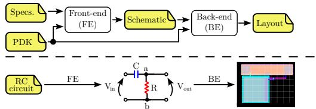  
Figure 1: Overview of the analog design flow (top). Design specifications and target process design kit (PDK) are first translated into a Schematic that captures the required functionality by the Front-end step. The schematic is then realized as a physical Layout through the Back-end stage. A simplified example (bottom) is provided to highlight the two design stages.

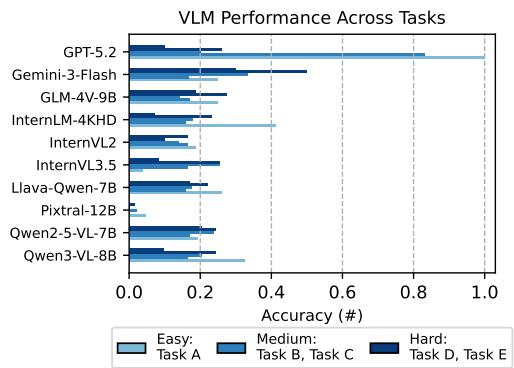  
Figure 2: Performance overview of off-the-shelf VLMs on analog layout analysis tasks, highlighting poor accuracy across models.

This work introduces THEIA, a multimodal dataset of analog layout images paired with questionanswer conversations, designed to advance automated understanding of GDSII layouts and enable interactive, AI-assisted analysis. By treating physical layouts as visual entities rather than collections of polygons, THEIA enables intuitive querying of layout structures through natural language, moving from passive verification toward interactive analysis. In addition, this work introduces a benchmark methodology using domain-specific fine-tuning of a pretrained vision-language model, showing that general-purpose VLMs struggle to interpret analog layouts without adaptation. This setup is evaluated on five realistic tasks spanning multiple circuit topologies and complexity levels. Results show that domain adaptation leads to substantial performance gains, with fine-tuned models outperforming strong zero-shot baselines by up to 73% accuracy. In particular, this work delivers three contributions to the state of the art:

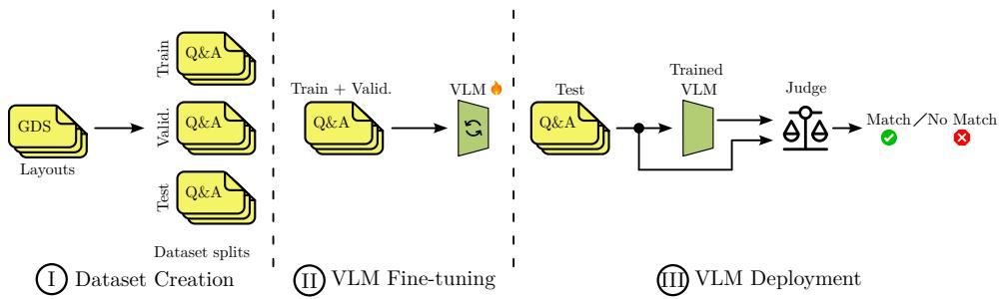  
Figure 3: Methodology overview. It comprises three main phases: (i) Dataset Creation, (ii) VLM Fine-tuning, and (iii) VLM Deployment. Dataset Creation generates sets of task-specific questions and answers (Q&As) from a collection of GDSII layouts (GDS). VLM Fine-tuning uses training and validation splits to fine-tune a VLM to the target domain. VLM Deployment evaluates the fine-tuned model on the held-out test data, employing an LLM-as-a-judge to assess prediction correctness.

• Open dataset and end-to-end workflow. THEIA, a curated multimodal dataset (layout images paired with question-answer conversations) together with an open-source training and evaluation pipeline, enabling reproducible VLM fine-tuning and benchmarking.1 The released tasks span increasing difficulty, from single-device identification to base-topology recognition and more complex reasoning over full circuit layouts.

• Task-specific VLM adaptation. A fine-tuned VLM specialized for analog-layout understanding, paving the way for a new generation of AI-augmented EDA tools and the transition of the analog design field from manual, iterative tuning toward automated, intelligent optimization.o

• Experimental validation on real layouts. We perform an extensive evaluation on a large collection of representative analog circuits using DRC-free and LVS-compliant GDSII layouts, and we compare against state-of-the-art VLM baselines.

The remainder of the paper is organized into five sections. Section 2 reviews related work on AI-driven analog design automation. Section 3 describes the dataset creation process and proposed VLM finetuning and deployment methodology. Section 4 reports the experimental evaluation, and Section 5 concludes the paper with final remarks. The Appendix A provides additional implementation, dataset, and evaluation details, including fine-tuning and deployment configurations, dataset statistics and layout examples, task records examples, and answer-option construction.

## 2 Related Work

Front-end. Several works focus on schematic analysis. Netlistify [5] employs a hybrid approach combining convolutional neural networks (CNNs) and transformers to identify devices, orientations, and connections within analog circuit schematics. In the realm of topology generation, LaMAGIC [6] fine-tunes LLMs specifically for power converters by developing structured input-output representations. Similarly, AnalogGenie [7] utilizes a GPT-based model trained on a large dataset to predict sequential pin connections for various analog topologies. For code-centric approaches, Analog-Coder [8] proposes a training-free LLM method for Python-based circuit generation, while FLAG [9] enhances LLMs with formulaic knowledge to assist in baseband circuit design, mitigating the need for extensive programming expertise. Beyond circuit topology, LLMs are increasingly deployed as agents for parameter sizing and verification. LADAC [10] introduces an agent incorporating a knowledge library to assist in transistor sizing and simulation. To enhance reasoning capabilities, Artisan [11] employs tree-of-thought (ToT) and chain-of-thought prompting for operational amplifier design. AnalogXpert [12] further streamlines synthesis by incorporating a subcircuit library and iterative proofreading. Optimization efficiency is addressed by ADO-LLM [13], which combines Bayesian Optimization with in-context learning, and LEDRO [14], which uses LLMs to refine search regions for existing optimization methods.

Back-end. Recent research has begun to address the complexities of physical layout and verification using generative models without directly addressing the complexity of GDSII analysis. ACDC [15] frames transistor placement as a sequence prediction problem, fine-tuning transformers to predict coordinates directly from a netlist. SOLOMON [16] demonstrates the adaptation of general-purpose LLMs for semiconductor layout by utilizing ToT reasoning to generate Python scripts for complex 3D structures. Regarding verification, LLM-HD [17] introduces a layout language model that processes GDSII binaries to detect lithography hotspots without image conversion. DRC-Coder [18] proposes a multi-agent framework to interpret textual design rules and generate standard verification rule format (SVRF) code. However, these works focus on placement prediction and verification rather than layout analysis and identification. Other works target the layout of analog circuits. BAG [19, 20] introduced parameterized generators for analog and mixed-signal circuits, enabling automated schematic and layout generation but relying heavily on predefined templates and domain expertise. ALIGN [2] and MAGICAL [1] employ an algorithmic approach. Recent works proposed AI-driven layout methodologies using DNN [21], Bayesian [22, 23], reinforcement learning [24, 25, 26, 27], and graph neural network [25] models. Notably, the use of AI-driven methodologies to improve the analog design flow is blooming, while, to the best of our knowledge, this is the first proposal that directly targets the GDSII representation of analog circuits, paving the way for the emergence of analog AI-assistants.

## 3 THEIA Dataset Creation and Benchmark Methodology

This section presents the benchmark methodology for fine-tuning a VLM to analyze GDSII layouts of analog circuits, enabling task-specific question answering and semantic interpretation of layout structures. Figure 3 illustrates the overall workflow, which is organized into three main stages: (i) Dataset Creation, (ii) VLM Fine-tuning, and (iii) VLM Deployment. Starting from a collection of GDSII layouts, the proposed methodology first constructs a dataset tailored to the requirements of VLM training, subsequently fine-tunes the model, and finally deploys and evaluates it.

## 3.1 THEIA Dataset Creation

The first stage focuses on organizing the data required for subsequent VLM training. Figure 4a illustrates the pipeline adopted to generate the dataset. A collection of real GDSII analog layouts is generated from human-designed circuit templates using the OSIRIS open-source layout generator [27], with device sizing and number of fingers varied. Design rules checking (DRC) is performed by the generator, and Netgen layout-vs-schematic (LVS) verification confirms correspondence to the source netlists. All layouts used in THEIA pass both checks. In particular, the Dataset Creation phase consists of three sequential steps: (i) GDS Handling, (ii) Q&As Generation, and (iii) Splits Division. The GDSII Handling step is responsible for extracting relevant information from each GDSII layout and consists of two sub-steps: (i) Metadata Extraction and (ii) GDSII to PNG. The former, Metadata Extraction, sub-step extracts descriptive attributes for each layout, including the device type, the set of devices present, and their corresponding counts from the GDSII layout file. For each input layout (GDS ), this process produces a metadata file $\mathrm { ( M D _ { n } ) }$ summarizing its key characteristics. In parallel, the latter sub-step, GDS to PNG, renders the layout into a high-resolution PNG image $\left( \operatorname { P N G } _ { \mathtt { n } } \right)$ All generated PNG images are stored in a database to enable efficient retrieval during both fine-tuning and inference. Each pair $\mathrm { M D } _ { \mathrm { n } } , \mathrm { P N G } _ { \mathrm { n } }$ is subsequently combined into a unified, high-level representation of the original GDSII layout $( \mathrm { P N G } _ { \mathrm { n } } ^ { * } )$ . This representation encapsulates the complete set of extracted metadata together with a reference to the corresponding PNG image stored in the database. There exists a one-to-one correspondence between $\mathsf { G D S } _ { \mathtt { n } }$ and $\mathsf { P N G } _ { \mathtt { n } } ^ { * }$ for $\mathbf { n } = 0 , \ldots , \mathbb { N }$ , where N denotes the total number of layouts. In the second step, Q&As Generation, the pipeline processes the collection of $\mathsf { P N G } _ { \mathtt { n } } ^ { * }$ representations to generate sets of task-specific questions and answers (Q&As). This step analyzes the metadata associated with each layout and constructs layout- and task-specific questions. Each Q&As instance is associated with a specific $\mathrm { P N G } _ { \mathrm { n } } ,$ includes a user query asking for a particular metadata attribute, and provides a corresponding ground-truth answer. Multiple Q&As may reference the same $\mathrm { P N G } _ { \mathtt { n } } .$ . Moreover, each task may have a different number of Q&As, e.g., in Figure 4a, Task A has $\mathtt { L } _ { \mathtt { A } }$ Q&As, Task B has $L _ { \mathrm { B } }$ Q&As and so on. Finally, the Splits Division step organizes the generated Q&As into task-specific sub-datasets and further partitions each sub-dataset into training, validation, and test splits. All resulting splits are stored in a database and used in the subsequent fine-tuning and evaluation stages. Notably, all Q&As generated from the same layout are assigned exclusively (a) Dataset Creation stage. Starting from a collection of analog layouts in GDSII format, the pipeline generates task-specific training, validation, and test splits through three sequential steps: (i) GDS Handling, (ii) Q&As Generation, and (iii) Splits Division. GDS Handling renders each GDSII file into a high-level layout representation. Q&As Generation produces task-dependent questions and corresponding ground-truth answers. Finally, Splits Division organizes the resulting Q&As into task-specific sub-datasets.

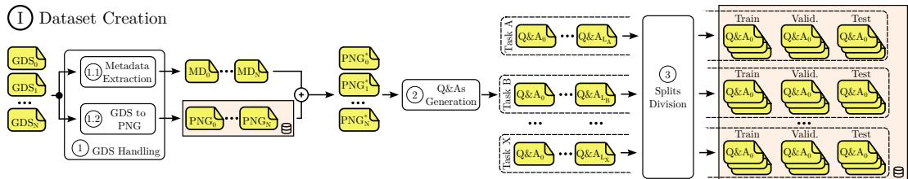

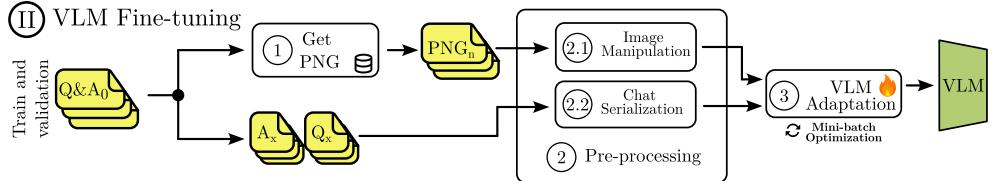

(b) VLM Fine-tuning stage. Task-specific training and validation Q&As are used to adapt a pre-trained VLM through three sequential steps: (i) Get PNG, (ii) Pre-processing, and (iii) VLM Adaptation. Get PNG retrieves the layout image PNGn associated with each Q&A. Pre-processing prepares both visual and textual inputs in the model-specific format, while VLM Adaptation fine-tunes the model.

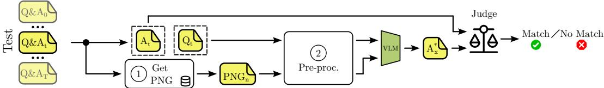  
(c) VLM Deployment stage. The fine-tuned VLM is evaluated on task-specific test samples processed individually. For each Q&A, the layout image and pre-processed question are provided as input to the VLM, which generates a predicted answer. An LLM-as-a-judge then performs a semantic comparison between the predicted and ground-truth answers, producing a binary outcome for evaluation.

Figure 4: Detailed methodology stages: (i) Dataset Creation (top), (ii) VLM Fine-tuning (middle) and (iii) VLM Deployment (bottom).

to a single split (train, validation, or test). Consequently, no rendered image (PNG) or underlying layout (GDS) appears across different splits under distinct questions.

## 3.2 VLM Fine-tuning

Once the task-specific dataset has been constructed, the VLM Fine-tuning stage is performed. A single-task training paradigm is adopted, in which a model is explicitly optimized to address one task, thereby promoting focused and task-specific learning. Figure 4b illustrates the fine-tuning process for a generic task. The fine-tuning pipeline is organized into three main steps: (i) Get PNG, (ii) Pre-processing, and (iii) VLM Adaptation. First, each training or validation Q&A instance is de-coupled into its constituent questions (Q) and answers (A). While the textual components are directly forwarded to the Pre-processing step, the associated image path is used in Get PNG to retrieve the corresponding layout image (PNG), which is then passed to the same stage. The Pre-processing step is further decomposed into two sub-steps: (i) Image Manipulation and (ii) Chat Serialization. In Image Manipulation, each PNG is processed to match the patch-based input format expected by the vision encoder, ensuring that the spatial dimensions are compatible with its internal grid. In Chat Serialization, each Q&A exchange is converted into a single contiguous text sequence introducing special tokens that explicitly denote the user role for the question, the assistant role for the answer, message boundaries, and the end-of-sequence marker. The resulting structured transcript enables the model to learn to generate the response conditioned jointly on the visual input and the user query.

Table 1: VLMs considered in this work, compared by backbone, vision encoder, multimodal and instruction tuning, supported resolution, and spatial awareness. InternLM-4KHD and Qwen2.5-VL 7B are fine-tuned for the controlled backbone-transfer study.
<table><tr><td>Model</td><td>Family</td><td>Params</td><td>LB</td><td>VE</td><td>MM Train.</td><td>Inst-tuned</td><td>Res.</td><td>Sp. Aw.</td></tr><tr><td>GPT-5.2 [28]</td><td>OpenAI</td><td></td><td>Proprietary</td><td>Proprietary</td><td></td><td></td><td></td><td>O</td></tr><tr><td>Gemini-3-Flash [29]</td><td>Google</td><td></td><td>Proprietary</td><td>Proprietary</td><td></td><td></td><td></td><td>0</td></tr><tr><td>GLM-4V-9B [30]</td><td>Zhipu AI</td><td>9B</td><td>GLM</td><td>ViT</td><td></td><td></td><td></td><td>O</td></tr><tr><td>InternLM-4KHD [31]</td><td>InternLM</td><td>7B</td><td>InternLM</td><td>ViT (4K)</td><td></td><td></td><td></td><td>O</td></tr><tr><td>InternVL2 [32]</td><td>InternVL</td><td>8B</td><td>InternLM</td><td>Hybrid</td><td></td><td></td><td></td><td>●</td></tr><tr><td>InternVL3.5 [33]</td><td>InternVL</td><td>8B</td><td>InternLM</td><td>Hybrid</td><td></td><td></td><td></td><td>O</td></tr><tr><td>LLaVA-Qwen-7B [34]</td><td>LLaVA / Qwen</td><td>7B</td><td>Qwen</td><td>ViT</td><td></td><td></td><td>O</td><td>O</td></tr><tr><td>Pixtral-12B [35]</td><td>Mistral</td><td>12B</td><td>Mistral</td><td>ViT</td><td></td><td></td><td></td><td>O</td></tr><tr><td>Qwen2.5-VL-7B [36]</td><td>Qwen</td><td>7B</td><td>Qwen2.5</td><td>ViT</td><td></td><td></td><td></td><td>O</td></tr><tr><td>Qwen3-VL-8B [37]</td><td>Qwen</td><td>8B</td><td>Qwen3</td><td>ViT</td><td></td><td></td><td></td><td>O</td></tr></table>

○ Supported/High, ○ Partial/Medium, ○␣ Limited/absent.  
Language Backbone (LB), Vision Encoder (VE), Multimodal training (MM Train.), Instruction tuned (Instr-tuned) Resolution (Res.), Spatial Awareness (Sp. Aw.)

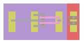  
(a) PMOS transistor.

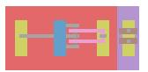  
(b) NMOS transistor.

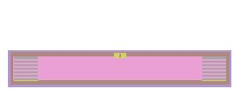  
(c) Resistor.

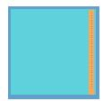  
(d) Capacitor.  
Figure 5: Examples of GDSII view of single-component devices layouts.

Finally, the VLM Adaptation step applies a standard supervised fine-tuning procedure, where the model is trained to predict the ground-truth answer tokens given the prompt and image, using a masked next-token cross-entropy loss.

## 3.3 VLM Deployment

Once a VLM has been fine-tuned for a given task, it is deployed on the corresponding test set. Figure 4c illustrates the VLM Deployment stage. Test samples are processed individually. For each input instance, the procedure outputs a binary Match/No Match decision indicating whether the answer generated by the fine-tuned VLM is semantically consistent with the ground-truth response. To maximize the efficiency of the proposed methodology and minimize human-in-the-loop, an LLM is employed to judge the semantic equivalence between the textual answer produced by our fine-tuned VLM and the ground truth. As in the VLM Fine-tuning stage, each test Q&A pair is first de-coupled. The associated layout image $\mathrm { P N G } _ { \mathrm { n } }$ is retrieved, while the ground-truth answer Ax is forwarded to the judge and the question $\mathsf { Q } _ { \mathbf { x } }$ is passed to the Pre-processing step. Pre-processing mirrors the procedure used during fine-tuning, with the key difference that the ground-truth answer is not included in the chat serialization. The pre-processed question and image are then provided as input to the VLM, which generates a predicted answer ${ \sf A } _ { { \bf x } } ^ { * } .$ Both the predicted answer and the ground-truth answer are submitted to the judge, which performs a semantic comparison to determine the final match outcome.

## 4 Results

This section is divided into two parts. Section 4.1 describes the experimental setup, whereas Section 4.2 reports the performance, transfer, and evaluation-robustness analyses.

## 4.1 Experimental Setup

Hardware setup - The experimental evaluation was conducted on a workstation running Ubuntu 24.04 with 512 GB of RAM and 4× NVIDIA A100 (40 GB) configuration. The GPU was employed to carry out both fine-tuning and inference of VLMs.

Table 2: Analog circuits dataset composition and statistics. For each category, the table reports the circuit types, the number of layout variants, the average number of devices per variant, and the average per-device-type counts (NMOS, PMOS, capacitors, and resistors).
<table><tr><td>Category</td><td>Circuit Type</td><td>Variants (#)</td><td>Avg. Devices (#)</td><td>NMOS (#)</td><td>PMOS (#)</td><td>CAP (#)</td><td>RES (#)</td><td>Total Devices (#)</td></tr><tr><td rowspan="5">Single Device</td><td>Capacitor</td><td>4997</td><td>1</td><td>一</td><td>一</td><td>1</td><td>一</td><td>4997</td></tr><tr><td>NMOS Transistor</td><td>5000</td><td>1</td><td>1</td><td>一</td><td>一</td><td>一</td><td>5000</td></tr><tr><td>PMOS Transistor</td><td>5000</td><td>1</td><td>一</td><td>1</td><td>一</td><td>一</td><td>5000</td></tr><tr><td>Resistor</td><td>5000</td><td>1</td><td>一</td><td>一</td><td>一</td><td>1</td><td>5000</td></tr><tr><td>Subtotal</td><td>19 997</td><td>-</td><td>一</td><td>一</td><td>一</td><td>一</td><td>19997</td></tr><tr><td rowspan="7">Base Circuits</td><td>Ahuja OTA</td><td>995</td><td>15</td><td>10</td><td>4</td><td>1</td><td>一</td><td>14925</td></tr><tr><td>Gate Driver</td><td>1000</td><td>10</td><td>4</td><td>4</td><td>一</td><td>2</td><td>10000</td></tr><tr><td>High-Pass Filter (HPF)</td><td>962</td><td>13</td><td>5</td><td>3</td><td>3</td><td>2</td><td>12506</td></tr><tr><td>Low-Dropout Regulator (LDO)</td><td>989</td><td>9</td><td>3</td><td>3</td><td>1</td><td>2</td><td>8901</td></tr><tr><td>Low-Pass Filter (LPF)</td><td>971</td><td>13</td><td>5</td><td>3</td><td>3</td><td>2</td><td>12623</td></tr><tr><td>Miller OTA</td><td>977</td><td>13</td><td>5</td><td>4</td><td>2</td><td>2</td><td>12701</td></tr><tr><td>Subtotal</td><td>5894</td><td>-</td><td>一</td><td>一</td><td>一</td><td>一</td><td>71 656</td></tr><tr><td>Mixed</td><td>Mixed Topologies</td><td>4140</td><td>21.6</td><td>9.7</td><td>6.8</td><td>2.3</td><td>2.8</td><td>89424</td></tr><tr><td colspan="2">Total Dataset</td><td>30 034</td><td></td><td>1</td><td></td><td></td><td></td><td>181 080</td></tr></table>

Table 3: Task descriptions, organized by complexity (i) Easy, (ii) Medium, and (iii) Hard.
<table><tr><td>Complexity</td><td>Task ID</td><td>Task Description</td><td>Q&amp;As (#)</td></tr><tr><td>Easy</td><td>A</td><td>Identification of single component devices (capacitors, resistors, NMOS, PMOS)</td><td>19 997</td></tr><tr><td rowspan="2">Medium</td><td>B</td><td>Identification of base circuit topologies (OTAs, filters, regulators, gate drivers)</td><td>5894</td></tr><tr><td>C</td><td>Component counting and enumeration in base circuits</td><td>27475</td></tr><tr><td rowspan="2">Hard</td><td>D</td><td>Component counting and enumeration in complex mixed circuits</td><td>19 848</td></tr><tr><td>E</td><td>Identification of base circuit topologies within complex mixed circuits</td><td>4140</td></tr><tr><td>Total</td><td></td><td></td><td>77354</td></tr></table>

Software setup - The experiments were carried out using pytorch, Hugging Face’s transformers, and peft for LoRA [38]. Qwen3-32B [39] was used as LLM-as-a-judge to carry out semantic comparison between ground truth answers and VLM-generated outputs. Moreover, image resizing and padding are performed, during Image Manipulation in accordance with the requirements specified by InternLM-4KHD. Further details on InternLM-4KHD parameters configuration are discussed in Appendix A.1. Train, validation, and test splits were constructed by building balanced sets across all tasks and circuit families. This splitting process was carried out at the level of task-specific sub-datasets, organizing the generated Q&As to maintain a representative distribution of the diverse circuit categories within each split. Table 1 reports a comparative overview of the evaluated VLMs.

Dataset composition - Table 2 summarizes the composition of the analog circuits dataset used in this work, detailing circuit categories, structural diversity, and device-level statistics. The dataset is organized into three main groups: (i) Single Component, (ii) Base Circuit, and (iii) Mixed, capturing a wide spectrum of design complexity. The Single Component group comprises 20 000 variants evenly distributed across capacitors, NMOS transistors, PMOS transistors, and resistors. Each variant contains a single component, providing a controlled setting for low-level visual and semantic recognition tasks and serving as a foundation for basic component understanding. Figure 5 reports a layout example for a PMOS transistor (Figure 5a), NMOS transistor (Figure 5b), resistor (Figure 5c), and capacitor (Figure 5d). The Base Circuit group includes 5 894 variants spanning six commonly used analog building blocks, such as operational transconductance amplifiers (OTAs), filters, gate drivers, and regulators. These circuits exhibit moderate structural complexity, with an average of 9 to 15 components per layout. The Mixed group consists of 4 140 variants that combine multiple base topologies into larger layouts, significantly increasing structural diversity and components count. These circuits average 21.6 components per variant and include heterogeneous mixtures of devices, posing more challenging recognition and reasoning demands. This hierarchical composition enables systematic evaluation across increasing levels of circuit complexity and supports the analysis of VLM capabilities ranging from single-device identification to reasoning over complex, mixed analog layouts. All layouts are implemented in the SkyWater 130nm PDK and satisfy both design rule check (DRC) and layout-vs-schematic (LVS) requirements. Appendix A.2 provides further details on dataset structure and statistics, while Appendix A.3.1 shows a few layouts contained in the dataset.

Table 4: Accuracy on the held-out THEIA test splits. The Qwen2.5-VL-7B transfer uses the same splits, prompts, answer format, and deterministic decoding with and without task-specific fine-tuning.
<table><tr><td rowspan="2">Complexity</td><td rowspan="2">Task</td><td rowspan="2">Count (#)</td><td colspan="2">InternLM FT</td><td rowspan="2">InternLM no FT</td><td rowspan="2">GPT-5.2</td><td colspan="2">Qwen2.5-VL-7B</td></tr><tr><td>Pass@1</td><td>Pass@5</td><td>no FT</td><td>FT</td></tr><tr><td>Easy</td><td>A</td><td>1001</td><td>100%</td><td>100%</td><td>41%</td><td>100%</td><td>19%</td><td>100%</td></tr><tr><td rowspan="2">Medium</td><td>B</td><td>300</td><td>84%</td><td>92%</td><td>16%</td><td>83%</td><td>17%</td><td>85%</td></tr><tr><td>C</td><td>1399</td><td>83%</td><td>94%</td><td>18%</td><td>20%</td><td>23%</td><td>93%</td></tr><tr><td rowspan="2">Hard</td><td>D</td><td>1003</td><td>63%</td><td>87%</td><td>24%</td><td>26%</td><td>24%</td><td>89%</td></tr><tr><td>E</td><td>207</td><td>81%</td><td>89%</td><td>7%</td><td>10%</td><td>20%</td><td>91%</td></tr></table>

Table 5: Cross-generator evaluation of InternLM-4KHD fine-tuned on THEIA and evaluated on held-out ALIGN [2] layouts.
<table><tr><td>Task</td><td>THEIA test</td><td>ALIGN test</td><td>∆</td></tr><tr><td>B: topology identification</td><td>84.0% (252/300)</td><td>89.5% (34/38)</td><td>+5.5 pp</td></tr><tr><td>C: component counting</td><td>83.0% (1 161/1 399)</td><td>73.7% (84/114)</td><td>-9.3 pp</td></tr></table>

Tasks specification - Table 3 presents an overview of the tasks defined in this work, organized by increasing levels of complexity. Notably, the level of complexity for each task has been experimentally selected according to the results obtained with state-of-the-art models which results have been discussed in Section 1 (see Figure 2). Each task is characterized by its semantic objective, the structural difficulty of the underlying circuit layouts, and the corresponding number of Q&As. The Easy category includes Task A, which focuses on the identification of single-component devices such as capacitors, resistors, NMOS, and PMOS transistors. With 20 000 Q&As, this task evaluates the model’s ability to recognize basic circuit primitives and serves as an entry point for learning low-level visual features and device semantics. The Medium complexity category comprises two tasks. Task B addresses the identification of base circuit topologies, including OTAs, filters, regulators, and gate drivers, requiring the model to reason over structured combinations of multiple components. Task C further increases the difficulty by asking the model to count and enumerate components within these base circuits, emphasizing quantitative reasoning and spatial awareness. Together, these tasks account for 33 369 Q&As and assess the transition from component-level recognition to circuitlevel understanding. The Hard category targets complex mixed circuits that integrate multiple base topologies within a single layout. Task D requires component counting and enumeration in these heterogeneous layouts, while Task E focuses on identifying base circuit topologies embedded within complex designs. These tasks are the most challenging, as they demand simultaneous reasoning over dense layouts, overlapping functional blocks, and diverse device types. The datasets presents 23 988 Q&As belonging to the Hard category. Overall, THEIA spans a total of 77 354 Q&As across five tasks and three complexity tiers, reflecting a structured task hierarchy that progressively increases visual and semantic complexity. This organization enables a systematic evaluation of VLMs capabilities from elementary component recognition to the analysis of complex analog circuit layouts. The proposed tasks are designed to approximate recurring sub-problems in analog back-end workflows. In particular, tasks such as component identification, counting, and topology recognition are implicit steps in layout debugging and verification as well as in signoff analysis, where designers manually inspect layout structures to diagnose violations, mismatches, or unexpected behavior. Our formulation abstracts these operations into controlled evaluation tasks, enabling systematic benchmarking of visual reasoning capabilities.

## 4.2 Experimental Results

Table 4 provides a detailed performance breakdown tasks, grouped by complexity level (Easy, Medium, and Hard) and task identifier. For every configuration, it reports the number of held-out samples (Count) and the Accuracy (measuring the fraction of correctly predicted answers) of taskspecific fine-tuned InternLM-4KHD, its zero-shot counterpart, GPT-5.2, and, Qwen2.5-VL-7B before and after task-specific fine-tuning. InternLM-4KHD and Qwen2.5-VL-7B have been selected to demonstrate the effectiveness of the proposed fine-tuning methodology. GPT5.2, instead, has been selected as the best commercial, large, state-of-the-art solution according to the results in Figure 2.

Table 6: Deterministic validation metrics for fine-tuned InternLM-4KHD on held-out THEIA samples. LLM-judge Pass@1 is shown for comparison.
<table><tr><td>Task</td><td>Judge Pass@1</td><td>EM</td><td>NSM</td><td>Count Acc.</td><td>Topology-set F1</td></tr><tr><td>A</td><td>100%</td><td>100%</td><td>100%</td><td>一</td><td>一</td></tr><tr><td>B</td><td>84%</td><td>84%</td><td>84%</td><td></td><td>一</td></tr><tr><td>C</td><td>83%</td><td>83%</td><td>83%</td><td>83%</td><td>一</td></tr><tr><td>D</td><td>63%</td><td>63%</td><td>63%</td><td>63%</td><td>1</td></tr><tr><td>E</td><td>81%</td><td>81%</td><td>81%</td><td></td><td>89%</td></tr></table>

Table 7: Agreement of Qwen3-32B LLM judge with deterministic evaluation on held-out samples.
<table><tr><td>Task</td><td>Count</td><td>Cohen&#x27;s κ</td><td>Accuracy</td><td>Precision</td><td>Recall / F1</td></tr><tr><td>A</td><td>1001</td><td>1.0</td><td>100%</td><td>100%</td><td>100%/100%</td></tr><tr><td>B</td><td>300</td><td>1.0</td><td>100%</td><td>100%</td><td>100% /100%</td></tr><tr><td>C</td><td>1399</td><td>1.0</td><td>100%</td><td>100%</td><td>100% /100%</td></tr><tr><td>D</td><td>1003</td><td>1.0</td><td>100%</td><td>100%</td><td>100%/100%</td></tr><tr><td>E</td><td>207</td><td>1.0</td><td>100%</td><td>100%</td><td>100%/100%</td></tr></table>

InternLM-4KHD obtains 100% on Task A, 84% and 83% on Task B and Task C, and 63% and 81% on Task D and Task E, respectively. The zero-shot InternLM-4KHD and GPT-5.2 results are substantially lower on the Medium and Hard tasks, although GPT-5.2 remains competitive on the simplest task. GPT-5.2 performance degrades sharply as task structure and ambiguity increase, underscoring the limitations of general-purpose VLMs when applied on niche domain tasks without adaptation. The Qwen2.5-VL-7B transfer improves all five tasks by 65-81 percentage points, from 19%-24% zero-shot accuracy to 85%-100% after fine-tuning. Because the splits, prompts, answer format, and deterministic decoding are identical before and after fine-tuning, these gains isolate the effect of adaptation and demonstrate transfer across backbones. Overall, the Table 4 quantitatively demonstrates that task-specific fine-tuning is essential to enable reliable understanding over analog layout data. The evaluation isolates domain adaptation by comparing each backbone before and after task-specific fine-tuning under a controlled protocol. It is not intended as a general ranking of backbone architectures. For closed-set Task A and Task B, CNN baselines from Inspector [40] achieve 97% and 91%, respectively. These classifiers provide a task-specific closed-set reference, whereas THEIA evaluates a single VLM across open-ended component, topology, and counting queries. To assess generator transfer, Table 5 evaluates InternLM-4KHD, originally fine-tuned on THEIA, on held-out ALIGN layouts [2] from the same PDK. The result is encouraging for topology identification (89.5%, 34/38) but component counting decreases to 73.7% (84/114).

## 4.2.1 Evaluation Robustness

Table 6 reports deterministic metrics for the fine-tuned InternLM-4KHD on the held-out THEIA samples. Exact match and normalized string match coincide with LLM-judge Pass@1 for every applicable task. The task-specific count accuracy also coincides for Tasks C and D, while Task E achieves 89% topology-set F1. Table 7 further reports agreement between the Qwen3-32B LLM judge and deterministic evaluation. The multiple-choice protocol does not use a fixed number or position of answer options. For counting Tasks C and D, distractors are formed from nearby integer counts before valid random counts are used, and the candidate order is shuffled. Appendix A.3 reports the resulting option-count distributions. Task B is class-balanced across its six topology families, which each occupy 16.3%-17.1% of every split. Its 16.7% majority-class baseline is substantially below the 84% fine-tuned-VLM accuracy. Open-ended variants of Tasks A-D are evaluated on the same held-out layouts to test whether performance depends on the answer choices. Table 8 shows unchanged Task-A accuracy, a one-percentage-point reduction for Task B, and improved accuracy on the counting tasks. Figure 6 reports accuracy trends as the amount of task-specific fine-tuning data is progressively increased (25%, 50%, 75%, 100%) while keeping the evaluation protocol and the held-out test set fixed. Task A saturates immediately, indicating that single-device recognition is learned with minimal data. Task B and Task C shows a monotonic improvement as training data increases, demonstrating that base-circuit identification benefits substantially from additional examples. Task D and E accuracies also trend upward with more data, albeit with less smooth curves due to higher task complexity.

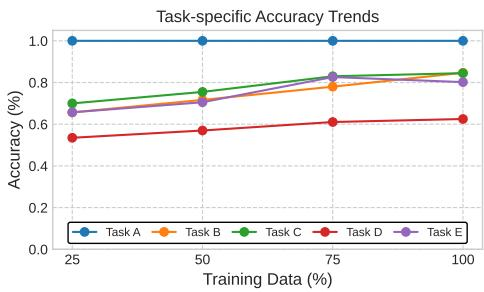  
Figure 6: Accuracy trends as the amount of task-specific fine-tuning data is progressively increased.

Table 8: Fine-tuned InternLM-4KHD accuracy for multiple-choice and open-ended forms of Tasks A-D on held-out layouts.
<table><tr><td>Task</td><td>Multiple choice</td><td>Open ended</td></tr><tr><td>A</td><td>100%</td><td>100%</td></tr><tr><td>B</td><td>84%</td><td>83%</td></tr><tr><td>C</td><td>83%</td><td>99%</td></tr><tr><td>D</td><td>63%</td><td>75%</td></tr></table>

## 5 Conclusions

This work introduced THEIA, a multimodal dataset and benchmark for analog layout understanding, in which verified GDSII layouts are paired with visual question-answering tasks that span component identification, topology identification, device counting, and mixed-topology reasoning. The layouts are generated from human-designed circuit templates and validated through DRC and LVS checks, providing a realistic basis for evaluating layout semantics rather than raw geometry alone. Across the five tasks, the results show that unadapted general-purpose VLMs struggle as task structure and ambiguity increase, whereas task-specific fine-tuning substantially improves performance. Under a controlled protocol, fine-tuning Qwen2.5-VL-7B improves accuracy by 65-81 percentage points and confirms that the adaptation result transfers across backbones. The released data, fine-tuning pipeline, and evaluation implementations support reproducible investigation of multimodal analog-layout reasoning and future interactive CAD tools.

## 6 Acknowledgments

This work was supported by Italian Ministero dell’Universita e della Ricerca (MUR)’s Fondo Italiano Scienze Applicate (FISA) under Grant no. FISA-2024-00333.

## 7 Limitations

Despite its contributions, this work has limitations. First, although THEIA spans a range of representative analog components and topologies, from basic building blocks to more complex systems, it does not capture the full diversity and variability of analog designs. Second, the experimental evaluation focuses on a single technology node (SkyWater 130 nm PDK) and does not explicitly assess cross-node generalization. This choice reflects common industry practice, where technology migration is costly and infrequent. Broader cross-node validation is left to future work.

## References

[1] Biying Xu, Keren Zhu, Mingjie Liu, Yibo Lin, Shaolan Li, Xiyuan Tang, Nan Sun, and David Z Pan. Magical: Toward fully automated analog ic layout leveraging human and machine intelligence. In 2019 IEEE/ACM International Conference on Computer-Aided Design (ICCAD). IEEE, 2019.

[2] Kishor Kunal, Meghna Madhusudan, Arvind K Sharma, Wenbin Xu, Steven M Burns, Ramesh Harjani, Jiang Hu, Desmond A Kirkpatrick, and Sachin S Sapatnekar. Align: Open-source analog layout automation from the ground up. In Proceedings of the 56th Annual Design Automation Conference 2019, 2019.

[3] Jason Blocklove, Siddharth Garg, Ramesh Karri, and Hammond Pearce. Chip-chat: Challenges and opportunities in conversational hardware design. In 2023 ACM/IEEE 5th Workshop on Machine Learningfor CAD (MLCAD), 2023.

[4] Kaiyan Chang, Ying Wang, Haimeng Ren, Mengdi Wang, Shengwen Liang, Yinhe Han, Huawei Li, and Xiaowei Li. Chipgpt: How far are we from natural language hardware design. arXiv preprint arXiv:2305.14019, 2023.

[5] Chun-Yen Huang, Hsuan-I Chen, Hao-Wen Ho, Pei-Hsin Kang, Mark Po-Hung Lin, Wen-Hao Liu, and Haoxing Ren. Netlistify: Transforming circuit schematics into netlists with deep learning. In 2025 ACM/IEEE 7th Symposium on Machine Learning for CAD (MLCAD), pages 1–8, 2025.

[6] Chen-Chia Chang, Yikang Shen, Shaoze Fan, Jing Li, Shun Zhang, Ningyuan Cao, Yiran Chen, and Xin Zhang. Lamagic: Language-model-based topology generation for analog integrated circuits, 2024.

[7] Jian Gao, Weidong Cao, Junyi Yang, and Xuan Zhang. Analoggenie: A generative engine for automatic discovery of analog circuit topologies. In The Thirteenth International Conference on Learning Representations, 2025.

[8] Yao Lai, Sungyoung Lee, Guojin Chen, Souradip Poddar, Mengkang Hu, David Z. Pan, and Ping Luo. Analogcoder: Analog circuit design via training-free code generation, 2024.

[9] Yunwei Mao, You You, Xiaosi Tan, Yongming Huang, Xiaohu You, and Chuan Zhang. Flag: Formula-llm-based auto-generator for baseband hardware. In 2024 IEEE International Symposium on Circuits and Systems (ISCAS), pages 1–5, 2024.

[10] Chengjie Liu, Yijiang Liu, Yuan Du, and Li Du. Ladac: Large language model-driven autodesigner for analog circuits. January 2024.

[11] Zihao Chen, Jiangli Huang, Yiting Liu, Fan Yang, Li Shang, Dian Zhou, and Xuan Zeng. Artisan: Automated operational amplifier design via domain-specific large language model. In Proceedings ofthe 61st ACM/IEEE Design Automation Conference, DAC ’24, New York, NY, USA, 2024. Association for Computing Machinery.

[12] Haoyi Zhang, Shizhao Sun, Yibo Lin, Runsheng Wang, and Jiang Bian. Analogxpert: Automating analog topology synthesis by incorporating circuit design expertise into large language models, 2025.

[13] Yuxuan Yin, Yu Wang, Boxun Xu, and Peng Li. Ado-llm: Analog design bayesian optimization with in-context learning of large language models. In Proceedings of the 43rd IEEE/ACM International Conference on Computer-Aided Design, ICCAD ’24, page 1–9. ACM, October 2024.

[14] Dimple Vijay Kochar, Hanrui Wang, Anantha Chandrakasan, and Xin Zhang. Ledro: Llmenhanced design space reduction and optimization for analog circuits, 2025.

[15] Yasaman Esfandiari, Jocelyn Rego, Austin Meyer, Jonathan Gallagher, and Mia Levy. Llms for analog circuit design continuum (acdc), 2025.

[16] Bo Wen and Xin Zhang. Enhancing reasoning to adapt large language models for domainspecific applications, 2025.

[17] Yuyang Chen, Yiwen Wu, Jingya Wang, Tao Wu, Xuming He, Jingyi Yu, and Hao Geng. Llmhd: Layout language model for hotspot detection with gds semantic encoding. In Proceedings ofthe 61st ACM/IEEE Design Automation Conference, DAC ’24, New York, NY, USA, 2024. Association for Computing Machinery.

[18] Chen-Chia Chang, Chia-Tung Ho, Yaguang Li, Yiran Chen, and Haoxing Ren. Drc-coder: Automated drc checker code generation using llm autonomous agent. In Proceedings of the 2025 International Symposium on Physical Design, ISPD ’25, page 143–151. ACM, March 2025.

[19] John Crossley, Alberto Puggelli, H-P Le, B Yang, R Nancollas, Kwangmo Jung, Lingkai Kong, Nathan Narevsky, Yue Lu, Nicholas Sutardja, et al. Bag: A designer-oriented integrated framework for the development of ams circuit generators. In 2013 IEEE/ACM International Conference on Computer-Aided Design (ICCAD). IEEE, 2013.

[20] Eric Chang, Jaeduk Han, Woorham Bae, Zhongkai Wang, Nathan Narevsky, Borivoje Nikolic, and Elad Alon. Bag2: A process-portable framework for generator-based ams circuit design. In 2018 IEEE Custom Integrated Circuits Conference (CICC). IEEE, 2018.

[21] Ahmet F Budak, Prateek Bhansali, Bo Liu, Nan Sun, David Z Pan, and Chandramouli V Kashyap. Dnn-opt: An rl inspired optimization for analog circuit sizing using deep neural networks. In 2021 58th ACM/IEEE Design Automation Conference (DAC), pages 1219–1224. IEEE, 2021.

[22] Ahmet F Budak, Keren Zhu, Hao Chen, Souradip Poddar, Linran Zhao, Yaoyao Jia, and David Z Pan. Joint optimization of sizing and layout for ams designs: Challenges and opportunities. In Proceedings ofthe 2023 International Symposium on Physical Design, pages 84–92, 2023.

[23] Xiaohan Gao, Haoyi Zhang, Siyuan Ye, Mingjie Liu, David Z Pan, Linxiao Shen, Runsheng Wang, Yibo Lin, and Ru Huang. Post-layout simulation driven analog circuit sizing. Science China Information Sciences, 67(4):142401, 2024.

[24] Davide Basso, Luca Bortolussi, Mirjana Videnovic-Misic, and Husni Habal. Fast ml-driven analog circuit layout using reinforcement learning and steiner trees. In 2024 20th International Conference on Synthesis, Modeling, Analysis and Simulation Methods and Applications to Circuit Design (SMACD), pages 1–4. IEEE, 2024.

[25] Davide Basso, Luca Bortolussi, Mirjana Videnovic-Misic, and Husni Habal. Effective analog ics floorplanning with relational graph neural networks and reinforcement learning. In 2025 Design, Automation & Test in Europe Conference (DATE), pages 1–7, 2025.

[26] Sandro Junior Della Rovere, Davide Basso, Luca Bortolussi, Mirjana Videnovic-Misic, and Husni Habal. Enhancing reinforcement learning for the floorplanning of analog ics with beam search. arXiv preprint arXiv:2505.05059, 2025.

[27] Giuseppe Chiari, Michele Piccoli, and Davide Zoni. Osiris: Bridging analog circuit design and machine learning with scalable dataset generation. In The Fourteenth International Conference on Learning Representations (ICLR), 2026.

[28] OpenAI. Gpt-5.2, 2025.

[29] Google. Gemini-3-flash, 2025.

[30] Team GLM, :, Aohan Zeng, Bin Xu, Bowen Wang, Chenhui Zhang, Da Yin, Dan Zhang, Diego Rojas, Guanyu Feng, Hanlin Zhao, Hanyu Lai, Hao Yu, Hongning Wang, Jiadai Sun, Jiajie Zhang, Jiale Cheng, Jiayi Gui, Jie Tang, Jing Zhang, Jingyu Sun, Juanzi Li, Lei Zhao, Lindong Wu, Lucen Zhong, Mingdao Liu, Minlie Huang, Peng Zhang, Qinkai Zheng, Rui Lu, Shuaiqi Duan, Shudan Zhang, Shulin Cao, Shuxun Yang, Weng Lam Tam, Wenyi Zhao, Xiao Liu, Xiao Xia, Xiaohan Zhang, Xiaotao Gu, Xin Lv, Xinghan Liu, Xinyi Liu, Xinyue Yang, Xixuan Song, Xunkai Zhang, Yifan An, Yifan Xu, Yilin Niu, Yuantao Yang, Yueyan Li, Yushi Bai, Yuxiao Dong, Zehan Qi, Zhaoyu Wang, Zhen Yang, Zhengxiao Du, Zhenyu Hou, and Zihan Wang. Chatglm: A family of large language models from glm-130b to glm-4 all tools, 2024.

[31] Xiaoyi Dong, Pan Zhang, Yuhang Zang, Yuhang Cao, Bin Wang, Linke Ouyang, Songyang Zhang, Haodong Duan, Wenwei Zhang, Yining Li, Hang Yan, Yang Gao, Zhe Chen, Xinyue Zhang, Wei Li, Jingwen Li, Wenhai Wang, Kai Chen, Conghui He, Xingcheng Zhang, Jifeng Dai, Yu Qiao, Dahua Lin, and Jiaqi Wang. Internlm-xcomposer2-4khd: A pioneering large vision-language model handling resolutions from 336 pixels to 4k hd, 2024.

[32] Zhe Chen, Weiyun Wang, Yue Cao, Yangzhou Liu, Zhangwei Gao, Erfei Cui, Jinguo Zhu, Shenglong Ye, Hao Tian, Zhaoyang Liu, et al. Expanding performance boundaries of open-source multimodal models with model, data, and test-time scaling. arXiv preprint arXiv:2412.05271, 2024.

[33] Weiyun Wang, Zhangwei Gao, Lixin Gu, Hengjun Pu, Long Cui, Xingguang Wei, Zhaoyang Liu, Linglin Jing, Shenglong Ye, Jie Shao, Zhaokai Wang, Zhe Chen, Hongjie Zhang, Ganlin Yang, Haomin Wang, Qi Wei, Jinhui Yin, Wenhao Li, Erfei Cui, Guanzhou Chen, Zichen Ding, Changyao Tian, Zhenyu Wu, Jingjing Xie, Zehao Li, Bowen Yang, Yuchen Duan, Xuehui Wang, Zhi Hou, Haoran Hao, Tianyi Zhang, Songze Li, Xiangyu Zhao, Haodong Duan, Nianchen Deng, Bin Fu, Yinan He, Yi Wang, Conghui He, Botian Shi, Junjun He, Yingtong Xiong, Han Lv, Lijun Wu, Wenqi Shao, Kaipeng Zhang, Huipeng Deng, Biqing Qi, Jiaye Ge, Qipeng Guo, Wenwei Zhang, Songyang Zhang, Maosong Cao, Junyao Lin, Kexian Tang, Jianfei Gao, Haian Huang, Yuzhe Gu, Chengqi Lyu, Huanze Tang, Rui Wang, Haijun Lv, Wanli Ouyang, Limin Wang, Min Dou, Xizhou Zhu, Tong Lu, Dahua Lin, Jifeng Dai, Weijie Su, Bowen Zhou, Kai Chen, Yu Qiao, Wenhai Wang, and Gen Luo. Internvl3.5: Advancing open-source multimodal models in versatility, reasoning, and efficiency, 2025.

[34] Haotian Liu, Chunyuan Li, Qingyang Wu, and Yong Jae Lee. Visual instruction tuning, 2023.

[35] Pravesh Agrawal, Szymon Antoniak, Emma Bou Hanna, Baptiste Bout, Devendra Chaplot, Jessica Chudnovsky, Diogo Costa, Baudouin De Monicault, Saurabh Garg, Theophile Gervet, Soham Ghosh, Amélie Héliou, Paul Jacob, Albert Q. Jiang, Kartik Khandelwal, Timothée Lacroix, Guillaume Lample, Diego Las Casas, Thibaut Lavril, Teven Le Scao, Andy Lo, William Marshall, Louis Martin, Arthur Mensch, Pavankumar Muddireddy, Valera Nemychnikova, Marie Pellat, Patrick Von Platen, Nikhil Raghuraman, Baptiste Rozière, Alexandre Sablayrolles, Lucile Saulnier, Romain Sauvestre, Wendy Shang, Roman Soletskyi, Lawrence Stewart, Pierre Stock, Joachim Studnia, Sandeep Subramanian, Sagar Vaze, Thomas Wang, and Sophia Yang. Pixtral 12b, 2024.

[36] Shuai Bai, Keqin Chen, Xuejing Liu, Jialin Wang, Wenbin Ge, Sibo Song, Kai Dang, Peng Wang, Shijie Wang, Jun Tang, Humen Zhong, Yuanzhi Zhu, Mingkun Yang, Zhaohai Li, Jianqiang Wan, Pengfei Wang, Wei Ding, Zheren Fu, Yiheng Xu, Jiabo Ye, Xi Zhang, Tianbao Xie, Zesen Cheng, Hang Zhang, Zhibo Yang, Haiyang Xu, and Junyang Lin. Qwen2.5-vl technical report, 2025.

[37] Shuai Bai, Yuxuan Cai, Ruizhe Chen, Keqin Chen, Xionghui Chen, Zesen Cheng, Lianghao Deng, Wei Ding, Chang Gao, Chunjiang Ge, Wenbin Ge, Zhifang Guo, Qidong Huang, Jie Huang, Fei Huang, Binyuan Hui, Shutong Jiang, Zhaohai Li, Mingsheng Li, Mei Li, Kaixin Li, Zicheng Lin, Junyang Lin, Xuejing Liu, Jiawei Liu, Chenglong Liu, Yang Liu, Dayiheng Liu, Shixuan Liu, Dunjie Lu, Ruilin Luo, Chenxu Lv, Rui Men, Lingchen Meng, Xuancheng Ren, Xingzhang Ren, Sibo Song, Yuchong Sun, Jun Tang, Jianhong Tu, Jianqiang Wan, Peng Wang, Pengfei Wang, Qiuyue Wang, Yuxuan Wang, Tianbao Xie, Yiheng Xu, Haiyang Xu, Jin Xu, Zhibo Yang, Mingkun Yang, Jianxin Yang, An Yang, Bowen Yu, Fei Zhang, Hang Zhang, Xi Zhang, Bo Zheng, Humen Zhong, Jingren Zhou, Fan Zhou, Jing Zhou, Yuanzhi Zhu, and Ke Zhu. Qwen3-vl technical report, 2025.

[38] Edward J Hu, Phillip Wallis, Zeyuan Allen-Zhu, Yuanzhi Li, Shean Wang, Lu Wang, Weizhu Chen, et al. Lora: Low-rank adaptation of large language models. In International Conference on Learning Representations, 2022.

[39] An Yang, Anfeng Li, Baosong Yang, Beichen Zhang, Binyuan Hui, Bo Zheng, Bowen Yu, Chang Gao, Chengen Huang, Chenxu Lv, Chujie Zheng, Dayiheng Liu, Fan Zhou, Fei Huang, Feng Hu, Hao Ge, Haoran Wei, Huan Lin, Jialong Tang, Jian Yang, Jianhong Tu, Jianwei Zhang, Jianxin Yang, Jiaxi Yang, Jing Zhou, Jingren Zhou, Junyang Lin, Kai Dang, Keqin Bao, Kexin Yang, Le Yu, Lianghao Deng, Mei Li, Mingfeng Xue, Mingze Li, Pei Zhang, Peng Wang, Qin Zhu, Rui Men, Ruize Gao, Shixuan Liu, Shuang Luo, Tianhao Li, Tianyi Tang, Wenbiao Yin, Xingzhang Ren, Xinyu Wang, Xinyu Zhang, Xuancheng Ren, Yang Fan, Yang Su, Yichang Zhang, Yinger Zhang, Yu Wan, Yuqiong Liu, Zekun Wang, Zeyu Cui, Zhenru Zhang, Zhipeng Zhou, and Zihan Qiu. Qwen3 technical report, 2025.

[40] Abril Cano Castro, Giuseppe Chiari, Michele Piccoli, Federico Viola, and Davide Zoni. Inspector: Conversational and lightweight analyzer of analog circuit layouts using LLM and CNNs. Accepted for presentation at the 2026 IEEE International Conference on LLM-Aided Design (ICLAD), 2026.

## A Appendix

## A.1 Fine-tuning & Deployment Configuration

Table 9 reports the parameters configuration used to fine-tune and evaluate InternLM-XComposer2- 4KHD [31].

Table 9: Fine-tuning and inference parameters.
<table><tr><td>Parameter</td><td>Value / Default</td><td>Meaning / Notes</td></tr><tr><td colspan="3">A. Base model and task formulation</td></tr><tr><td>base_model</td><td>internlm/internlm-</td><td>Pretrained VLM used as initialization (loaded with custom model code).</td></tr><tr><td>task_type</td><td>xcomposer2-4khd-7b causal language modeling</td><td>Supervised instruction tuning in a chat-style transcript format.</td></tr><tr><td>data_format</td><td>single-turn, single-image</td><td>Each sample contains one image and one question-answer pair (serialized with role and boundary tokens).</td></tr><tr><td colspan="3">B. Optimization and training schedule</td></tr><tr><td>num_train_epochs</td><td></td><td>Number of training epochs.</td></tr><tr><td>per_device_train_batch_size</td><td></td><td>Trainer micro-batch size.</td></tr><tr><td>gradient_accumulation_steps</td><td></td><td>Accumulate gradients for 8 steps before each optimizer update. Effective batch per device is per_device_train_batch_size ×</td></tr><tr><td>effective_batch_size</td><td>1 × 8 (per device)</td><td>gradient_accumulation_steps (global batch also depends on number</td></tr><tr><td>optimizer</td><td>AdamW</td><td>of devices). Optimizer used by the Hugging Face Trainer.</td></tr><tr><td>learning_rate</td><td>5 × 10−5</td><td>Base learning rate.</td></tr><tr><td>weight_decay</td><td>0.1</td><td>Weight decay regularization.</td></tr><tr><td>warmup_ratio</td><td>0.01</td><td>Fraction of total steps used for LR warmup.</td></tr><tr><td>lr_scheduler_type</td><td>cosine</td><td>Learning rate schedule after warmup.</td></tr><tr><td colspan="3">C. Precision and memory-related training options (algorithmic)</td></tr><tr><td>mixed_precision</td><td>bf16</td><td>Mixed-precision training is used for efficiency.</td></tr><tr><td>gradient_checkpointing</td><td>True</td><td>Activation checkpointing to reduce memory usage (at the cost of extra compute).</td></tr><tr><td colspan="3">D. Sequence and vision preprocessing</td></tr><tr><td>max_length</td><td>8192</td><td>Maximum token context length used during training.</td></tr><tr><td>img-preprocessing</td><td>resize + pad + normalize</td><td>Images are resized (aspect ratio preserved), padded for alignment, converted to tensors, and normalized.</td></tr><tr><td>img_size</td><td>490</td><td>Image size setting used by the pipeline.</td></tr><tr><td>hd_num</td><td>6</td><td>Controls the high-definition resize budget in the image transform.</td></tr><tr><td colspan="3">E. LoRA (parameter-efficient fine-tuning)</td></tr><tr><td>use_lora</td><td>True</td><td>LoRA adapters are trained while the base model weights are kept fixed.</td></tr><tr><td>lora_r</td><td>64</td><td>Adapter rank r (capacity).</td></tr><tr><td>lora_alpha</td><td>64</td><td>Scaling α; effective scale is α/r.</td></tr><tr><td>lora_dropout</td><td>0.05</td><td>Dropout applied on the LoRA branch (regularization).</td></tr><tr><td>lora_target_modules</td><td>feed_forward.w1/w2/w3</td><td>attention.wqkv, attention.wo, Transformer submodules to which LoRA adapters are applied.</td></tr><tr><td>lora_bias</td><td>none</td><td>Bias handling for LoRA (none means biases are not trained/saved).</td></tr><tr><td colspan="3">F. Inference (generation) parameters</td></tr><tr><td>do_sample</td><td>False</td><td>Deterministic decoding (greedy); no random sampling.</td></tr><tr><td>num_beams</td><td>1</td><td>Number of beams for beam search (1 = greedy decoding).</td></tr><tr><td>temperature</td><td>1.0</td><td>Softmax temperature (only effective when do_sample=True).</td></tr><tr><td>top-p</td><td>0.8</td><td>Nucleus sampling threshold (only effective when do_sample=True).</td></tr><tr><td>max_new_tokens</td><td>1024</td><td>Maximum number of tokens to generate (e.g., 1 for single-choice tasks).</td></tr><tr><td>use_cache</td><td>False</td><td>KV-cache disabled during generation.</td></tr><tr><td>hd_num (inference)</td><td>6</td><td>Same HD budget used at training; ensures consistent image preprocessing.</td></tr><tr><td>max_length (inference)</td><td>8192</td><td>Maximum context length for generation.</td></tr></table>

## A.2 Dataset Structure and Statistics

Figure 7 illustrates the organization of the dataset. It is structured into four main directories: (i) single-component, which includes layouts of individual devices, (ii) base, containing base circuit topologies, (iii) mixed, comprising complex mixed circuit layouts, and (iv) Q&As, which stores the task-specific question-answer sets. Within each circuit category, layouts are further organized by variant, with each variant directory containing the corresponding GDS file, the rendered PNG image, and an associated metadata file. Table 10 reports the distribution of question-answer pairs across training, validation, and test splits, organized by task and complexity level. The dataset comprises 77 354 Q&As in total, with 19 997 easy, 33 369 medium, and 23 988 hard samples. For each task, the table also details the circuit type composition, highlighting balanced distributions for simple tasks and exclusively mixed topologies for hard tasks. Moreover, Table 11 summarizes key geometric and device-level statistics of the dataset across layout categories and topologies. Layout area $( \mu m ^ { 2 } )$ captures the spatial footprint of each design, while polygon count and layer count provide proxies for geometric and process complexity. The aspect ratio characterizes global layout shape. Devicelevel parameters include transistor width and length (nm), and number of fingers. Capacitor and resistor dimensions (µm) describe the physical realization of passive components, with capacitor area $( \mu m ^ { 2 } )$ reported as a dataset-wide range to indicate capacitance variability. Finally, routing density is $\begin{array} { r } { \rho _ { \mathrm { r o u t e } } = \sum _ { \ell \in \mathcal { M } } A _ { \ell } / A _ { \mathrm { b b o x } } } \end{array}$ , where $A _ { \ell }$ is the polygon area on routed-metal layer $\ell , \mathcal { M }$ is the set of SkyWater routed-metal layers, and $A _ { \mathrm { b b o x } }$ is the layout bounding-box area. Collectively, these metrics capture both structural and parametric diversity, supporting realistic and challenging reasoning tasks.

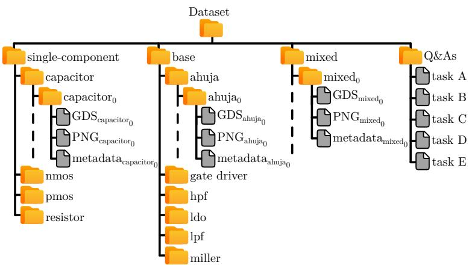  
Figure 7: Dataset structure.

Table 10: Subsets splits cardinality and balance analysis.
<table><tr><td>Complexity</td><td>Task</td><td>Train (#)</td><td>Validation (#)</td><td>Test (#)</td><td>Total (#)</td><td>Circuit Type Distribution</td></tr><tr><td>Easy</td><td>A</td><td>17997</td><td>999</td><td>1001</td><td>19 997</td><td>NMOS: 5 000 (25.0%) PMOS: 5 000 (25.0%) RES: 5 000 (25.0%) CAP: 4 997 (25.0%)</td></tr><tr><td>Medium</td><td>B</td><td>5302</td><td>292</td><td>300</td><td>5894</td><td>Gate Driver: 1 000 (17.0%) Ahuja OTA: 995 (16.9%) LDO: 989 (16.8%) Miller OTA: 977 (16.6%) LPF: 971 (16.5%) HPF: 962 (16.3%) LDO: 4 945 (18.0%) Miller OTA: 4 885 (17.8%)</td></tr><tr><td>Hard</td><td>C D</td><td>24 715 17842</td><td>1361 1003</td><td>1399 1003</td><td>27 475 19 848</td><td>LPF: 4 855 (17.7%) HPF: 4810 (17.5%) Gate Driver: 4 000 (14.6%) Ahuja OTA: 3 980 (14.5%) Mixed circuits: 19 848 (100%)</td></tr><tr><td>Total Q&amp;A Pairs (#)</td><td>E</td><td>3726</td><td>207 3910</td><td>207 3862</td><td>4140</td><td>Mixed circuits: 4140 (100%)</td></tr><tr><td colspan="2"></td><td>69 585</td><td></td><td></td><td>77 354</td><td></td></tr></table>

Table 12: Representative held-out Q&As retrieved from the released THEIA task files. The answer letter is the assistant target in the corresponding JSON record.
<table><tr><td>Task</td><td>Layout</td><td>Question and choices</td><td>Target</td></tr><tr><td>A</td><td>single_cap_131</td><td>What type of device is this? A. NMOS; B. PMOS; C. resistor; D. capacitor. Pick one answer only.</td><td>D (capacitor)</td></tr><tr><td>B</td><td>ahuja_ota_481</td><td>What circuit is shown? A. gate driver; B. LDO; C. Miller OTA; D. HPF; E. Ahuja OTA; F. LPF. Select exactly one option.</td><td>E (Ahuja OTA)</td></tr><tr><td>C</td><td>ahuja_ota_308</td><td>Can you count the transistors in this circuit? A. 12; B. 14; C. 11; D. 15. Select exactly one option.</td><td>B (14)</td></tr><tr><td>D</td><td>mixed_8977</td><td>Can you count the PMOS devices? A. 10; B. 9; C. 8. Select exactly one option.</td><td>C (8)</td></tr><tr><td>E</td><td>mixed_661</td><td>What base circuits are combined? A-F enumerate topology multisets; the correct option is F: one HPF, one LDO, and one Miller OTA. Select exactly one option.</td><td>F</td></tr></table>

Table 13: Number of answer options for Task-C/D held-out questions after distractor construction.
<table><tr><td>Task</td><td>3 options</td><td>4 options</td><td>5 options</td><td>6 options</td></tr><tr><td>C (1 399)</td><td>370</td><td>359</td><td>349</td><td>321</td></tr><tr><td>D (1 003)</td><td>272</td><td>258</td><td>223</td><td>250</td></tr></table>

Table 11: Dataset statistics across groups and circuit topologies.
<table><tr><td></td><td colspan="3">Layout area (µm²)</td><td colspan="3">Polygon count (#)</td><td colspan="3">Layers (#)</td><td colspan="3">Aspect ratio (-)</td><td colspan="3">Routing density (-)</td></tr><tr><td>Topology</td><td>p25</td><td>med</td><td>p75</td><td>p25</td><td>med</td><td> $\mathsf { p } 7 5$ </td><td> $\mathsf { p } 2 5$ </td><td>med</td><td>p75</td><td>p25</td><td>med</td><td>p75</td><td>p25</td><td>med</td><td> $\mathsf { p } 7 5$ </td></tr><tr><td>Dataset groups</td><td></td><td></td><td></td><td></td><td></td><td></td><td></td><td></td><td></td><td></td><td></td><td></td><td></td><td></td><td></td></tr><tr><td>Single Devices</td><td>94</td><td>125</td><td>663</td><td>43</td><td>51</td><td>228</td><td>8</td><td>9</td><td>10</td><td>0.6</td><td>0.6</td><td>2.1</td><td>5.5</td><td>5.9</td><td>6.5</td></tr><tr><td>Base Circuits</td><td>2 965</td><td>6149</td><td>9828</td><td>4073</td><td>4674</td><td>5471</td><td>13</td><td>14</td><td>14</td><td>1.0</td><td>1.5</td><td>2.1</td><td>3.7</td><td>4.0</td><td>4.6</td></tr><tr><td>Mixed</td><td>6209</td><td>10545</td><td>14887</td><td>9407</td><td>13109</td><td>17365</td><td>14</td><td>14</td><td>15</td><td>0.7</td><td>1.3</td><td>2.0</td><td>3.5</td><td>3.8</td><td>4.3</td></tr><tr><td>Single Devices</td><td></td><td></td><td></td><td></td><td></td><td></td><td></td><td></td><td></td><td></td><td></td><td></td><td></td><td></td><td></td></tr><tr><td>Capacitor</td><td>607</td><td>1907</td><td>4075</td><td>28</td><td>51</td><td>75</td><td>4</td><td>4</td><td>4</td><td>1.0</td><td>1.0</td><td>1.0</td><td>3.7</td><td>3.8</td><td>3.9</td></tr><tr><td>NMOS</td><td>94</td><td>109</td><td>109</td><td>42</td><td>51</td><td>51</td><td>9</td><td>9</td><td>9</td><td>0.5</td><td>0.6</td><td>0.6</td><td>5.5</td><td>5.5</td><td>5.6</td></tr><tr><td>PMOS</td><td>94</td><td>109</td><td>109</td><td>43</td><td>52</td><td>52</td><td>10</td><td>10</td><td>10</td><td>0.5</td><td>0.6</td><td>0.6</td><td>6.5</td><td>6.5</td><td>6.6</td></tr><tr><td>Resistor</td><td>357</td><td>522</td><td>682</td><td>228</td><td>228</td><td>228</td><td>8</td><td>8</td><td>8</td><td>3.9</td><td>5.8</td><td>7.5</td><td>5.9</td><td>5.9</td><td>6.0</td></tr><tr><td>Base Circuits</td><td></td><td></td><td></td><td></td><td></td><td></td><td></td><td></td><td></td><td></td><td></td><td></td><td></td><td></td><td></td></tr><tr><td>Ahuja OTA</td><td>2404</td><td>3963</td><td>6149</td><td>6 751</td><td>7307</td><td>7949</td><td>13</td><td>13</td><td>14</td><td>0.8</td><td>1.4</td><td>1.6</td><td>4.3</td><td>4.6</td><td>5.5</td></tr><tr><td>Gate Driver</td><td>2055</td><td>2387</td><td>2831</td><td>4402</td><td>4818</td><td>5315</td><td>13</td><td>13</td><td>13</td><td>1.7</td><td>2.2</td><td>3.4</td><td>4.5</td><td>4.9</td><td>5.3</td></tr><tr><td>HPF</td><td>7693</td><td>10481</td><td>13 752</td><td>4415</td><td>4755</td><td>5225</td><td>14</td><td>14</td><td>15</td><td>1.2</td><td>1.6</td><td>2.1</td><td>3.5</td><td>3.7</td><td>3.9</td></tr><tr><td>LDO</td><td>2877</td><td>4401</td><td>6771</td><td>2412</td><td>2597</td><td>2776</td><td>14</td><td>14</td><td>14</td><td>1.0</td><td>1.2</td><td>2.0</td><td>3.8</td><td>4.0</td><td>4.4</td></tr><tr><td>LPF</td><td>8171</td><td>10852</td><td>14326</td><td>4302</td><td>4624</td><td>5004</td><td>14</td><td>14</td><td>15</td><td>0.8</td><td>1.3</td><td>2.0</td><td>3.5</td><td>3.6</td><td>3.8</td></tr><tr><td>Miller OTA</td><td>5882</td><td>8467</td><td>10 640</td><td>4105</td><td>4469</td><td>4869</td><td>14</td><td>14</td><td>15</td><td>1.0</td><td>1.4</td><td>1.8</td><td>3.6</td><td>3.8</td><td>4.0</td></tr></table>

## A.3 Additional Evaluation Analyses

This subsection documents the released task records and evaluation implementation, together with detailed answer-option construction and Task-B class-balance statistics. Deterministic validation, LLM-judge agreement, and open-ended evaluation are reported in Section 4.2.1.

## A.3.1 Released Data and Evaluation Implementation

The released repository contains the five task-specific train/validation/test JSON files, each pairing a relative PNG path with a two-turn user/assistant conversation. It also ships the InternLM LoRA fine-tuning launcher and preprocessing code, deterministic choice scoring, and the LLM-as-a-judge implementation. The deterministic scorer removes the image placeholder, extracts a final answer letter from the allowed A-F choices, and compares it with the ground-truth letter. The judge script stores the prompt, ground truth, raw prediction, parsed prediction, binary verdict, and disagreement statistics. It uses a model-agnostic plain-text prompt and deterministic decoding (temperature 0, top-p 1, at most six generated tokens). Table 12 gives one held-out record from each task. The examples show the released answer format and the variable number of answer options. For the multiple-choice counting tasks C/D, the correct count is retained and distractors are sampled around it: nearby integers are used first, then valid random counts if needed. Candidate order is shuffled, and neither the number nor the position of answer options is fixed. Table 13 gives the resulting test-set option-count distributions. Task B is class-balanced: its six topology families occupy 16.3%-17.1% of every split (Table 14). The majority-class predictor, always selecting Gate Driver, obtains $5 0 / 3 0 0 = 1 6 . 7 \%$ on the test set, compared with 84% for the fine-tuned VLM. Figure 8 shows a high-pass filter (HPF) layout, where each device is highlighted by a colourful box. Variability among circuit variants present in the dataset is exemplified in Figure 9 and Figure 10, which show multiple Miller OTA and Low-Dropout Regulator layouts, respectively.

Table 14: Task-B class counts (percentage within split) and majority-class baseline.
<table><tr><td>Topology</td><td>Train (5 302)</td><td>Validation (292)</td><td>Test (300)</td></tr><tr><td>Ahuja OTA</td><td>895 (16.9%)</td><td>49 (16.8%)</td><td>51 (17.0%)</td></tr><tr><td>Gate Driver</td><td>900 (17.0%)</td><td>50 (17.1%)</td><td>50 (16.7%)</td></tr><tr><td>HPF</td><td>865 (16.3%)</td><td>48 (16.4%)</td><td>49 (16.3%)</td></tr><tr><td>LDO</td><td>890 (16.8%)</td><td>49 (16.8%)</td><td>50 (16.7%)</td></tr><tr><td>LPF</td><td>873 (16.5%)</td><td>48 (16.4%)</td><td>50 (16.7%)</td></tr><tr><td>Miller OTA</td><td>879 (16.6%)</td><td>48 (16.4%)</td><td>50 (16.7%)</td></tr></table>

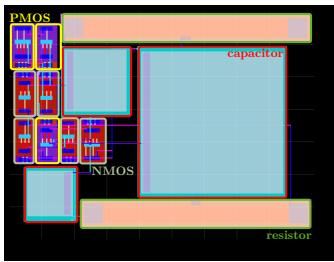  
Figure 8: Example of a base circuit layout, an HPF. Devices are highlighted in coloured boxes.

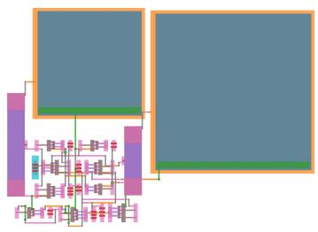  
(a)

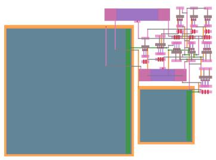  
(b)  
Figure 9: Examples of Miller OTA layouts.

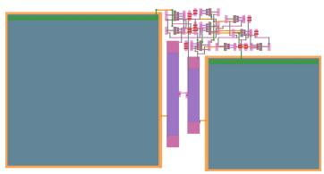  
(c)

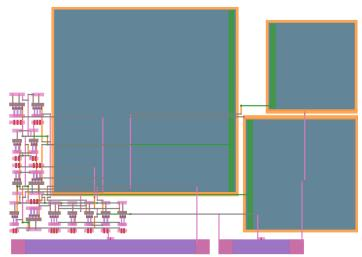  
(a)

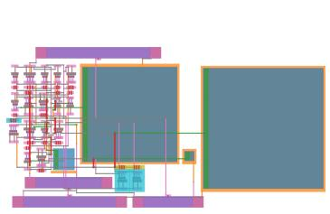  
(b)  
Figure 10: Examples of mixed topologies.

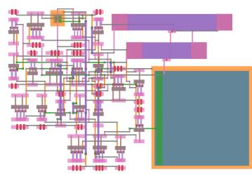  
(c)

## NeurIPS Paper Checklist

The checklist is designed to encourage best practices for responsible machine learning research, addressing issues of reproducibility, transparency, research ethics, and societal impact. Do not remove the checklist: The papers not including the checklist will be desk rejected. The checklist should follow the references and follow the (optional) supplemental material. The checklist does NOT count towards the page limit.

Please read the checklist guidelines carefully for information on how to answer these questions. For each question in the checklist:

• You should answer [Yes], [No], or [N/A].

• [N/A] means either that the question is Not Applicable for that particular paper or the relevant information is Not Available.

• Please provide a short (1–2 sentence) justification right after your answer (even for [N/A]).

The checklist answers are an integral part of your paper submission. They are visible to the reviewers, area chairs, senior area chairs, and ethics reviewers. You will also be asked to include it (after eventual revisions) with the final version of your paper, and its final version will be published with the paper.

The reviewers of your paper will be asked to use the checklist as one of the factors in their evaluation. While [Yes] is generally preferable to [No], it is perfectly acceptable to answer [No] provided a proper justification is given (e.g., error bars are not reported because it would be too computationally expensive” or “we were unable to find the license for the dataset we used”). In general, answering [No] or [N/A] is not grounds for rejection. While the questions are phrased in a binary way, we acknowledge that the true answer is often more nuanced, so please just use your best judgment and write a justification to elaborate. All supporting evidence can appear either in the main paper or the supplemental material, provided in appendix. If you answer [Yes] to a question, in the justification please point to the section(s) where related material for the question can be found.

IMPORTANT, please:

• Delete this instruction block, but keep the section heading “NeurIPS Paper Checklist",

• Keep the checklist subsection headings, questions/answers and guidelines below.

• Do not modify the questions and only use the provided macros for your answers.

## 1. Claims

Question: Do the main claims made in the abstract and introduction accurately reflect the paper’s contributions and scope?

Answer: [Yes]

Justification: The main contributions of the paper are clearly stated both in the Abstract and in the Introduction (Section 1), where a dedicated portion of it discusses the main contributions of this work and how they are positioned with respect to the state of the art.

Guidelines:

Guidelines:

• The answer [N/A] means that the abstract and introduction do not include the claims made in the paper.

• The abstract and/or introduction should clearly state the claims made, including the contributions made in the paper and important assumptions and limitations. A [No] or [N/A] answer to this question will not be perceived well by the reviewers.

• The claims made should match theoretical and experimental results, and reflect how much the results can be expected to generalize to other settings.

• It is fine to include aspirational goals as motivation as long as it is clear that these goals are not attained by the paper.

## 2. Limitations

Question: Does the paper discuss the limitations of the work performed by the authors?

## Answer: [Yes]

Justification: The limitations are discussed in a dedicated section, see Section 7.

## Guidelines:

• The answer [N/A] means that the paper has no limitation while the answer [No] means that the paper has limitations, but those are not discussed in the paper.

• The authors are encouraged to create a separate “Limitations” section in their paper.

• The paper should point out any strong assumptions and how robust the results are to violations of these assumptions (e.g., independence assumptions, noiseless settings, model well-specification, asymptotic approximations only holding locally). The authors should reflect on how these assumptions might be violated in practice and what the implications would be.

• The authors should reflect on the scope of the claims made, e.g., if the approach was only tested on a few datasets or with a few runs. In general, empirical results often depend on implicit assumptions, which should be articulated.

• The authors should reflect on the factors that influence the performance of the approach. For example, a facial recognition algorithm may perform poorly when image resolution is low or images are taken in low lighting. Or a speech-to-text system might not be used reliably to provide closed captions for online lectures because it fails to handle technical jargon.

• The authors should discuss the computational efficiency of the proposed algorithms and how they scale with dataset size.

• If applicable, the authors should discuss possible limitations of their approach to address problems of privacy and fairness.

• While the authors might fear that complete honesty about limitations might be used by reviewers as grounds for rejection, a worse outcome might be that reviewers discover limitations that aren’t acknowledged in the paper. The authors should use their best judgment and recognize that individual actions in favor of transparency play an important role in developing norms that preserve the integrity of the community. Reviewers will be specifically instructed to not penalize honesty concerning limitations.

## 3. Theory assumptions and proofs

Question: For each theoretical result, does the paper provide the full set of assumptions and a complete (and correct) proof?

Answer: [N/A]

Justification: This work does not provide any novel theoretical result such as new theorems or formulas.

Guidelines:

• The answer [N/A] means that the paper does not include theoretical results.

• All the theorems, formulas, and proofs in the paper should be numbered and crossreferenced.

• All assumptions should be clearly stated or referenced in the statement of any theorems.

• The proofs can either appear in the main paper or the supplemental material, but if they appear in the supplemental material, the authors are encouraged to provide a short proof sketch to provide intuition.

• Inversely, any informal proof provided in the core of the paper should be complemented by formal proofs provided in appendix or supplemental material.

• Theorems and Lemmas that the proof relies upon should be properly referenced.

## 4. Experimental result reproducibility

Question: Does the paper fully disclose all the information needed to reproduce the main experimental results of the paper to the extent that it affects the main claims and/or conclusions of the paper (regardless of whether the code and data are provided or not)?

Answer: [Yes]

Justification: This work introduces a novel dataset aimed at advancing analog layouts analysis ML-driven techniques. It includes all the necessary information to assess the data creation process as well as to reproduce the VLM fine-tuning baseline results. Details are reported in Section 3, Section 4, as well as in Appendix A.

## Guidelines:

• The answer [N/A] means that the paper does not include experiments.

• If the paper includes experiments, a [No] answer to this question will not be perceived well by the reviewers: Making the paper reproducible is important, regardless of whether the code and data are provided or not.

• If the contribution is a dataset and/or model, the authors should describe the steps taken to make their results reproducible or verifiable.

• Depending on the contribution, reproducibility can be accomplished in various ways. For example, if the contribution is a novel architecture, describing the architecture fully might suffice, or if the contribution is a specific model and empirical evaluation, it may be necessary to either make it possible for others to replicate the model with the same dataset, or provide access to the model. In general. releasing code and data is often one good way to accomplish this, but reproducibility can also be provided via detailed instructions for how to replicate the results, access to a hosted model (e.g., in the case of a large language model), releasing of a model checkpoint, or other means that are appropriate to the research performed.

• While NeurIPS does not require releasing code, the conference does require all submissions to provide some reasonable avenue for reproducibility, which may depend on the nature of the contribution. For example

(a) If the contribution is primarily a new algorithm, the paper should make it clear how to reproduce that algorithm.

(b) If the contribution is primarily a new model architecture, the paper should describe the architecture clearly and fully.

(c) If the contribution is a new model (e.g., a large language model), then there should either be a way to access this model for reproducing the results or a way to reproduce the model (e.g., with an open-source dataset or instructions for how to construct the dataset).

(d) We recognize that reproducibility may be tricky in some cases, in which case authors are welcome to describe the particular way they provide for reproducibility. In the case of closed-source models, it may be that access to the model is limited in some way (e.g., to registered users), but it should be possible for other researchers to have some path to reproducing or verifying the results.

## 5. Open access to data and code

Question: Does the paper provide open access to the data and code, with sufficient instructions to faithfully reproduce the main experimental results, as described in supplemental material?

Answer: [Yes]

Justification: The main contribution of this work is a novel dataset aimed at advancing analog layouts analysis ML-driven techniques. The dataset is released open-source as well as the code used in the baseline methodology for VLM fine-tuning and evaluation.

Guidelines:

• The answer [N/A] means that paper does not include experiments requiring code.

• Please see the NeurIPS code and data submission guidelines (https://neurips.cc/ public/guides/CodeSubmissionPolicy) for more details.

• While we encourage the release of code and data, we understand that this might not be possible, so [No] is an acceptable answer. Papers cannot be rejected simply for not including code, unless this is central to the contribution (e.g., for a new open-source benchmark).

• The instructions should contain the exact command and environment needed to run to reproduce the results. See the NeurIPS code and data submission guidelines (https: //neurips.cc/public/guides/CodeSubmissionPolicy) for more details.

• The authors should provide instructions on data access and preparation, including how to access the raw data, preprocessed data, intermediate data, and generated data, etc.

• The authors should provide scripts to reproduce all experimental results for the new proposed method and baselines. If only a subset of experiments are reproducible, they should state which ones are omitted from the script and why.

• At submission time, to preserve anonymity, the authors should release anonymized versions (if applicable).

• Providing as much information as possible in supplemental material (appended to the paper) is recommended, but including URLs to data and code is permitted.

## 6. Experimental setting/details

Question: Does the paper specify all the training and test details (e.g., data splits, hyperparameters, how they were chosen, type of optimizer) necessary to understand the results?

Answer: [Yes]

Justification: This work includes all the necessary information to assess the data creation process as well as to reproduce the VLM fine-tuning baseline results. Details are reported in Section 3, Section 4, as well as in Appendix A.

Guidelines:

• The answer [N/A] means that the paper does not include experiments.

• The experimental setting should be presented in the core of the paper to a level of detail that is necessary to appreciate the results and make sense of them.

• The full details can be provided either with the code, in appendix, or as supplemental material.

## 7. Experiment statistical significance

Question: Does the paper report error bars suitably and correctly defined or other appropriate information about the statistical significance of the experiments?

Answer: [No]

Justification: The main contribution of this work is a novel dataset aimed at advancing analog design optimization techniques targeting large-scale topologies, not the baseline VLM fine-tuning technique. The dataset is released open-source and it is fully characterized by statistical measures.

Guidelines:

• The answer [N/A] means that the paper does not include experiments.

• The authors should answer [Yes] if the results are accompanied by error bars, confidence intervals, or statistical significance tests, at least for the experiments that support the main claims of the paper.

• The factors of variability that the error bars are capturing should be clearly stated (for example, train/test split, initialization, random drawing of some parameter, or overall run with given experimental conditions).

• The method for calculating the error bars should be explained (closed form formula, call to a library function, bootstrap, etc.)

• The assumptions made should be given (e.g., Normally distributed errors).

• It should be clear whether the error bar is the standard deviation or the standard error of the mean.

• It is OK to report 1-sigma error bars, but one should state it. The authors should preferably report a 2-sigma error bar than state that they have a 96% CI, if the hypothesis of Normality of errors is not verified.

• For asymmetric distributions, the authors should be careful not to show in tables or figures symmetric error bars that would yield results that are out of range (e.g., negative error rates).

• If error bars are reported in tables or plots, the authors should explain in the text how they were calculated and reference the corresponding figures or tables in the text.

## 8. Experiments compute resources

Question: For each experiment, does the paper provide sufficient information on the computer resources (type of compute workers, memory, time of execution) needed to reproduce the experiments?

Answer: [Yes]

Justification: Section 4 report the computer resources employed to generate the dataset and carry out the experiments, respectively.

Guidelines:

• The answer [N/A] means that the paper does not include experiments.

• The paper should indicate the type of compute workers CPU or GPU, internal cluster, or cloud provider, including relevant memory and storage.

• The paper should provide the amount of compute required for each of the individual experimental runs as well as estimate the total compute.

• The paper should disclose whether the full research project required more compute than the experiments reported in the paper (e.g., preliminary or failed experiments that didn’t make it into the paper).

## 9. Code of ethics

Question: Does the research conducted in the paper conform, in every respect, with the NeurIPS Code of Ethics https://neurips.cc/public/EthicsGuidelines?

Answer: [Yes]

Justification: The research conducted in this paper conforms, in every respect, with the NeurIPS Code of Ethics.

Guidelines:

• The answer [N/A] means that the authors have not reviewed the NeurIPS Code of Ethics.

• If the authors answer [No], they should explain the special circumstances that require a deviation from the Code of Ethics.

• The authors should make sure to preserve anonymity (e.g., if there is a special consideration due to laws or regulations in their jurisdiction).

## 10. Broader impacts

Question: Does the paper discuss both potential positive societal impacts and negative societal impacts of the work performed?

Answer: [Yes]

Justification: The main contributions of the paper are clearly stated both in the Abstract and in the Introduction (Section 1). Moreover, Related Work (Section 2) and Conclusions (Section 5) discuss how THEIA can foster research toward new frontiers of analog circuit design automation.

Guidelines:

• The answer [N/A] means that there is no societal impact of the work performed.

• If the authors answer [N/A] or [No], they should explain why their work has no societal impact or why the paper does not address societal impact.

• Examples of negative societal impacts include potential malicious or unintended uses (e.g., disinformation, generating fake profiles, surveillance), fairness considerations (e.g., deployment of technologies that could make decisions that unfairly impact specific groups), privacy considerations, and security considerations.

• The conference expects that many papers will be foundational research and not tied to particular applications, let alone deployments. However, if there is a direct path to any negative applications, the authors should point it out. For example, it is legitimate to point out that an improvement in the quality of generative models could be used to generate Deepfakes for disinformation. On the other hand, it is not needed to point out that a generic algorithm for optimizing neural networks could enable people to train models that generate Deepfakes faster.

• The authors should consider possible harms that could arise when the technology is being used as intended and functioning correctly, harms that could arise when the technology is being used as intended but gives incorrect results, and harms following from (intentional or unintentional) misuse of the technology.

• If there are negative societal impacts, the authors could also discuss possible mitigation strategies (e.g., gated release of models, providing defenses in addition to attacks, mechanisms for monitoring misuse, mechanisms to monitor how a system learns from feedback over time, improving the efficiency and accessibility of ML).

## 11. Safeguards

Question: Does the paper describe safeguards that have been put in place for responsible release of data or models that have a high risk for misuse (e.g., pre-trained language models, image generators, or scraped datasets)?

Answer: [N/A]

Justification: The proposed dataset (and baseline) does not pose significant threats of misuse. Guidelines:

• The answer [N/A] means that the paper poses no such risks.

• Released models that have a high risk for misuse or dual-use should be released with necessary safeguards to allow for controlled use of the model, for example by requiring that users adhere to usage guidelines or restrictions to access the model or implementing safety filters.

• Datasets that have been scraped from the Internet could pose safety risks. The authors should describe how they avoided releasing unsafe images.

• We recognize that providing effective safeguards is challenging, and many papers do not require this, but we encourage authors to take this into account and make a best faith effort.

## 12. Licenses for existing assets

Question: Are the creators or original owners of assets (e.g., code, data, models), used in the paper, properly credited and are the license and terms of use explicitly mentioned and properly respected?

Answer: [Yes]

Justification: All the people involved in the creation, curation, and diffusion of the assets mentioned, used, or proposed in this work are properly mentioned and credited.

Guidelines:

• The answer [N/A] means that the paper does not use existing assets.

• The authors should cite the original paper that produced the code package or dataset.

• The authors should state which version of the asset is used and, if possible, include a URL.

• The name of the license (e.g., CC-BY 4.0) should be included for each asset.

• For scraped data from a particular source (e.g., website), the copyright and terms of service of that source should be provided.

• If assets are released, the license, copyright information, and terms of use in the package should be provided. For popular datasets, paperswithcode.com/datasets has curated licenses for some datasets. Their licensing guide can help determine the license of a dataset.

• For existing datasets that are re-packaged, both the original license and the license of the derived asset (if it has changed) should be provided.

• If this information is not available online, the authors are encouraged to reach out to the asset’s creators.

## 13. New assets

Question: Are new assets introduced in the paper well documented and is the documentation provided alongside the assets?

Answer: [Yes]

Justification: All the people involved in the creation, curation, and diffusion of the assets mentioned, used, or proposed in this work are properly mentioned and credited.

Guidelines:

• The answer [N/A] means that the paper does not release new assets.

• Researchers should communicate the details of the dataset/code/model as part of their submissions via structured templates. This includes details about training, license, limitations, etc.

• The paper should discuss whether and how consent was obtained from people whose asset is used.

• At submission time, remember to anonymize your assets (if applicable). You can either create an anonymized URL or include an anonymized zip file.

## 14. Crowdsourcing and research with human subjects

Question: For crowdsourcing experiments and research with human subjects, does the paper include the full text of instructions given to participants and screenshots, if applicable, as well as details about compensation (if any)?

Answer: [N/A]

Justification: This work does not involve crowdsourcing nor research with human subjects. Guidelines:

• The answer [N/A] means that the paper does not involve crowdsourcing nor research with human subjects.

• Including this information in the supplemental material is fine, but if the main contribution of the paper involves human subjects, then as much detail as possible should be included in the main paper.

• According to the NeurIPS Code of Ethics, workers involved in data collection, curation, or other labor should be paid at least the minimum wage in the country of the data collector.

## 15. Institutional review board (IRB) approvals or equivalent for research with human subjects

Question: Does the paper describe potential risks incurred by study participants, whether such risks were disclosed to the subjects, and whether Institutional Review Board (IRB) approvals (or an equivalent approval/review based on the requirements of your country or institution) were obtained?

Answer: [N/A]

Justification: This work does not involve crowdsourcing nor research with human subjects. Guidelines:

• The answer [N/A] means that the paper does not involve crowdsourcing nor research with human subjects.

• Depending on the country in which research is conducted, IRB approval (or equivalent) may be required for any human subjects research. If you obtained IRB approval, you should clearly state this in the paper.

• We recognize that the procedures for this may vary significantly between institutions and locations, and we expect authors to adhere to the NeurIPS Code of Ethics and the guidelines for their institution.

• For initial submissions, do not include any information that would break anonymity (if applicable), such as the institution conducting the review.

## 16. Declaration of LLM usage

Question: Does the paper describe the usage of LLMs if it is an important, original, or non-standard component of the core methods in this research? Note that if the LLM is used only for writing, editing, or formatting purposes and does not impact the core methodology, scientific rigor, or originality of the research, declaration is not required.

Answer: [Yes]

Justification: LLMs are employed in the methodology. Section 3 and Section 4 discusses the role of LLMs in the methodology and experimental validation, respectively. LLMs were not involved in the concept development of the dataset nor the baseline methodology.

## Guidelines:

• The answer [N/A] means that the core method development in this research does not involve LLMs as any important, original, or non-standard components.

• Please refer to our LLM policy in the NeurIPS handbook for what should or should not be described.