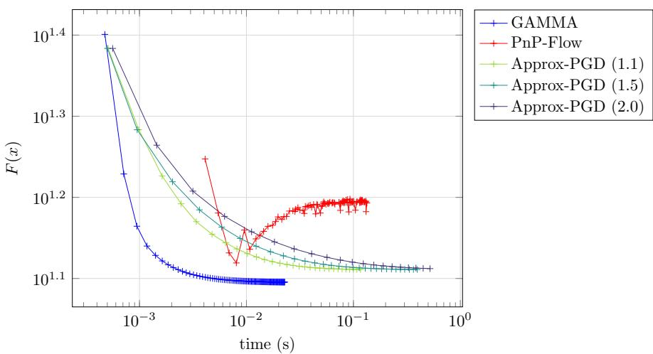
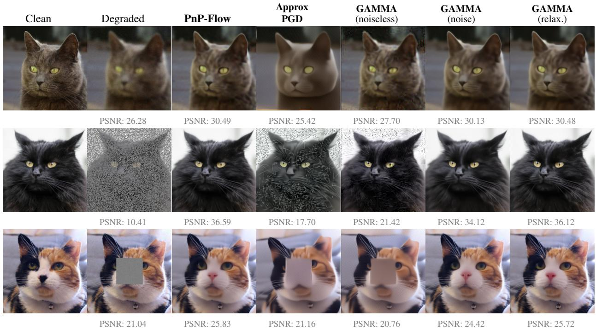
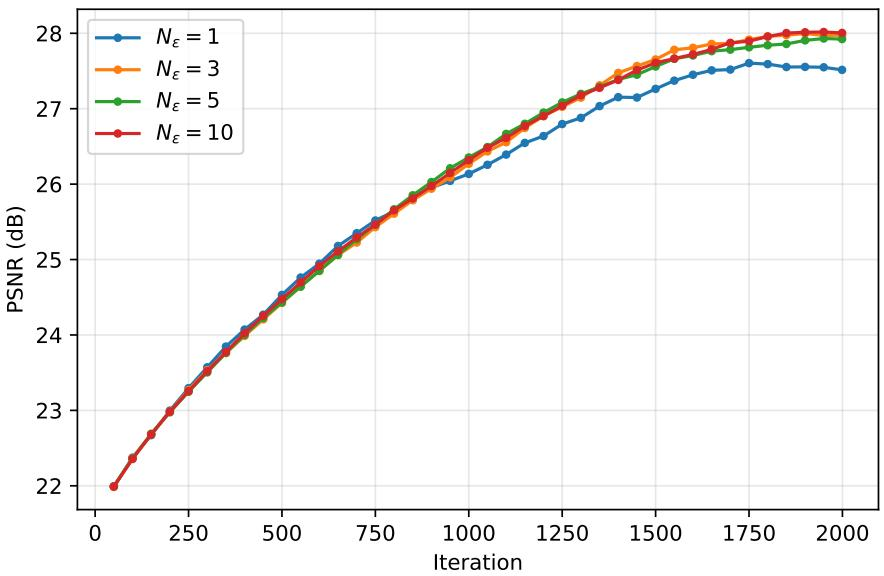
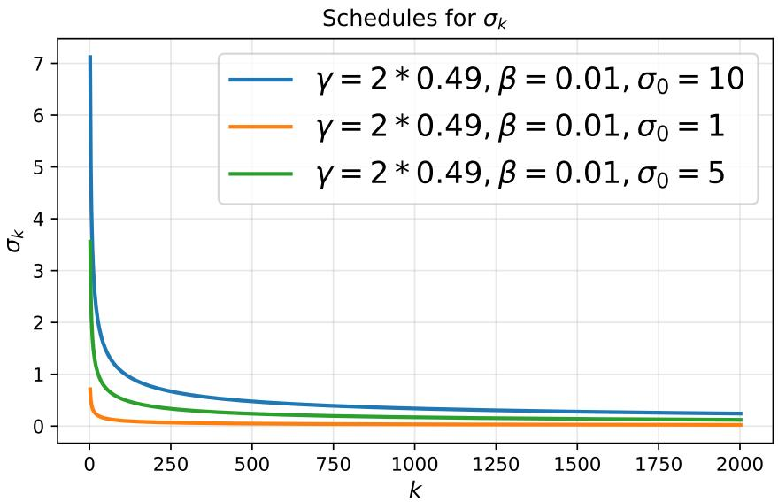
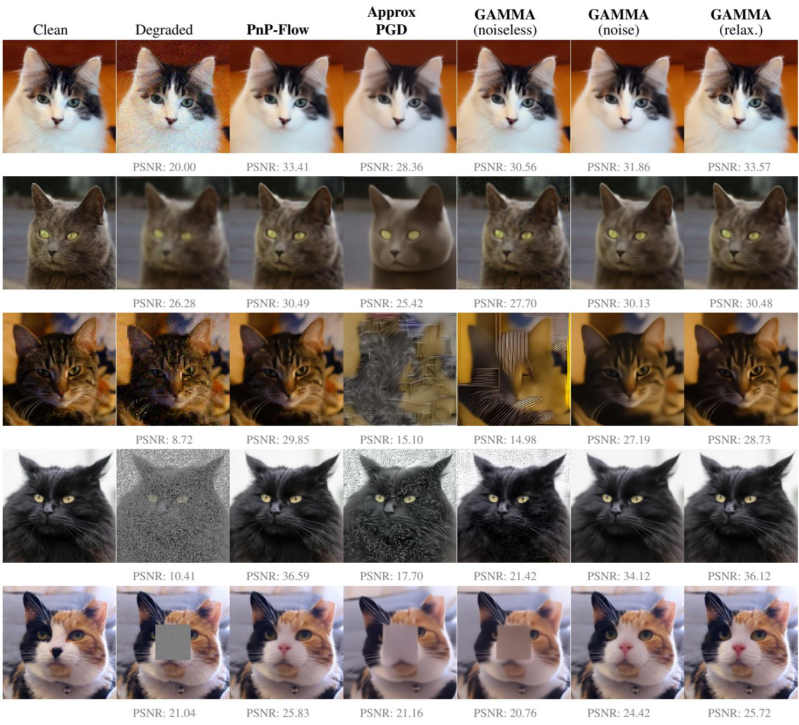

# Principled MAP estimation for inverse problems: bridging the gap between convergence and performance

Alexandre Lagier∗,1 Valentine Tosel∗,2 Anne Gagneux1 Mathurin Massias3 Segol´ ene Martin\` 3

1 ENS de Lyon, CNRS, Universite Claude Bernard Lyon 1, Inria,´

LIP UMR 5668, 69342 Lyon Cedex 07, France

2 Univ. Bordeaux, Inria, Bordeaux INP, IMB, UMR 5251, F-33400 Talence, France

3 Inria, ENS de Lyon, CNRS, Universite Claude Bernard Lyon 1,´ LIP UMR 5668, 69342 Lyon Cedex 07, France

## Abstract

Pretrained denoisers provide a powerful way to incorporate image priors into restoration algorithms. Plug-and-Play and RED approaches exploit fixed-noise-level denoisers within first-order optimization schemes, with convergence guarantees, but often struggle to achieve high-quality reconstruction on severely ill-posed inverse problems. In contrast, recent state-of-the-art approaches leverage denoisers derived from flow- or diffusion-based generative models and evaluate them along a sequence of decreasing noise levels. While these methods achieve strong empirical performance, their convergence theory remains limited. In this paper, we bridge this gap by specifically designing an algorithm that combines denoisers at decreasing noise levels with a schedule tailored to ensure convergence. From a Bayesian perspective, we prove that our method converges to a Maximum a Posteriori (MAP) estimate, under suitable assumptions. Subsequently, we apply our method to various ill-posed inverse problems and show that it surpasses convergent methods while competing with state-of-the-art empirical ones.

## 1 Introduction

An inverse problem in imaging aims to reconstruct a clean image $x ^ { * } \in \mathbb { R } ^ { d }$ from a degraded measurement $y \in \mathbb { R } ^ { m }$ In general, the degradation process, or forward model, can be written as $y = \mathrm { A } ( x ^ { * } ) + \varepsilon$ where $\mathrm { A } : \mathbb { R } ^ { d }  \mathbb { R } ^ { m }$ is the degradation operator and $\varepsilon \sim \mathcal { N } ( 0 , \sigma _ { y } ^ { 2 } \mathrm { I d } )$ ) represents additive white Gaussian noise. A classical approach estimates the clean image $x ^ { * }$ by the minimizer xˆ of a composite functional:

$$
{ \hat { x } } \in \operatorname { A r g m i n } _ { x \in \mathbb { R } ^ { d } } f ( x ) + g ( x ) ,\tag{1}
$$

where f is a data-fidelity term, that depends on the observation y and on the degradation, typically $f ( x ) \propto \| \mathrm { A } ( x ) - y \| ^ { 2 }$ whereas g is a regularization term encoding prior information about the image. A key question is therefore how to choose the regularizer g.

Early works relied on hand-crafted regularizers, such as the $\ell _ { 1 }$ -norm, total-variation, and wavelet sparsity [Rudin et al., 1992, Donoho and Johnstone, 1998, Scherzer et al., 2009]. For these choices of g, (1) can easily be solved with classical gradient-descent or proximal algorithms. However, the resulting reconstruction xˆ often lacks perceptual quality due to the limited expressiveness of the regularization. In order to integrate more complex prior information about clean images, later approaches considered the use of a pretrained denoiser $D _ { \sigma }$ with fixed noise level σ within optimization schemes, as an implicit regularizer. Plug-and-Play (PnP) methods [Venkatakrishnan et al., 2013, Chan et al., 2016] replaced the proximal operator by such a denoiser, which significantly improved perceptual quality of the reconstruction on simple inverse problems such as denoising and deblurring. Under certain conditions on the denoiser, PnP methods can be proven to converge, but the limit of the resulting sequence generally cannot be characterized [Ryu

et al., 2019, Pesquet et al., 2021, Hurault et al., 2022, Hurault, 2023]. Regularization by Denoising (RED, Romano et al. 2017) partially bridges the gap between gradient based methods and PnP ones, by using a specific regularizer: $g ( x ) = \mu x ^ { \top } ( x - D _ { \sigma } ( x ) )$ . When $D _ { \sigma }$ is locally homogeneous and has symmetric Jacobian, $\nabla g ( x ) = \mu ( x - D _ { \sigma } ( x ) )$ and gradient descent on (1) leads to Algorithm 1; however these conditions rarely hold for trained denoisers [Reehorst and Schniter, 2019].
<table><tr><td>Algorithm 1: RED</td><td>Algorithm 2: Annealed RED</td></tr><tr><td>Initialization:  $x _ { 0 } \in \mathbb { R } ^ { d } , \alpha , \sigma > 0$ </td><td> $\mathbf { I n i t i a l i z a t i o n : } x _ { 0 } \in \mathbb { R } ^ { d } , ( \alpha _ { k } ) _ { k } , ( \sigma _ { k } ) _ { k } \setminus 0$ </td></tr><tr><td>for  $k = 0 , 1 , \ldots . \mathbf { d o }$ </td><td> $\mathbf { f o r } \ k = 0 , 1 , \ldots \mathbf { d o }$ </td></tr><tr><td> $\lfloor x _ { k + 1 } = x _ { k } - \alpha \nabla f ( x _ { k } ) - \alpha \mu ( x _ { k } - D _ { \sigma } ( x _ { k } ) )$ </td><td> $\underline { { { x } } } _ { k + 1 } = x _ { k } - \alpha _ { k } \nabla f ( x _ { k } ) - \alpha _ { k } \mu _ { k } ( x _ { k } - D _ { \sigma _ { k } } ( x _ { k } ) )$ </td></tr></table>

Despite appealing guarantees, the performance of such methods remains limited on challenging inverse problems such as inpainting or super-resolution. To address this limitation, state-of-the-art algorithms use off-the-shelf diffusionor flow-based generative models [Song et al., 2020, Ho et al., 2020, Lipman et al., 2023, Liu et al., 2023, Albergo and Vanden-Eijnden, 2023]. Most of these algorithms have two main ingredients: (approximate) MMSE denoisers $D _ { \sigma }$ accross all noise levels σ, along with an annealed noise schedule with decreasing σ across iterations [Chung et al., 2023, Song et al., 2023, Zhang et al., 2024]. Among them, we are specifically interested in optimization-based methods which are explicit adaptations of PnP or RED schemes [Zhu et al., 2023, Renaud et al., 2024, Martin et al., 2025, Pourya et al., 2026]. While these methods achieve impressive results on highly ill-posed inverse problems, their theoretical understanding lags behind: since the denoiser changes at each iteration, so does the underlying objective, and analyses developed for classical PnP methods no longer hold. Apart from the denoising case $\mathrm { A } = \mathrm { I d }$ [Pesme et al., 2025], the convergence of annealed schemes and the characterization of their limit remain open questions.

Our work belongs to the line of work that seeks to build interpretable and convergent inverse problems solvers based on generative models [Zhang et al., 2024, Pesme et al., 2025]. Many generative-based methods rely on empirical design choices, in particular empirical noise schedules. Instead, we build an algorithm, interpretable as an annealed RED scheme (Algorithm 2), to explicitly solve the maximum a posteriori (MAP) problem and derive its schedules to guarantee convergence. From a Bayesian perspective, the MAP estimator is the most likely image given the observation y:

$$
\hat { x } _ { \mathrm { M A P } } \in \underset { x \in \mathbb { R } ^ { d } } { \mathrm { A r g m a x ~ } } \log p ( x | y ) = \underset { x \in \mathbb { R } ^ { d } } { \mathrm { A r g m i n ~ } } - \log p ( y | x ) - \log p ( x ) .\tag{2}
$$

Under a Gaussian noise model, $- \log p ( y | x ) = \left\| \mathrm { A } ( x ) - y \right\| ^ { 2 } / ( 2 \sigma _ { y } ^ { 2 } )$ up to an additive constant, and (2) is an instance of (1) with $f ( x ) = \left\| \mathrm { A } ( x ) - y \right\| ^ { 2 } / 2$ and $g = - \sigma _ { y } ^ { 2 }$ log p. While f is explicit, the negative log-prior − log p is unknown. Pesme et al. [2025] showed how MMSE denoisers, which diffusion and flow matching models approximate, can be leveraged to solve MAP denoising problems $\mathrm { ( A = I d ) }$ , i.e. to compute the prox of $- \log p \colon$ their MMSE Averaging scheme provably converges. For inverse problems, they propose Approx-PGD, which uses MMSE Averaging as an inner loop to approximate proximal steps. However, it requires a growing number of inner iterations and only guarantees convergence of the objective values, which limits its practical use (Section 5).

Our contributions are the following:

• We introduce Generalized Annealed MMSE Averaging (GAMMA), a generic inverse problem solver using MMSE denoisers evaluated at decreasing noise levels. It extends the MMSE Averaging algorithm of Pesme et al. [2025], which is restricted to MAP denoising. It also connects to existing methods such as annealed version of RED (Algorithm 2), annealed-SNORE [Renaud et al., 2024] and PnP-Flow [Martin et al., 2025], which do not possess convergence guarantees.

• Under log-concavity of the distribution p and mild assumptions on the data-fidelity f, we prove that the iterates of GAMMA, and of a variant involving renoising of the iterates, converge to a MAP estimate of the inverse problem. When multiple MAP solutions exist, our algorithm is able to guide the iterates towards the one closest to a reference point.

• We show that our method converges faster than Approx-PGD [Pesme et al., 2025], and is competitive with stateof-the-art annealed methods on CelebA and AFHQ, making it both provably convergent and practical.

# 2 Proposed algorithm: Generalized Annealed MMSE Averaging (GAMMA)

## 2.1 Problem & Background

We aim to solve the inverse problem (1) by computing a MAP estimate

$$
{ \hat { x } } \in \operatorname { A r g m i n } _ { x \in \mathbb { R } ^ { d } } f ( x ) - \tau \log p ( x ) ,\tag{MAP}
$$

where $f ( x ) : = { \textstyle { \frac { 1 } { 2 } } } \left\| \mathrm { A } ( x ) - y \right\| ^ { 2 } , p$ denotes the prior distribution over clean images and $\tau : = \sigma _ { y } ^ { 2 } > 0$ denote the noise level of the additive noise. In our work, we assume the forward process is known, while the underlying probability distribution $p$ is not. Rather, we suppose we have access to the associated Minimum Mean Square Error (MMSE) denoiser at every noise level $\sigma > 0 .$ , defined by

$$
\mathrm { M M S E } _ { \sigma } ( z ) = \mathbb { E } _ { X \sim p , \varepsilon \sim \mathcal { N } ( 0 , \mathrm { I d } ) } \left[ X \mid X + \sigma \varepsilon = z \right] \in \mathbb { R } ^ { d } .\tag{3}
$$

In practice, MMSE denoisers can be approximated, up to reparameterization, by Flow Matching or diffusion models. Indeed, those methods implicitly learn the score of the smoothed distribution $p _ { \sigma } = p * \mathcal { N } ( 0 , \sigma ^ { 2 } \mathrm { I d } )$ which can be related to the MMSE denoiser at level $\sigma > 0$ through Tweedie’s formula [Efron, 2011]:

$$
\mathrm { M M S E } _ { \sigma } ( z ) = z + \sigma ^ { 2 } \nabla \log p _ { \sigma } ( z ) .\tag{4}
$$

Pesme et al. [2025] introduce MMSE Averaging, an algorithm to solve (MAP) in the denoising setting, namely when $f ( x ) = { \textstyle { \frac { 1 } { 2 } } } \left\| x - y \right\| ^ { 2 }$ ; in that case the MAP is simply the proximal operator of −τ log p. Its iterations read as follows

$$
x _ { k + 1 } = \alpha _ { k } y + ( 1 - \alpha _ { k } ) \mathrm { M M S E } _ { \sigma _ { k } } ( x _ { k } ) ,\tag{MMSE Averaging}
$$

with $( \alpha _ { k } ) _ { k }$ a weight sequence, $( \sigma _ { k } ) _ { k }$ an annealing noise level sequence. Plugging in Tweedie’s formula (4), we can write each iteration as a gradient step:

$$
x _ { k + 1 } = x _ { k } - \alpha _ { k } \left( \left( x _ { k } - y \right) - \left( \frac { 1 - \alpha _ { k } } { \alpha _ { k } } \right) \sigma _ { k } ^ { 2 } \nabla \log p _ { \sigma _ { k } } ( x _ { k } ) \right) .\tag{5}
$$

The gradient step is taken on a smoothed objective function that is better conditioned than the main objective function $F = f - \tau \log p .$ Convergence is derived under suitable assumptions, in particular the log-concavity of $p$ and a specific choice for the sequences $( \alpha _ { k } ) _ { k }$ and $( \sigma _ { k } ) _ { k }$ . However, this scheme is restricted to denoising. We now introduce an algorithm in the same spirit as (MMSE Averaging), but applicable to a much broader class of inverse problems.

## 2.2 Method formulation

We present Generalized Annealed MMSE Averaging (GAMMA), a new algorithm based on MMSE denoisers. It generalizes MMSE Averaging to any inverse problems (beyond denoising / prox computation), while preserving its convergence guarantees. Compared to MMSE Averaging, it replaces the fixed term y by a gradient descent step on a regularized version of the datafit $f .$

Generalized Annealed MMSE Average (GAMMA): Let $( \alpha _ { k } ) _ { k } , ( \sigma _ { k } ) _ { k }$ be two positive annealing sequences. Starting from an arbitrary initialization $\boldsymbol { x } _ { 0 } \in \mathbb { R } ^ { d }$ , we define the following iterates

$$
x _ { k + 1 } = \alpha _ { k } ( x _ { k } - \nabla f _ { \sigma _ { k } } ( x _ { k } ) ) + ( 1 - \alpha _ { k } ) \mathrm { M M S E } _ { \sigma _ { k } } ( x _ { k } ) ,\tag{6}
$$

where $\begin{array} { r } { f _ { \sigma } ( x ) : = f ( x ) + \frac { \lambda ( \sigma ^ { 2 } ) } { 2 } \| x - u \| ^ { 2 } } \end{array}$ is a regularized data-fidelity term, with an annealing regularization weight $\lambda ( \sigma ^ { 2 } )$ , and $u \in \mathbb { R } ^ { d }$ a reference point that we can choose.

We also introduce a variant of GAMMA in which the denoising of the iterate is replaced by the average of its denoised noisy versions. Such averaging was previously proposed by Renaud et al. [2024] and Martin et al. [2025, Remark 3] to improve the empirical performance of their respective algorithms. In practice, we show in Figure 3 that the number of samples ε used to approximate the expectation can be taken equal to 1 – leading to a de facto stochastic algorithm.

Renoised-GAMMA: With the same notation and an arbitrary intialization $\boldsymbol { x } _ { 0 } \in \mathbb { R } ^ { d }$ , we define the following iterates

$$
\tilde { x } _ { k + 1 } = \alpha _ { k } \bigl ( \tilde { x } _ { k } - \nabla f _ { \sigma _ { k } } \bigl ( \tilde { x } _ { k } \bigr ) \bigr ) + \bigl ( 1 - \alpha _ { k } \bigr ) \mathbb { E } _ { \varepsilon \sim \mathcal { N } ( 0 , \mathrm { I d } ) } \left[ \mathrm { M M S E } _ { \sigma _ { k } } \bigl ( \tilde { x } _ { k } + \sigma _ { k } \varepsilon \bigr ) \right] ,\tag{7}
$$

Similarly to Pesme et al. [2025], our update is an average between a gradient step on the data-fidelity and the denoised previous iterate. Both terms hold complementary information, and averaging them allows us to minimize the composite objective function. Using (4) yields the following key result.

Proposition 1. The iterations of (6) can be written as a gradient descent step when we $\begin{array} { r } { \hbar x \left( \frac { 1 - \alpha _ { k } } { \alpha _ { k } } \right) \sigma _ { k } ^ { 2 } = \tau { : } } \end{array}$

$$
x _ { k + 1 } = x _ { k } - \alpha _ { k } \nabla F _ { \sigma _ { k } } ( x _ { k } ) , \quad F _ { \sigma _ { k } } ( x ) : = f _ { \sigma _ { k } } ( x ) - \tau \log p _ { \sigma _ { k } } ( x )\tag{8}
$$

Similarly, the renoised iterations (7) writes,

$$
\begin{array} { r } { \tilde { x } _ { k + 1 } = \tilde { x } _ { k } - \alpha _ { k } \nabla G _ { \sigma _ { k } } ( \tilde { x } ) , \quad G _ { \sigma _ { k } } ( x _ { k } ) : = f _ { \sigma } ( x ) - \tau \mathbb { E } _ { \varepsilon \sim \mathcal { N } ( 0 , \mathrm { I d } ) } \left[ \log p _ { \sigma _ { k } } ( x + \sigma _ { k } \varepsilon ) \right] } \end{array}\tag{9}
$$

Rather than directly running gradient descent steps on the MAP objective $f - \tau \log p ,$ the algorithm runs it on smoothed objectives $F _ { \sigma _ { k } }$ or $G _ { \sigma _ { k } }$ , with $\sigma _ { k } > 0$ decreasing at each iteration: the convex data-fidelity term is replaced by a strongly convex term and the log-prior is replaced by a smoothed log-prior. We observe that $F _ { \sigma }$ converges pointwise to the objective function $F = f - \tau \log p$ as σ goes to 0:

$$
F _ { \sigma } ( x ) = f _ { \sigma } ( x ) - \tau \log p _ { \sigma } ( x ) \underset { \sigma \to 0 } { \longrightarrow } f ( x ) - \tau \log p ( x ) = F ( x ) .\tag{10}
$$

The same pointwise convergence also holds for $G _ { \sigma }$

Remark 2. We also consider a stochastic version of (7), where we only use one noise sample instead ofaveraging over infinitely many noise samples. We chose to detail the setting and the analysis ofthis stochastic scheme in Appendix B.4.

## 3 Related works

Most existing convergence analyses of PnP and RED algorithms consider a fixed noise level and rely on structural assumptions on the denoiser, such as boundedness, non-expansivity, or suitable Jacobian properties [Ryu et al., 2019, Reehorst and Schniter, 2019, Terris et al., 2020, Hurault, 2023]. Recent generative-model-based methods instead use denoisers at decreasing noise levels [Zhu et al., 2023, Mardani et al., 2024, Martin et al., 2025, Pourya et al., 2026], for which the implicit regularization changes throughout the iterations and the fixed-noise theory does not readily apply. Our construction is specifically designed for this decreasing-noise setting, with a schedule that preserves a variational interpretation and enables convergence analysis.

Link with previous methods. Our method is connected to several existing works.

• MMSE Averaging. The iterates (6) recover MMSE Averaging when $\begin{array} { r } { f ( x ) = \frac { 1 } { 2 } \left\| x - y \right\| ^ { 2 } } \end{array}$ and $\lambda ( \sigma ^ { 2 } ) = 0$

• RED. RED [Romano et al., 2017] performs gradient descent on $f + g$ with $g ( x ) = \mu x ^ { \top } ( x - D _ { \sigma } ( x ) )$ , which gives Algorithm 1 provided $D _ { \sigma }$ is locally homogeneous with a symmetric Jacobian [Reehorst and Schniter, 2019]. In the GAMMA iterates (6), if one sets $\lambda ( \sigma ^ { 2 } ) = 0$ , a simple computation shows we recover an annealed version of RED (Algorithm 2) with $\begin{array} { r } { \mu _ { k } = \frac { 1 - \alpha _ { k } } { \alpha _ { k } } } \end{array}$

• SNORE [Renaud et al., 2024] adds noise to the input of the denoiser in RED, and converges to a critical point of a smoothed MAP objective at fixed noise level. With MMSE denoisers, its annealed variant is a single-sample version of Renoised-GAMMA (7) with $\lambda ( \sigma ^ { 2 } ) = 0$ . Unlike GAMMA, its noise schedule is not designed to preserve convergence as σ decreases, and no guarantees are currently available for it.

• PnP-Flow. Up to renaming the iterates, one iteration of PnP-Flow [Martin et al., 2025] writes:

$$
\left\{ \begin{array} { l l } { z _ { k + 1 } = D _ { \sigma _ { k } } \mathopen { } \mathclose \bgroup \left( x _ { k } + \sigma _ { k } \varepsilon _ { k } \aftergroup \egroup \right) , \quad \varepsilon _ { k } \sim \mathcal { N } \mathopen { } \mathclose \bgroup \left( 0 , \mathrm { I d } \aftergroup \egroup \right) , } \\ { x _ { k + 1 } = z _ { k } - \alpha _ { k } \nabla f \mathopen { } \mathclose \bgroup \left( z _ { k } \aftergroup \egroup \right) . } \end{array} \right.\tag{PnP-Flow}
$$

When the denoiser is learned optimally to be the MMSE denoiser, one can then leverage (4) to interpret an iteration of PnP-FLow as two consecutive gradient steps, rather than as a single gradient step as in GAMMA. While it is in general difficult to interpret PnP-Flow as a minimization algorithm, in the denoising case, i.e., $\begin{array} { r } { f ( x ) = \frac { 1 } { 2 } \left\| x - y \right\| ^ { 2 } } \end{array}$ , a single iteration of (PnP-Flow) can be written as an iteration of (MMSE Averaging), in which noise is added at each step to the input of the denoiser (see details in Appendix C.1).

• Approximate Proximal Gradient Descent. Finally, as MMSE Averaging allows approximate computation of the proximal operator of −τ log p, Pesme et al. [2025, Algorithm 1] proposed to use this approximation in a proximal gradient descent scheme for inverse problems with generic data-fidelity $f .$ Approx-PGD inherits two limitations of inexact proximal algorithms: the inner loop to approximate the proximal operator requires increasingly many iterations making the algorithm computationally expensive, and the convergence results apply to objective values $F ( x _ { k } )$ without ensuring the convergence of the iterates themselves

Conceptually, our framework provides a common perspective on MMSE Averaging, an annealed variant of RED, and SNORE, while also revealing a close connection with PnP-Flow. In addition to circumventing the limitations of Approx-PGD described above, our approach gives competitive results on imaging inverse problems, hence bridging the gap between the theory developed in Pesme et al. [2025] and algorithms used in practice.

Optimization perspective. From an optimization viewpoint, GAMMA is closely related to continuation methods [Allgower and Georg, 2012]: it performs gradient steps on smoothed objectives $F _ { \sigma _ { k } }$ which converge pointwise to $F$ as $\sigma _ { k } \to 0$ . Unlike classical continuation, it takes a single step on each smoothing level instead of solving each intermediate problem. Our construction combines two regularization mechanisms. First, a vanishing Tikhonov term is added to the data-fidelity, a classical technique in convex optimization and inverse problems whose convergence properties have been studied, $\mathrm { e . g . }$ ., by Attouch and Laszl´ o´ [2024]. Second, the prior is Gaussian-smoothed inside the logarithm, through $- \log p _ { \sigma }$ . This differs from standard Gaussian smoothing [Nesterov and Spokoiny, 2017] which would be applied directly to the objective function (hence $ { \mathrm { \ t o - l o g } } p )$ . This form arises naturally from MMSE denoisers and requires a specific analysis as $\sigma \to 0$

## 4 Convergence Results

In this section, we investigate the convergence of GAMMA to the MAP estimate. We show that, under suitable assumptions on the problem, iterates from (6) and (7) converge to a MAP estimate i.e a minimum of $F .$

## 4.1 Assumptions on the problem

We impose some assumptions on the data-fidelity f and $p .$ Indeed, we need to ensure that $F$ is well defined and admits minimizers (i.e. MAP estimates exist) in order to prove convergence. Therefore, we enforce the following properties:

H1. The function f is convex, lower-bounded, twice continuously differentiable and $L _ { f }$ -smooth.

H2. The probability distribution p on $\mathbb { R } ^ { d }$ is such that $p > 0$ and − log p is convex, three times differentiable and with bounded third derivative. We define $M \geqslant 0$ as

$$
M = \operatorname* { s u p } _ { \boldsymbol { x } \in \mathbb { R } ^ { d } } \left\| \nabla ^ { 3 } \log { p ( \boldsymbol { x } ) } \right\| _ { F } ,\tag{11}
$$

where for $\begin{array} { r } { \mathbb { A } \in \mathbb { R } ^ { d \times d \times d } , \| \boldsymbol { \mathrm { A } } \| _ { F } : = \left( \sum _ { i , j , k } \mathrm { A } _ { i , j , k } ^ { 2 } \right) ^ { 1 / 2 } } \end{array}$ corresponds to the Frobenius norm.

Discussion on the assumptions. While H1 on the data-fidelity term f is typically satisfied in standard inverse problems, the log-concavity assumption on the prior $p$ in H 2 is more restrictive. Nevertheless, log-concavity provides a natural and tractable setting for studying decreasing-noise schemes and is a standard simplifying assumption in theoretical analyses of annealed methods [Dalalyan, 2017, Brosse et al., 2018, Durmus et al., 2019]. It is also the setting adopted by Pesme et al. [2025] to establish convergence guarantees for MMSE Averaging.

These assumptions guarantee some nice properties for F and $F _ { \sigma } ,$ , proven in Appendix A.2.

Lemma 3. Under H1 and H2, F is well-defined, convex and coercive.

Notably, F admits a non-empty and convex set of minimizer, thus the MAP estimate problem is well-defined. Additionally, the convexity of − log p induces the convexity of $- \log p _ { \sigma }$ by the Prekopa-Leindler inequality. We can´ then establish the following key regularity properties of $F _ { \sigma }$

Proposition 4. For $\sigma > 0 , F _ { \sigma }$ is $L _ { \sigma }$ -smooth and $\mu _ { \sigma }$ -strongly convex with

$$
L _ { \sigma } = L _ { f } + \frac { \tau } { \sigma ^ { 2 } } + \lambda ( \sigma ^ { 2 } ) , \quad \mu _ { \sigma } = \lambda ( \sigma ^ { 2 } ) .\tag{12}
$$

This result, directly adapted from Pesme et al. [2025, Proposition 4], motivates our method: $F _ { \sigma }$ has more favorable optimization properties than F, suggesting that minimizing $F _ { \sigma }$ may be more tractable than minimizing F directly. In particular, for any $\sigma > 0$ , the strong convexity of $F _ { \sigma }$ ensures that $x _ { \sigma } ^ { * } : = \mathrm { A }$ rgmin $F _ { \sigma }$ is well-defined and unique. As $\sigma \to 0$ , however, the strong-convexity parameter $\mu _ { \sigma }$ vanishes, and the behavior of $x _ { \sigma } ^ { \star }$ is therefore not immediate. A key step in our analysis is to show that, under suitable assumptions, $( x _ { \sigma } ^ { * } ) _ { \sigma > 0 }$ converges to a minimizer of $F$ as $\sigma  0 .$

## 4.2 On the minimizers of F and $F _ { \sigma }$

To investigate the properties of the mapping $\sigma ^ { 2 } \mapsto x _ { \sigma } ^ { * }$ , we enforce some mild assumptions on the regularization weight $\lambda ,$ which plays a key role in our analysis. Specifically, we assume that λ is continuously differentiable on $( 0 , + \infty )$ and satisfies $\lambda ( 0 ) = 0$ . The implicit function theorem then ensures that the mapping $\sigma ^ { 2 } \mapsto x _ { \sigma } ^ { * }$ is continuously differentiable on $( 0 , + \infty )$ . However, its behavior and its regularity as $\sigma  0$ are not immediate and are the object of the following propositions.

Proposition 5 (Limit of the minimizers). Let $\sigma _ { \mathrm { m a x } } > 0 .$ . Then, $\left( x _ { \sigma } ^ { * } \right) _ { \sigma \in ( 0 , \sigma _ { \operatorname* { m a x } } ] }$ is bounded. More specifically,

(i) as $\sigma  0 _ { i }$ , every cluster point $o f x _ { \sigma } ^ { * }$ is a minimizer of F.

(ii) additionally, $\begin{array} { r } { i f \frac { \sigma ^ { 2 } } { \lambda ( \sigma ^ { 2 } ) } \xrightarrow [ \sigma  0 ] { } 0 , } \end{array}$ , then $x _ { \sigma } ^ { * } \xrightarrow [ \sigma  0 ] { } x ^ { \dagger }$ , where

$$
x ^ { \dagger } : = \operatorname { a r g m i n } \{ \| z - u \| | z \in \operatorname { A r g m i n } F \} ,\tag{13}
$$

which exists and is well defined.

See Appendix A.3 for the proof. The second statement is useful: if $\lambda ( \sigma ^ { 2 } )$ vanishes more slowly than $\sigma ^ { 2 }$ as $\sigma  0$ then the minimizers $x _ { \sigma } ^ { * }$ converge to the minimizer of F closest to u, i.e., the projection of u onto Argmin F. Thus, we have not only convergence of the minimizers to a point of Argmin F, but also uniqueness of the limit, which can be determined via the choice of $u \in \mathbb { R } ^ { d }$

We next establish a result controlling the regularity of the path $\sigma \mapsto x _ { \sigma } ^ { * }$ (see Appendix A.3 for the proof).

Proposition 6 (Regularity of the minimizers). Let $\sigma _ { \mathrm { m a x } } > 0 .$ . There exist three constants $C _ { 1 } , C _ { 2 } , C _ { 3 } > 0$ depending on the problem parameters, such that for any $0 < \sigma _ { 1 } \leqslant \sigma _ { 2 } \leqslant \sigma$ max,

$$
\left\| x _ { \sigma _ { 1 } } ^ { * } - x _ { \sigma _ { 2 } } ^ { * } \right\| \leqslant \left( C _ { 1 } + \frac { C _ { 3 } } { \lambda ( \sigma _ { 1 } ^ { 2 } ) } \right) ( \sigma _ { 2 } ^ { 2 } - \sigma _ { 1 } ^ { 2 } ) + C _ { 2 } \log \left( \frac { \lambda ( \sigma _ { 2 } ^ { 2 } ) } { \lambda ( \sigma _ { 1 } ^ { 2 } ) } \right)\tag{14}
$$

## 4.3 Convergence of the method

We now state our main theoretical result: the convergence of GAMMA and the different mode of convergence we can obtain according to the schedules chosen.

Theorem 7 (Convergence of GAMMA). Let $( \sigma _ { k } ) _ { k } \in \mathbb { R } _ { + } ^ { \mathbb { N } }$ be a sequence strictly decreasing to 0 and, for any $k \geqslant 0 ,$ , let $\lambda _ { k } : = \lambda ( \sigma _ { k } ^ { 2 } ) \in ( 0 , 1 )$ and $\begin{array} { r } { \alpha _ { k } : = \frac { \sigma _ { k } ^ { 2 } } { \sigma _ { k } ^ { 2 } + \tau } } \end{array}$ . Assume moreover that:

$$
( i ) \sum _ { k \geq 0 } \sigma _ { k } ^ { 2 } \lambda _ { k } = + \infty ;
$$

$$
\begin{array} { r } { ( i i ) \frac { \sigma _ { k } ^ { 2 } - \sigma _ { k + 1 } ^ { 2 } } { \sigma _ { k + 1 } ^ { 2 } \lambda _ { k + 1 } ^ { 2 } } \longrightarrow 0 ; } \end{array}
$$

(iii) $\begin{array} { r l } {  { \frac { \log \lambda _ { k } - \log \lambda _ { k + 1 } } { \sigma _ { k + 1 } ^ { 2 } \lambda _ { k + 1 } } \longrightarrow 0 ; } } & { { } } \end{array}$

Under H1 and H2, the sequence of iterates $( x _ { k } ) _ { k \geqslant 0 }$ defined in (6) from any starting point $\boldsymbol { x } _ { 0 } \in \mathbb { R } ^ { d }$ , is bounded and is such that each cluster point $o f ( x _ { k } ) _ { k }$ is a minimizer ofF. In addition, $i f { \frac { \sigma _ { k } ^ { 2 } } { \lambda _ { k } } } \underset { k \to + \infty } { \longrightarrow } 0$ , then the sequence $( x _ { k } ) _ { k }$ converges to

$$
x ^ { \dagger } = \operatorname { a r g m i n } \{ \left\| z - u \right\| \mid z \in \operatorname { A r g m i n } F \} = \operatorname { P r o j } _ { \operatorname { A r g m i n } F } ( u ) ,\tag{15}
$$

the nearest minimizer of F to u.

Remark 8. A generic family of sequences $( \alpha _ { k } ) _ { k } , ( \sigma _ { k } ) _ { k }$ and $( \lambda _ { k } ) _ { k }$ satisfying the requirements of Theorem 7 is not difficult to exhibit. For example, the following choices match all conditions:

$$
\lambda _ { k } = \frac { \lambda _ { 0 } } { ( k + 1 ) ^ { \beta } } , \quad \sigma _ { k } ^ { 2 } = \frac { \sigma _ { 0 } ^ { 2 } } { ( k + 1 ) ^ { \gamma } } , \quad \alpha _ { k } = \frac { \sigma _ { k } ^ { 2 } } { \sigma _ { k } ^ { 2 } + \tau } ,
$$

where $0 < \beta < \gamma , 0 < \gamma + \beta < 1 , \sigma _ { 0 } > 0 a n d \lambda _ { 0 } \in ( 0 , 1 )$

Sketch of proof. The full proof is in Appendix B.2. It relies on first showing that $\| x _ { k + 1 } - x _ { \sigma _ { k } } ^ { * } \|$ goes to 0. This is achieved by upper bounding it by a function of $\| x _ { k } - x _ { \sigma _ { k } } ^ { * } \|$ (using a bound of the form $\| x _ { k + 1 } - x _ { \sigma _ { k } } ^ { * } \| < \| x _ { k } - x _ { \sigma _ { k } } ^ { * } \|$ given by the descent lemma, and the bound on $\left\| x _ { \sigma _ { k } } ^ { * } - x _ { \sigma _ { k - 1 } } ^ { * } \right\|$ given by Proposition 6). We then show convergence to 0 by applying a classical lemma on real sequences satisfying a perturbed contraction inequality. This first result allows proving that the cluster points of $( x _ { k } ) _ { k }$ and those of $( x _ { \sigma _ { k } } ) _ { k }$ are the same; applying Proposition 5 then shows that cluster points of $( x _ { k } ) _ { k }$ are minimizers of $F .$

We prove a similar result for the variant (7), Renoised-GAMMA. Under the same constraints on the schedules, we show convergence to the MAP estimate.

Theorem 9 (Convergence of Renoised-GAMMA). Let $( \sigma _ { k } ) _ { k } \in \mathbb { R } _ { + } ^ { \mathbb { N } }$ be a sequence strictly decreasing to 0 and, for any $k \geqslant 0 ,$ , let $\lambda _ { k } : = \lambda ( \sigma _ { k } ^ { 2 } ) \in ( 0 , 1 )$ and $\begin{array} { r } { \alpha _ { k } : = \frac { \sigma _ { k } ^ { 2 } } { \sigma _ { k } ^ { 2 } + \tau } } \end{array}$ . Under constraints (i), (ii), (iii) of Theorem 7 and $\frac { \sigma _ { k } ^ { 2 } } { \lambda _ { k } }  0 \mathrm { ~ . ~ }$ , the iterates $( \tilde { x } _ { k } )$ from (7) converges to $x ^ { \dagger }$ , i.e,

$$
\| \widetilde { \boldsymbol { x } } _ { k } - \boldsymbol { x } ^ { \dagger } \| \underset { k  + \infty } { \longrightarrow } 0 .\tag{16}
$$

Sketch of proof. The full proof is given in Appendix B.3. It again shows that $\left\| x _ { k + 1 } - x _ { \sigma _ { k } } ^ { * } \right\| \to 0$ . Since $x _ { \sigma _ { k } } ^ { * }$ does not minimize $G _ { \sigma _ { k } }$ , the descent lemma cannot be applied directly. We instead combine several inequalities to control this distance and establish a contraction between $\| \dot { \boldsymbol { x } } _ { k + 1 } - \boldsymbol { x } _ { \sigma _ { k } } ^ { * } \|$ and $\| x _ { k } - x _ { \sigma _ { k } } ^ { * } \|$ . The remainder follows the same argument as above.

## 5 Numerical Results

## 5.1 Convergence Speed on a Gaussian Mixture Prior

To better assess the computational advantage of GAMMA over Approx-PGD, we consider a synthetic problem in which the prior $\mathbf { \partial } _ { p }$ is an eight-component Gaussian mixture in dimension $d = 1 0 0$ , with means $\mu _ { i } \sim \mathcal { N } ( 0 , \mathrm { I d } )$ for $i = 1 , \ldots , 8 .$ We consider a random inpainting problem, where the degradation operator A masks 80% of the vector entries. The corresponding objective is $\begin{array} { r } { F ( x ) \stackrel { \mathrm { ~ \tiny ~ = ~ \frac ~ { 1 } ~ { 2 } ~ } } { = } \| \mathrm { A } ( x ) - y \| ^ { 2 } - \tau \log p ( x ) } \end{array}$ with $\tau = ( 0 . 3 ) ^ { 2 }$ . Since $F$ can be evaluated explicitly in this setting, we compare the convergence of both methods as a function of computation time. The results are shown in Figure 1.

## 5.2 Benchmarks

We compare our GAMMA algorithm with two complementary approaches: PnP-Flow [Martin et al., 2025], which provides a state-of-the-art reference for image restoration methods with annealed denoisers, and Approx-PGD [Pesme et al., 2025] for the theoretically grounded baseline solving the MAP problem. These experiments assess whether GAMMA can combine strong empirical performance when used with the identified schedules guaranteeing convergence toward the MAP estimator. We evaluate three variants of our algorithm:

  
Figure 1: Evolution of the objective value across time of GAMMA, PnP-Flow and Approx-PGD (1 + η) (with η controlling the number of sub-iterations). PnP-Flow diverges. GAMMA converges faster than Approx-PGD.

• GAMMA The deterministic scheme of Equation (6), combined with the noise schedule identified in Remark 8, corresponding to the regime for which convergence is theoretically proven.

• Renoised-GAMMA The renoised scheme of Equation (7), using the same schedule as above, i.e. also within the theoretically proven regime.

• Relaxed GAMMA A variant in which we adopt the noise schedule used by PnP-Flow, corresponding to uniform time sampling in their formulation, i.e. $\begin{array} { r } { \sigma _ { k } = \frac { N - k } { N } } \end{array}$ where N is a fixed number of iterations. Note that, for the other sequences $\left( \lambda _ { k } \right)$ and $\left( \alpha _ { k } \right)$ , we remain within the principled scheduling framework of Remark 8, i.e. $\lambda _ { k } = \lambda _ { 0 } \sigma _ { k }$ and $\alpha _ { k } = \sigma _ { k } ^ { 2 } / ( \sigma _ { k } ^ { 2 } + \tau )$

We report quantitative results on CelebA-128 [Liu et al., 2015] in Table 1, and on AFHQ-Cat-256 [Choi et al., 2020] in Table 4 (Appendix D, using PSNR, SSIM, and LPIPS (Zhang et al., 2018) as evaluation metrics. We also provide qualitative comparisons in Figure 2, showing reconstructions obtained by the different methods across several inverse problems. Training details for the backbone network and hyperparameters are detailed in Appendix D.

Discussion Approx-PGD, as noted in Vert et al. [2026], tends to produce cartoon-like images, an effect mitigated by early stopping. Despite tuning the number of steps, it does not perform satisfactorily beyond denoising. This is consistent with the original paper [Pesme et al., 2025], which reports no numerical results. GAMMA, in its noiseless version, performs well on deblurring and random inpainting, substantially improving over Approx-PGD. Yet, on more generative tasks (super-resolution and mask inpainting), it shows a similar collapse toward cartoon-like images, with visible artefacts. We attribute it to the absence of early stopping, as we use the same fixed iteration budget for the noiseless and renoised variants. Renoised-GAMMA is much closer to the PnP-Flow baseline across all tasks, including generative ones: the qualitative results are convincing and LPIPS matches that of PnP-Flow. It remains below PnP-Flow in PSNR, which we potentially attribute to the annealed noise schedule $\sigma _ { k }$ not reaching the observation noise level $\sigma _ { y } = 0 . 0 5$ within the prescribed iteration budget, so the observation noise is not fully removed. Finally, the relaxed GAMMA variant shows that, by forcing the noise schedule to reach 0 within a prescribed number of steps, our algorithm matches the performance of PnP-Flow. Overall, these results highlight the versatility of our approach and the importance of carefully designed noise schedules. This contrasts with other renoised annealed RED approaches such as SNORE [Renaud et al., 2024]: although SNORE admits convergence guarantees in the fixed-noise setting, its annealed variant provides neither comparable guarantees nor principled guidance for choosing the noise schedule, and reports no results on challenging generative inverse problems such as super-resolution or box inpainting. Our experiments also highlight the importance of renoising in generative inverse problems. Our theory incorporates this step, ubiquitous in generative-based methods, while remaining within the MAP framework.

Table 1: Comparisons of methods on different inverse problems on the CelebA dataset. Results are averaged across 100 test images. Higher PSNR / SSIM is better, lower LPIPS is better.
<table><tr><td rowspan=1 colspan=2>Denoising</td><td rowspan=1 colspan=1>Deblurring</td><td rowspan=1 colspan=1>Super-res.</td><td rowspan=1 colspan=1>Rand. inpaint.</td><td rowspan=1 colspan=1>Box inpaint.</td></tr><tr><td rowspan=2 colspan=1>Method     Theory</td><td rowspan=1 colspan=1>σ = 0.2</td><td rowspan=1 colspan=1>σ = 0.05, σb = 3.0</td><td rowspan=1 colspan=1>σ = 0.05, ×4</td><td rowspan=1 colspan=1>σ = 0.01, 70%</td><td rowspan=1 colspan=1>σ = 0.05, 80 × 80</td></tr><tr><td rowspan=1 colspan=1>PSNRSSIMLPIPS</td><td rowspan=1 colspan=1>PSNRSSIMLPIPS</td><td rowspan=1 colspan=1>PSNRSSIMLPIPS</td><td rowspan=1 colspan=1>PSNRSSIMLPIPS</td><td rowspan=1 colspan=1>PSNRSSIMLPIPS</td></tr><tr><td rowspan=1 colspan=1>Degraded</td><td rowspan=1 colspan=1>20.000.6830.148</td><td rowspan=1 colspan=1>27.780.7360.129</td><td rowspan=1 colspan=1>10.250.1740.819</td><td rowspan=1 colspan=1>11.950.1881.032</td><td rowspan=1 colspan=1>22.260.7400.212</td></tr><tr><td rowspan=2 colspan=1>PnP-Flow     NoApprox-PGD Yes</td><td rowspan=1 colspan=1>32.740.9150.056</td><td rowspan=1 colspan=1>34.850.9400.047</td><td rowspan=1 colspan=1>32.050.9130.056</td><td rowspan=1 colspan=1>34.860.9620.018</td><td rowspan=1 colspan=1>32.020.9460.040</td></tr><tr><td rowspan=1 colspan=1>26.980.7180.083</td><td rowspan=1 colspan=1>23.280.6910.170</td><td rowspan=1 colspan=1>15.860.3690.370</td><td rowspan=1 colspan=1>16.210.3910.355</td><td rowspan=1 colspan=1>6.4600.5010.498</td></tr><tr><td rowspan=2 colspan=1>GAMMA(noiseless)    YesGAMMA(noise)        Yes</td><td rowspan=2 colspan=1>30.190.8340.05232.570.9050.049</td><td rowspan=2 colspan=1>26.800.6380.28333.590.8980.045</td><td rowspan=1 colspan=1>18.780.5240.205</td><td rowspan=1 colspan=1>19.950.6570.297</td><td rowspan=1 colspan=1>24.020.7470.205</td></tr><tr><td rowspan=1 colspan=1>31.590.8900.052</td><td rowspan=1 colspan=1>32.450.9200.040</td><td rowspan=1 colspan=1>31.130.8970.032</td></tr><tr><td rowspan=1 colspan=1>GAMMA(relaxed)      No</td><td rowspan=1 colspan=1>32.680.9190.036</td><td rowspan=1 colspan=1>35.270.9500.025</td><td rowspan=1 colspan=1>32.500.9180.049</td><td rowspan=1 colspan=1>34.210.9540.021</td><td rowspan=1 colspan=1>30.200.9480.026</td></tr></table>

  
Figure 2: Qualitative results on AFHQ-256. The full images table is in the Appendix, Figure 5.

## 6 Conclusion

We introduced GAMMA, a convergent annealed RED-type method, with an optional renoising mechanism, whose noise and regularization schedules are explicitly designed to guarantee convergence to a MAP solution. To the best of our knowledge, this is the first approach to bridge the gap between provably convergent denoiser-based MAP methods, such as Pesme et al. [2025], and recent generative restoration methods, which typically rely on annealing and renoising without comparable guarantees. Our experiments show that this gap can be substantially narrowed with the renoised variant, achieving competitive reconstruction quality compared to recent non-convergent generative methods. When the constraints imposed by the theory are relaxed, the method reaches comparable performance, suggesting that the remaining gap is mainly due to the constraints on the current schedules. Future work will focus on relaxing the logconcavity assumption and extending the convergence analysis of the stochastic renoised scheme to less restrictive noise schedules.

## Acknowledgments

This work was granted access to the HPC resources of IDRIS under the allocation 2026AD011017676, 2026-AD011017183, and 2026-AD010616781 made by GENCI. We gratefully acknowledge the support of the Centre Blaise Pascal’s IT test platform at ENS de Lyon (Lyon, France) for providing machine learning computing facilities. The platform operates the SIDUS solution developed by Emmanuel Quemener [Quemener and Corvellec, 2013]. Segol´ ene\` Martin’s research benefited from the financial support of GdR IASIS (project: EDOPNP).

## References

Michael Albergo and Eric Vanden-Eijnden. Building normalizing flows with stochastic interpolants. In International Conference on Learning Representations (ICLR), 2023.

Eugene L Allgower and Kurt Georg. Numerical continuation methods: an introduction. Springer Science & Business Media, 2012.

Hedy Attouch and Szilard Csaba L´ aszl´ o. Convex optimization via inertial algorithms with vanishing Tikhonov regular-´ ization: fast convergence to the minimum norm solution. Mathematical Methods ofOperations Research, 2024.

Herm Jan Brascamp and Elliott H Lieb. On extensions of the Brunn-Minkowski and Prekopa-Leindler theorems, includ-´ ing inequalities for log concave functions, and with an application to the diffusion equation. Journal of Functional Analysis, 1976.

Nicolas Brosse, Alain Durmus, and Eric Moulines. Normalizing constants of log-concave densities.´ Electronic Journal ofStatistics , 2018.

Stanley H Chan, Xiran Wang, and Omar A Elgendy. Plug-and-play ADMM for image restoration: Fixed-point convergence and applications. IEEE Transactions on Computational Imaging, 2016.

Yunjey Choi, Youngjung Uh, Jaejun Yoo, and Jung-Woo Ha. StarGAN v2: Diverse image synthesis for multiple domains. In IEEE/CVF Conference on Computer Vision and Pattern Recognition (IEEE/CVF Conference on Computer Vision and Pattern Recognition (CVPR)), 2020.

Hyungjin Chung, Jeongsol Kim, Michael Thompson Mccann, Marc Louis Klasky, and Jong Chul Ye. Diffusion posterior sampling for general noisy inverse problems. In International Conference on Learning Representations (ICLR), 2023.

Arnak Dalalyan. Theoretical guarantees for approximate sampling from smooth and log-concave densities. Journal of the Royal Statistical Society Series B, 2017.

David L Donoho and Iain M Johnstone. Minimax estimation via wavelet shrinkage. The Annals of Statistics, 1998.

Alain Durmus, Szymon Majewski, and Błazej Miasojedow. Analysis of Langevin Monte Carlo via convex optimization.˙ Journal ofMachine Learning Research (JMLR), 2019.

Bradley Efron. Tweedie’s formula and selection bias. Journal of the American Statistical Association, 2011.

Jonathan Ho, Ajay Jain, and Pieter Abbeel. Denoising diffusion probabilistic models. In Advances in Neural Information Processing Systems (NeurIPS), 2020.

Samuel Hurault. Convergent plug-and-play methods for image inverse problems with explicit and nonconvex deep regularization. PhD thesis, Universite de Bordeaux, 2023´

Samuel Hurault, Arthur Leclaire, and Nicolas Papadakis. Gradient step denoiser for convergent plug-and-play. In International Conference on Learning Representations (ICLR), 2022.

Steven G. Krantz and Harold R. Parks. The Implicit Function Theorem: History, Theory, and Applications. Birkhauser,¨ 2002.

Yaron Lipman, Ricky T. Q. Chen, Heli Ben-Hamu, Maximilian Nickel, and Matthew Le. Flow matching for generative modeling. In International Conference on Learning Representations (ICLR), 2023.

Xingchao Liu, Chengyue Gong, and Qiang Liu. Flow straight and fast: Learning to generate and transfer data with rectified flow. In International Conference on Learning Representations (ICLR), 2023.

Ziwei Liu, Ping Luo, Xiaogang Wang, and Xiaoou Tang. Deep learning face attributes in the wild. In IEEE International Conference on Computer Vision (ICCV), 2015.

Morteza Mardani, Jiaming Song, Jan Kautz, and Arash Vahdat. A variational perspective on solving inverse problems with diffusion models. In International Conference on Learning Representations (ICLR), 2024.

Segol ´ ene Martin, Anne Gagneux, Paul Hagemann, and Gabriele Steidl. PnP-flow: Plug-and-play image restoration\` with flow matching. In International Conference on Learning Representations (ICLR), 2025.

Yurii Nesterov. Introductory Lectures on Convex Optimization: A Basic Course. Applied Optimization. Kluwer Academic Publishers, 2004.

Yurii Nesterov and Vladimir Spokoiny. Random gradient-free minimization of convex functions. Foundations of Computational Mathematics, 2017.

Scott Pesme, Giacomo Meanti, Michael Arbel, and Julien Mairal. MAP estimation with denoisers: Convergence rates and guarantees. Advances in Neural Information Processing Systems (NeurIPS), 2025.

Jean-Christophe Pesquet, Audrey Repetti, Matthieu Terris, and Yves Wiaux. Learning maximally monotone operators for image recovery. SIAM Journal on Imaging Sciences, 2021.

Mehrsa Pourya, Bassam El Rawas, and Michael Unser. Flower: A flow-matching solver for inverse problems. In International Conference on Learning Representations (ICLR), 2026.

Emmanuel Quemener and Marianne Corvellec. Sidus—the solution for extreme deduplication of an operating system. Linux J., 2013(235), November 2013. ISSN 1075-3583.

Edward T. Reehorst and Philip Schniter. Regularization by denoising: Clarifications and new interpretations. IEEE Transactions on Computational Imaging, 2019.

Marien Renaud, Jean Prost, Arthur Leclaire, and Nicolas Papadakis. Plug-and-play image restoration with stochastic denoising regularization. In International Conference on Machine Learning (ICML), 2024.

Yaniv Romano, Michael Elad, and Peyman Milanfar. The little engine that could: Regularization by denoising (RED). SIAM Journal on Imaging Sciences, 2017.

Leonid I Rudin, Stanley Osher, and Emad Fatemi. Nonlinear total variation based noise removal algorithms. Physica D: nonlinear phenomena, 1992.

Ernest Ryu, Jialin Liu, Sicheng Wang, Xiaohan Chen, Zhangyang Wang, and Wotao Yin. Plug-and-play methods provably converge with properly trained denoisers. In International Conference on Machine Learning (ICML), 2019.

Otmar Scherzer, Markus Grasmair, Harald Grossauer, Markus Haltmeier, and Frank Lenzen. Variational Methods in Imaging. Applied Mathematical Sciences. Springer New York, NY, 2009. ISBN 978-0-387-30931-6.

Jiaming Song, Arash Vahdat, Morteza Mardani, and Jan Kautz. Pseudoinverse-guided diffusion models for inverse problems. In International Conference on Learning Representations (ICLR), 2023.

Yang Song, Jascha Sohl-Dickstein, Diederik P Kingma, Abhishek Kumar, Stefano Ermon, and Ben Poole. Score-based generative modeling through stochastic differential equations. arXiv preprint arXiv:2011.13456, 2020.

Matthieu Terris, Audrey Repetti, Jean-Christophe Pesquet, and Yves Wiaux. Building firmly nonexpansive convolutional neural networks. In IEEE International Conference on Acoustics, Speech and Signal Processing (ICASSP). IEEE, 2020.

Singanallur V Venkatakrishnan, Charles A Bouman, and Brendt Wohlberg. Plug-and-play priors for model based reconstruction. In IEEE global conference on signal and information processing. IEEE, 2013.

Kenta Vert, Giacomo Meanti, Scott Pesme, Michael Arbel, and Julien Mairal. Beyond MMSE: Enhancing PnP restoration with ProxiMAP. arXiv preprint arXiv:2605.16396, 2026.

Hong-Kun Xu. Iterative algorithms for nonlinear operators. Journal of the London Mathematical Society, 2002.

Richard Zhang, Phillip Isola, Alexei A Efros, Eli Shechtman, and Oliver Wang. The unreasonable effectiveness of deep features as a perceptual metric. In IEEE/CVF Conference on Computer Vision and Pattern Recognition (CVPR), 2018.

Yasi Zhang, Peiyu Yu, Yaxuan Zhu, Yingshan Chang, Feng Gao, Ying N Wu, and Oscar Leong. Flow priors for linear inverse problems via iterative corrupted trajectory matching. In Advances in Neural Information Processing Systems (NeurIPS), 2024.

Yuanzhi Zhu, Kai Zhang, Jingyun Liang, Jiezhang Cao, Bihan Wen, Radu Timofte, and Luc Van Gool. Denoising diffusion models for plug-and-play image restoration. In IEEE/CVF Conference on Computer Vision and Pattern Recognition (CVPR) Workshops, 2023.

## AI use statement

Generative AI tools were used to assist with writing, language polishing, literature retrieval, and proofreading. The bibliography itself was assembled and checked manually by the authors. AI tools were also used as an additional check of the mathematical derivations and helped identify a few minor errors that did not affect the main results. All proofs were developed independently by the authors, except for Proposition 6 for which AI assistance was used both to help formalize the relevant property and during the derivation of its proof. This result was subsequently checked and validated by the authors. The authors take full responsibility for the content of the paper.

## A Results on the minimizer path $\sigma ^ { 2 } \mapsto x _ { \sigma } ^ { * }$ (Section 4.2)

In this section, we prove Lemma 3 and Propositions 5 and 6.

## Notation

$\lVert \cdot \rVert$ denotes the standard Euclidean norm on $\mathbb { R } ^ { d }$

$\mathbb { R } _ { + }$ denotes $[ 0 , + \infty )$

• for $a \in \mathbb { R } ^ { d }$ and $r \geqslant 0 , B \left( a , r \right)$ denotes the closed ball centered in a with radius r (for the standard Euclidean norm),

$\nabla g = ( \partial _ { i } g ) _ { 1 \leqslant i \leqslant d } \in \mathbb { R } ^ { d }$ denotes the gradient of $g : \mathbb { R } ^ { d }  \mathbb { R }$

$\nabla ^ { 2 } g = \left( \partial _ { i , j } g \right) _ { 1 \leqslant i , j \leqslant d } \in \mathbb { R } ^ { d \times d }$ denotes the Hessian of $g : \mathbb { R } ^ { d }  \mathbb { R } .$

$\nabla ^ { 3 } g = ( \partial _ { i , j , l } g ) _ { 1 \leqslant i , j , l \leqslant d } \in \mathbb { R } ^ { d \times d \times d }$ denotes the third derivative tensor of $g : \mathbb { R } ^ { d }  \mathbb { R }$

$\begin{array} { r } { \Delta g = \mathrm { T r } \left( \nabla ^ { 2 } g \right) = \sum _ { i = 1 } ^ { d } \partial _ { i , i } g } \end{array}$ denotes the Laplacian of $g .$

## A.1 Preliminary results on objective function F

Lemma 3. Under H1 and H2, F is well-defined, convex and coercive.

Proof. Recalling that $F ( x ) = f ( x ) - \tau \log p ( x )$ , F is well-defined since $p > 0$ by H 2. It is also convex since $f$ is convex (by H1) and $- \log p$ is convex (by H2). Finally, in order to show that $F$ is coercive, we show that because $p$ is a log-concave positive probability distribution, − log p is coercive.

For the sake of contradiction, suppose that $- \log p ( x )$ does not tend to infinity as $\| x \|  + \infty$ . Then, there exist $A > 0$ and a sequence $( z _ { k } ) _ { k \in \mathbb { N } }$ in $\mathbb { R } ^ { d }$ such that $\| z _ { k } \|  + \infty$ , and for every $k , - \log p ( z _ { k } ) \leqslant A$

By $\mathrm { H } 2 , - \log p$ is continuous, so there exists $A ^ { \prime } \in \mathbb { R }$ such that $- \log p \leqslant A ^ { \prime }$ on the closed unit ball $B \left( 0 , 1 \right)$ . Then, by convexity o $: - \log p ,$ , we deduce that

$$
- \log p ( x ) \leqslant \operatorname* { m a x } ( A , A ^ { \prime } ) , \qquad \forall x \in \mathcal { C } _ { k } ,
$$

where

$$
\mathcal { C } _ { k } = \left\{ ( 1 - t ) x + t z _ { k } \vert \quad x \in \mathcal { B } \left( 0 , 1 \right) , t \in [ 0 , 1 ] \right\} .
$$

Thus, $p \geqslant \exp ( - \operatorname* { m a x } ( A , A ^ { \prime } ) )$ on a sequence of subsets whose mass go to $+ \infty$ (since every $\mathcal { C } _ { k }$ contains a cone of volume $\alpha \Vert { z } _ { k } \Vert$ , where $\alpha > 0$ is independent of k). It contradicts the integrability of $p ,$ and concludes the proof.

As noted, as an immediate consequence of this lemma, Argmin $F$ is a non-empty, convex, bounded and closed subset of $\mathbb { R } ^ { d }$

## A.2 Preliminary results on log p and log $p _ { \sigma }$

We now show that $- \log p _ { \sigma }$ inherits some coercivity properties o $\dot { } - \log { p } .$ . If the coercivity $\mathbf { o f } - \log p _ { \sigma }$ can be expected as $p _ { \sigma }$ is a smoothed version of $p ,$ we show a slightly stronger result, by proving that the family $\left( - \log p _ { \sigma } \right) _ { \sigma }$ is, in a sense, uniformly coercive. In what follows, we write sometimes $p _ { 0 }$ for $p$ to simplify the notation. This convention is natural, since $p _ { \sigma }$ converges pointwise to p when $\sigma \to 0$

Proposition 10. Let $A > 0 .$ . Then, there exists $R > 0$ such that, for every $\sigma \in [ 0 , + \infty )$ ,

$$
x \in \mathbb { R } ^ { d } a n d \| x \| \geqslant R \Longrightarrow - \log p _ { \sigma } ( x ) \geqslant A .
$$

Proof. Let $A > 0$ . By the coercivity of $- \log p ,$ there exist :

$R > 0$ such that − log p(x) ⩾ A + log(2) (i.e $p \leqslant { \frac { 1 } { 2 } } e ^ { - A } )$ for all $x \in \mathbb { R } ^ { d } \setminus B ( 0 , R )$

• since p is also continuous, $m > 0$ such that − log p is lower-bounded by − log m, i.e $p \leqslant$ m on $\mathbb { R } ^ { d }$

Let $R ^ { \prime } > R$ . Then, for every x such that $\| x \| \geqslant R ^ { \prime }$

$$
p _ { \sigma } ( x ) = \frac { 1 } { ( 2 \pi \sigma ^ { 2 } ) ^ { d / 2 } } \int _ { z \in \mathbb { R } ^ { d } } p ( z ) \exp \left( - \frac { \| x - z \| ^ { 2 } } { 2 \sigma ^ { 2 } } \right) \mathrm { d } z
$$

$$
\leqslant \frac { 1 } { 2 } e ^ { - A } + \frac { m } { ( 2 \pi \sigma ^ { 2 } ) ^ { d / 2 } } \int _ { z \in B ( 0 , R ) } \exp \left( - \frac { \| x - z \| ^ { 2 } } { 2 \sigma ^ { 2 } } \right) \mathrm { d } z .
$$

$$
\leqslant \frac { 1 } { 2 } e ^ { - A } + \frac { m \mathrm { V o l } \left( \mathcal { B } ( 0 , R ) \right) } { ( 2 \pi \sigma ^ { 2 } ) ^ { d / 2 } } \exp \left( - \frac { ( R ^ { \prime } - R ) ^ { 2 } } { 2 \sigma ^ { 2 } } \right) ,
$$

where Vol $\begin{array} { r } { ( B ( 0 , R ) ) : = \int _ { z \in \mathcal { B } ( 0 , R ) } 1 } \end{array}$ dz. By comparing growth rates and a straightforward derivative calculation, the mapping

$$
\sigma ^ { 2 } \in ( 0 , + \infty ) \mapsto \frac { m \mathrm { V o l } ( \mathcal { B } ( 0 , R ) ) } { ( 2 \pi \sigma ^ { 2 } ) ^ { d / 2 } } \exp \left( - \frac { ( R ^ { \prime } - R ) ^ { 2 } } { 2 \sigma ^ { 2 } } \right)
$$

admits a continuous extension at 0, with value 0, and attains its maximum at $\begin{array} { r } { \sigma ^ { 2 } ~ = ~ \frac { ( R ^ { \prime } - R ) ^ { 2 } } { d } } \end{array}$ , where its value is $\frac { d ^ { d / 2 } m \mathrm { V o l } ( \mathcal { B } ( 0 , R ) ) } { ( 2 \pi ) ^ { d / 2 } ( R ^ { \prime } - R ) ^ { d } } \exp { \left( - \frac { d } { 2 } \right) }$ . Since this quantity tends to 0 as $R ^ { \prime } \to + \infty .$ , there exists $R ^ { \prime \prime } > R$ such that

$$
\frac { d ^ { d / 2 } m \mathrm { V o l } \left( \ d B ( 0 , R ) \right) } { ( 2 \pi ) ^ { d / 2 } ( R ^ { \prime \prime } - R ) ^ { d } } \exp \left( - \frac { d } { 2 } \right) \leqslant \frac { 1 } { 2 } e ^ { - A } .
$$

Thus, for every $\sigma \geqslant 0$ and $x \in \mathbb { R } ^ { d } \setminus \mathcal { B } ( 0 , R ^ { \prime \prime } ) , p _ { \sigma } ( x ) \leqslant e ^ { - A }$ , or equivalently − log $p _ { \sigma } ( x ) \geqslant A$ . This concludes the proof. □

Conversely, for every $x \in \mathbb { R } ^ { d }$ , the function $\sigma ^ { 2 } \in [ 0 , + \infty ) \mapsto - \log p _ { \sigma } ( x )$ is continuous. Hence, it is bounded from above on every compact interval, and in particular on a neighborhood of 0.

Lemma 11. $L e t x \in \mathbb { R } ^ { d } a n d \sigma _ { \operatorname* { m a x } } > 0$ . There exists $b > 0$ such that for every $\sigma \in [ 0 , \sigma _ { \operatorname* { m a x } } ] , - \log p _ { \sigma } ( x ) \leqslant b .$

Finally, we recall a lemma proved in Pesme et al. [2025, Lemma 4] on the convergence $\mathbf { o f } - \log p _ { \sigma }$

Lemma 12. On every compact subset of $\mathbf { \nabla } \cdot \mathbb { R } ^ { d } , ( \log p _ { \sigma } ) _ { \sigma }$ converges uniformly to log p as $\sigma  0 .$

As an immediate consequence, on every compact subset of $\mathbb { R } ^ { d } , F _ { \sigma }$ converges uniformly to $F$ as $\sigma  0$

## A.3 Behavior in 0

We recall that $\lambda : \mathbb { R } _ { + } \longrightarrow \mathbb { R } _ { + }$ is a strictly increasing function, differentiable on $( 0 , + \infty )$ , and such that $\lambda ( 0 ) = 0$ . In this subsection, we want to prove the following proposition:

Proposition 5 (Limit of the minimizers). Let $\sigma _ { \mathrm { m a x } } > 0 .$ . Then, $\left( x _ { \sigma } ^ { * } \right) _ { \sigma \in ( 0 , \sigma _ { \operatorname* { m a x } } ] }$ is bounded. More specifically,

(i) as $\sigma  0 ,$ , every cluster point of $\mathrm { { \dot { ~ } } } x _ { \sigma } ^ { * }$ is a minimizer of $F .$

(ii) additionally, $\begin{array} { r } { i f \frac { \sigma ^ { 2 } } { \lambda ( \sigma ^ { 2 } ) } \xrightarrow [ \sigma  0 ] { } 0 , } \end{array}$ , then $x _ { \sigma } ^ { * } \xrightarrow [ { \sigma \to 0 } ] { } x ^ { \dagger }$ , where

$$
x ^ { \dagger } : = \operatorname { a r g m i n } \{ \| z - u \| | z \in \operatorname { A r g m i n } F \} ,\tag{13}
$$

which exists and is well defined.

To do so, we state a useful lemma, whose proof is postponed after the proof of Proposition 5.

Lemma 13 (Asymptotic behavior of log $p _ { \sigma }$ when $\sigma  0 )$ . There exists afunction $\tilde { Q } : \mathbb { R } _ { + } \times \mathbb { R } ^ { d } \to \mathbb { R }$ continuous such that, for any $( \sigma , x ) \in \mathbb { R } _ { + } \times \mathbb { R } ^ { d }$

$$
p _ { \sigma } ( x ) = p ( x ) \left( 1 + \frac { \sigma ^ { 2 } } { 2 } \Big ( \Delta \log p ( x ) + \| \nabla \log p ( x ) \| ^ { 2 } \Big ) + \sigma ^ { 3 } \frac { \tilde { Q } ( \sigma , x ) } { p ( x ) } \right) .
$$

As a consequence,for any compact $K \subset \mathbb { R } ^ { d }$ and $\sigma _ { \operatorname* { m a x } } > 0 ,$ , there exists $\tilde { M } > 0$ such that

$$
\forall ( \sigma , x ) \in [ 0 , \sigma _ { \operatorname* { m a x } } ] \times K , \qquad \left| \log \left( \frac { p _ { \sigma } ( x ) } { p ( x ) } \right) - \frac { \sigma ^ { 2 } } 2 \left( \Delta \log p ( x ) + \| \nabla \log p ( x ) \| ^ { 2 } \right) \right| \leqslant \tilde { M } \sigma ^ { 3 } .
$$

This lemma means that, when $\begin{array} { r } { \sigma  0 , p _ { \sigma } ( x ) \simeq p ( x ) ( 1 + \frac { \sigma ^ { 2 } } { 2 } ( \Delta \log p ( x ) + \| \nabla \log p ( x ) \| ^ { 2 } ) ) } \end{array}$ , which in fact is a bit more precise than what we need to prove Proposition 5. Nevertheless, we state it in this form since it gives a better understanding of the behavior of log $p _ { \sigma }$

Proof of Proposition 5. We first prove that the mapping $\sigma ^ { 2 } \mapsto x _ { \sigma } ^ { * }$ is bounded in a neighborhood of 0. Using Lemma 11, let $b > 0$ such that −τ log $p _ { \sigma } ( u ) \leqslant b$ for every $\sigma \in [ 0 , \sigma _ { \operatorname* { m a x } } ]$ . Now, thanks to Proposition 10, let $R > 0$ such that for every $\sigma \geqslant 0$ and for all $x \in \mathbb { R } ^ { d } \setminus B ( 0 , R )$

$$
- \tau \log p _ { \sigma } ( x ) > f ( u ) + b - \operatorname* { i n f } f .
$$

Then, for all $x \in \mathbb { R } ^ { d } \setminus B ( 0 , R )$ and $\sigma \in [ 0 , \sigma _ { \mathrm { m a x } } ] ;$

$$
\begin{array} { l } { { F _ { \sigma } } ( x ) = f ( x ) - \tau \log p _ { \sigma } ( x ) + \frac { { \lambda } ( \sigma ^ { 2 } ) } { 2 } \Vert x - u \Vert ^ { 2 } } \\ { \geqslant \operatorname* { i n f } f - \tau \log p _ { \sigma } ( x ) } \\ { > f ( u ) + b } \\ { \geqslant f ( u ) - \tau \log p _ { \sigma } ( u ) = F _ { \sigma } ( u ) . } \end{array}
$$

Thus, necessarily, $x _ { \sigma } ^ { * } \in B ( 0 , R )$ for every $\sigma \in ( 0 , \sigma _ { \operatorname* { m a x } } ]$ (and the calculation also shows that all the minimizers of $F$ are in $B ( 0 , R ) ,$ .

(i) Let x¯ be a cluster point of $x _ { \sigma } ^ { * } \arg \sigma ^ { 2 }  0$ , and let $( \bar { \sigma } _ { n } ) _ { n } \in ( 0 , + \infty ) ^ { \mathbb { N } }$ , be a sequence converging to 0 such that $x _ { \bar { \sigma } _ { n } } ^ { * } \xrightarrow [ n  + \infty ] { } \bar { x }$ . Consider also $x ^ { \star }$ a minimizer of $F$ . Then, by Lemma 12, $F _ { \sigma }$ converges uniformly to $F$ on the compact $B ( 0 , R )$ as $\sigma \to 0$ , hence lim $F _ { \bar { \sigma } _ { n } } ( x _ { \bar { \sigma } _ { n } } ^ { * } ) = F ( \bar { x } )$ , and: n→∞

$$
F ( \bar { x } ) = \operatorname* { l i m } _ { n \to \infty } F _ { \bar { \sigma } _ { n } } ( x _ { \bar { \sigma } _ { n } } ^ { * } ) \leqslant \operatorname* { l i m } _ { n \to \infty } F _ { \bar { \sigma } _ { n } } ( x ^ { \star } ) = F ( x ^ { \star } ) = \operatorname* { i n f } F .
$$

Thus $\bar { x } \in \mathrm { A }$ rgmin $F ,$ and this concludes the proof.

(ii) We first justify the existence and uniqueness of $x ^ { \dagger } \ = \ \operatorname { A r g m i n } \{ \| z - u \| \mid z \ \in \ \operatorname { A r g m i n } F \}$ . By continuity, coercivity and convexity of F (Lemma 3, H2), Argmin $F \neq \emptyset$ is compact and convex. By strict convexity, the function $\dot { z } \mapsto \| z - u \| ^ { 2 }$ attains a unique minimum over Argmin $F$

Now, we assume that $\frac { \sigma ^ { 2 } } { \lambda ( \sigma ^ { 2 } ) } \mathop { \longrightarrow } _ { \sigma \to 0 ^ { + } } 0$ , and we want to prove that $x _ { \sigma } ^ { * } \underset { \sigma  0 ^ { + } } {  } x ^ { \dagger }$ . Let $\sigma _ { \operatorname* { m a x } } > 0$ and $\sigma \in ( 0 , \sigma _ { \operatorname* { m a x } } ]$ Using the optimality of $x _ { \sigma } ^ { * }$

$$
F _ { \sigma } ( x _ { \sigma } ^ { * } ) \leqslant F _ { \sigma } ( x ^ { \dagger } )\tag{17}
$$

$$
\begin{array} { r } { f ( x _ { \sigma } ^ { * } ) - \tau \log p _ { \sigma } ( x _ { \sigma } ^ { * } ) + \frac { \lambda ( \sigma ^ { 2 } ) } { 2 } \left. x _ { \sigma } ^ { * } - u \right. ^ { 2 } \leqslant f ( x ^ { \dagger } ) - \tau \log p _ { \sigma } ( x ^ { \dagger } ) + \frac { \lambda ( \sigma ^ { 2 } ) } { 2 } \left. x ^ { \dagger } - u \right. ^ { 2 } . } \end{array}\tag{18}
$$

Reordering the terms, we obtain

$$
\left. x _ { \sigma } ^ { * } - u \right. ^ { 2 } - \left. x ^ { \dagger } - u \right. ^ { 2 } \leqslant \frac { 2 } { \lambda ( \sigma ^ { 2 } ) } \left[ f ( x ^ { \dagger } ) - \tau \log p _ { \sigma } ( x ^ { \dagger } ) - f ( x _ { \sigma } ^ { * } ) + \tau \log p _ { \sigma } ( x _ { \sigma } ^ { * } ) \right] .\tag{19}
$$

Moreover, since $x ^ { \dagger } \in \mathrm { A }$ rgmin $F$

$$
F ( x ^ { \dagger } ) = f ( x ^ { \dagger } ) - \tau \log p ( x ^ { \dagger } ) \leqslant f ( x _ { \sigma } ^ { * } ) - \tau \log p ( x _ { \sigma } ^ { * } ) = F ( x _ { \sigma } ^ { * } ) ,\tag{20}
$$

and plugging (20) into (19), we obtain

$$
\left. x _ { \sigma } ^ { * } - u \right. ^ { 2 } - \left. x ^ { \dagger } - u \right. ^ { 2 } \leqslant \frac { 2 \tau } { \lambda ( \sigma ^ { 2 } ) } \left[ \log p ( x ^ { \dagger } ) - \log p _ { \sigma } ( x ^ { \dagger } ) + \log p _ { \sigma } ( x _ { \sigma } ^ { * } ) - \log p ( x _ { \sigma } ^ { * } ) \right] .
$$

Using Lemma 13, with $\sigma _ { \mathrm { m a x } }$ and $K : = B ( 0 , R )$ the compact containing $\left( x _ { \sigma } ^ { * } \right) _ { \sigma \in ( 0 , \sigma _ { \operatorname* { m a x } } ] }$ as well as Argmin $F ,$ we have $\tilde { M } > 0$ such that, for any $\sigma \in [ 0 , \sigma _ { \operatorname* { m a x } } ]$

$$
\begin{array} { c l } { \displaystyle \left. \log p ( \boldsymbol { x } ^ { \dagger } ) - \log p _ { \sigma } ( \boldsymbol { x } ^ { \dagger } ) + \log p _ { \sigma } ( \boldsymbol { x } _ { \sigma } ^ { * } ) - \log p ( \boldsymbol { x } _ { \sigma } ^ { * } ) \right. } & { } \\ { \displaystyle \leqslant \frac { \sigma ^ { 2 } } { 2 } \left. \Delta \log p ( \boldsymbol { x } _ { \sigma } ^ { * } ) + \left. \nabla \log p ( \boldsymbol { x } _ { \sigma } ^ { * } ) \right. ^ { 2 } - \Delta \log p ( \boldsymbol { x } ^ { \dagger } ) - \left. \nabla \log p ( \boldsymbol { x } ^ { \dagger } ) \right. ^ { 2 } \right. + 2 \tilde { M } \sigma ^ { 3 } } & { } \end{array}
$$

Since ∇ log p and ∆ log p are continuous, there exists $B > 0$ such that $\begin{array} { r l } { \Big | \Delta \log p + \big \| \nabla \log p \big \| ^ { 2 } - \Delta \log p ( x ^ { \dagger } ) - \big \| \nabla \log p ( x ^ { \dagger } ) \big \| ^ { 2 } \Big | \leqslant } & { { } } \end{array}$ B on K. Thus,

$$
\begin{array} { r l } & { \left. x _ { \sigma } ^ { * } - u \right. ^ { 2 } - \left. x ^ { \dagger } - u \right. ^ { 2 } \leqslant \displaystyle \frac { 2 \tau } { \lambda ( \sigma ^ { 2 } ) } \left[ \log p ( x ^ { \dagger } ) - \log p _ { \sigma } ( x ^ { \dagger } ) + \log p _ { \sigma } ( x _ { \sigma } ^ { * } ) - \log p ( x _ { \sigma } ^ { * } ) \right] } \\ & { \qquad \leqslant \displaystyle \frac { B \tau \sigma ^ { 2 } + 4 \tau \tilde { M } \sigma ^ { 3 } } { \lambda ( \sigma ^ { 2 } ) } \underset { \sigma \to 0 } { \longrightarrow } 0 \quad \mathrm { b e c a u s e } \ \frac { \sigma ^ { 2 } } { \lambda ( \sigma ^ { 2 } ) } \underset { \sigma \to 0 } { \longrightarrow } 0 . } \end{array}
$$

We obtain that any cluster point of $( x _ { \sigma } ^ { * } ) _ { \sigma }$ is at least as close to u as $x ^ { \dagger }$ . A cluster point $\bar { x }$ of $( x _ { \sigma } ^ { * } ) _ { c }$ when $\sigma  0$ is thus a minimizer of $F \left( \left( i \right) \right)$ such that $\| \bar { x } - u \| \leqslant \| x ^ { \dagger } - u \|$ , therefore, by uniqueness of $x ^ { \dagger } , { \bar { x } } = x ^ { \dagger }$ . Finally, $x ^ { \dagger }$ is the only subsequential limit of the bounded sequence $( x _ { \sigma } ^ { * } )$ when $\sigma  0 .$ , so that $x _ { \sigma } ^ { * } \xrightarrow [ { \sigma  0 } ] { } x ^ { \dagger }$

ProofofLemma 13. We begin by using Taylor-Lagrange’s Theorem in order to obtain an expansion of $p _ { \sigma } ( x )$ in the variable σ. Denoting $Z \sim { \mathcal { N } } ( 0 , \operatorname { I d } )$ and using $\mathbb { E } [ Z ] = 0$

$$
\begin{array} { l } { { p _ { \sigma } ( x ) } } \\ { { \displaystyle = \mathbb E \left[ p ( x + \sigma Z ) \right] } } \\ { { \displaystyle = \mathbb E \left[ p ( x ) + \sigma \nabla p ( x ) ^ { T } Z + \frac { \sigma ^ { 2 } } { 2 } Z ^ { T } \nabla ^ { 2 } p ( x ) Z + \sigma ^ { 3 } \int _ { 0 } ^ { 1 } \frac { ( 1 - t ) ^ { 2 } } { 2 } \sum _ { i , j , k } \partial _ { i , j , k } p ( x + t \sigma Z ) Z _ { i } Z _ { j } Z _ { k } \mathrm { d } t \right] } } \\ { { \displaystyle = p ( x ) + \frac { \sigma ^ { 2 } } { 2 } \mathbb E \left[ Z ^ { T } \nabla ^ { 2 } p ( x ) Z \right] + \sigma ^ { 3 } \tilde { Q } ( \sigma , x ) } } \end{array}
$$

where

$$
\tilde { Q } : ( \sigma , x ) \in \mathbb { R } _ { + } \times \mathbb { R } ^ { d } \mapsto \int _ { 0 } ^ { 1 } \frac { ( 1 - t ) ^ { 2 } } { 2 } \mathbb { E } \left[ \sum _ { 1 \leqslant i , j , k \leqslant d } Z _ { i } Z _ { j } Z _ { k } \partial _ { i , j , k } p ( x + t \sigma Z ) \right] \mathrm { d } t
$$

which we will show to be well defined and a continuous function. Moreover,

$$
\mathbb { E } [ Z ^ { T } \nabla ^ { 2 } p ( x ) Z ] = \sum _ { \substack { 1 \leqslant i , j \leqslant d } } \mathbb { E } [ Z _ { i } Z _ { j } \partial _ { i , j } p ( x ) ] = \sum _ { i } \partial _ { i , i } p ( x ) = \Delta p ( x ) .
$$

Notice now that, for any $x \in \mathbb { R } ^ { d }$

$$
\begin{array} { r l } & { \nabla p ( x ) = p ( x ) \nabla \log p ( x ) } \\ & { \qquad \nabla ^ { 2 } p ( x ) _ { i , j } = \partial _ { i , j } p ( x ) } \\ & { \qquad = p ( x ) \left[ ( \nabla ^ { 2 } \log p ( x ) ) _ { i , j } + ( \nabla \log p ( x ) ) _ { i } ( \nabla \log p ( x ) ) _ { j } \right] } \\ & { ( \nabla ^ { 3 } p ( x ) ) _ { i , j , k } = \partial _ { i , j , k } p ( x ) } \\ & { \qquad = p ( x ) [ ( \nabla ^ { 3 } \log p ( x ) ) _ { i , j , k } } \\ & { \qquad + ( \nabla ^ { 2 } \log p ( x ) ) _ { i , j } ( \nabla \log p ( x ) ) _ { k } + ( \nabla ^ { 2 } \log p ( x ) ) _ { j , k } ( \nabla \log p ( x ) ) _ { i } } \\ & { \qquad + ( \nabla ^ { 2 } \log p ( x ) ) _ { k , i } ( \nabla \log p ( x ) ) _ { j } + ( \nabla \log p ( x ) ) _ { i } ( \nabla \log p ( x ) ) _ { j } ( \nabla \log p ( x ) ) _ { k } ] . } \end{array}
$$

As a consequence,

$$
\Delta p ( x ) = \sum _ { i = 1 } ^ { d } \partial _ { i , i } p ( x ) = p ( x ) \left( \sum _ { i = 1 } ^ { d } \partial _ { i , i } \log p ( x ) + \partial _ { i } \log p ( x ) ^ { 2 } \right) = p ( x ) \left( \Delta \log p ( x ) + \| \nabla \log p ( x ) \| ^ { 2 } \right) .
$$

We now justify that $\tilde { Q }$ is well-defined and continuous.

First, $( \sigma , z ) \mapsto \int _ { 0 } ^ { 1 } \frac { ( 1 - t ) ^ { 2 } } { 2 } \sum _ { 1 \leqslant i , j , k \leqslant d } z _ { i } z _ { j } z _ { k } \partial _ { i , j , k } p ( x + t \sigma z )$ dt is clearly continuous.

Then, since $\nabla ^ { 3 } \log { p }$ is uniformly bounded, there exist $M _ { 0 } , M _ { 1 } , M _ { 2 } > 0$ such that, for all $\boldsymbol { x } \in \mathbb { R } ^ { d }$ :

• m $\begin{array} { r } { \operatorname { a x } _ { i , j } | \partial _ { i , j } \log p ( x ) | \leqslant M _ { 2 } ( 1 + \| x \| ) } \end{array}$

• maxi $| \partial _ { i } \log p ( x ) | \leqslant M _ { 1 } ( 1 + \left\| x \right\| ^ { 2 } )$

• $\log p ( x ) \vert \leqslant M _ { 0 } ( 1 + \Vert x \Vert ^ { 3 } ) .$

so that

$$
| \partial _ { i , j , k } p ( x ) | \leqslant p ( x ) \left( M + 3 M _ { 1 } M _ { 2 } ( 1 + \| x \| ) ( 1 + \| x \| ^ { 2 } ) + M _ { 1 } ^ { 3 } ( 1 + \| x \| ^ { 2 } ) ^ { 3 } \right) = p ( x ) M _ { \mathrm { t o t } } ( 1 + \| x \| ^ { 6 } ) ,
$$

for a certain $M _ { \mathrm { t o t } } > 0$

Thus, denoting m $\iota > 0$ an upper bound on p (that exists by coercivity of − log p, cf Lemma 3),

$$
\begin{array} { r l } { \mathbb { E } \Bigg [ \Bigg | \displaystyle \sum _ { 1 \leqslant i , j , k \leqslant i } Z _ { i } Z _ { j } Z _ { k } \partial _ { i , j , k } p ( x + t \sigma Z ) \Bigg | \Bigg ] } \\ { \leqslant } & { \mathbb { E } \Bigg [ \displaystyle \sum _ { 1 \leqslant i , j , k \leqslant i } | Z _ { i } Z _ { j } Z _ { k } \partial _ { i , j , k } p ( x + t \sigma Z ) | \Bigg ] } \\ & { \leqslant M _ { 0 } \mathbb { E } \Bigg [ \displaystyle p ( x + t \sigma Z ) \sum _ { 1 \leqslant i , j , k \leqslant i } | Z _ { i } Z _ { j } Z _ { k } | \left( 1 + \| x + t \sigma Z \| ^ { 6 } \right) \Bigg ] } \\ & { \leqslant M _ { 0 } \operatorname* { m a x } \mathbb { E } \Bigg [ \displaystyle \sum _ { 1 \leqslant i , j , k \leqslant i } | Z _ { i } Z _ { j } Z _ { k } | \left( 1 + \| x \| + \| \sigma Z \| ^ { 6 } \right) \Bigg ] . } \end{array}
$$

Let $\tilde { \sigma } > 0$ and $\tilde { R } > 0$ . For any $( x , \sigma ) \in B ( 0 , \tilde { R } ) \times [ 0 , \tilde { \sigma } ]$

$$
\mathbb { E } \left[ \sum _ { 1 \leqslant i , j , k \leqslant d } \vert Z _ { i } Z _ { j } Z _ { k } \vert \left( 1 + ( \| x \| + \| \sigma Z \| ) ^ { 6 } \right) \right] \leqslant \mathbb { E } \left[ \sum _ { 1 \leqslant i , j , k \leqslant d } \vert Z _ { i } Z _ { j } Z _ { k } \vert \left( 1 + ( \tilde { R } + \| \tilde { \sigma } Z \| ) ^ { 6 } \right) \right]
$$

which is finite since $Z \sim { \mathcal { N } } ( 0 , \operatorname { I d } )$ . By the dominated convergence theorem, $\tilde { Q }$ is therefore continuous on $\mathbb { R } _ { + } \times \mathbb { R } ^ { d }$ and we eventually obtain

$$
p _ { \sigma } ( x ) = p ( x ) \left( 1 + \frac { \sigma ^ { 2 } } { 2 } \left( \Delta \log p ( x ) + \| \nabla \log p ( x ) \| ^ { 2 } \right) + \sigma ^ { 3 } \frac { \tilde { Q } ( \sigma , x ) } { p ( x ) } \right) .
$$

Let $K \subset \mathbb { R } ^ { d }$ compact and $\sigma _ { \mathrm { m a x } } > 0$ . Consider the mapping $\begin{array} { r } { h : ( \sigma , x ) \in \mathbb { R } _ { + } \times \mathbb { R } ^ { d } \mapsto \frac { 1 } { 2 } \left( \Delta \log p ( x ) + \left. \nabla \log p ( x ) \right. ^ { 2 } \right) + } \end{array}$ $\sigma { \frac { { \tilde { Q } } ( \sigma , x ) } { p ( x ) } }$ , which inherits continuity from $\Delta \log p , \nabla \log p , \tilde { Q }$ and from $p > 0$ , and is therefore bounded on $[ 0 , \sigma _ { \mathrm { m a x } } ] \times K$ Then,

$$
\begin{array} { r l } & { | \log ( \displaystyle \frac { p _ { \sigma } ( x ) } { p ( x ) } ) - \frac { \sigma ^ { 2 } } { 2 } ( \Delta \log p ( x ) + \| \nabla \log p ( x ) \| ^ { 2 } ) | } \\ & { \qquad = | \log ( 1 + \frac { \sigma ^ { 2 } } { 2 } ( \Delta \log p ( x ) + \| \nabla \log p ( x ) \| ^ { 2 } ) + \sigma ^ { 3 } \frac { \tilde { Q } ( \sigma , x ) } { p ( x ) } )  } \\ & { \qquad - \frac { \sigma ^ { 2 } } { 2 } ( \Delta \log p ( x ) + \| \nabla \log p ( x ) \| ^ { 2 } ) | } \\ & { \leqslant  \underbrace { \lfloor \log ( 1 + \sigma ^ { 2 } h ( \sigma , x ) ) - \sigma ^ { 2 } h ( \sigma , x ) \rfloor } _ { \mathrm { b o n a b d e l y ~ a t e m ~ \alpha ~ \sigma ^ { 4 } ~ s i n e ~ h r e m a i n s ~ b o u n d e d } } + \sigma ^ { 3 } \underbrace { \lfloor \frac { \tilde { Q } ( \sigma , x ) } { p ( x ) } \rfloor } _ { \mathrm { c o n i n s ~ l o s ~ k o u n } } , } \end{array}
$$

and we obtain the result.

## A.4 Bound on the derivative of the minimizer path

Proposition 6 (Regularity of the minimizers). Let $\sigma _ { \mathrm { m a x } } > 0$ . There exist three constants $C _ { 1 } , C _ { 2 } , C _ { 3 } > 0$ depending on the problem parameters, such thatfor any $0 < \sigma _ { 1 } \leqslant \sigma _ { 2 } \leqslant \sigma _ { \mathrm { m a x } }$ ,

$$
\left\| x _ { \sigma _ { 1 } } ^ { * } - x _ { \sigma _ { 2 } } ^ { * } \right\| \leqslant \left( C _ { 1 } + \frac { C _ { 3 } } { \lambda ( \sigma _ { 1 } ^ { 2 } ) } \right) ( \sigma _ { 2 } ^ { 2 } - \sigma _ { 1 } ^ { 2 } ) + C _ { 2 } \log \left( \frac { \lambda ( \sigma _ { 2 } ^ { 2 } ) } { \lambda ( \sigma _ { 1 } ^ { 2 } ) } \right)\tag{14}
$$

Proof. We show in fact that for any $\sigma _ { \mathrm { m a x } } > 0$ and $0 < \sigma _ { 1 } \leqslant \sigma _ { 2 } \leqslant \sigma _ { \mathrm { m a x } }$

$$
\left\| x _ { \sigma _ { 2 } } ^ { * } - x _ { \sigma _ { 1 } } ^ { * } \right\| \leqslant \left( T ( \sigma _ { \operatorname* { m a x } } ) + \frac { M \tau \sqrt { d } + L _ { f } T ( \sigma _ { \operatorname* { m a x } } ) } { 2 \lambda ( \sigma _ { 1 } ^ { 2 } ) } \right) ( \sigma _ { 2 } ^ { 2 } - \sigma _ { 1 } ^ { 2 } ) + r ( \sigma _ { \operatorname* { m a x } } ) \log \left( \frac { \lambda ( \sigma _ { 2 } ^ { 2 } ) } { \lambda ( \sigma _ { 1 } ^ { 2 } ) } \right) ,\tag{21}
$$

where $r ( \sigma _ { \mathrm { m a x } } ) = \operatorname* { s u p } _ { \sigma \in ( 0 , \sigma _ { \mathrm { m a x } } ] } \left\| x _ { \sigma } ^ { * } - u \right\| \mathrm { a n d } T ( \sigma _ { \mathrm { m a x } } ) = \operatorname* { s u p } _ { \sigma \in ( 0 , \sigma _ { \mathrm { m a x } } ] } \frac { 1 } { \tau } \left\| \nabla f ( x _ { \sigma } ^ { * } ) + \lambda ( \sigma ^ { 2 } ) ( x _ { \sigma } ^ { * } - u ) \right\|$ both quantity being finite. By convexity and differentiability of $F _ { \sigma } , x _ { \sigma } ^ { * }$ is characterized by $\nabla F _ { \sigma } ( x _ { \sigma } ^ { * } ) = 0$ . By strong convexity of $F _ { \sigma }$ $\nabla ^ { 2 } F _ { \sigma } ( x _ { \sigma } ^ { * } )$ is invertible, hence the implicit function theorem [Krantz and Parks, 2002, Theorem 3.3.1] states that the mapping $\sigma ^ { 2 } \mapsto x _ { \sigma } ^ { * }$ is continuously differentiable, and that its derivative, denoted $\dot { x } _ { \sigma } ^ { \ast }$ , satisfies

$$
\dot { x } _ { \sigma } ^ { * } = - [ \nabla ^ { 2 } F _ { \sigma } ( x _ { \sigma } ^ { * } ) ] ^ { - 1 } \left( \partial _ { \sigma ^ { 2 } } \nabla F _ { \sigma } \right) ( x _ { \sigma } ^ { * } ) .\tag{22}
$$

$$
\begin{array} { r l } & { \quad \nabla ^ { 2 } F _ { \sigma } ( x _ { \sigma } ^ { * } ) = \nabla ^ { 2 } f ( x _ { \sigma } ^ { * } ) - \tau \nabla ^ { 2 } \log p _ { \sigma } ( x _ { \sigma } ^ { * } ) + \lambda ( \sigma ^ { 2 } ) \mathrm { I d } } \\ & { \partial _ { \sigma ^ { 2 } } \nabla F _ { \sigma } ( x _ { \sigma } ^ { * } ) = - \tau \partial _ { \sigma ^ { 2 } } \nabla \log p _ { \sigma } ( x _ { \sigma } ^ { * } ) + \lambda ^ { \prime } ( \sigma ^ { 2 } ) ( x _ { \sigma } ^ { * } - u ) } \\ & { \qquad \stackrel { \circledast } { = } - \frac { \tau } { 2 } \nabla \Delta \log p _ { \sigma } ( x _ { \sigma } ^ { * } ) - \tau [ \nabla ^ { 2 } \log p _ { \sigma } ( x _ { \sigma } ^ { * } ) ] \nabla \log p _ { \sigma } ( x _ { \sigma } ^ { * } ) + \lambda ^ { \prime } ( \sigma ^ { 2 } ) ( x _ { \sigma } ^ { * } - u ) . } \end{array}
$$

where a holds by Pesme et al. [2025, Lemma 3]. For ease of notation, denote $M _ { \sigma } : = \nabla ^ { 2 } f ( x _ { \sigma } ^ { * } ) + \lambda ( \sigma ^ { 2 } )$ Id and $N _ { \sigma } : = - \tau \nabla ^ { 2 } \log p _ { \sigma } ( x _ { \sigma } ^ { * } )$ for $\sigma > 0$ , which are two symmetric matrices, respectively positive definite and positive semi-definite.

We first want to bound $\| \dot { x } _ { \sigma } ^ { * } \|$ on all $[ 0 , \sigma _ { \mathrm { m a x } } ]$ . We begin by expanding Equation (22) explicitly,

$$
\dot { x } _ { \sigma } ^ { * } = - [ M _ { \sigma } + N _ { \sigma } ] ^ { - 1 } \left( - \frac { \tau } { 2 } \nabla \Delta \log p _ { \sigma } ( x _ { \sigma } ^ { * } ) + N _ { \sigma } \nabla \log p _ { \sigma } ( x _ { \sigma } ^ { * } ) + \lambda ^ { \prime } ( \sigma ^ { 2 } ) ( x _ { \sigma } ^ { * } - u ) \right) .\tag{23}
$$

Let us recall a result proved in Pesme et al. [2025, Lemma 5]: under H2, $\| \nabla \Delta$ log $p _ { \sigma } \|$ is uniformly bounded by $M { \sqrt { d } } .$ Moreover, we can bound the operator norm $\left\| \cdot \right\| _ { \mathrm { o p } }$ of $[ M _ { \sigma } + N _ { \sigma } ] ^ { - 1 }$ and $[ M _ { \sigma } + N _ { \sigma } ] ^ { - 1 } N _ { \sigma }$

• Using Loewner order, $M _ { \sigma } + N _ { \sigma } \succeq M _ { \sigma } \succeq \lambda ( \sigma ^ { 2 } ) \mathrm { I d }$ , which implies that $[ M _ { \sigma } + N _ { \sigma } ] ^ { - 1 } \preceq \frac { 1 } { \lambda ( \sigma ^ { 2 } ) } \mathrm { I d }$ , so that $\begin{array} { r } { \left\| [ M _ { \sigma } + N _ { \sigma } ] ^ { - 1 } \right\| _ { \mathrm { o p } } \leqslant \frac { 1 } { \lambda ( \sigma ^ { 2 } ) } } \end{array}$

• For any $x \in \mathbb { R } ^ { d } , \sqrt { \lambda ( \sigma ^ { 2 } ) } \left\| x \right\| \leqslant \left\| M _ { \sigma } ^ { 1 / 2 } x \right\| \leqslant \sqrt { L _ { f } + \lambda ( \sigma ^ { 2 } ) } \left\| x \right\|$ , so that

$$
\frac { 1 } { \sqrt { L _ { f } + \lambda ( \sigma ^ { 2 } ) } } \left\| M _ { \sigma } ^ { 1 / 2 } x \right\| \leqslant \left\| x \right\| \leqslant \frac { 1 } { \sqrt { \lambda ( \sigma ^ { 2 } ) } } \left\| M _ { \sigma } ^ { 1 / 2 } x \right\| .
$$

Let $H : = [ M _ { \sigma } + N _ { \sigma } ] ^ { - 1 } N _ { \sigma }$ , then

$$
\begin{array} { r l } { \left. H \right. _ { \mathrm { o p } } = \underset { x \neq 0 } { \operatorname* { s u p } } } & { \frac { \left. H x \right. } { \left. x \right. } } \\ { \leqslant \underset { x \neq 0 } { \operatorname* { s u p } } } & { \frac { ( \lambda ( \sigma ^ { 2 } ) ) ^ { - 1 / 2 } } { ( L _ { f } + \lambda ( \sigma ^ { 2 } ) ) ^ { - 1 / 2 } } \left. M _ { \sigma } ^ { 1 / 2 } H x \right. } \\ & { = \sqrt { 1 + \frac { L _ { f } } { \lambda ( \sigma ^ { 2 } ) } } \underset { x \neq 0 } { \operatorname* { s u p } } \frac { \left. M _ { \sigma } ^ { 1 / 2 } H M _ { \sigma } ^ { - 1 / 2 } z \right. } { \left. z \right. } } \\ & { = \sqrt { 1 + \frac { L _ { f } } { \lambda ( \sigma ^ { 2 } ) } } \frac { \mathrm { \partial } } { \left. M _ { \sigma } ^ { 1 / 2 } H M _ { \sigma } ^ { - 1 / 2 } \right. _ { \mathrm { o p } } } . } \end{array}
$$

Notice now that $M _ { \sigma } ^ { 1 / 2 } H M _ { \sigma } ^ { - 1 / 2 } = [ \mathrm { I d } + M _ { \sigma } ^ { - 1 / 2 } N _ { \sigma } M _ { \sigma } ^ { - 1 / 2 } ] ^ { - 1 } M _ { \sigma } ^ { - 1 / 2 } N _ { \sigma } M _ { \sigma } ^ { - 1 / 2 }$ is a symmetric matrix whos eigenvalues are bounded by 1, so that its operator norm is at most 1. Hence, $\begin{array} { r } { \| H \| _ { \mathrm { o p } } \leqslant \sqrt { 1 + \frac { L _ { f } } { \lambda ( \sigma ^ { 2 } ) } } \leqslant 1 + \frac { L _ { f } } { 2 \lambda ( \sigma ^ { 2 } ) } } \end{array}$ We also know that, by optimality of $x _ { \sigma } ^ { * }$ ,

$$
\nabla \log p _ { \sigma } ( x _ { \sigma } ^ { * } ) = \frac { 1 } { \tau } \left( \nabla f ( x _ { \sigma } ^ { * } ) + \lambda ( \sigma ^ { 2 } ) ( x _ { \sigma } ^ { * } - u ) \right) ,\tag{24}
$$

Therefore, by combining the previous facts, the quantity $\| \dot { x } _ { \sigma } ^ { * } \|$ is equal to

$$
\begin{array} { l } { \displaystyle \left\| - [ M _ { \sigma } + N _ { \sigma } ] ^ { - 1 } \left( - \frac { \tau } { 2 } \nabla \Delta \log p _ { \sigma } ( x _ { \sigma } ^ { * } ) + \frac { 1 } { \tau } N _ { \sigma } \Big ( \nabla f ( x _ { \sigma } ^ { * } ) + \lambda ( \sigma ^ { 2 } ) ( x _ { \sigma } ^ { * } - u ) \Big ) + \lambda ^ { \prime } ( \sigma ^ { 2 } ) ( x _ { \sigma } ^ { * } - u ) \right) \right\| } \\ { \leqslant \frac { 1 + \frac { L _ { f } } { 2 \lambda ( \sigma ^ { 2 } ) } } { \tau } \| \nabla f ( x _ { \sigma } ^ { * } ) + \lambda ( \sigma ^ { 2 } ) ( x _ { \sigma } ^ { * } - u ) \| + \frac { 1 } { \lambda ( \sigma ^ { 2 } ) } \left( \frac { M \tau \sqrt { d } } { 2 } + \lambda ^ { \prime } ( \sigma ^ { 2 } ) \| x _ { \sigma } ^ { * } - u \| \right) } \end{array}\tag{25}
$$

Moreover, following Proposition 5, we know that $x _ { \sigma } ^ { * }$ is bounded on $( 0 , \sigma _ { \mathrm { m a x } } ]$ , and since λ is continuous in 0, we can define the finite quantities $T ( \sigma _ { \operatorname* { m a x } } ) : = \operatorname* { s u p } _ { \sigma \in \left( 0 , \sigma _ { \operatorname* { m a x } } \right) ^ { \frac { 1 } { r } } } \| \nabla f ( x _ { \sigma } ^ { * } ) + \lambda ( \sigma ^ { 2 } ) ( x _ { \sigma } ^ { * } - \dot { u } ) \| \mathrm { ~ a n d ~ } r ( \sigma _ { \operatorname* { m a x } } ) : = \operatorname* { s u p } _ { \sigma \in \left( 0 , \sigma _ { \operatorname* { m a x } } \right) } \left\| x _ { \sigma } ^ { * } - u \right\|$ Then,

$$
\| \dot { x } _ { \sigma } ^ { * } \| \leqslant T ( \sigma _ { \operatorname* { m a x } } ) + \frac { 1 } { \lambda ( \sigma ^ { 2 } ) } \left( \frac { M \tau \sqrt { d } } { 2 } + \lambda ^ { \prime } ( \sigma ^ { 2 } ) r ( \sigma _ { \operatorname* { m a x } } ) + \frac { L _ { f } T ( \sigma _ { \operatorname* { m a x } } ) } { 2 } \right) ,
$$

Recall that $\dot { x } _ { \sigma } ^ { \ast } : = \frac { \mathrm { d } x _ { \sigma } ^ { \ast } } { \mathrm { d } \sigma ^ { 2 } }$ . Then, by triangular inequality, for $0 < \sigma _ { 1 } \leqslant \sigma _ { 2 } \leqslant \sigma _ { \mathrm { m a x } } \mathrm { : }$

$$
\begin{array} { r l } { \| x _ { \sigma _ { 2 } } ^ { * } - x _ { \sigma _ { 1 } } ^ { * } \| = \bigg \| \int _ { \sigma _ { 1 } ^ { 2 } } ^ { \sigma _ { 2 } ^ { 2 } } \dot { x } _ { \sigma } ^ { * } \mathrm { d } \sigma ^ { 2 } \bigg \| } & { } \\ { \leqslant \int _ { \sigma _ { 1 } ^ { 2 } } ^ { \sigma _ { 2 } ^ { 2 } } \| \dot { x } _ { \sigma } ^ { * } \| \mathrm { d } \sigma ^ { 2 } } & { } \\ { \leqslant \int _ { \sigma _ { 1 } ^ { 2 } } ^ { \sigma _ { 2 } ^ { 2 } } T ( \sigma _ { \operatorname* { m a x } } ) + \frac { 1 } { \lambda ( \sigma ^ { 2 } ) } \left( \frac { M \tau \sqrt { d } } { 2 } + \lambda ^ { \prime } ( \sigma ^ { 2 } ) r ( \sigma _ { \operatorname* { m a x } } ) + \frac { L _ { f } T ( \sigma _ { \operatorname* { m a x } } ) } { 2 } \right) \mathrm { d } \sigma ^ { 2 } } & { } \\ { \leqslant \left( T ( \sigma _ { \operatorname* { m a x } } ) + \frac { M \tau \sqrt { d } + L _ { f } T ( \sigma _ { \operatorname* { m a x } } ) } { 2 \lambda ( \sigma _ { 1 } ^ { 2 } ) } \right) ( \sigma _ { 2 } ^ { 2 } - \sigma _ { 1 } ^ { 2 } ) + r ( \sigma _ { \operatorname* { m a x } } ) \log \left( \frac { \lambda ( \sigma _ { 2 } ^ { 2 } ) } { \lambda ( \sigma _ { 1 } ^ { 2 } ) } \right) . } \end{array}
$$

## B Proofs related to the convergence of the algorithm (Section 4.3)

## B.1 A useful lemma

Before presenting the proof of the main theorem, we recall a lemma which will be essential to the proof of convergence in Theorems 7 and 9.

Lemma 14. Let $( \beta _ { k } )$ be a sequence of non-negative real numbers satisfying

$$
\beta _ { k + 1 } \leqslant ( 1 - \gamma _ { k } ) \beta _ { k } + \gamma _ { k } \delta _ { k }\tag{26}
$$

where $( \gamma _ { k } ) , ( \delta _ { k } )$ satisfy the conditions:

(i) $( \gamma _ { k } ) \subset [ 0 , 1 ]$ and $\textstyle \sum _ { k } \gamma _ { k } = + \infty$

(ii) $\delta _ { k } \xrightarrow [ k  + \infty ] { } 0$

Then limk $\beta _ { k } = 0 .$

This is a specific case of the more general result of Xu [2002, Lemma 2.5].

## B.2 Convergence of the deterministic iterates

Theorem 7 (Convergence of GAMMA). Let $( \sigma _ { k } ) _ { k } \in \mathbb { R } _ { + } ^ { \mathbb { N } }$ be a sequence strictly decreasing to 0 and, for any $k \geqslant 0 ,$ let $\lambda _ { k } : = \lambda ( \sigma _ { k } ^ { 2 } ) \in ( 0 , 1 )$ and $\begin{array} { r } { \alpha _ { k } : = \frac { \sigma _ { k } ^ { 2 } } { \sigma _ { k } ^ { 2 } + \tau } } \end{array}$ . Assume moreover that:

$$
( i ) \sum _ { k \geq 0 } \sigma _ { k } ^ { 2 } \lambda _ { k } = + \infty ;
$$

(ii) $\frac { \sigma _ { k } ^ { 2 } - \sigma _ { k + 1 } ^ { 2 } } { \sigma _ { k + 1 } ^ { 2 } \lambda _ { k + 1 } ^ { 2 } } \longrightarrow 0 ;$

(iii) $\begin{array} { r l } {  { \frac { \log \lambda _ { k } - \log \lambda _ { k + 1 } } { \sigma _ { k + 1 } ^ { 2 } \lambda _ { k + 1 } } \longrightarrow 0 ; } \quad } & { { } } \end{array}$

Under H1 and H2, the sequence ofiterates $( x _ { k } ) _ { k \geqslant 0 }$ defined in (6)from any starting point $x _ { 0 } \in \mathbb { R } ^ { d }$ , is bounded and is such that each cluster point $o f ( x _ { k } ) _ { k }$ is a minimizer ofF. In addition, $i f { \frac { \sigma _ { k } ^ { 2 } } { \lambda _ { k } } } \underset { k \to + \infty } { \longrightarrow } 0$ , then the sequence $( x _ { k } ) _ { k }$ converges to

$$
x ^ { \dagger } = \operatorname { a r g m i n } \{ \left\| z - u \right\| \mid z \in \operatorname { A r g m i n } F \} = \operatorname { P r o j } _ { \operatorname { A r g m i n } F } ( u ) ,\tag{15}
$$

the nearest minimizer ofF to u.

Proof. The first goal of this proof is to apply Lemma 14 to the sequence $\beta _ { k + 1 } : = \| x _ { k + 1 } - x _ { \sigma _ { k } } ^ { * } \|$

We first recall that the step k of (6) is a gradient descent step on the objective $F _ { \sigma _ { k } }$ at $x _ { k }$ with step size $\alpha _ { k }$ . Moreover, by Proposition 4, $F _ { \sigma _ { k } }$ is µ −strongly convex, $L _ { \sigma _ { k } }$ −smooth and twice differentiable, with $\mu _ { \sigma _ { k } } ~ = ~ \lambda _ { k }$ and $L _ { \sigma _ { k } } =$ $\begin{array} { r } { L _ { f } + \frac { \tau } { \sigma _ { k } ^ { 2 } } + \lambda _ { k } } \end{array}$ . Hence, since $\begin{array} { r } { 0 < \alpha _ { k } < 1 < \frac { 1 } { \mu _ { \sigma _ { k } } } = \frac { 1 } { \lambda _ { k } } } \end{array}$ , a classical result on gradient descent [Nesterov, 2004, Section 1.2.3] yields

$$
\left\| x _ { k + 1 } - x _ { \sigma _ { k } } ^ { * } \right\| \leqslant \operatorname* { m a x } ( 1 - \alpha _ { k } \lambda _ { k } , \alpha _ { k } L _ { \sigma _ { k } } - 1 ) \left\| x _ { k } - x _ { \sigma _ { k } } ^ { * } \right\|\tag{27}
$$

Since with our choice of $\alpha _ { k } , \alpha _ { k } L _ { \sigma _ { k } } - 1 \underset { k  + \infty } { \longrightarrow } 0$ , and $1 - \alpha _ { k } \lambda _ { k } \operatorname { \longrightarrow } _ { k \to + \infty } 1$ , the inequality $\alpha _ { k } L _ { k } - 1 \leqslant 1 - \alpha _ { k } \lambda _ { k }$ holds for all sufficiently large k. Up to starting the analysis at a later iteration, we may assume that it holds for al $k \geqslant 0$ Thus, by triangular inequality,

$$
\left\| { \boldsymbol x } _ { k + 1 } - { \boldsymbol x } _ { \sigma _ { k } } ^ { * } \right\| \leqslant \left( 1 - \alpha _ { k } \lambda _ { k } \right) \left\| { \boldsymbol x } _ { k } - { \boldsymbol x } _ { \sigma _ { k - 1 } } ^ { * } \right\| + \left( 1 - \alpha _ { k } \lambda _ { k } \right) \left\| { \boldsymbol x } _ { \sigma _ { k - 1 } } ^ { * } - { \boldsymbol x } _ { \sigma _ { k } } ^ { * } \right\| ,\tag{28}
$$

and, using Proposition 6, we can bound $\left\| \boldsymbol { x } _ { \sigma _ { k - 1 } } ^ { * } - \boldsymbol { x } _ { \sigma _ { k } } ^ { * } \right\|$ by

$$
\left\| x _ { \sigma _ { k - 1 } } ^ { * } - x _ { \sigma _ { k } } ^ { * } \right\| \leqslant \left( C _ { 1 } + \frac { C _ { 3 } } { \lambda _ { k } } \right) ( \sigma _ { k - 1 } ^ { 2 } - \sigma _ { k } ^ { 2 } ) + C _ { 2 } \log \left( \frac { \lambda _ { k - 1 } } { \lambda _ { k } } \right) ,\tag{29}
$$

where $C _ { 1 } , C _ { 2 } , C _ { 3 } > 0$ . To ease the notation, we denote:

$$
B _ { k } = C _ { 1 } + \frac { C _ { 3 } } { \lambda _ { k } } \mathrm { a n d } D _ { k } = C _ { 2 } \log \left( \frac { \lambda _ { k - 1 } } { \lambda _ { k } } \right) .\tag{30}
$$

Combining (28) and (29), and denoting $\beta _ { k + 1 } : = \| x _ { k + 1 } - x _ { \sigma _ { k } } ^ { * } \|$ , we obtain the following recursive relation

$$
\begin{array} { r } { \beta _ { k + 1 } \leqslant ( 1 - \alpha _ { k } \lambda _ { k } ) \beta _ { k } + \underbrace { ( 1 - \alpha _ { k } \lambda _ { k } ) \left[ B _ { k } ( \sigma _ { k - 1 } ^ { 2 } - \sigma _ { k } ^ { 2 } ) + D _ { k } \right] } _ { = : \omega _ { k } } } \end{array}\tag{31}
$$

We recognize the recursive relation considered in Lemma 14 with $\gamma _ { k } = \alpha _ { k } \lambda _ { k }$ and $\begin{array} { r } { \delta _ { k } = \frac { \omega _ { k } } { \alpha _ { k } \lambda _ { k } } } \end{array}$ . By Lemma 14, we have $\beta _ { k } \longrightarrow 0$ under the following conditions:

$$
\sum _ { k = 1 } ^ { + \infty } \alpha _ { k } \lambda _ { k } = + \infty , \quad \frac { \omega _ { k } } { \alpha _ { k } \lambda _ { k } } \operatorname { \longrightarrow } _ { k \to + \infty } 0\tag{32}
$$

Using, $\begin{array} { r } { \alpha _ { k } \sim \frac { \sigma _ { k } ^ { 2 } } { \tau } } \end{array}$ and basic equivalences, the previous conditions are equivalent to the constraints $( i ) , ( i i )$ and (iii). Under these constraints, we thus have $\beta _ { k + 1 } = \| \hat { x _ { k + 1 } } - x _ { \sigma _ { k } } ^ { * } \| \underset { k  + \infty } { \longrightarrow } 0$ . By Proposition 5, the sequence $( x _ { \sigma _ { k } } ^ { * } ) _ { k }$ is bounded. Since

$$
\| x _ { k } \| \leqslant \left\| x _ { k } - x _ { \sigma _ { k - 1 } } ^ { * } \right\| + \left\| x _ { \sigma _ { k - 1 } } ^ { * } \right\| = \beta _ { k } + \left\| x _ { \sigma _ { k - 1 } } ^ { * } \right\| ,\tag{33}
$$

the sequence $( x _ { k } ) _ { k }$ is also bounded. Moreover by triangular inequality, for any $x ^ { * } \in \mathbb { R } ^ { d }$

$$
\left\| x _ { \sigma _ { k - 1 } } ^ { * } - x ^ { * } \right\| - \left\| x _ { k } - x _ { \sigma _ { k - 1 } } ^ { * } \right\| \leqslant \left\| x _ { k } - x ^ { * } \right\| \leqslant \left\| x _ { k } - x _ { \sigma _ { k - 1 } } ^ { * } \right\| + \left\| x _ { \sigma _ { k - 1 } } ^ { * } - x ^ { * } \right\| .\tag{34}
$$

By letting $x ^ { * }$ be a cluster point of $( x _ { k } ) _ { k }$ (resp. $( x _ { \sigma _ { k } } ) _ { k }$ and passing to the limit in the left (resp. right) hand side of (34) with a corresponding convergent subsequence, we get that the cluster points of $( x _ { k } ) _ { k }$ are exactly the cluster points of $( x _ { \sigma _ { k } } ^ { * } ) _ { k }$ . By Proposition 5, they are minimizers of $F ,$ , and if in addition we suppose $\frac { \sigma _ { k } ^ { 2 } } { \lambda _ { k } } \underset { k  + \infty } { \longrightarrow } 0$ , then $( \boldsymbol { x } _ { \sigma _ { k } } ^ { * } ) _ { k }$ k converges to $x ^ { * } = x ^ { \dagger }$ and so does $( x _ { k } ) _ { k }$ .

## B.3 Convergence of Renoised-GAMMA

Theorem 9 (Convergence of Renoised-GAMMA). Let $( \sigma _ { k } ) _ { k } \in \mathbb { R } _ { + } ^ { \mathbb { N } }$ be a sequence strictly decreasing to 0 and,for any $k \geqslant 0 ,$ let $\lambda _ { k } : = \lambda ( \sigma _ { k } ^ { 2 } ) \in ( 0 , 1 )$ and $\begin{array} { r } { \alpha _ { k } : = \frac { \sigma _ { k } ^ { 2 } } { \sigma _ { k } ^ { 2 } + \tau } } \end{array}$ . Under constraints (i), (ii), (iii) of Theorem 7 and $\frac { \sigma _ { k } ^ { 2 } } { \lambda _ { k } }  0 ,$ , the iterates $( \tilde { x } _ { k } )$ from (7) converges to x†, i.e,

$$
\| \widetilde { \boldsymbol { x } } _ { k } - \boldsymbol { x } ^ { \dagger } \| \underset { k  + \infty } { \longrightarrow } 0 .\tag{16}
$$

Proof. For ease of notation, let $\varepsilon \sim \mathcal { N } ( 0 , \mathrm { { I d } ) }$ . For $\sigma > 0$ , the function $G _ { \sigma } : x \in \mathbb { R } ^ { d } \mapsto f _ { \sigma } ( x ) - \tau \mathbb { E } [ \log p _ { \sigma } ( x + \sigma \varepsilon ) ]$ is a smoothing of $F _ { \sigma }$

As the proof of Pesme et al. [2025, Lemma 5] shows that $\left. \nabla ^ { 3 } \log p _ { \sigma } \right. _ { F } \leqslant \left. \nabla ^ { 3 } \log p \right. _ { F } \leqslant M$ , by the dominated convergence theorem, the mapping $x \mapsto - \tau \mathbb { E } [ \log p _ { \sigma } ( x + \sigma \varepsilon ) ]$ is well defined and thrice continuously differentiable, and its successive derivatives write

$$
- \tau \mathbb { E } [ \nabla \log p _ { \sigma } ( \cdot + \sigma \varepsilon ) ] , \quad - \tau \mathbb { E } [ \nabla ^ { 2 } \log p _ { \sigma } ( \cdot + \sigma \varepsilon ) ] , \quad - \tau \mathbb { E } [ \nabla ^ { 3 } \log p _ { \sigma } ( \cdot + \sigma \varepsilon ) ] ,\tag{35}
$$

so that it inherits convexity and ${ \frac { \tau } { \sigma ^ { 2 } } } \cdot$ −smoothness from $- \tau \log p _ { \sigma }$ . Thus, $G _ { \sigma }$ is $L _ { \sigma }$ −smooth and $\lambda ( \sigma ^ { 2 } )$ −strongly convex like $F _ { \sigma }$ , with $\begin{array} { r } { L _ { \sigma } = \lambda ( \sigma ^ { 2 } ) + \frac { \tau } { \sigma ^ { 2 } } + L _ { f } } \end{array}$

Our goal is to prove an inequality similar to (27), in order to show that $\left\| \widetilde { x } _ { k + 1 } - x _ { \sigma _ { k } } ^ { * } \right\| \longrightarrow 0 .$ . As $\boldsymbol { x } _ { \sigma } ^ { * }$ is a minimizer of $F _ { \sigma }$ and the iterates are obtained by gradient descent steps on the $G _ { \sigma _ { k } } .$ , the descent lemma does not apply directly.

We first recall some basic inequalities that will be useful in the proof.

• Young’s inequality: for $a , b \in \mathbb { R }$ and $\delta > 0$

$$
| a b | \leqslant \frac { \delta a ^ { 2 } } { 2 } + \frac { b ^ { 2 } } { 2 \delta }\tag{A}
$$

• As a consequence, using Cauchy-Schwarz, for any $x , y , z \in \mathbb { R } ^ { d }$ and $\delta > 0$

$$
\left\| x - y \right\| ^ { 2 } \leqslant \left( 1 + \delta \right) \left\| x - z \right\| ^ { 2 } + \left( 1 + { \frac { 1 } { \delta } } \right) \left\| y - z \right\| ^ { 2 } .\tag{B}
$$

• For $h$ an L-smooth and µ-strongly convex function, and $x , y \in \mathbb { R } ^ { d }$ [Nesterov, 2004, Thm. 2.1.12]

$$
\langle \nabla h ( x ) - \nabla h ( y ) , x - y \rangle \geqslant \frac { \mu L } { \mu + L } \left\| x - y \right\| ^ { 2 } + \frac { 1 } { \mu + L } \left\| \nabla h ( x ) - \nabla h ( y ) \right\| ^ { 2 } .\tag{C}
$$

By definition of our iterates,

$$
\begin{array} { r l } & { \left\| \tilde { x } _ { k + 1 } - x _ { \sigma _ { k } } ^ { * } \right\| ^ { 2 } = \left\| \tilde { x } _ { k } - \alpha _ { k } \nabla G _ { \sigma _ { k } } ( \tilde { x } _ { k } ) - x _ { \sigma _ { k } } ^ { * } \right\| ^ { 2 } } \\ & { \qquad = \left\| \tilde { x } _ { k } - x _ { \sigma _ { k } } ^ { * } \right\| ^ { 2 } \underbrace { - 2 \alpha _ { k } \langle \nabla G _ { \sigma _ { k } } ( \tilde { x } _ { k } ) , \tilde { x } _ { k } - x _ { \sigma _ { k } } ^ { * } \rangle } _ { \textcircled { 1 } } + \alpha _ { k } ^ { 2 } \underbrace { \| \nabla G _ { \sigma _ { k } } ( \tilde { x } _ { k } ) \| ^ { 2 } } _ { \textcircled { 2 } } . } \end{array}\tag{36}
$$

We first bound 1 . By Cauchy-Schwarz inequality,

$$
\begin{array} { r } { \langle \nabla G _ { \sigma _ { k } } ( \tilde { x } _ { k } ) , \tilde { x } _ { k } - x _ { \sigma _ { k } } ^ { * } \rangle \geqslant \langle \nabla G _ { \sigma _ { k } } ( \tilde { x } _ { k } ) - \nabla G _ { \sigma _ { k } } ( x _ { \sigma _ { k } } ^ { * } ) , \tilde { x } _ { k } - x _ { \sigma _ { k } } ^ { * } \rangle - \left\| G _ { \sigma _ { k } } ( x _ { \sigma _ { k } } ^ { * } \right\| \left\| \tilde { x } _ { k } - x _ { \sigma _ { k } } ^ { * } \right\| . } \end{array}\tag{37}
$$

Let $r _ { k } : = \| \tilde { x } _ { k } - x _ { \sigma _ { k } } ^ { * } \|$ and $\Delta _ { k } : = \left\| \nabla G _ { \sigma _ { k } } ( \tilde { x } _ { k } ) - \nabla G _ { \sigma _ { k } } ( x _ { \sigma _ { k } } ^ { * } ) \right\|$ . Then, using (C) on $G _ { \sigma _ { k } }$ :

$$
\langle \nabla G _ { \sigma _ { k } } ( \tilde { x } _ { k } ) - \nabla G _ { \sigma _ { k } } ( x _ { \sigma _ { k } } ^ { * } ) , \tilde { x } _ { k } - x _ { \sigma _ { k } } ^ { * } \rangle \geqslant \frac { \lambda ( \sigma _ { k } ^ { 2 } ) L _ { \sigma _ { k } } } { \lambda ( \sigma _ { k } ^ { 2 } ) + L _ { \sigma _ { k } } } r _ { k } ^ { 2 } + \frac { 1 } { \lambda ( \sigma _ { k } ^ { 2 } ) + L _ { \sigma _ { k } } } \Delta _ { k } ^ { 2 } .\tag{38}
$$

For notational convenience, from now on $\lambda _ { k } : = \lambda ( \sigma _ { k } ^ { 2 } )$ and $L _ { k } : = L _ { \sigma _ { k } }$ . Combining the two preceding inequalities and multiplying both sides by $2 \alpha _ { k } .$ , we obtain

$$
2 \alpha _ { k } \langle \nabla G _ { \sigma _ { k } } ( \tilde { x } _ { k } ) , \tilde { x } _ { k } - x _ { \sigma _ { k } } ^ { * } \rangle \geqslant \frac { 2 \alpha _ { k } \lambda _ { k } L _ { k } } { \lambda _ { k } + L _ { k } } r _ { k } ^ { 2 } + \frac { 2 \alpha _ { k } } { \lambda _ { k } + L _ { k } } \Delta _ { k } ^ { 2 } - 2 \alpha _ { k } \left\| \nabla G _ { \sigma _ { k } } ( x _ { \sigma _ { k } } ^ { * } ) \right\| r _ { k } \left\| _ { \sigma _ { k } } \right\| _ { \infty } \geqslant 0\tag{39}
$$

$$
\begin{array} { l } { \displaystyle \mathop { \mathfrak { P } } ^ { ( \mathfrak { Q } ) } \left( \frac { 2 \alpha _ { k } \lambda _ { k } L _ { k } } { \lambda _ { k } + L _ { k } } - \frac { \delta } { 2 } \right) r _ { k } ^ { 2 } + \frac { 2 \alpha _ { k } } { \lambda _ { k } + L _ { k } } \Delta _ { k } ^ { 2 } - \frac { 2 \alpha _ { k } ^ { 2 } } { \delta } \left\| \nabla G _ { \sigma _ { k } } ( x _ { \sigma _ { k } } ^ { * } ) \right\| ^ { 2 } } \end{array}\tag{40}
$$

where $\textcircled{4}$ holds for any $\delta > 0$ by (A) with $a = r _ { k } = \operatorname { a n d } b = \alpha _ { k } \| \nabla G _ { \sigma _ { k } } ( x _ { \sigma _ { k } } ^ { * } ) \|$

Now, we bound $\textcircled{2}$ using (B) with $\begin{array} { r } { \delta = \frac { 1 } { 2 } } \end{array}$

$$
\| \nabla G _ { \sigma _ { k } } ( \tilde { x } _ { k } ) \| ^ { 2 } = \left\| \nabla G _ { \sigma _ { k } } ( \tilde { x } _ { k } ) - \nabla G _ { \sigma _ { k } } ( x _ { \sigma _ { k } } ^ { * } ) + \nabla G _ { \sigma _ { k } } ( x _ { \sigma _ { k } } ^ { * } ) \right\| ^ { 2 } \leqslant \frac { 3 } { 2 } \Delta _ { k } ^ { 2 } + 3 \left\| \nabla G _ { \sigma _ { k } } ( x _ { \sigma _ { k } } ^ { * } ) \right\| ^ { 2 } .\tag{41}
$$

Finally, we can gather the two bounds $\textcircled{1} - \textcircled{2}$

$$
\begin{array} { r l } { \left\| \tilde { x } _ { k + 1 } - x _ { \sigma _ { k } } ^ { * } \right\| ^ { 2 } \leqslant \left( 1 - 2 \frac { \alpha _ { k } \lambda _ { k } L _ { k } } { \lambda _ { k } + L _ { k } } + \frac { \delta } { 2 } \right) r _ { k } ^ { 2 } } & { } \\ { + \underbrace { \alpha _ { k } \left( \frac { 3 } { 2 } \alpha _ { k } - \frac { 2 } { \lambda _ { k } + L _ { k } } \right) } _ { \leqslant 0 } \Delta _ { k } ^ { 2 } } & { } \\ { + \left( 3 \alpha _ { k } ^ { 2 } + \frac { 2 \alpha _ { k } ^ { 2 } } { \delta } \right) \left\| \nabla G _ { \sigma _ { k } } ( x _ { \sigma _ { k } } ^ { * } ) \right\| ^ { 2 } } \end{array}\tag{42}
$$

As $\alpha _ { k } ( \lambda _ { k } + L _ { k } ) \underset { k  + \infty } { \longrightarrow } 1$ , up to starting at a later iteration, the coefficient of $\Delta _ { k } ^ { 2 }$ is negative and can be dropped. Let $\begin{array} { r } { h _ { k } = \frac { \alpha _ { k } \lambda _ { k } L _ { k } } { \lambda _ { k } + L _ { k } } } \end{array}$ , and choose $\delta = 2 h _ { k }$ , so that

$$
\left\| \widetilde { \boldsymbol { x } } _ { k + 1 } - \boldsymbol { x } _ { \sigma _ { k } } ^ { * } \right\| ^ { 2 } \leqslant \left( 1 - h _ { k } \right) \boldsymbol { r } _ { k } ^ { 2 } + \left( 3 \alpha _ { k } ^ { 2 } + \frac { \alpha _ { k } ^ { 2 } } { h _ { k } } \right) \left\| \nabla G _ { \sigma _ { k } } ( \boldsymbol { x } _ { \sigma _ { k } } ^ { * } ) \right\| ^ { 2 } .\tag{43}
$$

In order to conclude, we need to bound $\left\| \nabla G _ { \sigma _ { k } } ( x _ { \sigma _ { k } } ^ { * } ) \right\|$ . By Taylor-Lagrange’s theorem at order 2, for any $\epsilon =$ $( \epsilon ^ { i } ) _ { 1 \leqslant i \leqslant d } \in \mathbb { R } ^ { d }$

$$
\nabla \log p _ { \sigma _ { k } } ( x _ { \sigma _ { k } } ^ { * } + \sigma _ { k } \epsilon ) = \nabla \log p _ { \sigma _ { k } } ( x _ { \sigma _ { k } } ^ { * } ) + \sigma _ { k } \nabla ^ { 2 } \log p _ { \sigma _ { k } } ( x _ { \sigma _ { k } } ^ { * } ) \epsilon + R _ { k } ( \epsilon ) ,\tag{44}
$$

where, for $1 \leqslant i \leqslant d ,$

$$
( R _ { k } ( \epsilon ) ) _ { i } = \sigma _ { k } ^ { 2 } \sum _ { 1 \leqslant j , l \leqslant d } \int _ { 0 } ^ { 1 } ( 1 - t ) \partial _ { i , j , k } \log p _ { \sigma _ { k } } ( x _ { \sigma _ { k } } ^ { * } + t \sigma _ { k } \epsilon ) \epsilon ^ { l } \epsilon ^ { j } d t .\tag{45}
$$

As already mentioned, the proof of Pesme et al. [2025, Lemma 5] establishes that $\left. \nabla ^ { 3 } \log p _ { \sigma _ { k } } \right. _ { F } \leqslant \left. \nabla ^ { 3 } \log p \right. _ { F } \leqslant M$ Thus, by the Cauchy-Schwarz inequality:

$$
| ( R _ { k } ( \epsilon ) ) _ { i } | \leqslant \frac { \sigma _ { k } ^ { 2 } } { 2 } \sum _ { 1 \leqslant j , l \leqslant d } | \partial _ { i , j , k } \log p _ { \sigma _ { k } } ( x _ { \sigma _ { k } } ^ { * } + t \sigma _ { k } \epsilon ) | \left\| \epsilon \right\| _ { \infty } ^ { 2 } \leqslant \frac { d \sigma _ { k } ^ { 2 } } { 2 } \sqrt { M } \left\| \epsilon \right\| _ { \infty } ^ { 2 } .\tag{46}
$$

so that $\begin{array} { r } { \left\| { R } _ { k } ( \epsilon ) \right\| ^ { 2 } \leqslant \frac { d ^ { 3 } M \sigma _ { k } ^ { 4 } } { 4 } \left\| \epsilon \right\| _ { \infty } ^ { 4 } } \end{array}$ . Since $\nabla F _ { \sigma _ { k } } ( x _ { \sigma _ { k } } ^ { * } ) = \nabla f _ { \sigma _ { k } } ( x _ { \sigma _ { k } } ^ { * } ) - \tau \nabla$ log $p _ { \sigma _ { k } } ( x _ { \sigma _ { k } } ^ { * } ) = 0$ by the optimality of $\boldsymbol { x } _ { \sigma _ { k } } ^ { * }$ and $\mathbb { E } _ { \varepsilon } [ \nabla ^ { 2 } \log p _ { \sigma _ { k } } ( x _ { \sigma _ { k } } ^ { * } ) \bar { \varepsilon } ] = 0$ by the linearity of expectation, we obtain:

$$
\begin{array} { r l } & { \left\| \nabla G _ { \sigma _ { k } } ( x _ { \sigma _ { k } } ^ { * } ) \right\| ^ { 2 } = \left\| \nabla f _ { \sigma _ { k } } ( x _ { \sigma _ { k } } ^ { * } ) - \tau \mathbb { E } _ { \varepsilon } [ \nabla \log p _ { \sigma _ { k } } ( x _ { \sigma _ { k } } ^ { * } + \sigma _ { k } \varepsilon ) ] \right\| ^ { 2 } } \\ & { \qquad = \tau ^ { 2 } \left\| \mathbb { E } _ { \varepsilon } [ R _ { k } ( \varepsilon ) ] \right\| ^ { 2 } } \\ & { \qquad \leqslant \tau ^ { 2 } \mathbb { E } _ { \varepsilon } [ \| R _ { k } ( \varepsilon ) \| ^ { 2 } ] } \\ & { \qquad \leqslant \frac { d ^ { 3 } M \sigma _ { k } ^ { 4 } \tau ^ { 2 } } { 4 } \mathbb { E } _ { \varepsilon } [ \| \varepsilon \| _ { \infty } ^ { 4 } ] , } \end{array}\tag{47}
$$

where the first inequality follows from Jensen’s. Let $B : = \frac { d ^ { 3 } M \tau ^ { 2 } } { 4 } \mathbb { E } _ { \varepsilon } [ \| \varepsilon \| _ { \infty } ^ { 4 } ]$ . Plugging this into (43) we obtain,

$$
{ \left\| { \widetilde { x } } _ { k + 1 } - x _ { \sigma _ { k } } ^ { * } \right\| } ^ { 2 } \leqslant \left( 1 - h _ { k } \right) r _ { k } ^ { 2 } + \left( 3 \alpha _ { k } ^ { 2 } + \frac { \alpha _ { k } ^ { 2 } } { h _ { k } } \right) B \sigma _ { k } ^ { 4 } .\tag{48}
$$

Since $\begin{array} { r } { h _ { k } = \frac { \alpha _ { k } \lambda _ { k } L _ { k } } { \lambda _ { k } + L _ { k } } \geqslant \frac { \alpha _ { k } \lambda _ { k } } { 2 } } \end{array}$ and $1 > \alpha _ { k } \lambda _ { k }$ , we have $\begin{array} { r } { ( 3 + \frac { 1 } { h _ { k } } ) \leqslant \frac { 5 } { \alpha _ { k } \lambda _ { k } } } \end{array}$ , and

$$
{ \left\| { \tilde { x } } _ { k + 1 } - x _ { \sigma _ { k } } ^ { * } \right\| } ^ { 2 } \leqslant \left( 1 - h _ { k } \right) r _ { k } ^ { 2 } + \frac { 5 \alpha _ { k } B \sigma _ { k } ^ { 4 } } { \lambda _ { k } } .\tag{49}
$$

In order to derive a recursive relation on $\beta _ { k + 1 } : = \left\| \widetilde { \boldsymbol { x } } _ { k + 1 } - \boldsymbol { x } _ { \sigma _ { k } } ^ { * } \right\| ^ { 2 }$ , we need to make $\beta _ { k } = \left\| \tilde { x } _ { k } - x _ { \sigma _ { k - 1 } } ^ { * } \right\| ^ { 2 }$ appear on the right. To do so, we apply (B) to $r _ { k } ^ { 2 }$ with $\delta = \frac { h _ { k } } { 2 - 2 h _ { k } }$ , which yields

$$
\beta _ { k + 1 } \leqslant \left( 1 - \frac { h _ { k } } { 2 } \right) \beta _ { k } + \left( 1 - h _ { k } \right) \left( \frac { 2 } { h _ { k } } - 1 \right) \left\| x _ { \sigma _ { k } } ^ { * } - x _ { \sigma _ { k - 1 } } ^ { * } \right\| ^ { 2 } + \frac { 5 \alpha _ { k } B \sigma _ { k } ^ { 4 } } { \lambda _ { k } }\tag{50}
$$

$$
\leqslant \left( 1 - \frac { h _ { k } } { 2 } \right) \beta _ { k } + \underbrace { \frac { 2 } { h _ { k } } \left\| x _ { \sigma _ { k } } ^ { * } - x _ { \sigma _ { k - 1 } } ^ { * } \right\| ^ { 2 } + \frac { 5 \alpha _ { k } B \sigma _ { k } ^ { 4 } } { \lambda _ { k } } } _ { : = h _ { k } \delta _ { k } / 2 } .\tag{51}
$$

Applying Lemma 14, $\beta _ { k } \underset { k  + \infty } { \longrightarrow } 0$ under the following constraints:

$$
\sum _ { k = 0 } ^ { + \infty } h _ { k } = + \infty , \quad \delta _ { k } \underset { k  + \infty } { \longrightarrow } 0 .\tag{52}
$$

Since $h _ { k } \sim \frac { \sigma _ { k } ^ { 2 } } { \tau } \lambda _ { k }$ , we recover condition (i) of Theorem 7 from $\textstyle \sum _ { k = 0 } ^ { + \infty } h _ { k } = + \infty$ . By definition of $\delta _ { k }$

$$
\delta _ { k } = \frac { 4 } { h _ { k } ^ { 2 } } \left\| x _ { \sigma _ { k } } ^ { * } - x _ { \sigma _ { k - 1 } } ^ { * } \right\| ^ { 2 } + \frac { 1 0 \alpha _ { k } B \sigma _ { k } ^ { 4 } } { h _ { k } \lambda _ { k } } .\tag{53}
$$

By Proposition 6, there exist $C _ { 1 } , C _ { 2 } , C _ { 3 } > 0$ such that

$$
\frac { 2 } { h _ { k } } \left\| x _ { \sigma _ { k } } ^ { * } - x _ { \sigma _ { k - 1 } } ^ { * } \right\| \leqslant \left( C _ { 1 } + \frac { C _ { 3 } } { \lambda _ { k } } \right) \frac { \sigma _ { k - 1 } ^ { 2 } - \sigma _ { k } ^ { 2 } } { 2 h _ { k } } + \frac { C _ { 2 } } { 2 h _ { k } } \log { \left( \frac { \lambda _ { k - 1 } } { \lambda _ { k } } \right) }\tag{54}
$$

$$
\underset { k  + \infty } { \sim } \underbrace { \frac { C _ { 3 } \tau ( \sigma _ { k - 1 } ^ { 2 } - \sigma _ { k } ^ { 2 } ) } { 2 \sigma _ { k } ^ { 2 } \lambda _ { k } ^ { 2 } } } _ { \longrightarrow 0 , ( i i ) } + \underbrace { \frac { C _ { 2 } \tau } { 2 \sigma _ { k } ^ { 2 } \lambda _ { k } } \log ( \frac { \lambda _ { k - 1 } } { \lambda _ { k } } ) } _ { \longrightarrow 0 , ( i i i ) } .\tag{55}
$$

so that the first term converges to 0 under conditions (ii) and (iii). Moreover, provided that $\begin{array} { r } { \frac { \sigma _ { k } ^ { 2 } } { \lambda _ { k } }  0 . } \end{array}$

$$
\frac { 1 0 \alpha _ { k } B \sigma _ { k } ^ { 4 } } { h _ { k } \lambda _ { k } } \underset { k  + \infty } { \sim } \frac { 1 0 B \sigma _ { k } ^ { 4 } } { \lambda _ { k } ^ { 2 } }\tag{56}
$$

converges to 0. By Lemma $1 4 , \beta _ { k + 1 } = \left\| x _ { k + 1 } - x _ { \sigma _ { k } } ^ { * } \right\| ^ { 2 }$ converges to 0. Using Proposition 5 concludes the proof.

## B.4 Stochastic-GAMMA and its convergence

In this section, we investigate a stochastic version of GAMMA. In this setting, we do not assume that we have access to $\mathbb { E } _ { \varepsilon \sim \mathcal { N } ( 0 , \mathrm { I d } ) } \left[ \mathrm { M M S E } _ { \sigma } ( x + \sigma \varepsilon ) \right]$ ; instead, at each iteration, we use a single noise sample to estimate the expectation.

Stochastic-GAMMA: Given annealing noise level sequences $( \sigma _ { k } ) _ { k } , ( \nu _ { k } ) _ { k }$ , an annealing step size sequence $( \alpha _ { k } ) _ { k }$ and an arbitrary initialization $x _ { 0 } \in \mathbb { R } ^ { d }$ , we define the following stochastic iterates

$$
\tilde { x } _ { k + 1 } = \alpha _ { k } \bigl ( \tilde { x } _ { k } - \nabla f _ { \sigma _ { k } } \bigl ( \tilde { x } _ { k } \bigr ) \bigr ) + ( 1 - \alpha _ { k } ) \mathrm { M M S E } _ { \sigma _ { k } } \bigl ( \tilde { x } _ { k } + \nu _ { k } \varepsilon _ { k } \bigr ) ,\tag{57}
$$

where the $\varepsilon _ { k } \sim \mathcal { N } ( 0 , \mathrm { I d } )$ are independent.

In this scheme, the noise level $\nu _ { k }$ added to the input of the denoiser is decoupled from the denoiser’s noise level $\sigma _ { k }$ We prove convergence of such scheme under the same conditions as above, together with an additional condition on $\nu _ { k }$

Theorem 15 (Convergence of Stochastic-GAMMA). Let $( \sigma _ { k } ) _ { k } , ( \nu _ { k } ) _ { k } \in \mathbb { R } _ { + } ^ { \mathbb { N } }$ be sequences strictly decreasing to 0 and, for any $k \geqslant 0$ , let $\lambda _ { k } : = \lambda ( \sigma _ { k } ^ { 2 } ) \in ( 0 , 1 )$ and $\begin{array} { r } { \alpha _ { k } : = \frac { \sigma _ { k } ^ { 2 } } { \sigma _ { k } ^ { 2 } + \tau } } \end{array}$ . Under constraints (i), (ii), (iii) of Theorem $7 , \frac { \sigma _ { k } ^ { 2 } } { \lambda _ { k } } $ 0 and $\nu _ { k } ^ { 2 } = o ( \sigma _ { k } ^ { 2 } \lambda _ { k } )$ , the stochastic iterates $( \tilde { x } _ { k } )$ from (57) converges in mean-square to $x ^ { \dagger }$ , i.e,

$$
\mathbb { E } \| \tilde { x } _ { k } - x ^ { \dagger } \| ^ { 2 } \underset { k  + \infty } { \longrightarrow } 0 .\tag{58}
$$

Proof. For $k \geqslant 0$ , we define $\mathcal { F } _ { k }$ as the σ−algebra generated by the random variables $\varepsilon _ { 0 } , \cdots , \varepsilon _ { k - 1 }$ and denote by $\mathbb { E } _ { k }$ the conditional expectation over $\mathcal { F } _ { k }$ . By definition of our iterates, for any $k \geqslant 0$

$$
\tilde { x } _ { k + 1 } = \tilde { x } _ { k } - \alpha _ { k } \left( \nabla f _ { \sigma _ { k } } ( \tilde { x } _ { k } ) - \tau \nabla \log p _ { \sigma _ { k } } ( \tilde { x } _ { k } + \nu _ { k } \varepsilon _ { k } ) \right) + ( 1 - \alpha _ { k } ) \nu _ { k } \varepsilon _ { k } ,\tag{59}
$$

so that $\tilde { x } _ { k }$ is $\mathcal { F } _ { k }$ −measurable. We define the following functions:

$$
F _ { k } : = F _ { \sigma _ { k } } : x \in \mathbb { R } ^ { d } \mapsto f _ { \sigma _ { k } } ( x ) - \tau \log p _ { \sigma _ { k } } ( x ) ,\tag{60}
$$

$$
G _ { k } : x \in \mathbb { R } ^ { d } \mapsto f _ { \sigma _ { k } } ( x ) - \tau \mathbb { E } _ { \varepsilon \sim { \mathcal N } ( 0 , \mathrm { I d } ) } \left[ \log p _ { \sigma _ { k } } ( x + \nu _ { k } \varepsilon ) \right] ,\tag{61}
$$

$$
\bar { g } _ { k } : x \in \mathbb { R } ^ { d } \mapsto \mathbb { E } _ { \varepsilon \sim \mathcal { N } ( 0 , \mathrm { I d } ) } \left[ \log p _ { \sigma _ { k } } ( x + \nu _ { k } \varepsilon ) \right] .\tag{62}
$$

Properties of $F _ { k }$ were already given in Proposition 4, and $\boldsymbol { x } _ { \sigma _ { k } } ^ { * }$ denotes again its single minimizer. As justified in the proof of Theorem $9 , G _ { k }$ and $\bar { g } _ { k }$ are respectively twice and thrice continuously differentiable, and $G _ { k }$ inherits λ −strong convexity and L −smoothness from $F _ { k }$ , with $\begin{array} { r } { L _ { k } = L _ { f } + \lambda _ { k } + \frac { \tau } { \sigma _ { k } ^ { 2 } } } \end{array}$ . We want to bound the sequence $\tilde { \beta } _ { k } : = \mathbb { E } \left\| \tilde { x } _ { k } - x _ { \sigma _ { k - 1 } } ^ { * } \right\| ^ { 2 }$ . To do so, we introduce $\beta _ { k } : = \mathbb { E } _ { k - 1 } \left\| \tilde { x } _ { k } - x _ { \sigma _ { k - 1 } } ^ { * } \right\| ^ { 2 }$ . By definition,

$$
\begin{array} { r l } & { \tilde { x } _ { k + 1 } - x _ { \sigma _ { k } } ^ { * } } \\ & { = \tilde { x } _ { k } - \alpha _ { k } \left( \nabla f _ { \sigma _ { k } } ( \tilde { x } _ { k } ) - \tau \nabla \log p _ { \sigma _ { k } } ( \tilde { x } _ { k } + \nu _ { k } \varepsilon _ { k } ) \right) + ( 1 - \alpha _ { k } ) \nu _ { k } \varepsilon _ { k } - x _ { \sigma _ { k } } ^ { * } } \\ & { = \left( \tilde { x } _ { k } - \alpha _ { k } \nabla G _ { k } ( \tilde { x } _ { k } ) - x _ { \sigma _ { k } } ^ { * } \right) + \alpha _ { k } \tau \left( \nabla \log p _ { \sigma _ { k } } ( \tilde { x } _ { k } + \nu _ { k } \varepsilon _ { k } ) - \nabla \bar { g } _ { k } ( \tilde { x } _ { k } ) \right) + ( 1 - \alpha _ { k } ) \nu _ { k } \varepsilon _ { k } . } \end{array}\tag{63}
$$

Taking the expectation over $\mathcal { F } _ { k }$ of the squared norm, we obtain

$$
\begin{array} { r } { \beta _ { k + 1 } = \left\| \tilde { x } _ { k } - \alpha _ { k } \nabla G _ { k } ( \tilde { x } _ { k } ) - x _ { \sigma _ { k } } ^ { * } \right\| ^ { 2 } + \alpha _ { k } ^ { 2 } \tau ^ { 2 } \mathbb { E } _ { k } \left\| \nabla \log p _ { \sigma _ { k } } ( \tilde { x } _ { k } + \nu _ { k } \varepsilon _ { k } ) - \nabla \bar { g } _ { k } ( \tilde { x } _ { k } ) \right\| ^ { 2 } } \\ { + \left( 1 - \alpha _ { k } \right) ^ { 2 } \nu _ { k } ^ { 2 } d + 2 ( 1 - \alpha _ { k } ) \alpha _ { k } \nu _ { k } \tau \mathbb { E } _ { k } \langle \varepsilon _ { k } , \nabla \log p _ { \sigma _ { k } } ( \tilde { x } _ { k } + \nu _ { k } \varepsilon _ { k } ) - \nabla \bar { g } _ { k } ( \tilde { x } _ { k } ) \rangle . } \end{array}\tag{64}
$$

We want to bound the sum on the right.

By adapting the calculations from (47) to (49) to a Gaussian smoothing with covariance $\nu _ { k } ^ { 2 }$ Id instead of $\sigma _ { k } ^ { 2 } ]$ Id, and denoting $r _ { k } : = \| \tilde { x } _ { k } - x _ { \sigma _ { k } } ^ { * } \|$ and $\begin{array} { r } { h _ { k } : = \frac { \alpha _ { k } \lambda _ { k } L _ { k } } { \lambda _ { k } + L _ { k } } } \end{array}$ , we have $B > 0$ such that:

$$
\bigl \| \tilde { { \boldsymbol { x } } } _ { k } - \alpha _ { k } \nabla G _ { k } \bigl ( \tilde { { \boldsymbol { x } } } _ { k } \bigr ) - { \boldsymbol { x } } _ { \sigma _ { k } } ^ { * } \bigr \| ^ { 2 } \leqslant \bigl ( 1 - h _ { k } \bigr ) { \boldsymbol { r } } _ { k } ^ { 2 } + \biggl ( 3 \alpha _ { k } ^ { 2 } + \frac { \alpha _ { k } ^ { 2 } } { h _ { k } } \biggr ) B \nu _ { k } ^ { 4 } .\tag{65}
$$

Again, since $\begin{array} { r } { h _ { k } = \frac { \alpha _ { k } \lambda _ { k } L _ { k } } { \lambda _ { k } + L _ { k } } \geqslant \frac { \alpha _ { k } \lambda _ { k } } { 2 } } \end{array}$ and $1 > \alpha _ { k } \lambda _ { k }$ , we have $\begin{array} { r } { ( 3 + \frac { 1 } { h _ { k } } ) \leqslant \frac { 5 } { \alpha _ { k } \lambda _ { k } } } \end{array}$ , and

$$
\left\| \widetilde { \boldsymbol { x } } _ { k } - \alpha _ { k } \nabla G _ { k } ( \widetilde { \boldsymbol { x } } _ { k } ) - \boldsymbol { x } _ { \sigma _ { k } } ^ { * } \right\| ^ { 2 } \leqslant \left( 1 - h _ { k } \right) \boldsymbol { r } _ { k } ^ { 2 } + \frac { 5 \alpha _ { k } B \boldsymbol { \nu } _ { k } ^ { 4 } } { \lambda _ { k } } .\tag{66}
$$

Moreover, $\mathbb { E } _ { k } \parallel \nabla$ log $p _ { \sigma _ { k } } ( \tilde { x } _ { k } + \nu _ { k } \varepsilon _ { k } ) - \nabla \bar { g } _ { k } ( \tilde { x } _ { k } ) \vert \vert ^ { 2 }$ corresponds to the conditional variance of $\nabla$ log $p _ { \sigma _ { k } } ( \tilde { x } _ { k } + \nu _ { k } \varepsilon _ { k } )$ with respect to $\mathcal { F } _ { k }$ . By the Poincare inequality [´ Brascamp and Lieb, 1976]

$$
\begin{array} { r } { \mathbb { E } _ { k } \left\| \nabla \log p _ { \sigma _ { k } } ( \tilde { x } _ { k } + \nu _ { k } \varepsilon _ { k } ) - \nabla \bar { g } _ { k } ( \tilde { x } _ { k } ) \right\| ^ { 2 } \leqslant \nu _ { k } ^ { 2 } \mathbb { E } _ { k } \left\| \nabla ^ { 2 } \log p _ { \sigma _ { k } } ( \tilde { x } _ { k } + \nu _ { k } \varepsilon _ { k } ) \right\| _ { F } ^ { 2 } . } \end{array}\tag{67}
$$

As the proof of Pesme et al. [2025] shows that, for any $\sigma > 0 , \left\| \nabla ^ { 3 } \log p _ { \sigma } \right\| _ { F } \leqslant M$

$$
\begin{array} { r l } & { \quad \mathbb { E } _ { k } \left\| \nabla ^ { 2 } \log p _ { \sigma _ { k } } ( \tilde { x } _ { k } + \nu _ { k } \varepsilon _ { k } ) - \nabla ^ { 2 } \log p _ { \sigma _ { k } } ( x _ { \sigma _ { k } } ^ { * } ) \right\| _ { F } ^ { 2 } } \\ & { = \mathbb { E } _ { k } \left\| \displaystyle \int _ { 0 } ^ { 1 } \nabla ^ { 3 } \log p _ { \sigma _ { k } } ( ( 1 - s ) x _ { \sigma _ { k } } ^ { * } + s ( \tilde { x } _ { k } + \nu _ { k } \varepsilon _ { k } ) ) \ \mathrm { d } s \left( \tilde { x } _ { k } + \nu _ { k } \varepsilon _ { k } - x _ { \sigma _ { k } } ^ { * } \right) \right\| _ { F } ^ { 2 } } \\ & { \leqslant \mathbb { E } _ { k } \displaystyle \int _ { 0 } ^ { 1 } \left\| \nabla ^ { 3 } \log p _ { \sigma _ { k } } ( ( 1 - s ) x _ { \sigma _ { k } } ^ { * } + s ( \tilde { x } _ { k } + \nu _ { k } \varepsilon _ { k } ) ) \left( \tilde { x } _ { k } + \nu _ { k } \varepsilon _ { k } - x _ { \sigma _ { k } } ^ { * } \right) \right\| _ { F } ^ { 2 } \ \mathrm { d } s } \\ & { \leqslant M ^ { 2 } \mathbb { E } _ { k } \left\| \tilde { x } _ { k } + \nu _ { k } \varepsilon _ { k } - x _ { \sigma _ { k } } ^ { * } \right\| ^ { 2 } = \ M ^ { 2 } ( \nu _ { k } ^ { 2 } d + r _ { k } ^ { 2 } ) . } \end{array}\tag{68}
$$

Thus, by (B) (which is also valid for the Frobenius norm) with $\delta = 1$ , we obtain

$$
\nu _ { k } ^ { 2 } \mathbb { E } _ { k } \left. \nabla ^ { 2 } \log p _ { \sigma _ { k } } ( \tilde { x } _ { k } + \nu _ { k } \varepsilon _ { k } ) \right. _ { F } ^ { 2 } \leqslant 2 \nu _ { k } ^ { 2 } \left( M ^ { 2 } \nu _ { k } ^ { 2 } d + M ^ { 2 } r _ { k } ^ { 2 } ) + \left. \nabla ^ { 2 } \log p _ { \sigma } ( x _ { \sigma _ { k } } ^ { * } ) \right. _ { F } ^ { 2 } \right) .\tag{69}
$$

The sequence $\nu _ { k }$ is clearly bounded, and by continuity of $( \sigma , x ) \mapsto \nabla ^ { 2 } \log p _ { \sigma } ( x )$ and boundedness of $( x _ { \sigma } ^ { * } ) _ { \sigma \in ( 0 , \sigma _ { 0 } ] }$ (Proposition 5), $( \left. \nabla ^ { 2 } \log p _ { \sigma } ( x _ { \sigma _ { k } } ^ { * } ) \right. _ { F } ^ { 2 } ) _ { k }$ is bounded. Therefore, there is $C > 0$ such that, for any $k \geqslant 0$

$$
\nu _ { k } ^ { 2 } \mathbb { E } _ { k } \left\| \nabla ^ { 2 } \log p _ { \sigma _ { k } } ( \widetilde { x } _ { k } + \nu _ { k } \varepsilon _ { k } ) \right\| _ { F } ^ { 2 } \leqslant \nu _ { k } ^ { 2 } C ( 1 + r _ { k } ^ { 2 } ) .\tag{70}
$$

Then, combining Cauchy-Schwarz and the previous inequality,

$$
\begin{array} { r l } & { \left| \mathbb { E } _ { k } \langle \varepsilon _ { k } , \nabla \log p _ { \sigma _ { k } } ( \tilde { x } _ { k } + \nu _ { k } \varepsilon _ { k } ) - \nabla \bar { g } _ { k } ( \tilde { x } _ { k } ) \rangle \right| } \\ & { \qquad \leqslant \sqrt { \mathbb { E } _ { k } \left\| \varepsilon _ { k } \right\| ^ { 2 } \mathbb { E } _ { k } \left\| \nabla \log p _ { \sigma _ { k } } ( \tilde { x } _ { k } + \nu _ { k } \varepsilon _ { k } ) - \nabla \bar { g } _ { k } ( \tilde { x } _ { k } ) \right\| ^ { 2 } } } \\ & { \qquad \leqslant \nu _ { k } \sqrt { d C ( 1 + r _ { k } ^ { 2 } ) } \leqslant \nu _ { k } \sqrt { d C } ( 1 + r _ { k } ^ { 2 } / 2 ) . } \end{array}\tag{71}
$$

Putting all together,

$$
\begin{array} { r l } & { \beta _ { k + 1 } \leqslant \left( 1 - h _ { k } + \alpha _ { k } ^ { 2 } \nu _ { k } ^ { 2 } \tau ^ { 2 } C + ( 1 - \alpha _ { k } ) \alpha _ { k } \nu _ { k } ^ { 2 } \tau \sqrt { d C } \right) r _ { k } ^ { 2 } } \\ & { \qquad + \left( 3 \alpha _ { k } ^ { 2 } + \frac { \alpha _ { k } ^ { 2 } } { h _ { k } } \right) B \nu _ { k } ^ { 4 } + ( 1 - \alpha _ { k } ) ^ { 2 } \nu _ { k } ^ { 2 } d + 2 ( 1 - \alpha _ { k } ) \nu _ { k } ^ { 2 } \alpha _ { k } \tau \sqrt { d C } + C \alpha _ { k } ^ { 2 } \tau ^ { 2 } \nu _ { k } ^ { 2 } } \end{array}\tag{72}
$$

Since $\begin{array} { r } { h _ { k } \underset { k  + \infty } { \sim } \alpha _ { k } \lambda _ { k } \underset { k  + \infty } { \sim } \frac { \sigma _ { k } ^ { 2 } \lambda _ { k } } { \tau } } \end{array}$ and $\nu _ { k } ^ { 2 } = o ( \sigma _ { k } ^ { 2 } \lambda _ { k } )$ , up to considering a later iteration, we suppose that $\alpha _ { k } ^ { 2 } \nu _ { k } ^ { 2 } \tau C \tau$ + $\begin{array} { r } { ( 1 - \alpha _ { k } ) \alpha _ { k } \nu _ { k } ^ { 2 } \tau \sqrt { d C } \leqslant \frac { h _ { k } } { 2 } } \end{array}$ , so that

$$
\beta _ { k + 1 } \leqslant \left( 1 - \frac { h _ { k } } { 2 } \right) r _ { k } ^ { 2 } + \frac { 5 \alpha _ { k } B } { \lambda _ { k } } \nu _ { k } ^ { 4 } + ( 1 - \alpha _ { k } ) ^ { 2 } \nu _ { k } ^ { 2 } d + 2 ( 1 - \alpha _ { k } ) \nu _ { k } ^ { 2 } \alpha _ { k } \tau \sqrt { d C } + C \alpha _ { k } ^ { 2 } \tau ^ { 2 } \nu _ { k } ^ { 2 } .
$$

In order to obtain a recursive relation on $\tilde { \beta } _ { k + 1 } = \mathbb { E } [ \beta _ { k + 1 } ]$ , we need to make $\left\| \tilde { x } _ { k } - x _ { \sigma _ { k - 1 } } ^ { * } \right\| ^ { 2 }$ appear on the right. To do $\mathbf { s o } ,$ we use (B) on $r _ { k } ^ { 2 }$ with $\delta = \frac { h _ { k } } { 4 - 2 h _ { k } }$ , which gives,

$$
\begin{array} { r l } & { \beta _ { k + 1 } \leqslant \left( 1 - \cfrac { h _ { k } } { 4 } \right) \left\| \tilde { x } _ { k } - x _ { \sigma _ { k - 1 } } ^ { * } \right\| ^ { 2 } + \left( 1 - \cfrac { h _ { k } } { 2 } \right) \left( \frac { 4 } { h _ { k } } - 1 \right) \left\| x _ { \sigma _ { k } } ^ { * } - x _ { \sigma _ { k - 1 } } ^ { * } \right\| ^ { 2 } } \\ & { \qquad + \nu _ { k } ^ { 2 } \left( \frac { 5 \alpha _ { k } B } { \lambda _ { k } } \nu _ { k } ^ { 2 } + ( 1 - \alpha _ { k } ) ^ { 2 } d + 2 ( 1 - \alpha _ { k } ) \alpha _ { k } \tau \sqrt { d C } + C \alpha _ { k } ^ { 2 } \tau ^ { 2 } \right) } \\ & { \leqslant \left( 1 - \cfrac { h _ { k } } { 4 } \right) \left\| \tilde { x } _ { k } - x _ { \sigma _ { k - 1 } } ^ { * } \right\| ^ { 2 } } \\ & { \qquad + \frac { 4 } { h _ { k } } \left\| x _ { \sigma _ { k } } ^ { * } - x _ { \sigma _ { k - 1 } } ^ { * } \right\| ^ { 2 } + \nu _ { k } ^ { 2 } \left( \frac { 5 \alpha _ { k } B } { \lambda _ { k } } \nu _ { k } ^ { 2 } + ( 1 - \alpha _ { k } ) ^ { 2 } d + 2 ( 1 - \alpha _ { k } ) \alpha _ { k } \tau \sqrt { d C } + C \alpha _ { k } ^ { 2 } \tau ^ { 2 } \right) . } \end{array}\tag{73}
$$

(74)

$$
\boxed { : = \frac { h _ { k } } { 4 } \delta _ { k } }\tag{75}
$$

Hence, taking the total expectation, this yields

$$
\tilde { \beta } _ { k + 1 } \leqslant \left( 1 - \frac { h _ { k } } { 4 } \right) \tilde { \beta } _ { k } + \frac { h _ { k } } { 4 } \delta _ { k }\tag{76}
$$

Applying Lemma 14, we obtain the convergence $\tilde { \beta } _ { k } \underset { k  + \infty } { \longrightarrow }  0$ under the following constraints:

$$
\sum _ { k = 0 } ^ { + \infty } h _ { k } = + \infty , \quad \delta _ { k } \underset { k  + \infty } { \longrightarrow } 0\tag{77}
$$

Since $h _ { k } \sim \frac { \sigma _ { k } ^ { 2 } } { \tau } \lambda _ { k }$ , we recover condition (i) of Theorem 7 from $\textstyle \sum _ { k = 0 } ^ { + \infty } h _ { k } = + \infty$ . Then, by definition,

$$
\delta _ { k } = \frac { 1 6 } { \tilde { h } _ { k } ^ { 2 } } \left\| x _ { \sigma _ { k } } ^ { * } - x _ { \sigma _ { k - 1 } } ^ { * } \right\| ^ { 2 } + \frac { 4 } { h _ { k } } \left( \nu _ { k } ^ { 2 } \left( \frac { 5 \alpha _ { k } B } { \lambda _ { k } } \nu _ { k } ^ { 2 } + ( 1 - \alpha _ { k } ) ^ { 2 } d + 2 ( 1 - \alpha _ { k } ) \alpha _ { k } \tau \sqrt { d C } + C \alpha _ { k } ^ { 2 } \tau ^ { 2 } \right) \right) .\tag{78}
$$

By the proof of Theorem 9, we know that $\frac { 1 6 } { h _ { k } ^ { 2 } } \| x _ { \sigma _ { k } } ^ { * } - x _ { \sigma _ { k - 1 } } ^ { * } \| ^ { 2 } \underset { k  + \infty } { \longrightarrow }$ 0 under (ii) and (iii). Moreover, since $\frac { \sigma _ { k } ^ { 2 } } { \lambda _ { k } } \underset { k  + \infty } { \longrightarrow }$ 0,

$$
\frac { 4 \nu _ { k } ^ { 2 } } { h _ { k } } \left( \frac { 5 \alpha _ { k } B } { \lambda _ { k } } \nu _ { k } ^ { 2 } + ( 1 - \alpha _ { k } ) ^ { 2 } d + 2 ( 1 - \alpha _ { k } ) \alpha _ { k } \tau \sqrt { d C } + C \alpha _ { k } ^ { 2 } \tau ^ { 2 } \right) \underset { k \to + \infty } { \sim } \frac { 4 \tau \nu _ { k } ^ { 2 } d } { \sigma _ { k } ^ { 2 } \lambda _ { k } }\tag{79}
$$

As $\nu _ { k } ^ { 2 } = o ( \sigma _ { k } ^ { 2 } \lambda _ { k } )$ by assumption, we obtain the convergence to 0 of $\mathbb { E } \left\| \tilde { x } _ { k + 1 } - x _ { \sigma _ { k } } ^ { * } \right\|$ . Using Proposition $^ { 5 }$ concludes the proof.

## C Discussion on the methods

## C.1 Rewriting PnP-Flow

The original PnP-Flow algorithm is defined as

$$
\left\{ \begin{array} { l l } { z _ { k + 1 } = x _ { k } - \alpha _ { k } \nabla f ( x _ { k } ) , } \\ { \tilde { z } _ { k + 1 } = t _ { k } z _ { k + 1 } + ( 1 - t _ { k } ) \varepsilon _ { k } , \quad \varepsilon _ { k } \sim \mathcal { N } ( 0 , \mathrm { I d } ) , } \\ { x _ { k + 1 } = \tilde { D } _ { t _ { k } } \big ( \tilde { z } _ { k + 1 } \big ) . } \end{array} \right.\tag{80}
$$

PnP-Flow uses the denoiser $\tilde { D } _ { t } = \mathrm { I d } + ( 1 - t ) v _ { t }$ with $v : [ 0 , 1 ] \times \mathbb { R } ^ { d } \to \mathbb { R } ^ { d }$ a Flow Matching velocity field, defined as

$$
\forall ( t , x ) \in [ 0 , 1 ] \times \mathbb { R } ^ { d } , v _ { t } ( x ) = \mathbb { E } [ X - Z | ( 1 - t ) Z + t X = x ] ,\tag{81}
$$

where $X \sim p$ and $Z \sim { \mathcal { N } } ( 0 , \operatorname { I d } )$ , taken independent. One can easily show that $\tilde { D } _ { t } ( x ) = \mathbb { E } [ X | ( 1 - t ) Z + t X = x ]$

Defining $D _ { \sigma } ( x ) = \mathbb { E } \left[ X | X + \sigma Z = x \right] = \mathrm { M M S E } _ { \sigma } ( x )$ , one has

$$
\begin{array} { r } { \tilde { D } _ { t } ( t x ) = \mathbb { E } [ X | ( 1 - t ) Z + t X = t x ] = \mathbb { E } \left[ X | \frac { 1 - t } { t } Z + X = x \right] = D _ { \sigma _ { t } } ( x ) , } \end{array}\tag{82}
$$

with $\begin{array} { r } { \sigma _ { t } = \frac { 1 - t } { t } } \end{array}$ . Since $\tilde { z } _ { k + 1 } = t _ { k } ( z _ { k + 1 } + \sigma _ { t _ { k } } \varepsilon _ { k } ) , \tilde { D } _ { t _ { k } } ( \tilde { z } _ { k + 1 } ) = D _ { \sigma _ { t _ { k } } } ( z _ { k + 1 } + \sigma _ { t _ { k } } \varepsilon _ { k } )$ and the last two steps of (80) can be merged into a single noising/denoising step applied to $z _ { k + 1 } .$

$$
\left\{ \begin{array} { l l } { z _ { k + 1 } = x _ { k } - \alpha _ { k } \nabla f ( x _ { k } ) , } \\ { x _ { k + 1 } = D _ { \sigma _ { t _ { k } } } ( z _ { k + 1 } + \sigma _ { t _ { k } } \varepsilon _ { k } ) , \quad \varepsilon _ { k } \sim \mathcal { N } ( 0 , \mathrm { I d } ) . } \end{array} \right.\tag{83}
$$

Equivalence with MMSE Average: In the denoising case $f = { \textstyle { \frac { 1 } { 2 } } } \left\| \cdot - y \right\| ^ { 2 }$ and based on the above discussion we have

$$
z _ { k + 1 } = x _ { k } - \alpha _ { k } ( x _ { k } - y ) = ( 1 - \alpha _ { k } ) \mathrm { M M S E } _ { \sigma _ { k } } ( z _ { k } + \sigma _ { k } \varepsilon _ { k } ) + \alpha _ { k } y\tag{84}
$$

Hence, the $z _ { k }$ iterates of PnP-Flow in that case correspond to iterations of MMSE Average, with the modification that some noise in added to the input of the denoiser.

General case: Using a generic datafit $f ,$ PnP-Flow rewrites as two consecutive gradient steps, on $f$ and $- \sigma _ { k } ^ { 2 } \log p _ { \sigma _ { k } }$ respectively:

$$
\left\{ \begin{array} { l l } { z _ { k + 1 } = x _ { k } - \alpha _ { k } \nabla f ( x _ { k } ) } \\ { x _ { k + 1 } = z _ { k } + \sigma _ { k } \varepsilon _ { k } + \sigma _ { k } ^ { 2 } \nabla \log p _ { \sigma } ( z _ { k } + \sigma _ { k } \varepsilon _ { k } ) } \end{array} \right.\tag{85}
$$

The gradients of $f$ and log $p _ { \sigma }$ being evaluated at different points, we cannot hope to cast it as an instance of MMSE Averaging. Rather, the GAMMA we propose is similar in spirit, but writes as a single gradient step of $f$ and log $p _ { \sigma }$ simultaneously, closer to RED in that sense (but with annealing).

## D Experiments

Initialisation. When initializing GAMMA, we find that choosing $x _ { 0 } \approx \operatorname { \mathbb { E } } _ { X \sim p } \left[ X \right]$ , the mean natural image of the distribution, results in higher perceptual quality results. In practice, we approximate this mean image with $x _ { 0 } =$ $\mathrm { M M S E } _ { \sigma _ { \mathrm { s a m p l e } } } ( \varepsilon )$ where $\varepsilon \sim \mathcal { N } ( 0 , \mathrm { { I d } ) }$ and $\sigma _ { \mathrm { s a m p l e } } = 1 0 0$

Models For the two datasets, Celeba-128 and AHFQ-256, we trained a Flow Matching model from scratch. We followed the architecture and training pipeline of Martin et al. [2025], with one modification: we used an independent coupling instead of the minibatch OT coupling employed in their work.

## D.1 Optimal hyper-parameters values

Schedules. For GAMMA, we take the schedules from Remark 8, which are proven to make the scheme converge.

$$
\lambda _ { k } = \frac { \lambda _ { 0 } } { ( k + 1 ) ^ { \beta } } , \quad \sigma _ { k } ^ { 2 } = \frac { \sigma _ { 0 } ^ { 2 } } { ( k + 1 ) ^ { \gamma } } , \quad \alpha _ { k } = \frac { \sigma _ { k } ^ { 2 } } { \sigma _ { k } ^ { 2 } + \kappa \tau } ,\tag{86}
$$

with $0 < \beta < \gamma < 1 , \beta + \gamma < 1 , \lambda _ { 0 } \in ( 0 , 1 )$ . We choose to tune the noise level $\kappa \tau : = \kappa \sigma _ { u } ^ { 2 }$ with a factor κ. We also tune the parameters $\lambda _ { 0 } , \sigma _ { 0 } .$ . For Renoising-GAMMA, we approximate $\mathbb { E } _ { \epsilon } [ \mathrm { M M S E } _ { \sigma } ]$ using $N _ { \epsilon } = 3$ draws of ϵ per iteration, since Figure 3 shows no significant differences when using more draws. We set $N = 2 0 0 0 , \gamma = 0 . 9 8 \ , \beta = 0 . 0 1$ , for GAMMA (noiseless) and Renoised-GAMMA, the resulting noise schedules are displayed in Figure 4.

For PnP-Flow, we take the same hyperparameters values as the ones used in the original paper [Martin et al., 2025].

Table 2: Hyper-parameters used and GAMMA on CelebA and AFHQ-Cat datasets.
<table><tr><td></td><td></td><td>Denoising</td><td>Deblurring</td><td>Super-res.</td><td>Rand. inpaint.</td><td>Box inpaint.</td></tr><tr><td>CelebA</td><td>PnP-Flow</td><td></td><td></td><td></td><td></td><td></td></tr><tr><td></td><td>N (number of steps) α (learning rate)</td><td>100</td><td>100</td><td>100</td><td>100</td><td>100</td></tr><tr><td></td><td></td><td>0.8</td><td>0.01</td><td>0.3</td><td>0.01</td><td>0.5</td></tr><tr><td></td><td>Approx-PGD</td><td></td><td></td><td></td><td></td><td></td></tr><tr><td></td><td>γ (step size) κ (noise level factor)</td><td>1.0</td><td>1.0</td><td>1.0</td><td>1.0</td><td>1.0</td></tr><tr><td></td><td></td><td>1.0</td><td>0.1</td><td>0.5</td><td>2.0</td><td>0.5</td></tr><tr><td> $\gamma = 0 . 9 8$   $\beta = 0 . 0 1$ </td><td>GAMMA</td><td></td><td></td><td></td><td></td><td></td></tr><tr><td> $N = 2 0 0 0$ </td><td> $\sigma _ { 0 }$ </td><td>1.0</td><td>1</td><td>5</td><td>1</td><td>10</td></tr><tr><td> $\lambda _ { 0 } = 1 0 ^ { - 3 }$ </td><td> $\kappa$ </td><td>2.0</td><td>0.1</td><td>0.5</td><td>50</td><td>20</td></tr><tr><td></td><td>Renoised-GAMMA</td><td></td><td></td><td></td><td></td><td></td></tr><tr><td>κ</td><td> $\sigma _ { 0 }$ </td><td>1.0 2.0</td><td>10</td><td>5</td><td>5</td><td>10</td></tr><tr><td>AFHQ</td><td></td><td></td><td>5</td><td>5</td><td>50</td><td>20</td></tr><tr><td></td><td>PnP-Flow</td><td></td><td></td><td></td><td></td><td></td></tr><tr><td></td><td> $N$  (number of steps)</td><td>100</td><td>100</td><td>500</td><td>200</td><td>100</td></tr><tr><td></td><td>α (learning rate)</td><td>0.8</td><td>0.01</td><td>0.01</td><td>0.01</td><td>0.5</td></tr><tr><td></td><td>Approx-PGD</td><td></td><td></td><td></td><td></td><td></td></tr><tr><td></td><td>γ (step size) κ (noise level factor)</td><td>1.0</td><td>1.0</td><td>1.0</td><td>1.0</td><td>1.0</td></tr><tr><td> $\gamma = 0 . 9 8$ </td><td></td><td>1.0</td><td>2.0</td><td>1.0</td><td>5.0</td><td>2.0</td></tr><tr><td> $\beta = 0 . 0 1$ </td><td>GAMMA</td><td></td><td></td><td></td><td></td><td></td></tr><tr><td> $N = 2 0 0 0$ </td><td> $\lambda _ { 0 }$  (number of steps)</td><td> $1 0 ^ { - 3 }$ </td><td> $1 0 ^ { - 2 }$ </td><td> $1 0 ^ { - 3 }$ </td><td> $1 0 ^ { - 3 }$ </td><td> $1 0 ^ { - 3 }$ </td></tr><tr><td> $\sigma _ { 0 }$ </td><td></td><td>5</td><td>10</td><td>10</td><td>1</td><td>5</td></tr><tr><td></td><td>κ</td><td>1</td><td>1</td><td>20</td><td>50</td><td>50</td></tr><tr><td></td><td>Renoised-GAMMA</td><td></td><td></td><td></td><td></td><td></td></tr><tr><td></td><td> $\lambda _ { 0 }$  (number of steps)</td><td> $1 0 ^ { - 3 }$ </td><td> $1 0 ^ { - 3 }$ </td><td> $1 0 ^ { - 3 }$ </td><td> $1 0 ^ { - 3 }$ </td><td> $1 0 ^ { - 3 }$ </td></tr><tr><td> $\sigma _ { 0 }$ </td><td></td><td>1</td><td>10</td><td>5</td><td>5</td><td>10</td></tr><tr><td>κ</td><td></td><td>1</td><td>10</td><td>5</td><td>50</td><td>20</td></tr></table>

## D.1.1 Relaxed GAMMA schedules

Given a maximum number of iterations N, we consider the following family of schedules,

$$
\sigma _ { k } ^ { 2 } = \left( { \frac { N - k } { k } } \right) ^ { 2 } , \quad \lambda _ { k } = \lambda _ { 0 } \sigma _ { k } ^ { \beta } , \quad \alpha _ { k } = { \frac { \sigma _ { k } ^ { 2 } } { \kappa \sigma _ { k } ^ { 2 } + \tau } }\tag{87}
$$

where $\lambda _ { 0 } > 0$ and $\kappa \geqslant 1$

Table 3: Hyperparameters used for GAMMA on the CelebA and AFHQ-Cat datasets.
<table><tr><td></td><td></td><td>Denoising</td><td>Deblurring Super-res.</td><td></td><td>Rand. inpaint.</td><td>Box inpaint.</td></tr><tr><td rowspan="5">CelebA</td><td>GAMMA</td><td></td><td></td><td></td><td></td><td></td></tr><tr><td>N (number of steps)</td><td>100</td><td>100</td><td>500</td><td>500</td><td>100</td></tr><tr><td> $\kappa$ </td><td>1.0</td><td>1.0</td><td>2.0</td><td>1.5</td><td>1.2</td></tr><tr><td> $\lambda _ { 0 }$ </td><td> $1 0 ^ { - 3 }$ </td><td> $1 0 ^ { - 3 }$ </td><td> $1 0 ^ { - 3 }$ </td><td> $1 0 ^ { - 3 }$ </td><td> $1 0 ^ { - 3 }$ </td></tr><tr><td> $\beta$ </td><td>1.0</td><td>1.0</td><td>1.0</td><td>1.0</td><td>1.0</td></tr><tr><td rowspan="5">AFHQ-Cat</td><td>GAMMA</td><td></td><td></td><td></td><td></td><td></td></tr><tr><td> $N$  (number of steps)</td><td>100</td><td>100</td><td>500</td><td>500</td><td>100</td></tr><tr><td> $\kappa$ </td><td>1.0</td><td>1.0</td><td>2.0</td><td>1.5</td><td>1.2</td></tr><tr><td> $\lambda _ { 0 }$ </td><td> $1 0 ^ { - 3 }$ </td><td> $1 0 ^ { - 3 }$ </td><td> $1 0 ^ { - 3 }$ </td><td> $1 0 ^ { - 3 }$ </td><td> $1 0 ^ { - 3 }$ </td></tr><tr><td> $\beta$ </td><td>1.0</td><td>1.0</td><td>1.0</td><td>1.0</td><td>1.0</td></tr></table>

  
Figure 3: Ablation of the number $N _ { \epsilon }$ of noise samples ϵ used to approximate ${ \mathbb E } _ { \epsilon } [ \mathrm { M M S E } _ { \sigma } ( x + \sigma \epsilon ) ] \cdot \mathrm { A F H Q }$ - Box inpainting

  
Figure 4: The two schedules $\begin{array} { r } { \sigma _ { k } = \frac { \sigma _ { 0 } } { ( k + 1 ) ^ { \gamma / 2 } } } \end{array}$ used in our experiments. Setting N = 2000 across all experiments ensures that $\sigma _ { k }$ is sufficiently close to 0.

Table 4: Comparisons of methods on different inverse problems on the AFHQ dataset. Results are averaged across 100 test images. Higher PSNR / SSIM is better, lower LPIPS is better.
<table><tr><td rowspan="2">Method</td><td rowspan="2">Theory</td><td>Denoising</td><td>Deblurring</td><td>Super-res.</td><td>Rand. inpaint.</td><td>Box inpaint.</td></tr><tr><td> $\sigma = 0 . 2$ </td><td> $\sigma = 0 . 0 5 , \sigma _ { \mathrm { b } } = 3 . 0$ </td><td> $\sigma = 0 . 0 5 , \times 4$ </td><td> $\sigma = 0 . 0 1 , 7 0 \%$ </td><td> $\sigma = 0 . 0 5 , 8 0 \times 8 0$ </td></tr><tr><td></td><td></td><td>PSNR SSIM LPIPS</td><td>PSNR SSIM LPIPS</td><td>PSNR SSIM LPIPS</td><td>PSNR SSIM LPIPS</td><td>PSNR SSIM LPIPS</td></tr><tr><td>Degraded</td><td></td><td>20.00 0.292 0.550</td><td>24.43 0.531 0.452</td><td>11.77 0.220 0.877</td><td>13.44 0.221 1.090</td><td>21.68 0.726 0.219</td></tr><tr><td>PnP-Flow Approx-PGD</td><td>No Yes</td><td>32.27 0.876 0.164 28.21 0.679 0.236</td><td>29.48 0.795 0.317 18.42 0.464 0.526</td><td>29.02 0.811 0.171 7.08 0.059 0.690</td><td>34.97 0.939 0.037 18.36 0.404 0.510</td><td>28.63 0.911 0.107 17.86 0.717 0.354</td></tr><tr><td>GAMMA (noiseless)</td><td>Yes</td><td></td><td></td><td></td><td></td><td></td></tr><tr><td>GAMMA (noise)</td><td>Yes</td><td>30.03 0.751 0.102</td><td>14.230.311 0.613</td><td>26.600.703 0.361</td><td>22.09 0.593 0.326</td><td>21.91 0.603 0.277</td></tr><tr><td>GAMMA (relaxed)</td><td>No</td><td>30.740.848 0.212 32.46 0.889 0.104</td><td>28.890.779 0.315 29.10 0.789 0.292</td><td>25.29 0.721 0.279 28.18 0.782 0.259</td><td>32.56 0.895 0.090 34.40 0.931 0.046</td><td>26.21 0.852 0.101 27.72 0.919 0.069</td></tr></table>

  
Figure 5: Qualitative results on AFHQ-256.