# Prompts Live on an Arc: Gaussian Curricula in Fisher–Rao Coordinates for Rollout-Efficient GRPO

Mei Okonkwo<sup>1</sup>, Pixel Nomand<sup>1</sup>, Julian Berg<sup>2</sup>, Elena Voss<sup>1</sup>, Lena Park<sup>1</sup>, Marcus Hale<sup>2</sup>, Adrian Cho<sup>2</sup>, Sofia Reyes<sup>1</sup>

<sup>1</sup>University of Wisconsin–Madison <sup>2</sup>University of Washington

## Abstract

Group relative policy optimization (GRPO) learns only from prompts whose sampled responses disagree: a group that is entirely correct or entirely incorrect has zero reward variance, contributes no gradient, and still consumes its rollouts. Prompt-selection methods reduce this waste by steering sampling toward intermediate pass rates, but they choose the target, its width, and the uncertainty model heuristically, in raw pass-rate or logit coordi nates. We show that GRPO comes with a nat ural coordinate for pass rates: the arc length ψ = arcsin $\sqrt { p }$ on the Bernoulli Fisher–Rao manifold. In arc length, the expected GRPO up date is uniform up to two boundary ramps; the probability of a zero-variance group is bounded by two Gaussian boundary layers of width $1 / { \sqrt { 2 G } } ;$ pass-rate evidence has constant noise; and the gradients of the pass@k and pass<sup>k</sup> objectives are Gaussians whose center and width follow from k in closed form. A prompt cur riculum for GRPO is therefore a Gaussian in arc length, and choosing its center amounts to choosing the objective. We turn this observa tion into ARCUS, a drop-in sampler that tracks every prompt with a Kalman filter in arc length, scores prompts by an objective-matched Gaussian kernel times the predicted probability of an informative group, keeps only informative groups for the unchanged GRPO update, and paces the target toward the hardest objective whose predicted yield stays within a small slack of the best. Across six mathematical reason ing benchmarks and three backbones, ARCUS improves the average accuracy of GRPO by 2.8–2.9 points and that of dynamic sampling by 1.1–1.2 points, while generating 48–57% fewer rollouts than dynamic sampling.

## 1 Introduction

Reinforcement learning with verifiable rewards (RLVR) is now the standard recipe for eliciting multi-step reasoning from language models (Shao et al., 2024; DeepSeek-AI et al., 2025; Kimi Team et al., 2025; Lambert et al., 2024). Its workhorse, group relative policy optimization (GRPO), samples G responses per prompt and normalizes each reward by the mean and standard deviation of its group (Shao et al., 2024). This removes the critic, but a prompt then teaches nothing unless its responses disagree: when all responses are correct or all are wrong, every advantage vanishes, yet the G rollouts, the dominant cost of a step, have been paid for. Such zero-variance groups make up about half of a uniformly sampled batch, and their share grows as the policy improves (Yu et al., 2025; Zheng et al., 2025a; Le et al., 2026).

Two families of methods attack the waste. Evaluate-then-filter methods such as dynamic sampling (DS) oversample prompts and keep only informative groups (Yu et al., 2025; Bae et al., 2026), which can double or triple the rollouts per step. Predict-then-select methods forecast each prompt’s pass rate from its history and sample near an intermediate target, using Beta posteriors (Qu et al., 2026a), hidden Markov dynamics (Mao et al., 2026a), Kalman filters (Zhu et al., 2026), skipping rules (Zheng et al., 2025a), or Gaussian and softmax weights (Lin et al., 2026; Zeng et al., 2025a); curricula also move the target by reward feedback (Shi et al., 2026; Chen et al., 2025a). Three choices remain heuristic and are made independently: the coordinate for comparing pass rates (raw p or logit), the width of the preferred region, and its target, usually fixed at p=0.5.

These choices are not free, because GRPO has already fixed a geometry: its normalization makes the population update ascend $\textstyle \sum _ { q } 2$ arcsin $\sqrt { p _ { q } }$ (Davis and Recht, 2025; Mroueh, 2025). We observe that $\psi ~ = ~ \arcsin \sqrt { p }$ is the Fisher–Rao arc length of the Bernoulli family (Rao, 1945; Amari, 2016), and that four seemingly unrelated quantities become simple on this arc (Figure 1). (i) GRPO’s expected update is uniform in ψ up to two boundary ramps. (ii) The probability of a zero-variance group is bounded by two Gaussian boundary layers, $e ^ { - G \psi ^ { 2 } } + e ^ { - G ( \bar { \pi } / 2 - \psi ) ^ { 2 } }$ . (iii) Pass-rate evidence has constant noise, $1 / ( 4 n )$ per n rollouts. (iv) The gradients of pass@k and $\mathrm { p a s s } ^ { k }$ are Gaussians with center arcsin $( 1 / { \sqrt { 2 k } } )$ and width $1 / ( 2 \sqrt { k } )$ . Hence a prompt curriculum for GRPO should be a Gaussian in arc length whose width is set by the objective, whose uncertainty enters by adding variances, and whose center selects an objective along the family pass<sup>k</sup> ↔pass@1 ↔pass@k.

We build ARCUS (ARc-length CUrriculum Sampling) on this geometry. It keeps a Kalman belief over each prompt’s arc length. Mixed groups enter through a variance-stabilized observation and zero-variance groups through their boundary-layer likelihood, so the filter stays calibrated where logit filters fail, and a drift term removes the stale-easy bias of history-based selectors. Prompts are scored by their overlap with an objective-matched Gaussian kernel times the closed-form probability of an informative group. Only informative groups enter the unchanged GRPO update, and a pacing rule moves the target to the hardest objective whose predicted yield stays within ε of the best. Every quantity is a closed-form scalar, and no rollout is spent on prediction. Our contributions:

• Geometry. We identify arc length as GRPO’s native coordinate, prove that uniform updates, Gaussian dead zones, homoscedastic evidence, and Gaussian objective kernels hold in it, and show that every prompt sampler defines the objective GRPO ascends (§3).

• Method. ARCUS derives its kernel width, uncertainty handling, dead-zone correction, and target pacing from the geometry and leaves GRPO’s loss untouched (§4).

• Evidence. On three backbones, ARCUS beats nine prompt-selection baselines, outperforms DS with 48–57% fewer rollouts, and reaches DS’s final accuracy with 70% fewer rollouts; ablations isolate the coordinate, kernel, and pacing (§5).

## 2 Related Work

Zero-variance prompts and prompt selection. DS filters zero-variance groups after generation (Yu et al., 2025) and online difficulty filtering keeps an accuracy band (Bae et al., 2026); both pay for what they discard. GRESO skips recently uninformative prompts (Zheng et al., 2025a). Rolloutfree selectors use Beta posteriors with Thompson sampling (Qu et al., 2026a), hidden Markov dynamics (Mao et al., 2026a), a learned crossprompt predictor (Qu et al., 2026b), or a logitspace Kalman filter (Zhu et al., 2026); CurES samples by a softmax over $\sqrt { p ( 1 - p ) }$ (Zeng et al., 2025a), VCRL by group variance (Jiang et al., 2025), and FG-ExPO by a Gaussian at p=0.5 (Lin et al., 2026). Other work revives zero-variance groups (Le et al., 2026; Liu et al., 2025a; Mao et al., 2026b; Baroian and Berger, 2026), allocates rollout budgets (Zou et al., 2026), builds cold-start priors (Sha et al., 2026), or balances explore–exploit portfolios (Liang et al., 2026). ARCUS keeps the rollout-free setting but derives coordinate, width, and target from GRPO’s geometry.

Curricula and pacing. Automatic curricula favor intermediate difficulty or learning progress (Bengio et al., 2009; Graves et al., 2017; Florensa et al., 2018; Jiang et al., 2021; Portelas et al., 2020). For LLM reasoning, AdaRFT moves a target difficulty by reward feedback (Shi et al., 2026), SEC runs a bandit over difficulty levels (Chen et al., 2025a), learnability sampling targets p(1−p) (Foster et al., 2025), and PCL finds prompts near p=0.5 with a value model (Gao et al., 2025). ARCUS instead paces an objective along the $\mathrm { p a s s } ^ { k } \mathrm { - p a s s } @ k$ family, limited by a closed-form prediction of waste.

What RLVR optimizes. Common RLVR algorithms ascend monotone transforms of the pass rate, arcsin $\sqrt { p }$ for GRPO (Davis and Recht, 2025), and GRPO’s normalization amplifies rare successes (Mroueh, 2025); advantage reshaping can target pass@k (Walder and Karkhanis, 2025; Chen et al., 2025b; Tang et al., 2025). We show that the sampler reshapes the objective too, without touching advantages and while saving the rollouts of zero-variance groups. Extended related work is in Appendix A.

## 3 The Geometry of Pass Rates under GRPO

Setup. A prompt q has a binary verifier reward and pass rate $p _ { q } ( \theta ) = \operatorname* { P r } _ { o \sim \pi _ { \theta } ( \cdot | q ) } [ r ( q , o ) = 1 ]$ GRPO draws $o _ { 1 } , \ldots , o _ { G }$ ∼ $\pi _ { \boldsymbol { \theta } } ( \cdot \mathrm { ~  ~ { ~ | ~ \boldsymbol ~ { ~ q ~ } ~ } ~ } )$ , forms $\hat { A } _ { q , i } = ( r _ { q , i } - \bar { r } _ { q } ) / ( s _ { q } + \epsilon )$ from the group mean $\bar { r } _ { q }$ and standard deviation $s _ { q } ,$ , and uses

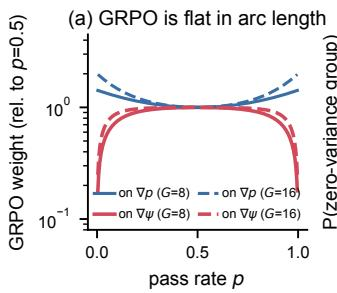

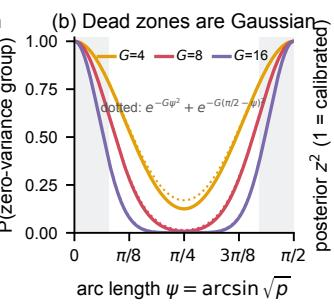

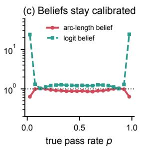

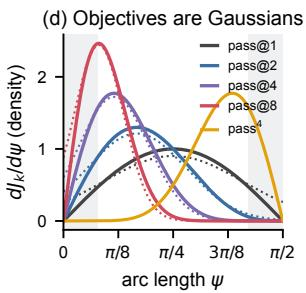  
Figure 1: Prompts live on an arc (exact curves). (a) GRPO’s expected update as a weight on $\nabla p$ is U-shaped (blue); as a weight on $\nabla \psi , \psi = \arcsin \sqrt { p } ,$ it is flat up to two ramps (red; Prop. 1). (b) Zero-variance probability (solid) and its Gaussian bound (dotted; Prop. 2). (c) After one group of $n { = } 8$ , arc-length posteriors are calibrated while logit posteriors are over-confident by 20× where zero-variance prompts live (Prop. 3). (d) Arc-length gradients of pass@k and $\mathrm { p a s s ^ { 4 } }$ (solid) and their Gaussian forms (dotted; Prop. 4).

$$
\hat { g } _ { q } = \frac { 1 } { G } \sum _ { i = 1 } ^ { G } \hat { A } _ { q , i } \nabla _ { \theta } \log \pi _ { \theta } ( o _ { i } \mid q )\tag{1}
$$

inside a clipped surrogate (Shao et al., 2024; Schulman et al., 2017). A group with m successes is informative iff $0 ~ < ~ m ~ < ~ G ;$ otherwise all advantages vanish. This happens with probability $1 - z _ { G }$ , where $z _ { G } ( p ) = p ^ { G } + ( 1 - p ) ^ { G }$ and $1 - z _ { G } = \operatorname { p a s s } \ @ G - \operatorname { p a s s } ^ { G } .$ : a group teaches only if one of its G attempts succeeds and one fails. $\mathbf { A }$ sampler includes prompt q in an update with probability $w _ { q }$

Arc length. Let ψ = arcsin ${ \sqrt { p } } \in [ 0 , { \frac { \pi } { 2 } } ]$ . The Fisher information of Bernoulli $( \sin ^ { 2 } \psi )$ about ψ is 4 for every $\psi _ { : }$ , so the Fisher–Rao distance between pass rates is $2 | \psi - \psi ^ { \prime } |$ and the Jeffreys prior is uniform in ψ (Rao, 1945; Jeffreys, 1946; Amari, 2016): $( { \sqrt { p } } , { \sqrt { 1 - p } } )$ traces a quarter circle and $\psi$ is its arc length. Proofs are in Appendix B.

Proposition 1 (GRPO is uniform in arc length). For binary rewards and population-statistics normalization $( \epsilon \mathrm { ~  ~ { ~  ~ } ~ } 0 )$ $\begin{array} { r l r } { \mathbb { E } [ \hat { g } _ { q } ] } & { { } = } & { 2 \omega _ { G } ( p _ { q } ) \nabla _ { \theta } \psi _ { q } } \end{array}$ with $\begin{array} { r l } { \omega _ { G } ( p ) } & { { } = } \end{array}$ $\mathbb { E } _ { m \sim \mathrm { B i n } ( G , p ) } \big [ \sqrt { m ( G - m ) } \big ] / \big ( G \sqrt { p ( 1 - p ) } \big )$ $M o r e o \nu e r ~ ( i ) ~ 0 ~ \leq ~ \omega _ { G } ~ \leq ~ \sqrt { 1 - 1 / G } ; ~ ( i i )$ $\begin{array} { r l r l } { \omega _ { G } } & { { } \to } & { 1 } \end{array}$ uniformly on every compact subset $o f \ ( 0 , 1 )$ as $\begin{array} { r l } { G } & { { } \to \quad \infty ; } \end{array}$ and (iii) $\begin{array} { r l r } { \omega _ { G } ( \psi ) } & { { } \le } & { \sqrt { G - 1 } } \end{array}$ min(tan ψ, cot ψ), with equality in the limits $\psi \to 0$ and $\psi  \frac { \pi } { 2 }$

Corollary 1 (Every sampler is an objective). If $w _ { q } = w ( \psi _ { q } )$ is held fixed within an update, then $\begin{array} { r } { \sum _ { q } w _ { q } \mathbb { E } [ \hat { g } _ { q } ] ~ = ~ \nabla _ { \theta } \sum _ { q } F _ { w } ( \psi _ { q } ) } \end{array}$ with $F _ { w } ( \psi ) =$ $\begin{array} { r } { 2 \int _ { 0 } ^ { \psi } w ( u ) \omega _ { G } ( u ) } \end{array}$ du. Uniform sampling recovers the arcsine objective of Davis and Recht (2025);

post-hoc filtering of zero-variance groups (DS) leaves $F _ { w }$ unchanged and only rescales it; and a Gaussian $w = \mathcal { N } ( \psi ^ { \star } , \sigma ^ { 2 } )$ in arc length yields ${ \cal F } _ { w } ~ \approx ~ \Phi \big ( ( \psi - \psi ^ { \star } ) / \sigma \big )$ , a smoothed count of prompts whose pass rate exceeds $\sin ^ { 2 } \psi ^ { \star }$

Proposition 2 (Zero-variance groups are Gaussian boundary layers). For all $\begin{array} { r } { \psi \in [ 0 , \frac { \pi } { 2 } ] , \ z _ { G } ( \psi ) = } \end{array}$ $\cos ^ { 2 G } \psi \ + \ \sin ^ { 2 G } \psi \ \leq \ e ^ { - G \psi ^ { 2 } } \ + \ e ^ { - G ( \pi / 2 - \psi ) ^ { 2 } }$ $\begin{array} { l } { { I f \ \psi } } \end{array} \sim \ { \mathcal N } ( \mu , P )$ , then $\begin{array} { r c l } { { \mathbb { E } \big [ e ^ { - G \psi ^ { 2 } } \big ] } } & { { = } } & { { ( 1 \ + } } \end{array}$ $2 G P ) ^ { - 1 / 2 } \exp \big ( - G \mu ^ { 2 } / ( 1 + 2 G P ) \big )$ , and symmetrically at ${ \frac { \pi } { 2 } } .$

Proposition 3 (Evidence is homoscedastic in arc length). Let $m \ \sim \ \mathrm { B i n } ( n , \sin ^ { 2 } \psi )$ (i) For $0 < m < n ,$ , the Laplace approximation of the likelihood has mean arcsin $\sqrt { m / n }$ and variance $1 / ( 4 n )$ , independent ofm; the Anscombe estimate $\dot { \psi } =$ arcsin $\sqrt { ( m + 3 / 8 ) / ( n + 3 / 4 ) }$ has variance $1 / ( 4 n ) + \dot { O ( n ^ { - 2 } ) }$ uniformly on compact subsets (Anscombe, 1948). (ii) For $m = 0 ( m = n )$ the likelihood $\cos ^ { 2 n } \psi \ ( \sin ^ { 2 n } \psi )$ is bounded by a Gaussian ofmean $\begin{array} { r } { 0 \left( \frac { \pi } { 2 } \right) } \end{array}$ and variance $1 / ( 2 n )$ . (iii) By contrast, the delta-method variance $o f \log \mathrm { i t } ( \hat { p } )$ $1 / ( n p ( 1 - p ) )$ , is unbounded as $p  \{ 0 , 1 \}$

Proposition 4 (Objectives are Gaussians in arc length). For real $k \_ 1$ $\begin{array} { r c l } { H _ { k } ( \psi ) } & { = } & { \frac { d } { d \psi } \big [ 1 - } \end{array}$ $\begin{array} { r c l } { { ( 1 ~ - ~ p ) ^ { k } } { \big ] } } & { { = } } & { { 2 k \sin \psi \cos ^ { 2 k - 1 } \psi ~ i s ~ . } } \end{array}$ a logconcave probability density on $[ 0 , \frac { \pi } { 2 } ]$ with mode $\psi _ { k } ^ { \star } \ = \ \arcsin ( 1 / \sqrt { 2 k } )$ , i.e. $p ^ { \star } ~ = ~ 1 / ( 2 k )$ , and $- \tilde { ( \log H _ { k } ) ^ { \prime \prime } } ( \psi _ { k } ^ { \star } ) = 4 k$ . Its Laplace approximation is $\mathcal { N } ( \psi _ { k } ^ { \star } , 1 / ( 4 k ) )$ $p a s s ^ { k }$ is the mirror image with mode arccos $( 1 / { \sqrt { 2 k } } )$ . Indexing the family by its mode gives the matched width $\sigma ( \psi ^ { \star } ) =$ min(sin ψ<sup>⋆</sup>, cos $\psi ^ { \star } ) / \sqrt { 2 } .$

Away from two ramps of width about $1 / { \sqrt { G } }$ GRPO extracts the same arc-length signal from every prompt (Proposition 1), so where to sample is a question about the objective and about waste. Proposition 2 turns waste into a Gaussian that integrates against any Gaussian belief, and Proposition 3 makes a linear–Gaussian filter the right belief model. Proposition 4 fixes the kernel: its curvature 4k equals the Fisher information of k Bernoulli draws, so an objective that counts k attempts resolves pass rates exactly as k samples do. The Laplace kernels match the exact ones within 0.05–0.07 total variation for $k \in [ 1 , 1 6 ]$ (Appendix B.10).

## 4 ARCUS

ARCUS replaces the prompt-sampling stage of GRPO (Figure 2, Algorithm 1); the advantage in Eq. (1), the clipped surrogate, and the optimizer are unchanged.

Arc-length beliefs. Each prompt carries a belief $\psi _ { q } \sim \mathcal { N } ( \mu _ { q } , P _ { q } )$ , initialized at the Jeffreys moments $\mathcal { N } ( \pi / 4 , \bar { \pi ^ { 2 } } / 4 8 )$ and, after the first hundred observations, at the empirical moments of observed prompts. Before each update, every belief is propagated as

$$
\mu _ { q }  \Pi \big [ \mu _ { q } + v _ { t } \sin { 2 \mu _ { q } } \big ] , \qquad P _ { q }  P _ { q } + Q _ { t } ,\tag{2}
$$

where Π projects onto $[ 0 , \frac { \pi } { 2 } ]$ . The drift $v _ { t }$ models the improving policy: a shared competence gain $\delta x$ in logit space moves ψ by $\textstyle { \frac { \delta x } { 4 } }$ sin $2 \psi .$ so mobility vanishes at both ends (Appendix $\mathbf { B } . 6 )$ ; the diffusion $Q _ { t }$ absorbs prompt-specific change. Both are fitted online by moment matching on the innovations of revisited prompts (Mehra, 1970). An observed group with m successes triggers a scalar Kalman update (Kalman, 1960), $K = P _ { q } / ( P _ { q } + R ) , \mu _ { q } $ $\Pi [ \mu _ { q } + K ( z - \mu _ { q } ) ] , P _ { q }  ( 1 - K ) P _ { q } ,$ whose observation follows Proposition 3:

$$
\begin{array} { r } { ( z , R ) = \left\{ \begin{array} { l l } { \left( \hat { \psi } _ { \mathrm { A } } ( m ) , \frac { 1 } { 4 G + 2 } \right) } & { 0 < m < G , } \\ { \left( 0 , \frac { 1 } { 2 G } \right) } & { m = 0 , } \\ { \left( \frac { \pi } { 2 } , \frac { 1 } { 2 G } \right) } & { m = G , } \end{array} \right. } \end{array}\tag{3}
$$

with $\hat { \psi } _ { \mathrm { A } }$ the Anscombe estimate. A zero-variance group is thus not wasted evidence: its boundarylayer likelihood pulls the belief into the corresponding dead zone.

Objective-matched scoring. For a target $\psi ^ { \star }$ , the kernel is $\mathcal { N } ( \psi ^ { \star } , \sigma ^ { 2 } )$ with $\sigma = \sigma ( \psi ^ { \star } )$ from Proposition 4. Its overlap with the belief and the probability of an informative group (Proposition 2) are both closed form; with $a _ { q } = 1 + 2 G P _ { q } ,$

$$
\begin{array} { c } { { \kappa _ { q } ( \psi ^ { \star } ) = \sqrt { \frac { \sigma ^ { 2 } } { \sigma ^ { 2 } + P _ { q } } } \ e ^ { - \frac { ( \mu _ { q } - \psi ^ { \star } ) ^ { 2 } } { 2 ( \sigma ^ { 2 } + P _ { q } ) } } , } } \\ { { \hat { y } _ { q } = 1 - \frac { e ^ { - G \mu _ { q } ^ { 2 } / a _ { q } } + e ^ { - G ( \frac { \pi } { 2 } - \mu _ { q } ) ^ { 2 } / a _ { q } } } { \sqrt { a _ { q } } } . } } \end{array}\tag{4}
$$

The score $s _ { q } ( \psi ^ { \star } ) = \kappa _ { q } ( \psi ^ { \star } ) \hat { y } _ { q }$ weighs the objective relevance of q by the chance that its rollouts produce any gradient (Appendix B.7). Uncertainty adds $P _ { q }$ to the kernel variance, which widens the window for rarely seen prompts and revisits them. ARCUS draws $M = \lceil ( 1 + \rho ) B \rceil$ candidates by Gumbel-top-M on log $s _ { q } / T$ (Kool et al., 2019), i.e. without replacement with probability ∝ $s _ { q } ^ { 1 / T }$

Frontier pacing. Harder targets push coverage but approach the lower dead zone, and Proposition 2 predicts this cost before it is paid. For each target ψ on a grid Ψ from pass@G to $\mathrm { p a s s } ^ { G }$ (the objectives a group of G can express), we predict the candidate yield $\begin{array} { r } { \widehat { Y } _ { t } ( \psi ) = \frac { \bar { 1 } } { M } \sum _ { q } \pi _ { q } ( \psi ) \hat { y } _ { q } , } \end{array}$ with capped-proportional inclusion probabilities $\pi _ { q } = \operatorname* { m i n } ( 1 , c s _ { q } ( \psi ) ^ { 1 / T } ) , \sum _ { q } \pi _ { q } = M$ . The target is the hardest admissible one,

$$
\begin{array} { r } { \tilde { \psi } _ { t } = \operatorname* { m i n } \big \{ \psi \in \Psi : \widehat { Y } _ { t } ( \psi ) \geq \operatorname* { m a x } _ { \psi ^ { \prime } } \widehat { Y } _ { t } ( \psi ^ { \prime } ) - \varepsilon \big \} , } \end{array}\tag{5}
$$

rate-limited by $| \psi _ { t } ^ { \star } - \psi _ { t - 1 } ^ { \star } | \leq \Delta$ and held at pass@1 $( \psi ^ { \star } { = } \pi / 4 )$ during a warm-up pass over the pool. With sharp beliefs, Eq. (5) settles where $z _ { G } ( \psi ) = 2 ^ { 1 - G } + \varepsilon$ , i.e. ψ ≈ $\sqrt { \ln ( 1 / ( \varepsilon + 2 ^ { 1 - G } ) ) / G }$ , so the reachable objective hardens as G grows, a testable prediction (§5.4). By Corollary 1, pacing is a homotopy through objectives: GRPO ascends a smoothed count of prompts with $p _ { q } > \sin ^ { 2 } \psi _ { t } ^ { \star }$ , whose threshold hardens while waste stays bounded.

Post-rollout selection. All M candidates update their beliefs; the informative groups, at most B of them ranked by updated score, enter the GRPO update. Dropping zero-variance groups leaves the expected update unchanged (Corollary 1) and removes their backward cost.

Cost. All quantities are closed-form scalars per prompt; pacing over $\left| \Psi \right| { = } 4 1$ targets costs $O ( N | \Psi | )$ vector operations, under 0.1 s per step for $N { \approx } 1 7 \mathrm { k } .$ ARCUS adds no forward pass, auxiliary model, or prediction rollout; its only extra rollouts are the $\rho B G$ candidate margin.

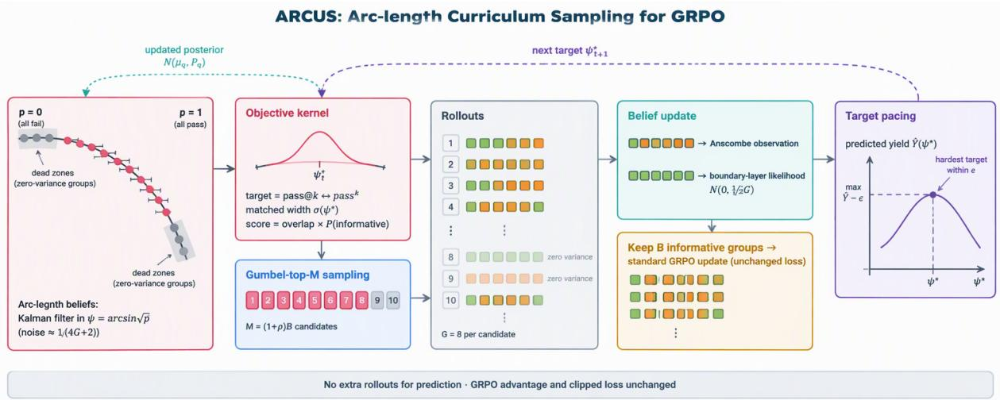  
Figure 2: ARCUS within one GRPO step. Beliefs live on the arc $\psi = \arcsin { \sqrt { p } } .$ . An objective-matched Gaussian kernel at the paced target $\psi _ { t } ^ { \star }$ scores prompts; Gumbel-top-M candidates are rolled out and update the beliefs; only informative groups enter the unchanged GRPO update; pacing moves $\psi _ { t } ^ { \star }$ to the hardest objective whose predicted yield stays within ε of the best.

```latex
Algorithm 1: ARCUS: one GRPO step
Input: beliefs $\{ ( \mu _ { q } , P _ { q } ) _ { . }$ }; target $\psi _ { t - 1 } ^ { \star } ;$ batch $B ,$
group $G ; \rho , \varepsilon , T , \Delta$
Predict all beliefs with Eq. (2)
if warm-up then
$\psi _ { t } ^ { \star } \gets \pi / 4$
else
$\psi _ { t } ^ { \star } \gets \mathrm { E q . } ( 5 )$ , clipped to $\psi _ { t - 1 } ^ { \star } \pm \Delta$
end
$\begin{array} { r } { s _ { q } \gets \kappa _ { q } \big ( \psi _ { t } ^ { \star } \big ) \hat { y } _ { q } } \end{array}$ $\underline { { / / } } \ \mathsf { E q . } \ ( 4 )$
C ← Gumbel-top-M of log $s _ { q } / T , M = \lceil ( 1 + ^ { \cdot } \dot { \rho } ) \dot { B } \rceil$
Generate G rollouts for each $q \in { \mathcal { C } } ;$ record $m _ { q }$
Kalman-update $\{ ( \mu _ { q } , P _ { q } ) \} _ { q \in \mathcal { C } }$ with Eq. (3); update
$v _ { t } , Q _ { t }$
B ← informative groups in C, top-B by $s _ { q } ( \psi _ { t } ^ { \star } )$
GRPO update on B with Eq. (1) (unchanged)
```

Existing selectors as special cases. The geometry also locates prior heuristics. DS is objectiveneutral (Corollary 1): it buys a cleaner batch in the arcsine direction with extra rollouts. Learnability sampling by $p ( 1 - p )$ (Foster et al., 2025) equals ${ \textstyle \frac { 1 } { 4 } } \bar { H _ { 1 } ( \psi ) ^ { 2 } }$ , a pass@1 kernel narrowed from $\sigma { = } 1 / 2$ to $1 / ( 2 \sqrt { 2 } )$ , and the $\sqrt { p ( 1 - p ) }$ score inside CurES’s softmax (Zeng et al., 2025a) is ${ \scriptstyle { \frac { 1 } { 2 } } } H _ { 1 }$ A Gaussian over raw p (Lin et al., 2026) matches no member of the objective family: in arc length its width varies as $\sigma _ { p } /$ sin $2 \psi$ , so its shape is set by the parameterization rather than by an objective. Logit filters (Zhu et al., 2026) are linear–Gaussian in the one coordinate where the noise of zero-variance evidence is unbounded (Proposition 3). Each is ARCUS with one of its three choices made differently: a fixed target, a mismatched width, or a

mismatched coordinate.

## 5 Experiments

## 5.1 Setup

Models, data, and training. We train Qwen2.5- Math-1.5B/7B (Yang et al., 2024) and Qwen3- 4B-Base (Yang et al., 2025) on DAPO-Math-17k (Yu et al., 2025) with binary rule-based rewards; since Qwen2.5-Math can respond to spurious signals (Shao et al., 2025), Appendix F adds a non-Qwen backbone, a long-CoT model, and a second pool. All methods share the GRPO loss (Shao et al., 2024) in verl (Sheng et al., 2025) with vLLM (Kwon et al., 2023): B=256, G=8, 300 policy updates, learning rate $1 0 ^ { - 6 }$ , clip 0.2, no KL. They differ only in which prompts are rolled out and which groups enter the update, and are compared at matched updates. ARCUS uses ρ=0.25, ε=0.03, T=0.3, ∆=0.005 rad, |Ψ|=41 throughout; $\mathbf { A R C U S } _ { \rho = 0 }$ matches GRPO’s rollout budget. We evaluate on AIME24/25, AMC23, MATH500 (Hendrycks et al., 2021; Lightman et al., 2024), Minerva (Lewkowycz et al., 2022), and OlympiadBench (He et al., 2024) (temperature 0.6, top-p 0.95; details in Appendix E).

Baselines. Uniform GRPO; evaluate-then-filter DS (Yu et al., 2025) and GRESO (Zheng et al., 2025a), which fill the batch with informative groups at extra rollout cost; and the rollout-free GCS (Gaussian over EMA pass rates, µ=0.5, σ=0.35) (Lin et al., 2026), AdaRFT (Shi et al.,

<table><tr><td>Method</td><td>Roll.</td><td>AIME24</td><td>AIME25</td><td>AMC23</td><td>MATH500</td><td>Minerva</td><td>Olymp.</td><td>Avg.</td><td>Δ</td></tr><tr><td colspan="10">Qwen2.5-Math-1.5B (DAPO-Math-17k, 300 updates)</td></tr><tr><td>Base model GRPO</td><td>×1.00</td><td>7.4 15.1</td><td>3.9 9.4</td><td>28.6 47.9</td><td>42.3 73.2</td><td>12.1 28.7</td><td>20.8 34.6</td><td>19.2 34.8</td><td></td></tr><tr><td>GCS</td><td>×1.00</td><td>15.4</td><td>9.8</td><td>48.3</td><td>73.4</td><td>28.9</td><td>34.9</td><td>35.1</td><td>+0.3</td></tr><tr><td>AdaRFT</td><td>×1.00</td><td>15.8</td><td>9.6</td><td>48.6</td><td>73.9</td><td>28.6</td><td>35.2</td><td>35.3</td><td>+0.5</td></tr><tr><td>CurES</td><td>×1.00</td><td>16.1</td><td>10.2</td><td>49.0</td><td>73.6</td><td>29.4</td><td>35.3</td><td>35.6</td><td>+0.8</td></tr><tr><td>MoPPS</td><td>×1.00</td><td>16.3</td><td>10.0</td><td>49.4</td><td>74.1</td><td>29.0</td><td>35.6</td><td>35.7</td><td>+0.9</td></tr><tr><td>DPS</td><td>×1.00</td><td>16.8</td><td>10.5</td><td>49.9</td><td>74.3</td><td>29.6</td><td>36.0</td><td>36.2</td><td>+1.4</td></tr><tr><td>KGPS</td><td>×1.00</td><td>16.6</td><td>10.9</td><td>50.1</td><td>74.5</td><td>29.9</td><td>35.9</td><td>36.3</td><td>+1.5</td></tr><tr><td>GRESO</td><td>×1.97</td><td>16.0</td><td>10.3</td><td></td><td></td><td></td><td></td><td></td><td></td></tr><tr><td>DS</td><td>×2.94</td><td>16.9</td><td>10.6</td><td>49.2 50.4</td><td>74.4 75.3</td><td>29.3 29.5</td><td>35.8 36.3</td><td>35.8 36.5</td><td>+1.0 +1.7</td></tr><tr><td></td><td>×1.00</td><td>17.6</td><td>11.4</td><td>51.2</td><td></td><td>30.1</td><td>36.8</td><td>37.0</td><td>+2.1</td></tr><tr><td>ARCUSρ=0 ARCUS</td><td>×1.25</td><td>18.5</td><td>11.9</td><td>52.3</td><td>74.7 75.2</td><td>30.6</td><td>37.4</td><td>37.6</td><td>+2.8</td></tr><tr><td colspan="10">Qwen2.5-Math-7B (DAPO-Math-17k, 300 updates)</td></tr><tr><td>Base model GRPO</td><td>×1.00</td><td>13.2 30.4</td><td>6.1 13.1</td><td>40.3 62.8</td><td>58.4 80.4</td><td>16.5 36.3</td><td>26.1 41.5</td><td>26.8 44.1</td><td></td></tr><tr><td></td><td></td><td></td><td></td><td></td><td></td><td></td><td></td><td></td><td></td></tr><tr><td>GCS AdaRFT</td><td>×1.00 ×1.00</td><td>30.9</td><td>13.8 13.6</td><td>63.2</td><td>80.7</td><td>36.5</td><td>41.8 42.0</td><td>44.5 44.6</td><td>+0.4 +0.5</td></tr><tr><td></td><td></td><td>31.2</td><td></td><td>63.5</td><td>80.8</td><td>36.6</td><td>42.2</td><td>45.0</td><td>+0.9</td></tr><tr><td>CurES</td><td>×1.00</td><td>31.5</td><td>14.3</td><td>63.9</td><td>80.9</td><td>37.2</td><td></td><td>45.0</td><td>+0.9</td></tr><tr><td>MoPPS</td><td>×1.00</td><td>31.8</td><td>14.1</td><td>64.0</td><td>81.0</td><td>36.9</td><td>42.4</td><td></td><td>+1.3</td></tr><tr><td>DPS KGPS</td><td>×1.00 ×1.00</td><td>32.1 32.4</td><td>14.5</td><td>64.8</td><td>81.2</td><td>37.0</td><td>42.7</td><td>45.4</td><td></td></tr><tr><td></td><td></td><td></td><td>14.8</td><td>64.6</td><td>81.3</td><td>38.0</td><td>42.9</td><td>45.7</td><td>+1.6</td></tr><tr><td>GRESO</td><td>×1.71</td><td>31.9</td><td>14.0</td><td>64.3</td><td>81.4</td><td>36.7</td><td>42.6</td><td>45.2</td><td>+1.1</td></tr><tr><td>DS</td><td>×2.41</td><td>32.6</td><td>14.6</td><td>64.9</td><td>81.9</td><td>37.1</td><td>43.1</td><td>45.7</td><td>+1.6</td></tr><tr><td>ARCUSρ=0 ARCUS</td><td>×1.00 ×1.25</td><td>33.5 34.6</td><td>15.4 16.2</td><td>65.9 66.7</td><td>81.6 81.8</td><td>37.5 37.8</td><td>43.6 44.3</td><td>46.2 46.9</td><td>+2.2 +2.8</td></tr><tr><td colspan="10">Qwen3-4B-Base (DAPO-Math-17k, 300 updates)</td></tr><tr><td>Base model GRPO</td><td>×1.00</td><td>9.8 24.6</td><td>7.5 20.3</td><td>37.6</td><td>64.2</td><td>25.8</td><td>33.4</td><td>29.7</td><td></td></tr><tr><td></td><td></td><td></td><td></td><td>61.5</td><td>83.6</td><td>39.4</td><td>48.2</td><td>46.3</td><td>一</td></tr><tr><td>GCS</td><td>×1.00</td><td>25.1</td><td>20.6</td><td>61.9</td><td>83.8</td><td>39.7</td><td>48.4</td><td>46.6</td><td>+0.3</td></tr><tr><td>AdaRFT</td><td>×1.00</td><td>25.4</td><td>20.9</td><td>62.3</td><td>83.7</td><td>39.5</td><td>48.8</td><td>46.8</td><td>+0.5 +0.9</td></tr><tr><td>CurES</td><td>×1.00</td><td>25.9</td><td>21.4</td><td>62.6</td><td>84.1</td><td>40.1</td><td>49.0</td><td>47.2</td><td>+1.0</td></tr><tr><td>MoPPS</td><td>×1.00</td><td>26.1</td><td>21.2</td><td>63.0</td><td>84.2</td><td>39.8</td><td>49.3</td><td>47.3</td><td></td></tr><tr><td>DPS</td><td>×1.00</td><td>26.5</td><td>21.9</td><td>63.4</td><td>84.3</td><td>40.3</td><td>49.6</td><td>47.7</td><td>+1.4</td></tr><tr><td>KGPS</td><td>×1.00</td><td>26.8</td><td>21.7</td><td>63.7</td><td>84.6</td><td>40.6</td><td>49.5</td><td>47.8</td><td>+1.5</td></tr><tr><td>GRESO</td><td>×1.83</td><td>25.8</td><td>21.6</td><td>62.8</td><td>84.5</td><td>40.0</td><td>49.4</td><td>47.3</td><td>+1.1</td></tr><tr><td>DS</td><td>×2.63</td><td>26.9</td><td>22.1</td><td>63.6</td><td>85.3</td><td>40.2</td><td>49.9</td><td>48.0</td><td>+1.7</td></tr><tr><td> $\mathbf { A R C U S } _ { \rho = 0 }$ </td><td>×1.00</td><td>27.7</td><td>22.8</td><td>64.5</td><td>84.8</td><td>40.9</td><td>50.3</td><td>48.5</td><td>+2.2</td></tr><tr><td>ARCUS</td><td>×1.25</td><td>28.9</td><td>23.6</td><td>65.4</td><td>85.1</td><td>41.3</td><td>50.9</td><td>49.2</td><td>+2.9</td></tr></table>

Table 1: Main results (accuracy, %, mean of three seeds; AIME mean@32, AMC23 mean@16, others mean@4). Groups: uniform, predict-then-select, evaluate-then-filter, ours. Roll.: generated rollouts relative to GRPO at equal policy updates; ∆: average gain over GRPO. Bold/underline: best/second best among trained models.

2026), CurES (Zeng et al., 2025a), MoPPS (Qu et al., 2026a), DPS (Mao et al., 2026a), and KGPS (Zhu et al., 2026), with recommended settings.

## 5.2 Main Results

ARCUS attains the best average on all three backbones (Table 1): 37.6, 46.9, and 49.2, i.e. +2.8 to +2.9 over GRPO and +1.1 to +1.2 over DS, the strongest baseline, at ×1.25 GRPO’s rollouts against ×2.4–2.9 for DS. First, the rollout-matched $\mathbf { A R C U S } _ { \rho = 0 }$ already exceeds every predict-thenselect method by 0.6–0.7 points and DS on every backbone, so the gain does not come from the candidate margin. Second, selectors that model uncertainty and change (DPS, KGPS) beat those that rank point estimates (GCS, AdaRFT); GCS, a Gaussian over raw pass rates, barely helps: a Gaussian works only in the right coordinate and width. Third, gains concentrate on hard benchmarks: on Qwen2.5-Math-7B, +4.2 on AIME24 and +3.9 on AMC23 but +1.4 on MATH500, where DS stays best on every backbone, as expected from a target that spends the budget on prompts the policy cannot yet solve reliably.

<table><tr><td>Method</td><td>Roll. Tok. (M) (B)</td><td>Yield (%)</td><td>(%)</td><td>Inf. Hours Avg.</td><td></td></tr><tr><td>GRPO</td><td>0.61 0.50</td><td>47</td><td>47</td><td>19.8</td><td>44.1</td></tr><tr><td>MoPPS</td><td>0.61 0.52</td><td>69</td><td>69</td><td>19.9</td><td>45.0</td></tr><tr><td>KGPS</td><td>0.61 0.52</td><td>75</td><td>75</td><td>20.0</td><td>45.7</td></tr><tr><td>GRESO</td><td>1.05 0.93</td><td>58</td><td>100</td><td>30.7</td><td>45.2</td></tr><tr><td>DS</td><td>1.48 1.33</td><td>41</td><td>100</td><td>41.6</td><td>45.7</td></tr><tr><td> $\mathbf { A R C U S } _ { \rho = 0 }$ </td><td>0.61 0.53</td><td>81</td><td>81</td><td>20.0</td><td>46.2</td></tr><tr><td>ARCUS</td><td>0.77 0.66</td><td>79</td><td>97</td><td>24.1</td><td>46.9</td></tr></table>

Table 2: Cost on Qwen2.5-Math-7B (300 updates, 8×H100): rollouts (M), tokens (B), yield (informative share of generated groups), Inf. (informative share of the update batch), wall-clock hours, and six-benchmark average.

Efficiency. ARCUS raises the informative share of generated groups from 47% (GRPO) to 79% (81% for $\mathbf { A R C U S } _ { \rho = 0 } )$ , above the best predictive selector (KGPS, 75%; Table 2); DS gets a clean batch by discarding most of what it generates (41% yield). With a 25% margin, ARCUS’s update batch is 97% informative while it generates 48% fewer rollouts and 50% fewer tokens than DS and finishes in 24.1 h instead of 41.6 h. Per unit of compute (Figure 3b), it reaches DS’s final accuracy after 0.45M rollouts, 70% fewer than DS, and every $\rho \in \{ 0 , 0 . 1 , 0 . 2 5 , 0 . 5 \}$ lies above the baselines cost–accuracy frontier (Figure 3d).

## 5.3 Ablations

Table 3 removes one ingredient at a time (Qwen2.5- Math-7B). Geometry matters most: the same pipeline with a Gaussian over raw pass rates loses 0.69, and a logit-space Kalman belief loses 0.96; the latter is over-confident on near-zero-variance prompts (Figure 1c) and its update batch is 7 points less informative. The dead-zone factor yˆ is the key kernel component (−1.03); without it hard targets pull candidates into the all-fail layer. A fixed width (−0.42) and ignoring belief variance (−0.35) matter less. Pacing beats fixed objectives: holding pass@1 loses 0.62, jumping straight to the final target loses 0.76 because early beliefs cannot support it, and AdaRFT-style reward feedback loses 0.85. Greedy selection and dropping post-rollout ranking lose 0.53 and 0.29. Appendix F adds drift, prior, and observation ablations, the exact kernel (46.87 vs. 46.90), and sensitivity $\mathrm { t o } \varepsilon , T , \rho ,$ and G.

<table><tr><td>Configuration</td><td>Avg.</td><td>Δ</td><td>Inf. (%)</td></tr><tr><td>ARCUS (full)</td><td>46.90</td><td></td><td>97</td></tr><tr><td>Geometry and belief Gaussian over raw p</td><td>46.21-0.69</td><td></td><td>93</td></tr><tr><td>Logit-space Kalman belief</td><td>45.94</td><td>-0.96</td><td>90</td></tr><tr><td>Discounted Beta belief</td><td>46.02</td><td>-0.88</td><td>91</td></tr><tr><td></td><td></td><td></td><td></td></tr><tr><td>Objective kernel Fixed width σ=0.20 rad</td><td>46.48</td><td>-0.42</td><td>96</td></tr><tr><td>No belief variance in kernel</td><td>46.55</td><td></td><td></td></tr><tr><td>No dead-zone factor û</td><td>45.87</td><td>-0.35 -1.03</td><td>95 84</td></tr><tr><td></td><td></td><td></td><td></td></tr><tr><td>Target pacing Fixed pass@1 target</td><td>46.28-0.62</td><td></td><td>98</td></tr><tr><td>Fixed frontier target  $( p ^ { \star } { = } 0 . 2 9 )$ </td><td>46.14</td><td>-0.76</td><td>92</td></tr><tr><td>Reward-feedback pacing</td><td>46.05</td><td>-0.85</td><td>93</td></tr><tr><td>Sampling and selection</td><td></td><td></td><td></td></tr><tr><td>No post-rollout selection</td><td></td><td>46.61-0.29</td><td>97</td></tr><tr><td>Greedy top-M (T=0)</td><td></td><td>46.37-0.53</td><td>95</td></tr></table>

Table 3: Ablations on Qwen2.5-Math-7B (sixbenchmark average; Inf.: informative share of the update batch).

## 5.4 Mechanism Analysis

The target finds a G-dependent frontier. After warm-up the paced target leaves pass@1 and settles at $p ^ { \star } \approx 0 . 2 9$ for $G { = } 8 , 0 . 4 3$ for G=4, and 0.18 for G=16 (Figure 4a), within 0.05 of the closed-form frontier. Larger groups thin the lower dead zone, so harder objectives become affordable: with G=16 the run reaches pass@k with $k \approx 2 . 8$ at no extra waste (accuracies in Appendix F). The resulting easy-to-hard curriculum is emergent; nothing is scheduled by hand.

Beliefs stay calibrated and fresh. ARCUS removes most zero-variance waste after the first pass over the pool (Figure 4b). Its pass-rate error on selected prompts falls to 0.09, versus 0.12 for discounted Beta posteriors and 0.17 for a logit Kalman filter (Figure 4c), and its normalized innovations stay near one (Figure 7c). Figure 4d exposes a shared failure of history-based selectors: beliefs go stale in a predictable direction, because a prompt that looked intermediate when last seen is easier now, so MoPPS and KGPS drift toward prompts with true pass rates of 0.75–0.8. ARCUS’s drift anticipates this, keeping the selected median near 0.5 while its lower quartile extends toward harder prompts.

The target is the objective. Freezing the target along the objective family trades pass@1 against pass@16 as Corollary 1 predicts (Figure 3c): pass<sup>k</sup> targets sharpen easy prompts and lose coverage, and pass@k targets gain coverage until the dead zone eats the yield (pass@8: 47% yield). The paced target beats every fixed objective on pass@1 and is within 0.2 of the best on pass@16 (69.6 vs. 66.3 for GRPO), matching its higher entropy (Figure 7).

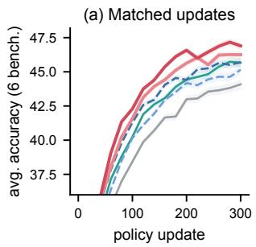

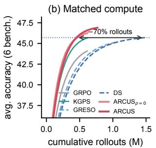

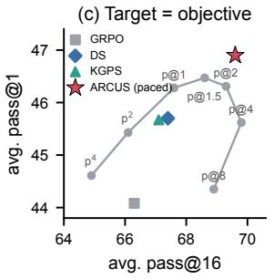

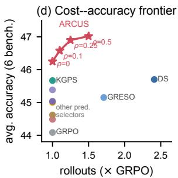

Figure 3: Accuracy, efficiency, and objective control (Qwen2.5-Math-7B). (a) Six-benchmark average vs. policy updates (±1 s.d.). (b) The same runs vs. cumulative rollouts. (c) Fixed targets along the objective family (gray; $\boldsymbol { \mathrm { p } } ^ { k } =$ pass<sup>k</sup>) trade pass@1 against pass@16; the paced target dominates. (d) Cost–accuracy plane; ARCUS’s curve varies $\rho .$  
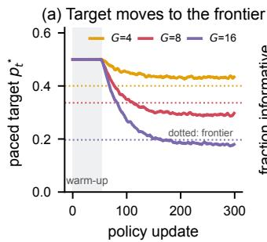

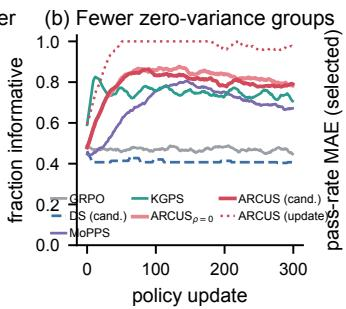

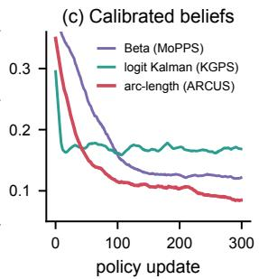

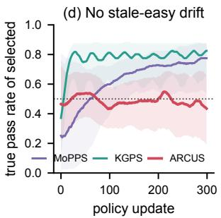  
Figure 4: How ARCUS works (Qwen2.5-Math-7B). (a) Paced target $p _ { t } ^ { \star } = \sin ^ { 2 } \psi _ { t } ^ { \star }$ for three group sizes (dotted: sharp-belief frontier). (b) Informative share of generated groups (dotted red: ARCUS’s update batch). (c) Pass-rate error of the selected prompts. (d) Median and inter-quartile band of the true pass rate of selected prompts.

## 5.5 Generality

The gains are not tied to one backbone, loss, or group size (Appendix F). On the long-CoT DeepSeek-R1-Distill-Qwen-1.5B with an 8k limit, ARCUS improves GRPO by +2.4 and DS by +1.1. On Llama-3.2-3B-Instruct, whose pool is dominated by all-fail groups and where DS needs ×3.5 rollouts, the gains are +1.9 and +0.8. With MATHtrain instead of DAPO-Math-17k as the pool, they are +2.2 and +0.9. Replacing the GRPO loss by the DAPO token-level loss, Dr. GRPO, or RLOO keeps a margin of +1.1 to +1.2 over DS, although for the last two the native coordinate is p and the kernel must be reweighted (Appendix C). Across $G \in \{ 4 , 8 , 1 6 \}$ the margin over DS is +1.2 to +1.5 while DS’s overhead falls from ×3.4 to ×2.0, so the benefit of predicting waste instead of paying for it persists even when waste itself shrinks.

## 6 Conclusion

GRPO has a native geometry for pass rates, the Fisher–Rao arc $\psi$ = arcsin ${ \sqrt { p } } ;$ , on which its update is uniform, zero-variance groups are Gaussian boundary layers, evidence has constant noise, and pass@k objectives are Gaussians. A prompt curriculum should therefore be a Gaussian in arc length whose center is an objective. ARCUS realizes this as a rollout-free sampler with closed-form scoring and objective pacing that leaves GRPO’s loss untouched and improves accuracy while generating half the rollouts of dynamic sampling. The geometry applies wherever group-normalized binary rewards appear, including code, agents, and test-time allocation.

## Limitations

ARCUS is derived for binary rewards and the standard-deviation normalization of GRPO. Variants without that normalization, such as Dr. GRPO, have a different native coordinate (Appendix C), and continuous rewards require binarization or a new variance-stabilizing map. The sampler– objective correspondence treats prompts as having separate gradients and ignores transfer between prompts; transfer is what makes the drift term necessary, and our global drift is a first-order model of it. The pacing rule encodes one preference: the hardest objective within a yield slack. Practitioners who value reliability over coverage may prefer another point on the objective family. Our experiments cover mathematical reasoning with models up to 7B parameters and $G \leq 1 6 ;$ code, agentic tasks, and larger scales remain to be tested.

## Ethics Statement

ARCUS changes only which training prompts receive rollouts, so it inherits the risks of the models and data it is applied to. By reducing generated rollouts and tokens, it lowers the energy cost of RLVR post-training. All datasets and benchmarks are public and used under their licenses; no human subjects or personal data are involved. AI assistants were used for language editing and for checking LaTeX; the method, proofs, and experimental design are the authors’ own, and every reference was checked against its primary source.

## References

Zhihong Shao, Peiyi Wang, Qihao Zhu, Runxin Xu, Junxiao Song, Xiao Bi, Haowei Zhang, Mingchuan Zhang, Y. K. Li, Y. Wu, and Daya Guo. 2024. DeepSeekMath: Pushing the limits of mathematical reasoning in open language models. arXiv preprint arXiv:2402.03300.

DeepSeek-AI, Daya Guo, Dejian Yang, Haowei Zhang, Junxiao Song, Peiyi Wang, Qihao Zhu, Runxin Xu, Ruoyu Zhang, Shirong Ma, Xiao Bi, Xiaokang Zhang, Xingkai Yu, Yu Wu, Z. F. Wu, Zhibin Gou, Zhihong Shao, Zhuoshu Li, Ziyi Gao, and 181 others. 2025. DeepSeek-R1: Incentivizing reasoning capability in LLMs via reinforcement learning. arXiv preprint arXiv:2501.12948.

Kimi Team, Angang Du, Bofei Gao, Bowei Xing, Changjiu Jiang, Cheng Chen, Cheng Li, Chenjun Xiao, Chenzhuang Du, Chonghua Liao, Chuning Tang, Congcong Wang, Dehao Zhang, Enming Yuan, Enzhe Lu, Fengxiang Tang, Flood Sung, Guangda Wei, Guokun Lai, and 77 others. 2025. Kimi k1.5: Scaling reinforcement learning with LLMs. arXiv preprint arXiv:2501.12599.

Nathan Lambert, Jacob Morrison, Valentina Pyatkin, Shengyi Huang, Hamish Ivison, Faeze Brahman, Lester James V. Miranda, Alisa Liu, Nouha Dziri, Shane Lyu, Yuling Gu, Saumya Malik, Victoria Graf, Jena D. Hwang, Jiangjiang Yang, Ronan Le Bras, Oyvind Tafjord, Chris Wilhelm, Luca Soldaini, and 4 others. 2024. Tulu 3: Pushing frontiers in open language model post-training. arXiv preprint arXiv:2411.15124.

Qiying Yu, Zheng Zhang, Ruofei Zhu, Yufeng Yuan, Xiaochen Zuo, Yu Yue, Weinan Dai, Tiantian Fan, Gaohong Liu, Lingjun Liu, Xin Liu, Haibin Lin, Zhiqi Lin, Bole Ma, Guangming Sheng, Yuxuan Tong, Chi Zhang, Mofan Zhang, Wang Zhang, and 16 others. 2025. DAPO: An open-source LLM reinforcement learning system at scale. arXiv preprint arXiv:2503.14476.

Haizhong Zheng, Yang Zhou, Brian R. Bartoldson, Bhavya Kailkhura, Fan Lai, Jiawei Zhao, and Beidi Chen. 2025a. Act only when it pays: Efficient reinforcement learning for LLM reasoning via selective rollouts. arXiv preprint arXiv:2506.02177.

Thanh-Long V. Le, Myeongho Jeon, Kim Vu, Viet Lai, and Eunho Yang. 2026. No prompt left behind: Exploiting zero-variance prompts in LLM reinforcement learning via entropy-guided advantage shaping. In The Fourteenth International Conference on Learning Representations.

Sanghwan Bae, Jiwoo Hong, Min Young Lee, Hanbyul Kim, Jeongyeon Nam, and Donghyun Kwak. 2026. Online difficulty filtering for reasoning oriented reinforcement learning. In Proceedings of the 19th Conference of the European Chapter of the Association for Computational Linguistics (Volume 1: Long Papers), pages 700–719, Rabat, Morocco. Association for Computational Linguistics.

Yun Qu, Qi Wang, Yixiu Mao, Vincent Tao Hu, Björn Ommer, and Xiangyang Ji. 2026a. Can prompt difficulty be online predicted for accelerating RL finetuning of reasoning models? In Proceedings ofthe 32nd ACM SIGKDD Conference on Knowledge Discovery and Data Mining, Volume 1, pages 1240–1250. ACM.

Yixiu Mao, Yun Qu, Qi Wang, Heming Zou, and Xiangyang Ji. 2026a. Dynamics-predictive sampling for active RL finetuning of large reasoning models. In The Fourteenth International Conference on Learning Representations.

Haodong Zhu, Yangyang Ren, Yanjing Li, Sheng Xu, Haiguang Liu, Linlin Yang, and Baochang Zhang. 2026. Kalman meets curriculum: Efficient dynamic prompt selection for adaptive RL finetuning. arXiv preprint arXiv:2607.27610.

Mingxiong Lin, Zhangquan Gong, Maowen Tang, Qian Li, Chuangchuang Wang, Jian Ma, Sutian Huang, Kai Tang, and Haonan Lu. 2026. FG-ExPO: Frontierguided exploration-prioritized policy optimization via adaptive KL and Gaussian curriculum. arXiv preprint arXiv:2605.11403.

Yongcheng Zeng, Zexu Sun, Bokai Ji, Erxue Min, Hengyi Cai, Shuaiqiang Wang, Dawei Yin, Haifeng Zhang, Xu Chen, and Jun Wang. 2025a. CurES: From gradient analysis to efficient curriculum learning for reasoning LLMs. arXiv preprint arXiv:2510.01037.

Taiwei Shi, Yiyang Wu, Linxin Song, Tianyi Zhou, and Jieyu Zhao. 2026. Efficient reinforcement finetuning via adaptive curriculum learning. Transactions on Machine Learning Research.

Xiaoyin Chen, Jiarui Lu, Minsu Kim, Dinghuai Zhang, Jian Tang, Alexandre Piché, Nicolas Gontier, Yoshua Bengio, and Ehsan Kamalloo. 2025a. Self-evolving curriculum for LLM reasoning. arXiv preprint arXiv:2505.14970.

Damek Davis and Benjamin Recht. 2025. What is the objective of reasoning with reinforcement learning? arXiv preprint arXiv:2510.13651.

Youssef Mroueh. 2025. Reinforcement learning with verifiable rewards: GRPO’s effective loss, dynamics, and success amplification. arXiv preprint arXiv:2503.06639.

C. Radhakrishna Rao. 1945. Information and the accuracy attainable in the estimation of statistical parameters. Bulletin ofthe Calcutta Mathematical Society, 37:81–91.

Shun-ichi Amari. 2016. Information Geometry and Its Applications. Applied Mathematical Sciences. Springer, Tokyo.

Yun Qu, Qi Wang, Yixiu Mao, Heming Zou, Yuhang Jiang, Weijie Liu, Clive Bai, Kai Yang, Yangkun Chen, Saiyong Yang, and Xiangyang Ji. 2026b. Small generalizable prompt predictive models can steer efficient RL post-training of large reasoning models. arXiv preprint arXiv:2602.01970.

Guochao Jiang, Wenfeng Feng, Guofeng Quan, Chuzhan Hao, Yuewei Zhang, Guohua Liu, and Hao Wang. 2025. VCRL: Variance-based curriculum reinforcement learning for large language models. arXiv preprint arXiv:2509.19803.

Chenxi Liu, Junjie Liang, Yuqi Jia, Bochuan Cao, Yang Bai, Heng Huang, and Xun Chen. 2025a. Explore data left behind in reinforcement learning for reasoning language models. arXiv preprint arXiv:2511.04800.

Yixiu Mao, Yun Qu, Qi Wang, Heming Zou, and Xiangyang Ji. 2026b. RLVR without ineffective samples: Group prioritized off-policy optimization for LLM reasoning. arXiv preprint arXiv:2606.01281.

Andrei Baroian and Rutger Berger. 2026. Prompt replay: Speeding up GRPO with on-policy reuse of high-signal prompts. arXiv preprint arXiv:2603.21177.

Heming Zou, Qi Wang, Yun Qu, Yuhang Jiang, Lizhou Cai, Yixiu Mao, Ru Peng, Xin Xu, Weijie Liu, Kai Yang, Saiyong Yang, and Xiangyang Ji. 2026. TRACE: A unified rollout budget allocation framework for efficient agentic reinforcement learning. arXiv preprint arXiv:2606.11119.

Tommy Sha, Skylar Zhai, and Siqi Zhao. 2026. ThinkPrior: Zero-rollout difficulty priors for coldstart prompt selection in RLVR. arXiv preprint arXiv:2609.09075.

Shuang Liang, Haoyang Zhou, Yifan Gong, Guowei Wang, and Xiting Wang. 2026. LEEPS: Latentguided explore-exploit prompt sampling for efficient RLVR in large language models. arXiv preprint arXiv:2607.28077.

Yoshua Bengio, Jérôme Louradour, Ronan Collobert, and Jason Weston. 2009. Curriculum learning. In Proceedings ofthe 26th Annual International Conference on Machine Learning, pages 41–48. ACM.

Alex Graves, Marc G. Bellemare, Jacob Menick, Rémi Munos, and Koray Kavukcuoglu. 2017. Automated curriculum learning for neural networks. In Proceedings of the 34th International Conference on Machine Learning, volume 70 of Proceedings ofMachine Learning Research, pages 1311–1320.

Carlos Florensa, David Held, Xinyang Geng, and Pieter Abbeel. 2018. Automatic goal generation for reinforcement learning agents. In Proceedings of the 35th International Conference on Machine Learning, volume 80 of Proceedings ofMachine Learning Research, pages 1515–1528.

Minqi Jiang, Edward Grefenstette, and Tim Rocktäschel. 2021. Prioritized level replay. In Proceedings ofthe 38th International Conference on Machine Learning, volume 139 of Proceedings of Machine Learning Research, pages 4940–4950.

Rémy Portelas, Cédric Colas, Lilian Weng, Katja Hofmann, and Pierre-Yves Oudeyer. 2020. Automatic curriculum learning for deep RL: A short survey. In Proceedings of the Twenty-Ninth International Joint Conference on Artificial Intelligence, pages 4819– 4825.

Thomas Foster, Anya Sims, Johannes Forkel, Mattie Fellows, and Jakob Foerster. 2025. Learning to reason at the frontier of learnability. arXiv preprint arXiv:2502.12272.

Zhaolin Gao, Joongwon Kim, Wen Sun, Thorsten Joachims, Sid Wang, Richard Yuanzhe Pang, and Liang Tan. 2025. Prompt curriculum learning for efficient LLM post-training. arXiv preprint arXiv:2510.01135.

Christian Walder and Deep Karkhanis. 2025. Pass@K policy optimization: Solving harder reinforcement learning problems. arXiv preprint arXiv:2505.15201.

Zhipeng Chen, Xiaobo Qin, Youbin Wu, Yue Ling, Qinghao Ye, Wayne Xin Zhao, and Guang Shi. 2025b. Pass@k training for adaptively balancing exploration and exploitation of large reasoning models. arXiv preprint arXiv:2508.10751.

Yunhao Tang, Kunhao Zheng, Gabriel Synnaeve, and Rémi Munos. 2025. Optimizing language models for inference time objectives using reinforcement learning. In Proceedings of the 42nd International Conference on Machine Learning.

John Schulman, Filip Wolski, Prafulla Dhariwal, Alec Radford, and Oleg Klimov. 2017. Proximal policy optimization algorithms. arXiv preprint arXiv:1707.06347.

Harold Jeffreys. 1946. An invariant form for the prior probability in estimation problems. Proceedings of the Royal Society ofLondon. Series A. Mathematical and Physical Sciences, 186(1007):453–461.

F. J. Anscombe. 1948. The transformation of Poisson, binomial and negative-binomial data. Biometrika, 35(3–4):246–254.

R. Mehra. 1970. On the identification of variances and adaptive Kalman filtering. IEEE Transactions on Automatic Control, 15(2):175–184.

R. E. Kalman. 1960. A new approach to linear filtering and prediction problems. Journal of Basic Engineering, 82(1):35–45.

Wouter Kool, Herke van Hoof, and Max Welling. 2019. Stochastic beams and where to find them: The Gumbel-Top-k trick for sampling sequences without replacement. In Proceedings of the 36th International Conference on Machine Learning, volume 97 of Proceedings of Machine Learning Research, pages 3499–3508.

An Yang, Beichen Zhang, Binyuan Hui, Bofei Gao, Bowen Yu, Chengpeng Li, Dayiheng Liu, Jianhong Tu, Jingren Zhou, Junyang Lin, Keming Lu, Mingfeng Xue, Runji Lin, Tianyu Liu, Xingzhang Ren, and Zhenru Zhang. 2024. Qwen2.5-Math technical report: Toward mathematical expert model via self-improvement. arXiv preprint arXiv:2409.12122.

An Yang, Anfeng Li, Baosong Yang, Beichen Zhang, Binyuan Hui, Bo Zheng, Bowen Yu, Chang Gao, Chengen Huang, Chenxu Lv, Chujie Zheng, Dayiheng Liu, Fan Zhou, Fei Huang, Feng Hu, Hao Ge, Haoran Wei, Huan Lin, Jialong Tang, and 41 others. 2025. Qwen3 technical report. arXiv preprint arXiv:2505.09388.

Rulin Shao, Shuyue Stella Li, Rui Xin, Scott Geng, Yiping Wang, Sewoong Oh, Simon Shaolei Du, Nathan Lambert, Sewon Min, Ranjay Krishna, Yulia Tsvetkov, Hannaneh Hajishirzi, Pang Wei Koh, and Luke Zettlemoyer. 2025. Spurious rewards: Rethinking training signals in RLVR. arXiv preprint arXiv:2506.10947.

Guangming Sheng, Chi Zhang, Zilingfeng Ye, Xibin Wu, Wang Zhang, Ru Zhang, Yanghua Peng, Haibin Lin, and Chuan Wu. 2025. HybridFlow: A flexible and efficient RLHF framework. In Proceedings of the Twentieth European Conference on Computer Systems, pages 1279–1297. ACM.

Woosuk Kwon, Zhuohan Li, Siyuan Zhuang, Ying Sheng, Lianmin Zheng, Cody Hao Yu, Joseph E. Gonzalez, Hao Zhang, and Ion Stoica. 2023. Efficient memory management for large language model serving with PagedAttention. In Proceedings ofthe 29th Symposium on Operating Systems Principles, pages 611–626. ACM.

Dan Hendrycks, Collin Burns, Saurav Kadavath, Akul Arora, Steven Basart, Eric Tang, Dawn Song, and Jacob Steinhardt. 2021. Measuring mathematical problem solving with the MATH dataset. In Proceedings of the Neural Information Processing Systems Track on Datasets and Benchmarks, volume 1.

Hunter Lightman, Vineet Kosaraju, Yura Burda, Harri Edwards, Bowen Baker, Teddy Lee, Jan Leike, John Schulman, Ilya Sutskever, and Karl Cobbe. 2024. Let’s verify step by step. In The Twelfth International Conference on Learning Representations.

Aitor Lewkowycz, Anders Andreassen, David Dohan, Ethan Dyer, Henryk Michalewski, Vinay Ramasesh, Ambrose Slone, Cem Anil, Imanol Schlag, Theo Gutman-Solo, Yuhuai Wu, Behnam Neyshabur, Guy Gur-Ari, and Vedant Misra. 2022. Solving quantitative reasoning problems with language models. In Advances in Neural Information Processing Systems, volume 35.

Chaoqun He, Renjie Luo, Yuzhuo Bai, Shengding Hu, Zhen Thai, Junhao Shen, Jinyi Hu, Xu Han, Yujie Huang, Yuxiang Zhang, Jie Liu, Lei Qi, Zhiyuan Liu, and Maosong Sun. 2024. OlympiadBench: A challenging benchmark for promoting AGI with olympiad-level bilingual multimodal scientific problems. In Proceedings of the 62nd Annual Meeting of the Association for Computational Linguistics (Volume 1: Long Papers), pages 3828–3850, Bangkok, Thailand. Association for Computational Linguistics.

Jujie He, Jiacai Liu, Chris Yuhao Liu, Rui Yan, Chaojie Wang, Peng Cheng, Xiaoyu Zhang, Fuxiang Zhang, Jiacheng Xu, Wei Shen, Siyuan Li, Liang Zeng, Tianwen Wei, Cheng Cheng, Bo An, Yang Liu, and Yahui Zhou. 2025. Skywork open reasoner 1 technical report. arXiv preprint arXiv:2505.22312.

Zichen Liu, Changyu Chen, Wenjun Li, Penghui Qi, Tianyu Pang, Chao Du, Wee Sun Lee, and Min Lin. 2025b. Understanding R1-Zero-like training: A critical perspective. arXiv preprint arXiv:2503.20783.

Jian Hu, Jason Klein Liu, Haotian Xu, and Wei Shen. 2025. REINFORCE++: Stabilizing critic-free policy optimization with global advantage normalization. arXiv preprint arXiv:2501.03262.

Chujie Zheng, Shixuan Liu, Mingze Li, Xiong-Hui Chen, Bowen Yu, Chang Gao, Kai Dang, Yuqiong Liu, Rui Men, An Yang, Jingren Zhou, and Junyang Lin. 2025b. Group sequence policy optimization. arXiv preprint arXiv:2507.18071.

Arash Ahmadian, Chris Cremer, Matthias Gallé, Marzieh Fadaee, Julia Kreutzer, Olivier Pietquin, Ahmet Üstün, and Sara Hooker. 2024. Back to basics: Revisiting REINFORCE-style optimization for learning from human feedback in LLMs. In Proceedings of the 62nd Annual Meeting of the Association for Computational Linguistics (Volume 1: Long Papers), pages 12248–12267, Bangkok, Thailand. Association for Computational Linguistics.

Ronald J. Williams. 1992. Simple statistical gradientfollowing algorithms for connectionist reinforcement learning. Machine Learning, 8(3–4):229–256.

Mingjie Liu, Shizhe Diao, Ximing Lu, Jian Hu, Xin Dong, Yejin Choi, Jan Kautz, and Yi Dong. 2025c. ProRL: Prolonged reinforcement learning expands reasoning boundaries in large language models. arXiv preprint arXiv:2505.24864.

Ganqu Cui, Yuchen Zhang, Jiacheng Chen, Lifan Yuan, Zhi Wang, Yuxin Zuo, Haozhan Li, Yuchen Fan, Huayu Chen, Weize Chen, Zhiyuan Liu, Hao Peng, Lei Bai, Wanli Ouyang, Yu Cheng, Bowen Zhou, and Ning Ding. 2025. The entropy mechanism of reinforcement learning for reasoning language models. arXiv preprint arXiv:2505.22617.

Yang Yue, Zhiqi Chen, Rui Lu, Andrew Zhao, Zhaokai Wang, Yang Yue, Shiji Song, and Gao Huang. 2025. Does reinforcement learning really incentivize reasoning capacity in LLMs beyond the base model? In Advances in Neural Information Processing Systems, volume 38.

Xinyu Zhu, Mengzhou Xia, Zhepei Wei, Wei-Lin Chen, Danqi Chen, and Yu Meng. 2025. The surprising effectiveness of negative reinforcement in LLM reasoning. In Advances in Neural Information Processing Systems, volume 38.

Changyi Xiao, Mengdi Zhang, and Yixin Cao. 2025. BNPO: Beta normalization policy optimization. arXiv preprint arXiv:2506.02864.

Mark Chen, Jerry Tworek, Heewoo Jun, Qiming Yuan, Henrique Ponde de Oliveira Pinto, Jared Kaplan, Harri Edwards, Yuri Burda, Nicholas Joseph, Greg Brockman, Alex Ray, Raul Puri, Gretchen Krueger, Michael Petrov, Heidy Khlaaf, Girish Sastry, Pamela Mishkin, Brooke Chan, Scott Gray, and 39 others. 2021. Evaluating large language models trained on code. arXiv preprint arXiv:2107.03374.

Shunyu Yao, Noah Shinn, Pedram Razavi, and Karthik Narasimhan. 2024. τ-bench: A benchmark for toolagent-user interaction in real-world domains. arXiv preprint arXiv:2406.12045.

Hongyi Zhou, Kai Ye, Erhan Xu, Jin Zhu, Ying Yang, Shijin Gong, and Chengchun Shi. 2026. Demystifying group relative policy optimization: Its policy gradient is a U-Statistic. arXiv preprint arXiv:2603.01162.

Xuefeng Li, Haoyang Zou, and Pengfei Liu. 2025a. LIMR: Less is more for RL scaling. arXiv preprint arXiv:2502.11886.

Yiping Wang, Qing Yang, Zhiyuan Zeng, Liliang Ren, Liyuan Liu, Baolin Peng, Hao Cheng, Xuehai He, Kuan Wang, Jianfeng Gao, Weizhu Chen, Shuohang Wang, Simon Shaolei Du, and Yelong Shen. 2025. Reinforcement learning for reasoning in large language models with one training example. In Advances in Neural Information Processing Systems, volume 38.

Yujuan Pang, Jiaxin Li, Xin Sheng, Ran Peng, and Yong Ma. 2026. Beyond variance: Prompt-efficient RLVR via rare-event amplification and bidirectional pairing. arXiv preprint arXiv:2602.03452.

Anxiang Zeng, Haibo Zhang, Hailing Zhang, Kaixiang Mo, Liang Yao, Ling Hu, Long Zhang, Shuman Liu, Shuyi Xie, Yanshi Li, Yizhang Chen, Yuepeng Sheng, Yuwei Huang, Zhaochen Xu, Zhiqiang Zhou, and Ziqin Liew. 2025b. Each prompt matters: Scaling reinforcement learning without wasting rollouts on hundred-billion-scale MoE. arXiv preprint arXiv:2512.07710.

João Coelho, João Magalhães, Bruno Martins, and Chenyan Xiong. 2026. Effective reinforcement learning for agentic search by recycling zerovariance queries during training. arXiv preprint arXiv:2606.10709.

Hieu Trung Nguyen, Bao Nguyen, Wenao Ma, Yuzhi Zhao, Ruifeng She, and Viet Anh Nguyen. 2026. Adaptive rollout allocation for online reinforcement learning with verifiable rewards. In The Fourteenth International Conference on Learning Representations.

Tao Wang, Shuo Li, Yan Sun, Dongsheng Ding, and Edgar Dobriban. 2026. Where to spend rollouts: Hit-utility optimal rollout allocation for group-based RLVR. arXiv preprint arXiv:2605.07114.

Heyang Jiang, Henry Liu, and Baharan Mirzasoleiman. 2026. Learning as reasoning unfolds: Progressive rollout allocation for efficient reinforcement learning. arXiv preprint arXiv:2607.22002.

Haoyu Hu, Xuandong Zhao, Xuhai “Orson” Xu, and Nori Jacoby. 2026. DUET: Optimize token-budget allocation for reinforcement learning with verifiable rewards. arXiv preprint arXiv:2605.08441.

Ziniu Li, Congliang Chen, Tianyun Yang, Tian Ding, Ruoyu Sun, Ge Zhang, Wenhao Huang, and Zhi-Quan Luo. 2025b. Knapsack RL: Unlocking exploration of LLMs via optimizing budget allocation. arXiv preprint arXiv:2509.25849.

Shubham Parashar, Shurui Gui, Xiner Li, Hongyi Ling, Sushil Vemuri, Blake Olson, Eric Li, Yu Zhang, James Caverlee, Dileep Kalathil, and Shuiwang Ji. 2025. Curriculum reinforcement learning from easy to hard tasks improves LLM reasoning. arXiv preprint arXiv:2506.06632.

Luke Tierney and Joseph B. Kadane. 1986. Accurate approximations for posterior moments and marginal densities. Journal ofthe American Statistical Association, 81(393):82–86.

Aaron Grattafiori, Abhimanyu Dubey, Abhinav Jauhri, Abhinav Pandey, Abhishek Kadian, Ahmad Al-Dahle, Aiesha Letman, Akhil Mathur, Alan Schelten, Alex Vaughan, Amy Yang, Angela Fan, Anirudh Goyal, Anthony Hartshorn, Aobo Yang, Archi Mi tra, Archie Sravankumar, Artem Korenev, Arthur Hinsvark, and 1 others. 2024. The Llama 3 herd of models. arXiv preprint arXiv:2407.21783.

## A Extended Related Work

RLVR and group-relative estimators. GRPO (Shao et al., 2024) made critic-free RL the default for reasoning models (DeepSeek-AI et al., 2025; Kimi Team et al., 2025; He et al., 2025). Its variants change the normalization, the clipping, or the aggregation: DAPO decouples clipping and adds dynamic sampling (Yu et al., 2025), Dr. GRPO removes the standard-deviation and length normalizations (Liu et al., 2025b), REINFORCE++ normalizes globally (Hu et al., 2025), GSPO moves the importance ratio to the sequence level (Zheng et al., 2025b), and RLOO uses leave-one-out baselines (Ahmadian et al., 2024; Williams, 1992). Prolonged training (Liu et al., 2025c) and entropy management (Cui et al., 2025) target the exploration collapse that RLVR can cause (Yue et al., 2025), and negative samples help preserve coverage (Zhu et al., 2025). ARCUS changes none of these estimators; it controls which prompts they see. Appendix C shows how the geometry changes when the normalization is removed.

What the choice of estimator optimizes. Davis and Recht (2025) show that REINFORCE, rejection sampling, and GRPO with binary rewards perform stochastic gradient ascent on $h ( p )$ for $h$ equal to the identity, approximately log, and approximately 2 arcsin $\sqrt { \cdot }$ , respectively. They derive the exact finite-group transform and a Bernsteinpolynomial recipe for choosing advantages to target any $h .$ Mroueh (2025) analyze GRPO’s effective loss and show how normalization amplifies rare successes. BNPO normalizes by a Beta density (Xiao et al., 2025), and pass@k objectives can be optimized by transforming rewards or advantages (Walder and Karkhanis, 2025; Chen et al., 2025b; Tang et al., 2025); the pass@k metric follows Chen et al. (2021) and its reliability counterpart $\mathrm { p a s s } ^ { k }$ follows Yao et al. (2024). The pairwise

U-statistic view of GRPO (Zhou et al., 2026) is complementary. Our Corollary 1 is the samplerside analogue of Davis and Recht (2025): prompt sampling reshapes h without touching the advantage and, unlike advantage reshaping, can avoid paying for zero-variance groups.

Prompt selection and zero-variance prompts. Beyond the methods discussed in §2, offline curation selects small, informative prompt sets (Li et al., 2025a; Wang et al., 2025). Pairing hardbut-solvable prompts with easy-but-brittle ones amplifies rare events (Pang et al., 2026), and industrial systems reuse zero-variance prompts at scale (Zeng et al., 2025b). Zero-variance queries can also be recycled in agentic search (Coelho et al., 2026), and the same efficiency pressure motivates rollout-allocation methods that vary the group size per prompt or per prefix (Nguyen et al., 2026; Wang et al., 2026; Jiang et al., 2026; Zou et al., 2026; Hu et al., 2026) and budget-aware exploration (Li et al., 2025b). These methods decide how many rollouts a prompt receives; ARCUS decides which prompts receive them, and the two compose. Among predictive selectors, the closest to ARCUS are KGPS (Zhu et al., 2026), which also filters beliefs with a Kalman filter, and FG-ExPO (Lin et al., 2026), which also weights prompts by a Gaussian. KGPS works in logit space with a zero-mean random walk and plug-in delta-method noise, and scores by $\mathbb { E } [ p ( 1 - p ) ]$ with quadrature. FG-ExPO uses a fixed Gaussian $( \mu { = } 0 . 5 , \sigma { = } 0 . 3 5 )$ over raw EMA pass rates. ARCUS differs in the coordinate (arc length, where noise is constant and dead zones are Gaussian), the observation model (boundarylayer likelihoods for zero-variance groups), the dynamics (mobility-weighted drift), the kernel (width derived from the objective, closed-form convolution with the belief), and the target (paced along the objective family instead of fixed).

Curricula. Classical curricula order examples from easy to hard (Bengio et al., 2009); automatic curricula choose tasks by learning progress (Graves et al., 2017; Portelas et al., 2020), intermediate success probability (Florensa et al., 2018), or replay scores (Jiang et al., 2021). LLM-specific curricula include static easy-to-hard schedules (Parashar et al., 2025), bandits over difficulty levels (Chen et al., 2025a), reward-feedback targets (Shi et al., 2026), learnability sampling (Foster et al., 2025), and value-model filtering (Gao et al., 2025). In ARCUS the easy-to-hard pattern emerges from a waste constraint rather than being scheduled, and the “difficulty” being paced is an objective in a principled family.

Statistics and filtering. Variance-stabilizing transforms for binomial data go back to Anscombe (1948). The Fisher–Rao metric and the Jeffreys prior are classical (Rao, 1945; Jeffreys, 1946; Amari, 2016); so are Kalman filtering (Kalman, 1960), innovation-based noise identification (Mehra, 1970), Laplace approximations (Tierney and Kadane, 1986), and Gumbel-topk sampling (Kool et al., 2019). Our contribution is to observe that GRPO’s normalization selects exactly this geometry, and to derive a sampler in which these classical tools compose in closed form.

## B Proofs

Throughout, $\begin{array} { r } { p \ = \ \sin ^ { 2 } \psi , \ \psi \ \in [ 0 , \frac { \pi } { 2 } ] , } \end{array}$ , m ∼ Bin(G, p) is the number of successes in a group, and $C ( q )$ is the set of correct responses to $q , { \bf s o } p =$ $\textstyle \sum _ { o \in C ( q ) } \pi _ { \theta } ( o \mid q )$ and $\begin{array} { r } { \nabla p = \sum _ { o \in C ( q ) } \nabla \pi _ { \theta } ( o \mid q ) } \end{array}$ We use $\begin{array} { r } { \frac { d p } { d \psi } = \sin 2 \psi = 2 \sqrt { p ( 1 - p ) } } \end{array}$

## B.1 Proof of Proposition 1

Conditional scores. Given the reward labels, the G responses are independent, and a response labelled correct is distributed as $\pi _ { \boldsymbol { \theta } } ( \cdot \mid q )$ restricted to $C ( q )$ and renormalized. Hence

E[∇ log $\begin{array} { r } { \pi _ { \theta } ( o ) \mid r = 1 ] = \frac { 1 } { p } \sum _ { o \in C } \nabla \pi _ { \theta } ( o ) = \frac { \nabla p } { p } . } \end{array}$ E[∇ log $\begin{array} { r } { \pi _ { \theta } ( o ) \mid r = 0 ] = - \frac { \nabla p } { 1 - p } , } \end{array}$

where the second identity uses $\begin{array} { r } { \sum _ { o } \nabla \pi _ { \theta } ( o ) = 0 . } \end{array}$ Conditional advantages. With population statistics, $\bar { r } ~ = ~ m / G$ and $s = \sqrt { m ( G - m ) } / G$ . If 7 $n \in \{ 0 , G \}$ , every numerator in Eq. (1) is zero and $\hat { g } _ { q } = 0 . \mathrm { ~ I f ~ } 0 < m < G ,$ , correct responses receive $( 1 - m / G ) / s$ and incorrect ones $- ( m / G ) / s$ Therefore

$$
{ \begin{array} { r l } & { \mathbb { E } [ { \hat { g } } _ { q } \mid m ] = { \frac { 1 } { G } } { \biggl [ } { \frac { m ( G - m ) } { G s } } { \frac { \nabla p } { p } } + { \frac { m ( G - m ) } { G s } } { \frac { \nabla p } { 1 - p } } { \biggr ] } } \\ & { \qquad = { \frac { m ( G - m ) } { G ^ { 2 } s } } \cdot { \frac { \nabla p } { p ( 1 - p ) } } } \\ & { \qquad = { \frac { { \sqrt { m ( G - m ) } } } { G } } \cdot { \frac { \nabla p } { p ( 1 - p ) } } . } \end{array} }
$$

Taking expectations over m and substituting $\nabla p =$ $2 \sqrt { p ( 1 - p ) } \nabla \psi$ gives $\mathbb { E } [ \hat { g } _ { q } ] = 2 \omega _ { G } ( p ) \nabla \psi$ with ω<sub>G</sub> as stated. The expression coincides with the finite-group weight of Davis and Recht (2025) after the change of variables; we verified the identity numerically to machine precision (Table 4).

(i) By Jensen’s inequality, $\mathbb { E } { \sqrt { m ( G - m ) } } \ \leq$ $\sqrt { \mathbb { E } [ m ( G - m ) ] } \ = \ \sqrt { G ( G - 1 ) p ( 1 - p ) }$ , since $\mathbb { E } [ m ( G - m ) ] ~ = ~ G \mathbb { E } m - \mathbb { E } m ^ { 2 } ~ = ~ G ( G$ $1 ) p ( 1 - p )$ . Dividing by $G { \sqrt { p ( 1 - p ) } }$ gives $\omega _ { G } \leq$ $\sqrt { ( G - 1 ) / G }$

(ii) The map $x \ \mapsto \ { \sqrt { x ( 1 - x ) } }$ is bounded and uniformly continuous on [0, 1], and $m / G \to$ p in probability uniformly in p (Chebyshev: $\begin{array} { l } { \displaystyle \operatorname* { P r } ( | m / G - p | > \delta ) \leq 1 / ( 4 G \delta ^ { 2 } ) ) } \end{array}$ . Hence $\mathbb { E } { \sqrt { ( m / G ) ( 1 - m / G ) } } \to { \sqrt { p ( 1 - p ) } }$ uniformly on $[ 0 , 1 ]$ , and the ratio converges to one uniformly on any compact subset of $( 0 , 1 )$ , where $\sqrt { p ( 1 - p ) }$ is bounded away from zero.

(iii) For 1 ≤ m ≤ G − 1 we have ${ \sqrt { m ( G - m ) } } \leq m { \sqrt { G - 1 } }$ , because $G - m \leq$ $m ( G \ - \ 1 ) \{ \longrightarrow G \} \ \le \ m G .$ Thus $\begin{array} { r c l } { \mathbb { E } \sqrt { m ( G - m ) } } & { \leq } & { \sqrt { G - 1 } G p } \end{array}$ and $\omega _ { G } \quad \leq$ ${ \sqrt { G - 1 } } { \sqrt { p / ( 1 - p ) } } = { \sqrt { G - 1 } }$ tan ψ. Exchanging the roles of successes and failures gives the cot ψ bound. As $p \ \to \ 0 , \ \operatorname { \mathbb { E } } { \sqrt { m ( G - m ) } }$ = $G p ( 1 - p ) ^ { G - 1 } \sqrt { G - 1 } + O ( p ^ { 2 } )$ , so the ratio of $\omega _ { G }$ to the bound tends to one; the case $p  1$ is symmetric. □

Remark 1 (Implementation details that do not change the geometry). Bessel-corrected standard deviations multiply ω<sub>G</sub> by the constant ${ \sqrt { ( G - 1 ) / G } } .$ . A positive ϵ in the denominator shrinks each informative group by $s / ( s + \epsilon )$ , which interpolates between ω<sub>G</sub> $( \epsilon  0 )$ and the REIN-FORCE weight on $\nabla p ( \epsilon  \infty )$ , as described by Davis and Recht (2025); at the usual $\epsilon = 1 0 ^ { - 6 }$ the difference is invisible. Token-level aggregation multiplies each response’s contribution by a length-dependent positive factor; it changes the per-prompt scale but not the fact that zero-variance groups contribute nothing, which is all that Propositions 2–4 use.

## B.2 Proof of Corollary 1

If the inclusion probability of prompt q is $w ( \psi _ { q } )$ and is not differentiated during the update, then by Proposition 1 and the chain rule

$$
\begin{array} { r l } & { \sum _ { q } w ( \psi _ { q } ) \mathbb { E } [ \hat { g } _ { q } ] = \sum _ { q } 2 w ( \psi _ { q } ) \omega _ { G } ( \psi _ { q } ) \nabla \psi _ { q } } \\ & { \qquad = \sum _ { q } F _ { w } ^ { \prime } ( \psi _ { q } ) \nabla \psi _ { q } } \\ & { \qquad = \nabla \sum _ { q } F _ { w } ( \psi _ { q } ) . } \end{array}
$$

Uniform sampling $\begin{array} { r l r } { ( w } & { { } \equiv } & { c ) } \end{array}$ gives $\begin{array} { r l } { F _ { w } } & { { } = } \end{array}$ $\begin{array} { r } { 2 c \int _ { 0 } ^ { \psi } \omega _ { G } \approx \bar { 2 c } \psi } \end{array}$ away from the ramps: the arcsine objective.

Dynamic sampling. DS draws prompts uniformly, generates their groups, and keeps informative ones until B are collected. The kept contribution of a drawn prompt is $\hat { g } _ { q } \vert \mathcal { k } \{ 0 < m < G \} = \hat { g } _ { q } ,$ because $\hat { g } _ { q } = 0$ on zero-variance groups. The number of drawn prompts is a stopping time with respect to the i.i.d. sequence of draws, so by Wald’s identity the expected sum of kept contributions equals E[#drawn] · $\begin{array} { r } { \frac { 1 } { N } \sum _ { q } \mathbb { E } [ \hat { g } _ { q } ] } \end{array}$ . This is the uniform direction multiplied by E[#drawn] $/ B$ . DS therefore buys a larger step in the arcsine direction, not a different objective.

Gaussian samplers. If $w ( \psi ) \propto \exp ( - ( \psi -$ $\psi ^ { \star } ) ^ { 2 } / ( 2 \sigma ^ { 2 } ) )$ and $\omega _ { G } \approx 1$ on its support, then $F _ { w } ^ { \prime } \propto \mathcal { N } ( \psi ; \psi ^ { \star } , \sigma ^ { 2 } )$ and ${ \cal F } _ { w } \approx \Phi ( ( \psi - \psi ^ { \star } ) / \sigma ) +$ const. Summed over prompts, this is a smoothed count of prompts with $\psi _ { q } > \psi ^ { \star }$ , i.e. with $p _ { q } >$ $\sin ^ { 2 } \psi ^ { \star }$

Post-rollout selection. If a group with m successes is kept with probability $a ( m )$ , the same computation replaces $\sqrt { m ( G - m ) }$ by $a ( m ) \sqrt { m ( G - m ) }$ inside $\omega _ { G }$ . The result is again of the form $2 \tilde { w } ( \psi ) \tilde { \omega } _ { G } ( \psi ) \nabla \psi$ , so post-selection modifies the implicit objective smoothly and never adds signal from zero-variance groups. □

## B.3 Proof of Proposition 2

Let $f ( x ) =$ log cos $x + x ^ { 2 } / 2$ on $[ 0 , \frac { \pi } { 2 } )$ . Then $f ( 0 ) ~ = ~ 0$ and $f ^ { \prime } ( x ) ~ = ~ x - \tan x ~ \le ~ 0 ,$ , so cos x $\leq \ e ^ { - x ^ { 2 } / 2 }$ and $\cos ^ { 2 G } \psi \ \leq \ e ^ { - G \psi ^ { 2 } }$ . Since sin $\begin{array} { r } { \psi = \cos ( \frac { \pi } { 2 } - \psi ) } \end{array}$ , also sin $\begin{array} { r } { \dot { 2 } { G } \ \bar { \psi } \le e ^ { - G ( \pi / 2 - \psi ) ^ { 2 } } } \end{array}$ For $\psi \sim { \mathcal { N } } ( \mu , P )$ , completing the square gives

$$
\begin{array} { r } { \int \frac { e ^ { - ( \psi - \mu ) ^ { 2 } / ( 2 P ) } } { \sqrt { 2 \pi P } } e ^ { - G \psi ^ { 2 } } d \psi = \frac { 1 } { \sqrt { 1 + 2 G P } } e ^ { - \frac { G \mu ^ { 2 } } { 1 + 2 G P } } , } \end{array}
$$

and symmetrically at $\frac { \pi } { 2 }$ . When the belief is supported on $[ 0 , \frac { \pi } { 2 } ]$ , the bound is pointwise, so $\hat { y } _ { q }$ in Eq. (4) is a lower bound on the belief-averaged probability that the group is informative; ARCUS is conservative about waste. □

## B.4 Proof of Proposition 3

Fisher information. For Bernoulli $( p ) , I ( p ) \ =$ $1 / ( p ( 1 - p ) )$ . Reparameterizing by ψ gives $I ( \psi ) =$ $( \dot { d p } / \dot { d } \psi ) ^ { 2 } I ( p ) \ = \ \sin ^ { 2 } 2 \psi / ( \sin ^ { 2 } \psi \cos ^ { 2 } \psi ) \ = \ 4 .$ The Jeffreys prior ∝ $\sqrt { I ( \psi ) }$ is therefore uniform on $[ 0 , \frac { \pi } { 2 } ]$ , equivalently Beta $\bigl ( { \textstyle { \frac { 1 } { 2 } } } , { \textstyle { \frac { 1 } { 2 } } } \bigr )$ in $p .$

(i) Laplace likelihood. The log-likelihood of m successes in n trials is $\ell ( \psi ) = 2 m$ log sin $\psi +$ $2 ( n - m )$ log cos $\psi$ . Its stationary point satisfies m cot $\psi ~ = ~ ( n - m )$ tan ψ, i.e. $\sin ^ { 2 } \psi = m / n$ and $\ell ^ { \prime \prime } ( \psi ) = - 2 m \csc ^ { 2 } \psi - 2 ( n - m ) \sec ^ { 2 } \psi$ $- 2 n \mathrm { ~ - ~ } 2 n \mathrm { ~ = ~ } - 4 n$ there. The Laplace approximation (Tierney and Kadane, 1986) is thus

N(arcsin ${ \sqrt { m / n } } , 1 / ( 4 n ) )$ for every $0 < m < n$ For the Anscombe estimate $\hat { \psi } = h ( \tilde { p } )$ with $h ( x ) =$ arcsin $\sqrt { x }$ and $\tilde { p } = ( m { + } 3 / 8 ) / ( n { + } 3 / 4 )$ , the delta method gives $\mathrm { V a r } [ \hat { \psi } ] = h ^ { \prime } ( p ) ^ { 2 } \mathrm { V a r } [ \tilde { p } ] + O ( n ^ { - 2 } )$ $\textstyle \frac { 1 } { 4 p ( 1 - p ) } \cdot \frac { n p ( 1 - p ) } { ( n + 3 / 4 ) ^ { 2 } } + { \cal O } ( n ^ { - 2 } ) = \frac { 1 } { 4 n } + { \cal O } ( n ^ { - 2 } )$ The remainder is uniform on compact subsets of $( 0 , 1 )$ because h has bounded derivatives there. Anscombe’s second-order analysis motivates the refinement $1 / ( 4 n + 2 )$ , which Table 4 confirms is accurate to 1% for $p \in [ 0 . 2 , 0 . 8 ]$ at $n = 8$

(ii) Boundary layers. The likelihood of $m =$ 0 is $( 1 - p ) ^ { n } = \cos ^ { 2 n } \psi \leq e ^ { - n \psi ^ { 2 } }$ by the proof of Proposition 2, an unnormalized Gaussian with mean 0 and variance $1 / ( 2 n )$ . The case $m = n$ is symmetric.

(iii) Logit. The delta method gives Var[logit $\hat { p } ] ~ \approx ~ ( p ( 1 ~ - ~ p ) ) ^ { - 2 } ~ \cdot ~ p ( 1 ~ - ~ p ) / n ~ =$ $1 / ( n p ( 1 - p ) )$ , which diverges at both ends. In practice logit filters must clip $\hat { p }$ and substitute a plug-in $p ,$ which makes their observation model wrong exactly for near-zero-variance prompts (Figure 1c). □

## B.5 Proof of Proposition 4

$\begin{array} { r l r } { \frac { d } { d \psi } [ 1 - \cos ^ { 2 k } \psi ] } & { { } = } & { 2 k } \end{array}$ sin $\begin{array} { r l } { \psi \cos ^ { 2 k - 1 } \psi } & { { } = } \end{array}$ $H _ { k } ( \psi ) \geq 0 .$ , and $\begin{array} { r l } { \int _ { 0 } ^ { \pi / 2 } H _ { k } = [ 1 - \cos ^ { 2 k } \psi ] _ { 0 } ^ { \pi / 2 } = } & { { } } \end{array}$ 1, so $H _ { k }$ is a density. Equivalently, it is the density of arcsin $\sqrt { X }$ for $X \ \sim \ \mathrm { B e t a } ( 1 , k )$ , because $\operatorname* { P r } ( X \leq x ) \ : = \ : 1 - ( 1 - x ) ^ { k }$ . Differentiating log $H _ { k } \ = \ \log ( 2 k ) +$ log sin $\psi + ( 2 k \textrm { -- }$ 1) log cos ψ twice gives $( \log H _ { k } ) ^ { \prime \prime } = - \csc ^ { 2 } \psi -$ $( 2 k - 1 ) \sec ^ { 2 } \psi < 0 .$ so $H _ { k }$ is log-concave and unimodal. The mode solves cot $\psi = ( 2 k - 1 )$ tan $\psi _ { ; }$ $\mathrm { i . e . \ t a n ^ { 2 } } \psi = 1 / ( 2 k - 1 )$ and $\sin ^ { 2 } \psi = 1 / ( 2 k )$ There $\csc ^ { 2 } \psi = 2 k$ and $\sec ^ { 2 } \psi = 2 k / ( 2 k - 1 )$ , so (log $H _ { k } ) ^ { \prime \prime } = - 2 k - 2 k = - 4 k$ . The $\mathsf { p a s s } ^ { k }$ objective $\sin ^ { 2 k } \psi$ has derivative $2 k \sin ^ { 2 k - 1 } \psi$ cos ψ = $H _ { k } ( \frac \pi 2 - \psi )$ . For a mode $\psi ^ { \star } \le \pi / 4 , \sin ^ { 2 } \psi ^ { \star } =$ $1 / ( 2 k )$ gives $1 / ( 2 { \sqrt { k } } ) = \sin \psi ^ { \star } / { \sqrt { 2 } } ;$ for $\psi ^ { \star } \geq$ $\pi / 4$ the mirror gives cos $\psi ^ { \star } / \sqrt { 2 }$ . Hence $\sigma ( \psi ^ { \star } ) =$ min ${ \mathrm { \Omega } _ { \mathrm { { l } } } } ( \sin \psi ^ { \star } , \cos \psi ^ { \star } ) / \sqrt { 2 }$ □

Remark 2 (Large k). Since $k X $ Exp(1) for X ∼ Beta(1, k), k arcsin ${ \sqrt { X } }  { \sqrt { E } }$ with $E \ \sim \ \mathrm { E x p } ( 1 ) .$ : the pass@k kernel tends to a Rayleigh law with scale $1 / \sqrt { 2 k }$ . Its mode matches $\psi _ { k } ^ { \star } ,$ , and its variance $( 4 - \pi ) / ( 4 k )$ is close to the Laplace value $1 / ( 4 k )$ . The Gaussian is therefore accurate at both ends of the family, with a mild right skew that the dead-zone factor yˆ further suppresses.

Remark 3 (Learnability sampling). Sampling by $p ( 1 \textrm { -- } p )$ (Foster et al., 2025) corresponds in arc length to $\textstyle { \frac { 1 } { 4 } } \sin ^ { 2 } 2 \psi \ = \ { \frac { 1 } { 4 } } H _ { 1 } ( \psi ) ^ { 2 }$ , the square of the pass@1 kernel: a pass@1 target whose width is shrunk from $1 / 2 t o \ 1 / ( 2 \sqrt { 2 } )$ . The score $\sqrt { p ( 1 - p ) }$ that CurES passes through a softmax (Zeng et al., 2025a) equals ${ \scriptstyle { \frac { 1 } { 2 } } } H _ { 1 }$ . Both are kernels at afixed pass@1 target with a width that is not matched to the objective.

## B.6 The Drift Model

Suppose the policy’s competence on a prompt is a logit x with $p = \sigma ( x )$ . Then $\begin{array} { r } { \frac { d \psi } { d x } = \frac { d \psi } { d p } \frac { d \dot { p } } { d x } = } \end{array}$ $\begin{array} { r } { \frac { p ( 1 - p ) } { 2 \sqrt { p ( 1 - p ) } } = \frac { \sqrt { p ( 1 - p ) } } { 2 } = \frac { \sin 2 \psi } { 4 } } \end{array}$ . A competence gain δx shared across prompts, which is what transfer from training produces, therefore moves every belief by $\textstyle { \frac { \delta x } { 4 } }$ sin $2 \psi$ . This gives the drift term $v _ { t }$ sin $2 \mu _ { q }$ of $\operatorname { E q }$ . (2), whose mobility vanishes in both dead zones. For an un-revisited prompt, the drift is what prevents its belief from going stale: without it, a prompt last seen at $p = 0 . 5$ would be believed intermediate long after it has become easy (Figure 4d).

## B.7 Why the Score Is Kernel Times Yield

Consider the objective $\begin{array} { r } { J = \sum _ { q } F ( \psi _ { q } ) } \end{array}$ with $F ^ { \prime }$ equal to the kernel $\mathcal { N } ( \psi ^ { \star } , \sigma ^ { 2 } )$ . Under the separategradient approximation $\langle \nabla \psi _ { q } , \nabla \psi _ { q ^ { \prime } } \rangle = c \mathcal { V } \{ q =$ $q ^ { \prime } \}$ , including prompt q in an update of size η increases $J$ to first order by $2 \eta c F ^ { \prime } ( \psi _ { q } ) \omega _ { G } ( \psi _ { q } )$ Averaging over the belief and treating the kernel and the ramp as approximately uncorrelated under the belief yields $\propto \kappa _ { q } \cdot \mathbb { E } [ \omega _ { G } ]$ ARCUS uses the informative probability $\hat { y } _ { q }$ in place of $\mathbb { E } [ \omega _ { G } ]$ The two agree up to a bounded factor in the interior and differ inside the ramps, where $\omega _ { G } / ( 1 - z _ { G } ) \approx \sqrt { G - 1 } / ( G \psi )$ grows because GRPO amplifies lone successes (Mroueh, 2025). We prefer $\hat { y }$ for three reasons: the amplified signal of a lone success is also its noisiest component, $\hat { y }$ has the closed form needed for pacing, and it measures exactly the waste the method targets. The empirical difference is small (46.71 with $\omega _ { G }$ vs. 46.90; Table 8).

## B.8 The Sharp-Belief Frontier

Assume beliefs are exact and the candidate set concentrates at the target, the idealization in which the predicted yield of target $\psi$ is $1 - z _ { G } ( \psi )$ The maximum over $\psi$ is attained at $\pi / 4$ with value $1 - 2 ^ { 1 - G }$ . The hardest admissible target of Eq. (5) therefore solves $z _ { G } ( \psi ) = 2 ^ { 1 - G } + \varepsilon$ on $[ 0 , \pi / 4 ]$ . There $z _ { G } ( \psi ) \leq e ^ { - G \psi ^ { 2 } } + e ^ { - G ( \pi / 2 - \psi ) ^ { 2 } }$ and the second term is at most $e ^ { - G \pi ^ { 2 } / 1 6 }$ , so $\psi \approx \sqrt { \ln ( 1 / ( \varepsilon + 2 ^ { 1 - G } ) ) / G }$ and the reachable objective is pass@k with $k = 1 / ( 2 \sin ^ { 2 } \psi )$ . For $\varepsilon = 0 . 0 3$ , the exact roots are $p ^ { \star } = 0 . 4 0 , 0 . 3 4$ , and 0.20 for $G = 4 , 8 .$ , and 16 (Table 10). Finite belief precision and a spread-out candidate set move the realized target by a few hundredths.

## B.9 Further Properties of the Arc-Length Filter

The next three results explain the mechanism measurements of §5.4. They use the logistic competence model of Appendix B.6, in which a shared competence gain of $\delta$ per update moves every prompt’s logit by $\delta .$

Proposition 5 (Stale beliefs are biased toward easy prompts). Let a belief without drift be centered at a prompt’s arc length at its last observation, $\Delta$ updates ago. Then the current arc length exceeds the belief by $\textstyle { \frac { \delta \Delta } { 4 } }$ sin $2 \psi + O ( ( \delta \Delta ) ^ { 2 } )$ , and the current pass rate exceeds the believed one by $\delta \Delta p ( 1 - p ) + O ( ( \delta \Delta ) ^ { 2 } )$ . A selector that targets believed pass rate $p ^ { \star }$ therefore selects prompts whose true pass rate is $p ^ { \star } + \delta \Delta p ^ { \star } ( 1 - p ^ { \star } )$ on average. The bias is largest at $p ^ { \star } = 1 / 2$ and grows with the time since the last visit. The drift step of Eq. (2) with $v = \delta / 4$ removes it to first order.

Proof. By Appendix B. $~ . 6 , d \psi / d x = { \textstyle { \frac { 1 } { 4 } } } \sin 2 \psi _ { ; }$ so a Taylor expansion gives $\psi ( x + \delta \Delta ) = \psi ( x ) + \quad$ $\textstyle { \frac { \delta \Delta } { 4 } }$ sin $2 \psi + O ( ( \delta \Delta ) ^ { 2 } )$ . Multiplying by $d p / d \psi =$ sin 2ψ gives $\begin{array} { r } { \Delta p = \frac { \delta \Delta } { 4 } \sin ^ { 2 } 2 \psi = \delta \Delta p ( 1 - p ) \ } \end{array}$ The drift step adds exactly v sin 2µ per update.

For example, with $\delta = 0 . 0 1$ per update and one epoch between visits $( \Delta \approx 6 6 )$ , a prompt believed at $p = 0 . 5$ is truly at $\approx 0 . 6 7$ . After several epochs the effect compounds, which is the drift of MoPPS and KGPS toward $p \approx 0 . 7 5 – 0 . 8$ in Figure 4d.

Proposition 6 (Uniform steady-state uncertainty). Suppose a prompt is revisited every $\Delta$ updates and each visit yields an informative group, so the $o b \mathrm { - }$ servation variance is $R = 1 / ( 4 G + 2 ) ( E q . ( 3 ) )$ Under the arc-length filter with diffusion $Q ,$ the posterior variance converges to

$$
P _ { \infty } = { \textstyle { \frac { 1 } { 2 } } } \Big ( \sqrt { Q ^ { 2 } \Delta ^ { 2 } + 4 Q \Delta R } - Q \Delta \Big ) ,
$$

which does not depend on the prompt’s pass rate. For a logit filter with delta-method noise $R ( p )$ $1 / ( G p ( 1 - p ) )$ , the same fixed point is increasing in $R ( p )$ and diverges as $p  \{ 0 , 1 \}$

Proof. One cycle maps $P \mapsto ( P + Q \Delta ) R / ( P +$ $Q \Delta + R )$ . A fixed point satisfies $P ^ { 2 } + Q \Delta P$ $Q \Delta R = 0$ , whose positive root is $P _ { \infty }$ . The map is increasing and concave in P with slope below one at the fixed point, so iterates converge. Finally, $\partial P _ { \infty } / \partial R = Q \Delta / \sqrt { Q ^ { 2 } \Delta ^ { 2 } + 4 Q \Delta R } > 0$ □

Proposition 7 (Waste bound). Suppose the $b e \mathrm { - }$ liefs are calibrated, i.e. $\psi _ { q } \sim \mathcal N ( \mu _ { q } , P _ { q } )$ independently, up to truncation to $[ 0 , \frac { \pi } { 2 } ]$ , and candidates are included with probabilities $\pi _ { q }$ summing to M. Then the expected number ofzero-variance groups among the candidates is at most $\begin{array} { r l } { \sum _ { q } \pi _ { q } ( 1 - \hat { y } _ { q } ) = } \end{array}$ $M \big ( 1 - \widehat { Y } _ { t } ( \psi ^ { \star } ) \big )$ For the admissible target of Eq. (5), the expected number of wasted rollouts per step is at most $G M { \big ( } 1 - \operatorname* { m a x } _ { \psi } { \widehat { Y } } _ { t } ( \psi ) + \varepsilon { \big ) }$

Proof. By linearity, the expected number of zerovariance candidates is $\begin{array} { r } { \sum _ { q } \pi _ { q } \mathbb { E } [ z _ { G } ( \psi _ { q } ) ] } \end{array}$ . Proposition 2 gives $\begin{array} { r } { \mathbb { E } [ z _ { G } ( \psi _ { q } ) ] \leq ^ { * } 1 - \hat { y } _ { q } , } \end{array}$ , and admissibility gives $\widehat { Y } _ { t } ( \tilde { \psi } _ { t } ) \geq \operatorname* { i n } \mathrm { a x } _ { \psi } \widehat { Y } _ { t } ( \psi ) - \varepsilon$ . Each zerovariance candidate wastes G rollouts. When $\widehat { Y } _ { t }$ is unimodal, the rate-limited target lies between two admissible targets and is itself admissible. □

Proposition 7 is the formal content of “predicting waste before paying for $\mathrm { i t } ^ { \prime \prime }$ . DS pays G rollouts for every zero-variance group it discards, whereas AR-CUS bounds the expected number of such groups before generation.

## B.10 Numerical Verification

Table 4 reports exact computations (not experiments) that check every analytic statement; the script is code/theory\_checks.py.

## C Other Normalizations

Removing the standard deviation, as in Dr. GRPO (Liu et al., 2025b) or leave-one-out baselines (Ahmadian et al., 2024), changes Proposition 1. With $\hat { A } _ { q , i } = r _ { q , i } - \bar { r } _ { q }$ , the same conditioning argument gives $\begin{array} { r } { \mathbb { E } [ \hat { g } _ { q } \mid m ] ^ { \cdot } = \frac { m ( G - m ) } { G ^ { 2 } } \frac { \nabla p } { p ( 1 - p ) } } \end{array}$ and, since $\mathbb { E } [ m ( G \mathrm { ~ - ~ } m ) ] ~ = ~ G ( G \mathrm { ~ - ~ } \hat { \mathrm { 1 } } ) \hat { p } ( \hat { \mathrm { ~ - ~ } p } )$ $\begin{array} { r } { \mathbb E [ \hat { g } _ { q } ] = \dot { \frac { \boldsymbol G - 1 } { G } } \nabla p . } \end{array}$ . The native coordinate is then $p$ itself: the objective is the mean pass rate, and in arc length the per-prompt weight is sin $2 \psi$ instead of the plateau $\omega _ { G }$ . Propositions 2–4 are statements about sampling, evidence, and objectives, so they are unaffected. Only the sampler–objective map changes, to $\begin{array} { r } { F _ { w } ^ { \prime } ( \psi ) \stackrel { \cdot } { = } \frac { G - 1 } { G } w ( \stackrel { \cdot } { \psi } ) } \end{array}$ sin 2ψ. For such losses, ARCUS keeps the beliefs, $\hat { y } ,$ and pacing, and divides the kernel by sin 2ψ, clipped at the grid ends, so that the implicit objective remains the targeted pass@k. Table 15 shows that this variant retains most of the gain.

## D Algorithm and Implementation Details

Belief bookkeeping. For each prompt we store $( \mu _ { q } , P _ { q } , t _ { q } )$ , where $t _ { q }$ is the index of the last observation. The prediction step of Eq. (2) is applied lazily: when a prompt is scored at step t, its belief is advanced by $t - t _ { q }$ steps using the current $( v _ { t } , Q _ { t } )$ , which is exact for constant parameters and avoids touching the whole pool each step.

Online drift and diffusion. For the set $\mathcal { R } _ { t }$ of revisited prompts observed at step $t ,$ let $\nu _ { q } =$ $z _ { q } \mathrm { ~ - ~ } \mu _ { q } ^ { \mathrm { p r e d } }$ be the innovation, $S _ { q } = P _ { q } ^ { \mathrm { p r e d } } + R _ { q }$ its predicted variance, and $\Delta _ { q } = t - t _ { q }$ the gap. With rate $\beta = 0 . 1$

$$
\begin{array} { r l } & { v _ { t + 1 } = v _ { t } + \beta \bar { \nu } _ { t } , \quad \bar { \nu } _ { t } = \cfrac { \sum _ { \mathscr { R } _ { t } } \nu _ { q } } { \sum _ { \mathscr { R } _ { t } } \Delta _ { q } \eta _ { q } } , } \\ & { Q _ { t + 1 } = \operatorname* { m a x } \{ 1 0 ^ { - 5 } , ( 1 - \beta ) Q _ { t } + \beta [ Q _ { t } + \bar { e } _ { t } ] _ { + } \} , } \end{array}
$$

with mobility $\begin{array} { r c l } { { \eta _ { q } } } & { { = } } & { { \operatorname* { m a x } ( \sin 2 \mu _ { q } , 0 . 0 5 ) } } \end{array}$ and $\bar { e } _ { t } = \mathrm { m e a n } ( \nu _ { q } ^ { 2 } - \bar { S } _ { q } ) / \mathrm { m e a n } ( \Delta _ { q } )$ . These updates match the mean and the variance of the innovations (Mehra, 1970), and both estimates stabilize within the warm-up.

Priors. Unseen prompts start at $\mathcal { N } ( \pi / 4 , \pi ^ { 2 } / 4 8 )$ the moments of the uniform Jeffreys prior on the arc. Once at least 100 prompts have been observed, unseen prompts use the empirical mean of observed $\mu _ { q }$ and the empirical variance of $\mu _ { q }$ plus the mean $P _ { q }$ (an empirical-Bayes prior), which lowers the score of unseen prompts in pools dominated by dead zones.

Inclusion probabilities and the pacing grid. For target $\psi ,$ , Gumbel-top-M at temperature $T$ samples without replacement with Plackett–Luce weights $s _ { q } ^ { 1 / T }$ (Kool et al., 2019). We approximate its inclusion probabilities by $\pi _ { q } = \operatorname* { m i n } ( 1 , c s _ { q } ^ { 1 / T } )$ with c found by 40 steps of geometric bisection so that $\textstyle \sum _ { q } \pi _ { q } = M$ . The grid Ψ has 41 equally spaced points between arcsin $( 1 / { \sqrt { 2 G } } )$ (pass@G) and ${ \textstyle \frac { \pi } { 2 } } \ - \ \arcsin ( 1 / { \sqrt { 2 G } } ) \ ( \mathrm { p a s s } ^ { G } ) ;$ a group of $G$ rollouts cannot distinguish objectives beyond these. Warm-up lasts $\lceil N / M \rceil$ updates (about 54 for DAPO-Math-17k with $M = 3 2 0 )$ , and $\Delta = 0 . 0 0 5$ rad bounds the per-update target change.

Complexity. Each step performs, for every prompt, one belief advance, one kernel overlap, and one dead-zone expectation per grid point, plus 40 bisection passes per grid point: roughly $N \cdot | \Psi | \cdot 4 0 \approx 2 . 8 \times 1 0 ^ { 7 }$ scalar operations for $N { = } 1 7 \mathbf { k } .$ , or about 0.05 s of vectorized CPU time, which is negligible next to a rollout step of ≈ 4 min.

<table><tr><td>Check</td><td>Result</td></tr><tr><td>Prop. 1 vs. the finite-group weight of Davis and Recht (2025)</td><td>max. relative difference  $< 1 0 ^ { - 1 4 } \mathrm { f o r } G \in \{ 4 , 8 , 1 6 , 3 2 \}$ </td></tr><tr><td>ma  $x _ { p } \omega _ { G } ( p )$  vs. the bound  $\sqrt { 1 - 1 / G }$ </td><td> $0 . 9 2 8 \ \mathrm { v s } . 0 . 9 3 5 \ ( G { = } 8 ) ; 0 . 9 6 7 \ \mathrm { v s } . 0 . 9 6 8 \ ( G { = } 1 6 )$ </td></tr><tr><td>minp∈[0.1,0.9] ωG(p)</td><td> $0 . 5 1 , 0 . 7 0 , 0 . 8 5 , 0 . 9 4 \mathrm { f o r } G = 4 , 8 , 1 6 , 3 2$ </td></tr><tr><td>Ramp slope ωG/ψ as  $\psi \to 0$ </td><td> $2 . 6 1 \mathrm { v s . } \sqrt { G - 1 } = 2 . 6 5 ( G { = } 8 )$ </td></tr><tr><td>Prop. 2 boundary-layer bound</td><td>holds on  $[ 0 , \frac { \pi } { 2 } ]$  for  $G \in \{ 4 , 8 , 1 6 \}$ </td></tr><tr><td>Closed-form  $\mathbb { E } [ e ^ { - G \psi ^ { 2 } } ]$  under a Gaussian belief</td><td>matches Monte Carlo to  $5 \times 1 0 ^ { - 4 }$ </td></tr><tr><td> $\mathrm { V a r } [ \hat { \psi } _ { \mathrm { A } } ]$  at  $n { = } 8 , p = 0 . 2 / 0 . 3 5 / 0 . 5$  vs. delta-method value at</td><td> $0 . 0 2 7 1 / 0 . 0 2 9 5 / 0 . 0 2 9 7 \mathrm { v s . } 1 / ( 4 n + 2 ) = 0 . 0 2 9 4$ </td></tr><tr><td> $\mathrm { V a r } [ \log \bar { 1 } \mathrm { t } \hat { p } ]$   $\scriptstyle p = 0 . 0 5 , n = 8$  Posterior  $z ^ { 2 }$  after one group, observation model of  $\mathtt { E q . } ( 3 )$ </td><td>0.23 vs. 2.63 0.85 overall; 0.57–0.98 across pass-rate bins</td></tr><tr><td>Posterior  $z ^ { 2 }$ </td><td>if the Anscombe estimate is also used for zero- 1.72–1.84 in the two edge bins (over-confident)</td></tr><tr><td>variance groups  $( 1 / { \sqrt { 2 k } } )$ </td><td></td></tr><tr><td>Prop. 4 mode arcsin Total variation between  $H _ { k }$  and its Laplace Gaussian</td><td>exact for  $k \in \{ 1 , 1 . 5 , 2 , 3 , 4 , 8 , 1 6 \}$  0.050–0.069 for k ∈ [1, 16]</td></tr></table>

Table 4: Exact numerical checks of the analytic results (script code/theory\_checks.py).

Algorithm 2: Arc-length belief update (one   
prompt)   
Input: $( \mu , P , t _ { q } ) ,$ step t, successes $m , G , ( v , Q )$   
for $\tau = t _ { q } + 1 , \dots , t \mathbf { d o }$   
$\mu  \Pi [ \mu +$ v sin 2µ]; $P \gets P + Q$   
end   
if 0 < m $< G$ then   
$z \gets$ arcsin $\sqrt { ( m + 3 / 8 ) / ( G + 3 / 4 ) } ;$   
$R  1 / ( 4 \dot { G } + 2 )$   
else   
z ← 0 if m = 0 else $\textstyle { \frac { \pi } { 2 } } ; R \gets 1 / ( 2 G )$   
end   
$K \gets P / ( P + R ) ; \mu \gets \Pi [ \mu + K ( z - \mu ) ] ;$   
$P  ( 1 - K ) \dot { P } ; t _ { q }  t$   
return $( \mu , P , t _ { q } )$ and innovation $z - \mu ^ { p r e d }$

Integration. In verl, ARCUS replaces the training sampler, which yields M prompt indices per step, and adds a hook after reward computation. The hook updates the beliefs from the success counts and filters the batch to the selected informative groups, at the same place where DAPO’s filter operates. No change is made to the actor, the critic-free advantage, or the loss.

## E Experimental Setup

Data and rewards. The training pool is DAPO-Math-17k (Yu et al., 2025), deduplicated to unique prompts with integer answers. For the pool-shift study we use the MATH training split (Hendrycks et al., 2021). The reward is 1 if the final boxed answer is equivalent to the reference under symbolic and numeric normalization, and 0 otherwise;

there is no format reward. Prompts ask the model to reason step by step and to put the final answer in \boxed{}, with the chat template of each backbone.

Evaluation. AIME24/25 (30 problems each) report mean accuracy over 32 samples, AMC23 (40 problems) over 16 samples, and MATH500 (Lightman et al., 2024), Minerva Math (Lewkowycz et al., 2022), and OlympiadBench (He et al., 2024) over 4 samples, all at temperature 0.6, top-p 0.95, and the training response limit. pass@k uses the unbiased estimator of Chen et al. (2021) with 32 samples per problem. We evaluate the final checkpoint and report the mean over three seeds; standard deviations are in Table 7.

Hyperparameters. Table 5 lists the shared configuration. ARCUS’s hyperparameters were chosen on a held-out set of 500 DAPO prompts with Qwen2.5-Math-1.5B and then fixed for all backbones and pools.

Baselines. All baselines share the GRPO loss and Table 5. DS: candidate batches of B prompts are generated until B informative groups are collected (at most 8 rounds). GRESO: probabilistic pre-rollout skipping of prompts with recent zerovariance history, followed by DS-style filling, with the published skip schedule. MoPPS: Beta(1, 1) priors with the published decay, Thompson sampling, and prompts whose sampled pass rates are closest to 0.5. DPS: the published hidden-Markov configuration. KGPS: logit-space Kalman filter with a uniform warm-up epoch, process noise coupled to the parameter change, and $\mathbb { E } [ p ( 1 - p ) ]$ by 5-point Gauss–Hermite quadrature. CurES: softmax over $\sqrt { p ( 1 - p ) }$ of posterior-mean pass rates with the published temperature. GCS: Gaussian weights $( \mu { = } 0 . 5 ,$ σ=0.35) over EMA pass rates $( \alpha { = } 0 . 9 )$ , as in FG-ExPO but without its KL schedule, to isolate sampling. AdaRFT: static difficulty from 8 base-model samples per prompt, with the target difficulty moved by the batch reward toward 0.5. Predictive baselines sample exactly B prompts per update.

<table><tr><td>Hyperparameter</td><td>Value</td></tr><tr><td>Framework</td><td>verl + vLLM, bf16</td></tr><tr><td>Policy updates</td><td>300</td></tr><tr><td>Prompts per update B</td><td>256</td></tr><tr><td>Group size G</td><td>8</td></tr><tr><td>Mini-batch (prompts)</td><td>64 (4 steps per update)</td></tr><tr><td>Optimizer</td><td> $\mathbf { A d a m W , I r 1 0 ^ { - 6 } } ,$  wd 0.01</td></tr><tr><td>Clip range</td><td>0.2</td></tr><tr><td>KL / entropy coefficient</td><td>0/0</td></tr><tr><td>Rollout temperature, top-p</td><td>1.0,1.0</td></tr><tr><td>Max prompt length</td><td>1024</td></tr><tr><td>Max response length</td><td>3072 (Q2.5-Math); 8192 (Q3)</td></tr><tr><td>Hardware</td><td>8×H100 80GB</td></tr><tr><td>ARCUS</td><td></td></tr><tr><td>Candidate margin ρ</td><td> $0 . 2 5 \ : ( M = 3 2 0 )$ </td></tr><tr><td>Yield slack ε</td><td>0.03</td></tr><tr><td>Gumbel temperature T</td><td>0.3</td></tr><tr><td>Target grid size |Ψ|</td><td>41</td></tr><tr><td>Target rate limit  $\Delta$ </td><td>0.005 rad per update</td></tr><tr><td>Warm-up</td><td> $\lceil N / M \rceil$  ≈ 54 updates</td></tr><tr><td>Estimator rate  $\beta$ </td><td>0.1</td></tr><tr><td>Initial belief</td><td>Jeffreys, then empirical Bayes</td></tr></table>

Table 5: Training and ARCUS hyperparameters.

Compute. One 7B run takes 19.8 h (GRPO) to 41.6 h (DS) on 8×H100 (Table 2); Table 6 breaks the time into generation, reward computation, policy update, and selection. The full study, covering three backbones, eleven methods, three seeds, ablations, and appendix settings, used roughly $3 \times 1 0 ^ { 4 }$ H100-hours.

<table><tr><td>Method</td><td>Gen.</td><td>Reward</td><td>Update</td><td>Select</td><td>Total</td></tr><tr><td>GRPO</td><td>13.9</td><td>0.4</td><td>5.5</td><td>&lt;0.01</td><td>19.8</td></tr><tr><td>KGPS</td><td>14.0</td><td>0.4</td><td>5.6</td><td>0.01</td><td>20.0</td></tr><tr><td>DS</td><td>34.9</td><td>1.2</td><td>5.5</td><td>&lt;0.01</td><td>41.6</td></tr><tr><td>ARCUSρ=0</td><td>13.9</td><td>0.4</td><td>5.7</td><td>0.01</td><td>20.0</td></tr><tr><td>ARCUS</td><td>18.0</td><td>0.5</td><td>5.6</td><td>0.01</td><td>24.1</td></tr></table>

Table 6: Wall-clock breakdown (hours) on Qwen2.5- Math-7B, 8×H100. Selection is ARCUS’s belief update, scoring, and pacing, which is negligible; its extra time is generating the candidate margin.

Reproducibility checklist. (i) The belief update, scoring, sampling, and pacing are fully specified by Eqs. (2)–(5), Algorithm 2, and the paragraphs above. (ii) All hyperparameters are listed in Table 5, and none is tuned per backbone. (iii) Each baseline uses its published configuration with the shared GRPO settings. (iv) Evaluation uses fixed sampling parameters and three training seeds. (v) The analytic figures and Table 4 are produced by the scripts in code/. (vi) The only randomness in ARCUS beyond the policy’s sampling is the Gumbel noise of candidate selection, which is seeded.

## F Additional Results

Seed variability. Table 7 reports the sixbenchmark average with standard deviations over three seeds. ARCUS’s gain over DS exceeds three standard deviations on every backbone, and its variance is the lowest among the compared methods. We attribute this to steadier batches: the informative share of its update batch varies by less than two points across steps.

<table><tr><td>Method</td><td>Q2.5-M-1.5B</td><td>Q2.5-M-7B</td><td>Q3-4B-Base</td></tr><tr><td>GRPO</td><td> $3 4 . 8 2 \pm 0 . 4 1$ </td><td> $4 4 . 0 8 \pm 0 . 3 7$ </td><td> $4 6 . 2 7 \pm 0 . 3 9$ </td></tr><tr><td>MoPPS</td><td> $3 5 . 7 3 \pm 0 . 3 8$ </td><td> $4 5 . 0 3 \pm 0 . 3 5$ </td><td> $4 7 . 2 7 \pm 0 . 3 6$ </td></tr><tr><td>KGPS</td><td> $3 6 . 3 2 \pm 0 . 3 6$ </td><td> $4 5 . 6 7 \pm 0 . 3 4$ </td><td> $4 7 . 8 2 \pm 0 . 3 3$ </td></tr><tr><td>DS</td><td> $3 6 . 5 0 \pm 0 . 3 3$ </td><td> $4 5 . 7 0 \pm 0 . 3 0$ </td><td> $4 8 . 0 0 \pm 0 . 3 1$ </td></tr><tr><td> $\mathbf { A R C U S } _ { \rho = 0 }$ </td><td> $3 6 . 9 7 \pm 0 . 3 1$  </td><td> $4 6 . 2 5 \pm 0 . 3 0$  </td><td> $4 8 . 5 0 \pm 0 . 2 9$ </td></tr><tr><td>ARCUS</td><td> $3 7 . 6 5 \pm 0 . 2 9$ </td><td> $4 6 . 9 0 \pm 0 . 2 7$ </td><td> $4 9 . 2 0 \pm 0 . 2 8$ </td></tr></table>

Table 7: Six-benchmark average, mean ± s.d. over three seeds.

Per-benchmark dynamics. Figure 5 shows training curves per benchmark on Qwen2.5-Math-7B. On MATH500 the methods converge together; the separation arises on AIME and AMC and opens after the warm-up, when the paced target starts to move.

Extended ablations. Table 8 complements Table 3. Using the Anscombe observation for zerovariance groups instead of the boundary-layer likelihood costs 0.57. This is the calibration failure of Figure 1c: the belief of a dead prompt stays near $p \approx 0 . 0 4$ instead of collapsing into the dead zone. The exact pass@k kernel, evaluated by quadrature, is indistinguishable from the Gaussian, which confirms that the Gaussian is a convenience, not an approximation that costs accuracy. A larger candidate margin $( \rho = 0 . 5 )$ buys +0.12 for 20% more rollouts, so $\rho = 0 . 2 5$ is near the knee of the cost curve (Figure 3d).

Objective family. Table 9 reports the fixed-target sweep behind Figure 3c. Moving the target from $\mathrm { \ p a s s ^ { 4 } }$ to pass@4 raises pass@16 monotonically from 64.9 to 69.8, while pass@1 peaks between pass@1 and pass@2; pass@8 fails because its target sits inside the dead zone (47% yield). Paced ARCUS is better on pass@1 than every fixed target and nearly the best on pass@16. The best trade-off is thus not a fixed objective but a moving one.

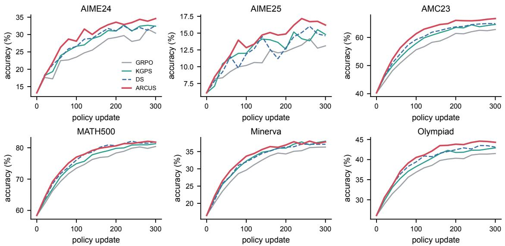  
Figure 5: Per-benchmark accuracy over training on Qwen2.5-Math-7B.

<table><tr><td>Configuration</td><td>Avg.</td><td>Δ</td><td>Inf.(%)</td></tr><tr><td>ARCUS (full)</td><td>46.90</td><td></td><td>97</td></tr><tr><td>Belief dynamics</td><td></td><td></td><td></td></tr><tr><td>No mobility-weighted drift</td><td></td><td>46.52-0.38</td><td>95</td></tr><tr><td>Jeffreys prior only</td><td>46.71</td><td>-0.19</td><td>96</td></tr><tr><td>Anscombe obs. for zero-var. groups 46.33</td><td></td><td>-0.57</td><td>93</td></tr><tr><td>Objective kernel</td><td></td><td></td><td></td></tr><tr><td>Exact pass @k kernel (quadrature)</td><td></td><td>46.87-0.03</td><td>97</td></tr><tr><td>Sampling ∝ score (T=1)</td><td></td><td>46.22-0.68</td><td>91</td></tr><tr><td>ωG in place of Î</td><td>46.71</td><td>-0.19</td><td>93</td></tr><tr><td>Sampling and selection</td><td></td><td></td><td></td></tr><tr><td>ρ=0.10</td><td></td><td>46.58-0.32</td><td>90</td></tr><tr><td>ρ=0.50</td><td>47.02+0.12</td><td></td><td>99</td></tr></table>

Table 8: Additional ablations on Qwen2.5-Math-7B.

Group size. Table 10 varies G at a matched number of updates. DS’s overhead shrinks with G, because fewer groups are zero-variance, but AR-CUS’s advantage persists. Its final target hardens with G as predicted by the frontier analysis of Appendix B.8.

Sensitivity and coverage. Figure 6 sweeps the yield slack ε and the Gumbel temperature T. Both have broad optima, and every tested value beats DS. Too small an ε freezes the target near pass@1, and too large an ε admits wasteful targets; $T \to 0$ overexploits stale beliefs, while T = 1 dilutes the candidate set. On AIME24, ARCUS improves pass@k at every $k \leq 3 2$ and widens the gap at large k (66.4 vs. 60.2 for GRPO at k = 32), whereas GRPO’s pass@32 barely exceeds the base model’s (58.1), consistent with reports that RLVR tends to narrow coverage (Yue et al., 2025).

<table><tr><td>Target</td><td> $p ^ { \star }$ </td><td>pass@1</td><td>pass@16</td><td>Yield</td></tr><tr><td> $\mathrm { \ p a s s ^ { 4 } }$ </td><td>0.875</td><td>44.61</td><td>64.9</td><td>72%</td></tr><tr><td> $\mathrm { \ p a s s ^ { 2 } }$  pass@1</td><td>0.75 0.5</td><td>45.43 46.28</td><td>66.1 67.6</td><td>85% 88%</td></tr><tr><td>pass@1.5</td><td>0.333</td><td>46.47</td><td>68.6</td><td>84%</td></tr><tr><td>pass@2</td><td>0.25</td><td>46.31</td><td>69.3</td><td>78%</td></tr><tr><td>pass@4</td><td>0.125</td><td>45.62</td><td>69.8</td><td>63%</td></tr><tr><td>pass@8</td><td>0.0625</td><td>44.35</td><td>68.9</td><td>47%</td></tr><tr><td></td><td></td><td></td><td></td><td></td></tr><tr><td>ARCUS</td><td>paced</td><td>46.90</td><td>69.6</td><td>79%</td></tr><tr><td>GRPO</td><td></td><td>44.08</td><td>66.3</td><td></td></tr><tr><td>DS</td><td></td><td>45.70</td><td>67.4</td><td></td></tr><tr><td>KGPS</td><td>一</td><td>45.67</td><td>67.1</td><td>一</td></tr></table>

Table 9: Fixed targets along the objective family vs. paced ARCUS (Qwen2.5-Math-7B; six-benchmark averages).
<table><tr><td>G</td><td>GRPO</td><td>DS (roll.)</td><td>ARCUS</td><td>final pT</td><td>frontier</td></tr><tr><td>4</td><td>42.86</td><td>44.31 (×3.37)</td><td>45.52</td><td>0.43</td><td>0.40</td></tr><tr><td>8</td><td>44.08</td><td>45.70 (×2.41)</td><td>46.90</td><td>0.29</td><td>0.34</td></tr><tr><td>16</td><td>44.93</td><td>46.12 (×2.02)</td><td>47.64</td><td>0.18</td><td>0.20</td></tr></table>

Table 10: Effect of group size on Qwen2.5-Math-7B. Frontier: closed-form sharp-belief target for ε = 0.03.

Additional backbones and pools. Table 11 covers a long-chain-of-thought model (DeepSeek-R1-

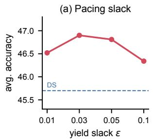

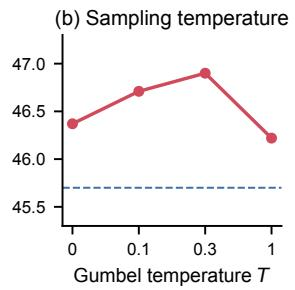

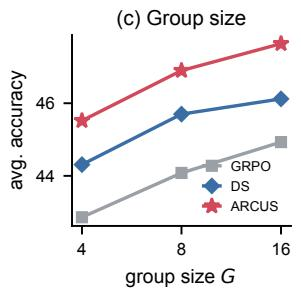

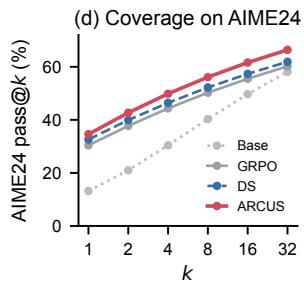  
Figure 6: Sensitivity on Qwen2.5-Math-7B: (a) yield slack, (b) Gumbel temperature, (c) group size, and (d) pass@k on AIME24.

Distill-Qwen-1.5B (DeepSeek-AI et al., 2025) with an 8k response limit), a non-Qwen family (Llama-3.2-3B-Instruct (Grattafiori et al., 2024)), and a different pool (MATH-train for Qwen2.5-Math-7B). The Llama backbone rules out a Qwen-specific artifact (Shao et al., 2025). Its pool is dominated by all-fail groups, so DS costs ×3.5 rollouts, and ARCUS’s dead-zone factor matters most there.

<table><tr><td>Setting</td><td>GRPO</td><td>KGPS</td><td>DS</td><td>ARCUS</td><td>DS roll.</td></tr><tr><td>R1-Distill-1.5B (8k)</td><td>47.86</td><td>48.95</td><td>49.12</td><td>50.21</td><td>×2.12</td></tr><tr><td>Llama-3.2-3B-Inst.</td><td>21.37</td><td>22.31</td><td>22.48</td><td>23.26</td><td>×3.46</td></tr><tr><td>Q2.5-Math-7B, MATH pool</td><td>43.15</td><td>44.30</td><td>44.46</td><td>45.38</td><td>×2.78</td></tr></table>

Table 11: Additional backbones and training pools (sixbenchmark average; DS roll.: DS rollouts relative to GRPO; ARCUS uses ×1.25).

Table 12 gives the per-benchmark breakdown. As on the main backbones, the gains concentrate on AIME and AMC. For the long-CoT model, ARCUS is below DS only on MATH500 (86.3 vs. 86.4).

Batch size, learning rate, and pool size. Table 13 varies the prompts per update, the learning rate, and the size of the training pool (random subsets of DAPO-Math-17k). ARCUS’s margin over DS stays between +0.9 and +1.3 in every setting. On smaller pools, prompts are revisited more often, so beliefs are sharper, but the pool also holds fewer informative prompts near the frontier. The two effects roughly cancel, and the margin shrinks only slightly, to +0.9 on the 4k pool.

Cold start. During warm-up every unseen prompt shares the same prior, so the first pass over the pool is nearly uniform. Table 14 compares ways of initializing the beliefs. The empirical-Bayes prior of Appendix D is free and already helps. A reference-model prior, i.e. a difficulty estimate from a smaller model’s pass rates in the spirit of Sha et al. (2026), and an offline probe with two base-model samples per prompt (3.4% extra rollouts) raise the warm-up yield from 51% to 62–66% and add 0.08–0.13 to the final average. ARCUS is therefore compatible with cold-start priors, but it does not depend on them.

Other policy losses. Table 15 swaps the GRPO loss for Dr. GRPO, the DAPO token-level loss with clip-higher, and RLOO. ARCUS improves on DS for every loss; for Dr. GRPO and RLOO we use the adapted kernel of Appendix C. The gain is smallest for losses without standard-deviation normalization, whose native coordinate is p rather than ψ.

Training dynamics. Figure 7 tracks response length, token entropy, and filter consistency. Training on harder prompts lengthens responses, and ARCUS keeps entropy highest (0.27 nats at the end vs. 0.17 for GRPO), in line with its better pass@k. The normalized innovation squared of the arc-length filter settles near one after warm-up: the filter’s predicted uncertainty matches its errors.

## G Discussion

Why one coordinate explains four facts. The four propositions share one cause: the Fisher information of a Bernoulli trial is constant in ψ. This makes GRPO’s update flat, because standarddeviation normalization divides by $\sqrt { p ( 1 - p ) }$ , the square root of the Fisher information in p. It makes evidence homoscedastic, because each rollout carries information 4 about ψ. And it makes dead zones and objective kernels Gaussian, because a run of n identical outcomes, or a success among k attempts, is a product of n or k Bernoulli likelihoods whose log-curvature in ψ is 2n or 4k. None of this is specific to mathematics; it holds for any binary verifier.

When the geometry is not native. Without standard-deviation normalization (Appendix C) the optimizer’s native coordinate becomes $p ,$ although sampling and evidence still live on the arc. With continuous rewards, a variance-stabilizing map depends on the reward distribution; for bounded rewards, binarizing at a threshold or using a Betamean model is a natural extension. With very small groups $\left( G \le 3 \right)$ , the two dead zones cover most of the arc, and any selector struggles.

<table><tr><td>Method</td><td>AIME24</td><td>AIME25</td><td>AMC23</td><td>MATH500</td><td>Minerva</td><td>Olymp.</td><td>Avg.</td></tr><tr><td colspan="8">R1-Distill-1.5B (8k)</td></tr><tr><td>GRPO</td><td>33.4</td><td>25.1</td><td>71.0</td><td>85.2</td><td>30.4</td><td>42.1</td><td>47.87</td></tr><tr><td>KGPS</td><td>35.2</td><td>26.0</td><td>72.4</td><td>85.9</td><td>30.9</td><td>43.3</td><td>48.95</td></tr><tr><td>DS</td><td>35.0</td><td>26.4</td><td>72.9</td><td>86.4</td><td>30.8</td><td>43.2</td><td>49.12</td></tr><tr><td>ARCUS</td><td>37.4</td><td>27.6</td><td>74.1</td><td>86.3</td><td>31.5</td><td>44.4</td><td>50.22</td></tr><tr><td colspan="8">Llama-3.2-3B-Inst.</td></tr><tr><td>GRPO</td><td>5.9</td><td>1.8</td><td>24.1</td><td>50.6</td><td>17.2</td><td>28.6</td><td>21.37</td></tr><tr><td>KGPS</td><td>6.7</td><td>2.3</td><td>26.2</td><td>51.9</td><td>18.1</td><td>28.7</td><td>22.32</td></tr><tr><td>DS</td><td>6.5</td><td>2.4</td><td>26.5</td><td>52.4</td><td>17.8</td><td>29.3</td><td>22.48</td></tr><tr><td>ARCUS</td><td>7.8</td><td>2.9</td><td>27.4</td><td>52.6</td><td>18.4</td><td>30.5</td><td>23.27</td></tr><tr><td colspan="8">Q2.5-Math-7B, MATH pool</td></tr><tr><td>GRPO</td><td>28.6</td><td>12.2</td><td>61.9</td><td>81.3</td><td>35.7</td><td>39.2</td><td>43.15</td></tr><tr><td>KGPS</td><td>30.4</td><td>13.1</td><td>63.6</td><td>81.9</td><td>36.8</td><td>40.0</td><td>44.30</td></tr><tr><td>DS</td><td>30.7</td><td>13.3</td><td>63.9</td><td>82.4</td><td>36.2</td><td>40.3</td><td>44.47</td></tr><tr><td>ARCUS</td><td>32.3</td><td>14.4</td><td>65.2</td><td>82.5</td><td>36.9</td><td>41.0</td><td>45.38</td></tr></table>

Table 12: Per-benchmark results for the additional backbones and the MATH-train pool (accuracy, %; same protocol as Table 1).

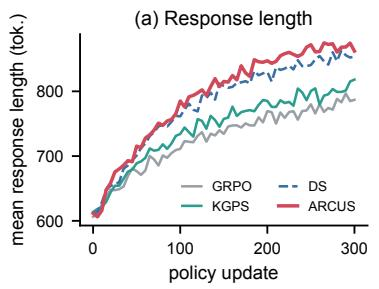

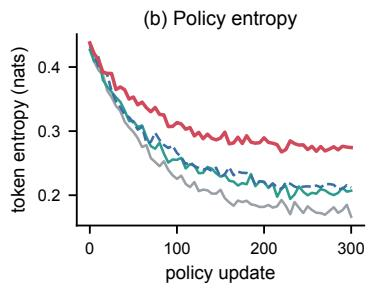

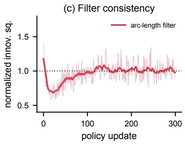  
Figure 7: Training dynamics on Qwen2.5-Math-7B: (a) mean response length, (b) token entropy, and (c) normalized innovation squared of ARCUS’s filter (1 = consistent).

<table><tr><td>Setting</td><td>GRPO</td><td>DS</td><td>ARCUS</td></tr><tr><td>B=128</td><td>43.52</td><td>45.11</td><td>46.33</td></tr><tr><td>B=256 (default) B=512</td><td>44.08 44.61</td><td>45.70 46.02</td><td>46.90 47.21</td></tr><tr><td> $1 \mathrm { r } 5 \times 1 0 ^ { - 7 }$ </td><td>43.12</td><td>44.71</td><td>45.98</td></tr><tr><td> $\mathrm { l r ~ 2 \times 1 0 ^ { - 6 } }$ </td><td>43.89</td><td>45.38</td><td>46.64</td></tr><tr><td></td><td></td><td></td><td></td></tr><tr><td>pool 4k</td><td>43.61</td><td>44.95</td><td>45.87</td></tr><tr><td>pool 8k</td><td>43.93</td><td>45.38</td><td>46.51</td></tr><tr><td>pool 17k</td><td>44.08</td><td>45.70</td><td>46.90</td></tr></table>

Table 13: Robustness to batch size B, learning rate, and pool size on Qwen2.5-Math-7B (six-benchmark average).

<table><tr><td>Initial belief</td><td>Avg.</td><td>Warm-up yield</td><td>Extra roll.</td></tr><tr><td>Jeffreys moments only</td><td>46.71</td><td>47%</td><td>0.0%</td></tr><tr><td>Empirical Bayes (default)</td><td>46.90</td><td>51%</td><td>0.0%</td></tr><tr><td>Reference-model prior</td><td>46.98</td><td>62%</td><td>0.0%</td></tr><tr><td>Offline probe, 2 samples/prompt 47.03</td><td></td><td>66%</td><td>3.4%</td></tr></table>

Table 14: Initial beliefs on Qwen2.5-Math-7B. Warmup yield: informative share of generated groups during the first $\lceil N / M \rceil$ updates.

<table><tr><td>Policy loss</td><td>Uniform</td><td>DS</td><td>ARCUS</td><td>Δ vs. DS</td></tr><tr><td>GRPO</td><td>44.08</td><td>45.70</td><td>46.90</td><td>+1.20</td></tr><tr><td>Dr. GRPO</td><td>43.92</td><td>45.41</td><td>46.47</td><td>+1.06</td></tr><tr><td>DAPO loss</td><td>44.61</td><td>46.03</td><td>47.18</td><td>+1.15</td></tr><tr><td>RLOO</td><td>43.54</td><td>45.02</td><td>46.11</td><td>+1.09</td></tr></table>

Table 15: Compatibility with other group-based losses (Qwen2.5-Math-7B, six-benchmark average).

Sampler-side versus advantage-side objectives. Davis and Recht (2025) show that advantages choose the objective; Corollary 1 shows that samplers do too. The two routes differ in cost. Reshaping advantages to target pass@k still pays for every zero-variance group, while reshaping the sampler avoids paying for them. The routes also compose: a pass@k advantage combined with a pass@kmatched sampler would target the same objective with less waste, which we leave to future work.

The easy-to-hard pattern. Classical curricula schedule difficulty; ARCUS schedules an objective and lets waste decide how fast it can move. The emergent trajectory (Figure 4a) starts at pass@1, because early beliefs cannot certify harder targets, and hardens as beliefs sharpen. This is a concrete, measurable version of training at the frontier of learnability.

Failure modes. (i) Pools with very few informative prompts: the pacing retreats to the most informative target, and the candidate margin may not fill the batch; ARCUS then degrades gracefully to a well-calibrated predictive selector. (ii) Strongly heterogeneous transfer: a single global drift underestimates the movement of fast-improving topics; per-cluster drift is a straightforward extension. (iii) Cost heterogeneity: all-fail responses are longer, so a token-cost-aware score $s _ { q } / \mathbb { E } [ \mathrm { t o k e n s } ]$ could save more compute than rollout counts suggest. (iv) Adversarially duplicated prompts share evidence that the filter treats as independent.

Practical recommendations. The defaults $( \rho { = } 0 . 2 5 , \ \varepsilon { = } 0 . 0 3 , \ T { = } 0 . 3 )$ transferred across all backbones and pools we tried. If the rollout budget must equal $\mathrm { { G R P O ^ { \prime } s } } .$ , use $\rho { = } 0$ , which keeps most of the gain (Table 1). If the pool is dominated by all-fail prompts, as for weaker models, a smaller ε keeps the target closer to pass@1 until beliefs sharpen. If pass@k coverage matters more than pass@1, a larger $\varepsilon \_ \mathrm { o r }$ a fixed pass@k target is the knob to turn (Table 9). Monitoring the predicted and realized yield together is a cheap diagnostic: a persistent gap signals miscalibrated beliefs, typically a drift estimate that has not yet converged.

Broader impact. ARCUS reduces the compute and energy of RLVR by about half relative to dynamic sampling at equal or better accuracy. Cheaper post-training lowers barriers for academic groups and also for misuse. The method adds no new data or capabilities beyond those of the underlying training pipeline.