# QUANTMLA: FUNCTION-ALIGNED DUAL-PATH QUAN-TIZATION FOR LOW-BIT MLA KV CACHING

Zunhai Su1,2∗Yuxuan Sun2∗Jianchao Tan2 Tao Zhang3 Ruihan Hu4 Yuchen Xie2 Xunliang Cai2 Ngai Wong1 1The University of Hong Kong 2Meituan LongCat Team 3South China University of Technology 4Harbin Institute of Technology

## ABSTRACT

Multi-Head Latent Attention (MLA) enables expressive multi-head attention with compact caches for its content and decoupled RoPE paths, yet cache memory still scales linearly with context length and batch size. Existing methods primarily quantize the content cache to FP8 while retaining the RoPE key cache at high precision. Low-bit RoPE quantization remains poorly understood, leaving joint low-bit compression of the content and RoPE caches largely unexplored. In this work, we establish a systematic model of MLA’s dual-path quantization errors, characterizing their distinct effects on attention-output distortion and explaining the pronounced amplification of RoPE-path errors. Guided by this analysis, we introduce QuantMLA, a function-aligned framework for low-bit dual-path quantization. We derive path-specific transformation spaces that preserve full-precision computation while remaining fully fusible into model parameters offline, eliminating online transformation overhead. Within these spaces, QuantMLA learns path-specific transformations with function-aligned objectives: attention-output reconstruction captures the content path’s coupled matching and aggregation errors, while positional QK reconstruction preserves the RoPE-induced component of the attention logits and admits a theoretical bound on output distortion. Across four MLA model families, QuantMLA enables, to our knowledge, the first reported joint INT4 caching of the content and RoPE caches with minimal accuracy degradation. Further compressing the content cache to INT2 while retaining the RoPE key cache at INT4 maintains competitive performance on challenging reasoning and code benchmarks. We develop a native low-bit MLA attention kernel that integrates unpacking and dequantization directly into attention computation. The physical cache layout provides 3.59× compression at 128K context, while a cache-pressure serving workload achieves 5.168× higher whole-job output throughput than BF16. The code will be released upon acceptance.

## 1 INTRODUCTION

Attention enables Transformer-based large language models (LLMs) to integrate information across long contexts, but autoregressive decoding relies on a key–value (KV) cache whose storage and access incur substantial memory and bandwidth costs. This bottleneck has motivated efficient attention mechanisms and architectures, including linear attention (Katharopoulos et al., 2020), sparse attention (Yuan et al., 2025), and hybrid architectures (Wang et al., 2025; Kimi Team et al., 2025b). Multi-Head Latent Attention (MLA) reconciles expressive multi-head attention with compact KV storage through two cached paths: a shared low-rank content latent from which keys and values are derived, and a decoupled RoPE key cache (DeepSeek-AI, 2024). This design has been adopted by leading models including DeepSeek-V3, Kimi K3, LongCat-Flash, LongCat-2.0, and GLM-5.3 (DeepSeek-AI et al., 2024; Moonshot AI, 2026; Meituan LongCat Team et al., 2025; Meituan LongCat Team, 2026b; Z.ai, 2026b).

Despite its compact representation, MLA cache memory still scales linearly with context length and serving batch size, motivating further compression through low-bit KV-cache quantization (Liu et al., 2024; Su et al., 2025; 2026). Existing MLA quantization approaches primarily compress the content cache to FP8 while retaining the RoPE key cache at high precision (DeepSeek-AI, 2025; Zhang et al., 2026). For example, FlashMLA stores the DeepSeek-V3.2 content cache in FP8 and the RoPE key cache in BF16, while SnapMLA co-designs content-cache quantization and execution but likewise preserves high-precision RoPE keys. The functional impact of RoPE-path quantization therefore remains poorly understood, leaving joint low-bit compression largely unexplored. Appendix A reviews transformation-based quantization and MLA KV-cache quantization in detail.

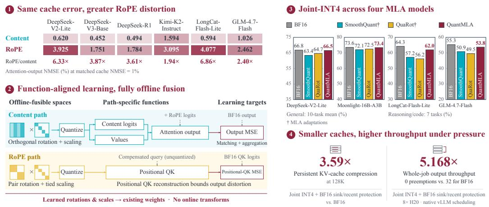  
Figure 1: Overview of QuantMLA. Our analysis reveals pronounced RoPE-path error amplification under matched cache reconstruction error. Guided by this analysis, we introduce QuantMLA, which learns path-specific transformations with function-aligned objectives and fuses them entirely offline for accurate and efficient low-bit MLA inference.

In this work, we systematically analyze MLA’s dual-path quantization through cross-model empirical characterization, path-wise functional decomposition, and mechanistic modeling. Across six models from four families, spanning 16B to 1T total parameters, RoPE-path quantization consistently induces greater attention-output distortion than content-path quantization under matched cache reconstruction error. We show that content-path errors propagate through attention matching, value aggregation, and their interaction, whereas RoPE-path errors act exclusively through the RoPE-induced component of the attention logits. An operator–error model further explains this amplification through attention sensitivity, quantization-error energy allocation, and directional coupling. These results show that cache reconstruction error alone is an inadequate proxy for functional distortion.

Guided by this analysis, we introduce QuantMLA, a function-aligned framework for low-bit dual-path quantization. We derive path-specific offline-fusible transformation spaces and optimize within them using function-aligned objectives tailored to the two paths’ distinct functional error routes: attentionoutput reconstruction for the content path and positional QK reconstruction for the RoPE path, the latter admitting a theoretical bound on output distortion. Thus, each path’s structure determines its offline-fusible transformation space, while its functional error route determines the corresponding learning objective.

We develop a carefully engineered native low-bit MLA attention kernel that integrates unpacking and dequantization directly into attention computation. Across four MLA model families, we evaluate downstream accuracy together with cache footprint, native attention execution, and end-to-end vLLM serving behavior. Figure 1 summarizes QuantMLA and its main findings. Our main contributions are summarized as follows:

• A systematic analysis of MLA dual-path quantization. We characterize the distinct functional error routes of the content and RoPE paths and develop an operator–error model that explains RoPE-path error amplification, validated through cross-model analyses and controlled mechanistic interventions.

• Function-aligned dual-path quantization. We introduce QuantMLA, which derives pathspecific offline-fusible transformation spaces for MLA’s dual paths and optimizes within them using function-aligned objectives: attention-output reconstruction for the content path and positional QK reconstruction for the RoPE path.

• Accurate joint low-bit MLA caching. Across four MLA families, QuantMLA enables, to our knowledge, the first reported joint INT4 caching of the content and RoPE caches with minimal accuracy degradation. Further compressing the content cache to INT2 while retaining INT4 RoPE keys maintains competitive performance on challenging reasoning and code benchmarks.

• Memory-efficient native MLA execution. We develop a native low-bit MLA backend that integrates unpacking and dequantization into attention. System evaluations demonstrate up to 3.59× KV-cache compression at 128K and 5.168× BF16’s whole-job output throughput in the evaluated cache-pressure workload under the same native vLLM scheduling policy.

## 2 MODELING DUAL-PATH QUANTIZATION ERROR

Our analysis progresses from MLA’s dual-path computation to empirical observation and mechanistic explanation. We first formulate the content and RoPE cache paths (Section 2.1), then reveal unequal output distortion under matched cache reconstruction error (Section 2.2), and finally explain it through functional error routes, attention sensitivity, and quantization-error geometry (Section 2.3).

## 2.1 MLA DUAL-PATH CACHE FORMULATION

Following MLA’s shared-latent and decoupled-RoPE formulation (DeepSeek-AI, 2024; DeepSeek-AI et al., 2024), let $C \in \mathbb { R } ^ { n \times d _ { c } }$ denote the cached content latent and $\mathbf { \bar { \boldsymbol { K } } } _ { P } \in \mathbb { R } ^ { n \times d _ { r } }$ the decoupled RoPE key. Conceptually, per-head content keys and values are reconstructed from $C ;$ at inference, MLA absorbs the up-projections into the query and output projections, avoiding explicit reconstruction (DeepSeek-AI, 2024; Zhang et al., 2026). Using row-vector notation, define the absorbed content query $\bar { Q } _ { C , h } ^ { \dot { \mathbf { \alpha } } } = Q _ { C , h } W _ { K , h } ^ { \top }$ and value–output map $\bar { B } _ { h } = W _ { V , h } W _ { O , h }$ for head h. Then

$$
\begin{array} { r l } & { S _ { h } = \tau \bigl ( \bar { Q } _ { C , h } C ^ { \top } + Q _ { P , h } K _ { P } ^ { \top } \bigr ) + M _ { \mathrm { a t t n } } , } \\ & { A _ { h } = \mathrm { s o f t m a x } ( S _ { h } ) , \qquad Y = \displaystyle \sum _ { h } A _ { h } C B _ { h } . } \end{array}\tag{1}
$$

where $Q _ { P , h }$ is the RoPE-encoded query component, $M _ { \mathrm { a t t n } }$ the additive causal mask, and $\tau$ the model-specific attention scale. Only $\{ C , K _ { P } \}$ is cached, requiring $d _ { c } + d _ { r }$ elements per token and layer. The content latent contributes to both matching through $\tilde { Q } _ { C , h } C ^ { \top }$ and aggregation through $A _ { h } C B _ { h }$ , whereas the RoPE key contributes only to positional matching through $Q _ { P , h } K _ { P } ^ { \top }$ . We refer to these computations as the content path and RoPE path, respectively.

## 2.2 MATCHED CACHE ERROR, UNEQUAL OUTPUT DISTORTION

We begin with an empirical comparison of the content and RoPE paths under matched cache reconstruction error. We perturb one path’s cache at a time using error directions induced by INT4 quanti zation and rescale each perturbation to a common cache NMSE of 0.01. Our study covers six models from four families, spanning 16B–1T total parameters: DeepSeek-V2-Lite, DeepSeek-V3-Base, DeepSeek-R1, Kimi-K2-Instruct, LongCat-Flash-Lite, and GLM-4.7-Flash. To compare functional distortion across layers, we define the path-wise response as $R _ { b } = \mathrm { N M S E } _ { \mathrm { o u t } , b } / \mathrm { N M S E } _ { \mathrm { c a c h e } , b }$ for $b \in \{ C , P \}$ , measuring output distortion per unit cache reconstruction error. Across the six models, the ratio of model-level mean responses between the RoPE and content paths ranges from 1.941× to 6.864×. Figure 2 further reveals substantial layer-wise variation in both responses and their RoPEto-content ratios. These results show that matched cache reconstruction error can yield markedly different functional distortion, despite the substantially smaller RoPE key cache. Appendix B.1 provides the evaluation protocol, aggregation procedure, and detailed per-model and per-layer results.

## 2.3 FUNCTIONAL ERROR ROUTES AND AMPLIFICATION

The matched-error discrepancy raises two questions: how do errors from the two cache paths reach the attention output, and what determines their amplification? We first derive their exact finite error routes, then model local amplification through attention sensitivity and quantization-error geometry.

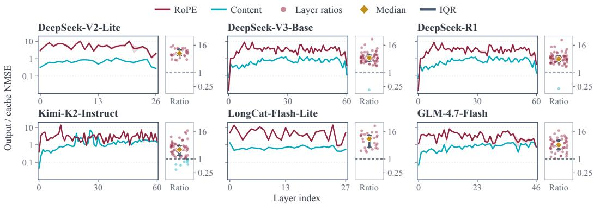  
Figure 2: Layer-wise functional response under matched cache reconstruction error. Curves show the content- and RoPE-path responses $R _ { b }$ across layers for six MLA models. The adjacent distributions show the corresponding layer-wise RoPE/content response ratios; diamonds and whiskers denote medians and interquartile ranges, and dashed lines mark equal response.

Finite error routes. Let $\Delta C$ and $\Delta K _ { P }$ denote quantization errors in the content cache and RoPE key cache. Under the absorbed formulation, their score perturbations for head h are

$$
\Delta S _ { C , h } = \tau \bar { Q } _ { C , h } \Delta C ^ { \top } , \qquad \Delta S _ { P , h } = \tau Q _ { P , h } \Delta K _ { P } ^ { \top } .\tag{2}
$$

Let $\Delta A _ { b , h } ~ =$ softmax $\mathit { \bar { S } } _ { h } + \Delta \mathit { S } _ { b , h } ) - \Delta _ { h }$ denote the corresponding attention change for path $b \in \{ C , P \}$ . Perturbing one path at a time gives the exact finite output changes

$$
\Delta Y _ { C } = \sum _ { h } ( \Delta A _ { C , h } C B _ { h } + A _ { h } \Delta C B _ { h } + \Delta A _ { C , h } \Delta C B _ { h } ) , \qquad \Delta Y _ { P } = \sum _ { h } \Delta A _ { P , h } C B _ { h } .\tag{3}
$$

Content-path errors therefore affect both attention matching and value aggregation, including their interaction, whereas RoPE-path errors affect only attention matching through the positional logits.

Local amplification model. Vectorize the stored state of path $b \in \{ C , P \}$ as $\boldsymbol { c } _ { b } \in \mathbb { R } ^ { D _ { b } }$ , its quantization error as $e _ { b } ,$ and the post-output-projection attention output as $y = \operatorname { v e c } ( Y )$ . Let ${ { J } _ { b } } =$ $\bar { \partial } y / \partial c _ { b }$ denote the Jacobian from local cache perturbations to output perturbations, and define $\dot { H _ { b } } = J _ { b } ^ { \top } J _ { b }$ . We quantify local amplification along the quantization-error direction by

$$
G _ { b } ( e _ { b } ) = \frac { \| J _ { b } e _ { b } \| _ { 2 } ^ { 2 } } { \| e _ { b } \| _ { 2 } ^ { 2 } } = \frac { e _ { b } ^ { \top } H _ { b } e _ { b } } { e _ { b } ^ { \top } e _ { b } } .\tag{4}
$$

This Rayleigh quotient measures local functional sensitivity, so equal-energy errors can induce markedly different output distortion. Locally, $\mathrm { N M S E _ { o u t } } , b$ ≈ $\mathrm { N M } \mathrm { \bar { S } E } _ { \mathrm { c a c h e } , b } \mathrm { \bar { ( } } \| c _ { b } \| _ { 2 } ^ { 2 } / \| y \| _ { 2 } ^ { 2 } ) G _ { b } ( e _ { b } )$ separating cache-error magnitude from functional amplification.

To expose the sources of this gain, expand $e _ { b } ^ { \top } H _ { b } e _ { b }$ into its diagonal contribution $\textstyle \sum _ { i } H _ { b , i i } e _ { b , i } ^ { 2 }$ and off-diagonal contribution $\begin{array} { r } { \sum _ { i \neq j } H _ { b , i j } e _ { b , i } e _ { b , j } } \end{array}$ . With $T _ { b } = \mathrm { t r } ( H _ { b } ) / D _ { b } > 0$ , define

$$
A _ { b } = \frac { \sum _ { i } H _ { b , i i } e _ { b , i } ^ { 2 } } { T _ { b } \| e _ { b } \| _ { 2 } ^ { 2 } } , \qquad O _ { b } = \frac { \sum _ { i \neq j } H _ { b , i j } e _ { b , i } e _ { b , j } } { \| e _ { b } \| _ { 2 } ^ { 2 } } .
$$

The gain then admits the exact decomposition

$$
\boxed { G _ { b } = T _ { b } A _ { b } + O _ { b } . }\tag{5}
$$

Here, $T _ { b }$ measures average operator sensitivity, $A _ { b }$ captures the allocation of quantization-error energy over sensitive coordinates, and the signed term $O _ { b }$ captures cross-coordinate directional coupling. Thus, equal-energy errors can differ in functional impact because of both operator sensitivity and error geometry. A RoPE-path error aligned with sensitive directions can therefore outweigh the content path’s coupled errors despite entering through only one functional route. Appendix B.2 gives the full derivation and joint-path extension, while Appendix B.3 describes operator estimation and validates the model through cross-layer prediction and controlled equal-energy interventions.

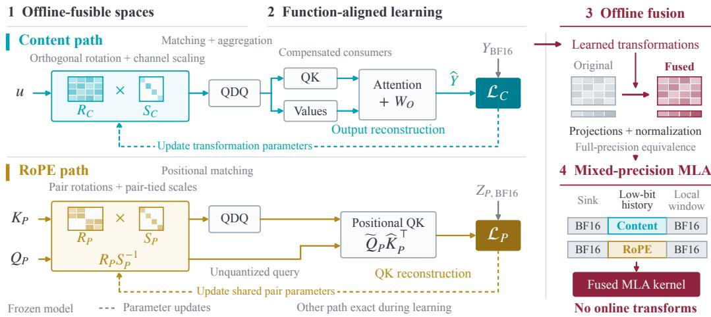  
Figure 3: QuantMLA learning and execution pipeline. Content and RoPE transformations are optimized with attention-output and positional QK reconstruction, respectively, and fused offline. The native low-bit MLA backend stores packed cache representations while serving protected sink and recent tokens from BF16 buffers. QDQ denotes simulated quantize–dequantize.

## 3 QUANTMLA: FUNCTION-ALIGNED DUAL-PATH QUANTIZATION

Building on the analysis in Section 2, we introduce QuantMLA, which translates MLA’s dual-path asymmetry into path-specific offline-fusible transformation spaces and function-aligned learning objectives. We first derive the offline-fusible transformations for each path (Section 3.1), then optimize them according to their functional error routes (Section 3.2), and finally deploy the fused model with a native low-bit MLA backend (Section 3.3; Figure 3).

## 3.1 PATH-SPECIFIC OFFLINE-FUSIBLE TRANSFORMATION SPACES

The two cache paths impose distinct constraints on equivalent reparameterization: the shared content latent participates in both matching and aggregation, whereas the decoupled RoPE key must additionally respect RoPE’s pairwise rotational structure.

Content path. Let $c = u \Gamma$ denote the content latent, where $u = \mathrm { R M S N o r m } _ { 1 } ( x )$ is the weightless normalized coordinate (Zhang & Sennrich, 2019) and $\Gamma = \mathrm { D i a g } ( \gamma )$ contains the original normalization weights. We reparameterize the cache with an orthogonal rotation $R _ { C }$ and positive channel scale $S _ { C } = \mathrm { D i a g } ( s _ { C } )$ . For each projection W consuming the latent,

$$
z _ { C } = u R _ { C } S _ { C } , \qquad \widetilde { W } = S _ { C } ^ { - 1 } R _ { C } ^ { \top } \Gamma W , \qquad R _ { C } ^ { \top } R _ { C } = I ,\tag{6}
$$

which exactly preserves the full-precision computation, $z _ { C } \widetilde { W } = c W$ . The shared latent supplies both keys and values, so the transformed cache is shared by matching and aggregation. Since weightless RMSNorm is rotation-equivariant, $R _ { C }$ can be fused offline; the learned scale replaces the normalization scale, while Γ is absorbed into the compensated consumers (Appendix C.1).

RoPE path. A transformation fused before RoPE must commute with the positional rotations (Su et al., 2024), ruling out unrestricted dense rotations across RoPE frequency pairs. Appendix C.2 provides the full fusion derivation and model-specific pairing details.

Proposition 1 (RoPE-Compatible Equivalent Transformation). Let $R _ { P } = \mathrm { b l o c k d i a g } ( R _ { i } )$ with $R _ { i } \bar { \in } S O ( 2 )$ over RoPE frequency pairs, and let $S _ { P } = \mathrm { b l o c k d i a g } ( s _ { i } I _ { 2 } )$ with $s _ { i } > 0$ . The reciprocal transformation

$$
Q _ { P } ^ { \prime } = Q _ { P } R _ { P } S _ { P } ^ { - 1 } , \qquad K _ { P } ^ { \prime } = K _ { P } R _ { P } S _ { P }\tag{7}
$$

preserves the full-precision positional scores, $Q _ { P } ^ { \prime } ( K _ { P } ^ { \prime } ) ^ { \top } = Q _ { P } K _ { P } ^ { \top }$ . Because $R _ { P }$ and $S _ { P }$ commute with the corresponding RoPE rotations, the reciprocal factors can be fused into the pre-RoPE query and key projections without online transformations.

## 3.2 FUNCTION-ALIGNED LEARNING OBJECTIVES

Within these offline-fusible spaces, Equation 3 motivates attention-output reconstruction for the content path and positional QK reconstruction for the RoPE path.

Attention-output reconstruction. For the content path, we minimize normalized post-outputprojection distortion against the frozen BF16 teacher:

$$
\mathcal { L } _ { C } = \mathbb { E } _ { x , \ell } \frac { \Vert Y _ { \ell } ( \mathcal { Q } _ { C } ^ { R , S } ( C ) , K _ { P } ; x ) - Y _ { \ell } ( C , K _ { P } ; x ) \Vert _ { F } ^ { 2 } } { \operatorname* { m a x } \{ \Vert Y _ { \ell } ( C , K _ { P } ; x ) \Vert _ { F } ^ { 2 } , \epsilon _ { C } \} } .\tag{8}
$$

Here, $\mathcal { Q } _ { C } ^ { R , S }$ denotes cache quantization in the learned coordinates with compensated consumers, while the RoPE path remains exact. Because content errors affect both matching and aggregation, attention-output reconstruction captures their coupled effects and the interaction term that score-only reconstruction would miss.

Positional QK reconstruction. RoPE quantization perturbs only the positional scores $Z _ { P , h } =$ $Q _ { P , h } K _ { P } ^ { \top }$ , while the content path and value representations remain fixed. This structure yields a finite bound on output distortion directly in terms of positional-score error.

Proposition 2 (Finite Output Bound for Positional-QK Perturbation). Fix the content logits, queries, value representations, and valid causal key sets, with at least one valid key per query. For an unscaled positional-score perturbation $\Delta Z _ { P , h }$ to $\dot { Z } _ { P , h } = Q _ { P , h } K _ { P } ^ { \top }$ , let $\bar { V } _ { h } = C B _ { h }$ and let Ω denote the binary valid-pair mask. Then

$$
\| \Delta Y _ { P } \| _ { F } ^ { 2 } \leq \frac { \tau ^ { 2 } } { 4 } \left( \sum _ { h } \| \bar { V } _ { h } \| _ { 2 } ^ { 2 } \right) \sum _ { h } \| \Omega \odot \Delta Z _ { P , h } \| _ { F } ^ { 2 } .\tag{9}
$$

Appendix C.3 provides the proof. The bound motivates normalized positional QK reconstruction:

$$
\mathcal { L } _ { P } = \mathbb { E } _ { x , \ell } \frac { \Vert \boldsymbol { \Omega } \odot ( \widetilde { Q } _ { P , \ell } \widehat { K } _ { P , \ell } ^ { \top } - Q _ { P , \ell } K _ { P , \ell } ^ { \top } ) \Vert _ { F } ^ { 2 } } { \operatorname* { m a x } \{ \Vert \boldsymbol { \Omega } \odot Q _ { P , \ell } K _ { P , \ell } ^ { \top } \Vert _ { F } ^ { 2 } , \epsilon _ { P } \} } ,\tag{10}
$$

where $\widetilde { Q } _ { P }$ is the compensated, unquantized query and $\widehat { K } _ { P }$ the transformed quantized key. Using the actual queries preserves cross-frequency cancellation that key- or frequency-wise reconstruction would miss. Because equivalent query–key compensation preserves the full-precision scores while leaving the value representations unchanged, minimizing positional QK error directly controls the score-dependent term in the bound. Appendix C.4 specifies the quantizer, calibration settings, and optimization procedure.

## 3.3 NATIVE LOW-BIT MLA EXECUTION

We implement a native low-bit MLA backend on FlashMLA’s decode path (DeepSeek-AI, 2025), consuming content and RoPE caches in offline-fused coordinates. Unpacking and dequantization are fused into attention without expanding per-head keys and values or materializing a full-history BF16 cache (Figure 8). In the optimized decode kernel, packed data and quantization metadata are buffered separately from reconstructed BF16 tiles, allowing prefetch to overlap with attention computation. Separate metadata storage avoids shared-memory aliasing with reconstructed RoPE tiles, allowing earlier scheduling of RoPE QK computation. Protected BF16 content loads overlap with dequantization of unprotected rows, with synchronization before consumption. Reconstructed content tiles are reused across QK and latent aggregation, and their buffers are overwritten only after all prior consumers complete. When both the content cache and RoPE key cache use INT4 for low-bit history, a fused writer maintains packed INT4 copies of all tokens and pre-quantization BF16 values for the first four sink tokens and the most recent 128 tokens in both caches. Attention uses exactly one representation per token: BF16 for the union of the protected regions and dequantized INT4 otherwise. Non-sink tokens leaving the recent window switch to their existing packed copies without additional quantization. All valid tokens participate in a single global softmax, preserving full-history attention. Appendix C.5 details the buffer layouts, pipeline dependencies, and cache lifecycle.

Table 1: General-purpose and information-extraction performance. Scores (%, ↑). CS averages the five commonsense benchmarks; Avg. assigns equal weight to all ten tasks. Bold marks the best quantized score within each precision, including ties. †: our MLA adaptations.
<table><tr><td rowspan="2">Precision</td><td rowspan="2">Method</td><td colspan="3">General-purpose</td><td colspan="3">Information extraction</td><td rowspan="2">Avg.</td></tr><tr><td>CS</td><td>MMLU</td><td>GSM8K</td><td>FDA</td><td>SWDE</td><td>SQuAD</td></tr><tr><td colspan="2">DeepSeek-V2-Lite</td><td></td><td></td><td></td><td></td><td></td><td></td><td></td></tr><tr><td colspan="2">BF16</td><td>69.76</td><td>57.90</td><td>36.92</td><td>78.13</td><td>89.20</td><td>57.10</td><td>66.80</td></tr><tr><td rowspan="4">C4R4</td><td>RTN</td><td>67.17</td><td>51.90</td><td>16.98</td><td>65.06</td><td>84.88</td><td>55.50</td><td>61.02</td></tr><tr><td>SmoothQuant†</td><td>68.23</td><td>54.02</td><td>24.56</td><td>70.69</td><td>87.85</td><td>56.07</td><td>63.44</td></tr><tr><td>QuaRot†</td><td>69.01</td><td>55.66</td><td>30.71</td><td>72.14</td><td>88.12</td><td>55.06</td><td>64.67</td></tr><tr><td>QuantMLA</td><td>69.92</td><td>57.95</td><td>35.25</td><td>77.77</td><td>88.12</td><td>56.70</td><td>66.54</td></tr><tr><td rowspan="4">C2R4</td><td>RTN</td><td>62.21</td><td>40.91</td><td>3.71</td><td>30.40</td><td>70.75</td><td>44.74</td><td>50.16</td></tr><tr><td>SmoothQuant†</td><td>65.93</td><td>49.40</td><td>15.31</td><td>45.10</td><td>80.20</td><td>52.51</td><td>57.22</td></tr><tr><td>QuaRot†</td><td>64.32</td><td>45.92</td><td>12.13</td><td>40.11</td><td>75.52</td><td>46.08</td><td>54.14</td></tr><tr><td>QuantMLA</td><td>69.85</td><td>57.29</td><td>37.91</td><td>60.44</td><td>84.52</td><td>54.79</td><td>64.42</td></tr><tr><td colspan="2">Moonlight-16B-A3B</td><td></td><td></td><td></td><td></td><td></td><td></td><td></td></tr><tr><td>BF16</td><td></td><td>74.32</td><td>69.97</td><td>74.53</td><td>78.40</td><td>90.10</td><td>51.07</td><td>73.57</td></tr><tr><td rowspan="4">C4R4</td><td>RTN</td><td>73.94</td><td>67.99</td><td>69.60</td><td>75.59</td><td>90.64</td><td>51.11</td><td>72.46</td></tr><tr><td>SmoothQuant†</td><td>73.39</td><td>68.45</td><td>68.99</td><td>77.22</td><td>89.29</td><td>49.87</td><td>72.08</td></tr><tr><td>QuaRot†</td><td>74.11</td><td>67.73</td><td>71.87</td><td>74.41</td><td>90.28</td><td>50.20</td><td>72.50</td></tr><tr><td>QuantMLA</td><td>74.24</td><td>69.71</td><td>74.53</td><td>78.77</td><td>89.65</td><td>50.54</td><td>73.44</td></tr><tr><td rowspan="4">C2R4</td><td>RTN</td><td>69.78</td><td>60.72</td><td>41.77</td><td>47.01</td><td>82.81</td><td>36.03</td><td>61.72</td></tr><tr><td>SmoothQuant†</td><td>64.95</td><td>58.99</td><td>33.81</td><td>61.52</td><td>83.35</td><td>56.23</td><td>61.86</td></tr><tr><td>QuaRot†</td><td>62.72</td><td>56.16</td><td>27.37</td><td>25.50</td><td>72.73</td><td>35.36</td><td>53.07</td></tr><tr><td>QuantMLA</td><td>74.22</td><td>69.29</td><td>75.21</td><td>72.50</td><td>88.21</td><td>50.64</td><td>72.70</td></tr></table>

## 4 EXPERIMENTAL EVALUATION

## 4.1 EXPERIMENTAL SETUP

Models and tasks. We evaluate four MLA families across two capability-matched benchmark suites. DeepSeek-V2-Lite (DeepSeek-AI, 2024) and Moonlight-16B-A3B (Liu et al., 2025a) are evaluated on five commonsense benchmarks (Zellers et al., 2019; Bisk et al., 2019; Clark et al., 2018; Sakaguchi et al., 2019), MMLU (Hendrycks et al., 2021a), GSM8K (Cobbe et al., 2021), and the FDA, SWDE, and SQuAD recall tasks (Arora et al., 2024). LongCat-Flash-Lite (Meituan LongCat Team, 2026a) and GLM-4.7-Flash (Z.ai, 2026a) are evaluated on a reasoning-and-code suite (Liu et al., 2025b) comprising GPQA-Diamond (Rein et al., 2024), MMLU, GSM8K, MATH500 (Hendrycks et al., 2021b), AIME25, HumanEval (Chen et al., 2021), and LiveCodeBench (Jain et al., 2025). We additionally evaluate long-context retrieval on DeepSeek-V2-Lite using RULER S-NIAH-1/2/3 (Hsieh et al., 2024), with 500 examples per variant at four context lengths from 4K to 32K tokens.

Baselines and precision. To our knowledge, no prior work has reported joint INT4 quantization of MLA’s content and RoPE caches, leaving no directly comparable prior method at this precision. We therefore compare against round-to-nearest quantization (RTN) and two representative transformationbased MLA adaptations, SmoothQuant† (Xiao et al., 2023) and QuaRot† (Ashkboos et al., 2024), which retain channel scaling and fixed Hadamard rotations, respectively. Neither original method targets MLA’s shared-latent and decoupled-RoPE cache structure; our adaptations operate directly on MLA’s native cache representations, with implementation details provided in Appendix D.2. All quantized methods use the same per-token asymmetric affine quantizer with group size 64. CxRy denotes x-bit content-cache and y-bit RoPE-key-cache precision for low-bit history; C4R4 is the primary setting, while C2R4 further compresses the content cache to INT2.

Calibration. With pretrained parameters frozen, we optimize each path-specific transformation for 300 steps on 128 WikiText-2 (Merity et al., 2017) sequences and select the best checkpoint on 32 disjoint held-out sequences according to the corresponding reconstruction objective. The objectives are attention-output reconstruction for the content path and positional QK reconstruction for the RoPE path; both learned transformations are fused entirely offline before evaluation.

Table 2: Reasoning and code performance. Scores (%, ↑). Avg. assigns equal weight to all seven benchmarks. Bold marks the best quantized score within each precision. †: our MLA adaptations.
<table><tr><td rowspan="2">Precision</td><td rowspan="2">Method</td><td colspan="5">Reasoning</td><td colspan="2">Code</td><td rowspan="2">Avg.</td></tr><tr><td>GPQA- Diamond</td><td>MMLU</td><td>GSM8K</td><td>MATH 500</td><td>AIME25</td><td>Human Eval</td><td>LiveCode Bench</td></tr><tr><td colspan="2">LongCat-Flash-Lite</td><td></td><td></td><td></td><td></td><td></td><td></td><td></td><td></td></tr><tr><td rowspan="4">BF16 C4R4</td><td></td><td>46.46</td><td>80.77</td><td>71.72</td><td>57.40</td><td>70.00</td><td>73.78</td><td>49.67</td><td>64.26</td></tr><tr><td>RTN</td><td>42.42</td><td>76.38</td><td>68.01</td><td>48.00</td><td>40.00</td><td>39.02</td><td>32.70</td><td>49.50</td></tr><tr><td>SmoothQuant†</td><td>42.42</td><td>78.49</td><td>69.75</td><td>53.20</td><td>53.33</td><td>60.37</td><td>42.75</td><td>57.19</td></tr><tr><td>QuaRot†</td><td>39.90</td><td>78.52</td><td>64.67</td><td>54.40</td><td>56.67</td><td>56.71</td><td>42.65</td><td>56.22</td></tr><tr><td rowspan="4">C2R4</td><td>QuantMLA</td><td>44.95</td><td>80.51</td><td>69.75</td><td>54.80</td><td>63.33</td><td>71.34</td><td>49.38</td><td>62.01</td></tr><tr><td>RTN</td><td>29.29</td><td>70.72</td><td>50.95</td><td>39.20</td><td>26.67</td><td>27.44</td><td>24.27</td><td>38.36</td></tr><tr><td>SmoothQuant†</td><td>33.84</td><td>74.55</td><td>57.62</td><td>47.00</td><td>33.33</td><td>39.63</td><td>29.57</td><td>45.08</td></tr><tr><td>QuaRot† QuantMLA</td><td>28.28</td><td>64.27 80.57</td><td>30.02</td><td>24.80 56.80</td><td>6.67</td><td>35.98</td><td>16.78</td><td>29.54</td></tr><tr><td colspan="2">GLM-4.7-Flash</td><td>44.95</td><td></td><td>68.84</td><td></td><td>60.00</td><td>71.34</td><td>49.00</td><td>61.64</td></tr><tr><td colspan="2">BF16</td><td>42.93</td><td>72.09</td><td>83.85</td><td>56.40</td><td>63.33</td><td>36.59</td><td>32.04</td><td>55.32</td></tr><tr><td rowspan="4">C4R4</td><td>RTN</td><td></td><td></td><td></td><td></td><td></td><td></td><td></td><td></td></tr><tr><td></td><td>37.88</td><td>70.79</td><td>81.27</td><td>51.20</td><td>56.67</td><td>29.88</td><td>29.67</td><td>51.05</td></tr><tr><td>SmoothQuant† QuaRot†</td><td>36.87</td><td>70.60 70.84</td><td>81.12</td><td>51.00 52.80</td><td>53.33 46.67</td><td>31.71 28.66</td><td>31.47</td><td>50.87</td></tr><tr><td>QuantMLA</td><td>34.85 38.89</td><td>71.95</td><td>82.41 83.70</td><td>57.40</td><td>56.67</td><td>34.76</td><td>30.62 32.89</td><td>49.55 53.75</td></tr><tr><td rowspan="4">C2R4</td><td>RTN</td><td></td><td></td><td></td><td></td><td></td><td></td><td></td><td></td></tr><tr><td></td><td>30.81</td><td>64.81</td><td>71.19</td><td>42.40</td><td>36.67 46.67</td><td>31.71 29.27</td><td>21.80 25.21</td><td>42.77</td></tr><tr><td>SmoothQuant† QuaRot†</td><td>31.82 28.79</td><td>64.48 53.64</td><td>73.62 51.10</td><td>45.40 34.20</td><td>26.67</td><td>6.10</td><td>18.10</td><td>45.21 31.23</td></tr><tr><td>QuantMLA</td><td>39.39</td><td>71.50</td><td>82.94</td><td>55.00</td><td>46.67</td><td>34.15</td><td>30.33</td><td>51.43</td></tr></table>

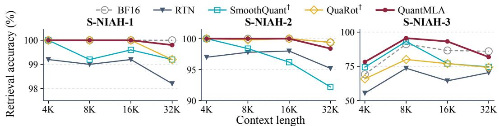  
Figure 4: Retrieval as the cached history grows. DeepSeek-V2-Lite on RULER S-NIAH-1/2/3 at C4R4, with BF16 as reference. Each point evaluates 500 examples; method markers follow Table 1.

## 4.2 MAIN ACCURACY RESULTS

General-purpose and extraction tasks. Table 1 reports the ten-task suite, with the five commonsense benchmarks detailed in Appendix E. At C4R4, QuantMLA remains within 0.26 and 0.13 percentage points of BF16 on DeepSeek-V2-Lite and Moonlight-16B-A3B, respectively. On GSM8K, DeepSeek-V2-Lite reaches 35.25%, compared with 16.98%, 24.56%, and 30.71% for RTN, SmoothQuant†, and QuaRot†, while Moonlight-16B-A3B matches BF16 at 74.53%. Even at C2R4, QuantMLA retains suite averages of 64.42% and 72.70%, outperforming the strongest same-precision baselines by 7.20 and 10.84 points.

Reasoning and code tasks. Table 2 shows a similar trend on the reasoning-and-code suite. At C4R4, QuantMLA achieves averages of 62.01% and 53.75% on LongCat-Flash-Lite and GLM-4.7- Flash, exceeding the strongest same-precision baselines by 4.82 and 2.70 points, respectively. Several tasks remain close to BF16, including LiveCodeBench on LongCat-Flash-Lite (0.29 points lower) and GSM8K on GLM-4.7-Flash (0.15 points lower). Under C2R4, LongCat-Flash-Lite still retains 71.34% on HumanEval and 49.00% on LiveCodeBench. GLM-4.7-Flash reaches a 51.43% average, 6.22 points above the strongest same-precision baseline, while the larger task-to-task variation indicates greater sensitivity to extreme content-cache compression on some benchmarks.

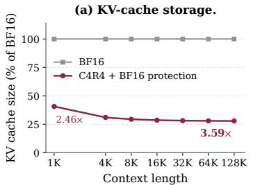

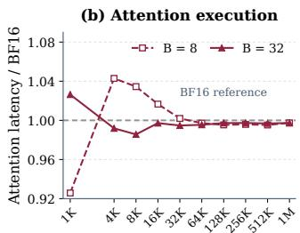

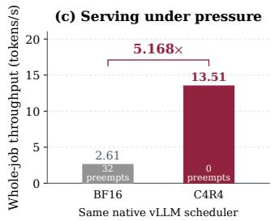  
KV-cache allocation, including BF16 buffers and metadata. (b) Attention latency at batch sizes 8 and 32, normalized to paired measurements with an unquantized BF16 cache. (c) Whole-job output throughput on eight GPUs under the same native vLLM scheduling policy; labels report preemption counts. Panel (c) compares one C4R4 run against a historical BF16 baseline.

Long-context retrieval. Figure 4 evaluates C4R4 retrieval from 4K to 32K tokens. QuantMLA remains close to BF16 on S-NIAH-1 and S-NIAH-2, averaging 99.95% and 99.60%, respectively. On the more challenging S-NIAH-3, it averages 87.20%, exceeding the strongest quantized baseline by 7.40 percentage points and outperforming all quantized baselines at every tested length.

## 4.3 ABLATION STUDIES

Table 3 evaluates QuantMLA’s component contributions and compares its unprotected C4R4 representation with representative baselines on the full DeepSeek-V2-Lite MMLU test set. Starting from RTN, the content- and RoPE-path transformations improve accuracy by 1.22 and 3.19 percentage points, respectively, raising the unprotected configuration from 51.90% to 56.31% before any BF16 protection. This transformationonly configuration outperforms SmoothQuant† and QuaRot† by 2.29 and 0.65 points, respectively. Building on this strong low-bit representation, the efficiently supported mixed-precision cache policy adds a further 1.64 points, bringing the complete QuantMLA configuration to 57.95%, comparable to BF16 at 57.90%.

Table 3: Baseline comparison and component ablation at C4R4. Scores on DeepSeek-V2-Lite MMLU; parenthesized values denote incremental gains within the QuantMLA sequence.
<table><tr><td>Configuration MMLU (%) ↑</td></tr><tr><td>BF16 57.90</td></tr><tr><td>Unprotected C4R4 baselines</td></tr><tr><td>RTN 51.90</td></tr><tr><td>SmoothQuant† 54.02 QuaRot† 55.66</td></tr><tr><td>QuantMLA cumulative components</td></tr><tr><td>RTN 51.90</td></tr><tr><td>+ Content-path transformation 53.12 (+1.22)</td></tr><tr><td>+ RoPE-path transformation 56.31 (+3.19)</td></tr><tr><td>+ Mixed-precision cache policy 57.95 (+1.64)</td></tr></table>

## 4.4 SYSTEM EFFICIENCY

KV-cache storage. With the mixed-precision cache policy, C4R4 achieves 3.22× and 3.59× persistent KV-cache compression at 4K and 128K, respectively (Figure 5(a)). The accounting includes BF16 buffers, redundant packed copies, and page mappings (Appendix C.5).

Native attention execution. Across tested lengths from 1K to 1M at batch sizes 8 and 32, C4R4 achieves near-BF16 attention latency, ranging from 7.42% lower to 4.29% higher, with differences below 0.5% from 64K onward (Figure 5(b); Appendix F.1). With L2 flushed before each graph sample, CUDA Graph timing spans attention-main through split-result combination, including unpacking and dequantization but excluding cache writing and metadata construction.

Serving under memory pressure. For five simultaneous requests with 128K input and 1K output tokens on eight GPUs, BF16 incurs 32 preemption events and C4R4 none under the same native vLLM scheduling policy (Kwon et al., 2023). Whole-job output throughput increases from 2.61 to 13.51 tokens/s (5.168×; Figure 5(c)), including prefill and recomputation. This gain is specific to the evaluated cache-pressure workload (Appendix F.2).

## 5 CONCLUSION

QuantMLA connects MLA’s dual-path asymmetry to low-bit cache learning. Its error analysis motivates path-specific offline-fusible transformations and function-aligned objectives by explaining unequal output distortion under matched cache error. Across four MLA families, joint INT4 caching remains close to BF16, while INT2 content caching extends the accuracy–memory trade-off. Offline fusion with native low-bit execution achieves 3.59× cache compression at 128K and 5.168× BF16 whole-job throughput under cache pressure.

## AI USE STATEMENT

Generative AI tools were used solely for language editing, including grammar, spelling, word choice, and minor improvements to clarity and consistency. All technical content, experimental results, analyses, and conclusions were developed and verified by the authors. The authors take full responsibility for the final manuscript.

## ETHICS STATEMENT

Low-bit caching can alter model behavior even when aggregate benchmark accuracy is preserved. Deployments should therefore reassess safety, calibration, and failure modes under the exact model, precision, and serving configuration. Our study uses public models and standard public benchmarks and involves no human subjects or collection of personal data.

## REPRODUCIBILITY STATEMENT

Appendices C and D specify the quantization operators, calibration protocol, hyperparameters, baseline adaptations, and evaluation settings. Appendix E provides the detailed commonsense results underlying the aggregated main-table scores, while Appendix B.3 reports controlled validation of the proposed error model. The derivations supporting the error analysis and the algebraic fusion of the learned transformations appear in Appendices B.2 and C, respectively.

## REFERENCES

Simran Arora, Sabri Eyuboglu, Michael Zhang, Aman Timalsina, Silas Alberti, James Zou, Atri Rudra, and Christopher Re. Simple linear attention language models balance the recall-throughput tradeoff. In Proceedings of the 41st International Conference on Machine Learning, volume 235, pp. 1763–1840. PMLR, 2024. URL https://proceedings.mlr.press/v235/ arora24a.html.

Saleh Ashkboos, Amirkeivan Mohtashami, Maximilian L. Croci, Bo Li, Pashmina Cameron, Martin Jaggi, Dan Alistarh, Torsten Hoefler, and James Hensman. QuaRot: Outlier-free 4-bit inference in rotated LLMs. In Advances in Neural Information Processing Systems, 2024.

Yonatan Bisk, Rowan Zellers, Ronan Le Bras, Jianfeng Gao, and Yejin Choi. PIQA: Reasoning about Physical Commonsense in Natural Language. arXiv preprint arXiv:1911.11641, 2019. URL https://arxiv.org/abs/1911.11641.

Mark Chen et al. Evaluating large language models trained on code. arXiv preprint arXiv:2107.03374, 2021.

Peter Clark, Isaac Cowhey, Oren Etzioni, Tushar Khot, Ashish Sabharwal, Carissa Schoenick, and Oyvind Tafjord. Think you have Solved Question Answering? Try ARC, the AI2 Reasoning Challenge. arXiv preprint arXiv:1803.05457, 2018. URL https://arxiv.org/abs/1803. 05457.

Karl Cobbe, Vineet Kosaraju, Mohammad Bavarian, Mark Chen, Heewoo Jun, Lukasz Kaiser, Matthias Plappert, Jerry Tworek, Jacob Hilton, Reiichiro Nakano, Christopher Hesse, and John Schulman. Training verifiers to solve math word problems. arXiv preprint arXiv:2110.14168, 2021. URL https://arxiv.org/abs/2110.14168.

DeepSeek-AI. Deepseek-v2: A strong, economical, and efficient mixture-of-experts language model. arXiv preprint arXiv:2405.04434, 2024.

DeepSeek-AI. FlashMLA: Efficient multi-head latent attention kernels, 2025. URL https:// github.com/deepseek-ai/FlashMLA. Accessed September 22, 2026; layouts are modelversion specific.

DeepSeek-AI et al. DeepSeek-V3 Technical Report. arXiv preprint arXiv:2412.19437, 2024. URL https://arxiv.org/abs/2412.19437.

DeepSeek-AI et al. DeepSeek-R1: Incentivizing Reasoning Capability in LLMs via Reinforcement Learning. arXiv preprint arXiv:2501.12948, 2025. URL https://arxiv.org/abs/2501. 12948.

Haojie Duanmu, Zhihang Yuan, Xiuhong Li, Jiangfei Duan, Xingcheng Zhang, and Dahua Lin. SKVQ: Sliding-window key and value cache quantization for large language models. arXiv preprint arXiv:2405.06219, 2024. URL https://arxiv.org/abs/2405.06219.

Insu Han, Praneeth Kacham, Amin Karbasi, Vahab Mirrokni, and Amir Zandieh. PolarQuant: Quantizing KV caches with polar transformation. arXiv preprint arXiv:2502.02617, 2025. URL https://arxiv.org/abs/2502.02617.

Dan Hendrycks, Collin Burns, Steven Basart, Andy Zou, Mantas Mazeika, Dawn Song, and Jacob Steinhardt. Measuring massive multitask language understanding. In International Conference on Learning Representations, 2021a.

Dan Hendrycks, Collin Burns, Saurav Kadavath, Akul Arora, Steven Basart, Eric Tang, Dawn Song, and Jacob Steinhardt. Measuring mathematical problem solving with the MATH dataset. In Proceedings ofthe Neural Information Processing Systems Track on Datasets and Benchmarks, 2021b. URL https://arxiv.org/abs/2103.03874.

Coleman Hooper, Sehoon Kim, Hiva Mohammadzadeh, Michael W. Mahoney, Yakun Sophia Shao, Kurt Keutzer, and Amir Gholami. KVQuant: Towards 10 million context length LLM inference with KV cache quantization. In Advances in Neural Information Processing Systems, 2024.

Cheng-Ping Hsieh, Simeng Sun, Samuel Kriman, Shantanu Acharya, Dima Rekesh, Fei Jia, Yang Zhang, and Boris Ginsburg. RULER: What’s the real context size of your long-context language models? In Conference on Language Modeling, 2024.

Xing Hu, Yuan Cheng, Dawei Yang, Zukang Xu, Zhihang Yuan, Jiangyong Yu, Chen Xu, Zhe Jiang, and Sifan Zhou. OSTQuant: Refining large language model quantization with orthogonal and scaling transformations for better distribution fitting. arXiv preprint arXiv:2501.13987, 2025. URL https://arxiv.org/abs/2501.13987.

Naman Jain, King Han, Alex Gu, Wen-Ding Li, Fanjia Yan, Tianjun Zhang, Sida Wang, Armando Solar-Lezama, Koushik Sen, and Ion Stoica. LiveCodeBench: Holistic and contamination free evaluation of large language models for code. In International Conference on Learning Representations, 2025.

Angelos Katharopoulos, Apoorv Vyas, Nikolaos Pappas, and Franc¸ois Fleuret. Transformers are RNNs: Fast autoregressive transformers with linear attention. In Proceedings of the 37th International Conference on Machine Learning, pp. 5156–5165, 2020. URL https: //proceedings.mlr.press/v119/katharopoulos20a.html.

Kimi Team et al. Kimi K2: Open Agentic Intelligence. arXiv preprint arXiv:2507.20534, 2025a. URL https://arxiv.org/abs/2507.20534.

Kimi Team et al. Kimi Linear: An Expressive, Efficient Attention Architecture. arXiv preprint arXiv:2510.26692, 2025b. URL https://arxiv.org/abs/2510.26692.

Woosuk Kwon, Zhuohan Li, Siyuan Zhuang, Ying Sheng, Lianmin Zheng, Cody Hao Yu, Joseph E. Gonzalez, Hao Zhang, and Ion Stoica. Efficient memory management for large language model serving with PagedAttention. In Proceedings of the 29th Symposium on Operating Systems Principles, 2023. URL https://arxiv.org/abs/2309.06180.

Haokun Lin, Haobo Xu, Yichen Wu, Jingzhi Cui, Yingtao Zhang, Linzhan Mou, Linqi Song, Zhenan Sun, and Ying Wei. DuQuant: Distributing outliers via dual transformation makes stronger quantized LLMs. arXiv preprint arXiv:2406.01721, 2024. URL https://arxiv.org/abs/ 2406.01721.

Jingyuan Liu, Jianlin Su, Xingcheng Yao, Zhejun Jiang, Guokun Lai, Yulun Du, Yidao Qin, Weixin Xu, Enzhe Lu, Junjie Yan, Yanru Chen, Huabin Zheng, Yibo Liu, Shaowei Liu, Bohong Yin, Weiran He, Han Zhu, Yuzhi Wang, Jianzhou Wang, Mengnan Dong, Zheng Zhang, Yongsheng Kang, Hao Zhang, Xinran Xu, Yutao Zhang, Yuxin Wu, Xinyu Zhou, and Zhilin Yang. Muon is scalable for LLM training. arXiv preprint arXiv:2502.16982, 2025a.

Ruikang Liu, Yuxuan Sun, Manyi Zhang, Haoli Bai, Xianzhi Yu, Tiezheng Yu, Chun Yuan, and Lu Hou. Quantization hurts reasoning? an empirical study on quantized reasoning models. In Conference on Language Modeling, 2025b. URL https://arxiv.org/abs/2504.04823.

Zechun Liu, Changsheng Zhao, Igor Fedorov, Bilge Soran, Dhruv Choudhary, Raghuraman Krishnamoorthi, Vikas Chandra, Yuandong Tian, and Tijmen Blankevoort. SpinQuant: LLM quantization with learned rotations. In International Conference on Learning Representations, 2025c.

Zirui Liu, Jiayi Yuan, Hongye Jin, Shaochen Zhong, Zhaozhuo Xu, Vladimir Braverman, Beidi Chen, and Xia Hu. KIVI: A tuning-free asymmetric 2bit quantization for KV cache. In International Conference on Machine Learning, 2024.

Meituan LongCat Team. LongCat-Flash-Lite. Model card, 2026a. URL https://huggingface. co/meituan-longcat/LongCat-Flash-Lite.

Meituan LongCat Team. LongCat-2.0. Official model release, 2026b. URL https://github. com/meituan-longcat/LongCat-2.0.

Meituan LongCat Team et al. LongCat-Flash Technical Report. arXiv preprint arXiv:2509.01322, 2025. URL https://arxiv.org/abs/2509.01322.

Stephen Merity, Caiming Xiong, James Bradbury, and Richard Socher. Pointer sentinel mixture models. In International Conference on Learning Representations, 2017.

Moonshot AI. Kimi K3: Open frontier intelligence. Official model release and technical report, 2026. URL https://github.com/MoonshotAI/Kimi-K3.

Colin Raffel, Noam Shazeer, Adam Roberts, Katherine Lee, Sharan Narang, Michael Matena, Yanqi Zhou, Wei Li, and Peter J. Liu. Exploring the limits of transfer learning with a unified text-to-text transformer. Journal ofMachine Learning Research, 21(140):1–67, 2020.

Pranav Rajpurkar, Jian Zhang, Konstantin Lopyrev, and Percy Liang. SQuAD: 100,000+ Questions for Machine Comprehension of Text. arXiv preprint arXiv:1606.05250, 2016. URL https: //arxiv.org/abs/1606.05250.

David Rein et al. GPQA: A graduate-level google-proof q&a benchmark. In Conference on Language Modeling, 2024.

Keisuke Sakaguchi, Ronan Le Bras, Chandra Bhagavatula, and Yejin Choi. WinoGrande: An Adversarial Winograd Schema Challenge at Scale. arXiv preprint arXiv:1907.10641, 2019. URL https://arxiv.org/abs/1907.10641.

Wenqi Shao, Mengzhao Chen, Zhaoyang Zhang, Peng Xu, Lirui Zhao, Zhiqian Li, Kaipeng Zhang, Peng Gao, Yu Qiao, and Ping Luo. OmniQuant: Omnidirectionally calibrated quantization for large language models. In International Conference on Learning Representations, 2024.

Jianlin Su, Yu Lu, Shengfeng Pan, Ahmed Murtadha, Bo Wen, and Yunfeng Liu. RoFormer: Enhanced transformer with rotary position embedding. Neurocomputing, 568:127063, 2024.

Zunhai Su, Hanyu Wei, Zhe Chen, Wang Shen, Linge Li, Huangqi Yu, and Kehong Yuan. RotateKV: Accurate and robust 2-bit KV cache quantization for LLMs via outlier-aware adaptive rotations. In Proceedings of the Thirty-Fourth International Joint Conference on Artificial Intelligence, pp. 6200–6208, 2025. doi: 10.24963/ijcai.2025/690. URL https://www.ijcai.org/ proceedings/2025/690.

Zunhai Su, Rui Yang, Chao Zhang, Yaxiu Liu, Yifan Zhang, Wei Wu, Jing Xiong, Dayou Du, Xialie Zhuang, Yulei Qian, Yuchen Xie, Yik-Chung Wu, Hongxia Yang, and Ngai Wong. OScaR: The occam’s razor for extreme KV cache quantization in LLMs and beyond. arXiv preprint arXiv:2605.19660, 2026.

Yuxuan Sun, Ruikang Liu, Haoli Bai, Han Bao, Kang Zhao, Yuening Li, Jiaxin Hu, Xianzhi Yu, Lu Hou, Chun Yuan, Xin Jiang, Wulong Liu, and Jun Yao. FlatQuant: Flatness matters for LLM quantization. In International Conference on Machine Learning, 2025. URL https: //arxiv.org/abs/2410.09426.

Boris van Breugel, Yelysei Bondarenko, Paul Whatmough, and Markus Nagel. FPTQuant: Functionpreserving transforms for LLM quantization. arXiv preprint arXiv:2506.04985, 2025. URL https://arxiv.org/abs/2506.04985.

Dustin Wang, Rui-Jie Zhu, Steven Abreu, Yong Shan, Taylor Kergan, Yuqi Pan, Yuhong Chou, Zheng Li, Jibin Wu, Ge Zhang, Wenhao Huang, and Jason Eshraghian. A systematic analysis of hybrid linear attention. arXiv preprint arXiv:2507.06457, 2025. URL https://arxiv.org/abs/ 2507.06457. Version 2, June 2026.

Guangxuan Xiao, Ji Lin, Mickael Seznec, Hao Wu, Julien Demouth, and Song Han. SmoothQuant: Accurate and efficient post-training quantization for large language models. In International Conference on Machine Learning, 2023.

Jingyang Yuan et al. Native Sparse Attention: Hardware-Aligned and Natively Trainable Sparse Attention. arXiv preprint arXiv:2502.11089, 2025. URL https://arxiv.org/abs/2502. 11089.

Zhihang Yuan, Lin Niu, Jiawei Liu, Wenyu Liu, Xinggang Wang, Yuzhang Shang, Guangyu Sun, Qiang Wu, Jiaxiang Wu, and Bingzhe Wu. RPTQ: Reorder-based Post-training Quantization for Large Language Models. arXiv preprint arXiv:2304.01089, 2023. URL https://arxiv. org/abs/2304.01089.

Z.ai. GLM-4.7-Flash. Model release, 2026a. URL https://huggingface.co/zai-org/ GLM-4.7-Flash.

Z.ai. GLM-5.3. Official model card, 2026b. URL https://huggingface.co/zai-org/ GLM-5.3.

Amir Zandieh, Majid Daliri, Majid Hadian, and Vahab Mirrokni. TurboQuant: Online vector quantization with near-optimal distortion rate. arXiv preprint arXiv:2504.19874, 2025. URL https://arxiv.org/abs/2504.19874.

Rowan Zellers, Ari Holtzman, Yonatan Bisk, Ali Farhadi, and Yejin Choi. HellaSwag: Can a Machine Really Finish Your Sentence? arXiv preprint arXiv:1905.07830, 2019. URL https: //arxiv.org/abs/1905.07830.

Biao Zhang and Rico Sennrich. Root mean square layer normalization. In Advances in Neural Information Processing Systems, 2019.

Yifan Zhang, Zunhai Su, Shuhao Hu, Rui Yang, Wei Wu, Yulei Qian, Yuchen Xie, and Xunliang Cai. SnapMLA: Efficient long-context MLA decoding via hardware-aware FP8 quantized pipelining. arXiv preprint arXiv:2602.10718, 2026.

Zhongzhu Zhou, Donglin Zhuang, Jisen Li, Ziyan Chen, Shuaiwen Leon Song, Ben Athiwaratkun, and Xiaoxia Wu. OSCAR: Offline spectral covariance-aware rotation for 2-bit KV cache quantization. arXiv preprint arXiv:2605.17757, 2026. URL https://arxiv.org/abs/2605.17757.

## APPENDIX CONTENTS

Related Work 15   
A.1 Transformation-Based LLM Quantization 15   
A.2 Low-Bit KV Cache Quantization 15   
B Additional Dual-Path Error Analysis 15   
B.1 Matched-Error Protocol and Six-Model Results 15   
B.2 Error Propagation and Amplification 17   
B.3 Predictive Validation and Controlled Interventions 17   
C Transformation Learning and Native Execution 19   
C.1 Content-Path Fusion 19   
C.2 RoPE-Path Fusion 19   
C.3 Bounding Output Error by Positional QK Error 20   
C.4 Quantization and Transformation Learning . 21   
C.5 Native Cache Layout and Mixed-Precision Execution 22   
D Evaluation Protocols 24   
D.1 Task Evaluation and Scoring 24   
D.2 Baseline Adaptations 24   
D.3 Component-Ablation Protocol 25   
E Additional Accuracy Results 25   
F Additional Efficiency Results 25   
F.1 Native Attention . 25   
F.2 Serving under Cache Pressure 26

## A RELATED WORK

## A.1 TRANSFORMATION-BASED LLM QUANTIZATION

Equivalent transformations improve quantization by reshaping representations while preserving full-precision computation. Early methods redistribute quantization difficulty through scaling or reordering: SmoothQuant redistributes activation outliers through equivalent scaling, while OmniQuant jointly learns equivalent scaling and weight clipping (Xiao et al., 2023; Shao et al., 2024); RPTQ and SKVQ reorder channels to reduce within-group range variation (Yuan et al., 2023; Duanmu et al., 2024). Orthogonal transforms suppress outliers and redistribute energy, from randomized Hadamard rotations in QuaRot to learned rotations in SpinQuant and rotation–permutation compositions in DuQuant (Ashkboos et al., 2024; Liu et al., 2025c; Lin et al., 2024). More expressive transformation families include affine transforms in FlatQuant, orthogonal–scaling compositions in OSTQuant, and learned pre-RoPE and value transformations in FPTQuant (Sun et al., 2025; Hu et al., 2025; van Breugel et al., 2025). RotateKV extends rotation-based quantization to KV caches through outlieraware pre-RoPE transformations, while OScaR combines canalized rotation with token scaling (Su et al., 2025; 2026). These methods are primarily developed for conventional explicit KV representa tions and do not directly accommodate MLA’s latent-cache structure. In MLA, the shared content latent jointly supplies keys and values, whereas the decoupled RoPE key cache stores positional keys under distinct rotary-compatibility constraints, yielding different offline-fusible transformation spaces and functional roles. QuantMLA addresses this architecture-specific asymmetry through path-specific offline-fusible transformation spaces and function-aligned objectives.

## A.2 LOW-BIT KV CACHE QUANTIZATION

Low-bit KV-cache quantization exploits the heterogeneous statistics of keys and values. KIVI uses per-channel key and per-token value quantization, while KVQuant introduces pre-RoPE key quantization and outlier-aware coding (Liu et al., 2024; Hooper et al., 2024). Later methods reshape or recode cached representations: RotateKV smooths key outliers through rotation and reordering, while TurboQuant and PolarQuant introduce transformation or coding structures for lower-distortion compression (Su et al., 2025; Zandieh et al., 2025; Han et al., 2025). Methods targeting more aggressive compression include OSCAR, which derives attention-aware spectral rotations from query– key and value-side covariance, and OScaR, which combines canalized rotation with token scaling to mitigate token-norm imbalance under INT2 quantization (Zhou et al., 2026; Su et al., 2026). MLA changes the quantization target: a shared content latent jointly supplies content keys and values, while a separate cache stores the decoupled RoPE keys. FlashMLA’s DeepSeek-V3.2 layout adopts an FP8-content/BF16-RoPE split, while SnapMLA co-designs content-cache quantization with attention execution (DeepSeek-AI, 2025; Zhang et al., 2026). These MLA-specific approaches neither model how quantization errors propagate through the two paths nor jointly optimize low-bit representations for both caches. QuantMLA closes this gap with dual-path error modeling and function-aligned transformation learning for joint low-bit caching.

## B ADDITIONAL DUAL-PATH ERROR ANALYSIS

This appendix complements Section 2 with the matched-error protocol and complete six-model results, the derivation of error propagation and amplification, and predictive and interventional validation of the operator–error model.

## B.1 MATCHED-ERROR PROTOCOL AND SIX-MODEL RESULTS

For each layer and input, we compute the quantization error induced by INT4 affine quantization and rescale it to cache NMSE 0.01 without changing its direction. We perturb one path’s cache at a time, keeping the other path and model parameters fixed, and measure distortion after the attention output projection.

Inputs and coverage. Each model is evaluated on WikiText (Merity et al., 2017) and C4 (Raffel et al., 2020) with three fixed seeds, yielding six dataset–seed cells with eight non-overlapping 512- token sequences per cell. The study covers 285 attention layers: 27, 61, 61, 61, 28, and 47 for

DeepSeek-V2-Lite, DeepSeek-V3-Base, DeepSeek-R1, Kimi-K2-Instruct, LongCat-Flash-Lite, and GLM-4.7-Flash, respectively (DeepSeek-AI, 2024; DeepSeek-AI et al., 2024; 2025; Kimi Team et al., 2025a; Meituan LongCat Team, 2026a; Z.ai, 2026a).

Response normalization and aggregation. Following Section 2.2, the finite response of path b at layer ℓ is

$$
R _ { b , \ell } = \frac { \mathrm { N M S E } _ { \mathrm { o u t } , b , \ell } } { \mathrm { N M S E } _ { \mathrm { c a c h e } , b , \ell } } .\tag{11}
$$

We first average each path’s response over the six cells and then form the layer-wise ratio $r _ { \ell } =$ $\overline { { R } } _ { P , \ell } / \overline { { R } } _ { C , \ell }$ . The model-level ratio divides the mean RoPE response by the mean content response over layers and is therefore not the arithmetic mean of $r _ { \ell } .$ In Figure 2, shaded envelopes show the minimum and maximum cell responses, while diamonds and whiskers summarize the median and interquartile range of the layer-wise ratios. Table 4 reports the model-level aggregates, and Figure 6 provides the complete 285-layer view. Because the cache NMSE is fixed at 0.01, the corresponding output NMSE is 0.01 $R _ { b , \ell } ;$ its relation to local directional gain is derived in Appendix B.2.

Table 4: Model-level responses at matched cache NMSE. Ratios use unrounded source aggregates; displayed responses are rounded.
<table><tr><td>Model</td><td>Content response</td><td>RoPE response</td><td>Ratio</td></tr><tr><td>DeepSeek-V2-Lite</td><td>0.620</td><td>3.925</td><td>6.331</td></tr><tr><td>DeepSeek-V3-Base</td><td>0.452</td><td>1.751</td><td>3.871</td></tr><tr><td>DeepSeek-R1</td><td>0.494</td><td>1.784</td><td>3.611</td></tr><tr><td>Kimi-K2-Instruct</td><td>1.594</td><td>3.095</td><td>1.941</td></tr><tr><td>LongCat-Flash-Lite</td><td>0.594</td><td>4.077</td><td>6.864</td></tr><tr><td>GLM-4.7-Flash</td><td>1.026</td><td>2.462</td><td>2.400</td></tr></table>

## Path-wise output distortion

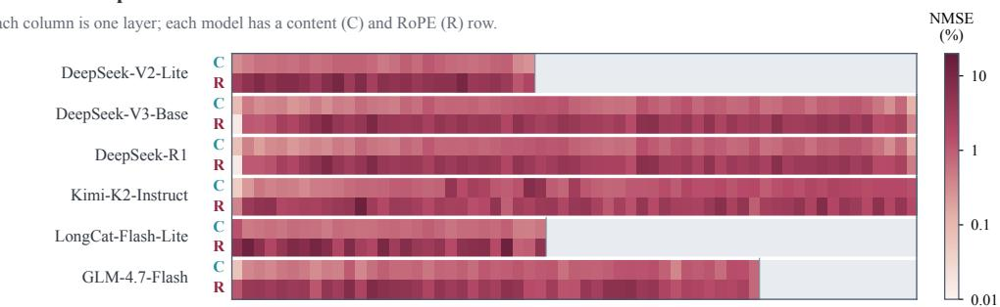

RoPE-to-content response ratio  
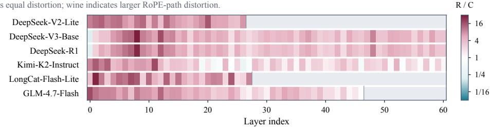  
Gray denotes layers beyond a model's analyzed depth.

Figure 6: Layer-wise atlas of dual-path output distortion. Upper: content (C) and RoPE (R) output NMSE at cache NMSE 0.01. Lower: RoPE/content ratios, with white marking equal distortion. Logarithmic color scales are shared across models; gray pads positions beyond each model’s analyzed depth.

## B.2 ERROR PROPAGATION AND AMPLIFICATION

Finite error routes. Using the absorbed computation in Equation 1, write $\widehat { A } _ { b , h } = A _ { h } + \Delta A _ { b , h }$ for the attention probabilities after perturbing path b. The content path perturbs both the attention probabilities and the shared latent, giving

$$
\Delta Y _ { C } = \sum _ { h } \left[ ( A _ { h } + \Delta A _ { C , h } ) ( C + \Delta C ) B _ { h } - A _ { h } C B _ { h } \right]\tag{12}
$$

$$
= \sum _ { h } \bigl [ \Delta A _ { C , h } C B _ { h } + A _ { h } \Delta C B _ { h } + \Delta A _ { C , h } \Delta C B _ { h } \bigr ] .\tag{13}
$$

The RoPE path leaves $C$ unchanged, so

$$
\Delta Y _ { P } = \sum _ { h } \Delta A _ { P , h } C B _ { h } .\tag{14}
$$

These identities hold for finite perturbations and separate the content path’s matching, aggregation, and interaction terms without invoking a linear approximation.

Local gain and normalization. For a sufficiently small path-isolated quantization error $e _ { b } ,$ firstorder expansion gives $\Delta y _ { b } = J _ { b } e _ { b } + o ( \| e _ { b } \| _ { 2 } )$ and hence

$$
\mathrm { N M S E } _ { \mathrm { o u t } , b } \approx \mathrm { N M S E } _ { \mathrm { c a c h e } , b } \frac { \| c _ { b } \| _ { 2 } ^ { 2 } } { \| y \| _ { 2 } ^ { 2 } } G _ { b } ( e _ { b } ) .\tag{15}
$$

Thus, in the local regime, the finite response $R _ { b }$ differs from the directional gain $G _ { b }$ by the cache/output energy normalization, while finite-error measurements can additionally reflect nonlinear effects. For $e _ { b } \neq 0$ and $T _ { b } > 0$ , define

$$
T _ { b } = \frac { \mathrm { t r } ( H _ { b } ) } { D _ { b } } , \qquad A _ { b } = \frac { \sum _ { i } ( H _ { b } ) _ { i i } ( e _ { b } ) _ { i } ^ { 2 } } { T _ { b } \| e _ { b } \| _ { 2 } ^ { 2 } } , \qquad O _ { b } = \frac { \sum _ { i \neq j } ( H _ { b } ) _ { i j } ( e _ { b } ) _ { i } ( e _ { b } ) _ { j } } { \| e _ { b } \| _ { 2 } ^ { 2 } } .\tag{16}
$$

Separating the diagonal and off-diagonal contributions to $e _ { b } ^ { \top } H _ { b } e _ { b }$ yields the exact local identity

$$
G _ { b } = T _ { b } A _ { b } + O _ { b } .\tag{17}
$$

Here, $T _ { b }$ measures average operator sensitivity, $A _ { b }$ captures the allocation of quantization-error energy over sensitive coordinates, and $O _ { b }$ captures signed cross-coordinate directional coupling. All three quantities are defined in the declared cache coordinates. If $e _ { b } = 0$ , there is no perturbation; if $T _ { b } = 0$ , positive semidefiniteness implies $H _ { b } = 0$ , so the local response vanishes without requiring Ab to be defined.

Joint-path interaction. When both paths are quantized, the first-order output perturbation is $J _ { C } e _ { C } + J _ { P } e _ { P }$ , with

$$
| | J _ { C } e _ { C } + J _ { P } e _ { P } | | _ { 2 } ^ { 2 } = | | J _ { C } e _ { C } | | _ { 2 } ^ { 2 } + | | J _ { P } e _ { P } | | _ { 2 } ^ { 2 } + 2 \langle J _ { C } e _ { C } , J _ { P } e _ { P } \rangle .\tag{18}
$$

The interaction term need not vanish, so path-isolated learning does not assume independent error routes. QuantMLA optimizes the two transformations separately according to their path-specific objectives and evaluates their composition jointly.

## B.3 PREDICTIVE VALIDATION AND CONTROLLED INTERVENTIONS

Estimating operator statistics. We estimate the trace and diagonal of $H _ { b } = J _ { b } ^ { \top } J _ { b }$ using outputspace Rademacher vector–Jacobian products. For a Rademacher probe r and $g _ { b } = J _ { b } ^ { \top } r$

$$
\begin{array} { r } { \mathbb { E } _ { r } \| g _ { b } \| _ { 2 } ^ { 2 } = \operatorname { t r } ( H _ { b } ) , \qquad \mathbb { E } _ { r } [ g _ { b } \odot g _ { b } ] = \operatorname { d i a g } ( H _ { b } ) . } \end{array}\tag{19}
$$

We use 256 probes per path in the declared cache coordinates. Sampling variation in these estimates is distinct from both off-diagonal directional coupling and nonlinear finite-error effects.

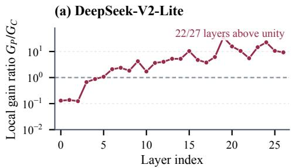

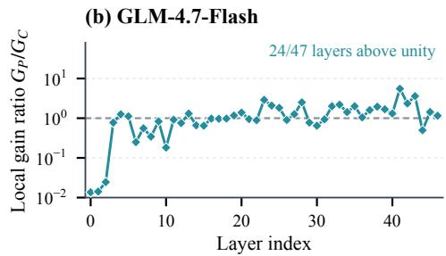

(c) Frozen-predictor validation  
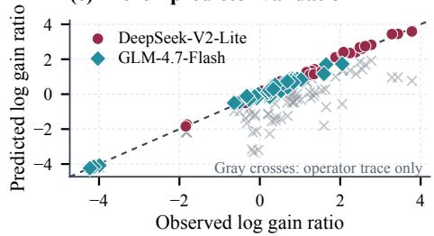

(d) Equal-energy interventions  
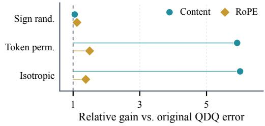  
Figure 7: Predicting and testing functional amplification. Layer-wise gains, 72 validation points, and equal-energy interventions separate operator sensitivity from quantization-error geometry at cache NMSE $1 0 ^ { - 3 }$

Validation protocol. The analysis contains 146 layer–input points in total: all 27 analyzed DeepSeek-V2-Lite layers and $4 \dot { 7 }$ GLM-4.7-Flash layers for the layer sweeps, together with 36 additional validation configurations per model. QDQ-induced quantization-error directions are rescaled to cache NMSE $1 \bar { 0 } ^ { - 3 }$ for this local analysis, compared with 0.01 in the six-model finiteresponse study. Figure 7 summarizes the two layer sweeps, the 72 additional validation points, and the equal-energy interventions.

Frozen-predictor evaluation. For positive gain ratios, we use

$$
\widehat { \log ( G _ { P } / G _ { C } ) } = \log ( T _ { P } / T _ { C } ) + \log ( A _ { P } / A _ { C } ) + \gamma , \qquad \gamma = - 0 . 0 7 4 9 6 1 4 4 1 0 .\tag{20}
$$

The correction $\gamma$ is fixed from the earlier DeepSeek-V2-Lite stage and is not refitted on GLM-4.7- Flash. It statistically accounts for effects beyond the modeled operator-sensitivity and error-allocation terms without replacing the exact decomposition in Equation 5. The trace-only control retains $\log ( T _ { P } / T _ { C } ) + \gamma _ { \mathrm { { f } } }$ , while the cache-error-only control predicts γ under matched cache error. Table 5 shows that incorporating quantization-error allocation substantially improves prediction over either control.

Table 5: Predictive validation of the operator–error model. Each model contributes 36 validation points. MAE denotes mean absolute error.
<table><tr><td>Model</td><td>Spearman</td><td>Median absolute log error</td></tr><tr><td>DeepSeek-V2-Lite</td><td>0.9923</td><td>0.1054</td></tr><tr><td>GLM-4.7-Flash</td><td>0.9614</td><td>0.0727</td></tr><tr><td>Predictor</td><td>DeepSeek-V2-Lite log-ratio MAE</td><td>GLM-4.7-Flash log-ratio MAE</td></tr><tr><td>Cache error only</td><td>1.5657</td><td>0.8790</td></tr><tr><td>Operator trace only</td><td>0.9129</td><td>1.4276</td></tr><tr><td>Operator + error allocation</td><td>0.1133</td><td>0.1173</td></tr></table>

Controlled error interventions. At DeepSeek-V2-Lite layer 20, WikiText/C4 and two seeds yield four configurations at cache NMSE $1 0 ^ { - 3 }$ . The equal-energy controls independently randomize error signs, permute whole-token locations, or replace the error direction with an isotropic direction (Table 6). Whole-token permutation increases content-path gain by 5.918×, close to the isotropic control, whereas sign randomization produces little change. These results support token-dependent quantization-error allocation as a major source of suppressed content-path gain. A JVP-versus-finite perturbation comparison gives Spearman 0.986 over 24 path–direction observations, supporting the local approximation at the tested error scale.

Table 6: Equal-energy interventions isolate quantization-error allocation. Geometric-mean gain ratios relative to the original QDQ-induced errors use 32 repetitions per control across four DeepSeek-V2-Lite layer-20 configurations. Unity indicates unchanged gain.
<table><tr><td>Error intervention</td><td>Content</td><td>RoPE</td></tr><tr><td>Independent sign randomization</td><td>1.048</td><td>1.115</td></tr><tr><td>Whole-token permutation</td><td>5.918</td><td>1.495</td></tr><tr><td>Isotropic direction</td><td>6.007</td><td>1.380</td></tr></table>

Across layers, each model’s 36-point validation set includes 16 whole-token permutations per point, yielding 576 interventions per model. Median content-path gain increases by 2.853× on DeepSeek-V2-Lite and 4.220× on GLM-4.7-Flash. These controls preserve quantization-error energy while changing its allocation, further supporting the operator–error explanation beyond the single-layer intervention.

## C TRANSFORMATION LEARNING AND NATIVE EXECUTION

We provide the fusion identities and positional QK error bound underlying Section 3, followed by quantization, transformation learning, native execution, and correctness verification.

## C.1 CONTENT-PATH FUSION

Write the original content latent as $c = u \Gamma$ , where $u = \mathrm { R M S N o r m } _ { 1 } ( x )$ , following the row-vector convention of Section 3.1. Because $R _ { C }$ is orthogonal,

$$
\mathrm { R M S N o r m } _ { 1 } ( x R _ { C } ) = \mathrm { R M S N o r m } _ { 1 } ( x ) R _ { C } .\tag{21}
$$

The producing projection, normalization scale, and each consuming projection can therefore be reparameterized offline as

$$
W _ { a } ^ { \prime } = W _ { a } R _ { C } , \qquad \Gamma ^ { \prime } = S _ { C } , \qquad W _ { b } ^ { \prime } = S _ { C } ^ { - 1 } R _ { C } ^ { \top } \Gamma W _ { b } .\tag{22}
$$

The transformed cache $z _ { C } = u R _ { C } S _ { C }$ preserves each full-precision consumer output:

$$
z _ { C } W _ { b } ^ { \prime } = u \Gamma W _ { b } .\tag{23}
$$

Thus, the learned content transformation is fully absorbed into existing model parameters and introduces no online transformation. The update applies only to the content-latent sub-block; any concatenated positional block remains unchanged. Producing biases, when present, undergo the same rotation, and model-specific factorizations are fused at their native projection interfaces.

## C.2 ROPE-PATH FUSION

Equivalent positional reparameterization. Let $R _ { P } = \mathrm { b l o c k d i a g } ( R _ { i } )$ with each $R _ { i } \in S O ( 2 )$ acting on one RoPE frequency pair, and let $S _ { P } = \mathrm { b l o c k d i a g } ( s _ { i } I _ { 2 } )$ with $s _ { i } > 0$ . The reciprocal query–key transformation in Equation 7 preserves full-precision positional scores and commutes with every positional rotation under the same pair layout, permitting fusion into the pre-RoPE projections.

Proof. Within each frequency pair, both $R _ { i }$ and the positional rotation are planar rotations and therefore commute; the scalar matrix $s _ { i } I _ { 2 }$ commutes with both. The block-diagonal transforms inherit these relations under the same native pair layout. Moreover, $R _ { P } R _ { P } ^ { \top } = I$ and $S _ { P } ^ { - 1 } S _ { P } ^ { \top } = I$ , so

$$
\begin{array} { r } { Q _ { P } ^ { \prime } ( K _ { P } ^ { \prime } ) ^ { \top } = Q _ { P } R _ { P } S _ { P } ^ { - 1 } S _ { P } ^ { \top } R _ { P } ^ { \top } K _ { P } ^ { \top } = Q _ { P } K _ { P } ^ { \top } . } \end{array}\tag{24}
$$

Thus, the learned transformation and reciprocal query compensation can be folded into the pre-RoPE projections while preserving the positional scores. For a row-vector projection hW,

$$
W _ { K } ^ { \prime } = W _ { K } R _ { P } S _ { P } , \qquad W _ { Q } ^ { \prime } = W _ { Q } R _ { P } S _ { P } ^ { - 1 } .\tag{25}
$$

The same updates apply to relevant biases and only to the positional sub-block when a projection produces additional features. The implementation follows each model’s native RoPE pairing convention and introduces no cross-frequency online mixing.

## C.3 BOUNDING OUTPUT ERROR BY POSITIONAL QK ERROR

We prove Proposition 2 and derive its normalized extension below. Hold the content logits and values fixed, write the positional score contribution as $Z _ { P } = Q _ { P } K _ { P } ^ { \intercal }$ , and let Ω select valid causal query–key pairs. Assume every query has at least one valid key and that softmax is evaluated over the same valid-key set before and after perturbation. For a probability vector a, the softmax Jacobian

$$
D = { \mathrm { D i a g } } ( a ) - a a ^ { \top }\tag{26}
$$

is symmetric positive semidefinite. The absolute sum of row i is $2 a _ { i } ( 1 - a _ { i } ) \leq 1 / 2$ , giving

$$
\| D \| _ { 2 } \leq \sqrt { \| D \| _ { 1 } \| D \| _ { \infty } } \leq \frac { 1 } { 2 } .\tag{27}
$$

Integrating the Jacobian along the segment between the original and perturbed score vectors yields

$$
\lVert \widehat { A } - A \rVert _ { F } \leq \frac { \tau } { 2 } \lVert \Omega \odot \big ( \widehat { Z } _ { P } - Z _ { P } \big ) \rVert _ { F } .\tag{28}
$$

For one head, let $\bar { V } _ { h } = C B _ { h } = V _ { h } W _ { O , h }$ denote the effective projected values. Then

$$
\| \widehat { Y } _ { h } - Y _ { h } \| _ { F } \leq \frac { \tau } { 2 } \| \Omega \odot ( \widehat { Z } _ { P , h } - Z _ { P , h } ) \| _ { F } \| \bar { V } _ { h } \| _ { 2 } .\tag{29}
$$

With shared positional keys and multiple heads, the layer output perturbation is the sum of projected head perturbations. Applying the triangle inequality and Cauchy–Schwarz gives

$$
\| \Delta Y _ { P } \| _ { F } \leq \frac { \tau } { 2 } \left( \sum _ { h } \| \Omega \odot \Delta Z _ { P , h } \| _ { F } ^ { 2 } \right) ^ { 1 / 2 } \left( \sum _ { h } \| \bar { V } _ { h } \| _ { 2 } ^ { 2 } \right) ^ { 1 / 2 } .\tag{30}
$$

Squaring both sides gives Equation 9. Unlike the directional-gain analysis, this bound applies to finite positional-score perturbations and requires no first-order approximation. It assumes fixed queries, content scores, values, and valid-key sets while varying the RoPE cache; quantizing the content path introduces additional terms. For any fixed candidate transformation, equivalent query–key compensation preserves the full-precision positional scores, so the bound applies pointwise to every candidate representation even though the compensation changes during learning.

Normalized objective. For a fixed calibration sample and layer, define

$$
D _ { Z } = \operatorname* { m a x } \left\{ \sum _ { h } \| \Omega \odot Z _ { P , h } \| _ { F } ^ { 2 } , \epsilon _ { P } \right\} , \qquad D _ { Y } = \operatorname* { m a x } \{ \| Y \| _ { F } ^ { 2 } , \epsilon _ { C } \} .\tag{31}
$$

Let

$$
\ell _ { P } = \frac { \sum _ { h } | | \Omega \odot \Delta Z _ { P , h } | | _ { F } ^ { 2 } } { D _ { Z } }\tag{32}
$$

be the sample-level loss corresponding to Equation 10. Then

$$
\frac { \| \Delta Y _ { P } \| _ { F } ^ { 2 } } { D _ { Y } } \leq \frac { \tau ^ { 2 } D _ { Z } } { 4 D _ { Y } } \left( \sum _ { h } \| \bar { V } _ { h } \| _ { 2 } ^ { 2 } \right) \ell _ { P } .\tag{33}
$$

For a fixed sample, the multiplier is independent of the learned RoPE transformation because equivalent compensation preserves teacher positional scores while values remain fixed, although it may vary across samples and layers. Thus, mean normalized positional QK reconstruction is an output-controlling surrogate rather than an exact reformulation of mean output reconstruction. On a finite calibration set, the largest multiplier bounds the mean output error by the mean QK loss. Retaining sample-specific multipliers tightens the bound but changes the learning objective.

Functional specificity of positional QK reconstruction. For a valid key k and query row $q ,$

$$
\frac { \partial Y _ { h , q } } { \partial ( Z _ { P , h } ) _ { q k } } = \tau A _ { h , q k } \big ( V _ { h , k } - O _ { h , q } \big ) W _ { O , h } .\tag{34}
$$

Attention-output reconstruction and positional QK reconstruction therefore need not weight the same score errors equally. The former weights perturbations through attention probabilities, values, and the output projection, whereas the latter directly preserves positional matching. Positional QK reconstruction therefore preserves the RoPE-induced component of the attention logits, with output distortion controlled by the bound above.

## C.4 QUANTIZATION AND TRANSFORMATION LEARNING

Affine group quantization. Each token is quantized independently in groups of 64 coordinates. For bit width b, let $m = 2 ^ { b } - 1$ and let $x _ { \mathrm { m i n } } , x _ { \mathrm { m a x } }$ be the group extrema. The reference quantizer uses

$$
s = \frac { \operatorname* { m a x } \bigl ( x _ { \mathrm { m a x } } - x _ { \mathrm { m i n } } , 1 0 ^ { - 8 } \bigr ) } { m } , \qquad z = \mathrm { c l i p } \bigl ( \mathrm { r o u n d } ( - x _ { \mathrm { m i n } } / s ) , 0 , m \bigr ) ,\tag{35}
$$

$$
q = \mathrm { c l i p } ( \mathrm { r o u n d } ( x / s + z ) , 0 , m ) , \qquad { \widehat x } = s ( q - z ) .\tag{36}
$$

We use round-to-nearest with ties to even, without special handling of constant groups. Calibration applies a straight-through estimator to rounding. Calibration and native execution share the same scale-computation, zero-point, rounding, and clipping rules. Native execution stores content scales in BF16 and RoPE scales in FP32 and dequantizes using the stored scales.

Function-aligned optimization. All pretrained parameters remain frozen during learning. Content rotations use a Cayley parameterization, RoPE-pair rotations use trainable angles, and positive scales are optimized in log space. The content path minimizes attention-output reconstruction, while the RoPE path minimizes positional QK reconstruction over all valid causal pairs and heads. The latter uses the complete positional QK matrix rather than separate frequency-pair errors, preserving crossfrequency cancellation. Calibration has no BF16-protected region; the sink/local policy is applied only at evaluation. Each path selects the checkpoint with the lowest held-out path objective, without downstream test selection. Table 7 specifies the optimization settings.

Table 7: Calibration and transformation-learning settings. Learning uses disjoint training and validation banks; downstream comparisons use seed 0.
<table><tr><td>Item</td><td>Setting</td></tr><tr><td>Calibration corpus</td><td>WikiText-2 training split</td></tr><tr><td>Sequence length / batch size</td><td>2048 / 4</td></tr><tr><td>Train / validation bank</td><td>128 / 32 sequences per seed</td></tr><tr><td>Optimization</td><td>300 steps per path</td></tr><tr><td>Optimizer</td><td>AdamW, weight decay 0</td></tr><tr><td>Schedule</td><td>10% warmup, cosine decay</td></tr><tr><td>Gradient clipping</td><td>1.0</td></tr><tr><td>Content rotation LR</td><td> $3 \times 1 0 ^ { - 3 }$ </td></tr><tr><td>RoPE angle / scale LR</td><td> $1 \times 1 0 ^ { - 3 } / 1 \times 1 0 ^ { - 3 }$ </td></tr><tr><td>Content scale LR</td><td> $1 \times 1 0 ^ { - 3 }$ </td></tr><tr><td>Rotation / angle / scale anchor</td><td> $1 0 ^ { - 4 }$ </td></tr><tr><td>Validation frequency</td><td>Every 20 steps, including step 0</td></tr><tr><td>Calibration seeds</td><td> $0 , 1 , \dot { 2 }$ </td></tr><tr><td>Quantizer Scale-initialization search</td><td>Affine asymmetric, group size 64  $\alpha \in \{ 0 , . 1 2 5 , . 2 5 , . 5 , . 7 5 , 1 \}$ </td></tr></table>

The content loss normalizes mean squared error by teacher mean-square energy clamped at $1 0 ^ { - 8 }$ equivalently, $\epsilon _ { C } = N _ { Y } 1 0 ^ { - 8 } \mathrm { f o r } \ : N _ { Y }$ output entries in Equation 8. The positional loss uses summed squared error and teacher positional-score energy clamped at $\epsilon _ { P } = 1 0 ^ { - 8 }$

Scale initialization. Let $a _ { j }$ denote the 99.9th-percentile magnitude of channel j, and define $\widetilde { a } _ { j } =$ $\operatorname* { m a x } ( a _ { j } , 1 0 ^ { - 8 } )$ . We initialize

$$
\log s _ { j } ^ { ( 0 ) } = \mathrm { c l i p } ( \alpha \left[ \mathrm { m e a n } _ { k } \log \widetilde { a } _ { k } - \log \widetilde { a } _ { j } \right] , - 2 , 2 ) .\tag{37}
$$

During learning and offline fusion, scales are obtained by exponentiating log-scale parameters clipped to $[ - 2 , 2 ]$ . RoPE statistics and scales are tied within each frequency pair. The held-out search includes $\alpha = 0$ and favors zero in a tie. Content rotations start from identity in weightless-normalized coordinates, which need not reproduce native-cache RTN on uΓ.

Calibration procedure. We capture BF16 layer inputs, attention outputs, and positional queries and keys, then initialize the two transformations using the held-out scale search. For each path, we optimize its transformation against the corresponding function-aligned objective while keeping the other path exact; the best checkpoint is selected independently. After checking precision, quantizer, and checkpoint metadata, we compose the two learned transformations and fuse their parameters into the producing and consuming projections. Quantization-disabled equivalence is verified before evaluating the jointly quantized model. No learned transformation or fixed mixing operator remains online.

## C.5 NATIVE CACHE LAYOUT AND MIXED-PRECISION EXECUTION

The backend directly stores the shared content latent and decoupled RoPE key in the coordinates defined by the offline-fused transformations. Figure 8 summarizes the physical cache layout and read path without per-head KV expansion.

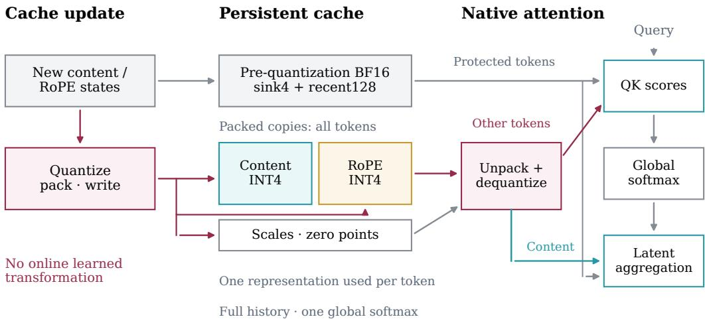  
Non-sink window exit: read packed copy; no re-quantization  
Figure 8: Native mixed-precision MLA execution. The fused writer generates a packed C4R4 copy for every incoming token and retains the pre-quantization BF16 values of protected sink and recent tokens in dedicated buffers. Attention uses pre-quantization BF16 values for protected tokens and dequantized INT4 values otherwise. When a non-sink token leaves the recent window, execution switches to its existing packed copy without additional quantization. Reconstructed content tiles support both matching and latent aggregation, while all valid tokens share one global softmax normalization.

Cache update and tile reuse. The fused writer performs content- and RoPE-cache quantization, integer packing, slot-mapped page insertion, and updates to the BF16 protection buffers. A packed copy is stored for every token, including tokens whose pre-quantization BF16 representation is currently protected. During decoding, the attention kernel gathers cache pages, unpacks integer codes, and reconstructs content and RoPE tiles using the stored scales and zero points. Each reconstructed content tile is reused for both content matching and latent aggregation and remains available until both consumers complete. Query preparation, split-result combination, and value/output projection retain their native execution boundaries.

Shared-memory organization and pipelining. In the optimized decode kernel, packed inputs and quantization metadata are buffered separately from reconstructed BF16 tiles, allowing prefetch to proceed while earlier tiles remain in use. Independent metadata storage removes aliasing with reconstructed RoPE tiles, enabling earlier RoPE QK scheduling without changing the accumulation order. Protected BF16 content loads overlap with INT4 reconstruction of unprotected rows, with synchronization before consumption. Packed buffers are reused after reconstruction completes, whereas reconstructed content remains available through both QK and PV and is overwritten only after its consumers finish.

BF16 protection and cache lifecycle. For L cached tokens with zero-based indices, the protected set is

$$
\mathcal { P } _ { L } = \{ 0 , \tiny { \cdot } \ldots , \operatorname* { m i n } ( 4 , L ) - 1 \} \cup \{ \operatorname* { m a x } ( 0 , L - 1 2 8 ) , \tiny { \cdot } \ldots , L - 1 \} .\tag{38}
$$

The union counts overlapping sink and recent regions only once. For tokens in $\mathcal { P } _ { L }$ , attention uses the pre-quantization BF16 content and RoPE-key values; all remaining tokens use values reconstructed from the packed cache. Each token therefore contributes exactly once to attention, although protected tokens retain both BF16 and packed representations in storage. When a non-sink token leaves the recent window, attention switches directly to the packed copy generated at insertion, requiring no additional quantization or transfer. This policy changes storage precision rather than attention visibility: no historical token is evicted or masked.

Global attention normalization. Protected and quantized regions participate in the same softmax normalization. If the regions are processed separately, let $m _ { j } , s _ { j } .$ and $o _ { j }$ denote their partial maximum, exponential sum, and unnormalized weighted-value sum. They are merged as

$$
m = \operatorname* { m a x } _ { j } m _ { j } , \qquad s = \sum _ { j } e ^ { m _ { j } - m } s _ { j } , \qquad o = \sum _ { j } e ^ { m _ { j } - m } o _ { j } , \qquad O = o / s .\tag{39}
$$

This online merge preserves full-history attention normalization; independently normalizing region outputs would not.

Storage layout. The persistent cache contains packed copies of all tokens, quantization metadata, page alignment, fixed BF16 protection buffers, and reverse page mappings. For $d _ { c } = 5 1 2 , d _ { r } = 6 4$ and 64-token pages, the packed C4R4 representation occupies 20,480 bytes per page, or 320 bytes per token and layer. Content scales are stored in BF16 and RoPE scales in FP32. Each request and layer additionally allocates $1 3 2 \times 5 7 6 \times 2 = 1 5 2$ ,064 bytes for BF16 protection, while reverse page mappings require 8 bytes per physical page. The corresponding BF16 cache page occupies $\bar { 6 } 4 ^ { - } \times 1 , 1 \bar { 5 } 2 = 7 3 , \bar { 7 } 2 8$ bytes. For a request of length L, the per-layer persistent allocations are

$$
\begin{array} { r l } & { M _ { \mathrm { C 4 R 4 } } ( L ) = \lceil L / 6 4 \rceil ( 2 0 , 4 8 0 + 8 ) + 1 5 2 , 0 6 4 , } \\ & { M _ { \mathrm { B F 1 6 } } ( L ) = \lceil L / 6 4 \rceil 7 3 , 7 2 8 . } \end{array}\tag{40}
$$

Their ratio is 3.22× at 4K and 3.59× at 128K. These allocations include redundant packed copies of protected tokens but exclude model weights, shared page tables, allocator overhead, and temporary workspaces.

Fusion and execution verification. We first disable quantization and compare the original and offline-fused models using layer-output error and end-to-end NLL drift. This isolates algebraic fusion from quantization fidelity and detects errors in RoPE pairing, transformation order, subblock selection, or reciprocal compensation. Native execution is checked against a BF16 reference consuming the same independently reconstructed cache, including dynamic cache updates and token aging. These checks validate cache representation and execution semantics rather than agreement with the original unquantized model. Appendix F.1 summarizes the validation scope; shared-prefix ownership remains outside it.

## D EVALUATION PROTOCOLS

This appendix specifies task evaluation, the MLA-specific baseline adaptations, and the componentablation protocol. Quantization and transformation learning for QuantMLA are detailed in Appendix C.4.

## D.1 TASK EVALUATION AND SCORING

Knowledge and reasoning. MMLU (Hendrycks et al., 2021a) uses 5-shot evaluation over all 14,042 examples. GSM8K (Cobbe et al., 2021) uses 5-shot generation and exact match after strict answer extraction. MATH500 (Hendrycks et al., 2021b) uses 4-shot prompting with Math-Verify accuracy, while GPQA-Diamond (Rein et al., 2024) uses zero-shot prompting and accuracy over all 198 four-choice questions. AIME25 uses all 30 problems with zero-shot chat prompting and exact final-answer matching. The same prompting and scoring protocol is applied across methods within each benchmark.

Code generation. HumanEval (Chen et al., 2021) reports single-sample pass@1. Live-CodeBench (Jain et al., 2025) evaluates all 1,055 problems in code generation lite, release v6, with one deterministic candidate per problem. Generation uses temperature zero, a 2,000-token output budget, and thinking disabled; we report benchmark pass@1.

Commonsense and information extraction. HellaSwag, PIQA, ARC-Easy, and ARC-Challenge use length-normalized accuracy (acc norm), while WinoGrande uses accuracy (acc) (Zellers et al., 2019; Bisk et al., 2019; Clark et al., 2018; Sakaguchi et al., 2019). The FDA, SWDE, and SQuAD-Completion variants distributed with Based (Arora et al., 2024) contain 1,102, 1,111, and 2,984 validation examples, respectively. SQuAD-Completion reformulates SQuAD (Rajpurkar et al., 2016) as a completion task and is labeled SQuAD in our tables. All three tasks use zero-shot generation and case-insensitive answer containment, with either a newline stop or a 48-token output limit. The corre sponding datasets are hazyresearch/based-fda, hazyresearch/based-swde-v2, and hazyresearch/based-squad.

Aggregation and presentation. Suite averages assign equal weight to the benchmarks within each reported suite. Bold entries in the main tables denote the best quantized result within each model, precision, and metric, including ties at the displayed precision; BF16 is excluded from this comparison.

## D.2 BASELINE ADAPTATIONS

SmoothQuant† and QuaRot† are our adaptations of SmoothQuant (Xiao et al., 2023) and QuaRot (Ashkboos et al., 2024) to MLA KV-cache quantization, rather than direct reproductions of their original full-model quantization pipelines. Both operate directly on MLA’s native content latent and decoupled RoPE key cache without expanding them into per-head keys and values. For accuracy evaluation, both use the same per-token asymmetric affine quantizer with group size 64 as QuantMLA and are evaluated through cache quantize–dequantize simulation.

SmoothQuant†. This adaptation retains the equivalent channel-scaling principle of SmoothQuant while adapting it to MLA’s two cache components. For the content cache, let u denote the weightlessnormalized latent and Γ the original RMSNorm channel gain. We cache the rescaled representation $u S _ { C }$ and compensate all downstream content consumers, so that both the key and value routes preserve the original full-precision computation when quantization is disabled. For the RoPE key cache, the two coordinates within each RoPE frequency pair share one positive scale, with reciprocal query–key compensation,

$$
K _ { P } ^ { \prime } = K _ { P } S _ { P } , \qquad Q _ { P } ^ { \prime } = Q _ { P } S _ { P } ^ { - 1 } ,\tag{41}
$$

which preserves the positional QK scores in full precision. All scaling and compensation are absorbed into existing normalization and projection parameters, introducing no online scaling operation.

The scales are determined without gradient optimization. For channel magnitude statistic $a _ { j }$ , we define $\widetilde { \boldsymbol { a } } _ { j } = \operatorname* { m a x } ( \boldsymbol { a } _ { j } , 1 0 ^ { - 8 } )$ and construct candidates as

$$
\begin{array} { r } { \log s _ { j } = \mathrm { c l i p } \left( \alpha \left[ \mathrm { m e a n } _ { k } \log \widetilde a _ { k } - \log \widetilde a _ { j } \right] , - 2 , 2 \right) , } \end{array}\tag{42}
$$

where $a _ { j }$ is the 99.9th-percentile absolute activation magnitude. RoPE statistics and scales are tied within each frequency pair. Candidate values of α are drawn from {0.125, 0.25, 0.5, 0.75, 1} according to the recorded configuration. Statistics are collected from 128 WikiText-2 sequences of length 2048, and candidates are selected on a disjoint set of 32 sequences. The content and RoPE caches are calibrated separately, keeping the other cache exact, and both select α by held-out normalized attention-output MSE. Thus, SmoothQuant† uses statistical scaling with validation-based selection rather than the learned path-specific objectives of QuantMLA.

QuaRot†. This adaptation retains the fixed Hadamard-rotation principle of QuaRot without datadriven rotation learning. For the content cache, a deterministic normalized Hadamard matrix $H _ { C }$ is applied in the weightless-normalized latent coordinates. The rotation is fused into the producing projection using RMSNorm’s orthogonal equivariance, while the inverse transformation and original normalization gain are absorbed into the key and value consumers. The content-cache rotation is therefore entirely offline and introduces no per-token Hadamard operation during inference.

For the RoPE cache in the INT4 configurations used in our main experiments, the same fixed normalized Hadamard matrix $H _ { P }$ is applied to the positional query and key after RoPE:

$$
Q _ { P } ^ { \prime } = Q _ { P } H _ { P } , \qquad K _ { P } ^ { \prime } = K _ { P } H _ { P } .\tag{43}
$$

Since $H _ { P } H _ { P } ^ { \top } = I ,$ this transformation preserves positional QK scores before quantization. Only the transformed key is cached and quantized, while the corresponding query transformation is evaluated online. Unlike QuantMLA’s RoPE-compatible offline transformation, this post-RoPE Hadamard cannot be fused into the pre-RoPE projections and therefore remains an online operation. QuaRot† uses deterministic normalized Hadamard matrices without learned rotations, random sign matrices, statistical calibration, or gradient optimization.

## D.3 COMPONENT-ABLATION PROTOCOL

Table 3 evaluates the full DeepSeek-V2-Lite MMLU test set at C4R4. Starting from unprotected RTN, we successively add the content-path transformation, the RoPE-path transformation, and the mixed-precision cache policy. The two transformation increments are therefore measured without BF16-protected tokens, while the final configuration retains four sink tokens and the most recent 128 tokens in BF16. The resulting sequence is 51 $. 9 0 \% \to 5 3 . 1 2 \% \to 5 6 . 3 1 \% \to 5 7 . 9 5 \%$ , compared with 57.90% for BF16. The SmoothQuant† and QuaRot† rows are independent unprotected baselines and are not part of this cumulative sequence. The reported component gains are cumulative along the stated order and should not be interpreted as order-independent effects.

## E ADDITIONAL ACCURACY RESULTS

Table 8 disaggregates the Commonsense averages reported in Table 1 into the five constituent benchmarks for DeepSeek-V2-Lite and Moonlight-16B-A3B. We provide this breakdown because the remaining task-level metrics are already reported individually in the main tables.

## F ADDITIONAL EFFICIENCY RESULTS

## F.1 NATIVE ATTENTION

We measure C4R4 with the mixed-precision cache policy (sink4/local128) on one GPU, using 16 query heads, one query token, QK dimension 576, latent aggregation dimension 512, 64-token pages, and 78 scheduling partitions. Inputs are synthetic BF16 queries and cache values with independently owned physical pages. All shapes use the same C4R4 backend, with context length and maximum-length hint both set to N. Each configuration is measured in two independent runs, each with two rounds in reversed backend order and 30 samples per round, yielding 120 samples per configuration and backend; we average both runs. CUDA Graph replay executes cache writing, metadata construction, attention-main, and split-result combination, with L2 flushed before each graph sample. The reported latency spans attention-main start through combination end, including unpacking and dequantization but excluding the preceding writer and metadata operations. The performance baseline consumes an unquantized BF16 cache with native partitioning; the comparison reflects both cache representation and kernel scheduling. Table 9 and Figure 5(b) report paired results for batches 8 and 32 at fixed context lengths from 1K to 1M.

Table 8: Detailed commonsense performance. Scores (%, ↑) on HellaSwag, PIQA, ARC-Easy, ARC-Challenge, and WinoGrande. †: our MLA adaptations.
<table><tr><td>Precision Method</td><td></td><td>HellaSwag</td><td>ARC- PIQA Easy</td><td>ARC- Challenge</td><td>Wino- Grande</td><td>Avg.</td></tr><tr><td colspan="7">DeepSeek-V2-Lite</td></tr><tr><td>BF16</td><td>BF16</td><td>77.76 79.87</td><td>74.28</td><td>46.16</td><td>70.72</td><td>69.76</td></tr><tr><td>C4R4</td><td>RTN</td><td>75.20 78.45</td><td>70.03</td><td>44.71</td><td>67.48</td><td>67.17</td></tr><tr><td></td><td>SmoothQuant†</td><td>75.64 78.73</td><td>71.97</td><td>44.11</td><td>70.72</td><td>68.23</td></tr><tr><td></td><td>QuaRot†</td><td>76.64 79.27</td><td>73.86</td><td>45.73</td><td>69.53</td><td>69.01</td></tr><tr><td></td><td>QuantMLA</td><td>77.84 80.14</td><td>74.33</td><td>46.50</td><td>70.80</td><td>69.92</td></tr><tr><td>C2R4</td><td>RTN</td><td>69.69 75.41</td><td>66.16</td><td>38.14</td><td>61.64</td><td>62.21</td></tr><tr><td></td><td>SmoothQuant†</td><td>73.36 77.58</td><td>69.82</td><td>42.58</td><td>66.30</td><td>65.93</td></tr><tr><td></td><td>QuaRot†</td><td>72.35 75.57</td><td>67.72</td><td>41.55</td><td>64.40</td><td>64.32</td></tr><tr><td></td><td>QuantMLA</td><td>77.82 80.36</td><td>74.16</td><td>46.42</td><td>70.48</td><td>69.85</td></tr><tr><td colspan="7">Moonlight-16B-A3B</td></tr><tr><td>BF16</td><td>BF16</td><td>78.28</td><td>80.79 82.53</td><td>58.02</td><td>71.98</td><td>74.32</td></tr><tr><td>C4R4</td><td>RTN</td><td>77.78 80.90</td><td>83.29</td><td>57.25</td><td>70.48</td><td>73.94</td></tr><tr><td></td><td>SmoothQuant†</td><td>77.26 81.01</td><td>81.99</td><td>55.97</td><td>70.72</td><td>73.39</td></tr><tr><td></td><td>QuaRot†</td><td>78.59 80.63</td><td>81.82</td><td>57.68</td><td>71.82</td><td>74.11</td></tr><tr><td></td><td>QuantMLA</td><td>78.34 80.58</td><td>82.58</td><td>58.28</td><td>71.43</td><td>74.24</td></tr><tr><td>C2R4</td><td>RTN</td><td>74.21 77.97</td><td>77.99</td><td>50.68</td><td>68.03</td><td>69.78</td></tr><tr><td></td><td>SmoothQuant†</td><td>70.69 75.90</td><td>68.43</td><td>45.31</td><td>64.40</td><td>64.95</td></tr><tr><td></td><td>QuaRot†</td><td>67.37 75.52</td><td>67.63</td><td>42.24</td><td>60.85</td><td>62.72</td></tr><tr><td></td><td>QuantMLA</td><td>78.32</td><td>80.85 82.41</td><td>57.94</td><td>71.59</td><td>74.22</td></tr></table>

Correctness is checked separately against a BF16 reference consuming the same reconstructed mixed-precision cache with the same partitioning. Output and log-sum-exp agree bit for bit for every reported configuration in both runs. These checks validate native execution rather than equivalence to unquantized attention. Physical storage accounting is given in Appendix C.5.

## F.2 SERVING UNDER CACHE PRESSURE

We run DeepSeek-R1-0528 on eight GPUs with attention TP8/DP1 and MoE TP8, using FP8 model weights and BF16 activations. Both configurations use vLLM 0.10.2, PyTorch 2.8.0, a 90% GPUmemory utilization setting, 64-token pages, disabled prefix caching, and at most 16 concurrent sequences. Chunked prefill executes eagerly with an 8,192-token step budget; decode uses CUDA Graph replay for batches 1–16. The KV cache is either BF16 or C4R4 with sink4/local128 protection.

Five requests arrive simultaneously and enter the native vLLM scheduler without frontend admission control. Each uses 131,072 input tokens and generates exactly 1,024 output tokens, with temperature zero and EOS ignored. The prompts fit within BF16 capacity, but the full input-plus-output budget of 660,480 tokens exceeds its 657,856 usable slots, causing repeated preemption and recomputation. The C4R4 cache accommodates the workload without preemption.

Whole-job output throughput is 5,120 generated tokens divided by elapsed time, including prefill, waiting, scheduling, and recomputation, but excluding model loading and warmup. Table 10 compares one C4R4 run with the recorded BF16 baseline; no confidence interval across independent runs is

Table 9: Attention latency at fixed context lengths on GPU (µs). C4R4 uses the mixed-precision cache policy (sink4/local128). Each entry averages 120 samples from two independent runs; $\Delta =$ $( t _ { \mathrm { C 4 R 4 } } \mathrm { \bar { / } } t _ { \mathrm { B F 1 6 } } - 1 ) \times 1 0 0 \%$ . BF16 uses native partitioning. Here $\mathrm { 1 K = 1 0 2 4 }$ and 1M = 1,048,576 tokens.
<table><tr><td>Batch</td><td>Context N</td><td>BF16</td><td>C4R4</td><td>∆(%)</td></tr><tr><td>8</td><td>1K</td><td>25.69</td><td>23.78</td><td>-7.42</td></tr><tr><td>8</td><td>4K</td><td>51.43</td><td>53.63</td><td>+4.29</td></tr><tr><td>8</td><td>8K</td><td>82.50</td><td>85.35</td><td>+3.45</td></tr><tr><td>8</td><td>16K</td><td>147.34</td><td>149.79</td><td>+1.66</td></tr><tr><td>8</td><td>32K</td><td>281.44</td><td>281.99</td><td>+0.20</td></tr><tr><td>8</td><td>64K</td><td>542.14</td><td>540.61</td><td>-0.28</td></tr><tr><td>8</td><td>128K</td><td>1067.24</td><td>1062.32</td><td>-0.46</td></tr><tr><td>8</td><td>256K</td><td>2122.10</td><td>2113.33</td><td>-0.41</td></tr><tr><td>8</td><td>512K</td><td>4234.79</td><td>4214.84</td><td>-0.47</td></tr><tr><td>8</td><td>1M</td><td>8440.05</td><td>8418.63</td><td>-0.25</td></tr><tr><td>32</td><td>1K</td><td>55.50</td><td>56.97</td><td>+2.64</td></tr><tr><td>32</td><td>4K</td><td>156.82</td><td>155.54</td><td>-0.82</td></tr><tr><td>32</td><td>8K</td><td>287.58</td><td>283.46</td><td>-1.43</td></tr><tr><td>32</td><td>16K</td><td>548.73</td><td>547.20</td><td>-0.28</td></tr><tr><td>32</td><td>32K</td><td>1072.93</td><td>1067.28</td><td>-0.53</td></tr><tr><td>32</td><td>64K</td><td>2133.71</td><td>2124.10</td><td>-0.45</td></tr><tr><td>32</td><td>128K</td><td>4236.96</td><td>4225.35</td><td>-0.27</td></tr><tr><td>32</td><td>256K</td><td>8449.30</td><td>8426.35</td><td>-0.27</td></tr><tr><td>32</td><td>512K</td><td>16880.19</td><td>16827.11</td><td>-0.31</td></tr><tr><td>32</td><td>1M</td><td>33701.48</td><td>33609.17</td><td>-0.27</td></tr></table>

reported. The 5.168× gain reflects avoiding capacity-driven recomputation in this workload and is not an attention-kernel speedup.

Table 10: Serving under native vLLM scheduling on eight GPUs. Five simultaneous requests each use 128K input and 1K output tokens. C4R4 includes sink4/local128 protection.
<table><tr><td>Metric</td><td>BF16 KV</td><td>C4R4 KV</td></tr><tr><td>Usable cache slots</td><td>657,856</td><td>2,360,832</td></tr><tr><td>Elapsed time (s)</td><td>1,958.392</td><td>378.929</td></tr><tr><td>Output throughput (tokens/s)</td><td>2.614</td><td>13.512</td></tr><tr><td>Preemption events</td><td>32</td><td>0</td></tr><tr><td>Recomputed tokens</td><td>3,996,255</td><td>0</td></tr></table>