# RACE: RELATION-LEVEL COUNTERFACTUAL EXPLA-NATIONS FOR HETEROGENEOUS GRAPH NEURAL NET-WORKS

Yuxiang Yao1∗ Zijun Zhao2∗†

1Project Management Department, Research Center, China Life Insurance Company Ltd. 2School of Computer Science and Technology, Beijing Institute of Technology yaoyuxiangyyx2023@e-chinalife.com zhaozijun@bit.edu.cn

## ABSTRACT

Counterfactual explanations of graph neural networks identify edge deletions that flip a prediction. On heterogeneous graphs, however, existing methods first collapse the graph into untyped edges, so they cannot answer the question a domain expert actually asks: which relation type drives this prediction? We present RACE (Relation-Aware Counterfactual Explanations), which gives this question an exact, per-instance answer. For every explained instance, an exhaustive search over relation subsets returns the certified minimum relation-deletion set that flips the prediction—or an explicit report that no such deletion exists; each relation-level answer is then refined into a typed edge set within the attributed relations, verified on the discrete model by single-edge restoration. The relation-level answer is exact and deterministic given the frozen backbone, whereas soft-mask baselines vary by 6–8 pp in success rate across runs differing only in random ordering. On ACM, a Cora-derived graph, and ogbn-mag, RACE improves counterfactual success rate over the strongest baseline by up to +2.7 pp while deleting fewer edges, and attains the highest success rate among all same-task baselines on every dataset; the advantage reproduces across four backbones on ogbn-arXiv and on DBLP, with cross-seed relation-set agreement up to 0.89. A synthetic study with known generating mechanisms confirms that the search recovers the relation the trained model actually relies on—and reports infeasibility rather than fabricating an attribution when the model has learned none—so the explanations stay trustworthy exactly where explanations matter.

## 1 INTRODUCTION

Graph neural networks (GNNs) are the workhorse for learning on graph-structured data, yet their predictions remain opaque. Counterfactual explanations address opacity by identifying the minimal input perturbation that flips the prediction: CF-GNNExplainer Lucic et al. (2022), ${ \check { \mathrm { C F } } } ^ { 2 }$ Tan et al. (2022), and RCExplainer Bajaj et al. (2021) delete edges until the prediction changes, and recent work keeps extending this line Zhang et al. (2026). Real-world graphs, however, are rarely homogeneous: academic networks, knowledge graphs, and e-commerce platforms are heterogeneous information networks in which co-authorship, citation, and shared-subject links coexist Shi et al. (2017). On such data the existing methods have two defects. First, they collapse the heterogeneous graph into a pairwise graph, discarding relation-type semantics, so the resulting explanation cannot answer “which relation type drives the prediction”—the question a domain expert asks of a heterogeneous model. Second, even in their native regime, their edge-level outputs are a scattered set of individual edges whose semantics are not aggregable into a human-readable statement such as “co-authorship is what this prediction relies on”.

We close this gap with RACE, a framework that (i) preserves relation-type semantics in the explained model, (ii) computes instance-level minimal relation-deletion sets by exact search, (iii) refines them into verified, single-edge-restoration-irreducible edge deletions inside the attributed relations (a relation-to-edge hierarchy), and (iv) evaluates everything with deletion- and sufficiencyfidelity metrics plus explicit coverage, cost, and stability reporting. We make three contributions:

• Instance-level relation counterfactuals by exact search. For each explained instance v we solve $S _ { v } ^ { * } =$ arg minS $C _ { v } ( S )$ subject to the prediction flipping (a margin constraint), with a lexicographic cost (number of relations, then local edge fraction, then margin). Because K is small, enumeration over the $2 ^ { K }$ subsets is exact, deterministic, and cheap (≤10 s at K=10); every instance receives either this certified answer or an explicit infeasibility report—no force-attribution—and the resulting coverage is disclosed. A budgeted branch-and-bound search extends the same contract to larger K (RQ6). We further document non-monotonicity: some predictions flip under a relation subset but not under full removal, evidence that aggregate flip-rate searches cannot substitute for the instance-level problem.

• A verified hierarchical relation-to-edge pipeline. The edge-level stage deletes the attributed relations and then verifies the intervention on the discrete model by restoring edges one at a time along the saliency order while the flip persists, repeated to a fixpoint—so the reported set carries a single-edge-restoration irreducibility certificate (or an explicit budget-limited status), evaluated on the instance’s exact local computation subgraph. Under a strict same-frozen-typed-backbone, instance-targeted protocol, the hierarchical explainer beats the strongest baseline $( \mathrm { C F } ^ { 2 } .$ -hetero) on both success rate $( + 0 . 8 / + 2 . 7 / + 1 . 4$ pp on ACM/Cora/ogbn-mag, $p = 0 . 0 0 2$ raw, Holm-corrected ≤0.062, ten seeds) and edge cost $( - 1 . 9 / - 1 . 0 / - 2 . 7 \mathrm { p p } )$ ), reproduces on ogbn-arXiv across four backbones and on DBLP, yields cross-seed relation-set agreement of 0.78–0.89 on the separable datasets, and attains the highest success rate among the same-task counterfactual baselines under the same frozen checkpoint.

• A fidelity framework and an identifiability characterization. We adopt the deletion/sufficiency statistics as descriptive fidelity metrics—Necessity Fidelity (NF) and Sufficiency Fidelity (SF)—reserving causal language for settings with an explicit generating mechanism; we characterize when relation-level attribution is identifiable (causally separable relations), and—via a five-mechanism synthetic study separating model-dependence from data-causal recovery—show that the search recovers the relation the trained model actually relies on and reports infeasibility instead of fabricating an attribution when the model has not learned a mechanism.

## 2 RELATED WORK

Explaining GNNs. GNNExplainer Ying et al. (2019) learns a mask over edges and features that preserves the prediction, and PGExplainer Luo et al. (2020) amortizes this into a generator; both are factual and cannot answer counterfactual queries. Gradient attributions—Saliency Baldassarre & Azizpour (2019), GradCAM Pope et al. (2019), Integrated Gradients Sundararajan et al. (2017)— and SubgraphX Yuan et al. (2021) score inputs without a flip guarantee. None provides relation-type granularity.

Counterfactual explanations on graphs. CF-GNNExplainer Lucic et al. (2022) formalizes the counterfactual explanation as a minimal set of edge deletions that flips the prediction; $\mathrm { C F } ^ { 2 }$ Tan et al. (2022) adds factual reasoning and a validity term; RCExplainer Bajaj et al. (2021) uses a hinge objective; MEG Numeroso & Bacciu (2021) searches binary masks with a genetic algorithm; NSEG Cai et al. (2025) optimizes a necessity-plus-sufficiency lower bound; InduCE Verma et al. (2024) amortizes the counterfactual objective into an inductive generator; C2Explainer Ma et al. (2025) makes the counterfactual customizable through prior constraints. All operate on homogeneous pairwise graphs: none attributes an explanation to a relation type, because the graph they consume no longer contains types. What this line lacks is not post-hoc evaluation—prior methods do evaluate their final counterfactual on the discrete model when reporting validity—but a selection procedure that consults the discrete model at every step, per instance, and reports infeasibility instead of force-attributing—the ingredients RACE contributes.

Probabilities of causation and heterogeneous GNNs. Pearl introduced necessity, sufficiency, and their conjunction as counterfactual interpretations of causation Pearl (1999); Tian & Pearl (2000);

Cai et al. (2025) brought this framework to graph explanations. We adopt their evaluation conventions as descriptive fidelity metrics (NF/SF) and reserve causal language for synthetic data with an explicit generating mechanism. HAN Wang et al. (2019), HGT Hu et al. (2020b), and R-GCN Schlichtkrull et al. (2018) organize heterogeneous message passing; type-aware attribution methods remain factual and post-hoc. Heterogeneous explainability has not been combined with (i) minimal instance-level counterfactual interventions, (ii) relation-type-level intervention units with explicit coverage, and (iii) per-instance verification on the discrete model—the three ingre dients RACE contributes.

## 3 METHODOLOGY

## 3.1 PRELIMINARIES AND PROBLEM FORMULATION

A heterogeneous graph is a tuple $\mathcal { G } = ( \mathcal { V } , \{ E _ { r } \} _ { r = 1 } ^ { K } , X )$ with relation edge sets $E _ { r } \subseteq \mathcal { V } \times \mathcal { V } _ { \mathbf { \Phi } }$ , K relation types $( K \leq \bar { 1 0 }$ in our benchmarks), and node features $X \in \mathbb { R } ^ { N \times \breve { d } }$ . A frozen graph neural classifier f maps G to class probabilities $f ( \mathcal { G } ) \in [ 0 , 1 ] ^ { N \times C }$ . For an instance v with prediction $\hat { y } _ { v } = \arg \operatorname* { m a x } _ { c } f ( \mathcal { G } ) _ { v , c }$ , we write the margin

$$
M _ { v } ( \mathcal { G } ) \ = \ f ( \mathcal { G } ) _ { v , \hat { y } _ { v } } - \operatorname* { m a x } _ { c \neq \hat { y } _ { v } } f ( \mathcal { G } ) _ { v , c } ,\tag{1}
$$

so a flip means $M _ { v } \le - \kappa$ for a target confidence $\kappa \geq 0$ . We study two intervention granularities: relation-type-level (delete every edge of one or more relations, written ${ \mathcal { G } } \backslash S$ for $S \subseteq \{ 1 , \ldots , K \} )$ and edge-level (delete a typed edge subset, written $\mathcal { G } \odot$ m for per-relation keep-masks $m ^ { r } \in [ 0 , 1 ] ^ { | E _ { r } | } )$ Throughout, $N _ { L } ( v )$ denotes the backward ball of radius L around v (the receptive field of an L-layer backbone), and $E _ { L } ( v )$ the edges of the L-layer computation subgraph of v.

## 3.2 RELATION-AWARE HETEROGENEOUS BACKBONE

The explained model preserves relation semantics through a simplified heterogeneous graph transformer. For each relation r, source features are projected by a dedicated matrix and edges are scored by additive attention:

$$
\begin{array} { r l } & { ~ h _ { v } ^ { r } = W _ { r } x _ { v } , } \\ & { e _ { u v } ^ { r } = \mathrm { L e a k y R e L U } \big ( a _ { r } ^ { \top } [ W _ { r } x _ { u }  \big \| \ : W _ { r } x _ { v } ] \big ) , } \\ & { \alpha _ { u v } ^ { r } = \mathrm { s o f t m a x } _ { v \in \mathcal { N } _ { r } ( u ) } ( e _ { u v } ^ { r } ) , } \end{array}\tag{2}
$$

and the layer update combines relations with learnable relation weights $\lambda _ { r }$ :

$$
x _ { u } ^ { \prime } = \mathrm { R e L U } \left( \mathrm { L a y e r N o r m } \left( W _ { \mathrm { s e l f } } x _ { u } + \sum _ { r = 1 } ^ { K } \lambda _ { r } \sum _ { v \in \mathcal { N } _ { r } ( u ) } \alpha _ { u v } ^ { r } W _ { r } x _ { v } \right) \right) .\tag{3}
$$

Stacking L such layers and a linear head yields $f .$ On ACM this backbone attains 0.560 ± 0.007 accuracy, +3.4 pp over a collapsed pairwise backbone trained identically; HAN, HGT, and the RACE backbone tie at 0.56–0.57 under the shared protocol, while residual-free GCN/GAT attain 0.23—the accuracy edge is a property of the typed residual design.

## 3.3 EDGE-LEVEL VERIFIED COUNTERFACTUAL

Per-relation typed masks. For each relation r we learn a keep-mask $m ^ { r } \in [ 0 , 1 ] ^ { | E _ { r } | }$ (Gumbel-Sigmoid relaxation Jang et al. (2017); Maddison et al. (2017)); gradients flow through the relation specific projections, so interventions remain typed.

Margin objective. With the backbone frozen and the targets restricted to the instances being explained, we minimize

$$
\begin{array} { r l } & { \mathcal { L } = \underbrace { \mathbb { E } _ { v } [ \operatorname* { m a x } ( 0 , M _ { v } ( \mathcal { G } \odot m ) + \kappa ) ] } _ { \mathrm { f i p t e r m } } } \\ & { + \underbrace { \lambda _ { s p } \frac { 1 } { E } \sum _ { r , e } ( 1 - m _ { e } ^ { r } ) } _ { \mathrm { m i n i m a l i t y } } + \underbrace { \beta \frac { 1 } { E } \sum _ { r , e } m _ { e } ^ { r } ( 1 - m _ { e } ^ { r } ) } _ { \mathrm { b i n a r y ~ p r e s s u r e } } , } \end{array}\tag{4}
$$

replacing the soft-probability objective used by prior work: the hinge exerts no gradient on already flipped instances, concentrating optimization on those near the boundary.

Discrete verification and backward pruning. The relaxed masks are not the explanation. We (1) order every edge by its learned keep-score and greedily delete in batches, evaluating the discrete model after each batch and keeping the deletion point that maximizes validity minus $\lambda _ { s p }$ -weighted cost; (2) backward-prune: restore deleted edges in descending keep-score while the satisfied set is preserved. The reported masks are therefore verified on the discrete model: unlike a threshold applied once after optimization, the selection itself consults the discrete model at every batch, so the flip status of the reported intervention is a measured property of that intervention rather than an implication of the relaxation.

## 3.4 INSTANCE-LEVEL RELATION DELETION SEARCH

For each explained instance $v ,$ the relation-level counterfactual is the minimum-cost relation set whose deletion flips v:

$$
S _ { v } ^ { * } = \arg \operatorname* { m i n } _ { S \subseteq \{ 1 , \dots , K \} } \ C _ { v } ( S ) \quad \mathrm { s . t . } \quad M _ { v } ( { \mathcal G } \setminus S ) \leq - \kappa ,\tag{5}
$$

with the lexicographic cost

$$
\begin{array} { r } { C _ { v } ( S ) = \Big ( | S | , \frac { 1 } { | E _ { L } ( v ) | } \sum _ { r \in S } | E _ { r } \cap E _ { L } ( v ) | , M _ { v } ( \mathcal { G } \setminus S ) \Big ) , } \end{array}\tag{6}
$$

i.e., fewest relation types first, then the smallest fraction of the instance’s receptive-field edges, then the strongest flip. Because $K$ is small, we enumerate all $2 ^ { K }$ subsets in increasing size; one forward pass per subset evaluates every instance simultaneously, so the total cost is $2 ^ { K + \widetilde { 1 } }$ forwards (0.1 s at K=3, 10.3 s at $K { = } 1 0 )$ . The procedure is deterministic and returns the exact minimum under the frozen predictor and the stated cost. Instances with no feasible subset are marked infeasible, and the fraction of feasible instances is reported as coverage: every instance receives either the certified minimum or an explicit infeasibility report, never a force-attributed relation. For larger vocabularie the budgeted branch-and-bound search of Sec. 4.2 provides the same output contract. Two properties follow from the instance-level formulation and are measured in Sec. 4.2: (i) the output contract—per instance, the certified answer or an explicit infeasibility report, with coverage disclosed (0.17–0.33 on our benchmarks); (ii) non-monotonicity—some instances flip under a subset S but not under full removal, so the aggregate “70% of the full-removal effect” criterion of prior work can both miss and misattribute instances.

## 3.5 HIERARCHICAL RELATION-TO-EDGE REFINEMENT

For every feasible instance, the relation-level answer is refined into a certified typed edge set inside $S _ { v } ^ { * } .$ : starting from $\mathcal { G } \setminus S _ { v } ^ { * }$ (already flipped), we restore edges of $S _ { v } ^ { * }$ one at a time in descending keep-importance order (gradient saliency of the original prediction), accepting a restoration iff v stays flipped, and repeat full passes until a complete pass changes nothing—the returned set is then single-edge-restoration irreducible. If the per-instance forward budget is exhausted first, the answer is reported as a verified flip with the irreducibility check incomplete; the two statuses are reported separately, and a budget-exhausted answer is not marked optimal. The certificate is single-edgerestoration irreducibility rather than global minimality; the gap to the true minimum is measured exactly on enumerable subgraphs (Appendix I). Each check runs on the exact local computation subgraph of $v -$ the backward ball of radius L with renumbered nodes, which reproduces the fullgraph logits of v exactly—so a check costs a tiny forward instead of a full-graph pass. Instances without a feasible relation set keep the flat verified edge explanation of Sec. 3.3 as a fallback, so overall success is never below the flat method. The output is the hierarchy: “delete relation $S _ { v } ^ { * } ,$ within it, these edges.”

## 3.6 FIDELITY METRICS AND OVERALL PIPELINE

Following the deletion/sufficiency evaluation convention of Cai et al. (2025) but without claiming causal probabilities, we report per instance and in aggregate:

$$
\mathrm { N F } _ { v } ( S ) = \mathbf { 1 } [ f ( \mathcal { G } \setminus S ) _ { v } \neq \hat { y } _ { v } ] , \qquad \mathrm { S F } _ { v } ( S ) = \mathbf { 1 } [ f ( S ) _ { v } = \hat { y } _ { v } ] ,\tag{7}
$$

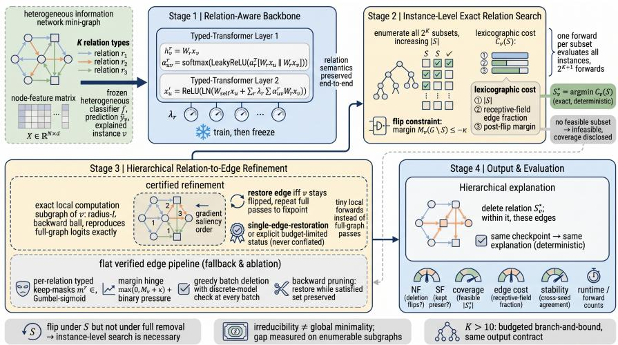  
Figure 1: Pipeline of RACE. Stage 1 builds the relation-aware backbone and freezes it. Stage 2 solves the instance-level exact search, returning the certified minimum relation deletion set $\hat { S _ { v } ^ { * } }$ or an explicit infeasibility report. Stage 3 refines each feasible answer into a certified, single-edgerestoration-irreducible typed edge set (or an explicit budget-limited status); relation-infeasible instances keep the flat verified explanation as a fallback. Stage 4 evaluates NF/SF, coverage, cost, stability, and runtime.

Necessity Fidelity (does the deletion flip?) and Sufficiency Fidelity (does the kept set alone preserve the prediction?). Aggregates are instance averages; we additionally report coverage, relation cost |S∗|, edge cost, the post-intervention margin, cross-seed stability, and runtime, and we never present $\mathrm { \Delta N F } \times \mathrm { \mathrm { S F } }$ as a causal joint probability. Fig. 1 depicts the pipeline: Stage 1 builds the relation-aware backbone (Sec. 3.2); Stage 2 freezes it and solves the instance-level relation search of Eq. (5), recording $S _ { v } ^ { * }$ and feasibility; Stage 3 refines each feasible answer into a certified, singleedge-restoration-irreducible typed edge set (Sec. 3.5), with infeasible instances keeping the flat ver ified edge explanation; Stage 4 evaluates both granularities with NF/SF, coverage, cost, margin, stability, and runtime.

## 4 EXPERIMENTS

We organize the study around six questions. RQ1 (main comparison): on one frozen typed backbone, does the hierarchical RACE improve over edge-level baselines on validity, cost, and stability? RQ2 (mechanism): is the relation phase the source of the advantage, and what does discrete verification add? RQ3 (output contract): does the instance-level search return the minimum valid relation deletion, with feasibility reported? RQ4 (generality): does the advantage transfer across backbones and datasets? RQ5 (determinism and robustness): how deterministic, stable, and perturbation-robust are the explanations, and what does verification cost? RQ6 (scalability): how do exact and approximate search trade quality against cost as K grows?

## 4.1 EXPERIMENTAL SETUP

Datasets. ACM (HAN version): a paper network whose relations are meta-path-derived—relation 0: PAP (co-authorship), relation 1: PTP (shared keywords)—1,903-dim bag-of-words features, venue labels. ogbn-mag (subsample) Hu et al. (2020a): 30,000 papers of the top-20 venues, relations PAP and citation. Cora-derived: citation plus a common-neighbor relation. ogbn-arXiv (subsample) Hu et al. (2020a): 30,000 papers of the top-20 subject areas, relations direct citation and co-citation. DBLP: an author network (co-authorship plus a shared-term meta-path relation; 4,057 authors, 4 areas). Synthetic SCM: a five-mechanism generator (causal, spurious with environment shift, redundant, noise, and a synergistic variant). All four primary real benchmarks have K = 2 relation types; a four-relation ogbn-mag variant and the synthetic K-scan probe larger vocabularies. Dataset statistics are summarized in Appendix A.

Table 1: Same-frozen-typed-backbone, instance-targeted comparison (10 seeds, mean±std across seeds; CSR = success rate, cost = mean local deleted fraction over all targets). Paired sign-flip tests of the hierarchical method against each baseline; †: $p = 0 . 0 0 2$ before Holm correction (≤0.062 after). Bold: best value in each column; underlined: second best.
<table><tr><td rowspan="2"></td><td colspan="2">ACM</td><td colspan="2">Cora</td><td colspan="2">ogbn-mag</td></tr><tr><td>Method</td><td>CSR↑ cost.↓</td><td>CSR↑</td><td>cost↓</td><td>CSR↑</td><td>cost↓</td></tr><tr><td rowspan="3">RACE-per-edge flat PNS-hetero CF²-hetero</td><td>0.216±0.072</td><td> $\mathbf { 0 . 1 5 9 } \pm \mathbf { 0 . 0 6 2 }$ </td><td>0.452±0.111</td><td>0.305±0.031</td><td> $0 . 1 6 8 { \pm } 0 . 0 0 8$ </td><td>0.378±0.011</td></tr><tr><td>0.216±0.072</td><td>0.159±0.063</td><td>0.450±0.110</td><td>0.306±0.031</td><td> $\overline { { 0 . 1 6 8 { \pm } 0 . 0 0 8 } }$ </td><td>0.378±0.010</td></tr><tr><td>0.216±0.072</td><td> $0 . 1 9 5 { \pm } 0 . 0 8 8$ </td><td>0.458±0.110</td><td>0.342±0.024</td><td> $\underline { { 0 . 1 6 8 \pm 0 . 0 0 8 } }$ </td><td> $0 . 4 3 4 { \pm } 0 . 0 1 3$ </td></tr><tr><td>RACE-hier</td><td>0.224±0.077†</td><td>0.176±0.067†</td><td> $\mathbf { 0 . 4 8 4 \bot 0 . 1 2 2 } ^ { \dagger }$ </td><td>0.332±0.024†</td><td>0.182±0.009†</td><td> $0 . 4 0 7 { \scriptstyle \pm 0 . 0 1 1 ^ { \dagger } }$ </td></tr><tr><td> $\mathrm { v s . } \mathrm { C F ^ { 2 } \mathrm { - h e t e r o } }$ </td><td>+0.8 pp</td><td> $- 1 . 9 \mathrm { p p }$ </td><td> $+ 2 . 7 \mathrm { p p }$ </td><td> $- 1 . 0 \mathrm { p p }$ </td><td>+1.4 pp</td><td> $- 2 . 7 \mathrm { p p }$ </td></tr></table>

Metrics. We report backbone accuracy; counterfactual success rate (CSR), the fraction of explained instances whose prediction flips, equal to mean NF, with any non-intervention counted as failure; edge cost, the fraction of the instance’s receptive-field edges deleted, under labeled aggregation conventions; NF/SF of Eq. (7) separately; coverage; cross-seed stability (relation-set agreement and edge-set Jaccard); and runtime. Synthetic studies add two separate hit rates: model-dependence recovery and data-causal recovery. Full definitions are in Appendix C.

Baselines and protocol. One typed backbone is trained per seed and frozen; every explainer consumes the same checkpoint, the same explained instances (the correctly-classified test nodes), the same operation (edge deletion), and the same budget; objectives are restricted to the explained instances (“targeted”). Baselines: GNNExplainer-hetero, RACE-per-edge, PNS-hetero, CF2-hetero, and the NSEG Cai et al. (2025), InduCE Verma et al. (2024), and C2Explainer Ma et al. (2025) objectives, all operating on the typed graph with per-relation masks—the typed counterparts of the published methods, isolating the explanation objective from the architecture. We additionally compare the flat verified pipeline (Sec. 3.3 without the relation phase) against the same baselines to isolate the hierarchical contribution (RQ2). HAN Wang et al. (2019), HGT Hu et al. (2020b), and R-GCN Schlichtkrull et al. (2018) serve as the explained models in the cross-backbone study. Intervention semantics are fixed across every evaluation (deletion zeroes masked edge entries before aggregation; the attention softmax is not renormalized; node features and the residual self-projection are never modified). Statistics. Ten seeds on ACM/Cora/ogbn-mag (five for cross-backbone and additional-dataset studies); every comparison is a paired test over the same checkpoints and target instances; the primary comparisons are fixed in advance; p-values are exact two-sided sign-flip permutation tests (minimum attainable $p = 0 . 0 0 2$ with ten seeds, 0.0625 with five), supplemented by paired bootstrap 95% CIs and paired Cohen’s d; Holm correction is applied across the full family of 12 primary tests. Full hyperparameters and settings are in Appendix B.

## 4.2 RESULTS

RQ1: main comparison. Table 1 reports the same-frozen-backbone, targeted comparison over ten seeds. At the edge level the flat explainers tie: RACE-per-edge and PNS-hetero are sta tistically identical on all three datasets $( p \ \geq \ 0 . 3 8 )$ , and the multi-term $\mathrm { C F } ^ { 2 }$ -hetero is at most +0.1 pp higher while deleting substantially more edges. The hierarchical method breaks the tie: against the strongest baseline (CF2-hetero) it improves CSR by +0.8/+2.7/+1.4 pp $( p = 0 . 0 0 2 $ Holm-corrected ≤0.062 across the full test family) while deleting −1.9/−1.0/−2.7 pp fewer edges $( p = 0 . 0 0 2 )$ , and its CSR gains over RACE-per-edge and PNS-hetero are significant on all three datasets $( p \ : = \ : 0 . 0 0 2 )$ . Prior methods trade success rate against deletion cost; the hierarchy improves both at once. Stability follows the same direction: pairwise cross-seed relation-set agreement is $0 . 7 7 9 \pm 0 . 0 5 8 / 0 . 6 4 1 \pm 0 . 0 9 6 / 0 . 8 9 4 \pm 0 . 0 2 0$ (ACM/Cora/mag), and the certified edge-set Jaccard is 0.436±0.041/0.483±0.072/0.654±0.032—the separable datasets show the highest relationset agreement; on Cora the relation sets vary more across seeds, an identifiability effect analyzed under RQ3 and Sec. 4.2.

Comprehensive comparison. Table 2 compares all same-task counterfactual methods on the same frozen checkpoints with per-method RNG control. RACE-hier attains the highest CSR on ev ery dataset (0.224/0.484/0.182), ahead of the strongest baseline by +0.8/+2.6/+1.4 pp. NSEG’s necessity-sufficiency objective essentially never flips $( \mathrm { C S R } \le 0 . 0 \dot { 1 } )$ , confirming that flip success is not what it optimizes; INDUCE is unstable at this scale (std up to 0.44); C2 pays the highest deletion cost among the counterfactual objectives on ACM and Cora. The factual, gradient, and random diagnostics are reported separately in Appendix D: factual objectives do not optimize flips by construction, and the gradient attributions use an instance-blind global budget, so they are not same-task comparisons and are excluded from win claims. The comparison also isolates a property that only the exact search offers: the soft baselines’ CSR varies substantially across runs that differ only in random ordering $( \mathrm { C F } ^ { 2 }$ : 0.216 vs. 0.276 on ACM, 0.452 vs. 0.687 on Cora), while RACE’s relation-level answer is deterministic given the frozen backbone. On the nodes where both $\mathrm { C F } ^ { 2 }$ and RACE-hier flip, the hierarchical edge set is cheaper in 66%/44%/65% of cases (ACM/Cora/ogbnmag), and RACE-hier flips 109/85/394 more nodes than $\mathrm { C F } ^ { 2 }$ while $\mathrm { C F } ^ { 2 }$ flips none that RACE-hier misses (Pareto frontier in Fig. 2, Appendix D).

Table 2: Same-task comprehensive comparison under one frozen checkpoint family (10 seeds, mean±std). Cost annotations are restricted to the CSR columns, because a method that rarely flips can trivially attain low cost; the paper’s cost claim is the paired comparison against $\mathrm { C F } ^ { 2 }$ -hetero (Table 1). RACE-hier additionally certifies every reported flip, provides relation-type attribution, and reports infeasibility per instance. Bold: best value; underlined: second best.
<table><tr><td></td><td colspan="2">ACM</td><td colspan="2">Cora</td><td colspan="2">ogbn-mag</td></tr><tr><td>Method</td><td>CSR↑</td><td>cost↓</td><td>CSR↑</td><td>cost↓</td><td>CSR↑</td><td>cost↓</td></tr><tr><td>counterfactual</td><td></td><td></td><td></td><td></td><td></td><td></td></tr><tr><td>CF-GNNExplainer 0.216±0.072</td><td></td><td>0.159±0.063</td><td>0.452±0.1100.305±0.031</td><td></td><td>0.168±0.008</td><td>0.379±0.011</td></tr><tr><td>RC</td><td>0.148±0.049</td><td>0.145±0.059</td><td></td><td>0.400±0.1000.245±0.013</td><td>0.088±0.007</td><td>0.314±0.012</td></tr><tr><td>NSEG</td><td>0.000±0.001</td><td>0.139±0.041</td><td></td><td>0.001±0.001 0.224±0.021</td><td>0.002±0.001</td><td>0.192±0.014</td></tr><tr><td> $\mathrm { C F } ^ { 2 }$ </td><td>0.216±0.072</td><td>0.195±0.088</td><td>0.458±0.110</td><td>0.342±0.024</td><td>0.168±0.008</td><td>0.434±0.013</td></tr><tr><td>C2</td><td>0.190±0.069</td><td>0.406±0.023</td><td>0.448±0.113</td><td>0.518±0.024</td><td>0.123±0.007</td><td>0.275±0.013</td></tr><tr><td>INDUCE</td><td>0.099±0.091 0.449±0.438</td><td></td><td></td><td>0.195±0.0520.673±0.348</td><td></td><td>0.083±0.0690.519±0.438</td></tr><tr><td>search</td><td></td><td></td><td></td><td></td><td></td><td></td></tr><tr><td>MEG</td><td>0.072±0.017</td><td>0.342±0.004</td><td>0.115±0.030</td><td>0.342±0.010</td><td>0.061±0.006</td><td>0.348±0.007</td></tr><tr><td>RACE-hier (ours)</td><td>0.224±0.077</td><td>0.176±0.067</td><td>0.484±0.122</td><td>0.332±0.024</td><td>0.182±0.009</td><td>0.407±0.011</td></tr></table>

RQ2: the relation phase is the mechanism. Two controlled comparisons isolate where the advantage comes from. Flat verified pipeline. Removing only the relation phase (greedy saliency deletion plus the same single-edge scan and budget, no relation search) leaves CSR at 0.174/0.246/0.165 on ACM/Cora/ogbn-mag—below the strongest baseline and far below the hierarchy—at a lower edge cost (Table 3); adding the relation phase converts this deficit into the significant CSR gains of Ta ble 1. Relation-only explanations (no edge refinement) reach only the coverage bound (0.17–0.34, Table 4); the hierarchy strictly dominates both ends. Where the success comes from. Table 8 decomposes the ten-seed success rate: on ACM the relation phase contributes 18.2 of the 22.4 pp CSR at a mean cost of 0.105—half the strongest baseline’s cost (0.195); on ogbn-mag it delivers 16.7 of 18.2 pp at 0.273 vs. 0.434; on Cora it still delivers 33.7 of 48.4 pp at 0.311 vs. 0.342. Relation switch. Table 3 runs the two pipelines under identical machinery and budgets—the only difference is the relation phase. The switch attributes +5.0/+23.8/+1.7 pp of CSR to the relation phase on ACM/Cora/ogbn-mag (all $p = 0 . 0 0 2 )$ and +5.2/+5.7 pp on ogbn-arXiv/DBLP $( p = 0 . 0 6 2 5$ , five seeds). On the nodes where both flip, the flat path deletes fewer edges (e.g., ACM 0.033 vs. 0.107), so the relation phase buys the significant CSR gain and the relation-type attribution at a higher per-explanation edge cost, while the pipeline-level cost advantage over $\mathrm { \bar { C F } } ^ { 2 } .$ -hetero is the separate, all-targets claim of Table 1. Verification. Every reported flip is certified on the discrete model; the scan costs 1.5–6 min per seed against 2–5 s for the soft-mask baselines—an inference-only cost that buys a per-instance certificate, attained for 35–83% of the successful explanations (the remainder are reported as verified with the irreducibility check budget-limited). Budget curves and component ablations are in Appendix E.

RQ3: exactness and the output contract. Table 4 reports the instance-level relation search. Coverage is 0.18 (ACM), 0.34 (Cora), and 0.17 (ogbn-mag): for most correctly-classified instances no relation deletion flips the prediction, and RACE says so per instance instead of force-attributing a relation. Where a deletion exists, it is cheap in relation count (1.07–1.14 relations on average) and strong (mean post-flip margin −0.20 to −0.46), with sufficiency fidelity 0.86–0.96. The attribution is dataset-consistent: PAP on ACM (flip 0.150 vs. 0.033), citation on ogbn-mag (0.130 vs.

Table 3: Relation switch (same machinery, scan budget, and target nodes; the only difference is the relation phase). CSR and feasible-success cost, mean±std over seeds; p: exact paired sign-flip. The relation phase buys a significant CSR gain at a higher per-explanation edge cost; the pipeline-level cost advantage over $\mathrm { C F } ^ { \widetilde { 2 } } \mathrm { - h e t e r o }$ is the separate claim of Table 1.
<table><tr><td>Dataset</td><td>hier CSR↑</td><td>flat CSR</td><td>p</td><td>hier cost↓</td><td>flat cost↓</td></tr><tr><td>ACM</td><td>0.224±0.077</td><td>0.174±0.046</td><td>0.002</td><td>0.105</td><td>0.033</td></tr><tr><td>Cora</td><td>0.484±0.122</td><td>0.246±0.071</td><td>0.002</td><td>0.311</td><td>0.080</td></tr><tr><td>ogbn-mag</td><td>0.182±0.009</td><td> $0 . 1 6 5 { \pm } 0 . 0 0 9$ </td><td>0.002</td><td>0.273</td><td>0.220</td></tr><tr><td>ogbn-arXiv</td><td> $\mathbf { 0 . 2 8 3 \bot 0 . 0 0 5 }$ </td><td> $0 . 2 3 0 { \pm } 0 . 0 0 3$ </td><td>0.0625</td><td>0.287</td><td>0.139</td></tr><tr><td>DBLP</td><td> $\mathbf { 0 . 1 6 1 \pm 0 . 0 3 5 }$ </td><td> $0 . 1 0 4 { \pm } 0 . 0 1 3$ </td><td>0.0625</td><td>0.157</td><td>0.030</td></tr></table>

Table 4: Instance-level relation search (10 seeds, mean±std). Coverage = fraction of correctlyclassified test instances with any feasible relation deletion.
<table><tr><td></td><td>ACM</td><td>Cora</td><td>ogbn-mag</td></tr><tr><td>coverage ↑</td><td>0.182±0.048</td><td>0.337±0.096</td><td> $0 . 1 6 7 { \scriptstyle \pm 0 . 0 0 9 }$ </td></tr><tr><td>relation cost ↓</td><td>1.07±0.03</td><td> $1 . 1 4 { \pm } 0 . 0 2$ </td><td> $1 . 0 7 { \pm } 0 . 0 1 $ </td></tr><tr><td>edge cost ↓</td><td>0.574±0.013</td><td> $0 . 6 0 5 { \scriptstyle \pm 0 . 0 4 4 }$ </td><td> $0 . 8 3 8 { \pm } 0 . 0 1 4$ </td></tr><tr><td>margin</td><td>-0.263±0.033</td><td> $- 0 . 4 5 9 { \pm } 0 . 0 4 2$ </td><td> $- 0 . 1 9 7 { \scriptstyle \pm 0 . 0 1 5 }$ </td></tr><tr><td>SF↑</td><td>0.918±0.031</td><td>0.858±0.028</td><td> $0 . 9 5 9 { \scriptstyle \pm 0 . 0 0 9 }$ </td></tr><tr><td>attribution</td><td>PAP (10/10)</td><td>common-nbr (10/10) citation (10/10)</td><td></td></tr></table>

0.032), and common-neighbor on Cora (0.208 vs. 0.130, a consistent winner across all ten seeds); it also varies by class, recovering per-class relation semantics that a dataset-level rate cannot (Appendix F). Non-monotonicity is measurable: on ACM, coverage (0.18) exceeds the full-removal flip rate (0.14)—instances flip under a subset but not under full deletion, evidence that dataset-level flip-rate searches cannot substitute for the instance-level problem. Four archetypes recur across the explained nodes (single-relation flip, two-relation flip, explicit refusal, flat-fallback success; Appendix F), and bucketing by prediction margin shows the hierarchical CSR is highest exactly where predictions are closest to the decision boundary.

RQ4: generality across backbones and datasets. Table 5 reports ogbn-arXiv under four frozen backbones (five seeds each): the hierarchical CSR advantage over the strongest baseline reproduces on 4/4 backbones (+0.9 to +2.6 pp, all $p = 0 . 0 6 2 )$ , and the cost advantage over $\mathrm { C F } ^ { 2 }$ -hetero on 4/4 (−4.1 to −7.1 pp); R-GCN, whose simpler aggregation makes more predictions relation-deletable, yields the highest CSR (0.490). The backbone study extends to ACM, Cora-derived, and ogbn-mag (three backbones each, five seeds; Table 10, Appendix G): the hierarchical method beats $\mathrm { C } \bar { \mathrm { F } ^ { 2 } }$ -hetero on CSR in all 9/9 cells (+1.0 to +8.1 pp, all $p = 0 . 0 6 2 )$ . DBLP reproduces the CSR advantage— 0.161 vs. 0.145 for CF2-hetero (+1.6 pp, five seeds, $p = 0 . 0 6 2 5 )$ . Natural multi-relation vocabulary. A four-relation variant of ogbn-mag (PAP, citation, shared-field-of-study, shared-institution) raises coverage from 0.17 to 0.27, and the hierarchy still beats CF2-hetero (0.322 vs. 0.299, +2.3 pp, ten seeds, $p = 0 . 0 0 2 )$ and the flat switch (+9.3 pp, $p = 0 . 0 0 2 )$ , with the attribution staying on citation (5/5 seeds). Taken with Table 1, the mechanism is dataset- and backbone-agnostic, and the relation-level contract is not an artifact of K=2 vocabularies.

RQ5: determinism and robustness. Given the frozen backbone, the relation-level answer is exact and deterministic; across seeds the relation sets agree at 0.89/0.62/0.89 (ACM/Cora/mag), and under 5% random edge add/remove the attributed relation sets remain near-identical $( S _ { v } ^ { * }$ agreement 0.975±0.016/0.930±0.023/0.965±0.011). Sensitivity ablations (Table 11, Appendix H) confirm the reported results are not artifacts of the margin threshold or the cost definition: $\kappa { = } 0 . 0 5$ lowers coverage by −2.3/−1.0/−3.3 pp (the expected effect of a stricter flip threshold), and switching the cost criterion leaves coverage identical on all three datasets.

RQ6 and the Synthetic SCM: scalability and identifiability. A synthetic five-mechanism generator (CF-GNNExplainer-style Lucic et al. (2022); causal, spurious with environment shift, redundant, noise, and a synergistic variant; generation details in Appendix J) separates model-dependence recovery (the returned set equals the relation the trained model relies on) from data-causal recovery (it equals the generating relation). In the benchmark regime $( K \le 1 0 )$ , exact search certifies the minimum-cost answer at negligible wall-clock cost (0.1 s at $K { = } 3$ to 7 s at $K { = } 1 0$ , faster than the effect-ordered greedy/beam heuristics for $K \leq 5 )$ , and the double hit-rate protocol reports model-dependence equal to data-causal recovery—the regularized model relies on the generating relation. The heuristics attain higher data-causal hit only because the lexicographic tie-break prefers cheaper noise relations over the causal one when both flip; exact search’s guarantee is the certi fied minimum-cost answer. When the mechanism is not learnable (synergistic variant, test accuracy 0.25 ≈ chance), all data-causal hits collapse to chance while model-dependence sits at 0.20: the double protocol attributes the collapse to model unlearnability rather than explainer error, which a single hit rate conflates. At $K { = } 2 0$ , where $2 ^ { 2 0 }$ enumeration is impractical, the budgeted branch-andbound search (a first-order Lipschitz bound, capped at 500 local forwards per instance) is the only approximation that improves over greedy/beam (0.16 vs. 0.06 data-causal hit). The full results are in Table 13 (Appendix J); the same certification discipline applies at the edge level, where the scan equals the true minimum in 85% of enumerable cases and is off by one edge in the rest (Appendix I).

Table 5: ogbn-arXiv: hierarchical vs. strongest baseline per backbone (5 seeds; all CSR/cost comparisons $p = 0 . 0 6 2$ , the minimum attainable with five seeds). RACE-bb is the relation-aware backbone of Sec. 3.2. Bold: better value in each pairwise comparison.
<table><tr><td rowspan="2">Backbone</td><td colspan="2">CSR↑</td><td colspan="2">cost↓</td></tr><tr><td>RACE-hier</td><td> $\mathrm { C F } ^ { 2 }$ </td><td>RACE-hier</td><td> $\mathrm { C F } ^ { 2 }$ </td></tr><tr><td>RACE-bb</td><td>0.283</td><td>0.267</td><td>0.287</td><td>0.385</td></tr><tr><td>HAN</td><td>0.255</td><td>0.245</td><td>0.284</td><td>0.379</td></tr><tr><td>HGT</td><td>0.288</td><td>0.275</td><td>0.286</td><td>0.430</td></tr><tr><td>R-GCN</td><td>0.490</td><td>0.464</td><td>0.315</td><td>0.510</td></tr></table>

## 5 CONCLUSION

We presented RACE, which explains a frozen heterogeneous GNN at two granularities that prior work conflates: an instance-level minimal relation-deletion set found by exact, deterministic search, and a verified, single-edge-restoration-irreducible typed edge set inside the attributed relations. Un der a strict same-frozen-typed-backbone, instance-targeted protocol, the hierarchical explainer significantly improves success rate while deleting fewer edges than the strongest baseline on ACM, Cora-derived, and ogbn-mag; the advantage reproduces across four backbones on ogbn-arXiv, on DBLP, and on a natural four-relation ogbn-mag; and across the same-task counterfactual baselines, RACE attains the highest success rate on every dataset. Two properties make the answers dependable in practice: determinism—the same checkpoint yields the same explanation, with cross-seed relation-set agreement up to 0.89 and 0.93–0.98 agreement under 5% edge perturbation—and the per-instance output contract—every reported flip is certified on the discrete model, and every infeasible instance is reported as such rather than force-attributed. Future work extends the intervention unit from relation types to meta-paths, grounds relation-level fidelity in explicit structural causal models, scales the certified search past $\bar { K } { = } 1 0$ with provable approximation bounds, and evaluates hierarchical explanations with human users.

## AI USE STATEMENT

In this work, we used generative AI tools to aid and polish the writing of the paper. We have not used generative AI tools for any task requiring disclosure—generating synthetic data, developing theoretical models or conceptual frameworks, formulating mathematical claims or assisting their proofs, proposing or refining hypotheses, designing or providing feedback on research methodology or experiments, implementing methods, translation, cleaning or reformatting datasets, supporting qualitative or thematic data analysis, or interpreting results; these tasks are not applicable to this work. All research ideas, methods, experiments, analyses, figures, tables, and claims were produced and verified by the authors. We have reviewed all AI-assisted work and take responsibility for the final content of this work, including text, claims, and artifacts produced with the aid of generative AI.

## REPRODUCIBILITY STATEMENT

All datasets used in this work are public benchmarks (ACM, ogbn-mag, ogbn-arXiv, Cora, DBLP) or synthetic generators described in Sec. 4.2; the subsampling and preprocessing steps are specified in Sec. 4.1 and Appendix B. The complete experimental protocol—hyperparameters, intervention semantics, and statistical procedures—is given in Sec. 4.1 and Appendix B. An anonymized implementation of RACE (backbone training, exact relation search, hierarchical refinement, and the evaluation harness) is available at https://anonymous.4open.science/r/race\_ official-68A1.

## REFERENCES

Mohit Bajaj, Lingyang Chu, Zi Yu Xue, Jian Pei, Lanjun Wang, Peter Cho-Ho Lam, and Yong Zhang. Robust counterfactual explanations on graph neural networks. In Advances in Neural Information Processing Systems (NeurIPS), volume 34, pp. 5644–5655, 2021.

Federico Baldassarre and Hossein Azizpour. Explainability techniques for graph convolutional networks. In ICML 2019 Workshop on Learning and Reasoning with Graph-Structured Representations (LRGSD), 2019.

Ruichu Cai, Yuxuan Zhu, Xuexin Chen, Yuan Fang, Min Wu, Jie Qiao, and Zhifeng Hao. On the probability of necessity and sufficiency of explaining graph neural networks: A lower bound optimization approach. Neural Networks, 184:107065, 2025.

Weihua Hu, Matthias Fey, Marinka Zitnik, Yuxiao Dong, Hongyu Ren, Bowen Liu, Michele Catasta, and Jure Leskovec. Open graph benchmark: Datasets for machine learning on graphs. In Advances in Neural Information Processing Systems (NeurIPS), volume 33, pp. 22118–22133, 2020a.

Ziniu Hu, Yuxiao Dong, Kuansan Wang, and Yizhou Sun. Heterogeneous graph transformer. In Proceedings ofthe Web Conference 2020 (WWW), pp. 2704–2710, 2020b.

Eric Jang, Shixiang Gu, and Ben Poole. Categorical reparameterization with gumbel-softmax. In International Conference on Learning Representations (ICLR), 2017.

Ana Lucic, Maartje A. Ter Hoeve, Gabriele Tolomei, Maarten De Rijke, and Fabrizio Silvestri. Cf-gnnexplainer: Counterfactual explanations for graph neural networks. In Proceedings of the 25th International Conference on Artificial Intelligence and Statistics (AISTATS), volume 151, pp. 4499–4511. PMLR, 2022.

Dongsheng Luo, Wei Cheng, Dongkuan Xu, Wenchao Yu, Bo Zong, Haifeng Chen, and Xiang Zhang. Parameterized explainer for graph neural network. In Advances in Neural Information Processing Systems (NeurIPS), volume 33, pp. 19620–19631, 2020.

Jiali Ma, Ichigaku Takigawa, and Akihiro Yamamoto. C2explainer: Customizable mask-based counterfactual explanation for graph neural networks. In ACM Conference on Fairness, Accountability, and Transparency (FAccT), pp. 137–149, 2025.

Chris J. Maddison, Andriy Mnih, and Yee Whye Teh. The concrete distribution: A continuous relaxation of discrete random variables. In International Conference on Learning Representations (ICLR), 2017.

Danilo Numeroso and Davide Bacciu. Meg: Generating molecular counterfactual explanations for deep graph networks. In International Joint Conference on Neural Networks (IJCNN), pp. 1–8. IEEE, 2021.

Judea Pearl. Probabilities of causation: Three counterfactual interpretations and their identification. Synthese, 121(1):93–149, 1999.

Phillip E. Pope, Soheil Kolouri, Mohammad Rostami, Charles E. Martin, and Heiko Hoffmann. Explainability methods for graph convolutional neural networks. In Proceedings ofthe IEEE/CVF Conference on Computer Vision and Pattern Recognition (CVPR), pp. 10772–10781, 2019.

Michael Schlichtkrull, Thomas N. Kipf, Peter Bloem, Rianne van den Berg, Ivan Titov, and Max Welling. Modeling relational data with graph convolutional networks. In European Semantic Web Conference (ESWC), pp. 593–607. Springer, 2018.

Chuan Shi, Yitong Li, Jiawei Zhang, Yizhou Sun, and Philip S. Yu. A survey of heterogeneous information network analysis. IEEE Transactions on Knowledge and Data Engineering, 29(1): 17–37, 2017.

Mukund Sundararajan, Ankur Taly, and Qiqi Yan. Axiomatic attribution for deep networks. In Proceedings ofthe 34th International Conference on Machine Learning (ICML), volume 70, pp. 3319–3328. PMLR, 2017.

Juntao Tan, Shijie Geng, Zuohui Fu, Yingqiang Ge, Shuyuan Xu, Yunqi Li, and Yongfeng Zhang. Learning and evaluating graph neural network explanations based on counterfactual and factual reasoning. In Proceedings ofthe ACM Web Conference 2022 (WWW), pp. 1018–1027, 2022.

Jin Tian and Judea Pearl. Probabilities of causation: Bounds and identification. Annals of Mathematics and Artificial Intelligence, 28(1):287–313, 2000.

Samidha Verma, Burouj Armgaan, Sourav Medya, and Sayan Ranu. Induce: Inductive counterfactual explanations for graph neural networks. Transactions on Machine Learning Research (TMLR), 2024.

Xiao Wang, Houye Ji, Chuan Shi, Bai Wang, Yanfang Ye, Peng Cui, and Philip S. Yu. Heterogeneous graph attention network. In The World Wide Web Conference (WWW), pp. 2022–2032, 2019.

Rex Ying, Dylan Bourgeois, Jiaxuan You, Marinka Zitnik, and Jure Leskovec. Gnnexplainer: Generating explanations for graph neural networks. In Advances in Neural Information Processing Systems (NeurIPS), volume 32, pp. 9244–9255, 2019.

Hao Yuan, Haiyang Yu, Jie Wang, Kang Li, and Shuiwang Ji. On explainability of graph neural networks via subgraph explorations. In Proceedings of the 38th International Conference on Machine Learning (ICML), volume 139, pp. 12241–12252. PMLR, 2021.

Yu Zhang, Sean Bin Yang, Arijit Khan, and Cuneyt Gurcan Akcora. Atex-cf: Attack-informed counterfactual explanations for graph neural networks. In International Conference on Learning Representations (ICLR), 2026.

## A DATASET STATISTICS

Table 6 summarizes the datasets used in the experiments.

Table 6: Datasets used in the experiments.
<table><tr><td>Dataset</td><td>#Nodes</td><td>#Classes</td><td>Features</td><td>Relation types</td></tr><tr><td>ACM (HAN)</td><td>12,499</td><td>14</td><td>1,903-d BoW</td><td>PAP, PTP</td></tr><tr><td>ogbn-mag (sub)</td><td>30,000</td><td>20</td><td>128-d emb.</td><td>PAP, citation</td></tr><tr><td>ogbn-mag (sub, 4-rel)</td><td>30,000</td><td>20</td><td>128-d emb.</td><td>PAP, citation, PFP, PAIP</td></tr><tr><td>Cora-derived</td><td>2,708</td><td>7</td><td>1,433-d BoW</td><td>citation, common- neighbor</td></tr><tr><td>ogbn-arXiv (sub)</td><td>30,000</td><td>20</td><td>128-d emb.</td><td>citation, co-citation</td></tr><tr><td>DBLP</td><td>4,057</td><td>4</td><td>334-d BoW</td><td>co-authorship, shared-term</td></tr><tr><td>Synthetic SCM</td><td>400</td><td>4</td><td>16-d noise</td><td>causal, spurious, redundant, noise ×(K-3)</td></tr></table>

## B EXTENDED EXPERIMENTAL SETTINGS

Backbone. Hidden dim 32, 2 layers, dropout 0.5, weight decay $5 \times 1 0 ^ { - 4 }$ , early stopping. Explainer. 150 mask steps (Adam, lr 0.1, $\lambda _ { s p } = 0 . 0 5$ , Gumbel $\tau = 1 . 0 )$ , then discrete verification (40–80 deletion batches) and up to three backward-pruning sweeps. Relation search. Exact enumeration, $\kappa = 0 ;$ the margin constraint of Eq. (5) is applied uniformly in the relation search and in the discrete edge-level checks (ties count against the original class). Intervention semantics. Deletion zeroes the masked edge entries before aggregation; the attention softmax is not renormalized over the surviving edges (it is computed on the intact edge set); node features and the residual self-projection are never modified; edge sets are stored symmetrically so each direction is an inde pendent maskable message entry, and all costs count these directed message entries. Every check runs the frozen model in eval mode with the original predicted class held fixed. Verification cost. The restoration scan costs 1.5–6 min per seed against 2–5 s for the soft-mask baselines, with the cost concentrating in the per-node restoration passes (relation enumeration 0.1–0.7 s, one saliency pass 0.01 s). Statistics. Aggregates over seeds use the per-seed (macro) mean unless a table caption says otherwise; hierarchical fallback records are imputed at the per-seed $\mathrm { C F } ^ { 2 }$ mean cost in the all-targets cost convention of Table 1.

## C EXTENDED METRIC DEFINITIONS

Backbone accuracy. Test accuracy of $f$ on the intact graph—reported separately from explanation quality (the explained model, not the explainer). Counterfactual success rate (CSR). The fraction of explained instances whose prediction flips under the intervention; equals mean NF. A method that returns no intervention (infeasible, or budget exhaustion without a verified flip) counts as a failure, never as a zero-cost success. Edge cost. The fraction of the instance’s receptive-field edges deleted (reported per instance and averaged); relation cost is $| S _ { v } ^ { * } |$ . Cost is reported under labeled conventions—over all targets (failures assigned the full-cost penalty 1.0), over each method’s successful subset, and over the subset on which all compared methods succeed—and no aggregate mixes them without a label. NF / SF. Necessity and sufficiency fidelity of Eq. (7), reported separately. Coverage. The fraction of explained instances with a feasible relation-level deletion (for the relation-level and hierarchical methods). Stability. Cross-seed agreement of the relation set (identity agreement) and Jaccard of the deleted edge sets; for baselines, Jaccard of their masks across seeds. Runtime. Wall-clock per seed, plus forward-pass counts for the search procedures. Hit rates (synthetic only). Model-dependence recovery (the returned set equals the relation the trained model actually relies on) and data-causal recovery (the returned set equals the generating relation)—reported separately, since they need not agree.

## D DIAGNOSTIC COMPARISON AND PARETO FRONTIER

Table 7 reports the factual, gradient, and random diagnostics on the same checkpoints. Factual objectives (GNNExplainer, PGExplainer) optimize prediction preservation, so near-zero CSR is by construction; the gradient attributions delete a single instance-blind global top-5% edge budget and are not per-instance interventions; Random is a sanity floor. These rows are not same-task baselines and are excluded from win claims. Figure 2 shows the success-rate-vs-cost frontier across all compared methods, and Fig. 3 contrasts the hierarchical method with the strongest baseline on CSR and cost directly.

Table 7: Diagnostic comparison (same checkpoints, 10 seeds, mean±std). Factual objectives optimize prediction preservation, so near-zero CSR is by construction; the gradient attributions delete a single instance-blind global top-5% edge budget and are not per-instance interventions; Random is a sanity floor. These rows are not same-task baselines and are excluded from win claims.
<table><tr><td rowspan="2">Method</td><td colspan="2">ACM</td><td colspan="2">Cora</td><td colspan="2"> $\mathrm { \ o g b n - m a g }$ </td></tr><tr><td>CSR↑</td><td> $\mathtt { c o s t \downarrow }$ </td><td>CSR↑</td><td> $\mathtt { c o s t \downarrow }$ </td><td>CSR↑</td><td>cost↓</td></tr><tr><td> $f a c t u a l$ </td><td></td><td></td><td></td><td></td><td></td><td></td></tr><tr><td>GNNExplainer</td><td> $0 . 0 0 0 { \scriptstyle \pm 0 . 0 0 1 }$ </td><td> $0 . 1 3 9 { \pm } 0 . 0 4 1$ </td><td> $0 . 0 0 1 { \scriptstyle \pm 0 . 0 0 1 }$ </td><td> $0 . 2 2 4 { \pm } 0 . 0 2 1$ </td><td> $0 . 0 0 2 { \scriptstyle \pm 0 . 0 0 1 }$ </td><td> $0 . 1 9 2 { \scriptstyle \pm 0 . 0 1 4 }$ </td></tr><tr><td>PGExplainer</td><td>0.038±0.058</td><td> $0 . 2 5 0 { \scriptstyle \pm 0 . 3 5 4 }$ </td><td> $0 . 0 2 2 { \pm } 0 . 0 4 8$ </td><td> $0 . 0 3 9 { \pm } 0 . 0 8 0$ </td><td> $0 . 0 5 6 { \scriptstyle \pm 0 . 0 6 2 }$ </td><td> $0 . 3 5 8 { \scriptstyle \pm 0 . 4 1 2 }$ </td></tr><tr><td>gradient (global top-5% edge budget,</td><td></td><td> $i n s t a n c e - b l i n d )$ </td><td></td><td></td><td></td><td></td></tr><tr><td>Saliency</td><td> $0 . 1 4 2 { \scriptstyle \pm 0 . 0 2 6 }$ </td><td> $0 . 1 0 3 { \scriptstyle \pm 0 . 0 0 6 }$ </td><td> $0 . 1 5 8 { \pm } 0 . 0 3 7$ </td><td> $0 . 1 8 1 { \pm } 0 . 0 3 0$ </td><td> $0 . 1 5 0 { \scriptstyle \pm 0 . 0 0 7 }$ </td><td> $0 . 6 1 1 { \scriptstyle \pm 0 . 0 1 2 }$ </td></tr><tr><td>GradCAM</td><td> $0 . 1 9 5 { \pm } 0 . 0 5 3$ </td><td> $0 . 1 0 0 { \scriptstyle \pm 0 . 0 0 5 }$ </td><td> $0 . 3 7 9 { \scriptstyle \pm 0 . 0 8 0 }$ </td><td> $0 . 1 3 1 { \pm } 0 . 0 1 5$ </td><td> $0 . 1 6 2 { \pm } 0 . 0 0 8$ </td><td> $0 . 4 8 3 { \pm } 0 . 0 1 2$ </td></tr><tr><td>random</td><td></td><td></td><td></td><td></td><td></td><td></td></tr><tr><td>Random</td><td> $0 . 0 1 0 { \scriptstyle \pm 0 . 0 0 3 }$ </td><td> $0 . 0 5 0 { \scriptstyle \pm 0 . 0 0 1 }$ </td><td> $0 . 0 2 8 { \pm } 0 . 0 1 0$ </td><td> $0 . 0 5 2 { \scriptstyle \pm 0 . 0 0 4 }$ </td><td> $0 . 0 0 9 { \scriptstyle \pm 0 . 0 0 2 }$ </td><td> $0 . 0 5 0 { \scriptstyle \pm 0 . 0 0 3 }$ </td></tr></table>

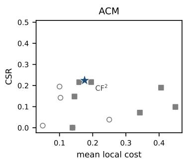

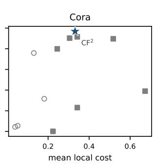

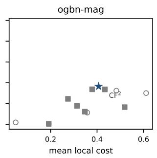  
Figure 2: Success rate vs. mean local deletion cost across the compared methods (10 seeds; sametask counterfactual methods in filled markers, diagnostics in open markers). RACE-hier (star) is the highest-CSR point on all three datasets, Pareto-dominating the strongest baseline $\mathrm { C F } ^ { 2 }$ (annotated).

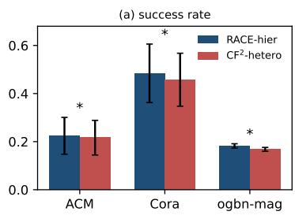

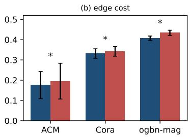  
Figure 3: Hierarchical vs. the strongest baseline $( { \mathrm { C F } } ^ { 2 } { \mathrm { - h e t e r o } } ) { \mathrm { : } }$ (a) counterfactual success rate and (b) mean local edge cost (10 seeds, mean ± 1 std; ∗: paired sign-flip $p = 0 . 0 0 2$ , Holm-corrected ${ \leq } 0 . 0 6 2 )$ . The hierarchy improves both metrics at once on every dataset.

## E MECHANISM: CSR DECOMPOSITION, BUDGET CURVES, AND COMPONENT ABLATION

CSR decomposition. Table 8 decomposes the ten-seed success rate into the relation-phase answers and the flat fallback (per-seed contributions, so the two phases sum to the total by construction). The flat fallback only extends coverage where no relation deletion exists, so the hierarchy is not a wrapper around the flat explainer but the mechanism that produces the double advantage.

Table 8: Where the success rate comes from (10 seeds): relation-phase answers vs. the flat fallback. The relation phase delivers most of the CSR at roughly half the strongest baseline’s cost.
<table><tr><td></td><td>ACM</td><td>Cora</td><td>ogbn-mag</td></tr><tr><td>relation-phase answers (certified, n)</td><td>2546</td><td>1106</td><td>4185</td></tr><tr><td>CSR contribution (pp)</td><td>18.2±4.8</td><td> $3 3 . 7 { \pm } 9 . 6 $ </td><td> $1 6 . 7 { \pm } 0 . 9 $ </td></tr><tr><td>mean edge cost (fraction)</td><td>0.105</td><td>0.311</td><td>0.273</td></tr><tr><td>fallback CSR (pp)</td><td>4.2±2.9</td><td> $1 4 . 7 { \pm } 2 . 9 $ </td><td> $1 . 5 { \pm } 0 . 3 $ </td></tr><tr><td>total CSR</td><td>0.224</td><td>0.484</td><td>0.182</td></tr><tr><td> $\mathrm { C F } ^ { 2 }$  mean cost (ref.)</td><td>0.195</td><td>0.342</td><td>0.434</td></tr></table>

Component ablation. Table 9 isolates each component on the same checkpoints. Removing the flat fallback drops CSR by exactly the fallback’s contribution $( - 4 . 2 / - 1 4 . 7 / - \mathrm { \bar { 1 } . 5 p p }$ , matching Table 8); the scan budget trades cost against compute along the budget curves (coarser budgets are faster but coarser; the default budget 128 is the working point used throughout). The “full” row reproduces the numbers of Table 1, as the pipeline’s core is deterministic given the frozen checkpoint; the rows are derived from the per-node scan traces, so no separate runs were needed.

Table 9: Component ablation of the hierarchical pipeline (10 seeds, mean±std; CSR over all targets, cost = mean feasible edge cost at the given scan budget). full = saliency prior $+ \mathrm { C F } ^ { 2 }$ fallback + single-edge scan (budget 128).
<table><tr><td rowspan="2">Variant</td><td colspan="2">ACM</td><td colspan="2">Cora</td><td colspan="2">ogbn-mag</td></tr><tr><td>CSR↑</td><td>cost↓</td><td>CSR↑</td><td>cost↓</td><td>CSR↑</td><td>cost↓</td></tr><tr><td>full (budget 128)</td><td> $0 . 2 2 4 { \scriptstyle \pm 0 . 0 7 7 }$ </td><td>0.107</td><td> $0 . 4 8 4 { \pm } 0 . 1 2 2$ </td><td>0.313</td><td> $0 . 1 8 2 { \pm } 0 . 0 0 9$ </td><td>0.273</td></tr><tr><td>— fallback</td><td> $0 . 1 8 2 { \pm } 0 . 0 4 8$ </td><td>0.107</td><td> $0 . 3 3 7 { \scriptstyle \pm 0 . 0 9 6 }$ </td><td>0.313</td><td> $0 . 1 6 7 { \scriptstyle \pm 0 . 0 0 9 }$ </td><td>0.273</td></tr><tr><td>budget 64</td><td>0.182</td><td>0.176</td><td>0.322</td><td>0.390</td><td>0.167</td><td>0.273</td></tr><tr><td>budget 32</td><td>0.182</td><td>0.279</td><td>0.322</td><td>0.458</td><td>0.167</td><td>0.287</td></tr></table>

Budget curves. Reconstructing the per-node scan traces at forward budgets $\{ 8 , \ldots , 1 2 8 \}$ (Fig. 4) shows the hierarchical cost decreasing monotonically with budget (ACM 0.490→0.107; Cora $0 . 5 5 2 {  } 0 . 3 1 3 )$ at unchanged CSR, while the flat variant saturates after $\leq 1 6$ forwards; the curves give the common working point at any budget.

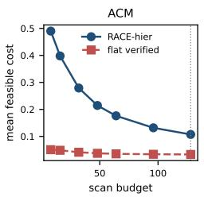

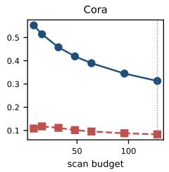

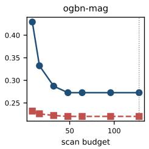  
Figure 4: Budget curves (10 seeds): mean feasible edge cost vs. the per-node scan budget for the hierarchical (solid) and flat-verified (dashed) pipelines, reconstructed from the per-node scan traces. The hierarchy’s cost decreases monotonically with budget at unchanged CSR; the flat variant saturates after $\leq 1 6$ forwards. The default working point is budget 128.

## F OUTPUT CONTRACT: ATTRIBUTION DETAIL, ARCHETYPES, AND EXPLANATION STRUCTURE

Per-class attribution. On ogbn-mag, classes 1/2/6/11/13/16/17/18 are citation-dominated (68–100% of relation-attributed nodes) while classes 0/3/4/14/19 lean on co-authorship (31–60%); on ACM, co-authorship dominates every venue class (62–86%) with the keyword relation contributing 6–30%. The instance-level search thus recovers per-class relation semantics that a dataset-level rate cannot. Figure 5 reports the single-relation flip rates behind these attributions.

Archetypes. Four archetypes recur across the explained nodes (ACM, seed 0; Fig. 7): a singlerelation flip (node 3: delete co-authorship, 1/87 local edges, margin −0.21, irreducible certificate), a two-relation flip (node 6: co-authorship plus keyword, 8/91 local edges, margin −0.032, irreducible), an explicit refusal (node 18: no relation deletion flips, margin 0.83), and a flat-fallback success (node 76). The same pipeline returns a human-readable relation answer where one exists, and says so where it does not.

Explanation structure. Figure 6 summarizes the structure of the explanations: the certified edge sets are cheap (mean local cost 0.11–0.31); a single relation suffices for 86–93% of feasible instances; and the final margins separate flipped from refused instances. Margin buckets. Bucketing the explained nodes by their prediction margin (10 deciles, 10 seeds, pooled), the hierarchical CSR is highest in the lowest-margin decile and falls monotonically across deciles on all three datasets (ACM 0.693 to 0.015; Cora 0.885 to 0.177; ogbn-mag 0.396 to 0.030): the method delivers relation-level counterfactuals exactly where predictions are closest to the decision boundary—the instances for which an explanation is most consequential.

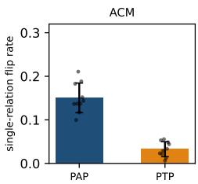

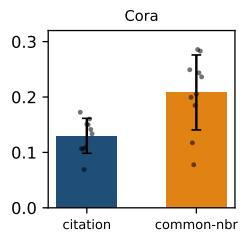

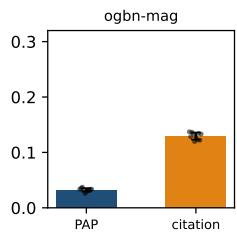  
Figure 5: Single-relation flip rates (10 seeds, mean ± 1 std, dots: per-seed values): ACM (separable: co-authorship PAP dominates), Cora (common-neighbor wins with moderate separation), ogbn-mag (citation dominates).

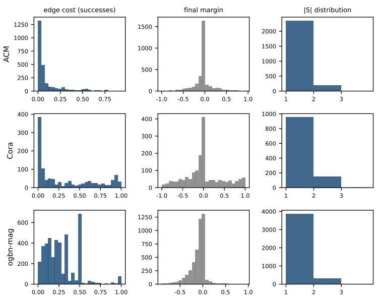  
Figure 6: Structure of the explanations (10 seeds): the certified edge sets are cheap (mean local cost 0.11–0.31); a single relation suffices for 86–93% of feasible instances; and the final margins separate flipped from refused instances.

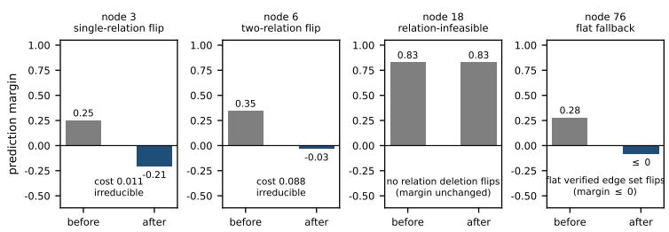  
Figure 7: Case studies (ACM, seed 0): the four archetypes of the output contract. (a) a singlerelation flip; (b) a two-relation flip; (c) an explicit refusal—no relation deletion flips the prediction, reported as infeasible; (d) a relation-infeasible node that the flat verified edge set flips instead. Bars show the prediction margin before/after the intervention (hatched: no relation-level change exists); edge costs are the deleted fraction of the node’s receptive field.

## G GENERALITY: CROSS-BACKBONE STUDY

Table 10 extends the backbone study of Table 5 to ACM, Cora-derived, and ogbn-mag (three backbones each, five seeds): the hierarchical method beats $\mathrm { C F } ^ { 2 }$ -hetero on CSR in all $9 / 9$ backbone– dataset cells (+1.0 to +8.1 pp, all $p = 0 . 0 6 2$ , the minimum attainable with five seeds). The paired cost advantage is established in the all-targets comparison of Table 1 and on ogbn-arXiv (Table 5).

Table 10: Cross-backbone study on ACM / Cora-derived / ogbn-mag (5 seeds; hierarchical vs. $\mathrm { C F } ^ { 2 } .$ hetero, CSR = success rate; all CSR differences $p = 0 . 0 6 2$ , the minimum attainable with five seeds). The CSR advantage holds in all 9/9 backbone–dataset cells; the paired cost advantage is established in the all-targets comparison of Table 1 and on ogbn-arXiv (Table 5). Bold: better value in each pairwise comparison.

<table><tr><td>Backbone</td><td>Method</td><td>ACM CSR↑</td><td></td><td>Cora CSR↑ ogbn-mag CSR↑</td></tr><tr><td rowspan="2">HAN</td><td>RACE-hier</td><td>0.255</td><td>0.314</td><td>0.182</td></tr><tr><td>CF²-hetero</td><td>0.244</td><td>0.298</td><td>0.164</td></tr><tr><td rowspan="2">HGT</td><td>RACE-hier</td><td>0.384</td><td>0.611</td><td>0.205</td></tr><tr><td>CF2-hetero</td><td>0.355</td><td>0.581</td><td>0.185</td></tr><tr><td rowspan="2">R-GCN</td><td>RACE-hier</td><td>0.785</td><td>0.939</td><td>0.318</td></tr><tr><td>CF²-hetero</td><td>0.771</td><td>0.858</td><td>0.292</td></tr></table>

## H ROBUSTNESS AND SENSITIVITY ABLATIONS

Table 11 reports the κ-sensitivity and cost-criterion ablations plus relation-set robustness under 5% random edge add/remove: κ=0.05 lowers coverage by −2.3/−1.0/−3.3 pp (the expected effect of a stricter flip threshold, ACM/Cora/mag); switching the cost criterion leaves coverage identical on all three datasets (0.1818/0.3370/0.1674); and the attributed relation sets remain near-identical under perturbation.

Table 11: Sensitivity ablations (ACM/Cora/mag, 10 seeds): margin threshold and cost criterion, plus relation-set robustness under 5% random edge add/remove.
<table><tr><td>Ablation</td><td>Setting</td><td>Result (ACM / Cora / ogbn-mag)</td></tr><tr><td>κ</td><td>margin threshold κ=0.05 vs. κ=0; coverage</td><td>0.159±0.044 vs. 0.182; 0.327±0.095 vs. 0.337; 0.135±0.009 vs. 0.167</td></tr><tr><td>cost criterion</td><td>type / edge / lexicographic; coverage</td><td>identical on all datasets (0.1818 / 0.3370 / 0.1674)</td></tr><tr><td>edge perturbation</td><td>5% random add/remove;  $S _ { v } ^ { * }$  agreement</td><td> $0 . 9 7 5 { \pm } 0 . 0 1 6 / 0 . 9 3 0 { \pm } 0 . 0 2 3 / 0 . 9 6 5 { \pm } 0 . 0 1 1$ </td></tr></table>

## I EDGE-LEVEL CERTIFICATION ON ENUMERABLE SUBGRAPHS

On enumerable computation subgraphs (synthetic SCM, 1-layer backbone so radius-1 computation subgraphs are enumerable; 120 instances) we certify the restoration scan against full edge enumeration (Table 12): the certified heuristic equals the true minimum deletion count in 102/120 cases and is off by one edge in the five other feasible cases; non-monotonicity (a flip that disappears when one edge is added back) occurs in 60/120 instances.

Table 12: Exact edge-level certification on enumerable subgraphs (120 instances). The certified heuristic equals the true minimum deletion count in 102/120 cases and is off by one edge in the five other feasible cases.
<table><tr><td>Quantity</td><td>Value</td><td>Note</td></tr><tr><td>scan = true minimum</td><td>102/120 (85%)</td><td>scan vs. full enum.</td></tr><tr><td>off by exactly one edge</td><td>5</td><td>only nonzero gaps</td></tr><tr><td>non-monotonic instances</td><td>60/120 (50%)</td><td>flip under S, not S∪ {e}</td></tr></table>

## J SYNTHETIC SCM: ADDITIONAL DETAIL

Generation. Features are iid noise; labels are determined by the mean of the causal-relation neighbors’ features projected onto class patterns; a spurious relation is homophilic in an attribute correlated with the label in the train environment but independent in the test environment; a redundant relation duplicates the causal signal; the rest are Erdos–Rényi noise; a˝ synergistic variant splits the label into two parts recoverable only from two relations jointly. For each configuration and ten data seeds we train the frozen backbone and report the two hit rates of Sec. 4.2. Table 13 reports the full $K { \mathrm { - s c a n } } { \mathrm { : } }$ exact search attains 0.529/0.292/0.151 data-causal hit at $K { = } 3 / 5 / 1 0$ while the effectordered heuristics attain 0.634/0.440/0.286.

Table 13: Synthetic SCM (10 data seeds; hit = data-causal recovery; model-dependence recovery coincides with it at $K { \le } 1 0$ and is 0.089 at $K { = } 2 0 / 0 . 2 0 1$ synergistic; exact at $K \leq 1 0 .$ , greedy/beam everywhere, bnb at $K { = } 2 0 )$ . Exact search certifies the minimum-cost answer and is the fastest search in the benchmark regime $( K \leq 1 0 ) ;$ ; greedy/beam are effect-ordered heuristics, and at $K { = } 2 0$ the budgeted branch-and-bound (bnb) is the only approximation that improves over them.
<table><tr><td>Config</td><td>exact</td><td>greedy</td><td>beam</td><td>bnb</td><td>time  $\mathrm { ( e x . / g r . ) }$ </td></tr><tr><td>standard  $K { = } 3$ </td><td>0.529</td><td>0.634</td><td>0.633</td><td></td><td> $0 . 0 7 \mathrm { s } / 1 . 0 \mathrm { s }$ </td></tr><tr><td>standard  $K { = } 5$ </td><td>0.292</td><td>0.440</td><td>0.438</td><td></td><td> $0 . 2 3 \mathrm { s } / 2 . 5 \mathrm { s }$ </td></tr><tr><td>standard  $K { = } 1 0$ </td><td>0.151</td><td>0.286</td><td>0.285</td><td></td><td> $7 . 0 \mathrm { s } / 5 . 6 \mathrm { s }$ </td></tr><tr><td>standard  $K { = } 2 0$ </td><td></td><td>0.064</td><td>0.064</td><td>0.158</td><td> $- / 3 3 \mathrm { s }$ </td></tr><tr><td>synergistic K=5</td><td>0.018</td><td>0.018</td><td>0.021</td><td></td><td> $0 . 1 7 \mathrm { s } / 1 . 1 \mathrm { s }$ </td></tr></table>

Irreducibility vs. optimality. A scripted adversarial instance instantiates the irreducibility-vsoptimality gap: valid deletion sets $\{ a , \bar { b } , c \} \supset \{ a , b \} \supset \{ c \}$ coexist, the restoration scan (saliency order $a > b > c )$ returns the irreducible $\{ a , b \}$ (cost 2), and $\{ c \}$ (cost 1) is the true minimum— the certificate characterizes the returned set, and the gap is measured exactly where enumeration is feasible (Appendix I).

Synergistic variant. When the mechanism is not learnable (test accuracy 0.25 ≈ chance; the failure decomposes as compounded per-part errors), all hits collapse to chance on the data-causal target while model-dependence sits at 0.20; the double hit-rate evaluation makes the cause visible—the drop reflects model unlearnability, not explainer error—which a single hit rate conflates.

Scaling. Figure 8 reports the hit rates and wall-clock cost of all search procedures as the relation vocabulary grows; exact search is the fastest search in the benchmark regime $( K { \le } 1 0 )$ and certifies the minimum-cost answer at every feasible K, while at $K { = } 2 0$ reliance drifts onto noise relations (test accuracy 0.33) and the budgeted branch-and-bound is the only approximation that improves over greedy/beam (companion implementation).

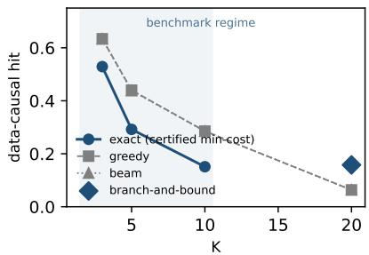

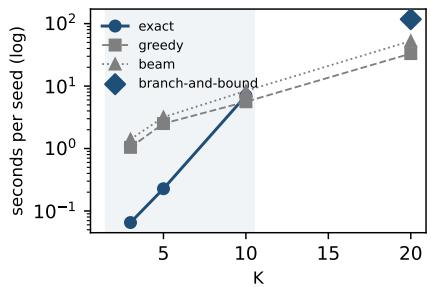  
Figure 8: Relation search as the vocabulary grows (synthetic SCM, 10 data seeds, mean $\pm \nobreakspace 1 \nobreakspace$ std; shaded: benchmark regime $K { \le } 1 0 )$ . (a) Data-causal hit rate: exact search certifies the minimum-cost answer at every feasible K; the effect-ordered greedy/beam heuristics rank the causal relation higher because the lexicographic cost prefers cheaper noise relations; at $K { = } 2 0$ the budgeted branch-andbound (bnb) is the only approximation that improves over greedy/beam. (b) Wall-clock per seed: exact search is the fastest in the benchmark regime.