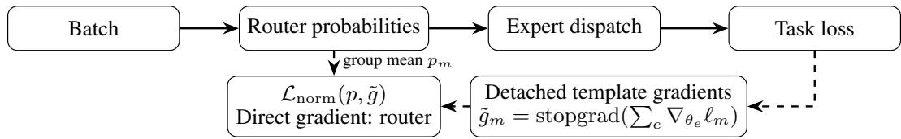
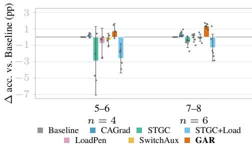
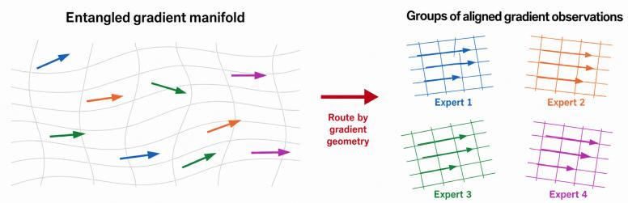
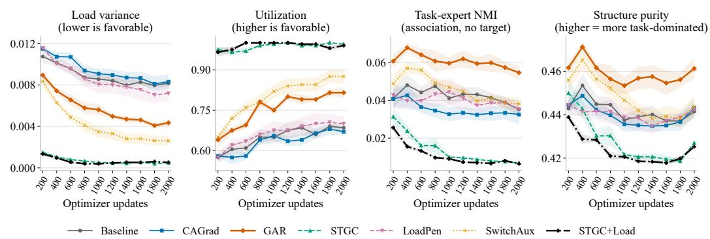
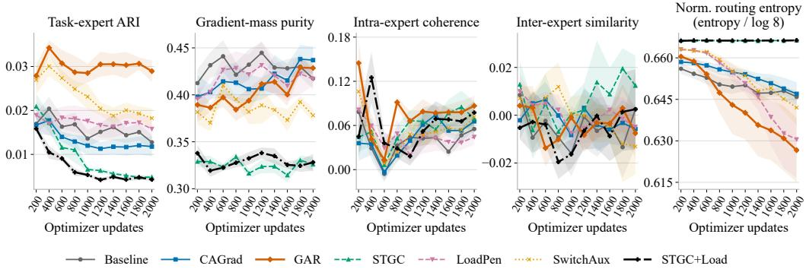
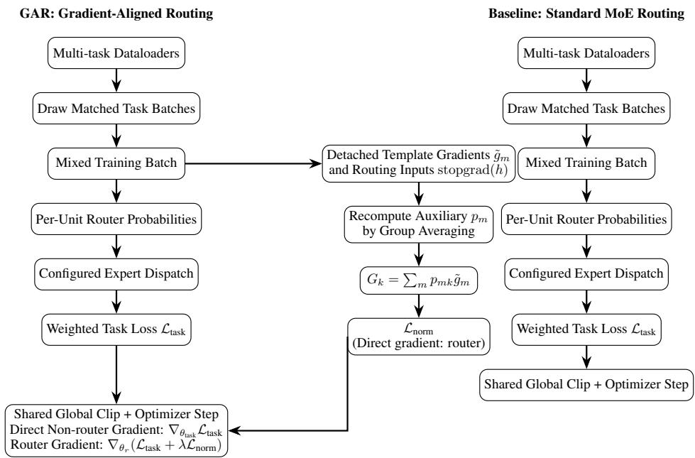

# ROUTING IN GRADIENT SPACE: BALANCED USAGE IS NOT EXPERT SPECIALIZATION

Yuchen Li<sup>1</sup>, Mingyu Du<sup>1,2</sup>, Zongqi Fan<sup>1</sup>, Nguyen H. Tran<sup>1,∗</sup>, Ken-Tye Yong<sup>1,∗</sup>

<sup>1</sup>University of Sydney <sup>2</sup>University of New South Wales

<sup>∗</sup>Corresponding authors

## ABSTRACT

Sparse expert models can distribute traffic evenly while still grouping incompatible training signals within the same experts. We study routing as a gradient-partitioning problem and introduce gradient-aligned routing (GAR), whose load-normalized router objective rewards grouping observations with aligned gradients. On five multi-task text-classification mixtures, we compare GAR with task-loss-only routing, gradient-combination and gradient-conflict methods, and load-balancing losses. With a fully trainable RoBERTa backbone and classification-head experts, GAR has the highest aggregate validation accuracy, 1.07 percentage points above taskloss-only routing. With frozen DeBERTa and Qwen3-1.7B backbones and low-rank adapter experts, it again ranks first, 1.10 points above task-loss-only routing, with better-balanced expert load and higher gradient-mass purity, the share of each expert’s gradient-norm mass from its dominant task; the load-balancing losses flatten load further but leave this purity near its task-loss-only level. Top-1 routing, trainable full-parameter feed-forward network (FFN) experts, and a larger backbone also show positive aggregate gains. The results distinguish expert-load balance from gradient-based routing organization and indicate the predictive value of gradient-informed routing in multi-task text classification.

## 1 INTRODUCTION

Multi-task learning exposes shared parameters to heterogeneous optimization signals. When gradients conflict, improving one objective can impede another. Gradient-level methods address this problem by reweighting losses or modifying the shared update, as in gradient normalization (GradNorm), multiple-gradient descent algorithm (MGDA), and conflict-averse gradient descent (CAGrad) (Chen et al., 2018; Sener & Koltun, 2018; Liu et al., 2021). Mixture-of-Experts (MoE) introduces another decision: which observations should contribute to the same expert. This makes the organization of gradient contributions an explicit routing problem.

Solving Token Gradient Conflict (STGC) (Yang et al., 2025b), our closest comparison, detects tokens whose gradients conflict with their current expert mean and penalizes those assignments. Its conflict term discourages current assignments without explicitly comparing gradient-association gains across alternative groupings. We study how to evaluate an entire assignment. We call an expert coherent when the gradient observations routed to it point in similar directions, so their sum is large relative to the load they bring (Section 3). Moving probability mass between two experts changes the coherence of both and can improve a partition even when no observation triggers a conflict test.

A criterion for gradient partitions. We formulate routing as a soft partition of gradient observations, scoring positive and negative associations in a single functional. Dividing each expert’s score by its assigned mass controls reward scaling with traffic. The resulting marginal assignment scores compare the net change in partition reward at the source and receiving experts. We call routing trained with this auxiliary objective gradient-aligned routing (GAR); the task loss still trains the model.

The criterion uses gradient observations in a common expert-parameter template and differentiable routing probabilities, accommodating both classification-head and FFN experts. We obtain the observations by summing corresponding expert gradients, detach them, and optimize only the router through the auxiliary objective. This reuses task-gradient computations and requires no second-order derivatives.

We derive the marginal assignment score and relate the objective to gradient-space clustering. With fixed observations, nonempty hard assignments at zero stabilizer recover k-means, while an orthogonal relaxation yields the spectral trace objective. An idealized analysis further characterizes how load normalization controls reward scaling and favors coherent gradient groups.

Balanced usage and predictive value. Load uniformity concerns the marginal distribution over experts, whereas association with task or gradient structure concerns a joint distribution. Independent uniform routing is balanced in the population but contains no task information. We call this joint structure expert specialization and measure it by gradient-mass purity (task dominance in expertgradient norms) and task-label association; balance, specialization, and accuracy answer different questions (Appendix E), and we compare them by empirical Pareto dominance. Task-label association is a diagnostic: aligned observations from different tasks may usefully share experts.

Evidence across MoE settings. A task mixture jointly trains on several classification datasets; the five mixtures containing five to eight tasks are defined in Appendix D, Table 4. With fully trainable backbones, a seven-method RoBERTa comparison places low-rank adaptation (LoRA) experts in the classification head with sequence-level routing, and a DeBERTa comparison uses full-parameter feed-forward network (FFN) experts with token-level routing. GAR has the highest aggregate validation accuracy in both, and also under top-1 routing of the classification-head setting.

A second group freezes DeBERTa and Qwen3-1.7B backbones and trains LoRA experts in FFN blocks. Across the five mixtures, GAR achieves the highest aggregate validation accuracy and gradient-mass purity among seven methods. It simultaneously improves accuracy, purity, and utilization and reduces load variance relative to task-loss-only routing (Baseline) and CAGrad, Pareto-dominating both in the four-metric aggregate; gains also extend to Qwen3-8B, and DeBERTa single-task controls provide complementary adaptation checks. A fixed-configuration classification-head coefficient sweep and denominator ablation probe the auxiliary objective at a shorter training budget.

Contributions. (1) A gradient-space routing objective. We introduce a load-normalized partition criterion that scores signed gradient associations and captures assignment improvements beyond binary conflict detection. (2) Theory and first-order optimization. We derive the marginal assignment score and the criterion’s connections to k-means and spectral partitioning, and develop a detached auxiliary update that trains the router using ordinary task gradients. (3) Evidence across MoE architectures. We report accuracy gains across trainable and frozen backbones, head and FFN experts, and top-1 and top-4 routing. Routing trajectories and coefficient ablations further characterize its effects on expert organization.

## 2 RELATED WORK

Prior methods address heterogeneous optimization signals through loss weighting, gradient updates, or data allocation. Our focus is an auxiliary objective that scores the allocation itself using gradient observations.

Gradient-level conflict mitigation. GradNorm (Chen et al., 2018) balances task-gradient magnitudes, PCGrad (Yu et al., 2020) projects conflicting gradients, MGDA (Sener & Koltun, 2018) seeks a common descent direction, and CAGrad (Liu et al., 2021) balances average descent with per-task improvement. These methods modify the shared update; a gradient-informed router changes which observations contribute to each expert. We use CAGrad as a representative gradient-combination comparison.

MoE routing and assignment. Switch Transformers (Fedus et al., 2022) and DeepSpeed-MoE (Rajbhandari et al., 2022) use auxiliary objectives to encourage balanced expert utilization. Routing Transformers (Roy et al., 2021), Sinkhorn-style sparse attention (Tay et al., 2020), balanced assignment layers (Lewis et al., 2021), and expert-choice routing (Zhou et al., 2022) use representation structure or assignment constraints to organize sparse computation. We study an auxiliary objective based on current-model gradient associations to score the composition of expert assignments, complementing controls on their marginal loads.

STGC and gradient-informed routing. STGC (Yang et al., 2025b) motivates conflict detection with a first-order loss expansion, compares token gradients with the current expert mean, and penalizes conflicting assignments. Its conflict term encourages departure from the current expert without explicitly scoring alternative groupings by their gradient-association gains.

Our continuous partition criterion compares marginal coherence and normalization changes at both source and receiving experts, including when no conflict is flagged. Its fixed-observation analysis characterizes these preferences; the experiments evaluate the complete criterion and detached router pathway.

STGC adds the adapted conflict-elimination loss to the task loss; an update-level load-balancing loss (LoadPen), a micro-batch Switch-style loss (SwitchAux), and STGC with the LoadPen term (STGC+Load) are further controls (Appendix D).

Partition geometry and positioning. The normalized Gram objective connects to classical clustering and spectral partitioning (Dhillon et al., 2004). These standard identities characterize our proposal to train a parameterized router from current-model gradient observations. Gradient-mass purity, task–expert normalized mutual information (NMI), and adjusted Rand index (ARI) provide distinct diagnostics (Strehl & Ghosh, 2002; Hubert & Arabie, 1985); frozen LoRA-FFN and trainable classification-head settings test predictive value across model configurations.

## 3 VARIATIONAL FORMULATION OF GRADIENT-SPACE PARTITIONING

We formalize routing as a partitioning problem over gradient space. A single variational objective connects clustering and spectral partitioning under the stated idealized restrictions; our practical training loss uses its stabilized, zero-entropy-coefficient form. Proofs are in Appendices A and B.

## 3.1 ASSIGNMENT SIMPLEX, EXPERT LOADS, AND AFFINITY

Consider M routed items, each associated with a gradient observation. An item is a unit of training data with one routing distribution and one gradient observation: a token, an example, or, in all our experiments, a same-task group of up to eight training examples with group-averaged routing probabilities (Section 5.2). The router assigns each item to a distribution over K experts, giving

$$
\begin{array} { r } { P : = [ p _ { m k } ] \in \mathbb { R } _ { + } ^ { M \times K } , \qquad \mathcal { P } _ { M , K } : = \left\{ P \in \mathbb { R } _ { + } ^ { M \times K } ~ \big | ~ P \mathbf { 1 } _ { K } = \mathbf { 1 } _ { M } \right\} , } \end{array}
$$

so each row lies on the probability simplex. The load of expert k and its stabilized diagonal matrix are

$$
d _ { k } ( P ) : = \sum _ { m = 1 } ^ { M } p _ { m k } , \qquad D _ { \epsilon } ( P ) : = \mathrm { d i a g } \bigl ( d _ { 1 } ( P ) + \epsilon , \dots , d _ { K } ( P ) + \epsilon \bigr ) , \qquad \epsilon \geq 0 .
$$

Let $W \in \mathbb { R } ^ { M \times M }$ be a symmetric affinity matrix, where $W _ { i j }$ is large when routed items i and j induce similar gradient directions and small or negative when their gradients conflict; Section 3.3 instantiates it from gradients. Together, $P$ and $W$ determine how much similarity mass each expert collects, $Q ( P ; W ) { \overset { \vartriangle } { : = } } P ^ { \intercal } W P \in \mathbb { R } ^ { K \times K }$ , whose diagonal entry $Q _ { k k }$ is the affinity mass assigned to surrogate group k. Under the gradient Gram instantiation below, it measures the squared norm of an aggregate in a common parameter template, rather than the actual update to physical expert k.

## 3.2 LOAD-NORMALIZED PARTITION OBJECTIVE

The unnormalized affinity $Q _ { k k }$ grows with both gradient agreement and the number of assigned observations. Dividing by assigned mass separates the per-observation reward from this quadratic load scaling. Summing over experts gives the load-normalized association

$$
\mathcal A _ { \epsilon } ( P ; W ) : = \mathrm { T r } \big ( D _ { \epsilon } ( P ) ^ { - 1 } P ^ { \top } W P \big ) = \sum _ { k = 1 } ^ { K } \frac { Q _ { k k } ( P ; W ) } { d _ { k } ( P ) + \epsilon } ,\tag{1}
$$

which favors assignments where routed items sharing an expert have similar gradient observations, measured per unit load. Adding an entropic relaxation yields the variational objective

$$
\mathcal { L } _ { \tau , \epsilon } ( P ; W ) : = - \mathcal { A } _ { \epsilon } ( P ; W ) + \tau \sum _ { m = 1 } ^ { M } \sum _ { k = 1 } ^ { K } p _ { m k } \log p _ { m k } , \qquad P \in \mathcal { P } _ { M , K } ,\tag{2}
$$

where $\tau \geq 0$ controls entropic smoothing. We set $\tau = 0 .$ , omitting the explicit entropy term while still using differentiable router probabilities as the continuous surrogate through which the router receives gradients. Hard assignments are analyzed separately by restricting $\bar { P }$ to the nonempty hard-assignment set; $\tau = 0$ alone does not impose one-hot routing.

## 3.3 EUCLIDEAN GRADIENT INSTANTIATION

We instantiate $W$ using a common expert-parameter template. Each expert has selected parameters $\theta _ { e } \in \mathbb { R } ^ { d }$ with the same names, shapes, and local ordering. We sum corresponding gradient entries across experts to obtain the observation of item m

$$
g _ { m } : = \sum _ { e = 1 } ^ { K } \nabla _ { \theta _ { e } } \ell _ { m } \in \mathbb { R } ^ { d } , \qquad \tilde { g } _ { m } = \mathrm { s t o p g r a d } ( g _ { m } ) .
$$

Here $\ell _ { m }$ is the mean task loss over the examples in item $m ,$ , and $d$ is the selected parameter dimension of one expert. For LoRA, the $A$ and B matrices occupy separate template slots. Equivalently, $g _ { m }$ is the loss derivative with respect to a common additive perturbation $\Delta \in \mathbb { R } ^ { d }$ applied to every $\theta _ { e } ,$ evaluated at $\Delta = 0 ;$ the experts remain independently parameterized.

The affinity is $W _ { i j } : = \langle \tilde { g } _ { i } , \tilde { g } _ { j } \rangle$ , including cross-expert inner products in matching template coordinates. Different routing supports therefore need not yield zero affinity. The criterion forms $\begin{array} { r } { G _ { k } : = \sum _ { m } p _ { m k } \tilde { g } _ { m } } \end{array}$ , a surrogate aggregate in the template space. If routed unit n (a token or an example) has output $y _ { n }$ containing $\sum _ { e } \pi _ { n e } u _ { n e }$ , with gate $\pi _ { n e }$ and expert output $u _ { n e } ,$ the chain rule gives $\begin{array} { r } { \nabla _ { \theta _ { e } } \ell _ { m } = \sum _ { n \in m } ( \partial u _ { n e } / \partial \theta _ { e } ) ^ { \top } \pi _ { n e } \nabla _ { y _ { n } } \ell _ { m } } \end{array}$ . Thus $\tilde { g } _ { m }$ is evaluated at the current gates and expert Jacobians $\partial u _ { n e } / \partial \theta _ { e }$ ; detachment holds it fixed during the auxiliary update, and it is not the gradient another assignment would produce.

Proposition 3.1 (Euclidean instantiation). Under the gradient Gram affinity $W ,$ , the association reward in (1) reduces to

$$
\mathcal { A } _ { \epsilon } ( P ; W ) = \sum _ { k = 1 } ^ { K } \frac { \left. G _ { k } \right. ^ { 2 } } { d _ { k } ( P ) + \epsilon } .\tag{3}
$$

This follows from $\begin{array} { r } { Q _ { k k } = \sum _ { i , j } p _ { i k } p _ { j k } \left. \tilde { g } _ { i } , \tilde { g } _ { j } \right. = \left\| G _ { k } \right\| ^ { 2 } } \end{array}$ . The full Gram matrix retains its diagonal, so the criterion reflects gradient norms and self-association as well as signed agreement between distinct observations (Appendix B.1). Aligned contributions increase $\| G _ { k } \| ^ { 2 } .$ , while conflicting contributions can cancel within the surrogate aggregate.

Partition preference beyond conflict detection. Consider three fixed unit-norm observations $\tilde { g } _ { 1 } , \tilde { g } _ { 2 } , \tilde { g } _ { 3 }$ and two nonempty hard-assignment clusters with $\epsilon = 0$ . Placing $\tilde { g } _ { i }$ and $\tilde { g } _ { j }$ together and the third observation alone gives $\mathcal { A } _ { 0 } = 2 \stackrel { \_ } { + } \langle \tilde { g } _ { i } , \tilde { g } _ { j } \rangle$ . Every partition has the same cluster-size profile and diagonal contribution $^ { 2 , }$ so the three partitions differ only through the cross inner products $\left. \tilde { g } _ { 1 } , \tilde { g } _ { 2 } \right.$ $\left. \tilde { g } _ { 1 } , \tilde { g } _ { 3 } \right.$ , and $\left. \tilde { g } _ { 2 } , \tilde { g } _ { 3 } \right.$ . An STGC-style conflict test flags observation m in cluster $\bar { C }$ when

$$
\cos ( \tilde { g } _ { m } , \mu _ { C } ) < 0 , \qquad \mu _ { C } : = { \frac { 1 } { | C | } } \sum _ { j \in C } \tilde { g } _ { j } .
$$

If all three cross inner products are positive, then $\begin{array} { r } { \langle \tilde { g } _ { m } , \mu _ { C } \rangle = | C | ^ { - 1 } \big ( 1 + \sum _ { j \in C \backslash \{ m \} } \langle \tilde { g } _ { m } , \tilde { g } _ { j } \rangle \big ) > 0 } \end{array}$ for every m and every partition, so no observation is flagged. The objective still ranks the partitions: $\langle \tilde { g } _ { 1 } , \tilde { g } _ { 2 } \rangle \stackrel { \cdot } { = } 0 . 9$ and $\langle \bar { \tilde { g } } _ { 1 } , \tilde { g } _ { 3 } \rangle = \langle \tilde { g } _ { 2 } , \tilde { g } _ { 3 } \rangle = 0 . 2 \mathrm { g i v e } A _ { 0 } = 2 . 9$ for $\{ \{ 1 , 2 \} , \{ 3 \} \}$ and 2.2 for the other two partitions. This establishes a distinct preference at equal gradient norms and self-association.

Marginal assignment preference and soft routing. With observations fixed, the marginal reward is $s _ { m k } : = \partial \mathcal { A } _ { \epsilon } / \partial p _ { m k } = 2 \left. G _ { k } , \tilde { g } _ { m } \right. / ( d _ { k } + \epsilon ) - \left\| G _ { k } \right\| ^ { 2 } / ( d _ { k } + \epsilon ) ^ { 2 }$ . A feasible transfer of mass δ from expert a to b changes the reward by $\delta ( s _ { m b } - s _ { m a } ) + O ( \delta ^ { 2 } )$ . It compares compatibility and normalization changes at both experts, including when no conflict is flagged. This score evaluates surrogate partition reward at $\tau = 0$ . For $\tau > 0 ,$ , every interior stationary point has Gibbs probabilities proportional to $\exp ( { s _ { m k } } / \tau )$ (Appendix A.1, Proposition A.1). If the scores converge with a unique maximizer as $\tau  0$ , its probability tends to 1.

## 4 THEORETICAL ANALYSIS

We analyze the variational objective from three angles—optimization geometry, clustering structure, and routing dynamics. For the discrete geometric results, we set $\tau = 0$ and restrict the domain to nonempty hard assignments. All proofs are in Appendices B and C.

## 4.1 ALIGNMENT FAVORS COHERENT OBSERVATION CLUSTERS

Proposition 4.1 (Alignment maximizes within-expert coherence). Under hard assignments, minimizing $\mathcal { L } _ { 0 , \epsilon } ( P ; W ) \overset { \cdot } { = } - \mathcal { A } _ { \epsilon } ( P ; W )$ is equivalent to maximizing load-normalized within-cluster coherence of the gradient observations.

Pairwise inner products reward compatible gradient observations and penalize conflicting ones within each surrogate aggregate $G _ { k }$ defined in Section 3.3.

## 4.2 HARD-ROUTING AND SPECTRAL CASES

Proposition 4.2 (k-means equivalence; Thm. B.1). Under Euclidean gradient-Gram affinity, for nonempty hard assignments, minimizing $\mathcal { L } _ { 0 , 0 } ( P ; W )$ is equivalent to minimizing the k-means objective over gradient vectors.

Proposition 4.3 (Spectral relaxation; Thm. B.2). For nonempty hard assignments, minimizing $\hat { \mathscr { L } _ { 0 , 0 } ( P ; W ) }$ corresponds to a ratio-association objective whose standard orthogonal relaxation is $\operatorname* { m a x } _ { Y ^ { \top } Y = I _ { K } } \operatorname { T r } ( Y ^ { \top } W Y )$ , with solution given by the top-K eigenvectors ofW.

For fixed observations, nonempty hard assignments, and $\epsilon = 0 ,$ , these identities characterize the geometry of the partition objective. Our method trains a parameterized router with its differentiable, stabilized form alongside the task loss.

## 4.3 ROUTING DYNAMICS AND ALIGNMENT GEOMETRY

Appendix C analyzes load scaling and assignment geometry under a symmetric prototype model. First, load-normalized anti-amplification (Proposition C.2) converts the quadratic expected aggregate norm into asymptotically linear utility under independent finite-window sampling, with a finite limiting expected marginal score. Second, static directional tilt and coherence preference (Proposition C.4) shows that enriching a fixed mixture toward one prototype increases its directional alignment and expected coherence relative to uniform mixing. Third, at $\epsilon = 0$ , a mode-separating perturbation of continuous assignments strictly improves the leading-order reward at a collapsed assignment (Theorem C.8). These results characterize the load and coherence preferences of the auxiliary criterion; Section 6 evaluates the jointly trained model.

## 5 METHOD: GRADIENT-ALIGNED ROUTING (GAR)

The implementation separates the standard task computation from a detached alignment pathway whose auxiliary loss has no direct gradient to non-router parameters.

## 5.1 IMPLEMENTATION OVERVIEW

Figure 1 shows the ordinary task-loss channel and the detached alignment channel, whose auxiliary gradient is directed to the router. The latter implements a stochastic first-order surrogate of (2) under the Euclidean gradient instantiation. Appendix G gives the full training flow.



Figure 1: Shared task pathway (solid) and added alignment pathway (dashed). Expert dispatch uses top-4 routing over eight experts. Detached group gradients and recomputed group probabilities form an auxiliary loss with no direct gradient to non-router parameters; task loss trains the predictive model. All resulting gradients subsequently undergo shared global clipping.

We use $\tau = 0$ with differentiable router probabilities and no explicit entropy term. The assignment score in Section 3 accounts for both gradient compatibility and changes in assigned mass.

## 5.2 TRAINING WITH FIRST-ORDER DETACHED ALIGNMENT

Within each setting, the compared methods share the routed forward computation and supervised task losses, which weight tasks equally and examples equally within each task (Appendix D.10). Each control applies its stated auxiliary objective or gradient-update rule. The criterion takes paired observations $\left( \tilde { g } _ { m } , p _ { m } \right)$ : a detached gradient vector and a routing-probability vector for the same observation unit. Its definition accommodates a specified token, example, or group granularity (Appendix G.2). Our experiments use same-task micro-batches, reusing the gradients computed during task-gradient accumulation. Thus m indexes one example group within the update. Let $\ell _ { m }$ be the ordinary loss averaged over that chunk. For LoRA experts, the gradient observation g<sub>m</sub> ∈ R<sup>d</sup> sums group-loss gradients across experts in the common adapter-parameter template defined in Section 3.3. The observations are obtained within the same ordinary training batch and from the same task loss used by Baseline. Let $q _ { n }$ be the router summary for example n. The token-routed FFN settings use top-k masked softmax; the top-1 extension uses a hard one-hot forward gate with a full-softmax straight-through derivative (Appendix D.4). In both cases, $q _ { n }$ averages the configured gates over non-padding tokens. For sequence-routed classification-head experts, $q _ { n }$ is the configured per-example router probability vector. The auxiliary group probability is

$$
p _ { m } = { \frac { 1 } { | m | } } \sum _ { n \in m } q _ { n } .
$$

The group mean is used directly, so $\begin{array} { r } { \sum _ { k } p _ { m k } = 1 } \end{array}$ and its support is the union of the contributing routes. Token- or example-level top-k gating and group-level gradient observations therefore have distinct roles. Details are in Appendix D.

Differentiating through $g _ { m }$ would introduce second-order terms. We detach $\tilde { g } _ { m } = \mathrm { s t o p g r a d } ( g _ { m } )$ and recompute the auxiliary router summaries from detached routing inputs, as detailed in Appendix D. The first operation avoids higher-order derivatives; the second restricts this auxiliary pathway to router parameters. Each auxiliary update treats the current-model observations as fixed. The alignment regularizer is

$$
\mathcal { L } _ { \mathrm { n o r m } } = - \sum _ { k = 1 } ^ { K } \frac { \left\| \sum _ { m = 1 } ^ { M } p _ { m k } \tilde { g } _ { m } \right\| ^ { 2 } } { d _ { k } ( P ) + \epsilon } , \qquad d _ { k } ( P ) = \sum _ { m = 1 } ^ { M } p _ { m k } .
$$

This objective favors assignments whose current-model gradient observations are coherent within each surrogate aggregate.

The final update uses one optimizer step. Before clipping, all trainable non-router parameters receive gradients only from $\mathcal { L } _ { \mathrm { t a s k } }$ , while router parameters receive gradients from the combined objective $\mathcal { L } _ { \mathrm { t a s k } } + \lambda \mathcal { L } _ { \mathrm { n o r m } } ,$ , where $\lambda \equiv \lambda _ { \mathrm { a l i g n } }$ is the alignment coefficient reported in the configuration tables (see Algorithm 1). The resulting gradients are then globally clipped over all trainable parameters before the optimizer step. This produces a first-order, Hessian-free alignment signal for the router.

Algorithm 1 and Figure 6 in Appendix G state and illustrate the resulting training step. At the objective level, setting $\lambda = 0$ recovers Baseline under the shared architecture, task-batch construction, routed forward computation, and update semantics. The comparator configurations and the RoBERTa classification-head and LoRA-FFN coefficient-ablation protocols are specified together in Appendix D.

Computational cost. Detachment avoids second-order differentiation, while the alignment pathway adds group-gradient observations and router-summary recomputation. In DeBERTa measurements, GAR takes 1.04× Baseline’s mean step time on the frozen LoRA-FFN five-task mixture (five seeds, 20 gradient observations per update) and 1.12× and 1.03× in single-task MRPC frozen-LoRA and full-FFN runs (Appendix D.12, Table 23).

## 6 EMPIRICAL RESULTS

## 6.1 PROTOCOL AND REPORTING SCOPE

We compare Baseline, CAGrad, GAR, STGC, LoadPen (load-balancing loss), SwitchAux (Switch auxiliary loss), and STGC+Load on five task mixtures with five seeds, eight experts, and top-4 routing (E8K4). The mixtures contain five tasks, six tasks, two distinct sets of seven tasks, and eight tasks. Table 4 in Appendix D lists the datasets; the two seven-task mixtures are distinguished by their PAWS or MRPC task. Each mixture is trained jointly with one optimizer configuration across its tasks. Compared methods share data, expert topology, update budget, and evaluation protocol.

Trainable-backbone settings. A seven-method RoBERTa evaluation uses a fully trainable backbone, classification-head LoRA experts over a shared base head, and sequence-level routing on pooled representations. This setting records ten-checkpoint routing trajectories, including structure purity from the selection counts used for NMI/ARI (Appendices D.5 and F.3.1); a top-1 variant keeps the same router and experts but dispatches each example to one expert through a straight-through gate (Appendix D.6). A second setting trains DeBERTa fully with full-parameter FFN experts and token-level routing (Appendix D.7). DeBERTa single-task controls (four experts, top-2 routing; E4K2) compare frozen-backbone LoRA-FFN experts with full-parameter FFN experts at the same sites in an unfrozen backbone.

Frozen LoRA-FFN settings. The seven methods are also compared on frozen DeBERTa and Qwen3-1.7B with final-layer LoRA-FFN experts and token-level routing, with a three-method Qwen3-8B extension. Frozen RoBERTa-base has limited downstream accuracy under the shared configuration; it is reported separately and hosts a top-1 extension and a coefficient sweep, with results in Appendices F.1.1, F.2, and F.7.

Evaluation and metrics. Evaluation splits and selected configurations are in Appendix D. Equaltask macro validation accuracy weights tasks equally regardless of validation-set size. Load variance (LVar) measures marginal imbalance; utilization is the fraction of experts whose load reaches at least half the uniform-load level; gradient-mass purity measures per-expert concentration of task-gradient norms. NMI/ARI count expert selections per non-padding token for FFN routing and per example for classification-head routing. FFN loads summarize probability mass, while classification-head loads summarize selection frequency; their absolute values are interpreted within each setting. Appendix E gives the formula and aggregations.

## 6.2 JOINT PERFORMANCE ACROSS BACKBONES AND ADAPTATION SETTINGS

Table 1(a) reports five-mixture mean accuracy and the paired GAR–Baseline gain in each setting; panel (b) gives seven-method accuracy and routing statistics for the frozen two-backbone mean. The top-4 frozen LoRA-FFN and classification-head comparisons include all seven methods. The top-1 extensions, trainable DeBERTa-FFN, Qwen3-8B, and single-task controls compare Baseline, CAGrad, and GAR.

Table 1: Endpoint comparisons over the five mixtures in Table 4 (five seeds). (a) Mean accuracy and paired GAR−Baseline gains $( \Delta _ { \mathrm { B a s e } } ,$ pp; 95% Student-t intervals across seeds). †: trainable backbone; RoBERTa-head uses sequence-routed classification-head LoRA experts (three of seven methods shown); Head, top-1 uses straight-through one-hot gating (Appendix F.4); DeBERTa-FFN uses token-routed full-parameter FFN experts. Frozen-LoRA averages frozen DeBERTa and Qwen3-1.7B; Qwen3-8B is a frozen model-scale extension. ‡: DeBERTa single-task E4K2 controls average [CoLA, MRPC, RTE, SST-2, QQP], weighting frozen-LoRA and trainable-FFN adaptations equally. (b) Seven-method frozen LoRA-FFN two-backbone means. Bold marks the best accuracy in (a) and best metric values in (b). Full details are in Appendix F.
<table><tr><td>(a) Method</td><td>RoBERTa- head†</td><td>Head, top-1†</td><td>DeBERTa- FFN†</td><td>Frozen- LoRA</td><td>Qwen3-8B</td><td>Single- task</td></tr><tr><td rowspan="3">Baseline CAGrad</td><td>0.7902</td><td>0.8039</td><td>0.8478</td><td>0.7593</td><td>0.7328</td><td>0.8820</td></tr><tr><td>0.7824</td><td>0.8066</td><td>0.8507</td><td>0.7625</td><td>0.7401</td><td>0.8799</td></tr><tr><td>0.8008</td><td>0.8145</td><td>0.8594</td><td>0.7702</td><td>0.7452</td><td>0.8913</td></tr><tr><td>∆Base (pp) 95% CI</td><td>+1.065 [0.697,1.433]</td><td>+1.056 [0.831,1.282]</td><td>+1.155 [0.730,1.579]</td><td>+1.095 [0.661,1.529]</td><td>+1.239 [0.514,1.965]</td><td>+0.929 [0.207,1.651]</td></tr></table>

<table><tr><td>(b) Metric Baseline</td><td></td><td>CAGrad</td><td>GAR</td><td>STGC</td><td>LoadPen</td><td></td><td>SwitchAux STGC+Load</td></tr><tr><td>Acc</td><td>0.7593</td><td>0.7625</td><td>0.7702</td><td>0.7438</td><td>0.7556</td><td>0.7573</td><td>0.7412</td></tr><tr><td>LVar</td><td>0.03118</td><td>0.02994</td><td>0.01542</td><td>0.00101</td><td>0.01032</td><td>0.00846</td><td>0.00139</td></tr><tr><td>Purity</td><td>0.4368</td><td>0.4446</td><td>0.5645</td><td>0.4200</td><td>0.4427</td><td>0.4424</td><td>0.4071</td></tr><tr><td>Util.</td><td>0.5200</td><td>0.5250</td><td>0.6225</td><td>0.9725</td><td>0.7300</td><td>0.7525</td><td>0.9525</td></tr></table>

Trainable backbones. In classification-head RoBERTa, GAR has the highest five-mixture mean accuracy among seven methods and gains +1.07 points over Baseline and +1.84 over CAGrad (Table 39). GAR leads accuracy, structure purity, and NMI, while STGC reaches near-uniform load. On accuracy, LVar, gradient-mass purity, structure purity, and utilization, GAR and CAGrad are both non-dominated: CAGrad has higher mean gradient-mass purity, while GAR improves the other four means. Trainable DeBERTa full-parameter FFN gives +1.155 points over Baseline and +0.873 points over CAGrad, with lower LVar and higher utilization than both (Table 43). With top-1 routing in the classification-head setting, GAR gains +1.06 [+0.83, +1.28] points over Baseline and +0.79 [+0.30, +1.27] over CAGrad and leads all five mixtures; task-loss-only routing concentrates on a single expert in 17 of 25 runs, against 1 of 25 for GAR, which has lower LVar and higher gradient-mass purity and utilization than both comparators (Appendix F.4).

GAR and Baseline select the same learning rate in the five-, six-, and both seven-task classificationhead mixtures; clipping and weight decay come from Baseline’s search in every setting. In trainable DeBERTa-FFN, the five- and six-task mixtures also share the learning rate and yield gains of +0.65 and +1.45 points. These matched-configuration comparisons complement the five-mixture summaries (Appendix D).

DeBERTa single-task controls yield GAR−Baseline gains of +1.13 points with LoRA and +0.73 with FFN over five tasks. Averaged over both adaptations, GAR gains +0.93 [+0.21, +1.65] points over Baseline and +1.13 [+0.42, +1.85] over CAGrad (Appendix F.6.3).

Frozen LoRA-FFN backbones. In the frozen two-backbone aggregate, GAR combines the highest accuracy and gradient-mass purity among seven methods with lower LVar and higher utilization than Baseline and CAGrad (Table 1b). It also has the highest five-mixture mean accuracy on both backbones. Its paired accuracy gains are +1.10 [+0.66, +1.53] percentage points over Baseline and +0.78 [+0.27, +1.29] over CAGrad (Table 34). Per-backbone GAR–Baseline intervals are positive on both backbones (Appendix F.1.5).

Across the 10 frozen backbone–mixture combinations, GAR has higher mean accuracy than Baseline in all 10, lower LVar in 8, and higher utilization in 7. Appendix F.1 gives the per-combination values.

STGC+Load is tuned for each setting and mixture over model-training learning rate, $\beta _ { \mathrm { S T G C } }$ , and $\lambda _ { \mathrm { l o a d } }$ under the common search procedure; its results appear in Table 1(b), Figure 4, and the appendix tables.

Empirical Pareto comparison. Using accuracy, gradient-mass purity, and utilization as increasing axes and LVar as a decreasing axis, GAR Pareto-dominates Baseline and CAGrad in the panel-(b) frozen aggregate: all four reported means improve simultaneously. The non-dominated methods are GAR, STGC, LoadPen, and SwitchAux. GAR leads accuracy and gradient-mass purity, while the other three favor load uniformity and utilization.

Training-process evidence. Across ten checkpoints on the five classification-head mixtures, GAR has lower LVar and higher utilization, NMI, and structure purity than Baseline and CAGrad (Figures 4– 5). Its paired endpoint intra-expert coherence gain over Baseline is +0.0315 [+0.0019, +0.0611] under the all-task-pair definition in Appendix E (Table 39).

## 6.3 OBSERVED GAINS ACROSS TASK MIXTURES



Table 2: RoBERTa classification-head fixedconfiguration ablations on the five E8K4 mixtures in Table 4 at 1,000 updates (accuracy, %). (a) Coefficient sweep. (b) Denominator ablation at $\lambda = 1 0 ^ { - 3 } ; \lambda = 0$ disables the auxiliary term. Each mixture reuses its selected GAR configuration without further search. Values average tasks, mixtures, and seeds equally. Appendices D.9 and F.7 give full details.

Fixed-configuration ablation  
Figure 2: Accuracy gains over Baseline by taskcount bin. Bars are equal-cell means; dots are backbone–mixture cells $( n \ = \ 4 , 6 ;$ frozen De-BERTa and Qwen3-1.7B), and whiskers are 95% Student-t intervals across those cells. All runs use E8K4; Table 4 defines the mixtures in each bin.
<table><tr><td rowspan=1 colspan=1>(a) Coefficientsweep</td></tr><tr><td rowspan=1 colspan=1> $\lambda$    Acc. (%)</td></tr><tr><td rowspan=1 colspan=1>0      78.97 $1 0 ^ { - 5 }$      79.17</td></tr><tr><td rowspan=1 colspan=1> $1 0 ^ { - 4 }$      79.46</td></tr><tr><td rowspan=1 colspan=1> $1 0 ^ { - 3 }$      79.87 $1 0 ^ { - 2 }$      79.46</td></tr></table>

<table><tr><td>(b) Denominator</td></tr><tr><td>Objective Acc. (%)</td></tr><tr><td> $\lambda = 0$  78.97</td></tr><tr><td>Numerator only 79.39</td></tr><tr><td>Load-normalized 79.87</td></tr></table>

Across the five frozen LoRA-FFN mixtures, GAR’s equal-backbone gains over Baseline are +0.73 points for five–six tasks and +1.34 for seven–eight (Figure 2). The bins describe different task counts and compositions. Classification-head RoBERTa also has positive gains in both groups (Appendix F.3).

Fixed-configuration coefficient ablations. Table 2 reports a 1,000-update RoBERTa classification head sweep on the same five E8K4 mixtures. It reuses each mixture’s selected GAR configuration and varies only λ. At $1 0 ^ { - 3 }$ , the equal-mixture mean rises from 78.97% to 79.87%, a paired gain of $+ 0 . 9 0 \ [ + 0 . 4 3 \dot { , } + 1 . 3 7 ]$ points $( n = 5 )$ . Removing the load denominator at the same coefficient gives 79.39%; the load-normalized objective exceeds this numerator-only arm by $+ 0 . 4 7 \ [ + 0 . 0 8 , + 0 . 8 7 ]$ points. Appendix F.7 gives per-task results and the corresponding frozen RoBERTa LoRA-FFN sweep.

## 7 CONCLUSION

We presented a load-normalized objective for routing in gradient space, together with a first-order implementation that directs auxiliary gradients to the router. The formulation connects expert assignment to gradient clustering and provides a criterion for grouping compatible optimization signals. Experiments show accuracy gains across trainable and frozen backbones, head and FFN experts, and top-1 and top-4 routing. GAR achieves the highest aggregate accuracy in the sevenmethod comparisons; the frozen LoRA-FFN aggregate also shows higher utilization and gradientmass purity and lower load variance than Baseline and CAGrad. These findings support gradient information as a useful basis for expert routing beyond load balance.

## 8 LIMITATIONS

Our experiments focus on supervised fine-tuning of pretrained language models for English text classification. Evaluation in large-scale pretraining and other modalities remains for future work.

## ETHICS STATEMENT

This work studies routing objectives for sparse Mixture-of-Experts models and uses publicly released English text-classification datasets (GLUE, SuperGLUE, PAWS, and ANLI) under their original licenses. No new data were collected, no human subjects were involved, and we did not intentionally collect or inspect personal information. Public text datasets can nevertheless retain incidental personal or sensitive content despite upstream filtering; users should follow the source datasets’ documentation and apply deployment-appropriate filtering. The method changes how training signal is grouped across experts and does not introduce a new generative capability; we are not aware of a direct dual-use concern beyond those already inherent to fine-tuning pretrained language models.

## REPRODUCIBILITY STATEMENT

The paper and appendices specify the objective, implementation, experimental settings, hyperparameter selection procedure, and evaluation metrics. Reported endpoint results summarize five independent runs. Selected configurations are listed in the hyperparameter tables of Appendix D; code implementing the objective and the reported settings will be released at https: //github.com/lyclyq/MoE\_arxiv.

## USE OF LARGE LANGUAGE MODELS

Large language models were used to retrieve relevant literature; draft and edit manuscript text; refactor code and support research execution; and check and revise mathematical derivations. The research questions, core method, and final scientific decisions were developed and verified by the authors. Experimental measurements were produced by the reported code. The authors reviewed all AI-assisted content and take full responsibility for the contents of this paper.

## REFERENCES

Zhao Chen, Vijay Badrinarayanan, Chen-Yu Lee, and Andrew Rabinovich. GradNorm: Gradient normalization for adaptive loss balancing in deep multitask networks. In International Conference on Machine Learning (ICML), 2018.

Inderjit S. Dhillon, Yuqiang Guan, and Brian Kulis. Kernel k-means, spectral clustering and normalized cuts. In Proceedings of the Tenth ACM SIGKDD International Conference on Knowledge Discovery and Data Mining, pp. 551–556, 2004.

William Fedus, Barret Zoph, and Noam Shazeer. Switch transformers: Scaling to trillion parameter models with simple and efficient sparsity. Journal ofMachine Learning Research, 23(120):1–39, 2022.

Pengcheng He, Xiaodong Liu, Jianfeng Gao, and Weizhu Chen. DeBERTa: Decoding-enhanced BERT with disentangled attention. In International Conference on Learning Representations (ICLR), 2021.

Pengcheng He, Jianfeng Gao, and Weizhu Chen. DeBERTaV3: Improving DeBERTa using ELECTRA-style pre-training with gradient-disentangled embedding sharing. In International Conference on Learning Representations (ICLR), 2023.

Edward J. Hu, Yelong Shen, Phillip Wallis, Zeyuan Allen-Zhu, Yuanzhi Li, Shean Wang, Lu Wang, and Weizhu Chen. LoRA: Low-rank adaptation of large language models. In International Conference on Learning Representations (ICLR), 2022.

Lawrence Hubert and Phipps Arabie. Comparing partitions. Journal ofClassification, 2(1):193–218, 1985.

Mike Lewis, Shruti Bhosale, Tim Dettmers, Naman Goyal, and Luke Zettlemoyer. BASE layers: Simplifying training of large, sparse models. In International Conference on Machine Learning (ICML), 2021.

Bo Liu, Xingchao Liu, Xiaojie Jin, Peter Stone, and Qiang Liu. Conflict-averse gradient descent for multi-task learning. In Advances in Neural Information Processing Systems (NeurIPS), pp. 18878–18890, 2021.

Yinhan Liu, Myle Ott, Naman Goyal, Jingfei Du, Mandar Joshi, Danqi Chen, Omer Levy, Mike Lewis, Luke Zettlemoyer, and Veselin Stoyanov. RoBERTa: A robustly optimized BERT pretraining approach. arXiv preprint arXiv:1907.11692, 2019.

Yixin Nie, Adina Williams, Emily Dinan, Mohit Bansal, Jason Weston, and Douwe Kiela. Adversarial NLI: A new benchmark for natural language understanding. In Proceedings ofthe 58th Annual Meeting of the Association for Computational Linguistics (ACL), 2020.

Samyam Rajbhandari, Conglong Li, Zhewei Yao, Minjia Zhang, Reza Yazdani Aminabadi, Ammar Ahmad Awan, Jeff Rasley, and Yuxiong He. DeepSpeed-MoE: Advancing mixture-of-experts inference and training to power next-generation AI scale. In International Conference on Machine Learning (ICML), 2022.

Aurko Roy, Mohammad Saffar, Ashish Vaswani, and David Grangier. Efficient content-based sparse attention with routing transformers. Transactions of the Association for Computational Linguistics, 9:53–68, 2021.

Ozan Sener and Vladlen Koltun. Multi-task learning as multi-objective optimization. In Advances in Neural Information Processing Systems (NeurIPS), 2018.

Alexander Strehl and Joydeep Ghosh. Cluster ensembles – a knowledge reuse framework for combining multiple partitions. Journal ofMachine Learning Research, 3:583–617, 2002.

Yi Tay, Dara Bahri, Liu Yang, Donald Metzler, and Da-Cheng Juan. Sparse sinkhorn attention. In International Conference on Machine Learning (ICML), 2020.

Alex Wang, Yada Pruksachatkun, Nikita Nangia, Amanpreet Singh, Julian Michael, Felix Hill, Omer Levy, and Samuel R. Bowman. SuperGLUE: A stickier benchmark for general-purpose language understanding systems. In Advances in Neural Information Processing Systems (NeurIPS), 2019a.

Alex Wang, Amanpreet Singh, Julian Michael, Felix Hill, Omer Levy, and Samuel R. Bowman. GLUE: A multi-task benchmark and analysis platform for natural language understanding. In International Conference on Learning Representations (ICLR), 2019b.

An Yang et al. Qwen3 technical report. arXiv preprint arXiv:2505.09388, 2025a.

Longrong Yang, Dong Shen, Chaoxiang Cai, Fan Yang, Tingting Gao, Di Zhang, and Xi Li. Solving token gradient conflict in mixture-of-experts for large vision-language model. In International Conference on Learning Representations (ICLR), 2025b.

Tianhe Yu, Saurabh Kumar, Abhishek Gupta, Sergey Levine, Karol Hausman, and Chelsea Finn. Gradient surgery for multi-task learning. In Advances in Neural Information Processing Systems (NeurIPS), 2020.

Yuan Zhang, Jason Baldridge, and Luheng He. PAWS: Paraphrase adversaries from word scrambling. In Proceedings of the 2019 Conference of the North American Chapter of the Association for Computational Linguistics (NAACL), 2019.

Yanqi Zhou, Tao Lei, Hanxiao Liu, Nan Du, Yanping Huang, Vincent Zhao, Andrew M. Dai, Zhifeng Chen, Quoc V. Le, and James Laudon. Mixture-of-experts with expert choice routing. In Advances in Neural Information Processing Systems (NeurIPS), 2022.

## A ADDITIONAL VARIATIONAL DERIVATIONS

Figure 3 illustrates the gradient-grouping preference underlying the following fixed-observation derivations.

  
Figure 3: Gradient-space routing intuition. The criterion groups gradient observations by signed associations. The expert clusters illustrate the grouping preference, rather than learned linear subspaces.

## A.1 STATIONARY GIBBS FORM

The following is the formal statement summarized in Section 3.

Proposition A.1 (Stationary Gibbs form). Fix $\tau > 0 .$ . If $P ^ { \star }$ is an interior stationary point of $\bar { \mathcal { L } } _ { \tau , \epsilon } ( \cdot ; W )$ over $\mathcal { P } _ { M , K }$ , then for every routed item m,

$$
p _ { m k } ^ { \star } = \frac { \exp \bigl ( s _ { m k } ( P ^ { \star } ) / \tau \bigr ) } { \sum _ { \ell = 1 } ^ { K } \exp \bigl ( s _ { m \ell } ( P ^ { \star } ) / \tau \bigr ) } , \qquad s _ { m k } ( P ) : = \frac { 2 \left. G _ { k } , \tilde { g } _ { m } \right. } { d _ { k } ( P ) + \epsilon } - \frac { \| G _ { k } \| ^ { 2 } } { \left( d _ { k } ( P ) + \epsilon \right) ^ { 2 } } .\tag{4}
$$

Proof. By Proposition 3.1,

$$
\mathcal { L } _ { \tau , \epsilon } ( P ; W ) = - \sum _ { k = 1 } ^ { K } \frac { \| G _ { k } \| ^ { 2 } } { d _ { k } ( P ) + \epsilon } + \tau \sum _ { m = 1 } ^ { M } \sum _ { k = 1 } ^ { K } p _ { m k } \log p _ { m k } .
$$

Differentiating with respect to $p _ { m k }$ gives

$$
\frac { \partial \mathcal { L } _ { \tau , \epsilon } } { \partial p _ { m k } } = - \left( \frac { 2 \left. G _ { k } , \tilde { g } _ { m } \right. } { d _ { k } ( P ) + \epsilon } - \frac { \| G _ { k } \| ^ { 2 } } { ( d _ { k } ( P ) + \epsilon ) ^ { 2 } } \right) + \tau ( 1 + \log p _ { m k } ) .\tag{5}
$$

Introducing a Lagrange multiplier $\alpha _ { m }$ for the row constraint $\textstyle \sum _ { k = 1 } ^ { K } p _ { m k } \ = \ 1$ , the stationarity condition is

$$
\frac { \partial \mathcal { L } _ { \tau , \epsilon } } { \partial p _ { m k } } + \alpha _ { m } = 0 .
$$

Substituting (5), rearranging, and normalizing over k yields (4).

## B OPTIMIZATION GEOMETRY, CLUSTERING STRUCTURE, AND SPECTRAL VIEW

## B.1 PROOF OF PROPOSITION 4.1

For fixed gradient observations under hard assignments, each sample m is assigned to exactly one expert, forming clusters $\mathcal { C } _ { k } = \{ m : p _ { m k } = 1 \}$ .

The surrogate aggregate of observations assigned to expert k is:

$$
G _ { k } = \sum _ { m \in \mathcal { C } _ { k } } \tilde { g } _ { m } .
$$

Its squared norm expands as:

$$
\| G _ { k } \| ^ { 2 } = \sum _ { i , j \in \mathcal { C } _ { k } } \langle \tilde { g } _ { i } , \tilde { g } _ { j } \rangle .
$$

Therefore, the objective

$$
\sum _ { k } \frac { \Vert G _ { k } \Vert ^ { 2 } } { \vert \mathcal { C } _ { k } \vert + \epsilon } = \sum _ { k } \frac { 1 } { \vert \mathcal { C } _ { k } \vert + \epsilon } \sum _ { i , j \in \mathcal { C } _ { k } } \langle \tilde { g } _ { i } , \tilde { g } _ { j } \rangle
$$

is a load-normalized association within each observation cluster. Maximizing it rewards positive co-routing affinity and discourages cancellation within the surrogate aggregates. □

Self-association and cross-observation agreement. For general soft assignments, the full Gram reward decomposes as

$$
\mathcal { A } _ { \epsilon } ( P ; W ) = \sum _ { k } \frac { \sum _ { m } p _ { m k } ^ { 2 } \| \tilde { g } _ { m } \| ^ { 2 } + \sum _ { i \neq j } p _ { i k } p _ { j k } \langle \tilde { g } _ { i } , \tilde { g } _ { j } \rangle } { d _ { k } ( P ) + \epsilon } .
$$

The first term retains observation self-association; the second scores agreement between distinct observations. The diagonal can favor concentrated assignments even when the off-diagonal associations vanish. For example, with $M = K = 2$ and $W = I _ { 2 }$ , the uniform assignment has reward $1 / ( 1 + \epsilon )$ whereas $P = I _ { 2 }$ has reward $2 / ( 1 + \epsilon )$ . The full Gram choice underlies the Euclidean aggregate identity and the k-means characterization below; removing its diagonal defines a different objective. The experiments evaluate the full-Gram criterion.

## B.2 HARD-ROUTING RESTRICTION AND K-MEANS EQUIVALENCE

We now restrict the variational free energy to hard assignment matrices

$$
\mathcal { H } _ { M , K } : = \left\{ P \in \{ 0 , 1 \} ^ { M \times K } \ \middle | \ P \mathbf { 1 } _ { K } = \mathbf { 1 } _ { M } \right\} \subset \mathcal { P } _ { M , K } .
$$

Under $P \in \mathcal { H } _ { M , K }$ , each routed item is assigned to exactly one expert. For the discrete equivalence below we set $\epsilon = 0$ and restrict to nonempty clusters, matching the usual k-means convention; the stabilizer only handles numerical empty-cluster cases.

Theorem B.1 (Hard-routing restriction = k-means). Under the Euclidean gradient-Gram affinity

$$
W _ { i j } = \langle \tilde { g } _ { i } , \tilde { g } _ { j } \rangle ,
$$

minimizing $\mathcal { L } _ { 0 , 0 } ( P ; W )$ over nonempty hard clusters is equivalent to minimizing the classical k-means objective on $\{ \tilde { g } _ { m } \} _ { m = 1 } ^ { M }$

Proof. Let $\{ \tilde { g } _ { m } \} _ { m = 1 } ^ { M } \subset \mathbb { R } ^ { d }$ be the detached gradient observations and assume hard routing

$$
p _ { m k } \in \{ 0 , 1 \} , \qquad \mathcal { C } _ { k } = \{ m \mid p _ { m k } = 1 \} .
$$

Let $| \mathcal { C } _ { k } |$ denote cluster size. Classical k-means minimizes

$$
\mathcal { T } _ { k \mathrm { - m e a n s } } = \sum _ { k = 1 } ^ { K } \sum _ { m \in \mathcal { C } _ { k } } \left. \tilde { g } _ { m } - \mu _ { k } \right. ^ { 2 } , \qquad \mu _ { k } = \frac { 1 } { \left| \mathcal { C } _ { k } \right| } \sum _ { m \in \mathcal { C } _ { k } } \tilde { g } _ { m } .
$$

Expanding,

$$
\left\| \widetilde { g } _ { m } - \mu _ { k } \right\| ^ { 2 } = \left\| \widetilde { g } _ { m } \right\| ^ { 2 } - 2 \left. \widetilde { g } _ { m } , \mu _ { k } \right. + \left\| \mu _ { k } \right\| ^ { 2 } .
$$

Summing over $m \in \mathcal { C } _ { k }$ and substituting $\mu _ { k }$ yields

$$
\sum _ { m \in \mathcal { C } _ { k } } \left. \tilde { g } _ { m } - \mu _ { k } \right. ^ { 2 } = \sum _ { m \in \mathcal { C } _ { k } } \left. \tilde { g } _ { m } \right. ^ { 2 } - \frac { 1 } { | \mathcal { C } _ { k } | } \left. \sum _ { m \in \mathcal { C } _ { k } } \tilde { g } _ { m } \right. ^ { 2 } .
$$

The first term $\textstyle \sum _ { m = 1 } ^ { M } \bigl \| \tilde { g } _ { m } \bigr \| ^ { 2 }$ is independent of the clustering; therefore minimizing ${ \mathcal { T } } _ { k \mathrm { - m e a n s } }$ is equivalent to maximizing

$$
\sum _ { k = 1 } ^ { K } \frac { 1 } { \left| \mathcal { C } _ { k } \right| } \left\| \sum _ { m \in \mathcal { C } _ { k } } \tilde { g } _ { m } \right\| ^ { 2 } .
$$

Under hard routing,

$$
G _ { k } = \sum _ { m \in \mathcal { C } _ { k } } \tilde { g } _ { m } , \qquad d _ { k } ( P ) = | \mathcal { C } _ { k } | ,
$$

hence

$$
\mathcal { L } _ { 0 , 0 } ( P ; W ) = - \sum _ { k = 1 } ^ { K } \frac { \left. G _ { k } \right. ^ { 2 } } { d _ { k } ( P ) } = - \sum _ { k = 1 } ^ { K } \frac { 1 } { | \mathcal { C } _ { k } | } \left. \sum _ { m \in \mathcal { C } _ { k } } \tilde { g } _ { m } \right. ^ { 2 } .
$$

Thus minimizing $\mathcal { L } _ { 0 , 0 } ( P ; W )$ is exactly equivalent to minimizing the k-means objective. □

Remark. Experts correspond to clusters in gradient space, and routing corresponds to assignments.   
Soft routing probabilities $p _ { m k } \in [ 0 , 1 ]$ therefore induce a relaxed k-means formulation.

## B.3 SPECTRAL RELAXATION

Theorem B.2 (Spectral relaxation of load-normalized alignment). Under nonempty hard routing,

$$
\mathcal { L } _ { 0 , 0 } ( P ; W ) = - \sum _ { k = 1 } ^ { K } \frac { 1 } { | \mathcal { C } _ { k } | } \left\| \sum _ { m \in \mathcal { C } _ { k } } \tilde { g } _ { m } \right\| ^ { 2 } .
$$

Define the gradient affinity matrix $W \in \mathbb { R } ^ { M \times M } , W _ { i j } : = \langle \tilde { g } _ { i } , \tilde { g } _ { j } \rangle$ . Then minimizing $\mathcal { L } _ { 0 , 0 } ( P ; W )$ is equivalent to maximizing the ratio association objective

$$
\operatorname* { m a x } _ { \{ \mathcal { C } _ { k } \} _ { k = 1 } ^ { K } } \sum _ { k = 1 } ^ { K } \frac { 1 } { | \mathcal { C } _ { k } | } \sum _ { i , j \in \mathcal { C } _ { k } } W _ { i j } .
$$

Moreover, its standard continuous relaxation yields a top-K eigenvector solution.

Proof. First expand each cluster term:

$$
\left\| \sum _ { m \in \mathcal { C } _ { k } } \tilde { g } _ { m } \right\| ^ { 2 } = \sum _ { i \in \mathcal { C } _ { k } } \sum _ { j \in \mathcal { C } _ { k } } \left. \tilde { g } _ { i } , \tilde { g } _ { j } \right. = \sum _ { i , j \in \mathcal { C } _ { k } } W _ { i j } .
$$

Hence

$$
- \mathcal { L } _ { 0 , 0 } ( P ; W ) = \sum _ { k = 1 } ^ { K } \frac { 1 } { | \mathcal { C } _ { k } | } \sum _ { i , j \in \mathcal { C } _ { k } } W _ { i j } ,
$$

which is exactly the ratio association objective.

To express it in trace form, let $H \in \{ 0 , 1 \} ^ { M \times K }$ be the hard assignment matrix, where $H _ { i k } = 1$ iff $i \in \mathcal { C } _ { k }$ . Define

$$
\begin{array} { r } { S : = H ^ { \top } H = \mathrm { d i a g } ( | { \mathcal C } _ { 1 } | , \dots , | { \mathcal C } _ { K } | ) . } \end{array}
$$

Let $h _ { k }$ denote the k-th column of H. Then

$$
\sum _ { i , j \in \mathcal { C } _ { k } } W _ { i j } = h _ { k } ^ { \top } W h _ { k } , \qquad | \mathcal { C } _ { k } | = h _ { k } ^ { \top } h _ { k } .
$$

Therefore

$$
- \mathcal { L } _ { 0 , 0 } ( P ; W ) = \sum _ { k = 1 } ^ { K } \frac { h _ { k } ^ { \top } W h _ { k } } { h _ { k } ^ { \top } h _ { k } } = \operatorname { T r } \left( S ^ { - 1 } H ^ { \top } W H \right) .
$$

Define the normalized embedding

$$
Y : = H S ^ { - 1 / 2 } \in \mathbb { R } ^ { M \times K } , \qquad Y ^ { \top } Y = I _ { K } .
$$

Then

$$
- \mathcal { L } _ { 0 , 0 } ( P ; W ) = \mathrm { T r } \big ( Y ^ { \top } W Y \big ) ,
$$

where Y is constrained to arise from a discrete partition.

Relaxing the discreteness constraint and optimizing over all $Y \in \mathbb { R } ^ { M \times K }$ satisfying $Y ^ { \top } Y = I _ { K }$ gives

$$
\operatorname* { m a x } _ { Y ^ { \top } Y = I _ { K } } \mathrm { T r } ( Y ^ { \top } W Y ) .
$$

By Ky Fan’s maximum principle, a maximizer is given by choosing the columns of Y as the top-K eigenvectors of W. □

Remark. The load-normalized alignment term admits a spectral relaxation: it corresponds to ratio association graph partitioning on the gradient affinity graph W. Hard routing recovers a discrete partition, while the standard orthogonal relaxation corresponds to a spectral embedding spanned by the top-K eigenvectors of W. The practical soft router is a separate differentiable relaxation of the hard partition.

## C ROUTING DYNAMICS AND ALIGNMENT GEOMETRY

Guide to Appendix C. This appendix analyzes load scaling, directional preference, and mode separation under a symmetric prototype model. An illustrative task-loss feedback model supplies a reference for the load comparison. Table 3 maps each property to its assumptions and formal result.

Table 3: Map of load-scaling and routing-geometry analyses in Appendix C.
<table><tr><td>Analyzed property</td><td>Appendix subsection</td><td>Formal support</td></tr><tr><td>Idealized setting</td><td>Appendix C.1</td><td>Assumptions on manifold priors, gra- dient concentration, finite-window sampling, and the baseline dynam-</td></tr><tr><td>Idealized baseline feedback</td><td>Appendix C.2</td><td>ics. Proposition C.1.</td></tr><tr><td>Load-normalized amplification</td><td>anti- Appendix C.3</td><td>Proposition C.2.</td></tr><tr><td>ence preference</td><td>Static directional tilt and coher- Appendix C.4 and Ap- pendix C.5</td><td>Proposition C.4 plus Lemmas C.3, C.6, and C.7.</td></tr><tr><td>Collapsed assignments are not lo- Appendix C.6 cal maxima</td><td></td><td>Theorem C.8 for the leading-order alignment surrogate.</td></tr></table>

## C.1 IDEALIZED THEORETICAL ASSUMPTIONS

We use a symmetric prototype model to isolate load feedback and the geometric preference for separating mixed gradient observations. The baseline result concerns its specified continuous-time feedback law; the alignment results concern fixed observation distributions and the stated assignment objectives.

Expert–manifold matching $( K = C )$ . We assume the number of experts equals the number of latent gradient manifolds:

$$
K = C .
$$

Each manifold $c \in \{ 1 , \ldots , C \}$ is associated with a prototype unit direction $u _ { c } \in \mathbb { R } ^ { d } , \| u _ { c } \| = 1$ . The ideal optimal configuration assigns one expert to each manifold.

Uniform manifold prior. Training observations are drawn from the C manifolds with equal probability:

$$
\operatorname* { P r } ( c ) = { \frac { 1 } { C } } .
$$

Thus, no manifold has intrinsic frequency advantage. Any imbalance arises purely from routing dynamics.

Gradient concentration model. Detached gradient observations follow $\tilde { g } \mid c = u _ { c } + \xi$ , where

$$
\mathbb { E } [ \xi ~ | ~ c ] = 0 , \qquad \operatorname { C o v } ( \xi ~ | ~ c ) \preceq \sigma ^ { 2 } I , \qquad \mathbb { E } [ \tilde { g } ~ | ~ c ] = u _ { c } .
$$

We assume the diagonal second moment $\nu : = \mathbb { E } [ \| \tilde { g } \| ^ { 2 } | \mathfrak { c } ]$ is mode-independent, as in the symmetric noise model.

Pairwise-homogeneous prototype geometry. Let $\Gamma _ { a b } : = \left. { u _ { a } , u _ { b } } \right.$ be the prototype Gram matrix. We use the equiangular specialization

$$
\Gamma _ { a b } = \left\{ \begin{array} { l l } { 1 , } & { a = b , } \\ { \rho , } & { a \neq b , } \end{array} \right. \quad \quad - \frac { 1 } { C - 1 } \leq \rho < 1 ,
$$

and assume that this Gram matrix is realizable in $\mathbb { R } ^ { d } \left( \mathrm { r a n k } ( \Gamma \right) \leq d )$ . The lower bound is the positive semidefinite constraint for an equicorrelation Gram matrix, and $\rho < 1$ supplies the strict same-mode advantage. Prototype geometry and mode priors are separate assumptions of the model.

The coherence and directional-overlap quantities are then consequences of the same Gram matrix, rather than separate free parameters. Conditional independence and $\mathbb { E } [ \tilde { g } \mid c ] = u _ { c } \mathrm { g i v e } , \mathrm { f o r } i \neq j$

$$
\mathbb { E } \big [ \langle \tilde { g } _ { i } , \tilde { g } _ { j } \rangle \mid c _ { i } = a , c _ { j } = b \big ] = \mathbb { E } [ \langle u _ { a } , \tilde { g } \rangle \mid c = b ] = \Gamma _ { a b } .
$$

Thus both quantities equal 1 for $a = b$ and $\rho$ for $a \neq b .$ . All scalar-coherence and purity reductions below inherit this specialization. For a general prototype Gram matrix, the pairwise term is instead $w _ { k } ^ { \top } \Gamma w _ { k }$ and need not depend only on $\textstyle \sum _ { c } w _ { k c } ^ { 2 }$ . The case $\rho < 0$ , where gradients from different manifolds interfere destructively in expectation, is the strongest instance of the gap $1 - \rho > 0$ and is not assumed separately.

Load and mixture within an expert. For the finite-window calculations, fix an integer count $L _ { k } \ge 1$ and draw $L _ { k }$ observations independently from a mixture with mode probabilities $w _ { k c } ,$ where $\textstyle \sum _ { c } w _ { k c } = 1$ . Here $G _ { k }$ is the unweighted sum of these observations; $w _ { k c }$ specifies their sampling distribution, rather than the realized empirical proportions in a particular window. These exact finite-window formulas use this fixed-count, independent sampling model:

$$
\mathbb { E } \Vert G _ { k } \Vert ^ { 2 } = L _ { k } \nu + L _ { k } ( L _ { k } - 1 ) \left( \sum _ { c } w _ { k c } ^ { 2 } + \sum _ { c \neq c ^ { \prime } } w _ { k c } w _ { k c ^ { \prime } } \rho \right) .\tag{6}
$$

Thus, to leading pairwise order in $L _ { k }$

$$
\mathbb { E } \| G _ { k } \| ^ { 2 } = L _ { k } ^ { 2 } \left( \rho + ( 1 - \rho ) \sum _ { c } w _ { k c } ^ { 2 } \right) + O ( L _ { k } ) .\tag{7}
$$

Geometric implication of mixing. Since $\textstyle \sum _ { c } w _ { k c } ^ { 2 }$ is maximized (equal to 1) when expert $k$ receives a single manifold, and minimized (equal to $1 / C )$ under uniform mixing, Equation (6) shows, at fixed $L _ { k } > 1$

• A single-manifold sampling distribution maximizes $\mathbb { E } \Vert G _ { k } \Vert ^ { 2 }$

• Mixing reduces expected coherence in proportion to the pairwise gap $1 - \rho$

• A smaller cross-manifold overlap ρ increases this mixing penalty.

Initial symmetry. We assume symmetric initialization:

$$
p _ { k } ( 0 ) = \frac { 1 } { K } , \qquad \kappa _ { k } ( 0 ) = \kappa _ { 0 } .
$$

Thus, no expert has intrinsic advantage. Any asymmetry emerges dynamically.

Continuous-time routing abstraction. We analyze routing via a continuous-time approximation of soft probability updates, treating

$$
p ( t ) \in \Delta ^ { K - 1 } .
$$

This allows direct stability and limit analysis.

## C.2 BASELINE REFERENCE: AN ILLUSTRATIVE LOAD-FEEDBACK MODEL

Under the idealized assumptions in §C.1, we first analyze the baseline case where routing is driven solely by task loss (no alignment regularizer). We show that even under a symmetric initialization, an arbitrarily small early advantage can be amplified into a winner-take-all collapse (a simplex vertex attractor) via a positive feedback loop between load allocation and learning speed under the following competence–loss and load-driven learning dynamics.

(1) Uniform start with a small perturbation. We consider a soft routing state $p ( t ) \in \Delta ^ { K - 1 }$ with symmetric initialization $p _ { k } ( 0 ) \stackrel { - } { = } 1 / K . \mathrm { A } ^ { \ast }$ “small perturbation” means that for some pair of experts $i \neq j$

$$
p _ { i } ( 0 ) = \frac { 1 } { K } + \eta , \qquad p _ { j } ( 0 ) = \frac { 1 } { K } - \eta , \qquad 0 < \eta \ll 1 ,
$$

and optionally a matching competence perturbation $\kappa _ { i } ( 0 ) > \kappa _ { j } ( 0 )$ . Such asymmetry can arise from stochastic optimization noise or finite-sample effects.

Competence–loss coupling and load-driven learning. We assume

$$
\ell _ { k } ( t ) = \ell _ { 0 } - a \kappa _ { k } ( t ) , \qquad a > 0 ,\tag{8}
$$

and load-driven competence dynamics

$$
\dot { \kappa } _ { k } ( t ) = \alpha p _ { k } ( t ) , \qquad \alpha > 0 .\tag{9}
$$

(2) Ratio dynamics $\Rightarrow$ positive feedback. We model the baseline router update by replicator dynamics with payoff $\bar { \Pi _ { k } ( t ) } = - \ell _ { k } ( t )$ :

$$
\dot { p } _ { k } ( t ) = \beta p _ { k } ( t ) \big ( \bar { \ell } ( t ) - \ell _ { k } ( t ) \big ) , \qquad \beta > 0 ,\tag{10}
$$

where $\begin{array} { r } { \bar { \ell } ( t ) = \sum _ { j = 1 } ^ { K } p _ { j } ( t ) \ell _ { j } ( t ) } \end{array}$ . For any two experts $i , j ,$ , define $r _ { i j } ( t ) = p _ { i } ( t ) / p _ { j } ( t )$ . A standard identity of replicator dynamics gives

$$
\frac { d } { d t } \log r _ { i j } ( t ) = \beta \big ( \ell _ { j } ( t ) - \ell _ { i } ( t ) \big ) .\tag{11}
$$

Substituting (8) yields

$$
\frac d { d t } \log r _ { i j } ( t ) = \beta a \big ( \kappa _ { i } ( t ) - \kappa _ { j } ( t ) \big ) .\tag{12}
$$

Meanwhile, from (9),

$$
\frac { d } { d t } \big ( \kappa _ { i } ( t ) - \kappa _ { j } ( t ) \big ) = \alpha \big ( p _ { i } ( t ) - p _ { j } ( t ) \big ) .\tag{13}
$$

Equations (12)–(13) form a closed positive feedback loop: a small competence advantage increases routing probability, which further increases competence.

(3) Strict collapse in the two-expert case $\left( K = 2 \right)$ . The analytically tractable case is $K = 2$ . Let $p _ { 2 } ( t ) = 1 - p _ { 1 } ( t )$ and define the competence gap $\Delta \kappa ( t ) = \kappa _ { 1 } ( t ) - \kappa _ { 2 } ( t )$ . From (13),

$$
\begin{array} { r } { \dot { \Delta \kappa } ( t ) = \alpha ( 2 p _ { 1 } ( t ) - 1 ) , } \end{array}\tag{14}
$$

and from (12) with $r ( t ) = p _ { 1 } ( t ) / ( 1 - p _ { 1 } ( t ) )$

$$
\frac { d } { d t } \log \frac { p _ { 1 } ( t ) } { 1 - p _ { 1 } ( t ) } = \beta a \Delta \kappa ( t ) .\tag{15}
$$

Proposition C.1 (Winner-take-all under a small initial advantage). Assume $K = 2 ,$ , an initial routing advantage, and no initial competence deficit:

$$
p _ { 1 } ( 0 ) > { \frac { 1 } { 2 } } \quad a n d \quad \Delta \kappa ( 0 ) \geq 0 .
$$

Then $\Delta \kappa ( t )$ is strictly increasing and

$$
\frac { p _ { 1 } ( t ) } { 1 - p _ { 1 } ( t ) } \to \infty \quad \Rightarrow \quad p _ { 1 } ( t ) \to 1 .
$$

Proof. Let $T = \operatorname* { s u p } \{ t \geq 0 : p _ { 1 } ( u ) > \frac { 1 } { 2 }$ for all $u \in [ 0 , t ) \}$ , which is positive by continuity. On $[ 0 , T )$ , (14) gives $\dot { \Delta \kappa } > 0 ;$ , so $\Delta \kappa ( t ) \geq \Delta \kappa ( 0 ) \geq 0$ , and (15) then gives $\begin{array} { r } { \frac { d } { d t } \log \frac { p _ { 1 } } { 1 - p _ { 1 } } \ge 0 . } \end{array}$ , so $\begin{array} { r } { p _ { 1 } ( t ) \ge p _ { 1 } ( 0 ) > \frac { 1 } { 2 } } \end{array}$ . If T were finite, continuity would give $\begin{array} { r } { p _ { 1 } ( T ) = \frac { 1 } { 2 } } \end{array}$ , a contradiction; hence $p _ { 1 } ( t ) \geq p _ { 1 } ( 0 )$ for all $t \geq 0$ . Consequently $\begin{array} { r } { \dot { \Delta \kappa } ( t ) \geq c : = \alpha ( 2 p _ { 1 } ( 0 ) - 1 ) > 0 } \end{array}$ , so ∆κ is strictly increasing with $\Delta \kappa ( t ) \geq \Delta \kappa ( 0 ) + c t$ , and

$$
\log \frac { p _ { 1 } ( t ) } { 1 - p _ { 1 } ( t ) } \geq \log \frac { p _ { 1 } ( 0 ) } { 1 - p _ { 1 } ( 0 ) } + \beta a \Big ( \Delta \kappa ( 0 ) t + \textstyle { \frac { c } { 2 } } t ^ { 2 } \Big ) \longrightarrow \infty ,
$$

so $p _ { 1 } ( t ) \to 1$

Extension to $K > 2$ (pairwise domination). For general $K .$ , assume $p _ { k } ( 0 ) > 0$ for every expert. The ratio identity (11) then holds for every pair $( i , j )$ . A competence advantage $\kappa _ { k ^ { \star } } ( t ) > \kappa _ { j } ( t )$ over a finite interval increases $\log ( p _ { k } \star / p _ { j } )$ during that interval. The asymptotic behavior follows from the integrated competence advantage: integrating (12) gives

$$
\log \frac { p _ { k ^ { \star } } ( t ) } { p _ { j } ( t ) } = \log \frac { p _ { k ^ { \star } } ( 0 ) } { p _ { j } ( 0 ) } + \beta a \int _ { 0 } ^ { t } \left( \kappa _ { k ^ { \star } } ( u ) - \kappa _ { j } ( u ) \right) d u .\tag{16}
$$

Consequently, a sufficient condition for $p _ { k ^ { \star } } ( t )  1$ is

$$
\int _ { 0 } ^ { t } \left( \kappa _ { k ^ { \star } } ( u ) - \kappa _ { j } ( u ) \right) d u \longrightarrow + \infty \qquad { \mathrm { f o r ~ e v e r y ~ } } j \neq k ^ { \star } .
$$

Under this condition, all ratios $p _ { j } ( t ) / p _ { k ^ { \star } } ( t )$ tend to zero, and $\begin{array} { r l r } { p _ { k ^ { \star } } ( t ) } & { { } = } & { [ 1 + } \end{array}$ $\begin{array} { r } { \sum _ { j \neq k ^ { \star } } p _ { j } ( t ) / p _ { k ^ { \star } } ( t ) \vert ^ { - 1 } \to 1 } \end{array}$ . This integrated-advantage condition extends the two-expert result to arbitrary K.

## C.3 GAR – CASE 1: LOAD-NORMALIZED ANTI-AMPLIFICATION UNDER HOMOGENEOUS MIXING

We first analyze the load dependence of the alignment objective under the independent finite-window model. Assume that each expert receives a statistically homogeneous mixture of manifolds, i.e.,

$$
w _ { k c } = { \frac { 1 } { C } } \quad { \mathrm { f o r ~ a l l ~ } } k , c ,
$$

so that all experts have identical internal conflict statistics, but their total loads $L _ { k }$ may differ.

Expected coherence under homogeneous mixing. Substituting $w _ { k c } = 1 / C$ into (6) gives the exact identity

$$
\begin{array} { r } { \mathbb { E } \| G _ { k } \| ^ { 2 } = \gamma L _ { k } ^ { 2 } + ( \nu - \gamma ) L _ { k } , \qquad \gamma : = \rho + ( 1 - \rho ) / C . } \end{array}\tag{17}
$$

For independent draws, $\gamma = \| \mathbb { E } \tilde { g } \| ^ { 2 } \geq 0$ and $\nu - \gamma = \mathbb { E } \lVert \tilde { g } - \mathbb { E } \tilde { g } \rVert ^ { 2 } \geq 0 .$

Alignment utility scaling. Define the per-expert utility $U _ { k } ( P ) : = \| G _ { k } ( P ) \| ^ { 2 } / ( d _ { k } ( P ) + \epsilon )$ , the k-th term of $\mathcal { A } _ { \epsilon } ( \dot { P } ; W )$ under the gradient-Gram affinity. At a hard assignment $d _ { k } ( P ) = L _ { k }$ , so

$$
U _ { k } = \frac { \| G _ { k } \| ^ { 2 } } { L _ { k } + \epsilon } .
$$

Taking expectation while keeping the stabilizer explicit gives

$$
\mathbb { E } [ U _ { k } ] = \frac { \gamma L _ { k } ^ { 2 } + ( \nu - \gamma ) L _ { k } } { L _ { k } + \epsilon } = \gamma L _ { k } + \frac { ( \nu - \gamma - \gamma \epsilon ) L _ { k } } { L _ { k } + \epsilon } .\tag{18}
$$

Thus, for fixed $\epsilon \geq 0$ , load normalization converts the quadratic leading term into $\mathbb { E } [ U _ { k } ] = \gamma L _ { k } +$ $O ( 1 )$ . The exact per-unit utility is

$$
\frac { \mathbb { E } [ U _ { k } ] } { L _ { k } } = \frac { \gamma L _ { k } + \nu - \gamma } { L _ { k } + \epsilon } \longrightarrow \gamma .
$$

It exceeds $\gamma$ by $( \nu - \gamma - \gamma \epsilon ) / ( L _ { k } + \epsilon )$ , a gap that vanishes as the load grows.

Marginal alignment score. Routing decisions depend on the row-wise derivative of $U _ { k } ( P )$ with respect to $p _ { m k }$ , evaluated where $d _ { k } ( P ) = L _ { k } \colon$

$$
s _ { m k } ( P ) = \frac { \partial U _ { k } } { \partial p _ { m k } } = \frac { 2 \langle G _ { k } , \tilde { g } _ { m } \rangle } { L _ { k } + \epsilon } - \frac { \| G _ { k } \| ^ { 2 } } { ( L _ { k } + \epsilon ) ^ { 2 } } .\tag{19}
$$

Evaluate this derivative at a hard assignment containing observation $m ,$ so that m is one of the $L _ { k }$ independent samples already included in $G _ { k }$ . The self term must then be retained:

$$
\mathbb { E } \langle G _ { k } , \tilde { g } _ { m } \rangle = \nu + ( L _ { k } - 1 ) \gamma .
$$

Combining this with (17) gives the exact expectation

$$
\mathbb { E } [ s _ { m k } ( P ) ] = \gamma \left( 1 - \frac { \epsilon ^ { 2 } } { ( L _ { k } + \epsilon ) ^ { 2 } } \right) + ( \nu - \gamma ) \frac { L _ { k } + 2 \epsilon } { ( L _ { k } + \epsilon ) ^ { 2 } } .\tag{20}
$$

In particular, at $\epsilon = 0$ , this equals $\gamma + ( \nu - \gamma ) / L _ { k }$ , which exceeds $\gamma$ whenever the observations have nonzero variance. For fixed $\epsilon \geq 0 ,$ the expected score still converges to the finite limit γ as $L _ { k } \to \infty$ The expectation is taken over an observation in the same finite sampling window.

Proposition C.2 (Load-normalized anti-amplification under homogeneous conflict). Under the independentfinite-window model with homogeneous mixing $( w _ { k c } = 1 / C )$ , integer $L _ { k } \ge 1$ ,finite $\nu ,$ andfixed $\epsilon \geq 0$ , the load-normalized alignment channel removes the quadratic load amplification in $\mathbb { E } \Vert \dot { G } _ { k } \Vert ^ { 2 } \colon \mathbb { E } [ U _ { k } ] = \gamma L _ { k } + O ( 1 )$ , and the expected in-window marginal score in (20) converges $t o \gamma .$ $A t \epsilon = 0$ it equals $\gamma + ( \nu - \gamma ) / L _ { k }$ , which is non-increasing in $L _ { k }$ , so additional load does not raise the expected marginal score.

Proof. The utility identity follows by dividing (17) by $L _ { k } + \epsilon$ . Substitution of the in-window self term into (19) yields (20). Taking $L _ { k } \to \infty$ with the mixture and ϵ fixed gives the limits. $\mathbf { A } \mathbf { t } \epsilon = 0$ 0, (20) reduces to $\gamma + ( \nu - \gamma ) / L _ { k }$ , which is non-increasing in $L _ { k }$ because $\nu \geq \gamma$ □

Remark. In contrast to the baseline dynamics, where higher load can increase learning speed and further increase routing probability, the expected marginal score of the normalized alignment channel does not grow with load in this sampling model. The static coherence preference and the leading-order separation argument are treated separately in Appendix C.4–C.6.

## C.4 GAR – CASE 2: STATIC DIRECTIONAL TILT AND COHERENCE PREFERENCE

We compare fixed sampling mixtures at the same load. Enriching a mixture in one manifold tilts the mean surrogate aggregate toward that manifold and increases the expected coherence utility relative to uniform mixing.

Setup (mode prototype model). Under §C.1, $\mathbb { E } [ \tilde { g } \mid c ] = u _ { c }$ and $\| u _ { c } \| = 1$ . Directional alignment and pairwise coherence are both governed by the single prototype-overlap gap $1 - \rho > 0 .$ . Let expert k receive $L _ { k }$ independent observations from mixture probabilities $w _ { k c } ,$ with integer $L _ { k } \ge 1$ fixed. Each mode pair obeys the common coherence and prototype-overlap conditions in Section C.1.

Lemma C.3 (Directional tilt of the surrogate aggregate). Under the fixed-mixture independent sampling model, the detached surrogate aggregate

$$
G _ { k } = \sum _ { m = 1 } ^ { L _ { k } } \tilde { g } _ { m }
$$

satisfies

$$
\mathbb { E } [ G _ { k } \mid w _ { k } . ] = L _ { k } \sum _ { c = 1 } ^ { C } w _ { k c } u _ { c } .\tag{21}
$$

Proof. Each observation has mean $\textstyle \sum _ { c } w _ { k c } u _ { c }$ . By linearity,

$$
\mathbb { E } [ G _ { k } \mid w _ { k } . ] = \sum _ { m = 1 } ^ { L _ { k } } \sum _ { c = 1 } ^ { C } w _ { k c } u _ { c } = L _ { k } \sum _ { c } w _ { k c } u _ { c } .
$$

Remark. Equation (21) shows that any small bias in $w _ { k c }$ immediately tilts the mean direction of $G _ { k }$ toward the corresponding prototype $u _ { c } .$

Two technical lemmas used below are stated in Section C.5: Lemma C.6 formalizes the same-manifold alignment advantage, and Lemma C.7 shows that the per-load coherence utility strictly increases with mixture purity.

Remark. For the symmetric perturbation below, independent samples from the enriched manifold become more aligned with the mean $G _ { k } .$ , while those from each depleted manifold become less aligned. This comparison concerns the alignment component of the surrogate, with the mixtures held fixed.

Static comparison with uniform mixing. Consider a manifold $c ^ { \star }$ and an expert k with a tiny initial enrichment

$$
w _ { k c ^ { \star } } = { \frac { 1 } { C } } + \delta , \qquad \delta > 0 \mathrm { a r b i t r a r i l y s m a l l } ,
$$

with the remaining mass spread across other manifolds. Then:

• By Lemma ${ \bf C } . 3 , G _ { k }$ tilts toward $u _ { c ^ { \star } }$

• By Lemma $\mathrm { C } . 6 ,$ mode- $- c ^ { \star }$ samples have larger expected alignment $\mathbb { E } \langle G _ { k } , \tilde { g } \rangle$ than under uniform mixing.

• By Lemma C.7, the expert’s coherence utility $U _ { k }$ increases as its mixture becomes purer.

These comparisons quantify the objective preference for coherent observation clusters at fixed load. Proposition C.4 (Static directional tilt and coherence preference). Under the independent sampling model, assume $C > 1$ , integer $L _ { k } > 1 , \epsilon \ge 0 $ , and $\rho < 1$ . Suppose expert k is perturbedfrom a uniform mixture toward mode $c ^ { \star } b y$

$$
w _ { k c ^ { \star } } = { \frac { 1 } { C } } + \delta , \qquad w _ { k c } = { \frac { 1 } { C } } - { \frac { \delta } { C - 1 } } \quad ( c \neq c ^ { \star } ) ,
$$

where $0 < \delta < ( C - 1 ) / C$ . Then the expected alignment ofan independent mode-c<sup>⋆</sup> sample with $G _ { k }$ increases $b y$

$$
L _ { k } \delta ( 1 - \rho ) > 0
$$

relative to uniform mixing. Moreover,

$$
\sum _ { c } w _ { k c } ^ { 2 } = \frac { 1 } { C } + \frac { C } { C - 1 } \delta ^ { 2 } > \frac { 1 } { C } ,
$$

so the expected coherence utility is larger than under uniform mixing by

$$
\frac { L _ { k } ( L _ { k } - 1 ) } { L _ { k } + \epsilon } ( 1 - \rho ) \frac { C } { C - 1 } \delta ^ { 2 } > 0 .
$$

The comparison holdsfor the statedfixed mixtures.

Proof. For a mode $- c ^ { \star }$ sample, Lemma C.6 gives

$$
\begin{array} { r } { \mathbb { E } \big [ \langle \mathbb { E } [ G _ { k } \mid w _ { k \cdot } ] , \tilde { g } \rangle \mid c ^ { \star } \big ] = L _ { k } \left( w _ { k c ^ { \star } } + ( 1 - w _ { k c ^ { \star } } ) \rho \right) . } \end{array}
$$

Relative to the uniform value obtained by setting $w _ { k c ^ { \star } } = 1 / C$ , the difference is

$$
L _ { k } \delta ( 1 - \rho ) > 0 .
$$

For the purity term,

$$
\sum _ { c } w _ { k c } ^ { 2 } = \left( \frac { 1 } { C } + \delta \right) ^ { 2 } + ( C - 1 ) \left( \frac { 1 } { C } - \frac { \delta } { C - 1 } \right) ^ { 2 } = \frac { 1 } { C } + \frac { C } { C - 1 } \delta ^ { 2 } .
$$

This is strictly larger than the uniform purity $1 / C$ for any $\delta > 0$ . Multiplying this purity increase by the slope in Lemma C.7 gives the stated utility difference.

Remark C.5 (Relation between the alignment cases). Case 2 characterizes directional alignment and coherence at fixed load. Case 3 varies the mode-to-expert assignment to analyze the corresponding leading-order separation preference.

## C.5 TECHNICAL LEMMAS FOR STATIC DIRECTIONAL TILT

Lemma C.6 (Tilt implies same-manifold alignment advantage). For an independent samplefrom manifold c, the expected alignment with the mean surrogate aggregate satisfies

$$
\mathbb { E } [ \left. \mathbb { E } [ G _ { k } \mid w _ { k } . ] , \tilde { g } \right. \mid c ] = L _ { k } \left( w _ { k c } + \sum _ { c ^ { \prime } \neq c } w _ { k c ^ { \prime } } \rho \right) .\tag{22}
$$

Since $\textstyle \sum _ { c ^ { \prime } } w _ { k c ^ { \prime } } = 1$ , the right-hand side can be written as $L _ { k } [ w _ { k c } + ( 1 - w _ { k c } ) \rho ]$ , which is strictly increasing in $w _ { k c }$ whenever $1 > \rho .$

Proof of Lemma C.6. Using Lemma C.3, conditioning on c and linearity,

$$
{ \mathbb E } [ \langle { \mathbb E } [ G _ { k } \mid { w } _ { k } ] , \tilde { g } \rangle \mid c ] = L _ { k } \sum _ { c ^ { \prime } } { w _ { k c ^ { \prime } } \mathbb E } [ \langle { u } _ { c ^ { \prime } } , \tilde { g } \rangle \mid c ] .
$$

The prototype-overlap definitions give the two cases 1 for $c ^ { \prime } = c$ and ρ for $c ^ { \prime } \neq c ,$ which yields (22). The coefficient of $w _ { k c }$ is $1 - \rho > 0$ □

Lemma C.7 (Tilt increases per-load coherence utility for purer mixtures). Under the independent sampling model, for fixed integer $L _ { k } > 1$ 1 and $\epsilon \geq 0 ,$ , thefinite-window expected utility

$$
\mathbb { E } [ U _ { k } ] = \frac { L _ { k } \nu + L _ { k } ( L _ { k } - 1 ) \left( \rho + ( 1 - \rho ) \sum _ { c } w _ { k c } ^ { 2 } \right) } { L _ { k } + \epsilon }
$$

is strictly increasing in the purity measure $\textstyle \sum _ { c } w _ { k c } ^ { 2 }$ whenever $1 > \rho .$

ProofofLemma C.7. The expression follows from (6). For fixed $L _ { k }$ , it is affine in $\textstyle \sum _ { c } w _ { k c } ^ { 2 }$ with slope

$$
\frac { L _ { k } ( L _ { k } - 1 ) ( 1 - \rho ) } { L _ { k } + \epsilon } > 0 .
$$

Thus purer mixtures have larger expected per-load coherence utility.

## C.6 GAR – CASE 3: COLLAPSED ASSIGNMENTS ARE NOT LOCAL MAXIMA

We now show that, under the geometric mode assumptions in §C.1, a collapsed assignment is not a local maximum of the leading-order alignment surrogate over continuous mode-to-expert assignments. An arbitrarily small mode-separating perturbation strictly increases this surrogate.

Here the leading-order objective is defined at $\epsilon = 0$ after dropping finite-window corrections; its boundary is analyzed directly in that limit. The theorem characterizes a static separation preference of this limiting objective rather than the trajectory of a trained router.

Alignment surrogate as a purity functional. Recall $U _ { k } = \| G _ { k } \| ^ { 2 } / ( L _ { k } + \epsilon )$ . Setting $\epsilon = 0$ and retaining only the leading $O ( L _ { k } )$ term after dividing (7) by $L _ { k }$ gives the purity-dependent utility

$$
\mathbb { E } [ U _ { k } ] \approx L _ { k } \Big ( \rho + ( 1 - \rho ) \sum _ { c = 1 } ^ { C } w _ { k c } ^ { 2 } \Big ) .\tag{23}
$$

Thus the expected alignment reward has purity-dependent part

$$
\mathcal { R } ( p ) = \rho \sum _ { k } L _ { k } + ( 1 - \rho ) \sum _ { k } L _ { k } \sum _ { c } w _ { k c } ^ { 2 } .\tag{24}
$$

Since $\sum _ { k } L _ { k }$ is fixed, maximizing R is equivalent to maximizing

$$
\Phi : = \sum _ { k = 1 } ^ { K } L _ { k } \sum _ { c = 1 } ^ { C } w _ { k c } ^ { 2 } .\tag{25}
$$

Because $1 > \rho ,$ increasing Φ strictly increases R. Here loads are continuous mode masses. If $x _ { k c } \geq 0$ is the mass of mode c assigned to expert $k ,$ then $\begin{array} { r } { L _ { k } = \sum _ { c } x _ { k c } } \end{array}$ and $\begin{array} { r } { L _ { k } \sum _ { c } w _ { k c } ^ { 2 } = \sum _ { c } x _ { k c } ^ { 2 } / L _ { k } } \end{array}$ for $L _ { k } > 0$ . We define the contribution of an empty expert to be zero, its continuous extension at $L _ { k } = 0$ Locality is measured in these mode masses.

Collapsed vertex implies maximal mixing. Consider the (collapsed) vertex state in which a single expert $k ^ { \star }$ receives all load:

$$
L _ { k ^ { \star } } = L , \qquad L _ { j } = 0 ( j \neq k ^ { \star } ) .
$$

Under the uniform manifold prior $\mathrm { P r } ( c ) = 1 / C$ , this implies the dominant expert receives the entire mixture, i.e.,

$$
w _ { k ^ { \star } c } = \frac { 1 } { C } \quad \forall c .
$$

Then the weighted purity equals

$$
\Phi _ { \mathrm { c o l l } } = L \sum _ { c = 1 } ^ { C } \left( \frac { 1 } { C } \right) ^ { 2 } = \frac { L } { C } .\tag{26}
$$

A separating perturbation strictly increases purity. We now show that the collapsed state is not locally optimal for Φ by constructing an arbitrarily small perturbation that increases it.

Fix any manifold $c _ { 0 }$ . Move an infinitesimal amount of load $\delta > 0$ consisting solely of mode- ${ \boldsymbol { \mathbf { \mathit { \Sigma } } } } ^ { - } { \boldsymbol { \mathbf { \mathit { C } } } } _ { 0 }$ observations from expert $k ^ { \star }$ to an unused expert $j$ . Then

$$
L _ { j } = \delta , \qquad L _ { k ^ { \star } } = L - \delta .
$$

Expert $j$ becomes pure for $c _ { 0 } .$ , hence

$$
w _ { j c _ { 0 } } = 1 , \qquad w _ { j c } = 0 ( c \neq c _ { 0 } ) , \quad \Rightarrow \quad \sum _ { c } w _ { j c } ^ { 2 } = 1 .
$$

For the remaining dominant expert $k ^ { \star }$ , the mode counts are $L / C - \delta$ for $c _ { 0 }$ and $L / C$ for every other mode, so

$$
\sum _ { c } w _ { k ^ { \star } c } ^ { 2 } = \frac { ( L / C - \delta ) ^ { 2 } + ( C - 1 ) ( L / C ) ^ { 2 } } { ( L - \delta ) ^ { 2 } } = \frac { 1 } { C } + \left( 1 - \frac { 1 } { C } \right) \frac { \delta ^ { 2 } } { ( L - \delta ) ^ { 2 } } .\tag{27}
$$

Therefore, the perturbed weighted purity satisfies

$$
\begin{array} { l } { \displaystyle \Phi _ { \mathrm { p e r t } } = ( L - \delta ) \sum _ { c } w _ { { k ^ { \star } c } } ^ { 2 } + \delta } \\ { \displaystyle = \frac { L } { C } + \delta \left( 1 - \frac { 1 } { C } \right) + \left( 1 - \frac { 1 } { C } \right) \frac { \delta ^ { 2 } } { L - \delta } . } \end{array}\tag{28}
$$

For any $C > 1$ and sufficiently small $0 < \delta < L / C _ { : }$ , every added term is positive:

$$
\Phi _ { \mathrm { p e r t } } - \Phi _ { \mathrm { c o l l } } > 0 .
$$

Hence Φ (and thus R) can be strictly increased by an arbitrarily small separating perturbation.

Theorem C.8 (Collapsed assignments are not local maxima of the alignment surrogate). Consider the continuous mode-mass surrogate (24), with total mass $L > 0 ,$ uniform mode masses $L / C ,$ $K = C > 1$ , and $1 > \rho .$ An assignment sending all mass to a single expert is not a local maximum of $\mathcal { R } \mathrm { : }$ every neighborhood contains afeasible mode-separating assignment with strictly larger reward.

Proof. The perturbation above preserves every mode’s total mass and is feasible for $0 < \delta < L / C$ Its distance from the collapsed assignment tends to zero as $\delta  0$ . Equations (24) and (28) give

$$
\mathcal { R } _ { \mathrm { p e r t } } - \mathcal { R } _ { \mathrm { c o l l } } = ( 1 - \rho ) \left( 1 - \frac { 1 } { C } \right) \left( \delta + \frac { \delta ^ { 2 } } { L - \delta } \right) > 0 .
$$

Thus every neighborhood contains a strictly improving feasible assignment, which excludes a local maximum. □

Synthesis. In the illustrative baseline model, collapse arises from a load–learning positive feedback: more load ⇒ faster learning ⇒ lower loss ⇒ more load. The alignment channel introduces a competing geometric pressure: mixed experts reduce the weighted purity Φ and thereby reduce the attainable alignment reward. The constructed separation of one mode from the collapsed mixture increases Φ and hence R. Multiplying the reward by $\lambda > 0$ preserves this static preference.

Together, the three cases establish that the expected marginal score does not grow with load, directional preference for coherent mixtures, and an improving separation direction at collapsed assignments under their respective assumptions. The implemented router combines the task-loss gradient with the weighted alignment gradient, as specified in Algorithm 1.

## D HYPERPARAMETERS AND REPRODUCIBILITY

## D.1 CONFIGURATION PRINCIPLES

The frozen LoRA-FFN top-4 comparisons, the trainable classification-head and full-FFN settings, the Qwen3-8B comparison, and the DeBERTa single-task controls use the selection protocol below within each setting. Both top-1 comparisons follow the same protocol (Appendices D.4 and D.6). Model-training learning rate and applicable method-specific coefficients are selected independently for each method. Baseline first selects its learning rate, gradient clipping, and weight decay by a coordinate-wise search followed by joint local confirmation within each setting and mixture. All other methods inherit its clipping and weight-decay selections, which are excluded from their own hyperparameter optimization (HPO). The warmup ratio is fixed at 0.1 for every method and setting. Baseline has three optimizer search coordinates but no method-specific coefficient. STGC+Load independently selects its model-training learning rate, β<sub>STGC</sub>, and $\lambda _ { \mathrm { l o a d } }$ within each setting and mixture under the shared HPO procedure. The 1,000-update RoBERTa LoRA-FFN and classification-head coefficient ablations cover the five E8K4 mixtures. Each setting and mixture reuses its selected GAR configuration; only λ varies within each sweep, with no additional HPO. The grouped configuration tables report the optimizer settings and method-specific coefficients used under these protocols. All supervised endpoint summaries average five seeds and describe variation conditional on the selected configurations.

The trainer uses a single AdamW parameter group for all trainable parameters, with $( \beta _ { 1 } , \beta _ { 2 } ) =$ (0.9, 0.999) and optimizer $\epsilon _ { \mathrm { o p t } } = \bar { 1 0 } ^ { - 8 }$ . Learning rate and weight decay follow the configuration tables; the warmup schedule is specified below. These AdamW moment and stability settings are fixed, not additional HPO coordinates.

For readability, continuous hyperparameters are displayed to at most two significant digits.

Final runs use the complete corresponding training split. Forward accuracy and routing-selection evaluation use the complete benchmark-provided labeled evaluation split; gradient diagnostics use the checkpoint probes defined in Appendix E. Evaluation splits, numerical precision, and runtime resources are detailed in Appendix D.11.

## D.2 FROZEN-BACKBONE LORA-FFN CONFIGURATIONS

The frozen LoRA-FFN comparison covers seven methods on frozen RoBERTa, DeBERTa, and Qwen3-1.7B on five dataset mixtures containing five to eight tasks; their constituent datasets are listed in brackets in the result and configuration tables. All five mixtures use E8K4 routing and 2,000 optimizer updates, with a common batch schedule and evaluation protocol across methods within each backbone and mixture.

Table 4: The five task mixtures used throughout the experiments. Each named dataset supplies one supervised classification task. The two seven-task mixtures are distinguished by PAWS or MRPC; these descriptors always refer to the complete dataset sets below.
<table><tr><td>Mixture</td><td>Constituent classification datasets</td></tr><tr><td>Five tasks</td><td>QNLI, BoolQ, RTE, PAWS, WiC</td></tr><tr><td>Six tasks</td><td>QNLI, BoolQ, RTE, PAWS, ANLI, CB</td></tr><tr><td>Seven tasks (PAWS)</td><td>QNLI, BoolQ, RTE, PAWS, WiC, CoLA, SST-2</td></tr><tr><td>Seven tasks (MRPC)</td><td>QNLI, BoolQ, RTE, WiC, CoLA, SST-2, MRPC</td></tr><tr><td>Eight tasks</td><td>QNLI, BoolQ, RTE, PAWS, WiC, CoLA, SST-2, CB</td></tr></table>

Shared batch schedule and candidate evaluation. A DeBERTa CAGrad development-probe comparison selected the effective per-task batch and micro-batch sizes for each multi-task mixture. Those sizes are reused by the compared methods and backbones, including top-1 routing, classification-head, full-parameter FFN, and Qwen3-8B extensions. The transferred values are the batch sizes, not CAGrad’s learning rate or method coefficients. The shared candidate-evaluation procedure uses a fixed 10% training-derived probe, training on the remaining 90%, and scores final-checkpoint equal-task macro accuracy. All methods in every comparison use this candidate-evaluation protocol.

A multi-task update consumes one batch from each task loader. Fixed update budgets are used because the mixed-task schedule has no single epoch count. For a mixture of $\bar { T }$ tasks in Table 4, each update uses $3 2 T$ examples: a batch of 32 per task, split into four same-task groups of eight. These schedules apply to all compared methods and backbones.

Optimizer and coefficient selection. For each backbone, adaptation setting, and mixture, Baseline is searched first over learning rate, gradient clipping in [0.5, 2.0], and weight decay in [0, 0.05]. These three coordinates are included in Baseline’s coordinate-wise selection and local confirmation under the candidate budget below. Its selected clipping and weight decay are then locked for all other methods in that comparison. Different mixtures or settings may use different selected values. The warmup ratio is fixed globally at 0.1 and is excluded from HPO. Learning rate increases linearly over the first 10% of optimizer updates and remains constant at the method’s selected rate thereafter.

Each non-Baseline method tunes its own model-training learning rate and applicable coefficients: $\mathrm { C A G r a d ^ { \prime } s } \ c , \mathrm { G A R ^ { \prime } s } \ \lambda _ { \mathrm { a l i g n } } ,$ the respective STGC, LoadPen, and SwitchAux coefficients, and both β<sub>STGC</sub> and $\lambda _ { \mathrm { l o a d } }$ for STGC+Load. CAGrad’s inner learning rate controls its gradient-combination solver and is distinct from the model-training learning rate; it is fixed at 0.1 in every setting, including both top-1 extensions and the single-task controls, and is not searched. Gradient clipping and weight decay remain fixed during these subsequent searches and all final runs within each setting and mixture; warmup is always fixed. The STGC conflict threshold is fixed at $\tau _ { \mathrm { S T G C } } = 0$ . Baseline has no method-specific coefficient to tune.

The model-training learning-rate reference range is $[ 2 \times 1 0 ^ { - 6 } , 5 \times 1 0 ^ { - 3 } ]$ on a log scale. The coefficient reference ranges are CAGrad $c \in [ 0 . 1 , 1 . 0 ] , \breve { \lambda } _ { \mathrm { a l i g n } } \stackrel { \cdot } { \in } [ 1 0 ^ { - 5 } , 3 \times 1 0 ^ { - 2 } ]$ , STGC [0.25, 4], LoadPen $[ 1 0 ^ { - 6 } , 1 . 1 \times 1 0 ^ { - 2 } ]$ , and SwitchAux $[ 1 0 ^ { - 6 } , 1 . 3 \times 1 0 ^ { - 2 } ]$ . STGC+Load uses the STGC range for $\mathrm { \bar { \beta } _ { S T G C } }$ and the LoadPen range for $\lambda _ { \mathrm { l o a d } }$ . Selection uses the training-derived probe described above.

HPO uses one coordinate-wise pass with eight candidate values per free coordinate, followed by local confirmation. Initial candidates are equally spaced on a log scale for the learning rate, $\lambda _ { \mathrm { a l i g n } } , \beta _ { \mathrm { S T G C } }$ $\lambda _ { \mathrm { l o a d } } .$ , and the SwitchAux coefficient, and on a linear scale for clipping, weight decay, and CAGrad c. Each candidate is evaluated with two shared random seeds, using 500 optimizer updates for multi-task selection or one complete training-loader epoch for single-task selection. Final evaluations use five shared random seeds and the final-run budgets listed for each setting; the selection and final-run budgets are distinct. For $d$ active coordinates $( d \leq 3$ for every method), local confirmation uses a three-point Cartesian grid on all d coordinates, giving $3 ^ { d }$ nominal evaluations. Each local coordinate uses the current best value and two reproducibly sampled nearby values within its reference range. Thus final selections need not lie on the initial grid. Baseline has $d = 3$ (learning rate, clipping, and weight decay), giving $8 \times 3 = 2 4$ coordinate-sweep and $3 ^ { 3 } = 2 7$ local-confirmation candidates (51 in total). CAGrad, GAR, STGC, LoadPen, and SwitchAux each have $d = 2$ (learning rate and one method coefficient), giving $8 \times 2 = 1 6$ coordinate-sweep and $3 ^ { 2 } = 9$ local-confirmation candidates (25 in total). STGC+Load has $d = 3$ (learning rate, $\beta _ { \mathrm { S T G C } }$ , and $\lambda _ { \mathrm { l o a d } } )$ , giving $8 \times 3 = 2 4$ coordinate-sweep and $3 \times 3 \times 3 = 2 7$ local-confirmation candidates (51 in total). Fixed clip/WD settings are not reintroduced as search axes. All methods use the same per-coordinate search density and per-candidate evaluation protocol; total candidate counts follow the number of free coordinates. Each method selects its own learning rate and applicable coefficients under this shared selection procedure.

The frozen LoRA-FFN experiments use LoRA rank 16, LoRA scaling $\alpha = 1 6$ , and dropout 0.1. At the final transformer layer’s feed-forward block, the base intermediate and output modules are retained, and routed LoRA experts add hidden-to-rank-to-hidden residual deltas, following the lowrank parameterization of LoRA (Hu et al., 2022). The routing objectives use $\epsilon = 1 0 ^ { - 8 }$ for numerical stabilization. These fixed architectural choices are held constant across methods within a setting.

All five mixtures use E8K4 and sequence length 256. RoBERTa and DeBERTa use FP32, and Qwen3-1.7B uses BF16.

Task-specific prediction heads. The frozen top-4 LoRA-FFN models share the backbone and routed FFN modules and use a separate linear prediction head for each task. Label indices are local to a task: the same index can denote entailment, acceptability, or a sentiment category in different datasets. Separate heads avoid forcing these distinct label meanings onto the same output weights, while retaining the shared representation in which task gradients can interact. Each head has the output width of its task; ANLI and CB therefore use three logits, and binary tasks use two, with no padding logits. Task identity selects the prediction head and corresponding loss; it is not supplied as an explicit router input. The router receives token hidden states, so any task structure in its assignments must be learned from those representations and the training signals. All compared methods within this setting use the same head design.

The configuration tables are grouped by backbone and task count to match the corresponding result tables. Each row gives the final optimizer settings and method coefficients for that comparison.

## D.2.1 ROBERTA

Tables 5 and 6 report the selected learning rates, fixed clipping and weight-decay settings, and applicable method-specific coefficients for each mixture.

Table 5: Final RoBERTa configurations for the five–six-task mixtures. All rows use frozen backbones with trainable rank-16 LoRA-FFN experts, E8K4 routing, FP32, weight decay 0.01, a per-task batch size of 32, and 2,000 optimizer updates.
<table><tr><td>Method</td><td>Learning rate</td><td>Grad. clip</td><td>Weight decay</td><td>Method-specific setting</td></tr><tr><td colspan="5">[QNLI, BoolQ, RTE, PAWS, WiC] (5 tasks)</td></tr><tr><td>Baseline</td><td>1.0e-3</td><td>1.1</td><td>0.01</td><td></td></tr><tr><td>CAGrad</td><td>1.0e-3</td><td>1.1</td><td>0.01</td><td>c = 0.32; inner lr = 0.1</td></tr><tr><td>GAR</td><td>1.0e-3</td><td>1.1</td><td>0.01</td><td> $\lambda _ { \mathrm { a l i g n } } = 9 \mathrm { e } - 5 ;$  load norm.</td></tr><tr><td>STGC</td><td>1.0e-3</td><td>1.1</td><td>0.01</td><td> $\beta _ { \mathrm { S T G C } } = 0 . 2 5 ; \tau _ { \mathrm { S T G C } } = 0$ </td></tr><tr><td>LoadPen</td><td>1.2e-3</td><td>1.1</td><td>0.01</td><td> $\lambda _ { \mathrm { l o a d } } = 1 . 2 \mathrm { e } { - 3 }$ </td></tr><tr><td>SwitchAux</td><td>1.0e-3</td><td>1.1</td><td>0.01</td><td> ${ \alpha _ { \mathrm { s w i t c h } } = 1 . 2 \mathrm { e } { - 3 } }$ </td></tr><tr><td>STGC+Load</td><td>1.0e-3</td><td>1.1</td><td>0.01</td><td> $\beta _ { \mathrm { S T G C } } = 0 . 2 5 ; \lambda _ { \mathrm { l o a d } } = 1 . 2 \mathrm { e } - 3 ; \tau _ { \mathrm { S T G C } } = 0$ </td></tr><tr><td colspan="5">[QNLI, BoolQ, RTE, PAWS, ANLI, CB] (6 tasks)</td></tr><tr><td>Baseline</td><td>1.0e-3</td><td>0.8</td><td>0.01</td><td></td></tr><tr><td>CAGrad</td><td>1.0e-3</td><td>0.8</td><td>0.01</td><td>c = 0.26; inner lr = 0.1</td></tr><tr><td>GAR</td><td>1.0e-3</td><td>0.8</td><td>0.01</td><td> $\lambda _ { \mathrm { a l i g n } } = 1 . 1 \mathrm { e } { - 4 } ;$  load norm.</td></tr><tr><td>STGC</td><td>1.0e-3</td><td>0.8</td><td>0.01</td><td> $\beta _ { \mathrm { S T G C } } = 0 . 4 4 ; \tau _ { \mathrm { S T G C } } = 0$ </td></tr><tr><td>LoadPen</td><td>1.0e-3</td><td>0.8</td><td>0.01</td><td> $\lambda _ { \mathrm { l o a d } } = 1 . 1 \mathrm { e } { - 4 }$ </td></tr><tr><td>SwitchAux</td><td>1.2e-3</td><td>0.8</td><td>0.01</td><td> $\alpha _ { \mathrm { s w i t c h } } = 1 . 1 \mathrm { e } { - 3 }$ </td></tr><tr><td>STGC+Load</td><td>1.1e-3</td><td>0.8</td><td>0.01</td><td> $\beta _ { \mathrm { S T G C } } = 0 . 4 4 ; \lambda _ { \mathrm { l o a d } } = 1 . 1 \mathrm { e } { - 4 } ; \tau _ { \mathrm { S T G C } } = 0$ </td></tr></table>

Table 6: Final RoBERTa configurations for the seven–eight-task mixtures. All rows use frozen backbones with trainable rank-16 LoRA-FFN experts, E8K4 routing, FP32, weight decay 0.01, a per-task batch size of 32, and 2,000 optimizer updates.
<table><tr><td>Method</td><td>Learning rate</td><td>Grad. clip Weight decay</td><td>Method-specific setting</td></tr><tr><td colspan="4">[QNLI, BoolQ, RTE, PAWS, WiC, CoLA, SST-2] (7 tasks) 0.01</td></tr><tr><td>Baseline</td><td>1.0e-3</td><td>0.8</td><td></td></tr><tr><td>CAGrad</td><td>1.0e-3</td><td>0.8</td><td>c = 0.26; inner lr = 0.1</td></tr><tr><td>GAR</td><td>2.0e-3</td><td>0.8</td><td> $\lambda _ { \mathrm { a l i g n } } = 1 { \mathrm { e } } - 3 ;$  load norm.</td></tr><tr><td>STGC</td><td>1.0e-3</td><td>0.8</td><td> $\beta _ { \mathrm { S T G C } } = 0 . 2 5 ; \tau _ { \mathrm { S T G C } } = 0$ </td></tr><tr><td>LoadPen</td><td>1.2e-3</td><td>0.8</td><td>0.01  $\lambda _ { \mathrm { l o a d } } = 1 . 2 \mathrm { e } { - 3 }$  0.01</td></tr><tr><td>SwitchAux</td><td>1.0e-3</td><td>0.8</td><td> ${ \alpha _ { \mathrm { s w i t c h } } = 1 . 1 \mathrm { e } { - 3 } }$ </td></tr><tr><td>STGC+Load</td><td>1.0e-3</td><td>0.8</td><td> $\beta _ { \mathrm { S T G C } } = 0 . 5 ; \lambda _ { \mathrm { l o a d } } = 1 . 2 \mathrm { e } { - 3 } ; \tau _ { \mathrm { S T G C } } = 0$ </td></tr><tr><td colspan="4">[QNLI, BoolQ, RTE, PAWS, WiC, CoLA, SST-2, CB] (8 tasks)</td></tr><tr><td>Baseline</td><td>2.0e-3</td><td>0.8 0.01</td><td></td></tr><tr><td>CAGrad</td><td>2.0e-3</td><td>0.8</td><td>c = 0.35; inner lr = 0.1</td></tr><tr><td>GAR</td><td>1.0e-3</td><td>0.8</td><td> $\lambda _ { \mathrm { a l i g n } } = 1 . 2 \mathrm { e - 2 } ; \mathrm { l o a d n o r m } .$ </td></tr><tr><td>STGC</td><td>2.0e-3</td><td>0.8</td><td> $\beta _ { \mathrm { S T G C } } = 0 . 3 3 ; \tau _ { \mathrm { S T G C } } = 0$ </td></tr><tr><td>LoadPen</td><td>2.0e-3</td><td>0.8</td><td> $\lambda _ { \mathrm { l o a d } } = 1 . 3 \mathrm { e } { - 4 }$ </td></tr><tr><td>SwitchAux</td><td>1.0e-3</td><td>0.8</td><td> $\alpha _ { \mathrm { s w i t c h } } = 1 . 2 \mathrm { e } { - 4 }$ </td></tr><tr><td>STGC+Load</td><td>2.0e-3</td><td>0.8</td><td> $\beta _ { \mathrm { S T G C } } = 0 . 3 3 ; \lambda _ { \mathrm { l o a d } } = 1 \mathrm { e } { - 3 } ; \tau _ { \mathrm { S T G C } } = 0$ </td></tr><tr><td colspan="4">[QNLI, BoolQ, RTE, WiC, CoLA, SST-2, MRPC] (7 tasks) 0.01</td></tr><tr><td>Baseline</td><td>2.0e-3</td><td>0.8</td><td></td></tr><tr><td>CAGrad</td><td>2.0e-3</td><td>0.8</td><td>c = 0.26; inner lr = 0.1</td></tr><tr><td>GAR</td><td>1.0e-3</td><td>0.8</td><td> $\lambda _ { \mathrm { a l i g n } } = 1 . 2 \mathrm { e } { - 4 } ;$  load norm.</td></tr><tr><td>STGC</td><td>2.0e-3</td><td>0.8</td><td> $\beta _ { \mathrm { S T G C } } = 0 . 2 5 ; \tau _ { \mathrm { S T G C } } = 0$ </td></tr><tr><td>LoadPen</td><td>1.8e-3</td><td>0.8</td><td> $\lambda _ { \mathrm { l o a d } } = 1 . 1 \mathrm { e } { - 3 }$ </td></tr><tr><td>SwitchAux</td><td>2.0e-3</td><td>0.8</td><td> ${ \alpha _ { \mathrm { s w i t c h } } = 1 . 1 \mathrm { e } { - 3 } }$ </td></tr><tr><td>STGC+Load</td><td>1.5e-3</td><td>0.8</td><td> $\beta _ { \mathrm { S T G C } } = 0 . 3 3 ; \lambda _ { \mathrm { l o a d } } = 1 \mathrm { e } { - 3 } ; \tau _ { \mathrm { S T G C } } = 0$ </td></tr></table>

## D.2.2 DEBERTA

We use DeBERTaV3-base (He et al., 2023). Tables 7 and 8 report the selected learning rates, fixed clipping and weight-decay settings, and applicable method-specific coefficients for each mixture.

Table 7: Final DeBERTa configurations for the five–six-task mixtures. All rows use frozen backbones with trainable rank-16 LoRA-FFN experts, E8K4 routing, FP32, weight decay 0.01, a per-task batch size of 32, and 2,000 optimizer updates.
<table><tr><td>Method</td><td>Learning rate</td><td>Grad. clip</td><td>Weight decay</td><td>Method-specific setting</td></tr><tr><td colspan="5">[QNLI, BoolQ, RTE, PAWS, WiC] (5 tasks)</td></tr><tr><td>Baseline</td><td>5.1e-4</td><td>0.8</td><td>0.01</td><td></td></tr><tr><td>CAGrad</td><td>5.1e-4</td><td>0.8</td><td>0.01</td><td>c = 0.35; inner lr = 0.1</td></tr><tr><td>GAR</td><td>1.0e-3</td><td>0.8</td><td>0.01</td><td> $\lambda _ { \mathrm { a l i g n } } = 1 . 1 \mathrm { e - 3 ; l o a d n o r m } .$ </td></tr><tr><td>STGC</td><td>1.0e-3</td><td>0.8</td><td>0.01</td><td> $\beta _ { \mathrm { S T G C } } = 0 . 7 5 ; \tau _ { \mathrm { S T G C } } = 0$ </td></tr><tr><td>LoadPen</td><td>1.2e-3</td><td>0.8</td><td>0.01</td><td> $\lambda _ { \mathrm { l o a d } } = 1 . 2 \mathrm { e } { - 4 }$ </td></tr><tr><td>SwitchAux</td><td>1.2e-3</td><td>0.8</td><td>0.01</td><td> ${ \alpha _ { \mathrm { s w i t c h } } = 1 . 2 \mathrm { e } { - 3 } }$ </td></tr><tr><td>STGC+Load</td><td>1.1e-3</td><td>0.8</td><td>0.01</td><td> $\beta _ { \mathrm { S T G C } } = 0 . 8 ; \lambda _ { \mathrm { l o a d } } = 1 \mathrm { e } { - } 3 ; \tau _ { \mathrm { S T G C } } = 0$ </td></tr><tr><td colspan="5">[QNLI, BoolQ, RTE, PAWS, ANLI, CB] (6 tasks)</td></tr><tr><td>Baseline</td><td>1.0e-3</td><td>1.1</td><td>0.01</td><td></td></tr><tr><td>CAGrad</td><td>1.0e-3</td><td>1.1</td><td>0.01</td><td>c = 0.5; inner lr = 0.1</td></tr><tr><td>GAR</td><td>2.0e-3</td><td>1.1</td><td>0.01</td><td> $\lambda _ { \mathrm { a l i g n } } = 1 . 2 \mathrm { e } { - 3 } ;$  load norm.</td></tr><tr><td>STGC</td><td>1.0e-3</td><td>1.1</td><td>0.01</td><td> $\beta _ { \mathrm { S T G C } } = 0 . 5 ; \tau _ { \mathrm { S T G C } } = 0$ </td></tr><tr><td>LoadPen</td><td>2.0e-3</td><td>1.1</td><td>0.01</td><td> $\lambda _ { \mathrm { l o a d } } = 1 . 2 \mathrm { e } { - 3 }$ </td></tr><tr><td>SwitchAux</td><td>1.0e-3</td><td>1.1</td><td>0.01</td><td> $\alpha _ { \mathrm { s w i t c h } } = 1 . 3 \mathrm { e - 2 }$ </td></tr><tr><td>STGC+Load</td><td>1.0e-3</td><td>1.1</td><td>0.01</td><td> $\beta _ { \mathrm { S T G C } } = 0 . 5 ; \lambda _ { \mathrm { l o a d } } = 1 . 2 \mathrm { e } { - 3 } ; \tau _ { \mathrm { S T G C } } = 0$ </td></tr></table>

Table 8: Final DeBERTa configurations for the seven–eight-task mixtures. All rows use frozen backbones with trainable rank-16 LoRA-FFN experts, E8K4 routing, FP32, weight decay 0.01, a per-task batch size of 32, and 2,000 optimizer updates.
<table><tr><td>Method</td><td>Learning rate</td><td>Grad. clip</td><td>Weight decay</td><td>Method-specific setting</td></tr><tr><td colspan="5">[QNLI, BoolQ, RTE, PAWS, WiC, CoLA, SST-2] (7 tasks)</td></tr><tr><td>Baseline</td><td>1.0e-3</td><td>1.1</td><td>0.01</td><td></td></tr><tr><td>CAGrad</td><td>1.0e-3</td><td>1.1</td><td>0.01</td><td>c = 0.5; inner lr = 0.1</td></tr><tr><td>GAR</td><td>2.0e-3</td><td>1.1</td><td>0.01</td><td>λalign = 1e−2; load norm.</td></tr><tr><td>STGC</td><td>1.0e-3</td><td>1.1</td><td>0.01</td><td> $\beta _ { \mathrm { S T G C } } = 0 . 4 ; \tau _ { \mathrm { S T G C } } = 0$ </td></tr><tr><td>LoadPen</td><td>1.2e-3</td><td>1.1</td><td>0.01</td><td> $\lambda _ { \mathrm { l o a d } } = 1 . 1 \mathrm { e } { - 3 }$ </td></tr><tr><td>SwitchAux</td><td>2.0e-3</td><td>1.1</td><td>0.01</td><td> ${ \alpha _ { \mathrm { s w i t c h } } = 1 \mathrm { e } { - 3 } }$ </td></tr><tr><td>STGC+Load</td><td>1.0e-3</td><td>1.1</td><td>0.01</td><td> $\beta _ { \mathrm { S T G C } } = 0 . 4 ; \lambda _ { \mathrm { l o a d } } = 1 \mathrm { e } { - } 3 ; \tau _ { \mathrm { S T G C } } = 0$ </td></tr><tr><td colspan="5">[QNLI, BoolQ, RTE, PAWS, WiC, CoLA, SST-2, CB] (8 tasks)</td></tr><tr><td>Baseline</td><td>1.0e-3</td><td>1.1</td><td>0.01</td><td></td></tr><tr><td>CAGrad</td><td>1.0e-3</td><td>1.1</td><td>0.01</td><td>c = 0.35; inner lr = 0.1</td></tr><tr><td>GAR</td><td>2.0e-3</td><td>1.1</td><td>0.01</td><td> $\lambda _ { \mathrm { a l i g n } } = 1 { \mathrm { e } } - 3 ;$  load norm.</td></tr><tr><td>STGC</td><td>2.0e-3</td><td>1.1</td><td>0.01</td><td> $\beta _ { \mathrm { S T G C } } = 0 . 3 3 ; \tau _ { \mathrm { S T G C } } = 0$ </td></tr><tr><td>LoadPen</td><td>2.0e-3</td><td>1.1</td><td>0.01</td><td> $\lambda _ { \mathrm { l o a d } } = 1 . 2 \mathrm { e } { - 4 }$ </td></tr><tr><td>SwitchAux</td><td>2.0e-3</td><td>1.1</td><td>0.01</td><td> $\alpha _ { \mathrm { s w i t c h } } = 1 . 1 \mathrm { e } { - 4 }$ </td></tr><tr><td>STGC+Load</td><td>2.0e-3</td><td>1.1</td><td>0.01</td><td> $\beta _ { \mathrm { S T G C } } = 0 . 4 ; \lambda _ { \mathrm { l o a d } } = 1 \mathrm { e } { - 2 } ; \tau _ { \mathrm { S T G C } } = 0$ </td></tr><tr><td colspan="5">[QNLI, BoolQ, RTE, WiC, CoLA, SST-2, MRPC] (7 tasks)</td></tr><tr><td>Baseline</td><td>1.0e-3</td><td>1.1</td><td>0.01</td><td></td></tr><tr><td>CAGrad</td><td>1.0e-3</td><td>1.1</td><td>0.01</td><td>c = 0.5; inner lr = 0.1</td></tr><tr><td>GAR</td><td>2.0e-3</td><td>1.1</td><td>0.01</td><td> $\lambda _ { \mathrm { a l i g n } } = 1 . 2 \mathrm { e } { - 3 } \mathrm { : }$  load norm.</td></tr><tr><td>STGC</td><td>2.0e-3</td><td>1.1</td><td>0.01</td><td> $\beta _ { \mathrm { S T G C } } = 2 ; \tau _ { \mathrm { S T G C } } = 0$ </td></tr><tr><td>LoadPen</td><td>1.0e-3</td><td>1.1</td><td>0.01</td><td> $\lambda _ { \mathrm { l o a d } } = 1 . 1 \mathrm { e } { - 3 }$ </td></tr><tr><td>SwitchAux</td><td>1.0e-3</td><td>1.1</td><td>0.01</td><td> $\alpha _ { \mathrm { s w i t c h } } = 1 . 1 \mathrm { e } { - 4 }$ </td></tr><tr><td>STGC+Load</td><td>2.0e-3</td><td>1.1</td><td>0.01</td><td> $\beta _ { \mathrm { S T G C } } = 2 . 0 ; \lambda _ { \mathrm { l o a d } } = 1 . 2 \mathrm { e } { - 3 } ; \tau _ { \mathrm { S T G C } } = 0$ </td></tr></table>

## D.2.3 QWEN3-1.7B

Following the Baseline-first selection procedure above, the selected clipping values are shared within each mixture; the selected weight decay is 0.01 throughout. Subsequent method searches tune model learning rate and applicable coefficients while inheriting these controls. Warmup remains fixed at 0.1. Tables 9 and 10 report the final configurations.

Table 9: Final Qwen3-1.7B configurations for the five–six-task mixtures. All rows use frozen backbones with trainable rank-16 LoRA-FFN experts, E8K4 routing, BF16, weight decay 0.01, a per-task batch size of 32, and 2,000 optimizer updates.
<table><tr><td>Method</td><td>Learning rate</td><td>Grad. clip</td><td>Method-specific setting</td></tr><tr><td colspan="4">[QNLI, BoolQ, RTE, PAWS, WiC] (5 tasks)</td></tr><tr><td>Baseline</td><td>1.3e-3</td><td>1.2</td><td></td></tr><tr><td>CAGrad</td><td>7.0e-4</td><td>1.2</td><td> $c = 0 . 5 0 ; \mathrm { i n n e r } \mathrm { l r } = 0 . 1$ </td></tr><tr><td>GAR</td><td>1.1e-3</td><td>1.2</td><td> $\lambda _ { \mathrm { a l i g n } } = 1 . 8 \mathrm { e } { - 4 } ;$  load norm.</td></tr><tr><td>STGC</td><td>1.0e-3</td><td>1.2</td><td> $\beta _ { \mathrm { S T G C } } = 0 . 7 5 ; \tau _ { \mathrm { S T G C } } = 0$ </td></tr><tr><td>LoadPen</td><td>7.0e-4</td><td>1.2</td><td> $\lambda _ { \mathrm { l o a d } } = 1 . 2 \mathrm { e } { - 3 }$ </td></tr><tr><td>SwitchAux</td><td>1.2e-3</td><td>1.2</td><td> $\alpha _ { \mathrm { s w i t c h } } = 1 \mathrm { e } { - } 3$ </td></tr><tr><td>STGC+Load</td><td>1.0e-3</td><td>1.2</td><td> $\beta _ { \mathrm { S T G C } } = 0 . 7 5 ; \lambda _ { \mathrm { l o a d } } = 1 . 2 \mathrm { e } - 4 ; \tau _ { \mathrm { S T G C } } = 0$ </td></tr><tr><td colspan="4">[QNLI, BoolQ, RTE, PAWS, ANLI, CB] (6 tasks)</td></tr><tr><td>Baseline</td><td>1.0e-3</td><td>0.6</td><td></td></tr><tr><td>CAGrad</td><td>1.0e-3</td><td>0.6</td><td> $c = 0 . 3 4 ; \mathrm { i n n e r \ : l r = 0 . 1 }$ </td></tr><tr><td>GAR</td><td>5.1e-4</td><td>0.6</td><td> $\lambda _ { \mathrm { a l i g n } } = 1 . 4 \mathrm { e } { - 3 } ;$  load norm.</td></tr><tr><td>STGC</td><td>1.2e-3</td><td>0.6</td><td> $\beta _ { \mathrm { S T G C } } = 0 . 9 ; \tau _ { \mathrm { S T G C } } = 0$ </td></tr><tr><td>LoadPen</td><td>1.0e-3</td><td>0.6</td><td> $\lambda _ { \mathrm { l o a d } } = 1 . 3 \mathrm { e } { - 3 }$ </td></tr><tr><td>SwitchAux</td><td>7.0e-4</td><td>0.6</td><td>αswitch = 1.2e-4</td></tr><tr><td>STGC+Load</td><td>1.0e-3</td><td>0.6</td><td> $\beta _ { \mathrm { S T G C } } = 0 . 8 ; \lambda _ { \mathrm { l o a d } } = 1 \mathrm { e } { - } 3 ; \tau _ { \mathrm { S T G C } } = 0$ </td></tr></table>

Table 10: Final Qwen3-1.7B configurations for the seven–eight-task mixtures. All rows use frozen backbones with trainable rank-16 LoRA-FFN experts, E8K4 routing, BF16, weight decay 0.01, a per-task batch size of 32, and 2,000 optimizer updates.  
Method Learning rate Grad. clip Method-specific setting   
[QNLI, BoolQ, RTE, PAWS, WiC, CoLA, SST-2] (7 tasks)   
Baseline 5.0e−5 1.0   
CAGrad 1.0e−4 1.0 c = 0.32; inner lr = 0.1   
GAR 1.0e−4 1.0 $\lambda _ { \mathrm { a l i g n } } = 1 \mathrm { e } { - 3 } ;$ load norm.   
STGC 1.0e−4 1.0 $\beta _ { \mathrm { S T G C } } = 0 . 8 ; \tau _ { \mathrm { S T G C } } = 0$   
LoadPen 1.0e−4 1.0 $\lambda _ { \mathrm { l o a d } } = 1 . 2 \mathrm { e } { - 3 }$   
SwitchAux 1.1e−4 1.0 $\alpha _ { \mathrm { s w i t c h } } = 1 \mathrm { e } { - } 3$   
STGC+Load 1.0e−4 1.0 $\beta _ { \mathrm { S T G C } } = 0 . 9 ; \lambda _ { \mathrm { l o a d } } = 1 . 2 \mathrm { e } { - 4 } ; \tau _ { \mathrm { S T G C } } = 0$   
[QNLI, BoolQ, RTE, PAWS, WiC, CoLA, SST-2, CB] (8 tasks)   
Baseline 1.0e−4 1.0 –   
CAGrad 1.0e−4 1.0 c = 0.32; inner lr = 0.1   
GAR 4.0e−4 1.0 $\lambda _ { \mathrm { a l i g n } } = 3 \mathrm { e } { - 3 } ;$ load norm.   
STGC 1.2e−4 1.0 $\beta _ { \mathrm { S T G C } } = 1 . 2 ; \tau _ { \mathrm { S T G C } } = 0$   
LoadPen 2.0e−4 1.0 $\lambda _ { \mathrm { l o a d } } = 1 . 3 \mathrm { e } { - 3 }$   
SwitchAux 2.0e−4 1.0 $\alpha _ { \mathrm { s w i t c h } } = 1 . 3 \mathrm { e } { - 2 }$   
STGC+Load 1.0e−4 1.0 $\beta _ { \mathrm { S T G C } } = 1 . 2 ; \lambda _ { \mathrm { l o a d } } = 1 \mathrm { e } { - } 3 ; \tau _ { \mathrm { S T G C } } = 0$   
[QNLI, BoolQ, RTE, WiC, CoLA, SST-2, MRPC] (7 tasks)   
Baseline 5.0e−5 1.0   
CAGrad 1.0e−4 1.0 $c = 0 . 3 2 ; { \mathrm { i n n e r ~ l r } } = 0 . 1$   
GAR 1.0e−4 1.0 $\lambda _ { \mathrm { a l i g n } } = 1 { \mathrm { e } } - 3 ;$ load norm.   
STGC 1.0e−4 1.0 $\beta _ { \mathrm { S T G C } } = 1 . 5 ; \tau _ { \mathrm { S T G C } } = 0$   
LoadPen 1.0e−4 1.0 $\lambda _ { \mathrm { l o a d } } = 1 . 1 \mathrm { e } { - 2 }$   
SwitchAux 1.0e−4 1.0 $\alpha _ { \mathrm { s w i t c h } } = 1 . 2 \mathrm { e } { - 4 }$   
STGC+Load 1.2e−4 1.0 $\beta _ { \mathrm { S T G C } } = 1 . 5 ; \lambda _ { \mathrm { l o a d } } = 1 . 1 \mathrm { e } { - 3 } ; \tau _ { \mathrm { S T G C } } = 0$

## D.3 QWEN3-8B FINAL CONFIGURATIONS

The three Qwen3-8B methods reuse the shared per-mixture batch and micro-batch sizes and the Baseline-first HPO procedure described in Appendix D.2. Final evaluation uses five seeds with 2,000 updates and BF16. The selected weight decay is 0.010 throughout and is shared across methods within each mixture; CAGrad’s inner learning rate is fixed at 0.10. GAR uses load normalization. Token routing and auxiliary group averaging follow Section 5. The LoRA experts, per-task prediction heads, sequence length, and warmup follow Appendix D.2. Table 11 reports the selected values to two significant digits. All five mixtures use eight experts with top-4 routing and 32 examples per task with micro-batches of eight.

Table 11: Selected Qwen3-8B configurations for the five–eight-task mixtures. Dashes indicate an inapplicable method coefficient.
<table><tr><td>Method</td><td>Learning rate</td><td>Grad. clip</td><td>CAGrad c</td><td>GAR λ</td></tr><tr><td>[QNLI, BoolQ, RTE, PAWS, WiC]</td><td></td><td></td><td></td><td></td></tr><tr><td>Baseline</td><td> $1 . 1 \times 1 0 ^ { - 4 }$ </td><td>1.2</td><td></td><td>一</td></tr><tr><td>CAGrad</td><td> $1 . 4 \times 1 0 ^ { - 4 }$ </td><td>1.2</td><td>0.22</td><td>一</td></tr><tr><td>GAR</td><td> $1 . 4 \times 1 0 ^ { - 4 }$ </td><td>1.2</td><td></td><td> $1 . 8 \times 1 0 ^ { - 4 }$ </td></tr><tr><td colspan="3">[QNLI, BoolQ, RTE, PAWS, ANLI, CB]</td><td></td><td></td></tr><tr><td>Baseline</td><td> $7 . 4 \times 1 0 ^ { - 5 }$ </td><td>1.0</td><td></td><td>一</td></tr><tr><td>CAGrad</td><td> $1 . 1 \times 1 0 ^ { - 4 }$ </td><td>1.0</td><td>0.40</td><td>一</td></tr><tr><td>GAR</td><td> $1 . 1 \times 1 0 ^ { - 4 }$ </td><td>1.0</td><td></td><td> $1 . 4 \times 1 0 ^ { - 3 }$ </td></tr><tr><td colspan="3">[QNLI, BoolQ, RTE, PAWS, WiC, CoLA, SST-2]</td><td></td><td></td></tr><tr><td>Baseline</td><td> $1 . 1 \times 1 0 ^ { - 4 }$ </td><td>1.2</td><td></td><td>一</td></tr><tr><td>CAGrad</td><td> $7 . 1 \times 1 0 ^ { - 5 }$ </td><td>1.2</td><td>0.50</td><td>一</td></tr><tr><td>GAR</td><td> $1 . 2 \times 1 0 ^ { - 4 }$ </td><td>1.2</td><td></td><td> $1 . 3 \times 1 0 ^ { - 4 }$ </td></tr><tr><td colspan="3">[QNLI, BoolQ,  $\mathbf { R T E } , \mathbf { W i C } ,$  CoLA, SST-2, MRPC]</td><td></td><td></td></tr><tr><td>Baseline</td><td> $1 . 4 \times 1 0 ^ { - 4 }$ </td><td>1.2</td><td></td><td>一</td></tr><tr><td>CAGrad</td><td> $1 . 2 \times 1 0 ^ { - 4 }$ </td><td>1.2</td><td>0.34</td><td>一</td></tr><tr><td>GAR</td><td> $1 . 2 \times 1 0 ^ { - 4 }$ </td><td>1.2</td><td></td><td> $1 . 5 \times 1 0 ^ { - 4 }$ </td></tr><tr><td colspan="3">[QNLI, BoolQ,  $\mathbf { R T E } , \mathbf { P A W S } ,$  WiC, CoLA, SST-2, CB]</td><td></td><td></td></tr><tr><td>Baseline</td><td> $7 . 1 \times 1 0 ^ { - 5 }$ </td><td>1.0</td><td></td><td>一</td></tr><tr><td>CAGrad</td><td> $7 . 1 \times 1 0 ^ { - 5 }$ </td><td>1.0</td><td>0.34</td><td>一</td></tr><tr><td>GAR</td><td> $1 . 3 \times 1 0 ^ { - 4 }$ </td><td>1.0</td><td></td><td> $1 . 1 \times 1 0 ^ { - 4 }$ </td></tr></table>

## D.4 FROZEN ROBERTA TOP-1 LORA-FFN

This extension evaluates Baseline, CAGrad, and GAR on the same five dataset mixtures with frozen RoBERTa-base and eight rank-16 LoRA experts $( \alpha = 1 6 )$ in the final-layer FFN. One expert is selected per token (E8K1). Training uses FP32, sequence length 256, the per-task batch size 32 and micro-batch size 8 of Appendix D.2, warmup ratio 0.1, and 2,000 optimizer updates. Final evaluations use the full labeled evaluation splits and the same five shared random seeds.

Straight-through top-1 routing. For token-router logits z, define $\sigma = \operatorname { s o f t m a x } ( z )$ at unit temperature and $o = \mathrm { o n e h o t } ( \arg \operatorname* { m a x } _ { e } z _ { e } )$ . The configured gate is

$$
\pi ( z ) = { \mathrm { s t o p g r a d } } ( o - \sigma ) + \sigma .
$$

Its forward value is exactly one-hot, while its backward derivative is the full-softmax Jacobian. All three methods use this rule in the task forward computation. GAR also uses it when recomputing auxiliary gates from detached routing inputs. The auxiliary branch averages the configured gates over each example’s valid tokens and then over the examples in each same-task micro-batch. It pairs these group probabilities with detached expert-gradient observations and uses the load-normalized objective of Section 5, with $\epsilon = 1 0 ^ { - 8 }$

Prediction heads and configurations. Each task has its own linear prediction head, as in the frozen top-4 setting, with three outputs for ANLI and CB and two for the binary tasks. Gradient clipping and weight decay are shared within each mixture; Table 12 gives the selected method-specific learning rates and coefficients. CAGrad’s inner learning rate is fixed at 0.1; the selected $\lambda _ { \mathrm { a l i g n } }$ values are 1.2e−3, 1e−3, 1e−3, 1.2e−3, and 1e−3 for the five-task, six-task, seven-task (PAWS), seven-task (MRPC), and eight-task mixtures, respectively. GAR uses load normalization.

Search protocol. The top-1 search uses the candidate-evaluation protocol of Appendix D.2: 500 updates with two shared random seeds, training on 90% of each training split and scoring finalcheckpoint macro accuracy on its fixed 10% development probe. Baseline first searches its modeltraining learning rate, clipping, and weight decay over the reference ranges in Appendix D.2. After local confirmation, CAGrad and GAR inherit only Baseline’s selected clipping and weight decay. CAGrad searches its own model-training learning rate and $c ,$ fixing its inner learning rate at 0.1; GAR searches its own learning rate and $\lambda _ { \mathrm { a l i g n } }$ . Each free coordinate receives eight candidates, followed by a three-point local grid on all d free coordinates. Baseline therefore uses 51 candidate configurations, and CAGrad and GAR each use 25. The batch schedule remains fixed throughout selection and the 2,000-update final runs.

Table 12: Final configurations for the frozen RoBERTa top-1 LoRA-FFN comparison. All five mixtures use E8K1 straight-through routing, rank 16, scaling α = 16, FP32, sequence length 256, per-task batch size 32, micro-batch size 8, warmup ratio 0.1, and 2,000 optimizer updates. Gradient clipping and weight decay are shared by the three methods within each mixture.
<table><tr><td>Method</td><td>Learning rate</td><td>Grad. clip</td><td>Weight decay</td><td>Method-specific setting</td></tr><tr><td colspan="5">[QNLI, BoolQ, RTE, PAWS, WiC] (5 tasks)</td></tr><tr><td>Baseline</td><td>1.0e-3</td><td>1.1</td><td>0.02</td><td></td></tr><tr><td>CAGrad</td><td>1.5e-3</td><td>1.1</td><td>0.02</td><td> $c = 0 . 4 2 ; \mathrm { i n n e r } \mathrm { l r } = 0 . 1$ </td></tr><tr><td>GAR</td><td>1.5e-3</td><td>1.1</td><td>0.02</td><td> $\lambda _ { \mathrm { a l i g n } } = 1 . 2 \mathrm { e } { - 3 } ;$  load norm.</td></tr><tr><td colspan="5">[QNLI, BoolQ, RTE, PAWS, ANLI, CB] (6 tasks)</td></tr><tr><td>Baseline</td><td>1.2e-3</td><td>1.1</td><td>0.01</td><td></td></tr><tr><td>CAGrad</td><td>1.5e-3</td><td>1.1</td><td>0.01</td><td> $c = 0 . 2 6 ; \mathrm { i n n e r } \mathrm { l r } = 0 . 1$ </td></tr><tr><td>GAR</td><td>1.5e-3</td><td>1.1</td><td>0.01</td><td> $\lambda _ { \mathrm { a l i g n } } = 1 \mathrm { e } { - } 3 ;$  load norm.</td></tr><tr><td colspan="5">[QNLI, BoolQ, RTE, PAWS, WiC, CoLA, SST-2] (7 tasks)</td></tr><tr><td>Baseline</td><td>2.0e-3</td><td>1.0</td><td>0.02</td><td></td></tr><tr><td>CAGrad</td><td>2.2e-3</td><td>1.0</td><td>0.02</td><td> $c = 0 . 2 6 ;$  inner lr = 0.1</td></tr><tr><td>GAR</td><td>2.0e-3</td><td>1.0</td><td>0.02</td><td> $\lambda _ { \mathrm { a l i g n } } = 1 \mathrm { e } { - } 3 ;$  load norm.</td></tr><tr><td colspan="5">[QNLI, BoolQ, RTE, WiC, CoLA, SST-2, MRPC] (7 tasks)</td></tr><tr><td>Baseline</td><td>1.0e-3</td><td>1.1</td><td>0.02</td><td></td></tr><tr><td>CAGrad</td><td>1.2e-3</td><td>1.1</td><td>0.02</td><td> $c = 0 . 2 6 ; \mathrm { i n n e r } \mathrm { l r } = 0 . 1$ </td></tr><tr><td>GAR</td><td>1.1e-3</td><td>1.1</td><td>0.02</td><td> $\lambda _ { \mathrm { a l i g n } } = 1 . 2 \mathrm { e } { - 3 } ;$  load norm.</td></tr><tr><td colspan="5">[QNLI, BoolQ, RTE, PAWS, WiC, CoLA, SST-2, CB] (8 tasks)</td></tr><tr><td>Baseline</td><td>1.2e-3</td><td>1.0</td><td>0.01</td><td></td></tr><tr><td>CAGrad</td><td>1.0e-3</td><td>1.0</td><td>0.01</td><td> $c = 0 . 2 6 ; \mathrm { i n n e r } \mathrm { l r } = 0 . 1$ </td></tr><tr><td>GAR</td><td>1.1e-3</td><td>1.0</td><td>0.01</td><td> $\lambda _ { \mathrm { a l i g n } } = 1 \mathrm { e } { - } 3 ;$  load norm.</td></tr></table>

## D.5 TRAINABLE ROBERTA CLASSIFICATION-HEAD MOE

The compared methods use the same batch schedule, update budget, and evaluation protocol within this extension. Baseline first selects learning rate, clipping, and weight decay using Appendix D.2’s procedure. Subsequent methods inherit the selected clipping and weight decay and tune their own learning rates and applicable coefficients. Warmup is fixed at 0.1.

This setting uses the same routing objective and implementation pathway to test whether the five-toeight-task accuracy gain and the routing trade-off depend on expert placement and trainability, and to record full routing-diagnostic trajectories. It differs from the frozen LoRA-FFN setting on three axes at once. First, the RoBERTa-base backbone is fully trainable. Second, the experts are rank-16 LoRA deltas (scaling $\alpha = 1 6$ , dropout 0.1) applied to the classification head over a shared base head, so the combined logits are base $\begin{array} { r } { \dot { ( h ) } + \sum _ { k } p _ { k } \bar { \Delta } _ { k } ( h ) } \end{array}$ for the pooled representation h. Every task in a mixture uses this same logit space. The output width is three when the mixture contains a three-way task (ANLI or CB), and two otherwise. Binary-task targets remain indexed by {0, 1} in a three-logit mixture; the third logit participates in the common softmax normalization but is never a binary-task target. The shared-width rule is identical for every compared method in the classification-head setting. Third, the router is a linear map on the masked-mean pooled representation, so routing is

sequence-level, using top-4 masked-softmax routing over eight experts (E8K4) in all five mixtures.   
Router numerics are FP32; the remaining forward and backward computation uses BF16.

Shared-output stress test. We use this extension to examine routing under a shared prediction space. It has no task-specific output head: the shared base head and the input-conditioned mixture of expert deltas jointly produce the logits. Task identity is used to organize task losses and gradient observations, but is not supplied to the head or router. Both the trainable representation and the router can learn task differences from the inputs; expert mixing is one component of this adaptation.

Sharing output weights aliases task-local label indices with different semantics or polarity, creating competition in the shared prediction space. In three-logit mixtures, all three classes participate in softmax and prediction for binary examples as well. Every compared method uses this same shared-output convention.

The alignment pathway is the one of Section 5 with the routed unit being a same-task example group: $g _ { m }$ sums the group-loss gradients across experts in the common LoRA parameter template and is detached as $\tilde { g } _ { m } = \mathrm { s t o p g r a d } ( g _ { m } )$ for the auxiliary loss. From detached pooled representations stopgrad $\left( h _ { n } \right)$ , the auxiliary branch recomputes per-example router probabilities $q _ { n }$ using top-4 masked softmax over eight experts. It then sets $\begin{array} { r } { p _ { m } = | { \bar { m } } | ^ { - 1 } \sum _ { n \in m } { q _ { n } } } \end{array}$ , with no further top-k operation on the group mean. Thus $p _ { m }$ can have more than k nonzero entries even when each example selects only k experts. The $\mathcal { L } _ { \mathrm { n o r m } }$ objective with $\epsilon = 1 0 ^ { - 8 }$ has no direct gradient to non-router parameters; detaching $h _ { n }$ preserves its derivatives with respect to router parameters while blocking this branch from the backbone. Groups contain eight examples; the per-task batch schedule and the five seeds used throughout match the frozen LoRA-FFN setting, and final runs use 2,000 updates. The final optimizer and method-specific values are reported in Tables 13 and 14.

Table 13: Final trainable RoBERTa classification-head configurations for the five–six-task mixtures: top-4 masked-softmax routing over eight experts (E8K4), sequence length 256, per-task batch size 32, and same-task groups of eight examples. All rows use rank-16 LoRA experts on the classification head over a shared base head, 2,000 multi-task updates, BF16 forward/backward with FP32 router numerics, and the CAGrad-selected batch schedule of Appendix D.
<table><tr><td>Method</td><td>Learning rate</td><td>Grad. clip</td><td>Weight decay</td><td>Method-specific setting</td></tr><tr><td colspan="5">[QNLI, BoolQ, RTE, PAWS, WiC] (5 tasks)</td></tr><tr><td>Baseline</td><td>1.0e-4</td><td>1.0</td><td>0.032</td><td></td></tr><tr><td>CAGrad</td><td>5.7e-5</td><td>1.0</td><td>0.032</td><td> $c = 0 . 2 2 ; \mathrm { i n n e r } \mathrm { l r } = 0 . 1$ </td></tr><tr><td>GAR</td><td>1.0e-4</td><td>1.0</td><td>0.032</td><td> $\lambda _ { \mathrm { a l i g n } } = 1 \mathrm { e } { - } 3 ;$  load norm.</td></tr><tr><td>STGC</td><td>1.0e-4</td><td>1.0</td><td>0.032</td><td> $\beta _ { \mathrm { S T G C } } = 0 . 7 5 ; \tau _ { \mathrm { S T G C } } = 0$ </td></tr><tr><td>LoadPen</td><td>1.0e-4</td><td>1.0</td><td>0.032</td><td> $\lambda _ { \mathrm { l o a d } } = 1 . 2 \mathrm { e } { - 4 }$ </td></tr><tr><td>SwitchAux</td><td>1.0e-4</td><td>1.0</td><td>0.032</td><td> $\alpha _ { \mathrm { s w i t c h } } = 1 . 2 \mathrm { e } { - 5 }$ </td></tr><tr><td>STGC+Load</td><td>1.2e-4</td><td>1.0</td><td>0.032</td><td> $\beta _ { \mathrm { S T G C } } = 0 . 5 ; \lambda _ { \mathrm { l o a d } } = 1 . 1 \mathrm { e } { - 4 } ; \tau _ { \mathrm { S T G C } } = 0$ </td></tr><tr><td colspan="5">[QNLI, BoolQ, RTE, PAWS, ANLI, CB] (6 tasks)</td></tr><tr><td>Baseline</td><td>1.2e-4</td><td>0.8</td><td>0.01</td><td></td></tr><tr><td>CAGrad</td><td>1.4e-4</td><td>0.8</td><td>0.01</td><td> $c = 0 . 2 6 ; \mathrm { i n n e r \ l r = 0 . 1 }$ </td></tr><tr><td>GAR</td><td>1.2e-4</td><td>0.8</td><td>0.01</td><td> $\lambda _ { \mathrm { a l i g n } } = 1 \mathrm { e } { - 2 } ;$  load norm.</td></tr><tr><td>STGC</td><td>1.3e-4</td><td>0.8</td><td>0.01</td><td> $\beta _ { \mathrm { S T G C } } = 0 . 5 ; \tau _ { \mathrm { S T G C } } = 0$ </td></tr><tr><td>LoadPen</td><td>1.4e-4</td><td>0.8</td><td>0.01</td><td> $\lambda _ { \mathrm { l o a d } } = 1 . 3 \mathrm { e } { - 3 }$ </td></tr><tr><td>SwitchAux</td><td>1.2e-4</td><td>0.8</td><td>0.01</td><td> $\alpha _ { \mathrm { s w i t c h } } = 1 . 2 \mathrm { e } { - 2 }$ </td></tr><tr><td>STGC+Load</td><td>1.1e-4</td><td>0.8</td><td>0.01</td><td> $\beta _ { \mathrm { S T G C } } = 0 . 5 ; \lambda _ { \mathrm { l o a d } } = 1 . 1 \mathrm { e } { - 3 } ; \tau _ { \mathrm { S T G C } } = 0$ </td></tr></table>

Table 14: Final trainable RoBERTa classification-head configurations for the seven–eight-task mixtures: E8K4 routing, sequence length 256, per-task batch size 32, and same-task groups of eight examples. All rows use rank-16 LoRA experts on the classification head over a shared base head, 2,000 multi-task updates, BF16 forward/backward with FP32 router numerics, and the CAGradselected batch schedule of Appendix D.
<table><tr><td>Method</td><td>Learning rate</td><td>Grad. clip</td><td>Weight decay</td><td>Method-specific setting</td></tr><tr><td colspan="5">[QNLI, BoolQ, RTE, PAWS, WiC, CoLA, SST-2] (7 tasks)</td></tr><tr><td>Baseline</td><td>7.0e-5</td><td>0.8</td><td>0.01</td><td></td></tr><tr><td>CAGrad</td><td>7.4e-5</td><td>0.8</td><td>0.01</td><td> $c = 0 . 2 8 ; \mathrm { i n n e r \ l r = 0 . 1 }$ </td></tr><tr><td>GAR</td><td>7.0e-5</td><td>0.8</td><td>0.01</td><td> $\lambda _ { \mathrm { a l i g n } } = 1 . 2 \mathrm { e } { - 3 } ;$  load norm.</td></tr><tr><td>STGC</td><td>7.0e-5</td><td>0.8</td><td>0.01</td><td> $\beta _ { \mathrm { S T G C } } = 0 . 2 5 ; \tau _ { \mathrm { S T G C } } = 0$ </td></tr><tr><td>LoadPen</td><td>7.0e-5</td><td>0.8</td><td>0.01</td><td> $\lambda _ { \mathrm { l o a d } } = 1 . 2 \mathrm { e } { - 3 }$ </td></tr><tr><td>SwitchAux</td><td>4.4e-5</td><td>0.8</td><td>0.01</td><td> $\alpha _ { \mathrm { s w i t c h } } = 1 \mathrm { e } { - } 3$ </td></tr><tr><td>STGC+Load</td><td>7.0e-5</td><td>0.8</td><td>0.01</td><td> $\beta _ { \mathrm { S T G C } } = 0 . 2 5 ; \lambda _ { \mathrm { l o a d } } = 1 . 1 \mathrm { e } - 3 ; \tau _ { \mathrm { S T G C } } = 0$ </td></tr><tr><td colspan="5">[QNLI, BoolQ, RTE, PAWS, WiC, CoLA, SST-2, CB] (8 tasks)</td></tr><tr><td>Baseline</td><td>1.1e-4</td><td>1.0</td><td>0.01</td><td></td></tr><tr><td>CAGrad</td><td>7.0e-5</td><td>1.0</td><td>0.01</td><td> $c = 0 . 3 0 ; \mathrm { i n n e r } \mathrm { l r } = 0 . 1$ </td></tr><tr><td>GAR</td><td>7.0e-5</td><td>1.0</td><td>0.01</td><td> $\lambda _ { \mathrm { a l i g n } } = 1 . 1 \mathrm { e - 3 ; l o a d n o r m } .$ </td></tr><tr><td>STGC</td><td>9.2e-5</td><td>1.0</td><td>0.01</td><td> $\beta _ { \mathrm { S T G C } } = 0 . 2 5 ; \tau _ { \mathrm { S T G C } } = 0$ </td></tr><tr><td>LoadPen</td><td>7.0e-5</td><td>1.0</td><td>0.01</td><td> $\lambda _ { \mathrm { l o a d } } = 1 . 2 \mathrm { e } { - 3 }$ </td></tr><tr><td>SwitchAux</td><td>7.0e-5</td><td>1.0</td><td>0.01</td><td> $\alpha _ { \mathrm { s w i t c h } } = 1 \mathrm { e } { - } 3$ </td></tr><tr><td>STGC+Load</td><td>9e-5</td><td>1.0</td><td>0.01</td><td> $\beta _ { \mathrm { S T G C } } = 0 . 2 5 ; \lambda _ { \mathrm { l o a d } } = 1 . 2 \mathrm { e } - 3 ; \tau _ { \mathrm { S T G C } } = 0$ </td></tr><tr><td colspan="5">[QNLI, BoolQ, RTE, WiC, CoLA, SST-2, MRPC] (7 tasks)</td></tr><tr><td>Baseline</td><td>7.0e-5</td><td>1.1</td><td>0.02</td><td></td></tr><tr><td>CAGrad</td><td>1.3e-4</td><td>1.1</td><td>0.02</td><td> $c = 0 . 2 8 ; \mathrm { i n n e r \ l r = 0 . 1 }$ </td></tr><tr><td>GAR STGC</td><td>7.0e-5</td><td>1.1</td><td>0.02</td><td> $\lambda _ { \mathrm { a l i g n } } = 1 \mathrm { e } { - } 4 ; \mathrm { l o a d n o r m } .$ </td></tr><tr><td></td><td>7.0e-5</td><td>1.1</td><td>0.02</td><td> $\beta _ { \mathrm { S T G C } } = 1 . 2 ; \tau _ { \mathrm { S T G C } } = 0$ </td></tr><tr><td>LoadPen</td><td>4.6e-5</td><td>1.1</td><td>0.02</td><td> $\lambda _ { \mathrm { l o a d } } = 1 . 1 \mathrm { e } { - 4 }$ </td></tr><tr><td>SwitchAux STGC+Load</td><td>7.0e-5</td><td>1.1</td><td>0.02</td><td> $\alpha _ { \mathrm { s w i t c h } } = 1 . 2 \mathrm { e } { - 3 }$ </td></tr><tr><td></td><td>6.0e-5</td><td>1.1</td><td>0.02</td><td> $\beta _ { \mathrm { S T G C } } = 1 . 2 ; \lambda _ { \mathrm { l o a d } } = 1 \mathrm { e } { - 2 } ; \tau _ { \mathrm { S T G C } } = 0$ </td></tr></table>

## D.6 TRAINABLE ROBERTA CLASSIFICATION-HEAD TOP-1

This comparison keeps the trainable classification-head setting of Appendix D.5 unchanged, namely the fully trainable RoBERTa-base backbone, the rank-16 LoRA experts over the shared base head, the shared output width, and the linear router on the masked-mean pooled representation, and replaces the top-4 masked-softmax gate by the straight-through one-hot gate of Appendix D.4 applied to the per-example router logits (E8K1). Each example is therefore dispatched to one expert in the forward computation, while the backward derivative is the full-softmax Jacobian. GAR recomputes the same gate from the detached pooled representation, averages it over the eight examples of each same-task group, and pairs the group probability with the detached expert-gradient observation as in Section 5; task losses are weighted as in Appendix D.10. This comparison includes Baseline, CAGrad, and GAR.

The batch schedule, update budget, and selection protocol are those of the top-4 classification-head comparison: per-task batch size 32 with same-task groups of eight, 2,000 optimizer updates, five shared final seeds, and the Baseline-first search of Appendix D.2. Baseline searches its learning rate, clipping, and weight decay; CAGrad and GAR inherit the selected clipping and weight decay and search their own learning rate and coefficient (c and $\lambda _ { \mathrm { a l i g n } } ,$ respectively), with CAGrad’s inner learning rate fixed at 0.1. Table 15 lists the selected learning rates, the shared clipping and weight decay, and the selected coefficients.

Table 15: Final configurations for the trainable RoBERTa classification-head top-1 comparison. All five mixtures use E8K1 straight-through routing on the sequence-level router, rank-16 LoRA experts on the classification head (α = 16), BF16 forward/backward with FP32 router numerics, sequence length 256, per-task batch size 32, same-task groups of eight examples, warmup ratio 0.1, and 2,000 optimizer updates. Gradient clipping and weight decay are shared by the three methods within each mixture.
<table><tr><td>Method</td><td>Learning rate</td><td>Grad. clip</td><td>Weight decay</td><td>Method-specific setting</td></tr><tr><td colspan="5">[QNLI, BoolQ, RTE, PAWS, WiC] (5 tasks)</td></tr><tr><td>Baseline</td><td>1.2e-4</td><td>1.1</td><td>0.02</td><td></td></tr><tr><td>CAGrad</td><td>1.0e-4</td><td>1.1</td><td>0.02</td><td> $c = 0 . 4 2 ; \mathrm { i n n e r \ l r = 0 . 1 }$ </td></tr><tr><td>GAR</td><td>1.0e-4</td><td>1.1</td><td>0.02</td><td> $\lambda _ { \mathrm { a l i g n } } = 1 0 ^ { - 3 } ;$  load norm.</td></tr><tr><td colspan="5">[QNLI, BoolQ, RTE, PAWS, ANLI, CB] (6 tasks)</td></tr><tr><td>Baseline</td><td>1.0e-4</td><td>0.8</td><td>0.02</td><td></td></tr><tr><td>CAGrad</td><td>1.2e-4</td><td>0.8</td><td>0.02</td><td> $c = 0 . 2 6 ; \mathrm { i n n e r \ l r = 0 . 1 }$ </td></tr><tr><td>GAR</td><td>9.0e-5</td><td>0.8</td><td>0.02</td><td> $\lambda _ { \mathrm { a l i g n } } = 1 . 2 \mathrm { e } { - 3 } ;$  load norm.</td></tr><tr><td colspan="5">[QNLI, BoolQ, RTE, PAWS, WiC, CoLA, SST-2] (7 tasks)</td></tr><tr><td>Baseline</td><td>7.0e-5</td><td>1.0</td><td>0.01</td><td></td></tr><tr><td>CAGrad</td><td>1.2e-4</td><td>1.0</td><td>0.01</td><td> $c = 0 . 2 6 ; \mathrm { i n n e r \ l r = 0 . 1 }$ </td></tr><tr><td>GAR</td><td>1.1e-4</td><td>1.0</td><td>0.01</td><td> $\lambda _ { \mathrm { a l i g n } } = 1 0 ^ { - 3 } ;$  load norm.</td></tr><tr><td colspan="5">[QNLI, BoolQ, RTE, WiC, CoLA, SST-2, MRPC] (7 tasks)</td></tr><tr><td>Baseline CAGrad</td><td>9.0e-5</td><td>1.0</td><td>0.01</td><td></td></tr><tr><td>GAR</td><td>7.0e-5</td><td>1.0</td><td>0.01</td><td> $c = 0 . 3 5 ; \mathrm { i n n e r \ l r = 0 . 1 }$ </td></tr><tr><td></td><td>1.1e-4</td><td>1.0</td><td>0.01</td><td> $\lambda _ { \mathrm { a l i g n } } = 1 0 ^ { - 4 } ; \mathrm { l o a d n o r m } .$ </td></tr><tr><td colspan="5">[QNLI, BoolQ, RTE, PAWS, WiC, CoLA, SST-2, CB] (8 tasks)</td></tr><tr><td>Baseline</td><td>1.4e-4</td><td>0.8</td><td>0.02</td><td></td></tr><tr><td>CAGrad</td><td>1.1e-4</td><td>0.8</td><td>0.02</td><td> $c = 0 . 2 6 ; \mathrm { i n n e r \ l r = 0 . 1 }$ </td></tr><tr><td>GAR</td><td>1.4e-4</td><td>0.8</td><td>0.02</td><td> $\lambda _ { \mathrm { a l i g n } } = 1 . 2 \mathrm { e - 2 } ;$  load norm.</td></tr></table>

## D.7 TRAINABLE DEBERTA FULL-PARAMETER FFN MOE

This setting retains the expert insertion sites and token-level routing of the frozen LoRA-FFN comparison while changing the expert parameterization and backbone trainability. The microsoft/deberta-v3-base backbone is fully trainable, and each expert is a complete feed-forward block at the final-layer feed-forward insertion sites, without LoRA factorization, so the routed unit is a token rather than a pooled sequence. All five mixtures use top-4 routing over eight experts (E8K4) at sequence length 256, matching the frozen LoRA-FFN setting. This extension also retains a separate prediction head with the appropriate output width for each task. All computation is FP32. The alignment pathway, the detached gradient observations, and the $\mathcal { L } _ { \mathrm { n o r m } }$ objective are those of Section 5, with the same-task example groups formed at the micro-batch sizes recorded in Table 16. This setting compares Baseline, CAGrad, and GAR.

The three methods use the shared batch schedule and a 2,000-update budget. Baseline first selects learning rate, clipping, and weight decay using Appendix D.2’s procedure. Subsequent methods inherit the selected clipping and weight decay and tune their own learning rates and applicable coefficients. Warmup is fixed at 0.1. The following table gives the configurations.

Table 16: Final trainable DeBERTa full-parameter FFN configurations for the five mixtures. All rows use microsoft/deberta-v3-base with a trainable backbone, full-parameter FFN experts at the final-layer feed-forward insertion sites, token-level top-k routing, FP32 throughout, 2,000 optimizer updates, and the CAGrad-selected batch schedule of Appendix D.2. The table reports the final values used at that locked schedule.  
Method Learning rate Grad. clip Weight decay Method-specific setting   
[QNLI, BoolQ, RTE, PAWS, WiC] (5 tasks; E8K4; batch 32 × 5, groups of 8; sequence length 256)   
Baseline 1.3e−4 0.92 0.02   
CAGrad 1.3e−4 0.92 0.02 c = 0.22; inner lr = 0.1   
GAR 1.3e−4 0.92 0.02 $\lambda _ { \mathrm { a l i g n } } = 1 . 0 \mathrm { e } { - 5 } ;$ load norm.   
[QNLI, BoolQ, RTE, PAWS, ANLI, CB] (6 tasks; E8K4; batch 32 × 6, groups of 8; sequence length 256)   
Baseline 1.3e−4 0.86 0.01   
CAGrad 1.3e−4 0.86 0.01 c = 0.32; inner lr = 0.1   
GAR 1.3e−4 0.86 0.01 λ<sub>align</sub> = 1.0e−3; load norm.   
[QNLI, BoolQ, RTE, PAWS, WiC, CoLA, SST-2] (7 tasks; E8K4; batch 32 × 7, groups of 8; sequence length 256)   
Baseline 6.9e−5 0.80 0.01 –   
CAGrad 7.6e−5 0.80 0.01 c = 0.28; inner lr = 0.1   
GAR 7.0e−5 0.80 0.01 λ<sub>align</sub> = 1.0e−3; load norm.   
[QNLI, BoolQ, RTE, WiC, CoLA, SST-2, MRPC] (7 tasks; E8K4; batch 32 × 7, groups of 8; sequence length 256)   
Baseline 7.1e−5 0.80 0.01 –   
CAGrad 1.3e−4 0.80 0.01 c = 0.28; inner lr = 0.1   
GAR 7.0e−5 0.80 0.01 $\lambda _ { \mathrm { a l i g n } } = 1 . 0 \mathrm { e } { - 3 } ;$ load norm.   
[QNLI, BoolQ, RTE, PAWS, WiC, CoLA, SST-2, CB] (8 tasks; E8K4; batch 32 × 8, groups of 8; sequence length 256)   
Baseline 1.1e−4 0.80 0.01   
CAGrad 7.0e−5 0.80 0.01 c = 0.30; inner lr = 0.1   
GAR 7.0e−5 0.80 0.01 λ = 1.0e−3; load norm.

## D.8 DEBERTA SINGLE-TASK CONFIGURATIONS

Both DeBERTa single-task adaptations use four experts with top-2 routing (E4K2). The LoRA variant uses the frozen-backbone LoRA architecture described in Appendix D.2. The FFN variant unfreezes the backbone and uses full-parameter FFN experts at the same final-layer insertion sites, without a LoRA factorization. The router, expert parameters, and classification head are trainable in both variants; backbone parameters are also trainable in the FFN variant. These architectural choices are shared by Baseline, CAGrad, and GAR.

Within each adaptation, the compared methods use the same experimental protocol. For each task and adaptation, Baseline first selects learning rate, clipping, and weight decay using Appendix D.2’s procedure. Subsequent methods inherit the selected clipping and weight decay and tune their own learning rates and applicable coefficients. Warmup is fixed at 0.1. All runs use sequence length 128, effective batch size 16, and same-task groups of eight examples. These sizes were selected by the same DeBERTa CAGrad development-probe procedure, applied to MRPC, and are reused for all five tasks, both adaptations, and all three methods; as in the multi-task settings, only the batch sizes are transferred, not CAGrad’s learning rate or coefficients. SST-2 and QQP use 3 epochs; CoLA, MRPC, and RTE use 5 epochs. Tables 17 and 18 list the LoRA and FFN configurations, respectively.

## D.8.1 FROZEN-BACKBONE LORA

Table 17: Final configurations for DeBERTa single-task LoRA results (SST-2 and QQP use 3 epochs; CoLA, MRPC, and RTE use 5 epochs).
<table><tr><td>Task</td><td>Method</td><td>Learning rate</td><td>Grad. clip</td><td>Weight decay</td><td>Method-specific setting</td></tr><tr><td>CoLA</td><td>Baseline</td><td>9.4e-6</td><td>1.1</td><td>0</td><td>一</td></tr><tr><td></td><td>CAGrad</td><td>9.4e-6</td><td>1.1</td><td>0</td><td> $c = 0 . 3 1 ; \mathrm { i n n e r \ l r = 0 . 1 }$ </td></tr><tr><td></td><td>GAR</td><td>9.4e-6</td><td>1.1</td><td>0</td><td> $\lambda _ { \mathrm { a l i g n } } = 1 . 7 \mathrm { e - 4 ; l o a d n o r m } .$ </td></tr><tr><td>MRPC</td><td>Baseline</td><td>9.0e-5</td><td>1.0</td><td>0.0044</td><td>一</td></tr><tr><td></td><td>CAGrad</td><td>7.8e-5</td><td>1.0</td><td>0.0044</td><td> $c = 0 . 9 1 ; \mathrm { i n n e r } \mathrm { l r } = 0 . 1$ </td></tr><tr><td></td><td>GAR</td><td>5.5e-5</td><td>1.0</td><td>0.0044</td><td> $\lambda _ { \mathrm { a l i g n } } = \mathrm { 1 e - 3 ; \mathrm { l o a d n o r m } } .$ </td></tr><tr><td>QQP</td><td>Baseline</td><td>5.0e-5</td><td>1.0</td><td>0.0044</td><td></td></tr><tr><td></td><td>CAGrad</td><td>7.8e-5</td><td>1.0</td><td>0.0044</td><td> $c = 0 . 9 1 ; \mathrm { i n n e r } \mathrm { l r } = 0 . 1$ </td></tr><tr><td></td><td>GAR</td><td>1.4e-5</td><td>1.0</td><td>0.0044</td><td> $\lambda _ { \mathrm { a l i g n } } = \mathrm { 1 e - 3 ; \mathrm { l o a d n o r m } } .$ </td></tr><tr><td>RTE</td><td>Baseline</td><td>6.1e-5</td><td>1.9</td><td>0.0024</td><td></td></tr><tr><td></td><td>CAGrad</td><td>4.5e-5</td><td>1.9</td><td>0.0024</td><td> $c = 0 . 4 8 ; \mathrm { i n n e r \ l r = 0 . 1 }$ </td></tr><tr><td></td><td>GAR</td><td>5.5e-5</td><td>1.9</td><td>0.0024</td><td> $\lambda _ { \mathrm { a l i g n } } = \mathrm { 1 e - 3 ; \mathrm { l o a d n o r m } } .$ </td></tr><tr><td>SST-2</td><td>Baseline</td><td>3.1e-5</td><td>1.4</td><td>0.01</td><td>一</td></tr><tr><td></td><td>CAGrad</td><td>2.0e-5</td><td>1.4</td><td>0.01</td><td> $c = 0 . 6 9 ; \mathrm { i n n e r \ l r = 0 . 1 }$ </td></tr><tr><td></td><td>GAR</td><td>2.2e-5</td><td>1.4</td><td>0.01</td><td> $\lambda _ { \mathrm { a l i g n } } = \mathrm { 1 e - 3 ; \mathrm { l o a d n o r m } } .$ </td></tr></table>

## D.8.2 TRAINABLE FULL-PARAMETER FFN

Table 18: Final configurations for DeBERTa single-task FFN results (SST-2 and QQP use 3 epochs; CoLA, MRPC, and RTE use 5 epochs).
<table><tr><td>Task</td><td>Method</td><td>Learning rate</td><td>Grad. clip</td><td>Weight decay</td><td>Method-specific setting</td></tr><tr><td>CoLA</td><td>Baseline</td><td> $2 . 0 \mathrm { { e - 5 } }$ </td><td>1.0</td><td>0.017</td><td>一</td></tr><tr><td></td><td>CAGrad</td><td>2.0e-5</td><td>1.0</td><td>0.017</td><td> $c = 0 . 5 4 ; \mathrm { i n n e r \ l r = 0 . 1 }$ </td></tr><tr><td></td><td>GAR</td><td>1.0e-5</td><td>1.0</td><td>0.017</td><td> $\lambda _ { \mathrm { a l i g n } } = 2 . 8 \mathrm { e } { - 5 } ; \mathrm { l o a d n o r m } .$ </td></tr><tr><td>MRPC</td><td>Baseline</td><td>1.1e-4</td><td>1.0</td><td>0.011</td><td>一</td></tr><tr><td></td><td>CAGrad</td><td>7.8e-5</td><td>1.0</td><td>0.011</td><td> $c = 0 . 9 1 ; \mathrm { i n n e r } \mathrm { l r } = 0 . 1$ </td></tr><tr><td></td><td>GAR</td><td>3.4e-5</td><td>1.0</td><td>0.011</td><td> $\lambda _ { \mathrm { a l i g n } } = 7 . 6 \mathrm { e } - 4 ;$  load norm.</td></tr><tr><td>QQP</td><td>Baseline</td><td>1.0e-5</td><td>1.0</td><td>0.011</td><td></td></tr><tr><td></td><td>CAGrad</td><td>7.8e-5</td><td>1.0</td><td>0.011</td><td> $c = 0 . 9 1 ; \mathrm { i n n e r } \mathrm { l r } = 0 . 1$ </td></tr><tr><td></td><td>GAR</td><td>1.7e-5</td><td>1.0</td><td>0.011</td><td> $\lambda _ { \mathrm { a l i g n } } = 7 . 6 \mathrm { e } { - 4 } ; \mathrm { l o a d n o r m } .$ </td></tr><tr><td>RTE</td><td>Baseline</td><td>2.6e-5</td><td>1.0</td><td>0.046</td><td></td></tr><tr><td></td><td>CAGrad</td><td>4.0e-5</td><td>1.0</td><td>0.046</td><td> $c = 0 . 6 9 ; \mathrm { i n n e r \ l r = 0 . 1 }$ </td></tr><tr><td></td><td>GAR</td><td>4.2e-5</td><td>1.0</td><td>0.046</td><td> $\lambda _ { \mathrm { a l i g n } } = 2 . 4 \mathrm { e } { - 5 } ; \mathrm { l o a d n o r m } .$ </td></tr><tr><td>SST-2</td><td>Baseline</td><td>1.3e-5</td><td>1.4</td><td>0.01</td><td>一</td></tr><tr><td></td><td>CAGrad</td><td>3.5e-5</td><td>1.4</td><td>0.01</td><td> $c = 0 . 4 8 ; \mathrm { i n n e r \ l r = 0 . 1 }$ </td></tr><tr><td></td><td>GAR</td><td>1.3e-5</td><td>1.4</td><td>0.01</td><td> $\lambda _ { \mathrm { a l i g n } } = 4 \mathrm { e } \mathrm { - } 3 ; \mathrm { l o a d n o r m } .$ </td></tr></table>

## D.9 ROBERTA FIXED-CONFIGURATION COEFFICIENT ABLATIONS

We report separate RoBERTa LoRA-FFN and classification-head LoRA coefficient sweeps on the same five E8K4 dataset mixtures listed in Tables 19 and 20. For each setting and mixture, we reuse the corresponding selected GAR configuration, including learning rate, gradient clipping, weight decay, batch and micro-batch sizes, sequence length, warmup ratio, expert topology, backbone trainability, and numerical precision. The training budget is reduced from 2,000 to 1,000 updates for every coefficient, with the same five random seeds shared across coefficients. Within each sweep, only $\lambda \in \{ 0 , 1 0 ^ { - 5 } , 1 0 ^ { - 4 } , 1 0 ^ { - 3 } , 1 0 ^ { - 2 } \}$ varies; no additional HPO or per-coefficient configuration selection is performed. Both settings use the common-template gradient observations defined in Section 3.3. $\mathbf { A } \mathbf { t } \lambda = 0$ , the auxiliary backward pass is disabled. This task-loss-only control retains the matched GAR configuration and is distinct from the separately tuned Baseline in the main comparison. The ablations use a common coefficient grid across mixtures. The coefficients selected for the main comparisons appear in the configuration tables; for [QNLI, BoolQ, RTE, PAWS, WiC, CoLA, SST-2, CB], the selected LoRA-FFN value, $1 . 2 \times 1 0 ^ { - 2 }$ , lies above the grid maximum of $1 0 ^ { - 2 }$

Frozen-backbone LoRA-FFN. The experts are rank-16 LoRA adapters in the final FFN layer, with token-level E8K4 routing, a frozen RoBERTa-base backbone, and FP32 computation. Table 19 lists the five fixed configurations.

Table 19: Fixed RoBERTa LoRA-FFN configurations for the five-mixture E8K4 coefficient sweep. Each mixture reuses its selected GAR configuration, with 1,000 updates and $\lambda \in$ $\{ 0 , 1 \dot { 0 } ^ { - 5 } , 1 0 ^ { - 4 } , 1 0 ^ { - 3 } , 1 0 ^ { - 2 } \}$ . All rows use a frozen backbone, final-layer LoRA-FFN experts, tokenlevel routing, and FP32 computation, rank 16, scaling 16, load normalization $( \varepsilon = \overline { { 1 0 ^ { - 8 } } } )$ , and warmup ratio 0.1. LR denotes learning rate, Clip the gradient-clipping threshold, WD weight decay, and Seq. the maximum sequence length. Brackets list constituent tasks; batch/group is per task.
<table><tr><td>Mixture LR</td><td>Clip WD</td><td>Batch/group</td><td>Seq.</td></tr><tr><td>[QNLI, BoolQ, RTE, PAWS, WiC] 1.0e-3</td><td>1.1 0.010</td><td>32/8</td><td>256</td></tr><tr><td>[QNLI, BoolQ, RTE, PAWS, ANLI, CB] 1.0e-3</td><td>0.8 0.010</td><td>32/8</td><td>256</td></tr><tr><td>[QNLI, BoolQ, RTE, PAWS, WiC, CoLA, 2.0e—3 SST-2]</td><td>0.8 0.010</td><td>32/8</td><td>256</td></tr><tr><td>[QNLI, BoolQ, RTE, WiC, CoLA, SST-2, 1.0e—3 MRPC]</td><td>0.8 0.010</td><td>32/8</td><td>256</td></tr><tr><td>[QNLI, BoolQ, RTE, PAWS, WiC, CoLA, 1.0e—3 SST-2, CB]</td><td>0.8 0.010</td><td>32/8</td><td>256</td></tr></table>

Trainable classification-head LoRA. The trainable backbone, classification-head LoRA experts, and sequence-level E8K4 router follow Appendix D.5. Computation uses BF16 with FP32 router numerics. Table 20 lists the five fixed configurations. Appendix F.7 reports mixture-level and per-task results for both settings without pooling their accuracies. The classification-head denominator ablation reuses the $\lambda = 0$ and load-normalized $\lambda = 1 0 ^ { - 3 }$ runs from this sweep. For the numerator-only objective, each mixture uses the corresponding $\lambda = 1 0 ^ { - 3 }$ configuration and replaces $\begin{array} { r } { - \sum _ { k } \| G _ { k } \| ^ { 2 } / ( d _ { k } \widetilde { ( } P ) + \epsilon ) } \end{array}$ with $- \textstyle \sum _ { k } \| G _ { k } \| ^ { 2 }$ . No additional HPO or per-arm configuration selection is performed.

Table 20: Fixed RoBERTa classification-head LoRA configurations for the five-mixture E8K4 coefficient sweep. Each mixture reuses its selected GAR configuration, with 1,000 updates and $\lambda \in \{ 0 , 1 0 ^ { - 5 } , 1 \dot { 0 } ^ { - 4 } , 1 0 ^ { - 3 } , 1 0 ^ { - 2 } \}$ . All rows use a trainable backbone, classification-head LoRA experts, sequence-level routing, and BF16 computation with FP32 router numerics, rank 16, scaling 16, load normalization $( \varepsilon = \overline { { 1 0 ^ { - 8 } } } )$ , and warmup ratio 0.1. LR denotes learning rate, Clip the gradient-clipping threshold, WD weight decay, and Seq. the maximum sequence length. Brackets list constituent tasks; batch/group is per task.
<table><tr><td>Mixture LR Clip</td><td>WD</td><td>Batch/group Seq.</td><td></td></tr><tr><td>[QNLI, BoolQ, RTE, PAWS, WiC] 1.0e-4</td><td>1.0 0.032</td><td>32/8</td><td>256</td></tr><tr><td>[QNLI, BoolQ, RTE, PAWS, ANLI, CB] 1.2e-4</td><td>0.8 0.010</td><td>32/8</td><td>256</td></tr><tr><td>[QNLI, BoolQ, RTE, PAWS, WiC, CoLA, 7.0e—5 SST-2]</td><td>0.8 0.010</td><td>32/8</td><td>256</td></tr><tr><td>[QNLI, BoolQ, RTE, WiC, CoLA, SST-2, 7.0e—5 MRPC]</td><td>1.1 0.020</td><td>32/8</td><td>256</td></tr><tr><td>[QNLI, BoolQ, RTE, PAWS, WiC, CoLA, 7.0e—5 1.0 0.010 SST-2, CB]</td><td></td><td>32/8</td><td>256</td></tr></table>

## D.10 UPDATE SEMANTICS

In each multi-task update, we draw one batch of up to the stated effective per-task size from each task loader. Within each experimental setting and mixture, the compared methods share the task set, batch schedule, routed MoE forward/dispatch semantics, and stated update budget.

For Baseline, the task loss averages the per-task mean losses with equal task weight. Within task $t ,$ a group m contributes weight $\lvert m \rvert / ( \hat { T } B _ { t } )$ , where $B _ { t }$ is the actual task-batch size and T is the number of tasks in the update. Thus a shorter final loader batch does not reduce that task’s total weight. GAR and the auxiliary-loss controls use the same task-loss weights in every setting. For

CAGrad, each input row to the gradient-combination rule is the gradient of the mean loss within one same-task micro-batch. In multi-task settings, all such rows from the constituent task batches are combined, with scaling that preserves equal task weight and sample weighting within each task. In single-task settings, the rows come from distinct micro-batches of the sole task. CAGrad therefore still combines multiple gradient observations in a single-task update. These rows test within-task micro-batch gradient combination.

Let $\theta _ { \mathrm { C } }$ concatenate all trainable model parameters in a fixed order, including the router, experts, classification head, and any unfrozen backbone parameters. CAGrad combines the stated micro-batch loss gradients with respect to $\theta _ { \mathrm { C } }$ and assigns the resulting vector to that same parameter set before global gradient clipping and the AdamW step. Frozen parameters are excluded. The inner solver takes 10 projected-simplex gradient steps of size $\bar { 0 } . 1 / \operatorname { t r } ( G \dot { G } ^ { \top } )$ , where the rows of G are the observations, to approximately minimize $\langle g _ { w } , g _ { 0 } \rangle + c \lVert g _ { 0 } \rVert \lVert g _ { w } \rVert$ , where g<sub>0</sub> is the mean observation and $g _ { w }$ is their simplex-weighted combination. It returns $g _ { 0 } + c \lVert g _ { 0 } \rVert g _ { w } / ( \lVert g _ { w } \rVert + \epsilon )$ without further rescaling. The coefficient c follows the selected configuration tables. The inner learning rate 0.1 is fixed; dividing it by tr $( G G ^ { \mathsf { T } } )$ makes the solver step invariant to the gradient scale.

Table 21 summarizes the scalar auxiliary objectives and their gradient paths.

Implemented control losses. Let $w _ { m } = \left| m \right| / \sum _ { j } \left| j \right|$ be the sample weight of micro-batch $m ,$ and $v _ { m } = | m | / ( T B _ { t } )$ its task-loss weight when m comes from task t (see above); the two coincide when every task batch is full. For LoadPen, define the update-level example summaries

$$
P _ { e } = \sum _ { m } w _ { m } \frac { 1 } { | m | } \sum _ { n \in m } q _ { n , e } , \qquad f _ { e } ^ { ( 1 ) } = \sum _ { m } w _ { m } \frac { 1 } { | m | } \sum _ { n \in m } \mathbf { 1 } [ e = \arg \operatorname* { m a x } q _ { n , j } ] .
$$

For SwitchAux, let $V _ { m }$ contain the valid routed units in micro-batch m: non-padding tokens for FFN routing and examples for classification-head routing. Here $r _ { i }$ is the configured routed-unit probability vector and $S _ { i }$ is the top-4 expert set. With these probabilities and selection sets,

$$
P _ { m , e } = \frac { 1 } { | V _ { m } | } \sum _ { i \in V _ { m } } r _ { i , e } , \qquad f _ { m , e } ^ { ( k ) } = \frac { 1 } { k | V _ { m } | } \sum _ { i \in V _ { m } } \mathbf { 1 } [ e \in S _ { i } ] .
$$

Both controls use the frequency–probability product form of auxiliary load balancing (Fedus et al., 2022). Both hard-frequency vectors sum to one and are detached. LoadPen forms its product after aggregating examples across the update. SwitchAux averages micro-batch products with weights $u _ { m } \colon$ $u _ { m } = w _ { m }$ for frozen FFN experts, and $u _ { m } = v _ { m }$ for the trainable head, where each product is added to its micro-batch task loss. Neither objective is the diagnostic LVar.

For adapted STGC, let $z _ { i }$ be the router logits and $C _ { m , i , \epsilon }$ indicate a valid selected assignment whose conflict score is below the fixed threshold $\tau _ { \mathrm { S T G C } } = 0$ . The score averages the cosine similarities of the two LoRA virtual-bias gradient blocks to their respective means over units assigned to expert e in that micro-batch. For an expert delta $s B _ { e } A _ { e } x ,$ , these detached proxy blocks are $s B _ { e } ^ { \top } \delta _ { i , e }$ and $s \delta _ { i , e } .$ where $\delta _ { i , e }$ is the task-loss derivative at the expert output. They detect conflict without introducing trainable biases. Writing $\begin{array} { r } { N _ { m } ^ { C } = \sum _ { i , e } C _ { m , i , e } } \end{array}$ , the adapted conflict loss is

$$
\mathcal { C } _ { m } = - \frac { 1 } { E \operatorname* { m a x } ( 1 , N _ { m } ^ { C } ) } \sum _ { i , e } C _ { m , i , e } \log [ \mathrm { s o f t m a x } ( - z _ { i } ) ] _ { e } .
$$

It is zero when no selected assignment conflicts. The mask is detached; the loss differentiates through the router logits. Each $\mathcal { C } _ { m }$ is added to its micro-batch task loss and therefore carries weight $v _ { m }$

Table 21: Implemented scalar control objectives and their auxiliary gradient paths. Task-loss gradients follow the ordinary training path in every row. CAGrad is a gradient-combination control, described separately in the update semantics.
<table><tr><td>Method</td><td>Objective</td><td>Auxiliary gradient path</td></tr><tr><td>Baseline</td><td> $\mathcal { L } _ { \mathrm { t a s k } }$ </td><td>None.</td></tr><tr><td>STGC</td><td> $\begin{array} { r } { \mathcal { L } _ { \mathrm { t a s k } } + \beta _ { \mathrm { S T G C } } \sum _ { m } v _ { m } \mathcal { C } _ { m } } \end{array}$ </td><td>Through logits; conflict masks de- tached.</td></tr><tr><td rowspan="2">STGC+Load</td><td> $\begin{array} { r l r } { \mathcal { L } _ { \mathrm { t a s k } } \quad } & { { } \quad } & { + \quad } & { { } \qquad \beta _ { \mathrm { S T G C } } \sum _ { m } v _ { m } \mathcal { C } _ { m } } \end{array}$ </td><td rowspan="2">十 Through logits; conflict masks and hard frequencies detached.</td></tr><tr><td> $\begin{array} { r } { \lambda _ { \mathrm { l o a d } } E \sum _ { e } \mathrm { s t o p g r a d } ( f _ { e } ^ { ( 1 ) } ) P _ { e } } \end{array}$ </td></tr><tr><td>LoadPen</td><td> $\begin{array} { r } { \mathcal { L } _ { \mathrm { t a s k } } + \lambda _ { \mathrm { l o a d } } E \sum _ { e } \mathrm { s t o p g r a d } ( f _ { e } ^ { ( 1 ) } ) P _ { e } } \end{array}$ </td><td>Directly through the router; routing inputs detached.</td></tr><tr><td>SwitchAux</td><td> $\begin{array} { r } { \mathcal { L } _ { \mathrm { t a s k } } + \alpha _ { \mathrm { s w i t c h } } \sum _ { m } u _ { m } E \sum _ { e } \mathrm { s t o p g r a d } ( f _ { m , e } ^ { ( k ) } ) P _ { m , e } } \end{array}$ </td><td>Directly through the router for frozen FFN; ordinary routing path for the trainable head.</td></tr></table>

All resulting gradients undergo one global-norm clip before the optimizer step. The trainable-head STGC and SwitchAux paths can also update the backbone through the routing inputs. The reported STGC objective consists only of task loss and the conflict term; LoadPen and SwitchAux are separate controls. STGC+Load combines the STGC conflict term with the LoadPen term. Its model-training learning rate, $\beta _ { \mathrm { S T G C } }$ , and $\lambda _ { \mathrm { l o a d } }$ are selected independently for every setting and mixture under the common HPO procedure; the selected values are reported in the grouped configuration tables. Its endpoints are reported in the corresponding grouped result tables.

Each task batch is traversed in same-task example groups, called micro-batches here. Their size follows the shared schedule in Appendix D.2; a final group may be shorter. These groups fix the granularity at which gradient observations are read out; task-loss weights follow the equal-task rule above. The auxiliary objective depends on that granularity, which is held fixed within each method comparison. All five mixtures use effective per-task batch size $B = 3 2$ and groups of eight examples, giving four groups per task per full-batch update; single-task $B = 1 6$ runs use two groups of eight. The selected group size is excluded from subsequent method-specific coordinate sweeps and local confirmation.

For GAR, m indexes one such group and $\ell _ { m }$ is the ordinary loss averaged over that group. The gradient observation $g _ { m }$ is formed as in Section 3.3: the group-loss gradients with respect to the selected trainable expert parameters are summed entrywise across experts using matching parameter names, shapes, and local order before inner products are computed. The template contains one expert’s LoRA parameters in the LoRA settings and one expert’s full FFN parameters in the fullparameter FFN settings. Each $g _ { m }$ is obtained within the same training batch and from the same task loss as Baseline. Auxiliary router probabilities are recomputed from detached routing inputs. Let $q _ { n }$ denote the resulting probability vector for example n; in token-routed FFN settings, $q _ { n }$ first averages the configured token probabilities over that example’s non-padding tokens. In sequence-routed classification-head settings, $q _ { n }$ is the configured per-example router probability vector. The auxiliary branch then sets

$$
p _ { m } = { \frac { 1 } { | m | } } \sum _ { n \in m } q _ { n } ,
$$

with no additional top-k operation after group averaging. This construction lies on the assignment simplex of Section 3, although the group mean need not be k-sparse. The task loss uses the same equal-task weights as the baselines, while $\mathcal { L } _ { \mathrm { n o r m } }$ is computed from the paired gradient observations and router summaries. The alignment loss is backpropagated only through the router branch; task parameters remain driven by the task loss.

## D.11 VALIDATION SETS AND RUNTIME METADATA

Supervised accuracy results use each task’s complete benchmark-provided labeled validation or development split. Final runs use the complete corresponding training split. The five mixtures draw from GLUE (Wang et al., 2019b), SuperGLUE (Wang et al., 2019a), PAWS (Zhang et al., 2019), and ANLI (Nie et al., 2020); ANLI uses rounds R1–R3 for both training and validation. Setting-specific selection details accompany the configuration tables above. The exact task composition of each mixture matches the sets listed in Section 6 and Appendix F.

RoBERTa and DeBERTa use FP32, while Qwen3-1.7B and Qwen3-8B use BF16 for throughput and memory efficiency; the trainable RoBERTa classification-head setting uses BF16 forward and backward passes with FP32 router numerics (Appendix D.5). Within each backbone and experimental setting, all compared methods use the same numerical precision, so no reported comparison mixes precisions across methods. The main multi-task experiments use one NVIDIA RTX PRO 6000 Blackwell Server Edition GPU per run with PyTorch 2.8.0+cu128 (CUDA 12.8), without distributed expert-parallel execution. Each run records total wall-clock time and mean training-step time.

Metric definitions and aggregation rules are centralized in Appendix E.

## D.11.1 EXISTING ASSETS, CODE RELEASE, AND SOCIETAL-RISK SCOPE

All datasets and pretrained backbones used in the experiments are existing public assets accessed through their standard benchmark or model-provider interfaces. Code to be released at https: //github.com/lyclyq/MoE\_arxiv will include a reference implementation of the objective, the training and diagnostic computation code, and architecture presets for the reported settings; it will not redistribute raw benchmark data or pretrained model weights. Users of the code will therefore need to obtain the underlying assets from their original providers and comply with the corresponding licenses, model cards, and terms of use. Table 22 lists the asset groups and their scope.

Table 22: Existing assets used by the experiments. We cite the original creators, describe the role of each asset, and avoid redistributing raw datasets or pretrained model weights with the code release.
<table><tr><td>Asset group</td><td>Role in experiments</td><td>Source/citation</td><td>License / terms identifier</td></tr><tr><td>GLUE tasks (CoLA, MRPC, QQP, RTE, QNLI, SST-2)</td><td>Classification/paraphrase/NLI mixture components and single- task checks</td><td>GLUE benchmark (Wang et al., 2019b)</td><td>Upstream benchmark terms and orig- inal task dataset licenses; not redis- tributed.</td></tr><tr><td>SuperGLUE tasks (BoolQ, WiC, CB)</td><td>Five-to-eight-task mixtures</td><td>SuperGLUE benchmark (Wang et al., 2019a)</td><td>Upstream benchmark terms and orig- inal task dataset licenses; not redis- tributed.</td></tr><tr><td>PAWS and ANLI</td><td>Paraphrase and adversarial-NLI components of larger mixtures</td><td>PAWS (Zhang et al., 2019); ANLI (Nie et al., 2020)</td><td>License/terms specified by the up- stream dataset cards or providers; not redistributed.</td></tr><tr><td>Qwen3, RoBERTa, De- BERTa</td><td>Pretrained backbones for sparse MoE adaptation</td><td>Qwen3 (Yang et al., 2025a); RoBERTa (Liu et al., 2019); De- BERTa (He et al., 2021)</td><td>Model-card licenses and provider terms for the corresponding pretrained weights; not redistributed.</td></tr><tr><td>PyTorch, Transformers, Datasets</td><td>Training and data-loading soft- ware dependencies</td><td>Public open-source packages listed with the code release</td><td>Upstream open-source package li- censes and versions documented with the code release.</td></tr></table>

The societal-impact scope is indirect. This work is methodological and does not introduce new datasets, user-facing systems, or new generative model capabilities. A potential positive impact is better use of expert capacity in multi-task sparse models. Potential risks are deployment-mediated: better routing and training efficiency could lower the cost of multi-task models in sensitive applications, where fairness, privacy, and safety evaluations remain necessary before deployment.

## D.12 RUNTIME OVERHEAD: DEBERTA MEASUREMENTS

The runtime measurements are single-GPU FP32 DeBERTa runs: single-task MRPC runs for the LoRA and FFN adaptations, and a frozen LoRA-FFN five-task mixture. Relative to Baseline, GAR adds an alignment branch whose auxiliary gradient is directed to the router and that, within one update, holds the detached gradient observations and the detached routing inputs (hidden states and padding masks) needed to recompute the differentiable router summaries of Algorithm 1; these buffers are released after the optimizer step. Let m denote the number of gradient observations in an update, E the number of experts, and $P _ { \mathrm { t } }$ <sub>r</sub> the number of selected trainable parameters in one expert. The additional bookkeeping is $O ( m E P _ { \mathrm { t r } } + m E )$ arithmetic plus the route-summary recomputation; it introduces no multi-GPU communication or expert-parallel state. The gradient-buffer term is smaller for LoRA because $P _ { \mathrm { t r } }$ is the LoRA adapter parameter count. Table 23 reports the step and wall-clock measurements, which also include route-summary recomputation and host overhead. The MRPC measurements use two gradient observations per update; the five-task mixture uses 20 (five tasks with four same-task groups each), where GAR takes 1.04× Baseline’s mean step time over five seeds.

Table 23: Runtime summary for DeBERTa runs, Baseline versus GAR. Single-task MRPC rows: the frozen-backbone LoRA rows report a one-epoch local probe with top-k gating, and the non-frozen FFN rows report the corresponding five-seed summaries; both use effective batch size 16 and two gradient observations per update. Five-task rows: frozen-backbone LoRA-FFN runs on [QNLI, BoolQ, RTE, PAWS, WiC] with E8K4 routing, per-task batch size 32, and same-task groups of eight (20 gradient observations per update), over 500 updates and five seeds; step time excludes validation and model loading, and wall time is the corresponding 500-update training time. All rows use the same data-loading and scheduling path as the final runs. Relative factors compare mean step time with the corresponding baseline; for the five-seed rows, step and wall time are reported as mean ± population standard deviation.
<table><tr><td>Setting</td><td>Method</td><td>Step (s)</td><td>Wall (s)</td><td>Factor</td></tr><tr><td>Single-task MRPC</td><td></td><td></td><td></td><td></td></tr><tr><td>Frozen LoRA</td><td>Baseline</td><td>0.0528</td><td>13.27</td><td>1.00×</td></tr><tr><td>Frozen LoRA</td><td>GAR</td><td>0.0593</td><td>14.77</td><td>1.12×</td></tr><tr><td>Trainable FFN</td><td>Baseline</td><td>0.319±0.003</td><td>409.6±4.5</td><td>1.00×</td></tr><tr><td>Trainable FFN</td><td>GAR</td><td>0.329±0.002</td><td>422.5±2.0</td><td>1.03×</td></tr><tr><td>Five-task mixture [QNLI, BoolQ, RTE, PAWS, WiC]</td><td></td><td></td><td></td><td></td></tr><tr><td>Frozen LoRA-FFN</td><td>Baseline</td><td>0.561±0.012</td><td>280.7±5.9</td><td>1.00×</td></tr><tr><td>Frozen LoRA-FFN</td><td>GAR</td><td>0.584±0.005</td><td>292.0±2.3</td><td>1.04×</td></tr></table>

## E METRIC DEFINITIONS AND AGGREGATION

All endpoint tables report final-checkpoint summaries. Let S be the number of final seeds, T the number of tasks in a mixture, and E the number of experts, denoted K in Sections 3–5; a label such as E8K4 gives E and the number of experts selected per routed unit. For seed $s ,$ task accuracy is $a _ { t } ^ { ( s ) } = c _ { t } ^ { ( s ) } / N _ { t }$ , where $c _ { t } ^ { ( s ) }$ counts correctly classified validation examples and $N _ { t }$ is the size of the task’s labeled evaluation split. Each input sequence or sequence pair contributes one prediction; accuracy is not averaged over tokens or batches. Define the equal-task macro average

$$
a ^ { ( s ) } = \frac { 1 } { T } \sum _ { t = 1 } ^ { T } a _ { t } ^ { ( s ) } .
$$

Thus, each task contributes the same weight regardless of its validation-set size. Let $\ell ^ { ( s ) } =$ $( \ell _ { 1 } ^ { ( s ) } , \ldots , \ell _ { E } ^ { ( s ) } )$ denote the final expert-load vector recorded from the router, with $\begin{array} { r } { \sum _ { e = 1 } ^ { E } \ell _ { e } ^ { ( s ) } = 1 } \end{array}$

Observation units across settings. The routed unit and the statistical aggregation are distinct. FFN experts route non-padding tokens; classification-head experts route pooled examples. Accuracy uses example-level predictions in both settings. Association metrics use routed-unit selection events, whereas gradient purity and cosine metrics use same-task micro-batch gradients averaged within each task. Training-time group observations are defined in Section $5 ;$ the checkpoint gradient probes are defined below. These definitions apply to every method within a setting.

Construction of the load vector. The FFN endpoint tables use router probability mass. With $q _ { n , e } ^ { ( s ) }$ the per-example router summary defined in Section 5,

$$
\ell _ { e } ^ { ( s ) } = \frac { 1 } { N _ { s } } \sum _ { n = 1 } ^ { N _ { s } } q _ { n , e } ^ { ( s ) } .
$$

Here $N _ { s }$ counts validation examples pooled across the task loaders. For token-routed FFN experts, each $q _ { n }$ first averages the configured post-top-k probabilities over that example’s non-padding tokens. In the frozen top-1 extension, these token gates are one-hot in the forward computation, so the same averaging rule records hard expert-selection mass. Thus examples receive equal load weight, while tasks contribute according to their validation-set sizes; this differs from equal-task macro accuracy. No top-k truncation is applied to the averaged load vector. The trainable classification-head diagnostics instead use normalized expert selection counts from the contingency table defined below:

$$
\ell _ { e } ^ { ( s ) } = \frac { \sum _ { t } C _ { t , e } ^ { ( s ) } } { \sum _ { t , j } C _ { t , j } ^ { ( s ) } } .
$$

These counts include each of the k selected experts once per example. LVar and Util always use the same load vector within a setting. The FFN and classification- head routing summaries are reported separately; their absolute load values represent probability mass and selection frequency, respectively.

Accuracy and seed standard deviation. The reported final accuracy is

$$
\operatorname { A c c } = \frac { 1 } { S } \sum _ { s = 1 } ^ { S } a ^ { ( s ) } ,
$$

and the accompanying seed standard deviation is the population standard deviation over the completed final-evaluation seeds:

$$
{ \mathrm { S t d } } = { \sqrt { { \frac { 1 } { S } } \sum _ { s = 1 } ^ { S } \bigl ( a ^ { ( s ) } - \operatorname { A c c } \bigr ) ^ { 2 } } } .
$$

We use this equal-task macro accuracy on the complete benchmark-provided labeled evaluation split for reported cross-task aggregation. Task-standard metrics, CoLA MCC and MRPC/QQP F1, are reported with the single-task results.

Load variance. Within each seed, the final expert-load variance is computed from the final load vector as

$$
\mathrm { L V a r } ^ { ( s ) } = \frac { 1 } { E } \sum _ { e = 1 } ^ { E } \Bigl ( \ell _ { e } ^ { ( s ) } - \frac { 1 } { E } \Bigr ) ^ { 2 } ,
$$

which is exactly the population variance of the final expert loads. The tabled load-variance summary is then averaged across seeds:

$$
\mathrm { L V a r } = { \frac { 1 } { S } } \sum _ { s = 1 } ^ { S } \mathrm { L V a r } ^ { ( s ) } .
$$

This population-variance definition is used for all reported load-variance values in the paper. The multi-task experiments use $E = 8$ ; for the single-task E4K2 controls, $E = 4$ and $0 \leq \mathrm { L V a r } \leq$ $( E - 1 ) / E ^ { 2 } \stackrel {  } { = } 0 . 1 8 7 5 $ ; for $E = 8$ the bound is $\breve { 7 } / 6 4 \approx 0 . 1 0 9$

Scope of load-balance metrics. Load variance characterizes routing organization in the matched single-GPU experiments. Together with gradient-mass expert purity and utilization, it describes expert usage alongside validation performance. Measured wall-clock costs are reported separately in Appendix D.12.

Expert utilization. An expert is counted as utilized in seed s if its final load is at least half of the uniform-load baseline, that is,

$$
\ell _ { e } ^ { ( s ) } \geq \frac { 1 } { 2 E } .
$$

The per-seed utilization ratio is therefore

$$
\mathrm { U t i l } ^ { ( s ) } = \frac { 1 } { E } \sum _ { e = 1 } ^ { E } { \bf 1 } \bigg [ \ell _ { e } ^ { ( s ) } \geq \frac { 1 } { 2 E } \bigg ] ,
$$

and the reported utilization is

$$
\mathrm { U t i l } = \frac { 1 } { S } \sum _ { s = 1 } ^ { S } \mathrm { U t i l } ^ { ( s ) } .
$$

Gradient diagnostic observations. At a checkpoint, the diagnostic implementation runs in evaluation mode and processes leading batches within the active partition of each unshuffled validation loader. Each loader batch is split into same-task micro-batches using the training group size. Let $B _ { t , r } ^ { ( s ) } , r = 1 , \ldots , R _ { t } ^ { ( s ) }$ , denote the micro-batches actually processed for task t and seed s. For FFN routing, let $V _ { n }$ be the non-padding token positions of example $n , \ell _ { n } ^ { ( s ) }$ its supervised sequenceclassification loss, and $u _ { n , j , e } ^ { ( s ) }$ the output of expert e at token j. Define that token’s contribution to the expert-parameter gradient:

$$
v _ { n , j , e } ^ { ( s ) } = \left( \frac { \partial u _ { n , j , e } ^ { ( s ) } } { \partial \theta _ { e } } \right) ^ { \top } \nabla _ { u _ { n , j , e } ^ { ( s ) } } \ell _ { n } ^ { ( s ) } .
$$

Although the sequence loss can depend on all tokens, the chain rule gives $\begin{array} { r } { \nabla _ { \boldsymbol { \theta } _ { e } } \ell _ { n } ^ { ( s ) } = \sum _ { j \in V _ { n } } v _ { n , j , e } ^ { ( s ) } . } \end{array}$ The detached FFN diagnostic observation is therefore

$$
g _ { t , e } ^ { ( s ) } = \mathrm { s t o p g r a d } \left[ \frac { 1 } { R _ { t } ^ { ( s ) } } \sum _ { r = 1 } ^ { R _ { t } ^ { ( s ) } } \frac { 1 } { | B _ { t , r } ^ { ( s ) } | } \sum _ { n \in B _ { t , r } ^ { ( s ) } } \sum _ { j \in V _ { n } } v _ { n , j , e } ^ { ( s ) } \right] .
$$

For classification-head experts, the routed unit is the pooled example, so the innermost token sum is replaced by $\nabla _ { \theta _ { e } } \ell _ { n } ^ { ( s ) }$ . The implementation obtains each micro-batch gradient by differentiating its mean example loss; linearity makes this identical to the token-contribution formula for FFN routing. Expert parameters follow a fixed local ordering. Micro-batches receive equal weight. Token contributions are summed as vectors before task-gradient norms or cosines are computed; no separate token-level norm or token-level classification loss is used. The stopping condition is checked between complete loader batches, so $R _ { t } ^ { ( s ) }$ counts the processed micro-batches rather than the configured stopping threshold. This gradient pass is separate from forward evaluation.

Gradient-mass expert purity. Using the final-checkpoint observations $g _ { t , e } ^ { ( s ) }$ , define the normalized task-mass distribution for an expert whose total diagnostic gradient mass exceeds the numerical floor $1 0 ^ { - 1 2 }$ as

$$
p _ { t , e } ^ { ( s ) } = \frac { \lVert g _ { t , e } ^ { ( s ) } \rVert _ { 2 } } { \sum _ { t ^ { \prime } } \lVert g _ { t ^ { \prime } , e } ^ { ( s ) } \rVert _ { 2 } } .
$$

For experts at or below this numerical floor, the distribution above is not formed; we set the expert purity contribution to 0 and include that expert in the average. The purity of expert e in seed s is the dominant task share

$$
\operatorname { P u r i t y } _ { e } ^ { ( s ) } = \operatorname* { m a x } _ { t } p _ { t , e } ^ { ( s ) } .
$$

We first average across experts within each seed,

$$
\mathrm { P u r i t y } ^ { ( s ) } = \frac { 1 } { E } \sum _ { e = 1 } ^ { E } \mathrm { P u r i t y } _ { e } ^ { ( s ) } ,
$$

and then average across seeds:

$$
\mathrm { P u r . } = \frac { 1 } { S } \sum _ { s = 1 } ^ { S } \mathrm { P u r i t y } ^ { ( s ) } .
$$

This diagnostic measures per-expert dominance in gradient mass, including task-dependent gradient scales. We report it jointly with validation accuracy, load variance, and utilization.

Task–expert NMI and ARI for supervised finetuning. At the final forward evaluation for seed s, let $C ^ { ( s ) } \doteq \mathbb { N } ^ { T \times E }$ be the contingency table of task labels and expert selections. For FFN routing, each non-padding token contributes one count for each of its top-k selected experts, inheriting the task label of its input example. For classification-head routing, each example contributes those counts once. Counts are collected before token-to-example or example-to-group probability averaging. Consequently, FFN association counts weight examples by their numbers of valid tokens; classification-head counts weight examples equally. Writing the corresponding empirical joint distribution as $q _ { t , e } ^ { ( s ) }$ and its marginals as $q _ { t } ^ { ( s ) }$ and $q _ { e } ^ { ( s ) }$ , we use arithmetic-normalized mutual information

$$
\mathrm { N M I } ^ { ( s ) } = \frac { \sum _ { t , e } q _ { t , e } ^ { ( s ) } \log \left( q _ { t , e } ^ { ( s ) } / ( q _ { t } ^ { ( s ) } q _ { e } ^ { ( s ) } ) \right) } { \frac { 1 } { 2 } \left( H ( q _ { t } ^ { ( s ) } ) + H ( q _ { e } ^ { ( s ) } ) \right) } ,
$$

with zero-mass cells omitted. ARI is the adjusted Rand index computed from the same selectionevent contingency table (Hubert & Arabie, 1985); it therefore describes task association across top-k expert-selection events rather than a one-expert partition of the original examples. We compute both metrics within each seed and then average over the five seeds. These are task–expert association diagnostics, whereas the partition objective uses gradient inner products; aligned gradients from different dataset tasks can therefore favor a shared expert under the objective. Gradient-mass purity uses per-task gradient norms, while NMI/ARI use expert-selection counts.

Routed-unit structure purity. From the same selection-event contingency table $C ^ { ( s ) }$ , define

$$
\mathrm { P u r i t y } _ { \mathrm { s t r u c t } } ^ { ( s ) } = \frac { \sum _ { e } \operatorname* { m a x } _ { t } C _ { t , e } ^ { ( s ) } } { \sum _ { t , e } C _ { t , e } ^ { ( s ) } } ,
$$

the count-weighted share of top-k selection events that belong to the dominant task of their expert. Unlike gradient-mass purity, it counts routed units rather than gradient norm and weights each expert by its selection mass, so lightly used experts contribute little. It is reported for the trainable RoBERTa classification-head setting (Appendix F.3), alongside NMI and ARI, and is averaged over seeds in the same way. It describes the concentration of task labels within each expert’s selection events. Since $\textstyle \sum _ { e }$ max<sub>t</sub> $\begin{array} { r } { C _ { t , e } ^ { ( s ) } \geq \sum _ { e } C _ { t ^ { \star } , e } ^ { ( s ) } } \end{array}$ for the task $t ^ { \star }$ with the most routed units, structure purity is bounded below by that task’s share of the routed units (validation examples for classification-head routing). The bound is attained when every expert is dominated by $t ^ { \star }$ , for example under task-independent routing, so values near it indicate little task association within experts, regardless of load balance.

Routing entropy. Let $p _ { n , e } ^ { ( s ) }$ denote the router probability assigned to expert e for validation example n in seed s, with $\begin{array} { r } { \sum _ { e = 1 } ^ { E } p _ { n , e } ^ { ( s ) } = 1 } \end{array}$ . The per-example routing entropy is

$$
H _ { n } ^ { ( s ) } = - \sum _ { e = 1 } ^ { E } p _ { n , e } ^ { ( s ) } \log p _ { n , e } ^ { ( s ) } ,
$$

For FFN routing, $p _ { n } = q _ { n }$ is the non-padding-token mean probability vector defined above, so this is the entropy of that mean vector, rather than the mean of token entropies. Classification-head routing uses its per-example gate directly. The reported per-seed routing entropy is the validation average

$$
\mathrm { E n t } ^ { ( s ) } = \frac { 1 } { N _ { s } } \sum _ { n = 1 } ^ { N _ { s } } H _ { n } ^ { ( s ) } .
$$

When a single scalar is reported, we average over seeds:

$$
\mathrm { E n t } = \frac { 1 } { S } \sum _ { s = 1 } ^ { S } \mathrm { E n t } ^ { ( s ) } .
$$

For the routing-entropy trend plots in Appendix F, the displayed value is further normalized by log $E .$ relative to the entropy of a uniform distribution over all $\dot { E }$ experts. For the classification-head E8K4 gates used in all reported trajectories, the per-example normalized maximum is log $4 /$ log $8 = 2 / 3$

Gradient cosine diagnostics. Using the same detached per-task expert gradients $g _ { t , e } ^ { ( s ) }$ in the local coordinates of each expert, the intra-expert coherence of expert e in seed s is the mean pairwise cosine similarity across task gradients within that expert:

$$
\mathrm { I n t r a } _ { e } ^ { ( s ) } = \frac { 1 } { { \binom { T } { 2 } } } \sum _ { 1 \le i < j \le T } \cos \bigl ( g _ { i , e } ^ { ( s ) } , g _ { j , e } ^ { ( s ) } \bigr ) ,
$$

where T is the number of tasks in the mixture. The reported per-seed intra-expert coherence is the average over experts,

$$
\mathrm { I n t r a } ^ { ( s ) } = \frac { 1 } { E } \sum _ { e = 1 } ^ { E } \mathrm { I n t r a } _ { e } ^ { ( s ) } .
$$

The reported intra-expert cosine includes all task pairs, assigning zero whenever either gradient is zero. At each expert, it equals the active-pair mean multiplied by the fraction of task pairs that are active, and is zero when no pair is active. This all-task-pair summary reflects both coverage and directional agreement. For inter-expert similarity, we first form the expert-level aggregate gradient

$$
\bar { g } _ { e } ^ { ( s ) } = \frac { 1 } { T } \sum _ { t = 1 } ^ { T } g _ { t , e } ^ { ( s ) } ,
$$

and then compute the mean pairwise cosine similarity across experts, comparing the local gradient vectors in the same parameter-entry order across the identically structured expert blocks:

$$
\mathrm { I n t e r } ^ { ( s ) } = \frac { 1 } { { \binom { E } { 2 } } } \sum _ { 1 \le e < e ^ { \prime } \le E } \cos \bigl ( \bar { g } _ { e } ^ { ( s ) } , \bar { g } _ { e ^ { \prime } } ^ { ( s ) } \bigr ) .
$$

Whenever Appendix F shows these diagnostics as trajectories, the same formulas are evaluated at each sampled checkpoint, averaged over mixtures within each run, and then averaged across the five runs.

Task-specific F1 and MCC. For the single-task binary classification results, let TP, TN, FP, and FN denote the validation-set confusion counts for one seed. Precision and recall are

$$
\mathrm { P r e c } = \frac { \mathrm { T P } } { \mathrm { m a x } ( 1 , \mathrm { T P } + \mathrm { F P } ) } , \qquad \mathrm { R e c } = \frac { \mathrm { T P } } { \mathrm { m a x } ( 1 , \mathrm { T P } + \mathrm { F N } ) } .
$$

The reported F1 score is

$$
\mathrm { F 1 } = \left\{ \begin{array} { l l } { \displaystyle \frac { 2 \mathrm { P r e c } \mathrm { R e c } } { \mathrm { P r e c } + \mathrm { R e c } } , } & { \mathrm { i f } \mathrm { P r e c } + \mathrm { R e c } > 0 , } \\ { 0 , } & { \mathrm { o t h e r w i s e } , } \end{array} \right.
$$

and the Matthews correlation coefficient is

$$
\mathrm { M C C } = \left\{ \begin{array} { l l } { \displaystyle \frac { \mathrm { T P T N - F P F W } } { \sqrt { ( \mathrm { T P + F P } ) ( \mathrm { T P + F N } ) ( \mathrm { T N + F P } ) ( \mathrm { T N + F N } ) } } , } & { \mathrm { i f ~ t h e ~ d e n o m i n a t o r ~ i s ~ p o s i t i v e } , } \\ { 0 , } & { \mathrm { o t h e r w i s e } . } \end{array} \right.
$$

In Appendix F.6.1–F.6.2, MRPC and QQP report F1 as the standard task-specific metric, while CoLA reports MCC.

Higher-level summaries. When the main text reports backbone-level or overall multi-task summaries, it first forms the equal-task macro average above within each seed and mixture, then averages equally across seeds and the listed task mixtures. Any final cross-backbone summary weights the listed backbones equally. All aggregation and differencing use the unrounded per-seed values; decimal rounding is applied only to the displayed table entries and prose summaries.

Uncertainty convention. Paired intervals summarize variation over five seeds conditional on the selected configurations. We report nominal 95% Student-t intervals with four degrees of freedom and no multiplicity adjustment. The same interval convention applies to routing-diagnostic and coefficient-sweep comparisons.

## F FULL EMPIRICAL RESULTS

Metric guide. Accuracy is the equal-task macro validation accuracy, and seed standard deviation describes its variation across final runs. Load variance (LVar) measures marginal expert-load imbalance, while utilization is the fraction of experts receiving non-negligible traffic. Gradient-mass purity is the per-expert concentration of task-gradient norms; structure purity is the count-weighted dominant-task share of expert selections. Normalized mutual information (NMI) and adjusted Rand index (ARI) measure task–expert association. Intra-expert coherence and inter-expert similarity summarize gradient direction, while normalized routing entropy measures routing concentration. Appendix E gives the formal definitions and aggregation rules.

## F.1 MULTI-TASK RESULTS BY BACKBONE

For DeBERTa, Qwen3-1.7B, and RoBERTa, the tables below report final-checkpoint aggregates over five seeds under the frozen LoRA-FFN setting. The DeBERTa and Qwen3-1.7B results form the two-backbone aggregate of Table 1(b) and Figure 2; the frozen RoBERTa configuration is reported separately in Appendix F.1.1. Within each backbone, the tables cover five dataset mixtures, identified by their bracketed task lists and grouped by task count. All seven methods are evaluated on these three backbones; the Qwen3-8B extension evaluates Baseline, CAGrad, and GAR and is summarized separately. RoBERTa additionally reports NMI and ARI for all five mixtures.

Over the five mixtures used in the main endpoint summary, GAR has the highest two-backbone accuracy (0.7702) and purity (0.5645), while STGC has the lowest LVar (0.00101).

The within-backbone diagnostic means exhibit different trade-offs. Across the 10 DeBERTa and Qwen3-1.7B combinations, GAR’s LVar relative to Baseline increases in DeBERTa’s five- and sixtask mixtures, and its utilization decreases in those two and in Qwen3-1.7B’s seven-task mixture containing MRPC. On DeBERTa, GAR improves accuracy and purity relative to CAGrad, with slightly higher LVar and lower utilization. The largest LVar reductions over Baseline occur in the Qwen3-1.7B five- and six-task mixtures, where Baseline has highly concentrated loads. The four simultaneous improvements in the main table describe the equal-backbone aggregate across the five mixtures. The two Qwen3-1.7B mixtures account for 85.2% of the aggregate LVar reduction and 69.0% of the gradient-mass purity increase over Baseline. As a leave-two-combinations-out check, the remaining 8 backbone–mixture combinations have a mean purity increase of 0.0494 (versus 0.1277 across all 10), a mean LVar reduction of 0.00292, and an accuracy gain of 1.20 percentage points. Thus the magnitude of the aggregate routing improvements is concentrated in these two combinations, whereas the accuracy gain is not.

## F.1.1 ROBERTA

Frozen RoBERTa-base has limited downstream accuracy under the shared configuration; it is reported separately from the two-backbone aggregate and serves as the testbed for the top-1 extension (Appendix F.2) and the LoRA-FFN coefficient sweep (Appendix F.7). On this backbone, GAR improves accuracy and utilization and reduces LVar relative to Baseline, while gradient-mass purity is essentially unchanged; adding it as a third backbone gives paired gains of +1.111 [+0.764, +1.457] points over Baseline and +0.878 [+0.596, +1.160] over CAGrad (per-mixture results in Tables 24 and 25) (Table 34).

Table 24: RoBERTa five–six-task multi-task results for the seven supervised methods, with a frozen backbone, final-layer LoRA-FFN experts, and E8K4 routing. Purity is gradient-mass purity. RoBERTa additionally reports NMI and ARI task-label association diagnostics.
<table><tr><td>Method</td><td>Acc</td><td>Seed std</td><td>LVar</td><td>Purity</td><td>Util.</td><td>NMI</td><td>ARI</td></tr><tr><td colspan="8">[QNLI, BoolQ, RTE, PAWS, WiC] (5 tasks)</td></tr><tr><td>Baseline</td><td>0.6406</td><td>0.0061</td><td>0.01572</td><td>0.5185</td><td>0.550</td><td>0.00465</td><td>0.00275</td></tr><tr><td>CAGrad</td><td>0.6427</td><td>0.0058</td><td>0.01135</td><td>0.4457</td><td>0.650</td><td>0.00713</td><td>0.00404</td></tr><tr><td>GAR</td><td>0.6421</td><td>0.0062</td><td>0.00997</td><td>0.4817</td><td>0.700</td><td>0.00548</td><td>0.00333</td></tr><tr><td>STGC</td><td>0.6424</td><td>0.0101</td><td>0.00322</td><td>0.3865</td><td>0.775</td><td>0.00285</td><td>0.00129</td></tr><tr><td>LoadPen</td><td>0.6362</td><td>0.0057</td><td>0.01055</td><td>0.3961</td><td>0.650</td><td>0.00677</td><td>0.00348</td></tr><tr><td>SwitchAux</td><td>0.6360</td><td>0.0093</td><td>0.00960</td><td>0.3965</td><td>0.625</td><td>0.00632</td><td>0.00364</td></tr><tr><td>STGC+Load</td><td>0.6397</td><td>0.0095</td><td>0.00202</td><td>0.5139</td><td>0.925</td><td>0.00244</td><td>0.00177</td></tr><tr><td colspan="8">[QNLI, BoolQ, RTE, PAWS, ANLI, CB] (6 tasks)</td></tr><tr><td>Baseline</td><td>0.6384</td><td>0.0078</td><td>0.02125</td><td>0.5458</td><td>0.550</td><td>0.00724</td><td>0.00371</td></tr><tr><td>CAGrad</td><td>0.6426</td><td>0.0054</td><td>0.01769</td><td>0.5454</td><td>0.550</td><td>0.00802</td><td>0.00424</td></tr><tr><td>GAR</td><td>0.6450</td><td>0.0103</td><td>0.02055</td><td>0.5300</td><td>0.500</td><td>0.00717</td><td>0.00391</td></tr><tr><td>STGC</td><td>0.6351</td><td>0.0093</td><td>0.00325</td><td>0.3098</td><td>0.850</td><td>0.00310</td><td>0.00124</td></tr><tr><td>LoadPen</td><td>0.6317</td><td>0.0111</td><td>0.01924</td><td>0.3222</td><td>0.575</td><td>0.00891</td><td>0.00415</td></tr><tr><td>SwitchAux</td><td>0.6430</td><td>0.0108</td><td>0.01910</td><td>0.3219</td><td>0.525</td><td>0.00910</td><td>0.00414</td></tr><tr><td>STGC+Load</td><td>0.6311</td><td>0.0071</td><td>0.00169</td><td>0.5618</td><td>0.925</td><td>0.00259</td><td>0.00117</td></tr></table>

Table 25: RoBERTa seven–eight-task multi-task results for the seven supervised methods, with a frozen backbone, final-layer LoRA-FFN experts, and E8K4 routing. Purity is gradient-mass purity. RoBERTa additionally reports NMI and ARI task-label association diagnostics.
<table><tr><td>Method</td><td>Acc</td><td>Seed std</td><td>LVar</td><td>Purity</td><td>Util.</td><td>NMI</td><td>ARI</td></tr><tr><td colspan="7">[QNLI, BoolQ, RTE, PAWS, WiC, CoLA, SST-2] (7 tasks)</td><td></td></tr><tr><td>Baseline</td><td>0.6809</td><td>0.0093</td><td>0.01216</td><td>0.3922</td><td>0.575</td><td>0.00758</td><td>0.00494</td></tr><tr><td>CAGrad</td><td>0.6878</td><td>0.0159</td><td>0.01252</td><td>0.3903</td><td>0.650</td><td>0.00976</td><td>0.00636</td></tr><tr><td>GAR</td><td>0.7030</td><td>0.0075</td><td>0.01155</td><td>0.4049</td><td>0.625</td><td>0.00604</td><td>0.00291</td></tr><tr><td>STGC</td><td>0.6857</td><td>0.0151</td><td>0.00136</td><td>0.3746</td><td>0.975</td><td>0.00342</td><td>0.00165</td></tr><tr><td>LoadPen</td><td>0.6826</td><td>0.0090</td><td>0.01572</td><td>0.3851</td><td>0.650</td><td>0.00614</td><td>0.00392</td></tr><tr><td>SwitchAux</td><td>0.6932</td><td>0.0174</td><td>0.01214</td><td>0.3902</td><td>0.725</td><td>0.00733</td><td>0.00546</td></tr><tr><td>STGC+Load</td><td>0.6917</td><td>0.0110</td><td>0.00175</td><td>0.4025</td><td>0.900</td><td>0.00288</td><td>0.00127</td></tr><tr><td colspan="8">[QNLI, BoolQ, RTE, PAWS, WiC, CoLA, SST-2, CB] (8 tasks)</td></tr><tr><td>Baseline</td><td>0.7081</td><td>0.0066</td><td>0.01827</td><td>0.3774</td><td>0.525</td><td>0.00648</td><td>0.00335</td></tr><tr><td>CAGrad</td><td>0.6996</td><td>0.0062</td><td>0.02248</td><td>0.3834</td><td>0.575</td><td>0.00910</td><td>0.00309</td></tr><tr><td>GAR</td><td>0.7182</td><td>0.0090</td><td>0.01575</td><td>0.3947</td><td>0.700</td><td>0.00627</td><td>0.00244</td></tr><tr><td>STGC</td><td>0.7073</td><td>0.0167</td><td>0.00163</td><td>0.3649</td><td>0.950</td><td>0.00241</td><td>0.00119</td></tr><tr><td>LoadPen</td><td>0.7198</td><td>0.0054</td><td>0.02704</td><td>0.3758</td><td>0.500</td><td>0.00746</td><td>0.00231</td></tr><tr><td>SwitchAux</td><td>0.7108</td><td>0.0126</td><td>0.02325</td><td>0.3784</td><td>0.575</td><td>0.00697</td><td>0.00255</td></tr><tr><td>STGC+Load</td><td>0.7109</td><td>0.0092</td><td>0.00211</td><td>0.3962</td><td>0.900</td><td>0.00246</td><td>0.00113</td></tr><tr><td colspan="8">[QNLI, BoolQ, RTE, WiC, CoLA, SST-2, MRPC] (7 tasks)</td></tr><tr><td>Baseline</td><td>0.7205</td><td>0.0090</td><td>0.02015</td><td>0.5409</td><td>0.575</td><td>0.00442</td><td>0.00260</td></tr><tr><td>CAGrad</td><td>0.7189</td><td>0.0105</td><td>0.02032</td><td>0.5500</td><td>0.575</td><td>0.00391</td><td>0.00017</td></tr><tr><td>GAR</td><td>0.7373</td><td>0.0084</td><td>0.00931</td><td>0.5647</td><td>0.750</td><td>0.00825</td><td>0.00416</td></tr><tr><td>STGC</td><td>0.7194</td><td>0.0148</td><td>0.00101</td><td>0.5530</td><td>1.000</td><td>0.00207</td><td>0.00071</td></tr><tr><td>LoadPen</td><td>0.7223</td><td>0.0068</td><td>0.01429</td><td>0.5467</td><td>0.575</td><td>0.00456</td><td>0.00143</td></tr><tr><td>SwitchAux</td><td>0.7208</td><td>0.0069</td><td>0.01970</td><td>0.5453</td><td>0.600</td><td>0.00520</td><td>0.00075</td></tr><tr><td>STGC+Load</td><td>0.7169</td><td>0.0073</td><td>0.00195</td><td>0.3604</td><td>0.925</td><td>0.00279</td><td>0.00094</td></tr></table>

## F.1.2 DEBERTA

Tables 26 and 27 report the five mixtures for DeBERTa.

Table 26: DeBERTa five–six-task multi-task results for the seven supervised methods, with a frozen backbone, final-layer LoRA-FFN experts, and E8K4 routing. Purity is gradient-mass purity.
<table><tr><td>Method</td><td>Acc Seed std</td><td></td><td>LVar</td><td>Purity</td><td>Util.</td></tr><tr><td colspan="6">[QNLI, BoolQ, RTE, PAWS, WiC] (5 tasks)</td></tr><tr><td>Baseline</td><td>0.7763</td><td>0.0069</td><td>0.00741</td><td>0.5148</td><td>0.775</td></tr><tr><td>CAGrad</td><td>0.7781</td><td>0.0072</td><td>0.01215</td><td>0.4988</td><td>0.575</td></tr><tr><td>GAR</td><td>0.7910</td><td>0.0068</td><td>0.01698</td><td>0.6287</td><td>0.475</td></tr><tr><td>STGC</td><td>0.7293</td><td>0.0151</td><td>0.00186</td><td>0.4135</td><td>0.975</td></tr><tr><td>LoadPen</td><td>0.7738</td><td>0.0080</td><td>0.01083</td><td>0.4921</td><td>0.625</td></tr><tr><td>SwitchAux</td><td>0.7719</td><td>0.0043</td><td>0.01175</td><td>0.4974</td><td>0.550</td></tr><tr><td>STGC+Load</td><td>0.7584</td><td>0.0117</td><td>0.00103</td><td>0.4812</td><td>0.975</td></tr><tr><td colspan="6">[QNLI, BoolQ, RTE, PAWS, ANLI, CB] (6 tasks)</td></tr><tr><td>Baseline</td><td>0.7488</td><td>0.0078</td><td>0.02228</td><td>0.5084</td><td>0.500</td></tr><tr><td>CAGrad</td><td>0.7523</td><td>0.0087</td><td>0.02290</td><td>0.4820</td><td>0.525</td></tr><tr><td>GAR</td><td>0.7494</td><td>0.0045</td><td>0.03025</td><td>0.5870</td><td>0.325</td></tr><tr><td>STGC</td><td>0.7285</td><td>0.0023</td><td>0.00116</td><td>0.4397</td><td>0.950</td></tr><tr><td>LoadPen</td><td>0.7455</td><td>0.0065</td><td>0.01494</td><td>0.5227</td><td>0.575</td></tr><tr><td>SwitchAux</td><td>0.7469</td><td>0.0093</td><td>0.01917</td><td>0.5275</td><td>0.625</td></tr><tr><td>STGC+Load</td><td>0.7333</td><td>0.0036</td><td>0.00064</td><td>0.4353</td><td>1.000</td></tr><tr><td></td><td></td><td></td><td></td><td></td><td></td></tr></table>

Table 27: DeBERTa seven–eight-task multi-task results for the seven supervised methods, with a frozen backbone, final-layer LoRA-FFN experts, and E8K4 routing. Purity is gradient-mass purity.
<table><tr><td>Method</td><td>Acc</td><td>Seed std</td><td>LVar</td><td>Purity</td><td>Util.</td></tr><tr><td colspan="6">[QNLI, BoolQ, RTE, PAWS, WiC, CoLA, SST-2] (7 tasks)</td></tr><tr><td>Baseline</td><td>0.8054</td><td>0.0064</td><td>0.02361</td><td>0.4093</td><td>0.450</td></tr><tr><td>CAGrad</td><td>0.8060</td><td>0.0069</td><td>0.01480</td><td>0.4044</td><td>0.600</td></tr><tr><td>GAR</td><td>0.8226</td><td>0.0049</td><td>0.01282</td><td>0.4496</td><td>0.725</td></tr><tr><td>STGC</td><td>0.7988</td><td>0.0103</td><td>0.00119</td><td>0.3883</td><td>0.950</td></tr><tr><td>LoadPen</td><td>0.8079</td><td>0.0073</td><td>0.01981</td><td>0.4242</td><td>0.600</td></tr><tr><td>SwitchAux</td><td>0.8051</td><td>0.0057</td><td>0.01386</td><td>0.4152</td><td>0.600</td></tr><tr><td>STGC+Load</td><td>0.8028</td><td>0.0064</td><td>0.00097</td><td>0.3953</td><td>0.975</td></tr><tr><td colspan="6">[QNLI, BoolQ, RTE, PAWS, WiC, CoLA, SST-2, CB] (8 tasks)</td></tr><tr><td>Baseline</td><td>0.7881</td><td>0.0067</td><td>0.01976</td><td>0.3923</td><td>0.550</td></tr><tr><td>CAGrad</td><td>0.7929</td><td>0.0076</td><td>0.01114</td><td>0.4007</td><td>0.650</td></tr><tr><td>GAR</td><td>0.8014</td><td>0.0132</td><td>0.00951</td><td>0.4518</td><td>0.650</td></tr><tr><td>STGC</td><td>0.7843</td><td>0.0064</td><td>0.00113</td><td>0.3825</td><td>1.000</td></tr><tr><td>LoadPen</td><td>0.7879</td><td>0.0110</td><td>0.01410</td><td>0.3968</td><td>0.575</td></tr><tr><td>SwitchAux</td><td>0.7938</td><td>0.0067</td><td>0.01015</td><td>0.4156</td><td>0.650</td></tr><tr><td>STGC+Load</td><td>0.8013</td><td>0.0099</td><td>0.00159</td><td>0.4413</td><td>0.925</td></tr><tr><td colspan="6">[QNLI, BoolQ, RTE, WiC, CoLA, SST-2, MRPC] (7 tasks)</td></tr><tr><td>Baseline</td><td>0.7930</td><td>0.0090</td><td>0.01290</td><td>0.5494</td><td>0.650</td></tr><tr><td>CAGrad</td><td>0.7952</td><td>0.0112</td><td>0.01446</td><td>0.5561</td><td>0.650</td></tr><tr><td>GAR</td><td>0.8060</td><td>0.0082</td><td>0.01054</td><td>0.5722</td><td>0.800</td></tr><tr><td>STGC</td><td>0.7940</td><td>0.0115</td><td>0.00104</td><td>0.5578</td><td>0.975</td></tr><tr><td>LoadPen</td><td>0.7953</td><td>0.0072</td><td>0.01247</td><td>0.5525</td><td>0.725</td></tr><tr><td>SwitchAux</td><td>0.7917</td><td>0.0066</td><td>0.01194</td><td>0.5528</td><td>0.650</td></tr><tr><td>STGC+Load</td><td>0.7764</td><td>0.0111</td><td>0.00321</td><td>0.3423</td><td>0.825</td></tr></table>

## F.1.3 QWEN3-1.7B

Tables 28 and 29 report the corresponding Qwen3-1.7B endpoints.

Table 28: Qwen3-1.7B five–six-task multi-task results for the seven supervised methods, with a frozen backbone, final-layer LoRA-FFN experts, and E8K4 routing. Purity is gradient-mass purity.
<table><tr><td>Method</td><td>Acc</td><td>Seed std</td><td>LVar</td><td>Purity</td><td>Util.</td></tr><tr><td colspan="6">[QNLI, BoolQ, RTE, PAWS, WiC] (5 tasks)</td></tr><tr><td>Baseline</td><td>0.7241</td><td>0.0086</td><td>0.09545</td><td>0.3046</td><td>0.150</td></tr><tr><td>CAGrad</td><td>0.7235</td><td>0.0056</td><td>0.10232</td><td>0.3512</td><td>0.125</td></tr><tr><td>GAR</td><td>0.7315</td><td>0.0093</td><td>0.03298</td><td>0.7981</td><td>0.425</td></tr><tr><td>STGC</td><td>0.6714</td><td>0.0145</td><td>0.00159</td><td>0.3939</td><td>0.925</td></tr><tr><td>LoadPen</td><td>0.6993</td><td>0.0189</td><td>0.01039</td><td>0.3953</td><td>0.675</td></tr><tr><td>SwitchAux</td><td>0.7138</td><td>0.0206</td><td>0.00469</td><td>0.3923</td><td>0.800</td></tr><tr><td>STGC+Load</td><td>0.6851</td><td>0.0088</td><td>0.00299</td><td>0.6009</td><td>0.875</td></tr><tr><td colspan="6">[QNLI, BoolQ, RTE, PAWS, ANLI, CB] (6 tasks)</td></tr><tr><td>Baseline</td><td>0.7008</td><td>0.0111</td><td>0.09173</td><td>0.3794</td><td>0.150</td></tr><tr><td>CAGrad</td><td>0.7045</td><td>0.0046</td><td>0.08659</td><td>0.4371</td><td>0.200</td></tr><tr><td>GAR</td><td>0.7072</td><td>0.0053</td><td>0.01997</td><td>0.7676</td><td>0.475</td></tr><tr><td>STGC</td><td>0.7050</td><td>0.0180</td><td>0.00134</td><td>0.3147</td><td>0.950</td></tr><tr><td>LoadPen</td><td>0.7010</td><td>0.0137</td><td>0.01590</td><td>0.3152</td><td>0.625</td></tr><tr><td>SwitchAux</td><td>0.7028</td><td>0.0071</td><td>0.01070</td><td>0.3119</td><td>0.675</td></tr><tr><td>STGC+Load</td><td>0.6694</td><td>0.0113</td><td>0.00258</td><td>0.4375</td><td></td></tr><tr><td></td><td></td><td></td><td></td><td></td><td>0.950</td></tr></table>

Table 29: Qwen3-1.7B seven–eight-task multi-task results for the seven supervised methods, with a frozen backbone, final-layer LoRA-FFN experts, and E8K4 routing. Purity is gradient-mass purity.
<table><tr><td>Method</td><td>Acc</td><td>Seed std</td><td>LVar</td><td>Purity</td><td>Util.</td></tr><tr><td colspan="6">[QNLI, BoolQ, RTE, 1 , PAWS, WiC, CoLA, SST-2] (7 tasks)</td></tr><tr><td>Baseline</td><td>0.7475</td><td>0.0075</td><td>0.00954</td><td>0.3834</td><td>0.625</td></tr><tr><td>CAGrad</td><td>0.7530</td><td>0.0085</td><td>0.01552</td><td>0.3858</td><td>0.600</td></tr><tr><td>GAR</td><td>0.7603</td><td>0.0078</td><td>0.00693</td><td>0.4208</td><td>0.850</td></tr><tr><td>STGC</td><td>0.7400</td><td>0.0079</td><td>0.00026</td><td>0.3802</td><td>1.000</td></tr><tr><td>LoadPen</td><td>0.7499</td><td>0.0045</td><td>0.00127</td><td>0.3911</td><td>0.975</td></tr><tr><td>SwitchAux</td><td>0.7467</td><td>0.0066</td><td>0.00103</td><td>0.3790</td><td>1.000</td></tr><tr><td>STGC+Load</td><td>0.7283</td><td>0.0060</td><td>0.00059</td><td>0.3216</td><td>1.000</td></tr><tr><td colspan="6">[QNLI, BoolQ, RTE, PAWS, WiC, CoLA, SST-2, CB] (8 tasks)</td></tr><tr><td>Baseline</td><td>0.7526</td><td>0.0096</td><td>0.01849</td><td>0.3721</td><td>0.575</td></tr><tr><td>CAGrad</td><td>0.7535</td><td>0.0169</td><td>0.01148</td><td>0.3754</td><td>0.650</td></tr><tr><td>GAR</td><td>0.7682</td><td>0.0070</td><td>0.00814</td><td>0.3978</td><td>0.750</td></tr><tr><td>STGC</td><td>0.7483</td><td>0.0065</td><td>0.00024</td><td>0.3696</td><td>1.000</td></tr><tr><td>LoadPen</td><td>0.7496</td><td>0.0111</td><td>0.00192</td><td>0.3768</td><td>0.950</td></tr><tr><td>SwitchAux</td><td>0.7520</td><td>0.0065</td><td>0.00072</td><td>0.3714</td><td>0.975</td></tr><tr><td>STGC+Load</td><td>0.7294</td><td>0.0059</td><td>0.00018</td><td>0.2882</td><td>1.000</td></tr><tr><td colspan="6">[QNLI, BoolQ, RTE, WiC, CoLA, SST-2, MRPC] (7 tasks)</td></tr><tr><td>Baseline</td><td>0.7562</td><td>0.0045</td><td>0.01064</td><td>0.5541</td><td>0.775</td></tr><tr><td>CAGrad</td><td>0.7655</td><td>0.0092</td><td>0.00806</td><td>0.5548</td><td>0.675</td></tr><tr><td>GAR</td><td>0.7648</td><td>0.0033</td><td>0.00608</td><td>0.5712</td><td>0.750</td></tr><tr><td>STGC</td><td>0.7389</td><td>0.0106</td><td>0.00034</td><td>0.5602</td><td>1.000</td></tr><tr><td>LoadPen</td><td>0.7461</td><td>0.0085</td><td>0.00154</td><td>0.5599</td><td>0.975</td></tr><tr><td>SwitchAux</td><td>0.7488</td><td>0.0040</td><td>0.00055</td><td>0.5606</td><td>1.000</td></tr><tr><td>STGC+Load</td><td>0.7277</td><td>0.0055</td><td>0.00012</td><td>0.3279</td><td>1.000</td></tr></table>

## F.1.4 QWEN3-8B

Tables 30 and 31 give the mixture endpoints; Tables 32 and 33 summarize their means and paired accuracy uncertainty. We additionally evaluate a frozen Qwen3-8B backbone with final-layer LoRA-FFN experts on the same five dataset mixtures. This extension compares Baseline, CAGrad, and GAR. It uses five final seeds and 2,000 optimizer updates. This extension is reported separately from the two-backbone, seven-method frozen aggregate and its Pareto comparison. Token-level routing uses E8K4 in all five mixtures. The auxiliary group probability averages the routed token probabilities within examples and then equally across same-task examples, without an additional group-level top-k truncation, as in Section 5. All configurations are listed in Appendix D.3.

Table 30: Qwen3-8B five–six-task mixture endpoints. Acc is equal-task macro validation accuracy; seed std is its population standard deviation over five seeds. Routing metrics use the final diagnostic checkpoint; Purity is gradient-mass purity.
<table><tr><td>Method</td><td>Acc</td><td>Seed std</td><td>LVar</td><td>Purity</td><td>Util.</td></tr><tr><td colspan="6">[QNLI, BoolQ, RTE, PAWS, WiC]</td></tr><tr><td>Baseline</td><td>0.7268</td><td>0.0077</td><td>0.01229</td><td>0.5835</td><td>0.600</td></tr><tr><td>CAGrad</td><td>0.7360</td><td>0.0030</td><td>0.00966</td><td>0.6466</td><td>0.700</td></tr><tr><td>GAR</td><td>0.7326</td><td>0.0033</td><td>0.00790</td><td>0.6401</td><td>0.650</td></tr><tr><td colspan="6">[QNLI, BoolQ, RTE, PAWS, ANLI, CB]</td></tr><tr><td>Baseline</td><td>0.6950</td><td>0.0113</td><td>0.05777</td><td>0.4679</td><td>0.375</td></tr><tr><td>CAGrad</td><td>0.7066</td><td>0.0047</td><td>0.04762</td><td>0.4537</td><td>0.475</td></tr><tr><td>GAR</td><td>0.7038</td><td>0.0032</td><td>0.01301</td><td>0.6026</td><td>0.625</td></tr></table>

Table 31: Qwen3-8B seven–eight-task mixture endpoints. Acc is equal-task macro validation accuracy; seed std is its population standard deviation over five seeds. Routing metrics use the final diagnostic checkpoint; Purity is gradient-mass purity.
<table><tr><td>Method</td><td>Acc</td><td>Seed std</td><td>LVar</td><td>Purity</td><td>Util.</td></tr><tr><td colspan="6">[QNLI, BoolQ, RTE, PAWS, WiC, CoLA, SST-2]</td></tr><tr><td>Baseline</td><td>0.7466</td><td>0.0088</td><td>0.01096</td><td>0.3761</td><td>0.625</td></tr><tr><td>CAGrad</td><td>0.7509</td><td>0.0075</td><td>0.01623</td><td>0.3934</td><td>0.600</td></tr><tr><td>GAR</td><td>0.7641</td><td>0.0059</td><td>0.00713</td><td>0.4391</td><td>0.775</td></tr><tr><td colspan="6">[QNLI, BoolQ, RTE, WiC, CoLA, SST-2, MRPC]</td></tr><tr><td>Baseline</td><td>0.7475</td><td>0.0048</td><td>0.01020</td><td>0.5165</td><td>0.725</td></tr><tr><td>CAGrad</td><td>0.7560</td><td>0.0094</td><td>0.00836</td><td>0.5243</td><td>0.625</td></tr><tr><td>GAR</td><td>0.7602</td><td>0.0060</td><td>0.00554</td><td>0.5292</td><td>0.700</td></tr><tr><td colspan="6">[QNLI, BoolQ, RTE, PAWS, WiC, CoLA, SST-2, CB]</td></tr><tr><td>Baseline</td><td>0.7481</td><td>0.0084</td><td>0.01793</td><td>0.3724</td><td>0.475</td></tr><tr><td>CAGrad</td><td>0.7513</td><td>0.0108</td><td>0.01260</td><td>0.3764</td><td>0.575</td></tr><tr><td>GAR</td><td>0.7652</td><td>0.0085</td><td>0.00707</td><td>0.4054</td><td>0.700</td></tr></table>

Table 32: Qwen3-8B aggregate endpoints. Every mixture and seed has equal weight across the five dataset mixtures, whose constituent tasks are listed in brackets in the preceding tables. These three-method means do not enter the two-backbone, seven-method frozen aggregate.
<table><tr><td>Scope</td><td>Method</td><td>Acc</td><td>LVar</td><td>Purity</td><td>Util.</td></tr><tr><td>Five mixtures</td><td>Baseline</td><td>0.7328</td><td>0.02183</td><td>0.4633</td><td>0.560</td></tr><tr><td></td><td>CAGrad</td><td>0.7401</td><td>0.01890</td><td>0.4789</td><td>0.595</td></tr><tr><td></td><td>GAR</td><td>0.7452</td><td>0.00813</td><td>0.5233</td><td>0.690</td></tr></table>

Table 33: Paired Qwen3-8B accuracy gains (percentage points). Within each shared seed, first average the mixture endpoints and then subtract the comparator. Brackets are two-sided 95% Student t intervals over the five paired seed differences (four degrees of freedom); no multiplicity adjustment is applied.
<table><tr><td>Scope</td><td>GAR-Baseline</td><td>GAR-CAGrad</td></tr><tr><td>Five mixtures</td><td>+1.239 [+0.514, +1.965]</td><td> $+ 0 . 5 0 5 \left[ + 0 . 0 5 9 , + 0 . 9 5 0 \right]$ </td></tr></table>

GAR improves the five-mixture mean by 1.24 percentage points over Baseline and 0.50 over CAGrad, alongside lower load variance and higher gradient-mass purity and utilization. Across the five mixture means, GAR exceeds Baseline in all five and CAGrad in three; CAGrad is higher on [QNLI, BoolQ, RTE, PAWS, WiC] and [QNLI, BoolQ, RTE, PAWS, ANLI, CB].

## F.1.5 PAIRED UNCERTAINTY FOR THE FROZEN LORA-FFN COMPARISONS

Table 34: Paired accuracy differences for the five mixtures (five to eight tasks), in percentage points. For each backbone and seed, we average the equal-task macro validation accuracy over the five matched dataset sets and then subtract the comparator’s result from GAR’s for the same seed. The last two rows first average the two (DeBERTa, Qwen3-1.7B) or three backbone-specific differences within each seed; the two-backbone mean is the frozen aggregate used in the main text. Brackets are two-sided 95% Student-t confidence intervals over the five paired seed differences (n = 5, four degrees of freedom). No multiplicity correction is applied.
<table><tr><td>Scope</td><td>GAR - Baseline</td><td>GAR – CAGrad</td></tr><tr><td>RoBERTa</td><td>+1.141 [+0.760, +1.523]</td><td>+1.078 [+0.632, +1.523]</td></tr><tr><td>DeBERTa</td><td>+1.176[+0.687, +1.666]</td><td>+0.917[+0.350, +1.485]</td></tr><tr><td>Qwen3-1.7B</td><td>+1.014[+0.260, +1.768]</td><td>+0.638 [-0.099, +1.375]</td></tr><tr><td>Two-backbone mean (DeBERTa, Qwen3-1.7B)</td><td>+1.095 [+0.661, +1.529]</td><td>+0.778[+0.266, +1.289]</td></tr><tr><td>Three-backbone mean</td><td>+1.111 [+0.764, +1.457]</td><td>+0.878 [+0.596, +1.160]</td></tr></table>

GAR−Baseline intervals are positive on every backbone. GAR−CAGrad is positive on DeBERTa and RoBERTa and has a positive mean on Qwen3-1.7B, where its interval includes zero.

## F.2 FROZEN ROBERTA TOP-1 LORA-FFN

This extension uses the frozen RoBERTa LoRA-FFN architecture, with configurations selected by the common protocol (Appendix D.4), to test top-1 straight-through gating. Table 35 reports mixture-level endpoints for Baseline, CAGrad, and GAR under E8K1 routing at 2,000 updates (Appendix D.4). It covers the same five dataset mixtures and five seeds as the main comparison. The five-mixture mean accuracies are 66.49%, 66.68%, and 67.26%, respectively. GAR improves on Baseline in all five mixture means and on CAGrad in four; CAGrad has the highest accuracy on [QNLI, BoolQ, RTE, PAWS, WiC, CoLA, SST-2].

Averaging the five mixtures within each seed, the paired GAR−Baseline accuracy gain is +0.77 percentage points with a 95% Student-t interval [+0.59, +0.94]. The GAR−CAGrad difference is +0.58 points with interval [−0.24, +1.40]. GAR also has lower aggregate LVar and higher gradient-mass purity and utilization than both comparators. Table 36 reports the corresponding paired differences and task-count summaries.

Table 35: Frozen RoBERTa LoRA-FFN with top-1 routing (E8K1), trained for 2,000 optimizer updates on each of the five mixtures. Columns report equal-task macro validation accuracy, its population seed standard deviation, LVar, gradient-mass purity, and utilization at the final evaluation, with metrics defined as in Appendix E. Five seeds per cell. For the aggregate block, each metric is first averaged equally over the five mixtures within each seed; the displayed mean and accuracy standard deviation are then computed across the five seeds.
<table><tr><td>Method</td><td>Acc</td><td>Seed std</td><td>LVar</td><td>Gradient-mass purity</td><td>Util.</td></tr><tr><td colspan="6">[QNLI, BoolQ, RTE, PAWS, WiC] (5 tasks)</td></tr><tr><td>Baseline</td><td>0.6294</td><td>0.0091</td><td>0.01398</td><td>0.4734</td><td>0.575</td></tr><tr><td>CAGrad</td><td>0.6288</td><td>0.0093</td><td>0.00937</td><td>0.4222</td><td>0.700</td></tr><tr><td>GAR</td><td>0.6367</td><td>0.0076</td><td>0.00848</td><td>0.4966</td><td>0.675</td></tr><tr><td colspan="6">[QNLI, BoolQ, RTE, PAWS, ANLI, CB] (6 tasks)</td></tr><tr><td>Baseline</td><td>0.6375</td><td>0.0069</td><td>0.02184</td><td>0.4472</td><td>0.575</td></tr><tr><td>CAGrad</td><td>0.6309</td><td>0.0061</td><td>0.03027</td><td>0.4952</td><td>0.475</td></tr><tr><td>GAR</td><td>0.6442</td><td>0.0044</td><td>0.01755</td><td>0.4859</td><td>0.600</td></tr><tr><td colspan="6">[QNLI, BoolQ, RTE, PAWS, WiC, CoLA, SST-2] (7 tasks)</td></tr><tr><td>Baseline</td><td>0.6672</td><td>0.0059</td><td>0.00711</td><td>0.3950</td><td>0.775</td></tr><tr><td>CAGrad</td><td>0.6776</td><td>0.0042</td><td>0.00853</td><td>0.4707</td><td>0.675</td></tr><tr><td>GAR</td><td>0.6742</td><td>0.0079</td><td>0.00669</td><td>0.4473</td><td>0.775</td></tr><tr><td colspan="6">[QNLI, BoolQ, RTE, WiC, CoLA, SST-2, MRPC] (7 tasks)</td></tr><tr><td>Baseline</td><td>0.6818</td><td>0.0032</td><td>0.00893</td><td>0.4480</td><td>0.725</td></tr><tr><td>CAGrad</td><td>0.6888</td><td>0.0061</td><td>0.00678</td><td>0.4516</td><td>0.750</td></tr><tr><td>GAR</td><td>0.6917</td><td>0.0080</td><td>0.00503</td><td>0.4608</td><td>0.850</td></tr><tr><td colspan="6">[QNLI, BoolQ, RTE, PAWS, WiC, CoLA, SST-2, CB] (8 tasks)</td></tr><tr><td>Baseline</td><td>0.7087</td><td>0.0096</td><td>0.02264</td><td>0.4088</td><td>0.375</td></tr><tr><td>CAGrad</td><td>0.7081</td><td>0.0052</td><td>0.02292</td><td>0.3822</td><td>0.500</td></tr><tr><td>GAR</td><td>0.7164</td><td>0.0082</td><td>0.01424</td><td>0.4747</td><td>0.550</td></tr><tr><td colspan="6">Five-mixture aggregate</td></tr><tr><td>Baseline</td><td>0.6649</td><td>0.0044</td><td>0.01490</td><td>0.4345</td><td>0.605</td></tr><tr><td>CAGrad</td><td>0.6668</td><td>0.0046</td><td>0.01557</td><td>0.4444</td><td>0.620</td></tr><tr><td>GAR</td><td>0.6726</td><td>0.0037</td><td>0.01040</td><td>0.4731</td><td>0.690</td></tr></table>

Table 36: Paired final-evaluation differences for frozen RoBERTa LoRA-FFN with top-1 routing (E8K1; 2,000 optimizer updates). For each seed, metrics are averaged equally over the five mixtures before subtracting the comparator for that seed. The lower block repeats the accuracy comparison within the five–six- and seven–eight-task groups. Accuracy is in percentage points; LVar, gradientmass purity, and utilization are in their native units. Brackets are unadjusted two-sided 95% Student-t confidence intervals over the five paired seed differences (n = 5, four degrees of freedom).
<table><tr><td>Quantity</td><td>GAR – Baseline</td><td>GAR – CAGrad</td></tr><tr><td colspan="3">Five mixtures (five to eight tasks)</td></tr><tr><td>Accuracy (pp)</td><td>+0.769 [+0.595, +0.944]</td><td>+0.577[-0.243, +1.398]</td></tr><tr><td>LVar</td><td> $- 0 . 0 0 4 5 0 \left[ - 0 . 0 0 6 0 4 , - 0 . 0 0 2 9 6 \right]$ </td><td>-0.00518[-0.00869, -0.00167]</td></tr><tr><td>Gradient-mass purity</td><td> $+ 0 . 0 3 8 6 [ + 0 . 0 2 8 1 , + 0 . 0 4 9 1 ]$ </td><td>+0.0287[+0.0065, +0.0509]</td></tr><tr><td>Utilization</td><td>+0.0850 [+0.0071, +0.1629]</td><td>+0.0700 [+0.0064, +0.1336]</td></tr><tr><td colspan="3">Accuracy by task-count bin (pp)</td></tr><tr><td>Five-six tasks</td><td>+0.701 [+0.344, +1.058]</td><td> $+ 1 . 0 5 7 \left[ - 0 . 3 8 5 , + 2 . 4 9 9 \right]$ </td></tr><tr><td>Seven-eight tasks</td><td> $+ 0 . 8 1 5 \left[ + 0 . 6 3 0 , + 0 . 9 9 9 \right]$ </td><td> $+ 0 . 2 5 8 \left[ - 0 . 2 2 5 , + 0 . 7 4 0 \right]$ </td></tr></table>

## F.3 TRAINABLE ROBERTA CLASSIFICATION-HEAD MOE

Tables 37 and 38 report the same seven methods in the trainable RoBERTa classification-head setting (Appendix D.5) for all five mixtures, split into the same five–six and seven–eight groups as above. In this setting, every cell also reports the routed-unit structure purity, NMI, and ARI of Appendix E in addition to the gradient-mass purity. On the five mixtures (2,000-update budget; Appendix D.5), the paired GAR−Baseline difference is +1.07 [+0.70, +1.43] points and GAR−CAGrad is +1.84 [+1.29, +2.39] (Table 39). By bin, GAR−Baseline is +1.39 [+0.46, +2.32] and +0.85 [+0.43, +1.26] points for the five–six and seven–eight groups, with the largest mean gain in the five–six-task group. One LoadPen run in the five-task mixture reached a final accuracy of 0.49, compared with 0.76–0.79 for the other four seeds, which is why its seed standard deviation there is 0.117 and its paired accuracy interval in Table 39 is wide.

Table 39 reports the paired endpoint differences for every routing diagnostic. GAR has lower LVar and higher utilization than Baseline, CAGrad, and LoadPen, and higher NMI, ARI, and structure purity than every control, while it has higher LVar and lower utilization than STGC, SwitchAux, and STGC+Load. The paired gradient-mass purity intervals against Baseline, CAGrad, and LoadPen include zero; those against STGC, SwitchAux, and STGC+Load are positive. For inter-expert similarity and normalized routing entropy, the paired intervals against Baseline and CAGrad also include zero.

Table 37: Trainable RoBERTa classification-head LoRA MoE five–six-task results for the seven methods under E8K4 routing. Grad. purity is the gradient-mass expert purity of Appendix E; Struct. purity, NMI, and ARI are computed from the routed-unit selection counts recorded at the final forward evaluation (Appendix E). Seed std is the population standard deviation of the equal-task macro accuracy over the five seeds.
<table><tr><td>Method</td><td>Acc</td><td>Seed std</td><td>LVar Grad. purity</td><td>Struct. purity</td><td>Util.</td><td>NMI</td><td>ARI</td></tr><tr><td colspan="8">[QNLI, BoolQ, RTE, PAWS, WiC] (5 tasks)</td></tr><tr><td>Baseline</td><td>0.7672</td><td>0.0205</td><td>0.00846</td><td>0.4847</td><td>0.4778 0.700</td><td>0.03410</td><td>0.01002</td></tr><tr><td>CAGrad</td><td>0.7581</td><td>0.0095</td><td>0.00786</td><td>0.4663</td><td>0.4682 0.700</td><td>0.03128</td><td>0.00800</td></tr><tr><td>GAR</td><td>0.7873</td><td>0.0100</td><td>0.00605</td><td>0.4895</td><td>0.4880 0.750</td><td>0.04000</td><td>0.01639</td></tr><tr><td>STGC</td><td>0.7843</td><td>0.0032</td><td>0.00052</td><td>0.3796</td><td>0.4601</td><td>1.000 0.00652</td><td>0.00553</td></tr><tr><td>LoadPen</td><td>0.7243</td><td>0.1169</td><td>0.00810</td><td>0.3634</td><td>0.4646 0.725</td><td>0.02247</td><td>0.00833</td></tr><tr><td>SwitchAux</td><td>0.7809</td><td>0.0106</td><td>0.00122</td><td>0.4163</td><td>0.4648 0.975</td><td>0.02305</td><td>0.00903</td></tr><tr><td>STGC+Load</td><td>0.7885</td><td>0.0043</td><td>0.00064</td><td>0.3699</td><td>0.4538 0.975</td><td>0.00569</td><td>0.00458</td></tr><tr><td colspan="8">[QNLI, BoolQ, RTE, PAWS, ANLI, CB] (6 tasks)</td></tr><tr><td>Baseline</td><td>0.7634</td><td>0.0111</td><td>0.00882 0.4036</td><td>0.4197</td><td>0.650</td><td>0.04878</td><td>0.01967</td></tr><tr><td>CAGrad</td><td>0.7594</td><td>0.0051</td><td>0.00908</td><td>0.4332</td><td>0.4267 0.625</td><td>0.05060</td><td>0.01951</td></tr><tr><td>GAR</td><td>0.7711</td><td>0.0090</td><td>0.00464</td><td>0.4946</td><td>0.4664</td><td>0.825 0.10221</td><td>0.05443</td></tr><tr><td>STGC</td><td>0.7599</td><td>0.0072</td><td>0.00128</td><td>0.3666</td><td>0.3986</td><td>0.975 0.01418</td><td>0.00952</td></tr><tr><td>LoadPen</td><td>0.7546</td><td>0.0201</td><td>0.00786</td><td>0.4807</td><td>0.4232</td><td>0.625 0.05521</td><td>0.02162</td></tr><tr><td>SwitchAux</td><td>0.7652</td><td>0.0089</td><td>0.00242</td><td>0.4273</td><td>0.4166</td><td>0.875 0.05298</td><td>0.02422</td></tr><tr><td>STGC+Load</td><td>0.7753</td><td>0.0093</td><td>0.00120</td><td>0.3503</td><td>0.3986</td><td>0.975 0.01276</td><td>0.00818</td></tr></table>

Table 38: Trainable RoBERTa classification-head LoRA MoE seven–eight-task results for the seven methods under E8K4 routing. Grad. purity is the gradient-mass expert purity of Appendix E; Struct. purity, NMI, and ARI are computed from the routed-unit selection counts recorded at the final forward evaluation (Appendix E). Seed std is the population standard deviation of the equal-task macro accuracy over the five seeds.
<table><tr><td>Method</td><td>Acc</td><td>Seed std</td><td>LVar Grad. purity</td><td>Struct. purity</td><td>Util.</td><td></td><td>NMI ARI</td></tr><tr><td colspan="8">[QNLI, BoolQ, RTE, 1 , PAWS, WiC, CoLA, SST-2] (7 tasks)</td></tr><tr><td>Baseline</td><td>0.8065</td><td>0.0064</td><td>0.00635</td><td>0.3714</td><td>0.4302</td><td>0.800</td><td>0.03329 0.01180</td></tr><tr><td>CAGrad</td><td>0.8099</td><td>0.0049</td><td>0.00728</td><td>0.4154</td><td>0.4284 0.725</td><td>0.02706</td><td>0.01064</td></tr><tr><td>GAR</td><td>0.8141</td><td>0.0085</td><td>0.00439</td><td>0.3803</td><td>0.4291 0.800</td><td>0.03937</td><td>0.01738</td></tr><tr><td>STGC</td><td>0.8065</td><td>0.0068</td><td>0.00015</td><td>0.3111</td><td>0.4089</td><td>1.000 0.00339</td><td>0.00213</td></tr><tr><td>LoadPen</td><td>0.8094</td><td>0.0066</td><td>0.00596</td><td>0.4122</td><td>0.4379</td><td>0.750 0.03746</td><td>0.02076</td></tr><tr><td>SwitchAux</td><td>0.7710</td><td>0.0081</td><td>0.00351</td><td>0.3387</td><td>0.4350</td><td>0.875 0.03757</td><td>0.01863</td></tr><tr><td>STGC+Load</td><td>0.8045</td><td>0.0067</td><td>0.00025</td><td>0.3206</td><td>0.4089</td><td>1.000 0.00486</td><td>0.00295</td></tr><tr><td colspan="8">[QNLI, BoolQ, RTE, PAWS, WiC, CoLA, SST-2, CB] (8 tasks)</td></tr><tr><td>Baseline</td><td>0.8140</td><td>0.0078</td><td>0.01066</td><td>0.4746</td><td>0.4176</td><td>0.625 0.02816</td><td>0.00636</td></tr><tr><td>CAGrad</td><td>0.8093</td><td>0.0071</td><td>0.00665</td><td>0.4426</td><td>0.4302</td><td>0.700 0.03401</td><td>0.01101</td></tr><tr><td>GAR</td><td>0.8202</td><td>0.0082</td><td>0.00342</td><td>0.4235</td><td>0.4518</td><td>0.850 0.04862</td><td>0.02976</td></tr><tr><td>STGC</td><td>0.8075</td><td>0.0061</td><td>0.00041</td><td>0.2900</td><td>0.4113</td><td>1.000 0.00591</td><td>0.00445</td></tr><tr><td>LoadPen</td><td>0.8073</td><td>0.0075</td><td>0.00826</td><td>0.4529</td><td>0.4230</td><td>0.675 0.02945</td><td>0.01257</td></tr><tr><td>SwitchAux</td><td>0.8054</td><td>0.0135</td><td>0.00378</td><td>0.3951</td><td>0.4405</td><td>0.850 0.04381</td><td>0.02252</td></tr><tr><td>STGC+Load</td><td>0.8161</td><td>0.0085</td><td>0.00031</td><td>0.2891</td><td>0.4087</td><td>1.000 0.00459</td><td>0.00293</td></tr><tr><td colspan="8">[QNLI, BoolQ, RTE, WiC, CoLA, SST-2, MRPC] (7 tasks)</td></tr><tr><td>Baseline</td><td>0.7997</td><td>0.0072</td><td>0.00647 0.3527</td><td>0.4617</td><td>0.650</td><td>0.03193</td><td>0.01586</td></tr><tr><td>CAGrad</td><td>0.7755</td><td>0.0168</td><td>0.01064</td><td>0.4272</td><td>0.4614</td><td>0.600 0.01991</td><td>0.00974</td></tr><tr><td>GAR</td><td>0.8113</td><td>0.0081</td><td>0.00323</td><td>0.3544</td><td>0.4708</td><td>0.850 0.04353</td><td>0.02672</td></tr><tr><td>STGC</td><td>0.8007</td><td>0.0065</td><td>0.00014</td><td>0.2825</td><td>0.4564</td><td>1.000 0.00398</td><td>0.00252</td></tr><tr><td>LoadPen</td><td>0.7771</td><td>0.0010</td><td>0.00572</td><td>0.3749</td><td>0.4630</td><td>0.725 0.03267</td><td>0.01566</td></tr><tr><td>SwitchAux</td><td>0.7981</td><td>0.0099</td><td>0.00209</td><td>0.3134</td><td>0.4619</td><td>0.800 0.03383</td><td>0.01677</td></tr><tr><td>STGC+Load</td><td>0.7991</td><td>0.0046</td><td>0.00024</td><td>0.3107</td><td>0.4564</td><td>1.000 0.00442</td><td>0.00272</td></tr></table>

Table 39: Paired endpoint differences (GAR minus Baseline, CAGrad, STGC, LoadPen, SwitchAux, and STGC+Load) in the trainable RoBERTa classification-head setting on the five mixtures (five to eight tasks). Metrics are first averaged over mixtures within each seed; brackets are two-sided 95% Student-t intervals over five paired differences. Accuracy is in percentage points; routing entropy is normalized by log 8. Lower LVar indicates more uniform load, lower inter-expert similarity indicates greater directional separation, and lower entropy indicates more concentrated routing. Entropy, inter expert similarity, NMI, and ARI have no universally preferred direction. No multiplicity correction is applied. The lower block compares GAR with the three controls that include an explicit loadbalancing term.
<table><tr><td>Metric</td><td>GAR - Baseline</td><td>GAR - CAGrad</td><td>GAR - STGC</td></tr><tr><td>Accuracy (pp)</td><td> $+ 1 . 0 7 \left[ + 0 . 7 0 , + 1 . 4 3 \right]$ </td><td> $+ 1 . 8 4 [ + 1 . 2 9 , + 2 . 3 9 ]$ </td><td>+0.90[+0.35, +1.46]</td></tr><tr><td>LVar</td><td> $- 0 . 0 0 3 8 \left[ - 0 . 0 0 5 0 , - 0 . 0 0 2 6 \right]$ </td><td> $- 0 . 0 0 4 0 \left[ - 0 . 0 0 5 9 , - 0 . 0 0 2 0 \right]$ </td><td>+0.0038[+0.0030, +0.0047]</td></tr><tr><td>Utilization</td><td> $+ 0 . 1 3 0 [ + 0 . 0 4 1 , + 0 . 2 1 9 ]$ </td><td> $+ 0 . 1 4 5 \left[ + 0 . 0 7 8 , + 0 . 2 1 2 \right]$ </td><td> $- 0 . 1 8 0 \left[ - 0 . 2 3 1 , - 0 . 1 2 9 \right]$ </td></tr><tr><td>Grad. purity</td><td> $+ 0 . 0 1 1 1 \ [ - 0 . 0 1 5 6 , + 0 . 0 3 7 8 ]$ </td><td> $- 0 . 0 0 8 5 \left[ - 0 . 0 4 9 2 , + 0 . 0 3 2 3 \right]$ </td><td>+0.1025[+0.0823, +0.1227]</td></tr><tr><td>Struct. purity</td><td> $+ 0 . 0 1 9 8 [ + 0 . 0 0 0 9 , + 0 . 0 3 8 7 ]$ </td><td> $+ 0 . 0 1 8 2 \left[ + 0 . 0 0 1 6 , + 0 . 0 3 4 9 \right]$ </td><td>+0.0342[+0.0225, +0.0459]</td></tr><tr><td>NMI</td><td> $+ 0 . 0 1 9 5 \ [ + 0 . 0 0 4 7 , + 0 . 0 3 4 3 ]$ </td><td> $+ 0 . 0 2 2 2 \left[ + 0 . 0 0 3 5 , + 0 . 0 4 0 9 \right]$ </td><td>+0.0479[+0.0376, +0.0583]</td></tr><tr><td>ARI</td><td> $+ 0 . 0 1 6 2 \left[ + 0 . 0 0 6 0 , + 0 . 0 2 6 4 \right]$ </td><td> $+ 0 . 0 1 7 2 [ + 0 . 0 0 5 6 , + 0 . 0 2 8 7 ]$ </td><td>+0.0241[+0.0178, +0.0304]</td></tr><tr><td>Intra-expert coherence</td><td> $+ 0 . 0 3 1 5 [ + 0 . 0 0 1 9 , + 0 . 0 6 1 1 ]$ </td><td>+0.0211[-0.0308, +0.0729]</td><td>+0.0171[-0.0518, +0.0859]</td></tr><tr><td>Inter-expert similarity</td><td> $- 0 . 0 1 0 1 [ - 0 . 0 5 1 2 , + 0 . 0 3 1 0 ]$ </td><td> $- 0 . 0 0 1 8 \left[ - 0 . 0 1 6 2 , + 0 . 0 1 2 6 \right]$ </td><td>-0.0199[-0.0487, +0.0089]</td></tr><tr><td>Norm. routing entropy</td><td> $- 0 . 0 1 9 3 \left[ - 0 . 0 4 8 7 , + 0 . 0 1 0 1 \right]$ </td><td> $- 0 . 0 2 0 4 \left[ - 0 . 0 4 4 4 , + 0 . 0 0 3 7 \right]$ </td><td> $- 0 . 0 3 9 7 \left[ - 0 . 0 7 1 9 , - 0 . 0 0 7 5 \right]$ </td></tr><tr><td>Metric</td><td>GAR - LoadPen</td><td>GAR — SwitchAux</td><td>GAR - STGC+Load</td></tr><tr><td>Accuracy (pp)</td><td> $+ 2 . 6 3 \left[ - 0 . 9 8 , + 6 . 2 3 \right]$ </td><td> $+ 1 . 6 7 \left[ + 1 . 3 1 , + 2 . 0 3 \right]$ </td><td>+0.41[-0.31, +1.13]</td></tr><tr><td>LVar</td><td> $- 0 . 0 0 2 8 \left[ - 0 . 0 0 4 7 , - 0 . 0 0 1 0 \right]$ </td><td> $+ 0 . 0 0 1 7 \left[ + 0 . 0 0 0 4 , + 0 . 0 0 3 1 \right]$ </td><td>+0.0038[+0.0029, +0.0048]</td></tr><tr><td>Utilization</td><td> $+ 0 . 1 1 5 \left[ + 0 . 0 2 8 , + 0 . 2 0 2 \right]$ </td><td> $- 0 . 0 6 0 \left[ - 0 . 1 6 2 , + 0 . 0 4 2 \right]$ </td><td>-0.175[-0.237, -0.113]</td></tr><tr><td>Grad. purity</td><td> $+ 0 . 0 1 1 7 \left[ - 0 . 0 2 0 8 , + 0 . 0 4 4 2 \right]$ </td><td> $+ 0 . 0 5 0 3 \left[ + 0 . 0 3 2 0 , + 0 . 0 6 8 7 \right]$ </td><td>+0.1004[+0.0584, +0.1423]</td></tr><tr><td>Struct. purity</td><td> $+ 0 . 0 1 8 9 \left[ + 0 . 0 1 2 0 , + 0 . 0 2 5 9 \right]$ </td><td> $+ 0 . 0 1 7 5 \ [ + 0 . 0 1 0 4 , + 0 . 0 2 4 6 ]$ </td><td>+0.0359[+0.0235, +0.0484]</td></tr><tr><td>NMI</td><td> $+ 0 . 0 1 9 3 \ [ + 0 . 0 1 4 7 , + 0 . 0 2 3 9 ]$ </td><td> $+ 0 . 0 1 6 5 \ : [ + 0 . 0 1 1 0 , + 0 . 0 2 2 0 ]$ </td><td>+0.0483[+0.0384, +0.0582]</td></tr><tr><td>ARI</td><td> $+ 0 . 0 1 3 1 \ [ + 0 . 0 1 0 8 , + 0 . 0 1 5 5 ]$ </td><td>+0.0107[+0.0081,+0.0133]</td><td>+0.0247[+0.0180,+0.0314]</td></tr><tr><td>Intra-expert coherence</td><td> $+ 0 . 0 4 2 3 \left[ + 0 . 0 0 5 0 , + 0 . 0 7 9 6 \right]$ </td><td> $+ 0 . 0 1 5 1 \left[ - 0 . 0 1 9 7 , + 0 . 0 4 9 9 \right]$ </td><td>+0.0092[-0.0395, +0.0580]</td></tr><tr><td>Inter-expert similarity</td><td> $- 0 . 0 0 2 7 \left[ - 0 . 0 2 7 3 , + 0 . 0 2 2 0 \right]$ </td><td> $+ 0 . 0 0 5 5 \left[ - 0 . 0 3 6 9 , + 0 . 0 4 8 0 \right]$ </td><td>-0.0100[-0.0501, +0.0300]</td></tr><tr><td>Norm. routing entropy</td><td> $- 0 . 0 0 3 9 \left[ - 0 . 0 6 4 1 , + 0 . 0 5 6 3 \right]$ </td><td> $- 0 . 0 1 5 4 [ - 0 . 0 5 4 0 , + 0 . 0 2 3 3 ]$ </td><td>-0.0397[-0.0719, -0.0075]</td></tr></table>

## F.3.1 CLASSIFICATION-HEAD ROUTING TRAJECTORIES

  
Figure 4: Routing trajectories for all seven methods in the trainable RoBERTa classification-head setting (E8K4), aggregated over the five mixtures. At each checkpoint, mixtures are averaged within each run before the five run-level means are averaged. Checkpoints are 200, 400, . . ., 2,000 optimizer updates; bands are ±1 standard error over the five run-level mixture means. Left to right: load variance, utilization, task–expert NMI, and routed-unit structure purity.

  
Figure 5: Complementary routing diagnostics for all seven methods in the trainable RoBERTa classification-head setting, using the same five-mixture and checkpoint aggregation as Figure 4. Left to right: task–expert ARI, gradient-mass purity, intra-expert coherence, inter-expert similarity, and routing entropy normalized by log 8. Bands are ±1 standard error over the five run-level mixture means.

Figures 4 and 5 plot the routing diagnostics at ten checkpoints, from 200 to 2,000 optimizer updates in increments of 200. The 2,000-update values are the final checkpoints summarized in the endpoint tables. Figure 4 includes all seven methods over the five mixtures, with the same five-mixture aggregation for every method. Figure 5 reports the complementary diagnostics for all seven methods. At each checkpoint, mixtures are first averaged within each run, and the displayed mean and standard error are then computed across the five run-level mixture means.

The first figure places the two usage axes and the two association axes side by side. STGC and STGC+Load exhibit low load variance and high utilization from the first checkpoint on. The STGC task–expert NMI and structure purity decrease overall and remain below Baseline. At the endpoint, STGC and STGC+Load lie within 0.008 of the structure-purity lower bound of Appendix E in every mixture, whereas GAR exceeds it by 0.014–0.072. GAR has lower mean load variance and higher mean utilization, NMI, and structure purity than Baseline and CAGrad at every recorded checkpoint. In the second figure, ARI follows NMI. At the endpoint, GAR’s gradient-mass purity exceeds that of STGC, SwitchAux, and STGC+Load (Table 39). GAR has the highest mean all-task-pair intra-expert coherence at the endpoint. The paired GAR−Baseline difference is +0.0315 [+0.0019, +0.0611], and the interval against LoadPen also excludes zero, whereas the intervals against CAGrad, STGC, SwitchAux, and STGC+Load include zero (Table 39). For inter-expert similarity, all reported GAR– comparator paired intervals include zero. Mean normalized routing entropy declines most for GAR. These trajectories characterize the evolution of expert usage, gradient coherence, and task association. For the five-task, six-task, and both seven-task mixtures, GAR and Baseline select the same learning rate; clipping and weight decay are inherited from Baseline in every mixture.

## F.4 TRAINABLE ROBERTA CLASSIFICATION-HEAD TOP-1

Table 40 reports Baseline, CAGrad, and GAR in the trainable classification-head setting with top-1 straight-through routing (E8K1; Appendix D.6) on the five mixtures and five seeds. The five-mixture mean accuracies are 80.39%, 80.66%, and 81.45%; GAR has the highest mixture mean in all five mixtures. Averaging the five mixtures within each seed, the paired GAR−Baseline gain is +1.06 percentage points [+0.83, +1.28] and the GAR−CAGrad gain is +0.79 [+0.30, +1.27]; both taskcount bins are positive (Table 41).

Under one-hot dispatch, task-loss-only routing concentrates on a single expert: Baseline’s final utilization equals 1/8 in 17 of its 25 runs, with LVar at or near its maximum in the five- and seventask mixtures containing PAWS. GAR’s utilization equals 1/8 in 1 of its 25 runs, and its mixture means correspond to 3.0–4.4 utilized experts; its paired LVar, gradient-mass purity, and utilization differences against both Baseline and CAGrad exclude zero. The accuracy ordering and the routing ordering therefore agree in this setting.

Table 40: Trainable RoBERTa classification-head LoRA MoE with top-1 routing (E8K1), trained for 2,000 optimizer updates on each of the five mixtures. Columns report equal-task macro validation accuracy, its population seed standard deviation, LVar, gradient-mass purity, and utilization at the final evaluation, with metrics defined as in Appendix E. Five seeds per cell. For the aggregate block, each metric is first averaged equally over the five mixtures within each seed; the displayed mean and accuracy standard deviation are then computed across the five seeds.
<table><tr><td>Method</td><td>Acc</td><td>Seed std</td><td>LVar</td><td>Gradient-mass purity</td><td>Util.</td></tr><tr><td colspan="6">[QNLI, BoolQ, RTE, PAWS, WiC] (5 tasks)</td></tr><tr><td>Baseline</td><td>0.7864</td><td>0.0101</td><td>0.10806</td><td>0.1976</td><td>0.125</td></tr><tr><td>CAGrad</td><td>0.7897</td><td>0.0081</td><td>0.03731</td><td>0.5230</td><td>0.375</td></tr><tr><td>GAR</td><td>0.8038</td><td>0.0074</td><td>0.02377</td><td>0.5832</td><td>0.525</td></tr><tr><td colspan="6">[QNLI, BoolQ, RTE, PAWS, ANLI, CB] (6 tasks)</td></tr><tr><td>Baseline</td><td>0.7818</td><td>0.0064</td><td>0.04267</td><td>0.2903</td><td>0.350</td></tr><tr><td>CAGrad</td><td>0.7839</td><td>0.0094</td><td>0.04720</td><td>0.3746</td><td>0.350</td></tr><tr><td>GAR</td><td>0.7908</td><td>0.0041</td><td>0.03245</td><td>0.5475</td><td>0.450</td></tr><tr><td colspan="6">[QNLI, BoolQ, RTE, PAWS, WiC, CoLA, SST-2] (7 tasks)</td></tr><tr><td>Baseline</td><td>0.8157</td><td>0.0033</td><td>0.10936</td><td>0.0436</td><td>0.125</td></tr><tr><td>CAGrad</td><td>0.8207</td><td>0.0054</td><td>0.03761</td><td>0.3748</td><td>0.375</td></tr><tr><td>GAR</td><td>0.8249</td><td>0.0047</td><td>0.02986</td><td>0.3560</td><td>0.425</td></tr><tr><td colspan="6">[QNLI, BoolQ, RTE, WiC, CoLA, SST-2, MRPC] (7 tasks)</td></tr><tr><td>Baseline</td><td>0.8105</td><td>0.0034</td><td>0.07550</td><td>0.0609</td><td>0.275</td></tr><tr><td>CAGrad</td><td>0.8133</td><td>0.0025</td><td>0.02096</td><td>0.4103</td><td>0.425</td></tr><tr><td>GAR</td><td>0.8216</td><td>0.0027</td><td>0.01853</td><td>0.5435</td><td>0.550</td></tr><tr><td colspan="6">[QNLI, BoolQ, RTE, PAWS, WiC, CoLA, SST-2, CB] (8 tasks)</td></tr><tr><td>Baseline</td><td>0.8251</td><td>0.0090</td><td>0.09535</td><td>0.2086</td><td>0.200</td></tr><tr><td>CAGrad</td><td>0.8253</td><td>0.0058</td><td>0.07846</td><td>0.3067</td><td>0.250</td></tr><tr><td>GAR</td><td>0.8311</td><td>0.0048</td><td>0.05912</td><td>0.3694</td><td>0.375</td></tr><tr><td colspan="6">Five-mixture aggregate</td></tr><tr><td>Baseline</td><td>0.8039</td><td>0.0036</td><td>0.08619</td><td>0.1602</td><td>0.215</td></tr><tr><td>CAGrad</td><td>0.8066</td><td>0.0032</td><td>0.04431</td><td>0.3979</td><td>0.355</td></tr><tr><td>GAR</td><td>0.8145</td><td>0.0024</td><td>0.03275</td><td>0.4799</td><td>0.465</td></tr></table>

Table 41: Paired final-evaluation differences for the trainable RoBERTa classification-head LoRA MoE with top-1 routing (E8K1; 2,000 optimizer updates). For each seed, metrics are averaged equally over the five mixtures before subtracting the comparator for that seed. The lower block repeats the accuracy comparison within the five–six- and seven–eight-task groups. Accuracy is in percentage points; LVar, gradient-mass purity, and utilization are in their native units. Brackets are unadjusted two-sided 95% Student-t confidence intervals over the five paired seed differences (n = 5, four degrees of freedom).
<table><tr><td>Quantity</td><td>GAR – Baseline</td><td>GAR – CAGrad</td></tr><tr><td colspan="3">Five mixtures (ive to eight tasks)</td></tr><tr><td>Accuracy (pp)</td><td>+1.056 [+0.831, +1.282]</td><td>+0.786 [+0.300, +1.272]</td></tr><tr><td>LVar</td><td>-0.05344[-0.07021, -0.03667]</td><td>-0.01156[-0.02261, -0.00051]</td></tr><tr><td>Gradient-mass purity</td><td>+0.3197[+0.2526, +0.3868]</td><td>+0.0821 [+0.0109, +0.1532]</td></tr><tr><td>Utilization</td><td>+0.2500 [+0.1543, +0.3457]</td><td>+0.1100 [+0.0629, +0.1571]</td></tr><tr><td colspan="3">Accuracy by task-count bin (pp)</td></tr><tr><td>Five—six tasks</td><td>+1.323 [+0.725, +1.921]</td><td>+1.049 [+0.441, +1.656]</td></tr><tr><td>Seven-eight tasks</td><td> $+ 0 . 8 7 9 \ [ + 0 . 4 5 1 , + 1 . 3 0 7 ]$ </td><td> $+ 0 . 6 1 1 \ [ + 0 . 0 9 4 , + 1 . 1 2 7 ]$ </td></tr></table>

## F.5 TRAINABLE DEBERTA FULL-PARAMETER FFN MOE

Table 42 reports Baseline, CAGrad, and GAR with a fully trainable DeBERTa backbone whose experts are full-parameter feed-forward blocks at the final-layer insertion sites, with token-level top-k routing (Appendix D.7). Both this setting and the classification-head setting of Appendix F.3 unfreeze the backbone. This setting replaces LoRA with full-parameter FFN experts while retaining the insertion sites and token-level routing; the classification-head setting retains LoRA experts but moves them to the head and uses sequence-level routing. This setting compares the three methods that carry the main accuracy comparison. All five mixtures and the five seeds used throughout are evaluated.

On the five mixtures, the equal-mixture means are 0.8478 for Baseline, 0.8507 for CAGrad, and 0.8594 for GAR. At the 2,000-update budget of Appendix D.7, the paired GAR−Baseline difference is +1.155 [+0.730, +1.579] points and GAR−CAGrad is +0.873 [+0.562, +1.183] (Table 43). Both intervals exclude zero, and the GAR−Baseline gain is close to the frozen two-backbone gain of +1.10 [+0.66, +1.53] and the classification-head gain of +1.07 [+0.70, +1.43]. The full-parameter, trainable DeBERTa setting also shows an aggregate accuracy gain. GAR has the highest accuracy in four of the five mixtures; the exception is the six-task mixture, where CAGrad reaches 0.8534 against 0.8456 for GAR and 0.8311 for Baseline.

The aggregate LVar and utilization changes have the same directions as in the frozen LoRA-FFN aggregate. GAR reduces LVar against both comparators and raises utilization by +0.0700 [+0.0295, +0.1105] over Baseline and +0.0900 [+0.0381, +0.1419] over CAGrad, with all four intervals excluding zero. GAR’s gradient-mass purity exceeds CAGrad’s by +0.0165 [+0.0037, +0.0294] and Baseline’s by +0.0120 [−0.0135, +0.0375]. By task-count bin, GAR−Baseline is +1.048 [+0.292, +1.805] and +1.226 [+0.969, +1.482] points for the five–six and seven–eight groups. The GAR−CAGrad interval in the five–six bin, +0.166 [−0.512, +0.843], includes zero and reflects the six-task mixture above. These three-method comparisons use the final-checkpoint values of each run. In the five- and six-task mixtures, GAR and Baseline select the same learning rate (clipping and weight decay are inherited from Baseline); the accuracy gains are +0.65 and +1.45 points, respectively.

Table 42: Trainable DeBERTa full-parameter FFN multi-task results for Baseline, CAGrad, and GAR across the five mixtures. Columns are equal-task macro validation accuracy, the population seed standard deviation, LVar, gradient-mass purity, and utilization, each defined as in Appendix E and read at the final evaluation. All five mixtures use E8K4, matching the grouping of Appendix F.1. Five seeds per cell.
<table><tr><td>Method</td><td>Acc</td><td>Seed std</td><td>LVar</td><td>Purity</td><td>Util.</td></tr><tr><td colspan="6">[QNLI, BoolQ, RTE, PAWS, WiC] (5 tasks)</td></tr><tr><td>Baseline</td><td>0.8464</td><td>0.0027</td><td>0.00365</td><td>0.4015</td><td>0.825</td></tr><tr><td>CAGrad</td><td>0.8418</td><td>0.0059</td><td>0.00393</td><td>0.4208</td><td>0.825</td></tr><tr><td>GAR</td><td>0.8528</td><td>0.0043</td><td>0.00284</td><td>0.4102</td><td>0.900</td></tr><tr><td colspan="6">[QNLI, BoolQ, RTE, PAWS, ANLI, CB] (6 tasks)</td></tr><tr><td>Baseline</td><td>0.8311</td><td>0.0110</td><td>0.00325</td><td>0.3537</td><td>0.875</td></tr><tr><td>CAGrad</td><td>0.8534</td><td>0.0036</td><td>0.00444</td><td>0.4117</td><td>0.775</td></tr><tr><td>GAR</td><td>0.8456</td><td>0.0067</td><td>0.00263</td><td>0.3569</td><td>0.925</td></tr><tr><td colspan="6">[QNLI, BoolQ, RTE, PAWS, WiC, CoLA, SST-2] (7 tasks)</td></tr><tr><td>Baseline</td><td>0.8599</td><td>0.0026</td><td>0.00242</td><td>0.3706</td><td>0.875</td></tr><tr><td>CAGrad</td><td>0.8574</td><td>0.0039</td><td>0.00239</td><td>0.3290</td><td>0.925</td></tr><tr><td>GAR</td><td>0.8706</td><td>0.0035</td><td>0.00170</td><td>0.3916</td><td>0.925</td></tr><tr><td colspan="6">[QNLI, BoolQ, RTE, WiC, CoLA, SST-2, MRPC] (7 tasks)</td></tr><tr><td>Baseline</td><td>0.8408</td><td>0.0046</td><td>0.00310</td><td>0.3333</td><td>0.875</td></tr><tr><td>CAGrad</td><td>0.8293</td><td>0.0012</td><td>0.00484</td><td>0.3040</td><td>0.775</td></tr><tr><td>GAR</td><td>0.8543</td><td>0.0050</td><td>0.00261</td><td>0.3378</td><td>0.925</td></tr><tr><td colspan="6">[QNLI, BoolQ, RTE, PAWS, WiC, CoLA, SST-2, CB] (8 tasks)</td></tr><tr><td>Baseline</td><td>0.8610</td><td>0.0073</td><td>0.00287</td><td>0.3120</td><td>0.850</td></tr><tr><td>CAGrad</td><td>0.8714</td><td>0.0054</td><td>0.00254</td><td>0.2832</td><td>0.900</td></tr><tr><td>GAR</td><td>0.8736</td><td>0.0076</td><td>0.00185</td><td>0.3347</td><td>0.975</td></tr></table>

Table 43: Paired endpoint differences in the trainable DeBERTa full-parameter FFN setting. The upper block covers the five mixtures (five to eight tasks): within each seed we average the quantity over those five mixtures and then subtract the comparator for the same seed. The lower block repeats the accuracy difference within the five–six- and seven–eight-task groups. Accuracy is in percentage points; LVar, gradient-mass purity, and utilization are in their native units. Brackets are two-sided 95% Student-t confidence intervals over the five paired seed differences (n = 5, four degrees of freedom). No multiplicity correction is applied.
<table><tr><td>Quantity</td><td>GAR – Baseline</td><td>GAR – CAGrad</td></tr><tr><td colspan="3">Five mixtures (five to eight tasks)</td></tr><tr><td>Accuracy (pp)</td><td>+1.155 [+0.730, +1.579]</td><td>+0.873 [+0.562, +1.183]</td></tr><tr><td>LVar</td><td>-0.00073[-0.00145, -0.00001]</td><td>-0.00130 [-0.00205, -0.00056]</td></tr><tr><td>Gradient-mass purity</td><td>+0.0120[-0.0135, +0.0375]</td><td>+0.0165 [+0.0037, +0.0294]</td></tr><tr><td>Utilization</td><td>+0.0700 [+0.0295, +0.1105]</td><td>+0.0900 [+0.0381, +0.1419]</td></tr><tr><td colspan="3">Accuracy by task-count bin (pp)</td></tr><tr><td>Five—six tasks</td><td>+1.048 [+0.292, +1.805]</td><td>+0.166 [-0.512, +0.843]</td></tr><tr><td>Seven-eight tasks</td><td>+1.226 [+0.969, +1.482]</td><td>+1.344 [+0.781, +1.906]</td></tr></table>

## F.6 CONTROLLED DEBERTA SINGLE-TASK CHECKS

Table 44 summarizes the DeBERTa single-task checks; Tables 45 and 46 give the LoRA and FFN runs referenced from the main text. All methods share the batch construction and routed forward computation. CAGrad combines loss gradients from distinct micro-batches of the sole task, serving as a within-task gradient-combination control; update rules are detailed in Appendix D. Purity is 1.0 in the reported single-task rows. With one task, each expert with nonzero diagnostic gradient mass contributes 1 and a zero-mass expert contributes 0; the expert mean equals 1 when all experts have nonzero mass. These rows evaluate single-task adaptation.

All DeBERTa single-task results in the next two subsections use 3 epochs for SST-2 and QQP, and 5 epochs for CoLA, MRPC, and RTE. Within each task, CAGrad combines multiple micro-batch gradients, while GAR uses the corresponding gradient observations to train the router.

Table 44: DeBERTa single-task E4K2 endpoint summary: frozen-backbone LoRA-FFN versus full-parameter FFN experts with an unfrozen backbone. Each adaptation averages [CoLA, MRPC, RTE, SST-2, QQP]; Mean weights the two adaptations equally. Accuracy excludes MCC/F1. Seed std averages per-dataset population standard deviations; LVar and utilization average endpoint diagnostics. Purity is 1.0 in the reported single-task rows and is omitted.
<table><tr><td>Adapt.</td><td>Method</td><td>Acc ↑</td><td>Seed std ↓</td><td>LVar ↓</td><td>Util. ↑</td></tr><tr><td>LoRA</td><td>Baseline</td><td>0.8783</td><td>0.0081</td><td>0.0300</td><td>0.690</td></tr><tr><td></td><td>CAGrad</td><td>0.8802</td><td>0.0110</td><td>0.0324</td><td>0.720</td></tr><tr><td></td><td>GAR</td><td>0.8896</td><td>0.0065</td><td>0.0274</td><td>0.710</td></tr><tr><td>FFN</td><td>Baseline</td><td>0.8857</td><td>0.0090</td><td>0.0700</td><td>0.530</td></tr><tr><td></td><td>CAGrad</td><td>0.8797</td><td>0.0103</td><td>0.0847</td><td>0.460</td></tr><tr><td></td><td>GAR</td><td>0.8929</td><td>0.0075</td><td>0.0653</td><td>0.540</td></tr><tr><td>Mean</td><td>Baseline</td><td>0.8820</td><td>0.0086</td><td>0.0500</td><td>0.610</td></tr><tr><td></td><td>CAGrad</td><td>0.8799</td><td>0.0107</td><td>0.0586</td><td>0.590</td></tr><tr><td></td><td>GAR</td><td>0.8913</td><td>0.0070</td><td>0.0463</td><td>0.625</td></tr></table>

## F.6.1 DEBERTA SINGLE-TASK LORA RESULTS

Table 45: DeBERTa single-task frozen-backbone LoRA-FFN results with E4K2 routing (SST-2 and QQP use 3 epochs; CoLA, MRPC, and RTE use 5 epochs). CoLA additionally reports MCC, while MRPC and QQP additionally report F1. LVar is the population variance of the normalized final expert-load shares, as defined in Appendix E. Purity is gradient-mass purity, which equals 1 with a single task.
<table><tr><td>Setting</td><td>Method</td><td>Final val acc ↑</td><td>Task metric ↑</td><td>Seed std ↓</td><td>LVar ↓</td><td>Purity ↑</td><td>Utilization ↑</td></tr><tr><td rowspan="3">CoLA</td><td>Baseline</td><td>0.8619</td><td>0.6664 (MCC)</td><td>0.0126</td><td>0.0366</td><td>1.0000</td><td>0.6500</td></tr><tr><td>CAGrad</td><td>0.8656</td><td>0.6758 (MCC)</td><td>0.0121</td><td>0.0308</td><td>1.0000</td><td>0.7000</td></tr><tr><td>GAR</td><td>0.8667</td><td>0.6786 (MCC)</td><td>0.0099</td><td>0.0323</td><td>1.0000</td><td>0.6000</td></tr><tr><td rowspan="3">MRPC</td><td>Baseline</td><td>0.8686</td><td>0.9042 (F1)</td><td>0.0061</td><td>0.0412</td><td>1.0000</td><td>0.6000</td></tr><tr><td>CAGrad</td><td>0.8608</td><td>0.8995 (F1)</td><td>0.0196</td><td>0.0520</td><td>1.0000</td><td>0.5500</td></tr><tr><td>GAR</td><td>0.8882</td><td>0.9193 (F1)</td><td>0.0053</td><td>0.0247</td><td>1.0000</td><td>0.7500</td></tr><tr><td rowspan="3">QQP</td><td>Baseline</td><td>0.9080</td><td>0.8778 (F1)</td><td>0.0018</td><td>0.0105</td><td>1.0000</td><td>0.8500</td></tr><tr><td>CAGrad</td><td>0.8959</td><td>0.8590 (F1)</td><td>0.0038</td><td>0.0133</td><td>1.0000</td><td>0.9000</td></tr><tr><td>GAR</td><td>0.9219</td><td>0.8964 (F1)</td><td>0.0011</td><td>0.0152</td><td>1.0000</td><td>0.8500</td></tr><tr><td rowspan="3">RTE</td><td>Baseline</td><td>0.8152</td><td>一</td><td>0.0110</td><td>0.0377</td><td>1.0000</td><td>0.6500</td></tr><tr><td>CAGrad</td><td>0.8361</td><td>一</td><td>0.0132</td><td>0.0295</td><td>1.0000</td><td>0.7000</td></tr><tr><td>GAR</td><td>0.8253</td><td>一</td><td>0.0122</td><td>0.0311</td><td>1.0000</td><td>0.7000</td></tr><tr><td rowspan="3">SST-2</td><td>Baseline</td><td>0.9376</td><td></td><td>0.0090</td><td>0.0242</td><td>1.0000</td><td>0.7000</td></tr><tr><td>CAGrad</td><td>0.9424</td><td></td><td>0.0062</td><td>0.0362</td><td>1.0000</td><td>0.7500</td></tr><tr><td>GAR</td><td>0.9459</td><td></td><td>0.0039</td><td>0.0336</td><td>1.0000</td><td>0.6500</td></tr></table>

## F.6.2 DEBERTA SINGLE-TASK FFN RESULTS

Table 46: DeBERTa single-task full-parameter FFN results with an unfrozen backbone and E4K2 routing (SST-2 and QQP use 3 epochs; CoLA, MRPC, and RTE use 5 epochs). Experts occupy the same final-layer insertion sites as in LoRA-FFN, without LoRA factorization. CoLA reports MCC; MRPC and QQP report F1. LVar is the population variance of normalized final expert-load shares, as defined in Appendix E. Purity is gradient-mass purity, which equals 1 with a single task.
<table><tr><td>Setting</td><td>Method</td><td>Final val acc ↑</td><td>Task metric ↑</td><td>Seed std ↓</td><td>LVar ↓</td><td>Purity ↑</td><td>Utilization ↑</td></tr><tr><td rowspan="3">CoLA</td><td>Baseline</td><td>0.8639</td><td>0.6711 (MCC)</td><td>0.0114</td><td>0.0942</td><td>1.0000</td><td>0.5000</td></tr><tr><td>CAGrad</td><td>0.8577</td><td>0.6554 (MCC)</td><td>0.0080</td><td>0.1181</td><td>1.0000</td><td>0.4000</td></tr><tr><td>GAR</td><td>0.8658</td><td>0.6764 (MCC)</td><td>0.0105</td><td>0.0658</td><td>1.0000</td><td>0.5000</td></tr><tr><td rowspan="3">MRPC</td><td>Baseline</td><td>0.8648</td><td>0.9021 (F1)</td><td>0.0108</td><td>0.1054</td><td>1.0000</td><td>0.3000</td></tr><tr><td>CAGrad</td><td>0.8775</td><td>0.9103 (F1)</td><td>0.0103</td><td>0.0792</td><td>1.0000</td><td>0.4000</td></tr><tr><td>GAR</td><td>0.8946</td><td>0.9244 (F1)</td><td>0.0069</td><td>0.0878</td><td>1.0000</td><td>0.3500</td></tr><tr><td rowspan="3">QQP</td><td>Baseline</td><td>0.9202</td><td>0.8950 (F1)</td><td>0.0023</td><td>0.0156</td><td>1.0000</td><td>0.9000</td></tr><tr><td>CAGrad</td><td>0.8985</td><td>0.8656 (F1)</td><td>0.0019</td><td>0.0423</td><td>1.0000</td><td>0.6500</td></tr><tr><td>GAR</td><td>0.9212</td><td>0.8950 (F1)</td><td>0.0018</td><td>0.0220</td><td>1.0000</td><td>0.8000</td></tr><tr><td rowspan="3">RTE</td><td>Baseline</td><td>0.8368</td><td>一</td><td>0.0185</td><td>0.0699</td><td>1.0000</td><td>0.4500</td></tr><tr><td>CAGrad</td><td>0.8354</td><td>一</td><td>0.0186</td><td>0.0680</td><td>1.0000</td><td>0.4500</td></tr><tr><td>GAR</td><td>0.8347</td><td>一</td><td>0.0150</td><td>0.0828</td><td>1.0000</td><td>0.5000</td></tr><tr><td rowspan="3">SST-2</td><td>Baseline</td><td>0.9427</td><td></td><td>0.0021</td><td>0.0649</td><td>1.0000</td><td>0.5000</td></tr><tr><td>CAGrad</td><td>0.9294</td><td></td><td>0.0127</td><td>0.1160</td><td>1.0000</td><td>0.4000</td></tr><tr><td>GAR</td><td>0.9484</td><td></td><td>0.0032</td><td>0.0681</td><td>1.0000</td><td>0.5500</td></tr></table>

## F.6.3 SINGLE-TASK EQUAL-ADAPTATION PAIRED UNCERTAINTY

Table 47 reports paired uncertainty after averaging the two adaptations equally within each seed.

Table 47: Equal-adaptation paired accuracy uncertainty for the controlled DeBERTa single-task checks. Within each shared seed, we first average validation accuracy over CoLA, MRPC, RTE, SST-2, and QQP separately for LoRA and FFN, then average the two adaptation results equally, and finally subtract the matched comparator from GAR. Brackets are two-sided 95% Student-t confidence intervals over the five paired seed differences $( n = 5 ,$ four degrees of freedom); p values are from the corresponding two-sided paired t tests. No multiplicity correction or significance symbols are used.
<table><tr><td>Comparison</td><td>Mean difference (pp)</td><td>95% paired CI (pp)</td><td>Paired  $t p$ </td></tr><tr><td>GAR – Baseline</td><td>+0.929</td><td> $[ + 0 . 2 0 7 , + 1 . 6 5 1 ]$ </td><td>0.0234</td></tr><tr><td>GAR – CAGrad</td><td>+1.133</td><td> $\bar { [ + 0 . 4 2 0 , + 1 . 8 4 7 ] }$ </td><td>0.0116</td></tr></table>

## F.7 ROBERTA FIXED-CONFIGURATION COEFFICIENT ABLATIONS

Both RoBERTa coefficient sweeps cover the same five E8K4 dataset mixtures listed by their constituent tasks in the following tables. Each setting reports five coefficients over five shared random seeds at 1,000 updates (125 endpoints per setting). Each setting and mixture reuses its selected GAR configuration, except for the shorter budget and the swept coefficient, as specified in Appendix D.9. Mixture macros average tasks equally; the five-mixture summaries average mixtures within each seed before computing the mean and population standard deviation. The two settings are reported separately.

Frozen-backbone LoRA-FFN. Table 48 summarizes mixture accuracy. Table 49 gives all 33 mixture–task results, macro accuracies, seed variability, and routing diagnostics. The five-mixture mean rises from 66.45% at λ = 0 to 67.21% at $1 0 ^ { - 3 }$ , then falls to 66.74% at $1 0 ^ { - 2 }$ . All five mixture means increase at $1 0 ^ { - 3 }$ relative to zero, but task responses differ: RTE improves in all five mixtures, whereas WiC declines in both seven-task mixtures and the eight-task mixture. [QNLI, BoolQ, RTE, WiC, CoLA, SST-2, MRPC] has its highest mixture mean at $\bar { 1 } 0 ^ { - 4 }$ rather than $1 0 ^ { - 3 }$

Table 48: RoBERTa LoRA-FFN coefficient sensitivity on the five E8K4 mixtures at 1,000 updates. Entries are accuracy (%) as mean ± population standard deviation over five seeds. Tasks are equally weighted within each mixture. The five-mixture row averages mixtures within each seed before computing the mean and standard deviation. Fixed configurations are in Table 19.
<table><tr><td>Mixture</td><td> $\lambda = 0$ </td><td> $1 0 ^ { - 5 }$ </td><td> $1 0 ^ { - 4 }$ </td><td> $1 0 ^ { - 3 }$ </td><td> $1 0 ^ { - 2 }$ </td></tr><tr><td>[QNLI, BoolQ, RTE, PAWS, WiC]</td><td> $6 0 . 6 3 \pm 1 . 1 8$ </td><td> $6 1 . 5 3 \pm 0 . 7 4$ </td><td> $6 1 . 8 4 \pm 1 . 0 7$ </td><td> $6 2 . 1 8 \pm 0 . 6 2$ </td><td> $6 2 . 0 8 \pm 0 . 6 7$ </td></tr><tr><td>[QNLI, BoolQ, RTE, PAWS, ANLI, CB]</td><td> $6 4 . 5 4 \pm 0 . 5 8$ </td><td> $6 4 . 8 7 \pm 0 . 5 9$ </td><td> $6 5 . 2 2 \pm 0 . 7 3$ </td><td> $6 5 . 3 8 \pm 0 . 6 9$ </td><td> $6 4 . 8 9 \pm 0 . 6 9$ </td></tr><tr><td>[QNLI, BoolQ, RTE, PAWS, WiC, CoLA, SST-2]</td><td> $6 6 . 9 2 \pm 0 . 7 0$ </td><td> $6 7 . 1 7 \pm 0 . 5 0$ </td><td> $6 7 . 5 3 \pm 0 . 4 3$ </td><td> $6 7 . 6 3 \pm 0 . 7 1$ </td><td> $6 6 . 9 2 \pm 0 . 6 1$ </td></tr><tr><td>[QNLI, BoolQ, RTE, WiC, CoLA, SST-2, MRPC]</td><td> $6 8 . 8 6 \pm 0 . 5 8$ </td><td> $6 8 . 9 0 \pm 0 . 5 5$ </td><td> $6 9 . 3 4 \pm 0 . 5 4$ </td><td> $6 9 . 2 3 \pm 0 . 4 3$ </td><td> $6 8 . 8 4 \pm 0 . 7 8$ </td></tr><tr><td>[QNLI, BoolQ, RTE, PAWS, WiC, CoLA, SST-2, CB]</td><td> $7 1 . 2 9 \pm 0 . 5 0$ </td><td> $7 1 . 5 6 \pm 0 . 6 5$ </td><td> $7 1 . 4 2 \pm 0 . 4 5$ </td><td> $7 1 . 6 2 \pm 0 . 4 5$ </td><td> $7 0 . 9 7 \pm 0 . 8 8$ </td></tr><tr><td>Five-mixture mean</td><td> $6 6 . 4 5 \pm 0 . 3 7$ </td><td> $6 6 . 8 1 \pm 0 . 3 7$ </td><td> $6 7 . 0 7 \pm 0 . 2 6$ </td><td> $6 7 . 2 1 \pm 0 . 3 6$ </td><td> $6 6 . 7 4 \pm 0 . 1 7$ </td></tr></table>

Table 49: Per-task results and routing diagnostics for RoBERTa LoRA-FFN coefficient sensitivity on the five E8K4 mixtures. Task and mixture macro accuracies are five-seed means in percent; seed std is the population standard deviation of mixture macro accuracy in percentage points. LVar, gradient-mass purity, and utilization are five-seed means at 1,000 updates on their original scales. All 33 mixture–task combinations and five coefficients are reported. Mixture definitions and fixed configurations are in Table 19.
<table><tr><td>Task / metric</td><td>λ = 0</td><td> $1 0 ^ { - 5 }$ </td><td> $1 0 ^ { - 4 }$ </td><td> $1 0 ^ { - 3 }$ </td><td> $1 0 ^ { - 2 }$ </td></tr><tr><td colspan="6">[QNLI, BoolQ, RTE, PAWS, WiC] (5 tasks)</td></tr><tr><td>QNLI</td><td>77.04</td><td>78.54</td><td>79.02</td><td>79.84</td><td>78.89</td></tr><tr><td>BoolQ</td><td>61.36</td><td>61.85</td><td>62.13</td><td>61.90</td><td>61.41</td></tr><tr><td>RTE</td><td>54.15</td><td>55.74</td><td>55.88</td><td>57.18</td><td>56.61</td></tr><tr><td>PAWS</td><td>56.36</td><td>56.83</td><td>57.00</td><td>57.26</td><td>59.14</td></tr><tr><td>WiC</td><td>54.26</td><td>54.67</td><td>55.14</td><td>54.73</td><td>54.36</td></tr><tr><td>Macro</td><td>60.63</td><td>61.53</td><td>61.84</td><td>62.18</td><td>62.08</td></tr><tr><td>Seed std (pp)</td><td>1.18</td><td>0.74</td><td>1.07</td><td>0.62</td><td>0.67</td></tr><tr><td>LVar</td><td>0.03960</td><td>0.03644</td><td>0.03657</td><td>0.01654</td><td>0.01727</td></tr><tr><td>Purity</td><td>0.5205</td><td>0.4770</td><td>0.5002</td><td>0.5329</td><td>0.6185</td></tr><tr><td>Util.</td><td>0.425</td><td>0.500</td><td>0.500</td><td>0.600</td><td>0.475</td></tr><tr><td colspan="6">[QNLI, BoolQ, RTE, PAWS, ANLI, CB] (6 tasks)</td></tr><tr><td>QNLI</td><td>80.30</td><td>80.07</td><td>80.56</td><td>81.30</td><td>80.19</td></tr><tr><td>BoolQ</td><td>64.43</td><td>64.28</td><td>64.35</td><td>64.54</td><td>64.03</td></tr><tr><td>RTE</td><td>62.31</td><td>63.10</td><td>65.13</td><td>65.05</td><td>63.47</td></tr><tr><td>PAWS</td><td>59.55</td><td>59.45</td><td>60.32</td><td>60.14</td><td>60.79</td></tr><tr><td>ANLI</td><td>35.28</td><td>35.56</td><td>35.61</td><td>35.53</td><td>35.52</td></tr><tr><td>CB</td><td>85.36</td><td>86.79</td><td>85.36</td><td>85.71</td><td>85.36</td></tr><tr><td>Macro</td><td>64.54</td><td>64.87</td><td>65.22</td><td>65.38</td><td>64.89</td></tr><tr><td>Seed std (pp)</td><td>0.58</td><td>0.59</td><td>0.73</td><td>0.69</td><td>0.69</td></tr><tr><td>LVar</td><td>0.01979</td><td>0.01770</td><td>0.01823</td><td>0.01594</td><td>0.01526</td></tr><tr><td>Purity</td><td>0.4962</td><td>0.5048</td><td>0.4583</td><td>0.4989</td><td>0.5317</td></tr><tr><td>Util.</td><td>0.550</td><td>0.525</td><td>0.525</td><td>0.600</td><td>0.725</td></tr><tr><td colspan="6">[QNLI, BoolQ, RTE, PAWS, WiC, CoLA, SST-2] (7 tasks)</td></tr><tr><td>QNLI</td><td>76.15</td><td>76.53</td><td>76.53</td><td>77.42</td><td>74.06</td></tr><tr><td>BoolQ</td><td>60.75</td><td>61.39</td><td>60.83</td><td>60.82</td><td>61.33</td></tr><tr><td>RTE</td><td>56.03</td><td>57.55</td><td>58.70</td><td>59.49</td><td>57.83</td></tr><tr><td>PAWS</td><td>57.05</td><td>57.20</td><td>57.43</td><td>57.13</td><td>55.87</td></tr><tr><td>WiC</td><td>54.36</td><td>53.57</td><td>54.23</td><td>54.14</td><td>53.86</td></tr><tr><td>CoLA SST-2</td><td>76.64</td><td>76.18 87.78</td><td>76.78 88.19</td><td>76.11</td><td>77.53 87.98</td></tr><tr><td></td><td>87.43</td><td></td><td></td><td>88.30</td><td></td></tr><tr><td>Macro</td><td>66.92</td><td>67.17</td><td>67.53</td><td>67.63</td><td>66.92</td></tr><tr><td>Seed std (pp)</td><td>0.70</td><td>0.50</td><td>0.43</td><td>0.71</td><td>0.61</td></tr><tr><td>LVar</td><td>0.06611</td><td>0.05918</td><td>0.06653</td><td>0.05193</td><td>0.05728</td></tr><tr><td>Purity</td><td>0.5075</td><td>0.5161</td><td>0.5001</td><td>0.5311</td><td>0.7129</td></tr><tr><td>Util.</td><td>0.250</td><td>0.275</td><td>0.275</td><td>0.325</td><td>0.225</td></tr><tr><td colspan="6">[QNLI, BoolQ, RTE, WiC, CoLA, SST-2, MRPC] (7 tasks)</td></tr><tr><td>QNLI</td><td>75.11</td><td>75.48</td><td>75.62</td><td>75.79</td><td>74.05</td></tr><tr><td>BoolQ</td><td>61.00</td><td>60.89</td><td>61.49</td><td>61.09</td><td>61.25</td></tr><tr><td>RTE</td><td>56.53</td><td>55.96</td><td>56.97</td><td>58.34</td><td>54.22</td></tr><tr><td>WiC</td><td>53.01</td><td>52.79</td><td>53.54</td><td>52.41</td><td>54.45</td></tr><tr><td>CoLA</td><td>76.72</td><td>76.68</td><td>76.93</td><td>76.01</td><td>76.64</td></tr><tr><td>SST-2</td><td>86.58</td><td>86.88</td><td>87.27</td><td>87.64</td><td>86.93</td></tr><tr><td>MRPC</td><td>73.04</td><td>73.63</td><td>73.53</td><td>73.33</td><td>74.31</td></tr><tr><td>Macro</td><td>68.86</td><td>68.90</td><td>69.34</td><td>69.23</td><td>68.84</td></tr><tr><td>Seed std (pp)</td><td>0.58</td><td>0.55</td><td>0.54</td><td>0.43</td><td>0.78</td></tr><tr><td>LVar Purity</td><td>0.02453 0.4032</td><td>0.02193 0.4478</td><td>0.02358 0.4037</td><td>0.01018 0.4239</td><td>0.01376 0.6630</td></tr><tr><td></td><td></td><td></td><td></td><td></td><td></td></tr><tr><td>Util.</td><td>0.525</td><td>0.475</td><td>0.500</td><td>0.725</td><td>0.750</td></tr></table>

Table 49: RoBERTa LoRA-FFN coefficient sensitivity: per-task results and diagnostics (continued).

$$
\lambda = 0
$$

$$
1 0 ^ { - 5 }
$$

$$
1 0 ^ { - 4 }
$$

$$
1 0 ^ { - 3 }
$$

$$
1 0 ^ { - 2 }
$$

<table><tr><td>[QNLI, BoolQ, RTE, PAWS, WiC, CoLA, SST-2, CB] (8 tasks)</td></tr><tr><td>QNLI 79.69 79.60</td><td>79.87</td><td>79.79 77.77</td></tr><tr><td>BoolQ 63.86</td><td>64.21</td><td>64.22 63.71</td></tr><tr><td>RTE 59.93</td><td>61.95 60.72</td><td>62.50 63.97 63.54</td></tr><tr><td>PAWS 59.26</td><td>59.54 58.94</td><td>59.06 58.98</td></tr><tr><td>WiC 56.93</td><td>56.58 56.74</td><td>56.24 56.87</td></tr><tr><td>CoLA 77.56 77.56</td><td>77.43</td><td>77.79 77.14</td></tr><tr><td>SST-2 89.17 89.43</td><td>89.52</td><td>89.20 88.44</td></tr><tr><td>CB 83.93 83.57</td><td>83.93</td><td>83.21 82.50</td></tr><tr><td>71.29</td><td></td><td>70.97</td></tr><tr><td>Macro Seed std (pp) 0.50</td><td>71.56 71.42 0.65 0.45</td><td>71.62</td></tr><tr><td>LVar 0.01455</td><td>0.01361 0.01218</td><td>0.45 0.88</td></tr><tr><td></td><td>0.4448 0.4391</td><td>0.00917 0.01732</td></tr><tr><td>Purity 0.4211 Util. 0.525</td><td>0.575 0.600</td><td>0.4562 0.5694 0.750 0.525</td></tr></table>

Trainable classification-head LoRA. Tables 50 and 51 give the corresponding five mixture summaries and all 33 mixture–task combinations. The five-mixture mean is highest at $1 0 ^ { - 3 }$ among the tested coefficients (79.87%, versus 78.97% at zero). [QNLI, BoolQ, RTE, PAWS, WiC] at λ = 0 has one low-accuracy seed (about 73.02%), producing a population standard deviation of 2.16 percentage points.

Table 50: RoBERTa classification-head LoRA coefficient sensitivity on the five E8K4 mixtures at 1,000 updates. Entries are accuracy (%) as mean ± population standard deviation over five seeds. Tasks are equally weighted within each mixture. The five-mixture row averages mixtures within each seed before computing the mean and standard deviation. Fixed configurations are in Table 20.
<table><tr><td>Mixture</td><td> $\lambda = 0$ </td><td> $1 0 ^ { - 5 }$ </td><td> $1 0 ^ { - 4 }$ </td><td> $1 0 ^ { - 3 }$ </td><td> $1 0 ^ { - 2 }$ </td></tr><tr><td>[QNLI, BoolQ, RTE, PAWS, WiC]</td><td> $7 6 . 8 6 \pm 2 . 1 6$ </td><td> $7 8 . 0 3 \pm 1 . 3 5$ </td><td> $7 7 . 8 7 \pm 1 . 3 6$ </td><td> $7 8 . 9 1 \pm 0 . 9 2$ </td><td> $7 7 . 6 4 \pm 1 . 4 6$ </td></tr><tr><td>[QNLI, BoolQ, RTE, PAWS, ANLI, CB]</td><td> $7 6 . 3 9 \pm 1 . 1 3$ </td><td> $7 6 . 3 1 \pm 0 . 8 8$ </td><td> $7 6 . 7 7 \pm 0 . 6 3$ </td><td> $7 7 . 1 4 \pm 0 . 8 1$ </td><td> $7 7 . 0 5 \pm 1 . 0 3$ </td></tr><tr><td>[QNLI, BoolQ, RTE, PAWS, WiC, CoLA, SST-2]</td><td> $8 0 . 7 3 \pm 0 . 6 0$ </td><td> $8 0 . 8 2 \pm 0 . 5 5$ </td><td> $8 1 . 2 0 \pm 0 . 8 3$ </td><td> $8 1 . 0 1 \pm 0 . 9 0$ </td><td> $8 1 . 1 1 \pm 0 . 7 3$ </td></tr><tr><td>[QNLI, BoolQ, RTE, WiC, CoLA, SST-2, MRPC]</td><td> $8 0 . 1 1 \pm 0 . 1 4$ </td><td> $8 0 . 3 1 \pm 0 . 4 0$ </td><td> $8 0 . 5 0 \pm 0 . 3 6$ </td><td> $8 0 . 9 0 \pm 0 . 1 0$ </td><td> $8 0 . 6 6 \pm 0 . 3 6$ </td></tr><tr><td>[QNLI, BoolQ, RTE, PAWS, WiC, CoLA, SST-2, CB]</td><td> $8 0 . 7 6 \pm 0 . 7 7$ </td><td> $8 0 . 3 8 \pm 0 . 7 6$ </td><td> $8 0 . 9 6 \pm 0 . 6 1$ </td><td> $8 1 . 3 7 \pm 0 . 9 4$ </td><td> $8 0 . 8 4 \pm 0 . 9 2$ </td></tr><tr><td>Five-mixture mean</td><td> $7 8 . 9 7 \pm 0 . 7 8$ </td><td> $7 9 . 1 7 \pm 0 . 5 7$ </td><td> $7 9 . 4 6 \pm 0 . 5 2$ </td><td> $7 9 . 8 7 \pm 0 . 5 8$ </td><td> $7 9 . 4 6 \pm 0 . 7 0$ </td></tr></table>

Table 51: Per-task results and routing diagnostics for RoBERTa classification-head LoRA coefficient sensitivity on the five E8K4 mixtures. Task and mixture macro accuracies are five-seed means in percent; seed std is the population standard deviation of mixture macro accuracy in percentage points. LVar, gradient-mass purity, and utilization are five-seed means at 1,000 updates on their original scales. All 33 mixture–task combinations and five coefficients are reported. Mixture definitions and fixed configurations are in Table 20.
<table><tr><td>Task / metric</td><td> $\lambda = 0$ </td><td> $1 0 ^ { - 5 }$ </td><td> $1 0 ^ { - 4 }$ </td><td> $1 0 ^ { - 3 }$ </td><td> $1 0 ^ { - 2 }$ </td></tr><tr><td colspan="6">[QNLI, BoolQ, RTE, PAWS, WiC] (5 tasks)</td></tr><tr><td>QNLI</td><td>86.12</td><td>87.99</td><td>88.10</td><td>88.15</td><td>87.93</td></tr><tr><td>BoolQ</td><td>72.06</td><td>72.51</td><td>71.91</td><td>73.02</td><td>71.86</td></tr><tr><td>RTE</td><td>71.05</td><td>72.71</td><td>72.85</td><td>73.57</td><td>72.64</td></tr><tr><td>PAWS</td><td>91.05</td><td>91.34</td><td>91.42</td><td>91.75</td><td>90.53</td></tr><tr><td>WiC</td><td>64.04</td><td>65.61</td><td>65.05</td><td>68.06</td><td>65.27</td></tr><tr><td>Macro</td><td>76.86</td><td>78.03</td><td>77.87</td><td>78.91</td><td>77.64</td></tr><tr><td>Seed std (pp)</td><td>2.16</td><td>1.35</td><td>1.36</td><td>0.92</td><td>1.46</td></tr><tr><td>LVar</td><td>0.00959</td><td>0.00781</td><td>0.00862</td><td>0.00573</td><td>0.00118</td></tr><tr><td>Purity</td><td>0.3862</td><td>0.4508</td><td>0.5118</td><td>0.4990</td><td>0.4627</td></tr><tr><td>Util.</td><td>0.700</td><td>0.700</td><td>0.675</td><td>0.750</td><td>0.975</td></tr><tr><td colspan="6">[QNLI, BoolQ, RTE, PAWS, ANLI, CB] (6 tasks)</td></tr><tr><td>QNLI</td><td>88.27</td><td>88.08</td><td>88.45</td><td>88.56</td><td>87.81</td></tr><tr><td>BoolQ</td><td>73.43</td><td>73.76</td><td>73.43</td><td>74.57</td><td>75.19</td></tr><tr><td>RTE</td><td>74.80</td><td>75.02</td><td>75.60</td><td>75.38</td><td>75.60</td></tr><tr><td>PAWS</td><td>91.11</td><td>91.40</td><td>91.44</td><td>91.12</td><td>91.97</td></tr><tr><td>ANLI</td><td>41.43</td><td>41.40</td><td>41.72</td><td>42.11</td><td>42.46</td></tr><tr><td>CB</td><td>89.29</td><td>88.21</td><td>90.00</td><td>91.07</td><td>89.29</td></tr><tr><td>Macro</td><td>76.39</td><td>76.31</td><td>76.77</td><td>77.14</td><td>77.05</td></tr><tr><td>Seed std (pp)</td><td>1.13</td><td>0.88</td><td>0.63</td><td>0.81</td><td>1.03</td></tr><tr><td>LVar</td><td>0.01109</td><td>0.00839</td><td>0.00716</td><td>0.00443</td><td>0.00340</td></tr><tr><td>Purity</td><td>0.3858</td><td>0.4441</td><td>0.4630</td><td>0.4918</td><td>0.5920</td></tr><tr><td>Util.</td><td>0.525</td><td>0.675</td><td>0.725</td><td>0.825</td><td>0.850</td></tr><tr><td colspan="6">[QNLI, BoolQ, RTE, PAWS, WiC, CoLA, SST-2] (7 tasks)</td></tr><tr><td>QNLI</td><td>87.81</td><td>87.87</td><td>88.43</td><td>88.04</td><td>87.53</td></tr><tr><td>BoolQ</td><td>72.90</td><td>73.36</td><td>73.50</td><td>73.18</td><td>73.46</td></tr><tr><td>RTE</td><td>75.31</td><td>74.58</td><td>76.46</td><td>76.53</td><td>77.47</td></tr><tr><td>PAWS</td><td>90.20</td><td>90.42</td><td>90.23</td><td>90.29</td><td>90.21</td></tr><tr><td>WiC</td><td>64.76</td><td>65.14</td><td>64.80</td><td>64.64</td><td>64.17</td></tr><tr><td>CoLA SST-2</td><td>81.82 92.29</td><td>82.09 92.27</td><td>82.09 92.87</td><td>81.69</td><td>82.07 92.84</td></tr><tr><td></td><td></td><td></td><td></td><td>92.71</td><td></td></tr><tr><td>Macro</td><td>80.73</td><td>80.82</td><td>81.20</td><td>81.01</td><td>81.11</td></tr><tr><td>Seed std (pp)</td><td>0.60</td><td>0.55</td><td>0.83</td><td>0.90</td><td>0.73</td></tr><tr><td>LVar</td><td>0.00720</td><td>0.00675</td><td>0.00687</td><td>0.00439</td><td>0.00173</td></tr><tr><td>Purity</td><td>0.3989</td><td>0.4507</td><td>0.3797</td><td>0.3803</td><td>0.3999</td></tr><tr><td>Util.</td><td>0.725</td><td>0.750</td><td>0.725</td><td>0.800</td><td>0.925</td></tr><tr><td colspan="6">[QNLI, BoolQ, RTE, WiC, CoLA, SST-2, MRPC] (7 tasks)</td></tr><tr><td>QNLI</td><td>87.33</td><td>87.37</td><td>88.05</td><td>87.80</td><td>87.22</td></tr><tr><td>BoolQ</td><td>72.70</td><td>72.71</td><td>72.04</td><td>72.75</td><td>72.64</td></tr><tr><td>RTE</td><td>74.51</td><td>75.96</td><td>75.88</td><td>76.68</td><td>75.96</td></tr><tr><td>WiC</td><td>65.74</td><td>65.45</td><td>65.08</td><td>66.55</td><td>66.18</td></tr><tr><td>CoLA</td><td>81.32</td><td>80.96</td><td>81.67</td><td>81.76</td><td>81.84</td></tr><tr><td>SST-2</td><td>92.41</td><td>92.78</td><td>93.03</td><td>93.49</td><td>93.33</td></tr><tr><td>MRPC</td><td>86.76</td><td>86.96</td><td>87.75</td><td>87.30</td><td>87.45</td></tr><tr><td>Macro</td><td>80.11</td><td>80.31</td><td>80.50</td><td>80.90</td><td>80.66</td></tr><tr><td>Seed std (pp)</td><td>0.14</td><td>0.40</td><td>0.36</td><td>0.10</td><td>0.36</td></tr><tr><td>LVar Purity</td><td>0.00674 0.3936</td><td>0.00668 0.3700</td><td>0.00500 0.3329</td><td>0.00323 0.3544</td><td>0.00285 0.4134</td></tr><tr><td></td><td></td><td></td><td></td><td></td><td></td></tr><tr><td>Util.</td><td>0.675</td><td>0.750</td><td>0.775</td><td>0.850</td><td>0.850</td></tr><tr><td colspan="6">[QNLI, BoolQ, RTE, PAWS, WiC, CoLA, SST-2, CB] (8 tasks)</td></tr><tr><td>QNLI</td><td>87.28</td><td>87.61</td><td>87.72</td><td>87.59</td><td>87.41</td></tr><tr><td>BoolQ</td><td>70.34</td><td>69.46</td><td>70.25</td><td>72.01</td><td>70.51</td></tr><tr><td>RTE</td><td>74.01</td><td>74.44</td><td>75.67</td><td>75.09</td><td>74.73</td></tr><tr><td>PAWS</td><td>89.49</td><td>88.50</td><td>89.22</td><td>89.33</td><td>89.14</td></tr><tr><td>WiC</td><td>64.42</td><td>64.42</td><td>64.26</td><td>65.58</td><td>64.08</td></tr><tr><td>CoLA</td><td>80.75</td><td>80.35</td><td>80.63</td><td>80.63</td><td>80.23</td></tr><tr><td>SST-2</td><td>92.27</td><td>92.16</td><td>92.41</td><td>92.87</td><td>92.73</td></tr><tr><td>CB</td><td>87.50</td><td>86.07</td><td>87.50</td><td>87.86</td><td>87.86</td></tr><tr><td>Macro</td><td>80.76</td><td>80.38</td><td>80.96</td><td>81.37</td><td>80.84</td></tr><tr><td>Seed std (pp)</td><td>0.77</td><td>0.76</td><td>0.61</td><td>0.94</td><td>0.92</td></tr><tr><td>LVar</td><td>0.00714</td><td>0.00763</td><td>0.00665</td><td>0.00342</td><td>0.00166</td></tr><tr><td>Purity</td><td>0.4538</td><td>0.4586</td><td>0.4111</td><td>0.4235</td><td>0.5039</td></tr><tr><td>Util.</td><td>0.725</td><td>0.700</td><td>0.700</td><td>0.850</td><td>0.925</td></tr></table>

The classification-head denominator ablation compares $\lambda = 0 ,$ , the load-normalized objective at $\lambda = 1 0 ^ { - 3 }$ , and a numerator-only objective at $\lambda = 1 0 ^ { - 3 }$ . The first two are the coefficient-sweep entries above; Table 52 reports the numerator-only objective. Averaging the five mixtures within each seed, the numerator-only objective reaches 79.39%: its paired difference from λ = 0 is +0.42 [−0.40, +1.25] points, and the load-normalized objective exceeds it by $+ 0 . 4 7 \ [ + 0 . 0 8 , + 0 . 8 7 ]$ points (n = 5, four degrees of freedom).

Table 52: Numerator-only RoBERTa classification-head LoRA results on the five E8K4 mixtures at 1,000 updates. Each row inherits the corresponding fixed $\lambda = 1 0 ^ { - 3 }$ configuration in Table 20 and removes only the load denominator. Accuracy is in percent and its seed standard deviation in percentage points; Purity is gradient-mass purity; routing diagnostics are five-run means on their original scales. The $\lambda = 0$ and load-normalized results appear in Table 51.
<table><tr><td>Mixture</td><td>Acc ↑</td><td>Seed std ↓</td><td>LVar ↓</td><td>Purity ↑</td><td>Util. ↑</td></tr><tr><td>[QNLI, BoolQ, RTE, PAWS, WiC]</td><td>78.98</td><td>1.07</td><td>0.00561</td><td>0.5020</td><td>0.750</td></tr><tr><td>[QNLI, BoolQ, RTE, PAWS, ANLI, CB]</td><td>76.95</td><td>0.95</td><td>0.00615</td><td>0.5586</td><td>0.775</td></tr><tr><td>[QNLI, BoolQ, RTE, PAWS, WiC, CoLA, SST-2]</td><td>80.46</td><td>0.71</td><td>0.00605</td><td>0.3964</td><td>0.700</td></tr><tr><td>[QNLI, BoolQ, RTE, WiC, CoLA, SST-2, MRPC]</td><td>80.17</td><td>0.56</td><td>0.00692</td><td>0.3761</td><td>0.750</td></tr><tr><td>[QNLI, BoolQ, RTE, PAWS, WiC, CoLA, SST-2, CB]</td><td>80.41</td><td>0.42</td><td>0.00602</td><td>0.6280</td><td>0.725</td></tr></table>

For a paired comparison of $1 0 ^ { - 3 }$ against zero, we first average the five mixtures within each seed and then compute the five matched seed differences. The LoRA-FFN gain is +0.76 percentage points with a two-sided 95% Student-t interval $[ - 0 . 0 2 , + 1 . 5 4 ]$ ; the classification-head gain is +0.90 with interval $\left[ + 0 . 4 3 , + 1 . 3 7 \right] ( n = 5 ,$ four degrees of freedom, sample standard deviations for the intervals). The LoRA-FFN interval includes zero; the classification-head interval is positive. These intervals are unadjusted for the coefficient sweep.

The ablations characterize the coefficient response of the complete auxiliary training rule at fixed configurations and a 1,000-update budget.

## G TRAINING FLOW SCHEMATIC

  
Figure 6: Full training-flow comparison between standard MoE routing and gradient-aligned routing (GAR). The auxiliary branch detaches gradient observations and routing inputs, then recomputes group probabilities using the group-mean construction in Algorithm 1. Gradients shown at the optimizer node specify the direct pre-clipping gradient inputs; task parameters include all trainable non-router parameters. The main settings dispatch with top-4 routing over eight experts; the top-1 extensions use the straight-through rule of Appendix D.4.

## G.1 TRAINING STEP

```latex
Algorithm 1 Gradient-space partitioning training with group observations
1: Split each task batch into same-task example groups using the configured group size shared by all methods;
the final group may be shorter. Index these routed units $\boldsymbol { \mathrm { b y } } \boldsymbol { m } .$
2: Run the ordinary forward pass with the configured per-unit gating and evaluate $\mathcal { L } _ { \mathrm { t a s k } }$ with equal task weights
and within-task sample weights (Appendix D.10). Retain routing inputs h and padding masks for the
auxiliary branch.
3: From the same training batch and task loss as Baseline, sum corresponding expert-gradient entries in a
common parameter template to form $\begin{array} { r } { g _ { m } = \sum _ { e } \nabla _ { \theta _ { e } } \ell _ { m } } \end{array}$ , and detach: $\bar { \tilde { g } } _ { m } = \mathrm { s t o p g r a d } ( g _ { m } )$
4: Recompute differentiable router probabilities from stopgrad(h) using the configured routing rule. For
token-routed FFN experts, average the configured token probabilities over each example’s non-padding
tokens to obtain $q _ { n } ;$ for sequence-routed classification-head experts, $q _ { n }$ is the configured per-example
probability vector.
5: Form $p _ { m } \dot { = } | m | ^ { - 1 } \sum _ { n \in m } q _ { n }$ , with no additional top-k truncation after group averaging. Thus $\begin{array} { r } { \sum _ { k } p _ { m k } = } \end{array}$
1.
6: Form surrogate aggregates $\begin{array} { r } { G _ { k } = \sum _ { m } p _ { m k } \tilde { g } _ { m } . } \end{array}$
7: Compute $\begin{array} { r } { \mathcal { L } _ { \mathrm { n o r m } } = - \sum _ { k } \| G _ { k } \| ^ { 2 } / ( d _ { k } ( P ) + \epsilon ) } \end{array}$ , where $\begin{array} { r } { d _ { k } ( P ) = \sum _ { m } p _ { m k } . } \end{array}$
8: Form the pre-clipping gradients: all trainable non-router parameters receive gradients only from $\mathcal { L } _ { \mathrm { t a s k } } ;$ router
parameters receive gradients from $\mathcal { L } _ { \mathrm { t a s k } } + \lambda \mathcal { L } _ { \mathrm { n o r m } } .$
9: Apply one global-norm clip jointly to all trainable gradients, then take the optimizer step.
```

## G.2 ROUTE-ALIGNED OBSERVATION CONSTRUCTION

The partition criterion accepts paired gradient and gate observations at any granularity. Besides the same-task groups used in all reported experiments, it applies to individual examples or tokens as described below; no reported experiment uses these finer units.

Classification-head observations. For example i, let $\ell _ { i }$ be its classification loss and let $\tilde { g } _ { i } =$ stopgrad $( \sum _ { e } \nabla _ { \theta _ { e } } \ell _ { i } )$ sum corresponding expert-gradient entries in the common template. The matching row $p _ { i }$ is the example’s configured routing distribution, recomputed from its detached pooled routing input. All examples in the optimizer update contribute one observation each. Thus M is the number of examples and group averaging is replaced by the individual gate rows.

FFN observations. For valid token t in example $i ,$ we use its local contribution to the commontemplate gradient of $\ell _ { i } ,$ , summing corresponding parameter contributions across experts. Each token row is paired with its configured token gate $p _ { i t }$ . For the position-wise expert layers, summing these contributions over tokens recovers the example’s common-template gradient. Padding positions are excluded. Token observations can be subsampled uniformly without replacement across the optimizer update, with the same indices selecting the gradient factors and gate rows.

Exact factorized Gram computation. For expert e and local linear-block slot $b ,$ let $x _ { m e b }$ be the actual input and $\delta _ { m e b }$ the output derivative with respect to the example loss. The template weight-gradient slot is $\begin{array} { r } { { v } _ { m b } = \sum _ { e } \dot { \delta } _ { m e b } x _ { m e b } ^ { \top } } \end{array}$ . Its Gram expansion gives

$$
W _ { i j } = \sum _ { b } \sum _ { e , f } \langle \delta _ { i e b } , \delta _ { j f b } \rangle \langle x _ { i e b } , x _ { j f b } \rangle + \sum _ { b \mathrm { ~ w i t h ~ t r a i n a b l e ~ b i a s ~ } e , f } \langle \delta _ { i e b } , \delta _ { j f b } \rangle .
$$

The sums include all expert pairs within each corresponding template slot. Repeated applications of a physical block contribute their cross-use terms. Inputs retain the actual dropout realization; backward factors include expert scales and gates. Factors are collected per example rather than for the micro-batch mean loss. This evaluates the common-template Gram without materializing an observation-by-parameter gradient matrix.

For LoRA expert e, write $y _ { m e } = s _ { e } B _ { e } A _ { e } x _ { m e } , z _ { m e } = A _ { e } x _ { m e }$ , and $\delta _ { m e } = \partial \ell _ { m } / \partial y _ { m e }$ . The separate A and B template slots give

$$
\begin{array} { r l } & { W _ { i j } ^ { \mathrm { L o R A } } = \displaystyle \sum _ { e , f } s _ { e } s _ { f } \left[ \langle B _ { e } ^ { \top } \delta _ { i e } , B _ { f } ^ { \top } \delta _ { j f } \rangle \langle x _ { i e } , x _ { j f } \rangle \right. } \\ & { ~ \left. + \langle \delta _ { i e } , \delta _ { j f } \rangle \langle z _ { i e } , z _ { j f } \rangle \right] . } \end{array}
$$

Each $x _ { m e }$ includes that expert’s input dropout. This is the Gram of the summed template gradients defined in Section 3.3.

The collected Gram matrix is detached. Differentiable per-unit gate rows then define the same objective,

$$
\mathcal { L } _ { \mathrm { n o r m } } ( P ; W ) = - \sum _ { k } \frac { [ P ^ { \top } W P ] _ { k k } } { \sum _ { m } p _ { m k } + \epsilon } .
$$

Recomputing gates from detached pre-router inputs, after any input normalization, directs its auxiliary gradient to the router. Task-gradient accumulation, equal-task weighting, global clipping, and the optimizer step retain the training semantics of Appendix D.10.