# Retrieval Capacity of Self-Attention Under Competition

Timur Mudarisov1 Mikhail Burtsev2 Radu State1

1University of Luxembourg, Luxembourg 2London Institute for Mathematical Sciences, London, UK

## Abstract

How many tokens from its context does a language model actually use, and what determines that number? We study this question through self-attention. Without retraining, we retain only the tokens with the highest attention weights at each head, layer, and query, keeping their original weights unchanged. By varying the selected set size and measuring the increase in negative log-likelihood (NLL), we estimate the effective attention set size needed to stay within a chosen loss tolerance. Relatively small selected sets can keep NLL close to the full-attention baseline, although the required size varies across models. Attention-based selection substantially outperforms random selection. Selected sets exhibit geometric structure, although geometric separation alone does not establish that model loss is preserved. Extending context while evaluating the same prediction targets increases the required set size, while its fraction of context decreases over the tested range. Experiments with a fixed supporting fact show that additional background pushes its tokens down the attention ranking and reduces their attention mass. Renormalizing the retained weights can substantially reduce the required set size, showing that it also depends on how selected representations are combined. Conditional theoretical models explain how competition and attention-mass retention can produce growing set sizes without more distinct information to retrieve. These results provide a way to measure effective attention set size in language models and investigate its dependence on context, competition, and aggregation.

## 1 Introduction

How many tokens from its context does a language model actually use, and what determines that number? Self-attention provides a natural setting for studying this question because it explicitly scores context tokens and combines their value vectors. Previous work by Mudarisov et al. [2026] found that sets selected by the largest attention weights exhibit stronger geometric separation than random sets of the same size in the space of weighted value vectors. This observation suggests a structured selection process and motivates examining whether the selected tokens are sufficient to preserve model performance.

We develop this perspective through a useful-token hypothesis. For each local context C = (X, ℓ, h, t), we posit an unknown useful set whose size K(C) can vary with the sequence, layer, head, and query position. Attention provides an imperfect ranking of this set, with useful tokens assumed to rank above other tokens with relatively few errors on a reference distribution. Recovering the useful set therefore depends on both its size and the quality of the ranking. Even when the useful set remains fixed, ranking errors can require retaining additional tokens. This framework guides our analysis of observable selected sets while leaving their relationship to the unknown useful set to be investigated.

We first examine the geometric separation of selected and unselected tokens under Euclidean and cosine distances, using random sets of the same size as controls. We then test the selected sets through their effect on language-modeling loss. At every query, head, and layer, we retain up to N tokens ranked by attention weight or contribution magnitude, keeping their original attention weights unchanged. Selection is recomputed throughout the intervened forward pass without retraining. By varying N and measuring the increase in average negative log-likelihood (NLL), we estimate the effective attention set size $N _ { \tau } ^ { \ast }$ needed to remain within a chosen loss tolerance τ . The same size limit applies throughout the model, while each attention operation selects its own tokens. Comparing geometric separation with NLL degradation then tests whether the observed structure indicates functional sufficiency.

We study what affects the required set size through two complementary experiments. In language modeling, we extend the available context while evaluating the same prediction targets. The required set size increases with context length, although its fraction of the context decreases over the tested range. Additional natural context also improves the full model’s predictions, so this experiment can reflect changes in both useful information and competition. We therefore complement it with BABILong experiments that add background text around a fixed annotated supporting fact. These experiments track changes in support ranking, attention mass, and recall alongside the selected-set size needed to preserve answer loss.

The treatment of retained attention weights provides a further explanation of the measured set sizes. Renormalizing these weights can substantially reduce the number of tokens required, showing that functional sufficiency also depends on how selected representations are combined. We develop conditional theoretical models of ranking competition and attention-mass retention to explain how required set sizes can grow with context, including settings with a fixed required set or identical value vectors. These results connect the useful-token framework to the functional measurements while accounting for the effect of the intervention on the attention output.

## Our contributions are:

1. A useful-token framework for attention selection. We distinguish the unknown useful set from observable selected sets and derive recovery bounds connecting ranking errors to the number of tokens that must be retained.

2. Geometric and functional analysis of selected sets. We compare geometric separation with loss preservation and estimate effective attention set sizes across nine checkpoints, using attention, contribution, and random selection.

3. Evidence for context-dependent set sizes. We measure the effect of context extension with fixed prediction targets and examine competition through background addition at fixed annotated support. 4. Aggregation controls and conditional explanations. We compare deletion with renormalization and develop theoretical models showing how ranking competition and preservation of attention mass can make required set sizes grow with context.

## 2 Attention selection and effective set size

For a sequence X, consider a causal attention operation at layer ℓ, head h, and query position t. The visible tokens have indices $\mathcal { T } _ { t } = \{ 0 , \ldots , t \}$ , and the attention weights and output are

$$
\alpha _ { i } = \frac { \exp (  { \boldsymbol { q } } _ { t } ^ { \top }  { \boldsymbol { k } } _ { i } / \sqrt { d _ { k } } ) } { \sum _ { j \in \mathbb { Z } _ { t } } \exp (  { \boldsymbol { q } } _ { t } ^ { \top }  { \boldsymbol { k } } _ { j } / \sqrt { d _ { k } } ) } , \qquad z _ { t } = \sum _ { i \in \mathbb { Z } _ { t } } \alpha _ { i } v _ { i } .\tag{1}
$$

Writing $y _ { i } = \alpha _ { i } v _ { i }$ for the contribution of token i, we compare two observable scores:

$$
r _ { i } ^ { \mathrm { a t t n } } = \alpha _ { i } , \quad r _ { i } ^ { \mathrm { c o n t r } } = \| y _ { i } \| _ { 2 } = \alpha _ { i } \| v _ { i } \| _ { 2 } .\tag{2}
$$

Attention ranking uses the assigned probabilities, while contribution ranking also accounts for the magnitudes of the value vectors. Both describe selection within a head before the output projection.

To relate these rankings to retrieval function of attention, we posit an unknown useful set for each context $C = ( X , \ell , h , \bar { t } )$ . Let $Z _ { i } ( C ) \in \{ 0 , 1 \}$ indicate whether token i belongs to this set, and define

$$
\mathcal { S } ^ { * } ( C ) = \{ i \in \mathcal { Z } _ { t } : Z _ { i } ( C ) = 1 \} , \qquad K ( C ) = | \mathcal { S } ^ { * } ( C ) | = \sum _ { i \in \mathcal { Z } _ { t } } Z _ { i } ( C ) .\tag{3}
$$

These labels represent hypothesized relevance to downstream prediction. Their values are unobserved, and membership in the useful set can vary across sequences, layers, heads, and queries. We formulate attention as an imperfect ranking of this set. For a ranking $r ,$ an inversion occurs when a token outside the useful set has at least as high a score as a useful token. Let $\operatorname { I n v } _ { r } ( C )$ count these pairs.

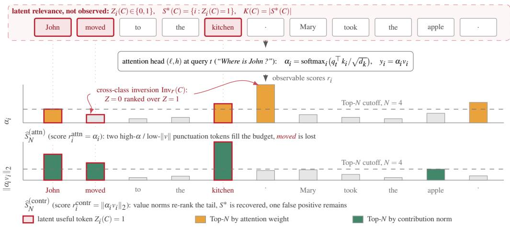  
Figure 1: Useful-token hypothesis. Each attention operation has an unknown useful set whose size $K ( C )$ depends on context. Attention and contribution scores give rankings from which sets of different sizes are selected. Ranking inversions occur when tokens outside the useful set score at least as highly as useful tokens, so recovering the useful set may require retaining more than $K ( C )$ tokens.

Hypothesis 1 (Useful-token ranking on a reference distribution). Fix a module $( \ell , h )$ and a reference distribution $\mathcal { D } _ { 0 }$ over $( X , t )$ , writing $C = ( X , \ell , h , t )$ . For at least one $r \in \{ \mathrm { a t t n } , \mathrm { c o n t r } \}$ , there are $\varepsilon , \delta \in [ 0 , 1 )$ such that

$$
\begin{array} { r } { \mathbb { P } _ { ( X , t ) \sim \mathcal { D } _ { 0 } } \left[ \mathrm { I n v } _ { r } ( C ) \le \varepsilon K ( C ) ^ { 2 } \right] \ge 1 - \delta , } \end{array}\tag{4}
$$

where $1 \leq K ( C ) < | \mathcal { T } _ { t } |$ and $K ( C )$ is nondegenerate under $\mathcal { D } _ { 0 }$

The hypothesis describes ranking quality within a reference distribution (see Fig. 1). Increasing the amount of background can change this quality, so the assumption is not imposed uniformly across context lengths. Because the useful labels are unobserved, our experiments examine selected sets and their consequences without directly testing the hypothesis.

For an integer $N \geq 1$ , define the observable selected set

$$
{ \widehat { S } } _ { N } ^ { ( r ) } ( C ) = \mathrm { T o p N } \{ r _ { i } ( C ) : i \in { \mathbb { Z } } _ { t } \} , \qquad r \in \{ \mathrm { a t t n } , \mathrm { c o n t r } \} .\tag{5}
$$

Here Top-N returns the indices of the min $\{ N , | \mathcal { T } _ { t } | \}$ highest-scoring tokens, breaking ties by increasing index. The ranking determines which tokens enter the set, and N determines how many are retained. Recovering the useful set depends on both its size and the ranking errors. In particular, additional tokens may need to be retained when they appear above useful tokens in the ranking. Appendix A.1 makes this relationship precise through recovery bounds at $N = K ( C )$ and at larger selected-set sizes.

Following Mudarisov et al. [2026], we first examine whether selected tokens form a geometrically distinct set in the space of their weighted value vectors. For $1 \leq N < | \mathcal { T } _ { t } | .$ , define $\begin{array} { r } { \boldsymbol { s } _ { N } ^ { \left( r \right) } = \sum _ { i \in \widehat { S } _ { N } ^ { \left( r \right) } } \boldsymbol { y } _ { i } , } \end{array}$ the contribution of the selected tokens to the head output. We retain the magnitude of this sum and compare Euclidean distance, $d _ { \mathrm { E } } ( x , y ) = \| x - y \| _ { 2 }$ , and cosine distance, $d _ { \mathrm { C } } ( x , y ) = 1 -$ $\langle x , y \rangle / ( \| x \| _ { 2 } \| y \| _ { 2 } + \eta )$ , using $\eta = 1 0 ^ { - 1 2 }$ . Euclidean distance reflects both magnitude and direction, while cosine distance provides a complementary directional comparison. Write $D _ { i } = d ( y _ { i } , s _ { N } ^ { ( r ) } )$ and suppress the ranking and distance indices below.

Definition 1 (Geometric separability metrics). Let $\begin{array} { r } { S = \widehat { S } _ { N } ^ { ( r ) } , \rho _ { \operatorname* { m i n } } = \operatorname* { m i n } _ { j \in \mathcal { T } _ { t } \backslash S } D _ { j } } \end{array}$ , and $\rho _ { \mathrm { m a x } } =$ $\operatorname* { m a x } _ { i \in S } D _ { i }$ . Define

$$
P _ { N } = \frac { N } { N + | \{ j \in \mathcal { I } _ { t } \setminus { S } : D _ { j } \leq \rho _ { \operatorname* { m a x } } \} | } , \qquad R _ { N } = \frac { | \{ i \in S : D _ { i } < \rho _ { \operatorname* { m i n } } \} | } { N } .\tag{6}
$$

The extremal separability score is $F _ { N } = 2 P _ { N } R _ { N } / ( P _ { N } + R _ { N } )$ , with $P _ { N } > 0$ on this domain.

Geometric precision measures contamination by unselected tokens within the radius containing the selected set. Geometric recall measures the fraction of selected tokens closer to the aggregate than every unselected token. Their harmonic summary combines two different radii, so its interpretation differs from a classification F-score evaluated at a common threshold. Random controls use the same construction around their own selected aggregates. At $N = 1$ , Euclidean $F _ { 1 } = 1$ in the absence of duplicate vectors, including for random selection. Stabilized cosine distance need not share this exact boundary. Appendix A.2 describes these boundary and scale effects.

To determine whether a selected set is sufficient for prediction, we restrict attention to that set and measure the resulting change in model loss. With mask $m _ { i } ^ { ( r , N ) } = \mathbf { 1 } \{ i \in \widehat { S } _ { N } ^ { ( r ) } \}$ , the primary intervention leaves retained weights unchanged and sets the others to zero:

$$
\widetilde \alpha _ { i } ^ { ( r , N ) } = \alpha _ { i } m _ { i } ^ { ( r , N ) } , \qquad \widetilde { z } _ { t } ^ { ( r , N ) } = \sum _ { i \in \mathbb { Z } _ { t } } \widetilde \alpha _ { i } ^ { ( r , N ) } v _ { i } .\tag{7}
$$

We apply the same size limit N throughout the model, recomputing the selected set from the current activations at every causal query, head, and layer without retraining. Queries with at most N visible tokens retain them all. At fixed incoming activations, the local output change is the discarded sum $\begin{array} { r } { e _ { t } ^ { ( r , N ) } = \sum _ { i \notin \widehat { S } _ { n r } ^ { ( r ) } } \alpha _ { i } v _ { i } } \end{array}$ . Appendix A.3 relates its norm to the discarded contribution norms and attention mass. The effect on downstream prediction is evaluated through the full intervened model.

For the full-attention model M and intervened model $M _ { N } ^ { \left( r \right) }$ , define relative language-modeling degradation as

$$
\Delta \mathrm { N L L } _ { \mathrm { r e l } } ^ { ( r ) } ( N ) = \frac { \mathrm { N L L } ( M _ { N } ^ { ( r ) } ) - \mathrm { N L L } ( M ) } { \mathrm { N L L } ( M ) } .\tag{8}
$$

For question answering tasks, we use candidate-normalized answer loss. Given a candidate set $\mathcal { A } ( x )$ candidate score $s _ { M } ( a \mid x )$ , and correct answer y,

$$
\ell _ { \mathrm { a n s } } ( M ; x ) = - \log { \frac { \exp \bigl ( s _ { M } ( y \mid x ) \bigr ) } { \sum _ { a \in \mathcal { A } ( x ) } \exp \bigl ( s _ { M } ( a \mid x ) \bigr ) } } .\tag{9}
$$

In the BABILong experiments, $s _ { M } ( a \mid x )$ is the first-continuation-token logit for candidate a among six answers. We measure the mean loss increase on matched examples and candidate sets and report candidate accuracy as a complementary measure. Appendix B.4 provides the complete scoring protocol. Annotated supporting facts supply a partial reference for relevance: a fact can span several tokens, and other tokens may also contribute to the computation.

Let $\Delta \mathcal { L } ^ { ( r ) } ( N )$ denote the relative NLL increase or the mean answer-loss increase, according to the task. For a tolerance $\tau \geq 0$ , define the effective attention set size as

$$
N _ { \tau } ^ { \ast , ( r ) } = \operatorname* { m i n } \{ N \geq 1 : \Delta \mathcal { L } ^ { ( r ) } ( N ) \leq \tau \} ,\tag{10}
$$

where N ranges over positive integers. This quantity describes the common selected-set size needed to satisfy an average-loss criterion across the model. Its relationship to the local useful-set size $K ( C )$ depends on ranking errors, the values being combined, and the sensitivity of subsequent computation.

We additionally evaluate renormalized Top-N, which divides each retained weight by the total retained attention mass. This preserves their relative weights and restores their sum to one. Comparing the two interventions tests how the required set size depends on rescaling the selected sum. The empirical comparison is reported in Appendix E.1, with the corresponding local output identities in Appendix A.3.

## 3 Experiments

We evaluate nine decoder-only checkpoints: Qwen-2.5-1.5B/7B [Yang et al., 2024], Gemma-7B [Gemma Team et al., 2024a], Gemma-2-9B [Gemma Team et al., 2024b], Llama-2-7B [Touvron et al., 2023], Llama-3-8B [Grattafiori et al., 2024], Llama-3.2-1B [Meta AI, 2024], Mistral-7Bv0.3 [Jiang et al., 2023], and Mistral-Small-24B-Base-2501 [Mistral AI, 2025]. The 24B checkpoint uses 8-bit weights, so comparisons involving this model include differences in both architecture and numerical precision.

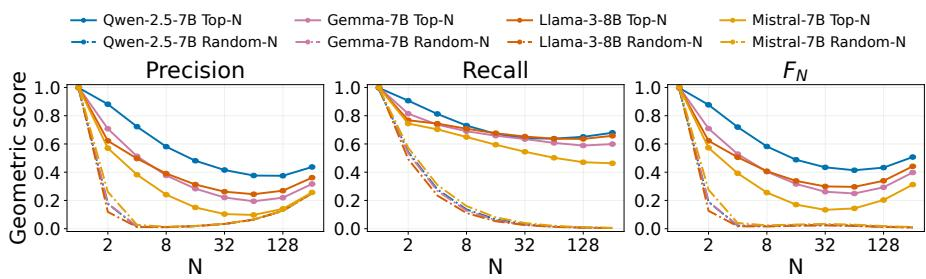  
Figure 2: Attention-selected sets exhibit stronger Euclidean separation than random sets across all four models. Geometric precision (left), recall (middle), and extremal $F _ { N }$ (right) on OpenWebText. Solid curves show selection by attention weight, and dash-dotted curves show random sets of the same size, each evaluated relative to its own aggregate. Measurements use the final query of 1024-token contexts and are averaged over heads, layers, and documents.

Language-model evaluation uses 50 documents per model from each of OpenWebText [Gokaslan et al., 2019] and WikiText-103 [Merity et al., 2017]. Geometric measurements cover Qwen-2.5-7B, Gemma-7B, Llama-3-8B, and Mistral-7B-v0.3 at the final query across layers and heads. Functional interventions apply at every causal query throughout the model. We also evaluate controlled retrieval on BABILong [Kuratov et al., 2024] qa1, holding one annotated supporting fact fixed while varying background text across 0K, 1K, 2K, and 4K conditions. Each condition contains 100 QA examples, with 86 examples per background passing the tokenizer-span validation used for support measurements. Appendix B provides the detailed protocols.

## 3.1 Geometric structure and effective attention set size

We begin by comparing sets selected through attention and contribution rankings with random sets of the same size. Figure 2 shows stronger geometric separation for score-based selection in all four models.There is a high advantage in the mean Euclidean $F _ { N }$ of attention selection over random selection over models on OpenWebText. The corresponding cosine advantages are smaller (see Appendix C). Contribution ranking produces the same qualitative pattern. The larger Euclidean differences indicate that the observed separation includes a substantial magnitude-related component, alongside the directional structure captured by cosine distance.

These geometric differences motivate testing whether the selected sets preserve predictive performance. Figure 3 shows how relative NLL degradation changes as more highly scored tokens are retained with their original attention weights. For a chosen loss tolerance, the crossing of each curve provides an estimate of the effective attention set size. We evaluate powers of two and refine observed crossings to integer sizes, without exhaustively testing every smaller integer. Detailed estimates for OpenWebText and WikiText-103 are reported separately in Appendix C.3.

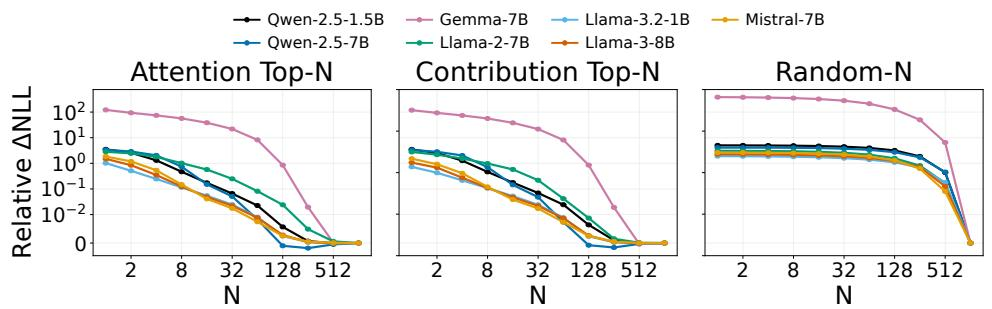  
Figure 3: Attention and contribution selection produce lower NLL degradation than random selection at the same attention set sizes. Relative increase in mean NLL over the full model on OpenWebText with 1k-token contexts. Panels compare selection by attention weight (left), contribution magnitude (middle), and random selection (right). For a chosen loss tolerance, the crossing of a curve with that degradation level gives an approximate effective attention set size $N ^ { * }$

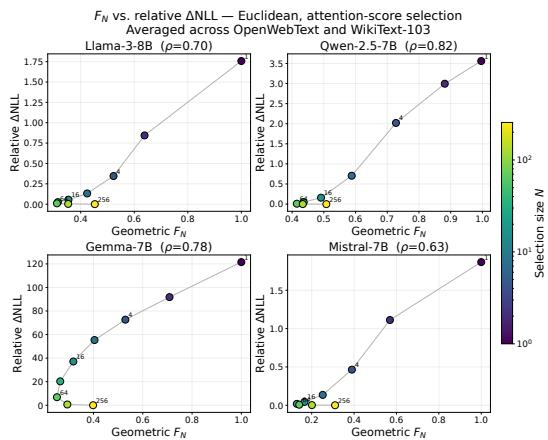  
(a) Euclidean geometry

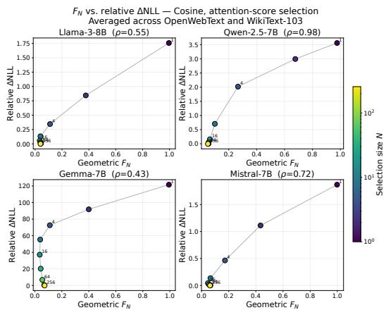  
(b) Cosine geometry  
Figure 4: Stronger geometric separation often accompanies greater NLL degradation. Geometric $F _ { N }$ and relative NLL degradation under attention-weight selection, using (a) Euclidean and (b) cosine geometry. Each point corresponds to one set size $\bar { N }$ , indicated by color, with both quantities averaged across OpenWebText and WikiText-103. Lines connect successive set sizes, and $\rho$ denotes the Spearman correlation along each trajectory.

NLL degradation decreases rapidly as more highly scored tokens are retained, while random selection produces substantially greater degradation at the same set sizes. This advantage is consistent with the useful-token hypothesis, suggesting that the rankings concentrate tokens important for prediction near the top. The required set size nevertheless varies substantially across models. Contribution ranking reduces the required size most clearly for Llama-2-7B, showing that value magnitude can help identify a sufficient set. For most other models, the two rankings yield similar estimates.

These measurements characterize how many tokens must be retained under a common selection rule to keep average loss within the chosen tolerance. Within the hypothesis, differences in this estimate can reflect both the size of the useful set and how accurately the scores rank its members. Sensitivity to the discarded contributions also matters. Localized interventions reveal substantial variation across layers and heads (Appendix E.3), so the common set size does not describe a typical individual attention operation.

We next relate functional performance to the geometric separability. Figure 4 shows positive rank correlations along the plotted trajectories, so stronger separation often accompanies greater NLL degradation. Additional contribution-ranking trajectories and an exploratory prediction analysis appear in Appendices C.2 and E.4.

## 3.2 Dependence on context length

To examine whether the required set size remains stable as more context becomes available, we vary L  256, 512, 1024, 2048 using nested suffixes of 50 documents per model and corpus. At every length, we score the same final 128 target tokens within each model–corpus pair. The full-model baseline is recomputed at each length, and selection is applied throughout the model.

Figure 5a shows that longer contexts require larger selected sets to preserve performance on the same prediction targets, while the selected fraction of context decreases. Under the useful-token hypothesis, extending context can change both the useful set and the competition involved in recovering it. Additional context may contain useful tokens, but it also introduces candidates that can rank above useful tokens already present. The observed growth in effective attention set size can therefore arise from changes in K(C), changes in ranking, and the number of contributions needed to preserve the attention output.

The improvement in full-model NLL (Fig. 5b) indicates that the added natural context provides useful predictive information. This makes changes in the useful set a plausible contributor to the observed growth, although improved predictions do not establish how its size changes. The required selected-set size also grows when the allowed absolute NLL increase is held fixed (App. C.4), ruling out the tightening of the relative-loss criterion as a complete explanation. These observations motivate the controlled-background experiments below, which examine competition while holding the annotated supporting fact fixed. Appendix C.4 reports the normalized sizes, uncertainty estimates, contribution-ranking results, and comparisons between final-target and all-token scoring.

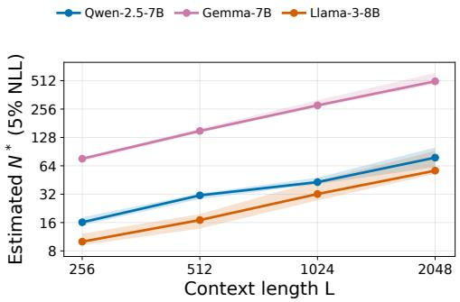  
(a) Effective attention set size

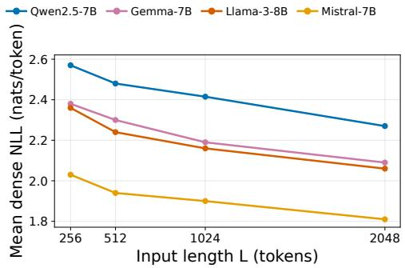  
(b) Full-model prediction performance  
Figure 5: Longer context improves full-model prediction and increases the effective attention set size. (a) Estimated set size at a 5% relative NLL tolerance against the full model at each context length. (b) Mean full-model NLL. Both panels use 50 OpenWebText documents per model, scoring the same final 128 target tokens at every context length. Shading in (a) shows 95% paired-document bootstrap intervals conditional on the evaluated set sizes.

## 3.3 Retrieval under competition

To examine competition while controlling annotated support, we use BABILong qa1, where the same supporting fact is retained as background text increases from 0K to 4K tokens. We first evaluate the unrestricted model to establish the reference performance for each condition. Figure 6a reports candidate accuracy. Mean candidate answer loss increases from 0K to 4K in all four models, with paired loss-change intervals above zero (Appendix D.3).

We estimate the selected-set size needed to keep mean answer-loss degradation within 0.10 nats of the full model at each background (Figure 6b). The required size increases substantially in several models despite the unchanged annotated support. Within the useful-token framework, this is consistent with additional competitors increasing the number of tokens that must be retained to recover supporting information. Qwen’s weaker and nonmonotonic response shows that support displacement does not translate uniformly into a larger functional requirement. Its effect on answer loss also depends on how retained information is weighted and used by subsequent computation.

To study token competition, we measure the position of support tokens in the attention ranking, their total attention mass, and their recall among the 64 highest-weight tokens. As background grows, the same annotated support moves down the ranking, receives less attention mass, and is less frequently retained within this fixed-size set (Figure 7). These observations are consistent with competition making it harder for attention to select the information required by the task, motivating a functional test of how many tokens must be retained.

The support records clarify how competition increases (Appendix D.1). An individual non-support token becomes less likely to outrank a support token as background grows in every model. However, the increasing number of competitors produces more tokens ranked above support overall. Improved pairwise ranking can therefore coexist with poorer support recall at a fixed selected-set size. In the useful-token framework, ranking errors accumulated over a larger candidate set can increase the number of tokens needed to retain a fixed required set, even when individual comparisons become more favorable.

A conditional ranking model formalizes this mechanism. Consider L tokens with a fixed set of $K < L$ useful tokens. Treat their scores as fixed, assume no ties, and draw competitor scores independently from a common distribution. If $p _ { L }$ is the probability that a competitor exceeds the weakest required score, the expected selected-set size needed to retain all useful tokens is

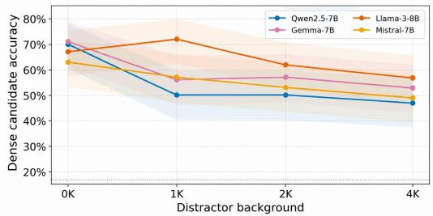  
(a) Full-model candidate accuracy

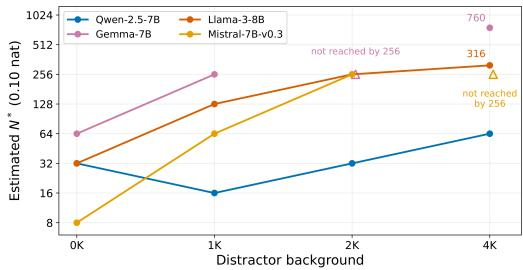  
(b) Effective attention set size  
Figure 6: Longer background text tends to lower full-model accuracy and increase the effective attention set size despite fixed annotated support. BABILong qa1 results on 100 matched examples, with six candidate answers scored using first-continuation-token logits. (a) Full-model candidate accuracy. Shading shows 95% Wilson intervals, and the dotted line indicates chance accuracy. (b) Estimated effective attention set size under attention-weight selection at a 0.10-nat mean answer-loss tolerance relative to the full model at each background. Open triangles indicate that no evaluated set size through 256 meets the tolerance.

$$
\mathbb { E } [ N _ { \mathrm { r e c } } ( L ) ] = K + ( L - K ) p _ { L } .
$$

Consequently, even a fixed useful set can need an increasing selected set as more competitors are introduced. Appendix F gives the derivation and probability bounds. The probability $p _ { L }$ concerns the weakest useful token and is distinct from the measured average pairwise outranking probability.

## 3.4 Effect of attention normalization

Removing tokens while preserving their original weights reduces total attention mass. Results in Appendix E.1 show that renormalizing the retained attention weights can substantially reduce the required set size and its increase between background conditions. The effect varies with the model and loss tolerance. Each comparison measures preservation of the corresponding full-model baseline, whose answer loss also changes with background.

The local output identities explain how normalization affects the retained computation. For fixed incoming activations, let $M _ { S } \in ( 0 , 1 )$ denote retained attention mass, and let $\mu _ { S }$ and $\mu _ { T }$ be the normalized weighted means of retained and discarded values. The errors under deletion and renormalization are

$$
e _ { \mathrm { d e l } } = ( 1 - M _ { S } ) \mu _ { T } , \qquad e _ { \mathrm { r e n } } = ( 1 - M _ { S } ) ( \mu _ { T } - \mu _ { S } ) .
$$

When these means are close, rescaling can reduce the output perturbation despite removing substantial attention mass. The identities also allow renormalization to increase local error, while full-model interventions can change subsequent representations and rankings (Appendix A.3).

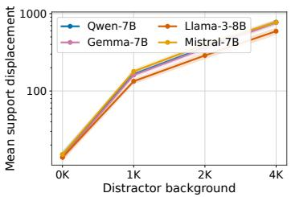  
(a) Rank displacement

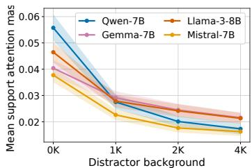  
(b) Support attention mass

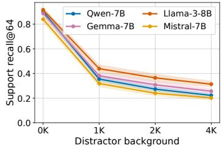  
(c) Support recall@64  
Figure 7: Additional background pushes support tokens down the attention ranking and reduces their attention mass and recall. Measurements at the answer query in BABILong qa1 show support displacement, attention mass, and recall among the 64 highest-weight tokens. Statistics use 86 examples per background after tokenizer-span validation.

This dependence on aggregation complements the useful-token hypothesis. Under the distributional assumptions in Appendix F.2, preserving a fixed fraction of attention mass requires a selected set proportional to context length. Additional norm and alignment conditions connect this requirement to local output accuracy. An idealized task-loss example with identical values demonstrates that growing sets can be needed even without additional distinct information (Appendix F.4). The effective attention set size can therefore reflect both recovery of useful tokens and preservation of the weighted sum.

## 4 Discussion

Self-attention retrieves information by aggregating context-dependent value vectors [Vaswani et al., 2017]. Modern Hopfield analyses formalize its connection to associative memory and derive storagecapacity guarantees under idealized assumptions [Ramsauer et al., 2021]. These guarantees concern the number of patterns that can be stored and recovered. Our analysis complements this perspective by measuring how many highly scored tokens must be retained at each attention operation to keep average prediction loss within a specified tolerance.

The useful-token hypothesis provides a framework for interpreting this measurement. The required set size can increase when more tokens are useful, when useful tokens rank below competing sources, or when the model is more sensitive to discarded contributions. The useful set remains unobserved, and attention weights alone do not establish relevance [Brunner et al., 2020]. Building on Mudarisov et al. [2026], we examine the geometry of selected contributions and relate it to functional loss. The geometric measurements depend on vector magnitudes and directions relative to the selected aggregate. This dependence limits their interpretation as evidence of relevance, and the observed geometry–loss trajectories do not establish a general predictor of effective attention set size.

Sparse attention mappings produce explicitly sparse weights [Martins and Astudillo, 2016, Peters et al., 2019]. Studies of attention sinks, active and dormant heads, and geometric token selection identify additional structure that can support efficient inference [Xiao et al., 2023, Guo et al., 2024, Shin et al., 2025]. Our interventions measure how restricting attention affects predictive performance in existing models. Because they compute dense attention before selection, the experiments do not demonstrate an inference speedup.

The normalization controls show that effective set size depends on how retained values are combined, complementing the ranking explanation suggested by the fixed-support experiments. The conditional theory in Appendix F describes settings in which competition or preservation of the weighted sum requires larger sets as context grows. Such growth can occur even when the amount of distinct task-relevant information is fixed. These results provide possible explanations for the observed context dependence, although their assumptions have not been verified for the tested models and the experiments do not establish a universal scaling law.

The measurement also has several interpretive limits. We apply a common set size across attention operations, while allowing the selected positions to vary with the query, head, and layer. Consequently, the estimate does not identify a single subset of original context tokens used by the model or recover the size of a local useful set. Annotated BABILong support provides only a partial reference for relevance. Average loss can conceal changes on individual examples, and preserving a weak fullmodel baseline does not establish successful task solving. Threshold estimates and their uncertainty are conditional on the evaluated set sizes. Localized interventions further reveal heterogeneous sensitivity across layers and heads, whose effects cannot be treated as independent components of the full-model requirement.

## 5 Conclusion

Measuring loss degradation under Top-N selection provides an operational estimate of how many tokens attention needs to retain to preserve average predictive performance within a chosen loss tolerance. Attention and contribution rankings produce substantially lower loss than random selection at the same set sizes, although geometric separation alone does not determine how large a set is sufficient. For fixed prediction targets, longer context increases the required set size while reducing its fraction of the available context. When annotated support is held fixed, additional background displaces support in the ranking and increases the required size in several models. Renormalization further shows that preserving the weighted sum affects these estimates. The useful-token hypothesis and conditional theory connect these findings to the amount of useful information, its ranking among competing tokens, and the aggregation of retained values. Effective attention set size captures the combined effect of these factors on predictive performance under a specified intervention.

## References

Gino Brunner, Yang Liu, Damian Pascual, Oliver Richter, Massimiliano Ciaramita, and Roger Wat-´ tenhofer. On identifiability in transformers. International Conference on Learning Representations, 2020.

Gemma Team, Thomas Mesnard, et al. Gemma: Open models based on Gemini research and technology. arXiv preprint arXiv:2403.08295, 2024a.

Gemma Team, Morgane Riviere, et al. Gemma 2: Improving open language models at a practical size. arXiv preprint arXiv:2408.00118, 2024b.

Aaron Gokaslan, Vanya Cohen, Ellie Pavlick, and Stefanie Tellex. OpenWebText corpus. https: //skylion007.github.io/OpenWebTextCorpus/, 2019.

Aaron Grattafiori et al. The Llama 3 herd of models. arXiv preprint arXiv:2407.21783, 2024.

Tianyu Guo, Druv Pai, Yu Bai, Jiantao Jiao, Michael I. Jordan, and Song Mei. Active-dormant attention heads: Mechanistically demystifying extreme-token phenomena in LLMs. arXiv preprint arXiv:2410.13835, 2024.

Albert Q. Jiang et al. Mistral 7B. arXiv preprint arXiv:2310.06825, 2023.

Yuri Kuratov, Aydar Bulatov, Petr Anokhin, Ivan Rodkin, Dmitry Sorokin, Artyom Sorokin, and Mikhail Burtsev. BABILong: Testing the limits of LLMs with long context reasoning-in-a-haystack. arXiv preprint arXiv:2406.10149, 2024.

Andre F. T. Martins and Ram´ on Fernandez Astudillo. From softmax to sparsemax: A sparse model´ of attention and multi-label classification. Proceedings ofthe 33rd International Conference on Machine Learning, 2016.

Stephen Merity, Caiming Xiong, James Bradbury, and Richard Socher. Pointer sentinel mixture models. In International Conference on Learning Representations, 2017.

Meta AI. Llama 3.2 model card. Model card, 2024.

Mistral AI. Mistral-Small-24B-Base-2501. Model card, 2025.

Timur Mudarisov, Mikhail Burtsev, Tatiana Petrova, and Radu State. Geometric analysis of token selection in multi-head attention. arXiv preprint arXiv:2602.01893, 2026.

Ben Peters, Vlad Niculae, and Andre F. T. Martins. Sparse sequence-to-sequence models.´ Proceedings ofthe 57th Annual Meeting ofthe Associationfor Computational Linguistics, 2019.

Hubert Ramsauer, Bernhard Schafl, Johannes Lehner, Philipp Seidl, Michael Widrich, Lukas Gruber,¨ Markus Holzleitner, Thomas Adler, David Kreil, Michael K. Kopp, Gunter Klambauer, Johannes¨ Brandstetter, and Sepp Hochreiter. Hopfield networks is all you need. In International Conference on Learning Representations, 2021.

Seungjun Shin, Jaehoon Oh, and Dokwan Oh. OrthoRank: Token selection via sink token orthogonality for efficient LLM inference. arXiv preprint arXiv:2507.03865, 2025.

Hugo Touvron et al. Llama 2: Open foundation and fine-tuned chat models. arXiv preprint arXiv:2307.09288, 2023.

Ashish Vaswani, Noam Shazeer, Niki Parmar, Jakob Uszkoreit, Llion Jones, Aidan N. Gomez, Lukasz Kaiser, and Illia Polosukhin. Attention is all you need. arXiv preprint arXiv:1706.03762, 2017.

Guangxuan Xiao, Yuandong Tian, Beidi Chen, Song Han, and Mike Lewis. Efficient streaming language models with attention sinks. arXiv preprint arXiv:2309.17453, 2023.

An Yang et al. Qwen2.5 technical report. arXiv preprint arXiv:2412.15115, 2024.

## A Formal details of attention selection

Section 2 relates an unknown useful set to observable rankings, geometric separation, and prediction loss. We give the recovery bounds behind the useful-token framework, specify the geometric construction, and derive local output-error identities for the two interventions. These results clarify how each measurement contributes to the analysis of effective attention set size.

## A.1 Useful-set recovery from ranking inversions

The useful-token hypothesis allows ranking errors to increase the number of tokens needed to recover a useful set. To quantify this relationship, fix a context $C = ( X , \ell , h , t )$ with $1 \leq K ( C ) < | \mathcal { T } _ { t } |$ and recall that

$$
Z _ { i } ( C ) \in \{ 0 , 1 \} , \qquad S ^ { * } ( C ) = \{ i : Z _ { i } ( C ) = 1 \} , \qquad K ( C ) = | S ^ { * } ( C ) | .\tag{11}
$$

The labels represent hypothesized downstream relevance and are unobserved. For an observable score $r _ { i } .$ , define

$$
\operatorname { I n v } _ { r } ( C ) = \sum _ { i \in S ^ { * } ( C ) } \sum _ { j \in { \mathcal { Z } } _ { t } \setminus S ^ { * } ( C ) } { \mathbf { 1 } \{ r _ { j } \geq r _ { i } \} } .\tag{12}
$$

Counting score ties as inversions makes the following bounds valid under the index-based tie-breaking rule in Section 2.

Proposition 1 (Useful-set recovery from ranking inversions). Fix $C$ and $^ { r , }$ and write $K = K ( C )$ and $I = \mathrm { I n v } _ { r } ( C )$ . For $K \leq N \leq | { \mathcal { T } } _ { t } |$ , let $m = | S ^ { * } ( C ) \backslash \widehat { S } _ { N } ^ { ( r ) } |$ . Then

$$
m ( N - K + m ) \leq I , \qquad m \leq \operatorname * { m i n } \Biggl \{ K , \left\lfloor \frac { \sqrt { ( N - K ) ^ { 2 } + 4 I } - ( N - K ) } { 2 } \right\rfloor \Biggl \} .\tag{13}
$$

Also $m \le I / ( N - K + 1 )$ , so $N \geq K + I$ is sufficientfor complete recovery whenever this choice is feasible. $A t \ N = K$ , precision, recall, and their harmonic mean relative to $S ^ { * } ( C )$ satisfy

$$
P _ { \mathrm { l a t } } = R _ { \mathrm { l a t } } = F _ { \mathrm { l a t } } = 1 - \frac { m } { K } \geq \operatorname* { m a x } \Bigg \{ 0 , 1 - \frac { \sqrt { I } } { K } \Bigg \} .\tag{14}
$$

Under Hypothesis 1, this value is at least $1 - { \sqrt { \varepsilon } }$ with probability at least $1 - \delta$ under $\mathcal { D } _ { 0 } .$

Proof. The selected set contains $K - m$ useful tokens and $N - K + m$ other tokens. Every selected token outside the useful set has a score at least as large as every missed useful token. These pairs contribute $m ( N - K + m )$ inversions. Solving the resulting quadratic inequality and using that m is an integer gives the first bound. For m $\begin{array} { r } { \geq 1 , \tilde { m ( N - K + \bar { 1 } ) } \overset { \cdot } { \leq } m ( N - \bar { K + } \bar { m ) } \leq I , } \end{array}$ , and the same bound holds when $m = 0$ . If $N - K \geq I $ , a missed token would imply $I \ge { \dot { N } } - K + 1 \ge I + 1$ which is impossible. $\mathbf { A } \mathbf { t } \ N = K$ , both sets have K elements and share $K - m$ tokens, giving the stated precision and recall. Substituting $I \le \varepsilon K ^ { 2 }$ proves the probabilistic statement. □

For $N > K$ , recall is $1 - m / K$ , precision is $( K - m ) / N$ , and their harmonic mean is $2 ( K -$ m) $/ ( N + K )$ . Increasing the selected-set size can therefore compensate for ranking errors while $K ( C )$ remains fixed. These guarantees concern recovery of the hypothesized useful set. Their connection to prediction loss also depends on the retained weights and subsequent computation, as examined by the functional interventions.

The reference distribution is consequential. Under a uniformly random strict ordering, $\mathbb { E } [ I ~ |$ $K , | \mathcal { T } _ { t } | ] = K ( | \mathcal { T } _ { t } | - K ) / 2$ , so the $K ^ { 2 }$ bound in Hypothesis 1 becomes demanding when the useful set is small relative to the context. Its constants are specified on $\mathcal { D } _ { 0 }$ and need not hold uniformly as background grows. Appendix F.1 develops the corresponding context-dependent recovery model.

## A.2 Geometric construction and boundary effects

Section 3.1 uses geometry to characterize the sets produced by each ranking before testing their functional sufficiency. The construction below makes explicit how these metrics depend on the selected aggregate and on the treatment of boundary points.

Fix a ranking $r ,$ a distance $d ,$ and $1 \leq N < | \mathcal { T } _ { t } |$ . Write $\begin{array} { r } { S = \widehat { S } _ { N } ^ { ( r ) } , s _ { N } = \sum _ { i \in S } y _ { i } } \end{array}$ , and $D _ { i } =$ $d ( y _ { i } , s _ { N } )$ . For $\rho \ge 0$ , define

$$
B _ { d } ^ { \leq } ( s _ { N } , \rho ) = \{ i \in \mathbb { Z } _ { t } : D _ { i } \leq \rho \} , \qquad B _ { d } ^ { < } ( s _ { N } , \rho ) = \{ i \in \mathbb { Z } _ { t } : D _ { i } < \rho \} .
$$

When the closed neighborhood is nonempty, its precision and recall relative to the selected set are

$$
P _ { \mathrm { g e o } } ( \rho , N ) = \frac { | S \cap B _ { d } ^ { \leq } ( s _ { N } , \rho ) | } { | B _ { d } ^ { \leq } ( s _ { N } , \rho ) | } , \qquad R _ { \mathrm { g e o } } ( \rho , N ) = \frac { | S \cap B _ { d } ^ { \leq } ( s _ { N } , \rho ) | } { N } .
$$

Let $\rho _ { \mathrm { m i n } } = \operatorname* { m i n } _ { j \notin { \cal S } } D _ { j }$ and $\rho _ { \operatorname* { m a x } } = \operatorname* { m a x } _ { i \in S } D _ { i }$ . The extremal metrics are

$$
P _ { N } = P _ { \mathrm { g e o } } ( \rho _ { \mathrm { m a x } } , N ) , \qquad R _ { N } = { \frac { | S \cap B _ { d } ^ { < } ( s _ { N } , \rho _ { \mathrm { m i n } } ) | } { N } } , \qquad F _ { N } = { \frac { 2 P _ { N } R _ { N } } { P _ { N } + R _ { N } } } .
$$

The outer neighborhood contains every selected point, whereas the strict inner neighborhood excludes every unselected point. This convention counts an unselected boundary point as contamination and excludes a selected point tied with the nearest unselected point from recall. Since $P _ { N } > 0$ on the specified domain, the denominator of $F _ { N }$ is positive. The two components use different radii, so $F _ { N }$ summarizes extremal separation.

Geometric inversions. Define the separation margin and distance-based inversion count by

$$
\gamma _ { N } = \rho _ { \mathrm { m i n } } - \rho _ { \mathrm { m a x } } , \qquad \mathrm { G I n v } _ { N } = \sum _ { i \in S } \sum _ { j \notin S } { \bf 1 } \{ D _ { j } \leq D _ { i } \} .
$$

If FPmax = |{j /∈ S : Dj ≤ ρmax}| and FNmin = |{i ∈ S : Di ≥ ρmin}|, then

$$
P _ { N } = \frac { N } { N + \mathrm { F P } _ { \mathrm { m a x } } } \geq \frac { N } { N + \mathrm { G I n v } _ { N } } , \qquad R _ { N } = 1 - \frac { \mathrm { F N } _ { \mathrm { m i n } } } { N } \geq \mathrm { m a x } \Bigg \{ 0 , 1 - \frac { \mathrm { G I n v } _ { N } } { N } \Bigg \} .
$$

Each outer false positive forms an inversion with a farthest selected point. Each inner false negative forms an inversion with a nearest unselected point, which proves both inequalities. A positive margin is equivalent to $\mathrm { G I n v } _ { N } = 0$ and to $P _ { N } = \bar { R } _ { N } = F _ { N } \bar { = } 1$ . These geometric inversions compare distances against the observable selected set. The count Invr(C) in Appendix A.1 instead compares scores against the unknown useful set.

Changing N changes the selected set, its aggregate, the distances, and the extremal radii. Consequently, the geometric metrics need not be monotone in $N .$ . Random controls use sets of the same size and recompute all quantities around each random set’s own aggregate. The nested sampling of these controls is specified in Appendix B.1.

Singleton behavior. For Euclidean distance and $S = \{ i \} , s _ { 1 } = y _ { i }$ and $D _ { i } = 0$ . If every unselected vector differs from $y _ { i } .$ , then $P _ { 1 } = R _ { 1 } = F _ { 1 } = 1$ for every selection rule, including random selection. Duplicate vectors can prevent this strict separation. For the stabilized cosine distance,

$$
d _ { \mathrm { C } } ( y , y ) = \frac { \eta } { \| y \| _ { 2 } ^ { 2 } + \eta } ,
$$

so the same exact singleton guarantee does not apply. If the aggregate is zero, all stabilized cosine distances equal one and $R _ { N } = F _ { N } = 0$ . These boundaries motivate the small-N sensitivity analysis in Appendix C.2.

Magnitude and direction. For positive $\alpha _ { i }$ and nonzero $v _ { i }$ and $s _ { N }$ , unregularized cosine similarity satisfies

$$
{ \frac { \left. \alpha _ { i } v _ { i } , s _ { N } \right. } { \| \alpha _ { i } v _ { i } \| _ { 2 } \| s _ { N } \| _ { 2 } } } = { \frac { \left. v _ { i } , s _ { N } \right. } { \| v _ { i } \| _ { 2 } \| s _ { N } \| _ { 2 } } } .
$$

The individual scale cancels, while the aggregate direction remains attention-dependent. With the implemented regularizer, this cancellation leaves $\eta / \alpha _ { i }$ in the denominator and is only approximate when the norm product dominates $\eta .$ In Euclidean space, $| \| y _ { j } - s _ { N } \| _ { 2 } - \| s _ { N } \| _ { 2 } | \leq \| y _ { j } \| _ { 2 } ^ { - }$ , so small discarded contributions lie near radius $\| s _ { N } \| _ { 2 }$ . This property helps explain the magnitude dependence of the metric, but alone does not imply separation. Because $s N$ is an unnormalized partial attention output, interpreting its geometry requires the functional comparisons in Section 3.1.

## A.3 Local output error under selection and renormalization

The two rankings in Section 2 preserve different quantities under deletion. Their local guarantees help interpret the functional results and the normalization control in Section 3.4. At fixed incoming activations, write

$$
y _ { i } = \alpha _ { i } v _ { i } ,\tag{15}
$$

and, for $S = \widehat { S } _ { N } ^ { ( r ) }$

$$
e _ { t } ^ { ( r , N ) } = z _ { t } - \widetilde { z } _ { t } ^ { ( r , N ) } = \sum _ { i \notin S } \alpha _ { i } v _ { i } .\tag{16}
$$

This identity compares the full and selected sums formed from the same local activations. Full-model interventions can also change the inputs to later attention operations.

Proposition 2 (Local deletion bounds). For any size-N subset $S ,$ let $\textstyle M _ { S } = \sum _ { i \in S } \alpha _ { i }$ and $e _ { S } =$ $\textstyle \sum _ { i \notin S } y _ { i }$ . Then

$$
\| e _ { S } \| _ { 2 } \leq \sum _ { i \notin S } \| y _ { i } \| _ { 2 } .
$$

Contribution ranking minimizes this upper bound over size-N subsets. Attention ranking maximizes $M _ { S } . \ H \| v _ { i } \| _ { 2 } \leq B$ for every visible position, attention ranking also minimizes the upper bound

$$
\| e _ { S } \| _ { 2 } \leq B ( 1 - M _ { S } ) .
$$

Proof. The triangle inequality gives

$$
\| e _ { S } \| _ { 2 } \leq \sum _ { i \notin S } \alpha _ { i } \| v _ { i } \| _ { 2 } \leq B \sum _ { i \notin S } \alpha _ { i } = B ( 1 - M _ { S } ) .
$$

Retaining the largest N contribution norms minimizes the first sum. Retaining the largest N attention weights maximizes retained mass and minimizes the final expression. □

For a fixed subset, the contribution-norm bound is at least as tight as the mass bound. Neither bound generally orders the actual errors of different subsets, because discarded vectors can cancel. A single head’s perturbation in the residual stream is $W _ { O } ^ { ( h ) } { e _ { S } }$ , and downstream loss also depends on its direction. These local optima therefore provide motivation for the rankings without guaranteeing optimal prediction loss.

Alignment of discarded contributions. For ${ \mathcal { T } } = { \mathcal { T } } _ { t } \setminus S .$

$$
\| e _ { S } \| _ { 2 } ^ { 2 } = \sum _ { i \in \mathcal { T } } \| y _ { i } \| _ { 2 } ^ { 2 } + 2 \sum _ { \stackrel { i < j } { i , j \in \mathcal { T } } } \langle y _ { i } , y _ { j } \rangle .
$$

Alignment can amplify the error at fixed discarded energy, while cancellation can reduce it. The exploratory analysis in Appendix E.4 uses the corresponding coherence statistic

$$
C \tau = \frac { \| \sum _ { i \in \mathcal { T } } y _ { i } \| _ { 2 } ^ { 2 } } { \sum _ { i \in \mathcal { T } } \| y _ { i } \| _ { 2 } ^ { 2 } }
$$

when the denominator is nonzero.

Renormalization. Let $\textstyle z _ { S } = \sum _ { i \in S } \alpha _ { i } v _ { i }$ and assume $0 < M _ { S } < 1$ . Define the normalized weighted means $\mu _ { S } = z _ { S } / M _ { S }$ and $\mu _ { T } = e _ { S } / ( 1 - M _ { S } )$ . The deletion and renormalization errors are

$$
e _ { \mathrm { d e l } } = ( 1 - M _ { S } ) \mu _ { T } , \qquad e _ { \mathrm { r e n } } = z _ { t } - \frac { z _ { S } } { M _ { S } } = ( 1 - M _ { S } ) ( \mu _ { T } - \mu _ { S } ) .\tag{17}
$$

For fixed weights and subset, translating every value by b adds $( 1 - M _ { S } ) b$ to the deletion error and leaves the renormalization error unchanged. Renormalization reduces the local error when $\| \mu _ { T } - \mu _ { S } \| _ { 2 } < \| \mu _ { T } \| _ { 2 }$ and increases it when the reverse inequality holds. If $M _ { S } = 1$ , both errors vanish and a discarded-set mean is unnecessary. Appendix F.4 connects these identities to an idealized loss-based set size.

## B Experimental protocols

The experiments in Section 3 connect geometric structure to loss preservation and then examine context, competition, and aggregation. We specify the sampling, scoring, intervention, and uncertainty procedures for each experiment. The geometric study, fixed-length language-model study, and matched-target context-length study use distinct samples and aggregation rules, as detailed below.

## B.1 Geometric evaluation

To characterize the selected sets in Section 3.1, we use 1024-position windows from individual documents and measure the final causal query across all layers and query heads. The selected-set sizes are $N \in \{ 1 , 2 , 4 , 8 , 1 6 , 3 2 , 6 4 , 1 2 8 , 2 5 6 \}$ . For each of the four models, the geometric summaries contain 256 OpenWebText documents and 254 WikiText-103 documents. These counts differ from the 50-document functional evaluations.

Attention probabilities and value tensors are converted to FP32 before computing $y _ { i } = \alpha _ { i } v _ { i }$ , distances, and norms. Stabilized cosine uses $\eta = 1 0 ^ { - 1 2 }$ added to the product of norms. Measurements require $N < | \mathcal { T } _ { t } |$ so that both selected and unselected sets are nonempty. The native attention implementation aligns grouped-query value states with their corresponding query heads.

Each random control uses 16 independent random rankings. Within a repeat, the ranking is shared across N, producing nested random sets. Every set is evaluated around its own aggregate. Repeats are averaged within each head, followed by heads and layers within a document, and then documents. The geometric summaries use 2000 document-bootstrap replicates, with documents as the resampling units.

## B.2 Fixed-length language modeling and threshold estimation

The fixed-length evaluation in Section 3.1 estimates effective attention set size across checkpoints. It uses 50 documents per model and corpus, with exactly L = 1024 positions per window, including one prepended initial token. Document text is tokenized without automatic special tokens. The initial ID is the tokenizer’s beginning-of-sequence (BOS) token when available, with the model configuration as a fallback. A disagreement between available BOS IDs raises an error. Documents are evaluated separately, without concatenation or sliding-window traversal.

Deterministic sampling. Documents are ordered by H(2027, dataset, doc id). Those with fewer than L 1 content tokens are skipped. For a document with $T _ { x }$ content tokens, the window offset is

$$
o _ { x } = H ( 2 0 2 7 , \mathrm { m o d e l . i d } , \mathrm { d a t a s e t } , \mathrm { d o c . i d } , L ) \bmod ( T _ { x } - L + 2 ) .
$$

Here H joins its arguments with |, encodes the result in UTF-8, takes the first eight bytes of its SHA-256 digest in big-endian order, and masks the result to 63 bits. The window consists of BOS followed by content tokens $o _ { x } , \ldots , o _ { x } + L - 2$ . The first 50 eligible documents are used. Eligibility depends on the tokenizer and offsets depend on model identity, so cross-model comparisons need not use identical windows.

Loss and intervention. Logits at positions $0 , \ldots , L - 2$ predict the 1023 target tokens at positions $1 , \ldots , L - 1$ Vocabulary logits are converted to FP32 for cross-entropy. Chunk loss sums are accumulated as Python floating-point scalars before division by the target count. The decoder processes the entire window, and only the output-head computation is chunked. Chunk sizes are 64 positions for the main adaptive evaluation, 32 for Mistral-Small-24B, and 128 for the Gemma-2 and renormalization controls.

Corpus NLL is the mean document NLL, which equals token-level averaging because all windows have the same target count. Relative degradation is computed from the corpus means in Equation 8. At every query, head, and layer, the selected set is recomputed from the current activations in the intervened forward pass. Ties favor earlier source indices, and queries with at most N visible sources are unchanged.

Adaptive threshold search. The search reuses available powers-of-two evaluations and also evaluates N = 64. For each tolerance, let h be the smallest known passing size, using L as the full-attention endpoint if necessary. Let $l < h$ be the largest known failing size, with zero as an unevaluated sentinel when none is available. The search evaluates $\lfloor ( l + \bar { h } ) / 2 \rfloor$ and updates the corresponding endpoint until $h - l = 1$ . It then evaluates the integers from max $\bar { ( 1 , h - r ) }$ through $h - 1$ in increasing order and accepts the first pass. The radius is $r = 3$ for the main and 24B evaluations and $r = 2$ for Gemma-2. Evaluations are shared across tolerances within a ranking.

These estimates resolve observed crossings locally. Since loss can be nonmonotone in N, they do not certify the minimum over every integer in Equation 10. Appendix C.3 reports each corpus separately. Where a cross-corpus summary is given, it is the maximum of the two estimates and carries no confidence-bound interpretation. A full-N intervention is checked on one configured document per ranking. The search can otherwise use its exact zero-degradation endpoint.

## B.3 Matched-target context-length evaluation

Section 3.2 isolates the effect of additional context on a fixed set of prediction targets. This evaluation uses $L \in \{ 2 5 6 , 5 1 2 , 1 0 2 4 , 2 0 4 8 \}$ and 50 sufficiently long documents per model and corpus. Within each model–corpus pair, nested suffixes end at the same token and share the final 128 target IDs, denoted tail128. The initial token counts toward L. The full-model baseline is evaluated separately at each length. An auxiliary all tokens metric scores every predicted position, changing both the target set and the distribution of visible prefix lengths as L varies. Pairing across lengths holds within each model–corpus pair.

Both rankings use deletion without renormalization at relative NLL tolerances of 1%, 5%, and 10%. The search initializes all powers of two through L, bisects a failure/pass bracket, checks $h - 3$ through $h + 3$ within [1, L], and checks the predecessor of the first tested pass. After sharing evaluations across tolerances, it reports the smallest tested passing size. As in the fixed-length evaluation, untested smaller integers remain unresolved.

The recorded environment uses an H100 80GB GPU, bfloat16 without quantization, PyTorch 2.6.0+cu124, Transformers 5.14.1, and seed 2027. WikiText preparation retains 2044 of 2048 rows after removing four duplicates with identical IDs and text. This sampling protocol differs from Appendix B.2, including at $\bar { L } = 1 0 2 4$

Qwen-2.5-7B, Gemma-7B, and Llama-3-8B have complete results on both corpora at all four lengths. Mistral-7B-v0.3 has complete OpenWebText results through $L = 1 0 2 4$ , partial attention-ranking refinement at $L \ = \ 2 0 4 8 .$ , and no WikiText results. Thus 27 of the 32 planned model–corpus– length conditions are complete. An aggregate uses only selected-set sizes with all 50 document measurements. The incomplete Mistral measurement at N = 164 is excluded.

The recorded consistency checks cover run fingerprints, input-token hashes, target counts, matched suffixes, and the 324 completed set-size estimates across rankings, tolerances, and scoring protocols. All 28 saved numerical parity checks pass, with maximum NLL discrepancy $5 . 7 6 \times 1 0 ^ { - 7 }$ . These checks compare native and chunked computation on prefixes of at most 256 positions, including for runs at longer L. The endpoint $N = \bar { L }$ reuses the full-model baseline and therefore adds no independent numerical parity check at that length.

Uncertainty uses 5000 document-bootstrap replicates, with identical resampling weights across lengths, rankings, and metrics within each model–corpus pair. The resulting intervals are conditional on the evaluated selected-set sizes and do not account for unmeasured crossings.

## B.4 Controlled QA, candidate scoring, and support measurements

The BABILong experiment in Section 3.3 examines competition while holding the annotated support ing fact fixed. We use RMT-team/babilong-1k-samples, task qa1, at backgrounds 0K, 1K, 2K, and 4K. Supplementary qa2 and qa3 evaluations use 0K background. A NumPy permutation seeded by H(2027, task) selects 100 indices, shared across models and backgrounds. The prompt is

Read the context and answer the question. Return only the short   
answer.   
Context:   
{input}   
Question: {question}   
Answer:

Blank lines separate the instruction, context, and question blocks. There is no trailing space after the final colon. One resolved initial token is prepended, and the remaining prompt uses add special tokens=False.

Candidate-normalized answer loss. The candidate vocabulary is the sorted set of unique target strings in the task split. The six labels are bathroom, bedroom, garden, hallway, kitchen, and office. For candidate $^ { a , }$ let $c _ { M } ( a )$ be the first token obtained by tokenizing one ASCII space followed by $^ { a , }$ separately from the prompt and without special tokens. $\mathrm { I f } u _ { M } ( \bar { x ) }$ is the vocabularylogit vector at the final prompt position, the candidate score is

$$
s _ { M } ( a \mid x ) = u _ { M } ( x ) _ { c _ { M } ( a ) } .
$$

The six first-token IDs are distinct in the reported runs. The implementation supports mean continuation-token log-probability as a fallback when IDs coincide, but this fallback is not used here. Vocabulary logits are extracted in FP32, and candidate log-sum-exp is evaluated in FP64.

Prediction uses the largest candidate score, with ties resolved in sorted candidate order. Accuracy normalizes case, exterior whitespace, repeated whitespace, and terminal punctuation. This evaluates six-way constrained choice. Uniform candidate probabilities give accuracy $1 / 6$ and loss log 6. Full and intervened predictions use identical prompts and candidate IDs, and the mean degradation is

$$
\Delta \mathcal { L } _ { \mathrm { a n s } } ( N ) = \frac { 1 } { | \mathscr { D } | } \sum _ { x \in \mathcal { D } } [ \ell _ { \mathrm { a n s } } ( M _ { N } ; x ) - \ell _ { \mathrm { a n s } } ( M ; x ) ] .\tag{18}
$$

The tolerances are 0.10 and 0.20 nats. The configured competence screen requires full-model accuracy at least $1 / 6 + 0 . 0 5$ and loss at most log $6 - 0 . 0 5$ . Baseline performance is reported explicitly because this screen alone does not establish reliable task solving.

The initial selected-set sizes are 1, 2, 4, 8, 16, 32, 64, 128, 256, with adaptive extensions for selected conditions. If N is at least the prompt length, the intervention is an exact no-op. Such cases are included with zero degradation in the complete 100-example cohort, including rows omitted by the initial evaluator. Unresolved crossings indicate that no tested size passes the criterion. They do not certify failure at every untested smaller integer. Accuracy intervals use the Wilson method, and background differences use 5000 paired bootstrap replicates over examples.

Support mapping. Support sentences are obtained from the source bAbI English and English-10k qa1 test annotations. Questions and targets are lowercased and whitespace-normalized for matching. A candidate annotation is eligible when every normalized supporting sentence occurs in the normalized BABILong input. Identical supporting-fact tuples are deduplicated, and an example is accepted only when exactly one distinct tuple remains. This step identifies 90 unambiguous examples and 10 ambiguous examples per background, with no unmatched cases.

Each accepted original support sentence must then occur exactly once, with matching case, in the formatted prompt. Fast-tokenizer offsets $[ a _ { j } , b _ { j } )$ map a character span $[ a , b )$ to tokens satisfying $b _ { j } > a , a _ { j } < b _ { }$ and $b _ { j } > a _ { j }$ . Indices are shifted by one for the initial token and deduplicated. Examples require nonempty visible support and non-support context. The resulting validated cohort contains 86 examples per background. The four additional exclusions are not assigned individual reasons in the recorded output, so the combined mapping, occurrence, and span checks define validation. Paired comparisons use the recorded example identities and support spans.

Support statistics and aggregation. For example $x ,$ let $S _ { x }$ be the support-token positions and $T _ { x }$ the positions overlapping the input-context field. Define $D _ { x } = T _ { x } \setminus S _ { x } \mathrm { , } k _ { x } = | S _ { x } |$ , and $d _ { x } = | D _ { x } |$ At the final prompt query, attention scores $r _ { a i } = \alpha _ { a i }$ in layer/head $a = ( \ell , h )$ give

$$
\mathrm { D i s p } _ { a } ( x ) = \frac { 1 } { k _ { x } } \sum _ { i \in S _ { x } } \sum _ { j \in D _ { x } } \mathbf { 1 } \{ r _ { a j } \geq r _ { a i } \} , \qquad \mathrm { M a s s } _ { a } ( x ) = \sum _ { i \in S _ { x } } \alpha _ { a i } ,\tag{19}
$$

$$
\mathrm { R e c } 6 4 _ { a } ( x ) = \frac { | S _ { x } \cap \mathrm { T o p } 6 4 ( r _ { a } ; Z _ { t } ) | } { k _ { x } } , \qquad \widehat { p } _ { a } ( x ) = \frac { \mathrm { D i s p } _ { a } ( x ) } { d _ { x } } .\tag{20}
$$

Displacement counts non-support tokens in the context field. Top-64 selection ranges over all visible prompt positions, including the initial token, instructions, and question. Recall is the fraction of

support tokens retained, and mass is their total attention weight. Displacement uses weak score comparisons, while Top-64 follows the specified tie-breaking rule.

All valid layer/query-head measurements receive equal weight within each example, after which examples receive equal weight:

$$
\bar { q } ( x ) = \frac { 1 } { \left| A _ { x } \right| } \sum _ { a \in A _ { x } } q _ { a } ( x ) , \qquad \bar { q } _ { m , b } = \frac { 1 } { \left| \mathscr { E } _ { m , b } \right| } \sum _ { x \in \mathscr { E } _ { m , b } } \bar { q } ( x ) .
$$

Here $\mathcal { E } _ { m , b }$ is the validated cohort for model m and background b. Cross-model displacement and mass ratios average $\bar { q } _ { m , 4 K } / \bar { q } _ { m , 0 K }$ . Recall changes average the corresponding differences in percentage points. Bootstrap sampling is performed over examples after the within-example reduction. Descriptive log–log fits use actual non-support counts, including the approximately 32–34 such tokens already present at 0K.

## B.5 Implementation and numerical validation

Numerical checks ensure that measured degradation reflects the intervention while retaining each checkpoint’s native attention computation. Selection operates on eager attention probabilities and aligned value states after the model’s positional encoding, masking, scaling, and any attention-logit softcapping. Equation 1 supplies the common notation. The output projection and subsequent model operations retain their native implementations, and no parameters are trained.

The language-model evaluator runs the decoder once and chunks the output head. For Gemma-2, it applies the model’s final-logit tanh softcapping before cross-entropy. The recorded comparison of native eager computation, chunked NLL, and a full-N intervention gives maximum chunked/eager NLL differences of $6 . 1 9 \times 1 0 ^ { - 7 }$ on OpenWebText and $5 . 1 8 \times 1 0 ^ { - 7 }$ on WikiText-103. The full-N hook has zero discrepancy in this check. The sequence-length scope of the separate matched-target checks is specified in Appendix B.3.

Mistral-Small-24B precision. This checkpoint uses a single A6000 48GB GPU and bitsandbytes 8-bit weight loading, with outlier threshold 6.0 and FP32 CPU offload disabled. The requested dtype for non-quantized computation is bfloat16. This configuration uses mixed-precision computation, including possible internal FP16 casts. NLL logits and selection diagnostics are converted to FP32 as specified by their routines. The recorded configuration does not pin an immutable bitsandbytes build or checkpoint revision, which limits exact reproduction of the historical binary environment. Comparisons with this checkpoint therefore combine differences in model architecture, size, and numerical precision.

## C Additional geometry and language-model results

Sections 3.1 and 3.2 show that score-based selection produces structured sets whose functional sufficiency depends on the model and available context. This section extends those comparisons across corpora and rankings, examines sensitivity to geometric boundaries, and reports the complete set-size estimates and uncertainty.

## C.1 Geometric separation across corpora and rankings

The main text reports Euclidean geometry on OpenWebText under attention ranking. Figures 8–11 add cosine geometry, contribution ranking, and WikiText-103. Across these comparisons, scoreselected sets have stronger separation than random sets of the same size. The advantage is larger in Euclidean geometry, consistent with the magnitude dependence described in Appendix A.2. The cosine results provide a complementary comparison of direction.

## C.2 Geometry and functional degradation

Figure 12 extends the main geometry–loss comparison to contribution ranking. Each point pairs final-query geometric separation with full-model NLL degradation at the same selected-set size, averaging the two corpora. Both measurements vary with ${ \bf \bar { \Phi } } _ { { N } } ,$ and geometry and loss are evaluated over different query populations. These trajectories therefore describe their joint variation without

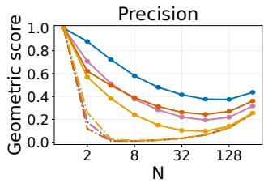

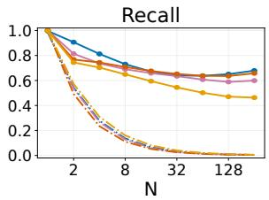  
(a) Euclidean geometry

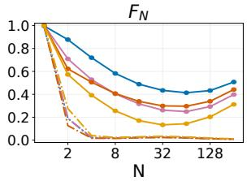

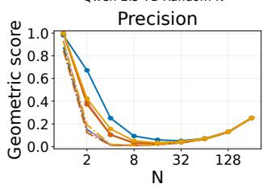

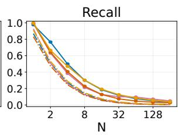  
(b) Cosine geometry

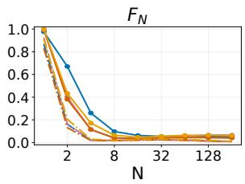  
Figure 8: Attention-selected sets show stronger separation than random sets on OpenWebText. Geometric precision, recall, and extremal $F _ { N }$ under Euclidean and cosine distance. Solid curves show attention ranking and dash-dotted curves show random sets of the same size, each evaluated around its own aggregate. Measurements use the final query of 1024-position windows and are averaged over heads, layers, and documents. The Euclidean advantage is larger.

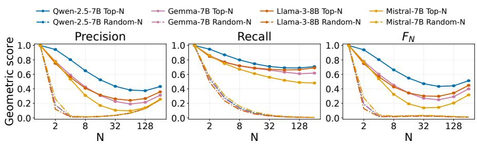  
(a) OpenWebText, Euclidean, contribution ranking

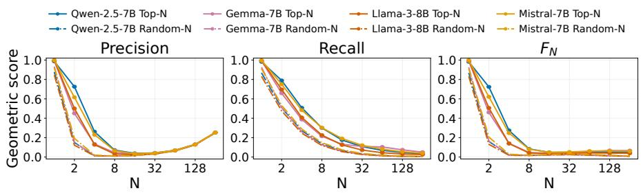  
(b) OpenWebText, cosine, contribution ranking  
Figure 9: Contribution ranking reproduces the geometric pattern on OpenWebText. Precision, recall, and extremal $F _ { N }$ under Euclidean and cosine distance. Solid curves show contribution ranking and dash-dotted curves show random selection. The evaluation and aggregation follow Figure 8.

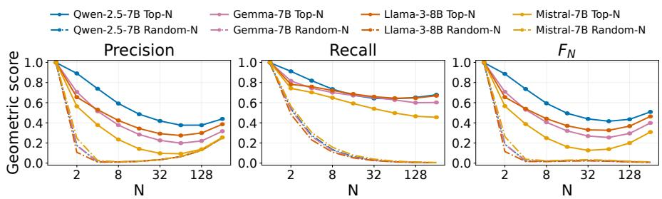  
(a) WikiText-103, Euclidean, attention ranking

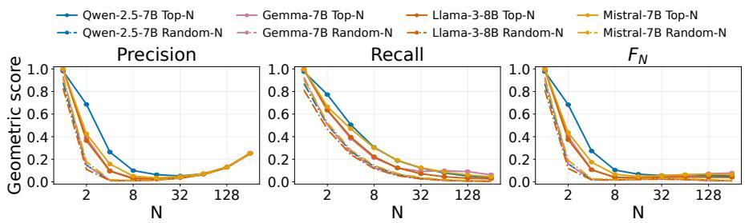  
(b) WikiText-103, cosine, attention ranking

Figure 10: Attention-selected geometry is consistent across corpora. WikiText-103 precision, recall, and extremal $F _ { N }$ under Euclidean and cosine distance. Solid curves show attention ranking and dash-dotted curves show random selection. The evaluation and aggregation follow Figure 8.

Qwen-2.5-7B Top-N Gemma-7B Top-N Llama-3-8B Top-N Mistral-7B Top-N Qwen-2.5-7B Random-N Gemma-7B Random-N Llama-3-8B Random-N Mistral-7B Random-N

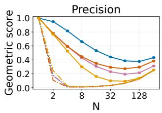

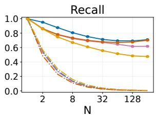  
(a) WikiText-103, Euclidean, contribution ranking

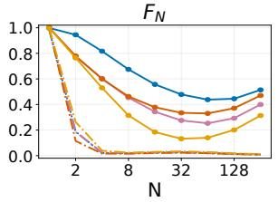

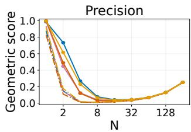

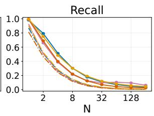

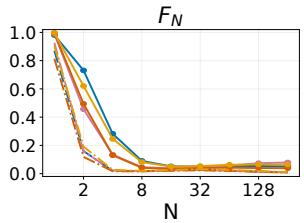  
(b) WikiText-103, cosine, contribution ranking

Figure 11: Contribution-selected sets also exhibit geometric separation on WikiText-103. Precision, recall, and extremal $F _ { N }$ under Euclidean and cosine distance. Solid curves show contribution ranking and dash-dotted curves show random selection. The evaluation and aggregation follow Figure 8.

establishing that geometric separation predicts functional sufficiency for an individual attention operation.

Sensitivity to singleton and small-set boundaries. The Euclidean singleton identity in Appendix A.2 motivates checking whether small selected sets dominate the correlations in Figure 4. Table 1 reports Spearman correlations after excluding these sizes. Geometric and NLL summaries are matched by model, corpus, ranking, and N, then averaged across corpora as in the figure. A positive correlation means that stronger separation accompanies greater degradation.

Removing $N = 1$ weakens most associations, and removing $N \leq 4$ can change their sign. The correlations use 9, 8, or 6 selected-set sizes from the same trajectories. This sensitivity supports the main text’s qualified interpretation of geometry as a description of selected sets, with functional sufficiency established through the loss measurements.

Table 1: Attention-ranking Spearman correlations between geometric $F _ { N }$ and relative NLL degradation after excluding small selected sets. The columns use 9, 8, and 6 measured powers-of-two sizes, respectively.
<table><tr><td>Model</td><td>Geometry</td><td> $N \geq 1$ </td><td> $N \geq 2$ </td><td> $N \geq 8$ </td></tr><tr><td>Qwen-2.5-7B</td><td>Euclidean</td><td>0.817</td><td>0.738</td><td>0.371</td></tr><tr><td>Qwen-2.5-7B</td><td>Cosine</td><td>0.983</td><td>0.976</td><td>0.943</td></tr><tr><td>Gemma-7B</td><td>Euclidean</td><td>0.783</td><td>0.690</td><td>0.257</td></tr><tr><td>Gemma-7B</td><td>Cosine</td><td>0.433</td><td>0.190</td><td>-0.943</td></tr><tr><td>Llama-3-8B</td><td>Euclidean</td><td>0.700</td><td>0.571</td><td>-0.029</td></tr><tr><td>Llama-3-8B</td><td>Cosine</td><td>0.550</td><td>0.357</td><td>-0.543</td></tr><tr><td>Mistral-7B</td><td>Euclidean</td><td>0.633</td><td>0.476</td><td>-0.257</td></tr><tr><td>Mistral-7B</td><td>Cosine</td><td>0.717</td><td>0.595</td><td>0.029</td></tr></table>

## C.3 Effective attention set size by corpus

Table 2 provides the corpus-specific estimates underlying Section 3.1. It uses the fixed-length protocol in Appendix B.2, with deletion at every query, head, and layer. Gemma-2-9B was evaluated only at 5% and 10% tolerances, so its 1% entries are unmeasured.

Table 2: Effective attention set-size estimates by corpus for 1024-position windows. Deletion is applied at every query, head, and layer. Entries are locally refined crossings at the stated relative NLL tolerance. Gemma-2-9B was evaluated only at 5% and 10%, so its 1% entries are unmeasured.
<table><tr><td colspan="2" rowspan="3">Model</td><td colspan="3">OpenWebText</td><td colspan="3">WikiText-103</td></tr><tr><td> $N _ { 1 \% } ^ { * }$ </td><td> $N _ { 5 \% } ^ { * }$ </td><td> $N _ { 1 0 \% } ^ { * }$ </td><td> $N _ { 1 \% } ^ { * }$ </td><td> $N _ { 5 \% } ^ { * }$ </td><td> $N _ { 1 0 \% } ^ { * }$ </td></tr><tr><td>Ranking</td><td></td><td></td><td></td><td></td><td></td></tr><tr><td>Qwen-2.5-1.5B</td><td>attention weight</td><td>99</td><td>39</td><td>24</td><td>108</td><td>42</td><td>26</td></tr><tr><td>Qwen-2.5-1.5B</td><td>contribution magnitude</td><td>104</td><td>41</td><td>25</td><td>112</td><td>43</td><td>27</td></tr><tr><td>Qwen-2.5-7B</td><td>attention weight</td><td>61</td><td>33</td><td>21</td><td>63</td><td>31</td><td>21</td></tr><tr><td>Qwen-2.5-7B</td><td>contribution magnitude</td><td>59</td><td>31</td><td>21</td><td>63</td><td>30</td><td>20</td></tr><tr><td>Gemma-7B</td><td>attention weight</td><td>283</td><td>226</td><td>206</td><td>253</td><td>195</td><td>173</td></tr><tr><td>Gemma-7B</td><td>contribution magnitude</td><td>281</td><td>227 12</td><td>205 7</td><td>253</td><td>195</td><td>173</td></tr><tr><td>Gemma-2-9B</td><td>attention weight</td><td>一</td><td>11</td><td>6</td><td>一</td><td>12</td><td>7</td></tr><tr><td>Gemma-2-9B</td><td>contribution magnitude</td><td>一 191</td><td>85</td><td>59</td><td>一 234</td><td>11</td><td>7</td></tr><tr><td>Llama-2-7B Llama-2-7B</td><td>attention weight contribution magnitude</td><td>121</td><td>60</td><td>46</td><td>140</td><td>101 65</td><td>65 47</td></tr><tr><td>Llama-3.2-1B</td><td>attention weight</td><td>61</td><td>18</td><td>10</td><td>65</td><td>19</td><td>10</td></tr><tr><td>Llama-3.2-1B</td><td>contribution magnitude</td><td>60</td><td>17</td><td>9</td><td>64</td><td>19</td><td></td></tr><tr><td>Llama-3-8B</td><td>attention weight</td><td>60</td><td>16</td><td>10</td><td>71</td><td>20</td><td>10 11</td></tr><tr><td>Llama-3-8B</td><td>contribution magnitude</td><td>59</td><td>16</td><td>9</td><td>72</td><td>20</td><td>10</td></tr><tr><td>Mistral-7B</td><td>attention weight</td><td>51</td><td>14</td><td>10</td><td>51</td><td>16</td><td>10</td></tr><tr><td>Mistral-7B</td><td>contribution magnitude</td><td>51</td><td>14</td><td>9</td><td>51</td><td>15</td><td>9</td></tr><tr><td>Mistral-Small-24B</td><td>attention weight</td><td>105</td><td>32</td><td>16</td><td>119</td><td>40</td><td>22</td></tr><tr><td></td><td></td><td></td><td>31</td><td></td><td>120</td><td></td><td></td></tr><tr><td>Mistral-Small-24B</td><td>contribution magnitude</td><td>107</td><td></td><td>16</td><td></td><td>39</td><td>22</td></tr></table>

$F _ { N } \lor { \mathsf { S } } .$ relative ΔNLL — Euclidean, contribution-magnitude selection Averaged across OpenWebText and WikiText-103  
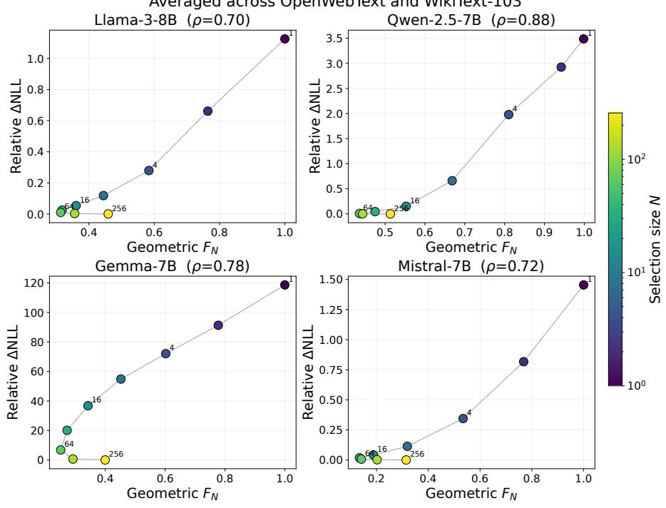  
(a) Euclidean geometry

$F _ { N }$ vs. relative ΔNLL — Cosine, contribution-magnitude selection Averaged across OpenWebText and WikiText-103  
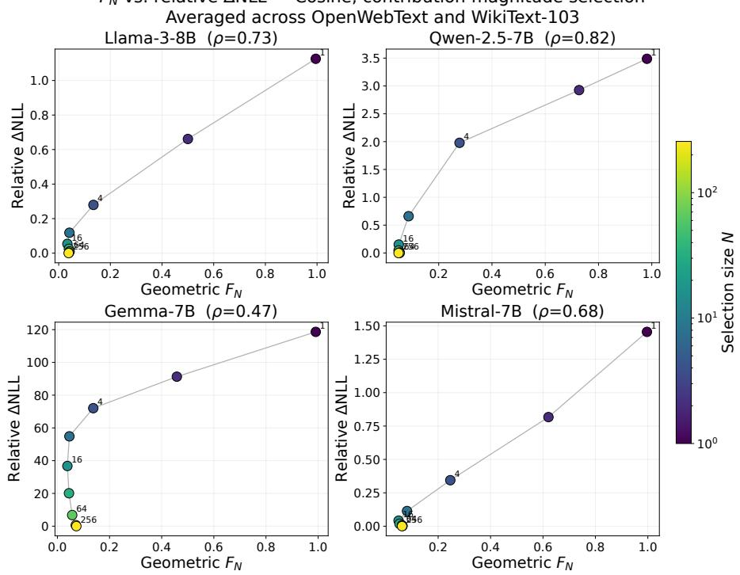  
(b) Cosine geometry  
Figure 12: Contribution ranking gives similar geometry–loss trajectories. Each point corresponds to a selected-set size $N _ { \ast }$ , with geometric $F _ { N }$ and relative NLL degradation averaged across OpenWebText and WikiText-103. Color denotes N, lines connect successive sizes, and $\rho$ is the Spearman correlation along each trajectory. Geometry is measured at the final query, while loss uses interventions throughout the model.

The main cross-model differences occur on both corpora. Gemma-7B requires the largest selected sets, while Mistral-7B and the Llama-3 checkpoints reach the same tolerances with substantially smaller sets. Contribution ranking gives its clearest reduction for Llama-2-7B. At 5%, the estimate decreases from 85 to 60 on OpenWebText and from 101 to 65 on WikiText-103. The estimates describe a common set-size limit throughout the model. Appendix E.3 examines the variation in sensitivity across individual layers and heads.

## C.4 Context-length dependence and scoring protocol

The matched-target evaluation in Section 3.2 asks how much attention must be retained when additional context is available for the same predictions. Figure 13 and Table 3 report both corpora for the three models with complete results. Across these six model–corpus pairs, increasing L eightfold increases the 5% attention-ranked set-size estimate by 4.12–6.63 . Tables 4 and 5 provide both rankings and all tolerances under the two scoring protocols.

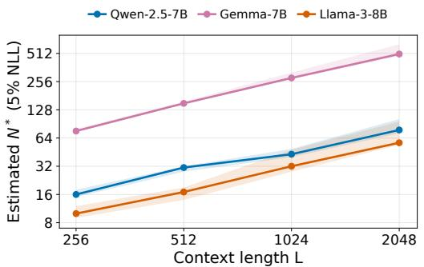  
(a) OpenWebText

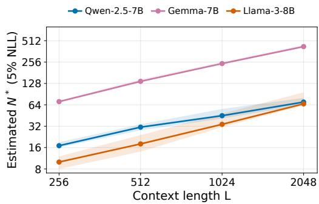  
(b) WikiText-103  
Figure 13: Matched-target set-size estimates increase on both corpora. Effective attention set size at a 5% relative NLL tolerance, using 50 documents per model and corpus. The same final 128 target tokens are scored at every length within each model–corpus pair. Bands are 95% paired-document bootstrap intervals conditional on the evaluated sizes. Both axes use logarithmic spacing.

Table 3: Attention-ranked effective set-size estimates at a 5% relative NLL tolerance under matched final-128-target scoring. Column headings give context length L. Only complete model–corpus pairs are included. OWT denotes OpenWebText and WikiText denotes WikiText-103.
<table><tr><td>Model</td><td>Corpus</td><td>256</td><td>512</td><td>1024</td><td>2048</td></tr><tr><td>Qwen-2.5-7B</td><td>OWT</td><td>16</td><td>31</td><td>43</td><td>78</td></tr><tr><td>Qwen-2.5-7B</td><td>WikiText</td><td>17</td><td>31</td><td>45</td><td>70</td></tr><tr><td>Gemma-7B</td><td>OWT</td><td>76</td><td>150</td><td>280</td><td>504</td></tr><tr><td>Gemma-7B</td><td>WikiText</td><td>71</td><td>137</td><td>244</td><td>423</td></tr><tr><td>Llama-3-8B</td><td>OWT</td><td>10</td><td>17</td><td>32</td><td>57</td></tr><tr><td>Llama-3-8B</td><td>WikiText</td><td>10</td><td>18</td><td>34</td><td>66</td></tr></table>

Selected fraction and finite-range growth. Figure 14 shows that $N ^ { * } / L$ decreases at the 5% tolerance over the measured range. This behavior is compatible with several growth patterns. For example, Llama-3-8B on WikiText-103 has estimates (10, 18, 34, 66), which satisfy $N ^ { * } ( L ) \ =$ $2 + \bar { L ^ { \prime } } 3 2$ exactly at the four tested lengths. This affine fit also gives a decreasing fraction.

Descriptive log–log exponents at 5% are 0.733/0.666 for Qwen, 0.909/0.856 for Gemma, and 0.845/0.908 for Llama, with OpenWebText and WikiText-103 reported in that order. Bootstrap intervals conditional on the evaluated sizes include one for Gemma/OpenWebText and for Llama on both corpora. At 1%, Llama/WikiText estimates (24, 57, 121, 241) give an exponent of approximately 1.107. The four measured lengths therefore support context dependence over this range without establishing a universal sublinear or asymptotic law.

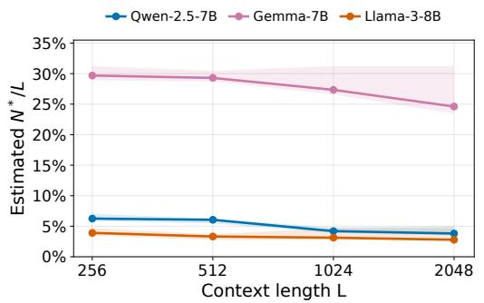  
(a) OpenWebText

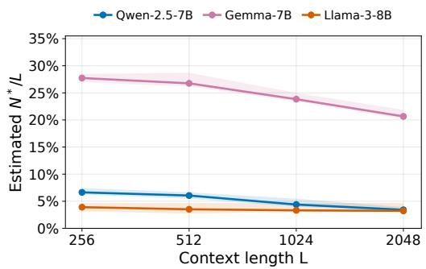  
(b) WikiText-103  
Figure 14: The retained fraction decreases over the measured range. Attention-ranked $N ^ { * } / L$ at a 5% relative NLL tolerance under matched final-target scoring. Bands have the same conditional bootstrap interpretation as in Figure 13. A decreasing fraction is also compatible with affine growth having a positive intercept.

Uncertainty and local nonmonotonicity. ${ \mathrm { A t ~ } } L = 2 0 4 8 .$ , the 5% attention estimates and 95% intervals on OpenWebText are 78 [72, 102] for Qwen, 504 [480, 640] for Gemma, and 57 [54, 96] for Llama. WikiText-103 gives 70 [64, 80], 423 [412, 448], and 66 [63, 96], respectively. Gaps in the evaluated sizes contribute to coarse upper endpoints.

Local nonmonotonicity also affects threshold interpretation. The smallest tested passing size can differ from the smallest tested size for which every larger tested size passes. These values are 45 and 47 for Qwen/WikiText at $L = 1 0 2 4$ , and 423 and 425 for Gemma/WikiText at $L = 2 0 4 8$ . Neither estimate resolves every unmeasured integer.

All-token scoring and contribution ranking. At $L = 2 0 4 8 ,$ , 5% attention estimates for final-128- target and all-token scoring are 78/51, 504/394, and 57/30 on OpenWebText, and 70/48, 423/332, and 66/36 on WikiText-103, for Qwen, Gemma, and Llama. All-token scoring includes earlier queries with shorter prefixes, some of which retain every visible source under a given N. It also changes the targets being averaged. Figure 15 shows this protocol dependence, and Appendix F.5 gives a conditional explanation.

Contribution ranking preserves the context-length trend. Its OpenWebText 5% estimates at $L = 2 0 4 8$ are 74, 503, and 56 for the three models. These small differences from attention ranking do not establish a consistent ranking advantage.

Table 4: Matched final-128-target set-size estimates for the three complete models. Each cell gives $N _ { 1 \% } ^ { * } / N _ { 5 \% } ^ { * } / N _ { 1 0 \% } ^ { * }$ , conditional on evaluated sizes. Column headings give L. OWT denotes OpenWebText and WT denotes WikiText-103. Attn. and Contr. denote attention and contribution ranking. The sampling protocol differs from Table 2.
<table><tr><td>Model</td><td>Corpus</td><td>Rank</td><td>256</td><td>512</td><td>1024</td><td>2048</td></tr><tr><td>Qwen-2.5-7B</td><td>OWT</td><td>Attn.</td><td>27/16/12</td><td>46/31/19</td><td>73/43/29</td><td>164/78/50</td></tr><tr><td>Qwen-2.5-7B</td><td>OWT</td><td>Contr.</td><td>26/16/11</td><td>47/28/19</td><td>71/42/29</td><td>158/74/49</td></tr><tr><td>Qwen-2.5-7B</td><td>WT</td><td>Attn.</td><td>28/17/13</td><td>59/31/22</td><td>88/45/31</td><td>137/70/49</td></tr><tr><td>Qwen-2.5-7B</td><td>WT</td><td>Contr.</td><td>27/16/12</td><td>57/31/21</td><td>84/45/30</td><td>141/69/49</td></tr><tr><td>Gemma-7B</td><td>OWT</td><td>Attn.</td><td>106/76/68</td><td>192/150/136</td><td>340/280/256</td><td>646/504/463</td></tr><tr><td>Gemma-7B</td><td>OWT</td><td>Contr.</td><td>105/76/68</td><td>190/150/136</td><td>346/279/256</td><td>635/503/461</td></tr><tr><td>Gemma-7B</td><td>WT</td><td>Attn.</td><td>95/71/63</td><td>180/137/120</td><td>390/244/222</td><td>641/423/387</td></tr><tr><td>Gemma-7B</td><td>WT</td><td>Contr.</td><td>94/71/64</td><td>183/137/120</td><td>383/245/221</td><td>650/423/388</td></tr><tr><td>Llama-3-8B</td><td>OWT</td><td>Attn.</td><td>30/10/6</td><td>56/17/10</td><td>107/32/17</td><td>188/57/30</td></tr><tr><td>Llama-3-8B</td><td>OWT</td><td>Contr.</td><td>29/10/6</td><td>55/16/9</td><td>106/31/16</td><td>185/56/29</td></tr><tr><td>Llama-3-8B</td><td>WT</td><td>Attn.</td><td>24/10/6</td><td>57/18/11</td><td>121/34/17</td><td>241/66/33</td></tr><tr><td>Llama-3-8B</td><td>WT</td><td>Contr.</td><td>24/9/6</td><td>57/18/10</td><td>120/34/17</td><td>243/66/33</td></tr></table>

Table 5: All-token set-size estimates from the matched-suffix evaluation. Each cell gives $N _ { 1 \% } ^ { * } / N _ { 5 \% } ^ { * } / N _ { 1 0 \% } ^ { * }$ , conditional on evaluated sizes. Column headings give L. Abbreviations follow Table 4. All predicted positions in each window are scored, so the target population changes with L.
<table><tr><td>Model</td><td>Corpus</td><td>Rank</td><td>256</td><td>512</td><td>1024</td><td>2048</td></tr><tr><td>Qwen-2.5-7B</td><td>OWT</td><td>Attn.</td><td>22/13/9</td><td>35/20/14</td><td>55/31/21</td><td>102/51/34</td></tr><tr><td>Qwen-2.5-7B</td><td>OWT</td><td>Contr.</td><td>21/12/9</td><td>34/19/13</td><td>54/30/20</td><td>100/49/33</td></tr><tr><td>Qwen-2.5-7B</td><td>WT</td><td>Attn.</td><td>23/13/9</td><td>39/20/14</td><td>61/31/22</td><td>94/48/34</td></tr><tr><td>Qwen-2.5-7B</td><td>WT</td><td>Contr.</td><td>23/12/9</td><td>38/20/14</td><td>61/30/21</td><td>93/48/34</td></tr><tr><td>Gemma-7B</td><td>OWT</td><td>Attn.</td><td>89/67/59</td><td>157/125/111</td><td>275/227/204</td><td>483/394/358</td></tr><tr><td>Gemma-7B</td><td>OWT</td><td>Contr.</td><td>88/67/59</td><td>157/125/111</td><td>276/227/203</td><td>484/395/358</td></tr><tr><td>Gemma-7B</td><td>WT</td><td>Attn.</td><td>80/63/57</td><td>147/110/97</td><td>247/192/173</td><td>416/332/300</td></tr><tr><td>Gemma-7B</td><td>WT</td><td>Contr.</td><td>79/63/57</td><td>148/110/97</td><td>245/192/173</td><td>419/331/299</td></tr><tr><td>Llama-3-8B</td><td>OWT</td><td>Attn.</td><td>20/7/5</td><td>32/10/6</td><td>61/17/10</td><td>113/30/16</td></tr><tr><td>Llama-3-8B</td><td>OWT</td><td>Contr.</td><td>19/6/4</td><td>32/10/6</td><td>59/17/9</td><td>110/29/15</td></tr><tr><td>Llama-3-8B</td><td>WT</td><td>Attn.</td><td>18/7/5</td><td>36/11/7</td><td>76/19/11</td><td>140/36/18</td></tr><tr><td>Llama-3-8B</td><td>WT</td><td>Contr.</td><td>18/7/4</td><td>35/11/6</td><td>76/19/10</td><td>139/36/18</td></tr></table>

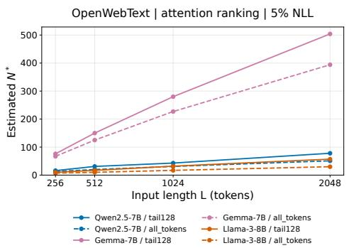  
(a) OpenWebText

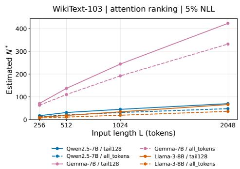  
(b) WikiText-103  
Figure 15: Effective set size depends on which targets are scored. Matched final-target and all-token scoring use the same forward evaluations but average different target populations. The final-target protocol fixes the last 128 targets across lengths within each model–corpus pair.

Full-model baseline and fixed absolute tolerance. Figure 16 reports full-model NLL on the matched final 128 targets. From L = 256 to 2048, NLL decreases by 0.292–0.342 nats per token across the six complete pairs, with paired 95% intervals for the change below zero. The additional natural context therefore supplies useful predictive information, which may contribute to the growing required set size.

An improving baseline also tightens a relative tolerance in absolute units. To examine this effect, fix the allowed increase at 0.05 NLL(M; L = 256) for every length. The resulting OpenWebText attention estimates still grow from 16 to 72 for Qwen, 76 to 496 for Gemma, and 10 to 54 for Llama. This calculation uses already evaluated sizes without additional refinement. It shows that relative-tolerance tightening alone does not account for the growth reported in the main text.

Partial Mistral results. Mistral-7B-v0.3 has OpenWebText 5% attention estimates of 9, 13, and 22 at $L \ = \ 2 5 6 , 5 1 2 , 1 0 2 4 . \mathrm { A t } \ L \ = \ 2 0 4 8$ , complete 50-document measurements give $\Delta \mathrm { N L L _ { r e l } ( 4 9 ) } = 0 . 0 5 1 9 8 5 2$ and $\Delta \mathrm { N L L _ { r e l } ( 5 0 ) } = 0 . 0 4 9 \bar { 8 } 6 4 1$ , yielding a provisional crossing at 50. The full refinement is incomplete, contribution-ranking results at this length are unavailable, and WikiText-103 was not completed. This provisional value is excluded from the complete-model comparisons.

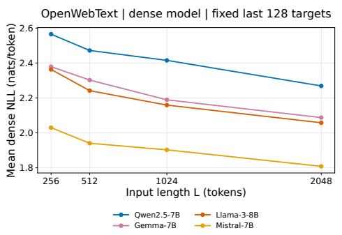  
(a) OpenWebText

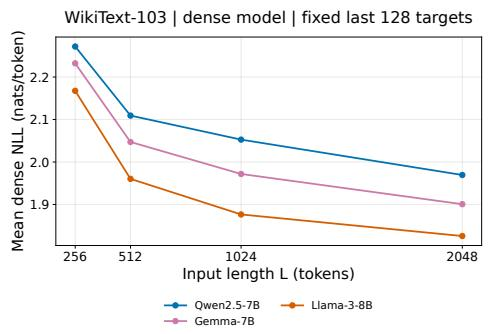  
(b) WikiText-103  
Figure 16: Additional natural context improves full-model NLL. NLL on the same final 128 targets at each length. The Mistral/OpenWebText curve includes full-model measurements from its partial $L = 2 0 4 8$ evaluation. Those measurements do not imply a completed set-size estimate.

## C.5 Mistral-Small-24B results

The larger checkpoint extends the model coverage in Section 3.1. Taking the maximum of the two corpus-specific estimates gives (119, 40, 22) under attention ranking and (120, 39, 22) under contribution ranking at tolerances (1%, 5%, 10%). Figure 17 shows the refined loss curves, including local nonmonotonicity near the strict 1% boundary. The 8-bit weight configuration in Appendix B.5 means that this comparison does not isolate the effect of model size.

## Mistral-Small-24B-Base-2501 (8-bit)

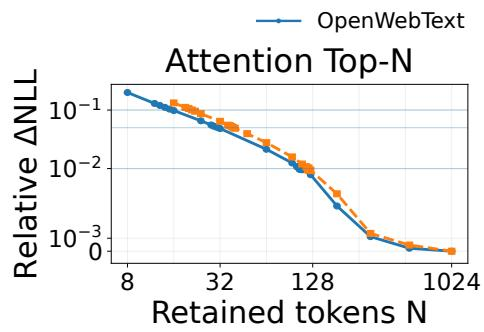

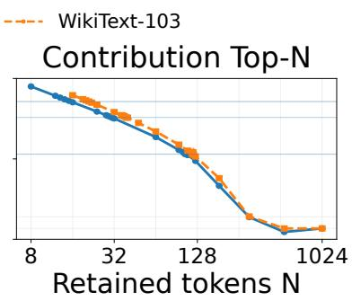  
Figure 17: Mistral-Small-24B retains low NLL degradation with restricted attention. Adaptive refinement of relative NLL degradation for the 8-bit-weight checkpoint. Solid and dashed curves show OpenWebText and WikiText-103. Horizontal lines indicate 1%, 5%, and 10% tolerances.

## D Additional controlled-retrieval results

Section 3.3 uses fixed annotated support to investigate competition separately from the additional predictive information supplied by natural context. We report the detailed support statistics, extended answer-loss thresholds, and full-model baselines. A supplementary multi-fact comparison examines the limits of interpreting these thresholds as evidence about the useful-set size.

## D.1 Support displacement, mass, and recall

The measurements in Figure 7 describe how the same annotated supporting fact is represented in the attention ranking as background grows. They use the 86 validated examples per condition from Appendix B.4, after unambiguous support mapping identifies 90 of the 100 sampled examples.

Averaging the per-model 4K/0K ratios across Qwen-2.5-7B, Gemma-7B, Llama-3-8B, and Mistral-7B gives a 50.0 increase in mean support displacement and a reduction of support attention mass to 0.435 its initial value. Mean support recall@64 falls by 63.8 percentage points. Displacement ratios range from 42.8 to 54.6 across models. Log–log fits against actual non-support counts give slopes of 0.79–0.84 and $R ^ { 2 } \ge 0 . 9 9 8$ , describing the four measured background conditions.

Pairwise ranking and the number of competitors. The mean non-support count increases by approximately 108–111 from 0K to 4K. Over the same range, mean empirical outranking probability decreases from 0.475 to 0.224 for Qwen, 0.451 to 0.226 for Gemma, 0.443 to 0.172 for Llama, and 0.451 to 0.205 for Mistral (Figure 18). Thus more competitors are ranked above support overall even though an individual competitor becomes less likely to outrank a support token.

For each layer/head measurement, Dis $\ u ) _ { a } ( x ) = d _ { x } { \widehat { p } } _ { a } ( x )$ by definition. This identity requires no independence assumption. Averaging yields $\mathbb { E } [ d _ { x } \widehat { p } _ { a } ( x ) ]$ , which need not factor into the product of bthe separate means. The observed probabilities also vary with background, so a constant outranking coefficient does not describe these measurements.

Mean displacement averages over support tokens. Complete support recovery depends on the lowestranked support token, while the loss criterion also depends on retained weights and subsequent computation. This distinction helps interpret the different model responses. Qwen’s displacement grows 51.6 while its 0.10-nat functional set-size estimate doubles. Gemma’s displacement grows 54.6 while its estimate grows approximately 11.9 . As a descriptive association, full-model correct examples have greater support mass in all 16 model–background conditions and greater support recall@64 in 14 of them. These comparisons motivate the functional test while leaving the causal role of individual support measurements unresolved.

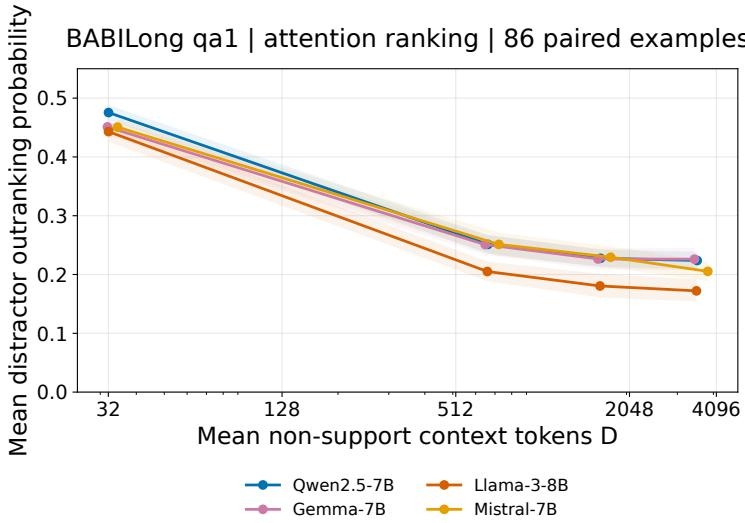  
Figure 18: Pairwise support ranking improves while total displacement grows. Mean empirical probability that a non-support context token scores at least as highly as a support token at the answer query. Background growth increases the number of competitors while this probability decreases. The 0K condition already includes non-support tokens.

## D.2 Extended answer-loss thresholds

Table 6 extends the initial search summarized in Figure 6. It reports attention-ranked effective set sizes at a 0.10-nat mean candidate-answer-loss tolerance, measured relative to the full model at each background.

Adaptive extensions resolve crossings at $N = 3 1 6$ for Llama-3-8B and $N = 7 6 0$ for Gemma-7B at 4K. Gemma at 2K and Mistral at 4K remain unresolved on the evaluated sizes through 256. The $> 2 5 6$ notation records this search limit and does not certify failure at every smaller untested integer.

Table 6: Attention-ranked BABILong qa1 set-size estimates at a 0.10-nat mean candidate-answerloss tolerance relative to each background’s full model. Adaptive extensions are included. An entry > 256 denotes no passing evaluated size through 256, with untested integers unresolved.
<table><tr><td>Model</td><td>0K</td><td>1K</td><td>2K</td><td>4K</td></tr><tr><td>Qwen-2.5-7B</td><td>32</td><td>16</td><td>32</td><td>64</td></tr><tr><td>Llama-3-8B</td><td>32</td><td>128</td><td>256</td><td>316</td></tr><tr><td>Gemma-7B</td><td>64</td><td>256</td><td>&gt; 256</td><td>760</td></tr><tr><td>Mistral-7B</td><td>8</td><td>64</td><td>256</td><td>&gt; 256</td></tr></table>

Qwen’s estimates of (32, 16, 32, 64) across the four backgrounds show that support displacement need not produce a monotone functional response. The main text accordingly reports increasing requirements in several models over the tested range.

## D.3 Full-model performance across backgrounds

The effective set size measures loss preservation relative to a full-model baseline. To interpret this criterion, Table 7 and Figure 19 report that baseline on the same 100-example cohorts used for the answer-loss curves. The evaluation is six-way candidate choice, with uniform candidate loss log $6 \simeq 1 . 7 9 2$ nats.

Table 7: Full-model qa1 candidate-normalized answer loss in nats on 100 matched examples per background. These baselines are used for the corresponding answer-loss degradation measurements.
<table><tr><td>Model</td><td>0K</td><td>1K</td><td>2K</td><td>4K</td></tr><tr><td>Qwen-2.5-7B</td><td>0.690</td><td>1.178</td><td>1.303</td><td>1.385</td></tr><tr><td>Gemma-7B</td><td>0.647</td><td>0.882</td><td>0.933</td><td>1.150</td></tr><tr><td>Llama-3-8B</td><td>0.740</td><td>0.773</td><td>0.857</td><td>1.163</td></tr><tr><td>Mistral-7B-v0.3</td><td>0.792</td><td>1.018</td><td>1.151</td><td>1.311</td></tr></table>

Accuracy changes from 0K to 4K are 23, 18, 10, and 14 percentage points for Qwen, Gemma, Llama, and Mistral. Llama improves at 1K, and its paired 0K-to-4K accuracy-change interval is approximately [ 22, +2] percentage points, which includes zero. Mean candidate loss increases from 0K to 4K for all four models, with paired loss-change intervals above zero. This supports the main text’s loss-based account of competition while qualifying the accuracy trend. A small effective set size at a difficult background condition can preserve a baseline that is itself less accurate.

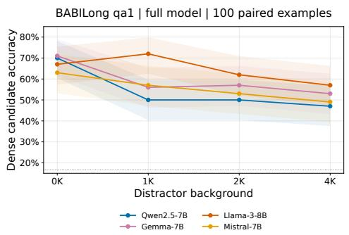  
(a) Dense candidate accuracy

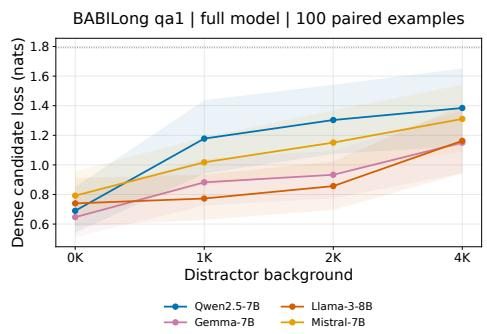  
(b) Dense candidate loss  
Figure 19: Full-model answer loss increases with background. Candidate accuracy and mean candidate-normalized answer loss before intervention. Accuracy bands are 95% Wilson intervals, and loss bands use bootstrap resampling over examples. Dotted references indicate uniform six-candidate performance. Accuracy can vary nonmonotonically despite increasing loss.

## D.4 Fact multiplicity and baseline competence

The useful-token framework allows $K ( C )$ to vary with the computation. As a supplementary comparison, qa1, qa2, and qa3 vary the number of annotated supporting facts at 0K background. Table 8 and Figure 20 use the same candidate-scoring protocol and 100-example cohorts for each model and task.

Table 8: Full-model candidate accuracy at 0K background, using 100 examples per task and model. These are the baselines for the loss curves in Figure 20.
<table><tr><td>Model</td><td>qa1</td><td>qa2</td><td>qa3</td></tr><tr><td>Qwen-2.5-7B</td><td>0.70</td><td>0.49</td><td>0.28</td></tr><tr><td>Gemma-7B</td><td>0.71</td><td>0.49</td><td>0.30</td></tr><tr><td>Llama-3-8B</td><td>0.67</td><td>0.49</td><td>0.26</td></tr><tr><td>Mistral-7B-v0.3</td><td>0.63</td><td>0.52</td><td>0.23</td></tr></table>

Full-model qa3 accuracy is 0.23–0.30, compared with chance accuracy 1/6. This limits how much net accuracy can decrease under intervention and makes a small accuracy-based set-size estimate difficult to interpret as successful multi-fact retrieval. Candidate loss remains sensitive to score changes, but its preservation still refers to this baseline competence. Moreover, an annotated fact spans several tokens and need not specify every useful token. The comparison therefore examines sensitivity to task structure without identifying K(C).

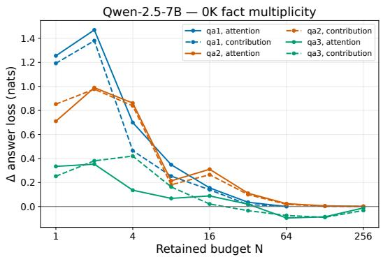

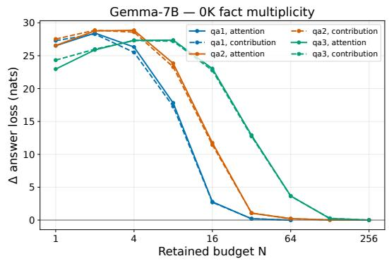

(a) Qwen-2.5-7B  
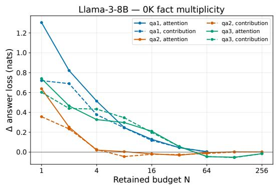  
(c) Llama-3-8B

(b) Gemma-7B  
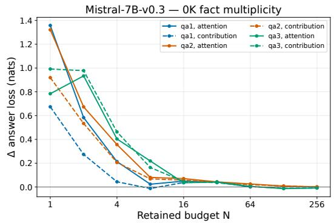  
(d) Mistral-7B-v0.3  
Figure 20: Multi-fact loss sensitivity must be interpreted with baseline competence. Mean candidate-answer-loss degradation at 0K background. Color denotes task, and solid and dashed curves denote attention and contribution ranking. Each curve includes the full 100-example cohort, with zero degradation when N is at least the prompt length. Full-model accuracies are given in Table 8.

## E Aggregation controls and functional diagnostics

The main text interprets effective attention set size through ranking, aggregation, and sensitivity to discarded contributions. The controls below examine these factors by rescaling retained weights, comparing related checkpoints, localizing interventions, and testing functional predictors and positional selection.

## E.1 Renormalization of selected weights

Section 3.4 asks whether preserving the original attention weights contributes to the measured set-size requirement. The renormalized control keeps the relative weights of selected tokens and restores their sum to one:

$$
\widehat { \alpha } _ { i } ^ { ( r , N ) } = \frac { \alpha _ { i } m _ { i } ^ { ( r , N ) } } { \sum _ { j } \alpha _ { j } m _ { j } ^ { ( r , N ) } } .\tag{21}
$$

Comparing this intervention with deletion evaluates how rescaling the selected sum affects functional sufficiency. The corresponding local error identities are given in Equation 17.

Language-model estimates. Table 9 compares OpenWebText estimates for both rankings at 5% and 10% relative NLL tolerances. The renormalized evaluation contains 50 documents per model. Deletion estimates use the OpenWebText entries in Table 2 to keep the corpus consistent. Perdocument deletion traces are unavailable for verifying that the two historical evaluations used identical windows and numerical settings. These are therefore comparisons of corpus-level thresholds, with document pairing unverified.

Table 9: OpenWebText effective set-size estimates under deletion (Primary) and renormalization (Renorm) at 5% and 10% relative NLL tolerances. Both rankings are shown. Historical document pairing is unverified, so the comparison is at the corpus-summary level.
<table><tr><td></td><td></td><td colspan="2">5%</td><td colspan="2">10%</td></tr><tr><td>Model</td><td>Ranking</td><td>Primary</td><td>Renorm</td><td>Primary</td><td>Renorm</td></tr><tr><td>Qwen-2.5-7B</td><td>attention</td><td>33</td><td>15</td><td>21</td><td>9</td></tr><tr><td>Qwen-2.5-7B</td><td>contribution</td><td>31</td><td>24</td><td>21</td><td>13</td></tr><tr><td>Gemma-7B</td><td>attention</td><td>226</td><td>7</td><td>206</td><td>4</td></tr><tr><td>Gemma-7B</td><td>contribution</td><td>227</td><td>11</td><td>205</td><td>7</td></tr><tr><td>Mistral-7B</td><td>attention</td><td>14</td><td>8</td><td>10</td><td>5</td></tr><tr><td>Mistral-7B</td><td>contribution</td><td>14</td><td>14</td><td>9</td><td>11</td></tr></table>

The largest change occurs for Gemma-7B, whose 5% attention-ranked estimate decreases from 226 to 7. The effect depends on the model, ranking, and tolerance. For Mistral contribution ranking at 10%, renormalization increases the estimate from 9 to 11. Figure 21a reports the corresponding ratios. This variation is consistent with the local identities, which allow rescaling to either reduce or increase output error. The comparisons show intervention dependence without identifying the deleted positions as intrinsically irrelevant

Controlled QA estimates. The QA normalization control covers 0K and 4K background for Qwen, Gemma, and Mistral. Table 10 reports both rankings at 0.10- and 0.20-nat mean answer-loss tolerances. At 0.10 nats under attention ranking, the 4K/0K set-size ratio is one for Qwen and Gemma and two for Mistral. Deletion gives ratios of two for Qwen and 11.875 for Gemma. Mistral’s deletion search is unresolved through 256 at 4K, compared with an estimate of eight at 0K, so its plotted endpoint does not represent a resolved ratio.

These comparisons support the role of aggregation in the fixed-support experiment. Their interpretation remains relative to each condition’s full-model baseline, whose answer loss increases with background (Appendix D.3). The tolerance also matters. Gemma’s renormalized attention estimate is unchanged at 32 under the 0.10-nat criterion, while its 0.20-nat estimate increases from eight to 32. Two background endpoints cannot establish a general scaling law.

Table 10: Renormalized qa1 effective set-size estimates on the evaluated sizes at 0.10- and 0.20-nat mean answer-loss tolerances. Dashes indicate background conditions that were not evaluated for this control.
<table><tr><td rowspan="2">Model</td><td rowspan="2">Ranking</td><td colspan="4">0.10 nat</td><td colspan="4">0.20 nat</td></tr><tr><td>0K</td><td>1K</td><td>2K</td><td>4K</td><td>0K</td><td>1K</td><td>2K</td><td>4K</td></tr><tr><td>Qwen-2.5-7B</td><td>attention</td><td>16</td><td></td><td></td><td>16</td><td>8</td><td></td><td></td><td>16</td></tr><tr><td>Qwen-2.5-7B</td><td>contribution</td><td>32</td><td></td><td></td><td>32</td><td>8</td><td></td><td></td><td>16</td></tr><tr><td>Gemma-7B</td><td>attention</td><td>32</td><td></td><td>一</td><td>32</td><td>8</td><td></td><td></td><td>32</td></tr><tr><td>Gemma-7B</td><td>contribution</td><td>16</td><td></td><td></td><td>32</td><td>8</td><td></td><td></td><td>32</td></tr><tr><td>Mistral-7B</td><td>attention</td><td>8</td><td></td><td></td><td>16</td><td>8</td><td></td><td></td><td>8</td></tr><tr><td>Mistral-7B</td><td>contribution</td><td>32</td><td>一</td><td>一</td><td>32</td><td>16</td><td>一</td><td>一</td><td>32</td></tr></table>

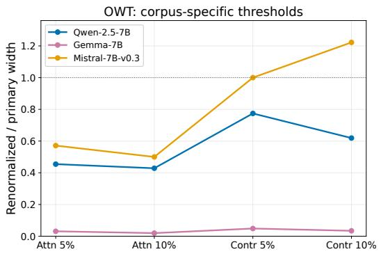  
(a) OWT threshold ratio: renormalized / primary

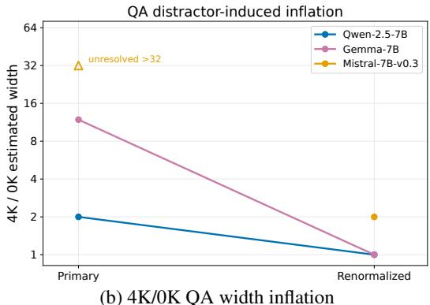  
Figure 21: Renormalization changes both required set size and background sensitivity. (a) Ratios of renormalized to deletion estimates on OpenWebText from Table 9. (b) Attention-ranked 4K/0K ratios at a 0.10-nat answer-loss tolerance. Mistral’s unresolved deletion result is marked at the tested endpoint and is not a resolved ratio. These controls are separate from the matched-target context-length evaluation.

## E.2 Comparison within the Gemma family

Gemma-7B requires unusually large selected sets in Section 3.1. Gemma-2-9B provides a comparison within the same model family. Taking the larger of the two corpus-specific estimates gives

$$
( N _ { 5 \% } ^ { * } , N _ { 1 0 \% } ^ { * } ) = ( 1 2 , 7 ) \quad \mathrm { f o r ~ a t t e n t i o n ~ r a n k i n g , } \qquad ( 1 1 , 7 ) \quad \mathrm { f o r ~ c o n t r i b u t i o n ~ r a n k i n g . }
$$

The corresponding Gemma-7B estimates are (226, 206) and (227, 205). The approximately 19–29- fold differences show that model-family identity and parameter count alone do not account for the Gemma-7B requirement. The comparison does not isolate individual architectural or training changes. Numerical checks for the Gemma-2 implementation are reported in Appendix B.5.

## E.3 Layer- and head-localized interventions

The common set-size limit in Section 3.1 can reflect heterogeneous sensitivity across attention operations. To examine this variation, we apply Top-N deletion to one layer or head at a time, leaving all other attention operations unrestricted. Each layer is tested on 50 OpenWebText windows. The reported effect is the mean of per-document relative NLL increases, which differs from the ratio of corpus means used for the main functional metric.

For each model, the two layers with the largest measured effects are selected for a head scan on the first 20 windows. Every query head in these layers is tested separately. This targeted scan measures sensitivity within selected layers and does not provide a held-out whole-network localization test. Figure 22 shows all scanned layers and the ten largest measured Gemma head effects.

At N = 128, Gemma layer 0 has a reported 70.9% NLL increase and its head 12 has a 62.1% increase. The layer and head estimates use different sample sizes and baseline averages, so their ratio cannot assign a share of the layer effect to that head. Reference sizes also differ across models.

Qwen uses $N = 1 6$ and Mistral uses $N = 8 ,$ with largest sampled layer effects of 1.86% and 0.33%, respectively. The results reveal variation within models, while comparisons across models remain conditional on these different intervention sizes.

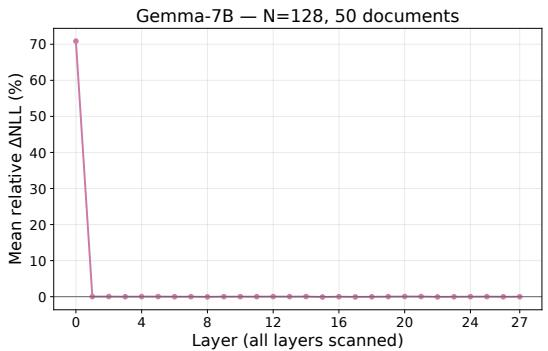  
(a) Gemma-7B layer localization

  
(b) Selected Gemma-7B heads

  
(c) Qwen-2.5-7B

  
(d) Mistral-7B  
Figure 22: Sensitivity to deletion varies substantially across layers and heads. Reference selected-set sizes are 128 for Gemma, 16 for Qwen, and eight for Mistral. All scanned layers and the ten largest measured Gemma head effects are shown. Layer and head evaluations use 50 and 20 documents, respectively. Separate interventions do not form an additive decomposition of the full-model requirement.

## E.4 Exploratory prediction of effective set size

The geometry–loss comparison in Section 3.1 motivates testing whether diagnostics that include discarded contributions and loss sensitivity are more informative than geometric separation alone. This exploratory analysis uses the four geometry models, 20 OpenWebText documents per model, $L =$ 1024, both rankings, selected-set sizes $N \in \{ \bar { 8 } , 1 6 , 3 2 , 6 4 , 1 \bar { 2 8 } , 2 5 6 \}$ , and relative NLL tolerances of 5% and 10%. It addresses this fixed-length setting.

Diagnostics are measured in full-model activations across heads and query positions. They include geometric separation and margins, discarded mass, discarded-vector norms and energy, tail coherence from Appendix $\mathbf { A . } 3 ,$ , and the sensitivity statistic below. Parameters are frozen, with gradients enabled at embedding inputs so that activation gradients can be computed without allocating parameter gradients.

Sensitivity to the discarded contribution. Let $z _ { \ell h t }$ be the attention output before its output projection, and let $e _ { \ell h t } ^ { ( r , N ) }$ be the detached discarded sum. Output-head targets are partitioned into chunks c of 64 positions. Each chunk contributes $\begin{array} { r } { \ell _ { c } = ( L - 1 ) ^ { - 1 } \sum _ { t \in c } \ell _ { t } } \end{array}$ to mean sequence NLL. Separate backward calls produce the implemented statistic

$$
S _ { \ell h t } ^ { ( r , N ) } = \sum _ { c } \left| \left. \nabla _ { z _ { \ell h t } } \ell _ { c } , e _ { \ell h t } ^ { ( r , N ) } \right. \right| .\tag{22}
$$

The absolute value is taken before summing over chunks. Consequently, this statistic can differ from $\begin{array} { r } { | \langle \nabla _ { z } \sum _ { c } \ell _ { c } , e \rangle | } \end{array}$ and can depend on chunk size even when total NLL is unchanged. The discarded

vector is stored in FP16 and converted to the gradient dtype when the inner product is computed.   
There is no additional normalization across heads.

For each layer and document, the mean and 95th percentile are computed over the flattened head– query measurements. These statistics are then averaged across layers and documents. Thus the reported P95 is an average of within-layer, within-document percentiles. The same reduction is used for the other predictors, and unavailable or nonfinite cases are excluded with their counts reported.

Leave-one-model-out evaluation. For each ranking, tolerance, and scalar diagnostic, three models train a one-dimensional threshold classifier for $\begin{array} { r } { \mathbf { 1 } \{ \bar { \Delta \mathrm { N L L } } _ { \mathrm { r e l } } ( N ) \leq \tau \} } \end{array}$ . The search considers both threshold directions, midpoints between sorted finite feature values, and thresholds just outside the observed range using an offset of $1 0 ^ { - 1 2 }$ . Ties are resolved lexicographically by classification error, threshold, and direction. The predicted set size for the held-out model is the smallest tested N classified as passing.

Prediction is evaluated against the smallest passing measured size using $| \log _ { 2 } ( N _ { \mathrm { p r e d } } / N _ { \mathrm { m e a s u r e d } } ) |$ . If the classifier predicts no passing size, the case is left unresolved. The raw-N baseline uses the same classifier and folds with N as its feature, giving mean error 1.75 over all 16 model–ranking–tolerance cases. Both the mean and P95 sensitivity statistics give mean error 0.75 over all 16 cases, with maximum error one. Figure 23 reports the other diagnostics and their valid-case counts.

  
Figure 23: Loss-sensitive diagnostics improve exploratory prediction in this sample. Mean absolute $\log _ { 2 }$ error in effective set size under leave-one-model-out evaluation. Lower is better. Labels report valid cases out of 16. Diagnostics with different unresolved-case patterns are not evaluated on identical sets of cases.

The result suggests that loss sensitivity provides useful information beyond selected-set geometry in this sample. The analysis has only four models, 20 documents per model, and a coarse set-size grid. Selecting the best diagnostic from these results also requires a separate evaluation to establish predictive performance after model selection.

## E.5 Positional selection at matched set sizes

Section 3.3 attributes part of the selected-set requirement to recovering support among competing tokens. A positional control tests whether retaining the initial token and recent context can satisfy the same answer-loss criterion. For a prefix longer than N, the rule retains source index zero and the N 1 most recent visible positions, including the current query. Shorter prefixes retain every source. The tested sizes are $N \in \{ 1 6 , 3 2 , 6 4 , 1 2 8 , 2 5 \bar { 6 } \}$

The mask is applied at every query, head, and layer without renormalization or retraining. Dense probabilities are computed before masking, as in the main intervention. The comparison uses the same QA prompt, candidate scoring, and sampled example IDs for Qwen-2.5-7B and Mistral-7B at 0K, 2K, and 4K backgrounds.

Qwen has no passing positional-control size through 256 at the 0.10-nat tolerance in these conditions. Mistral passes at 32 at 0K and has no passing size through 256 at 2K or 4K. Figure 24 compares these curves with attention-ranked selection.

  
(a) Qwen-2.5-7B

  
(b) Mistral-7B  
Figure 24: Positional and attention-ranked selection have different functional effects. The positional mask retains one initial source and $N - 1$ recent sources. Both rules use deletion without renormalization at the same set sizes. At 2K and 4K, the positional control does not reach the 0.10-nat criterion within the tested grid. The experiment evaluates selection after computing dense attention.

Support outside the retained initial and recent positions is excluded as a direct source at the answer query. Earlier representations can still carry support information, and other prompt cues can affect the answer. The comparison therefore evaluates the functional consequences of the two selection rules under the stated intervention. Because it computes dense attention before masking, it does not assess the efficiency of a streaming cache implementation.

## F Conditional explanations of context-dependent set size

Sections 3.2–3.4 identify context, competition, and aggregation as factors in the effective attention set size. We develop conditional models that connect these observations to useful-set recovery and preservation of the weighted sum. The models distinguish the number of tokens needed to recover a specified set, retain attention mass, preserve a local output, and satisfy a task-loss tolerance. Relating these quantities requires the assumptions stated in each result. The experiments do not establish those assumptions for individual heads or an asymptotic law beyond the measured context lengths.

## F.1 Competition with a fixed required set

The fixed-support experiment in Section 3.3 motivates a ranking model in which required information remains fixed as competitors are added. Consider one query with L candidate positions and a specified set of $1 \le K < L$ required positions. This set may represent annotated support or the hypothesized useful set, depending on the application. Rank positions by scalar scores, using pre-softmax logits for attention ranking. Assume no score ties, let s be the lowest required score, and write $D = L - K$ for the number of competitors.

Proposition 3 (Set size for complete recovery under competition). Treat the required scores as fixed. Suppose competitor scores $X _ { 1 } , \ldots , X _ { D }$ are independent and identically distributed, with $p _ { L } = \mathbb { P } ( X _ { j } > s _ { * } )$ . The smallest $T o p \ – N$ set containing every required position has size

$$
N _ { \mathrm { r e c } } ( L ) = K + B _ { L } , \qquad B _ { L } \sim \mathrm { B i n o m i a l } ( D , p _ { L } ) .\tag{23}
$$

Hence $\mathbb { E } [ N _ { \mathrm { r e c } } ( L ) ] = K + D p _ { L }$ . For $0 < \delta < 1$ , with probability at least $1 - \delta ,$

$$
N _ { \mathrm { r e c } } ( L ) \leq K + D p _ { L } + \sqrt { 2 D p _ { L } \log ( 1 / \delta ) } + \frac 2 3 \log ( 1 / \delta ) .\tag{24}
$$

If K is fixed and $p _ { L } \to p \in ( 0 , 1 )$ , then $N _ { \mathrm { r e c } } ( L ) / L \to p$ in probability.

Proof. The weakest required position has $K - 1$ required positions and $\textstyle \sum _ { j = 1 } ^ { D } \mathbf { 1 } \{ X _ { j } > s _ { * } \}$ competitors above it. Its rank is therefore $K + B _ { L }$ , the necessary and sufficient size for complete recovery. Independence gives the binomial distribution. Bernstein’s inequality and $\mathrm { V a r } ( B _ { L } ) \le D p _ { L }$ imply Equation 24. Finally, $\mathrm { V a r } ( B _ { L } / L ) \leq D / ( 4 L ^ { 2 } )  0 ,$ , while $\mathbb { E } [ B _ { L } ^ { - } / L ] { \stackrel { - } { \to } } p$ and ${ \dot { K } } / { \dot { L } } \to 0$ □

For constant exceedance probability $p ,$ the expected required set size is affine in context length:

$$
\mathbb { E } [ N _ { \mathrm { r e c } } ( L ) ] = p L + ( 1 - p ) K .\tag{25}
$$

If $p _ { L } \asymp L ^ { - \gamma }$ for $0 < \gamma < 1$ , the expected excess above K is of order $L ^ { 1 - \gamma }$ . Bounded expected set size at fixed K requires $D p _ { L } = O ( 1 )$ . The rank identity itself holds without independence, although the binomial law and probability bound use the distributional assumptions.

The probability $p _ { L }$ concerns the weakest required token. The measured pairwise probability in Appendix D.1 averages over support tokens and can therefore differ from $p _ { L }$ . For the useful-set inversion count in Appendix A.1, define ${ \bar { p } _ { L } } = \mathrm { I n v } _ { r } / [ K ( L - K ) $ ]. Requiring Inv $r \le \varepsilon K ^ { 2 }$ at every length with fixed K would require $\bar { p } _ { L } \le \varepsilon K / ( L - \bar { K } )$ . Hypothesis 1 is imposed on a reference distribution and makes no such uniform requirement. This distinction permits the accumulation of ranking errors as the candidate population grows. Recovering the required positions still leaves their weights and downstream use to be assessed by the functional intervention.

## F.2 Attention-mass retention under a stable score distribution

The normalization results in Section 3.4 motivate examining how many highly scored tokens are needed to retain a fixed fraction of attention mass. For one local operation, write $W _ { i } = \exp ( s _ { i } ) > 0$ and $\begin{array} { r } { \alpha _ { i } = W _ { i } / \sum _ { j = 1 } ^ { L } W _ { j } } \end{array}$ . Let $S _ { L , N }$ contain the N largest weights, and define

$$
M _ { L } ( N ) = \sum _ { i \in S _ { L , N } } \alpha _ { i } , \qquad N _ { \varepsilon } ^ { \mathrm { m a s s } } ( L ) = \operatorname* { m i n } \{ N \in \{ 1 , \ldots , L \} : M _ { L } ( N ) \geq 1 - \varepsilon \} ,\tag{26}
$$

where $0 < \varepsilon < 1$ is a discarded-mass tolerance.

Proposition 4 (Limiting retained-mass profile). Let $W _ { 1 } , W _ { 2 } , \ldots$ be independent copies ofa positive random variable W with a continuous distribution and $0 < \mathbb { E } [ W ] < \infty$ . For $0 < \rho < 1$ , let $q _ { 1 - \rho }$ be its $( 1 - \rho ) – q u a n t i l e .$ . Then, almost surely,

$$
M _ { L } ( \lfloor \rho L \rfloor ) \longrightarrow m ( \rho ) : = \frac { \mathbb { E } [ W \mathbf { 1 } \{ W \geq q _ { 1 - \rho } \} ] } { \mathbb { E } [ W ] } .\tag{27}
$$

The extension $m ( 0 ) = 0 , m ( 1 ) = 1$ is continuous and strictly increasing. ${ I f m ( \rho _ { \varepsilon } ) = 1 - \varepsilon }$ , then

$$
\frac { N _ { \varepsilon } ^ { \mathrm { m a s s } } ( L ) } { L } \longrightarrow \rho _ { \varepsilon } \in ( 0 , 1 ) \quad a l m o s t s u r e l y .\tag{28}
$$

Proof. The strong law gives $\begin{array} { r } { L ^ { - 1 } \sum _ { i } W _ { i } \to \mathbb { E } [ W ] , } \end{array}$ . For any fixed $T ,$ , the bounded empirical quantile functions of min $( W _ { i } , \bar { T } )$ converge almost everywhere to their population quantile function. Bounded convergence then gives convergence of the upper-ρ trimmed sum divided by L. The difference from the unbounded trimmed sum is at most $L ^ { - 1 } \dot { \sum _ { i } } ( \dot { W _ { i } } - T ) _ { + }$ , whose almost-sure limit is $\mathbb { E } [ ( W - T ) _ { + } ]$ This quantity tends to zero as $T \to \infty$ , which proves the numerator limit in Equation 27.

The limiting numerator can also be written as $\textstyle \int _ { 1 - \rho } ^ { 1 } F _ { W } ^ { - 1 } ( u ) d u$ . Finite expectation implies continuity, and positivity implies strict increase. For sufficiently small $h > 0$ , the retained-mass limits at $\rho _ { \varepsilon } - h$ and $\rho _ { \varepsilon } + h$ lie below and above $1 - \varepsilon .$ respectively. Monotonicity of $M _ { L } ( N )$ brackets the normalized required size between these fractions. Taking $h \dot { \downarrow } 0$ proves Equation 28. □

The result permits strongly nonuniform attention while requiring a stable distribution of unnormalized weights. Scores that sharpen with L, a fixed set of positions retaining nonvanishing mass, or a changing mixture of local and distant sources can violate this assumption. Extending the result to dependent scores would require convergence of their empirical distribution and control of the weight tails.

Gaussian-logit example. For $s _ { i } \sim \mathcal N ( \mu _ { s } , \sigma ^ { 2 } )$ with fixed $\sigma > 0$ , completing the square in the Gaussian density gives

$$
m ( \rho ) = \Phi \bigl ( \sigma + \Phi ^ { - 1 } ( \rho ) \bigr ) , \qquad \rho _ { \varepsilon } = \Phi \bigl ( \Phi ^ { - 1 } ( 1 - \varepsilon ) - \sigma \bigr ) ,\tag{29}
$$

where Φ is the standard normal distribution function. The common mean $\mu _ { s }$ cancels under softmax.   
This example shows how score spread can determine the retained fraction under a stable distribution.   
It is an illustrative calculation and is not fitted to the empirical logits or loss-based set sizes.

## F.3 From retained mass to local output accuracy

Mass retention helps explain a functional requirement only when it also constrains the attention output. The upper bound in Appendix A.3 supplies a sufficient condition when values are bounded. A necessary condition additionally requires control of cancellation among discarded values. At fixed incoming activations, write $\begin{array} { r } { z _ { L } = \sum _ { i } \alpha _ { i } v _ { i } , z _ { L , N } = \sum _ { i \in S _ { L , N } } \alpha _ { i } v _ { i } } \end{array}$ , and $e _ { L , N } = z _ { L } - z _ { L , N }$

Proposition 5 (Local set size under coherent values). Suppose constants $0 < a \le B < \infty$ independent $o f L ,$ , and a unit vector u satisfy $\| v _ { i } \| _ { 2 } \leq B$ and $\langle u , v _ { i } \rangle \geq a$ for all candidate positions. Then

$$
a [ 1 - M _ { L } ( N ) ] \leq \| e _ { L , N } \| _ { 2 } \leq B [ 1 - M _ { L } ( N ) ] .\tag{30}
$$

For $0 < \xi < a ,$ , define $N _ { \xi } ^ { \mathrm { d e l } } ( L ) = \operatorname* { m i n } \{ N \in \{ 1 , \dots , L \} : \| e _ { L , N } \| _ { 2 } \leq \xi \}$ . Then

$$
N _ { \xi / a } ^ { \mathrm { m a s s } } ( L ) \leq N _ { \xi } ^ { \mathrm { d e l } } ( L ) \leq N _ { \xi / B } ^ { \mathrm { m a s s } } ( L ) .\tag{31}
$$

Under the assumptions of Proposition 4, almost surely,

$$
0 < \rho _ { \xi / a } \leq \operatorname* { l i m i n f } _ { L  \infty } \frac { N _ { \xi } ^ { \mathrm { d e l } } ( L ) } { L } \leq \operatorname* { l i m s u p } _ { L  \infty } \frac { N _ { \xi } ^ { \mathrm { d e l } } ( L ) } { L } \leq \rho _ { \xi / B } < 1 .\tag{32}
$$

Proof. Projection onto u yields $\begin{array} { r } { \| e _ { L , N } \| _ { 2 } \geq \langle u , e _ { L , N } \rangle \geq a \sum _ { i \notin S _ { L , N } } \alpha _ { i } } \end{array}$ , and the triangle inequality gives the upper bound. Error at most ξ requires discarded mass at most $\xi / a$ . Discarded mass at most $\bar { \xi } / B$ is sufficient. These implications give Equation 31, even when the error norm is nonmonotone in N. Applying the retained-mass limits proves Equation 32. □

The proposition establishes linear-order growth under a uniform coherence condition. It does not specify a unique slope. The upper norm bound alone gives no necessary set size because cancellation can make the discarded sum small. The argument also applies to output-projected values $W _ { O } ^ { ( h ) }$ vi when its assumptions hold in residual-stream space. Connecting this local result to downstream loss requires an additional sensitivity assumption.

## F.4 Renormalization and an explicit task-loss model

Section 3.4 shows that renormalization can substantially change the measured set size. Equation 17 explains the local effect through retained and discarded weighted means. For $1 \leq N < L ,$ write $\dot { M ^ { } } = M _ { L } ( N ) , \mu _ { S } = z _ { L , N } / M .$ and $\mu _ { T } = ( z _ { L } - z _ { L , N } ) / ( 1 - \bar { M } )$ . Then

$$
z _ { L } - z _ { L , N } = ( 1 - M ) \mu _ { T } , \qquad z _ { L } - \frac { z _ { L , N } } { M } = ( 1 - M ) ( \mu _ { T } - \mu _ { S } ) .\tag{33}
$$

If $\mu _ { T } \neq 0$ , the ratio of renormalization error to deletion error is exactly $\| \mu _ { T } - \mu _ { S } \| _ { 2 } / \| \mu _ { T } \| _ { 2 } .$ A component shared by both means contributes to deletion error and cancels from their difference. The following example connects this possibility directly to a loss tolerance.

Proposition 6 (Growing loss-based set size with identical values). Let every value equal a fixed nonzero vector µ. A binary readout assigns the correct-class logit $\hat { \beta } \langle \mu , z \rangle / \| \mu \| _ { 2 } ^ { 2 }$ and the other-class logit zero, where $\beta > 0 .$ . Its loss at $z = M \mu$ is $\ell ( M ) = \log ( 1 + \exp ( - \beta \bar { M } ) )$ . For $0 < \tau <$ log $2 - \ell ( 1 )$ , define

$$
c _ { \tau } = - \frac { 1 } { \beta } \log ( \exp ( \ell ( 1 ) + \tau ) - 1 ) \in ( 0 , 1 ) .\tag{34}
$$

The smallest deletion set satisfying $\ell ( M _ { L } ( N ) ) - \ell ( 1 ) \leq \tau$ has size $N _ { 1 - c _ { \tau } } ^ { \mathrm { m a s s } } ( L )$ . Under Proposition 4, its ratio to L converges to the positive solution $o f m ( \rho ) = c _ { \tau }$ . Renormalized retention has zero loss change for every $N \geq 1$

Proof. The full output is $\mu ,$ deletion gives $M _ { L } ( N ) \mu$ , and renormalization restores $\mu .$ Solving $\log ( \bar { 1 } + e ^ { - \beta M } ) \leq \bar { \ell ( 1 ) } + \bar { \tau } \mathrm { g i v e s } M \geq \bar { c } _ { \tau }$ . The retained-mass result then establishes the limit.

For uniform weights, a direct calculation gives $N _ { \mathrm { d e l } } ( L ) = \lceil c _ { \tau } L \rceil$ and $N _ { \mathrm { r e n } } ( L ) = 1$ . Growing lossbased set size can therefore arise from preserving output amplitude even when every value carries the same representation. This construction demonstrates why an increasing deletion requirement alone cannot identify growth in distinct useful information.

For a general downstream loss that is locally C-Lipschitz, $| \ell ( z ) - \ell ( \widetilde { z } ) | \leq C \| z - \widetilde { z } \| _ { 2 }$ provides a sufficient local guarantee. The full interventions also change earlier activations, later scores, and selected sets. The local comparison in Equation 33 holds for fixed activations and the same subset, so extending it to the full-model quantity $N _ { \tau } ^ { * , ( r ) }$ requires additional assumptions.

## F.5 Dependence on the scored query positions

Appendix C.4 reports smaller effective set sizes under all-token scoring than under matched finaltarget scoring. To isolate one reason for this difference, index queries by visible-source count $t \in \{ 1 , \ldots , \bar { L } \}$ . The one-token indexing difference from causal language-model scoring does not affect the following limits. Assume that expected absolute loss degradation after the full intervention has the form

$$
d _ { t } ( N ) = g ( N / t ) ,\tag{35}
$$

where $g : [ 0 , \infty ) \to [ 0 , \infty )$ is bounded, continuous, nonincreasing, and zero on $\lbrack 1 , \infty )$ . This is an assumed common degradation profile across query positions. It does not follow from the local bounds above or require independent interventions across queries.

Proposition 7 (Effect of scoring positions). For $N = \lfloor \rho L \rfloor , 0 < \rho < 1$ , and integers $1 \le w _ { L } \le L$ define

$$
D _ { \mathrm { a l l } } ( N , L ) = \frac { 1 } { L } \sum _ { t = 1 } ^ { L } g ( N / t ) , \qquad D _ { \mathrm { t a i l } } ( N , L ) = \frac { 1 } { w _ { L } } \sum _ { t = L - w _ { L } + 1 } ^ { L } g ( N / t ) .
$$

If $w _ { L } / L \to 0 ,$ , then

$$
D _ { \mathrm { t a i l } } ( N , L ) \to g ( \rho ) , \qquad D _ { \mathrm { a l l } } ( N , L ) \to A ( \rho ) : = \int _ { 0 } ^ { 1 } g ( \rho / u ) d u \leq g ( \rho ) .\tag{36}
$$

For an absolute tolerance τ with unique interior crossings of $g ( \rho ) = \tau$ and $A ( \rho ) = \tau ,$ , the smallest passing set sizes divided by L converge to the corresponding solutions $\rho _ { \mathrm { t a i l } }$ and $\rho _ { \mathrm { a l l } }$ . These satisfy $\rho _ { \mathrm { a l l } } \le \rho _ { \mathrm { t a i l } }$

Proof. Over the final $w _ { L } = o ( L )$ queries, $N / t \to \rho$ uniformly, so continuity gives the tail limit. The all-query average is a Riemann sum. Its limiting integrand is zero for $u \leq \rho$ and has a continuous extension at zero. Since $\rho / u \geq \rho \mathrm { f o r } 0 < u \leq 1$ , monotonicity gives $g ( \rho / u ) \leq g ( \rho )$ . Convergence on either side of each unique crossing and monotonicity in $N$ give the set-size limits and their ordering. □

If $w _ { L } / L \to \kappa \in ( 0 , 1 ]$ , the tail limit becomes $\begin{array} { r } { \kappa ^ { - 1 } \int _ { 1 - \kappa } ^ { 1 } g ( \rho / u ) d u } \end{array}$ . Although 128 targets form a fixed-size tail asymptotically, they occupy approximately half of a 256-position window. Finite-query averages are therefore more appropriate for the shortest tested contexts. Relative NLL also uses protocol- and length-specific full-model baselines, which are outside the absolute-loss comparison above. Negative or nonmonotone empirical degradation can violate the assumed profile.

## F.6 Implications for the empirical findings

The conditional models organize the evidence in the main text without identifying a single mechanism. In natural-context extension, the same final targets require larger selected sets, including under a fixed absolute tolerance. This limits explanations based only on changing target populations or tighter relative thresholds. Improved full-model NLL leaves additional useful information as a plausible contributor, alongside competition and preservation of the weighted sum.

The controlled-background experiment provides more direct evidence of competition. Annotated support remains fixed while displacement increases, mass decreases, and recall at a fixed set size falls. Relating these measurements to Proposition 3 would require the distribution of the weakest support rank in addition to mean displacement. The annotated set would also need to be distinguished from the full useful set for the prediction.

The normalization controls establish sensitivity to how selected values are combined. Testing the mass-retention explanation more directly would require comparing $M _ { L } ( \vert \rho L \vert )$ across lengths and measuring discarded-vector norms and retained/discarded means, including after output projection. Applying deletion and renormalization to the same matched-target context-length sweep would further clarify this relationship, while accounting for their effects on later rankings. The existing normalization evaluations do not supply that matched sweep.

Finally, the scoring-position model explains how averaging earlier, shorter-prefix queries can reduce an estimated set size under explicit assumptions. It supports treating the target population as part of the measurement definition. Together, these results motivate interpreting effective attention set size through competition, aggregation, and the evaluation criterion, with the latent useful-set size remaining unobserved.

## Ethics Statement

This work analyzes publicly available pretrained language models using established text and questionanswering benchmarks. It does not collect new personal data, involve human participants, or infer properties of individual users. The geometric and effective-set-size measurements characterize model behavior under specified diagnostics and interventions. Applications to attention sparsification or cache reduction should evaluate prediction degradation on the intended downstream distribution.

## Reproducibility Statement

Appendix B specifies sampling, tokenization, candidate scoring, support mapping, interventions, aggregation, threshold searches, and numerical checks. The supplementary tables report corpus-specific estimates and distinguish incomplete searches from unmeasured conditions. For matched-target context extension, the protocol specifies paired suffixes and 5000 paired-document bootstrap replicates, with uncertainty conditional on the evaluated set sizes. The scope of numerical parity checks, unveri fied historical pairing of the normalization evaluations, and the 24B precision configuration are stated explicitly. The mathematical results include their assumptions and proofs. The accompanying source archive contains the manuscript and figure assets. Raw per-document measurements, experiment code, and environment manifests are needed to independently reproduce the empirical summaries.

## AI Use Statement

Language-model tools were used for language editing, restructuring, and debugging. The authors are responsible for the mathematical statements, experimental design, data analysis, citations, and final text.