# S3: Spectral Null-Space Swap Makes Reasoning Models Efficient

Hongbo Ma∗1,2, Sansheng Cao∗3,4, Jiajun Fan1, Bangji Yang1, Ge Liu1

1University of Illinois Urbana-Champaign 2Tsinghua University 3Dartmouth College 4Peking University

## Abstract

LLMs trained with Chain-of-thought excel in reasoning capability, but often come with excessive token cost. We find that the core of reasoning capacity lies in the Thinking model’s weight component within the null space of a projection defined by the corresponding Non-thinking model’s dominant singular directions, and removing the subspace component can largely improve reasoning eficiency without hurting the accuracy gained during thinking-mode post-training. Unlike existing eforts that mostly operate within the dominant subspace, we are the first to unveil the critical role of the null space and harness it for model optimization. Motivated by this finding, we propose Spectral Null-Space Swap (S3), a training-free composition of paired Non-thinking and Thinking checkpoints. Our method keeps the Non-thinking model inside its own dominant subspace and takes the Thinking checkpoint outside it, improving reasoning eficiency while maintaining accuracy. We extensively evaluate S3 on 2B–30B dense and mixture-of-experts (MoE) architectures spanning 28 evaluation environments across mathematical, multimodal, and audio reasoning domains. S3 establishes new empirical Pareto Frontiers among training-free model composition strategies: across all settings, it reduces inference token overhead by an average of 27.4% compared to full Thinking models while simultaneously improving overall task accuracy by 1.0 percentage point (e.g., yielding +8.3% accuracy on HMMT25 alongside a 33.0% token speedup). We further use attention entropy for explanation and find that the retained component produces more concentrated attention, and we use a simplified analytical model about optimization to demonstrate why null-space can efectively reduce attention entropy, thereby improving the eficiency of reasoning.

Date: September 30, 2026 | Correspondence: geliu@illinois.edu

## 1 Introduction

Scaling language models enabled few-shot adaptation [1], instruction tuning aligned them with user intent [2], and chain-of-thought (CoT) prompting made reasoning explicit [3]. Recent models extend deliberate reasoning across text, vision, and audio [4–6], while agents interleave reasoning with actions and observations [7–12] to handle extended interactions, multi-agent coordination, and sequential decision-making [13–18]. However, overly lengthy CoT imposes heavy computational costs as workloads scale, making eficient reasoning essential.

Post-training—especially reinforcement learning in thinking mode—improves reasoning through multi-domain fine-tuning, policy optimization, and reward modeling [19–24], but inevitably inflates token consumption.

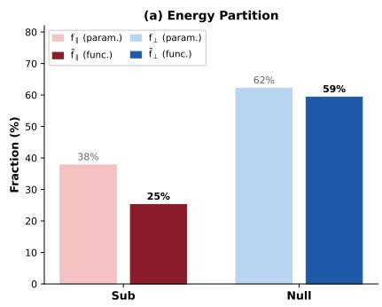

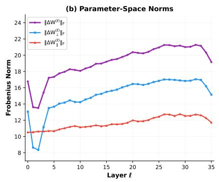

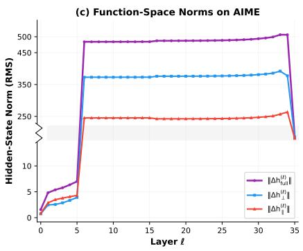  
Figure 1 This figure compares the parallel and perpendicular components of the thinking diference in parameter and function spaces. All panels use the Qwen3-4B-Instruct and Qwen3-4B-Thinking. Parameter space denotes weight diferences; function space denotes hidden-state ofsets relative to Qwen3-4B-Instruct on AIME24/25. (a) Global average results. (b) Per-layer parameter-space results. (c) Per-layer function-space results on the same inputs.

Prior work explores explicit budgets [25], adaptive stopping, token pruning, and weight interpolation to balance accuracy and eficiency. Nevertheless, a core question remains: where in weight space does a Thinking model difer functionally from its Non-thinking counterpart, and which part of that diference can be removed without incurring full generation costs?

In spectral coordinates of the Non-thinking model, let $W _ { 0 }$ and $W _ { t }$ be paired Non-thinking and Thinking weights, with post-training diference $\Delta W = W _ { t } - W _ { 0 }$ . We decompose ∆W into components aligned with and complementary to $W _ { 0 }$ ’s singular subspace, comparing their Frobenius energies with induced hidden-state changes. Figure 1 reveals a structural asymmetry for Qwen3-4B on AIME24/25: the aligned component holds sizable parameter energy but induces weak functional shifts, whereas the complementary component drives most functional change despite lower energy. Thus, weight changes along directions the Non-thinking model already occupies have little functional efect; function resides mostly in the complement. Unlike prior studies that primarily manipulate components within the dominant subspace, this finding underscores the untapped potential of the complementary space and motivates keeping Non-thinking in the former and importing Thinking in the latter.

We instantiate this idea as Spectral Null-Space Swap $( S ^ { 3 } )$ . For each target matrix, the leading singular directions of $W _ { 0 }$ define a protected subspace $\begin{array} { r } { {  { \boldsymbol { S } } } _ { \rho } ; } \end{array}$ the composed weight is $W _ { \rho } = P _ { S _ { \rho } } ( W _ { 0 } ) + ( I - P _ { S _ { \rho } } ) ( W _ { t } )$ The protected region therefore keeps the Non-thinking model’s structure, while its complement is taken from the Thinking model. Existing weight-space approaches average or interpolate checkpoints, resolve merging conflicts, or retain Base-aligned updates. $S ^ { 3 }$ instead makes an asymmetric, subspace-specific choice about which model supplies each region without the additional training.

We evaluate paired 2B–30B dense and MoE models across text, vision–language, and audio tasks. Across diverse architectures and multimodal benchmarks, $S ^ { 3 }$ achieves substantial token eficiency while maintaining or improving accuracy relative to Thinking baselines. Crucially, several configurations establish empirical Pareto-optimal accuracy–token trade-ofs among evaluated merging methods. For instance, $\mathrm { Q w e n 3 - 4 B } { - } S ^ { 3 }$ gains 8.3 percentage points in accuracy on HMMT25 alongside a 33.0% token reduction; on MathVista, $\mathrm { Q w e n 3 - V L - 4 B } { - } S ^ { 3 }$ reaches 78.05% accuracy with 31.9% fewer tokens. The $\rho = 1$ ablation isolates spectral components: its null-space model nearly matches Thinking accuracy with over a quarter fewer tokens, whereas the aligned-subspace model degrades toward Non-thinking.

Finally, we use attention entropy to examine why this decomposition changes reasoning behavior. Across evaluated datasets, the null-space model concentrates attention more than Non-thinking models, whereas adding only the aligned component difuses attention, yielding the empirical ordering $H _ { \mathrm { N u l l } } < H _ { \mathrm { B a s e } } < H _ { \mathrm { S u b } }$ Our simplified analytical model provides an explanation of when this ordering arises, ofering a conditional prediction for small perturbation that matches observed attention patterns and shorter reasoning traces.

Our main contributions can be summarized as follows:

• Spectral finding. We characterize the post-training thinking diference in both parameter and function spaces and identify a mismatch between their energy shares, showing that components along directions already occupied by Non-thinking models yield less functional impact, which instead largely resides in the complementary space.

• Selective composition. We introduce Spectral Null-Space Swap $( S ^ { 3 } )$ , a training-free composition of Non-thinking and Thinking checkpoints. It preserves Non-thinking’s leading spectral directions and imports Thinking’s complementary component. This transfer difers from whole-checkpoint interpolation and methods retaining base-aligned updates.

• Accuracy–eficiency results. We evaluate five paired model families spanning 2B–30B dense and MoE architectures across text, vision–language, and audio reasoning. Across settings, $S ^ { 3 }$ achieves multiple Pareto-Optimal operating points and uses 27.4% fewer tokens on average than Thinking while improving mean accuracy by 1.0 percentage point.

• Mechanistic explanation. We introduce attention entropy to explain how $S ^ { 3 }$ alters model behaviors via spectral decomposition. Specifically, we observe the persistent ordering $H _ { \mathrm { N u l l } } < H _ { \mathrm { B a s e } } < H _ { \mathrm { S u b } }$ across evaluated tasks and provide a simplified analytical model.

## 2 Related Work

## 2.1 Efficient Reasoning and Chain-of-Thought Compression

Chain-of-thought (CoT) improves LLM reasoning but increases decoding cost. Existing approaches address this trade-of through adaptive computation and post-training, including adaptive stopping, token pruning, partial verification, process-reward learning, and reinforcement-learning-based optimization [26–34]. In contrast, our method operates directly in weight space: it preserves the Non-thinking model in a protected spectral subspace and transfers only the complementary component from its corresponding Thinking model. This retains the Thinking model’s reasoning capability while reducing CoT overhead, without additional training or decoding changes.

## 2.2 Weight-Space Model Composition and Spectral Subspace Transfer

Weight-space merging combines fine-tuned models without retraining, evolving from checkpoint averaging and task arithmetic to interference reduction via sign resolution and delta sparsification [35–38]. For eficient reasoning, direct Non-thinking–Thinking interpolation ofers an accuracy–cost trade-of without extra training [39]. Spectral methods exploit parameter subspaces, including task-matrix analysis, LoRA-SVD alignment, shared/task-specific subspace separation, and base-aligned RL update decomposition [40–43]. Our approach instead preserves the Non-thinking model’s leading spectral subspace while transferring only the complementary component from the Thinking model, using Non-thinking as an anchor and Thinking as a capability donor for selective reasoning transfer rather than multi-task fusion.

## 2.3 Attention Entropy and Reasoning Dynamics

Attention entropy characterizes attention concentration and has been linked to Transformer attention dynamics and geometry [44–46]. Recent work further relates attention entropy to reasoning dynamics and chain-ofthought trajectories [47–50]. We observe consistent reductions in attention entropy across models and datasets, consistent with prior studies linking more concentrated attention patterns to efective contextual processing and reasoning, as well as recent work relating entropy dynamics to reasoning eficiency [47, 51, 52]. Beyond this empirical observation, we provide the first theoretical analysis connecting null-space projection in parameter space to attention entropy.

## 3 Method: Spectral Null-Space Swap

This section develops the method in three steps. Section 3.1 asks where a Thinking model difers from its Non-thinking counterpart in weight space, finding that functional diferences lie mostly outside the Nonthinking model’s occupied directions. Section 3.2 converts this finding into an operator that preserves the Non-thinking model’s leading spectral directions while importing the remainder from the Thinking model, controlled by a single parameter. Section 3.3 examines full protection, where the operator transfers only expressive complements and forms a four-variant family difering solely in retained components—laying the groundwork for the interpretability analysis in Section 5.

## 3.1 Insight: Where the Thinking Difference Lives

Let $W _ { 0 }$ and $W _ { t }$ denote the weights of a paired Non-thinking and Thinking checkpoints from the same model family. The two checkpoints always descend from the same pretrained model and difer in whether they produce an extended chain of thought before answering [4, 5]. All the thinking adds is the diference $\Delta W = W _ { t } - W _ { 0 }$ which is available from the two released checkpoints alone.

We measure $\Delta W$ in two ways. Its parameter-space size is its Frobenius energy; its function-space size is the change it induces in the network’s computation. To separate the two, let $W _ { 0 } = U \Sigma V ^ { \top }$ be a compact SVD and $P s ( \bar { X } ) = U ( U ^ { \top } X V ) V ^ { \top }$ the orthogonal projection onto the subspace $s$ spanned by the singular directions of $W _ { 0 } .$ . Since $P s ( W _ { 0 } ) = W _ { 0 }$ , this splits the diference into the part that lies where the anchor weight already has support and its complement—for the rectangular attention projections, exactly the null-space component:

$$
\begin{array} { r } { \Delta W = \underbrace { P _ { S } ( \Delta W ) } _ { \Delta W _ { \parallel } } + \underbrace { ( I - P _ { S } ) ( \Delta W ) } _ { \Delta W _ { \perp } } , \qquad \| \Delta W \| _ { F } ^ { 2 } = \| \Delta W _ { \parallel } \| _ { F } ^ { 2 } + \| \Delta W _ { \perp } \| _ { F } ^ { 2 } , } \end{array}\tag{1}
$$

with parameter-space share $f _ { \parallel } ^ { ( \ell ) } = \lVert \Delta W _ { \parallel } ^ { ( \ell ) } \rVert _ { F } ^ { 2 } / \lVert \Delta W ^ { ( \ell ) } \rVert _ { F } ^ { 2 }$ and $f _ { \perp } ^ { ( \ell ) } = 1 - f _ { \parallel } ^ { ( \ell ) }$

For the function-space counterpart, write $h _ { M } ^ { ( \ell ) } ( x ) \in \mathbb { R } ^ { T _ { x } \times d }$ for the hidden states of model M on input x at layer $\ell ,$ where $\ell = 0$ is the embedding output and $\ell = 1 , \ldots , L$ are the outputs of the transformer layers, and let

$$
\Delta h _ { * } ^ { ( \ell ) } ( x ) = h _ { M _ { * } } ^ { ( \ell ) } ( x ) - h _ { W _ { 0 } } ^ { ( \ell ) } ( x ) , \qquad M _ { * } \in \{ W _ { 0 } + \Delta W _ { \parallel } , ~ W _ { 0 } + \Delta W _ { \perp } , ~ W _ { 0 } + \Delta W \}\tag{2}
$$

be the shift that each variant induces relative to the anchor. Because the shifts are read of actual forward passes, they capture the full nonlinear efect of a weight change rather than a first-order Jacobian approximation. Averaging the squared token-wise shifts over the $\begin{array} { r } { N = \sum _ { x } T _ { x } } \end{array}$ tokens of a shared input set X gives the functional norm and the corresponding share

$$
\big \| \Delta h _ { * } ^ { ( \ell ) } \big \| ^ { 2 } = \frac { 1 } { N } \sum _ { x \in X } \sum _ { t = 1 } ^ { T _ { x } } \big \| \Delta h _ { * } ^ { ( \ell ) } ( x ) _ { t } \big \| _ { 2 } ^ { 2 } , \qquad \tilde { f } _ { * } ^ { ( \ell ) } = \frac { \| \Delta h _ { * } ^ { ( \ell ) } \| ^ { 2 } } { \| \Delta h _ { \mathrm { f u l l } } ^ { ( \ell ) } \| ^ { 2 } } .\tag{3}
$$

Figure 1 compares the two decompositions. The split is stable across the middle and late layers, while the parameter-space and function-space measures consistently show that the component inside S accounts for much of the Frobenius energy but far less of the functional change, while the complementary component has similar shares under both measures. This suggests that a substantial portion of the diference lies along directions the anchor already occupies, yet contributes little to the model’s actual computation. Thus, the functionally critical part of the thinking diference lies mainly outside the Non-thinking model’s spectral subspace, and the in-subspace component is largely redundant. This identifies which side the composed model should keep from the anchor and lays the foundation for model composition. Section 3.2 turns this observation into a concrete operator.

## 3.2 The Spectral Null-Space Swap

Section 3.1 splits the diference along the singular directions of $W _ { 0 }$ . We now turn that split into an operator by letting only the leading fraction of those directions play the role of ${ \mathcal { S } } .$ For $\rho \in ( 0 , 1 ]$ let $U _ { k } , V _ { k }$ collect the

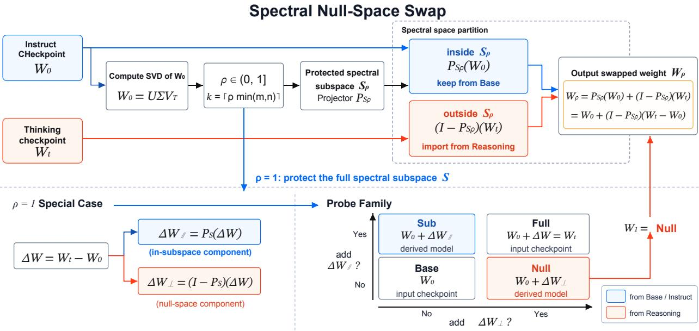  
Figure 2 Overview of our method: Spectral Null-Space Swap and the $\rho = 1$ probe family. The swapped weight preserves the protected spectral component of the Non-thinking model and imports the complementary component of the Thinking model. The four probes isolate the contributions of $\Delta W _ { \parallel }$ and $\Delta W _ { \perp }$

leading $k = \lceil \rho \operatorname* { m i n } ( m , n ) \rceil$ singular vectors and

$$
P _ { S _ { \rho } } ( X ) = U _ { k } ( U _ { k } ^ { \top } X V _ { k } ) V _ { k } ^ { \top } , \qquad S _ { \rho } = \mathrm { s p a n } ( U _ { k } ) \otimes \mathrm { s p a n } ( V _ { k } ) \subseteq S .\tag{4}
$$

As Figure 2 illustrates, the Spectral Null-Space Swap keeps the Non-thinking model inside $ { \boldsymbol { S } } _ { \rho }$ and takes the Thinking model outside it,

$$
W _ { \rho } = P _ { S _ { \rho } } ( W _ { 0 } ) + ( I - P _ { S _ { \rho } } ) ( W _ { t } ) .\tag{5}
$$

Equation (5) admits two equivalent interpretations. From a subspace perspective,

$$
P _ { S _ { \rho } } ( W _ { \rho } ) = P _ { S _ { \rho } } ( W _ { 0 } ) , \qquad ( I - P _ { S _ { \rho } } ) ( W _ { \rho } ) = ( I - P _ { S _ { \rho } } ) ( W _ { t } ) ,\tag{6}
$$

which shows that the two spectral regions are inherited from diferent sources: inside the protected subspace $\begin{array} { r } { { \cal S } _ { \rho } , } \end{array}$ the composed weight exactly matches the Non-thinking model, whereas on the orthogonal complement it exactly matches the Thinking model. Thus, $ { \boldsymbol { S } } _ { \rho }$ acts as the interface separating the structure preserved from $W _ { 0 }$ from the component imported from $W _ { t }$

The same construction can be viewed from the perspective of transferring the diference. Rewriting (5) gives

$$
W _ { \rho } = W _ { 0 } + ( I - P s _ { \rho } ) ( W _ { t } - W _ { 0 } ) ,\tag{7}
$$

so the composed model can be obtained by starting from $W _ { 0 } .$ decomposing the thinking diference $\Delta W =$ $W _ { t } - W _ { 0 }$ into components inside and outside $S _ { \rho } { } _ { ; }$ , discarding the former, and transferring only the latter. In this view, the operation does not interpolate the two checkpoints globally; instead, it selectively injects the part of the thinking diference that lies outside the protected spectral subspace of the Non-thinking model.

## 3.3 Specialization at $\rho = 1 \colon$ The Probe Family

Setting $\rho = 1$ in (7) removes the only free parameter: $k = \operatorname* { m i n } ( m , n )$ , hence $U _ { k } = U$ and $V _ { k } = V$ , and the swap returns

$$
W _ { 1 } = W _ { 0 } + ( I - P _ { S } ) ( W _ { t } - W _ { 0 } ) = W _ { 0 } + \Delta W _ { \perp } ,\tag{8}
$$

a transfer of exactly the component of $\Delta W$ that $W _ { 0 }$ cannot represent (for the $m > n$ MLP matrices, the left-null-space component instead, so the expression is well defined for every target weight). Keeping or discarding each of the two components of $\Delta W$ then gives four variants,

$$
\begin{array} { r l } { \underbrace { W _ { 0 } } _ { \mathrm { B a s e } } , \qquad \underbrace { W _ { 0 } + \Delta W _ { \parallel } } _ { \mathrm { S u b } } , } & { \qquad \underbrace { W _ { 0 } + \Delta W _ { \perp } } _ { \mathrm { N u l l } } , \qquad \underbrace { W _ { 0 } + \Delta W } _ { \mathrm { F u l l } } , } \end{array}\tag{9}
$$

of which Base and Full are the released checkpoints and Sub and Null are derived from them. By (8) the Spectral Null-Space Swap is the Null entry, so the whole family is available from the two checkpoints alone, with no training, data, or roll-outs.

The construction is also convenient for interpretability: the four variants of (9) difer only in which spectral component of a single diference is applied, and the decomposition is exact and local to each weight matrix, so an observed efect can be attributed to specific directions in a specific layer. Section 5 uses the family in this way.

## 4 Experiments

In this section, we first describe the evaluation settings and baselines across text, vision–language, and audio reasoning tasks in Section 4.1. We then evaluate the cross-modal accuracy–eficiency trade-of of our method, study the efect of the protected-subspace ratio $\rho ,$ and isolate the respective contributions of the subspace and null-space components in Section 4.2, Section 4.3 and Section 4.4. Additional selected-result visualizations and analyses, including Pareto-frontier plots and extended ratio sweeps, are provided in Appendix C.

## 4.1 Experimental Setup

Settings. We evaluate Spectral Null-Space Swap on paired Non-thinking and Thinking checkpoints from the Qwen3 family [4]. Our evaluation covers text, vision–language, and audio reasoning tasks. Specifically, we use Qwen3-4B, Qwen3-30B-A3B, Qwen3-VL-2B, Qwen3-VL-4B, Qwen3-Omni-30B-A3B as our backbone models [5, 6]. This design evaluates both cross-modal generalization and compatibility with dense and MoE architectures. We report pass@1 for single-sample correctness and avg@4 for average performance over four generations. Additional model configurations are provided in Appendix B.1.

Baselines. We compare our method with the original Non-thinking and Thinking checkpoints from each paired model family. We further compare against MI-0.8, a direct Instruct–Thinking weight-interpolation baseline using the 0.8 interpolation setting [39], and TIES-Merging, which resolves parameter conflicts through trimming and sign election [37]. All methods operate on the same paired checkpoints and are evaluated using identical prompts and decoding configurations.

## 4.2 Main Results: Cross-Modal Accuracy–Efficiency Trade-offs

Table 1 shows that our method consistently provides a favorable accuracy–eficiency trade-of across text, vision– language, and audio reasoning. Compared with Non-thinking models, it substantially improves reasoning while maintaining markedly shorter outputs than Thinking models. On text tasks, our method recovers most Thinking gains—and exceeds them on several benchmarks—while shortening chains of thought. Across vision–language and audio domains, it frequently achieves the lowest token usage among merging baselines while preserving competitive accuracy. Thus, Spectral Null-Space Swap transfers reasoning capability without the full decoding overhead. Compared with TIES and MI-0.8, our method exhibits a superior Pareto frontier; additional benchmarks and detailed trade-of analyses appear in Appendix B.2.

## 4.3 Ablation on the Protected-Subspace Ratio $\rho$

We study the efect of the protected-subspace ratio ρ, which controls the fraction of leading singular directions $\rho ,$ of the Non-thinking checkpoint retained during spectral subspace swap. Table 2 reports the results of Qwen3-4B-S3 across $\rho \in [ 0 . 5 , 1 . 0 ]$

Table 1 Main results across text, vision–language, and audio reasoning benchmarks. We report accuracy (%) and average generated tokens per problem. Bold indicates the best value in each column among TIES, MI-0.8, and $\mathrm { S ^ { 3 } }$ . In each ∆ row, accuracy is reported as an absolute change and token usage as a relative change with respect to the corresponding Thinking model.
<table><tr><td rowspan="2">Large Language Model</td><td colspan="2">AIME25</td><td colspan="2">HMMT25</td><td colspan="2">CMIMC25</td><td colspan="2">Olympiad-Bench</td></tr><tr><td>Acc↑</td><td>Tok↓</td><td>Acc↑</td><td>Tok↓</td><td>Acc↑</td><td>Tok↓</td><td>Acc↑</td><td>Tok↓</td></tr><tr><td colspan="9">Qwen3-4B</td></tr><tr><td>Qwen3-4B-Instruct</td><td>45.8</td><td>6,785</td><td>35.0</td><td>8,621</td><td>32.5</td><td>8,461</td><td>77.3</td><td>4,468</td></tr><tr><td>Qwen3-4B-Thinking</td><td>71.7</td><td>20,704</td><td>46.7</td><td>24,636</td><td>58.1</td><td>24,415</td><td>83.8</td><td>14,086</td></tr><tr><td>Qwen3-4B-TIES</td><td>73.3</td><td>16,377</td><td>50.0</td><td>16,049</td><td>54.4</td><td>21,748</td><td>85.8</td><td>10,238</td></tr><tr><td>Qwen3-4B-MI-0.8</td><td>71.7</td><td>17,270</td><td>58.3</td><td>19,729</td><td>56.3</td><td>22,902</td><td>85.5</td><td>11,460</td></tr><tr><td>Qwen3-4B-S³-0.8</td><td>73.3</td><td>15,004</td><td>55.0</td><td>16,496</td><td>55.0</td><td>21,266</td><td>83.8</td><td>9,745</td></tr><tr><td>∆ vs. Thinking</td><td>+1.6</td><td>-27.5%</td><td>+8.3</td><td>-33.0%</td><td>-3.1</td><td>-12.9%</td><td>+0.03</td><td>-30.8%</td></tr><tr><td colspan="9">Qwen3-30B-A3B</td></tr><tr><td>Qwen3-30B-A3B-Instruct</td><td>60.0</td><td>6,851</td><td>45.8</td><td>7,558</td><td>45.0</td><td>7,478</td><td>82.2</td><td>4,305</td></tr><tr><td>Qwen3-30B-A3B-Thinking</td><td>84.2</td><td>17,579</td><td>68.3</td><td>21,093</td><td>64.4</td><td>21,979</td><td>85.8</td><td>12,359</td></tr><tr><td>Qwen3-30B-A3B-TIES</td><td>72.5</td><td>10,472</td><td>52.5</td><td>15,555</td><td>58.1</td><td>16,068</td><td>84.0</td><td>8,560</td></tr><tr><td>Qwen3-30B-A3B-MI-0.8</td><td>76.7</td><td>15,648</td><td>65.0</td><td>19,432</td><td>68.1</td><td>19,632</td><td>86.9</td><td>10,899</td></tr><tr><td>Qwen3-30B-A3B-S³-0.8</td><td>80.8</td><td>12,536</td><td>62.5</td><td>16,424</td><td>66.3</td><td>15,988</td><td>88.4</td><td>9,238</td></tr><tr><td>Δ vs. Thinking</td><td>-3.37</td><td>-28.7%</td><td>-5.8</td><td>-22.1%</td><td>+1.85</td><td>-27.3%</td><td>+2.55</td><td>-25.3%</td></tr><tr><td>Vision Language Model</td><td>GSM8K</td><td></td><td>MMLU</td><td></td><td></td><td>MMMU</td><td>MathVista-testmini</td><td></td></tr><tr><td colspan="9">Qwen3-VL-2B</td></tr><tr><td>Qwen3-VL-2B-Instruct</td><td>87.88</td><td>918.5</td><td>65.68</td><td>484.0</td><td>46.00</td><td>6,665.8</td><td>57.73</td><td>2,235.4</td></tr><tr><td>Qwen3-VL-2B-Thinking</td><td>92.75 93.00</td><td>2,295.4 1,877.9</td><td>80.15 80.59</td><td>3,228.0</td><td>55.50 60.00</td><td>8,075.4 7,601.8</td><td>66.90 68.23</td><td>3,623.8</td></tr><tr><td>Qwen3-VL-2B-TIES</td><td>92.88</td><td>1,972.4</td><td>80.59</td><td>1,962.4</td><td>55.50</td><td>7,836.5</td><td></td><td>3,085.6</td></tr><tr><td>Qwen3-VL-2B-MI-0.8 Qwen3-VL-2B-S³-0.8</td><td>91.62</td><td>1,550.1</td><td>80.92</td><td>2,333.7</td><td></td><td></td><td>67.58</td><td>3,349.8</td></tr><tr><td></td><td>-1.13</td><td>-32.5%</td><td></td><td>1,754.8</td><td>57.50</td><td>7,513.0</td><td>68.58</td><td>2,784.2</td></tr><tr><td>∆ vs. Thinking</td><td></td><td></td><td>+0.77</td><td>-45.6%</td><td>+2.00</td><td>-7.0%</td><td>+1.68</td><td>-23.2%</td></tr><tr><td colspan="9">Qwen3-VL-4B</td></tr><tr><td>Qwen3-VL-4B-Instruct Qwen3-VL-4B-Thinking</td><td>96.37 96.00</td><td>266.1</td><td>78.62</td><td>57.8</td><td>50.25</td><td>597.4</td><td>73.35</td><td>1,104.9</td></tr><tr><td>Qwen3-VL-4B-TIES</td><td>96.50</td><td>1,403.0 1,258.9</td><td>90.02</td><td>1,823.9</td><td>80.00 80.75</td><td>5,152.7 4,521.2</td><td>76.02 79.90</td><td>2,843.9</td></tr><tr><td>Qwen3-VL-4B-MI-0.8</td><td>96.37</td><td>1,243.4</td><td>88.49</td><td>1,284.8</td><td>78.75</td><td>4,375.1</td><td>77.35</td><td>2,273.9</td></tr><tr><td>Qwen3-VL-4B-S³-0.8</td><td>96.00</td><td>1,139.6</td><td>89.47</td><td>1,268.3</td><td></td><td></td><td></td><td>2,181.4</td></tr><tr><td></td><td></td><td></td><td>88.49</td><td>1,167.3</td><td>82.50</td><td>4,094.8</td><td>78.05</td><td>1,936.1</td></tr><tr><td>∆ vs. Thinking</td><td>0.00</td><td>-18.8%</td><td>-1.53</td><td>-36.0%</td><td>+2.50</td><td>-20.5%</td><td>+2.03</td><td>-31.9%</td></tr><tr><td>Omni Language Model</td><td colspan="2">GSM8K</td><td colspan="2">MMLU</td><td colspan="2">MMAR</td><td colspan="2">MMSU</td></tr><tr><td colspan="9">Qwen3-Omni-30B-A3B</td></tr><tr><td>Qwen3-Omni-30B-A3B-Instruct Qwen3-Omni-30B-A3B-Thinking</td><td>98.00 97.60</td><td>312</td><td>90.40</td><td>105</td><td>35.20</td><td>5,652</td><td>66.75</td><td>1,022 622</td></tr><tr><td>Qwen3-Omni-30B-A3B-TIES</td><td>97.20</td><td>936</td><td>92.80</td><td>1,166</td><td>63.30</td><td>982</td><td>70.33 66.47</td><td></td></tr><tr><td></td><td></td><td>860</td><td>92.90</td><td>693</td><td>64.97</td><td>799</td><td></td><td>530</td></tr><tr><td>Qwen3-Omni-30B-A3B-MI-0.8 Qwen3-Omni-30B-A3B-S³-0.8</td><td>97.40 96.88</td><td>845</td><td>93.20</td><td>1,036</td><td>66.33</td><td>820</td><td>67.70 68.18</td><td>643 526</td></tr><tr><td></td><td></td><td>754.2</td><td>91.89</td><td>608.4</td><td>64.70</td><td>740</td><td></td><td></td></tr><tr><td>∆ vs. Thinking</td><td>-0.72</td><td>-19.4%</td><td>-0.91</td><td>-47.8%</td><td>+1.40</td><td>-24.6%</td><td>-2.15</td><td>-15.4%</td></tr></table>

Overall, decreasing ρ transfers a larger component from the Thinking model and generally increases reasoning capability, but also leads to longer generations. This trend is particularly clear on AIME25, where smaller ratios improve accuracy while increasing token usage. In contrast, larger ratios yield the shortest outputs on several benchmarks, reflecting stronger preservation of the eficient Non-thinking model behavior. We use ρ = 0.8 as the default configuration because it ofers a balanced trade-of, achieving strong reasoning performance while avoiding the substantially longer trajectories observed at smaller ratios. Additional ablation results are shown in Appendix B.3.

Table 2 Efect of the protected-subspace ratio in $\mathrm { Q w e n 3 - 4 B { - } S ^ { 3 } }$ on the four benchmarks reported in the main table. We report accuracy (%) and average generated tokens per problem. Bold indicates the best value in each column.
<table><tr><td>Model</td><td colspan="2">AIME25</td><td colspan="2">HMMT25</td><td colspan="2">CMIMC25</td><td colspan="2">Olympiad-Bench</td></tr><tr><td> $\mathrm { Q w e n 3 - 4 B - S ^ { 3 } - 1 } . 0$ </td><td>69.2</td><td>15,129</td><td>45.8</td><td>15,920</td><td>50.6</td><td>17,863</td><td>83.0</td><td>9,553</td></tr><tr><td> $\mathrm { Q w e n 3 - 4 B - S ^ { 3 } - 0 . 9 }$ </td><td>71.7</td><td>15,843</td><td>49.2</td><td>16,733</td><td>53.1</td><td>20,567</td><td>83.5</td><td>9,607</td></tr><tr><td> $\mathrm { Q w e n 3 - 4 B { - } S ^ { 3 } { - } 0 } . 8$ </td><td>73.3</td><td>15,004</td><td>55.0</td><td>16,496</td><td>55.0</td><td>21,266</td><td>83.8</td><td>9,745</td></tr><tr><td> $\mathrm { Q w e n 3 - 4 B - S ^ { 3 } { - } 0 . 7 }$ </td><td>75.8</td><td>18,082</td><td>45.0</td><td>22,377</td><td>48.1</td><td>22,186</td><td>84.0</td><td>10,265</td></tr><tr><td> $\mathrm { Q w e n 3 - 4 B - S ^ { 3 } - 0 . 6 }$ </td><td>78.3</td><td>18,542</td><td>49.2</td><td>22,481</td><td>50.6</td><td>22,798</td><td>83.8</td><td>11,607</td></tr><tr><td> $\mathrm { Q w e n 3 - 4 B - S ^ { 3 } - 0 . 5 }$ </td><td>79.2</td><td>19,264</td><td>54.2</td><td>23,361</td><td>51.3</td><td>23,743</td><td>83.6</td><td>12,035</td></tr></table>

Table 3 Accuracy and token length across five math benchmarks generated by the probe family. The Sub model is almost identical to the Base model. The Null model matches the Full model’s average accuracy while generating fewer tokens.
<table><tr><td>Model</td><td>AIME&#x27;24</td><td>AIME&#x27;25</td><td>AMC&#x27;23</td><td>CMIMC&#x27;25</td><td>HMMT&#x27;25</td><td>Mean Acc</td><td>Mean len</td></tr><tr><td>Base</td><td>61.7</td><td>50.4</td><td>94.7</td><td>30.6</td><td>33.3</td><td>54.1</td><td>8,280</td></tr><tr><td>Sub</td><td>69.2</td><td>56.2</td><td>95.9</td><td>36.2</td><td>35.4</td><td>58.6</td><td>8,891</td></tr><tr><td>Null</td><td>77.1</td><td>74.6</td><td>99.1</td><td>51.2</td><td>49.2</td><td>70.2</td><td>15,071</td></tr><tr><td>Full</td><td>75.4</td><td>70.0</td><td>99.1</td><td>53.4</td><td>53.3</td><td>70.3</td><td>20,269</td></tr></table>

## 4.4 Ablation on Subspace and Null-Space Components

Although the method in Section 3 performs well across benchmarks, we must rule out that the subspace component alone would sufice. We therefore compare the Sub and Null models against the Base and Full models on math benchmarks. Table 3 shows that the Sub model stays close to the Base model, while the Null model matches the Full model. Therefore, the reasoning gain is concentrated in the null-space component.

## 5 Mechanistic Analysis

To explain why the null-space model achieves comparable task performance with improved reasoning eficiency, we introduce attention entropy as an analytical measure and investigate its underlying mechanism.

## 5.1 Preliminary: Attention Entropy and Reasoning Efficiency

For a query position t with attention distribution $p _ { t }$ over preceding tokens, the attention entropy is defined as [45, 46]

$$
H _ { t } = - \sum _ { j } p _ { t } ( j ) \log p _ { t } ( j )
$$

Lower entropy indicates more concentrated attention. Following prior work linking late layers to reasoning [53, 54], we measure entropy at layers 32-35 in Appendix A.1. As shown in Figure 3, we reveal a consistent ordering across all datasets tested, which also holds at the per-problem level:

$$
H _ { \mathrm { N u l l } } < H _ { \mathrm { B a s e } } < H _ { \mathrm { S u b } } .\tag{10}
$$

Attention entropy provides a useful lens for interpreting the eficiency diferences among model variants. Prior work [50] has viewed attention entropy as a proxy for cognitive load in LLMs, where difuse attention imposes higher extraneous load, requiring longer CoT to reach the same accuracy [55, 56]. This is consistent with the subspace model exhibiting the highest entropy together with the longest reasoning traces and the highest hallucination rate on SimpleQA in Appendix A.3.

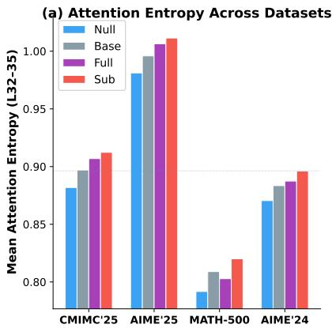

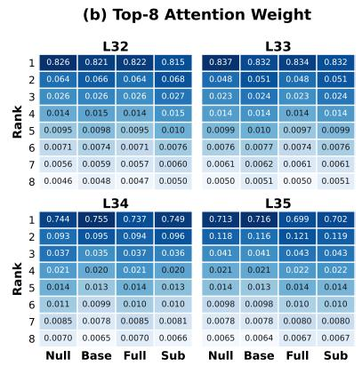

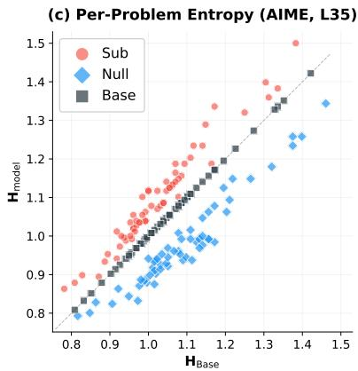  
Figure 3 Attention entropy analysis across four model variants. (a) Mean attention entropy averaged over layers 32-35: Null consistently achieves the lowest entropy while Sub exhibits the highest; additional results are shown in Appendix A.2. (b) Top-8 attention weights at layers 32-35 show that Null concentrates attention. (c) Per-problem entropy scatter on AIME at layer 35: the ordering $H _ { \mathrm { N u l l } } < H _ { \mathrm { B a s e } } < H _ { \mathrm { S u b } }$ holds for all the individual problems.

In conclusion, null-space exhibits more concentrated attention and improved reasoning eficiency. We analyze the underlying mechanism that leads to its systematically lower attention entropy from a simplified theoretical perspective in Section 5.2.

## 5.2 A Simplified Analytical Model for the Subspace Entropy Ordering

Given that gradient descent drives attention entropy to near-stationarity in Appendix A.4, we adopt a heuristic local-optimality assumption within the subspace. This provides an intuitive explanation for why the in-subspace component tends to increase entropy while the null-space component reduces it.

Assumption 5.1 (Local optimality in the active subspace). Consider the query projection $W _ { Q }$ of a single attention head, and let $V = \operatorname { r o w } ( W _ { Q , 0 } )$ denote the subspace (i.e. the row space) of the pretrained matrix. We assume that mean attention entropy is locally minimized within V: for any perturbation $\Delta W _ { \parallel } \in V$ 7

$$
\nabla _ { V } H ( W _ { Q , 0 } ) = 0 , \qquad \left. \phi _ { \parallel } ^ { \prime \prime } ( 0 ) = \frac { d ^ { 2 } } { d t ^ { 2 } } H ( W _ { Q , 0 } + t \Delta W _ { \parallel } ) \right| _ { t = 0 } \geq 0 .\tag{11}
$$

While an idealization, this assumption captures the qualitative asymmetry between the active and null directions: the subspace has been directly shaped by the training process, whereas the orthogonal null space remains largely unconstrained by it. The entropy landscape is therefore expected to be locally stationary in the former while retaining nontrivial first-order variation in the latter.

Proposition 5.2 (First-order null-space efect). Let $G = \nabla _ { W _ { Q } } H ( W _ { Q , 0 } )$ be the entropy gradient at the pretrained model. Under Assumption 5.1,

$$
H ( W _ { Q , 0 } + \Delta W ) - H ( W _ { Q , 0 } ) = \langle \Delta W _ { \perp } , G _ { \perp } \rangle + O ( | \Delta W | ^ { 2 } ) .\tag{12}
$$

Proposition 5.3 (Entropy increase under subspace perturbations). Under Assumption 5.1,

$$
H ( W _ { Q , 0 } + \Delta W _ { \parallel } ) - H ( W _ { Q , 0 } ) = \frac { 1 } { 2 } \phi _ { \parallel } ^ { \prime \prime } ( 0 ) + O ( | \Delta W _ { \parallel } | ^ { 3 } ) \geq 0 .\tag{13}
$$

Proposition 5.2 shows that only the null-space component $\Delta W _ { \perp }$ contributes at first order, while the subspace component has a vanishing gradient within V. Proposition 5.3 further implies that perturbations along the active subspace cannot decrease entropy locally, explaining why the Sub model consistently exhibits higher attention entropy than Base.

Corollary 5.4 (Entropy ordering). Under the same local approximation, given our empirical observation that $\langle \Delta W _ { \perp } , G _ { \perp } \rangle < 0$ (Appedix A.5), it follows that for suficiently small perturbations,

$$
H _ { \mathrm { N u l l } } \leq H _ { \mathrm { B a s e } } \leq H _ { \mathrm { S u b } } .\tag{14}
$$

Within this simplified model, the null-space projection isolates the entropy-reducing component, the subspace projection isolates the entropy-increasing component, and Full interpolates between the two.

Detailed proofs of the above propositions and corollary are given in Appendix A.5.

## 6 Conclusion

In this work, we investigate where, in weight space, a Thinking model difers functionally from its corresponding Non-thinking model and propose Spectral Null-Space Swap $( S ^ { 3 } )$ , a training-free method for eficient reasoning. We identify a structural asymmetry between parameter energy and functional impact: the component of the diference aligned with the Non-thinking model’s dominant singular subspace contains substantial parameter energy but induces weak functional changes, while the complementary null-space component drives the core functional shifts. By preserving the Non-thinking model inside its primary spectral subspace and importing only the Thinking model’s complementary components, $S ^ { 3 }$ reduces reasoning token overhead without sacrificing performance. Across 2B–30B dense and Mixture-of-Experts (MoE) models and text, vision-language, and audio reasoning benchmarks, $S ^ { 3 }$ consistently improves the accuracy–eficiency trade-of. Across more than 25 evaluation settings, it reduces generated tokens by approximately 30% while maintaining or improving accuracy over Thinking baselines. Mechanistically, null-space projection produces lower attention entropy and more concentrated attention, which we explain through local stationarity. Overall, $S ^ { 3 }$ provides both a geometric view of post-training weight diference and a simple training-free approach to eficient reasoning.

## References

[1] Tom Brown, Benjamin Mann, Nick Ryder, Melanie Subbiah, Jared D Kaplan, Prafulla Dhariwal, Arvind Neelakantan, Pranav Shyam, Girish Sastry, Amanda Askell, Sandhini Agarwal, Ariel Herbert-Voss, Gretchen Krueger, Tom Henighan, Rewon Child, Aditya Ramesh, Daniel Ziegler, Jefrey Wu, Clemens Winter, Chris Hesse, Mark Chen, Eric Sigler, Mateusz Litwin, Scott Gray, Benjamin Chess, Jack Clark, Christopher Berner, Sam McCandlish, Alec Radford, Ilya Sutskever, and Dario Amodei. Language models are few-shot learners. In H. Larochelle, M. Ranzato, R. Hadsell, M.F. Balcan, and H. Lin, editors, Advances in Neural Information Processing Systems, volume 33, pages 1877–1901. Curran Associates, Inc., 2020.

[2] Long Ouyang, Jefrey Wu, Xu Jiang, Diogo Almeida, Carroll Wainwright, Pamela Mishkin, Chong Zhang, Sandhini Agarwal, Katarina Slama, Alex Ray, John Schulman, Jacob Hilton, Fraser Kelton, Luke Miller, Maddie Simens, Amanda Askell, Peter Welinder, Paul F Christiano, Jan Leike, and Ryan Lowe. Training language models to follow instructions with human feedback. In S. Koyejo, S. Mohamed, A. Agarwal, D. Belgrave, K. Cho, and A. Oh, editors, Advances in Neural Information Processing Systems, volume 35, pages 27730–27744. Curran Associates, Inc., 2022.

[3] Jason Wei, Xuezhi Wang, Dale Schuurmans, Maarten Bosma, brian ichter, Fei Xia, Ed Chi, Quoc V Le, and Denny Zhou. Chain-of-thought prompting elicits reasoning in large language models. In S. Koyejo, S. Mohamed, A. Agarwal, D. Belgrave, K. Cho, and A. Oh, editors, Advances in Neural Information Processing Systems, volume 35, pages 24824–24837. Curran Associates, Inc., 2022.

[4] An Yang, Anfeng Li, Baosong Yang, Beichen Zhang, Binyuan Hui, Bo Zheng, Bowen Yu, Chang Gao, Chengen Huang, Chenxu Lv, Chujie Zheng, Dayiheng Liu, Fan Zhou, Fei Huang, Feng Hu, Hao Ge, Haoran Wei, Huan Lin, Jialong Tang, Jian Yang, Jianhong Tu, Jianwei Zhang, Jianxin Yang, Jiaxi Yang, Jing Zhou, Jingren Zhou, Junyang Lin, Kai Dang, Keqin Bao, Kexin Yang, Le Yu, Lianghao Deng, Mei Li, Mingfeng Xue, Mingze Li, Pei Zhang, Peng Wang, Qin Zhu, Rui Men, Ruize Gao, Shixuan Liu, Shuang Luo, Tianhao Li, Tianyi Tang, Wenbiao Yin, Xingzhang Ren, Xinyu Wang, Xinyu Zhang, Xuancheng Ren, Yang Fan, Yang Su, Yichang Zhang, Yinger Zhang, Yu Wan, Yuqiong Liu, Zekun Wang, Zeyu Cui, Zhenru Zhang, Zhipeng Zhou, and Zihan Qiu. Qwen3 technical report, 2025.

[5] Shuai Bai, Yuxuan Cai, Ruizhe Chen, Keqin Chen, Xionghui Chen, Zesen Cheng, Lianghao Deng, Wei Ding, Chang Gao, Chunjiang Ge, Wenbin Ge, Zhifang Guo, Qidong Huang, Jie Huang, Fei Huang, Binyuan Hui, Shutong Jiang, Zhaohai Li, Mingsheng Li, Mei Li, Kaixin Li, Zicheng Lin, Junyang Lin, Xuejing Liu, Jiawei Liu, Chenglong Liu, Yang Liu, Dayiheng Liu, Shixuan Liu, Dunjie Lu, Ruilin Luo, Chenxu Lv, Rui Men, Lingchen Meng, Xuancheng Ren, Xingzhang Ren, Sibo Song, Yuchong Sun, Jun Tang, Jianhong Tu, Jianqiang Wan, Peng Wang, Pengfei Wang, Qiuyue Wang, Yuxuan Wang, Tianbao Xie, Yiheng Xu, Haiyang Xu, Jin Xu, Zhibo Yang, Mingkun Yang, Jianxin Yang, An Yang, Bowen Yu, Fei Zhang, Hang Zhang, Xi Zhang, Bo Zheng, Humen Zhong, Jingren Zhou, Fan Zhou, Jing Zhou, Yuanzhi Zhu, and Ke Zhu. Qwen3-vl technical report, 2025.

[6] Jin Xu, Zhifang Guo, Hangrui Hu, Yunfei Chu, Xiong Wang, Jinzheng He, Yuxuan Wang, Xian Shi, Ting He, Xinfa Zhu, Yuanjun Lv, Yongqi Wang, Dake Guo, He Wang, Linhan Ma, Pei Zhang, Xinyu Zhang, Hongkun Hao, Zishan Guo, Baosong Yang, Bin Zhang, Ziyang Ma, Xipin Wei, Shuai Bai, Keqin Chen, Xuejing Liu, Peng Wang, Mingkun Yang, Dayiheng Liu, Xingzhang Ren, Bo Zheng, Rui Men, Fan Zhou, Bowen Yu, Jianxin Yang, Le Yu, Jingren Zhou, and Junyang Lin. Qwen3-omni technical report, 2025.

[7] Shunyu Yao, Jefrey Zhao, Dian Yu, Nan Du, Izhak Shafran, Karthik R Narasimhan, and Yuan Cao. ReAct: Synergizing reasoning and acting in language models. In The Eleventh International Conference on Learning Representations, 2023.

[8] Zhongxin Liu, Ye Li, Ge Lan, and Zengqiang Chen. A novel data-driven model-free synchronization protocol for discrete-time multi-agent systems via TD3 based algorithm. Knowledge-Based Systems, 287:111430, 2024.

[9] Wujiang Xu, Jiaojiao Han, Minghao Guo, Kai Mei, Xi Zhu, Han Zhang, and Dimitris N. Metaxas. Ael: Evolving agent harness in open-ended environments, 2026.

[10] Zhixia Zhang, Zixuan Huang, Gongxun Li, Huaiyang Wang, Chengyi Yuan, Xin Xia, Deqing Wang, Fuzhen Zhuang, Shuai Ma, Ning Ding, Yaodong Yang, Jianxin Li, and Yikun Ban. Heterogeneous agent collaborative reinforcement learning, 2026.

[11] Ruohao Guo, Afshin Oroojlooyjadid, Roshan Sridhar, Miguel Ballesteros, Alan Ritter, and Dan Roth. Tree-based dialogue reinforced policy optimization for red-teaming attacks. In C. Vondrick, B. Hariharan, C. Rafel, L. Pinto, D. Yang, and A. Faust, editors, International Conference on Learning Representations, volume 2026, pages 55351–55381, 2026.

[12] Ruohao Guo, Wei Xu, and Alan Ritter. Investigating and alleviating harm amplification in LLM interactions, 2026.

[13] Yuzhi Huang, Jie Wu, Weijue Bu, Ziyi Xiong, Gaoyang Jiang, Ye Li, Kangye Ji, Shuzhao Xie, Yue Huang, Chenglei Wu, Jingyan Jiang, and Zhi Wang. RoboStream: Weaving spatio-temporal reasoning with memory in vision-language models for robotics. 2026.

[14] Weijian Ma, Shizhao Sun, Tianyu Yu, Ruiyu Wang, Tat-Seng Chua, and Jiang Bian. Thinking with blueprints: Assisting vision-language models in spatial reasoning via structured object representation, 2026.

[15] Weijian Ma, Shizhao Sun, Ruiyu Wang, and Jiang Bian. CADMorph: Geometry-driven parametric CAD editing via a plan–generate–verify loop. In D. Belgrave, C. Zhang, H. Lin, R. Pascanu, P. Koniusz, M. Ghassemi, and N. Chen, editors, Advances in Neural Information Processing Systems, volume 38, Main Conference, pages 100279–100297. Curran Associates, Inc., 2025.

[16] Chunzheng Zhu, Yangfang Lin, Jialin Shao, Jianxin Lin, and Yijun Wang. Pathology-aware prototype evolution via LLM-driven semantic disambiguation for multicenter diabetic retinopathy diagnosis. In Proceedings of the 33rd ACM International Conference on Multimedia, MM ’25, page 9196–9205, New York, NY, USA, 2025. Association for Computing Machinery.

[17] Chunzheng Zhu, Yangfang Lin, Shen Chen, Yijun Wang, and Jianxin Lin. MedEyes: Learning dynamic visual focus for medical progressive diagnosis. In Proceedings of the AAAI Conference on Artificial Intelligence, volume 40, pages 13916–13924, 2026.

[18] Hongbo Ma, Fei Shen, Hongbin Xu, Xiaoce Wang, Gang Xu, Jinkai Zheng, Liangqiong Qu, and Ming Li. Styletailor: Towards personalized fashion styling via hierarchical negative feedback, 2025.

[19] Xize Liang, Lin Yang, Jie Wang, Yiyang Lu, Runyu Wu, Hanzhu Chen, and Jianye HAO. Boosting multi-domain fine-tuning of large language models through evolving interactions between samples. In Forty-second International Conference on Machine Learning, 2025.

[20] Zirui Liu, Tingyue Pan, Jie Ouyang, Qi Liu, Xianquan Wang, Jiayu Liu, Qingchuan Li, Jing Sha, Zhenya Huang, Shijin Wang, and Enhong Chen. Socraticpo: Policy optimization via interactive guidance, 2026.

[21] Wujiang Xu, Wentian Zhao, Zhenting Wang, Yu-Jhe Li, Can Jin, Mingyu Jin, Kai Mei, Kun Wan, and Dimitris N. Metaxas. EPO: Entropy-regularized policy optimization for LLM agents reinforcement learning, 2026.

[22] Hao Wang, Licheng Pan, Zhichao Chen, Chunyuan Zheng, Zhixuan Chu, Xiaoxi Li, Yuan Lu, Xinggao Liu, Haoxuan Li, and Zhouchen Lin. CausalRM: Causal-theoretic reward modeling for RLHF from observational user feedbacks. arXiv preprint arXiv:2603.18736, 2026.

[23] Licheng Pan, Haocheng Yang, Haoxuan Li, Yichen Sun, Yunsheng Lu, Shijian Wang, Lei Shen, Yuan Lu, Zhixuan Chu, and Hao Wang. Uncertainty-aware reward modeling for stable RLHF, 2026.

[24] Charlie Snell, Jaehoon Lee, Kelvin Xu, and Aviral Kumar. Scaling LLM test-time compute optimally can be more efective than scaling parameters for reasoning. In Y. Yue, A. Garg, N. Peng, F. Sha, and R. Yu, editors, International Conference on Learning Representations, volume 2025, pages 10131–10165, 2025.

[25] Niklas Muennighof, Zitong Yang, Weijia Shi, Xiang Lisa Li, Li Fei-Fei, Hannaneh Hajishirzi, Luke Zettlemoyer, Percy Liang, Emmanuel Candès, and Tatsunori B Hashimoto. s1: Simple test-time scaling. In Proceedings of the 2025 Conference on Empirical Methods in Natural Language Processing, pages 20286–20332, 2025.

[26] Zixuan Huang, Xin Xia, Yuxi Ren, Jianbin Zheng, Xuanda Wang, Zhixia Zhang, Hongyan Xie, Songshi Liang, Zehao Chen, Xuefeng Xiao, Fuzhen Zhuang, Jianxin Li, deqing wang, and Yikun Ban. Does your reasoning model implicitly know when to stop thinking? In Forty-third International Conference on Machine Learning, 2026.

[27] Ye Li, Yuan Meng, Zewen Sun, Kangye Ji, Chen Tang, Jiajun Fan, Xinzhu Ma, Shu-Tao Xia, Zhi Wang, and Wenwu Zhu. SP-VLA: A joint model scheduling and token pruning approach for VLA model acceleration. In The Fourteenth International Conference on Learning Representations, 2026.

[28] Haotian Dong, Ye Li, Rongwei Lu, Chen Tang, Shu-Tao Xia, and Zhi Wang. VVS: Accelerating speculative decoding for visual autoregressive generation via partial verification skipping. In Proceedings of the IEEE/CVF Conference on Computer Vision and Pattern Recognition (CVPR), pages 12173–12182, June 2026.

[29] Jiajun Fan, Roger Ren, Jingyuan Li, Rahul Pandey, Prashanth Gurunath Shivakumar, Ivan Bulyko, Ankur Gandhe, Ge Liu, and Yile Gu. Incentivizing consistent, efective and scalable reasoning capability in audio LLMs via reasoning process rewards. In C. Vondrick, B. Hariharan, C. Rafel, L. Pinto, D. Yang, and A. Faust, editors, International Conference on Learning Representations, volume 2026, pages 2110–2173, 2026.

[30] Jiajun Fan, Tong Wei, Chaoran Cheng, Yuxin Chen, and Ge Liu. Adaptive divergence regularized policy optimization for fine-tuning generative models. In D. Belgrave, C. Zhang, H. Lin, R. Pascanu, P. Koniusz, M. Ghassemi, and N. Chen, editors, Advances in Neural Information Processing Systems, volume 38, Main Conference, pages 124070–124107. Curran Associates, Inc., 2025.

[31] Bangji Yang, Hongbo Ma, Jiajun Fan, and Ge Liu. Batched contextual reinforcement. In Forty-third International Conference on Machine Learning, 2026.

[32] Xize Liang, Chao Chen, Shuang Qiu, Jie Wang, Yue Wu, Zhihang Fu, Hanzhu Chen, Feng Wu, and Jieping Ye. ROPO: Robust preference optimization for large language models. In Forty-second International Conference on Machine Learning, 2025.

[33] Xin-Qiang Cai, Wei Wang, Feng Liu, Tongliang Liu, Gang Niu, and Masashi Sugiyama. Reinforcement learning with verifiable yet noisy rewards under imperfect verifiers, 2026.

[34] Xin-Qiang Cai and Masashi Sugiyama. VI-CuRL: Stabilizing verifier-independent RL reasoning via confidenceguided variance reduction, 2026.

[35] Mitchell Wortsman, Gabriel Ilharco, Samir Ya Gadre, Rebecca Roelofs, Raphael Gontijo-Lopes, Ari S Morcos, Hongseok Namkoong, Ali Farhadi, Yair Carmon, Simon Kornblith, and Ludwig Schmidt. Model soups: averaging weights of multiple fine-tuned models improves accuracy without increasing inference time. In Kamalika Chaudhuri, Stefanie Jegelka, Le Song, Csaba Szepesvari, Gang Niu, and Sivan Sabato, editors, Proceedings of the 39th International Conference on Machine Learning, volume 162 of Proceedings of Machine Learning Research, pages 23965–23998. PMLR, 17–23 Jul 2022.

[36] Gabriel Ilharco, Marco Tulio Ribeiro, Mitchell Wortsman, Ludwig Schmidt, Hannaneh Hajishirzi, and Ali Farhadi. Editing models with task arithmetic. In The Eleventh International Conference on Learning Representations, 2023.

[37] Prateek Yadav, Derek Tam, Leshem Choshen, Colin Rafel, and Mohit Bansal. TIES-Merging: Resolving interference when merging models. In A. Oh, T. Naumann, A. Globerson, K. Saenko, M. Hardt, and S. Levine, editors, Advances in Neural Information Processing Systems, volume 36, pages 7093–7115. Curran Associates, Inc., 2023.

[38] Le Yu, Bowen Yu, Haiyang Yu, Fei Huang, and Yongbin Li. Language models are super mario: Absorbing abilities from homologous models as a free lunch. In Ruslan Salakhutdinov, Zico Kolter, Katherine Heller, Adrian Weller, Nuria Oliver, Jonathan Scarlett, and Felix Berkenkamp, editors, Proceedings of the 41st International Conference on Machine Learning, volume 235 of Proceedings of Machine Learning Research, pages 57755–57775. PMLR, 21–27 Jul 2024.

[39] Taiqiang Wu, Runming Yang, Tao Liu, Jiahao Wang, and Ngai Wong. Revisiting model interpolation for eficient reasoning. In Maria Liakata, Viviane P. Moreira, Jiajun Zhang, and David Jurgens, editors, Proceedings of the 64th Annual Meeting of the Association for Computational Linguistics (Volume 1: Long Papers), pages 8624–8638, San Diego, California, United States, July 2026. Association for Computational Linguistics.

[40] Antonio Andrea Gargiulo, Donato Crisostomi, Maria Sofia Bucarelli, Simone Scardapane, Fabrizio Silvestri, and Emanuele Rodolà. Task singular vectors: Reducing task interference in model merging. In 2025 IEEE/CVF Conference on Computer Vision and Pattern Recognition (CVPR), pages 18695–18705, 2025.

[41] George Stoica, Pratik Ramesh, Boglarka Ecsedi, Leshem Choshen, and Judy Hofman. Model merging with SVD to tie the knots. In Y. Yue, A. Garg, N. Peng, F. Sha, and R. Yu, editors, International Conference on Learning Representations, volume 2025, pages 4501–4519, 2025.

[42] Daniel Marczak, Simone Magistri, Sebastian Cygert, Bartłomiej Twardowski, Andrew D. Bagdanov, and Joost van de Weijer. No task left behind: Isotropic model merging with common and task-specific subspaces. In Forty-second International Conference on Machine Learning, 2025.

[43] Zhilong Zhang, Hongli Yu, Huan ang Gao, Hanlin Wu, Yuxuan Song, Wei-Ying Ma, Ya-Qin Zhang, and Hao Zhou. Spectral rewiring for exploration, purification, and model merging, 2026.

[44] Hamidreza Ghader and Christof Monz. What does attention in neural machine translation pay attention to? In Greg Kondrak and Taro Watanabe, editors, Proceedings of the Eighth International Joint Conference on Natural Language Processing (Volume 1: Long Papers), pages 30–39, Taipei, Taiwan, November 2017. Asian Federation of Natural Language Processing.

[45] Shuangfei Zhai, Tatiana Likhomanenko, Etai Littwin, Dan Busbridge, Jason Ramapuram, Yizhe Zhang, Jiatao Gu, and Joshua M. Susskind. Stabilizing transformer training by preventing attention entropy collapse. In Andreas Krause, Emma Brunskill, Kyunghyun Cho, Barbara Engelhardt, Sivan Sabato, and Jonathan Scarlett, editors, Proceedings of the 40th International Conference on Machine Learning, volume 202 of Proceedings of Machine Learning Research, pages 40770–40803. PMLR, 23–29 Jul 2023.

[46] Soo Hyun Ryu and Richard Lewis. Accounting for agreement phenomena in sentence comprehension with transformer language models: Efects of similarity-based interference on surprisal and attention. In Emmanuele Chersoni, Nora Hollenstein, Cassandra Jacobs, Yohei Oseki, Laurent Prévot, and Enrico Santus, editors, Proceedings of the Workshop on Cognitive Modeling and Computational Linguistics, pages 61–71, Online, June 2021. Association for Computational Linguistics.

[47] Kaiyue Wen, Huaqing Zhang, Hongzhou Lin, and Jingzhao Zhang. From sparse dependence to sparse attention: Unveiling how chain-of-thought enhances transformer sample eficiency. In Y. Yue, A. Garg, N. Peng, F. Sha, and R. Yu, editors, International Conference on Learning Representations, volume 2025, pages 100857–100901, 2025.

[48] Tianhe Zhang, Yonghong Deng, Ping Jian, Zhen Yang, Boyang Wang, and Xinyue Zhang. Where CoT reasoning commits: Entropy traces identify interpretable attention heads. In Maria Liakata, Viviane P. Moreira, Jiajun Zhang, and David Jurgens, editors, Findings of the Association for Computational Linguistics: ACL 2026, pages 2777–2795, San Diego, California, United States, July 2026. Association for Computational Linguistics.

[49] Jiannan Guan, Qiguang Chen, Libo Qin, Dengyun Peng, Jinhao Liu, Liangyu Huo, Jian Xie, and Wanxiang Che. Beware of reasoning overconfidence: Pitfalls in the reasoning process for multi-solution tasks. In Proceedings of the AAAI Conference on Artificial Intelligence, volume 40, pages 30843–30851, 2026.

[50] HaoYang Shang, Xuan Liu, Zi Liang, Jie Zhang, Haibo Hu, and Song Guo. United minds or isolated agents? exploring coordination of llms under cognitive load theory, 2026.

[51] Zhisong Zhang, Yan Wang, Xinting Huang, Tianqing Fang, Hongming Zhang, Chenlong Deng, Shuaiyi Li, and Dong Yu. Attention entropy is a key factor: An analysis of parallel context encoding with full-attention-based pre-trained language models. In Wanxiang Che, Joyce Nabende, Ekaterina Shutova, and Mohammad Taher Pilehvar, editors, Proceedings of the 63rd Annual Meeting of the Association for Computational Linguistics (Volume 1: Long Papers), pages 9840–9855, Vienna, Austria, July 2025. Association for Computational Linguistics.

[52] Xuan Xiong, Huan Liu, Li Gu, Zhixiang Chi, Yue Qiu, Yuanhao YU, and Yang Wang. ETR: Entropy trend reward for eficient chain-of-thought reasoning. In Maria Liakata, Viviane P. Moreira, Jiajun Zhang, and David Jurgens, editors, Proceedings of the 64th Annual Meeting of the Association for Computational Linguistics (Volume 1: Long Papers), pages 17576–17594, San Diego, California, United States, July 2026. Association for Computational Linguistics.

[53] Wei-Lin Chen, Liqian Peng, Tian Tan, Chao Zhao, Blake JianHang Chen, Ziqian Lin, Alec Go, and Yu Meng. Think deep, not just long: Measuring llm reasoning efort via deep-thinking tokens, 2026.

[54] Jiakai Li, Ke Qin, Rongzheng Wang, Yizhuo Ma, Qizhi Chen, Muquan Li, and Shuang Liang. Stop when further reasoning won’t help: Attention-state adaptive generation in reasoning models, 2026.

[55] Ting Xu, Xu He, Yupu Lu, Jiankai Sun, Dong Li, Wai Lam, and Jianye Hao. Unveiling the entropy dynamics of chain-of-thought reasoning, 2026.

[56] Yuyang Wu, Yifei Wang, Ziyu Ye, Tianqi Du, Stefanie Jegelka, and Yisen Wang. When more is less: Understanding chain-of-thought length in llms. In C. Vondrick, B. Hariharan, C. Rafel, L. Pinto, D. Yang, and A. Faust, editors, International Conference on Learning Representations, volume 2026, pages 127108–127138, 2026.

## A Mechanistic Analysis Details

## A.1 Layer Selection

Prior work localizes reasoning relevant computation to the late layers of transformer language models and the reasoning state that governs when to stop can be read out from late-layer attention states. Attention entropy in the final layers therefore reflects the reasoning-critical computation that distinguishes the model variants. Accordingly, we measure attention entropy at layers 32–35, the final four layers of Qwen3-4B.

## A.2 Full Dataset Attention Entropy Results

Table 4 reports the layer 32-35 average attention entropy of the four variants on all seven datasets (AIME24, AIME25, AMC23, CMIMC25, HMMT25, MATH-500, GSM-8K). The ordering $H _ { \mathrm { N u l l } } < H _ { \mathrm { B a s e } } < H _ { \mathrm { S u b } }$ holds on every dataset. For readability, Fig. 3 displays the four datasets with the largest spread between models; Fig. 4 shows all seven.

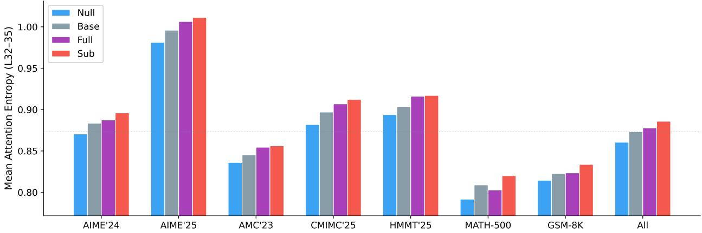  
Figure 4 Layer 32–35 average attention entropy for the four variants on all seven datasets. The ordering $H _ { \mathrm { N u l l } } <$ $H _ { \mathrm { B a s e } } < H _ { \mathrm { S u b } }$ holds throughout; Full lies between Null and Sub in all seven datasets (values in Table 4).

Table 4 Mean attention entropy (nats) averaged over layers 32-35
<table><tr><td>Model</td><td>AIME24</td><td>AIME25</td><td>AMC23</td><td>CMIMC25</td><td>HMMT25</td><td>MATH-500</td><td>GSM-8K</td><td>All</td></tr><tr><td>Null</td><td>0.871</td><td>0.981</td><td>0.836</td><td>0.882</td><td>0.894</td><td>0.792</td><td>0.815</td><td>0.861</td></tr><tr><td>Base</td><td>0.884</td><td>0.996</td><td>0.845</td><td>0.897</td><td>0.904</td><td>0.809</td><td>0.823</td><td>0.873</td></tr><tr><td>Full</td><td>0.887</td><td>1.006</td><td>0.855</td><td>0.907</td><td>0.916</td><td>0.803</td><td>0.824</td><td>0.878</td></tr><tr><td>Sub</td><td>0.896</td><td>1.011</td><td>0.856</td><td>0.912</td><td>0.917</td><td>0.820</td><td>0.834</td><td>0.886</td></tr></table>

## A.3 Hallucination and Attention Entropy

We evaluate the four Qwen3-30B-A3B variants on SimpleQA, a short-form factuality benchmark. Answers are graded against the reference by extracting the boxed answer and normalized string matching; questions are classified as correct, incorrect, or not attempted, and we report the hallucination rate as the fraction of answered questions answered incorrectly.

Table 5 reports results on all N = 4,326 questions. The hallucination rates mirror the attention entropy ordering of Section 5.1, with Null attaining the highest accuracy (20.2%) while also hallucinating the least. This is consistent with the cognitive-load interpretation that the subspace component, which difuses attention (Section 5.1), also yields the highest hallucination rate.

Table 5 SimpleQA results for the Qwen3-30B-A3B variants. The ordering Null < Base < Sub mirrors the attention entropy ordering of Fig. 3.
<table><tr><td>Model</td><td>Acc.  $( \% )$ </td><td>Hall. rate  $( \% )$ </td><td>Correct</td><td>Incorrect</td><td>Not attempted</td></tr><tr><td>Base</td><td>19.1</td><td>80.4</td><td>826</td><td>3384</td><td>116</td></tr><tr><td>Sub</td><td>15.8</td><td>81.3</td><td>682</td><td>2969</td><td>675</td></tr><tr><td>Null (ours)</td><td>20.2</td><td>78.7</td><td>873</td><td>3225</td><td>228</td></tr><tr><td>Full</td><td>19.6</td><td>80.4</td><td>847</td><td>3466</td><td>13</td></tr></table>

## A.4 Entropy Saturation During Pretraining

Assumption 5.1 rests on the observation that gradient descent already drives attention entropy to nearstationarity, and the diference between Thinking and Non-thinking model is small, which means that the diference can be seen as a perturbation. We verify this directly using the released intermediate checkpoints of Pythia-1.4B. The input is fixed: ten chain-of-thought traces generated by Qwen3-4B-Thinking on AIME problems, one 1024-token window per trace, so that every checkpoint is evaluated on exactly the same tokens under causal attention.

Fig. 5 shows the resulting curve: the entire attention entropy reduction occurs within the first ${ \sim } 2 \%$ of training steps. Pre-training thus almost completely decays in the directions of the determined subspaces.. The remaining regime is near-stationary, matching the picture in which the row space is locally optimal while orthogonal directions retain first-order variation.

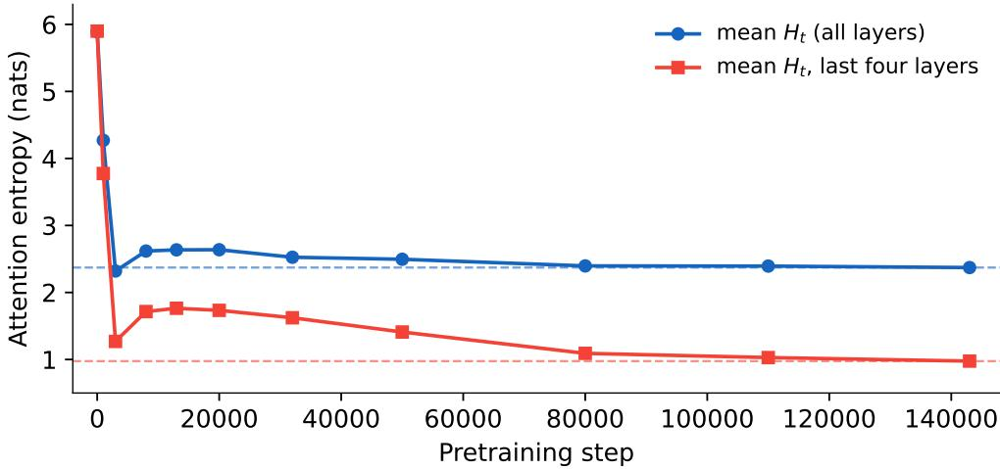  
Figure 5 Attention entropy versus pretraining step (Pythia-1.4B), measured on fixed chain-of-thought input. Both curves converge to their final levels (dashed lines).

## A.5 Proofs

The mean attention entropy of a single head is a smooth function $H ( W _ { Q } )$ of $W _ { Q } \in \mathbb { R } ^ { d _ { \mathrm { m o d e l } } \times d _ { \mathrm { h e a d } } }$ . We use the Frobenius inner product of matrices. The subspace decomposition into $V = \operatorname { r o w } ( W _ { Q , 0 } )$ and $V ^ { \perp }$ is orthogonal, and write $G = \nabla _ { W _ { Q } } H ( W _ { Q , 0 } )$ with row-wise components $G _ { \parallel } , G _ { \perp }$

Proof of Proposition 5.2. A first-order Taylor expansion of the smooth map H gives

$$
H ( W _ { Q , 0 } + \Delta W ) - H ( W _ { Q , 0 } ) = \langle G , \Delta W \rangle + O ( | \Delta W | ^ { 2 } ) .\tag{15}
$$

Decomposing row-wise, $\langle G , \Delta W \rangle = \langle G _ { \parallel } , \Delta W _ { \parallel } \rangle + \langle G _ { \perp } , \Delta W _ { \perp } \rangle$ , since the cross terms $\langle G _ { \parallel } , \Delta W _ { \perp } \rangle$ and $\langle G _ { \perp } , \Delta W _ { \parallel } \rangle$ vanish in the Frobenius inner product. By Assumption 5.1, $\langle G , U \rangle = 0$ for every U with rows in $V .$ , hence

$G _ { \parallel } = 0$ and

$$
H ( W _ { Q , 0 } + \Delta W ) - H ( W _ { Q , 0 } ) = \langle \Delta W _ { \perp } , G _ { \perp } \rangle + O ( | \Delta W | ^ { 2 } ) .\tag{16}
$$

Proof of Proposition 5.3. Define $\phi _ { \parallel } ( t ) = H ( W _ { Q , 0 } + t \Delta W _ { \parallel } )$ for $t \in [ 0 , 1 ]$ . Then $\phi _ { \parallel } ^ { \prime } ( 0 ) = \langle G , \Delta W _ { \parallel } \rangle = 0$ by Assumption 5.1, and Taylor’s theorem with integral remainder gives

$$
H ( W _ { Q , 0 } + \Delta W _ { \parallel } ) - H ( W _ { Q , 0 } ) = \phi _ { \parallel } ( 1 ) - \phi _ { \parallel } ( 0 ) = \frac { 1 } { 2 } \phi _ { \parallel } ^ { \prime \prime } ( 0 ) + O ( | \Delta W _ { \parallel } | ^ { 3 } ) .\tag{17}
$$

By Assumption 5.1, $\phi _ { | | } ^ { \prime \prime } ( 0 ) \ge 0$ . Since $\phi _ { \parallel } ^ { \prime \prime } ( 0 )$ scales quadratically in $| \Delta W _ { \parallel } |$ while the remainder is cubic, $\begin{array} { r } { \frac 1 2 \phi _ { \parallel } ^ { \prime \prime } ( 0 ) + O ( \lvert \Delta W _ { \parallel } \rvert ^ { 3 } ) \ge 0 } \end{array}$ whenever the second-order term dominates—in particular for all suficiently small perturbations. At our measured operating point the relative perturbation magnitude is $| \Delta W | / | W _ { Q , 0 } | \approx 8 \%$ .

Proof of Corollary 5.4. For the Null model, applying Proposition 5.2 with $\Delta W = \Delta W _ { \perp }$ yields

$$
H _ { \mathrm { N u l l } } - H _ { \mathrm { B a s e } } = \langle \Delta W _ { \perp } , G _ { \perp } \rangle + O ( | \Delta W _ { \perp } | ^ { 2 } ) ,\tag{18}
$$

which is negative for suficiently small perturbation whenever $\langle \Delta W _ { \perp } , G _ { \perp } \rangle < 0$ , which is reasonable if we assume that the goal of the RL and the pre-training stages share the same aim of minimizing the cognitive-load or attention entropy of the model. The experiment also confirmed our observation. In the same seven data sets, the inner product of the two was consistently less than 0.

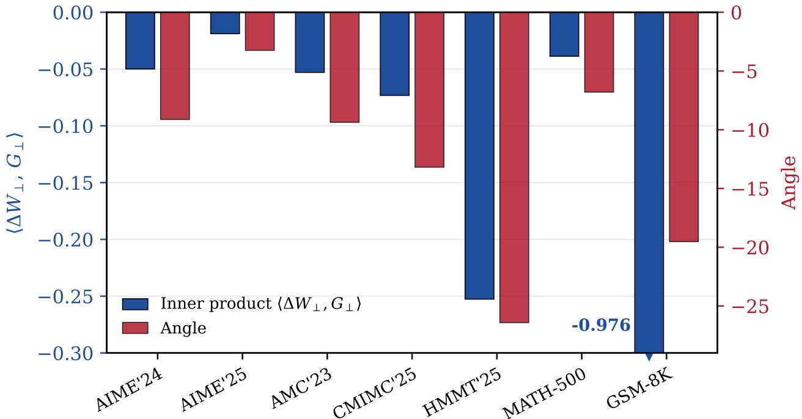  
Figure 6 The null-space component negatively aligns with the entropy gradient across all benchmarks. $G _ { \perp }$ is the layer 32–35 mean attention entropy gradient at Base, and $\Delta W _ { - }$ ⊥ is the null-space component. Left axis: inner product $\langle \Delta W _ { \perp } , G _ { \perp } \rangle$ across all weight matrices, which are consistently negative. Right axis: Angle between the two vectors.

For the Sub model, Proposition 5.3 applies directly:

$$
H _ { \mathrm { S u b } } - H _ { \mathrm { B a s e } } = \frac { 1 } { 2 } \phi _ { \parallel } ^ { \prime \prime } ( 0 ) + O ( | \Delta W _ { \parallel } | ^ { 3 } ) \geq 0 .\tag{19}
$$

Combining the two inequalities gives

$$
H _ { \mathrm { N u l l } } < H _ { \mathrm { B a s e } } < H _ { \mathrm { S u b } }\tag{20}
$$

for suficiently small perturbation.

## B Additional Experiment Configuration and Results

## B.1 Additional Experiment Configuration

Model coverage. We evaluate paired Non-thinking and Thinking models from the Qwen3 family across text, vision–language, and audio reasoning. As shown in Table 6 Our model suite includes the dense Qwen3-4B model, the MoE Qwen3-30B-A3B and Qwen3-Omni-30B-A3B models, and the Qwen3-VL-2B and Qwen3-VL-4B vision–language models. This setup evaluates whether our method generalizes across modalities while remaining compatible with both dense and MoE architectures.

Evaluation protocol. For each example, we generate one rollout under each of four random seeds, {101, 202, 303, 404}, resulting in four rollouts per example. We report pass@1 and avg@4. All experiments use response\_- mode=full.

Generation settings. We use vLLM for all main experiments. Text, vision–language and omni audio evaluations are conducted as Table 7. Unless otherwise specified, we set top\_p= 0.95, top\_k= 20, and repetition\_penalty= 1.0.

Scoring and implementation details. Text outputs are evaluated with task-specific rule-based scoring or an automatic verifier. When a verifier is required, we use CompassVerifier-3B with temperature zero and a maximum generation length of 2,048 tokens. Omni audio outputs are scored directly from generated JSONL files without an additional language-model verifier.

## B.2 Results on Additional Benchmarks and Pareto-Frontier Analysis

Additional LLM benchmarks. Table 8 reports results on the additional four math reasoning benchmarks. Our method retains the accuracy gains of Thinking particularly well on the AIME benchmarks, while substantially reducing generated tokens for both model scales. On AMC23 and MATH-500, our method remains competitive with Thinking and alternative merging baselines, indicating that its eficiency benefit extends beyond a single reasoning setting.

Table 6 Model families and evaluation coverage.
<table><tr><td>Model family</td><td>Architecture</td><td>Modality</td><td>Task group</td></tr><tr><td>Qwen3-4B</td><td>Dense</td><td>Text</td><td>Math and general reasoning</td></tr><tr><td>Qwen3-30B-A3B</td><td>MoE</td><td>Text</td><td>Math and general reasoning</td></tr><tr><td>Qwen3-VL-2B</td><td>Vision-language</td><td>Text and image</td><td>Multimodal reasoning</td></tr><tr><td>Qwen3-VL-4B</td><td>Vision-language</td><td>Text and image</td><td>Multimodal reasoning</td></tr><tr><td>Qwen3-Omni-30B-A3B</td><td>MoE</td><td>Text and audio</td><td>Text and audio reasoning</td></tr></table>

Pareto-frontier analysis. Figures 7–9 visualize the accuracy–token trade-of across all evaluated benchmarks. Each panel jointly plots the Instruct, Thinking, TIES, MI-0.8, and S3-0.8 models for the corresponding model family and benchmark; for LLM and vision–language settings, diferent model scales are displayed in the same coordinate system.

Across modalities, the Thinking model often provide strong reasoning performance but occupy the high-token region of the plots. In contrast, the Instruct model are generally located in low-cost regions but may sacrifice accuracy on more dificult reasoning tasks. $\mathrm { S ^ { 3 } - 0 . }$ 8 frequently moves toward the desirable upper-left region relative to Thinking: it reduces output length while retaining competitive reasoning performance. The results consistently show that $\mathrm { S ^ { 3 } }$ can recover a substantial portion of Thinking-model capability without inheriting its full chain-of-thought overhead.

Table 7 Task-specific generation configurations.
<table><tr><td>Setting</td><td>Temperature</td><td>Presence penalty</td><td>Max tokens</td><td>Max Model Length</td><td>Backend</td></tr><tr><td>Text reasoning</td><td>0.7</td><td>1.5</td><td>32,768</td><td>40,960</td><td>vLLM</td></tr><tr><td>VL-text</td><td>0.7</td><td>1.5</td><td>32,768</td><td>40,960</td><td>vLLM</td></tr><tr><td>VL-multimodal</td><td>0.7</td><td>0.0</td><td>16,384</td><td>40,960</td><td>vLLM</td></tr><tr><td>Omni-text</td><td>0.7</td><td>1.5</td><td>32,768</td><td>40,960</td><td>vLLM</td></tr><tr><td>Omni-audio</td><td>0.6</td><td>0.0</td><td>16,384</td><td>32,768</td><td>vLLM</td></tr></table>

Table 8 Additional LLM results on math reasoning benchmarks. We report accuracy (%) and average generated tokens per problem. Bold indicates the best value in each column among TIES, MI-0.8, and ${ \mathrm { \dot { S } } } ^ { 3 }$

<table><tr><td rowspan="2">Model</td><td colspan="2">AIME24 Acc↑</td><td colspan="2">AIME26</td><td colspan="2">AMC23</td><td colspan="2">MATH-500</td></tr><tr><td>Tok↓</td><td></td><td>Acc↑</td><td>Tok↓</td><td>Acc↑</td><td>Tok↓</td><td>Acc↑</td><td>Tok↓</td></tr><tr><td colspan="9">Qwen3-4B</td></tr><tr><td>Qwen3-4B-Instruct</td><td>63.3</td><td>7,951</td><td>51.7</td><td>7,769</td><td>93.8</td><td>2,904</td><td>94.5</td><td>1,843</td></tr><tr><td>Qwen3-4B-Thinking</td><td>73.3</td><td>19,247</td><td>74.2</td><td>20,461</td><td>100.0</td><td>10,443</td><td>97.7</td><td>6,161</td></tr><tr><td>Qwen3-4B-TIES</td><td>70.8</td><td>14,905</td><td>76.7</td><td>15,029</td><td>100.0</td><td>8,720</td><td>98.2</td><td>5,152</td></tr><tr><td>Qwen3-4B-MI-0.8</td><td>83.3</td><td>15,262</td><td>80.0</td><td>16,165</td><td>99.4</td><td>8,059</td><td>98.1</td><td>4,879</td></tr><tr><td> $\mathbf { Q  w e n 3 - 4 B - S ^ { 3 } - 0 . 8 }$ </td><td>83.3</td><td>13,371</td><td>82.5</td><td>15,602</td><td>99.38</td><td>7,799</td><td>96.6</td><td>4,510</td></tr><tr><td>∆ vs. Thinking</td><td>+10.0</td><td>-30.5%</td><td>+8.3</td><td>-23.7%</td><td>-0.62</td><td>-25.3%</td><td>-1.1</td><td>-26.8%</td></tr><tr><td colspan="9">Qwen3-30B-A3B</td></tr><tr><td>Qwen3-30B-A3B-Instruct</td><td>74.2</td><td>5,976</td><td>76.7</td><td>6,361</td><td>97.5</td><td>3,051</td><td>97.9</td><td>1,596</td></tr><tr><td>Qwen3-30B-A3B-Thinking</td><td>84.2</td><td>15,822</td><td>83.3</td><td>17,386</td><td>99.4</td><td>8,867</td><td>98.5</td><td>5,331</td></tr><tr><td>Qwen3-30B-A3B-TIES</td><td>80.0</td><td>9,582</td><td>75.8</td><td>11,463</td><td>98.1</td><td>6,050</td><td>97.5</td><td>4,816</td></tr><tr><td>Qwen3-30B-A3B-MI-0.8</td><td>86.7</td><td>13,572</td><td>84.2</td><td>14,946</td><td>98.8</td><td>7,926</td><td>98.6</td><td>4,502</td></tr><tr><td> $\mathbf { Q _ { w e n 3 - 3 0 B - A 3 B - S ^ { 3 } - 0 . 8 } }$ </td><td>88.3</td><td>9,044</td><td>85.83</td><td>11,985</td><td>100.0</td><td>6,066</td><td>97.95</td><td>4,035</td></tr><tr><td>Δ vs. Thinking</td><td>+4.1</td><td>-42.8%</td><td>+2.53</td><td>-31.1%</td><td>+0.6</td><td>-31.6%</td><td>-0.55</td><td>-24.3%</td></tr></table>

Compared with TIES and MI-0.8, S3-0.8 often occupies a complementary operating point. TIES or MI-0.8 can provide stronger accuracy on particular benchmarks, whereas $\mathrm { S ^ { 3 } } – 0 . 8$ frequently achieves lower token usage at comparable performance. This behavior is particularly useful in settings where inference cost or response latency is constrained. The multimodal plots further indicate that this trade-of is not limited to text-only reasoning: similar accuracy–eficiency patterns appear in vision–language and audio reasoning, despite their distinct input modalities and generation characteristics.

Together, these results demonstrate that spectral null-space swap ofers a controllable post-hoc mechanism for eficient reasoning without additional training or decoding-time modification.

## B.3 Additional Ratio-Sweep Results.

Table 2 and Table 9 extend the protected-subspace-ratio ablation from the dense Qwen3-4B model to the MoE Qwen3-30B-A3B model and the Qwen3-VL-2B/4B models. These results show that the ratio $\rho$ remains an efective control variable across both architecture types and modalities. Recall that a smaller $\rho$ protects fewer leading singular directions of the Non-thinking model and consequently transfers a larger complementary component from the Thinking model. This typically increases the capacity for extended reasoning, while larger values of $\rho$ retain more of the eficient Non-thinking-model behavior.

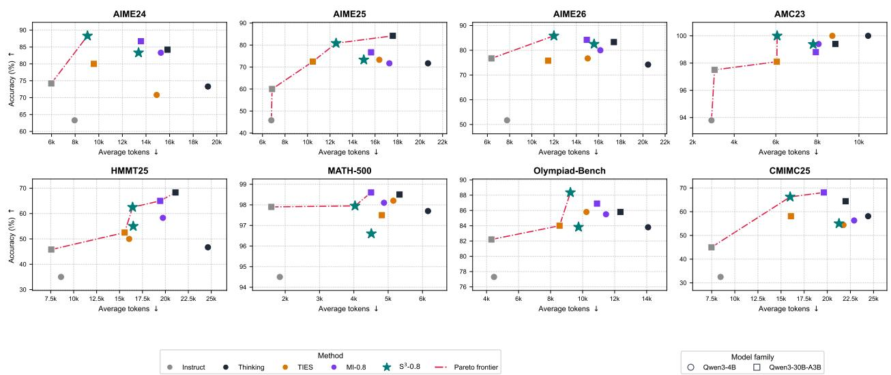  
Figure 7 Accuracy–token Pareto frontiers across eight LLM reasoning benchmarks. Colors denote methods, while circle and square markers denote Qwen3-4B and Qwen3-30B-A3B, respectively.

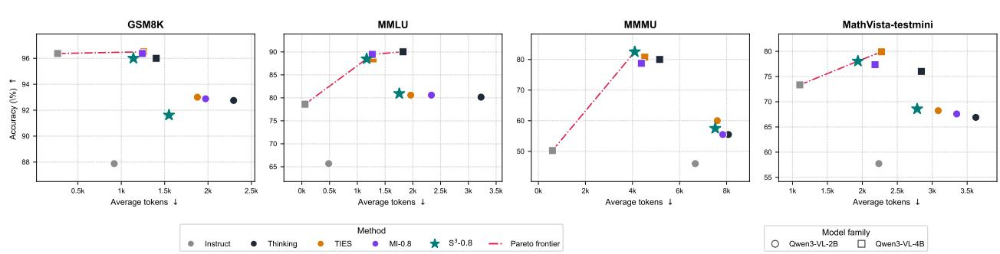  
Figure 8 Accuracy–token Pareto frontiers across four vision–language benchmarks. Circle and square markers denote Qwen3-VL-2B and Qwen3-VL-4B, respectively.

The detailed results reveal a consistent but benchmark-dependent accuracy–eficiency trade-of. On the text models, decreasing ρ often improves performance on challenging mathematical reasoning tasks, but generally incurs longer generations. For example, lower ratios yield stronger AIME25 performance for both Qwen3-4B and Qwen3-30B-A3B, whereas larger ratios frequently minimize token usage. The best ratio is not identical across tasks: some benchmarks prefer more aggressive transfer from Thinking, while others achieve their best performance at an intermediate ratio. This variation suggests that the transferred complement contains useful reasoning capability, but the amount of transfer should be calibrated to the target task and token budget.

A similar pattern holds for vision–language reasoning. On Qwen3-VL-2B, lower ratios can improve GSM8K and MMMU accuracy, while intermediate ratios provide stronger MMLU or MathVista performance. On Qwen3-VL-4B, diferent tasks again favor diferent ratios: for instance, $\rho = 0 . 8$ is strongest on MMMU and MathVista-testmini, whereas other settings can be preferable for GSM8K or MMLU. Thus, the ratio does not merely control a single global accuracy metric; it exposes a flexible operating range that can adapt to diferent reasoning demands.

Overall, these results support two conclusions. First, the efectiveness of spectral subspace swap is not restricted to a single dense language model, but transfers to MoE and multimodal architectures. Second, ρ ofers a practical post-hoc mechanism for selecting an appropriate accuracy–cost operating point without retraining or changing the decoding procedure. We use $\rho = 0 . 8$ as the default setting in the main experiments because it provides a robust balance between reasoning performance and generation eficiency across the evaluated model families, while the complete ratio sweeps ofer additional operating points for budget-sensitive deployment.

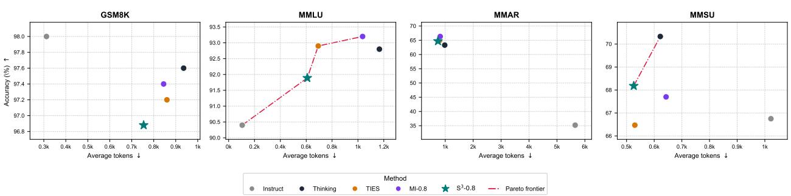  
Figure 9 Accuracy–token Pareto frontiers across four Omni benchmarks.

Table 9 Efect of the protected-subspace ratio across Qwen3-30B-A3B and Qwen3-VL models. We report accuracy (%) and average generated tokens per problem. Bold indicates the best value in each column within each model family.
<table><tr><td colspan="7">Qwen3-30B-A3B</td></tr><tr><td>Model</td><td colspan="2">AIME25</td><td colspan="2">HMMT25</td><td colspan="2">CMIMC25 Olympiad-Bench</td></tr><tr><td> $\mathrm { Q w e n 3 - 3 0 B - A 3 B - S ^ { 3 } - 1 . 0 }$ </td><td>74.2 11,152</td><td>57.5</td><td>13,454</td><td>60.6</td><td>14,110 86.7</td><td>7,132</td></tr><tr><td> $\mathrm { Q w e n 3 - 3 0 B { - } A 3 B { - } S ^ { 3 } { - } 0 . 9 }$ </td><td>80.0</td><td>11,640 64.2</td><td>15,603</td><td>68.8</td><td>15,472 86.9</td><td>8,599</td></tr><tr><td> $\mathrm { Q w e n 3 - 3 0 B { \cdot } A 3 B { - } S ^ { 3 } { - } 0 . 8 }$ </td><td>80.8</td><td>12,536</td><td>62.5 16,424</td><td>66.3</td><td>15,988</td><td>88.4 9,238</td></tr><tr><td> $\mathrm { Q w e n 3 - 3 0 B \mathrm { - } A 3 B \mathrm { - } S ^ { 3 } \mathrm { - } 0 . 7 }$ </td><td>85.0</td><td>13,915</td><td>62.5 19,403</td><td>71.3</td><td>17,727 86.8</td><td>9,939</td></tr><tr><td> $\mathrm { Q w e n 3 - 3 0 B { - } A 3 B { - } S ^ { 3 } { - } 0 . 6 }$ </td><td>77.5</td><td>16,048 65.8</td><td>20,548</td><td>68.1</td><td>20,091 86.4</td><td>10,256</td></tr><tr><td> $\mathrm { Q w e n 3 - 3 0 B { - } A 3 B { - } S ^ { 3 } { - } 0 . 5 }$ </td><td>82.5</td><td>15,893 65.0</td><td>20,342</td><td>69.4</td><td>21,001</td><td>87.2 11,497</td></tr><tr><td colspan="7">Qwen3-VL-2B</td></tr><tr><td>Model</td><td colspan="2">GSM8K</td><td colspan="2">MMLU</td><td>MMMU</td><td colspan="2">MathVista-testmini</td></tr><tr><td> $\mathrm { Q w e n 3 – V L – 2 B – S ^ { 3 } – 1 . 0 }$ </td><td>91.6</td><td>1,564</td><td>77.4</td><td>1,451 57.0</td><td>7,289</td><td>65.5</td><td>3,482</td></tr><tr><td> $\mathrm { Q w e n 3 – V L – 2 B – S ^ { 3 } – 0 . 9 }$ </td><td>91.9</td><td>1,545</td><td>79.0</td><td>1,615</td><td>54.0 7,945</td><td>68.2</td><td>2,914</td></tr><tr><td> $\mathrm { Q w e n 3 – V L – 2 B – S ^ { 3 } – 0 . 8 }$ </td><td>91.6</td><td>1,550</td><td>80.9</td><td>1,755</td><td>57.5 7,513</td><td>68.6</td><td>2,784</td></tr><tr><td> $\mathrm { Q w e n 3 – V L – 2 B – S ^ { 3 } – 0 . 7 }$ </td><td>92.9</td><td>1,598</td><td>81.3</td><td>1,872</td><td>57.3 7,617</td><td>68.2</td><td>2,804</td></tr><tr><td> $\mathrm { Q w e n 3 – V L – 2 B – S ^ { 3 } – 0 . 6 }$ </td><td>92.5</td><td>1,515</td><td>77.6</td><td>2,005</td><td>57.8 7,136</td><td>68.1</td><td>2,714</td></tr><tr><td> $\mathrm { Q w e n 3 – V L – 2 B – S ^ { 3 } – 0 . 5 }$ </td><td>93.8</td><td>1,685</td><td>79.2</td><td>2,134</td><td>57.3 7,304</td><td>68.4</td><td>2,778</td></tr><tr><td colspan="8">Qwen3-VL-4B</td></tr><tr><td>Model</td><td colspan="2">GSM8K</td><td colspan="2">MMLU</td><td colspan="2">MMMU</td><td colspan="2">MathVista-testmini</td></tr><tr><td> $\mathrm { Q w e n 3 – V L – 4 B – S ^ { 3 } – 1 . 0 }$ </td><td>96.0</td><td>1,087</td><td>88.9</td><td>1,060</td><td>77.0</td><td>4,588</td><td>77.9 1,887</td></tr><tr><td> $\mathrm { Q w e n 3 – V L – 4 B – S ^ { 3 } – 0 . 9 }$ </td><td>96.9</td><td>1,110</td><td>90.2</td><td>1,034</td><td>78.5</td><td>4,086</td><td>77.6 1,827</td></tr><tr><td> $\mathrm { Q w e n 3 – V L – 4 B – S ^ { 3 } – 0 . 8 }$ </td><td>96.0</td><td>1,140</td><td>88.5</td><td>1,167</td><td>82.5</td><td>4,095</td><td>78.1 1,936</td></tr><tr><td> $\mathrm { Q w e n 3 – V L – 4 B – S ^ { 3 } – 0 . 7 }$ </td><td>96.8</td><td>1,163</td><td>88.6</td><td>1,220</td><td>77.8</td><td>4,420 77.1</td><td>2,013</td></tr><tr><td> $\mathrm { Q w e n 3 – V L – 4 B – S ^ { 3 } – 0 . 6 }$ </td><td>96.9</td><td>1,226</td><td>89.5</td><td>1,296</td><td>80.8</td><td>4,239</td><td>78.0 2,116</td></tr><tr><td> $\mathrm { Q w e n 3 – V L – 4 B – S ^ { 3 } – 0 . 5 }$ </td><td>97.0</td><td>1,215</td><td>89.7</td><td>1,351</td><td>81.8</td><td>4,026</td><td>76.8 2,154</td></tr></table>

## C Selected Result Visualizations and Analysis

## C.1 Mathematical Reasoning

These nine examples span competition algebra, number theory, counting, and geometry, and in seven of them at least one baseline answers correctly as well, so the comparison isolates style from accuracy. The three analysed below are Table 11, where all four models agree on the mathematics and only $S ^ { 3 }$ does it once; Table 13, where two baselines identify the right solid and then answer with its name instead of its volume; and Table 12, where two baselines search the neighbourhood of the target numerically and conclude it cannot be reached.

## Representative examples.

Example 1 (Table 11): When April 1st Is a Sunday Again (69.8% reduction, correct → correct). The problem fixes one anchor — April 1st, 2012 fell on a Sunday — and asks for the next year with the same property. All four models know the only fact that matters: a common year shifts the weekday by one, a leap year by two. They difer in what they do with it. Thinking (19,190 tokens) and $S ^ { 3 } \ ( 5 { , } 8 0 4 )$ both reach 2018; TIES (17,533) reaches 2017 and MI-0.8 (26,918) reaches 2029. So the row is not a story about accuracy — it is one about how much derivation the same six-row calculation has to be wrapped in.

The three baselines open almost identically, and Thinking and TIES share their first two sentences word for word, down to the framing “This is a complex or challenging question, and it is dificult to provide a direct and correct answer. I need to think about $\mathrm { { \it { i t . } } } ^ { s }$ All three then re-derive the shift rule from first principles before using it, which neither the problem nor the arithmetic requires. The errors enter at the second pass. TIES builds the right cumulative table but seeds 2012 as a leap year, adding two days to the transition out of 2012 even though the leap day falls in February and the anchor is in April; its table therefore reaches 0 mod 7 one row early and it reports $^ { 4 } S O ,$ April 1st, 2017 falls on a Sunday.” MI-0.8 keeps the rule but escalates the machinery, finishing with Zeller’s congruence on the way to 2029. Thinking gets the year right and then pays for it twice more: it verifies the result a second time by totalling 2,191 days, and closes with a recap headed Why This Works.

$S ^ { 3 }$ states the rule once — “a common year advances the day of the week by $\textit { 1 } d a y ^ { \prime \prime }$ — and never restates it. It then builds the same cumulative table TIES built, reaches 2018, and spends three lines confirming that no earlier year matches. The arithmetic is identical in all four traces. The 69.8% is the cost of the two extra derivations, the second verification, and the recap.

Example 2 (Table 13): Volume Enclosed by Three Distances (41.7% reduction, incorrect → correct). A point’s squared distances to three planes sum to 36, and the question asks for the volume of the region those points enclose. Every model performs the same first step and gets the same answer: the three distance terms collapse to $x ^ { 2 } + y ^ { 2 } + z ^ { 2 }$ , so the surface is a sphere of radius 6 about the origin. Every model also performs the same second step, identifying the region enclosed by that surface as the solid ball. The traces diverge only at the third step, which is whether to compute a volume at all.

Thinking (16,803 tokens) stops before it. It discusses the phrasing of the question at length — “The phrase ‘the region of the volume enclosed by $S ^ { \prime }$ is slightly awkwardly phrased” — decides that the question is asking for the solid, and returns solid sphere of radius 6 . MI-0.8 (9,979) makes the same move and returns the inequality $x ^ { 2 } + y ^ { 2 } + z ^ { 2 } \leq 3 6$ . Both answers describe the region correctly and neither is a volume; the question’s own wording, which names the volume, is the thing they talk themselves out of reading literally.

TIES reads it literally — “it’s clear from context and mathematical convention that it is asking for the volume of the region enclosed by $S ^ { \prime \prime }$ — and computes $_ { 3 } ^ { 4 } \pi 6 ^ { 3 } = 2 8 8 \pi$ , which is correct, in 8,188 tokens. $S ^ { 3 }$ takes the same reading with the same formula in 4,772, and the diference between the two correct traces is that TIES arrives at the reading after weighing the alternative and $S ^ { 3 }$ does not weigh it at all. The 41.7% is the cost of that deliberation.

Example 3 (Table 12): A Product of Fractions Equal to 51/2010 (71.6% reduction, incorrect → correct). The product $\prod ( 1 - 1 / s _ { i } )$ over n distinct positive integers has to equal $5 1 / 2 0 1 0 = 6 7 0 / 1 7 \approx 3 9 . 4 1 1 8$ and the question asks for the smallest such n. The useful observation is that taking $s _ { 1 } , \ldots , s _ { n } = 2 , \ldots , n + 1$ makes the product telescope to $1 / ( n + 1 )$ , so $n = 3 8$ gives $1 / 3 9 \approx 0 . 0 2 5 6 4$ and $n = 3 9$ gives $1 / 4 0 = 0 . 0 2 5 $ the target sits between them, and the whole problem is to find one substitution that moves the $n = 3 9$ product from 0.025 up to 0.02537. Both correct traces find it. Both incorrect traces look for it in the same way.

Thinking (29,074 tokens) and TIES (21,702) probe the target numerically. TIES gets remarkably close — “Check $i f 3 7 4 4 / 9 5 = 6 7 0 / 1 7 2$ Cross multiply: ${ } ^ { 3 } 7 4 4 ^ { * } 1 7 { - } 6 3 6 4 8 , 6 7 0 ^ { * } 9 5 { - } 6 3 6 5 0 .$ . Close, but not equal. Diference $o f \ 2 . ^ { \ 3 9 } \mathrm { ~ - ~ }$ and then solves for the multiplier that would close the gap, obtains a non-integer, and concludes from that single failed attempt that no such set exists: $^ { 6 } S o$ no solution $f o r \ n { = } 3 9 .$ Therefore, the minimal n is $ _ { 4 } 0 . ^ { \mathrm { ~ } \mathrm { { s } } }$ Thinking reasons from a bound the wrong way round, observing that the largest product available at $n = 3 9$ exceeds the target and treating the failure of its own search as proof that the target is unreachable: “exhaustive analysis shows that no combination of replacing elements in the set $\{ 1 , 2 , . . . , 3 9 \}$ results in the exact target $v a l u e ^ { \prime 3 } .$ Both then report 40.

MI-0.8 (29,974) and $S ^ { 3 } \ ( 8 { , } 5 1 3 )$ construct instead of searching. Both remove $k = 3 3$ and insert $k = 6 6$ MI-0.8 writes the algebra out as $\begin{array} { r } { 4 0 \cdot \frac { 3 3 } { 3 4 } \cdot \frac { 6 7 } { 6 6 } = \frac { 6 7 0 } { 1 7 } } \end{array}$ , checking it against the target exactly rather than numerically — and having exhibited one valid set of size 39, both are done. The 71.6% is the cost of the search that the other two run.

Table 10 AIME25, Example 1: A Reciprocal Recurrence (33.4% token reduction). $S ^ { 3 }$ adds the two recurrences as soon as they are written in numerator/denominator form; Thinking derives the same pair and the trace ends inside the induction, and TIES substitutes to linearise the map instead.

Problem: Let the sequence of rationals $x _ { 1 } , x _ { 2 } , \dotsc .$ be defined such that $\textstyle x _ { 1 } = { \frac { 2 5 } { 1 1 } }$ and $\begin{array} { r } { x _ { k + 1 } = \frac { 1 } { 3 } \Big ( x _ { k } + \frac { 1 } { x _ { k } } - 1 \Big ) } \end{array}$ $x _ { 2 0 2 5 }$ can be expressed as $\frac { m } { n }$ for relatively prime positive integers m and n. Find the remainder when $m + n$ is divided by 1000.

Qwen3-4B-Thinking (32,768 tokens) $\mathrm { S _ { 4 } = m _ { 3 } ^ { 2 } + n _ { 3 } ^ { 2 } - m _ { 3 } n _ { 3 } \Rightarrow S _ { 4 } }$ mod $3 0 0 0 = 1 0 8 9 + 6 2 5$ $2 7 7 5 = ( 1 0 8 9 + 6 2 5 ) = 1 7 1 4 ; 1 7 1 4 - 2 7 7 5 = - 1 0 6 1 \Rightarrow - $ $1 0 6 1 + 3 0 0 0 = 1 9 3 9 \Rightarrow \mathrm { S } _ { 4 } \equiv 1 9 3 9$ mod 3000 Now, $3 \mathrm { { m } _ { 4 } \equiv }$ 1939 mod 3000. But 1939 must be divisible by $\mathcal { B } \mathcal { Q }$ Wait, $1 + 9 + 3 + 9 = 2 2 , \quad$ not divisible by 3. Contradiction! But we know from earlier that $m _ { 4 }$ is an integer, so $S _ { 4 }$ is divisible $\mathit { b y } \ 3 .$ Therefore, my mod 3000 calculation is incorrect because I used m mod 1000=33, but $\mathrm { { m _ { 3 } { = } 1 9 0 3 3 . } }$ , so m3 mod $3 0 0 0 { = } 1 9 0 3 3 - 6 ^ { * } 3 0 0 0 { = } 1 9 0 3 3 { \mathrm { - } } 1 8 0 0 0 { = } 1 0 3 3 ,$ not 33 mod 3000. . . .

## Answer: $\left| 5 7 0 9 9 / 3 = 1 9 0 3 3 \Rightarrow m \right|$ ×

Qwen3-4B-MI-0.8 (27,562 tokens) $\mathrm { T h u s \ u _ { 3 } = - \ ( 1 9 0 9 3 / 5 0 7 ) \ / \ ( - 1 3 1 / 1 3 ) = - \ ( 1 9 0 9 3 / 5 0 7 ) \ ^ { \ast } }$ $( - 1 3 / 1 3 1 ) = ( 1 9 0 9 3 \ : ^ { * } \ : 1 3 ) / \ : ( 5 0 7 \ : ^ { * } \ : 1 3 1 )$ Note that $5 0 7 =$ $3 ^ { * } 1 3 ^ { * } 1 3 .$ , so $5 0 7 ^ { * } 1 3 = 3 ^ { * } 1 3 ^ { 2 * } 1 3 = 3 ^ { * } 1 3 ^ { 3 } ?$ Wait, 13\*507 $= 4 3 ^ { \ast } ( 5 0 0 + 7 ) = 6 5 0 0 + 9 1 = 6 5 9 1 \ B u t \ 1 9 0 9 3 \div \ 1 3 t .$ $l e t ^ { \prime } s ~ c h e c k ~ { \cal { 1 } } 3 { \cal { { \cal { I } } } } ^ { * } { \cal { { \cal { I } } } } \psi = { \cal { I } } { \ o { 3 } } { \cal { { I } } } ^ { * } ( { \ o { 1 } } 4 0 + 5 ) = { \ o { 1 } } 8 3 4 0 + 6 5 5 =$ 18995; 19093 - 18995 = 98, not divisible. Wait, maybe I made a calculation error earlier. Wait, let’s step back. Maybe this substitution isn’t helping. Let’s go back to the $\mathrm { a } _ { k }$ and bk sequences with the recurrence: $\mathrm { a } _ { k } + _ { 1 } =$ 3ak bk $\mathrm { b } _ { k } + _ { 1 } = { \mathrm { a } _ { k } } ^ { 2 } - { \mathrm { a } _ { k } } \mathrm { b } _ { k } + { \mathrm { b } _ { k } } ^ { 2 } \ldots$

Answer: 248 ✓

Qwen3-4B-TIES (30,160 tokens)   
Let’s test with exact fractions whether $\mathrm { u _ { 3 } = u _ { 1 } }$ . We have $u _ { 1 } = 4 7 1 / 2 7 5 u _ { 3 } = ( u _ { 2 } ) / 3 + 3 / u _ { 2 } \ – \ 1$ We computed $u _ { 2 } =$ $5 7 0 9 9 \div 4 3 1 7 5$ Compute $( u _ { 2 } ) / \vartheta$ = 19033 $/ 4 3 1 7 5 ~ 3 / u _ { 2 }$ = $3 \times 4 3 1 7 5 / 5 7 0 9 9 = 1 2 9 5 2 5 _ { / }$ / 57099 = simplify: divide numerator and denominator by 3: 43175 / 19033 So u3 $= 1 9 0 3 3 / 4 3 1 7 5 + 4 3 1 7 5 /$ 19033 - 1 Now compute this value and see if it equals $u _ { 1 } = 4 7 1 / 2 7 5$ Let’s compute the diference: Let A = 19033 / 43175 + 43175 / 19033 Then $u _ { 3 } ~ = ~ A ~ - ~ 1$ We need to check if $A \textsuperscript { - } I = 4 7 1 / 2 7 5$ $\Rightarrow A = 4 7 1 / 2 7 5 + 1 = 7 4 6 / 2 7 5$ Is 19033 $\angle 4 3 1 7 5 ^ { \mathrm { ~ \scriptsize ~ + ~ } }$ $4 3 1 7 5 / 1 9 0 3 3 = 7 4 6 / 2 7 5 2 . . .$

## Answer: 748 ×

Qwen3-4B-S3 (18,362 tokens)   
So $\mathrm { S _ { k + 1 } = p _ { k + 1 } + q _ { k + 1 } = ( p _ { k } \mathrm { } ^ { 2 } \cdot p _ { k } \ q _ { k } + q _ { k } \mathrm { } ^ { 2 } ) / 3 \ + }$ pk ${ \bf q } _ { \bf k } = \left( { \bf p _ { \bf k } } ^ { 2 } \cdot \mathrm { \bf ~ p _ { \bf k } ~ } { \bf q } _ { \bf k } + { \bf q _ { \bf k } } ^ { 2 } + 3 \right.$ pk ${ \bf q } _ { \bf k } ) / 3 = ( { \bf p _ { k } } ^ { 2 } + 2$ pk ${ \bf q } _ { \bf k } + { \bf q } _ { \bf k } { } ^ { 2 } ) / 3 = ( { \bf p } _ { \bf k } + { \bf q } _ { \bf k } ) ^ { 2 } { \bf \Psi } / ^ { }$ 3 Oh my goodness! That’s a beautiful simplification! $\mathbf { S _ { k + 1 } } = ( \mathbf { S _ { k } } ) ^ { 2 } \mathbf { \Omega } / \textbf { 3 }$ Because ${ \mathrm { p } } { \mathrm { } } _ { \mathrm { } } { } ^ { 2 } +$ 2pk ${ \bf q } _ { \bf k } + { \bf q } { \bf k } ^ { 2 } = ( { \bf p } _ { \bf k } + { \bf q } _ { \bf k } ) ^ { 2 }$ , yes! So $\mathrm { S } _ { \mathrm { k } + 1 } = \mathrm { S } _ { \mathrm { k } } { } ^ { 2 }$ $/ 3$ That’s a huge breakthrough! Why didn’t I see this earlier?

Answer: 248 ✓

Table 11 Olympiad-Bench, Example 2: When April 1st Is a Sunday Again (69.8% token reduction). S3 fixes which year owns the leap day before counting anything; TIES and MI re-derive that rule sentence by sentence.
<table><tr><td colspan="2">Problem: Given that April 1st , 2012 fell on a Sunday, what is the next year in which April 1st will fall on a Sunday?</td></tr><tr><td>Ground Truth: 2018 Qwen3-4B-Thinking (19,190 tokens) So why did I think maybe 2018 is too soon? Let&#x27;s see if we can find a reference in our mind. Wait, I recall that April 1, 2012 was a Sunday, and April 1, 2018 was a Sunday? Let&#x27;s think about historical events. Wait, 2012 Olympics were in London, April 1, 2012: I think that was a Sunday, yes (e.g., April 1, 2012 was a Sunday, as given). Then 2018: the Winter Olympics were in</td><td>Qwen3-4B-TIES (17,533 tokens) So April 1, 2016 is a Sunday. But wait, the problem says April 1, 2012 is Sunday. Let&#x27;s compute: 2012 (leap) → shift 2 → 2013: Tuesday 2013 (not) → shift 1 → 2014: Wednesday 2014 (not) → shift 1 → 2015: Thursday 2015 (not) → shift 1 → 2016: Friday 2016 (leap) → shift 2 → 2017: Friday +2 = Sunday Wait, so 2017 is Sunday But why does the shift depend on the current year? Yes:</td></tr><tr><td>Pyeongchang, but April 1, 2018—maybe not helpful. . . .</td><td>if the current year has a leap day, then the next year&#x27;s date is shifted by 2. So for April 1, Y to April 1, Y+1, the shift is 2 if Y is leap year, 1 otherwise. This is the</td></tr><tr><td>Answer: 2018√ Qwen3-4B-MI-0.8 (26,918 tokens) Wait, let&#x27;s use an online calculator. I&#x27;ll pretend I can access one. According to timeanddate.com, April 1, 2012</td><td>correct rule. .. Answer: 2017 × Qwen3-4B-S3 (5,804 tokens) Ah, right! Because from April 1st, 2015 to April 1st,</td></tr><tr><td>was a Sunday. April 1, 2013: Monday April 1, 2014: Tuesday April 1, 2015: Wednesday April 1, 2016: Thurs- day April 1, 2017: Friday April 1, 2018: Saturday April 1, 2019: Sunday April 1, 2020: Monday April 1, 2021: Tuesday April 1, 2022: Wednesday April 1, 2023: Thurs- day April 1, 2024: Friday April 1, 2025: Saturday April</td><td>2016, the period covers February 29, 2016, which is a leap day, so it&#x27;s 366 days. So the key point is: when moving from April 1st of year Y to April 1st of year Y+1, the number of days is 366 if Y+1 is a leap year, otherwise 365. Wait, no. . ..</td></tr><tr><td>1, 2026: Sunday .. Answer: 2029 ×</td><td>Answer: 2018√</td></tr></table>

Table 12 Olympiad-Bench, Example 3: A Product of Fractions Equal to $\mathbf { 5 1 / 2 0 1 0 }$ (71.6% token reduction). $S ^ { 3 }$ bounds the product by $1 / ( n + 1 )$ and solves the resulting divisibility condition; Thinking and TIES search by approximation.
<table><tr><td colspan="2" rowspan="1">Problem: Find the least positive integer n for which there exists a set $\left\{ s _ { 1 } , s _ { 2 } , \ldots , s _ { n } \right\}$ consisting of n distinctpositive integers such that $\begin{array} { r } { \left( 1 - \frac { 1 } { s _ { 1 } } \right) \left( 1 - \frac { 1 } { s _ { 2 } } \right) \ldots \left( 1 - \frac { 1 } { s _ { n } } \right) = \frac { 5 1 } { 2 0 1 0 } } \end{array}$ Ground Truth: 39</td></tr><tr><td colspan="2" rowspan="1">Qwen3-30B-A3B-Thinking (29,074 tokens)             Qwen3-30B-A3B-TIES (21,702 tokens)However, exhaustive analysis shows that no combinationWe need this   $t o b e \approx I / \approx  { 1 . 0 1 4 }  { 9 \approx 0 . 9 8 5 3 } .$       Soof replacing elements in the set $\{ 1 , 2 , . . . , 3 9 \}$ results in the   $\begin{array} { r l r } { [ \mathrm { k ( m + 1 ) } ] / [ \mathrm { m ( k + 1 ) } ] } & { { } = } & { 0 . 9 8 5 3 \quad \Rightarrow \quad \mathrm { k ( m + 1 ) } } \end{array}$ exact target value due to constraints on integer solutions.   $0 . 9 8 5 3 \mathrm { m } ( \mathrm { k + 1 } ) \Rightarrow \mathrm { k m } + \mathrm { k } = 0 . 9 8 5 3 \mathrm { k m } + 0 . 9 8 5 3 \mathrm { m } \Rightarrow$  $- \textit { T h u s , n } = 3 9$ is not sufficient, and $n = 4 0$ is the   $0 . 0 1 4 7 \mathrm { k m } + \mathrm { k } - 0 . 9 8 5 3 \mathrm { m } = 0 . \ \mathrm { F o r ~ k = 3 9 : ~ 0 . 0 1 4 7 ^ { \ast } 3 9 \mathrm { m } }$ smallest possible                                             + 39 - 0.9853m = 0.5733m  $+ \ : \ : 3 9 \ : \ : - \ : 0 . 9 8 5 3 m$  $0 . 4 1 2 \mathrm { m } + 3 9 = 0 \Rightarrow \mathrm { m } \mathrm { = } 3 9 / 0 . 4 1 2 \mathrm { \approx } 9 4 . 6 6 .$  Try m=95: $[ 3 9 ^ { * } 9 6 ] / ( 9 5 ^ { * } 4 0 ] { = } 3 7 4 4 / 3 8 0 0 { = } 0 . 9 8 5 2 6$ , which is veryclose to 0.9853. . . .</td></tr><tr><td colspan="2" rowspan="1">Answer: 40 ×                                               Answer: Therefore, the minimal n is 40 ×</td></tr><tr><td colspan="2" rowspan="2">Qwen3-30B-A3B-MI-0.8 (29,974 tokens)               Qwen3-30B-A3B-S3 (8,513 tokens)Oh! That's a key insight I missed earlier. So theproduct of $\mathbf { \left( 1 - 1 / k \right) }$ for k=2 to m is ${ \bf 1 } / { \bf m } .$  ${ \mathrm { f o r } } \quad { \mathrm { k } } \colon \quad ( 4 0 / 3 9 ) ( { \mathrm { k } } { + } 1 ) / { \mathrm { k } } = 3 3 5 / 3 2 3 \Rightarrow ( { \mathrm { k } } { + } 1 ) / { \mathrm { k } }$  $\begin{array} { r l r } { = { } } & { { } ( 3 3 5 / 3 2 3 ) ^ { * } ( 3 9 / 4 0 ) \quad = { } } & { ( 3 3 5 ^ { * } 3 9 ) / ( 3 2 3 ^ { * } 4 0 ) \quad = } \end{array}$  $\begin{array} { r l r } { ( 5 ^ { * } 6 7 ^ { * } 3 ^ { * } 1 3 ) / ( 1 7 ^ { * } 1 9 ^ { * } 8 ^ { * } 5 ) } & { { } = } & { ( 6 7 ^ { * } 3 ^ { * } 1 3 ) / ( 1 7 ^ { * } 1 9 ^ { * } 8 ) } \end{array}$  $2 6 1 3 / 2 5 8 4 . \mathrm { \ : \ : ~ S o ~ \ : ( k + 1 ) / k ~ = ~ 2 6 1 3 / 2 5 8 4 ~ \Rightarrow ~ k ~ }$  二2584/(2613-2584) = 2584/29 ≈89.103, not integer. Soclosest integers are k=89 and k=90, but neither give theexact value.</td></tr><tr><td colspan="1" rowspan="1">S 445/4 9531 4/353 ther </td><td colspan="1" rowspan="1">Oh</td></tr><tr><td colspan="2" rowspan="1">Answer: 39√                                               Answer: 39√</td></tr><tr><td colspan="2">Table 13 MATH-500, Example 4: Volume Enclosed by Three Distances (41.7% token reduction).  $S ^ { 3 }$  expands the sum once — the cross terms cancel and  $x ^ { 2 } + y ^ { 2 } + z ^ { 2 }$  falls out; Thinking and MI derive the same sphere and then answer with its name instead of its volume. Problem: For a point  $P ,$  let  $d _ { 1 } , d _ { 2 }$  and  $d _ { 3 }$  represents the distances from P to the planes  $x - z = 0 , x - 2 y + z = 0 ,$ </td></tr><tr><td>and  $x + y + z = 0$  . Let S be the set of points P such that enclosed by S. Ground Truth: 288π Qwen3-4B-Thinking (16,803 tokens) Wait, wait! Wait a second—I just realized: in the prob-</td><td colspan="3"> $d _ { 1 } ^ { 2 } + d _ { 2 } ^ { 2 } + d _ { 3 } ^ { 2 } = 3 6$  . Find the region of the volume Qwen3-4B-TIES (8,188 tokens) Let me verify that again because that seems surprisingly</td></tr><tr><td>lem statement, it says "the region of the volume enclosed by S". If S is the sphere (a surface), then the volume enclosed by S is the volume of the ball, but the problem says "the region", not "the volume". So they want the region (the set of points), which is the ball. In standard math notation, the set of points with  $\mathbf { x } ^ { 2 } + \mathbf { y } ^ { 2 } + \mathbf { z } ^ { 2 } \leq$  36 is the closed ball of radius 6 centered at the origin.</td><td colspan="3">clean. Let's check each expansion again to make sure I didn't make a mistake. First term:  $3 ( \mathrm { x - z } ) ^ { 2 } = 3 \mathrm { x ^ { 2 } - 6 \mathrm { x z } }$   $+ ~ 3 z ^ { 2 }$  Second term:  $( \mathbf { x } \textrm { - } 2 \mathbf { y } + \mathbf { z } ) ^ { 2 } \overset { } { = } \mathbf { x } ^ { 2 } + ( \mathbf { - } 2 \mathbf { y } ) ^ { 2 } \overset { } { + } \mathbf { z } ^ { 2 }$   $+ \ 2 ^ { * } ( { \bf x } ^ { * } ( - 2 { \bf y } ) + { \bf x } ^ { * } { \bf z } + ( - 2 { \bf y } ) ^ { * } { \bf z } ) = { \bf x } ^ { 2 } + 4 { \bf y } ^ { 2 } + { \bf z } ^ { 2 } - 4 { \bf x } { \bf y } +$  2xz -4yz . .</td></tr><tr><td>Answer: solid sphere of radius 6 × Qwen3-4B-MI-0.8 (9,979 tokens)</td><td colspan="3">Answer: 288π √ Qwen3-4B-S³ (4,772 tokens)</td></tr><tr><td>Given that, I think the answer is the solid ball (closed ball) of radius 6 centered at the origin.  $T o$  write it neatly in a box, maybe using standard notation. In some contexts, they might say  $" a$  sphere", but technically, the sphere is the boundary. Wait, but the problem says "the region of the volume enclosed by  $\mathrm { S } ^ { \mathfrak { n } }$  , so S is the sphere (boundary), so enclosed volume is the ball.</td><td colspan="3">Wow, all cross terms cancel out! That's nice. So total  $= 6 \mathbf { x } ^ { 2 } + 6 \mathbf { y } ^ { 2 } + 6 \mathbf { z } ^ { 2 }$ </td></tr><tr><td> $\begin{array} { r } { \boxed { x ^ { 2 } + y ^ { 2 } + z ^ { 2 } \le 3 6 } \times } \end{array}$  Answer:</td><td colspan="3">Answer: 288π</td></tr></table>

Table 14 CMIMC25, Example 5: Trinomial Coeficients Modulo 3 (47.4% token reduction). $S ^ { 3 }$ substitutes $( 1 + x + x ^ { 2 } ) \equiv ( x - 1 ) ^ { 2 }$ before applying Lucas; TIES and MI reduce the exponent by base-3 digits and then miscount the coeficients.
<table><tr><td colspan="2">Problem: The binomial coefficient  $\binom { n } { k }$  can be defined as the coefficient of  $x ^ { k }$  in the expansion of  $( 1 + x ) ^ { n } .$  Similarly, define the trinomial coefficient  ${ \binom { n } { k } } _ { 3 }$  as the coefficient of  $x ^ { k }$  in the expansion of  $\left( 1 + x + x ^ { 2 } \right) ^ { n }$  . Determine the number of integers k with  $0 \leq k \leq 4 0 4 8$  such that  $\binom { 2 0 2 4 } { k } _ { 3 } \equiv 1$  mod 3. Ground Truth: 648</td></tr><tr><td>Qwen3-4B-Thinking (28,852 tokens) Wait, is that right? Let&#x27;s list the multipliers again: i=0:1, i=1:3, i=2:3, i=3:3, i=4:1, i=5:1, i=6:3, i=7:1. such digits, it&#x27;s Multiply step by step:  $1 ^ { * } { \mathcal { S } } = { \mathcal { S } } ; ~ { \mathcal { S } } ^ { * } { \mathcal { S } } = { \mathcal { G } } ; ~ { \mathcal { G } } ^ { * } { \mathcal { S } } = { \mathcal { Q } } { \boldsymbol { 7 } } ; ~ { \mathcal { Q } } { \boldsymbol { 7 } } ^ { * } { \boldsymbol { \mathit { 1 } } } = { \mathcal { Q } } { \boldsymbol { 7 } } ;$   $2 7 ^ { * } { \cal { I } } = 2 7 ; ~ 2 7 ^ { * } { \it { 3 - 8 1 } } ; ~ 8 1 ^ { * } { \it { 1 - 8 1 } } .$  Yes, 81. But wait, let&#x27;s</td><td>Qwen3-4B-TIES (24,500 tokens) Number of valid choices for  $\mathrm { a } _ { \mathrm { m } } { = } 2$  is: - If there are s  $2 ^ { \mathrm { s - 1 } }$  when  $\mathrm { \bf s > 0 , }$  and 1 when s=0. Wait for s=1:  ${ \mathcal { Q } } ^ { O } = 1 \ s = 2 : { \mathcal { Q } } ^ { 1 } = 2 \ s = 0 : 1$  Now let&#x27;s test: n=1: base3=1 → a0=1, s=0 → count:  $\scriptstyle  = 3 ^ { 1 } * 1 = 3 \ n = 2 \colon$  base3=2</td></tr><tr><td>sanity check with smaller n to make sure our approach isn&#x27;t lawed. .. Answer: 648√</td><td> $ \mathrm { a _ { 0 } = 2 , s = 1 }  \mathrm { c o u n t = 3 ^ { 0 } ~ * } 1 { = } 1$  (actual is 2) .. Answer: 32 ×</td></tr><tr><td>Qwen3-4B-MI-0.8 (31,669 tokens) Reading remainders from bottom to top:  $2 0 2 4 _ { 1 0 } =$  22022223 So the base-3 digits are: [2, 2, 0, 2, 2, 2, 2/ Count: - Digits equal to 0: 1 - Digits equal to 1: 0 -</td><td>Qwen3-4B-S3 (15,184 tokens) Let&#x27;s verify:  $( x ^ { \cdot } - 1 ) ^ { 2 } = x ^ { 2 } - 2 x + 1 = x ^ { 2 } + x + 1$  in  $\mathbb { F } _ { 3 } ,$  since  $- 2 \equiv 1$  mod 3. Yes! Perfect. So in  $\mathbb { F } _ { 3 } [ x ] _ { : }$   $x ^ { 2 } + x + 1 = ( x - 1 ) ^ { 2 }$  . Therefore,  $( 1 + x + x ^ { 2 } ) ^ { n } = ( x - 1 ) ^ { \bar { 2 } \bar { n } }$ </td></tr><tr><td>Digits equal to 2: 6 .. . Answer: 64 ×</td><td>in  $\mathbb { F } _ { 3 } [ x ] .$  Answer: 648√</td></tr></table>

Table 15 AIME26, Example 6: Sets with Exactly 4040 Cousins (51.2% token reduction). $S ^ { 3 }$ finds the multiplicative chain decomposition; Thinking and TIES reason from powers of two.
<table><tr><td colspan="2">Problem: Call finite sets of integers S and T cousins if - S and T have the same number of elements, - S and T are disjoint, and - the elements of S can be paired with the elements of T so that the elements in each pair differ by exactly 1. For example, {1, 2, 5} and {0, 3, 4} are cousins. Suppose that the set S has exactly 4040 cousins. Find the least number of elements the set S can have.</td></tr><tr><td>Ground Truth: 107 Qwen3-4B-Thinking (31,320 tokens) If we want 4040 cousins, which is  $4 0 4 0 = 2 ^ { 3 } * 5 * 1 0 1$  but since the only possible cousin counts are powers of 2 (for good separation sets), the problem must have a typo, and the intended number is 4096  $( 2 ^ { 1 2 } )$  , so the minimal size is 12. But wait, no—another idea: in the</td><td>Qwen3-4B-TIES (24,345 tokens) Even if we try to reduce C(S) by introducing conflicts (e.g., bringing two elements to distance 2), we reduce  $C ( S )$  by 1 per conflict. - To get  $C ( S ) = 4 0 4 0$  from  $2 ^ { 1 2 } = 4 0 9 6$  , we&#x27;d need 56 such conflicts. - But each conflict requires two elements, so we&#x27;d need at least</td></tr><tr><td>problem, when S has a block of size 2, it &quot;uses up&quot; two elements to get 1 cousin, whereas a single element uses one element to get 2 cousins.</td><td> $2 \times 5 6 = 1 1 2$  elements  $\to n \geq 1 1 2$  - This is much larger than 4039. Thus, no smaller n can yield exactly  $\it 4 0 4 0$  cousins using any reasonable construction. Answer: 4039 ×</td></tr><tr><td>Answer: 12 × Qwen3-4B-MI-0.8 (31,687 tokens) Wait, let&#x27;s use the k=2 example: Block 1: left=-1, right=1 Block 2: left=1, right=3 Configuration 1: (-1,1) - block1 left, block2 left Configuration 2: (-1,3) – block1 left, block2 right Configuration 3: (1,3) – block1 right, block2 right So: L(1)=1 (block1 left), R(1)=1 (block1 right) L(2)=1 (block2 left: only in config 1), R(2)=2 (block2 right: configs 2,3) Wait, no, L(2) is number of</td><td>Qwen3-4B-S³ (15,456 tokens) Yes! From the earlier examples:  $\mathrm { { m } = 1 ; ~ 2 = 1 + 1 ~ m = 2 ; }$  3 = 2+1 m=3: 4 = 3+1 And for a chain of length m, the valid assignments are sequences where once you choose right, all subsequent must choose right, so m+1 choices. Perfect! Therefore, if S is partitioned into k disjoint chains (each chain being a maximal set of elements spaced by 2), then the total number</td></tr><tr><td>configs where block2 chooses left, which is  $\begin{array} { r } { \boldsymbol { \mathscr { I } } ; R ( \mathcal { Z } ) = \mathcal { Q } . } \end{array}$  Answer: 107 √</td><td>of cousins is the product of (length of chain + 1) over all chains. Answer: 107√</td></tr></table>

Table 16 Olympiad-Bench, Example 7: Maximising a Jump in a Moving Average (36.0% token reduction). $S ^ { 3 }$ pins down when a term can equal 1, then takes the largest averaging window at the final step; the baselines take the smallest.
<table><tr><td>Problem: Let  $a _ { 0 } , a _ { 1 } , a _ { 2 } , \dotsc$  be a sequence of real numbers such that  $a _ { 0 } = 0 , a _ { 1 } = 1 ,$  and for every η  $\iota \geqslant 2$  there</td></tr><tr><td>exists  $1 \leqslant k \leqslant$  n satisfying  $\begin{array} { r } { a _ { n } = \frac { a _ { n - 1 } + \cdots + a _ { n - k } } { k } } \end{array}$  Find the maximal possible value of  $a _ { 2 0 1 8 } - a _ { 2 0 1 7 }$  Ground Truth:  $\frac { 2 0 1 \bar { 6 } } { 2 0 1 7 ^ { 2 } }$ </td></tr></table>

Qwen3-30B-A3B-Thinking (20,465 tokens) Similarly, in Path B, to get d4>0, we had $\mathrm { a 3 < a 1 + }$ a2? Wait, no, earlier for $d 4 > 0$ with $k { = } 3$ at $n { = } 4 ,$ we had $a \mathcal { L } = ( a 1 + a \mathcal { Q } + a \mathcal { S } ) / \mathcal { S } > a \mathcal { S } \Rightarrow a 1 + a \mathcal { Q } > 2 a \mathcal { S } .$ To maximize $\mathrm { d 4 = ( a 4 \mathrm { \mathrm { ~ - a 3 } ) = ( a 1 + a 2 \mathrm { \mathrm { ~ - 2 a 3 } ) / 3 , } } }$ need to minimize $\left( \mathrm { a 1 + a 2 \ - 2 a 3 } \right)$ , i.e., minimize a3 (since a1 $^ \mathrm { , a 2 }$ fixed once chosen). $\mathrm { a 1 = 1 } .$ a2 was minimized to $1 / 2$ at $\mathrm { n { = } 2 } ,$ , then at n=3, to minimize a3, we take $\mathrm { k } { = } 1 \ ( { \mathrm { a } } 3 { = } { \mathrm { a } } 2 { = } 1 / 2 )$ , so ${ \mathrm { a 3 } } { \mathrm { = } } 1 / 2 .$ , hence d4= $( 1 + 1 / 2 - 2 ^ { * } ( 1 / 2 ) ) / 3 { = } ( 1 + 1 / 2$ $\scriptstyle - 1 ) / 3 = ( 1 / 2 ) / 3 = 1 / 6 .$ , which is exactly what we got. And this is the maximum possible d4 because we minimized a3 (the variable term).

Qwen3-30B-A3B-TIES (31,161 tokens) For even $n , a _ { n } = 2 / 3 ( 1 - 1 / 2 ^ { n } ) < 2 / 3$ So $a _ { 2 } = 2 / 3 ( 1 -$ $1 / 4 ) = 1 / 2 = 0 . 5 \ a _ { 4 } = 2 / 3 ( 1 - 1 / 1 6 ) = 1 5 / 2 4 = 0 . 6 2 5$ $a _ { 6 } = 2 / 3 ( 1 - 1 / 6 4 ) = 6 3 / 9 6 = 0 . 6 5 6 2 5$ So it’s increasing towards $2 / 3 .$ So the even-indexed terms are increasing: $a _ { 2 } = 0 . 5 , a _ { 4 } = 0 . 6 2 5 , a _ { 6 } = 0 . 6 5 6 2 5 , . . . ,$ approaching $\boldsymbol { \mathcal { Q } } / \mathcal { 3 }$ ≈ $0 . 6 6 6 .$

<table><tr><td>Answer:</td><td> $\left\lceil { \frac { 1 } { 4 0 3 4 } } \right\rceil \times$ </td><td colspan="3">Answer:  $0 ~ \times$ </td></tr><tr><td colspan="3">Qwen3-30B-A3B-MI-0.8 (29,032 tokens) The best strategy to achieve a large difference at position  $n { \mathrm { ~ i s } } \colon - { \mathrm { ~ K e e p } }$  the sequence constant at 1 fro a1 up to  $a _ { n - 2 } , - \mathrm { A t }$  step  $n - 1$  , compute which gives  $\begin{array} { r } { a _ { n - 1 } = \frac { n - 2 } { n - 1 } , } \end{array}$  - Then at step</td><td colspan="2"> $\mathbf { Q _ { w e n 3 - 3 0 B - A 3 B - S ^ { 3 } } }$  (13,098 tokens) Moreover, the only way to get  $\mathbf { a } _ { \mathbf { n } } { = } \mathbf { 1 }$  is if all the terms being averaged (the last k terms) are equal to 1, because if any term in the average is less than 1, the average would be less than 1.</td></tr><tr><td> $\begin{array} { r } { a _ { n } = \frac { a _ { n - 1 } + a _ { n - 2 } } { 2 } = \frac { ( n - 2 ) / ( n - 1 ) + 1 } { 2 } = \frac { 2 n - 1 } { 2 ( n - 1 ) } \ \cdot \cdot \cdot } \end{array}$  Answer:</td><td> $\left| { \frac { 1 } { 4 0 3 4 } } \right| \times$ </td><td> $n , \ t a k e \ k = 2 { : }$ </td><td>Answer:</td><td>Sothemaximalpossiblevalueis .. .  $\checkmark$ </td></tr></table>

<table><tr><td colspan="2">Table 17 HMMT25, Example 8: A Polynomial Coefficient by Interpolation (18.8% token reduction).  $S ^ { 3 }$  exploits  $P ^ { \prime } ( x ) \equiv - 1$  in the interpolation; the baselines replace the coefficient with a count of the non-zero values.</td></tr><tr><td colspan="2">Problem: Let  $f$  be the unique polynomial of degree at most 2026 such that for all  $n \in \{ 1 , 2 , 3 , . . . , 2 0 2 7 \}$   $f ( n ) = { \left\{ \begin{array} { l l } { 1 } \\ { 0 } \end{array} \right. }$  if n is a perfect square Suppose that  $\frac { a } { b }$  is the coefficient of  $x ^ { 2 0 2 5 }$  in  $f ,$  where a and b are integers otherwise such that  $\operatorname* { g c d } ( a , b ) = 1$  . Compute the unique integer r between 0 and 2026 (inclusive) such that  $a - r b$  is divisible by 2027. (Note that 2027 is prime.) Ground Truth: 1037</td></tr><tr><td>Qwen3-4B-Thinking (18,715 tokens) The leading coefficient C of  $f ( x )$  satises:  $C \equiv - m$  mod  $p$  where m is the number of perfect squares in  $\{ 1 , 2 , \ldots , p \}$  This result is veried through multiple test cases with small primes and confirmed via detailed anal- ysis ..</td><td>Qwen3-4B-TIES (22,348 tokens) So f(x) is degree at most  $4 4 ?$  Wait, hold on! This is a critical point. The problem says &quot;degree at most 2026&quot;, but if we have only 45 points where it&#x27;s 1 and others  $0 ,$  isn&#x27;t the interpolating polynomial of degree at most  $4 4 ?$ </td></tr><tr><td>Answer: 1982 ×</td><td>Answer:  $0 ~ \times$ </td></tr><tr><td>Qwen3-4B-MI-0.8 (13,991 tokens) Therefore: c2025 ≡ —45 mod 2027. To get the represen- tative in [0, 2026], add  $2 0 2 7 \colon { r = ( - 4 5 ) }$  mod  $2 0 2 7 =$ </td><td>Qwen3-4B-S3 (11,361 tokens) Differentiating both sides:  $P ^ { \prime } ( \dot { x } ) = 2 0 2 7 x ^ { 2 0 2 6 } - 1 \equiv - 1$  mod 2027 So  $P ^ { \prime } ( n ) = - 1$  for all  $n \in \mathbb { F } _ { 2 0 2 7 }$ </td></tr><tr><td colspan="2">2027 – 45 = 1982. — Final Answer . . Answer: 1982 × Answer: 1037  $\checkmark$ </td></tr></table>

Table 18 Olympiad-Bench, Example 9: Sum of Squares over the Rationals (53.6% token reduction). $S ^ { 3 }$ reduces the question to how many rational squares 7 needs and answers with Legendre’s theorem; Thinking and TIES try to exhibit a construction instead.

Problem: Find the smallest number n such that there exist polynomials $f _ { 1 } , f _ { 2 } , \ldots , f _ { n }$ with rational coeficients   
satisfying $x ^ { 2 } + 7 = f _ { 1 } ( x ) ^ { 2 } + f _ { 2 } ( x ) ^ { 2 } + \cdot \cdot \cdot + f _ { n } ( x ) ^ { 2 }$   
Ground Truth: 5

Qwen3-30B-A3B-Thinking (31,456 tokens) I think I have to trust the theory here. The key points are: $\vdash n = 1 :$ impossible, as shown. $\cdot \ n { = } 2 \colon$ impossible, as shown (requires 7 to be sum of two rational squares, which $i t ^ { \prime } s ~ n o t ) . ~ - ~ n { = } 9 :$ impossible, as shown (7 cannot be sum of three rational squares) $\cdot \mathrm { ~  ~ \cdot ~ } n { = } 4 \cdot$ possible, because 7 can be written as sum of four rational squares, and the orthogonality condition is solvable over Q (local conditions satisfied, so global solution exists by Hasse-Minkowski). Therefore, the minimal n is 4.

## Answer: 4 ×

Qwen3-30B-A3B-MI-0.8 (32,175 tokens) From the second equation: $a b = - c d \Rightarrow b = - { \textstyle \frac { c } { a } } d$ (assuming $a \ \ne \ 0 )$ Substitute into the third equation: $\begin{array} { r } { b ^ { 2 } + d ^ { 2 } = \left( \frac { c ^ { 2 } } { a ^ { 2 } } + 1 \right) d ^ { 2 } = \frac { a ^ { 2 } + c ^ { 2 } } { a ^ { 2 } } d ^ { 2 } = \frac { 1 } { a ^ { 2 } } d ^ { 2 } . } \end{array}$ . So: $\textstyle { \frac { 1 } { a ^ { 2 } } } d ^ { 2 } + e ^ { 2 } + f ^ { 2 } = { \dot { 7 } } .$ . Let $\begin{array} { r } { \dot { u } = \frac { d } { a } , } \end{array}$ then $u ^ { 2 } + e ^ { 2 } + f ^ { 2 } = 7 .$ This implies that 7 must be written as a sum of three rational squares, which is impossible (as shown earlier). Therefore, this configuration fails. Trying other configurations (e.g., three linear, one constant) similarly leads to contradictions or irrational coeficients . . .

## Answer: 5 ✓

Qwen3-30B-A3B-TIES (15,776 tokens) Yes! Here’s a known example: $\begin{array} { r } { x ^ { 2 } + 7 \ = \ \left( { \frac { x } { 2 } } + { \frac { 3 } { 2 } } \right) ^ { 2 } + } \end{array}$ $\left( { \textstyle { \frac { x } { 2 } } } + { \frac { 3 } { 2 } } \right) ^ { 2 } + \left( { \frac { x } { 2 } } - { \frac { 3 } { 2 } } \right) ^ { 2 } + \left( { \frac { x } { 2 } } - { \frac { 1 } { 2 } } \right) ^ { 2 }$ . Let’s check: Each term: - $\begin{array} { r } { ( \frac { x } { 2 } + \frac { 3 } { 2 } ) ^ { 2 } = \frac { x ^ { 2 } } { 4 } + \frac { 3 x } { 2 } + \frac { 9 } { 4 } , } \end{array}$ - Same for the second, - $\begin{array} { r } { ( \frac { x } { 2 } - \frac { 3 } { 2 } ) ^ { 2 } = \frac { x ^ { 2 } } { 4 } - \frac { 3 x } { 2 } + \frac { 9 } { 4 } , - \bigl ( \frac { x } { 2 } - \frac { 1 } { 2 } \bigr ) ^ { 2 } = \frac { x ^ { 2 } } { 4 } - \frac { x } { 2 } + \frac { 1 } { 4 } } \end{array}$ . Sum: ${ \bar { \bf \partial } } \bar { \bf \partial } x ^ { 2 } { \bf \partial } \bar { \bf \Delta } \mathrm {  ~ \bar { \bf 4 } ~ } \times \frac { 1 } { 4 } = 1 , { \bar { \bf \partial } } \bar { \bf \Delta } x : \frac { 3 } { 2 } \bar { \bf \partial } \bar { \bf \partial } \bar { \bf \partial } \bar { \bf \partial } \bar { \bf \partial } \bar { \bf \partial } \bar { \bf \partial } \bar { \bf \partial } \bar { \bf \partial } \bar { \bf \partial } \bar { \bf \partial } \bar { \bf \partial } \bar { \bf \partial } \times \bar { \bf \partial } \bar { \bf \partial } \bar { \bf \partial } \bar { \bf \partial } \mathrm {  ~ \bar { \bf 3 } ~ } \bar { \bf \partial } \bar { \bf \partial } \bar { \bf \partial } \mathrm {  ~ \bar { \bf 3 } ~ }$ Constants: $\begin{array} { r } { 2 \times \frac { 9 } { 4 } + \frac { 9 } { 4 } + \frac { 1 } { 4 } = \frac { 1 8 + 9 + 1 } { 4 } = 2 8 / 4 = 7 . } \end{array}$ Still has x term. But if we swap signs in the last two: Try: - $\begin{array} { r } { f _ { 1 } = \frac { x } { 2 } + \frac { 3 } { 2 } , - f _ { 2 } = \frac { x } { 2 } + \frac { 3 } { 2 } , - f _ { 3 } = - \frac { x } { 2 } + \frac { 3 } { 2 } , - f _ { 4 } = - \frac { x } { 2 } + \frac { 1 } { 2 } . } \end{array}$ Then x terms: ${ \begin{array} { l } { { \frac { 3 } { 2 } } + { \frac { 3 } { 2 } } + { \frac { 3 } { 2 } } + { \frac { 1 } { 2 } } = 4 . \ \mathrm { W o r s e } . } \end{array} }$

## Answer: 4 ×

Qwen3-30B-A3B-S3 (14,931 tokens) But Legendre’s three-square theorem says a natural number n is expressible as sum of three integer squares if n is not of the form $4 ^ { \mathrm { a } } ( 8 \mathrm { b } + 7 )$ . 7 is exactly of the form 8b $\mathbf { + \kappa 7 \kappa ( b { = } 0 ) }$ , so 7 cannot be written as sum of three integer squares. But can it be written as sum of four integer squares? Yes, by Lagrange’s four-square theorem, every natural number is sum of four integer squares. In fact, $7 = 2 ^ { 2 } + 1 ^ { 2 } +$ $1 ^ { 2 } + 1 ^ { 2 } = 4 + 1 + 1 + { \bar { 1 } } + { \bar { 1 } } = 7 .$

## Answer: 5 ✓

## C.2 Vision Language Reasoning

These six examples all turn on a figure — a food web, a clock face, a composite scene, a geometric diagram, and two accounting tables — and in four of the six no baseline answers correctly at all; in the other two exactly one does. The three analysed below are Table 20, where the hour hand is read as pointing at the wrong numeral; Table 22, where a spatial relation is never resolved; and Table 23, where the baselines lose track of which quantity the table leaves blank.

## Representative examples.

Example 1 (Table 20): Reading an Analogue Clock (81.5% reduction, incorrect → correct). A clock face, four candidate times, and one thing to read: where the two hands point. The hour hand sits between the 4 and the 5, and the minute hand on the 6, so the time is 4:30 and the answer is (C) — which is what S3 reports, in 394 tokens. The three baselines all report 5:30, and all three arrive there the same way: they read the hour hand as pointing at the 5 rather than between the 4 and the 5.

The traces are worth quoting because the error is visible in the first sentence and never corrected. MI-0.8 (4,041) opens “It’s pointing between 4 and 5. Wait, no, actually, the hour hand is pointing towards the 5. Wait, no, wait.” — the correct reading is produced and immediately discarded, and it is not recovered. TIES (2,130) reaches “So answer D. But wait, maybe the hour hand is pointing to 5, which is 5:00, but the minute hand is at 6, so 30 minutes. So 5:30. Yes, that makes sense. So the answer is D.” and then re-derives the same conclusion twice more. Thinking (8,073) resolves the ambiguity the other way — “The hour hand is positioned between 5 and 6”, which the image does not support — and closes by explaining why a hand at 5:30 should sit half way between the 5 and the 6: a rule stated correctly and applied to the wrong pair of numerals.

$S ^ { 3 }$ reads the hands once and keeps what it read: “the hour hand is between 4 and 5, the time must be 4:30”. It then double-checks the one thing that could sink the reading — “sometimes people get confused if the hour hand is exactly on a number. But here, the hour hand is just past 4” — and stops. The 81.5% is not a shorter inspection; all four traces inspect the same pixels. It is the cost of the other three reopening a reading.

Example 2 (Table 22): Tandem Bikes and Matte Trucks (62.7% reduction, incorrect → correct). A comparative question about a cluttered scene: are there fewer tandem bikes behind the brown metal bicycle than matte trucks to the left of the green object? The answer is no, because both counts are 1 — the purple tandem bike is behind the brown bicycle, and the gray pickup is the matte truck to the left of the green truck. S3 counts 1 and 1 and reports (B) in 551 tokens. The three baselines all count 0 and 1, all report (A) Yes, and all three make the same mistake in the same place.

That place is a single word. MI-0.8 (2,124) decides “The purple tandem bike is to the right of the brown bicycle, so it’s in front of the brown bicycle” — it reads a left/right position of the image and converts it directly into a front/behind relation, which the image does not license. Thinking (7,059) reaches the same count through a longer route that also fixes the wrong colour for the brown bicycle before correcting itself, and TIES (1,478) arrives there through a chain of hedges: “Wait, no. The large gray truck is in the center, and the green truck is behind it? Wait, no. The green truck is a small one, so the large gray truck is to its left.” In all three traces the second count is right and the first is zero, so the comparison 0 < 1 then decides the answer.

S3 resolves the one relation the question depends on and then does the comparison: “Behind it, there’s a tandem bike”, followed by “number of tandem bikes behind brown bicycle: 1”. It still has to decide whether a gray pickup counts as matte and whether the bus counts as a truck, and it gets both of those right too — but those two decisions are the same in all four traces. The 62.7% is the cost of the front/behind relation not being settled.

Example 3 (Table 23): A Missing Figure in a Trial Balance (75.6% reduction, incorrect → correct). An accounting table lists several companies, one cell of company D’s row is blank, and four candidate amounts are ofered. The blank cell is company D’s expenses; company D’s revenues, 1,054,116, are printed in the table. So the problem is one substitution into net income = revenues − expenses + gains − losses, and $S ^ { 3 }$ performs exactly that, in 1,463 tokens, to get 1,023,309 + 58,275 = 1,081,584 and option (C). All three baselines write down the same equation and then lose track of which of its terms is the one being asked for.

Thinking (10,382 tokens) works the equation for each option in turn, computing the expenses that would correspond to each candidate revenue, and finishes by choosing on magnitude: “The options are all around 1 million, so 1,210,732 is the highest option. Wait, maybe the correct answer is D.” TIES (6,003) computes the same four candidate expenses and then asks itself “Now, is there any other information?” before settling on A. MI-0.8 (8,611) is the most explicit about the failure — it cannot decide whether the missing cell is expenses or revenues, says so, and then answers anyway: “maybe the question is to find Expenses, but the options are Revenues. No. Wait, maybe the question is to find the missing amount for Company D, which is Expenses, and the correct answer is A.” Three traces, three diferent wrong options, and in each the arithmetic is sound.

S3 spends its first line identifying which cell is blank and then never revisits the question: it reads company D’s revenues of the table, substitutes once, and matches the result to the option list. The 75.6% is the diference between one substitution and four.

Table 19 MathVista-testmini, Example 10: Ferns and Salmon in a Food Web (87.1% token reduction). S3 follows the one edge the question turns on; the baselines reconstruct the whole food web from memory.

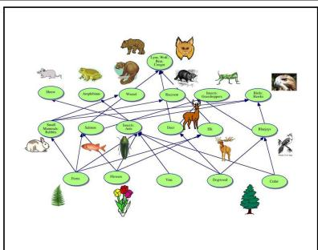

## Qwen3-VL-4B-Thinking (5,741 tokens)

Wait, maybe the user made a mistake in the diagram description, but assuming the diagram is correct, we have to go with the connections given. Since the diagram shows Ferns connected to Rabbits, and Salmon connected to Insects: Ants (connected to Flowers), there’s no direct or indirect connection between Ferns and Salmon. Therefore, the supply of Salmon would stay the same. So the answer is C) stay same.

Problem: Hint: Please answer the question and provide the correct option letter, e.g., A, B, C, D, at the end. Question: In the diagram of the food web shown, if the number of ferns decrease, the supply of salmon will most likely? Choices: (A) decrease (B) can’t tell (C) stay same (D) increase

Ground Truth: decrease

## Qwen3-VL-4B-TIES (2,167 tokens)

Therefore, we can’t tell. Wait, but let’s check again. The diagram has arrows from Ferns to Small Mammals: Rabbits. So rabbits eat ferns. Then, what do rabbits eat? If ferns are the main food, then fewer ferns → fewer rabbits. Now, do rabbits eat salmon? . . .

<table><tr><td>Answer: C ×</td><td>Answer: B ×</td></tr><tr><td>Qwen3-VL-4B-MI-0.8 (2,705 tokens) Is there an arrow from Ferns to Salmon? Let me think. If the number of ferns decreases, what happens to salmon? If ferns are a food source for salmon, then less ferns would mean less food for salmon, so salmon population would decrease.</td><td>Qwen3-VL-4B-S³ (280 tokens) Wait, in the diagram, there&#x27;s a line from ferns to salmon. So ferns are a food source for salmon. If ferns decrease, that means there&#x27;s less food available for salmon. So salmon&#x27;s supply would likely decrease because they have less food.</td></tr><tr><td>Answer: C ×</td><td>Answer: A√</td></tr></table>

Table 20 MathVista-testmini, Example 11: Reading an Analogue Clock (81.5% token reduction). S3 reads both hands once; the baselines re-open the hour hand a dozen times.

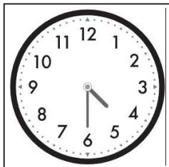

Problem: Hint: Please answer the question and provide the correct option letter, e.g., A, B, C, D, at the end. Question: What time does the clock show? Choices: (A) 9:30 (B) 1:30 (C) 4:30 (D) 5:30 (E) 11:30

Ground Truth: 4:30
<table><tr><td>Qwen3-VL-4B-Thinking (8,073 tokens) Wait, this is really hard without seeing the image. Wait, but the user provided a description: &quot;the clock show&quot; wait, no. ..</td><td>Qwen3-VL-4B-TIES (2,130 tokens) This is a bit tricky. Wait, perhaps the image shows the hour hand pointing to 5. But if the minute hand is at with numbers 1-12. The hour hand is pointing to 5. Or 6 (30 minutes), then the hour hand should be halfway between the current hour and the next. So if it&#x27;s 5:30,</td></tr><tr><td>Answer: D ×</td><td>Answer: D ×</td></tr><tr><td>Qwen3-VL-4B-MI-0.8 (4,041 tokens) minute hand is pointing at the 6 (which is 30 minutes), so the time is X:30.</td><td>Qwen3-VL-4B-S³ (394 tokens) Wait, the user provided a clock image. Let me try to Looking at the image, the hour hand is pointing imagine it. The clock has numbers 1 through 12. The just past the 4, and the minute hand is pointing at the 6.</td></tr><tr><td>Answer: D ×</td><td>Answer: C√</td></tr></table>

Table 21 MathVista-testmini, Example 12: Which Angle Is Numbered Two (67.3% token reduction). $S ^ { 3 }$ takes the two labels at A as the two parts of the right angle and subtracts once; Thinking and MI argue over the vertex order in “ABDC” and set angle 2 equal to angle 1.  
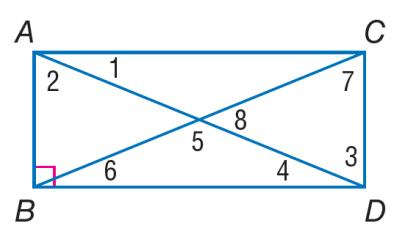

## Qwen3-VL-2B-Thinking (16,634 tokens)

The problem says quadrilateral ABDC is a rectangle, so ABDC is a rectangle, which means AB is parallel to CD, and AD is parallel to BC. Also, all angles in a rectangle are right angles, so angle at B is 90 degrees, right? Wait, the diagram shows a rectangle with points A, B, D, C, so the vertices are A, B, D, C, making ABDC a rectangle. So AB is one side, BD is a diagonal, and CD is the opposite side. Wait, no, in a rectangle, the order of the vertices matters. . . .

## Answer: B ×

## Qwen3-VL-2B-MI-0.8 (18,735 tokens)

Wait, hold on, the vertices are A, B, D, C? Wait, the diagram shows a rectangle with points A, B, C, D. Let me check the labels. The rectangle is ABDC? Wait, no, the rectangle is probably ABCD, but the problem says ABDC. Wait, maybe it’s a typo, but let’s look at the diagram. The diagram has points A, B, C, D with a right angle at B, so AB is a side, BC is a side, CD is the other side, DA is the last side. Wait, the right angle is at B, so angle ABC is 90 degrees. That makes sense for a rectangle: all angles are 90 degrees, opposite sides equal. . . .

## Answer: B ×

Problem: Hint: Please answer the question and provide the correct option letter, e.g., A, B, C, D, at the end. Question: Quadrilateral ABDC is a rectangle. If m∠1 = 38, find $m \angle 2$ Choices: (A) 33 (B) 38 (C) 52 (D) 87

Ground Truth: 52

## Qwen3-VL-2B-TIES (7,072 tokens)

First, let’s recall what we know about rectangles. A rectangle has all right angles, so angle at B is 90 degrees. Also, in a rectangle, opposite sides are equal, and diagonals are equal and bisect each other. Wait, but here we have quadrilateral ABDC as a rectangle. Wait, let’s check the diagram. First, let’s identify the rectangle. The diagram shows a rectangle with vertices A, B, D, C. Wait, the vertices are A, B, D, C. So ABDC is a rectangle. . . .

## Answer: C ✓

## Qwen3-VL-2B-S3 (2,315 tokens)

Now consider ∠2, which is at vertex A, between side AB and diagonal AD. Since AB and AD are adjacent sides of the rectangle, $\angle B A D = 9 0 ^ { \circ }$ . We already have: ∠BAC = 38◦ So: ∠CAD = ∠BAD − $\angle B A C = 9 0 ^ { \circ } - 3 8 ^ { \circ } = 5 2 ^ { \circ }$ Thus: $\angle 2 = \angle C A D = 5 2 ^ { \circ }$

## Table 22 MathVista-testmini, Example 13: Tandem Bikes and Matte Trucks (62.7% token reduction). S3 resolves “behind” once and compares; the baselines never settle the spatial relation.

<table><tr><td></td><td>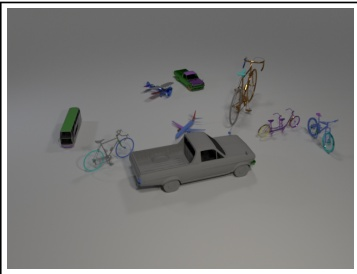</td><td>Problem: Hint: Please answer the question and provide the correct option letter, e.g., A, B, C, D, at the end. Question: Are there fewer tandem bikes that are behind the brown metal bicycle than matte trucks on the left side of the green object? Choices: (A) Yes (B) No Ground Truth: No</td></tr><tr><td>Qwen3-VL-2B-Thinking (7,059 tokens) Let&#x27;s list all objects: 1. Small green bus (left side, gray and green) 2. Gray road bike (left of the truck) 3. Blue airplane (middle) 4. Small blue and green truck (green object? Wait, the green object is the truck with green color. Wait, the green truck is the one with the green color, so the truck is green. Then, the other truck is the</td><td colspan="2">Qwen3-VL-2B-TIES (1,478 tokens) Wait, &quot;behind&quot; in 3D space—relative to the brown bike. The brown bike is a road bike, and the tandem bike is a little to the right and maybe behind? Wait, no. Let&#x27;s visualize. ..</td></tr><tr><td>gray pickup truck in the center. ... Answer: A ×</td><td>Answer: A ×</td><td>Qwen3-VL-2B-S³ (551 tokens)</td></tr><tr><td>Qwen3-VL-2B-MI-0.8 (2,124 tokens) so behind the brown bicycle? Wait, no—position matters. The brown bicycle (road bike) is on the right side. The tandem bike is to the right of the brown bicycle, so maybe</td><td></td><td>Let&#x27;s see: the tandem bike is purple and located behind the brown bicycle. So that&#x27;s one tandem bike.</td></tr><tr><td>behind? Wait, no. Let&#x27;s look at the scene. ... Answer: A ×</td><td colspan="2">Answer: B√</td></tr></table>

Table 23 MMMU, Example 14: A Missing Figure in a Trial Balance (75.6% token reduction). S3 identifies which cell is missing; the baselines solve for a cell that was already given.
<table><tr><td>12345 Revenues Expenses Gains Losses Net Income or (Loss)</td><td>Company A Company B Company C Company D $1,480,500 $103,950 $1,054,116 $455,490 1,518,300 78,120 32.7550 0 4,725 0 5,670 39,690 (58,275)</td><td>Problem: Each of the following situations relates to a different company. [Image 1] For company D, find the missing amounts. A. 1, 034, 325B.1,098,650 C. 1, 081, 584D.1,210,732 Answer with the option letter only.</td></tr><tr><td colspan="3">Qwen3-VL-4B-Thinking (10,382 tokens) Wait, maybe the question is asking for Revenues? Let&#x27;s see. Wait, let&#x27;s rearrange the formula for Revenues: Revenues = Net Income + Expenses - Gains + Losses</td></tr><tr><td colspan="3">Wait, let&#x27;s see. From Net Income = Revenues - Expenses +.. Answer: D ×</td></tr><tr><td colspan="3">Qwen3-VL-4B-MI-0.8 (8,611 tokens) So all options work. But that can&#x27;t be. There must be a mistake in the problem or my reasoning. Wait, maybe</td></tr><tr><td>the question is to find the missing amount for Company D, which is Expenses, and the ...</td><td></td><td>Qwen3-VL-4B-S³ (1,463 tokens) Wait, so the only missing amount for Company D is Expenses. Let&#x27;s verify. Net Income = Revenues - Expenses + Gains - Losses We can rearrange to solve for Expenses: Expenses = Revenues + Gains -</td></tr><tr><td colspan="3">Losses</td></tr><tr><td colspan="3">Answer: A ×</td></tr></table>

Table 24 MMMU, Example 15: Shifts in a Loanable-Funds Diagram (95.5% token reduction). $S ^ { 3 }$ moves one curve per shock and reads the new crossing of the diagram; MI sends the fall in capital spending the wrong way and TIES moves the rise in saving onto the demand curve.  
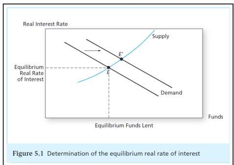

## Qwen3-VL-2B-Thinking (7,620 tokens)

So for option a: demand for funds (for investment) decreases → demand curve shifts left → intersection is to the left of E → interest rate is lower (decrease). Option b: households save more → demand for funds (for investment) decreases → demand curve shifts left → interest rate is lower (decrease). Option c: Federal Reserve buys Treasury securities → supply of money increases → supply curve shifts right → intersection is to the right of E → interest rate is lower (decrease). So all three options decrease the interest rate. . . .

## Answer: C ✓

## Qwen3-VL-2B-MI-0.8 (1,023 tokens)

In the supply and demand model for funds, the demand curve is the demand for funds by businesses, households, etc. If businesses reduce their capital spending, that’s a decrease in the demand for funds (since they’re not borrowing as much to spend on capital). So the demand curve shifts left. The intersection of supply and demand shifts left, so the equilibrium real rate of interest increases. Wait, but in the graph, the supply curve is upward sloping, and demand is downward sloping. . . .

Problem: Use the image to analyze the ef fect of the following on the level of real interest rates:[Image 1] a. Businesses become more pessimistic about future demand for their products and decide to reduce their capital spending. b. Households are induced to save more because of increased uncertainty about their future Social Security benefits. c. The Federal Reserve Board undertakes open-market purchases of U.S. Treasury securities in order to increase the supply of money. A. a.increase ;b.decrease ;c.increase B. a.increase ;b.decrease ;c.decrease C. a.decrease ;b.decrease ;c.decrease D. a.decrease ;b.increase ;c.decrease Answer with the option letter only.

## Ground Truth: C

## Qwen3-VL-2B-TIES (919 tokens)

D. a.decrease ;b.increase ;c.decrease → yes, that’s D. Wait, let me confirm again. For a: businesses reduce capital spending → demand for funds decreases → demand curve shifts left → equilibrium real rate decreases → correct. For b: households save more → demand for funds increases → demand curve shifts right → equilibrium real rate increases → correct. For c: Fed buys Treasury securities → increases money supply → supply of funds shifts right → equilibrium real rate decreases → correct. So the answer is D. . . .

## Answer: D ×

## Qwen3-VL-2B-S3 (341 tokens)

So a is decrease. b. Households save more due to uncertainty about Social Security benefits. Saving more means more funds in the banking system, so the supply of funds increases. Supply of funds shifts right. That would lead to a lower real interest rate. Because with more supply, the equilibrium interest rate falls. So b is decrease. c. Federal Reserve buys Treasury securities, increasing money supply. That shifts the supply curve for funds to the right (since more money is in the economy). So supply increases, equilibrium interest rate decreases. So c is decrease.

## Answer: C ✓

## C.3 Audio Reasoning

These five examples are audio questions: one listening-comprehension item, three from the MMAR set of audio-reasoning questions, and one disfluency-annotation item from MMSU. In four of the five no baseline answers correctly; the fifth, Table 27, is a clip on which all four methods succeed, and it is included for contrast. Each of the other four turns on a single cue, and each of the three analysed below turns on a diferent kind: Table 26, where the culprit is identified by what is said rather than by how someone reacts; Table 28, where the baselines discount a demonstration that has already been given; and Table 29, where one opening sound has to be classified before anything else can be counted.

## Representative examples.

Example 1 (Table 26): Who Ate the Powdered Donut (55.0% reduction, incorrect → correct). A four-speaker exchange, and one question: who ate the donut? The fourth speaker says so — “Yeah, that was me.” — and S3 quotes exactly that, naming the fourth person in 218 tokens. All three baselines hear the same exchange, all three reconstruct the culprit from something other than the admission, and all three land on the wrong speaker.

Thinking (3,929 tokens) and MI-0.8 (3,006) build their answer on a cough. MI-0.8 reasons “The physical reaction (coughing) aligns with the act of consuming something like a powdered donut, and Speaker 3’s denial followed by this sound indicates guilt”; Thinking lays the same inference out as a four-row elimination and concludes “the third speaker (Speaker 3) ate the powdered donut”. The cough is real, and the inference from it is not unreasonable — but it is a guess about a speaker who never says anything, made in a clip where another speaker does. TIES (484) takes the third route, from ownership to guilt: “The speaker who then makes the statement about it being ‘his last donut’ and calls the others ‘disrespectful’ is also the first speaker”, and answers A.

$S ^ { 3 }$ transcribes the same four turns and reads the fourth one for what it is, an admission: “Speaker 4 (fourth person) admits by saying, “Yeah, that was me.”, ” It then confirms the fourth person is option D and stops. The 55.0% is the cost of the two competing inferences that $S ^ { 3 }$ does not enter.

Example 2 (Table 28): Counting the Chinese Tones Demonstrated (70.9% reduction, incorrect → correct). The speaker teaches four Mandarin tones, demonstrates each one individually, and then says six syllables that use them. The question asks how many diferent tones are involved in the six pronunciation words, and the answer key says four — which requires counting the individual demonstration, since the six words on their own use three. $S ^ { 3 }$ takes that reading and answers (D) in 535 tokens. All three baselines take the other reading and answer (A) 3.

What makes this example useful is that the baselines find the missing fourth tone and then discard it. MI-0.8 (5,912) states the whole case and then rules it out in one sentence: “Although the speaker mentioned learning four tones earlier in the audio with the $^ { \ d } a ^ { \dprime }$ sounds, the specific six words provided do not include the fourth tone.” TIES (1,841) and Thinking (4,147) reach the same conclusion without ever considering the demonstration, both listing the same three tones and both ending on the same negative finding — Thinking’s is “The fourth tone (à) is not demonstrated in any of the six syllables.” Each of the three then reports the count of the narrower set.

S3 keeps both parts of the clip in scope: it records the four individual demonstrations and then the six words, and finds the fourth tone among the former. The 70.9% is the cost of the six-syllable inventory the baselines build.

Example 3 (Table 29): Types of Disfluency in the Audio (41.8% reduction, incorrect → correct). The clip opens with a short laugh, then a woman describes a trifle: $^ { \mathrm { \tiny { 6 6 } } } H a ,$ , well my sister is the simstrous of the two of us.” The options ask which disfluency categories are present, and the answer is A, discourse markers and restarts — well for the first, simstrous for the second. $S ^ { 3 }$ answers A in 271 tokens. All three baselines answer D, and all three do so because they classify the opening laugh as a filled pause.

The pair of traces to compare is $S ^ { 3 \dagger } \mathrm { s }$ and MI-0.8’s, because they transcribe the same sound diferently. MI-0.8 (1,944) hears $\mathit { \Omega } ^ { \mathit { \omega } , \mathit { \omega } } \mathcal { H } u h ^ { \mathit { \omega } }$ and files it with um and uh; TIES (1,459) does the same; Thinking (466) calls it “a short, sharp laugh” and then files it as a filled pause anyway — “This is a common filled pause, often used to indicate”. $S ^ { 3 }$ makes the same observation and draws the opposite conclusion: “The initial “Ha” is a chuckle, which is a filler but not a standard filled pause like ‘uh’ or ‘um’.” The rest of the classification follows. MI-0.8 also shows the baselines overriding their own taxonomy — “So even though discourse markers aren’t disfluencies, the test might be considering them as such” — to keep the option that the misclassification produced.

$S ^ { 3 }$ then checks the remaining options of and stops. The 41.8% is the smallest reduction of the twenty, and the diference between the two traces is a single perceptual decision taken in the first line of both.

Table 25 MMAR, Example 16: A Profession Inferred from a Conversation (42.4% token reduction). $S ^ { 3 }$ takes the word “test” as the domain cue; the baselines supply a fitness practice that does not exist.

<table><tr><td rowspan=1 colspan=1>Problem: What is the most likely profession of the first speaker?Audio transcript (reader aid; the model received only the audio): &quot;all right bro looking good we&#x27;re done yeahwe&#x27;re all done man what&#x27;s up there you go this is for you you want me to eat this yeah man candy yeah sure allright that was a test dude which you failed&quot;Ground Truth: Dentist</td></tr><tr><td rowspan=7 colspan=1>Qwen3-Omni-30B-A3B-Thinking (1,978 tokens)     Qwen3-Omni-30B-A3B-TIES (549 tokens)The key part is that they&#x27;re talking about candy, and  The first speaker says, &#x27;All right, bro. Looking good.then one says it was a test that the other failed. But  We&#x27;re done?’ The second speaker asks, &#x27;We&#x27;re done?&#x27;what does this have to do with professions? Now, the  and the first speaker confirms, &#x27;Yeah, we&#x27;re all done,question is: What is the most likely profession of the first  man.’ The second speaker then says, &#x27;What&#x27;s up?’ andspeaker? Options are Dentist, Teacher, Fitness Coach,  the irst speaker responds, &#x27;There you go. This is forNurse. I need to think about contexts where someone  you.&#x27; The second speaker asks, &#x27;You want me to eatmight give candy as a test or something related to health. this?&#x27; and the first speaker says, &#x27;Yeah, man. Why not?Let me consider each option: - Dentist: Dentists often  The candy. ..talk about oral health, and candy might be related to teeth.But dentists usually advise against eating candy becauseit&#x27;s bad for teeth. However, in this case, the first speakergives candy and says it was a test. Maybe it&#x27;s a test forsomething like how people react to candy, but that seemsodd.</td></tr><tr><td rowspan=1 colspan=1>might give c</td></tr><tr><td rowspan=1 colspan=1>Let me</td></tr><tr><td rowspan=1 colspan=1>But dentists usually advise agai</td></tr><tr><td rowspan=1 colspan=1>it's bad for teeth. However, in this</td></tr><tr><td rowspan=1 colspan=1>test.</td></tr><tr><td rowspan=1 colspan=1>t to</td></tr><tr><td rowspan=1 colspan=1>Answer: C ×                                                Answer: C ×</td></tr><tr><td rowspan=5 colspan=1>Qwen3-Omni-30B-A3B-MI-0.8 (7,446 tokens)        Qwen3-Omni-30B-A3B-S3 (316 tokens)Perhaps for a dentist, after a check-up, they might say  Crucially, the word &#x27;test’ is used in what appears&quot;Looking good, &quot; and then give a small treat, but candy is  to be a professional context, suggesting a formalbad for teeth, so it doesn&#x27;t make sense for a test. Unless  evaluation.it&#x27;s to see if the patient resists, but the patient is givencandy to eat, so if they eat it, they fail, but dentistsdon&#x27;t usually do that. For a teacher, it&#x27;s unlikely. Fora nurse, similar. Let&#x27;s think about the word &quot;test.&quot; Inmedical contexts, there are glucose tests, but candy isn&#x27;t</td></tr><tr><td rowspan=1 colspan=1>1 contex</td></tr><tr><td rowspan=3 colspan=1>三</td></tr><tr><td rowspan=1 colspan=1>don't usually d</td></tr><tr><td rowspan=1 colspan=1>do that. For a teadl</td></tr><tr><td rowspan=1 colspan=1>Answer: C ×                                                Answer: A√</td></tr></table>

Table 26 MMAR, Example 17: Who Ate the Powdered Donut (55.0% token reduction). $S ^ { 3 }$ reads the fourth speaker’s admission; the baselines infer the culprit from a cough.
<table><tr><td rowspan=1 colspan=4>Problem: Which speaker ate the powdered donutAudio transcript (reader aid; the model received only the audio): &quot;Hey, wait my last powder donut it wasn&#x27;tme wasn&#x27;t me Guys that was his last powder donut. Don&#x27;t be so disrespectful. Okay?&quot;Ground Truth: Fourth person</td></tr><tr><td rowspan=1 colspan=4>Qwen3-Omni-30B-A3B-Thinking (3,929 tokens)     Qwen3-Omni-30B-A3B-TIES (484 tokens)Here, &quot;his&quot; refers to Speaker 1 (the owner), confirm- Speaker 2 (female) says, &#x27;It wasn&#x27;t me,&#x27; which is a directing the donut was eaten, and the phrase &quot;Don&#x27;t be so  denial of eating it. Speaker 1 then says, &#x27;Wasn&#x27;t me,disrespectful&quot; implies Speaker 4 is addressing the eater. which is another denial. After these denials, Speaker 1The coughing directly after Speaker 3&#x27;s denial suggests  starts coughing, and then says, &#x27;Guys, that was his lastthey are the one who ate the donut, as the physical reac-  powdered donut. Don&#x27;t be so disrespectful. Okay, freshtion gives away their guilt. Speaker 1 is the owner and  up right now.’ This is the key part. ..not the eater, Speaker 2 denied responsibility withoutcoughing, and Speaker 4 is accusing others, so they arenot the eater. Therefore, the third speaker (Speaker 3)ate the powdered donut.</td></tr><tr><td rowspan=1 colspan=4>Answer: B ×                                                Answer: A ×</td></tr><tr><td rowspan=1 colspan=4>Qwen3-Omni-30B-A3B-MI-0.8 (3,006 tokens)        Qwen3-Omni-30B-A3B-S³ (218 tokens)The audio: &quot;Wasn&#x27;t me.&quot; then &quot;cough cough cough Oh!&quot;  Then, analyzing the audio reveals four speakers: Speaker</td></tr><tr><td rowspan=1 colspan=3>then &quot;</td><td rowspan=1 colspan=1>Guys, that was his last powdered donut...&quot; So 1 (first person) asks, &quot;Hey, when the last powdered</td></tr><tr><td rowspan=1 colspan=3>coughing is</td><td rowspan=1 colspan=1></td></tr><tr><td rowspan=1 colspan=4>the coughing is from one of the previous speakers. Since  me.&quot;, Speaker 3 (third person) denies, &quot;Wasn&#x27;t me.&quot;,Speaker 3 just said &quot;Wasn&#x27;t me, &quot; and then coughs, it&#x27;sand Speaker 4 (fourth person) admits by say-likely Speaker 3. Speaker 2 spoke earlier, so less likely. ing, &quot;Yeah, that was me.&quot;, followed by coughingTherefore, Speaker 3 ate it.                                  and gagging, then clarifying, &quot;That was his lastpowdered donut. Don&#x27;t be so disrespectful.&quot;This admission occurs when the speaker identi-fes themselves as the one who ate it.Answer: B ×                                                Answer: D√</td></tr></table>

Table 27 MMAU\_testmini, Example 18: The Ingredients of a Trifle (59.6% token reduction). S3 recalls the layers once and dismisses each wrong list in a clause; the baselines re-check every distractor ingredient by ingredient.

Problem: What ingredients did Speaker 1 say she used in the trifle?

Audio transcript (reader aid; the model received only the audio): “it’s a trifle it’s got all of these layers it’s got all of these layers first there’s a layer of ladyfingers then a layer of jam then custard which i made from scratch then raspberries more ladyfingers then beef sauteed with peas and onions and then bananas and then i just put some whipped cream on top it tastes like feet i like it are you kidding”

Ground Truth: (D) Ladyfingers, jam, custard, raspberries, beef, peas, onions, bananas, whipped cream

Qwen3-Omni-30B-A3B-Thinking (1,373 tokens) A. Bread, jelly, pudding, strawberries, chicken, carrots, garlic, apples, cream - Bread? Not mentioned; she said lady fingers, which are like cookies or biscuits, but not bread. - Jelly? She said jam, which is similar, but option says jelly. - Pudding? She said custard, which might be confused, but custard is diferent. - Strawberries? She said raspberries. - Chicken? She said beef. - Carrots, garlic, apples? Not mentioned. - Cream? She said whipped cream, but option says cream, which might be close. . . .

Answer: D ✓

## Qwen3-Omni-30B-A3B-MI-0.8 (1,728 tokens)

Option A: Bread, jelly, pudding, strawberries, chicken, carrots, garlic, apples, cream - Bread: she said lady fingers, which are a type of cookie or biscuit, not bread. But lady fingers are often used in trifles, so maybe similar, but not exactly bread. - Jelly: she said jam, which is similar, but jelly is usually fruit spread, jam is thicker. But she said jam. - Pudding: she said custard, which is dif ferent. Pudding is usually set with gelatin or cornstarch, custard is egg-based. Not the same. - Strawberries: she said raspberries, not strawberries. . . .

Answer: D ✓

Qwen3-Omni-30B-A3B-TIES (589 tokens) Option A includes bread, jelly, pudding, strawberries, chicken, carrots, garlic, apples, cream. ’Bread’ is not correct as ’ladyfingers’ were mentioned; ’jelly’ is not correct as ’jam’ was used; ’strawberries’ is incorrect as ’raspberries’ were stated; ’chicken’ is wrong because ’beef’ was used; and other items like ’carrots’ and ’garlic’ were not mentioned, so A is incorrect. . . .

## Answer: D ✓

## Qwen3-Omni-30B-A3B-S3 (238 tokens)

Next, I compared these ingredients with each option: Option A includes bread, strawberries, chicken, carrots, and garlic which were not mentioned; Option B includes cake, marmalade, cherries, turkey, corn, peppers, and melons which were not mentioned; Option C includes cookies, blueberries, pork, beans, tomatoes, peaches, and yogurt which were not mentioned; Option D lists ladyfingers, jam, custard, raspberries, beef, peas, onions, bananas, and whipped cream which exactly matches Speaker 1’s description. Therefore, the correct answer is D. . . .

## Answer: D ✓

Table 28 MMAR, Example 19: Counting the Chinese Tones Demonstrated (70.9% token reduction). $S ^ { 3 }$ transcribes the last syllable as “má”; the baselines hear “mă” and lose the fourth tone.
<table><tr><td colspan="2">Problem: How many different Chinese tones are involved in the six Chinese pronunciation words demonstrated by the speaker? Audio transcript (reader aid; the model received only the audio): &quot;Chinese is easy when you learn four tones in this way. Move your head with the tone shape. Try this.&quot;</td></tr><tr><td>Ground Truth: 4 Qwen3-Omni-30B-A3B-Thinking (4,147 tokens) Each syllable&#x27;s tone is as follows: - First &quot;mā&quot; in 3. mǎ mā - &quot;mǎ&quot; is third tone. - &quot;mā&quot; is first tone. &quot;mama&quot;: first tone (ā) - Second &quot;mā&quot; in &quot;mama&quot;: first Summary of Tones Used: - First tone: appears in &quot;mā&quot; tone (ā) - &quot;qí&quot;: second tone (á) - &quot;mǎ&quot; in &quot;qí mǎ&quot;: third (repeatedly). - Second tone: appears in &quot;qí&quot;. - Third tone (ǎ) - &quot;mǎ&quot; in &quot;mǎ mā &quot;: third tone (ǎ) - &quot;mā &quot; in tone: appears in &quot;mǎ&quot; (repeatedly). The fourth tone is &quot;mǎ mā &quot;: first tone (ā) The tones used are first, second, not present in any of the six syllables.</td><td>Qwen3-Omni-30B-A3B-TIES (1,841 tokens)</td></tr><tr><td>and third. The fourth tone (à) is not demonstrated in any of the six syllables. Therefore, there are t ... Answer: A ×</td><td>Answer: A ×</td></tr><tr><td>Qwen3-Omni-30B-A3B-MI-0.8 (5,912 tokens) parse that. She says: ″mā, mā, qí, mǎ, mǎ, mǎ&quot; – but má is tone 4 So the tones used are tone 1, tone 2, that might be a typo or mispronunciation. Looking back: &quot;mā, mā, qí, mǎ, mǎ, mǎ&quot; – but &quot;mā&quot; is repeated, and &quot;qí&quot; is different. Let me read the audio transcript: &quot;Try this: mā, mā, qí, mǎ, mǎ, mǎ &quot; – but it says &quot;mā mā qí mǎ mǎ mǎ&quot; – that seems odd. Perhaps it&#x27;s &quot;mā, mā, qí, mǎ, mă, mǎ&quot; meaning six words. But &quot;mā&quot; is first tone, &quot;qí &quot; is second tone, &quot;mǎ&quot; is third tone, and &quot;mà &quot; might be fourth tone, but she says &quot;mǎ&quot; multiple times. Let&#x27;s look at the audio: she says &quot;mā, mā, qí, mǎ, mǎ, mǎ&quot;</td><td>Qwen3-Omni-30B-A3B-S3 (535 tokens) She says: &quot;ā, á, ǎ, à &quot; – that&#x27;s the four tones. Then Then in the examples: - mā mā: both tone 1 - qí mǎ: she says &quot;Try this: mā, mā, qí, mǎ, mǎ, mǎ ″ – let&#x27;s qí is tone 2, mǎ is tone 3 - mǎ má: mǎ is tone 3, tone 3, tone 4. All four tones are demonstrated.</td></tr><tr><td colspan="2">That doesn&#x27;t make sense for different tones. Answer: A × Answer: D√</td></tr></table>

Table 29 MMSU, Example 20: Types of Disfluency in Speech (41.8% token reduction). S3 hears the opening sound as a chuckle; the baselines count it as a filled pause.
<table><tr><td colspan="2">Problem: Which types of disfluencies are present in the audio? - Filled pauses: e.g., uh, um - Discourse markers: e.g., well, you know - Restarts: interrupted or repeated sentence starts - Explicit editing terms: e.g., I mean - None: if the speech is fluent. Audio transcript (reader aid; the model received only the audio): &quot;Well, my sister is the seamstress of the two of us, but she doesn&#x27;t China paint, so we both have our expertise side.&quot; Ground Truth: discourse markers, restarts</td></tr><tr><td>Qwen3-Omni-30B-A3B-Thinking (466 tokens) Then, the audio starts with a short, sharp laugh: &quot;Heh.&quot; This is a common illed pause, often used to indicate a brief hesitation or as a conversational filler. Next, the speaker says: &quot;Well my sister is the seamstress of the two of us...&quot; The word &quot;Well&quot; is a classic discourse</td><td>Qwen3-Omni-30B-A3B-TIES (1,459 tokens) First, listen to the speech: &quot;Huh, well my sister is the sinstrous of the two of us. And but she doesn&#x27;t chain up paint, so we both have our expertise site.&quot; Now, break down each type: 1. Filled pauses: The speaker says</td></tr><tr><td>marker used to introduce a statement. Answer: D ×</td><td>&quot;Huh&quot; at the beginning. &quot;Huh&quot; is a filled pause, similar to &quot;um&quot; or &quot;uh&quot;, used to fill a moment of hesitation. Answer: D ×</td></tr><tr><td>Qwen3-Omni-30B-A3B-MI-0.8 (1,944 tokens) Then, analyzing the audio content: the speaker says, &#x27;Huh. Well, my sister is the seamstress of the two of us, and but she doesn&#x27;t China paint, so we both have our expertise side.’ Specifically, at the very beginning, there&#x27;s a &#x27;Huh’ which is a flled pause (a short, non-lexical sound expressing hesitation or thought), and around 00:03, the</td><td>Qwen3-Omni-30B-A3B-S³ (271 tokens) First, listen to the beginning: &quot;Ha, well my sis- ter is the simstrous of the two of us...&quot; - The initial &quot;Ha&quot; is a chuckle, which is a filler but not a standard filled pause like &quot;uh&quot; or &quot;um&quot;. - The word &quot;well&quot; is a discourse marker, used to introduce the sentence. - The phrase &quot;sim-</td></tr><tr><td colspan="2">speaker says &#x27;and but&#x27;which is a classic example of a strous&quot; is a self-correction for &quot;simstress&quot;. This restart . is a restart/repetition of a word. Answer: D × Answer: A√</td></tr></table>