# SCALING ZERO-ORDER PRETRAINING THROUGH MODEL SHARDING

Francois Chaubard Stanford University

Mykel J. Kochenderfer Stanford University

Chris Ré Stanford University

## ABSTRACT

Zero-order optimization (ZO) enables training without backpropagation, making it relevant to forward-only hardware and non-differentiable loss, but its gradient variance grows with perturbed dimension. This inhibits large model training. Sharded Optimization Mixture of Assemblies (SOMA) is an architecture designed with ZO in mind. SOMA is an ensemble of LSTM experts that train independently on N clusters of data using simultaneous perturbation stochastic approximation (SPSA). Its separable loss function removes cross-expert perturbation noise at the cost of jointly learned representations across domains. Experts train independently, without exchanging gradients, activations or optimizer state. We use 80,000 estimated RTX 5090 GPU-hours to study SOMA compared to baseline methods. Modest sharding improves training compute efficiency over all tested monolithic ZO controls. We study a 8.44M model at 150 aggregate GPU-hour budget and show SOMA N = 2 with 64 perturbations reaches 1.76 test nats/byte, versus 2.00–2.11 for monolithic SPSA at 64, 256 or 1,024 perturbations and 2.21 for EGGROLL. On WikiText-103, these frozen checkpoints reach 2.07, 2.25–2.36 and 2.49, respectively. On a fixed separable objective with equal-size blocks, we prove that independent losses reduce relative gradient variance to approximately 1/N of a shared-loss estimator’s. Holding starting weights, data, perturbations and compute fixed, independent rather than summed losses lower SOMA N = 4 test loss by 0.035 nats/byte after 1,000 updates across three seeds. Finally, we show larger ensembles offer a separate inference benefit. At similar model size with top-k routing (k = 4), SOMA N = 256 achieves 2.36M tokens/s versus 257k for SOMA N = 8 (9.19×, including routing), at lower test loss (1.68 versus 1.71), albeit with SOMA N = 256 using 59.9× as much aggregate training compute. We release all training and evaluation code and checkpoints for reproduction.

$$
\mathbf { M o d e l { \ s i z e } } \simeq 8 . 4 4 \mathbf { M } , \mathbf { S O M A } \ n _ { \mathrm { p e r t } } = B = 6 4 , \mathbf { S P S A } \ B = 6 4
$$

$$
\begin{array} { r l r l } & { \mathbb { - } } & { \mathrm { S O M A ~ } N = 2 ( \mathrm { 2 ~ G P U s } ) } & { \overset {  } { = } } & { \mathrm { M o n o l i t h i c ~ S P S A ~ } n _ { \mathrm { p e r t } } = 6 4 ( \mathrm { 4 ~ G P U s } ) } \\ & {  } & { \mathrm { S O M A ~ } N = 8 ( \mathrm { 8 ~ G P U s } ) } & { \stackrel {  } { = } } & { \mathrm { M o n o l i t h i c ~ S P S A ~ } n _ { \mathrm { p e r t } } = 2 5 6 ( \mathrm { 1 6 ~ G P U s } ) } \\ & { \mathbb { - } } & { \mathrm { S O M A ~ } N = 2 5 6 ( 2 5 6 \mathrm { 6 ~ G P U s } ) } & { \stackrel {  } { \to } } & { \mathrm { M o n o l i t h i c ~ S P S A ~ } n _ { \mathrm { p e r t } } = 1 0 2 4 ( 3 2 \mathrm { ~ G P U s } ) } \\ & { \qquad \to } & { \mathrm { M o n o l i t h i c ~ E G G R O L ~ ( 8 ~ G P U s ) } } \end{array}
$$

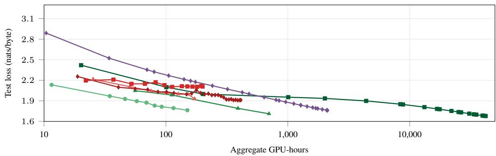  
Figure 1: Modest sharding improves training compute efficiency. Near 150 aggregate GPU-hours, SOMA N = 2 reaches 1.76 test nats/byte, versus 2.00–2.11 for monolithic SPSA and 2.21 for EGGROLL. Appendix I gives checkpoint and timing details.

## 1 INTRODUCTION

Zero-order optimization (ZO) is useful when exact gradients are unavailable or costly, including forward-only hardware and non-differentiable loss. However, ZO methods struggle to improve loss as model size grows because, at a fixed number of perturbations per global step, relative gradient variance increases linearly with the number of perturbed parameters.

Simultaneous perturbation stochastic approximation (SPSA) (Spall, 1992) estimates updates by averaging scalar loss differences along $n _ { \mathrm { { p e r t } } }$ independent perturbation directions. With M jointly perturbed parameters, leading relative gradient variance scales as $M / n _ { \mathrm { p e r t } }$ (Nesterov & Spokoiny, 2017). Controlling that error requires a compute budget of $n _ { \mathrm { p e r t } } \propto M$ . If forward compute grows linearly with parameters at fixed batch size and context length, compute per global step grows as $O ( M ^ { 2 } )$ (Section 5). Increasing the perturbation count improves each estimate but leaves fewer updates within a fixed compute budget. Reducing model size makes estimation easier but limits the parameters available for prediction.

Modern techniques, such as EGGROLL (Sarkar et al., 2025), improve the efficiency of perturbation evaluations through low-rank structure. We investigate an orthogonal technique, changing the architecture so that total model size can grow without enlarging each independently estimated parameter block and gradient variance.

Following Cluster–Branch–Train–Merge (CBTM) (Gururangan et al., 2023), Sharded Optimization Mixture of Assemblies (SOMA) trains domain-specialized recurrent experts on separate corpus clusters (Figures 2 and 3). Each expert receives its own loss, making the training objective separable and removing noise from perturbations to other experts. Gradient estimation depends on expert size rather than full ensemble size, but experts give up joint learning of recurrent representations across domains. This changes both the architecture and the optimization problem. Domain specialization gives each expert a distinct learning task, independent losses isolate its update signal, and routing combines selected expert predictions at inference. The challenge is whether these independently learned predictors compensate for the shared representations and joint adaptation that decomposition removes.

We compare learned models at approximately fixed total size and aggregate compute, then isolate why, with independent versus summed-loss continuations at fixed architecture and gradient-variance measurements. Six ablations examine data partitioning, initialization, head updates, independent losses, perturbation and batch allocation, and active expert count. Finally, we study SOMA’s inference benefits in exchange for larger training budgets. Our contributions are:

• We introduce SOMA for independent ZO expert training and demonstrate improved compute efficiency over the tested monolithic controls. Near 8.44M parameters and 150 aggregate GPU-hours, SOMA $N = 2$ reaches 1.76 test nats/byte, versus 2.00–2.11 for monolithic SPSA at 64, 256 or 1,024 perturbations and 2.21 for EGGROLL (Figure 1). The same frozen checkpoints score 2.07, 2.25–2.36 and 2.49 on WikiText-103 (Table 9). An early comparison with equal compute and tuning budgets favors SOMA $N = 2$ over monolithic SPSA in all three optimization seeds (Table 7).

• We explain and test the independent loss mechanism. Controlling for the same expert sizes, and number of experts, we prove that independent losses reduce relative gradient variance to approximately $1 / N$ of a shared-loss estimator’s. Independent losses give 4.02× lower error compared to summed loss on SOMA N = 4 (Figure 11). This translates to lower test loss by 0.035 nats/byte after 1,000 updates across three seeds (Figure 4). We compare the marginal benefits of sharding versus investing in more $n _ { \mathrm { { p e r t } } }$ or batch size (B) and show sharding reduces relative gradient error more than increasing $n _ { \mathrm { { p e r t } } }$ or $B$ at comparable aggregate GPU-seconds per global step (Figure 5), with 118× lower measured relative centered variance for SOMA ${ \bar { N } } = 2 5 6$ than the $N = 1$ control (Figure 10).

• Finally, we characterize the separate inference benefit of heavier sharding (Figure 6), measuring how loss changes with the number of active experts at fixed expert width (Figure 16). At approximately equal total model size with top-k routing $( k = 4 )$ , SOMA $\bar { N } = 2 5 6$ achieves 2.36M tokens/s versus 257k for SOMA N = 8 (9.19×, including routing), with test losses of 1.68 and 1.71, albeit with SOMA N = 256 using 59.9× as much aggregate training compute (Tables 12 and 13).

## 2 RELATED WORK

SOMA combines independent expert training with zeroth-order estimation. Its closest precedents therefore concern both how language models are divided into experts and how their parameters can be learned with ZO. CBTM trains independent transformer language-model experts on corpus clusters and combines them at inference (Li et al., 2022; Gururangan et al., 2023). SmallTalk LM also trains independent models and routes from a short prefix (Filippova et al., 2025). SOMA adopts this organization to study a ZO-specific question, whether local learning signals compensate for the loss of joint adaptation. It differs from jointly trained mixtures of experts, whose router and experts exchange training signals (Shazeer et al., 2017).

Earlier recurrent ZO work scales a monolithic architecture (Chaubard & Kochenderfer, 2025). EGGROLL uses low-rank evolution strategies for recurrent-model pretraining (Sarkar et al., 2025). MeZO and related methods reduce estimator or memory costs for language-model fine-tuning (Malladi et al., 2023; Wang et al., 2024; Chen et al., 2024b; Yu et al., 2025). MeZO-SVRG uses control variates and Sparse MeZO selects parameters to update, both evaluated in fine-tuning (Gautam et al., 2024; Liu et al., 2025). Appendix B gives the broader comparison.

ZO pretraining is distinct from adapting a model already trained with backpropagation. Allaire et al. (2025) study this difficulty in a 20M-parameter model. KronZO pretrains GPT-2 Small on OpenWebText with Kronecker-structured perturbations (Allaire et al., 2026). EGGROLL reports 3.40 bits/byte (or 2.36 nats/byte) pretraining an INT8 recurrent LLM on MiniPile (Sarkar et al., 2025). These results establish other routes to ZO pretraining. Their losses use different datasets and evaluation protocols, so they do not provide a common ranking with FineWeb-Edu. Figure 1 compares our FP32 EGGROLL reproduction with SOMA and monolithic SPSA on the same test set across aggregate training budgets.

## 3 THE SOMA ARCHITECTURE

SOMA (Figure 2) is an ensemble of experts that each predict independently using their own recurrent state. Expert predictions are combined only at inference, not during training. We do not use transformers as each expert would require a key-value cache that would grow memory with context length. A shared, weight-tied matrix E embeds and decodes bytes. Each expert has two residual blocks, each applying an LSTM followed by a multilayer perceptron (MLP). The fixed router selects the top-k experts, with k = min(4, N), using term frequency–inverse document frequency (tf–idf) weights (Salton & Buckley, 1988), reduced by truncated singular value decomposition (SVD) (Deerwester et al., 1990). Their next-byte probabilities are averaged. In Figure 2, expert $f _ { i }$ produces hidden state $h _ { i }$ and prediction $p _ { i }$

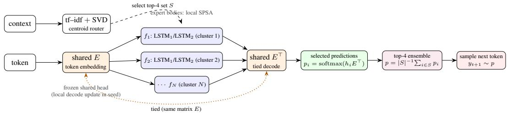  
Figure 2: The SOMA architecture. A fixed router selects up to four independently trained LSTM experts. They share a frozen embedding and decoder, and their predictions are averaged. The decoder is trained once in the seed run.

Let $x _ { < t }$ be the context before byte position $t , y _ { t }$ the target byte, and $p _ { e }$ expert e’s predicted distribution. For the router-selected set S, the ensemble prediction p averages the |S| expert probabilities,

$$
p ( y _ { t } \mid x _ { < t } ) = { \frac { 1 } { | S | } } \sum _ { e \in S } p _ { e } ( y _ { t } \mid x _ { < t } ) .\tag{1}
$$

Each expert predicts the same byte vocabulary. The router chooses S from the observed context and keeps it fixed over the scored window. Training does not differentiate through this mixture. Each expert learns on its assigned cluster without evaluating the others.

## 4 THE SOMA RECIPE

To specialize experts without jointly training a router, we use the same corpus partition for training assignment and inference routing. Following the CBTM recipe, we first lightly train an N = 1 seed for 1,000 updates on a 10B-byte subset of FineWeb-Edu (Penedo et al., 2024). The seed learns the body and shared embedding/decoder. We cluster the 100B-byte corpus using word-level tf–idf, a 128-dimensional SVD and balanced spherical k-means. Each sequence is assigned to one cluster (Figure 3). We use a byte-level tokenizer with a 256-symbol vocabulary to reduce compute across the repeated forward evaluations required by SPSA.

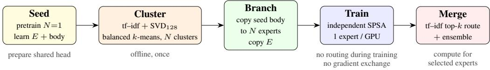  
Figure 3: The SOMA recipe. A seed learns the body and shared embedding and decoder. Clustering assigns each expert its data. Each expert copies the seed body and trains independently with the decoder frozen. The same clustering pipeline uses top-k routing with $k = \operatorname* { m i n } ( 4 , N )$ at inference.

The seed head uses the cross-entropy derivative with respect to the decoder weights. We use delta-rule to compute the exact decoder-path gradient without backpropagating through the recurrent body or perturbing the tied embedding/decoder weights (Appendix E), treating hidden states as fixed. Expert bodies use SPSA without backpropagating through the recurrent state. For expert $e ,$ let $L _ { e }$ be its independent loss and $\theta _ { e } \in \mathbb { R } ^ { d _ { e } }$ its $d _ { e }$ perturbed parameters. For the dense-probe calculation, independent Rademacher probes $z _ { j } \in \{ - 1 , \mathbf { \bar { + } } 1 \} ^ { d _ { e } }$ give the estimate

$$
\widehat g _ { e } = \frac { 1 } { n _ { \mathrm { p e r t } } } \sum _ { j = 1 } ^ { n _ { \mathrm { p e r t } } } \frac { L _ { e } ( \theta _ { e } + \varepsilon z _ { j } ) - L _ { e } ( \theta _ { e } - \varepsilon z _ { j } ) } { 2 \varepsilon } z _ { j } .\tag{2}
$$

Each expert uses its own loss, optimizer state and GPU. Training probes are sparse, with density 0.5 on ordinary weights. The empirical predictions use their recorded distribution (Appendix G.1). All directions and both signs share a batch before accumulation. We use Adam-style moments (Kingma & Ba, 2015) and accumulate independently sampled batches and directions. Keeping the head out of SPSA reduces the search dimension.

At inference, the clustering pipeline selects the nearest min(4, N) centroids based on the context before the experts run, so the same partition determines both what an expert learns and what sequence it is selected to produce at test time. Appendix D gives the implementation settings. Appendix E specifies the updates.

The main sweeps use 1,024-byte windows, $n _ { \mathrm { p e r t } } = 6 4$ perturbation directions and batch size $B = 6 4$ sequences per expert unless varied. The learning rate and perturbation radius (ε) start at $1 0 ^ { - 3 }$ and decay on expert validation plateaus.

## 5 GRADIENT VARIANCE

The purpose of independent losses is to make each perturbed forward pass as informative as possible for gradient estimation. We quantify this benefit by comparing independent and summed losses at fixed total model size. We also compare sharding with increasing perturbations per step.

To isolate the effect of sharding, we first hold the batch and objective fixed. Let $g _ { e } = \nabla L _ { e }$ be the exact batch gradient, ∥ · ∥ the Euclidean norm and E expectation over the probes. For a loss with

three continuous derivatives, nonzero $g _ { e }$ , dense Rademacher directions and small ε,

$$
\frac { \mathbb { E } \| \widehat { g } _ { e } - g _ { e } \| ^ { 2 } } { \| g _ { e } \| ^ { 2 } } = \frac { d _ { e } - 1 } { n _ { \mathrm { p e r t } } } + O ( \varepsilon ^ { 2 } ) .\tag{3}
$$

For $N$ equal blocks of a separable objective with M total perturbed parameters across all experts, the ratio of independent loss to shared-loss variance is, to leading order,

$$
\frac { M / N - 1 } { M - 1 } \xrightarrow [ M  \infty ] { N \mathrm { ~ f i x e d } } \frac { 1 } { N } .\tag{4}
$$

Independent losses remove cross-expert perturbation noise on a separable objective. Under parameterlinear forward cost, independent and joint perturbation rounds require equal aggregate work, whereas increasing $n _ { \mathrm { { p e r t } } }$ reduces variance by proportionally increasing work. Adding fixed-width experts leaves $d _ { e }$ unchanged. Appendix F gives the proofs and a stationarity bound permitting larger steps for smaller blocks.

Using recorded probes and saved ε at 10,000 updates, SOMA $N = 2 5 6$ has 118× lower relative centered variance than $N = 1$ , while doubling $n _ { \mathrm { { p e r t } } }$ halves variance (Figure 10). On a fixed objective, independent losses yield a 4.02× reduction versus 4.00× predicted. Figure 11 also tests the batch– perturbation trade-off (Appendices G.1 and G.2). Centered variance excludes bias, which is included in the gradient-error comparison in Section 7. Figures 4 and 1 test the consequences for learning and predictions at a fixed training budget.

## 6 EXPERIMENTS

While we have shown sharding reduces relative gradient variance, the practical question is whether sharding improves predictions within a training budget. We first compare similarly sized models at comparable aggregate compute, then test the result across optimization seeds and on another held-out corpus. Controlled continuations (independent loss vs. summed) isolate the contribution of independent losses.

Evaluation. Table 1 defines the evaluation sets. Expert validation loss controls learning-rate decay, ensemble validation loss tracks the scaling curves, and test loss scores the held-out comparisons. We route on 256 observed bytes and score the next 768 targets, resetting hidden state between windows. Appendix L details the test-set overlap checks. Table 2 gives model settings.

Distributed training regimes. Independent expert losses let us distribute experts across GPUs without exchanging updates. We call this Fully Sharded Optimization (FSO). To increase $n _ { \mathrm { { p e r t } } }$ or B beyond what one GPU can handle and remain as parallelized as possible, Distributed Data and Perturbation Parallelism (DDPP) divides an expert’s evaluations across GPUs and combines their gradient estimates before each update. Appendix H gives implementation and compute details for both regimes. DDPP was critical to implement for fair baseline comparison of large $n _ { \mathrm { { p e r t } } }$ and B runs.

Training compute at fixed model size. Near 8.44M parameters and 150 aggregate GPU-hours, SOMA $\bar { N } = \bar { 2 }$ reaches 1.76 test nats/byte. Monolithic SPSA reaches 2.00, 2.11 and 2.00 with $n _ { \mathrm { p e r t } } = 6 4$ , 256, 1024, respectively, and our EGGROLL reproduction reaches 2.21 at similar cost (Figure 1). Increasing the monolith’s perturbation budget does not close the gap in these runs. Table 4 gives the checkpoint update counts and device costs. SOMA N = 2 completes 2.2× as many updates per GPU-hour as the four-GPU DDPP monolith, because each expert is smaller, executes more efficiently on its GPU, and exchanges nothing. At equal update counts of 30k per expert, SOMA $N = 2$ reaches 1.87 test nats/byte against 2.00 for the monolith.

Three-seed tuning comparison. The practical comparison also depends on how well each architecture’s optimizer is configured. We therefore repeat the learning-rate and ε search for monolithic SPSA and SOMA N = 2 across three optimization seeds. Each architecture receives five settings per seed, giving 30 runs with 1.65 aggregate GPU-hours per setting on identical hardware. Seeds change sampled batches and perturbations while holding each architecture’s starting checkpoint fixed. Ensemble validation loss selects the settings before test evaluation. SOMA $N = 2$ achieves lower test loss in all three seeds, with a mean reduction of 0.0396 nats/byte, a minimum of 0.0358 and a maximum of 0.0462. Both architectures select the lowest learning rate tested. Appendix I.2 reports the search settings and per-seed losses.

External-corpus evaluation. To test whether the loss advantage extends beyond FineWeb-Edu, we evaluate the same checkpoints near 150 aggregate GPU-hours on WikiText-103. SOMA N = 2 reaches 2.07 test nats/byte, compared with 2.25–2.36 for monolithic SPSA and 2.49 for EGGROLL. All models remain frozen and score identical byte targets (Appendix L.1).

Independent expert losses. To isolate whether independent or local learning signal is beneficial versus a summed-loss alternative, we use SOMA N = 4 architecture, with fixed starting weights, Adam states, data, perturbations and compute budget (number of steps). We compare using individual losses trained disjointly, or the sum of all four losses trained jointly. Independent losses improves test loss by 0.035 nats/byte after 1,000 updates, with improvement in all three random seeds (Figure 4). This isolates the benefit of independent losses on learning at equal compute.

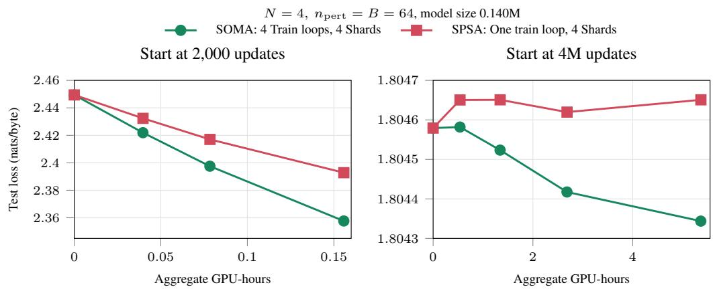  
Figure 4: Independent expert losses improve learning, with a smaller but still prevalent gain late in training. SOMA $N = 4$ uses independent expert losses or their sum. Within each panel, starting weights, Adam states, data, perturbations and update counts match. Points show mean test loss across three random seeds. Appendix J gives the protocol.

Independent losses reduce measured variance by factors of 3.19–4.64 on GPU and 3.20–4.65 in FP64, against the small-ε prediction of four. After 4M updates, independent losses continue to improve test loss by 0.00024 nats/byte over 10,000 further updates, while summed losses worsen it by 0.00007, with independent losses favored in all three pairs. Appendix J gives the per-seed results.

Scaling sweeps. We first ask whether adding independent experts improves prediction despite the absence of joint training. At fixed expert width and $n _ { \mathrm { p e r t } } = B = 6 4$ , increasing N from one to 256 lowers ensemble validation loss from 1.84 to 1.72 after approximately 184 estimated training hours (Figure 7, left). Adding experts increases total parameters and training compute which SOMA can use to monotonically improve in loss without increasing $n _ { \mathrm { { p e r t } } }$ or B. We also show that SOMA can benefit from additional $n _ { \mathrm { { p e r t } } }$ or B (Figure 7, center and right, respectively). Figure 1 and Figure 6 address the separate question of loss at a fixed total model size and fixed training budget, developed in Section 7. SOMA ${ \bar { N } } = 2 5 6$ continues to improve from 1.72 ensemble validation nats/byte at 4M updates per expert to 1.71 at 4.16M, with test loss 1.68. SOMA N = 8 reaches test loss 1.71 using 700 GPU-hours. These results show that independently trained experts can combine into a useful language model.

Other ablations. Together with independent losses, we test the role of data partitioning, initialization, head updates, perturbation and batch allocation, and active expert count make six ablation studies. In the BPTT recipe controls, semantically clustered shards outperform random disjoint shards and global IID data. Warm initialization lowers loss, and decoder-only head training retains most of the benefit of updating both paths through the tied head (Figure 9). Appendix D.1 gives the settings and three-seed results. To isolate allocation within an expert, we compare matched SOMA $N = 8$ continuations with $( n _ { \mathrm { p e r t } } , B ) = ( 6 4 , 1 0 2 4 ) , ( 2 5 6 , 2 5 6 ) , ( 1 0 2 4 , 6 4 )$ at the same arithmetic compute. Their seed-mean final test losses differ by less than 0.00006 nats/byte after 512 updates, and the order changes between the two paired seeds (Appendix M.2).

These comparisons establish a training-compute advantage for SOMA $N = 2$ among the tested controls and isolate independent losses as a mechanism that improves learning. We next examine why the lowest gradient variance need not identify the best allocation of additional compute.

## 7 ALLOCATING ADDITIONAL PARALLEL COMPUTE

Additional parallel compute can train more independent experts or evaluate more batches and perturbations for each expert update. This choice changes both the learning signal and the number of updates affordable within a budget. We therefore compare what each allocation buys, first in gradient accuracy per global step and then in the loss reached after training. This separates the benefit of a more accurate update from the benefit of completing more updates before a deadline.

The sweeps in Figure 7 establish that all three allocations can improve loss at comparable estimated training durations. They vary $N \in \{ 1 , 2 , 8 , 3 2 , 2 5 6 \}$ at fixed expert width and $n _ { \mathrm { p e r t } } , B \in$ $\{ 1 6 , 6 4 , 2 5 6 , \bar { 1 } 0 2 4 \}$ at $N = 8$ , with larger effective batches implemented through independent-batch accumulation. Because these settings spend different aggregate compute, their equal-time ranking need not identify the best use of a fixed budget. Appendix H gives the operation counts and training-time accounting used to make that distinction.

Figure 5 compares relative gradient variance with measured aggregate GPU-seconds per global step. The N curve uses separate 10,000-update ensembles of roughly 8.44M parameters. The $n _ { \mathrm { { p e r t } } }$ and $B$ curves share one $N = 1$ checkpoint and reference gradient. Each architecture is evaluated against its own reference gradient. For expert $e ,$ let $g _ { e , \mathrm { r e f } }$ be the BPTT gradient on a large independent reference batch and $\widehat { g } _ { e }$ the $\mathrm { z o }$ estimate on a sampled batch. The relative gradient variance R averages over sampled batches and perturbations, holding the reference fixed,

$$
R = \frac { \sum _ { e = 1 } ^ { N } \mathbb { E } \Vert \widehat { g } _ { e } - g _ { e , \mathrm { r e f } } \Vert ^ { 2 } } { \sum _ { e = 1 } ^ { N } \Vert g _ { e , \mathrm { r e f } } \Vert ^ { 2 } } .\tag{5}
$$

This measures total gradient error, including batch variation, perturbation variation and bias relative to the reference. We sum errors across experts before dividing by their summed squared gradient norms.

We pair this error with the aggregate GPU time needed to update every expert once, including communication and waiting. Appendix K gives the reference batches, estimator and timing procedure.

Increasing $n _ { \mathrm { { p e r t } } }$ from 64 to 1024 lowers relative error by 94%, while increasing B over the same range lowers it by 47%. Larger batches reduce data-sampling error, and more perturbations reduce error from the finite set of directions. Sharding changes the estimation problem itself. At fewer aggregate GPU-seconds per global step compared to $n _ { \mathrm { p e r t } } = 1 0 2 4$ or $\bar { B } = 1 0 2 4$ $N = 2 5 6$ at $n _ { \mathrm { p e r t } } = B = 6 4$ wins at 99.5% lower relative gradient variance than the monolithic model. Note, despite $N = 2 5 6 \mathrm { F S O }$ using 256 GPUs, there is no communication between GPUs during training, so steps can be much faster. Also note that $N = 2$ is faster per step than $N = 1$ because each model is smaller and executes more efficiently on the GPU.

Adding fixed-width experts increases total model size without enlarging each local estimation problem and monotonically lowers loss across the tested expert counts at comparable estimated wall-clock times (Figure 7). At similar model size, modest sharding favors training compute efficiency, while heavier sharding offers a separate inference benefit. Inference throughput is non-monotonic because smaller experts do not necessarily execute more efficiently on the GPU. For example, SOMA $N = 2 5 6$ achieves substantially higher throughput than SOMA $N = 8$ (Figure 6). SOMA N = 2 uses all experts at inference, while SOMA $N = 2 5 6$ uses top-k routing with $k = 4$ . We compare test loss within a training budget to determine whether improved estimation offsets the reduction in active model size.

Model size ≃ 8.44M, starting at $N = 1 , n _ { \mathrm { p e r t } } = B = 6 4$  
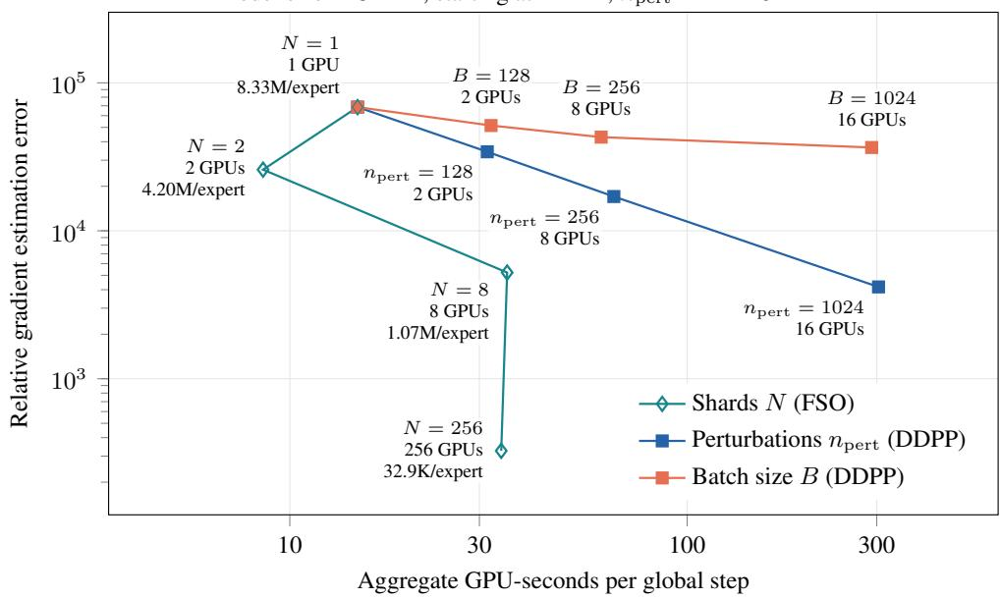

Figure 5: Sharding and perturbation averaging lower gradient error. Larger batches also help. The N curve uses separate ensembles after 10,000 updates. The other curves reuse the same $N = 1$ checkpoint. Error is estimated from measured perturbations against each expert’s BPTT reference on separate data, summed across experts and divided by the summed squared reference norms. FSO cost sums separately timed expert updates. DDPP cost includes all allocated GPUs, communication and waiting. Appendix K gives the full calculation. Model sizes follow Section 3.

With aggregate budget C and deadline D, let u and τ be the measured aggregate cost and elapsed time per global step. The maximum number of global steps $s _ { \mathrm { m a x } }$ is

$$
s _ { \mathrm { m a x } } ( N , n _ { \mathrm { p e r t } } , B ) = \left\lfloor \operatorname* { m i n } \left\{ \frac { C } { u ( N , n _ { \mathrm { p e r t } } , B ) } , \frac { D } { \tau ( N , n _ { \mathrm { p e r t } } , B ) } \right\} \right\rfloor .\tag{6}
$$

We choose the lowest measured loss among configurations that fit the available hardware and have coverage through $s _ { \mathrm { m a x } }$

A deadline can favor more shards. Near 8.44M parameters, $N = 2 5 6$ reaches ensemble validation loss 1.94 in an estimated 16.8 hours, versus 1.99 in 17.3 hours for $N = 2$ , using 4.30k rather than 34.6 GPU-hours (Figure 14). More parallel hardware gives lower loss at similar elapsed time, though greater aggregate cost.

Perturbation averaging remains useful within an expert. For SOMA N = 8 at fixed expert width, increasing $n _ { \mathrm { { p e r t } } }$ from 64 to 1024 reaches ensemble validation loss 1.69 rather than 1.77, using 1.07k rather than 1.42k GPU-hours (Figure 7, Appendix A). The training curves favor enough decomposition to improve estimation while keeping each expert large enough to predict well. Inference introduces a further constraint because additional experts need not all be evaluated for each prediction.

## 8 ACTIVE-PARAMETER INFERENCE ANALYSIS

Training updates all experts, but inference executes only the selected experts. Figure 6 compares the resulting training and inference trade-offs at approximately fixed total model size. At 8.44M total parameters with top-k routing $( k = 4 )$ , SOMA N = 256 achieves 2.36M tokens/s versus 257k for SOMA $N = 8 ( 9 . 1 9 \times$ , including routing), at 1.68 test loss versus 1.71, albeit with SOMA N = 256 using 59.9× as much aggregate training compute. This shows us our tradeoff. We can invest more into training cost to reduce inference costs by sharding more.

Separately, we can select the number of active experts k in our inference ensemble on the fly without any retraining, improving model performance up to a point. As shown in Figure 16, we sweep fixed-width experts from $k = 1$ to N at the same wall clock. $\mathrm { A t } \ k = 4 , \mathrm { S O M } \bar { \mathrm { A } } \ N = 2 5 6$ reaches ensemble validation loss 1.72 versus 1.78 for SOMA N = 8.For SOMA $N = 2 5 6$ , increasing k from 4 to 12 lowers ensemble validation loss by 0.013 nats/byte at three times the expert compute. Evaluating all 256 experts costs more and gives higher loss. Experts with less similar errors benefit more from averaging (Figure 17).

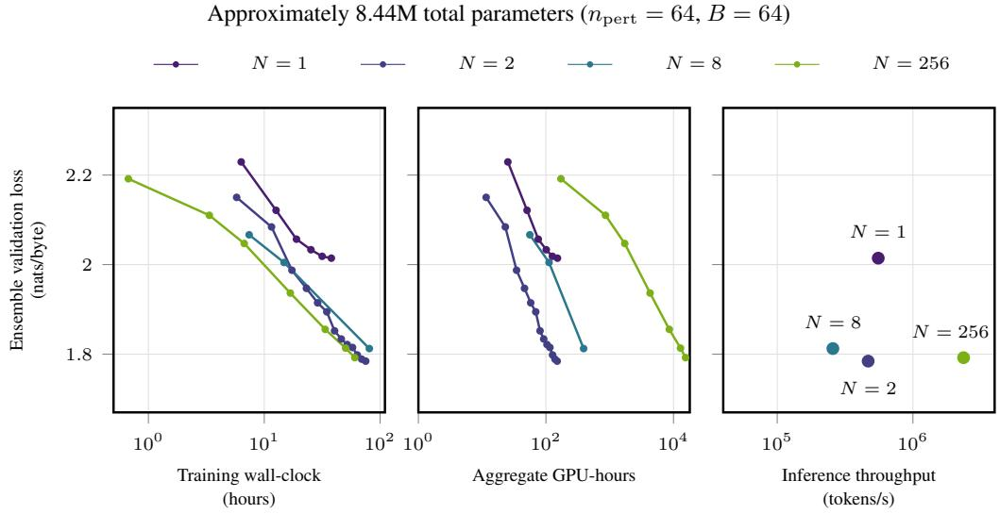  
Figure 6: SOMA at approximately fixed total model size (8.44M parameters). Left and middle show ensemble validation loss against training wall-clock and aggregate GPU-hours. Right pairs each run’s lowest measured loss with inference throughput for its architecture, including routing. Modest sharding favors training compute efficiency, while SOMA $N = 2 5 6$ offers higher inference throughput. Endpoint training budgets differ. Appendices I and N give the training accounting and inference protocol.

At approximately equal total model size, throughput including routing is 0.555M, 0.468M, 0.257M and 2.36M tokens/s for $N = 1 , 2 , 8 , 2 5 6$ , respectively (Figure $^ { 6 , }$ right, and Table 12). Thus, inference throughput is non-monotonic in sharding degree. For SOMA $N = 8 ,$ recurrent execution, normalization and dispatch padding offset the active-parameter saving. Fewer parameters do not imply proportionally less runtime (Appendix N). With top-k routing at $k = 4 ,$ , SOMA $N = 2 5 6$ instead reaches $4 . 2 6 \times$ the monolith’s throughput and 9.19× that of SOMA $N = 8 ,$ , with both models using optimized grouped Triton kernels. Heavier sharding therefore offers an inference benefit distinct from training-compute efficiency.

## 9 LIMITATIONS AND CONCLUSION

In this paper, we show the benefits of sharding when using zero-order optimization. At approximately fixed total model size and training compute, SOMA $N = 2$ outperforms the tested monolithic ZO controls. Controlled experiments support independent losses as a mechanism to reduce relative gradient error and loss. Heavier sharding offers a separate inference benefit, with SOMA $N = 2 5 6$ providing 9.19× the inference throughput of approximately equally sized SOMA $N = 8$ under top-k routing at $k = 4$ . Architectural independence therefore offers distinct training and inference benefits at the cost of joint learning across domains. As new inference-friendly hardware begins to popularize, we hope this work inspires others to adopt ZO and train novel, perhaps non-differentiable architectures.

This $\mathrm { z o }$ pretraining study uses one byte-level corpus and small recurrent experts, limited to 8.44M parameters. Each expert sees only its own cluster, so more sharding trades less data per expert for a larger total model. $\mathrm { A t } \ : N = 2 5 6$ , each expert processes the equivalent of about 700 passes over its training shard (Appendix A). While the most important runs were multi-seed, most scaling runs were single seed runs. Appendix O discusses further limitations.

## AI USE STATEMENT

Generative AI tools assisted with validating theoretical analysis, claims and proofs, implementing training and evaluation code, and in reviewing the manuscript. The authors take full responsibility for the final text, claims, code and results.

## REPRODUCIBILITY STATEMENT

We release all code and checkpoints for full reproducibility. The appendices and zip file contain all guidance on how to reproduce all trainings and evaluations. The accompanying source includes the plotted CSV data.

## REFERENCES

Nathan Allaire, Mahsa Ghazvini Nejad, Sébastien Le Digabel, and Vahid Partovi Nia. Zeroth order optimization for pretraining language models. In Proceedings of the 14th International Conference on Pattern Recognition Applications and Methods, pp. 113–121, 2025. doi: 10.5220/ 0013261100003905.

Nathan Allaire, Sébastien Le Digabel, Dominique Orban, and Vahid Partovi Nia. Zeroth-order kronecker optimization for pretraining language models. SN Computer Science, 7(2):162, 2026. doi: 10.1007/s42979-025-04704-9.

Atilim Gunes Baydin, Barak A. Pearlmutter, Don Syme, Frank Wood, and Philip Torr. Gradients without backpropagation. arXiv preprint arXiv:2202.08587, 2022. URL https://arxiv. org/abs/2202.08587.

Francois Chaubard and Mykel Kochenderfer. Scaling recurrent neural networks to a billion parameters with zero-order optimization. arXiv preprint arXiv:2505.17852, 2025.

Aochuan Chen et al. DeepZero: Scaling up zeroth-order optimization for deep model training. In International Conference on Learning Representations, 2024a.

Xiangyi Chen, Sijia Liu, Kaidi Xu, Xingguo Li, Xue Lin, Mingyi Hong, and David Cox. ZO-AdaMM: Zeroth-order adaptive momentum method for black-box optimization. In Advances in Neural Information Processing Systems, 2019.

Yiming Chen, Yuan Zhang, Liyuan Cao, Kun Yuan, and Zaiwen Wen. Enhancing zeroth-order fine-tuning for language models with low-rank structures. arXiv preprint arXiv:2410.07698, 2024b.

Scott Deerwester, Susan T. Dumais, George W. Furnas, Thomas K. Landauer, and Richard Harshman. Indexing by latent semantic analysis. Journal of the American Society for Information Science, 41 (6):391–407, 1990. doi: 10.1002/(SICI)1097-4571(199009)41:6<391::AID-ASI1>3.0.CO;2-9.

Arthur Douillard, Qixuan Feng, Andrei A. Rusu, Rachita Chhaparia, Yani Donchev, Adhiguna Kuncoro, Marc’Aurelio Ranzato, Arthur Szlam, and Jiajun Shen. DiLoCo: Distributed lowcommunication training of language models. arXiv preprint arXiv:2311.08105, 2023. URL https://arxiv.org/abs/2311.08105.

Anastasiia Filippova, Angelos Katharopoulos, David Grangier, and Ronan Collobert. No need to talk: Asynchronous mixture of language models. In International Conference on Learning Representations, 2025.

Tanmay Gautam, Youngsuk Park, Hao Zhou, Parameswaran Raman, and Wooseok Ha. Variancereduced zeroth-order methods for fine-tuning language models. In Proceedings of the 41st International Conference on Machine Learning, volume 235 of Proceedings of Machine Learning Research, pp. 15180–15208. PMLR, 2024. URL https://proceedings.mlr.press/ v235/gautam24a.html.

Suchin Gururangan et al. Scaling expert language models with unsupervised domain discovery (cluster-branch-train-merge). arXiv preprint arXiv:2303.14177, 2023.

Diederik P. Kingma and Jimmy Ba. Adam: A method for stochastic optimization. In International Conference on Learning Representations, 2015. URL https://arxiv.org/abs/1412. 6980.

Yicheng Lang, Changsheng Wang, Yihua Zhang, Mingyi Hong, Zheng Zhang, Wotao Yin, and Sijia Liu. Powering up zeroth-order training via subspace gradient orthogonalization. arXiv preprint arXiv:2602.17155, 2026.

Margaret Li, Suchin Gururangan, Tim Dettmers, Mike Lewis, Tim Althoff, Noah A. Smith, and Luke Zettlemoyer. Branch-train-merge: Embarrassingly parallel training of expert language models. arXiv preprint arXiv:2208.03306, 2022.

Yong Liu, Zirui Zhu, Chaoyu Gong, Minhao Cheng, Cho-Jui Hsieh, and Yang You. Sparse MeZO: Less parameters for better performance in zeroth-order LLM finetuning. In Advances in Neural Information Processing Systems, volume 38, 2025. URL https://proceedings.nips.cc/paper\_files/paper/2025/hash/ 1e5c2efbddc02c1d971e2f19ccdb07d0-Abstract-Conference.html.

Sadhika Malladi, Tianyu Gao, Eshaan Nichani, Alex Damian, Jason D. Lee, Danqi Chen, and Sanjeev Arora. Fine-tuning language models with just forward passes (MeZO). In Advances in Neural Information Processing Systems, 2023. arXiv:2305.17333.

Brendan McMahan et al. Communication-efficient learning of deep networks from decentralized data. In Artificial Intelligence and Statistics, 2017.

Stephen Merity, Caiming Xiong, James Bradbury, and Richard Socher. Pointer sentinel mixture models. arXiv preprint arXiv:1609.07843, 2016. URL https://arxiv.org/abs/1609. 07843.

Yurii Nesterov and Vladimir Spokoiny. Random gradient-free minimization of convex functions. Foundations ofComputational Mathematics, 2017.

OpenAI. tiktoken: A fast BPE tokenizer for use with OpenAI’s models. GitHub repository, 2022. URL https://github.com/openai/tiktoken. The GPT-2-compatible r50k\_base encoding has 50,257 vocabulary entries.

Artidoro Pagnoni, Ram Pasunuru, Pedro Rodriguez, John Nguyen, Benjamin Muller, Margaret Li, Chunting Zhou, Lili Yu, Jason Weston, Luke Zettlemoyer, Gargi Ghosh, Mike Lewis, Ari Holtzman, and Srinivasan Iyer. Byte latent transformer: Patches scale better than tokens. arXiv preprint arXiv:2412.09871, 2024. URL https://arxiv.org/abs/2412.09871.

Guilherme Penedo et al. The FineWeb datasets: Decanting the web for the finest text data at scale. In Advances in Neural Information Processing Systems, 2024.

Tim Salimans et al. Evolution strategies as a scalable alternative to reinforcement learning. arXiv preprint arXiv:1703.03864, 2017.

Gerard Salton and Christopher Buckley. Term-weighting approaches in automatic text retrieval. Information Processing & Management, 24(5):513–523, 1988. doi: 10.1016/0306-4573(88) 90021-0.

Bidipta Sarkar et al. Evolution strategies at the hyperscale (EGGROLL). arXiv preprint arXiv:2511.16652, November 2025.

Noam Shazeer et al. Outrageously large neural networks: The sparsely-gated mixture-of-experts layer. In International Conference on Learning Representations, 2017.

James C. Spall. Multivariate stochastic approximation using a simultaneous perturbation gradient approximation. IEEE Transactions on Automatic Control, 1992.

Sainbayar Sukhbaatar et al. Branch-train-mix: Mixing expert LLMs into a mixture-of-experts LLM. arXiv preprint arXiv:2403.07816, 2024.

Corentin Tallec and Yann Ollivier. Unbiased online recurrent optimization. In International Conference on Learning Representations, 2018. URL https://arxiv.org/abs/1702.05043.

Fei Wang, Li Shen, Liang Ding, Chao Xue, Ye Liu, and Changxing Ding. Simultaneous computation and memory efficient zeroth-order optimizer for fine-tuning large language models. arXiv preprint arXiv:2410.09823, 2024.

Linting Xue, Aditya Barua, Noah Constant, Rami Al-Rfou, Sharan Narang, Mihir Kale, Adam Roberts, and Colin Raffel. ByT5: Towards a token-free future with pre-trained byte-to-byte models. Transactions ofthe Associationfor Computational Linguistics, 10:291–306, 2022. URL https://arxiv.org/abs/2105.13626.

Ningfeng Yang and Tor M. Aamodt. Improving the straight-through estimator with zeroth-order information. In Advances in Neural Information Processing Systems, 2025.

Lili Yu, Daniel Simig, Colin Flaherty, Armen Aghajanyan, Luke Zettlemoyer, and Mike Lewis. MEGABYTE: Predicting million-byte sequences with multiscale transformers. In Advances in Neural Information Processing Systems, 2023. URL https://arxiv.org/abs/2305. 07185.

Ziming Yu, Pan Zhou, Sike Wang, Jia Li, Mi Tian, and Hua Huang. Zeroth-order fine-tuning of LLMs in random subspaces. In Proceedings of the IEEE/CVF International Conference on Computer Vision (ICCV), pp. 4475–4485, 2025. URL https: //openaccess.thecvf.com/content/ICCV2025/html/Yu\_Zeroth-Order\_ Fine-Tuning\_of\_LLMs\_in\_Random\_Subspaces\_ICCV\_2025\_paper.html.

## A SCALING SWEEPS AND TIMING

The scaling sweeps ask whether additional experts, perturbations or data per update improve prediction when more parallel compute is available. To interpret their learning curves, we distinguish elapsed training time (Wall-clock hours) from work summed across devices (Aggregate GPU-hours). This appendix records the common settings, evaluation sets and timing procedure for Figure 7.

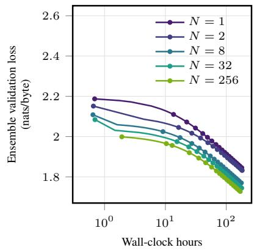

$$
\begin{array} { c } { { \mathrm { P e r t u r b a t i o n s } \left( n _ { \mathrm { p e r t } } \right) } } \\ { { \left( N = 8 , B = 6 4 \right) } } \end{array}
$$

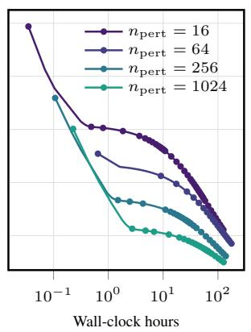

$$
( N = 8 , n _ { \mathrm { p e r t } } = 6 4 )
$$

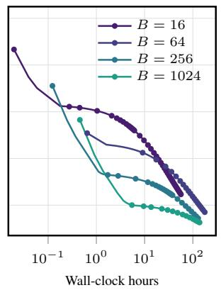  
Figure 7: SOMA sweeps on logarithmic wall-clock axes. Left, Fixed-width experts scaling from $\bar { N \in \{ 1 , 2 , 8 , 3 2 , 2 5 6 \} }$ , shown through a common cutoff of 183.6 estimated hours. Increasing number of experts (and ensemble size) improves training monotonically. Center, $n _ { \mathrm { p e r t } } \in \{ 1 6 , 6 4 , 2 5 6 , 1 0 2 4 \}$ Right, effective batch $B \in \{ 1 6 , 6 4 , 2 5 6 , 1 0 2 \bar { 4 } \}$ }. The $B = 2 5 6$ , 1024 runs accumulate four and sixteen batches of 64, each with 64 independently sampled directions, giving 256 and 1,024 directions per update. SOMA N = 8 improves loss with more $n _ { \mathrm { { p e r t } } }$ and B. Settings are in Table 1 and Appendix A.

Table 1: Experimental settings and evaluation sets.
<table><tr><td>Quantity</td><td>Configuration</td></tr><tr><td>Training corpus / tokenizer</td><td>100B FineWeb-Edu bytes / byte vocabulary  $V = 2 5 6$ </td></tr><tr><td>Context length</td><td>1,024 tokens</td></tr><tr><td>Expert validation set</td><td>The 1% split within each expert&#x27;s shard. The other 99% is used for training. Expert validation loss controls learning-rate decay.</td></tr><tr><td>Ensemble validation set</td><td>976 windows from 202 FineWeb-Edu documents, used for scaling curves. Scores are ensemble validation loss.</td></tr><tr><td>Test set</td><td>4,096 FineWeb-Edu documents screened for training overlap. Each con- tributes one 1,025-byte window. Scores are test loss. Construction and exclusions are in Appendix L.</td></tr><tr><td>Evaluation protocol</td><td>On the ensemble validation and test sets, routing uses the first 256 input bytes and loss scores the next 768 targets. Both losses are mean cross</td></tr><tr><td>Expert body</td><td>entropy in nats/byte. width  $\dot { d } _ { t } = 3 2 , \dot { D } = 2$  layers, 32.9k body parameters</td></tr><tr><td>Shared tied head Baseline SPSA</td><td> $d _ { E } = 3 2 , 8 . 1 9 \mathrm { k \Omega }$  parameters, trained in seed and then frozen</td></tr><tr><td>Perturbation / learning rate</td><td> $n _ { \mathrm { p e r t } } = 6 4 , B = 6 4 ,$  probe density 0.5  $\varepsilon = \mathrm { l r } = 1 0 ^ { - 3 }$ </td></tr><tr><td>Adam moments / weight decay</td><td>initial , decayed together on expert validation plateaus  $\left( \beta _ { 1 } , \beta _ { 2 } \right) = \left( 0 . 9 , 0 . 9 9 9 \right) / 1 0 ^ { - 4 }$ </td></tr><tr><td>Random seed / training preci-</td><td>1 / FP32 weights, TF32 kernels</td></tr><tr><td>sion Plateau rule / floor</td><td>halve after 1,000 updates without improvement of  $1 0 ^ { - 8 } / 1 0 ^ { - 5 }$ </td></tr><tr><td>Expert-count sweep</td><td> $N \in \{ 1 , 2 , 8 , 3 2 , \hat { 2 5 6 } \}$ </td></tr><tr><td>Perturbation sweep</td><td> $n _ { \mathrm { p e r t } } \in \{ 1 6 , 6 4 , 2 5 6 , 1 0 2 4 \}$  at  $N = 8 , B = 6 4$ </td></tr><tr><td>Effective-batch sweep</td><td> $\dot { B } \in \{ 1 6 , 6 4 , 2 5 6 , 1 0 2 4 \} \ \mathrm { a } \dot { \mathrm { t } } \ N = 8 , n _ { \mathrm { p e r t } } = 6 4$ </td></tr><tr><td>Training placement</td><td>one independent expert per RTX 5090</td></tr></table>

We vary $N , n _ { \mathrm { p e r t } }$ , and B as listed in Table 1. Figure 7 displays the primary sweeps through 1024. The default setting is $N = 8 , n _ { \mathrm { p e r t } } = 6 4$ , and $B = 6 4$ . At four million updates per expert, increasing N from 1 to 256 lowers ensemble validation loss from 1.86 to 1.72. The $N = 1$ curve continues beyond four million updates to 1.84 at the approximately 184-hour cutoff used in Section 6. The best endpoint in that figure, $N = 8$ with $n _ { \mathrm { p e r t } } = 1 0 2 4$ , reaches 1.69 nats/byte. Table 1 gives the full setup. These runs have different update budgets and no recorded common stopping rule. Their ordering could change with further training.

We use the fixed ensemble validation set and the protocol in Table 1. Hidden state is reset between chunks. The same evaluation applies to $N = 1$ and optimizer baselines. Section M evaluates frozen ensembles on the test set. The training sweeps and LSTM controls are re-evaluated in CPU fp32 from archived weights, using exact GELU. The N=256 endpoint agrees with the historical GPU score within $1 0 ^ { - 4 }$ nats/byte. The fixed-parameter SOMA curves use the recovered training evaluator.

The 100B figure is full corpus size that is sharded. Each expert consumes $1 0 0 B / N$ bytes. At 4.16M updates, $B = 6 4$ and $T = 1 0 2 4$ give $2 . 7 3 \times 1 0 ^ { 1 1 }$ bytes per expert. For a balanced 99%-training split over 256 shards, that is approximately 705 passes over a 387M-byte training shard.

## A.1 WALL-CLOCK TIME

To compare progress over a training duration, we place the recorded loss measurements on an estimated elapsed-time axis. For Figure 7, checkpoint updates are converted to training hours using measured mean seconds per step from the matching W&B runs. We use the slowest expert’s mean for each ensemble. The timing samples cover the plotted training interval after the first 1,000 updates and exclude later replays of earlier checkpoints. This estimates training time at the observed rate without adding deployment delays or offline interruptions. All curves use recorded ensemble validation losses. No loss is interpolated or fitted. The historical ensemble validation values agree with 33 matching checkpoint re-evaluations within 0.0001 nats/byte.

The measured seconds per step are 0.138, 0.169, 0.145, 0.157, 0.165 for $N = 1 , 2 , 8 , 3 2 , 2 5 6 ,$ respectively. At $N \ = \ 8 ,$ , they are 0.063, 0.145, 0.192, 0.409 for $n _ { \mathrm { p e r t } } ~ = ~ 1 6 , 6 4 , 2 5 6 , 1 0 2 4$ and 0.035, 0.145, 0.221, 0.819 for $B \ = \ 1 6$ , 64, 256, 1024. The larger batches use accumulation, as described in Appendix E.

## A.2 AGGREGATE TRAINING WORK

Adding experts at fixed width grows both total model size and work per update. We compare their learning curves against aggregate GPU-hours, summing the recorded training time across experts.

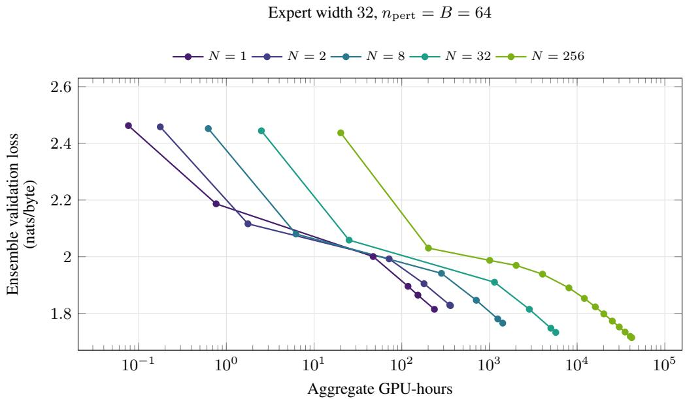  
Figure 8: More experts do not lower loss at every training budget. These are the expert-count measurements on the ensemble validation set from Figure 7, plotted against aggregate GPU-hours estimated from the recorded mean step times across all experts. Expert width is fixed and $n _ { \mathrm { p e r t } } =$ $B = 6 4$ . Greater N adds parameters and costs more per update. Section M compares the perturbation and batch allocations at fixed model size.

## B FURTHER RELATED WORK

Separating experts affects communication, gradient estimation and model execution. Beyond the closest predecessors discussed in Section 2, we compare methods that address these costs without using the same decomposition.

BTX converts separately trained branches into a jointly post-trained mixture of experts (Sukhbaatar et al., 2024). Federated averaging combines locally trained model updates (McMahan et al., 2017), and DiLoCo amortizes communication over local gradient updates (Douillard et al., 2023). SOMA has no model averaging during the expert phase. Each expert and its optimizer state remain local, and predictions are combined at inference.

MeZO-SVRG reduces estimator variance using stochastic variance-reduced gradient updates during language-model fine-tuning (Gautam et al., 2024). Sparse MeZO instead perturbs selected parameters within an existing model (Liu et al., 2025). Restricting the updated coordinates does not by itself reduce the parameters executed at inference. These methods study fine-tuning a pretrained model, whereas SOMA changes the architecture and local objectives used for pretraining. Our experiments do not compare against these two methods.

DeepZero trains deep networks from scratch with sparse coordinate-wise finite differences (Chen et al., 2024a). ZO-Muon combines subspace estimation with spectral orthogonalization (Lang et al., 2026). FOGZO injects finite-difference information into straight-through gradients for quantizationaware pretraining (Yang & Aamodt, 2025). Evolution strategies can distribute perturbations through shared randomness and scalar returns (Salimans et al., 2017).

Forward gradients use directional automatic differentiation (Baydin et al., 2022), while UORO estimates online recurrent derivatives without storing an entire BPTT graph (Tallec & Ollivier, 2018). Both require derivatives. SOMA uses scalar body-loss evaluations. ByT5, MEGABYTE and BLT provide related byte-level modeling approaches (Xue et al., 2022; Yu et al., 2023; Pagnoni et al., 2024).

## C ARCHITECTURE AND PARAMETER COUNTS

The training and inference comparisons depend on which parameters are shared, perturbed and executed for each prediction. We specify these components here so that total model size and active model size can be counted consistently. The width-32 ensembles use a shared, weight-tied embedding/decode matrix E, N recurrent experts $f _ { 1 } , \ldots , f _ { N }$ , and the fixed tf–idf cluster router of Section 4. Each selected assembly emits the next-token distribution. The router selects up to four assemblies from the observed context before they run. We use recurrent experts instead of transformers. A transformer cache requires $O ( T d _ { t } )$ memory per layer and active expert for context length T, while dense-attention prefill requires $\dot { O } ( T ^ { 2 } d _ { t } )$ ) compute. An LSTM carries $O ( d _ { t } )$ recurrent state per layer, independent of context length. Model size grows through the number of bodies N and the expert width and number of layers (Fig. 2). In SOMA, clustering supplies meaningful specialization signal without per-expert projections, decorrelation losses, or a jointly trained gate. The bodies are architecturally identical small LSTMs that differ in the data they see.

We use one token per UTF-8 input byte with a 256-class vocabulary rather than tiktoken’s GPT-2-compatible $\mathtt { r } 5 0 \mathtt { k \_ b a s e }$ vocabulary of 50,257 tokens (OpenAI, 2022). The dense vocabulary projection therefore has 196× fewer output classes and 196× less decoder compute per model token at fixed width, which matters in ZO because we project $2 n _ { \mathrm { p e r t } } B$ perturbed sequences per step. Byte sequences are longer, so this is not an end-to-end saving per unit of text. Let $\bar { V } = 2 5 6$ be vocabulary size and $d _ { E }$ the embedding width. We encode and decode with one matrix $E \in \mathbb { R } ^ { V \times d _ { E } }$ , with $d _ { E } = d _ { t }$ in the $d _ { t } = 3 2$ configuration. It is used twice and weight-tied as the input embedding (the row $E _ { \mathrm { t o k e n } } \in \mathbb { R } ^ { d _ { t } } )$ and as the output decode head (for body hidden state $h \in \mathbb { R } ^ { d _ { t } }$ $\mathrm { l o g i t s } = \bar { h } E ^ { \top } )$ . Because $d _ { E } { = } d _ { t }$ , each expert decodes its hidden state directly, with no per-expert projections. We evaluate prediction quality within 1,024-byte windows. The token-to-logit map is learned once, in the separate seed run, by the local decoder-path rule of §5. It is thenfrozen and copied into every expert, so the experts share one fixed decode. Adding additional experts adds only expert-local parameters, never re-paying the $V d _ { E }$ head cost nor re-learning the token vocabulary.

Let D count residual blocks. The recurrent body uses $D { = } 2$ pre-norm residual blocks of width $d _ { t } = 3 2$ each an LSTM sublayer followed by a multi-layer perceptron (MLP) with a Gaussian error linear unit (GELU) nonlinearity (hidden 4dt), with gain-only LayerNorm and no input/output projections because $d _ { E } { = } d _ { t }$ . The final hidden state is decoded by $\dot { \boldsymbol { E } } ^ { \top }$ into next-token cross entropy. Each block contributes 16d2 weights and $2 d _ { t }$ normalization gains, followed by one final normalization. For D blocks,

$$
M _ { \mathrm { b o d y } } ( D , d _ { t } ) = 1 6 D d _ { t } ^ { 2 } + ( 2 D + 1 ) d _ { t } .
$$

With $D = 2 .$ , this gives $M _ { \mathrm { b o d y } } = 3 2 d _ { t } ^ { 2 } + 5 d _ { t }$ at $d _ { E } = d _ { t }$ , while the shared tied head contains $M _ { \mathrm { h e a d } } ( d _ { t } ) = V d _ { t }$ . Thus $M _ { \mathrm { e n s e m b l e } } = M _ { \mathrm { h e a d } } + N M _ { \mathrm { b o d y } }$ ≈ 8.44M at $N = 2 5 6$ . Each expert body contains 32.9k parameters. Each of the two bias-free LSTM layers contributes 8d2 weights and each MLP contributes $8 d _ { t } ^ { 2 }$ . Four block normalization gains and the final normalization add $5 \check { d } _ { t }$ parameters. The wider fixed model size controls add $2 d _ { E } d _ { t }$ projection weights. Their heads are tied between input and output within an expert, but updated locally and distinct across experts. We therefore count N heads for those controls, giving $\dot { M } _ { \mathrm { e n s e m b l e } } = \dot { N } ( 3 2 d _ { t } ^ { 2 } + 5 d _ { t } + 2 d _ { E } d _ { t } \dot { + } V d _ { E } )$ for $d _ { E } = 3 2$ and $d _ { t } \neq d _ { E }$ . The shared-head formula applies to the width-32 ensembles. Fitted tf–idf, SVD, and centroid state is separate from these neural counts. The SVD has up to $5 0 , 0 0 0 \times 1 2 8 = 6 . 4 \mathrm { M }$ fitted coefficients.

These counting rules determine the expert widths used to keep the models near 8.44M total parameters in Figure 1. Table 2 lists both the ensemble total and each expert body size, making explicit how sharding changes the local estimation problem.

Table 2: Parameter counts for the SPSA sharding comparison. Model size counts expert bodies and heads. All heads have width $d _ { E } = 3 2 { \it \Delta }$ . Wider bodies use input and output projections. The $N = 1 , 2 ,$ 8 heads are updated locally and counted separately. The $N = 2 5 6$ head is shared and frozen.
<table><tr><td> $N$ </td><td> $d _ { t }$ </td><td>head per expert</td><td>ensemble parameters</td><td>expert body parameters</td></tr><tr><td>1</td><td>509</td><td>8.19k</td><td>8.33M</td><td>8.33M</td></tr><tr><td>2</td><td>361</td><td>8.19k</td><td>8.41M</td><td>4.20M</td></tr><tr><td>8</td><td>181</td><td>8.19k</td><td>8.55M</td><td>1.06M</td></tr><tr><td>256</td><td>32</td><td>8.19k (shared)</td><td>8.44M</td><td>32.9k</td></tr></table>

We route the observed context, with the same tf–idf method used to shard the training data, to a set S of up to four clusters. Our benchmark assumes 256 observed bytes. Short-prompt generation is not evaluated here and requires an explicit cold-start routing policy. We embed each token with E to $x \in \mathbb { R } ^ { d _ { t } }$ and pass the embedded tokens through each selected $\mathrm { \dot { L S } T M _ { 1 } }$ and $\mathrm { L S T M _ { 2 } }$ body, decode each hidden state $h _ { i } \in \mathbb { R } ^ { d _ { t } }$ through $E ^ { \top }$ to obtain $p _ { i } ,$ average the selected predictions into the final p(· | context), and sample the next token.

## D TRAINING RECIPE DETAILS

Independent training requires each expert to receive a useful specialization task without relying on updates from the other experts. The seed run supplies the initial byte representation, and clustering determines both the training assignment and the inference route. The settings below specify these two stages of the recipe in Section 4.

The 1,000-update seed run uses $n _ { \mathrm { p e r t } } = B = 6 4$ and initial learning rate 0.0025 on the 10B-byte subset. This samples 65.5M byte positions before repeated perturbation evaluations. Appendix E specifies the body and decoder updates.

The 100B-byte corpus is split into non-overlapping 1,024-byte sequences, giving approximately 97.7M sequences. The word-level TfidfVectorizer uses max\_features=50000, sublinear term frequencies, English stopwords and min\_df=5. We reduce to 128 dimensions with truncated SVD, subtract the mean and $L _ { \mathrm { { 2 } } } { \mathrm { { - n o r m a l i z e } } }$ . Balanced spherical k-means fits N centroids, and each sequence is assigned to its nearest centroid. The builder default uses 400,000 sample chunks, consistent with the saved IDF values. Both the clustering code and the evaluation router decode byte windows with UTF-8 and $\mathtt { e r r o r s } \mathtt { s } = " \mathtt { i } \mathtt { g n o r e } \mathtt { w }$ . Incomplete or invalid UTF-8 sequences are omitted from the router’s text features, while the language model retains and scores the original bytes. The artifact supplies the exact fitted routers.

Clustering precedes the 99/1 expert training and expert validation split. Expert validation loss drives learning-rate decay. Training assignment uses each full 1,024-byte window. At evaluation, the same fitted vectorizer, SVD and centroids see only the 256 observed prefix bytes before selecting experts, and loss is scored on the following 768 bytes. The router therefore has less context than was used for training assignment and never reads the scored continuation.

In the width-32 ensembles, each expert copies the seed body and tied embedding/decoder E. The body continues training on its cluster while E remains frozen. The wider controls retain expert-local decoder updates, as specified in Appendix I and Table 2.

## D.1 ARCHITECTURE ABLATIONS

The recipe assigns different data to experts and gives them a learned starting representation. To check which of these choices helps prediction, we vary partitioning, initialization and head training separately. These BPTT controls use $B = 5 1 2$ and the same ensemble validation protocol.

These controls support semantic sharding and warm initialization. Decoder-only training retains most of the benefit of training the tied head.

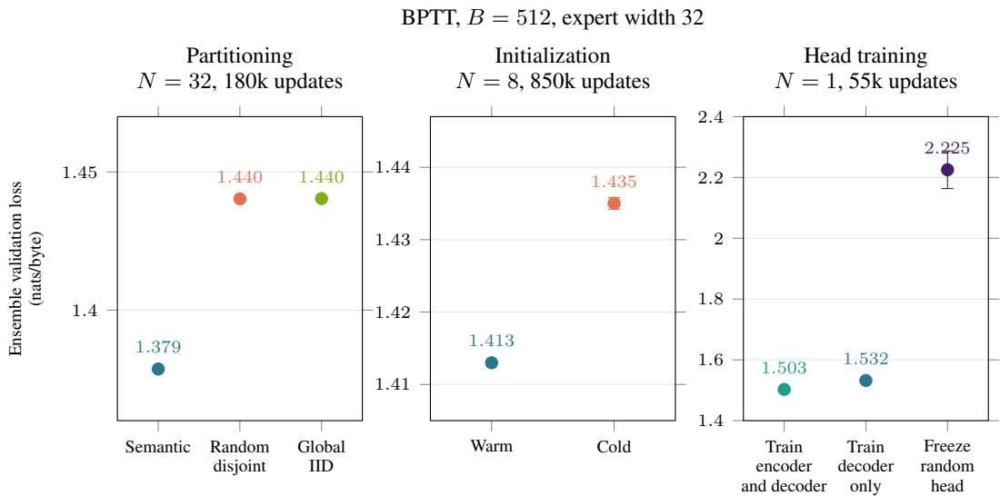  
Figure 9: Semantic shards and warm initialization lower loss. Means and standard errors over three seeds for each condition at the shown training steps. The seed model’s training cost is excluded. Updating the tied head only through the decoder raises loss by 0.029 nats/byte, while freezing a random head performs much worse.

## E TRAINING UPDATES

The update rule separates learning the byte decoder from estimating recurrent-body gradients. This keeps the vocabulary matrix out of the perturbation and limits the dimension of each SPSA estimate. We first give the local decoder update, then specify how body estimates are accumulated and passed to Adam. Let $L _ { \mathrm { d e c } }$ be mean cross entropy over B sequences and $T$ target positions. Write $E \doteq \mathbb { R } ^ { V \times d _ { E } }$ and the decoder input $h _ { b , t } \in \mathbb { R } ^ { d _ { E } }$ as a column vector for sequence b at position t. Let $y _ { b , t + 1 }$ be the next byte, oneho ${ \bf \Psi } ( y ) \in \mathbb { R } ^ { V }$ its target indicator, and $p _ { b , t } = \mathrm { s o f t m a x } ( E h _ { b , t } ) \in \mathbb { R } ^ { V }$ the predicted probability vector. Holding $h _ { b , t }$ fixed, the direct decoder-path derivative is

$$
\nabla _ { E } L _ { \operatorname* { d e c } } = \frac { 1 } { B T } \sum _ { b = 1 } ^ { B } \sum _ { t = 1 } ^ { T } \left( p _ { b , t } - \mathrm { o n e h o t } ( y _ { b , t + 1 } ) \right) h _ { b , t } ^ { \intercal } \in \mathbb { R } ^ { V \times d _ { E } } ,\tag{7}
$$

Because E is weight-tied, applying the update changes the same values used on the input side, but Eq. (7) deliberately omits the indirect derivative through the input embedding and recurrent body. It is therefore an exact decoder-path delta rule, not the full gradient of a tied embedding/decode matrix. Computing this local expression does not invoke reverse-mode automatic differentiation or propagate derivatives through the recurrent network. The outer product can be accumulated from the current forward hidden states and output residuals without retaining a recurrent activation tape. E is never SPSA-perturbed.

Under SOMA each expert optimizes a single local objective, the next-token cross entropy on its own cluster, with no coupling to the others. Let $\theta \in  { \mathbb { R } } ^ { d }$ denote that expert’s d perturbed body parameters and let E denote its embedding/decoder, held fixed while forming the body estimate. For a minibatch B, write $L _ { B } ( \theta , E )$ for its mean next-token cross entropy and $L ( \theta ) = \mathbb { E } _ { B } [ \dot { L } _ { B } ( \theta , E ) ]$ for the corresponding cluster objective. For each batch we independently sample $n _ { \mathrm { { p e r t } } }$ sparse Rademacher probes $z _ { j }$ . Normalization-gain coordinates are −1 or +1 with equal probability; every other coordinate is zero with probability 1/2 and −1 or +1 with probability 1/4 each. The reference theory uses dense Rademacher probes. The measurements in Appendix G.1 use the recorded perturbation distribution. Within each batch, all $n _ { \mathrm { { p e r t } } }$ central-difference pairs use the same data, giving the estimate ${ \widehat { g } } _ { n _ { \mathrm { p e r t } } } ( \theta )$ At update $t \geq 1 , { \widehat { g } } _ { t }$ averages these estimates over A independently sampled accumulation batches and directions. For parameters $\theta _ { t }$ and learning rate $\eta _ { t } ,$ Adam-style moments (Kingma & Ba, 2015) $m _ { t } , v _ { t }$ track the first and second moments with decay factors $\beta _ { 1 } , \beta _ { 2 }$ . Their bias-corrected values are $\bar { m } _ { t } , \bar { v } _ { t }$ , and $\delta _ { \mathrm { A d a m } }$ stabilizes division. Starting with $m _ { 0 } = v _ { 0 } = 0$ , the update is

$$
\begin{array} { r l r } {  { \widehat { g } _ { n _ { \mathrm { p e r t } } } ( \theta ) = \frac { 1 } { n _ { \mathrm { p e r t } } } \sum _ { j = 1 } ^ { n _ { \mathrm { p e r t } } } \frac { L _ { \mathcal { B } } ( \theta + \varepsilon z _ { j } , E ) - L _ { \mathcal { B } } ( \theta - \varepsilon z _ { j } , E ) } { 2 \varepsilon } z _ { j } , } } \\ & { } & { m _ { t } = \beta _ { 1 } m _ { t - 1 } + ( 1 - \beta _ { 1 } ) \widehat { g } _ { t } , \qquad v _ { t } = \beta _ { 2 } v _ { t - 1 } + ( 1 - \beta _ { 2 } ) \widehat { g } _ { t } ^ { 2 } , } \\ & { } & { \bar { m } _ { t } = \frac { m _ { t } } { 1 - \beta _ { 1 } ^ { t } } , \qquad \bar { v } _ { t } = \frac { v _ { t } } { 1 - \beta _ { 2 } ^ { t } } , \qquad \theta _ { t + 1 } = \theta _ { t } - \eta _ { t } \frac { \bar { m } _ { t } } { \sqrt { \bar { \nu } _ { t } } + \delta _ { \mathrm { A d a m } } } . } \end{array}\tag{8}
$$

Squares, square roots and division act coordinatewise. Accumulation gives $A n _ { \mathrm { p e r t } }$ directions per update. The $B \ : = \ : 2 5 6$ , 1024 runs use four and sixteen batches of 64. We use $\beta _ { 1 } ~ = ~ 0 . 9$ and $\beta _ { 2 } = 0 . 9 9 9$ . Equation (8) shows the update before weight decay and follows the adaptive-momentum $\mathrm { Z O }$ family (Chen et al., 2019). For coupled weight decay λ, the implementation adds λθ before the moments. The wide SPSA controls use $\lambda = 1 0 ^ { \bar { - } 4 }$ . If $q _ { j }$ is the probability that probe coordinate j is nonzero and $g _ { j } = \partial L / \partial \theta _ { j }$ , its expected input to Adam is $q _ { j } g _ { j } + \lambda \theta _ { j } + O ( \varepsilon ^ { 2 } )$ . Here $q _ { j } = 1 / 2$ for ordinary weights and $q _ { j } = 1$ for normalization gains, with no inverse-probability rescaling. Thus coupled decay is twice as large relative to the expected data-gradient contribution on ordinary weights. This is a pre-Adam statement, not an exact multiplier of Adam’s effective learning rate. One update uses $2 A n _ { \mathrm { p e r t } }$ perturbed forward evaluations.

For a hidden state $h$ and target byte $y ,$ let $e _ { v }$ denote vocabulary row v of E. The width-32 ensembles train the body on the full-vocabulary next-token cross entropy $\begin{array} { r } { L _ { \mathrm { C E } } ( h ) = \log \sum _ { v } e ^ { e _ { v } \cdot h } - e _ { y } \cdot h } \end{array}$ evaluated for each of the $2 n _ { \mathrm { p e r t } }$ perturbed bodies per accumulation batch against thefrozen tied head E. SPSA reads the directional derivative from the same ± pair $\left( \mathrm { E q . } \left( 8 \right) \right)$ . Because $E$ never enters the perturbation, this is a local SPSA problem on 32.9k expert body parameters, and the head adds no perturbed coordinates.

The body update uses local scalar losses. The width-32 ensemble recipe applies the decoder-path update only during seed training. The wide $N = 1 , 2 ,$ 8 controls continue applying it to each expert’s own head, without sharing head updates across experts.

## F GRADIENT VARIANCE DERIVATIONS

Local losses exclude other experts’ perturbations from each estimate. We derive how this changes relative variance at fixed total model size, then examine its implications for update cost and convergence on a separable objective. The subsequent batch calculation distinguishes averaging more data from averaging more perturbations.

Let $\begin{array} { r } { \mathcal { D } = \bigcup _ { e = 1 } ^ { N } \mathcal { D } _ { e } } \end{array}$ be the partition of the training corpus among N experts. Let M be the total number of perturbed coordinates. We compare one monolithic LSTM with $\theta ^ { \mathrm { m o n o } } \in \mathbb { R } ^ { M }$ against a SOMA ensemble with these coordinates divided equally as $\theta ^ { ( e ) } \in \mathbb { R } ^ { M / N }$ . For a fixed minibatch B of effective size B, write the monolithic loss as $L _ { B } ^ { \mathrm { \ ' m o n o } } ( \theta ^ { \mathrm { m o n o } } )$ . For expert e, let $B _ { e } \subset { \mathcal { D } } _ { \bullet }$ e denote its fixed local minibatch and write its loss as $L _ { B _ { e } } ^ { ( e ) } ( \theta ^ { ( e ) } )$ . The calculation below is conditional on these minibatches: B controls ordinary sampling noise, whereas the result isolates variance from the random SPSA directions.

For $\varepsilon > 0 .$ the monolithic gradient estimate ${ \widehat { g } } ^ { \mathrm { m o n o } }$ uses independent Rademacher probes $z _ { i } \in$ $\{ - 1 , + 1 \} ^ { M }$ , each with independent, equally likely signs,

$$
\widehat { g } ^ { \mathrm { m o n o } } = \frac { 1 } { n _ { \mathrm { p e r t } } } \sum _ { i = 1 } ^ { n _ { \mathrm { p e r t } } } \frac { L _ { \mathcal { B } } ^ { \mathrm { m o n o } } ( \theta ^ { \mathrm { m o n o } } + \varepsilon z _ { i } ) - L _ { \mathcal { B } } ^ { \mathrm { m o n o } } ( \theta ^ { \mathrm { m o n o } } - \varepsilon z _ { i } ) } { 2 \varepsilon } z _ { i } .\tag{9}
$$

Expert $e \mathrm { { s } }$ gradient estimate ${ \widehat { g } } ^ { ( e ) }$ independently uses Rademacher probes $z _ { i } ^ { ( e ) } \in \{ - 1 , + 1 \} ^ { M / N }$

$$
\widehat { g } ^ { ( e ) } = \frac { 1 } { n _ { \mathrm { p e r t } } } \sum _ { i = 1 } ^ { n _ { \mathrm { p e r t } } } \frac { L _ { B _ { e } } ^ { ( e ) } ( \theta ^ { ( e ) } + \varepsilon z _ { i } ^ { ( e ) } ) - L _ { B _ { e } } ^ { ( e ) } ( \theta ^ { ( e ) } - \varepsilon z _ { i } ^ { ( e ) } ) } { 2 \varepsilon } z _ { i } ^ { ( e ) } .\tag{10}
$$

Define $g ^ { \mathrm { m o n o } } : = \nabla _ { \boldsymbol { \theta } ^ { \mathrm { m o n o } } } L _ { \boldsymbol { \mathcal { B } } } ^ { \mathrm { m o n o } } , g ^ { ( e ) } : = \nabla _ { \boldsymbol { \theta } ^ { ( e ) } } L _ { \boldsymbol { \mathcal { B } } _ { e } } ^ { ( e ) }$ . Let $\widehat { G } ^ { \mathrm { S O M A } }$ and $G ^ { \mathrm { S O M A } }$ concatenate the estimated and exact expert gradients,

$$
\widehat { G } ^ { \mathrm { S O M A } } : = \mathrm { c o n c a t } ( \widehat { g } ^ { ( 1 ) } , \ldots , \widehat { g } ^ { ( N ) } ) , \qquad G ^ { \mathrm { S O M A } } : = \mathrm { c o n c a t } ( g ^ { ( 1 ) } , \ldots , g ^ { ( N ) } ) .
$$

Proposition 1 (Gradient variance). Condition onfixed minibatches and nonzero gradients, with $\mathbb { E } _ { z }$ averaging over the probes. For losses with three continuous derivatives, to leading order as $\varepsilon  0 ,$

$$
\frac { \mathbb { E } _ { z } \| \widehat { g } ^ { \mathrm { m o n o } } - g ^ { \mathrm { m o n o } } \| _ { 2 } ^ { 2 } } { \| g ^ { \mathrm { m o n o } } \| _ { 2 } ^ { 2 } } = \frac { M - 1 } { n _ { \mathrm { p e r t } } } + O ( \varepsilon ^ { 2 } ) ,\tag{11}
$$

$$
\frac { \mathbb { E } _ { z } \| \widehat { G } ^ { \mathrm { S O M A } } - G ^ { \mathrm { S O M A } } \| _ { 2 } ^ { 2 } } { \| G ^ { \mathrm { S O M A } } \| _ { 2 } ^ { 2 } } = \frac { M / N - 1 } { n _ { \mathrm { p e r t } } } + O ( \varepsilon ^ { 2 } ) .\tag{12}
$$

Consequently, the ratio oftheir leading relative perturbation variances is

$$
\frac { M / N - 1 } { M - 1 } \frac { N \mathrm { ~ f i x e d } } { M / N \to \infty } \frac { 1 } { N } .\tag{13}
$$

Proof. Consider either estimator in a parameter space of dimension equal to M for the monolith or $M / \dot { N }$ for one expert. Write its loss as $L ( \theta )$ , its exact gradient as $g \overset { \cdot } { = } \nabla L ( \theta )$ , and a Rademacher direction as $z _ { i } .$ . A central Taylor expansion gives

$$
{ \frac { L ( \theta + \varepsilon z _ { i } ) - L ( \theta - \varepsilon z _ { i } ) } { 2 \varepsilon } } z _ { i } = z _ { i } z _ { i } ^ { \top } g + O ( \varepsilon ^ { 2 } ) .
$$

For coordinate $j ,$ the leading estimation error from one direction is

$$
( z _ { i } z _ { i } ^ { \top } g - g ) _ { j } = z _ { i , j } \sum _ { k \neq j } z _ { i , k } g _ { k } .
$$

The independent Rademacher coordinates make this expression mean zero and give

$$
\mathbb { E } _ { z } \left[ ( z _ { i } z _ { i } ^ { \top } g - g ) _ { j } ^ { 2 } \right] = \sum _ { k \neq j } g _ { k } ^ { 2 } .
$$

Summing over coordinates yields $( M - 1 ) \| g \| _ { 2 } ^ { 2 }$ for the monolith and $( M / N - 1 ) \lVert g \rVert _ { 2 } ^ { 2 }$ for one expert. Averaging $n _ { \mathrm { { p e r t } } }$ independent directions divides each variance by $n _ { \mathrm { { p e r t } } }$ . Finally, summing the independent expert errors gives

$$
\sum _ { e = 1 } ^ { N } \mathbb { E } _ { z } \| \widehat { g } ^ { ( e ) } - g ^ { ( e ) } \| _ { 2 } ^ { 2 } = \frac { M / N - 1 } { n _ { \mathrm { p e r t } } } \sum _ { e = 1 } ^ { N } \| g ^ { ( e ) } \| _ { 2 } ^ { 2 } + O ( \varepsilon ^ { 2 } ) ,
$$

which is the stated SOMA identity because $\begin{array} { r } { \| G ^ { \mathrm { S O M A } } \| _ { 2 } ^ { 2 } = \sum _ { e } \| g ^ { ( e ) } \| _ { 2 } ^ { 2 } } \end{array}$

The same variance ratio also holds on one fixed separable objective $\begin{array} { r } { F = \sum _ { e } L _ { e } } \end{array}$ . Using one summed loss estimates an M-dimensional gradient. Using each expert’s own loss estimates N local gradients on the same model and minibatches. This isolates the estimator benefit from changes in model size or data partitioning. Figure 11, left, checks this comparison using weights from training.

The comparison is also matched in parameter-forward compute under the usual linear-cost model. One monolithic central-difference pair evaluates M parameters twice, for cost 2M. One SOMA round evaluates N experts with $M / N$ parameters twice, for the same aggregate cost $N \cdot 2 ( M / N ) = 2 M$ Thus both sides of Eq. (13) use the same $n _ { \mathrm { { p e r t } } }$ at equal idealized compute.

Corollary 2 (Perturbation-limited convergence rate). Suppose the separable SOMA training objective with fixed local minibatches $B _ { e }$

$$
L _ { \mathrm { t r a i n } } ( \theta ^ { ( 1 ) } , \dots , \theta ^ { ( N ) } ) : = \sum _ { e = 1 } ^ { N } L _ { \mathcal { B } _ { e } } ^ { ( e ) } ( \theta ^ { ( e ) } )\tag{14}
$$

has gradient Lipschitz constant $L _ { \mathrm { s m } }$ and lower bound $L _ { * }$ . Let $\theta _ { k }$ concatenate the expert parameters at update $k ,$ starting from $\theta _ { 0 } ,$ , and let $\widehat { G } _ { k } ^ { \operatorname { S O M A } }$ be their gradient estimate. In the limit $\varepsilon  0 ,$ , use constant step size η in $\theta _ { k + 1 } = \theta _ { k } - \eta \widehat { G } _ { k } ^ { \mathrm { S O M A } }$ , with independently sampled perturbations at every update. If

$$
0 < \eta \leq \frac { 1 } { L _ { \mathrm { s m } } ( 1 + ( M / N - 1 ) / n _ { \mathrm { p e r t } } ) } ,
$$

then over T updates, with expectation over all sampled perturbations,

$$
\frac { 1 } { T } \sum _ { k = 0 } ^ { T - 1 } \mathbb { E } \| \nabla L _ { \mathrm { t r a i n } } ( \theta _ { k } ) \| _ { 2 } ^ { 2 } \leq \frac { 2 \big ( L _ { \mathrm { t r a i n } } ( \theta _ { 0 } ) - L _ { * } \big ) } { \eta T } .\tag{15}
$$

With the largest allowed step size, the dimension-dependent multiplier is $1 + ( M / N - 1 ) / n _ { \mathrm { p e r t } }$ compared with $1 + ( M - 1 ) / n _ { \mathrm { p e r t } }$ for the monolithic estimator. Their ratio is

$$
\frac { 1 + ( M / N - 1 ) / n _ { \mathrm { p e r t } } } { 1 + ( M - 1 ) / n _ { \mathrm { p e r t } } } \frac { N \ \mathrm { f x e d } } { M / n _ { \mathrm { p e r t } } {  } \infty } \frac { 1 } { N } .\tag{16}
$$

Proof. Proposition 1 gives

$$
\mathbb { E } _ { z } \| \widehat { G } _ { k } ^ { \mathrm { S O M A } } \| _ { 2 } ^ { 2 } = \left( 1 + \frac { M / N - 1 } { n _ { \mathrm { p e r t } } } \right) \| \nabla L _ { \mathrm { t r a i n } } ( \theta _ { k } ) \| _ { 2 } ^ { 2 } .
$$

Applying the smoothness inequality to the update, taking conditional expectation, and using the step size restriction gives

$$
\mathbb { E } \big [ L _ { \mathrm { t r a i n } } ( \theta _ { k + 1 } ) ~ | ~ \theta _ { k } \big ] \leq L _ { \mathrm { t r a i n } } ( \theta _ { k } ) - \frac { \eta } { 2 } \| \nabla L _ { \mathrm { t r a i n } } ( \theta _ { k } ) \| _ { 2 } ^ { 2 } .
$$

Summing over $k = 0 , \ldots , T - 1$ and using $L _ { \mathrm { t r a i n } } ( \theta _ { T } ) \geq L$ ∗ proves Eq. (15). Substituting the largest permitted step size gives Eq. (16). □

Under these assumptions, smaller independent subproblems reduce the variance term in the stationarity bound. This corollary concerns convergence toward stationarity on each method’s own training objective. It does not compare attainable loss values, and it does not claim that the routed inference objective improves by $1 / N$ . Finite $\varepsilon ,$ , stochastic minibatches, adaptive momentum, non-linear hardware costs, and the shared frozen head add effects outside this perturbation-only calculation.

## F.1 ALLOCATING AN UPDATE BUDGET

We ask how to divide one update’s compute between shards, perturbations and batches. This supports the total-budget choice in Section M, where test loss is the goal.

We extend the dense Rademacher calculation in Appendix F to minibatch gradients and forward cost. Let M be the number of perturbed coordinates, and $d = M / N$ the size of each block. We hold the separable objective and weights fixed, with nonzero population gradient $^ { g , }$ concatenated across experts. We treat N as continuous with equal block sizes. Integer choices must give feasible partitions.

## F.1.1 BATCH SIZE AND PERTURBATIONS

A larger batch reduces data-sampling variation, while additional perturbations reduce the variation caused by estimating a gradient from a finite set of directions. We separate these contributions to determine how they interact within one update. Let $g _ { B }$ be the concatenated gradient from B independent sequences per expert, with $\mathbb { E } g _ { B } = g$ and E $\| \bar { g } _ { B } - g \| ^ { 2 } = { \sigma ^ { 2 } } / { B }$ . Define $\nu = \sigma ^ { 2 } / \| g \| ^ { 2 }$ and $a = d - 1$ . Here $\sigma ^ { 2 }$ is the variance across individual example gradients. We hold g and $\sigma ^ { 2 }$ fixed across parameter groupings. Both can change during training. We use the same batch for all $n _ { \mathrm { { p e r t } } }$ independent dense Rademacher probes and both signs of every probe. Let $\widehat g$ concatenate the resulting expert estimates and v denote their relative gradient variance. $\mathbf { A s } \varepsilon  0$ , expectation over batches and probes gives

$$
\begin{array} { c l } { { v ( N , n _ { \mathrm { p e r t } } , B ) = \displaystyle \frac { \mathbb { E } \| \widehat { \boldsymbol { g } } - \boldsymbol { g } \| ^ { 2 } } { \| \boldsymbol { g } \| ^ { 2 } } = \displaystyle \frac { a } { n _ { \mathrm { p e r t } } } \displaystyle \frac { \mathbb { E } \| \boldsymbol { g } _ { B } \| ^ { 2 } } { \| \boldsymbol { g } \| ^ { 2 } } + \displaystyle \frac { \nu } { B } } } \\ { { = \displaystyle \frac { a } { n _ { \mathrm { p e r t } } } + \displaystyle \frac { \nu } { B } + \displaystyle \frac { a \nu } { n _ { \mathrm { p e r t } } B } . } } \end{array}\tag{17}
$$

The absolute estimator variance is $\| g \| ^ { 2 } v$ . In this unbiased limit, it also equals mean squared gradient error. If each probe instead gets an independently sampled batch, the variance is $[ a + ( a +$

$1 ) \nu / B ] / n _ { \mathrm { p e r t } }$ . With a shared batch, increasing $n _ { \mathrm { { p e r t } } }$ reduces perturbation variance and leaves the minibatch term $\nu / B$ unchanged.

At fixed N and a fixed product $K = n _ { \mathrm { p e r t } } B \geq 1$ , substituting $n _ { \mathrm { p e r t } } = K / B$ gives $v = a B / K +$ $\nu / B + a \nu / K$ . For $a , \nu > 0$ , its derivative vanishes at $B = \sqrt { K \nu / a }$ . Subject to $B , n _ { \mathrm { p e r t } } \geq 1$ , the continuous optimum is

$$
B ^ { * } = \operatorname* { m i n } \Bigl \{ K , \operatorname* { m a x } \Bigl \{ 1 , \sqrt { K \nu / a } \Bigr \} \Bigr \} , \qquad n _ { \mathrm { p e r t } } ^ { * } = K / B ^ { * } .\tag{18}
$$

For integer settings, evaluate the feasible $( B , n _ { \mathrm { p e r t } } )$ pairs under the product budget. This optimizes one update of the dense, shared-batch estimator as $\varepsilon \to 0$ . It does not optimize loss after training or the independent-batch accumulation schedule below.

## F.1.2 ACCUMULATING INDEPENDENT BATCHES

The training sweeps implement larger effective batches by accumulating estimates formed with independently sampled data and directions. This changes both sources of variation, so its variance differs from evaluating all directions on one shared large batch. Averaging estimates from A batches of b sequences, with $n _ { \mathrm { { p e r t } } }$ probes per batch, gives relative variance $v _ { \mathrm { a c c } } .$

$$
v _ { \mathrm { a c c } } = \frac { a } { n _ { \mathrm { p e r t } } A } + \frac { \nu } { b A } + \frac { a \nu } { n _ { \mathrm { p e r t } } b A } .
$$

Using one batch $B = A b$ with $n _ { \mathrm { { p e r t } } }$ probes instead leaves the perturbation term $a / n _ { \mathrm { p e r t } }$

More generally, let $Z ( X , \delta )$ be one gradient estimate from batch X and random probe $\delta ,$ and $\widehat g$ their average over $A$ batches and $n _ { \mathrm { { p e r t } } }$ probes per batch. Subscripts specify which randomness is averaged over. Writing tr Cov for the sum of coordinate variances, independent batches and directions give

$$
\operatorname { t r } \operatorname { C o v } ( { \widehat { g } } ) = { \frac { \operatorname { \mathbb { E } } _ { X } \operatorname { t r } \operatorname { C o v } _ { \delta } ( Z \mid X ) } { A n _ { \mathrm { p e r t } } } } + { \frac { \operatorname { t r } \operatorname { C o v } _ { X } ( \operatorname { \mathbb { E } } _ { \delta } [ Z \mid X ] ) } { A } } .\tag{19}
$$

This identity holds at finite ε for sampled probes. It measures variance around the estimator mean, which may be biased. At fixed $n _ { \mathrm { p e r t } } B$ and $b ,$ the total number of directions $A n _ { \mathrm { p e r t } }$ stays fixed. More independently sampled batches reduce the second term while the first stays unchanged.

More shards reduce the predicted update variance when experts remain viable and overhead is small.   
The best training allocation must also repay its cost in test loss, as tested in Section M.

## G TESTS OF THE VARIANCE PREDICTIONS

The variance identities describe a simplified estimator, while training uses saved weights, finite $\varepsilon$ and a recorded probe distribution. We first check how well the predictions describe those trained models. We then hold the objective fixed to isolate the effects of local losses and the batch–perturbation allocation.

## G.1 SHARDING AT FIXED MODEL SIZE

To determine whether the variance reduction survives the trained parameter values and numerical implementation, we replay the checkpoints in Figure 10 under both GPU and float64 arithmetic. At 5,000 and 10,000 updates, we fix two ensemble validation chunks and include every expert and perturbed coordinate in the roughly 8.44M models. We evaluate the same 128 directions and FP32 parameter endpoints on an RTX 5090 and in CPU float64. Exact gradients use float64. The saved kernels and precision settings are used for $N = 1 , 2 , 8$ . For $N = 2 5 6$ , we use the retained trainer implementation.

For exact batch gradients $g _ { e }$ and averaged estimates $\widehat { g } _ { e }$ , define relative centered gradient variance $R _ { g }$ with covariance over random probes $\bar { \delta , }$

$$
R _ { g } = \frac { \sum _ { e } \mathrm { t r } \mathrm { C o v } _ { \delta } ( \widehat { g } _ { e } ) } { \sum _ { e } \| g _ { e } \| ^ { 2 } } .
$$

We estimate centered covariance from 128 independent single-probe estimates and divide by $n _ { \mathrm { p e r t } } =$ 64. We retain the recorded perturbation distribution and $\varepsilon .$ Coordinate activity probability is $q _ { e j } = 1$ for normalization coordinates of expert e and 1/2 otherwise. Let $q _ { e }$ collect these probabilities and $g _ { e j }$ denote gradient coordinate j. The leading mean is diag $( q _ { e } ) g _ { e }$ , so $R _ { g }$ measures centered variance, not total gradient error. With $s _ { e } = \textstyle \sum _ { j } q _ { e j }$ , the small-ε prediction is

$$
R _ { g } \simeq \frac { \sum _ { e , j } q _ { e j } ( 1 + s _ { e } - 2 q _ { e j } ) g _ { e j } ^ { 2 } } { n _ { \mathrm { p e r t } } \sum _ { e } \Vert g _ { e } \Vert ^ { 2 } } .
$$

The GPU measurements follow this prediction. $\mathrm { A t } \ : N = 2 5 6$ , relative gradient variance is 136 and 118 times lower than at $N = 1$ at the two stages. The float64 ratios are 136 and 121. Sharding retains the measured variance reduction under this GPU-precision replay.

We test whether more perturbations give the expected variance reduction at the same weights and batch. Let $X _ { e , r }$ be the estimate from probe r for expert $e ,$ and $\begin{array} { r } { a _ { N } = \sum _ { e } { \mathrm { t r } } \operatorname { C o v } ( X _ { e , 1 } ) / \breve { \sum _ { e } } \| g _ { e } \| ^ { 2 } } \end{array}$ the ensemble’s relative variance before averaging. Independent probes give

$$
\widehat { g } _ { e } = \frac { 1 } { n _ { \mathrm { p e r t } } } \sum _ { r = 1 } ^ { n _ { \mathrm { p e r t } } } X _ { e , r } , \qquad \mathrm { C o v } ( \widehat { g } _ { e } ) = \frac { \mathrm { C o v } ( X _ { e , 1 } ) } { n _ { \mathrm { p e r t } } } , \qquad R _ { g } = \frac { a _ { N } } { n _ { \mathrm { p e r t } } } ,\tag{20}
$$

The averaging law is exact at finite ε. The prediction of The averaging law is exact at finite ε. The prediction of $a _ { N }$ uses the small-ε approximation above. uses the small-ε approximation above.

We average the 128 GPU probe vectors in disjoint groups, using $n _ { \mathrm { p e r t } } = 1 , 2 , 4 , 8 , 1 6 , 3 2$ . We measure covariance across groups. The measured variance follows $1 / n _ { \mathrm { p e r t } }$ at both stages for $N = 1 , 2 , 8 , 2 5 6$ Figure 10, right, shows 10,000 updates. Doubling $n _ { \mathrm { { p e r t } } }$ halves relative gradient variance and doubles update compute.

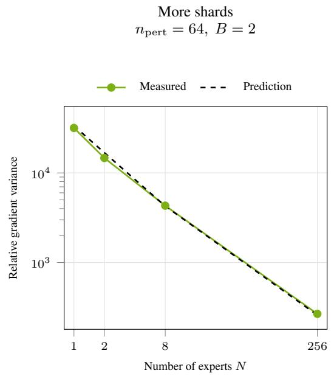

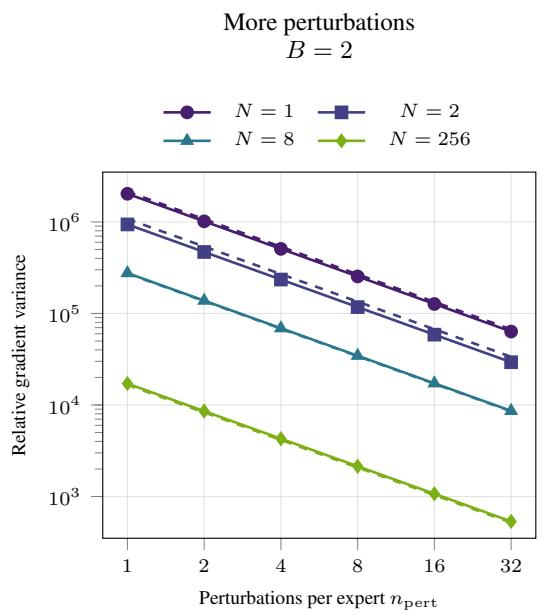  
Figure 10: More shards and more perturbations reduce relative gradient variance. Lower is better. Centered estimator variance is divided by the squared exact gradient norm. Model size is roughly 8.44M in total (Section 3). Left, $N = 2 5 6$ has 118× lower variance than $N = 1$ . Right, doubling $n _ { \mathrm { { p e r t } } }$ halves variance and doubles update compute. Points use weights at 10,000 updates and the same two ensemble validation chunks on an RTX 5090. Dashed lines are predictions for the recorded perturbation distribution, without fitting. These tests measure variance at fixed weights, not learning speed. Appendix G.1 gives the calculation.

## G.2 TESTING THE VARIANCE PREDICTIONS

Comparing different trained ensembles changes more than the loss feedback. We therefore keep one ensemble fixed to test the predicted benefit of local losses and the preferred allocation between batches and perturbations. Both tests use four experts from the $N = 2 5 6$ ensemble at 900,000 updates, with fixed weights in float64. Relative gradient error is squared estimation error divided by the squared exact gradient norm. The small-ε calculation predicts variance. Finite-difference error also includes any bias.

In Figure 11, left, we either sum all four losses before estimating the gradient or estimate each expert’s gradient from its own loss. We hold the weights and two ensemble validation chunks fixed.

For the batch test, we randomly select 128 coordinates per expert and 32 ensemble validation chunks. Exact sequence gradients give the pool mean gradient $g$ and relative sequence variance $\nu = 8 . 3 2$ as defined in Appendix F.1. Batches sample this pool with replacement. We use one sum over four experts, two sums over two experts each, or four individual losses. Each loss then supplies an estimate over 512, 256, or 128 coordinates, respectively. The four experts, data, and remaining coordinates stay fixed.

We choose $n _ { \mathrm { p e r t } } B = 2 5 6$ from the measured gradient variation before measuring perturbation errors. All probes and both signs share each batch. Errors are measured against the pool mean gradient. At $\varepsilon = 1 0 ^ { - 4 }$ , directional differences agree with exact derivatives to relative $\ell _ { 2 }$ error below $\mathrm { \bar { 6 } } \times 1 0 ^ { - 7 }$

The predicted best batch sizes are $B \simeq 2 . 0 4 , 2 . 8 9 , 4 . 0 9$ for four experts per loss, two experts per loss, and one expert per loss. The lowest measured values occur at $B = 2 , 2 , 4$ . The predictions capture the error scale and the batch–perturbation tradeoff on this fixed objective.

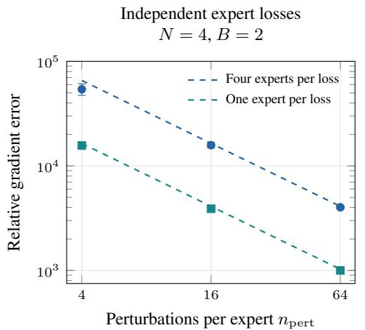

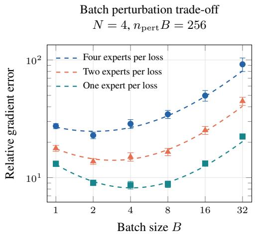  
Figure 11: Keeping independent losses separate reduces gradient error at the same work. Lower is better. Both panels use SOMA $N = 4$ formed from SOMA $N = 2 5 6$ at 900k updates, with fixed weights and dense probes. The right panel uses one loss for four experts, two losses for two experts each, or four individual losses. Relative error is $\mathbb { E } \Vert \widehat { g } - g \Vert ^ { 2 } / \Vert g \Vert ^ { 2 }$ , using the exact gradient $g .$ Left fixes two ensemble validation chunks. At $n _ { \mathrm { p e r t } } = 6 4$ , independent losses give 4.02× lower error, against $4 . 0 0 \times$ predicted. Right selects 128 coordinates per expert and draws batches from a fixed pool of 32 chunks. Its reference is the pool mean gradient, with measured $\nu = 8 . 3 2$ Perturbations are counted per expert. All loss groupings use the same forward evaluations. Right holds $n _ { \mathrm { p e r t } } B = 2 5 6$ , so larger batches leave fewer perturbations. The total batch–perturbation budget is fixed at $n _ { \mathrm { p e r t } } B = 2 5 6$ , so increasing batch size reduces the number of perturbation directions. Dashed lines are predictions. Markers show mean central-difference error. Bars are standard errors over 32 sets of random perturbations on the left and 16 batch-and-perturbation draws on the right.

## H TRAINING COMPUTE AND COMMUNICATION

An update that uses more evaluations is worthwhile only if its improvement repays the added cost. Parallel execution can shorten that update without reducing its aggregate work. We therefore distinguish arithmetic compute, recorded GPU time and allocated device time, then describe how independent expert training and synchronized perturbation training incur these costs.

The different compute totals refer to the same N = 256 checkpoint after 4.16M updates per expert (Table 3). For expert $e ,$ let $\bar { t } _ { e }$ be its recorded mean update time in seconds on one GPU, and let U be its update count. Figures 1 and 15 use $U \sum _ { e = 1 } ^ { 2 5 6 } \bar { \bar { t } } _ { e } / 3 6 0 0$ , which gives 41.9k GPU-hours. The recorded means average 0.142 seconds across experts. These estimates add no separate initialization, preprocessing or idle-allocation cost. The W&B total is a separately logged quantity.
<table><tr><td>Accounting method</td><td>GPU-hours</td><td>Calculation or recorded field</td></tr><tr><td>Recorded expert mean times</td><td>41.9k</td><td> $U \sum _ { e = 1 } ^ { 2 5 6 } \bar { t } _ { e } / 3 6 0 0$ </td></tr><tr><td>W&amp;B-reported physical total</td><td>49.6k</td><td> $\mathtt { p h y s i c a l \_ g p u \_ h r }$ </td></tr><tr><td>Fixed 0.168-second reference</td><td>49.7k</td><td> $2 5 6 U ( 0 . 1 6 8 ) / 3 6 0 0$ </td></tr><tr><td>Fixed 0.140-second normalization</td><td>41.4k</td><td> $2 5 6 U \dot { ( 0 . 1 4 0 ) } \dot { / } 3 6 0 0$ </td></tr></table>

Table 3: Compute accounting for the same $N = 2 5 6$ checkpoint. The first row is used for the endpoint in Figures 1 and 15. The other rows preserve the separate logged total and fixed-rate conventions. They do not identify different training endpoints.

We report compute either as arithmetic work or as aggregate GPU time, with the unit stated in each comparison. Arithmetic work counts operations in recurrent bodies, projections and decoders, with each multiply-add counted as two operations. Training includes both signs of every perturbation, and inference includes only the selected experts. These counts exclude seed training, head updates, routing, communication and smaller elementwise operations. Aggregate GPU-hours instead sum time across participating devices, including communication and synchronization within recorded updates.

For context length T, effective batch B per expert, s updates and per-expert compute $F _ { N }$ in operations per token, total training compute $C _ { m t r a i n }$ is

$$
C _ { \mathrm { t r a i n } } = 2 T n _ { \mathrm { p e r t } } B N F _ { N } s .\tag{21}
$$

At fixed model size, more shards make each expert cheaper. At fixed expert width, $F _ { N }$ stays fixed and work grows with N. A width-32 expert uses 81.9k arithmetic operations per token. These counts measure compute without communication or waiting time.

## H.1 INDEPENDENT EXPERT TRAINING

Local expert losses allow FSO to distribute complete learning problems across GPUs. Each expert owns one RTX 5090, a disjoint corpus cluster, optimizer state and training loop, so its updates do not wait for another expert. Within each expert, we vectorize SPSA by prepending a perturbation axis to the usual batch-first tensor layout. A tensor with shape $( B , T , d _ { t } )$ becomes $( n _ { \mathrm { p e r t } } , \mathbf { \bar { \jmath } } _ { 3 } , T , d _ { t } )$ , allowing PyTorch tensor operations to process the perturbations and batch elements in parallel on the GPU. The pert\_chunk setting specifies how many perturbation directions are processed together in one tensor tile. Similarly, the micro\_batch setting specifies how many training examples are processed for each perturbation. The expert-count sweep uses $n _ { \mathrm { p e r t } } { = } 6 4$ , batch 64, pert\_chunk=64, and micro\_batch=64, enabling saturated parallelism. The processes exchange no gradients, optimizer states, activations, finite differences, or samples. Consequently, adding experts increases total device work without increasing the wall-clock time of an expert update. The recorded expert mean times average 0.142 seconds per update, giving 36.3 aggregate GPU-seconds per global step and 41.9k GPU-hours at the endpoint. Table 3 preserves the separately logged physical total and fixed-rate normalizations.

## H.2 DISTRIBUTED PERTURBATIONS

A monolithic model cannot distribute independent expert updates, but it can distribute the evaluations needed to form one update. DDPP splits batches and perturbations across devices and combines their gradient estimates before updating the shared model (Figure 12). Appendix K gives the measured one-, two-, eight- and sixteen-GPU configurations and their communication costs.

## I OPTIMIZER CONTROLS

Figure 1 asks whether sharding improves test loss relative to spending the training budget on a monolithic model. We document the model sizes, optimizer settings, saved checkpoints and timing used for that comparison. The additional BPTT controls place these ZO results in the context of recurrent backpropagation, while the early tuning study tests sensitivity to optimizer settings.

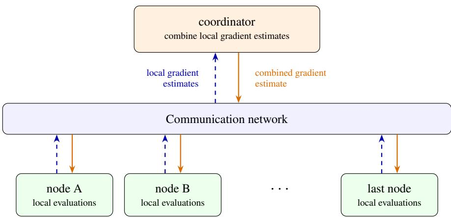  
Figure 12: DDPP synchronizes every global step. Nodes evaluate subsets of the batches and perturbations for one shared model. Dashed blue arrows carry local gradient estimates to the coordinator, and solid orange arrows return the combined estimate. FSO instead updates each expert using its own loss and exchanges no per-step updates.

Figure 1 sums the per-expert GPU time to estimate aggregate compute at each saved checkpoint, without interpolating test losses. For the eight-GPU EGGROLL run, we sum the logged perturbationgeneration and update times and multiply by eight for GPU-hours. Repeated log entries at resumed steps are counted once. The selected checkpoints nearest 10, 20, 30 and 40 hours are at 3.80k, 8.50k, 13.3k and 18.0k updates. Figure 1 includes the final monolithic SPSA checkpoint at 34.0k updates and 172 GPU-hours, with test loss 1.93. Its ensemble validation loss is 1.95, a score on a different evaluation set. Training time excludes initialization, evaluation and checkpointing. The $N = 2 ,$ 8 wall-clock estimates assume one GPU per expert, using rates from those recorded placements.

The two late N = 8 ensembles in Figure 1 use experts 0–3 at 53.5k, 58.5k, 54.5k and 54.5k updates. Experts 4–7 are at 14.5k, 13.0k, 15.0k and 15.5k updates in the first ensemble, and each is at 70.0k updates in the second. Multiplying each expert’s update count by its recorded step time gives 390 and 700 aggregate GPU-hours. The longest expert time gives 80.7 and 104 wall-clock hours. Figure 1 uses the long N = 256 campaign, with 21 evaluated checkpoints through 4.16M updates. Its recorded mean step time across experts is 0.142 seconds and the slowest expert mean is 0.165 seconds. Summing expert times gives 41.9k GPU-hours, and the slowest expert gives 191 wall-clock hours. The EGGROLL curve includes 28 checkpoints through 122k updates, 2.12k GPU-hours and 265 hours. All plotted markers are checkpoint evaluations. Values below 10 aggregate GPU-hours are outside the displayed range, and curves start at the first measured checkpoint in that range. No shared starting point is imposed. Four available N = 8 ensembles lie in this range, ending at 104 hours.

Monolithic SPSA. The 8.33M-parameter curve is the warm width-509 monolith from the fixedparameter comparison. It reaches ensemble validation loss 1.95 and test loss 1.93 at 34.0k updates and 172 estimated GPU-hours, excluding its 3.66-hour seed.

## I.1 MONOLITHIC PERTURBATION CONTROLS NEAR 150 GPU-HOURS

A larger perturbation population offers the monolith an alternative to sharding. To test this allocation at a comparable total training cost, Table 4 records the measured checkpoints used in the main-text comparison. The two new monolithic SPSA runs retain the common starting checkpoint, effective batch size $B = 6 4$ and 1,024-byte context while increasing $n _ { \mathrm { { p e r t } } }$ to 256 or 1024. They match the wide controls’ initial learning rate 0.0025, ε schedule tied to the learning rate, Adam settings and local decoder updates. These runs vary perturbation count without constituting a learning-rate sweep. They use 16 or 32 RTX 5090 GPUs with DDPP, respectively. Their aggregate cost sums recorded time across participating GPUs, including communication and waiting. All rows use the same

4,096-document test set. Figure 1 displays every evaluated checkpoint within its aggregate-compute range, including the endpoints of both runs.
<table><tr><td>Configuration</td><td> $n _ { \mathrm { { p e r t } } }$ </td><td>Updates</td><td>GPU-hours</td><td>Test loss</td></tr><tr><td>SOMA N = 2</td><td>64</td><td>65.0k</td><td>150</td><td>1.76</td></tr><tr><td>Monolithic SPSA</td><td>64</td><td>30.0k</td><td>152</td><td>2.00</td></tr><tr><td>Monolithic SPSA</td><td>256</td><td>1.32k</td><td>150</td><td>2.11</td></tr><tr><td>Monolithic SPSA</td><td>1024</td><td>839</td><td>148</td><td>2.00</td></tr><tr><td>Monolithic EGGROLL</td><td></td><td>7.40k</td><td>141</td><td>2.21</td></tr></table>

Table 4: Measured test losses near 150 aggregate GPU-hours for models of approximately 8.44M parameters. Updates are checkpoint counters, per expert for SOMA. Test loss is in nats/byte. Device costs include communication and waiting, so this compares the measured training systems rather than arithmetic work alone. Values are rounded to three significant figures. EGGROLL uses its population of $2 ^ { 2 0 }$ and $B = 2 5 6$

EGGROLL reproduction. We evaluate the archived FP32 six-layer GRUs at widths 20, 29, 58, 118, 339. The reproduction uses rank-one perturbations, population $2 ^ { 2 0 }$ , batch 256, and 100 bytes per stream update on the 100B-byte corpus. Its embedding and output head are untied. The recorded settings are $\alpha = 0 . 0 1$ , sigma\_shift=4, and $\pounds 1 0 \mathsf { a t \_ s t e p { = } } 0 . 0 1$ . For each width, we select the lowest logged ensemble validation loss from the seed-0 history and reevaluate its checkpoint. These results reproduce the logged losses within $7 . 4 \times 1 0 ^ { - 6 }$ nats/byte. The selected updates are 435,300, 311,000, 206,700, 105,400, and 102,600, respectively. The four smaller jobs use two GPUs and 494–496 recorded GPU-hours. The largest uses eight GPUs and 1.80k GPU-hours. This compares the reproduced GRU-based EGGROLL recipe with LSTM-based SOMA. The matched LSTM SPSA controls isolate the effect of perturbation budget more directly.

SOMA and BPTT at common training budgets. We check whether BPTT’s lower loss persists earlier in training. Table 5 compares the recorded recipes near 8.44M parameters. GPU-hours sum work across devices, $H = s \dot { \sum _ { i } } { g _ { i } \tau _ { i } } / 3 6 0 0$ , where s is the update count, $g _ { i }$ the GPU count and $\tau _ { i }$ the seconds per update for expert i. SOMA uses the reference placements above. BPTT uses $4 / 2 / 1$ GPUs per expert for $N = 1 / 2 / 8$ and median update times with evaluation and checkpoint windows removed. Both estimates exclude initialization. BPTT head initialization is estimated at 1.52 GPU-hours on its recorded hardware. Its exact checkpoint step is unknown.

Table 5: BPTT reaches lower ensemble validation loss at these budgets. Values are in nats/byte on the ensemble validation set, using roughly 8.44M models (Section 3). Values interpolate measured losses, except the marked BPTT $N = 1$ entry, which uses its last checkpoint at 97.3 GPU-hours. Hardware and training recipes differ.
<table><tr><td rowspan="2">N</td><td colspan="2">50 GPU-hours</td><td colspan="2">75 GPU-hours</td><td colspan="2">100 GPU-hours</td></tr><tr><td>SOMA</td><td>BPTT</td><td>SOMA</td><td>BPTT</td><td>SOMA</td><td>BPTT</td></tr><tr><td>1</td><td>2.1237</td><td>1.0198</td><td>2.0590</td><td>1.0206</td><td>2.0343</td><td>1.0091*</td></tr><tr><td>2</td><td>1.9363</td><td>1.0711</td><td>1.8734</td><td>1.0653</td><td>1.8257</td><td>1.0535</td></tr><tr><td>8</td><td>2.0880</td><td>1.1826</td><td>2.0456</td><td>1.1797</td><td>2.0179</td><td>1.1776</td></tr></table>

These SOMA recipes do not show a training advantage over backpropagation on this task.

Fixed-parameter SOMA recipes. The wide $N = 1 , 2 , 8$ SPSA controls retain a separate tied embedding/decoder in each expert and update it through Equation (7). The saved heads differ across experts and checkpoints. Their parameter totals therefore count each head, giving 8.33M, 8.41M and 8.55M parameters, respectively. The width-32 $N = 2 5 6$ campaign instead uses one shared frozen head, giving 8.44M parameters. Table 2 records these conventions. Figure 1 compares these approximately equal-size models on the test set across aggregate training budgets. Near 150 GPU-hours, SOMA $\bar { N } = 2$ reaches lower loss than the tested monolithic controls and the more heavily sharded ensembles. This comparison addresses the predictive return on total training work, rather than the loss achieved by giving each expert the same elapsed time.

## I.2 EARLY LEARNING-RATE AND PERTURBATION-RADIUS SENSITIVITY

A fixed optimizer setting can favor one architecture even when both receive the same training budget. We therefore give monolithic SPSA and SOMA N = 2 the same learning-rate and ε search, then repeat it across optimization seeds to test the early loss comparison. The monolith has width 509 and 8.33M parameters, and SOMA $N = 2$ has width 361 per expert and 8.41M total parameters. Each configuration starts from its architecture’s saved step-1 checkpoint, including optimizer state. We repeat the search with three optimization seeds that change the sampled batches and perturbations while holding those starting weights and optimizer states fixed. The monolith uses the original 100B-byte FineWeb-Edu stream, and the experts use its two semantic shards. All configurations use $n _ { \mathrm { p e r t } } = 6 4 , B = 6 4$ per expert, 1,024-byte context, coordinate activity 0.5 for ordinary weights and 1 for normalization gains, local decoder updates and coupled weight decay $1 0 ^ { - 4 }$ before Adam. Adam uses $\beta _ { 1 } = 0 . 9 , \beta _ { 2 } = 0 . 9 9 9$ and stabilizer $1 0 ^ { - 8 }$ . Training retains the wide controls’ TF32 settings and uses microbatches and perturbation chunks of 16.

We first compare learning rates {0.00125, 0.0025, 0.005} at initial $\varepsilon = 0 . 0 0 2 5$ . At the selected learning rate, we then compare initial $\varepsilon \in \{ 0 . 0 0 1 2 5 , 0 . 0 0 2 5 , 0 . 0 0 5 \}$ , reusing the middle setting. This gives five configurations per architecture and optimization seed, or 30 configurations in total. Initial ε is varied independently of the learning rate, with both retaining the inherited plateau multiplier schedule. Within each architecture and seed, configurations share the sampled batch and perturbation sequence at each update. Each configuration receives the same aggregate GPU compute budget, 1.65 GPU-hours on identical hardware. The monolith uses one GPU, and each of the two experts receives 0.825 hours on its own GPU. Runs stop after a complete update, giving 149–151 new updates for the monolith and 130–132 per expert for the ensemble.

Selection uses the same 976 ensemble validation windows for both architectures. We score saved checkpoints near one-quarter, one-half, three-quarters and the full training budget, and select settings separately for each architecture and seed using only the final validation loss. Each selected checkpoint is then evaluated once on the common 4,096-document test set. Evaluation disables TF32 and uses FP64 probability-mixture and loss reductions.

<table><tr><td>Learning rate</td><td>Initial ε</td><td> $N = 1$  Ensemble validation loss</td><td> $N = 2$ </td></tr><tr><td>0.00125</td><td>0.00250</td><td> $2 . 2 7 6 8 \pm 0 . 0 0 4 0$ </td><td> $2 . 2 3 7 0 \pm 0 . 0 0 3 4$ </td></tr><tr><td>0.00250</td><td>0.00250</td><td> $2 . 3 2 4 7 \pm 0 . 0 1 4 9$ </td><td> $2 . 2 7 0 8 \pm 0 . 0 0 2 5$ </td></tr><tr><td>0.00500</td><td>0.00250</td><td> $2 . 4 1 7 9 \pm 0 . 0 2 6 7$ </td><td> $2 . 3 3 7 9 \pm 0 . 0 0 7 3$ </td></tr><tr><td>0.00125</td><td>0.00125</td><td> $2 . 2 7 6 4 \pm 0 . 0 0 4 0$ </td><td> $2 . 2 3 7 0 \pm 0 . 0 0 3 4$ </td></tr><tr><td>0.00125</td><td>0.00500</td><td> $2 . 2 8 1 1 \pm 0 . 0 0 4 8$ </td><td> $2 . 2 4 0 4 \pm 0 . 0 0 3 3$ </td></tr></table>

Table 6: Learning-rate and ε sensitivity at an equal aggregate GPU compute budget per configuration. Entries are mean ± sample standard deviation across three optimization seeds, in nats/byte. Selection uses each seed’s unrounded validation losses.

All six searches select learning rate 0.00125, the lower edge of the tested range. The selected initial ε is 0.00125 except for SOMA $N = 2$ in seed 2, which selects 0.0025. After this equal tuning allowance, SOMA $N = 2$ achieves lower test loss in all three seeds (Table 7), with a mean difference of 0.0396 nats/byte. This supports the early loss comparison across batch and perturbation randomness. Because the starting checkpoints are fixed and the training budgets are short, it does not establish repeatability across independently pretrained initializations or fully converged models.

## J INDEPENDENT VERSUS SUMMED TRAINING LOSSES

The variance calculation isolates a benefit of independent loss feedback, but a smaller estimation error need not change training loss by the same amount. We test its effect on learning by changing only whether each expert receives its own loss or the sum of the experts’ losses. Paired continuations hold the model, starting state, data, perturbations and compute fixed at both early and mature checkpoints.

<table><tr><td>Optimization seed</td><td>Monolithic SPSA</td><td>SOMA (N = 2)</td><td>Difference</td></tr><tr><td>1</td><td>2.2641</td><td>2.2273</td><td>0.0368</td></tr><tr><td>2</td><td>2.2666</td><td>2.2204</td><td>0.0462</td></tr><tr><td>3</td><td>2.2576</td><td>2.2218</td><td>0.0358</td></tr><tr><td>Mean</td><td>2.2628</td><td>2.2232</td><td>0.0396</td></tr><tr><td>Sample standard deviation</td><td>0.0047</td><td>0.0036</td><td>0.0057</td></tr></table>

Table 7: Test loss after selecting each seed’s settings using only the ensemble validation set. All losses are nats/byte, and the difference is monolithic SPSA minus SOMA. Standard deviations measure optimization-seed variation with fixed starting checkpoints, not test-document uncertainty.

We form SOMA N = 4 using experts 0–3 from the earliest complete trained SOMA N = 8, at 2,000 updates. The model has 140k parameters under Section 3. Each paired continuation starts with the same weights and Adam moments. Heads stay frozen, $n _ { \mathrm { p e r t } } = B = 6 4$ , and both the learning rate and ε stay at $1 0 ^ { - 3 }$

One arm uses each expert’s loss. The other sums the four losses before forming each finite difference. Summing keeps the expected gradient scale unchanged. Both use the same data and sampled perturbation vectors, TF32 forward passes and FP64 scalar subtraction. We draw training windows from one fixed 512 MiB sample of each original shard. The samples were selected before these tests. Test evaluation follows Table 1.

We test both loss rules with three random seeds for 1,000 further updates and evaluate at 0, 250, 500 and 1,000 updates. Each arm uses $2 . 7 5 \times 1 0 ^ { 1 5 }$ arithmetic operations. All six continuations take 0.94 GPU-hours including profiling. The final paired loss reductions are 0.0362, 0.0339 and 0.0353 nats/byte (Figure 4). Separate losses improve training with architecture and compute held fixed. A check of the saved document scores finds lower loss with separate losses on 4,090 of the 4,096 test documents in every seed at 1,000 updates.

We then measure gradient variance at the common start and all six final ensembles. At each state, both loss rules use the same weights, two batches of 64 training windows and 128 sampled perturbation vectors per expert. Using each expert’s own loss reduces variance by a factor of 3.19–4.64 on the GPU and 3.20–4.65 in CPU FP64. The small-ε prediction is 4×. Separate losses therefore reduce variance on the same models where they improve learning.

We repeat the test to see whether local losses still help later in training. The same SOMA N = 4 now starts at 4M updates, with their saved Adam states, frozen heads, learning rate and ε of $1 0 ^ { - 5 }$ . We retain the four training samples and test both loss rules with three random seeds and $n _ { \mathrm { p e r t } } = B = 6 4$ We take 10,000 further updates and evaluate at 0, 1,000, 2,500, 5,000 and 10,000 updates on the same test set. All paired data and direction hashes match at every update. Each arm uses $2 . 7 5 \times 1 0 ^ { 1 6 }$ arithmetic operations. The six runs take 32.2 aggregate GPU-hours on the same hardware.

Starting test loss is 1.80. Local losses lower it by 0.000235, while summed losses raise it by 0.0000720. The three paired differences are 0.000300, 0.000332 and 0.000289 nats/byte. The benefit persists but is small at these saved settings. The learning rate, ε and continuation length differ between the early and mature tests, so the change in effect size cannot be attributed to training stage alone.

Repeating the fixed-batch variance test at the mature start and six final states gives a 3.42–4.55-fold reduction with local losses, near the small-ε prediction of four. These measurements use the saved ε of $1 0 ^ { - 5 }$ and GPU forward passes.

## K MEASURING GRADIENT ERROR AND GPU TIME

To compare allocations before committing to a full training run, we measure the accuracy and cost of one global update. A large independent BPTT batch supplies the reference gradient, and measured GPU time includes the communication and waiting required to form the ZO estimate. Pairing these quantities shows what each allocation buys per global step, while Figure 1 tests the resulting training outcomes.

Figure 5 shows measurements after 10,000 updates in models near 8.44M parameters (Section 3). We also test randomly-initialized expert bodies. Experts within each ensemble share weights from the original initializer. The saved runs began from pretrained weights, so initialization is a separate untrained control. At each stage, the $n _ { \mathrm { p e r t } }$ and $B$ curves share the same $N = 1$ weights and BPTT reference. The N curve compares different ensembles.

Overlapping batches passed the 0.01 cosine distance test early, so we checked larger BPTT references with disjoint batches. Table 8 gives the reference sizes and independent agreement.

For expert $e ,$ let $^ { g _ { e , \mathrm { r e f } } }$ be its BPTT gradient on the reference batch shared by its ensemble, and $\widehat { g } _ { e }$ its ZO estimate on a sampled batch. Holding the reference fixed, expectation over batches and perturbations gives relative gradient estimation error

$$
\frac { \sum _ { e } \mathbb { E } \| \widehat { g } _ { e } - g _ { e , \mathrm { r e f } } \| ^ { 2 } } { \sum _ { e } \| g _ { e , \mathrm { r e f } } \| ^ { 2 } } .
$$

Both sums cover all experts and their perturbed parameters. This measures bias and variation across batches and perturbations. Lower is better.

We use 64 independent direction pairs with the saved ε values and original perturbation sampling rule. For $N = \bar { 1 }$ , each pair uses 64 independent blocks of 16 sequences. We average the error over all subsets of B/16 blocks, reducing variation from batch choice. Both directions share each subset. Forward losses use FP32 and the subset moments use FP64. The $n _ { \mathrm { { p e r t } } }$ curve averages independent directions using these moments at $B = 6 4$ . Other ensembles use directly measured $B = 6 4$ batches. Two directions are evaluated together, so rounding may differ from larger training groups. Reference and ZO measurements use disjoint data. At initialization, identical weights and ε are measured once and weighted by the expert count.

One global step updates every expert once. With $n _ { \mathrm { p e r t } } = B = 6 4$ , FSO assigns one GPU per expert for $N \in \overline { { \{ 1 , 2 , 8 , 2 5 6 \} } }$ . We sum separately measured expert update times for this placement. For $N = 1 .$ , increasing $n _ { \mathrm { { p e r t } } }$ or B to 128, 256 and 1024 uses DDPP on two, eight and 16 GPUs, respectively. The latter spans two nodes. DDPP cost multiplies the global step time by the allocated GPU count, including gradient communication and waiting. We average five timed steps after three warm-up steps and report aggregate GPU-seconds per global step. These update measurements are separate from the historical training rates used to place saved models at a total budget.

Increasing $n _ { \mathrm { { p e r t } } }$ from 64 to 1024 lowers gradient error by about 94% at both stages. Increasing B over the same range lowers error by 0.27% at initialization and 47% after 10,000 updates. At initialization, averaging perturbations is much more effective than increasing B. The N = 256 ensembles have 120× and 210× lower error than $N = 1$ , respectively. Increasing N replaces larger experts with smaller ones. Cheaper forwards can offset the larger expert count. Lower gradient error alone does not establish lower test loss.

<table><tr><td rowspan="2">N</td><td colspan="2">Initialization</td><td colspan="2">10,000 updates</td></tr><tr><td>Batch size</td><td>Cosine distance</td><td>Batch size</td><td>Cosine distance</td></tr><tr><td>1</td><td>8000</td><td>0.00002</td><td>8000</td><td>0.01045</td></tr><tr><td>2</td><td>8000</td><td>0.00002</td><td>8000</td><td>0.00503</td></tr><tr><td>8</td><td>8000</td><td>0.00002</td><td>4000</td><td>0.00492</td></tr><tr><td>256</td><td>8000</td><td>0.00013</td><td>1600</td><td>0.00759</td></tr></table>

Table 8: BPTT reference batch sizes and cosine distance to an independent batch of the same size. Trained $N = 1$ is just above 0.01. Using the independent references changes every plotted value by less than 4%.

## L TEST SET CONSTRUCTION AND EVALUATION

The training comparisons need an evaluation set that is separate from the documents used to fit the models. We construct a common test set screened against the reconstructed training streams and score saved checkpoints with the protocol in Table 1. This appendix specifies how the documents are selected, which bytes are scored and what overlap checks are performed.

We construct this set from HuggingFaceFW/fineweb-edu, subset sample-100BT, using source files 40–139 in zero-based order. With seed 20260906, we draw 256 source row groups and forty candidate documents per group. The training-overlap checks exclude 1,433 of these 10,240 candidates. We then select sixteen documents per group. The final set spans 91 files and 3,700 web domains. No model scores are used to select documents.

Each document contributes one 1,025-byte window that stays within its boundaries. We count UTF-8 bytes, not Unicode characters. The set contains 4.20M window bytes. Routing sees the first 256 input bytes and loss scores the following 768 next-byte targets, giving 3.15M scored bytes per model. Hidden state resets between windows.

We exclude candidates sharing a source ID or an exact or normalized full-document copy with either reconstructed training prefix, including full boundary documents. Normalization applies Unicode NFKC, case folding and whitespace collapse. The selected documents and windows have unique hashes. No selected window shares a 128-byte substring with the BPTT expert validation set. The full 100B stream matches the retained corpus SHA256. The older 10B reconstruction matches the original ensemble validation range and all 256 archived chunk probes. These checks exclude known source-document overlap. They do not exhaustively rule out near duplicates or shorter shared passages.

The original eleven models, sample and analysis were fixed before scoring. After seeing those results, we added twenty models to cover every available N and the additional budgets on the same documents. Their checkpoints and interpolation weights were fixed from training records before scoring each addition. We later evaluated the 34,000-update monolithic SPSA control on the same documents. The frozen dataset manifest, document IDs, byte offsets and hashes are recorded in SOMA\_EVALUATION/data/independent\_v1/.

Results apply to this sampling frame. The 95% intervals use 10,000 paired document-bootstrap draws. We also resample whole hosts and source row groups. These measure sampling uncertainty conditional on these trained models, not training-seed variability.

On the test set, SOMA N = 2 has the lowest estimated loss at the fixed-size budgets (Figure 1). Adding fixed-width experts also lowers loss through N = 256, while total size and work grow. These results remain conditional on the trained models and budgets.

The supplement contains the figure CSVs, analysis scripts, and checkpoint manifest. A separate CPU evaluation package supplies frozen weights, fitted routers, examples, expected scores, and pinned dependencies. CPU runs reproduce the endpoint for SOMA N = 256 and two representative controlled-test ensembles on the test set.

## L.1 FROZEN EVALUATION ON WIKITEXT-103

We evaluate the saved FineWeb-Edu checkpoints on the raw WikiText-103 validation and test splits (Merity et al., 2016) without updating model weights or the router. We retain each archived forward implementation to reproduce the original FineWeb scores. Table 9 contains the same approximately 8.44M-parameter checkpoints compared near 150 aggregate GPU-hours in Figure 1. SOMA N = 2 also reaches lower loss on this external corpus, with 2.07 test nats/byte compared with 2.25–2.36 for the monolithic SPSA controls and 2.49 for EGGROLL.

We use the official wikitext-103-raw-v1 splits from Salesforce/wikitext, revision b08601e04326c79dfdd32d625aee71d232d685c3. Text is encoded as UTF-8 without normalization. We split at top-level-heading-shaped rows and form 1,025-byte windows within each segment, advancing by 768 bytes. Each model receives the first 1,024 bytes and scores the targets at byte indices 257–1,024 from output indices 256–1,023, using zero-based indices. Hidden state resets for each window, and SOMA routes using only the observed prefix. Incomplete final windows are omitted. This gives 1.11M scored validation targets and 1.25M scored test targets, with identical targets for all models. We report byte-level loss rather than token perplexity. The original 4,096- document FineWeb test losses are reproduced within $1 . 3 \times 1 0 ^ { - 8 }$ nats/byte before scoring WikiText. Forward operations use FP32 with TF32 disabled, with FP64 mixture and loss reduction. This is an external-corpus evaluation, not a verified absence of overlap with the pretraining corpus.

<table><tr><td>Checkpoint</td><td>Training compute (GPU-hours)</td><td>Validation (nats/byte)</td><td>Test (nats/byte)</td></tr><tr><td>8.44M parameters</td><td></td><td></td><td></td></tr><tr><td> $\mathrm { S O M A } \ \bar { N } = 2 , n _ { \mathrm { p e r t } } = 6 4$ </td><td>150</td><td>2.047</td><td>2.066</td></tr><tr><td>Monolithic SPSA,  $n _ { \mathrm { p e r t } } = 6 4$ </td><td>152</td><td>2.240</td><td>2.254</td></tr><tr><td>Monolithic SPSA,  $n _ { \mathrm { p e r t } } = 2 5 6$ </td><td>150</td><td>2.348</td><td>2.363</td></tr><tr><td>Monolithic SPSA,  $n _ { \mathrm { p e r t } } = 1 0 2 4$ </td><td>148</td><td>2.271</td><td>2.290</td></tr><tr><td>Monolithic EGGROLL</td><td>141</td><td>2.477</td><td>2.493</td></tr></table>

Table 9: Frozen next-byte evaluation on WikiText-103 for approximately 8.44M-parameter models near 150 aggregate training GPU-hours. Training compute uses each checkpoint’s recorded RTX 5090 accounting. Models and checkpoints are selected before observing WikiText scores.

## M CHOOSING A TRAINING ALLOCATION

Choosing a training configuration requires deciding how much to spend on each update and how many updates to complete. The saved learning curves let us compare those choices over their measured range. We use them to select the lowest loss within a training budget, then consider how a deadline changes the feasible allocations.

## M.1 TRAINING BUDGET AND TARGET LOSS

To compare allocations at a fixed budget, we first translate the cost of one update into the number of updates that budget can buy. For context length T and per-expert cost $F _ { N }$ arithmetic operations per token, update cost is $u = \dot { 2 } N n _ { \mathrm { p e r t } } B T F _ { N }$ . For GPU-hours, let $t _ { \mathrm { s t e p } }$ be each allocated GPU’s full step time in seconds, including communication and waiting, and use $\begin{array} { r } { \dot { u } = \sum _ { \mathrm { G P U s } } t _ { \mathrm { s t e p } } / 3 6 0 0 } \end{array}$ . A budget C in the same unit buys $\lfloor C / u \rfloor$ updates. Let $\widehat { \mathcal { L } } _ { N , n _ { \mathrm { p e r t } } , B } ( C )$ be loss estimated from the saved curves at that budget. Among settings that fit the available memory and GPUs, the loss-minimizing choice is

$$
( N ^ { * } , n _ { \mathrm { p e r t } } ^ { * } , B ^ { * } ) \in \arg \operatorname* { m i n } _ { N , n _ { \mathrm { p e r t } } , B } \widehat { \mathcal { L } } _ { N , n _ { \mathrm { p e r t } } , B } ( C ) .\tag{22}
$$

Interpolate between saved losses when they cover C. At $1 0 ^ { 1 8 }$ arithmetic operations, this leaves $B = 2 5 6$ and 1024 as candidates for the 0.272M model. Larger budgets favor (8, 64, 1024) below. Near 8.44M parameters, the tested choice at 100 training GPU-hours is (2, 64, 64) (Figure 1).

Table 10: The saved 0.272M curves favor $( N , n _ { \mathrm { p e r t } } , B ) = ( 8 , 6 4 , 1 0 2 4 )$ at these budgets. Losses use the ensemble validation set from Figure 13. Ranges span linear- and log-compute interpolation.
<table><tr><td>Compute (operations)</td><td>Estimated ensemble validation loss</td></tr><tr><td> $2 \times 1 0 ^ { 1 8 }$ </td><td>1.8046-1.8057</td></tr><tr><td> $4 \times 1 0 ^ { 1 8 }$ </td><td>1.7947-1.8000</td></tr><tr><td> $8 \times 1 0 ^ { 1 8 }$ </td><td>1.7848-1.7887</td></tr></table>

This setting first reaches 1.90 at $1 . 7 6 \times 1 0 ^ { 1 8 }$ arithmetic operations. Interpolating the crossing gives $( 0 . 9 6 5  – 1 . 3 \bar { 5 } ) \times 1 0 ^ { 1 8 }$ arithmetic operations. The matched continuation in Table 11 instead retains all three allocations because their losses are nearly tied.

Gradient error per global step provides a first comparison of what an allocation buys (Figure 5), but the ensemble validation curves determine whether that accuracy leads to a target loss with less total compute. For allocations that accumulate independently sampled batches, Equation (19) accounts for the additional averaging over directions as well as data.

## M.2 TRADING PERTURBATIONS FOR LARGER BATCHES

We test whether larger batches improve learning more than additional perturbations. The earlier $N = 8$ sweeps in Figure 13 motivate a paired continuation from the same weights and optimizer state.

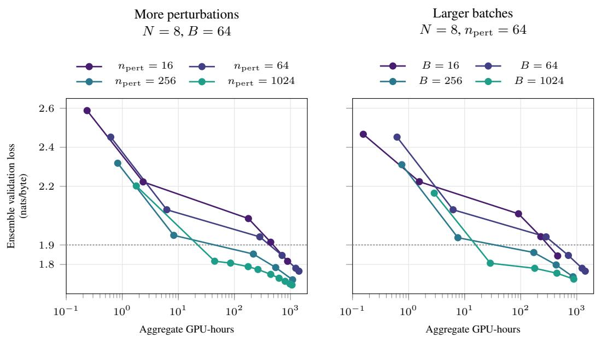  
Figure 13: Larger batches reach 1.90 with fewer GPU-hours in these runs. All curves use $N = 8$ and a 0.272M model (Section 3). For $n _ { \mathrm { p e r t } } = 6 4 , B = 1 0 2 4 .$ , the first plotted point at or below 1.90 costs 28.7 GPU-hours, compared with 44.5 for $n _ { \mathrm { p e r t } } = 1 0 2 4 , B = 6 4$ . The larger batch uses 1.55× fewer GPU-hours. Costs sum recorded mean step times across the eight experts. The dotted line marks 1.90. Batches of 256 and 1024 accumulate four and sixteen independently sampled batches of 64 with independently sampled directions. These runs are separate from the 8.44M comparison in Figure 1. The controlled continuation in Table 11 finds nearly the same loss for three allocations.

All three settings continue the same $N = 8 , 0 . 2 7 2 \mathbf { M }$ model from 2,000 updates. Heads stay frozen, and the learning rate and ε stay at $1 0 ^ { - 3 }$ . Training data and precision follow Appendix J. Each run takes 512 further updates and $\phantom { + } \dot { 4 } . 5 0 \times 1 0 ^ { 1 6 }$ arithmetic operations. We use two paired seeds.

Table 11: Nearly equal test loss after 512 further updates at equal arithmetic operations. All settings continue the same $N = 8$ , 0.272M model. Values average two paired seeds on all 4,096 test documents.
<table><tr><td> $n _ { \mathrm { { p e r t } } }$ </td><td>B</td><td>Test loss (nats/byte)</td></tr><tr><td>64</td><td>1024</td><td>2.376587</td></tr><tr><td>256</td><td>256</td><td>2.376575</td></tr><tr><td>1024</td><td>64</td><td>2.376625</td></tr></table>

Each update uses 1,024 directions per expert. More independently sampled batches reduce the second term in Equation (19), leaving the first unchanged. The three settings finish within 0.00006 nats/byte. No setting gives a clear loss advantage in this continuation.

We ask which saved checkpoint gives the lowest loss within limits on total work and work per expert.

We also ask what more hardware buys under a deadline. Near 8.44M parameters with $n _ { \mathrm { p e r t } } = B = 6 4 .$ the earlier $N = 2 5 6$ recipe reaches an ensemble validation loss of 1.94 in an estimated 16.8 hours using 4.30k GPU-hours. The $N = 2$ recipe reaches 1.99 in 17.3 hours using 34.6 GPU-hours. The $N = 2 5 6$ recipe gives 0.051 lower loss at a similar training time, but uses 124× more total work and requires 256 concurrent GPUs instead of two. Appendix I specifies the training recipes and recorded update rates. Work excludes initialization.

8.44M ensemble parameters, npert = B = 64  
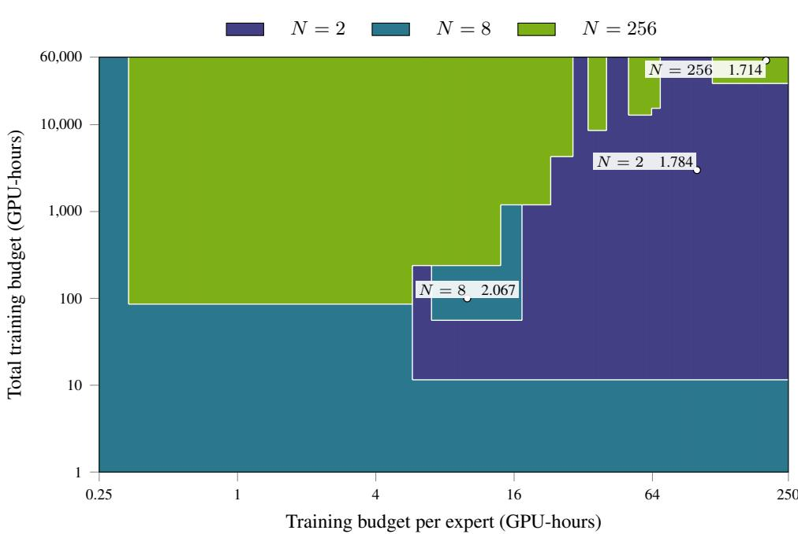  
Figure 14: More shards can lower loss under a tight per-expert budget. Color gives the expert count of the lowest-loss saved checkpoint that fits both budgets. We compare 44 checkpoints from $N = 1 , 2 , 8 , 2 5 6$ on the ensemble validation set of Figure 7, including both $N = 2 5 6$ recipes through 900k and 4.16M updates. $N = 1$ is never selected. Average work per expert is total GPU-hours divided by N. At one GPU per expert, it approximates average elapsed training time. Labels give the selected checkpoint loss at the marked budgets. Work is estimated from recorded update rates and excludes initialization. The $N = 2 5 6$ ensemble uses 0.168 seconds per expert update. Region boundaries come from the saved checkpoints. Training recipes follow the fixed-size controls in Figure 1, detailed in Appendix I. Model size follows Section 3.

## N INFERENCE COST AND ROUTING

A model that is economical to train may still be expensive to use. Routing changes this trade-off by making only a subset of the ensemble active for each sequence. We first count the neural compute of that subset, then measure complete inference including routing, and finally examine how selecting more experts affects loss.

A training budget alone does not determine the deployment choice. At fixed ensemble parameter count, more shards make the routed experts smaller. Let Q be the number of tokens and $F _ { N }$ the arithmetic operations per token through one expert. Processing them costs $Q \operatorname* { m i n } ( 4 , N ) F _ { N }$ arithmetic operations.

Figure 15 plots test loss against inference cost. SOMA N = 2 gives the lowest loss at 100 estimated training GPU-hours. The later checkpoint for SOMA $N = 2 5 6$ gives lower loss and uses $5 1 . 3 \times$ less expert compute per token than the checkpoint for SOMA $N = 2$ , after much more training. Changing $n _ { \mathrm { { p e r t } } }$ or $B$ affects training, but not inference cost for a fixed model.

## N.1 ROUTING AND MODEL EXECUTION

Reducing active neural compute does not determine total latency because routing and grouping requests also take time. We therefore compare complete inference for a monolith and SOMA $N =$ 2, 8, 256 on the same GPU, with total neural sizes of 8.33M, 8.41M, 8.55M and 8.44M parameters, respectively. Each request processes a 1,024-byte context and returns next-byte probabilities for its final 768 positions. The monolith executes one model and SOMA $N = 2$ averages both experts, so neither requires routing. For SOMA $N = 8 , 2 5 6$ , top-k routing with $k = 4$ uses the first 256 observed bytes before recurrent execution.

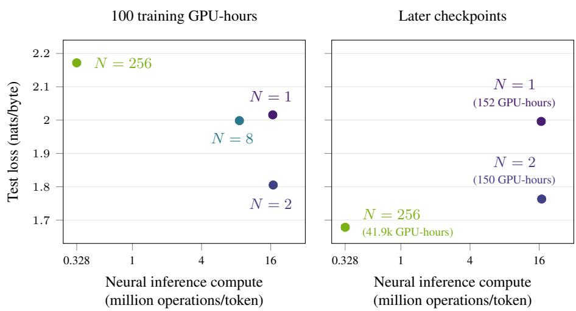  
Figure 15: More shards reduce inference cost, but training progress changes their ranking. Left, the four settings from Figure 1 at 100 estimated training GPU-hours, with losses interpolated between checkpoints. Right, recorded $N = 1 , 2$ , 256 checkpoints at 152, 150, and 41.9k estimated training GPU-hours, using the recorded-update accounting in Table 3. Their training budgets differ. Both panels use the same test set. Bars show 95% document-bootstrap intervals and exclude interpolation uncertainty on the left. Arithmetic operations count the selected experts and exclude routing. Parameter counts and arithmetic operations follow Sections 3 and 7.

The optimized router caches a contiguous transpose of the fitted SVD matrix on the CPU. All 4,096 tested prefixes retain identical ordered top-k choices. Requests are grouped by expert, with both SOMA $N = 8$ and $N = 2 5 6$ using grouped Triton recurrent kernels. The timer includes routing, transfers, dispatch, recurrent execution, softmax and probability averaging, ending after GPU synchronization. Models and router remain resident. Loading, compilation and copying the full output to the CPU are excluded. Tokens/s measures teacher-forced sequence scoring, not autoregressive generation.

We tune batch sizes, dispatch padding and kernel settings on NVIDIA A40 GPUs, then confirm the fastest validated settings sequentially on the same idle GPU with two CPU threads, FP32 and TF32 disabled. Each timing is the median of seven repetitions after two warmups. Monolithic SPSA and SOMA $N = 2$ retain cuDNN, which outperforms their tested Triton implementations. Both routed models use optimized grouped Triton. Their complete predictions agree with independent cuDNN references within $2 . 1 5 \times \dot { 1 0 } ^ { - 6 }$ in probability and $1 . 4 \dot { \times } 1 0 ^ { - 8 }$ in mean loss. These are the fastest validated configurations in our bounded search, not a guarantee of globally optimal implementations.

SOMA $N = 2 5 6$ achieves 9.19× the throughput of SOMA $N = 8$ . At the selected batches, routing takes 0.87% and 7.50% of total time for SOMA $N = 8$ and $N = 2 5 6$ , respectively. Optimizing SOMA N = 8 increases throughput $3 . 0 7 \times$ over its earlier implementation. It still trails the monolith: profiling identifies recurrent execution, normalization and dispatch padding as substantial costs. Four width-181 experts also have a combined activation width of 724, versus 509 for the monolith, so fewer active parameters need not imply proportionally less execution time.

To distinguish inference throughput from training progress, Table 13 reports the tested checkpoints and their training budgets. The later SOMA $N = 2 5 6$ checkpoint has 0.0330 nats/byte lower test loss than SOMA $N = 8$ , after longer training. At roughly 100 estimated training hours, SOMA $N = 8$ instead has 0.0410 nats/byte lower loss. Thus the endpoint comparison does not establish a matched-duration loss advantage for SOMA $N = 2 5 6$

<table><tr><td>Model</td><td>Batch</td><td>Throughput (M tokens/s)</td><td>Batch latency (ms)</td><td>Peak GPU memory (GiB)</td></tr><tr><td>Monolithic SPSA</td><td>768</td><td>0.555</td><td>1,060</td><td>16.5</td></tr><tr><td>SOMA  $N = 2$ </td><td>768</td><td>0.468</td><td>1,260</td><td>12.3</td></tr><tr><td>SOMA  $N = 8$ </td><td>1,024</td><td>0.257</td><td>3,060</td><td>15.0</td></tr><tr><td>SOMA  $N = 2 5 6$ </td><td>4,096</td><td>2.36</td><td>1,330</td><td>8.30</td></tr></table>

Table 12: Complete warm inference at the fastest validated settings, including routing when needed. Each token is one byte, with 768 evaluated tokens per 1,024-byte request. Values are medians of seven repetitions on the same GPU. Peak allocated memory includes intermediates. Compilation and warmup are excluded.
<table><tr><td>Model</td><td>Parameters</td><td>Updates</td><td>Estimated training wall-clock hours</td><td>Aggregate training GPU-hours</td><td>Test loss</td></tr><tr><td>SOMA  $N = 8$ </td><td>8.55M</td><td>53.5k-70.0k</td><td>104</td><td>700</td><td>1.71</td></tr><tr><td>SOMA  $N = 2 5 6$ </td><td>8.44M</td><td>2.18M</td><td>100</td><td>22.0k</td><td>1.75</td></tr><tr><td>SOMA  $N = 2 5 6$ </td><td>8.44M</td><td>4.16M</td><td>191</td><td>41.9k</td><td>1.68</td></tr></table>

Table 13: Test loss and training budgets for the approximately equal-total-size inference comparison. All rows use top-k routing with $k \stackrel { = } { = } 4 .$ . The SOMA $N = 8$ and later SOMA $N = 2 5 6$ checkpoints are timed in Table 12. The middle row supplies the nearest measured SOMA $N = 2 5 6$ checkpoint to the training duration of SOMA $N = 8 .$ . Wall-clock and aggregate time retain the accounting used in Figure 1, excluding initialization, evaluation and checkpointing.

## N.2 NUMBER OF ACTIVE EXPERTS

The number of selected experts trades inference compute against the benefit of averaging more predictions. To measure that trade-off without changing training, the sweep in Section 8 and Figure 16 evaluates $k = 1 , \ldots , N$ using the same saved 4M-update $N = 8 , 3 2$ , 256 ensembles. For each sequence, the router selects the nearest k centroids before the experts run. Scores use the ensemble validation set and average the selected experts’ probabilities.

$$
\begin{array} { c } { { \mathrm { F i x e d - w i d t h ~ I n f e r e n c e ~ } k ~ \mathrm { S w e e p } \colon 4 \mathrm { M ~ u p d a t e s ~ p e r ~ e x p e r t } } } \\ { { \mathrm { W i d t h ~ } 3 2 , n _ { \mathrm { p e r t } } = B = 6 4 } } \end{array}
$$

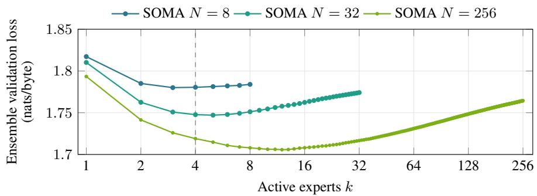  
Figure 16: Top-k routing with $k = 4$ captures most of the gain at the same training stage. Each curve varies k in a saved 4M-update ensemble. All experts have the same width and use $n _ { \mathrm { p e r t } } = B = 6 4$ SOMA $N = 8$ and SOMA $N = 2 5 6$ reach these checkpoints after approximately 176 and 192 elapsed hours, respectively. All scores use the same ensemble validation set and average the selected experts’ probabilities. The dashed line marks $k = 4 .$

## N.3 COMPLEMENTARY EXPERT PREDICTIONS

We ask whether averaging two experts helps more when they make different errors. For each of the 32,640 pairs in the $N = 2 5 6$ ensemble, we evaluate the two experts separately and average their predicted probabilities. The loss reduction is the mean of the two separate losses minus the loss of their averaged prediction. It averages 0.083 nats/byte across pairs.

To measure whether two experts struggle on the same tokens, we subtract the across-expert mean loss at each token and correlate the remaining errors. This removes the difficulty shared by all experts. Figure 17 shows that pairs with less similar errors benefit more from averaging.

$$
\begin{array} { r } { N = 2 5 6 , n _ { \mathrm { p e r t } } = 6 4 , B = 6 4 } \\ { 4 \mathrm { M t r a i n i n g s t e p s p e r e x p e r t } } \end{array}
$$

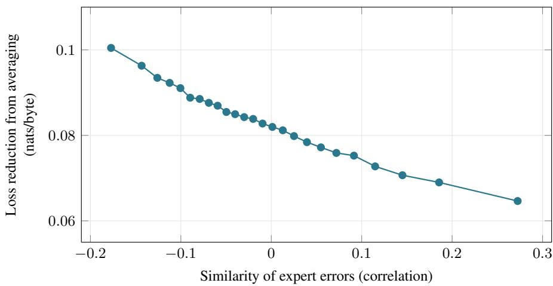  
Figure 17: Averaging helps more when experts make different errors. The horizontal axis measures error similarity after removing shared token difficulty. The vertical axis measures how much lower the averaged prediction’s ensemble validation loss is than the mean loss of the two experts alone. For example, 0.10 means a reduction of 0.10 nats/byte. Each point averages about 1,300 expert pairs with similar error correlations, using 749,568 ensemble validation tokens. Pairs share experts. This tests averaging pairs of experts, not top-4 routing.

## O LIMITATIONS AND OPEN QUESTIONS

The measured ZO improvements do not establish an advantage over backpropagation. BPTT reaches lower ensemble validation loss at every tested budget in Table 5.

At fixed total model size, sharding reduces expert width and joint adaptation across domains. Routing also limits the active model size. Improved estimation therefore need not give the lowest loss, as the modest-budget comparisons in Figure 1 show. Each expert sees approximately $1 / N$ of the corpus, with about 700 training passes per shard at N = 256 (Appendix A). Late improvement thus involves substantial data reuse.

Gradient estimates remain noisy. At 10,000 updates, $N = 2 5 6$ has relative centered variance 268 with $n _ { \mathrm { p e r t } } = 6 4$ (Appendix G.1). This describes one training stage. Figure 1 tests the alternative of increasing monolithic SPSA to $n _ { \mathrm { p e r t } } = 2 5 6$ and 1024 over the recorded budgets.

Paired continuations establish repeatability of the local-loss intervention, but not variability across full pretraining runs. Our pretraining scope is also limited to FineWeb-Edu, LSTM experts and one fixed tf–idf router. Other corpora, architectures and routing methods may have different trade-offs. The router does not adapt as experts learn, and the seed-trained byte decoder does not establish the feasibility of a larger token vocabulary.