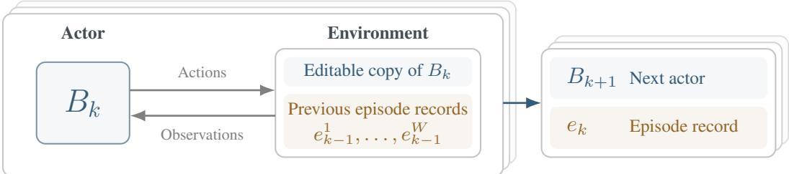
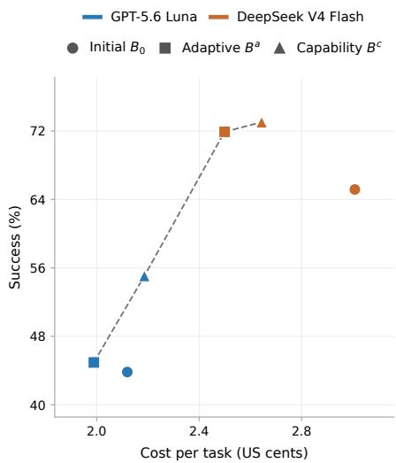
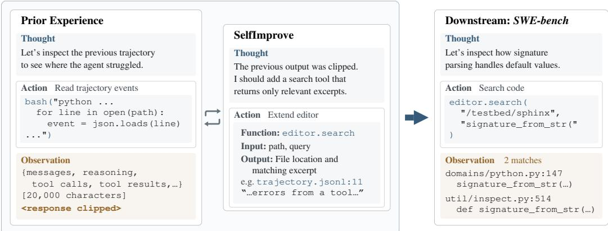
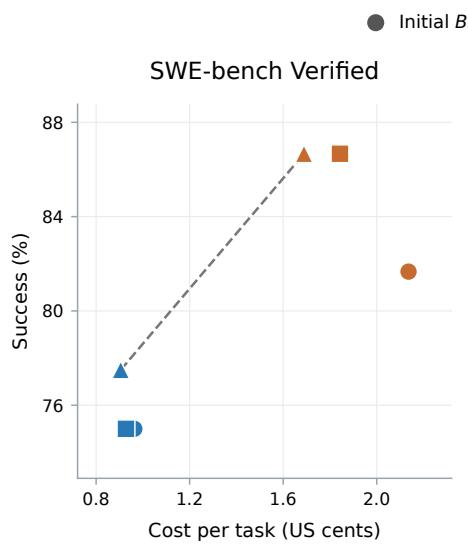
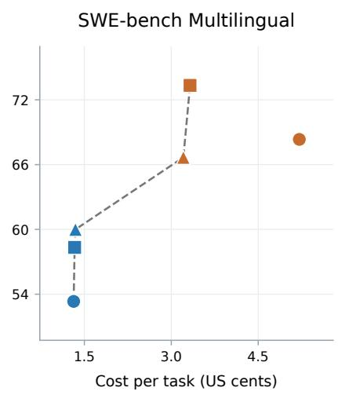

# SELFSEARCH: REWARD-FREE SEARCH FOR SELF-IMPROVING AGENTS

Jungwoo Yang, In Jin Kong, Yohan Jo Graduate School of Data Science, Seoul National University {jwyang0213,mtkong77,yohan.jo}@snu.ac.kr

## ABSTRACT

Advances in the coding capabilities of LLM agents allow them to inspect and modify their own instructions, tools, and execution procedures. Existing approaches use this ability to search for improved agents through repeated downstream evaluation, which incurs substantial costs and ties the search to the evaluated tasks. We introduce SelfSearch, a reward-free search procedure in which agents modify themselves using records of previous self-improvement episodes. These records capture the reasoning, tool actions, and outcomes of earlier modification attempts, providing concrete experience for improving both task solving and self-modification. Without downstream reward signals during search, Self-Search improves population-mean success over the initial agent in all six model– benchmark settings, with individual agents gaining up to 11.2 percentage points on Terminal-Bench 2.1. On SWE-bench Multilingual, an agent improves success by 5.0 percentage points while reducing execution cost by 38.5% on tasks solved by both the initial and evolved agents. SelfSearch achieves competitive task success with evaluation-guided search baselines at lower search cost. With only \$4.03 in search cost, it produces a harness that solves 82.0% of Terminal-Bench 2.1 tasks with DeepSeek V4 Flash under the settings of a public nine-harness comparison, matching the top-scoring harness, Codex. These results suggest that experience gained through self-modification can improve agents’ downstream capabilities and efficiency.

## 1 INTRODUCTION

Self-improvement involves recognizing limitations in our capabilities and developing ways to overcome them. In doing so, we gain experience not only with the problem at hand, but with how we identify weaknesses, test possible solutions, and respond to failure. Reflecting on this proces can help us improve how we learn, a central concern of metacognition (Flavell, 1979). Can agents likewise use the experience of self-improvement to become better at improving themselves?

The coding capabilities of LLM agents make it possible to investigate this question: agents can inspect and modify the implementations that govern their own behavior. Agents can learn from their own task-solving experiences and improve their capabilities over time (Zhang et al., 2026a; Wang et al., 2026; Zhang et al., 2026b). These approaches use downstream evaluation to guide the search process, tying the improvement signal to a task distribution and requiring repeated execution of candidate agents. Evaluating each candidate on a development set incurs a recurring cost that grows with the number of tasks evaluated.

Task-solving experience provides evidence about how an agent performs, guiding the search for improvements. However, a modification produces not only a candidate agent, but also a record of the process that produced it. This record contains information about how the agent identified limitations, constructed revisions, and examined their effects. The experience of self-modification can therefore provide valuable evidence for future self-improvement.

We introduce SelfSearch, a reward-free search procedure in which an agent modifies its own implementation using records of previous self-improvement episodes. The agent’s entire repository is editable, allowing it to revise its instructions, tools, execution logic, and code organization. A single agent performs both self-modification and downstream tasks, so changes to its implementation can affect both capabilities. Each episode produces a successor agent and a record of the modification process. These records capture how the agent gathers information, makes changes, and responds to failures. The successor uses them to guide the next episode, allowing experience and capabilities developed during self-modification to support further improvement. For example, difficulty inspecting long records may motivate a reusable inspection tool, while a failed edit may motivate a procedure that checks the relevant source before attempting a repair. Later generations can use and refine both the operations and the procedures developed in earlier episodes.

  
Figure 1: SelfSearch. An agent modifies an editable copy of itself using previous episode records, which contain interaction trajectories, code changes, and check results. The successor becomes the next actor, while its episode record informs subsequent revisions. Stacked boxes represent parallel lineages. Lineage superscripts are omitted.

SelfSearch uses no downstream tasks or evaluation results to guide revisions. Agents can still use tool outcomes and local checks to inspect and verify their changes. Downstream evaluation and any candidate selection occur separately from search. Our hypothesis is that self-modification exercises capabilities that are also useful for downstream tasks: inspecting unfamiliar code, diagnosing failures, implementing changes, and checking their effects. Records of these activities can therefore provide evidence for improving an agent even before it encounters downstream tasks.

We evaluate SelfSearch in two model settings on SWE-bench Verified, SWE-bench Multilingual, and Terminal-Bench 2.1. Each search produces a population of two agents after ten generations, and we report their mean performance. The population mean exceeds the base in all six model– benchmark settings. Individual agents improve success by up to 11.2 percentage points on Terminal-Bench 2.1, 6.7 on SWE-bench Multilingual, and 5.0 on SWE-bench Verified. On SWE-bench Multilingual, a SelfSearch agent improves success by 5.0 percentage points while reducing execution cost by 38.5% on tasks solved by both the initial and evolved agents. The discovered harnesses transfer across model families without further search.

With only \$4.03 in search cost, SelfSearch produces a harness achieving 82.0% on Terminal-Bench 2.1 using DeepSeek V4 Flash. This matches Codex, the top-scoring harness in a public nine-harness comparison evaluated under the same settings (Apache Maka, 2026).

Our contributions are threefold:

• Self-improvement as experience. We introduce SelfSearch, which uses episode records to guide agent revisions without downstream task evaluations. Each successor becomes the next improver.

• Capability, efficiency, and transfer. Across two model settings and three benchmarks, SelfSearch improves population-mean task success, with execution-cost reductions and harness transfer across model families.

• Understanding how SelfSearch improves agents. Ablations suggest that both previous episode records and an evolving improver contribute to population-mean success. Code changes and execution traces show how agents use self-improvement experience to develop reusable tools and repair failures in tool interactions.

We also provide an execution framework that enables agent modification within a controlled bound ary, protecting runtime-managed inference settings, resource limits, and execution records (Appendix A).

Algorithm 1 SelfSearch with shared episode records   
Require: Base agent $B _ { 0 } ,$ initial episode records $\mathcal { E } _ { 0 } ^ { \mathrm { ~ ~ } } .$ , search directions $d _ { 1 : W }$ , generations K   
1: $\dot { B } _ { 0 } ^ { w }  B _ { 0 }$ for each $w \in \{ 1 , \ldots , W \}$   
2: $\mathcal { C } \gets \{ B _ { 0 } \}$   
3: for $k \bar { = 0 , } . . . , K - 1$ do   
4: for all w $\in \{ 1 , \ldots , W \}$ in parallel do   
5: $( B _ { k + 1 } ^ { w } , e _ { k } ^ { w } ) \gets$ SelfImprove $\mathit { \Omega } ^ { \prime } B _ { k } ^ { w } ; \mathcal { E } _ { k } , d _ { w } )$   
6: end for   
7: $\mathcal { E } _ { k + 1 } \gets \{ e _ { k } ^ { 1 } , \ldots , e _ { k } ^ { W } \}$   
8: $\mathcal { C }  \mathcal { C } \cup \{ \bar { B } _ { k + 1 } ^ { 1 } , \dots , B _ { k + 1 } ^ { W } \}$   
9: end for   
10: return candidate archive C

## 2 SELFSEARCH

SelfSearch improves agents through a sequence of self-improvement episodes. In each episode, an agent uses previous episode records to revise its own implementation. The revised agent performs the next episode, and the new episode record becomes available to guide subsequent revisions (Figure 1).

Self-improvement episode. Let $B _ { 0 }$ denote the initial agent, implemented as a repository containing its instructions, tools, and execution logic. The same agent implementation performs downstream tasks and self-modification, and any part of its repository can be revised. The underlying model weights remain fixed. In episode k, agent $B _ { k }$ receives an editable copy of its repository and read-only episode records $\mathcal { E } _ { k }$ from previous self-improvement episodes. It examines these records, decides what to change, and edits and verifies the implementation. The running agent remains unchanged during the episode. Its edits define the successor $B _ { k + 1 }$ , and the episode produces a record $\textstyle e _ { k } \colon$

$$
\begin{array} { r } { ( B _ { k + 1 } , e _ { k } ) = \mathrm { S e l f I m p r o v e } ( B _ { k } ; \mathcal { E } _ { k } , d ) . } \end{array}\tag{1}
$$

The search direction d is a qualitative instruction about what kinds of changes to investigate. The episode record $e _ { k }$ includes the trajectory, containing the agent’s reasoning, tool actions, and their outcomes, together with the code changes made during the episode. The successor $B _ { k + 1 }$ performs the next self-improvement episode using previous episode records to guide its revisions. Changes to its tools and procedures can therefore affect how it performs subsequent self-modification.

Search across generations. Each generation contains one self-improvement episode per lineage. We maintain two lineages, labeled capability (c) and adaptive (a). The capability direction asks the agent to identify limitations in its abilities revealed by inefficient behavior, failed actions, or difficulty completing an operation, and develop reusable tools or procedures to address them. The adaptive direction asks the agent to improve how it revises its approach when actions fail, evidence contradicts its assumptions, or a better strategy becomes apparent. These directions guide what agents investigate without scoring the resulting changes. The two directions encourage agents to investigate different kinds of limitations.

To give the first generation concrete self-improvement experience to learn from, we run the initial agent once under each direction to produce the initial episode records ${ \mathcal { E } } _ { 0 }$ . We retain these records but discard the edited implementations, so both lineages begin from the same agent $B _ { 0 } .$ . In subsequent generations, both lineages receive the two episode records from the preceding generation. Sharing episode records allows each lineage to incorporate discoveries made under the other direction while maintaining its own implementation. We retain all generated agents in the archive C for subsequent evaluation.

Search environment. During search, agents learn from previous self-improvement episodes and feedback from their current tool interactions and local checks. They receive no downstream benchmark tasks or evaluation results. We evaluate the resulting agents only after the search checkpoints have been frozen.

Agents can modify their entire repository, while the model–tool interaction loop runs in a fixed runtime outside the editable repository. Keeping this loop outside the editable agent code provides a stable way to execute agents and capture their trajectories as their implementations evolve. The runtime also controls the model, reasoning effort, output limits, and execution budgets (Appendix A). Agents invoke this loop through a shared interface and can revise the tools, instructions, and orchestration around it.

## 3 EXPERIMENTS

## 3.1 EXPERIMENTAL SETUP

Agents and models. We evaluate SelfSearch using two model configurations. The GPT configuration uses gpt-5.6-sol for self-improvement and gpt-5.6-luna for downstream execution, both at medium reasoning effort. The DeepSeek configuration uses deepseek-v4-pro-0813 for self-improvement and deepseek-v4-flash-0731 for downstream execution. Within each configuration, the initial and evolved agents use the same downstream model and execution limits, differing only in their agent implementations. Appendix C provides the full configurations.

Search configuration. For each model configuration, we run the two-lineage search described in Section 2 for ten generations. Episodes execute in isolated containers without network access and support parallel tool calls. We retain every checkpoint and evaluate the final capability agent Bc and adaptive agent $B ^ { a }$ , reporting their individual results and population mean. We evaluate the final agent from each lineage rather than selecting checkpoints based on downstream performance.

Downstream evaluation. We compare $B _ { 0 } , \ B ^ { c }$ , and $B ^ { a }$ on 120 tasks from SWE-bench Verified (Jimenez et al., 2024; OpenAI, 2024), 60 tasks sampled from SWE-bench Multilingual covering eight programming languages, and all 89 tasks in Terminal-Bench 2.1 (Merrill et al., 2026). Appendix C provides further evaluation details.

Cost metrics. We report average execution cost per task as total model execution cost divided by the number of attempted tasks, including unsuccessful attempts. Population success is the mean of the two lineage success rates. We also compare each evolved agent with the initial agent on tasks solved by both. Appendix C.4 defines the cost metrics and pricing, and Appendix D reports token usage and execution costs.

Baselines. Our initial agent $B _ { 0 }$ is derived from DGM’s released implementation (Zhang et al., 2026a), with modifications to the policy routing and execution loop. We use $B _ { 0 }$ as the baseline for evaluating the evolved agents. Appendix A describes the execution infrastructure. We also compare with two evaluation-guided search baselines: linear search, which revises the latest candidate, and archive search, which chooses parents from previously generated candidates. We additionally evaluate two ablations, described in Section 4.1.

## 3.2 DOWNSTREAM PERFORMANCE AND EFFICIENCY

Table 1 compares the initial agent with the capability and adaptive agents after ten generations. Population-mean success improves in all six model–benchmark settings. On Terminal-Bench 2.1, the capability agent increases success from 43.8% to 55.1% with GPT and from 65.2% to 73.0% with DeepSeek. On SWE-bench Multilingual, the largest gains are 6.7 percentage points with GPT and 5.0 with DeepSeek. Both DeepSeek lineages improve SWE-bench Verified success from 81.7% to 86.7%. The stronger lineage varies across benchmarks and model settings.

Table 1: Downstream success (%) and average execution cost per task (USD) for the initial agent and the capability $( B ^ { c } )$ and adaptive $( B ^ { a } )$ agents after ten generations. SWE-bench Verified uses the 120-task evaluation set. Costs exclude search. Bold indicates the best value within each model and metric, including ties.
<table><tr><td rowspan="3"></td><td colspan="3">GPT-5.6 family</td><td colspan="3">DeepSeek-V4 family</td></tr><tr><td>Initial  $B _ { 0 }$ </td><td> $B ^ { c }$ </td><td> $B ^ { a }$ </td><td>Initial  $B _ { 0 }$ </td><td> $B ^ { c }$ </td><td> $B ^ { a }$ </td></tr><tr><td>SWE-bench Verified</td><td></td><td></td><td></td><td></td><td></td><td></td></tr><tr><td>Success (%) ↑</td><td>75.0</td><td>77.5</td><td>75.0</td><td>81.7</td><td>86.7</td><td>86.7</td></tr><tr><td>Cost/task ($) ↓</td><td>0.0096</td><td>0.0091</td><td>0.0093</td><td>0.0214</td><td>0.0169</td><td>0.0184</td></tr><tr><td>SWE-bench Multilingual Success (%) ↑</td><td>53.3</td><td>60.0</td><td></td><td></td><td></td><td>73.3</td></tr><tr><td>Cost/task ($) ↓</td><td>0.0131</td><td>0.0135</td><td>58.3 0.0133</td><td>68.3 0.0521</td><td>66.7 0.0321</td><td>0.0332</td></tr><tr><td></td><td></td><td></td><td></td><td></td><td></td><td></td></tr><tr><td>Terminal-Bench 2.1</td><td></td><td></td><td></td><td></td><td></td><td></td></tr><tr><td>Success (%) ↑</td><td>43.8</td><td>55.1</td><td>44.9</td><td>65.2</td><td>73.0</td><td>71.9</td></tr><tr><td>Cost/task ($)↓</td><td>0.0212</td><td>0.0219</td><td>0.0199</td><td>0.0301</td><td>0.0264</td><td>0.0250</td></tr></table>

Execution efficiency. Figure 2 compares success rate with average execution cost per task on Terminal-Bench 2.1. Both DeepSeek lineages improve success while reducing average cost by 12.1% and 16.9% for the capability and adaptive agents, respectively. The GPT capability agent improves success from 43.8% to 55.1% with a 3.1% increase in average cost. The adaptive agent improves success to 44.9% while reducing average cost by 6.2%.

We separately compare execution cost on tasks solved by both the initial and evolved agents. On SWE-bench Multilingual, the DeepSeek adaptive agent improves overall success by 5.0 percentage points and reduces cost on shared successes by 38.5%. On SWE-bench Verified, both lineages reduce cost on shared successes, by 19.7– 36.1% with DeepSeek and 8.7–13.6% with GPT. Appendix D provides the corresponding SWE-bench frontiers, token usage, and detailed cost comparisons.

  
Figure 2: Accuracy–cost frontier on Terminal-Bench 2.1. Dashed lines connect agents on the accuracy–cost frontier.

## 3.3 COMPARISON

## WITH EVALUATION-GUIDED SEARCH

Both evaluation-guided baselines use a ten-task SWE-bench development set to guide ten revisions. For each baseline, we select the candidate with the highest development score, breaking ties in favor of the latest revision. For this comparison, we exclude the ten development tasks from our 120-task SWE-bench Verified evaluation set and evaluate all methods on the remaining 110 tasks alongside SWE-bench Multilingual. SelfSearch retains the final agent from each lineage without development-score selection.

Table 2 compares SelfSearch with linear and archive search on tasks outside the baselines’ development set. SelfSearch achieves competitive success rates without downstream evaluation guiding revisions. Both DeepSeek lineages match or exceed the baselines on SWE-bench Verified, and the adaptive lineage matches the strongest baseline on SWE-bench Multilingual. With GPT, the capability lineage matches or exceeds both baselines on both benchmarks, while the adaptive lineage shows mixed results.

Search cost. Generating both SelfSearch lineages costs 13.4–47.2% less than the baselines with GPT and 49.0–53.2% less with DeepSeek. Baseline search costs include editing and developmentset evaluation, while SelfSearch search costs cover self-improvement episodes. Appendix C.3 details the comparison protocol.

Table 2: Comparison with evaluation-guided search. Success (%) and search cost (USD) on SWEbench Verified and SWE-bench Multilingual. The SWE-bench Verified comparison excludes the ten development tasks, leaving 110 tasks. Bold marks the best success rate in each setting.
<table><tr><td rowspan="2">Method</td><td colspan="3">GPT-5.6 family</td><td colspan="3">DeepSeek-V4 family</td></tr><tr><td>SWE-bench Verified</td><td>SWE-bench</td><td>Multilingual Search cost</td><td>Verified</td><td>SWE-bench SWE-bench</td><td>Multilingual Search cost</td></tr><tr><td>Initial  $B _ { 0 }$ </td><td>76.4</td><td>53.3</td><td></td><td>81.8</td><td>68.3</td><td></td></tr><tr><td>Linear search</td><td>77.3</td><td>60.0</td><td>12.35</td><td>81.8</td><td>73.3</td><td>8.59</td></tr><tr><td>Archive search</td><td>76.4</td><td>56.7</td><td>7.53</td><td>86.4</td><td>70.0</td><td>7.90</td></tr><tr><td>SelfSearch  $B ^ { c }$ </td><td>78.2</td><td>60.0</td><td>6.52</td><td>87.3</td><td>66.7</td><td></td></tr><tr><td>SelfSearch  $B ^ { a }$ </td><td>75.5</td><td>58.3</td><td></td><td>87.3</td><td>73.3</td><td>4.03</td></tr></table>

Table 3: Cross-model transfer on SWE-bench Verified (success %). Rows specify execution models and column groups specify search models. Superscripts c and a denote capability and adaptive lineages. Bold marks the best rate within each search model per row, including ties.
<table><tr><td></td><td></td><td colspan="2">GPT-5.6 Sol</td><td colspan="2">DeepSeek V4 Pro</td></tr><tr><td>Model</td><td>Initial  $B _ { 0 }$ </td><td> $B ^ { c }$ </td><td> $B ^ { a }$ </td><td> $B ^ { c }$ </td><td> $B ^ { a }$ </td></tr><tr><td>DeepSeek V4 Flash</td><td>81.7</td><td>83.3</td><td>85.0</td><td>86.7</td><td>86.7</td></tr><tr><td>GPT-5.6 Luna</td><td>75.0</td><td>77.5</td><td>75.0</td><td>79.2</td><td>76.7</td></tr></table>

## 3.4 CROSS-MODEL TRANSFER

We evaluate whether the evolved agent implementations remain useful when executed by a different model, without further search or source-code changes. Table 3 reports transfer in both directions on SWE-bench Verified. With DeepSeek V4 Flash, the capability and adaptive agents found using GPT-5.6 Sol achieve 83.3% and 85.0% success, compared with 81.7% for the initial agent. With GPT-5.6 Luna, the agents found using DeepSeek V4 Pro achieve 79.2% and 76.7%, compared with 75.0% initially. Both lineages improve over the initial agent in both transfer directions, indicating that the discovered changes remain useful beyond the model configuration used during search.

## 3.5 COMPARISON WITH OTHER HARNESSES

We compare the capability agent $B ^ { c }$ found using DeepSeek V4 Pro with a public evaluation of nine harnesses on Terminal-Bench 2.1 using DeepSeek V4 Flash (Apache Maka, 2026). For this comparison, we align the inference and execution settings with that evaluation, using xhigh reasoning and expanded execution limits instead of the settings in Table 1. The SelfSearch agent solves 73 of 89 tasks (82.0%), tying Codex, the highest-scoring harness in that comparison. The search cost is \$4.03. Appendix D.3 provides the evaluation details.

## 4 ANALYSIS

We examine the roles of previous episode records and an evolving improver through ablations, trace how changes develop across generations and pass between lineages, and inspect the use of evolved tools on downstream tasks. Here, GPT and DeepSeek refer to agents found using GPT-5.6 Sol and DeepSeek V4 Pro, respectively.

Table 4: Mechanism ablations on SWE-bench Verified (success %). Columns c and a denote capability and adaptive lineages. Mean averages their rates. Search conditions use generation-10 agents, while Initial reports $B _ { 0 } .$ . Compare within model settings.
<table><tr><td rowspan="2">Method</td><td colspan="3">GPT-5.6 family</td><td colspan="3">DeepSeek-V4 family</td></tr><tr><td>C</td><td>a</td><td>Mean</td><td>C</td><td>a</td><td>Mean</td></tr><tr><td>Initial agent</td><td>75.0</td><td>75.0</td><td>75.0</td><td>81.7</td><td>81.7</td><td>81.7</td></tr><tr><td>w/o episode records</td><td>75.0</td><td>73.3</td><td>74.2</td><td>82.5</td><td>85.0</td><td>83.8</td></tr><tr><td>w/ fixed improver</td><td>73.3</td><td>75.8</td><td>74.6</td><td>82.5</td><td>85.0</td><td>83.8</td></tr><tr><td>SelfSearch (full)</td><td>77.5</td><td>75.0</td><td>76.2</td><td>86.7</td><td>86.7</td><td>86.7</td></tr></table>

Table 5: Changes introduced across ten generations of SelfSearch with GPT. Repeated entries may reflect changes incorporated from the other lineage. Bold highlights changes discussed in the analysis.
<table><tr><td>Gen.</td><td>Capability lineage</td><td>Adaptive lineage</td></tr><tr><td>1</td><td>Exact-text replacement</td><td>Plan revision and failure recovery</td></tr><tr><td>2</td><td>Line-range file viewing</td><td>Exact-text replacement</td></tr><tr><td>3</td><td>Plan revision and failure recovery</td><td>Line-range file viewing</td></tr><tr><td>4</td><td>Character-range file viewing</td><td>General instructions loaded at startup</td></tr><tr><td>5</td><td>General instructions loaded at startup</td><td>Character-range file viewing</td></tr><tr><td>6</td><td>Text search with output limits</td><td>Structured trajectory reader</td></tr><tr><td>7</td><td>Structured trajectory reader</td><td>Text search with output limits</td></tr><tr><td>8</td><td>Output limits for trajectories and diffs</td><td>Trajectory output limits with call/result IDs</td></tr><tr><td>9</td><td>Trajectory filters and tool-name lookup</td><td>Call arguments linked to results across pages</td></tr><tr><td>10</td><td>Prior-call matching with arguments</td><td>Trajectory filters with call/result links</td></tr></table>

## 4.1 EPISODE RECORDS AND THE EVOLVING IMPROVER

Ablation setup. We evaluate two ablations of SelfSearch: removing access to previous episode records and keeping the improver fixed at the initial agent. In the no-record variant, each revised agent performs the next self-improvement episode without access to previous episode records. Its implementation carries forward, so changes to its tools and instructions can accumulate across generations. In the fixed-improver variant, the initial agent $B _ { 0 }$ performs every self-improvement episode. It reads previous episode records and edits the latest implementation in each lineage. The edited im plementations carry forward, but $B _ { 0 }$ remains unchanged and performs all subsequent edits. Both variants use the same search configuration as full SelfSearch. We evaluate the final agent from each lineage on SWE-bench Verified.

Results. Full SelfSearch achieves the highest population-mean success in both model settings (Table 4). Removing episode records reduces mean success by 2.1 percentage points with GPT and 2.9 with DeepSeek. Keeping the improver fixed reduces it by 1.7 and 2.9 points, respectively. With GPT, the fixed-improver variant performs slightly better in the adaptive lineage.

## 4.2 HOW IMPROVEMENTS DEVELOP

Table 5 summarizes the changes made by the GPT agents across ten generations. Episode records allow each lineage to build on its own changes and inspect those made by the other. We observe both direct reuse of tools and further refinement as subsequent episodes expose limitations.

GPT inspection tools. In generation 6, the capability lineage adds text search with output limits, while the adaptive lineage introduces a trajectory reader. In generation 7, each incorporates the other’s tool from its episode record. The adaptive agent uses its trajectory reader to inspect the capability lineage’s record before copying the search implementation and tests. Using the reader reveals that combining several short excerpts can still produce an oversized response. Generation 8 adds overall output limits. Later generations let agents filter the records to find relevant events and see each tool result alongside the tool call and arguments that produced it.

  
Figure 3: A clipped episode record motivates a text-search tool, which is later reused to inspect downstream task code.

DeepSeek search-output repair. In generation 5, the adaptive lineage limits search output by keeping the beginning and end of long lines, which can hide matching text in the middle. In generation 6, the capability lineage uses that episode record to revise the tool so that excerpts center on the match. In generation 7, the adaptive agent reproduces the failure, incorporates the capability lineage’s repair, and verifies that matching text remains visible. Other changes preserve information during file operations, including tabs and line endings. Table 11 in Appendix E provides the generation-by-generation changes.

## 4.3 DOWNSTREAM USE OF EVOLVED TOOLS

We examine whether tools developed during self-improvement are reused on downstream tasks. We inspect both final agents on 269 tasks spanning SWE-bench Verified, SWE-bench Multilingual, and Terminal-Bench 2.1. Averaged across the two lineages, GPT and DeepSeek agents use their textsearch tools on 8.6% and 23.6% of tasks, respectively, and line-range file viewing on 40.3% and 33.8%. These tools are used across downstream benchmarks, while GPT’s trajectory reader is not invoked during downstream evaluation. Appendix E reports usage by tool, lineage, and benchmark (Table 12).

Figure 3 illustrates this reuse in a Sphinx task. After repairing a function, the GPT capability agent uses the text-search tool to locate related tests and code that calls the function. It inspects the calling code and runs the related tests, using a tool developed for episode-record inspection to support downstream verification.

## 5 RELATED WORK

Evaluation-guided agent search. Prior work searches over agent implementations and workflows by proposing changes, evaluating candidates, and using the resulting feedback to guide further search (Hu et al., 2025; Zhang et al., 2025; 2026a). Archives retain earlier designs that can serve as starting points for later revisions. Selection can also consider an agent’s potential to produce useful descendants, rather than only its current task performance (Wang et al., 2026). Alongside candidate selection, experience sharing helps agents draw on discoveries made elsewhere in the search. Records from multiple agents, tasks, or lineages can inform new modifications and combine com plementary improvements (Weng et al., 2026; Liu et al., 2026). SelfSearch also carries experience across agents and generations, but obtains that experience from the self-improvement process itself. Previous episode records guide revisions without downstream benchmark evaluation during search.

Self-modifying agents. An agent’s code determines both how it solves tasks and how it modifies other agents. When the same agent performs both activities, revisions to its tools and instructions can also change how it makes subsequent improvements (Robeyns et al., 2025). More explicitly, the improvement procedure itself can be revised by applying it to its own implementation or allowing a meta-agent to modify itself (Zelikman et al., 2024; Zhang et al., 2026b). These approaches also differ in when modifications take effect. Some evolve agents across generations, while others modify the scaffold during an individual task (Xia et al., 2025). SelfSearch uses a single agent for task solving and self-improvement, with the entire repository editable. Revised implementations and episode records carry forward together, so later agents can build on both earlier changes and the experience of making them. The operations developed by SelfSearch agents, such as line-range viewing, exacttext replacement, and bounded search output, resemble agent–computer interface designs shown to be effective for coding agents (Yang et al., 2024). Appendix F compares how prior systems organize these roles and which parts can evolve.

Experience from self-improvement. An improvement attempt produces both a revised agent and a record of the process that produced it. Prior work uses histories of candidate changes and evaluation outcomes to guide later revisions, retaining lessons across generations or revising the search procedure itself (Zhang et al., 2026b; Lee et al., 2026; Qu & Lu, 2026). SelfSearch uses the editing process as experience: its episode records capture the reasoning, tool calls, and intermediate outcomes involved in modifying the agent. Failed editing actions, incomplete observations, and difficulties inspecting earlier records can therefore motivate changes to the agent’s own tools and procedures. This allows subsequent revisions to draw on experience gained during self-improvement, without downstream task evaluation during search.

## 6 DISCUSSION

Downstream evaluation provides useful feedback, but repeatedly evaluating candidates increases search cost as task coverage or repetitions grow. Our comparison (Section 3.3) shows that Self-Search can produce competitive agents using self-improvement experience instead. This separates candidate generation from downstream assessment, while leaving evaluation and selection as separate costs.

Self-improvement can reveal limitations in the agent’s own tools and procedures. Episode records capture difficulties encountered while inspecting code, making edits, and checking their effects, giving subsequent agents concrete problems to investigate. Our analysis shows that addressing these difficulties can produce tools reused on downstream tasks, as well as tools such as the trajectory reader that support further self-improvement. Our results provide evidence that self-improvement experience can guide useful agent revisions without downstream evaluation. Further work should examine how consistently these gains arise across independent searches.

Self-improvement experience and downstream evaluation can play complementary roles. Within an evaluation-guided search, SelfSearch could extend a single modification step into several generations of revisions informed by episode records. The resulting candidate would then be evaluated to determine whether it should be retained. Future work could test whether combining SelfSearch with evaluation-guided selection produces better agents under the same total search budget.

## 7 CONCLUSION

We introduced SelfSearch, a reward-free agent search procedure that uses records of selfimprovement episodes to guide subsequent revisions. Without downstream evaluation during search, the final agent populations improve mean task success over their initial agents across three benchmarks, with gains transferring across execution models. These findings suggest that the process of editing an agent can itself provide experience for further agent improvement.

## AI USE STATEMENT

In this work, we used generative AI tools to help develop conceptual frameworks, implement methods, refine research hypotheses, provide feedback on experimental design, support analysis of agent trajectories, and interpret results. We did not use generative AI tools to generate synthetic datasets, and mathematical claims, proofs, translation, and dataset cleaning are not applicable to this work. We also used generative AI tools to identify related literature, create and edit code and figures, draft and edit portions of the manuscript, and format references. We reviewed all AI-assisted work: the authors tested AI-assisted code, checked cited works against the original papers, and verified reported numbers and figures against experiment logs and source data. Separately, LLM-based agents are the subject of this study, as described in Section 2. We take responsibility for the final content of this work, including text, claims, and artifacts produced with the aid of generative AI.

## REPRODUCIBILITY STATEMENT

Section 2 describes the SelfSearch procedure. Appendices A–C provide the agent implementation details, search prompts, model configurations, and evaluation task selection. Our execution framework records agent implementations and trajectories while keeping inference settings and resource limits outside the editable agent repository.

## REFERENCES

Apache Maka. Terminal-Bench 2.1: DeepSeek V4 Flash nine-harness comparison. GitHub repository report, 2026. URL https://github.com/apache/maka/blob/main/docs/ eval/terminal-bench-2.1-deepseek-v4-flash-nine-arm.md.

John H Flavell. Metacognition and cognitive monitoring: A new area of cognitive–developmental inquiry. American Psychologist, 34(10):906, 1979.

Shengran Hu, Cong Lu, and Jeff Clune. Automated design of agentic systems. In Y. Yue, A. Garg, N. Peng, F. Sha, and R. Yu (eds.), International Conference on Learning Representations, volume 2025, pp. 21344–21377, 2025. URL https://proceedings.iclr.cc/paper\_files/paper/2025/file/ 36b7acf6f6010652b3f2a433774a66fe-Paper-Conference.pdf.

Carlos E Jimenez, John Yang, Alexander Wettig, Shunyu Yao, Kexin Pei, Ofir Press, and Karthik R Narasimhan. SWE-bench: Can language models resolve real-world Github issues? In The Twelfth International Conference on Learning Representations, 2024. URL https://openreview. net/forum?id=VTF8yNQM66.

Yoonho Lee, Roshen Nair, Qizheng Zhang, Kangwook Lee, Omar Khattab, and Chelsea Finn. Meta-Harness: End-to-end optimization of model harnesses, 2026. URL https://arxiv.org/ abs/2603.28052.

Changzhi Liu, Yilun Liu, Sikuan Yan, Volker Tresp, and Yunpu Ma. Mendel Gödel machine: Recursive self-improving coding agents via comparative evolution, 2026. URL https://arxiv. org/abs/2608.07645.

Mike A Merrill, Alexander Glenn Shaw, Nicholas Carlini, Boxuan Li, Harsh Raj, Ivan Bercovich, Lin Shi, Jeong Yeon Shin, Thomas Walshe, E. Kelly Buchanan, Junhong Shen, Guanghao Ye, Haowei Lin, Jason Poulos, Maoyu Wang, Marianna Nezhurina, Di Lu, Orfeas Menis Mastromichalakis, Zhiwei Xu, Zizhao Chen, Yue Liu, Robert Zhang, Leon Liangyu Chen, Anurag Kashyap, Jan-Lucas Uslu, Jeffrey Li, Jianbo Wu, Minghao Yan, Song Bian, Vedang Sharma, Ke Sun, Steven Dillmann, Akshay Anand, Andrew Lanpouthakoun, Bardia Koopah, Changran Hu, Etash Kumar Guha, Gabriel H. S. Dreiman, Jiacheng Zhu, Karl Krauth, Li Zhong, Niklas Muennighoff, Robert Kwesi Amanfu, Shangyin Tan, Shreyas Pimpalgaonkar, Tushar Aggarwal, Xiangning Lin, Xin Lan, Xuandong Zhao, Yiqing Liang, Yuanli Wang, Zilong Wang, Changzhi Zhou, David Heineman, Hange Liu, Harsh Trivedi, John Yang, Junhong Lin, Manish Shetty, Michael Yang, Nabil Omi, Negin Raoof, Shanda Li, Terry Yue Zhuo, Wuwei Lin, Yiwei Dai, Yuxin Wang, Wenhao Chai, Shang Zhou, Dariush Wahdany, Ziyu She, Jiaming Hu, Zhikang Dong, Yuxuan Zhu, Sasha Cui, Ahson Saiyed, Arinbjörn Kolbeinsson, Christopher Michael Rytting, Ryan Marten, Yixin Wang, Jenia Jitsev, Alex Dimakis, Andy Konwinski, and Ludwig Schmidt. Terminal-Bench: Benchmarking agents on hard, realistic tasks in command line interfaces. In The Fourteenth International Conference on Learning Representations, 2026. URL https://openreview.net/forum?id=a7Qa4CcHak.

OpenAI. Introducing SWE-bench Verified, 2024. URL https://openai.com/index/ introducing-swe-bench-verified/.

Yaonan Qu and Meng Lu. Bilevel autoresearch: Meta-autoresearching itself, 2026. URL https: //arxiv.org/abs/2603.23420.

Maxime Robeyns, Martin Szummer, and Laurence Aitchison. A self-improving coding agent. In Scaling Self-Improving Foundation Models without Human Supervision, 2025. URL https: //openreview.net/forum?id=rShJCyLsOr.

Wenyi Wang, Piotr Pi˛ekos, Li Nanbo, Firas Laakom, Yimeng Chen, Mateusz Ostaszewski, Mingchen Zhuge, and Jürgen Schmidhuber. Huxley-Gödel machine: Human-level coding agent development by an approximation of the optimal self-improving machine. In The Fourteenth International Conference on Learning Representations, 2026. URL https://openreview. net/forum?id=T0EiEuhOOL.

Zhaotian Weng, Antonis Antoniades, Deepak Nathani, Zhen Zhang, Xiao Pu, and Xin Eric Wang. Group-evolving agents: Open-ended self-improvement via experience sharing, 2026. URL https://arxiv.org/abs/2602.04837.

Chunqiu Steven Xia, Zhe Wang, Yan Yang, Yuxiang Wei, and Lingming Zhang. Live-SWE-agent: Can software engineering agents self-evolve on the fly?, 2025. URL https://arxiv.org/ abs/2511.13646.

John Yang, Carlos E Jimenez, Alexander Wettig, Kilian Lieret, Shunyu Yao, Karthik R Narasimhan, and Ofir Press. SWE-agent: Agent-computer interfaces enable automated software engineering. In The Thirty-eighth Annual Conference on Neural Information Processing Systems, 2024. URL https://openreview.net/forum?id=mXpq6ut8J3.

Eric Zelikman, Eliana Lorch, Lester Mackey, and Adam Tauman Kalai. Self-taught optimizer (STOP): Recursively self-improving code generation. In First Conference on Language Modeling, 2024. URL https://openreview.net/forum?id=46Zgqo4QIU.

Jenny Zhang, Shengran Hu, Cong Lu, Robert Tjarko Lange, and Jeff Clune. Darwin Gödel machine: Open-ended evolution of self-improving agents. In The Fourteenth International Conference on Learning Representations, 2026a. URL https://openreview.net/forum?id= pUpzQZTvGY.

Jenny Zhang, Bingchen Zhao, Wannan Yang, Jakob Foerster, Jeff Clune, Minqi Jiang, Sam Devlin, and Tatiana Shavrina. Hyperagents, 2026b. URL https://arxiv.org/abs/2603. 19461.

Jiayi Zhang, Jinyu Xiang, Zhaoyang Yu, Fengwei Teng, Xiong-Hui Chen, Jiaqi Chen, Mingchen Zhuge, Xin Cheng, Sirui Hong, Jinlin Wang, Bingnan Zheng, Bang Liu, Yuyu Luo, and Chenglin Wu. AFlow: Automating agentic workflow generation. In The Thirteenth International Conference on Learning Representations, 2025. URL https://openreview.net/forum?id= z5uVAKwmjf.

## A INITIAL AGENT AND EXECUTION ENVIRONMENT

Initial agent and relation to DGM. Our initial agent adapts DGM’s coding-agent design (Zhang et al., 2026a), retaining shell execution and a file editor with view, create, and whole-file replacement operations. We add an editable policy library containing instructions for general tasks, coding, and self-improvement. At the start of an episode, the agent receives a policy catalog and loads the instructions and associated helper tools relevant to its task. The same agent implementation handles downstream tasks and self-modification.

Editable repository and fixed runtime. SelfSearch can modify the entire agent repository, including its instructions, tools, policy library, and task-level orchestration. The agent invokes the runtime through respond(message), which executes the model–tool interaction loop using the agent’s instructions and tool definitions. The runtime remains outside the editable repository and fixes the model, reasoning effort, generation settings, and execution limits. Model-call and tool-step limits apply across the entire run, including multiple calls to respond(message).

Runtime-managed episode records. The runtime records the agent’s trajectory, including reasoning, tool actions, and outcomes, outside the editable repository. The search workflow stores this trajectory alongside the agent’s source code before and after modification. Previous episode records are mounted read-only during subsequent episodes.

Portability. We evaluate the same frozen agent implementation across benchmarks without modifying its source code. Benchmark adapters provide task instructions and access to the task environment, then pass the agent’s outputs to the corresponding evaluator. Environment setup and grading remain outside the agent repository.

## B SEARCH PROMPTS

Each search prompt combines the shared template with a model-specific goal and a capability or adaptive search direction. The blocks below fill the corresponding placeholders, with goal and search-direction headings omitted. The agent’s system instructions and policy catalog are supplied separately. The goal and design-guidance texts were refined over pilot searches by inspecting improver trajectories and code changes, without evaluating pilot agents on downstream benchmarks, and were fixed before the searches reported here.

## SELFSEARCH PROMPT TEMPLATE

# Objective   
{goal}   
{design\_guidance}   
{search\_direction}   
- A change should increase useful capability or reliability, not merely   
keep the package runnable.   
When evidence is available, use observed behavior and outcomes to   
decide what to keep, revise, or remove.   
Keep behavior broadly useful across tasks. Do not turn one   
execution’s circumstances into universal requirements.   
Let the agent interpret task intent and choose relevant policies and   
tools from context.   
Use additional ‘self.respond‘ passes judiciously; each adds   
substantial recurring cost.   
# Environment   
The agent package must export ‘agent‘ from ‘\_\_init\_\_.py‘. The   
exported object must be an instance of ‘Agent‘.   
‘agent.run(task: str)‘ receives the current task and must return a   
string. Each evaluation imports the returned package in a fresh   
isolated execution.   
The agent’s ‘system\_prompt‘ is supplied as the system message.   
‘self.respond(message)‘ advances the active model-and-tool   
conversation.   
- After ‘agent.run()‘ returns successfully, the host exports the final   
agent in ‘/workspace‘ and checks its contract.   
‘@tool‘ defines a tool’s schema through its name, type annotations,   
and docstring. Tools registered in ‘agent.tools‘ are directly   
model-visible whenever that agent is executed.

‘/app/agent‘ is the read-only agent currently executing. ‘/workspace‘   
begins as the same source and is editable. Workspace edits affect the   
returned successor, not the current execution.   
# Procedure   
‘/workspace‘ contains the current agent. ‘/evidence/0‘ and   
‘/evidence/1‘ contain two previous editing executions.   
Start at ‘/evidence/index.json‘, which links factual summaries, final   
accounts, edits, trajectories, and source snapshots. Determine the most   
consequential limitation or opportunity supported by the evidence.   
Develop one coherent revision that addresses it. The revision may span   
multiple components when the underlying change requires it.   
Edit and verify the agent.   
Return a concise account and leave the resulting agent in ‘/workspace‘.

## CAPABILITY DIRECTION

# Search direction: capability expansion   
Identify a consequential task-solving limitation supported by the   
available evidence, then develop a reusable capability that addresses   
it. Prefer a working mechanism over additional instructions when   
instructions alone cannot supply the missing operation, and avoid   
specializing the agent to self-improvement episodes.

## ADAPTIVE DIRECTION

# Search direction: adaptive reasoning   
Improve how the agent changes its approach when evidence contradicts its   
current plan or supports a better one. Preserve flexibility across   
tasks rather than routing behavior through keywords or a fixed workflow.

## GPT GOAL

# Goal   
Produce an executable agent with greater ability to improve agents,   
including itself.

## DEEPSEEK GOAL

Produce an executable agent with greater expected task-solving capability, including the ability to improve agents.

## DEEPSEEK DESIGN GUIDANCE

\# Design guidance

Prioritize changes that improve the agent’s behavior during ordinary task execution.

When adding or changing a model-visible tool, verify the exact call shape the agent is expected to produce. Prefer interfaces that the model can use reliably; a valid implementation or schema alone is not sufficient.

Keep planning, review, and persistent state proportional to the task. Do not make additional bookkeeping or repeated passes mandatory unless observed behavior shows that their benefit justifies their cost.

Preserve broadly useful existing behavior and avoid reproducing host search, evaluation, or orchestration inside the returned agent.

Table 6: The 60 additional SWE-bench Verified task IDs sampled from DGM’s large subset.
<table><tr><td rowspan=1 colspan=5>Task IDs</td></tr><tr><td rowspan=1 colspan=5>astropy_astropy-7166     django__django-11333   django__django-13964</td></tr><tr><td rowspan=1 colspan=1>astropy_astropy-7606</td><td rowspan=1 colspan=1>django__django-11477</td><td rowspan=1 colspan=1></td><td rowspan=1 colspan=1>django__dj</td><td rowspan=1 colspan=1>ango-14011</td></tr><tr><td rowspan=1 colspan=1>astropy_astropy-8707</td><td rowspan=1 colspan=1>django__django-11551</td><td rowspan=1 colspan=1></td><td rowspan=1 colspan=1>django__dj</td><td rowspan=1 colspan=1>ango-14017</td></tr><tr><td rowspan=1 colspan=1>astropy_astropy-8872</td><td rowspan=1 colspan=2>django__django-11555</td><td rowspan=1 colspan=1>django__dj</td><td rowspan=1 colspan=1>ango-14089</td></tr><tr><td rowspan=1 colspan=1>astropy_astropy-12907</td><td rowspan=1 colspan=2>django__django-11740</td><td rowspan=1 colspan=1>django__dj</td><td rowspan=1 colspan=1>ango-14140</td></tr><tr><td rowspan=1 colspan=1>astropy_astropy-13236</td><td rowspan=1 colspan=1>django__django-12741</td><td rowspan=1 colspan=1></td><td rowspan=1 colspan=1>django__dj</td><td rowspan=1 colspan=1>ango-14238</td></tr><tr><td rowspan=1 colspan=1>astropy_astropy-13398</td><td rowspan=1 colspan=1>django__django-12965</td><td rowspan=1 colspan=1></td><td rowspan=1 colspan=1>django__dj</td><td rowspan=1 colspan=1>ango-14311</td></tr><tr><td rowspan=1 colspan=1>astropy_astropy-14096</td><td rowspan=1 colspan=1>django__django-13128</td><td rowspan=1 colspan=1></td><td rowspan=1 colspan=1>django__dj</td><td rowspan=1 colspan=1>ango-14351</td></tr><tr><td rowspan=1 colspan=1>astropy_astropy-14182</td><td rowspan=1 colspan=1>django__django-13158</td><td rowspan=1 colspan=1></td><td rowspan=1 colspan=1>django__dj</td><td rowspan=1 colspan=1>ango-14376</td></tr><tr><td rowspan=1 colspan=1>astropy_astropy-14539</td><td rowspan=1 colspan=1>django__django-13297</td><td rowspan=1 colspan=1></td><td rowspan=1 colspan=1>django__dj</td><td rowspan=1 colspan=1>ango-14493</td></tr><tr><td rowspan=1 colspan=1>astropy_astropy-14995</td><td rowspan=1 colspan=2>django__django-13315</td><td rowspan=1 colspan=1>django__dj</td><td rowspan=1 colspan=1>ango-14534</td></tr><tr><td rowspan=1 colspan=1>django__django-11095</td><td rowspan=1 colspan=2>django__django-13343</td><td rowspan=1 colspan=1>django__dj</td><td rowspan=1 colspan=1>ango-14580</td></tr><tr><td rowspan=1 colspan=1>django__django-11119</td><td rowspan=1 colspan=2>django__django-13406</td><td rowspan=1 colspan=1>django__dj</td><td rowspan=1 colspan=1>ango-14631</td></tr><tr><td rowspan=1 colspan=1>django__django-11133</td><td rowspan=1 colspan=2>django__django-13449</td><td rowspan=1 colspan=1>django__dj</td><td rowspan=1 colspan=1>ango-14672</td></tr><tr><td rowspan=1 colspan=1>django__django-11138</td><td rowspan=1 colspan=2>django__django-13551</td><td rowspan=1 colspan=1>django__dj</td><td rowspan=1 colspan=1>ango-14725</td></tr><tr><td rowspan=1 colspan=1>django__django-11163</td><td rowspan=1 colspan=2>django__django-13658</td><td rowspan=1 colspan=1>django__dj</td><td rowspan=1 colspan=1>ango-14752</td></tr><tr><td rowspan=1 colspan=1>django__django-11211</td><td rowspan=1 colspan=2>django__django-13670</td><td rowspan=1 colspan=1>django__dj</td><td rowspan=1 colspan=1>ango-14765</td></tr><tr><td rowspan=1 colspan=1>django__django-11239</td><td rowspan=1 colspan=2>django__django-13741</td><td rowspan=1 colspan=1>django__dj</td><td rowspan=1 colspan=1>ango-14771</td></tr><tr><td rowspan=1 colspan=1>django__django-11276</td><td rowspan=1 colspan=2>django__django-13786</td><td rowspan=1 colspan=1>django__dj</td><td rowspan=1 colspan=1>ango-14787</td></tr><tr><td rowspan=1 colspan=5>django__django-11292      django__django-13837   django__django-14855</td></tr></table>

## C EXPERIMENTAL DETAILS

## C.1 MODEL CONFIGURATIONS

Search uses gpt-5.6-sol for the GPT configuration and deepseek-v4-pro-0813 for the DeepSeek configuration, both with medium reasoning effort and temperature 1. During search, percall output limits are 8,192 and 16,384 tokens, respectively. Each self-improvement episode allows up to 513 model calls, 512 tool steps, and four hours of execution in a container without network access.

Downstream evaluation uses gpt-5.6-luna and deepseek-v4-flash-0731, both with medium reasoning effort, temperature 1, and a 16,384-token per-call output limit. The comparison with other harnesses uses the settings described in Appendix D.3.

## C.2 EVALUATION SETS AND PROTOCOL

We construct the 120-task SWE-bench Verified evaluation set by combining the 60 tasks in DGM’s small and medium subsets (Zhang et al., 2026a) with 60 additional tasks sampled from its large subset. The additional task IDs are listed in Table 6. For SWE-bench Multilingual, we sample 60 tasks using seed 42, with C (6), C++ (2), Go (8), Java (9), JavaScript (9), PHP (9), Ruby (8), and Rust (9). Table 7 lists the sampled task IDs. We evaluate on all 89 tasks in Terminal-Bench 2.1.

## C.3 EVALUATION-GUIDED SEARCH COMPARISON

Both baselines perform ten revisions, with the selected parent editing a copy of itself. Linear search always uses the latest candidate. Archive search retains $B _ { 0 }$ and all completed candidates. After the shared first revision, it samples a parent uniformly on even-numbered revisions and chooses the highest-scoring parent on odd-numbered revisions, breaking ties toward the earliest candidate.

The editor receives its parent’s execution records on DGM’s ten-task small subset, including task statements, trajectories, submitted patches, outcomes, and official tests and test outputs. Official tests are available only after task execution. Both baselines ask for reusable capability improvements. Local checks are allowed during editing, and the returned candidate is then evaluated on the development set.

Table 7: The 60 sampled SWE-bench Multilingual task IDs.  
Task IDs   
apache\_\_druid-14092 laravel\_\_framework-53914   
apache\_\_lucene-13494 laravel\_\_framework-53949   
apache\_\_lucene-13704 nushell\_\_nushell-13605   
astral-sh\_\_ruff-15356 php-cs-fixer\_\_php-cs-fixer-7635   
astral-sh\_\_ruff-15443 phpoffice\_\_phpspreadsheet-3570   
axios\_\_axios-4731 phpoffice\_\_phpspreadsheet-4114   
babel\_\_babel-16130 preactjs\_\_preact-2757   
briannesbitt\_\_carbon-3005 preactjs\_\_preact-3454   
briannesbitt\_\_carbon-3041 preactjs\_\_preact-3562   
briannesbitt\_\_carbon-3103 preactjs\_\_preact-4436   
caddyserver\_\_caddy-4943 projectlombok\_\_lombok-3009   
caddyserver\_\_caddy-5404 projectlombok\_\_lombok-3350   
caddyserver\_\_caddy-5870 projectlombok\_\_lombok-3422   
caddyserver\_\_caddy-5995 projectlombok\_\_lombok-3479   
facebook\_\_docusaurus-9183 projectlombok\_\_lombok-3594   
fastlane\_\_fastlane-19207 prometheus\_\_prometheus-10633   
fastlane\_\_fastlane-20642 prometheus\_\_prometheus-12874   
fastlane\_\_fastlane-20975 prometheus\_\_prometheus-14861   
fluent\_\_fluentd-3917 redis\_\_redis-11734   
fmtlib\_\_fmt-2317 redis\_\_redis-13115   
fmtlib\_\_fmt-2457 rubocop\_\_rubocop-13375   
gohugoio\_\_hugo-12579 rubocop\_\_rubocop-13479   
google\_\_gson-1014 rubocop\_\_rubocop-13627   
immutable-js\_\_immutable-js-2006 sharkdp\_\_bat-2650   
jekyll\_\_jekyll-8771 tokio-rs\_\_axum-1730   
jqlang\_\_jq-2235 tokio-rs\_\_tokio-6752   
jqlang\_\_jq-2658 tokio-rs\_\_tokio-6838   
jqlang\_\_jq-2839 uutils\_\_coreutils-6575   
jqlang\_\_jq-2919 uutils\_\_coreutils-6682   
laravel\_\_framework-51195 vuejs\_\_core-11739

Final selection uses the highest development score among the ten revisions, breaking ties toward the latest. The selected linear and archive revisions are 8 and 10 for GPT, and 6 and 9 for DeepSeek. SelfSearch instead reports both generation-10 lineages without development-score selection, so the comparison is not budget-matched.

We exclude the ten development tasks from every method’s SWE-bench Verified evaluation, leaving 110 tasks, and also evaluate on SWE-bench Multilingual. The benchmark grader determines success, including when execution terminates after producing a valid patch.

## C.4 COST METRICS AND INFERENCE PRICING

Let $c _ { i } ( B )$ denote the total model execution cost of agent B on task i, and let $s _ { i } ( B ) \in \{ 0 , 1 \}$ indicate whether it solves the task. For an evaluation set T, average execution cost per task is

$$
\bar { c } ( B ) = \frac { 1 } { | \mathcal { T } | } \sum _ { i \in \mathcal { T } } c _ { i } ( B ) .\tag{2}
$$

This average includes successful and unsuccessful tasks. The percentage cost reduction relative to the initial agent is

$$
R ( B ) = 1 0 0 \left( 1 - \frac { \bar { c } ( B ) } { \bar { c } ( B _ { 0 } ) } \right) .\tag{3}
$$

To compare costs on tasks solved by both agents, define $S _ { B } = \{ i \in { \mathcal { T } } : s _ { i } ( B ) = s _ { i } ( B _ { 0 } ) = 1 \}$ . We compute

$$
R _ { \mathrm { s h a r e d } } ( B ) = 1 0 0 \left( 1 - \frac { \sum _ { i \in S _ { B } } c _ { i } ( B ) } { \sum _ { i \in S _ { B } } c _ { i } ( B _ { 0 } ) } \right) .\tag{4}
$$

Both agents are compared on the same tasks within each pair. Positive values indicate cost reductions, and negative values indicate increases. These execution-cost metrics exclude search cost.

Per million tokens, input, cached-input, and output prices are \$0.20, \$0.02, and \$1.20 for GPT-5.6 Luna, and \$0.15, \$0.003, and \$0.60 for DeepSeek V4 Flash. Input prices apply to uncached tokens.

## D ADDITIONAL RESULTS

## D.1 SEARCH COST

Table 8 reports model calls, token usage, and inference costs for the initialization and ten-generation segments of SelfSearch.

Table 8: Search resources. Input tokens include cached input. M and k denote millions and thousands of tokens. Costs are in USD and exclude downstream evaluation.
<table><tr><td>Model</td><td>Calls</td><td>Input (M)</td><td>Output (k)</td><td>Total cost ($)</td></tr><tr><td>GPT-5.6 Sol</td><td>281</td><td>5.48</td><td>101.4</td><td>6.52</td></tr><tr><td>DeepSeek V4 Pro</td><td>832</td><td>36.89</td><td>578.7</td><td>4.03</td></tr></table>

## D.2 DOWNSTREAM EFFICIENCY

Figure 4 shows the accuracy–cost tradeoffs on SWE-bench Verified and SWE-bench Multilingual. Table 9 reports average model calls and token usage across all tasks, including unsuccessful attempts. Table 10 compares costs on tasks solved by both the initial and evolved agents, allowing us to examine execution efficiency on their shared successes.

  
Figure 4: Accuracy–cost tradeoffs on SWE-bench Verified and SWE-bench Multilingual. Costs and markers follow Figure 2. Dashed lines connect non-dominated evaluated agents in each subplot. Axis ranges differ between benchmarks.

Table 9: Mean execution resources per task, including unsuccessful tasks. Tokens are in thousands, and input includes cached tokens.
<table><tr><td rowspan="2">Benchmark</td><td rowspan="2"></td><td colspan="3">GPT-5.6 Luna</td><td colspan="3">DeepSeek V4 Flash</td></tr><tr><td>Agent Calls</td><td>Input (k)</td><td>Output (k)</td><td>Calls</td><td>Input (k)</td><td>Output (k)</td></tr><tr><td>SWE-bench Verified</td><td> $B _ { 0 }$ </td><td>14.3</td><td>139.7</td><td>2.9</td><td>44.1</td><td>1518.8</td><td>20.5</td></tr><tr><td rowspan="4">SWE-bench Multilingual</td><td> $B ^ { c }$ </td><td>14.1</td><td>154.9</td><td>2.7</td><td>33.2</td><td>1150.5</td><td>18.1</td></tr><tr><td> $B ^ { a }$ </td><td>14.3</td><td>163.1</td><td>2.7</td><td>35.8</td><td>1312.0</td><td>19.1</td></tr><tr><td> $B _ { 0 }$ </td><td>17.1</td><td>218.8</td><td>3.9</td><td>56.3</td><td>2451.9</td><td>25.2</td></tr><tr><td> $B ^ { c }$ </td><td>18.3</td><td>263.7</td><td>3.9</td><td>41.3</td><td>1274.1</td><td>19.1</td></tr><tr><td rowspan="4">Terminal-Bench 2.1</td><td> $B ^ { a }$ </td><td>18.6</td><td>270.2</td><td>3.8</td><td>42.1</td><td>1377.5</td><td>19.7</td></tr><tr><td> $B _ { 0 }$ </td><td>34.4</td><td>516.3</td><td>6.2</td><td>46.4</td><td>2236.5</td><td>31.5</td></tr><tr><td> $B ^ { c }$ </td><td>29.8</td><td>564.0</td><td>6.1</td><td>48.3</td><td>1787.3</td><td>29.7</td></tr><tr><td> $B ^ { a }$ </td><td>27.6</td><td>499.6</td><td>5.7</td><td>45.2</td><td>1613.0</td><td>28.3</td></tr></table>

Table 10: Execution cost reductions relative to $B _ { 0 }$ on tasks solved by both agents. Negative values indicate increased cost.
<table><tr><td colspan="2"></td><td colspan="2">Capability (Bc)</td><td colspan="2">Adaptive  $( B ^ { a } )$ </td></tr><tr><td>Model</td><td>Benchmark</td><td>Shared tasks</td><td>Reduction (%)</td><td>Shared tasks</td><td>Reduction (%)</td></tr><tr><td rowspan="3">GPT-5.6 Luna</td><td>SWE-bench Verified</td><td>86</td><td>8.7</td><td>84</td><td>13.6</td></tr><tr><td>SWE-bench Multilingual</td><td>31</td><td>4.1</td><td>32</td><td>8.3</td></tr><tr><td>Terminal-Bench 2.1</td><td>33</td><td>-2.4</td><td>31</td><td>15.2</td></tr><tr><td rowspan="3">DeepSeek V4 Flash</td><td>SWE-bench Verified</td><td>95</td><td>36.1</td><td>95</td><td>19.7</td></tr><tr><td>SWE-bench Multilingual</td><td>37</td><td>52.9</td><td>39</td><td>38.5</td></tr><tr><td>Terminal-Bench 2.1</td><td>52</td><td>16.5</td><td>52</td><td>18.6</td></tr></table>

## D.3 COMPARISON WITH OTHER HARNESSES

We evaluate the capability agent $B ^ { c }$ found by SelfSearch using DeepSeek V4 Pro on all 89 Terminal-Bench 2.1 tasks. Execution uses DeepSeek V4 Flash, matching the model and task set in the nineharness comparison of Apache Maka (2026). We use xhigh reasoning, each task’s predefined time limit, and limits of 100,000 tool steps and 100,001 model calls. SelfSearch and Codex each solve 73 tasks, including 66 solved by both and seven solved only by each harness.

## E SELF-IMPROVEMENT TRAJECTORIES

## E.1 CHANGES ACROSS GENERATIONS

GPT trajectory-reader sequence. The adaptive lineage introduces inspect\_trajectory in generation 6 to read previous episode records. The capability lineage incorporates it in generation 7. In generation 8, it finds that limiting individual excerpts still allows overly long responses, so it adds an overall response limit and a continuation position for retrieving the remaining content. Generation 9 uses this interface to inspect both previous trajectories and adds filtering. Generation 10 links tool results to their originating calls and arguments, including across response pages. Each generation uses and refines the inspection tool inherited from its predecessor.

DeepSeek observation and editing sequence. Table 11 lists the changes across all ten generations. DeepSeek’s capability lineage develops tools for inspecting long outputs, then repairs problems exposed by their use. Generation 3 adds head-and-tail excerpts for shell output, generation

Table 11: Changes introduced across ten generations of SelfSearch with DeepSeek. Repeated entries may reflect changes incorporated from the other lineage. Bold highlights changes discussed in the analysis.
<table><tr><td>Gen.</td><td>Capability lineage</td><td>Adaptive lineage</td></tr><tr><td>1</td><td>Search, file viewing, and exact replacement</td><td>Search, viewing, replacement, and guidance</td></tr><tr><td>2</td><td>Verification and recovery guidance</td><td>Shell exit status and output excerpts</td></tr><tr><td>3</td><td>Shell exit status and output excerpts</td><td>Unique shell capture files and guidance</td></tr><tr><td>4</td><td>Unique shell capture files</td><td>File views with head and tail excerpts</td></tr><tr><td>5</td><td>File views with head and tail excerpts</td><td>Search output limits</td></tr><tr><td>6</td><td>Search excerpts centered on matches</td><td>Directory listing limits and filters</td></tr><tr><td>7</td><td>Directory listing limits and filters</td><td>Search excerpts centered on matches</td></tr><tr><td>8</td><td>File creation, replacement, and viewing fixes</td><td>Tab preservation and binary-file checks</td></tr><tr><td>9</td><td>Tab preservation and binary-file checks</td><td>File creation, replacement, and viewing fixes</td></tr><tr><td>10</td><td>Line-ending preservation during edits</td><td>Line-ending preservation during edits</td></tr></table>

4 fixes a temporary-file collision, and generations 5–7 extend output handling to file views, search results, and directory listings. The adaptive lineage uses the other lineage’s records to preserve matching text when shortening search results. Later capability generations repair inconsistencies between file viewing and editing by preserving tabs and line endings.

## E.2 DOWNSTREAM TOOL USE

Table 12 reports the percentage of downstream tasks on which each final agent invokes an introduced tool or operation. Each task is counted once per operation, regardless of the number or success of its calls. The “All” column pools the three benchmarks, weighting each task equally. Related refinements are grouped under the same operation. Shell commands such as grep are not counted as uses of the introduced search tool.

Table 12: Downstream use of introduced operations by the final capability and adaptive agents. Entries give the percentage of tasks with at least one invocation. Character-range viewing and the trajectory reader were not introduced in the DeepSeek agents and are omitted for those agents.
<table><tr><td>Agent</td><td>Operation</td><td>SWE-bench Verified</td><td>SWE-bench Multilingual</td><td>Terminal- Bench 2.1</td><td>All</td></tr><tr><td>GPT  $B ^ { c }$ </td><td>Text search</td><td>9.2</td><td>11.7</td><td>3.4</td><td>7.8</td></tr><tr><td></td><td>Line-range viewing</td><td>48.3</td><td>45.0</td><td>21.3</td><td>38.7</td></tr><tr><td></td><td>Character-range viewing</td><td>0.0</td><td>1.7</td><td>0.0</td><td>0.4</td></tr><tr><td></td><td>Trajectory reader</td><td>0.0</td><td>0.0</td><td>0.0</td><td>0.0</td></tr><tr><td></td><td>Exact-text replacement</td><td>98.3</td><td>98.3</td><td>32.6</td><td>76.6</td></tr><tr><td>GPT  $B ^ { a }$ </td><td>Text search</td><td>13.3</td><td>6.7</td><td>5.6</td><td>9.3</td></tr><tr><td></td><td>Line-range viewing</td><td>55.8</td><td>53.3</td><td>15.7</td><td>42.0</td></tr><tr><td></td><td>Character-range viewing</td><td>0.0</td><td>0.0</td><td>0.0</td><td>0.0</td></tr><tr><td></td><td>Trajectory reader</td><td>0.0</td><td>0.0</td><td>0.0</td><td>0.0</td></tr><tr><td></td><td>Exact-text replacement</td><td>100.0</td><td>98.3</td><td>38.2</td><td>79.2</td></tr><tr><td>DeepSeek Bc</td><td>Text search</td><td>34.2</td><td>28.3</td><td></td><td>0.021.6</td></tr><tr><td></td><td>Line-range viewing</td><td>43.3</td><td>33.3</td><td></td><td>6.7 29.0</td></tr><tr><td></td><td>Exact-text replacement</td><td>96.7</td><td>95.0</td><td>24.7</td><td>72.5</td></tr><tr><td>DeepSeek Bª</td><td>Text search</td><td>40.8</td><td>31.7</td><td></td><td>1.1 25.7</td></tr><tr><td></td><td>Line-range viewing</td><td>54.2</td><td>55.0</td><td></td><td>6.738.7</td></tr><tr><td></td><td>Exact-text replacement</td><td>97.5</td><td>93.3</td><td></td><td>20.2 71.0</td></tr></table>

## F COMPARISON OF AGENT SEARCH DESIGNS

Table 13 compares the evolution of task and self-improvement roles, their organization, and the use of downstream rewards.

Table 13: Comparison of agent search designs. A checkmark denotes the property as defined below, and a dash denotes its absence.
<table><tr><td>Method</td><td>Evolving</td><td>Evolving task agent meta-agent</td><td>Unified meta and task agent</td><td>Reward-free search</td></tr><tr><td>DGM (Zhang et al., 2026a)</td><td>√</td><td></td><td></td><td></td></tr><tr><td>HGM (Wang et al., 2026)</td><td>√</td><td></td><td></td><td></td></tr><tr><td>Hyperagents (Zhang et al., 2026b)</td><td>√</td><td>√</td><td></td><td></td></tr><tr><td>SICA (Robeyns et al., 2025)</td><td>√</td><td>√</td><td>√</td><td></td></tr><tr><td>SelfSearch (ours)</td><td>√</td><td>√</td><td>√</td><td>√</td></tr></table>

An evolving task agent changes across search generations in how it solves downstream tasks. An evolving meta-agent changes how it proposes and implements agent modifications. The roles are unified when the same agent solves tasks and modifies itself. Reward-free search does not use downstream evaluation rewards to guide revisions or selection.

DGM and HGM use a separate diagnosis procedure to propose modifications (Zhang et al., 2026a; Wang et al., 2026), while Hyperagents defines distinct task and meta-agents within an editable program (Zhang et al., 2026b).