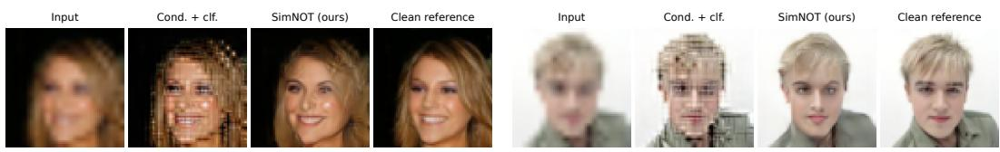
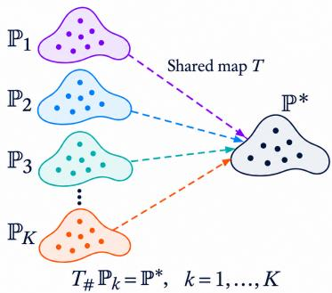
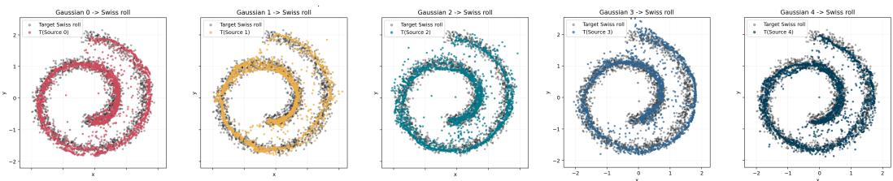

# SIMULTANEOUS NEURAL OPTIMAL TRANSPORT

Milena Gazdieva ∗   
Applied AI Institute   
AXXX   
Moscow, Russia   
milenagazdieva@gmail.com

Jiawei Chen MIRIAI† Moscow, Russia

Evgeny Burnaev Applied AI Institute AXXX Moscow, Russia

Kirill Sokolov   
Lomonosov Moscow State University   
Moscow, Russia

Alexander Korotin Applied AI Institute AXXX Moscow, Russia

## ABSTRACT

Optimal Transport (OT) provides a principled framework for learning transformations between probability distributions from unpaired samples. In many applications, however, a single transformation must map several source distributions to a common target distribution. For example, image restoration might require handling different types of degradation without knowing the degradation of each input at inference time. Simple approaches of pooling the source distributions only encourage alignment with the target at the aggregate level and may leave individual sources misaligned. In our paper, we consider the simultaneous OT problem which formalizes the task of learning a shared transport map that minimizes the average transport cost while aligning each source distribution with a prescribed target. We propose a neural method for solving the simultaneous OT problem by learning a shared transport map that minimizes the average transport cost while aligning each source distribution with a prescribed target. We derive a max-min formulation for learning this map. We illustrate its application to image restoration, where a single model handles multiple degradation types using a common collection of clean target images.

  
Figure 1: Restoration of selected CelebA 64×64 test images under bilinear downsampling with an unseen factor (×3 at test time versus ×4 during training). Each group shows the degraded input, conditional OT with classifier-based routing, SimNOT (ours), and the clean reference.

## 1 INTRODUCTION

Learning transformations between probability distributions from unpaired samples underlies a range of applications, including image-to-image translation (Zhu et al., 2017), voice conversion (Chun et al., 2023), and prediction of single-cell perturbation responses (Bunne et al., 2023). In many practical scenarios, the input data originate from several distributions, while a single model is expected to transform them into a common target distribution. The challenge is to learn one transformation that produces suitable outputs for each source distribution while preserving relevant properties of the inputs. For example, all-in-one image restoration aims to handle multiple types of degradation within one model without requiring the degradation type at inference time (Potlapalli et al., 2023). In the unpaired setting, the learner has access to degraded and clean images but not to their correspondences.

Optimal Transport (OT) provides a mathematical framework for learning such transformations (Peyré et al., 2019). It seeks a transport map or plan that aligns the source and target distributions while minimizing a prescribed transport cost. The cost specifies which input–output correspondences are preferable and can be chosen to encourage preservation of particular attributes. Neural OT methods make it possible to approximate transport maps between distributions available only through samples and apply the learned maps to previously unseen inputs (Fan et al., 2023; Korotin et al., 2023a;b). These methods provide a natural starting point for learning transformations shared across several source distributions.

A straightforward approach is to pool the source datasets and learn an OT map from their mixture to the target distribution. However, matching the transformed mixture to the target does not guarantee that the transformed distribution of each source matches the target individually. For example, different sources may be mapped to different parts of the target distribution, producing a correct aggregate distribution despite substantial discrepancies for individual sources. Alternatively, learning a separate map for each source does not yield a single transformation that can be applied without selecting a source-specific model. This motivates learning a shared map while explicitly accounting for each source distribution.

The simultaneous optimal transport (SOT) framework (Wang & Zhang, 2025) formalizes transport under multiple distributional constraints using a common map or stochastic kernel. We consider its many-to-one setting: a single transformation must align several source distributions with a prescribed target while minimizing the average transport cost. The shared transformation couples the sourcespecific transport tasks, and the individual alignment requirements retain information that is lost when the sources are treated only as a mixture. Our focus is on the computational setting in which the distributions are unknown and available through unpaired samples, and the learned transformation must generalize to new inputs.

To develop a practical learning method, we consider an unbalanced formulation of simultaneous transport, replacing hard marginal constraints with divergence penalties. Unbalanced OT has already been used to learn generative models and transport maps between a pair of distributions (Choi et al., 2023; Gazdieva et al., 2024; Yang & Uhler, 2018; Klein et al., 2024; Eyring et al., 2024). In our setting, this relaxation provides an adjustable trade-off between transport cost and marginal agreement while retaining the shared transport structure and separate objectives for the sources. We derive a variational training objective and use it to learn a single neural transport map together with source-specific potentials. The source identity is used to select the appropriate potential during training, whereas the transport map itself is shared and does not require this identity at inference time.

Contributions. We develop Simultaneous Neural Optimal Transport (SimNOT), a continuous solver for learning a shared transport map from multiple source distributions to a prescribed target using unpaired samples. We introduce a divergence-based unbalanced formulation of simultaneous OT, establish its exact semi-dual representation ( 4.1), and provide neural approximation guarantees M( 4.3). These results yield a neural solver with one shared map and source-specific potentials, Mrequiring no source labels at inference time (§4.2). We demonstrate its effectiveness on simultaneous Gaussian-to-Swiss-roll transport and unpaired image restoration with multiple degradation types, including evaluation under unseen degradation strengths (§5).

Notation. We take the source and target domains to be nonempty closed sets $\mathcal { X } \subseteq \mathbb { R } ^ { D _ { x } }$ and $\mathcal { V } \subseteq \mathbb { R } ^ { D _ { y } }$ We write $\mathcal { Z }$ for an auxiliary noise space. For a Borel space $\bar { E } , \bar { \mathcal { P } } ( E )$ and $\mathcal { M } _ { + } ( E )$ denote the sets of Borel probability measures and finite non-negative Borel measures on $E _ { \mathrm { { : } } }$ , respectively, and $C _ { b } ( E )$ denotes the bounded continuous real-valued functions on $E .$ . The source distributions are denoted by $\mathbb { P } _ { 1 } , \ b { \mathscr { \mathrm { ~ \ i ~ } } } , \ b { \mathscr { \mathrm { ~ \ i ~ } } } , \ b { \mathbb { P } } _ { K } \in \mathscr { P } ( \mathcal { X } )$ , and the common target distribution by $\mathbb { P } ^ { * } \in \mathcal { P } ( \mathcal { V } )$ ). For a measurable map $\check { T } _ { : }$ $T _ { \# } \mu$ denotes the pushforward of a measure $\mu .$ . We represent a stochastic map by $T : \mathcal { X } \times \mathcal { Z } \stackrel { \cdot } {  } \mathcal { Y }$ where $z \sim \mathbb { S } \in \mathcal { P } ( \mathcal { Z } )$ is independent of the input; its output distribution for source $\mathbb { P } _ { k }$ is $T _ { \# } ( \mathbb { P } _ { k } \otimes \mathbb { S } )$ For a probability kernel $\gamma ( \cdot \mid x )$ from $\mathcal { X }$ to $\mathcal { N } .$ , we write $\gamma _ { \# } \mu$ for the output measure $\textstyle \int \gamma ( \cdot \mid x ) d \mu ( x )$ For $\gamma \in \mathcal { M } _ { + } ( \dot { \mathcal { X } } \times \mathcal { Y } )$ , its marginals are denoted by $\gamma _ { x }$ and $\gamma _ { y } .$ . We use $\Pi ( \mu , \nu )$ for the set of finite non-negative measures on the product space with marginals $\mu$ and ν (when these marginals have the same total mass); in particular, for probability marginals these are probability couplings.

## 2 RELATED WORK

We review the most closely related OT formulations and solvers below. Extended related work on OT barycenters and all-in-one image restoration is discussed in Appendix B.

Learning optimal transport maps. OT has been used in generative modeling both as a discrepancy between generated and target distributions and as a principle for learning the transformation itself. For example, Wasserstein GANs (Arjovsky et al., 2017) use an OT discrepancy as a training loss, but do not require the generator to minimize the transport cost between its inputs and outputs. More closely related to our work are continuous neural OT solvers, which learn transport maps or plans from samples (Makkuva et al., 2020; Rout et al., 2022; Korotin et al., 2023b). These methods exploit OT duality to construct optimization objectives for neural potentials and transport maps, with applications to generation and unpaired translation. Partial transport formulations also permit relaxing distribution matching while controlling the similarity between inputs and outputs (Gazdieva et al., 2023). These works consider transport between a pair of distributions; our focus is on learning one transformation jointly for several sources.

Simultaneous optimal transport. Wang & Zhang (2025) introduce simultaneous OT as transport between vector-valued measures: a common map or transport kernel must transport several source measures to their respective targets. They study Monge and Kantorovich formulations, existence, and duality. The balanced problem with a common target considered in our work is a particular case of this framework. Its defining requirement is that the same transformation satisfy the transport constraints for every source. Learning independent pairwise OT maps does not impose this requirement, while matching a pooled source distribution to the target does not ensure that each source is matched individually. We build on this perspective to develop a neural method for learning shared transformations from samples. We also consider divergence-based marginal relaxation; this differs from the inequality-constrained unbalanced formulation studied by Wang & Zhang (2025).

Unbalanced optimal transport. Unbalanced OT replaces exact marginal constraints with penalties for deviations from the prescribed measures (Liero et al., 2018). Among continuous solvers, Yang & Uhler (2018) propose an adversarial approach that jointly learns a transport map and a source mass scaling function. UOTM (Choi et al., 2023) learns a transport network and a potential through a semi-dual objective. The latter approach is particularly relevant to the optimization principles used in our work. Both methods consider transport between two measures. Our method combines marginal relaxation with a shared transformation and source-specific potentials. The role of the unbalanced formulation here is to provide a flexible transport objective for simultaneous learning.

## 3 BACKGROUND

In this section, we recall the OT formulations relevant to our work and specify the simultaneous OT problem with a common target. We then introduce the marginal relaxation considered in this paper. For background on OT and unbalanced OT, we refer to Villani (2009) and Chizat (2017), respectively.

## 3.1 OPTIMAL TRANSPORT

Let $\mathbb { P } \in \mathcal { P } ( \mathcal { X } ) , \mathbb { Q } \in \mathcal { P } ( \mathcal { Y } )$ be probability measures, $c : \mathcal { X } \times \mathcal { Y }  \mathbb { R } _ { + }$ − continuous function.

Monge formulation. The Monge OT problem seeks a measurable map $T : \mathcal { X }  \mathcal { Y }$ that transports $\mathbb { P }$ to $\mathbb { Q }$ while minimizing the transport cost given by function $c ( \cdot , \cdot )$

$$
\operatorname* { i n f } _ { T : T _ { \# } \mathbb { P } = \mathbb { Q } } \int _ { \mathcal { X } } c ( x , T ( x ) ) d \mathbb { P } ( x ) .\tag{1}
$$

A minimizer $T ^ { * }$ of equation 1, when it exists, is called an optimal transport (OT) map.

Kantorovich formulation. Monge OT problem may admit no feasible map or no minimizer. Thus, it is common to consider its Kantorovich relaxation which allows splitting the mass of each input point:

$$
\operatorname { O T } _ { c } ( \mathbb { P } , \mathbb { Q } ) = \operatorname* { i n f } _ { \pi \in \Pi ( \mathbb { P } , \mathbb { Q } ) } \int _ { \mathcal { X } \times \mathcal { Y } } c ( x , y ) d \pi ( x , y ) .\tag{2}
$$

Here $\Pi ( \mathbb { P } , \mathbb { Q } )$ is the set of probability measures on $\mathcal { X } \times \mathcal { V }$ with marginals $\pi _ { x } = \mathbb { P }$ and $\pi _ { y } = \mathbb { Q }$ Under the assumptions of this paper, a minimizer $\pi ^ { * }$ of equation 2 always exists, but need not be unique (Villani, 2009). Such a minimizer is called an optimal transport plan.

Disintegration gives dπ $\cdot ( x , y ) = d \pi _ { x } ( x ) d \pi ( y \mid x )$ , where $\pi ( \cdot \mid x )$ is the conditional distribution of outputs for an input x. An OT plan $\bar { \pi } ^ { * }$ thus defines a stochastic transport map $x \mapsto \pi ^ { * } ( \cdot \mid x )$ . If $\pi ^ { * } \bar { ( \cdot \mid x ) } = \delta _ { T ^ { * } ( x ) } \bar { }$ , then $\pi ^ { * } = ( \bar { \mathrm { i d } } _ { \mathcal { X } } , T ^ { * } ) _ { \# } \mathbb { P }$ and $T ^ { * }$ is an OT map.

Unbalanced formulation. Unbalanced OT (UOT) relaxes the marginal constraints in equation 2 by penalizing deviations of the marginals from P and $\mathbb { Q } .$ For finite non-negative measures $\mu ,$ ν on the same space, we define the ψ-divergence as

$$
D _ { \psi } ( \mu \| \nu ) = { \left\{ \begin{array} { l l } { \displaystyle \int \psi \left( { \frac { d \mu } { d \nu } } \right) ~ d \nu , } & { \mu \ll \nu , } \\ { + \infty , } & { { \mathrm { o t h e r w i s e . } } } \end{array} \right. }\tag{3}
$$

Here $\psi : [ 0 , \infty )  [ 0 , \infty ]$ is convex, lower semicontinuous, vanishes only at 1, and satisfies lim $\iota _ { u \to \infty } \psi ( u ) / u = + \infty$ . We define $D _ { \phi }$ analogously. Examples include the Kullback–Leibler and $\chi ^ { 2 }$ divergences, generated by $\psi ( u ) = \iota$ u log $u - u + 1$ and $\psi ( u ) = ( u - 1 ) ^ { 2 }$ , respectively.

The UOT problem is given by (Liero et al., 2018)

$$
\operatorname { U O T } _ { c , \psi , \phi } ( \mathbb { P } , \mathbb { Q } ) = \operatorname* { i n f } _ { \gamma \in \mathcal { M } _ { + } ( \mathcal { X } \times \mathcal { Y } ) } \left[ \int _ { \mathcal { X } \times \mathcal { Y } } c ( x , y ) d \gamma ( x , y ) + D _ { \psi } ( \gamma _ { x } \| \mathbb { P } ) + D _ { \phi } ( \gamma _ { y } \| \mathbb { Q } ) \right] ,\tag{4}
$$

where $\mathcal { M } _ { + } ( \mathcal { X } \times \mathcal { Y } )$ is the set of finite non-negative measures, and $\gamma _ { x } , \gamma _ { y }$ are the marginals of $\gamma . \mathrm { A }$ minimizer $\gamma ^ { * }$ is called an unbalanced OT plan. Its total mass is not constrained to equal one. The strength of the marginal penalties can be adjusted by scaling the generators $\psi$ and $\phi .$

The balanced problem equation 2 is recovered when ψ and ϕ are the convex indicators of $\{ 1 \}$ : the divergence terms then enforce $\gamma _ { x } = \operatorname { \mathbb { P } } \operatorname { a n d } \gamma _ { y } = \mathbb { Q }$

As in the balanced case, disintegration gives $d \gamma ( x , y ) = d \gamma _ { x } ( x ) d \gamma ( y \mid x )$ . The conditional distributions $\gamma ^ { * } ( \cdot \mid x )$ define a stochastic transport map acting on the source marginal $\gamma _ { x } ^ { \ast }$ , which may differ from P. In the deterministic case, $\gamma ^ { * } ( \cdot \mid x ) = \delta _ { T ^ { * } ( x ) }$ and $\gamma _ { y } ^ { \ast } = T _ { \# } ^ { \ast } \gamma _ { x } ^ { \ast }$

## 3.2 SIMULTANEOUS OPTIMAL TRANSPORT

Simultaneous OT seeks a shared transport rule that transports several source measures to their respective target measures (Wang & Zhang, 2025). Here, we consider the case of $K$ source distributions $\mathbb { P } _ { 1 } , \ b { \mathscr { \mathrm { ~ \ i ~ } } } , \ b { \mathscr { \mathrm { ~ \ i ~ } } } , \ b { \mathbb { P } } _ { K } \in \mathscr { P } ( \mathcal { X } )$ and a common prescribed target distribution $\mathbb { P } ^ { * } \in \mathcal { P } ( \mathcal { V } )$

Balanced formulation. A simultaneous transport plan from $\mathbb { P } _ { 1 } , \dots , \mathbb { P } _ { K }$ to $\mathbb { P } ^ { * }$ is represented by a family of plans $\pi _ { k } \in \Pi ( \mathbb { P } _ { k } , \mathbb { P } ^ { * } )$ sharing a common conditional distribution $\pi ( \cdot \mid x )$

$$
d \pi _ { k } ( x , y ) = d \mathbb { P } _ { k } ( x ) d \pi ( y \mid x ) , k = 1 , \dots , K .\tag{5}
$$

Thus, the same conditional distribution of outputs is used for a given input x across all sources. The balanced simultaneous OT problem seeks such a family minimizing the average transport cost:

Figure 2: A schematic illustration of simultaneous OT.

$$
\operatorname* { i n f } _ { \pi ( \cdot | x ) : \atop ( \pi _ { k } ) _ { y } = \mathbb { P } ^ { * } , \ k = 1 , \dots , K } \frac { 1 } { K } \sum _ { k = 1 } ^ { K } \int _ { \mathcal { X } \times \mathcal { Y } } c ( x , y ) d \pi _ { k } ( x , y ) .\tag{6}
$$

Here, the infimum is taken over shared conditional probability distributions, with the plans $\pi _ { k }$ defined by equation 5. A minimizing family $\{ \pi _ { k } ^ { * } \} _ { k = 1 } ^ { K }$ , when it exists, is called a simultaneous optimal transport (OT) plan. Its shared conditional distribution $\pi ^ { * } ( \cdot \mid x )$ defines a stochastic transport map ${ \overline { { x } } } \mapsto \pi ^ { * } ( { \overline { { \cdot } } } \mid x )$ that transports every $\mathbb { P } _ { k }$ to $\mathbb { P } ^ { * }$ . In the special case of deterministic plans,

$\pi ( \cdot \mid x ) = \delta _ { T ( x ) }$ for a shared map $T : \mathcal { X }  \mathcal { Y }$ satisfying $T _ { \# } \mathbb { P } _ { k } = \mathbb { P } ^ { * }$ for all $k ,$ see Fig. 2.   
Optimizing equation 6 over such plans yields the simultaneous Monge problem.

When the source distributions have pairwise disjoint supports, simultaneous OT reduces to independent pairwise OT problems: the corresponding transport maps, when they exist, can be combined into a single map. For overlapping sources, independently obtained maps may disagree on the overlap, whereas simultaneous OT requires the same transformation for every source.

Unbalanced formulation. We consider an unbalanced relaxation of equation 6 that penalizes deviations from the prescribed marginals while retaining a shared conditional distribution. Specifically, we consider finite nonnegative transport plans $\gamma _ { 1 } , \dots , \gamma _ { K }$ of the form

$$
d \gamma _ { k } ( x , y ) = d ( \gamma _ { k } ) _ { x } ( x ) d \gamma ( y \mid x ) , \qquad k = 1 , \ldots , K ,\tag{7}
$$

where $\gamma ( \cdot \mid x )$ is a shared conditional probability distribution. The source marginals $( \gamma _ { k } ) _ { x }$ are optimized jointly with this conditional distribution, and the plans $\gamma _ { k }$ need not have unit mass.

The resulting simultaneous UOT problem is

$$
\operatorname* { i n f } _ { \gamma ( \cdot | x ) , \{ ( \gamma _ { k } ) _ { x } \} _ { k = 1 } ^ { K } } \frac { 1 } { K } \sum _ { k = 1 } ^ { K } \left[ \int _ { \mathcal { X } \times \mathcal { Y } } c ( x , y ) d \gamma _ { k } ( x , y ) + D _ { \psi } ( ( \gamma _ { k } ) _ { x } \| \mathbb { P } _ { k } ) + D _ { \phi } ( ( \gamma _ { k } ) _ { y } \| \mathbb { P } ^ { * } ) \right] .\tag{8}
$$

Here, the infimum is taken over shared conditional probability distributions and finite nonnegative source marginals, with the plans $\gamma _ { k }$ defined by equation 7. The divergences penalize deviations of the source and target marginals from $\mathbb { P } _ { k }$ and $\mathbb { P } ^ { * }$ , respectively.

A minimizing family $\{ \gamma _ { k } ^ { * } \} _ { k = 1 } ^ { K } ,$ when it exists, is called a simultaneous UOT plan. Its shared conditional distribution $\tilde { \gamma } ^ { * } ( \cdot \vert \grave { x } )$ ) defines the corresponding stochastic transport map. In the case of deterministic plans, $\gamma ( \cdot \mid x ) = \delta _ { T ( x ) }$ for a shared map $T : { \bar { \mathcal { X } } }  { \mathcal { Y } } .$ , and $( \gamma _ { k } ) _ { y } = T _ { \# } ( \gamma _ { k } ) _ { \# }$ x for all k.

To the best of our knowledge, this divergence-based formulation of simultaneous unbalanced OT has not been studied previously. The unbalanced formulation of Wang & Zhang (2025) uses marginal domination constraints.

## 3.3 COMPUTATIONAL SETUP

The distributions $\mathbb { P } _ { 1 } , \dots , \mathbb { P } _ { K }$ and $\mathbb { P } ^ { * }$ are unknown and accessible only through finite unpaired samples. Our goal is to learn a shared transport map for the underlying distributions that admits new inputs not present in the training data. This setup is typically called continuous (Fan et al., 2023; Rout et al., 2022; Korotin et al., 2023a) and differs from the discrete one, which seeks transport couplings between empirical measures (Cuturi, 2013; Chizat et al., 2018).

## 4 SIMULTANEOUS NEURAL OT METHOD

In this section, we derive our novel optimization objective for learning simultaneous UOT plans ( 4.1) and propose an algorithm to solve ( 4.2). We then study the approximation properties of M Mshared neural maps ( 4.3). The proofs of all theoretical results are given in Appendix A.

## 4.1 DERIVING THE OPTIMIZATION OBJECTIVE

Direct optimization of equation 8 is difficult from samples because the marginal divergences involve unknown measures. We therefore derive an equivalent semi-dual objective whose dependence on the data distributions is only through expectations.

For the result below, assume that $\mathbb { P } _ { 1 } , \dots , \mathbb { P } _ { K }$ are atomless, $c : \mathcal { X } \times \mathcal { Y }  [ 0 , \infty )$ is finite and continuous, and that ψ and ϕ satisfy the assumptions stated in Section 3.1 and $\phi ( 0 ) < + \infty , \psi ( 0 ) <$ $+ \infty$ . Put $\begin{array} { r } { \overline { { \mathbb { P } } } = \frac { 1 } { K } \sum _ { k = 1 } ^ { K } { \mathbb { P } _ { k } } } \end{array}$ . This is equivalent to atomlessness of ${ \overline { { \mathbb { P } } } } \colon$ an average of atomless measures is atomless, while each $\mathbb { P } _ { k }$ is absolutely continuous with respect to P. The atomlessness assumption is used only in the purification argument of Lemma 1. Let ${ \hat { J } } ^ { * }$ denote the infimum in equation 8.

Theorem 1 (Semi-dual formulation of simultaneous UOT). Under the assumptions above,

$$
J ^ { * } = \operatorname* { s u p } _ { \mathbf { v } \in C _ { b } ( \mathcal { Y } ) ^ { K } } \operatorname* { i n f } _ { \mathcal { Y } } \mathcal { I } ( \mathbf { v } , \boldsymbol { \gamma } ) = \operatorname* { s u p } _ { \mathbf { v } \in C _ { b } ( \mathcal { Y } ) ^ { K } } \operatorname* { i n f } _ { T : \mathcal { X } \to \mathcal { Y } } \mathcal { I } ( \mathbf { v } , T ) ,\tag{9}
$$

where thefirst infimum is over all probability kernels $\gamma ( \cdot \mid x )$ from X to Y and

$$
\mathcal { I } ( \mathbf { v } , \gamma ) = - \frac { 1 } { K } \sum _ { k = 1 } ^ { K } \left[ \mathbb { E } _ { x \sim \mathbb { P } _ { k } } \mathbb { E } _ { y \sim \gamma ( \cdot | x ) } \bar { \psi } ( v _ { k } ( y ) - c ( x , y ) ) + \mathbb { E } _ { y \sim \mathbb { P } ^ { * } } \bar { \phi } ( - v _ { k } ( y ) ) \right] .\tag{10}
$$

For a deterministic map T, we use the shorthand $\mathcal { I } ( \mathbf { v } , T ) : = \mathcal { I } ( \mathbf { v } , \delta _ { T ( \cdot ) } )$

In equation 10, the distributions enter only through expectations and can be estimated from samples.

Remark on attainment. Theorem 1 concerns optimal values and does not require attainment of the primal infimum. Existence is assumed explicitly whenever it is needed. The deterministic representation in equation 9 refers only to the inner semi-dual problem; the structure of primal minimizers is addressed separately in Theorem 3.

## 4.2 PARAMETRIZATION AND TRAINING

Parametrization. To optimize over the shared conditional distribution $\gamma ( \cdot \mid x )$ in equation 9, we represent it using a stochastic or deterministic map, following Choi et al. (2023). Let $\mathcal { Z } \subseteq \mathbb { R } ^ { D _ { z } }$ be a Borel set and $\check { \mathbb { S } } \in \mathscr { P } ( \mathcal { Z } )$ be an atomless noise distribution. Every shared conditional distribution $\gamma ( \cdot \mid x )$ in equation 9 admits a measurable realization $T : \mathcal { X } \times \mathcal { Z } \stackrel { } {  } \mathcal { Y }$ with $z \sim \mathbb { S } \colon \gamma ( \cdot \mid x ) [ = \gamma _ { T } ( \cdot \mid$ $x ) ] = ( T ( x , \mathbf { \bar { \cdot } } ) ) _ { \# } \mathbb { S }$ , where the map T and the noise distribution S are shared across all sources.

Using this representation, we rewrite the optimization problem equation 9 as

$$
J ^ { * } = \operatorname* { s u p } _ { \substack { v _ { 1 } , \ldots , v _ { K } \in C ( \mathcal { V } ) } } \operatorname* { i n f } _ { T } \mathcal { I } \big ( v _ { 1 } , \ldots , v _ { K } , T \big ) ,\tag{11}
$$

where the infimum is over measurable maps $T : \mathcal { X } \times \mathcal { Z }  \mathcal { Y }$ and

$$
J ( v _ { 1 } , \dots , v _ { K } , T ) = - \frac { 1 } { K } \sum _ { k = 1 } ^ { K } \left[ \mathbb { E } _ { x \sim \mathbb { R } _ { k } } \bar { \psi } ( v _ { k } ( T ( x , z ) ) - c ( x , T ( x , z ) ) ) + \mathbb { E } _ { y \sim \mathbb { P } ^ { * } } \bar { \phi } ( - v _ { k } ( y ) ) \right] .\tag{12}
$$

In some settings, stochasticity of the conditional distribution is not needed. We can then consider a shared measurable map $T : \mathcal { X }  \mathcal { Y }$ , which defines deterministic conditional distributions $\gamma _ { T } ( \cdot |$ $x ) = \delta _ { T ( x ) }$ . In this case, the expectation over S in equation 12 is omitted. Theorem 3 below motivates this choice when the transport cost is quadratic and both marginal penalties are KL divergences.

To solve equation 11, we parametrize the shared map and the potentials by neural nets $T _ { \theta } : \mathcal { X } { \times } \mathcal { Z }  Y$ and $v _ { \omega _ { k } } : \mathcal { V } \to \mathbb { R } , k = 1 , \ldots , K$ , with trainable parameters θ and $\omega _ { 1 } , \ldots , \omega _ { K }$ , respectively. The noise input is omitted for deterministic maps. In practice, we scale the transport cost c by an unbalancedness parameter $\tau > 0 \colon$ smaller values favor balanced simultaneous OT, while larger values allow greater marginal deviations.

Training. In our setup, the source distributions $\mathbb { P } _ { 1 } , \dots , \mathbb { P } _ { K }$ and the target distribution $\mathbb { P } ^ { * }$ are accessible only through samples. We therefore estimate the objective $\mathcal { I } ( v _ { \omega _ { 1 } } , \ldots , v _ { \omega _ { K } } , T _ { \theta } )$ in equation 12 using Monte Carlo with random mini-batches from the source, target and noise distributions.

Training alternates between gradient ascent with respect to the potential parameters $\omega _ { 1 } , \ldots , \omega _ { K }$ and gradient descent with respect to the map parameters θ. Each potential is trained using its corresponding source distribution and the common target, while the shared map receives contributions from all sources. The training procedure is summarized in Algorithm 1.

Inference. Given a new input x, we generate an output $T _ { \theta } ( x , z )$ with $z \sim \mathbb { S } ,$ , or $T _ { \theta } ( x )$ in the deterministic case. The source index and the potentials are not required at inference time.

## 4.3 THEORETICAL PROPERTIES

The semi-dual formulation allows an arbitrary shared stochastic kernel. We first ask whether one neural map with a noise input is expressive enough to approximate such a kernel simultaneously for all source distributions.

For the approximation results in this subsection only, assume that $\mathcal { Y } = [ a , b ] ^ { D _ { y } }$ for some $a < b .$ and let $\mathbb { S } = \dot { \mathrm { U n i f } } [ 0 , 1 ]$ . The compact box assumption makes the $W _ { 2 }$ statement automatic and allows coordinatewise clipping to $\mathcal { V }$ to be implemented by ReLU operations.

Algorithm 1: Simultaneous Neural Optimal Transport (SimNOT)   
Input: Distributions $\overline { { \mathbb { P } _ { 1 } , \ldots , \mathbb { P } _ { K } , \mathbb { P } ^ { * } } }$ and S accessible by samples; transport cost   
$\overset { \vartriangle } { \boldsymbol { c } : \boldsymbol { \mathcal { X } } } \times \boldsymbol { \mathcal { Y } }  \mathbb { R } _ { + }$ ; parameter $\tau > 0 ;$ conjugate functions ψ,¯ ϕ¯; shared map $T _ { \theta }$ and potentials   
$v _ { \omega _ { k } } , k = 1 , \ldots , K$ ; number $N _ { T }$ of inner iterations; batch sizes.   
Output: Trained shared (stochastic) map $T _ { \theta } .$   
repeat   
Sample batches $X _ { k } \sim \mathbb { P } _ { k } , k = 1 , \ldots , K .$ , and $Y \sim \mathbb { P } ^ { * }$   
For each $x \in X _ { k } .$ , independently sample $z _ { k , x } \sim \mathbb { S } ;$   
$\begin{array} { r } { \widehat { \mathcal { L } _ { v } } \gets - \frac { 1 } { K } \sum _ { k = 1 } ^ { K } \Big [ \frac { 1 } { | X _ { k } | } \sum _ { x \in X _ { k } } \bar { \psi } ( v _ { \omega _ { k } } ( T _ { \theta } ( x , z _ { k , x } ) ) - \tau c ( x , T _ { \theta } ( x , z _ { k , x } ) ) ) + } \end{array}$   
$\begin{array} { r } { \frac { 1 } { | Y | } \sum _ { y \in Y } \bar { \phi } ( - v _ { \omega _ { k } } ( y ) ) \bigg ] ; } \end{array}$   
Update $\omega _ { 1 } , \ldots , \omega _ { K }$ using $\nabla _ { \omega _ { k } } \widehat { \mathcal { L } _ { v } }$ to maximize ${ \widehat { \mathcal { L } } } _ { v } ,$ keeping θ fixed;   
for $n _ { T } = 1 , 2 , . . . , N _ { T }$ do   
Sample batches $X _ { k } \sim \mathbb { P } _ { k } , k = 1 , \ldots , K ;$   
For each $x \in X _ { k } .$ independently sample $z _ { k , x } \sim \mathbb { S } ;$   
$\begin{array} { r } { \widehat { \mathcal { L } } _ { T } \gets - \frac { 1 } { K } \sum _ { k = 1 } ^ { K } \frac { 1 } { | X _ { k } | } \sum _ { x \in X _ { k } } \bar { \psi } ( v _ { \omega _ { k } } ( T _ { \theta } ( x , z _ { k , x } ) ) - \tau c ( x , T _ { \theta } ( x , z _ { k , x } ) ) ) \textmd { d } \nu } \end{array}$   
Update θ using $\nabla _ { \boldsymbol { \theta } } \bar { \mathcal { L } } _ { T } ^ { \setminus }$ to minimize $\widehat { \mathcal { L } _ { T } }$ , keeping $\omega _ { 1 } , \ldots , \omega _ { K }$ fixed;   
until converged;

Theorem 2 (Approximation by a shared neural map). Let $\gamma ( \cdot \mid x )$ be a Borel probability kernel from X to Y. For every $\varepsilon > 0 _ { i }$ , there exists afinite $f u l l y$ connected ReLU network

$$
T _ { \theta } : \mathbb { R } ^ { D _ { x } + 1 }  \mathcal { V }
$$

such that, with

$$
\gamma _ { \theta } ( \cdot \mid x ) = ( T _ { \theta } ( x , \cdot ) ) _ { \# } \mathbb { S } ,
$$

we have simultaneously for every $k = 1 , \ldots , K$

$$
\int _ { \mathcal { X } } W _ { 2 } ^ { 2 } ( \gamma _ { \theta } ( \cdot \mid x ) , \gamma ( \cdot \mid x ) ) \ d \mathbb { P } _ { k } ( x ) < \varepsilon\tag{13}
$$

and

$$
W _ { 2 } ^ { 2 } ( ( T _ { \theta } ) _ { \# } ( \mathbb { P } _ { k } \otimes \mathbb { S } ) , \gamma _ { \# } \mathbb { P } _ { k } ) < \varepsilon .\tag{14}
$$

The theorem shows that any shared stochastic transport mechanism can be approximated by a single neural map, simultaneously and with a common accuracy bound for all source distributions.

Corollary 1 (Consistency of the neural parametrization). Assume the conditions ofTheorem 1 and $\mathcal { Y } = [ a , \dot { b } ] ^ { D _ { y } }$ . Let $\mathcal { T } _ { n }$ be increasing classes of ReLU maps $\mathcal { X } \times [ 0 , 1 ] \to \mathcal { Y }$ whose union contains everyfinite ReLU network with coordinatewise clipped output. Let $\nu _ { m }$ be increasing compact subsets $o f { C } ( \dot { \mathcal { V } } ) ^ { K }$ whose union is uniformly dense in $C ( \dot { \mathcal { V } } ) ^ { K }$ . Define

$$
D _ { m , n } = \operatorname* { s u p } _ { \mathbf { v } \in \mathscr { V } _ { m } } \operatorname* { i n f } _ { T \in \mathscr { T } _ { n } } \mathcal { I } ( \mathbf { v } , T ) .\tag{15}
$$

Then

$$
\operatorname* { l i m } _ { m \to \infty } \operatorname* { l i m } _ { n \to \infty } D _ { m , n } = J ^ { * } .\tag{16}
$$

The corollary shows that the neural parametrization is also consistent at the level of the optimization problem: as the map and potential classes become sufficiently expressive, the restricted population value converges to the exact value $J ^ { * }$ . This statement concerns optimal values; it does not require convergence of particular network parameters. The proof is given in Appendix A.2.

We finally ask a different question. The previous theorem shows that stochastic kernels can be represented by neural maps; it does not say whether randomization is actually needed by an optimal primal solution. For quadratic cost and KL marginal penalties, an attained optimum is deterministic under a standard regularity assumption on the source densities.

  
Figure 3: Simultaneous transport from five Gaussian sources to a common Swiss roll target. Each panel shows the outputs of the same learned map for one source (colored points), overlaid with target samples (gray points). The visualization uses independent samples after 100K training iterations.

Theorem 3 (Monge structure in the quadratic KL case). Let $\mathcal { X } = \mathcal { Y } = \mathbb { R } ^ { d } ,$

$$
c ( x , y ) = \| x - y \| ^ { 2 } , \qquad \psi ( t ) = \phi ( t ) = t \log t - t + 1 .
$$

Assume that there exists an open set $\Omega \subseteq \mathbb { R } ^ { d }$ such that $\mathbb { P } _ { k } ( \Omega ) = 1$ for all k, and the restriction of $\mathbb { P } _ { k }$ to Ω admits a strictly positive density $p _ { k } \in C ^ { 2 } ( \Omega )$ with respect to d-dimensional Lebesgue measure. Ifthe infimum in equation 8 is attained by $( \gamma ^ { * } , \bar { \{ ( \gamma _ { k } ^ { * } ) _ { x } \} } _ { k = 1 } ^ { K ^ { - } } )$ , then there exists a Borel map $T ^ { * } : \mathbb { R } ^ { d }  \mathbb { R } ^ { d }$ such that

$$
\gamma ^ { * } ( \cdot \mid x ) = \delta _ { T ^ { * } ( x ) } \qquad \sigma \ – a . e . , \qquad \sigma = \sum _ { k = 1 } ^ { K } ( \gamma _ { k } ^ { * } ) _ { x } .\tag{17}
$$

Consequently,

$$
\gamma _ { k } ^ { * } = \bigl ( \mathrm { i d } _ { \mathbb { R } ^ { d } } , T ^ { * } \bigr ) _ { \# } \bigl ( \gamma _ { k } ^ { * } \bigr ) _ { x } , \qquad k = 1 , \ldots , K .
$$

## 5 EXPERIMENTS

We evaluate SimNOT on a synthetic example and an unpaired image restoration task. In §5.1, we investigate the learned shared transformation between several Gaussian source distributions and a common Swiss roll target. In §5.2, we apply our method to CelebA images with different degradations, using a single model to restore them to a common clean image distribution.

## 5.1 TOY EXPERIMENT

We consider a two-dimensional example to illustrate the ability of our method to learn a shared transformation from several source distributions to a common target. The sources $\mathbb { P } _ { 1 } , \ldots , \mathbb { P } _ { 5 }$ are Gaussian distributions with identity covariance matrices and means ${ \bar { ( 0 , 0 ) } } , ( 3 , 0 ) , ( 0 , 3 ) , ( - 3 , 0 )$ , and $( 0 , - 3 )$ , respectively. The target $\mathbb { P ^ { * } }$ is a noisy Swiss-roll distribution. We learn a single deterministic map $\dot { T _ { \theta } } : \mathbb { R } ^ { \dot { 2 } }  \mathbb { R } ^ { 2 }$ with five source-specific potentials. The map receives only the input coordinates, without the source index. Further experimental details are provided in Appendix D.1.

Results. Figure 3 shows the transported samples from each source alongside samples from the common target. The shared map recovers the overall spiral structure for all five sources. The outputs differ in their spread around the spiral, and some samples lie between its branches. Thus, the experiment illustrates simultaneous approximation of the target geometry, while leaving visible discrepancies between the transported and target distributions.

## 5.2 UNPAIRED IMAGE RESTORATION WITH MULTIPLE DEGRADATIONS

Experimental setup. We consider unpaired image restoration on CelebA at resolution $6 4 \times 6 4$ The five source distributions correspond to bicubic and bilinear downsampling, JPEG compression, Gaussian blur, and additive Gaussian noise. The common target consists of clean images. We use disjoint sets of images to construct the source distributions, the clean target, and the test set. Each source image is assigned to one degradation, and its clean counterpart is not used as a training target. Our goal is to learn a shared restoration map that processes inputs without receiving their degradation labels. Data preparation and training details are provided in Appendix D.2.

<table><tr><td>Method</td><td>Mean FID ↓</td><td>Max FID</td><td>PSNR ↑</td></tr><tr><td>Degraded input</td><td>87.60</td><td>178.94</td><td>25.19</td></tr><tr><td>Pooled UOT</td><td>9.96</td><td>14.39</td><td>27.51</td></tr><tr><td>Conditional UOT + classifier</td><td>6.39</td><td>8.33</td><td>28.21</td></tr><tr><td>SimNOT (ours)</td><td>8.23</td><td>11.88</td><td>27.85</td></tr></table>

Table 1: CelebA restoration on held-out images with the training degradation parameters. Each of the five degradations is applied to the same full set of test images. Mean and Max FID aggregate the five source-specific FIDs. PSNR (dB) is averaged over images and degradation conditions. The best and second-best results among restoration methods are bold and underlined, respectively.

<table><tr><td rowspan="2">Method</td><td colspan="3">Bilinear ×3</td><td colspan="3">Bilinear ×5</td></tr><tr><td>FID↓</td><td>LPIPS ↓</td><td>PSNR ↑</td><td>FID↓</td><td>LPIPS ↓</td><td>PSNR ↑</td></tr><tr><td>Degraded input</td><td>92.82</td><td>0.1821</td><td>25.02</td><td>317.44</td><td>0.3717</td><td>20.93</td></tr><tr><td>Pooled UOT</td><td>27.71</td><td>0.0717</td><td>24.23</td><td>99.22</td><td>0.2342</td><td>20.51</td></tr><tr><td>Conditional UOT + classifier</td><td>35.16</td><td>0.1185</td><td>24.35</td><td>80.87</td><td>0.2670</td><td>20.80</td></tr><tr><td>SimNOT (ours)</td><td>18.44</td><td>0.0635</td><td>25.03</td><td>32.15</td><td>0.1134</td><td>20.93</td></tr><tr><td>Conditional UOT + known family</td><td>21.42</td><td>0.0637</td><td>23.99</td><td>77.23</td><td>0.1983</td><td>20.69</td></tr></table>

Table 2: Generalization to unseen bilinear downsampling factors. Models trained with factor ×4 are evaluated at factors ×3 and ×5 without retraining. Each setting uses all 20,259 test images. The last row supplies the bilinear family label directly to Conditional UOT. Bold indicates the best result among restoration methods.

Baselines. We compare SimNOT with two UOT baselines. Pooled UOT learns a shared map and a single potential by treating the source distributions as an equally weighted mixture. Conditional UOT conditions both the map and the potential on the degradation label. For blind restoration, this label is predicted by a separately trained degradation classifier which uses the same five degradation types and fixed parameters as restoration training. All models use the same data split and are evaluated using their final exponential moving average (EMA) checkpoints after 100K training steps.

Evaluation. We assess distribution matching using FID and reconstruction accuracy using PSNR against the corresponding clean images. For the original degradation settings, we compute FID separately for each source and report the mean and maximum across the five degradations.

Results on training degradations. Table 1 reports results on held-out images with the degradation parameters used during training. SimNOT outperforms Pooled UOT in both mean and maximum source-specific FID and in PSNR. Conditional UOT achieves the best results in this setting. The degradation classifier attains 100% accuracy, so using its predictions yields the same results as supplying the true degradation labels.

Generalization to unseen degradation strengths. We further evaluate the trained models on bilinear downsampling with factors ×3 and ×5, while training uses factor ×4. All models, including the classifier, are applied without retraining. We additionally report LPIPS to assess perceptual similarity to the clean reference images.

As shown in Table 2, SimNOT achieves the lowest FID and LPIPS and the highest PSNR among the restoration methods at both factors. The classifier fails to identify the bilinear family in either setting. To distinguish classification errors from limitations of the conditional model, we also evaluate Conditional UOT with the known bilinear label. It improves FID and LPIPS, but SimNOT retains an advantage, particularly at factor ×5. Experiments with altered bicubic, JPEG, blur, and noise parameters are reported in Appendix C. While performance of SimNOT varies across degradations, it preserves perceptual similarity more consistently under shifts in degradation parameters.

## 6 CONCLUSION

We introduce SimNOT, a neural solver that brings simultaneous OT to the continuous, sample-based setting. Our method learns a single transport map for multiple source distributions, with a separate distribution-matching objective for each source. We develop a divergence-based unbalanced formulation, derive its exact semi-dual representation, and establish neural approximation guarantees. Experiments on synthetic data and image restoration demonstrate that SimNOT learns shared transformations from unpaired samples and handles multiple degradations without requiring their labels at inference time. Our work extends the scope of neural OT from pairwise transport to simulta neous learning across multiple sources, providing a principled framework for this broader class of transformation problems. We discuss limitations and future research directions in Appendix E.

## REPRODUCIBILITY STATEMENT

Experimental details, including data preparation, architectures, hyperparameters, and evaluation protocols, are provided in Appendix D. Our code and instructions for reproducing the experiments will be made publicly available.

## AI USE STATEMENT

AI tools were used to assist with polishing and drafting the text, checking proofs, and supporting the implementation and analysis of experiments. All AI-assisted work was reviewed and verified by the authors, who take full responsibility for the final content of this work.

## REFERENCES

Martin Arjovsky, Soumith Chintala, and Léon Bottou. Wasserstein generative adversarial networks. In International conference on machine learning, pp. 214–223. PMLR, 2017.

Charlotte Bunne, Stefan G Stark, Gabriele Gut, Jacobo Sarabia Del Castillo, Mitch Levesque, Kjong-Van Lehmann, Lucas Pelkmans, Andreas Krause, and Gunnar Rätsch. Learning single-cell perturbation responses using neural optimal transport. Nature Methods, 20(11):1759–1768, 2023.

Lenaic Chizat, Gabriel Peyré, Bernhard Schmitzer, and François-Xavier Vialard. Scaling algorithms for unbalanced optimal transport problems. Mathematics of Computation, 87(314):2563–2609, 2018.

Lénaïc Chizat. Unbalanced optimal transport: Models, numerical methods, applications. PhD thesis, Université Paris sciences et lettres, 2017.

Jaemoo Choi, Jaewoong Choi, and Myungjoo Kang. Generative modeling through the semi-dual formulation of unbalanced optimal transport. In Advances in Neural Information Processing Systems, volume 36, 2023.

Chanjun Chun, Young Han Lee, Geon Woo Lee, Moongu Jeon, and Hong Kook Kim. Non-parallel voice conversion using cycle-consistent adversarial networks with self-supervised representations. In 2023 IEEE 20th consumer communications & networking conference (CCNC), pp. 931–932. IEEE, 2023.

Marco Cuturi. Sinkhorn distances: Lightspeed computation of optimal transport. In Advances in neural information processing systems, volume 26, pp. 2292–2300, 2013. URL https://proceedings.neurips.cc/paper\_files/paper/2013/ file/af21d0c97db2e27e13572cbf59eb343d-Paper.pdf.

Luca Eyring, Dominik Klein, Théo Uscidda, Giovanni Palla, Niki Kilbertus, Zeynep Akata, and Fabian Theis. Unbalancedness in neural monge maps improves unpaired domain translation. In The Twelfth International Conference on Learning Representations, 2024.

Jiaojiao Fan, Shu Liu, Shaojun Ma, Yongxin Chen, and Hao-Min Zhou. Scalable computation of monge maps with general costs. In ICLR Workshop on Deep Generative Models for Highly Structured Data, 2021.

Jiaojiao Fan, Shu Liu, Shaojun Ma, Hao-Min Zhou, and Yongxin Chen. Neural monge map estimation and its applications. Transactions on Machine Learning Research, 2023. ISSN 2835-8856. URL https://openreview.net/forum?id=2mZSlQscj3. Featured Certification.

Milena Gazdieva, Alexander Korotin, Daniil Selikhanovych, and Evgeny Burnaev. Extremal domain translation with neural optimal transport. In Advances in Neural Information Processing Systems, 2023.

Milena Gazdieva, Arip Asadulaev, Evgeny Burnaev, and Alexander Korotin. Light unbalanced optimal transport. Advances in Neural Information Processing Systems, 37:93907–93938, 2024.

Milena Gazdieva, Jaemoo Choi, Alexander Kolesov, Jaewoong Choi, Petr Mokrov, and Aleksandr Korotin. Robust barycenter estimation using semi-unbalanced neural optimal transport. In International Conference on Learning Representations, volume 2025, pp. 74233–74262, 2025.

Dominik Klein, Théo Uscidda, Fabian Theis, and Marco Cuturi. Genot: A neural optimal transport framework for single cell genomics. In The Thirty-eighth Annual Conference on Neural Information Processing Systems, 2024.

Alexander Kolesov, Petr Mokrov, Igor Udovichenko, Milena Gazdieva, Gudmund Pammer, Evgeny Burnaev, and Alexander Korotin. Estimating barycenters of distributions with neural optimal transport. In Forty-first International Conference on Machine Learning, 2024a.

Alexander Kolesov, Petr Mokrov, Igor Udovichenko, Milena Gazdieva, Gudmund Pammer, Anastasis Kratsios, Evgeny Burnaev, and Alexander Korotin. Energy-guided continuous entropic barycenter estimation for general costs. In The Thirty-eighth Annual Conference on Neural Information Processing Systems, 2024b.

Alexander Korotin, Daniil Selikhanovych, and Evgeny Burnaev. Kernel neural optimal transport. In International Conference on Learning Representations, 2023a. URL https://openreview. net/forum?id=Zuc\_MHtUma4.

Alexander Korotin, Daniil Selikhanovych, and Evgeny Burnaev. Neural optimal transport. In International Conference on Learning Representations, 2023b. URL https://openreview. net/forum?id=d8CBRlWNkqH.

Boyun Li, Xiao Liu, Peng Hu, Zhongqin Wu, Jiancheng Lv, and Xi Peng. All-inone image restoration for unknown corruption. In Proceedings of the IEEE/CVF Conference on Computer Vision and Pattern Recognition, 2022. URL https: //openaccess.thecvf.com/content/CVPR2022/html/Li\_All-in-One\_ Image\_Restoration\_for\_Unknown\_Corruption\_CVPR\_2022\_paper.html.

Matthias Liero, Alexander Mielke, and Giuseppe Savaré. Optimal entropy-transport problems and a new hellinger–kantorovich distance between positive measures. Inventiones mathematicae, 211(3): 969–1117, 2018.

Ashok Makkuva, Amirhossein Taghvaei, Sewoong Oh, and Jason Lee. Optimal transport mapping via input convex neural networks. In International Conference on Machine Learning, pp. 6672–6681. PMLR, 2020.

Gabriel Peyré, Marco Cuturi, et al. Computational optimal transport: With applications to data science. Foundations and Trends® in Machine Learning, 11(5-6):355–607, 2019.

Vaishnav Potlapalli, Syed Waqas Zamir, Salman H. Khan, and Fahad Shahbaz Khan. PromptIR: Prompting for all-in-one image restoration. In Advances in Neural Information Processing Systems, volume 36, 2023. URL https://proceedings.neurips.cc/paper\_files/paper/ 2023/hash/e187897ed7780a579a0d76fd4a35d107-Abstract-Conference. html.

Litu Rout, Alexander Korotin, and Evgeny Burnaev. Generative modeling with optimal transport maps. In International Conference on Learning Representations, 2022. URL https://openreview. net/forum?id=5JdLZg346Lw.

Xiaole Tang, Xiang Gu, Xiaoyi He, Xin Hu, and Jian Sun. Degradation-aware residual-conditioned optimal transport for unified image restoration. IEEE Transactions on Pattern Analysis and Machine Intelligence, 47(8):6764–6779, 2025. doi: 10.1109/TPAMI.2025.3562211. URL https: //doi.org/10.1109/TPAMI.2025.3562211.

Xiaole Tang, Xiaoyi He, Jiayi Xu, Xiang Gu, and Jian Sun. Learning continuous Wasserstein barycenter space for generalized all-in-one image restoration. IEEE Transactions on Pattern Analysis and Machine Intelligence, 2026. doi: 10.1109/TPAMI.2026.3669121. URL https: //doi.org/10.1109/TPAMI.2026.3669121.

Cédric Villani. Optimal transport: old and new, volume 338 of Grundlehren der mathematischen Wissenschaften. Springer, 2009.

Ruodu Wang and Zhenyuan Zhang. Simultaneous optimal transport. Transactions ofthe American Mathematical Society, 378(8):5845–5898, 2025. doi: 10.1090/tran/9393. URL https://doi. org/10.1090/tran/9393.

Karren D Yang and Caroline Uhler. Scalable unbalanced optimal transport using generative adversarial networks. In International Conference on Learning Representations, 2018.

Jun-Yan Zhu, Taesung Park, Phillip Isola, and Alexei A Efros. Unpaired image-to-image translation using cycle-consistent adversarial networks. In Proceedings ofthe IEEE international conference on computer vision, pp. 2223–2232, 2017.

## A PROOFS OF THE THEORETICAL RESULTS

## A.1 PROOF OF THE SEMI-DUAL FORMULATION

Put

$$
\overline { { \mathbb { P } } } = \frac { 1 } { K } \sum _ { k = 1 } ^ { K } \mathbb { P } _ { k } , \qquad r _ { k } = \frac { d \mathbb { P } _ { k } } { d \overline { { \mathbb { P } } } } .
$$

We choose Borel versions such that $0 \le r _ { k } \le K$ and $\textstyle \sum _ { k } r _ { k } = K$ P-almost everywhere.

For $h = \psi$ or $h = \phi$ , we use the standard variational identity

$$
D _ { h } ( \mu \| \nu ) = \operatorname* { s u p } _ { f \in C _ { b } ( E ) } \left\{ \int _ { E } f d \mu - \int _ { E } \bar { h } ( f ) d \nu \right\}
$$

for finite nonnegative Borel measures on a Polish space E. Under the assumptions of Theorem 1, these divergences are jointly lower semicontinuous for narrow convergence and satisfy the data-processing inequality.

For a probability kernel $\gamma ( \cdot \mid x )$ , define the probability measure

$$
m _ { k } ^ { \gamma } ( d x , d y ) = \mathbb { P } _ { k } ( d x ) \gamma ( d y \mid x ) .
$$

Consider the convex relaxation

$$
R = \operatorname* { i n f } _ { \gamma , \pi _ { 1 } , . . . , \pi _ { K } \geq 0 } \frac { 1 } { K } \sum _ { k = 1 } ^ { K } \left[ \int c d \pi _ { k } + D _ { \psi } ( \pi _ { k } \| m _ { k } ^ { \gamma } ) + D _ { \phi } ( \left( \pi _ { k } \right) _ { y } \| \mathbb { P } ^ { * } ) \right] .\tag{18}
$$

Every admissible point of equation 8 is admissible here: if

$$
\pi _ { k } ( d x , d y ) = \alpha _ { k } ( d x ) \gamma ( d y \mid x ) ,
$$

then

$$
\begin{array} { r } { D _ { \psi } ( \pi _ { k } \| m _ { k } ^ { \gamma } ) = D _ { \psi } ( \alpha _ { k } \| \mathbb { P } _ { k } ) . } \end{array}
$$

Hence $R \leq J ^ { * }$

The relaxation allows the density of $\pi _ { k }$ with respect to $m _ { k } ^ { \gamma }$ to depend on both x and $y .$ The following lemma shows that this additional freedom does not change the infimum.

Lemma 1 (No relaxation gap). Under the assumptions of Theorem 1,

$$
R = J ^ { * } .
$$

Proof. Fix an admissible point of equation 18 with finite value and write

$$
s _ { k } = \frac { d \pi _ { k } } { d m _ { k } ^ { \gamma } } .
$$

We first reduce to bounded finite-valued densities supported on a common compact rectangle. By tightness, choose increasing compact rectangles $E _ { n } = { \bar { C } } _ { n } \times D _ { n }$ such that $m _ { k } ^ { \gamma } ( E _ { n } ^ { \dot { c } } )  0$ for every $\begin{array} { r } { \dot { k } , } \end{array}$ and set

$$
s _ { k , n } = 2 ^ { - n } \left\lfloor 2 ^ { n } \operatorname* { m i n } \{ s _ { k } , n \} \right\rfloor \mathbf { 1 } _ { E _ { n } } .
$$

Then $0 \leq s _ { k , n } \uparrow s _ { k } m _ { k } ^ { \gamma }$ -almost everywhere. Monotone convergence gives convergence of the transport costs. Since for a nonnegative convex function h and $0 \leq a \leq b ,$

$$
h ( a ) \leq h ( 0 ) + h ( b ) ,
$$

dominated convergence gives convergence of the source divergence terms. The target measures $( s _ { k , n } m _ { k } ^ { \gamma } ) _ { y }$ increase to $( \pi _ { k } ) _ { y }$ , and the same bound applied to their densities with respect to $\mathbb { P } ^ { * }$ gives convergence of the target divergences. It is therefore enough to treat finite-valued $s _ { k }$ supported on one compact rectangle $C \times D$

Fix $\delta > 0$ . Uniform continuity of c on $C \times D$ gives a finite Borel partition

$$
D = B _ { 1 } \sqcup \cdots \sqcup B _ { L }
$$

such that

$$
\operatorname* { s u p } _ { x \in C } \operatorname* { s u p } _ { y , y ^ { \prime } \in B _ { \ell } } | c ( x , y ) - c ( x , y ^ { \prime } ) | \leq \delta
$$

for every ℓ. Cells with $\mathbb { P } ^ { * } ( B _ { \ell } ) = 0$ carry no transported mass and may be ignored. For the remaining cells, put

$$
\nu _ { \ell } = \frac { \mathbb { P } ^ { * } | _ { B _ { \ell } } } { \mathbb { P } ^ { * } ( B _ { \ell } ) } , \qquad \bar { c } _ { \ell } ( x ) = \int _ { B _ { \ell } } c ( x , y ) d \nu _ { \ell } ( y ) .
$$

For fixed $x ,$ sample $y \sim \gamma ( \cdot \mid x )$ and record the finite action

$$
( \ell , s _ { 1 } ( x , y ) , \ldots , s _ { K } ( x , y ) )
$$

when $y \in B _ { \ell } ;$ points carrying no transported mass are assigned one additional zero action. This gives a randomized rule with a finite action space. Since $\overline { { \mathbb { P } } }$ is atomless, it can be approximated by measurable deterministic rules while preserving, up to an arbitrarily small error, the finitely many integrals corresponding to

$$
r _ { k } ( x ) \psi ( z _ { k } ) , r _ { k } ( x ) z _ { k } { \bf 1 } _ { \{ \ell = j \} } , r _ { k } ( x ) z _ { k } \bar { c } _ { \ell } ( x ) .
$$

One may obtain this directly by approximating these payoffs by simple functions on a common finite partition of $C$ and splitting each atomless partition cell according to the required action probabilities.

Let

$$
x \mapsto ( \ell _ { n } ( x ) , z _ { 1 , n } ( x ) , \ldots , z _ { K , n } ( x ) )
$$

be such deterministic rules. Define

$$
\alpha _ { k , n } ( d x ) = z _ { k , n } ( x ) \mathbb { P } _ { k } ( d x )
$$

on $C$ and set $\alpha _ { k , n } = 0$ outside C. At a nonzero action, define the common kernel by

$$
\gamma _ { n } ( d y \mid x ) = \nu _ { \ell _ { n } ( x ) } ( d y ) ,
$$

and choose it arbitrarily at the zero action and outside $C$

By construction, the source divergence terms converge to $D _ { \psi } ( \pi _ { k } \| m _ { k } ^ { \gamma } )$ . The target measures have the form

$$
( \alpha _ { k , n } ( d x ) \gamma _ { n } ( d y \mid x ) ) _ { y } = \sum _ { \ell = 1 } ^ { L } b _ { k \ell , n } \nu _ { \ell } ,
$$

where

$$
b _ { k \ell , n } \longrightarrow b _ { k \ell } : = ( \pi _ { k } ) _ { y } ( B _ { \ell } ) .
$$

If $\rho _ { k } = d ( \pi _ { k } ) _ { y } / d \mathbb { P } ^ { * }$ , then Jensen’s inequality gives

$$
\mathbb { P } ^ { * } ( B _ { \ell } ) \phi \biggl ( \frac { b _ { k \ell } } { \mathbb { P } ^ { * } ( B _ { \ell } ) } \biggr ) \leq \int _ { B _ { \ell } } \phi ( \rho _ { k } ) d \mathbb { P } ^ { * } .
$$

Hence the limiting target divergence is no larger than $D _ { \phi } \big ( ( \pi _ { k } ) _ { y } \big | \big | \mathbb { P } ^ { * } \big )$

Finally, the limiting transport cost differs from R c dπk by at most

$$
\delta \pi _ { k } ( { \mathcal { X } } \times { \mathcal { Y } } ) .
$$

Letting the purification error tend to zero, then $\delta \downarrow 0$ , and finally removing the initial finite-valued compact approximation gives $J ^ { * } \le R$ . Together with $R \leq J ^ { * }$ , this proves the lemma. □

Proof of Theorem 1. By Lemma 1, it remains to derive the dual of the convex problem equation 18. We first explain the argument for a compact target. Write a shared kernel as

$$
q ( d x , d y ) = \operatorname { \overline { { \mathbb { P } } } } ( d x ) \gamma ( d y \mid x )
$$

and set

$$
Q = \left\{ q \in \mathcal { P } ( \mathcal { X } \times \mathcal { Y } ) : q _ { x } = \overline { { \mathbb { P } } } \right\} .
$$

Then

$$
m _ { k } ^ { \gamma } = r _ { k } q .
$$

The set $Q$ is convex and narrowly compact. Moreover, $q \mapsto r _ { k } q$ is narrowly continuous on $Q \colon$ approximate the bounded Borel function $r _ { k }$ in $L ^ { 1 } ( \overline { { \mathbb { P } } } )$ by bounded continuous functions and use that every $q \in Q$ has the same x-marginal.

For finite nonnegative measures $\pi _ { k }$ on $\mathcal { X } \times \mathcal { V }$ and $\beta _ { k }$ on $\mathcal { V }$ , define

$$
E ( q , \pi , \beta ) = \sum _ { k = 1 } ^ { K } \left[ \int c d \pi _ { k } + D _ { \psi } ( \pi _ { k } \| r _ { k } q ) + D _ { \phi } ( \beta _ { k } \| \mathbb { P } ^ { * } ) \right] .
$$

Its sublevel sets are narrowly compact. Indeed, superlinearity of $\psi$ gives uniform bounds on the masses and tails of $\pi _ { k }$ relative to the uniformly tight family $\{ r _ { k } q : q \in Q \}$ ; the same argument applies to $\beta _ { k }$ relative to $\mathbb { P } ^ { * }$ . Lower semicontinuity follows from lower semicontinuity of the cost and divergences and from continuity of $q \mapsto r _ { k } q$

For signed finite measures $\eta _ { 1 } , \dots , \eta _ { K }$ on $\mathcal { V }$ , define

$$
W ( \pmb { \eta } ) = \operatorname* { i n f } _ { \pmb { q } \in Q , \pi _ { k } , \beta _ { k } \geq 0 } E ( \pmb { q } , \pmb { \pi } , \beta ) .
$$

The function $W$ is proper, convex and lower semicontinuous in the weak topology induced by $C ( \mathcal { V } ) ^ { K }$ Its finite infima are attained by compactness of the energy sublevels, and

$$
W ( 0 ) = K R .
$$

Fenchel–Moreau therefore gives

$$
K R = \operatorname* { s u p } _ { \mathbf { v } \in C ( \mathcal { V } ) ^ { K } } \{ - W ^ { * } ( \mathbf { v } ) \} .
$$

We compute the conjugate pointwise. For fixed q and $v \in C ( \mathcal { V } )$

$$
\operatorname* { s u p } _ { \pi \geq 0 } \left\{ \int v ( y ) d \pi - \int c d \pi - D _ { \psi } ( \pi \| r _ { k } q ) \right\} = \int \bar { \psi } ( v ( y ) - c ( x , y ) ) d ( r _ { k } q ) ( x , y ) .
$$

To justify the interchange of supremum and integration, note that $v - c$ is bounded above. Superlinearity of $\psi$ therefore bounds all pointwise maximizers in a common compact interval. Using a countable dense subset of the effective domain (including its finite endpoints), one obtains measurable finite-valued near-maximizers. Choosing them at least as good as $t = 0$ also gives a uniform bound on $c ( x , y ) t$ , so the corresponding measures have finite transport cost. The resulting integrals converge to the pointwise conjugate. Similarly,

$$
\operatorname* { s u p } _ { \beta \geq 0 } \left\{ - \int v d \beta - D _ { \phi } ( \beta \Vert \mathbb { P } ^ { * } ) \right\} = \int \bar { \phi } ( - v ) d \mathbb { P } ^ { * } .
$$

Substitution into the Fenchel–Moreau formula yields

$$
R = \operatorname* { s u p } _ { \mathbf { v } \in C ( \mathcal { V } ) ^ { K } } \operatorname* { i n f } _ { \gamma } \mathcal { I } ( \mathbf { v } , \gamma )
$$

when $\mathcal { V }$ is compact.

Now suppose that $\mathcal { V }$ is noncompact. Since it is a closed subset of Euclidean space, its one-point compactification

$$
{ \widehat { \mathcal { Y } } } = \mathcal { Y } \cup \{ \infty \}
$$

is a compact metric space. Extend $\mathbb { P } ^ { * }$ by zero at $\infty$ and set

$$
{ \widehat { c } } ( x , y ) = c ( x , y ) \quad { \mathrm { f o r ~ } } y \in \mathcal { V } , \qquad { \widehat { c } } ( x , \infty ) = 0 .
$$

The extended cost is lower semicontinuous because $c \geq 0$ . Compactification does not change the relaxed value. Indeed, every finite-value candidate has $\pi _ { k } ( \mathcal { X } \times \{ \infty \} ) = 0$ because $( \pi _ { k } ) _ { y } \ll \mathbb { P } ^ { * }$ If the reference kernel places mass at $\infty .$ , send this mass to an arbitrary fixed point $y _ { 0 } \in \mathcal { V } .$ . The transport plans and their target marginals are unchanged, while the data-processing inequality shows that the source divergence cannot increase.

Applying the compact argument on $\widehat { \mathcal { V } }$ and then restricting the potentials and kernels back to $\mathcal { V }$ gives

$$
R \leq \operatorname* { s u p } _ { \mathbf { v } \in C _ { b } ( \mathcal { V } ) ^ { K } } \operatorname* { i n f } _ { \gamma } \mathcal { I } ( \mathbf { v } , \gamma ) .
$$

Indeed, restrictions of functions in $C ( \widehat { \mathcal { V } } )$ belong to $C _ { b } ( \mathcal { V } )$ , while kernels supported on $\mathcal { V }$ form a subclass of the compactified kernels. For the reverse bound, let $v _ { k } \in C _ { b } ( \mathcal { V } )$ and use the pointwise Fenchel inequalities

$$
\int c d \pi _ { k } + D _ { \psi } ( \pi _ { k } \| m _ { k } ^ { \gamma } ) \geq \int v _ { k } d ( \pi _ { k } ) _ { y } - \int \bar { \psi } ( v _ { k } - c ) d m _ { k } ^ { \gamma }
$$

and

$$
D _ { \phi } ( ( \pi _ { k } ) _ { y } \Vert \mathbb { P } ^ { * } ) \ge - \int v _ { k } d ( \pi _ { k } ) _ { y } - \int \bar { \phi } ( - v _ { k } ) d \mathbb { P } ^ { * } .
$$

After summing and taking infima, this gives

$$
\underset { \mathbf { v } \in C _ { b } ( \mathcal { V } ) ^ { K } } { \operatorname* { s u p } } \ \operatorname* { i n f } _ { \gamma } \mathcal { I } ( \mathbf { v } , \gamma ) \leq R .
$$

Together with the compactified lower bound and Lemma 1,

$$
J ^ { * } = \operatorname* { s u p } _ { \mathbf { v } \in C _ { b } ( \mathcal { V } ) ^ { K } } \operatorname* { i n f } _ { \gamma } \mathcal { I } ( \mathbf { v } , \gamma ) .
$$

It remains to remove the inner randomization. Fix $\mathbf { v } \in C _ { b } ( \mathcal { V } ) ^ { K }$ and define

$$
H _ { \mathbf { v } } ( x , y ) = \frac { 1 } { K } \sum _ { k = 1 } ^ { K } r _ { k } ( x ) \bar { \psi } ( v _ { k } ( y ) - c ( x , y ) ) .
$$

For each fixed $x ,$ the function $y \mapsto H _ { \mathbf { v } } ( x , y )$ is continuous, and $H _ { \mathbf { v } }$ is bounded because

$$
- \psi ( 0 ) \leq \bar { \psi } ( v _ { k } ( y ) - c ( x , y ) ) \leq \bar { \psi } ( \| v _ { k } \| _ { \infty } ) .
$$

Choose a countable dense set $\{ y _ { j } : j \geq 1 \} \subseteq \mathcal { Y }$ . Then

$$
h ( x ) = \operatorname* { s u p } _ { y \in \mathcal { V } } H _ { \mathbf { v } } ( x , y ) = \operatorname* { s u p } _ { j \geq 1 } H _ { \mathbf { v } } ( x , y _ { j } )
$$

is Borel. For every $\varepsilon > 0 ,$ , choosing the first $y _ { j }$ with

$$
H _ { \mathbf { v } } ( x , y _ { j } ) > h ( x ) - \varepsilon
$$

defines a Borel map $T _ { \varepsilon } : \mathcal { X }  \mathcal { Y }$ . Hence

$$
\operatorname* { s u p } _ { \gamma } \int H _ { \mathbf { v } } ( x , y ) \gamma ( d y \mid x ) d \overline { { \mathbb { P } } } ( x ) = \operatorname* { s u p } _ { T } \int H _ { \mathbf { v } } ( x , T ( x ) ) d \overline { { \mathbb { P } } } ( x ) ,
$$

where the second supremum is over Borel maps. Since the target term in $\mathcal { I }$ does not depend on the kernel,

$$
\operatorname* { i n f } _ { \gamma } \mathcal { I } ( \mathbf { v } , \gamma ) = \operatorname* { i n f } _ { T } \mathcal { I } ( \mathbf { v } , T ) .
$$

This proves Theorem 1.

□

## A.2 PROOF OF THE APPROXIMATION RESULTS

Proof of Theorem 2. By the randomization lemma, there exists a measurable map

$$
T : \mathcal { X } \times [ 0 , 1 ] \to \mathcal { Y }
$$

such that

Put

$$
( T ( x , \cdot ) ) _ { \# } \mathbb { S } = \gamma ( \cdot \mid x ) .
$$

$$
{ \overline { { \mathbb { P } } } } = { \frac { 1 } { K } } \sum _ { k = 1 } ^ { K } \mathbb { P } _ { k } , \qquad \mu = { \overline { { \mathbb { P } } } } \otimes \mathbb { S } .
$$

Since $\mathcal { Y } = [ a , b ] ^ { D _ { y } }$ is bounded, $T \in L ^ { 2 } ( \mu ; \mathbb { R } ^ { D _ { y } } )$

We claim that T can be approximated arbitrarily well in $L ^ { 2 } ( \mu )$ by finite ReLU networks with output in $\mathcal { V }$ . By Lusin’s theorem, for every $\eta > 0$ there is a compact set $K _ { \eta } \subseteq \mathcal { X } \times [ 0 , 1 ]$ such that $T | _ { K _ { \eta } }$ is continuous and $\mu ( K _ { \eta } ^ { c } ) < \eta$ . The usual ReLU universal approximation theorem gives a finite network that approximates $T$ uniformly on $K _ { \eta } .$ . Clipping each output coordinate to $[ a , b ]$ is itself a ReLU operation and cannot increase the error to a point of $\mathcal { N } .$ . Since both $T$ and the clipped network are uniformly bounded, the contribution of $K _ { \eta } ^ { c }$ to the $L ^ { 2 }$ error tends to zero with η. Thus, for any $\delta > 0$ we can choose $T _ { \theta }$ such that

$$
\int \| T _ { \theta } ( x , z ) - T ( x , z ) \| ^ { 2 } d \overline { { { \mathbb { P } } } } ( x ) d \mathbb { S } ( z ) < \delta .
$$

Because $\mathbb { P } _ { k } \le K \overline { { \mathbb { P } } } ,$

$$
\int \| T _ { \theta } ( x , z ) - T ( x , z ) \| ^ { 2 } d \mathbb { P } _ { k } ( x ) d \mathbb { S } ( z ) < K \delta
$$

for every k. Choose $\delta < \varepsilon / K$

For fixed $x ,$ the pair

$$
( T _ { \theta } ( x , Z ) , T ( x , Z ) ) , \qquad Z \sim \mathbb { S } ,
$$

is a coupling of $\gamma _ { \theta } ( \cdot \mid x )$ and $\gamma ( \cdot \mid x )$ . Therefore

$$
W _ { 2 } ^ { 2 } ( \gamma _ { \theta } ( \cdot  { | } x ) , \gamma ( \cdot  { | } x ) ) \le \mathbb { E } \| T _ { \theta } ( x , Z ) - T ( x , Z ) \| ^ { 2 } .
$$

Integrating with respect to $\mathbb { P } _ { k }$ proves equation 13. Sampling additionally $X \sim \mathbb { P } _ { k }$ gives a coupling of the two output laws with the same quadratic cost, which proves equation 14. □

ProofofCorollary 1. For fixed $\mathbf { v } \in C ( \mathcal { V } ) ^ { K }$ , set

$$
d _ { n } ( \mathbf { v } ) = \operatorname* { i n f } _ { T \in \mathcal { T } _ { n } } \mathcal { I } ( \mathbf { v } , T ) , \qquad d ( \mathbf { v } ) = \operatorname* { i n f } _ { T } \mathcal { I } ( \mathbf { v } , T ) ,
$$

where the second infimum is over all measurable maps $T : \mathcal { X } \times [ 0 , 1 ] \to \mathcal { Y }$

The proof of Theorem 2 shows that every such measurable map can be approximated in $L ^ { 2 } ( { \overline { { \mathbb { P } } } } \otimes { \mathbb { S } } )$ by maps from $\textstyle \bigcup _ { n } { \mathcal { T } } _ { n }$ . Hence the approximating maps converge in probability under every $\mathbb { P } _ { k } \otimes \mathbb { S }$ Since c and the potentials are continuous and

$$
- \psi ( 0 ) \leq \bar { \psi } ( v _ { k } ( y ) - c ( x , y ) ) \leq \bar { \psi } ( \| v _ { k } \| _ { \infty } ) ,
$$

the corresponding integrands are uniformly bounded. It follows that the expectations converge, and therefore

$$
d _ { n } ( \mathbf { v } ) \downarrow d ( \mathbf { v } ) .
$$

Fix $m .$ . Compactness of $\nu _ { m }$ in the uniform norm gives a common bound on its potentials. Superlinearity of ψ implies that ψ¯ is Lipschitz on every interval $( - \infty , B ]$ , while ϕ¯ is Lipschitz on bounded intervals. Consequently, $d _ { n }$ and d are uniformly Lipschitz on $\nu _ { m }$ . Since $d _ { n } \downarrow d$ and $\nu _ { m }$ is compact, Dini’s theorem gives uniform convergence and therefore

$$
\operatorname* { l i m } _ { n \to \infty } D _ { m , n } = \operatorname* { s u p } _ { \mathbf { v } \in \mathscr { V } _ { m } } d ( \mathbf { v } ) .
$$

Finally, $\cup _ { m } \mathcal { V } _ { m }$ is uniformly dense in $C ( \mathcal { V } ) ^ { K }$ and d is continuous. Hence

$$
\operatorname* { l i m } _ { m \to \infty } \operatorname* { s u p } _ { \mathbf { v } \in \mathscr { V } _ { m } } d ( \mathbf { v } ) = \operatorname* { s u p } _ { \mathbf { v } \in C ( \mathscr { V } ) ^ { K } } d ( \mathbf { v } ) .
$$

Because $\mathcal { V }$ is compact, $C ( \mathcal { Y } ) = C _ { b } ( \mathcal { Y } )$ , and Theorem 1 identifies the last quantity with $J ^ { * }$ . This proves equation 16. □

## A.3 PROOF OF THE DETERMINISTIC STRUCTURE THEOREM

ProofofTheorem 3. Write

$$
\alpha _ { k } = \alpha _ { k } ^ { * } , \qquad M = \sum _ { k = 1 } ^ { K } \mathbb { P } _ { k } , \qquad \sigma = \sum _ { k = 1 } ^ { K } \alpha _ { k } .
$$

Finite KL divergence gives

$$
\sigma \ll M \ll { \mathcal { L } } ^ { d } .
$$

If $\sigma = 0$ , the conclusion is vacuous. Assume $\sigma \neq 0$ and define on Ω

$$
a _ { k } ( x ) = \frac { p _ { k } ( x ) } { \sum _ { j } p _ { j } ( x ) } , \qquad \lambda _ { k } ( x ) = \frac { d \alpha _ { k } } { d \sigma } ( x ) .
$$

Then $\begin{array} { r } { a _ { k } > 0 , \sum _ { k } a _ { k } = 1 } \end{array}$ , and $\textstyle \sum _ { k } \lambda _ { k } = 1$ σ-almost everywhere. The functions $a _ { k }$ are $C ^ { 2 }$ on Ω.

Let $m = d \sigma / d M$ . Since

$$
\frac { d \alpha _ { k } } { d \mathbb { P } _ { k } } = \frac { m \lambda _ { k } } { a _ { k } } ,
$$

a direct calculation gives

$$
\sum _ { k = 1 } ^ { K } \mathrm { K L } ( \alpha _ { k } \| \mathbb { P } _ { k } ) = \mathrm { K L } ( \sigma \| M ) + \int _ { \Omega } \sum _ { k = 1 } ^ { K } \lambda _ { k } ( x ) \log { \frac { \lambda _ { k } ( x ) } { a _ { k } ( x ) } } d \sigma ( x ) .\tag{19}
$$

Let

$$
\Delta _ { K } = \left\{ z \in [ 0 , 1 ] ^ { K } : \sum _ { k = 1 } ^ { K } z _ { k } = 1 \right\}
$$

be the probability simplex, and write $\lambda ( x ) = ( \lambda _ { 1 } ( x ) , \ldots , \lambda _ { K } ( x ) )$ . Define the finite measure

$$
\zeta ( d x , d y , d z ) = \sigma ( d x ) \gamma ^ { * } ( d y \mid x ) \delta _ { \lambda ( x ) } ( d z )
$$

on $\Omega \times \mathbb { R } ^ { d } \times \Delta _ { K }$ , and let $\xi$ be its $( y , z )$ -marginal. Consider the cost

$$
\widetilde c ( x ; y , z ) = \| x - y \| ^ { 2 } + \sum _ { k = 1 } ^ { K } z _ { k } \log \frac { z _ { k } } { a _ { k } ( x ) } , \qquad 0 \log 0 : = 0 .
$$

We first show that ζ is an optimal transport plan between σ and $\xi$ for this cost.

Let $\widetilde { \zeta } \in \Pi ( \sigma , \xi )$ and let η be its $( x , y )$ -marginal. Write

$$
\eta ( d x , d y ) = \sigma ( d x ) \widetilde { \gamma } ( d y \mid x )
$$

and define

$$
\widetilde { \pi } _ { k } ( d x , d y ) = \int _ { \Delta _ { K } } z _ { k } \widetilde { \zeta } ( d x , d y , d z ) .
$$

If

$$
\overline { { z } } _ { k } ( x , y ) = \mathbb { E } _ { \widetilde { \zeta } } [ z _ { k } \mid x , y ] ,
$$

then

$$
\widetilde { \pi } _ { k } ( d x , d y ) = \overline { { z } } _ { k } ( x , y ) \eta ( d x , d y ) , \qquad \sum _ { k } \overline { { z } } _ { k } = 1 .
$$

Because the $( y , z )$ -marginal of $\widetilde { \zeta }$ is fixed,

$$
( \widetilde \pi _ { k } ) _ { y } ( B ) = \int _ { B \times \Delta _ { K } } z _ { k } d \xi ( y , z ) ,
$$

so these target marginals are the same as those of the original optimal plans.

Using the same density calculation as in equation 19, now on $\mathcal { X } \times \mathbb { R } ^ { d }$ , we obtain

$$
\begin{array} { r l } {  { \sum _ { k = 1 } ^ { K } \mathrm { K L } ( \widetilde { \pi } _ { k } \| \mathbb { P } _ { k } ( d x ) \widetilde { \gamma } ( d y \mid x ) ) } \quad } & { } \\ & { = \mathrm { K L } ( \sigma \| M ) + \displaystyle \int _ { k = 1 } ^ { K } \overline { { z } } _ { k } ( x , y ) \log \frac { \overline { { z } } _ { k } ( x , y ) } { a _ { k } ( x ) } d \eta ( x , y ) } \\ & { \leq \mathrm { K L } ( \sigma \| M ) + \displaystyle \int _ { k = 1 } ^ { K } z _ { k } \log \frac { z _ { k } } { a _ { k } ( x ) } d \widetilde { \zeta } ( x , y , z ) , } \end{array}
$$

where the inequality is conditional Jensen. Moreover,

$$
\sum _ { k = 1 } ^ { K } \int \| x - y \| ^ { 2 } d \pi _ { k } ( x , y ) = \int \| x - y \| ^ { 2 } d \widetilde { \zeta } ( x , y , z ) .
$$

Thus, if $\widetilde { \zeta }$ had strictly smaller ${ \widetilde { c } } { \mathrm { - } }$ cost than $\zeta ,$ the measures $\widetilde { \pi } _ { k }$ together with the common kernel $\widetilde { \gamma }$ would give an admissible point of the relaxed problem equation 18 with value strictly below $J ^ { * }$ . This contradicts Lemma 1. Hence $\zeta$ is optimal.

It remains to show that its y-coordinate is uniquely determined by x. Cover Ω by countably many open balls $B _ { j }$ with $\overline { { B } } _ { j } \subset \Omega$ , and choose larger open balls $U _ { j }$ such that

$$
\overline { { { B } } } _ { j } \subset U _ { j } , \qquad \overline { { { U } } } _ { j } \subset \Omega .
$$

For $\ell \geq 1$ , let

$$
D _ { \ell } = \{ y \in \mathbb { R } ^ { d } : \| y \| \leq \ell \} .
$$

The restriction of $\zeta$ to

$$
\overline { { B } } _ { j } \times D _ { \ell } \times \Delta _ { K }
$$

is optimal between its own marginals: otherwise it could be replaced by a cheaper coupling without changing the full marginals of $\bar { \zeta } .$

On $\overline { { U } } _ { j } \times D _ { \ell } \times \Delta _ { K }$ , the cost ec is continuous and continuously differentiable in $x ,$ with bounded x-gradient. Compact Kantorovich duality gives dual potentials. Taking the cost transform on the source side gives a source potential $u _ { j \ell }$ that is Lipschitz on $U _ { j }$ , hence differentiable Lebesgue-almost everywhere.

At a differentiability point where complementary slackness holds,

$$
\nabla u _ { j \ell } ( x ) = 2 ( x - y ) - \sum _ { k = 1 } ^ { K } z _ { k } \nabla \log a _ { k } ( x ) .
$$

For $\zeta$ we have $z = \lambda ( x )$ almost everywhere, so the conditional measure can charge only

$$
y = x - \frac { 1 } { 2 } \left[ \nabla u _ { j \ell } ( x ) + \sum _ { k = 1 } ^ { K } \lambda _ { k } ( x ) \nabla \log a _ { k } ( x ) \right] .
$$

Since $\sigma \ll { \mathcal { L } } ^ { d }$ , after removing one σ-null set for the countable family $( j , \ell )$ , this conclusion holds whenever the corresponding restricted conditional measure is nonzero. The sets $D _ { \ell }$ increase to $\mathbb { R } ^ { d }$ and their restrictions are consistent. Therefore $\gamma ^ { * } ( \cdot \mid x )$ is a Dirac mass for σ-almost every x.

A Borel probability kernel that is almost everywhere a Dirac mass induced, after modification on a null set, by a Borel map. Hence there exists $\check { T } ^ { * } : \mathbb { R } ^ { d }  \mathbb { R } ^ { d }$ satisfying equation 17, and the formula for the optimal plans follows immediately. □

## B EXTENDED DISCUSSION OF RELATED WORK

OT barycenters. Barycenter methods also relate several distributions through OT. Continuous neural solvers estimate a common distribution by minimizing an average of transport costs (Fan et al., 2021; Kolesov et al., 2024b;a); semi-unbalanced extensions allow robust barycenter estimation (Gazdieva et al., 2025). In these problems, the common distribution is an unknown to be optimized. In our setting, the target distribution is prescribed and accessible through samples. Moreover, the simultaneous constraint requires a shared transformation, whereas the standard barycenter problem allows separate transport plans for different input distributions.

All-in-one image restoration. Learning a single model for multiple degradations is the aim of all-in-one image restoration. AirNet (Li et al., 2022) learns degradation representations, while PromptIR (Potlapalli et al., 2023) uses learned prompts to adapt restoration to the input. Their restoration networks are trained with paired degraded and clean images. OT-based approaches also address this task: DA-RCOT (Tang et al., 2025) considers both unpaired and paired restoration, using transport residuals to inform the cost and condition the restoration map. Our focus is on imposing separate distribution-matching objectives for the individual sources within a simultaneous formulation. Another closely related approach, BaryIR (Tang et al., 2026), learns a shared map and multiple potentials to construct a Wasserstein barycenter representation of degraded features. It combines this representation with residual features and uses paired supervision for restoration. SimNOT instead learns transport to a prescribed target distribution from unpaired samples. Thus, the key distinction from BaryIR lies in the transport problem and supervision, rather than in sharing a map across degradations.

## C ADDITIONAL EXPERIMENTAL RESULTS

## C.1 RESULTS FOR INDIVIDUAL DEGRADATIONS

Table 3 provides the source-specific results underlying Table 1. It shows that SimNOT achieves lower FID and higher PSNR than Pooled UOT for JPEG compression, Gaussian blur, and Gaussian noise, although Pooled UOT performs slightly better for the downsampling degradations. Besides, SimNOT obtains the best FID and PSNR for Gaussian noise and the best PSNR for JPEG compression, while conditional UOT performs best in FID for the remaining four degradations.

## C.2 GENERALIZATION TO UNSEEN DEGRADATION STRENGTHS

We extend the bilinear experiments in Table 2 to altered bicubic downsampling factors, JPEG quality levels, blur standard deviations, and noise standard deviations. Tables 4 and 5 report results for milder and stronger degradations, respectively. Each setting uses all 20,259 test images and the same trained models, without fine-tuning.

The results show that SimNOT achieves lower LPIPS than classifier-routed Conditional UOT in $9 / 1 0$ conditions and Pooled UOT in $7 / 1 0$ . SimNOT also has the highest mean PSNR among the blind methods, although Pooled UOT achieves a slightly lower mean FID. The known-family reference has better mean scores in all three metrics. Thus, among the blind methods, SimNOT’s most consistent advantage is in perceptual similarity measured by LPIPS.

<table><tr><td>Method</td><td>Bicubic</td><td>Bilinear</td><td>JPEG</td><td>Blur</td><td>Noise</td></tr><tr><td colspan="6">FID↓</td></tr><tr><td>Degraded input</td><td>124.86</td><td>178.94</td><td>31.19</td><td>46.47</td><td>56.54</td></tr><tr><td>Pooled UOT</td><td>10.96</td><td>8.54</td><td>9.15</td><td>6.75</td><td>14.39</td></tr><tr><td>Conditional UOT + classifier</td><td>8.33</td><td>8.18</td><td>5.92</td><td>3.48</td><td>6.02</td></tr><tr><td>SimNOT (ours)</td><td>11.28</td><td>11.88</td><td>6.59</td><td>6.27</td><td>5.14</td></tr><tr><td colspan="6">PSNR (dB) ↑</td></tr><tr><td>Degraded input</td><td>22.89</td><td>23.02</td><td>28.50</td><td>25.22</td><td>26.32</td></tr><tr><td>Pooled UOT</td><td>22.96</td><td>23.74</td><td>29.22</td><td>29.84</td><td>31.78</td></tr><tr><td>Conditional UOT + classifier</td><td>22.99</td><td>23.72</td><td>29.55</td><td>31.34</td><td>33.42</td></tr><tr><td>SimNOT (ours)</td><td>22.70</td><td>23.26</td><td>29.59</td><td>29.86</td><td>33.85</td></tr></table>

Table 3: Source-specific results on the original degradation settings. The evaluation protocol is described in Appendix D.2. The best and second-best results among restoration methods are bold and underlined, respectively. Rankings use unrounded values.

<table><tr><td>Method</td><td>FID↓</td><td>LPIPS ↓</td><td>PSNR ↑</td></tr><tr><td colspan="4">Bicubic ×3 (training: ×4)</td></tr><tr><td>Degraded input</td><td>61.46</td><td>0.16835</td><td>25.24</td></tr><tr><td>Pooled UOT</td><td>21.06</td><td>0.07670</td><td>23.10</td></tr><tr><td>Conditional UOT + classifier</td><td>113.85</td><td>0.20161</td><td>20.25</td></tr><tr><td>SimNOT (ours)</td><td>18.72</td><td>0.06642</td><td>22.49</td></tr><tr><td>Conditional UOT + known family</td><td>9.27</td><td>0.04598</td><td>23.74</td></tr><tr><td colspan="4">JPEG quality 30 (training: 25)</td></tr><tr><td>Degraded input</td><td>27.22</td><td>0.03445</td><td>29.11</td></tr><tr><td>Pooled UOT Conditional UOT + classifier</td><td>8.30</td><td>0.01726</td><td>29.74</td></tr><tr><td>SimNOT (ours)</td><td>5.48 6.40</td><td>0.01546 0.01598</td><td>30.00 30.02</td></tr><tr><td>Conditional UOT + known family</td><td>5.48</td><td>0.01546</td><td>30.00</td></tr><tr><td colspan="4">Gaussian blur σ = 1.25 (training: 1.5)</td></tr><tr><td>Degraded input</td><td>31.02</td><td>0.19583</td><td>26.62</td></tr><tr><td>Pooled UOT</td><td>6.80</td><td>0.01804</td><td>30.26</td></tr><tr><td>Conditional UOT + classifier</td><td>6.61</td><td>0.03509</td><td>29.09</td></tr><tr><td>SimNOT (ours)</td><td>8.95</td><td>0.03057</td><td>28.41</td></tr><tr><td>Conditional UOT + known family</td><td>6.61</td><td>0.03508</td><td>29.09</td></tr><tr><td colspan="4">Gaussian noise σ = 0.04 (training: 0.05)</td></tr><tr><td>Degraded input</td><td>48.45</td><td>0.02418</td><td>28.20</td></tr><tr><td>Pooled UOT</td><td>6.60</td><td>0.00867</td><td>32.85</td></tr><tr><td>Conditional UOT + classifier</td><td>2.85</td><td>0.00543</td><td>34.60</td></tr><tr><td>SimNOT (ours)</td><td>3.17</td><td>0.00510</td><td>35.08</td></tr><tr><td>Conditional UOT + known family</td><td>2.85</td><td>0.00543</td><td>34.60</td></tr></table>

Table 4: Generalization to milder degradations. All models are evaluated without retraining on 20,259 images per setting. The best and second-best results among blind restoration methods are bold and underlined, respectively. The known-family variant receives the true degradation family and is reported separately as a reference. Rankings use unrounded values.

## C.3 DEGRADATION CLASSIFICATION RESULTS

The degradation classifier achieves 100% accuracy on the test set with the original degradation parameters. Table 6 reports its accuracy under parameter shifts, measured against the known degradation family.

<table><tr><td>Method</td><td>FID↓</td><td>LPIPS ↓</td><td>PSNR ↑</td></tr><tr><td colspan="4">Bicubic ×5 (training: ×4)</td></tr><tr><td>Degraded input</td><td>238.78</td><td>0.41126</td><td>20.67</td></tr><tr><td>Pooled UOT</td><td>40.31</td><td>0.16003 0.27675</td><td>20.09</td></tr><tr><td>Conditional UOT + classifier SimNOT (ours)</td><td>177.46 151.24</td><td>0.24771</td><td>19.69 19.49</td></tr><tr><td>Conditional UOT + known family</td><td>21.89</td><td>0.09326</td><td>20.37</td></tr><tr><td colspan="4">JPEG quality 20 (training: 25)</td></tr><tr><td>Degraded input</td><td>36.78</td><td>0.05387</td><td>27.73</td></tr><tr><td>Pooled UOT</td><td>10.94</td><td>0.02463</td><td>28.52</td></tr><tr><td>Conditional UOT + classifier</td><td>7.16</td><td>0.02094 0.02092</td><td>28.89</td></tr><tr><td>SimNOT (ours)</td><td>7.30 7.16</td><td>0.02094</td><td>28.95 28.89</td></tr><tr><td colspan="4">Conditional UOT + known family Gaussian blur σ = 1.75 (training: 1.5)</td></tr><tr><td>Degraded input</td><td>64.50</td><td>0.30943</td><td>24.13</td></tr><tr><td>Pooled UOT Conditional UOT + classifier</td><td>10.91 9.88</td><td>0.03433 0.04010</td><td>27.85 28.86</td></tr><tr><td>SimNOT (ours)</td><td>11.82</td><td>0.03488</td><td>28.38</td></tr><tr><td>Conditional UOT + known family</td><td>9.88</td><td>0.04010</td><td>28.86</td></tr><tr><td colspan="4">Gaussian noise σ = 0.06 (training: 0.05)</td></tr><tr><td>Degraded input</td><td>65.16</td><td>0.06515</td><td>24.79</td></tr><tr><td>Pooled UOT</td><td>24.77</td><td>0.01584</td><td>30.65</td></tr><tr><td>Conditional UOT + classifier</td><td>14.42</td><td>0.00932</td><td>32.18</td></tr><tr><td>SimNOT (ours)</td><td>11.26</td><td>0.00867</td><td>32.60</td></tr><tr><td>Conditional UOT + known family</td><td>14.42</td><td>0.00932</td><td>32.18</td></tr></table>

Table 5: Generalization to stronger degradations. The evaluation protocol follows Table 4.

<table><tr><td>Degradation</td><td>Test parameter</td><td>Accuracy (%) ↑</td></tr><tr><td>Bicubic</td><td>×3</td><td>0.035</td></tr><tr><td>Bicubic</td><td>×5</td><td>0.000</td></tr><tr><td>Bilinear</td><td>×3</td><td>0.000</td></tr><tr><td>Bilinear</td><td>×5</td><td>0.000</td></tr><tr><td>JPEG</td><td>30</td><td>100.000</td></tr><tr><td>JPEG</td><td>20</td><td>100.000</td></tr><tr><td>Gaussian blur</td><td>1.25</td><td>99.995</td></tr><tr><td>Gaussian blur</td><td>1.75</td><td>100.000</td></tr><tr><td>Gaussian noise</td><td>0.04</td><td>100.000</td></tr><tr><td>Gaussian noise</td><td>0.06</td><td>100.000</td></tr></table>

Table 6: Degradation classification accuracy under parameter shifts. Each setting contains 20,259 test images. The classifier is trained only on the fixed degradation parameters specified in Appendix D.2.

Classification remains accurate for the tested JPEG, blur, and noise settings. In contrast, changing the downsampling factor substantially affects classification for both interpolation modes. For bilinear factors ×3 and ×5, no test image is classified as bilinear: approximately 80% and 85% of inputs, respectively, are classified as JPEG. For bicubic factor ×3, most inputs are classified as blur; at factor ×5, all inputs are classified as blur. This motivates reporting Conditional UOT with both predicted and known family labels to separate classification errors from restoration performance.

## D EXPERIMENTAL DETAILS

## D.1 GAUSSIAN-TO-SWISS-ROLL EXPERIMENT

Distributions. We use five Gaussian source distributions $\mathbb { P } _ { k } = \mathcal { N } ( \mu _ { k } , I _ { 2 } )$ with means

$$
\mu _ { 1 } = ( 0 , 0 ) , \quad \mu _ { 2 } = ( 3 , 0 ) , \quad \mu _ { 3 } = ( 0 , 3 ) , \quad \mu _ { 4 } = ( - 3 , 0 ) , \quad \mu _ { 5 } = ( 0 , - 3 ) .
$$

To construct the target distribution, we first sample

$$
\begin{array} { r } { \widetilde { \boldsymbol { y } } = ( t \cos t , t \sin t ) + 0 . 7 5 \boldsymbol { \epsilon } , \qquad t \sim \mathrm { U n i f } [ 1 . 5 \pi , 4 . 5 \pi ] , \qquad \boldsymbol { \epsilon } \sim \mathcal { N } ( 0 , I _ { 2 } ) , } \end{array}
$$

where t and ϵ are independent. We then standardize each coordinate using the empirical mean and standard deviation computed from a fixed calibration sample of 20,000 points. These normalization statistics remain fixed throughout training and evaluation. Source and target samples are generated independently on demand.

Parametrization. The shared map $T _ { \theta } : \mathbb { R } ^ { 2 }  \mathbb { R } ^ { 2 }$ and the five potentials $v _ { \omega _ { k } } : \mathbb { R } ^ { 2 } $ R are fully connected networks with four hidden layers of width 256, ReLU activations, and linear output layers. The map is deterministic and uses no residual connection. All networks use Kaiming initialization with zero biases.

Training. We use the scaled quadratic transport cost $c ( x , y ) = \tau \| x - y \| _ { 2 } ^ { 2 }$ with $\tau = 1 0 ^ { - 3 }$ and the conjugate functions

$$
\bar { \psi } ( u ) = \bar { \phi } ( u ) = 2 \log ( 1 + \exp ( u ) ) - 2 \log 2 .
$$

Training consists of 100,000 iterations, each comprising one update of the potentials followed by one update of the shared map. For the potential update, we independently sample 512 points from each source and a common batch of 512 target points. Fresh source batches of the same size are sampled for the map update. Contributions from the five sources are averaged with equal weights.

We regularize the potentials using an R1 penalty on target samples with coefficient $\gamma = 5 \mathrm { : }$

$$
\frac { \gamma } { 2 K } \sum _ { k = 1 } ^ { K } \mathbb { E } _ { \boldsymbol { y } \sim \mathbb { P } ^ { * } } \| \nabla _ { \boldsymbol { y } } v _ { \omega _ { k } } ( \boldsymbol { y } ) \| _ { 2 } ^ { 2 } , \qquad K = 5 .
$$

Visualization. We use fixed evaluation batches of 2,048 points from each source and 2,048 target points, sampled independently of the training batches. Figure 3 displays the outputs of the final map, applied directly to source samples without rejection sampling. The same target sample is shown in every panel.

## D.2 CELEBA RESTORATION EXPERIMENT

Data split. We use 202,592 CelebA images at resolution 64 × 64, pooling the original dataset partitions and constructing a new split with random seed 0. We allocate 91,166 images to the sources, 91,167 to the clean target, and 20,259 to the test set, corresponding approximately to a 45/45/10 split. The source images are further divided into five disjoint subsets: 18,234 images for bicubic downsampling and 18,233 for each remaining degradation. Each image belongs to only one subset. The split is performed at the image level.

Only degraded source images and independently sampled clean target images are used for restoration training. The clean counterparts of source images are not provided as supervision. Paired degraded and clean test images are used exclusively for evaluation.

Degradations. We construct the five source distributions using the following transformations:

• Bicubic downsampling. Images are resized from 64 × 64 to $1 6 \times 1 6$ and back to $6 4 \times 6 4$ using bicubic interpolation at both stages.

• Bilinear downsampling. The same resizing procedure is applied using bilinear interpolation.

• JPEG compression. Images are encoded and decoded using JPEG quality 25.

• Gaussian blur. We apply a Gaussian filter with standard deviation 1.5 and kernel size $1 3 \times 1 3 .$

• Gaussian noise. Independent Gaussian noise with standard deviation 0.05 is added to pixel values in [0, 1], followed by clipping to [0, 1].

Both resizing operations use align\_corners=False without antialiasing. Network inputs are normalized to [−1, 1]. Noise realizations are sampled during training and fixed for evaluation.

Architectures. We parametrize the shared stochastic map $T _ { \theta } ( x , z )$ using an NCSN++ generator, with independent auxiliary noise $z \sim \mathcal { N } ( 0 , I _ { 1 0 0 } )$ . The generator uses a base channel width of 64, channel multipliers (1, 1, 2, 2, 4, 4), two residual blocks per resolution, and attention at resolution $1 6 \times 1 6$ The noise embedding has dimension 256, and the output uses a hyperbolic tangent activation. The source index is not provided to the map.

Each of the five potentials is an independently parametrized Discriminator\_large network with base width 64 and LeakyReLU activations with negative slope 0.2.

Training. We use the scaled quadratic cost $c ( x , y ) = \tau \| x - y \| _ { 2 } ^ { 2 }$ with $\tau = 1 0 ^ { - 3 }$ , where the squared differences are summed over all pixels and channels. The conjugate functions are

$$
\bar { \psi } ( u ) = \bar { \phi } ( u ) = 2 \log ( 1 + \exp ( u ) ) - 2 \log 2 .
$$

We train for 100,000 iterations, alternating one potential update with one map update. Each potential update uses 16 images from each source and a common batch of 16 clean target images. The map update uses fresh batches of 16 images per source. Auxiliary noise is sampled independently for each input, and source contributions are averaged with equal weights.

We regularize the potentials using an R1 penalty on clean target samples with coefficient 5. Adam optimizers use $( \bar { \beta _ { 1 } } , \bar { \beta _ { 2 } } ) = ( 0 . 5 , \bar { 0 } . 9 )$ , with initial learning rates of $2 \cdot 1 0 ^ { - 4 }$ for the map and $1 0 ^ { - 4 }$ for the potentials. Cosine learning-rate schedulers are advanced every 500 training iterations, with $T _ { \mathrm { m a x } } \doteq 7 0 0$ scheduler steps and $\eta _ { \mathrm { m i n } } = 1 0 ^ { - 5 }$ . We initialize an exponential moving average of the map parameters at iteration 30,000 and subsequently update it with decay 0.999. All reported restoration results use the final EMA checkpoints at iteration 100,000.

Baseline implementations. Pooled UOT uses one stochastic map and one potential for the equally weighted mixture of the five sources. Conditional UOT uses one map and one potential, both conditioned on the degradation label. A learned degradation embedding is added to the generator’s latent input and, for the potential, to the features after the first convolutional layer. The baselines use the same generator and potential backbones, source and target split, transport cost, and conjugate functions. They are trained for the same number of iterations, using 16 source images per degradation at each step.

Degradation classifier. For blind inference with Conditional UOT, we separately train a five-class classifier to predict the degradation family. We split the 91,166 source images into 82,049 training and 9,117 validation images using random seed 0. Each image is transformed using all five training degradations, yielding 410,245 training and 45,585 validation examples. The image split is performed before applying the degradations. The clean target subset and the 20,259 test images are not used to train or select the classifier.

The classifier is a compact ResNet-18-style network with stage widths (32, 64, 128, 256), two residual blocks per stage, global average pooling, and dropout 0.1 before the final classification layer. It is trained from scratch for 100,000 steps using cross-entropy without label smoothing, AdamW with learning rate $3 \cdot 1 0 ^ { - 4 } $ and weight decay $1 0 ^ { - 4 }$ , and batch size 128. The learning rate follows a cosine schedule with a final value of $\bar { 3 } \cdot 1 0 ^ { - 6 }$ . We use random horizontal flips, gradient clipping at norm 5, and mixed-precision training. Degradation parameters remain fixed throughout training.

Validation is performed every 1,000 steps. We select the checkpoint with the highest validation accuracy, using the lowest validation loss to break ties. The selected checkpoint is from step 63,000. At inference, the predicted class is supplied to the conditional restoration model.

Evaluation on training degradations. Each of the 20,259 test images is randomly assigned one degradation using seed 0, with 4,052 images per degradation except Gaussian noise, which has 4,051. This assignment is shared across methods. We compute FID separately for the restored outputs of each degradation. Mean and maximum FID refer to the arithmetic mean and maximum of these five source-specific values. PSNR is evaluated against the corresponding clean reference images and averaged over all test images.

Evaluation under parameter shifts. We keep all trained models fixed and change one degradation parameter at a time. For each setting, the corresponding degradation is applied to all 20,259 test images. The evaluated parameters are

<table><tr><td>Degradation</td><td>Training</td><td>Evaluation</td></tr><tr><td>Bicubic factor</td><td>4</td><td>3, 5</td></tr><tr><td>Bilinear factor</td><td>4</td><td>3,5</td></tr><tr><td>JPEG quality</td><td>25</td><td>30, 20</td></tr><tr><td>Blur standard deviation</td><td>1.5</td><td>1.25, 1.75</td></tr><tr><td>Noise standard deviation</td><td>0.05</td><td>0.04, 0.06</td></tr></table>

For downsampling factor s, the intermediate resolution is $\lfloor 6 4 / s \rfloor \times \lfloor 6 4 / s \rfloor$ , followed by resizing back to 64 × 64 with the same interpolation mode. Thus, factors ×3 and ×5 correspond to intermediate resolutions $2 1 \times 2 1$ and $1 2 \times 1 2$ , respectively.

We report FID, PSNR, and LPIPS. LPIPS is computed using the AlexNet backbone in TorchMetrics with inputs in [−1, 1]. For stochastic restoration, evaluation uses 100-dimensional Gaussian latent vectors with fixed random seed. Conditional UOT is evaluated both with predicted labels and with the known degradation family. The latter supplies only the family label, not the modified degradation parameter.

## E LIMITATIONS AND FUTURE RESEARCH DIRECTIONS

Scaling to many sources. SimNOT uses a shared transport map and a separate potential for each source distribution. While the transport network remains unchanged as the number of sources grows, maintaining and updating the potentials increases the training memory and computational requirements. Sharing parameters between potentials or sampling a subset of sources at each training step could improve scalability. These modifications would affect training only: inference uses a single shared map regardless of the number of sources.

Source grouping during training. Although SimNOT does not require paired source-target samples, it assumes that training samples are grouped by source distribution, so that each sample can be associated with the corresponding potential. This information allows each potential to evaluate the matching objective for its corresponding source. Such grouping is available in our image restoration setup, where the degradation process is known during training, but may be incomplete or unavailable in other applications. Extending SimNOT to partially observed source membership is a promising direction for future research. Once trained, the map can be applied directly to new inputs without specifying their source.