# SPARSE CUBICAL COMPLEXES FOR EFFICIENT TOPOLOGY-PRESERVATION IN IMAGE DATA

Alexander H. Berger1,3, Marco Fontana3, Daniel Rueckert3,4,5, Johannes C. Paetzold1,2, Laurin Lux1,3,†, Ulrich Bauer3,5,6,†

1Weill Cornell Medicine, New York, USA

2Cornell Tech, New York, USA

3Technical University of Munich, Munich, Germany

4Department of Computing, Imperial College London, UK

5Munich Center for Machine Learning (MCML), Munich, Germany

6Munich Data Science Institute, Technical University of Munich, Munich, Germany

## ABSTRACT

Persistent homology (PH) is a frequently used tool for extracting and preserving topological information from image data, particularly in image segmentation, where preservation of topological structures is important. However, despite its general applicability across dimensionality, domains, and target structures, the runtime cost of PH-based methods often makes their practical use infeasible. In this work, we argue that this runtime cost is largely driven by processing information that is unimportant for downstream application (e.g. as optimization objective). We propose sparse cubical filtrations as an alternative foundation for PH computation, reducing subsequent computational costs by factors of up to 100 on real datasets. We show close agreement with the optimization signal of the dense counterpart and empirically evaluate our solution’s effectiveness as an optimization objective in realistic training regimes where other PH-based objectives can practically not operate (i.e., 3D data with large patch sizes). We show how our solution improves topological accuracy by up to 80% across six diverse datasets while maintaining pixel- and region-based accuracy.

## 1 INTRODUCTION

Persistent homology (PH) is one of the most widely used tools for describing the topology of an input space. It has wide applications in machine learning, particularly in computer vision, where it has been used for image reconstruction (Moor et al., 2020), generation (Gupta et al., 2025), and frequently, segmentation (Stucki et al., 2023; 2024; Berger et al., 2024; 2025; Hu et al., 2019; 2021; Hu, 2022; Clough et al., 2020; Qi et al., 2023; Byrne et al., 2022). This development is driven by widespread demand for topologically accurate segmentations in downstream applications in domains that include connectomics (Funke et al., 2018), flow simulations (Alastruey et al., 2007), and histopathology (Xu et al., 2025).

Using PH on digital images involves building cubical complexes, in which each voxel is represented by cells of the complex. These cubical complexes serve as the basis for subsequent computations to obtain persistence diagrams or persistence barcodes (see fig. 3). A persistence barcode describes an image’s topology at every possible binarization threshold and is then processed for the aforementioned use cases, e.g., as an optimization objective in image segmentation. PH-based methods are appealing because they are general, i.e., they are not restricted to specific input dimensions or tailored to specific target structures (e.g., tubular structures), and they can be tuned towards reducing a specific error type (e.g., spurious components or false splits).

Despite their desirable theoretical properties and impressive results, the widespread practical application of PH-based approaches in computer vision has lagged behind, partly due to their high computational cost. PH computation on 3D input has a cubic worst-case complexity in the number of cells (and therefore voxels). Although modern packages (Stucki et al., 2024; Breton et al., 2026) make the computation vastly more efficient, PH computation on common training patch sizes still lies in the order of seconds (see fig. 1.a), making large-scale training infeasible.

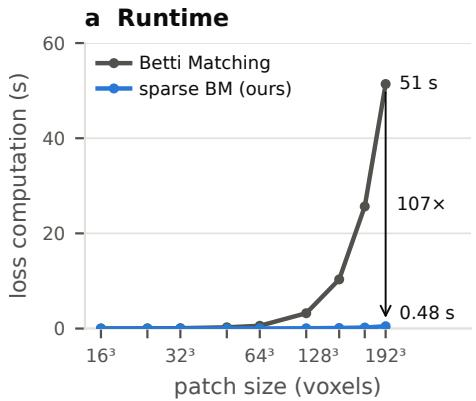

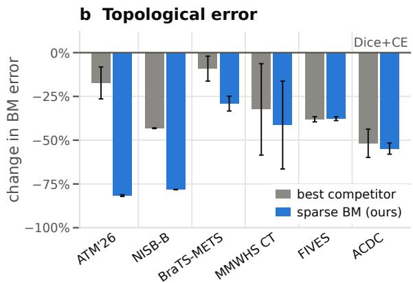  
Figure 1: Our approach, PH-based loss functions with sparse cubical complexes, significantly reduces topological errors in image segmentation at a fraction of the cost, making PH-based loss functions usable with large patch sizes and state-of-the-art training paradigms. (a) In realistic 3D training settings (here, on ATM’26), sparseBM is orders of magnitude faster than classical PHbased loss functions and its runtime is substantially less sensitive to patch size in the sparse regime considered here. (b) sparseBM significantly reduces topological error across domains with diverse topological targets and across 2D and 3D (lower is better).

To mitigate the runtime issue of PH-based methods, we propose building sparse cubical complexes, i.e., cubical complexes that represent only a subset of the full image. For the prominent application of training segmentation networks, we construct sparse complexes by omitting cells representing confident background regions and use them as the basis of our optimization objective, sparseBM. This approach, for the first time, enables the general use of PH-based loss functions with large patch sizes and state-of-the-art training paradigms.

The efficiency and effectiveness of this approach rest on two assumptions: (1) most datasets and network predictions are sparse in the foreground (making our method efficient, see fig. 1.a), and (2) confident background regions contain no information that is necessary for computing topologypreserving loss functions (making our method effective, see fig. 1.b).

In the following sections, we explain the background of PH computation on images, present how it (and alternative methods) have been used in the literature to obtain topologically accurate segmentation networks, and then present our method and our empirical evaluation for image segmentation.

## 2 BACKGROUND: IMAGES AS FILTERED CUBICAL COMPLEXES

Persistent homology (PH) is computed on a filtration of a combinatorial representation of the image. We represent a digital image $I \in [ 0 , 1 ] ^ { H \times W \times D }$ as a cubical grid complex K using the Vconstruction, where each voxel with value a becomes a vertex of K carrying the same value a, and every higher-dimensional cell (edges, squares, and cubes in a 3D image) is assigned the maximal value of the vertices it contains. Cubical grid complexes of this kind (or variants thereof, e.g., Heiss & Wagner, 2017) underlie most PH-based methods in image segmentation (Hu et al., 2019; Clough et al., 2019; 2020; Stucki et al., 2023; 2024). Following prior literature, we adopt the convention that foreground corresponds to low values, i.e., in a binary label, foreground voxels carry the value 0 and background voxels the value 1.

A sublevel filtration captures the topological features of an image across all binarization thresholds $t \in [ 0 , 1 ]$ by building a sequence of subcomplexes $\mathbb { K } _ { t } \subseteq \mathbb { K } . \ \mathbb { K } _ { t }$ contains the cells with values $a \leq t$ and corresponds to I binarized at t. As t increases, topological features appear and disappear in $\mathbb { K } _ { t }$ . A feature is born at the threshold b at which it first appears $( \mathrm { e . g . }$ , a component forms, a loop closes, a cavity becomes enclosed). A feature dies at the threshold d at which it disappears (e.g., a component merges into an older one, a loop or cavity is filled in). The multiset of intervals $( b , d )$ over all features constitutes the persistence barcode $B ( I )$ (equivalently, the persistence diagram) of the image (Edelsbrunner et al., 2008). Figure 3 shows an exemplary barcode.

Two properties of barcodes on images are important in the following. First, every birth and death value corresponds to a specific voxel of I, which is commonly used for computing (partially) differentiable loss functions (Carriere et al., 2021; Clough et al., 2019; 2020; Stucki et al., 2023; 2024; Berger et al., 2024; Hu et al., 2019). Second, a feature that never dies is called essential.

Computing a barcode requires enumerating, sorting, and processing every cell in K. For a 3D image with n voxels, the V-construction yields approximately $N = 8 n$ cells, and the full barcode computation has cubic worst-case complexity in the number of cells. While modern algorithms (Kaji et al., 2020; Stucki et al., 2024; Breton et al., 2026) avoid this worst case in practice, their runtime and memory scale with the size of the complex.

## 3 RELATED WORK

## 3.1 PERSISTENT HOMOLOGY BASED LOSS FUNCTIONS FOR IMAGE SEGMENTATION

These barcodes and their matching serve as the foundation for many topology-aware image segmentation methods. Hu et al. (2021), for example, extract discrete Morse structures from digital images and prune identified critical structures using persistence barcodes. Clough et al. (2020) minimize the distance between a continuous probability map’s barcode $B ( P )$ (the network’s output) and a topological prior, which is only possible if the target topology is known a priori. Hu et al. (2019) minimize the Wasserstein distance between $B ( P ) { \overset { \vartriangle } { } }$ and the label’s barcode $\bar { \boldsymbol B } ( L )$ , which allows for changing topology but disregards spatial correspondence of topological features in the two images. Later works add spatial information heuristically, through height-function filtrations (Oner et al., 2023), spatially weighted Wasserstein matching (Wen et al., 2025), or overlap-based Hungar ian matching of persistence regions, which also serves as a ground-truth-free consistency loss for semi-supervised learning (Xu et al., 2026). Betti Matching (Stucki et al., 2023) achieves this spatial correspondence in a principled manner by matching the resulting barcodes $B ( L )$ and $B ( P )$ via a comparison image $C = m i n ( L , P )$ . In Betti Matching, two features are matched if and only if they are carried to the same feature of $C _ { i }$ , following the theory of induced matchings (Bauer & Lesnick, 2014). Berger et al. (2024) extended this method to multiclass segmentation problems and Stucki et al. (2024) drastically improved its runtime by applying optimizations, such as clearing (Chen & Kerber, 2011), implicit matrix reduction (Stucki et al., 2024), the use of Union-Find (UF) for 0- and top-dimensional features, and skipping emergent pairs during reduction (Bauer, 2021).

However, computing the matching still requires persistence computations for P, L, and C together with two image-persistence computations for the maps from $P$ and $L$ into C. All of these computations’ runtimes are governed by the size of the underlying cubical complexes, which grow with the volume of the image rather than with the content relevant to segmentation. To limit costs, PH losses are commonly evaluated on small patches (Oner et al., 2023), possibly selected around suspected errors (Ma et al., 2026), thereby disregarding global topology and altering the computed persistence. This observation motivates our method.

## 3.2 OTHER TOPOLOGY-AWARE LOSS FUNCTIONS FOR IMAGE SEGMENTATION

Other methods avoid PH and the computation of persistence barcodes altogether. clDice (Shit et al., 2021) is a method specifically designed to preserve connectivity of tubular structures by computing a differentiable soft-skeleton of $P$ and $L$ and computing an overlap-based loss on these. SkelRecall (Kirchhoff et al., 2024) improves clDice’s runtime and stability for 3D images by only using the skeleton of $L ,$ which can be precomputed and does not suffer from 3D artifacts, but improves only the recall side. Menten et al. (2023) addressed the skeletonization problem in 3D by proposing a kernel-based skeletonization algorithm, which further increases runtime. SCNP (Valverde et al., 2026) avoids explicit topology altogether by penalizing each logit with its worst-classified neighbor. Other works approximate PH using Euler characteristics (Li et al., 2025) or, for 2D inputs, by computing connected components at a limited subset of thresholds (Qaiser et al., 2019). Topograph (Lux et al., 2025) addressed the runtime problem of PH-based image segmentation methods by using superpixel graphs for identifying topologically critical regions while theoretically guaranteeing homotopy equivalence for zero loss. However, Topograph relies on Alexander duality between 0- and top-dimensional topological features and is therefore only applicable for 2D images.

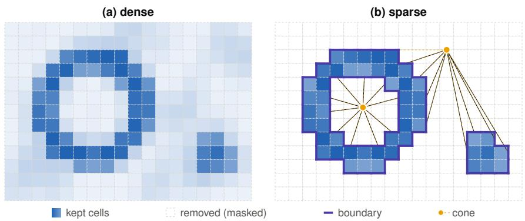  
Figure 2: Core idea of the sparse construction. A common retained cubical subcomplex $\mathbb { S } = \mathbb { C } _ { \tau }$ is selected from the comparison filtration, while retained cells keep their original filtration values. The omitted region is represented implicitly rather than instantiated as the full cubical grid.

While all of these methods address individual problems of PH-based methods, none have demonstrated general applicability across diverse target structures, changing topology, and higherdimensional images (i.e., 3D), while maintaining computational costs that enable large-scale training at realistic patch sizes.

## 3.3 PERSISTENT HOMOLOGY IN COMPUTER VISION OUTSIDE OF IMAGE SEGMENTATION

PH-based methods are used in generative modeling to create topologically realistic samples (Gupta et al., 2025; Wang et al., 2020; Xu et al., 2025). Other work includes the extraction of the topological signatures using PH for image classification (Hofer et al., 2017; Lawson et al., 2019).

## 4 METHOD

The PH-based methods mentioned in section 3.1 operate on the cells of cubical complexes, and their runtime scales with the complexes’ sizes (section 2). We hypothesize that most of the information in these complexes is not required for the downstream application, i.e., in our case, for the computation of a topology-preserving image segmentation loss (or a metric).

Following this rationale, we propose sparse cubical complexes as the foundation for computing PH on image data, which accelerates PH computation by restricting the filtrations to a common cubical subcomplex. More specifically, we propose sparseBM, a topology-preserving loss function following the principles of Betti Matching (Stucki et al., 2023). Betti Matching requires persistence computations for the prediction, the label, and a common comparison filtration, together with the corresponding image-persistence computations. We restrict all three filtrations to a common cubical subcomplex selected from the comparison filtration.

## 4.1 SPARSE CUBICAL FILTRATION

Let K be a finite cubical complex and let $p , \ell , c : \mathbb { K } \to [ 0 , 1 ]$ denote the prediction, label, and comparison filtration functions. Write

$$
\mathbb { P } _ { t } = \{ \sigma : p ( \sigma ) \leq t \} , \qquad \mathbb { L } _ { t } = \{ \sigma : \ell ( \sigma ) \leq t \} , \qquad \mathbb { C } _ { t } = \{ \sigma : c ( \sigma ) \leq t \} ,
$$

and assume

$$
\mathbb { P } _ { t } \subseteq \mathbb { C } _ { t } , \qquad \mathbb { L } _ { t } \subseteq \mathbb { C } _ { t } \qquad \mathrm { f o r ~ a l l ~ } t .\tag{1}
$$

For a threshold $0 \leq \tau < 1$ , define the retained subcomplex

$$
\mathbb { S } : = \mathbb { C } _ { \tau } .\tag{2}
$$

For $f \in \{ p , \ell , c \}$ , the sparse filtration is simply the restriction of f to S,

$$
\mathbb { K } _ { t } ^ { f , \mathbb { S } } : = \mathbb { K } _ { t } ^ { f } \cap \mathbb { S } , \qquad \mathbb { K } _ { t } ^ { f } : = \{ \sigma : f ( \sigma ) \leq t \} .\tag{3}
$$

Thus τ selects which cells are retained but does not truncate their filtration values. In particular, a cell retained through the comparison filtration may have prediction or label value larger than τ. Since $\bar { \mathbb { P } } _ { \tau } , \mathbb { L } _ { \tau } \ \subseteq \ \mathbb { C } _ { \tau } \ = \ \mathbb { S }$ , the sparse and dense diagrams

$$
\mathbb { P } _ { t } \longrightarrow \mathbb { C } _ { t } \longleftarrow \mathbb { L } _ { t }
$$

agree exactly for every $t \leq \tau$

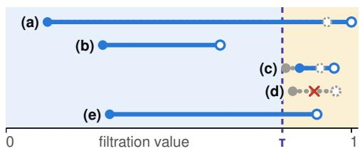  
corresponding bar in the dense filtration  
Figure 3: Exemplary comparison between a sparse and dense barcode. Corresponding dense intervals are indicated in grey. The intervals are: (a) kept with shifted death, (b) exact, (c) kept via label with shifted birth and death, (d) omitted, (e) kept exact via label

## 4.2 RELATION TO THE DENSE FILTRATION

To compare sparse and dense persistence, extend the restriction to all of K by

$$
{ \widehat { f } } ( \sigma ) = { \left\{ \begin{array} { l l } { f ( \sigma ) , } & { \sigma \in \mathbb { S } , } \\ { 1 , } & { \sigma \notin \mathbb { S } . } \end{array} \right. }\tag{4}
$$

for $f \in \{ p , \ell , c \}$ . This completion at level 1 is only a comparison device, and the implementation does not explicitly insert the omitted cells. Because $\mathbb { K } _ { \tau } ^ { f } \subseteq \dot { \mathbb { S } } ,$ every omitted cell satisfies $f ( \sigma ) > \tau ,$ so

$$
0 \leq { \widehat { f } } ( \sigma ) - f ( \sigma ) \leq 1 - \tau .\tag{5}
$$

The inclusions $\mathbb { K } _ { t } ^ { \widehat { f } } \hookrightarrow \mathbb { K } _ { t } ^ { f }$ are isomorphisms through level τ. By the induced matching theorem, they therefore give a specific sparse–dense correspondence in which matched interval endpoints move by at most $1 - \tau$ , while intervals left unmatched have persistence at most $1 - \tau$ (Bauer & Lesnick, 2014). In particular, choosing τ close to 1 confines the effect of sparsification to a narrow terminal filtration band, independently of any assumption on the distribution of filtration values.

The same construction applies, through the corresponding commutative squares, to the imagepersistence modules associated with

$$
\mathbb { P } \bullet \longrightarrow \mathbb { C } \bullet , \qquad \mathbb { L } \bullet \longrightarrow \mathbb { C } \bullet .
$$

Thus, the ordinary and image-persistence data entering Betti Matching admit compatible sparse– dense comparisons. This does not imply pairwise equality of the complete sparse and dense Betti matchings above $\tau ,$ since induced matchings are not functorial in general. Nor can the effect of sparsification in general be described by independently deleting barcode intervals. The effect of sparsification is governed by the kernel, image, and cokernel of the inclusion-induced map, whose persistence was studied by Cohen-Steiner et al. (2009). Therefore, the inclusion-induced matching is the appropriate comparison.

## 4.3 INTERPRETATION FOR IMAGE SEGMENTATION

For a binary label and $\tau < 1$ , the complete label foreground lies in $\mathbb { L } _ { \tau } \subseteq \mathbb { S } .$ . Hence, a label-supported cell is retained even if its prediction value exceeds $\tau ,$ and that prediction value remains unchanged in the sparse filtration. Structures present in the label but appearing only late in the prediction filtration are therefore not discarded merely because of the sparsification threshold. More generally, for every inference threshold $\theta \leq \tau$ , the prediction, label, and comparison complexes at θ are represented exactly. The resulting ordinary and image-persistence modules are used in the same Betti-Matching construction and with the same feature penalties as in the dense method (Stucki et al., 2023). If all three filtration functions are binary (e.g., for the computation of a metric between binarized images, studied in more detail in Section A.4.1), completion at level 1 changes none of them, so the sparse and dense persistence data agree exactly.

Figure 3 shows an exemplary barcode with different cases (non-exhaustive) of how sparse and dense intervals might differ from each other in an image segmentation setting. Intervals (a), (b), and (e) show features with birth $< \tau$ , where the exact birth is maintained. If death $< \tau .$ , it is kept exact (b). With death $> \tau ,$ , it can be shifted (a) or kept exact (e) when the dense death is label-supported. Intervals with birth (and death) $> \tau$ can be shifted (case (c), e.g., when the shifted birth/death is label-supported) or entirely lost (d). A real-world example is depicted in Figure 5 (b).

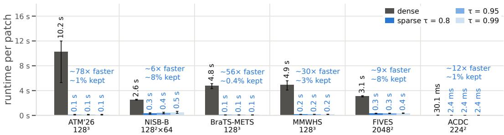  
Figure 4: Barcode extraction time using dense and sparse cubical complexes on outputs of segmentation models.

## 4.4 IMPLEMENTATION AND DESIGN CHOICES

Implicit representation of the omitted region. The implementation represents connected omitted regions by a virtual vertex and, where required, cone incidences over their interfaces with S. These incidences are generated implicitly rather than stored as an explicit complex. Union–find is used in the dimensions where persistence reduces to tracking connected components.

Sparsity and the choice of τ. Let N be the number of cells in the full grid, R the number of retained cells, and I the size of the retained–omitted interface needed by the implicit representation. Constructing S still requires a linear scan of the input, but the expensive persistence computations are governed primarily by R + I rather than by N. Computational savings, therefore, require $R + I \ll \bar { N }$ , which is fulfilled in most segmentation settings (see fig. 4). Notably, the bound 1 − τ requires no sparsity assumption, whereas the distribution of comparison-filtration values determines whether a large τ can simultaneously yield a small retained complex. In the segmentation setting, large confident background regions make this possible. In our experiments, we use τ = 0.8. Sparsification alters the persistence computation, while the feature penalties that define the Betti-Matching objective remain unchanged.

## 5 EXPERIMENTS

Our empirical evaluation is structured into two parts to demonstrate the efficiency (section 5.1) and effectiveness (section 5.2) of sparse cubical complexes in segmentation tasks. All of our analyses are oriented towards realistic imaging data and training paradigms.

Datasets. We choose six datasets (ATM (Zhang et al., 2023), NISB-B (Rieger et al., 2024), BraTS-METS (Maleki et al., 2025), MMWHS (Zhuang & Shen, 2016), FIVES (Jin et al., 2022), ACDC (Bernard et al., 2018)) where topological correctness is important for downstream applications. These datasets cover various topological targets, such as vessel/airway connectivity (FIVES, ATM), loop closing (FIVES, ACDC), correctness of connected components (BraTS-METS), and closing of cavities (MMWHS, NISB). Although our method is focused on 3D applications, we include two 2D datasets (FIVES, ACDC) to enable comparison with additional baseline methods (see section 5.2).

## 5.1 EFFICIENT PH COMPUTATION WITH SPARSE CUBICAL COMPLEXES

In this section, we test whether the retained comparison subcomplex remains small on realistic segmentation outputs (fulfilling the complexity condition in section 4.4), and thus, whether our method yields runtime reductions in practice. We build cubical complexes from predictions during network training on the described datasets and extract barcodes via PH. We compare the extraction time between dense and sparse complexes with varying τ (fig. 4). First, we observe that all barcodes are extracted in less than half a second, making computation feasible in extremely time-critical settings, such as network training. Second, we find that PH computation is drastically faster on sparse cubical complexes than on full complexes. The speedup is especially pronounced on large patches with sparse foreground (e.g., ×78 on ATM). The smallest measured speedup is ×6 faster than dense on the NISB dataset, where patches are smaller, and foreground is more frequent. Third, we observe that the speedup scales roughly inversely with the kept fraction, which corroborates the computational description in section 4.4. The runtime is only marginally influenced by the choice of τ, which is caused by a nearly constant kept fraction (see Section A.2).

Table 1: Test-set results in 2D and 3D. Three seeds each, scored once on held-out data; mean±sd over seeds. Bold: best arm of the dataset. ∗: sparse BM is significantly better than that arm on that metric (paired t-test over seeds, $p < 0 . 0 5 )$ . Train. time: wall clock of the whole training, as a multiple of Dice+CE. †: Runtime improved version of the authors’ released code.
<table><tr><td>dataset</td><td>loss</td><td>Dice↑</td><td>BM err.↓</td><td>clDice↑</td><td>VOI↓</td><td>NSD↑</td><td>Train. time↓</td></tr><tr><td rowspan="5">ATM&#x27;26 airway lumen  $1 2 8 ^ { 3 }$ </td><td>Dice+CE</td><td> $. 9 4 4 6 { \pm } . 0 0 3 2$ </td><td> $1 0 2 { \pm } 1 2 ^ { * }$ </td><td> $. 9 0 0 { \pm } . 0 0 2$ </td><td> $. 0 0 6 4 { \scriptstyle \pm . 0 0 0 3 }$ </td><td> $. 9 5 5 { \pm } . 0 0 4 $ </td><td>1.00×</td></tr><tr><td>clDice</td><td> $. 9 4 2 1 { \scriptstyle \pm . 0 0 4 8 }$ </td><td> $8 4 . 8 { \pm } 9 . 3 ^ { \ast }$ </td><td> $\mathbf { 9 0 6 } \pm . 0 0 6$ </td><td> $. 0 0 6 5 { \scriptstyle \pm . 0 0 0 4 }$ </td><td> $. 9 5 3 \pm . 0 0 4$ </td><td>1.29×</td></tr><tr><td>Skel. Recall</td><td> $. 9 4 3 7 { \scriptstyle \pm . 0 0 2 2 }$ </td><td> $9 6 . 4 \pm 6 . 5 ^ { * }$ </td><td> $. 8 9 6 { \pm } . 0 0 3 ^ { \ast }$ </td><td> $. 0 0 6 5 { \scriptstyle \pm . 0 0 0 1 } ^ { * }$ </td><td> $. 9 5 3 \pm . 0 0 1$ </td><td>1.03×</td></tr><tr><td>warping†</td><td> $. 9 4 1 3 { \pm } . 0 0 3 8$ </td><td> $9 4 . 6 \pm 1 2 . 3 ^ { \ast }$ </td><td> $. 8 9 6 \pm . 0 0 8$ </td><td> $. 0 0 6 6 { \pm } . 0 0 0 3$ </td><td> $. 9 5 1 { \pm } . 0 0 6 $ </td><td>1.40×</td></tr><tr><td>sparse BM (ours)</td><td> $. 9 4 4 9 { \scriptstyle \pm . 0 0 1 7 }$ </td><td> ${ \bf 1 8 . 8 \pm . 5 }$ </td><td> $\mathbf { 9 0 6 } \pm . 0 0 6$ </td><td> $\mathbf { . 0 0 6 1 } 2 . 0 0 0 1$ </td><td> ${ \bf 9 5 6 } { \pm . 0 0 4 }$ </td><td>1.15×</td></tr><tr><td rowspan="5">NISB-B cell interfaces  $1 2 8 ^ { 2 } \times 6 4$ </td><td>Dice+CE clDice</td><td> $. 7 8 4 7 { \scriptstyle \pm . 0 0 0 1 }$ </td><td> $3 6 7 . 3 \mathrm { k } \pm 3 . 3 \mathrm { k } ^ { \ast }$ </td><td> $. 7 6 6 \pm . 0 0 0$ </td><td> $\pm . 5 2 1 \pm . 0 0 0$ </td><td> $. 9 2 9 { \pm } . 0 0 0 $ </td><td>1.00×</td></tr><tr><td></td><td> $. 7 7 0 8 { \pm } . 0 0 0 3 ^ { \ast }$ </td><td> $2 0 8 . 7 \mathrm { k } \pm 7 0 6 ^ { \ast }$ </td><td> $. 6 8 1 { \pm } . 0 0 2 ^ { * }$ </td><td> $4 . 5 6 3 { \scriptstyle \pm . 0 0 1 } ^ { * }$ </td><td> $\mathbf { \delta } . 9 3 \mathbf { 0 } \pm . 0 0 0$ </td><td>1.08×</td></tr><tr><td>Skel. Recall</td><td> $. 7 8 4 1 \pm . 0 0 0 2$ </td><td> $3 4 4 . 6 \mathrm { k } \pm 2 . 1 \mathrm { k } ^ { \ast }$ </td><td> $. 7 4 7 { \pm } . 0 0 1 ^ { \ast }$ </td><td> $4 . 5 3 1 { \scriptstyle \pm . 0 0 1 } ^ { * }$ </td><td> $. 9 2 8 { \pm } . 0 0 0$ </td><td>1.02×</td></tr><tr><td>warping†</td><td> $. 7 8 5 1 { \scriptstyle \pm . 0 0 0 1 }$ </td><td> $3 7 3 . 1 \mathrm { k } \pm 2 . 1 \mathrm { k } ^ { \ast }$ </td><td> $. 7 6 3 { \pm } . 0 0 0$ </td><td> $4 . 5 2 2 { \scriptstyle \pm . 0 0 0 }$ </td><td> $. 9 2 9 { \pm } . 0 0 0 $ </td><td>1.09×</td></tr><tr><td>sparse BM (ours)</td><td> $. 7 7 8 5 { \scriptstyle \pm . 0 0 0 1 }$ </td><td> $\mathbf { 8 0 . 0 k } \pm 3 2 6$ </td><td> $. 7 6 2 { \scriptstyle \pm . 0 0 0 }$ </td><td> $4 . 5 2 6 { \pm } . 0 0 0$ </td><td> $. 9 2 5 { \pm } . 0 0 0$ </td><td>1.14×</td></tr><tr><td rowspan="5">BraTS-METS  $\mathbf { N E T C \cup E T }$   $1 2 8 ^ { 3 }$ </td><td>Dice+CE clDice</td><td> $. 6 8 5 4 { \scriptstyle \pm . 0 1 0 7 }$ </td><td> $5 . 8 7 \pm . 8 4 ^ { * }$ </td><td> $. 6 7 3 { \pm } . 0 1 3$ </td><td> $\mathbf { . 0 0 6 9 } \pm . 0 0 0 3$ </td><td> $. 7 6 6 \pm . 0 0 7$ </td><td>1.00×</td></tr><tr><td></td><td> $. 6 8 4 5 { \scriptstyle \pm . 0 1 2 6 }$ </td><td> $5 . 3 3 { \pm } . 4 2 ^ { * }$ </td><td> $. 6 8 0 { \pm } . 0 1 6$ </td><td> $. 0 0 7 0 { \scriptstyle \pm . 0 0 0 4 }$ </td><td> $. 7 6 6 \pm . 0 0 6$ </td><td>1.20×</td></tr><tr><td>Skel. Recall</td><td> $. 6 8 8 5 { \scriptstyle \pm . 0 1 2 4 }$ </td><td> $6 . 0 1 \pm . 6 9 ^ { * }$ </td><td> $. 6 5 7 { \scriptstyle \pm . 0 5 7 }$ </td><td> $. 0 0 7 0 { \scriptstyle \pm . 0 0 0 5 }$ </td><td> $. 7 5 9 \pm . 0 2 3$ </td><td>1.01×</td></tr><tr><td>warping†</td><td> $. 6 7 8 5 { \scriptstyle \pm . 0 0 3 4 }$ </td><td> $5 . 4 8 \pm . 1 8 ^ { \ast }$ </td><td> $. 6 6 3 \pm . 0 2 3$ </td><td> $. 0 0 7 0 { \scriptstyle \pm . 0 0 0 2 }$ </td><td> $. 7 6 2 \pm . 0 1 7$ </td><td>1.29×</td></tr><tr><td>sparse BM (ours)</td><td> $\mathbf { . 6 8 8 9 \pm . 0 1 1 2 }$ </td><td> $4 . 1 6 \pm . 2 5$ </td><td> $\mathbf { \delta } . 7 0 1 \pm . 0 3 3$ </td><td> $. 0 0 7 4 { \scriptstyle \pm . 0 0 0 3 }$ </td><td> $. 7 7 0 \pm . 0 2 2$ </td><td>1.08×</td></tr><tr><td rowspan="5">MMWHS LV myocardium 1283</td><td>Dice+CE clDice</td><td> $. 8 3 6 7 { \scriptstyle \pm . 0 1 0 7 ^ { * } }$ </td><td> $3 . 7 3 \pm 1 . 6 8 ^ { * }$ </td><td> $. 9 7 3 { \pm } . 0 2 1 ^ { * }$ </td><td> $. 0 7 0 1 { \scriptstyle \pm . 0 0 2 5 } ^ { * }$ </td><td> $. 6 8 7 { \pm } . 0 1 4 ^ { * }$ </td><td>1.00×</td></tr><tr><td>Skel. Recall</td><td> $. 8 3 4 7 { \pm } . 0 1 1 3 ^ { \ast }$ </td><td> $2 . 5 2 { \pm } . 9 7$ </td><td> $. 9 7 5 { \pm } . 0 1 9$ </td><td> $. 0 7 1 0 { \scriptstyle \pm . 0 0 2 9 } ^ { * }$ </td><td> $. 6 8 0 { \pm } . 0 1 6 ^ { * }$ </td><td>1.15×</td></tr><tr><td></td><td> $\mathbf { \delta } . 8 3 7 9 2 . 0 1 0 3$ </td><td> $3 . 0 0 \pm 1 . 1 5 ^ { \ast }$ </td><td> $\mathbf { \delta } \mathbf { \cdot } \mathbf { 9 7 6 } \pm . 0 1 8$ </td><td> $. 0 6 9 9 { \scriptstyle \pm . 0 0 2 6 }$ </td><td> $. 6 8 7 { \pm } . 0 1 5 ^ { * }$ </td><td>1.22×</td></tr><tr><td>warping † sparse BM (ours)</td><td> $. 8 3 1 3 { \pm } . 0 1 3 3$ </td><td> $4 . 9 8 \pm 1 . 5 6 ^ { * }$ </td><td> $. 9 6 9 { \pm } . 0 1 4 ^ { * }$ </td><td> $. 0 7 2 8 { \pm } . 0 0 4 7 ^ { \ast }$ </td><td> $. 6 7 4 \pm . 0 3 6$ </td><td>1.20×</td></tr><tr><td></td><td> $. 8 3 7 7 { \scriptstyle \pm . 0 1 0 9 }$ </td><td> $2 . 1 9 \pm . 9 4$ </td><td> $\mathbf { \delta } \mathbf { \cdot } \mathbf { 9 7 6 } { \pm } . 0 2 0$ </td><td> $\mathbf { . 0 6 9 7 } \pm . 0 0 2 8$ </td><td> ${ \bf 6 9 0 \pm . 0 1 7 }$ </td><td>1.05×</td></tr><tr><td rowspan="6">FIVES (2D) retinal vessels 20482</td><td>Dice+CE clDice</td><td> $. 9 1 4 5 { \scriptstyle \pm . 0 0 0 1 }$ </td><td> $6 4 . 7 { \pm } . 2 ^ { * }$ </td><td> $. 9 1 2 \pm . 0 0 0$ </td><td> $. 1 5 4 \pm . 0 0 1$ </td><td> $\mathbf { 8 1 1 } { \pm } . 0 0 0$ </td><td>1.00×</td></tr><tr><td> $\mathrm { S k e l . \ R e c a l l }$ </td><td> $. 9 1 4 0 { \scriptstyle \pm . 0 0 0 1 }$ </td><td> $5 9 . 4 \pm . 3 ^ { * }$ </td><td> $\mathbf { \$ 13 \pm . 0 0 0 }$ </td><td> $. 1 5 5 { \pm } . 0 0 0$ </td><td> $. 8 0 9 { \scriptstyle \pm . 0 0 0 }$ </td><td>1.09×</td></tr><tr><td></td><td> $. 9 1 1 3 { \scriptstyle \pm . 0 0 0 3 }$ </td><td> $6 2 . 3 { \pm } . 6 ^ { * }$ </td><td> $. 9 0 9 { \pm } . 0 0 1$ </td><td> $. 1 6 1 \pm . 0 0 0 ^ { \ast }$ </td><td> $. 7 9 9 \pm . 0 0 1$ </td><td>1.04×</td></tr><tr><td> $\mathrm { w a r p i n g } ^ { \dagger }$ </td><td> $\mathbf { \delta } _ { \mathbf { \eta } } \mathbf { 1 4 6 \pm . 0 0 0 1 }$ </td><td> $6 4 . 4 \pm . 2 ^ { * }$ </td><td> $\mathbf { \$ 13 \pm . 0 0 0 }$ </td><td> $. 1 5 5 { \pm } . 0 0 0$ </td><td> $\mathbf { 8 1 1 } { \pm } . 0 0 0$ </td><td>2.11×</td></tr><tr><td> $\mathrm { D M T } ^ { \dag }$  Topograph</td><td> $. 9 1 0 8 \pm . 0 0 0 5$ </td><td> $5 5 . 2 \pm . 3 ^ { * }$ </td><td> $. 9 1 2 \pm . 0 0 1$ </td><td> $. 1 5 8 \pm . 0 0 1 ^ { \ast }$ </td><td> $. 7 9 6 { \pm } . 0 0 1 ^ { \ast }$ </td><td> $2 0 . 1 2 \times$ </td></tr><tr><td>sparse BM (ours)</td><td> $. 9 1 0 5 { \scriptstyle \pm . 0 0 0 1 }$ </td><td> ${ \bf 4 0 . 1 \pm 1 . 0 }$ </td><td> $. 9 1 2 \pm . 0 0 0$ </td><td> $. 1 5 4 \pm . 0 0 1$ </td><td> $. 8 0 1 \pm . 0 0 1$ </td><td>1.37×</td></tr><tr><td rowspan="7"> $A C D C ( 2 D )$  LV myocardium  $2 2 4 ^ { 2 }$ </td><td> $_ \mathrm { D i c e + C E }$ </td><td> $. 9 1 0 6 \pm . 0 0 0 7$ </td><td> $4 0 . 3 \pm . 7$ </td><td> $. 9 1 1 \pm . 0 0 1$ </td><td> $. 1 5 4 \pm . 0 0 1$ </td><td> $. 7 9 8 \pm . 0 0 1$ </td><td>1.40×</td></tr><tr><td></td><td> $. 8 9 2 8 { \pm } . 0 0 3 6$ </td><td> $. 2 4 1 { \pm } . 0 1 6 ^ { * }$ </td><td> $. 9 7 4 { \pm } . 0 0 3 ^ { \ast }$ </td><td> $. 0 3 6 4 { \scriptstyle \pm . 0 0 0 0 }$ </td><td> $. 9 0 7 { \scriptstyle \pm . 0 0 2 }$ </td><td>1.00×</td></tr><tr><td>clDice  $\mathrm { S k e l . \ R e c a l l }$ </td><td> $. 8 9 2 5 { \scriptstyle \pm . 0 0 2 8 }$ </td><td> $. 1 1 6 \pm . 0 1 9$ </td><td> $. 9 7 9 { \pm } . 0 0 3$ </td><td> $. 0 3 5 7 { \scriptstyle \pm . 0 0 0 3 }$ </td><td> $\mathbf { \delta } \mathbf { \cdot } \mathbf { \delta } \mathbf { 1 4 } \pm . 0 0 2$ </td><td>1.06×</td></tr><tr><td> $\mathrm { w a r p i n g } ^ { \dagger }$ </td><td> $\mathbf { \delta } . 8 9 7 9 2 5 . 0 0 1 0$ </td><td> $. 2 1 8 \pm . 0 2 2 ^ { * }$ </td><td> $\mathbf { \delta } . 9 8 \mathbf { 0 } \pm . 0 0 3 $ </td><td> $. 0 3 6 2 { \scriptstyle \pm . 0 0 0 2 }$ </td><td> $. 9 1 2 \pm . 0 0 3$ </td><td>1.00×</td></tr><tr><td> $\mathrm { D M T } ^ { \dag }$ </td><td> $. 8 9 4 9 { \scriptstyle \pm . 0 0 1 2 }$ </td><td> $. 2 4 4 { \pm } . 0 2 1 ^ { \ast }$ </td><td> $. 9 7 5 { \pm } . 0 0 2 ^ { * }$ </td><td> $. 0 3 5 9 { \scriptstyle \pm . 0 0 0 1 }$ </td><td> $. 9 1 1 \pm . 0 0 2$ </td><td>1.35×</td></tr><tr><td> $\mathrm { T o p o g r a p h }$ </td><td> $. 8 9 6 9 { \scriptstyle \pm . 0 0 2 8 }$   $. 8 8 7 4 { \scriptstyle \pm . 0 0 2 7 ^ { * } }$ </td><td> $. 1 7 1 \pm . 0 3 1 ^ { * }$ </td><td> $. 9 7 6 \pm . 0 0 3$ </td><td> $\mathbf { . 0 3 5 5 } \pm . 0 0 0 3$ </td><td> $. 9 1 4 { \scriptstyle \pm . 0 0 4 }$ </td><td>8.02×</td></tr><tr><td>sparse BM (ours)</td><td> $. 8 9 3 7 { \scriptstyle \pm . 0 0 1 0 }$ </td><td> $. 1 3 3 \pm . 0 3 3$   $\mathbf { 1 0 9 } \pm . 0 0 8$ </td><td> $. 9 7 7 { \scriptstyle \pm . 0 0 3 }$   $\mathbf { \delta } . 9 8 \mathbf { 0 } \pm . 0 0 3 $ </td><td> $. 0 3 6 5 { \scriptstyle \pm . 0 0 0 7 }$   $. 0 3 6 4 { \scriptstyle \pm . 0 0 0 8 }$ </td><td> $. 9 0 9 { \pm } . 0 0 8$   $. 9 1 2 \pm . 0 0 7$ </td><td>1.10× 1.68×</td></tr></table>

## 5.2 SPARSEBM AS AN EFFECTIVE LOSS FOR IMAGE SEGMENTATION

In this section, we evaluate our proposed approach as a segmentation loss, sparseBM, and showcase its efficiency and effectiveness in reducing topological errors in state-of-the-art segmentation pipelines. We first briefly describe our experimental setup before presenting the core results. Lastly, we compare sparseBM to its dense counterpart (Betti Matching) mechanistically via its gradient and in a reduced experimental setting where dense PH computation is feasible for network training.

## 5.2.1 TRAINING SETUP.

One of this paper’s main objectives is to make PH-based loss functions applicable to real-world image segmentation pipelines. We want to move away from constructed, small-scale scenarios in which the proposed methods work and show improvements, towards the staple of image segmentation, specifically in 3D. Therefore, we follow the training principles of nnUnet, which has proven to be one of the most robust and versatile image segmentation recipes for 3D images (Isensee et al., 2021; 2024). At its core, nnUnet achieves its high performance by making appropriate choices for data preprocessing and model architecture, applying heavy augmentations, maximizing patch size, and training with a polynomial decaying learning rate.

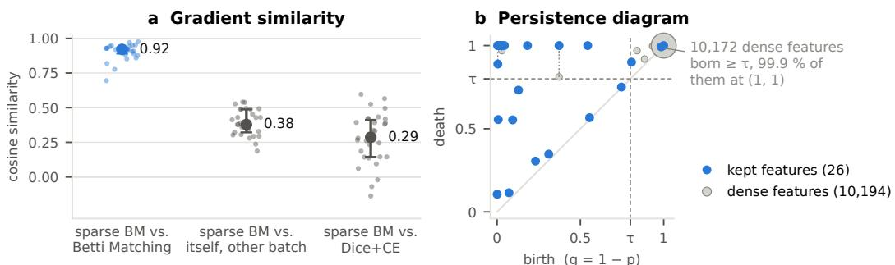  
Figure 5: SparseBM closely reproduces the optimization signal of dense Betti Matching. (a) shows the cosine similarity between their update steps, together with baseline comparisons to ComboLoss and to a different batch with the same loss. (b) shows the corresponding difference in persistence diagrams. Most affected features have very small persistence and lie in the background. Both plots are created from real samples during training on the ATM’26 dataset.

Baselines. In our 3D experiments, we compare our method to the ComboLoss (Dice+CE) baseline, clDice (Shit et al., 2021), the skeleton recall loss (Kirchhoff et al., 2024), and homotopy warping (Hu, 2022). Other frequently used approaches are either not applicable to 3D (e.g., Topograph (Lux et al., 2025)) or have runtime constraints making them infeasible in our setting (e.g., Betti Matching (Stucki et al., 2023; 2024), or DMT (Hu et al., 2021)). To enable further comparisons, we add two 2D datasets (comparing to Topograph and DMT) and training with reduced patch size (Table 2, comparing to DMT and Betti Matching) to our experiments. Furthermore, we optimize the implementation of homotopy warping and DMT to reduce runtime.

Metrics. The empirical evaluation should answer one main question: can our method reliably reduce topological errors while maintaining pixel- and region-wise accuracy? For this, we consider two main metrics: Dice score and Betti-matching (BM) error using 6-connectivity of the binarized images. Following Berger et al. (2025), BM error is the most suitable topological metric as it measures pure topology, i.e., it is not diluted by other factors, such as skeletonization, region sizes, or pixel-wise accuracy. However, to make our benchmark comparable to prior work, we report clDice, Variation of Information (VOI) (Meila, 2003), and Normalized Surface Distance (NSD) (Nikolov˘ et al., 2018). While these metrics are appropriate in specific domains (e.g., tubular structures or boundary segmentation), they lack general applicability and should therefore be considered only as additional information (Berger et al., 2025). All metrics are computed on the entire test volumes via sliding window inference (Isensee et al., 2021).

## 5.2.2 RESULTS

Sparse cubical complexes, when used as the foundation for computing Betti Matching (i.e., sparseBM), substantially reduce topological errors compared to the ComboLoss across all six datasets while keeping Dice within the prespecified one-percentage-point admissibility criterion used for model selection. We observe up to a 5-fold reduction in BM-error with minimal runtime overhead between 5 and 15% on 3D data. Similarly, sparseBM yields significant topological im provements over clDice and skeleton recall on ATM’26, NISB-B, and BraTS-METS. On MMWHS, clDice achieves comparable results but incurs a 15% runtime overhead, compared to sparseBM’s 5%. We do not observe meaningful changes in VOI, NSD, or the clDice metric across methods on any dataset. This is caused by confounding factors that influence these metrics, such as foreground and region sizes, as described in (Berger et al., 2025).

In our 2D experiments, with an extended set of baselines covering DMT and Topograph, sparseBM achieves a significant reduction in topological errors compared to all baselines except Topograph (on both datasets) and clDice (with an insignificant improvement only on ACDC). sparseBM’s runtime overhead on 2D data is higher because of a larger foreground fraction. The time spent on network training itself (forward and backward passes on the GPU) is smaller, so the loss calculation takes up a larger fraction of the total training time.

Table 2: Comparison to PH-based losses in a training setting with reduced patch size on the ATM’26 dataset. Same annotation as in Table 1.
<table><tr><td>patch</td><td>loss</td><td>Dice↑</td><td> $\mathbf { B M } \operatorname { e r r } . \downarrow$ </td><td>clDice↑</td><td>VOI↓</td><td>NSD↑</td><td>Train. time↓</td></tr><tr><td rowspan="2"> $1 2 8 ^ { 3 }$ </td><td>Dice+CE</td><td> $. 9 4 4 6 { \pm } . 0 0 3 2$ </td><td> $1 0 2 \pm 1 2 ^ { * }$ </td><td> $. 9 0 0 { \pm } . 0 0 2$ </td><td> $. 0 0 6 4 { \scriptstyle \pm . 0 0 0 3 }$ </td><td> $. 9 5 5 { \pm } . 0 0 4 $ </td><td>1.00×</td></tr><tr><td>sparse BM (ours)</td><td> $\mathbf { 9 4 4 9 } { \scriptstyle \pm . 0 0 1 7 }$ </td><td> ${ \bf 1 8 . 8 \pm . 5 }$ </td><td> $\mathbf { 9 0 6 } \pm . 0 0 6$ </td><td> $\mathbf { . 0 0 6 1 } 2 . 0 0 0 1$ </td><td> $. 9 5 6 \pm . 0 0 4$ </td><td>1.15×</td></tr><tr><td rowspan="4"> $6 4 ^ { 3 }$ </td><td>Dice+CE</td><td> $. 9 2 9 9 { \scriptstyle \pm . 0 1 2 4 }$ </td><td> $1 2 9 { \pm } 2 0 ^ { \ast }$ </td><td> $. 8 7 8 \pm . 0 1 4 ^ { * }$ </td><td> $. 0 0 7 5 { \scriptstyle \pm . 0 0 1 1 }$ </td><td> $. 9 3 9 { \pm } . 0 1 3$ </td><td>1.00×</td></tr><tr><td>DMT</td><td> $. 9 4 0 7 { \scriptstyle \pm . 0 0 1 3 }$ </td><td> $6 6 . 5 { \pm } 1 . 8 ^ { * }$ </td><td> $. 9 0 6 \pm . 0 0 4$ </td><td> $. 0 0 6 5 { \scriptstyle \pm . 0 0 0 1 }$ </td><td> $\mathbf { \delta } . 9 5 7 { \scriptstyle \pm . 0 0 2 }$ </td><td>5.38×</td></tr><tr><td>dense BM</td><td> $. 9 3 5 8 { \pm } . 0 0 6 2$ </td><td> $2 5 . 1 \pm 1 . 8 ^ { * }$ </td><td> $. 9 0 4 \pm . 0 0 2 ^ { \ast }$ </td><td> $. 0 0 6 9 { \scriptstyle \pm . 0 0 0 5 }$ </td><td> $. 9 4 9 { \pm } . 0 0 4 $ </td><td>1.88×</td></tr><tr><td>sparse BM (ours)</td><td> $\mathbf { \nabla } _ { \mathbf { \cdot } } \mathbf { 9 } \mathbf { 4 } \mathbf { 1 } 2 { \pm } . 0 0 2 3 $ </td><td> $2 0 . 2 { \pm } 2 . 1 $ </td><td> $\mathbf { \delta } . 9 0 9 2 . 0 0 0$ </td><td> $\mathbf { . 0 0 6 3 \pm . 0 0 0 1 }$ </td><td> $. 9 5 4 \pm . 0 0 1$ </td><td>1.19×</td></tr></table>

Functional similarity to Betti Matching Given the large runtime difference between sparseBM and dense PH-based loss functions, we cannot make a direct comparison in state-of-the-art training pipelines. Therefore, we run two alternative experiments.

First, we use network predictions from training on the ATM’26 dataset and compute the gradients of sparseBM and Betti Matching. We compute the mean cosine similarity between the respective update steps and find high similarity (fig. 5.a). For comparison, we compute the mean cosine similarity between the update steps of two subsequent batches with the same loss and of sparseBM and the ComboLoss. This high similarity is consistent with the theoretical localization of the sparse–dense discrepancy to the terminal filtration band above $\tau ,$ whose width is $1 - \tau$ , and with the empirical observation in fig. 5.b that most affected features in this example have almost zero persistence and lie in the background. Individually, such features make only a small persistence-based contribution, while processing their cells accounts for much of the dense runtime described in section 5.1.

Furthermore, we repeat the training experiment with a reduced patch size, enabling dense PH computation on the ATM’26 dataset (table 2). First, we note that smaller patch sizes reduce topological and pixel-wise accuracy. Additionally, we find that both Betti Matching and sparseBM drastically (×5 and $\times 6 .$ , respectively) reduce topological errors compared to the ComboLoss baseline without compromising on the Dice score. At the same time, sparseBM achieves a significant reduction in BM error compared to Betti Matching. We hypothesize that omitting this terminal-band information may even be beneficial for segmentation networks. PH-based losses generally suppress all unmatched features, i.e., they enforce a smooth intensity landscape, even in confident foreground and background regions. This characteristic has no effect on binarized segmentation maps and therefore, might distract during the training process. Even in this reduced setting, sparseBM is substantially faster than Betti Matching with a total runtime overhead of 19% compared with 88%. Notably, the runtime overhead of sparseBM remains roughly constant across the two patch sizes considered here, illustrating its reduced sensitivity to patch size in this sparse regime.

## 6 CONCLUSION

We propose sparse cubical complexes that omit high-valued regions while retaining the filtration values on a common comparison-based subcomplex. For topological losses in image segmentation, this yields sparseBM, a sparse variant of Betti Matching. In our experiments, sparseBM reduces loss-computation time by up to ×100 and closely reproduces the optimization signal of its dense counterpart, as indicated by the similarity of their loss gradients. Across six datasets, including four 3D large-patch datasets for which dense PH computation during training is practically infeasible, we observe substantial improvements in topological segmentation accuracy.

Limitations and future work. The computational advantage of the sparse complex depends on the retained comparison subcomplex and its interface remaining small. In the segmentation task considered here, this is typically enabled by large confident background regions. Speed-ups will be smaller when a large fraction of the comparison filtration lies below the sparsification threshold. More generally, topology-preserving segmentation losses have the inherent limitation of providing only train-time guarantees that do not generalize during inference. The application of sparse cubical filtrations to other imaging tasks, in which runtime is critical, such as classification, generation, or reconstruction, warrants future work. In Section A.4, we present our approach’s efficiency for use as a metric and the first results for its use as a post-processing method, scoring 3rd in the official ATM’26 challenge without any other additional improvements.

## REPRODUCIBILITY STATEMENT

The implementation of sparse cubical complexes and of sparseBM (C++ persistence and matching with Python bindings, and the PyTorch loss) is available at https://github.com/ AlexanderHBerger/sparse-cubical-filtration. The theoretical statements in Section 4 follow from the induced matching theorem (Bauer & Lesnick, 2014). All six datasets are publicly available; Sections A.3.1 and A.3.2 and Table 4 give the preprocessing, exclusions and train/validation/test splits. The training recipe (Section 5.2.1), the model-selection protocol (lossweight search on the validation fold, one-point Dice admissibility criterion, three seeds, a single scoring of the held-out test set, paired t-tests) and the ablations on λ and τ are described in Section 5.2 and Sections A.1 to A.3. Baselines use the authors’ released code; homotopy warping and DMT use runtime-optimized versions of it (marked †).

## REFERENCES

JPKH Alastruey, Kim H Parker, Joaquim Peiro, Shawn M Byrd, and Spencer J Sherwin. Modelling the circle of willis to assess the effects of anatomical variations and occlusions on cerebral flows. Journal ofbiomechanics, 40(8):1794–1805, 2007.

Ulrich Bauer. Ripser: efficient computation of vietoris–rips persistence barcodes. Journal ofApplied and Computational Topology, 5(3):391–423, 2021.

Ulrich Bauer and Michael Lesnick. Induced matchings of barcodes and the algebraic stability of persistence. In Proceedings of the thirtieth annual symposium on Computational geometry, pp. 355–364, 2014.

Alexander H Berger, Laurin Lux, Nico Stucki, Vincent Burgin, Suprosanna Shit, Anna Banaszak,¨ Daniel Rueckert, Ulrich Bauer, and Johannes C Paetzold. Topologically faithful multi-class segmentation in medical images. In International Conference on Medical Image Computing and Computer-Assisted Intervention, pp. 721–731. Springer, 2024.

Alexander H Berger, Laurin Lux, Alexander Weers, Martin J Menten, Daniel Rueckert, and Johannes C Paetzold. Pitfalls of topology-aware image segmentation. In International Conference on Information Processing in Medical Imaging, pp. 297–312. Springer, 2025.

Olivier Bernard, Alain Lalande, Clement Zotti, Frederick Cervenansky, Xin Yang, Pheng-Ann Heng, Irem Cetin, Karim Lekadir, Oscar Camara, Miguel Angel Gonzalez Ballester, et al. Deep learning techniques for automatic mri cardiac multi-structures segmentation and diagnosis: is the problem solved? IEEE transactions on medical imaging, 37(11):2514–2525, 2018.

Titouan Le Breton, Karol Szustakowski, and Marie Piraud. Fast cubical persistent homology on 2d and 3d images via union-find, pruning, and lookup tables. arXiv preprint arXiv:2606.04801, 2026.

Nick Byrne, James R Clough, Israel Valverde, Giovanni Montana, and Andrew P King. A persistent homology-based topological loss for cnn-based multiclass segmentation of cmr. IEEE transactions on medical imaging, 42(1):3–14, 2022.

Mathieu Carriere, Fred´ eric Chazal, Marc Glisse, Yuichi Ike, Hariprasad Kannan, and Yuhei Umeda.´ Optimizing persistent homology based functions. In International conference on machine learning, pp. 1294–1303. PMLR, 2021.

Chao Chen and Michael Kerber. Persistent homology computation with a twist. In Proceedings 27th European workshop on computational geometry, volume 11, pp. 197–200, 2011.

James R Clough, Ilkay Oksuz, Nicholas Byrne, Julia A Schnabel, and Andrew P King. Explicit topological priors for deep-learning based image segmentation using persistent homology. In International Conference on Information Processing in Medical Imaging, pp. 16–28. Springer, 2019.

James R Clough, Nicholas Byrne, Ilkay Oksuz, Veronika A Zimmer, Julia A Schnabel, and Andrew P King. A topological loss function for deep-learning based image segmentation using persistent homology. IEEE transactions on pattern analysis and machine intelligence, 44(12): 8766–8778, 2020.

David Cohen-Steiner, Herbert Edelsbrunner, John Harer, and Dmitriy Morozov. Persistent homology for kernels, images, and cokernels. In Proceedings of the twentieth annual ACM-SIAM symposium on Discrete algorithms, pp. 1011–1020. SIAM, 2009.

Herbert Edelsbrunner, John Harer, et al. Persistent homology-a survey. Contemporary mathematics, 453(26):257–282, 2008.

Jan Funke, Fabian Tschopp, William Grisaitis, Arlo Sheridan, Chandan Singh, Stephan Saalfeld, and Srinivas C Turaga. Large scale image segmentation with structured loss based deep learning for connectome reconstruction. IEEE transactions on pattern analysis and machine intelligence, 41(7):1669–1680, 2018.

Saumya Gupta, Dimitris Samaras, and Chao Chen. Topodiffusionnet: A topology-aware diffusion model. In International Conference on Learning Representations, volume 2025, pp. 31699– 31713, 2025.

Teresa Heiss and Hubert Wagner. Streaming algorithm for euler characteristic curves of multidimensional images. In International Conference on Computer Analysis of Images and Patterns, pp. 397–409. Springer, 2017.

Christoph Hofer, Roland Kwitt, Marc Niethammer, and Andreas Uhl. Deep learning with topological signatures. Advances in neural information processing systems, 30, 2017.

Xiaoling Hu. Structure-aware image segmentation with homotopy warping. Advances in Neural Information Processing Systems, 35:24046–24059, 2022.

Xiaoling Hu, Fuxin Li, Dimitris Samaras, and Chao Chen. Topology-preserving deep image segmentation. Advances in neural information processing systems, 32, 2019.

Xiaoling Hu, Yusu Wang, Li Fuxin, Dimitris Samaras, and Chao Chen. Topology-aware segmentation using discrete morse theory. In International Conference on Learning Representations, volume 2021, pp. 2101, 2021.

Fabian Isensee, Paul F Jaeger, Simon AA Kohl, Jens Petersen, and Klaus H Maier-Hein. nnunet: a self-configuring method for deep learning-based biomedical image segmentation. Nature methods, 18(2):203–211, 2021.

Fabian Isensee, Tassilo Wald, Constantin Ulrich, Michael Baumgartner, Saikat Roy, Klaus Maier-Hein, and Paul F Jaeger. nnu-net revisited: A call for rigorous validation in 3d medical image segmentation. In International conference on medical image computing and computer-assisted intervention, pp. 488–498. Springer, 2024.

Kai Jin, Xingru Huang, Jingxing Zhou, Yunxiang Li, Yan Yan, Yibao Sun, Qianni Zhang, Yaqi Wang, and Juan Ye. Fives: A fundus image dataset for artificial intelligence based vessel segmen tation. Scientific data, 9(1):475, 2022.

Shizuo Kaji, Takeki Sudo, and Kazushi Ahara. Cubical ripser: Software for computing persistent homology of image and volume data. arXiv preprint arXiv:2005.12692, 2020.

Yannick Kirchhoff, Maximilian R Rokuss, Saikat Roy, Balint Kovacs, Constantin Ulrich, Tassilo Wald, Maximilian Zenk, Philipp Vollmuth, Jens Kleesiek, Fabian Isensee, et al. Skeleton recall loss for connectivity conserving and resource efficient segmentation of thin tubular structures. In European Conference on Computer Vision, pp. 218–234. Springer, 2024.

Peter Lawson, Andrew B Sholl, J Quincy Brown, Brittany Terese Fasy, and Carola Wenk. Persistent homology for the quantitative evaluation of architectural features in prostate cancer histology. Scientific reports, 9(1):1139, 2019.

Liu Li, Qiang Ma, Cheng Ouyang, Johannes C Paetzold, Daniel Rueckert, and Bernhard Kainz. Topology optimization in medical image segmentation with fast $\chi$ euler characteristic. IEEE Transactions on Medical Imaging, 44(12):5221–5232, 2025.

Laurin Lux, Alexander H Berger, Alexander Weers, Nico Stucki, Daniel Rueckert, Ulrich Bauer, and Johannes Paetzold. Topograph: An efficient graph-based framework for strictly topology preserving image segmentation. In International Conference on Learning Representations, volume 2025, pp. 80207–80231, 2025.

Benteng Ma, Xiaomeng Li, Bin Pu, and Kwang-Ting Cheng. Topology-preserving retinal vascular segmentation via sparse persistent homology and moe convolution. Pattern Recognition, pp. 113612, 2026.

Nazanin Maleki, Raisa Amiruddin, Ahmed W Moawad, Nikolay Yordanov, Athanasios Gkampenis, Pascal Fehringer, Fabian Umeh, Crystal Chukwurah, Fatima Memon, Bojan Petrovic, et al. Anal ysis of the miccai brain tumor segmentation–metastases (brats-mets) 2025 lighthouse challenge: brain metastasis segmentation on pre-and post-treatment mri. arXiv preprint arXiv:2504.12527, 2025.

Marina Meila. Comparing clusterings by the variation of information. In ˘ Learning Theory and Kernel Machines: 16th Annual Conference on Learning Theory and 7th Kernel Workshop, COLT/Kernel 2003, Washington, DC, USA, August 24-27, 2003. Proceedings, pp. 173–187. Springer, 2003.

Martin J Menten, Johannes C Paetzold, Veronika A Zimmer, Suprosanna Shit, Ivan Ezhov, Robbie Holland, Monika Probst, Julia A Schnabel, and Daniel Rueckert. A skeletonization algorithm for gradient-based optimization. In 2023 IEEE/CVF International Conference on Computer Vision (ICCV), pp. 21337–21346. IEEE, 2023.

Michael Moor, Max Horn, Bastian Rieck, and Karsten Borgwardt. Topological autoencoders. In International conference on machine learning, pp. 7045–7054. PMLR, 2020.

Arnur Nigmetov and Dmitriy Morozov. Topological optimization with big steps. Discrete & computational geometry, 72(1):310–344, 2024.

Stanislav Nikolov, Sam Blackwell, Alexei Zverovitch, Ruheena Mendes, Michelle Livne, Jeffrey De Fauw, Yojan Patel, Clemens Meyer, Harry Askham, Bernardino Romera-Paredes, et al. Deep learning to achieve clinically applicable segmentation of head and neck anatomy for radiotherapy. arXiv preprint arXiv:1809.04430, 2018.

Doruk Oner, Adelie Garin, Mateusz Kozi´ nski, Kathryn Hess, and Pascal Fua. Persistent homology´ with improved locality information for more effective delineation. IEEE Transactions on Pattern Analysis and Machine Intelligence, 45(8):10588–10595, 2023.

Talha Qaiser, Yee-Wah Tsang, Daiki Taniyama, Naoya Sakamoto, Kazuaki Nakane, David Epstein, and Nasir Rajpoot. Fast and accurate tumor segmentation of histology images using persistent homology and deep convolutional features. Medical image analysis, 55:1–14, 2019.

Yaolei Qi, Yuting He, Xiaoming Qi, Yuan Zhang, and Guanyu Yang. Dynamic snake convolution based on topological geometric constraints for tubular structure segmentation. In 2023 IEEE/CVF International Conference on Computer Vision (ICCV), pp. 6047–6056. IEEE, 2023.

Franz Rieger, Ana-Maria Lac˘ atus˘ u, Zuzana Urbanova, Andrei Mancu, Hashir Ahmad, Martin Bu-´ cella, and Joergen Kornfeld. Nisb: Neuron instance segmentation benchmark, 2024. URL https://structuralneurobiologylab.github.io/nisb/.

Suprosanna Shit, Johannes C Paetzold, Anjany Sekuboyina, Ivan Ezhov, Alexander Unger, Andrey Zhylka, Josien PW Pluim, Ulrich Bauer, and Bjoern H Menze. cldice-a novel topology-preserving loss function for tubular structure segmentation. In 2021 IEEE/CVF Conference on Computer Vision and Pattern Recognition (CVPR), pp. 16555–16564. IEEE, 2021.

Nico Stucki, Johannes C Paetzold, Suprosanna Shit, Bjoern Menze, and Ulrich Bauer. Topologically faithful image segmentation via induced matching of persistence barcodes. In International Conference on Machine Learning, pp. 32698–32727. PMLR, 2023.

Nico Stucki, Vincent Burgin, Johannes C Paetzold, and Ulrich Bauer. Efficient betti matching en-¨ ables topology-aware 3d segmentation via persistent homology. arXiv preprint arXiv:2407.04683, 2024.

Juan Miguel Valverde, Dim P Papadopoulos, Rasmus Larsen, and Anders Bjorholm Dahl. Towards high-quality image segmentation: Improving topology accuracy by penalizing neighbor pixels. arXiv preprint arXiv:2603.18671, 2026.

Fan Wang, Huidong Liu, Dimitris Samaras, and Chao Chen. Topogan: A topology-aware generative adversarial network. In European Conference on Computer Vision, pp. 118–136. Springer, 2020.

Bo Wen, Haochen Zhang, Dirk-Uwe G Bartsch, William Freeman, Truong Nguyen, and Cheolhong An. Topology-preserving image segmentation with spatial-aware persistent feature matching. In Proceedings of the IEEE/CVF International Conference on Computer Vision, pp. 5821–5830, 2025.

Meilong Xu, Saumya Gupta, Xiaoling Hu, Chen Li, Shahira Abousamra, Dimitris Samaras, Prateek Prasanna, and Chao Chen. Topocellgen: Generating histopathology cell topology with a diffusion model. In 2025 IEEE/CVF Conference on Computer Vision and Pattern Recognition (CVPR), pp. 20979–20989. IEEE, 2025.

Meilong Xu, Xiaoling Hu, Shahira Abousamra, Chen Li, and Chao Chen. Match: Multi-faceted adaptive topo-consistency for semi-supervised histopathology segmentation. Advances in Neural Information Processing Systems, 38:105646–105672, 2026.

Minghui Zhang, Yangqian Wu, Hanxiao Zhang, Yulei Qin, Hao Zheng, Wen Tang, Corey Arnold, Chenhao Pei, Pengxin Yu, Yang Nan, et al. Multi-site, multi-domain airway tree modeling. Medical image analysis, 90:102957, 2023.

Xiahai Zhuang and Juan Shen. Multi-scale patch and multi-modality atlases for whole heart segmentation of mri. Medical Image Analysis, 31:77–87, 2016.

## A APPENDIX

## A.1 ABLATION ON WEIGHT PARAMETER

Figure 6 shows the effect of increasing the weighting of the sparseBM loss compared to the ComboLoss. The validation Betti Matching error reduces from > 2500 to < 250 with increasing weight of the topological error. Validation dice scores are within 0.01 for $\lambda < 1 0 ^ { - 4 }$ and start reducing notably (> 0.03) for $\lambda > 1 0 ^ { - 3 }$

This effect can be explained when looking at the ratio between gradient norms of the loss components $R _ { 0 }$ (Figure 7). With increasing topology weight, sparseBM’s gradient dominates the gradient of the ComboLoss, and the Betti Matching error decreases (left panel), while Dice performance remains stable. Once the ratio exceeds a threshold of 2 − 3, the Dice performance starts to deteriorate (right panel).

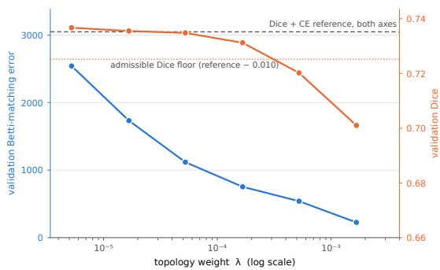  
Figure 6: Ablation on the weight parameter on the NISB-B dataset (validation set, individual patches). Betti Matching error (left axis, blue) and Dice (right axis, orange) against the topology weight. The dashed line is the Dice+CE baseline, the dotted line the admissibility floor (reference − 0.010) for model selection. The selected weight is the last point above the floor.

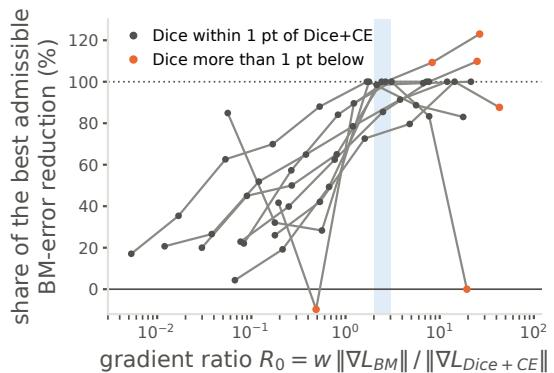

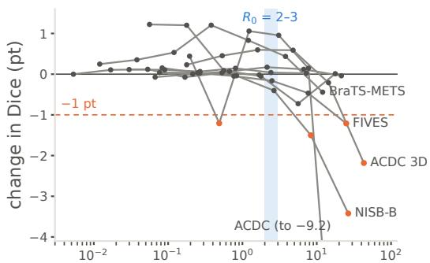  
gradient ratio R0 = w ‖∇LBM‖ / ‖∇LDice + CE‖  
Figure 7: We observe that sparseBM’s optimal weight can be chosen based on the ratio between the gradient norm of sparseBM and ComboLoss.

## A.2 ABLATION ON TAU AND NETWORK OUTPUT DISTRIBUTION

Table 3 reports the influence of changing τ for the calculation of the sparseBM loss. Across the τ range of 0.5–0.9, the kept fraction varies by only 0.02%; consequently, loss computation is comparable across these values of τ. Figure 8 visualizes how the kept fraction is nearly constant across most of the sparsification-threshold range, with a small jump at the beginning (confident foreground) and a large jump near the background end of the filtration.

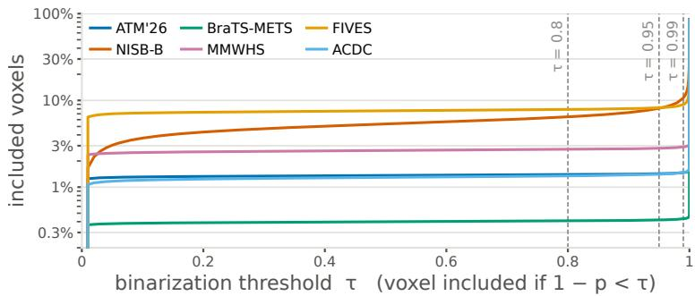  
Figure 8: Fraction of included voxels as the sparsification threshold τ increases. The y-axis is logarithmic.

Table 3: Kept fraction, runtime, validation BM error and Dice with varying τ on ATM’26 (validation). Bold: best τ; the runtime differences between τ values are within 2% (paired per micro-batch).
<table><tr><td>T</td><td>kept (%)</td><td>runtime (ms)↓</td><td>BM err.↓</td><td>Dice↑</td></tr><tr><td>0.5</td><td>1.26</td><td>48.6±6.2</td><td>4.40</td><td>.9724</td></tr><tr><td>0.6</td><td>1.26</td><td>49.1±7.0</td><td>4.06</td><td>.9734</td></tr><tr><td>0.7</td><td>1.26</td><td>49.1±7.1</td><td>4.09</td><td>.9740</td></tr><tr><td>0.8 (default)</td><td>1.27</td><td>49.3±6.7</td><td>3.96</td><td>.9732</td></tr><tr><td>0.9</td><td>1.28</td><td>49.1±6.7</td><td>4.14</td><td>.9720</td></tr><tr><td>0.95</td><td>1.29</td><td>50.0±7.4</td><td>3.92</td><td>.9733</td></tr><tr><td>0.99</td><td>1.32</td><td>49.6±6.2</td><td>3.99</td><td>.9716</td></tr></table>

## A.3 DETAILS ABOUT THE EXPERIMENTAL DESIGN

## A.3.1 PREPROCESSING

Following Berger et al. (2025), we evaluate all datasets for the prevalence of topological artifacts and susceptibility to connectivity choices. In susceptible datasets (i.e., datasets where the global and local topology differ with different connectivity choices), we preprocess the label by adding single pixels to achieve well-composedness. The fill only adds voxels and changes little (e.g. a median of 0.16 % of the foreground on ATM’26 and a mean of 0.79 % on BraTS-METS). NISB-B is well-composed by construction. Our method (and its metrics) are based on the V-construction and therefore, implicitly following 6-connectivity (i.e., direct) for the foreground.

## A.3.2 DATASETS.

We use six binary segmentation tasks, four in 3D and two in 2D, whose targets cover the topological regimes relevant for PH-based losses: a tree (ATM’26), thin sheets whose topology lives in the background (NISB-B), many small blobs whose number is the clinical quantity (BraTS-METS), a shell (MMWHS), a loopy 2D network (FIVES) and a ring (ACDC). Table 4 summarizes them. Each dataset has a held-out test set that is not used for any design decision: loss weights are selected on the validation fold (fold 0, seed 42), and the selected configuration is trained with three seeds and scored once on the test set. 3D test volumes are predicted with sliding-window inference over the whole volume; 2D images are predicted in a single pass.

Table 4: Datasets. Train/val = fold 0 of the cross-validation split; test = held-out cases, scored once.
<table><tr><td>dataset</td><td>modality</td><td>target</td><td>train / val / test</td><td>resolution</td><td>patch</td></tr><tr><td>ATM&#x27;26</td><td>chest CT</td><td>airway tree</td><td>193 / 50 / 53 volumes</td><td>native, 0.51–0.92 mm in-plane</td><td> $1 2 8 ^ { 3 }$ </td></tr><tr><td>NISB-B</td><td>synthetic EM</td><td>neuron boundaries</td><td>5 / 1 / 1 volumesª</td><td>4.5 × 4.5 × 10 nm (lifted)</td><td>1282 × 64</td></tr><tr><td>BraTS-METS</td><td>brain MRI</td><td>metastases (tumour core)</td><td>733 / 181 / 162 cases</td><td>1 mm isotropic</td><td>1283</td></tr><tr><td>MMWHS</td><td>cardiac CT</td><td>LV myocardium</td><td>12 / 4 / 4 volumesb</td><td>1.25 mm isotropic</td><td>1283</td></tr><tr><td>FIVES</td><td>fundus photography</td><td>retinal vessels</td><td>478 / 120 / 200 images</td><td>native</td><td> $2 0 4 8 ^ { 2 }$ </td></tr><tr><td>ACDC</td><td>cine MRI</td><td>LV myocardium</td><td>1506 / 396 / 1076 slices</td><td>native, 1.37–1.92 mm</td><td> $2 2 4 ^ { 2 }$ </td></tr></table>

a 4500 / 900 subvolumes for training / validation; the test set is 12 whole subvolumes (601 × 601 × 301 lifted voxels each).  
b after selection on fold 0, all four folds are trained; see text.

ATM’26. The training release of Track 1 (binary airway segmentation) of the ATM’26 challenge (Zhang et al., 2023) contains 299 chest CT volumes. We exclude the three volumes with slice spacing above twice the in-plane spacing and keep the native resolution, since resampling changes the Betti numbers of the thin airway labels. Of the remaining 296 volumes, 53 are held out for testing (stratified by voxel spacing) and 243 form five folds. The raw labels are a single tree under 26-connectivity but split into up to 144 components under 6-connectivity; the well-composedness fill reconnects them into one component on every volume.

NISB-B. NISB (Rieger et al., 2024) provides synthetic electron-microscopy volumes with dense neuron instance labels. We segment the boundaries between objects, where the extracellular space counts as one additional object. The label is built on the interpixel grid: every voxel is lifted to a $2 \times 2 \times 2$ block, and a lifted voxel is foreground if the original voxels it lies between belong to different objects. This label is well-composed by construction, and the objects of interest are the components of its background. We use seven volumes of 3001×3001×1351 voxels (9×9×20 nm): five for training, one for validation and one for testing. Each volume is tiled into 900 overlapping subvolumes.

BraTS-METS. We use the 2025 training release of BraTS-METS (Maleki et al., 2025) (1295 cases from 810 patients) and segment the tumour core (non-enhancing tumour core ∪ enhancing tumour), so that $\beta _ { 0 }$ is the number of metastases. We keep the 1119 cases with anisotropy at most 2 and resample them to 1 mm isotropic with a label-preserving scheme that keeps every lesion (plain nearest-neighbour resampling erases 63 of them). The 43 cases without tumour core are excluded. We hold out 108 patients (162 cases) for testing.

MMWHS. We use the 20 labelled CT volumes of MM-WHS (Zhuang & Shen, 2016) (the official test volumes have no public labels) and segment the left-ventricular myocardium, resampled to 1.25 mm isotropic. Four volumes are held out for testing, and the remaining 16 form four folds of 12/4. Loss weights are selected on fold 0, as on the other datasets. Because the validation and test sets are small, each selected configuration is then trained on all four folds with three seeds each, and the reported numbers average all 12 models on the four test volumes.

FIVES. FIVES (Jin et al., 2022) contains 800 colour fundus images of 2048 × 2048 pixels with retinal vessel labels, split by the authors into 600 training and 200 test images from four diagnostic groups (AMD, diabetic retinopathy, glaucoma, normal). We exclude the two training images whose labels are empty, split the remaining 598 into five folds, and use the official 200 test images. Its labels are rich in the top homological dimension (on average 34 loops per image, against a single ring per ACDC slice). Networks take the full RGB image as input.

ACDC. ACDC (Bernard et al., 2018) provides cine MRI at end-diastole and end-systole for 100 training and 50 test patients. We segment the left-ventricular myocardium slice by slice (in-plane 224 × 224 at the native 1.37–1.92 mm): padding slices are dropped, and real slices without myocardium are kept. In 2D the target is a single ring, avoiding the through-plane artefacts of the 5–10 mm slice spacing in 3D. The five folds are grouped by patient (fold 0: 1506/396 slices), and the test set is the 1076 slices of the 50 official test patients.

## A.3.3 PRETRAINING, TOPOLOGICAL FINETUNING, AND MODEL SELECTION

Although sparse cubical complexes significantly reduce the runtime of PH-based methods, training with them still incurs overhead. In order to be able to conduct realistic experimentation as described above, we train in two phases: pre- and post-training. During pretraining, we follow the described, fixed procedure with ComboLoss until validation performance converges. We refer to this as the parent run. Then, for each method, we initialize the model from this checkpoint and conduct a hyperparameter search, where each run is trained until convergence with the respective method. Additionally, we continue the parent run for the same number of epochs as a fair baseline. This approach is conducted for each dataset separately.

Each hyperparameter search varies the weight parameter λ, combining the respective loss function with the ComboLoss, and contains six runs per method. The run with the lowest Betti Matching error in validation that matches the parent run’s Dice performance by 1pp is used for cross-seed experiments. There, we retrain each network with the chosen hyperparameter setting across three different seeds.

## A.3.4 INTERLEAVED TRAINING.

To further reduce runtime costs, we apply a further general optimization. First, we interleave two micro-batches by calculating the loss and doing the forward/backward pass on the GPU in parallel (see fig. 9). This approach hides CPU runtime costs behind GPU calculations, which is typically the bottleneck in model training. From an optimization perspective, this approach is equivalent to gradient accumulation, which is a technique commonly used for training with larger effective batch sizes when GPU memory is limited. In our experiments, all methods for one dataset are trained with the same effective batch size.

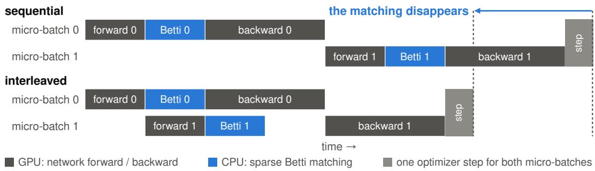  
Figure 9: We interleave forward/backward passes with the loss calculation of two subsequent microbatches to maximize GPU utilization and reduce runtime.

## A.4 OTHER APPLICATIONS

## A.4.1 SPARSEBM AS SEGMENTATION METRIC

Sparse cubical complexes can be used for efficiently computing PH-based metrics, such as the Betti Matching error (Stucki et al., 2023) or the Betti error (Hu et al., 2019). As explained in Section 4.3, the sparse metric is equivalent to its dense counterpart when computed between two binary inputs. We ran runtime experiments similar to our loss-function experiments and present the results in Figure 10. Similar to the loss function, we observe a substantial runtime reduction that increases with patch size and is most pronounced on the BraTS-METS dataset, with a 48-fold reduction. This speedup enables efficient validation and topology-aware model selection, both of which are prohibitively expensive with dense PH-based approaches.

a ATM'26, varying patch size  
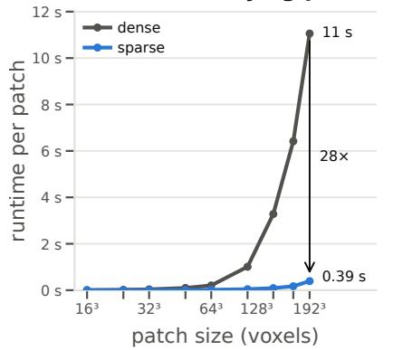

b all datasets, training patch size  
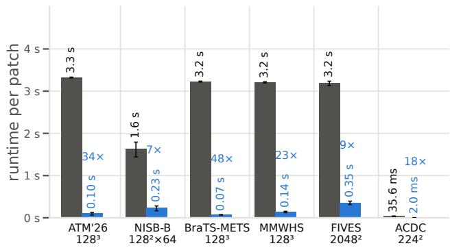  
Figure 10: Runtime comparison for metric calculation between sparse and dense betti matching error. The runtime decrease translates to application on binary inputs.

## A.4.2 SPARSE CUBICAL FILTRATIONS AS A POST-PROCESSING TOOL

In addition to their use as a segmentation loss, we evaluate sparse cubical filtrations as a postprocessing tool in the ATM’26 airway challenge, where our method is ranked 3rd in the final test leaderboard. The goal of the challenge is to create binary airway segmentations for chest CT scans. Submissions are ranked by the mean rank over Dice, clDice, tree-length detected (TLD), and branch detected (BD), where the latter two are measured on the largest connected component of the predic tion. A distal branch that the network draws correctly but leaves disconnected from the main tree, therefore, counts as missed. We use the sparse complex to repair these failures. Every disconnected branch is a dimension-0 feature that dies when it merges with the main tree, and we reconnect it by raising the probability at its death voxels above the segmentation threshold.

Method. Let p be the predicted foreground probability and $g = 1 - p .$ We binarize at $F _ { t } = \{ p > t \}$ and build the same sparse cubical complex that the loss uses, the V-construction on the kept voxels $\{ g < \tau \}$ , in dimension 0 only and with $\tau = 0 . 9 9 9$ , so that every voxel with $p > 1 0 ^ { - 3 }$ may carry a connection. Dimension-0 persistence is then a union–find sweep over the minimum spanning forest of the kept graph (edge weight max $( g _ { u } , g _ { v } )$ , elder rule), and every component whose bar dies below τ is a branch that the complex can still reach. For each of them, we raise the whole critical set of it death (Nigmetov & Morozov, 2024) — the spanning-forest path between the two merging classes birth vertices through the death edge — above the threshold, which is the smallest set of voxels whose change realizes the merge. Merges are applied in order of death; components that remain essential are left alone. The largest 26-connected component of the result is returned, so the output is connected by construction.

Results. The kept set is a median of 0.33% of the voxels. On the largest volume $( 5 1 2 \times 4 6 3 \times 5 1 3 . $ 145 components), the complete step takes 5.3 seconds. The repairs are small and targeted with a median of 7 added voxels per volume and at most 125 voxels.

Measured against thresholding at 0.5 followed by largest-component filtering, reconnection at $t =$ 0.1 and $\tau = 0 . 9 9 9$ improves both tree metrics for every training loss, on 53 held-out volumes and three seeds. The small Dice reduction comes from the lower binarization threshold and not from the added bridge voxels.

<table><tr><td>loss</td><td>∆Dice</td><td>∆clDice</td><td>∆TLD</td><td>∆BD</td></tr><tr><td>Dice+CE</td><td>-0.53</td><td>-1.51</td><td>+2.75</td><td>+4.32</td></tr><tr><td>clDice</td><td>-0.70</td><td>-1.13</td><td>+2.55</td><td> $+ 4 . 1 5$ </td></tr><tr><td>Skeleton Recall</td><td>-0.71</td><td>-1.68</td><td>+2.20</td><td>+3.51</td></tr></table>

Table 5: Results on the use of sparse cubical complexes as a post-processing tool. Each cell describes the improvements after post-processing compared to the respective base model.