# STEPQUANT: WHEN AND WHERE ERRORS MATTER IN DELTA-RULE RECURRENT STATE QUANTIZATION

Bingchen Yao∗1, Haobo Xu∗3, Haokun Lin ‡2,4B, Yichen Wu5, Ziyu Guo6, Renrui Zhang6, Zhichao Lu4, Zhenan Sun2, Ying Wei1B

1 Zhejiang University 2 NLPR & MAIS, Institute of Automation, CAS 3 Tsinghua University 4 City University of Hong Kong 5 Harvard University 6 The Chinese University of Hong Kong ∗Equal Contribution ‡Project Leader BCorresponding Author

§ Code: https://github.com/Dreamer-Toby/STEPQuant

## ABSTRACT

Linear attention replaces growing KV caches with fixed-size recurrent states, yet these persistent states can become a substantial memory bottleneck under concurrent serving. Directly quantizing recurrent states to low precision often leads to severe accuracy degradation, as quantization errors propagate through successive state updates. We discover that the impact of these errors depends on two complementary dimensions: temporally, errors in long-lived memory can persist across many decoding steps; spatially, errors in different key rows affect model outputs differently, while state magnitudes vary substantially along both rows and columns. Motivated by these observations, we propose STEPQuant, a spatial-temporal post-training quantization framework for Delta-rule recurrent states. STEPQuant allocates precision according to error magnitude and memory lifetime, and jointly fits key-row and value-column scales based on state distributions and key-row impact on output error. Experiments on Qwen3.8-27B and Kimi-Linear-48B-A3B-Instruct across both long- and short-generation benchmarks show that STEPQuant closely matches FP32-state accuracy under a nominal 6-bit budget and outperforms uniform INT8 in its 4-bit configuration. Integrated into SGLang with optimized GPU kernels, 6-bit STEPQuant achieves over 5× recurrent-state compression and reduces total serving memory by up to 68.7%.

## 1 INTRODUCTION

Unlike conventional softmax attention, which maintains a KV cache that grows with sequence length, linear attention summarizes past tokens into a fixed-size recurrent state (Yang et al., 2023). Recent hybrid models, including Qwen3.8-27B (Qwen Team, 2026a) and Kimi-Linear-48B-A3B-Instruct (Team et al., 2025), combine gated Delta-rule recurrent memory (Yang et al., 2025) with standard attention to balance efficiency and performance. Despite its fixed size across context length, the recurrent state introduces a different memory bottleneck during serving. Each concurrent request requires a separate persistent state, while serving systems may reserve additional state slots for caching and scheduling. As a result, the memory footprint of the state pool grows with concurrency even for short contexts. In official SGLang deployment, the FP32 state pool of Qwen exceeds the memory footprint of its BF16 weights at 70 supported concurrent requests, as shown in Fig. 1(a). This growing memory overhead motivates efficient compression of recurrent states.

However, directly applying uniform quantization to recurrent states severely degrades model performance. Each Delta update operates on an approximate state and produces a newly quantized one, allowing quantization errors to propagate through subsequent decoding steps. Fig. 1(c) shows that mean accuracy drops sharply at 4 and 6 bits on both models, and a clear gap remains even at 8 bits.

To understand this failure, we investigate state quantization error from two complementary dimensions: when and where the error accumulates. First, temporally, recurrent states are updated and requantized at every decoding step, causing quantization errors to accumulate over time. Each update carries forward existing error while introducing new quantization error, and stronger gate retention allows these errors to persist longer. Our preliminary experiments discover that longer-lived state units tend to exhibit larger accumulated errors (Fig. 1(b)). Motivated by this observation, we introduce Lifetime-aware Bit Allocation, a mixed-precision quantization method that jointly considers the quantization error of each unit at different bit widths and its persistence over time. Under a fixed memory budget, it allocates higher precision to units with larger and longer-lived errors.

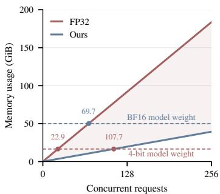  
(a) State memory footprint

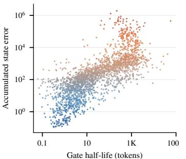  
(b) State lifetime vs. quantization error

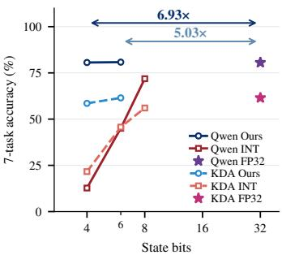  
(c) State precision vs. accuracy  
Figure 1: Why recurrent state needs structured compression. (a) Recurrent state memory grows with concurrent requests and can exceed model weight memory. STEPQuant substantially reduces memory cost at 6bit. (b) Heads with longer gate half-lives tend to accumulate larger state errors under uniform INT6 quantization across 2304 Qwen heads. (c) Mean accuracy across seven tasks for Qwen (solid) and KDA (dashed). STEPQuant achieves 6.93× and 5.03× compression of Qwen recurrent states at 4 and 6 bits, respectively, with negligible degradation in mean accuracy.

Second, spatially, the effect of quantization error also depends on where it occurs in the recurrent state. The spatial structure matters in two ways: errors of similar magnitude in different key rows can have different impacts on the model output, while state magnitudes vary substantially across both rows and columns (Fig. 2). Scaling along a single axis cannot accommodate both patterns as the state evolves during decoding. We therefore propose Key-Row-Aware Dual-axis Fitting to reduce spatial quantization error. Specifically, we assign separate scales to key rows and value columns. The row scales account for both the current magnitude of each row and its measured impact on output error, while the column scales are fitted with greater weight on rows where errors matter more.

Together, these temporal and spatial designs form Spatial-TEmPoral Quantization (STEPQuant), which compresses recurrent states throughout decoding. We evaluate STEPQuant on two strong hybrid models, Qwen3.8-27B and Kimi-Linear-48B-A3B-Instruct, across seven long-generation and six short-generation tasks. Under a nominal 6-bit budget, STEPQuant closely matches FP32-state accuracy on both models. Even with a 4-bit budget, STEPQuant outperforms uniform INT8 on both models, nearly matching FP32-state performance on Qwen while maintaining a modest gap on Kimi. With optimized kernels integrated into SGLang, 6-bit STEPQuant compresses recurrent-state memory by 5.03× and 5.08×, reducing total memory consumption, including model weights, by 68.7% and 53.7% on Qwen and Kimi, respectively. Our contributions are summarized as follows:

• Error analysis. We analyze how quantization errors propagate through gated Delta-rule updates temporally and spatially, showing that both state lifetime and error location affect their impact.

• Quantization method. We propose STEPQuant, which combines lifetime-aware bit allocation with key-row-aware dual-axis fitting. Under a nominal 6-bit budget, STEPQuant closely matches FP32-state accuracy, while its 4-bit configuration outperforms uniform INT8 on both models.

• Serving implementation. We integrate STEPQuant into SGLang with optimized GPU kernels, achieving over 5× recurrent-state compression and up to 2.91× faster state updates.

## 2 PRELIMINARIES

## 2.1 GATED DELTA-RULE LINEAR ATTENTION

Unlike softmax attention, which maintains a KV cache that grows with sequence length, recurrent linear attention summarizes past tokens in a fixed-size state matrix. For a single head in a given

layer, we omit the layer and head indices and denote the state after token t by $S _ { t } \in \mathbb { R } ^ { d _ { k } \times d _ { \tau } }$ , with query $q _ { t } \in \mathbb { R } ^ { d _ { k } }$ , key $\bar { k } _ { t } \in \mathbb { R } ^ { d _ { k } }$ , and value $v _ { t } \in \mathbb { R } ^ { d _ { v } }$ . Gated DeltaNet (GDN) (Yang et al., 2025) and Kimi Delta Attention (KDA) (Team et al., 2025) update this state through a gated Delta rule:

$$
\begin{array} { r } { S _ { t } = D _ { t } S _ { t - 1 } + \beta _ { t } k _ { t } \big ( v _ { t } ^ { \top } - k _ { t } ^ { \top } D _ { t } S _ { t - 1 } \big ) = \big ( I - \beta _ { t } k _ { t } k _ { t } ^ { \top } \big ) D _ { t } S _ { t - 1 } + \beta _ { t } k _ { t } v _ { t } ^ { \top } , \qquad y _ { t } = S _ { t } ^ { \top } q _ { t } , } \end{array}\tag{1}
$$

where $D _ { t }$ controls memory retention and $\beta _ { t } \in [ 0 , 1 ]$ controls the write strength. The update first applies the retention gate $D _ { t }$ to the previous state, yielding the retained state $D _ { t } S _ { t - 1 }$ . The current key $k _ { t }$ retrieves $k _ { t } ^ { \top } D _ { t } ^ { - } S _ { t - 1 }$ from the retained state. The residual $v _ { t } ^ { \top } - k _ { t } ^ { \top } D _ { t } S _ { t - 1 }$ is used to update the state along the key direction $k _ { t }$ . The head output (readout) is then computed as $y _ { t } = S _ { t } ^ { \top } q _ { t }$

The two architectures differ in their retention gate $D _ { t } . \mathrm { G D N }$ uses a scalar gate per head, $D _ { t } = \alpha _ { t } I $ while KDA uses channel-wise gates $D _ { t } = \mathrm { d i a g } ( d _ { t , 1 } , \cdot \cdot \cdot , d _ { t , d _ { k } } )$ . Both updates can be written as

$$
S _ { t } = A _ { t } S _ { t - 1 } + B _ { t } , \qquad \mathrm { w h e r e } \qquad A _ { t } = ( I - \beta _ { t } k _ { t } k _ { t } ^ { \top } ) D _ { t } , \qquad B _ { t } = \beta _ { t } k _ { t } v _ { t } ^ { \top } .\tag{2}
$$

Here, $A _ { t } \in \mathbb { R } ^ { d _ { k } \times d _ { k } }$ transports and selectively modifies the previous memory, while $B _ { t } \in \mathbb { R } ^ { d _ { k } \times d _ { v } }$ introduces the new value. The state contains $d _ { k } \cdot d _ { v }$ elements per head, independent of sequence length, but must persist across decoding steps for each active request.

## 2.2 RECURRENT-STATE QUANTIZATION

Quantization maps floating-point values to a finite set of discrete levels, reducing storage requirements. In symmetric uniform quantization, each value x is encoded as a b-bit integer with a positive scale s shared within a quantization group. The reconstructed value is

$$
\mathcal { Q } _ { b , s } ( x ) = s \cdot \mathrm { c l i p } \left( \mathrm { r o u n d } \left( \frac { x } { s } \right) , - q _ { b } , q _ { b } \right) , \qquad q _ { b } = 2 ^ { b - 1 } - 1 ,\tag{3}
$$

We focus on quantizing persistent recurrent states and also evaluate the combination with weight quantization. Let $S _ { t }$ denote the full-precision reference state obtained by recursively applying Eq. (2) without state quantization. At each decoding step, the model updates the reconstructed state in floating point and computes the output. The updated state is then quantized for storage:

$$
X _ { t } = A _ { t } \hat { S } _ { t - 1 } + B _ { t } , \qquad \hat { y } _ { t } = X _ { t } ^ { \top } q _ { t } , \qquad \hat { S } _ { t } = \mathcal { Q } _ { t } ( X _ { t } ) ,\tag{4}
$$

where $\mathcal { Q } _ { t }$ quantizes $X _ { t }$ and returns its dequantized approximation $\hat { S } _ { t }$

## 3 TEMPORAL DIMENSION: LIFETIME-AWARE BIT ALLOCATION

## 3.1 LIFETIME-DEPENDENT ERROR ACCUMULATION

From Eq. 4, quantization error is recursively fed back through the state update. The following proposition characterizes how this error propagates across decoding steps. Proof is in Appendix $\mathrm { A } .$

Proposition 1 (Conditional error propagation). For identical inputs and gates, let $E _ { t } = \widehat { S } _ { t } - S _ { t }$ denote the accumulated error and $\varepsilon _ { t } = \mathcal { Q } _ { t } ( X _ { t } ) - X _ { t }$ the quantization error added at step t. Then

$$
E _ { t } = \big ( I - \beta _ { t } k _ { t } k _ { t } ^ { \top } \big ) D _ { t } E _ { t - 1 } + \varepsilon _ { t } = A _ { t } E _ { t - 1 } + \varepsilon _ { t } , \qquad \widehat { y } _ { t } - y _ { t } = E _ { t - 1 } ^ { \top } A _ { t } ^ { \top } q _ { t } .\tag{5}
$$

$$
\begin{array} { r } { I f \| k _ { t } \| _ { 2 } \leq 1 , 0 \leq \beta _ { t } \leq 1 , a n d 0 \preceq D _ { t } \preceq I , t h e n \| A _ { t } \| _ { 2 } \leq \| D _ { t } \| _ { 2 } \leq 1 . } \end{array}
$$

According to Proposition 1, previously accumulated error is propagated through $A _ { t } ,$ , while quantization at step t introduces a new error. The transition $A _ { t }$ reduces existing error through two mechanisms. The retention gate $D _ { t }$ first attenuates the error carried over from the previous step. The Delta update then further reduces its component along the current key $k _ { t }$ through the factor $( \bar { I } - \beta _ { t } k _ { t } k _ { t } ^ { \top } )$ while leaving components orthogonal to $k _ { t }$ unchanged. We verify this effect experimentally in $\mathsf { A p - }$ pendix B.1. Thus, errors in directions rarely aligned with subsequent keys depend mainly on gate decay. When retention is close to one, these errors can persist for many decoding steps. Together, these results identify memory lifetime as a key predictor of recurrent-state quantization risk.

This analysis indicates that longer-lived memory should exhibit larger accumulated quantization error. To examine this assumption, we evaluate all recurrent heads of Qwen3.8-27B under uniform INT6 state quantization on C4. Fig. 1(b) shows that heads with longer gate half-lives exhibit larger accumulated state error, with Spearman’s $\rho _ { S } \approx 0 . 8 0$ (see Appendix B.5 for more details). This indicates that recurrent heads with longer lives tend to result in larger quantization error.

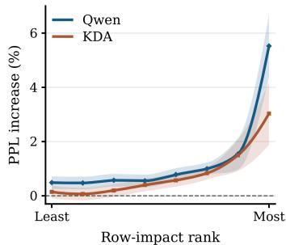  
(a) Key-row influence on perplexity

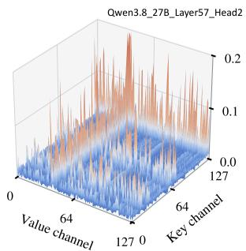  
(b) Outliers along both state axes

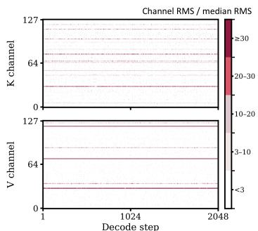  
(c) Outlier channels persist during decoding  
Figure 2: Spatial structure of recurrent states. (a) Key rows are ranked by readout impact and divided into eight groups. Quantizing one group at a time to INT4 generally causes larger perplexity increases for higher-impact groups. (b) A representative Qwen state exhibits obvious outliers in both key rows and value columns. (c) Channel RMS relative to the median across 2048 decoding steps. The outliers remain prominent throughout decoding.

## 3.2 LIFETIME-AWARE BIT ALLOCATION

Mixed-precision quantization is widely used in LLMs to preserve accuracy by assigning more bits to sensitive components (Dettmers et al., 2022; 2023). For recurrent states, bit allocation should additionally account for memory lifetime, as quantization errors can persist across subsequent updates. Consequently, we propose Lifetime-aware Bit Allocation, which assigns precision under a fixed bit budget based on the persistence of quantization errors.

Lifetime-aware Bit Allocation operates on recurrent-state units: each unit u is an entire head in Qwen and a key row in KDA. We estimate $d _ { u } ( b )$ , the reconstruction distortion of unit u quantized to b bits, and its mean log retention $\ell _ { u }$ where the expectation is taken over calibration tokens. Here, $r _ { t , u }$ is the retention gate for unit u: $r _ { t , u } = \alpha _ { t }$ for GDN and $r _ { t , u } = d _ { t , i }$ for key row i in KDA. A larger $\ell _ { u }$ indicates stronger retention and a longer memory lifetime. Considering gate retention alone, the error retention factor after j updates is approximated by

$$
\prod _ { s = 1 } ^ { j } r _ { t + s , u } \approx \exp ( j \ell _ { u } ) .\tag{6}
$$

The squared error therefore decays by a factor of approximately $\exp ( 2 j \ell _ { u } )$ , giving the lifetime weight over H steps:

$$
L _ { u } = \sum _ { j = 0 } ^ { H - 1 } \exp ( 2 j \ell _ { u } ) .\tag{7}
$$

Let $n _ { u }$ denote the number of state elements in unit $u .$ Given an average bit budget ${ \bar { b } } ,$ we select bit widths from the candidate set $B _ { \bar { b } }$ to minimize the lifetime-weighted reconstruction distortion:

$$
\operatorname* { m i n } _ { b _ { u } \in \mathcal { B } _ { \bar { b } } } \sum _ { u } L _ { u } d _ { u } ( b _ { u } ) \quad \mathrm { s . t . } \quad \sum _ { u } n _ { u } b _ { u } \leq \bar { b } \sum _ { u } n _ { u } .\tag{8}
$$

This objective accounts for both the magnitude of quantization error and how long it persists through subsequent updates. Nevertheless, a small number of units remain difficult to quantize even with mixed-precision allocation. We therefore retain the highest-risk units in FP16 as sparse pivots.

In summary, Lifetime-aware Bit Allocation assigns higher precision to units with larger quantization errors and longer memory lifetimes. The pivot selection and bit allocation are determined during offline calibration and fixed across requests. Further details are provided in Appendix C.2 and D.

## 4 SPATIAL DIMENSION: KEY-ROW-AWARE DUAL-AXIS FITTING

## 4.1 KEY-ROW IMPACT ON READOUT ERROR

The temporal analysis above characterizes how quantization errors propagate across recurrent updates. We now examine their spatial distribution within the state matrix: errors of equal magnitude in different key rows can affect the readout differently. From Eq. (5), the readout error is

$$
\Delta y _ { t } = \hat { y } _ { t } - y _ { t } = E _ { t - 1 } ^ { \top } A _ { t } ^ { \top } q _ { t } = \sum _ { i } ( A _ { t } ^ { \top } q _ { t } ) _ { i } E _ { t - 1 , i , : } ^ { \top }\tag{9}
$$

We define $g _ { t } = A _ { t } ^ { \top } q _ { t } \in \mathbb { R } ^ { d _ { k } }$ , where $g _ { t , i }$ weights the contribution of the error in key row i, $E _ { t - 1 , i , : }$ to the current readout error. For errors of equal norm confined to individual key rows, a larger $g _ { t , i } ^ { 2 }$ implies a larger squared readout error. To account for variation across decoding steps, we define the row-impact score as

$$
\begin{array} { r } { \omega _ { i } = \mathbb { E } _ { \mathrm { c a l } } [ g _ { t , i } ^ { 2 } ] . } \end{array}\tag{10}
$$

To validate this row-impact score, we rank key rows within each head by $\omega _ { i }$ and divide them into eight groups. We quantize one group at a time to INT4 while keeping the remaining rows in full precision, and measure the resulting increase in perplexity. As shown in Fig. 2(a), groups with larger ωi generally produce greater PPL degradation in both models. This observation suggests using the row-impact score to guide quantization scale selection, as described in Sec. 4.3.

## 4.2 TWO-AXIS STATE GEOMETRY

Beyond differences in how key-row errors affect the readout, recurrent states exhibit another spatial property: large-magnitude outliers occur along both key rows and value columns. Unlike conventional LLM quantization settings that often target outliers along a single dominant axis (e.g., channels or tokens) (Xiao et al., 2023; Shao et al., 2024), we discover that the recurrent state matrix exhibits large-magnitude structures along both key rows and value columns, as shown in Fig. 2(b). We further examine how these magnitude patterns evolve throughout decoding. Fig. 2(c) shows that pronounced magnitude differences persist along both axes, with a small subset of rows and columns consistently exhibiting substantially larger magnitudes. Quantitative results show that the maximum-to-median RMS contrasts along the key-row and value-column axes are 10.3× and 19.4×, respectively. Both exceed 3× in 98.6% of sampled states. Together, these observations motivate dual-axis scaling to accommodate the magnitude distributions of recurrent states.

## 4.3 KEY-ROW-AWARE DUAL-AXIS FITTING

Sec. 4.1 and 4.2 identify two spatial properties of recurrent states: key rows differ in their impact on readout error, and state magnitudes vary substantially along both axes. To account for both, we propose Key-Row-Aware Dual-Axis Fitting, which combines calibrated row-impact scores with separate row and column scales. Specifically, we represent the updated state $X = \dot { X } _ { t }$ as:

$$
\hat { X } _ { i j } = r _ { i } c _ { j } z _ { i j } ,\tag{11}
$$

where $r _ { i } > 0$ and $c _ { j } > 0$ are the scale factors for key row i and value column $j ,$ respectively, and $z _ { i j }$ is the low-bit integer. We incorporate the key-row impact factor into $r _ { i }$ , and the two factors allow the quantization independently to vary along the two state axes.

Row factors. The row factor $r _ { i }$ should account for both (i) the current magnitude of a row and (ii) the impact of key row on readout error (Sec. 4.1). We first estimate the magnitude of key row i as

$$
m _ { i } = \frac { 1 } { d _ { v } } \sum _ { j } | X _ { i j } | .\tag{12}
$$

Rows with larger $m _ { i }$ require a wider quantization range, so the row factor should increase with $m _ { i }$ In addition, key rows with larger impact scores $\omega _ { i }$ are more vulnerable to quantization. Inspired

by fractional-power smoothing in prior quantization methods (Xiao et al., 2023), we consider both effects using square-root scaling and a dimension-normalized $w _ { i } ^ { 1 }$ 1:

$$
r _ { i } = m _ { i } ^ { 1 / 2 } w _ { i } ^ { - 1 / 2 } .\tag{13}
$$

Thus, larger-magnitude rows receive a wider range, while higher-impact rows receive finer quantization resolution.

Column factors. Given the row factors $\{ r _ { i } \}$ , we fit the column scales $\{ c _ { j } \}$ by minimizing the impact-weighted reconstruction error:

$$
\operatorname* { m i n } _ { \{ c _ { j } > 0 \} } \sum _ { i , j } w _ { i } ^ { 2 } \left( X _ { i j } - r _ { i } c _ { j } z _ { i j } \right) ^ { 2 } .\tag{14}
$$

This objective captures the remaining variation along value columns, while assigning larger penalties to reconstruction errors on high-impact key rows.

Quantization. Given the fitted scales, we quantize each scaled entry $X _ { i j } / ( r _ { i } c _ { j } )$ to the nearest representable level at its assigned precision $b _ { i } .$ . The reconstructed state is then $\widehat { X } _ { i j } \ = \ r _ { i } c _ { j } z _ { i j } .$ Implementation details of scale fitting and quantized-state storage are provided in Appendix C.3.

## 4.4 KERNEL IMPLEMENTATION IN SGLANG

We implement STEPQuant as packed-state kernels integrated with SGLang’s recurrent-state pool. Lifetime-Aware Bit Allocation and FP16 pivot selection are performed offline, adding no per-token allocation overhead and fixing the packed layout across requests. During decoding, we implement a kernel to fuse tilewise state reconstruction, the Delta update, and the current readout. This avoids a separate pass over the full state for reconstruction and reduces memory traffic. Once the head output is available, later layers continue processing the token while Key-Row-Aware Dual-Axis Fitting and packed writeback run on a separate CUDA stream. This overlaps scale updates with model computation and keeps the state compressed between tokens (see more details in Appendix F.1).

## 5 EXPERIMENTS

## 5.1 SETUP

Models and hardware. We evaluate Qwen3.8-27B (Qwen Team, 2026a) and Kimi-Linear-48B-A3B-Instruct (Team et al., 2025) with BF16 and 4-bit AWQ (Lin et al., 2024b) quantized weights on SGLang (Zheng et al., 2024), using four NVIDIA A800 GPUs. We use SGLang’s default FP32 SSM-state precision as the full-precision baseline, alongside symmetric rowwise-absmax INT4/6/8 baselines. STEPQuant uses the fused state kernels described in Sec. 4.4.

Calibration. For all measured benchmarks, we use 32 WikiText-2 (Merity et al., 2016) training segments with 2048 tokens each to determine bit allocation, FP16 pivots, and row-impact scores.

Long-generation reasoning. We compare quantized models on seven reasoning benchmarks: Live-CodeBench v6 (Jain et al., 2025), EvalPlus (Liu et al., 2023), AIME 2026 (Dekoninck et al., 2026), MATH-500 (Lightman et al., 2024), HMMT February 2026 (Dekoninck et al., 2026), GPQA Diamond (Rein et al., 2023), and IFBench (Pyatkin et al., 2026). We generate 5, 5, 64, 4, 64, 8, and 4 samples per question, respectively, using temperature $T = 1 . 0 , \mathrm { t o p } { - k } = 2 0 , \mathrm { t o p } { - p } = 0 . 9 5$ , and a maximum of 65536 generated tokens per sample.

Short generation. We also report results on six language understanding tasks: MMLU (Hendrycks et al., 2020), ARC-C (Clark et al., 2018), OpenBookQA (Mihaylov et al., 2018), HellaSwag (Zellers et al., 2019), WinoGrande (Sakaguchi et al., 2021), and LAMBADA (Paperno et al., 2016). We generate one answer per example with greedy decoding $( T = 0 )$ and score the generated answers rather than candidate likelihoods. This aligns the autoregressive decoding setting targeted by STEPQuant.

Table 1: Long-generation reasoning accuracy with BF16 weights (%).
<table><tr><td>State</td><td></td><td>LCB v6 EvalPlus AIME 26 MATH-500</td><td></td><td></td><td>HMMT</td><td>GPQA-D</td><td>IFBench</td><td>Avg.</td></tr><tr><td>Qwen3.8-27B</td><td></td><td></td><td></td><td></td><td></td><td></td><td></td><td></td></tr><tr><td>FP32</td><td>85.31</td><td>84.87</td><td>87.71</td><td>97.60</td><td>74.24</td><td>80.81</td><td></td><td>53.67 80.60</td></tr><tr><td>INT8</td><td>72.23</td><td>80.26</td><td>78.54</td><td>97.00</td><td>58.71</td><td>75.25</td><td>41.00</td><td>71.86</td></tr><tr><td>INT6</td><td>30.43</td><td>69.00</td><td>33.96</td><td>87.40</td><td>16.67</td><td>51.52</td><td>26.33</td><td>45.04</td></tr><tr><td>INT4</td><td>7.87</td><td>31.55</td><td>0.00</td><td>34.00</td><td>0.00</td><td>4.04</td><td>11.67</td><td>12.73</td></tr><tr><td>STEPQuant@6bit</td><td>85.42</td><td>85.54</td><td>87.24</td><td>97.35</td><td>73.30</td><td>80.87</td><td>54.42</td><td>80.59</td></tr><tr><td>STEPQuant@4bit</td><td>86.35</td><td>84.87</td><td>86.25</td><td>97.00</td><td>73.86</td><td>81.57</td><td>53.67</td><td>80.51</td></tr><tr><td colspan="9">Kimi-Linear-48B-A3B-Instruct</td></tr><tr><td>FP32</td><td>54.52</td><td>76.75</td><td>68.33</td><td>93.25</td><td>45.08</td><td>69.70</td><td></td><td>23.0061.52</td></tr><tr><td>INT8</td><td>52.61</td><td>75.46</td><td>51.88</td><td>92.45</td><td>35.61</td><td>62.88</td><td>21.25</td><td>56.02</td></tr><tr><td>INT6</td><td>42.37</td><td>71.96</td><td>22.71</td><td>88.00</td><td>17.42</td><td>57.83</td><td>19.58</td><td>45.70</td></tr><tr><td>INT4</td><td>28.82</td><td>46.86</td><td>0.00</td><td>45.80</td><td>0.00</td><td>14.58</td><td></td><td>15.33 21.63</td></tr><tr><td>STEPQuant@6bit</td><td>54.86</td><td>76.57</td><td>67.71</td><td>93.60</td><td>46.21</td><td>68.43</td><td></td><td>22.92 61.47</td></tr><tr><td>STEPQuant@4bit</td><td>53.29</td><td>74.54</td><td>59.17</td><td>92.60</td><td>43.56</td><td>64.14</td><td></td><td>22.33 58.52</td></tr></table>

Table 2: Short-generation accuracy with BF16 weights (%).
<table><tr><td>State</td><td>MMLU</td><td>ARC-C</td><td>OpenBookQA</td><td>HellaSwag</td><td>WinoGrande</td><td>LAMBADA</td><td>Avg.</td></tr><tr><td>Qwen3.8-27B</td><td></td><td></td><td></td><td></td><td></td><td></td><td></td></tr><tr><td>FP32</td><td>82.25</td><td>96.93</td><td>95.40</td><td>93.15</td><td>90.06</td><td>68.91</td><td>87.78</td></tr><tr><td>INT8</td><td>82.19</td><td>96.16</td><td>94.60</td><td>92.00</td><td>87.69</td><td>64.89</td><td>86.25</td></tr><tr><td>INT6</td><td>78.86</td><td>94.28</td><td>92.80</td><td>87.72</td><td>79.79</td><td>61.50</td><td>82.49</td></tr><tr><td>INT4</td><td>78.80</td><td>73.63</td><td>77.60</td><td>60.51</td><td>46.57</td><td>57.31</td><td>65.74</td></tr><tr><td>STEPQuant@6bit</td><td>82.23</td><td>96.67</td><td>95.80</td><td>93.01</td><td>89.19</td><td>68.35</td><td>87.54</td></tr><tr><td>STEPQuant@4bit</td><td>82.07</td><td>96.84</td><td>95.80</td><td>93.08</td><td>89.50</td><td>68.50</td><td>87.63</td></tr><tr><td>Kimi-Linear-48B-A3B-Instruct</td><td></td><td></td><td></td><td></td><td></td><td></td><td></td></tr><tr><td>FP32</td><td>71.21</td><td>91.64</td><td>88.60</td><td>67.42</td><td>55.88</td><td>35.40</td><td>68.36</td></tr><tr><td>INT8</td><td>70.67</td><td>91.98</td><td>88.40</td><td>66.78</td><td>55.80</td><td>33.17</td><td>67.80</td></tr><tr><td>INT6</td><td>67.73</td><td>87.54</td><td>83.40</td><td>61.77</td><td>41.28</td><td>26.37</td><td>61.35</td></tr><tr><td>INT4</td><td>57.36</td><td>69.37</td><td>72.80</td><td>19.88</td><td>17.36</td><td>16.67</td><td>42.24</td></tr><tr><td>STEPQuant@6bit</td><td>71.21</td><td>90.61</td><td>89.40</td><td>68.77</td><td>57.70</td><td>35.20</td><td>68.82</td></tr><tr><td>STEPQuant@4bit</td><td>71.08</td><td>90.96</td><td>88.80</td><td>67.95</td><td>54.93</td><td>34.93</td><td>68.11</td></tr></table>

## 5.2 ACCURACY ACROSS LONG AND SHORT TASKS

For long reasoning tasks, Table 1 shows that 6-bit STEPQuant closely matches the FP32-state baseline on both Qwen (GDN) and Kimi (KDA). STEPQuant achieves mean accuracies of 80.59% on Qwen and 61.47% on Kimi, whereas uniform INT6 reaches only 45.04% and 45.70%, respectively. At 4 bits, uniform INT4 suffers substantial performance degradation, while STEPQuant achieves competitive performance across the seven tasks. The advantage also holds on the short-generation benchmarks in Table 2. Here, 4-bit STEPQuant trails FP32 by only 0.15 points on Qwen and 0.25 points on Kimi, whereas uniform INT4 degrades sharply and can fail to produce valid answers even on short tasks. These results show that recurrent states can be quantized below 8 bits with limited accuracy loss, a regime that the concurrent work DAMP identifies as challenging (see Appendix G).

## 5.3 COMPATIBILITY WITH W4 WEIGHTS

We further evaluate STEPQuant with 4-bit AWQ-quantized weights, a setting more representative of practical deployment. From Table 3, 6-bit STEPQuant achieves seven-task average accuracies of 79.27% on Qwen and 58.62% on Kimi, only 0.05 and 0.33 points below their corresponding FP32- state baselines, respectively. At the lower 4-bit state budget, STEPQuant also maintains competitive performance. These results show that STEPQuant remains effective when combined with weight quantization. As weight memory decreases, recurrent states account for a larger fraction of the serving memory, making state compression increasingly important for memory-efficient deployment.

Table 3: Reasoning performance of STEPQuant with 4-bit AWQ-quantized weights.
<table><tr><td>State</td><td>LCB v6 EvalPlus AIME 26 MATH-500 HMMT</td><td></td><td></td><td></td><td></td><td>GPQA-D IFBench</td><td></td><td>Avg.</td></tr><tr><td colspan="7">Qwen3.8-27B</td><td></td><td></td></tr><tr><td>FP32</td><td>85.23</td><td>85.06</td><td>82.92</td><td>97.20</td><td>71.78</td><td>81.06</td><td></td><td>52.0079.32</td></tr><tr><td>STEPQuant@6bit</td><td>85.33</td><td>85.42</td><td>82.76</td><td>97.25</td><td>71.02</td><td>80.93</td><td></td><td>52.17 79.27</td></tr><tr><td>STEPQuant@4bit</td><td>83.98</td><td>84.69</td><td>85.42</td><td>96.40</td><td>70.83</td><td>81.06</td><td></td><td>50.5078.98</td></tr><tr><td colspan="7">Kimi-Linear-48B-A3B-Instruct</td><td></td><td></td></tr><tr><td>FP32</td><td>52.80</td><td>74.72</td><td>59.79</td><td>93.80</td><td>41.86</td><td>66.92</td><td></td><td>22.7558.95</td></tr><tr><td>STEPQuant@6bit</td><td>52.74</td><td>74.94</td><td>59.38</td><td>93.75</td><td>41.10</td><td>66.16</td><td></td><td>22.25 58.62</td></tr><tr><td>STEPQuant@4bit</td><td>51.94</td><td>74.17</td><td>51.88</td><td>92.20</td><td>40.91</td><td>63.38</td><td></td><td>22.1756.66</td></tr></table>

Table 4: Component ablation on three long-reasoning tasks using Qwen3.8-27 BF16 weights.
<table><tr><td colspan="5">Nominal 6-bit budget</td></tr><tr><td>Variant</td><td>AIME</td><td>GPQA</td><td>LCB</td><td>Avg.</td></tr><tr><td>FP32</td><td>87.71</td><td>80.81</td><td>85.31</td><td>84.61</td></tr><tr><td>INT6</td><td>33.96</td><td>51.52</td><td>30.43</td><td>38.63</td></tr><tr><td>Q-Mamba@6bit</td><td>73.13</td><td>76.77</td><td>77.97</td><td>75.95</td></tr><tr><td>Spatial only</td><td>79.79</td><td>80.68</td><td>80.09</td><td>80.19</td></tr><tr><td>Temporal w/o pivots</td><td>60.42</td><td>71.97</td><td>69.00</td><td>67.13</td></tr><tr><td>Temporal only</td><td>74.58</td><td>79.67</td><td>72.64</td><td>75.63</td></tr><tr><td>STEPQuant@6bit</td><td>87.24</td><td>80.87</td><td>85.42</td><td>84.51</td></tr></table>

<table><tr><td colspan="5">Nominal 4-bit budget</td></tr><tr><td>Variant</td><td>AIME</td><td>GPQA</td><td>LCB</td><td>Avg.</td></tr><tr><td>FP32</td><td>87.71</td><td>80.81</td><td>85.31</td><td>84.61</td></tr><tr><td>INT4</td><td>0.00</td><td>4.04</td><td>7.87</td><td>3.97</td></tr><tr><td>Q-Mamba@4bit</td><td>0.00</td><td>6.06</td><td>16.87</td><td>7.64</td></tr><tr><td>Spatial only</td><td>75.21</td><td>70.71</td><td>75.92</td><td>73.95</td></tr><tr><td>Temporal w/o pivots</td><td>0.00</td><td>6.57</td><td>11.94</td><td>6.17</td></tr><tr><td>Temporal only</td><td>3.96</td><td>11.62</td><td>23.03</td><td>12.87</td></tr><tr><td>STEPQuant@4bit</td><td>86.25</td><td>81.57</td><td>86.35</td><td>84.72</td></tr></table>

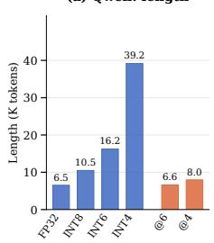

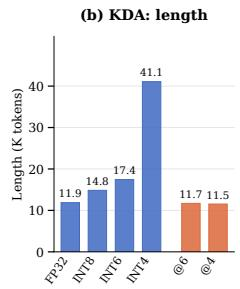

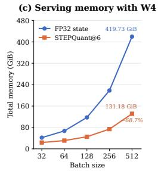  
(d) Memory & Time of State Updating

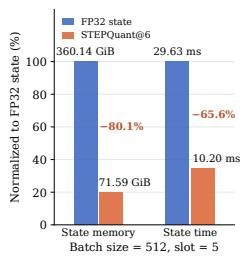  
Figure 3: Generation length and serving efficiency of STEPQuant. (a–b) Mean generated tokens across seven tasks, weighting tasks equally. Blue bars show FP32 and uniform INT8/6/4. Orange bars show STEPQuant@6bit/@4bit (marked @6/@4). Lengths include thinking, incorrect answers, and capped outputs. (c) Total serving memory of Qwen with W4 weights across different batch sizes. (d) Normalized recurrent-state memory and updating time of Qwen at batch size 512.

## 5.4 COMPONENT ABLATION

We evaluate the components on AIME 2026, GPQA Diamond, and LiveCodeBench v6 with BF16 weights under nominal 4- and 6-bit budgets. We also adapt the dual-axis state quantization (DSQ) component of Q-Mamba (Tianqi et al., 2025), originally designed for Mamba models, as a baseline. Spatial only retains uniform precision but applies key-row-aware dual-axis fitting. Temporal only uses calibrated mixed-precision allocation and FP16 pivots without spatial fitting, while Temporal w/o pivots removes the pivots. STEPQuant combines the spatial and temporal components. All quantization methods are evaluated under the same nominal bit budget (4 or 6 bits). Table 4 presents the Qwen results, with the corresponding Kimi results provided in Appendix E.4.

Component analysis. (i) Spatial fitting. At 4 bits, our spatial fitting substantially outperforms DSQ on Qwen (73.95% vs. 7.64%), with consistent improvements at 6 bits. This highlights the benefit of incorporating key-row impact into dual-axis quantization. (ii) Pivot protection. Protecting only 1.39% of Qwen heads with FP16 pivots improves the 4-bit three-task average by 6.70 points and the 6-bit AIME accuracy by 14.16 points. This demonstrates that protecting a small fraction of high-risk units can substantially improve accuracy. (iii) Combining both components. At 4 bits, STEPQuant achieves 84.72% on Qwen, outperforming both Spatial only (73.95%) and Temporal only (12.87%). At 6 bits, STEPQuant achieves 84.51%, compared with 80.19% and 75.63% for the individual components, closely matching FP32 (84.61%). These results demonstrate the complementary benefits of our spatial and temporal components. Similar trends are observed on Kimi under both bit budgets.

## 5.5 GENERATION LENGTH ON SEVEN LONG-GENERATION TASKS

Prior works (Liu et al., 2025; Lotfi et al., 2026) have observed that quantized models may exhibit overthinking, producing excessively long outputs without improving reasoning accuracy. We therefore examine generation length to further understand the behavior of STEPQuant on reasoning tasks. As presented in Fig. 3(a)(b), uniform quantization substantially increases output length. For example, Kimi generates an average of 63.40K tokens on AIME and 64.22K on HMMT under 4-bit quantization, approaching the 65536-token limit while achieving near 0 accuracy on both tasks. This suggests that the increased generation length does not translate into effective reasoning under aggressive uniform quantization. In contrast, STEPQuant maintains output lengths close to those of the FP32-state model, consistent with its preserved accuracy on long reasoning tasks.

## 5.6 EFFICIENCY EVALUATION

We evaluate the serving efficiency of STEPQuant using SGLang on A800 GPUs. Fig. 3(c) reports the total serving memory of Qwen with W4 weights across different batch sizes. At a batch size of 512, STEPQuant@6bit reduces total memory from 419.73 to 131.18 GiB, a 68.7% reduction. Beyond the overall memory savings, we further examine recurrent-state memory and state-update time. Fig.3(d) shows that STEPQuant@6bit reduces recurrent-state memory by 80.1% (5.03× compression) and state-update time by 65.6% (2.91× faster). Additional results, including the evaluation protocol, state memory and update time on Kimi, and full-model decode throughput on both models, are provided in Appendix F.

## 6 RELATED WORK

Efficient LLM inference has been pursued through efficient decoding procedures (Chen et al., 2026; Xu et al., 2026; Qian et al., 2026b;a), parameter pruning (Zhang et al., 2024; Xing et al., 2025; Lin et al., 2026d), low-bit quantization (Frantar et al., 2022; Yang et al., 2026c;a;b; Ma et al., 2023a;b; 2024), and architectural approaches (Yang et al., 2023; 2024; Lin et al., 2026a). Our work combines the latter two directions by quantizing the recurrent states used in gated linear attention models. We therefore review these architectures and related PTQ methods below.

## 6.1 LINEAR ATTENTION TRANSFORMERS

Standard self-attention incurs quadratic computation in sequence length and maintains a growing KV cache during autoregressive decoding (Zhang et al., 2023). Linear attention can instead summarize past key-value interactions in a fixed-size recurrent state, enabling linear-time sequence processing and constant state storage with respect to sequence length. Subsequent works improve memory management and computational efficiency: RetNet (Sun et al., 2023) introduces multiscale retention with parallel and recurrent formulations, while Gated Linear Attention (Yang et al., 2023) uses data-dependent gates to control information retention. Related state-space models, including Mamba (Gu & Dao, 2024) and Mamba-2 (Dao & Gu, 2024), also combine recurrent inference with efficient training algorithms. Gated DeltaNet (GDN) (Yang et al., 2025) combines head-wise forgetting with delta-rule updates to selectively modify associations stored in its matrix-valued state. Kimi Delta Attention (KDA) (Team et al., 2025) extends this mechanism with channel-wise forgetting and serves as the main component of Kimi Linear and K3 (Team et al., 2026), which interleave KDA and softmax attention layers. Qwen families (Qwen Team, 2026b;c;d;a) also adopt the hybrid GDN architecture to deliver high-throughput inference with minimal latency overhead. These advances improve how recurrent states store and update information, but fixed state size does not eliminate storage costs: total state memory scales with batch size, layer count, and state dimensions. We study low-bit quantization of GDN recurrent states to reduce this inference memory footprint.

## 6.2 POST-TRAINING QUANTIZATION

Post-training quantization (PTQ) reduces model memory by representing weights in low-bit formats (Kim et al., 2023; Lin et al., 2024b; Shao et al., 2024; Zhong et al., 2024; 2025a;b; Zhang et al., 2026a), while jointly quantizing weights and activations can accelerate inference through low-bit kernels (Ashkboos et al., 2024; Lin et al., 2024a; 2026b;c). PTQ can also reduce the growing KV cache in long-context inference (Liu et al., 2024a; Hooper et al., 2024; Zandieh et al., 2026). For example, KIVI (Liu et al., 2024b) quantizes keys and values along different axes. For state-space models, Quamba (Chiang et al., 2025b) and MambaQuant (Xu et al., 2025) target weight and activation quantization, while Quamba2 (Chiang et al., 2025a) additionally quantizes cached recurrent states to 8 bits. Q-Mamba (Tianqi et al., 2025) addresses state-cache quantization through dual-axis scaling and selectivity reconstruction. Quantization of GDN recurrent states remains less explored. Concurrent work, DAMP (Zhang et al., 2026b), uses decay-based persistence to select key channels for FP16 protection while quantizing the remaining channels to INT8, reporting preserved accuracy at 9.9 bits per state value in its evaluated settings. Our work demonstrates that lower precision is feasible: STEPQuant quantizes recurrent states in KDA and Qwen3.8 models to 6 bits with negligible accuracy degradation on the evaluated benchmarks.

## 7 CONCLUSION

We study low-bit quantization of recurrent states in Delta-rule models and show that quantization errors are shaped by both temporal persistence and spatial structure. Based on these observations, we propose STEPQuant, combining lifetime-aware bit allocation with Key-Row-Aware Dual-axis Fitting. Experiments across long- and short-generation tasks show that STEPQuant enables accurate low-bit state quantization and substantially reduces recurrent-state memory for concurrent serving.

## AI USE STATEMENT

AI assistants were used only for language polishing, LATEX checking, and debugging assistance. All scientific ideas, methodological designs, experiments, analyses, and conclusions were developed, conducted, and verified by the authors.

## REPRODUCIBILITY STATEMENT

We describe every component needed to reproduce our experiments. We provide the recurrent-state update and quantization definitions in Section 2, the precision-allocation objective in Section 3.2, and the spatial fitting procedure in Section 4.3. Appendix A gives the proof of conditional error propagation and defines the calibration statistics. Appendices C.2 and C.3 describe the calibration data, candidate precisions, FP16 pivots, allocation procedures, and quantized decode workflow. Section 5.1 specifies the models, benchmarks, and generation settings, while Appendix F documents the SGLang integration, hardware configurations, decode timing protocol, and memory accounting. Additional per-task generation lengths and component ablations are provided in Appendix E.

## REFERENCES

Saleh Ashkboos, Amirkeivan Mohtashami, Maximilian L Croci, Bo Li, Pashmina Cameron, Martin Jaggi, Dan Alistarh, Torsten Hoefler, and James Hensman. Quarot: Outlier-free 4-bit inference in rotated llms. Advances in Neural Information Processing Systems, 37:100213–100240, 2024.

George EP Box and David R Cox. An analysis of transformations. Journal ofthe Royal Statistical Society Series B: Statistical Methodology, 26(2):211–243, 1964.

Jian Chen, Yesheng Liang, and Zhijian Liu. Dflash: Block diffusion for flash speculative decoding. arXiv preprint arXiv:2602.06036, 2026.

Hung-Yueh Chiang, Chi-Chih Chang, Natalia Frumkin, Kai-Chiang Wu, Mohamed S Abdelfattah, and Diana Marculescu. Quamba2: A robust and scalable post-training quantization framework for selective state space models. arXiv preprint arXiv:2503.22879, 2025a.

Hung-Yueh Chiang, Chi-Chih Chang, Natalia Frumkin, Kai-Chiang Wu, and Diana Marculescu. Quamba: A post-training quantization recipe for selective state space models. In International Conference on Learning Representations, volume 2025, pp. 101328–101354, 2025b.

Peter Clark, Isaac Cowhey, Oren Etzioni, Tushar Khot, Ashish Sabharwal, Carissa Schoenick, and Oyvind Tafjord. Think you have solved question answering? try arc, the ai2 reasoning challenge. arXiv preprint arXiv:1803.05457, 2018.

Tri Dao and Albert Gu. Transformers are ssms: Generalized models and efficient algorithms through structured state space duality. arXiv preprint arXiv:2405.21060, 2024.

Jasper Dekoninck, Nikola Jovanovic, Tim Gehrunger, K´ ari R´ ognvaldsson, Ivo Petrov, Chenhao Sun,¨ and Martin Vechev. Beyond benchmarks: Matharena as an evaluation platform for mathematics with llms. arXiv preprint arXiv:2605.00674, 2026.

Tim Dettmers, Mike Lewis, Younes Belkada, and Luke Zettlemoyer. Gpt3. int8 (): 8-bit matrix multiplication for transformers at scale. Advances in neural information processing systems, 35: 30318–30332, 2022.

Tim Dettmers, Ruslan Svirschevski, Vage Egiazarian, Denis Kuznedelev, Elias Frantar, Saleh Ashkboos, Alexander Borzunov, Torsten Hoefler, and Dan Alistarh. Spqr: A sparse-quantized representation for near-lossless llm weight compression. arXiv preprint arXiv:2306.03078, 2023.

Elias Frantar, Saleh Ashkboos, Torsten Hoefler, and Dan Alistarh. Gptq: Accurate post-training quantization for generative pre-trained transformers. arXiv preprint arXiv:2210.17323, 2022.

Albert Gu and Tri Dao. Mamba: Linear-time sequence modeling with selective state spaces. In First Conference on Language Modeling, 2024. URL https://openreview.net/forum?id= tEYskw1VY2.

Dan Hendrycks, Collin Burns, Steven Basart, Andy Zou, Mantas Mazeika, Dawn Song, and Jacob Steinhardt. Measuring massive multitask language understanding. arXiv preprint arXiv:2009.03300, 2020.

Coleman Hooper, Sehoon Kim, Hiva Mohammadzadeh, Michael W Mahoney, Yakun S Shao, Kurt Keutzer, and Amir Gholami. Kvquant: Towards 10 million context length llm inference with kv cache quantization. Advances in Neural Information Processing Systems, 37:1270–1303, 2024.

Naman Jain, King Han, Alex Gu, Wen-Ding Li, Fanjia Yan, Tianjun Zhang, Sida Wang, Armando Solar-Lezama, Koushik Sen, and Ion Stoica. Livecodebench: Holistic and contamination free evaluation of large language models for code. In International Conference on Learning Representations, volume 2025, pp. 58791–58831, 2025.

Sehoon Kim, Coleman Hooper, Amir Gholami, Zhen Dong, Xiuyu Li, Sheng Shen, Michael W Mahoney, and Kurt Keutzer. Squeezellm: Dense-and-sparse quantization. arXiv preprint arXiv:2306.07629, 2023.

Hunter Lightman, Vineet Kosaraju, Yuri Burda, Harrison Edwards, Bowen Baker, Teddy Lee, Jan Leike, John Schulman, Ilya Sutskever, and Karl Cobbe. Let’s verify step by step. In International Conference on Learning Representations, volume 2024, pp. 39578–39601, 2024.

Haokun Lin, Haobo Xu, Yichen Wu, Jingzhi Cui, Yingtao Zhang, Linzhan Mou, Linqi Song, Zhenan Sun, and Ying Wei. Duquant: Distributing outliers via dual transformation makes stronger quantized llms. Advances in Neural Information Processing Systems, 37:87766–87800, 2024a.

Haokun Lin, Xinle Jia, Shaozhen Liu, Shujun Xia, Weitao Huang, Haobo Xu, Junyang Li, Yicheng Xiao, Xingrun Xing, Ziyu Guo, et al. Efficient diffusion language models: A comprehensive survey. 2026a.

Haokun Lin, Xinle Jia, Haobo Xu, Bingchen Yao, Xianglong Guo, Yichen Wu, Zhichao Lu, Ying Wei, Qingfu Zhang, and Zhenan Sun. Duquant++: Fine-grained rotation enhances microscaling fp4 quantization. arXiv preprint arXiv:2604.17789, 2026b.

Haokun Lin, Haobo Xu, Yichen Wu, Ziyu Guo, Renrui Zhang, Zhichao Lu, Ying Wei, Qingfu Zhang, and Zhenan Sun. Quantization meets dllms: A systematic study of post-training quantization for diffusion llms. Machine Intelligence Research, pp. 1–17, 2026c.

Haokun Lin, Kaijie Zhu, Haobo Xu, Yichen Wu, Zhichao Lu, Qingfu Zhang, and Zhenan Sun. Benchmarking trustworthiness of slms: Pre-trained vs. compressed. arXiv preprint arXiv:2608.11981, 2026d.

Ji Lin, Jiaming Tang, Haotian Tang, Shang Yang, Wei-Ming Chen, Wei-Chen Wang, Guangxuan Xiao, Xingyu Dang, Chuang Gan, and Song Han. Awq: Activation-aware weight quantization for on-device llm compression and acceleration. Proceedings of machine learning and systems, 6:87–100, 2024b.

Jiawei Liu, Chunqiu Steven Xia, Yuyao Wang, and Lingming Zhang. Is your code generated by chatgpt really correct? rigorous evaluation of large language models for code generation. Advances in neural information processing systems, 36:21558–21572, 2023.

Ruikang Liu, Haoli Bai, Haokun Lin, Yuening Li, Han Gao, Zhengzhuo Xu, Lu Hou, Jun Yao, and Chun Yuan. Intactkv: Improving large language model quantization by keeping pivot tokens intact. arXiv preprint arXiv:2403.01241, 2024a.

Ruikang Liu, Yuxuan Sun, Manyi Zhang, Haoli Bai, Xianzhi Yu, Tiezheng Yu, Chun Yuan, and Lu Hou. Quantization hurts reasoning? an empirical study on quantized reasoning models. arXiv preprint arXiv:2504.04823, 2025.

Zirui Liu, Jiayi Yuan, Hongye Jin, Shaochen Zhong, Zhaozhuo Xu, Vladimir Braverman, Beidi Chen, and Xia Hu. Kivi: A tuning-free asymmetric 2bit quantization for kv cache. arXiv preprint arXiv:2402.02750, 2024b.

Sanae Lotfi, Polina Kirichenko, Steven Li, and Zechun Liu. Quantized reasoning models think they need to think longer, but they do not. arXiv preprint arXiv:2606.00206, 2026.

Yuexiao Ma, Taisong Jin, Xiawu Zheng, Yan Wang, Huixia Li, Yongjian Wu, Guannan Jiang, Wei Zhang, and Rongrong Ji. Ompq: Orthogonal mixed precision quantization. In Proceedings of the AAAI conference on artificial intelligence, volume 37, pp. 9029–9037, 2023a.

Yuexiao Ma, Huixia Li, Xiawu Zheng, Xuefeng Xiao, Rui Wang, Shilei Wen, Xin Pan, Fei Chao, and Rongrong Ji. Solving oscillation problem in post-training quantization through a theoretical perspective. In 2023 IEEE/CVF Conference on Computer Vision and Pattern Recognition (CVPR), pp. 7950–7959, 2023b. doi: 10.1109/CVPR52729.2023.00768.

Yuexiao Ma, Huixia Li, Xiawu Zheng, Feng Ling, Xuefeng Xiao, Rui Wang, Shilei Wen, Fei Chao, and Rongrong Ji. Outlier-aware slicing for post-training quantization in vision transformer. In Forty-first International Conference on Machine Learning, 2024.

Stephen Merity, Caiming Xiong, James Bradbury, and Richard Socher. Pointer sentinel mixture models. arXiv preprint arXiv:1609.07843, 2016.

Todor Mihaylov, Peter Clark, Tushar Khot, and Ashish Sabharwal. Can a suit of armor conduct electricity? a new dataset for open book question answering. In Proceedings of the 2018 conference on empirical methods in natural language processing, pp. 2381–2391, 2018.

Denis Paperno, German Kruszewski, Angeliki Lazaridou, Ngoc-Quan Pham, Raffaella Bernardi,´ Sandro Pezzelle, Marco Baroni, Gemma Boleda, and Raquel Fernandez. The lambada dataset: ´ Word prediction requiring a broad discourse context. In Proceedings of the 54th annual meeting ofthe associationfor computational linguistics (volume 1: Long papers), pp. 1525–1534, 2016.

Valentina Pyatkin, Saumya Malik, Victoria Graf, Hamish Ivison, Shengyi Huang, Pradeep Dasigi, Nathan Lambert, and Hannaneh Hajishirzi. Generalizing verifiable instruction following. In The Thirty-ninth Annual Conference on Neural Information Processing Systems Datasets and Benchmarks Track, 2026. URL https://openreview.net/forum?id=yfYgwjj5F8.

Yu-Yang Qian, Junda Su, Lanxiang Hu, Peiyuan Zhang, Zhijie Deng, Peng Zhao, and Hao Zhang. d3llm: Ultra-fast diffusion llm using pseudo-trajectory distillation. arXiv preprint arXiv:2601.07568, 2026a.

Yu-Yang Qian, Hao-Cong Wu, Chen Chen, Jiacheng Sun, Zhenhua Dong, Peng Zhao, and Zhi-Hua Zhou. Adaflash: Adaptive speculative decoding via on-policy distilled diffusion drafters. arXiv preprint arXiv:2607.19223, 2026b.

Qwen Team. Qwen3.8-Max: A new bar for coding and cowork, August 2026a. URL https: //qwen.ai/blog?id=qwen3.8.

Qwen Team. Qwen3.5: Towards native multimodal agents, February 2026b. URL https:// qwen.ai/blog?id=qwen3.5.

Qwen Team. Qwen3.6-27B: Flagship-level coding in a 27B dense model, April 2026c. URL https://qwen.ai/blog?id=qwen3.6-27b.

Qwen Team. Qwen3.6-35B-A3B: Agentic coding power, now open to all, April 2026d. URL https://qwen.ai/blog?id=qwen3.6-35b-a3b.

Colin Raffel, Noam Shazeer, Adam Roberts, Katherine Lee, Sharan Narang, Michael Matena, Yanqi Zhou, Wei Li, and Peter J Liu. Exploring the limits of transfer learning with a unified text-to-text transformer. Journal ofmachine learning research, 21(140):1–67, 2020.

David Rein, Betty Li Hou, Asa Cooper Stickland, Jackson Petty, Richard Yuanzhe Pang, Julien Dirani, Julian Michael, and Samuel R Bowman. Gpqa: A graduate-level google-proof q&a benchmark. arXiv preprint arXiv:2311.12022, 2023.

Keisuke Sakaguchi, Ronan Le Bras, Chandra Bhagavatula, and Yejin Choi. Winogrande: An adversarial winograd schema challenge at scale. Communications ofthe ACM, 64(9):99–106, 2021.

Wenqi Shao, Mengzhao Chen, Zhaoyang Zhang, Peng Xu, Lirui Zhao, Zhiqian Li, Kaipeng Zhang, Gao Peng, Yu Qiao, and Ping Luo. Omniquant: Omnidirectionally calibrated quantization for large language models. In International Conference on Learning Representations, volume 2024, pp. 45472–45496, 2024.

Yutao Sun, Li Dong, Shaohan Huang, Shuming Ma, Yuqing Xia, Jilong Xue, Jianyong Wang, and Furu Wei. Retentive network: A successor to transformer for large language models. arXiv preprint arXiv:2307.08621, 2023.

Kimi Team, Yu Zhang, Zongyu Lin, Xingcheng Yao, Jiaxi Hu, Fanqing Meng, Chengyin Liu, Xin Men, Songlin Yang, Zhiyuan Li, et al. Kimi linear: An expressive, efficient attention architecture. arXiv preprint arXiv:2510.26692, 2025.

Kimi Team, Tongtong Bai, Yifan Bai, Yiping Bao, Jianfeng Cai, Xinyuan Cai, Peizhou Cao, Yuxuan Cao, Ziwei Chai, Y Charles, et al. Kimi k3: Open frontier intelligence. arXiv preprint arXiv:2607.24653, 2026.

Chen Tianqi, Yuanteng Chen, Peisong Wang, Weixiang Xu, Zeyu Zhu, and Jian Cheng. Q-mamba: Towards more efficient mamba models via post-training quantization. In Findings of the Associationfor Computational Linguistics: ACL 2025, pp. 10594–10610, 2025.

Guangxuan Xiao, Ji Lin, Mickael Seznec, Hao Wu, Julien Demouth, and Song Han. Smoothquant: Accurate and efficient post-training quantization for large language models. In International conference on machine learning, pp. 38087–38099. PMLR, 2023.

Xingrun Xing, Zheng Liu, Shitao Xiao, Boyan Gao, Yiming Liang, Wanpeng Zhang, Haokun Lin, Guoqi Li, and Jiajun Zhang. Efficientllm: Scalable pruning-aware pretraining for architectureagnostic edge language models. arXiv preprint arXiv:2502.06663, 2025.

Haobo Xu, Sirui Chen, Yuanchen Bei, Lingjie Chen, Yuchen Yan, Dongqi Fu, Jingrui He, and Hanghang Tong. Predict, don’t iterate: Efficient adaptive-length infilling for diffusion language models. arXiv preprint arXiv:2609.02108, 2026.

Zukang Xu, Yuxuan Yue, Xing Hu, Zhihang Yuan, Zixu Jiang, Zhixuan Chen, Jiangyong Yu, Chen Xu, Sifan Zhou, and Dawei Yang. Mambaquant: Quantizing the mamba family with variance aligned rotation methods. In International Conference on Learning Representations, volume 2025, pp. 33231–33250, 2025.

Lianwei Yang, Haokun Lin, Yichen Wu, Caifeng Shan, Zhenan Sun, and Qingyi Gu. Reshape and rotate: Adaptive weight reshaping and fine-grained rotation for ultra-low-bit diffusion transformers quantization. Neurocomputing, pp. 133830, 2026a.

Lianwei Yang, Haokun Lin, Yichen Wu, Zhenan Sun, and Qingyi Gu. Dapq-dit: Distribution-aware post-training quantization for efficient generative tasks in diffusion transformers. In Proceedings of the 2026 International Conference on Multimedia Retrieval, pp. 2371–2380, 2026b.

Lianwei Yang, Haokun Lin, Tianchen Zhao, Yichen Wu, Hongyu Zhu, Ruiqi Xie, Zhenan Sun, Yu Wang, and Qingyi Gu. Lrq-dit: Log-rotation post-training quantization of diffusion transformers for image and video generation. IEEE Transactions on Circuits and Systems for Video Technology, 2026c.

Songlin Yang, Bailin Wang, Yikang Shen, Rameswar Panda, and Yoon Kim. Gated linear attention transformers with hardware-efficient training. arXiv preprint arXiv:2312.06635, 2023.

Songlin Yang, Bailin Wang, Yu Zhang, Yikang Shen, and Yoon Kim. Parallelizing linear transformers with the delta rule over sequence length. Advances in neural information processing systems, 37:115491–115522, 2024.

Songlin Yang, Jan Kautz, and Ali Hatamizadeh. Gated delta networks: Improving mamba2 with delta rule. In International Conference on Learning Representations, volume 2025, pp. 29687– 29707, 2025.

Amir Zandieh, Majid Daliri, Majid Hadian, and Vahab Mirrokni. Turboquant: Online vector quantization with near-optimal distortion rate. In International Conference on Learning Representations, volume 2026, pp. 56418–56439, 2026.

Rowan Zellers, Ari Holtzman, Yonatan Bisk, Ali Farhadi, and Yejin Choi. Hellaswag: Can a machine really finish your sentence? In Proceedings of the 57th annual meeting of the association for computational linguistics, pp. 4791–4800, 2019.

Jingxuan Zhang, Yunta Hsieh, Zhongwei Wan, Haokun Lin, Xin Wang, Ziqi Wang, Yingtie Lei, and Mi Zhang. Quantvla: Scale-calibrated post-training quantization for vision-language-action models. arXiv preprint arXiv:2602.20309, 2026a.

Tao Zhang, Jianchao Tan, Pingwei Sun, Yanqi Yu, Zixu Jiang, Yuchen Xie, Xunliang Cai, and Ziqian Zeng. Damp: Decay-aware mixed-precision recurrent-state quantization. arXiv preprint arXiv:2608.27513, 2026b.

Yingtao Zhang, Haoli Bai, Haokun Lin, Jialin Zhao, Lu Hou, and Carlo Vittorio Cannistraci. Plugand-play: An efficient post-training pruning method for large language models. In International Conference on Learning Representations, volume 2024, pp. 50490–50508, 2024.

Zhenyu Zhang, Ying Sheng, Tianyi Zhou, Tianlong Chen, Lianmin Zheng, Ruisi Cai, Zhao Song, Yuandong Tian, Christopher Re, Clark Barrett, et al. H2o: Heavy-hitter oracle for efficient gen- ´ erative inference of large language models. Advances in neural information processing systems, 36:34661–34710, 2023.

Lianmin Zheng, Liangsheng Yin, Zhiqiang Xie, Chuyue Sun, Jeff Huang, Cody H Yu, Shiyi Cao, Christos Kozyrakis, Ion Stoica, Joseph E Gonzalez, et al. Sglang: Efficient execution of structured language model programs. Advances in neural information processing systems, 37:62557–62583, 2024.

Yunshan Zhong, Jiawei Hu, You Huang, Yuxin Zhang, and Rongrong Ji. Erq: Error reduction for post-training quantization of vision transformers. In Forty-first International Conference on Machine Learning, 2024.

Yunshan Zhong, Jiawei Hu, Mingbao Lin, Mengzhao Chen, and Rongrong Ji. I&s-vit: An inclusive & stable method for pushing the limit of post-training vits quantization. IEEE Transactions on Pattern Analysis & Machine Intelligence (TPAMI), 2025a. doi: 10.1109/TPAMI.2025.3610466.

Yunshan Zhong, You Huang, Jiawei Hu, Yuxin Zhang, and Rongrong Ji. Towards accurate posttraining quantization of vision transformers via error reduction. IEEE Transactions on Pattern Analysis and Machine Intelligence, 2025b.

## A RECURRENT-STATE ERROR PROPAGATION AND CALIBRATION STATISTICS

This appendix proves the conditional error propagation in Section 3 and relates cumulative squared output error to the row-impact scores used by Key-Row-Aware Dual-axis Fitting in Section 4.3. It also defines the calibration statistics used by STEPQuant’s temporal and spatial components.

## A.1 PROOF OF PROPOSITION 1

Subtracting the reference recurrence from the quantized update gives

$$
\begin{array} { r l } & { E _ { t } = \mathcal { Q } _ { t } ( A _ { t } \widehat { S } _ { t - 1 } + B _ { t } ) - ( A _ { t } S _ { t - 1 } + B _ { t } ) } \\ & { \quad = A _ { t } ( \widehat { S } _ { t - 1 } - S _ { t - 1 } ) + \varepsilon _ { t } . } \end{array}
$$

At step t, the output is read from $X _ { t }$ before ${ \mathcal { Q } } _ { t } ( X _ { t } )$ is stored, so ${ \widehat { y _ { t } } } - y _ { t } = ( A _ { t } E _ { t - 1 } ) ^ { \top } q _ { t }$ . Let $P _ { t } = \dot { I } - \beta _ { t } k _ { t } k _ { t } ^ { \top }$ . Under the proposition’s conditions, $0 \preceq P _ { t } \preceq I , \mathrm { s o } \| P _ { t } \| _ { 2 } \leq \mathrm { i }$ . Therefore

$$
\left\| A _ { t } \right\| _ { 2 } = \left\| P _ { t } D _ { t } \right\| _ { 2 } \leq \left\| P _ { t } \right\| _ { 2 } \left\| D _ { t } \right\| _ { 2 } \leq \left\| D _ { t } \right\| _ { 2 } \leq 1 .
$$

## A.2 CUMULATIVE SQUARED OUTPUT ERROR

Condition on the same keys, values, queries, and gates in both paths, as in Proposition 1. Let $\Phi _ { s , t } = A _ { s } \cdot \cdot \cdot A _ { t + 1 }$ transport a state perturbation from step t to s. Over a horizon of H future reads, an isolated quantization error Z produces cumulative squared output error

$$
\sum _ { s = t + 1 } ^ { t + H } \| Z ^ { \top } \Phi _ { s , t } ^ { \top } q _ { s } \| _ { 2 } ^ { 2 } = \mathrm { t r } ( Z ^ { \top } W _ { t , H } Z ) , \quad W _ { t , H } = \sum _ { s = t + 1 } ^ { t + H } \Phi _ { s , t } ^ { \top } q _ { s } q _ { s } ^ { \top } \Phi _ { s , t } .\tag{15}
$$

For a single perturbation $Z$ at time t and no subsequent quantization errors, the state perturbation after transition s is $\Phi _ { s , t } Z$ . The output perturbation is $Z ^ { \top } \Phi _ { s , t } ^ { \top } q _ { s }$ . Using $\left\| Z ^ { \top } u \right\| _ { 2 } ^ { 2 } = \operatorname { t r } ( Z ^ { \top } u u ^ { \top } Z )$ and summing proves Equation 15. Here $W _ { t , H }$ is the readout-error Gram matrix and tr denotes the matrix trace. This matrix is positive semidefinite.

For a single future read, $H = 1$ , this matrix reduces to

$$
W _ { t , 1 } = g _ { t + 1 } g _ { t + 1 } ^ { \top } , \qquad g _ { t + 1 } = A _ { t + 1 } ^ { \top } q _ { t + 1 } .
$$

A unit-Frobenius-norm perturbation confined to key row i therefore produces squared output error at the next step $g _ { t + 1 , i } ^ { 2 } .$ Both Qwen and KDA calibrate $\omega _ { i } = \mathbb { E } _ { \mathrm { c a l } } [ g _ { t , i } ^ { 2 } ]$ , the mean diagonal of this one-step readout-error matrix. STEPQuant’s spatial component normalizes $\omega _ { i }$ into the row-impact factors $w _ { i }$ . These determine the row scales $\dot { r _ { i } } = m _ { i } ^ { 1 / 2 } \dot { w _ { i } } ^ { - 1 / 2 }$ and the squared weights $w _ { i } ^ { 2 }$ in the column-fitting objective (Section 4.3 and Appendix C).

With quantization errors $\varepsilon _ { r }$ introduced at successive steps and $E _ { 0 } = 0$ , the accumulated error is

$$
E _ { t } = \sum _ { r = 1 } ^ { t } \Phi _ { t , r } \varepsilon _ { r } , \qquad \Phi _ { t , t } = I .
$$

The squared norm includes cross terms between propagated quantization errors.

## A.3 CALIBRATION STATISTICS FOR TEMPORAL AND SPATIAL COMPONENTS

STEPQuant’s temporal component uses Lifetime-aware Bit Allocation and sparse FP16 pivots, while its spatial component uses Key-Row-Aware Dual-axis Fitting. The statistics below connect their calibration.

Mean log retention. For allocation unit u, define

$$
\ell _ { u } = \mathbb { E } _ { \mathrm { c a l } } [ \log r _ { t , u } ] , \qquad L _ { u } = \sum _ { j = 0 } ^ { H - 1 } \exp ( 2 j \ell _ { u } ) .\tag{16}
$$

The expectation is taken over calibration tokens. For Qwen, u is a state head and $r _ { t , u } = \alpha _ { t , u } ;$ for KDA, u is a key row and $r _ { t , u } = d _ { t , u }$ . The lifetime weight $L _ { u }$ is applied to the candidate-format distortion after that distortion is averaged over state samples.

Let C contain the sampled reference states, with each batch element counted as a separate state sample. Let $S _ { s , u }$ be the reference state of unit u at sample s, and $\widehat { S } _ { s , u } ^ { ( b ) }$ its candidate-format reconstruction at precision b.

Qwen reconstruction distortion. For Qwen, u is an entire head and $n _ { u } = d _ { k } d _ { v }$ . Its candidateformat calibration uses the spatial component’s row-impact factors $w _ { u , i } \colon$

$$
d _ { u } ( b ) = \frac { 1 } { | \mathcal { C } | n _ { u } } \sum _ { s \in \mathcal { C } } \sum _ { i , j } w _ { u , i } ^ { 2 } \left( \widehat { S } _ { s , u , i j } ^ { ( b ) } - S _ { s , u , i j } \right) ^ { 2 } .\tag{17}
$$

The squared row-impact factors $w _ { u , i } ^ { 2 }$ weight the reconstruction error. Weighted squared error is averaged over the elements within each head and then over state samples; the temporal lifetime weight $L _ { u }$ is applied afterward.

KDA reconstruction distortion. For a KDA key row, $n _ { u } = d _ { \tau }$ and the calibrated distortion is the unweighted per-element MSE:

$$
d _ { u } ( b ) = \frac { 1 } { \vert \mathcal { C } \vert n _ { u } } \sum _ { s \in \mathcal { C } } \left. \widehat { S } _ { s , u } ^ { ( b ) } - S _ { s , u } \right. _ { 2 } ^ { 2 } .\tag{18}
$$

KDA samples states every eight recurrent updates, averages squared error over batch elements and value coordinates, and then averages over the sampled update positions. Once FP16 pivots are fixed, their rows do not participate in fitting the shared column scales for integer rows.

Thus, Qwen’s temporal allocation uses a distortion measure that already accounts for spatial row impact. In KDA, the allocation MSE is unweighted, but the candidate reconstruction is produced with the spatial codec and the shared column fit excludes FP16 pivot rows. The two components have distinct roles, while sharing the calibrated state representation. Within each model, all allocation units have the same $n _ { u }$ . Converting per-element MSE to total squared error therefore multiplies the allocation objective by a model-specific constant and does not change the selected precision assignment.

## B ANALYSIS OF TEMPORAL ERROR ACCUMULATION AND SPATIAL ROW IMPACT

These controlled experiments support the temporal analysis in Section 3 and the spatial analysis in Sections 4.1 and 4.2. They use reference input streams to distinguish error persistence from differences in key-row impact and state geometry.

## B.1 EFFECT OF DELTA FEEDBACK ON QUANTIZATION ERROR

For GDN, the directional contraction is

$$
\begin{array} { r } { \| \alpha ( I - \beta k k ^ { \top } ) E \| _ { F } ^ { 2 } = \alpha ^ { 2 } [ \| E \| _ { F } ^ { 2 } - \beta ( 2 - \beta \| k \| _ { 2 } ^ { 2 } ) \| k ^ { \top } E \| _ { 2 } ^ { 2 } ] . } \end{array}\tag{19}
$$

Let $P = I - \beta k k ^ { \top }$ . Expanding $P ^ { \top } P$ gives $I - \beta ( 2 - \beta \| k \| _ { 2 } ^ { 2 } ) k k ^ { \top }$ , which proves Equation 19. For KDA, the corresponding subtraction is applied to $D _ { t } E _ { t - 1 }$ , retaining the native order of decay and correction. The mechanism does not require the state transition to amplify perturbations: repeated injections can accumulate under a non-expansive transition.

The exact-read oracle replaces only the state inside the Delta residual:

$$
\widetilde { S } _ { t } ^ { \mathrm { o r a c l e } } = D _ { t } \widehat { S } _ { t - 1 } ^ { \mathrm { o r a c l e } } + \beta _ { t } k _ { t } ( v _ { t } ^ { \top } - k _ { t } ^ { \top } D _ { t } S _ { t - 1 } ) .
$$

Subtracting the reference update leaves $D _ { t } E _ { t - 1 } ^ { \mathrm { o r a c l e } }$ . This intervention removes the correction of the path’s own state error. With continuous quantization it also changes future rounding errors. Therefore we use a matched single-injection experiment to isolate feedback.

Each of four fixed C4 (Raffel et al., 2020) Qwen trajectories provides native keys, values, queries, and gates for 8,192 updates. We use the deterministic Cartesian subset of global model-layer indices {0, 8, 16, 24, 32, 40, 48, 62} and global heads {0, 12, 24, 36}, giving 32 heads fixed before replay and independent of quantization outcomes. We inject one quantization error at step 256 and perform the remaining 7,936 updates without further quantization. Both paths start from the identical error. We sum squared output error over heads, trajectories, and subsequent steps. Relative to native Delta feedback, the exact-read oracle increases this error by 26.82× for INT6 and 18.65× for INT8; both ratios exceed one on each of the four trajectories.

## B.2 PREFILL AND DECODE PREDICTION DRIFT

An uninterrupted native prefill evolves an uncompressed state and packs it once at the boundary. Decode then reads and rewrites the compressed state after each token. This probe measures prediction drift caused by repeated compressed-state updates.

On four held-out C4 streams per model, each with a 2,048-token native prefill and 6,144 forced decode updates, prefill predictions match the FP32-state reference. Mean excess NLL (quantized minus reference) over the first and last 256 compressed-read predictions rises from 0.102 to 2.102 for Qwen INT6, and from 0.0228 to 0.1422 for KDA INT6. Across all 6,144 decode predictions, STEPQuant@6bit has mean excess NLL of 0.0011 on Qwen and −0.0120 on KDA.

## B.3 READOUT ERROR AT FIXED PRECISION

For Qwen, the calibrated row-impact factor satisfies $w _ { i } \propto \omega _ { i } ^ { 1 / 8 }$ , where $\omega _ { i } = \mathbb { E } [ ( A _ { t } ^ { \top } q _ { t } ) _ { i } ^ { 2 } ]$ includes the immediate Delta transition and readout (Section 4.3). Within a head, the normalization constant cancels in row-impact ratios. We recover a proportional row-impact score as $w _ { i } ^ { 8 }$ from the frozen full-precision calibration record, retaining its numerical floor, and compute the interpolated P90/P10 ratio across 128 key channels. Across all 2,304 heads, the median ratio is 15.95. The 10th and 90th percentiles across heads are 3.74 and 79.84. All channels within each such head share exactly the same scalar gate. This difference is thus additional to gate lifetime and directly motivates the spatial component’s within-head row-impact factor.

Figure B1d isolates row impact at fixed assigned precision. A group is one integer Qwen head, or the integer rows sharing both head and bit width in KDA, using frozen STEPQuant@6bit assignments. FP16 pivots are excluded. Requiring at least eight rows per group retains 2,272 Qwen groups (290,816 rows) and 1,567 KDA groups (80,333 rows). 1,075 KDA integer rows in smaller groups are excluded, without filtering on measured error. Qwen rows in a group share a scalar gate. KDA rows can have different keywise gates despite sharing their assigned bit width.

On reference-state traces, we inject a unit-Frobenius-norm perturbation $E _ { i }$ confined to key row i. With $A _ { t } = ( I - \beta _ { t } k _ { t } k _ { t } ^ { \top } ) D _ { t }$ and $g _ { t } = A _ { t } ^ { \top } q _ { t }$ , its isolated next-read squared error is exactly $\| E _ { i } ^ { \top } g _ { t } \| _ { 2 } ^ { 2 } = g _ { t , i } ^ { 2 }$ . We average 32 probe positions following 128 replay updates over four Qwen and two KDA C4 streams. Direct propagation checks agree with this identity within $7 . 1 \times 1 0 ^ { - 7 }$ relative error.

Rows are ranked within each group using independent WikiText calibration: frozen $w _ { i } ^ { 8 }$ for Qwen and one-step transported-query row-impact scores for KDA. Each row’s held-out read error is divided by its own group’s mean. We split each ranked group into eight near-equal bins and average bin means with equal group weight. Points are measured means at the averaged percentile centers. Curves use shape-preserving interpolation without extrapolation. The highest-to-lowest bin ratios are 117.4 for Qwen and 35.1 for KDA. These within-group contrasts motivate Key-Row-Aware Dual-axis Fitting even after lifetime-aware precision allocation.

## B.4 KEY-ROW QUANTIZATION AND PERPLEXITY

The perplexity experiment in Figure 2(a) tests whether calibrated row impact predicts the effect of state quantization on model outputs (Section 4.1). Within each head, we rank key rows by the independently calibrated $\omega _ { i }$ and divide them into eight near-equal groups. We quantize one ranked group at a time to INT4 across the model, keeping all other rows in full precision. Perplexity is measured on eight 1,024-token streams per model and compared with the FP32-state reference.

Markers show the measured bin results, and curves use shape-preserving interpolation. Higherimpact groups generally cause larger perplexity increases in both models. Unlike the equal-norm probe above, this experiment measures the effect of quantizing actual state values on the model’s predictive distribution.

## B.5 GATE HALF-LIFE AND ACCUMULATED INT6 STATE ERROR

(a) Qwen: state error(a) Qwen  
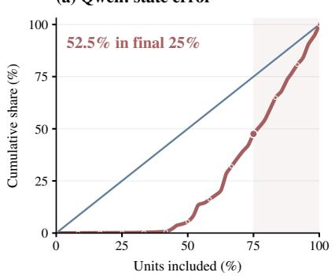  
ate error(b) KDA: state error

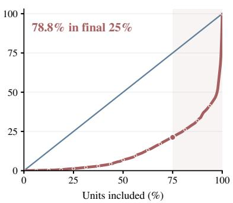

(c) KDA: lifetime vs. error  
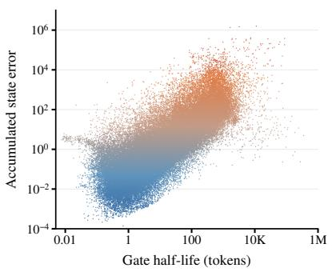

Unit countate error Unit co(d) Same-bit row impact  
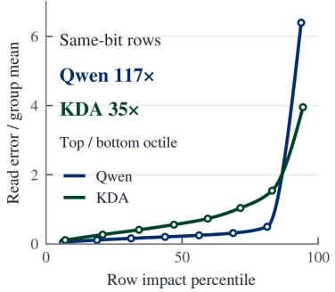  
Figure B1: Gate lifetime and key-row impact of recurrent state. (a–b) Cumulative INT6 squared error (red) and unit count (blue), ordered by increasing gate half-life within each layer or head. The longest-lived quarter accounts for 52.5% of Qwen error and 78.8% of KDA error across all 2,304 heads and 81,920 channels. (c) KDA half-life versus accumulated INT6 error for 79,864 channels after excluding near-zero errors; color encodes error. (d) Held-out equal-norm readout-error contrast across row-impact octiles within fixed-precision groups, using independent WikiText ranking.

Figure 1b shows the Qwen heads, and Figure B1c shows the corresponding KDA key channels. Both scatters measure state error under uniform INT6. Full-population Spearman correlations are 0.8004 and 0.8017, respectively. For legibility, the KDA scatter omits 2,056 channels (2.51%) with squared error below $1 0 ^ { \frac { \cdot } { - 1 5 } }$ . The remaining 79,864 channels are shown on logarithmic axes. A Qwen head has 16,384 state entries and a KDA key row has 128, so raw error magnitudes across models are not directly comparable.

For Figure B1, frozen WikiText calibration estimates $\ell _ { u }$ as defined in Appendix A.3, and gives the gate half-life $\tau _ { u } = \log ( 2 ) / ( - \ell _ { u } )$ . This gate-only statistic describes forgetting. The Delta correction remains part of the measured recurrence. The error experiment uses four frozen C4 sequences per model with their model-specific tokenizers. After a two-token FP32 boundary, a separate INT6 trajectory follows the reference keys, values, and gates for 2,046 decode updates. Every key row uses an absmax/31 scale stored in FP16, clamped to $\lceil 2 ^ { - 1 4 }$ , 65504], and nearest-integer codes in [−31, 31]. Quantization is applied at the boundary and after every recurrent update. For unit u we record

$$
D _ { u } = \sum _ { r = 1 } ^ { 4 } \sum _ { t = 1 } ^ { 2 0 4 6 } \left. ( \widehat { S } _ { r , t } - S _ { r , t } ) _ { u } \right. _ { F } ^ { 2 } .
$$

A Qwen unit is a whole head matrix. A KDA unit is a key row containing 128 value components. These units partition each state, so their squared errors sum exactly. We sort by lifetime within each group, sum $D _ { u }$ across groups at each rank, and then accumulate from shortest to longest. The error curve is normalized by its model-wide total. No per-layer or per-head normalization precedes pooling. The longest quarter contains 12 heads per Qwen layer or 32 channels per KDA head. Shape-preserving cubic interpolation passes through every measured cumulative-rank point.

Qwen replays captured native FP32 inputs, checking reference readouts against the capture. KDA executes its native recurrent kernel on a separate shadow state. These controlled mechanism replays isolate persistent-state distortion along reference input streams.

## B.6 LIFETIME RANKINGS AND DUAL-AXIS STATE GEOMETRY

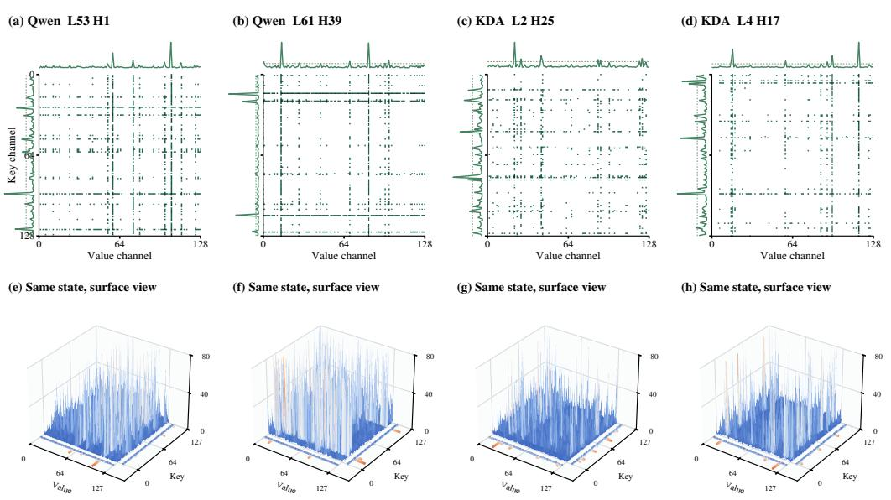  
Figure B2: Dual-axis state geometry across Qwen and KDA. Four native-order 128 × 128 states (Qwen, Qwen, KDA, KDA). Top: entries below 10× the matrix-median absolute magnitude are white; larger entries use graded greens. Marginal traces show row and column RMS relative to their axis medians. Bottom: matching surfaces use the same style as the Qwen surface in Figure 2(b). Floor traces show the same normalized RMS profiles, rescaled for display; heights are capped at 80×. Each state has seven or eight rows and columns above 5× their axis-median RMS.

Figure B3 compares gate-lifetime ordering under WikiText-2 (Merity et al., 2016), C4, and Live-CodeBench (Jain et al., 2025) text. The frozen WikiText calibration is independent of the task streams. The BF16 Qwen gate observer covers all 2,304 recurrent heads using four archived 2,048- token C4 streams and the first four unique sample-0 LiveCodeBench trajectories in sorted archive order. The latter combine original prompts and FP32-reference generated token IDs, truncated at 2,048 tokens without padding, for 6,218 observed tokens per head. KDA covers all 81,920 key channels. Its C4 inputs are four 2,048-token evaluation streams. Its LiveCodeBench inputs follow the same selection rule, combining original prompts with archived KDA W4 FP32-state generated tokens; the BF16 KDA gate observer processes 8,192 C4 and 3,275 LiveCodeBench tokens per layer.

For each text source, we compute token-weighted mean log gate retention and rank the resulting half-lives from shortest to longest across all units of each model. Figure B3 plots these global ranks as percentiles. Full-population Spearman correlations with WikiText are 0.989 (C4) and 0.985 (LiveCodeBench) for Qwen, and 0.991 and 0.982 for KDA. For Qwen, the short/middle/long classes defined by within-layer ranks 1–12, 13–36, and 37–48 retain their WikiText labels for 93.6% of heads on C4 and 90.1% on LiveCodeBench.

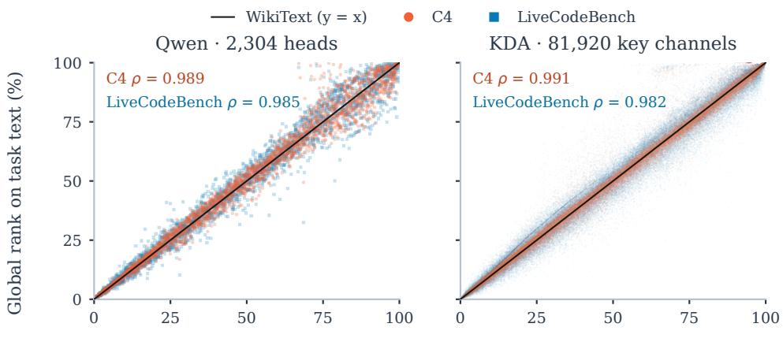  
Global WikiText lifetime rank (%)  
Figure B3: Global lifetime rankings remain similar across text sources. Qwen (2,304 heads) and KDA (81,920 key channels) are ranked separately, from shortest to longest gate half-life. Each point compares its global WikiText rank percentile with its C4 (orange-red) or LiveCodeBench (sky blue) percentile. The thin black diagonal is WikiText compared with itself (y = x). Spearman coefficients use the complete population in each panel.

Figure B2 uses two Qwen C4 snapshots at step 2,048 from distinct layers and heads. The two KDA snapshots are replayed from captured C4 keys, values, gates, and update coefficients at steps 128 or 256, also from distinct layers and heads. The native channel order and all matrix entries are retained. We chose the four examples by the 5× RMS criterion in the caption. Across the full KDA capture of 3,840 snapshots at steps 128, 256, and 512, median maximum-to-median RMS contrasts are 12.7× for key rows and 5.4× for value columns; both contrasts exceed 3× in 3,262 snapshots (84.9%).

For the Qwen state-geometry analysis in Section 4.2, FP32 state matrices are reconstructed from native recorded inputs at positions 128, 512, and 2,048. Define $\begin{array} { r } { r _ { i } ^ { \mathrm { r m s } } = \sqrt { \frac { 1 } { 1 2 8 } \sum _ { j } S _ { i j } ^ { 2 } } } \end{array}$ and $c _ { j } ^ { \mathrm { r m s } } =$ $\sqrt { \frac { 1 } { 1 2 8 } \sum _ { i } S _ { i j } ^ { 2 } }$ . The outlier contrasts are $\operatorname* { m a x } _ { i } r _ { i } ^ { \operatorname { r m s } } /$ mediani $r _ { i } ^ { \mathrm { r m s } }$ and the analogous column ratio. Medians use linear interpolation. Four C4 streams provide 27,648 matrices and two AIME streams provide 13,824. These repeated snapshots describe state geometry and are not independent model replicates. On C4, the median contrasts are 10.3× for key rows and 19.4× for value columns, and both exceed 3× in 98.6% of snapshots, as reported in Section 4.2. The representative Qwen surface in Figure 2(b) uses global layer 57, head 2, C4 stream 2 at step 2,048. It was selected for clearly visible extended row and column ridges whose intersection is also an outlier. All 128 × 128 entries retain their native order. The linear height axis ends at 0.2, with larger values clipped for display.

The time-resolved row and column profiles in Figure 2(c) apply the same RMS normalization at each recorded decode update. They show how large-magnitude channels persist over the trajectory; the snapshot-based population statistics use all recorded matrices.

## C CALIBRATION, PRECISION ALLOCATION, AND DECODE PROCEDURE

This appendix complements STEPQuant’s Lifetime-aware Bit Allocation, Key-Row-Aware Dualaxis Fitting, and execution steps in Sections 3.2 and 4.3 and Appendix C.3.

## C.1 ROW-IMPACT CALIBRATION FOR KDA

For KDA, the spatial component uses the same one-step transported-read definition as Qwen, evaluated in KDA’s native state coordinates. Write $D _ { t } \overset { \cdot } { = } \mathrm { d i a g } ( d _ { t , 1 } , \ldots , d _ { t , d _ { k } } )$ . Since $A _ { t } \ =$

$( I - \beta _ { t } k _ { t } k _ { t } ^ { \top } ) D _ { t }$ , the coordinate read sensitivity is

$$
\begin{array} { r } { g _ { t , i } = ( A _ { t } ^ { \top } q _ { t } ) _ { i } = d _ { t , i } \left[ q _ { t , i } - \beta _ { t } k _ { t , i } ( k _ { t } ^ { \top } q _ { t } ) \right] , \qquad \omega _ { i } ^ { \mathrm { K D A } } = \mathbb { E } _ { \mathrm { c a l } } [ g _ { t , i } ^ { 2 } ] . } \end{array}\tag{20}
$$

We normalize this profile in the same way as for Qwen:

$$
w _ { i } = \frac { ( \omega _ { i } ^ { \mathrm { K D A } } ) ^ { \gamma / 2 } } { \mathrm { G M } _ { j } \left( ( \omega _ { j } ^ { \mathrm { K D A } } ) ^ { \gamma / 2 } \right) } , \qquad \gamma = 0 . 2 5 .\tag{21}
$$

The resulting factors enter the same row-scale rule $r _ { i } = m _ { i } ^ { 1 / 2 } w _ { i } ^ { - 1 / 2 }$ and weighted column fit used for Qwen. The column-fitting objective weights squared reconstruction errors by $w _ { i } ^ { 2 }$ . KDA’s postconvolution keys, queries, and gates are measured in native coordinates.

Code normalization and shared fitting. For KDA, $\mathcal { C } _ { b } = \{ 2 ^ { 8 - b } q : q \in \mathbb { Z } , | q | \leq 2 ^ { b - 1 } - 1 \}$ Only the b-bit integer $q _ { i j }$ is stored; reconstruction and fitting use $z _ { i j } ~ = ~ 2 ^ { 8 - b _ { i } } q _ { i j }$ Qwen’s 4/6/8-bit codebooks use the same integer bounds without this fixed normalization. Let I denote the non-pivot integer rows in a head. Writing $\boldsymbol { v } _ { i j } ~ = ~ \boldsymbol { r } _ { i } \boldsymbol { z } _ { i j }$ , the fixed-code update is $c _ { j } = $ ${ \textstyle \sum _ { i \in { \mathcal { T } } } w _ { i } ^ { 2 } } v _ { i j } \bar { X _ { i j } } \big / { \textstyle \sum _ { i \in { \mathcal { T } } } } \bar { w _ { i } ^ { 2 } } v _ { i j } ^ { 2 }$ , with a positive numerical floor. A zero denominator retains the previous scale.

## C.2 CALIBRATION DATA, PRECISION CANDIDATES, AND FP16 PIVOTS

Both models, at both precision budgets and with both weight formats, use 32 WikiText-2 training segments of 2,048 tokens each.

Table C1: Model-specific STEPQuant configuration. FP16 pivot and scale-metadata costs are accounted for separately from the nominal bit budget.
<table><tr><td>Property</td><td>Qwen3.8-27B</td><td>Kimi-Linear-48B-A3B</td></tr><tr><td>Recurrent layers</td><td>48</td><td>20</td></tr><tr><td>State heads per recurrent layer</td><td>48</td><td>32</td></tr><tr><td>Allocation unit</td><td>entire head</td><td>key row</td></tr><tr><td>Number of allocation units</td><td>2,304</td><td>81,920</td></tr><tr><td>Integer candidates (@4 / @6)</td><td>{2, 4, 6, 8} / {4, 6, 8}</td><td> $\left\{ 2 , 4 , 6 , 8 \right\} / \left\{ 4 , 6 , 8 \right\}$ </td></tr><tr><td>Optimizer</td><td>multiple-choice DP</td><td>Lagrangian allocation</td></tr><tr><td>FP16 pivots</td><td>32 heads</td><td>512 key rows</td></tr><tr><td>Pivot ranking</td><td>residual allocation risk</td><td>distortion-reduction risk</td></tr></table>

Qwen calibration. The row-impact-weighted MSE in Equation 17 supplies the head-level distortion term for Lifetime-aware Bit Allocation. The spatial component fits and writes the serving state in native coordinates.

KDA calibration. KDA combines gate-derived lifetime with the per-row candidate-format MSE in Equation 18. Its calibrated row-impact scores supply the spatial component’s preconditioning factors. Pivot selection scores the lifetime-weighted reduction from integer reconstruction error to FP16 reconstruction error. With pivots fixed, candidate distortions are calibrated excluding those rows from the shared integer column fit, and remaining rows are allocated under the integer budget. Candidate distortions are frozen for discrete allocation. Online Key-Row-Aware Dual-axis Fitting subsequently refits the shared scales to each updated state.

Allocation optimizers. Qwen uses a multiple-choice dynamic program over candidate precisions and remaining budget. KDA minimizes the Lagrangian per unit for a shared budget multiplier, then repairs the discrete assignment to meet the integer budget. The precision menu and budget change between four-bit and six-bit settings, while the lifetime-weighted objective remains the same.

## C.3 RECURRENT UPDATE AND QUANTIZED WRITEBACK

The codebooks and fixed-code column-scale update are specified in Appendix C.1. The steps below combine this fitting with the recurrent update and packed-state storage.

Table C2: One persistent STEPQuant decode step. The same logical workflow supports four-bit and six-bit budgets.  
Inputs: compressed state. $q _ { t } , k _ { t } , v _ { t } , D _ { t } , \beta _ { t }$ . Frozen precision map, pivot mask, and row  
impact scores.   
1. Reconstruct the previous state from integer codes and scales, or from FP16 values for pivot   
units.   
2. Compute $X = D _ { t } \widehat { S } _ { t - 1 } + \beta _ { t } k _ { t } ( v _ { t } ^ { \top } - k _ { t } ^ { \top } D _ { t } \widehat { S } _ { t - 1 } ) .$   
3. Emit $\widehat { y } _ { t } = X ^ { \top } q _ { t }$ before requantization and continue subsequent model computation.   
4. Derive row factors using Key-Row-Aware Dual-axis Fitting (Section 4.3). Qwen’s two-bit   
path shares row factors within value groups.   
5. For KDA, jointly fit one shared column-scale vector with squared row-impact factors over   
all non-pivot integer rows within each head. Qwen fits each head at its assigned precision. Its   
two-bit path uses signed magnitude levels.   
6. Pack integer codes and scales. Store pivot values in FP16. Keep the old representation valid   
until its readers finish.   
7. Complete writeback before the next recurrent step uses the new page.   
Persistent output: updated packed codes, scales, and FP16 pivots.

## D STORAGE COST OF CODES, SCALES, AND FP16 PIVOTS

Let $N = L _ { h } n _ { h } d _ { k } d _ { v }$ denote all recurrent-state elements of one request. Qwen has $N = 4 8 \cdot 4 8$ $1 2 8 ^ { 2 } = 3 7 , 7 4 8 , 7 3 6$ . KDA has $N = 2 0 \cdot 3 2 \cdot 1 2 8 ^ { 2 } = 1 0 , 4 8 5 , 7 6 0$ . The FP32 recurrent-state representation is 4N bytes. Full-attention KV caches, convolution state, model weights, shared metadata, temporary workspaces, and allocator overhead are separate from this representation.

Compact dual-axis representation. For a head storing one FP16 row vector and one FP16 column vector, these two vectors contribute

$$
{ \frac { 1 6 ( d _ { k } + d _ { v } ) } { d _ { k } d _ { v } } } = 0 . 2 5 \quad { \mathrm { b i t s ~ p e r ~ e l e m e n t } } , \qquad d _ { k } = d _ { v } = 1 2 8 .
$$

In Qwen’s six-bit configuration, 32 pivots replace eight-bit heads with FP16. Including two scale vectors for every head gives

$$
b _ { \mathrm { Q w e n } } = 6 + { \frac { 1 6 } { 1 2 8 } } + { \frac { 1 6 } { 1 2 8 } } + { \frac { 3 2 } { 2 3 0 4 } } ( 1 6 - 8 ) = 6 . 3 6 1 1 .\tag{22}
$$

This analytical count reserves two scale slots for every head, including pivots; the packed serving layout omits pivot scale slots.

For the Qwen four-bit configuration, the evaluated shared-scale recurrent-state representation contains 21,804,032 bytes per request, including FP16 scales and 32 FP16 pivot heads. Its compact cost is 4.6209 bits/value, giving a 150, 994, 944/21, 804, 032 = 6.9251 recurrent-state representation ratio relative to FP32. Figure 1 rounds this ratio to 6.93×. Compact counts exclude tensor-parallel padding and allocator overhead.

KDA uses row-level allocation with one shared FP16 column-scale vector per head at both budgets. Codebook normalization is fixed by precision and consumes no metadata. Thus one row vector and one column vector cost $1 6 / 1 2 8 + \mathrm { \bar { 1 6 } / 1 2 8 = 0 . 2 5 }$ bits/value, independent of the number of active precisions (three at six bits, up to four at four bits). For reporting, we use the nominal pre-pivot code budget ¯b and count 512 FP16 pivot rows as replacements for eight-bit rows at both budgets. Thus the residual integer budget is $\bar { b } \bar { N } - 8 N _ { \mathrm { p i v } }$ , where $N _ { \mathrm { p i v } } = 5 1 2 d _ { v }$ . Under this accounting convention, the compact count is

$$
b _ { \mathrm { K D A } } ( \bar { b } ) = \bar { b } + \frac { 1 6 } { 1 2 8 } + \frac { 1 6 } { 1 2 8 } + \frac { 5 1 2 } { 8 1 9 2 0 } ( 1 6 - 8 ) = \bar { b } + 0 . 3 0 .\tag{23}
$$

This gives 4.30 and 6.30 bits/value at the four- and six-bit budgets, respectively, for both weight formats. The corresponding per-request sizes are 5.375 and 7.875 MiB, versus 40 MiB for FP32, giving 7.44× and 5.08× compression. These are analytical compact-format counts at the nominal budget, rather than measured allocation sizes. Tensor-parallel page padding and allocator overhead are excluded.

Table D3: Compact recurrent-state representation (bits/value). Integer codes, FP16 scales, and pivot replacement are included. Qwen@4 uses the packed byte count above; the other entries follow Equations 22 and 23.
<table><tr><td>Model</td><td>Weights</td><td>STEPQuant@6bit</td><td>STEPQuant@4bit</td></tr><tr><td>Qwen</td><td>BF16</td><td>6.361</td><td>4.621</td></tr><tr><td>Qwen</td><td>W4A16</td><td>6.361</td><td>4.621</td></tr><tr><td>KDA</td><td>BF16</td><td>6.300</td><td>4.300</td></tr><tr><td>KDA</td><td>W4A16</td><td>6.300</td><td>4.300</td></tr></table>

## E PER-TASK ACCURACY AND GENERATION LENGTH

## E.1 SCORING GENERATED ANSWERS ON SHORT TASKS

The six short tasks use greedy generation and score the answer extracted from the generated response, rather than ranking candidate likelihoods. A response that does not provide an extractable answer is counted as incorrect. WinoGrande has two choices, yet uniform INT4 scores 46.57% on Qwen and 17.36% on KDA (Table 2). At this precision, some generations lose the requested answer format and do not supply a valid choice. Thus accuracy can fall below 50% even on a binary task: the score also captures the model’s ability to follow the instruction and produce an answer during decode.

## E.2 GENERATION LENGTH WITH BF16 WEIGHTS

Table E4 reports the task-level generation lengths underlying Figure 3a–b. Each entry averages all evaluated outputs for that task, including thinking, incorrect answers, and capped outputs. The final column averages the seven task means before rounding.

Table E4: Mean generated tokens with BF16 weights (thousands).
<table><tr><td>State</td><td></td><td></td><td></td><td>LCB v6 EvalPlus AIME 26 MATH-500 HMMT</td><td></td><td>GPQA-D IFBench</td><td></td><td>Avg.</td></tr><tr><td>Qwen3.8-27B</td><td></td><td></td><td></td><td></td><td></td><td></td><td></td><td></td></tr><tr><td>FP32</td><td>5.64</td><td>0.62</td><td>9.73</td><td>1.67</td><td>18.15</td><td>5.10</td><td>4.71</td><td>6.52</td></tr><tr><td>INT8</td><td>9.74</td><td>0.87</td><td>15.44</td><td>2.32</td><td>29.95</td><td>6.04</td><td>9.02</td><td>10.48</td></tr><tr><td>INT6</td><td>19.63</td><td>1.43</td><td>25.62</td><td>5.68</td><td>33.24</td><td>11.31</td><td>16.72</td><td>16.23</td></tr><tr><td>INT4</td><td>29.51</td><td>2.17</td><td>53.28</td><td>36.30</td><td>50.74</td><td>48.62</td><td>53.53</td><td>39.16</td></tr><tr><td>STEPQuant@6bit</td><td>4.44</td><td>0.64</td><td>8.51</td><td>1.62</td><td>20.11</td><td>5.12</td><td>5.89</td><td>6.62</td></tr><tr><td>STEPQuant@4bit</td><td>7.46</td><td>0.69</td><td>13.01</td><td>1.65</td><td>20.55</td><td>4.95</td><td>7.39</td><td>7.96</td></tr><tr><td colspan="9">Kimi-Linear-48B-A3B-Instruct</td></tr><tr><td>FP32</td><td>9.47</td><td>1.10</td><td>18.89</td><td>4.17</td><td>33.64</td><td>9.15</td><td></td><td>6.7011.87</td></tr><tr><td>INT8</td><td>12.86</td><td>1.94</td><td>27.55</td><td>4.20</td><td>38.86</td><td>12.41</td><td></td><td>6.1014.84</td></tr><tr><td>INT6</td><td>13.75</td><td>3.35</td><td>29.29</td><td>7.47</td><td>40.39</td><td>17.36</td><td>10.45</td><td>17.44</td></tr><tr><td>INT4</td><td>22.32</td><td>15.86</td><td>63.40</td><td>37.73</td><td>64.22</td><td>57.12</td><td></td><td>26.8441.07</td></tr><tr><td>STEPQuant@6bit</td><td>9.95</td><td>1.25</td><td>20.11</td><td>3.92</td><td>31.73</td><td>8.64</td><td></td><td>6.25 11.70</td></tr><tr><td>STEPQuant@4bit</td><td>9.80</td><td>1.27</td><td>21.34</td><td>3.14</td><td>32.32</td><td>7.31</td><td></td><td>5.61 11.54</td></tr></table>

## E.3 GENERATION LENGTH WITH W4A16 WEIGHTS

At the four-bit budget with W4A16 weights, Qwen’s mean accuracy is 0.34 percentage points below FP32, while mean generation length rises from 7.22K to 9.50K tokens (approximately 31.6%). KDA’s mean accuracy falls by 2.29 points, with mean length increasing from 12.70K to 13.26K (approximately 4.4%).

Table E5: Mean generated tokens with W4A16 weights. Values are thousands of output tokens over all evaluated samples, with the same definition and task ordering as Table E4.
<table><tr><td>State</td><td>LCB v6</td><td>EvalPlus</td><td>AIME 26</td><td>MATH-500</td><td>HMMT</td><td>GPQA-D</td><td>IFBench</td><td>Avg.</td></tr><tr><td>Qwen3.8-27B</td><td></td><td></td><td></td><td></td><td></td><td></td><td></td><td></td></tr><tr><td>FP32</td><td>8.99</td><td>0.91</td><td>10.87</td><td>1.66</td><td>18.00</td><td>4.97</td><td>5.11</td><td>7.22</td></tr><tr><td>STEPQuant@6bit</td><td>8.77</td><td>0.89</td><td>11.03</td><td>1.67</td><td>21.37</td><td>5.02</td><td>5.19</td><td>7.70</td></tr><tr><td>STEPQuant@4bit</td><td>10.29</td><td>0.95</td><td>13.56</td><td>1.80</td><td>23.88</td><td>5.25</td><td>10.80</td><td>9.50</td></tr><tr><td>Kimi-Linear-48B-A3B-Instruct</td><td></td><td></td><td></td><td></td><td></td><td></td><td></td><td></td></tr><tr><td>FP32</td><td>9.27</td><td>1.35</td><td>24.62</td><td>4.07</td><td>34.20</td><td>8.92</td><td>6.49</td><td>12.70</td></tr><tr><td>STEPQuant@6bit</td><td>9.36</td><td>1.38</td><td>23.58</td><td>4.00</td><td>34.65</td><td>8.99</td><td></td><td>6.4012.62</td></tr><tr><td>STEPQuant@4bit</td><td>10.30</td><td>1.41</td><td>25.67</td><td>4.37</td><td>35.80</td><td>9.11</td><td>6.19</td><td>13.26</td></tr></table>

## E.4 ADDITIONAL COMPONENT ABLATION

As a supplement to the component ablation in Sec. 5.4, Table E6 reports the corresponding results on Kimi under nominal 4- and 6-bit budgets. Consistent with Qwen, spatial fitting outperforms DSQ, sparse FP16 pivots improve the temporal component, and combining both components achieves further accuracy gains.

Table E6: Component ablation on Kimi-Linear-48B-A3B-Instruct. Accuracy (%) with BF16 weights. Avg. denotes the average across three long-generation benchmarks.
<table><tr><td colspan="5">Nominal 6-bit budget</td></tr><tr><td>Variant</td><td>AIME</td><td>GPQA</td><td>LCB</td><td>Avg.</td></tr><tr><td>FP32</td><td>68.33</td><td>69.70</td><td>54.52</td><td>64.18</td></tr><tr><td>INT6</td><td>22.71</td><td>57.83</td><td>42.37</td><td>40.97</td></tr><tr><td>Q-Mamba@6bit</td><td>38.54</td><td>57.07</td><td>44.55</td><td>46.72</td></tr><tr><td>Spatial only</td><td>63.54</td><td>66.67</td><td>52.80</td><td>61.00</td></tr><tr><td>Temporal w/o pivots</td><td>41.46</td><td>59.85</td><td>48.87</td><td>50.06</td></tr><tr><td>Temporal only</td><td>61.67</td><td>66.16</td><td>48.91</td><td>58.91</td></tr><tr><td>STEPQuant@6bit</td><td>67.71</td><td>68.43</td><td>54.86</td><td>63.67</td></tr></table>

<table><tr><td colspan="5">Nominal 4-bit budget</td></tr><tr><td>Variant</td><td>AIME</td><td>GPQA</td><td>LCB</td><td>Avg.</td></tr><tr><td>FP32</td><td>68.33</td><td>69.70</td><td>54.52</td><td>64.18</td></tr><tr><td>INT4</td><td>0.00</td><td>14.58</td><td>28.82</td><td>14.47</td></tr><tr><td>Q-Mamba@4bit</td><td>0.00</td><td>10.10</td><td>28.91</td><td>13.00</td></tr><tr><td>Spatial only</td><td>26.67</td><td>50.51</td><td>39.51</td><td>38.89</td></tr><tr><td>Temporal w/o pivots</td><td>4.58</td><td>35.35</td><td>33.74</td><td>24.56</td></tr><tr><td>Temporal only</td><td>8.33</td><td>40.91</td><td>38.01</td><td>29.08</td></tr><tr><td>STEPQuant@4bit</td><td>59.17</td><td>64.14</td><td>53.29</td><td>58.87</td></tr></table>

## F SGLANG INTEGRATION, DECODE THROUGHPUT, AND STATE-POOLMEMORY

## F.1 PACKED-STATE INTEGRATION IN SGLANG

We implement the compressed-state path in SGLang (Zheng et al., 2024), pinned to version 0.5.12, with checkpoint-specific precision maps, pivot identities, preconditioners, and packed-state kernels. The adapter maps request slots and tensor-parallel shards onto the shared recurrent-state representation. Prefill unpacks active states, runs the native chunk kernel, and packs the resulting boundary states. Decode updates integer pages directly using floating-point tiles, with no persistent full-matrix FP32 shadow in the serving path. Slot initialization and reuse follow SGLang’s request lifecycle. As described in Section 4.4, reconstruction, the Delta update, and the current readout are fused. After the readout, scale fitting and packed writeback run on a separate CUDA stream while later layers process the token. Writeback completes before the next recurrent step reads the state. Benchmark evaluations use the SGLang serving path.

For Qwen STEPQuant@6bit, the packed recurrent-state pages occupy 29,999,104 bytes (28.609 MiB) per request, including integer codes, FP16 scales, and FP16 pivots, compared with 150,994,944 bytes (144 MiB) for FP32. This gives a 5.03× storage reduction (80.13%).

## F.2 DECODE TIMING PROTOCOL AND THROUGHPUT RESULTS

We measure decode throughput from consecutive CUDA start events on each TP rank, including gaps between decode steps. For each run, elapsed decode time is the sum of those intervals on the slowest rank. Dividing the number of request-token transitions by this time gives tokens/s. Prefill, startup, warmup, and final output delivery lie outside this interval. Each configuration has three runs after one warmup run. We report the median throughput.

All batches use four A800 GPUs with TP4 and the same 128-token prompt for every request, with 1,024 generated tokens. Decoding is greedy. Every recorded decode step retains its stated batch size. FP32 state and STEPQuant@6bit share server settings within each pair. The compressed path includes fitting, FP16 pivots, and writeback.

## F.3 MEMORY RESERVED FOR CONCURRENT REQUESTS

Let B denote supported concurrent requests, L context length, W shared text weights, S one aggregate persistent-state slot, and K attention KV per token. With reservation ratio r and one additional sentinel slot,

$$
M ( B , L ) = W + ( r B + 1 ) S + B L K .\tag{24}
$$

For Qwen, an FP32 slot contains 150,994,944 bytes (144 MiB) of recurrent matrices and 2,949,120 bytes (2.8125 MiB) of convolution state, so $S = 1 4 6 . 8 1 2 5$ MiB. Across 16 full-attention layers, $\dot { K } = 6 5 , 5 3 6$ bytes (64 KiB) per context token.

For the radix-caching configuration considered here, SGLang reserves three slots per supported request. Overlap tracking adds two, plus one global sentinel slot (Zheng et al., 2024). Figure 1a uses this five-slot configuration, (5B + 1)S, before and after compression. Under this five-slot reservation, the state term is independent of context length.

Weights are counted from the local checkpoints’ safetensors payloads, including integer codes, scales, zero points, and retained BF16 text weights in the W4A16 model. Vision, MTP draft, and shape metadata are excluded. The exact text-weight payloads are 53,791,996,928 bytes (BF16) and 17,776,688,128 bytes (W4A16). All counts are summed across tensor-parallel ranks for one model replica. The analytical capacity curve reserves 30,015,488 bytes of compact recurrent-state representation, including pivot scale slots, plus the unchanged 2,949,120-byte convolution state, totaling 31.4375 MiB. Applying this format uniformly to the reserved slots gives 9.85 GiB of reserved persistent-state pool capacity at B = 64, compared with 46.02 GiB in FP32. Weights and attention KV are excluded from the state curves. Horizontal lines show the two weight payloads.

## F.4 ADDITIONAL RESULTS ON KDA

Section 5.6 presents the serving-level and state-level efficiency results on Qwen. Here, we provide the corresponding results on KDA under the same evaluation settings.

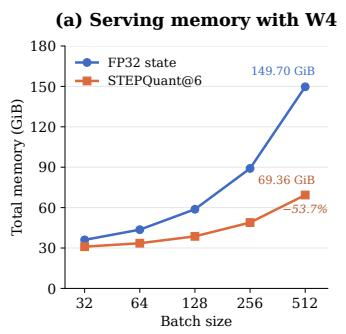

KDA  
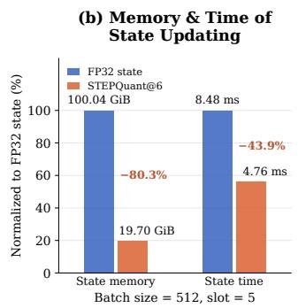  
Figure F4: Serving memory and state-update time of STEPQuant on KDA.

As shown in Fig. F4, STEPQuant@6bit reduces total serving memory from 149.70 to 69.36 GiB (53.7%) at a batch size of 512. At the state level, memory consumption decreases from 100.04 to 19.70 GiB (80.3%, 5.08× compression), while state-update time decreases from 8.48 to 4.76 ms (43.9%, 1.78× faster). These results further demonstrate the memory and computational benefits of STEPQuant on KDA.

## F.5 DECODE THROUGHPUT

We evaluate full-model decode throughput with BF16 weights on four NVIDIA A800 GPUs using tensor parallelism of four (TP4). We test batch sizes $\bar { B } \in \{ 3 2 , 6 4 , 1 2 8 , 2 5 6 , 5 1 2 \}$ , with 128 input tokens and 1,024 generated tokens per request. The measurements include inter-step gaps, quantization fitting, and compressed-state writeback.

Table F7: Decode throughput. Units are tokens/s. Gains use the unrounded throughputs.
<table><tr><td>Model</td><td>Batch</td><td>FP32</td><td>STEPQuant@6bit</td><td>Gain</td></tr><tr><td>Qwen</td><td>32</td><td>1,656</td><td>1,727</td><td>+4.32%</td></tr><tr><td>Qwen</td><td>64</td><td>2,980</td><td>3,122</td><td>+4.77%</td></tr><tr><td>Qwen</td><td>128</td><td>4,157</td><td>4,485</td><td>+7.87%</td></tr><tr><td>Qwen</td><td>256</td><td>5,655</td><td>6,360</td><td>+12.47%</td></tr><tr><td>Qwen</td><td>512</td><td>6,040</td><td>7,280</td><td>+20.53%</td></tr><tr><td>KDA</td><td>32</td><td>5,248</td><td>5,356</td><td>+2.06%</td></tr><tr><td>KDA</td><td>64</td><td>8,284</td><td>8,523</td><td>+2.89%</td></tr><tr><td>KDA</td><td>128</td><td>13,284</td><td>13,936</td><td>+4.90%</td></tr><tr><td>KDA</td><td>256</td><td>16,979</td><td>18,505</td><td>+8.99%</td></tr><tr><td>KDA</td><td>512</td><td>21,241</td><td>23,748</td><td>+11.80%</td></tr></table>

(a) Qwen: throughput  
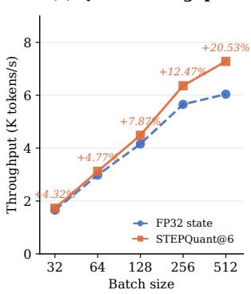

(b) KDA: throughput  
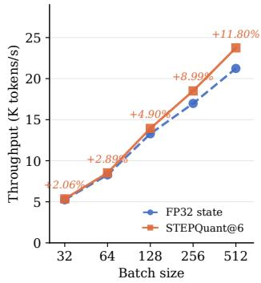  
Figure F5: Full-model decode throughput.

As shown in Fig. F5, STEPQuant@6bit consistently improves decode throughput on both models, with larger gains at higher batch sizes. At B = 512, throughput increases by 20.53% on Qwen (from 6,040 to 7,280 tokens/s) and 11.80% on KDA (from 21,241 to 23,748 tokens/s). Detailed results are reported in Table F7.

## G COMPARISON WITH DAMP

The concurrent work DAMP (Zhang et al., 2026b) uses reconstruction error and decay-based persistence to select FP16 key channels, while quantizing the remaining channels to INT8 with a Hadamard transform. In contrast, STEPQuant combines lifetime-aware mixed-precision allocation with key-row-aware dual-axis fitting, accounting for both error persistence and readout impact. This enables STEPQuant to achieve near-FP32 accuracy at substantially lower effective precision in our evaluations.

Since DAMP’s implementation was unavailable for reproduction and the two studies use different generation settings, we compare relative FP32 accuracy on three shared KDA benchmarks. We directly extract DAMP and its INT8, INT4, and NVFP4 baseline results from the original paper and normalize each method’s three-task average by its corresponding FP32 baseline.

Table G8: Accuracy retention on three shared KDA benchmarks: AIME 2026, HMMT Feb 2026, and LiveCodeBench v6. Retention is normalized to each study’s FP32 baseline.
<table><tr><td>Method Avg. bits</td><td>Retention (%)</td></tr><tr><td>DAMP 9.9</td><td>100.99</td></tr><tr><td>STEPQuant@6bit 6.3 STEPQuant@4bit 4.3</td><td>100.51</td></tr><tr><td></td><td>92.91</td></tr><tr><td>INT8†</td><td>9.0 83.54</td></tr><tr><td>INT4† 5.0</td><td>6.66</td></tr><tr><td>NVFP4† 4.5</td><td>6.74</td></tr></table>

Baseline results reported by DAMP.

As shown in Table G8, DAMP retains 100.99% of FP32 accuracy at 9.9 effective bits per state value, while STEPQuant achieves 100.51% at 6.30 bits and 92.91% at 4.30 bits. In contrast, the INT8, INT4, and NVFP4 baselines reported by DAMP retain 83.54%, 6.66%, and 6.74%, respectively. These results demonstrate STEPQuant’s ability to preserve near-FP32 accuracy at low precision (6.30 vs. 9.9 bits), although differences in evaluation settings preclude a strictly controlled crossstudy comparison.

## H LIMITATIONS

STEPQuant’s lifetime weight approximates error persistence through gate decay without fully modeling the time-varying, key-dependent state transition, and therefore does not fully capture the longterm effects of quantization error. With BF16 weights at four bits, KDA loses accuracy on longgeneration tasks, while Qwen generates longer outputs despite retaining near-FP32 average accuracy. Our evaluation covers two GDN/KDA models under fixed hardware and workload settings; accuracy and systems gains on other architectures and under dynamic serving workloads remain to be verified.