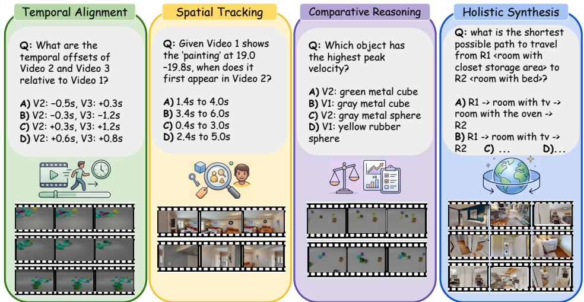
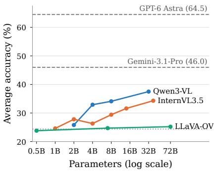
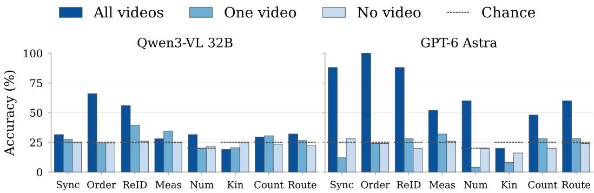
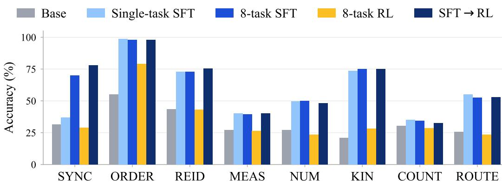
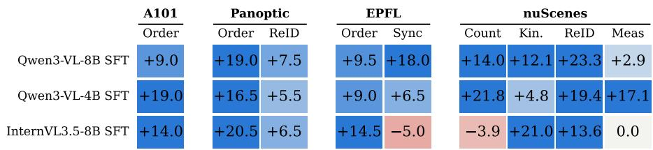
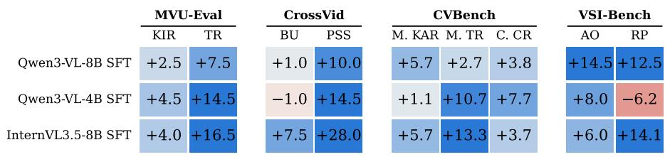
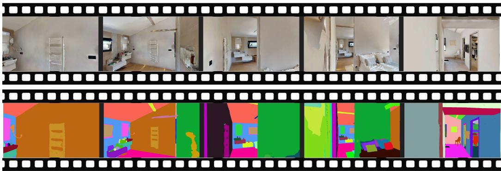
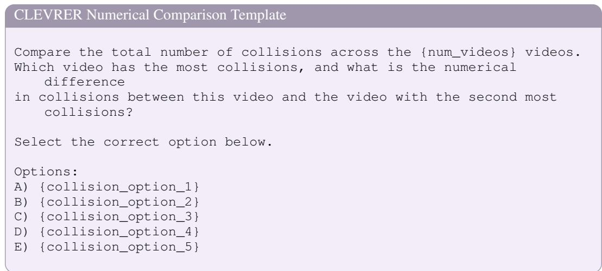
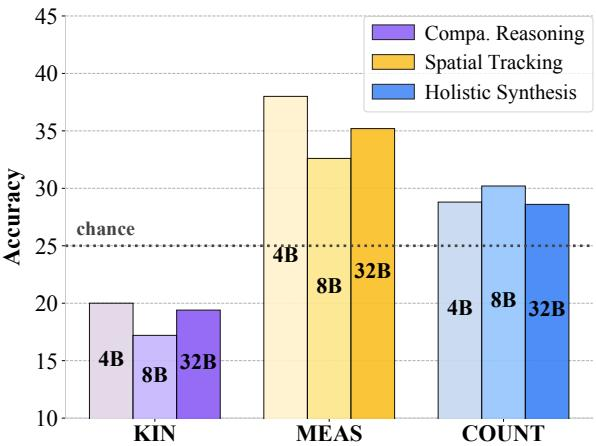
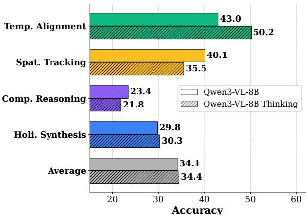

# SYNCR: DIAGNOSING AND LEARNING CROSS-VIDEO REASONING FROM SIMULATION

Sara Ghazanfari, Siddharth Garg, Prashanth Krishnamurthy, Farshad Khorrami   
New York University   
sg7457@nyu.edu

## ABSTRACT

Reasoning across videos requires aligning events, matching identities, comparing motion, and integrating partial observations. Evaluating these capabilities and testing how to improve them requires both reliable labels and targeted supervision. We introduce SYNCR, a simulator-grounded framework that connects these two needs through shared task generators. Built on Habitat, Kubric, and CLEVRER, SYNCR derives answers from environment state and provides 4,000 evaluation questions and 15,960 training questions over disjoint videos, spanning eight crossvideo reasoning tasks. Visual ablations and human evaluation assess dependence on the supplied evidence and answer recoverability. Evaluation of 22 multimodal large language models reveals persistent difficulties in physical comparison and scene integration that increasing model size does not consistently resolve. Supervised fine-tuning raises Qwen3-VL-8B’s average SYNCR accuracy from 32.6% to 61.6%, with gains extending to task configurations and video sources absent from training for those tasks. Transfer to real footage is most consistent for temporal ordering: accuracy improves by 9.0–20.5 percentage points on constructed Assembly101 and Panoptic ordering sets across three checkpoints spanning two model families and two model sizes, with additional gains on existing temporal reasoning benchmarks. These results establish SYNCR as a controlled setting for diagnosing cross-video reasoning failures, testing their learnability, and identifying where synthetic supervision transfers.

## 1 INTRODUCTION

Multiple videos can provide complementary evidence about an environment, but understanding each video independently is insufficient to answer questions about their relationships. Counting distinct objects across overlapping camera views requires recognizing repeated sightings; reconstructing an event from shuffled clips requires relating its progression across segments. Such tasks demand crossvideo reasoning: aligning events, matching identities, comparing behavior, and integrating partial observations. Which of these capabilities remain difficult for current multimodal large language models, and can targeted supervision improve them?

Answering these questions requires connecting evaluation with controlled learning experiments. Real-footage benchmarks such as MVU-Eval, CVBench, and CrossVid capture diverse multi-video settings, but precise temporal offsets, three-dimensional relationships, and kinematic quantities are difficult to annotate at scale. Ambiguous visual evidence and textual shortcuts can also complicate the interpretation of model errors and successes. Simulation offers access to the state underlying each observation, enabling both programmatic labeling and the generation of targeted supervision. However, a simulator-derived answer is useful for evaluating visual reasoning only if it is recoverable from the supplied videos. A complementary framework must therefore combine grounded labels, evidence controls, and tests of generalization beyond its training conditions.

We introduce SYNCR, a simulator-grounded framework that uses the same task generators to diagnose cross-video reasoning failures and test their learnability. Built on Habitat, Kubric, and CLEVRER, SYNCR derives answers from temporal offsets, object identities, trajectories, and scene geometry, while models receive only RGB videos, questions, and answer options. Eight tasks cover temporal alignment, spatial tracking, comparative reasoning, and holistic synthesis. The generators produce 4,000 evaluation questions and 15,960 training questions over disjoint videos. Text-only and singlevideo ablations assess shortcuts and dependence on multiple inputs, while human evaluation assesses whether answers are recoverable from the RGB videos.

Across 22 models, SYNCR reveals uneven capabilities: chronological ordering can be strong while physical comparison and scene integration remain difficult, including at larger model sizes. These failures are nevertheless responsive to targeted supervision. On matched sets of 200 items per task, eight-task supervised fine-tuning raises Qwen3-VL-8B’s average accuracy from 32.6% to 61.6%, and improves performance under changes to task structure and video source. The framework thus connects observed weaknesses to direct tests of whether training can address them.

Real-video evaluations then test the reach of these improvements. Temporal ordering transfers across constructed Assembly101 and Panoptic sets, with gains of 9.0–20.5 percentage points across three checkpoints from two model families. Improvements on existing temporal reasoning benchmarks provide further evidence beyond our constructed evaluations, while results on other tasks remain mixed. Together, these experiments contribute grounded task generators, matched evaluation and training resources, and a controlled study of which cross-video capabilities can be improved through synthetic supervision and where those improvements generalize.

## 2 SYNCR: TASKS AND DATA CONSTRUCTION

SYNCR uses eight task generators for both evaluation and training. Each generator renders or selects multiple video clips, computes an answer from simulator state, and constructs a question designed to require relating the clips. This shared construction lets us measure a task-level failure and then test whether supervision on that task improves it. Evaluation and training use disjoint videos; later experiments vary task structure and video source to test whether gains extend beyond the training.

## 2.1 DIAGNOSTIC TASK FAMILIES

We group the eight tasks into four diagnostic families (Fig. 1). Temporal Alignment relates events across time; Spatial Tracking connects identities and positions across views; Comparative Reasoning compares motion or events between videos; and Holistic Synthesis combines partial observations of a scene. The families organize the task-level results; they are not assumed to be independent abilities. This organization exposes failures that an eight-task average would hide.

Temporal Alignment. Multi-Angle Synchronization presents three independently cropped camera views of one event and asks for the start times of Videos 2 and 3 relative to Video 1. Solving it requires matching moments despite changes in viewpoint. Sequential Ordering instead shuffles four segments from one continuous video and asks for their chronological order. Gaps between segments prevent matching adjacent boundary frames directly; the model must use event progression and object motion. Ordering therefore tests a different temporal relation from synchronization across cameras.

Spatial Tracking. Object Re-identification presents two indoor walkthroughs, identifies an object’s visibility window in Video 1, and asks when the same object first appears in Video 2. Spatial Measurement shows a dynamic scene from two cameras and asks which object is closest in 3D to a target when another object leaves a designated view. The departure fixes the time of comparison; the two projections must be reconciled because image-plane proximity need not match 3D distance.

Comparative Reasoning. Kinematic Comparison asks which of four candidate objects—the two fastest in each of two videos—reaches the highest peak speed. Numerical Comparison asks which video has more collisions and by how many, allowing ties. Both compare evidence across videos, but one depends on estimating motion over time and the other on counting discrete events.

Holistic Synthesis. Object Counting asks for the number of distinct objects in two or three named categories across three indoor walkthroughs; repeated sightings of one object count once. Route Planning presents three partial route clips and asks for the shortest path between rooms identified by their objects. Counting requires linking repeated sightings, while routing requires joining room connections shown in separate clips.

## 2.2 SIMULATOR-GROUNDED ITEM CONSTRUCTION

Each generator uses simulator annotations to select clips, compute the answer, and build answer options. Shared instance IDs establish correspondence across views; positions, velocities, and collision records determine spatial and physical answers; and crop start times determine temporal labels. Models receive only RGB clips, questions, and options. We use the annotations to label and filter items, not as model input. Exact simulator labels do not by themselves establish that an answer is visible, so Sec. 3.3 and App. A.1 report evidence controls and implementation details.

  
Figure 1: The SYNCR framework. Eight tasks in four families: temporal alignment across streams, identity and geometry across viewpoints, physical and numerical comparison, and integration of partial scene observations. Simulator-derived answers support both evaluation and targeted training.

Habitat. We render 100-frame egocentric trajectories at 5 FPS in the 216 densely annotated HM3D scenes (Ramakrishnan et al., 2021); each trajectory ends with a panoramic sweep. Per-frame instance masks supply the visibility windows for Object Re-identification and the distinct instance counts for Object Counting, while navigation graphs supply Route Planning answers. Rooms are described by their three rarest objects. We require re-identified objects to appear for at least five consecutive frames and counted objects to occupy at least 5% of a frame in one view, filtering out instances with little visual exposure.

Kubric. We simulate 10–15 moving objects with collisions and render each scene for 5 s at 12 FPS from three synchronized cameras. Independent 3-second crops set the Multi-Angle Synchronization offsets relative to Video 1. The cameras share object identities, but visibility is computed separately for each view. For Spatial Measurement, simulator positions give 3D distances at the time of the event specified in the question.

CLEVRER. We reuse the original videos and derive answers from their trajectory, velocity, and collision annotations. Sequential Ordering uses four shuffled clips with 0.3–0.6 s gaps. For Kinematic Comparison, we require a speed margin of at least 0.25 between the cross-video maximum and its competitors and between each video’s two fastest objects, reducing near ties. Numerical Comparison compares annotated collision counts; ties make up one fifth of its evaluation items.

Distractor Design. We construct incorrect options to resemble valid answers: synchronization distractors come from independently sampled crop offsets, re-identification distractors from visibility windows with similar timings, and route distractors from paths with similar hop counts. Ordering alternatives follow the answer permutation frequencies; numerical alternatives use incorrect video identities and count differences. These choices limit cues in the options, which we assess with text-only audits (App. A.3.2).

## 2.3 EVALUATION AND TRAINING SPLITS

The benchmark contains 500 questions per task: 4,000 questions referencing 4,827 distinct video files across tasks. The training set contains 15,960 questions referencing 14,956 distinct video files across tasks, with no video file shared between the evaluation and training splits (Table 4; App. A.2). Each question presents two to four clips. Answer categories and option letters are balanced both in the first 200 and across all 500 evaluation items per task, limiting answer-frequency cues. The held-out videos test learning beyond the rendered training examples.

## 3 EVALUATING CROSS-VIDEO REASONING

We first ask which SYNCR tasks current models solve, then test whether their answers depend on the intended video evidence. Table 1 reports the task-level results; Fig. 3 summarizes the visual-evidence controls.

## 3.1 EXPERIMENTAL SETUP

Models. The 22 evaluated models comprise 17 standard open-weight checkpoints (0.5B–72B parameters) from Qwen2.5-VL (Bai et al., 2025b), Qwen3-VL (Bai et al., 2025a), InternVL3 (Zhu et al., 2025a), InternVL3.5 (Wang et al., 2025), and LLaVA-OneVision (Li et al., 2024a); Qwen3-VL-8B-Thinking; and four proprietary models: Gemini-3-Flash (Google DeepMind, 2025), Gemini-3.1- Pro (Google DeepMind, 2026), GPT-5.4 (OpenAI, 2026a), and GPT-6 Astra (OpenAI, 2026b).

Protocol. Models answer zero-shot multiple-choice questions with inputs labeled Video 1, Video 2, etc. We score the parsed final answer and use deterministic decoding where supported (App. B.1). The 17 standard open-weight checkpoints and Qwen3-VL-8B-Thinking receive 500 items per task. Proprietary models and the human reference receive the same first 100. Chance is 25% on seven tasks and 20% on Numerical Comparison. We compare models on matched items when testing differences and report 95% Wilson intervals for accuracy and exact two-sided McNemar tests for paired comparisons (App. B.3).

Human reference. Four graduate students independently answer the 100-item sets from RGB videos, questions, and options, without simulator annotations. We report majority-vote accuracy and score tied votes as incorrect (App. B.2). This four-person reference measures what viewers can recover together; it is not an estimate of individual human accuracy.

## 3.2 MAIN RESULTS

Large gaps remain on the matched human items. GPT-6 Astra averages 64.5%, versus 89.5% for the human majority vote on the same 100 items per task (Table 1). Among the standard open-weight checkpoints, Qwen3-VL 32B has the highest eight-task average, 37.5% on 500 items per task; seven of the 17 average below 27%. The 100-item and 500-item scores use different subsets and should not be treated as a precise cross-group ranking.

The two temporal tasks separate sharply. On Sequential Ordering, GPT-6 Astra reaches 100% and Qwen3-VL-8B-Thinking 76.6%. On Multi-Angle Synchronization, GPT-6 Astra reaches 88% and Gemini-3.1-Pro 60%, but the 17 standard open-weight checkpoints score only 21.8–31.0%, around the 25% chance level. Ordering gapped segments from one recording and matching moments across camera views therefore present different difficulties.

Physical comparison and scene integration remain difficult. The highest standard open-weight score on Kinematic Comparison is 29.8%; no proprietary model exceeds 20% on its 100-item set. The human majority vote reaches 68%, suggesting that this task is difficult even for unaided viewers. On Object Counting and Route Planning, standard open-weight scores reach at most 30.4% and 32.8%, while the human majority vote reaches 92% and 88% on its matched set. These task-level gaps identify where aggregate accuracy hides persistent failures.

Table 1: Zero-shot accuracy (%) on SYNCR. Avg is the unweighted mean across eight tasks. The 17 standard open-weight checkpoints and the Thinking checkpoint use 500 questions per task; proprietary models† and the four-person human majority vote use the same first 100. Bold and underline mark the best and second-best results among the 17 standard open-weight checkpoints. Chance is 25%, except for NUM (20%).
<table><tr><td rowspan="2">Model</td><td colspan="2">Temp. Alignment</td><td colspan="2">Spat. Tracking</td><td colspan="2">Comp. Reasoning</td><td colspan="2">Holi. Synthesis</td><td rowspan="2">Avg</td></tr><tr><td>SYNC</td><td>ORDER</td><td>REID</td><td>MEAS</td><td>NUM</td><td>KIN</td><td>COUNT</td><td>ROUTE</td></tr><tr><td>Human</td><td>100.0</td><td>100.0</td><td>92.0</td><td>76.0</td><td>100.0</td><td>68.0</td><td>92.0</td><td>88.0</td><td>89.5</td></tr><tr><td>Gemini-3-Flash†</td><td>28.0</td><td>84.0</td><td>72.0</td><td>32.0</td><td>24.0</td><td>4.0</td><td>28.0</td><td>48.0</td><td>40.0</td></tr><tr><td>Gemini-3.1-Pro†</td><td>60.0</td><td>96.0</td><td>68.0</td><td>48.0</td><td>16.0</td><td>8.0</td><td>32.0</td><td>40.0</td><td>46.0</td></tr><tr><td>GPT-5.4†</td><td>36.0</td><td>64.0</td><td>48.0</td><td>36.0</td><td>20.0</td><td>16.0</td><td>32.0</td><td>44.0</td><td>37.0</td></tr><tr><td>GPT-6 Astra†</td><td>88.0</td><td>100.0</td><td>88.0</td><td>52.0</td><td>60.0</td><td>20.0</td><td>48.0</td><td>60.0</td><td>64.5</td></tr><tr><td colspan="10">Model Size ≤ 4B</td></tr><tr><td>LLaVA-OV 0.5B</td><td>25.8</td><td>24.4</td><td>26.4</td><td>23.0</td><td>16.0</td><td>24.0</td><td>25.4</td><td>25.4</td><td>23.8</td></tr><tr><td>InternVL3.5 1B</td><td>24.4</td><td>25.8</td><td>24.6</td><td>24.4</td><td>20.0</td><td>27.6</td><td>22.8</td><td>27.4</td><td>24.6</td></tr><tr><td>InternVL3.5 2B</td><td>26.8</td><td>25.2</td><td>26.0</td><td>31.2</td><td>26.8</td><td>29.6</td><td>28.4</td><td>28.0</td><td>27.8</td></tr><tr><td>Qwen3-VL 2B</td><td>24.2</td><td>28.4</td><td>33.6</td><td>29.4</td><td>21.4</td><td>20.2</td><td>25.6</td><td>23.2</td><td>25.8</td></tr><tr><td>InternVL3.5 4B</td><td>26.4</td><td>30.6</td><td>26.2</td><td>24.8</td><td>29.2</td><td>24.2</td><td>23.6</td><td>25.6</td><td>26.3</td></tr><tr><td>Qwen3-VL 4B</td><td>26.2</td><td>49.4</td><td>46.4</td><td>38.0</td><td>26.6</td><td>20.0</td><td>28.8</td><td>28.0</td><td>32.9</td></tr><tr><td colspan="10">4B &lt; Model Size ≤ 8B</td></tr><tr><td>LLaVA-OV 7B</td><td>27.2</td><td>21.6</td><td>26.6</td><td>27.6</td><td>20.8</td><td>24.2</td><td>26.0</td><td>23.6</td><td>24.7</td></tr><tr><td>Qwen2.5-VL 7B</td><td>25.0</td><td>36.8</td><td>25.8</td><td>29.8</td><td>22.4</td><td>21.2</td><td>27.2</td><td>25.6</td><td>26.7</td></tr><tr><td>InternVL3 8B</td><td>26.0</td><td>35.4</td><td>25.0</td><td>29.6</td><td>26.6</td><td>26.0</td><td>27.2</td><td>20.0</td><td>27.0</td></tr><tr><td>InternVL3.5 8B</td><td>26.4</td><td>39.4</td><td>26.0</td><td>31.4</td><td>31.6</td><td>29.8</td><td>26.4</td><td>24.0</td><td>29.4</td></tr><tr><td>Qwen3-VL 8B</td><td>29.6</td><td>56.4</td><td>47.6</td><td>32.6</td><td>29.6</td><td>17.2</td><td>30.2</td><td>29.4</td><td>34.1</td></tr><tr><td>Qwen3-VL 8B Thinking</td><td>23.8</td><td>76.6</td><td>47.0</td><td>24.0</td><td>23.0</td><td>20.6</td><td>28.6</td><td>32.0</td><td>34.4</td></tr><tr><td colspan="10">Model Size &gt; 8B</td></tr><tr><td>InternVL3.5 14B</td><td>31.0</td><td>43.6</td><td>31.2</td><td>36.6</td><td>32.2</td><td>27.0</td><td>25.8</td><td>25.0</td><td>31.6</td></tr><tr><td>Qwen2.5-VL 32B</td><td>27.6</td><td>30.2</td><td>32.8</td><td>30.2</td><td>23.6</td><td>21.8</td><td>28.8</td><td>31.2</td><td>28.3</td></tr><tr><td>Qwen3-VL 32B</td><td>30.0</td><td>64.4</td><td>56.2</td><td>35.2</td><td>33.6</td><td>19.4</td><td>28.6</td><td>32.4</td><td>37.5</td></tr><tr><td>InternVL3.5 38B</td><td>26.0</td><td>44.4</td><td>34.6</td><td>39.0</td><td>41.0</td><td>26.2</td><td>30.0</td><td>32.8</td><td>34.3</td></tr><tr><td>LLaVA-OV 72B</td><td>21.8</td><td>26.0</td><td>31.2</td><td>30.0</td><td>22.6</td><td>18.6</td><td>27.4</td><td>23.6</td><td>25.2</td></tr><tr><td>Qwen2.5-VL 72B</td><td>27.4</td><td>66.8</td><td>31.8</td><td>31.6</td><td>33.0</td><td>24.4</td><td>30.4</td><td>25.8</td><td>33.9</td></tr></table>

The Thinking checkpoint has mixed temporal results. Against Qwen3-VL-8B-Instruct on the same 500 items per task, the Thinking checkpoint raises Sequential Ordering from 56.4% to 76.6% but lowers Multi-Angle Synchronization from 29.6% to 23.8% (App. B.3.1). Because the checkpoints differ in posttraining, this comparison does not isolate the effect of deliberation alone.

Scaling gains vary by model family. Qwen3-VL’s average rises from 25.8% at 2B to 37.5% at 32B, and InternVL3.5’s from 24.6% at 1B to 34.3% at 38B; LLaVA-OneVision stays between 23.8% and 25.2% across 0.5B–72B (Fig. 2). Within Qwen3-VL, the clearest gains are on Sequential Ordering and Object Re-identification, while several other tasks change little or non-monotonically. At Qwen3-VL sizes of 4B, 8B, and 32B, Kinematic Comparison remains below chance, while Spatial Measurement and Object Counting vary non-monotonically (App. B.3). Model size alone therefore does not remove every task-level failure.

  
Figure 2: Zero-shot SYNCR accuracy by model size. Points show the eight-task mean for each plotted open-weight checkpoint (500 items per task). Dashed lines mark GPT-6 Astra and Gemini-3.1-Pro (100 items per task); the dotted line marks the 24.4% mean chance rate.

## 3.3 VALIDITY CHECKS

Simulator state supplies exact labels, but the evaluation must also test whether a model needs the intended visual evidence. We remove all videos or retain one randomly selected video while holding the question and options fixed; we also check whether crop timestamps reveal answers (Fig. 3; App. A.3).

Figure 3: Visual-evidence controls (zero-shot). For each item, the question and options stay fixed while the model receives all videos, one randomly selected video, or no video. Qwen3-VL-32B’s all-video and one-video results use the first 200 items, while its no-video result uses all 500; the latter is therefore not a paired comparison.

Text alone provides little signal. Without videos, Qwen3-VL 8B and 32B and LLaVA-OneVision 72B remain within the chance interval on every task. GPT-6 Astra, explicitly asked to guess, averages 22.3% and exceeds the chance interval on no task. Audited text-only rules also fail to solve the tasks reliably (App. A.3.2). These zero-shot controls do not establish that trained model remain free of textual shortcuts; Sec. 4.4 tests that separately.

Removing clips reduces accuracy on several tasks. Keeping one randomly selected video reduces Qwen3-VL 32B’s Sequential Ordering accuracy from 66.0% to 24.5%, and GPT-6 Astra’s Multi-Angle Synchronization accuracy from 88% to 12% and Numerical Comparison accuracy from 60% to 4%. The reduction is not universal: Qwen3-VL 32B still reaches 39.5% on Object Re-identification with one video, versus 56.0% with all videos. For tasks already near chance with all videos, this ablation has little ability to reveal a further loss. The controls support a multi-video interpretation most clearly where full-input accuracy is above chance.

Source timestamps do not reveal temporal labels. Training and evaluation videos are disjoint. Source-video timestamps are removed from cropped inputs, while elapsed time within each clip is retained. Thus, timestamp markers cannot directly reveal the Sequential Ordering sequence or Multi-Angle Synchronization offsets (App. A.3.1).

SYNCR rankings correlate with real-video scores. To test whether the synthetic benchmark tracks performance beyond its own items, we evaluate the same 17 standard open-weight checkpoints on MVU-Eval Temporal Reasoning and Comparison using the same harness. Their SYNCR averages correlate with both real-video scores (Spearman ρ = 0.86 and 0.92, both p < 0.001); the correlations remain 0.78 and 0.87 after accounting for model size (App. B.3.2). This supports SYNCR’s relevance to real-video evaluation. A general video-understanding factor could also produce these correlations, so they do not establish that SYNCR isolates cross-video reasoning.

## 4 LEARNING FROM SYNTHETIC SUPERVISION

The same task generators used for diagnosis provide supervision. We test three increasingly demanding outcomes: improvement on held-out SYNCR videos, generalization to changed task structures and video sources, and transfer to real footage.

Training setup. We train Qwen3-VL-8B-Instruct for one epoch with rank-16 LoRA adapters (Hu et al., 2022) and a frozen vision encoder (App. C.1). Eight single-task adapters each receive one task’s examples; an 8-task adapter receives all 15,960 training examples. We repeat the 8-task recipe

  
Figure 4: SYNCR accuracy after finetuning Qwen3-VL-8B. All bars use the same 200 held-out items per task. Each single-task SFT bar comes from a separate adapter trained on that task; eight-task SFT uses one adapter trained on all tasks. Eight-task RL applies GRPO to the base checkpoint, while SFT→RL applies it after eight-task SFT.

on Qwen3-VL-4B and InternVL3.5-8B (App. C.2). We also test GRPO (Shao et al., 2024) with binary correctness rewards, initialized either from the base model or from 8-task SFT (App. C.2).

## 4.1 TRAINING GAINS ON SYNCR

Supervision improves seven of eight tasks. On the same first 200 held-out items per task for base and trained models, Qwen3-VL-8B rises from 32.6% to 61.6% average accuracy after 8-task SFT (Fig. 4). It reaches 98% on Sequential Ordering, 75% on Kinematic Comparison, 73% on Object Re-identification, and 70% on Multi-Angle Synchronization. Seven task gains survive correction for multiple comparisons (App. C.4.5). Object Counting is the exception: it changes from 30.5% to 34.5%, a smaller gain than on the other tasks. Removing the answer options reveals better relative count estimates despite weak exact accuracy (App. C.3).

Synchronization is higher with multi-task SFT. Multi-Angle Synchronization reaches 70.0% with eight tasks and 69.5–78.0% in other mixes that include it, versus 37.0% with Multi-Angle Synchronization-only SFT; larger training sets preclude attributing the difference to task combination alone. The 8-task recipe raises InternVL3.5-8B from 29.3% to 62.8% on matched items. Qwen3- VL-4B reaches 62.6% on the first 200 items per task, but its available base score uses all 500, so a matched gain is unavailable (App. C.2).

The tested GRPO recipe yields smaller gains. Eight-task GRPO from the base improves the mean by 2.5 points, or 4.2 with a second seed, versus 28.9 points for 8-task SFT. Single-task GRPO raises Kinematic Comparison from 21.0% to 48.5%, still below the corresponding SFT adapter’s 73.5% (App. C.2). Starting GRPO from 8-task SFT reaches 62.5%, 0.9 points above SFT alone. This comparison concerns the tested binary-reward GRPO configuration, not RL methods in general.

## 4.2 GENERALIZATION TO NEW STRUCTURES AND VIDEO SOURCES

We evaluate fixed 200-item sets with either a changed task structure or a new video source for that task (Table 2; App. C.5). Structural shifts change the number of segments, videos, or queried categories while retaining the simulator and question format. A separate Multi-Angle Synchronization shift uses a held-out camera rig with altered positions and focal lengths. Source swaps keep the task format but use an engine absent from that task’s training examples.

Gains persist under structural and camera-rig shifts. With three or five segments instead of four, trained Sequential Ordering accuracy reaches 99.0–99.5%. With three videos instead of two, Kinematic Comparison rises from 12.5% to 91.0% and Numerical Comparison from 23.5% to 45.5%. Two-video Multi-Angle Synchronization rises from 26.5% to 56.0%; on the held-out camera rig it reaches 74.5% versus 23.0% for the base. Object Counting shows a smaller change on the four-category shift.

Table 2: Generalization to shifted task configurations. Accuracy (%) of the base and eight-task SFT Qwen3-VL-8B. “Standard” uses the first 200 benchmark items; “New” uses a separate 200-item set. (a) Changes the number of segments, videos, or queried categories, or uses a held-out camera rig for SYNC. (b) Tests a task on a simulator absent from that task’s training examples (C: CLEVRER; K: Kubric; H: Habitat).  
(a) Structure and camera-rig shifts
<table><tr><td rowspan="2">Task, train → test</td><td colspan="2">Standard</td><td colspan="2">New</td></tr><tr><td>Base</td><td>SFT</td><td>Base</td><td>SFT</td></tr><tr><td>ORDER 4 → 3</td><td>55.0</td><td>98.0</td><td>64.0</td><td>99.0</td></tr><tr><td>ORDER 4 → 5</td><td>55.0</td><td>98.0</td><td>64.0</td><td>99.5</td></tr><tr><td> $\mathbf { S } \mathbf { Y } \mathbf { N } \mathbf { C } \ 3  2$  SYNC rig A → B</td><td>31.5 31.5</td><td>70.0</td><td>26.5</td><td>56.0</td></tr><tr><td> $\mathrm { N U M } \ 2  3$ </td><td>27.0</td><td>70.0 50.0</td><td>23.0</td><td>74.5</td></tr><tr><td>KIN 2 → 3 30.5</td><td>21.0</td><td>75.0</td><td>23.5 12.5</td><td>45.5 91.0</td></tr></table>

(b) Held-out task–simulator pairings
<table><tr><td></td><td colspan="2">Standard</td><td colspan="2">New</td></tr><tr><td>Task, train → test</td><td>Base</td><td>SFT</td><td>Base</td><td>SFT</td></tr><tr><td>ORDER C → K</td><td>55.0</td><td>98.0</td><td>35.5</td><td>95.5</td></tr><tr><td>ORDER C → H (walk)</td><td>55.0</td><td>98.0</td><td>41.5</td><td>50.5</td></tr><tr><td>ORDER C → H (route)</td><td>55.0 30.5</td><td>98.0</td><td>55.5</td><td>71.0</td></tr><tr><td>COUNT H → K (shape) COUNT H → C (shape)</td><td>30.5</td><td>34.5 34.5</td><td>24.5 56.5</td><td>40.0</td></tr><tr><td>CoUNT H → C (mat.+shape)</td><td>30.5</td><td>34.5</td><td>49.0</td><td>57.0 58.0</td></tr></table>

Transfer to held-out task–simulator pairings varies. Ordering improves from 35.5% to 95.5% on Kubric, but more modestly on Habitat walkthroughs (41.5% to 50.5%) and route clips (55.5% to 71.0%). InternVL3.5-8B likewise rises from 55.0% to 100.0% on Kubric ordering (App. C.5). Object Counting improves on Kubric shape counting (24.5% to 40.0%) and CLEVRER material–shape counting (49.0% to 58.0%), but changes little on CLEVRER shape counting.

## 4.3 SIM-TO-REAL TRANSFER

Ordering gains transfer to real footage. We apply SYNCR’s Sequential Ordering format to Assembly101 (Sener et al., 2022) and CMU Panoptic (Joo et al., 2015). Each fixed, answer-balanced set has 200 items formed by shuffling four gapped segments from a 20-second window; chronology supplies the label. Assembly101 uses static recordings and Panoptic individual camera streams, retaining within-stream ordering across new visual domains (App. C.6.1). Eight-task SFT improves Qwen3-VL-8B by 9.0 and 19.0 points on the two sets, InternVL3.5-8B by 14.0 and 20.5, and Qwen3- VL-4B by 19.0 and 16.5 (Fig. 5). All six gains have paired McNemar $p \leq 0 . 0 1 5 ;$ the corrected Panoptic Qwen3-VL-8B result uses a conservative bound. Item-level intervals do not account for repeated windows from one recording (App. C.6.1).

Cross-camera counting transfer remains uncertain. On a nuScenes (Caesar et al., 2020) set asking for distinct objects across six surround cameras, every checkpoint scores higher with six views than with one. The six-versus-one gap rises from 7.8 to 17.3 points for the first Qwen3-VL-8B SFT seed, but an increased gap is not established for its other seeds or InternVL3.5-8B. Additional views may expose more objects without improving cross-camera deduplication; absolute accuracy remains low (App. C.6.1).

Transfer on existing benchmarks. On MVU-Eval (Peng et al., 2025) Temporal Reasoning and CrossVid (Li et al., 2026) Procedural Step Sequencing, 8-task SFT gains 7.5 and 10.0 points for Qwen3-VL-8B, and 16.5 and 28.0 for InternVL3.5-8B, each relative to its own base. The Qwen gains persist when the same CrossVid items are answered in letter-string or prose formats absent from SYNCR training (+19.0 and +8.0 points; App. C.6.2). On VSI-Bench (Yang et al., 2025), appearance order improves from 54.0% to 68.5% for Qwen3-VL-8B and from 46.0% to 52.0% for InternVL3.5-8B; route planning also rises in both families. These are independently defined singlevideo questions, so the appearance-order result tests transfer beyond both SYNCR’s construction and the cross-video setting, rather than demonstrating cross-camera alignment.

## 4.4 CONTROLS AND ROBUSTNESS CHECKS

Incorrect-label supervision does not reproduce the gains. A placebo adapter trained on the same examples, inputs, and options with random wrong labels scores below base on every SYNCR task and loses 7.5–35.0 points on five real-benchmark tasks. On MVU-Eval Temporal Reasoning, it scores 43.0% versus 68.0% for base and 75.5% for correct SFT. This supports the role of correct labels; alternative answer formats are tested separately (Apps. C.4.2 and C.6.2).

  
(a) Constructed on real footage

  
(b) Existing benchmarks  
Figure 5: Real-video results after eight-task SYNCR SFT. Each cell shows the accuracy change, in percentage points, from that model’s own base on the same items. Blue indicates a gain and red a loss. Panel (a) uses SYNCR-format questions on real footage, while panel (b) shows individual tasks from existing benchmarks. Table 19 gives the absolute scores and item counts behind every cell.

The tested spatial baseline does not reproduce temporal transfer. A matched-budget SAT (Ray et al., 2024) arm, with frames rendered as clips, lowers MVU-Eval Temporal Reasoning and CrossVid Procedural Step Sequencing by 8.5 and 17.0 points. This result concerns that alternative under our format (App. C.4.1).

Training gains are larger with video input. Removing videos leaves 8-task SFT near chance on seven tasks; Route Planning is the exception at 39.5%. The mean gain is 28.9 points with videos, and the full-video versus no-video gain contrast is 27.1 points. This contrast depends on video availability under the ablation but does not isolate a causal visual contribution (App. C.4.4).

Main gains persist across seeds and multiple-testing correction. Three 8-task SFT seeds average 61.6%, 61.8%, and 64.6% on SYNCR (task-level SD at most 5.1 points). A second seed gains 10.0 and 18.5 points on Assembly101 and Panoptic ordering, versus 9.0 and 19.0 for the first (App. C.4.3). Seven of eight SYNCR gains and both existing temporal-benchmark gains survive Benjamini–Hochberg correction (App. C.4.5).

## 5 RELATED WORK

Multi-video evaluation. CVBench (Zhu et al., 2025b), MVU-Eval (Peng et al., 2025), CrossVid (Li et al., 2026) and MVPBench (Bai et al., 2026) extend single-video evaluation (Fu et al., 2025; Zhou et al., 2024; Li et al., 2024b) to questions that relate evidence across videos, and GameplayQA (Wang et al., 2026) does so for synchronized agent viewpoints in virtual environments. Adjacent lines of work relate observations without a cross-video question format: static multi-view understanding (Yeh et al., 2026), egocentric–exocentric activity (Grauman et al., 2024) and video-based spatial memory (Yang et al., 2025). Several benchmarks also check dependence on visual input (Table 3). SYNCR’s distinction is to couple simulator-state labels and shared generators with matched training data, evidence controls, and tests of transfer.

Learning from simulated video data. Simulation already supplies supervision for single-video skills: Chain-of-Frames (Ghazanfari et al., 2025) trains frame-grounded reasoning on CLEVRER, SAT (Ray et al., 2024) and SIMS-V (Brown et al., 2025) train on spatial questions, and ST-VLM (Ko et al., 2025) on kinematics, building on simulation-to-real transfer (Tobin et al., 2017). None of it supervises relating evidence across separate streams. In our matched-example comparison, SAT frames rendered as clips did not reproduce SYNCR’s temporal-transfer gains; this result concerns one alternative dataset and training recipe. SYNCR trains on simulated data for cross-video reasoning, and couples that supervision with controls, establishing a framework in which a capability can be diagnosed, taught, and its transfer to real video measured under one set of task definitions.

## 6 CONCLUSION

SYNCR connects simulator-grounded evaluation with targeted supervision across eight cross-video reasoning tasks. Across 22 models, performance is uneven, with persistent difficulties in physical comparison and scene integration. On matched 200-item sets per task, eight-task SFT raises Qwen3- VL-8B’s mean accuracy from 32.6% to 61.6%, and several gains persist when task structure or video source changes. On real footage, the clearest replicated transfer is chronological ordering: three checkpoints gain 9.0–20.5 points on the constructed Assembly101 and Panoptic sets, with improvements also on existing temporal benchmarks. The results identify a skill that transfers from synthetic supervision while showing that transfer varies substantially by task.

Limitations. SYNCR uses visual-only multiple-choice questions, mostly from simulation; simulator labels do not guarantee that every answer is visible in RGB. Real-footage ordering uses clips from one source stream, and item-level intervals ignore repeated recordings. Transfer on other real-footage tasks remains uncertain. RL findings concern the tested GRPO settings.

## AI USE STATEMENT

We used generative AI tools for manuscript editing and feedback on clarity, presentation, and the scope of claims. The pillar icons in Fig. 1 were generated using Google Gemini 3 Flash for illustration. We reviewed AI-assisted content for accuracy and take responsibility for the final text, claims, and artifacts.

## ETHICS STATEMENT

SYNCR benchmark videos are simulator-rendered: Habitat traverses HM3D scans of real indoor spaces (Ramakrishnan et al., 2021), whereas Kubric and CLEVRER depict generated object scenes. Transfer evaluations use existing real-footage datasets; we did not collect new footage for them. The human baseline study (App. B.2) involved four graduate-student volunteers who answered multiple choice questions about benchmark videos; it did not collect personal, sensitive, demographic, or behavioral information beyond the selected answer choices. We do not anticipate direct harms from this benchmark; as with other video-understanding evaluations, downstream systems trained or evaluated on it should still be assessed for fairness and safety before deployment.

## REPRODUCIBILITY STATEMENT

The SYNCR evaluation and training metadata, together with the Habitat and Kubric video assets, are available at https://huggingface.co/datasets/CrossVideoReasoning/ SYNCR. CLEVRER videos must be obtained from the original CLEVRER release, as described in the dataset README. We describe the SYNCR data-generation pipeline in Sec. 2.2, with full implementation details for each simulation engine (Habitat, Kubric, and CLEVRER) provided in App. A.1. Our evaluation protocol, prompt templates, and statistical-significance methodology are described in Sec. 3.1 and App. B.1, and the human baseline procedure is detailed in App. B.2. We report 95% Wilson confidence intervals for accuracy and exact McNemar tests for paired comparisons, and App. C.1 lists all training hyperparameters.

## ACKNOWLEDGEMENTS

This paper is supported in part by the Army Research Office under grant number W911NF-21-1-0155 and by the New York University Abu Dhabi (NYUAD) Center for Artificial Intelligence and Robotics, funded by Tamkeen under the NYUAD Research Institute Award CG010. Additional support was provided by the NYU IT High Performance Computing resources, services, and staff expertise.

## REFERENCES

Purui Bai, Tao Wu, Jiayang Sun, Xinyue Liu, Huaibo Huang, and Ran He. Mvpbench: A multivideo perception evaluation benchmark for multi-modal video understanding. arXiv preprint arXiv:2603.22756, 2026.

Shuai Bai, Yuxuan Cai, Ruizhe Chen, Keqin Chen, Xionghui Chen, Zesen Cheng, Lianghao Deng, Wei Ding, Chang Gao, Chunjiang Ge, et al. Qwen3-vl technical report. arXiv preprint arXiv:2511.21631, 2025a.

Shuai Bai, Keqin Chen, Xuejing Liu, Jialin Wang, Wenbin Ge, Sibo Song, Kai Dang, Peng Wang, Shijie Wang, Jun Tang, Humen Zhong, Yuanzhi Zhu, Mingkun Yang, Zhaohai Li, Jianqiang Wan, Pengfei Wang, Wei Ding, Zheren Fu, Yiheng Xu, Jiabo Ye, Xi Zhang, Tianbao Xie, Zesen Cheng, Hang Zhang, Zhibo Yang, Haiyang Xu, and Junyang Lin. Qwen2.5-vl technical report. arXiv preprint arXiv:2502.13923, 2025b.

Blender Online Community. Blender – a 3D modelling and rendering package. Blender Foundation, Stichting Blender Foundation, Amsterdam, 2018. URL http://www.blender.org.

Ellis Brown, Arijit Ray, Ranjay Krishna, Ross Girshick, Rob Fergus, and Saining Xie. SIMS-V: Simulated instruction-tuning for spatial video understanding. arXiv preprint arXiv:2511.04668, 2025.

Holger Caesar, Varun Bankiti, Alex H. Lang, Sourabh Vora, Venice Erin Liong, Qiang Xu, Anush Krishnan, Yu Pan, Giancarlo Baldan, and Oscar Beijbom. nuscenes: A multimodal dataset for autonomous driving. In Proceedings ofthe IEEE/CVF Conference on Computer Vision and Pattern Recognition, pp. 11621–11631, 2020.

Erwin Coumans and Yunfei Bai. PyBullet, a python module for physics simulation for games, robotics and machine learning. http://pybullet.org, 2016–2021.

François Fleuret, Jérôme Berclaz, Richard Lengagne, and Pascal Fua. Multicamera people tracking with a probabilistic occupancy map. IEEE Transactions on Pattern Analysis and Machine Intelligence, 30(2):267–282, 2008.

Chaoyou Fu, Yuhan Dai, Yongdong Luo, Lei Li, Shuhuai Ren, Renrui Zhang, Zihan Wang, Chenyu Zhou, Yunhang Shen, Mengdan Zhang, et al. Video-mme: The first-ever comprehensive evaluation benchmark of multi-modal llms in video analysis. In Proceedings of the IEEE/CVF conference on computer vision and pattern recognition, pp. 24108–24118, 2025.

Sara Ghazanfari, Francesco Croce, Nicolas Flammarion, Prashanth Krishnamurthy, Farshad Khorrami, and Siddharth Garg. Chain-of-frames: Advancing video understanding in multimodal llms via frame-aware reasoning. arXiv preprint arXiv:2506.00318, 2025.

Google DeepMind. Gemini 3 Flash model card. https://storage.googleapis.com/ deepmind-media/Model-Cards/Gemini-3-Flash-Model-Card.pdf, 2025. December 17, 2025.

Google DeepMind. Gemini 3.1 Pro model card. https://deepmind.google/models/ model-cards/gemini-3-1-pro/, 2026. February 19, 2026.

Kristen Grauman, Andrew Westbury, Lorenzo Torresani, Kris Kitani, Jitendra Malik, et al. Ego-exo4d: Understanding skilled human activity from first- and third-person perspectives. In Proceedings of the IEEE/CVF Conference on Computer Vision and Pattern Recognition, 2024.

Klaus Greff, Francois Belletti, Lucas Beyer, Carl Doersch, Yilun Du, Daniel Duckworth, David J Fleet, Dan Gnanapragasam, Florian Golemo, Charles Herrmann, et al. Kubric: A scalable dataset generator. In Proceedings of the IEEE/CVF conference on computer vision and pattern recognition, pp. 3749–3761, 2022.

Edward J. Hu, Yelong Shen, Phillip Wallis, Zeyuan Allen-Zhu, Yuanzhi Li, Shean Wang, Lu Wang, and Weizhu Chen. LoRA: Low-rank adaptation of large language models. In International Conference on Learning Representations, 2022.

Hanbyul Joo, Hao Liu, Lei Tan, Lin Gui, Bart Nabbe, Iain Matthews, Takeo Kanade, Shohei Nobuhara, and Yaser Sheikh. Panoptic studio: A massively multiview system for social motion capture. In Proceedings ofthe IEEE International Conference on Computer Vision, pp. 3334–3342, 2015.

Dohwan Ko, Sihyeon Kim, Yumin Suh, Vijay Kumar B. G, Minseo Yoon, Manmohan Chandraker, and Hyunwoo J. Kim. ST-VLM: Kinematic instruction tuning for spatio-temporal reasoning in vision-language models. arXiv preprint arXiv:2503.19355, 2025.

Bo Li, Yuanhan Zhang, Dong Guo, Renrui Zhang, Feng Li, Hao Zhang, Kaichen Zhang, Peiyuan Zhang, Yanwei Li, Ziwei Liu, et al. Llava-onevision: Easy visual task transfer. arXiv preprint arXiv:2408.03326, 2024a.

Jingyao Li, Jingyun Wang, Molin Tan, Haochen Wang, Cilin Yan, Likun Shi, Jiayin Cai, Xiaolong Jiang, and Yao Hu. Crossvid: A comprehensive benchmark for evaluating cross-video reasoning in multimodal large language models. In Proceedings of the AAAI Conference on Artificial Intelligence, volume 40, pp. 6244–6252, 2026.

Kunchang Li, Yali Wang, Yinan He, Yizhuo Li, Yi Wang, Yi Liu, Zun Wang, Jilan Xu, Guo Chen, Ping Luo, et al. Mvbench: A comprehensive multi-modal video understanding benchmark. In Proceedings of the IEEE/CVF Conference on Computer Vision and Pattern Recognition, pp. 22195–22206, 2024b.

Quinn McNemar. Note on the sampling error of the difference between correlated proportions or percentages. Psychometrika, 12(2):153–157, 1947.

OpenAI. GPT-5.4 Thinking system card. https://deploymentsafety.openai.com/ gpt-5-4-thinking, 2026a. March 5, 2026.

OpenAI. GPT-6 Astra system card. https://deploymentsafety.openai.com/ gpt-6-astra, 2026b. September 3, 2026.

Tianhao Peng, Haochen Wang, Yuanxing Zhang, Zekun Wang, Zili Wang, Gavin Chang, Jian Yang, Shihao Li, Yanghai Wang, Xintao Wang, et al. Mvu-eval: Towards multi-video understanding evaluation for multimodal llms. arXiv preprint arXiv:2511.07250, 2025.

Santhosh K Ramakrishnan, Aaron Gokaslan, Erik Wijmans, Oleksandr Maksymets, Alex Clegg, John Turner, Eric Undersander, Wojciech Galuba, Andrew Westbury, Angel X Chang, et al. Habitatmatterport 3d dataset (hm3d): 1000 large-scale 3d environments for embodied ai. arXiv preprint arXiv:2109.08238, 2021.

Arijit Ray, Jiafei Duan, Ellis Brown, Reuben Tan, Dina Bashkirova, Rose Hendrix, Kiana Ehsani, Aniruddha Kembhavi, Bryan A. Plummer, Ranjay Krishna, Kuo-Hao Zeng, and Kate Saenko. SAT: Dynamic spatial aptitude training for multimodal language models. arXiv preprint arXiv:2412.07755, 2024.

Manolis Savva, Abhishek Kadian, Oleksandr Maksymets, Yili Zhao, Erik Wijmans, Bhavana Jain, Julian Straub, Jia Liu, Vladlen Koltun, Jitendra Malik, et al. Habitat: A platform for embodied ai research. In Proceedings of the IEEE/CVF international conference on computer vision, pp. 9339–9347, 2019.

Fadime Sener, Dibyadip Chatterjee, Daniel Shelepov, Kun He, Dipika Singhania, Robert Wang, and Angela Yao. Assembly101: A large-scale multi-view video dataset for understanding procedural activities. In Proceedings of the IEEE/CVF Conference on Computer Vision and Pattern Recognition, pp. 21096–21106, 2022.

Zhihong Shao, Peiyi Wang, Qihao Zhu, Runxin Xu, Junxiao Song, Xiao Bi, Haowei Zhang, Mingchuan Zhang, Y. K. Li, Y. Wu, and Daya Guo. DeepSeekMath: Pushing the limits of mathematical reasoning in open language models. arXiv preprint arXiv:2402.03300, 2024.

Josh Tobin, Rachel Fong, Alex Ray, Jonas Schneider, Wojciech Zaremba, and Pieter Abbeel. Domain randomization for transferring deep neural networks from simulation to the real world. In IEEE/RSJ International Conference on Intelligent Robots and Systems (IROS), 2017.

Pauli Virtanen, Ralf Gommers, Travis E Oliphant, Matt Haberland, Tyler Reddy, David Cournapeau, Evgeni Burovski, Pearu Peterson, Warren Weckesser, Jonathan Bright, et al. Scipy 1.0: fundamental algorithms for scientific computing in python. Nature methods, 17(3):261–272, 2020.

Weiyun Wang, Zhangwei Gao, Lixin Gu, Hengjun Pu, Long Cui, Xingguang Wei, Zhaoyang Liu, Linglin Jing, Shenglong Ye, Jie Shao, et al. Internvl3. 5: Advancing open-source multimodal models in versatility, reasoning, and efficiency. arXiv preprint arXiv:2508.18265, 2025.

Yunzhe Wang, Runhui Xu, Kexin Zheng, Tianyi Zhang, Jayavibhav Niranjan Kogundi, Soham Hans, and Volkan Ustun. Gameplayqa: A benchmarking framework for decision-dense pov-synced multi-video understanding of 3d virtual agents. arXiv preprint arXiv:2603.24329, 2026.

Edwin B. Wilson. Probable inference, the law of succession, and statistical inference. Journal ofthe American Statistical Association, 22(158):209–212, 1927.

Jihan Yang, Shusheng Yang, Anjali W. Gupta, Rilyn Han, Li Fei-Fei, and Saining Xie. Thinking in space: How multimodal large language models see, remember, and recall spaces. In Proceedings ofthe IEEE/CVF Conference on Computer Vision and Pattern Recognition, 2025.

Chun-Hsiao Yeh, Chenyu Wang, Shengbang Tong, Ta-Ying Cheng, Ruoyu Wang, Tianzhe Chu, Yuexiang Zhai, Yubei Chen, Shenghua Gao, and Yi Ma. Seeing from another perspective: Evaluating multi-view understanding in MLLMs. In Proceedings of the AAAI Conference on Artificial Intelligence, 2026.

Kexin Yi, Chuang Gan, Yunzhu Li, Pushmeet Kohli, Jiajun Wu, Antonio Torralba, and Joshua B Tenenbaum. Clevrer: Collision events for video representation and reasoning. arXiv preprint arXiv:1910.01442, 2019.

Junjie Zhou, Yan Shu, Bo Zhao, Boya Wu, Shitao Xiao, Xi Yang, Yongping Xiong, Bo Zhang, Tiejun Huang, and Zheng Liu. Mlvu: A comprehensive benchmark for multi-task long video understanding. arXiv preprint arXiv:2406.04264, 2(5):6, 2024.

Jinguo Zhu, Weiyun Wang, Zhe Chen, Zhaoyang Liu, Shenglong Ye, Lixin Gu, Hao Tian, Yuchen Duan, Weijie Su, Jie Shao, et al. InternVL3: Exploring advanced training and test-time recipes for open-source multimodal models. arXiv preprint arXiv:2504.10479, 2025a.

Nannan Zhu, Yonghao Dong, Teng Wang, Xueqian Li, Shengjun Deng, Yijia Wang, Zheng Hong, Tiantian Geng, Guo Niu, Hanyan Huang, et al. Cvbench: Benchmarking cross-video synergies for complex multimodal reasoning. arXiv preprint arXiv:2508.19542, 2025b.

## A THE SYNCR FRAMEWORK: ADDITIONAL DETAILS

This appendix supports Sec. 2: how each simulation engine supplies videos and annotations for programmatic question construction, and the controls establishing that the resulting items are answerable from the videos rather than from their text.

Table 3: Comparison with multi-video benchmarks. Columns refer to MVU-Eval (Peng et al., 2025), CVBench (Zhu et al., 2025b), CrossVid (Li et al., 2026), MVPBench (Bai et al., 2026), and GameplayQA (Wang et al., 2026). Counts cover each full benchmark as defined by its authors; MVPBench and GameplayQA also include tasks that do not require multiple videos. In the training row, 0 means no separate training QA set is reported. A checkmark means the cited study reports the property; — means it does not report it. For automatic QA construction, a checkmark covers at least one task; † marks CrossVid’s eight automatically generated tasks out of ten. Controls differ in protocol.
<table><tr><td>Reported property</td><td>MVU- Eval</td><td>CV Bench</td><td>Cross Vid</td><td>MVP Bench</td><td>Gameplay QA</td><td>SYNCR (ours)</td></tr><tr><td>Evaluation QA pairs</td><td>1,824</td><td>1,000</td><td>9,015</td><td>5,050</td><td>2,365</td><td>4,000</td></tr><tr><td>Training QA pairs</td><td>0</td><td>0</td><td>0</td><td>0</td><td>0</td><td>15,960</td></tr><tr><td>Task categories/subtasks</td><td>8</td><td>15</td><td>10</td><td>14</td><td>15</td><td>8</td></tr><tr><td>Automatic QA construction</td><td>L</td><td></td><td>t</td><td></td><td>L</td><td></td></tr><tr><td>Simulator-state answer labels</td><td></td><td></td><td></td><td></td><td></td><td></td></tr><tr><td>Direct no-video control</td><td></td><td></td><td></td><td></td><td></td><td></td></tr><tr><td>Single-video comparison Question/option-only audit</td><td></td><td></td><td></td><td></td><td></td><td></td></tr><tr><td></td><td></td><td></td><td></td><td></td><td></td><td></td></tr><tr><td>Shared-generator training/evaluation</td><td></td><td></td><td></td><td></td><td></td><td></td></tr><tr><td>Post-training task/source shift tests</td><td></td><td></td><td></td><td></td><td></td><td></td></tr><tr><td>Post-training real-video transfer</td><td></td><td></td><td></td><td></td><td></td><td></td></tr></table>

## A.1 DATASET GENERATION DETAILS

This subsection documents how each engine supplies input videos and annotations for programmatic question construction. We describe rendering, visibility filtering, answer computation, and distractor generation, with the exact task prompts shown below.

## A.1.1 HABITAT

Habitat (Savva et al., 2019) with HM3D (Ramakrishnan et al., 2021) provides egocentric RGB observations, semantic instance annotations, and navigation meshes for large indoor environments. We use the 216 HM3D scenes with dense semantic annotations (Fig. 6).

Scene loading. We load each HM3D scene’s textured mesh, semantic annotations, and navigation mesh. Semantic annotations map instance IDs to normalized object names; the navigation mesh supports pathfinding and geodesic distances. We save RGB videos as MP4 files and semantic frame tensors separately. Only RGB is supplied to models; semantic tensors determine labels and filters. Scenes lacking semantic annotations or navigation meshes are skipped.

Trajectories. Habitat’s pathfinder returns a sparse shortest path for each sampled start–target pair. We remove duplicate waypoints, fit a cubic spline (Virtanen et al., 2020), and snap interpolated points to the navigation mesh. Camera yaw follows a fixed look-ahead window to reduce jitter. Videos contain 100 frames at 5 FPS and end with a panoramic sweep. Geodesic sampling exposes spatially separated regions for Object Re-identification and Object Counting; topological routing samples connected paths and slices them into clips with continuous endpoints for Route Planning.

Object Re-identification . Each item contains a reference and a target video. Semantic tensors identify shared instances and their contiguous visibility windows. We retain objects visible for at least five consecutive frames, with sufficient total visibility across at least two views. The answer is the first contiguous window containing that instance in the target video. Distractors use answer windows from other items with similar reference windows and lie within the 20-second video, reducing cues from option position and timing (Fig. 7).

  
Figure 6: Deterministic Ground Truth Generation in Habitat. Habitat provides synchronized RGB, depth, and semantic observations for each rendered camera pose, from which SYNCR derives visibility, instance labels, and navigation structure.

Habitat Object Re-identification Template   
You are provided with two videos recorded at {fps} FPS.   
In Video 1, the ’{object\_name}’ is clearly visible from   
{reference\_time\_window}.   
Select the correct timestamp window for the FIRST appearance of the   
exact same ’{object\_name}’ in Video 2.   
Options:   
A) {candidate\_time\_window\_1}   
B) {candidate\_time\_window\_2}   
C) {candidate\_time\_window\_3}   
D) {candidate\_time\_window\_4}  
Figure 7: Habitat Object Re-identification prompt template. The model is given two Habitat videos and must identify the first timestamp window in Video 2 where the same semantic instance appears.

Object Counting . Each item contains three videos and asks for the number of distinct instances of two or three named categories. We compute totals from the union of semantic instance IDs across trajectories. Each counted instance must occupy at least 5% of a frame in at least one video. We discard items with only one available video and categories with more than 10 instances. To reduce small-count priors, we retain totals of at least k+3 for k categories and balance answers across totals. Options are four distinct values between k and the answer plus four. We balance the answer’s offset from the categories’ typical total; audited text-only rules, including the smallest option and the value nearest that typical total, reach at most 32% on 500 items (Fig. 8).

Route Planning Each item contains three clips of a route. We concatenate their route chunks, remove duplicated boundary nodes, and discard routes with fewer than three nodes. Questions use subpaths close to the full route length to encourage integration across clips; the answer is the shortest subpath between the designated regions. We describe each room by its three rarest objects, excluding background and structural terms. Distractors use rooms observed in the input videos and match the answer hop-count distribution, with answers split evenly between two and three or more hops. Distractors exclude direct start-to-goal paths and paths revisiting either endpoint, reducing obvious shortest-path cues (Fig. 9).

## A.1.2 KUBRIC

Habitat Object Counting Template   
Based on the combined exploration in all {num\_videos} videos,   
how many distinct instances $\mathrm { \Omega } _ { \mathrm { { O E } } } , $ {object\_name $_ - 1 \} \prime$ and ’{object\_name\_2}’   
[and ’{object\_name\_3}’] are present in this scene in total?   
Options:   
A) {count\_option\_1}   
B) {count\_option\_2}   
C) {count\_option\_3}   
D) {count\_option\_4}  
Figure 8: Habitat Object Counting prompt template. The model must aggregate observations across multiple Habitat videos and count unique semantic instances of two or three named categories.

  
Figure 9: Habitat Route Planning prompt template. The model must infer the shortest navigable path between two regions by integrating partial spatial observations across multiple Habitat videos.

Simulation. Kubric (Greff et al., 2022) renders dynamic object interactions with known camera parameters, object visibility, and 3D state. We simulate 10–15 objects in a 10 × 10 region with PyBullet (Coumans & Bai, 2016–2021) and render them with Blender’s Cycles engine (Blender Online Community, 2018) at 256 × 256 pixels, for 5 s at 12 FPS (60 frames). The dataset is evenly split across two shape vocabularies: 1,000 scenes use the standard CLEVR shapes (cube, cylinder, sphere), and the remaining 1,000 use an expanded KuBasic suite of 11 primitives (including tori, gears, and teapots). To sustain motion, the floor is frictionless with a restitution of 0.5, and objects start with planar velocities sampled uniformly from −4.0 to 4.0 units per second along the X and Y axes and zero vertical velocity.

Camera rig. A synchronized three-camera rig with a 35mm focal length gives distinct, partially overlapping views:

• Camera 0 (Right): Positioned at base coordinates (7.48, -6.50, 5.34) and angled to look at (4, 0, 0).

• Camera 1 (Left): Positioned on the opposite side of the scene at (-7.48, 6.50, 5.34) and angled to look at (-4, 0, 0).

• Camera 2 (Front-Center): Positioned lower and further back at (0.0, -13.5, 5.0), directly observing the origin (0, 0, 0).

We add a small uniform random offset to each camera’s base position per scene to vary the extrinsics. Visibility matrices, 2D segmentation masks, and bounding boxes are recomputed per camera view, since they depend on the viewpoint. Object identities are aligned across views through shared asset identifiers, and object names are generated from their size, color, material, and shape.

Multi-Angle Synchronization . We independently sample three 3-second crops from a scene’s 5-second recording and randomly assign camera views to Videos 1–3. Videos 2 and 3 may start before or after Video 1; their relative crop-start times determine the answer. Distractor offsets use independent repetitions of the crop sampling, matching the answer distribution without systematic sign-flip or swap relations (Fig. 10).

Kubric Multi-Angle Synchronization Template   
You are provided with three videos (Video 1, Video 2, and Video 3)   
recorded at {fps} FPS.   
Each video is exactly {crop\_duration}.0 seconds long and shows the   
same physical event   
captured simultaneously from three different camera angles.   
Identify the exact temporal offset of the latter two videos. At what   
timestamp in Video 1’s timeline   
does the very first frame of Video 2 and Video 3 occur?   
(Note: A negative timestamp means the video started before Video 1).   
Options:   
A) {offset\_option\_1}   
B) {offset\_option\_2}   
C) {offset\_option\_3}   
D) {offset\_option\_4}  
Figure 10: Kubric Multi-Angle Synchronization prompt template. The model is given three cropped videos of the same physical event from different camera angles and must infer their temporal offsets.

Spatial Measurement . Each item contains two camera views and is anchored at the first frame where a designated event object leaves one view. We discard scenes with duplicate object names. At the event frame, the target must be visible in both views and the answer in at least one. The answer minimizes simulator-derived 3D distance among visible objects. Distractors match the distributions of size, shape, material, and color relations to the target. All distractors exist in the scene, and no visible distractor is closer than the answer (Fig. 11).

Kubric Spatial Measurement Template   
Observe the videos closely. At the exact moment the {event\_object}   
completely exits the frame   
in Video {video\_number}, which object is physically closest to the   
{target\_object} in the 3D space?   
Options:   
A) {candidate\_object\_1}   
B) {candidate\_object\_2}   
C) {candidate\_object\_3}   
D) {candidate\_object\_4}  
Figure 11: Kubric Spatial Measurement prompt template. The model is given two camera views and must identify which candidate object is closest to a target object in simulator-derived 3D space.

## A.1.3 CLEVRER

CLEVRER (Yi et al., 2019) provides simulated collision videos with frame-level annotations of object attributes, trajectories, velocities, visibility, and collision events. We reuse its original videos as model inputs and use the annotations only to construct and filter questions.

Sequential Ordering We split each 128-frame, 25-FPS video into k=4 equal-length segments separated by random gaps of 0.3–0.6 s, starting at a random offset, so that no two segments share a boundary frame. The clips are shuffled, and the answer is their chronological order. Every ordering is equally frequent as an answer, and distractor orderings are sampled in proportion to answer frequencies (Fig. 12).

CLEVRER Sequential Ordering Template   
These {num\_segments} videos are segments of a single continuous event,   
but they are shown out of order. What is the correct chronological   
order of these video segments?   
Options:   
A) {candidate\_order\_1}   
B) {candidate\_order\_2}   
C) {candidate\_order\_3}   
D) {candidate\_order\_4}  
Figure 12: CLEVRER Sequential Ordering prompt template. The model is given shuffled temporal segments from one continuous CLEVRER event and must recover their original chronological order.

Kinematic Comparison . Each item has two videos. We compute each visible object’s instantaneous speed as the norm of its 3D velocity and keep only pairs in which both the cross-video maximum velocities and the within-video top-two velocities differ by at least τ = 0.25. The options are the two fastest objects of each video, described by video index, color, material, and shape. Answer letters are balanced in the evaluation set; in the training set, video pairs are non-consecutive and each video is used at most twice (Fig. 13).

Numerical Comparison . We sample k distinct videos, count their annotated collisions, and ask for the video with the most collisions and its difference from the second-highest count. Ties use the answer “most and second most have the same number of collisions – 0”, and non-tie distractors combine wrong video identities, nearby wrong differences, and a tie option. Each item has five options. Items are balanced across ties and differences of one, two, and three or more, with the winning video balanced; ties make up one fifth of the items, so always choosing the tie option scores chance (20%), and no video is shared between evaluation items (Fig. 14).

CLEVRER Kinematic Comparison Template   
Given two videos of CLEVRER physical interactions, identify which   
object has the highest peak velocity.   
Options:   
A) {candidate\_video\_object\_1}   
B) {candidate\_video\_object\_2}   
C) {candidate\_video\_object\_3}   
D) {candidate\_video\_object\_4}  
Figure 13: CLEVRER Kinematic Comparison prompt template. The model must compare object motion across two CLEVRER videos and select the object with the simulator-derived highest peak velocity.

  
Figure 14: CLEVRER Numerical Comparison prompt template. The model must compare collision counts across CLEVRER videos and identify both the video with the most collisions and the count difference.

## A.2 DATASET STATISTICS

Table 4 gives the per-task composition of the benchmark and training set: the simulation engine, the number of distinct video files and question–answer pairs in each split, the number of videos per question, and the length of each clip shown to the model. Training videos are disjoint from evaluation videos.

Table 4: SYNCR dataset statistics. Unique videos count distinct video files; Videos/Inp. is the number of videos per question; Clip Len. is the length of each clip shown to the model. Per-task counts are the distinct videos used by that task; the total is the union over tasks, which is smaller than their sum because some videos are shared between tasks. No video is shared between the evaluation and training splits. Total unique-video counts deduplicate files reused across tasks; the per-task counts sum to 5,688 for evaluation and 19,872 for training.
<table><tr><td rowspan="2">Category Task</td><td rowspan="2"></td><td rowspan="2">Simulation Engine</td><td colspan="2">Evaluation QA Pairs</td><td colspan="2">Training</td><td rowspan="2">Videos/Inp.</td></tr><tr><td>Unique Videos</td><td>Unique Videos</td><td>QA Pairs</td><td>Clip Len. (s)</td></tr><tr><td>Temporal</td><td>Sequential Ordering</td><td>CLEVRER</td><td>500</td><td>500 2,000</td><td>2,000</td><td>4</td><td>0.87</td></tr><tr><td rowspan="2">Alignment</td><td>Multi-Angle Synchronization</td><td>Kubric</td><td>1,500 500</td><td>4,119</td><td>2,000</td><td>3</td><td>3.0</td></tr><tr><td>Object Re-identification</td><td>Habitat</td><td>500</td><td>370</td><td>2,000</td><td>２２</td><td>20.0</td></tr><tr><td rowspan="2">Spatial Tracking Comparative</td><td>Spatial Measurement</td><td>Kubric</td><td>558 500</td><td>2,385</td><td>2,000</td><td></td><td>5.0</td></tr><tr><td>Numerical Comparison</td><td>CLEVRER</td><td>1,000 500</td><td>2,969</td><td>2,000</td><td></td><td>5.12</td></tr><tr><td rowspan="2">Reasoning</td><td>Kinematic Comparison</td><td>CLEVRER</td><td>837 500</td><td>2,677</td><td>2,000</td><td>２２</td><td>5.12</td></tr><tr><td>Object Counting</td><td>Habitat</td><td>354 50000</td><td>1,404</td><td>1,960</td><td></td><td>20.0</td></tr><tr><td rowspan="2">Holistic Synthesis</td><td>Route Planning</td><td>Habitat</td><td>867</td><td>3,948</td><td>2,000</td><td>３3</td><td>20.0</td></tr><tr><td></td><td></td><td></td><td>14,956</td><td></td><td></td><td></td></tr><tr><td colspan="2">Total / Average</td><td></td><td>4,827</td><td>4,000</td><td>15,960</td><td>-</td><td>9.89</td></tr></table>

## A.3 BENCHMARK VALIDITY

This subsection assesses how task performance depends on text and on single-video evidence. Fig. 3 summarizes the zero-shot controls; Table 5 gives exact values. Answer letters and categories are balanced, and answers are not systematically the shortest or longest option. Evaluation videos are absent from training; the 33 Habitat evaluation scenes are disjoint from the 138 training scenes.

## A.3.1 PREVENTING TEMPORAL METADATA LEAKAGE

Gemini receives clips cut to the requested crop window before upload, without source-video crop timestamps in the prompt. Qwen3-VL’s per-frame timestamp markers are rebased so that each clip’s first sampled frame is at t=0. Markers retain elapsed time within a clip but do not reveal its absolute position in the source recording. This prevents source timestamps from revealing the chronological order in Sequential Ordering or the crop offsets in Multi-Angle Synchronization. Uncropped videos are unaffected. All reported evaluations use this protocol.

Table 5: Video-dependence controls. Accuracy (%) with all videos, with one randomly selected video, and with no video; questions and options are unchanged.
<table><tr><td colspan="2">Model</td><td>SYNC</td><td>ORDER</td><td>REID</td><td>MEAS</td><td>NUM</td><td>KIN</td><td>COUNT</td><td>ROUTE</td></tr><tr><td colspan="2">Chance</td><td>25.0</td><td>25.0</td><td>25.0</td><td>25.0</td><td>20.0</td><td>25.0</td><td>25.0</td><td>25.0</td></tr><tr><td rowspan="3">Qwen3-VL-8B</td><td>all videos</td><td>31.5</td><td>55.0</td><td>43.5</td><td>27.0</td><td>27.0</td><td>21.0</td><td>30.5</td><td>25.5</td></tr><tr><td>one video</td><td>28.5</td><td>24.0</td><td>31.0</td><td>28.0</td><td>17.5</td><td>19.5</td><td>26.5</td><td>23.0</td></tr><tr><td>no video</td><td>27.5</td><td>28.5</td><td>27.0</td><td>24.0</td><td>22.5</td><td>26.5</td><td>27.0</td><td>22.5</td></tr><tr><td rowspan="3">Qwen3-VL-32B</td><td>all videos</td><td>31.5</td><td>66.0</td><td>56.0</td><td>28.0</td><td>31.5</td><td>19.0</td><td>29.5</td><td>32.0</td></tr><tr><td>one video</td><td>27.5</td><td>24.5</td><td>39.5</td><td>34.5</td><td>20.0</td><td>20.5</td><td>30.5</td><td>26.5</td></tr><tr><td>no video</td><td>24.6</td><td>24.4</td><td>26.0</td><td>24.6</td><td>21.4</td><td>24.6</td><td>23.4</td><td>22.6</td></tr><tr><td rowspan="3">GPT-6 Astra</td><td>all videos</td><td>88.0</td><td>100.0</td><td>88.0</td><td>52.0</td><td>60.0</td><td>20.0</td><td>48.0</td><td>60.0</td></tr><tr><td>one video</td><td>12.0</td><td>24.0</td><td>28.0</td><td>32.0</td><td>4.0</td><td>8.0</td><td>28.0</td><td>28.0</td></tr><tr><td>no video</td><td>28.0</td><td>24.0</td><td>20.0</td><td>26.0</td><td>20.0</td><td>16.0</td><td>20.0</td><td>24.0</td></tr></table>

## A.3.2 NO-VIDEO AND SINGLE-VIDEO CONTROLS

Distractors are sampled to avoid relations among the options that identify the answer without video (App. A.1). Answers are balanced over option letters and task-specific answer categories. On both the first 200 and all 500 evaluation items, no text-only rule we audited exceeds 33% accuracy on any task (chance is 25%, or 20% for Numerical Comparison).

No-video control. We remove the videos while keeping the question and options unchanged (Table 5). The no-video rows use the first 200 items for Qwen3-VL-8B, all 500 for Qwen3-VL-32B and the first 100 for GPT-6 Astra, which is asked to pick the most likely option; the 95% interval around chance is about ±6 points at 200 items, ±4 at 500 and ±8.5 at 100. No model exceeds that interval on any task, including on all 500 items for Qwen3-VL-8B, Qwen3-VL-32B and LLaVA-OneVision-72B. GPT-6 Astra falls marginally below it on Kinematic Comparison (16%), which reflects an attribute preference the items penalise rather than a text cue they supply.

Single-video control. We retain one randomly selected video per item, again keeping the question and options unchanged. The control uses the first 200 items per task for Qwen models and 100 for GPT-6 Astra. Sequential Ordering drops from 55.0% to 24.0% for Qwen3-VL-8B and from 100% to 24% for GPT-6. One task retains above-chance accuracy: Qwen3-VL-32B reaches 39.5% on Object Re-identification with one video versus 56.0% with all videos.

## B EVALUATING CROSS-VIDEO REASONING: ADDITIONAL DETAILS

This appendix supports Sec. 3: the zero-shot evaluation protocol and reporting conventions, the item sets behind each comparison, the human reference, and analyses extending the main results.

## B.1 EXPERIMENTAL DETAILS

Evaluation protocol. Each JSONL record stores the question, options, ground-truth answer, and ordered video list. Questions have four options, except Numerical Comparison, which has five. We preserve stored option order and prepend each visual input with its video index (Fig. 15). Records with start\_sec and end\_sec specify temporal crops; other records use the full video. Crop timestamps are handled as described in App. A.3.1.

We score the model’s final answer using the shared evaluation parser. When an answer marker is present, its final stated option is compared with the ground truth. Otherwise, the parser accepts an explicit option commitment, a single option-lettered answer line, or a response matching one option’s text. Unparsed responses are incorrect. This common scoring policy reduces penalties for answer-format deviations without treating an enumeration of options as a prediction.

Three tasks (Sequential Ordering, Kinematic Comparison, Numerical Comparison) re-use the original public CLEVRER videos, which may appear in some checkpoints’ pretraining data. The questions and options are newly generated, so this is not answer leakage, but visual familiarity with the rendering style could affect the zero-shot profile on those three tasks; the Habitat and Kubric videos are rendered for SYNCR and are not public.

Table 6 lists the sampling rate and approximate frame count for each task. These rates apply to the standard SYNCR evaluation; model-specific frame limits and GRPO sampling are stated separately.

Table 6: Frame sampling by task. Frame sampling rate (FPS) and approximate number of frames extracted per video for each SYNCR task, for the standard SYNCR evaluation.
<table><tr><td>Task</td><td>Pillar</td><td>FPS</td><td>Frames/video</td></tr><tr><td>Multi-Angle Synchronization</td><td>Temp. Alignment</td><td>12</td><td>≈36</td></tr><tr><td>Sequential Ordering</td><td>Temp. Alignment</td><td>25</td><td>≈22</td></tr><tr><td>Object Re-identification</td><td>Spat. Tracking</td><td>2</td><td>≈40</td></tr><tr><td>Spatial Measurement</td><td>Spat. Tracking</td><td>6</td><td>≈30</td></tr><tr><td>Numerical Comparison</td><td>Comp. Reasoning</td><td>6.25</td><td>≈32</td></tr><tr><td>Kinematic Comparison</td><td>Comp. Reasoning</td><td>6.25</td><td>≈32</td></tr><tr><td>Object Counting</td><td>Holi. Synthesis</td><td>2</td><td>≈40</td></tr><tr><td>Route Planning</td><td>Holi. Synthesis</td><td>2</td><td>≈40</td></tr></table>

Statistical uncertainty. We report item-sampling uncertainty using 95% Wilson score intervals (Wilson, 1927) (Table 7). At chance, interval half-widths are approximately 3.8 points for 500 items and 6.0 points for 200. Paired model comparisons use the exact two-sided McNemar test (McNemar,

Evaluation Prompt   
{question}   
Options:   
A) {option 1}   
B) {option 2}   
C) {option 3}   
D) {option 4}   
[E) {option 5}]   
Format Instructions:   
Provide your final answer in its own line and using exactly this   
format:   
Answer: <option\_alphabet>) <full\_option\_text>  
Figure 15: Prompt for evaluation. We use the same multiple-choice evaluation prompt for all SYNCR tasks. The fifth option appears only for Numerical Comparison.

1947) on discordant items, including trained models against their own bases. These intervals do not measure training-seed or API-generation variability. Reuse of videos and scenes across questions can also limit the effective independence of items.

Table 7 reports the same measurements as Table 1, with intervals given so that small differences between models can be read against sampling noise. Best and second-best per column are bold and underlined, and chance is 25% for every task except Numerical Comparison (20%).

Table 7: Full-set results with confidence intervals. Accuracy (%) on all 500 items per task for each standard open-weight checkpoint, with 95% Wilson confidence intervals.
<table><tr><td rowspan="2">Model</td><td colspan="2">Temp. Alignment</td><td colspan="2">Spat. Tracking</td><td colspan="2">Comp. Reasoning</td><td colspan="2">Holi. Synthesis</td><td rowspan="2">Avg</td></tr><tr><td>SYNC</td><td>ORDER</td><td>REID</td><td>MEAS</td><td>NUM</td><td>KIN</td><td>COUNT</td><td>ROUTE</td></tr><tr><td colspan="10">Model Size ≤ 4B</td></tr><tr><td>LLaVA-OV 0.5B</td><td>25.8 ± 3.8</td><td>24.4 ± 3.8</td><td>26.4 ± 3.9</td><td>23.0 ± 3.7</td><td>16.0 ± 3.2</td><td>24.0 ± 3.7</td><td>25.4 ± 3.8</td><td>25.4 ± 3.8</td><td>23.8</td></tr><tr><td>InternVL3.5 1B</td><td>24.4 ± 3.8</td><td>25.8 ± 3.8</td><td>24.6 ± 3.8</td><td>24.4 ± 3.8</td><td>20.0 ± 3.5</td><td>27.6 ± 3.9</td><td>22.8 ± 3.7</td><td>27.4 ± 3.9</td><td>24.6</td></tr><tr><td>InternVL3.5 2B</td><td>26.8 ± 3.9</td><td>25.2 ± 3.8</td><td>26.0 ± 3.8</td><td>31.2 ± 4.0</td><td>26.8 ± 3.9</td><td>29.6 ± 4.0</td><td>28.4 ± 3.9</td><td>28.0 ± 3.9</td><td>27.8</td></tr><tr><td>Qwen3-VL 2B</td><td>24.2 ± 3.7</td><td>28.4 ± 3.9</td><td>33.6 ± 4.1</td><td>29.4 ± 4.0</td><td>21.4 ± 3.6</td><td>20.2 ± 3.5</td><td>25.6 ± 3.8</td><td>23.2 ± 3.7</td><td>25.8</td></tr><tr><td>InternVL3.5 4B</td><td>26.4 ± 3.9</td><td>30.6 ± 4.0</td><td>26.2 ± 3.8</td><td>24.8 ± 3.8</td><td>29.2 ± 4.0</td><td>24.2 ± 3.7</td><td>23.6 ± 3.7</td><td>25.6 ± 3.8</td><td>26.3</td></tr><tr><td>Qwen3-VL 4B</td><td>26.2 ± 3.8</td><td>49.4 ± 4.4</td><td>46.4 ± 4.4</td><td>38.0 ± 4.2</td><td>26.6 ± 3.9</td><td>20.0 ± 3.5</td><td>28.8 ± 4.0</td><td>28.0 ± 3.9</td><td>32.9</td></tr><tr><td colspan="10">Model Size 4B &lt; size ≤ 8B</td></tr><tr><td>LLaVA-OV 7B</td><td>27.2 ± 3.9</td><td>21.6 ± 3.6</td><td>26.6 ± 3.9</td><td>27.6 ± 3.9</td><td>20.8 ± 3.6</td><td>24.2 ± 3.7</td><td>26.0 ± 3.8</td><td>23.6 ± 3.7</td><td>24.7</td></tr><tr><td>Qwen2.5-VL 7B</td><td>25.0 ± 3.8</td><td>36.8 ± 4.2</td><td>25.8 ± 3.8</td><td>29.8 ± 4.0</td><td>22.4 ± 3.6</td><td>21.2 ± 3.6</td><td>27.2 ± 3.9</td><td>25.6 ± 3.8</td><td>26.7</td></tr><tr><td>InternVL3 8B</td><td>26.0 ± 3.8</td><td>35.4 ± 4.2</td><td>25.0 ± 3.8</td><td>29.6 ± 4.0</td><td>26.6 ± 3.9</td><td>26.0 ± 3.8</td><td>27.2 ± 3.9</td><td>20.0 ± 3.5</td><td>27.0</td></tr><tr><td>InternVL3.5 8B</td><td>26.4 ± 3.9</td><td>39.4 ± 4.3</td><td>26.0 ± 3.8</td><td>31.4 ± 4.1</td><td>31.6 ± 4.1</td><td>29.8 ± 4.0</td><td>26.4 ± 3.9</td><td>24.0 ± 3.7</td><td>29.4</td></tr><tr><td>Qwen3-VL 8B</td><td>29.6 ± 4.0</td><td>56.4 ± 4.3</td><td>47.6 ± 4.4</td><td>32.6 ± 4.1</td><td>29.6 ± 4.0</td><td>17.2 ± 3.3</td><td>30.2 ± 4.0</td><td>29.4 ± 4.0</td><td>34.1</td></tr><tr><td colspan="10">Model Size &gt; 8B</td></tr><tr><td>InternVL3.5 14B</td><td>31.0 ± 4.0</td><td>43.6 ± 4.3</td><td>31.2 ± 4.0</td><td>36.6 ± 4.2</td><td>32.2 ± 4.1</td><td>27.0 ± 3.9</td><td>25.8 ± 3.8</td><td>25.0 ± 3.8</td><td>31.6</td></tr><tr><td>Qwen2.5-VL 32B</td><td>27.6 ± 3.9</td><td>30.2 ± 4.0</td><td>32.8 ± 4.1</td><td>30.2 ± 4.0</td><td>23.6 ± 3.7</td><td>21.8 ± 3.6</td><td>28.8 ± 4.0</td><td>31.2 ± 4.0</td><td>28.3</td></tr><tr><td>Qwen3-VL 32B</td><td>30.0 ± 4.0</td><td>64.4 ± 4.2</td><td>56.2 ± 4.3</td><td>35.2 ± 4.2</td><td>33.6 ± 4.1</td><td>19.4 ± 3.5</td><td>28.6 ± 3.9</td><td>32.4 ± 4.1</td><td>37.5</td></tr><tr><td>InternVL3.5 38B</td><td>26.0 ± 3.8</td><td>44.4 ± 4.3</td><td>34.6 ± 4.2</td><td>39.0 ± 4.3</td><td>41.0 ± 4.3</td><td>26.2 ± 3.8</td><td>30.0 ± 4.0 27.4 ± 3.9</td><td>32.8 ± 4.1</td><td>34.3</td></tr><tr><td>LLaVA-OV 72B</td><td>21.8 ± 3.6 27.4 ± 3.9</td><td>26.0 ± 3.8</td><td>31.2 ± 4.0</td><td>30.0 ± 4.0</td><td>22.6 ± 3.7 33.0 ± 4.1</td><td>18.6 ± 3.4 24.4 ± 3.8</td><td>30.4 ± 4.0</td><td>23.6 ± 3.7 25.8 ± 3.8</td><td>25.2 33.9</td></tr><tr><td>Qwen2.5-VL 72B</td><td></td><td>66.8 ± 4.1</td><td>31.8 ± 4.1</td><td>31.6 ± 4.1</td><td></td><td></td><td></td><td></td><td></td></tr></table>

Task-level scaling. Fig. 16 isolates the three tasks that show no consistent improvement within Qwen3-VL at 4B, 8B and 32B: Kinematic Comparison, Spatial Measurement and Object Counting.

Compute and Hardware. Open-weight evaluations and all fine-tuning runs were executed on single compute nodes with NVIDIA A100 (80GB) or H100 (80GB) GPUs, using tensor parallelism for models that do not fit on one GPU.

## B.2 HUMAN BASELINE DETAILS

Four graduate-student volunteers with machine-learning or computer-vision experience answered the first 100 items per task used for proprietary evaluation (800 items each), given only RGB videos, questions and options, with no simulator annotations, labels or generation metadata. We aggregate by majority vote, score two-way ties incorrect and weight tasks equally, giving the reported 89.5% average.

  
Figure 16: Tasks without consistent scaling gains within Qwen3-VL (4B, 8B, 32B).

We report four-person majority-vote accuracy rather than individual human accuracy. Performance reaches 68.0% on Kinematic Comparison and 76.0% on Spatial Measurement, indicating that these tasks remain challenging under the viewing protocol. Although simulator annotations provide precise ground-truth labels, these results do not establish that every answer is recoverable from the supplied RGB inputs.

## B.3 ADDITIONAL ZERO-SHOT ANALYSES

## B.3.1 REASONING-SPECIALIZED CHECKPOINTS

Reasoning-specialized post-training has uneven task-level effects. We compare Qwen3-VL-8B-Thinking with Instruct on the same 500 items per task (Fig. 17). On Sequential Ordering, Thinking reaches 76.6% against Instruct’s 56.4%; on Multi-Angle Synchronization, the scores are 23.8% and 29.6%, respectively. Temporal Alignment rises from 43.0% to 50.2% and the overall average from 34.1% to 34.4%, while Spatial Tracking falls from 40.1% to 35.5% and Comparative Reasoning from 23.4% to 21.8%. These descriptive differences do not isolate the effect of deliberation because the checkpoints differ in post-training.

  
Figure 17: Effect of reasoning-specialized post-training.

## B.3.2 AGREEMENT WITH A REAL-VIDEO BENCHMARK

The controls in Sec. 3.3 are internal to SYNCR: they show that items depend on the intended visual evidence, not that a checkpoint scoring better on SYNCR is better at real multi-video reasoning. We test that against a criterion SYNCR never touches, evaluating the same seventeen standard openweight checkpoints on MVU-Eval Temporal Reasoning and Comparison through the identical harness (Table 8). SYNCR’s ranking reproduces both benchmarks’ rankings $( \rho = 0 . 8 5 5$ and 0.917, both $p < 0 . 0 0 1 )$ , and does so beyond what model size explains, since partialling $\mathrm { \ t o n \ l o g _ { 1 0 } }$ parameters leaves 0.779 and 0.870. It is not carried by one family, as the seven Qwen checkpoints alone give 0.901 and 0.927, nor by one checkpoint, as leave-one-out leaves ρ within [0.817, 0.901] and [0.905, 0.944]; three checkpoints score below the 25% chance level on MVU-Eval Comparison because they fail to emit a parseable option rather than because they reason worse, and excluding every below-chance row leaves 0.826 and 0.860. A general video-understanding factor would produce the same pattern, so the result shows that SYNCR does not rank models differently from real footage rather than that it isolates cross-video reasoning; and the relationship is not task-specific.

Table 8: SYNCR against real multi-video benchmarks. Accuracy (%) for the seventeen standard open-weight checkpoints on SYNCR (eight-task average) and on MVU-Eval Temporal Reasoning and Comparison. All rows use the shared zero-shot harness; Tables 18 and 19 instead evaluate InternVL3.5-8B through its native video path (at most 16 frames per video), where its base Temporal Reasoning accuracy is 60.0% rather than 56.0%.
<table><tr><td>Checkpoint</td><td>Params (B)</td><td>SYNCR avg</td><td>MVU-Eval TR</td><td>MVU-Eval Comp.</td></tr><tr><td>LLaVA-OV 0.5B</td><td>0.5</td><td>23.8</td><td>14.0</td><td>9.6</td></tr><tr><td>InternVL3.5 1B</td><td>1</td><td>24.6</td><td>30.0</td><td>1.5</td></tr><tr><td>InternVL3.5 2B</td><td>2</td><td>27.8</td><td>39.0</td><td>51.8</td></tr><tr><td>Qwen3-VL 2B</td><td>2</td><td>25.8</td><td>42.5</td><td>56.3</td></tr><tr><td>InternVL3.5 4B</td><td>4</td><td>26.3</td><td>46.0</td><td>60.7</td></tr><tr><td>Qwen3-VL 4B</td><td>4</td><td>32.9</td><td>58.5</td><td>65.9</td></tr><tr><td>Qwen2.5-VL 7B</td><td>7</td><td>26.7</td><td>55.0</td><td>61.5</td></tr><tr><td>LLaVA-OV 7B</td><td>7</td><td>24.7</td><td>36.0</td><td>48.1</td></tr><tr><td>InternVL3 8B</td><td>8</td><td>27.0</td><td>56.0</td><td>61.5</td></tr><tr><td>InternVL3.5 8B</td><td>8</td><td>29.4</td><td>56.0</td><td>64.4</td></tr><tr><td>Qwen3-VL 8B</td><td>8</td><td>34.1</td><td>68.0</td><td>68.9</td></tr><tr><td>InternVL3.5 14B</td><td>14</td><td>31.6</td><td>52.5</td><td>67.4</td></tr><tr><td>Qwen2.5-VL 32B</td><td>32</td><td>28.3</td><td>64.0</td><td>65.9</td></tr><tr><td>Qwen3-VL 32B</td><td>32</td><td>37.5</td><td>70.5</td><td>71.1</td></tr><tr><td>InternVL3.5 38B</td><td>38</td><td>34.3</td><td>55.0</td><td>65.2</td></tr><tr><td>Qwen2.5-VL 72B</td><td>72</td><td>33.9</td><td>70.5</td><td>71.1</td></tr><tr><td>LLaVA-OV 72B</td><td>72</td><td>25.2</td><td>36.0</td><td>23.7</td></tr><tr><td colspan="5">Spearman ρ with SYNCR average partialling out  $\log _ { 1 0 } p a r a m s$ </td></tr></table>

## C LEARNING FROM SYNTHETIC SUPERVISION: ADDITIONAL RESULTS

This appendix supports Sec. 4: training configurations and complete results, the controls examining supervision content, label correctness, and answer-format dependence, and the generalization and sim-to-real analyses.

## C.1 TRAINING DETAILS

Data. All runs use the same SYNCR training set (Table 4): 2,000 examples per task, except 1,960 for Object Counting. Inputs come from the CLEVRER training split, Kubric scenes excluded from evaluation, and Habitat training scenes. SFT uses the task-specific evaluation sampling rates; GRPO uses the frame configuration below. Training mixes contain 7,960 (4-task), 8,000 (4-task-alt), 11,960 (6-task), and 15,960 (8-task) examples.

SFT. We fine-tune Qwen3-VL-8B-Instruct, and the additional bases of App. C.2 (InternVL3.5-8B and Qwen3-VL-4B) under the same recipe, with LoRA (Hu et al., 2022) (rank $1 6 , \alpha { = } 3 2$ , dropout 0.05) and a frozen vision encoder, for one epoch at a learning rate of $5 \times 1 0 ^ { - 5 }$ with 3% warmup and an effective batch size of 8 (one example per GPU and four accumulation steps on each of two GPUs). Targets contain only the answer line.

RL. We use GRPO (Shao et al., 2024) with the same LoRA configuration, 8 rollouts per prompt, completions of up to 1,024 tokens, a learning rate of 10−5, and a KL coefficient of β=0.02. The reward is 1 when the parsed answer letter is correct and 0 otherwise. Prompts use 16 frames per video at the evaluation resolution. 4-task RL and 8-task RL train for 1,000 steps and the single-task runs for 500, with the Kinematic Comparison and Numerical Comparison pilots run longer (Table 10). SFT→RL starts from the merged 8-task SFT models.

## C.2 FULL SYNCR TRAINING RESULTS

Table 9 reports all multi-task SFT and RL recipes. The additional 4-task-alt mix trains on Sequential Ordering, Spatial Measurement, Kinematic Comparison, and Route Planning, taking the complementary task from each pillar to the 4-task mix. The 6-task mix holds out both Kubric tasks (Multi-Angle Synchronization, Spatial Measurement).

Cross-task effects. Of the 56 off-diagonal cells in Fig. 18, 13 improve by more than 1.5 points, 27 change by at most 1.5 points, and 16 decline by more than 1.5 points. This descriptive threshold is not a statistical significance criterion. All seven adapters trained without Multi-Angle Synchronization lower it by 3.0–8.5 points; the seven adapters trained without Sequential Ordering change it by −11.5 to +5.5 points. Kinematic Comparison and Spatial Measurement each improve after four other single-task adapters, by at most 9.0 and 4.5 points. All eight adapters raise average accuracy, by 0.1–5.5 points.

Tasks excluded from training. The 6-task mix excludes both Kubric tasks and reaches 28.0% on Multi-Angle Synchronization and 23.5% on Spatial Measurement (base 31.5% and 27.0%). Singletask adapters trained without Spatial Measurement change it by 0.0–4.5 points. The 4-task mix reaches 29.5% on held-out Spatial Measurement and 24.5% on held-out Kinematic Comparison (base 27.0% and 21.0%), while held-out Sequential Ordering falls from 55.0% to 36.0%. These comparisons provide limited evidence of transfer to tasks absent from a model’s training mix.

SFT–RL comparison. RL from the base model reaches 43.0–47.0% on Object Re-identification (base 43.5%) and 23.0–29.0% on Kinematic Comparison (base 21.0%), against 71.5–75.5% and 73.5–76.0% for SFT. These findings are specific to GRPO with binary correctness rewards and the training configuration in App. C.1.

Single-task RL. Trained on one task for 500 steps, GRPO raises accuracy on six of the seven evaluated trained tasks — most strongly Kinematic Comparison, 21.0% to 48.5% — while Multi-Angle Synchronization falls by 1.5 points (Table 10; trained task bold, last column its SFT adapter, Numerical Comparison evaluation incomplete). All stay below their SFT adapters, cross-task changes span +9.0 to −9.0 points, and multi-task RL never matches that gain (23.0–29.0%).

A second SFT seed. We retrained the 8-task recipe with a different seed, which changes the LoRA initialization, the data order and the validation split. On the first 200 items per task it reaches 69.5, 98.0, 74.5, 46.0, 48.0, 72.0, 34.5 and 52.0% (SYNC to ROUTE; average 61.8%, against 61.6% for the first seed). In a separate eleven-task evaluation on existing real-video benchmarks, it gains over the base model on ten, including +10.0 on MVU-Eval Temporal Reasoning, +10.0 on CrossVid PSS and +10.6 on CVBench Temporal Reasoning, and loses 2.0 points on CVBench Scene Recognition.

The 4-task mix contains Multi-Angle Synchronization, Object Re-identification, Numerical Compari son and Object Counting; 4-task-alt contains their complements; 6-task excludes the Kubric tasks (Multi-Angle Synchronization, Spatial Measurement); 8-task contains all tasks. RL rows use their named mixes, and SFT→RL starts from 8-task SFT.

In Fig. 18 the trained task is bold, blue and orange mark gains and losses beyond 1.5 points, and ∆ is the change in the eight-task average; the multi-task models are in Table 9.

Other base models. Table 11 reports the 8-task SFT recipe on two additional bases. InternVL3.5-8B improves from 29.3% to 62.8% on matched 200-item sets, with gains on every task. Qwen3-VL-4B reaches 62.6% on the first 200 items per task, comparable to the 61.6% reached by the trained 8B model on those items. Its available zero-shot result is 32.9% on all 500 items per task (Table 1); without its first-200 scores, we do not estimate a matched 4B training gain.

InternVL3.5-8B uses its native Hugging Face video path, which samples at most 16 frames per video, so it is compared only with its own base.

Table 9: SYNCR accuracy after fine-tuning Qwen3-VL-8B. Accuracy (%) on matched 200-item sets per task, scored by the common answer parser. † marks trained tasks; unmarked columns evaluate excluded tasks.
<table><tr><td rowspan="2">Model</td><td colspan="2">Temp. Alignment</td><td colspan="2">Spat. Tracking</td><td colspan="2">Comp. Reasoning</td><td colspan="2">Holi. Synthesis</td><td rowspan="2">Avg</td></tr><tr><td>SYNC</td><td>ORDER</td><td>REID</td><td>MEAS</td><td>NUM</td><td>KIN</td><td>COUNT</td><td>ROUTE</td></tr><tr><td>Base (Qwen3-VL 8B)</td><td>31.5</td><td>55.0</td><td>43.5</td><td>27.0</td><td>27.0</td><td>21.0</td><td>30.5</td><td>25.5</td><td>32.6</td></tr><tr><td colspan="10">SFT, multi-task</td></tr><tr><td>4-task (Sync, ReID, Num, Count)</td><td>69.5†</td><td>36.0</td><td>74.5†</td><td>29.5</td><td>49.0†</td><td>24.5</td><td>32.0†</td><td>22.5</td><td>42.2</td></tr><tr><td>4-task-alt (Order, Meas, Kin, Route)</td><td>24.0</td><td>98.5†</td><td>43.0</td><td>46.0†</td><td>31.5</td><td>76.0†</td><td>26.5</td><td>48.5†</td><td>49.3</td></tr><tr><td>6-task (no Kubric)</td><td>28.0</td><td>96.0†</td><td>71.5†</td><td>23.5</td><td>48.0†</td><td>74.0†</td><td>33.0†</td><td>49.0†</td><td>52.9</td></tr><tr><td>8-task</td><td>70.0†</td><td>98.0†</td><td>73.0†</td><td>39.5†</td><td>50.0†</td><td>75.0†</td><td>34.5†</td><td>52.5†</td><td>61.6</td></tr><tr><td colspan="10">RL (GRPO) from the base model</td></tr><tr><td>4-task (Sync, ReID, Num, Count)</td><td>24.5†</td><td>63.5</td><td>47.0†</td><td>27.5</td><td>32.0†</td><td>23.0</td><td>29.5†</td><td>24.0</td><td>33.9</td></tr><tr><td>8-task (all eight)</td><td>29.0†</td><td>79.0†</td><td>43.0†</td><td>26.5†</td><td>23.5†</td><td>28.0†</td><td>28.5†</td><td>23.5†</td><td>35.1</td></tr><tr><td>8-task, seed 2</td><td>26.0†</td><td>75.5†</td><td>47.0†</td><td>29.0†</td><td>34.0†</td><td>29.0†</td><td>28.5†</td><td>25.5†</td><td>36.8</td></tr><tr><td colspan="10">SFT followed by RL (GRPO)</td></tr><tr><td>8-task SFT → RL</td><td>78.0†</td><td>98.0†</td><td>75.5†</td><td>40.0†</td><td>48.0†</td><td>75.0†</td><td>32.5†</td><td>53.0†</td><td>62.5</td></tr></table>

Table 10: Single-task RL. Accuracy (%) of Qwen3-VL-8B after 500 GRPO steps on one task, evaluated on all eight tasks (200 items each); the trained task is bold.
<table><tr><td>Trained on</td><td>SYNC</td><td>ORDER</td><td>REID</td><td>MEAS</td><td>NUM</td><td>KIN</td><td>COUNT</td><td>ROUTE</td><td>Avg</td><td>SFT</td></tr><tr><td>Base</td><td>31.5</td><td>55.0</td><td>43.5</td><td>27.0</td><td>27.0</td><td>21.0</td><td>30.5</td><td>25.5</td><td>32.6</td><td></td></tr><tr><td>SYNC</td><td>30.0</td><td>62.5</td><td>45.0</td><td>27.0</td><td>18.0</td><td>23.0</td><td>29.0</td><td>26.0</td><td>32.6</td><td>37.0</td></tr><tr><td>ORDER</td><td>30.5</td><td>73.0</td><td>43.5</td><td>26.5</td><td>27.5</td><td>23.5</td><td>29.5</td><td>24.5</td><td>34.8</td><td>98.5</td></tr><tr><td>REID</td><td>25.5</td><td>60.0</td><td>44.5</td><td>27.5</td><td>22.5</td><td>23.0</td><td>29.5</td><td>24.5</td><td>32.1</td><td>73.0</td></tr><tr><td>MEAS</td><td>27.5</td><td>60.5</td><td>42.5</td><td>33.0</td><td>18.0</td><td>21.5</td><td>30.5</td><td>24.5</td><td>32.3</td><td>40.0</td></tr><tr><td>NUM</td><td></td><td></td><td></td><td></td><td></td><td></td><td></td><td></td><td></td><td>49.5</td></tr><tr><td>KIN</td><td>28.5</td><td>64.0</td><td>45.0</td><td>28.0</td><td>28.0</td><td>48.5</td><td>29.0</td><td>26.5</td><td>37.2</td><td>73.5</td></tr><tr><td>COUNT</td><td>27.0</td><td>59.0</td><td>44.0</td><td>27.0</td><td>26.5</td><td>21.5</td><td>32.0</td><td>25.5</td><td>32.8</td><td>35.0</td></tr><tr><td>ROUTE</td><td>26.5</td><td>59.5</td><td>43.5</td><td>26.5</td><td>25.0</td><td>22.5</td><td>29.0</td><td>36.0</td><td>33.6</td><td>55.0</td></tr></table>

Table 11: SFT on other base models. SYNCR accuracy (%) on the first 200 items per task; the trained tasks are bold. The Qwen3-VL-4B base was evaluated on all 500 items per task in Table 1 and is omitted here because matched first-200 scores are unavailable.
<table><tr><td>Model</td><td>SYNC</td><td>ORDER</td><td>REID</td><td>MEAS</td><td>NUM</td><td>KIN</td><td>COUNT</td><td>ROUTE</td><td>Avg</td></tr><tr><td>InternVL3.5-8B</td><td></td><td></td><td></td><td></td><td></td><td></td><td></td><td></td><td></td></tr><tr><td>Base</td><td>23.5</td><td>42.5</td><td>33.0</td><td>25.5</td><td>27.5</td><td>33.0</td><td>29.0</td><td>20.5</td><td>29.3</td></tr><tr><td>8-task SFT</td><td>85.0</td><td>98.5</td><td>62.0</td><td>40.0</td><td>51.0</td><td>71.5</td><td>35.0</td><td>59.0</td><td>62.8</td></tr><tr><td>Qwen3-VL-4B</td><td></td><td></td><td></td><td></td><td></td><td></td><td></td><td></td><td></td></tr><tr><td>8-task SFT</td><td>70.5</td><td>98.5</td><td>68.5</td><td>46.0</td><td>47.5</td><td>74.5</td><td>32.0</td><td>63.5</td><td>62.6</td></tr></table>

<table><tr><td rowspan="2">Trained on ↓ / Evaluated on →</td><td colspan="2">Temp. Alignment</td><td colspan="2">Spat. Tracking</td><td colspan="2">Comp. Reasoning</td><td colspan="2">Holi. Synthesis</td><td rowspan="2"></td><td rowspan="2">Δ</td></tr><tr><td>SYNC</td><td>ORDER</td><td>REID</td><td>MEAS</td><td>NUM</td><td>KIN</td><td>COUNT</td><td>ROUTE</td></tr><tr><td>Base (Qwen3-VL 8B)</td><td>31.5</td><td>55.0</td><td>43.5</td><td>27.0</td><td>27.0</td><td>21.0</td><td>30.5</td><td>25.5</td><td>32.6</td><td></td></tr><tr><td rowspan="2">SYNC only</td><td>37.0</td><td>49.0</td><td>45.0</td><td>28.5</td><td>26.5</td><td>21.0</td><td>30.0</td><td>24.5</td><td>32.7</td><td rowspan="2">+0.1</td></tr><tr><td>(+5.5)</td><td>(-6.0)</td><td>(+1.5)</td><td>(+1.5)</td><td>(−0.5)</td><td>(+0.0)</td><td>(−0.5)</td><td>(−1.0)</td><td></td></tr><tr><td rowspan="2">ORDER only</td><td>26.0</td><td>98.5</td><td>45.0</td><td>27.0</td><td>26.5</td><td>26.5</td><td>28.5</td><td>24.5</td><td>37.8</td><td rowspan="2">+5.2</td></tr><tr><td>(-5.5)</td><td>(+43.5)</td><td>(+1.5)</td><td>(+0.0)</td><td>(−0.5)</td><td>(+5.5)</td><td>(-2.0)</td><td>(−1.0)</td><td></td></tr><tr><td rowspan="2">REID only</td><td>23.0</td><td>60.5</td><td>73.0</td><td>30.0</td><td>26.5</td><td>25.5</td><td>33.0</td><td>22.5</td><td></td><td rowspan="2">+4.1</td></tr><tr><td>(-8.5)</td><td>(+5.5)</td><td>(+29.5)</td><td>(+3.0)</td><td>(−0.5)</td><td>(+4.5)</td><td>(+2.5)</td><td>(-3.0)</td><td>36.8</td></tr><tr><td rowspan="2">MEAS only</td><td>28.5</td><td>58.0</td><td>45.0</td><td>40.0</td><td>21.5</td><td>23.5</td><td>28.0</td><td>20.5</td><td></td><td rowspan="2">+0.5</td></tr><tr><td>(-3.0)</td><td>(+3.0)</td><td>(+1.5)</td><td>(+13.0)</td><td>(-5.5)</td><td>(+2.5)</td><td>(-2.5)</td><td>(-5.0)</td><td>33.1</td></tr><tr><td rowspan="2">NUM only</td><td>24.0</td><td>43.5</td><td>45.0</td><td>30.0</td><td>49.5</td><td>30.0</td><td>31.0</td><td>24.0</td><td></td><td rowspan="2">+2.0</td></tr><tr><td>(-7.5)</td><td>(−11.5)</td><td>(+1.5)</td><td>(+3.0)</td><td>(+22.5)</td><td>(+9.0)</td><td>(+0.5)</td><td>(-1.5)</td><td>34.6</td></tr><tr><td rowspan="2">KIN only</td><td>24.0</td><td>55.5</td><td>44.0</td><td>30.0</td><td>26.5</td><td>73.5</td><td>29.0</td><td>22.5</td><td></td><td rowspan="2">+5.5</td></tr><tr><td>(-7.5)</td><td>(+0.5)</td><td>(+0.5)</td><td>(+3.0)</td><td>(−0.5)</td><td>(+52.5)</td><td>(−1.5)</td><td>(-3.0)</td><td>38.1</td></tr><tr><td rowspan="2">COUNT only</td><td>27.0</td><td>56.5</td><td>45.5</td><td>31.5</td><td>28.0</td><td>20.5</td><td>35.0</td><td>26.0</td><td></td><td rowspan="2">+1.1</td></tr><tr><td>(−4.5)</td><td>(+1.5)</td><td>(+2.0)</td><td>(+4.5)</td><td>(+1.0)</td><td>(−0.5)</td><td>(+4.5)</td><td>(+0.5)</td><td>33.8</td></tr><tr><td rowspan="2">ROUTE only</td><td>23.5</td><td>59.5</td><td>43.5</td><td>27.5</td><td>21.5</td><td>21.0</td><td>30.0</td><td>55.0</td><td></td><td rowspan="2">+2.6</td></tr><tr><td>(-8.0)</td><td>(+4.5)</td><td>(+0.0)</td><td>(+0.5)</td><td>(−5.5)</td><td>(+0.0)</td><td>(−0.5)</td><td>(+29.5)</td><td>35.2</td></tr></table>

Figure 18: Transfer matrix for single-task SFT. Accuracy (%) of Qwen3-VL-8B after training on the row task, evaluated on the column task (200 items each), with the change from the base in parentheses.

## C.3 EVALUATION WITHOUT ANSWER OPTIONS

Counting without answer options. Object Counting shows smaller multiple-choice gains than most other tasks. Exact-match scoring over four numeric options reports only whether a model lands on the right integer, so we also evaluate it open-ended, replacing the options with a request for a number and parsing the number from the response (Table 12). MRA is Mean Relative Accuracy (Yang et al., 2025); ρ is the Spearman correlation between predicted and true counts, which unlike MRA is unaffected by a uniform scale bias. Scored on 200 items for the Qwen models and 500 for InternVL3.5-8B, eight-task SFT raises MRA in all three families and raises the rank correlation between predicted and true counts by 0.11 to 0.24, with paired bootstrap intervals excluding zero.

Table 12: Object Counting without answer options. Models answer with a number instead of choosing among four, scored by parsing the number from the response. Base and fine-tuned are scored on identical items.
<table><tr><td rowspan="2">Model</td><td colspan="2">MRA</td><td rowspan="2"> $\Delta \rho$ </td></tr><tr><td>Base</td><td>8-task SFT</td></tr><tr><td>Qwen3-VL 8B</td><td>19.9</td><td>23.9</td><td>+0.239</td></tr><tr><td>Qwen3-VL 4B</td><td>15.9</td><td>22.4</td><td>+0.173</td></tr><tr><td>InternVL3.5 8B</td><td>26.5</td><td>28.2</td><td>+0.107</td></tr></table>

Synchronization without answer options. The same treatment applies to Multi-Angle Synchronization, whose answer is a pair of temporal offsets rather than a category. Standard open-weight checkpoints score 21.8–31.0% against a 25% chance rate; the four options do not show how accurately a model can estimate offsets directly. We therefore also ask for the offsets without answer options (Table 13). Because true offsets average 0.70 s in magnitude, replying “0 seconds” everywhere has a mean absolute error (MAE) of 0.70 s.

The Qwen3-VL-4B and InternVL3.5-8B base checkpoints have MAE of 0.71 and 0.73 s, close to the constant-zero reference. After fine-tuning, Qwen3-VL-4B reaches MAE 0.48 s and $\rho = 0 . 7 5$ , while InternVL3.5-8B reaches MAE 0.37 s and $\rho = 0 . 9 0$

MAE is in seconds; ρ is the Spearman correlation between predicted and true offsets; |pred| is the mean magnitude of the predicted offsets.

## C.4 CONTROLS ON THE TRAINING GAINS

Each control below tests one way the reported gains could be an artefact rather than learning: supervision that is not cross-video, answer-format familiarity, a single training seed, text regularities rather than video evidence, multiple testing, and priors installed by fine-tuning.

Table 13: Multi-Angle Synchronization without answer options. Models report the two offsets as numbers rather than choosing among four candidate pairs, on 200 items with both offsets scored (400 values).
<table><tr><td>Model</td><td>MAE (s)</td><td>&lt;0.25 s</td><td>&lt;0.5s</td><td>Sign</td><td>ρ</td><td>|pred|</td></tr><tr><td>Always answer 0</td><td>0.70</td><td>24.5</td><td></td><td></td><td></td><td>0.00</td></tr><tr><td>Qwen3-VL 4B</td><td>0.71</td><td>24.2</td><td>43.0</td><td>7.8</td><td>-0.043</td><td>0.10</td></tr><tr><td>+ 8-task SFT</td><td>0.48</td><td>33.0</td><td>61.5</td><td>73.0</td><td>+0.754</td><td>0.60</td></tr><tr><td>InternVL3.5 8B</td><td>0.73</td><td>21.5</td><td>38.8</td><td>47.0</td><td>-0.006</td><td>0.33</td></tr><tr><td>+ 8-task SFT</td><td>0.37</td><td>48.5</td><td>73.5</td><td>68.2</td><td>+0.900</td><td>0.41</td></tr></table>

## C.4.1 ALTERNATIVE SUPERVISION AT A MATCHED BUDGET

The placebo tests the role of label correctness, but does not establish whether cross-video supervision is necessary: other spatially grounded training data might produce similar transfer. We therefore train a second arm on SAT (Ray et al., 2024), a published dataset of multi-frame spatial questions, holding the base, LoRA recipe, 15,960 examples, prompt and answer format fixed, with each SAT frame rendered as a one-second clip. It does not reproduce the result (Table 14): on the two real benchmarks SYNCR improves it moves the other way, by −8.5 and −17.0 points, and on the constructed ordering sets it loses 5.5 points on both where SYNCR gains 9.0 and 19.0; its one gain is VSI-Bench appearance order (+7.0), the target closest to its own content, where SYNCR’s +14.5 is twice as large. Since SAT is image-based and we render it as clips, this tests its content under our format, so the claim is narrow: matched-budget supervision from a published spatial dataset does not produce these gains.

Table 14: Alternative supervision at a matched budget. SAT (Ray et al., 2024) trained on the same base, LoRA recipe, 15,960 examples, prompt and answer format. Only the content of the supervision differs.
<table><tr><td>Benchmark</td><td>Base</td><td>SAT SFT</td><td>8-task SYNCR SFT</td></tr><tr><td>MVU-Eval Temporal Reasoning</td><td>68.0</td><td>59.5 (−8.5)</td><td>75.5 (+7.5)</td></tr><tr><td>CrossVid Proc. Štep Sequencing</td><td>74.5</td><td>57.5 (-17.0)</td><td>84.5 (+10.0)</td></tr><tr><td>MVU-Eval Comparison</td><td>68.9</td><td>65.9 (-3.0)</td><td>68.9 (0.0)</td></tr><tr><td>CrossVid BU</td><td>55.0</td><td>54.0 (−1.0)</td><td>56.0 (+1.0)</td></tr><tr><td>MVU-Eval KIR</td><td>41.0</td><td>45.0 (+4.0)</td><td>43.5 (+2.5)</td></tr><tr><td>VSI-Bench appearance order</td><td>54.0</td><td>61.0 (+7.0)</td><td>68.5 (+14.5)</td></tr><tr><td>Assembly101 ordering</td><td>35.5</td><td>30.0 (−5.5)</td><td>44.5 (+9.0)</td></tr><tr><td>Panoptic ordering</td><td>28.5</td><td>23.0 (−5.5)</td><td>47.5 (+19.0)</td></tr></table>

## C.4.2 A FORMAT-MATCHED PLACEBO

We train a placebo adapter on the same 15,960 examples, prompts, videos, option sets, and answer format as the 8-task SFT model, replacing each target with a randomly chosen wrong option.

Training on the same inputs and answer format with incorrect labels does not reproduce the gains from correct supervision. The placebo performs below the base model on every SYNCR task and all five existing real-benchmark tasks reported in Table 15, with losses of 7.5–35.0 points on the latter. Additional evaluations show declines on VSI-Bench appearance order (54.0% to 38.0%) and Assembly101 ordering (35.5% to 28.0%), where correctly labeled SFT reaches 68.5% and 44.5%, respectively. This control supports the importance of correct supervision, but does not isolate the contribution of answer-format familiarity. App. C.6.2 separately tests whether ordering gains persist under alternative answer formats.

## C.4.3 SEED VARIATION

We repeat the 8-task SFT recipe with three training seeds, changing nothing else (Table 16). The per-task standard deviation is at most 5.1 points, on Spatial Measurement, and below 2.5 on six of the eight tasks; Sequential Ordering returns 98.0% in all three runs. Average accuracy is 61.6%, 61.8%

Table 15: Format-matched placebo control. Same examples, prompts, videos, option sets and answer format as the 8-task model, with every target replaced by a randomly chosen wrong option.
<table><tr><td></td><td>SYNC</td><td>ORDER</td><td>REID</td><td>MEAS</td><td>NUM</td><td>KIN</td><td>COUNT</td><td>ROUTE</td><td>TR</td><td>PSS</td><td>Comp.</td><td>KIR</td><td>BU</td></tr><tr><td>Qwen3-VL-8B (base)</td><td>31.5</td><td>55.0</td><td>43.5</td><td>27.0</td><td>27.0</td><td>21.0</td><td>30.5</td><td>25.5</td><td>68.0</td><td>74.5</td><td>68.9</td><td>41.0</td><td>55.0</td></tr><tr><td>+ placebo SFT</td><td>23.5</td><td>18.5</td><td>26.5</td><td>25.5</td><td>19.5</td><td>5.0</td><td>28.5</td><td>24.0</td><td>43.0</td><td>39.5</td><td>49.6</td><td>33.5</td><td>41.0</td></tr><tr><td>+ 8-task SFT</td><td>70.0</td><td>98.0</td><td>73.0</td><td>39.5</td><td>50.0</td><td>75.0</td><td>34.5</td><td>52.5</td><td>75.5</td><td>84.5</td><td>68.9</td><td>43.5</td><td>56.0</td></tr></table>

and 64.6%, a mean of 62.6%; the main text reports the first seed throughout. Task-level differences smaller than the standard deviations here should not be read as effects, which applies in particular to the single-task versus multi-task comparisons of Sec. 4 and the transfer matrix of App. C.2.

Table 16: Three seeds of the 8-task SFT recipe. Accuracy (%) on the first 200 evaluation items per task, for three runs of the same recipe differing only in training seed.
<table><tr><td></td><td>SYNC</td><td>ORDER</td><td>REID</td><td>MEAS</td><td>NUM</td><td>KIN</td><td>COUNT</td><td>ROUTE</td><td>Avg.</td></tr><tr><td>Seed 1 (reported)</td><td>70.0</td><td>98.0</td><td>73.0</td><td>39.5</td><td>50.0</td><td>75.0</td><td>34.5</td><td>52.5</td><td>61.6</td></tr><tr><td>Seed 2</td><td>69.5</td><td>98.0</td><td>74.5</td><td>46.0</td><td>48.0</td><td>72.0</td><td>34.5</td><td>52.0</td><td>61.8</td></tr><tr><td>Seed 3</td><td>73.5</td><td>98.0</td><td>77.5</td><td>49.5</td><td>52.5</td><td>74.5</td><td>33.5</td><td>57.5</td><td>64.6</td></tr><tr><td>Mean</td><td>71.0</td><td>98.0</td><td>75.0</td><td>45.0</td><td>50.2</td><td>73.8</td><td>34.2</td><td>54.0</td><td>62.6</td></tr><tr><td>SD</td><td>2.2</td><td>0.0</td><td>2.3</td><td>5.1</td><td>2.3</td><td>1.6</td><td>0.6</td><td>3.0</td><td>1.7</td></tr></table>

## C.4.4 VIDEO-DEPENDENCE CONTRAST

A fine-tuned model can improve with or without using the video evidence. Table 17 therefore compares each task’s training gain with videos to the gain on the same items with videos removed. We define the gain contrast as the full-video gain minus the no-video gain. It is 27.1 points for the eight-task mean, compared with a 28.9-point full-video gain, and exceeds 23 points on five tasks. For Route Planning, the contrast is only 10.0 points despite a 27.0-point full-video gain, because the model also improves by 17.0 points without videos. This contrast indicates how much larger the measured gain is when videos are present under this ablation; it does not partition the gain into causal visual and textual components.

Table 17: Video-dependence contrast after 8-task SFT. Accuracy (%) with and without videos for the base and 8-task SFT models on matched 200-item sets. The gain contrast is the full-video training gain minus the no-video training gain.
<table><tr><td rowspan="2">Task</td><td colspan="2">Base</td><td colspan="2">8-task SFT</td><td colspan="2"></td></tr><tr><td>video</td><td>no video</td><td>video</td><td>no video</td><td>Gain</td><td>Gain contrast</td></tr><tr><td>KIN</td><td>21.0</td><td>26.5</td><td>75.0</td><td>28.0</td><td>+54.0</td><td>+52.5</td></tr><tr><td>ORDER</td><td>55.0</td><td>28.5</td><td>98.0</td><td>26.5</td><td>+43.0</td><td>+45.0</td></tr><tr><td>SYNC</td><td>31.5</td><td>27.5</td><td>70.0</td><td>26.5</td><td>+38.5</td><td>+39.5</td></tr><tr><td>NUM</td><td>27.0</td><td>22.5</td><td>50.0</td><td>18.0</td><td>+23.0</td><td>+27.5</td></tr><tr><td>REID</td><td>43.5</td><td>27.0</td><td>73.0</td><td>27.0</td><td>+29.5</td><td>+29.5</td></tr><tr><td>ROUTE</td><td>25.5</td><td>22.5</td><td>52.5</td><td>39.5</td><td>+27.0</td><td>+10.0</td></tr><tr><td>MEAS</td><td>27.0</td><td>24.0</td><td>39.5</td><td>26.5</td><td>+12.5</td><td>+10.0</td></tr><tr><td>COUNT</td><td>30.5</td><td>27.0</td><td>34.5</td><td>28.5</td><td>+4.0</td><td>+2.5</td></tr><tr><td colspan="5">Mean</td><td>+28.9</td><td>+27.1</td></tr></table>

## C.4.5 MULTIPLICITY CORRECTION

The paper reports many paired comparisons, so we group them into the families reported together and give Benjamini–Hochberg adjusted values alongside the raw ones. For the eight-task SFT model against its base, seven of the eight SYNCR tasks are significant raw and all seven survive correction (Object Counting is significant under neither). Both real-benchmark transfer results survive: MVU-Eval Temporal Reasoning 68.0% to 75.5% $( p _ { \mathrm { B H } } = 0 . 0 2 1 )$ and CrossVid Procedural Step Sequencing 74.5% to 84.5% $( p _ { \mathrm { B H } } = 0 . 0 0 8 )$ . Among the Thinking checkpoint’s eleven real-task comparisons none survives, including CVBench Temporal Reasoning $( p _ { \mathrm { B H } } = 0 . 2 0 )$ , which we therefore do not treat as a finding. The 8-task RL model’s MVU-Eval Comparison gain survives $( p _ { \mathrm { B H } } = 0 . 0 3 0 )$ . No conclusion drawn in the main text rests on a test that correction removes.

## C.5 GENERALIZATION BEYOND THE TRAINING CONFIGURATIONS

New structure. Each set in Table 2(a) changes one task’s structure while retaining its simulator, wording, and option design. Sequential Ordering cuts the benchmark’s 200 CLEVRER validation videos into three or five gapped segments instead of four. Numerical Comparison and Kinematic Comparison compare three validation videos instead of two; Kinematic Comparison options contain each video’s fastest object and one video’s second-fastest. Multi-Angle Synchronization retains two videos from the first 200 benchmark items and asks for one offset. For the held-out camera rig (rig B), we render 200 new Kubric scenes with the simulation settings of App. A.1.2 but different cameras. Rig B moves the three cameras’ base positions to $( - 3 . 2 0 , \bar { - } 1 0 . 8 \bar { 0 } , \bar { 8 } . 6 0 )$ , (10.60, 3.40, 3.10) and $( - 7 . 9 0 , 7 . 6 0 , 1 0 . 4 0 )$ , widens the per-scene position jitter from uniform [0, 1) to uniform [−1.5, 1.5) on each axis, and draws the focal length per scene from 28, 35 and 42 mm instead of fixing it at 35 mm. In the rendered scenes, each camera lies 12.5–23.5 units from its rig-A counterpart, against a mean scene-to-scene deviation of 0.48 units within the released rig. Scene seeds are offset so that no released scene is repeated, and the task is rebuilt with the released generator, option construction and letter balancing. Object Counting queries four categories in validation scenes. Each set has 200 items with balanced answer letters, and audited text-only rules stay within 6 points of chance. Route Planning is omitted because training already spans four to nine hops; structural shifts for Object Re-identification and Spatial Measurement would require new rendering.

New simulator. Table 2(b) keeps each task’s standard structure and wording but draws the videos from an engine that the task never used in training. Sequential Ordering, trained on CLEVRER, is cut in the same way from single Kubric camera views (5 s), Habitat walkthroughs (20 s, gaps of 1.2–2.4 s) and Habitat route clips. Object Counting, trained on Habitat, asks for the distinct objects of two shapes, or of three material–shape categories, across the three cameras of one Kubric scene; each camera’s metadata lists only the objects it sees, so objects are matched across cameras by shape and starting position, and items with objects visible in only one or two frames are dropped. Kubric videos come from the 627 scenes reserved for the Kubric evaluation sets and Habitat videos from the validation scenes, so no training video is reused. We fixed each set before evaluating any model on it, including the later CLEVRER swap of Object Counting, which counts two shapes across three consecutive windows of one video, with totals balanced over 3, 4 and 5 or more. Numerical Comparison has no swap, because Kubric logs every contact, including resting contacts, so collision counts have no clean ground truth; Multi-Angle Synchronization and Spatial Measurement need moving multi-camera scenes, which only Kubric provides. Text-only rules stay within 7 points of chance on every set. These tests hold out task–engine combinations, rather than engines entirely absent from the training mix.

## C.6 SIM-TO-REAL TRANSFER

This subsection completes the sim-to-real analysis of Sec. 4.3. Table 19 reports the item counts and matched base and SFT accuracies behind every cell of Fig. 5. Table 18 gives additional RL results on selected existing benchmarks, and Table 20 gives paired tests for the constructed Assembly101 and Panoptic ordering sets.

In Table 18, ∗ marks gains with exact McNemar $p < 0 . 0 5$ . PSS is converted to four-option multiple choice (chance 25%), and InternVL uses its native video path with at most 16 frames per video, compared with its own base.

## C.6.1 CONSTRUCTED SETS ON REAL FOOTAGE

SYNCR tasks on real footage. We construct two ordering sets from Assembly101 (Sener et al., 2022) and CMU Panoptic (Joo et al., 2015) footage using SYNCR’s task format. Each contains 200 questions, with balanced answer letters; both were fixed before model evaluation (generation seed 20260917). Ground truth comes from the segment chronology. These sets test transfer while retaining the synthetic tasks’ question formats.

Table 18: Sim-to-real transfer. Accuracy (%) on MVU-Eval (Peng et al., 2025), CrossVid (Li et al., 2026) (200 items per task) and CVBench (Zhu et al., 2025b) (all items). Parentheses show changes from each model’s own base.
<table><tr><td rowspan="2">Benchmark</td><td rowspan="2">Task</td><td colspan="3">Qwen3-VL-8B</td><td colspan="2">InternVL3.5-8B</td></tr><tr><td>Base</td><td>8-task SFT</td><td>8-task RL</td><td>Base</td><td>8-task SFT</td></tr><tr><td>MVU-Eval</td><td>Knowledge-Intensive Reasoning</td><td>41.0</td><td>43.5 (+2.5)</td><td>40.0 (−1.0)</td><td>38.5</td><td>42.5 (+4.0)</td></tr><tr><td>MVU-Eval</td><td>Temporal Reasoning</td><td>68.0</td><td>75.5 (+7.5*)</td><td>68.5 (+0.5)</td><td>60.0</td><td>76.5 (+16.5*)</td></tr><tr><td>CrossVid</td><td>Behavioral Understanding</td><td>55.0</td><td>56.0 (+1.0)</td><td>56.0 (+1.0)</td><td>45.0</td><td>52.5 (+7.5*)</td></tr><tr><td>CrossVid</td><td>Procedural Step Sequencing (MC)</td><td>74.5</td><td>84.5 (+10.0*)</td><td>75.0 (+0.5)</td><td>50.5</td><td>78.5 (+28.0*)</td></tr><tr><td>CVBench</td><td>Key-Action Recognition</td><td>63.6</td><td>69.3 (+5.7)</td><td>62.5 (−1.1)</td><td>61.4</td><td>67.0 (+5.7)</td></tr><tr><td>CVBench</td><td>Temporal Reasoning</td><td>50.7</td><td>53.3 (+2.7)</td><td>50.7 (0.0)</td><td>38.7</td><td>52.0 (+13.3)</td></tr><tr><td>CVBench</td><td>Difference Caption</td><td>61.5</td><td>65.4 (+3.8)</td><td>63.6 (+2.1)</td><td>61.8</td><td>65.5 (+3.7)</td></tr></table>

Table 19: Absolute accuracy behind Fig. 5. For every column of the figure: the number of evaluation items, base and 8-task SFT accuracy (%), and the change in percentage points. Both checkpoints of each model use the same items. For CVBench C. CR, Qwen uses 52 items and InternVL uses 55, as reflected in the reported accuracies. Changes are computed before rounding the displayed accuracies; paired uncertainty for the constructed ordering sets is reported in Table 20.
<table><tr><td rowspan="2">Source</td><td rowspan="2">Task</td><td rowspan="2"></td><td colspan="3">Qwen3-VL-8B</td><td colspan="3">Qwen3-VL-4B</td><td colspan="3">InternVL3.5-8B</td></tr><tr><td>n base</td><td>SFT</td><td>∆</td><td>base</td><td>SFT</td><td>∆</td><td>base</td><td>SFT</td><td>∆</td></tr><tr><td colspan="10">Constructed on real footage</td></tr><tr><td>Assembly101</td><td>Order</td><td>200</td><td>35.5</td><td>44.5</td><td>+9.0</td><td>29.0</td><td>48.0</td><td>+19.0</td><td>34.0</td><td>48.0</td><td>+14.0</td></tr><tr><td>Panoptic</td><td>Order</td><td>200</td><td>28.5</td><td>47.5</td><td>+19.0</td><td>26.5</td><td>43.0</td><td>+16.5</td><td>32.0</td><td>52.5</td><td>+20.5</td></tr><tr><td></td><td>ReID</td><td>200</td><td>11.0</td><td>18.5</td><td>+7.5</td><td>17.0</td><td>22.5</td><td>+5.5</td><td>17.0</td><td>23.5</td><td>+6.5</td></tr><tr><td>EPFL</td><td>Order</td><td>200</td><td>33.0</td><td>42.5</td><td>+9.5</td><td>29.5</td><td>38.5</td><td>+9.0</td><td>30.5</td><td>45.0</td><td>+14.5</td></tr><tr><td></td><td>Sync</td><td>200</td><td>8.5</td><td>26.5</td><td>+18.0</td><td>19.5</td><td>26.0</td><td>+6.5</td><td>30.0</td><td>25.0</td><td>-5.0</td></tr><tr><td rowspan="4">nuScenes</td><td>Count</td><td>179</td><td>17.9</td><td>31.8</td><td>+14.0</td><td>19.6</td><td>41.3</td><td>+21.8</td><td>35.8</td><td>31.8</td><td>-3.9</td></tr><tr><td>Kin.</td><td>124</td><td>29.0</td><td>41.1</td><td>+12.1</td><td>40.3</td><td>45.2</td><td>+4.8</td><td>21.0</td><td>41.9</td><td>+21.0</td></tr><tr><td>ReID</td><td>103</td><td>41.7</td><td>65.0</td><td>+23.3</td><td>39.8</td><td>59.2</td><td>+19.4</td><td>37.9</td><td>51.5</td><td>+13.6</td></tr><tr><td>Meas</td><td>70</td><td>58.6</td><td>61.4</td><td>+2.9</td><td>48.6</td><td>65.7</td><td>+17.1</td><td>54.3</td><td>54.3</td><td>+0.0</td></tr><tr><td colspan="10">Existing benchmarks</td></tr><tr><td>MVU-Eval</td><td>KIR</td><td>200</td><td>41.0</td><td>43.5</td><td>+2.5</td><td>39.5</td><td>44.0</td><td>+4.5</td><td>38.5</td><td>42.5</td><td>+4.0</td></tr><tr><td rowspan="3">CrossVid</td><td>TR</td><td>200</td><td>68.0</td><td>75.5</td><td>+7.5</td><td>58.5</td><td>73.0</td><td>+14.5</td><td>60.0</td><td>76.5</td><td>+16.5</td></tr><tr><td>BU</td><td>200</td><td>55.0</td><td>56.0</td><td>+1.0</td><td>59.0</td><td>58.0</td><td>-1.0</td><td>45.0</td><td>52.5</td><td>+7.5</td></tr><tr><td>PSS</td><td>200</td><td>74.5</td><td>84.5</td><td>+10.0</td><td>58.5</td><td>73.0</td><td>+14.5</td><td>50.5</td><td>78.5</td><td>+28.0</td></tr><tr><td rowspan="3">CVBench</td><td>M. KAR</td><td>88</td><td>63.6</td><td>69.3</td><td>+5.7</td><td>62.5</td><td>63.6</td><td>+1.1</td><td>61.4</td><td>67.0</td><td>+5.7</td></tr><tr><td>M. TR</td><td>75</td><td>50.7</td><td>53.3</td><td>+2.7</td><td>40.0</td><td>50.7</td><td>+10.7</td><td>38.7</td><td>52.0</td><td>+13.3</td></tr><tr><td>C.CR</td><td>52/55</td><td>61.5</td><td>65.4</td><td>+3.8</td><td>48.1</td><td>55.8</td><td>+7.7</td><td>61.8</td><td>65.5</td><td>+3.7</td></tr><tr><td rowspan="3">VSI-Bench</td><td>AO</td><td>200</td><td>54.0</td><td>68.5</td><td>+14.5</td><td>51.0</td><td>59.0</td><td>+8.0</td><td>46.0</td><td>52.0</td><td>+6.0</td></tr><tr><td>RP</td><td>64</td><td>21.9</td><td>34.4</td><td>+12.5</td><td>28.1</td><td>21.9</td><td>-6.2</td><td>20.3</td><td>34.4</td><td>+14.1</td></tr><tr><td></td><td></td><td></td><td></td><td></td><td></td><td></td><td></td><td></td><td></td><td></td></tr></table>

Ordering. We sample a 20-second window from each selected source recording, divide it into four segments separated by 1.2–2.4-second gaps, and shuffle the segments. The correct option restores their original chronology, using SYNCR’s ordering distractor builder. Assembly101 uses static RGB recordings; Panoptic uses individual HD-camera streams from six sequences, with multiple windows per sequence. Models receive cropped clips without source timestamps, sampled at 2 FPS.

EPFL ordering and synchronization. Both sets use the EPFL multi-camera pedestrian videos (Fleuret et al., 2008): the laboratory sequences 4p and 6p (four cameras each) and the campus sequence campus4 (three cameras), giving 11 synchronized fixed-camera streams at 360 × 288. A recording is kept only if its camera files agree in duration to within 0.1 s. Neither set uses EPFL’s annotations; as for Assembly101 and Panoptic, the answer follows from how the clips are cut. The ordering set cycles through the 11 streams in shuffled order, so each stream contributes 18 or 19 of the 200 items, and each item is built as above, with the 20-second window at least 8 s from either end of the recording. The synchronization set rotates over the three recordings. Each item assigns three of the recording’s cameras, in random order, to Videos 1–3, draws a reference time uniformly between 8 s after the start and 12 s before the end, and draws three distinct start offsets of 0–24 frames at 12 FPS (0–2 s); each video is a 3-second (36-frame) crop beginning at the reference time plus its offset.

The correct option gives the start times of Videos 2 and 3 relative to Video 1, and the three distractors come from independent repetitions of the same offset sampling, as in Multi-Angle Synchronization (App. A.1.2). Each set has 200 items with 50 correct answers per letter (generation seed 20260921).

Panoptic re-identification. This set uses CMU Panoptic’s 3D body poses (hdPose3d\_stage1\_coco19), which give each tracked person a persistent identity, together with the HD-camera calibration. Candidate windows start every 4 s, and a window qualifies only if at least four people are tracked; only the sequence 160422\_ultimatum1 meets this. For each ordered pair of its HD cameras, people are ranked by the distance from the camera centre to their body centre (the mean of joints with confidence above 0.1, requiring at least five such joints), and people behind the camera are excluded. The question names one person by depth rank in Video 1, drawn from nearest to 4th nearest. That person must be at least 1.15 times farther from the camera than the next-nearer person and at least 1.15 times nearer than the next-farther one, so that the rank identifies a single person, and must be among the four nearest people in Video 2. The question asks for the person’s rank in Video 2; the four options are the fixed ranks from nearest to 4th nearest, so the distractors are the other three ranks. From the 739 qualifying candidates in random order, we keep the first 200 that give 50 items per correct rank. Each video is a 3-second clip from one HD camera beginning at the annotated frame, resampled to 12 FPS.

nuScenes spatial measurement. This set uses the six surround cameras of nuScenes (v1.0-mini) and windows of six consecutive keyframes (3 s at 2 FPS), starting every two keyframes. An object can be named in a camera only if it belongs to one of eight categories (car, pedestrian, truck, bicycle, motorcycle, bus, trailer, construction vehicle), its projected box covers at least 0.4% of the frame in at least three of the six keyframes, and it is the only visible instance of its category in that camera over the window, so that “the bus in Video 2” refers to one object. Each item names four such objects drawn from at least three cameras; the videos are those cameras’ clips, and each option reads “Video k: the ⟨category⟩”. The question asks which object is farthest from, or nearest to, the recording vehicle. Range is the ground-plane distance from the annotated box centre to the vehicle’s ego pose, averaged over the window, so objects in different cameras are compared in one vehicle frame. The correct option is the object at the requested extreme, the other three named objects are the distractors, and an item is kept only if the answer beats the runner-up by at least 6 m. Because large objects such as buses remain above the visibility threshold at longer range, answer category is confounded with range; we therefore ask both directions and cap each answer category at nine items per direction. We also keep at most two items per window and rotate the correct option through letters A–D, which yields 70 items.

Chance is 25%; where reported, p is the exact paired McNemar test and the interval is a 95% bootstrap interval over items (10,000 resamples). The ordering sets are also run on the RL models, on InternVL3.5-8B and on Qwen3-VL-4B, each against its own base. Paired results for the unchanged SFT comparisons have intervals excluding zero; the pure-RL arm gains 3.0 points on Assembly101 at p = 0.21. For Panoptic Qwen3-VL-8B, the corrected baseline has 57 correct items, versus 95 for SFT and 96 for SFT→RL. Even under the least favorable possible pairing of these outcomes, the exact McNemar p is below 0.003 for both SFT comparisons. Their bootstrap intervals and the pure-RL paired test require item-level predictions and are left unreported.

Ordering improves on both sources (Table 20), while synchronization remains near chance. The corresponding ordering gains for InternVL3.5-8B are 14.0 and 20.5 points (Fig. 5). These results distinguish transfer of chronological ordering from synchronization across real camera views.

Cross-camera counting on driving footage. The ordering sets above preserve SYNCR’s question format using segments from one recording. To examine simultaneous camera views, we build a counting set from nuScenes (Caesar et al., 2020), whose six synchronized surround cameras carry 3D boxes with an instance token identifying the same physical object in every camera that sees it. Each item presents six clips, one per camera, built from six consecutive keyframes of one scene at 2 FPS, and asks how many distinct objects of a named category appear across all six views. Visibility is decided by the nuScenes devkit’s own projection rather than by a rule of ours. The set has 179 items over six categories with true counts from 2 to 12; in 79.9% of them at least one object is visible in two or more cameras.

We score each model on the same items with all six cameras and with one randomly selected camera (Table 21). The accuracy difference measures the benefit of supplying additional views under this

Table 20: Ordering on real footage. Accuracy (%) on 200 items per set. Chance is 25%. A dagger denotes a conservative upper bound on the exact paired p over all pairings consistent with the corrected marginal scores; dashes indicate statistics that require item-level predictions.
<table><tr><td>Footage</td><td>Base</td><td>Model</td><td>Δ</td><td>95% CI</td><td>p</td></tr><tr><td colspan="6">Qwen3-VL-8B, 8-task SFT</td></tr><tr><td>Assembly101</td><td>35.5</td><td>44.5</td><td>+9.0</td><td> $[ + 2 . 5 , + 1 6 . 0 ]$ </td><td>0.015</td></tr><tr><td>Panoptic</td><td>28.5</td><td>47.5</td><td>+19.0</td><td></td><td> $< 0 . 0 0 3 ^ { \dagger }$ </td></tr><tr><td colspan="6">Qwen3-VL-8B, 8-task RL</td></tr><tr><td>Assembly101</td><td>35.5</td><td>38.5</td><td>+3.0</td><td>[−1.0, +7.0]</td><td>0.21</td></tr><tr><td>Panoptic</td><td>28.5</td><td>33.5</td><td>+5.0</td><td></td><td></td></tr><tr><td colspan="6">Qwen3-VL-8B, SFT→RL</td></tr><tr><td>Assembly101</td><td>35.5</td><td>44.5</td><td>+9.0</td><td> $[ + 2 . 0 , + 1 6 . 0 ]$ </td><td>0.015</td></tr><tr><td>Panoptic</td><td>28.5</td><td>48.0</td><td>+19.5</td><td></td><td> $< 0 . 0 0 3 ^ { \dagger }$ </td></tr><tr><td colspan="6">InternVL3.5-8B, 8-task SFT</td></tr><tr><td>Assembly101</td><td>34.0</td><td>48.0</td><td>+14.0</td><td> $[ + 6 . 5 , + 2 1 . 5 ]$ </td><td> $9 \times 1 0 ^ { - 4 }$ </td></tr><tr><td>Panoptic</td><td>32.0</td><td>52.5</td><td>+20.5</td><td> $[ + 1 1 . 5 , + 2 9 . 5 ]$ </td><td> $2 \times 1 0 ^ { - 5 }$ </td></tr><tr><td colspan="6">Qwen3-VL-4B, 8-task SFT</td></tr><tr><td>Assembly101</td><td>29.0</td><td>48.0</td><td>+19.0</td><td> $[ + 1 1 . 5 , + 2 6 . 5 ]$ </td><td> $2 \times 1 0 ^ { - 6 }$ </td></tr><tr><td>Panoptic</td><td>26.5</td><td>43.0</td><td>+16.5</td><td> $[ + 9 . 0 , + 2 4 . 0 ]$ </td><td> $5 \times 1 0 ^ { - 5 }$ </td></tr></table>

protocol. It does not identify whether the model matches repeated sightings across cameras or benefits from seeing objects absent from the selected single view.

All three base checkpoints shown in the table score higher with six cameras. For the first Qwen3-VL-8B SFT seed, the six-versus-one gap rises from +7.8 to +17.3 points; for Qwen3-VL-4B, it rises from +7.8 to +18.4 points. The increases over their respective bases are +9.5 points $( p = 0 . 0 1 1 )$ and +10.6 points $( p = 0 . 0 3 9 )$ by a paired bootstrap over items. The increase is not established for two further Qwen3-VL-8B seeds or for InternVL3.5-8B. Absolute accuracy remains low, and these results do not establish reliable transfer of cross-camera counting. Two further cross-camera sets use the same footage: Kinematic Comparison asks which of four objects across the views is moving fastest, with ground truth from the annotated velocities, and Object Re-identification asks in which window of a second camera an object first reappears, the object named by its range from the vehicle so that the reference is unambiguous.

In Table 21, p and the interval are as in App. C.6.1, with the test taken between the two conditions. Every checkpoint shown answers better with six cameras than with one. Whether fine-tuning enlarges the gap is not established across runs: the increase is supported for the first Qwen3-VL-8B seed and at 4B, but not for two further Qwen3-VL-8B seeds (omitted from the table) or for InternVL3.5-8B.

Table 21: Cross-camera counting on nuScenes driving footage. Accuracy (%) on the same 179 items given all six synchronized cameras and given a single randomly chosen camera. Chance is 25%.
<table><tr><td>Model</td><td>One camera</td><td>Six cameras</td><td>Gap</td><td>95% CI</td><td>p</td></tr><tr><td rowspan="2">Qwen3-VL-8B base + 8-task SFT</td><td>10.1</td><td>17.9</td><td>+7.8</td><td> $[ + 2 . 8 , + 1 2 . 8 ]$ </td><td> $4 \times 1 0 ^ { - 3 }$ </td></tr><tr><td>14.5</td><td>31.8</td><td>+17.3</td><td>[+10.6, +24.0]</td><td> $2 \times 1 0 ^ { - 6 }$ </td></tr><tr><td rowspan="2">Qwen3-VL-4B base + 8-task SFT</td><td>11.7</td><td>19.6</td><td>+7.8</td><td>[+1.7, +14.0]</td><td>0.029</td></tr><tr><td>22.9</td><td>41.3</td><td>+18.4</td><td>[+10.6, +26.3]</td><td> $2 \times 1 0 ^ { - 5 }$ </td></tr><tr><td rowspan="2">InternVL3.5-8B base + 8-task SFT</td><td>22.3</td><td>35.8</td><td>+13.4</td><td>[+6.7, +20.1]</td><td> $3 \times 1 0 ^ { - 4 }$ </td></tr><tr><td>21.2</td><td>31.8</td><td>+10.6</td><td> $[ + 4 . 5 , + 1 7 . 3 ]$ </td><td> $1 \times 1 0 ^ { - 3 }$ </td></tr></table>

## C.6.2 EXISTING MULTI-VIDEO BENCHMARKS

PSS in answer formats SYNCR never produces. Because PSS shares SYNCR’s “Video i → Video j” ordering-answer format, a gain there could reflect format familiarity rather than transfer, so we re-ran the same items, clips and correct orders in two answer formats SYNCR never produces:

letters, where the clips are relabelled A–E and the answer is a letter string (“C, E, D, B, A”), and prose, where the answer is a sentence (“the third clip, then the fifth $\mathrm { c l i p , \hdots } ^ { \ast } )$ . On 200 items, 8-task SFT improves Qwen3-VL-8B by 19.0 points in the letters format (57.0% to 76.0%, $p < 1 0 ^ { - 5 } )$ and 8.0 in prose (77.5% to 85.5%, $p = 0 . 0 1 1 )$ , against 10.0 in SYNCR’s own format (74.5% to 84.5%, $p = 0 . 0 0 1 2 )$ ; InternVL3.5-8B replicates it more strongly still, gaining 30.5 points in letters and 30.0 in prose with its 8-task model (Table 22).

Table 22: CrossVid PSS in answer formats SYNCR never produces. The same items, clips and correct orders in a letter-string and a sentence format; gains over each base in parentheses.
<table><tr><td>Model</td><td>SYNCR&#x27;s format</td><td>Letters</td><td>Prose</td></tr><tr><td>Qwen3-VL-8B</td><td>74.5</td><td>57.0</td><td>77.5</td></tr><tr><td>+ 8-task SFT</td><td>84.5 (+10.0)</td><td>76.0 (+19.0)</td><td>85.5 (+8.0)</td></tr><tr><td>InternVL3.5-8B</td><td>50.5</td><td>30.5</td><td>42.5</td></tr><tr><td>+ 4-task SFT</td><td>64.5 (+14.0)</td><td>44.0 (+13.5)</td><td> $5 3 . 0 \left( + 1 0 . 5 \right)$ </td></tr><tr><td>+ 8-task SFT</td><td>78.5 (+28.0)</td><td>61.0 (+30.5)</td><td> $7 2 . 5 \ : ( + 3 0 . 0 )$ </td></tr></table>

The gain is largest in the format the training data never contains, which is the opposite of what format familiarity predicts, so we treat PSS as measuring transferred ordering rather than answer-template reuse.

RL from the base model. Qwen3-VL 8-task RL changes MVU-Eval Temporal Reasoning and CrossVid sequencing by 0.5 points each and improves constructed real-video ordering by 3.0–5.0 points, well below the corresponding SFT gains. The exception is VSI-Bench appearance order, where RL gains 13.5 points and SFT→RL 14.0, as much as SFT: on that single-video benchmark the supervised stage is not what separates the models.

Temporal transfer after RL on SFT. Applying GRPO to the 8-task SFT model leaves both ordering gains in place: MVU-Eval Temporal Reasoning is 76.5% (+8.5 over the base, exact McNemar $p = 0 . 0 0 0 9 )$ and CrossVid PSS 84.0% (+9.5, $p = 0 . 0 0 1 9 )$ . Against its own SFT starting point, no task changes significantly in either direction (Temporal Reasoning $+ 1 . 0 , p = 0 . 6 3 ; \mathrm { P S S }$ $- 0 . 5 , p = 1 . 0 0 )$ , and on PSS it is 9.0 points above RL from the base model $( p = 0 . 0 0 3 )$ . CVBench Temporal Reasoning rises by 8.0 points $( p = 0 . 1 8 )$ ), the largest CVBench change for this model, without reaching significance on 75 items.

Comparison with reasoning-specialized post-training. Qwen3-VL-8B-Thinking, evaluated zeroshot, improves CVBench Temporal Reasoning from 50.7% to 66.7% (raw $p = 0 . 0 2 9 )$ , the largest difference from Instruct among the eleven tasks. It does not survive multiplicity correction within that family (pBH = 0.20; App. C.4.5), so we do not treat it as a finding. Its CrossVid PSS is 81.5% (+7.0, $p = 0 . 0 5 9 )$ , compared with 84.5% for 8-task SFT. Its MVU-Eval Temporal Reasoning accuracy is 73.0% (p = 0.093 versus Instruct). Both the Thinking checkpoint and SYNCR SFT show higher accuracy on real temporal tasks, consistent with the ordering improvement observed for Thinking on SYNCR (Sec. 3.2).

Larger temporal-transfer gains under InternVL’s eight-task mix. InternVL3.5-8B benefits from both training mixes, with 8-task SFT producing approximately twice the ordering gains of 4-task SFT (+28.0 versus +14.0 on PSS and +16.5 versus +8.0 on Temporal Reasoning). The 8-task model, which adds four tasks including Sequential Ordering, significantly outperforms 4-task on both ordering benchmarks (PSS $p = 0 . 0 0 0 4$ , Temporal Reasoning $p = 0 . 0 0 7 6 )$ and on CrossVid BU $( p = 0 . 0 0 4 4 )$ . The 4-task mix, trained on Multi-Angle Synchronization, Object Re-identification, Numerical Comparison and Object Counting, itself improves PSS by 14.0 points $( p = 2 . 3 \times 1 0 ^ { - 4 } )$ and Temporal Reasoning by $8 . 0 ( p = 0 . 0 0 5 2 ) $ ; on the other nine tasks it does not differ significantly from either the base or 8-task model. The eight-task mix also uses more examples, so the comparison does not isolate which added task or the extra training exposure accounts for the larger gains.