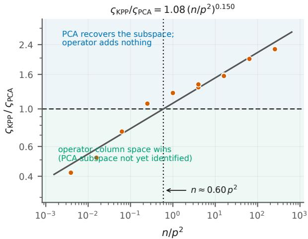
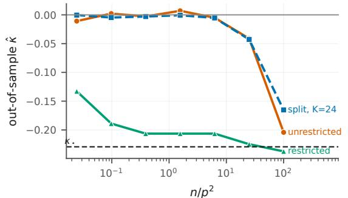
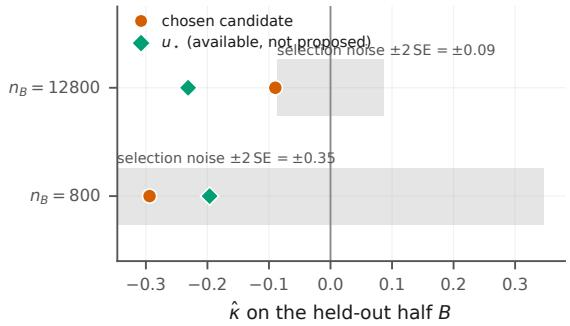
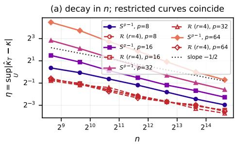
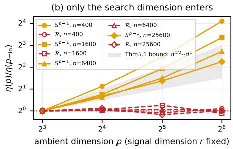

# Search Dimension in Unlabeled Projection Pursuit: A Scaling Law for Subspace Restriction

Rares Grozavescu University of Cambridge rg625@cam.ac.uk

## Abstract

Projection pursuit searches for a direction along which the data look least Gaussian. When the observation space contains a large Gaussian complement, the empirical objective can be minimized by a direction that carries no signal, with empirical kurtosis as low as at the truth. Sample splitting exposes rather than repairs this failure. Appending coordinates independent of the latent regime degrades the search while leaving Bayes recoverability unchanged. Restricting the search to the column space of a known forward operator removes the failure exactly on the negativekurtosis branch. Estimating a principal subspace from the data is the alternative. In a controlled two-component model, the leading suficient scalings difer in the gain with which the operator transmits the discriminant: $\varsigma ^ { - 4 }$ for covariance-spike estimation and $\varsigma ^ { - 8 }$ for fourth-moment search. At fixed search dimension, the measured threshold ratio collapses onto $n / p ^ { 2 }$ with exponent 0.156, close to the predicted $1 / 8$ . This is an empirically supported scaling motivated by suficient bounds, not a proved asymptotically tight law. When the search dimension is varied, the measured exponent is 0.325, substantially larger than $1 / 8 ,$ and the tested range does not identify its functional form. The crossing location also depends on calibration and model configuration. Under a downstream excess-error criterion, the scaling largely disappears.

## 1 Introduction

Projection pursuit searches for a direction along which the data depart from a reference distribution. In high dimensions, this creates a basic statistical problem: the search is performed over many directions, most of which

Mark Girolami University of Cambridge

may carry no information about the latent structure. An empirical search can therefore find a projection that looks non-Gaussian even when the direction itself is unrelated to the signal.

We study this problem for minimum-kurtosis projection pursuit in a linear–Gaussian inverse model. After whitening, the observations have the form

$$
\begin{array} { r } { \widetilde { y } = \widetilde { \mathbf { G } } z + \widetilde { \varepsilon } , \qquad \widetilde { \varepsilon } \sim { \mathcal { N } } ( 0 , I _ { p } ) . } \end{array}
$$

The signal $ { \widetilde { \mathbf { G } } } z$ lies in the column space

$$
\mathcal { R } = \mathrm { c o l } ( \widetilde { \mathbf { G } } ) ,
$$

while the orthogonal complement is independent standard Gaussian noise. Thus the observation model identifies a natural search space, but an unrestricted empirical search can exploit the Gaussian complement to obtain a spuriously low sample kurtosis.

Our first result makes this failure exact. When the Gaussian complement has dimension at least $n - 1$ for even $n ,$ the empirical excess kurtosis reaches its universal lower bound $- 2$ on an uninformative direction in $\mathcal { R } ^ { \perp }$ , while the population kurtosis of that direction is zero. Before this exact degeneracy is reached, the complement already contains spurious minima whose depth grows with the searched dimension. The failure is therefore a property of the empirical search rather than a loss of information about the latent regime.

The population problem points to a simple remedy. If the forward operator is known, restricting the search to R does not change the population optimum on the negative-kurtosis branch. For a direction mixing an informative component with an orthogonal Gaussian component,

$$
\kappa ( u ) = \kappa _ { a } \lambda ( \theta ) ^ { 2 } ,
$$

so the Gaussian complement can only attenuate the magnitude of the population excess kurtosis. Restricting the search to $\mathcal { R }$ is therefore population-lossless on this branch while removing irrelevant directions from the empirical optimization problem.

When R is unknown, the problem separates into two tasks: estimating the signal subspace and finding the direction within it.. This creates two separate statistical tasks: discovering the signal subspace and finding the direction inside it. We compare them in a controlled two-component model. If ς is the gain with which the forward operator transmits the latent mean-gap direction, principal-subspace estimation is governed by a covariance spike of order $\varsigma ^ { 2 } ,$ , while the fourth-moment signal in the restricted search is of order $\varsigma ^ { 4 }$ at weak gain. The leading suficient scalings are

$$
\varsigma _ { \mathrm { P C A } } \propto ( p / n ) ^ { 1 / 4 } , \qquad \varsigma _ { \mathrm { K P P } } \propto ( d _ { \mathrm { s e a r c h } } / n ) ^ { 1 / 8 } ,
$$

which give

$$
{ \frac { \mathrm { S K P P } } { \mathrm { S P C A } } } \propto \left( { \frac { n } { p ^ { 2 } } } \right) ^ { 1 / 8 }
$$

at fixed search dimension.

We test this comparison rather than treating the suficient bound as a tight law. At fixed search dimension, the measured exponent is 0.156 (95% CI [0.118, 0.174]), close to $1 / 8$ . When the search dimension is varied, the measured exponent is 0.325, substantially larger than $1 / 8 ,$ and the tested range does not distinguish power-law, logarithmic, and linear forms. The threshold crossing also changes with the angular criterion, covariance-spike ordering, and latent covariance.

The paper has three main contributions:

• We characterize a high-dimensional failure mode of unrestricted minimum-kurtosis projection pursuit, including an exact empirical degeneracy and a general spurious-minimum bound, and show that restriction to the known signal subspace removes the population failure on the negative-kurtosis branch.

• We derive a finite-sample direction-recovery bound whose dependence on the searched dimension motivates a comparison between exact-subspace search and data-driven subspace estimation.

• We measure this comparison and its limits. At fixed search dimension the threshold ratio follows the predicted $1 / 8$ gain exponent, while the observed search-dimension dependence is diferent. We also show that the crossing depends on calibration and model configuration and that sample splitting cannot repair a search-limited procedure.

The comparison is about direction recovery. When thresholds are instead defined through downstream excess error, the scaling largely disappears because prediction error is less sensitive to weak-signal direction diferences.

## 2 Setup and exact reference

We use a linear–Gaussian inverse model in which the latent variable has a finite Gaussian-mixture prior:

$$
\begin{array} { c } { { z \sim \sum _ { k = 1 } ^ { M } \pi _ { k } { \mathcal { N } } ( \mu _ { k } , \Sigma _ { k } ) , } } \\ { { a \mid z \sim { \mathcal { N } } ( \Phi z , { \bf K } ) , y = { \bf H } a + \varepsilon , } } \end{array}\tag{1}
$$

with $\varepsilon \sim \mathcal { N } ( 0 , \sigma ^ { 2 } I )$

Writing $w = a - \Phi z$ , setting $\mathbf { G } = \mathbf { H } \boldsymbol { \Phi }$ , and marginalizing w gives

$$
y \mid z \sim \mathcal { N } ( \mathbf { G } z , \mathbf { S } ) , \qquad \mathbf { S } = \mathbf { H } \mathbf { K } \mathbf { H } ^ { \top } + \sigma ^ { 2 } I .
$$

Whitening by S gives

$$
\begin{array} { c } { { \widetilde { y } = \mathbf { S } ^ { - 1 / 2 } y = \widetilde { \mathbf { G } } z + \widetilde { \varepsilon } , } } \\ { { \widetilde { \mathbf { G } } = \mathbf { S } ^ { - 1 / 2 } \mathbf { G } , \qquad \widetilde { \varepsilon } \sim \mathcal { N } ( 0 , I _ { p } ) . } } \end{array}\tag{2}
$$

We call

$$
\mathcal { R } = \mathrm { c o l } ( \widetilde { \mathbf { G } } )
$$

the signal subspace and write $r = \dim ( { \mathcal { R } } )$

Recoverability reference. For the Gaussianmixture model, the class-conditional distribution of y is Gaussian with mean $\mathbf { G } \mu _ { k }$ and covariance

$$
\mathbf { G } \Sigma _ { k } \mathbf { G } ^ { \top } + \mathbf { S } .
$$

The corresponding Bayes classifier is

$$
\arg \operatorname* { m a x } _ { k } \pi _ { k } \mathcal { N } \left( y ; \mathbf { G } \mu _ { k } , \mathbf { G } \Sigma _ { k } \mathbf { G } ^ { \top } + \mathbf { S } \right) .
$$

In the experiments this exact classifier is used as a reference. The downstream procedures are evaluated on held-out data and do not use held-out regime labels during fitting. Appendix F lists the information available to each method, and Appendix E gives the matching and evaluation protocol.

Projection pursuit. For two Gaussian components with weights $p , q ,$ , projected separation $\Delta ,$ , and projected variances $v _ { 1 } , v _ { 2 } $ , the population excess kurtosis is

$$
\kappa = \frac { p q N } { ( p v _ { 1 } + q v _ { 2 } + p q \Delta ^ { 2 } ) ^ { 2 } } ,\tag{3}
$$

where

$$
N = 3 ( v _ { 1 } - v _ { 2 } ) ^ { 2 } + 6 \Delta ^ { 2 } ( q - p ) ( v _ { 1 } - v _ { 2 } ) + \Delta ^ { 4 } ( 1 - 6 p q ) .
$$

The main experiments use two equally weighted components with isotropic within-component covariance and a mean separation along one latent coordinate.

## 3 The operator determines the population search space

Let P be the orthogonal projector onto R.

Lemma 1 (Noise-only complement). For the whitened model in (2),

$$
( I - P ) { \widetilde { y } } = ( I - P ) { \widetilde { \varepsilon } } .
$$

The complement is therefore standard Gaussian on $\mathcal { R } ^ { \perp }$ and is independent $o f z$ and of $P \widetilde { y }$

The lemma identifies the central geometric feature of the problem: directions in $\mathcal { R } ^ { \perp }$ contain no latent information at all.

Lemma 2 (Exact dilution). Let

$$
u = \cos \theta a + \sin \theta b ,
$$

where $a \in \mathcal { R }$ and $b \in \mathcal { R } ^ { \perp }$ are unit vectors. If

$$
\boldsymbol { v } = \mathrm { V a r } ( \boldsymbol { a } ^ { \top } \widetilde { \boldsymbol { y } } )
$$

and $\kappa _ { a }$ is the excess kurtosis of $a ^ { \intercal } \widetilde { y } ,$ then

$$
\kappa ( u ) = \kappa _ { a } \lambda ( \theta ) ^ { 2 } , \qquad \lambda ( \theta ) = \frac { v \cos ^ { 2 } \theta } { v \cos ^ { 2 } \theta + \sin ^ { 2 } \theta } .\tag{4}
$$

Thus $\lambda ( \theta ) \in [ 0 , 1 ]$ , with equality to one exactly when sin $\theta = 0$

The complement therefore attenuates the magnitude of excess kurtosis. When the informative population direction has negative excess kurtosis, adding an orthogonal Gaussian component cannot improve the population objective. Restricting the search to R is consequently lossless for the population minimization problem on the negative-kurtosis branch.

If the relevant in-subspace kurtosis is positive, the minimum is instead attained in the Gaussian complement. Our direction-recovery experiments are on the negative-kurtosis branch.

The same dilution mechanism extends beyond equal mixture weights; the resulting population amplitude vanishes at specific weight and covariance-separation boundaries. These scope conditions are given in $\mathrm { A p \mathrm { - } }$ pendix B.12. The main experiments remain in the negative-kurtosis regime.

## 4 Finite-sample search and spurious minima

Let S be the subspace searched by the empirical procedure, with

$$
d _ { \mathrm { s e a r c h } } = \dim ( S ) .
$$

The finite-sample question is how uniformly the empirical kurtosis approximates its population value over the searched directions.

Lemma 3 (Variance floor and sub-Gaussianity). For every unit u,

$$
\mathrm { V a r } ( u ^ { \top } \widetilde { \boldsymbol { y } } ) = \mathrm { V a r } ( u ^ { \top } \widetilde { \mathbf { G } } \boldsymbol { z } ) + 1 \ge 1 ,
$$

and $u ^ { \top } ( \widetilde { y } - \mathbb { E } \widetilde { y } )$ is sub-Gaussian with a scale $\sigma ^ { 2 }$ bounded by an absolute constant times

$$
1 + \| \widetilde { \mathbf G } \| _ { \mathrm { o p } } ^ { 2 } \left[ \operatorname* { m a x } _ { k } \| \Sigma _ { k } \| _ { \mathrm { o p } } + \operatorname* { m a x } _ { k } \| \mu _ { k } - \bar { \mu } \| ^ { 2 } \right] .
$$

The bound does not depend on the ambient dimension $p ,$ so the sub-Gaussian scale remains fixed across the ambient-dimension sweeps.

Uniform concentration. Let

$$
\varphi _ { T } ( x ) = \mathrm { s i g n } ( x ) \operatorname* { m i n } ( | x | , T )
$$

and

$$
z _ { i } = { \tilde { y } } _ { i } - { \bar { y } } _ { n } .
$$

Define

$$
\begin{array} { c } { { \displaystyle \hat { \kappa } _ { T } ( u ) = \frac { \hat { m } _ { 4 , T } ( u ) } { \hat { m } _ { 2 , T } ( u ) ^ { 2 } } - 3 , } } \\ { { \displaystyle \hat { m } _ { q , T } ( u ) = \frac { 1 } { n } \sum _ { i } \varphi _ { T } ( u ^ { \top } z _ { i } ) ^ { q } . } } \end{array}\tag{5}
$$

The empirical criterion is defined on

$$
\mathcal { D } _ { T } = \left\{ u \in S ^ { p - 1 } : \hat { m } _ { 2 , T } ( u ) > 0 \right\} ,
$$

and empirical minimization is understood to be over $\mathcal { D } _ { T }$

Theorem 1 (Uniform concentration over a searched subspace). Let $S \subseteq \mathbb { R } ^ { p }$ be a linear subspace with dim $( S ) = d _ { \mathrm { s e a r c h } }$ , and let $U \subseteq S \cap S ^ { p - 1 }$

Under the assumptions of Lemma 3, take

$$
T = \sigma \sqrt { 8 \log n } , \qquad L _ { n } = d _ { \mathrm { s e a r c h } } \log ( 3 n ) + \log ( 1 2 / \delta ) .
$$

There are absolute constants $C , C ^ { \prime }$ such that if

$$
\begin{array} { r } { n \geq C ^ { \prime } \sigma ^ { 8 } ( \log n ) ^ { 3 } L _ { n } , } \end{array}
$$

then with probability at least $1 - \delta$

$$
\begin{array} { r } { \underset { u \in U } { \operatorname* { s u p } } \left| \hat { \kappa } _ { T } ( u ) - \kappa ( u ) \right| \leq C \sigma ^ { 1 0 } \Bigg [ ( \log n ) ^ { 3 / 2 } \sqrt { \cfrac { L _ { n } } { n } } } \\ { + ( \log n ) ^ { 2 } \cfrac { L _ { n } } { n } \Bigg ] . } \end{array}\tag{6}
$$

The important feature for the search problem is the appearance of $d _ { \mathrm { s e a r c h } }$ in $L _ { n }$ . An unrestricted search uses $d _ { \mathrm { s e a r c h } } = p ,$ whereas exact restriction to R uses $d _ { \mathrm { s e a r c h } } = r .$

The experiments optimize the untruncated criterion. A sample-checkable no-clipping certificate implies that the truncated and untruncated criteria coincide on the searched set. We evaluate this certificate for every configuration and use the truncated bound above. Without the certificate, the corresponding untruncated result has a second-order $L _ { n } ^ { 2 } / n$ term; the full statement is given in Appendix C.

Lemma 4 (Dilution identity and global quadratic growth). Take $\widetilde { \mathbf G }$ with orthonormal columns,

$$
\Sigma _ { 1 } = \Sigma _ { 2 } = s ^ { 2 } I _ { r } , \quad \mu _ { 1 } - \mu _ { 2 } = \Delta e _ { 1 } , \quad \pi _ { 1 } = \pi _ { 2 } = 1 / 2 ,
$$

and put

$$
V = 1 + s ^ { 2 } + \Delta ^ { 2 } / 4 , \qquad \kappa _ { \star } = - \frac { \Delta ^ { 4 } } { 8 V ^ { 2 } } .
$$

With

$$
g = \widetilde { \mathbf { G } } ^ { \top } \boldsymbol { u } , \qquad t = g _ { 1 } ^ { 2 } , \qquad w = \| g \| ^ { 2 } ,
$$

(3) becomes

$$
\kappa ( u ) = - \frac { \Delta ^ { 4 } t ^ { 2 } } { 8 ( 1 + s ^ { 2 } w + \Delta ^ { 2 } t / 4 ) ^ { 2 } } .
$$

The population minimizers are $\pm \tilde { \mathbf { G } } e _ { 1 }$ and

$$
\kappa ( u ) - \kappa _ { \star } \geq | \kappa _ { \star } | \operatorname* { m i n } ( 1 , 2 / V ) \sin ^ { 2 } d ( u , u _ { \star } ) ,\tag{7}
$$

for every unit $u ,$ where

$$
d ( u , u _ { \star } ) = \operatorname { a r c c o s } | \langle u , u _ { \star } \rangle | .
$$

For $V \geq 2 .$ the constant $2 | \kappa _ { \star } | / V$ is the local coeficient of $\sin ^ { 2 } d$ at $u _ { \star }$ , so the bound is sharp to first order.

Corollary 1 (Suficient sample size for direction recovery). In the setting of Theorem 1 and Lemma $^ { 4 , }$ let uˆ be any global minimizer of $\hat { \kappa } _ { T }$ over U and suppose $u _ { \star } \in U$ . On the event of Theorem 1,

$$
\sin ^ { 2 } d ( \hat { u } , u _ { \star } ) \leq \frac { 2 \eta } { | \kappa _ { \star } | \operatorname* { m i n } ( 1 , 2 / V ) } ,
$$

where η is the right-hand side of (6).

In particular, for $V \geq 2 , d ( \hat { u } , u _ { \star } ) \leq \theta _ { 0 }$ is ensured by

$$
n \geq C \sigma ^ { 2 0 } V ^ { 2 } \frac { d _ { \mathrm { s e a r c h } } \log ( 3 n ) ( \log n ) ^ { 3 } } { \kappa _ { \star } ^ { 2 } \sin ^ { 4 } \theta _ { 0 } } .\tag{8}
$$

The leading term therefore gives the suficient scaling

$$
n \gtrsim \frac { d _ { \mathrm { s e a r c h } } } { \kappa _ { \star } ^ { 2 } }
$$

up to logarithmic and problem-dependent factors.

The untruncated bound has a second-order branch with stronger dependence on $d _ { \mathrm { s e a r c h } } ;$ the full comparison is in Appendix C. The measured thresholds lie in the regime where the leading branch is the relevant one.

## 4.1 Two failure modes of the unrestricted search

The unrestricted search fails in two related ways.

First, the empirical excess kurtosis is bounded below by −2. When the Gaussian complement is suficiently large, that floor can be attained by a completely uninformative direction. Proposition 1 makes this exact: for even n and

$$
p - r \geq n - 1 ,
$$

with probability one there is a unit $b \in \mathcal { R } ^ { \perp }$ such that

$$
\hat { \kappa } ( b ) = - 2 , \qquad \kappa ( b ) = 0 , \qquad d ( b , u _ { \star } ) = \pi / 2 .
$$

When $r \leq n - 2$ , no direction in R attains the empirical floor almost surely.

Second, the complement contains spurious minima even before the exact floor is attainable. Proposition 2 shows that, under its stated conditions, the minimum over $\mathcal { R } ^ { \perp }$ is at most

$$
- c { \sqrt { \frac { \log ( m \wedge n ^ { a } ) } { n } } } + C { \frac { \log ( m / \delta ) } { n } } , \qquad m = p - r ,
$$

with high probability.

The exact degeneracy is therefore the sharpest form of a broader search-space problem: the empirical objective increasingly favors directions that contain no signal as irrelevant dimensions are added.

Why use a fourth moment? The secondmoment route is cheaper in the mean-separated, wellconditioned setting used for the scaling comparison. Fourth-moment pursuit remains useful when separation is expressed through covariance rather than the mean; this regime is outside the main scaling experiment.

## 5 Comparing exact-subspace search with subspace estimation

We now compare two procedures:

1. Exact-subspace KPP: search for the minimum empirical kurtosis over the true signal subspace R.

2. PCA subspace + search: estimate the signal subspace from the sample covariance and then search within the estimated subspace.

The first is an oracle benchmark that isolates the cost of finding the direction once the search space is known. It is not an end-to-end data-driven procedure. The second includes the cost of discovering that search space.

Let ς be the gain with which $\widetilde { \mathbf { G } }$ transmits the latent mean-gap axis, so that the observable discriminant is $\varsigma$ times a unit left singular vector. For the scaling calculation, the gain is applied to that singular direction while the remaining signal directions are held fixed.

In the isotropic two-component model, the discriminant contributes a covariance spike of size

$$
\varsigma ^ { 2 } ( s ^ { 2 } + \Delta ^ { 2 } / 4 ) .
$$

Resolving this spike against the Marchenko–Pastur bulk gives the threshold

$$
n \gtrsim p / \varsigma ^ { 4 }
$$

up to model-dependent constants. Thus

$$
\mathrm { { S P C A } } \propto ( p / n ) ^ { 1 / 4 } .
$$

For exact-subspace $\mathrm { K P P , }$ define

$$
V _ { \varsigma } = 1 + \varsigma ^ { 2 } ( s ^ { 2 } + \Delta ^ { 2 } / 4 ) .
$$

The population kurtosis of the discriminant is

$$
| \kappa _ { \star } ( \varsigma ) | = \frac { \Delta ^ { 4 } \varsigma ^ { 4 } } { 8 V _ { \varsigma } ^ { 2 } } .\tag{9}
$$

Combining (9) with Corollary 1 gives

$$
n \gtrsim d _ { \mathrm { s e a r c h } } \frac { V _ { \varsigma } ^ { 6 } } { \varsigma ^ { 8 } }
$$

up to logarithmic and problem-dependent factors. Hence, in the weak-gain regime,

$$
\varsigma _ { \mathrm { K P P } } \propto ( d _ { \mathrm { s e a r c h } } / n ) ^ { 1 / 8 }
$$

to leading order. At fixed search dimension,

$$
\frac { \varsigma _ { \mathrm { K P P } } } { \varsigma _ { \mathrm { P C A } } } \propto \left( \frac { n } { p ^ { 2 } } \right) ^ { 1 / 8 } .\tag{10}
$$

This comparison has a specific scope. It assumes two components, isotropic latent covariance, and that the discriminant is the covariance spike that determines the PCA threshold. If a nuisance direction has a larger spike, PCA can recover that direction before the discriminant. If the components separate only through covariance, the second moment does not provide the competing signal. We therefore interpret (10) only in the mean-separated, well-conditioned regime.

Empirical threshold comparison. We define $\operatorname { S P C A } ( n )$ as the smallest gain on the tested gain grid at which the leakage

$$
\arcsin \| ( I - { \hat { P } } ) u _ { \star } \|
$$

<table><tr><td></td><td>exponent</td><td>95% CI</td><td> $R ^ { 2 }$ </td></tr><tr><td colspan="3">Collapse on  $n / p ^ { 2 }$  at fxed</td><td></td></tr><tr><td>fixed  $\overset { \cdot } { 1 5 ^ { \circ } }$  criterion</td><td> $d _ { \mathrm { s e a r c h } }$  0.150</td><td>[0.110,0.166]</td><td>0.964</td></tr><tr><td>calibrated criterion</td><td>0.156</td><td>[0.118,0.174]</td><td>0.965</td></tr><tr><td>Rank dependence,</td><td> $d _ { \mathrm { s e a r c h } } \in \{ 2 , \dots , 3 2 \}$ </td><td></td><td></td></tr><tr><td>SKPP</td><td>0.325</td><td>[0.259,0.399]</td><td></td></tr><tr><td>SPCA</td><td>-0.031</td><td></td><td></td></tr><tr><td>Candidate rank forms,  $R ^ { 2 }$ </td><td></td><td></td><td></td></tr><tr><td>power, log  $d _ { \mathrm { s e a r c h } ; }$  linear</td><td></td><td>0.8127, 0.8016, 0.8082</td><td></td></tr><tr><td>no rank dependence</td><td></td><td></td><td>0</td></tr></table>

Table 1: Measured threshold scalings. The fixed-rank collapse is fitted over 11 configurations and the rank comparison over 28. The calibrated criterion is $1 5 . 4 ^ { \circ } .$ $2 0 . 5 ^ { \circ }$ on the collapse grid. The tested rank range does not distinguish the candidate functional forms.

falls below the specified angular tolerance.

We define $\operatorname { S K P P } \left( n \right)$ as the smallest gain on the same grid at which the exact-subspace KPP search recovers $u _ { \star }$ to the same angular tolerance.

The two thresholds are therefore defined in terms of direction recovery. Thresholds that are not attained within the tested gain range are treated according to the censoring procedure described in Appendix E.

At fixed search dimension, the measured ratio follows a power law in $n / p ^ { 2 }$ . Across 11 configurations spanning five orders of magnitude in $n / p ^ { 2 }$ , the calibrated fit gives exponent

$$
\begin{array} { r l r } { 0 . 1 5 6 } & { { } } & { [ 0 . 1 1 8 , 0 . 1 7 4 ] } \end{array}
$$

with

$$
R ^ { 2 } = 0 . 9 6 5 .
$$

The confidence interval contains the leading-order predicted $1 / 8$ exponent.

The two thresholds are measured separately rather than by fitting a two-parameter curve directly to their ratio. The KPP threshold depends on the dimension of the searched space, while the PCA threshold depends on the ambient dimension through covariance estimation. This separation lets us test the two dependencies independently.

The search-dimension dependence is diferent. Sweeping

$$
d _ { \mathrm { s e a r c h } } \in \{ 2 , 4 , 8 , 1 6 , 3 2 \}
$$

at matched $( p , n )$ gives a rank exponent of 0.325 for ςKPP, compared with the predicted leading-order exponent $1 / 8 .$ . The PCA threshold shows no corresponding rank dependence.

The rank efect is not explained by changing the angular criterion. Calibrating the criterion against the null still leaves the exponent well above $1 / 8 .$

<table><tr><td>p</td><td>n</td><td> $n / p ^ { 2 }$ </td><td>SPCA</td><td>SKPP</td><td>ratio</td></tr><tr><td>1024</td><td>4096</td><td>0.004</td><td>2.200</td><td>0.924</td><td>0.42</td></tr><tr><td>512</td><td>4096</td><td>0.016</td><td>1.687</td><td>0.868</td><td>0.51</td></tr><tr><td>256</td><td>4096</td><td>0.062</td><td>1.240</td><td>0.911</td><td>0.73</td></tr><tr><td>128</td><td>4096</td><td>0.250</td><td>1.022</td><td>1.098</td><td>1.07</td></tr><tr><td>128</td><td>16384</td><td>1.000</td><td>0.659</td><td>0.819</td><td>1.24</td></tr><tr><td>32</td><td>4096</td><td>4.000</td><td>0.676</td><td>0.908</td><td>1.34</td></tr><tr><td>128</td><td>65536</td><td>4.000</td><td>0.445</td><td>0.621</td><td>1.40</td></tr><tr><td>32</td><td>16384</td><td>16.000</td><td>0.449</td><td>0.711</td><td>1.58</td></tr><tr><td>128</td><td>262144</td><td>16.000</td><td>0.313</td><td>0.490</td><td>1.57</td></tr><tr><td>32</td><td>65536</td><td>64.000</td><td>0.309</td><td>0.610</td><td>1.98</td></tr><tr><td>32</td><td>262144</td><td>256.000</td><td>0.219</td><td>0.493</td><td>2.26</td></tr></table>

Table 2: Threshold discriminant gains and their ratio. The ratio crosses one at $n \approx 0 . 6 0 p ^ { 2 }$ under the $1 5 ^ { \circ }$ criterion at which it was measured; Section 5.1 shows why that number is not transportable. The same thresholds computed on cells with no optimizer gap, and re-searched at a 512-fold larger restart budget, are in Appendix A and agree to within the bootstrap interval of the crossing.

Over the tested sixteenfold range, power-law, logarithmic, and linear forms fit the rank contrast comparably well:

$$
R ^ { 2 } = 0 . 8 1 2 7 , \qquad 0 . 8 0 1 6 , \qquad 0 . 8 0 8 2 ,
$$

respectively, while the no-rank model has $R ^ { 2 } = 0$

The data therefore establish a rank dependence but do not identify its functional form. The second-order branch of the untruncated concentration bound has exponent $1 / 2 ,$ , so the observed value lies between the two suficient-bound branches.

Direction recovery versus downstream error. The scaling in (10) concerns locating u⋆. When the same thresholds are instead defined through downstream excess error, the scaling largely disappears. In the weak-signal regime, Bayes error approaches chance, making excess error less sensitive to whether the discriminant direction has been accurately recovered.

## 5.1 The threshold crossing depends on calibration

The ratio in Figure 1 crosses one, but the location of that crossing is not a universal function of $( n , p )$

Changing the angular success criterion moves the crossing by a factor of four across the criteria tested. Changing which covariance spike is strongest moves the crossing by two orders of magnitude. An anisotropic latent covariance changes the prefactor in a way that is not constant across ranks.

Figure 1: Ratio of the exact-subspace KPP threshold to the PCA-subspace threshold against $n / p ^ { 2 }$ at fixed r. The fitted fixed-rank power law is shown for reference. The ratio crossing depends on the success criterion and model configuration; the marked value is for the baseline $1 5 ^ { \circ }$ criterion and is not interpreted as a universal constant.
<table><tr><td>Condition</td><td>Crossing  $( n / p ^ { 2 } )$ </td><td>Exponent</td></tr><tr><td> $1 0 ^ { \circ }$  criterion</td><td>1.20</td><td>0.142</td></tr><tr><td> $1 5 ^ { \circ }$  criterion (baseline)</td><td>0.60</td><td>0.150</td></tr><tr><td> $2 0 ^ { \circ }$  criterion</td><td>0.30</td><td>0.145</td></tr><tr><td>Strongest-spike discriminant</td><td>0.006</td><td></td></tr><tr><td>Anisotropic Σ</td><td>not determined</td><td></td></tr></table>

Table 3: Sensitivity of the threshold comparison. The crossing changes with the angular criterion and with the covariance-spike configuration. For the anisotropic row, the prefactor shift is not constant across the rank grid, so no single crossing is reported.

## 5.2 Calibrating the angular criterion

A fixed angular threshold can confound recovery with the geometry of the searched subspace. In the anisotropic model, nuisance directions can carry much more projection variance than the discriminant. The empirical kurtosis landscape can then be flat over much of the subspace.

Calibrating to a common false-positive rate does not fully remove this efect because the null distribution changes its scale as well as its tail mass. Referring the criterion to the location of the null instead—using a fixed fraction of its median—removes the observed anomaly and leaves the measured exponent stable across the fractions tested (Appendix L).

The calibration must also respect the diferent nulls of the two procedures. Removing the mean gap is a null for fourth-moment KPP, but it is not a null for PCA because the latent covariance still produces a population covariance spike:

$$
\mathrm { c o v } ( \widetilde { y } ) = s ^ { 2 } \widetilde { \mathbf { G } } \widetilde { \mathbf { G } } ^ { \intercal } + I .
$$

Calibrating the PCA arm against that null would therefore introduce an arbitrary gain threshold into the comparison.

We instead calibrate the fourth-moment side and evaluate the PCA side at a fixed leakage tolerance, reporting its small residual dependence on $d _ { \mathrm { s e a r c h } }$

## 6 Sample splitting does not repair the search

A separate validation sample can tell us whether a proposed direction is good. It cannot recover a direction that the search on the fitting sample never proposes.

We test this by appending observation coordinates that are independent of the latent regime. These coordinates leave the exact Bayes decisions unchanged but enlarge the unrestricted search space. Out-of-sample kurtosis for the unrestricted procedure remains near zero while the restricted procedure approaches $\kappa _ { \star }$ , and the unrestricted directions become nearly orthogonal to $u _ { \star }$ as the ambient dimension increases.

There are therefore two distinct failures. With the smaller validation sample, selection noise can favor a spurious candidate. With the larger validation sample, selection correctly identifies u⋆ among the available candidates, but the fitting-stage search has already discarded it.

Doubling the number of points in the split arms leaves the unrestricted direction largely unchanged while improving the restricted arm. The unrestricted procedure is therefore search-limited in this regime, whereas the restricted procedure is sample-limited.

The same experiments compare exact and estimated subspaces. The operator-based subspace succeeds in almost every configuration. In the single failing cell, rank selection based on the Baik–Ben Arous–P´ech´e criterion recovers the discriminant, whereas supplying the exact rank spends additional dimensions on noise and performs worse. Thus the comparison changes when the discriminant is not the spike that determines subspace recovery; this is the scope condition discussed in Section 5.

Additional operator-perturbation diagnostics, spuriousminimum-depth experiments, and optimizer-restart checks are reported in the supplement. They provide supporting evidence without changing the main scaling comparison.

(a) splitting reveals the failure, it does not repair it  

(b) the same failure, two causes  
  
Figure 2: Sample splitting exposes but does not remove the unrestricted-search failure. (a) Out-of-sample κˆ for the split search follows the unrestricted full-sample arm and remains near zero, while the restricted arm approaches $\kappa _ { \star }$ . (b) With $n _ { B } = 8 0 0$ , validation noise can make a spurious candidate look better than $u _ { \star } ;$ with $n _ { B } = 1 2 8 0 0$ , validation correctly ranks u⋆ above the selected candidate, but the search never proposed $u _ { \star }$

## 7 Related work

Projection pursuit. Projection pursuit originates with Friedman and Tukey (1974) and Huber (1985), and minimum-kurtosis indices for mixture separation with Pe˜na and Prieto (2001). Kurtosis is also a standard fourth-moment contrast in independent component analysis (Hyv¨arinen and Oja, 2000).

High-dimensional projection pursuit. Bickel et al. (2018) show that in high dimensions one can find directions in Gaussian data whose empirical projections resemble prescribed non-Gaussian laws. Montanari and Zhou (2025) characterize the Wasserstein radius of lowdimensional projections of i.i.d. Gaussian data in an overparameterized regime.

Our setting isolates a related structural question: when the observation model identifies a Gaussian complement known to contain no latent information, can that complement be removed without changing the population target? We give an exact kurtosis degeneracy, a population dilution identity, a finite-sample searched-subspace bound, and a comparison between oracle subspace restriction and data-driven subspace estimation.

Kurtosis-based discriminant estimation. Radojicic et al. (2021) derive large-sample properties for blind projection-pursuit estimators of the linear discriminant in two-group Gaussian mixtures, including kurtosisand skewness-based estimators and their asymptotic covariance matrices. Their analysis is estimator-centric and asymptotic, whereas our focus is the finite-sample efect of the searched observation space.

Other projection indices. Mukherjee et al. (2023) study Wasserstein projection pursuit and prove recovery under a linear $p / n$ scaling. Their index difers from the fourth-moment criterion studied here, but the same high-dimensional phenomenon—an empirical search over many directions—is relevant.

Subspace restriction. Likelihood-informed subspaces (Cui et al., 2014; Zahm et al., 2022) reduce parameter-space dimension for specified inverse problems. Our restriction is diferent: it acts on observationspace directions in an unlabeled projection-pursuit search. Francisci and Agostinelli (2026) provide another example in which a depth criterion is optimized over a subspace rather than a single direction.

## 8 Discussion and limitations

The results separate three quantities that are easy to conflate: the intrinsic information available in the observations, the cost of estimating a useful search subspace, and the cost of finding a direction by minimizing a fourth-moment criterion.

A key consequence is that the information-theoretic problem can be easier than the fourth-moment search. In particular, the $\varsigma ^ { - 8 }$ dependence arises from the suficient-bound analysis of the fourth-moment criterion, not from an information-theoretic lower bound for the full inference problem.

A two-point construction makes this distinction explicit. Index instances by the latent mean-gap axis and take two axes separated by $2 \theta _ { 0 }$ . The Kullback–Leibler divergence is $\Theta ( | \kappa _ { \star } | )$ rather than $\Theta ( \kappa _ { \star } ^ { 2 } )$ , because the hypotheses already difer at the second moment. The resulting two-point argument therefore gives $\varsigma ^ { - 4 }$ , not $\varsigma ^ { - 8 }$ . A likelihood-ratio test separates the same pair below the $d _ { \mathrm { s e a r c h } } / \kappa _ { \star } ^ { 2 }$ scale. Thus this standard route does not yield a matching $\varsigma ^ { - 8 }$ lower bound for the full statistical problem.

A lower bound specific to minimizers of the empirical fourth-moment contrast remains open; such a result would have to control fluctuations of the contrast and their supremum over the searched set, where the searchdimension dependence also enters.

The scope is deliberately narrow. The theory and scaling comparison use two-component mixtures with the discriminant on a single left singular direction. Unequal mixture weights are covered by the population calculation, but $M > 2$ is not. Extending the result to multiple components would require a diferent estimand and a corresponding subspace-recovery analysis.

The functional form of the search-dimension dependence and the exponent governing the depth of spurious minima also remain open. Finally, the theory concerns the exact global minimizer, while the experiments use multi-start gradient descent. The restart experiments in the supplement provide evidence that the reported thresholds are not optimizer artifacts, but they do not establish global optimization guarantees.

Recoverability and discoverability are diferent problems. When the observation model identifies a signal subspace, restricting an unlabeled projection-pursuit search to that subspace can remove a high-dimensional failure mode without changing the population target on the negative-kurtosis branch. The remaining cost is the separate problem of estimating that subspace or finding the direction within it.

## AI Use Statement

Generative AI tools were used during preparation of this manuscript for conceptual discussion and development, mathematical proof checking, literature-search assistance, drafting, editing, and organization. The authors reviewed and verified all AI-assisted material used in the manuscript, including mathematical arguments, citations, and interpretations. Generative AI was not used to generate experimental data or to determine the reported experimental results. The authors take full responsibility for the final content of the submission, including all mathematical statements, experimental results, citations, and interpretations. Generative AI systems are not authors of this work.

## References

Animashree Anandkumar, Rong Ge, Daniel Hsu, Sham M. Kakade, and Matus Telgarsky. Tensor decompositions for learning latent variable models. Journal of Machine Learning Research, 15:2773–2832, 2014.

Jinho Baik, Gerard Ben Arous, and Sandrine Peche. Phase transition of the largest eigenvalue for nonnull complex sample covariance matrices, 2004. URL https://arxiv.org/abs/math/0403022.

Peter J Bickel, Gil Kur, and Boaz Nadler. Projection pursuit in high dimensions. Proceedings of the National Academy of Sciences, 115(37):9151–9156, 2018.

Tiangang Cui, James Martin, Youssef M Marzouk, Antti Solonen, and Alessio Spantini. Likelihoodinformed dimension reduction for nonlinear inverse problems. Inverse Problems, 30(11):114015, 2014.

Giacomo Francisci and Claudio Agostinelli. Central subspace data depth, 2026. URL https://arxiv. org/abs/2601.14947.

Jerome H. Friedman and John W. Tukey. A projection pursuit algorithm for exploratory data analysis. IEEE Transactions on Computers, C-23(9):881–890, 1974.

Peter J. Huber. Projection pursuit. The Annals of Statistics, 13(2):435–475, 1985.

Aapo Hyv¨arinen and Erkki Oja. Independent component analysis: algorithms and applications. Neural Networks, 13(4-5):411–430, 2000. doi: 10.1016/ S0893-6080(00)00026-5.

Arun Kumar Kuchibhotla and Abhishek Chakrabortty. Moving beyond sub-Gaussianity in high-dimensional statistics: applications in covariance estimation and linear regression. Information and Inference, 11(4): 1389–1456, 2022.

Andrea Montanari and Kangjie Zhou. Overparametrized linear dimensionality reductions: From projection pursuit to two-layer neural networks, 2025. URL https://arxiv.org/abs/2206.06526.

Satyaki Mukherjee, Soumendu Sundar Mukherjee, and Debarghya Ghoshdastidar. Wasserstein projection pursuit of non-gaussian signals, 2023. URL https: //arxiv.org/abs/2302.12693.

Daniel Pe˜na and Francisco J. Prieto. Cluster identification using projections. Journal of the American Statistical Association, 96(456):1433–1445, 2001.

Una Radojicic, Klaus Nordhausen, and Joni Virta. Large-sample properties of unsupervised estimation of the linear discriminant using projection pursuit. Electronic Journal of Statistics, 15(2):6677–6739, 2021.

Olivier Zahm, Tiangang Cui, Kody Law, Alessio Spantini, and Youssef Marzouk. Certified dimension reduction in nonlinear Bayesian inverse problems. Mathematics of Computation, 91(336):1789–1835, 2022.

## Subspace Restriction in Unlabeled Projection Pursuit: A Scaling Law and Where It Fails — Supplementary Material

## A Statements moved from the main text

We restate the three results summarized in the main text.

Theorem 2 (Uniform concentration for the untruncated criterion). Let $S \subseteq \mathbb { R } ^ { p }$ have dimension $d _ { \mathrm { s e a r c h } }$ and let $U \subseteq S \cap S ^ { p - 1 }$ . Put $L _ { n } = d _ { \mathrm { s e a r c h } } \log ( 3 n ) + \log ( 1 8 / \delta )$ . Under the assumptions of Lemma 3 there are absolute constants $C , C ^ { \prime }$ such that, i $f n \geq C ^ { \prime } \sigma ^ { 8 } L _ { n } ^ { 2 }$ , then with probability at least $1 - \delta$ ,

$$
\begin{array} { r } { \underset { u \in U } { \operatorname* { s u p } } | \hat { \kappa } ( u ) - \kappa ( u ) | \leq C \sigma ^ { 1 0 } \left[ \sqrt { \frac { L _ { n } } { n } } + \frac { L _ { n } ^ { 2 } } { n } \right] . } \end{array}\tag{11}
$$

Under the plug-in convention, $\hat { \kappa } _ { \mathrm { i m p l } } + 3 = ( ( n - 1 ) / n ) ^ { 2 } ( \hat { \kappa } + 3 )$ , and the resulting diference is controlled on the same event.

Proposition 1 (Exact degeneracy of the unrestricted criterion). Let n be even and $p - r \geq n - 1$ . Under the whitened model, with probability one there is a unit $b \in \mathcal { R } ^ { \perp }$ such that

$$
\hat { \kappa } ( b ) = - 2 , \qquad \kappa ( b ) = 0 , \qquad d ( b , u _ { \star } ) = \pi / 2\tag{12}
$$

whenever the population minimizer $u _ { \star }$ is unique in R. $I f r \leq n - 2$ , then with probability one no direction in R attains the empirical floor.

Proposition 2 (Spurious complement minima). Let $f _ { 1 } , \ldots , f _ { m }$ be an orthonormal basis of $\mathcal { R } ^ { \perp }$ , with $m = p - r ,$ and put $g _ { i j } = f _ { j } ^ { \top } \widetilde { y } _ { i }$ . Under the assumptions below there are absolute constants $c , C , a > 0$ such that, for $n \geq C ,$ $m \geq C \log ( 1 / \delta )$ and $\log ( 6 m / \delta ) \leq { \sqrt { n } } ,$

$$
\operatorname* { i n f } _ { b \in { \mathcal R } ^ { \perp } \cap S ^ { p - 1 } } \hat { \kappa } ( b ) \leq - c \sqrt { \frac { \log ( m \wedge n ^ { a } ) } { n } } + C \frac { \log ( m / \delta ) } { n } .\tag{13}
$$

For $\hat { \kappa } _ { T }$ the same bound holds on the no-clipping event described below; its failure probability adds at most $2 m n ^ { - 3 }$

<table><tr><td>p</td><td>n</td><td> $n / p ^ { 2 }$ </td><td>SKPP</td><td>gap-clean</td><td>budget</td></tr><tr><td>1024</td><td>4096</td><td>0.004</td><td>0.924</td><td>0.905</td><td>0.875</td></tr><tr><td>512</td><td>4096</td><td>0.016</td><td>0.868</td><td>0.868</td><td>0.868</td></tr><tr><td>256</td><td>4096</td><td>0.062</td><td>0.911</td><td>0.911</td><td>0.911</td></tr><tr><td>128</td><td>4096</td><td>0.250</td><td>1.098</td><td>1.098</td><td>1.098</td></tr><tr><td>128</td><td>16384</td><td>1.000</td><td>0.819</td><td>0.786</td><td>0.773</td></tr><tr><td>32</td><td>4096</td><td>4.000</td><td>0.908</td><td>0.908</td><td>0.906</td></tr><tr><td>128</td><td>65536</td><td>4.000</td><td>0.621</td><td>0.621</td><td>0.621</td></tr><tr><td>32</td><td>16384</td><td>16.000</td><td>0.711</td><td>0.711</td><td>0.712</td></tr><tr><td>128</td><td>262144</td><td>16.000</td><td>0.490</td><td>0.490</td><td>0.492</td></tr><tr><td>32</td><td>65536</td><td>64.000</td><td>0.610</td><td>0.610</td><td>0.612</td></tr><tr><td>32</td><td>262144</td><td>256.000</td><td>0.493</td><td>0.493</td><td>0.493</td></tr></table>

Table 4: The kurtosis threshold measured via the standard restart budget, on cells with an optimizer gap within the null tolerance, and re-searched at a 512-fold larger budget. The implied crossings are within the bootstrap interval of one another.

## B Proofs

Throughout, $\widetilde { \mathbf { G } } = \mathbf { S } ^ { - 1 / 2 } \mathbf { H } \Phi , \mathcal { R } = \mathrm { c o l } ( \widetilde { \mathbf { G } } )$ , P is the orthogonal projector onto ${ \mathcal { R } } ,$ and $\boldsymbol { \widetilde { y } } = \boldsymbol { \widetilde { \mathbf { G } } } \boldsymbol { z } + \boldsymbol { \widetilde { \varepsilon } } \mathrm { \mathop { w i t h } } \boldsymbol { \widetilde { \varepsilon } } \sim \mathcal { N } ( \boldsymbol { 0 } , \boldsymbol { I _ { p } } )$ independent of z. The symbols $C , C ^ { \prime } , c$ denote absolute constants whose values change from line to line. We assume $\sigma \geq 1$ throughout $( \mathrm { V a r } ( u ^ { \top } \widetilde { y } ) \ge 1 $ by Lemma 3).

## B.1 Lemma 1 (noise-only complement)

Since $\widetilde { \mathbf { G } } z \in \mathcal { R }$ for every z, ( $( I - P ) \widetilde { \mathbf { G } } z = 0$ , and hence

$$
( I - P ) { \widetilde { y } } = ( I - P ) { \widetilde { \varepsilon } } .
$$

Thus $( I - P ) \widetilde { y }$ is a function of ˜ε alone and is independent of z. It is Gaussian with mean zero and covariance

$$
( I - P ) I ( I - P ) ^ { \top } = I - P ,
$$

making it standard Gaussian on $\mathcal { R } ^ { \perp }$ . Moreover,

$$
\operatorname { C o v } ( P \tilde { \varepsilon } , ( I - P ) \tilde { \varepsilon } ) = P ( I - P ) = 0 .
$$

Because the two vectors are jointly Gaussian, they are independent. Conditioning $\smash { \operatorname { o n } \ z }$ and then integrating establishes the independence of $P \widetilde { y }$ and $( I - P ) \widetilde { y }$ □

## B.2 Lemma 2 (exact dilution)

Let $u = \cos \theta a + \sin \theta b$ with $a \in \mathcal { R } , b \in \mathcal { R } ^ { \perp }$ unit vectors, and write $X = a ^ { \top } \widetilde { y } , Y = b ^ { \top } \widetilde { y } .$ . By Lemma 1, $Y \sim { \mathcal { N } } ( 0 , 1 )$ independently of X, and

$$
\boldsymbol { u } ^ { \top } \widetilde { \boldsymbol { y } } = \cos \theta \boldsymbol { X } + \sin \theta \boldsymbol { Y } .
$$

Let $v = \mathrm { V a r } ( X )$ and let $\mu _ { 4 } ( X )$ denote its fourth central moment, so $\kappa _ { a } = \mu _ { 4 } ( X ) / v ^ { 2 } - 3$ . Since both variables are centred and independent,

$$
\mu _ { 4 } ( u ^ { \top } \widetilde { y } ) = \cos ^ { 4 } \theta \mu _ { 4 } ( X ) + 6 \cos ^ { 2 } \theta \sin ^ { 2 } \theta v + 3 \sin ^ { 4 } \theta ,
$$

and

$$
\operatorname { V a r } ( u ^ { \top } \widetilde { y } ) = v \cos ^ { 2 } \theta + \sin ^ { 2 } \theta = : w .
$$

Therefore

$$
\kappa ( u ) + 3 = \frac { \cos ^ { 4 } \theta \big [ ( \kappa _ { a } + 3 ) v ^ { 2 } \big ] + 6 \cos ^ { 2 } \theta \sin ^ { 2 } \theta v + 3 \sin ^ { 4 } \theta } { w ^ { 2 } } = \frac { \kappa _ { a } v ^ { 2 } \cos ^ { 4 } \theta + 3 w ^ { 2 } } { w ^ { 2 } } = \kappa _ { a } \frac { v ^ { 2 } \cos ^ { 4 } \theta } { w ^ { 2 } } + 3 .
$$

Hence

$$
\kappa ( u ) = \kappa _ { a } \lambda ( \theta ) ^ { 2 } , \qquad \lambda ( \theta ) = \frac { v \cos ^ { 2 } \theta } { w } \in [ 0 , 1 ] ,
$$

with $\lambda = 1$ if and only if sin $\theta = 0$ , and $\lambda = 0$ if and only if cos $\theta = 0$

Sign dependence (Lemma 2). The identity $\kappa ( u ) = \kappa _ { a } \lambda ^ { 2 }$ preserves the sign of $\kappa _ { a }$ while reducing its magnitude. If $\kappa _ { a } < 0$ , the minimum over θ is attained at $\lambda = 1$ . Every population minimizer in the corresponding plane lies in R, and restricting the search does not change the optimum. If $\kappa _ { a } > 0$ , the minimum is attained at $\lambda = 0 ;$ the criterion is driven into $\mathcal { R } ^ { \perp }$ , where $\kappa \equiv 0$ and the projection contains no regime information.

## B.3 Lemma 3 (variance floor and uniform sub-Gaussianity)

Variance floor. The variables z and ˜ε are independent, so for every unit $u ,$

$$
\mathrm { V a r } ( u ^ { \top } \widetilde { \mathbf { y } } ) = \mathrm { V a r } ( u ^ { \top } \widetilde { \mathbf { G } } z ) + \mathrm { V a r } ( u ^ { \top } \widetilde { \mathbf { \varepsilon } } ) = \mathrm { V a r } ( u ^ { \top } \widetilde { \mathbf { G } } z ) + \| u \| ^ { 2 } \ge 1 .
$$

Tails. Write $\begin{array} { r } { \bar { \mu } = \sum _ { k } \pi _ { k } \mu _ { k } } \end{array}$ and

$$
X _ { u } = \boldsymbol { u } ^ { \top } ( \widetilde { \boldsymbol { y } } - \mathbb { E } \widetilde { \boldsymbol { y } } ) = W _ { u } + \boldsymbol { u } ^ { \top } \widetilde { \boldsymbol { \varepsilon } } , \qquad W _ { u } = \boldsymbol { u } ^ { \top } \widetilde { \mathbf { G } } ( \boldsymbol { z } - \bar { \boldsymbol { \mu } } ) .
$$

Conditionally on component k, $W _ { u } \sim \mathcal N ( a _ { k } , b _ { k } )$ with

$$
a _ { k } = u ^ { \top } \widetilde { \mathbf { G } } ( \mu _ { k } - \bar { \mu } ) , \qquad b _ { k } = u ^ { \top } \widetilde { \mathbf { G } } \Sigma _ { k } \widetilde { \mathbf { G } } ^ { \top } u .
$$

For every unit $u ,$

$$
| a _ { k } | \le A : = \| \widetilde { \mathbf { G } } \| _ { \mathrm { o p } } \operatorname* { m a x } _ { k } \| \mu _ { k } - \bar { \mu } \| , \qquad b _ { k } \le B ^ { 2 } : = \| \widetilde { \mathbf { G } } \| _ { \mathrm { o p } } ^ { 2 } \operatorname* { m a x } _ { k } \| \pmb { \Sigma } _ { k } \| _ { \mathrm { o p } } .
$$

Therefore, for $t > A$

$$
\operatorname* { P r } ( | W _ { u } | \geq t ) \leq \sum _ { k } \pi _ { k } \operatorname* { P r } \big ( | { \cal N } ( a _ { k } , b _ { k } ) | \geq t \big ) \leq 2 \exp \Big ( - \frac { ( t - A ) ^ { 2 } } { 2 B ^ { 2 } } \Big ) ,
$$

which gives $\| W _ { u } \| _ { \psi _ { 2 } } \leq c ( A + B )$ . Adding the independent $\mathcal { N } ( 0 , 1 )$ term and using subadditivity of the $\psi _ { 2 }$ norm yields

$$
\| X _ { u } \| _ { \psi _ { 2 } } \leq c ( 1 + A + B ) ,
$$

equivalently the stated bound with

$$
\sigma ^ { 2 } = c \left( 1 + \| \widetilde { \mathbf { G } } \| _ { \mathrm { o p } } ^ { 2 } \left[ \operatorname* { m a x } _ { k } \| \pmb { \Sigma } _ { k } \| _ { \mathrm { o p } } + \operatorname* { m a x } _ { k } \| \mu _ { k } - \bar { \mu } \| ^ { 2 } \right] \right) .
$$

Consequently, $\mathbb { E } X _ { u } ^ { 2 q } \le C _ { q } \sigma ^ { 2 q }$ for every fixed $q .$ This bound depends only on $\| \widetilde { \mathbf G } \| _ { \mathrm { o p } } , \operatorname* { m a x } _ { k } \| \Sigma _ { k } \| _ { \mathrm { o p } } .$ , and $\operatorname* { m a x } _ { k } \| \mu _ { k } -$ $\bar { \mu } \|$ , none of which depend on $p .$ □

In the laboratory setting of Section $6 , \| \widetilde { \mathbf { G } } \| _ { \mathrm { o p } } = 1 , \Sigma _ { k } = s ^ { 2 } I _ { r }$ , and $\| \mu _ { k } - \bar { \mu } \| = \Delta / 2$ . Hence

$$
\sigma ^ { 2 } = c ( 1 + s ^ { 2 } + \Delta ^ { 2 } / 4 ) ,
$$

which is exactly invariant under the p and r sweep.

## B.4 Theorem 1 (uniform concentration)

Fix a linear subspace $s$ with dim $S = d _ { \mathrm { s e a r c h } }$ , let $U \subseteq S \cap S ^ { p - 1 }$ , write $\Pi _ { \mathcal { S } }$ for the orthogonal projector onto $s { \mathrm { . } }$ and set $X _ { i } = \widetilde { y } _ { i } - \mathbb { E } \widetilde { y } , z _ { i } ( u ) = u ^ { \top } X _ { i }$ . Let $T = \sigma { \sqrt { 8 \log n } }$ and

$$
L = L _ { n } ( \delta ) = d _ { \mathrm { s e a r c h } } \log ( 3 n ) + \log ( 1 2 / \delta ) .
$$

We bound $\begin{array} { r } { \operatorname* { s u p } _ { u \in U } | \hat { m } _ { q , T } ( u ) - \mu _ { q } ( u ) | } \end{array}$ for $q \in \{ 2 , 4 \}$ , where $\mu _ { q } ( u ) = \mathbb { E } X _ { u } ^ { q }$

Step 1: truncation bias. By Cauchy–Schwarz and Lemma 3, for $q \in \{ 2 , 4 \}$ ，

$$
\left| \mathbb { E } \varphi _ { T } ( X _ { u } ) ^ { q } - \mu _ { q } ( u ) \right| \leq \mathbb { E } \big [ | X _ { u } | ^ { q } \mathbf { 1 } \{ | X _ { u } | > T \} \big ] \leq \left( \mathbb { E } X _ { u } ^ { 2 q } \right) ^ { 1 / 2 } \operatorname* { P r } ( | X _ { u } | > T ) ^ { 1 / 2 } \leq C \sigma ^ { q } n ^ { - 2 } ,
$$

using $\mathrm { P r } ( | X _ { u } | > T ) \le 2 e ^ { - T ^ { 2 } / 2 \sigma ^ { 2 } } = 2 n ^ { - 4 }$ . For $q = 2$

$$
\begin{array} { r } { \mathbb { E } \varphi _ { T } ( X _ { u } ) ^ { 2 } \geq \mu _ { 2 } ( u ) - C \sigma ^ { 2 } n ^ { - 2 } \geq 1 - C \sigma ^ { 2 } n ^ { - 2 } . } \end{array}
$$

Step 2: empirical centring. Since $U \subseteq S$

$$
\operatorname* { s u p } _ { u \in U } \vert u ^ { \top } ( \bar { y } _ { n } - \mathbb { E } \widetilde { y } ) \vert \leq \Vert \Pi _ { S } ( \bar { y } _ { n } - \mathbb { E } \widetilde { y } ) \Vert = : \Delta _ { n } .
$$

The vectors $\Pi _ { S } X _ { i }$ are i.i.d., mean zero, and have σ-sub-Gaussian one-dimensional marginals. $\mathrm { ~ A ~ } 1 / 2 \mathrm { - n e t }$ of $S \cap S ^ { p - 1 }$ with cardinality at most $5 ^ { d _ { \mathrm { s e a r c h } } }$ , together with Hoefding’s inequality, gives, with probability at least $1 - \delta / 6 .$

$$
\Delta _ { n } \leq C \sigma \sqrt { \frac { d _ { \mathrm { s e a r c h } } + \log ( 6 / \delta ) } { n } } \leq C \sigma \sqrt { \frac { L } { n } } .
$$

Because $\varphi _ { T }$ is 1-Lipschitz and $| a ^ { q } - b ^ { q } | \leq q T ^ { q - 1 } | a - b |$ for $a , b \in [ - T , T ]$ ，

$$
\begin{array} { r } { \left| \hat { m } _ { q , T } ( u ) - \frac { 1 } { n } \sum _ { i } \varphi _ { T } ( z _ { i } ( u ) ) ^ { q } \right| \leq 4 T ^ { 3 } \Delta _ { n } \leq C \sigma ^ { 4 } ( \log n ) ^ { 3 / 2 } \sqrt { L / n } } \end{array}
$$

uniformly over $u \in U$ , using $T ^ { 3 } = \sigma ^ { 3 } ( 8 \log n ) ^ { 3 / 2 }$ and $\sigma \geq 1$

Step 3: net and Bernstein. Let N be a γ-net of U in the Euclidean metric with $\gamma = 1 / n$ . Since U lies in the unit sphere of a $d _ { \mathrm { s e a r c h } ^ { - } }$ dimensional subspace, $| N | \leq ( 3 n ) ^ { d _ { \mathrm { s e a r c h } } }$ . Fix $u \in N$ and $q \in \{ 2 , 4 \}$ . The summands $\xi _ { i } = \varphi _ { T } ( z _ { i } ( u ) ) ^ { q }$ are i.i.d. in [0, Tq ] with Var $\ b { \cdot } ( \ b { \xi } _ { i } ) \leq \mathbb { E } \ b { X } _ { u } ^ { 2 q } \leq \ b { C } \ b { \sigma } ^ { 2 q }$ . Bernstein’s inequality gives, with probability at least $1 - \delta ^ { \prime }$

$$
\begin{array} { r } { \left| \frac { 1 } { n } \sum _ { i } \xi _ { i } - \mathbb { E } \xi \right| \leq \sqrt { \frac { 2 C \sigma ^ { 2 q } \log ( 2 / \delta ^ { \prime } ) } { n } } + \frac { 2 T ^ { q } \log ( 2 / \delta ^ { \prime } ) } { 3 n } . } \end{array}
$$

Taking $\delta ^ { \prime } = \delta / ( 6 | N | )$ gives log $\left( 2 / \delta ^ { \prime } \right) \leq L$ . A union bound over N and over $q \in \{ 2 , 4 \}$ yields

$$
\begin{array} { r } { \underset { u \in N } { \operatorname* { m a x } } \left| \frac { 1 } { n } \sum _ { i } \varphi _ { T } ( z _ { i } ( u ) ) ^ { q } - \mathbb { E } \varphi _ { T } ( X _ { u } ) ^ { q } \right| \leq C \sigma ^ { q } \sqrt { \frac { L } { n } } + C T ^ { q } \frac { L } { n } \leq C \sigma ^ { 4 } \left[ \sqrt { \frac { L } { n } } + ( \log n ) ^ { 2 } \frac { L } { n } \right] } \end{array}
$$

with probability at least $1 - \delta / 3$ . For the discretization, if $\| u - u ^ { \prime } \| \leq \gamma$

$$
\begin{array} { r } { | \varphi _ { T } ( z _ { i } ( u ) ) ^ { q } - \varphi _ { T } ( z _ { i } ( u ^ { \prime } ) ) ^ { q } | \leq q T ^ { q - 1 } \gamma \Vert \Pi _ { S } X _ { i } \Vert . } \end{array}
$$

Consequently,

$$
\begin{array} { r } { \underset { | | u - u ^ { \prime } | | \leq \gamma } { \operatorname* { s u p } } \left| \frac { 1 } { n } \sum _ { i } \varphi _ { T } ( z _ { i } ( u ) ) ^ { q } - \frac { 1 } { n } \sum _ { i } \varphi _ { T } ( z _ { i } ( u ^ { \prime } ) ) ^ { q } \right| \leq \frac { 4 T ^ { 3 } } { n } \cdot \frac { 1 } { n } \sum _ { i } \| \Pi _ { \mathcal { S } } X _ { i } \| . } \end{array}
$$

The average is bounded by Bernstein’s inequality:

$$
\frac { 1 } { n } \sum _ { i } \| \Pi _ { S } X _ { i } \| ^ { 2 } \le C \sigma ^ { 2 } \big ( d _ { \mathrm { s e a r c h } } + \log ( 6 / \delta ) \big ) \le C \sigma ^ { 2 } L
$$

with probability $1 - \delta / 6$ . The discretization contribution is $O \big ( \sigma ^ { 4 } ( \log n ) ^ { 3 / 2 } \sqrt { L } / n \big )$ , which is dominated by the preceding terms.

Step 4: assembling the moments. Combining Steps 1–3 gives, with probability at least $1 - \delta / 2$ , simultaneously for $q \in \{ 2 , 4 \}$

$$
\operatorname* { s u p } _ { u \in U } \left. \hat { m } _ { q , T } ( u ) - \mu _ { q } ( u ) \right. \leq E _ { n } : = C \sigma ^ { 4 } \Bigl [ ( \log n ) ^ { 3 / 2 } \sqrt { \frac { L } { n } } + ( \log n ) ^ { 2 } \frac { L } { n } \Bigr ] .\tag{14}
$$

Step 5: the ratio. The condition $n \geq C ^ { \prime } \sigma ^ { 8 } ( \log n ) ^ { 3 } L$ makes $E _ { n } \leq 1 / 8$ . This gives mˆ 2 $, c ( u ) \geq 1 / 2$ for all $u \in U$ Writing $a = \hat { m } _ { 4 , T } , b = \hat { m } _ { 2 , T } , a _ { 0 } = \mu _ { 4 }$ , and $b _ { 0 } = \mu _ { 2 }$

$$
\Big \vert \frac { a } { b ^ { 2 } } - \frac { a _ { 0 } } { b _ { 0 } ^ { 2 } } \Big \vert \leq \frac { \vert a - a _ { 0 } \vert } { b ^ { 2 } } + a _ { 0 } \frac { \vert b _ { 0 } ^ { 2 } - b ^ { 2 } \vert } { b ^ { 2 } b _ { 0 } ^ { 2 } } \leq 4 \vert a - a _ { 0 } \vert + C \sigma ^ { 4 } \cdot 4 \left( b + b _ { 0 } \right) \vert b - b _ { 0 } \vert \leq C \sigma ^ { 6 } E _ { n } ,
$$

which yields the stated bound.

Remarks on the proof. (i) Truncation bounds the summands for Bernstein’s inequality. Removing truncation (Theorem 2) introduces a sub-Weibull tail, yielding a worse $L ^ { 2 } / n$ second-order term (quantified in Remark 1) while preserving the leading $\sqrt { d _ { \mathrm { s e a r c h } } / n }$ behavior. (ii) The variance floor in Lemma 3 ensures Step 5 is uniform over the whole sphere. (iii) The powers of σ and logarithmic factors are not optimized and could be improved via sharper chaining. (iv) The bound applies to the exact global minimizer of $\hat { \kappa } _ { T }$ . Lemma 5 provides the condition under which this coincides with the untruncated criterion optimized numerically, evaluated in Appendix C.

## B.5 Lemma 5 (uniform non-clipping)

Lemma 5 (Uniform non-clipping). Let $S \subseteq \mathbb { R } ^ { p }$ be a subspace with orthogonal projector $\Pi _ { \cal S }$ , and put $z _ { i } = \widetilde { y } _ { i } - \bar { y } _ { n }$ If

$$
\operatorname* { m a x } _ { i \leq n } \left\| \Pi _ { S } z _ { i } \right\| \leq T ,\tag{15}
$$

then $\hat { \kappa } _ { T } ( u ) = \hat { \kappa } ( u )$ for every unit $u \in S$

Proof. For every unit $u \in \mathcal S , | u ^ { \top } z _ { i } | = | u ^ { \top } \Pi _ { \mathcal S } z _ { i } | \leq \| \Pi _ { \mathcal S } z _ { i } \| \leq T$ . Thus $\varphi _ { T }$ is the identity on all n projections, and $\hat { \kappa } _ { T } ( u ) = \hat { \kappa } ( u )$ □

## B.6 Theorem 2 (the untruncated criterion)

Write $\begin{array} { r } { X _ { i } = \widetilde { y } _ { i } - \mathbb { E } \widetilde { y } , X _ { u , i } = u ^ { \top } X _ { i } , } \end{array}$ and $\mu _ { q } ( u ) = \mathbb { E } X _ { u } ^ { q }$ . Let $\begin{array} { r } { \tilde { m } _ { q } ( u ) = \frac { 1 } { n } \sum _ { i } X _ { u , i } ^ { q } } \end{array}$ and $\begin{array} { r } { \hat { m } _ { q } ( u ) = \frac { 1 } { n } \sum _ { i } ( u ^ { \top } ( \widetilde { y } _ { i } - \bar { y } _ { n } ) ) ^ { q } } \end{array}$ Put $L = L _ { n } = d _ { \mathrm { s e a r c h } } \log ( 3 n ) + \log ( 1 8 / \delta )$

Step 0: tail class of $X _ { u } ^ { q } .$ For a unit $u \in S .$ , Lemma 3 gives $\| X _ { u } \| _ { \psi _ { 2 } } \leq C \sigma$ . Using the identity $\| Z ^ { q } \| _ { \psi _ { \alpha / q } } = \| Z \| _ { \psi _ { \alpha } } ^ { q }$ $X _ { u } ^ { q }$ is sub-Weibull with shape $\alpha = 2 / q$ and $\| X _ { u } ^ { q } \| _ { \psi _ { 2 / q } } \leq C \sigma ^ { q }$

Step 1: pointwise concentration. Applying Theorem 3.1 of Kuchibhotla and Chakrabortty (2022) to $\xi _ { i } = X _ { u , i } ^ { q } - \mu _ { q } ( u )$ yields, with probability at least $1 - 2 e ^ { - t }$

$$
\begin{array} { r } { \left| \tilde { m } _ { q } ( u ) - \mu _ { q } ( u ) \right| \leq C \sigma ^ { q } \left[ \sqrt { \frac { t } { n } } + \frac { t ^ { q / 2 } } { n } \right] . } \end{array}\tag{16}
$$

For $t \geq 1$ and $\sigma \geq 1$ , all three values of $q \in \{ 2 , 3 , 4 \}$ are bounded by $C \sigma ^ { 4 } \big [ \sqrt { t / n } + t ^ { 2 } / n \big ]$

Step 2: net. Let N be a γ-net of U with $\gamma = 1 / n$ . Since $| N | \leq ( 3 n ) ^ { d _ { \mathrm { s e a r c h } } }$ , applying (16) at each $u \in N$ and each $q \in \{ 2 , 3 , 4 \}$ yields, with probability at least $1 - \delta / 3$

$$
\begin{array} { r l } & { \underset { u \in { \cal N } } { \operatorname* { m a x } } \underset { 2 \leq q \leq 4 } { \operatorname* { m a x } } \left| \tilde { m } _ { q } ( u ) - \mu _ { q } ( u ) \right| \leq C \sigma ^ { 4 } \left[ \sqrt { \frac { L } { n } } + \frac { L ^ { 2 } } { n } \right] = : E _ { n } . } \end{array}\tag{17}
$$

Step 3: extension from the net to U. The mean-value theorem applied to $x \mapsto x ^ { q }$ gives

$$
\begin{array} { r } { \big | { X _ { u , i } ^ { q } } - { X _ { u ^ { \prime } , i } ^ { q } } \big | \le q \big | { X _ { u , i } } - { X _ { u ^ { \prime } , i } } \big | \operatorname* { m a x } \big ( | { X _ { u , i } } | , | { X _ { u ^ { \prime } , i } } | \big ) ^ { q - 1 } . } \end{array}\tag{18}
$$

A 1/2-net of $S \cap S ^ { p - 1 }$ gives, with probability at least $1 - \delta / 6$

$$
\operatorname* { m a x } _ { i \leq n } \left\| \Pi _ { \mathcal { S } } X _ { i } \right\| \leq C \sigma \Big ( \sqrt { d _ { \mathrm { s e a r c h } } } + \sqrt { \log ( 6 n / \delta ) } \Big ) \leq C \sigma \sqrt { L } .\tag{19}
$$

The resulting discretization error is 4γ max $\dot { \iota } \| \Pi _ { S } X _ { i } \| ^ { 4 } \leq C \sigma ^ { 4 } L ^ { 2 } / n$ , which extends (17) to all of U.

Step 4: sample centring. Let $\Delta ( u ) = u ^ { \top } ( \bar { y } _ { n } - \mathbb { E } \widetilde { y } ) = \tilde { m } _ { 1 } ( u )$ . With probability at least $1 - \delta / 6$

$$
\operatorname* { s u p } _ { u \in U } | \Delta ( u ) | \leq C \sigma { \sqrt { L / n } } .\tag{20}
$$

Exact binomial identities give $\hat { m } _ { 2 } = \tilde { m } _ { 2 } - \Delta ^ { 2 }$ and $\hat { m } _ { 4 } = \tilde { m } _ { 4 } - 4 \Delta \tilde { m } _ { 3 } + 6 \Delta ^ { 2 } \tilde { m } _ { 2 } - 3 \Delta ^ { 4 }$ . Substituting the moment bounds yields

$$
\operatorname* { s u p } _ { u \in U } | \hat { m } _ { q } ( u ) - \mu _ { q } ( u ) | \leq C E _ { n } , \qquad q \in \{ 2 , 4 \} .
$$

Step 5: the ratio. The condition $n \geq C ^ { \prime } \sigma ^ { 8 } L ^ { 2 }$ makes $C E _ { n } \leq 1 / 2$ . With $a = \hat { m } _ { 4 }$ and $b = \hat { m } _ { 2 } , b \geq 1 / 2$ and $b \le C \sigma ^ { 2 }$ uniformly. Consequently,

$$
\bigg | \frac { a } { b ^ { 2 } } - \frac { a _ { 0 } } { b _ { 0 } ^ { 2 } } \bigg | \le 4 | a - a _ { 0 } | + C \sigma ^ { 4 } \cdot C \sigma ^ { 2 } \cdot 4 | b - b _ { 0 } | \le C \sigma ^ { 6 } E _ { n } ,
$$

which yields (11). The statement for $\hat { \kappa } _ { \mathrm { i m p l } }$ follows from $\hat { \kappa } _ { \mathrm { i m p l } } + 3 = ( ( n - 1 ) / n ) ^ { 2 } ( \hat { \kappa } + 3 )$

Second-order term and scope. The leading term $\sqrt { L / n }$ avoids the $( \log n ) ^ { 3 / 2 }$ truncation factor of Theorem 1. The second-order term $L ^ { 2 } / n$ cannot generally be replaced by one linear in L: for ${ \boldsymbol { S } } = \mathbb { R } ^ { p }$ , a single observation yields $\mathrm { s u p } _ { S ^ { p - 1 } } | { \hat { \kappa } } - \kappa | \geq c m ^ { 2 } / n$ (Remark 1). The truncated criterion removes this witness, permitting the linear-in-L second term in Theorem 1.

For $\textstyle S = { \mathcal { R } }$ , Theorem 2 covers the implemented criterion without a clipping certificate. For $S = \mathbb { R } ^ { p }$ , the suficient sample size for an angular guarantee becomes quadratic in $d _ { \mathrm { s e a r c h } }$ . Substituting (11) into the argument of Corollary 1 requires:

$$
n ~ \geq ~ { \frac { C \sigma ^ { 2 0 } V ^ { 2 } L _ { n } } { \kappa _ { \star } ^ { 2 } \sin ^ { 4 } \theta _ { 0 } } } \quad { \mathrm { a n d } } \quad n ~ \geq ~ { \frac { C \sigma ^ { 1 0 } V L _ { n } ^ { 2 } } { | \kappa _ { \star } | \sin ^ { 2 } \theta _ { 0 } } } ,\tag{21}
$$

whose ratio is $2 C \sigma ^ { 1 0 } V / ( | \kappa _ { \star } | \sin ^ { 2 } \theta _ { 0 } L _ { n } )$ . For the untruncated criterion, the ratio exceeds 1 only while $L _ { n } \lesssim \sigma ^ { 1 0 } V$ Removing truncation therefore costs a factor $d _ { \mathrm { s e a r c h } }$ in the suficient sample size.

## B.7 Lemma 4 (global quadratic growth)

Let $\widetilde { \mathbf G }$ have orthonormal columns, $\Sigma _ { 1 } = \Sigma _ { 2 } = s ^ { 2 } I _ { r } , \mu _ { 1 } - \mu _ { 2 } = \Delta e _ { 1 } , \pi _ { 1 } = \pi _ { 2 } = 1 / 2$ , and put $\beta = s ^ { 2 } + \Delta ^ { 2 } / 4$ and $V = 1 + \beta$ . For a unit u, write $g = \widetilde { \mathbf { G } } ^ { \top } u \in \mathbb { R } ^ { r }$ . The projection $u ^ { \top } \widetilde { y }$ is a balanced two-component Gaussian mixture with mean gap $\Delta g _ { 1 }$ and total variance

$$
V ( u ) = 1 + s ^ { 2 } \| g \| ^ { 2 } + \Delta ^ { 2 } g _ { 1 } ^ { 2 } / 4 .\tag{22}
$$

Setting $p = q = 1 / 2$ and $v _ { 1 } = v _ { 2 }$ in $\operatorname { E q . } \ ( 3 )$ gives

$$
\kappa ( u ) = - \frac { \Delta ^ { 4 } g _ { 1 } ^ { 4 } } { 8 V ( u ) ^ { 2 } } .\tag{23}
$$

Write $t = g _ { 1 } ^ { 2 }$ and $w = \| g \| ^ { 2 }$ . Then

$$
| \kappa | = \frac { \Delta ^ { 4 } t ^ { 2 } } { 8 ( 1 + s ^ { 2 } w + \Delta ^ { 2 } t / 4 ) ^ { 2 } }
$$

is strictly increasing in t and strictly decreasing in w. It is maximized at $t = w = 1$ , yielding $\boldsymbol { u } _ { \star } = \pm \widetilde { \mathbf { G } } e _ { 1 }$ and $\kappa _ { \star } = - \dot { \Delta ^ { 4 } } / ( 8 V ^ { 2 } )$ . Because $\widetilde { { \mathbf G } } ^ { \top } \widetilde { { \mathbf G } } = \widetilde { I } _ { r } , t = \cos ^ { 2 } \widetilde { d } ( u , u _ { \star } )$

Using $w \geq t$ in the denominator of (23),

$$
\kappa ( u ) \geq - \frac { \Delta ^ { 4 } t ^ { 2 } } { 8 ( 1 + \beta t ) ^ { 2 } } = - \frac { \Delta ^ { 4 } } { 8 } h ( t ) ^ { 2 } , \qquad h ( t ) : = \frac { t } { 1 + \beta t } .
$$

Hence

$$
\kappa ( u ) - \kappa ( u _ { \star } ) \geq \frac { \Delta ^ { 4 } } { 8 } \cdot \frac { ( 1 - t ) ( 1 + t + 2 \beta t ) } { ( 1 + \beta ) ^ { 2 } ( 1 + \beta t ) ^ { 2 } } .
$$

The function $\begin{array} { r } { \phi ( t ) = \frac { 1 + t + 2 \beta t } { ( 1 + \beta t ) ^ { 2 } } } \end{array}$ attains its minimum on $[ 0 , 1 ]$ at an endpoint: min $\{ \phi ( 0 ) , \phi ( 1 ) \} = \operatorname* { m i n } \{ 1 , 2 / ( 1 + \beta ) \}$ Since $1 - t = \sin ^ { 2 } { d } ( u , u _ { \star } )$ 1

$$
\kappa ( u ) - \kappa ( u _ { \star } ) \geq | \kappa _ { \star } | \operatorname* { m i n } \bigl ( 1 , 2 / V \bigr ) \sin ^ { 2 } d ( u , u _ { \star } ) ,
$$

establishing Eq. (7). As $d \to 0 , \phi ( t ) \to 2 / ( 1 + \beta )$ , matching the local curvature $2 | \kappa _ { \star } | / V$ obtained by expanding Lemma 2 about $\theta = 0$ □

## B.8 Corollary 1

Let $\begin{array} { r } { \eta = \operatorname* { s u p } _ { u \in U } | \widehat { \kappa } _ { T } ( u ) - \kappa ( u ) | } \end{array}$ , let $\hat { u } \in$ arg minU $\hat { \kappa } _ { T }$ , and let $u _ { \star } ~ \in$ arg min κ with $u _ { \star } \in U$ . Because $u _ { \star }$ is a population object and $\hat { \kappa } _ { T }$ is a sample statistic, a two-sided deviation bound is required:

$$
\kappa ( \hat { u } ) - \kappa ( u _ { \star } ) = [ \kappa ( \hat { u } ) - \hat { \kappa } _ { T } ( \hat { u } ) ] + [ \hat { \kappa } _ { T } ( \hat { u } ) - \hat { \kappa } _ { T } ( u _ { \star } ) ] + [ \hat { \kappa } _ { T } ( u _ { \star } ) - \kappa ( u _ { \star } ) ] \leq 2 \eta .
$$

Combining this with Lemma 4 gives

$$
\sin ^ { 2 } d ( \hat { u } , u _ { \star } ) \leq \frac { 2 \eta } { | \kappa _ { \star } | \operatorname* { m i n } ( 1 , 2 / V ) } .
$$

For $V \geq 2 , d ( \hat { u } , u _ { \star } ) \leq \theta _ { 0 }$ follows whenever $\eta \le \tau : = | \kappa _ { \star } | \sin ^ { 2 } \theta _ { 0 } / V$ . Theorem 1 bounds η by two terms. Bounding each by $\tau / 2$ gives:

$$
\begin{array} { r l } { \mathrm { ( i ) } } & { { } C \sigma ^ { 1 0 } ( \log n ) ^ { 3 / 2 } \sqrt { L _ { n } / n } \leq \frac { \tau } { 2 } \iff n \ \geq \ \frac { 4 C ^ { 2 } \sigma ^ { 2 0 } ( \log n ) ^ { 3 } L _ { n } } { \tau ^ { 2 } } , } \end{array}\tag{24}
$$

$$
\mathrm { ( i i ) } \quad C \sigma ^ { 1 0 } ( \log n ) ^ { 2 } L _ { n } / n \leq \frac { \tau } { 2 } \iff n \ \geq \ \frac { 2 C \sigma ^ { 1 0 } ( \log n ) ^ { 2 } L _ { n } } { \tau } .\tag{25}
$$

Condition (24) establishes Eq. (8). Condition (24) implies (25) whenever $( 2 C \sigma ^ { 1 0 } V \log n ) / ( | \kappa _ { \star } | \sin ^ { 2 } \theta _ { 0 } ) \geq 1$ , which holds under the stated conditions $( \sigma \geq 1 , V \geq 2 , | \kappa _ { \star } | \leq 2 , n \geq 3 )$ . Thus Eq. (8) controls both terms. □

## B.9 Proposition 1 (exact degeneracy)

The empirical floor. For any sample and unit $u ,$ write $x _ { i } = u ^ { \top } ( \widetilde { y } _ { i } - \bar { y } _ { n } )$ . Cauchy–Schwarz gives ${ \textstyle \frac { 1 } { n } } \sum x _ { i } ^ { 4 } \geq$ $\textstyle { \bigl ( } { \frac { 1 } { n } } \sum x _ { i } ^ { 2 } { \bigr ) } ^ { \bar { 2 } }$ , so $\hat { \kappa } ( u ) \geq - 2$ . Equality requires the $x _ { i }$ to take the two values ±c in equal numbers, requiring n to be even.

Attainment in the complement. Let $w _ { i } = ( I - P ) \widetilde { y } _ { i }$ . By Lemma 1, these are i.i.d. $\mathcal { N } ( 0 , I _ { m } )$ on $\mathcal { R } ^ { \perp }$ , where $m = p - r$ . Let $W _ { c }$ be the $n \times m$ matrix of centred $w _ { i }$ . When $m \geq n - 1$ , its image is exactly the sum-zero hyperplane $\mathcal { H } .$

Choose a balanced $\varepsilon \in \{ \pm 1 \} ^ { n } .$ . Since $\varepsilon \in \mathcal H$ , there exists $b _ { 0 } \in \mathcal { R } ^ { \perp }$ satisfying $W _ { c } b _ { 0 } = \varepsilon .$ . Set $b =  { b _ { 0 } } / \|  { b _ { 0 } } \|$ . The centred projections along b are $\varepsilon / \| b _ { 0 } \|$ , which are two-valued and symmetric, yielding $\hat { \kappa } ( b ) = - 2$ . The projections satisfy:

$$
1 / \| b _ { 0 } \| \leq \| W _ { c } \| _ { \mathrm { o p } } / \sqrt { n } .\tag{26}
$$

For the truncated criterion, the conclusion requires $\| W _ { c } \| _ { \mathrm { o p } } \leq T { \sqrt { n } } .$ . The Gaussian operator-norm bound ensures this holds with probability at least $1 - \delta$ when $m \leq c \sigma ^ { 2 } n \log n$ . The untruncated degeneracy applies unconditionally.

Because $b \in \mathcal { R } ^ { \perp }$ , Lemma 1 yields $\kappa ( b ) = 0$ and $\langle b , u _ { \star } \rangle = 0$ . The vector $( u _ { \star } ^ { \top } ( \widetilde { y } _ { i } - \bar { y } _ { n } ) ) _ { i }$ has a continuous density on ${ \mathcal { H } } ,$ making $\hat { \kappa } ( u _ { \star } ) > - 2$ almost surely. For odd n, the balanced vector with one zero entry yields $\hat { \kappa } ( b ) = - 2 + 1 / ( n - 1 )$

Non-degeneracy of the restricted criterion. The centred projections attainable from R form the image of an r-dimensional space. For $r \leq n - 2$ , this r-dimensional random subspace lies in general position. The intersection with the rays defined by the sign patterns ε has probability zero. □

## B.10 Proposition 2 (spurious depth)

Write $g _ { i j } = f _ { j } ^ { \top } \widetilde { y } _ { i }$ . By Lemma $1 , g _ { i j }$ are i.i.d. $\mathcal { N } ( 0 , 1 )$ over both indices. Put $L = \log ( 6 m / \delta )$

Step 0: truncation. Since $g _ { i j } - { \bar { g } } _ { j }$ is Gaussian with variance $1 - 1 / n \leq 1 , \mathrm { P r } ( | g _ { i j } - { \bar { g } } _ { j } | > T ) \leq 2 n ^ { - 4 }$ for $\sigma \geq 1$ . A union bound over the nm centred projections yields $\hat { \kappa } _ { T } ( f _ { j } ) = \hat { \kappa } ( f _ { j } )$ simultaneously for all $j ,$ with failure probability at most $2 m n ^ { - 3 }$

Step 1: raw moments. Define $\begin{array} { r } { \tilde { m } _ { q } ( f _ { j } ) = \frac { 1 } { n } \sum _ { i } g _ { i j } ^ { q } } \end{array}$ and $\tilde { \kappa } _ { j } = \tilde { m } _ { 4 } ( f _ { j } ) / \tilde { m } _ { 2 } ( f _ { j } ) ^ { 2 } - 3$ . Each $\tilde { m } _ { q } ( f _ { j } )$ ) is an average of n i.i.d. terms, and the columns j are independent.

Step 2: empirical centring. Expanding $( g _ { i j } - { \bar { g } } _ { j } ) ^ { q }$ provides the identities for sample-centred moments $\hat { m } _ { 2 }$ and $\hat { m } _ { 4 } . \mathrm { ~ A ~ }$ union bound gives maxj $| \bar { g } _ { j } | \le \beta : = \sqrt { 2 L / n }$ with probability $1 - \delta / 6$ . Applying Theorem 3.1 of Kuchibhotla and Chakrabortty (2022) yields:

$$
\operatorname* { m a x } _ { j } | \tilde { m } _ { 2 } - 1 | \leq C \sqrt { L / n } + C L / n , \qquad \operatorname* { m a x } _ { j } | \tilde { m } _ { 3 } | \leq C \sqrt { L / n } + C L ^ { 3 / 2 } / n .\tag{27}
$$

Assuming $L = \log ( 6 m / \delta ) \leq { \sqrt { n } }$ , the second terms in (27) are dominated. This gives $| \hat { m } _ { 2 } - \tilde { m } _ { 2 } | \leq \beta ^ { 2 }$ and $| \hat { m } _ { 4 } - \tilde { m } _ { 4 } | \leq C \beta ^ { 2 }$ . Since $x \mapsto a / x ^ { 2 }$ is Lipschitz,

$$
\operatorname* { m a x } _ { j \leq m } \left| \hat { \kappa } ( f _ { j } ) - \tilde { \kappa } _ { j } \right| \leq \frac { 2 C L } { n } .\tag{28}
$$

Step 3: Hermite expansion of the raw statistic. Putting $\tilde { a } _ { j } = \tilde { m } _ { 2 } ( f _ { j } ) - 1$ and $\begin{array} { r } { \tilde { S } _ { j } = \frac { 1 } { n } \sum _ { i } ( g _ { i j } ^ { 4 } - 6 g _ { i j } ^ { 2 } + 3 ) } \end{array}$ gives $\tilde { m } _ { 4 } = 3 + 6 \tilde { a } _ { j } + \tilde { S } _ { j }$ . Therefore $\tilde { \kappa } _ { j } = \tilde { S } _ { j } - 3 \tilde { a } _ { j } ^ { 2 } - 2 \tilde { a } _ { j } \tilde { S } _ { j } + O ( \tilde { a } _ { j } ^ { 3 } )$ ). By (27), $\operatorname { n a x } _ { j } | \tilde { \kappa } _ { j } - \tilde { S } _ { j } | \leq C L / n$

Step 4: lower tail. The variable $H _ { 4 } ( g )$ has mean 0, variance 24, and is Cram´er-regular. Berry–Esseen bounds for ${ \tilde { S } } _ { j }$ give $\operatorname* { P r } ( \tilde { S } _ { j } \leq - t \sqrt { 2 4 / n } ) \geq \bar { \Phi } ( - t ) - C _ { \mathrm { B E } } n ^ { - 1 / 2 }$ . Independence of the columns gives $\mathrm { P r } ( \bar { \operatorname* { m i n } _ { j } { S _ { j } } } >$ $- t \sqrt { 2 4 / n } ) \le \exp ( - m \Phi ( - t ) / 2 )$ , which is at most $\delta / 6$ for $t \leq \sqrt { 2 \log ( m / ( 2 \log ( 6 / \delta ) ) ) }$

Step 5: combination. On the intersection of the events,

$$
\operatorname* { i n f } _ { b \in \mathcal { R } ^ { \perp } \cap S ^ { p - 1 } } \hat { \kappa } _ { T } ( b ) \leq \operatorname* { m i n } _ { j \leq m } \tilde { S } _ { j } + O ( L / n ) .
$$

The lower-tail bound minj $\tilde { S } _ { j } \le - t \sqrt { 2 4 / n }$ with $t \asymp { \sqrt { \log ( m \wedge n ^ { a } ) } }$ establishes Eq. (13).

## B.11 Remark 1 (necessity of truncation)

Remark 1 (The truncation level is ambient-dependent). Let $z _ { i } = ( I - P ) ( \widetilde { y } _ { i } - \bar { y } _ { n } )$ and let $i _ { 0 }$ maximise $\left. z _ { i } \right.$ Taking b along $z _ { i _ { 0 } }$ gives $\hat { \kappa } (  { b } ) + 3 \geq \| z _ { i _ { 0 } } \| ^ { 4 } / ( n \lambda _ { \operatorname* { m a x } } ^ { 2 } )$ , yielding sup $\operatorname { \mathrm { \Sigma } } _ { S ^ { p - 1 } } \left| { \hat { \kappa } } - \kappa \right| \geq c m ^ { 2 } / n - 3$ with high probability for m $\leq n$ . A single observation breaks the untruncated criterion as p grows (evaluated in Appendix D).

## B.12 Scope and limitations of the theoretical results

Propositions 1 and 2 identify an ambient-dimension-dependent failure mode specific to minimum-kurtosis projection pursuit over $S ^ { p - 1 }$ . Lemma 4 and Corollary 1 assume balanced weights and equal spherical component covariances, which Lemmas 1–3 and Theorem 1 do not require. Without global growth, objective concentration holds but yields only the local expansion of Lemma 2.

The theory bounds a suficient regime and a failure regime. Corollary 1 establishes suficiency for n $\gtrsim d \mathrm { s e a r c h }$ polylog. Proposition 1 establishes failure for even $n \leq p - r + 1$ , and Proposition 2 establishes a spurious depth of $\asymp \sqrt { \log ( m \wedge n ^ { a } ) / n }$ for $\hat { \kappa } _ { T }$ under $m \le n ^ { 2 }$ . The regime beyond $n = p$ is characterized by the measured depth law and certificates. The theoretical exponent in (8) is linear in $d _ { \mathrm { s e a r c h } }$ (up to logarithmic factors), which is compatible with the steeper measured discovery thresholds over the finite tested range due to the unevaluated absolute constant.

Lemmas 1–3, Theorem 1, and Propositions 1–2 hold for general M-component mixtures. Proposition 1 requires a unique population minimizer inside R. The explicit minimizer, Lemma 4, and Corollary 1 are stated for $M = 2$ and for $M > 2$ the minimum-kurtosis direction need not be unique. All measurements reported in this paper use $M = 2$

## C Numerical checks

(A) Lemma 4. The inequality (7) is evaluated exactly in closed form over 54 configurations spanning $p \in$ $\{ 8 , 1 6 , 3 2 , 6 4 \} , r \in \{ 2 , 4 , 8 , 1 6 \} , \Delta \in \{ 0 . 8 , 1 . 6 , 3 . 0 \}$ , and $s \in \{ 0 . 2 5 , 0 . 5 , 1 . 0 \}$ . The inequality holds throughout all configurations. The smallest slack is -3.3e-16, occurring at $d = 0$ where it is an equality.

(B) Theorem 1. The uniform deviation $\eta ( d _ { \mathrm { s e a r c h } } , n )$ is estimated using 4000 random directions followed by gradient ascent on $\lvert \hat { \kappa } _ { T } - \kappa \rvert$ from the 24 best directions, separately over $S ^ { p - 1 }$ and ${ \mathcal { R } } \cap S ^ { p - 1 }$ . The configurations use $r = 4 , p \in \{ 8 , 1 6 , 3 2 , 6 4 \}$ , and $n \in [ 4 0 0 , 2 5 6 0 0 ]$ over 8 seeds. The fitted decay in n is $- 0 . 7 1 \ [ - 0 . 7 8 , - 0 . 6 3 ]$ over the full sphere and $- 0 . 5 0 \ [ - 0 . 5 2 , - 0 . 4 8 ]$ over the signal subspace, matching the $- 1 / 2$ exponent of the leading term in Eq. (6).

The dependence on ambient dimension i $\mathrm { ~ s ~ } + 1 . 0 3 \ [ + 0 . 8 5 , + 1 . 1 9 ]$ for the full sphere and $- 0 . 0 2 \ [ - 0 . 1 4 , + 0 . 1 0 ]$ for the restricted set (Figure 3). At fixed r, the restricted deviation does not depend on $p ,$ as predicted. The measured unrestricted exponent crosses over from +1.33 at n = 400 to +0.73 at $n = 2 5 6 0 0$ , consistent with the transition from $d _ { \mathrm { s e a r c h } } ^ { 1 }$ to $d _ { \mathrm { s e a r c h } } ^ { 1 / 2 }$ growth in Eq. (6).

(B′) Theorem 2. Evaluated without truncation on the restricted search set, the fitted decay in n is −0.50 $[ - 0 . 5 2 , - 0 . 4 8 ]$ and the dependence on $p \ \mathrm { i s \ - 0 . 0 2 \ } [ - 0 . 1 4 , + 0 . 1 0 ]$ . The no-clipping condition holds throughout this grid, making the truncated and untruncated objectives pointwise identical here.

(C) Truncation certificate. The ratio $\operatorname* { m a x } _ { i } \| \Pi _ { S } z _ { i } \| / T$ from Lemma 5 never exceeds 0.79 (median 0.49) on the restricted search. The truncated and untruncated criteria are therefore identical on all 536 cells. On the full sphere, the ratio reaches 1.99, and the certificate fails for $p \geq 6 4$

Under the plug-in variance convention, $\hat { \kappa } _ { \mathrm { i m p l } } ( u ) + 3 = \left( \frac { n - 1 } { n } \right) ^ { 2 } \left( \hat { \kappa } _ { T } ( u ) + 3 \right)$ . The minimizer and direction ordering remain identical, with numerical values difering by $O ( 1 / n )$

  
Figure 3: Direct evaluation of Theorem 1. (a) Uniform deviation $\begin{array} { r } { \eta = \operatorname* { s u p } _ { u \in U } \left| \hat { \kappa } _ { T } ( u ) - \kappa ( u ) \right| } \end{array}$ against n for the unrestricted search at several $p$ (solid) and the operator-subspace restricted search at $r = 4$ (dashed). (b) The same data against $p$ at fixed $n ;$ the shaded band spans the $d _ { \mathrm { s e a r c h } } ^ { 1 \bar { / } 2 }$ to $d _ { \mathrm { s e a r c h } } ^ { 1 }$ dependence allowed by Eq. (6).

## D Numerical checks for the lower bounds

The two-point divergence. After whitening the observation law is $\begin{array} { r } { \frac { 1 } { 2 } N ( + a , I ) + \frac { 1 } { 2 } N ( - a , I ) } \end{array}$ and the divergence is exactly two-dimensional. Writing $\alpha = \| a \|$ and expanding log cosh gives $\begin{array} { r } { \mathrm { K L } = \frac { 1 } { 2 } \alpha ^ { \bar { 4 } } \sin ^ { 2 } ( 2 \theta _ { 0 } ) + O ( \alpha ^ { 6 } ) } \end{array}$ , confirmed by quadrature $( \mathrm { K L } / \alpha ^ { 4 } \to 0 . 1 5 6 0$ against the predicted 0.1563). Since $\kappa _ { \star } = - \bar { 2 } \alpha ^ { 4 } / ( 1 + \alpha ^ { 2 } ) ^ { 2 }$ , the divergence is $\Theta ( | \kappa _ { \star } | )$

(A) Proposition 1. The witness in Eq. (12) is constructed by solving $W _ { c } b _ { 0 } = \varepsilon$ for a balanced sign vector and normalizing. Over 16 configurations in the regime $r + 2 \leq n \leq p - r + 1$ (even n, $p \in [ 6 4 , 5 1 2 ] )$ , the witness reaches the floor $\hat { \kappa } = - 2$ to $4 . 4 e \mathrm { ~ - ~ } 1 6$ , leaves $4 . 5 e \mathrm { ~ - ~ } 1 6$ inside $\mathcal { R }$ , and strictly yields lower empirical kurtosis than $\hat { \kappa } ( u _ { \star } )$ . Outside this regime, the construction leaves a median gap of 1.81 to the floor.

(B) Depth law. The depth $D ( m , n ) = - \operatorname* { i n f } _ { b } \hat { \kappa } ( b )$ on pure $\mathcal { N } ( 0 , I _ { m } )$ data is estimated by multi-start descent (24 restarts $\times ~ 4 0 0$ iterations) over $m \in [ 4 , 2 5 2 ] , n \in [ 4 0 0 , 2 5 6 0 0 ]$ , and 8 seeds.

Fitting log $D = \log C + a \log m + b$ log n over all 224 measurements yields $a = + 0 . 4 1$ and $b = - 0 . 3 8$ . Because D is bounded by the hard floor 2, 69 measurements saturate above 1.0. Refitting the 155 saturation-free measurements yields:

$$
a = + 0 . 5 0 \ [ + 0 . 4 8 , + 0 . 5 1 ] , \qquad b = - 0 . 4 4 \ [ - 0 . 4 6 , - 0 . 4 3 ] .\tag{29}
$$

The n-exponent is shallower than $- 1 / 2$ , matching the efective exponent $- 1 / 2 + 1 / ( 2 \log n )$ from the $\sqrt { \log n }$ covering factor in Theorem 1, which ranges from −0.45 to −0.42 over this grid. Pinning the exponents yields the floor-aware constant $D = 6 . 3 6 { \sqrt { m / n } } \ ( C \in [ 6 . 2 3 , 6 . 4 9 ] )$ ). Equation (10) and the rescaled certificate cells use this constant rather than the biased all-cell value. Refitting with log log m in place of log m gives $R ^ { 2 } = 0 . 9 5 6 9$ against 0.9589, so the m-dependence is not identified over the tested range.

(C) Certificates. At each $( p , n )$ , the constructed witness $b \in \mathcal { R } ^ { \perp }$ is compared against the population optimum $\hat { \kappa } ( u _ { \star } )$ and the best empirical minimum found over R. The restricted reference uses 5-start Adam checked agains a dense evaluation of 400000 quasi-uniform directions polished locally (median gap 1.4e − 14, worst gap $2 . 7 e \mathrm { ~ - ~ } 1 2$ over 64 cells).

Both searches use 24 restarts $\times ~ 4 0 0$ iterations. Below the boundary in (10), the certificate rate is 100% over 13 cells (104 seed draws; exact 95% interval [97%, 100%]). Within a factor of two above the boundary it is 81% over 2 cells $( [ 5 4 \% , 9 6 \% ] )$ . Beyond that it is 0% ([0%, 11%]). Every seed yields a certificate up to $n / n _ { \times } = 1 . 0 7$ , and none yields a certificate from $n / n _ { \times } = 2 . 2 2$

(D) Remark 1. The largest-observation direction reaches $\hat { \kappa } = 8 8$ at $p = 2 5 6$ against a population value of 0. A single observation dictates the untruncated criterion at high p.

## E Experimental details

Controlled laboratory (LAB). $\widetilde { \mathbf G }$ is drawn with orthonormal columns by QR factorization of a Gaussian matrix. Component means are placed on orthogonal latent axes at radius $\Delta / 2 ,$ , and component covariances are $s _ { k } ^ { 2 } I$ . The projected separation, Bayes error, κ, and sub-Gaussian constant σ are strictly independent of $p$ and r. All 16 factorial cells share identical population values. The population Bayes error of this configuration is 0.237137 and $| \kappa _ { \star } | = 0 . 2 2 9 3 3 3$

Physical benchmark (PB). The physical benchmark uses a blur-type operator with $\mathrm { c o n d } ( \widetilde { \mathbf G } ) \approx 1 0 ^ { 4 }$ and $\mathbf { K } \neq 0$ . It uses $N = 3 2 0 0$ training points, $n _ { \mathrm { t e s t } } = 2 0 0 0$ held out points, $\sigma _ { y } = 0 . 0 5$ , M = 2 regimes, and 5 seeds.

Discovery threshold. The discovery threshold is $n ^ { \star } ( \epsilon , \delta ) = \operatorname* { m i n } \{ n : \operatorname* { P r } _ { \mathrm { s e e d } } ( \operatorname { e x c e s s } \le \epsilon ) \ge 1 - \delta \}$ on a $\log _ { 2 } { \mathrm { g r i d } }$ The primary setting is $\epsilon = 0 . 0 1$ and $\delta = 0 . 2$

Model comparison. Models are compared by BIC with bootstrap intervals on the exponents and residual inspection. The candidate $n ^ { \star } \sim r / \kappa ^ { 2 }$ is omitted from the factorial because κ is fixed by construction, making $- \log \kappa ^ { 2 }$ collinear with the intercept.

Label-free permutation. Learned components are matched to true regimes by the Hungarian algorithm using $\| \widetilde { \mathbf G } \hat { \mu } _ { j } - \widetilde { \mathbf G } \mu _ { k } \| ^ { 2 }$ on the training split only. Paired comparisons use exact McNemar tests with discordant counts pooled over seeds.

Appended-noise control. The base problem uses $p _ { 0 } = 1 6 , r = 4 , \Delta = 1 . 6 , s = 0 . 5 ,$ and $q \in \{ 0 , 1 6 , 4 8 , 1 1 2 , 2 4 0 \}$ appended $\mathcal { N } ( 0 , 1 )$ coordinates. The appended block is drawn once per seed and truncated, leaving the first p0 coordinates and exact Bayes decisions identical across q.

Subspace misspecification. The base configuration is $p = 3 2 , r = 4$ over 10 seeds. The perturbed operator is $\widetilde { \mathbf { G } } + \rho E$ for a rescaled Gaussian E satisfying $\| \rho E \| _ { F } = \rho \| \widetilde { \mathbf G } \| _ { F }$ , evaluated at $\rho \in \{ 0 . 0 2 , 0 . 0 5 , 0 . 1 , 0 . 2 , 0 . 4 , 0 . 8 , 1 . 6 \}$ The data-driven variant uses the top-r eigenvectors of the training empirical covariance.

Nonlinear benchmark. The problem $- \Delta u + \kappa u ^ { 3 } = a$ is evaluated on a $2 1 \times 2 1$ grid with $\kappa = 4 0$ . The posterior uses a per-regime linearization as a self-normalized importance proposal.

## F Information used by each method

The known forward model (operator H, decoder basis Φ, sensor noise σ, and field covariance K) provides the whitened geometry. The true generative parameters $( \pi , \mu , \Sigma )$ are supplied only to the exact Bayes reference oracle. The test labels are withheld from all methods during fitting and component matching. The full-space/restricted comparison isolates operator knowledge, as $\mathcal { R } = \mathrm { c o l } ( \widetilde { \mathbf { G } } )$ is a deterministic function of the known forward model.

<table><tr><td>method</td><td>fwd. model  ${ \bf H } , \Phi , \sigma , { \bf K }$ </td><td>regimes M</td><td>subspace R</td><td>true  $( \pi , \mu , \Sigma )$ </td><td>labels</td></tr><tr><td>oracle (control)</td><td>yes</td><td>yes</td><td>yes</td><td>yes</td><td>no</td></tr><tr><td>latent-space k-means</td><td>yes</td><td>yes</td><td>not used</td><td>no</td><td>no</td></tr><tr><td>kurtosis, full space</td><td>yes</td><td>yes</td><td>not used</td><td>no</td><td>no</td></tr><tr><td>kurtosis, operator-subspace</td><td>yes</td><td>yes</td><td>used</td><td>no</td><td>no</td></tr><tr><td>kurtosis, PCA-restricted</td><td>yes</td><td>yes</td><td>estimated</td><td>no</td><td>no</td></tr><tr><td>kurtosis, PCA, τ from MP</td><td>no</td><td>yes</td><td>estimated</td><td>no</td><td>no</td></tr><tr><td>second-moment spectral</td><td>yes</td><td>yes</td><td>not used</td><td>no</td><td>no</td></tr><tr><td>multi-start EM / annealing</td><td>yes</td><td>yes</td><td>not used</td><td>no</td><td>no</td></tr></table>

Table 5: Train-time information available to each method.

## G Optimization budget

The kurtosis search uses Adam on the unit sphere with a fixed budget: 5 random starts × 250 iterations for both full-space and operator-subspace restricted searches at every p. The number of objective evaluations is matched rather than wall-clock time.

Varying the random starts over {6, 24, 96} at $p \in \{ 6 , 1 2 , 2 4 , 4 8 \} , r = 2 .$ and 8 seeds yields identical discovery thresholds across budgets. The mean angular change from the smallest to the largest budget is $+ 0 . 5 4 ^ { \circ }$ for the unrestricted search (Wilcoxon $p = 0 . 9 7 )$ and $- 0 . 1 3 ^ { \circ }$ for the restricted search $( p = 0 . 9 7 )$ . The restart count has no systematic efect on angular error over this 16× range.

## H Reproducibility summary

Split: One draw per seed. All methods are evaluated on the identical held-out set, with component permutations fitted exclusively on the training split.

Optimizer: Adam, $\mathrm { l r = 0 . 0 8 }$ , 250 iterations, retaining the lowest empirical kurtosis without early stopping. EM uses 25–40 epochs.

Statistics: Exact McNemar tests with seed-pooled discordant counts, 2000-resample seed-level bootstrap intervals, and profile-likelihood intervals for censored fits.

Compute: Executed on CPU in double precision.

## I Algorithm

The projection pursuit objective $\hat { \kappa } _ { T } ( u )$ is minimized over $u \in S \cap S ^ { p - 1 }$ using multi-start projected Adam. The subspace $s$ is $\mathbb { R } ^ { p }$ for the unrestricted search, R for the operator-restricted search, and the span of the top $\hat { r }$ eigenvectors of the empirical covariance for the PCA-restricted search.

For each initialization, the update rule at iteration t is:

$$
\begin{array} { r l } & { \qquad g _ { t } = \nabla _ { u } \hat { \kappa } _ { T } ( u _ { t } ) } \\ & { \tilde { u } _ { t + 1 } = \mathrm { A d a m U p d a t e } ( u _ { t } , g _ { t } , \alpha ) } \\ & { u _ { t + 1 } = \frac { \Pi _ { S } \tilde { u } _ { t + 1 } } { \left\| \Pi _ { S } \tilde { u } _ { t + 1 } \right\| _ { 2 } } } \end{array}
$$

Gradients are computed via automatic diferentiation. The learning rate is $\alpha = 0 . 0 8$ with default momentum parameters $\beta _ { 1 } = 0 . 9 , \beta _ { 2 } = 0 . 9 9 9$ . Each restart runs for 250 iterations. The returned direction uˆ is the one achieving the minimum $\hat { \kappa } _ { T }$ across all 5 restarts.

## J Baselines

Four of the methods listed in Table 5 serve as baselines:

1. Latent-space k-means: Applied directly to the exact latent coordinates z. This provides an omniscient performance ceiling, as it bypasses the forward operator entirely.

2. Second-moment spectral: Computes the top eigenvector of the empirical covariance matrix of the whitened observations ${ \widetilde { y } } .$ It recovers the span of the component means only when the signal covariance spike separates from the Marchenko–Pastur bulk. That spike is

$$
\varsigma ^ { 2 } \left( s ^ { 2 } + \Delta ^ { 2 } / 4 \right) ,
$$

so by the Baik–Ben Arous–P´ech´e threshold (Baik et al., 2004) the requirement is $n \gtrsim p / \varsigma ^ { 4 }$ . This is the same condition that sets ςPCA in Section $5 . ( \varsigma > \varsigma _ { \mathrm { P C A } } )$

3. Gaussian Mixture Model (EM): Exact EM for the latent mixture, operator held fixed, run on the whitened observations. The E-step is taken in the r-dimensional latent space rather than the ambient space,

using the Woodbury identity, so each sweep costs $O ( n r ^ { 2 } )$ and not $O ( n p ^ { 2 } )$ ; component covariances are full, not diagonal. It is initialized once from the candidate direction under test and run for at most 40 sweeps, stopping early when all parameters move by less than $1 0 ^ { - 9 }$

4. Exact Bayes oracle: Computes the posterior regime probabilities using the exact generative parameters $( \pi , \mu , \Sigma )$ .

## K Extended related work

Spiked covariance models. The threshold $\mathrm { { \varsigma { { P C A } } } }$ is governed by the BBP phase transition (Baik et al., 2004). For a rank-1 deformation of a sample covariance matrix of aspect ratio $\gamma = p / n$ , the principal eigenvector correlates with the signal direction only when the signal-to-noise ratio exceeds $\sqrt { \gamma }$ . In our setting, the operator subspace restriction bypasses this transition, replacing the dependence on $p / n$ with $r / n$ or $d _ { \mathrm { s e a r c h } } / n$

Higher-order tensors. Methods utilizing full fourth-order cumulant tensors (Anandkumar et al., 2014) guarantee consistent recovery of latent components under mild non-degeneracy conditions. However, forming the full tensor requires $O ( p ^ { 4 } )$ memory and $O ( n p ^ { 4 } )$ operations, which is intractable for the ambient dimensions evaluated here. Unlabeled projection pursuit compresses this search to $O ( n p )$ per iteration by optimizing a one-dimensional projection index directly on the sphere.

## L Extended sweeps

Varying the angular success criterion. The thresholds are recomputed at success criteria $\theta \in \{ 1 0 ^ { \circ } , 1 5 ^ { \circ } , 2 0 ^ { \circ } \}$ from the per-cell angles already recorded, requiring no additional simulation. The fitted exponents are 0.142, 0.150 and 0.145, each inside the bootstrap interval [0.110, 0.166], while the crossing moves from 1.20 to 0.60 to 0.30 (Table 3).

Anisotropic latent covariance. The latent covariance is set to $\Sigma = s ^ { 2 } \mathrm { d i a g } ( 1 , a ^ { 2 } , \dots , a ^ { 2 } )$ with $a \in \{ 1 , 1 0 \}$ As reported in Section $5 . 1 , a > 1$ distorts the search-space geometry: $\varsigma _ { \mathrm { P C A } }$ is invariant to four significant figures, while the threshold ratio $\mathrm { \varsigma _ { K P P } / \mathrm { \varsigma _ { S P C A } } }$ shifts upward at $a = 1 0$ . An earlier version of this experiment measured that shift at three $( p , n )$ points, all at $r = 4$ , and found it constant at 1.10. Since the collapse variable is $r n / p ^ { 2 }$ varying $n / p ^ { 2 }$ at fixed rank does not test constancy in r. On a grid of 16 cells spanning $r \in \{ 4 , 1 6 \}$ the shift has median 1.22 over [0.95, 1.76], equal to 1.09 at $r = 4$ and 1.60 at $r = 1 6 ;$ the diference in medians between ranks is $+ 0 . 5 1$ with a bootstrap interval $[ - 0 . 1 4 , + 0 . 7 3 ]$ , so four matched pairs per rank establish that the shift is not demonstrably constant without establishing what it depends on. Fitting the law separately on this grid gives $+ 0 . 2 0 3 \left[ + 0 . 1 1 5 , + 0 . 2 8 3 \right]$ with $R ^ { 2 } = 0 . 6 3$ : the collapse survives anisotropy, but eight cells per arm do not constrain the exponent, and we quote the main grid’s throughout. The thresholds in this sweep use a criterion set at 0.3 times the null median angle for each configuration, rather than a fixed angle or a common false-positive rate, for the reason given in Section 5.2.

Calibrating an angular criterion: detail. Over 40 no-signal seeds, the fifth percentile of the angle is $2 3 . 0 ^ { \circ } -$ $2 4 . 8 ^ { \circ }$ at $a = 1$ and $3 . 9 ^ { \circ } { - 4 . 6 ^ { \circ } }$ at $a = 1 0 .$ . A criterion calibrated to a common false-positive rate is approximately 5 times stricter in the anisotropic case. The $1 5 ^ { \circ }$ criterion used on the main grid $( a = 1$ , null fifth percentile $2 3 . 0 ^ { \circ } { - 2 4 . 8 ^ { \circ } } )$ is conservative. The 5-fold diference in calibrated criteria between two configurations of the same model prevents the use of a transportable crossing constant.