# Strict-Saddle Landscapes and Multi-Rank Geometry in Low-Tubal-Rank Tensor Sensing

Eugene Agyei-Kodie1†, Longxiu Huang2,1\*†, Shuang Li3†, Xiao Liang3†

1Department of Mathematics, Michigan State University, 619 Red Cedar, East Lansing, 48824, MI, USA.

2Department of Computational Mathematics, Science and Engineering, Michigan State University, 428 S Shaw Ln, East Lansing, 48824, MI, USA.

3Department of Electrical and Computer Engineering, Iowa State University, 2520 Osborn Dr, Ames, 50011, IA, USA.

\*Corresponding author(s). E-mail(s): huangl3@msu.edu; Contributing authors: agyeikod@msu.edu; lishuang@iastate.edu; liangx@iastate.edu; †These authors contributed equally to this work.

## Abstract

We study the optimization landscape of low-tubal-rank tensor sensing through a balanced factorization. Under a tubal restricted isometry condition, we establish a quantitative strict-saddle landscape with no spurious local minima for arbitrary Fourier multi-rank profiles. We further show that the local geometry depends on the Fourier-slice ranks rather than the tubal rank alone. Uniform ranks yield quadratic growth transverse to the solution orbit, whereas nonuniform ranks produce quartically flat directions through hidden frequency-wise overparameterization, even when the factor width equals the exact tubal rank. Numerical experiments illustrate the global optimization behavior and the contrasting local geometries.

Keywords: Low-tubal-rank tensor sensing, Nonconvex tensor factorization, Strict saddle landscape, Multi-rank geometry, Tensor restricted isometry property

## 1 Introduction

Low-rank models provide an efective way to exploit hidden structure in highdimensional data and have become fundamental tools in signal processing, imaging, machine learning, and scientific computing. While matrix models are well suited to two-dimensional data, many applications naturally produce multidimensional arrays, including color images, hyperspectral images, seismic data, and biomedical imaging data [1–4]. Tensor representations preserve this multidimensional structure and have motivated a broad range of recovery, completion, and approximation methods.

Unlike matrices, tensors admit several inequivalent notions of rank. In this paper, we consider the tubal rank associated with the t-product [5, 6]. The t-product provides a matrix-like algebra for third-order tensors: after applying the discrete Fourier transform along the third mode, tensor multiplication becomes ordinary matrix multiplication between corresponding frontal slices. This leads to the tensor singular value decomposition (t-SVD) and makes low-tubal-rank factorization particularly attractive for large-scale recovery problems.

Let X⋆ ∈ Rn1×n2×n3 be a tensor of tubal rank $r ,$ and suppose that we observe $y = \mathcal { M } ( \mathcal { X } _ { \star } )$ , where $\mathcal { M } : \mathbb { R } ^ { n _ { 1 } \times n _ { 2 } \times n _ { 3 } }  \mathbb { R } ^ { m }$ is a linear sensing operator. A natural nonconvex approach is to factorize the unknown tensor as $\mathcal { X } \stackrel {  } { = } \stackrel { \bar { \mathcal { U } } } { = } \mathcal { V } ^ { * } \stackrel {  } { , }$ with $\boldsymbol { \mathcal { U } } \in$ Rn1×r×n3 and $\boldsymbol { \mathcal { V } } \in \mathbb { R } ^ { n _ { 2 } \times r \times n _ { 3 } }$ , and optimize directly over the factors. We study the balanced objective

$$
f ( \mathcal { U } , \mathcal { V } ) : = \frac { 1 } { 2 } \left\| \mathcal { M } \big ( \mathcal { U } * \mathcal { V } ^ { * } - \mathcal { X } _ { \star } \big ) \right\| _ { 2 } ^ { 2 } + \frac { 1 } { 8 } \left\| \mathcal { U } ^ { * } * \mathcal { U } - \mathcal { V } ^ { * } * \mathcal { V } \right\| _ { F } ^ { 2 } .
$$

The balancing term controls the noncompact scaling ambiguity between the two factors while preserving their common t-orthogonal symmetry. If $\mathcal { X } _ { \star } = \mathcal { U } _ { \star } * \mathcal { V } _ { \star } ^ { * }$ is a balanced factorization of the ground truth, then the corresponding solution orbit is $S _ { \star } = \{ ( \mathcal { U } _ { \star } *$ $\mathcal { Q } , \mathcal { V } _ { \star } * \mathcal { Q } ) : \mathcal { Q } \in \mathsf { O } _ { \mathsf { t } } ( r ) \}$ , where ${ \sf O } _ { \mathrm { t } } ( r )$ denotes the group of $r \times r \times n _ { 3 }$ real t-orthogonal tensors.

For low-rank matrix sensing, factorized formulations are known to have a favorable optimization landscape under suitable restricted isometry conditions: local minima are globally optimal, while nonglobal critical points possess directions of negative curvature [7, 8]. Procrustes-type estimates further relate the distance between matrix factors to the error in the corresponding lifted low-rank matrices and play an important role in both landscape and convergence analyses [9].

At first sight, one might expect a similar picture for low-tubal-rank tensor sensing. Indeed, after applying the discrete Fourier transform along the third mode, the t-product becomes matrix multiplication between corresponding Fourier slices. A general sensing operator ${ \mathcal { M } } ,$ , however, need not act independently on these slices, so the resulting objective does not in general decompose into a collection of independent matrix-sensing problems. It is therefore not immediate that the benign landscape known in the matrix setting carries over to the tensor problem.

A motivating example. Figure 1 gives a simple numerical indication of the global optimization behavior. For a fixed low-tubal-rank target and a fixed Gaussian sensing operator, we minimize the balanced objective from 100 independent random initializations. Every run reaches essentially exact recovery, with final relative errors around machine precision and objective values close to zero. The result suggests that the factorized tensor-sensing objective may have a benign geometry beyond a neighborhood of a specially constructed initialization.

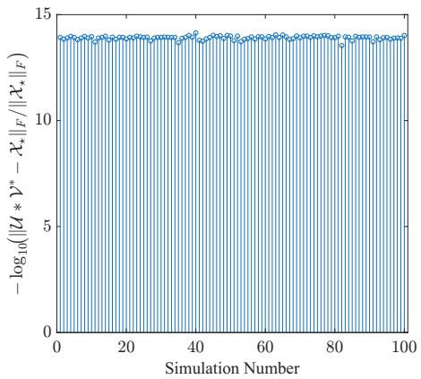

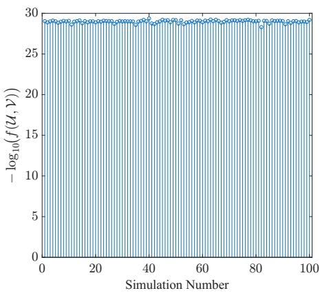  
Fig. 1 Consistent near-exact recovery across 100 independent random initializations. The target is generated from two independent standard Gaussian factors of size $6 \times 1 \times 3$ and normalized to unit Frobenius norm. We use $m = 7 0$ noiseless Gaussian measurements with sensing entries distributed as $\mathcal { N } ( 0 , 1 / m )$ . The target and sensing operator are fixed across all runs, while the initial factors are drawn independently from $\mathcal { N } ( 0 , 0 . \bar { 1 } ^ { 2 } )$ . Each run performs 5000 gradient-descent iterations with stepsize 0.05. The left panel reports $- \log _ { 1 0 }$ of the final relative reconstruction error, and the right panel reports − $\log _ { 1 0 }$ of the final balanced objective value.

The behavior in Figure 1 motivates the first question studied in this paper: under what conditions does the favorable global landscape of low-rank matrix sensing persist for low-tubal-rank tensor sensing?

The tensor setting contains, however, an additional structural feature that is not visible in this experiment. Let $\widehat { \mathcal { X } } _ { \star }$ denote the discrete Fourier transform of $\mathcal { X } _ { \star }$ along the third mode, and $\widehat { \mathcal { X } } _ { \star } ^ { ( k ) }$ denote its k-th frontal slice. For each Fourier frequency, let $\rho _ { k } = \mathrm { r a n k } ( \widehat { \mathcal X } _ { \star } ^ { ( k ) } )$ . The vector $\pmb { \rho } _ { \star } = ( \rho _ { 1 } , \ldots , \rho _ { n _ { 3 } } )$ is the multi-rank of the ground-truth tensor, whereas its tubal rank is only $r = \operatorname* { m a x } _ { k } \rho _ { k }$ . Thus the tubal rank records the largest Fourier-slice rank but does not determine the complete Fourier rank profile. This distinction has an important consequence for factorized optimization. Choosing the factor width equal to the exact tubal rank r does not imply that the factorization is exactly parameterized at every Fourier frequency. Whenever $\rho _ { k } < r$ , the width-r factors retain inactive coordinates at that frequency. Hence overparameterization may arise even though the chosen factor width matches the true tubal rank.

This leads to a second question that has no direct analogue in exactly parameterized matrix sensing: $i f$ rank deficiency at some Fourier frequencies does not destroy the favorable global landscape, does it nevertheless change the local geometry near the solution set?

Our results show that the global and local aspects of the problem behave diferently. Under a suitable tensor restricted isometry condition, the no-spurious-minima property and the strict-saddle structure persist for arbitrary multi-rank profiles; in particular, uniform Fourier ranks are not required. The local geometry, however, is governed by the full multi-rank profile. When every Fourier slice has rank equal to the tubal rank, the factorization exhibits the nondegenerate quadratic behavior familiar from exactly parameterized matrix models. When some Fourier slice has smaller rank, inactive factor coordinates generate additional flat directions beyond those associated with the t-orthogonal symmetry.

This separation clarifies the roles played by tubal rank and multi-rank. The tubal rank determines the factor width, while the multi-rank determines whether that factorization is locally nondegenerate. Consequently, tensors with the same tubal rank can exhibit qualitatively diferent local optimization landscapes because of diferences in their Fourier rank profiles.

## 1.1 Related work

Low-tubal-rank tensor recovery. The t-product and t-SVD framework [5, 6] has been widely used in low-rank tensor recovery. Convex formulations based on tensor nuclear norms have been developed for tensor completion, robust tensor recovery, and related inverse problems [10–12]. For general linear measurements, the work [13] establishes t-RIP for standard random sensing ensembles, providing a tensor analogue of the restricted isometry framework used in low-rank matrix sensing.

Factorized low-tubal-rank recovery. Factorized formulations reduce the computational cost of low-tubal-rank recovery by optimizing over smaller tensor factors and avoiding repeated full t-SVD computations. The work [14] studies a regularized Burer–Monteiro formulation for tensor completion under random tube-wise sampling, where selecting an index pair (i, j) reveals the entire mode-three tube $\mathcal { X } ( i , j , : )$ Since this sampling operator commutes with the Fourier transform along the third mode, the data-fitting term separates across Fourier frequencies. Together with the frequency-wise regularizers, this structure permits a slice-wise matrix-completion analysis with a common sampling mask. The paper presents no-spurious-local-minima and quantitative strict-saddle results under suitable incoherence and sampling conditions. Its quantitative strict-saddle argument relies on a positive smallest-singular-value coercivity bound across all frequencies. Such a bound implicitly requires the widthr ground-truth factors to have full column rank at every Fourier frequency, or equivalently, $\rho _ { k } = r$ for all k.

Recent work also investigates the convergence and statistical accuracy of factorized methods under linear measurements. Factorized gradient descent in [15] is analyzed in both noiseless and noisy settings, including cases in which the factor width overestimates the true tubal rank. Implicit regularization is studied in [16], which shows that gradient descent with small random initialization in an overparameterized tubal factorization can favor low-tubal-rank solutions. For noisy recovery with a symmetric factorization, [17] shows that small initialization, combined with an appropriate stopping rule, yields recovery error bounds governed by the true tubal rank rather than the overestimated factor width. Liu et al. [18] also identify frequency-wise overparameterization even when the factor width equals the true tubal rank, and use the multi-rank profile to establish linear convergence guarantees for alternating preconditioned gradient descent. These algorithmic results describe the behavior of iterates under specified initialization and measurement conditions.

The present work complements these contributions by studying the balanced asymmetric sensing objective over the entire factor space under t-RIP, without requiring the sensing loss to separate across Fourier frequencies. Our analysis also distinguishes the roles of tubal rank and multi-rank in the local landscape. Even when the factor width equals the exact tubal rank $r ,$ a Fourier slice with rank $\rho _ { k } ~ < ~ r$ remains overparameterized. We show that this frequency-wise rank deficiency creates normal Hessian-kernel directions beyond the t-orthogonal symmetry, with quartic objective growth and cubic gradient growth along suitable perturbations. By contrast, when $\rho _ { k } = r$ at every frequency, the Hessian kernel consists exactly of the symmetry directions and the objective has quadratic transverse growth. This distinction explains how a benign global landscape can coexist with local degeneracy and why the quantitative strict-saddle geometry depends on the Fourier rank profile.

Low-rank matrix landscapes and overparameterization. For low-rank matrix sensing, the works [7, 8] show that suitable RIP conditions lead to a benign factorized landscape with no spurious local minima and strict saddles away from the global solution set. The Procrustes geometry developed in [9] provides quantitative relations between factor-space error and lifted matrix error and plays a central role in related landscape and convergence analyses.

Overparameterized matrix factorizations can exhibit additional degeneracy and slower local behavior; see, for example, [19]. For overparameterized positivesemidefinite matrix factorization, Davis et al. [20] characterize quartic objective growth on a suitable manifold and give a cubic upper bound on the full gradient norm on that manifold. The tubal setting introduces a distinct form of overparameterization: it can occur even when the chosen factor width equals the exact tubal rank. Diferent Fourier frequencies may therefore be exactly parameterized and overparameterized simultaneously. This frequency-dependent structure is what separates the two local geometric regimes identified in this paper.

## 1.2 Main contributions

Our main contributions are summarized as follows.

(i) Under a tubal restricted isometry condition of order 2r with distortion below $1 / 5 .$ we prove that every local minimum of the balanced objective is globally optimal and every nonglobal critical point is a strict saddle. The global minimizers are exactly the balanced ground-truth factorizations up to a common t-orthogonal transformation. We also establish a quantitative strict-saddle description over the entire factor space. These results hold for arbitrary Fourier multi-rank profiles.

(ii) We establish a multi-rank dichotomy for the local geometry. When $\rho _ { k } ~ = ~ r$ at every frequency, the Hessian kernel at each global minimizer consists exactly of the symmetry-generated tangent directions, and the objective has quadratic growth transverse to the solution orbit. If some $\rho _ { k } < r ,$ frequency-wise overparameterization occurs even though the factor width equals the exact tubal rank. At every global minimizer, we construct additional Hessian-kernel directions normal to the solution orbit along which the objective grows quartically and the gradient norm grows cubically. Consequently, local quadratic growth and a local Polyak– Lojasiewicz inequality fail.

(iii) For fixed problem data and gradient tolerance $\epsilon > 0$ , we obtain strict-saddle proximity radii $O ( \epsilon )$ for uniform multi-rank profiles and $O ( \epsilon ^ { 1 / 3 } )$ for arbitrary profiles. The latter estimate includes an explicit ϵ-dependent negative-curvature threshold. In the nonuniform case, the quartically flat directions rule out any proximity radius $o ( \epsilon ^ { 1 / 3 } )$ when the negative-curvature threshold is fixed and positive, explaining the obstruction to matrix-like linear proximity estimates.

(iv) Numerical experiments illustrate recovery from independent random initializations and the transition from quadratic to quartic local growth for tensors with the same tubal rank but diferent multi-rank profiles. Experiments with targets derived from optical coherence tomography data further examine recovery and the efects of model mismatch.

## 1.3 Organization

The remainder of the paper is organized as follows. Section 2 introduces the t-product notation, the low-tubal-rank sensing model, the tensor restricted isometry property, and the product-space geometry used in the analysis. Section 3 first establishes the global strict-saddle landscape and then develops the multi-rank-dependent local geometry. Section 4 presents numerical experiments illustrating the global landscape, the multi-rank-dependent local behavior, and the OCT-based sensing experiments. Section 5 concludes the paper and discusses possible extensions.

## 2 Preliminaries and Problem Setup

We first introduce the notation and basic t-product conventions used throughout the paper, and then formulate the balanced low-tubal-rank tensor sensing problem.

## 2.1 Notation and the t-product

For a positive integer n, let $[ n ] : = \{ 1 , \dots , n \}$ . We use calligraphic letters for tensors and ordinary capital letters for matrices. The vector $e _ { j }$ denotes the j-th standard basis vector. For a complex matrix $A , A ^ { H }$ denotes its conjugate transpose, $\sigma _ { j } ( A )$ denotes its j-th largest singular value, and $A \succeq 0$ means that A is Hermitian positive semidefinite.

For complex matrices of the same size, we use the real Frobenius inner product $\langle A , B \rangle _ { F } : = \operatorname { R e } \operatorname { t r } ( A ^ { H } B )$ . For real tensors, $\langle \cdot , \cdot \rangle _ { F }$ and $\| \cdot \| _ { F }$ denote the usual Frobenius inner product and norm.

For a real tensor $\mathcal { A } \in \mathbb { R } ^ { n _ { 1 } \times n _ { 2 } \times n _ { 3 } }$ , let $\widehat { A }$ denote its discrete Fourier transform along the third mode, and write $\widehat { A } ^ { ( k ) } \in \mathbb { C } ^ { n _ { 1 } \times n _ { 2 } }$ for its k-th frontal slice. We use the unnormalized discrete Fourier transform, so Parseval’s identity takes the form

$$
\langle \mathcal { A } , \mathcal { B } \rangle _ { F } = \frac { 1 } { n _ { 3 } } \sum _ { k = 1 } ^ { n _ { 3 } } \mathrm { R e } \operatorname { t r } \left( \widehat { \mathcal { A } } ^ { ( k ) H } \widehat { \mathcal { B } } ^ { ( k ) } \right) , \qquad \| \mathcal { A } \| _ { F } ^ { 2 } = \frac { 1 } { n _ { 3 } } \sum _ { k = 1 } ^ { n _ { 3 } } \left\| \widehat { \mathcal { A } } ^ { ( k ) } \right\| _ { F } ^ { 2 } .\tag{1}
$$

Because the tensors considered in this paper are real, their Fourier slices satisfy the usual conjugate-symmetry condition. Whenever Fourier-domain factors, alignments, or perturbations are constructed, the slices at paired frequencies are chosen as complex conjugates, while the choices at self-conjugate frequencies are real. This ensures that their inverse Fourier transforms are real.

For conformable tensors A and B, their t-product is characterized by $\widehat { \boldsymbol { A } * \boldsymbol { B } } ^ { ( k ) } =$ $\widehat { A } ^ { ( k ) } \widehat { B } ^ { ( k ) } , k \in [ n _ { 3 } ]$ . The t-adjoint is characterized by $\widehat { \mathcal { A } ^ { * } } ^ { ( k ) } = \widehat { \mathcal { A } } ^ { ( k ) H }$ . The tubal rank of $\mathcal { A }$ is

$$
\operatorname { r a n k } _ { \mathrm { t } } ( \mathcal { A } ) : = \operatorname* { m a x } _ { k \in [ n _ { 3 } ] } \operatorname { r a n k } \big ( \widehat { \mathcal { A } } ^ { ( k ) } \big ) .
$$

The t-identity tensor $\mathcal { T } \in \mathbb { R } ^ { r \times r \times n _ { 3 } }$ is characterized by $\widehat { \underline { { T } } } ^ { ( k ) } = I _ { r } , k \in [ n _ { 3 } ]$ . The t-orthogonal group is ${ \mathsf { O } } _ { \mathrm { t } } ( r ) : = \{ \mathcal { Q } \in \mathbb { R } ^ { r \times r \times n _ { 3 } } : \mathcal { Q } ^ { * } * \mathcal { Q } = \mathcal { Q } * \mathcal { Q } ^ { * } = \mathbb { Z } \}$ . Equivalently,

$$
\begin{array} { l l l } { { \mathcal { Q } \in \mathsf { O } _ { \mathsf { t } } ( r ) } } & { { \iff } } & { { \widehat { \mathcal { Q } } ^ { ( k ) } \mathrm { ~ i s ~ u n i t a r y ~ f o r ~ e v e r y ~ } k \in [ n _ { 3 } ] . } } \end{array}
$$

We repeatedly use the standard identities $( \mathcal { A } \ast \mathcal { B } ) ^ { \ast } = \mathcal { B } ^ { \ast } \ast \mathcal { A } ^ { \ast }$ and $\langle \boldsymbol { \mathcal { A } } * \boldsymbol { \mathcal { B } } , \boldsymbol { \mathcal { C } } \rangle _ { F } =$ $\langle B , \mathcal { A } ^ { * } * \mathcal { C } \rangle _ { F } = \langle A , \mathcal { C } * B ^ { * } \rangle _ { F }$ . If Q is t-orthogonal, then

$$
\| A \ast \mathcal { Q } \| _ { F } = \| A \| _ { F } , \qquad \| \mathcal { Q } \ast \mathcal { B } \| _ { F } = \| \mathcal { B } \| _ { F } .
$$

All of these identities follow by applying the corresponding matrix identities to the Fourier slices and then using (1).

## 2.2 Low-tubal-rank tensor sensing

Let $\mathcal { X } _ { \star } \in \mathbb { R } ^ { n _ { 1 } }$ ×n2×n3 be an unknown low-tubal-rank tensor. For each $k \in [ n _ { 3 } ]$ , define $\rho _ { k } : = \mathrm { r a n k } \big ( \widehat { \mathcal X } _ { \star } ^ { ( k ) } \big )$ . The vector

$$
\rho _ { \star } : = ( \rho _ { 1 } , \ldots , \rho _ { \mathbf { n } _ { 3 } } )
$$

is called the multi-rank of ${ { \mathcal { X } } _ { \star } }$

$$
r : = \mathrm { r a n k } _ { \mathrm { t } } ( \mathcal { X } _ { \star } ) = \operatorname* { m a x } _ { k \in [ n _ { 3 } ] } \rho _ { k }
$$

is called the tubal-rank of ${  { \mathcal X } } _ { \star }$ and we assume throughout that $\mathcal { X } _ { \star } \ \ne \ 0 .$ so that $1 \leq r \leq \operatorname* { m i n } \{ n _ { 1 } , n _ { 2 } \}$ . The degenerate zero-tensor case is omitted. We use a factorization of width r. Although this factor width equals the exact tubal rank, it is overparameterized at every frequency for which $\rho _ { k } < r$ . Using SVDs of the Fourier slices, chosen compatibly with the conjugate-symmetry condition, we fix a balanced factorization

$$
\begin{array} { r } { \mathcal { X } _ { \star } = \mathcal { U } _ { \star } * \mathcal { V } _ { \star } ^ { * } , \qquad \mathcal { U } _ { \star } ^ { * } * \mathcal { U } _ { \star } = \mathcal { V } _ { \star } ^ { * } * \mathcal { V } _ { \star } , } \end{array}
$$

where $\mathcal { U } _ { \star } \in \mathbb { R } ^ { n _ { 1 } \times r \times n _ { 3 } } , \mathcal { V } _ { \star } \in \mathbb { R } ^ { n _ { 2 } \times r \times n _ { 3 } }$

Let

$$
\mathcal { M } : \mathbb { R } ^ { n _ { 1 } \times n _ { 2 } \times n _ { 3 } } \longrightarrow \mathbb { R } ^ { m }
$$

be a linear sensing operator. We consider the noiseless measurements

$$
\begin{array} { r } { \boldsymbol { y } = \mathcal { M } ( \mathcal { X } _ { \star } ) . } \end{array}
$$

The adjoint $\mathcal { M } ^ { * } : \mathbb { R } ^ { m } \longrightarrow \mathbb { R } ^ { n _ { 1 } \times n _ { 2 } \times n _ { 3 } }$ is characterized by

$$
\langle \mathcal { M } ( \mathcal { Z } ) , z \rangle _ { \mathbb { R } ^ { m } } = \langle \mathcal { Z } , \mathcal { M } ^ { * } ( z ) \rangle _ { F }
$$

for every tensor $\mathcal { Z }$ and every $z \in \mathbb { R } ^ { m }$

For candidate factors $\mathcal { U } \in \mathbb { R } ^ { n _ { 1 } \times r \times n _ { 3 } }$ and $\mathcal { V } \in \mathbb { R } ^ { n _ { 2 } \times r \times n _ { 3 } }$ , define the reconstruction and balancing residuals by

$$
\mathcal { E } ( \mathcal { U } , \mathcal { V } ) : = \mathcal { U } * \mathcal { V } ^ { * } - \mathcal { X } _ { \star } , \qquad \mathcal { B } ( \mathcal { U } , \mathcal { V } ) : = \mathcal { U } ^ { * } * \mathcal { U } - \mathcal { V } ^ { * } * \mathcal { V } .
$$

We study the balanced factorized objective

$$
f ( \mathcal { U } , \mathcal { V } ) : = \frac { 1 } { 2 } \left\| \mathcal { M } \big ( \mathcal { E } ( \mathcal { U } , \mathcal { V } ) \big ) \right\| _ { 2 } ^ { 2 } + \frac { 1 } { 8 } \left\| \mathcal { B } ( \mathcal { U } , \mathcal { V } ) \right\| _ { F } ^ { 2 } .\tag{2}
$$

The balancing term controls the noncompact ambiguity between the two factors while preserving their common t-orthogonal symmetry. In particular, for every $\mathcal { Q } \in$ $\mathsf { O } _ { \mathrm { t } } ( r )$

$$
f ( \mathcal { U } * \mathcal { Q } , \mathcal { V } * \mathcal { Q } ) = f ( \mathcal { U } , \mathcal { V } ) .
$$

We therefore define the balanced ground-truth factor orbit by

$$
S _ { \star } : = \left\{ \left( \mathcal { U } _ { \star } \ast \mathcal { Q } , \mathcal { V } _ { \star } \ast \mathcal { Q } \right) : \mathcal { Q } \in \mathsf { O } _ { \mathrm { t } } ( r ) \right\} .
$$

Theorem 4 will show that this orbit is exactly the set of global minimizers of (2).

Definition 1 (t-RIP). Let $s \geq 1$ and $\delta \in ( 0 , 1 )$ . We say that M satisfies the $( s , \delta ) \ i = 1 -$ RIP if

$$
( 1 - \delta ) \| \mathcal { Z } \| _ { F } ^ { 2 } \le \| \mathcal { M } ( \mathcal { Z } ) \| _ { 2 } ^ { 2 } \le ( 1 + \delta ) \| \mathcal { Z } \| _ { F } ^ { 2 }
$$

for every tensor Z satisfying ran $\operatorname { k } _ { \mathrm { t } } ( { \mathcal { Z } } ) \leq s$

Remark 2. The $\mathrm { t - R I P }$ assumption holds with high probability for standard random sensing operators. Suppose that

$$
[ \mathcal { M } ( \mathcal { Z } ) ] _ { \ell } = \langle \mathcal { A } _ { \ell } , \mathcal { Z } \rangle _ { F } , \qquad \ell = 1 , \ldots , m ,
$$

where the entries of the sensing tensors $\mathbf { \mathcal { A } } _ { \ell }$ are independent, centered, variance- $1 / m$ sub-Gaussian random variables. It is shown in [13] that, for $s \ge 1 , \delta \in ( 0 , 1 )$ , and $\eta \in ( 0 , 1 )$ , the operator M satisfies the $( s , \delta ) \small \mathrm { - t - R I P }$ with probability at least $1 - \eta ,$ provided

$$
m \ge C \delta ^ { - 2 } \operatorname* { m a x } \left\{ s ( n _ { 1 } + n _ { 2 } + 1 ) n _ { 3 } , \log ( \eta ^ { - 1 } ) \right\} ,
$$

where $C > 0$ depends only on the sub-Gaussian parameter. This class includes normalized Gaussian and symmetric Bernoulli sensing ensembles. In particular, taking $s = 2 r$ verifies the t-RIP assumption used in Theorem 4.

## 2.3 Product-space geometry

We identify a factor pair with the vertically stacked tensor

$$
\mathcal { W } : = \binom { \mathcal { U } } { \mathcal { V } } \in \mathbb { R } ^ { ( n _ { 1 } + n _ { 2 } ) \times r \times n _ { 3 } } , \qquad \mathcal { W } _ { \star } : = \binom { \mathcal { U } _ { \star } } { \mathcal { V } _ { \star } } .
$$

Likewise, a direction in the product factor space is written as

$$
\mathcal { Z } : = \left[ \begin{array} { l } { \mathcal { Z } _ { \mathcal { U } } } \\ { \mathcal { Z } _ { \mathcal { V } } } \end{array} \right] .
$$

We use the product Frobenius inner product $\langle \mathcal { W } , \mathcal { Z } \rangle _ { F } : = \langle \mathcal { U } , \mathcal { Z } _ { \mathcal { U } } \rangle _ { F } + \langle \mathcal { V } , \mathcal { Z } _ { \mathcal { V } } \rangle _ { F }$ and hence $\| \mathcal { W } \| _ { F } ^ { 2 } ~ = ~ \| \mathcal { U } \| _ { F } ^ { 2 } + \| \mathcal { V } \| _ { F } ^ { 2 }$ . We also write $f ( \mathcal { W } ) ~ : = ~ f ( \mathcal { U } , \mathcal { V } ) , \mathcal { E } ( \mathcal { W } ) ~ : =$ $\mathcal { E } ( \mathcal { U } , \mathcal { V } ) , B ( \mathcal { W } ) : = B ( \mathcal { U } , \mathcal { V } )$

The associated stacked Gram tensor is

$$
\boldsymbol { \mathcal { W } } * \boldsymbol { \mathcal { W } ^ { * } } = \left[ \mathcal { U } * \mathcal { U } ^ { * } \mathcal { U } * \mathcal { V } ^ { * } \right] .
$$

The distance from W to the ground-truth factor orbit is defined as the Procrustes distance:

$$
\mathrm { d i s t } \big ( \mathcal { W } , \mathcal { S } _ { \star } \big ) : = \operatorname* { m i n } _ { \mathcal { Q } \in \Theta _ { \mathsf { t } } ( r ) } \| \mathcal { W } - \mathcal { W } _ { \star } \ast \mathcal { Q } \| _ { F } = \operatorname* { m i n } _ { \mathcal { Q } \in \Theta _ { \mathsf { t } } ( r ) } \big ( \| \mathcal { U } - \mathcal { U } _ { \star } \ast \mathcal { Q } \| _ { F } ^ { 2 } + \| \mathcal { V } - \mathcal { V } _ { \star } \ast \mathcal { Q } \| _ { F } ^ { 2 } \big ) ^ { 1 / 2 } .
$$

All diferentiation is performed in the original real product factor space. We use the conventions

$$
D f ( { \cal W } ) [ { \mathcal Z } ] = \left. \nabla f ( { \cal W } ) , { \mathcal Z } \right. _ { F } , \qquad D ^ { 2 } f ( { \cal W } ) [ { \mathcal Z } , { \mathcal Z } ] = \left. { \mathcal Z } , \nabla ^ { 2 } f ( { \mathcal W } ) { \mathcal Z } \right. _ { F } .
$$

The smallest Hessian eigenvalue is

$$
\lambda _ { \operatorname* { m i n } } \big ( \nabla ^ { 2 } f ( \mathcal W ) \big ) : = \operatorname* { m i n } _ { \| \mathcal Z \| _ { F } = 1 } D ^ { 2 } f ( \mathcal W ) [ \mathcal Z , \mathcal Z ] .
$$

A critical point W is called a strict saddle if

$$
\lambda _ { \operatorname* { m i n } } \bigl ( \nabla ^ { 2 } f ( \mathcal { W } ) \bigr ) < 0 .
$$

Definition 3. Let $\epsilon , \gamma , \zeta > 0$ . We say that $f$ is $( \epsilon , \gamma , \zeta )$ -strict saddle relative to $\boldsymbol { S } _ { \star }$ if every factor pair W satisfies at least one of

$$
\| \nabla f ( \mathcal { W } ) \| _ { F } \ge \epsilon , \qquad \lambda _ { \operatorname* { m i n } } \big ( \nabla ^ { 2 } f ( \mathcal { W } ) \big ) \le - \gamma , \qquad \operatorname { d i s t } \big ( \mathcal { W } , \mathcal { S } _ { \star } \big ) \le \zeta .
$$

Tangent and normal spaces.

For

$$
\overline { { \mathcal { W } } } = \left[ \frac { \overline { { \mathcal { U } } } } { \mathcal { V } } \right] \in S _ { \star } ,
$$

the tangent space $T _ { \overline { { \mathbf { \lambda } } } } \mathbf { \lambda } _ { \overline { { \mathbf { \lambda } } } } S _ { \star }$ consists of the derivatives at $t = 0$ of diferentiable curves in $S _ { \star }$ passing through W. Since $\boldsymbol { S } _ { \star }$ is the orbit of the common t-orthogonal action,

$$
T _ { \overline { { \mathcal { W } } } } \mathcal { S } _ { \star } = \left\{ \left[ \frac { \overline { { \mathcal { U } } } } { \overline { { \mathcal { V } } } * K } \right] : K \in \mathbb { R } ^ { r \times r \times n _ { 3 } } , \quad K ^ { * } = - K \right\} .
$$

Indeed, the skew-adjoint condition follows by diferentiating

$$
{ \mathcal { Q } } ( t ) ^ { * } * { \mathcal { Q } } ( t ) = { \mathcal { T } } ,
$$

and the reverse inclusion follows by taking the frequency-wise matrix exponential of a skew-adjoint tensor.

The normal space is the orthogonal complement

$$
N _ { \overline { { \mathcal { W } } } } S _ { \star } : = \left( T _ { \overline { { \mathcal { W } } } } S _ { \star } \right) ^ { \perp }
$$

with respect to the product Frobenius inner product.

## 3 Main Results

## 3.1 Global Strict-Saddle Landscape under t-RIP

We first establish a quantitative strict-saddle description over the entire factor space. The result holds for arbitrary multi-ranks, including the nonuniform case in which some Fourier slices have rank strictly smaller than the tubal rank r.

Theorem 4 $L e t \mathcal { X } _ { \star } \in \mathbb { R } ^ { n _ { 1 } \times n _ { 2 } \times n _ { 3 } }$ be nonzero and have tubal rank $r \geq 1$ , and consider

$$
f ( \mathscr { U } , \mathscr { V } ) = \frac { 1 } { 2 } \left\| \mathscr { M } \big ( \mathscr { U } * \mathscr { V } ^ { * } - \mathscr { X } _ { \star } \big ) \right\| _ { 2 } ^ { 2 } + \frac { 1 } { 8 } \left\| \mathscr { U } ^ { * } * \mathscr { U } - \mathscr { V } ^ { * } * \mathscr { V } \right\| _ { F } ^ { 2 } .
$$

Assume that M satisfies the $( 2 r , \delta ) \ – t – R I P$ with $\delta < \frac { 1 } { 5 }$ . Then the following statements hold.

(i) The set of global minimizers is exactly

$$
S _ { \star } = \left\{ \left( \mathcal { U } _ { \star } \ast \mathcal { Q } , \mathcal { V } _ { \star } \ast \mathcal { Q } \right) : \mathcal { Q } \in \mathsf { O } _ { \mathsf { t } } ( r ) \right\} .
$$

(ii) Let $\mathcal { W } = ( \mathcal { U } , \mathcal { V } )$ , and set d(W) := dist(W, S⋆). $I f \mathcal { W } \notin { S _ { \star } }$ is a critical point, then

$$
\lambda _ { \operatorname* { m i n } } \bigl ( \nabla ^ { 2 } f ( \mathcal { W } ) \bigr ) \le - \frac { 1 - 5 \delta } { 8 r } d \bigl ( \mathcal { W } \bigr ) ^ { 2 } < 0 .
$$

Consequently, every nonglobal critical point is a strict saddle and every local minimum is globally optimal.

(iii) For any $\epsilon , \gamma , \zeta > 0$ satisfying $\begin{array} { r } { \gamma + \frac { 4 \epsilon } { \zeta } \leq \frac { 1 - 5 \delta } { 8 r } \zeta ^ { 2 } } \end{array}$ , the objective f is $( \epsilon , \gamma , \zeta )$ )-strict saddle relative to $s _ { \star }$ . That is, every factor pair W satisfies at least one of

$$
\| \nabla f ( \mathcal { W } ) \| _ { F } \ge \epsilon , \qquad \lambda _ { \operatorname* { m i n } } \big ( \nabla ^ { 2 } f ( \mathcal { W } ) \big ) \le - \gamma , \qquad d ( \mathcal { W } ) \le \zeta .
$$

In particular, for every $\epsilon > 0$ , one may take

$$
\zeta = \left( \frac { 6 4 r \epsilon } { 1 - 5 \delta } \right) ^ { 1 / 3 } , \qquad \gamma = \left( \frac { ( 1 - 5 \delta ) \epsilon ^ { 2 } } { r } \right) ^ { 1 / 3 } .
$$

The proof is based on a symmetric lifting of the two-factor problem. We first establish the Procrustes and Hessian estimates, then use negative curvature outside $S _ { \star }$ to identify all local and global minimizers.

## 3.1.1 Tubal Procrustes alignment

Choose

$$
\mathcal { Q } _ { \mathrm { o p t } } \in \arg \operatorname* { m i n } _ { \mathcal { Q } \in \mathsf { O } _ { \mathsf { t } } ( r ) } \| \mathcal { W } - \mathcal { W } _ { \star } \ast \mathcal { Q } \| _ { F } .\tag{3}
$$

For each $k \in \ [ n _ { 3 } ]$ , let $\widehat { \mathcal { W } } _ { \star } ^ { ( k ) H } \widehat { \mathcal { W } } ^ { ( k ) } = L _ { k } \Sigma _ { k } R _ { k } ^ { H }$ be a full SVD. By the orthogonal Procrustes theorem [21], the minimizer in (3) can be chosen so that $\widehat { \mathcal { Q } } _ { \mathrm { o p t } } ^ { ( k ) } = L _ { k } R _ { k } ^ { H }$ The SVDs can be chosen conjugate-symmetrically, so the resulting $\mathcal { Q } _ { \mathrm { o p t } }$ is real and belongs to $\mathsf { O } _ { \mathrm { t } } ( r )$ . Moreover,

$$
\begin{array} { r } { \left( \widehat { \mathcal { W } } _ { \star } ^ { ( k ) } \widehat { \mathcal { Q } } _ { \mathrm { o p t } } ^ { ( k ) } \right) ^ { H } \widehat { \mathcal { W } } ^ { ( k ) } = \widehat { \mathcal { Q } } _ { \mathrm { o p t } } ^ { ( k ) H } \widehat { \mathcal { W } } _ { \star } ^ { ( k ) H } \widehat { \mathcal { W } } ^ { ( k ) } = R _ { k } \Sigma _ { k } R _ { k } ^ { H } \succeq 0 . } \end{array}\tag{4}
$$

Define the aligned error by $\mathcal { D } : = \mathcal { W } - \mathcal { W } _ { \star } * \mathcal { Q } _ { \mathrm { o p t } }$ . Then $\| \mathcal { D } \| _ { F } = \operatorname { d i s t } ( \mathcal { W } , \mathcal { S } _ { \star } )$

## Lemma 5 The aligned error satisfies

$$
\frac { 1 } { r } \| \mathcal { D } \| _ { F } ^ { 4 } \leq \| \mathcal { D } * \mathcal { D } ^ { * } \| _ { F } ^ { 2 } \leq 2 \left\| \mathcal { W } * \mathcal { W } ^ { * } - \mathcal { W } _ { \star } * \mathcal { W } _ { \star } ^ { * } \right\| _ { F } ^ { 2 } .\tag{5}
$$

Consequently,

$$
\left\| \mathcal { W } * \mathcal { W } ^ { * } - \mathcal { W } _ { \star } * \mathcal { W } _ { \star } ^ { * } \right\| _ { F } ^ { 2 } \geq \frac { 1 } { 2 r } \operatorname { d i s t } \bigl ( \mathcal { W } , S _ { \star } \bigr ) ^ { 4 } .\tag{6}
$$

Proof Fix $k \in [ n _ { 3 } ]$ , and set $W _ { k } : = \widehat { \mathcal { W } } ^ { ( k ) } , A _ { k } : = \widehat { \mathcal { W } } _ { \star } ^ { ( k ) } \widehat { \mathcal { Q } } _ { \mathrm { o p t } } ^ { ( k ) } , D _ { k } : = W _ { k } - A _ { k }$ . By (4), we have $A _ { k } ^ { H } W _ { k } \succeq 0$ . In particular, $A _ { k } ^ { H } W _ { k }$ is Hermitian and hence $W _ { k } ^ { H } A _ { k } = A _ { k } ^ { H } W _ { k }$

Since $D _ { k } D _ { k } ^ { H }$ and $D _ { k } ^ { H } D _ { k }$ have the same nonzero eigenvalues,

$$
\| D _ { k } D _ { k } ^ { H } \| _ { F } ^ { 2 } = \| D _ { k } ^ { H } D _ { k } \| _ { F } ^ { 2 } = \left\| { \cal W } _ { k } ^ { H } { \cal W } _ { k } + { \cal A } _ { k } ^ { H } { \cal A } _ { k } - 2 { \cal A } _ { k } ^ { H } { \cal W } _ { k } \right\| _ { F } ^ { 2 } .\tag{7}
$$

Also,

$$
\| \boldsymbol { W _ { k } } \boldsymbol { W } _ { k } ^ { H } - \boldsymbol { A _ { k } } \boldsymbol { A } _ { k } ^ { H } \| _ { F } ^ { 2 } = \| \boldsymbol { W } _ { k } ^ { H } \boldsymbol { W } _ { k } \| _ { F } ^ { 2 } + \| \boldsymbol { A } _ { k } ^ { H } \boldsymbol { A } _ { k } \| _ { F } ^ { 2 } - 2 \| \boldsymbol { A } _ { k } ^ { H } \boldsymbol { W } _ { k } \| _ { F } ^ { 2 } .\tag{8}
$$

Expanding (7) and comparing it with (8) gives

$$
\begin{array} { r l } & { 2 \| \boldsymbol { W } _ { k } \boldsymbol { W } _ { k } ^ { H } - \boldsymbol { A } _ { k } \boldsymbol { A } _ { k } ^ { H } \| _ { F } ^ { 2 } - \| \boldsymbol { D } _ { k } \boldsymbol { D } _ { k } ^ { H } \| _ { F } ^ { 2 } = \| \boldsymbol { W } _ { k } ^ { H } \boldsymbol { W } _ { k } - \boldsymbol { A } _ { k } ^ { H } \boldsymbol { A } _ { k } \| _ { F } ^ { 2 } + 4 \Big \langle \boldsymbol { D } _ { k } ^ { H } \boldsymbol { D } _ { k } , \boldsymbol { A } _ { k } ^ { H } \boldsymbol { W } _ { k } \Big \rangle } \\ & { \qquad = \| \boldsymbol { W } _ { k } ^ { H } \boldsymbol { W } _ { k } - \boldsymbol { A } _ { k } ^ { H } \boldsymbol { A } _ { k } \| _ { F } ^ { 2 } + 4 \Big \| \boldsymbol { D } _ { k } ( \boldsymbol { A } _ { k } ^ { H } \boldsymbol { W } _ { k } ) ^ { 1 / 2 } \Big \| _ { F } ^ { 2 } \geq 0 . } \end{array}
$$

Therefore,

$$
\begin{array} { r } { \| D _ { k } D _ { k } ^ { H } \| _ { F } ^ { 2 } \leq 2 \| W _ { k } W _ { k } ^ { H } - A _ { k } A _ { k } ^ { H } \| _ { F } ^ { 2 } . } \end{array}\tag{9}
$$

Since $\widehat { \mathcal { Q } } _ { \mathrm { o p t } } ^ { ( k ) }$ is unitary, $A _ { k } A _ { k } ^ { H } = \widehat { \mathcal { W } } _ { \star } ^ { ( k ) } \widehat { \mathcal { W } } _ { \star } ^ { ( k ) H }$ . Hence (9) becomes

$$
\left\| \widehat { \mathcal { D } } ^ { ( k ) } \widehat { \mathcal { D } } ^ { ( k ) H } \right\| _ { F } ^ { 2 } \leq 2 \left\| \widehat { \mathcal { W } } ^ { ( k ) } \widehat { \mathcal { W } } ^ { ( k ) H } - \widehat { \mathcal { W } } _ { \star } ^ { ( k ) } \widehat { \mathcal { W } } _ { \star } ^ { ( k ) H } \right\| _ { F } ^ { 2 } .
$$

Summing over k and using Parseval’s identity gives

$$
\begin{array} { r } { \left\| \boldsymbol { \mathcal { D } } * \boldsymbol { \mathcal { D } } ^ { * } \right\| _ { F } ^ { 2 } \leq 2 \left\| \boldsymbol { \mathcal { W } } * \boldsymbol { \mathcal { W } } ^ { * } - \boldsymbol { \mathcal { W } } _ { \star } * \boldsymbol { \mathcal { W } } _ { \star } ^ { * } \right\| _ { F } ^ { 2 } . } \end{array}\tag{10}
$$

For the lower bound, $\widehat { \mathcal { D } } ^ { ( k ) }$ has at most r nonzero singular values. Thus

$$
\left\| \widehat { D } ^ { ( k ) } \widehat { D } ^ { ( k ) H } \right\| _ { F } ^ { 2 } = \sum _ { j = 1 } ^ { r } \sigma _ { j } \big ( \widehat { D } ^ { ( k ) } \big ) ^ { 4 } \geq \frac { 1 } { r } \left( \sum _ { j = 1 } ^ { r } \sigma _ { j } \big ( \widehat { D } ^ { ( k ) } \big ) ^ { 2 } \right) ^ { 2 } = \frac { 1 } { r } \left\| \widehat { D } ^ { ( k ) } \right\| _ { F } ^ { 4 } .
$$

Using Parseval’s identity and Jensen’s inequality,

$$
\left\| \mathcal { D } * \mathcal { D } ^ { * } \right\| _ { F } ^ { 2 } = \frac { 1 } { n _ { 3 } } \sum _ { k = 1 } ^ { n _ { 3 } } \left\| \widehat { \mathcal { D } } ^ { ( k ) } \widehat { \mathcal { D } } ^ { ( k ) H } \right\| _ { F } ^ { 2 } \geq \frac { 1 } { r n _ { 3 } } \sum _ { k = 1 } ^ { n _ { 3 } } \left\| \widehat { \mathcal { D } } ^ { ( k ) } \right\| _ { F } ^ { 4 } \geq \frac { 1 } { r } \left( \frac { 1 } { n _ { 3 } } \sum _ { k = 1 } ^ { n _ { 3 } } \left\| \widehat { \mathcal { D } } ^ { ( k ) } \right\| _ { F } ^ { 2 } \right) ^ { 2 } = \frac { 1 } { r } \| \mathcal { D } \| _ { F } ^ { 4 } .\tag{11}
$$

Combining (10) and (11) proves (5). Finally, $\| \mathcal { D } \| _ { F } = \operatorname { d i s t } ( \mathcal { W } , \mathcal { S } _ { \star } )$ , so (6) follows immediately.

## 3.1.2 The aligned Hessian identity

Lemma 6 Let $\mathcal { A } _ { \mathcal { U } } : = \mathcal { U } _ { \star } * \mathcal { Q } _ { \mathrm { o p t } } , \mathcal { A } _ { \mathcal { V } } : = \mathcal { V } _ { \star } * \mathcal { Q } _ { \mathrm { o p t } }$ , and define the aligned factor errors

$$
\mathcal { D } _ { \mathcal { U } } : = \mathcal { U } - \mathcal { A } _ { \mathcal { U } } , \qquad \mathcal { D } _ { \mathcal { V } } : = \mathcal { V } - \mathcal { A } _ { \mathcal { V } } .
$$

Then

$$
\begin{array} { r l } & { \boldsymbol { D } ^ { 2 } f ( \mathcal { U } , \mathcal { V } ) \big [ ( \mathcal { D } _ { \mathcal { U } } , \mathcal { D } _ { \mathcal { V } } ) , ( \mathcal { D } _ { \mathcal { U } } , \mathcal { D } _ { \mathcal { V } } ) \big ] = \big \| \mathcal { M } \big ( \mathcal { D } _ { \mathcal { U } } * \mathcal { D } _ { \mathcal { V } } ^ { * } \big ) \big \| _ { 2 } ^ { 2 } + \frac { 1 } { 4 } \big \| \mathcal { D } _ { \mathcal { U } } ^ { * } * \mathcal { D } _ { \mathcal { U } } - \mathcal { D } _ { \mathcal { V } } ^ { * } * \mathcal { D } _ { \mathcal { V } } \big \| _ { F } ^ { 2 } } \\ & { \qquad - 3 \big \| \mathcal { M } \big ( \mathcal { U } * \mathcal { V } ^ { * } - \mathcal { X } _ { \star } \big ) \big \| _ { 2 } ^ { 2 } - \frac { 3 } { 4 } \big \| \mathcal { U } ^ { * } * \mathcal { U } - \mathcal { V } ^ { * } * \mathcal { V } \big \| _ { F } ^ { 2 } + 4 D f ( \mathcal { U } , \mathcal { V } ) [ \mathcal { D } _ { \mathcal { U } } , \mathcal { D } _ { \mathcal { V } } ] . } \end{array}\tag{12}
$$

In particular, at a critical point,

$$
\begin{array} { r l } &  \displaystyle { D ^ { 2 } f ( \boldsymbol { U } , \boldsymbol { \mathcal { V } } ) \big [ ( { \mathcal { D } _ { \boldsymbol { U } } } , { \mathcal { D } _ { \boldsymbol { \mathcal { V } } } } ) , ( { \mathcal { D } _ { \boldsymbol { U } } } , { \mathcal { D } _ { \boldsymbol { \mathcal { V } } } } ) \big ] = \big \| \boldsymbol { \mathcal { M } } \big ( { \mathcal { D } _ { \boldsymbol { U } } } * { \mathcal { D } _ { \boldsymbol { \mathcal { V } } } ^ { * } } \big ) \big \| _ { 2 } ^ { 2 } + \frac { 1 } { 4 } \left\| { \mathcal { D } _ { \boldsymbol { U } } ^ { * } } * { \mathcal { D } _ { \boldsymbol { U } } } - { \mathcal { D } _ { \boldsymbol { \mathcal { V } } } ^ { * } } * { \mathcal { D } _ { \boldsymbol { \mathcal { V } } } } \right\| _ { F } ^ { 2 } } \\ & { \qquad - 3 \left\| \boldsymbol { \mathcal { M } } \big ( \boldsymbol { U } * { \mathcal { V } ^ { * } } - \boldsymbol { \mathcal { X } } _ { \star } \big ) \right\| _ { 2 } ^ { 2 } - \frac { 3 } { 4 } \left\| \boldsymbol { \mathcal { U } } ^ { * } * \boldsymbol { U } - \boldsymbol { \mathcal { V } } ^ { * } * \boldsymbol { \mathcal { V } } \right\| _ { F } ^ { 2 } . } \end{array}\tag{13}
$$

Proof Consider the path $\mathcal { U } ( t ) : = \mathcal { U } + t \mathcal { D } _ { \mathcal { U } } , \mathcal { V } ( t ) : = \mathcal { V } + t \mathcal { D } _ { \mathcal { V } }$ . Since $\mathcal { A } _ { \mathcal { U } } * \mathcal { A } _ { \mathcal { V } } ^ { * } = \mathcal { X } _ { \star }$ , we have

$$
\begin{array} { r l } & { \mathcal { D } _ { \mathcal { U } } * \mathcal { V } ^ { * } + \mathcal { U } * \mathcal { D } _ { \mathcal { V } } ^ { * } = \mathcal { D } _ { \mathcal { U } } * \left( \mathcal { A } _ { \mathcal { V } } + \mathcal { D } _ { \mathcal { V } } \right) ^ { * } + \left( \mathcal { A } _ { \mathcal { U } } + \mathcal { D } _ { \mathcal { U } } \right) * \mathcal { D } _ { \mathcal { V } } ^ { * } } \\ & { \quad \quad \quad \quad = \left( \mathcal { A } _ { \mathcal { U } } + \mathcal { D } _ { \mathcal { U } } \right) * \left( \mathcal { A } _ { \mathcal { V } } + \mathcal { D } _ { \mathcal { V } } \right) ^ { * } - \mathcal { A } _ { \mathcal { U } } * \mathcal { A } _ { \mathcal { V } } ^ { * } + \mathcal { D } _ { \mathcal { U } } * \mathcal { D } _ { \mathcal { V } } ^ { * } } \\ & { \quad \quad \quad = \mathcal { U } * \mathcal { V } ^ { * } - \mathcal { X } _ { \star } + \mathcal { D } _ { \mathcal { U } } * \mathcal { D } _ { \mathcal { V } } ^ { * } = \mathcal { E } ( \mathcal { U } , \mathcal { V } ) + \mathcal { D } _ { \mathcal { U } } * \mathcal { D } _ { \mathcal { V } } ^ { * } . } \end{array}
$$

Therefore, we have that

$$
\begin{array} { r l } & { \mathcal { E } \big ( \mathcal { U } ( t ) , \mathcal { V } ( t ) \big ) = \mathcal { E } ( \mathcal { U } , \mathcal { V } ) + t \big [ \mathcal { D } _ { \mathcal { U } } * \mathcal { V } ^ { * } + \mathcal { U } * \mathcal { D } _ { \mathcal { V } } ^ { * } \big ] + t ^ { 2 } \mathcal { D } _ { \mathcal { U } } * \mathcal { D } _ { \mathcal { V } } ^ { * } } \\ & { \qquad = \mathcal { E } ( \mathcal { U } , \mathcal { V } ) + t \big [ \mathcal { E } ( \mathcal { U } , \mathcal { V } ) + \mathcal { D } _ { \mathcal { U } } * \mathcal { D } _ { \mathcal { V } } ^ { * } \big ] + t ^ { 2 } \mathcal { D } _ { \mathcal { U } } * \mathcal { D } _ { \mathcal { V } } ^ { * } . } \end{array}
$$

Similarly, since the aligned ground-truth factors are balanced, $\mathcal { A } _ { \mathcal { U } } ^ { \ast } \ast \mathcal { A } _ { \mathcal { U } } = \mathcal { A } _ { \mathcal { V } } ^ { \ast } \ast \mathcal { A } _ { \mathcal { V } }$ , we obtain

$$
\begin{array} { r } { \mathcal { B } \big ( \mathcal { U } ( t ) , \mathcal { V } ( t ) \big ) = \mathcal { B } ( \mathcal { U } , \mathcal { V } ) + t \big [ \mathcal { B } ( \mathcal { U } , \mathcal { V } ) + \mathcal { D } _ { \mathcal { U } } ^ { * } * \mathcal { D } _ { \mathcal { U } } - \mathcal { D } _ { \mathcal { V } } ^ { * } * \mathcal { D } _ { \mathcal { V } } \big ] + t ^ { 2 } \left[ \mathcal { D } _ { \mathcal { U } } ^ { * } * \mathcal { D } _ { \mathcal { U } } - \mathcal { D } _ { \mathcal { V } } ^ { * } * \mathcal { D } _ { \mathcal { V } } \right] . } \end{array}
$$

Diferentiating $\begin{array} { r } { f ( \mathcal { U } ( t ) , \mathcal { V } ( t ) ) = \frac { 1 } { 2 } \left\| \mathcal { M } \big ( \mathcal { E } ( \mathcal { U } ( t ) , \mathcal { V } ( t ) ) \big ) \right\| _ { 2 } ^ { 2 } + \frac { 1 } { 8 } \left\| \mathcal { B } ( \mathcal { U } ( t ) , \mathcal { V } ( t ) ) \right\| _ { F } ^ { 2 } } \end{array}$ at t = 0 gives

$$
\begin{array} { r l } & { D f ( \mathcal { U } , \mathcal { V } ) [ \mathcal { D } _ { \mathcal { U } } , \mathcal { D } _ { \mathcal { V } } ] = \left. \mathcal { M } \big ( \mathcal { E } ( \mathcal { U } , \mathcal { V } ) \big ) , \mathcal { M } \left( \mathcal { E } ( \mathcal { U } , \mathcal { V } ) + \mathcal { D } _ { \mathcal { U } } * \mathcal { D } _ { \mathcal { V } } ^ { * } \right) \right. } \\ & { \qquad + \frac { 1 } { 4 } \left. \mathcal { B } ( \mathcal { U } , \mathcal { V } ) , \mathcal { B } ( \mathcal { U } , \mathcal { V } ) + \mathcal { D } _ { \mathcal { U } } ^ { * } * \mathcal { D } _ { \mathcal { U } } - \mathcal { D } _ { \mathcal { V } } ^ { * } * \mathcal { D } _ { \mathcal { V } } \right. . } \end{array}\tag{14}
$$

Diferentiating a second time gives

$$
\begin{array} { r l } & { D ^ { 2 } f ( \mathcal { U } , \mathcal { V } ) \big [ ( \mathcal { D } _ { \mathcal { U } } , \mathcal { D } _ { \mathcal { V } } ) , ( \mathcal { D } _ { \mathcal { U } } , \mathcal { D } _ { \mathcal { V } } ) \big ] = \big \| \mathcal { M } \left( \mathcal { E } ( \mathcal { U } , \mathcal { V } ) + \mathcal { D } _ { \mathcal { U } } * \mathcal { D } _ { \mathcal { V } } ^ { * } \right) \big \| _ { 2 } ^ { 2 } + 2 \left. \mathcal { M } \big ( \mathcal { E } ( \mathcal { U } , \mathcal { V } ) \big ) , \mathcal { M } \big ( \mathcal { D } _ { \mathcal { U } } * \mathcal { D } _ { \mathcal { V } } ^ { * } \big ) \right. } \\ & { \qquad + \frac { 1 } { 4 } \left\| \mathcal { B } ( \mathcal { U } , \mathcal { V } ) + \mathcal { D } _ { \mathcal { U } } ^ { * } * \mathcal { D } _ { \mathcal { U } } - \mathcal { D } _ { \mathcal { V } } ^ { * } * \mathcal { D } _ { \mathcal { V } } \right\| _ { F } ^ { 2 } + \frac { 1 } { 2 } \left. \mathcal { B } ( \mathcal { U } , \mathcal { V } ) , \mathcal { D } _ { \mathcal { U } } ^ { * } * \mathcal { D } _ { \mathcal { U } } - \mathcal { D } _ { \mathcal { V } } ^ { * } * \mathcal { D } _ { \mathcal { V } } \right. . } \end{array}\tag{15}
$$

Expanding the squared norms in (15), we obtain

$$
\begin{array} { r l } & { D ^ { 2 } f ( \mathcal { U } , \mathcal { V } ) \big [ ( \mathcal { D } _ { \mathcal { U } } , \mathcal { D } _ { \mathcal { V } } ) , ( \mathcal { D } _ { \mathcal { U } } , \mathcal { D } _ { \mathcal { V } } ) \big ] = \big \| \mathcal { M } \big ( \mathcal { E } ( \mathcal { U } , \mathcal { V } ) \big ) \big \| _ { 2 } ^ { 2 } + 4 \left. \mathcal { M } \big ( \mathcal { E } ( \mathcal { U } , \mathcal { V } ) \big ) , \mathcal { M } \big ( \mathcal { D } _ { \mathcal { U } } * \mathcal { D } _ { \mathcal { V } } ^ { * } \big ) \right. } \\ & { + \big \| \mathcal { M } \big ( \mathcal { D } _ { \mathcal { U } } * \mathcal { D } _ { \mathcal { V } } ^ { * } \big ) \big \| _ { 2 } ^ { 2 } + \frac { 1 } { 4 } \| \mathcal { B } ( \mathcal { U } , \mathcal { V } ) \| _ { F } ^ { 2 } + \big < \mathcal { B } ( \mathcal { U } , \mathcal { V } ) , \mathcal { D } _ { \mathcal { U } } ^ { * } * \mathcal { D } _ { \mathcal { U } } - \mathcal { D } _ { \mathcal { V } } ^ { * } * \mathcal { D } _ { \mathcal { V } } \big > + \frac { 1 } { 4 } \big \| \mathcal { D } _ { \mathcal { U } } ^ { * } * \mathcal { D } _ { \mathcal { U } } - \mathcal { D } _ { \mathcal { V } } ^ { * } * \mathcal { D } _ { \mathcal { V } } \big \| _ { F } ^ { 2 } . } \end{array}
$$

On the other hand, multiplying (14) by 4 gives

$$
\begin{array} { r l } & { 4 D f ( \mathcal { U } , \mathcal { V } ) [ D _ { \mathcal { U } } , D _ { \mathcal { V } } ] = 4 \left\| \mathcal { M } \big ( \mathcal { E } ( \mathcal { U } , \mathcal { V } ) \big ) \right\| _ { 2 } ^ { 2 } + 4 \left. \mathcal { M } \big ( \mathcal { E } ( \mathcal { U } , \mathcal { V } ) \big ) , \mathcal { M } \big ( \mathcal { D } _ { \mathcal { U } } * \mathcal { D } _ { \mathcal { V } } ^ { * } \big ) \right. } \\ & { \qquad + \left\| \mathcal { B } ( \mathcal { U } , \mathcal { V } ) \right\| _ { F } ^ { 2 } + \left. \mathcal { B } ( \mathcal { U } , \mathcal { V } ) , \mathcal { D } _ { \mathcal { U } } ^ { * } * \mathcal { D } _ { \mathcal { U } } - \mathcal { D } _ { \mathcal { V } } ^ { * } * \mathcal { D } _ { \mathcal { V } } \right. . } \end{array}
$$

Substituting this expression into the preceding expansion proves (12). At a critical point, the directional derivative vanishes, which gives (13). □

## 3.1.3 Proof of the global landscape theorem

Proof of Theorem 4 Every element of S⋆ has zero reconstruction residual and zero balancing residual, and hence has objective value zero. Since $f \geq 0$ , every element of ${ \cal { S } } _ { \star }$ is a global minimizer. The reverse inclusion will follow from the negative-curvature argument below.

We next derive a curvature estimate that is valid at every point. We begin with the two positive terms in the aligned Hessian identity. Parseval’s identity and the corresponding matrix trace identities on each Fourier slice give

$$
\begin{array} { r } { \left\| \mathcal { D } _ { \mathcal { U } } ^ { * } * \mathcal { D } _ { \mathcal { U } } - \mathcal { D } _ { \mathcal { V } } ^ { * } * \mathcal { D } _ { \mathcal { V } } \right\| _ { F } ^ { 2 } = \left\| \mathcal { D } _ { \mathcal { U } } * \mathcal { D } _ { \mathcal { U } } ^ { * } \right\| _ { F } ^ { 2 } + \left\| \mathcal { D } _ { \mathcal { V } } * \mathcal { D } _ { \mathcal { V } } ^ { * } \right\| _ { F } ^ { 2 } - 2 \left\| \mathcal { D } _ { \mathcal { U } } * \mathcal { D } _ { \mathcal { V } } ^ { * } \right\| _ { F } ^ { 2 } . } \end{array}\tag{16}
$$

On the other hand, the block structure of $\mathcal { D } * \mathcal { D } ^ { * }$ gives

$$
\begin{array} { r } { \left\| \boldsymbol { D } * \boldsymbol { D } ^ { * } \right\| _ { F } ^ { 2 } = \left\| \boldsymbol { D } _ { \mathcal { U } } * \boldsymbol { D } _ { \mathcal { U } } ^ { * } \right\| _ { F } ^ { 2 } + \left\| \boldsymbol { D } _ { \mathcal { V } } * \boldsymbol { D } _ { \mathcal { V } } ^ { * } \right\| _ { F } ^ { 2 } + 2 \left\| \boldsymbol { D } _ { \mathcal { U } } * \boldsymbol { D } _ { \mathcal { V } } ^ { * } \right\| _ { F } ^ { 2 } . } \end{array}\tag{17}
$$

Therefore, we have

$$
\left\| \mathcal { D } * \mathcal { D } ^ { * } \right\| _ { F } ^ { 2 } = 4 \left\| \mathcal { D } _ { \mathcal { U } } * \mathcal { D } _ { \mathcal { V } } ^ { * } \right\| _ { F } ^ { 2 } + \left\| \mathcal { D } _ { \mathcal { U } } ^ { * } * \mathcal { D } _ { \mathcal { U } } - \mathcal { D } _ { \mathcal { V } } ^ { * } * \mathcal { D } _ { \mathcal { V } } \right\| _ { F } ^ { 2 } .
$$

Hence 4 $\mathopen : \left\| \mathcal { D } \ b _ { \mathcal { U } } * \mathcal { D } _ { \mathcal { V } } ^ { * } \right\| _ { F } ^ { 2 } \leq \left\| \mathcal { D } * \mathcal { D } ^ { * } \right\| _ { F } ^ { 2 }$ . Since rankt $\left( \mathcal { D } \mathcal { U } \ast \mathcal { D } _ { \mathcal { V } } ^ { \ast } \right) \leq r ,$ , the t-RIP, together with (16) and (17), yields

$$
\begin{array} { r } { 4 \left\| \mathcal { M } \big ( \mathcal { D } _ { \mathcal { U } } * \mathcal { D } _ { \mathcal { V } } ^ { * } \big ) \right\| _ { 2 } ^ { 2 } + \left\| \mathcal { D } _ { \mathcal { U } } ^ { * } * \mathcal { D } _ { \mathcal { U } } - \mathcal { D } _ { \mathcal { V } } ^ { * } * \mathcal { D } _ { \mathcal { V } } \right\| _ { F } ^ { 2 } \leq 4 ( 1 + \delta ) \left\| \mathcal { D } _ { \mathcal { U } } * \mathcal { D } _ { \mathcal { V } } ^ { * } \right\| _ { F } ^ { 2 } + \left\| \mathcal { D } _ { \mathcal { U } } ^ { * } * \mathcal { D } _ { \mathcal { U } } - \mathcal { D } _ { \mathcal { V } } ^ { * } * \mathcal { D } _ { \mathcal { V } } \right\| _ { F } ^ { 2 } } \\ { = \| \mathcal { D } * \mathcal { D } ^ { * } \| _ { F } ^ { 2 } + 4 \delta \left\| \mathcal { D } _ { \mathcal { U } } * \mathcal { D } _ { \mathcal { V } } ^ { * } \right\| _ { F } ^ { 2 } \leq ( 1 + \delta ) \| \mathcal { D } * \mathcal { D } ^ { * } \| _ { F } ^ { 2 } . } \end{array}\tag{18}
$$

For notational convenience, define the aligned ground-truth factor by

$$
\mathcal { A } : = \mathcal { W } _ { \star } * \mathcal { Q } _ { \mathrm { o p t } } = \left[ \mathcal { A } _ { \mathcal { U } } \right] .
$$

We now estimate the two negative terms in the aligned Hessian identity. By the definitions of W and A,

$$
\mu \ast \mathcal { W } ^ { \ast } - \boldsymbol { \mathcal { A } } \ast \boldsymbol { \mathcal { A } } ^ { \ast } = \left[ \begin{array} { c c } { \mathcal { U } \ast \mathcal { U } ^ { \ast } - \mathcal { A } \mathcal { U } \ast \mathcal { A } _ { \mathcal { U } } ^ { \ast } } & { \mathcal { U } \ast \mathcal { V } ^ { \ast } - \mathcal { X } _ { \star } } \\ { \mathcal { V } \ast \mathcal { U } ^ { \ast } - \mathcal { X } _ { \star } ^ { \ast } } & { \mathcal { V } \ast \mathcal { V } ^ { \ast } - \mathcal { A } \mathcal { V } \ast \mathcal { A } _ { \mathcal { V } } ^ { \ast } } \end{array} \right] .
$$

Using $\mathcal { A } _ { \mathcal { U } } * \mathcal { A } _ { \mathcal { V } } ^ { * } = \mathcal { X } _ { \star }$ and $\mathcal { A } _ { \mathcal { U } } ^ { \ast } \ast \mathcal { A } _ { \mathcal { U } } = \mathcal { A } _ { \mathcal { V } } ^ { \ast } \ast \mathcal { A } _ { \mathcal { V } }$ , a direct expansion gives

$$
\begin{array} { r } { 4 \left\| \mathcal { U } * \mathcal { V } ^ { * } - \mathcal { X } _ { \star } \right\| _ { F } ^ { 2 } + \left\| \mathcal { U } ^ { * } * \mathcal { U } - \mathcal { V } ^ { * } * \mathcal { V } \right\| _ { F } ^ { 2 } = \left\| \mathcal { W } * \mathcal { W } ^ { * } - \mathcal { A } * A ^ { * } \right\| _ { F } ^ { 2 } + 2 \left\| \mathcal { A } _ { \mathcal { U } } ^ { * } * \mathcal { U } - \mathcal { A } _ { \mathcal { V } } ^ { * } * \mathcal { V } \right\| _ { F } ^ { 2 } . } \end{array}
$$

In particular,

$$
4 \left\| \mathcal { U } * \mathcal { V } ^ { * } - \mathcal { X } _ { \star } \right\| _ { F } ^ { 2 } + \left\| \mathcal { U } ^ { * } * \mathcal { U } - \mathcal { V } ^ { * } * \mathcal { V } \right\| _ { F } ^ { 2 } \geq \left\| \mathcal { W } * \mathcal { W } ^ { * } - \mathcal { A } * \mathcal { A } ^ { * } \right\| _ { F } ^ { 2 } .
$$

The reconstruction residual has tubal rank at most 2r, so t-RIP gives

$$
\begin{array} { r } { 4 \left\| \mathcal { M } ( \mathcal { U } * \mathcal { V } ^ { * } - \mathcal { X } _ { \star } ) \right\| _ { 2 } ^ { 2 } + \left\| \mathcal { U } ^ { * } * \mathcal { U } - \mathcal { V } ^ { * } * \mathcal { V } \right\| _ { F } ^ { 2 } \geq 4 ( 1 - \delta ) \left\| \mathcal { U } * \mathcal { V } ^ { * } - \mathcal { X } _ { \star } \right\| _ { F } ^ { 2 } + \left\| \mathcal { U } ^ { * } * \mathcal { U } - \mathcal { V } ^ { * } * \mathcal { V } \right\| _ { F } ^ { 2 } } \\ { \geq ( 1 - \delta ) ( 4 \left\| \mathcal { U } * \mathcal { V } ^ { * } - \mathcal { X } _ { \star } \right\| _ { F } ^ { 2 } + \left\| \mathcal { U } ^ { * } * \mathcal { U } - \mathcal { V } ^ { * } * \mathcal { V } \right\| _ { F } ^ { 2 } ) } \end{array}
$$

$$
\begin{array} { r } { \geq ( 1 - \delta ) \left\| \mathcal { W } * \mathcal { W } ^ { * } - \mathcal { A } * \mathcal { A } ^ { * } \right\| _ { F } ^ { 2 } . } \end{array}\tag{19}
$$

Applying Lemma 6 and then using (18) and (19), we obtain

$$
\begin{array} { r l } & { D ^ { 2 } f ( \mathcal { U } , \mathcal { V } ) \big [ ( \mathcal { D } _ { \mathcal { U } } , \mathcal { D } _ { \mathcal { V } } ) , ( \mathcal { D } _ { \mathcal { U } } , \mathcal { D } _ { \mathcal { V } } ) \big ] \leq \frac { 1 + \delta } { 4 } \| \mathcal { D } * \mathcal { D } ^ { * } \| _ { F } ^ { 2 } - \frac { 3 ( 1 - \delta ) } { 4 } \| \mathcal { W } * \mathcal { W } ^ { * } - A * \mathcal { A } ^ { * } \| _ { F } ^ { 2 } } \\ & { \qquad +  4 D f ( \mathcal { U } , \mathcal { V } ) [ \mathcal { D } _ { \mathcal { U } } , \mathcal { D } _ { \mathcal { V } } ] . } \end{array}\tag{20}
$$

Lemma 5 gives that $\left\| \mathcal { D } * \mathcal { D } ^ { * } \right\| _ { F } ^ { 2 } \leq 2 \left\| \mathcal { W } * \mathcal { W } ^ { * } - \mathcal { A } * \mathcal { A } ^ { * } \right\| _ { F } ^ { 2 }$ . Substituting this into (20) yields

$$
D ^ { 2 } f ( \mathcal { U } , \mathcal { V } ) \big [ ( \mathcal { D } _ { \mathcal { U } } , \mathcal { D } _ { \mathcal { V } } ) , ( \mathcal { D } _ { \mathcal { U } } , \mathcal { D } _ { \mathcal { V } } ) \big ] \leq - \frac { 1 - 5 \delta } { 4 } \left\| \mathcal { W } * \mathcal { W } ^ { * } - \mathcal { A } * \mathcal { A } ^ { * } \right\| _ { F } ^ { 2 } + 4 D f ( \mathcal { U } , \mathcal { V } ) [ \mathcal { D } _ { \mathcal { U } } , \mathcal { D } _ { \mathcal { V } } ] .\tag{21}
$$

By Lemma 5, we have

$$
\left. \mathcal { W } * \mathcal { W } ^ { * } - \mathcal { A } * \mathcal { A } ^ { * } \right. _ { F } ^ { 2 } \geq \frac { 1 } { 2 r } \| \mathcal { D } \| _ { F } ^ { 4 } .\tag{22}
$$

Suppose now that $( \mathcal { U } , \mathcal { V } ) \notin \mathcal { S } ,$ is a critical point. Then $\mathcal { D } \neq 0$ and $D f ( \mathcal { U } , \mathcal { V } ) [ \mathcal { D } _ { \mathcal { U } } , \mathcal { D } _ { \mathcal { V } } ] = 0$ It follows from (21) and (22) that

$$
D ^ { 2 } f ( \mathcal { U } , \mathcal { V } ) \big [ ( \mathcal { D } _ { \mathcal { U } } , \mathcal { D } _ { \mathcal { V } } ) , ( \mathcal { D } _ { \mathcal { U } } , \mathcal { D } _ { \mathcal { V } } ) \big ] \leq - \frac { 1 - 5 \delta } { 8 r } \| \mathcal { D } \| _ { F } ^ { 4 } .
$$

Dividing by $\| \mathcal { D } \| _ { F } ^ { 2 }$ and using $\| \mathcal { D } \| _ { F } = \operatorname { d i s t } ( \mathcal { W } , \mathcal { S } _ { \star } )$ , we conclude that

$$
\lambda _ { \operatorname* { m i n } } \bigl ( \nabla ^ { 2 } f ( \mathcal { U } , \mathcal { V } ) \bigr ) \leq - \frac { \bigl ( 1 - 5 \delta \bigr ) \operatorname { d i s t } \bigl ( ( \mathcal { U } , \mathcal { V } ) , \mathcal { S } _ { \star } \bigr ) ^ { 2 } } { 8 r } .
$$

Since $\delta < \frac { 1 } { 5 }$ , we have $\lambda _ { \operatorname* { m i n } } \left( \nabla ^ { 2 } f ( \mathcal { U } , \mathcal { V } ) \right) < 0 .$ . Thus every critical point outside ${ \cal { S } } _ { \star }$ is a strict saddle. Every local minimizer is a critical point with positive-semidefinite Hessian and must therefore belong to ${ \cal { S } } _ { \star }$ . Conversely, every point of ${ \cal { S } } _ { \star }$ has objective value zero and is globally minimizing. Thus every local minimum is global, and the set of global minimizers is exactly $s _ { \star }$ . This proves parts $\mathrm { ( i ) }$ and (ii).

It remains to prove the quantitative strict-saddle proper $\mathrm { t y } .$ . Fix $\epsilon , \gamma , \zeta > 0$ satisfying

$$
\gamma + \frac { 4 \epsilon } { \zeta } \leq \frac { 1 - 5 \delta } { 8 r } \zeta ^ { 2 } .\tag{23}
$$

Consider any factor pair $\mathcal { W } = ( \mathcal { U } , \mathcal { V } )$ satisfying

$$
\| \nabla f ( \mathcal { U } , \mathcal { V } ) \| _ { F } < \epsilon , \qquad \operatorname { d i s t } ( \mathcal { W } , \mathcal { S } _ { \star } ) > \zeta .
$$

Let $\mathcal { D } = \mathcal { W } - \mathcal { A }$ be the aligned factor error, where $\mathcal { A } = \mathcal { W } _ { \star } * \mathcal { Q } _ { \mathrm { o p t } }$ , and set

$$
d : = \| \mathcal { D } \| _ { F } = \operatorname { d i s t } ( \mathcal { W } , \mathcal { S } _ { \star } ) > \zeta .
$$

By Cauchy–Schwarz,

$$
D f ( \mathcal { U } , \mathcal { V } ) [ \mathcal { D } _ { \mathcal { U } } , \mathcal { D } _ { \mathcal { V } } ] \leq \| \nabla f ( \mathcal { U } , \mathcal { V } ) \| _ { F } \| \mathcal { D } \| _ { F } < \epsilon d .
$$

Since $\delta < 1 / 5 ,$ combining (21) with (22) gives

$$
D ^ { 2 } f ( \mathcal { U } , \mathcal { V } ) [ \mathcal { D } , \mathcal { D } ] \leq - \frac { 1 - 5 \delta } { 8 r } d ^ { 4 } + 4 D f ( \mathcal { U } , \mathcal { V } ) [ \mathcal { D } _ { \mathcal { U } } , \mathcal { D } _ { \mathcal { V } } ] < - \frac { 1 - 5 \delta } { 8 r } d ^ { 4 } + 4 \epsilon d .
$$

Because $d > 0$ , the Rayleigh quotient therefore yields

$$
\lambda _ { \operatorname* { m i n } } \bigl ( \nabla ^ { 2 } f ( \mathcal { U } , \mathcal { V } ) \bigr ) \leq \frac { D ^ { 2 } f ( \mathcal { U } , \mathcal { V } ) [ D , \mathcal { D } ] } { d ^ { 2 } } < - \frac { 1 - 5 \delta } { 8 r } d ^ { 2 } + \frac { 4 \epsilon } { d } .
$$

Using $d > \zeta , 1 - 5 \delta > 0$ , and (23), we obtain

$$
\lambda _ { \operatorname* { m i n } } \bigl ( \nabla ^ { 2 } f ( \mathcal { U } , \mathcal { V } ) \bigr ) < - \frac { 1 - 5 \delta } { 8 r } \zeta ^ { 2 } + \frac { 4 \epsilon } { \zeta } \leq - \gamma .
$$

Thus, whenever both the large-gradient and proximity alternatives fail, the negativecurvature alternative holds. Consequently, every factor pair $\mathcal { W } = ( \mathcal { U } , \mathcal { V } )$ satisfies at least one of

$$
\begin{array} { r } { \| \nabla f ( \mathcal { U } , \mathcal { V } ) \| _ { F } \ge \epsilon , \qquad \lambda _ { \operatorname* { m i n } } \big ( \nabla ^ { 2 } f ( \mathcal { U } , \mathcal { V } ) \big ) \le - \gamma , \qquad \mathrm { d i s t } ( \mathcal { W } , \mathcal { S } _ { \star } ) \le \zeta . } \end{array}
$$

Hence f is $( \epsilon , \gamma , \zeta )$ -strict saddle relative to ${ \cal { S } } _ { \star }$ . The explicit parameters are obtained by setting $\gamma = 4 \epsilon / \zeta$ and imposing equality in the parameter condition.

## 3.2 Multi-Rank-Dependent Landscape Geometry

Theorem 4 establishes a quantitative strict-saddle estimate for arbitrary multi-ranks. We now sharpen this result by showing that a uniform multi-rank yields the matrix-like scale, whereas a nonuniform multi-rank produces additional quartically flat directions.

Define the smallest positive singular value among the Fourier slices of ${ \mathcal { X } } _ { \star }$ by

$$
\sigma _ { \star } : = \operatorname* { m i n } _ { k \in [ n _ { 3 } ] \atop \rho _ { k } > 0 } \sigma _ { \rho _ { k } } \big ( \widehat { X } _ { \star } ^ { ( k ) } \big ) .
$$

Theorem 7 Assume the hypotheses of Theorem $\it 4 .$

(i) Suppose that $\rho _ { k } = r$ for every $k \in [ n _ { 3 } ]$ . For any $\epsilon , \gamma , \zeta > 0$ satisfying

$$
\gamma + \frac { 4 \epsilon } { \zeta } \leq ( 1 - 5 \delta ) ( \sqrt { 2 } - 1 ) \sigma _ { \star } ,\tag{24}
$$

the objective f is

$( \epsilon , \gamma , \zeta )$ -strict saddle relative to ${ \cal { S } } _ { \star }$

(25)

In particular, for every $\epsilon > 0$ , one may take

$$
\gamma = \frac { ( 1 - 5 \delta ) ( \sqrt { 2 } - 1 ) \sigma _ { \star } } { 2 } , \qquad \zeta = \frac { 8 \epsilon } { ( 1 - 5 \delta ) ( \sqrt { 2 } - 1 ) \sigma _ { \star } } .
$$

Moreover, at every $\overline { { \mathcal { W } } } = ( \overline { { \mathcal { U } } } , \overline { { \mathcal { V } } } ) \in \mathcal { S } _ { \star }$

$$
\ker \nabla ^ { 2 } f ( \overline { { \mathcal { W } } } ) = T _ { \overline { { \mathcal { W } } } } S _ { \star } = \left\{ \left( \overline { { \mathcal { U } } } * \mathcal { K } , \overline { { \mathcal { V } } } * \mathcal { K } \right) : \mathcal { K } ^ { * } = - \mathcal { K } \right\} .\tag{26}
$$

In particular, the objective has quadratic growth transverse to the solution set.

(ii) Suppose that $\rho _ { k _ { 0 } } < r$ for some $k _ { 0 } \in [ n _ { 3 } ]$ . Then, at every $\overline { { \mathcal { W } } } \in { S } _ { \star }$ , there exists a unit direction

$$
\mathcal { D } = \left( \mathcal { D } _ { \mathcal { U } } , \mathcal { D } _ { \mathcal { V } } \right) \perp T _ { \overline { { \mathcal { W } } } } \mathcal { S } _ { \star }
$$

and constants $a _ { \mathcal { D } } , b _ { \mathcal { D } } > 0$ such that

$$
\mathrm { d i s t } \big ( \overline { { \boldsymbol { \mathcal { W } } } } + t \boldsymbol { \mathcal { D } } , \boldsymbol { S } _ { \star } \big ) = | t | , \qquad f ( \overline { { \boldsymbol { \mathcal { W } } } } + t \boldsymbol { \mathcal { D } } ) = \boldsymbol { a _ { \mathcal { D } } } t ^ { 4 } , \qquad \big \| \nabla f ( \overline { { \boldsymbol { \mathcal { W } } } } + t \boldsymbol { \mathcal { D } } ) \big \| _ { F } = b _ { \mathcal { D } } | t | ^ { 3 }\tag{27}
$$

for all suficiently small t.

Consequently, $T _ { \overline { { \mathcal { W } } } } S _ { \star } \subsetneq$ ker $\nabla ^ { 2 } f ( { \overline { { \mathcal { W } } } } )$ , and neither local quadratic growth nor a local Polyak– Lojasiewicz inequality holds around $s _ { \star }$ . Moreover, for any fixed $\gamma _ { 0 } ~ > ~ 0$ , the objective cannot be $( \epsilon , \gamma _ { 0 } , \zeta ( \epsilon ) )$ )-strict saddle for all suficiently small $\epsilon \ i f \ \zeta ( \epsilon ) = o ( \epsilon ^ { 1 / 3 } )$ .

The proof of the uniform-profile conclusion requires the following strengthening of Lemma 5.

Lemma 8 Suppose that $\rho _ { k } = r$ for every $k \in [ n _ { 3 } ]$ . Then

$$
\begin{array} { r } { \left\| \mathcal { W } * \mathcal { W } ^ { * } - \mathcal { W } _ { \star } * \mathcal { W } _ { \star } ^ { * } \right\| _ { F } ^ { 2 } \geq 4 ( \sqrt { 2 } - 1 ) \sigma _ { \star } \operatorname { d i s t } \bigl ( \mathcal { W } , \mathcal { S } _ { \star } \bigr ) ^ { 2 } . } \end{array}\tag{28}
$$

Proof Let ${ \mathcal { Q } } _ { \mathrm { o p t } }$ and $\mathcal { D }$ be the Procrustes minimizer and aligned error introduced in Subsection 3.1.1. For each $k \in [ n _ { 3 } ]$ , set $W _ { k } : = \widehat { \mathcal { W } } ^ { ( k ) } , A _ { k } : = \widehat { \mathcal { W } } _ { \star } ^ { ( k ) } \widehat { \mathcal { Q } } _ { \mathrm { o p t } } ^ { ( k ) } , D _ { k } : = W _ { k } - A _ { k }$ . The Procrustes condition gives $A _ { k } ^ { H } W _ { k } \succeq 0$ . Since $\rho _ { k } = r$ , the matrix $A _ { k }$ has full column rank. $\mathrm { B y }$ the standard realification argument, [9, Lemma 5.4] extends to complex matrices and gives

$$
\begin{array} { r } { \| W _ { k } W _ { k } ^ { H } - A _ { k } A _ { k } ^ { H } \| _ { F } ^ { 2 } \geq 2 ( \sqrt { 2 } - 1 ) \sigma _ { \operatorname* { m i n } } ( A _ { k } ) ^ { 2 } \| D _ { k } \| _ { F } ^ { 2 } . } \end{array}\tag{29}
$$

Because the ground-truth factors are balanced, $A _ { k } ^ { H } A _ { k }$ is unitarily similar to $2 \Sigma _ { k }$ , where $\Sigma _ { k }$ contains the singular values of $\widehat { \mathcal { X } } _ { \star } ^ { ( k ) }$ . Therefore $\sigma _ { \operatorname* { m i n } } ( A _ { k } ) ^ { 2 } = 2 \sigma _ { r } ( \widehat { { \mathcal X } } _ { \star } ^ { ( k ) } ) \geq 2 \sigma _ { \star }$ . Substituting this into (29), summing over $k ,$ and applying Parseval’s identity proves (28). □

Proof of Theorem $\begin{array} { r l } { \gamma } & { { } \mathit { \Omega } ( \mathrm { i } ) } \end{array}$ We first assume that the Fourier rank profile is uniform. Let $d ~ : = ~ \mathrm { d i s t } \big ( \mathcal { W } , \mathcal { S } _ { \star } \big ) ~ = ~ \| \mathcal { D } \| _ { F }$ . Suppose that $\| \nabla f ( \mathcal { W } ) \| _ { F } ~ < ~ \epsilon .$ By Cauchy–Schwarz, $D f ( \mathcal { U } , \mathcal { V } ) [ \dot { D } _ { \mathcal { U } } , \mathcal { D } _ { \mathcal { V } } ] \ \leq$ ϵd. Combining the Gram-level curvature estimate (21) with Lemma 8 gives

$$
D ^ { 2 } f ( \mathcal { W } ) [ \mathcal { D } , \mathcal { D } ] \leq - ( \sqrt { 2 } - 1 ) ( 1 - 5 \delta ) \sigma _ { \star } d ^ { 2 } + 4 \epsilon d .\tag{30}
$$

If $d > \zeta ,$ then dividing (30) by $d ^ { 2 }$ yields $\lambda _ { \operatorname* { m i n } } \bigl ( \nabla ^ { 2 } f ( \mathscr { W } ) \bigr ) \le - ( \sqrt { 2 } - 1 ) ( 1 - 5 \delta ) \sigma _ { \star } + 4 \epsilon / \zeta .$ According to (24), we thus have $\lambda _ { \operatorname* { m i n } } \left( \nabla ^ { 2 } f ( \mathcal { W } ) \right) \leq - \gamma$ . This proves (25). The explicit parameters are obtained by setting $\gamma = 4 \epsilon / \zeta$ and imposing equality in the parameter condition.

The same Gram estimate also gives quadratic growth. Indeed, the residual estimate established in the proof of Theorem 4 implies $\begin{array} { r } { \bar { f } ( \mathcal { W } ) \ge \frac { 1 - \delta } { 8 } \left\| \mathcal { W } * \mathcal { W } ^ { * } - \mathcal { W } _ { \star } * \mathcal { W } _ { \star } ^ { * } \right\| _ { F } ^ { 2 } } \end{array}$ Hence Lemma 8 gives

$$
f ( \mathcal { W } ) \geq \frac { ( 1 - \delta ) ( \sqrt { 2 } - 1 ) } { 2 } \sigma _ { \star } \operatorname { d i s t } \left( \mathcal { W } , \mathcal { S } _ { \star } \right) ^ { 2 } .
$$

It remains to identify the Hessian kernel. Let $\overline { { \mathcal { W } } } = ( \overline { { \mathcal { U } } } , \overline { { \mathcal { V } } } ) \in \mathcal { S } _ { \star }$ , and let $\mathcal { Z } = ( \mathcal { Z } _ { \mathcal { U } } , \mathcal { Z } _ { \mathcal { V } } )$ Since $\mathcal { E } ( \overline { { \mathcal { W } } } ) = 0$ and $B ( \overline { { \mathcal { W } } } ) = 0$

$$
D ^ { 2 } f ( \overline { { \mathcal { W } } } ) [ \mathcal { Z } , \mathcal { Z } ] = \Big | { \Big | } { \mathcal { M } } \big ( \mathcal { Z } _ { \mathcal { U } } * \overline { { \mathcal { V } } } ^ { * } + \overline { { \mathcal { U } } } * \mathcal { Z } _ { \mathcal { V } } ^ { * } \big ) \Big | _ { 2 } ^ { 2 } + \frac { 1 } { 4 } \left| \Big | \overline { { \mathcal { U } } } ^ { * } * \mathcal { Z } _ { \mathcal { U } } + \mathcal { Z } _ { \mathcal { U } } ^ { * } * \overline { { \mathcal { U } } } - \overline { { \mathcal { V } } } ^ { * } * \mathcal { Z } _ { \mathcal { V } } - \mathcal { Z } _ { \mathcal { V } } ^ { * } * \overline { { \mathcal { V } } } \right| \Big | _ { F } ^ { 2 } .\tag{31}
$$

Every tangent direction in (26) makes both terms vanish, so $T _ { \overline { { \mathcal { W } } } } S _ { \star } \subseteq$ ker $\nabla ^ { 2 } f ( { \overline { { \mathcal { W } } } } )$ Conversely, suppose that $\mathcal { Z }$ belongs to the Hessian kernel. Since the tensor in the first term of (31) has tubal rank at most 2r, t-RIP implies ${ \mathcal { Z } } _ { { \mathcal { U } } } * { \overline { { { \mathcal { V } } } } } ^ { * } + { \overline { { { \mathcal { U } } } } } * { \mathcal { Z } } _ { \mathcal { V } } ^ { * } = 0$ . At each Fourier frequency, $\widehat { \overline { { u } } } ^ { ( k ) }$ and ${ \widehat { \overline { { \nu } } } } ^ { ( k ) }$ have full column rank. Projecting the last identity onto the orthogonal complements of their column spaces shows that

$$
\widehat { \mathcal { Z } } _ { \mathcal { U } } ^ { ( k ) } = \widehat { \overline { { \mathcal { U } } } } ^ { ( k ) } K _ { k } , \qquad \widehat { \mathcal { Z } } _ { \mathcal { V } } ^ { ( k ) } = \widehat { \overline { { \mathcal { V } } } } ^ { ( k ) } L _ { k }
$$

for some $K _ { k } , L _ { k } \in \mathbb { C } ^ { r \times r }$ , and the product identity gives $K _ { k } + L _ { k } ^ { H } = 0$ . Let

$$
G _ { k } : = \widehat { \overline { { { \mathcal U } } } } ^ { ( k ) H } \widehat { \overline { { { \mathcal U } } } } ^ { ( k ) } = \widehat { \overline { { { \mathcal V } } } } ^ { ( k ) H } \widehat { \overline { { { \mathcal V } } } } ^ { ( k ) } \succ 0 .
$$

The vanishing of the second term in (31) then gives

$$
G _ { k } ( K _ { k } + K _ { k } ^ { H } ) + ( K _ { k } + K _ { k } ^ { H } ) G _ { k } = 0 .
$$

Set $S _ { k } : = K _ { k } + K _ { k } ^ { H }$ . Since $S _ { k } = S _ { k } ^ { H }$ , taking the real Frobenius inner product with $S _ { k }$ yields

$$
0 = \langle S _ { k } , G _ { k } S _ { k } + S _ { k } G _ { k } \rangle _ { F } = 2 \operatorname { t r } ( S _ { k } G _ { k } S _ { k } ) = 2 \| G _ { k } ^ { 1 / 2 } S _ { k } \| _ { F } ^ { 2 } .
$$

Because $G _ { k } \ \succ \ 0 .$ , its square root is invertible, so $S _ { k } = 0$ . Thus $K _ { k } ^ { H } = - K _ { k }$ . Hence $L _ { k } = K _ { k }$ . The matrices $K _ { k }$ satisfy the required conjugate-symmetry conditions and therefore assemble into a real tensor $\kappa$ satisfying ${ \cal K } ^ { * } = - \kappa$ . This proves (26) and completes part (i).

(ii) We now assume that $\rho _ { k _ { 0 } } < r$ for some $k _ { \mathrm { 0 } }$ . By the t-orthogonal invariance of the objective, it sufices to construct the flat direction at the canonical balanced factorization $( u _ { \star } , \nu _ { \star } )$ . Let $\widehat { \mathcal { X } } _ { \star } ^ { ( k _ { 0 } ) } = P _ { k _ { 0 } } \Sigma _ { k _ { 0 } } Q _ { k _ { 0 } } ^ { H }$ be a compact $\mathrm { S V D } .$ , where $P _ { k _ { 0 } }$ and $Q _ { k _ { 0 } }$ each have $\rho _ { k _ { 0 } }$ orthonormal columns. Choose the SVD gauge in which

$$
\widehat { \mathcal { U } } _ { \star } ^ { ( k _ { 0 } ) } = P _ { k _ { 0 } } \Sigma _ { k _ { 0 } } ^ { 1 / 2 } \left[ I _ { \rho _ { k _ { 0 } } } \mathbf { \widehat { \mu } } 0 \right] , \qquad \widehat { \mathcal { V } } _ { \star } ^ { ( k _ { 0 } ) } = Q _ { k _ { 0 } } \Sigma _ { k _ { 0 } } ^ { 1 / 2 } \left[ I _ { \rho _ { k _ { 0 } } } \mathbf { \widehat { \mu } } 0 \right] .
$$

Choose $j \in \{ \rho _ { k _ { 0 } } + 1 , \ldots , r \}$ and a unit vector $a _ { k _ { 0 } } \perp$ range $( P _ { k _ { 0 } } )$ , and define

$$
\widehat { \mathcal { D } } _ { \mathcal { U } } ^ { ( k _ { 0 } ) } : = a _ { k _ { 0 } } e _ { j } ^ { T } , \qquad \widehat { \mathcal { D } } _ { \mathcal { V } } ^ { ( k _ { 0 } ) } : = 0 .
$$

At the conjugate frequency, use the complex-conjugate slice, and set all remaining slices equal to zero. At a self-conjugate frequency, choose $\boldsymbol { a } _ { k _ { 0 } }$ real. After normalization, this defines a real unit direction $\mathcal { D } = ( \mathcal { D } _ { \mathcal { U } } , 0 )$ satisfying

$$
\begin{array} { r } { \mathcal { D } _ { \mathcal { U } } * \mathcal { V } _ { \star } ^ { * } = 0 , \qquad \mathcal { U } _ { \star } ^ { * } * \mathcal { D } _ { \mathcal { U } } = 0 . } \end{array}\tag{32}
$$

Consider $\mathcal { W } ( t ) : = \left( \mathcal { U } _ { \star } + t \mathcal { D } _ { \mathcal { U } } , \mathcal { V } _ { \star } \right)$ . The first identity in (32) shows that the reconstruction residual vanishes identically along this curve. Since the ground-truth factors are balanced and the perturbation lies in an inactive factor direction, $\boldsymbol { B } ( \mathcal { W } ( t ) ) = t ^ { 2 } \mathcal { D } _ { \mathcal { U } } ^ { * } { * \mathcal { D } _ { \mathcal { U } } }$ Consequently,

$$
f \big ( \mathcal { W } ( t ) \big ) = \frac { t ^ { 4 } } { 8 } \left. \mathcal { D } _ { \mathcal { U } } ^ { * } * \mathcal { D } _ { \mathcal { U } } \right. _ { F } ^ { 2 } , \quad \nabla _ { \mathcal { U } } f \big ( \mathcal { W } ( t ) \big ) = \frac { t ^ { 3 } } { 2 } \mathcal { D } _ { \mathcal { U } } * \big ( \mathcal { D } _ { \mathcal { U } } ^ { * } * \mathcal { D } _ { \mathcal { U } } \big ) , \quad \nabla _ { \mathcal { V } } f \big ( \mathcal { W } ( t ) \big ) = 0 .
$$

This gives the objective and gradient identities in (27).

At frequency $k _ { 0 } .$ every tensor of the form $\widehat { \mathcal { U } } _ { \star } ^ { ( k _ { 0 } ) } \widehat { \mathcal { Q } } ^ { ( k _ { 0 } ) }$ has its columns in $\mathrm { r a n g e } ( P _ { k _ { 0 } } )$ ， whereas $\widehat { \mathcal { D } } _ { \mathcal { U } } ^ { ( k _ { 0 } ) }$ is orthogonal to this space. It follows that

$$
\mathrm { d i s t } ( \mathcal { W } ( t ) , S _ { \star } ) = | t | .
$$

The same orthogonality shows that $\mathcal { D } \perp T _ { \mathcal { W } _ { \star } } \mathcal { S } _ { \star }$ . Substituting D and W⋆ into (31) gives $D ^ { 2 } f ( \mathcal { W } _ { \star } ) [ \mathcal { D } , \mathcal { D } ] = 0$ . The Hessian is positive semidefinite at the global minimizer, so $\mathcal { D } \in$ ker $\nabla ^ { 2 } f ( \mathcal { W } _ { \star } )$ . Transporting the direction by the common t-orthogonal action gives the corresponding conclusion at every point of ${ \cal { S } } _ { \star }$

$$
{ \frac { f ( \mathcal { W } ( t ) ) } { \mathrm { d i s t } ( \mathcal { W } ( t ) , S _ { \star } ) ^ { 2 } } } = a _ { \mathcal { D } } t ^ { 2 } \longrightarrow 0 , \qquad { \frac { \| \nabla f ( \mathcal { W } ( t ) ) \| _ { F } ^ { 2 } } { f ( \mathcal { W } ( t ) ) } } = { \frac { b _ { \mathcal { D } } ^ { 2 } } { a _ { \mathcal { D } } } } t ^ { 2 } \longrightarrow 0 .
$$

Thus local quadratic growth and the local Polyak– Lojasiewicz inequality both fail. We finally show that the cubic-root proximity scale is unavoidable in the heterogeneousprofile case. Fix $\gamma _ { 0 } > 0$ . Since W is a global minimizer, $\nabla ^ { 2 } f ( { \overline { { \mathcal { W } } } } )$ is positive semidefinite. Moreover, the normal direction D constructed above belongs to its kernel. Hence $\lambda _ { \operatorname* { m i n } } \big ( \nabla ^ { 2 } f ( \overline { { \mathcal { W } } } ) \big ) = 0$ . The Hessian depends continuously on the factor pair. Therefore, there exists $t _ { 0 } > 0$ such that $\lambda _ { \operatorname* { m i n } } \bigl ( \nabla ^ { 2 } f ( \mathcal { W } ( t ) ) \bigr ) > - \gamma _ { 0 }$ whenever $| t | < t _ { 0 }$ Recall from (27) that, for all suficiently small Recall from (27) that, for all sufficiently small $t ,$

$$
\| \nabla f ( \mathcal { W } ( t ) ) \| _ { F } = b _ { \mathcal { D } } | t | ^ { 3 } , \qquad \mathrm { d i s t } \big ( \mathcal { W } ( t ) , \mathcal { S } _ { \star } \big ) = | t | ,
$$

where $b _ { \mathcal { D } } > 0$ is independent of t. Given $\epsilon > 0$ , set $\begin{array} { r } { t _ { \epsilon } : = \left( \frac { \epsilon } { 2 b _ { \mathcal { D } } } \right) ^ { 1 / 3 } } \end{array}$ . This value is chosen so that the gradient norm along the flat curve is strictly smaller than the threshold $\epsilon .$ Indeed,

$$
\left\| \nabla f \big ( \mathcal { W } ( t _ { \epsilon } ) \big ) \right\| _ { F } = b _ { \mathcal { D } } t _ { \epsilon } ^ { 3 } = b _ { \mathcal { D } } \left( \frac { \epsilon } { 2 b _ { \mathcal { D } } } \right) = \frac { \epsilon } { 2 } < \epsilon .\tag{33}
$$

At the same time,

$$
\operatorname { d i s t } \bigl ( \mathcal { W } ( t _ { \epsilon } ) , \mathcal { S } _ { \star } \bigr ) = t _ { \epsilon } = \biggl ( \frac { \epsilon } { 2 b _ { \mathcal { D } } } \biggr ) ^ { 1 / 3 } = ( 2 b _ { \mathcal { D } } ) ^ { - 1 / 3 } \epsilon ^ { 1 / 3 } .\tag{34}
$$

Since $t _ { \epsilon }  0$ as $\epsilon  0$ , for all suficiently small ϵ we have $t _ { \epsilon } < t _ { 0 }$ . Therefore,

$$
\lambda _ { \operatorname* { m i n } } \bigl ( \nabla ^ { 2 } f \bigl ( \mathcal { W } ( t _ { \epsilon } ) \bigr ) \bigr ) > - \gamma _ { 0 } .\tag{35}
$$

Suppose that $f$ were $( \epsilon , \gamma _ { 0 } , \zeta ( \epsilon ) )$ )-strict saddle relative to $s _ { \star }$ . At the point $\mathcal { W } ( t _ { \epsilon } )$ , (33) shows that the large-gradient alternative fails, while (35) shows that the negativecurvature alternative fails. Therefore, the proximity alternative must hold:

$$
\mathrm { d i s t } \big ( \mathcal { W } ( t _ { \epsilon } ) , \mathcal { S } _ { \star } \big ) \leq \zeta ( \epsilon ) .
$$

Using (34), we conclude that

$$
\zeta ( \epsilon ) \geq ( 2 b _ { \mathcal { D } } ) ^ { - 1 / 3 } \epsilon ^ { 1 / 3 }
$$

for all suficiently small ϵ. In particular,

$$
\operatorname* { l i m } _ { \epsilon  0 } \operatorname* { i n f } _ { \epsilon ^ { 1 / 3 } } \frac { \zeta ( \epsilon ) } { 2 } \geq ( 2 b _ { \mathcal { D } } ) ^ { - 1 / 3 } > 0 .
$$

Hence no proximity radius satisfying $\zeta ( \epsilon ) = o ( \epsilon ^ { 1 / 3 } )$ can yield an $( \epsilon , \gamma _ { 0 } , \zeta ( \epsilon ) ) ,$ )-strict-saddle property for all suficiently small ϵ.

## 4 Numerical Illustration

The results of Section 3 are geometric: they describe the shape of the objective (2) over the factor space rather than the behavior of any particular algorithm. We first visualize the benign global geometry of Theorem 4 and the multi-rank–dependent local geometry of Theorem 7. We then complement these geometric illustrations with a real-OCT tensor-sensing experiment.

## 4.1 Synthetic experimental setup

We first use synthetic examples to illustrate the global and local geometric properties established in Section 3. These experiments are designed to visualize the objective over carefully chosen low-dimensional slices of the factor space. Throughout this subsection, we set $n _ { 1 } = n _ { 2 } = 4 , \ n _ { 3 } = 3$ , and consider tubal ranks $r \in \{ 1 , 2 \}$

Construction of the ground truth. We construct a balanced factorization $\mathcal { X } _ { \star } =$ $\mathcal { U } _ { \star } * \mathcal { V } _ { \star } ^ { * } , \mathcal { U } _ { \star } ^ { * } * \mathcal { U } _ { \star } = \mathcal { V } _ { \star } ^ { * } * \mathcal { V } _ { \star }$ , in the Fourier domain. At each frequency $k ,$ we generate orthonormal matrices $P _ { k }$ and $Q _ { k }$ and a nonnegative diagonal matrix $\Sigma _ { k }$ , and set

$$
\widehat { \mathcal { U } } _ { \star } ^ { ( k ) } = P _ { k } \Sigma _ { k } ^ { 1 / 2 } , \qquad \widehat { \mathcal { V } } _ { \star } ^ { ( k ) } = Q _ { k } \Sigma _ { k } ^ { 1 / 2 } .
$$

The factors are chosen to satisfy the conjugate-symmetry conditions required for their inverse Fourier transforms to be real. In particular, the factors at paired frequencies are complex conjugates, while those at self-conjugate frequencies are real. For the uniform-profile examples, every Fourier slice has rank r. For the nonuniform-profile example, the final diagonal entry of $\Sigma _ { k _ { 0 } }$ is set to zero at the self-conjugate frequency $k _ { 0 } = 1$ . Consequently, $\rho _ { k _ { 0 } } = r - 1$ , maxk $\rho _ { k } = r .$ Thus the tensor still has tubal rank $r ,$ although its width-r factorization is overparameterized at frequency $k _ { 0 }$

Objective. To isolate the intrinsic factorization geometry from finite-sample efects, we take the sensing operator to be the identity. The objective is therefore

$$
f ( \mathcal { U } , \mathcal { V } ) = \frac { 1 } { 2 } \left\| \mathcal { U } * \mathcal { V } ^ { * } - \mathcal { X } _ { \star } \right\| _ { F } ^ { 2 } + \frac { 1 } { 8 } \left\| \mathcal { U } ^ { * } * \mathcal { U } - \mathcal { V } ^ { * } * \mathcal { V } \right\| _ { F } ^ { 2 } .
$$

The identity operator satisfies the $( 2 r , 0 ) \mathrm { - t - R I P } ,$ so this objective is a special case of the setting analyzed in Theorems 4 and 7.

Tangent and normal directions. Let $\overline { { \mathcal { W } } } : = \left\lceil \mathcal { U } _ { \star } \right\rceil \in \mathcal { S } _ { \star }$ . The tangent space of the solution orbit at W is $T _ { \overline { { \mathcal { W } } } } S _ { \star } = \left\{ \left\lceil \begin{array} { c } { \mathcal { U } _ { \star } * K } \\ { \mathcal { V } _ { \star } * K } \end{array} \right\rceil : K ^ { * } = - K \right\}$ . We construct this space explicitly in the Fourier domain. At a self-conjugate frequency, the corresponding Fourier slice of K is real skew-symmetric. At a paired frequency, it is skew-Hermitian, and the slice at the conjugate frequency is chosen as its complex conjugate. The resulting real tangent directions are orthonormalized by an SVD.

Given an initial direction $\mathcal { D } _ { 0 }$ , we form a unit normal direction by

$$
\mathcal { D } = \frac { \mathcal { D } _ { 0 } - P _ { T _ { \overline { { \mathcal { W } } } } S _ { \star } } \mathcal { D } _ { 0 } } { \left. \mathcal { D } _ { 0 } - P _ { T _ { \overline { { \mathcal { W } } } } S _ { \star } } \mathcal { D } _ { 0 } \right. _ { F } } .
$$

Hence every direction described below as normal is numerically orthogonal to the full tangent space of the t-orthogonal solution orbit.

## 4.2 Visualization of the benign global landscape

We first consider a uniform rank-one ground truth. Define $s : = \| \overline { { \mathcal { W } } } \| _ { F }$ and $\begin{array} { r } { \mathcal { R } : = \frac { \overline { { \mathcal { W } } } } { s } } \end{array}$ The direction R is radial and passes through both the selected ground-truth factor and the rank-deficient origin. We generate a random factor-space direction, remove its component along R, project the result onto $N _ { \overline { { \mathcal { W } } } } \mathcal { S } _ { \star }$ , and normalize it. Denote the resulting transverse normal direction by $\mathcal { D } _ { \perp }$ . We evaluate the objective on the twodimensional slice

$$
\mathcal { W } _ { \mathrm { g l o b } } ( \xi , \eta ) = \xi \mathcal { W } + \eta s \mathcal { D } _ { \perp } , \qquad ( \xi , \eta ) \in [ - 1 . 6 , 1 . 6 ] \times [ - 1 . 6 , 1 . 6 ] .
$$

Here $\xi$ is the radial coordinate and η is a transverse normal coordinate. The objective is evaluated on a 151 × 151 grid.

Figure 2 shows the resulting surface and contour plots. The points $( \xi , \eta ) \ =$ (1, 0) and $( \xi , \eta ) = ( - 1 , 0 )$ correspond to W and −W, respectively, and both belong to the global-minimizer orbit $S _ { \star }$ . These are two representatives of the orbit. The origin is also a critical point, since both factor tensors vanish there, but it is not a global minimizer. The displayed slice places the origin on a ridge between the two marked global-minimizer representatives. This is consistent with Theorem 4, which identifies every nonglobal critical point in the full factor space as a strict saddle. The figure is intended only as a low-dimensional illustration of this geometry and does not enumerate all critical points of the full objective.

## 4.3 Multi-rank-dependent local geometry

We next illustrate the geometric dichotomy in Theorem 7. We compare two ground truths with the same tubal rank $r = 2 .$ . The first has the uniform multi-rank profile, $\mathrm { i . e . , } \rho _ { k } = 2$ for every $k ,$ whereas the second contains one deficient Fourier slice, $\rho _ { 1 } = 1$

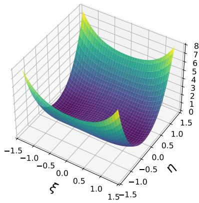

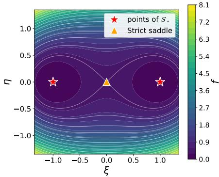  
Fig. 2 Benign global geometry of the balanced objective for a uniform rank-one ground truth with $n _ { 1 } = n _ { 2 } = 4 , n _ { 3 } = 3 .$ , and $r \ = \ 1 .$ . The objective is evaluated on the slice $\mathcal { W } _ { \mathrm { g l o b } } ( \xi , \eta ) =$ $\xi \overline { { \mathcal { W } } } + \eta \| \overline { { \mathcal { W } } } \| _ { F } \mathcal { D } _ { \perp }$ , where $\xi$ is the radial coordinate and η is a transverse normal coordinate. Left: Surface plot. Right: Contour $\mathrm { p l o t }$ . The stars at (1, 0) and $( - 1 , 0 )$ mark W and −W, two points of the positive-dimensional solution orbit $s _ { \star }$ . The triangle at the origin marks the rank-deficient strict saddle.

For each ground truth, let $\tau$ be a unit vector in $T _ { \overline { { \mathcal { W } } } } \mathcal { S } _ { \star }$ , and let D be a unit vector in $N _ { \overline { { \mathcal { W } } } } \mathcal { S } _ { \star }$ . We evaluate the objective on the afine tangent–normal slice

$$
\begin{array} { r } { \mathcal { W } _ { \mathrm { l o c } } ( a , b ) = \mathcal { W } + \| \mathcal { W } \| _ { F } \big ( a T + b \mathcal { D } \big ) , \qquad ( a , b ) \in [ - 0 . 5 , 0 . 5 ] \times [ - 0 . 5 , 0 . 5 ] . } \end{array}
$$

The contour plots use a $1 2 1 \times 1 2 1$ grid. The line corresponding to $b = 0$ is the afine tangent line at ${ \overline { { \mathcal { W } } } } ;$ it is not the exact curved orbit $\overline { { \mathcal { W } } } * \mathcal { Q } ( a )$

For the uniform-profile example, we begin with a random perturbation supported at the self-conjugate frequency $k _ { 0 } = 1$ and project it onto the normal space. Since every Fourier slice has full column rank, Theorem 7(i) shows that the Hessian kernel at $\dot { \overline { W } }$ consists exactly of the tangent directions. Consequently, the Hessian is strictly positive along every nonzero normal direction, and

$$
f ( \overline { { \mathscr { W } } } + t \mathscr { D } ) = c _ { 2 } t ^ { 2 } + O ( t ^ { 3 } ) , c _ { 2 } > 0 .
$$

Thus the objective has quadratic growth transverse to the solution orbit.

For the deficient-profile example, we use the inactive-coordinate direction appearing in the proof of Theorem 7(ii). In the Fourier domain, the direction is supported only at $k _ { 0 } = 1$ and has the form $\widehat { \mathcal { D } } _ { U } ^ { ( k _ { 0 } ) } = a e _ { r } ^ { \top } , \widehat { \mathcal { D } } _ { V } ^ { ( k _ { 0 } ) } = 0$ , where $a \perp \mathrm { r a n g e } ( \widehat { \mathcal { U } } _ { \star } ^ { ( k _ { 0 } ) } )$ Because $k _ { 0 }$ is self-conjugate, a is chosen to be real. All remaining Fourier slices of the direction vanish. This construction gives $\mathcal { D } _ { U } \ast \mathcal { V } _ { \star } ^ { * } = 0 , \mathcal { U } _ { \star } ^ { * } \ast \mathcal { D } _ { U } = 0$ . The direction is normal to the solution orbit in exact arithmetic.

Along the curve $\mathcal { W } ( t ) = \left( \mathcal { U } _ { \star } + t \mathcal { D } _ { U } , \mathcal { V } _ { \star } \right)$ , the reconstruction residual vanishes identically: $( \mathcal { U } _ { \star } + t \mathcal { D } _ { U } ) * \mathcal { V } _ { \star } ^ { * } - \mathcal { X } _ { \star } = 0$ . The balancing residual is $B ( \mathcal { W } ( t ) ) = t ^ { 2 } \mathcal { D } _ { U } ^ { * } * \mathcal { D } _ { U }$ and therefore $\begin{array} { r } { f ( \mathcal { W } ( t ) ) = \frac { t ^ { 4 } } { 8 } \left. \mathcal { D } _ { U } ^ { * } * \mathcal { D } _ { U } \right. _ { F } ^ { 2 } } \end{array}$ . Hence the quartic growth along this direction is exact. Moreover, $\lVert \nabla f ( \mathcal { W } ( t ) ) \rVert _ { F } \dot { = } \Theta ( | t | ^ { 3 } )$ ), which agrees with the cubic gradient growth established in Theorem 7(ii).

Figure $\mathrm { 3 ( a ) \mathrm { - } ( b ) }$ compares the corresponding tangent–normal slices. The uniformprofile objective rises sharply in the normal direction, whereas the deficient-profile objective exhibits a visibly flatter valley. The tangent coordinate is included to display the orbit-induced degeneracy common to both cases; the distinction between the two profiles occurs in the normal direction.

To quantify the transverse growth, we evaluate $f ( \overline { { \mathcal { W } } } + t \mathcal { D } )$ at 30 logarithmically spaced values satisfying $1 0 ^ { - 2 . 5 } \leq t \leq 1 0 ^ { - 1 . 2 }$ . A least-squares line is then fitted to log $f ( \overline { { \mathcal { W } } } + t \mathcal { D } )$ as a function of log t. As shown in Figure $3 ( \mathrm { c } )$ , the fitted exponent is close to 2 for the uniform multi-rank and close to 4 for the deficient multi-rank. The restricted fitting interval emphasizes the local regime and reduces the influence of higher-order terms on the uniform-profile fit.

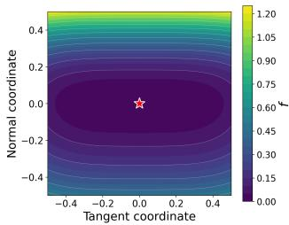

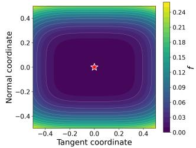

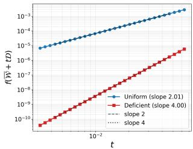  
Fig. 3 Multi-rank-dependent local geometry at a selected global minimizer W, for two ground truths with equal tubal rank $r = 2$ and dimensions $n _ { 1 } = n _ { 2 } = 4 , n _ { 3 } = 3 . { \mathrm { ~ ( a ) } }$ Uniform multi-rank, $\rho _ { k } ~ = ~ r$ for every k. (b) Nonuniform multi-rank with one deficient slice, $\rho _ { k _ { 0 } } \ < \ r .$ The horizontal and vertical axes in panels Left and Middle are the tangent and normal coordinates, respectively, and the star marks W. Right: Log–log plot of $f ( \overline { { \mathcal { W } } } + t \mathcal { D } )$ along the selected normal direction. The uniform and deficient cases follow slopes close to 2 and 4, respectively, illustrating the quadratic and quartic growth laws in Theorem 7.

These synthetic experiments illustrate two complementary aspects of the theory. The global slice in Figure 2 displays the benign strict-saddle structure established in Theorem 4, while Figure 3 isolates the local distinction identified in Theorem 7. In particular, tensors with the same tubal rank can exhibit diferent transverse growth orders because the fine geometry is governed by the complete multi-rank profile rather than by the tubal rank alone.

## 4.4 Real-OCT tensor-sensing experiment

Motivated by the benign-landscape guarantee in Theorem 4, we examine the recovery behavior of the balanced factorized formulation from random initializations using a real retinal optical coherence tomography (OCT) volume and simulated linear measurements. We compare an exact-low-tubal-rank target with its untruncated counterpart to investigate how recovery changes when the exact-rank modeling assumption is relaxed. We use the publicly downloadable UK Biobank OCT example (Resource 337), which contains 128 grayscale B-scans of size $6 5 0 \times 5 1 2 . ^ { 2 }$ We estimate the axial retinal support from the volume-averaged row-intensity profile, retain rows 171–532, and remove 3% from each lateral boundary. The resulting stack is reordered as lateral × slow-scan × axial and trilinearly resampled to $n _ { 1 } \times n _ { 2 } \times n _ { 3 } = 2 8 \times 8 \times 2 8 , \ N = n _ { 1 } n _ { 2 } n _ { 3 } = 6 2 7 2 .$ Intensities are linearly rescaled using the empirical 0.5th and 99.5th percentiles and clipped to [0, 1]. We denote the resulting untruncated preprocessed tensor by ${ \mathcal { X } } _ { \mathrm { r a w } }$

We consider two targets. For the exact-rank experiment, we let X be the rank-r truncated t-SVD of ${ \mathcal { X } } _ { \mathrm { r a w } } .$ , with r = 3. All 28 Fourier slices of X have numerical rank three under the relative tolerance $1 0 ^ { - 1 0 }$ , so rank $( \mathcal { X } _ { \star } ) = 3$ and the factor width equals the true tubal rank. For the model-mismatch experiment, the target is ${ \mathcal { X } } _ { \mathrm { r a w } }$ , while the factor width remains 3. Its best rank-3 t-SVD approximation error is $\begin{array} { r l } {  { \frac { \| { \vec { \mathcal { X } } _ { \mathrm { r a w } } - \mathcal { X } _ { \star } \| _ { F } } } { \| { \mathcal { X } _ { \mathrm { r a w } } } \| _ { F } } = } } \end{array}$ 0.0513. The first target satisfies the exact-rank modeling assumption, whereas the second introduces low-rank model mismatch at the same factor width. We denote the target by $\mathcal { X } _ { \mathrm { t a r } }$ , which equals $\mathcal { X } _ { \star }$ in the exact-rank experiment and ${ \mathcal { X } } _ { \mathrm { r a w } }$ in the model-mismatch experiment.

For each measurement count m, we generate a normalized Gaussian sensing operator $\begin{array} { c c l } { [ { \mathcal M } ( { \mathcal Z } ) ] _ { \ell } } & { = } & { \langle { \mathcal A } _ { \ell } , { \mathcal Z } \rangle _ { F } . } \end{array}$ , with $[ \mathcal { A } _ { \ell } ] _ { i j k } \stackrel { \mathrm { i . i . d . } } { \sim } \mathcal { N } ( 0 , 1 / m )$ , and form noiseless measurements $y ~ = ~ \mathcal { M } ( \mathcal { X } _ { \mathrm { t a r } } )$ . We use $m / N ~ \in ~ \{ 0 . 2 , 0 . 3 , \dots , 0 . 8 \}$ with $m \in$ {1254, 1882, 2509, 3136, 3763, 4390, 5018}.3 At each measurement ratio, we use the same Gaussian sensing operator for both targets. We minimize the balanced objective (2) with $\mathcal { X } _ { \star }$ replaced by $\mathcal { X } _ { \mathrm { t a r } }$ . At each $m / N$ , we use ten independent random initializations constructed by frequency-wise QR factorizations. Conjugate symmetry is imposed explicitly, and the two factors have identical Gram tensors at initialization; the largest normalized initial balance residual over all trials is $2 . 1 \times 1 0 ^ { - 1 6 }$ . The random initializations use scales of 0.5, 1, and 2 times a reference factor norm derived from $\mathcal { M } ^ { * } ( y )$ . We optimize with MATLAB’s quasi-Newton implementation of fminunc, using the analytic gradient, at most 150 iterations, and optimality tolerance $1 0 ^ { - 6 } . ^ { < }$ 4

Figure 4 summarizes the relative recovery error $\lVert \mathcal { X } _ { \mathrm { r e c } } - \mathcal { X } _ { \mathrm { t a r } } \rVert _ { F } / \lVert \mathcal { X } _ { \mathrm { t a r } } \rVert _ { F }$ , PSNR, and SSIM averaged over the eight B-scans, using ten random starts at each measurement ratio. Here, $\chi _ { \mathrm { r e c } }$ denotes the reconstructed tensor. For the exact-rank experiment, a trial is counted as successful if the relative recovery error is at most $1 0 ^ { - 2 }$ ; we do not report a success rate for the model-mismatch experiment. The exact-rank target shows a sharp improvement: the median relative recovery error decreases from 0.141 at $m / N = 0 . 5$ to 0.0174, 0.00525, and 0.00328 at $m / N = 0 . 6 , 0 . 7$ , and 0.8, respectively. The corresponding success rates are 0%, 20%, 60%, and 100%. By contrast, the median error for the model-mismatch target decreases to 0.0842 at $m / N = 0 . 8$ , but remains above the rank-three approximation floor. These experiments use one OCT volume and a fixed Gaussian sensing operator at each measurement ratio. The error bars in Figure 4 reflect variability across initializations. Successful recovery from all ten random initializations at $m / N = 0 . 8$ illustrates the empirical efectiveness of the balanced formulation in this instance, beyond the small-t-RIP regime covered by Theorem 4.

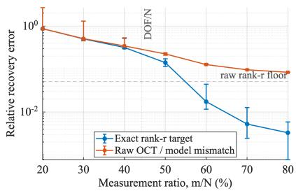

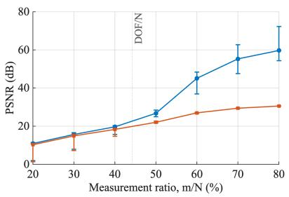

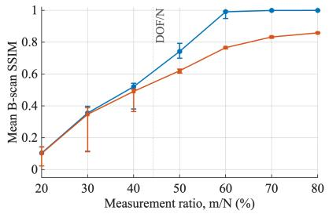

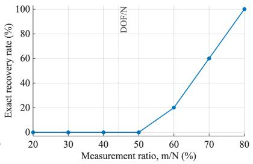  
Fig. 4 The first three panels show medians over ten balanced random starts, with error bars spanning the 25th to 75th percentiles. The dashed horizontal line is the rank-3 approximation floor of the untruncated target. The vertical line (DOF/N) at $r ( n _ { 1 } + n _ { 2 } - r ) n _ { 3 } / N = 0 . 4 4 2 0$ is only a parameter-count reference, not a theoretical phase-transition threshold. The lower-right panel shows the percentage of successful starts for the exact-rank target.

Figures 5 and 6 complement these aggregate statistics with representative individual reconstructions for the exact-rank and model-mismatch targets, respectively.

## 5 Conclusion

We studied the optimization landscape of balanced low-tubal-rank tensor sensing under the t-product. Under the t-RIP assumption, we proved that the objective has no spurious local minima and that every nonglobal critical point is a strict saddle, and established a quantitative strict-saddle characterization over the entire factor space. We further showed that the multi-rank determines the local geometry at the solution set. When every Fourier slice has rank equal to the tubal rank, the objective has quadratic growth transverse to the solution orbit. When some slice has smaller rank, the factorization remains overparameterized at that frequency even with the exact tubal rank, producing additional normal Hessian-kernel directions with quartic objective growth and cubic gradient growth. These directions explain the cubic-root proximity scale in the general landscape theorem. Future work includes extending the landscape analysis to noisy measurements and approximate low-tubal-rank models. It would also be interesting to investigate analogous geometric distinctions for other tensor settings.

## Acknowledgment

This work is in part supported by NSF grants ECCS-2409702, NSF Grant DMS-2603463, and OIA-2535317.

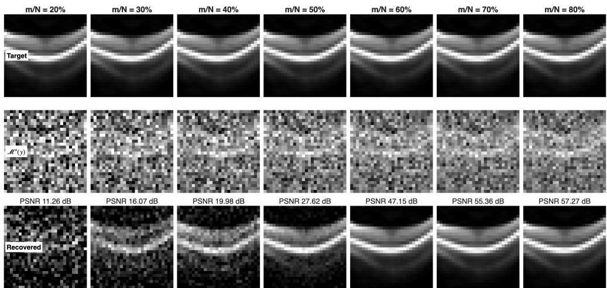

Fig. 5 Exact-rank OCT-derived target under normalized Gaussian sensing. Columns correspond to $m / N = 2 0 \% , . . .$ , 80%. Rows show the target, the adjoint backprojection $\boldsymbol { \mathcal { M } ^ { * } } ( \boldsymbol { y } )$ , and a representative reconstruction. The number above each reconstruction is that individual trial’s full-volume PSNR (in dB). For each measurement ratio, we select the trial whose full-volume relative recovery error is closest to the median over ten balanced random starts.  
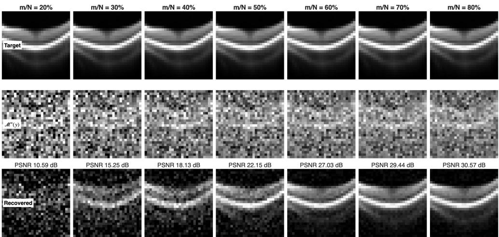  
Fig. 6 Rank-3 model mismatch for the untruncated preprocessed OCT tensor. The layout, representative-trial selection rule, and interpretation of the displayed PSNR values are the same as in Figure 5. Increasing $m / N$ restores progressively more retinal structure, while a nonzero discrepancy remains because the reconstruction has tubal rank at most 3.

## Declarations

There is no conflict of interest.

## References

[1] Kolda, T.G., Bader, B.W.: Tensor decompositions and applications. SIAM Review 51(3), 455–500 (2009) https://doi.org/10.1137/07070111X

[2] Liu, J., Musialski, P., Wonka, P., Ye, J.: Tensor completion for estimating missing values in visual data. IEEE Transactions on Pattern Analysis and Machine Intelligence 35(1), 208–220 (2013) https://doi.org/10.1109/TPAMI.2012.39

[3] Fan, H., Chen, Y., Guo, Y., Zhang, H., Kuang, G.: Hyperspectral image restoration using low-rank tensor recovery. IEEE Journal of Selected Topics in Applied Earth Observations and Remote Sensing 10(10), 4589–4604 (2017) https://doi. org/10.1109/JSTARS.2017.2714338

[4] Kreimer, N., Sacchi, M.D.: A tensor higher-order singular value decomposition for prestack seismic data noise reduction and interpolation. Geophysics 77(3), 113–122 (2012) https://doi.org/10.1190/geo2011-0399.1

[5] Kilmer, M.E., Martin, C.D.: Factorization strategies for third-order tensors. Linear Algebra and its Applications 435(3), 641–658 (2011) https://doi.org/10.1016/ j.laa.2010.09.020

[6] Kilmer, M.E., Braman, K., Hao, N., Hoover, R.C.: Third-order tensors as operators on matrices: A theoretical and computational framework with applications in imaging. SIAM Journal on Matrix Analysis and Applications 34(1), 148–172 (2013) https://doi.org/10.1137/110837711

[7] Bhojanapalli, S., Neyshabur, B., Srebro, N.: Global optimality of local search for low rank matrix recovery. In: Advances in Neural Information Processing Systems, vol. 29, pp. 3873–3881 (2016)

[8] Ge, R., Jin, C., Zheng, Y.: No spurious local minima in nonconvex low rank problems: A unified geometric analysis. In: Proceedings of the 34th International Conference on Machine Learning. Proceedings of Machine Learning Research, vol. 70, pp. 1233–1242 (2017)

[9] Tu, S., Boczar, R., Simchowitz, M., Soltanolkotabi, M., Recht, B.: Low-rank solutions of linear matrix equations via Procrustes flow. In: Proceedings of the 33rd International Conference on Machine Learning. Proceedings of Machine Learning Research, vol. 48, pp. 964–973 (2016)

[10] Zhang, Z., Aeron, S.: Exact tensor completion using t-SVD. IEEE Transactions on Signal Processing 65(6), 1511–1526 (2017) https://doi.org/10.1109/TSP.2016. 2639466

[11] Lu, C., Feng, J., Chen, Y., Liu, W., Lin, Z., Yan, S.: Tensor robust principal

component analysis with a new tensor nuclear norm. IEEE Transactions on Pattern Analysis and Machine Intelligence 42(4), 925–938 (2020) https://doi.org/10. 1109/TPAMI.2019.2891760

[12] Su, B., You, J., Cai, H., Huang, L.: Guaranteed sampling flexibility for low-tubal-rank tensor completion. arXiv preprint arXiv:2406.11092 (2024) arXiv:2406.11092

[13] Zhang, F., Wang, W., Hou, J., Wang, J., Huang, J.: Tensor restricted isometry property analysis for a large class of random measurement ensembles. Science China Information Sciences 64(1), 119101 (2021) https://doi.org/10.1007/ s11432-019-2717-4

[14] Assoweh, M.I., Chr\`etien, S., Tamadazte, B.: Low tubal rank tensor recovery using the b¨urer-monteiro factorisation approach. application to optical coherence tomography. Journal of Computational and Applied Mathematics 410, 114086 (2022)

[15] Liu, Z., Han, Z., Tang, Y., Zhao, X.-L., Wang, Y.: Low-tubal-rank tensor recovery via factorized gradient descent. IEEE Transactions on Signal Processing 72, 5470– 5483 (2024) https://doi.org/10.1109/TSP.2024.3504292

[16] Karnik, S., Veselovska, A., Iwen, M., Krahmer, F.: Implicit regularization for tubal tensor factorizations via gradient descent. In: Proceedings of the 42nd International Conference on Machine Learning. Proceedings of Machine Learning Research, vol. 267, pp. 29148–29204 (2025)

[17] Liu, Z., Geng, H., Wang, X., Tang, Y., Han, Z., Wang, Y.: The power of small initialization in noisy low-tubal-rank tensor recovery. In: International Conference on Learning Representations, pp. 96228–96279 (2026)

[18] Liu, Z., Han, Z., Tang, Y., Fan, J., Wang, Y.: Eficient low-tubal-rank tensor estimation via alternating preconditioned gradient descent. arXiv preprint arXiv:2512.07490 (2025) arXiv:2512.07490

[19] Zhuo, J., Kwon, J., Ho, N., Caramanis, C.: On the computational and statistical complexity of over-parameterized matrix sensing. Journal of Machine Learning Research 25(169), 1–47 (2024)

[20] Davis, D., Drusvyatskiy, D., Jiang, L.: Gradient descent with adaptive stepsize converges (nearly) linearly under fourth-order growth. Mathematical Programming (2025) https://doi.org/10.1007/s10107-025-02290-5

[21] Sch¨onemann, P.H.: A generalized solution of the orthogonal procrustes problem. Psychometrika 31(1), 1–10 (1966)