# TASKBRIDGE: BRIDGING UNSUPERVISED TABULAR ANOMALY DETECTION AND IN-CONTEXT LEARNING VIA VIRTUAL TASKS

Doyun Choi1 Dooho Lee2,3 Jaemin Yoo1,3∗

1Seoul National University 2KAIST 3Nums AI Inc.

{doyun.choi,jaeminyoo}@snu.ac.kr dooho.lee@kaist.ac.kr

## ABSTRACT

Unsupervised tabular anomaly detection (TAD) aims to identify anomalous rows in tabular data using normal training samples. While conventional methods rely on dataset-specific training and configuration search, recent tabular foundation models (TFMs) enable zero-shot anomaly detection on unseen datasets via in-context learning. Most TFM-based approaches, however, require anomaly-specific pretraining from scratch, making detection inherently dependent on synthetic TADspecific priors and costly to update. Some approaches instead repurpose pretrained general-purpose TFMs for TAD to avoid this burden, but rely on computationally expensive formulations with restrictive anomaly inductive biases. In this work, we introduce TASKBRIDGE, a new framework that efficiently repurposes pretrained general-purpose TFMs for unsupervised TAD by constructing virtual supervised tasks that directly recast anomaly detection as supervised in-context inference of TFMs. The resulting virtual tasks induce predictive structures under which normal queries and their target pairs receive high support, whereas anomalies tend to violate the induced structures and receive lower support, providing direct anomaly evidence. Across 790 real-world datasets, TASKBRIDGE consistently outperforms 30 baselines, including state-of-the-art TFM-based approaches, without anomalyspecific TFM pretraining or dataset-specific model optimization.

## 1 INTRODUCTION

Tabular anomaly detection (TAD) plays a crucial role in various real-world applications, including finance (Al-Hashedi & Magalingam, 2021), healthcare (Fernando et al., 2021), and security (Ahmad et al., 2021). Tabular samples lack explicit structure, unlike other domains such as images and text, making anomalous patterns more challenging to identify. Various methods have been proposed for TAD, ranging from statistical and conventional machine learning approaches to deep learning-based methods (Liu et al., 2008; Breunig et al., 2000; Livernoche et al., 2024).

In TAD, anomalous observations are often rare and difficult to label in advance, making it common to use only normal data for training (Graham et al., 2023; Maziarka et al., 2021). In this unsupervised or one-class setting, selecting a suitable detector or tuning its hyperparameters (HPs) is highly challenging since no guiding signals are provided; conventional HP searches or dataset-specific tuning cannot be reliably guided without validation data (Ma et al., 2023; Ding et al., 2022).

To address this limitation, recent work has studied tabular foundation models (TFMs) for unsupervised TAD as a way to reduce reliance on dataset-specific training and HP tuning. A prominent line of work is to use prior-datafitted networks (PFNs) (Shen et al., 2025; Ding et al., 2026b; Marszałek et al., 2026). After pretraining over synthetic tasks, PFNs perform zero-shot inference through incontext learning (ICL) by inferring the task structure from a given context and amortizing Bayesian posterior-predictive inference for unseen queries (Muller et al., 2024).¨

There are two notable approaches to using TFMs for unsupervised TAD. The first develops TFMs pretrained exclusively for TAD (Shen et al., 2025; Ding et al., 2026b). During pretraining, unlabeled normal samples form the context, while synthetic anomalies are introduced as queries, allowing the model to infer whether a query is anomalous conditioned on the normal context. By amortizing TAD across diverse episodic tasks with varying synthetic anomaly mechanisms, these models enable incontext anomaly detection on unseen datasets. We refer to them as TAD-specialized TFMs.

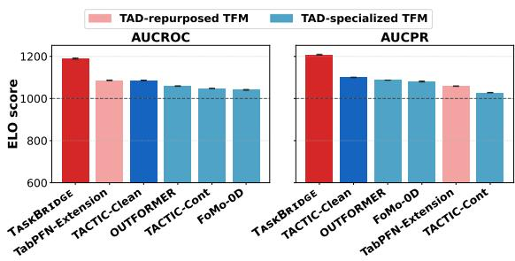

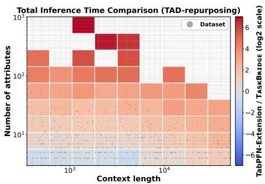  
Figure 1: (Left) Elo scores of TFM-based TAD methods on ODDBench; darker colors indicate better performance. TASKBRIDGE achieves the highest Elo scores for both AUCROC and AUCPR. Full baseline comparisons are provided in Appendix C.1. (Right) Inference-time comparison between the TabPFN-Extension and TASKBRIDGE, with red indicating that TASKBRIDGE is faster. TASKBRIDGE scales more efficiently as both context length and dimensionality increase.

Complementing TAD-specialized TFMs, TabPFN (Grinsztajn et al., 2026b), which is a representative TFM pretrained for general-purpose tabular modeling, supports a TAD extension that harnesses its pretrained predictive capabilities for anomaly detection through autoregressive joint-density estimation. Such repurposing avoids TAD-specific pretraining and can directly benefit from advances in general-purpose TFMs. We refer to approaches of this kind as TAD-repurposed TFMs.

Both directions have notable limitations. TAD-specialized TFMs, relying on AD-centric pretraining with designed synthetic priors, require redesigning the priors and pretraining strategy followed by model retraining, both to expand anomaly coverage and to incorporate advances in increasingly capable TFM backbones. The existing TAD-repurposed approach avoids such burdens, but its autoregressive formulation requires repeated attribute-wise conditional predictions, resulting in substantial inference overhead as dimensionality increases, while reducing the notion of anomalousness to low estimated joint likelihood. We discuss these limitations in greater detail in Section 2.2.

To address these limitations, we propose TASKBRIDGE, a new TAD framework that efficiently repurposes pretrained general-purpose TFMs by constructing virtual supervised tasks from unlabeled, normality-aware training data. These tasks induce a predictive structure through the in-context inference over the virtually labeled context, under which normal query–target pairs receive high predictive support, whereas anomalous pairs tend to violate the induced structure and receive lower support, directly providing evidence of anomalies. To generalize this mechanism across hundreds of datasets, we create task templates that probe different aspects of normal structure and apply dataadaptive task selection to retain tasks that best satisfy the AD-oriented properties for each dataset.

TASKBRIDGE offers several advantages: (i) it enables zero-shot AD inference on unseen datasets, without dataset-specific training or tuning, while requiring neither TAD-specialized pretraining nor a dedicated backbone; (ii) as shown in the left panel of Figure 1, it achieves stronger overall performance than existing TAD baselines, including diverse TFM-based approaches, across 790 real-world datasets; and (iii) as shown in the right panel of Figure 1, TASKBRIDGE remains substantially more efficient than the TabPFN-Extension as both dataset size and dimensionality increase, demonstrating a more scalable and practical way to repurpose general-purpose TFMs for unsupervised TAD.

## 2 PRELIMINARIES AND RELATED WORKS

## 2.1 GENERAL-PURPOSE TABULAR FOUNDATION MODELS

Pretraining. Let $\mathbf { a } = ( \mathbf { a } _ { 1 } , \ldots , \mathbf { a } _ { d } )$ denote the vector of attribute random variables, and let y denote the target random variable. A realized sample is written as $( { \pmb x } _ { i } , y _ { i } )$ , where $\pmb { x } _ { i } = ( x _ { i 1 } , \dots , x _ { i d } ) ^ { \top } \in$ $\mathbb { X } \subseteq \bar { \mathbb { R } } ^ { d }$ . Let $\tau \in \mathcal { T }$ denote a task and let $p ( \tau )$ denote the prior used to sample pretraining tasks. For each pretraining episode, a task τ is first sampled from $p ( \tau )$ , after which a labeled context and a query sample are drawn from the corresponding task-specific distribution. Under the task prior, the Bayesian posterior predictive distribution (PPD) is defined as

$$
\begin{array} { c } { { \tau \sim p ( \tau ) , \displaystyle \mathcal { D } _ { \mathrm { c t x } } = \{ ( { \pmb x } _ { i } , y _ { i } ) \} _ { i = 1 } ^ { n } , \qquad \mathcal { D } _ { \mathrm { c t x } } \cup \{ ( { \pmb x } _ { q } , y _ { q } ) \} \stackrel { \mathrm { i . i . d . } } { \sim } P _ { \tau } , } } \\ { { p ( y _ { q } \mid { \pmb x } _ { q } , \mathcal { D } _ { \mathrm { c t x } } ) = \displaystyle \int _ { \tau } p _ { \tau } ( y _ { q } \mid { \pmb x } _ { q } ) p ( \tau \mid \mathcal { D } _ { \mathrm { c t x } } ) \ d \tau . } } \end{array}\tag{1}
$$

A general-purpose TFM q , typically instantiated as a transformer (Vaswani et al., 2017), is trained to approximate the PPD by minimizing the prior-data negative log-likelihood:

$$
\begin{array} { r } { \mathcal { L } _ { \mathrm { P F N } } ( \theta ) : = \mathbb { E } _ { \mathcal { D } _ { \mathrm { c t x } } , ( \boldsymbol { x } _ { q } , \boldsymbol { y } _ { q } ) } \left[ - \log q _ { \theta } ( \boldsymbol { y } _ { q } \mid \boldsymbol { x } _ { q } , \mathcal { D } _ { \mathrm { c t x } } ) \right] . } \end{array}\tag{2}
$$

Assuming realizability and global optimization, the optimal predictor $q _ { \theta } \cdot$ ⋆ recovers the PPD almost surely, i.e., $q _ { \theta ^ { \star } } ( \cdot \mid { \pmb x } _ { q } , \mathcal { D } _ { \mathrm { c t x } } ) = p ( \cdot \mid { \pmb x } _ { q } , \mathcal { D } _ { \mathrm { c t x } } )$ . For a detailed derivation, see (Muller et al., 2024).¨

Inference. At inference time, the pretrained TFM $q _ { \theta } \cdot$ ⋆ receives a labeled context that represents a new task, i.e., ${ \mathcal D } _ { \mathrm { c t x } } : = \{ ( { \pmb x } _ { i } , y _ { i } ) \} _ { i = 1 } ^ { n } \equiv ( X _ { \mathrm { c t x } } , { \pmb y } _ { \mathrm { c t x } } )$ , where $\boldsymbol { X } _ { \mathrm { c t x } } \in \mathbb { R } ^ { n \times d }$ and $y _ { \mathrm { c t x } } \in \mathcal { V } ^ { n }$ . Given an unlabeled query row $\scriptstyle { \mathbf { { \pmb { x } } } _ { q } , }$ it produces the predictive distribution over the target space,

$$
q _ { \theta ^ { \star } } \left( Y _ { q } \mid \pmb { x } _ { q } , \mathcal { D } _ { \mathrm { c t x } } \right) , \qquad Y _ { q } \in \mathcal { V } .\tag{3}
$$

By pretraining over diverse tasks, $q _ { \theta ^ { \star } }$ is assumed to have the ability to infer the task-relevant structure from $\mathcal { D } _ { \mathrm { c t x } }$ and approximate the posterior predictive distribution of $\scriptstyle { \pmb { x } } _ { q } .$ , thereby enabling zeroshot prediction on previously unseen tabular tasks without gradient-based parameter updates.

## 2.2 TABULAR FOUNDATION MODELS FOR UNSUPERVISED TAD

TAD-specialized TFMs. Unlike general-purpose TFMs, TAD-specialized TFMs receive an unlabeled context $\mathscr { C } = \{ \pmb { x } _ { i } \} _ { i = 1 } ^ { n }$ of normal data and directly estimate the anomaly probability of a query, ${ q _ { \phi } } _ { \star } \left( { A _ { q } } = 1 \mid { x _ { q } } , { \mathcal { C } } \right)$ , where $A _ { q } \in \{ 0 , 1 \}$ represents the normal-anomalous status and $q _ { \phi ^ { \star } }$ denotes the pretrained TAD-specialized TFM. To enable this inference, these models are pretrained under TAD-specific priors that generate normal contexts and normal/anomalous queries.

Shen et al. (2025) is an early TAD-specialized TFM pretrained under Gaussian mixture model priors with variance-inflated subspace anomalies. Ding et al. (2026b) extends this framework through a mixture of Gaussian-mixture, structural-causal, and copula-based priors that represent several anomaly archetypes. It further introduces a self-evolving curriculum to coordinate pretraining over heterogeneous prior families and task difficulties. Marszałek et al. (2026) similarly performs discriminative in-context anomaly detection, but explicitly supports contaminated contexts.

A notable limitation of these methods is that their notion of anomalousness is tied to the anomalygenerating mechanisms encoded in the pretraining prior; while a context can characterize datasetspecific normal structures, it cannot determine which deviations should be regarded as anomalous. Consequently, expanding anomaly coverage requires broader TAD priors together with appropriate training strategies (Ding et al., 2026b), necessitating retraining from scratch. Moreover, as generalpurpose TFMs continue to advance in architecture and pretraining, these specialized approaches cannot readily inherit such improvements without substantial redesign and retraining, limiting their ability to continuously benefit from the evolving TFM ecosystem.

TAD-repurposed TFMs. Recent works have successfully repurposed pretrained general-purpose TFMs for new downstream problems (Xu et al., 2026; Hoo et al., 2026). Following this paradigm, TabPFN (Grinsztajn et al., 2026b) repurposes its predictive capabilities for unsupervised TAD by estimating sample likelihoods from its predictive distributions.1 It factorizes the joint feature likelihood according to the chain rule. For a feature ordering $\pi = ( \pi _ { 1 } , \ldots , \pi _ { d } )$ , it approximates

$$
\log \widehat { p } _ { \pi } \left( x _ { q } \mid \mathcal { C } \right) = \sum _ { j = 1 } ^ { d } \log q _ { \theta ^ { \star } } \left( x _ { q , \pi _ { j } } \mid x _ { q , \pi _ { < j } } , \mathcal { D } _ { \mathcal { C } , \pi , j } \right) , \qquad \mathcal { D } _ { \mathcal { C } , \pi , j } = \left\{ \left( x _ { i , \pi _ { < j } } , x _ { i , \pi _ { j } } \right) \right\} _ { i = 1 } ^ { n } ,\tag{4}
$$

where each feature is temporarily treated as the prediction target. Assuming that anomalous samples receive lower likelihood under the estimated joint distribution, the resulting negative log-likelihood can serve as the anomaly score for the query sample $\scriptstyle { \pmb { x } } _ { q }$

This extension avoids a key limitation of TAD-specialized TFMs, namely the need for substantial redesign and retraining to accommodate evolving TAD priors or improved TFM backbones, but it equates anomalousness with low joint likelihood. While this is a principled and widely used anomaly criterion, global rarity need not coincide with the application-relevant violation of normality: rare but valid observations may receive high scores. In addition, evaluating every attribute as a target across multiple feature permutations and predictor ensembles incurs a computational cost that grows with the feature dimension (Marszałek et al., 2026), as shown also in Figure 1.

## 3 TASKBRIDGE: ANOMALY DETECTION VIA VIRTUAL SUPERVISED TASKS

We introduce TASKBRIDGE, a new framework that enables general-purpose TFMs to solve anomaly detection on arbitrary datasets without dataset-specific model tuning. The core idea is to construct virtual supervised tasks turning unsupervised TAD into a supervised prediction problem that these models are designed to solve.

As illustrated in Figure 2, TASKBRIDGE constructs virtual supervised tasks that allow a pretrained TFM to perform posterior-predictive inference for each query from the virtually labeled context. These tasks are carefully designed so that the resulting anomaly score reflects the predictive support of the pretrained TFM: normal query– target pairs receive high support, while anomalous pairs tend to receive lower support. This support gap provides the basis for anomaly detection.

## 3.1 MOTIVATION

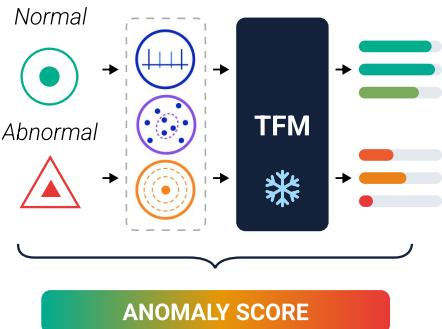  
Figure 2: Overview of TASKBRIDGE. Given a query, it assigns its virtual targets under the designed supervised tasks and distinguishes normal and anomalous queries according to the predictive supports from the pretrained TFM.

In the supervised setting, a task can be viewed as a latent data-generating mechanism τ that induces a joint distribution $p _ { \tau } ( \mathbf { x } , Y )$ . During pretraining, general-purpose TFMs repeatedly encounter supervised datasets sampled from diverse latent tasks and are optimized to approximate the corresponding PPDs for new queries by inferring task-relevant predictive structure from the labeled context, as described in Equation 1. This in-context learning (ICL) enables TFMs to assign higher posteriorpredictive support to targets for queries that are more compatible with the inferred task.

We directly use this ICL capability of TFMs for unsupervised TAD. Specifically, we construct virtual supervised tasks that generate virtually labeled contexts from the unlabeled normal samples. Under each virtual task, the labeled normal context induces an input–target predictive structure through ICL, allowing a query to be evaluated by how well its virtual target conforms to this structure. Assuming that modern TFMs can reliably infer the predictive structures of the virtual tasks considered in this work, we design the tasks so that normal query–target pairs remain compatible with the induced structure, whereas anomalous pairs are more likely to violate it. To quantify the structural compatibility, we use the TFM’s amortized posterior-predictive support for each query–target pair. Formally, let

$$
\widehat { \kappa } _ { m } ( { \pmb x } ; \mathcal { C } ) : = q _ { \theta ^ { \star } } \left( \widehat { y } _ { m } ( { \pmb x } ) \mid { \pmb x } , \mathcal { D } _ { \mathcal { C } } ^ { m } \right)\tag{5}
$$

be the predictive support assigned by the pretrained TFM $q _ { \theta ^ { \star } }$ to the virtual target ${ \widehat { y } } _ { m } ( { \pmb x } )$ for input ${ \bf _ { x } }$ , where $\mathcal { D } _ { \mathcal { C } } ^ { m }$ is the virtually labeled context induced by task m. A higher value of $\widehat { \kappa } _ { m } ( \pmb { x } ; \mathcal { C } )$ indicates greater compatibility of $( { \pmb x } , \widehat y _ { m } ( { \pmb x } ) )$ with the predictive structure induced by $m .$

Based on this formulation, we characterize task suitability for anomaly detection through predictive support as a measure of compatibility, and identify two required conditions:

(C1) Nominal Predictive Coherence. Query–target pair $( { \pmb x } , \widehat y _ { m } ( { \pmb x } ) )$ generated from a normal sample x should receive consistently high predictive support from TFMs.

(C2) Selective Task Coverage. High predictive support should remain concentrated on pairs from the normal input distribution rather than extending broadly to deviant inputs. That is, $\widehat { \kappa } _ { m } ( \pmb { x } ; \mathcal { C } )$ should be low enough if x is not sampled from the normal distribution.

## 3.2 NORMALITY-ANCHORED VIRTUAL SUPERVISED TASK

Following the above motivation, we construct virtual supervised tasks by extracting normality-aware structure from the unlabeled training data used as context, which is assumed to consist of normal samples. The key idea is to encode context-derived normal regularities into the virtual-target semantics, thereby inducing a task-specific predictive structure anchored to the normal distribution. We refer to such tasks as normality-anchored virtual tasks. From the resulting virtually labeled context, a pretrained TFM can infer this structure through ICL, under which normal query–target pairs generated by the same task rule are expected to receive high posterior-predictive support.

Definition 3.1 (Normality-anchored virtual task). Let $P _ { 0 }$ denote the normal distribution on X and $\mathcal { C } = ( \mathbf { x } _ { 1 } , \ldots , \mathbf { x } _ { n } ) \sim P _ { 0 } ^ { n }$ a clean normality-aware context. For task m, a virtual supervised task constructor $\mathfrak { T } _ { m } = ( A _ { m } , g _ { m } )$ induces

$$
\widehat { \psi } _ { m , \mathcal { C } } = A _ { m } ( \mathcal { C } ) , \qquad \widehat { y } _ { m } ( \pmb { x } ; \mathcal { C } ) = g _ { m } \mathopen { } \mathclose \bgroup \left( \pmb { x } ; \widehat { \psi } _ { m , \mathcal { C } } \aftergroup \egroup \right) ,\tag{6}
$$

where $A _ { m }$ extracts context-dependent parameters that define the supervised task, and $g _ { m }$ generates the virtual targetfor input x based on these parameters.

We call ${ \mathfrak { T } } _ { m }$ normality-anchored if there exists a distribution-dependent functional $a _ { m }$ of $P _ { 0 }$ , with $\psi _ { m } ^ { 0 } = a _ { m } ( P _ { 0 } )$ , such that $\widehat { \psi } _ { m , { \mathcal { C } } }$ consistently estimates $\psi _ { m } ^ { 0 }$ and nontrivially determines the virtualtarget semantics. Specifically, there exist sequences $\epsilon _ { m , n }  0$ and $\delta _ { m , n }  0$ such that

$$
\operatorname* { P r } _ { \mathcal { C } \sim P _ { 0 } ^ { n } } \biggl [ d _ { m } \biggl ( \widehat { \psi } _ { m , \mathcal { C } } , \psi _ { m } ^ { 0 } \biggr ) > \epsilon _ { m , n } \biggr ] \leq \delta _ { m , n } ,\tag{7}
$$

where $d _ { m }$ is a metric on the task-parameter space.

In Appendix A.1, we further show that normality anchoring stabilizes the induced virtual-task semantics: an independent normal query follows the same context-induced task conditional with high probability. Consequently, normal queries and their virtual-target pairs are likely to remain aligned with the predictive structure induced by the virtually labeled normality-aware context, providing the structural basis for nominal predictive coherence (C1).

Normality anchoring biases the induced predictive structure toward normal samples, encouraging TFMs to assign higher predictive support to normal query–target pairs through ICL over the virtually labeled normality-aware context. However, this alone does not always guarantee selective task coverage (C2). Depending on which normal regularities are encoded and how they are realized through the task construction, anomalous queries may still remain compatible with the induced structure, and the effectiveness of a given task can vary across datasets. We therefore construct diverse normality-anchored task candidates that capture different aspects of nominal structure under different task configurations, and perform data-adaptive task selection to retain those that best satisfy both conditions for each dataset.

## 3.3 NORMALITY-ANCHORED TASK FAMILIES

Rather than assuming that a single normality-anchored virtual supervised task can satisfy both conditions above across diverse tabular datasets, we construct a family of complementary virtual task templates from the given normality-aware unlabeled context C. Each instantiated task captures a different aspect of the nominal structure, thereby inducing a distinct context-dependent predictive structure and broadening the range of structural violations that can be exposed from diverse datasets.

We first infer the dataset’s attribute profile from C. Specifically, we classify each attribute as numerical, categorical, or constant using a hybrid attribute-type inference procedure inspired by Grinsztajn et al. (2026a), and assign the dataset to a specific profile based on the relative composition of its non-constant attributes. This profile determines how the templates of task families are instantiated for the dataset. Detailed algorithms and profile-assignment criteria are provided in Appendix A.2.

Given the inferred attribute profile of the dataset, we instantiate a common set of five complementary virtual-task templates using profile-specific constructions: (i) single-attribute, capturing attributewise dependencies between a selected attribute and the remaining attributes; (ii) localized subspace direction, capturing dependencies within selected attribute subsets; (iii) global direction, capturing joint dependencies across the full attribute space; (iv) prototype-based organization, capturing multimodal structure among normal samples; and (v) distributional extremity, capturing the relative position of a sample within the normal distribution. All families are constructed from the normalityaware context and therefore target complementary aspects of its structure. Detailed profile-specific instantiations and their correspondence to Definition 3.1 are provided in Appendix A.3.

## 3.4 DATA-ADAPTIVE TASK SELECTION

Among the task families instantiated from these templates, their effectiveness for TAD depends on the characteristics of the given dataset. As illustrated in Figure 3, we therefore perform hierarchical data-adaptive task selection to retain the tasks that best satisfy the two conditions defined above.

First, for each instantiated task m corresponding to a specific template, we consider a predefined set of candidate task-construction configurations that determine the context-induced parameter $\widehat { \psi } _ { m , { \mathcal { C } } }$ Although all candidates are normality-anchored, the configuration that best satisfies the two conditions above can vary substantially across datasets. We therefore instantiate 4–8 candidates for each task m and select the most suitable configuration in a data-adaptive manner.

To select the most suitable candidate using only the available context C, we partition the context into a nominal held-out subset and its complementary train-side context. For split $s \in S$ , let $\mathcal { H } _ { s } \subset \mathcal { C }$ denote the held-out subset and $\mathcal { C } _ { - s } = \mathcal { C } \backslash$ H the train-side context. For task m under candidate configuration $c \in { \mathcal { C } } _ { m }$ , let $\widehat { \psi } _ { m , { \mathcal { C } } } ^ { c }$ denote the corresponding context-induced task parameter and define ${ \widehat { y } } _ { m } ^ { c } ( { \pmb x } ; { \mathcal { C } } ) = g _ { m } ( { \pmb x } ; { \widehat { \psi } } _ { m , { \mathcal { C } } } ^ { c } )$ . The virtually labeled trainside context is then

$$
\mathcal { D } _ { \mathcal { C } _ { - s } } ^ { m , c } : = \left\{ \left( \pmb { x } , \widehat { y } _ { m } ^ { c } ( \pmb { x } ; \mathcal { C } ) \right) : \pmb { x } \in \mathcal { C } _ { - s } \right\} .\tag{8}
$$

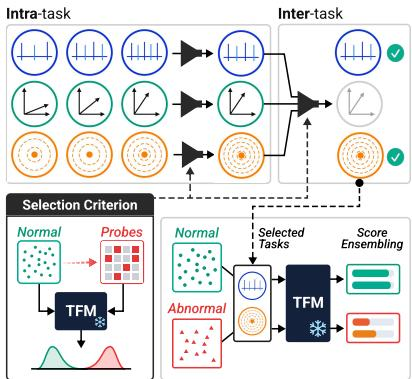

Beyond the nominal held-outs, we additionally construct perturbed held-out samples calibrated from $\mathcal { C } _ { - s }$

$$
\begin{array} { r } { \widetilde { \mathcal { H } } _ { s } ^ { ( r ) } = T _ { r } ( \mathcal { H } _ { s } ; \mathcal { C } _ { - s } ) , \qquad r \in \mathcal { R } _ { \mathcal { C } _ { - s } } , } \end{array}\tag{9}
$$

where $\mathcal { R } _ { \mathcal { C } _ { - , s } }$ denotes the set of structure-disrupting operators available under $\mathcal { C } _ { - s } .$ , and $T _ { r }$ denotes the transformation associated with operator r.

Figure 3: Overview of data-adaptive task selection. Candidates are evaluated with a pretrained TFM using nominal held-outs and structural-violation probes, and the most suitable tasks with proper configurations are retained.

These samples are deliberately constructed to depart from the normal structure characterized by ${ \mathcal { C } } _ { - s } ,$ thereby inducing non-trivial shifts from the normal distribution. They serve as surrogate samples for evaluating whether each candidate exhibits sufficiently selective task coverage (C2), rather than to approximate the unknown test-time anomaly distribution. Details of their construction and distributional effects are provided in Appendix A.4.

We evaluate each candidate on both the nominal held-out samples and the structural-violation probes using the pretrained general-purpose TFM $q _ { \theta ^ { \star } }$ ⋆, conditioned on the corresponding labeled context $\mathcal { D } _ { \mathcal { C } _ { - s } } ^ { m , \overline { { c } } }$ . For any evaluation sample x associated with split s, its posterior-predictive support is

$$
\begin{array} { r } { \widehat { \kappa } _ { m , c , s } ( \pmb { x } ) : = q _ { \theta ^ { \star } } \left( \widehat { y } _ { m } ^ { c } ( \pmb { x } ; \mathcal { C } ) \mid \pmb { x } , \mathcal { D } _ { \mathcal { C } _ { - s } } ^ { m , c } \right) . } \end{array}\tag{10}
$$

We aggregate these supports across held-out splits into the following sets:

$$
\begin{array} { r l } & { { \mathcal K } _ { m , c } ^ { \mathrm { n o m } } : = \left\{ \widehat { \kappa } _ { m , c , s } ( { \pmb x } ) : { \pmb x } \in { \mathscr H } _ { s } , \ s \in { \pmb S } \right\} , } \\ & { { \mathcal K } _ { m , c } ^ { \mathrm { v i o } } : = \left\{ \widehat { \kappa } _ { m , c , s } ( \widetilde { { \pmb x } } ) : \widetilde { { \pmb x } } \in \widetilde { { \mathscr H } } _ { s } ^ { ( r ) } , \ r \in { \mathscr R } _ { { \mathscr C } _ { - s } } , \ s \in { \pmb S } \right\} . } \end{array}\tag{11}
$$

For each candidate c, we summarize its nominal coherence (C1) and selective task coverage (C2) by

$$
\begin{array} { r l } & { \boldsymbol { r } _ { m , c } : = \Bigl (  { \mathrm { M e d } } ( K _ { m , c } ^ { \mathrm { n o m } } ) , \mathrm { V a r } ( K _ { m , c } ^ { \mathrm { n o m } } ) , \rho _ { m , c } , \Delta _ { m , c } \Bigr ) , } \\ & { \rho _ { m , c } : = \underset { u \sim K _ { m , c } ^ { \mathrm { n o m } } , v \sim K _ { m , c } ^ { \mathrm { v i o } } } { \mathrm { P r } } [ u > v ] , \Delta _ { m , c } : = Q _ { 0 . 2 5 } ( K _ { m , c } ^ { \mathrm { n o m } } ) - Q _ { 0 . 7 5 } ( K _ { m , c } ^ { \mathrm { v i o } } ) , } \end{array}\tag{12}
$$

where Med and Var denote the median and variance, respectively, $Q _ { \alpha }$ denotes the α-quantile. Based on these, we perform intra-task selection to choose one representative configuration for each task,

$$
c _ { m } ^ { \star } = \operatorname { S e l e c t _ { \mathrm { i n t r a } } } \left( \left\{ ( c , \pmb { r } _ { m , c } ) : c \in \mathcal { C } _ { m } \right\} \right) .\tag{13}
$$

We then perform inter-task selection over the resulting task representatives to retain only the tasks most suitable for the current dataset,

$$
\mathcal { M } ^ { \star } = \mathrm { S e l e c t } _ { \mathrm { i n t e r } } \left( \left\{ \left( c _ { m } ^ { \star } , \pmb { r } _ { m , c _ { m } ^ { \star } } \right) : m \in \mathcal { M } \right\} \right) ,\tag{14}
$$

where $\mathcal { M } ^ { \star }$ denotes the subset of tasks retained for the current dataset. This second stage dataadaptively retains the tasks most suitable for TAD according to the two proposed conditions. The candidate grids and details of $\mathrm { S e l e c t _ { \mathrm { i n t r a } } }$ and $\mathrm { S e l e c t } _ { \mathrm { i n t e r } }$ are provided in Appendix A.5.

## 3.5 ANOMALY DETECTION

We perform anomaly detection using only the retained virtual tasks $m \in \mathcal { M } ^ { \star }$ with their selected configurations $c _ { m } ^ { \star }$ . For a query $\scriptstyle { \mathbf { { \mathit { x } } } } _ { q } ,$ , the pretrained TFM evaluates the predictive support on each retained task as $\widehat { \kappa } _ { m } ( \pmb { x } _ { q } ; \mathcal { C } ) = q _ { \theta ^ { \star } } \left( \widehat { y } _ { m } ^ { c _ { m } ^ { \star } } ( \pmb { x } _ { q } ; \mathcal { C } ) \mid \pmb { x } _ { q } , \mathcal { D } _ { \mathcal { C } } ^ { m , c _ { m } ^ { \star } } \right)$ . This is then converted into a taskspecific anomaly score,

$$
s _ { m } ( \pmb { x } _ { q } ) = \varphi \left( \widehat { \kappa } _ { m } ( \pmb { x } _ { q } ; \mathcal { C } ) \right) ,\tag{15}
$$

where $\varphi$ maps lower calibrated predictive support to stronger anomaly evidence. We aggregate task-specific anomaly scores from the retained tasks to obtain the final anomaly score:

$$
\begin{array} { r } { S ( \pmb { x } _ { q } ) = \mathrm { E n s e m b l e } \left( \{ s _ { m } ( \pmb { x } _ { q } ) \} _ { m \in \mathcal { M } ^ { \star } } \right) . } \end{array}\tag{16}
$$

The detailed construction of $\varphi$ and the ensemble strategies are provided in Appendix A.6.

## 4 EXPERIMENT

TASKBRIDGE setup. We instantiate TASKBRIDGE with the pretrained general-purpose TFM backbone TabICLv2 (Qu et al., 2026), which achieves strong predictive performance on TabArena (Erickson et al., 2025). The backbone is used with its default configuration.

To account for the predictive characteristics of each backbone, we perform a one-time backbonespecific calibration of the framework-level hyperparameters governing Select , Select , and Ensemble using a set of real-world datasets from ADBench (Han et al., 2022), which are disjoint from the main benchmark. The hyperparameters yielding the best performance on them are then fixed for each backbone before evaluation and applied unchanged to all unseen datasets. No datasetspecific fitting or further adaptation is performed. Details are provided in Appendix B.1.

Experimental Settings. All baselines, including ours, are evaluated on ODDBench (Ding et al., 2026a), which contains 790 real-world TAD datasets. For each dataset, we use the same normalonly split as the training set for conventional baselines and the context set for PFN-based methods, following Marszałek et al. (2026). Details of the dataset setup are provided in Appendix B.2.

We compare TASKBRIDGE with 30 baselines, including 25 conventional machine learning and deep learning methods adopted from the benchmark suite of Livernoche et al. (2024) and five recent TFM-based TAD baselines. Details of the baselines and their settings are provided in Appendix B.3.

Detection performance is evaluated using both AUCROC and AUCPR on each dataset. Given the large number and heterogeneity of datasets, we complement raw performance averages with aggregate comparison metrics, such as Elo scores, to better capture relative performance across baselines. All experiments are repeated over five random seeds. Further details are provided in Appendix B.4.

Table 1: Overall performance on ODDBench, showing the five methods with the highest average AUCROC among 31 baselines including TASKBRIDGE. Results are averaged over five random seeds. Parentheses indicate ranks among all 31 methods, and Total Rank is the mean rank across eight evaluation metrics; six representative metrics are shown. Best, second-best, and third-best results are highlighted in red bold, blue underline, and green, respectively. Our method achieves the strongest overall performance across the reported metrics. Full results are provided in Appendix C.1.
<table><tr><td>Methods</td><td>Avg. Rank (AUCROC) ↓</td><td>Avg. Rank  $\left( \mathbf { A U C P R } \right) \downarrow$ </td><td>ELO (AUCROC) ↑</td><td>ELO (AUCPR) ↑</td><td>Top3 Ratio(%) (AUCROC) ↑</td><td>Top3 Ratio(%) (AUCPR) ↑</td></tr><tr><td>DTE-NP</td><td> $9 . 0 9 _ { \pm 0 . 0 3 } \ ( 2 )$ </td><td> $9 . 3 7 _ { \pm 0 . 0 2 } \ ( 2 )$ </td><td> $1 1 6 7 . 7 _ { \pm 1 . 0 } \ ( 2 )$ </td><td> $1 1 6 0 . 1 _ { \pm 0 . 7 } \ : ( 2 )$ </td><td> $2 5 . 3 _ { \pm 0 . 6 } \ ( 2 )$ </td><td> $2 0 . 3 _ { \pm 0 . 5 } \ ( 4 )$ </td></tr><tr><td>KNN</td><td> $\overline { { 9 . 8 3 _ { \pm 0 . 0 3 } \ : ( 3 ) } }$ </td><td> $1 0 . 3 8 _ { \pm 0 . 0 2 } \ : ( 3 )$ </td><td> $\overline { { 1 1 4 4 . 7 _ { \pm 0 . 9 } \ : ( 3 ) } }$ </td><td> $\overline { { 1 1 3 0 . 5 _ { \pm 0 . 7 } \ : ( 3 ) } }$ </td><td> $\overline { { 1 6 . 8 _ { \pm 0 . 4 } \ ( 8 ) } }$ </td><td> $1 3 . 7 _ { \pm 0 . 6 } \ : ( 1 0 )$ </td></tr><tr><td>TACTIC-Clean</td><td> $1 2 . 2 2 _ { \pm 0 . 0 5 } ^ { - } \ : ( 5 )$ </td><td> $1 1 . 6 6 { \overset {  } { \_ } } 0 . 0 5 \ ( 4 )$ </td><td> $1 0 8 6 . 1 _ { \pm 1 . 4 } ^ { - } \left( 6 \right)$ </td><td> $1 1 0 0 . 2 _ { \pm 1 . 3 } \ : ( 4 )$ </td><td> $1 7 . 9 _ { \pm 0 . 4 } \ ( 7 )$ </td><td> $1 9 . 0 _ { \pm 0 . 5 } \ ( 6 )$ </td></tr><tr><td>OUTFORMER</td><td> $1 3 . 3 2 _ { \pm 0 . 0 5 } \ ( \mathrm { \vec { 1 0 } } )$ </td><td> $1 2 . 1 9 _ { \pm 0 . 0 2 } \ : \mathrm { ( 6 ) }$ </td><td> $1 0 5 9 . 1 _ { \pm 1 . 4 } ( \mathrm { \dot { 1 0 } } )$ </td><td> $1 0 8 7 . 3 _ { \pm 0 . 5 } \ ( 5 )$ </td><td> $1 9 . 9 _ { \pm 0 . 4 } \ ( 4 )$ </td><td> $2 1 . 5 { \scriptstyle \pm 0 . 3 } \ ( 3 )$ </td></tr><tr><td>TASKBRIDGE</td><td> ${ \bf 8 . 3 9 { \scriptstyle \pm 0 . 1 0 \ ( 1 ) } }$ </td><td> $7 . 8 2 _ { \pm 0 . 0 6 } \ ( \mathbf { 1 } )$ </td><td> $1 1 8 9 . 5 _ { \pm 3 . 2 } ( 1 )$ </td><td> $\mathbf { 1 2 0 8 . 1 _ { \pm 2 . 2 } \ ( 1 ) }$ </td><td> $4 4 . 9 _ { \pm 1 . 3 } ( 1 )$ </td><td> $4 6 . 3 _ { \pm 1 . 6 } ~ ( 1 )$ </td></tr></table>

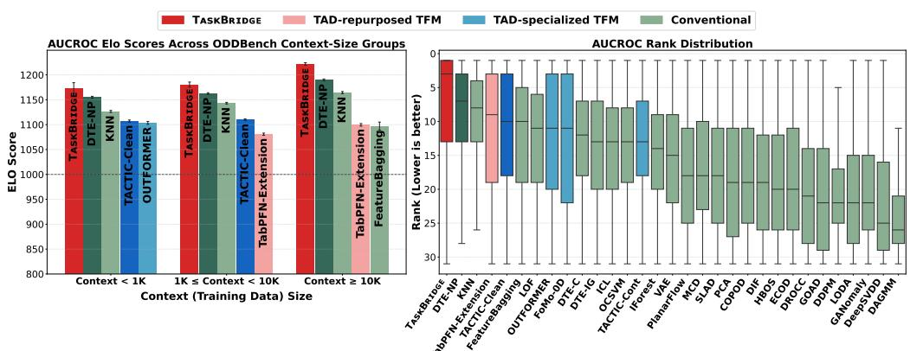  
Figure 4: (Left) Elo scores across three OODBench dataset groups with different context (training data) size (< 1K, 1K–10K, and $\ge ~ 1 0 \mathrm { K } )$ , showing the five methods with the highest average Elo scores in each group. (Right) Per-dataset AUCROC rank distributions across all baselines; colors follow Figure 1. TASKBRIDGE achieves the highest Elo score across all dataset groups and the strongest overall rank distribution. Corresponding AUCPR results are provided in Appendix C.1.

## 4.1 OVERALL PERFORMANCE.

As shown in Table 1 and Figure 4, TASKBRIDGE achieves the strongest overall anomaly-detection performance among 31 methods across 790 datasets, ranking highest across all comparison metrics. In particular, the left panel of Figure 4 shows that TASKBRIDGE remains consistently strong across dataset groups with diverse training/context resource sizes. These results demonstrate that TASKBRIDGE effectively harnesses a pretrained general-purpose TFM for TAD by bridging supervised ICL and anomaly detection through data-adaptive selection of suitable normality-anchored virtual tasks, without dataset-specific tuning or TFM retraining. Full baseline/metric results for Table 1 and the corresponding AUCPR results for Figure 4 are provided in Appendix C.1.

## 4.2 ABLATION STUDIES

We ablate two key components of TASKBRIDGE: the normality-anchored virtual-task templates and data-adaptive task selection. As shown in Figure 5, using the full set of task templates yields the best overall performance, while variants with one or more templates removed remain competitive. This supports the complementary anomaly coverage of the task families and the effectiveness of the task-selection procedure, which can still identify informative tasks from the remaining candidates. For task selection, removing either the intra- or inter-task stage degrades performance, with a larger drop when inter-task selection is removed, highlighting the importance of retaining dataset-suitable tasks. Reducing the number of held-out splits from the default S = 3 to S = 1 largely preserves detection performance while substantially lowering task-selection cost. Further ablation details, including results for each template-removal combination, are provided in Appendix C.2.

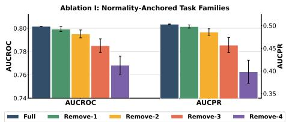

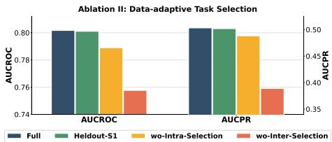  
Figure 5: Ablation studies of TASKBRIDGE. (Left) Effect of the instantiated normality-anchored virtual tasks. Remove-i denotes removing i tasks from the five task templates introduced in Section 3.3; error bars indicate the variation across different removal combinations. The full task family achieves the best average performance. (Right) Effect of data-adaptive task selection. We compare the full procedure with a single held-out split, without intra-task selection, and without inter-task selection. The full selection procedure achieves the best overall performance.

## 4.3 FURTHER EXPERIMENTS

We further analyze the inference efficiency of TASKBRIDGE beyond the relative comparison in Figure 1. As detailed in Appendix C.3, task selection with the default three held-out splits takes less than one minute for most ODDBench datasets, even at context sizes near 100K, while using a single split reduces this to below 20 seconds for most datasets while largely preserving performance, as shown in Section 4.2. After task selection, inference requires only milliseconds per sample.

We also evaluate robustness to context contamination and limited context budgets in Appendices C.4 and C.5. As shown in Figures 12 and 13, TASKBRIDGE remains competitive under contaminated contexts compared with other TFM-based approaches, and retains strong performance even when the available normality-aware context is substantially reduced, remaining competitive with baselines that use their original context/training resources. Definite performance degradation under heavier contamination also motivates improving task construction under imperfect contexts.

Finally, we assess backbone generalization by replacing the default TabICLv2 backbone with alternative pretrained TFM backbones, TabPFN v2.6 and TabPFN v3, which also show strong predictive performance on TabArena (Erickson et al., 2025), as reported in Appendix C.6. As shown in Tables 11 and 12, TASKBRIDGE with both backbones maintains strong overall performance across ODDBench among 31 TAD baselines, demonstrating that its task construction, selection, and anomaly-scoring framework generalizes beyond a single pretrained TFM backbone.

## 5 CONCLUSION

In this work, we introduced TASKBRIDGE, a new framework for efficiently repurposing pretrained general-purpose TFMs for unsupervised tabular anomaly detection. It bridges unsupervised TAD and supervised in-context prediction of TFMs by constructing normality-anchored virtual supervised tasks from an unlabeled normality-aware context, designed to satisfy AD-oriented conditions under which normal query–target pairs remain predictively compatible, whereas anomalous pairs tend to receive lower support from the pretrained TFM. To adapt this mechanism to each unseen dataset, TASKBRIDGE further employs data-adaptive task selection to retain the tasks with the most suitable predictive coverage. Across 790 real-world datasets, TASKBRIDGE achieves the strongest overall performance among 31 methods while preserving efficient inference with repurposed TFMs.

A limitation of our work is that TASKBRIDGE is designed to repurpose general-purpose PFN-based TFMs for TAD under the assumption that the context consists of clean normal samples. As shown in our appendix experiments, performance degrades when the context is heavily contaminated with anomalies. An important direction for future work is therefore to extend TASKBRIDGE to settings where the available context is not restricted to clean normal samples, including fully unsupervised and semi-supervised TAD. Another promising direction is to extend the framework to more structured tabular domains, such as relational databases.

## REFERENCES

Zeeshan Ahmad, Adnan Shahid Khan, Cheah Wai Shiang, Johari Abdullah, and Farhan Ahmad. Network intrusion detection system: A systematic study of machine learning and deep learning approaches. Transactions on Emerging Telecommunications Technologies, 32(1):e4150, 2021. doi: https://doi.org/10.1002/ett.4150. URL https://onlinelibrary.wiley. com/doi/abs/10.1002/ett.4150.

Khaled Gubran Al-Hashedi and Pritheega Magalingam. Financial fraud detection applying data mining techniques: A comprehensive review from 2009 to 2019. Computer Science Review, 40:100402, 2021. ISSN 1574-0137. doi: https://doi.org/10.1016/j.cosrev. 2021.100402. URL https://www.sciencedirect.com/science/article/pii/ S1574013721000423.

Markus M. Breunig, Hans-Peter Kriegel, Raymond T. Ng, and Jorg Sander. Lof: identifying density-¨ based local outliers. In Proceedings of the 2000 ACM SIGMOD International Conference on Management of Data, SIGMOD ’00, pp. 93–104, New York, NY, USA, 2000. Association for Computing Machinery. ISBN 1581132174. doi: 10.1145/342009.335388. URL https:// doi.org/10.1145/342009.335388.

Sihan Chen, Zhuangzhuang Qian, Wingchun Siu, Xingcan Hu, Jiaqi Li, Shawn Li, Yuehan Qin, Tiankai Yang, Zhuo Xiao, Wanghao Ye, Yichi Zhang, Yushun Dong, and Yue Zhao. Pyod 2: A python library for outlier detection with llm-powered model selection. In Companion Proceedings of the ACM on Web Conference 2025, WWW ’25, pp. 2807–2810, New York, NY, USA, 2025. Association for Computing Machinery. ISBN 9798400713316. doi: 10.1145/3701716.3715196. URL https://doi.org/10.1145/3701716.3715196.

Xueying Ding, Lingxiao Zhao, and Leman Akoglu. Hyperparameter sensitivity in deep outlier detection: Analysis and a scalable hyper-ensemble solution. In S. Koyejo, S. Mohamed, A. Agarwal, D. Belgrave, K. Cho, and A. Oh (eds.), Advances in Neural Information Processing Systems, volume 35, pp. 9603–9616. Curran Associates, Inc., 2022. doi: 10.52202/ 068431-0698. URL https://proceedings.neurips.cc/paper\_files/paper/ 2022/file/3e9113e2bc2e700baa7d765470f140e1-Paper-Conference.pdf.

Xueying Ding, Simon Kluttermann, Haomin Wen, Yilong Chen, and Leman Akoglu. Macrodata:¨ New benchmarks of thousands of datasets for tabular outlier detection. In Proceedings of the 32nd ACM SIGKDD Conference on Knowledge Discovery and Data Mining V.2, pp. 8777–8788. ACM, August 2026a. doi: 10.1145/3770855.3817520. URL http://dx.doi.org/10.1145/ 3770855.3817520.

Xueying Ding, Haomin Wen, Simon Kluttermann, and Leman Akoglu. From zero to hero: ¨ Advancing zero-shot foundation models for tabular outlier detection, 2026b. URL https: //arxiv.org/abs/2602.03018.

Gus Eggert, Kevin Huo, Mike Biven, and Justin Waugh. Tablib: A dataset of 627m tables with context, 2023. URL https://arxiv.org/abs/2310.07875.

Arpad E Elo. The proposed uscf rating system, its development, theory, and applications. Chess life, 22(8):242–247, 1967.

Nick Erickson, Lennart Purucker, Andrej Tschalzev, David Holzmuller, Prateek Desai, David¨ Salinas, and Frank Hutter. Tabarena: A living benchmark for machine learning on tabular data. In D. Belgrave, C. Zhang, H. Lin, R. Pascanu, P. Koniusz, M. Ghassemi, and N. Chen (eds.), Advances in Neural Information Processing Systems, volume 38, Main Conference. Curran Associates, Inc., 2025. doi: 10.52202/085713-0519. URL https://proceedings.neurips.cc/paper\_files/paper/2025/file/ 1697e3fb412da11dc9488249f9e7bbc9-Paper-Datasets\_and\_Benchmarks\_ Track.pdf.

Tharindu Fernando, Harshala Gammulle, Simon Denman, Sridha Sridharan, and Clinton Fookes. Deep learning for medical anomaly detection – a survey. ACM Comput. Surv., 54(7), July 2021. ISSN 0360-0300. doi: 10.1145/3464423. URL https://doi.org/10.1145/3464423.

Mark S. Graham, Walter H.L. Pinaya, Petru-Daniel Tudosiu, Parashkev Nachev, Sebastien Ourselin, and Jorge Cardoso. Denoising diffusion models for out-of-distribution detection. In Proceedings of the IEEE/CVF Conference on Computer Vision and Pattern Recognition (CVPR) Workshops, pp. 2948–2957, June 2023.

Leo Grinsztajn, Klemens Fl´ oge, Oscar Key, Felix Birkel, Philipp Jund, Brendan Roof, Benjamin¨ Jager, Dominik Safaric, Simone Alessi, Adrian Hayler, Mihir Manium, Rosen Yu, Felix Jablonski,¨ Shi Bin Hoo, Anurag Garg, Jake Robertson, Magnus Buhler, Vladyslav Moroshan, Lennart Pu-¨ rucker, Clara Cornu, Lilly Charlotte Wehrhahn, Alessandro Bonetto, Bernhard Scholkopf, Sauraj¨ Gambhir, Noah Hollmann, and Frank Hutter. Tabpfn-2.5: Advancing the state of the art in tabular foundation models, 2026a. URL https://arxiv.org/abs/2511.08667.

Leo Grinsztajn, Klemens Fl´ oge, Oscar Key, Felix Birkel, Philipp Jund, Brendan Roof, Mihir Ma-¨ nium, Shi Bin Hoo, Magnus Buhler, Anurag Garg, Dominik Safaric, Jake Robertson, Benjamin¨ Jager, Simone Alessi, Adrian Hayler, Vladyslav Moroshan, Lennart Purucker, Philipp Singer,¨ Alan Arazi, Julien Siems, Jan Hendrik Metzen, Georg Grab, Nick Erickson, Siyuan Guo, Eliott Kalfon, Simon Bing, David Salinas, Clara Cornu, Lilly Charlotte Wehrhahn, Diana Kriuchkova, Kursat Kaya, Lydia Sidhoum, Marie Salmon, Jerry Chen, Madelon Hulsebos, Yann LeCun, Samuel Muller, Bernhard Sch¨ olkopf, Sauraj Gambhir, Noah Hollmann, and Frank Hutter. Tabpfn-¨ 3: Technical report, 2026b. URL https://arxiv.org/abs/2605.13986.

Songqiao Han, Xiyang Hu, Hailiang Huang, Minqi Jiang, and Yue Zhao. Adbench: Anomaly detection benchmark. In S. Koyejo, S. Mohamed, A. Agarwal, D. Belgrave, K. Cho, and A. Oh (eds.), Advances in Neural Information Processing Systems, volume 35, pp. 32142–32159. Curran Associates, Inc., 2022. doi: 10.52202/068431-2329. URL https://proceedings.neurips.cc/paper\_files/paper/2022/file/ cf93972b116ca5268827d575f2cc226b-Paper-Datasets\_and\_Benchmarks. pdf.

Noah Hollmann, Samuel Muller, Katharina Eggensperger, and Frank Hutter. Tabpfn: A transformer¨ that solves small tabular classification problems in a second, 2023. URL https://arxiv. org/abs/2207.01848.

Shi Bin Hoo, Samuel Muller, David Salinas, and Frank Hutter. From tables to time: Extending¨ tabpfn-v2 to time series forecasting, 2026. URL https://arxiv.org/abs/2501.02945.

David R. Hunter. MM algorithms for generalized Bradley-Terry models. The Annals of Statistics, 32(1):384 – 406, 2004. doi: 10.1214/aos/1079120141. URL https://doi.org/10.1214/ aos/1079120141.

Fei Tony Liu, Kai Ming Ting, and Zhi-Hua Zhou. Isolation forest. In 2008 Eighth IEEE International Conference on Data Mining, pp. 413–422, 2008. doi: 10.1109/ICDM.2008.17.

Victor Livernoche, Vineet Jain, Yashar Hezaveh, and Siamak Ravanbakhsh. On diffusion modeling for anomaly detection. In B. Kim, Y. Yue, S. Chaudhuri, K. Fragkiadaki, M. Khan, and Y. Sun (eds.), International Conference on Learning Representations, volume 2024, pp. 25836–25866, 2024. URL https://proceedings.iclr.cc/paper\_files/paper/2024/file/ 6dfd16ff880a63fee9f6469fee58a496-Paper-Conference.pdf.

Martin Q. Ma, Yue Zhao, Xiaorong Zhang, and Leman Akoglu. The need for unsupervised outlier model selection: A review and evaluation of internal evaluation strategies. SIGKDD Explor. Newsl., 25(1):19–35, July 2023. ISSN 1931-0145. doi: 10.1145/3606274.3606277. URL https://doi.org/10.1145/3606274.3606277.

Patryk Marszałek, Tomasz Kusmierczyk, and Marek ´ Smieja. Tactic for navigating the unknown:´ Tabular anomaly detection via in-context inference, 2026. URL https://arxiv.org/abs/ 2603.14171.

Lukasz Maziarka, Marek Smieja, Marcin Sendera, Lukasz Struski, Jacek Tabor, and Przemyslaw Spurek. Oneflow: One-class flow for anomaly detection based on a minimal volume region. IEEE Transactions on Pattern Analysis and Machine Intelligence, pp. 1–1, 2021. ISSN 1939- 3539. doi: 10.1109/tpami.2021.3108223. URL http://dx.doi.org/10.1109/TPAMI. 2021.3108223.

Samuel Muller, Noah Hollmann, Sebastian Pineda Arango, Josif Grabocka, and Frank Hutter. Trans-¨ formers can do bayesian inference, 2024. URL https://arxiv.org/abs/2112.10510.

Jingang Qu, David Holzmuller, Ga ¨ el Varoquaux, and Marine Le Morvan. Tabiclv2: A better, faster,¨ scalable, and open tabular foundation model, 2026. URL https://arxiv.org/abs/2602. 11139.

Yuchen Shen, Haomin Wen, and Leman Akoglu. Fomo-0d: A foundation model for zero-shot tabular outlier detection, 2025. URL https://arxiv.org/abs/2409.05672.

Ashish Vaswani, Noam Shazeer, Niki Parmar, Jakob Uszkoreit, Llion Jones, Aidan N Gomez, Ł ukasz Kaiser, and Illia Polosukhin. Attention is all you need. In I. Guyon, U. Von Luxburg, S. Bengio, H. Wallach, R. Fergus, S. Vishwanathan, and R. Garnett (eds.), Advances in Neural Information Processing Systems, volume 30. Curran Associates, Inc., 2017. URL https://proceedings.neurips.cc/paper\_files/paper/2017/ file/3f5ee243547dee91fbd053c1c4a845aa-Paper.pdf.

Jack Yi Wei and Narges Armanfard. Iclad: In-context learning for unified tabular anomaly detection across supervision regimes, 2026. URL https://arxiv.org/abs/2603.19497.

Linjie Xu, Yanlin Zhang, Quan Gan, Minjie Wang, and David Wipf. No need to train your rdb foundation model, 2026. URL https://arxiv.org/abs/2602.13697.

## A METHOD DETAILS

## A.1 CONSISTENCY OF NORMALITY-ANCHORED VIRTUAL TASKS

We formalize how normality anchoring stabilizes the virtual-task semantics for normal queries. Specifically, the following proposition shows that, under a local-stability condition, the task conditional induced by a finite normality-aware context agrees with its population-level counterpart with high probability.

Proposition A.1 (Consistency of the context-induced task conditional for normal queries). Under Definition 3.1, recall that ${ \widehat { y } } _ { m } ( { \pmb x } ; { \mathcal { C } } ) = g _ { m } ( { \pmb x } ; \widehat { \psi } _ { m , { \mathcal { C } } } )$ . Define the deterministic task conditionals induced by the context-estimated and population-level parameters as

$$
\widehat { \pi } _ { m , \mathcal { C } } ( y \mid x ) : = \mathbf { 1 } \left\{ y = g _ { m } ( \mathbf { x } ; \widehat { \psi } _ { m , \mathcal { C } } ) \right\} , \qquad \pi _ { m } ^ { 0 } ( y \mid x ) : = \mathbf { 1 } \left\{ y = g _ { m } ( \mathbf { x } ; \psi _ { m } ^ { 0 } ) \right\} .\tag{17}
$$

Suppose that the virtual-task conditional is locally stable at $\psi _ { m } ^ { 0 }$ under $P _ { 0 } .$ . Specifically, let

$$
\omega _ { m } ( t ) : = \operatorname* { s u p } _ { \substack { \psi : d _ { m } ( \psi , \psi _ { m } ^ { 0 } ) \leq t } } \operatorname* { P r } _ { \substack { \psi \sim P _ { 0 } } } \left[ g _ { m } ( \mathbf { x } ; \psi ) \neq g _ { m } ( \mathbf { x } ; \psi _ { m } ^ { 0 } ) \right] ,\tag{18}
$$

and assume that $\omega _ { m } ( t ) \to 0$ as $t \to 0$

Then,for an independent normal query $\mathbf { x } _ { q } \sim P _ { 0 }$

$$
\begin{array} { r l } & { \underset { C \sim P _ { 0 } ^ { n } } { \operatorname* { P r } } \left[ \widehat { \pi } _ { m , \mathcal { C } } ( \cdot \mid \mathbf { x } _ { q } ) = \pi _ { m } ^ { 0 } ( \cdot \mid \mathbf { x } _ { q } ) \right] = \underset { \mathbf { x } _ { q } \sim P _ { 0 } ^ { n } } { \operatorname* { P r } } \left[ \widehat { y } _ { m } ( \mathbf { x } _ { q } ; \mathcal { C } ) = g _ { m } ( \mathbf { x } _ { q } ; \psi _ { m } ^ { 0 } ) \right] \geq 1 - \omega _ { m } ( \epsilon _ { m , n } ) - \delta _ { m , n } . } \end{array}\tag{19}
$$

Proof. Define the successful anchoring event

$$
\mathcal { E } _ { m , n } : = \left\{ d _ { m } \left( \widehat { \psi } _ { m , c } , \psi _ { m } ^ { 0 } \right) \leq \epsilon _ { m , n } \right\} .\tag{20}
$$

By Definition 3.1,

$$
\Pr _ { 0 } \left[ \mathcal { E } _ { m , n } ^ { c } \right] \leq \delta _ { m , n } .\tag{21}
$$

Consider any realized context C for which ${ \mathcal { E } } _ { m , n }$ holds. Then $d _ { m } \left( \widehat { \psi } _ { m , \mathcal { C } } , \psi _ { m } ^ { 0 } \right) \leq \epsilon _ { m , n }$ . By the definition of $\omega _ { m }$ in Equation 18,

$$
\begin{array} { r } { \underset { \mathbf { x } _ { q } \sim P _ { 0 } } { \operatorname* { P r } } \left[ \widehat { y } _ { m } ( \mathbf { x } _ { q } ; \mathcal { C } ) \neq g _ { m } ( \mathbf { x } _ { q } ; \psi _ { m } ^ { 0 } ) \right] \leq \omega _ { m } ( \epsilon _ { m , n } ) . } \end{array}\tag{22}
$$

Let

$$
\mathcal { D } _ { m , n } : = \left. \widehat { y } _ { m } ( \mathbf { x } _ { q } ; \mathcal { C } ) \neq g _ { m } ( \mathbf { x } _ { q } ; \psi _ { m } ^ { 0 } ) \right.\tag{23}
$$

denote the event that the context-induced and population-level task conditionals assign different virtual targets to the normal query.

Equation 22 holds for every realized context satisfying ${ \mathcal { E } } _ { m , n }$ . Therefore, averaging the corresponding query-wise disagreement probabilities over all such context realizations gives

$$
\operatorname* { P r } \left( \mathcal { D } _ { m , n } \mid \mathcal { E } _ { m , n } \right) = \mathbb { E } _ { \mathcal { C } | \mathcal { E } _ { m , n } } \left[ \operatorname* { P r } _ { { \mathbf x } _ { q } \sim P _ { 0 } } \left[ \widehat { y } _ { m } ( { \mathbf x } _ { q } ; \mathcal { C } ) \neq g _ { m } ( { \mathbf x } _ { q } ; \psi _ { m } ^ { 0 } ) \right] \right] \leq \omega _ { m } ( \epsilon _ { m , n } ) .\tag{24}
$$

Here, the expectation is taken over context realizations conditioned on successful anchoring. Since each query-wise disagreement probability inside the expectation is bounded by $\omega _ { m } \big ( \epsilon _ { m , n } \big )$ , their conditional average satisfies the same bound.

When $\mathcal { E } _ { m , n } ^ { c }$ occurs, the estimated task parameter is not guaranteed to lie within $\epsilon _ { m , n }$ of $\psi _ { m } ^ { 0 }$ . We therefore use the worst-case bound

$$
\operatorname* { P r } \left( \mathcal { D } _ { m , n } \mid \mathcal { E } _ { m , n } ^ { c } \right) \leq 1 .\tag{25}
$$

Applying the law of total probability over the successful and failed anchoring events yields

$$
\begin{array} { r l } { \operatorname* { P r } ( \mathcal { D } _ { m , n } ) = \operatorname* { P r } \left( \mathcal { D } _ { m , n } \mid \mathcal { E } _ { m , n } \right) \operatorname* { P r } ( \mathcal { E } _ { m , n } ) } & { } \\ & { ~ + \operatorname* { P r } \left( \mathcal { D } _ { m , n } \mid \mathcal { E } _ { m , n } ^ { c } \right) \operatorname* { P r } ( \mathcal { E } _ { m , n } ^ { c } ) } \\ & { \leq \omega _ { m } ( \epsilon _ { m , n } ) \operatorname* { P r } ( \mathcal { E } _ { m , n } ) + \operatorname* { P r } ( \mathcal { E } _ { m , n } ^ { c } ) } \\ & { \leq \omega _ { m } ( \epsilon _ { m , n } ) + \delta _ { m , n } , } \end{array}\tag{26}
$$

where the final inequality follows from $\Pr ( \mathcal { E } _ { m , n } ) \leq 1$ and Equation 21.

By the deterministic definitions in Equation 17, the target-disagreement event $\mathcal { D } _ { m , n }$ is equivalent to $\left\{ \widehat { \pi } _ { m , \mathcal { C } } ( \cdot \mid \mathbf { x } _ { q } ) \neq \pi _ { m } ^ { 0 } ( \cdot \mid \mathbf { x } _ { q } ) \right\}$ . Taking complements in Equation 26 therefore gives

$$
\underset { \mathbf { x } _ { q } \sim P _ { 0 } } { \operatorname* { P r } } \left[ \widehat { \pi } _ { m , \mathcal { C } } ( \cdot \mid \mathbf { x } _ { q } ) = \pi _ { m } ^ { 0 } ( \cdot \mid \mathbf { x } _ { q } ) \right] \geq 1 - \omega _ { m } ( \epsilon _ { m , n } ) - \delta _ { m , n } ,\tag{27}
$$

which proves Equation 19.

Thus, normality anchoring stabilizes the virtual-task semantics for normal queries: as the contextestimated task parameter approaches its population counterpart, a fresh normal query follows the same task conditional with high probability. Consequently, normal query–target pairs are likely to remain aligned with the predictive structure induced by the virtually labeled normal context, providing the structural basis for nominal predictive coherence.

## A.2 FEATURE-TYPE AND DATA-PROFILE INFERENCE

Before constructing profile-specific virtual tasks, we infer the type of each observed attribute directly from the normality-aware context. Attribute-type inference is performed before preprocessing so that the original cardinality structure of each attribute is preserved.

Let $\mathcal { C } = \{ \pmb { x } _ { i } \} _ { i = 1 } ^ { n }$ denote the context with d observed attributes. For attribute $j ,$ let $n _ { j }$ denote the number of non-missing observations and $u _ { j }$ the number of unique values among them. An attribute is regarded as constant if it contains no valid observations or if $u _ { j } \ \leq \ 1$ . Otherwise, we define an adaptive cardinality threshold

$$
t _ { j } = \operatorname* { m i n } \left( 2 0 , \operatorname* { m a x } \left( 2 , \left\lceil \sqrt { n _ { j } } \right\rceil \right) \right) .\tag{28}
$$

Attribute $j$ is classified as categorical if

$$
( u _ { j } < 1 0 ~ \lor ~ u _ { j } \leq t _ { j } ) ~ \land ~ \left( I _ { j } ^ { \mathrm { i n t } } = 1 ~ \lor ~ u _ { j } \leq t _ { j } \right) \land \frac { u _ { j } } { n _ { j } } \leq 0 . 5 ,\tag{29}
$$

where $I _ { j } ^ { \mathrm { i n t } }$ is an indicator of whether the observed values of attribute $j$ are integer-like. All remaining non-constant attributes are classified as numerical. This hybrid criterion combines cardinality, integer-likeness, and the proportion of unique values to distinguish low-cardinality categorical attributes from numerical ones.

Attribute-profile assignment. Let $d _ { \mathrm { n u m } } , d _ { \mathrm { c a t } }$ , and $d _ { \mathrm { c o n s t } }$ denote the numbers of attributes inferred as numerical, categorical, and constant, respectively. Since constant attributes do not provide a meaningful type preference, we exclude them when computing the relative composition of numerical and categorical attributes. Specifically, letting $d _ { \mathrm { u s e } } = d _ { \mathrm { n u m } } + d _ { \mathrm { c a t } }$ , we define

$$
r _ { \mathrm { n u m } } = \frac { d _ { \mathrm { n u m } } } { d _ { \mathrm { u s e } } } , \qquad r _ { \mathrm { c a t } } = \frac { d _ { \mathrm { c a t } } } { d _ { \mathrm { u s e } } } ,\tag{30}
$$

whenever $d _ { \mathrm { u s e } } > 0$

The feature profile of each dataset is then determined as

$$
\mathrm { P r o f i l e } ( \mathcal { C } ) = \left\{ \begin{array} { l l } { \mathrm { n u m e r i c a l - o n l y } , } & { d _ { \mathrm { c a t } } = 0 , ~ d _ { \mathrm { n u m } } > 0 , } \\ { \mathrm { c a t e g o r i c a l - o n 1 y } , } & { d _ { \mathrm { n u m } } = 0 , ~ d _ { \mathrm { c a t } } > 0 , } \\ { \mathrm { m i x e d - n u m e r i c a l - d o m i n a n t } , } & { d _ { \mathrm { n u m } } , d _ { \mathrm { c a t } } > 0 ~ a n d ~ r _ { \mathrm { n u m } } \ge \tau _ { \mathrm { d o m } } , } \\ { \mathrm { m i x e d - c a t e g o r i c a l - d o m i n a n t } , } & { d _ { \mathrm { n u m } } , d _ { \mathrm { c a t } } > 0 ~ a n d ~ r _ { \mathrm { c a t } } \ge \tau _ { \mathrm { d o m } } , } \\ { \mathrm { m i x e d } , } & { \mathrm { o t h e r w i s e } . } \end{array} \right.\tag{31}
$$

We use the dominance threshold $\tau _ { \mathrm { d o m } } = 0 . 8 0$ in all experiments. The inferred profile is used only to determine the appropriate instantiations of virtual-task templates for the observed attribute composition.

## A.3 PROFILE-SPECIFIC NORMALITY-ANCHORED VIRTUAL-TASK INSTANTIATIONS

We describe the concrete instantiations of the five normality-anchored virtual-task templates introduced in Section 3.3. Let $\mathcal { I } _ { \mathrm { n u m } }$ and $\mathcal { I } _ { \mathrm { c a t } }$ denote the sets of numerical and categorical attributes inferred from the context C, respectively. Each task construction produces a discrete virtual target so that the resulting labeled context can be directly processed by a pretrained TFM backbone. While the underlying templates are shared across attribute profiles, the concrete operator is adapted to the profile of the observed attributes. For notation, we use $\mathrm { Q B i n } _ { K } ( z ; { \mathcal { C } } )$ to denote the assignment of a scalar statistic z to one of K classes according to empirical quantile boundaries estimated from $\mathcal { C } .$

⃝1 Single attribute: Reg2Class. This template probes attribute-wise predictive dependencies in the normal distribution by treating an individual attribute as the prediction target and the remaining attributes as predictors. We instantiate this template using Reg2Class, a regression-to-classification construction motivated by the synthetic classification-task generation paradigm commonly used in general-purpose TFMs (Qu et al., 2026; Hollmann et al., 2023). Rather than directly predicting a continuous attribute, Reg2Class discretizes its values using context-derived boundaries to form a classification target.

For a numerical target attribute $j ,$ we construct

$$
\widehat { y } _ { m } ( { \pmb x } ; \mathcal { C } ) = \operatorname { Q B i n } _ { K } \left( x _ { j } ; \mathcal { C } \right) ,\tag{32}
$$

where the class boundaries are empirical quantiles of attribute j in the context. Candidate numerical attributes are prioritized according to their variation.

For a categorical target attribute, the observed categories themselves define the virtual classes:

$$
{ \widehat { y } } _ { m } ( \pmb { x } ; \mathcal { C } ) = { \mathrm { C a t I n d e x } } _ { \mathcal { C } } ( x _ { j } ) ,\tag{33}
$$

where CatIndexC maps categories observed in the context to discrete class indices. Candidate categorical attributes are screened according to their cardinality and empirical category structure so that degenerate or excessively sparse classification tasks are avoided.

Accordingly, Reg2Class is instantiated using numerical attributes for the numerical-only profile and categorical attributes for the categorical-only profile. For the mixed profile, both numerical and categorical candidates are considered, with the corresponding numerical-binning or categorical-mapping rule applied according to the selected target attribute. For mixed profiles dominated by one attribute type, the dominant attribute group is preferentially used to construct the axis-aligned task.

⃝2 Localized subspace direction: Masked Projection. The second task template probes localized predictive dependencies of the normal distribution that are expressed within a subset of attributes. The underlying motivation is that an anomalous observation may violate the predictive structure of a particular subspace while remaining compatible with the normal regularities expressed by the remaining attributes. We therefore construct a scalar projection from a randomly sampled attribute subset and discretize the resulting statistic into virtual classes.

For numerical attributes, Masked Random Subspace Projection (MRSP) samples a subset $\cal { S } _ { m } \subseteq$ $\mathcal { I } _ { \mathrm { n u m } }$ and constructs

$$
z _ { m } ( { \pmb x } ) = { \pmb w } _ { m } ^ { \top } T _ { \mathcal { C } } \left( { \pmb x } _ { S _ { m } } \right) , \qquad { \widehat y } _ { m } ( { \pmb x } ; { \mathcal { C } } ) = \mathrm { Q B i n } _ { K } \left( z _ { m } ( { \pmb x } ) ; { \mathcal { C } } \right) ,\tag{34}
$$

where $T _ { \mathcal { C } }$ denotes the context-fitted numerical transformation and ${ \pmb w } _ { m }$ is a randomly sampled projection vector that is fixed for the instantiated task.

For categorical attributes, we instead use Masked Categorical Random Projection (MCRP). Given a sampled categorical subset, each observed attribute–category token is assigned a random weight modulated by its empirical rarity in the context. For category value v of attribute j, we define the smoothed rarity statistic

$$
r _ { j } ( v ) = \log \frac { n + \alpha ( K _ { j } + 1 ) } { N _ { j } ( v ) + \alpha } ,\tag{35}
$$

where n is the number of context samples, $K _ { j }$ is the number of categories observed for attribute $j , N _ { j } ( v )$ denotes the number of context samples with category value v, and $\alpha > 0$ is a smoothing constant. We then construct

$$
z _ { m } ( \pmb { x } ) = \frac { 1 } { \sqrt { \lvert S _ { m } \rvert } } \sum _ { j \in S _ { m } } r _ { j } ( x _ { j } ) \xi _ { j , x _ { j } } ,\tag{36}
$$

where $S _ { m }$ is the sampled categorical attribute subset and $\xi _ { j , v }$ is a task-specific random weight. The resulting scalar score is again partitioned using context-derived quantiles $\operatorname { Q B i n } _ { K }$

For mixed attributes, Masked Mixed Random Projection (MMRP) first converts numerical attributes into context-dependent quantile tokens while retaining categorical values as categorical tokens. The resulting heterogeneous token view is then processed using the same rarity-weighted random projection mechanism for categorical attributes.

Therefore, the concrete masked operator is selected according to the inferred profile. Numericalonly data use MRSP, categorical-only data use MCRP, and balanced mixed data use MMRP. For mixed-numerical-dominant data, we retain both the numerical MRSP and the MMRP; analogously, mixed-categorical-dominant data use both the MCRP and MMRP.

⃝3 Global direction: Global Projection. This template probes global predictive dependencies of the normal distribution that are expressed across a broader set of attributes. The underlying motivation is that some anomalous observations may violate distributed multivariate relationships that are not confined to a localized subspace. Accordingly, this family captures global directional predictive structure by constructing projections over the full feature view.

For numerical-only data, Global Random Projection uses all available numerical attributes:

$$
z _ { m } ( { \pmb x } ) = { \pmb w } _ { m } ^ { \top } T _ { \mathcal { C } } ( { \pmb x } _ { \mathcal { I } _ { \mathrm { n u m } } } ) , \qquad { \widehat y } _ { m } ( { \pmb x } ; { \mathcal { C } } ) = \mathrm { Q B i n } _ { K } \left( z _ { m } ( { \pmb x } ) ; { \mathcal { C } } \right) .\tag{37}
$$

For categorical-only data, Global Categorical Random Projection applies the rarity-weighted categorical projection to the complete categorical feature set rather than a sampled subset.

For mixed data, Mixed Random Projection uses the complete mixed token view: numerical attributes are converted to context-derived quantile tokens and categorical attributes retain their categorical identities. A rarity-weighted random projection over all resulting tokens then defines the scalar statistic used for virtual-class construction.

In the current implementation, numerical-only and categorical-only profiles use their corresponding type-specific global projections, whereas the mixed and both mixed-dominant profiles use the Mixed Random Projection.

⃝4 Prototype-based multimodal organization: Clustering. This template probes multimodal predictive structure of the normal distribution through context-fitted prototypes. The underlying motivation is that normal data may consist of multiple modes with distinct attribute relationships, such that an anomalous sample can become incompatible with the prototype structure induced by the context. Unlike projection-based tasks, clustering represents this structure through multiple nominal prototypes rather than a single projected ordering.

For numerical-only data, we apply K-means to the context-transformed numerical attributes and use the resulting cluster index as the virtual target:

$$
\widehat { y } _ { m } ( { \pmb x } ; \mathcal { C } ) = \arg \operatorname* { m i n } _ { k \in [ K ] } \left\| T _ { \mathcal { C } } ( { \pmb x } ) - \widehat { { \pmb \mu } } _ { k , \mathcal { C } } \right\| _ { 2 } ^ { 2 } .\tag{38}
$$

For categorical-only data, we replace Euclidean clustering with categorical K-modes. Let $\widehat { p } _ { k , \mathcal { C } }$ denote the attribute-wise modal-category prototype estimated from the context samples assigned to cluster k. The categorical discrepancy is the Hamming distance

$$
d _ { \mathrm { c a t } } ( \pmb { x } , \pmb { p } _ { k } ) = \sum _ { j \in \mathcal { I } _ { \mathrm { c a t } } } \pmb { 1 } [ x _ { j } \neq p _ { k , j } ] .\tag{39}
$$

The categorical virtual target is then the index of the nearest modal prototype:

$$
\widehat { y } _ { m } ( \pmb { x } ; \mathcal { C } ) = \arg \operatorname* { m i n } _ { k \in [ K ] } d _ { \mathrm { c a t } } \left( \pmb { x } _ { \mathcal { I } _ { \mathrm { c a t } } } , \widehat { \pmb { p } } _ { k , \mathcal { C } } \right) .\tag{40}
$$

Thus, two samples receive the same virtual class when they are assigned to the same context-fitted categorical prototype. The prototypes are refined by alternating nearest-prototype assignments and attribute-wise modal updates.

For mixed profiles, we use a K-prototypes-style construction on a context-fitted mixed representa tion. First, numerical attributes are converted to context-derived quantile tokens, as in mixed random projection. Let $\widetilde { \pmb { x } } _ { \mathrm { n u m } , \mathcal { C } }$ denote the resulting numerical bin-code vector, while $\mathbf { \Delta } \mathbf { x } _ { \mathcal { I } _ { \mathrm { c a t } } }$ retains the categorical values. Each mixed prototype contains the coordinate-wise median numerical bin code and the attribute-wise modal categorical value of its assigned context samples. We define

$$
d _ { \mathrm { n u m } } ( \pmb { x } , \pmb { p } _ { k } ; \mathcal { C } ) = \frac { 1 } { | \mathcal { T } _ { \mathrm { n u m } } | } \sum _ { j \in \mathcal { T } _ { \mathrm { n u m } } } { ( \widetilde { x } _ { j , \mathcal { C } } - p _ { k , j } ) ^ { 2 } }\tag{41}
$$

and the normalized categorical mismatch

$$
\overline { { d } } _ { \mathrm { c a t } } ( \boldsymbol { x } , p _ { k } ) = \frac { 1 } { | \mathcal { I } _ { \mathrm { c a t } } | } \sum _ { j \in \mathcal { I } _ { \mathrm { c a t } } } \mathbf { 1 } [ x _ { j } \neq p _ { k , j } ] .\tag{42}
$$

The mixed prototype distance and corresponding virtual target are

$$
\begin{array} { r } { d _ { \mathrm { \operatorname* { m i x } } } ( \pmb { x } , \pmb { p } _ { k } ; \mathcal { C } ) = d _ { \mathrm { n u m } } ( \pmb { x } , \pmb { p } _ { k } ; \mathcal { C } ) + \overline { { d } } _ { \mathrm { c a t } } ( \pmb { x } , \pmb { p } _ { k } ) , } \end{array}\tag{43}
$$

$$
\widehat { y } _ { m } ( \pmb { x } ; \mathcal { C } ) = \arg \operatorname* { m i n } _ { k \in [ K ] } d _ { \operatorname* { m i x } } \left( \pmb { x } , \widehat { \pmb { p } } _ { k , \mathcal { C } } ; \mathcal { C } \right) .\tag{44}
$$

As with categorical K-modes, the prototypes are obtained by alternating assignment and prototypeupdate steps.

Accordingly, the numerical-only, categorical-only, and mixed profiles use K-means, categorical K-modes, and the context-discretized mixed K-prototypes construction, respectively. Both mixeddominant profiles also use the mixed K-prototypes construction.

Distributional extremity: Radial and Rarity-based Constructions. The last fifth template probes predictive structures associated with context-relative distributional extremity. The underlying motivation is that the normality-aware context induces not only relational structure among attributes, but also a characteristic organization of samples according to their relative position within the nominal support. An anomalous sample exhibiting a scale shift or other support-relative deviation may therefore be assigned an extremity level that is incompatible with the predictive structure induced by the context.

For numerical-only data, Radial Bin computes the radial magnitude of the context-transformed numerical vector,

$$
\rho ( { \pmb x } ) = \| T _ { \mathcal { C } } ( { \pmb x } ) \| _ { 2 } ,\tag{45}
$$

and assigns the corresponding virtual target using context-derived quantile bins: $\widehat { y } _ { m } ( { \pmb x } ; { \mathcal { C } } ) \ =$ $\mathrm { Q B i n } _ { K } \left( \rho ( \pmb { x } ) ; \mathcal { C } \right)$ .

For categorical-only data, Categorical Rarity Bin estimates the smoothed empirical occurrence probability of each category from the normality-aware context. Specifically, for category value v of attribute $j ,$ we define

$$
\widehat { p } _ { j , c } ( v ) = \frac { N _ { j } ( v ) + \alpha } { n + \alpha ( K _ { j } + 1 ) } ,\tag{46}
$$

where n is the number of context samples, $K _ { j }$ is the number of categories observed for attribute $j ,$ $N _ { j } ( v )$ denotes the number of context samples taking value v at attribute $j ,$ , and $\alpha > 0$ is a smoothing constant. A sample-level rarity statistic is then constructed as

$$
R ( \pmb { x } ) = - \frac { 1 } { | \mathcal { I } _ { \mathrm { c a t } } | } \sum _ { j \in \mathcal { I } _ { \mathrm { c a t } } } \log \widehat { p } _ { j , c } ( x _ { j } ) ,\tag{47}
$$

where $x _ { j }$ is the category value of sample x at attribute $j .$ . Thus, categories that occur less frequently in the normality-aware context contribute more strongly to $R ( { \pmb x } )$ . The resulting rarity statistic is subsequently discretized using context-derived empirical quantiles to form the virtual classification target.

For mixed profiles, Mixed Categorical Rarity Bin first converts numerical attributes into contextderived quantile tokens and combines them with the original categorical tokens. The rarity score is then evaluated over this joint token representation and discretized into virtual classes. This construction is used for the balanced mixed profile as well as both mixed-dominant profiles.

Normality-anchoring characteristics of virtual tasks. Despite their different targeting predictive structures, all of the above constructions share a common source of task anchoring. Their virtual-label semantics depend on quantities estimated from the normality-aware context, including empirical quantile boundaries, category supports and frequencies, numerical transformations, and fitted prototypes. Random components such as sampled attribute subsets or projection weights determine which view of the attributes is probed, but are sampled once for the instantiation and kept fixed across context and query labeling.

Consequently, each instantiated task can be expressed in the form introduced in Equation 6. Under standard consistency of the corresponding empirical statistics, these context-dependent parameters converge to population quantities determined by $P _ { 0 }$ . Together with their nontrivial influence on the induced virtual-label semantics, the instantiated task families therefore satisfy the normalityanchoring principle of Definition 3.1.

## A.4 HELD-OUT EVALUATION SAMPLE GENERATION

For each dataset and random seed, we construct a common registry of held-out splits that is shared across all candidate virtual tasks. This ensures that candidate tasks are evaluated against the same normal observations. Let $\mathcal { S } : = [ S ] = \{ 1 , \ldots , S \}$ denote the set of held-out splits. For split $s \in S .$ let $\mathcal { H } _ { s }$ denote the nominal held-out subset, $\widetilde { \mathcal { H } } _ { s } ^ { ( r ) }$ the set of structural-violation samples generated by applying the structure-disrupting operator $r ,$ and $\mathcal { C } _ { - s }$ the complementary train-side context. We set $S = 3$ as the default throughout our framework.

Nominal held-out subsets. These sets are constructed from disjoint subsets of the original normality-aware context $\mathcal { C } .$ Given a hold-out ratio $\rho _ { H }$ , the number of held-out samples per split is

$$
n _ { \mathrm { H } } = \operatorname* { m i n } \left\{ n _ { \mathrm { m a x } } , \left\lceil \rho _ { H } n \right\rceil , \left\lfloor \frac { n } { S } \right\rfloor , n - 1 \right\} ,\tag{48}
$$

where $n$ denotes the context $\mathrm { s i z e } , S$ the number of held-out splits, and $n _ { \mathrm { m a x } }$ the maximum number of held-out samples per split. In our experiments, we set $n _ { \mathrm { m a x } } = 2 0 4 8$ , while $\rho _ { H }$ is selected through the backbone-specific configuration calibration described in Appendix B.1.

Context-calibrated structural-violation held-out samples. For each held-out split s, we generate operator-specific probe sets $\{ \widetilde { \mathcal { H } } _ { s } ^ { ( r ) } : r \in \mathcal { R } _ { { \mathcal { C } } _ { - s } } \}$ whose combined sample budget equals $| \mathcal { H } _ { s } |$ The budget is distributed as evenly as possible across the active perturbation operators, such that each operator generates approximately $\bar { | \mathcal { H } _ { s } | } / | \mathcal { R } _ { C _ { - s } } |$ samples.

The active operators in $\mathcal { R } _ { \mathcal { C } }$ are column shuffling, subset replacement, and scaled jitter. Each operator is constructed using the complementary train-side context $\mathcal { C } _ { - s } .$ . For every perturbed sample $\tilde { \mathbf { x } } ,$ the virtual target is computed using the same task instantiated from the full context $\mathcal { C } .$ . The perturbation transformation $\bar { T } _ { r }$ associated with each operator r is defined as follows.

Column shuffling constructs synthetic rows directly from $\mathcal { C } _ { - s }$ . For each generated row i and attribute $j ,$ a donor row index $\pi _ { i j }$ is independently sampled from the rows of $\mathcal { C } _ { - s }$ and

$$
\widetilde { x } _ { i j } ^ { \mathrm { s h u f f e } } = x _ { \pi _ { i j } , j } .\tag{49}
$$

Because the donor row is independently sampled for each attribute, the transformation approximately preserves the empirical marginal distribution of each attribute while disrupting cross-attribute dependencies.

Subset replacement starts from a sample $\scriptstyle { \mathbf { { \mathit { x } } } } _ { h }$ drawn from the nominal held-out subset and randomly replaces a subset of its attributes with donor values from $\mathcal { C } _ { - s } .$ Specifically, let A denote the subset of attributes selected independently with replacement probability $p _ { \mathrm { r e p } } = 0 . 3$ . For each $j \in { \mathcal { A } } ,$ a donor row index $\nu _ { j }$ is independently sampled from the rows of $\mathcal { C } _ { - s } ,$ , and the perturbed sample is defined attribute-wise as

$$
\begin{array} { r } { \widetilde { x } _ { h , j } ^ { \mathrm { r e p l a c e } } = \left\{ { \begin{array} { l l } { x _ { \nu _ { j } , j } , } & { j \in { \mathcal { A } } , } \\ { x _ { h , j } , } & { j \notin { \mathcal { A } } . } \end{array} } \right. } \end{array}\tag{50}
$$

Thus, approximately 30% of the attributes are replaced on average, with donor values sampled independently across the selected attributes.

Scaled jitter perturbs the numerical attributes of a sample $\scriptstyle { \mathbf { { \mathit { x } } } } _ { h }$ drawn from the nominal held-out subset by adding feature-wise Gaussian noise scaled according to the dispersion estimated from the complementary train-side context $\mathcal { C } _ { - s } .$ . Specifically, for each numerical attribute $j$

$$
\begin{array} { r } { \widetilde { x } _ { h , j } ^ { \mathrm { j i t t e r } } = x _ { h , j } + \lambda _ { j } \widehat { d } _ { j , \mathcal { C } _ { - s } } \epsilon _ { j } , \qquad \epsilon _ { j } \sim \mathcal { N } ( 0 , 1 ) , } \end{array}\tag{51}
$$

where $\widehat { d } _ { j , \mathcal { C } _ { - } }$ denotes the interquartile range of attribute $j$ estimated from ${ \mathcal { C } } _ { - s } ,$ , and we set $\lambda _ { j } = 0 . 5$ Scaled jitter is omitted when no numerical attribute is available.

Distributional validity of the context-calibrated structural-violation. The preceding perturbations are used to assess the selective task coverage defined by C2 in the main paper. Rather than attempting to approximate the unknown test-time anomaly distribution, they construct controlled alternatives to the normal distribution by disrupting complementary forms of statistical regularity.

To formalize their distributional effects, consider the population idealization in which the train-side context and held-out samples are independently drawn from $P _ { 0 }$ . Let $\mathbf { x } = ( \mathrm { x } _ { 1 } , \dots , \mathrm { x } _ { d } ) \sim P _ { 0 }$ , let $P _ { 0 , j }$ denote the marginal distribution of $\mathbf { X } _ { j }$ , and let $P _ { 0 , A }$ denote the joint marginal distribution over an attribute subset $\bar { A } \subseteq [ d ]$ . We define the total correlation of $\mathbf { x } _ { \mathbf { \mathcal { A } } }$ as

$$
\mathrm { T C } \left( \mathbf { x } _ { A } \right) : = D _ { \mathrm { K L } } \left( P _ { 0 , A } \Bigg | \Bigg | \prod _ { j \in \mathcal { A } } P _ { 0 , j } \right) .\tag{52}
$$

For split $s ,$ let $\widehat { P } _ { j , s }$ denote the empirical marginal distribution of attribute $j$ in $\mathcal { C } _ { - s }$ . Under the i.i.d.   
assumption, $\widehat { P } _ { j , s }$ converges to $P _ { 0 , j }$ as the train-side context grows.

The following proposition characterizes the distributions induced by these probe operators and their corresponding structural effects.

Proposition A.2 (Distributional effects of the context-calibrated probe operators). Assume that the held-out base sample is independent of $\mathcal { C } _ { - s }$ and that all donor indices are sampled independently. Whenever the displayed KL divergences are well defined, the probe operators have the following effects.

1. Column shuffling. Conditional on ${ \mathcal { C } } _ { - s } ,$ , column shuffling induces

$$
\widehat { Q } _ { s } ^ { \mathrm { s h u f f e } } = \prod _ { j = 1 } ^ { d } \widehat { P } _ { j , s } .\tag{53}
$$

In the population limit, this becomes

$$
Q ^ { \mathrm { s h u f f e } } = \prod _ { j = 1 } ^ { d } P _ { 0 , j } ,\tag{54}
$$

for which

$$
D _ { \mathrm { K L } } ( P _ { 0 } \| Q ^ { \mathrm { s h u f f e } } ) = \mathrm { T C } ( \mathbf { x } ) .\tag{55}
$$

2. Subset replacement. Conditional on a realized replacement subset $A \subseteq [ d ]$ , subset replacement induces

$$
\widehat { Q } _ { \mathcal { A } , s } ^ { \mathrm { r e p l a c e } } = P _ { 0 , \mathcal { A } } \prod _ { j \in \mathcal { A } } \widehat { P } _ { j , s } .\tag{56}
$$

In the population limit, this becomes

$$
Q _ { \mathcal { A } } ^ { \mathrm { r e p l a c e } } = P _ { 0 , \mathcal { A } } \prod _ { j \in \mathcal { A } } P _ { 0 , j } ,\tag{57}
$$

and

$$
\begin{array} { r } { D _ { \mathrm { K L } } ( P _ { 0 }  Q _ { \mathcal { A } } ^ { \mathrm { r e p l a c e } } ) = I _ { P _ { 0 } } ( \mathbf { x } _ { \mathcal { A } } ; \mathbf { x } _ { \mathcal { A } ^ { c } } ) } \\ { + \mathrm { T C } ( \mathbf { x } _ { \mathcal { A } } ) . } \end{array}\tag{58}
$$

When $A = \emptyset$ , the operator leaves the distribution unchanged and both terms in Equation 58 are zero.

3. Scaled jitter. Let $\mathcal { I } _ { \mathrm { n u m } }$ denote the set of numerical attributes and $\mathcal { T } _ { \mathrm { n u m } } ^ { c }$ its complement. Conditional on $\mathcal { C } _ { - s }$ and the feature-wise jitter scales, scaledjitter satisfies

$$
\begin{array} { r } { \widetilde { \mathbf { x } } _ { \mathcal { T } _ { \mathrm { n u m } } } ^ { \mathrm { j i t t e r } } = \mathbf { x } _ { \mathcal { T } _ { \mathrm { n u m } } } + \pmb { \eta } _ { s } , \qquad \widetilde { \mathbf { x } } _ { \mathcal { T } _ { \mathrm { n u m } } ^ { c } } ^ { \mathrm { j i t t e r } } = \mathbf { x } _ { \mathcal { T } _ { \mathrm { n u m } } ^ { c } } , } \end{array}\tag{59}
$$

where

$$
\begin{array} { r l } & { \eta _ { s } \mid \mathcal { C } _ { - s } \sim \mathcal { N } \left( \mathbf { 0 } , \widehat { \boldsymbol { \Sigma } } _ { \eta , s } \right) , \qquad \eta _ { s } \mid \mid \mathbf { x } \mid \mathcal { C } _ { - s } , } \\ & { \qquad \widehat { \boldsymbol { \Sigma } } _ { \eta , s } : = \mathrm { d i a g } \left( \lambda _ { j } ^ { 2 } \widehat { d } _ { j , \mathcal { C } _ { - s } } ^ { 2 } \right) _ { j \in \mathcal { I } _ { \mathrm { n u m } } } . } \end{array}\tag{60}
$$

Consequently, whenever the corresponding second moments exist,

$$
\begin{array} { r l } & { \mathbb { E } \left[ \widetilde { \mathbf { x } } _ { \mathcal { T } _ { \mathrm { n u m } } } ^ { \mathrm { j i t t e r } } \mid \mathcal { C } _ { - s } \right] = \mathbb { E } \left[ \mathbf { x } _ { \mathcal { T } _ { \mathrm { n u m } } } \right] , } \\ & { \mathrm { C o v } \left( \widetilde { \mathbf { x } } _ { \mathcal { T } _ { \mathrm { n u m } } } ^ { \mathrm { j i t t e r } } \mid \mathcal { C } _ { - s } \right) = \mathrm { C o v } \left( \mathbf { x } _ { \mathcal { T } _ { \mathrm { n u m } } } \right) + \widehat { \boldsymbol { \Sigma } } _ { \eta , s } . } \end{array}\tag{61}
$$

Hence, whenever $\widehat { \Sigma } _ { \eta , s } \neq \mathbf { 0 }$ , scaled jitter induces a nontrivial distributional shift in the numerical subvector.

Proof. For column shuffling, each attribute is sampled independently from its train-side empirical marginal, yielding Equation 53. Replacing these empirical marginals by their population counterparts gives Equation 54, and the KL identity follows directly from the definition of total correlation.

For subset replacement, the retained attributes preserve their nominal joint distribution, whereas the replaced attributes are sampled independently from their respective marginals. Hence,

$$
Q _ { \mathcal { A } } ^ { \mathrm { r e p l a c e } } = P _ { 0 , \mathcal { A } } \prod _ { j \in \mathcal { A } } P _ { 0 , j } .\tag{62}
$$

Table 2: Principal configuration axes used to construct candidate configurations for intra-task selection. Each axis is applied when the corresponding virtual-task instantiation is available for the inferred feature profile. These configurations affect only virtual-task construction; the original observed attributes are preserved for general-purpose TFM’s inference.
<table><tr><td>Configuration Axis</td><td>Applicable Feature Profiles</td><td>Candidates</td></tr><tr><td>Number of clusters</td><td>All</td><td>{2,3}</td></tr><tr><td>Numerical feature transformation</td><td>Numerical-only, all mixed variants</td><td>{raw,robust}</td></tr><tr><td>Number of quantile bins</td><td>All</td><td>{2, 3}</td></tr><tr><td>Number of quantile bins for numerical tokenization</td><td>All mixed variants</td><td>{2, 3}</td></tr></table>

Assuming the corresponding densities exist, its log-density ratio with respect to $P _ { 0 }$ decomposes as

$$
\begin{array} { r l } & { \log \frac { p _ { 0 } ( \mathbf { x } ) } { p _ { 0 , \mathcal { A } ^ { c } } ( \mathbf { x } _ { \mathcal { A } ^ { c } } ) \prod _ { j \in \mathcal { A } } p _ { 0 , j } ( \mathbf { x } _ { j } ) } = \log \frac { p _ { 0 } ( \mathbf { x } ) } { p _ { 0 , \mathcal { A } } ( \mathbf { x } _ { \mathcal { A } } ) p _ { 0 , \mathcal { A } ^ { c } } ( \mathbf { x } _ { \mathcal { A } ^ { c } } ) } } \\ & { \qquad + \log \frac { p _ { 0 , \mathcal { A } } ( \mathbf { x } _ { \mathcal { A } } ) } { \prod _ { j \in \mathcal { A } } p _ { 0 , j } ( \mathbf { x } _ { j } ) } . } \end{array}\tag{63}
$$

Taking expectations with respect to $\mathbf { x } \sim P _ { 0 }$ gives

$$
\begin{array} { l } { { \displaystyle D _ { \mathrm { K L } } ( P _ { 0 } \| Q _ { \mathcal { A } } ^ { \mathrm { r e p l a c e } } ) = D _ { \mathrm { K L } } ( P _ { 0 } \| P _ { 0 , { \mathcal A } } P _ { 0 , { \mathcal A } ^ { c } } ) } } \\ { ~ } \\ { { \displaystyle ~ + D _ { \mathrm { K L } } ( P _ { 0 , { \mathcal A } } \| \prod _ { j \in { \mathcal A } } P _ { 0 , j } ) } } \\ { ~ } \\ { { \displaystyle = I _ { P _ { 0 } } ( \mathbf { x } _ { { \mathcal A } } ; \mathbf { x } _ { { \mathcal A } ^ { c } } ) + \mathrm { T C } ( \mathbf { x } _ { { \mathcal A } } ) , } } \end{array}\tag{64}
$$

(65)

where the first term measures the dependence between the replaced and retained attributes, while the second measures the dependence among the replaced attributes themselves.

Finally, scaled jitter adds conditionally independent zero-mean noise to the numerical subvector. Therefore, the perturbation preserves its conditional mean, while independence eliminates the cross covariance terms, yielding

$$
\begin{array} { r } { \mathrm { C o v } \left( \mathbf { x } _ { \mathcal { I } _ { \mathrm { n u m } } } + \eta _ { s } \mid \boldsymbol { \mathcal { C } } _ { - s } \right) = \mathrm { C o v } \left( \mathbf { x } _ { \mathcal { I } _ { \mathrm { n u m } } } \mid \boldsymbol { \mathcal { C } } _ { - s } \right) + \widehat { \boldsymbol { \Sigma } } _ { \eta , s } = \mathrm { C o v } \left( \mathbf { x } _ { \mathcal { I } _ { \mathrm { n u m } } } \right) + \widehat { \boldsymbol { \Sigma } } _ { \eta , s } . } \end{array}\tag{66}
$$

Thus, jitter preserves the nominal mean while increasing dispersion along the perturbed numerical attributes. □

Proposition A.2 establishes the operator-level distributional role of the context-calibrated structural violations. Column shuffling removes global cross-attribute dependence, subset replacement disrupts both within-subset dependence and dependence between replaced and retained attributes, and scaled jitter increases dispersion along the perturbed numerical attributes. The probes therefore form complementary structural stress tests derived from the normality-aware context rather than arbitrary synthetic samples.

Nominal held-out samples assess whether the induced task maintains high predictive compatibil ity on normal data (C1: nominal predictive coherence), whereas structural-violation samples drawn from controlled shifted distributions serve as surrogates for assessing whether a candidate task assigns lower predictive compatibility to structural departures than to nominal held-out samples (C2: selective task coverage). Together, these provide a principled held-out criterion for selecting candidate tasks with suitable predictive coverage for tabular anomaly detection.

## A.5 DETAILS OF DATA-ADAPTIVE SELECTION

## A.5.1 INTRA-TASK SELECTION

For each instantiated task m corresponding to a specific template, we construct a task-specific candidate configuration set $\mathcal { C } _ { m }$ . Each candidate $c \in \mathcal { C } _ { m }$ determines a context-induced task parameter $\widehat { \psi } _ { m , \mathcal { C } } ^ { c }$ and the corresponding virtual-labeling rule. These configurations control how the contextinduced nominal predictive structure is converted into discrete virtual targets. The applicable configuration axes are adapted to the corresponding profile-specific task instantiation described in Appendix A.3. Table 2 summarizes the principal configuration axes used to construct the candidate sets. All candidates associated with the same dataset and random seed are evaluated using the common nominal held-out registry and structural-violation probes described in Appendix A.4.

As defined in Section 3.4, each candidate $c \in \mathcal { C } _ { m }$ is characterized by

$$
\pmb { r } _ { m , c } = \big ( \mathrm { M e d } ( \mathcal { K } _ { m , c } ^ { \mathrm { n o m } } ) , \mathrm { V a r } ( \mathcal { K } _ { m , c } ^ { \mathrm { n o m } } ) , \rho _ { m , c } , \Delta _ { m , c } \big ) .\tag{67}
$$

Intra-task selection implements $\mathrm { S e l e c t _ { i n t r a } ( \cdot ) }$ hierarchically, so that nominal predictive coherence is first ensured before comparing the selective task coverage of candidate configurations.

Nominal-coherence filtering. We first retain candidates whose median held-out nominal compatibility meets the nominal-coherence threshold $\tau _ { \mathrm { N } }$

$$
\mathcal { C } _ { m } ^ { \mathrm { N } } = \left\{ c \in \mathcal { C } _ { m } : \mathrm { M e d } ( { K } _ { m , c } ^ { \mathrm { n o m } } ) \geq \tau _ { \mathrm { N } } \right\} .\tag{68}
$$

This step prevents a configuration with poor nominal predictive coherence from being selected solely because it strongly separates the structural-violation probes. If $ { \mathcal { C } } _ { m } ^ { \mathrm { N } }$ is empty, we directly select the candidate with the largest separation AUC as the representative configuration $c _ { m } ^ { \star }$ and skip the remaining intra-task selection steps.

Task coverage-based shortlisting. Among the candidates in $\mathcal { C } _ { m } ^ { \mathrm { N } }$ , we next retain those with the largest separation $\mathrm { \bf A U C } \rho _ { m , c } .$ . Let

$$
L _ { m } = \operatorname* { m i n } \left\{ \left| \mathcal { C } _ { m } ^ { \mathrm { N } } \right| , \operatorname* { m a x } \left\{ L _ { \mathrm { m i n } } , \left\lceil \gamma _ { \mathrm { A U C } } \left. \mathcal { C } _ { m } ^ { \mathrm { N } } \right. \right\rceil \right\} \right\} ,\tag{69}
$$

where $\gamma _ { \mathrm { A U C } }$ denotes the AUC shortlist fraction and $L _ { \mathrm { m i n } }$ is the minimum shortlist size whenever sufficiently many candidates are available. We then define $\mathcal { C } _ { m } ^ { \mathrm { s h o r t } }$ as the $L _ { m }$ candidates with the largest $\rho _ { m , c } .$

Representative configuration. The final representative is selected by jointly considering nominal compatibility, its stability, and conservative separation from the structural-violation probes. For candidates in $\mathcal { C } _ { m } ^ { \mathrm { s h o r t } }$ , let ${ \dot { R } } _ { \downarrow } ( \cdot )$ and $R _ { \uparrow } ( \cdot )$ denote normalized badness ranks for quantities for which larger and smaller values are preferred, respectively. Ties are assigned their average rank. We define

$$
\begin{array} { r } { \begin{array} { l l } { B _ { \mathrm { i n t r a } } ( m , c ) = R _ { \downarrow } \left( \mathrm { M e d } ( K _ { m , c } ^ { \mathrm { n o m } } ) \right) + R _ { \uparrow } \left( \mathrm { V a r } ( K _ { m , c } ^ { \mathrm { n o m } } ) \right) + R _ { \downarrow } \left( \Delta _ { m , c } \right) , } \\ { \qquad c _ { m } ^ { \star } = \arg \underset { c \in \mathcal { C } _ { m } ^ { \mathrm { s h o r t } } } { \operatorname* { m i n } } B _ { \mathrm { i n t r a } } ( m , c ) . } \end{array} } \end{array}\tag{70}
$$

Importantly, the ranks in Equation 70 are recomputed within the shortlisted candidate set. Hence, $\rho _ { m , c }$ acts as a separation-based qualification criterion, while the final choice balances high nominal compatibility, low nominal compatibility variance, and a large conservative quantile gap.

For the selection hyperparameters, we set $\tau _ { \mathrm { N } } = 0 . 7$ and $L _ { \mathrm { m i n } } = 2 $ , while $\gamma _ { \mathrm { A U C } }$ is selected through the backbone-specific configuration calibration described in Appendix B.1. These choices are fixed thereafter and applied unchanged to all unseen evaluation datasets.

## A.5.2 INTER-TASK SELECTION

After intra-task selection, each active virtual task $m \in \mathcal { M }$ is represented by its selected configuration $c _ { m } ^ { \star }$ and the corresponding reliability statistics $r _ { m , c _ { m } ^ { \star } }$ . We then perform inter-task selection to remove representatives whose predictive coverage is insufficiently reliable relative to the other retained tasks. The following procedure implements $\mathrm { S e l e c t } _ { \mathrm { i n t e r } } ( \cdot )$ defined in Section 3.4.

Task coverage-based prefiltering. We first require each task representative to exhibit at least chance-level separation between held-out normal samples and structural-violation probes. Specifically, we define the set of AUC-eligible tasks as

$$
\mathcal { M } _ { \mathrm { A U C } } = \left\{ m \in \mathcal { M } : \rho _ { m , c _ { m } ^ { \star } } \geq \tau _ { \mathrm { A } } \right\} ,\tag{71}
$$

where we set $\tau _ { \mathrm { A } } = 0 . 5 0$ . If $\mathcal { M } _ { \mathrm { A U C } }$ is empty, we replace it with the singleton set containing the task with the largest $\rho _ { m , c _ { m } ^ { \star } }$ , ensuring that at least one task remains available for scoring.

Inter-task ranking. For the AUC-eligible tasks, we jointly compare nominal predictive coherence, its stability, and selective task coverage from the structural-violation probes. Let $R _ { \downarrow } ( \cdot )$ and $R _ { \uparrow } ( \cdot )$ denote normalized badness ranks for quantities for which larger and smaller values are preferred, respectively. The ranks are recomputed over $\mathcal { M } _ { \mathrm { A U C } }$ , with ties assigned their average rank. We define

$$
\begin{array} { r l } { B _ { \mathrm { i n t e r } } ( m ) = w _ { A } R _ { \downarrow } \left( \rho _ { m , c _ { m } ^ { \star } } \right) + R _ { \downarrow } \left( \mathrm { M e d } ( K _ { m , c _ { m } ^ { \star } } ^ { \mathrm { n o m } } ) \right) } & { { } } \\ { + R _ { \uparrow } \left( \mathrm { V a r } ( K _ { m , c _ { m } ^ { \star } } ^ { \mathrm { n o m } } ) \right) + R _ { \downarrow } \left( \Delta _ { m , c _ { m } ^ { \star } } \right) , \quad } & { { } m \in \mathcal { M } _ { \mathrm { A U C } } , } \end{array}\tag{72}
$$

where $w _ { A }$ controls the relative contribution of the AUC-based separation criterion. A smaller $B _ { \mathrm { i n t e r } } ( m )$ indicates a more reliable task representative.

Based on $B _ { \mathrm { i n t e r } } ( m )$ , the final task set is obtained by applying an inter-task retention policy $\pi _ { \mathrm { r e t } }$ to the AUC-eligible task set:

$$
\mathcal { M } ^ { \star } = \pi _ { \mathrm { r e t } } \left( \mathcal { M } _ { \mathrm { A U C } } ; \{ B _ { \mathrm { i n t e r } } ( m ) \} _ { m \in \mathcal { M } _ { \mathrm { A U C } } } \right) ,\tag{73}
$$

where $\pi _ { \mathrm { r e t } }$ determines how the relative reliability of the AUC-eligible task representatives is translated into the final retained set.

Both the AUC-rank weight $w _ { A }$ and the retention policy $\pi _ { \mathrm { r e t } }$ are selected through the backbonespecific configuration calibration using the real-world development datasets described in Appendix B.1. Once selected, they are fixed and applied unchanged to all unseen evaluation datasets.

## A.6 TASK-WISE ANOMALY SCORING AND SCORE AGGREGATION

We describe how the predictive support of each retained virtual supervised task is converted into anomaly evidence and subsequently aggregated across the surviving tasks. We consider the specific realization of the task-wise scoring function $\varphi$ together with several ensemble operators. The ensemble strategy is selected through backbone-specific configuration calibration using the real-world development datasets described in Appendix B.1.

Task-wise anomaly scoring. We consider Held-out Calibrated Surprisal as the principal form of anomaly evidence for $\varphi .$ . For each retained task $m \in \mathcal { M } ^ { \star }$ , let $\widehat { \kappa } _ { m } ( \pmb { x } ; \mathcal { C } )$ denote the predictive support assigned by the pretrained TFM, and let ${ \cal K } _ { m } ^ { \mathrm { n o m } } : = { \cal K } _ { m , c _ { m } ^ { \star } } ^ { \mathrm { n o m } }$ denote the held-out nominal support collection associated with its selected configuration $c _ { m } ^ { \star }$

We calibrate the query support against the held-out nominal support distribution ${ \mathcal { K } } _ { m } ^ { \mathrm { n o m } }$ using

$$
p _ { m } ( \pmb { x } ) = \frac { 1 + \sum _ { \boldsymbol { q } \in \mathcal { K } _ { m } ^ { \mathrm { n o m } } } \mathbf { 1 } \left[ \boldsymbol { q } \leq \widehat { \kappa } _ { m } ( \pmb { x } ; \mathcal { C } ) \right] } { | \mathcal { K } _ { m } ^ { \mathrm { n o m } } | + 1 } ,\tag{74}
$$

and define

$$
\begin{array} { r } { s _ { m } ( { \pmb x } ) = - \log ( p _ { m } ( { \pmb x } ) ) . } \end{array}\tag{75}
$$

Task-score aggregation (ensemble). We first consider direct aggregation of the task-wise scores $s _ { m } ( { \pmb x } )$ using either min or low2mean aggregation. The latter is defined as

$$
S _ { \mathrm { l o w 2 } } ( { \pmb x } ) = \frac { 1 } { | \mathcal { L } _ { 2 } ( { \pmb x } ) | } \sum _ { m ^ { \star } \in \mathcal { L } _ { 2 } ( { \pmb x } ) } s _ { m ^ { \star } } ( { \pmb x } ) ,\tag{76}
$$

where $\mathscr { L } _ { 2 } ( \pmb { x } )$ contains the $\operatorname* { m i n } ( 2 , | { \mathcal { M } } ^ { \star } | )$ surviving tasks with the smallest anomaly scores. These operators provide conservative consensus criteria, with $S _ { \mathrm { l o w 2 } }$ offering a relaxed alternative to min aggregation.

For adaptive aggregation, we compute task-suitability scores using only the surviving tasks. Let $K = | \mathcal { M } ^ { \star } |$ and define

$$
B _ { \mathrm { a g g } } ( m ) = \frac { w _ { A } r _ { A } ( m ) + r _ { M } ( m ) + r _ { V } ( m ) + r _ { G } ( m ) } { K } ,\tag{77}
$$

where $r _ { A } , r _ { M } , r _ { V }$ , and $r _ { G }$ are the ordinal badness ranks of separation AUC, nominal median support, nominal support variance, and quantile gap, respectively, recomputed over the surviving tasks using the same preference directions as in inter-task selection. A smaller $B _ { \mathrm { a g g } } ( m )$ indicates greater task suitability for anomaly detection. We consider the following adaptive strategies.

• Reliability-spread adaptive aggregation. We compute

$$
\Delta _ { \mathrm { r e l } } = \operatorname* { m a x } _ { m \in \mathcal { M } ^ { \star } } B _ { \mathrm { a g g } } ( m ) - \operatorname* { m i n } _ { m \in \mathcal { M } ^ { \star } } B _ { \mathrm { a g g } } ( m ) .\tag{78}
$$

When $K \geq 3$ and $\Delta _ { \mathrm { r e l } } ~ < ~ 1 . 0$ , the task reliabilities are regarded as sufficiently similar, and a consensus-oriented operator (min or low2mean) is used. Otherwise, aggregation favors the most suitable task(s) according to $B _ { \mathrm { a g g } }$

• Reliability-weighted aggregation. Let $\bar { r } _ { m }$ denote the normalized rank derived from $B _ { \mathrm { a g g } } ( m )$ We define

$$
\omega _ { m } = \frac { ( \bar { r } _ { m } + \epsilon _ { w } ) ^ { - 1 } } { \sum _ { j \in \mathcal { M } ^ { \star } } ( \bar { r } _ { j } + \epsilon _ { w } ) ^ { - 1 } } , \qquad S _ { \mathrm { R W } } ( \pmb { x } ) = \sum _ { m \in \mathcal { M } ^ { \star } } \omega _ { m } s _ { m } ( \pmb { x } ) ,\tag{79}
$$

where $\epsilon _ { w } = 0 . 1$ prevents the weight assigned to the highest-ranked task from becoming singular.

## B EXPERIMENTAL DETAILS

## B.1 DETAILS OF TASKBRIDGE SETUP

TASKBRIDGE employs hierarchical task selection through $\mathrm { S e l e c t _ { i n t r a } }$ and $\mathrm { S e l e c t } _ { \mathrm { i n t e r } }$ to dataadaptively retain suitable virtual tasks and their normality-anchored configurations, followed by Ensemble to aggregate their task-wise anomaly scores.

These components depend on the predictive characteristics of the underlying pretrained generalpurpose TFM. In particular, task selection relies on the predictive support assigned to held-out samples, while score aggregation accounts for the relative predictive reliability of the backbone TFM across the retained tasks. We therefore perform a one-time backbone-specific calibration of the corresponding framework-level hyperparameters, as described in Section 4. Once selected, these hyperparameters are fixed for each backbone and applied unchanged to all unseen datasets.

ADBench. For backbone-specific calibration, we use 46 real-world datasets from ADBench (Han et al., 2022). Table 3 summarizes their dataset statistics. For each dataset, we construct the training/context split from normal samples only. Specifically, when the anomaly ratio exceeds 30%, we use 50% of the available normal samples as the training/context set; otherwise, we use 60%. For datasets containing more than 100,000 total samples, we apply the without-replacement subsampling procedure.

Searched framework-level hyperparameters. The framework-level hyperparameters governing $\mathrm { S e l e c t _ { i n t r a } , S e l e c t _ { i n t e r } } .$ , and Ensemble are calibrated to the predictive characteristics of each pretrained backbone TFM. The backbone itself is kept at the default configuration provided by its original paper and repository. The principal search dimensions are summarized below.

For the hierarchical task-selection procedure:

• Held-out fraction ρH: {0.10, 0.15, 0.20}.

• Intra-family separation AUC shortlist fraction $\gamma _ { \mathrm { A U C } } \colon \{ 0 . 5 0 , 0 . 6 0 , 0 . 7 0 \}$

• Inter-family separation AUC-rank weight $w _ { A } \colon \{ 1 . 5 , 2 . 0 \}$

• Inter-family retention policy $\pi _ { \mathrm { r e t } } \colon \{ \mathrm { A L L } , \mathrm { B E S T } , \mathrm { T O P } { - } k \}$

For inter-family retention, ALL retains all AUC-eligible task representatives in $\mathcal { M } _ { \mathrm { A U C } }$ , whereas BEST retains only the task with the smallest $B _ { \mathrm { i n t e r } } . \ \mathrm { T O P } { - } k$ retains the top $k = \lceil 0 . 5 \lvert \mathcal { M } _ { \mathrm { A U C } } \rvert \rceil$ tasks according to $B _ { \mathrm { i n t e r } }$

For task ensembling, we search over the candidate realizations of Ensemble(·) defined in $\mathsf { A p - }$ pendix A.6. The combination of task-selection and aggregation configurations yielding the best average performance on the ADBench datasets is selected for each backbone as its calibrated frameworklevel configuration and then fixed for all unseen evaluation datasets.

Table 3: Statistics of the ADBench datasets.
<table><tr><td>Dataset</td><td>#Samples</td><td>#Feat.</td><td>#Anom.</td><td>%Anom.</td><td>Category</td></tr><tr><td>ALOI</td><td>49534</td><td>27</td><td>1508</td><td>3.04</td><td>Image</td></tr><tr><td>annthyroid</td><td>7200</td><td>6</td><td>534</td><td>7.42</td><td>Healthcare</td></tr><tr><td>backdoor</td><td>95329</td><td>196</td><td>2329</td><td>2.44</td><td>Network</td></tr><tr><td>breastw</td><td>683</td><td>9</td><td>239</td><td>34.99</td><td>Healthcare</td></tr><tr><td>campaign</td><td>41188</td><td>62</td><td>4640</td><td>11.27</td><td>Finance</td></tr><tr><td>cardio</td><td>1831</td><td>21</td><td>176</td><td>9.61</td><td>Healthcare</td></tr><tr><td>Cardiotocography</td><td>2114</td><td>21</td><td>466</td><td>22.04</td><td>Healthcare</td></tr><tr><td>celeba</td><td>202599</td><td>39</td><td>4547</td><td>2.24</td><td>Image</td></tr><tr><td>cover</td><td>286048</td><td>10</td><td>2747</td><td>0.96</td><td>Botany</td></tr><tr><td>donors</td><td>619326</td><td>10</td><td>36710</td><td>5.93</td><td>Sociology</td></tr><tr><td>fault</td><td>1941</td><td>27</td><td>673</td><td>34.67</td><td>Physical</td></tr><tr><td>fraud</td><td>284807</td><td>29</td><td>492</td><td>0.17</td><td>Finance</td></tr><tr><td>glass</td><td>214</td><td>7</td><td>9</td><td>4.21</td><td>Forensic</td></tr><tr><td>Hepatitis</td><td>80</td><td>19</td><td>13</td><td>16.25</td><td>Healthcare</td></tr><tr><td>http</td><td>567498</td><td>3</td><td>2211</td><td>0.39</td><td>Web</td></tr><tr><td>InternetAds</td><td>1966</td><td>1555</td><td>368</td><td>18.72</td><td>Image</td></tr><tr><td>Ionosphere</td><td>351</td><td>33</td><td>126</td><td>35.90</td><td>Oryctognosy</td></tr><tr><td>landsāt</td><td>6435</td><td>36</td><td>1333</td><td>20.71</td><td>Astronautics</td></tr><tr><td>letter</td><td>1600</td><td>32</td><td>100</td><td>6.25</td><td>Image</td></tr><tr><td>Lymphography</td><td>148</td><td>18</td><td>6</td><td>4.05</td><td>Healthcare</td></tr><tr><td>magic.gamma</td><td>19020</td><td>10</td><td>6688</td><td>35.16</td><td>Physical</td></tr><tr><td>mammography mnist</td><td>11183</td><td>6</td><td>260</td><td>2.32</td><td>Healthcare</td></tr><tr><td>musk</td><td>7603</td><td>100</td><td>700</td><td>9.21</td><td>Image</td></tr><tr><td></td><td>3062</td><td>166</td><td>97</td><td>3.17</td><td>Chemistry</td></tr><tr><td>optdigits</td><td>5216</td><td>64</td><td>150</td><td>2.88</td><td>Image</td></tr><tr><td>PageBlocks</td><td>5393</td><td>10</td><td>510</td><td>9.46</td><td>Document</td></tr><tr><td>pendigits</td><td>6870</td><td>16</td><td>156</td><td>2.27</td><td>Image</td></tr><tr><td>Pima</td><td>768</td><td>8</td><td>268</td><td>34.90</td><td>Healthcare</td></tr><tr><td>satellite</td><td>6435</td><td>36</td><td>2036</td><td>31.64</td><td>Astronautics</td></tr><tr><td>satimage-2</td><td>5803</td><td>36</td><td>71</td><td>1.22</td><td>Astronautics</td></tr><tr><td>shuttle</td><td>49097</td><td>9</td><td>3511</td><td>7.15</td><td>Astronautics</td></tr><tr><td>skin</td><td>245057</td><td>3</td><td>50859</td><td>20.75</td><td>Image</td></tr><tr><td>smtp</td><td>95156</td><td>3</td><td>30</td><td>0.03</td><td>Web</td></tr><tr><td>SpamBase</td><td>4207</td><td>57</td><td>1679</td><td>39.91</td><td>Document</td></tr><tr><td>speech</td><td>3686</td><td>400</td><td>61</td><td>1.65</td><td>Linguistics</td></tr><tr><td>Stamps</td><td>340</td><td>9</td><td>31</td><td>9.12</td><td>Document</td></tr><tr><td>thyroid</td><td>3772</td><td>6</td><td>93</td><td>2.47</td><td>Healthcare</td></tr><tr><td>vertebral</td><td>240</td><td>6</td><td>30</td><td>12.50</td><td>Biology</td></tr><tr><td>vowels</td><td>1456</td><td>12</td><td>50</td><td>3.43</td><td>Linguistics</td></tr><tr><td>Waveform</td><td>3443</td><td>21</td><td>100</td><td>2.90</td><td>Physics</td></tr><tr><td>WBC</td><td>223</td><td>9</td><td>10</td><td>4.48</td><td>Healthcare</td></tr><tr><td>WDBC</td><td>367</td><td>30</td><td>10</td><td>2.72</td><td>Healthcare</td></tr><tr><td>Wilt</td><td>4819</td><td>5</td><td>257</td><td>5.33</td><td>Botany</td></tr><tr><td>wine</td><td>129</td><td>13</td><td>10</td><td>7.75</td><td>Chemistry</td></tr><tr><td>WPBC</td><td>198</td><td>33</td><td>47</td><td>23.74</td><td>Healthcare</td></tr><tr><td>yeast</td><td>1484</td><td>8</td><td>507</td><td>34.16</td><td>Biology</td></tr></table>

## B.2 DETAILS OF THE EVALUATION DATASETS

Implementation Setting. All experiments were conducted on a machine equipped with NVIDIA H200 GPUs and two Intel Xeon Platinum 8462Y+ CPUs, providing 64 CPU cores (128 logical threads) in total.

ODDBench. ODDBench is a large-scale, real-world benchmark designed for tabular outlier/anomaly detection. Carefully curated from the large-scale TabLib repository (Eggert et al., 2023), the benchmark comprises 790 real-world datasets with semantically meaningful anomalies, such as fraud, failures, defects, and attacks, across diverse application domains. These datasets are partitioned into 690 publicly available sets and 100 private sets.

It further provides standardized train/test splits under a one-class setting, where the training set contains only normal samples and the test set contains the remaining normal samples together with all anomalous samples. Its substantially larger scale and broader diversity than conventional anomaly detection benchmarks provide a more comprehensive and statistically robust testbed for evaluating unsupervised tabular anomaly detection baselines. Further details are provided in the original ODDBench paper (Ding et al., 2026a).

Preprocessing. Following prior tabular anomaly-detection studies (Shen et al., 2025; Livernoche et al., 2024), we apply feature-wise z-score normalization to the input data used by conventional baselines. For TAD-specialized TFM baselines, we follow the preprocessing pipeline required by each released model and its corresponding input architecture. Likewise, TabPFN-Extension and TASKBRIDGE use the native input preprocessing of their underlying TFM backbones.

Subsampling of large datasets. To ensure a consistent computational budget across datasets, we limit the total number of samples in each dataset to at most 100,000. Specifically, if

$$
n _ { \mathrm { t r a i n } } + n _ { \mathrm { t e s t } } > 1 0 0 , 0 0 0 ,\tag{80}
$$

where $n _ { \mathrm { t r a i n } }$ and $n _ { \mathrm { t e s t } }$ denote the numbers of samples in the training/context split and test split, respectively, we perform without-replacement subsampling while approximately preserving the original train–test ratio. Let $N _ { \mathrm { m a x } } = 1 0 0 { , } 0 0 0$ . The retained split sizes are determined as

$$
n _ { \mathrm { t r a i n } } ^ { \prime } = \mathrm { r o u n d } \left( N _ { \mathrm { m a x } } \frac { n _ { \mathrm { t r a i n } } } { n _ { \mathrm { t r a i n } } + n _ { \mathrm { t e s t } } } \right) , \qquad n _ { \mathrm { t e s t } } ^ { \prime } = N _ { \mathrm { m a x } } - n _ { \mathrm { t r a i n } } ^ { \prime } .\tag{81}
$$

The training/context subset is then sampled uniformly without replacement using a seed-specific random generator. Since the ODDBench training split contains only normal samples, no stratification is required for this split. For the test set, we perform stratified random subsampling to preserve the original proportion of normal and anomalous samples as closely as possible. This procedure preserves the overall train–test structure and test contamination ratio while maintaining a tractable computational cost.

## B.3 BASELINE SETTINGS

Conventional baselines. Following (Shen et al., 2025; Ding et al., 2026b), we compare TASKBRIDGE against 25 widely used unsupervised anomaly and outlier detection methods adopted from DTE (Livernoche et al., 2024). The classical and shallow baselines include ECOD, iForest, kNN, LOF, OCSVM, PCA, MCD, HBOS, COPOD, FeatureBagging, and LODA. These methods are implemented using PyOD (Chen et al., 2025), a widely used Python library for outlier detection. For deep learning-based baselines, we include VAE, Deep-SVDD, SLAD, ICL, GOAD, DDPM, PlanarFlow, DAGMM, DROCC, GANomaly, and DIF. We additionally evaluate the diffusion-based DTE variants, including DTE-C, DTE-IG, and DTE-NP.

Consistent with the evaluation protocols of prior TFM-based anomaly detection studies (Shen et al., 2025; Ding et al., 2026b), we use the default PyOD hyperparameter configurations for all classical and shallow baselines. For VAE and Deep-SVDD, we likewise use the implementations and default configurations provided by PyOD. For the remaining methods, we follow the hyperparameter settings reported in their original papers and the official DTE repository (Livernoche et al., 2024).

PFN-based baselines. We include five TFM-based baselines for tabular anomaly detection: FoMo-0D (Shen et al., 2025), OUTFORMER (Ding et al., 2026b), TACTIC-CLEAN and TACTIC-CONT (Marszałek et al., 2026), and the official TabPFN anomaly-detection extension2. TACTIC-CLEAN and TACTIC-CONT correspond to independently pretrained variants designed for clean and contaminated contexts, respectively. For the TabPFN anomaly-detection extension, we use the latest TabPFN v3.0 backbone available in our evaluation setup.

Following the official implementations and experimental settings described in the corresponding papers, we configure each baseline as follows:

For FoMo-0D, we use the officially released 100-dimensional variant. For datasets with fewer than 100 attributes, the inputs are rescaled and zero-padded to 100 dimensions; for higher-dimensional datasets, 100 attributes are randomly subsampled. For OUTFORMER, which follows the same 100- dimensional input setting as FoMo-0D, we use the officially released model without ensembling. We apply a quantile transformation to the input features and limit the context size to at most 5,000 samples for both baselines, following the setup described in their papers and code repositories.

For TACTIC-CLEAN and TACTIC-CONT, following the preprocessing protocol described in the official paper and repository, we set the input dimensionality to 50 attributes and apply MinMax scaling to the input features. Datasets with fewer than 50 attributes are zero-padded, whereas datasets with more than 50 attributes are evaluated using an ensemble of ten randomly sampled 50-feature subsets. We do not impose an additional context-length limit for either TACTIC variant.

For the TabPFN anomaly-detection extension, we do not impose a context-size limit. We use the default hyperparameters and configurations of the naive classifier- and regressor-based anomaly detection schemes provided in the official TabPFN-Extension implementation.

To ensure a focused and fair comparison, we restrict the tabular foundation model baselines to PFN-based approaches, as our work specifically targets anomaly detection through the predictive interface of PFN-based TFMs. We therefore exclude foundation models built on fundamentally different pretraining or inference paradigms, since their inclusion would confound the comparison of PFN-specific design choices. We further require baselines to provide official code, pretrained check points, and sufficiently specified inference configurations for faithful reproduction. Accordingly, we exclude ICLAD (Wei & Armanfard, 2026), which releases pretrained checkpoints on Hugging Face but does not provide the official inference pipeline or complete inference settings.

Our setting. For TASKBRIDGE, we fix all configurations of the underlying general-purpose TFM backbone, TabICLv2. We use the pretrained checkpoint released through the official TabICLv2 Hugging Face repository3 and its default classifier configuration specified in the official repository. Following the one-time real-world configuration search described in Appendix B.1, we fix the taskselection and score-aggregation configurations for the TabICLv2 backbone as follows:

$$
\{ \rho _ { H } = 0 . 1 0 , \ \gamma _ { \mathrm { A U C } } = 0 . 7 0 , \ w _ { A } = 1 . 5 , \ \pi _ { \mathrm { r e t } } = \mathrm { A L L } , \ \mathrm { E n s e m b l e } = \mathrm { L O W } 2 \mathrm { M E A N } \} \ .
$$

These configurations are then held fixed and applied to all unseen datasets without dataset-specific tuning. Other fixed framework configurations are specified in Appendices A.4, A.5, A.6 and B.1.

## B.4 EVALUATION METRICS

Based on the per-dataset AUCROC and AUCPR results, we evaluate the relative performance of each method using several aggregate metrics beyond the average score and average rank. This provides a more robust comparison across the large and heterogeneous set of evaluation datasets. All aggregate metrics are computed independently for AUCROC and AUCPR.

Elo score. We use an Elo-style rating (Elo, 1967) to summarize pairwise performance across datasets. For each dataset, every pair of methods is compared according to its detection performance, assigning one point for a win, one-half point for a tie, and zero points for a loss. We estimate the relative strength $\bar { \beta } _ { i }$ of each method i from these pairwise outcomes using the Bradley–Terry model (Hunter, 2004) and map the resulting strength to the Elo scale as

$$
R _ { i } = 1 0 0 0 + 4 0 0 \log _ { 1 0 } \beta _ { i } .\tag{82}
$$

This parameterization follows the standard Elo interpretation, under which the expected pairwise score of method i against method j is

$$
E _ { i j } = \frac { 1 } { 1 + 1 0 ^ { ( R _ { j } - R _ { i } ) / 4 0 0 } } .\tag{83}
$$

A higher Elo score therefore indicates stronger and more consistent pairwise performance across the evaluation datasets.

Table 4: Extended results corresponding to Table 1. Total Rank is computed as the mean rank among 31 methods across eight evaluation metrics: average AUCROC and AUCPR, average AUCROC and AUCPR ranks, Elo scores for AUCROC and AUCPR, and Top-3 Ratios for AUCROC and AUCPR. Our method achieves the strongest overall performance across these metrics.
<table><tr><td>Methods</td><td> $\mathbf { A U C R O C } \uparrow$  Avg</td><td>Avg. Rank  $\mathbf { \sigma } _ { ( \mathbf { A U C R O C } ) \downarrow }$ </td><td>Avg. AUCPR↑</td><td>Avg. Rank (AUCPR) ↓</td><td>ELO (AUCROC) ↑</td><td>ELO (AUCPR) ↑</td><td>Top-3 Ratio (AUCROC) ↑</td><td>Top-3 Ratio (AUCPR) ↑</td><td>Total Rank ↓</td></tr><tr><td>DTE-NP</td><td> $7 6 . 9 6 { \scriptstyle \pm 0 . 0 1 \ ( 2 ) }$ </td><td> $9 . 0 9 _ { \pm 0 . 0 3 } \ ( 2 )$ </td><td> $4 3 . 6 3 _ { \pm 0 . 0 1 } \ ( 2 )$ </td><td> $9 . 3 7 { \scriptstyle \pm 0 . 0 2 \ ( 2 ) }$ </td><td> $\underline { { 1 1 6 7 . 7 _ { \pm 1 . 0 } \ ( 2 ) } }$ </td><td> $\underline { { 1 1 6 0 . 1 \pm 0 . 7 \ ( 2 ) } }$ </td><td> $2 5 . 3 { \scriptstyle \pm 0 . 6 } \ ( 2 )$ </td><td> $2 0 . 3 _ { \pm 0 . 5 } \ ( 4 )$ </td><td>2.25 (2)</td></tr><tr><td>KNN</td><td> $\overline { { 7 6 . 2 5 _ { \pm 0 . 0 1 } \ ( 3 ) } }$ </td><td> $\overline { { 9 . 8 3 \pm 0 . 0 3 \ ( 3 ) } }$ </td><td> $\overline { { 4 2 . 4 1 _ { \pm 0 . 0 1 } \ : ( 5 ) } }$ </td><td> $1 0 . 3 8 { \scriptstyle \pm 0 . 0 2 } \ ( 3 )$ </td><td> $\overline { { 1 1 4 4 . 7 \pm 0 . 9 \ ( 3 ) } }$ </td><td> $\overline { { 1 1 3 0 . 5 _ { \pm 0 . 7 } \ : ( 3 ) } }$ </td><td> $\overline { { 1 6 . 8 \pm 0 . 4 \ ( 8 ) } }$ </td><td> $1 3 . 7 _ { \pm 0 . 6 } ~ ( 1 0 )$ </td><td>4.75 (3)</td></tr><tr><td>FeatureBagging</td><td> $7 5 . 5 9 _ { \pm 0 . 1 6 } ^ { - } \ : ( 4 )$ </td><td> $1 2 . 1 4 _ { \pm 0 . 2 0 } ^ { - } \ ( 4 )$ </td><td> $3 9 . 3 0 { \scriptstyle \pm 0 . 5 6 } ( 1 0 )$ </td><td> $1 3 . 1 9 _ { \pm 0 . 2 1 } ~ ( 1 0 )$ </td><td> $1 0 8 6 . 9 _ { \pm 4 . 8 } ^ { - } \ ( 4 )$ </td><td> $1 0 6 1 . 4 { \scriptstyle \pm 5 . 2 } \mathrm { ~ ( 1 0 ) }$ </td><td> $\underline { { 1 9 . 0 _ { \pm 1 . 1 } ^ { - } \mathrm { ~ ( 6 ) ~ } } }$ </td><td> $1 8 . { \overline { { 0 } } } _ { \pm 1 . 1 } { \overline { { ( 8 ) } } }$ </td><td>7.00 (6)</td></tr><tr><td>LOF</td><td> $7 4 . 1 7 _ { \pm 0 . 0 2 } \ ( 6 )$ </td><td> $1 2 . 8 3 _ { \pm 0 . 0 3 } \ ( 7 )$ </td><td> $3 9 . 9 7 _ { \pm 0 . 0 2 } ^ { } ( 9 )$ </td><td> $1 2 . 9 7 _ { \pm 0 . 0 4 } \ : ( 8 )$ </td><td> $1 0 6 8 . 9 _ { \pm 0 . 9 } \ ( 7 )$ </td><td> $1 0 6 6 . { \overline { { 0 } } } _ { \pm 1 . 1 } { \overline { { \mathbf { \Omega } } } } ( 8 )$ </td><td> $1 3 . 1 _ { \pm 0 . 4 } ~ ( 1 0 )$ </td><td> $1 4 . 3 _ { \pm 0 . 5 } \ ( 9 )$ </td><td>8.00 (9)</td></tr><tr><td>DTE-C</td><td> $7 3 . 4 6 _ { \pm 0 . 0 5 } ^ { - } \ ( 9 )$ </td><td> $1 3 . 0 2 _ { \pm 0 . 1 1 } \ ( 8 )$ </td><td> $3 8 . 1 6 { \scriptstyle \pm 0 . 0 9 } \ ( 1 1 )$ </td><td> $1 3 . 7 5 { \scriptstyle \pm 0 . 1 5 } \ ( 1 2 )$ </td><td> $1 0 6 3 . 9 _ { \pm 3 . 0 } \ ( 8 )$ </td><td> $1 0 4 6 . 7 _ { \pm 3 . 6 } \ : ( \mathrm { i 2 } )$ </td><td> $1 0 . 9 _ { \pm 0 . 6 } \ ( 1 3 )$ </td><td> $9 . 4 _ { \pm 0 . 4 } ~ ( 1 5 )$ </td><td>11.00 (11)</td></tr><tr><td>DTE-IG</td><td> $7 3 . 3 4 { \overset { - } { \pm } } 0 . 4 3 \ ( 1 1 )$ </td><td> $1 3 . 0 9 _ { \pm 0 . 3 0 } ^ { - } \dot { ( 9 ) }$ </td><td></td><td>12.15±0.23 (5)</td><td> $1 0 6 1 . 4 { \scriptstyle \pm 7 . 0 . 0 . 0 . 0 . }$ </td><td>1085.1±5.6 (6)</td><td> $1 5 . 5 { \scriptstyle \pm 1 . 3 \atop - } . 9 )$ </td><td>18.5+0.8 (7)</td><td>7.75 (7)</td></tr><tr><td>OCSVM</td><td> $7 1 . 8 8 _ { \pm 0 . 0 1 } ^ { -  }$  (13)</td><td> $1 3 . 8 8 { \scriptstyle \pm 0 . 0 2 } ( 1 2 )$ </td><td> $3 7 . 1 8 + 0 . 0 1 \ ( 1 2 )$ </td><td> $1 4 . 0 3 { \scriptstyle \pm 0 . 0 4 } ( 1 3 )$ </td><td> $1 0 4 2 . 9 { \scriptstyle \pm 0 . 7 } ( 1 2 )$ </td><td> $1 0 3 9 . 9 _ { \pm 1 . 1 } \ : \ : ( 1 3 )$ </td><td>8.5±0.4 (17)</td><td> $7 . 2 \mathrm { + 0 . 2 } \ ( 1 8 )$ </td><td>13.75 (14)</td></tr><tr><td>ICL</td><td> $7 1 . 8 2 _ { \pm 0 . 1 0 }$  (14)</td><td> $1 4 . 0 2 _ { \pm 0 . 0 8 }$  (13)</td><td> $4 0 . 0 \overline { { 7 } } _ { \pm 0 . 1 5 } \mathrm { ~ ( 8 ) ~ }$ </td><td> $1 3 . 1 1 _ { \pm 0 . 1 5 } \ ( 9 )$ </td><td> $1 0 4 0 . 8 { \scriptstyle \pm 1 . 6 }$  (14)</td><td> $1 0 6 3 . { \stackrel { - } { 3 } } _ { \pm 3 . 5 } { \mathrm { ( 9 ) } }$ </td><td> $1 1 . 5 _ { \pm 0 . 3 } ^ { - } \ : \mathrm { ( 1 1 ) }$ </td><td> $1 2 . 7 _ { \pm 0 . 4 } ^ { - } \ : \mathrm { ( 1 1 ) }$ </td><td>11.12 (12)</td></tr><tr><td>IForest</td><td> $7 1 . 2 6 { \scriptstyle \pm 0 . 0 5 } \ ( 1 5 )$ </td><td> $1 5 . 0 7 { \scriptstyle \pm 0 . 0 5 } \ ( 1 5 )$ </td><td>31.26±0.10 (20)</td><td>16.53+0.10 (16)</td><td>1021.1±1.4 (15)</td><td> $9 8 6 . 2 { \scriptstyle \pm 2 . 4 } \ ( 1 6 )$ </td><td> $4 . 7 { \pm } 0 . 4 \ \left( 2 7 \right)$ </td><td> $4 . 4 { \pm } 0 . 2 \ ( 2 7 )$ </td><td>18.88 (18)</td></tr><tr><td>MCD</td><td> $6 9 . 1 0 { \scriptstyle \pm 0 . 1 9 } \ ( 1 7 )$ </td><td> $1 6 . 5 5 { \scriptstyle \pm 0 . 1 5 } \ $  (17)</td><td> $3 1 . 1 0 { \overline { { \pm } } } 0 . 2 2 \ \cdot$  (21)</td><td> $1 7 . 8 8 { \scriptstyle \pm 0 . 1 2 } \dot { ( 1 9 ) }$ </td><td> $9 8 2 . 3 { \overset { - } { \pm } } 3 . 4 { \overset { . } { ( } 1 7 ) }$ </td><td> $9 5 0 . 2 { \stackrel { - } { \pm } } 2 . 7 { \stackrel { . } { ( 1 9 ) } }$ </td><td> $1 1 . 0 { \scriptstyle \pm 0 . 6 } \ ( 1 2 )$ </td><td> $1 0 . 4 { \scriptstyle \pm 0 . 4 } \ ( 1 2 )$ </td><td>16.75 (16)</td></tr><tr><td>VAE</td><td> $7 0 . 2 0 { \scriptstyle \pm 0 . 0 4 }$  (16)</td><td> $1 5 . 7 6 { \scriptstyle \pm 0 . 0 6 }$  (16)</td><td> $3 5 . 3 4 { \scriptstyle \pm 0 . 0 6 }$  (15)</td><td> $1 5 . 9 9 _ { \pm 0 . 1 0 } \ ( 1 5 )$ </td><td> $9 9 8 . 7 { \scriptstyle \pm 1 . 5 }$  (16)</td><td> $9 9 3 . 8 _ { \pm 2 . 2 } \ ( 1 5 )$ </td><td> $7 . 6 _ { \pm 0 . 3 } \ ( 1 9 )$ </td><td> $6 . 4 { \scriptstyle \pm 0 . 6 } \ ( 2 2 )$ </td><td>16.75 (16)</td></tr><tr><td>PlanarFlow</td><td>68.11±0.40 (18)</td><td> $1 7 . 1 1 _ { \pm 0 . 1 3 }$  (18)</td><td>32.95±0.17 (17)</td><td>17.53±0.04 (17)</td><td> $9 6 8 . 3 _ { \pm 3 . 5 }$  (18)</td><td> $9 5 8 . 6 { \scriptstyle \pm 1 . 3 } \ ( 1 7 )$ </td><td>10.8±0.7 (14)</td><td>10.1±0.6 (13)</td><td>16.50 (15)</td></tr><tr><td>SLAD</td><td> $6 6 . 8 7 { \scriptstyle \pm 0 . 0 5 } \ ( 2 1 )$ </td><td> $1 7 . 8 4 _ { \pm 0 . 0 3 } ^ { - }$  (19)</td><td> $3 3 . 4 9 _ { \pm 0 . 0 9 } ^ { - }$  (16)</td><td> $1 7 . 5 9 { \scriptstyle \pm 0 . 0 3 } ( 1 8 )$ </td><td> $9 4 8 . 9 { \scriptstyle \pm 0 . 6 }$  (19)</td><td> $9 5 5 . 7 _ { \pm 0 . 7 } ^ { - \cdot - } \mathrm { ~ \overset { . } { ( } 1 8 ) }$ </td><td> $6 . 6 { \stackrel { - } { \pm } } 0 . 2 \ { \stackrel { } { ( 2 2 ) } }$ </td><td>7.1±0.1 (20)</td><td>19.12 (19)</td></tr><tr><td>Connnnonal COPOD</td><td> $6 7 . 2 0 _ { \pm 0 . 0 1 } ^ { - } \ : \stackrel { . } { ( 2 0 ) }$ </td><td> $1 8 . 3 7 _ { \pm 0 . 0 4 } ^ { - }$  (20)</td><td> $2 7 . 9 9 _ { \pm 0 . 0 1 } ^ { - }$  (29)</td><td> $1 9 . 5 1 _ { \pm 0 . 0 6 } ^ { - } \ ( 2 8 )$ </td><td> $9 4 1 . 2 _ { \pm 1 . 1 } ^ { - \cdot - }$  (20)</td><td> $9 1 3 . 2 _ { \pm 1 . 5 } ^ { ^ { \scriptstyle \perp } } \left( 2 7 \right)$ </td><td> $3 . 9 _ { \pm 0 . 3 } ^ { - } \ ( 2 8 )$ </td><td>4.2±0.2 (28)</td><td>25.00 (25)</td></tr><tr><td>PCA</td><td> $6 4 . 5 0 _ { \pm 0 . 0 3 } \ : \ : ( 2$  6)</td><td> $1 8 . 4 9 _ { \pm 0 . 0 3 }$  (21)</td><td> $2 9 . 1 4 _ { \pm 0 . 0 2 }$  (26)</td><td> $1 8 . 6 8 _ { \pm 0 . 0 3 } ^ { - } \ : ( 2 2 )$ </td><td> $9 3 6 . 2 { \scriptstyle \pm 0 . 7 }$  (22)</td><td> $9 3 1 . 7 _ { \pm 0 . 7 } \ : ( 2 2 )$ </td><td> $5 . 9 _ { \pm 0 . 1 } \ ( 2 4 )$ </td><td> $4 . 7 _ { \pm 0 . 2 } ~ ( 2 6 )$ </td><td>23.62 (23)</td></tr><tr><td>ECOD</td><td>68.10±0.01 (19)</td><td> $1 8 . 5 2 { \scriptstyle \pm 0 . 0 6 }$  (22)</td><td>28.25±0.02 (28)</td><td>19.01±0.08 (23)</td><td>938.2±1.4 (21)</td><td> $9 2 5 . 9 { \scriptstyle \pm 1 . 8 } \ ( 2 3 )$ </td><td> $6 . 4 _ { \ r ^ { \pm 0 . 3 } } \ ( 2 3 )$ </td><td>5.9±0.3 (23)</td><td>22.75 (22)</td></tr><tr><td>HBOS</td><td> $6 6 . 5 8 _ { \pm 0 . 0 2 } ^ { - } \ : ( 2 2 )$ </td><td> $1 8 . 6 2 _ { \pm 0 . 0 6 } ^ { - }$  (23)</td><td> $2 9 . 9 0 _ { \pm 0 . 0 3 } ^ { - \infty }$  (24)</td><td> $1 8 . 3 4 _ { \pm 0 . 0 5 } ^ { - } \ ( 2 0 )$ </td><td> $9 3 4 . 3 \overline { { \pm } } 1 . 5 $  (23)</td><td> $9 4 1 . 5 { \overset { - } { \pm } } 1 . 2 \ ( 2 0 )$ </td><td> $6 . 9 { \scriptstyle \pm 0 . 3 } \ ( 2 1 )$ </td><td> $7 . 1 _ { \pm 0 . 4 } ^ { - } \ : \dot { ( 1 9 ) }$ </td><td>21.50 (21)</td></tr><tr><td>DIF</td><td> $6 5 . 1 6 { \scriptstyle \pm 0 . 0 2 } \ ( 2 4 )$ </td><td> $1 8 . 8 7 _ { \pm 0 . 0 4 } ^ { - }$  (25)</td><td> $2 8 . 5 3 { \scriptstyle \pm 0 . 0 6 }$  (27)</td><td> $1 9 . 3 1 { \scriptstyle \pm 0 . 0 4 } \ ( 2 6 )$ </td><td> $9 2 9 . 0 { \scriptstyle \pm 0 . 9 }$  (25)</td><td> $\begin{array} { l } { 9 1 8 . 1 _ { \pm 1 . 0 } \ ( 2 5 ) } \\ { . . . = . . } \end{array}$ </td><td> $3 . 5 { \scriptstyle \pm 0 . 2 } \ ( 2 9 )$ </td><td> $3 . 7 _ { \pm 0 . 2 } ^ { - } \ ( 2 9 )$ </td><td>26.25 (28)</td></tr><tr><td>GANomaly</td><td>66.02±0.58 (23)</td><td> $1 8 . 6 5 { \scriptstyle \pm 0 . 2 5 }$  (24)</td><td>31.59±0.38 (19)</td><td>18.38±0.16 (21)</td><td>930.7±6.0 (24)</td><td>937.6 (21)</td><td> $8 . 6 { \scriptstyle \pm 0 . 8 } \ ( 1 6 )$ </td><td> $9 . 0 { \scriptstyle \pm 0 . 7 } \ ( 1 6 )$ </td><td>20.50 (20)</td></tr><tr><td>DROCC</td><td> $6 1 . 1 7 _ { \pm 0 . 6 3 } ^ { - } \ : \overset { . } { ( 2 8 ) }$ </td><td> $1 9 . 5 3 _ { \pm 0 . 2 0 } ^ { - }$  (26)</td><td> $2 9 . 1 9 _ { \pm 0 . 3 3 } ^ { - }$  (25)</td><td> $1 9 . 0 5 _ { \pm 0 . 2 3 } ^ { - } \ ( 2 4 )$ </td><td> $9 0 9 . 1 _ { \pm 5 . 3 } ^ { - }$  (26)</td><td> $9 2 1 . 3 _ { \pm 6 . 3 } \ : \ : ( 2 4 )$ </td><td> $5 . 6 _ { \pm 0 . 4 } ^ { - } \ ( 2 5 )$ </td><td>5.6±0.2 (24)</td><td>25.25 (27)</td></tr><tr><td>GOAD</td><td> $6 0 . 3 4 { \scriptstyle \pm 0 . 4 6 } \ ( 3 $  3</td><td> $1 9 . 9 9 _ { \pm 0 . 2 3 }$  (27)</td><td> $3 0 . 9 4 { \scriptstyle \pm 0 . 3 1 }$  (23)</td><td> $1 9 . 1 5 { \scriptstyle \pm 0 . 2 7 \ ( 2 5 ) }$ </td><td> $8 9 6 . 0 { \scriptstyle \pm 5 . 9 }$  (27)</td><td> $9 1 7 . 6 { \scriptstyle \pm 6 . 6 } \ ( 2 6 )$ </td><td> $7 . 5 { \overset {  } { \pm } } 0 . 5 \ \ r ( 2 0 )$ </td><td> $6 . 4 { \overset { - } { \pm } } 0 . 4 \ \mathrm { ~ ( 2 1 ) }$ </td><td>25.00 (25)</td></tr><tr><td>DDPM</td><td>64.81+0.12 (25)  $6 1 . 8 5 { \scriptstyle \pm 0 . 5 1 } ( 2 7 )$ </td><td> $2 0 . 4 8 _ { \pm 0 . 0 9 }$  (29)</td><td> $3 0 . 9 8 _ { \pm 0 . 1 1 }$  (22)</td><td>20.03±0.10 (29)</td><td>883.9±2.3 (29)</td><td> $8 9 6 . 4 \pm 2 . 4 \ ( 3 0 )$ </td><td> $3 . 5 { \stackrel { - } { \pm } } 0 . 5 { \stackrel { } { ( 2 9 ) } }$ </td><td> $3 . 4 { \overset { \_ } { \pm } } 0 . 3 \ \mathrm { ~ ( 3 0 ) }$ </td><td>27.88 (29)</td></tr><tr><td>LODA</td><td></td><td> $2 0 . 4 2 { \scriptstyle \pm 0 . 2 0 }$  (28)</td><td> $2 7 . 4 0 _ { \pm 0 . 3 7 } ^ { - } \ ( $  30)</td><td> $2 0 . 1 4 { \overset { - } { \pm } } 0 . 2 4 { \overset { . } { \ ( 3 0 ) } }$ </td><td> $8 9 0 . 6 { \scriptstyle \pm 5 . 2 }$  (28)</td><td> $8 9 7 . 9 { \stackrel { - } { \pm } } 6 . 2 { \stackrel { - } { ( 2 9 ) } }$ </td><td> $5 . 0 { \pm } 1 . 0 \ \left( 2 6 \right)$ </td><td> $4 . 9 { \pm } 1 . 0 \ \left( 2 5 \right)$ </td><td>27.88 (29)</td></tr><tr><td>DeepSVDD</td><td> $6 0 . 8 0 { \scriptstyle \pm 0 . 3 5 }$  (29) (30)</td><td> $2 0 . 8 6 { \scriptstyle \pm 0 . 2 2 }$  (30)</td><td> $3 2 . 1 0 { \scriptstyle \pm 0 . 1 9 }$  (18)</td><td> $1 9 . 3 3 { \scriptstyle \pm 0 . 2 8 } \ ( 2 7 )$ </td><td> $8 7 2 . 1 { \scriptstyle \pm 5 . 7 }$  (30)</td><td> $9 1 1 . 9 { \scriptstyle \pm 7 . 0 } \ ( 2 8 )$ </td><td> $8 . 4 { \scriptstyle \pm 0 . 5 } \ ( 1 8 )$ </td><td> $9 . 8 _ { \pm 0 . 4 } \ ( 1 4 )$ </td><td>24.25 (24)</td></tr><tr><td>DAGMM</td><td> $6 0 . 5 0 { \scriptstyle \pm 1 . 1 9 }$ </td><td> $2 2 . 5 4 _ { \pm 0 . 4 7 }$  (31)</td><td>25.24±1.28 (31)</td><td> $2 2 . 7 5 { \scriptstyle \pm 0 . 4 0 } \ ( 3 1 )$ </td><td> $8 3 1 . 8 { \scriptstyle \pm 1 3 . 5 }$  (31)</td><td> $8 2 6 . 1 { \scriptstyle \pm 1 1 . 3 } \ ( 3 1 )$ </td><td> $3 . 0 { \overset { - } { \pm } } 0 . 3 \ { \overset { . } { ( } 3 1 { \overset { . } { ) } } }$ </td><td> $3 . 0 { \scriptstyle \pm 0 . 5 } \ ( 3 1 )$ </td><td>30.88 (31)</td></tr><tr><td>TACTIC-Clean</td><td> $7 5 . 2 4 _ { \pm 0 . 0 1 . } ( 5 )$ </td><td> $1 2 . 2 2 _ { \pm 0 . 0 5 } \ ( 5 )$ </td><td>41.70±0.02 (7)</td><td> $1 1 . 6 6 { \scriptstyle \pm 0 . 0 5 } , ( 4 )$ </td><td> $1 0 8 6 . 1 _ { \pm 1 . 4 . } ( 6 )$ </td><td> $1 1 0 0 . 2 { \scriptstyle \pm 1 . 3 } \ ( 4 )$ </td><td> $1 7 . 9 _ { \pm 0 . 4 . } ( 7 )$ </td><td> $1 9 . 0 { \scriptstyle \pm 0 . 5 } . ( 6 )$ </td><td> $5 . 5 0 \ ( 4 )$ </td></tr><tr><td>T-ed TACTIC-Cont</td><td> $7 3 . 4 2 _ { \pm 0 . 0 1 } \ ( 1 0 )$ </td><td> $1 3 . 7 4 { \scriptstyle \pm 0 . 0 3 } \ ( 1 1 )$ </td><td> $3 6 . 3 6 { \scriptstyle \pm 0 . 0 2 } \ ( 1 4 )$ </td><td> $1 4 . 5 9 { \scriptstyle \pm 0 . 0 4 } \ ( 1 4 )$ </td><td> $1 0 4 8 . 0 { \scriptstyle \pm 0 . 7 } \ ( 1 1 )$ </td><td> $1 0 2 8 . 0 { \scriptstyle \pm 1 . 0 } \ ( 1 4 )$ </td><td>9.9±0.3 (15)</td><td>8.1±0.2 (17) 13.25 (13)</td><td></td></tr><tr><td>OUTFORMER</td><td> $7 4 . 1 \overline { { 6 } } { \scriptstyle \pm 0 . 0 8 } ^ { \mathrm { ~ ( 7 ) ~ } }$ </td><td> $1 3 . 3 2 _ { \pm 0 . 0 5 } \ ( 1 0 )$ </td><td> $4 3 . 0 0 { \scriptstyle \pm 0 . 1 3 } \ ( 3 )$ </td><td> $1 2 . 1 \overline { { 9 } } _ { \pm 0 . 0 2 } \ : ( 6 )$ </td><td> $\begin{array} { l } { 1 0 5 9 . 1 { \pm } 1 . 4 } \\ { . . . } \end{array}$  (10)</td><td> $1 0 8 7 . { \overset {  } { 3 } } \pm 0 . 5 \ \mathrm { ( 5 ) }$ </td><td> $1 9 . 9 _ { \pm 0 . 4 } \ : ( 4 )$ </td><td> $2 1 . { \overset {  } { 5 } } \pm 0 . 3 \ \rrangle \ ( 3 )$ </td><td> $6 . 0 0 \ ( 5 )$ </td></tr><tr><td>FoMo-0D TabPFN-Extension</td><td> $7 2 . 6 5 { \scriptstyle \pm 0 . 0 4 } ( 1 2 )$   $7 3 . 6 2 _ { \pm 0 . 1 1 } \ ( 8 )$ </td><td> $1 4 . 0 3 _ { \pm 0 . 0 9 } \ ( 1 4 )$   $1 2 . 2 9 _ { \pm 0 . 0 7 } \ ( 6 )$ </td><td> $4 2 . 7 0 _ { \pm 0 . 1 3 } ^ { - } \ : ( 4 )$ </td><td> $1 2 . 4 4 _ { \pm 0 . 1 0 } \ ( 7 )$ </td><td> $1 0 4 1 . 1 { \scriptstyle \pm 2 . 1 } \ ( 1 3 )$ </td><td> $1 0 8 0 . 7 _ { \pm 2 . 4 } ^ { - } \ : \stackrel {  } { ( 7 ) }$ </td><td> $1 9 . 1 _ { \pm 0 . 5 } ^ { - } \ : ( 5 )$ </td><td> $2 3 . 4 { \pm } 0 . 4 \ ( 2 )$ </td><td> $8 . 0 0 \ \dot { ( } 9 )$ </td></tr><tr><td>TASKBRIDGE</td><td> $\mathbf { 8 0 . 2 4 _ { \pm 0 . 0 7 } \ ( 1 ) }$ </td><td> $\mathbf { 8 . 3 9 _ { \pm 0 . 1 0 } \ ( 1 ) }$ </td><td>37.09±0.07 (13)  ${ \bf 5 0 . 4 3 _ { \pm 0 . 1 0 } ~ ( 1 ) }$ </td><td> $1 3 . 4 3 _ { \pm 0 . 0 7 } \ ( 1 1 )$   $7 . 8 2 _ { \pm 0 . 0 6 } \ ( 1 )$ </td><td> $1 0 8 6 . 4 _ { \pm 1 . 6 } \ ( 5 )$   ${ \bf 1 1 8 9 . 5 _ { \pm 3 . 2 } \ ( 1 ) }$ </td><td> $1 0 5 8 . 8 { \scriptstyle \pm 1 . 3 } \ ( 1 1 )$   ${ \bf 1 2 0 8 . 1 _ { \pm 2 . 2 } \ ( 1 ) }$ </td><td> $2 4 . 8 \pm _ { 0 . 3 } \ ( 3 )$   $4 4 . 9 _ { \pm 1 . 3 } ( 1 )$ </td><td> $\overline { { 1 9 . 1 _ { \pm 0 . 3 } \ ( 5 ) } }$   $4 6 . 3 _ { \pm 1 . 6 } ~ ( 1 )$ </td><td> $7 . 7 5 \ ( 7 )$   $\mathbf { 1 . 0 0 \ ( 1 ) }$ </td></tr></table>

Top-3 ratio. The Top-3 ratio measures how frequently a method ranks among the three bestperforming methods across datasets. Specifically, we rank all methods within each dataset according to the corresponding evaluation metric and compute

$$
\mathrm { T o p 3 } ( i ) = \frac { 1 } { N } \sum _ { n = 1 } ^ { N } \mathbf { 1 } \left[ r _ { i , n } \leq 3 \right] ,\tag{84}
$$

where $r _ { i , n }$ denotes the rank of method i on dataset $n ,$ and $N$ is the total number of datasets. A larger Top-3 ratio indicates that a method more frequently achieves competitive performance across datasets.

Rank distribution. As shown in Figure 4 and Figure 6, we further report the distribution of perdataset ranks for each method. For each dataset, methods are ranked according to their detection performance, and the resulting ranks are collected across all 790 ODDBench datasets. We visualize these distributions using box plots, which provide a complementary view of both the typical rank and its variability across heterogeneous datasets.

## C FURTHER EXPERIMENTS

## C.1 EXTENDED OVERALL PERFORMANCE ANALYSIS

This section provides an extended evaluation of TASKBRIDGE against a diverse set of tabular anomaly detection baselines across 790 ODDBench datasets, complementing the results reported in the main paper (Section 4.1).

Table 4, extending Table 1 in the main paper, compares TASKBRIDGE with 31 baselines using eight complementary evaluation metrics: average performance, average rank, Elo score, and Top3-ratio, each computed for AUCROC and AUCPR. Details of the Elo score and Top3-ratio are provided in Appendix B.4. Per-dataset results for all methods are provided in the supplementary material due to the large number of evaluation datasets and baselines.

During evaluation, TACTIC, TabPFN-Extension, and VAE fail to produce results on a small subset of datasets due primarily to out-of-memory errors or dataset–model incompatibilities. To maintain a common set of datasets for aggregate comparison, these missing results are imputed using the average performance of the remaining successfully evaluated methods on the corresponding dataset.

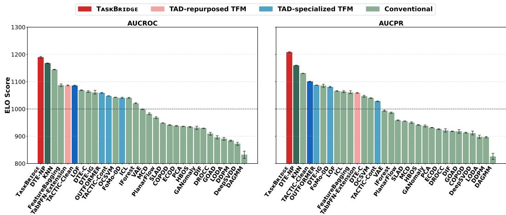

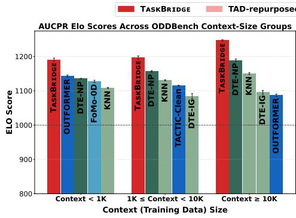

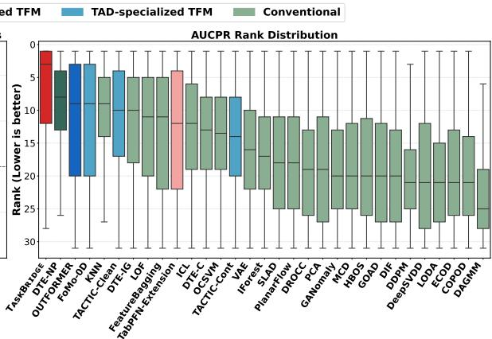  
Figure 6: AUCPR performance comparison on ODDBench. (Extended results corresponding to Figure 4.) (Left) Elo scores across three dataset groups (< 1K, 1K–10K, and $\ge 1 0 \mathrm { K } )$ , showing the five methods with the highest average Elo scores in each group. (Right) Per-dataset rank distributions across all baselines; colors follow Figure 1. TASKBRIDGE also achieves the highest Elo score across all dataset groups with different context size and the strongest overall rank distribution for AUCPR.  
Figure 7: Elo score comparison across all baselines on all 790 ODDBench datasets. TASKBRIDGE achieves the highest Elo scores for both AUCROC and AUCPR, demonstrating consistently strong performance across diverse tabular datasets.  
Table 5: Elo scores on the subset of ODD-Bench datasets for which all 31 methods successfully produce results. The five methods with the highest AUCROC Elo scores are shown.

As a complementary check, Table 5 reports AUCROC and AUCPR Elo scores on the subset of approximately 720 ODDBench datasets for which all 31 methods successfully produce results, without requiring any imputation. TASKBRIDGE still achieves the strongest performance on both metrics.

Figure 6 provides the corresponding AUCPR analysis to Figure 4 in the main paper, reporting Elo scores across ODDBench dataset groups stratified by context (training data) size and per-dataset rank distributions. We further provide the full Elo score comparisons for all datasets and each context-size group in Figures 7– 10.

<table><tr><td>Method</td><td>AUCROC</td><td>AUCPR</td></tr><tr><td>TASKBRIDGE</td><td> $1 1 8 8 { \scriptstyle \pm 2 . 6 }$ </td><td> $\mathbf { 1 2 0 7 } { \scriptstyle \pm 2 . 8 }$ </td></tr><tr><td>DTE-NP</td><td> $1 1 6 7 { \scriptstyle \pm 1 . 1 }$ </td><td> $1 1 5 7 { \scriptstyle \pm 1 . 0 }$ </td></tr><tr><td>KNN</td><td> $\overline { { 1 1 4 2 _ { \pm 0 . 9 } } }$ </td><td> $\overline { { 1 1 2 7 _ { \pm 0 . 9 } } }$ </td></tr><tr><td>TACTIC-Clean</td><td> $1 1 0 3 { \scriptstyle \pm 1 . 2 }$ </td><td> $1 1 0 6 _ { \pm 1 . 4 }$ </td></tr><tr><td>FeatureBagging</td><td> $1 0 8 4 { \scriptstyle \pm 5 . 1 }$ </td><td> $1 0 5 7 { \scriptstyle \pm 5 . 6 }$ </td></tr></table>

## C.2 DETAILS OF ABLATION STUDIES

For all ablation studies, we vary only the component under investigation while keeping the remaining configuration of TASKBRIDGE fixed, using TabICLv2 as the pretrained TFM backbone.

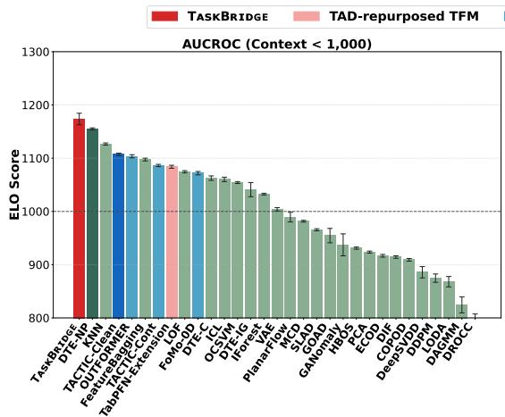

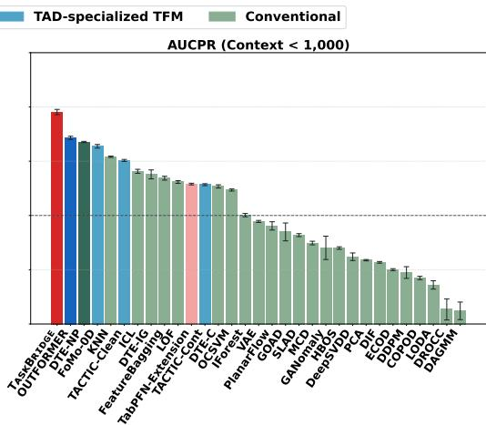

Figure 8: Elo score comparison across all baselines on partial ODDBench datasets with context (training data) size below 1K. TASKBRIDGE achieves the highest Elo scores for both AUCROC and AUCPR, demonstrating strong performance even with limited normality-anchoring evidence.  
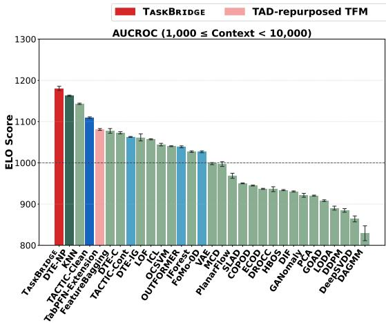

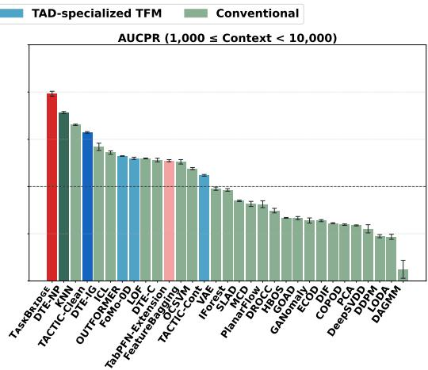  
Figure 9: Elo score comparison across all baselines on partial ODDBench datasets with context (training data) size between 1K and 10K. TASKBRIDGE achieves the highest Elo scores for both AUCROC and AUCPR.

For the task-family ablation, shown in Figure 5, Tables 6, 7, 8, and 9 report the detailed AUCROC and AUCPR results obtained on 790 ODDBench datasets by removing one to four task templates, respectively. Performance generally degrades as more tasks are removed, while the remaining families still retain competitive performance. These results support the complementary contribution of the instantiated virtual-task families and the robustness of the subsequent task-selection procedure.

For the task-selection ablation, wo-Intra-Selection removes candidate configuration selection within each task and instead uses the same default task configuration for all tasks. For the held-out split ablation, we change only the number of held-out splits from the default S = 3 to S = 1, while keeping all other settings unchanged.

For wo-Inter-Selection, we replace the systematic inter-task selection stage with random selection of a single task using its best intra-task configuration. Since the retention policy selected by the configuration search in Appendix B.1 is ALL, which retains all tasks passing the inter-task eligibility criterion, simply retaining all eligible tasks would still preserve part of the inter-task selection mechanism. As multiple eligible tasks are available for most datasets, the random single-task varian provides a reference for assessing the contribution of systematic inter-task retention.

To further assess this contribution, we randomly retain increasing numbers of tasks and ensemble their scores. As shown in Table 10, performance generally improves as more complementary tasks are included, yet the full TASKBRIDGE with inter-task selection still achieves the strongest performance. Together with the task-family ablation, these results suggest that task complementarity and task-score aggregation can partially compensate for the absence of inter-task selection, while retain ing tasks according to anomaly-detection-oriented predictive properties provides additional gains.

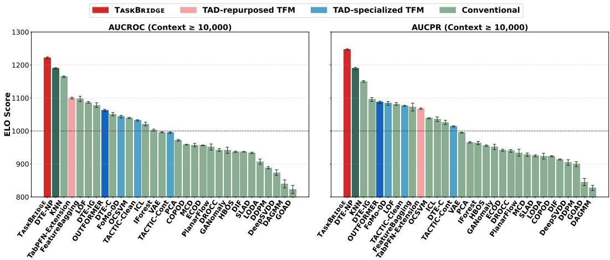

Figure 10: Elo score comparison across all baselines on partial ODDBench datasets with context (training data) size of at least 10K. TASKBRIDGE achieves the highest Elo scores for both AUCROC and AUCPR, maintaining strong performance with large amounts of normality-anchoring evidence. Table 6: Ablation results when removing a single virtual task from the set of task templates. Single denotes single-attribute, Localized/Global denote localized/global (subspace) projection, Prototype denotes prototype-based organization, and Distributional denotes distributional extremity.
<table><tr><td>Remove-1</td><td></td><td></td><td></td><td></td><td>|Single Localized Global Prototype Distributional</td></tr><tr><td>Avg. AUCROC</td><td>80.08</td><td>79.58</td><td>79.98</td><td>79.94</td><td>80.07</td></tr><tr><td>Avg. AUCPR</td><td>49.76</td><td>49.26</td><td>50.19</td><td>49.77</td><td>49.99</td></tr></table>

Table 7: Ablation results when removing two virtual tasks from the set of task templates. S denotes single-attribute, L/G denote localized/global (subspace) projection, P denotes prototype-based organization, and D denotes distributional extremity.
<table><tr><td>Remove-2</td><td>S+L</td><td>S+G</td><td>S+P</td><td>S+D</td><td>L+G</td><td>L+P</td><td>L+D</td><td>G+P</td><td>G+D</td><td>P+D</td></tr><tr><td>Avg. AUCROC</td><td>79.35</td><td>80.11</td><td>79.65</td><td>79.72</td><td>79.30</td><td>78.95</td><td>79.13</td><td>79.62</td><td>79.72</td><td>79.60</td></tr><tr><td>Avg. AUCPR</td><td>47.19</td><td>49.16</td><td>48.42</td><td>48.86</td><td>48.57</td><td>47.82</td><td>48.16</td><td>49.17</td><td>49.63</td><td>48.88</td></tr></table>

Table 8: Ablation results when removing three virtual tasks from the set of task templates. S denotes single-attribute, L/G denote localized/global (subspace) projection, P denotes prototype-based organization, and D denotes distributional extremity.
<table><tr><td>Remove-3</td><td>|S+L+G</td><td>S+L+P</td><td>S+L+D</td><td>S+G+P</td><td>S+G+D</td><td>S+P+D</td><td>L+G+P</td><td>L+G+D</td><td>L+P+D</td><td>G+P+D</td></tr><tr><td>Avg. AUCROC</td><td>78.21</td><td>77.61</td><td>78.02</td><td>79.01</td><td>79.58</td><td>78.52</td><td>78.36</td><td>78.64</td><td>78.07</td><td>79.02</td></tr><tr><td>Avg. AUCPR</td><td>45.20</td><td>42.60</td><td>43.85</td><td>46.30</td><td>47.58</td><td>45.62</td><td>45.57</td><td>47.15</td><td>45.18</td><td>47.96</td></tr></table>

Table 9: Ablation results when removing four virtual tasks from the set of task templates. For brevity, each variant is labeled by the remaining task. Single denotes single-attribute, Localized/Global denote localized/global (subspace) projection, Prototype denotes prototype-based organization, and Distributional denotes distributional extremity.
<table><tr><td>Remove-4</td><td></td><td>|Single Localized</td><td>Global</td><td></td><td>1 Prototype Distributional</td></tr><tr><td>Avg. AUCROC</td><td>77.12</td><td>77.99</td><td>76.11</td><td>76.15</td><td>76.79</td></tr><tr><td>Avg. AUCPR</td><td>42.33</td><td>42.46</td><td>36.51</td><td>39.01</td><td>38.76</td></tr></table>

Table 10: Further ablation of inter-task selection by randomly retaining increasing numbers of tasks after intra-task selection for score ensembling. Across all ODDBench datasets, performance improves as more tasks are retained, while the full TASKBRIDGE with inter-task selection achieves the best performance.
<table><tr><td></td><td>|2 Remaining Tasks 3 Remaining Tasks 4 Remaining Tasks Full TASKBRIDGE</td><td></td><td></td><td></td></tr><tr><td>Avg. AUCROC</td><td>78.11</td><td>79.38</td><td>79.89</td><td>80.16</td></tr><tr><td>Avg. AUCPR</td><td>44.95</td><td>48.43</td><td>49.66</td><td>50.43</td></tr></table>

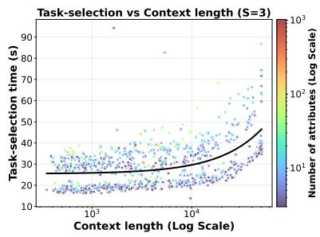

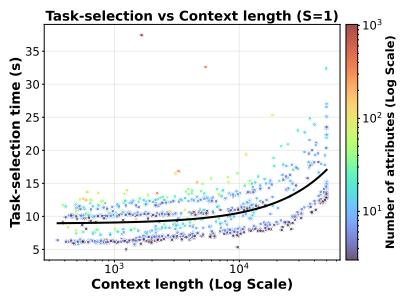

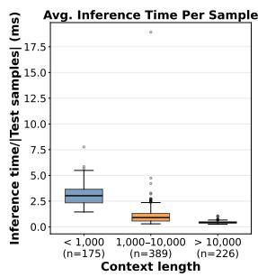  
Figure 11: Inference-efficiency analysis of TASKBRIDGE. (Left, middle) Task-selection time across ODDBench datasets using 3 (default) and 1 held-out splits, respectively, as a function of context length and the number of attributes. (Right) Average inference time per test sample after task selection, grouped by context length; TASKBRIDGE maintains millisecond-level inference across all groups. Here, n denotes the number of datasets in each group: $< 1 , 0 0 0 \cdot$ , 1,000–10,000, and $> 1 0 { , } 0 0 0$ context length. Overall, TASKBRIDGE preserves efficient inference with TAD-repurposed TFMs.

Overall, the full selection procedure achieves the strongest performance, while the $S = 1$ variant retains competitive detection performance with a substantially more efficient task-selection process.

## C.3 INFERENCE EFFICIENCY

The main inference overhead of TASKBRIDGE arises from the hierarchical task-selection procedure. Once the tasks are selected, inference with the pretrained general-purpose TFM requires only milliseconds per sample, as shown in the rightmost panel of Figure 11. We evaluate the task-selection runtime using both our default configuration with three held-out splits and an efficient variant using a single split, which also achieves the strongest overall performance against 31 baselines on ODDBench.

As shown in the leftmost panels of Figure 11, the task-selection time of the default TASKBRIDGE remains below one minute for most datasets, even when the context size approaches the $1 0 ^ { 4 }$ scale. Reducing the number of held-out splits to $S = 1$ further lowers this cost, requiring less than 20 seconds for most datasets across diverse context sizes and dimensionalities. Importantly, task selection is performed only once per dataset and requires neither dataset-specific hyperparameter search nor parameter optimization, thereby preserving efficient TAD inference through in-context learning.

Overall, this one-time selection cost preserves TASKBRIDGE as an efficient TAD-repurposing framework. As shown in Figure 1, TASKBRIDGE remains substantially more efficient than the existing TabPFN-Extension even when its task-selection cost is included in the comparison.

## C.4 ROBUSTNESS ANALYSIS ON CONTEXT CONTAMINATION

Considering practical scenarios in which the training/context data may be contaminated, we evaluate the robustness of TASKBRIDGE to context contamination, which can interfere with normality anchoring. We construct a fixed subset of 295 ODDBench datasets that support the most severe 10% contamination setting without removing more than 50% of the test anomalies. For each dataset, we replace a fraction of normality-aware context samples with randomly selected anomalies drawn from the test/query split. We evaluate contamination rates of 0%, 3%, 5%, and 7%. To ensure a fair comparison across contamination levels, all settings use the same test/query set after excluding the fixed anomaly pool used for contamination. Normal query samples are then downsampled to keep the anomaly ratio in the test split consistent across contamination levels. We compare TASKBRIDGE under each contamination level with TFM-based TAD baselines, including TACTIC-CONT, which is specifically pretrained to handle contaminated contexts.

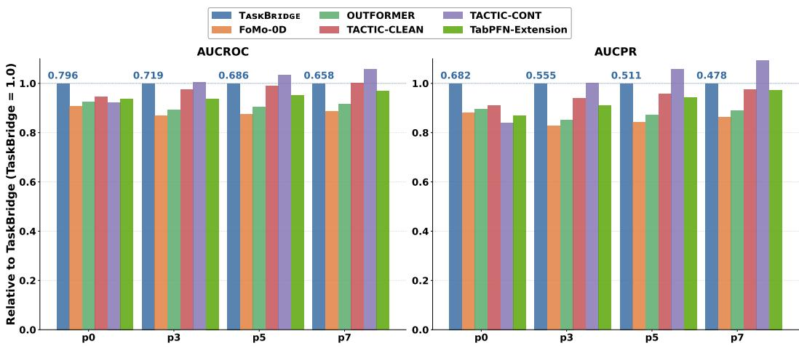  
Figure 12: Robustness to context contamination on ODDBench. AUCROC and AUCPR performance are shown relative to TASKBRIDGE at each contamination level (TASKBRIDGE = 1), with its absolute performance reported above each group. pk denotes the setting in which k% of the context samples are replaced with anomalous samples. TASKBRIDGE remains competitive with TFM-based TAD baselines as contamination increases, while the contamination-specific TACTIC-CONT exhibits the strongest robustness under heavier contamination.

As shown in Figure 12, the performance of all methods generally degrades as context contamination increases. Nevertheless, TASKBRIDGE remains competitive and generally outperforms the TFMbased baselines that are not specifically trained for contaminated contexts. TACTIC-CONT shows the strongest robustness under heavier contamination, consistent with its contamination-aware pretraining. These results suggest that context contamination can impair the normality anchoring of virtual supervised tasks, while the data-adaptive task-selection procedure still retains relatively suitable tasks under corrupted contexts. Improving the construction and selection of virtual tasks under contaminated contexts therefore constitutes an important direction for future work.

## C.5 ROBUSTNESS ANALYSIS ON CONTEXT SIZE

To evaluate the robustness of TASKBRIDGE to the amount of context evidence available for normality-anchored virtual task construction, data-adaptive task selection, and in-context prediction, we conduct a controlled context-size analysis. We select the 226 ODDBench datasets whose original normality-aware context contains more than 10K samples. For each dataset, we randomly subsample the context to fixed budgets of 10K, 5K, 2K, and 1K samples. Each subsampled context is used throughout the entire TASKBRIDGE pipeline, including normality-anchored task construction, data-adaptive task selection, and in-context prediction with the pretrained general-purpose TFM. We compare these variants with the original full-context TASKBRIDGE and the 30 baselines using Elo scores computed over the same 226 datasets.

As shown in Figure 13, performance gradually decreases as the available context budget is reduced, indicating that richer context evidence benefits the entire TASKBRIDGE pipeline. Nevertheless, TASKBRIDGE remains highly competitive even under substantial context reduction. In particular, the 10K and 5K variants outperform all external baselines in both AUCROC and AUCPR Elo scores, while the 2K and 1K variants remain among the top-performing methods and ahead of the TFMbased TAD baselines. These results complement the context-size analysis in Section 4.1, where TASKBRIDGE also exhibits strong performance across datasets with naturally varying context sizes. This robustness suggests that complementary normality-anchored task constructions, which probe different predictive structures in the context, together with data-adaptive task selection, can preserve informative task structures even under limited context budgets, while benefiting from the contextefficient predictive capability of pretrained general-purpose TFMs. Together with the inference analysis in Appendix C.3, these results further indicate that TASKBRIDGE can operate efficiently with small context budgets while maintaining robust anomaly detection performance.

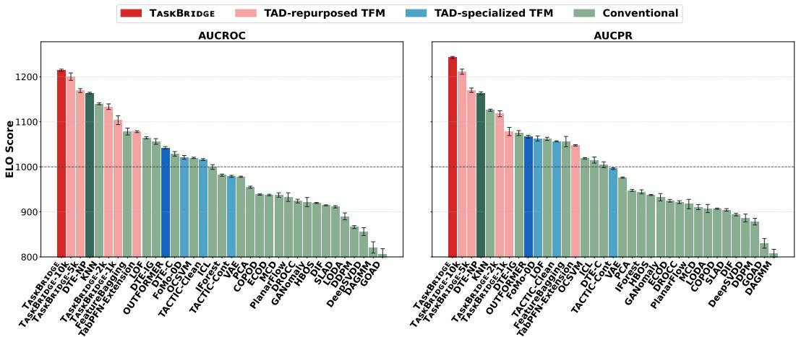  
Figure 13: Elo score comparison across all baselines on 226 ODDBench datasets, including four TASKBRIDGE variants with restricted context budgets. Each TASKBRIDGE-iK variant limits the context size to iK samples. All variants, including the 1K setting, retain strong performance relative to the other baselines.

Table 11: Backbone generalization of TASKBRIDGE with TabPFN ${ \bf v } 2 . 6 .$ Total Rank is computed as in Table 4. With this alternative pretrained general-purpose TFM backbone, TASKBRIDGE remains highly competitive among 31 methods.
<table><tr><td>Methods</td><td>Avg.  $\mathbf { A U C R O C } \uparrow$ </td><td>Avg. Rank (AUCROC) ↓</td><td>Avg. AUCPR ↑</td><td>Avg. Rank (AUCPR) ↓</td><td>ELO (AUCROC) ↑</td><td>ELO (AUCPR) ↑</td><td>Top-3 Ratio (AUCROC) ↑</td><td>Top-3 Ratio (AUCPR) ↑</td><td>Total Rank ↓</td></tr><tr><td>DTE-NP</td><td> $7 6 . 9 6 { \scriptstyle \pm 0 . 0 1 \ } ( 1 )$ </td><td> $\mathbf { 8 . 9 0 \underline { { \ t o . 0 2 } } \ ( 1 ) }$ </td><td>43.63±0.01 (1)</td><td> $9 . 1 8 _ { \pm 0 . 0 3 } \ ( { \bf 1 } )$ </td><td> ${ \bf 1 1 7 2 . 2 { \scriptstyle \pm 0 . 9 } } \left( { \bf 1 } \right)$ </td><td> $\mathbf { 1 1 6 4 . 6 { \scriptstyle \pm 0 . 9 } \ ( 1 ) }$ </td><td> ${ \bf 2 7 . 9 2 0 . 5 }$  (1)</td><td> $2 2 . 2 _ { \pm 0 . 5 } \ ( 4 )$ </td><td>1.38 (1)</td></tr><tr><td>KNN</td><td> $7 6 . 2 5 _ { \pm 0 . 0 1 } \ : \dot { ( 2 ) }$ </td><td> $9 . 6 5 _ { \pm 0 . 0 2 } \ ( 2 )$ </td><td> $4 2 . 4 1 _ { \pm 0 . 0 1 } \dot { ( 4 ) }$ </td><td> $1 0 . 2 0 _ { \pm 0 . 0 3 } \ : \mathrm { \Omega } ( 2 )$ </td><td> $1 1 4 9 . 0 _ { \pm 0 . 9 } \dot { ( 2 ) }$ </td><td> $1 1 3 4 . 8 _ { \pm 1 . 0 } ( 2 )$ </td><td> $1 8 . 6 { \scriptstyle \pm 0 . 6 }$  (8)</td><td> $1 4 . 9 _ { \pm 0 . 5 } ~ ( \mathrm { i } 0 )$ </td><td>4.00 (2)</td></tr><tr><td>FeatureBagging</td><td> $\overline { { 7 5 . 5 9 _ { \pm 0 . 1 6 } \ ( 3 ) } }$ </td><td> $1 \overline { { 1 . 9 7 _ { \pm 0 . 2 1 } \ ( 3 ) } }$ </td><td> $3 9 . 3 0 { \scriptstyle \pm 0 . 5 6 } \ ( 1 0 )$ </td><td> $1 \overline { { 3 . 0 0 _ { \pm 0 . 2 2 } \ ( 1 0 ) } }$ </td><td> $\overline { { 1 0 9 1 . 1 \pm 5 . 0 \mathrm { ~ ( 3 ) } } }$ </td><td> $1 \overline { { 0 6 5 . 9 _ { \pm 5 . 3 } \ ( 1 0 ) } }$ </td><td> $1 9 . 8 _ { \pm 0 . 9 } ~ ( 6 )$ </td><td> $1 8 . 9 { \scriptstyle \pm 1 . 3 } \ ( 8 )$ </td><td>6.62 (6)</td></tr><tr><td>LOF</td><td>74.17±0.02 (6)</td><td>12.64±0.04 (6)</td><td> $3 9 . 9 7 _ { \pm 0 . 0 2 } \ ( 9 )$ </td><td>12.77±0.05 (7)</td><td> $1 0 7 3 . 6 { \scriptstyle \pm 1 . 0 } \ ( 6 )$ </td><td> $1 0 7 0 . { \overset {  } { 9 } } \pm 1 . 2 { \overset {  } { ( } 8 ) }$ </td><td> $1 4 . 4 _ { \pm 0 . 6 } ^ { - } ( \mathrm { i } 0 )$ </td><td> $1 6 . 3 _ { \pm 1 . 0 . } ( 9 )$ </td><td>7.62 (9)</td></tr><tr><td>DTE-C</td><td> $7 3 . 4 6 { \overset { - } { \pm } } 0 . 0 5 \ \overset { ^ { } } { ( 9 ) }$ </td><td> $1 2 . 8 5 { \scriptstyle \pm 0 . 1 2 } \ ( 7 )$ </td><td> $3 8 . 1 6 { \scriptstyle \pm 0 . 0 9 } \ ( 1 1 )$ </td><td> $1 3 . 5 8 { \scriptstyle \pm 0 . 1 4 } ( 1 2 ) $ </td><td> $1 0 6 8 . 1 { \stackrel { - } { \pm } } 3 . 2 { \stackrel { . } { ( 7 ) } }$ </td><td> $1 0 5 1 . 0 { \scriptstyle \pm 3 . 5 } ( 1 2 )$ </td><td> $1 1 . 3 _ { \pm 0 . 7 } ^ { - } \ : ( 1 2 )$ </td><td> $9 . 7 _ { \pm 0 . 6 } ~ ( 1 5 )$ </td><td>10.62 (11)</td></tr><tr><td>DTE-IG</td><td> $7 3 . 3 4 { \scriptstyle \pm 0 . 4 3 } \ ( 1 1 )$ </td><td> $1 2 . 9 1 _ { \pm 0 . 3 0 . } ( 8 )$ </td><td> $4 1 . 9 2 _ { \pm 0 . 3 4 . } ( 6 )$ </td><td> $1 1 . 9 \overline { { 6 } } \pm 0 . 2 3 \overline { { ( 4 ) } }$ </td><td> $1 0 6 5 . 8 _ { \pm 7 . 0 } ^ { - } \stackrel { . } { ( 9 ) }$ </td><td> $1 0 8 9 . { \overline { { 8 } } } _ { \pm 5 . 5 } \ ( 5 )$ </td><td> $1 6 . 3 { \scriptstyle \pm 1 . 5 } ( 9 )$ </td><td> $2 0 . { \overset { - } { 0 } } \pm 1 . 1 \ \mathrm { \overset { . } { ( 5 ) } }$ </td><td>7.12 (7)</td></tr><tr><td>OCSVM</td><td> $7 1 . 8 8 { \scriptstyle \pm 0 . 0 1 } \ ( 1 3 )$ </td><td>13.73±0.03 (12)</td><td> $3 7 . 1 8 { \scriptstyle \pm 0 . 0 1 } ( 1 2 )$ </td><td> $1 3 . 8 6 { \scriptstyle \pm 0 . 0 4 } ( 1 3 )$ </td><td> $1 0 4 6 . 6 { \scriptstyle \pm 0 . 8 }$  (12)</td><td> $1 0 4 4 . 2 { \scriptstyle \pm 0 . 9 } ( 1 3 )$ </td><td> $8 . 8 _ { \pm 0 . 6 } ~ ( 1 7 )$ </td><td>7.4±0.3 (19)</td><td>13.88 (14)</td></tr><tr><td>ICL</td><td> $7 1 . 8 2 _ { \pm 0 . 1 0 } \ ( 1 4 )$ </td><td> $1 3 . 8 6 _ { \pm 0 . 0 7 } ^ { - } \overset { ^ { - } } { ( } 1 4 \overset { ^ { - } } { ) }$ </td><td> $4 0 . 0 \overline { { 7 } } _ { \pm 0 . 1 5 } \mathrm { ~ ( 8 ) ~ }$ </td><td> $1 2 . 9 2 _ { \pm 0 . 1 5 } \ ( 9 )$ </td><td> $1 0 4 4 . 8 { \overline { { \pm } } } 1 . 4 \ \AA$  (14)</td><td> $1 0 6 7 . 8 _ { \pm 3 . 5 } ^ { \mathrm { ~ \tiny ~ ( 9 ) ~ } }$ </td><td> $1 1 . 9 _ { \pm 0 . 2 } ^ { - } ( 1 1 )$ </td><td>13.2±0.4 (11)</td><td>11.25 (12)</td></tr><tr><td>IForest</td><td> $7 1 . 2 6 { \scriptstyle \pm 0 . 0 5 } \ ( 1 5 )$ </td><td> $1 4 . 9 2 _ { \pm 0 . 0 6 } \ ( 1 5 )$ </td><td> $3 1 . 2 6 _ { \pm 0 . 1 0 } ^ { - } ( 2 0 )$ </td><td>16.37±0.10 (16)</td><td> $1 0 2 4 . 9 _ { \pm 1 . 4 } ^ { - }$  (15)</td><td> $9 9 0 . 7 _ { \pm 2 . 4 } \ ( 1 6 )$ </td><td>5.1±0.6 (27)</td><td>4.5±0.1 (27)</td><td>18.88 (18)</td></tr><tr><td>MCD</td><td> $6 9 . 1 0 { \scriptstyle \pm 0 . 1 9 } \ ( 1 7 )$ </td><td> $1 6 . 4 1 { \scriptstyle \pm 0 . 1 5 } \ ( 1 7 )$ </td><td> $3 1 . 1 0 { \scriptstyle \pm 0 . 2 2 } \ ( 2 1 )$ </td><td>17.75±0.11 (19)</td><td> $9 8 6 . 2 _ { \pm 3 . 3 }$  (17)</td><td> $9 5 4 . 5 _ { \pm 2 . 6 } \ ( 1 9 )$ </td><td> $1 1 . 3 _ { \pm 0 . 7 } ~ ( 1 3 )$ </td><td>10.3±0.6 (12)</td><td>16.88 (17)</td></tr><tr><td>VAE</td><td> $7 0 . 2 0 _ { \pm 0 . 0 4 } ^ { - } \ ( 1 6 )$ </td><td>15.60±0.07 (16)</td><td> $3 5 . 3 4 { \scriptstyle \pm 0 . 0 7 \ ( 1 5 ) }$ </td><td>15.80±0.10 (15)</td><td> $1 0 0 2 . 9 _ { \pm 1 . 6 } ^ { - }$  (16)</td><td> $9 9 8 . 8 _ { \pm 2 . 2 } \ ( 1 5 )$ </td><td>7.9±0.4 (19)</td><td>6.7±0.3 (21)</td><td>16.62 (16)</td></tr><tr><td>PlanarFlow</td><td> $6 8 . 1 1 { \scriptstyle \pm 0 . 4 0 } \ ( 1 8 )$ </td><td>16.99±0.13 (18)</td><td> $3 2 . 9 5 { \scriptstyle \pm 0 . 1 7 } \ ( 1 7 )$ </td><td>17.40±0.05 (17)</td><td> $9 7 1 . 8 { \overline { { \pm } } } 3 . 5 \ \qquad $  (18)</td><td> $9 6 2 . 6 _ { \pm 1 . 5 } ^ { - } \ : \dot { ( 1 7 ) }$ </td><td>11.2±0.6 (14)</td><td>10.2±0.8 (13)</td><td>16.50 (15)</td></tr><tr><td>SLAD</td><td> $6 6 . 8 7 { \scriptstyle \pm 0 . 0 5 } \ ( 2 1 )$ </td><td>17.71±0.03 (19)</td><td>33.49±0.09 (16)</td><td>17.44±0.04 (18)</td><td> $9 5 3 . 0 _ { \pm 0 . 6 }$  (19)</td><td> $9 6 0 . 0 _ { \pm 0 . 8 } \ ( 1 8 )$ </td><td>6.9±0.1 (23)</td><td>7.3±0.2 (20)</td><td>19.25 (19)</td></tr><tr><td>Connnonnal COPOD</td><td> $6 7 . 2 0 { \scriptstyle \pm 0 . 0 1 } \ ( 2 0 )$   $6 4 . 5 0 \substack { + 0 . 0 1 } \left( 2 6 \right)$ </td><td>18.22±0.05 (20)</td><td> $2 7 . 9 9 _ { \pm 0 . 0 1 }$  (29)</td><td>19.35±0.06 (28)</td><td> $9 4 5 . 7 _ { \pm 1 . 3 } ^ { - }$  (20)</td><td> $9 1 8 . 3 _ { \pm 1 . 5 } \ ( 2 7 )$ </td><td>3.8±0.3 (28)</td><td>4.3±0.2 (28)</td><td>25.00 (25)</td></tr><tr><td>PCA</td><td></td><td>18.37±0.02 (22)</td><td> $2 9 . 1 4 _ { \pm 0 . 0 2 } ^ { - }$  (26)</td><td>18.53±0.04 (22)</td><td>(22)  $9 3 9 . 9 { \overline { { \pm } } } 0 . 6 \ \qquad $ </td><td> $9 3 6 . 4 _ { \pm 0 . 8 } \ ( 2 2 )$ </td><td> $6 . 3 _ { \pm 0 . 3 } ^ { - } \ ( 2 4 )$ </td><td>5.0±0.3 (26)</td><td>23.75 (23)</td></tr><tr><td>ECOD</td><td> $6 8 . 1 0 { \scriptstyle \pm 0 . 0 1 } \ ( 1 9 )$ </td><td>18.37±0.06 (21)</td><td>28.25±0.02 (28)</td><td>18.85±0.08 (23)</td><td>942.6±1.5 (21)</td><td> $9 3 0 . 9 { \scriptstyle \pm 1 . 9 } \ ( 2 3 )$ </td><td> $6 . 9 { \scriptstyle \pm 0 . 4 } \ ( 2 2 )$ </td><td>6.2±0.4 (23)</td><td>22.50 (22)</td></tr><tr><td>HBOS</td><td>66.58+0.02 (22)</td><td>18.48±0.06 (23)</td><td> $2 9 . 9 0 { \scriptstyle \pm 0 . 0 3 } \ ( 2 4 )$ </td><td>18.19±0.05 (20)</td><td>938.5±1.6 (23)</td><td> $9 4 6 . 1 \pm 1 . 1 \ \left( 2 0 \right)$ </td><td>7.0±0.3 (21)</td><td>7.6±0.5 (18)</td><td>21.38 (21)</td></tr><tr><td>DIF</td><td> $6 5 . 1 6 \substack { + 0 . 0 2 } \ ( 2 4 )$ </td><td>18.74±0.04 (25)</td><td>28.53±0.06 (27)</td><td>19.19±0.04 (26)</td><td>933.1±1.0 (25)</td><td> $9 2 2 . 4 { \pm } 1 . 0 \ \mathrm { ( 2 5 ) }$ </td><td> $3 . 6 { \pm } 0 . 1 \ \left( 2 9 \right)$ </td><td>3.8±0.2 (29)</td><td>26.25 (28)</td></tr><tr><td>GANomaly</td><td> $6 6 . 0 2 { \scriptstyle \pm 0 . 5 8 } \ ( 2 3 )$ </td><td> $1 8 . 5 2 { \scriptstyle \pm 0 . 2 6 } \dot { \ ( 2 4 ) }$ </td><td> $3 1 . 5 9 { \scriptstyle \pm 0 . 3 8 } \ ( 1 9 )$ </td><td>18.24±0.16 (21)</td><td> $9 3 4 . 7 { \pm } 6 . 0$  (24)</td><td> $9 4 2 . 3 { \scriptstyle \pm 3 . 7 } \ ( 2 1 )$ </td><td> $9 . 0 { \scriptstyle \pm 0 . 9 } \ ( 1 6 )$ </td><td>9.6±0.7 (16)</td><td>20.50 (20)</td></tr><tr><td>DROCC</td><td> $6 1 . 1 7 _ { \pm 0 . 6 3 } \ \mathrm { ( 2 8 ) }$ </td><td> $1 9 . 4 1 _ { \pm 0 . 2 0 } \ ( 2 6 )$ </td><td> $2 9 . 1 9 { \scriptstyle \pm 0 . 3 3 } \ ( 2 5 )$ </td><td>18.91±0.23 (24)</td><td>913.0±5.2 (26)</td><td> $9 2 5 . 9 _ { \pm 6 . 2 } \ ( 2 4 )$ </td><td> $5 . 9 _ { \pm 0 . 6 } ~ ( 2 5 )$ </td><td>6.1±0.4 (24)</td><td>25.25 (27)</td></tr><tr><td>GOAD</td><td> $6 0 . 3 4 _ { \pm 0 . 4 6 } ^ { - } ( 3 1 )$ </td><td> $1 9 . 9 1 { \scriptstyle \pm 0 . 2 3 } \ ( 2 7 )$ </td><td> $3 0 . 9 4 { \scriptstyle \pm 0 . 3 1 } \ ( 2 3 )$ </td><td>19.03±0.27 (25)</td><td> $8 9 9 . 2 _ { \pm 5 . 9 } ^ { - }$  (27)</td><td> $9 2 1 . 8 _ { \pm 6 . 6 } \ : \ : ( 2 6 )$ </td><td> $7 . 7 _ { \pm 0 . 5 } ~ ( 2 0 )$ </td><td>6.5±0.4 (22)</td><td>25.12 (26)</td></tr><tr><td>DDPM</td><td> $6 4 . 8 1 _ { \pm 0 . 1 2 } \ ( 2 5 )$ </td><td> $2 0 . 3 7 _ { \pm 0 . 0 8 } \ ( 2 9 )$ </td><td> $3 0 . 9 8 { \scriptstyle \pm 0 . 1 1 } \ ( 2 2 )$ </td><td>19.90±0.10 (29)</td><td> $8 8 7 . 9 { \scriptstyle \pm 2 . 0 }$  (29)</td><td> $9 0 0 . 9 _ { \pm 2 . 5 } \ ( 3 0 )$ </td><td> $3 . 5 { \scriptstyle \pm 0 . 5 } \ ( 3 0 )$ </td><td>3.4±0.3 (30)</td><td>28.00 (30)</td></tr><tr><td>LODA</td><td> $6 1 . 8 5 { \scriptstyle \pm 0 . 5 1 } \ ( 2 7 )$ </td><td>20.30±0.20 (28)</td><td> $2 7 . 4 0 { \scriptstyle \pm 0 . 3 7 } \ ( 3 0 )$ </td><td>20.00±0.23 (30)</td><td> $8 9 4 . 8 { \scriptstyle \pm 5 . 1 } \ ( 2 8 )$ </td><td>902.9±6.0 (29)</td><td> $5 . 1 _ { \pm 1 . 0 } ~ ( 2 6 )$ </td><td>5.1±0.9 (25)</td><td>27.88 (29)</td></tr><tr><td>DeepSVDD</td><td> $6 0 . 8 0 { \scriptstyle \pm 0 . 3 5 } \ ( 2 9 )$ </td><td> $2 0 . 7 8 _ { \pm 0 . 2 3 } ^ { - } \ ( 3 0 )$ </td><td> $3 2 . 1 0 { \scriptstyle \pm 0 . 1 9 } \ ( 1 8 )$ </td><td> $1 9 . 2 2 _ { \pm 0 . 2 8 } ^ { - } \ ( 2 7 )$ </td><td> $8 7 5 . 3 _ { \pm 5 . 9 } ^ { - - } \cdot \mathrm { \dot { ( 3 0 ) } }$ </td><td> $9 1 5 . 8 _ { \pm 7 . 0 } ^ { - - } \ : \overset { . . . } { ( 2 8 ) }$ </td><td> $8 . 4 { \scriptstyle \pm 0 . 5 } \ ( 1 8 )$ </td><td>10.0±0.7 (14)</td><td>24.25 (24)</td></tr><tr><td>DAGMM</td><td> $6 0 . 5 0 { \scriptstyle \pm 1 . 1 9 } \ ( 3 0 )$ </td><td> $2 2 . 4 4 _ { \pm 0 . 4 8 } \ ( 3 1 )$ </td><td> $2 5 . 2 4 _ { \pm 1 . 2 8 } \ ( 3 1 )$ </td><td> $2 2 . 6 4 _ { \pm 0 . 4 1 } ^ { - } \overset { ^ { . } } { ( 3 1 ) }$ </td><td> $8 3 6 . 1 { \overset { - } { \pm } } 1 3 . 7 \ { \overset { . } { ( } 3 1 ) }$ </td><td> $8 3 1 . 0 { \scriptstyle \pm 1 1 . 5 } \ ( 3 1 )$ </td><td> $3 . 1 { \overset { - } { \pm } } 0 . 4 \ ( 3 1 )$ </td><td> $3 . 1 _ { \pm 0 . 7 } ~ ( 3 1 )$ </td><td>30.88 (31)</td></tr><tr><td>TACTIC-Clean</td><td> $7 5 . 2 2 _ { \pm 0 . 0 1 } \ ( 5 )$ </td><td> $1 2 . 0 3 _ { \pm 0 . 0 5 } \ ( 4 )$ </td><td> $4 1 . 6 7 _ { \pm 0 . 0 2 } \ ( 7 )$ </td><td> $1 1 . 4 7 { \scriptstyle \pm 0 . 0 4 } , ( 3 )$ </td><td> $1 0 9 0 . 4 { \scriptstyle \pm 1 . 5 } \ ( 4 )$ </td><td> $1 1 0 4 . 8 { \scriptstyle \pm 1 . 3 } \ ( 3 )$ </td><td> $1 8 . 7 _ { \pm 0 . 3 . } ( 7 )$ </td><td> $1 9 . 8 _ { \pm 0 . 3 _ { . } } ( 6 )$ </td><td>4.88 (3)</td></tr><tr><td>TACTIC-Cont</td><td> $7 3 . 4 0 _ { \pm 0 . 0 1 } ~ ( 1 0 )$ </td><td> $1 3 . 5 9 _ { \pm 0 . 0 2 } \ ( 1 1 )$ </td><td>36.33±0.02 (14)</td><td> $1 4 . 4 3 _ { \pm 0 . 0 4 } \ ( 1 4 )$ </td><td> $1 0 5 1 . 8 { \scriptstyle \pm 0 . 6 } \ ( 1 1 )$ </td><td>1032.1+1.0 (14)</td><td> $1 0 . 4 _ { \pm 0 . 2 } ^ { - } ( 1 5 )$ </td><td> $8 . 3 _ { \pm 0 . 4 } ~ ( 1 7 )$ </td><td>13.25 (13)</td></tr><tr><td>OUTFORMER</td><td> $7 4 . 1 \overline { { 6 } } \pm 0 . 0 8 \overline { { ( 7 ) } }$ </td><td> $1 3 . 1 3 _ { \pm 0 . 0 5 } ~ ( 1 0 )$ </td><td> $\underline { { 4 3 . 0 0 \pm 0 . 1 3 } } ^ { } ( 2 )$ </td><td> $1 1 . 9 \overline { { 9 } } _ { \pm 0 . 0 3 } \ : ( 5 )$ </td><td>1063.6±1.3 (10)</td><td> $1 0 9 1 . { \stackrel {  } { 9 } } \pm 0 . 6 { \stackrel {  } { ( 4 ) } }$ </td><td> $2 0 . { \overset { - } { 8 } } \pm 0 . 6 { \overset { . } { ( 4 ) } }$ </td><td> $2 3 . { \overset {  } { 0 } } \pm \ r { 0 . 4 } \ \ r { ( 3 ) }$ </td><td>5.62 (5)</td></tr><tr><td>Tq-sed FoMo-0D TabPFN-Extension</td><td> $7 2 . 6 5 { \scriptstyle \pm 0 . 0 4 } \ ( 1 2 )$ </td><td> $1 3 . 8 5 { \scriptstyle \pm 0 . 0 9 } \ ( 1 3 )$ </td><td> $\overline { { 4 2 . 7 0 _ { \pm 0 . 1 3 } \ ( 3 ) } }$ </td><td> $1 2 . 2 4 _ { \pm 0 . 1 1 } \ ( 6 )$ </td><td> $1 0 4 5 . 5 { \overset { - } { \pm } } 2 . 1 \ \overset { . } { ( 1 3 ) }$ </td><td> $1 0 8 5 . 5 { \scriptstyle \pm 2 . 5 } \ ( 6 )$ </td><td> $2 0 . 6 { \scriptstyle \pm 0 . 4 }$  (5)</td><td> $2 4 . 9 { \scriptstyle \pm 0 . 7 } \ ( 2 )$ </td><td>7.50 (8)</td></tr><tr><td>TASKBRIDGE</td><td> $7 3 . 6 1 _ { \pm 0 . 1 1 } \ ( 8 )$   $7 5 . 2 3 _ { \pm 0 . 0 6 } \ ( 4 )$ </td><td> $1 2 . 1 2 _ { \pm 0 . 0 7 } \ ( 5 )$   $1 3 . 0 3 _ { \pm 0 . 0 5 } \ ( 9 )$ </td><td> $3 7 . 0 8 _ { \pm 0 . 0 7 } \ ( 1 3 )$  42.27±0.14 (5)</td><td> $1 3 . 2 5 { \scriptstyle \pm 0 . 0 7 } \ ( 1 1 )$   $1 2 . 8 4 _ { \pm 0 . 0 8 } \ ( 8 )$ </td><td> $1 0 9 0 . 3 _ { \pm 1 . 6 } \ ( 5 )$   $1 0 6 7 . 8 { \scriptstyle \pm 1 . 1 }$  (8)</td><td> $1 0 6 3 . 0 _ { \pm 1 . 4 } ~ ( 1 1 )$   $1 0 7 2 . 5 { \scriptstyle \pm 2 . 0 } \ ( 7 )$ </td><td> $2 5 . 5 { \scriptstyle \pm 0 . 1 } \ ( 3 )$   $2 6 . 2 _ { \pm 0 . 4 } \ ( 2 )$ </td><td> $\overline { { 1 9 . 8 \pm 0 . 3 \ ( 6 ) } }$   $\mathbf { 2 7 . 7 { \pm 0 . 5 \ ( 1 ) } }$ </td><td>7.75 (10) 5.50 (4)</td></tr></table>

## C.6 GENERALIZATION TO DIFFERENT PRETRAINED PFN-BASED TFM BACKBONES

To assess whether TASKBRIDGE generalizes beyond the TabICLv2 backbone used in our main experiments (Qu et al., 2026), we replace it with two alternative pretrained general-purpose TFMs:

As shown in Tables 11 and 12, TASKBRIDGE maintains strong overall performance when replacing the default TFM backbone with each alternative backbone, ranking fourth and second in terms of Total Rank, respectively. Notably, even when using the same TabPFN v3.0 backbone as TabPFN-Extension, TASKBRIDGE achieves better performance across all evaluation metrics, indicating that our framework harnesses the pretrained TFM more effectively for TAD. These results demonstrate that the core TAD mechanism of TASKBRIDGE—selecting suitable virtual supervised tasks and effectively aggregating task-wise scores—generalizes across different pretrained TFM backbones with strong capabilities for inferring task structure from supervised context and producing reliable predictive support.

Table 12: Backbone generalization of TASKBRIDGE with TabPFN v3. Total Rank is computed as in Table 4. TASKBRIDGE remains consistently strong with the alternative pretrained general-purpose TFM backbone, achieving the second-best overall Total Rank among 31 methods.  
TabPFN $\mathrm { v } 2 . 6 ^ { 4 }$ and TabPFN v3 (Grinsztajn et al., 2026b), both of which also exhibit strong predictive performance on TabArena (Erickson et al., 2025). We evaluate each variant on ODDBench against the same 30 TAD baselines. For each backbone, we perform the same one-time backbonespecific calibration of the framework-level hyperparameters for task selection and score aggregation, using the common configuration grid described in Appendix B.1.
<table><tr><td>Methods</td><td>Avg. AUCROC ↑</td><td>Avg. Rank (AUCROC) ↓</td><td>Avg. AUCPR ↑</td><td>Avg. Rank (AUCPR) ↓</td><td>ELO (AUCROC) ↑</td><td>ELO (AUCPR) ↑</td><td>Top-3 Ratio (AUCROC) ↑</td><td>Top-3 Ratio (AUCPR) ↑</td><td>Total Rank↓</td></tr><tr><td>DTE-NP</td><td> $7 6 . 9 6 \pm \substack { 0 . 0 1 } \left( 1 \right)$ </td><td>8.93±0.03 (1)</td><td> $4 3 . 6 3 _ { \pm 0 . 0 1 } \ ( 2 )$ </td><td>9.19±0.03 (1)</td><td> $1 1 7 1 . 5 { \scriptstyle \pm 1 . 0 } \ ( 1 )$ </td><td>1164.2±0.9 (1)</td><td> ${ \bf 2 7 . 4 { \scriptstyle \pm 0 . 6 \ ( 1 ) } }$ </td><td>21.5±0.5 (4)</td><td>1.50 (1)</td></tr><tr><td>KNN</td><td> $7 6 . 2 5 { \scriptstyle \pm 0 . 0 1 \ ( 2 ) }$ </td><td> $9 . 6 7 _ { \pm 0 . 0 3 } \ ( 2 )$ </td><td> $\overline { { 4 2 . 4 1 _ { \pm 0 . 0 1 } \ : ( 5 ) } }$ </td><td> $1 0 . 2 1 _ { \pm 0 . 0 3 } \ ( 2 )$ </td><td> $\underline { { 1 1 4 8 . 4 \pm 1 . 2 \ ( 2 ) } }$ </td><td> $1 1 3 4 . 5 { \scriptstyle \pm 0 . 8 } ( 2 )$ </td><td> $1 8 . 7 _ { \pm 0 . 6 } \ ( 8 )$ </td><td> $1 4 . 8 _ { \pm 0 . 7 } ~ ( 1 0 )$ </td><td> $4 . 1 2 \ ( 3 )$ </td></tr><tr><td>FeatureBagging</td><td> $\overline { { 7 5 . 5 9 \pm 0 . 1 6 \ ( 4 ) } }$ </td><td> $1 \overline { { 1 . 9 9 _ { \pm 0 . 2 0 } ~ ( 3 ) } }$ </td><td> $3 9 . 3 0 { \scriptstyle \pm 0 . 5 6 } \ ( 1 0 )$ </td><td> $1 \overline { { 3 . 0 1 _ { \pm 0 . 2 1 } \ ( 1 0 ) } }$ </td><td> $\overline { { 1 0 9 0 . 7 \pm 4 . 7 \ ( 4 ) } }$ </td><td> $1 \overline { { 0 6 5 . 7 _ { \pm 5 . 1 } \ ( 1 0 ) } }$ </td><td> $2 0 . 1 _ { \pm 1 . 2 } \ ( 6 )$ </td><td> $1 9 . 2 { \scriptstyle \pm 1 . 3 } \ ( 8 )$ </td><td>6.88 (6)</td></tr><tr><td>LOF</td><td> $7 4 . 1 7 _ { \pm 0 . 0 2 } ^ { - } \ : \dot { ( 6 ) }$ </td><td>12.68+0.04 (7)</td><td> $3 9 . 9 7 _ { \pm 0 . 0 2 } \ ( 9 )$ </td><td> $\smash { 1 2 . 7 9 \pm 0 . 0 5 \pmod { 8 } }$ </td><td> $1 0 7 2 . 6 { \scriptstyle \pm 1 . 1 } \ ( 7 )$ </td><td>1070.5 (8)</td><td>14.4+0.7 (10)</td><td> $1 5 . 9 _ { \pm 0 . 9 , ( 9 ) }$ </td><td>8.00 (10)</td></tr><tr><td>DTE-C</td><td> $7 3 . 4 6 _ { \pm 0 . 0 5 } ^ { ^ { \perp } } \ : ( 9 )$ </td><td> $1 2 . 8 8 _ { \pm 0 . 1 2 } ^ { \pm 0 . 0 6 } ( 8 )$ </td><td> $3 8 . 1 6 { \scriptstyle \pm 0 . 0 9 } ( \mathrm { i 1 } )$ </td><td> $1 3 . 5 9 _ { \pm 0 . 1 4 } ( 1 2 )$ </td><td> $1 0 6 7 . 3 _ { \pm 3 . 2 } ^ { - } \ : \dot { ( } 8 \dot { ) }$ </td><td> $1 0 5 0 . 7 _ { + 3 6 } \ : ( 1 2 )$ </td><td> $1 1 . 3 { \overset { \xleftarrow } { \pm } } 0 . 7 \ ( 1 3 )$ </td><td>9.8±0.4 (15)</td><td>11.00 (11)</td></tr><tr><td>DTE-IG</td><td> $7 3 . 3 4 _ { \pm 0 . 4 3 } \ ( 1 1 )$ </td><td> $1 2 . 9 3 _ { \pm 0 . 3 0 } ^ { - } \dot { ( 9 ) }$ </td><td> $4 1 . 9 2 _ { \pm 0 . 3 4 } ^ { - } ( 6 )$ </td><td> $1 1 . 9 7 _ { \pm 0 . 2 3 . } ( 5 )$ </td><td> $1 0 6 5 . 2 _ { \pm 7 . 0 } ^ { \mathrm { ~ \tiny ~ ( 9 ) ~ } }$ </td><td> $1 0 8 9 . { \overset {  } { 4 } } \pm 5 . 5 { \mathrm { ~ ( 6 ) } }$ </td><td> $1 6 . { \overset { - } { 5 } } \pm 1 . 1 { \overset { - } { ( 9 ) } }$ </td><td> $2 0 . \overset {  } { 2 } \pm 0 . 9  ( 6 )$ </td><td>7.62 (7)</td></tr><tr><td>OCSVM</td><td> $7 1 . 8 8 _ { \pm 0 . 0 1 } \ ( 1 3 )$ </td><td> $1 3 . 7 6 _ { \pm 0 . 0 2 } \ ( 1 2 )$ </td><td> $3 7 . 1 8 { \scriptstyle \pm 0 . 0 1 \ ( 1 2 ) }$ </td><td> $1 3 . 9 0 _ { \pm 0 . 0 4 } \ ( 1 3 )$ </td><td> $1 0 4 5 . 9 _ { \pm 0 . 7 } \ : ( \mathrm { i } 2 )$ </td><td>1043.3±0.8 (13)</td><td>8.5+0.4 (18)</td><td> $7 . 3 _ { \pm 0 . 3 } ~ ( 1 8 )$ </td><td>13.88 (14)</td></tr><tr><td>ICL</td><td> $7 1 . 8 2 _ { + 0 . 1 0 } ^ { - } \overset { ^ { . } } { ( } 1 4 \overset { ^ { . } } { ) }$ </td><td>13.88±0.07 (14)</td><td> $4 0 . 0 \overline { { 7 } } _ { \pm 0 . 1 5 } \overline { { ( 8 ) } }$ </td><td> $1 2 . 9 5 _ { \pm 0 . 1 5 } \ ( 9 )$ </td><td> $1 0 4 4 . 2 _ { \pm 1 . 4 } ^ { - } \overset { ^ { . } } { ( 1 4 ) }$ </td><td> $1 0 6 7 . { \overset { - } { 3 } } \pm 3 . 6 { \overset { . } { ( 9 ) } }$ </td><td> $1 1 . 8 + 0 . 4 ( 1 1 )$ </td><td> $1 3 . 3 _ { \pm 0 . 6 } ^ { - } \ : \mathrm { ( 1 1 ) }$ </td><td>11.25 (12)</td></tr><tr><td>IForest</td><td> $7 1 . 2 6 { \overset {  } { \pm } } 0 . 0 5 \ \rrangle ^ { 2 } 1 5 )$ </td><td> $1 4 . 9 5 _ { \pm 0 . 0 6 } ^ { - \infty } \ : \overset { . } { ( } 1 5 \overset { . } { ) }$ </td><td> $3 1 . 2 6 { \scriptstyle \pm 0 . 1 0 } ( 2 0 )$ </td><td> $1 6 . 4 0 { \scriptstyle \pm 0 . 1 0 } ( 1 6 )$ </td><td> $1 0 2 4 . 1 { \overset { - } { \pm } } 1 . 4 \ \mathrm { ( 1 5 ) }$ </td><td> $9 8 9 . 8 _ { \pm 2 . 4 } ( \mathrm { i } 6 )$ </td><td> $4 . 9 { \overset {  } { \pm } } 0 . 5 \ \ r ( 2 7 )$ </td><td> $4 . 4 { \overset { \textstyle - } { \pm } } 0 . 1 \ ( 2 7 )$ </td><td>18.88 (18)</td></tr><tr><td>MCD VAE</td><td> $6 9 . 1 0 { \scriptstyle \pm 0 . 1 9 } \ ( 1 7 )$ </td><td>16.43±0.15 (17)</td><td> $3 1 . 1 0 _ { \pm 0 . 2 2 } ^ { - \cdots } \stackrel { } { ( 2 1 ) }$ </td><td> $1 7 . 7 7 { \scriptstyle \pm 0 . 1 2 } \ ( 1 9 )$ </td><td> $9 8 5 . 7 { \scriptstyle \pm 3 . 3 } \ ( 1 7 )$ </td><td> $9 5 3 . 9 _ { \pm 2 . 7 } \ ( 1 9 )$ </td><td> $1 1 . 4 _ { \pm 0 . 8 } ~ ( 1 2 )$ </td><td> $1 0 . 5 _ { \pm 0 . 5 } ^ { - } \ ( 1 2 )$ </td><td>16.75 (17)</td></tr><tr><td>PlanarFlow</td><td> $7 0 . 2 0 _ { \pm 0 . 0 4 } ^ { - } \ ( 1 6 )$ </td><td> $1 5 . 6 4 _ { \pm 0 . 0 8 } ^ { - } \overset { . } { ( } 1 6 \overset { . } { ) }$ </td><td> $3 5 . 3 4 _ { \pm 0 . 0 7 } ^ { \mathrm { ~ \tiny ~ ( 1 5 ) ~ } }$ </td><td> $1 5 . 8 6 _ { \pm 0 . 1 0 } ^ { - } \ : \dot { ( 1 5 ) }$ </td><td> $1 0 0 1 . 9 _ { \pm 1 . 8 } ^ { - } \ : \mathrm { ( 1 6 ) }$ </td><td> $9 9 7 . 5 { \scriptstyle \pm 2 . 3 } \ ( 1 5 )$ </td><td> $7 . 8 _ { \pm 0 . 4 } ^ { - } \ ( 1 9 )$ </td><td> $6 . 7 _ { \pm 0 . 4 } ^ { - } \ ( 2 1 )$ </td><td>16.62 (16)</td></tr><tr><td>SLAD</td><td> $6 8 . 1 1 _ { \pm 0 . 4 0 } ^ { - } \overset { ^ { . } } { ( 1 8 ) }$ </td><td> $1 7 . 0 1 { \scriptstyle \pm 0 . 1 3 } \ ( 1 8 )$ </td><td> $3 2 . 9 5 _ { \pm 0 . 1 7 } ^ { - } \dot { ( 1 7 ) }$ </td><td> $1 7 . 4 3 _ { \pm 0 . 0 5 } ^ { - } \ : ( 1 7 )$ </td><td> $9 7 1 . 3 { \scriptstyle \pm 3 . 5 } \ ( 1 8 )$ </td><td> $9 6 2 . 0 { \scriptstyle \pm 1 . 3 } \ ( 1 7 )$ </td><td> $1 1 . 3 _ { \pm 0 . 7 } ^ { - } \ : ( 1 4 )$ </td><td> $1 0 . 5 { \scriptstyle \pm 0 . 8 } \ ( 1 2 )$  (19)</td><td>16.38 (15)</td></tr><tr><td></td><td> $6 6 . 8 7 _ { \pm 0 . 0 5 } ^ { - } \ ( 2 1 )$ </td><td> $1 7 . 7 5 { \scriptstyle \pm 0 . 0 3 } \ ( 1 9 )$ </td><td> $3 3 . 4 9 _ { \pm 0 . 0 9 } ^ { - } \overset { _ { \ r } } { ( } 1 6 \overset { _ { \ r } } { ) }$ </td><td> $1 7 . 4 8 _ { \pm 0 . 0 3 } \ ( 1 8 )$ </td><td> $9 5 1 . 9 _ { \pm 0 . 7 } ^ { - } ( 1 9 )$ </td><td> $9 5 9 . 1 { \scriptstyle \pm 0 . 7 } \ ( 1 8 )$ </td><td> $6 . 8 { \overset { - } { \pm } } 0 . 2 \ ( 2 2 )$ </td><td> $\begin{array} { l } { { I . . . 2 { \pm } 0 . 2 \ ( 1 9 ) } } \\ { { A \ 3 \ . \textrm { } } } \end{array}$ </td><td>19.00 (19)</td></tr><tr><td>Connal COPOD</td><td> $6 7 . 2 0 { \scriptstyle \pm 0 . 0 1 } \ ( 2 0 )$ </td><td> $\smash { 1 8 . 2 6 \pm 0 . 0 5 \ ( 2 0 ) }$ </td><td> $2 7 . 9 9 _ { \pm 0 . 0 1 } \ ( 2 9 )$ </td><td> $1 9 . 4 0 _ { \pm 0 . 0 6 } ^ { - } \ ( 2 8 )$ </td><td> $9 4 4 . 7 _ { \pm 1 . 2 } \ ( 2 0 )$ </td><td>917.0+1.6 (27)</td><td>4.1+0.3 (28)</td><td></td><td>25.00 (25)</td></tr><tr><td>PCA ECOD</td><td> $6 4 . 5 0 _ { \pm 0 . 0 3 } ^ { - } \overset { . } { ( 2 6 ) }$ </td><td> $1 8 . 4 0 _ { \pm 0 . 0 2 } ^ { - } \ : \mathrm { ( 2 1 ) }$ </td><td> $2 9 . 1 4 _ { \pm 0 . 0 2 } ^ { - } \ : \dot { ( 2 6 ) }$ </td><td> $1 8 . 5 7 _ { \pm 0 . 0 4 } ^ { - 1 0 . 0 0 } \ ( 2 2 )$ </td><td> $9 3 9 . 1 _ { \pm 0 . 6 } ^ { ^ { \pm \dots } } \ : \overset { } { ( 2 2 ) }$ </td><td> $9 3 5 . 3 _ { \pm 0 . 8 } ^ { \pm 1 . 0 } \ : ( 2 2 )$ </td><td> $6 . 3 { \overset { - } { \pm } } 0 . 1 \ ( 2 4 )$ </td><td> $4 . 9 _ { \pm 0 . 3 } ^ { - } \ : \dot { ( 2 6 ) }$ </td><td>23.62 (23)</td></tr><tr><td>HBOS</td><td> $6 8 . 1 0 { \scriptstyle \pm 0 . 0 1 } \ ( 1 9 )$ </td><td>18.40±0.06 (22)</td><td> $2 8 . 2 5 { \scriptstyle \pm 0 . 0 2 } \ ( 2 8 )$ </td><td> $1 8 . 8 9 _ { \pm 0 . 0 8 } ~ ( 2 3 )$ </td><td> $9 4 1 . 7 { \scriptstyle \pm 1 . 4 } \ ( 2 1 )$ </td><td> $9 2 9 . 9 _ { \pm 2 . 0 } \ ( 2 3 )$ </td><td> $6 . 9 { \scriptstyle \pm 0 . 4 } \ ( 2 1 )$ </td><td>6.7±0.5 (22)</td><td>22.38 (22)</td></tr><tr><td>DIF</td><td> $6 6 . 5 8 _ { \pm 0 . 0 2 } ^ { - } \ : ( 2 2 )$ </td><td> $1 8 . 5 3 _ { \pm 0 . 0 6 } ^ { - } \ : ( 2 3 )$ </td><td> $2 9 . 9 0 _ { \pm 0 . 0 3 } ^ { - } \ ( 2 4 )$ </td><td> $1 8 . 2 4 _ { \pm 0 . 0 5 } ^ { - } \ ( 2 0 )$ </td><td>937.2±1.5 (23)</td><td> $9 4 4 . 8 _ { \pm 1 . 2 } ^ { - } \ : ( 2 0 )$ </td><td> $6 . 8 { \overset { - } { \pm } } 0 . 3 \ ( 2 2 )$ </td><td> $7 . 1 _ { \pm 0 . 4 } ^ { - } \ ( 2 0 )$ </td><td>21.75 (21)</td></tr><tr><td></td><td> $6 5 . 1 6 { \scriptstyle \pm 0 . 0 2 } \ ( 2 4 )$ </td><td> $1 8 . 7 7 { \scriptstyle \pm 0 . 0 4 } \ ( 2 5 )$ </td><td> $2 8 . 5 3 _ { \pm 0 . 0 6 } ~ ( 2 7 )$ </td><td> $1 9 . 2 1 { \scriptstyle \pm 0 . 0 4 } \ ( 2 6 )$ </td><td> $9 3 2 . 2 _ { \pm 0 . 9 } ^ { - } ( 2 5 )$ </td><td> $9 2 1 . 7 _ { \pm 0 . 9 } \ ( 2 5 )$ </td><td> $3 . 5 { \overset { - } { \pm } } 0 . 1 \ \ r ( 2 9 )$ </td><td> $3 . 9 { \scriptstyle \pm 0 . 2 } \ ( 2 9 )$ </td><td>26.25 (28)</td></tr><tr><td>GANomaly</td><td> $6 6 . 0 2 _ { \pm 0 . 5 8 } ^ { - } \ ( 2 3 )$ </td><td> $1 8 . 5 6 _ { \pm 0 . 2 5 } ^ { - } \ ( 2 4 )$ </td><td> $3 1 . 5 9 _ { \pm 0 . 3 8 } ^ { - } \ : \overset { . } { ( 1 9 ) }$ </td><td> $1 8 . 2 7 _ { \pm 0 . 1 6 } ~ ( 2 1 )$ </td><td> $9 3 3 . 8 _ { \pm 5 . 8 } ^ { - } \ : ( 2 4 )$ </td><td> $9 4 1 . 3 _ { \pm 3 . 7 } ^ { - } ( 2 1 )$ </td><td> $9 . 0 _ { \pm 1 . 0 } ^ { - } \ ( 1 6 )$ </td><td> $9 . 6 _ { \pm 0 . 7 } ~ ( 1 6 )$ </td><td>20.50 (20)</td></tr><tr><td>DROCC</td><td> $6 1 . 1 7 { \scriptstyle \pm 0 . 6 3 } \ ( 2 8 )$ </td><td> $1 9 . 4 3 _ { \pm 0 . 1 9 } \ ( 2 6 )$ </td><td> $2 9 . 1 9 { \scriptstyle \pm 0 . 3 3 } \ ( 2 5 )$ </td><td> $1 8 . 9 4 _ { \pm 0 . 2 3 } \ ( 2 4 )$ </td><td>912.5±5.2 (26)</td><td> $9 2 5 . 0 _ { \pm 6 . 2 } \ ( 2 4 )$ </td><td>5.8±0.5 (25)</td><td>6.1±0.4 (24)</td><td>25.25 (26)</td></tr><tr><td>GOAD</td><td> $6 0 . 3 4 _ { \pm 0 . 4 6 } ~ ( 3 1 )$ </td><td> $1 9 . 9 3 _ { \pm 0 . 2 4 } ^ { - } \ : ( 2 7 )$ </td><td> $3 0 . 9 4 { \scriptstyle \pm 0 . 3 1 } \ ( 2 3 )$ </td><td> $1 9 . 0 7 _ { \pm 0 . 2 7 } \ ( 2 5 )$ </td><td> $8 9 8 . 4 _ { \pm 6 . 1 } ^ { - } \ : \dot { ( 2 7 ) }$ </td><td> $9 2 0 . 8 _ { \pm 6 . 7 } ^ { - } \ : ( 2 6 )$ </td><td> $7 . 7 { \scriptstyle \pm 0 . 6 } \ ( 2 0 )$ </td><td> $6 . 5 _ { \pm 0 . 4 } ^ { - } \ ( 2 3 )$ </td><td>25.25 (26)</td></tr><tr><td>DDPM</td><td> $6 4 . 8 1 _ { \pm 0 . 1 2 } ^ { - } \ : ( 2 5 )$ </td><td> $2 0 . 3 9 _ { \pm 0 . 0 9 } \ ( 2 9 )$ </td><td> $3 0 . 9 8 { \scriptstyle \pm 0 . 1 1 } \ ( 2 2 )$ </td><td>19.93±0.09 (29)</td><td> $8 8 7 . 2 _ { \pm 2 . 1 } \ ( 2 9 )$ </td><td>900.2±2.2 (30)</td><td> $3 . 5 { \overset {  } { \pm } } 0 . 5 { \overset { \cdot } { ( 3 0 ) } }$ </td><td>3.3±0.3 (30)</td><td>28.00 (30)</td></tr><tr><td>LODA</td><td> $6 1 . 8 5 { \overset { - } { \pm } } 0 . 5 1 \ { \overset { . } { ( 2 7 ) } }$ </td><td> $2 0 . 3 3 { \overline { { \pm } } } 0 . 1 9 \ \AA ^ { ( 2 8 ) }$ </td><td> $2 7 . 4 0 _ { \pm 0 . 3 7 } ^ { - } \ ( 3 0 )$ </td><td> $2 0 . 0 4 _ { \pm 0 . 2 4 } ^ { - } \ : \overset { . } { ( 3 0 ) }$ </td><td> $8 9 4 . 0 _ { \pm 5 . 0 } ^ { - } \ : \dot { ( 2 8 ) }$ </td><td> $9 0 1 . 6 { \stackrel { - } { \pm } } _ { 6 . 1 } { \stackrel { - } { ( 2 9 ) } }$ </td><td> $5 . 1 _ { \pm 0 . 9 } ~ ( 2 6 )$ </td><td> $5 . 0 _ { \pm 1 . 0 } ^ { - } \ ( 2 5 )$ </td><td>27.88 (29)</td></tr><tr><td>DeepSVDD DAGMM</td><td> $6 0 . 8 0 { \scriptstyle \pm 0 . 3 5 } \ ( 2 9 )$ </td><td> $2 0 . 8 1 { \scriptstyle \pm 0 . 2 2 } \ ( 3 0 )$ </td><td> $3 2 . 1 0 { \scriptstyle \pm 0 . 1 9 } \ ( 1 8 )$ </td><td> $1 9 . 2 5 { \scriptstyle \pm 0 . 2 8 \ ( 2 7 ) }$ </td><td> $8 7 4 . 4 \pm 5 . 8 \ ( 3 0 )$ </td><td> $9 1 5 . 0 { \scriptstyle \pm 6 . 9 } \ ( 2 8 )$ </td><td> $8 . 5 { \scriptstyle \pm 0 . 5 } \ ( 1 7 )$ </td><td> $1 0 . 2 _ { \pm 0 . 4 } \ ( 1 4 )$ </td><td>24.12 (24)</td></tr><tr><td></td><td> $6 0 . 5 0 { \scriptstyle \pm 1 . 1 9 } \ ( 3 0 )$ </td><td> $2 2 . 4 7 _ { \pm 0 . 4 7 } ~ ( 3 1 )$ </td><td> $2 5 . 2 4 \pm 1 . 2 8 \ ( 3 1 )$ </td><td> $2 2 . 6 8 _ { \pm 0 . 4 0 } ~ ( 3 1 )$ </td><td> $8 3 5 . 1 _ { \pm 1 3 . 4 } ~ ( 3 1 )$ </td><td> $8 2 9 . 5 { \scriptstyle \pm 1 1 . 2 } \ ( 3 1 )$ </td><td> $3 . 2 _ { \pm 0 . 3 } ~ ( 3 1 )$ </td><td> $3 . 1 _ { \pm 0 . 6 } ~ ( 3 1 )$ </td><td>30.88 (31)</td></tr><tr><td>TACTIC-Clean</td><td> $7 5 . 2 2 _ { \pm 0 . 0 1 . } ( 5 )$ </td><td> $1 2 . 0 8 _ { \pm 0 . 0 5 } \ ( 5 )$ </td><td> $4 1 . 6 8 _ { \pm 0 . 0 2 } \ : ( 7 )$ </td><td> $1 1 . 5 0 _ { \pm 0 . 0 4 } \ ( 3 )$ </td><td> $1 0 8 9 . 4 _ { \pm 1 . 4 } \ ( 6 )$ </td><td> $1 1 0 4 . 2 { \scriptstyle \pm 1 . 3 } \ ( 3 )$ </td><td>18.8±0.3 (7)</td><td>19.8±0.3 (7)</td><td>5.38 (4)</td></tr><tr><td>TACTIC-Cont</td><td>73.40±0.01 (10)</td><td>13.63±0.02 (11)</td><td>36.34±0.02 (14) 14.46±0.03 (14)</td><td></td><td>1050.8±0.6 (11)</td><td> $1 0 3 1 . 3 { \scriptstyle \pm 0 . 9 } \ ( 1 4 )$ </td><td> $1 0 . 1 { \pm } 0 . 3 \ ( 1 5 )$ </td><td> $8 . 1 { \pm } 0 . 4 \ ( 1 7 )$ </td><td> $1 3 . 2 5 \ ( \mathrm { { 1 3 } ) }$ </td></tr><tr><td>T-bsed OUTFORMER</td><td> $7 4 . 1 \overline { { 6 } } \pm 0 . 0 8 \left( 7 \right)$ </td><td> $1 3 . 1 6 { \scriptstyle \pm 0 . 0 6 } \ ( 1 0 )$ </td><td> $4 3 . 0 0 _ { \pm 0 . 1 3 }  { \left( 3 \right) }$ </td><td> $1 2 . 0 1 { \scriptstyle \pm 0 . 0 3 } \ ( 6 )$ </td><td> $1 0 6 2 . 9 _ { \pm 1 . 4 } ^ { - } \dot { ( } 1 0 \dot { ) }$ </td><td> $1 0 9 1 . 6 { \scriptstyle \pm 0 . 6 } \ ( 5 )$ </td><td> $2 1 . { \overset { \_ } { 2 } } \pm 0 . 6 \ \left( 4 \right)$ </td><td> $2 3 . 5 { \scriptstyle \pm 0 . 6 } \ ( 3 )$ </td><td>6.00 (5)</td></tr><tr><td>FoMo-0D</td><td> $7 2 . 6 5 { \scriptstyle \pm 0 . 0 4 } ( 1 2 )$ </td><td>13.87±0.08 (13)</td><td> $4 2 . 7 0 { \scriptstyle \pm 0 . 1 3 } \ ( 4 )$ </td><td> $1 2 . 2 6 { \scriptstyle \pm 0 . 1 0 } \ ( 7 )$ </td><td>1045.0±1.9 (13)</td><td>1085.1±2.4 (7)</td><td>20.8±0.8 (5)</td><td>25.3±0.6 (2)</td><td>7.88 (9)</td></tr><tr><td>TabPFN-Extension TASKBRIDGE-TabPFNv3</td><td> $7 3 . 6 1 _ { \pm 0 . 1 1 } \ ( 8 )$ </td><td> $1 2 . 1 3 _ { \pm 0 . 0 7 } \ ( 6 )$ </td><td> $3 7 . 0 8 _ { \pm 0 . 0 7 } \ ( 1 3 )$ </td><td> $1 3 . 2 6 { \scriptstyle \pm 0 . 0 6 } \ ( 1 1 )$ </td><td> $1 0 9 0 . 1 _ { \pm 1 . 7 } \ ( 5 )$   $1 0 9 1 . 0 { \scriptstyle \pm 1 . 2 } \ ( 3 )$ </td><td> $1 0 6 2 . 9 { \scriptstyle \pm 1 . 2 } ( 1 1 )$ </td><td> $2 5 . 9 _ { \pm 0 . 3 } \ ( 3 )$ </td><td> $2 0 . 3 _ { \pm 0 . 3 } \ ( 5 )$ </td><td> $7 . 7 5 \ ( 8 )$ </td></tr></table>