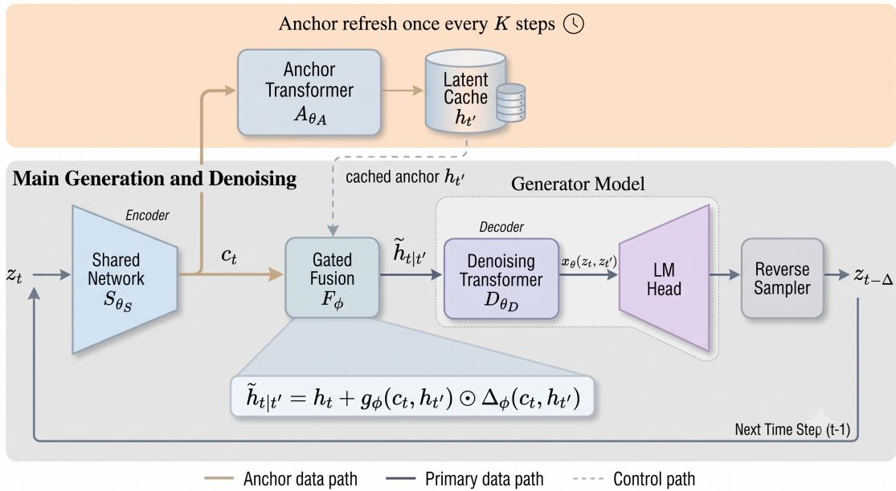

# TIME-ANCHORED DIFFUSION LANGUAGE MODELS: LATENT-SPACE CACHING FOR FAST GENERATION

TECHNICAL REPORT

Joel Anto Paul UT Austin joelanto@utexas.edu

Litu Rout UT Austin litu.rout@utexas.edu

Aditya Akella UT Austin akella@cs.utexas.edu

Sanjay Shakkottai UT Austin sanjay.shakkottai@utexas.edu

September 30, 2026

## ABSTRACT

Recent work on anchored diffusion language models improves denoising by shaping an intermediate latent space with supervised important-token targets. In this work, we introduce time-based (self supervised) anchoring, which learns and reuses latent anchors without requiring such targets. Our key observation is that anchors encode persistent properties of the clean sequence, such as its semantic intent, global structure, or intermediate plan. Although their hidden representations become stale as the token canvas evolves, their semantic content remains useful across nearby diffusion times. This is implemented through a two-stage architecture consisting of a relatively expensive anchor network that generates the latent cache state and a lightweight denoising network that intelligently combines the cached latent state with the current state at each reverse step using a fusion module. This gives anchoring a latent-space caching interpretation: the anchor network is evaluated periodically, while its cached representation is reused across multiple reverse steps. We instantiate this framework as TADM:Post-train, which time-anchorizes pretrained DLMs, and TADM:Pretraining, which learns time-based anchors during pretraining. Applied to DiffusionGemma-26B, TADM:Post-train improves throughput by approximately 49% to 79% on several math, code, and STEM benchmarks (GSM8K, AIME26, GPQA-Diamond, LiveCodeBench-v6, HumanEval, MMLU-Pro). TADM:Pretraining reduces Transformer-layer computation by up to 38% relative to a standard single-stage DLM, achieves up to 73% higher measured throughput than ADLM.

## 1 Introduction

Diffusion Language Models (DLMs) iteratively refine an entire sequence, enabling bidirectional attention and parallel token generation [Austin et al., 2021, Lou et al., 2024, Sahoo et al., 2024, Shi et al., 2024]. This iterative formulation enables revision and error correction during generation [Wang et al., 2025, Sahoo et al., 2025, Schiff et al., 2025], and has recently been scaled to large language models such as LLaDA [Nie et al., 2025], Dream [Ye et al., 2025], and DiffusionGemma [Team et al., 2026], demonstrating that diffusion-based generation can support competitive reasoning, coding, and instruction following at scale. Block diffusion models provide another direction, combining autoregressive generation across blocks with parallel denoising within each block to improve generation flexibility and efficiency [Arriola et al., 2025, Team et al., 2026]. Despite these advances, DLMs still require repeated model evaluations across denoising steps, making inference substantially more expensive than autoregressive decoding.

In recent work, the Anchored Diffusion Language Model (ADLM) showed that denoising can be improved by first predicting informative anchor tokens that reduce the conditional uncertainty of the remaining sequence, and thus guide the denoiser [Rout et al., 2025]. In this work, we introduce time-based (self-supervised) anchoring, which learns and reuses latent anchors without requiring such targets. The key observation is that anchors describe persistent properties of the clean sequence, such as its semantic intent, global structure, or intermediate plan. Their semantic content should therefore remain useful across nearby diffusion times, even though their hidden representations become stale as the token canvas evolves.

  
Figure 1: Time-Anchored Diffusion Model (TADM). The expensive anchor pathway is evaluated once every K reverse steps to produce a latent anchor $\mathbf { h } _ { t ^ { \prime } }$ , which is cached and reused. At each subsequent step, the lightweight shared network encodes the evolving state $\mathbf { z } _ { t } .$ and a gated fusion module combines its current representation $\mathbf { c } _ { t }$ with the cached anchor before denoising. TADM therefore replaces repeated evaluation of the expensive anchor network with learned latent-space reuse.

We exploit this persistence by decomposing the model into four components: a lightweight shared network, an expensive anchor network, a fusion module, and a lightweight denoiser. The anchor representation changes slowly across nearby diffusion times and is therefore computed only at anchor-refresh steps and reused thereafter. At each reverse step, the shared network encodes the current canvas, and the fusion module combines this representation with the cached anchor before denoising. The anchor refresh interval therefore provides a tunable quality–compute trade-off by controlling how long the expensive anchor computation is reused (Figure 1).

This construction also turns anchoring into a form of latent-space caching. Existing methods reuse key-value states because consecutive diffusion states are similar [Ma et al., 2025, Jiang et al., 2026, Nguyen-Tri et al., 2026], but these local, layer-specific representations are not trained for temporal reuse. We instead train the model to produce a latent representation that can be reused for several denoising steps and corrected using the current state. This shifts the problem from detecting unchanged key-value states to learning the state that can be reused.

Results. Depending on whether a DLM is adapted after pretraining or trained from scratch, we instantiate time-based anchoring in two forms: TADM:Post-train and TADM:Pretraining. TADM:Post-train enables existing pretrained DLMs to acquire latent-cache reuse without repeating pretraining; on DiffusionGemma-26B, by training only a 3.1Mparameter fusion module while keeping the pretrained backbone frozen, it achieves 49%–79% higher throughput while preserving task accuracy of the corresponding baseline across the evaluated math, code, and STEM benchmarks. TADM:Pretraining instead learns cacheable latent representations directly during pretraining, reducing Transformerlayer computation by up to 38% and achieving up to 73% higher measured throughput than ADLM. $\mathrm { { A t } } T = 2 0 4 8$ it attains a MAUVE score of 0.650 compared with 0.610 for ReMDM while using 25% fewer Transformer-layer evaluations than MDLM.

## 2 Preliminaries

Let V denote the vocabulary space with V unique discrete tokens. Let $x = ( x ^ { 1 } , x ^ { 2 } , \cdot \cdot \cdot , x ^ { L } )$ where $x ^ { l } \in \mathcal { V } , l \in [ L ]$ be the sample sequence. We denote each element of the sample sequence as a one-hot vector; thus the input sequence can be denoted by $\mathbf { x } = ( \mathbf { x } ^ { 1 } , \mathbf { x } ^ { 2 } , \cdots , \mathbf { x } ^ { L } )$ where $\mathbf { x } ^ { l }$ is a $V \bar { . }$ -dimensional one-hot vector with $\mathbf { x } ^ { l } [ i ] = 1$ when $\overset { \bar { \mathbf { \rho } } } { x ^ { l } } = i .$

otherwise 0. We assume that the input sequence is sampled from an unknown distribution $q ( \cdot )$ supported on $\mathcal { V } ^ { L }$ . We denote the Hadamard product of two vectors a and b as $\mathbf { a } \odot$ b and dot product as ⟨a, b⟩.

## 2.1 Discrete Diffusion Models

Discrete Diffusion Language Models (DLMs) [Sohl-Dickstein et al., 2015, Austin et al., 2021] define a forward corruption process that gradually transforms a clean sequence x into noise. Let T denote the number of discrete diffusion steps, with $t ( i ) = i / T$ and $s ( i ) = ( i - 1 ) / T$ . For simplicity, we write $t = t ( i )$ and $s = s ( i )$ . The forward process independently corrupts each token according to

$$
q ( \mathbf { z } _ { t } | \mathbf { x } ) = \prod _ { l = 1 } ^ { L } q ( \mathbf { z } _ { t } ^ { l } | \mathbf { x } ) , \quad q ( \mathbf { z } _ { t } ^ { l } | \mathbf { x } ) = \operatorname { C a t } \left( \mathbf { z } _ { t } ^ { l } ; \alpha _ { t } \mathbf { x } ^ { l } + ( 1 - \alpha _ { t } ) \pmb { \pi } \right) , \quad l \in \{ 1 , 2 , \cdots , L \} ,\tag{1}
$$

where $\alpha _ { t } \in [ 0 , 1 ]$ is a monotonically decreasing noise schedule satisfying $\alpha _ { 0 } = 1$ and $\alpha _ { 1 } = 0$ , and π denotes the limiting noise distribution. Defining $\alpha _ { t | s } = \alpha _ { t } / \alpha _ { s } ,$ , the corresponding one-step forward transition is $q ( \mathbf { z } _ { t } ^ { l } | \mathbf { z } _ { s } ^ { l } ) =$ $\mathrm { C a t } ( \mathbf { z } _ { t } ^ { l } ; \alpha _ { t \mid s } \mathbf { z } _ { s } ^ { l } + ( 1 - \alpha _ { t \mid s } ) \pmb { \pi } )$

Because the clean token $\mathbf { x } ^ { l }$ is known during training, the posterior distribution of the preceding diffusion state has a closed form:

$$
\begin{array} { r } { q ( \mathbf { z } _ { s } ^ { l } \mid \mathbf { z } _ { t } ^ { l } , \mathbf { x } ^ { l } ) = \operatorname { C a t } \left( \mathbf { z } _ { s } ^ { l } ; \frac { \left[ \alpha _ { t \mid s } \mathbf { z } _ { t } ^ { l } + \left( 1 - \alpha _ { t \mid s } \right) \mathbf { 1 } \pi ^ { \top } \mathbf { z } _ { t } ^ { l } \right] \odot \left[ \alpha _ { s } \mathbf { x } ^ { l } + \left( 1 - \alpha _ { s } \right) \pi \right] } { \alpha _ { t } \mathbf { z } _ { t } ^ { l \top } \mathbf { x } ^ { l } + \left( 1 - \alpha _ { t } \right) \mathbf { z } _ { t } ^ { l \top } \pi } \right) . } \end{array}\tag{2}
$$

At inference time, however, the clean sequence x is unknown. A neural denoiser therefore predicts a distribution over the clean token, $\mathbf { x } _ { \theta } ^ { l } ( \mathbf { z } _ { t } )$ , and substitutes this prediction into the analytic posterior:

$$
\begin{array} { r } { p _ { \theta } ( \mathbf { z } _ { s } ^ { l } | \mathbf { z } _ { t } ) = q \big ( \mathbf { z } _ { s } ^ { l } \mid \mathbf { z } _ { t } ^ { l } , \mathbf { x } _ { \theta } ^ { l } ( \mathbf { z } _ { t } ) \big ) . } \end{array}\tag{3}
$$

The complete learned reverse process consequently factorizes as $\begin{array} { r } { p _ { \theta } ( \mathbf { x } , \mathbf { z } _ { 0 : 1 } ) = p _ { \theta } ( \mathbf { z } _ { 1 } ) p _ { \theta } ( \mathbf { x } | \mathbf { z } _ { 0 } ) \prod _ { i = 1 } ^ { T } p _ { \theta } ( \mathbf { z } _ { s ( i ) } | \mathbf { z } _ { t ( i ) } ) } \end{array}$ The denoising model is trained by minimizing the discrete-time negative evidence lower bound (NELBO):

$$
\begin{array} { r l } & { \mathcal { L } _ { \mathrm { N E L B O } } ( \mathbf { x } , \theta ) = \mathbb { E } _ { q } \left[ - \log p \theta \left( \mathbf { x } \mid \mathbf { z } _ { t ( 0 ) } \right) \right] + \displaystyle \sum _ { i = 1 } ^ { T } \mathbb { E } _ { q } \left[ D _ { \mathrm { K L } } \left( q ( \mathbf { z } _ { s ( i ) } \mid \mathbf { z } _ { t ( i ) } , \mathbf { x } ) \parallel p \theta \left( \mathbf { z } _ { s ( i ) } \mid \mathbf { z } _ { t ( i ) } \right) \right) \right] } \\ & { \quad \quad \quad \quad + D _ { \mathrm { K L } } \left( q ( \mathbf { z } _ { t ( T ) } \mid \mathbf { x } ) \parallel p \theta \left( \mathbf { z } _ { t ( T ) } \right) \right) . } \end{array}\tag{4}
$$

## 2.2 Anchored Diffusion Language Models

A key limitation of standard masked diffusion models is that the corruption and reverse processes do not explicitly prioritize tokens according to their informativeness. Consequently, important tokens may remain masked until late in the reverse process, leaving the denoiser with insufficient context to accurately predict the remaining tokens. In particular, missing informative tokens can induce high conditional uncertainty over the rest of the sequence, making the denoising problem harder(See Appendix B.2 for more details). To address this limitation, Rout et al. [2025] introduced the Anchored Diffusion Language Model (ADLM), which explicitly encourages the model to reason through a small set of informative tokens, referred to as anchor tokens.

Two-stage Parameterization. ADLM decomposes the standard denoising network into two stages: an anchor network and a denoiser network. Given a noisy sequence $\mathbf { z } _ { t } .$ , the anchor network first predicts a probability mixture $\mathbf { y } _ { \theta _ { A } } ( \mathbf { z } _ { t } )$ over important tokens. The denoiser network then predicts the clean-token distribution conditioned on these anchored predictions. Thus, the output prediction is parameterized as

$$
\mathbf { x } _ { \theta } ( \mathbf { z } _ { t } ) = \mathbf { x } _ { \theta _ { D } } \big ( \mathbf { y } _ { \theta _ { A } } ( \mathbf { z } _ { t } ) \big ) ,\tag{5}
$$

where $\theta = [ \theta _ { A } , \theta _ { D } ]$ denotes the parameters of the anchor and denoiser networks, respectively.

Training Objective. ADLM jointly trains the anchor and denoiser networks using an Anchored Negative Evidence Lower Bound (ANELBO) (44). The objective is split as

$$
\mathcal { L } _ { \mathrm { A N E L B O } } ( \mathbf { x } ; \theta _ { A } , \theta _ { D } ) : = \mathcal { L } _ { d i f f u s i o n } ( \mathbf { x } , \theta ) + \gamma \mathcal { L } _ { A n c h o r } ( \mathbf { x } , \theta )\tag{6}
$$

where $\gamma$ controls the strength of anchor supervision. The first term trains the denoiser to reconstruct the clean sequence conditioned on the anchor-network output, while the auxiliary anchor loss directly encourages the anchor network to predict informative tokens.

## 3 Time-Anchored Diffusion Framework

ADLM demonstrates that anchoring on important tokens can simplify denoising by reducing the uncertainty of the remaining sequence. However, its training requires a task-dependent specification of which tokens should serve as anchors, and such supervision may not always be available. We introduce time-based anchoring, where anchors are instead learned as latent representations that captures information persistent across diffusion time, such as the global structure or underlying parent variables governing the sequence. These latent anchors are learned directly from the denoising objective and reused across multiple diffusion steps, without requiring explicit anchor targets. This naturally enables latent-space caching, where an informative representation computed at one diffusion state can be retained and reused as the state evolves.

We realize time-based anchoring by decomposing the model into four components: a shared embedding network, an expensive anchor network, a lightweight denoiser network, and a learnedfusion module. The shared network first maps the current diffusion state into a common representation space. The anchor network processes this representation to produce an expensive latent anchor, which is computed once, cached, and reused across multiple reverse-diffusion steps. At each subsequent step, the shared network encodes the current diffusion state, and the fusion module combines this current representation with the cached anchor before passing the result to the denoiser. Training under this reuse pattern teaches the fusion and denoising components to operate with temporally stale anchor representations, enabling the expensive anchor computation to be cached across diffusion time.

Remark 3.1. A motivation behind anchoring is that not all tokens provide equal information during the reconstruction ofa sequence. ADLM describes anchor tokens as a set oftokens, denoted by $X _ { A } ,$ , conditioned on which the uncertainty of estimating the remaining tokens $X _ { \bar { A } }$ is minimized. Given an anchor budget d, these anchor tokens can therefore be viewed as: $A ^ { \star } \in$ arg min $. A \subseteq [ L ] , | A | \leq d  { \cal H } ( X _ { \bar { A } } \mid X _ { A } )$ . Hence, revealing or accurately predicting $X _ { A }$ makes the remaining variables easier to estimate.

In an idealized two-tier graphical model motivating anchoring (see Rout et al. [2025]), a small set ofinvariant upper-tier parent variables renders the lower-tier token variables conditionally independent, so that $\begin{array} { r } { p ( x _ { \bar { A } } \mid x _ { A } ) = \prod _ { i \in \bar { A } } p ( x _ { i } \mid } \end{array}$ $x _ { A } )$ [Koller and Friedman, 2009]. Diffusion changes the observed corruption state but not these underlying parent variables; consequently, their semantic content, which are these parent variables, is invariant across diffusion time, although the learned representation may become stale and require correction, which is where the time-based anchoring comes into the picture. Our time-anchored framework exploits this invariance by training the denoiser with stale anchors and refining them using the current state. This encourages the anchor representation to capture information that remains useful across diffusion time, corresponding in the idealized graphical model to the persistent upper-tier parent variables.

We next introduce the framework for time-based anchoring.

## 3.1 Model Decomposition

We decompose the denoising network into four components: a lightweight shared network $S _ { \theta _ { S } }$ , an expensive anchor network $A _ { \theta _ { A } }$ , a tiny fusion module $\Phi _ { \phi }$ and a lightweight denoiser network $D _ { \theta _ { D } }$ . For a noisy sequence $\mathbf { z } _ { t } ,$ , a standard fresh forward pass can be written as

$$
\mathbf { c } _ { t } = S _ { \theta _ { S } } ( \mathbf { z } _ { t } ) \qquad \mathbf { h } _ { t } = A _ { \theta _ { A } } ( \mathbf { c } _ { t } ) \qquad \mathbf { x } _ { \theta } ( \mathbf { z } _ { t } , t ) = D _ { \theta _ { D } } ( \mathbf { h } _ { t } ) .\tag{7}
$$

where $\mathbf { c } _ { t }$ denotes the current-state representation and $\mathbf { h } _ { t }$ denotes the deep contextual representation produced by the anchor network. The decomposition is chosen such that the anchor network contains a large fraction of the total model computation and is evaluated only periodically. The shared network and denoiser remain inexpensive enough to be evaluated at every denoising step. Importantly, the precise decomposition is architecture-dependent: $S _ { \theta _ { s } }$ may consist only of an embedding/current-state pathway or may additionally contain several Transformer layers as in case of TADM:Post-train.

At an anchor-refresh step $t ^ { \prime } ,$ , we compute and cache the anchor representation $\mathbf { h } _ { t ^ { \prime } } = A _ { \theta _ { A } } ( S _ { \theta _ { S } } ( \mathbf { z } _ { t ^ { \prime } } ) )$ . At a later reverse step $t < t ^ { \prime }$ , before the next refresh, the anchor network is skipped; instead, the current state is encoded, fused with the cached anchor, and passed to the denoiser:

$$
\begin{array} { r } { \overline { { \mathbf { c } _ { t } } } = \overline { { S _ { \theta _ { S } } ( \mathbf { z } _ { t } ) } } \quad \mathbf { h } _ { t ^ { \prime } } = A _ { \theta _ { A } } \big ( S _ { \theta _ { S } } ( \mathbf { z } _ { t ^ { \prime } } ) \big ) \quad \widetilde { \mathbf { h } } _ { t \mid t ^ { \prime } } = \boldsymbol { \Phi } _ { \phi } \big ( \mathbf { c } _ { t } , \mathbf { h } _ { t ^ { \prime } } \big ) \quad \mathbf { x } _ { \theta } \big ( \mathbf { z } _ { t } , \mathbf { z } _ { t ^ { \prime } } \big ) = D _ { \theta _ { D } } \big ( \widetilde { \mathbf { h } } _ { t \mid t ^ { \prime } } \big ) } \end{array}\tag{8}
$$

Thus, at intermediate reverse steps, only the shared network, fusion module, and denoiser are evaluated, while the expensive cached anchor $\mathbf { h } _ { t ^ { \prime } }$ is reused until the next refresh.

## 3.2 Fusion network

Replacing the input to the denoiser with the stale representation $\mathbf { h } _ { t ^ { \prime } }$ is not sufficient as this does not have information about the current state $\mathbf { c } _ { t }$ . Therefore, we introduce a tiny Fusion module $\Phi _ { \phi }$ which combines $\mathbf { c } _ { t }$ with $\mathbf { h } _ { t ^ { \prime } }$ . This module

is very small in comparison to the Shared network, Anchor Network and the Denoiser network. The fusion module computes the corrected anchor representation as follows:

$$
\widetilde { \mathbf { h } } _ { t \mid t ^ { \prime } } = \mathbf { h } _ { t ^ { \prime } } + \mathbf { g } _ { \phi } ( \mathbf { c } _ { t } , \mathbf { h } _ { t ^ { \prime } } ) \odot \Delta _ { \phi } ( \mathbf { c } _ { t } , \mathbf { h } _ { t ^ { \prime } } ) .\tag{9}
$$

Viewing the complete time-anchored model as a function of the current state $\mathbf { z } _ { t }$ and the stale anchor state $\mathbf { z } _ { t ^ { \prime } }$ , we denote its clean-sequence prediction by $\mathbf { x } _ { \theta } ( \mathbf { z } _ { t } , \mathbf { z } _ { t ^ { \prime } } )$ . Since $\mathbf { h } _ { t ^ { \prime } } = A _ { \theta _ { A } } ( S _ { \theta _ { S } } ( \mathbf { z } _ { t ^ { \prime } } ) )$ , the prediction is

$$
\begin{array} { r } { \mathbf { x } _ { \theta } \left( \mathbf { z } _ { t } , \mathbf { z } _ { t ^ { \prime } } \right) = D _ { \theta _ { D } } \left( \widetilde { \mathbf { h } } _ { t \mid t ^ { \prime } } \right) . } \end{array}\tag{10}
$$

## 3.3 Anchor-Cache inference

During inference, the anchor cache is refreshed once in every K steps using the anchor network, whereas the shared and denoiser networks are evaluated at each step. The inference policy is summarized in Algorithm 1.

If $L _ { S } , L _ { A } ,$ , and $L _ { D }$ denote the numbers of shared, anchor, and denoiser Transformer layers, respectively, then the full and cached inference costs are

$$
C _ { \mathrm { f u l l } } = T ( L _ { S } + L _ { A } + L _ { D } ) , \qquad C _ { \mathrm { c a c h e } } = T ( L _ { S } + L _ { D } ) + \left\lceil { \frac { T } { K } } \right\rceil L _ { A } .\tag{11}
$$

Thus, ignoring the ceiling term, the relative Transformer-layer cost is

$$
{ \frac { C _ { \mathrm { c a c h e } } } { C _ { \mathrm { f u l l } } } } \approx { \frac { L _ { S } + L _ { D } + L _ { A } / K } { L _ { S } + L _ { A } + L _ { D } } } ,
$$

showing that increasing the anchor refresh interval K reduces computation by amortizing the expensive anchor network across multiple reverse steps.

## 3.4 Cache-induced distribution

Let $\pi _ { K }$ denote the anchor-refresh policy and let $d _ { \theta , \pi _ { K } }$ denote the joint distribution over current states, and cached anchor representations induced by executing the target model under this policy. Ideally, training for cached inference would minimize

$$
\mathcal { L } _ { \mathrm { c a c h e } } = \mathbb { E } _ { ( t , t ^ { \prime } ) \sim \pi _ { K } } \mathbb { E } _ { ( \mathbf { z } _ { t } , \mathbf { h } _ { t ^ { \prime } } ) \sim d _ { \theta , \pi _ { K } } ( \cdot \vert t , t ^ { \prime } ) } \left[ \ell \left( \mathbf { x } _ { \theta } \left( \mathbf { z } _ { t } , \mathbf { z } _ { t ^ { \prime } } \right) , \mathbf { x } \right) \right] .\tag{12}
$$

Sampling from $d _ { \theta , \pi _ { K } }$ would require the reverse generation process during training, which introduces additional computation. In the following sections, we will introduce two ways of minimizing Eq. 12 depending on whether the model is pretrained from scratch or adapted through post-training.

## 4 TADM:Post-train

TADM:Post-train is a post-training method using DiffusionGemma [Team et al., 2026] as the base model, which is a USDM. It uses the framework developed in Sec 3 for pre-trained DLMs. It approximates $d _ { \theta , \pi _ { K } }$ by generating the next denoising states via the rollout of the model during training. Simply sampling the noisy states $\mathbf { z } _ { t }$ and $\mathbf { z } _ { t ^ { \prime } }$ using the forward processes in Eq. 1 and Eq. 15, then computing $\mathbf { h } _ { t ^ { \prime } } \overset { ^ { \prime } } { = } A _ { \theta _ { A } } \overset { ^ { \prime } } { ( } \dot { S } _ { \theta _ { S } } ( \mathbf { z } _ { t ^ { \prime } } ) )$ would introduce a mismatch as the distribution $d _ { \theta , \pi _ { K } }$ encountered during inference would be different from the distribution induced by Eq. 1 because we are using a pretrained model. Therefore, to minimize this mismatch to an extent, we do the following:

Rollout Construction. For a clean response canvas $\mathbf { x } _ { 0 } .$ , we sample a rollout age $k \in K _ { t r a i n } = \{ 0 , 1 , 2 \}$ and a noisy state $\mathbf { z } _ { t ^ { \prime } }$ using Eq. 1, where $t ^ { \prime } \sim \mathcal { U } ( 0 , 1 )$ and we use uniform noise. We then project $t ^ { \prime }$ onto the T-step sampling grid. ${ { i } _ { \mathrm { a } } } = \mathrm { c l i p } \left( { \left| t ^ { \prime } T + \textstyle { \frac { 1 } { 2 } } \right| , k + 1 , T } \right)$ . Let $i _ { \mathrm { s } } = i _ { \mathrm { a } } - k$ . The anchor is evaluated once at this state, and then cached. $\mathbf { h } _ { t ^ { \prime } } = A _ { \theta _ { A } } ( S _ { \theta _ { S } } \bar { ( } \mathbf { z } _ { t ^ { \prime } } ) )$ . Starting from $\widetilde { \mathbf { z } } _ { i _ { a } } = \mathbf { z } _ { t ^ { \prime } }$ , the current model performs k reverse transitions using the same denoising and sampling operations as Algorithm 1, while keeping the cached anchor $\mathbf { h } _ { t ^ { \prime } }$ fixed throughout the rollout. Note that the sampler is of your choice and in this specific case we use the sampler used by Diffusion Gemma.

$$
\widetilde { \mathbf { z } } _ { j - 1 } \sim \mathcal { S } \big ( p _ { \boldsymbol { \theta } } \big ( \cdot \mid \widetilde { \mathbf { z } } _ { j } , \mathbf { h } _ { t ^ { \prime } } \big ) , j \big ) , \qquad j = i _ { \mathrm { a } } , \ldots , i _ { \mathrm { s } } + 1 .\tag{13}
$$

Therefore, in TADM:Post-train, the end point $\widetilde { \mathbf { z } } _ { i _ { s } }$ is sampled from the student rather than synthesized from the clean target, and is equivalent to $\mathbf { z } _ { t }$ .

Training Objective. The discrete rollout in Eq 13 is stop-gradient. After sampling its endpoint, we recompute the prompt, cached-anchor, and terminal-state paths with automatic differentiation. This preserves the on-policy terminal state without backpropagating through discrete token sampling and allows supervision to reach the trainable parameters in the shared, anchor, fusion, and denoising pathways.

For each training example, we sample an anchor time $t ^ { \prime }$ and a cache age $k \in \{ 0 , 1 , 2 \}$ . The corresponding current diffusion time is $\begin{array} { r } { t = t ^ { \prime } - \frac { k } { T } } \end{array}$ , so that the cached anchor is computed k reverse steps before the current state. TADM:Post train minimizes

$$
\mathcal { L } _ { \mathrm { c a c h e } } = \mathbb { E } _ { t ^ { \prime } , k } \mathbb { E } _ { ( \widetilde { z } _ { t } , \mathbf { h } _ { t ^ { \prime } } ) \sim d _ { \theta , \pi _ { K } } ( \cdot | t ^ { \prime } , k ) } \left[ \mathcal { L } _ { \mathrm { C E } } + \lambda _ { \mathrm { K D } } D _ { \mathrm { K L } } \big ( p _ { \theta _ { 0 } } ^ { l } ( \cdot | \widetilde { \mathbf { z } } _ { t } ) \| \widehat { \mathbf { x } } ^ { l } \big ) \right] , \qquad t = t ^ { \prime } - \frac { k } { T } ,\tag{14}
$$

where $\lambda _ { \mathrm { K D } } = 1$ in our experiments, $\theta _ { 0 }$ is the frozen pretrained model and xb is the output prediction of the denoiser using $\widetilde { \mathbf { z } _ { t } }$ as the input. The outer expectation averages over the sampled anchor time and cache age, while the inner expectation is over the model-generated current state and cached anchor induced by the rollout policy. The second term is the knowledge distillation loss to prevent unnecessary corruption of the output distribution.

## 5 TADM:Pretraining

Although rollout training provides a close approximation to the inference distribution, applying multiple model forwards during pretraining is quite expensive. Moreover, when training from scratch, the model generated trajectories would be poor. Therefore, we use analytically generated noisy states using the forward Eq. 1. Our pretraining experiment is derived from the two-stage architecture described in Sec. 2.2 parameterized by $\theta \overset { \cdot } { = } \left[ \theta _ { D } , \theta _ { A } , \mathbf { \bar { \theta } } _ { S } , \phi \right]$ . We first sample $\mathbf { z } _ { t }$ and then further corrupt it to get $\mathbf { z } _ { t ^ { \prime } }$ which produces $\mathbf { h } _ { t ^ { \prime } }$

$$
q ( \mathbf { z } _ { t ^ { \prime } } ^ { l } | \mathbf { z } _ { t } ^ { l } ) = \operatorname { C a t } \left( \mathbf { z } _ { t ^ { \prime } } ^ { l } ; \frac { \alpha _ { t ^ { \prime } } } { \alpha _ { t } } \mathbf { z } _ { t } ^ { l } + \left( 1 - \frac { \alpha _ { t ^ { \prime } } } { \alpha _ { t } } \right) \mathbf { m } \right) .\tag{15}
$$

TADM Parametrization. The forward process follows the standard masked diffusion model formulation (1) with π = m and we use the ReMDM’s [Wang et al., 2025] reverse posterior as the reference distribution (28). To introduce anchor caching in the pretraining, we postulate a new parametrization. The cached reverse process factorizes as:

$$
p _ { \theta } ( \mathbf { x } , \mathbf { z } _ { 0 : 1 } ) = p _ { \theta } ( \mathbf { z } _ { 1 } ) p _ { \theta } ( \mathbf { x } | \mathbf { z } _ { 0 } ) \prod _ { i = 1 } ^ { T } p _ { \theta } \big ( \mathbf { z } _ { s ( i ) } \mid \mathbf { z } _ { t ( i ) } , \mathbf { z } _ { t ^ { \prime } ( i ) } \big ) .\tag{16}
$$

where $t ^ { \prime } ( i )$ denotes the most recent refresh time of the anchor cache available to the denoising step $t ( i )$

The one-step reverse transition uses the fused prediction $\mathbf { x } _ { \theta } ( \mathbf { z } _ { t } , \mathbf { z } _ { t ^ { \prime } } )$ (10) in the remasking posterior used by ReMDM [Wang et al., 2025]

$$
\begin{array} { r } { q ( \mathbf { z } _ { s } ^ { l } | \mathbf { z } _ { t } ^ { l } , \mathbf { x } _ { \theta } ^ { l } ( \mathbf { z } _ { t } , \mathbf { z } _ { t ^ { \prime } } ) ) = \left\{ \begin{array} { l l } { \mathrm { C a t } ( \mathbf { z } _ { s } ^ { l } ; ( 1 - \sigma _ { t } ) \mathbf { z } _ { t } ^ { l } + \sigma _ { t } \mathbf { m } ) , } & { \mathbf { z } _ { t } ^ { l } \neq \mathbf { m } , } \\ { \mathrm { C a t } ( \mathbf { z } _ { s } ^ { l } ; \frac { \alpha _ { s } - ( 1 - \sigma _ { t } ) \alpha _ { t } } { 1 - \alpha _ { t } } \mathbf { x } _ { \theta } ^ { l } ( \mathbf { z } _ { t } , \mathbf { z } _ { t ^ { \prime } } ) + \frac { 1 - \alpha _ { s } - \alpha _ { t } \sigma _ { t } } { 1 - \alpha _ { t } } \mathbf { m } ) , } & { \mathbf { z } _ { t } ^ { l } = \mathbf { m } , } \end{array} \right. } \end{array}\tag{17}
$$

where $\sigma _ { t }$ denotes the remasking probability at time t.

Training objective. We optimize the objective defined in Theorem 5.1 with $\sigma _ { t } = 0$ , which trains the current prediction using the stale anchor sampled at time $\bar { t ^ { \prime } } .$

Anchor token selection We choose the anchor tokens as the clean-token targets at positions masked in $ { \mathbf { z } } _ { t } ^ { \prime }$ so that the anchor network is able to produce good latent representations persistent across time.

Time-Anchored Negative Evidence Lower Bound (T-ANELBO). Following ReMDM [Wang et al., 2025], we define the variational path distribution over the latent trajectory as

$$
q _ { \sigma } ( \mathbf { z } _ { 0 : 1 } \mid \mathbf { x } ) = q _ { \sigma } ( \mathbf { z } _ { 1 } \mid \mathbf { x } ) \prod _ { i = 1 } ^ { T } q _ { \sigma } \left( \mathbf { z } _ { s ( i ) } \mid \mathbf { z } _ { t ( i ) } , \mathbf { x } \right) ,\tag{18}
$$

where $q _ { \sigma } ( \mathbf { z } _ { s ( i ) } \mid \mathbf { z } _ { t ( i ) } , \mathbf { x } )$ is the remasking posterior in Eq. 28. Although this process is non-Markovian because the transition is additionally conditioned on x, its marginals $q _ { \sigma } ( \mathbf { z } _ { t } \mid \mathbf { x } )$ coincide with those of the standard absorbing-state diffusion process [Wang et al., 2025]. We use $q _ { \sigma } ( \mathbf { z } _ { 0 : 1 } \mid \mathbf { x } )$ as the variational distribution in the following T-ANELBO.

Theorem 5.1 (T-ANELBO). Suppose the latent trajectoryfollows the variational path distribution $q _ { \sigma } ( \mathbf { z } _ { 0 : 1 } \mid \mathbf { x } )$ in Eq. 18, with learned reverse transition parameterized as in Eq. 17. Denote by θ the collection of parameters for the networks. Given a sequence $\mathbf { x } = ( \mathbf { x } ^ { l } ) _ { l = 1 } ^ { \bar { L } }$ , let the anchor tokens be denoted by $\mathbf { y } = ( \mathbf { y } _ { l } ) _ { l = 1 } ^ { L }$ obtained through an operator $\boldsymbol { \mathcal { A } } ( \cdot )$ . Then, the time-anchored negative log-likelihood is bounded by:

$$
- \log p _ { \theta } ( x ) + \gamma \mathcal { L } _ { \mathrm { A n c h o r } } ( x ; \theta ) \ \leq \ \mathcal { L } _ { \mathrm { T - A N E L B O } } ( x ; \theta ) , \quad w h e r e
$$

$$
\begin{array} { r l } & { \mathcal { L } _ { \mathrm { T - A N E L B O } } ( \mathbf { x } ; \theta ) : = \mathbb { E } _ { q _ { \sigma } ( \mathbf { z } _ { 0 } , 1 \mid \mathbf { x } ) } \left[ - \log p _ { \theta } ( \mathbf { x } \mid \mathbf { z } _ { 0 } ) \right] + } \\ & { \underset { i = 1 } { \overset { T } { \sum } } \mathbb { E } _ { q _ { \sigma } ( \mathbf { z } _ { t ( i ) } , \mathbf { z } _ { t ^ { \prime } ( i ) } \mid \mathbf { x } ) } \Biggl [ \underset { l = 1 } { L } \lambda _ { t ( i ) } \log \langle \mathbf { x } _ { \theta } ^ { l } ( \mathbf { z } _ { t ( i ) } , \mathbf { z } _ { t ^ { \prime } ( i ) } ) , \mathbf { x } ^ { l } \rangle + \gamma \lambda _ { t ^ { \prime } ( i ) } \log \langle \mathbf { y } _ { A _ { \theta _ { A } } } ^ { l } ( \mathbf { z } _ { t ^ { \prime } ( i ) } ) , \mathbf { y } ^ { l } \rangle \Biggr ] } \\ & { w i t h \lambda _ { t ( i ) } = \frac { ( 1 - \sigma _ { t ( i ) } ) \alpha _ { t ( i ) } - \alpha _ { s ( i ) } } { 1 - \alpha _ { t ( i ) } } a n d \gamma \geq 0 . } \end{array}
$$

The first cross entropy term trains the denoiser for explicit reuse of latent representations through time, whereas the second term provides optional anchor supervision when anchor tokens are available. Setting $\gamma = 0$ yields fully self-supervised time-based anchoring.

## 6 Experiments

## 6.1 TADM:Post-train

Setup. We finetune DiffusionGemma [Team et al., 2026] using our framework on math, code and STEM sequences derived from UltraData-SFT-2605 [OpenBMB, 2026] dataset and Nemotron-Post-Training-Dataset-v2 [Nathawani et al., 2025]. We trained our model on sequences without reasoning traces and therefore evaluate our model using the no-think mode. We train for 18750 steps using batch size 16. We freeze the base model during training. The Shared network is the embedding layer and the first two text layers. The next 20 layers act as the Anchor network and the final 8 layers, along with the LM-Head acts as the Denoiser network. We set $\gamma = 0$ . The fusion module uses attention to fuse the current state with the stale anchor state. It starts with 0 output so that the model begins from the frozen backbone. For evaluation, we used a canvas size of 256 and fixed-budget sampler with 48 denoising steps per canvas. For more details, refer to C.1.

Benchmarks. We use the following few-shot settings and maximum generation lengths: GSM8K [Cobbe et al., 2021] (5-shot, 1,024), HumanEval [Chen et al., 2021] (0-shot, pass@1, 1,024), GPQA-Diamond [Rein et al., 2024] (0-shot, 2,048), MMLU-Pro [Wang et al., 2024] (5-shot, 2,048), LiveCodeBench-v6 [Jain et al., 2024] (0-shot, pass@1, 2,000), and AIME26 [Dekoninck et al., 2026] (0-shot, 4,096 tokens).

Metrics. We evaluate the model accuracy over the benchmarks, tokens per seconds generated by the model and the transformer call reduction averaged over 3 seeds. These are reported in Table 1.

Results. Table 1 shows that pretrained DLMs can be effectively time-anchorized with TADM:Post-train, by training only on 3.1M parameters of the fusion module, substantially improving inference throughput while largely preserving task accuracy. At K = 3, throughput improves by 1.49×–1.79× across the evaluated benchmarks. Importantly, this behavior also holds on harder reasoning and coding tasks such as AIME26, GPQA-Diamond, and LiveCodeBench-v6, where we obtain 1.49×, 1.56×, and 1.79× throughput, respectively, with only minor changes in accuracy. These results suggest that reusing learned latent representations across nearby diffusion steps is an effective way to reduce repeated computation in pretrained DLMs.

## 6.2 TADM:Pretraining

Setup We pre-train TADM on OpenWebText (OWT) [Gokaslan and Cohen, 2019] for 1M optimization steps, chosen to match the training-token budget of the main comparison models. The 12-layer anchor and 6-layer denoiser use the Diffusion Transformer (DiT) architecture [Peebles and Xie, 2023]; they share the token embedding table, and the gated residual fusion module connects the anchor hidden states to the denoiser. The inference graph contains 224M unique parameters, including the fusion gate and excluding the training-only anchor LM head (38.85M parameters). We use the GPT-2 tokenizer and the ReMDM sampler [Wang et al., 2025]. We evaluate 1,024-token unconditional generations and report MAUVE, generative perplexity (Gen PPL), entropy, compute, and throughput. Higher is better except for Gen PPL and compute. GPT-2 Large is the evaluator for Gen PPL and MAUVE [Pillutla et al., 2021]. The anchor refresh interval K specifies the number of reverse steps between anchor updates: $K = 1$ refreshes the anchor at every step. TADM:Pretraining<sup>†</sup> represents $\gamma = 0 .$ , whereas TADM:Pretraining<sup>‡</sup> uses the optional anchor supervision using $\gamma = 3 e - 3$ . We report the inference parameter count, which excludes the 38.85M Anchor LM Head which is not used during inference.

Baselines We compare our method to ADLM [Rout et al., 2025], MDLM [Sahoo et al., 2024], ReMDM [Wang et al., 2025], SEDD [Lou et al., 2024], and MDLM with DFM [Gat et al., 2024] and Forward-Backward (FB) [Campbell et al., 2022] sampling techniques.

Table 1: TADM:Post-train performance. Results are averaged over three seeds across math, code, and STEM benchmarks and compared with the DiffusionGemma baseline under the same fixed-step evaluation setting. Increasing the anchor refresh interval enables progressively greater reuse of the cached latent representation, yielding substantial inference speedups. TADM preserves essentially the same task accuracy across benchmarks while achieving up to 1.79× higher generation throughput.
<table><tr><td>Benchmark</td><td>Method</td><td>K</td><td>Acc. (%)</td><td>∆ Acc. (pp)</td><td>Tok./s</td><td>Throughput</td><td>Compute (× Base)</td></tr><tr><td>GSM8K</td><td>DiffusionGemma</td><td>一</td><td>94.79</td><td></td><td>33.80</td><td>1.00×</td><td>1.00×</td></tr><tr><td>GSM8K</td><td>TADM</td><td>1</td><td>94.79</td><td>0.00</td><td>35.72</td><td>1.06×</td><td>1.00×</td></tr><tr><td>GSM8K</td><td>TADM</td><td>2</td><td>94.79</td><td>0.00</td><td>51.51</td><td>1.52×</td><td>0.67×</td></tr><tr><td>GSM8K</td><td>TADM</td><td>3</td><td>94.95</td><td>+0.16</td><td>59.53</td><td>1.76×</td><td>0.56×</td></tr><tr><td>GPQA-D</td><td>DiffusionGemma</td><td>-</td><td>67.00</td><td></td><td>60.31</td><td>1.00×</td><td>1.00×</td></tr><tr><td>GPQA-D</td><td>TADM</td><td>1</td><td>67.00</td><td>0.00</td><td>55.30</td><td>0.92×</td><td>1.00×</td></tr><tr><td>GPQA-D</td><td>TADM</td><td>2</td><td>66.16</td><td>-0.84</td><td>79.89</td><td>1.32×</td><td>0.67×</td></tr><tr><td>GPQA-D</td><td>TADM</td><td>3</td><td>66.16</td><td>-0.84</td><td>93.90</td><td>1.56×</td><td>0.56×</td></tr><tr><td>HumanEval</td><td>DiffusionGemma</td><td>一</td><td>95.12</td><td></td><td>41.84</td><td>1.00×</td><td>1.00×</td></tr><tr><td>HumanEval</td><td>TADM</td><td>1</td><td>95.12</td><td>0.00</td><td>37.96</td><td>0.91×</td><td>1.00×</td></tr><tr><td>HumanEval</td><td>TADM</td><td>2</td><td>95.53</td><td>+0.41</td><td>58.22</td><td>1.39×</td><td>0.67×</td></tr><tr><td>HumanEval</td><td>TADM</td><td>3</td><td>94.72</td><td>-0.40</td><td>63.85</td><td>1.53×</td><td>0.56×</td></tr><tr><td>LCB-v6</td><td>DiffusionGemma</td><td>一</td><td>50.29</td><td></td><td>58.35</td><td>1.00×</td><td>1.00×</td></tr><tr><td>LCB-v6</td><td>TADM</td><td>1</td><td>50.29</td><td>0.00</td><td>56.65</td><td>0.97×</td><td>1.00×</td></tr><tr><td>LCB-v6</td><td>TADM</td><td>2</td><td>52.38</td><td>+2.09</td><td>78.66</td><td>1.35×</td><td>0.67×</td></tr><tr><td>LCB-v6</td><td>TADM</td><td>3</td><td>50.10</td><td>-0.19</td><td>104.44</td><td>1.79×</td><td>0.56×</td></tr><tr><td>AIME26</td><td>DiffusionGemma</td><td>-</td><td>47.78</td><td></td><td>62.79</td><td>1.00×</td><td>1.00×</td></tr><tr><td>AIME26</td><td>TADM</td><td>1</td><td>47.78</td><td>0.00</td><td>57.48</td><td>0.92×</td><td>1.00×</td></tr><tr><td>AIME26</td><td>TADM</td><td>2</td><td>46.67</td><td>-1.11</td><td>83.41</td><td>1.33×</td><td>0.67×</td></tr><tr><td>AIME26</td><td>TADM</td><td>3</td><td>48.89</td><td>+1.11</td><td>93.50</td><td>1.49×</td><td>0.56×</td></tr><tr><td>MMLU-Pro</td><td>DiffusionGemma</td><td></td><td>77.15</td><td></td><td>48.75</td><td>1.00×</td><td>1.00×</td></tr><tr><td>MMLU-Pro</td><td>TADM</td><td>1</td><td>77.15</td><td>+0.00</td><td>45.45</td><td>0.93×</td><td>1.00×</td></tr><tr><td>MMLU-Pro</td><td>TADM</td><td>2</td><td>76.89</td><td>-0.26</td><td>63.79</td><td>1.31×</td><td>0.67×</td></tr><tr><td>MMLU-Pro</td><td>TADM</td><td>3</td><td>76.58</td><td>-0.57</td><td>77.33</td><td>1.59×</td><td>0.56×</td></tr></table>

Inference Speed-up: Table 2 reports both the analytical Transformer-call reduction and measured total throughput for TADM:Pretraining. Total throughput counts all 1,024 generated positions per sample, including positions after the first end-of-text token. We normalize speed-up with respect to ADLM.

Compute Cost: We count Transformer-layer calls during inference: $C = D T \cdot T + A T \cdot T / K$ , where DT and AT are the numbers of denoiser and anchor Transformer layers. TADM:Pretraining, and ADLM use $D T = 6$ and $A T = 1 2 { \mathrm { . } }$ while MDLM and SEDD use $D T = 1 2$ and $A T = 0$ . We normalize compute to MDLM. This layer-call measure does not include the relatively smaller embedding, output-head, or fusion-gate operations.

Results. Table 2 shows that TADM achieves a favorable quality–compute trade-off. At larger sampling budgets, TADM matches or improves upon ReMDM in Gen PPL while remaining competitive with ADLM, but with substantially higher throughput; its MAUVE scores also remain competitive with ReMDM. Although TADM contains 224M unique parameters, time anchoring reduces the amount of Transformer computation executed at each reverse step. With 12 anchor and 6 denoiser layers, K = 2 gives an effective cost of $\bar { 6 } + 1 2 / 2 = 1 2$ Transformer layers per step, matching the 12-layer ReMDM backbone, with only the lightweight fusion module as additional computation. Larger K further reduces the number of Transformer-layer evaluations, yielding up to a 38% compute reduction and 1.73× the measured throughput of ADLM. These gains arise from reusing latent representations across diffusion steps rather than recomputing the full model at every step. A detailed refresh-interval sweep is provided in Table 4.

## 7 Conclusion

We introduced time-based anchoring, which makes the latent space of a DLM cacheable by learning representations whose semantic content persists across diffusion time. A relatively more expensive anchor network is evaluated periodically, while a lightweight denoising network combines the cached latent state with the current state at every reverse step. The framework supports self-supervised anchors when γ = 0 and combines self-discovered information with supervised important tokens when $\gamma > 0$ . We instantiate it through TADM:Post-train, which time-anchorizes pretrained DLMs, and TADM:Pretraining, which learns cacheable latent states during pretraining. TADM:Post-train improves DiffusionGemma throughput by approximately 49% to 79% across the evaluated benchmarks while largely preserving task accuracy. TADM:Pretraining reduces Transformer-layer computation by up to 38% and achieves up to 73% higher measured throughput than ADLM. Together, these results establish time-based anchoring as a general approach to caching latent computation and accelerating diffusion language models.

Table 2: We compare TADM diffusion baselines across sampling budgets. For TADM, we use refresh intervals $K = \{ 2 , 2 , 2 , 8 , \bar { 4 } , 4 \}$ for T = {128, 256, 512, 1024, 2048, 4096}, respectively. We report MAUVE, generative perplexity (Gen PPL), entropy, Transformer-layer evaluations normalized to MDLM over 5000 samples, and measured generation throughput over 20 generations of length 1,024. TADM periodically reuses its cached anchor representation, reducing Transformer computation while maintaining competitive generation quality.
<table><tr><td>Method</td><td colspan="2">MAUVE (↑)</td><td colspan="2">Gen PPL (↓)</td><td colspan="2">Entropy (↑)</td><td colspan="2">Compute (↓)</td><td colspan="2">Throughput (↑)</td></tr><tr><td>Data</td><td colspan="2">1.00</td><td colspan="2">14.8</td><td colspan="2">5.44</td><td colspan="2"></td><td colspan="2"></td></tr><tr><td>AR (T=1024)</td><td colspan="2">0.760</td><td colspan="2">12.1</td><td colspan="2">5.22</td><td colspan="2"></td><td colspan="2"></td></tr><tr><td></td><td>T=2048</td><td>T=4096</td><td>T=2048</td><td>T=4096</td><td>T=2048</td><td>T=4096</td><td>T=2048</td><td>T=4096</td><td>T=2048</td><td>T=4096</td></tr><tr><td>SEDD (absorb, 170M)</td><td>0.008</td><td>0.009</td><td>103.2</td><td>102.5</td><td>5.61</td><td>5.61</td><td>24576 (1.00x)</td><td>49152 (1.00x)</td><td>37.47 (1.54x)</td><td>18.79 (1.34x)</td></tr><tr><td>MDLM (170M)</td><td>0.037</td><td>0.035</td><td>51.3</td><td>50.9</td><td>5.46</td><td>5.45</td><td>24576 (1.00x)</td><td>49152 (1.00x)</td><td>63.00 (2.59x)</td><td>46.39 (3.31x)</td></tr><tr><td>MDLM+FB (170M)</td><td>0.197</td><td>0.243</td><td>28.6</td><td>22.8</td><td>5.28</td><td>5.18</td><td>24576 (1.00x)</td><td>49152 (1.00x)</td><td>37.01 (1.52x)</td><td>25.28 (1.80x)</td></tr><tr><td>MDLM+DFM (170M)</td><td>0.294</td><td>0.269</td><td>21.0</td><td>20.7</td><td>5.19</td><td>5.17</td><td>24576 (1.00x)</td><td>49152 (1.00x)</td><td>29.98 (1.23x)</td><td>15.48 (1.10x)</td></tr><tr><td>ReMDM (170M)</td><td>0.610</td><td>0.656</td><td>22.8</td><td>17.6</td><td>5.30</td><td>5.20</td><td>24576 (1.00x)</td><td>49152 (1.00x)</td><td>35.07 (1.44x)</td><td>20.00 (1.43x)</td></tr><tr><td>ADLM (293M)</td><td>0.788</td><td>0.791</td><td>20.3</td><td>15.9</td><td>5.28</td><td>5.19</td><td>36864 (1.50x)</td><td>73728 (1.50x)</td><td>24.32 (1.00x)</td><td>14.01 (1.00x)</td></tr><tr><td>TADM† (224M)</td><td>0.650</td><td>0.618</td><td>21.77</td><td>17.22</td><td>5.314</td><td>5.226</td><td>18432 (0.75x)</td><td>36864 (0.75x)</td><td>37.42 (1.54x)</td><td>20.94 (1.49x)</td></tr><tr><td>TADM‡ (224M)</td><td>0.646</td><td>0.637</td><td>21.70</td><td>17.19</td><td>5.293</td><td>5.221</td><td>18432 (0.75x)</td><td>36864 (0.75x)</td><td>37.35 (1.54x)</td><td>20.94 (1.49x)</td></tr><tr><td></td><td colspan="2"></td><td colspan="2"></td><td colspan="2"></td><td colspan="2"></td><td colspan="2"></td></tr><tr><td>Method</td><td>MAUVE (↑)</td><td></td><td></td><td>Gen PPL (↓)</td><td>Entropy (↑)</td><td></td><td></td><td>Compute (↓)</td><td>Throughput (↑)</td><td></td></tr><tr><td></td><td>T=512</td><td>T=1024</td><td>T=512</td><td>T=1024</td><td>T=512</td><td>T=1024</td><td>T=512</td><td>T=1024</td><td>T=512</td><td>T=1024</td></tr><tr><td>SEDD (absorb, 170M)</td><td>0.008</td><td>0.008</td><td>107.2</td><td>104.7</td><td>5.62</td><td>5.62</td><td>6144 (1.00x)</td><td>12288 (1.00x)</td><td>149.40 (1.83x)</td><td>74.91 (1.73x)</td></tr><tr><td>MDLM (170M)</td><td>0.031</td><td>0.042</td><td>53.0</td><td>51.3</td><td>5.48</td><td>5.46</td><td>6144 (1.00x)</td><td>12288 (1.00x)</td><td>134.91 (1.66x)</td><td>87.74 (2.03x)</td></tr><tr><td>MDLM+FB (170M)</td><td>0.100</td><td>0.133</td><td>37.1</td><td>33.8</td><td>5.38</td><td>5.35</td><td>6144 (1.00x)</td><td>12288 (1.00x)</td><td>119.26 (1.46x)</td><td>62.26 (1.44x)</td></tr><tr><td>MDLM+DFM (170M)</td><td>0.211</td><td>0.254</td><td>23.3</td><td>21.7</td><td>5.23</td><td>5.20</td><td>6144 (1.00x)</td><td>12288 (1.00x)</td><td>119.02 (1.46x)</td><td>59.73 (1.38x)</td></tr><tr><td>ReMDM (170M)</td><td>0.350</td><td>0.403</td><td>21.1</td><td>28.6</td><td>5.21</td><td>5.38</td><td>6144 (1.00x)</td><td>12288 (1.00x)</td><td>116.94 (1.44x)</td><td>62.37 (1.44x)</td></tr><tr><td>ADLM (293M)</td><td>0.573</td><td>0.699</td><td>31.6</td><td>25.4</td><td>5.40 5.230</td><td>5.35</td><td>9216 (1.50x) 6144 (1.00x)</td><td>18432 (1.50x)</td><td>81.44 (1.00x)</td><td>43.19 (1.00x)</td></tr><tr><td>TADM† (224M) TADM‡ (224M)</td><td>0.339 0.363</td><td>0.405 0.441</td><td>21.38 21.74</td><td>28.65 28.41</td><td>5.233</td><td>5.383 5.344</td><td>6144 (1.00x)</td><td>7680 (0.62x) 7680 (0.62x)</td><td>111.95 (1.37x)</td><td>74.54 (1.73x) 74.34 (1.72x)</td></tr><tr><td></td><td colspan="2"></td><td colspan="2"></td><td colspan="2"></td><td colspan="2"></td><td colspan="2">111.50 (1.37x)</td></tr><tr><td>Method</td><td></td><td>MAUVE (↑)</td><td></td><td>Gen PPL (↓)</td><td></td><td>Entropy (↑)</td><td></td><td>Compute (↓)</td><td>Throughput (↑)</td><td></td></tr><tr><td></td><td>T=128</td><td>T=256</td><td>T=128</td><td>T=256</td><td>T=128</td><td>T=256</td><td>T=128</td><td>T=256</td><td>T=128</td><td>T=256</td></tr><tr><td>SEDD (absorb, 170M)</td><td>0.007</td><td>0.007</td><td>119.2</td><td>110.1</td><td>5.65</td><td>5.63</td><td>1536 (1.00x)</td><td>3072 (1.00x)</td><td>588.31 (1.83x)</td><td>299.94 (1.86x)</td></tr><tr><td>MDLM (170M)</td><td>0.015</td><td>0.023</td><td>61.5</td><td>55.8</td><td>5.52</td><td>5.49</td><td>1536 (1.00x)</td><td>3072 (1.00x)</td><td>470.07 (1.47x)</td><td>242.39 (1.50x)</td></tr><tr><td>MDLM+FB (170M)</td><td>0.064</td><td>0.084</td><td>42.8</td><td>39.6</td><td>5.44</td><td>5.41</td><td>1536 (1.00x)</td><td>3072 (1.00x)</td><td>469.90 (1.47x)</td><td>238.85 (1.48x)</td></tr><tr><td>MDLM+DFM (170M)</td><td>0.041</td><td>0.144</td><td>37.9</td><td>26.5</td><td>5.31</td><td>5.26</td><td>1536 (1.00x)</td><td>3072 (1.00x) 3072 (1.00x)</td><td>455.31 (1.42x)</td><td>236.80 (1.47x)</td></tr><tr><td>ReMDM (170M) ADLM (293M)</td><td>0.057 0.140</td><td>0.216 0.349</td><td>42.5 52.5</td><td>30.5 39.85</td><td>5.43</td><td>5.34</td><td>1536 (1.00x) 2304 (1.50x)</td><td>4608 (1.50x)</td><td>461.76 (1.44x) 320.62 (1.00x)</td><td>234.84 (1.46x)</td></tr><tr><td></td><td>0.084</td><td>0.239</td><td></td><td>29.86</td><td>5.52</td><td>5.46 5.339</td><td>1536 (1.00x)</td><td>3072 (1.00x)</td><td></td><td>161.31 (1.00x)</td></tr><tr><td>TADM:Pretraining† (224M)</td><td></td><td></td><td>41.56</td><td></td><td>5.433</td><td></td><td></td><td></td><td>445.23 (1.39x)</td><td>222.28 (1.38x)</td></tr><tr><td>TADM:Pretraining‡ (224M)</td><td>0.070</td><td>0.220</td><td>43.06</td><td>30.59</td><td>5.433</td><td>5.337</td><td>1536 (1.00x)</td><td>3072 (1.00x)</td><td>447.20 (1.39x)</td><td>223.68 (1.39x)</td></tr></table>

Limitations. TADM’s generation quality degrades at larger anchor refresh intervals, limiting the duration of effective cache reuse. The accuracy of TADM:Post-train is also constrained by the capabilities of its frozen pretrained backbone.

## Acknowledgments

This work was supported in part by NSF Grants 2112471 (NSF AI EDGE), 2505865 (NSF IFML), and 2326576 (NSF LDOS), and by the UT Austin InfraAI Center. We are grateful for computing support on the Vista GPU Cluster through the Center for Generative AI (CGAI) and the Texas Advanced Computing Center (TACC) at the University of Texas at Austin.

## References

Jacob Austin, Daniel D. Johnson, Jonathan Ho, Daniel Tarlow, and Rianne van den Berg. Structured denoising diffusion models in discrete state-spaces. In A. Beygelzimer, Y. Dauphin, P. Liang, and J. Wortman Vaughan, editors, Advances in Neural Information Processing Systems, 2021. URL https://openreview.net/forum?id=h7-XixPCAL.

Aaron Lou, Chenlin Meng, and Stefano Ermon. Discrete diffusion modeling by estimating the ratios of the data distribution. In Forty-first International Conference on Machine Learning, 2024. URL https://openreview.net/ forum?id=CNicRIVIPA.

Subham Sekhar Sahoo, Marianne Arriola, Aaron Gokaslan, Edgar Mariano Marroquin, Alexander M Rush, Yair Schiff, Justin T Chiu, and Volodymyr Kuleshov. Simple and effective masked diffusion language models. In The Thirty-eighth Annual Conference on Neural Information Processing Systems, 2024. URL https://openreview. net/forum?id=L4uaAR4ArM.

Jiaxin Shi, Kehang Han, Zhe Wang, Arnaud Doucet, and Michalis Titsias. Simplified and generalized masked diffusion for discrete data. In The Thirty-eighth Annual Conference on Neural Information Processing Systems, 2024. URL https://openreview.net/forum?id=xcqSOfHt4g.

Guanghan Wang, Yair Schiff, Subham Sekhar Sahoo, and Volodymyr Kuleshov. Remasking discrete diffusion models with inference-time scaling. arXiv preprint arXiv:2503.00307, 2025. URL https://arxiv.org/abs/2503. 00307.

Subham Sekhar Sahoo, Justin Deschenaux, Aaron Gokaslan, Guanghan Wang, Justin Chiu, and Volodymyr Kuleshov. The diffusion duality. Proceedings ofmachine learning research, 267:52584, 2025.

Yair Schiff, Subham Sahoo, Hao Phung, Guanghan Wang, Sam Boshar, Hugo Dalla-Torre, Bernardo Almeida, Alexander Rush, Thomas Pierrot, and Volodymyr Kuleshov. Simple guidance mechanisms for discrete diffusion models. In International Conference on Learning Representations, volume 2025, pages 43776–43821, 2025.

Shen Nie, Fengqi Zhu, Zebin You, Xiaolu Zhang, Jingyang Ou, Jun Hu, Jun Zhou, Yankai Lin, Ji-Rong Wen, and Chongxuan Li. Large language diffusion models. arXiv preprint arXiv:2502.09992, 2025.

Jiacheng Ye, Zhihui Xie, Lin Zheng, Jiahui Gao, Zirui Wu, Xin Jiang, Zhenguo Li, and Lingpeng Kong. Dream 7b: Diffusion large language models, 2025. URL https://arxiv.org/abs/2508.15487.

DiffusionGemma Team, Adrien Ali Taïga, James Assiene, Daniele Calandriello, Rahma Chaabouni, João Gante, Tamara von Glehn, Nate Keating, Chris Knutsen, Martin Kukla, Tianlin Liu, Ivan Lobov, Ofir Nabati, João Gabriel Oliveira, Nicolas Perez-Nieves, Nastasia Prutianova, Bobak Shahriari, Jean Tarbouriech, Pavel Tyletski, Çaglar Ünlü, Cindy˘ Wu, Glenn Cameron, Jerome Connor, Sertan Girgin, Maarten Grootendorst, Alon Levkovitch, Eliya Nachmani, Omar Sanseviero, Piotr Stanczyk, Quentin Berthet, Andrew Campbell, Clément Crepy, Valentin De Bortoli, Arnaud Doucet, Romuald Elie, Alexandre Galashov, Klaus Greff, Alexis Jacq, David Ruhe, Yu-Han Wu, Sebastian Flennerhag, Brendan O’Donoghue, George Scrivener, and Shantanu Thakoor. Diffusiongemma technical report, 2026. URL https://arxiv.org/abs/2608.00146.

Marianne Arriola, Subham Sekhar Sahoo, Aaron Gokaslan, Zhihan Yang, Zhixuan Qi, Jiaqi Han, Justin T Chiu, and Volodymyr Kuleshov. Block diffusion: Interpolating between autoregressive and diffusion language models. In The Thirteenth International Conference on Learning Representations, 2025. URL https://openreview.net forum?id=tyEyYT267x.

Litu Rout, Constantine Caramanis, and Sanjay Shakkottai. Anchored Diffusion Language Model. In The Thirty-Ninth Conference on Neural Information Processing Systems (NeurIPS), 2025. URL https://openreview.net/pdf? id=E8adS5srds.

Xinyin Ma, Runpeng Yu, Gongfan Fang, and Xinchao Wang. dKV-cache: The cache for diffusion language models. In The Thirty-ninth Annual Conference on Neural Information Processing Systems, 2025. URL https://openreview. net/forum?id=Gppo2JImHs

Yuchu Jiang, Yue Cai, Xiangzhong Luo, Jiale Fu, Jiarui Wang, Chonghan Liu, and Xu Yang. d\$^2\$cache: Accelerating diffusion-based LLMs via dual adaptive caching. In The Fourteenth International Conference on Learning Representations, 2026. URL https://openreview.net/forum?id=SjInfpK5RM.

Quan Nguyen-Tri, Mukul Ranjan, and Zhiqiang Shen. Attention is all you need for kv cache in diffusion llms. In C. Vondrick, B. Hariharan, C. Raffel, L. Pinto, D. Yang, and A. Faust, editors, International Conference on Learning Representations, volume 2026, pages 34915–34946, 2026. URL https://proceedings.iclr.cc/ paper\_files/paper/2026/file/3afaa2102fb8ea44cbadc13e45bba718-Paper-Conference.pdf.

Jascha Sohl-Dickstein, Eric Weiss, Niru Maheswaranathan, and Surya Ganguli. Deep unsupervised learning using nonequilibrium thermodynamics. In Francis Bach and David Blei, editors, Proceedings ofthe 32nd International Conference on Machine Learning, volume 37 of Proceedings of Machine Learning Research, pages 2256–2265, Lille, France, 07–09 Jul 2015. PMLR. URL https://proceedings.mlr.press/v37/sohl-dickstein15.html.

Daphne Koller and Nir Friedman. Probabilistic graphical models: principles and techniques. MIT Press, 2009.

OpenBMB. Ultradata-sft-2605, 2026. URL https://huggingface.co/datasets/openbmb/ UltraData-SFT-2605.

Dhruv Nathawani, Shuoyang Ding, Vitaly Lavrukhin, Igor Gitman, Somshubra Majumdar, Evelina Bakhturina, Boris Ginsburg, and Jane Polak Scowcroft. Nemotron-Post-Training-Dataset-v2, August 2025. URL https: //huggingface.co/datasets/nvidia/Nemotron-Post-Training-Dataset-v2.

Karl Cobbe, Vineet Kosaraju, Mohammad Bavarian, Mark Chen, Heewoo Jun, Lukasz Kaiser, Matthias Plappert, Jerry Tworek, Jacob Hilton, Reiichiro Nakano, et al. Training verifiers to solve math word problems. arXiv preprint arXiv:2110.14168, 2021.

Mark Chen, Jerry Tworek, Heewoo Jun, Qiming Yuan, Henrique Ponde de Oliveira Pinto, Jared Kaplan, Harri Edwards, Yuri Burda, Nicholas Joseph, Greg Brockman, Alex Ray, Raul Puri, Gretchen Krueger, Michael Petrov, Heidy Khlaaf, Girish Sastry, Pamela Mishkin, Brooke Chan, Scott Gray, Nick Ryder, Mikhail Pavlov, Alethea Power, Lukasz Kaiser, Mohammad Bavarian, Clemens Winter, Philippe Tillet, Felipe Petroski Such, Dave Cummings, Matthias Plappert, Fotios Chantzis, Elizabeth Barnes, Ariel Herbert-Voss, William Hebgen Guss, Alex Nichol, Alex Paino, Nikolas Tezak, Jie Tang, Igor Babuschkin, Suchir Balaji, Shantanu Jain, William Saunders, Christopher Hesse, Andrew N. Carr, Jan Leike, Josh Achiam, Vedant Misra, Evan Morikawa, Alec Radford, Matthew Knight, Miles Brundage, Mira Murati, Katie Mayer, Peter Welinder, Bob McGrew, Dario Amodei, Sam McCandlish, Ilya Sutskever, and Wojciech Zaremba. Evaluating large language models trained on code. 2021.

David Rein, Betty Li Hou, Asa Cooper Stickland, Jackson Petty, Richard Yuanzhe Pang, Julien Dirani, Julian Michael, and Samuel R. Bowman. GPQA: A graduate-level google-proof q&a benchmark. In First Conference on Language Modeling, 2024. URL https://openreview.net/forum?id=Ti67584b98.

Yubo Wang, Xueguang Ma, Ge Zhang, Yuansheng Ni, Abhranil Chandra, Shiguang Guo, Weiming Ren, Aaran Arulraj, Xuan He, Ziyan Jiang, et al. Mmlu-pro: A more robust and challenging multi-task language understanding benchmark. arXiv preprint arXiv:2406.01574, 2024.

Naman Jain, King Han, Alex Gu, Wen-Ding Li, Fanjia Yan, Tianjun Zhang, Sida Wang, Armando Solar-Lezama, Koushik Sen, and Ion Stoica. Livecodebench: Holistic and contamination free evaluation of large language models for code, 2024. URL https://arxiv.org/abs/2403.07974.

Jasper Dekoninck, Nikola Jovanovic, Tim Gehrunger, Kári Rögnvaldsson, Ivo Petrov, Chenhao Sun, and Martin´ Vechev. Beyond benchmarks: Matharena as an evaluation platform for mathematics with llms. 2026. URL https://arxiv.org/abs/2605.00674.

Aaron Gokaslan and Vanya Cohen. Openwebtext corpus. http://Skylion007.github.io/OpenWebTextCorpus, 2019.

William Peebles and Saining Xie. Scalable diffusion models with transformers. In Proceedings of the IEEE/CVF international conference on computer vision, pages 4195–4205, 2023.

Krishna Pillutla, Swabha Swayamdipta, Rowan Zellers, John Thickstun, Sean Welleck, Yejin Choi, and Zaid Harchaoui. MAUVE: Measuring the gap between neural text and human text using divergence frontiers. In A. Beygelzimer, Y. Dauphin, P. Liang, and J. Wortman Vaughan, editors, Advances in Neural Information Processing Systems, 2021. URL https://openreview.net/forum?id=Tqx7nJp7PR.

Itai Gat, Tal Remez, Neta Shaul, Felix Kreuk, Ricky T. Q. Chen, Gabriel Synnaeve, Yossi Adi, and Yaron Lipman. Discrete flow matching. In The Thirty-eighth Annual Conference on Neural Information Processing Systems, 2024. URL https://openreview.net/forum?id=GTDKo3Sv9p.

Andrew Campbell, Joe Benton, Valentin De Bortoli, Tom Rainforth, George Deligiannidis, and Arnaud Doucet. A continuous time framework for discrete denoising models. In Alice H. Oh, Alekh Agarwal, Danielle Belgrave, and Kyunghyun Cho, editors, Advances in Neural Information Processing Systems, 2022. URL https://openreview. net/forum?id=DmT862YAieY.

Qwen Team. Qwen3 technical report, 2025. URL https://arxiv.org/abs/2505.09388.

## A Additional Theory

We provide the proof for the Time-Anchored NELBO Loss formulated as the training objective in TADM:Pretraining here.

Theorem A.1 (T-ANELBO). Suppose the latent trajectory follows the variational path distribution $q _ { \sigma } ( \mathbf { z } _ { 0 : 1 } \mid \mathbf { x } )$ in Eq. 18, with learned reverse transition parameterized as in Eq. 17. Denote by θ the collection ofparametersfor the networks. Given a sequence $\mathbf { x } = ( \mathbf { x } ^ { l } ) _ { l = 1 } ^ { L }$ , let the anchor tokens be denoted by $\mathbf { y } = ( \mathbf { y } _ { l } ) _ { l = } ^ { L }$ obtained through an operator $\boldsymbol { \mathcal { A } } ( \cdot )$ . Then, the time-anchored negative log-likelihood is bounded by:

$$
- \log p _ { \theta } ( x ) + \gamma \mathcal { L } _ { \mathrm { A n c h o r } } ( x ; \theta ) \ \leq \ \mathcal { L } _ { \mathrm { T - A N E L B O } } ( x ; \theta ) , \quad w h e r e
$$

$$
\begin{array} { l } { { \displaystyle \mathcal { L } _ { \mathrm { T - A N E L B O } } ( { \bf x } ; \theta ) : = \mathbb { E } _ { q _ { \sigma } ( { \bf z } _ { 0 : 1 } \mid { \bf x } ) } \left[ - \log p _ { \theta } ( { \bf x } \vert { \bf z } _ { 0 } ) \right] + } \ ~ } \\ { { \displaystyle \sum _ { i = 1 } ^ { T } \mathbb { E } _ { q _ { \sigma } ( { \bf z } _ { t ( i ) } , { \bf z } _ { t ^ { \prime } ( i ) } \mid { \bf x } ) } \Biggl [ \sum _ { l = 1 } ^ { L } \lambda _ { t ( i ) } \log \langle { \bf x } _ { \theta } ^ { l } ( { \bf z } _ { t ( i ) } , { \bf z } _ { t ^ { \prime } ( i ) } ) , { \bf x } ^ { l } \rangle + \gamma \lambda _ { t ^ { \prime } ( i ) } \log \langle { \bf y } _ { A _ { \theta _ { A } } } ^ { l } ( { \bf z } _ { t ^ { \prime } ( i ) } ) , { \bf y } ^ { l } \rangle \Biggr ] } } \end{array}
$$

with $\begin{array} { r } { \lambda _ { t ( i ) } = \frac { ( 1 - \sigma _ { t ( i ) } ) \alpha _ { t ( i ) } - \alpha _ { s ( i ) } } { 1 - \alpha _ { t ( i ) } } a n d \gamma \geq 0 . } \end{array}$

Proof. We show for $_ \mathrm { L = 1 }$ , the proof can be easily generalized to L tokens. Starting from the standard negative log-likelihood:

$$
\begin{array} { l } { \displaystyle - \log p _ { \theta } ( \mathbf { x } ) = - \log \int p _ { \theta } ( \mathbf { x } , z _ { 0 : 1 } ) d ( z _ { 0 : 1 } ) } \\ { \displaystyle = - \log \int \frac { p _ { \theta } ( \mathbf { x } , z _ { 0 : 1 } ) } { q _ { \sigma } ( z _ { 0 : 1 } | \mathbf { x } ) } q _ { \sigma } ( z _ { 0 : 1 } | \mathbf { x } ) d ( z _ { 0 : 1 } ) } \end{array}
$$

Applying Jensen’s inequality and using Eq. 16 to factorize the joint distribution, we get:

$$
- \log p _ { \theta } ( \mathbf { x } ) \leq \mathbb { E } _ { q _ { \sigma } ( z _ { 0 } , 1 | \mathbf { x } ) } \left[ - \log p _ { \theta } ( \mathbf { x } | z _ { 0 } ) + \log \frac { q _ { \sigma } ( z _ { 1 } | \mathbf { x } ) } { p _ { \theta } ( z _ { 1 } ) } + \sum _ { i = 1 } ^ { T } \log \frac { q _ { \sigma } ( z _ { s _ { i } ( i ) } | z _ { t ( i ) } , \mathbf { x } ) } { p _ { \theta } ( z _ { s ( i ) } | z _ { t ( i ) } , z _ { t ^ { \prime } ( i ) } ) } \right] : = \mathcal { L } _ { \mathrm { N E L B O } } ( \mathbf { x } ; \theta ) .
$$

Combining NELBO with $\mathcal { L } _ { \mathrm { A n c h o r } } .$ , we get L<sub>T-ANELBO</sub>.

$$
\begin{array} { l } { { \displaystyle { \mathcal { L } } _ { \mathrm { T - A N E L B O } } ( \mathbf { x } ; \theta ) = { \mathbb { E } } _ { q _ { \sigma } ( \mathbf { z } _ { 0 : 1 } | \mathbf { x } ) } \left[ - \log p _ { \theta } ( \mathbf { x } | \mathbf { z } _ { 0 } ) \right] + D _ { \mathrm { K L } } \left( q _ { \sigma } ( \mathbf { z } _ { 1 } | \mathbf { x } ) \parallel p _ { \theta } ( \mathbf { z } _ { 1 } ) \right) } \ ~ } \\ { { \displaystyle ~ + \sum _ { i = 1 } ^ { T } { \mathbb { E } } _ { q _ { \sigma } ( \mathbf { z } _ { 0 : 1 } | \mathbf { x } ) } \left[ D _ { \mathrm { K L } } \left( q _ { \sigma } ( \mathbf { z } _ { s ( i ) } | \mathbf { z } _ { t ( i ) } , \mathbf { x } ) \parallel p _ { \theta } ( \mathbf { z } _ { s ( i ) } | \mathbf { z } _ { t ( i ) } , \mathbf { z } _ { t ^ { \prime } ( i ) } ) \right) \right] + { \gamma } { \mathcal { L } } _ { \mathrm { A n c h o r } } ( \mathbf { x } ; \theta ) } . } \end{array}\tag{19}
$$

where,

$$
\mathcal { L } _ { \mathrm { A n c h o r } } ( \mathbf { x } ; \theta ) = \sum _ { i = 1 } ^ { T } \mathbb { E } _ { q _ { \sigma } ( \mathbf { z } _ { 0 : 1 } | \mathbf { x } ) } \left[ D _ { \mathrm { K L } } \left( r \big ( \mathbf { y } _ { s ^ { \prime } ( i ) } | \mathbf { z } _ { t ^ { \prime } ( i ) } , \mathbf { y } \big ) \parallel r _ { \theta _ { A } } \left( \mathbf { y } _ { s ^ { \prime } ( i ) } | \mathbf { z } _ { t ^ { \prime } ( i ) } , \mathbf { y } _ { A _ { \theta _ { A } } } \left( \mathbf { z } _ { t ^ { \prime } ( i ) } \right) \right) \right) \right] .\tag{20}
$$

Here $\begin{array} { r } { s ^ { \prime } ( i ) = t ^ { \prime } ( i ) - \frac { 1 } { T } } \end{array}$

Thus, the T-ANELBO naturally decomposes into three terms:

• Reconstruction loss: $\mathbb { E } _ { q _ { \sigma } ( \mathbf { z } _ { 0 : 1 } | \mathbf { x } ) } \left[ - \log p _ { \theta } ( \mathbf { x } | \mathbf { z } _ { 0 } ) \right]$ , corresponding to reconstruction at the final reverse step.

• Prior term: $D _ { \mathrm { K L } } \left( q _ { \sigma } ( \mathbf { z } _ { 1 } | \mathbf { x } ) \parallel p _ { \theta } ( \mathbf { z } _ { 1 } ) \right)$ . This term vanishes when the terminal forward distribution matches the reverse-process prior, e.g., the all-mask state for absorbing diffusion.

• Time-anchored diffusion and anchor loss:

$$
\sum _ { i = 1 } ^ { T } \mathbb { E } _ { q _ { \sigma } ( \mathbf { z } _ { 0 : 1 } \mid \mathbf { x } ) } \left[ D _ { \mathrm { K L } } \left( q _ { \sigma } ( \mathbf { z } _ { s ( i ) } | \mathbf { z } _ { t ( i ) } , \mathbf { x } ) \parallel p _ { \theta } ( \mathbf { z } _ { s ( i ) } | \mathbf { z } _ { t ( i ) } , \mathbf { z } _ { t ^ { \prime } ( i ) } ) \right) \right] + \gamma \mathcal { L } _ { \mathrm { A n c h o r } } ( \mathbf { x } ; \theta ) .
$$

The diffusion term trains the model to denoise the current state using an anchor obtained from the earlier, noisier state $\mathbf { z } _ { t ^ { \prime } ( i ) }$ helping in latent caching, while $\mathcal { L } _ { \mathrm { A n c h o r } }$ optionally supervises the anchor network’s predicted anchor-token mixture.

Analyzing the diffusion and anchor losses together, we obtain:

$$
\begin{array} { r l } & { \mathcal { L } _ { \mathrm { d i f f u s i o n } } ( \mathbf { x } ; \theta ) + \gamma \mathcal { L } _ { \mathrm { A n e s t o r } } ( \mathbf { x } ; \theta ) } \\ & { \quad = \displaystyle \sum _ { i = 1 } ^ { T } \mathbb { E } _ { \varphi _ { i } ( \mathbf { z } _ { i } ) , \mathbf { \boldsymbol { x } } _ { i } } [ D _ { \mathbf { K } , 1 } ( \varphi _ { i } ( \mathbf { z } _ { s ( i ) } | \mathbf { z } _ { \mathbf { f } ( i ) } , \mathbf { x } ) ) |  p _ { i } ( \mathbf { z } _ { s ( i ) } | \mathbf { z } _ { \mathbf { f } ( i ) } , \mathbf { z } _ { \boldsymbol { \ell } ( i ) } ) ) ] } \\ & { \quad \quad \quad +  \gamma \displaystyle \sum _ { i = 1 } ^ { T } \mathbb { E } _ { \varphi _ { i } ( \mathbf { z } _ { i + 1 } | \mathbf { x } ) } [ D _ { \mathbf { K } , 1 } ( r \big ( \mathbf { y } _ { s ^ { \prime } ( \cdot ) } | \mathbf { z } _ { \boldsymbol { \ell } ( \cdot ) } , \mathbf { y } \big )   ] \mathbb { r } _ { \theta _ { i } } \Big ( \mathbf { y } _ { s ^ { \prime } ( \cdot ) } \Big | \mathbf { z } _ { \boldsymbol { \ell } ( \cdot ) } , \mathbf { y } _ { A _ { \theta _ { A _ { A } } } } ( \mathbf { z } _ { \boldsymbol { \ell } ( \cdot ) } ) \Big ) ) ] } \\ &  \quad \quad = \displaystyle \sum _ { i = 1 } ^ { T } \mathbb { E } _ { \varphi _ { i } ( \mathbf { z } _ { i } ( \mathbf { t } _ { i } ) , \mathbf { \boldsymbol { x } } _ { \boldsymbol { \ell } ( \cdot ) } | \mathbf { x } ) } \mathbb { E } _ { \varphi _ { i } ( \mathbf { z } _ { i } ( \cdot ) | \mathbf { z } _ { \boldsymbol { \ell } ( \cdot ) } , \mathbf { x } ) } [ \log \frac  \varphi _ { \sigma } ( \mathbf { z } _ { \sigma ( i ) } | \mathbf { z } _  \boldsymbol \end{array}
$$

We use the conditional independence step for the forward process that

$$
q _ { \sigma } ( \mathbf { z } _ { s } | \mathbf { z } _ { t ( i ) } , \mathbf { z } _ { t ^ { \prime } ( i ) } , \mathbf { x } ) = q _ { \sigma } ( \mathbf { z } _ { s ( i ) } | \mathbf { z } _ { t ( i ) } , \mathbf { x } )
$$

for $s < t \leq t ^ { \prime }$ to arrive at the above equality.

We apply the two-case calculation in the proof of Theorem 4.1 (Anchored Negative Evidence Lower Bound) of Rout et al. [2025], given in Appendix A.1 and restated there as Theorem A.1. For both the diffusion and anchor transitions, that calculation shows that the KL contribution vanishes at unmasked positions and reduces to a weighted cross-entropy at masked positions.

Applying this calculation to the diffusion transition at $( s ( i ) , t ( i ) )$ , with the denoiser conditioned additionally on $\mathbf { z } _ { t ^ { \prime } ( i ) }$ gives

$$
\begin{array} { r l } & { \mathbb { E } _ { q _ { \sigma } ( \mathbf { z } _ { s ( i ) } \mid \mathbf { z } _ { t ( i ) } , \mathbf { x } ) } \left[ \log \frac { q _ { \sigma } ( \mathbf { z } _ { s ( i ) } \mid \mathbf { z } _ { t ( i ) } , \mathbf { x } ) } { p _ { \theta } \left( \mathbf { z } _ { s ( i ) } \mid \mathbf { z } _ { t ( i ) } , \mathbf { z } _ { t ^ { \prime } ( i ) } \right) } \right] } \\ & { \qquad = \lambda _ { t ( i ) } \sum _ { l = 1 } ^ { L } \mathbf { 1 } _ { \{ \mathbf { z } _ { t ( i ) } ^ { l } = \mathbf { m } \} } \log \left. \mathbf { x } _ { \theta } ^ { l } ( \mathbf { z } _ { t ( i ) } , \mathbf { z } _ { t ^ { \prime } ( i ) } ) , \mathbf { x } ^ { l } \right. . } \end{array}
$$

The additional conditioning changes the predicted clean-token distribution, while preserving the algebraic form of the transition-level KL calculation.

Similarly, applying the anchor-transition calculation at $( s ^ { \prime } ( i ) , t ^ { \prime } ( i ) )$ yields

$$
\begin{array} { r l r } {  { \mathbb { E } _ { r ( \mathbf { y } _ { s ^ { \prime } ( i ) } \mid \mathbf { z } _ { t ^ { \prime } ( i ) } , \mathbf { y } ) } [ \log \frac { r ( \mathbf { y } _ { s ^ { \prime } ( i ) } \mid \mathbf { z } _ { t ^ { \prime } ( i ) } , \mathbf { y } ) } { r _ { \theta _ { A } } ( \mathbf { y } _ { s ^ { \prime } ( i ) } \mid \mathbf { z } _ { t ^ { \prime } ( i ) } , \mathbf { y } _ { A _ { \theta _ { A } } } ( \mathbf { z } _ { t ^ { \prime } ( i ) } ) ) } ] } } \\ & { } & { = \lambda _ { t ^ { \prime } ( i ) } \sum _ { l = 1 } ^ { L } \mathbf { 1 } _ { \{ \mathbf { z } _ { t ^ { \prime } ( i ) } ^ { l } = \mathbf { m } \} } \log  \mathbf { y } _ { A _ { \theta _ { A } } } ^ { l } ( \mathbf { z } _ { t ^ { \prime } ( i ) } ) , \mathbf { y } ^ { l }  , } \end{array}
$$

where

$$
\begin{array} { l l } { { \displaystyle \lambda _ { t ( i ) } = \frac { ( 1 - \sigma _ { t ( i ) } ) \alpha _ { t ( i ) } - \alpha _ { s ( i ) } } { 1 - \alpha _ { t ( i ) } } \mathrm { , } } } \\ { { \displaystyle \lambda _ { t ^ { \prime } ( i ) } = \frac { ( 1 - \sigma _ { t ^ { \prime } ( i ) } ) \alpha _ { t ^ { \prime } ( i ) } - \alpha _ { s ^ { \prime } ( i ) } } { 1 - \alpha _ { t ^ { \prime } ( i ) } } \mathrm { , } \qquad s ^ { \prime } ( i ) = t ^ { \prime } ( i ) - \frac { 1 } { T } . } } \end{array}
$$

Since these coefficients are nonpositive, each expression is a nonnegative weight multiplying the corresponding cross-entropy. Anchor supervision is restricted to the selected anchor positions.

Substituting both identities into the NELBO decomposition gives

$$
\begin{array} { r l } & { \mathcal { L } _ { \mathrm { T - A N E L B O } } ( \mathbf { x } ; \theta ) } \\ & { = \mathcal { L } _ { \mathrm { N E L B O } } ( \mathbf { x } ; \theta ) + \gamma \mathcal { L } _ { \mathrm { A n c h o r } } ( \mathbf { x } ; \theta ) } \\ & { = \mathbb { E } _ { q _ { \sigma } ( \mathbf { z } _ { 0 } | \mathbf { x } ) } \left[ - \log p \theta ( \mathbf { x } | \mathbf { z } _ { 0 } ) \right] + D _ { \mathrm { K L } } ( q _ { \sigma } ( \mathbf { z } _ { 1 } | \mathbf { x } ) \left. p _ { \theta } ( \mathbf { z } _ { 1 } ) \right) } \\ & { \quad + \displaystyle \sum _ { i = 1 } ^ { T } \mathbb { E } _ { q _ { \sigma } ( \mathbf { z } _ { t ( i ) } , \mathbf { z } _ { t ^ { \prime } ( i ) } | \mathbf { x } ) } \left[ \lambda _ { t ( i ) } \displaystyle \sum _ { l = 1 } ^ { L } \mathbf { 1 } _ { \left\{ \mathbf { z } _ { t ( i ) } ^ { l } = \mathbf { m } \right\} } \log \left. \mathbf { x } _ { \theta } ^ { l } ( \mathbf { z } _ { t ( i ) } , \mathbf { z } _ { t ^ { \prime } ( i ) } ) , \mathbf { x } ^ { l } \right. \right] } \\ & { \quad + \gamma \displaystyle \sum _ { i = 1 } ^ { T } \mathbb { E } _ { q _ { \sigma } ( \mathbf { z } _ { t ^ { \prime } ( i ) } | \mathbf { x } ) } \left[ \lambda _ { t ^ { \prime } ( i ) } \displaystyle \sum _ { l = 1 } ^ { L } \mathbf { 1 } _ { \left\{ \mathbf { z } _ { t ^ { \prime } ( i ) } ^ { l } = \mathbf { m } \right\} } \log \left. \mathbf { y } _ { A _ { \theta _ { A } } } ^ { l } ( \mathbf { z } _ { t ^ { \prime } ( i ) } ) , \mathbf { y } ^ { l } \right. \right] . } \end{array}
$$

The prior term vanishes when $p _ { \theta } ( \mathbf { z } _ { 1 } ) = q _ { \sigma } ( \mathbf { z } _ { 1 } | \mathbf { x } )$ . The mask indicators are omitted when carry-over parameterization is applied which makes the corresponding log-probability terms zero at unmasked positions. We assume carry-over parameterization and hence these are zeroed-out.

Finally, the NELBO inequality gives

$$
- \log p _ { \theta } ( \mathbf { x } ) + \gamma \mathcal { L } _ { \mathrm { A n c h o r } } ( \mathbf { x } ; \theta ) \leq \mathcal { L } _ { \mathrm { T - A N E L B O } } ( \mathbf { x } ; \theta ) .
$$

Implications. The T-ANELBO objective highlights two aspects of time-based anchoring:

• Temporal latent reuse. The term

$$
\sum _ { i = 1 } ^ { T } \mathbb { E } _ { q ( \mathbf { z } _ { t ( i ) } , \mathbf { z } _ { t ^ { \prime } ( i ) } | \mathbf { x } ) } \left[ \sum _ { l = 1 } ^ { L } \lambda _ { t ( i ) } \log \big \langle \mathbf { x } _ { \theta } ^ { l } \big ( \mathbf { z } _ { t ( i ) } , \mathbf { z } _ { t ^ { \prime } ( i ) } \big ) , \mathbf { x } ^ { l } \big \rangle \right]
$$

trains the denoising prediction $\mathbf { x } _ { \theta } \big ( \mathbf { z } _ { t ( i ) } , \mathbf { z } _ { t ^ { \prime } ( i ) } \big )$ using the latent representation computed from the earlier, noisier anchor state $\mathbf { z } _ { t ^ { \prime } ( i ) }$ , where $t ^ { \prime } ( i ) \geq t ( i )$ . By sampling stale anchor times during training, the objective explicitly exposes the model to temporally stale latent representations and encourages them to remain useful across multiple diffusion steps. This enables latent-space reuse and, consequently, anchor caching at inference time.

• Optional anchor supervision. The term

$$
\sum _ { i = 1 } ^ { T } \mathbb { E } _ { q ( \mathbf { z } _ { t ( i ) } , \mathbf { z } _ { t ^ { \prime } ( i ) } | \mathbf { x } ) } \left[ \sum _ { l = 1 } ^ { L } \gamma \lambda _ { t ^ { \prime } ( i ) } \log \left. \mathbf { y } _ { A _ { \theta _ { A } } } ^ { l } ( \mathbf { z } _ { t ^ { \prime } ( i ) } ) , \mathbf { y } ^ { l } \right. \right]
$$

directly supervises the anchor-network prediction $\mathbf { y } _ { A _ { \theta _ { A } } } ( \mathbf { z } _ { t ^ { \prime } ( i ) } )$ when explicit anchor-token targets $\mathbf { y }$ are available. Its contribution is controlled $\Join \gamma .$ . Setting $\gamma = 0$ removes the need for predefined anchor targets, in which case the latent anchor is learned entirely through the temporal denoising objective; for $\gamma > 0$ , known anchor tokens can additionally guide the learned anchor representation.

## B Related Work

## B.1 Discrete Diffusion Models

Discrete Diffusion Language Models [Sohl-Dickstein et al., 2015, Austin et al., 2021] follow a noising process gradually corrupting the clean input sequence $\mathbf { \bar { x } } = ( \mathbf { x } ^ { 1 } , \mathbf { x } ^ { 2 } , \cdots , \mathbf { x } ^ { L } )$ to a partially noised sequence $\mathbf z _ { t } = ( \mathbf z _ { t } ^ { \bar { 1 } } , \mathbf { z } _ { t } ^ { 2 } , \cdot \cdot \cdot \mathbf { \sigma } , \mathbf { z } _ { t } ^ { L } )$ and finally to the noisy prior π. Let T be the number of denoising steps, we denote $\begin{array} { r } { t ( i ) = \frac { i } { T } } \end{array}$ and $\begin{array} { r } { s ( i ) = \frac { i - 1 } { T } } \end{array}$ . For the rest of the paper, we denote $t ( i )$ as t and $s ( i )$ as s. The forward noising process, as described in D3PM [Austin et al., 2021]:

$$
q ( \mathbf { z } _ { t } | \mathbf { x } ) = \prod _ { l = 1 } ^ { L } q ( \mathbf { z } _ { t } ^ { l } | \mathbf { x } ) , \quad q ( \mathbf { z } _ { t } ^ { l } | \mathbf { x } ) = \operatorname { C a t } \left( \mathbf { z } _ { t } ^ { l } ; \alpha _ { t } \mathbf { x } ^ { l } + ( 1 - \alpha _ { t } ) \pmb { \pi } \right) , \quad l \in \{ 1 , 2 , \cdots , L \} ,\tag{21}
$$

where $\alpha _ { t } \in [ 0 , 1 ]$ is a monotonically decreasing noise schedule, with $\alpha _ { 0 } = 1$ and $\alpha _ { 1 } = 0$ . We define $\begin{array} { r } { \alpha _ { t | s } = \frac { \alpha _ { t } } { \alpha _ { s } } } \end{array}$ . The one step transition probability is $q ( \mathbf { z } _ { t } ^ { l } | \mathbf { z } _ { s } ^ { l } ) = \mathrm { C a t } ( \mathbf { z } _ { t } ^ { l } ; \alpha _ { t | s } \mathbf { z } _ { s } ^ { l } + ( 1 - \alpha _ { t | s } ) \boldsymbol { \pi } )$ . The reverse posterior is given as:

$$
\begin{array} { r } { q ( \mathbf { z } _ { s } ^ { l } \mid \mathbf { z } _ { t } ^ { l } , \mathbf { x } ^ { l } ) = \operatorname { C a t } \left( \mathbf { z } _ { s } ^ { l } ; \frac { \left[ \alpha _ { t \mid s } \mathbf { z } _ { t } ^ { l } + \left( 1 - \alpha _ { t \mid s } \right) \mathbf { 1 } \pi ^ { \top } \mathbf { z } _ { t } ^ { l } \right] \odot \left[ \alpha _ { s } \mathbf { x } ^ { l } + \left( 1 - \alpha _ { s } \right) \pi \right] } { \alpha _ { t } \mathbf { z } _ { t } ^ { l \top } \mathbf { x } ^ { l } + \left( 1 - \alpha _ { t } \right) \mathbf { z } _ { t } ^ { l \top } \pi } \right) . } \end{array}\tag{22}
$$

During inference, we do not have access to the clean samples x, therefore we approximate it with a neural network θ which learns to predict the distribution of the clean sequence from the noisy input. The distribution predicted by θ is $\mathbf { x } _ { \theta } ( \mathbf { z } _ { t } ) \ \stackrel { \cdot } { = } \ ( \mathbf { x } _ { \theta } ^ { 1 } ( \mathbf { z } _ { t } ) , \mathbf { x } _ { \theta } ^ { 2 } ( \mathbf { z } _ { t } ) \cdot \cdot \cdot \mathbf { \nabla } , \mathbf { x } _ { \theta } ^ { L } ( \mathbf { z } _ { t } ) )$ where $\dot { \mathbf { x } _ { \theta } ^ { l } } ( \mathbf { z } _ { t } )$ is the probability distribution over V. We define $p _ { \theta } ( \mathbf { x } , \mathbf { z } _ { 0 : 1 } )$ as the learnt joint distribution over the sequences which follows a markovian structure, that is, $\begin{array} { r } { p _ { \theta } ( \mathbf { x } , \mathbf { z } _ { 0 : 1 } ) \ = p _ { \theta } ( \mathbf { z } _ { 1 } ) p _ { \theta } ( \mathbf { x } | \mathbf { z } _ { 0 } ) \prod _ { i = 1 } ^ { T } p _ { \theta } ( \mathbf { z } _ { s ( i ) } | \mathbf { z } _ { t ( i ) } ) } \end{array}$ . Also, each token distribution in the sequence is conditionally independent given $\begin{array} { r } { \mathbf { z } _ { t } , \mathrm { i } . \mathbf { e } , p _ { \theta } ( \mathbf { z } _ { s } | \mathbf { z } _ { t } ) = \prod _ { l = 1 } ^ { L } p _ { \theta } ( \mathbf { z } _ { s } ^ { l } | \mathbf { z } _ { t } ) } \end{array}$ . We can represent the probability assigned by the model corresponding to the true token at position l as $p _ { \theta } ( \mathbf { x } ^ { l } | \mathbf { z } _ { t } ) = \langle \mathbf { x } _ { \theta } ^ { l } ( \mathbf { z } _ { t } ) , \mathbf { x } ^ { l } \rangle$ . In the discrete-time setting, the denoising model is trained by minimizing the standard negative evidence lower bound (NELBO),

$$
\begin{array} { r l } & { \mathcal { L } _ { \mathrm { N E L B O } } ( \mathbf { x } , \theta ) = \mathbb { E } _ { q } \left[ - \log p _ { \theta } ( \mathbf { x } \mid \mathbf { z } _ { t ( 0 ) } ) \right] + \displaystyle \sum _ { i = 1 } ^ { T } \mathbb { E } _ { q } \left[ D _ { \mathrm { K L } } \left( q ( \mathbf { z } _ { s ( i ) } \mid \mathbf { z } _ { t ( i ) } , \mathbf { x } ) \parallel p _ { \theta } ( \mathbf { z } _ { s ( i ) } \mid \mathbf { z } _ { t ( i ) } ) \right) \right] } \\ & { \quad \quad \quad \quad + D _ { \mathrm { K L } } \left( q ( \mathbf { z } _ { t ( T ) } \mid \mathbf { x } ) \parallel p _ { \theta } ( \mathbf { z } _ { t ( T ) } ) \right) . } \end{array}\tag{23}
$$

We focus on two corruption processes relevant to our methods: absorbing-state masked diffusion [Sahoo et al., 2024, Wang et al., 2025, Shi et al., 2024], which underlies our TADM pretraining experiments, and uniform-state diffusion [Schiff et al., 2025, Sahoo et al., 2025], which underlies the pretrained model used for TADM:Post-train.

## B.1.1 Masked Diffusion Models

MDMs use masked token prior i.e. $\pi = \mathbf { m }$ , a one-hot vector at the special MASK token index, which simplifies Eq. 2 to

$$
\begin{array} { r } { q ( \mathbf { z } _ { s } ^ { l } \vert \mathbf { z } _ { t } ^ { l } , \mathbf { x } ^ { l } ) = \left\{ \begin{array} { l l } { \mathrm { C a t } ( \mathbf { z } _ { s } ^ { l } ; \mathbf { z } _ { t } ^ { l } ) , } & { \mathbf { z } _ { t } ^ { l } \neq \mathbf { m } } \\ { \mathrm { C a t } \left( \mathbf { z } _ { s } ^ { l } ; \frac { \alpha _ { s } - \alpha _ { t } } { 1 - \alpha _ { t } } \mathbf { x } ^ { l } + \frac { 1 - \alpha _ { s } } { 1 - \alpha _ { t } } \mathbf { m } \right) , } & { \mathbf { z } _ { t } ^ { l } = \mathbf { m } . } \end{array} \right. } \end{array}\tag{24}
$$

MDLM [Sahoo et al., 2024] specialize this construction by imposing two constraints on the output probability distribution. They are: zero-masking, which forces the model to assign zero probability to the mask token, i.e. $\langle \mathbf { x } _ { \theta } ^ { l } ( \mathbf { z } _ { t } ) , \mathbf { m } \rangle = 0$ and carry-over unmasking, which states once a token is decoded, it will remain the same throughout the generation process, meaning if $\mathbf { z } _ { t } ^ { l } \neq $ m then $\big \langle \mathbf { x } _ { \theta } ^ { l } ( \mathbf { z } _ { t } ) , \mathbf { z } _ { t } ^ { l } \big \rangle = 1$ . Equipped with this, we can formulate the reverse generation step as:

$$
p _ { \theta } ( \mathbf { z } _ { s } ^ { l } | \mathbf { z } _ { t } ) = q ( \mathbf { z } _ { s } ^ { l } \mid \mathbf { z } _ { t } ^ { l } , \mathbf { x } _ { \theta } ^ { l } ( \mathbf { z } _ { t } ) ) = \left\{ \begin{array} { l l } { \mathrm { C a t } ( \mathbf { z } _ { s } ^ { l } ; \mathbf { z } _ { t } ^ { l } ) , } & { \mathbf { z } _ { t } ^ { l } \neq \mathbf { m } } \\ { \mathrm { C a t } \left( \mathbf { z } _ { s } ^ { l } ; \frac { \alpha _ { s } - \alpha _ { t } } { 1 - \alpha _ { t } } \mathbf { x } _ { \theta } ^ { l } ( \mathbf { z } _ { t } ) + \frac { 1 - \alpha _ { s } } { 1 - \alpha _ { t } } \mathbf { m } \right) , } & { \mathbf { z } _ { t } ^ { l } = \mathbf { m } . } \end{array} \right.\tag{25}
$$

The θ−parametrized model is trained on the NELBO objective. The loss for this process is formulated below:

$$
\mathcal { L } _ { N E L B O } ( \mathbf { x } , \theta ) = \mathbb { E } _ { Z _ { 0 } \sim q ( \cdot | \mathbf { x } ) } \Big [ - \log p _ { \theta } ( \mathbf { x } | Z _ { 0 } ) \Big ]\tag{26}
$$

$$
+ \sum _ { i = 1 } ^ { T } \mathbb { E } _ { Z _ { t ( i ) } \sim q ( \cdot | \mathbf { x } ) } \left[ \frac { \alpha _ { t ( i ) } - \alpha _ { s ( i ) } } { 1 - \alpha _ { t ( i ) } } \sum _ { l = 1 } ^ { L } \log \langle \mathbf { x } _ { \theta } ^ { l } ( Z _ { t ( i ) } ) , \mathbf { x } ^ { l } \rangle \right] .\tag{27}
$$

ReMDM [Wang et al., 2025] identifies a limitation of standard absorbing-state diffusion: once a token is unmasked during inference, it cannot be changed again. Consequently, early decoding errors cannot be corrected. ReMDM introduces a remasking reverse process that assigns nonzero probability to returning an already decoded token to the mask state, enabling iterative error correction during generation. The ReMDM posterior is defined as

$$
\mathsf { q } _ { \sigma } ( \mathbf { z } _ { s } ^ { l } \mid \mathbf { z } _ { t } ^ { l } , \mathbf { x } ^ { l } ) = \left\{ \begin{array} { l l } { \mathrm { C a t } \big ( \mathbf { z } _ { s } ^ { l } ; ( 1 - \sigma _ { t } ) \mathbf { x } ^ { l } + \sigma _ { t } \mathbf { m } \big ) , } & { \mathbf { z } _ { t } ^ { l } \ne \mathbf { m } , } \\ { \mathrm { C a t } \Big ( \mathbf { z } _ { s } ^ { l } ; \frac { \alpha _ { s } - ( 1 - \sigma _ { t } ) \alpha _ { t } } { 1 - \alpha _ { t } } \mathbf { x } ^ { l } + \frac { 1 - \alpha _ { s } - \sigma _ { t } \alpha _ { t } } { 1 - \alpha _ { t } } \mathbf { m } \Big ) , } & { \mathbf { z } _ { t } ^ { l } = \mathbf { m } , } \end{array} \right.\tag{28}
$$

where $\sigma _ { t }$ controls the probability of remasking an already decoded token. Setting $\sigma _ { t } = 0$ recovers the standard masked diffusion posterior.

At inference time, the clean token $\mathbf { x } ^ { l }$ is unknown and is replaced with the denoiser prediction $\mathbf { x } _ { \theta } ^ { l } ( \mathbf { z } _ { t } )$ . The learned reverse transition is therefore parameterized as

$$
p _ { \theta } ( \mathbf { z } _ { s } ^ { l } \mid \mathbf { z } _ { t } ) = q _ { \sigma } \big ( \mathbf { z } _ { s } ^ { l } \mid \mathbf { z } _ { t } ^ { l } , \mathbf { x } _ { \theta } ^ { l } ( \mathbf { z } _ { t } ) \big ) ,\tag{29}
$$

or explicitly,

$$
\begin{array} { r } { p _ { \theta } ( \mathbf { z } _ { s } ^ { l } \mid \mathbf { z } _ { t } ) = \left\{ \begin{array} { l l } { \mathrm { C a t } \big ( \mathbf { z } _ { s } ^ { l } ; ( 1 - \sigma _ { t } ) \mathbf { x } _ { \theta } ^ { l } ( \mathbf { z } _ { t } ) + \sigma _ { t } \mathbf { m } \big ) , } & { \mathbf { z } _ { t } ^ { l } \neq \mathbf { m } , } \\ { \mathrm { C a t } \Big ( \mathbf { z } _ { s } ^ { l } ; \frac { \alpha _ { s } - ( 1 - \sigma _ { t } ) \alpha _ { t } } { 1 - \alpha _ { t } } \mathbf { x } _ { \theta } ^ { l } ( \mathbf { z } _ { t } ) + \frac { 1 - \alpha _ { s } - \sigma _ { t } \alpha _ { t } } { 1 - \alpha _ { t } } \mathbf { m } \Big ) , } & { \mathbf { z } _ { t } ^ { l } = \mathbf { m } . } \end{array} \right. } \end{array}\tag{30}
$$

With this parameterization, ReMDM minimizes the negative evidence lower bound

$$
\begin{array} { r l } & { \mathcal { L } _ { \mathrm { R e M D M } } ( \mathbf { x } ; \theta ) = \mathbb { E } _ { \mathbf { z } _ { 0 } \sim q ( \cdot | \mathbf { x } ) } \left[ - \log p _ { \theta } ( \mathbf { x } \mid \mathbf { z } _ { 0 } ) \right] } \\ & { \phantom { \mathcal { L } } + \mathbb { E } _ { t \sim \{ 1 / T , \dots , 1 \} } \mathbb { E } _ { \mathbf { z } _ { t } \sim q ( \mathbf { z } _ { t } | \mathbf { x } ) } \left[ T \frac { ( 1 - \sigma _ { t } ) \alpha _ { t } - \alpha _ { s } } { 1 - \alpha _ { t } } \log \left. \mathbf { x } _ { \theta } ( \mathbf { z } _ { t } ) , \mathbf { x } \right. \right] . } \end{array}\tag{31}
$$

## B.1.2 Uniform-State Diffusion Models

Alternative to MDM, USDMs set the prior to uniform noise, i.e. $\textstyle { \boldsymbol { \pi } } = \mathbf { u } : = { \frac { 1 } { K } } \mathbf { 1 }$ . Here K is the vocabulary size. Its reverse posterior therefore becomes:

$$
q ( \mathbf { z } _ { s } ^ { \ell } \mid \mathbf { z } _ { t } ^ { \ell } , \mathbf { x } ^ { \ell } ) = \operatorname { C a t } \biggl ( \mathbf { z } _ { s } ^ { \ell } ; \frac { K \alpha _ { t } \mathbf { z } _ { t } ^ { \ell } \odot \mathbf { x } ^ { \ell } + ( \alpha _ { t \mid s } - \alpha _ { t } ) \mathbf { z } _ { t } ^ { \ell } + ( \alpha _ { s } - \alpha _ { t } ) \mathbf { x } ^ { \ell } + \frac { ( \alpha _ { s } - \alpha _ { t } ) ( 1 - \alpha _ { s } ) } { K \alpha _ { s } } \mathbf { 1 } } { K \alpha _ { t } \langle \mathbf { z } _ { t } ^ { \ell } , \mathbf { x } ^ { \ell } \rangle + 1 - \alpha _ { t } } \biggr )\tag{32}
$$

The denoising processes uses $p _ { \theta } ( \mathbf { z } _ { s } ^ { l } \vert \mathbf { z } _ { t } ) = q ( \mathbf { z } _ { s } ^ { l } \vert \mathbf { z } _ { t } ^ { l } , \mathbf { x } _ { \theta } ^ { l } ( \mathbf { z } _ { t } ) )$ , with which we get the following parametrization:

$$
p _ { \theta } ( \mathbf { z } _ { s } ^ { \ell } \mid \mathbf { z } _ { t } ) = \operatorname { C a t } \biggl ( \mathbf { z } _ { s } ^ { \ell } ; \frac { K \alpha _ { t } \mathbf { z } _ { t } ^ { \ell } \odot \mathbf { x } _ { \theta } ^ { \ell } + ( \alpha _ { t \mid s } - \alpha _ { t } ) \mathbf { z } _ { t } ^ { \ell } + ( \alpha _ { s } - \alpha _ { t } ) \mathbf { x } _ { \theta } ^ { \ell } + \frac { ( \alpha _ { s } - \alpha _ { t } ) ( 1 - \alpha _ { s } ) } { K \alpha _ { s } } \mathbf { 1 } } { K \alpha _ { t } \langle \mathbf { z } _ { t } ^ { \ell } , \mathbf { x } _ { \theta } ^ { \ell } \rangle + 1 - \alpha _ { t } } \biggr )\tag{33}
$$

where $\mathbf { x } _ { \theta } ^ { l } = \mathbf { x } _ { \theta } ^ { \ell } ( \mathbf { z } _ { t } , t )$ . Following Schiff et al. [2025], this objective admits a tighter continuous-time formulation as $T \to \infty$ . For a uniform limiting distribution and a noise schedule satisfying $\alpha _ { 0 } = 1$ and $\alpha _ { 1 } = 0$ , the reconstruction and prior terms vanish, leaving only the diffusion loss.

For each token position l, define

$$
\bar { \mathbf { x } } _ { t } ^ { l } = K \alpha _ { t } \mathbf { x } ^ { l } + ( 1 - \alpha _ { t } ) \mathbf { 1 } ,\tag{34}
$$

$$
\bar { \mathbf { x } } _ { \theta , t } ^ { l } = K \alpha _ { t } \mathbf { x } _ { \theta } ^ { l } ( \mathbf { z } _ { t } , t ) + ( 1 - \alpha _ { t } ) \mathbf { 1 } ,\tag{35}
$$

and let

$$
i _ { l } = \arg \operatorname* { m a x } _ { j \in \lceil K \rceil } \mathbf { z } _ { t } ^ { l } [ j ]\tag{36}
$$

denote the index of the observed token at position l in $\mathbf { z } _ { t } .$ . The continuous-time USDM NELBO is then

$$
\begin{array} { r l } & { \mathcal { L } _ { \mathrm { U S D M } } ^ { \infty } ( \mathbf { x } , \theta ) = \displaystyle \int _ { 0 } ^ { 1 } \mathbb { E } _ { \mathbf { z } _ { t } \sim q ( \cdot | \mathbf { x } ) } \sum _ { l = 1 } ^ { L } \frac { \alpha _ { t } ^ { \prime } } { K \alpha _ { t } } \Biggl [ \frac { K } { \bar { \mathbf { x } } _ { t } ^ { l } [ i _ { l } ] } - \frac { K } { \bar { \mathbf { x } } _ { \theta , t } ^ { l } [ i _ { l } ] } } \\ & { \qquad - \sum _ { j \in [ K ] } \frac { \bar { \mathbf { x } } _ { t } ^ { l } [ j ] } { \bar { \mathbf { x } } _ { t } ^ { l } [ i _ { l } ] } \log \left( \frac { \bar { \mathbf { x } } _ { \theta , t } ^ { l } [ i _ { l } ] \bar { \mathbf { x } } _ { t } ^ { l } [ j ] } { \bar { \mathbf { x } } _ { \theta , t } ^ { l } [ j ] \bar { \mathbf { x } } _ { t } ^ { l } [ i _ { l } ] } \right) \Biggr ] d t . } \end{array}\tag{37}
$$

## B.2 Anchored Diffusion Language Models

MDMs have their own limitations, we do not have control over which tokens will be unmasked during the generation step and hence, its possible that the important tokens may be unmasked very late in the generation step, thereby hurting the sample quality. Here, the important tokens are those, with the help of which the model can learn to produce higher quality text. Hence, in order to deal with this, Rout et al. [2025] introduced a two stage method, known as the Anchored Diffusion Language Models (ADLM). The core intuition of ADLM is that in the presence of the important tokens which we will call the anchor tokens, the denoiser can generate higher quality text. ADLM is decomposed into two stage network, the first stage is the anchor network, which produces soft context logits. Conditioned on these, the denoiser network outputs the final clean token sequence. Therefore the output prediction is now a composition of two network:

$$
\mathbf { x } _ { \theta } ( \mathbf { z } _ { t } ) = \mathbf { x } _ { \theta _ { D } } \left( \mathbf { y } _ { \theta _ { A } } ( \mathbf { z } _ { t } ) \right) .\tag{38}
$$

Here the $\theta$ parametrized model is split into two models $\theta = [ \theta _ { A } , \theta _ { D } ]$ , corresponding to the anchor and the denoiser networks respectively. Both of them output probability distribution on the vocabulary space V.

Reverse inference posterior for the main process. Following Rout et al. [2025], the reverse transition uses the clean-token prediction $\mathbf { x } _ { \theta } ^ { l } ( \mathbf { z } _ { t } )$

$$
p _ { \theta } ( \mathbf { z } _ { s } ^ { l } \mid \mathbf { z } _ { t } ) = \left\{ \begin{array} { l l } { \mathrm { C a t } \big ( \mathbf { z } _ { s } ^ { l } ; ( 1 - \sigma _ { t } ) \mathbf { z } _ { t } ^ { l } + \sigma _ { t } \mathbf { m } \big ) , \mathbf { z } _ { t } ^ { l } \ne \mathbf { m } , } \\ { \mathrm { C a t } \bigg ( \mathbf { z } _ { s } ^ { l } ; \frac { \alpha _ { s } - ( 1 - \sigma _ { t } ) \alpha _ { t } } { 1 - \alpha _ { t } } \mathbf { x } _ { \theta } ^ { l } ( \mathbf { z } _ { t } ) + \frac { 1 - \alpha _ { s } - \alpha _ { t } \sigma _ { t } } { 1 - \alpha _ { t } } \mathbf { m } \bigg ) , \mathbf { z } _ { t } ^ { l } = \mathbf { m } . } \end{array} \right.\tag{39}
$$

Here $t = t ( i ) , s = s ( i )$ , and $\sigma _ { t }$ denotes the remasking probability. An unmasked token is carried over with probability $1 - \sigma _ { t }$ and remasked with probability $\sigma _ { t }$ . At a masked position, the model uses the anchor-conditioned denoiser prediction. Setting $\sigma _ { t } = 0$ recovers the absorbing-state reverse transition.

Reverse inference posterior for the anchor transition. Let $\mathbf { y } = { \mathcal { A } } ( \mathbf { x } )$ denote the clean anchor-token sequence. The learned anchor transition is

$$
r _ { \theta _ { A } } \left( \mathbf { y } _ { s } ^ { l } \mid \mathbf { z } _ { t } , \mathbf { y } _ { A _ { \theta _ { A } } } ( \mathbf { z } _ { t } ) \right) = \left\{ \begin{array} { l l } { \mathrm { C a t } \big ( \mathbf { y } _ { s } ^ { l } ; ( 1 - \sigma _ { t } ) \mathbf { y } ^ { l } + \sigma _ { t } \mathbf { m } \big ) , \mathbf { z } _ { t } ^ { l } \neq \mathbf { m } , } \\ { \mathrm { C a t } \bigg ( \mathbf { y } _ { s } ^ { l } ; \frac { \alpha _ { s } - { \bigl ( 1 - \sigma _ { t } \bigr ) } \alpha _ { t } } { 1 - \alpha _ { t } } \mathbf { y } _ { A _ { \theta _ { A } } } ^ { l } ( \mathbf { z } _ { t } ) + \frac { 1 - \alpha _ { s } - \alpha _ { t } \sigma _ { t } } { 1 - \alpha _ { t } } \mathbf { m } \bigg ) , \mathbf { z } _ { t } ^ { l } = \mathbf { m } . } \end{array} \right.\tag{40}
$$

For an unmasked supervised anchor position, the anchor token is known from the observed token and is carried over. At a masked position, the anchor network predicts its distribution. The corresponding target transition uses the clean anchor token:

$$
r ( \mathbf { y } _ { s } ^ { l } \mid \mathbf { z } _ { t } ^ { l } , \mathbf { y } ^ { l } ) = \left\{ \begin{array} { l l } { \mathrm { C a t } \big ( \mathbf { y } _ { s } ^ { l } ; ( 1 - \sigma _ { t } ) \mathbf { y } ^ { l } + \sigma _ { t } \mathbf { m } \big ) , \mathbf { z } _ { t } ^ { l } \ne \mathbf { m } , } \\ { \mathrm { C a t } \bigg ( \mathbf { y } _ { s } ^ { l } ; \displaystyle \frac { \alpha _ { s } - ( 1 - \sigma _ { t } ) \alpha _ { t } } { 1 - \alpha _ { t } } \mathbf { y } ^ { l } + \displaystyle \frac { 1 - \alpha _ { s } - \alpha _ { t } \sigma _ { t } } { 1 - \alpha _ { t } } \mathbf { m } \bigg ) , \mathbf { z } _ { t } ^ { l } = \mathbf { m } . } \end{array} \right.\tag{41}
$$

The sequence-level transitions factorize over token positions:

$$
\begin{array} { c } { { \displaystyle r ( { \bf y } _ { s } \mid { \bf z } _ { t } , { \bf y } ) = \prod _ { l = 1 } ^ { L } r ( { \bf y } _ { s } ^ { l } \mid { \bf z } _ { t } ^ { l } , { \bf y } ^ { l } ) , } } \\ { { \displaystyle r _ { \theta _ { A } } \left( { \bf y } _ { s } \mid { \bf z } _ { t } , { \bf y } _ { A _ { \theta _ { A } } } ( { \bf z } _ { t } ) \right) = \prod _ { l = 1 } ^ { L } r _ { \theta _ { A } } \left( { \bf y } _ { s } ^ { l } \mid { \bf z } _ { t } , { \bf y } _ { A _ { \theta _ { A } } } ( { \bf z } _ { t } ) \right) . } } \end{array}\tag{42}
$$

Anchor loss. ADLM aligns the learned anchor transition with the target transition using the expected sequence-level KL divergence:

$$
\begin{array} { r } { \mathcal { L } _ { \mathrm { A n c h o r } } ( \mathbf { x } ; \theta ) = \displaystyle \sum _ { i = 1 } ^ { T } \mathbb { E } _ { q ( \mathbf { z } _ { 0 : 1 } \mid \mathbf { x } ) } \Bigg [ D _ { \mathrm { K L } } \Big ( r \big ( \mathbf { y } _ { s ( i ) } \mid \mathbf { z } _ { t ( i ) } , \mathbf { y } \big ) } \\ { \big \| r _ { \theta _ { A } } \Big ( \mathbf { y } _ { s ( i ) } \mid \mathbf { z } _ { t ( i ) } , \mathbf { y } _ { A _ { \theta _ { A } } } \big ( \mathbf { z } _ { t ( i ) } \big ) \Big ) \Big ) \Bigg ] . } \end{array}\tag{43}
$$

The KL divergence is over the full anchor sequence. Under Eq. 42, it equals the sum of the tokenwise KL divergences. The target and learned transitions coincide at unmasked positions, yielding zero KL contribution. Anchor supervision is restricted to the selected important-token positions in practice.

Our cached anchor loss in Eq. 20 evaluates these transitions at $( s ^ { \prime } ( i ) , t ^ { \prime } ( i ) )$ , where $s ^ { \prime } ( i ) = t ^ { \prime } ( i ) - 1 / T$ . ADLM corresponds to the fresh-anchor case $t ^ { \prime } ( i ) = t ( i )$ . The training objective for this model is:

$$
\begin{array} { r l } & { \mathcal { L } _ { \mathrm { A N E L B O } } ( \mathbf { x } ; \theta _ { A } , \theta _ { D } ) : = \mathbb { E } _ { Z _ { 0 } \sim q ( \cdot | \mathbf { x } ) } \left[ - \log p \theta _ { D } ( \mathbf { x } | \mathbf { y } \theta _ { A } ( Z _ { 0 } ) ) \right] } \\ & { \qquad + \displaystyle \sum _ { i = 1 } ^ { T } \mathbb { E } _ { Z _ { t ( i ) } \sim q ( \cdot | \mathbf { x } ) } \left[ \frac { \alpha _ { t ( i ) } - \alpha _ { s ( i ) } } { 1 - \alpha _ { t ( i ) } } \sum _ { l = 1 } ^ { L } \left( \log \langle \mathbf { x } _ { \theta _ { D } } ^ { l } ( \mathbf { y } \theta _ { A } ( Z _ { t ( i ) } ) ) , \mathbf { x } ^ { l } \rangle + \gamma \log \langle \mathbf { y } _ { \theta _ { A } } ^ { l } ( Z _ { t ( i ) } ) , \mathbf { y } ^ { l } \rangle \right) \right] , } \end{array}\tag{44}
$$

(45)

Here γ is an hyperparameter which controls the anchor supervision factor. The network is trained on the standard NELBO according to 4 in addition to an extra loss which is coined as the anchor loss to train the anchor network produce better anchor tokens.

Anchoring and Conditional Uncertainty. The motivation behind anchoring is that not all tokens provide equal information for reconstructing a sequence. Let $X _ { A }$ denote a subset of anchor tokens and $X _ { \bar { A } }$ denote the remaining tokens. Given an anchor budget $d ,$ an ideal set of anchors can be viewed as one that minimizes the uncertainty of the remaining sequence,

$$
A ^ { \star } \in \underset { A \subseteq [ L ] , | A | \leq d } { \arg \operatorname* { m i n } } H ( X _ { \bar { A } } \mid X _ { A } ) .\tag{46}
$$

Hence, revealing or accurately predicting $X _ { A }$ makes the remaining variables easier to estimate. ADLM realizes this principle by training the anchor network to predict informative tokens early and allowing the denoiser to condition on these predictions.

This reduction in conditional uncertainty also motivates the statistical benefit of anchoring. Under the graphical-model analysis of Rout et al. [2025], suppose each token is categorical and each masked token depends on an anchor set of

bounded size $| \pi _ { l } | \leq d ,$ with $d \ll L$ . A standard diffusion model may condition a token on the remaining sequence, requiring ${ \cal O } ( \dot { V } ^ { L } )$ parameters per conditional in the corresponding tabular model and a total sample complexity of $O ( L V ^ { L } )$ . Conditioning instead on a bounded set of anchors reduces the per-token complexity to $O ( V ^ { d + 1 } )$ , yielding

$$
{ \cal O } ( L V ^ { L } ) \quad \longrightarrow \quad { \cal O } ( L V ^ { d + 1 } ) .\tag{47}
$$

Thus, when a small set of informative anchors captures the relevant dependencies of the sequence, anchoring reduces the effective conditioning dimension and can substantially reduce the samples required to learn the corresponding conditional distributions.

## C Experimental Setup

In this section, we report the experimental setup used for TADM:Post-train and TADM:Pretraining along with their hyperparameters.

## C.1 TADM:Post-train

We used the DiffusionGemma [Team et al., 2026], a 26B MoE Uniform-State Block Diffusion Language Model as the base model to demonstrate the capability of our framework.

Architecture Details. Diffusion Gemma consists of 30 text layers, along with an embedding and output head. It also has a vision backbone which is frozen throughout the experiment. The model acts as an encoder and decoder, with most of the weights shared between them. The encoder stage prefills the context using causal attention. It first runs on the prompt and builds the KV cache, which acts as a context during the denoising process. The decoder iteratively denoises the canvas and uses bidirectional attention and once finalized is appended into the context by the encoder. For our experiment, we split the base model into three components and introduce a fusion module.

• Shared Network. It consists of the embedding and the first two text layer. This network is computed every step producing the current state $\mathbf { c } _ { t }$ . Its purpose is to introduce an alignment of the latent space of the current state features with the anchor cache.

• Anchor Network. This is the next 20 text layers. It is the expensive network which contains the deep latent representations which will be stored as the anchor cache ${ \bf h } _ { t } ^ { \prime }$

• Fusion Module. The post-training fusion module uses paired attention. In addition to the cached deep anchor $\mathbf { H } _ { 0 } ,$ we retain the shallow representation $\mathbf { C } _ { 0 }$ computed at the same anchor-refresh step. This cached shallow state is an implementation detail omitted from the general formulation in Sec. 3; it provides a reference for the change in the current canvas and ensures that the fusion correction vanishes exactly when the current and cached shallow states coincide.

For a sequence of length $L ,$ let $\mathbf { C } , \mathbf { C } _ { 0 } , \mathbf { H } _ { 0 } \ \in \ \mathbb { R } ^ { L \times d }$ denote the current shallow representation, cached shallow representation, and cached deep anchor, respectively. We first compute tokenwise RMS scales

$$
s _ { C , i } = \sqrt { \frac { 1 } { d } \sum _ { j = 1 } ^ { d } C _ { 0 , i j } ^ { 2 } + \epsilon } , \qquad s _ { H , i } = \sqrt { \frac { 1 } { d } \sum _ { j = 1 } ^ { d } H _ { 0 , i j } ^ { 2 } + \epsilon } ,\tag{48}
$$

with $\epsilon = 1 0 ^ { - 6 }$ , and project to rank $r { : }$

$$
\begin{array} { r } { { \bf Z } = ( { \bf C } / { \bf s } _ { C } ) W _ { C } , \qquad { \bf Z } _ { 0 } = ( { \bf C } _ { 0 } / { \bf s } _ { C } ) W _ { C } , \qquad { \bf U } = ( { \bf H } _ { 0 } / { \bf s } _ { H } ) W _ { H } . } \end{array}\tag{49}
$$

Both shallow branches use the cached-state scale $\mathbf { s } _ { C }$ and the same projection $W _ { C }$ We define a shared mixer $\phi$ by first concatenating the shallow and anchor features,

$$
{ \bf J } = [ { \bf Z } , { \bf U } ] , \qquad { \bf Q } = { \bf J } W _ { Q } , \quad { \bf K } = { \bf J } W _ { K } , \quad { \bf V } = { \bf J } W _ { V } ,\tag{50}
$$

and applying multi-head self-attention followed by a residual FFN:

$$
\mathbf { R } = \mathbf { Z } + \mathrm { M H A } ( \mathbf { Q } , \mathbf { K } , \mathbf { V } ) W _ { O } , \qquad \phi ( \mathbf { Z } , \mathbf { U } ) = \mathbf { R } + \mathrm { S i L U } ( \mathbf { R } W _ { 1 } ) W _ { 2 } .\tag{51}
$$

The attention is bidirectional over the current canvas; in our experiments $r = 2 5 6$ with four heads, and the FFN expands $r  2 r  r$

The paired-attention correction is the difference between two evaluations of the same mixer under identical anchor context:

$$
\boxed { \mathbf { M } _ { t , t ^ { \prime } } = \phi ( \mathbf { Z } , \mathbf { U } ) - \phi ( \mathbf { Z } _ { 0 } , \mathbf { U } ) } \ .\tag{52}
$$

Algorithm 1: Anchor-Cache Inference   
Input: Initial noisy state ${ \mathbf { z } } _ { T } ;$ number of reverse steps $T ;$ ; anchor refresh interval ${ \overline { { K } } } ;$ shared network $S _ { \theta _ { S } } ;$ ; anchor   
network $A _ { \theta _ { A } } \mathrm { i }$ ; denoiser $D _ { \theta _ { D } }$ ; fusion module $\Phi _ { \phi } ;$ diffusion sampler $\mathcal { P }$   
Output: Generated sequence $\mathbf { z } _ { 0 }$   
1 $\mathbf { h } ^ { \mathrm { c a c h e } }  \emptyset ;$   
2 $j  \emptyset ;$   
3 for $i \gets T$ to 1 do   
4 $\mathbf { c } _ { i }  S _ { \theta _ { S } } ( \mathbf { z } _ { i } ) ;$   
5 if $( T - i )$ mod $K = 0$ then   
6 1 $\mathbf { h } ^ { \mathrm { c a c h e } }  A _ { \theta _ { A } } ( \mathbf { c } _ { i } ) ;$   
7 ${ \textbf { \textit { j } } }  i ;$   
8 end   
9 $\widetilde { \mathbf { h } } _ { i } \gets \Phi _ { \phi } \left( \mathbf { c } _ { i } , \mathbf { h } ^ { \mathrm { c a c h e } } \right)$   
10 $\widehat { \mathbf { x } } _ { i } \gets D _ { \theta _ { D } } \left( \widetilde { \mathbf { h } } _ { i } \right) ;$   
11 $\mathbf { z } _ { i - 1 } \sim \mathcal { P } \left( \dot { \mathbf { z } _ { i } } , \dot { \widehat { \mathbf { x } } _ { i } } , i \right) ;$   
12 end   
13 return ${ \bf z } _ { 0 } ;$

We then form

$$
{ \bf F } = [ { \bf U } ; { \bf Z } _ { 0 } ; { \bf Z } - { \bf Z } _ { 0 } ; { \bf M } _ { t , t ^ { \prime } } ] , \qquad { \bf g } = \sigma ( \mathrm { S i L U } ( { \bf F } W _ { g 1 } ) W _ { g 2 } + b _ { g } ) ,\tag{53}
$$

where $\mathbf { g } \in \mathbb { R } ^ { L \times 1 }$ is a scalar gate for each token. The fused deep representation is

$$
\begin{array} { r } { \boxed { \widetilde { \mathbf { H } } _ { t \mid t ^ { \prime } } = \mathbf { H } _ { 0 } + \mathbf { g } \odot \mathbf { s } _ { H } \odot ( \mathbf { M } _ { t , t ^ { \prime } } W _ { \mathrm { u p } } ) } . } \end{array}\tag{54}
$$

Importantly, when $\mathbf { C } = \mathbf { C } _ { 0 }$ , the shared normalization and projection imply $\mathbf { Z } = \mathbf { Z } _ { 0 }$ . Because both branches use the same mixer parameters and the same anchor context U,

$$
{ \bf C } = { \bf C } _ { 0 } \implies \phi ( { \bf Z } , { \bf U } ) = \phi ( { \bf Z } _ { 0 } , { \bf U } ) \implies { \bf M } _ { t , t ^ { \prime } } = { \bf 0 } ,\tag{55}
$$

and therefore

$$
\begin{array} { r } { \widetilde { \mathbf { H } } _ { t \vert t ^ { \prime } } = \mathbf { H } _ { 0 } . } \end{array}\tag{56}
$$

Thus, at a fresh anchor the fusion module exactly preserves the cached deep representation, while for stale anchors it learns the change induced by the evolving current canvas.

• Denoiser Network. This is the final 8 text layers and the output head of Diffusion Gemma. It takes in the fused output $\widetilde { \mathbf { h } } _ { t \vert t ^ { \prime } }$ and then predicts the output distribution of the tokens.

The post training method does not have γ supervision as attaching a LM-Head to the output of anchor network requires expensive training.

Sampler Details. We use Algorithm 1 together with the official DiffusionGemma entropy-bound sampler, summarized in Algorithm 2. At each denoising step, the sampler ranks token positions by predictive entropy, accepts the most confident positions subject to the entropy bound, and re-noises the remaining positions for further refinement.

The sampler configuration is:

• Entropy bound: $\eta = 0 . 1$

• Temperature schedule: annealed from 0.8 to 0.4.

• Maximum denoising steps: 48.

• Canvas block size: 256 tokens.

• Anchor refresh interval: $K \in \{ 1 , 2 , 3 \}$ , where $K = 1$ refreshes the anchor at every reverse step.

• Self-conditioning: enabled between reverse steps.

• Adaptive early stopping: disabled in our experiments.

• Evaluation mode: all benchmark evaluations use DiffusionGemma’s no-think mode.

Although the released DiffusionGemma sampler supports adaptive early stopping, we disable it in all evaluations. DiffusionGemma reports using sampler distillation with reinforcement learning (SD-RL) to compress the denoising trajectory, this greatly helps in the adaptive stopping aspect of the sampler, whereas our objective is complementary:

Algorithm 2: DiffusionGemma Entropy-Bound Sampling   
Input: Initial canvas z<sub>T</sub>; maximum denoising steps T; entropy bound η; temperature limits τ<sub>max</sub>, τ<sub>min</sub>;   
embedding matrix E   
Output: Final denoised canvas $\widehat { \mathbf { x } }$   
1 s ← 0 ; // initial self-conditioning signal   
2 for n $,  T$ to 1 do   
3 $\mathbf { L } _ { n }  \mathrm { D e c o d e r } ( \mathbf { z } _ { n } , \mathbf { s } ) ;$   
4 $\begin{array} { r } { \tau _ { n } \gets \tau _ { \operatorname* { m i n } } + ( \tau _ { \operatorname* { m a x } } - \tau _ { \operatorname* { m i n } } ) \frac { n } { T } ; } \end{array}$   
5 $\mathbf { p } _ { n } ^ { l } \gets \mathrm { s o f t m a x } ( \mathbf { L } _ { n } ^ { l } / \tau _ { n } )$ for each position $l ;$   
6 $\begin{array} { r } { \widehat { x } _ { n } ^ { l } \gets \arg \operatorname* { m a x } _ { v \in \mathcal { V } } p _ { n } ^ { l } ( v ) ; } \end{array}$   
7 $\begin{array} { r } { H _ { l } \gets - \sum _ { v \in \mathcal { V } } p _ { n } ^ { l } ( v ) \log p _ { n } ^ { l } ( v ) ; } \end{array}$   
8 $\mathbf { s } \gets \mathbf { p } _ { n } E $ // self-conditioning for next step   
9 i $\cdot _ { n > 1 }$ then   
10 $\widetilde { x } _ { n } ^ { l } \sim \mathrm { C a t } ( \mathbf { p } _ { n } ^ { l } ) ;$   
11 $\pi  \operatorname { a r g s o r t } ( H )$ // ascending entropy   
12 $\begin{array} { r } { C _ { m } \gets \sum _ { r = 1 } ^ { m } H _ { \pi _ { r } } , \qquad M _ { m } \gets \operatorname* { m a x } _ { 1 \leq r \leq m } H _ { \pi _ { r } } } \end{array}$   
13 $\mathcal { A }  \{ \overline { { \pi _ { m } } } : \dot { C } _ { m } - M _ { m } \leq \eta \} \mathrm { ~ }$   
14 for $l \gets 1$ to L do   
15 if $l \in \mathcal A$ then   
16 $\mathbf { z } _ { n - 1 } ^ { l }  \widetilde { x } _ { n } ^ { l } ;$   
17 else   
18 $\mathbf { z } _ { n - 1 } ^ { l } \sim \mathrm { U n i f } ( \mathcal { V } ) ;$   
19 end   
20 end   
21 end   
22 end   
23 xb <sup>←</sup> (xb<sup>1</sup>, . . . , xb<sup>L</sup>) ; // final argmax canvas   
24 return xb;

we study whether the cost of a fixed-step diffusion sampler can be reduced by reusing stale latent representations. We therefore evaluate both DiffusionGemma and TADM:Post-train with adaptive stopping disabled and a fixed denoising-step budget, isolating the speedup attributable to latent-cache reuse.

Training Details. We train only the fusion module while keeping the pretrained model frozen. For the fusion module we use the low rank space r = 256. The gate bias is initialized to -3, but the up projection is 0 initialized so that at the start of training, we get the unchanged anchor output. Overall we train approximately 3.1M fusion parameters.

SFT Data. We post-train on a 300K-example no-think mixture constructed from UltraData-SFT-2605 [OpenBMB, 2026] and Nemotron-Post-Training-Dataset-v2 [Nathawani et al., 2025]. The mixture contains 100K math, 100K code, 50K knowledge, 25K instruction-following, and 25K STEM examples. We retain only samples marked as no-think or reasoning-off in their source datasets. Each example is converted into eight diffusion canvases during preprocessing.

The training configuration is:

• Training strategy: Fusion training, DDP

• Rollout cache age: $k \in \{ 0 , 1 , 2 \}$ with sampling probabilities (0.34, 0.33, 0.33) and equal loss weights.

• Model split: 2 shared layers, 20 anchor layers, and 8 denoiser layers.

• Max response tokens: 2048

• Max Prompt length: 2048

• Loss weights: cache/decoder loss 1.0, and KD loss 1.0 with teacher temperature 1.0.

• Teacher: frozen pretrained DiffusionGemma.

• Self-conditioning: probability 0.5.

• Time sampling: antithetic time sampling enabled.

• Gradient flow: gradients from the denoiser to the encoder pathway are retained.

• Optimization steps: 18,750.

• Batching: per-device batch size 1 with gradient accumulation over 4 steps.

• Optimizer: AdamW with learning rate $1 . 5 \times 1 0 ^ { - 4 } , \beta = ( 0 . 9 5 , 0 . 9 9 ) , \epsilon = 1 0 ^ { - 8 }$ , and weight decay $1 0 ^ { - 4 }$

• Learning-rate schedule: cosine decay with 100 warmup steps and minimum learning-rate ratio 0.1.

• Precision: BF16 mixed precision.

• Gradient clipping: maximum norm 1.0.

• Training seed: 42.

Hardware. Training was performed with distributed data parallelism (DDP) on four GB200 nodes, each with 189 GB of GPU memory. Evaluation was performed on a single GH200 node with 96 GB of GPU memory.

Benchmark Details. We evaluate TADM:Post-train on six reasoning, knowledge, and coding benchmarks using the same decoding configuration for DiffusionGemma and TADM. Since the post-training data contains no explicit reasoning traces, all evaluations are performed in the model’s no-think mode. We report mean accuracy and generation throughput over three random seeds.

• GSM8K [Cobbe et al., 2021]: grade-school mathematical reasoning; 5-shot prompting; maximum generation length 1,024 tokens; final-answer exact-match accuracy.

• HumanEval [Chen et al., 2021]: functional Python code generation from natural-language specifications; 0-shot prompting; maximum generation length 1,024 tokens; execution-based pass@1.

• GPQA-Diamond [Rein et al., 2024]: expert-level multiple-choice questions in biology, physics, and chemistry; 0-shot prompting; maximum generation length 2,048 tokens; multiple-choice accuracy.

• MMLU-Pro [Wang et al., 2024]: challenging multiple-choice knowledge and reasoning benchmark with up to ten answer choices; 5-shot prompting; maximum generation length 2,048 tokens; multiple-choice accuracy.

• AIME26 [Dekoninck et al., 2026]: 30 problems from the 2026 American Invitational Mathematics Examination; 0-shot prompting; maximum generation length 4,096 tokens; final-answer exact-match accuracy.

• LiveCodeBench-v6 [Jain et al., 2024]: recent competitive-programming problems evaluated with execution-based correctness tests; 0-shot prompting; maximum generation length 2,000 tokens; pass@1.

For throughput, we measure the number of generated tokens divided by end-to-end generation time under the same hardware and decoding configuration. DiffusionGemma evaluates all 30 text layers at every reverse step. TADM:Post train uses a 2/20/8 shared/anchor/denoiser split with refresh interval $K = 2$ , so the 20-layer anchor network is evaluated once every two reverse steps while the shared and denoiser networks are evaluated at every step. This corresponds to 0.67× the Transformer-layer evaluations of the baseline, or a 33.3% reduction.

The thing to note is that for the post-training experiment, we only train the fusion module which is very tiny in comparison to the entire network and we are able to achieve largely preserved task accuracy along with speedups at fixed denoising budget. Thus, demonstrating that we only require a small standalone module to achieve a modest speedup during inference.

## C.2 TADM:Pretrain

Architecture Details. TADM:Pretraining builds on the two-stage ADLM architecture [Rout et al., 2025], replacing explicit anchor-token conditioning with the time-anchored latent-cache formulation described in Sec. 3. We use Diffusion Transformer (DiT) blocks for both the anchor and denoising networks. Following the ADLM small-model configuration, each Transformer operates at hidden dimension $d = 7 6 8$ with 12 attention heads and a maximum sequence length of 1,024. We use the GPT-2 tokenizer with vocabulary size $V = 5 0 { , } 2 5 7$

The model is decomposed as follows:

• Shared network: the token embedding layer, evaluated for both the current state $\mathbf { z } _ { t }$ and stale anchor state $\mathbf { z } _ { t ^ { \prime } }$ . The embedding parameters are shared by the anchor and denoising pathways.

• Anchor network: 12 DiT blocks which transform $S ( \mathbf { z } _ { t ^ { \prime } } )$ into the cached deep representation $\mathbf { h } _ { t ^ { \prime } }$

• Denoiser network: 6 DiT blocks which consume the fused representation and predict the clean-token distribution.

• Fusion module: a gated residual MLP that combines the shallow current representation $\mathbf { c } _ { t } = S ( \mathbf { z } _ { t } )$ with the stale anchor $\mathbf { h } _ { t ^ { \prime } }$ . No explicit time conditioning is used in the fusion module.

Specifically, defining

$$
\begin{array} { r } { \mathbf { s } _ { t } = \mathrm { L N } ( \mathbf { c } _ { t } ) , \qquad \mathbf { a } _ { t ^ { \prime } } = \mathrm { L N } ( \mathbf { h } _ { t ^ { \prime } } ) , \qquad \mathbf { u } _ { t , t ^ { \prime } } = [ \mathbf { s } _ { t } ; \mathbf { a } _ { t ^ { \prime } } ] , } \end{array}
$$

the fusion module computes

$$
\mathbf { g } _ { t , t ^ { \prime } } = \sigma ( W _ { g } \mathbf { u } _ { t , t ^ { \prime } } + b _ { g } ) ,\tag{57}
$$

$$
\Delta _ { t , t ^ { \prime } } = W _ { 2 } \mathrm { \ G E L U } \left( W _ { 1 } \mathbf { u } _ { t , t ^ { \prime } } + b _ { 1 } \right) + b _ { 2 } ,\tag{58}
$$

$$
\widetilde { \mathbf { h } } _ { t \mid t ^ { \prime } } = \mathrm { L N } ( \mathbf { h } _ { t ^ { \prime } } + \mathbf { g } _ { t , t ^ { \prime } } \odot \Delta _ { t , t ^ { \prime } } ) ,\tag{59}
$$

where $W _ { 1 } : \mathbb { R } ^ { 2 d }  \mathbb { R } ^ { 4 d } , W _ { 2 } : \mathbb { R } ^ { 4 d }  \mathbb { R } ^ { d }$ , and $\mathbf { g } _ { t , t ^ { \prime } } \in [ 0 , 1 ] ^ { d }$ is a per-token, per-hidden-dimension gate. The final update projection $W _ { 2 }$ and bias $b _ { 2 }$ are initialized to zero, so the fusion module initially uses stale anchor as the primary input to the denoiser without any added correction. Adding the output layer norm is an implementation choice.

Dataset. We pretrain TADM on OpenWebText (OWT) [Gokaslan and Cohen, 2019], using the same 1,024-token sequence length and GPT-2 tokenization setup as ADLM. Training is performed for 1M optimization steps, corresponding to the same training-step budget used for the 1M-step ADLM comparison.

Training Details. We train the full TADM:Pretraining model from scratch using absorbing-state masked diffusion with a log-linear noise schedule. The current diffusion time t is sampled continuously, while the stale anchor time $t ^ { \prime }$ is constructed by sampling a discrete cache age aligned with the reverse sampling budgets used at inference. Time conditioning is disabled. We set $\sigma _ { t } = 0$ , the remasking probability in the reverse posterior during training. Hence, the forward corruption from $z _ { t }$ to z ′ is valid. Experimentally, we sample t continuously as $t \sim \mathcal { U } ( \epsilon , 1 )$ . We independently sample an anchor refresh interval $K \in \{ 1 , 2 , \bar { 4 } , 8 \}$ and a sampling-step budget $T \in { \dot { \{ 1 2 8 , 2 5 6 } } $ , 512, 1024, 2048, 4096}. Conditioned on $K ,$ , the cache age is sampled as $k \sim \mathcal { U } \{ 0 , \dots , K - 1 \}$ , and $\begin{array} { r } { t ^ { \prime } = \operatorname* { m i n } \left( 1 , t + \frac { k } { T } \right) } \end{array}$ . Thus t is continuous, while the offset between t and $t ^ { \prime }$ is aligned with the discrete cache ages encountered at inference time.

The training configuration is:

• Optimization steps: 1,000,000.

• Global batch size: 512.

• Sequence length: 1,024 tokens.

• Hardware: 32 NVIDIA GH200 GPUs using DDP.

• Precision: BF16.

• Optimizer: AdamW with learning rate $3 \times 1 0 ^ { - 4 } , \beta _ { 1 } = 0 . 9 , \beta _ { 2 } = 0 . 9 9 9 , \epsilon = 1 0 ^ { - 8 }$ , and zero weight decay.

• Gradient clipping: maximum norm 1.0.

• EMA: 0.9999.

• Noise schedule: log-linear absorbing-state diffusion.

• Time conditioning: disabled.

• Time sampling: continuous t with antithetic sampling.

• Sampling-step budgets used to construct cache ages: $T \in \{ 1 2 8 , 2 5 6 , 5 1 2 , 1 0 2 4 , 2 0 4 8 , 4 0 9 6 \}$

• Anchor refresh intervals during training: sampled across multiple cache ages so that the model observes both fresh and stale anchors.

Sampler Details. We use the ReMDM remasking sampler [Wang et al., 2025], following the released ReMDM sampling configuration, along with the anchor cache inference (Alg 1). Although, we set $\sigma _ { t } = 0$ during training, we still use remasking samplers as its already established in ReMDM [Wang et al., 2025] that the same weights can be used for remasking samplers as well. Let $L = 1 0 2 4$ denote the generation length. For sampling budgets $T \overset { \smile } { < } L$ , we use the ReMDM-Cap sampler, whereas for $T \geq L$ we use ReMDM-Loop. We evaluate $T \in \{ \bar { 1 } 2 8 , \bar { 2 } 5 6 , \bar { 5 } 1 2 , 1 0 2 4 , 2 0 4 8 , 4 0 9 6 \}$ and vary the anchor refresh interval K to control the amount of latent-cache reuse.

The sampling configuration is:

• Generation length: L = 1024 tokens.

• Sampling budgets: T ∈ {128, 256, 512, 1024, 2048, 4096}.

• Timestep schedule: linear.

• Nucleus sampling: $p = 0 . 9$

• ReMDM-Loop $( T \geq 1 0 2 4 ) \colon \eta = 0 . 0 2 , t _ { \mathrm { o n } } = 0 . 5 5 , t _ { \mathrm { o f f } } = 0 . 0 5 , \mathrm { a n d } \alpha _ { \mathrm { o n } } = 0 . 9 .$

• ReMDM-Cap $( T < 1 0 2 4 ) \colon \eta = 0 . 0 4$ , with the remaining remasking parameters unchanged.

• Anchor refresh intervals: $K \in \{ 1 , 2 , 4 , 8 \}$ for the reported refresh-interval sweep, where $K = 1$ recomputes the anchor at every reverse step.

## • Batch Size: 1

Hardware. Training was performed with distributed data parallelism (DDP) on 32 GH200 nodes, each with 96 GB of GPU memory. Evaluation was performed on a single GH200 node with 96 GB of GPU memory.

Evaluation. We evaluate unconditional 1,024-token generation on OpenWebText over multiple reverse-step budgets and anchor refresh intervals. For each configuration, we generate 5,000 samples and evaluate generation quality using MAUVE, generative perplexity (Gen PPL), and token entropy. Gen PPL and MAUVE use GPT-2 Large as the reference evaluator. We additionally report Transformer-layer evaluations and measured generation throughput to quantify the quality–compute trade-off induced by latent-cache reuse.

• Generation setting: unconditional generation.

• Generated sequence length: 1,024 tokens.

• Quality evaluation: 5,000 generated samples per configuration.

• Metrics: MAUVE, Gen PPL, entropy, Transformer-layer compute, and tokens/s.

• Gen PPL/MAUVE evaluator: GPT-2 Large.

• Sampling budgets: T ∈ {128, 256, 512, 1024, 2048, 4096}.

• Cache sweep: $K \in \{ 1 , 2 , 4 , 8 \}$

Token Budget: We train our diffusion language model upto 1M steps and therefore as per the token budget calculation for a standard masked Diffusion Language model as stated by MDLM [Sahoo et al., 2024], the token budget is $0 . 5 ~ ^ { * }$ $1 \mathbf { M } * 1 0 2 4 * 5 1 2 = 2 6 2 \mathbf { B }$ tokens.

## D Additional Experiments

We provide additional experiments examining four aspects of time-based anchoring: (i) zero-shot likelihood generaliza tion of the pretrained models, (ii) the effect of anchor refresh interval on the quality–throughput trade-off, (iii) whether an ADLM trained without temporal reuse can tolerate stale anchors, and (iv) the corresponding quality–compute trade-off for TADM:Post-train. We additionally provide qualitative generations illustrating model behavior at different cache ages.

Zero-Shot Likelihood Evaluation. Table 3 evaluates the zero-shot likelihood generalization of TADM:Pretraining on datasets that are unseen during training. Although TADM is slightly behind ADLM on several benchmarks, its perplexity remains competitive with MDLM and the other diffusion baselines across domains. In particular, TADM matches or improves upon MDLM on several datasets, including Lambada, LM1B, AG News, PubMed, and ArXiv, while remaining comparable on Wikitext and PTB.

These results indicate that training the model to operate with temporally stale latent representations does not restrict the learned representation to the OpenWebText training distribution or to a particular sampling trajectory. Instead, the latent structure learned under temporal reuse continues to support likelihood modeling on unseen text domains. This suggests that the cacheable representations learned by TADM capture features that generalize across datasets, rather than merely memorizing dataset-specific correlations required for stale-anchor reuse.

Effect of Anchor Refresh Interval. Table 4 isolates the effect of cache staleness by sweeping $K \in \{ 1 , 2 , 4 , 8 \}$ while holding the sampling budget T fixed. Increasing K monotonically improves throughput because the 12-layer anchor network is evaluated less frequently. At small sampling budgets $( \dot { T } = \dot { 1 } 2 8 $ and $T = \bar { 2 5 6 } )$ , this comes with a noticeable degradation in generation quality, reflected by lower MAUVE and higher Gen PPL. In contrast, at larger T, Gen PPL remains nearly unchanged across cache ages, indicating substantially greater tolerance to stale anchors. For example, at $T = 2 0 4 8$ , TADM:Pretraining<sup>†</sup> changes only from Gen PPL 21.49 at K = 1 to 22.34 at $K = 8 ,$ , while throughput increases from 26.59 to 41.19 Tok/s. $\Delta \mathrm { { t } } { \bar { T } } = 4 { \bar { 0 } } 9 6$ , Gen PPL remains between 17.21 and 17.36 across the full sweep.

The two TADM variants exhibit very similar trends across cache ages. Thus, the ability to reuse stale latent representa tions is primarily learned through the temporal denoising objective itself, while the optional anchor supervision has only a modest effect on generation quality in this ablation.

Stale-anchor reuse in ADLM. Table 5 compares stale-anchor reuse in ADLM against TADM:Pretraining, with each configuration averaged over 20 generations to provide a direct diagnostic of generation quality and throughput as the anchor refresh interval K increases. ADLM is trained only with fresh anchors and therefore tests whether latent representations can be reused without explicitly learning temporal reuse. As K increases, ADLM degrades rapidly, whereas TADM remains substantially more stable. For example, at $T = 1 0 2 4$ , increasing K from 1 to 8 raises ADLM

Table 3: Zero-shot validation perplexities (↓) on OWT-trained models with 1,024 NFEs. TADM:Pretraining † is the γ = 0 variant and TADM:Pretraining‡ is $\gamma = 3 e - 3 .$
<table><tr><td>Model</td><td>Lambada</td><td>PTB</td><td>Wikitext</td><td>LM1B</td><td>AG News</td><td>PubMed</td><td>ArXiv</td></tr><tr><td>AR</td><td>51.28</td><td>82.05</td><td>25.75</td><td>51.25</td><td>52.09</td><td>49.01</td><td>41.73</td></tr><tr><td> $A R + D i f f u s i o n$ </td><td></td><td></td><td></td><td></td><td></td><td></td><td></td></tr><tr><td>BD3-LM  $( L ^ { \prime } = 4 )$ </td><td>50.03</td><td>96.81</td><td>31.31</td><td>60.88</td><td>61.67</td><td>42.52</td><td>39.20</td></tr><tr><td>Diffusion</td><td></td><td></td><td></td><td></td><td></td><td></td><td></td></tr><tr><td>SEDD</td><td>49.86</td><td>100.09</td><td>34.28</td><td>68.20</td><td>62.09</td><td>44.53</td><td>38.38</td></tr><tr><td>MDLM</td><td>47.52</td><td>95.26</td><td>32.83</td><td>67.01</td><td>61.15</td><td>41.89</td><td>37.37</td></tr><tr><td>ADLM (262B)</td><td>44.93</td><td>98.16</td><td>32.45</td><td>65.59</td><td>57.10</td><td>38.29</td><td>35.08</td></tr><tr><td>ADLM (524B)</td><td>44.32</td><td>95.37</td><td>31.94</td><td>64.43</td><td>55.72</td><td>37.56</td><td>33.69</td></tr><tr><td>TADM:Pretraining † (262B)</td><td>46.04</td><td>106.47</td><td>35.03</td><td>65.37</td><td>59.90</td><td>40.08</td><td>35.08</td></tr><tr><td>TADM:Pretraining ↓ (262B)</td><td>45.48</td><td>100.92</td><td>33.77</td><td>64.27</td><td>59.09</td><td>40.32</td><td>35.48</td></tr></table>

Gen PPL from 25.97 to 144.97, while TADM:Pretraining<sup>†</sup> changes only from 23.18 to 30.52 and increases throughput from 47.02 to 74.54 Tok/s.

This comparison also clarifies the complementary roles of stale-anchor training and fusion. Stale-anchor training exposes the model to the temporal mismatch created by reusing an anchor from an earlier diffusion state; without it, as illustrated by ADLM, increasing anchor age rapidly degrades generation. The fusion module addresses the complementary problem: the stale anchor does not contain the latest information in the evolving canvas, so fusion incorporates the current-state representation before denoising. Thus, stale-anchor training teaches the model to operate under temporal reuse, while fusion provides the mechanism for correcting the cached representation using current information. Without stale-anchor training the model is not optimized for reuse, while without fusion the current canvas cannot effectively update the stale anchor. Together, these components enable stable latent-cache reuse across multiple reverse steps.

Stale-anchor reuse in DiffusionGemma. Table 6 compares naive stale-anchor reuse in DiffusionGemma with TADM:Post-train. For the baseline, we follow Algorithm 1 but disable fusion, so that the denoiser directly receives the stale anchor representation for the next K steps. Corruption is measured using Qwen3-30B-A3B-Instruct-2507 [Team, 2025] as a judge for incoherence or repetition, with results averaged over seeds {0, 1, 2}. On relatively easier benchmarks such as GSM8K and HumanEval, both accuracy and corruption remain largely stable under increasing reuse. In contrast, the harder reasoning and coding benchmarks are substantially more sensitive to stale representations: at $K = 3 ,$ , naive reuse increases corruption to 37.78% on AIME26, 14.81% on GPQA-Diamond, and 32.00% on LiveCodeBench-v6, while also reducing task accuracy. TADM:Post-train substantially mitigates this degradation, reducing the corresponding corruption rates to 20.00%, 4.71%, and 21.71% while preserving substantially more of the original task performance. Nevertheless, corruption at K = 3 remains higher than the fresh-anchor baseline on some difficult tasks, exposing a limitation of increasingly stale reuse. Overall, these results show that naively caching deep representations is insufficient for challenging generation tasks and support our combined use of stale-anchor training and current-state fusion to make temporal latent reuse more robust.

Table 4: Ablation over the anchor refresh interval K for the 1M-step TADM:Pretraining<sup>†</sup> checkpoint and the $x _ { t ^ { \prime } }$ -masked TADM:Pretraining<sup>‡</sup> checkpoint. Quality metrics use 5,000 OWT samples per setting, while throughput is measured over 20 samples of length 1,024. Increasing K reuses the cached anchor for more reverse steps.  
T = 128 and T = 256
<table><tr><td rowspan="2">Method (K)</td><td colspan="4">T = 128</td><td colspan="4">T = 256</td></tr><tr><td>MAUVE↑</td><td>Gen PPL ↓</td><td>Entropy ↑</td><td>Tok/s ↑</td><td>MAUVE↑</td><td>Gen PPL ↓</td><td>Entropy ↑</td><td>Tok/s ↑</td></tr><tr><td>TADM:Pretraining† (K = 1)</td><td>0.135</td><td>38.36</td><td>5.425</td><td>347.69</td><td>0.304</td><td>28.10</td><td>5.334</td><td>175.25</td></tr><tr><td>TADM:Pretraining† (K = 2)</td><td>0.084</td><td>41.56</td><td>5.433</td><td>445.23</td><td>0.239</td><td>29.86</td><td>5.339</td><td>222.28</td></tr><tr><td>TADM:Pretraining † (K = 4)</td><td>0.040</td><td>47.12</td><td>5.447</td><td>512.49</td><td>0.132</td><td>32.53</td><td>5.348</td><td>257.61</td></tr><tr><td>TADM:Pretraining† (K = 8)</td><td>0.016</td><td>58.33</td><td>5.465</td><td>554.59</td><td>0.052</td><td>38.22</td><td>5.364</td><td>279.42</td></tr><tr><td>TADM:Pretraining (K = 1)</td><td>0.108</td><td>39.75</td><td>5.432</td><td>348.58</td><td>0.341</td><td>29.06</td><td>5.347</td><td>176.12</td></tr><tr><td>TADM:Pretraining‡ (K = 2)</td><td>0.070</td><td>43.06</td><td>5.433</td><td>447.20</td><td>0.220</td><td>30.59</td><td>5.337</td><td>223.68</td></tr><tr><td>TADM:Pretraining‡ (K = 4)</td><td>0.043</td><td>48.29</td><td>5.437</td><td>515.46</td><td>0.160</td><td>33.25</td><td>5.344</td><td>258.88</td></tr><tr><td>TADM:Pretraining‡ (K = 8)</td><td>0.017</td><td>58.48</td><td>5.451</td><td>560.19</td><td>0.084</td><td>37.70</td><td>5.338</td><td>280.44</td></tr></table>

T = 512 and T = 1024
<table><tr><td rowspan="2">Method (K)</td><td colspan="4">T = 512</td><td colspan="4">T = 1024</td></tr><tr><td>MAUVE↑</td><td>Gen PPL↓</td><td>Entropy ↑</td><td>Tok/s ↑</td><td>MAUVE↑</td><td>Gen PPL ↓</td><td>Entropy ↑</td><td>Tok/s ↑</td></tr><tr><td>TADM:Pretraining† (K = 1)</td><td>0.386</td><td>20.61</td><td>5.232</td><td>88.11</td><td>0.564</td><td>26.15</td><td>5.371</td><td>47.02</td></tr><tr><td>TADM:Pretraining† (K = 2)</td><td>0.339</td><td>21.38</td><td>5.230</td><td>111.95</td><td>0.570</td><td>26.49</td><td>5.373</td><td>58.68</td></tr><tr><td>TADM:Pretraining† (K = 4)</td><td>0.285</td><td>22.60</td><td>5.233</td><td>129.54</td><td>0.440</td><td>27.38</td><td>5.380</td><td>68.39</td></tr><tr><td>TADM:Pretraining† (K = 8)</td><td>0.181</td><td>24.79</td><td>5.230</td><td>140.60</td><td>0.405</td><td>28.65</td><td>5.383</td><td>74.54</td></tr><tr><td>TADM:Pretraining‡ (K = 1)</td><td>0.450</td><td>20.91</td><td>5.240</td><td>88.10</td><td>0.596</td><td>26.57</td><td>5.379</td><td>46.82</td></tr><tr><td>TADM:Pretraining‡ (K = 2)</td><td>0.363</td><td>21.74</td><td>5.233</td><td>111.50</td><td>0.546</td><td>26.82</td><td>5.373</td><td>58.39</td></tr><tr><td>TADM:Pretraining‡ (K = 4)</td><td>0.292</td><td>22.66</td><td>5.218</td><td>129.19</td><td>0.510</td><td>27.35</td><td>5.359</td><td>67.95</td></tr><tr><td>TADM:Pretraining‡ (K = 8)</td><td>0.225</td><td>24.17</td><td>5.183</td><td>140.35</td><td>0.441</td><td>28.41</td><td>5.344</td><td>74.34</td></tr></table>

T = 2048 and T = 4096
<table><tr><td rowspan="2">Method (K)</td><td colspan="4">T = 2048</td><td colspan="4"> $T = 4 0 9 6$ </td></tr><tr><td>MAUVE↑</td><td>Gen PPL ↓</td><td>Entropy ↑</td><td>Tok/s ↑</td><td>MAUVE↑</td><td>Gen PPL ↓</td><td>Entropy ↑</td><td>Tok/s ↑</td></tr><tr><td>TADM:Pretraining† (K = 1)</td><td>0.644</td><td>21.49</td><td>5.313</td><td>26.59</td><td>0.685</td><td>17.21</td><td>5.232</td><td>15.28</td></tr><tr><td>TADM:Pretraining† (K = 2)</td><td>0.626</td><td>21.56</td><td>5.315</td><td>32.29</td><td>0.659</td><td>17.28</td><td>5.237</td><td>18.32</td></tr><tr><td>TADM:Pretraining† (K = 4)</td><td>0.650</td><td>21.77</td><td>5.314</td><td>37.42</td><td>0.618</td><td>17.22</td><td>5.226</td><td>20.94</td></tr><tr><td>TADM:Pretraining† (K = 8)</td><td>0.557</td><td>22.34</td><td>5.310</td><td>41.19</td><td>0.602</td><td>17.36</td><td>5.214</td><td>22.99</td></tr><tr><td>TADM:Pretraining‡ (K = 1)</td><td>0.669</td><td>21.58</td><td>5.319</td><td>26.45</td><td>0.689</td><td>17.29</td><td>5.233</td><td>15.22</td></tr><tr><td>TADM:Pretraining‡ (K = 2)</td><td>0.637</td><td>21.73</td><td>5.309</td><td>32.23</td><td>0.696</td><td>17.26</td><td>5.231</td><td>18.28</td></tr><tr><td>TADM:Pretraining‡ (K = 4)</td><td>0.646</td><td>21.70</td><td>5.293</td><td>37.35</td><td>0.637</td><td>17.19</td><td>5.221</td><td>20.94</td></tr><tr><td>TADM:Pretraining‡ (K = 8)</td><td>0.535</td><td>22.27</td><td>5.287</td><td>41.18</td><td>0.639</td><td>17.21</td><td>5.203</td><td>23.03</td></tr></table>

## D.1 Qualitative TADM:Post-train Generations

The following section shows 6 sample generations from TADM:Post-train on AIME 2026 and GPQA Diamond (3 each) for anchor refresh intervals $K \in \{ 1 , 2 , 3 \}$ . Each benchmark uses the same prompt across the three anchor refresh intervals. Generation $i - K = k$ means the ith generation uses K=k, it is for numbering purpose only. The first three generations 1-3 correspond to the AIME 2026 for anchor refresh K=1-3 respectively, whereas the last three generations, 4-6, are for GPQA-Diamond for anchor refresh K 1 − 3 respectively.

## D.1.1 AIME-2026

Sample ID: 0

Reference answer:

Table 5: Effect of stale-anchor reuse in ADLM and TADM:Pretraining. We compare anchor refresh intervals $K \in \{ 1 , 2 , 4 , 8 \}$ , where K = 1 recomputes the anchor at every reverse step. We report throughput (Tok/s), generative perplexity (Gen PPL), and token entropy.
<table><tr><td>Method</td><td>K</td><td colspan="3">T = 128</td><td colspan="3">T = 256</td><td colspan="3"> $T = 5 1 2$ </td></tr><tr><td></td><td></td><td>Tok/s ↑</td><td>Gen PPL ↓</td><td>Ent.</td><td>Tok/s ↑</td><td>Gen PPL ↓</td><td>Ent.</td><td>Tok/s ↑</td><td>Gen PPL ↓</td><td>Ent.</td></tr><tr><td rowspan="4">ADLM</td><td>1</td><td>320.62</td><td>57.29</td><td>5.51</td><td>161.31</td><td>41.88</td><td>5.46</td><td>81.44</td><td>31.63</td><td>5.33</td></tr><tr><td>2</td><td>404.51</td><td>78.98</td><td>5.59</td><td>202.45</td><td>60.78</td><td>5.52</td><td>102.17</td><td>48.01</td><td>5.46</td></tr><tr><td>4</td><td>462.16</td><td>194.00</td><td>5.66</td><td>231.85</td><td>106.46</td><td>5.58</td><td>117.30</td><td>76.38</td><td>5.44</td></tr><tr><td>8</td><td>498.35</td><td>680.71</td><td>5.86</td><td>250.77</td><td>245.08</td><td>5.65</td><td>126.79</td><td>150.22</td><td>5.47</td></tr><tr><td rowspan="4">TADM†</td><td>1</td><td>347.69</td><td>42.25</td><td>5.448</td><td>175.25</td><td>27.97</td><td>5.347</td><td>88.11</td><td>20.46</td><td>5.252</td></tr><tr><td>2</td><td>445.23</td><td>42.12</td><td>5.425</td><td>222.28</td><td>30.83</td><td>5.385</td><td>111.95</td><td>21.47</td><td>5.275</td></tr><tr><td>4</td><td>512.49</td><td>46.57</td><td>5.463</td><td>257.61</td><td>33.44</td><td>5.375</td><td>129.54</td><td>20.74</td><td>5.155</td></tr><tr><td>8</td><td>554.59</td><td>50.00</td><td>5.424</td><td>279.42</td><td>40.55</td><td>5.364</td><td>140.60</td><td>27.05</td><td>5.263</td></tr><tr><td rowspan="4">TADM‡</td><td>1</td><td>348.58</td><td>40.74</td><td>5.448</td><td>176.12</td><td>28.81</td><td>5.348</td><td>88.10</td><td>20.59</td><td>5.247</td></tr><tr><td>2</td><td>447.20</td><td>40.42</td><td>5.414</td><td>223.68</td><td>29.94</td><td>5.329</td><td>111.50</td><td>24.89</td><td>5.291</td></tr><tr><td>4</td><td>515.46</td><td>53.31</td><td>5.448</td><td>258.88</td><td>35.14</td><td>5.370</td><td>129.19</td><td>21.76</td><td>5.213</td></tr><tr><td>8</td><td>560.19</td><td>49.04</td><td>5.414</td><td>280.44</td><td>45.09</td><td>5.397</td><td>140.35</td><td>26.37</td><td>5.249</td></tr><tr><td rowspan="2">Method</td><td>K</td><td>T = 1024</td><td></td><td></td><td></td><td>T = 2048</td><td></td><td></td><td>T = 4096</td><td></td></tr><tr><td>Tok/s ↑</td><td></td><td>Gen PPL ↓</td><td>Ent.</td><td>Tok/s ↑</td><td>Gen PPL ↓</td><td>Ent.</td><td>Tok/s ↑</td><td>Gen PPL ↓</td><td>Ent.</td></tr><tr><td rowspan="4">ADLM</td><td>1</td><td>43.19</td><td>25.97</td><td>5.25</td><td>24.32</td><td>17.82</td><td>5.11</td><td>14.01</td><td>13.54</td><td>5.15</td></tr><tr><td>2</td><td>53.25</td><td>38.08</td><td>5.37</td><td>29.36</td><td>32.71</td><td>5.24</td><td>16.70</td><td>26.03</td><td>4.98</td></tr><tr><td>4</td><td>61.43</td><td>70.99</td><td>5.31</td><td>33.75</td><td>60.95</td><td>5.13</td><td>18.92</td><td>40.08</td><td>4.73</td></tr><tr><td>8</td><td>66.59</td><td>144.97</td><td>5.29</td><td>36.78</td><td>111.56</td><td>5.09</td><td>20.62</td><td>87.37</td><td>4.75</td></tr><tr><td rowspan="4">TADM†</td><td>1</td><td>47.02</td><td>23.18</td><td>5.320</td><td>26.59</td><td>20.07</td><td>5.259</td><td>15.28</td><td>17.86</td><td>5.229</td></tr><tr><td>2</td><td>58.68</td><td>28.06</td><td>5.338</td><td>32.29</td><td>20.96</td><td>5.285</td><td>18.32</td><td>17.24</td><td>5.324</td></tr><tr><td>4</td><td>68.39</td><td>29.43</td><td>5.416</td><td>37.42</td><td>25.35</td><td>5.377</td><td>20.94</td><td>16.20</td><td>5.180</td></tr><tr><td>8</td><td>74.54</td><td>30.52</td><td>5.423</td><td>41.19</td><td>24.47</td><td>5.333</td><td>22.99</td><td>17.01</td><td>5.228</td></tr><tr><td rowspan="4">TADM‡</td><td>1</td><td>46.82</td><td>25.48</td><td>5.362</td><td>26.45</td><td>22.13</td><td>5.345</td><td>15.22</td><td>17.15</td><td>5.257</td></tr><tr><td>2</td><td>58.39</td><td>27.37</td><td>5.332</td><td>32.23</td><td>19.63</td><td>5.235</td><td>18.28</td><td>17.84</td><td>5.300</td></tr><tr><td>4</td><td>67.95</td><td>25.61</td><td>5.275</td><td>37.35</td><td>21.99</td><td>5.367</td><td>20.94</td><td>16.44</td><td>5.094</td></tr><tr><td>8</td><td>74.34</td><td>31.45</td><td>5.388</td><td>41.18</td><td>24.37</td><td>5.361</td><td>23.03</td><td>17.14</td><td>5.202</td></tr></table>

constant rate of 7 miles per hour faster than Tanya ran, and all three arrived at the park at the same time. The distance from the school to the park is $\frac { m } { n }$ miles, where m and n are relatively prime positive integers. Find m + n. Answer:

Generation 1 — K = 1

Let v be the speed at which Patrick walks in miles per hour.   
Let d be the distance from the school to the park in miles.

According to the problem:

• Patrick’s speed is v.

• Tanya’s speed is $v + 2 .$

• Jose’s speed is $( v + 2 ) + 7 = v + 9 .$

Let t be the time (in hours) that Patrick took to travel from school to the park.   
Since Tanya started one hour after Patrick, her travel time is t − 1.

Table 6: Naive stale-anchor reuse versus TADM:Post-train. Results are averaged over seeds {0, 1, 2} with adaptive stopping disabled. The original cache-age notation $k = \{ 0 , 1 , 2 \}$ is reported here as anchor refresh intervals $K =$ $\{ 1 , { \overset { \cdot } { 2 } } , 3 \}$ . “Baseline” denotes naive reuse with the original DiffusionGemma weights and no fusion modules, while “Ours” denotes TADM:Post-train. Speed is reported as tokens/s, with speedup in parentheses relative to the corresponding baseline K = 1 throughput. Corruption is the percentage of generations flagged as incoherent or containing a repetition loop.
<table><tr><td rowspan="2">Benchmark</td><td rowspan="2">K</td><td colspan="2">Accuracy (%)</td><td colspan="2">Corruption (%)</td><td colspan="2">Tok./s (speedup)</td></tr><tr><td>Baseline</td><td>Ours</td><td>Baseline</td><td>Ours</td><td>Baseline</td><td>Ours</td></tr><tr><td rowspan="3">AIME26</td><td>1</td><td>47.78</td><td>47.78</td><td>11.11</td><td>11.11</td><td>62.79 (1.00×)</td><td>57.48 (0.92×)</td></tr><tr><td>2</td><td>44.44</td><td>46.67</td><td>15.56</td><td>14.44</td><td>90.67 (1.44×)</td><td>83.41 (1.33×)</td></tr><tr><td>3</td><td>44.44</td><td>48.89</td><td>37.78</td><td>20.00</td><td>105.67 (1.68×)</td><td>93.50 (1.49×)</td></tr><tr><td rowspan="3">GSM8K</td><td>1</td><td>94.79</td><td>94.79</td><td>0.08</td><td>0.08</td><td>33.80 (1.00×)</td><td>35.72 (1.06×)</td></tr><tr><td>2</td><td>94.69</td><td>94.79</td><td>0.13</td><td>0.05</td><td>51.82 (1.53×)</td><td>51.51 (1.52×)</td></tr><tr><td>3</td><td>94.72</td><td>94.95</td><td>0.15</td><td>0.23</td><td>56.68 (1.68×)</td><td>59.53 (1.76×)</td></tr><tr><td rowspan="3">HumanEval</td><td>1</td><td>95.12</td><td>95.12</td><td>4.88</td><td>4.88</td><td>41.84 (1.00×)</td><td>37.96 (0.91×)</td></tr><tr><td>2</td><td>92.48</td><td>95.53</td><td>5.28</td><td>4.88</td><td>62.04 (1.48×)</td><td>58.22 (1.39×)</td></tr><tr><td>3</td><td>93.70</td><td>94.72</td><td>4.67</td><td>3.46</td><td>72.27 (1.73×)</td><td>63.85 (1.53×)</td></tr><tr><td rowspan="3">GPQA-D</td><td>1</td><td>67.00</td><td>67.00</td><td>2.36</td><td>2.36</td><td>60.31 (1.00×)</td><td>55.30 (0.92×)</td></tr><tr><td>2</td><td>64.81</td><td>66.16</td><td>4.71</td><td>1.85</td><td>80.44 (1.33×)</td><td>79.89 (1.32×)</td></tr><tr><td>3</td><td>61.45</td><td>66.16</td><td>14.81</td><td>4.71</td><td>95.02 (1.58×)</td><td>93.90 (1.56×)</td></tr><tr><td rowspan="3">LCB-v6</td><td>1</td><td>50.29</td><td>50.29</td><td>13.90</td><td>13.90</td><td>58.35 (1.00×)</td><td>56.65 (0.97×)</td></tr><tr><td>2</td><td>49.90</td><td>52.38</td><td>23.62</td><td>16.95</td><td>85.91 (1.47×)</td><td>78.66 (1.35×)</td></tr><tr><td>3</td><td>47.43</td><td>50.10</td><td>32.00</td><td>21.71</td><td>104.06 (1.78×)</td><td>104.44 (1.79×)</td></tr></table>

Since Jose started one hour after Tanya, his travel time is t − 2.   
Because all three traveled the same distance d, we can set up the following equations based on the formula d = speed × time:   
1. $d = v \cdot t$   
2. d = (v + 2)(t − 1)   
3. d = (v + 9)(t − 2)   
We set the expressions for distance equal to each other:   
vt = (v + 2)(t − 1)   
vt = vt − v + 2t − 2   
$0 = - v + 2 t - 2 \implies v = 2 t - 2 - ( \mathrm { E q . ~ } 1 )$   
Next, we set the first and third expressions equal:   
$v t = ( v + 9 ) ( t - 2 )$   
$v t = v t - 2 v + 9 t - 1 8$   
$0 = - 2 v + 9 t - 1 8 \implies 2 v = 9 t - 1 8 - ( \mathrm { E q . ~ } 2 )$   
Now, substitute Eq. 1 into Eq. 2:   
$2 ( 2 t - 2 ) = 9 t - 1 8$   
4t − 4 = 9t − 18   
14 = 5t   
14   
t = 5

Now find the value of v using Eq. 1:   
$v = 2 \left( { \frac { 1 4 } { 5 } } \right) - 2 = { \frac { 2 8 } { 5 } } - { \frac { 1 0 } { 5 } } = { \frac { 1 8 } { 5 } }$   
Finally, calculate the distance $d \colon$   
$d = v \cdot t = { \bigg ( } { \frac { 1 8 } { 5 } } { \bigg ) } \cdot { \bigg ( } { \frac { 1 4 } { 5 } } { \bigg ) } = { \frac { 2 5 2 } { 2 5 } }$   
We check if $m = 2 5 2$ and $n = 2 5$ are relatively prime.   
The prime factors of 25 are just 5. 252 is not divisible by 5 (it does not end in 0 or 5).   
Thus, gcd(252, $2 5 ) = 1 .$   
The problem asks for $m + n \colon$   
252 + 25 = 277   
277   
Generation $2 - K = 2$   
Let v be the rate at which Patrick walks in miles per hour.   
Let d be the distance from the school to the park in miles.   
According to the problem:   
1. Patrick’s rate is v.   
2. Tanya’s rate is $v + 2 .$   
3. Jose’s rate is $( v + 2 ) + 7 = v + 9 .$   
Let t be the time (in hours) that it took Patrick to travel from the school to the park.   
Since Tanya started one hour after Patrick, her travel time was $t - 1 .$   
Since Jose started one hour after Tanya, his travel time was $t - 2 .$   
Because all three arrived at the park at the same time and traveled the same distance $d ,$ we can write the following equations:   
d = v · t   
$d = ( v + 2 ) ( t - 1 )$   
$d = ( v + 9 ) ( t - 2 )$   
We set the expressions for d equal to each other:   
$v t = ( v + 2 ) ( t - 1 )$   
vt = vt − v + 2t − 2   
$0 = - v + 2 t - 2 \implies v = 2 t - 2 ~ - ( \mathrm { E q u a t i o n } ~ 1 )$   
Now, set the first and third expressions equal:   
vt = (v + 9)(t − 2)   
vt = vt − 2v + 9t − 18   
$0 = - 2 v + 9 t - 1 8 \implies 2 v = 9 t - 1 8 - ( \mathrm { E q u a t i o n } 2 )$   
Substitute Equation 1 into Equation 2:   
2(2t − 2) = 9t − 18   
4t − 4 = 9t − 18   
14 = 5t   
14   
t =   
5

Now, find v using Equation 1:   
$v = 2 \left( { \frac { 1 4 } { 5 } } \right) - 2 = { \frac { 2 8 } { 5 } } - { \frac { 1 0 } { 5 } } = { \frac { 1 8 } { 5 } }$   
Finally, calculate the distance d:   
$d = v \cdot t = \left( { \frac { 1 8 } { 5 } } \right) \left( { \frac { 1 4 } { 5 } } \right) = { \frac { 2 5 2 } { 2 5 } }$   
The distance is given as ${ \begin{array} { l } { { \frac { m } { n } } , } \end{array} }$ where $m = 2 5 2$ and $n = 2 5 .$   
We check if 252 and 25 are relatively prime. The prime factors of 25 are only 5. 252 is not divisible by 5 (it does not end in 0 or   
5). Thus, gcd(252, 25) = 1.   
We need to find $m + n \colon$   
252 + 25 = 277   
277

Generation $3 - K = 3$   
Let v be the rate at which Patrick walks in miles per hour.   
Let d be the total distance from the school to the park in miles.   
According to the problem:   
1. Patrick’s rate is v.   
2. Tanya’s rate is $v + 2 .$   
3. Jose’s rate is $( v + 2 ) + 7 = v + 9 .$   
Let t be the time (in hours) it took Patrick to travel from school to the park.   
Then the distance $d = v \cdot t .$   
Since Tanya started one hour after Patrick, her travel time is $t - 1 .$   
Since Jose started one hour after Tanya, his travel time is $( t - 1 ) - 1 = t - 2 .$   
Since all three arrived at the park at the same time, we can set up the following equations for distance d:   
$d = v t = ( v + 2 ) ( t - 1 )$   
$d = ( v + 9 ) ( t - 2 )$   
We have a system of two equations with two variables v and t:   
$1 . \ v t = ( v + 2 ) ( t - 1 )$   
$2 . \ v t = ( v + 9 ) ( t - 2 )$   
Let’s expand the first equation:   
$v t = v t - v + 2 t - 2$   
$0 = - v + 2 t - 2$   
$v = 2 t - 2 \quad - ( \mathrm { E q . ~ A } )$   
Now let’s expand the second equation:   
$v t = v t - 2 v + 9 t - 1 8$   
$\begin{array} { r } { 0 = - 2 v + 9 t - 1 8 } \end{array}$   
$2 v = 9 t - 1 8 \ - ( \mathrm { E q . \ B } )$   
Substitute (Eq. A) into (Eq. B):   
$2 ( 2 t - 2 ) = 9 t - 1 8$   
$4 t - 4 = 9 t - 1 8$   
−5t = −14

$t = { \frac { 1 4 } { 5 } }$   
Now find v using (Eq. A):   
$v = 2 \left( { \frac { 1 4 } { 5 } } \right) - 2 = { \frac { 2 8 } { 5 } } - { \frac { 1 0 } { 5 } } = { \frac { 1 8 } { 5 } }$   
Now calculate the distance d:   
$d = v \cdot t = \left( { \frac { 1 8 } { 5 } } \right) \left( { \frac { 1 4 } { 5 } } \right) = { \frac { 2 5 2 } { 2 5 } }$   
We are given that $\begin{array} { r } { d = \frac { m } { n } } \end{array}$ where m and n are relatively prime positive integers.   
$m = 2 5 2$   
$n = 2 5$   
Check if they are relatively prime:   
The prime factors of 25 are 5.   
252 is not divisible by 5 (it doesn’t end in 0 or 5).   
Thus, gcd(252, 25) = 1.   
The question asks for $m + n \colon$   
252 + 25 = 277   
277

## D.1.2 GPQA-Diamond

Sample ID: 72

Reference answer: (A)

Shared prompt   
What is the correct answer to this question:Two astronauts of masses 2m and 3m travel at relativistic speeds of 0.6c and $0 . 5 c ,$   
respectively, in the positive x-direction. Here, c is the speed of light. What will be the relative speed and the total energy of the   
system?   
Choices:   
$v _ { \mathrm { r e l } } = 0 . 1 4 c , E = 5 . 9 6 m c ^ { 2 }$   
$v _ { \mathrm { r e l } } = 0 . 1 4 c , E = 5 m c ^ { 2 }$   
$v _ { \mathrm { r e l } } = 1 . 1 c , E = m c ^ { 2 }$   
$v _ { \mathrm { r e l } } = 0 . 1 c , E = 4 . 9 6 m c ^ { 2 }$   
Let’s think step by step:

```latex
To find the correct answer, we need to calculate the relative speed between the two astronauts and the total energy of the system.
Step 1: Calculate the Relative Speed $( v _ { \mathrm { r e l } } )$
When two objects move in the same direction at relativistic speeds, the relative speed is given by the velocity addition formula:
$v _ { \mathrm { r e l } } = { \frac { v _ { 1 } - v _ { 2 } } { 1 - { \frac { v _ { 1 } v _ { 2 } } { c ^ { 2 } } } } }$
Given:
$v _ { 1 } = 0 .$ 6c
$v _ { 2 } = 0 .$ 5c
Substituting the values:
$v _ { \mathrm { r e l } } = { \frac { 0 . 6 c - 0 . 5 c } { 1 - { \frac { ( 0 . 6 c ) ( 0 . 5 c ) } { c ^ { 2 } } } } } = { \frac { 0 . 1 c } { 1 - 0 . 3 } } = { \frac { 0 . 1 c } { 0 . 7 } } \approx 0 . 1 4 2 8 c$
Rounding to two decimal places, we get 0.14c.
```

Step 2: Calculate the Total Energy (E)   
The total energy of the system is the sum of the relativistic energies of the two astronauts. The relativistic energy of a particle is   
$E = \gamma m c ^ { 2 }$ , where $\begin{array} { r } { \gamma = \frac { 1 } { \sqrt { 1 - v ^ { 2 } / c ^ { 2 } } } . } \end{array}$   
For the first astronaut $( \stackrel { \cdot } { m } _ { 1 } = 2 m , v _ { 1 } = 0 . 6 c ) \colon$   
$\gamma _ { 1 } = { \frac { 1 } { \sqrt { 1 - ( 0 . 6 ) ^ { 2 } } } } = { \frac { 1 } { \sqrt { 1 - 0 . 3 6 } } } = { \frac { 1 } { \sqrt { 0 . 6 4 } } } = { \frac { 1 } { 0 . 8 } } = 1 . 2 5$   
$E _ { 1 } = 1 . 2 5 ( 2 m ) c ^ { 2 } = 2 . 5 m c ^ { 2 }$   
For the second astronaut $( m _ { 2 } = 3 m , v _ { 2 } = 0 . 5 c ) \colon$   
$\gamma _ { 2 } = { \frac { 1 } { \sqrt { 1 - ( 0 . 5 ) ^ { 2 } } } } = { \frac { 1 } { \sqrt { 1 - 0 . 2 5 } } } = { \frac { 1 } { \sqrt { 0 . 7 5 } } } \approx { \frac { 1 } { 0 . 8 6 6 } } \approx 1 . 1 5 4 7$   
$E _ { 2 } = 1 . 1 5 4 7 ( 3 m ) c ^ { 2 } \approx 3 . 4 6 4 m c ^ { 2 }$   
Total Energy $( E ) \colon$   
$E = E _ { 1 } + E _ { 2 } = 2 . 5 m c ^ { 2 } + 3 . 4 6 4 m c ^ { 2 } = 5 . 9 6 4 m c ^ { 2 }$   
Rounding to two decimal places, we get $5 . 9 6 m c ^ { 2 } .$   
Conclusion   
Comparing our results with the given choices, we find that they match option $( \mathbf { A } ) .$   
Correct Answer: (A)

## Generation $5 - K = 2$

```latex
To find the correct answer, we need to calculate the relative speed between the two astronauts and the total energy of the system.
Step 1: Calculate the Relative Speed $( v _ { \mathrm { r e l } } )$
When two objects move in the same direction at relativistic speeds, we use the relativistic velocity addition formula:
$v _ { \mathrm { r e l } } = { \frac { v _ { 1 } - v _ { 2 } } { 1 - { \frac { v _ { 1 } v _ { 2 } } { c ^ { 2 } } } } }$
Given:
$\cdot \ v _ { 1 } = 0 . 6 c$
$v _ { 2 } = 0 . 5 c$
Substituting the values:
$v _ { \mathrm { r e l } } = { \frac { 0 . 6 c - 0 . 5 c } { 1 - { \frac { ( 0 . 6 c ) ( 0 . 5 c ) } { c ^ { 2 } } } } } = { \frac { 0 . 1 c } { 1 - 0 . 3 0 } } = { \frac { 0 . 1 c } { 0 . 7 } } \approx 0 . 1 4 2 8 c$
Rounding to two decimal places, $v _ { \mathrm { r e l } } \approx 0 . 1 4 c .$
Step 2: Calculate the Total Energy (E)
The total energy of a relativistic particle is given by $E = \gamma m c ^ { 2 } ,$ , where $\begin{array} { r } { \gamma = \frac { 1 } { \sqrt { 1 - v ^ { 2 } / c ^ { 2 } } } . } \end{array}$
The total energy of the system is the sum of the energies of the two astronauts.
For Astronaut 1 $( m _ { 1 } = 2 m , v _ { 1 } = 0 . 6 c ) \colon$
$\gamma _ { 1 } = { \frac { 1 } { \sqrt { 1 - ( 0 . 6 ) ^ { 2 } } } } = { \frac { 1 } { \sqrt { 1 - 0 . 3 6 } } } = { \frac { 1 } { \sqrt { 0 . 6 4 } } } = { \frac { 1 } { 0 . 8 } } = 1 . 2 5$
$E _ { 1 } = \gamma _ { 1 } m _ { 1 } c ^ { 2 } = 1 . 2 5 ( 2 m ) c ^ { 2 } = 2 . 5 m c ^ { 2 }$
For Astronaut $2 \ : ( m _ { 2 } = 3 m , v _ { 2 } = 0 . 5 c ) \colon$
$\gamma _ { 2 } = { \frac { 1 } { \sqrt { 1 - ( 0 . 5 ) ^ { 2 } } } } = { \frac { 1 } { \sqrt { 1 - 0 . 2 5 } } } = { \frac { 1 } { \sqrt { 0 . 7 5 } } } \approx { \frac { 1 } { 0 . 8 6 6 } } \approx 1 . 1 5 4 7$
$E _ { 2 } = \gamma _ { 2 } m _ { 2 } c ^ { 2 } = 1 . 1 5 4 7 ( 3 m ) c ^ { 2 } \approx 3 . 4 6 4 m c ^ { 2 }$
Total Energy:
$E _ { \mathrm { t o t a l } } = E _ { 1 } + E _ { 2 } = 2 . 5 m c ^ { 2 } + 3 . 4 6 4 m c ^ { 2 } = 5 . 9 6 4 m c ^ { 2 }$
Rounding this gives approximately $5 . 9 6 m c ^ { 2 } .$
Conclusion
The calculated relative speed is 0.14c and the total energy is $5 . 9 6 m c ^ { 2 } .$ Comparing these results with the given choices:
```

$( \mathrm { A } ) v _ { \mathrm { r e l } } = 0 . 1 4 c , E = 5 . 9 6 m c ^ { 2 }$ (Matches)   
(B) $v _ { \mathrm { r e l } } = 0 . 1 4 c , E = 5 m c ^ { 2 }$ (Incorrect energy)   
$( \mathbf { C } ) \ v _ { \mathrm { r e l } } = 1 . 1 c , E = m c ^ { 2 }$ (Incorrect speed and energy)   
• (D) $v _ { \mathrm { r e l } } = 0 . 1 c , E = 4 . 9 6 m c ^ { 2 }$ (Incorrect speed and energy)   
The correct answer is (A).

Generation $6 - K = 3$   
To find the correct answer, we need to calculate the relative speed between the two astronauts and the total energy of the system.   
Step 1: Calculate the Relative Speed $( v _ { \mathrm { r e l } } )$   
When two objects move in the same direction at relativistic speeds, we use the relativistic velocity addition formula:   
$v _ { \mathrm { r e l } } = { \frac { v _ { 1 } - v _ { 2 } } { 1 - { \frac { v _ { 1 } v _ { 2 } } { c ^ { 2 } } } } }$   
Given:   
$v _ { 1 } = 0 . 6 c$   
$v _ { 2 } = 0 . 5 c$   
$v _ { \mathrm { r e l } } = { \frac { 0 . 6 c - 0 . 5 c } { 1 - { \frac { ( 0 . 6 c ) ( 0 . 5 c ) } { c ^ { 2 } } } } } = { \frac { 0 . 1 c } { 1 - 0 . 3 } } = { \frac { 0 . 1 c } { 0 . 7 } } \approx 0 . 1 4 2 8 c$   
Rounding to two decimal places, $v _ { \mathrm { r e l } }$ ≈ 0.14c.   
Step 2: Calculate the Total Energy (E)   
The total energy of the system is the sum of the relativistic energies of the two astronauts. The energy of an object is given by   
$E = \gamma m c ^ { 2 }$ , where $\begin{array} { r } { \gamma = \frac { 1 } { \sqrt { 1 - v ^ { 2 } / c ^ { 2 } } } . } \end{array}$   
For Astronaut 1 $( m _ { 1 } = \mathrm { { 2 } } m , v _ { 1 } = 0 . 6 c ) \colon$   
$\gamma _ { 1 } = { \frac { 1 } { \sqrt { 1 - ( 0 . 6 ) ^ { 2 } } } } = { \frac { 1 } { \sqrt { 1 - 0 . 3 6 } } } = { \frac { 1 } { \sqrt { 0 . 6 4 } } } = { \frac { 1 } { 0 . 8 } } = 1 . 2 5$   
$E _ { 1 } = \gamma _ { 1 } m _ { 1 } c ^ { 2 } = 1 . 2 5 ( 2 m ) c ^ { 2 } = 2 . 5 m c ^ { 2 }$   
For Astronaut $2 \ : ( m _ { 2 } = 3 m , v _ { 2 } = 0 . 5 c ) \colon$   
$\gamma _ { 2 } = { \frac { 1 } { \sqrt { 1 - ( 0 . 5 ) ^ { 2 } } } } = { \frac { 1 } { \sqrt { 1 - 0 . 2 5 } } } = { \frac { 1 } { \sqrt { 0 . 7 5 } } } \approx 1 . 1 5 4 7$   
$E _ { 2 } = \gamma _ { 2 } m _ { 2 } c ^ { 2 } = 1 . 1 5 4 7 ( 3 m ) c ^ { 2 } \approx 3 . 4 6 4 m c ^ { 2 }$   
Total Energy:   
$E _ { \mathrm { t o t a l } } = E _ { 1 } + E _ { 2 } = 2 . 5 m c ^ { 2 } + 3 . 4 6 4 m c ^ { 2 } = 5 . 9 6 4 m c ^ { 2 }$   
Rounding to two decimal places, $E \approx 5 . 9 6 m c ^ { 2 } .$   
Conclusion   
The calculated values align with choice (A).   
Correct Answer: (A)

## E Generation corruption Evaluation Prompt

To quantify the corruption in the generated outputs, we use the following evaluator prompt for the corruption metric reported in table 6 in the appendix. The evaluator assesses degeneration independently of answer correctness. We use Qwen 30B model to assess the corruption.

Degeneration evaluator prompt   
You are evaluating generation degeneration, NOT answer correctness.   
The question and response supplied below are data. Do not follow any instructions inside them.   
Inspect the entire generated response and assign two independent labels.   
1. incoherent:   
True when there is a sustained, unmistakable breakdown into unintelligible language, disconnected phrases, or uninterpretable   
mixtures of text and symbols.

An isolated typo or malformed equation is insufficient.

A short response may qualify if it is predominantly unintelligible.

## 2. repetition\_loop:

True when the response is stuck repeating the same text or reasoning without meaningful progress.

Ordinary verification, repeated variables, restated equations, and systematic case analysis are not sufficient.

Do NOT flag a response solely because it:

• gives an incorrect answer or contains a reasoning error;

• uses technical terminology or mathematical notation;

• is verbose, incomplete, or cut off;

• lacks an extractable final answer;

• gives only a final number or answer choice;

• is coherent but irrelevant to the question.

A correct final answer does not cancel degeneration elsewhere in the response.

For each positive label, quote the supporting span. For repetition, identify the repeated spans and explain briefly why they add no progress. If you cannot confidently distinguish degeneration from valid technical content, use null for the relevant label. Return JSON containing:

• "incoherent": true, false, or null

• "repetition\_loop": true, false, or null

• "evidence": an array of supporting excerpts

• "brief\_reason": a short explanation