# TRAVERSING THE SOLUTION SPACE OF NEURAL NET-WORKS WITH HESSIAN NULL SPACE CONTINUATION

Ann Huang1,2,3 Mitchell Ostrow4 Zhouyang Lu⁵

William T. Redman6\* Leo Kozachkov5\* Kanaka Rajan2,3\*

1Harvard University 2Harvard Medical School 3Kempner Institute

4Massachusetts Institute of Technology 5Brown University 6Johns Hopkins University \*Co-senior authors

annhuang@g.harvard.edu

## ABSTRACT

On a single task, deep neural networks can learn a wide range of solutions, depending on their optimizer, training data, architecture, and hyperparameters. Many of these solutions are surprisingly mode-connected: rather than isolated points in the weight space, they are connected by low loss regions. Despite this observation, the diversity of solutions in terms of their internal computation in these regions has not been characterized. A parallel line of work has identified the degeneracy of neural representations: many neural network solutions exist with similar training loss yet distinct internal structures. However, it is unclear how these diverse solutions are related in weight space. Here, we unify these subfields and demonstrate for the first time that there exist many different internal mechanisms within a local mode connected region in weight space. To do so, we introduce Hessian Null Space Continuation (HNC), a scalable method that uses local curvature information to traverse regions of weight space that preserve network function. HNC can additionally be steered toward solutions with specified properties. In RNNs trained on a memory task, HNC drives the networks to learn drastically different representations and dynamics, even with maintained behavior. In ImageNet-trained Vision Transformers, HNC finds alternative representations which differ more from the original network than any independently trained models of different architectures and training objectives. In reinforcement-learning agents, HNC uncovers a distinct behavioral strategy at comparable return in a navigation task, and exposes a reward-hacking strategy in an AI Safety Gridworld environment. Finally, HNC provides local geometric information about the solution distribution, showing how model size and task complexity shape its dimension and functional sensitivity. Together, our results show that a surprisingly large amount of representational diversity exists near a single trained solution, which is unseen by standard gradient-based optimization techniques. Our domain-agnostic method, HNC, can identify and quantify this diversity, opening new possibilities for mechanistic understanding of solution spaces and providing a principled basis for model merging, editing, and fine-tuning. Project page and code available at ann-huang-0.github.io/Hessian-null-space-continuation.

## 1 INTRODUCTION

Overparameterized neural networks can admit many local minima with similarly low loss. A major line of work in machine learning therefore asks how the optimizer, training data, architecture, and task shape which local minimum is reached by training. Investigation into this has shed fundamental light on the implicit bias of stochastic gradient descent towards flatter minima (Kleinberg et al., 2018; Feng & Tu, 2021) and the converging representations between networks as models get larger and tasks get more complex (Huh et al., 2024).

A classic picture of the loss landscape depicts local minima as isolated basins that are well separated in parameter space (Li et al., 2018). This intuition, however, is grounded in low dimensions and convex optimization, and becomes unreliable in the extremely high-dimensional, nonconvex landscapes of modern over-parameterized networks (Sagun et al., 2016; 2017; Gur-Ari et al., 2018). Studies of local loss geometry have revealed many nearly flat directions around trained, low-loss solutions (Sagun et al., 2016; 2017; Chaudhari et al., 2017; Ghorbani et al., 2019). The mode connectivity literature has also shown that independently trained networks are in fact often connected in weight space: nonlinear paths of non-increasing loss provably exist between minima of fully connected neural networks (Freeman & Bruna, 2017; Draxler et al., 2018; Garipov et al., 2018), and some minima are even connected by linear paths with negligible loss barriers (linear mode connectivity. Frankle et al. (2020)). These results suggest that apparently distinct minima may lie within a common connected region of low loss in weight space. However, this literature has largely characterized that region through connectivity and loss alone, rather than the internal computations that networks within it implement. Lubana et al. (2023) took an important step in this direction, showing that linear mode connectivity between two networks can designate whether they share similar input attribution functions, and that nonlinear low-loss paths can connect even dissimilar minima. Yet these analyses studied pairs of networks identified via training, rather than systematically examining the low-loss region surrounding a solution. It remains unknown whether the connected low-loss region around a single trained solution contains genuinely distinct representations and mechanisms, or only minor modifications of the same representation and mechanism.

Meanwhile, an emerging line of work suggests that a single task can admit a family of different solutions (Goldman, 2009; Huang et al., 2025; D'Amour et al., 2022; Turner et al., 2021; Lappalainen et al., 2024; Kurtkaya et al., 2025; Murray, 2025; Clark et al., 2026; Zhong et al., 2023; Saxe et al., 2022; Ostrow et al., 2026), characterized by distinct out-of-distribution (OOD) generalization behavior (Huang et al., 2025; D’Amour et al., 2022; Ostrow et al., 2026) and distinct geometric and dynamical properties of the internal representations (Huang et al., 2025; Turner et al., 2021; Kurtkaya et al., 2025; Murray, 2025; Clark et al., 2026; Ostrow et al., 2026). Such solution degeneracy is further supported by work showing that function and representations can doubly dissociate (Braun et al., 2025), even in nonlinear neural networks (Theiss et al., 2026a;b). Beyond standard solutions reached by gradient descent during training, recent work has deliberately sought to find alternative solutions to the same task by training with regularization that either penalizes similarity to a standard solution (Qian & Pehlevan, 2026; Ostrow et al., 2026) or makes the desired representational similarity score a hard constraint (Braun et al., 2025; Theiss et al., 2026b), or by following eigenvectors of the Hessian from a saddle point toward distinct minima (Parker-Holder et al., 2020). Relatedly, Gan & Isola (2026) showed that the local neighborhood of a single pretrained model can contain diverse experts with improved performance on specific tasks, suggesting that meaningfully different solutions may be accessible nearby in weight space. However, the relationship among these alternative solutions in parameter space remains poorly understood. In particular, how much representational diversity exists within the connected, function-preserving region surrounding a single trained solution, and how can that region be traversed constructively?

The set of solutions a given neural network model learns is constrained not only by the task constraints (Cao & Yamins, 2024; Yamins & Nayebi, 2026), but also the biases induced by optimizers. For example, stochastic gradient descent is known to induce low-rank, low-norm solutions (Soudry et al., 2018; Gunasekar et al., 2017; Arora et al., 2019; Woodworth et al., 2020; Huh et al., 2023; Vardi, 2023). Characterizing the broader set of solutions that a model admits enables dissociation from optimizer constraints and therefore unbiased analysis of shared structure across all solutions via task demands. On the practical side, if representationally distinct solutions are reachable from a learned solution through local, function-preserving weight updates, this exposes degrees of freedom that could be exploited for finetuning (Aghajanyan et al., 2021; Hu et al., 2022; Gan & Isola, 2026;

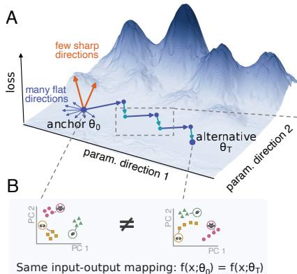

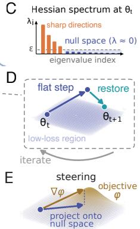  
Figure 1: Hessian Null Space Continuation (HNC) overview. (A) Around a trained network $\pmb { \theta } _ { 0 }$ (the anchor), the functionmatching loss Eq. 1 is sharp along a few directions and flat along many. HNC follows the flat directions to an alternative network ${ \pmb \theta } _ { T } ^ { - }$ within the connected low-loss region. (B) The two networks share the same input-output mapping, but their hidden-state representations of the same inputs can differ. (C) The Hessian spectrum at ${ \pmb \theta } _ { t }$ separates a few sharp directions from a high-dimensional null space with eigenvalues below a threshold €. (D) Each iteration takes a step within the null space (flat step), then re-minimizes the function-matching loss (restore), yielding $\pmb { \theta } _ { t + 1 }$ . (E) The flat step can be steered to optimize a differentiable objective φ by following its gradient projected onto the null space.

Qiu et al., 2026; Liang et al., 2026),

model merging (Wortsman et al., 2022; Ilharco et al., 2023), and post-hoc model editing (Meng et al., 2022; Mitchell et al., 2022).

To address these questions, we developed Hessian Null Space Continuation (HNC), a generic, model-agnostic method for identifying diverse solutions in neural networks. Starting from one base trained network (which we call the anchor), HNC explores a connected set of function-preserving alternatives using local curvature information. It can additionally be steered by the gradient of any differentiable function to find solutions with specific properties. In RNNs trained on a memory task, HNC transforms the canonical fixed-point solution of Sussillo & Barak (2013) into alternatives with qualitatively different geometry and dynamics. In ImageNet-trained Vision Transformers (ViTs), HNC finds nearby representations which differ more from the original network than any independently trained models of different architectures and training objectives, and even untrained models. This reveals substantial representational freedom inside neural networks underexplored by gradient training. We further extend HNC to reinforcement learning (RL), where it identifies policies that achieve comparable return through distinct behavioral strategies, including reward-hacking solutions. Together, our results show that an unexpectedly large amount of representational diversity (both in quantity and quality) exists near a single trained solution, which is unseen by standard optimization techniques. Our domain general method, HNC, can identify and quantify this diversity

## 2 METHOD

## 2.1 LOSS LANDSCAPE CURVATURE REVEALS FUNCTION-PRESERVING DIRECTIONS

Starting from a trained network $\pmb { \theta } _ { 0 }$ , the anchor, we seek networks with different internal representations but matched behavior. We operationalize this through the function-matching loss

$$
\begin{array} { r } { \mathcal { L } ( \pmb { \theta } ) = \frac { 1 } { 2 } \mathbb { E } _ { \pmb { x } \sim \mathcal { D } } \left[ \left\| f _ { \pmb { \theta } } ( \pmb { x } ) - f _ { \pmb { \theta } _ { 0 } } ( \pmb { x } ) \right\| ^ { 2 } \right] , } \end{array}\tag{1}
$$

which measures output drift from the anchor over an input distribution D. In practice, we estimate this expectation using a fixed set X sampled from $\mathcal { D } ,$ which we call the probe set. $\mathcal { L }$ is nonnegative and $\dot { \mathcal { L } } ( \dot { \pmb { \theta } } _ { 0 } ) = 0$ , so the anchor is a global minimizer and $\nabla \mathcal { L } ( \pmb { \theta } _ { 0 } ) = \mathbf { 0 }$ . A small weight perturbation δ thus changes the loss only at second order:

$$
\begin{array} { r } { \mathcal { L } ( \pmb { \theta } _ { 0 } + \pmb { \delta } ) = \frac { 1 } { 2 } \pmb { \delta } ^ { \top } \pmb { H } \pmb { \delta } + O ( \Vert \pmb { \delta } \Vert ^ { 3 } ) , \qquad \pmb { H } = \nabla _ { \pmb { \theta } } ^ { 2 } \mathcal { L } ( \pmb { \theta } _ { 0 } ) . } \end{array}\tag{2}
$$

The eigenvalues of H therefore measure the network's local sensitivity to parameter change along different parameter directions. Large eigenvalues identify sharp directions along which the network outputs change rapidly, whereas near-zero eigenvalues identify flat directions with little output drift. We define their span, $\dot { \mathcal { V } } _ { 0 } = \operatorname { s p a n } \{ \pmb { v } _ { i } : \lambda _ { i } \leq \bar { \epsilon } \}$ , as the approximate null space. In trained networks, the Hessian typically has a few large eigenvaíues and many near-zero eigenvalues, so this approximate null space often spans a substantial fraction of the parameter dimensions (Sagun et al., 2017; Gur-Ari et al., 2018; Liang et al., 2026). Locally, $\mathcal { V } _ { 0 }$ consists of directions along which HNC can move the weights while approximately preserving the network function, allowing it to search for solutions with different internal representations. We discuss our choice of € later in Section 2.2.1.

## 2.2 HESSIAN NULL SPACE CONTINUATION

A single step within $\mathcal { V } _ { 0 }$ explores only the immediate neighborhood of the anchor. Exploring the function-preserving parameter set more extensively therefore requires a multi-step procedure. However, because the Hessian provides only a second-order approximation to the function-matching loss in Eq. 1, even a step along an eigenvector with zero eigenvalue can change the loss through higherorder terms neglected by Eq. 2. Moreover, the Hessian is a local approximation and its null space may cease to align with the flat directions away from $\theta _ { 0 }$

HNC addresses both points by alternating between a null space step and a function restoration step (Fig. 1). At each iteration t, we (1) take a small step within the current null space $\mathcal { V } _ { 0 } .$ , and then (2) restore function matching by taking a few gradient-descent steps on the loss in Eq. 1:

$$
\tilde { { \pmb { \theta } } } _ { t } = { \pmb { \theta } } _ { t } + \eta { \pmb { d } } _ { t } , \qquad { \pmb { \theta } } _ { t + 1 } = \tilde { { \pmb { \theta } } } _ { t } - \alpha \nabla \mathcal { L } \big ( \tilde { { \pmb { \theta } } } _ { t } \big ) ,\tag{3}
$$

where $\mathbf { \Phi } _ { d _ { t } } \in \mathcal { V } _ { 0 }$ is the step direction sampled uniformly from $\mathcal { V } _ { 0 }$ , and η, α are the step sizes. For clarity, Eq. 3 shows a single restoration gradient step, and in practice we apply m such steps. The restoration step corrects the higher-order drift introduced by the preceding null space step. When the loss after a function restoration step exceeds a threshold, $\mathcal { L } ( \boldsymbol { \theta } _ { t + 1 } ) > \tau$ , this indicates that our linear approximation by the Hessian has become a poor fit of the local loss landscape. In these instances, we (3) relinearize by recomputing the Hessian null space at the current weights. We repeat this procedure until reaching either a prespecified number of steps or an alternative solution with the desired properties. In this way, HNC can move far from the anchor, while keeping $\mathcal { L }$ close to zero throughout. At a high level, HNC shares conceptual similarity with the classical predict-correct structure of the numerical continuation method, which traces a curve by taking a small step along its local tangent and then correcting back onto the curve (Keller, 1977; Allgower & Georg, 2003).

## 2.2.1 FORMING THE NULL SPACE

Because the function-matching loss has its exact minimum at $\theta _ { 0 } ,$ its Hessian there is positive semidefinite, with all eigenvalues nonnegative (Appendix B). The null space $\mathcal { V } _ { 0 }$ is therefore the span of the eigenvectors with the numerically smallest eigenvalues. For a network with $P$ parameters, H is a $P \times P$ matrix and is too large to store or eigendecompose directly. We compute the k smallest eigenpairs using the locally optimal block preconditioned conjugate gradient method (LOBPCG; Appendix $_ { \mathrm { A . 2 ; } }$ Knyazev, 2001), which uses Hessian-vector products computed through automatic differentiation without explicitly forming the Hessian (Pearlmutter, 1994). Time and memory then scale as $\mathcal { O } ( k P )$ rather than $\mathcal { O } ( \bar { P } ^ { 3 } )$ and $\bar { \mathcal { O } } ( P ^ { 2 } )$ . A direction counts as flat when $\lambda _ { i } \leq \mu _ { \mathrm { r e l } } \lambda _ { 1 }$ , where $\lambda _ { 1 }$ is the largest Hessian eigenvalue at the current linearization point and $\mu _ { \mathrm { r e l } } \in \lbrack \mathrm { i 0 ^ { - 7 } , 1 0 ^ { - 3 } } ]$ is a relative threshold chosen per experiment. Because the threshold is relative, the null space is recomputed at every linearization. Sweeps over $\mu _ { \mathrm { r e l } }$ are presented in Appendix F.2 and Appendix C.

## 2.2.2 STEERING

HNC can be steered to optimize a differentiable objective $\varphi$ while preserving the network's outputs, through projecting its gradient $\nabla \varphi$ onto the Hessian null space. To retain $\nabla \varphi$ along flat parameter directions and suppress those along sharp directions, we use a soft projection. Specifically, we rescale the gradient component along each Hessian eigenvector ${ \mathbf { } } v _ { i }$ by $1 \bar { / } ( 1 + \lambda _ { i } / \bar { \mu } )$ , where $\lambda _ { i }$ is its eigenvalue and $\mu > 0$ is a damping parameter: components along flat directions $( \lambda _ { i } \ll \mu )$ pass through, while those along sharp directions $( \lambda _ { i } \gg \mu )$ are suppressed. Since the gradient component along the eigenvector ${ \mathbf { } } v _ { i }$ is $( \pmb { v } _ { i } ^ { \top } \nabla \varphi ) \pmb { v } _ { i } ,$ rescaling each component and summing over parameter directions therefore gives $\begin{array} { r } { \pmb { d } = \sum _ { i } \frac { \pmb { v } _ { i } ^ { \mathrm { ~ I ~ } } \nabla \varphi } { 1 + \lambda _ { i } / \mu } \pmb { v } _ { i } = ( \pmb { I } + \pmb { H } / \mu ) ^ { - 1 } \nabla \varphi . } \end{array}$ This matrix form allows us to bypass the need to explicitly construct the eigenbasis of the Hessian. We set the damping factor to the flatness threshold of Sec. 2.2.1, $\mu = \mu _ { \mathrm { r e l } } \lambda _ { 1 }$ , so that a single hyperparameter $\mu _ { \mathrm { r e l } }$ defines both which directions count as flat and which gradient directions are retained through soft projection.

## 3 HNC DRIVES RNNS TO LEARN DRASTICALLY DIFFERENT DYNAMICS IN A MEMORY TASK

We first applied HNC to small, interpretable RNNs trained on a memory task. RNN computations can be analyzed as a dynamical system: hidden-state trajectories and stable states reveal how networks store and update information (Sussillo & Barak, 2013; Mante et al., 2013). We use the 3-Bit Flip-Flop (3BFF) task from computational neuroscience (Sussillo & Barak, 2013), in which networks maintain three binary memories, each storing the last nonzero input on one input-output channel (Fig. 2A, left). We trained 64-unit tanh RNNs using backpropagation through time (BPTT) and the Adam optimizer to minimize the mean-squared error between target and network outputs. After training, the networks represented the $2 ^ { 3 } = { 8 }$ memory states as eight stable fixed points, which are hidden-states that remain unchanged when the input is turned off. These fixed points formed the vertices of a three-dimensional cube in activation space (Fig. 2A, right). The Hessian spectrum falls from a few sharp directions into a broad near-zero bulk, with a participation ratio of about 23 across the five anchors (Appendix F.2, Fig. 15).

Next, we aim to characterize both alternative 3BFF solutions accessible through undirected null space exploration, and those that differ maximally from the anchor. For the latter, we steer toward maximizing one of two dissimilarity metrics: the CKA distance, defined as $1 - \mathrm { C K A }$ , which measures how much the representational geometry (the kernel of the hidden activations) has changed (Kornblith et al., 2019), or the DSA distance, which measures how much the recurrent dynamics have changed up to invertible transformations (Ostrow et al., 2023; 2026). We applied HNC to five trained networks (the “anchors") with adaptive step size and periodic relinearization (see Appendix F.3 for details). All HNC walks maintain task loss below 0.01, while steered walks steadily increase representational and dynamical distances from their respective anchors (Fig. 2B). While undirected walks reach representational and dynamical distances comparable to those between independently trained networks, steered walks consistently achieve greater divergence with less weight movement. During undirected exploration, the eight fixed points disappeared, replaced by a continuous manifold with eight distinct regions, one for each memory state (Fig. 2C). Meanwhile, the CKAand DSA-steered HNC walks altered the number of fixed points within the network and produced visually distinct state space structure as shown in Fig. 2C.

A  
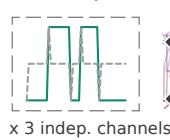

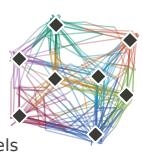

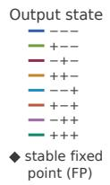

B  
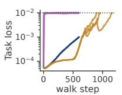  
CKA-steered  DSA-steered  undirected ... loss threshold seed pairs

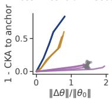

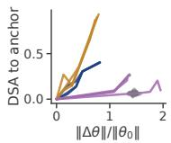

C  
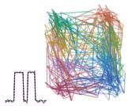

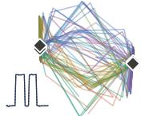

D  
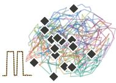

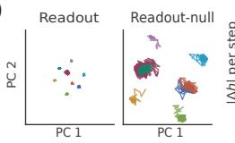

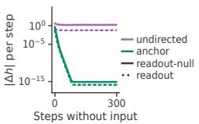

E  
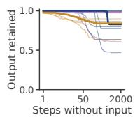

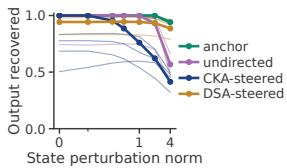

F  
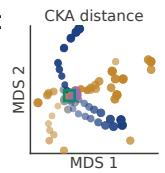

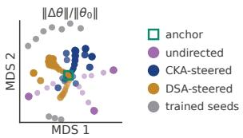  
Figure 2: HNC drives RNNs to learn drastically different dynamics in a memory task. (A) The 3-bit flip-flop task and the anchor's solution. Left: one input channel and the corresponding output, where the output holds the last nonzero input. Right: hidden-state trajectories of the trained anchor projected onto their top three principal components, colored by the output state, with the eight stable fixed points (black diamonds) at the vertices of a cube. (B) Undirected, CKA-steered, and DSA-steered HNC walks from the same anchor. Left: task loss plotted against the walk step. Middle and right: representational (1 — CKA) and dynamical (DSA) distance to the anchor against relative weight movement. (C) Hidden-state trajectory projected onto their top three principles components, and output traces from networks reached during the HNC walks. (D) Left and middle: hidden states of the undirected endpoint during input-free memory periods, projected onto the top two PCs of the readout and readout-null subspaces, colored by output state as in (A). Right: per-step hiddenstate movement in the readout (dotted) and readout-null (solid) subspaces. (E) Fraction of output retained over increasing steps without input (left) and recovered after hidden-state perturbations (right). Thick lines: networks shown in (C); thin lines: endpoints of other independent HNC walks and the other trained anchors. (F) MDS embeddings of 131 networks (the anchor, ten independently trained seeds, and all checkpoints from three HNC walks of each type), using pairwise representational distance (1 — CKA, left) or relative weight distance (right). Marker size and opacity increase along each walk.

To understand how the alternative networks maintain memory, we examined the network reached during the undirected exploration. During input-free memory periods, its hidden-states form eight compact points in the readout subspace but continue moving within eight distinct clusters in the readout-null subspace (Fig. 2D, left and middle). Further quantifying the speed of hidden-state movement, the alternative solution's hidden-state continues to drift without input, mainly in the readout null space (Fig. 2D, right). Thus, this network maintains memory within distinct regions of state-space rather than at fixed points, preserving stable outputs despite ongoing internal dynamics. We further assessed the alternative solution's memory retention and robustness to perturbations, showing that the CKA-steered endpoint is less robust to hidden-state perturbations, whereas the DSA-steered endpoint shows memory drift during prolonged memory periods (Fig. 2E). This highlights that even networks with matching in-distribution input-output mappings can behave differently under extended or perturbed conditions. Finally, to visualize the structure of the solution set reached by HNC, we computed multidimensional scaling (MDS) embeddings of 131 networks, based on pairwise representational distance (1 – CKA) or relative weight distance (Fig. 2F). These networks comprise the anchor, all checkpoints from three HNC walks of each type (undirected, CKA-steered, DSA-steered), and ten independently trained seeds. All networks solve the task with accuracy above 0.999. In representation space, the independently trained and undirected-walk networks sit close to the anchor, while the steered walks extend far beyond them into different parts of the solution space. In weight space, by contrast, the steered walks stay closer to the anchor than both the undirected walks and the spread among independent seeds, demonstrating a clear decoupling of representational from weight-space distance. The solutions do not collapse onto a single tight cluster in representation space, highlighting the diversity of solutions accessible by HNC within the connected low-loss region around one trained network.

## 4 HNC REVEALS UNDEREXPLORED DEGREES OF FREEDOM IN VITS

The Platonic Representation Hypothesis (PRH) (Huh et al., 2024) argues that representations become increasingly similar across models as models scale and tasks get harder. Huh et al. (2024) attribute this to a convergence to the shared underlying “platonic" representation of reality that models approach. Here, we ask how much representational freedom remains within a trained model when its function is held approximately fixed. To test this, we take a ViT-S/16 (22M parameters, Dosovitskiy et al. (2021)) pretrained on ImageNet classification and search for maximally different representations at preserved input-output mapping. Concretely, we applied HNC to the pretrained ViT and steered to minimize the max-over-layers CKA similarity between the alternative representation and the anchor. In Appendix G.3, steering against the max-over-layers mutual k-nearest-neighbor (kNN) score, the metric used in Huh et al. (2024), gives the same qualitative results.

A  
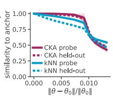  
B

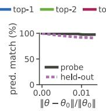

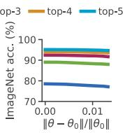

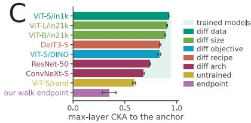

D  
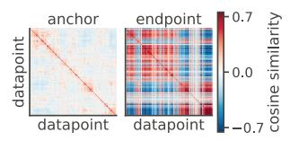  
E

F  
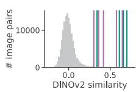

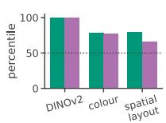

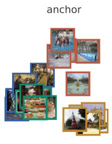

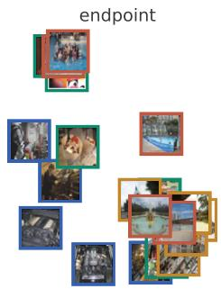  
Figure 3: HNC reveals representational freedom underexplored by gradient descent in ViTs. (A) Maxover-layers CKA and k-nearest-neighbor (kNN) to the anchor along the HNC walk, both on images it was steered on (the probe set) and on images never seen during HNC (the held-out set). (B) Left: agreement between the anchor and HNC endpoint's predictions on Places-365 images. Right: top-1 to top-5 ImageNet accuracy. (C) Max-over-layers CKA to the anchor, between our HNC endpoint, an untrained ViT, and seven trained models. In (A-C), lines show the mean and shaded bands indicate ±1 s.d. across five random probe sets. (D) Pairwise cosine similarities between penultimate-layer representations of probe set images, for the anchor and one HNC endpoint. (E) Multidimensional scaling (MDS) embedding of the similarities in (D) for 20 images from 4 classes. (F) For both the anchor and HNC endpoint, we take the five image pairs represented as most similar, and score each pair's similarity on three attributes: semantic content (DINOv2 feature similarity), color, and spatial layout. Scores are percentiles among all pairs of probe images, where higher means the network's closest pairs share that attribute more than chance. Dashed line is the level of a random pair.

Starting from the pretrained ViT, we evaluated the anchor on 512 images from the Places-365 validation set (Zhou et al., 2018), the dataset on which the PRH was evaluated (Huh et al., 2024). The function-matching loss in Eq. 1 is evaluated over the anchor and alternative network's logits on these same images. We record the CLS-token features after every transformer block together with the final pre-logits features, and steer the walk to reduce the highest CKA between any layer of the alternative network and any layer of the anchor. Because the hard maximum is not differentiable, we steer using a smooth softmax CKA surrogate while reporting the hard maximum CKA throughout (Appendix G.1). During HNC, the representational similarity between the anchor and the alternative network falls steadily, both on the images the walk was steered on (the probe set) and on images never seen during HNC (the held-out set) (Fig. 3A). The max-over-layers kNN score also falls to a comparable extent even though the walk never steers it directly (Fig. 3A), indicating that HNC reorganizes its image representations in general rather than exploiting a particular metric on a particular image set. Throughout the walk, the alternative networks keep the anchor's top-1 predictions on the probe images. When evaluated on ImageNet, which was never used to constrain the HNC, the top-1 accuracy drops by less than 1% and top-5 accuracy remains nearly unchanged (Fig. 3B).

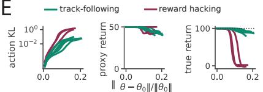

After applying HNC, the network's weights have changed by only 1.3% in norm, yet its resulting representations have become less similar to the anchor's than every trained vision model we compare against, spanning different sizes, architectures, training objectives, and training data (Fig. 3C). More remarkably, it is even less similar than comparing a randomly initialized ViT to the anchor (Fig. 3C). The pairwise cosine similarities between image representations on the probe set change drastically from the anchor to the HNC endpoint (Fig. 3D). A multidimensional scaling (MDS) embedding of 20 images from four classes further reveals that HNC reorganizes the neighborhood structure both within and across classes (Fig. 3E). To identify which aspects of visual similarity change, we select the five most similar image pairs in the anchor and HNC endpoint. We then score each pair's similarity based on either their semantic content (DINOv2), color composition, or spatial layout (Appendix G.2). Like the anchor, the HNC endpoint's most similar image pairs remain close in semantic content and color. However, they have lower spatial-layout similarity, approaching the random-pair baseline (Fig. 3F), indicating that the endpoint can represent images with different spatial layouts as similar. Overall, HNC reveals substantial representational freedom within a single model that is underexplored by standard gradient-based training, even in ViTs trained on challenging tasks. This suggests that rather than interpreting cross-model convergence as evidence for a unique underlying representation fully specified by the task, the observed similarity may arise due to an optimization bias that samples a narrow subset of solutions.

## 5 HNC FINDS BEHAVIORALLY DISTINCT, HIGH-REWARD POLICIES INREINFORCEMENT LEARNING

## Plume Tracking

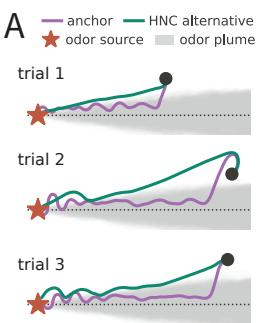  
C

B  
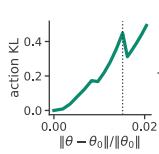

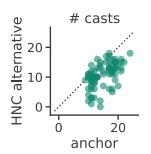

D  
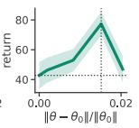

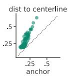  
E  
Figure 4: HNC finds behaviorally distinct, high-reward policies in RL. (A) Plume Tracking task where the agents navigate to the source of an odor plume, which travels away from the source under the dynamics of the wind in the environment. Anchor and alternative policy's navigation trajectory are shown for three trials. (B) Action divergence and return plotted against relative weight change during HNC (dotted vertical line: the policy that we analyze in (A) and (C)). (C) Number of casts, defined as the number of times the agent sweeps across the wind and reverses its heading direction, and mean distance from the plume centerline for 240 shared initial conditions. (D) Boat race task. The proxy reward gives +3 for entering an arrow tile clockwise; the true return measures net clockwise progress around the track but is hidden to the agent during standard training. The anchor follows the track as intended, while HNC exposes a reward-hacking policy that steps on and off a single arrow tile, collecting the proxy reward without making clockwise progress. (E) Action divergence. proxy return, and true return plotted against relative weight change during HNC for ten seeds.

Unlike supervised learning, where the target output for each data sample is precisely defined, in reinforcement learning (RL), the scalar reward rarely fully specifies the optimal sequences of actions over an episode. This underspecification can admit many behaviorally distinct policies with similar reward level, even unintended strategies that exploit the reward function rather than accomplish the intended task, a phenomenon known as reward hacking. We therefore apply HNC to search for behaviorally distinct solutions that achieve comparable return to a trained policy.

Let $\pi _ { \theta _ { 0 } }$ be the policy anchor. We seek weights θ whose actions differ from the anchor's while the return is unchanged. The true reward function is usually unknown, but from an agent's perspective, the return can be approximated by the off-policy importance sampling surrogate. Given a buffer of state-action pairs $\{ ( s _ { i } , a _ { i } ) \} _ { i = 1 } ^ { N }$ collected from rollouts of the anchor policy, we aim to preserve the surrogate reward $\begin{array} { r c l } { { \phi _ { R } ( \theta ) } } & { { = } } & { { \frac { 1 } { N } \sum _ { i } \frac { \pi _ { \theta } ( a _ { i } | s _ { i } ) } { \pi _ { \theta _ { 0 } } ( a _ { i } | s _ { i } ) } A _ { i } ^ { 0 } } } \end{array}$ , where $\pi _ { \theta _ { 0 } } ( a _ { i } \mid s _ { i } )$ denotes the probability of taking action $a _ { i }$ in state $s _ { i }$ and $A _ { i } ^ { 0 }$ is the advantage of sample i estimated from the buffer rollouts (Appendix I.1). We find maximally different policies by steering the null space walk to maximize the behavioral divergence, defined by the KL divergence between the action distributions of the anchor and the alternative policy on the buffer states: $\begin{array} { r l r } { \phi _ { B } ( \theta ) } & { = } & { \frac { 1 } { N } \sum _ { i = 1 } ^ { N } D _ { \mathrm { K L } } \big ( \pi _ { \theta _ { 0 } } ( \cdot \ | \ s _ { i } ) \ \big | \big | \ \pi _ { \theta } ( \cdot \ | \ s _ { i } ) \big ) } \end{array}$ We periodically recollect the state-action buffer from the current policy to account for the changing state distribution, and recompute the surrogate reward and its null space along the walk. Details for continuous and discrete action spaces are provided in Appendix I.2.

We applied HNC on Plume Tracking (Singh et al., 2023) and AI Safety Gridworld (Leike et al. 2017) environment; additional MuJoCo results are provided in Appendix I.7. On the Plume Tracking task (Singh et al., 2023) (Fig. 4A), RNNs simulating artificial flies are trained by deep RL to navigate to the source of a turbulent odor plume in a windy 2D arena. Trained artificial flies resemble real flies by surging upwind when they detect odor and casting (sweeping back and forth across the wind) after losing it (Singh et al., 2023) (Fig. 4A). Over the HNC, the action divergence between anchor and the alternative network steadily increases, while the episode return and the success rate (Appendix I.4) are maintained, even increased early in the walk (Fig. 4B). The alternative policy solves the task in a visibly different way: instead of surging straight into the plume, the agent slides to the edge of the plume and smoothly tracks it (Fig. 4A). Behavioral quantification confirms that the alternative policy casts less and on average stays farther from the centerline of the plume (Fig. 4C; details in Appendix I.4). Strikingly, when evaluated on out-of-distribution conditions with sparse odor or switching wind direction, the alternative policy outperforms the anchor (Appendix I.5).

We next ask whether HNC can expose reward-hacking policies near a well-behaved solution in the AI Safety Gridworlds environment (Leike et al., 2017). In the boat race task, an agent earns a proxy reward of +3 each time it enters an arrow tile clockwise (Fig. 4D). The true return, which the agent never sees, instead measures net clockwise progress. The proxy therefore admits a known exploit: stepping on and off a single arrow tile collects the proxy reward repeatedly without net progress. We train MLP policies with PPO on the true return, which yields track-following behavior in all 10 seeds (Appendix I.6). Starting from these anchors, we use HNC to search for behaviorally distinct policies while preserving the proxy return. Behavioral divergence increases steadily along every null space walk, and the endpoints separate into two clusters (Fig. 4E). The three most divergent endpoints adopt the reward-hacking strategy, where their net clockwise progress falls to zero. Figure 4D contrasts the state occupancy of an anchor and its HNC endpoint, showing a transition from trackfollowing to oscillation around a single arrow. Overall, these results demonstrate that HNC can find behaviorally distinct yet reward-matched policies nearby in weight space in RL-trained networks, and can expose the underspecification in reward design that admits reward hacking solutions.

## 6 HNC MEASURES LOSS LANDSCAPE GEOMETRY

Beyond finding alternative solutions, HNC provides two complementary measures of loss-landscape geometry: the Hessian characterizes the local geometry at an anchor, while the null space walk tracks how that geometry changes along a trajectory. We use these measurements to ask how model size and task complexity shape the solution set. Previous work has addressed this question through loss barriers between independently trained networks (Garipov et al., 2018; Draxler et al., 2018; Frankle et al., 2020; Entezari et al., 2022), or through stylized theoretical models (Cooper, 2018; Simsek et al., 2021). HNC instead enables direct measurements from a single trained network. Here, we train CNNs on CIFAR-100 subsets while varying network width and the number of classes, our proxy for task complexity (Appendix J.1).

We first estimate the effective null fraction, the fraction of parameter directions along which a small step leaves the outputs approximately unchanged. We set the spectral cutoff using a common function-

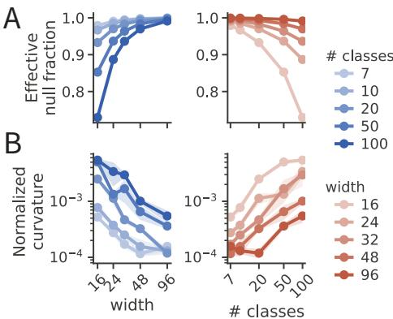  
Figure 5: Model size and task difficulty shape local flatness and curvature. (A) Effective null fraction as a function of model width and task difficulty (number of image classes). (B) Normalized curvature along HNC-stepped directions. Curvature is summarized by the median over steps within each walk. Shading indicates standard error across 3 seeds.

drift tolerance, where a step of 1% of the weight norm along a flat direction raises the functionmatching loss in Eq. 1 by at most € = 0.05 (Appendix J). This ties the cutoff to an interpretable output-drift tolerance, allowing comparisons across conditions with different overall Hessian scales. The trends below hold across different magnitudes of ε (Appendix J.2). The effective null fraction grows with width and shrinks with the number of classes (Fig. 5A). Nevertheless, even the smallest network on the hardest task retains a large effective null fraction. We next ask whether smaller networks and harder tasks instead increase the functional cost of moving along these directions.

We therefore measured the normalized curvature along the HNC walk, $d ^ { \top } H d / ( n C )$ , where d is a unit-norm step direction, n is the number of probe inputs, and C is the number of output classes. This quantity measures how sensitive the outputs are to small weight changes along d. To avoid constraining the output sensitivity, we replaced the output-drift cutoff with a common relative flatness threshold, $\mu \stackrel { - } { = } 1 0 ^ { - 6 } \lambda _ { \operatorname* { m a x } } .$ Normalized curvature generally increases with task complexity and decreases with width (Fig. 5B), and these trends persist across the relative thresholds tested (Appendix J.3). Although approximately flat directions remain abundant across the sweep, the directions HNC follows become more sensitive to weight changes on harder tasks. This indicates that the landscape around a local minimum stiffens and increases in curvature for harder tasks, thereby providing a potential mechanism for prior work that suggests that the loss landscape fragments into separate basins as tasks get harder (Frankle et al., 2020; Entezari et al., 2022; Simsek et al., 2021).

## 7 DISCUSSION

We introduced Hessian Null Space Continuation (HNC), a scalable, domain-agnostic method for traversing the connected solution space around a trained network while preserving its input-output mapping. Across RNNs, Vision Transformers, and reinforcement-learning policies, HNC uncovered solutions with substantially different representations, dynamics, and behavioral strategies. It also provided local geometric measurements of the solution set, revealing how model size and task complexity shape its dimension and functional sensitivity.

Our geometric results in Section 6 complement Huang et al. (2025), which found that harder tasks reduce variability in neural dynamics across independently trained RNNs. They also found that inter-model variability decreases with model size, whereas our results show that larger models have larger null spaces on the same task. Together, these findings suggest that larger models admit more alternative solutions within a local region of weight space, even as training converges to a more narrow subset of them. This is consistent with the stronger simplicity bias of large models proposed to explain representational convergence across models (Huh et al., 2024). Prior work has shown that parameter symmetries and reparameterizations can also reorganize representations while preserving function (Theiss et al., 2026a;b). However, the diverse solutions found by HNC go beyond reparameterizations of a trained solution: they involve qualitative changes in the network's dynamical regime, altered out-of-distribution generalization, and qualitatively distinct behavioral strategies. Moreover, whereas the parameter symmetries studied by Theiss et al. (2026a) involve discrete operations that may change the size of the network, such as neuron duplication, HNC makes continuous, small changes to the weights of a trained network to reach distinct solutions.

One limitation of HNC is that function preservation is approximate and enforced on a finite probe set. Small function-matching loss therefore does not guarantee output agreement on unseen inputs, particularly under distribution shift. The diversity accessible to HNC depends on both probe coverage and the allowed output drift, making held-out functional evaluation important when interpreting the resulting alternatives (Appendix F.8, G.5, G.6). HNC is also a local search algorithm, making it agnostic to the existence of multiple solution basins. However, we found that alternating with a global method such as that in Ostrow et al. (2026) enables broader search (Appendix E).

Beyond the input-output mapping, the preserved quantity can be any differentiable function of the network. Replacing the function-matching loss with the task loss would instead allow HNC to explore the broader set of task-compatible networks (Appendix D). The steering objective is equally flexible and could encode performance on a second task to obtain multitask networks or alignment with neural data (Appendix H). The same Hessian spectrum also provides a complementary prescription when the goal is to change the network's function: flat directions preserve the function, whereas sharp directions are most effective for changing it (Gan & Isola, 2026; Liang et al., 2026).

More broadly, HNC allows us to constructively explore the solution space and compare the particular solution reached by training with the function-preserving alternatives around it. This comparison helps distinguish properties demanded by the task from those specific to an individual training run (D’Amour et al., 2022; Fisher et al., 2019). In this respect, HNC enables empirical studies of the optimizer's implicit bias and complements approaches that estimate implicit regularization from discrepancies between weight updates and loss gradients (Rudoler et al., 2026) or from the displacement of Hessian eigenvectors during training (Marjankowska et al., 2026). Our method could also be further scaled to large language models, for which second-order information has already been used to improve optimization (Martens & Grosse, 2015; George et al., 2018; Liu et al., 2024; Grosse et al., 2023). Finally, the function-preserving solutions exposed by HNC provide a natural geometric setting for model merging, fine-tuning, and editing (Wortsman et al., 2022; Ilharco et al., 2023; Ainsworth et al., 2023; Meng et al., 2022; Mitchell et al., 2022; Gan & Isola, 2026), as well as for auditing reward specifications by uncovering behaviorally distinct or reward-hacking policies (Amodei et al., 2016; Leike et al., 2017; Skalse et al., 2022).

## ACKNOWLEDGMENTS

Funded by NIH (RF1DA056403 to K.R.), James S. McDonnell Foundation (220020466 to K.R.), Simons Foundation (Pilot Extension-00003332-02 to K.R.), McKnight Endowment Fund (K.R.), CIFAR Azrieli Global Scholar Program (K.R.), NSF (2046583 to K.R.), Harvard Medical School Neurobiology Lefler Small Grant Award (K.R.), Harvard Medical School Dean's Innovation Award (K.R.), and Army Research Office (W911NF-26-1-A201 to W.T.R.) A.H is supported by the Kempner Graduate Fellowship. M.O. is funded by the NSF GRFP.

A.H. wishes to give special thanks to Binxu Wang, Flavio Martinelli, Billy Qian, Tatiana Engel, Daniel Yamins, Satpreet Singh, and all members of the Rajan Lab for helpful discussions. W.T.R. thanks Yannis Kevrekidis for inspiring interest in different solutions.

## REFERENCES

Armen Aghajanyan, Sonal Gupta, and Luke Zettlemoyer. Intrinsic Dimensionality Explains the Effectiveness of Language Model Fine-Tuning. In Chengqing Zong, Fei Xia, Wenjie Li, and Roberto Navigli (eds.), Proceedings of the 59th Annual Meeting of the Association for Computational Linguistics and the 11th International Joint Conference on Natural Language Processing (Volume 1: Long Papers), pp. 7319–7328, Online, August 2021. Association for Computational Linguistics. doi: 10.18653/v1/2021.acl-long.568. URL https://aclanthology.org/ 2021.acl-long.568/.

Samuel K Ainsworth, Jonathan Hayase, and Siddhartha Srinivasa. Git re-basin: Merging models modulo permutation symmetries. In International Conference on Learning Representations (ICLR), 2023. URL https://openreview.net/forum?id=CQsmMYmlP5T. arXiv:2209.04836.

Eugene L Allgower and Kurt Georg. Introduction to Numerical Continuation Methods. Classics in Applied Mathematics. Society for Industrial and Applied Mathematics, Philadelphia, 2003. doi: 10.1137/1.9780898719154.

Dario Amodei, Chris Olah, Jacob Steinhardt, Paul Christiano, John Schulman, and Dan Mané. Concrete problems in AI safety. arXiv preprint arXiv:1606.06565, 2016. URL https: //arxiv.org/abs/1606.06565.

Sanjeev Arora, Nadav Cohen, Wei Hu, and Yuping Luo. Implicit regularization in deep matrix factorization. In Advances in Neural Information Processing Systems, volume 32, 2019.

Lukas Braun, Erin Grant, and Andrew M. Saxe. Not all solutions are created equal: An analytical dissociation of functional and representational similarity in deep linear neural networks. In Proceedings of the 42nd International Conference on Machine Learning, volume 267 of Proceedings of Machine Learning Research, pp. 5355–5382. PMLR, 2025. URL https : //proceedings.mlr.press/v267/braun25a.html.

Rosa Cao and Daniel Yamins. Explanatory models in neuroscience, part 2: Functional intelligibility and the contravariance principle. Cognitive Systems Research, 85:101200, 2024. doi: 10.1016/j. cogsys.2023.101200.

Pratik Chaudhari, Anna Choromanska, Stefano Soatto, Yann LeCun, Carlo Baldassi, Christian Borgs, Jennifer Chayes, Levent Sagun, and Riccardo Zecchina. Entropy-SGD: Biasing gradient descent into wide valleys. In International Conference on Learning Representations, 2017. URLhttps://openreview.net/forum?id=B1YfAfcgl.

David G Clark, Blake Bordelon, Jacob A Zavatone-Veth, and Cengiz Pehlevan. Structure, disorder and dynamics in task-trained recurrent neural circuits. bioRxiv, 2026. doi: 10.64898/2026.03.02. 708943.

Yaim Cooper. The loss landscape of overparameterized neural networks. arXiv preprint arXiv:1804.10200,2018.URLhttps://arxiv.org/abs/1804.10200.

Alexey Dosovitskiy, Lucas Beyer, Alexander Kolesnikov, Dirk Weissenborn, Xiaohua Zhai, Thomas Unterthiner, Mostafa Dehghani, Matthias Minderer, Georg Heigold, Sylvain Gelly, Jakob Uszkoreit, and Neil Houlsby. An image is worth 16x16 words: Transformers for image recognition at scale. In International Conference on Learning Representations, 2021.

Felix Draxler, Kambis Veschgini, Manfred Salmhofer, and Fred A. Hamprecht. Essentially no barriers in neural network energy landscape. In Proceedings of the 35th International Conference on Machine Learning, volume 80 of Proceedings of Machine Learning Research, pp. 1309–1318. PMLR,2018.URL https://proceedings.mlr.press/v80/draxler18a.html.

Alexander D'Amour, Katherine Heller, Dan Moldovan, Ben Adlam, Babak Alipanahi, Alex Beutel, Christina Chen, Jonathan Deaton, Jacob Eisenstein, Matthew D Hoffman, Farhad Hormozdiari, Neil Houlsby, Shaobo Hou, Ghassen Jerfel, Alan Karthikesalingam, Mario Lucic, Yian Ma, Cory McLean, Diana Mincu, Akinori Mitani, Andrea Montanari, Zachary Nado, Vivek Natarajan, Christopher Nielson, Thomas F Osborne, Rajiv Raman, Kim Ramasamy, Rory Sayres, Jessica

Schrouff, Martin Seneviratne, Shannon Sequeira, Harini Suresh, Victor Veitch, Max Vladymyrov, Xuezhi Wang, Kellie Webster, Steve Yadlowsky, Taedong Yun, Xiaohua Zhai, and D Sculley. Underspecification presents challenges for credibility in modern machine learning. Journal of Machine Learning Research, 23(226):1–61, 2022.

Rahim Entezari, Hanie Sedghi, Olga Saukh, and Behnam Neyshabur. The role of permutation invariance in linear mode connectivity of neural networks. In International Conference on LearningRepresentations (ICLR), 2022. URL https://openreview.net/forum?id= dNigytemkL. arXiv:2110.06296.

Yu Feng and Yuhai Tu. The inverse variance-flatness relation in stochastic gradient descent is critical for finding flat minima. Proceedings of the National Academy of Sciences, 118(9):e2015617118, 2021. doi: 10.1073/pnas.2015617118.

Aaron Fisher, Cynthia Rudin, and Francesca Dominici. All Models are Wrong, but Many are Useful: Learning a Variable's Importance by Studying an Entire Class of Prediction Models Simultaneously. Journal of Machine Learning Research, 20(177):1–81, 2019. URL https : //arxiv.org/abs/1801.01489v5.arXiv:1801.01489.

Jonathan Frankle, Gintare Karolina Dziugaite, Daniel M. Roy, and Michael Carbin. Linear mode connectivity and the lottery ticket hypothesis. In Proceedings of the 37th International Conference on Machine Learning, volume 119 of Proceedings of Machine Learning Research, pp. 3259– 3269.PMLR,2020. URL https://proceedings.mlr.press/v119/frankle20a. html.

C Daniel Freeman and Joan Bruna. Topology and geometry of half-rectified network optimization. In International Conference on Learning Representations (ICLR), 2017. URL https : //openreview.net/forum?id=Bk0FWVcgx.

Yulu Gan and Phillip Isola. Neural thickets: diverse task experts are dense around pretrained weights. arXiv preprint arXiv:2603.12228, 2026. URL https://arxiv.org/abs/2603. 12228.

Timur Garipov, Pavel Izmailov, Dmitrii Podoprikhin, Dmitry P. Vetrov, and Andrew Gordon Wilson. Loss surfaces, mode connectivity, and fast ensembling of DNNs. In Advances in Neural Information Processing Systems, volume 31, 2018.

Robert Geirhos, Kristof Meding, and Felix A. Wichmann. Beyond accuracy: Quantifying trial-bytrial behaviour of CNNs and humans by measuring error consistency. In Advances in Neural Information Processing Systems, volume 33, 2020.

Thomas George, César Laurent, Xavier Bouthillier, Nicolas Ballas, and Pascal Vincent. Fast approximate natural gradient descent in a kronecker-factored eigenbasis. In Advances in Neural Information Processing Systems, volume 31, 2018.

Behrooz Ghorbani, Shankar Krishnan, and Ying Xiao. An investigation into neural net optimization via Hessian eigenvalue density. In Proceedings of the 36th International Conference on Machine Learning, volume 97 of Proceedings of Machine Learning Research, pp. 2232–2241. PMLR, 2019.URLhttps://proceedings.mlr.press/v97/ghorbani19b.html.

Mark S. Goldman. Memory without feedback in a neural network. Neuron, 61(4):621– 634, 2009. ISSN 0896-6273. doi: 10.1016/j.neuron.2008.12.012. URL https://www. sciencedirect.com/science/article/pii/S0896627308010830.

Roger Grosse, Juhan Bae, Cem Anil, Nelson Elhage, Alex Tamkin, Amirhossein Tajdini, Benoit Steiner, Dustin Li, Esin Durmus, Ethan Perez, Evan Hubinger, Kamilė Lukošiūtė, Karina Nguyen, Nicholas Joseph, Sam McCandlish, Jared Kaplan, and Samuel R. Bowman. Studying large language model generalization with influence functions. arXiv preprint arXiv:2308.03296, 2023. URLhttps://arxiv.org/abs/2308.03296.

Suriya Gunasekar, Blake E Woodworth, Srinadh Bhojanapalli, Behnam Neyshabur, and Nati Srebro. Implicit regularization in matrix factorization. In Advances in Neural Information Processing Systems, volume 30, 2017.

Guy Gur-Ari, Daniel A Roberts, and Ethan Dyer. Gradient descent happens in a tiny subspace. arXiv preprint arXiv:1812.04754,2018.URL https://arxiv.org/abs/1812.04754.

Dan Hendrycks, Steven Basart, Norman Mu, Saurav Kadavath, Frank Wang, Evan Dorundo, Rahul Desai, Tyler Zhu, Samyak Parajuli, Mike Guo, Dawn Song, Jacob Steinhardt, and Justin Gilmer. The many faces of robustness: A critical analysis of out-of-distribution generalization. In Proceedings of the IEEE/CVF International Conference on Computer Vision (ICCV), pp. 8320–8329, 2021. doi: 10.1109/ICCV48922.2021.00823.

Magnus R. Hestenes and Eduard Stiefel. Methods of conjugate gradients for solving linear systems. Journal of Research of the National Bureau of Standards, 49(6):409–436, 1952.

Edward J. Hu, Yelong Shen, Phillip Wallis, Zeyuan Allen-Zhu, Yuanzhi Li, Shean Wang, Lu Wang, and Weizhu Chen. LoRA: Low-rank adaptation of large language models. In International Conference on Learning Representations (ICLR), 2022. URL https : //openreview. net/ forum?id=nZeVKeeFYf9.

Ann Huang, Satpreet H. Singh, Flavio Martinelli, and Kanaka Rajan. Measuring and controlling solution degeneracy across task-trained recurrent neural networks. In Advances in Neural Information Processing Systems, volume 38, pp. 116632–116677, 2025. doi: 10.52202/085713-3517.

Minyoung Huh, Hossein Mobahi, Richard Zhang, Brian Cheung, Pulkit Agrawal, and Phillip Isola. The low-rank simplicity bias in deep networks. Transactions on Machine Learning Research, 2023.

Minyoung Huh, Brian Cheung, Tongzhou Wang, and Phillip Isola. Position: The platonic representation hypothesis. In Proceedings of the 41st International Conference on Machine Learning, volume 235 of Proceedings of Machine Learning Research, pp. 20617–20642. PMLR, 2024. URL https://proceedings.mlr.press/v235/huh24a.html.

Gabriel Ilharco, Marco Tulio Ribeiro, Mitchell Wortsman, Suchin Gururangan, Ludwig Schmidt, Hannaneh Hajishirzi, and Ali Farhadi. Editing models with task arithmetic. In International Conference on Learning Representations (ICLR), 2023. URL https : //openreview . net/ forum?id=6t0Kwf8-jrj.

Herbert B Keller. Numerical solution of bifurcation and nonlinear eigenvalue problems. In Paul H. Rabinowitz (ed.), Applications of Bifurcation Theory, pp. 359–384. Academic Press, New York, 1977.

Bobby Kleinberg, Yuanzhi Li, and Yang Yuan. An alternative view: When does sgd escape local minima? In Proceedings of the 35th International Conference on Machine Learning, volume 80 of Proceedings of Machine Learning Research, pp. 2698–2707. PMLR, 2018. URL https : //proceedings.mlr.press/v80/kleinberg18a.html.

Andrew V Knyazev. Toward the optimal preconditioned eigensolver: Locally optimal block preconditioned conjugate gradient method. SIAM Journal on Scientific Computing, 23(2):517–541, 2001. doi:10.1137/S1064827500366124.

Simon Kornblith, Mohammad Norouzi, Honglak Lee, and Geoffrey Hinton. Similarity of neural network representations revisited. In Proceedings of the 36th International Conference on Machine Learning, volume 97 of Proceedings of Machine Learning Research, pp. 3519–3529. PMLR, 2019.URLhttps://proceedings.mlr.press/v97/kornblith19a.html.

Bariscan Kurtkaya, Fatih Dinc, Mert Yuksekgonul, Marta Blanco-Pozo, Ege Cirakman, Mark Schnitzer, Yucel Yemez, Hidenori Tanaka, Peng Yuan, and Nina Miolane. Dynamical phases of short-term memory mechanisms in RNNs. In Proceedings of the 42nd International Conference on Machine Learning, volume 267 of Proceedings of Machine Learning Research, pp. 32032–32062. PMLR, 2025. URL https://proceedings.mlr.press/v267/ kurtkaya25a.html.

Janne K. Lappalainen, Fabian D. Tschopp, Sridhama Prakhya, Mason McGill, Aljoscha Nern, Kazunori Shinomiya, Shin-ya Takemura, Eyal Gruntman, Jakob H. Macke, and Srinivas C. Turaga. Connectome-constrained networks predict neural activity across the fly

visual system. Nature, 634(8036):1132–1140, October 2024. ISSN 0028-0836, 1476- 4687. doi: 10.1038/s41586-024-07939-3. URL https://www.nature.com/articles/ s41586-024-07939-3.

Jan Leike, Miljan Martic, Victoria Krakovna, Pedro A Ortega, Tom Everitt, Andrew Lefrancq, Laurent Orseau, and Shane Legg. AI safety gridworlds. arXiv preprint arXiv:1711.09883, 2017. URLhttps://arxiv.org/abs/1711.09883.

Hao Li, Zheng Xu, Gavin Taylor, Christoph Studer, and Tom Goldstein. Visualizing the loss landscape of neural nets. In Advances in Neural Information Processing Systems, volume 31, 2018.

Qiyao Liang, Jinyeop Song, Yizhou Liu, Jeff Gore, Ila Fiete, Risto Miikkulainen, and Xin Qiu. The blessing of dimensionality in LLM fine-tuning: a variance-curvature perspective. arXiv preprint arXiv:2602.00170,2026.URL https://arxiv.org/abs/2602.00170.

Hong Liu, Zhiyuan Li, David Hall, Percy Liang, and Tengyu Ma. Sophia: A scalable stochastic second-order optimizer for language model pre-training. In International Conference on Learning Representations, 2024. URL https://openreview.net/forum?id=3xHDeA8Noi.

Ekdeep Singh Lubana, Eric J Bigelow, Robert P Dick, David Krueger, and Hidenori Tanaka. Mechanistic mode connectivity. In Proceedings of the 40th International Conference on Machine Learning, volume 202 of Proceedings of Machine Learning Research, pp. 22965–23004. PMLR, 2023. URLhttps://proceedings.mlr.press/v202/lubana23a.html.

Najib J Majaj, Ha Hong, Ethan A Solomon, and James J DiCarlo. Simple learned weighted sums of inferior temporal neuronal firing rates accurately predict human core object recognition performance. Journal of Neuroscience, 35(39):13402–13418, 2015. doi: 10.1523/JNEUROSCI. 5181-14.2015.

Valerio Mante, David Sussillo, Krishna V Shenoy, and William T Newsome. Context-dependent computation by recurrent dynamics in prefrontal cortex. Nature, 503(7474):78–84, 2013. doi: 10.1038/nature12742.

Marcelina Marjankowska, Valerio Modugno, and Paolo Barucca. Characterizing optimizerdependent training dynamics through hessian eigenvector displacement and localization. arXiv preprint arXiv:2606.30226,2026.URL https://arxiv.org/abs/2606.30226.

James Martens and Roger Grosse. Optimizing neural networks with kronecker-factored approximate curvature. In Proceedings of the 32nd International Conference on Machine Learning, volume 37 of Proceedings of Machine Learning Research, pp. 2408–2417. PMLR, 2015. URL https : //proceedings.mlr.press/v37/martens15.html.

Kevin Meng, David Bau, Alex Andonian, and Yonatan Belinkov. Locating and Editing Factual Associations in GPT. In Advances in Neural Information Processing Systems, volume 35, pp. 17359–17372. Curran Associates, Inc., 2022. doi: 10.52202/068431-1262. URLhttps://proceedings.neurips.cc/paper\_files/paper/2022/hash/ 6f1d43d5a82a37e89b0665b33bf3a182-Abstract-Conference.html.

Eric Mitchell, Charles Lin, Antoine Bosselut, Chelsea Finn, and Christopher D Manning. Fast model editing at scale. In International Conference on Learning Representations, 2022. URL https://openreview.net/forum?id=0DcZxeWfOPt.

Keith T. Murray. Phase codes emerge in recurrent neural networks optimized for modular arithmetic. In UniReps: 3rd Workshop on Unifying Representations in Neural Models, NeurIPS 2025, 2025. URLhttps://arxiv.org/abs/2310.07908.arXiv:2310.07908.

Maxime Oquab, Timothée Darcet, Théo Moutakanni, Huy Vo, Marc Szafraniec, Vasil Khalidov, Pierre Fernandez, Daniel Haziza, Francisco Massa, Alaaeldin El-Nouby, Mahmoud Assran, Nicolas Ballas, Wojciech Galuba, Russell Howes, Po-Yao Huang, Shang-Wen Li, Ishan Misra, Michael Rabbat, Vasu Sharma, Gabriel Synnaeve, Hu Xu, Hervé Jegou, Julien Mairal, Patrick Labatut, Armand Joulin, and Piotr Bojanowski. DINOv2: Learning robust visual features without supervision. Transactions on Machine Learning Research, 2024. URL https://openreview.net/forum?id=a68SUt6zFt.

Mitchell Ostrow, Adam Eisen, Leo Kozachkov, and Ila Fiete. Beyond geometry: Comparing the temporal structure of computation in neural circuits with dynamical similarity analysis. In Advances in Neural Information Processing Systems, volume 36, 2023.

Mitchell Ostrow, Adam J. Eisen, Leo Kozachkov, William T. Redman, and Ila Fiete. A metric for comparing complex systems by their dynamics, July 2026. URL https :// www.biorxiv.org/content/10.64898/2026.07.16.738953v1.ISSN:2692-8205 Pages: 2026.07.16.738953 Section: New Results.

Jack Parker-Holder, Luke Metz, Cinjon Resnick, Hengyuan Hu, Adam Lerer, Alistair Letcher, Alexander Peysakhovich, Aldo Pacchiano, and Jakob Foerster. Ridge rider: Finding diverse solutions by following eigenvectors of the hessian. In Advances in Neural Information Processing Systems, volume 33, 2020.

Barak A Pearlmutter. Fast exact multiplication by the Hessian. Neural Computation, 6(1):147–160, 1994. doi: 10.1162/neco.1994.6.1.147.

William Qian and Cengiz Pehlevan. Discovering alternative solutions beyond the simplicity bias in recurrent neural networks. In International Conference on Learning Representations (ICLR 2026),2026.URLhttps://arxiv.org/abs/2509.21504.

Xin Qiu, Yulu Gan, Conor F. Hayes, Qiyao Liang, Yinggan Xu, Roberto Dailey, Elliot Meyerson, Babak Hodjat, and Risto Miikkulainen. Evolution strategies at scale: LLM fine-tuning beyond reinforcement learning. In International Conference on Machine Learning, 2026. URL https : //arxiv.org/abs/2509.24372.arXiv:2509.24372.

Benjamin Recht, Rebecca Roelofs, Ludwig Schmidt, and Vaishaal Shankar. Do ImageNet classifiers generalize to ImageNet? In Proceedings of the 36th International Conference on Machine Learning, volume 97 of Proceedings of Machine Learning Research, pp. 5389–5400. PMLR, 2019. URLhttps://proceedings.mlr.press/v97/recht19a.html.

Joseph H. Rudoler, Kevin Tan, Giles Hooker, and Konrad P. Kording. Estimating implicit regularization in deep learning. arXiv preprint arXiv:2605.05436, 2026. URL https : //arxiv. org/abs/2605.05436.

Levent Sagun, Léon Bottou, and Yann LeCun. Eigenvalues of the Hessian in deep learning: Singularity and beyond. arXiv preprint arXiv:1611.07476, 2016. URL https://arxiv.org/ abs/1611.07476.

Levent Sagun, Utku Evci, V Ugur Guney, Yann Dauphin, and Leon Bottou. Empirical analysis of the Hessian of over-parametrized neural networks. arXiv preprint arXiv:1706.04454, 2017. URL https://arxiv.org/abs/1706.04454.

Andrew Saxe, Shagun Sodhani, and Sam Jay Lewallen. The neural race reduction: Dynamics of abstraction in gated networks. In Proceedings of the 39th International Conference on Machine Learning, volume 162 of Proceedings of Machine Learning Research, pp. 19287–19309. PMLR, 2022.URLhttps://proceedings.mlr.press/v162/saxe22a.html.

Martin Schrimpf, Jonas Kubilius, Ha Hong, Najib J Majaj, Rishi Rajalingham, Elias B Issa, Kohitij Kar, Pouya Bashivan, Jonathan Prescott-Roy, Franziska Geiger, Kailyn Schmidt, Daniel L K Yamins, and James J DiCarlo. Brain-score: Which artificial neural network for object recognition is most brain-like? bioRxiv, pp. 407007, 2018. doi: 10.1101/407007.

John Schulman, Philipp Moritz, Sergey Levine, Michael Jordan, and Pieter Abbeel. Highdimensional continuous control using generalized advantage estimation. In International Conference on Learning Representations, 2016.

John Schulman, Filip Wolski, Prafulla Dhariwal, Alec Radford, and Oleg Klimov. Proximal policy optimization algorithms. arXiv preprint arXiv:1707.06347, 2017. URL https ://arxiv. org/abs/1707.06347.

Berfin Simsek, François Ged, Arthur Jacot, Francesco Spadaro, Clément Hongler, Wulfram Gerstner, and Johanni Brea. Geometry of the loss landscape in overparameterized neural networks: Symmetries and invariances. In Proceedings of the 38th International Conference on Machine Learning, volume 139 of Proceedings of Machine Learning Research, pp. 9722–9732. PMLR, 2021.URLhttps://proceedings.mlr.press/v139/simsek21a.html.

Satpreet H. Singh, Floris van Breugel, Rajesh P. N. Rao, and Bingni W. Brunton. Emergent behaviour and neural dynamics in artificial agents tracking odour plumes. Nature Machine Intelligence, 5(1):58–70, 2023. doi: 10.1038/s42256-022-00599-w.

Joar Skalse, Nikolaus Howe, Dmitrii Krasheninnikov, and David Krueger. Defining and characterizing reward gaming. In Advances in Neural Information Processing Systems, volume 35, pp. 9460–9471, 2022.

Daniel Soudry, Elad Hoffer, Mor Shpigel Nacson, Suriya Gunasekar, and Nathan Srebro. The implicit bias of gradient descent on separable data. Journal of Machine Learning Research, 19(70): 1–57, 2018.

David Sussillo and Omri Barak. Opening the black box: low-dimensional dynamics in highdimensional recurrent neural networks. Neural Computation, 25(3):626–649, 2013. doi: 10.1162/neco\_a\_00409.

Marvin Theiss, Lukas Braun, Andrew M. Saxe, and Erin Grant. Parameter symmetries determine representational geometry in overparameterized nonlinear networks. In ICML Workshop on Weight-Space Symmetries, 2026a. URL https://openreview.net/forum?id= CT8TbdqYmn.

Marvin Theiss, Ben Fausten, and Felix A. Wichmann. Representation can dissociate from function and behaviour in task-optimised vision networks. OpenReview preprint, 2026b. URL https : //openreview.net/forum?id=IXC4dtfKgC.

Elia Turner, Kabir Dabholkar, and Omri Barak. Charting and navigating the space of solutions for recurrent neural networks. In Advances in Neural Information Processing Systems, volume 34, 2021.

Gal Vardi. On the implicit bias in deep-learning algorithms. Communications of the ACM, 66(6): 86–93, 2023. doi: 10.1145/3571070.

Haohan Wang, Songwei Ge, Zachary Lipton, and Eric P. Xing. Learning robust global representations by penalizing local predictive power. In Advances in Neural Information Processing Systems, volume 32, 2019.

Blake Woodworth, Suriya Gunasekar, Jason D Lee, Edward Moroshko, Pedro Savarese, Itay Golan, Daniel Soudry, and Nathan Srebro. Kernel and rich regimes in overparametrized models. In Proceedings of Thirty Third Conference on Learning Theory, volume 125 of Proceedings of Machine Learning Research, pp. 3635–3673. PMLR, 2020. URL https : //proceedings. mlr.press/v125/woodworth20a.html.

Mitchell Wortsman, Gabriel Ilharco, Samir Yitzhak Gadre, Rebecca Roelofs, Raphael Gontijo-Lopes, Ari S. Morcos, Hongseok Namkoong, Ali Farhadi, Yair Carmon, Simon Kornblith, and Ludwig Schmidt. Model soups: averaging weights of multiple fine-tuned models improves accuracy without increasing inference time. In Proceedings of the 39th International Conference on Machine Learning, volume 162 of Proceedings of Machine Learning Research, pp. 23965–23998. PMLR,2022.URLhttps://proceedings.mlr.press/v162/wortsman22a.html.

Daniel L K Yamins and Aran Nayebi. Contravariance theory: Strong alignment for minimal solutions to hard tasks. arXiv preprint arXiv:2607.08561, 2026. URL https: //arxiv. org/ abs/2607.08561.

Ziqian Zhong, Ziming Liu, Max Tegmark, and Jacob Andreas. The clock and the pizza: Two stories in mechanistic explanation of neural networks. In Advances in Neural Information Processing Systems, volume 36, 2023.

Bolei Zhou, Agata Lapedriza, Aditya Khosla, Aude Oliva, and Antonio Torralba. Places: A 10 million image database for scene recognition. IEEE Transactions on Pattern Analysis and Machine Intelligence, 40(6):1452–1464, 2018.

## APPENDIX OUTLINE

Method   
A Hessian Null-Space Continuation pseudocode 18   
A.1 Computational cost 18   
A.2 Finding the flattest directions by LOBPCG 19   
A.3 Solving the soft projection by conjugate gradients 19   
B Gauss-Newton approximation of the Hessian at loss minima 19   
C Ablation study on HNC algorithm 20   
C.1 Function-restoring step 20   
C.2 Null-space projection of the steering gradient 21   
C.3 Relinearization 21   
C.4 Comparison with penalized optimization 22   
D Preserving function versus task loss in HNC 22   
E Combining HNC with global search for alternative solutions 26   
Experiments   
F Details for the 3BFF RNN experiments 29   
E.1 Architecture and training of the 3BFF RNN 29   
F.2 Size of the flat subspace under different thresholds 29   
F.3 Hyperparameters of the null-space walks 30   
F.4 A set of diverse 3BFF solutions 30   
F.5 MDS embeddings of the solutions reachable from ten anchors 32   
F.6 Function-preserving structured pruning 33   
F.7 Steered solutions are SGD-stable 34   
F.8 Out-of-distribution probes of the walk endpoints 35   
G Additional experiments on ViT 36   
G.1 Smooth surrogate for the max-over-layers CKA 36   
G.2 Scoring the visual attributes of the most similar image pairs 36   
G.3 Steering by mutual k-nearest neighbor 36   
G.4 Hyperparameters of the ViT walks 38   
G.5 Functional preservation beyond the probe set for CKA-steered HNC 39   
G.6 Functional preservation beyond the probe set for mutual-kNN-steered HNC 41   
G.7 Steering to maximize representational divergence at different layers 43   
G.8 Steered convergence between ViT-S and ViT-B 44   
G.9 Scaling with the size of the probe set 45   
G.10 MDS embeddings of the ViT solutions reached by HNC 46   
H Steering Brain-Score at fixed function 46   
Extending HNC to reinforcement learning 49   
I.1 Advantage estimates 49   
1.2 Behavioral divergence for continuous and discrete action spaces 49   
I.3 Hyperparameters of the reinforcement-learning walks 50   
1.4 Success rate along the plume-tracking walk 51   
1.5 Out-of-distribution evaluation of the plume-tracking HNC walk 51   
1.6 The boat race policies 51   
I.7 MuJoCo Ant locomotion 52   
I Probing loss-landscape geometry with HNC 53   
J.1 Architecture and training of the CNN sweep 53   
J.2 Sweeping max loss drift to define the null-space 54   
J.3 Per-step curvature at different relative thresholds 54   
J.4 Representation dimensionality across the sweep 54

## A HESSIAN NULL-SPACE CONTINUATION PSEUDOCODE

After the restore steps, HNC accepts a step only if the loss stays below a ceiling τ. The step-size rule and relinearization schedule are described per experiment (Appendices F.3, G.4 and I.3). Following the discussion in Appendix B, Algorithms 2 and 3 use the Gauss-Newton operator $\mathbf { G } = \pmb { J } ^ { \top } \pmb { J }$ in place of the Hessian H, because it equals H at the anchor, stays positive semidefinite along the walk, and is cheaper to apply.

```latex
Algorithm 1 Hessian null-space continuation (HNC)
Require: trained anchor $\overline { { \pmb { \theta } _ { 0 } , } }$ probe set $\overline { { \boldsymbol { X } ; } }$ null-space step size $\eta ,$ restore step size α and number
of restore steps m, continuation steps T, null threshold €, block size k, loss ceiling τ; optional
potential $\varphi$ with damping µ
1: $\begin{array}{c} \mathbf { \bar { \theta } }  \theta _ { 0 } ; \mathbf { \bar { \theta } } \end{array}$ as in $\begin{array} { r } { \mathrm { E q . ~ l } ; \mathcal { V } _ { 0 } \gets \mathrm { N U L L S P A C E } ( \pmb { \theta } , \epsilon , k ) } \end{array}$ the initial null-space; Alg. 2
2: for $t = 1 , \dots , T$ do
3: $d \gets \mathrm { S T E P D I R } ( \theta , \mathcal { V } _ { 0 } , \varphi , \mu )$ step direction; Alg. 3
4: $\tilde { \pmb { \theta } } \gets \pmb { \theta } + \eta \mathbf { { d } } / \lVert \mathbf { { d } } \rVert$ null-space step
5: for $j = 1 , \ldots , m$ do
6: $\tilde { \pmb { \theta } }  \tilde { \pmb { \theta } } - \alpha \nabla \mathcal { L } ( \tilde { \pmb { \theta } } )$ project back onto $\mathcal { L } { \approx } 0$
7: end for
8: if ${ \mathcal { L } } ( { \tilde { \theta } } ) > \tau$ then
9: shrink $\begin{array} { r l } { \eta ; } & { { } \mathcal { V } _ { 0 } \gets \mathrm { N U L L S P A C E } ( \pmb { \theta } , \epsilon , k ) } \end{array}$ reject: keep θ, relinearize
10: else
11: $\pmb \theta \gets \tilde { \pmb \theta }$ ▶ accept
12: end if
13: relinearize periodically, $\mathcal { V } _ { 0 } \gets \mathrm { N U L L S P A C E } ( \pmb { \theta } , \epsilon , k )$ relinearization schedule
14: record $\pmb \theta _ { t } \gets \pmb \theta$
15: end for
16: return a trajectory of function-preserving solutions $\{ \pmb { \theta } _ { t } \} _ { t = 1 } ^ { T }$
```

Algorithm 2 NULLSPACE $( \pmb \theta , \epsilon , k ) \colon$ near-null (flat) subspace of the loss at θ   
Require: weights θ, null threshold $\epsilon ,$ block size $k$   
1: define the matrix-free Gauss-Newton operator G: ${ \pmb v } \mapsto { \pmb J } ^ { \top } ( J { \pmb v } )$ at θ   
2: $\{ ( \lambda _ { i } , \pmb { v } _ { i } ) \} _ { i = 1 } ^ { k }  \mathrm { L O B P C G } ( \mathbf { G } , k )$ bottom k eigenpairs of the spectrum   
3: return ${ \mathcal { V } } _ { 0 } = \operatorname { s p a n } \{ { \pmb v } _ { i } : \lambda _ { i } < \epsilon \}$

Algorithm $\begin{array} { r l } { 3 \operatorname { S T E P D I R } ( \pmb { \theta } , \mathcal { V } _ { 0 } , \mathcal { \varphi } , \mu ) : } \end{array}$ null-space step direction inside the flat subspace   
Require: weights θ, flat subspace V0; optional potential $\varphi$ with damping µ   
1: if potential φ is given then   
2: return $( \mathbf { \dot { I } } + \mathbf { \dot { G } } / \mu ) ^ { - 1 } \nabla \varphi ( { \pmb { \theta } } )$ steering   
3: else   
4: return any $\pmb { d } \in \mathcal { V } _ { 0 }$ undirected exploration   
5: end if

## A.1 COMPUTATIONAL COST

HNC is matrix-free and accesses the Hessian H only through Hessian-vector products $H v ,$ which automatic differentiation computes without explicitly forming H (Pearlmutter, 1994). Each product costs approximately one gradient evaluation and requires memory linear in the number of parameters P. A dense approach instead must store the $P \stackrel { \bullet } { \times } P$ Hessian, requiring $\mathcal { O } ( P ^ { 2 } )$ memory, and its eigendecomposition costs $\mathcal { O } ( P ^ { 3 } )$ time. In contrast, LOBPCG applies H to a block of k vectors and stores only this block. For fixed k and iteration count, its time and memory scale as $\mathcal { O } ( k P )$ The dense approach is feasible, and faster due to lower overhead, for the 4,611-parameter 3BFF RNN, where we use it to validate the iterative solver. For the 22-million-parameter ViT-S, however, the dense Hessian alone would require approximately 2 PB of memory, whereas the matrix-free approach remains practical. Table 1 summarizes the computational costs.

Table 1: Cost of a dense eigendecomposition of the Hessian against the matrix-free LOBPCG route used by HNC. P is the number of parameters and k the block size. RNN timings are for the 3BFF anchor of Section 3 on one CPU node with 8 threads; ViT-S timings are from the walks of Section 4 on one NVIDIA H200 with 512 probe images.
<table><tr><td></td><td>Dense eigendecomposition</td><td>Matrix-free LOBPCG</td></tr><tr><td>Time</td><td> $\mathcal { O } ( P ^ { 3 } )$ </td><td> $\mathcal { O } ( k P )$ </td></tr><tr><td>Memory Memory, 3BFF RNN (P = 4611)</td><td> $\mathcal { O } ( P ^ { 2 } )$  85 MB</td><td> $\mathcal { O } ( k P )$   $1 . 2 \mathrm { M B } \left( k = 6 4 \right)$ </td></tr><tr><td>Time, 3BFF RNN Memory, ViT-S  $( P = 2 2 \mathbf { M } )$ </td><td>10 s 1.9 PB</td><td> $3 9 \mathrm { ~ s ~ } ( k = 6 4 )$   $5 . 6 \ : \mathrm { G B } \ : ( k = 6 4 )$ </td></tr><tr><td>Time, ViT-S</td><td> $2 \times 1 0 ^ { 7 }$  (~months of GPU time), factor- tion step ≈ 1 min ization infeasible</td><td>products to assemble ≈ 1 s per product; one continua-</td></tr></table>

## A.2 FINDING THE FLATTEST DIRECTIONS BY LOBPCG

Section 2.2.1 needs the k eigenvectors of H with the smallest eigenvalues, which are the directions with flattest curvature. LOBPCG (Knyazev, 2001) finds them by minimizing the Rayleigh quotient

$$
\rho ( v ) \ = \ \frac { v ^ { \top } H v } { v ^ { \top } v } ,\tag{4}
$$

which measures the curvature of the function-matching loss along a parameter direction v. Its minimum over all v is the smallest eigenvalue, attained at the corresponding eigenvector. LOBPCG minimizes Eq. 4 jointly over a block of k mutually orthogonal directions, which at convergence span the bottom of the spectrum. Each iteration updates the block using the current directions, the residuals ${ H } v - \rho ( v ) v .$ , and the previous iteration's directions, which is the “locally optimal" part of the method and plays the same role as the momentum term in conjugate gradients. The block is accessed only through the products $H v ,$ so the solver never explicitly forms H. We compute these products by automatic differentiation (Pearlmutter, 1994), at a cost of roughly one gradient evaluation each (Appendix A.1).

## A.3 SOLVING THE SOFT PROJECTION BY CONJUGATE GRADIENTS

The steered direction $\pmb { d } = ( \pmb { I } + \mathbf { G } / \mu ) ^ { - 1 } \nabla \varphi$ of Algorithm 3 is the solution of the linear system $\left( I + \mathbf { G } / \mu \right) d = \nabla \varphi$ The matrix $I + \mathbf { G } / \mu$ is symmetric positive definite, so we solve the system with the conjugate gradient method $\operatorname { \rho } ( \mathbf { C } \mathbf { G } ;$ Hestenes & Stiefel, 1952), which touches G only through products Gv. Each product is one forward-mode Jacobian-vector product followed by one reversemode product, $J ^ { \top } ( { \bar { J } } v )$ , and costs about as much as one gradient evaluation, so a solve with ncG iterations costs about nCG gradient evaluations and never forms G. We run a fixed budget of nCG iterations and exit early once the relative residual falls below $1 0 ^ { - 8 }$ . Along a walk the solution changes slowly from step to step, so the solve is warm-started at the previous step's direction. The exception is the 3BFF walks of Fig. 2, which start every solve from zero with a larger iteration budget (Tables 5 and 6). Because the operator is re-formed at the current weights at every step, the steered walks need no separate relinearization.

## B GAUSS-NEWTON APPROXIMATION OF THE HESSIAN AT LOSS MINIMA

Our methods reads the flat directions of the loss from a curvature operator that is cheaper than the full Hessian, the Gauss-Newton operator $\mathbf G = \pmb J ^ { \top }$ J which provides close approximation of the full Hessian around loss minimizers.

Write the residual $r ( \pmb { \theta } ) = f _ { \pmb { \theta } } ( \pmb { X } ) - f _ { \pmb { \theta } _ { 0 } } ( \pmb { X } )$ , so that $\begin{array} { r } { \mathcal { L } ( \pmb { \theta } ) = \frac { 1 } { 2 } \| \pmb { r } ( \pmb { \theta } ) \| ^ { 2 } } \end{array}$ , and let $\pmb { J } = \partial \pmb { r } / \partial \pmb { \theta } =$ $\partial f _ { \pmb { \theta } } ( \pmb { X } ) / \partial \pmb { \theta }$ be its Jacobian (the anchor outputs $f _ { \pmb { \theta } _ { 0 } } ( \pmb { X } )$ are constant). The gradient is $\nabla \mathcal { L } = J ^ { \top } \boldsymbol { r }$ and differentiating once more gives

$$
\nabla ^ { 2 } \mathcal { L } ( \pmb \theta ) = \underbrace { \pmb J ^ { \top } \pmb J } _ { \mathbf G } + \sum _ { k } r _ { k } ( \pmb \theta ) \nabla ^ { 2 } r _ { k } ( \pmb \theta ) .\tag{5}
$$

The first term is the Gauss-Newton operator; the second is a residual-weighted sum of per-output curvatures. By construction the anchor is a loss minimizer with near-zero residual, $r ( \pmb { \theta } _ { 0 } ) \ =$

$f _ { \pmb { \theta } _ { 0 } } ( \pmb { X } ) - f _ { \pmb { \theta } _ { 0 } } ( \pmb { X } ) = \mathbf { 0 }$ , so the second term vanishes and

$$
\nabla ^ { 2 } \mathcal { L } ( \pmb { \theta } _ { 0 } ) = \pmb { J } ^ { \top } \pmb { J } = \mathbf { G } .\tag{6}
$$

Because $\mathbf { G } = \pmb { J } ^ { \top } \pmb { J }$ is symmetric positive semidefinite, its eigenvalues are real and nonnegative, so the flat (near-null) subspace is unambiguously the bottom of its spectrum, with no spurious negativecurvature directions to disentangle. And G never has to be formed: a Gauss-Newton-vector product is one Jacobian-vector product followed by one vector-Jacobian product, which is what keeps the null-space computations 1 affordable at scale.

## C ABLATION STUDY ON HNC ALGORITHM

We ablate the main components of HNC using RNNs trained on the 3BFF task (Appendix H.1). Unless stated otherwise, we steer the walks to minimize CKA similarity to the anchor. The ablations address three questions: (1) Do the function-restoring steps correct the higher-order drift accumulated during the null-space walk? (2) Does projecting the steering gradient onto the nullspace improve function preservation? (3) Because the null-space is only a local approximation, does relinearization reduce function drift as the walk moves away from the anchor, and how does its frequency affect the outcome?

Finally, we compare HNC with a direct penalty-based alternative that jointly optimizes the steering objective and task loss:

$$
\operatorname* { m a x } _ { \pmb { \theta } } \ \varphi ( \pmb { \theta } ) - \beta \mathcal { L } _ { \mathrm { t a s k } } ( \pmb { \theta } ) ,\tag{7}
$$

where $\beta$ controls the trade-off between divergence and task performance. This comparison tests whether explicitly following the evolving null-space allows HNC to find more dissimilar solutions at a matched task-loss.

## C.1 FUNCTION-RESTORING STEP

After each null-space step, HNC takes m gradient steps on the function-matching loss to pull the network back toward the low-loss region. Figure 6 varies m on an undirected walk at three null-space step sizes $\eta .$ More function-restoring steps reduce the accumulated function drift and therefore lower the task loss at every step size, with the largest effect at the largest step. At the smallest step size the benefit saturates after a few restore steps, and the walk ends at or below the anchor's loss. At $\eta = 0 . 3$ , twelve restore steps lower the endpoint task loss from 6.6 times the anchor's loss to 3.6 times, with diminishing returns from each additional step. The function-restoring step therefore does not eliminate the drift induced by large null-space steps, and taking smaller steps within the null-space protects the function more effectively than correcting afterwards. The function-restoring step is best thought of as a safeguard that limits drift rather than a projection that removes it, which is why our HNC walks are combined with a small step size, an adaptive step schedule, and a loss ceiling.

A  
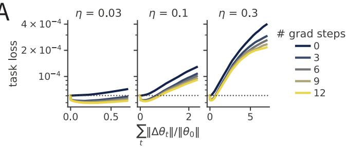

B  
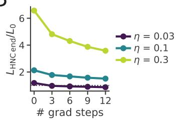  
Figure 6: Ablation experiment on the function-restoring step. Undirected null-space walks at three null-space step sizes η, with $m \in \{ 0 , 3 , 6 , 9 , 1 2 \}$ restore steps. (A) The task loss against the normalized weight travel during HNC walks, where the dotted line is the anchor's loss. (B) HNC endpoint's task loss relative to the anchor's against m. Larger null-space steps drift faster, and the restore step corrects for part of the drift rather than eliminating it.

## C.2 NULL-SPACE PROJECTION OF THE STEERING GRADIENT

When the walk is steered by a differentiable objective $\varphi ,$ we project its gradient onto the null-space before taking the step. The soft projection is

$$
\pmb { d } = ( \pmb { I } + \pmb { H } / \mu ) ^ { - 1 } \nabla \varphi ( \pmb { \theta } ) ,\tag{8}
$$

where $\mu > 0$ is a damping factor. Along each eigenvector ${ \mathbf { } } v _ { i }$ of the Hessian, this projection rescales the gradient component by $1 / ( 1 + \lambda _ { i } / \bar { \mu } )$ , where $\lambda _ { i }$ is the corresponding eigenvalue. The factor is close to one for flat directions $( \lambda _ { i } \ll \mu )$ and close to zero for sharp directions $( \lambda _ { i } \gg \mu )$ , so the projection keeps the gradient along flat directions and removes it along sharp ones. A larger $\mu$ therefore retains the gradient along sharper directions. Figure 7 shows the task loss and the representational divergence ∆CKA along HNC for several values of $\mu _ { \mathrm { r e l } }$ , where $\mu _ { \mathrm { r e l } } = \infty$ denotes no projection at all.

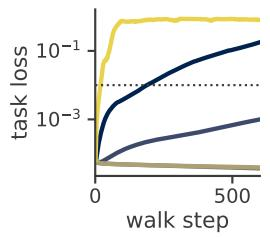

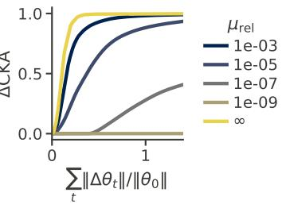  
Figure 7: Ablation experiment on the null-space projection of the steering gradient. CKAsteered walks from the same 3BFF anchor network at varying magnitudes of damping. Here, the maximum loss threshold is removed so that we can compare the task loss reached during HNC under different damping. A larger damping factor allows the steering gradient along sharper directions to pass through, therefore leading to faster representational divergence at the price of higher task loss. In contrast, with a highly strict damping factor $( \mu _ { \mathrm { r e l } } = 1 0 ^ { - 9 } )$ , neither the task loss nor the representation changes at all.

A larger damping factor lets the walk diverge faster, but the task loss grows with it. At $\mu _ { \mathrm { r e l } } = 1 0 ^ { - 7 }$ the task loss stays close to the anchor's while ∆CKA rises steadily. Increasing $\mu _ { \mathrm { r e l } }$ to $1 0 ^ { - 5 }$ and $1 0 ^ { - 3 }$ speeds up the divergence, at the cost of a clearly higher task loss. With no projection at all $( \mu _ { \mathrm { r e l } } = \infty )$ , the walk follows the raw CKA gradient: the steering objective rises fastest of all, but the task loss rises just as rapidly and the function breaks within a few dozen steps, even with the restore step still in place. At the other extreme, the smallest damping factor $( 1 0 ^ { - 9 } )$ leaves both the task loss and the representation unchanged. The magnitude of $\dot { \mu }$ therefore trades how far the steering objective moves against how much function drifts.

## C.3 RELINEARIZATION

The null-space is computed at a given weight configuration, so as the walk moves away from those weights, the curvature along the null-space directions can change and the directions can stop being flat. Relinearization recomputes the null-space at the current weights. To isolate its effect, the walks in Figure 8 use a fixed null-space step size and relinearize on a fixed schedule: never, or every 50, 20, or 5 steps.

More frequent relinearization always lowers the task loss relative to less frequent or no relinearization. When the step size is small, frequent relinearization matters less, but for a large step size it is critical to keep the task loss from blowing up (Figure 8).

A  
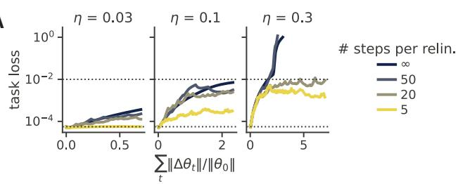

B  
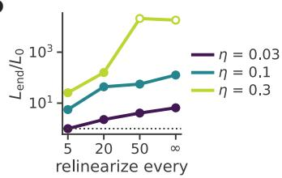  
Figure 8: Ablation experiment on the relinearization step. (A) Constraint task loss against the normalized weight travel; dotted lines mark the anchor's loss and the walk's usual ceiling. (B) Endpoint task loss relative to the anchor's against different relinearization interval. Open markers mark walks whose loss blew up

## C.4 COMPARISON WITH PENALIZED OPTIMIZATION

The most straightforward way to find a dissimilar solution is to train on the task loss with a penalty on similarity to the anchor, as in Eq. 7. This needs no curvature information: the network follows the combined gradient with steps of the same length as the HNC walk, and the weight $\beta$ sets how strongly similarity is penalized. We compare this against HNC over the same 600 steps, running HNC at four damping factors and the penalized training at three values of $\beta$ (Figure 9).

At every level of task loss, HNC reaches a larger divergence from the anchor than penalized training. The two methods also arrive at their divergence in different ways. Penalized training crosses the loss ceiling within its first 20 steps, gains nearly all of its divergence while the task loss is high, and only then returns toward low loss. In comparison, HNC never leaves the low-loss region and gains its divergence steadily.

$$
\angle D A N C + \angle B + p e n a l t y
$$

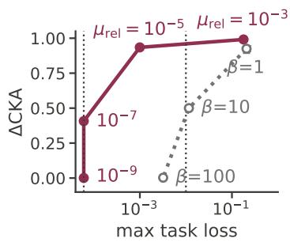

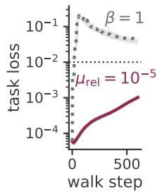

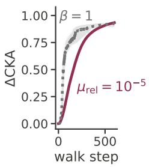  
Figure 9: HNC against training with a similarity penalty. Left: the highest task loss reached during 600 steps against the divergence from the anchor, $\Delta \mathrm { C K A } = 1 - \mathrm { C K A }$ , for HNC at four flatness thresholds $\mu _ { r e l }$ and for penalized training at three penalty weights $\beta$ (five seeds each; markers show the median, bars the range). Dotted lines mark the anchor's loss and the loss ceiling. Middle, right: task loss and divergence over the same 600 steps for one HNC walk $( \mu _ { \mathrm { r e l } } = 1 0 ^ { - 5 } )$ and one penalized run $( \beta = 1 )$ that end at similar divergence. At every level of task loss, HNC reaches more divergence. The penalized run crosses the loss ceiling within its first twenty steps, gains nearly all of its divergence during that excursion, and only then returns toward low loss, whereas HNC never leaves the low-loss region.

## D PRESERVING FUNCTION VERSUS TASK LOSS IN HNC

HNC holds the function-matching loss of Eq. 1 approximately fixed rather than the task loss on which the network was trained. Preserving the task loss instead would let HNC explore the broader set of task-compatible networks, so here we discuss why we choose to preserve the functionmatching loss instead in the paper.

The anchor is an exact minimum of the function-matching loss but only an approximate minimum of the task loss. A flat direction of the Hessian keeps a loss constant only if the gradient of that loss is also zero. Training stops when the task-loss gradient g is small, not when it vanishes, so a step ηv along a flat direction still raises the task loss by $\eta \mathbf { \pmb { g } } ^ { \top } \mathbf { \pmb { v } } .$ The null-space step removes the second-order term but still carries the first-order term. Because the gradient term is linear in the step size while the curvature term is quadratic, it is the larger of the two at the small step sizes that HNC takes. Walking a flat subspace of the task loss therefore can drift away from the task the network was trained on, and the drift accumulates step after step. The function-matching loss of Eq. 1 has zero gradient at the anchor by construction, because the anchor reproduces its own outputs exactly. Its flat directions are therefore flat in both first and second order, which is why HNC preserves it rather than the task loss.

The two losses also differ in the signs of their Hessian eigenvalues. The function-matching Hessian at the anchor is positive semidefinite (Appendix B), so its eigenvalues are all nonnegative. Its algebraically smallest eigenvalues are therefore also those closest to zero and identify the flattest directions. On the other hand, the task-loss Hessian contains an additional term:

$$
\nabla ^ { 2 } \mathcal { L } _ { \mathrm { t a s k } } = \pmb { J } ^ { \top } \left( \nabla _ { f } ^ { 2 } \ell \right) \pmb { J } + \sum _ { k } \frac { \partial \ell } { \partial f _ { k } } \nabla ^ { 2 } f _ { k } .\tag{9}
$$

The output Hessians $\nabla ^ { 2 } f _ { k }$ have no sign constraint, so the additional term can outweigh the nonnegative Gauss-Newton term in some directions, giving the task-loss Hessian both positive and negative eigenvalues and making it indefinite. On 3BFF, we find several hundred negative eigenvalues at every trained anchor. Selecting the algebraically smallest eigenvalues therefore favors negative-curvature directions over nearly flat directions, whose eigenvalues are closest to zero.

A  
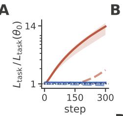

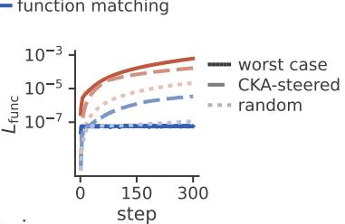

C  
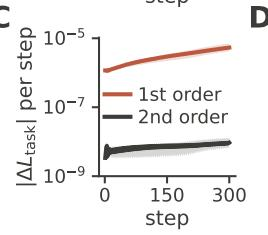

D  
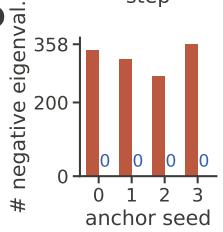  
Figure 10: Task-loss and function-matching walks along the worst-case flat direction on 3BFF. A, B: task loss relative to its anchor value, and function-matching loss to the outputs of the anchor, over 300 null-space steps from four anchors (median, band from minimum to maximum). Solid lines follow the flat direction along which the task loss rises fastest; the paler dashed lines follow the CKA-steered heading and a random flat direction from one anchor. (C): change of the task loss per step along the task-loss walk, split into the first-order term set by the gradient and the second-order term set by the curvature. (D): number of negative Hessian eigenvalues at each anchor for the two losses. The task-loss walk drifts because the gradient, not the curvature, moves the loss, whereas the function-matching walk holds both losses in place.

We measured these effects on four independently trained 3BFF anchors (seeds 0 to 3 of $\mathsf { A p - }$ pendix F.1), using a dense Hessian and eigendecomposition in double precision so that the sign of every eigenvalue is exact. Two walks start from each anchor and are identical except for the loss that defines the flat subspace and is restored after every null-space step: the task MSE or the function-matching loss. Both walks take 300 null-space steps of the same size along the flat direction in which the task loss rises fastest, the worst case for a task-loss walk, with no loss ceiling so that the drift is visible (Figure 10). At every anchor the task-loss gradient is nonzero, between

A  
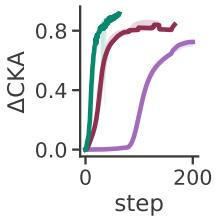  
B

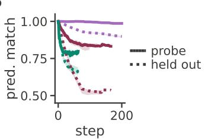

C  
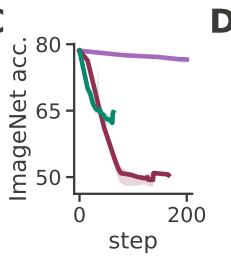

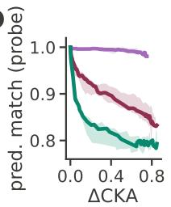  
Figure 11: Constraint strength of three preserved quantities on ViT-S. CKA-steered walks from one anchor that hold fixed, on a probe of 512 labeled ImageNet validation images, the full logit vector, the per-image cross-entropy, or the mean cross-entropy (median over probe seeds, band from minimum to maximum). (A): representational divergence from the anchor along the walk. (B): fraction of images that keep the top-1 prediction of the anchor, on the probe images (solid) and on 5,000 held-out images (dotted). (C): held-out top-1 accuracy. (D): probe prediction match against divergence, so the walks are compared at matched representational change rather than at matched step. The fewer constraints a quantity imposes per image, the more predictions change, on the probe and beyond it.

$2 \times 1 0 ^ { - 3 }$ and $1 \times 1 0 ^ { - 2 }$ in norm, and a small part of it lies inside the flat subspace. The task-loss Hessian has several hundred negative eigenvalues out of 4,611 parameters, whereas the Hessian of the function-matching loss has none. Along the walk, the first-order drift of the task loss per step exceeds its second-order term by two to three orders of magnitude, and the task-loss walk multiplies the task loss roughly tenfold. The function-matching walk keeps the outputs pinned to the anchor and, as a by-product, holds the task loss within ten percent of its anchor value.

On 3BFF the two losses are nevertheless close in practice, because the task target is the full output trajectory and the trained anchor reaches it up to a small residual, so the task MSE is nearly a function-matching loss to a fixed target.

The full output constrains the network more tightly than a scalar loss. Both losses are enforced on a finite probe set, so the question is how well the constraint carries over to inputs outside the probe. Many output vectors share the same loss value on an image, so a network that keeps the anchor's loss on every probe image can still change its prediction on that image, and it is unconstrained on unseen images. Matching the full output vector fixes one number per class for every probe image rather than one number in total, so the probe constraint transfers better beyond the probe.

We tested this on ViT-S with walks from the same anchor, steered by the same max-over-layers CKA objective with the same solver settings as in Section 4, on a probe of 512 labeled ImageNet validation images. The walks differ only in what they hold fixed: the full logits (the function-matching loss), the per-image cross-entropy at its anchor value, or the mean cross-entropy at its anchor value. The two cross-entropy variants are exact level sets and therefore share the zero-gradient property of the previous paragraph. What they lack is constraint strength.

In Figure 11, the logit walk keeps almost every probe prediction and stays within a few points of the accuracy of the anchor, while both cross-entropy walks lose predictions from the first steps and give up far more accuracy. They lose predictions even on the probe images whose loss is pinned, because a walk can trade errors on some probe images for gains on others at constant loss. The walks also diverge at very different rates, so a given step means something different for each: the cross-entropy walks climb within a few steps and the logit walk moves only later, which is why panel D compares them at matched representational change instead. Off the probe the ordering of the two cross-entropy variants is not stable, because the mean cross-entropy walk moves the network less per unit of representational change and so carries fewer of its probe errors to unseen images.

To quantify the drift, Table 2 counts the constraints each quantity imposes and reports the probe prediction match at three values of divergence. The full logit vector constrains a thousand numbers per image and holds almost every probe prediction at any divergence we reach. The per-image cross-entropy imposes one constraint per image and the mean cross-entropy a single constraint for the whole probe, and both lose probe predictions immediately and keep losing them as the walk proceeds.

Table 2: Preserved quantities on ViT-S, ordered by the number of constraints they impose on a probe of 512 labeled ImageNet validation images over 1,000 classes. Prediction match is the fraction of probe images given the top-1 prediction of the anchor, at three values of representational divergence (max over layers, mean and standard deviation over probe seeds).
<table><tr><td rowspan="2">Preserved quantity</td><td rowspan="2"># constraints</td><td colspan="3">Pred. match (probe) with ∆CKA</td></tr><tr><td>0.2</td><td>0.4</td><td>0.6</td></tr><tr><td>Full logits</td><td>512,000</td><td>0.996</td><td>0.994</td><td>0.993</td></tr><tr><td>Per-image cross-entropy</td><td>512</td><td>0.916</td><td>0.894</td><td>0.875</td></tr><tr><td>Mean cross-entropy</td><td>1</td><td>0.831</td><td>0.811</td><td>0.793</td></tr></table>

Function matching needs neither labels nor a task. The function-matching loss requires only the outputs of the anchor, so the same procedure runs on unlabeled probes, on shifted inputs, on policies whose return is flat or non-differentiable (Appendix I), and on language models where the natural target is the next-token distribution. Because any task loss is a function of the outputs, preserving the function preserves every task loss at once, and the function-preserving set is a subset of the task-compatible set.

Nonetheless, someone who wants the broader solution set for a given task can replace Eq. 1 by the task loss, as each caveat above can be mitigated. The first-order drift disappears if the task loss is held at its anchor value through a squared residual, $\begin{array} { r } { \frac { 1 } { 2 } \big ( \mathcal { L } _ { \mathrm { t a s k } } ( \pmb { \theta } ) - \mathcal { L } _ { \mathrm { t a s k } } ( \pmb { \theta } _ { 0 } ) \big ) ^ { 2 } } \end{array}$ , which has zero gradient at the anchor by construction. Alternatively the null-space step can be projected orthogonal to the task-loss gradient, or the anchor can be trained closer to convergence before applying HNC. Additionally, the loose constraint can be tightened by constraining more probe inputs, constraining the per-input losses rather than their mean, or adding the decision on each input as a further target. Each of these moves the constraint toward the full output, and in the limit recovers Eq. 1.

## E COMBINING HNC WITH GLOBAL SEARCH FOR ALTERNATIVE SOLUTIONS

HNC starts from a single trained network and explores the connected, function-preserving region around it, so it reaches solutions in the local region. Retraining is the opposite kind of search: a fresh run from a new initialization can land anywhere in weight space, but where it lands is not under our control, and independent runs tend to converge on similar solutions. Here we give a proof of principle that the two can be combined. Starting from the anchor, we alternate two stages. A DSA-steered HNC walk first moves the current network along its loss level set while maximizing the summed dynamical distance to every network found so far. A fresh network is then trained from scratch with the same summed distance as a repulsive regularizer, which asks training to land far from all of them. Each stage hands its endpoint to the next as the new anchor or the new set of networks to repel.

A  


B  


C  


D  


  
Figure 12: Alternating retraining with the DSA-steered HNC walk yields a chain of dynamically distinct 3BFF solutions at preserved function. Starting from the anchor $T _ { 0 } ,$ , each round first runs a DSA-steered walk from the current trained network $( \bar { H _ { k } } )$ , then trains a fresh network with a penalty on dynamical similarity to every network found so far $( T _ { k + 1 } )$ . (A) Held-out task loss along the chain (purple: retraining; orange: HNC walk; dotted line: loss ceiling). Every trained network reaches the anchor's accuracy and every walk stays well below the ceiling. (B) Weight distance between consecutive networks, in units of the anchor's weight norm; the grey band is the range of distances between independently trained seeds. Retraining lands as far away as an unrelated seed, whereas a walk moves less than one anchor norm. (C) Pairwise DSA distance between the eight networks. (D) Two-dimensional embedding of the same distances; the star is the anchor and the arrows follow the chain. (E) For each new network, its DSA distance to the nearest and farthest earlier network, against the range between independently trained seeds (grey band). Every network in the chain lies farther from all its predecessors than two seeds lie from each other.

The chain travels farther in weight space than either method alone, and every network in it performs the task as well as the anchor (Figure 12). Each retraining moves about as far as an unrelated seed, and each walk then moves a further fraction of an anchor norm without leaving its loss valley. More importantly, the chain keeps finding new mechanisms: attractor-based memories, memories held by ongoing drift with no stable fixed point, and a solution with more attractors than memory states (Figure 13), with correspondingly different dynamical spectra (Figure 14). Every new member lies farther from all of its predecessors than two independently trained seeds lie from each other, so alternating global and local search covers more of the solution space than repeated retraining would.

There are other ways to give HNC a more global reach. For example, we can loosen the loss ceiling during the walk and filter the visited networks by task loss afterwards, so the walk could then cross shallow ridges and basin boundaries. The walk could also be restarted from a perturbed copy of its endpoint, a small random kick followed by a few restore steps, to leave a flat sheet whose boundary it has reached. The same regularizer could also repel the alternative networks from solutions found by different architectures or optimizers, and the walk could be steered toward a target network rather than away from the anchor, as in subsection G.8, which would let it bridge two independently found solutions through function-preserving intermediates. We leave these directions to future work.

  
Figure 13: The chain visits qualitatively different dynamical mechanisms. Hidden-state trajectories of every network in the chain on the same trials, projected onto each network's top three principal components and coloured by memory state, with stable fixed points as black diamonds. Top row: trained networks; bottom row: the HNC endpoints reached from the network above; grey arrows give the order of the chain. The anchor stores each memory state at its own fixed point. The first walk keeps only a few fixed points and spreads the activity into a cloud, the two retrained networks that follow hold the memory with no stable fixed point at all, and the last round returns to a fixed-point solution with more fixed points than memory states. All eight networks solve the task with bit accuracy above 0.999.

trained 0  


trained 3  


HNC 0  


HNC 1  


HNC 2  


HNC 3  
  
Figure 14: Eigenvalue spectra of the recurrent dynamics along the chain. Eigenvalues of a linear model fitted to each network's hidden-state trajectories, with the unit circle for reference; the distance between these spectra is the quantity that both the retraining penalty and the steered walk push apart. The anchor's eigenvalues fan out from the real axis. The networks without fixed points concentrate their eigenvalues at +1 and —1, a slowly decaying mode and a mode that alternates every step, and the third walk endpoint adds a pair of modes that repeat every four steps.

## F DETAILS FOR THE 3BFF RNN EXPERIMENTS

## F.1 ARCHITECTURE AND TRAINING OF THE 3BFF RNN

Task In the 3-bit flip-flop task, each RNN receives N=3 independent input channels taking values in -1, 0, +1, which switch with probability $p _ { \mathrm { f l i p } } = 0 . 3$ . The network has ${ \Nu } { = } 3$ output channels that must retain the most recent nonzero input on their respective channels. Trials are $\bar { T = 1 0 0 }$ timesteps long, and each batch contains 256 trials. Since the three memories are binary and independent. The task has $2 ^ { 3 } = 8$ distinct memory states, which is the origin of the eight-fixed-point cube in Fig. 2.

Architecture We use a vanilla tanh RNN with $N _ { h } = 6 4$ hidden units, whose update rule is

$$
\begin{array} { r } { h _ { t } = \operatorname { t a n h } \bigl ( W _ { \mathrm { i h } } u _ { t } + b _ { \mathrm { i h } } + W _ { \mathrm { h h } } h _ { t - 1 } + b _ { \mathrm { h h } } \bigr ) , \qquad y _ { t } = W _ { \mathrm { o u t } } h _ { t } + b _ { \mathrm { o u t } } . } \end{array}\tag{10}
$$

We use Kaiming uniform initialization for $W _ { \mathrm { i h } }$ and $W _ { \mathrm { o u t } }$ , and orthogonal initialization for $W _ { \mathrm { h h } }$ All biases are zero. All biases are initialized to zero.

Training Networks are trained by backpropagation through time over all $T = 1 0 0$ timesteps on the Mean Squared Error (MSE) loss between the network's output and the target. We use Adam with a constant learning rate of $1 0 ^ { - 3 }$ with the gradient clipped to a global norm of 1.0. Training stops once the epoch loss falls below $5 \times 1 0 ^ { - 5 }$ on two consecutive epochs.

## F.2 SIZE OF THE FLAT SUBSPACE UNDER DIFFERENT THRESHOLDS

The 3BFF RNN is small enough $( P = 4 6 1 1 )$ that we can form the full Hessian and eigendecompose it directly, which gives the complete spectrum rather than the k flat directions that LOBPCG returns. Figure 15 shows the spectra of the five trained networks. A few directions carry almost all of the curvature: the effective dimensionality of the spectrum, measured by its participation ratio, is $2 3 . 2 \pm 1 . 6$ out of 4611 (mean $\pm \ : s . d$ over five anchors). The remaining eigenvalues decay smoothly over nine orders of magnitude with no gap between sharp and flat directions. The size of the flat subspace therefore depends on where the threshold is placed (Figure 15C, Table 3).


C  
  
Figure 15: Hessian spectrum of the trained 3BFF RNNs. (A) All 4611 eigenvalues at the anchor, sorted. (B) The same eigenvalues divided by the largest one. (C) Null fraction, the fraction of parameter directions with $\lambda _ { i } < \mu _ { \mathrm { r e l } } \lambda _ { \mathrm { m a x } } .$ as the threshold varies. Curves and bands are the median and range over five independently trained anchors. Dotted lines mark the threshold of the undirected walks, $\breve { \mu } _ { \mathrm { r e l } } = 1 0 ^ { - 3 }$

Table 3: Dimension of the flat subspace of the 3BFF RNN $( P \ : = \ : 4 6 1 1 )$ as the relative flatness threshold $\mu _ { \mathrm { r e l } }$ varies. A direction is counted as flat when its eigenvalue satisfies $\lambda < \mu _ { \mathrm { r e l } } \lambda _ { 1 }$ , where $\lambda _ { 1 }$ is the top eigenvalue of the Hessian (median 10.8 across seeds).
<table><tr><td>μrel</td><td>absolute flatness threshold</td><td>median dimension</td><td>fraction of  $\overline { { P } }$ </td><td>max  $\overline { { \Delta \mathcal { L } } }$ </td></tr><tr><td> $1 . 0 \times 1 0 ^ { - 7 }$ </td><td> $1 . 1 \times 1 0 ^ { - 6 }$ </td><td>1701</td><td>36.9%</td><td> $5 . 4 \times 1 0 ^ { - 7 }$ </td></tr><tr><td> $1 . 0 \times 1 0 ^ { - 6 }$ </td><td> $1 . 1 \times 1 0 ^ { - 5 }$ </td><td>2896</td><td>62.8%</td><td> $5 . 4 \times 1 0 ^ { - 6 }$ </td></tr><tr><td> $1 . 0 \times 1 0 ^ { - 5 }$ </td><td> $1 . 1 \times 1 0 ^ { - 4 }$ </td><td>3684</td><td>79.9%</td><td> $5 . 4 \times 1 0 ^ { - 5 }$ </td></tr><tr><td> $1 . 0 \times 1 0 ^ { - 4 }$ </td><td> $1 . 1 \times 1 0 ^ { - 3 }$ </td><td>4145</td><td>89.9%</td><td> $5 . 4 \times 1 0 ^ { - 4 }$ </td></tr><tr><td> $1 . 0 \times 1 0 ^ { - 3 }$ </td><td> $1 . 1 \times 1 0 ^ { - 2 }$ </td><td>4418</td><td>95.8%</td><td> $5 . 4 \times 1 0 ^ { - 3 }$ </td></tr><tr><td> $1 . 0 \times 1 0 ^ { - 2 }$ </td><td> $1 . 1 \times 1 0 ^ { - 1 }$ </td><td>4565</td><td>99.0%</td><td> $5 . 4 \times 1 0 ^ { - 2 }$ </td></tr></table>

## F.3 HYPERPARAMETERS OF THE NULL-SPACE WALKS

Tables 4 to 6 list the settings of the walks in Fig. 2. Every walk starts from one of five independently trained anchors (seeds 0 to 4 of subsection F.1), with three replicates per arm and anchor. The task MSE is measured on a fixed batch of 128 trials. After each null-space step and its restore steps, the step is accepted if this loss is below the loss ceiling and rejected otherwise. A rejected step is undone and the step size halved; after an accepted step the step size grows again. The undirected walks follow an explicit basis of the flattest eigenvectors, which they recompute on a fixed schedule and after every rejection. The steered walks never form a basis. They project the gradient of the steering objective with the soft projection of Section 2, solved at the current weights at every step, so the flat directions are refreshed automatically and no separate relinearization is needed.

Table 4: Settings of the undirected walks in Fig. 2.
<table><tr><td>Hyperparameter</td><td>Value</td></tr><tr><td>Flat directions</td><td>explicit basis of eigenvectors with  $\lambda < 1 0 ^ { - 3 } \lambda _ { 1 }$ </td></tr><tr><td>Step direction</td><td>one random heading direction uniformly sampled from  $\mathcal { V } _ { 0 } .$  held fixed and re-projected onto the current basis at every relinearization</td></tr><tr><td>Restore steps Null-space step size η</td><td>12 per null-space step starts at 1.0, halved on rejection and grown 1.1× on accep-</td></tr><tr><td></td><td>tance of a step; lower bounded by  $1 0 ^ { - 4 }$  and upper bounded by 4.0</td></tr><tr><td>Loss ceiling Relinearization</td><td> $1 \dot { 0 } ^ { - 2 }$  every 20 accepted steps or on rejection, at most 60 times</td></tr><tr><td>Walk length</td><td>600 steps</td></tr></table>

Table 5: Settings of the CKA-steered walks in Fig. 2.
<table><tr><td>Hyperparameter</td><td>Value</td></tr><tr><td>Flat directions</td><td>soft projection with damping  $\mu = 1 0 ^ { - 7 } \lambda _ { 1 }$ </td></tr><tr><td>Step direction</td><td>gradient of the steering objective, after a seeded random first step</td></tr><tr><td>Steering objective</td><td>1 — CKA between the hidden states of the current network and the anchor, on a probe of 32 trials</td></tr><tr><td>Solver</td><td>plain CG, 200 iterations, started from zero at every step (Appendix A.3)</td></tr><tr><td>Restore steps</td><td>12 per null-space step</td></tr><tr><td>Null-space step size η Loss ceiling</td><td>starts at 0.03; halved on rejection down to  $5 \times 1 0 ^ { - 4 }$   $1 0 ^ { - 2 }$ </td></tr><tr><td>Relinearization</td><td>at every step</td></tr><tr><td>Walk length</td><td>600 steps</td></tr></table>

## F.4 A SET OF DIVERSE 3BFF SOLUTIONS

Here, we show a set of diverse solutions that all complete the task with 100% accuracy whose task MSE lies well below 0.05 over an example CKA-steered, DSA-steered, and undirected null-space walk.

Table 6: Settings of the DSA-steered walks in Fig. 2.
<table><tr><td>Hyperparameter</td><td>Value</td></tr><tr><td>Flat directions</td><td>soft projection with damping  $\mu = 1 0 ^ { - 7 } \lambda _ { 1 }$ </td></tr><tr><td>Step direction</td><td>gradient of the steering objective, after a seeded random first step</td></tr><tr><td>Steering objective</td><td>DSA distance between the hidden-state dynamics of the current network and the anchor (5 delays, rank 10), on a probe of 32 trials</td></tr><tr><td>Solver</td><td>plain CG, 200 iterations, started from zero at every step (Appendix A.3)</td></tr><tr><td>Restore steps Null-space step size η</td><td>12 per null-space step starts at 0.03; halved on rejection down to  $5 \times 1 0 ^ { - 4 }$ </td></tr><tr><td>Loss ceiling</td><td>10⁻2</td></tr><tr><td>Relinearization</td><td>at every step</td></tr><tr><td>Walk length</td><td>2,000 steps</td></tr></table>

  
Figure 16: A set of diverse 3BFF solutions produced by the function-preserving null-space walks. Hidden-state trajectories on the probe trials, projected onto each snapshot's own top three activity PCs and coloured by the current memory state, with the snapshot's stable zero-input fixed points as black diamonds.

## F.5 MDS EMBEDDINGS OF THE SOLUTIONS REACHABLE FROM TEN ANCHORS

Fig. 2F embeds the solutions reachable from one anchor, here we aggregate all networks reached during the HNC walks starting from 10 anchors to highlight the diversity of solutions that a task admits. We trained ten anchors with the training procedure of Appendix F.1. From each of the ten anchors, we first ran 3 undirected, DSA-steered, and CKA-steered HNC walks, resulting in a total of 9 HNC walks, and saving evenly spaced checkpoints per walk. From five of the anchors, we additionally ran walks steered away from an earlier HNC endpoint instead of the anchor, as in Appendix E.

For every pair of networks we computed the CKA distance between hidden states on a common set of probe trials and the Euclidean weight distance relative to the anchor norm, and embedded each distance matrix in two dimensions with metric MDS (Figure 17).

The structure of this solution clearly decouples at the representational level and at the weight level. In weight space the networks group by anchor. Each anchor sits at the centre of its own walks, and no walk comes closer to another anchor than to its own. In representation space, all ten anchors are close to each other, and the steered walks leave them in many directions, reaching distances several times the spread of independent training. The solutions reached by HNC spread across the embedding rather than collapsing into a tight cluster, so the 3BFF task admits far more solutions than independent training reveals.

  
Figure 17: MDS embeddings of the solutions reachable from ten anchors, by representation and by weights. Metric MDS of 470 networks: ten independently trained anchors (hollow squares), four checkpoints from each of their undirected, CKA-steered, and DSA-steered walks, and forty further independently trained networks (grey). Walks steered away from an earlier endpoint rather than from the anchor share the colour of the metric they steer. Marker size and opacity grow along each walk. Left: representational distance (1 — CKA). Right: relative weight distance. In weights every anchor forms its own cluster with its walks around it. In representation all anchors and trained networks collapse onto one point, and the walks from every anchor spread far beyond it.

## F.6 FUNCTION-PRESERVING STRUCTURED PRUNING

Beyond representational and dynamical dissimilarity, the steering potential can also target the structure of the weights themselves. Here we steer the walk to maximize sparsity of the network weights so to enable network pruning. In the RNN, a unit whose overall output weight magnitude is zero affects neither the recurrent dynamics nor the output, so it can be removed without affecting the network computation. Let unit $j ^ { \flat } \mathrm { s }$ outgoing weight group be $\pmb { g } _ { j } = [ \pmb { W } _ { \mathrm { h h } } [ : , j ] ; \pmb { W } _ { \mathrm { o u t } } [ : , j ] ]$ , we want to steer the walk to maximize a differentiable count of the total number of removable units,

$$
\varphi _ { \mathrm { p r u n e } } ( \theta ) \ : = \ : \frac { 1 } { N _ { h } } \sum _ { j = 1 } ^ { N _ { h } } \exp \Bigl ( - \frac { \| g _ { j } \| ^ { 2 } } { 2 \sigma ^ { 2 } } \Bigr ) ,\tag{11}
$$

where each unit contributes a Gaussian bump that equals one when its outgoing group is zero and vanishes when the group is large. Because all outgoing weights of a unit share a single bump, the gradient of $\varphi _ { \mathrm { p r u n e } }$ drives all output weights of a single unit toward zero together.

Starting from the seed-0 anchor, we apply HNC with an annealed $\sigma$ schedule, gradually decreasing σ from the median norm of the anchor's outgoing weight groups to one-tenth of that value. This causes the walk to initially shrink all outgoing weights uniformly, before increasingly targeting low-magnitude groups and driving them effectively to zero. Throughout the walk, the fraction of removable units steadily increases (Figure 18A). Physically removing the units with near-zero outgoing weights prunes the 64-unit RNN down to 11 units, about 17% of the original hidden size and 5% of the original parameters. The truncation leads to a small rise in the task MSE, yet the pruned network still performs the 3BFF task with 100% accuracy (Figure 18B, C). This suggests that HNC can directly find and exploit the unconstrained degrees of freedom in the network weights, enabling network pruning.

$$
\mathrm {  { - } \circ - a n c h o r ~ \mathrm { \to - } \mathrm { \ p r u n e d ~ \ell } \cdots \mathrm { \ a n c h o r ~ f l o o r } }
$$


  
Figure 18: The prune-steered walk makes the network hard-prunable at preserved function. (A) Fraction of removable units (outgoing group norm below the dead threshold) against the normalized weight movement, the walk arclength divided by the anchor weight norm. (B) Hard-truncation test: the RNN is physically rebuilt keeping only the units with the largest outgoing group norms; task MSE against the removed fraction, for the anchor and the prune-steered endpoint. The dotted line marks the largest removed fraction at which the pruned network is still bit-perfect $( 5 3 / 6 4 = 0 . 8 3$ 11 units kept). (C) Bit accuracy of the same truncations: the pruned endpoint stays at 100% down to 11 units, while the anchor is already imperfect at the first truncation and degrades from there.

## F.7 STEERED SOLUTIONS ARE SGD-STABLE

Next, we ask whether the solution originally found by gradient descent is privileged for the 3BFF task, such that retraining with SGD would converge back to it. We therefore resume SGD on the 3BFF task for 8,000 steps from each HNC endpoint and, as references, from the anchor and from a fresh random initialization (Figure 19).

Upon retraining, the optimization settles into a solution in the vicinity of each steered endpoint. The property that each walk was steered by (the CKA distance to the anchor, the DSA distance to the anchor, or the fraction of removable $W _ { h h }$ columns) stays where the walk left it. Moreover, retraining moves the network weights only a small distance, far less than the distance traveled from a random initialization. The retrained solutions come no closer to the anchor than the steered endpoints they started from either, so retraining does not pull the endpoints back toward the anchor in the weight space (Figure 20).

A  
  
B


  
Figure 19: Resumed SGD maintains the steered divergence while finding a lower-loss solution. Plain SGD resumed from each steered 3BFF endpoint (and from the anchor and a random initialization), tracking the task loss and the quantities the steering moved: representation (CKA distance to the anchor), dynamics (DSA distance to the anchor), and structure (fraction of near-zero $W _ { h h }$ columns).

A  


B  
  
Figure 20: SGD stays local. (A) How far the weights move during the resumed training, from each start. (B) Distance of each steered solution to the anchor before (light) and after (solid) retraining.

## F.8 OUT-OF-DISTRIBUTION PROBES OF THE WALK ENDPOINTS

The walk endpoints match the anchor on the trained input distribution, so we ask whether they also match it on inputs that this distribution never contains. During training, each input bit receives a unit pulse at every step with probability 0.3. We therefore vary the pulse magnitude and the pulse rate, and we evaluate the anchor and the three walk endpoints, all of which reach an indistribution accuracy of 0.99 or above (Figure 21). Memory retention and recovery from hiddenstate perturbations are shown in Fig. 2E.

Weak pulses degrade the DSA-steered and undirected endpoints before the anchor. Strong pulses degrade only the undirected endpoint, whose recurrent spectral radius has grown along the walk. Rare pulses leave long stretches without input within a trial. There the DSA-steered endpoint loses accuracy first, in line with its weaker memory retention in Fig. 2E.


  
Figure 21: Out-of-distribution input probes of the walk endpoints. Accuracy of the anchor and the three walk endpoints when the input statistics differ from training. The dotted line marks the trained value. (A) All input pulses scaled by a common magnitude. (B) Pulse probability per step. Rare pulses leave long stretches without input within a trial.

## G ADDITIONAL EXPERIMENTS ON VIT

## G.1 SMOOTH SURROGATE FOR THE MAX-OVER-LAYERS CKA

Section 4 steers the walk to lower the highest CKA between any layer of the anchor and any layer of the current network. Let $c _ { i j } ( \pmb \theta )$ be the linear CKA between the CLS-token features of layer i of the anchor and layer $j$ of the current network on the $N = 5 1 2$ probe images, for $i , j = 1 , \dot { \ldots } , L$ with $L = 1 3$ (one per transformer block plus the pre-logits features). The hard maximum $\operatorname* { m a x } _ { i , j } c _ { i j }$ is not smooth: its gradient comes from a single layer pair and jumps whenever another pair takes over. The walk therefore ascends a smooth version,

$$
\varphi _ { \mathrm { C K A } } ( \theta ) = 1 - \frac { 1 } { \beta } \log \sum _ { i , j = 1 } ^ { L } \exp \bigl ( \beta c _ { i j } ( \theta ) \bigr ) , \qquad \beta = 3 0 ,\tag{12}
$$

which replaces the maximum by a log-sum-exp. For large $\beta$ the log-sum-exp stays close to the maximum. Its gradient is a weighted average of the gradients of all $c _ { i j } .$ with most of the weight on the most similar layer pairs, so each step pushes down whichever pairs are currently closest to the maximum. The kNN potential of Eq. 13 uses the same construction with the soft mutual-kNN alignment in place of $c _ { i j }$ . Throughout, we report the exact hard maximum (Fig. 3).

## G.2 SCORING THE VISUAL ATTRIBUTES OF THE MOST SIMILAR IMAGE PAIRS

Figure 3E asks what the anchor and the endpoint have in common when they represent two images similarly. For the anchor and the HNC endpoint network, we rank all possible pairs of probe images by the cosine similarity of their penultimate-layer features and keep the five highest-ranked pairs. Every pair of probe images is then scored on three visual attributes that are independent of the class identity of each image:

• Semantic content. Cosine similarity between the class-token features of a DINOv2 ViT-S/14 (Oquab et al., 2024). This model is trained without labels, so it cannot inherit the anchor's supervision.

• Color. Cosine similarity between ${ 8 \times 8 \times 8 \mathrm { H S V } }$ color histograms. Each pixel is described by three numbers: its hue, saturation, and value. Each of the three axes is divided into eight bins, giving 512 bins in total, and we count how many of the image's pixels fall into each one and normalize the sum of counts to one. The histogram records only what colors an image contains and in what proportions, and is unchanged if the pixels are rearranged.

• Spatial layout. Correlation between the images downsampled to $3 2 \times 3 2$ grayscale, which keeps the coarse arrangement of light and dark regions and discards color and fine detail.

The three scores are on different scales, so we report each one as a percentile within the distribution of that score over all pairs of probe images. A pair drawn at random sits at the 50th percentile by construction, which sets the dashed reference line, and a high percentile means the network's closest pairs share that attribute more than two arbitrary images do. The plotted value is the mean percentile over the five pairs.

## G.3 STEERING BY MUTUAL k-NEAREST NEIGHBOR

Section 4 steers the linear CKA. Here we repeat the experiment with the other similarity score used by the PRH, the mutual k-nearest-neighbor alignment of Huh et al. (2024) (Figure 22). The anchor is the same ImageNet-trained ViT-S/16, the function is held fixed on 256 Places-365 images, and the score follows the PRH exactly: for each image, the fraction of its $k = 1 0$ nearest neighbors that the two representations share, averaged over images and taken at its maximum over all layer pairs. Nearest-neighbor sets change discontinuously as the weights move, so they cannot be steered directly. We therefore relax them: image b counts as a neighbor of image a with a weight that decays smoothly with how far b lies beyond the k-th nearest neighbor of $a .$ Writing $d _ { a b } ^ { ( l ) }$ for the squared distance between the layer-l features of a and $b ,$ and $r _ { a } ^ { ( l ) }$ for the squared distance from a to its k-th nearest neighbor, the soft neighborhood at layer l is $S _ { a b } ^ { ( l ) } ( \pmb { \theta } ) = \sigma \big ( ( \bar { r } _ { a } ^ { ( l ) } - d _ { a b } ^ { ( l ) } ) / w _ { l } \big )$ , where σ is the logistic sigmoid, $r _ { a } ^ { ( l ) }$ is held constant when differentiating, and the width wl is set once from the anchor at 5% of the median $r _ { a } ^ { ( l ) }$ over the probe. The steering potential is the soft dissimilarity


$$
\varphi _ { \mathrm { k N N } } ( \pmb \theta ) \ = \ 1 - \frac 1 \beta \log \sum _ { i , j = 1 } ^ { L } \exp \big ( \beta m _ { i j } ( \pmb \theta ) \big ) , \qquad m _ { i j } ( \pmb \theta ) \ = \ \frac 1 { N k } \sum _ { a \neq b } \bar { S } _ { a b } ^ { ( i ) } S _ { a b } ^ { ( j ) } ( \pmb \theta ) ,\tag{13}
$$

where $m _ { i j }$ measures how much of the anchor's neighborhood structure at layer i (the fixed set $\bar { S } ^ { ( i ) }$ computed at $\pmb { \theta } _ { 0 } )$ survives in layer $j$ of the current network, $N = 2 5 6$ is the probe size, $L = 1 3$ counts the class-token layers (one per block plus the pre-logits feature), and the log-sum-exp with $\beta = 3 0$ is a smooth stand-in for the maximum, as in Eq. 12. Raising $\varphi _ { \mathrm { k N N } }$ therefore pushes down the alignment at whichever layer pair is currently the most similar. We report the exact hard score throughout.

A  
  
B


  
E

D  


  
Figure 22: Steering the mutual kNN score finds alternative representations at preserved inputoutput mapping. (A) The max-over-layers mutual kNN similarity to the anchor falls along the walk, both on the probe images and on held-out images never seen during HNC. The max-overlayers CKA falls as well, even though the walk does not steer it. (B) The top-k predictions on Places-365 images and the top-k accuracy on ImageNet are largely preserved along the walk. (C) At the endpoint, the max-layer mutual kNN to the anchor sits below every independently trained model and above only an untrained initialization. (D) MDS embedding of 20 images from four classes, for the anchor and the endpoint. (E) Nearest-neighbor graph of the same images. Grey edges mark neighbors shared by the anchor and the endpoint; blue edges mark neighbors found in only one of the two networks. (F) The most similar image pairs of the endpoint match those of the anchor in semantic content (DINOv2) and color, but their spatial-layout similarity falls toward chance.

## G.4 HYPERPARAMETERS OF THE VIT WALKS

Table 7: Settings of the CKA-steered ViT-S walk in Fig. 3.
<table><tr><td>Hyperparameter</td><td>Value</td></tr><tr><td>Anchor</td><td>ImageNet-trained ViT-S/16, 22M parameters</td></tr><tr><td>Probe set</td><td>512 Places-365 images</td></tr><tr><td>Flat directions</td><td>soft projection with damping  $\mu = 1 0 ^ { - 7 } \lambda _ { 1 }$ </td></tr><tr><td>Solver</td><td>preconditioned conjugate gradient, 40 iterations</td></tr><tr><td>Steering objective</td><td> $\varphi _ { \mathrm { C K A } }$  of Eq. 12,  $\beta = 3 0$ </td></tr><tr><td>First step</td><td>random direction, soft-projected</td></tr><tr><td>Restore steps</td><td>6 per null-space step</td></tr><tr><td>Null-space step size η Loss ceiling</td><td>starts at 0.05; halved on rejection down to  $1 0 ^ { - 3 }$ </td></tr><tr><td>Relinearization</td><td> $1 0 ^ { - 2 }$  at every step</td></tr><tr><td>Walk length</td><td>up to 336 steps</td></tr></table>

Table 8: Settings of the mutual-kNN-steered ViT-S walk in Figure 22.
<table><tr><td>Hyperparameter</td><td>Value</td></tr><tr><td>Anchor</td><td>ImageNet-trained ViT-S/16, 22M parameters</td></tr><tr><td>Probe set</td><td>512 Places-365 images</td></tr><tr><td>Flat directions</td><td>soft projection with damping  $\mu = 1 0 ^ { - 7 } \lambda _ { 1 }$ </td></tr><tr><td>Solver</td><td>preconditioned conjugate gradient, 40 iterations</td></tr><tr><td>Steering objective</td><td>φkNN of Eq.  $1 3 , \beta = 3 0 , k = 1 0$ </td></tr><tr><td>First step</td><td>random direction, soft-projected</td></tr><tr><td>Restore steps</td><td>8 per null-space step</td></tr><tr><td>Null-space step size η</td><td>starts at 0.05; halved on rejection down to  $1 0 ^ { - 3 }$ </td></tr><tr><td>Loss ceiling</td><td> $1 0 ^ { - 2 }$ </td></tr><tr><td>Relinearization</td><td>at every step</td></tr><tr><td>Walk length</td><td>500 steps</td></tr></table>

## G.5 FUNCTIONAL PRESERVATION BEYOND THE PROBE SET FOR CKA-STEERED HNC

The CKA-steered walks in Figure 3 constrain the function on only 512 Places-365 images. Although the endpoints match the anchor on these probe images, this constraint does not guarantee that they will preserve its behavior on unseen inputs. We therefore ask how well the endpoints retain the anchor's function beyond the probe set, including under distribution shift.

We evaluate the anchor and the endpoints of the five CKA-steered walks on held-out ImageNet validation images and on three distribution-shifted test sets with the ImageNet label space: ImageNet-V2 (Recht et al., 2019), ImageNet-Rendition (Hendrycks et al., 2021), and ImageNet-Sketch (Wang et al., 2019). For each dataset, we report three complementary measures. Top-k accuracy assesses whether the endpoints retain the anchor's overall task performance. Prediction match measures the fraction of images on which an endpoint makes exactly the same top-1 prediction as the anchor. Error consistency (Geirhos et al., 2020) measures chance-corrected agreement in which images the two networks classify correctly; unlike prediction match, it does not require the networks to select the same class when both are wrong.

We calibrate these measures against two reference networks. ViT-S/in1k has the same architecture as the anchor but is trained only on ImageNet-1k, providing a reference for a separately trained model. The diff-seed networks provide a stricter comparison: they repeat the anchor's final ImageNet-1k fine-tuning stage from the same ImageNet-21k checkpoint, changing only the random seed.

The CKA-steered endpoints closely track the anchor's top-k accuracy on all four datasets, with a small but consistent accuracy deficit across values of k (Figure 23A). Their exact prediction agreement is highest on clean ImageNet and ImageNet-V2 and decreases on Rendition and Sketch (Figure 23B). This decline is expected in part because, when both networks are wrong, prediction match counts them as agreeing only if they select the same incorrect class. Error consistency remains near 0.8 across all four datasets (Figure 23C), indicating that the endpoints continue to succeed and fail on largely the same images as the anchor even as exact prediction agreement decreases. Thus, their similarity to the anchor extends beyond aggregate accuracy to the image-level structure of their errors, although the agreement is not perfect.

The reference networks clarify the strength of this preservation. The endpoints exhibit higher prediction match and error consistency than ViT-S/in1k on every dataset, with the largest difference on Rendition and Sketch. More strikingly, their image-level agreement with the anchor is comparable to, and generally higher than, that of the diff-seed networks, despite their representations having moved much farther from the anchor. The CKA-steered walks therefore produce substantial representational change while retaining the anchor's off-probe behavior at least as well as repeating its final training stage. At the same time, the remaining accuracy loss and prediction disagreement show that this preservation is approximate rather than exact.

A possible alternative explanation is that the low CKA simply reflects damage to the network associated with its modest accuracy loss. We test this by adding Gaussian noise to the anchor's weights at increasing scales and comparing the resulting accuracy loss and CKA with those observed along HNC (Figure 24). Random perturbations matched to the endpoint's accuracy loss leave CKA above 0.98, and even perturbations that reduce accuracy to chance retain substantially higher CKA than the HNC endpoint. By contrast, the CKA-steered walk falls below the untrained-network reference after losing only less than 1% accuracy. The representational displacement produced by HNC therefore cannot be explained as a generic consequence of degraded performance.

  
Figure 24: CKA to the anchor against accuracy lost, for random weight noise and for the HNC walk. Max-over-layers CKA against the drop in top-1 accuracy on held-out ImageNet validation images, for Gaussian weight noise of increasing scale (three seeds) and for the walk checkpoints up to the reported endpoint (ringed). Band: independently trained models; dotted: untrained.

A  
  
C

B  


  
Figure 23: Accuracy, prediction match and error consistency of the CKA-steered endpoints on four held-out test sets. (A) Top-k accuracy of the anchor, the walk endpoints, a diff-seed network (the anchor's final fine-tuning stage repeated with a different seed) and an independently trained ViT-S/16 (ViT-S/in1k) on clean ImageNet validation images and on ImageNet-V2, ImageNet-Rendition and ImageNet-Sketch. None of these images constrained the walk. (B) Fraction of images on which a network makes the same top-1 prediction as the anchor. (C) Error consistency with the anchor (chance-corrected agreement on which images are classified correctly). Endpoint curves and bars show the mean and s.d. over the five walks of Figure 3; diff-seed curves and bars the mean and s.d. over two seeds. The anchor and ViT-S/in1k are single networks; their bands and bars show the s.d. over bootstrap resamples of the test images.

## G.6 FUNCTIONAL PRESERVATION BEYOND THE PROBE SET FOR MUTUAL-kNN-STEERED HNC

We next ask whether the representational result persists when HNC is steered with mutual-kNN similarity, which directly measures the preservation of local neighborhoods. Figure 22 shows that mutual-kNN similarity falls on both probe and held-out images and, at the endpoint, lies below that of every independently trained model in the comparison. We evaluate the functional preservation of these endpoints using the same datasets, measures, and reference networks as for the CKA-steered walks.

The mutual-kNN-steered endpoints retain the overall shape of the anchor's top-k accuracy curves, but their accuracy deficit is larger than for the CKA-steered endpoints (Figure 25A). Exact prediction agreement remains substantial, falling from approximately 0.85 on clean ImageNet to approximately 0.6 on ImageNet-Sketch (Figure 25B). Error consistency remains around 0.75 across datasets (Figure 25C), showing that the endpoints still tend to make errors on the same images as the anchor even when they choose different output classes.

The endpoints agree with the anchor more strongly than ViT-S/in1k under both prediction match and error consistency. They nevertheless fall below the diff-seed networks on all four datasets, particularly under distribution shift. The mutual-kNN-steered walks therefore recover the central representational result using a complementary metric, but at this operating point they preserve the anchor's off-probe behavior less faithfully than either the diff-seed networks or the CKA-steered walks. Together, the two experiments show that HNC can move representations beyond the variation observed across trained models while retaining substantial task behavior, but that the degree of functional preservation depends on the walk configuration and steering objective.

This comparison reflects the walk configuration tested here as much as the choice of similarity metric. The probe-size experiment in Section G.9 shows that increasing the probe set improves off-probe preservation. The present results therefore establish a less favorable preservation-displacement tradeoff for the mutual-kNN configuration tested here, rather than an intrinsic limitation of mutualkNN steering.

To test whether the drop in mutual-kNN alignment simply reflects damage, we add Gaussian noise of increasing scale to the anchor's weights (Figure 26). Noise makes the network as dissimilar to the anchor as an independently trained model only after accuracy has fallen to chance. Noise that lowers accuracy as much as the walk does moves the weights about five times farther than the walk, yet the noisy network stays more similar to the anchor than any independently trained model. The walk, in contrast, becomes less similar to the anchor than every independently trained model after losing only a few points of accuracy.

  
Figure 26: Alignment to the anchor against accuracy lost, for random weight noise and for the HNC walk. Max-over-layers mutual-kNN alignment against the drop in top-1 accuracy on held-out ImageNet validation images, for Gaussian weight noise of increasing scale (three seeds) and for the walk checkpoints up to the reported endpoint (ringed). Band: independently trained models; dotted: untrained.

A  
  
B


C  
  
Figure 25: Accuracy, prediction match and error consistency of the kNN-steered endpoints on four held-out test sets. Same panels as Figure 23. (A) Top-k accuracy of the anchor, the walk endpoints, the diff-seed network and ViT-S/in1k. (B) Fraction of images on which a network makes the same top-1 prediction as the anchor. (C) Error consistency with the anchor (chance-corrected). Endpoint curves and bars show the mean and s.d. over three kNN-steered walks with different probe draws; diff-seed curves and bars the mean and s.d. over two seeds; anchor and ViT-S/in1k bands and bars the s.d. over bootstrap resamples of the test images.

## G.7 STEERING TO MAXIMIZE REPRESENTATIONAL DIVERGENCE AT DIFFERENT LAYERS

Section 4 steers the maximum similarity over all layer pairs. Here we aim the walk at a single layer instead, either the pre-logits feature (Figure 27) or the class token after the first block (Figure 28), steering CKA or the mutual kNN score at that layer alone. Both layers can be moved away from the anchor at preserved predictions. Moving the early layer costs more function per unit of similarity lost than moving the pre-logits feature, which is why its figure is shown over a shorter weight distance, but the similarity of early layers across models is not forced by the function either.


Figure 27: Steering a single layer: the pre-logits feature. Top row: CKA-steered walk; bottom row: mutual-kNN-steered walk. Left: similarity of the steered layer to the anchor (thick, steered metric; thin, its unsteered companion) on the probe and held out. Middle and right: function preservation along the same walk.  


  
Figure 28: Steering a single early layer: CKA of the block-1 class token. Same panels as Figure 27, shown up to a weight distance of 0.005.

## G.8 STEERED CONVERGENCE BETWEEN VIT-S AND VIT-B

The experiments so far move a network away from itself. Can a network instead be moved toward a different one? We keep ViT-S as the anchor and take a frozen ViT-B as the target. For each network we take the class token after every block plus the pre-logits feature, thirteen depths in all, and compare the two depth for depth with linear CKA on the same 256 Places-365 images that constrain the function. The walk holds the predictions of ViT-S on those images fixed and steers toward a higher mean similarity to ViT-B over depths.

A

Averaged over depths, the similarity of ViT-S to ViT-B rises from 0.78 to 0.96 (Figure 29A), while ViT-S keeps 96% of its own predictions on the constrained images (Figure 29B). The gain lands where the two models disagreed most: the anchor already resembles ViT-B in the early blocks and much less in the middle and late ones, and it is those depths that rise, leaving the endpoint uniformly aligned across the network. So the similarity that two independently trained models happen to share is not a ceiling set by the task. A small, functionpreserving change reaches well past it, which means that the degree of cross-model convergence, and not only its existence, needs an explanation beyond the function requiring it.

B  


On 5,000 held-out ImageNet validation images, from a different dataset than the probe, the endpoint keeps nine in ten of the anchor's predictions and loses a little over one point of top-1 accuracy. The kernels tell the same story with-


C  


  
Figure 29: ViT-S can be steered most of the way to ViT-B without changing what it computes. (A) CKA to the frozen ViT-B over the walk, one thin curve per depth (shaded early to late) under the steered mean, and the same mean against the similarity ViT-S keeps to its own starting representation. (B) Function: prediction match to the anchor on the constrained probe and on held-out ImageNet images, and ImageNet top-1 to top-5 accuracy. (C) Probe image kernels, in one ordering taken from ViT-B, for ViT-B, the ViT-S anchor, and the ViT-S endpoint.

out a scalar: ordered by the block structure of ViT-B, that structure is faint in the anchor kernel and sharp in the endpoint kernel (Figure 29C). The complementary walk, steering ViT-S away from ViT-B, would bracket the similarity of two trained models from below as well as from above, and we leave it to future work.

## G.9 SCALING WITH THE SIZE OF THE PROBE SET

The walks of Section 4 hold the function fixed on 512 Places-365 images. Here we ask how the size of that probe set shapes the outcome: how far the representation can be steered, how well the function is preserved off the probe, and what the walk costs. We rerun the max-over-layers mutualkNN walk on ViT-S with everything else unchanged and vary only the probe size. A larger probe set allows more metric displacement and preserves the function better, at a compute cost that grows in proportion (Figure 30). It may seem odd that a tighter constraint lets the representation move farther. The reason is that a larger probe pins the function more firmly, so the walk stays under its loss ceiling for more steps and can spend more of them steering the similarity score.


  
Figure 30: A larger probe set allows more metric displacement and a better-preserved function, at proportionally more compute. Each point is one function-preserving max-over-layers mutualkNN walk on ViT-S. (A) Metric displacement at the null-space walk's endpoint (B) Function drift measured as the change in top-1 accuracy on 5,000 held-out ImageNet validation images that the walk never constrained on. (C) Total wall clock runtime. The per-step cost grows about linearly in N.

## G.10 MDS EMBEDDINGS OF THE VIT SOLUTIONS REACHED BY HNC

Section 4 steers the ViT against CKA and Appendix G.3 against mutual-kNN alignment. Here we embed both sets of walks together. Starting from the same ImageNet-pretrained ViT-S/16, we ran CKA-steered and kNN-steered walks on five probe sets of 512 Places-365 images each, keeping ten checkpoints per walk. For each of these ten walks we also ran a walk steered away from its endpoint instead of from the anchor, on the same probe set, as in Appendix E. All checkpoints were evaluated on a shared set of 512 held-out Places-365 images that no walk was steered on. We computed three pairwise distances, the CKA distance and the mutual-kNN distance between penultimate-layer representations and the Euclidean weight distance relative to the anchor norm, and embedded each with metric MDS (Figure 31).

Three patterns hold across the embeddings. First, CKA-steered and kNN-steered walks leave the anchor in different directions under every distance, so the two similarity scores lead to different alternative representations. Second, walks on different probe sets fan out as separate rays rather than converging on one destination. A CKA-steered endpoint and the endpoint repelled from it are further from each other than either is from the anchor. The pretrained network is surrounded by many mutually distinct representations rather than by a single alternative. Third, how far a network appears to have moved depends on the distance used. The kNN-steered walks form a tight cluster near the anchor under CKA distance but spread widely under kNN distance and in weights, whereas CKA steering moves both scores. Every walk moves the weights by a small fraction of the anchor norm while moving the representation far, as in the RNN experiments.

  
Figure 31: Solutions reached by CKA- and kNN-steered HNC from a pretrained ViT-S/16, under three distances. Metric MDS of every checkpoint of CKA-steered (blue) and mutual-kNNsteered (red) walks on five probe sets each, together with walks steered away from those endpoints rather than from the anchor, drawn in the colour of the metric they steer. Marker size and opacity grow along each walk. Distances are computed on 512 held-out Places-365 images that no walk was steered on: representational distance by CKA (left) and by mutual-kNN alignment (middle) of the penultimate layer, and relative weight distance (right). The two steering metrics leave the anchor in separate directions under every distance. kNN-steered walks look compact under CKA distance but spread widely under kNN distance, so how far a representation has moved depends on what is measured.

## H STEERING BRAIN-SCORE AT FIXED FUNCTION

A central goal of computational neuroscience is to build predictive models of the brain. To evaluate the neural predictivity of candidate models, Brain-Score (Schrimpf et al., 2018) scores how well a model's internal representations predict recorded neural responses, with benchmark suites for both vision and language models. It is widely used to rank models and to ask which architectures and training objectives yield the most brain-like representations. A model's Brain-Score is usually treated as a fixed property of its architecture, training objective, and training data. Here we ask how much of that score is instead a property of which function-equivalent solution training happened to reach. We take ImageNet-pretrained vision models, hold their logits fixed, and steer HNC to raise or lower how well their features predict recorded neural activity.

The reported metric We report the official neural-predictivity metric of Brain-Score (Schrimpf et al., 2018) on the MajajHong2015 IT benchmark (Majaj et al., 2015): responses of $s \ = \ 1 6 8$ recording sites in macaque inferior temporal cortex to $n = 3 { , } 2 0 0$ object images. Let $\pmb { F } \in \mathbb { R } ^ { n \times d }$ be the model's features at a committed layer on those images and $\bar { \pmb { Y } } \in \mathbb { R } ^ { \bar { n } \times s }$ the recorded responses. The metric is a cross-validated linear regression. The images are split into ten folds. On the training images of fold $f ,$ a partial-least-squares regression with 25 components fits a linear map $W _ { f } = \mathrm { P } \mathrm { { \bar { L } S } } _ { 2 5 } ( \mathbf { \bar { F } } _ { \mathrm { t r a i n } } , Y _ { \mathrm { t r a i n } } )$ from features to responses. On the held-out images of that fold, the predictions $\hat { Y } = F _ { \mathrm { t e s t } } W _ { f }$ are compared with the recorded responses one site at a time by Pearson correlation, $r _ { j , f } = \mathrm { c o r r } ( \hat { Y } _ { : , j } , Y _ { : , j } )$ The score is the median over sites, averaged over folds, and divided by the noise ceiling of the data (the same correlation computed between two halves of the recorded trials, 0.82 for this benchmark):

$$
\operatorname { B r a i n S c o r e } ( F ) ~ = ~ { \frac { 1 } { \mathrm { c e i l i n g } } } \cdot { \frac { 1 } { 1 0 } } \sum _ { f = 1 } ^ { 1 0 } \operatorname { m e d i a n } ~ r _ { j , f } .\tag{14}
$$

Partial least squares is fit by an iterative procedure, so we do not differentiate through it.

The steered surrogate Steering instead uses a simpler quantity that measures the same thing, how well a linear readout of the features generalizes to held-out images. The features are projected onto a 64-dimensional PCA basis fitted once to the anchor and then frozen, $Z ( { \pmb \theta } ) = ( { \pmb F } ( { \pmb \theta } ) ^ { \circ } - \dot { \pmb m } ) V$ , which keeps the regression well posed with fewer images than feature dimensions. The steering images are split in half. On the first half a ridge regression is fit, $\begin{array} { r } { \begin{array} { r } { \pmb { W } ( \pmb { \theta } ) = ( \pmb { Z } _ { \mathrm { t r } } ^ { \top } \pmb { Z } _ { \mathrm { t r } } + \lambda \pmb { I } ) ^ { - 1 } \pmb { Z } _ { \mathrm { t r } } ^ { \top } \pmb { Y } _ { \mathrm { t r } } ^ { \top } } \end{array} } \end{array}$ , and on the second half its predictions are correlated with the recorded responses site by site,

$$
\varphi _ { \mathrm { p r e d } } ( \pmb \theta ) = \frac { 1 } { s } \sum _ { j = 1 } ^ { s } \mathrm { c o r r } \big ( Z _ { \mathrm { e v } } ( \pmb \theta ) W ( \pmb \theta ) _ { : , j } , Y _ { \mathrm { e v } , j } \big ) .\tag{15}
$$

Every step of this computation is differentiable in $\theta ,$ so the walk can ascend $\varphi _ { \mathrm { p r e d } }$ to raise predictivity or descend it to lower predictivity. The surrogate and the official metric are different quantities, computed with different regressions and, in our held-out evaluations, on different images and sites. A change in the official score is therefore not the target of the optimization.

Results On two models the official score moves substantially while the function barely changes (top-1 decisions preserved on at least 94% of images, logit KL between $1 0 ^ { - 5 }$ and $1 0 ^ { - 3 } )$ . The first is the top model on the Brain-Score neural leaderboard, an 86M-parameter ViT with relative-position embeddings. Its IT predictivity moves from 0.618 to 0.719 between the down and up endpoints, a range of about 0.10 on the images and sites used for steering, and still 0.039 on sites and images that neither the walk nor the surrogate ever saw. The second is a plain ViT-S/16 (22M parameters), the lowest scorer among the models we compare. It moves almost as far, from 0.546 to 0.627 on held-out images, so steerability does not depend on starting from a high-scoring model. For comparison, the spread across seven architectures run through the same pipeline is 0.074. The range opened within a single network at fixed function therefore matches or exceeds the entire gap across architectures (Figure 32). The change is also specific to the steered region: walks that move IT predictivity leave the predictivity of V1, V2, and V4 essentially unchanged.

Therefore, a model's neural predictivity is not fully determined by its architecture, objective, and data alone. It also depends on which of the many function-equivalent solutions the optimizer happened to land on.

A  
  
B

  
Figure 32: Steering one network at fixed function moves its Brain-Score as much as switching architectures. IT predictivity on MajajHong2015 (PLS-25, ceiling-normalized, the same pooled pipeline for every bar) for two anchors and their up and down HNC endpoints, alongside the other leaderboard models. (A) The top model of the neural leaderboard, a ViT-B with relative-position embeddings. Its up endpoint scores above every trained model, and the range between its two endpoints (0.618 to 0.719) is wider than the whole spread across models (0.075). (B) A plain ViT-$S / 1 6 ,$ the lowest scorer of the seven. Its range (0.546 to 0.627) still matches the spread across models, and its down endpoint falls below every trained model. Colors mark what mainly distinguishes each comparison model from the panel's anchor; shaded rows mark the anchor and its endpoints.

## I EXTENDING HNC TO REINFORCEMENT LEARNING

## I.1 ADVANTAGE ESTIMATES

For plume tracking and Ant, the advantages come from generalized advantage estimation (Schulman et al., 2016). Let $r _ { t }$ be the reward at step t of an episode and $V ( s _ { t } )$ the critic's value estimate. The advantage is a discounted sum of one-step errors,

$$
\delta _ { t } \ = \ r _ { t } + \gamma V ( s _ { t + 1 } ) - V ( s _ { t } ) , \ \qquad A _ { t } \ = \ \sum _ { l \geq 0 } ( \gamma \lambda ) ^ { l } \delta _ { t + l } ,\tag{16}
$$

with $\gamma = 0 . 9 9$ and $\lambda = 0 . 9 5$ . The sum stops at the end of the episode, where $V ( s _ { t + 1 } )$ is set to zero. The value estimates come from the network's own critic at the time of collection. The walk never moves the value head. The boat race walks use no critic. There, the advantage of a step is the discounted proxy return from that step to the end of the episode $T$

$$
A _ { t } \ = \ \sum _ { k = t } ^ { T } \gamma ^ { k - t } r _ { k } ,\tag{17}
$$

with $\gamma = 0 . 9$ as in training. In all three tasks, we standardize the advantages over the buffer, as in PPO,

$$
A _ { i } ^ { 0 } \ = \ \frac { A _ { i } - \bar { A } } { \sigma _ { A } } ,\tag{18}
$$

where $\bar { A }$ and $\sigma _ { A }$ are the mean and standard deviation of the advantages in the buffer. At the reference every importance ratio equals one, so $\phi _ { R }$ reduces to the mean of the $A _ { i } ^ { 0 }$ and is zero.

## I.2 BEHAVIORAL DIVERGENCE FOR CONTINUOUS AND DISCRETE ACTION SPACES

The steering potential of the reinforcement-learning walks is the KL divergence between the anchor's and the alternative's action distributions, averaged over the buffer states $\{ s _ { i } \} _ { i = 1 } ^ { N }$ ，

$$
\phi _ { B } ( \theta ) = \frac { 1 } { N } \sum _ { i = 1 } ^ { N } D _ { \mathrm { K L } } \bigl ( \pi _ { \theta _ { 0 } } ( \cdot  { | } s _ { i } )  { | | } \pi _ { \theta } ( \cdot  { | } s _ { i } ) \bigr ) .\tag{19}
$$

This section gives its exact form in each action space and shows why it reduces to a mean-squared difference of mean actions in the continuous case.

Discrete action spaces The policy network outputs one logit per action and the policy is their softmax, so the KL divergence is computed directly from the two networks' action probabilities:

$$
\phi _ { B } ( \theta ) = \frac { 1 } { N } \sum _ { i = 1 } ^ { N } \sum _ { a \in \mathcal { A } } \pi _ { \theta _ { 0 } } ( a \mid s _ { i } ) \log \frac { \pi _ { \theta _ { 0 } } ( a \mid s _ { i } ) } { \pi _ { \theta } ( a \mid s _ { i } ) } ,\tag{20}
$$

where $\mathcal { A }$ is the discrete action set.

Continuous action spaces The policies are Gaussian, $\pi _ { \theta } ( \cdot \mid s ) = \mathcal { N } \big ( \mu _ { \theta } ( s ) , \Sigma \big )$ , where the network outputs the state-dependent mean action $\mu _ { \theta } ( s ) \in \mathbb { R } ^ { d }$ and the covariance $\Sigma = \operatorname { d i a g } ( \sigma _ { 1 } ^ { 2 } , \dots , \sigma _ { d } ^ { 2 } )$ is state-independent and held frozen at the anchor's value throughout the walk. For two d-dimensional Gaussians,

$$
\begin{array} { r } { D _ { \mathrm { K L } } \big ( \mathcal { N } ( \mu _ { 0 } , \Sigma _ { 0 } ) \big | \big | \mathcal { N } ( \mu _ { 1 } , \Sigma _ { 1 } ) \big ) = \frac { 1 } { 2 } \Big [ \mathrm { t r } \big ( \Sigma _ { 1 } ^ { - 1 } \Sigma _ { 0 } \big ) - d + ( \mu _ { 1 } - \mu _ { 0 } ) ^ { \top } \Sigma _ { 1 } ^ { - 1 } ( \mu _ { 1 } - \mu _ { 0 } ) + \log \frac { \mathrm { d e t } \Sigma _ { 1 } } { \mathrm { d e t } \Sigma _ { 0 } } \Big ] . } \end{array}\tag{2ī}
$$

Because both policies share the same frozen covariance $( \Sigma _ { 0 } = \Sigma _ { 1 } = \Sigma )$ , the trace term equals d and the log-determinant term vanishes, so only the quadratic term in the means survives:

$$
D _ { \mathrm { K L } } \big ( \pi \theta _ { 0 } ( \cdot \ | \ s ) \| \pi _ { \theta } ( \cdot \ | \ s ) \big ) = \frac { 1 } { 2 } \big ( \mu _ { \theta } ( s ) - \mu _ { \theta _ { 0 } } ( s ) \big ) ^ { \top } \Sigma ^ { - 1 } \big ( \mu _ { \theta } ( s ) - \mu _ { \theta _ { 0 } } ( s ) \big ) = \sum _ { j = 1 } ^ { d } \frac { \big ( \mu _ { \theta , j } ( s ) - \mu _ { \theta _ { 0 } , j } ( s ) \big ) ^ { 2 } } { 2 \sigma _ { j } ^ { 2 } } .\tag{22}
$$

Averaged over the buffer, $\phi _ { B }$ is therefore a per-dimension weighted mean-squared difference between the two policies' mean actions. Because the covariance is frozen, the weights $1 / ( 2 \sigma _ { j } ^ { 2 } )$ are constants of the walk, and we maximize the unweighted form

$$
\phi _ { B } ^ { \mathrm { M S E } } ( \theta ) \ = \ \frac { 1 } { N } \sum _ { i = 1 } ^ { N } \bigl \| \mu _ { \theta } ( s _ { i } ) - \mu _ { \theta _ { 0 } } ( s _ { i } ) \bigr \| ^ { 2 } ,\tag{23}
$$

which coincides with Eq. 19 up to an overall constant when the $\sigma _ { j }$ are equal across action dimensions, and otherwise differs from it only by the fixed diagonal reweighting.

## I.3 HYPERPARAMETERS OF THE REINFORCEMENT-LEARNING WALKS

Table 9: Settings of the plume-tracking walk in Fig. 4.
<table><tr><td>Hyperparameter</td><td>Value</td></tr><tr><td>Anchor</td><td>PPO-trained 64-unit recurrent policy</td></tr><tr><td>Buffer</td><td>8 episodes of the current policy, re-collected every 5 steps</td></tr><tr><td>Flat directions</td><td>soft projection with damping  $\mu = 1 0 ^ { - 5 } \lambda _ { 1 }$ </td></tr><tr><td>Solver</td><td>conjugate gradient, 50 iterations</td></tr><tr><td>Steering objective</td><td> $\phi _ { B } ^ { \mathrm { M S E } }$  of Eq. 23</td></tr><tr><td>Restore steps</td><td>15 per null-space step</td></tr><tr><td>Null-space step size η</td><td>starts at 0.02; halved on rejection down to  $2 \times 1 0 ^ { - 3 }$ </td></tr><tr><td>Loss ceiling</td><td> $4 \times 1 0 ^ { - 4 }$  30 steps</td></tr><tr><td>Walk length</td><td>every 5 steps on 60 fixed initial conditions with common</td></tr><tr><td>Evaluation</td><td>random numbers</td></tr></table>

Table 10: Settings of the boat race walks in Fig. 4.
<table><tr><td>Hyperparameter</td><td>Value</td></tr><tr><td>Anchor</td><td>ten PPO-trained two-layer policies (Appendix I.6)</td></tr><tr><td>Buffer</td><td>32 episodes of the current policy with €-greedy explo- ration,  $\epsilon = 0 . 2 5 ;$  re-collected every 3 steps</td></tr><tr><td>Flat directions</td><td>soft projection with damping  $\mu = 1 0 ^ { - 5 } \lambda _ { 1 }$ </td></tr><tr><td>Solver</td><td>conjugate gradient, 50 iterations</td></tr><tr><td>Steering objective</td><td> $\phi _ { B }$  of Eq. 20</td></tr><tr><td>Restore steps</td><td>15 per null-space step</td></tr><tr><td>Null-space step size η Loss ceiling</td><td>starts at 0.02; halved on rejection down to  $2 \times 1 0 ^ { - 3 }$   $1 0 ^ { - 4 }$ </td></tr><tr><td>Walk length</td><td>120 steps</td></tr><tr><td>Evaluation</td><td>every 5 steps over 100 episodes</td></tr></table>

Table 11: Settings of the MuJoCo Ant walk in Appendix I.7.
<table><tr><td>Hyperparameter</td><td>Value</td></tr><tr><td>Anchor</td><td>PPO-trained feed-forward actor with 256 hidden units</td></tr><tr><td>Buffer</td><td>4,000 transitions of the current policy, re-collected every 5 steps</td></tr><tr><td>Flat directions</td><td>soft projection with damping  $\mu = 1 0 ^ { - 5 } \lambda _ { 1 }$ </td></tr><tr><td>Solver Steering objective</td><td>conjugate gradient, 50 iterations</td></tr><tr><td>Restore steps</td><td> $\phi _ { B } ^ { \mathrm { M \bar { S } E } }$  of Eq. 23 15 per null-space step</td></tr><tr><td>Null-space step size η</td><td>starts at 0.08; halved on rejection down to  $2 \times 1 0 ^ { - 3 }$ </td></tr><tr><td>Loss ceiling Walk length</td><td> $4 \times 1 0 ^ { - 4 }$  until the action divergence reaches 1.0 (19 steps)</td></tr><tr><td>Evaluation</td><td>every 5 steps on 30 fixed initial states with common ran- dom numbers</td></tr></table>

## I.4 SUCCESS RATE ALONG THE PLUME-TRACKING WALK

  
Figure 33: Success rate along the plume-tracking walk. The fraction of 60 fixed initial conditions in which the agent reaches the odor source, plotted against the relative weight distance from the anchor. Markers show the evaluated walk steps, and shading shows the standard error over initial conditions. The horizontal dotted line marks the anchor's success rate. The vertical dotted line marks the alternative policy shown in Fig. 4.

## I.5 OUT-OF-DISTRIBUTION EVALUATION OF THE PLUME-TRACKING HNC WALK

The plume-tracking result of Section 5 raises the question of how the alternative policy found on the reward level set behaves on conditions the training distribution never shows. We evaluate snapshots along the walk of Fig. 4 under four conditions: the constant-wind training condition, a mid-episode $4 5 ^ { \circ }$ wind switch, a sparse plume with puff density thinned to 0.1×, and noisy wind (Figure 34). Each condition uses 240 paired initial conditions with common random numbers, which we split into eight batches of 30 episodes to estimate a standard error of the homing rate. The constant-wind curve doubles as the level-set check, since the walk is still on the reward level set wherever this curve stays at or above the anchor's rate.

Every shifted condition improves along the walk. The anchor fails on every sparse-plume and noisy-wind episode, whereas the alternative policy analyzed in the main text (dotted line in Figure 34) homes on a fraction of them and more than doubles the anchor's homing rate under the wind switch. The wind-switch rate keeps rising past that snapshot, and at step 20 all curves collapse together, which is where the walk leaves the level set. The alternative policy therefore does not pay for its different search strategy with worse generalization. The reward level set around this anchor contains policies that are more robust than the trained one on every shifted condition we tested, so the training reward underdetermines out-of-distribution behavior, and HNC moves along the level set toward the more robust policies.

  
Figure 34: The alternative plumetracking policy generalizes better than its anchor on every shifted condition. Homing rate against the HNC walk step for the walk of Fig. 4, evaluated under the constant-wind training condition and three shifted conditions. Lines and shading show the mean ± s.e.m. over eight batches of 30 paired initial conditions with common random numbers; rates are comparable across steps within a condition but not across conditions, since each condition has its own initial-condition grid. The dotted line marks the alternative policy analyzed in the main text (Fig. $\mathrm { 4 A , C ) }$

## I.6 THE BOAT RACE POLICIES

Task and rewards The boat race is a $5 \times 5$ gridworld from the AI Safety Gridworlds suite (Leike et al., 2017). A square track of four arrow tiles surrounds a wall, and each arrow marks the clockwise direction of travel. The agent has four movement actions and every step costs —1. Entering an arrow tile from the direction the arrow points earns the proxy reward of +3, which is the only positive term the agent ever sees. The environment separately keeps a true return that the agent is not shown. This score rewards each clockwise move around the track and penalizes each counter-clockwise one, so it measures net progress rather than tile entries. The proxy reward admits the exploit described in Section 5: stepping on and off a single arrow tile from the correct side collects +3 repeatedly while the true return stays at zero.

Architecture The agent sees the board as a flattened one-hot map, one channel per cell type, giving 175 inputs. A two-layer network with 64 rectified-linear units in each layer feeds a policy head over the four actions and a value head, for 15,749 parameters in total. The walk moves the body and the policy head (15,684 parameters) and leaves the value head frozen, since it plays no role in the surrogate return or the behavior. The board is fully observed, so the policy needs no recurrence.

Training We train the ten anchors with PPO (Schulman et al., 2017) on the true return rather than the proxy reward, which is what makes them well behaved: an anchor trained on the proxy reward alone discovers the exploit by itself, leaving nothing for HNC to find. Each seed runs for 500,000 environment steps with the Adam optimizer at a learning rate of $3 \times 1 0 ^ { - 4 }$ , rollouts of 2,048 steps, four epochs per rollout, minibatches of 256, a clip range of 0.2, an entropy bonus of 0.01, and generalized advantage estimation with $\lambda = 0 . 9 5$ Episodes are capped at 200 steps. We set the discount to $\gamma = 0 . 9$ , below the usual 0.99: the track takes several moves to traverse, and at a heavier discount the agent never credits the arrow tile it is heading for and fails to learn the loop at all. All ten anchors converge to the same behavior, circling the track and earning the maximum return under greedy evaluation over 100 episodes.

## I.7 MUJOCO ANT LOCOMOTION

Besides plume tracking and boat race, we additionally applied HNC to the Ant-v3 task. In Ant-v3, a four-legged robot is rewarded for running forward as fast as possible while staying upright. The anchor is a feed-forward network with two layers of 256 tanh units that outputs the mean torques of the eight joints, trained with PPO (Schulman et al., 2017). The walk runs until the action divergence from the anchor reaches 1.0, which takes 19 steps, with the frozen buffer re-collected every 5 steps.

The walk moves the actions steadily away from the anchor's while the return stays at the anchor's level (Figure 35), and the average forward speed stays in the same range. Random directions in actor space, rescaled to the same action-KL, lose more than half of the return. The preserved return therefore comes from the choice of direction within the null space, not from a small step size.


  
Figure 35: On Ant-v3, the walk moves the actions while the return is unchanged. (A) Action-KL from the anchor along the walk. (B) Return, mean ± SE over the 30 fixed initial states, against the anchor level (dotted) and against random actor-space directions rescaled to the same action-KL as the snapshot at that step. (C) Average forward speed over the same episodes.

What the walk does change is how the ant moves and how it fails (Figure 36). The four legs of Ant form two diagonal pairs. In both policies, the front-right and back-left diagonal swings once per gait cycle, where a cycle is one bounce of the torso. The other diagonal carries an extra beat, and the walk moves this beat from one end of the diagonal to the other. The anchor swings its front-left leg faster than once per cycle, while the alternative slows that leg and speeds up the back-right leg instead. The two policies also fail in different ways. The anchor never ends an episode early, but on a few initial states it stands upright and barely moves for the whole episode. The alternative gets stuck less often, but it sometimes ends an episode early by rearing above the healthy height range. Their per-episode returns are uncorrelated across initial states, so the equal mean return hides two different competence profiles. The reward of Ant sums forward velocity, an upright bonus, and control and contact costs. Leg timing and the set of initial states on which a policy performs well enter none of these terms, and those are precisely what the walk is free to change.

  
anchoralternative


D  
  
Figure 36: The alternative policy walks with a different inter-leg pattern and fails in a different way. Legs are named by position: front-right (FR), front-left (FL), back-left (BL), and back-right (BR). (A) Gait diagram from a shared initial state. A bar marks the swing of one leg, with the anchor above and the alternative below within each leg row, and time measured in gait cycles (one bounce of the torso, dotted lines) so that policies running at different tempos remain comparable. (B) The tempo of each leg in the same units, mean ± SE over the episodes in which the agent walks (25 of 30 for the anchor and 27 for the alternative; a stalled episode provides no gait to measure). The pink bands in (A) and (B) mark the FL-BR diagonal, the pair that is re-timed. (C) Torso paths seen from above, one line per episode. (D) Episodes that end badly, where stall denotes an episode that ran to the 1000-step limit at under 0.5 m/s and early-end an episode stopped by the simulator because the torso left the healthy height range.

## J PROBING LOSS-LANDSCAPE GEOMETRY WITH HNC

## J.1 ARCHITECTURE AND TRAINING OF THE CNN SWEEP

Architecture Every network in the sweep is a small residual CNN with three stages of width w, 2w, and 4w. Each stage is one residual block of two $3 \times 3$ convolutions with GroupNorm and ReLU, and the last two stages halve the spatial resolution. Global average pooling gives the feature vector analyzed in subsection J.4, followed by a linear head with one output per class. We use GroupNorm rather than BatchNorm so that each image is processed independently of the rest of the batch. Table 12 lists the parameter counts.

Table 12: Parameter count P of the CNN grid.
<table><tr><td>Width w</td><td> ${ \overline { { P \operatorname { a t } C = 7 } } }$  —</td><td> $\overline { { P \mathrm { a t } C = 1 0 0 } }$ </td></tr><tr><td>16</td><td>75,703</td><td>81,748</td></tr><tr><td>24</td><td>169,039</td><td>178,060</td></tr><tr><td>32</td><td>299,367</td><td>311,364</td></tr><tr><td>48</td><td>670,999</td><td>688,948</td></tr><tr><td>96</td><td>2,673,703</td><td>2,709,508</td></tr></table>

Data A C-way task uses the first C classes of CIFAR-100, with 300 training images per class and no augmentation. The grid crosses widths $w \in \{ 1 6 , 2 4 , 3 2 , 4 8 , 9 6 \}$ with $\bar { C } \in \{ 7 , 1 0 , 2 0 , 5 0 , 1 0 0 \}$ classes, and each cell is trained from three seeds, giving 75 anchors.

Training Networks are trained on the cross-entropy loss with Adam (learning rate $1 0 ^ { - 3 }$ , batch size 256) and a cosine learning-rate schedule. Training stops as soon as the training accuracy reaches

100%, which every anchor does. Stopping at this point makes every anchor an exact zero-loss solution. It also treats the hard cells and the easy cells alike. Test accuracy falls with the number of classes and rises with width, so the grid covers a wide range of generalization while every anchor fits its training data exactly.

Probe set All measurements of Section 6 hold the function fixed on 512 of each anchor's own training images. This keeps the number of output constraints below the number of parameters in every cell.

## J.2 SWEEPING MAX LOSS DRIFT TO DEFINE THE NULL-SPACE

The null fraction of Section 6 depends on the flatness threshold €. Figure 37 repeats the grid measurement over a wide range of thresholds around the main-text value. At every threshold the null fraction rises with width and falls with the number of classes, so the trends do not depend on the choice of €.

  
Figure 37: Null fraction across the grid at every flatness threshold. Each column is one threshold €. Top: number of classes at each width. Bottom: width at each number of classes. Mean ± s.e.m. over 3 seeds.

## J.3 PER-STEP CURVATURE AT DIFFERENT RELATIVE THRESHOLDS

The normalized curvature of Section 6 (Fig. 5B) is measured along walks that treat a direction as flat when its Hessian eigenvalue lies below a cutoff μ relative to the largest eigenvalue. Figure 38 repeats the measurement at four cutoffs, with the walks otherwise unchanged (loss ceiling 0.2, 600 steps, three seeds per cell). In every run the endpoint keeps the anchor's predictions on nearly all images. At every cutoff the curvature rises with the number of classes and falls with width. A looser cutoff raises the overall level because it admits stiffer directions, but the ordering of the cells stays the same.

## J.4 REPRESENTATION DIMENSIONALITY ACROSS THE SWEEP

Section 6 uses the number of classes as a proxy for task complexity. Here we check that harder tasks also change the representation itself. On the same grid, we measure the effective dimensionality of the pre-logits features on held-out test images. It is the participation ratio of the feature covariance, a soft count of how many directions carry variance.

Task complexity, not model size, sets the dimensionality (Figure 39A). At a fixed width it grows about fivefold from the easiest to the hardest task, while at a fixed task it barely changes across widths. The cumulative-variance curves show the same pattern (Figure 39B). More classes spread the variance over more directions, while extra width leaves the curves almost unchanged.

  
Figure 38: Normalized curvature across the grid at four relative flatness thresholds. Each column is one cutoff $\mu / \lambda _ { \mathrm { { m a x } } } .$ Top: number of classes at each width. Bottom: width at each number of classes. Gauss-Newton curvature $d ^ { \top } G d / ( n C )$ of each accepted unit step, median over steps, then median ± s.e.m. over 3 seeds.

A  


  
Figure 39: Harder tasks push the representation into more dimensions; model size barely does. (A) Effective dimensionality (participation ratio) of the held-out representation vs width (at C=10) and vs the number of classes (at w=48); band = min-max over 3 seeds. (B) PCA cumulative variance of the representation (mean and min-max band over 3 seeds): width leaves the curves nearly identical (left), task complexity fans them apart (right)