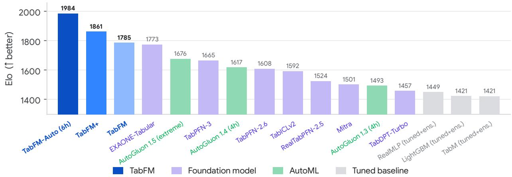
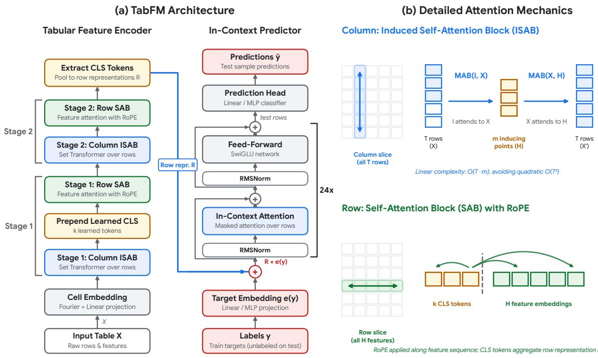
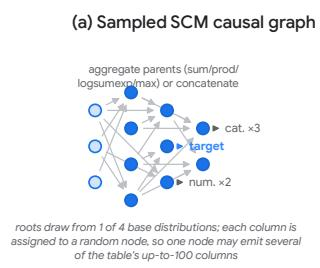
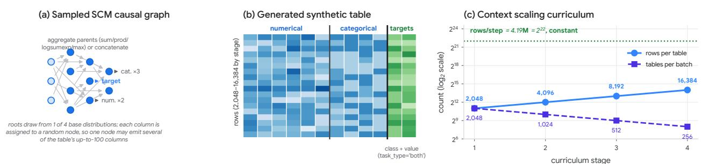
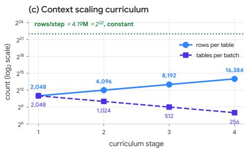
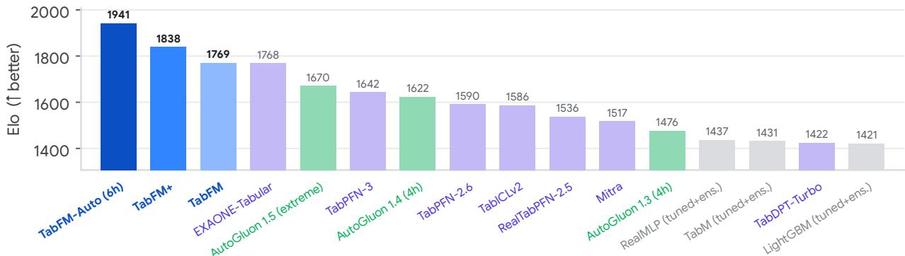
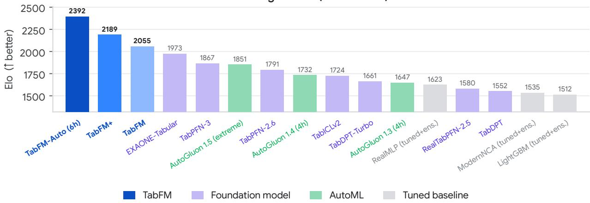
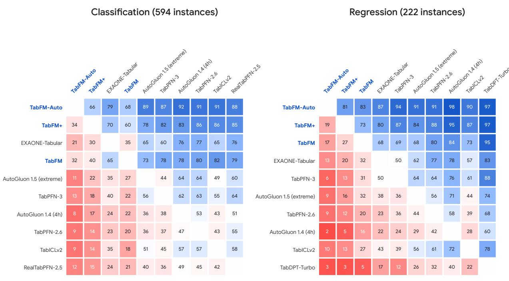
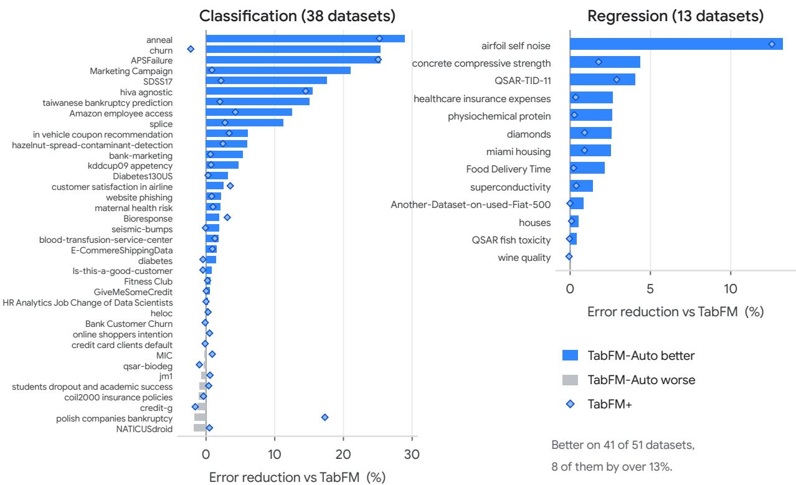

# TabFM: A Zero-Shot Foundation Model for Tabular Data

Weihao Kong1, Erez Louidor Ilan1, Shuxin Nie1, Taman Narayan1, Rajat Sen1, Yichen Zhou1, Deqing Fu1,   
Samet Oymak1 and Abhimanyu Das1   
1Google Research

Tabular machine learning typically relies on per-dataset workflows, fitting tree ensembles or running AutoML searches from scratch for every task. We present TabFM, a 400M-parameter tabular foundation model that formulates supervised tabular prediction as in-context learning. TabFM produces calibrated zero-shot predictions in a single forward pass without task-specific tuning. Trained entirely on synthetic tables generated from structural causal models, TabFM learns general tabular representations that transfer zero-shot to real-world tasks. Across all 51 benchmark datasets in TabArena (38 classification and 13 regression), zero-shot TabFM ranks first among default tabular foundation models and outperforms tuned AutoML pipelines. Two extensions over the same frozen weights improve performance further on both tracks: multi-view feature expansion with ensembling and post-hoc calibration (TabFM+), and LLM-guided, dataset-specific data processing and feature engineering (TabFM-Auto).

Overall TabArena Leaderboard (51 datasets)  
  
Figure 1 | Overall TabArena Elo ratings for the top 16 methods across all 51 benchmark datasets (38 classification and 13 regression). TabFM ranks first among zero-shot tabular foundation models, while TabFM+’s multi-view feature expansion, ensembling, and calibration and TabFM-Auto’s LLM-guided feature engineering with Gemini-3.8-Flash take the top two positions overall without updating any weights.

## 1. Introduction

Supervised learning on tabular data relies primarily on tree ensembles, most prominently gradientboosted decision trees (GBDTs) (Chen and Guestrin, 2016; Ke et al., 2017; Prokhorenkova et al., 2018) and Random Forests (Breiman, 2001), alongside AutoML systems (Erickson et al., 2020; Feurer et al., 2015) that stack heterogeneous models. Tree ensembles are efective because axis-aligned splits reliably handle mixed column types, missing entries, and irregular feature scales. However, these methods follow a per-dataset optimization paradigm: each new task demands custom preprocessing, split-finding sweeps, and hyperparameter search from scratch, so every dataset is learned from scratch.

  
Figure 2 | The TabFM Architecture. (a) Tables are embedded cell-wise $( T \times H \times E )$ , compressed by two untied stages alternating column ISAB and row SAB with 8 CLS tokens into row representations R, conditioned on e(�) for train rows, then processed by a 24-layer in-context predictor. (b) Column ISAB attends across rows in linear time, while row SAB attends across features with RoPE.

Foundation models instead amortize learning into a single forward pass. Following Prior-Data Fitted Networks (PFNs) (Hollmann et al., 2023a; Müller et al., 2022), an in-context tabular model parametrizes a universal posterior predictive map $f _ { \theta } ( \mathcal { D } _ { \mathrm { t r a i n } } , \mathbf { x } _ { \mathrm { t e s t } } ) \approx p ( y _ { \mathrm { t e s t } } \mid \mathbf { x } _ { \mathrm { t e s t } } , \mathcal { D } _ { \mathrm { t r a i n } } )$ over labeled context $\mathcal { D } _ { \mathrm { t r a i n } } ~ = ~ \{ ( \mathbf { x } _ { i } , y _ { i } ) \bar  \} _ { i = 1 } ^ { T _ { \mathrm { t r a i n } } }$ and unlabeled queries. Theoretically, transformers realize implicit optimization algorithms in their forward activations (Fu et al., 2024; Garg et al., 2022; Li et al., 2023; Von Oswald et al., 2023). Scaling this approach to general tables is constrained by the structure of tabular data. Rows are exchangeable, requiring permutation equivariance, while columns mix continuous values that require fine numerical resolution with discrete categories that lack natural ordering. Naive attention over all cells scales as $O ( T ^ { 2 } H ^ { 2 } )$ for � rows and � columns, historically confining tabular transformers to fewer than 1,000 rows (Hollmann et al., 2023a).

We introduce TabFM, a 400M-parameter Transformer that addresses these constraints (Figure 2). At the input layer, dyadic feature grouping pairs each column with neighbors at ofsets 0, 1, 3 and projects cell values through learned Fourier frequency banks. TabFM decouples feature encoding from cross-instance reasoning by alternating linear-time column-wise Induced Self-Attention Blocks (ISAB) (Lee et al., 2019) with row-wise Self-Attention Blocks (SAB) using Rotary Position Embeddings (RoPE) (Su et al., 2024). Learned CLS tokens pool arbitrary feature counts into fixed-width row representations, scaling context to 16,384 instances, and an asymmetric mask enforces conditional independence among queries.

We evaluate three deployment tiers on TabArena (Erickson et al., 2025). Zero-shot TabFM ranks first among default foundation models on both tracks. With the weights kept frozen, TabFM+ (see §4) combines cross and SVD feature expansion with � = 32 multi-view ensembling, stacked through regularized Non-Negative Least Squares (Lawson and Hanson, 1995) and Platt calibration (Platt, 1999), and TabFM-Auto (see §5 and Fu et al. 2026a) pairs the same frozen model with Gemini 3.8 Flash in a closed program-synthesis loop over dataset-specific feature engineering, taking the top rank on both suites.

## 2. Related Work

Tabular Foundation Models and In-Context Optimization. In-context tabular prediction was introduced by Prior-Data Fitted Networks (PFNs) (Müller et al., 2022), which train networks on synthetic priors to approximate Bayesian posterior predictives. TabPFN (Hollmann et al., 2023a) demonstrated in-context classification on small tables, followed by extensions to regression and larger samples (Grinsztajn et al., 2026a,b; Hollmann et al., 2025), continued pretraining on empirical corpora (Garg et al., 2025; Hosseinzadeh et al., 2026; Ma et al., 2025), and decoupled row-column architectures with inducing points (Qu et al., 2025, 2026). Theoretically, in-context learning is well described as implicit algorithmic optimization: attention layers execute iterative update steps in their activations (Garg et al., 2022; Li et al., 2023; Von Oswald et al., 2023), and deeper stacks attain second-order Newton convergence on ill-conditioned regression (Fu et al., 2024). TabFM builds on this design by pairing an alternating column- and row-attention encoder with a deep 24-layer in-context predictor over spectral cell embeddings.

Tree Ensembles, Deep Architectures, and Numerical Embeddings. GBDTs (Chen and Guestrin, 2016; Ke et al., 2017; Prokhorenkova et al., 2018) build axis-aligned boundaries that are robust to uninformative features and invariant to monotone rescaling, and benchmarks consistently show they outperform per-dataset deep models (Grinsztajn et al., 2022; McElfresh et al., 2023; Shwartz-Ziv and Armon, 2022) such as TabNet (Arik and Pfister, 2021), FT-Transformer (Gorishniy et al., 2021), SAINT (Somepalli et al., 2021), and TabM (Gorishniy et al., 2025). Standard neural layers also struggle to encode continuous scalars without losing numerical resolution. Transformers learn Fourier representations when grokking arithmetic (Nanda et al., 2023), language models build internal Fourier features for numerical scale (Zhou et al., 2024) that recur across architectures (Fu et al., 2026b), and Fourier Number Embeddings preserve numeric resolution (Zhou et al., 2026). TabFM adopts learned Fourier cell embeddings on this basis.

AutoML and Programmatic Data Optimization. AutoML automates model selection, feature engineering, and tuning (Feurer et al., 2015). AutoGluon-Tabular (Erickson et al., 2020) combines multilayer stacking and bagging over a per-task search budget. Language models have also been applied to tabular transformation (Tornede et al., 2024), through row serialization in TabLLM (Hegselmann et al., 2023) and feature-engineering synthesis in CAAFE (Hollmann et al., 2023b). TabFM-Auto (Fu et al., 2026a) instead wraps a frozen tabular foundation model in a closed cross-validation loop, synthesizing dataset-specific feature engineering pipelines without updating model weights.

## 3. TabFM: Model Architecture and Pretraining

## 3.1. Model Architecture

TabFM factorizes tabular prediction into four stages: spectral cell embedding, alternating column-wise and row-wise attention, CLS pooling, and deep in-context prediction. Figure 2 shows the pipeline

Table 1 | TabFM architecture specification (400M checkpoint, $E = d _ { \mathrm { m o d e l } } = 1 2 8 )$ . All sublayers use sandwich RMSNorm with SwiGLU activations, zero dropout, and no bias parameters.
<table><tr><td></td><td></td><td colspan="4">Configuration</td><td></td><td></td></tr><tr><td>Stage</td><td>Module</td><td></td><td></td><td>Width Heads Induc.</td><td>FFN</td><td></td><td>Params Function</td></tr><tr><td>Cell Embedder</td><td>Spectral proj.</td><td>128</td><td></td><td></td><td></td><td>0.05M</td><td>Learned Fourier features</td></tr><tr><td>Column Embedder</td><td>2 × 3 ISAB</td><td>128</td><td>4</td><td>256</td><td>512</td><td>3.3M</td><td>Linear row attention</td></tr><tr><td>Row Interaction</td><td>2 × 3 SAB</td><td>128</td><td>8</td><td></td><td>512</td><td>1.6M</td><td>RoPE feature attention</td></tr><tr><td>ICL Predictor</td><td>24× SAB</td><td>1024</td><td>8</td><td>一</td><td>4096</td><td>402.7M</td><td>Masked in-context mixing</td></tr><tr><td>Prediction Head</td><td>2-layer MLP</td><td>1024</td><td>1</td><td></td><td>1024</td><td>1.05M</td><td>Output</td></tr><tr><td>TabFM</td><td></td><td></td><td></td><td></td><td></td><td>408.7M</td><td></td></tr></table>

and Table 1 its specification.

Cell Embedder and Feature Grouping. Given an input table $\mathbf { X } \in \mathbb { R } ^ { T \times H }$ with $T = T _ { \mathrm { t r a i n } } + T _ { \mathrm { t e s t } }$ rows $\mathbf { x } _ { i } \in \mathbb { R } ^ { H }$ , TabFM applies feature grouping following TabPFN-3 (Grinsztajn et al., 2026b) and TabICLv2 (Qu et al., 2026) to capture local cross-feature interactions before attention. Each column $j \in \{ 0 , \ldots , H - 1 \}$ is grouped with columns at dyadic ofsets $j _ { g } = \left( j + 2 ^ { g } - 1 \right)$ mod � for $g \in \{ 0 , 1 , 2 \}$ (group size $G = 3$ , ofsets $0 , 1 , 3 )$ . Each slot � projects its scalar � through a slot-specific bank of 32 learned Fourier frequencies $\boldsymbol { \omega } _ { g } \in \mathbb { R } ^ { 3 2 }$ (Tancik et al., 2020; Zhou et al., 2026):

$$
\gamma _ { g } ( \nu ) = \left[ \cos ( 2 \pi \omega _ { g , 1 } \nu ) , \sin ( 2 \pi \omega _ { g , 1 } \nu ) , \ldots , \cos ( 2 \pi \omega _ { g , 3 2 } \nu ) , \sin ( 2 \pi \omega _ { g , 3 2 } \nu ) \right] ^ { \top } \in \mathbb { R } ^ { 6 4 } .\tag{1}
$$

Numerical and categorical columns route per slot through separate frequency banks $( \omega _ { g } ^ { \mathrm { n u m } } \mathrm { v s . } \omega _ { g } ^ { \mathrm { c a t } } )$ and projections $( \mathbf { W } _ { g } ^ { \mathrm { n u m } } , \mathbf { W } _ { g } ^ { \mathrm { c a t } } \in \mathbb { R } ^ { 6 4 \times E } )$ , keeping continuous values on a metric scale while mapping categories to distinct embeddings. Summing across slots gives $\begin{array} { r } { \mathbf { X } _ { i , j } ^ { ( 0 ) } = \sum _ { g = 0 } ^ { G - 1 } \gamma _ { g } ( x _ { i , j _ { g } } ) \mathbf { W } _ { g } \in \mathbb { R } ^ { E } \left( E = 1 2 8 \right) } \end{array}$ Labeled rows receive a target embedding $\mathbf { e } ( y _ { i } )$ added to each cell, while query rows receive nothing.

Attention Foundations and Column Embedding. To process both dimensions of a table without quadratic cell attention, column-wise attention treats the � rows as the sequence within each column, capturing marginal distributions, whereas row-wise attention treats the � features as the sequence within each row, capturing cross-feature structure.

We first fix notation. For queries $\mathbf { Q } \in \mathbb { R } ^ { N _ { q } \times d _ { k } }$ , keys $\mathbf { K } \in \mathbb { R } ^ { N _ { k \nu } \times d _ { k } }$ , values $\mathbf { V } \in \mathbb { R } ^ { N _ { k \nu } \times d _ { \nu } }$ , and an additive mask $\mathbf { M } \in \{ 0 , - \infty \} ^ { N _ { q } \times N _ { k \nu } }$ that deletes forbidden query–key pairs, scaled dot-product attention and its ℎ-head form over $\mathbf { X } \in \mathbb { R } ^ { N _ { q } \times d } , \mathbf { Y } \in \mathbb { R } ^ { N _ { k \upsilon } \times d }$ (with $d _ { k } = d _ { \nu } = d / h )$ are

$$
\mathrm { A t t n } ( \mathbf { Q } , \mathbf { K } , \mathbf { V } ; \mathbf { M } ) = \mathrm { s o f t m a x } \left( \frac { \mathbf { Q } \mathbf { K } ^ { \top } } { \sqrt { d _ { k } } } + \mathbf { M } \right) \mathbf { V } , \quad \mathrm { M H A } ( \mathbf { X } , \mathbf { Y } ; \mathbf { M } ) = \left[ \mathrm { h e a d } _ { 1 } , . . . , \mathrm { h e a d } _ { h } \right] \mathbf { W } ^ { \mathrm { O } } ,\tag{2}
$$

with head $\mathbf { \Lambda } _ { i } = \mathsf { A t t n } \big ( \mathbf { X } \mathbf { W } _ { i } ^ { Q } , \mathbf { Y } \mathbf { W } _ { i } ^ { K } , \mathbf { Y } \mathbf { W } _ { i } ^ { V } ; \mathbf { M } \big )$ and learnable $\mathbf { W } _ { i } ^ { \boldsymbol { Q } } , \mathbf { W } _ { i } ^ { K } \in \mathbb { R } ^ { d \times d _ { k } } , \mathbf { W } _ { i } ^ { V } \in \mathbb { R } ^ { d \times d _ { \upsilon } }$ $\mathbf { W } ^ { O } \in \mathbb { R } ^ { d \times d }$ Normalization uses RMSNorm (Zhang and Sennrich, 2019) and the feed-forward sublayer uses SwiGLU (Shazeer, 2020):

$$
\mathrm { R M S N o r m } ( \mathbf { x } ) = \frac { \mathbf { x } } { \sqrt { \frac { 1 } { d } \sum _ { j = 1 } ^ { d } x _ { j } ^ { 2 } + \epsilon } } \odot \mathbf { g } , \qquad \mathrm { S w i G L U } ( \mathbf { x } ) = \Big ( \mathrm { s w i s h } ( \mathbf { x W } _ { 1 } ) \odot ( \mathbf { x V } _ { 1 } ) \Big ) \mathbf { W } _ { 2 } ,\tag{3}
$$

where $\pmb { \mathrm { g } } \in \mathbb { R } ^ { d }$ is a learnable gain, $\epsilon = 1 0 ^ { - 6 }$ $\operatorname { s w i s h } ( z ) = z \sigma ( z )$ , and $\mathbf { W } _ { 1 } , \mathbf { V } _ { 1 } \in \mathbb { R } ^ { d \times 4 d } , \mathbf { W } _ { 2 } \in \mathbb { R } ^ { 4 d \times d }$

TabFM uses two fixed attention masks. Attention along the feature axis carries a padding mask $\mathbf { M } ^ { \mathrm { p a d } }$ that masks the unused slots of the $H _ { \mathrm { m a x } } .$ column bufer into which a table of $H \leq H _ { \operatorname* { m a x } }$ columns is padded $( H _ { \operatorname* { m a x } } = 1 0 0$ throughout pretraining, §3.2), and attention along the row axis carries a context mask $\mathbf { M } ^ { \mathrm { c t x } }$ that admits only the labeled prefix as keys:

$$
M _ { j l } ^ { \mathrm { p a d } } = \left\{ \begin{array} { l l } { 0 } & { l \leq H } \\ { - \infty } & { \mathrm { o t h e r w i s e } , } \end{array} \right. \qquad M _ { i k } ^ { \mathrm { c t x } } = \left\{ \begin{array} { l l } { 0 } & { k \leq T _ { \mathrm { t r a i n } } } \\ { - \infty } & { \mathrm { o t h e r w i s e } . } \end{array} \right.\tag{4}
$$

${ \bf M } ^ { \mathrm { c t x } }$ does not depend on the query index �: both training and test queries attend to the same key set $\{ 1 , \dots , T _ { \mathrm { t r a i n } } \}$ . Writing 0 for the all-zero mask, an unmasked block is the special case $\mathbf { M } = \mathbf { 0 }$

The Set Transformer Multihead Attention Block (MAB) (Lee et al., 2019) composes these with sandwich normalization, applying RMSNorm at both the input and output of each sublayer while residuals carry unnormalized activations:

$$
\mathbf { Z } = \mathbf { X } + \mathrm { R M S N o r m } \Big ( \mathrm { M H A } \big ( \mathrm { R M S N o r m } ( \mathbf { X } ) , \mathrm { R M S N o r m } ( \mathbf { Y } ) ; \mathbf { M } \big ) \Big ) ,\tag{5}
$$

$$
\mathbf { M A B } ( \mathbf { X } , \mathbf { Y } ; \mathbf { M } ) = \mathbf { Z } + \mathsf { R M S N o r m } \Bigl ( \mathsf { S w i G L U } \bigl ( \mathbf { R M S N o r m } ( \mathbf { Z } ) \bigr ) \Bigr ) .\tag{6}
$$

Self-attention and induced self-attention follow directly, with $\mathbf { I } \in \mathbb { R } ^ { m \times E }$ a set of $m = 2 5 6$ learned inducing points:

$$
\mathrm { S A B } ( \mathbf { X } ; \mathbf { M } ) = \mathbf { M } \mathbf { A } \mathbf { B } ( \mathbf { X } , \mathbf { X } ; \mathbf { M } ) , \qquad \mathrm { I S A B } _ { m } ( \mathbf { X } ; \mathbf { M } ) = \mathbf { M } \mathbf { A } \mathbf { B } \Big ( \mathbf { X } , \mathbf { M } \mathbf { A } \mathbf { B } ( \mathbf { I } , \mathbf { X } ; \mathbf { M } ) ; \mathbf { 0 } \Big ) .\tag{7}
$$

The inner block compresses � instances onto � inducing vectors and the outer block reads them back, reducing $O ( T ^ { 2 } E )$ attention to $O ( T m E )$ . Masking the inner projection with ${ \bf M } ^ { \mathrm { c t x } }$ ensures that the inducing summaries $\mathrm { M A B } ( \mathbf { I } , \mathbf { X } ; \ \mathbf { M } ^ { \mathrm { c t x } } )$ are computed solely from the labeled training rows $k \leq T _ { \mathrm { t r a i n } }$ , so the unmasked outer read-back distributes training-set column statistics to all rows without leaking information across test instances. Column-wise attention is therefore $\mathrm { I S A B } _ { 2 5 6 } ( \cdot ; \mathbf { M } ^ { \mathrm { c t x } } )$ over the row axis.

Row Interaction and Context Pooling. Row-wise attention runs across features within each row via $\mathrm { S A B ( \cdot ; \mathbf { M } ^ { p a d } ) }$ (8 heads, width $E = 1 2 8 )$ , with Rotary Position Embeddings (RoPE) (Su et al., 2024) modulating queries and keys along the feature axis by rotations $\mathbf { R } _ { \Theta , p }$ . Confining RoPE to features distinguishes channels without imposing ordinality and leaves rows permutation-equivariant. Feature positions are therefore encoded relatively rather than through a learned table, so � is not fixed by the weights and inference can run wider than pretraining (§4). TabFM alternates two untied stages of three $\mathrm { I S A B } _ { 2 5 6 } ( \cdot ; \mathbf { M } ^ { \mathrm { c t x } } )$ blocks and three $\mathrm { S A B ( \cdot ; \mathbf { M } ^ { p a d } ) }$ blocks. Eight learned CLS tokens $\mathbf { C } \in \mathbb { R } ^ { 8 \times E }$ are prepended along the feature axis after the first column stage, and their final states are concatenated into $\mathbf { r } _ { i } \in \mathbb { R } ^ { 1 0 2 4 }$ , giving $\mathbf { R } \in \mathbb { R } ^ { T \times 1 0 2 4 }$

In-Context Learning Predictor. The predictor reads the row sequence R. Labeled rows are conditioned on their target a second time, $\tilde { \mathbf { r } } _ { i } = \mathbf { r } _ { i } + \mathbf { e } ( y _ { i } )$ for $i \leq T _ { \mathrm { t r a i n } } .$ , while the target embedding of a query row is zeroed before it is added. The predictor stacks $2 4 \mathrm { S A B } ( \cdot ; \mathrm { { \bf { M } } ^ { c t x } ) }$ layers (width 1024, 8 heads, FFN 4096, 402.7M parameters), supplying the depth that multi-step implicit optimization requires (Fu et al., 2024; Li et al., 2023). Because ${ \bf M } ^ { \mathrm { c t x } }$ masks all keys with index $k > T _ { \mathrm { t r a i n } }$ , each test row $i > T _ { \mathrm { t r a i n } }$ attends exclusively to the labeled context, and its own features propagate to the prediction through the query projection and the residual stream. Test predictions are therefore conditionally independent given $\mathcal { D } _ { \mathrm { t r a i n } }$ , which prevents label leakage and lets the query block be split or reordered without changing predictions. A sandwich-normalized two-layer MLP head then maps $\tilde { \mathbf { r } } _ { i }$ to logits $\hat { \mathbf { y } } _ { i } \in \mathbb { R } ^ { C }$ or a scalar $\hat { y } _ { i }$

  
Figure 3 | Synthetic pretraining and curriculum: (a) a sampled SCM graph with randomized functional dependencies, (b) the resulting table with numerical, categorical, and dual targets, and (c) the fourstage curriculum scaling context from 2,048 to 16,384 instances at constant tokens per step.

Attention Complexity. Decoupling feature encoding from cross-row prediction reduces both time and memory complexity. Column-wise attention over � rows is $O ( T H m E )$ with $m = 2 5 6$ inducing points rather than the $O ( T ^ { 2 } H E )$ of full cross-row attention over cells, and row-wise attention is $\bar { O } ( T H ^ { 2 } E )$ along the feature axis, which stays bounded because the feature count is far below the row count. Only the predictor attends across all � rows at full width, at $O ( T ^ { 2 } d )$ with $d = 1 0 2 4$ , and it does so once on pooled row representations rather than once per cell. Context therefore reaches 16,384 instances, an order of magnitude beyond the regime in which in-context tabular prediction was first demonstrated (Hollmann et al., 2023a).

## 3.2. Synthetic Pretraining Data and Curriculum

TabFM is pretrained entirely on synthetic tables drawn from structural causal models (SCMs) (Pearl, 2009), which generate structured feature dependencies (Figure 3). Each dataset samples a directed acyclic graph with randomized functional dependencies (Qu et al., 2026). Root variables propagate through non-linear transformations and algebraic aggregations to produce tables mixing continuous and discrete columns.

To match the distributional variations of real-world datasets, each sample jointly randomizes table shape, the share of categorical columns and their cardinalities, missing entries, label noise, and class balance, with the feature axis capped at 100 columns. Randomizing these jointly with the graph prevents the model from overfitting to a fixed table geometry and keeps the evaluation tables of Section 3.3 inside the support of the pretraining distribution. Every sampled table is split into a labeled context and a query block before it reaches the model, so the pretraining objective matches the inference-time interface: the loss is evaluated only on query rows, jointly over the classification and the regression target that each table carries.

Curriculum Learning. A four-stage curriculum grows the context from 2,048 to 16,384 instances (Figure 3(c)). At each transition rows per table double while batch size halves, holding tokens per optimization step fixed at $2 ^ { 2 2 }$ ≈ 4.19M. Keeping per-step compute invariant lets the model adapt to longer contexts without destabilizing optimization. Training on shorter contexts with large batch sizes first stabilizes the Fourier cell embedder and the alternating column and row attention stages, after which the longer-context stages adapt the inducing-point bottlenecks and 24-layer predictor to larger sample sizes.

Table 2 | TabArena benchmark leaderboards under repeated 10-fold cross-validation. Ratings are obtained from a unified Bradley–Terry fit anchored to RF (default) at 1000 Elo. G-mean is the geometric mean error across datasets, Wins counts fold-averaged dataset victories, and Improvability is the relative error reduction an oracle selector would achieve.  
(a) Classification (38 datasets, 594 tasks)
<table><tr><td># Method</td><td>Elo ↑</td><td>Wins ↑</td><td></td><td>Improv. ↓ gmean ↓</td></tr><tr><td>1</td><td>TabFM-Auto</td><td>1940.7</td><td>13.50</td><td>2.47% 0.0921</td></tr><tr><td>2</td><td>TabFM+</td><td>1838.0</td><td>6.63</td><td>5.22% 0.0948</td></tr><tr><td>3</td><td>TabFM</td><td>1768.6</td><td>5.54 6.10%</td><td>0.0957</td></tr><tr><td>又</td><td>EXAONE-Tabular</td><td>1768.0</td><td>3.00 9.47%</td><td>0.1009</td></tr><tr><td>5</td><td>AutoGluon 1.5 (ext.)</td><td>1669.7</td><td>1.48 10.00%</td><td>0.1010</td></tr><tr><td>6</td><td>TabPFN-3</td><td>1641.9</td><td>0.40 12.34%</td><td>0.1050</td></tr><tr><td>7</td><td>AutoGluon 1.4 (4h)</td><td>1621.9</td><td>0.26</td><td>13.33% 0.1079</td></tr><tr><td>8</td><td>TabPFN-2.6</td><td>1590.3</td><td>0.03 13.87%</td><td>0.1075</td></tr><tr><td>9</td><td>TabICLv2</td><td>1586.4</td><td>0.57</td><td>13.08% 0.1060</td></tr><tr><td>10</td><td>RealTabPFN-2.5</td><td>1536.0</td><td>0.07 14.22%</td><td>0.1077</td></tr><tr><td></td><td>11 AutoGluon 1.3 (4h)</td><td>1475.6</td><td>0.14 16.27%</td><td>0.1147</td></tr><tr><td></td><td>12 RealMLP (tuned)</td><td>1436.7</td><td>0.08</td><td>17.34% 0.1161</td></tr></table>

(b) Regression (13 datasets, 222 tasks)
<table><tr><td># Method</td><td></td><td>Elo ↑</td><td></td><td>Wins ↑ Improv. ↓ gmean ↓</td><td></td></tr><tr><td></td><td>1 TabFM-Auto</td><td>2392.4</td><td>9.61</td><td>0.00%</td><td>15.96</td></tr><tr><td>2</td><td>TabFM+</td><td>2189.2</td><td>1.09</td><td>1.34%</td><td>16.17</td></tr><tr><td>3</td><td>TabFM</td><td>2055.2</td><td>0.92</td><td>2.62%</td><td>16.40</td></tr><tr><td></td><td>4 EXAONE-Tabular</td><td>1973.1</td><td>0.18</td><td>3.64%</td><td>16.58</td></tr><tr><td>5</td><td>TabPFN-3</td><td>1866.6</td><td>0.17</td><td>3.33%</td><td>16.51</td></tr><tr><td>6</td><td>AutoGluon 1.5 (ext.)</td><td>1851.2</td><td>0.14</td><td>4.83%</td><td>16.78</td></tr><tr><td>7</td><td>TabPFN-2.6</td><td>1791.4</td><td>0.00</td><td>4.91%</td><td>16.79</td></tr><tr><td>8</td><td>AutoGluon 1.4 (4h)</td><td>1732.2</td><td>0.03</td><td>5.57%</td><td>16.91</td></tr><tr><td>9</td><td>TabICLv2</td><td>1723.6</td><td>0.28</td><td>4.85%</td><td>16.78</td></tr><tr><td></td><td>10 TabDPT-Turbo</td><td>1660.8</td><td>0.14</td><td>6.07%</td><td>17.02</td></tr><tr><td></td><td>11 AutoGluon 1.3 (4h)</td><td>1646.8</td><td>0.03</td><td>7.14%</td><td>17.23</td></tr><tr><td></td><td>12 RealMLP (tuned)</td><td>1623.4</td><td>0.03</td><td>6.54%</td><td>17.09</td></tr></table>

## 3.3. TabArena Zero-Shot Evaluation

We evaluate on TabArena (Erickson et al., 2025), a benchmark of 51 datasets (38 classification, 13 regression), each evaluated under repeated 10-fold cross-validation. Performance across heterogeneous metrics is summarized by Bradley–Terry Elo (Bradley and Terry, 1952; Elo, 1978; Hunter, 2004), which places per-dataset evaluation metrics on a common scale.

Protocol and Metrics. The comparison pool holds 67 method configurations including tuned tree ensembles, tuned deep baselines, AutoML systems at four-hour budgets, and published tabular foundation models. Ratings come from TabArena’s Bradley–Terry fit over pairwise outcomes at the level of a single (dataset, fold) pair, weighting every dataset equally, anchoring Random Forest at 1000, and taking the median rating over 100 bootstrap rounds. Alongside Elo, we report three summary metrics across datasets. G-mean is the geometric mean over datasets of the mean error, which weights relative improvements equally across datasets of diferent dificulty. Wins sums, over datasets, the fraction of folds a method takes outright with ties split. Improvability averages 1 − errbest/errmethod over datasets, measuring the relative error reduction achievable by a per-dataset oracle selector.

Zero-Shot Performance. TabFM leads both tracks among default models (Table 2, Figure 4). On regression it reaches 2055.2 Elo, ahead of EXAONE-Tabular (1973.1), TabPFN-3 (1866.6), Auto-Gluon 1.5 extreme (1851.2), and TabICLv2 (1723.6), with the lowest geometric-mean error (16.40) and 2.62% oracle improvability among single-pass models. On classification it reaches 1768.6 Elo, ahead of EXAONE-Tabular (1768.0), AutoGluon 1.5 extreme (1669.7), TabPFN-3 (1641.9), and TabICLv2 (1586.4), again with the lowest geometric-mean error (0.0957), the most outright wins (5.54), and the lowest oracle improvability (6.10%). The regression margin is the larger of the two, consistent with spectral embeddings that place targets on a continuous scale rather than on piecewise-constant splits. On classification, where the top four methods fall within a 130-Elo span, TabFM’s advantage comes from lower regret across datasets, reducing oracle improvability from 9.47% (EXAONE-Tabular) and 10.00% (AutoGluon 1.5 extreme) to 6.10%.

Pooled over both suites (Figure 1), TabFM ranks first among default foundation models at 1785.4 Elo and wins most head-to-head folds against every baseline (Figure 5): 65.7% against

Classification (38 datasets)  

Regression (13 datasets)  
  
Figure 4 | Task-separated TabArena Elo over 38 classification (top) and 13 regression (bottom) datasets, top 16 methods per suite. Colors mark TabFM variants in blue, peer foundation models in purple, AutoML in green, and tuned baselines in grey.

EXAONE-Tabular, 72.1% against AutoGluon 1.5 extreme, 75.9% against TabPFN-3, and 79.8% against TabICLv2. Win rates increase monotonically with Elo diference across tuned GBDTs, deep tabular models, 4-hour AutoML ensembles, and peer foundation models.

## 4. TabFM+: Feature Engineering and Inference-Time Ensembling

Because TabFM applies dyadic feature grouping and RoPE along the column axis, its forward pass is invariant to row order but sensitive to column order, numerical scaling, and appended feature interactions. TabFM+ uses this property at test time by running � = 32 transformed views of the input table through the frozen checkpoint. After standardizing raw columns (expanding datetimes into five numerical channels, merging categories with frequency below two, and dropping constant or duplicate columns), TabFM+ constructs two pools of engineered features for an �-column table: multiplicative cross features, which sample up to $k _ { \mathrm { c r o s s } } = \lfloor \sqrt { H } \rfloor$ numerical column pairs $( c _ { 1 } , c _ { 2 } )$ uniformly at random from all $\binom { H _ { \mathrm { n u m } } } { 2 }$ pairs and append products $\boldsymbol { x } _ { i , c _ { 1 } } \cdot \boldsymbol { x } _ { i , c _ { 2 } }$ , and Truncated SVD structural features, which one-hot encode categoricals alongside standardized numericals and extract up to $k _ { \mathrm { s v d } } = \lfloor \sqrt { H } \rfloor$ leading singular vectors. Crosses inject pairwise non-linearities, while SVD components supply dense low-rank summaries of global linear structure.

  
row beats column, % of (dataset, fold) instances

Figure 5 | Pairwise win rates on TabArena: percentage of dataset-fold instances where the row method beats the column method, ties counted as half. Methods are ordered by Elo.

To diversify the � = 32 forward passes, TabFM+ splits the member budget: half of the members evaluate the unaugmented original columns (capped at 500 features, well beyond the 100 columns seen during pretraining), while the other half append random draws from the cross and SVD pools. Each member then applies an independent view transformation combining alternative preconditioning (standard scaling with either identity or Yeo–Johnson power normalization and �-score outlier clipping at 4.0), random column permutations, random bijective categorical index permutations, and cyclic shifts of classification labels. Because both dyadic feature grouping and row RoPE depend on column order, permuting columns alters both the input-layer feature triplets and their relative positional encodings, producing distinct internal views from one set of weights. Member predictions $\hat { \mathbf { y } } ^ { ( 1 ) } , \dotsc , \hat { \mathbf { y } } ^ { ( K ) }$ are stacked via Non-Negative Least Squares (Lawson and Hanson, 1995) weights w $\in \ \Delta ^ { K - 1 }$ fit on internal validation folds and shrunk toward uniform as $\mathbf { w } _ { \mathrm { f i n a l } } = 0 . 7 5 \mathbf { w } + 0 . 2 5 { \frac { 1 } { K } } \mathbf { 1 }$ , with Platt scaling (Platt, 1999) for classification. This adds +69.4 Elo on classification and +134.0 Elo on regression (second overall among 67 methods, Table 2), with regression gaining nearly twice as much because averaging reduces variance more on continuous scales than on sharp class posteriors.

## 5. TabFM-Auto: Feature Engineering with Gemini

While TabFM+ applies generic perturbations to the input table, many datasets depend on domainspecific features. TabFM-Auto pairs the frozen TabFM checkpoint with Gemini-3.8-Flash, which is given a dataset and iteratively writes, evaluates, and refines a Python pipeline around the pretrained model. The program specifies data preprocessing, feature engineering, the selection of rows that enter the context, post-processing of the prediction, and the model’s inference-time settings. TabFM remains the primary predictor with its weights frozen: auxiliary models may be fitted and blended, but TabFM parameters are never updated. We summarize the method here and refer to Fu et al. (2026a) for full details.

  
Figure 6 | Per-dataset relative error reduction $( 1 - \mathrm { e r r } _ { \mathrm { m e t h o d } } / \mathrm { e r r } _ { \mathrm { T a b F M } } )$ over zero-shot TabFM across all 51 TabArena datasets. Bars show TabFM-Auto and diamonds show TabFM+. TabFM-Auto improves 41 of 51 datasets, ten by more than 10%.

Each candidate program is scored by three-fold cross-validation inside the training split of the first fold with 8 ensemble members, and its score, its per-fold values, and any traceback are appended to a log that is read before the next edit. Candidate programs execute in a sandbox without access to held-out test splits or evaluation folds. Every run starts from the identity program (vanilla TabFM), so that any improvement comes from the synthesized transformations around zero-shot TabFM. Search stops after 96 evaluations or six hours, whichever comes first. Gemini then selects one program from its top-3 validation candidates, and that program is refit on every published fold and scored once on test rows.

Improvements come primarily from feature construction rather than hyperparameter tuning, for example Strouhal and Reynolds numbers on airfoil\_self\_noise or ICD-9 diagnoses folded into chapters on Diabetes130US. Splitting the final programs by whether any hook changed the table, the median error reduction over zero-shot TabFM is 2.14% when it did and 0.27% when it did not.

TabFM-Auto takes the top position on both TabArena classification and regression tasks, gaining +172.1 and +337.2 Elo over the base TabFM (see Table 2). It improves 41 of the 51 datasets and beats inference-time ensembling on 40 of them (Figure 6). Regression improves on all 13 datasets and reaches 0.00% oracle improvability. On the ten classification datasets that do not improve over zero-shot TabFM, test error increases by at most 1.8%.

## 6. Conclusion

We presented TabFM, a 400M-parameter Transformer that performs supervised tabular prediction through in-context learning. Trained exclusively on synthetic tables generated from structural causal models, TabFM transfers zero-shot to real-world tasks and ranks first among default foundation models on TabArena, while inference-time ensembling (TabFM+) and LLM-guided feature engineering (TabFM-Auto) bring further gains without updating any weights.

Current pretraining covers synthetic numerical and categorical tables of at most 16,384 rows and 100 columns, leaving larger tables to length generalization or subsampling and encoding free text without semantic tokenization. Scaling pretraining directly to million-row and thousand-column tables is an immediate next step, using hierarchical row pooling and sparse feature attention to keep those shapes tractable. Combining synthetic causal priors with real-world tabular corpora and pretrained text and temporal encoders would likewise extend in-context learning to multimodal tables with free-text fields, timestamps, and high-cardinality identifiers, and generalizing the architecture from single flat tables to relational schemas would avoid manually joining and flattening databases before inference. More broadly, whereas TabFM-Auto queries TabFM as a fixed evaluator inside an outer LLM search loop, distilling synthesized feature pipelines back into pretraining could fold feature discovery directly into the forward pass.

## References

S. Ö. Arik and T. Pfister. Tabnet: Attentive interpretable tabular learning. Proceedings of the AAAI Conference on Artificial Intelligence, 35(8):6679–6687, May 2021. ISSN 2159-5399. doi: 10.1609/ aaai.v35i8.16826. URL http://dx.doi.org/10.1609/aaai.v35i8.16826.

R. A. Bradley and M. E. Terry. Rank analysis of incomplete block designs: I. the method of paired comparisons. Biometrika, 39(3/4):324–345, 1952. ISSN 00063444, 14643510. URL http: //www.jstor.org/stable/2334029.

L. Breiman. Random forests. Machine Learning, 45(1):5–32, Oct 2001. ISSN 1573-0565. doi: 10.1023/A:1010933404324. URL https://doi.org/10.1023/A:1010933404324.

T. Chen and C. Guestrin. Xgboost: A scalable tree boosting system. In Proceedings of the 22nd ACM SIGKDD International Conference on Knowledge Discovery and Data Mining, KDD ’16, page 785–794. ACM, Aug. 2016. doi: 10.1145/2939672.2939785. URL http://dx.doi.org/10. 1145/2939672.2939785.

A. E. Elo. The Rating of Chessplayers, Past and Present. Arco Publishing, New York, 1978.

N. Erickson, J. Mueller, A. Shirkov, H. Zhang, P. Larroy, M. Li, and A. Smola. Autogluon-tabular: Robust and accurate automl for structured data, 2020. URL https://arxiv.org/abs/2003.06505.

N. Erickson, L. Purucker, A. Tschalzev, D. Holzmüller, P. Desai, D. Salinas, and F. Hutter. Tabarena: A living benchmark for machine learning on tabular data. In Advances in Neural Information Processing Systems, volume 38, Main Conference. Curran Associates, Inc., 2025. doi: 10.52202/085713-0519. URL https://proceedings.neurips.cc/paper\_ files/paper/2025/file/1697e3fb412da11dc9488249f9e7bbc9-Paper-Datasets\_ and\_Benchmarks\_Track.pdf.

M. Feurer, A. Klein, K. Eggensperger, J. Springenberg, M. Blum, and F. Hutter. Eficient and robust automated machine learning. In Advances in Neural Information Processing Systems, volume 28. Cur-

ran Associates, Inc., 2015. URL https://proceedings.neurips.cc/paper\_files/paper/ 2015/file/11d0e6287202fced83f79975ec59a3a6-Paper.pdf.

D. Fu, T.-Q. Chen, R. Jia, and V. Sharan. Transformers learn to achieve second-order convergence rates for in-context linear regression. In Advances in Neural Information Processing Systems, volume 37, pages 98675–98716. Curran Associates, Inc., 2024. doi: 10.52202/079017-3132. URL https://proceedings.neurips.cc/paper\_files/paper/ 2024/file/b2d4051f03a7038a2771dfbbe5c7b54e-Paper-Conference.pdf.

D. Fu, H. Su, R. Sen, T. Narayan, S. Sanghavi, A. Das, and W. Kong. TabFM-Auto: Self-evolving pipelines for tabular foundation models. arXiv preprint, 2026a.

D. Fu, T. Zhou, M. Belkin, V. Sharan, and R. Jia. Convergent evolution: How diferent language models learn similar number representations, 2026b. URL https://arxiv.org/abs/2604.20817.

A. Garg, M. Ali, N. Hollmann, L. Purucker, S. Müller, and F. Hutter. Real-tabpfn: Improving tabular foundation models via continued pre-training with real-world data, 2025. URL https://arxiv. org/abs/2507.03971.

S. Garg, D. Tsipras, P. S. Liang, and G. Valiant. What can transformers learn in-context? a case study of simple function classes. In Advances in Neural Information Processing Systems, volume 35, pages 30583–30598. Curran Associates, Inc., 2022. doi: 10. 52202/068431-2217. URL https://proceedings.neurips.cc/paper\_files/paper/ 2022/file/c529dba08a146ea8d6cf715ae8930cbe-Paper-Conference.pdf.

Y. Gorishniy, I. Rubachev, V. Khrulkov, and A. Babenko. Revisiting deep learning models for tabular data. In Advances in Neural Information Processing Systems, volume 34, pages 18932–18943. Curran Associates, Inc., 2021. URL https://proceedings.neurips.cc/paper\_files/paper/ 2021/file/9d86d83f925f2149e9edb0ac3b49229c-Paper.pdf.

Y. Gorishniy, A. Kotelnikov, and A. Babenko. Tabm: Advancing tabular deep learning with parametereficient ensembling. In International Conference on Learning Representations, volume 2025, pages 77899–77935, 2025. URL https://proceedings.iclr.cc/paper\_files/paper/2025/ file/c1ba41c694834aeef91ae161711d4939-Paper-Conference.pdf.

L. Grinsztajn, E. Oyallon, and G. Varoquaux. Why do tree-based models still outperform deep learning on typical tabular data? In Advances in Neural Information Processing Systems, volume 35, pages 507–520. Curran Associates, Inc., 2022. doi: 10.52202/ 068431-0037. URL https://proceedings.neurips.cc/paper\_files/paper/2022/ file/0378c7692da36807bdec87ab043cdadc-Paper-Datasets\_and\_Benchmarks.pdf.

L. Grinsztajn, K. Flöge, O. Key, F. Birkel, P. Jund, B. Roof, B. Jäger, D. Safaric, S. Alessi, A. Hayler, M. Manium, R. Yu, F. Jablonski, S. B. Hoo, A. Garg, J. Robertson, M. Bühler, V. Moroshan, L. Purucker, C. Cornu, L. C. Wehrhahn, A. Bonetto, B. Schölkopf, S. Gambhir, N. Hollmann, and F. Hutter. Tabpfn-2.5: Advancing the state of the art in tabular foundation models, 2026a. URL https: //arxiv.org/abs/2511.08667.

L. Grinsztajn, K. Flöge, O. Key, F. Birkel, P. Jund, B. Roof, M. Manium, S. B. Hoo, M. Bühler, A. Garg, D. Safaric, J. Robertson, B. Jäger, S. Alessi, A. Hayler, V. Moroshan, L. Purucker, P. Singer, A. Arazi, J. Siems, J. H. Metzen, G. Grab, N. Erickson, S. Guo, E. Kalfon, S. Bing, D. Salinas, C. Cornu, L. C. Wehrhahn, D. Kriuchkova, K. Kaya, L. Sidhoum, M. Salmon, J. Chen, M. Hulsebos, Y. LeCun, S. Müller, B. Schölkopf, S. Gambhir, N. Hollmann, and F. Hutter. Tabpfn-3: Technical report, 2026b. URL https://arxiv.org/abs/2605.13986.

S. Hegselmann, A. Buendia, H. Lang, M. Agrawal, X. Jiang, and D. Sontag. Tabllm: Few-shot classification of tabular data with large language models. In Proceedings of The 26th International Conference on Artificial Intelligence and Statistics, volume 206 of Proceedings of Machine Learning Research, pages 5549–5581. PMLR, 25–27 Apr 2023. URL https://proceedings.mlr.press/ v206/hegselmann23a.html.

N. Hollmann, S. Müller, K. Eggensperger, and F. Hutter. TabPFN: A transformer that solves small tabular classification problems in a second. In The Eleventh International Conference on Learning Representations, 2023a. URL https://openreview.net/forum?id=cp5PvcI6w8\_.

N. Hollmann, S. Müller, and F. Hutter. Large language models for automated data science: Introducing caafe for context-aware automated feature engineering. In Advances in Neural Information Processing Systems, volume 36, pages 44753–44775. Curran Associates, Inc., 2023b. doi: 10.52202/075280-1938. URL https://proceedings.neurips.cc/paper\_files/paper/ 2023/file/8c2df4c35cdbee764ebb9e9d0acd5197-Paper-Conference.pdf.

N. Hollmann, S. Müller, L. Purucker, A. Krishnakumar, M. Körfer, S. B. Hoo, R. T. Schirrmeister, and F. Hutter. Accurate predictions on small data with a tabular foundation model. Nature, 637(8045):319–326, Jan 2025. ISSN 1476-4687. doi: 10.1038/s41586-024-08328-6. URL https://doi.org/10.1038/s41586-024-08328-6.

R. Hosseinzadeh, A. Labach, Z. Xue, S. Han, V. Thomas, and A. L. Caterini. Tabdpt-turbo: Eficient in-context learning for tabular prediction, 2026. URL https://arxiv.org/abs/2608.01400.

D. R. Hunter. MM algorithms for generalized Bradley-Terry models. The Annals of Statistics, 32 (1):384 – 406, 2004. doi: 10.1214/aos/1079120141. URL https://doi.org/10.1214/aos/ 1079120141.

G. Ke, Q. Meng, T. Finley, T. Wang, W. Chen, W. Ma, Q. Ye, and T.-Y. Liu. Lightgbm: A highly eficient gradient boosting decision tree. In Advances in Neural Information Processing Systems, volume 30. Curran Associates, Inc., 2017. URL https://proceedings.neurips.cc/paper\_ files/paper/2017/file/6449f44a102fde848669bdd9eb6b76fa-Paper.pdf.

C. L. Lawson and R. J. Hanson. Solving Least Squares Problems. Society for Industrial and Applied Mathematics, Jan. 1995. ISBN 9781611971217. doi: 10.1137/1.9781611971217. URL http: //dx.doi.org/10.1137/1.9781611971217.

J. Lee, Y. Lee, J. Kim, A. Kosiorek, S. Choi, and Y. W. Teh. Set transformer: A framework for attentionbased permutation-invariant neural networks. In Proceedings of the 36th International Conference on Machine Learning, volume 97 of Proceedings of Machine Learning Research, pages 3744–3753. PMLR, 09–15 Jun 2019. URL https://proceedings.mlr.press/v97/lee19d.html.

Y. Li, M. E. Ildiz, D. Papailiopoulos, and S. Oymak. Transformers as algorithms: Generalization and stability in in-context learning. In Proceedings of the 40th International Conference on Machine Learning, volume 202 of Proceedings of Machine Learning Research, pages 19565–19594. PMLR, 23–29 Jul 2023. URL https://proceedings.mlr.press/v202/li23l.html.

J. Ma, V. Thomas, R. Hosseinzadeh, A. Labach, J. Cresswell, K. Golestan, G. Yu, A. L. Caterini, and M. Volkovs. Tabdpt: Scaling tabular foundation models on real data. In Advances in Neural Information Processing Systems, volume 38, Main Conference, pages 172692–172722. Curran Associates, Inc., 2025. doi: 10.52202/ 085713-5748. URL https://proceedings.neurips.cc/paper\_files/paper/2025/ file/fc0e3f908a2116ba529ad0a1530a3675-Paper-Conference.pdf.

D. McElfresh, S. Khandagale, J. Valverde, V. Prasad C, G. Ramakrishnan, M. Goldblum, and C. White. When do neural nets outperform boosted trees on tabular data? In Advances in Neural Information Processing Systems, volume 36, pages 76336–76369. Curran Associates, Inc., 2023. doi: 10.52202/ 075280-3337. URL https://proceedings.neurips.cc/paper\_files/paper/2023/ file/f06d5ebd4ff40b40dd97e30cee632123-Paper-Datasets\_and\_Benchmarks.pdf.

S. Müller, N. Hollmann, S. P. Arango, J. Grabocka, and F. Hutter. Transformers can do bayesian inference. In International Conference on Learning Representations, 2022. URL https://openreview. net/forum?id=KSugKcbNf9.

N. Nanda, L. Chan, T. Lieberum, J. Smith, and J. Steinhardt. Progress measures for grokking via mechanistic interpretability. In The Eleventh International Conference on Learning Representations, 2023. URL https://openreview.net/forum?id=9XFSbDPmdW.

J. Pearl. Causality: Models, Reasoning, and Inference. Cambridge University Press, 09 2009. ISBN 9780521749190. doi: 10.1017/cbo9780511803161. URL http://dx.doi.org/10.1017/ CBO9780511803161.

J. C. Platt. Probabilistic outputs for support vector machines and comparisons to regularized likelihood methods. In Advances in Large Margin Classifiers, pages 61–74. MIT Press, 1999.

L. Prokhorenkova, G. Gusev, A. Vorobev, A. V. Dorogush, and A. Gulin. Catboost: unbiased boosting with categorical features. In Advances in Neural Information Processing Systems, volume 31. Curran Associates, Inc., 2018. URL https://proceedings.neurips.cc/paper\_files/paper/ 2018/file/14491b756b3a51daac41c24863285549-Paper.pdf.

J. Qu, D. Holzmüller, G. Varoquaux, and M. Le Morvan. TabICL: A tabular foundation model for in-context learning on large data. In Proceedings of the 42nd International Conference on Machine Learning, volume 267 of Proceedings of Machine Learning Research, pages 50817–50847. PMLR, 13–19 Jul 2025. URL https://proceedings.mlr.press/v267/qu25d.html.

J. Qu, D. Holzmüller, G. Varoquaux, and M. L. Morvan. TabICLv2: A better, faster, scalable, and open tabular foundation model. In Forty-third International Conference on Machine Learning, 2026. URL https://openreview.net/forum?id=SxsyLjIfWB.

N. Shazeer. Glu variants improve transformer, 2020. URL https://arxiv.org/abs/2002.05202.

R. Shwartz-Ziv and A. Armon. Tabular data: Deep learning is not all you need. Information Fusion, 81: 84–90, May 2022. ISSN 1566-2535. doi: 10.1016/j.infus.2021.11.011. URL http://dx.doi. org/10.1016/j.inffus.2021.11.011.

G. Somepalli, M. Goldblum, A. Schwarzschild, C. B. Bruss, and T. Goldstein. Saint: Improved neural networks for tabular data via row attention and contrastive pre-training, 2021. URL https://arxiv.org/abs/2106.01342.

J. Su, M. Ahmed, Y. Lu, S. Pan, W. Bo, and Y. Liu. Roformer: Enhanced transformer with rotary position embedding. Neurocomputing, 568:127063, Feb. 2024. ISSN 0925-2312. doi: 10.1016/j. neucom.2023.127063. URL http://dx.doi.org/10.1016/j.neucom.2023.127063.

M. Tancik, P. Srinivasan, B. Mildenhall, S. Fridovich-Keil, N. Raghavan, U. Singhal, R. Ramamoorthi, J. Barron, and R. Ng. Fourier features let networks learn high frequency functions in low dimensional domains. In Advances in Neural Information Processing Systems, volume 33, pages 7537–7547. Curran Associates, Inc., 2020. URL https://proceedings.neurips.cc/paper\_ files/paper/2020/file/55053683268957697aa39fba6f231c68-Paper.pdf.

A. Tornede, D. Deng, T. Eimer, J. Giovanelli, A. Mohan, T. Ruhkopf, S. Segel, D. Theodorakopoulos, T. Tornede, H. Wachsmuth, and M. Lindauer. AutoML in the age of large language models: Current challenges, future opportunities and risks. Transactions on Machine Learning Research, 2024. ISSN 2835-8856. URL https://openreview.net/forum?id=cAthubStyG.

J. Von Oswald, E. Niklasson, E. Randazzo, J. Sacramento, A. Mordvintsev, A. Zhmoginov, and M. Vladymyrov. Transformers learn in-context by gradient descent. In Proceedings of the 40th International Conference on Machine Learning, volume 202 of Proceedings of Machine Learning Research, pages 35151–35174. PMLR, 23–29 Jul 2023. URL https://proceedings.mlr.press/v202/ von-oswald23a.html.

B. Zhang and R. Sennrich. Root mean square layer normalization. In Advances in Neural Information Processing Systems, volume 32. Curran Associates, Inc., 2019. URL https://proceedings.neurips.cc/paper\_files/paper/2019/file/ 1e8a19426224ca89e83cef47f1e7f53b-Paper.pdf.

T. Zhou, D. Fu, V. Sharan, and R. Jia. Pre-trained large language models use fourier features to compute addition. In Advances in Neural Information Processing Systems, volume 37, pages 25120–25151. Curran Associates, Inc., 2024. doi: 10.52202/ 079017-0792. URL https://proceedings.neurips.cc/paper\_files/paper/2024/ file/2cc8dc30e52798b27d37b795cc153310-Paper-Conference.pdf.

T. Zhou, D. Fu, M. Soltanolkotabi, R. Jia, and V. Sharan. Fone: Precise single-token number embeddings via fourier features. In International Conference on Learning Representations, volume 2026, pages 28485–28516, 2026. URL https://proceedings.iclr.cc/paper\_files/ paper/2026/file/30253ebdaa75eed08c4b10c75aa8f781-Paper-Conference.pdf.