# TabFM-Auto: Self-Evolving Pipelines for Tabular Foundation Models

Deqing Fu<sup>1,3</sup>, Huangyuan Su<sup>2,4</sup>, Rajat Sen<sup>1</sup>, Taman Narayan<sup>1</sup>, Sujay Sanghavi<sup>1,5</sup>, Abhimanyu Das<sup>1</sup>, and Weihao Kong<sup>1</sup>

<sup>1</sup>Google Research, <sup>2</sup>Google DeepMind, <sup>3</sup>University of Southern California, <sup>4</sup>Harvard University, <sup>5</sup>University of Texas at Austin

Tabular foundation models achieve strong zero-shot accuracy on structured data by pretraining on synthetic tables, but they ignore the column names, task descriptions, and auxiliary files that carry dataset semantics. Meanwhile, self-evolving machine learning engineering (MLE) agents train models from scratch on each dataset, yet jointly searching over features, architectures, and hyperparameters is noisy and prone to overfitting. We introduce TabFM-Auto, which pairs a tabular foundation model, TabFM, with a language model agent that evolves the data pipeline around it. Guided by dataset metadata and validation feedback, TabFM-Auto iteratively refines data cleaning, feature engineering, context selection, and post-processing to reduce TabFM’s error. Across all 51 datasets of the TabArena benchmark, five TabFM-Auto configurations with diferent agents and language models take the top five overall positions, and the best raises TabFM from 1785 to 2013 Elo. The discovered pipelines also transfer to other frozen tabular foundation models (+69 to +143 Elo) with no further search. On the 8 tabular competitions of MLE-Bench, TabFM-Auto ranks first overall among MLE agents.

Overall TabArena Leaderboard (51 Datasets: 38 Classification, 13 Regression)  
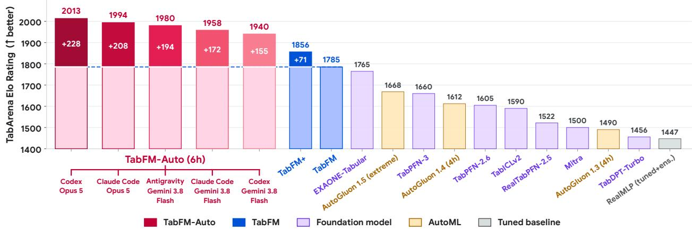  
Figure 1 | Overall TabArena leaderboard across all 51 datasets (38 classification, 13 regression). All five TabFM-Auto configurations (red) take the top five positions, reaching up to 2013 Elo (+228 over the TabFM baseline) and outperforming all other tabular foundation models.

## 1. Introduction

Tabular Foundation Models (TFMs) such as TabPFN (Hollmann et al., 2023a, 2025), TabICL (Qu et al., 2025, 2026), and TabFM (Kong et al., 2026) pretrain a transformer on synthetic datasets so it can predict on new tables in a single forward pass without gradient updates (Müller et al., 2022). Although TFMs match or outperform tuned gradient-boosted decision trees (GBDTs) (Chen and Guestrin, 2016; Ke et al., 2017; Prokhorenkova et al., 2018), their attention layers see only floating-point magnitudes and category indices. For example, they treat a column named systolic\_ bp or ICD9\_diagnosis the same as an anonymous column X\_17. Thus, a TFM cannot infer domain formulas from column names, group clinical codes by hierarchy, or recognize when a number such as 0 encodes a missing measurement. Prior work (TabFM+, Kong et al., 2026) extends TabFM with pairwise cross features, singular value decomposition (SVD) projections, and multi-view ensembling, but these generic operations ignore what the columns represent.

(a) Closed-Loop Agentic Pipeline Search  
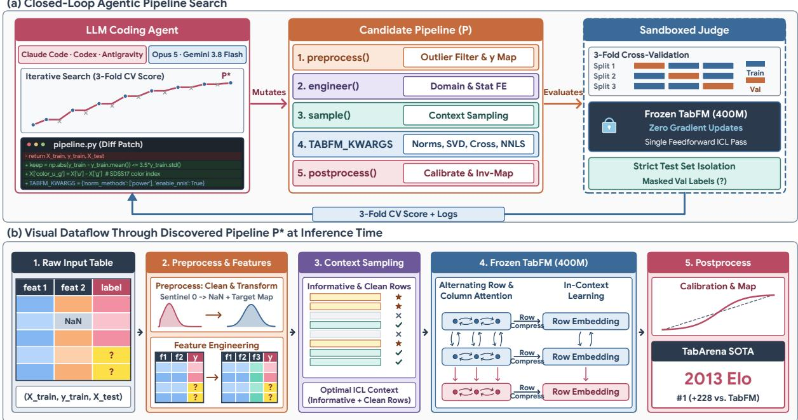  
Figure 2 | Overview of TabFM-Auto. (a) Within a sandboxed evaluator, a coding agent repeatedly edits the data pipeline � around a frozen 400M-parameter TabFM model using 3-fold cross-validation on the training set. (b) At test time, the selected pipeline �<sup>∗</sup> transforms the input table through data cleaning, feature engineering, context sampling, frozen TabFM inference, and post-processing.

Pretrained on scientific text and code, Large Language Models (LLMs) understand the domain meaning of column names and task descriptions, yet they perform poorly as direct tabular predictors due to context-length limits, coarse number tokenization (Fu et al., 2026; Hegselmann et al., 2023; Zhou et al., 2024, 2026), and miscalibrated probabilities. Existing machine learning engineering (MLE) agents (Du et al., 2026; Jiang et al., 2025; Yang et al., 2025) instead use LLMs to edit end-toend training scripts that fit tree ensembles or neural networks from scratch during search. However, searching over features, model architectures, and hyperparameters at the same time is noisy: training variance often masks small feature gains and leads to validation overfitting.

We introduce TabFM-Auto, which pairs an LLM agent with a frozen tabular foundation model, TabFM. Guided by dataset metadata, the agent iteratively edits a data pipeline for data cleaning, feature engineering, context selection, and post-processing via 3-fold cross-validation on the training set while keeping TabFM fixed. Since TabFM requires no gradient training, each candidate pipeline is fast to evaluate and free of model-retraining noise. After search finishes, we evaluate the best pipeline once on the oficial test set. The pipeline also selects context rows on large or imbalanced tables and calibrates probabilities to skewed class priors.

We test five TabFM-Auto configurations that combine three agent harnesses, Claude Code (CC), Antigravity (AGY), and Codex, with two language models (Claude Opus 5 and Gemini 3.8 Flash). On all 51 datasets of the TabArena benchmark (Erickson et al., 2026), they take

Table 1 | Side-by-side TabArena Classification (38 datasets) and Regression (13 datasets) leaderboards. Each TabFM-Auto configuration is evaluated individually against the 66-method TabArena pool (Erickson et al., 2026): Elo measures pairwise rating, Wins counts datasets where a method ranks first, Improv. measures mean relative error gap to the per-dataset best model, and G-Mean is the geometric mean test error across datasets.

(a) Classification (38 Datasets)
<table><tr><td>#</td><td>Method</td><td>Elo ↑</td><td>Wins ↑</td><td>Improv. ↓</td><td>G-Mean ↓</td></tr><tr><td>1</td><td>TabFM-Auto (Codex, Opus 5)</td><td>1966.3</td><td>13.84</td><td>1.91%</td><td>0.0913</td></tr><tr><td>2</td><td>TabFM-Auto (AGY, Gemini 3.8 Flash)</td><td>1937.5</td><td>16.11</td><td>2.45%</td><td>0.0902</td></tr><tr><td>3</td><td>TabFM-Auto (CC, Opus 5)</td><td>1933.9</td><td>14.93</td><td>1.69%</td><td>0.0913</td></tr><tr><td>4</td><td>TabFM-Auto (CC, Gemini 3.8 Flash)</td><td>1918.7</td><td>13.26</td><td>2.52%</td><td>0.0928</td></tr><tr><td>5</td><td>TabFM-Auto (Codex, Gemini 3.8 Flash)</td><td>1875.0</td><td>15.44</td><td>2.43%</td><td>0.0924</td></tr><tr><td>6</td><td>TabFM+</td><td>1836.7</td><td>12.22</td><td>2.91%</td><td>0.0948</td></tr><tr><td>7</td><td>TabFM</td><td>1768.7</td><td>7.91</td><td>3.80%</td><td>0.0957</td></tr><tr><td>8</td><td>EXAONE-Tabular</td><td>1759.5</td><td>4.39</td><td>7.28%</td><td>0.1009</td></tr><tr><td>9</td><td>AutoGluon 1.5 (extreme)</td><td>1664.6</td><td>1.72</td><td>7.86%</td><td>0.1010</td></tr><tr><td>10</td><td>TabPFN-3</td><td>1637.7</td><td>0.87</td><td>10.18%</td><td>0.1050</td></tr><tr><td>11</td><td>AutoGluon 1.4 (4h)</td><td>1617.1</td><td>0.51</td><td>11.24%</td><td>0.1079</td></tr><tr><td>12</td><td>TabPFN-2.6</td><td>1586.9</td><td>0.14</td><td>11.72%</td><td>0.1075</td></tr><tr><td>13</td><td>TabICLv2</td><td>1583.6</td><td>1.08</td><td>10.88%</td><td>0.1060</td></tr><tr><td></td><td>14RealTabPFN-2.5</td><td>1533.5</td><td>0.07</td><td>12.11%</td><td>0.1077</td></tr><tr><td>15</td><td>AutoGluon 1.3 (4h)</td><td>1473.4</td><td>0.14</td><td>14.24%</td><td>0.1147</td></tr><tr><td>16</td><td>RealMLP (tuned+ens.)</td><td>1435.2</td><td>0.19</td><td>15.37%</td><td>0.1161</td></tr></table>

(b) Regression (13 Datasets)
<table><tr><td>#</td><td>Method</td><td>Elo ↑</td><td>Wins ↑</td><td>Improv. ↓</td><td>G-Mean ↓</td></tr><tr><td>1</td><td>TabFM-Auto (Codex, Opus 5)</td><td>2512.9</td><td>11.12</td><td>0.00%</td><td>15.86</td></tr><tr><td>2</td><td>TabFM-Auto (CC, Opus 5)</td><td>2489.7</td><td>10.51</td><td>0.00%</td><td>15.89</td></tr><tr><td>3</td><td>TabFM-Auto (Codex, Gemini 3.8 Flash)</td><td>2423.2</td><td>9.58</td><td>0.01%</td><td>15.93</td></tr><tr><td>4</td><td>TabFM-Auto (CC, Gemini 3.8 Flash)</td><td>2407.9</td><td>9.41</td><td>0.01%</td><td>15.95</td></tr><tr><td>5</td><td>TabFM-Auto (AGY, Gemini 3.8 Flash)</td><td>2347.8</td><td>9.98</td><td>0.00%</td><td>15.88</td></tr><tr><td>6</td><td>TabFM+</td><td>2169.2</td><td>5.33</td><td>0.14%</td><td>16.17</td></tr><tr><td>7</td><td>TabFM</td><td>2045.9</td><td>1.80</td><td>1.43%</td><td>16.40</td></tr><tr><td>8</td><td>EXAONE-Tabular</td><td>1967.8</td><td>1.17</td><td>2.46%</td><td>16.58</td></tr><tr><td>9</td><td>TabPFN-3</td><td>1863.1</td><td>0.71</td><td>2.15%</td><td>16.51</td></tr><tr><td>10</td><td>AutoGluon 1.5 (extreme)</td><td>1851.2</td><td>0.39</td><td>3.67%</td><td>16.78</td></tr><tr><td>11</td><td>TabPFN-2.6</td><td>1790.1</td><td>0.13</td><td>3.74%</td><td>16.79</td></tr><tr><td>12</td><td>AutoGluon 1.4 (4h)</td><td>1731.0</td><td>0.07</td><td>4.42%</td><td>16.91</td></tr><tr><td>13</td><td>TabICLv2</td><td>1726.2</td><td>0.81</td><td>3.68%</td><td>16.78</td></tr><tr><td></td><td>14 TabDPT-Turbo</td><td>1661.9</td><td>0.26</td><td>4.93%</td><td>17.02</td></tr><tr><td>15</td><td>AutoGluon 1.3 (4h)</td><td>1646.1</td><td>0.03</td><td>6.01%</td><td>17.23</td></tr><tr><td>16</td><td>RealMLP (tuned+ens.)</td><td>1622.8</td><td>0.07</td><td>5.41%</td><td>17.09</td></tr></table>

the top five overall positions and outperform tuned AutoGluon ensembles and all evaluated tabular foundation models. The top configuration (Codex with Opus 5) raises TabFM from 1785.3 to 2013.0 Elo. The discovered pipelines transfer without further search to other tabular foundation models (up to a +143.3 Elo improvement). On the 8 tabular competitions of MLE-Bench (Chan et al., 2025), TabFM-Auto ranks first overall ahead of existing MLE agents.

## 2. Related Work

Tabular Foundation Models and In-Context Optimization. Prior-Data Fitted Networks (Müller et al., 2022) pretrain transformers on synthetic datasets so that a single forward pass approximates Bayesian in-context prediction (Fu et al., 2024; Garg et al., 2022; Li et al., 2023; Von Oswald et al., 2023). TabPFN (Hollmann et al., 2023a) introduced this paradigm for small classification tables. Later work extended it to regression and larger contexts (Grinsztajn et al., 2025, 2026; Hollmann et al., 2025), added continued pretraining on real data (Garg et al., 2025; Hosseinzadeh et al., 2026; Ma et al., 2025), and made attention linear-time with inducing points (Qu et al., 2025, 2026). Since these models are pretrained on anonymous synthetic variables, they typically ignore column names and task descriptions at test time. Even TabFM+ (Kong et al., 2026) only adds generic feature crosses, SVD projections, and view ensembling. Other work adds language encoders to tabular models to read column names or text cells (Kim et al., 2024; Tajjar et al., 2026; Yan et al., 2024). Rather than modifying the tabular foundation model architecture, TabFM-Auto keeps TabFM frozen and uses an LLM agent to turn column names and task metadata into explicit pipeline code.

AutoML, LLM Feature Engineering, and MLE Agents. Supervised learning on tabular data has traditionally relied on GBDTs (Chen and Guestrin, 2016; Ke et al., 2017; Prokhorenkova et al., 2018) and deep tabular networks (Gorishniy et al., 2021, 2025). Classical automated machine learning (AutoML) systems such as Auto-sklearn (Feurer et al., 2015) and AutoGluon-Tabular (Erickson et al., 2020) automate model selection and multi-layer stacking across these estimators. Prior LLM featureengineering methods such as CAAFE (Hollmann et al., 2023b), FeatLLM (Han et al., 2024), and OCTree (Nam et al., 2024) prompt an LLM to append derived columns to single tables. TabFM-Auto extends this loop to the full data pipeline around an in-context model, including data cleaning, context-row selection, output calibration, and reading auxiliary files within a code-execution sandbox.

Other systems automate end-to-end data science and multi-agent workflows (Huang et al., 2024; Qi et al., 2026; Tornede et al., 2024) or evolve programs through LLM-guided search (Novikov et al., 2025; Romera-Paredes et al., 2024; Xu et al., 2026), as TabFM-Auto does for data pipelines. End-to-end agents such as AIDE (Jiang et al., 2025), R&D-Agent (Yang et al., 2025), and MLEvolve (Du et al., 2026) retrain tree ensembles or neural networks during search, whereas TabFM-Auto keeps TabFM frozen and searches only over the data pipeline.

## 3. Methodology

## 3.1. Problem Formulation

Consider a tabular prediction task with a labeled training dataset ${ \mathcal { D } } _ { \operatorname { t r a i n } } = ( \mathbf { X } _ { \operatorname { t r a i n } } , \mathbf { y } _ { \operatorname { t r a i n } } )$ of $T _ { \mathrm { t r a i n } }$ rows and � columns, an unlabeled test dataset $\mathbf { X } _ { \mathrm { t e s t : } }$ , and dataset metadata M containing column names, units, task descriptions, and auxiliary file schemas. A zero-shot tabular foundation model $f _ { \theta ^ { * } }$ such as TabFM (Kong et al., 2026) takes $( \mathbf { X } _ { \mathrm { t r a i n } } , \mathbf { y } _ { \mathrm { t r a i n } } )$ as in-context examples and predicts test labels $\hat { \mathbf { y } } = f _ { \theta ^ { * } } ( \mathbf { X } _ { \mathrm { t e s t } } \mid \mathbf { X } _ { \mathrm { t r a i n } } , \mathbf { y } _ { \mathrm { t r a i n } } )$ in a single forward pass with frozen weights $\theta ^ { * }$

Optimization Objective. We partition $\mathcal { D } _ { \mathrm { t r a i n } }$ into 3 internal cross-validation folds without touching the held-out test split (Figure 2). On each internal fold $( \mathcal { D } _ { \mathrm { { s u b t r a i n } } } , \mathcal { D } _ { \mathrm { { v a l } } } )$ and conditioned on $M ,$ , the coding agent searches over executable pipelines $P = ( \Phi _ { \mathrm { c l e a n } } , \Phi _ { \mathrm { f e a t } } , S _ { \mathrm { c t x } } , \Psi _ { \mathrm { p o s t } } ) \in \mathcal { P } _ { \mathrm { i n t } }$ , defined below, to maximize the mean 3-fold cross-validation metric ${ \mathcal { U } } _ { \mathrm { v a l } }$ around the fixed weights $\theta ^ { * }$ :

$$
\begin{array} { r l } & { P ^ { * } = \underset { P \in \mathcal { P } } { \arg \operatorname* { m a x } } \ \mathcal { U } _ { \mathrm { v a l } } \Big ( \Psi _ { \mathrm { p o s i } } \big ( f _ { \theta ^ { * } } \big ( \tilde { \mathbf { X } } _ { \mathrm { v a l } } \ \big | \ S _ { \mathrm { c t x } } ( \tilde { \mathbf { X } } _ { \mathrm { s u b t r a i n } } , \tilde { \mathbf { y } } _ { \mathrm { s u b t r a i n } } ) \big ) , \ \mathbf { y } _ { \mathrm { s u b t r a i n } } , \ \tilde { \mathbf { X } } _ { \mathrm { v a l } } \big ) , \ \mathbf { y } _ { \mathrm { v a l } } \Big ) , } \\ { \quad } & { \mathrm { w h e r e } \quad ( \tilde { \mathbf { X } } _ { \mathrm { s u b r a i n } } , \tilde { \mathbf { y } } _ { \mathrm { s u b t r a i n } } , \tilde { \mathbf { X } } _ { \mathrm { v a l } } ) = \Phi _ { \mathrm { f e a t } } \big ( \Phi _ { \mathrm { c l e a n } } ( \mathbf { X } _ { \mathrm { s u b t r a i n } } , \mathbf { y } _ { \mathrm { s u b t r a i n } } , \mathbf { X } _ { \mathrm { v a l } } ) \big ) . } \end{array}\tag{1}
$$

Throughout search, $\theta ^ { * }$ stays fixed, and passing unlabeled inputs $\mathbf { X } _ { \mathrm { v a l } } ~ ( \mathrm { o r } ~ \mathbf { X } _ { \mathrm { t e s t } } )$ with the training split while withholding evaluation labels lets the agent perform both inductive and transductive learning.

## 3.2. Building Pipelines Around Frozen TabFM

Each candidate pipeline � implements the four stages in Equation (1) through four modular Python functions (preprocess(), engineer(), sample(), and postprocess()), together with the TABFM\_KWARGS configuration dictionary passed to $f _ { \theta ^ { * } }$ (Figure 2). Rather than rewriting an endto-end training script, the agent edits only these components, and each stage addresses a specific limitation of a frozen TFM. The first two stages shape the table that TabFM reads. Data cleaning and target conditioning $\left( \Phi _ { \mathrm { c l e a n } } \right)$ handles values whose meaning a TFM cannot read from magnitudes alone, such as a 0 that encodes a missing measurement. Using M, preprocess() can recode such placeholders into missingness indicators, filter corrupted training rows, and apply reversible target transformations $g ( \mathbf { y } _ { \mathrm { t r a i n } } )$ , such as log(1 + �), that compress skewed targets. Semantic feature engineering $( \Phi _ { \mathrm { f e a t } } )$ is where the LLM’s domain knowledge enters the pipeline. Given the cleaned tables, engineer() translates M into explicit columns for both inductive features (domain ratios and formulas, group statistics, and auxiliary-file summaries) and label-free transductive features over combined train and test inputs $( \mathrm { e . g . }$ , entity-graph degrees in Figure 3). Writing a formula as one column spares TabFM from inferring it in context, which helps most on real-world schemas.

The remaining two stages control which rows TabFM conditions on and how its outputs are used. Context selection $( S _ { \mathrm { c t x } } )$ is needed because TabFM is pretrained on tables of up to 16,384 rows (Kong et al., 2026) and could potentially degrade in performance on much larger tables, yet uniform subsampling can drop rare classes. sample() therefore builds multiple context subsets (views) that stratify by class or oversample minority classes, and combining predictions across views lets TabFM use more rows than one context window holds. Post-processing and output calibration $( \Psi _ { \mathrm { p o s t } } )$ applies $g ^ { - 1 }$ to return regression predictions to the original target scale, which keeps candidates with diferent target transformations comparable. For classification, it can shift log-odds toward the training class prior or apply temperature or Platt scaling (Platt, 1999), since oversampled views and synthetic pretraining data may not match the class balance and confidence of real data.

Generic versions of all four stages already exist in TabFM+ (Kong et al., 2026), which extends TabFM to normalize inputs and clip outliers $\left( \Phi _ { \mathrm { c l e a n } } \right)$ , append pairwise feature crosses and SVD projections $( \Phi _ { \mathrm { f e a t } } )$ , ensemble predictions over multiple views with a configurable context size $\left( S _ { \mathrm { c t x } } \right)$ and weight the views by non-negative least squares (NNLS) (Lawson and Hanson, 1995) before calibrating the output $( \Psi _ { \mathrm { p o s t } } )$ . TABFM\_KWARGS exposes these overlapping operations as constructor settings of $f _ { \theta ^ { * } }$ . The agent can thus cover the generic parts of a stage by tuning settings instead of writing code, and use the four functions for what the TabFM+ presets cannot express, such as domain formulas or class-balanced contexts. Keeping these settings apart from the four functions also lets us transfer the agent’s searched pipelines unchanged around other TFMs (§4.1).

The agent self-evolves � by iterative search. Every run starts from the identity pipeline $P _ { 0 }$ (Appendix Figure 8), which feeds the unmodified table to TabFM with default settings, and the agent keeps evolving � to improve the cross-validation score ${ \mathcal { U } } _ { \mathrm { v a l } }$ . Because $\theta ^ { * }$ stays frozen, candidates need no gradient training, no retraining noise masks small feature gains, and every improvement over $P _ { 0 }$ comes from the agent’s new pipeline. To hide test labels from agent-written code, the evaluation harness runs every candidate in a sandbox without network access or the held-out test splits (Figure 2a and Appendix A). After search, the harness freezes $P ^ { * }$ and scores the oficial test splits.

## 4. Experiments

We evaluate TabFM-Auto on two benchmarks: against tabular foundation models and tuned AutoML ensembles on the 51-dataset TabArena benchmark (§4.1), and against MLE agents that train models from scratch on MLE-Bench-Tabular (§4.2).

## 4.1. TabArena

Experimental Setup. We evaluate TabFM-Auto on all 51 datasets of the TabArena benchmark (Erickson et al., 2026) (38 classification and 13 regression), where each dataset uses 3-fold outer cross-validation repeated 3 or 10 times, yielding 9 or 30 oficial train/test splits (evaluation folds in Table 9). Running a separate LLM agent search on every fold would be prohibitively costly in tokens and GPU time (Table 3). Thus, we run pipeline search once per dataset using 3-fold cross-validation on the training set of fold 0 (up to 96 evaluations or 6 hours on one H100 GPU), allowing both inductive and transductive features while withholding evaluation labels. We then freeze $P ^ { * }$ , evaluate it on the held-out test splits of all folds $k \in \{ 0 , \ldots , s - 1 \}$ }, and report both all-folds and fold-0-only test leaderboards (Tables 4–5). We test five configurations combining three agent harnesses (Claude Code, Codex, and Antigravity) with two language models (Claude Opus 5 and Gemini 3.8 Flash). We compare against TabFM, TabFM+ (Kong et al., 2026), other tabular foundation models (EXAONE-Tabular, TabPFN-3, TabICLv2), and 4-hour AutoGluon ensembles (Erickson et al., 2020). Following Erickson et al. (2026), we rate each configuration individually against the 66-method TabArena pool using Bradley–Terry Elo (Bradley and Terry, 1952; Elo, 1978; Hunter, 2004) (anchored to default Random Forest = 1000), dataset Wins, oracle Improvability $( 1 - \mathrm { e r r _ { b e s t } / e r r _ { m e t h o d } } )$ , and Geometric Mean Test Error (G-Mean).

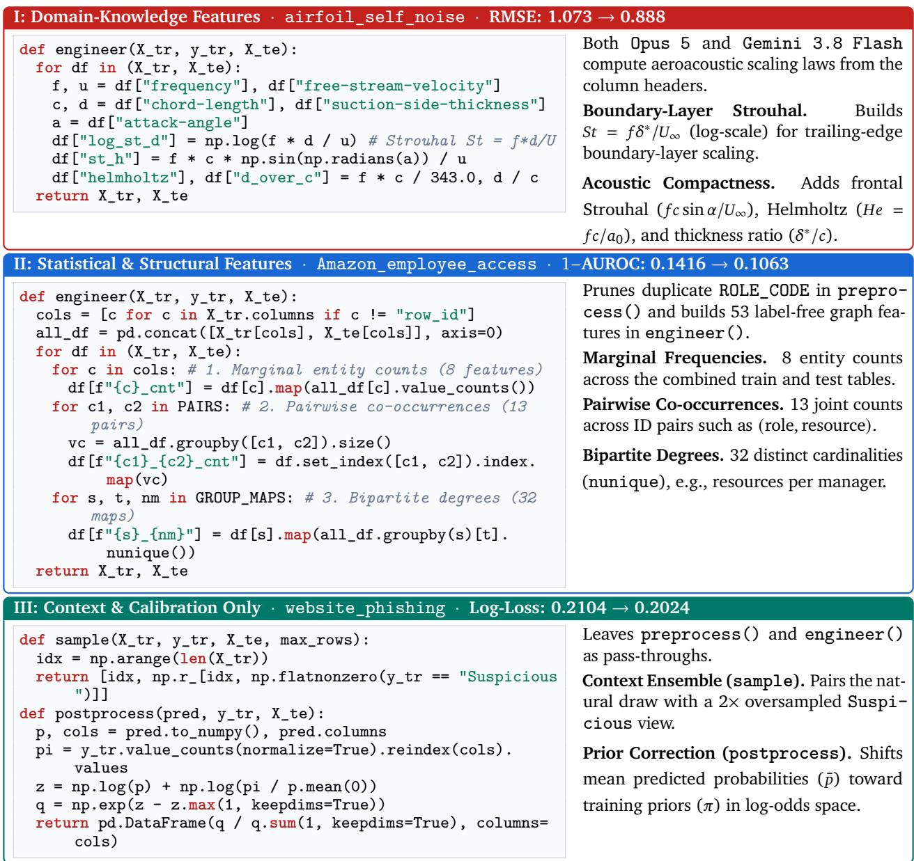  
Figure 3 | Representative TabFM-Auto pipelines across the three categories on TabArena (Antigravity with Gemini 3.8 Flash). (I) Explicit aeroacoustic scaling laws on airfoil\_ self\_noise, (II) relational graph features on Amazon\_employee\_access, and (III) minority-class context ensembling and prior calibration on website\_phishing.

Main Results on TabArena. Across all 51 datasets (Figure 1, Appendix B.1, and Appendix E Table 9), our five TabFM-Auto configurations take the top five overall positions, reaching 2013.0 Elo (Codex with Opus 5) and outperforming 4-hour AutoGluon 1.5 (extreme) (1668.4 Elo) by +272 to +345 Elo. The gains hold on both task types (Table 1 and Appendix Figure 9). On the 38 classification datasets, TabFM-Auto raises TabFM by +197.6 Elo to 1966.3 Elo, and Antigravity with Gemini 3.8 Flash has the lowest G-Mean test error (0.0902) and the most dataset wins (16.11). On the 13 regression datasets, TabFM-Auto raises TabFM by +467.0 Elo to 2512.9 Elo, improving over TabFM on all 13 datasets and reducing oracle improvability to 0.00%. We hypothesize that regression gains are larger because linearizing physical ratios in $\Phi _ { \mathrm { f e a t } }$ and skewed targets in $\Phi _ { \mathrm { c l e a n } }$ lets TabFM smoothly interpolate continuous functions that tree splits approximate only coarsely.

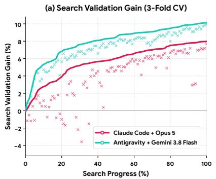

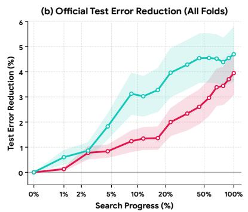

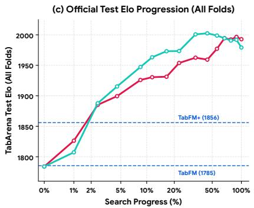  
Figure 4 | Search dynamics and test generalization. (a) 3-fold cross-validation gain on fold 0’s training set, (b) oficial test error reduction across all folds, and (c) oficial test TabArena Elo progression across all folds.

Pairwise fold win rates on the oficial test sets (Figure 10) agree with the Elo ranking. Claude Code with Opus 5 and Antigravity with Gemini 3.8 Flash tie head-to-head (50.7% vs. 49.3%). They win against TabFM on 74.3% and 72.1% of test folds (91.9% and 83.3% on regression) and against AutoGluon 1.5 (extreme) on 91.3% and 89.5%. Even the fifth-ranked configuration (Codex with Gemini 3.8 Flash) reaches 1940.1 Elo.

Domain Knowledge vs. Statistical Feature Engineering. To understand the strategies the agents discover, we inspect the final pipelines from Claude Code with Opus 5 and Antigravity with Gemini 3.8 Flash for all 51 TabArena datasets (Figure 3 and Appendix B.2 Table 6). We group them into three categories: domain-knowledge features, statistical and structural features, and context and calibration changes only. The agents modify the feature table in 95.1% of runs (97/102 across both configurations). They pair feature engineering $( \Phi _ { \mathrm { f e a t } } )$ with missing-value cleaning and target transforms $\left( \Phi _ { \mathrm { c l e a n } } \right)$ on regression (3.11%–3.15% lower G-Mean root mean squared error, RMSE), and with minority-class context selection $( S _ { \mathrm { c t x } } )$ and prior calibration $( \Psi _ { \mathrm { p o s t } } )$ on multiclass classification (7.64%–8.39% lower G-Mean log-loss). On the 17 datasets whose column names or task descriptions identify real-world quantities, such as physical, clinical, or economic variables (Cat. I), both agents write domain formulas directly from the schema (e.g., aerodynamic Strouhal numbers on airfoil\_ self\_noise, 14.6%–17.3% lower test RMSE), reducing oficial test error across all folds by 7.3% (Opus 5) to 8.2% (Gemini 3.8 Flash). That is nearly three times the 2.3%–3.0% error reduction on the 34 datasets for Opus 5 (29 for Gemini 3.8 Flash) with anonymized or generic schemas (Cat. II), where the agent relies on statistical transforms, frequency encodings, and graph degree features. Cat. I datasets account for 6 of the 10 largest test error reductions of each configuration. On the 5 runs where the agent does not change the feature table (Cat. III), 4 runs improve through context sampling in $S _ { \mathrm { c t x } }$ and/or prior calibration in $\Psi _ { \mathrm { p o s t } }$ , and the single run that tunes only hyperparameters is 0.30% worse.

Validation-to-Test Generalization. To test whether iterative search overfits the 3-fold crossvalidation split of fold 0, we evaluate up to 15 intermediate pipeline checkpoints per run from Claude Code with Opus 5 and Antigravity with Gemini 3.8 Flash, taken at fixed fractions of the search budget, on the oficial test sets of all folds (Figure 4 and Appendix C Figures 14–15). We find that cross-validation gains on the training set of fold 0 (Figure 4a) carry over to the oficial test sets: mean test error falls by 4.0% (Opus 5) to 4.7% (Gemini 3.8 Flash) from $P _ { 0 }$ to full budget (Figure 4b), and G-Mean error by 4.19% and 5.05% (Table 9). Both configurations score higher than

Table 2 | Controlled ablation of TabFM-Auto vs. an unconstrained coding agent. Both agents use the identical harness, model, sandbox, and a 6-hour search budget per dataset.
<table><tr><td>Method</td><td>Working Models</td><td>Overall Elo ↑</td><td>Cls. Elo ↑</td><td>Reg. Elo ↑</td></tr><tr><td>XGBoost (tuned + ensemble)</td><td>XGBoost</td><td>1360.4</td><td>1361.7</td><td>1428.7</td></tr><tr><td>LightGBM (tuned + ensemble)</td><td>LightGBM</td><td>1420.1</td><td>1419.6</td><td>1511.7</td></tr><tr><td>Coding Agent (AGY + Gemini 3.8 Flash)</td><td>Any ML models (GBDTs, PyTorch, etc.)</td><td>1468.8</td><td>1472.0</td><td>1615.3</td></tr><tr><td>AutoGluon 1.3 (4h)</td><td>Stacked GBDT &amp; NN ensembles</td><td>1490.3</td><td>1473.4</td><td>1646.1</td></tr><tr><td>TabFM</td><td>TabFM (frozen)</td><td>1785.3</td><td>1768.7</td><td>2045.9</td></tr><tr><td>TabFM+</td><td>TabFM (frozen)</td><td>1856.0</td><td>1836.7</td><td>2169.2</td></tr><tr><td>TabFM-Auto (AGY + Gemini 3.8 Flash)</td><td>TabFM (frozen)</td><td>1979.6</td><td>1937.5</td><td>2347.8</td></tr></table>

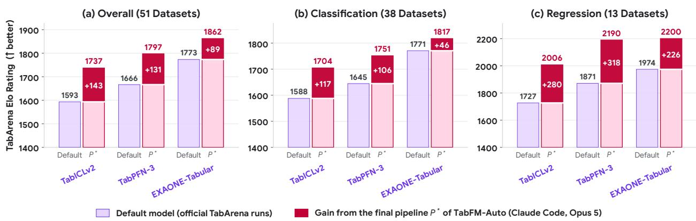  
Figure 5 | Final pipelines found for TabFM also help other tabular foundation models. Default is each model’s oficial TabArena result, rated in the same fit as �<sup>∗</sup>. �<sup>∗</sup> runs the same frozen model within the final per-dataset pipelines that TabFM-Auto (Claude Code, Opus 5) found for TabFM, keeping only the context size from TABFM\_KWARGS and without further search.

TabFM+ (1856 Elo) within the first 2.5% of the search (about 3 evaluations) and reach 1979–1993 Elo at full budget (Figure 4c). On the held-out test split of fold 0 alone (Table 5), TabFM-Auto also holds the #1 Overall, Classification, and Regression Elo ratings (Appendix B.1).

Ablation: Evolving Around Frozen TabFM vs. an Unconstrained MLE Agent. We compare TabFM-Auto against an unconstrained coding agent that uses the same Antigravity harness, Gemini 3.8 Flash model, and 6-hour budget, but may train and ensemble any machine learning models without TabFM (Table 2). Coding Agent outperforms individual tuned GBDTs by training and blending LightGBM, CatBoost, random forests, linear models, and neural networks (Appendix B.4, Figure 13). However, it is slightly worse than 4-hour AutoGluon 1.3 and 510.8 Elo below TabFM-Auto (1468.8 vs. 1979.6): TabFM’s pretrained prior adds +316.5 Elo (to 1785.3) and pipeline search adds +194.3 Elo. This ablation supports our core claim that coding agents perform better when paired with a frozen foundation model, since model architectures and training hyperparameters form a wide search space and trained models vary from run to run.

Transfer to Other Tabular Foundation Models. The agents choose every pipeline by how well TabFM scores with it, which may make the final pipelines specific to TabFM. We test this by running the four functions of the final pipelines �<sup>∗</sup> from the three highest-rated configurations, unchanged and without further search, around three other frozen tabular foundation models (TabPFN-3, TabICLv2, and EXAONE-Tabular) in place of TabFM (Appendix B.3). From TABFM\_KWARGS, we keep only the context size, as the other models do not support settings such as NNLS view weighting, feature crosses, and SVD features. The pipelines of all three configurations improve every model over its default configuration, though by less than TabFM does. Those from Claude Code with Opus 5 transfer best (Figure 5 and Appendix Figure 11), raising TabICLv2 by +143.3 Elo, TabPFN-3 by +130.8 Elo, and EXAONE-Tabular by +88.7 Elo. The discovered pipelines therefore carry over to other in-context learners.

Table 3 | Cumulative evaluation count, API calls, token consumption, and tool invocation breakdown across 51 TabArena datasets. (Top) Pipeline evaluations, LLM API requests, and prompt/generated token counts. (Bottom) Tool-call breakdown across the five action categories.
<table><tr><td>Agent Harness &amp; Model</td><td>Datasets</td><td># Evals</td><td># API Calls</td><td colspan="2">Prompt Tokens</td><td>Generated Tokens</td></tr><tr><td>Codex, Opus 5</td><td colspan="2">51</td><td>18,948</td><td colspan="2">1.95B</td><td>12.23M</td></tr><tr><td>Claude Code, Opus 5</td><td colspan="2">51</td><td>7,452</td><td colspan="2">1.28B</td><td>9.76M</td></tr><tr><td>Antigravity, Gemini 3.8 Flash</td><td colspan="2">51</td><td>51,968</td><td colspan="2">5.30B</td><td>20.50M</td></tr><tr><td>Claude Code, Gemini 3.8 Flash</td><td colspan="2">51</td><td>38,401</td><td colspan="2">3.75B</td><td>9.07M</td></tr><tr><td>Codex, Gemini 3.8 Flash</td><td colspan="2">51</td><td>85,862</td><td colspan="2">12.13B</td><td>20.25M</td></tr><tr><td>Agent Harness &amp; Model</td><td>Total Calls</td><td>Shell Exec.</td><td>File Read</td><td>File Write</td><td>File Search</td><td>Task &amp; Sched.</td></tr><tr><td>Codex, Opus 5</td><td>19,348</td><td>9,713 (50.2%)</td><td>270 (1.4%)</td><td>1,539 (8.0%)</td><td>120 (0.6%)</td><td>7,706 (39.8%)</td></tr><tr><td>Claude Code, Opus 5</td><td>7,381</td><td>6,385 (86.5%)</td><td>256 (3.5%)</td><td>690 (9.3%)</td><td>32 (0.4%)</td><td>18 (0.2%)</td></tr><tr><td>Antigravity, Gemini 3.8 Flash</td><td>49,352</td><td>25,467 (51.6%)</td><td>5,473 (11.1%)</td><td>8,688 (17.6%)</td><td>1,455 (2.9%)</td><td>8,269 (16.8%)</td></tr><tr><td>Claude Code, Gemini 3.8 Flash</td><td>38,063</td><td>16,288 (42.8%)</td><td>15,398 (40.5%)</td><td>5,743 (15.1%)</td><td>611 (1.6%)</td><td>23 (0.1%)</td></tr><tr><td>Codex, Gemini 3.8 Flash</td><td>85,389</td><td>32,630 (38.2%)</td><td>3,066 (3.6%)</td><td>3,963 (4.6%)</td><td>3,669 (4.3%)</td><td>42,061 (49.3%)</td></tr></table>

Token and Tool Usage Across Harnesses and Models. Table 3 summarizes evaluation counts, token usage, and tool-call distributions across the five configurations. We observe that Opus 5 and Gemini 3.8 Flash reach similar test error with diferent search styles: Opus 5 uses more tokens per step for reasoning and evaluates roughly one-third as many candidate pipelines under Codex, whereas Gemini 3.8 Flash makes 4.4× to 5.2× more tool calls to test rapid, incremental edits. The harnesses difer in Task & Sched. calls because their shell tools either block until an evaluation finishes (Claude Code) or poll background processes (Codex and Antigravity).

## 4.2. MLE-Bench-Tabular

Benchmark Definition and Auxiliary File Handling. We also evaluate TabFM-Auto on MLE-Bench-Tabular, the 8 tabular competitions of MLE-Bench (Chan et al., 2025) (Figure 6 and Appendix Table 8), on the oficial local test splits (using a 24-hour per-competition budget for TabFM-Auto against the oficial leaderboard submissions of external agents). In several competitions, the main signal is in auxiliary files such as seismic waveforms, satellite telemetry, or 3D molecular coordinates, which a single-table predictor cannot read directly. In Φ<sub>feat</sub>, TabFM-Auto summarizes these files into tabular features (e.g., spectral energy or inter-atomic distances) and joins them to the main table before calling TabFM (Appendix D.1).

Comparison with End-to-End Agents on MLE-Bench-Tabular. External MLE-Bench agents, such as CAIR MARS+, MLEvolve, Famou-Agent 2.0, R&D-Agent, and AIDE, search over both data processing and task-specific predictive models, whereas TabFM-Auto adapts the data pipeline while keeping the predictor fixed. Although external agents lead on several individual competitions (Figure 6), TabFM-Auto achieves the highest aggregate Elo among the evaluated submissions. Across all graded pairwise matches against the 12 external MLE agents (Figure 7), TabFM-Auto ranks first and second overall (Claude Code with Opus 5 at 1827 Elo, earning 4 Kaggle medals, and Antigravity with Gemini 3.8 Flash at 1734 Elo). Opus 5 wins 86.7% of all graded matches, including 75%–88% against each of the five highest-rated external agents and 83%–100% against the rest (Figure 7b).

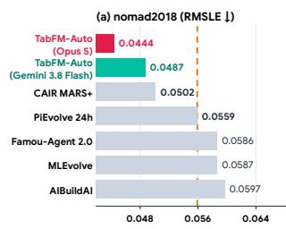

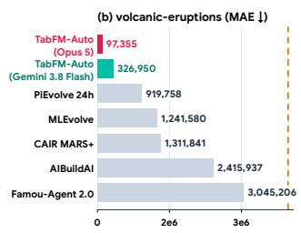

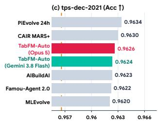

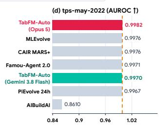

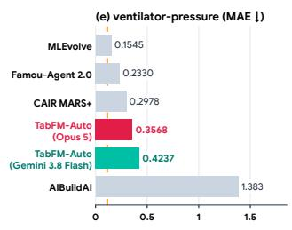

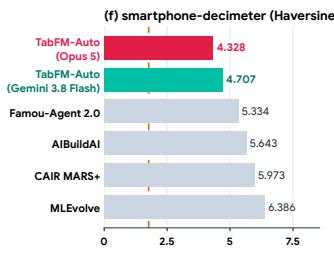

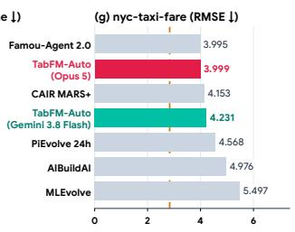

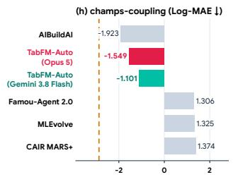

Figure 6 | Oficial test scores across all 8 MLE-Bench-Tabular competitions comparing both TabFM-Auto configurations against five leading external agents (CAIR MARS+, PiEvolve 24h, MLEvolve, Famou-Agent 2.0, and AIBuildAI) and Kaggle Gold Medal thresholds.  
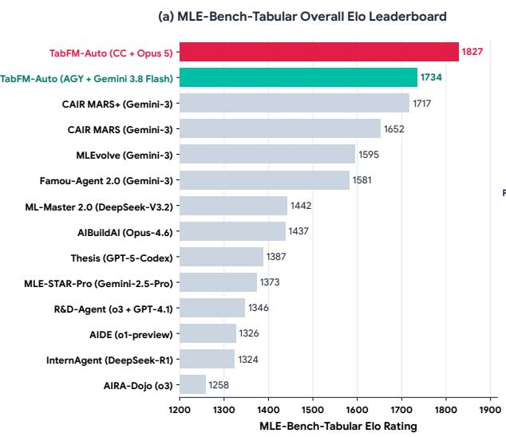

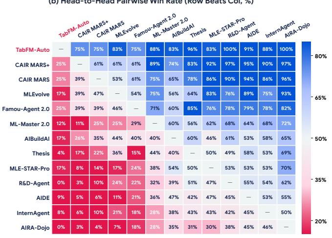  
Figure 7 | MLE-Bench-Tabular overall comparison. (a) Elo ratings of 14 MLE agents (our two configurations and all 12 external agents with complete 8-competition submissions, see Appendix D.1) and (b) pairwise win rates over the same run-vs-run matches showing the Opus 5 variant.

## 5. Conclusion and Discussion

We studied how a language model coding agent can evolve the data pipeline around a frozen tabular foundation model, combining language-model domain reasoning with fast forward-pass tabular inference to supply the semantics missing from synthetic pretraining. On all 51 TabArena datasets, our five TabFM-Auto configurations hold the top five overall positions (reaching 2013.0 Elo, +227.7 over TabFM). The discovered pipelines transfer without further search to other frozen tabular foundation models (+68.8 to +143.3 Elo). TabFM-Auto also ranks first overall on MLE-Bench-Tabular ahead of agents that train trees and neural networks from scratch.

Two limitations suggest directions for future work. Gains are generally smaller on anonymized tables, where the agent relies on statistical and relational features, and pipeline search requires repeated validation evaluations for each dataset. The discovered pipelines are short, readable programs. Operations collected across datasets could form a reusable library that warm-starts search on new tables with fewer evaluations. Incorporating the discovered formulas, cleaning rules, target transforms, and relational features into pretraining may lead to schema-aware tabular foundation models. Since TabFM-Auto already joins features derived from auxiliary files on MLE-Bench-Tabular, the same search could extend to multi-table relational databases.

## References

R. A. Bradley and M. E. Terry. Rank analysis of incomplete block designs: I. the method of paired comparisons. Biometrika, 39:324, 1952.

J. S. Chan, N. Chowdhury, O. Jafe, J. Aung, D. Sherburn, E. Mays, G. Starace, K. Liu, L. Maksin, T. Patwardhan, A. Madry, and L. Weng. MLE-bench: Evaluating machine learning agents on machine learning engineering. In The Thirteenth International Conference on Learning Representations, 2025. URL https://openreview.net/forum?id=6s5uXNWGIh.

T. Chen and C. Guestrin. Xgboost: A scalable tree boosting system. In Proceedings of the 22nd ACM SIGKDD International Conference on Knowledge Discovery and Data Mining, KDD ’16, page 785–794, New York, NY, USA, 2016. Association for Computing Machinery. ISBN 9781450342322. doi: 10.1145/2939672.2939785. URL https://doi.org/10.1145/2939672.2939785.

S. Du, X. Yan, J. Shi, Z. Cao, S. Feng, Z. Liang, B. Sun, T. Peng, Y. Zhou, X. Li, J. Zhou, L. He, B. Zhang, and L. Bai. MLEvolve: A self-evolving framework for automated machine learning algorithm discovery, 2026. URL https://arxiv.org/abs/2606.06473.

A. E. Elo. The Rating of Chessplayers, Past and Present. Arco Publishing, 1978.

N. Erickson, J. Mueller, A. Shirkov, H. Zhang, P. Larroy, M. Li, and A. Smola. Autogluon-tabular: Robust and accurate automl for structured data. arXiv preprint arXiv:2003.06505, 2020.

N. Erickson, L. Purucker, A. Tschalzev, D. Holzmüller, P. M. Desai, D. Salinas, and F. Hutter. Tabarena: A living benchmark for machine learning on tabular data. In The Thirty-ninth Annual Conference on Neural Information Processing Systems Datasets and Benchmarks Track, 2026. URL https: //openreview.net/forum?id=jZqCqpCLdU.

M. Feurer, A. Klein, K. Eggensperger, J. Springenberg, M. Blum, and F. Hutter. Eficient and robust automated machine learning. In Advances in Neural Information Processing Systems, volume 28. Curran Associates, Inc., 2015. URL https://proceedings.neurips.cc/paper\_ files/paper/2015/file/11d0e6287202fced83f79975ec59a3a6-Paper.pdf.

D. Fu, T.-Q. Chen, R. Jia, and V. Sharan. Transformers learn to achieve second-order convergence rates for in-context linear regression. In Advances in Neural Information Processing Systems, volume 37, pages 98675–98716. Curran Associates, Inc., 2024. doi: 10.52202/ 079017- 3132. URL https://proceedings.neurips.cc/paper\_files/paper/2024/ file/b2d4051f03a7038a2771dfbbe5c7b54e-Paper-Conference.pdf.

D. Fu, T. Zhou, M. Belkin, V. Sharan, and R. Jia. Convergent evolution: How diferent language models learn similar number representations. In Third Conference on Language Modeling, 2026. URL https://openreview.net/forum?id=RIoMmOkZ8E.

A. Garg, M. Ali, N. Hollmann, L. Purucker, S. Müller, and F. Hutter. Real-tabpfn: Improving tabular foundation models via continued pre-training with real-world data, 2025. URL https://arxiv. org/abs/2507.03971.

S. Garg, D. Tsipras, P. S. Liang, and G. Valiant. What can transformers learn in-context? a case study of simple function classes. In Advances in Neural Information Processing Systems, volume 35, pages 30583–30598. Curran Associates, Inc., 2022. doi: 10.52202/068431- 2217. URL https://proceedings.neurips.cc/paper\_files/paper/2022/file/ c529dba08a146ea8d6cf715ae8930cbe-Paper-Conference.pdf.

Y. Gorishniy, I. Rubachev, V. Khrulkov, and A. Babenko. Revisiting deep learning models for tabular data. In Advances in Neural Information Processing Systems, volume 34, pages 18932–18943. Curran Associates, Inc., 2021. URL https://proceedings.neurips.cc/paper\_files/paper/ 2021/file/9d86d83f925f2149e9edb0ac3b49229c-Paper.pdf.

Y. Gorishniy, A. Kotelnikov, and A. Babenko. Tabm: Advancing tabular deep learning with parametereficient ensembling. In The Thirteenth International Conference on Learning Representations, 2025. URL https://openreview.net/forum?id=Sd4wYYOhmY.

L. Grinsztajn, K. Flöge, O. Key, F. Birkel, P. Jund, B. Roof, B. Jäger, D. Safaric, S. Alessi, A. Hayler, M. Manium, R. Yu, F. Jablonski, S. B. Hoo, A. Garg, J. Robertson, M. Bühler, V. Moroshan, L. Purucker, C. Cornu, L. C. Wehrhahn, A. Bonetto, B. Schölkopf, S. Gambhir, N. Hollmann, and F. Hutter. Tabpfn-2.5: Advancing the state of the art in tabular foundation models, 2025. URL https: //arxiv.org/abs/2511.08667.

L. Grinsztajn, K. Flöge, O. Key, F. Birkel, P. Jund, B. Roof, M. Manium, S. B. Hoo, M. Bühler, A. Garg, D. Safaric, J. Robertson, B. Jäger, S. Alessi, A. Hayler, V. Moroshan, L. Purucker, P. Singer, A. Arazi, J. Siems, J. H. Metzen, G. Grab, N. Erickson, S. Guo, E. Kalfon, S. Bing, D. Salinas, C. Cornu, L. C. Wehrhahn, D. Kriuchkova, K. Kaya, L. Sidhoum, M. Salmon, J. Chen, M. Hulsebos, Y. LeCun, S. Müller, B. Schölkopf, S. Gambhir, N. Hollmann, and F. Hutter. Tabpfn-3: Technical report, 2026. URL https://arxiv.org/abs/2605.13986.

S. Han, J. Yoon, S. O. Arik, and T. Pfister. Large language models can automatically engineer features for few-shot tabular learning. In Proceedings ofthe 41st International Conference on Machine Learning, volume 235 of Proceedings of Machine Learning Research, pages 17454–17479. PMLR, 21–27 Jul 2024. URL https://proceedings.mlr.press/v235/han24f.html.

S. Hegselmann, A. Buendia, H. Lang, M. Agrawal, X. Jiang, and D. Sontag. Tabllm: Few-shot classification of tabular data with large language models. In Proceedings of The 26th International Conference on Artificial Intelligence and Statistics, volume 206 of Proceedings of Machine Learning Research, pages 5549–5581. PMLR, 25–27 Apr 2023. URL https://proceedings.mlr.press/ v206/hegselmann23a.html.

N. Hollmann, S. Müller, K. Eggensperger, and F. Hutter. TabPFN: A transformer that solves small tabular classification problems in a second. In The Eleventh International Conference on Learning Representations, 2023a. URL https://openreview.net/forum?id=cp5PvcI6w8\_.

N. Hollmann, S. Müller, and F. Hutter. Large language models for automated data science: Introducing CAAFE for context-aware automated feature engineering. In Thirty-seventh Conference on Neural Information Processing Systems, 2023b. URL https://openreview.net/forum?id=9WSxQZ9mG7.

N. Hollmann, S. Müller, L. Purucker, A. Krishnakumar, M. Körfer, S. B. Hoo, R. T. Schirrmeister, and F. Hutter. Accurate predictions on small data with a tabular foundation model. Nature, 637(8045): 319–326, 2025.

R. Hosseinzadeh, A. Labach, Z. Xue, S. Han, V. Thomas, and A. L. Caterini. Tabdpt-turbo: Eficient in-context learning for tabular prediction, 2026. URL https://arxiv.org/abs/2608.01400.

Q. Huang, J. Vora, P. Liang, and J. Leskovec. MLAgentBench: Evaluating language agents on machine learning experimentation. In Proceedings of the 41st International Conference on Machine Learning, volume 235 of Proceedings of Machine Learning Research, pages 20271–20309. PMLR, 21–27 Jul 2024. URL https://proceedings.mlr.press/v235/huang24y.html.

D. R. Hunter. MM algorithms for generalized Bradley–Terry models. The Annals of Statistics, 32(1): 384–406, 2004.

Z. Jiang, D. Schmidt, D. Srikanth, D. Xu, I. Kaplan, D. Jacenko, and Y. Wu. AIDE: Ai-driven exploration in the space of code, 2025. URL https://arxiv.org/abs/2502.13138.

G. Ke, Q. Meng, T. Finley, T. Wang, W. Chen, W. Ma, Q. Ye, and T.-Y. Liu. Lightgbm: A highly eficient gradient boosting decision tree. In Advances in Neural Information Processing Systems, volume 30. Curran Associates, Inc., 2017. URL https://proceedings.neurips.cc/paper\_ files/paper/2017/file/6449f44a102fde848669bdd9eb6b76fa-Paper.pdf.

M. J. Kim, L. Grinsztajn, and G. Varoquaux. CARTE: Pretraining and transfer for tabular learning. In Proceedings of the 41st International Conference on Machine Learning, volume 235 of Proceedings of Machine Learning Research, pages 23843–23866. PMLR, 21–27 Jul 2024. URL https:// proceedings.mlr.press/v235/kim24d.html.

W. Kong, E. Louidor Ilan, S. Nie, T. Narayan, R. Sen, Y. Zhou, D. Fu, S. Oymak, and A. Das. TabFM: A zero-shot foundation model for tabular data. Google Research Blog, 2026. URL https:// research.google/blog/introducing-tabfm-a-zero-shot-foundation-model-fortabular-data/.

C. L. Lawson and R. J. Hanson. Solving Least Squares Problems. Society for Industrial and Applied Mathematics, 1995. doi: 10.1137/1.9781611971217. URL https://epubs.siam.org/doi/ abs/10.1137/1.9781611971217.

Y. Li, M. E. Ildiz, D. Papailiopoulos, and S. Oymak. Transformers as algorithms: Generalization and stability in in-context learning. In Proceedings of the 40th International Conference on Machine Learning, volume 202 of Proceedings of Machine Learning Research, pages 19565–19594. PMLR, 23–29 Jul 2023. URL https://proceedings.mlr.press/v202/li23l.html.

J. Ma, V. Thomas, R. Hosseinzadeh, A. Labach, J. C. Cresswell, K. Golestan, G. Yu, A. L. Caterini, and M. Volkovs. TabDPT: Scaling tabular foundation models on real data. In The Thirty-ninth Annual Conference on Neural Information Processing Systems, 2025. URL https://openreview.net/ forum?id=pIZxEOZCId.

S. Müller, N. Hollmann, S. P. Arango, J. Grabocka, and F. Hutter. Transformers can do bayesian inference. In International Conference on Learning Representations, 2022. URL https://openreview. net/forum?id=KSugKcbNf9.

J. Nam, K. Kim, S. Oh, J. Tack, J. Kim, and J. Shin. Optimized feature generation for tabular data via LLMs with decision tree reasoning. In The Thirty-eighth Annual Conference on Neural Information Processing Systems, 2024. URL https://openreview.net/forum?id=APSBwuMopO.

A. Novikov, N. Vu, M. Eisenberger, E. Dupont, P.-S. Huang, A. Z. Wagner, S. Shirobokov, B. Kozlovskii,˜ F. J. R. Ruiz, A. Mehrabian, M. P. Kumar, A. See, S. Chaudhuri, G. Holland, A. Davies, S. Nowozin, P. Kohli, and M. Balog. AlphaEvolve: A coding agent for scientific and algorithmic discovery, 2025. URL https://arxiv.org/abs/2506.13131.

J. Platt. Probabilistic outputs for support vector machines and comparisons to regularized likelihood methods. In Advances in Large Margin Classifiers. MIT Press, 1999.

L. Prokhorenkova, G. Gusev, A. Vorobev, A. V. Dorogush, and A. Gulin. Catboost: unbiased boosting with categorical features. In Proceedings of the 32nd International Conference on Neural Information Processing Systems, NIPS’18, page 6639–6649, Red Hook, NY, USA, 2018. Curran Associates Inc.

Z. Qi, H. Su, A. Qu, C. Wang, Y. Yao, H. Zheng, K. Chattopadhyay, G. Xu, Z. Wang, W. Ye, V. J. Reddi, J. Li, P. P. Liang, H. Lakkaraju, S. Kakade, and Y. Du. Economy of minds: Emerging multi-agent intelligence with economic interactions, 2026. URL https://arxiv.org/abs/2606.02859.

J. Qu, D. Holzmüller, G. Varoquaux, and M. L. Morvan. TabICL: A tabular foundation model for in-context learning on large data. In Forty-second International Conference on Machine Learning, 2025. URL https://openreview.net/forum?id=0VvD1PmNzM.

J. Qu, D. Holzmüller, G. Varoquaux, and M. L. Morvan. TabICLv2: A better, faster, scalable, and open tabular foundation model. In Forty-third International Conference on Machine Learning, 2026. URL https://openreview.net/forum?id=SxsyLjIfWB.

B. Romera-Paredes, M. Barekatain, A. Novikov, M. Balog, M. P. Kumar, E. Dupont, F. J. R. Ruiz, J. S. Ellenberg, P. Wang, O. Fawzi, P. Kohli, and A. Fawzi. Mathematical discoveries from program search with large language models. Nature, 625(7995):468–475, 2024. doi: 10.1038/s41586-023-06924- 6. URL https://doi.org/10.1038/s41586-023-06924-6.

M. Tajjar, A. Pfeferle, L. Purucker, and F. Hutter. Towards pretraining text encoders for tabpfn, 2026. URL https://arxiv.org/abs/2606.04876.

A. Tornede, D. Deng, T. Eimer, J. Giovanelli, A. Mohan, T. Ruhkopf, S. Segel, D. Theodorakopoulos, T. Tornede, H. Wachsmuth, and M. Lindauer. AutoML in the age of large language models: Current challenges, future opportunities and risks. Transactions on Machine Learning Research, 2024. ISSN 2835-8856. URL https://openreview.net/forum?id=cAthubStyG.

J. Von Oswald, E. Niklasson, E. Randazzo, J. Sacramento, A. Mordvintsev, A. Zhmoginov, and M. Vladymyrov. Transformers learn in-context by gradient descent. In Proceedings of the 40th International Conference on Machine Learning, volume 202 of Proceedings of Machine Learning Research, pages 35151–35174. PMLR, 23–29 Jul 2023. URL https://proceedings.mlr.press/v202/vonoswald23a.html.

G. Xu, Z. Qi, H. Su, W. Ye, H. Lakkaraju, S. M. Kakade, and Y. Du. Self-improving language models with bidirectional evolutionary search, 2026. URL https://arxiv.org/abs/2605.28814.

J. Yan, B. Zheng, H. Xu, Y. Zhu, D. Chen, J. Sun, J. Wu, and J. Chen. Making pre-trained language models great on tabular prediction. In The Twelfth International Conference on Learning Representations, 2024. URL https://openreview.net/forum?id=anzIzGZuLi.

X. Yang, X. Yang, S. Fang, Y. Zhang, J. Wang, B. Xian, Q. Li, J. Li, M. Xu, Y. Li, H. Pan, Y. Zhang, W. Liu, Y. Shen, W. Chen, and J. Bian. R&d-agent: An llm-agent framework towards autonomous data science, 2025. URL https://arxiv.org/abs/2505.14738.

T. Zhou, D. Fu, V. Sharan, and R. Jia. Pre-trained large language models use fourier features to compute addition. In Advances in Neural Information Processing Systems, volume 37, pages 25120–25151. Curran Associates, Inc., 2024. doi: 10.52202/079017-0792. URL https://proceedings. neurips.cc/paper\_files/paper/2024/file/2cc8dc30e52798b27d37b795cc153310- Paper-Conference.pdf.

T. Zhou, D. Fu, M. Soltanolkotabi, R. Jia, and V. Sharan. FoNE: Precise single-token number embeddings via fourier features. In The Fourteenth International Conference on Learning Representations, 2026. URL https://openreview.net/forum?id=g0vtWmwDDh.

## A. Verification Protocol and Test Isolation

The evaluation harness enforces three checks during search and testing so that the error reductions reported for TabFM-Auto come from the discovered data pipeline rather than from reading held-out test splits or from replacing TabFM with another model.

Identity Baseline and Frozen-Model Check. Every search run begins by evaluating the identity pass-through pipeline $P _ { 0 } = ( \mathrm { I d } , \mathrm { I d } , \mathrm { I d } , \mathrm { I d } )$ (Figure 8) as its first evaluation (step 1). $P _ { 0 }$ passes the unmodified table to TabFM with default constructor settings on the same 3-fold cross-validation splits of fold $0 ^ { \prime } s$ training set, and its score $\mathcal { U } _ { \mathrm { v a l } } ( P _ { 0 } )$ sets the starting threshold: the agent keeps only edits that improve the validation score over $P _ { 0 }$ . The harness runs the PyTorch checkpoint of TabFM with a fixed ensemble of 8 members for every pipeline, so the test errors of $P _ { 0 }$ difer slightly from the published TabFM results in Table 9. The harness, not the pipeline, calls the frozen 400M-parameter TabFM model $f _ { \theta ^ { * } }$ on each candidate’s transformed table and passes its predictions to postprocess(), so every final prediction goes through $f _ { \theta ^ { * } }$

```python
import numpy as np
TABFM_KWARGS = {} # TabFM constructor settings ; {} keeps the defaults
def preprocess ( X_train , y_train , X_test ): # Φ<sub>clean</sub>
return X_train , y_train , X_test
def engineer ( X_train , y_train , X_test ): # Φ<sub>feat</sub>
return X_train , X_test
def sample ( X_train , y_train , X_test , max_rows ): # S<sub>ctx</sub>
return [np. arange ( len ( X_train ))] # one context view with all training rows
def postprocess ( pred , y_train_orig , X_test ): # Ψ<sub>post</sub>
return pred
```  
Figure 8 | Identity pipeline $P _ { 0 }$ that starts every search run (the starter pipeline.py, simplified). Every function returns its inputs unchanged and TABFM\_KWARGS is empty. The first evaluation thus scores TabFM with default constructor settings on the raw table. The harness fits the frozen TabFM (8 ensemble members, configured by TABFM\_KWARGS) once per context view returned by sample(), averages the test predictions over views, and passes them to postprocess(), where $\mathtt { y \_ t r a i n \_ }$ orig is the untransformed training target used to invert target transforms. The hooks also receive a row\_ id column, which the harness drops before calling TabFM. sample() is optional, and the listing writes out its default. engineer() may return at most 500 columns, so $P _ { 0 }$ fails on the three datasets with more columns (Bioresponse, hiva\_agnostic, and QSAR-TID-11).

Operating-System Sandboxing and Split Isolation. Each TabArena dataset defines 9 or 30 oficial train/test evaluation splits (3-fold cross-validation repeated 3 or 10 times). During pipeline search, the evaluation harness gives the agent access only to fold 0’s training split, partitioning it into 3 internal cross-validation folds $( \mathcal { D } _ { \mathrm { { s u b t r a i n } } } , \mathcal { D } _ { \mathrm { { v a l } } } )$ to compute ${ \mathcal { U } } _ { \mathrm { v a l } }$ . The harness runs every candidate pipeline in an unprivileged bubblewrap Linux namespace sandbox that disables outbound network access, mounts system libraries read-only, and restricts writes to an ephemeral scratch directory. The sandbox also unmounts fold $0 ^ { \prime } s$ oficial test split along with the train and test splits of all other folds across the 51 datasets. Only after search finishes and $P ^ { * }$ is frozen does the harness score $P ^ { * }$ once on those held-out splits in an isolated environment.

Table 4 | TabArena overall leaderboard across all 51 datasets. Super/subscripts give the 95% bootstrap percentile interval of each Elo rating relative to its median over 100 resampling rounds, and are asymmetric because the Bradley–Terry bootstrap distribution is right-skewed.
<table><tr><td>#</td><td>Method</td><td>Elo ↑</td><td>Wins↑</td><td>Improv. (%) ↓</td><td>G-Mean↓</td></tr><tr><td>1</td><td>TabFM-Auto (Codex, Opus 5)</td><td>2013.0+123.7 -103.2</td><td>25.00</td><td>1.42%</td><td>0.3400</td></tr><tr><td>2</td><td>TabFM-Auto (Claude Code, Opus 5)</td><td> $1 9 9 3 . 6 _ { - 1 2 4 . 3 } ^ { + 1 2 6 . 8 }$ </td><td>25.47</td><td>1.26%</td><td>0.3402</td></tr><tr><td>3</td><td>TabFM-Auto (Antigravity, Gemini 3.8 Flash)</td><td> $1 9 7 9 . 6 _ { - 9 5 . 7 } ^ { + 1 1 1 . 3 }$ </td><td>26.12</td><td>1.82%</td><td>0.3371</td></tr><tr><td>4</td><td>TabFM-Auto (Claude Code, Gemini 3.8 Flash)</td><td> $1 9 5 7 . 8 _ { - 1 0 3 . 7 } ^ { + 1 0 6 . 1 }$ </td><td>22.67</td><td>1.88%</td><td>0.3446</td></tr><tr><td>5</td><td>TabFM-Auto (Codex, Gemini 3.8 Flash)</td><td>1940.1 +120.1 -133.9</td><td>25.06</td><td>1.81%</td><td>0.3435</td></tr><tr><td>6</td><td>TabFM+</td><td>1856.0 +118.4 -102.7</td><td>17.58</td><td>2.20%</td><td>0.3513</td></tr><tr><td>7</td><td>TabFM</td><td>1785.3 +114.9 -125.9</td><td>9.74</td><td>3.20%</td><td>0.3550</td></tr><tr><td>8</td><td>EXAONE-Tabular</td><td> $1 7 6 4 . 6 _ { - 7 2 . 4 } ^ { + 9 0 . 9 }$ </td><td>5.56</td><td>6.05%</td><td>0.3703</td></tr><tr><td>9</td><td>AutoGluon 1.5 (extreme)</td><td> $1 6 6 8 . 4 _ { - 7 9 . 2 } ^ { + 8 0 . 6 }$ </td><td>2.11</td><td>6.79%</td><td>0.3718</td></tr><tr><td>10</td><td>TabPFN-3</td><td> $1 6 6 0 . 1 _ { - 6 9 . 6 } ^ { + 8 4 . 0 }$ </td><td>1.61</td><td>8.14%</td><td>0.3811</td></tr><tr><td>11</td><td>AutoGluon 1.4 (4h)</td><td> $1 6 1 2 . 3 _ { - 6 1 . 3 } ^ { + 7 3 . 0 }$ </td><td>0.58</td><td>9.50%</td><td>0.3913</td></tr><tr><td>12</td><td>TabPFN-2.6</td><td> $1 6 0 4 . 8 _ { - 7 3 . 9 } ^ { + 7 1 . 3 }$ </td><td>0.28</td><td>9.69%</td><td>0.3896</td></tr><tr><td>13</td><td>TabICLv2</td><td> $1 5 9 0 . 1 _ { - 8 7 . 9 } ^ { + 1 1 4 . 1 }$ </td><td>1.92</td><td>9.04%</td><td>0.3856</td></tr><tr><td>14</td><td>RealTabPFN-2.5</td><td> $1 5 2 1 . 9 _ { - 6 5 . 7 } ^ { + 9 2 . 8 }$ </td><td>0.10</td><td>10.38%</td><td>0.3918</td></tr><tr><td>15</td><td>AutoGluon 1.3 (4h)</td><td> $1 4 9 0 . 3 _ { - 7 9 . 6 } ^ { + 6 7 . 1 }$ </td><td>0.18</td><td>12.15%</td><td>0.4115</td></tr><tr><td>16</td><td>TabDPT-Turbo</td><td> $1 4 5 5 . 8 _ { - 7 1 . 3 } ^ { + 7 0 . 0 }$ </td><td>0.67</td><td>13.11%</td><td>0.4127</td></tr></table>

Row-Order Permutation Against Index Leakage. The raw files of several public classification datasets are sorted by target class or acquisition timestamp, so a pipeline that preserves the original row order could infer labels from row positions. The harness therefore deterministically shufles all classification folds at load time and restores the original order only when scoring final predictions.

## B. Full TabArena Results and Taxonomy Analysis

## B.1. Overall Leaderboard and Baseline Comparison

Table 4 and Figure 9 report the full leaderboard across all 51 TabArena datasets, comparing our five TabFM-Auto configurations against tuned GBDTs, deep tabular models, 4-hour AutoGluon 1.5, and other tabular foundation models. TabFM and TabFM+ already outperform individual GBDT families and 4-hour AutoGluon 1.5 (1668.4 Elo). Evolving the data pipeline around frozen TabFM reduces overall oracle improvability from 3.20% (TabFM) and 2.20% (TabFM+) down to 1.26%–1.88% and more than doubles the number of dataset wins (from 9.74 for TabFM to 26.12 for Antigravity with Gemini 3.8 Flash and 25.00 for Codex with Opus 5).

Fold-0 Held-Out Evaluation and Cross-Fold Pipeline Transfer. TabFM-Auto searches for a single Python data pipeline script $P ^ { * } = ( \Phi _ { \mathrm { c l e a n } } , \Phi _ { \mathrm { f e a t } } , S _ { \mathrm { c t x } } , \Psi _ { \mathrm { p o s t } } )$ per dataset using 3-fold cross-validation on Fold $0 ^ { \prime } s$ training split $\mathcal { D } _ { \mathrm { t r a i n } } ^ { ( 0 ) }$ and evaluates $P ^ { * }$ across all $S ~ \in ~ \{ 9 , 3 0 \}$ oficial evaluation folds $k \in \{ 0 , \ldots , s - 1 \}$ . Because TabArena repeats 3-fold cross-validation, the test sets $\mathbf { X } _ { \mathrm { t e s t } } ^ { ( k ) }$ of Folds $k \geq 1$ share rows with $\mathcal { D } _ { \mathrm { t r a i n } } ^ { ( 0 ) }$ , so selecting $P ^ { * }$ on $\mathcal { D } _ { \mathrm { t r a i n } } ^ { ( 0 ) }$ could inflate their test scores. Three aspects of our protocol and results are relevant here:

Table 5 | TabArena Fold-0 held-out test Elo ratings across Overall (51 datasets), Classification (38 datasets), and Regression (13 datasets). Every method is scored on the oficial held-out test split of Fold 0, which shares no rows with Fold 0’s training split used for 3-fold cross-validation to select �<sup>∗</sup>. As in Table 4, each TabFM-Auto configuration is rated individually against the 66-method TabArena pool using bootstrap Bradley–Terry estimation anchored to RandomForest (default) $= 1 0 0 0$ . Super/subscripts give the 95% bootstrap percentile interval of each rating relative to its median.
<table><tr><td>#</td><td>Method</td><td></td><td>Overall Elo (51) ↑ Classification Elo (38) ↑</td><td>Regression Elo (13) ↑</td></tr><tr><td>1</td><td>TabFM-Auto (Codex, Opus 5)</td><td> $1 9 5 0 . 7 _ { - 1 6 9 . 3 } ^ { \ + 1 9 0 . 3 }$ </td><td> $1 8 7 7 . 5 _ { - 1 8 3 . 6 } ^ { ~ + 1 9 7 . 0 }$ </td><td> $2 6 1 6 . 3 _ { - 1 8 8 . 8 } ^ { + 3 5 5 . 1 }$ </td></tr><tr><td>2</td><td>TabFM-Auto(Claude Code,Gemini 3.8 Flash)</td><td> $1 8 6 2 . 8 _ { - 1 6 3 . 7 } ^ { + 1 8 1 . 0 }$ </td><td> $1 8 0 5 . 0 _ { - 1 8 7 . 6 } ^ { + 1 8 6 . 1 }$ </td><td> $2 3 3 6 . 1 _ { - 3 1 8 . 9 } ^ { + 5 0 5 . 0 }$ </td></tr><tr><td>3</td><td>TabFM+</td><td> $1 8 5 3 . 2 _ { - 1 7 7 . 3 } ^ { + 1 9 4 . 2 }$ </td><td> $1 7 8 2 . 8 _ { - 1 8 7 . 4 } ^ { + 2 0 4 . 9 }$ </td><td> $2 4 0 9 . 9 _ { - 1 7 3 . 8 } ^ { + 2 9 4 . 5 }$ </td></tr><tr><td>4</td><td>TabFM-Auto (Claude Code,Opus 5)</td><td> $1 8 4 3 . 3 _ { - 1 7 2 . 0 } ^ { + 2 0 2 . 8 }$ </td><td> $1 7 6 3 . 6 _ { - 1 8 4 . 8 } ^ { + 2 0 3 . 7 }$ </td><td> $2 5 6 2 . 2 _ { - 2 1 7 . 6 } ^ { + 4 2 2 . 8 }$ </td></tr><tr><td>5</td><td>TabFM-Auto(Antigravity,Gemini 3.8 Flash)</td><td> $1 7 9 1 . 9 _ { - 1 5 5 . 4 } ^ { + 1 8 1 . 7 }$ </td><td> $1 7 1 0 . 5 _ { - 1 5 4 . 3 } ^ { + 2 0 1 . 8 }$ </td><td> $2 5 3 2 . 4 _ { - 2 0 6 . 1 } ^ { + 3 1 9 . 5 }$ </td></tr><tr><td>6</td><td>TabFM</td><td> $1 7 9 0 . 2 _ { - 1 6 8 . 5 } ^ { + 1 8 1 . 4 }$ </td><td> $1 7 3 3 . 0 _ { - 1 9 0 . 7 } ^ { + 2 0 1 . 1 }$ </td><td> $2 2 2 7 . 2 _ { - 1 4 4 . 8 } ^ { + 2 6 2 . 9 }$ </td></tr><tr><td>7</td><td>TabFM-Auto (Codex,Gemini 3.8 Flash)</td><td> $1 7 8 5 . 6 _ { - 1 8 7 . 4 } ^ { + 2 3 9 . 5 }$ </td><td> $1 7 0 3 . 2 _ { - 1 9 3 . 9 } ^ { + 2 2 4 . 5 }$ </td><td> $\mathbf { 2 6 4 5 . 6 _ { - 1 8 4 . 3 } ^ { + 3 5 3 . 7 } }$ </td></tr><tr><td>8</td><td>EXAONE-Tabular</td><td> $1 7 7 2 . 2 _ { - 1 2 8 . 9 } ^ { + 1 3 3 . 7 }$ </td><td> $1 7 4 0 . 4 _ { - 1 4 0 . 8 } ^ { + 1 6 9 . 0 }$ </td><td> $2 0 3 2 . 4 _ { - 1 8 0 . 0 } ^ { + 2 1 1 . 4 }$ </td></tr><tr><td>9</td><td>AutoGluon 1.5 (extreme, 4h)</td><td> $1 6 6 1 . 0 _ { - 1 3 6 . 4 } ^ { + 1 3 6 . 1 }$ </td><td> $1 6 1 2 . 8 _ { - 1 6 0 . 1 } ^ { + 1 4 8 . 7 }$ </td><td> $2 0 1 9 . 1 _ { - 8 1 . 3 } ^ { + 1 2 6 . 6 }$ </td></tr><tr><td>10</td><td>TabPFN-3</td><td> $1 6 5 3 . 7 _ { - 1 1 2 . 5 } ^ { + 1 2 5 . 6 }$ </td><td> $1 6 0 8 . 0 _ { - 1 2 6 . 8 } ^ { + 1 3 5 . 8 }$ </td><td> $1 9 7 1 . 0 _ { - 1 8 6 . 6 } ^ { + 2 9 4 . 0 }$ </td></tr><tr><td>11</td><td>TabPFN-2.6</td><td> $1 6 2 6 . 9 _ { - 1 1 2 . 8 } ^ { + 1 1 0 . 6 }$ </td><td> $1 5 8 2 . 3 _ { - 1 1 8 . 0 } ^ { + 1 2 5 . 9 }$ </td><td> $1 9 1 6 . 7 _ { - 1 2 1 . 8 } ^ { + 1 9 5 . 7 }$ </td></tr><tr><td>12</td><td>AutoGluon 1.4 (4h)</td><td> $1 5 9 6 . 2 _ { - 1 2 3 . 7 } ^ { + 1 2 1 . 0 }$ </td><td> $1 5 6 8 . 9 _ { - 1 5 1 . 1 } ^ { + 1 4 3 . 2 }$ </td><td> $1 8 0 0 . 7 _ { - 9 9 . 7 } ^ { ~ + 1 4 6 . 1 }$ </td></tr><tr><td>13</td><td>TabICLv2</td><td> $1 5 8 9 . 9 _ { - 1 2 2 . 9 } ^ { + 1 3 2 . 3 }$ </td><td> $1 5 7 3 . 8 _ { - 1 3 6 . 8 } ^ { + 1 5 9 . 0 }$ </td><td> $1 7 4 2 . 0 _ { - 2 3 3 . 9 } ^ { + 3 5 5 . 4 }$ </td></tr><tr><td>14</td><td>RealTabPFN-2.5</td><td> $1 5 4 0 . 3 _ { - 9 7 . 9 } ^ { ~ + 1 0 4 . 1 }$ </td><td> $1 5 2 5 . 2 _ { - 1 0 7 . 2 } ^ { + 1 2 1 . 8 }$ </td><td> $1 6 8 5 . 2 _ { - 2 2 0 . 9 } ^ { + 2 4 8 . 6 }$ </td></tr><tr><td>15</td><td>AutoGluon 1.3 (4h)</td><td> $1 5 0 5 . 9 _ { - 9 3 . 4 } ^ { + 9 4 . 4 }$ </td><td> $1 4 7 3 . 6 _ { - 1 0 6 . 2 } ^ { + 1 1 6 . 9 }$ </td><td> $1 7 2 0 . 6 _ { - 1 1 4 . 2 } ^ { + 1 2 5 . 4 }$ </td></tr><tr><td>16</td><td>Mitra</td><td> $1 4 5 2 . 5 _ { - 1 1 9 . 0 } ^ { + 1 2 1 . 5 }$ </td><td> $1 4 3 9 . 5 _ { - 1 3 9 . 3 } ^ { + 1 4 4 . 7 }$ </td><td> $1 5 8 6 . 7 _ { - 1 7 1 . 4 } ^ { + 2 0 5 . 4 }$ </td></tr><tr><td>17</td><td>RealMLP (tuned + ensemble)</td><td> $1 4 4 9 . 9 _ { - 9 2 . 5 } ^ { + 8 8 . 8 }$ </td><td> $1 4 1 8 . 1 _ { - 1 1 5 . 4 } ^ { + 1 0 3 . 0 }$ </td><td> $1 6 6 5 . 7 _ { - 8 7 . 0 } ^ { + 1 1 4 . 1 }$ </td></tr><tr><td>18</td><td>TabDPT-Turbo</td><td> $1 4 1 8 . 0 _ { - 8 3 . 6 } ^ { + 9 4 . 7 }$ </td><td> $1 3 7 3 . 5 _ { - 1 0 2 . 8 } ^ { + 1 1 0 . 9 }$ </td><td> $1 6 9 7 . 1 _ { - 1 0 8 . 2 } ^ { + 1 4 6 . 7 }$ </td></tr><tr><td>19</td><td>LightGBM (tuned + ensemble)</td><td> $1 3 9 2 . 8 _ { - 7 9 . 8 } ^ { + 8 3 . 7 }$ </td><td> $1 3 6 6 . 9 _ { - 9 3 . 2 } ^ { + 1 0 7 . 3 }$ </td><td> $1 5 6 6 . 8 _ { - 8 3 . 2 } ^ { + 9 6 . 0 }$ </td></tr><tr><td>20</td><td>TabM (tuned + ensemble)</td><td> $1 3 8 7 . 6 _ { - 1 0 3 . 0 } ^ { + 1 0 3 . 7 }$ </td><td> $1 3 7 2 . 7 _ { - 1 2 9 . 6 } ^ { + 1 3 5 . 5 }$ </td><td> $1 5 0 2 . 7 _ { - 1 1 8 . 9 } ^ { + 1 4 5 . 5 }$ </td></tr><tr><td>21</td><td>CatBoost (tuned + ensemble)</td><td> $1 3 7 9 . 0 _ { - 9 5 . 7 } ^ { + 8 9 . 9 }$ </td><td> $1 3 5 6 . 3 _ { - 1 1 6 . 8 } ^ { + 1 0 9 . 7 }$ </td><td> $1 5 2 3 . 6 _ { - 8 9 . 1 } ^ { + 1 2 4 . 7 }$ </td></tr></table>

1. One search per dataset: As in manual feature engineering, the agent designs a single datasetlevel pipeline (which domain ratios to compute, which sentinel values to mask, and whether to transform the target) and reuses it across every train/test split, rather than writing 9 or 30 diferent feature sets for the same dataset. Running an independent 6-hour agent search on all 816 folds across five configurations (4,080 runs) would increase LLM token and GPU compute costs by 16× (from 1.28B–12.13B prompt tokens per 51-dataset sweep in Table 3 to 20.5B–194.1B tokens). The five sweeps in Table 3 cost about \$17.6K in LLM API fees at Vertex AI list prices. This protocol lets the search see rows that later serve as test rows in Folds $k \geq 1$ , so Fold 0 is the only fully held-out split.

2. Symbolic program structure vs.fitted numerical parameters: What transfers across folds is only a short Python source script (pipeline.py) specifying column-level operations, such as physical scaling laws $( S t = f \delta ^ { * } / U _ { \infty } )$ , sentinel rules (width = 0 → NaN), and target link functions (log(1 + �)). On every evaluation fold $k \in \{ 0 , \ldots , s - 1 \}$ , the harness executes pipeline.py in a fresh isolated process where all data-dependent statistics (imputers, frequency maps, SVD bases, empirical class priors) and TabFM’s in-context conditioning are fitted only on fold �’s training split $( \dot { \mathbf { X } } _ { \mathrm { t r a i n } } ^ { ( k ) } , \mathbf { y } _ { \mathrm { t r a i n } } ^ { ( k ) } )$ before predicting on fold �’s held-out test split $\mathbf { X } _ { \mathrm { t e s t } } ^ { ( k ) }$ . No model weights, fitted statistics, or row predictions from $\mathcal { D } _ { \mathrm { t r a i n } } ^ { ( 0 ) }$ carry over: $\mathcal { D } _ { \mathrm { t r a i n } } ^ { ( 0 ) }$ afects Folds $k \geq 1$ only through which operations and settings the agent kept.

(a) Classification Leaderboard (38 Datasets)  
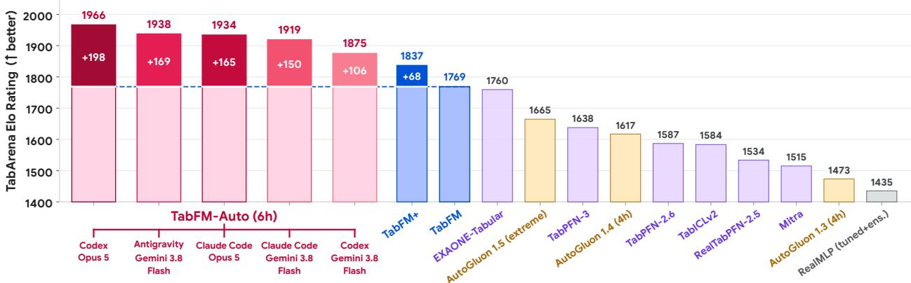  
(b) Regression Leaderboard (13 Datasets)

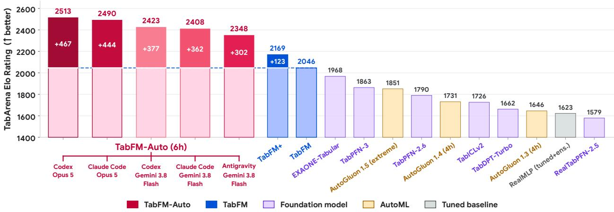  
Figure 9 | TabArena Elo ratings, computed separately on the 38 classification (top) and 13 regression (bottom) datasets. Red bars denote TabFM-Auto configurations (#1–#5), while blue bars denote TabFM+ (#6) and TabFM (#7).

3. Fold-0 held-out evaluation (Table 5): Scored on Fold 0’s test split $\mathcal { D } _ { \mathrm { t e s t } } ^ { ( 0 ) }$ alone, which shares no rows with ${ \mathcal { D } } _ { \mathrm { t r a i n } } ^ { ( 0 ) }$ , TabFM-Auto holds the #1 Overall and #1 Classification ratings (1950.7 and 1877.5 Elo, both Codex with Opus 5) and the $\# 1 - \# 4$ Regression ratings (2532.4–2645.6 Elo, led by Codex with Gemini 3.8 Flash), and all five configurations outrank EXAONE-Tabular (1772.2) and 4-hour AutoGluon 1.5 (1661.0) overall. For the five configurations, pairwise win rates against the 62 TabArena methods with complete results are 91.1%–95.7% on Fold 0 versus 94.4%–95.9% on Folds $k \geq 1$ (95.7% vs. 95.9% for Codex with Opus 5, 93.6% vs. 94.7% for Claude Code with Gemini 3.8 Flash, and 93.0% vs. 95.8% for Claude Code with Opus 5). For Codex with Opus 5, the top-rated configuration in Table 4, the G-Mean test error reduction over TabFM on Fold 0 is close to that on Folds $k \geq 1$ (3.74% vs. 4.53% on classification and 3.23% vs. 3.28% on regression).

Table 6 | Taxonomy of discovered pipelines on TabArena. Each final pipeline $P ^ { * }$ from Claude Code with Opus 5 and Antigravity with Gemini 3.8 Flash across the 51 datasets is classified into one of three mutually exclusive categories. Configuration lists each agent setup as well as Combined Best (selecting the pipeline with the higher 3-fold cross-validation score ${ \mathcal { U } } _ { \mathrm { v a l } }$ between the two configurations per dataset). Datasets reports the fraction of the 51 TabArena datasets assigned to each category, and Mean and Median report the mean and median relative oficial test error reduction (Δ%) over TabFM across datasets in that category (RMSE for regression, 1 − AUROC for binary classification, and log-loss for multiclass classification).
<table><tr><td>Category</td><td>Representative Features Built in Code</td><td>Configuration</td><td>Datasets</td><td>Mean (∆%)</td><td>Median (∆%)</td></tr><tr><td rowspan="3">I: Domain- Knowledge Features</td><td>Physics &amp; Engineering: Strouhal  $S t = f \delta ^ { * } / U _ { \infty } ,$  Helmholtz He (airfoil); water-to-binder ratio (concrete)</td><td>Claude Code, Opus 5</td><td>17/ 51</td><td>+7.25%</td><td>+3.01%</td></tr><tr><td>Clinical Medicine: ICD-9 organ chapters (Diabetes130US); Antigravity, Gemini 3.8 Flash MAP = (2DBP + SBP)/3, Shock Index (MIC)</td><td></td><td>17 / 51</td><td>+8.16%</td><td>+2.74%</td></tr><tr><td>Science &amp; Genomics: Coil width = 0 → NaN (anneal); SDSS color indices (SDSS17); DNA splice motifs (splice)</td><td>Combined Best</td><td>17/51</td><td>+8.85%</td><td>+3.01%</td></tr><tr><td rowspan="3">II: Statistical &amp; Structural Features</td><td>Relational Graph Degrees: Marginal entity counts, pairwise co-occurrences, distinct-B-per-A (Amazon_employee)</td><td>Claude Code, Opus 5</td><td>34/51</td><td>+2.31%</td><td>+0.90%</td></tr><tr><td>Frequency &amp; Missingness: Level counts, cross-fitted tar- Antigravity, Gemini 3.8 Flash 29 / 51 get means, missingness-aware column ranking (kddcup09</td><td></td><td></td><td>+2.99%</td><td>+1.32%</td></tr><tr><td>appetency) Wide-Table Compression: Collinearity pruning and truncated SVD projections (Bioresponse, hiva_agnostic)</td><td>Combined Best</td><td>34/51</td><td>+3.87%</td><td>+1.71%</td></tr><tr><td rowspan="3">III: Context &amp; Calibration Only</td><td>Context Selection: Minority-class context oversampling Claude Code, Opus 5 (sample()) without modifying X</td><td></td><td>0 / 51</td><td></td><td></td></tr><tr><td>Prior Calibration: Log-odds prior</td><td>alignment Antigravity, Gemini 3.8 Flash</td><td>5/51</td><td>+2.16%</td><td>+0.19%</td></tr><tr><td>(postprocess ()) and temperature/vector scaling (TABFM KWARGS)</td><td></td><td></td><td></td><td></td></tr></table>

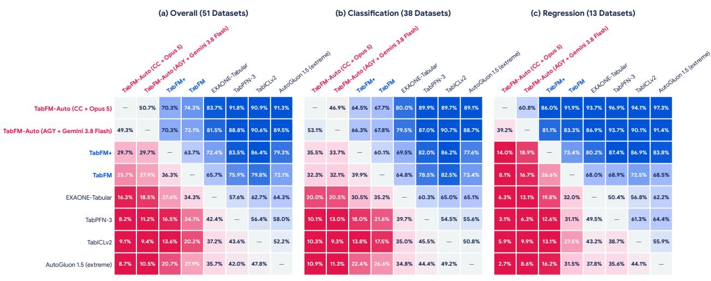  
Each cell reports the Pairwise Oficial Test Fold Win Rate (%) where Row beats Column

Figure 10 | Pairwise oficial test fold win rates on TabArena across (a) all 51 datasets, (b) 38 classification datasets, and (c) 13 regression datasets. Each cell reports the percentage of dataset-fold instances where the row method achieves lower oficial test error than the column method.

## B.2. Analysis of Discovered Pipelines

We analyze the final pipelines $P ^ { * } = ( \Phi _ { \mathrm { c l e a n } } , \Phi _ { \mathrm { f e a t } } , S _ { \mathrm { c t x } } , \Psi _ { \mathrm { p o s t } } )$ discovered by Claude Code with Opus 5 and Antigravity with Gemini 3.8 Flash across all 51 TabArena datasets (Table 6). We count how often the agents edit each stage and inspect the functions they write to see how they address the limitations of synthetic pretraining.

Data Cleaning and Target Conditioning $( \Phi _ { \mathbf { c l e a n } } )$ . Both Opus 5 and Gemini 3.8 Flash modify the cleaning and target-conditioning stage on 33.3% of the benchmark (17/51 datasets each). Because TabFM embeds continuous columns through shared linear projections before computing row-wise attention, uncleaned numerical placeholders (such as 0 for unmeasured steel coil width on anneal or -1 and 999 on administrative records) distort row-wise attention weights. By checking column names and value histograms, the agents replace these placeholders with missing-value indicators. On regression datasets with skewed targets, $\Phi _ { \mathrm { c l e a n } }$ also applies reversible transforms $g ( \mathbf { y } )$ such as log(1 + �) or Box–Cox scaling before calling TabFM, and $\Psi _ { \mathrm { p o s t } }$ inverts them with $g ^ { - 1 }$ at the output.

I: Domain-Knowledge Features $( \Phi _ { \mathbf { f e a t } }$ on Informative Schemas, 17 Datasets). Opus 5 modifies the feature table via $\Phi _ { \mathrm { f e a t } }$ (or $\Phi _ { \mathrm { c l e a n } } )$ on 100% of datasets (51/51) and Gemini 3.8 Flash on 90.2% (46/51), for a pooled rate of 95.1% (97/102). On the 17 datasets whose column names or task descriptions identify real-world quantities, such as physical, clinical, engineering, or economic variables (Category I in Table 6), both models translate domain relationships directly into nonlinear composite features, reducing multi-fold oficial test error by +7.25% (Opus 5) and +8.16% (Gemini 3.8 Flash), and by +8.85% under validation-selected Combined Best. These 17 datasets account for 6 of the 10 largest dataset improvements on TabArena for each configuration. These domain features fall into three groups where explicit metadata-guided features complement synthetic pretraining:

• Physical Ratios and Engineering Formulas: Alternating row-and-column attention approximates smooth additive combinations well, but benefits from explicit multiplicative ratios and trigonometric projections on physical tasks. On engineering datasets, the agents build dimensionless scaling terms directly from variable names (Figure 3-I). Examples include Strouhal numbers $S t = f \delta ^ { * } / U _ { \infty }$ and Helmholtz compactness $H e \mathrm { ~ = ~ } f c / a _ { 0 }$ on airfoil\_self\_noise (+14.6% and +17.3% test RMSE reduction for Opus 5 and Gemini 3.8 Flash, respectively), water-to-binder ratios $W / ( C + 0 . 8 S + 0 . 3 F )$ on concrete\_strength (+3.8%, Opus 5), and mass-weighted thermal conductivity ratios on superconductivity.

• Clinical Diagnostic Codes and Vital-Sign Ratios: On medical records where categorical columns store alphanumeric diagnostic codes, a tabular foundation model treats each code as an unrelated discrete token. On Diabetes130US, the agents parse 3-digit ICD-9 strings into 19 physiological organ-system chapters with dedicated ofsets for supplementary V-codes and E-codes, coarsening hundreds of sparse categories into clinically meaningful strata. On intensive-care and obstetric cohorts (MIC and maternal\_health\_risk), the agents combine systolic blood pressure (SBP), diastolic blood pressure (DBP), and heart rate (HR) into standard clinical indices (Mean Arterial Pressure $\mathrm { M A P } = ( 2 \mathrm { D B P } + \mathrm { S B P } ) / 3$ , Pulse Pressure SBP − DBP, and Shock Index HR/SBP).

• Domain Sequence Motifs and Spectral Color Indices: On scientific tables encoding sequences or multi-band fluxes, the agents construct domain-specific local features: extracting position-specific dinucleotide and trinucleotide sequence motifs around the donor/acceptor junction on splice (+22.2% test log-loss reduction, Opus 5) and forming pairwise photometric color indices (� − $g , g - r , r - i , i - z )$ across adjacent filter bands on Sloan Digital Sky Survey observations (SDSS17, +18.8% log-loss reduction, Gemini 3.8 Flash).

II: Statistical and Structural Features $( \Phi _ { \mathbf { f e a t } }$ on Generic Schemas, 34 Datasets). On the remaining 34 datasets with anonymized headers $( \underline { { \mathbf { f } } } _ { - } 0 1 \mathrm { - } \underline { { \mathbf { f } } } _ { - } \mathbb { N } )$ or generic business counters (Category II in Table 6), the agents cannot infer domain formulas from column names. Instead, the agents use $\Phi _ { \mathrm { f e a t } }$ to handle inputs that tabular transformers model poorly, achieving multi-fold test error reductions of +2.31% (Opus 5, 34/51 datasets) and +2.99% (Gemini 3.8 Flash, 29/51 datasets), and +3.87% under Combined Best. Three kinds of features dominate Category II:

• Bipartite Graph Degree and Co-occurrence Features: When a table consists of high-cardinality categorical entity IDs (such as employee roles, departments, managers, and resource IDs on Amazon\_employee\_access), standard categorical encodings assign arbitrary integer indices that hide which entities co-occur. Both agents compute label-free features on the combined trainand-test entity graph (entity frequencies, pairwise co-occurrences, and bipartite node degrees), reducing oficial test error 1 − AUROC (where AUROC is the area under the receiver operating characteristic curve, and lower error is better) from 0.1416 to 0.1039 (Opus 5) and 0.1063 (Gemini 3.8 Flash) (+26.6% and +25.0% relative error reduction).

• Frequency Encodings and Missingness Signals: On kddcup09\_appetency, whose 212 anonymized columns include 38 high-cardinality string columns and many columns that are mostly missing, Opus 5 encodes each string column by its level count and a cross-fitted target mean, ranks the engineered columns by in-fold univariate AUROC with missing values treated as their own extreme (so that missingness counts as signal), and keeps only the top-ranked columns.

• Pruning Redundant Columns and SVD on Wide Tables: On wide cheminformatics and bioassay matrices (Bioresponse and hiva\_agnostic) where over a thousand sparse molecular or bioassay columns dilute column-wise attention, the agents prune duplicate and near-collinear columns and append low-rank truncated SVD projections that summarize the highest-variance directions in a few columns.

Context Selection $\mathbf { ( } S _ { \mathbf { c t x } } )$ . Opus 5 and Gemini 3.8 Flash modify the context-selection stage $S _ { \mathrm { c t x } }$ on 25.5% (13/51) and 23.5% (12/51) of datasets, respectively. When training tables exceed TabFM’s 16,384-row pretraining length or exhibit severe class imbalance, uniform subsampling drops rare positive instances. The agents avoid this by returning several context index sets $\left\{ I _ { 1 } , \ldots , I _ { K } \right\}$ : one drawn from the natural class distribution and others that oversample the minority class or stratify by cluster.

III: Output Calibration $( \Psi _ { \mathbf { p o s t } } )$ and Constructor Settings (TABFM\_KWARGS). Finally, Opus 5 and Gemini 3.8 Flash tune input normalization and view weighting in TABFM\_KWARGS on 86.3% and 98.0% of datasets, respectively, and adjust post-hoc output calibration in $\Psi _ { \mathrm { p o s t } }$ on 41.2% (21/51) and 49.0% (25/51). One possible reason is that the synthetic prior used to pretrain TabFM need not match the class balance and confidence levels of real datasets. In $\Psi _ { \mathrm { p o s t } } ,$ the agents shift predicted probabilities toward the empirical training class prior $\hat { \pmb { \pi } } _ { \mathrm { t r a i n } }$ in log-odds space and apply temperature scaling. Category III in Table 6 contains the 5 runs (all in Gemini 3.8 Flash, as Opus 5 modifies the feature table on all 51 datasets) where the agent does not change the feature matrix $( \Phi _ { \mathrm { c l e a n } } = \Phi _ { \mathrm { f e a t } } = \mathrm { I d } )$ averaging +2.16% test error reduction across the 5 datasets: 4 of the 5 adjust context sampling in $S _ { \mathrm { c t x } }$ and/or log-odds prior calibration in $\Psi _ { \mathrm { p o s t } }$ (such as E-CommereShippingData at +6.94% and website\_phishing at +3.82%), whereas the single run that tuned only constructor hyperparameters scored −0.30% on test.

## B.3. Transferring Final Pipelines to Other Tabular Foundation Models

For each dataset, we take the final pipeline $P ^ { * }$ that Codex with Opus 5, Claude Code with Opus 5, or Antigravity with Gemini 3.8 Flash found for TabFM, and run its four functions unchanged around another frozen tabular foundation model. Each ensemble member keeps the number of context rows that TabFM used with that pipeline. We do not carry over the other TABFM\_KWARGS settings, because the other models do not support many of them, such as NNLS view weighting, feature crosses, and SVD features. We score every oficial test fold of all 51 datasets and compare with the oficial TabArena results of each model’s default configuration. Each model with $P ^ { * }$ from one configuration enters the Elo pool of Table 4 on its own and is rated in the same fit as its default version, so default ratings difer slightly from Table 4 and between configurations. Table 7 lists the ratings, Figure 11 compares the three configurations on overall Elo, and Figure 12 shows the pipelines of Codex with Opus 5 and of Antigravity with Gemini 3.8 Flash by task type.

Table 7 | Final pipelines found for TabFM also help other tabular foundation models. TabArena Elo of each model with its default configuration and within the final per-dataset pipelines that TabFM-Auto found for TabFM with each coding agent and LLM. Each model is rated in a separate fit per configuration, and Gain is measured against the default model rated in the same fit. Default is the mean of the three default ratings. Bold marks the largest gain for each model.
<table><tr><td rowspan="2">Model</td><td rowspan="2">Pipelines</td><td colspan="2">Overall (51)</td><td colspan="2">Classification (38)</td><td colspan="2">Regression (13)</td></tr><tr><td>Elo</td><td>Gain</td><td>Elo</td><td>Gain</td><td>Elo</td><td>Gain</td></tr><tr><td rowspan="4">TabICLv2</td><td>Default</td><td>1593.0</td><td></td><td>1587.1</td><td></td><td>1726.6</td><td></td></tr><tr><td>Codex, Opus 5</td><td>1732.8</td><td>+139.4</td><td>1685.1</td><td>+97.6</td><td>2088.9</td><td>+361.5</td></tr><tr><td>Claude Code, Opus 5</td><td>1736.7</td><td>+143.3</td><td>1704.4</td><td>+116.8</td><td>2006.5</td><td>+279.5</td></tr><tr><td>Antigravity, Gemini 3.8 Flash</td><td>1700.2</td><td>+108.0</td><td>1678.2</td><td>+92.1</td><td>1938.5</td><td>+213.1</td></tr><tr><td rowspan="4">TabPFN-3</td><td>Default</td><td>1666.0</td><td></td><td>1643.8</td><td></td><td>1869.3</td><td></td></tr><tr><td>Codex, Opus 5</td><td>1755.5</td><td>+89.7</td><td>1705.1</td><td>+61.8</td><td>2112.2</td><td>+242.6</td></tr><tr><td>Claude Code, Opus 5</td><td>1797.3</td><td>+130.8</td><td>1751.1</td><td>+106.5</td><td>2189.5</td><td>+318.5</td></tr><tr><td>Antigravity, Gemini 3.8 Flash</td><td>1777.0</td><td>+111.2</td><td>1741.8</td><td>+98.3</td><td>2078.5</td><td>+211.3</td></tr><tr><td rowspan="4">EXAONE-Tabular</td><td>Default</td><td>1773.6</td><td></td><td>1770.0</td><td></td><td>1971.6</td><td></td></tr><tr><td>Codex, Opus 5</td><td>1857.5</td><td>+82.3</td><td>1839.6</td><td>+68.4</td><td>2088.0</td><td>+118.6</td></tr><tr><td>Claude Code, Opus 5</td><td>1862.0</td><td>+88.7</td><td>1817.2</td><td>+46.4</td><td>2200.1</td><td>+225.8</td></tr><tr><td>Antigravity, Gemini 3.8 Flash</td><td>1841.2</td><td>+68.8</td><td>1814.5</td><td>+46.5</td><td>2083.8</td><td>+112.7</td></tr></table>

Figure 5 shows the pipelines from Claude Code with Opus 5, which give every model its largest overall gain (+88.7 to +143.3 Elo). Those from Codex with Opus 5 come close on TabICLv2 (+139.4 vs. +143.3) and give the largest gains for TabICLv2 on regression and EXAONE-Tabular on classification. Those from Antigravity with Gemini 3.8 Flash give the smallest overall gains on TabICLv2 and EXAONE-Tabular. With the pipelines of any of the three configurations, every model improves on both task types, though by less than TabFM gains from the same pipelines.

## B.4. Models Used by the Unconstrained Coding Agent

Figure 13 shows how often each model family appears in the code of the 51 final pipelines written by the unconstrained coding agent of Table 2. Gradient-boosted trees appear in 45 of them, mostly LightGBM (35) and CatBoost (27). No final pipeline uses XGBoost, and only 6 use a neural network. Twenty-three pipelines rely on a single model family. The other 28 blend two or more.

## C. Search Dynamics and Generalization Analysis

We saved every candidate pipeline evaluated during the TabArena runs of Claude Code with Opus 5 and Antigravity with Gemini 3.8 Flash, and rescored up to 15 checkpoints per run, taken at fixed fractions of the search budget (1,486 checkpoints in total), on the oficial test sets across all folds to test whether repeated 3-fold cross-validation evaluations on fold 0’s training set cause validation overfitting.

Figure 14 plots the oficial test G-Mean error reduction relative to �<sub>0</sub> separately for the 13

(c) Regression (13 Datasets)

Default model (oficial TabArena runs)

(b) Classification (38 Datasets)  
Overall TabArena Elo (51 Datasets)  
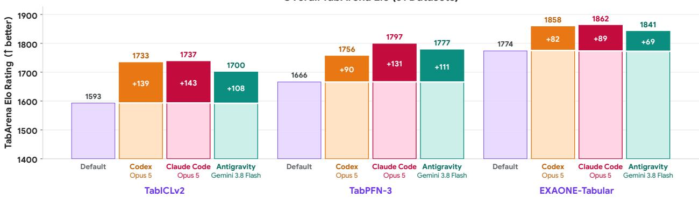  
Default model (oficial TabArena runs) Gain from the final pipeline P <sup>\*</sup> of TabFM-Auto (agent and LLM below each bar)

Figure 11 | The final pipelines of all three configurations help other tabular foundation models, and those from Claude Code with Opus 5 help most. Overall TabArena Elo on the 51 datasets of each model with its default configuration and within the final pipelines $P ^ { * }$ that each TabFM-Auto configuration found for TabFM. Each model with $P ^ { * }$ is rated in its own fit: the pale part of the bar reaches the default model rated in that fit, and the colored part is the gain. Default is the mean of the three default ratings.

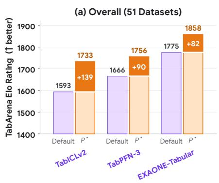

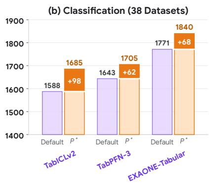

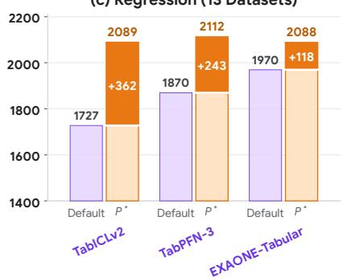  
Default model (oficial TabArena runs) Gain from the final pipeline P <sup>\*</sup> of TabFM-Auto (Codex, Opus 5)

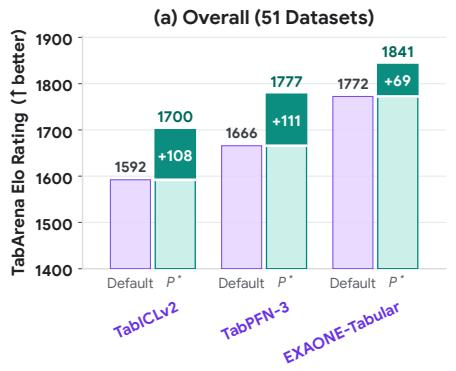

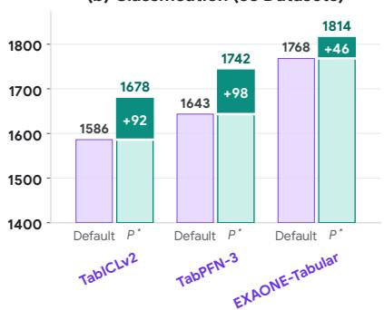

(c) Regression (13 Datasets)  
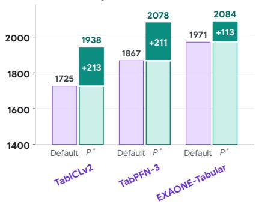  
Gain from the final pipeline P <sup>\*</sup> of TabFM-Auto (Antigravity, Gemini 3.8 Flash)

Figure 12 | The final pipelines from the other two configurations also help every model. As in Figure 5, with the pipelines that TabFM-Auto found with Codex and Opus 5 (top) and with Antigravity and Gemini 3.8 Flash (bottom). Default is the default model rated in the same fit as $P ^ { * }$

regression datasets (Figure 14a) and the 38 classification datasets (Figure 14b) over log-scaled search progress. On both suites, oficial test error across all folds decreases together with the search validation error from the first evaluation to the end of the budget (100% progress). On regression, both configurations make rapid early gains in the first 10% of search as they add target transforms and primary physical ratios, then refine to 1.93% (Opus 5) and 1.97% (Gemini 3.8 Flash) lower G-Mean test RMSE than $P _ { 0 }$ at full budget (3.11% and 3.15% lower than the published TabFM results in Table 9). On classification, oficial test error reduction climbs throughout the budget as agents add group aggregations, string decompositions, and prior calibration, reaching 4.90% (Opus 5) and 6.07% (Gemini 3.8 Flash) lower G-Mean test classification error than $P _ { 0 }$ at 100% of the budget.

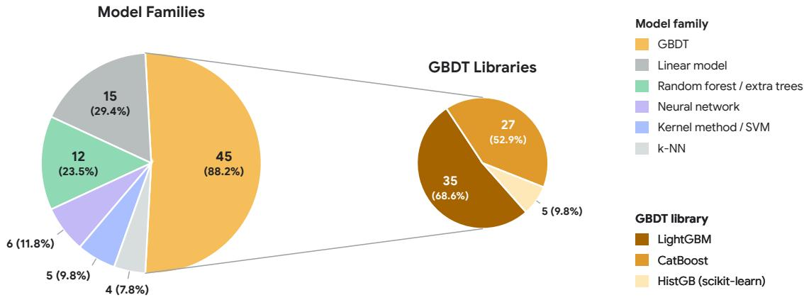  
Figure 13 | Model families in the final pipelines of the unconstrained coding agent (Antigravity with Gemini 3.8 Flash, no TabFM). Each wedge gives the number of final pipelines, out of 51, whose code uses that family, and in parentheses that number as a percentage of the 51 pipelines. Since a pipeline that blends several families counts once for each, the percentages sum to more than 100%. The right pie splits the GBDT wedge by library.

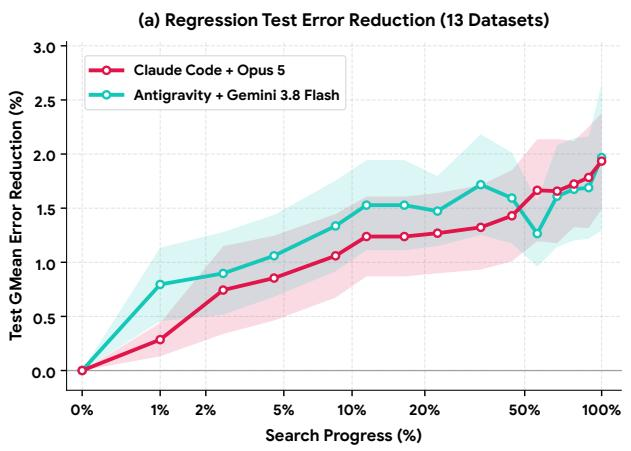

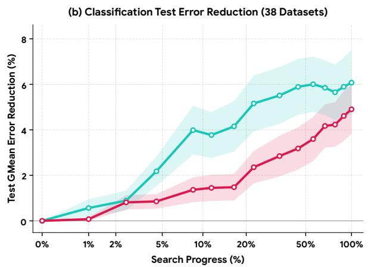  
Figure 14 | Oficial test G-Mean error reduction across search progress (log scale). (a) Regression suite (13 datasets) and (b) Classification suite (38 datasets).

In Figure 15, we examine validation-to-test transfer within each quarter of the search budget (0%–25%, 25%–50%, 50%–75%, and 75%–100%) by plotting marginal oficial test error reduction (Δ%) across all folds against marginal 3-fold cross-validation gain (Δ%) on fold 0’s training set during that quarter for each dataset. In most quarters, most datasets with a validation gain also improve on test (upper-right quadrant), and datasets that have plateaued lie near the origin. The exception is the 50%–75% quarter of Gemini 3.8 Flash, where test changes split roughly evenly. In the final quarter (75%–100% of budget), validation and test gains remain positively correlated across the datasets whose validation score still improves. Keeping TabFM fixed and evaluating candidate edits via 3-fold cross-validation on $\mathcal { D } _ { \mathrm { t r a i n } } ^ { ( 0 ) }$ helps the discovered pipelines generalize across the held-out test folds.

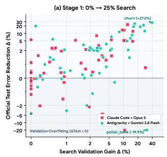

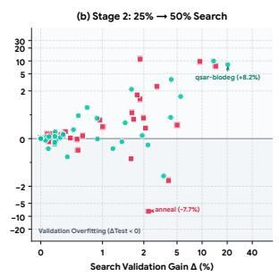

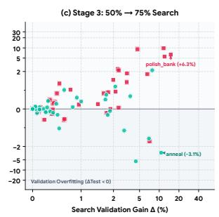

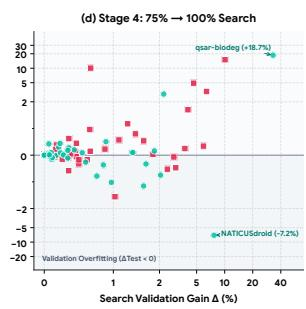  
Figure 15 | Stage-wise validation-to-test generalization across the four search quarters (0%–25%, 25%–50%, 50%–75%, and 75%–100%). Oficial test error reduction (Δ%) across all folds versus 3-fold cross-validation gain (Δ%) on fold 0’s training set per dataset.

## D. MLE-Bench-Tabular Analysis and Per-Competition Results

## D.1. Competition-by-Competition Analysis on MLE-Bench-Tabular

Figure 16 plots the 3-fold cross-validation curves on the training split and the final oficial test scores across the 8 Kaggle competitions of MLE-Bench-Tabular. Table 8 summarizes the data formats, evaluation metrics, baseline scores, final test results, and main features engineered by TabFM-Auto (Claude Code with Opus 5) and TabFM-Auto (Antigravity with Gemini 3.8 Flash). Figure 7 reports overall pairwise Elo ratings computed across all graded submissions against the 12 external MLE agents with complete 8-competition submissions from the oficial MLE-Bench leaderboard (PiEvolve 24h only has public submissions on 5 of the 8 competitions and, if rated on those 5, scores 1668 Elo, still behind both TabFM-Auto configurations). TabFM-Auto (Claude Code with Opus 5) ranks #1 with 1827 Elo (86.7% win rate across all graded matches) and TabFM-Auto (Antigravity with Gemini 3.8 Flash) ranks #2 with 1734 Elo (80.0% win rate).

Geophysics and Multi-Sensor Waveforms (predict-volcanic-eruptions). The main training table in predict-volcanic-eruptions contains only segment IDs and time-to-eruption targets, while the sensor readings are stored in thousands of external 10-minute, 100 Hz ten-channel seismic CSV files $( 6 0 , 0 0 1$ rows per file). The starting identity pipeline $P _ { 0 }$ therefore fails on step 1 with zero feature columns. The coding agent then inspects the error and writes an initial summary-statistics script on step 2 (scoring a validation mean absolute error, or MAE, of 667,762 for Gemini 3.8 Flash and 339,254 for Opus 5). It then refines $\Phi _ { \mathrm { f e a t } }$ into a parallelized signal-processing pipeline that computes multi-band Fast Fourier Transform (FFT) spectral energy across volcanic tremor bands (0.5–20 Hz), Short-Term Average to Long-Term Average (STA/LTA) trigger ratios across sub-windows, rolling peak-to-peak envelopes, and inter-sensor cross-correlations. Passing this feature table to frozen TabFM lowers oficial test MAE to 326,950 (Gemini 3.8 Flash) and 97,355 (Opus 5), reducing error by 9.4× over the strongest external agent (PiEvolve at 0.92M, MLEvolve at 1.24M) on MLE-Bench’s oficial local split and earning a Gold Medal.

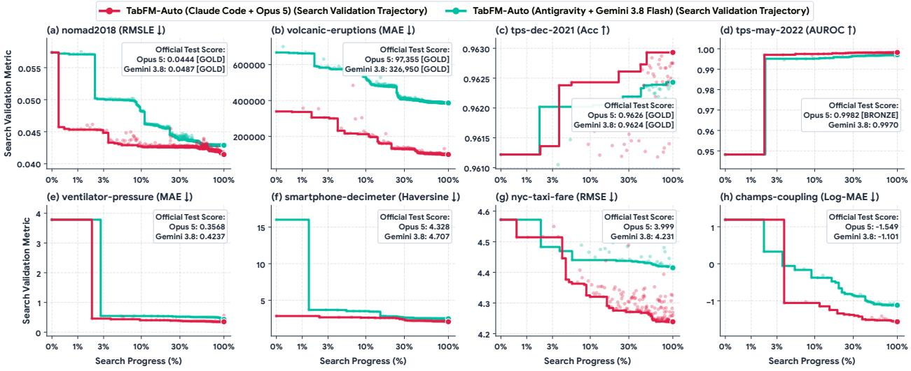  
Figure 16 | Search progression on MLE-Bench-Tabular. Best-so-far 3-fold cross-validation curves on the training split and final oficial test scores across the 8 Kaggle competitions (on volcaniceruptions and smartphone-decimeter, where $P _ { 0 }$ fails with zero features, 0% plots each agent’s step-2 initial multi-file script).

Materials Science and 3D Crystal Lattices (nomad2018-predict-transparent-conductors). The task is to predict formation energy and bandgap energy (scored by mean column-wise root mean squared logarithmic error, or RMSLE) of $( \mathsf { A l } _ { x } \mathsf { G a } _ { y } \mathrm { I n } _ { z } ) _ { 2 } \mathsf { O } _ { 3 }$ transparent conductors. The competition provides lattice vectors $( a , b , c , \alpha , \beta , \gamma )$ in the main table alongside external geometry.xyz files containing 3D Cartesian coordinates of the atoms in each unit cell. TabFM-Auto parses the 3D crystal files to compute the parallelepiped unit-cell volume $V = a b c \sqrt { 1 + 2 \cos \alpha \cos \beta \cos \gamma - \cos ^ { 2 } \alpha - \cos ^ { 2 } \beta - \cos ^ { 2 } \gamma } ,$ atomic packing density, reciprocal lattice constants, and composition-weighted Pauling electronegativity and ionic radius variance across the $\mathrm { { A l / G a / I n } }$ cations. These physical features reduce oficial test RMSLE from 0.05737 (TabFM) to 0.04869 (Gemini 3.8 Flash) and 0.04440 (Opus 5), earning a Kaggle Gold Medal and ranking #1 among all evaluated agents.

Quantum Chemistry and 3D Molecular Coupling (champs-scalar-coupling). Predicting nuclear magnetic resonance (NMR) spin-spin scalar coupling constants (�-coupling, evaluated by mean Log-MAE across 8 coupling types such as 1JHC and 3JHH) requires joining the bond-pair table with 3D molecular coordinates in structures.csv. Without 3D geometry, TabFM scores +1.19025 Log-MAE. TabFM-Auto writes a geometry pipeline in $\Phi _ { \mathrm { f e a t } }$ that computes 3D inter-atomic distances $r _ { i j }$ and inverse power laws $( r _ { i j } ^ { - 1 } , r _ { i j } ^ { - 2 } , r _ { i j } ^ { - 3 } )$ , covalent bond-path angles, and four-atom dihedral torsion angles $\phi$ from the Karplus relation (cos � and $\cos ^ { 2 } \phi )$ for vicinal 3J couplings, while routing each coupling type through stratified context windows in $S _ { \mathrm { c t x } }$ . This lowers oficial test Log-MAE to −1.10133 (Gemini 3.8 Flash) and −1.54947 (Opus 5).

Respiratory Control Dynamics (ventilator-pressure-prediction). This competition provides breath-by-breath time series (80 time steps per breath) of inspiratory solenoid valve opening percentages $u _ { \mathrm { i n } } ( t ) \in [ 0 , 1 0 0 ]$ , expiratory valve states $u _ { \mathrm { o u t } } ( t )$ , and lung constants (� resistance and � compliance) to predict airway pressure. Treating time steps as independent rows in TabFM gives 3.78450 MAE because it ignores the accumulated air in the lung. Inspired by the single-compartment respiratory mechanics relation $\begin{array} { r } { P ( t ) = P _ { 0 } + R q ( t ) + \frac { 1 } { C } \int _ { 0 } ^ { t } q ( \tau ) } \end{array}$ ��, TabFM-Auto uses $u _ { \mathrm { i n } } ( t )$ as a flow proxy to compute within-breath cumulative integrals $\int _ { 0 } ^ { t } u _ { \mathrm { i n } } ( \tau ) d \tau .$ , first and second finite diferences $( \Delta u _ { \mathrm { i n } } , \Delta ^ { 2 } u _ { \mathrm { i n } } )$ , decayed flow histories, and proxy interaction terms $( R \times u _ { \mathrm { i n } }$ and $\textstyle { \frac { 1 } { C } } \int _ { 0 } ^ { t } u _ { \mathrm { i n } } ( \tau ) d \tau )$ . These state features reduce oficial test MAE to 0.42369 (Gemini 3.8 Flash) and 0.35684 (Opus 5, a 90.6% MAE reduction).

Table 8 | End-to-end performance on 8 Kaggle MLE-Bench competitions. Best score per task is bolded, second best is underlined.
<table><tr><td>Competition</td><td>Domain &amp; Data Format</td><td>Metric</td><td>Identity TabFM</td><td>AGY +</td><td>CC +</td><td>Result</td><td>Key Features Added in engi- neer()</td></tr><tr><td>volcanic-eruptions</td><td>Geophysics (Waveforms)</td><td>MAE↓</td><td>Fails (IDs)†</td><td>326,950</td><td>97,355</td><td>GOLD</td><td>Multi-sensor waveform FFT bands, STA/LTA ratios, quantiles</td></tr><tr><td>nomad2018-conductors Materials (3D Lattice)</td><td></td><td>RMSLE↓</td><td>0.05737</td><td>0.04869</td><td>0.04440</td><td>GOLD</td><td>(9.4× &lt; PiEvolve) Reciprocal lattice unit-cell vol- ume, cation electronegativity &amp;</td></tr><tr><td>tps-dec-2021</td><td>Cartography &amp; Hydrology</td><td>Acc ↑</td><td>0.96122</td><td>0.96237</td><td>0.96264</td><td>GOLD</td><td>radius dispersion Euclidean hydrology distance √H2 + v2, aspect compass de-</td></tr><tr><td>tps-may-2022</td><td>Manufacturing Telemetry</td><td>1 − AUROC ↓</td><td>0.05179</td><td>0.00304</td><td>0.00179</td><td>BRONZE</td><td>composition Decomposing 10-char string f_ 27 into positional ordinal &amp;</td></tr><tr><td>champs-coupling</td><td>Quantum Chem (3D NMR)</td><td>Log-MAE ↓</td><td>+1.19025</td><td>-1.10133</td><td>-1.54947</td><td>&gt;MEDIAN</td><td>unique-char counts 3D inter-atomic Euclidean distance  $r _ { i j } ^ { - 3 } .$  Karplus dihedral</td></tr><tr><td>ventilator-pressure</td><td>Respiratory Control</td><td>MAE↓</td><td>3.78450</td><td>0.42369</td><td>0.35684</td><td>-90.6%</td><td>cos2 φ angles Respiratory mechanics proxy in- tegrals (f uin dt, ∆uin, R × uin)</td></tr><tr><td>smartphone-decimeter GNSS Navigation</td><td></td><td></td><td>Haversine ↓ Fails (IDs)†</td><td>4.7068</td><td>4.3284</td><td>&gt;MEDIAN</td><td>Multi-table GNSS pseudorange WLS + IMU Kalman smoothing</td></tr><tr><td>nyc-taxi-fare</td><td>Spatial Econometrics</td><td>RMSE↓</td><td>4.57207</td><td>4.23091</td><td>3.99861</td><td>-12.5%</td><td>(18.9% &lt; Famou-Agent 2.0) Geodesic Haversine distance, Manhattan rotated grid, JFK/L- GA/EWR polygons</td></tr></table>

<sup>†</sup>Raw tabular identity (� ) fails on volcanic-eruptions and smartphone-decimeter because the main table contains only recording IDs; on step 2 the coding agent inspects the error and writes an initial multi-file script itself (scoring 667,762 and 339,254 validation MAE on volcanic-eruptions, and 16.010 m and 2.850 m validation Haversine error on smartphone-decimeter, for Gemini 3.8 Flash and Opus 5, respectively) before refining it.

GNSS Satellite Navigation (smartphone-decimeter-2022). Predicting phone positions (scored by the mean of the 50th and 95th percentile horizontal Haversine distance errors in meters across trips) from raw Android Global Navigation Satellite System (GNSS) receiver logs requires joining drive traces with multi-gigabyte satellite pseudorange and Inertial Measurement Unit (IMU) tables (with ground-truth NMEA logs excluded). After the zero-feature identity pipeline $P _ { 0 }$ fails on step 1, the coding agent extracts an initial weighted least squares (WLS) baseline from the receiver logs on step 2 (16.010 m validation error for Gemini 3.8 Flash and 2.850 m for Opus 5). It then computes elevation-weighted carrier-to-noise density $\left( C / N _ { 0 } \right)$ averages, pseudorange residual dispersion, and forward-backward Kalman velocity-smoothed positions across consecutive epochs, reducing oficial test Haversine error to 4.7068 m (Gemini 3.8 Flash) and 4.3284 m (Opus 5, ranking #1 overall and 18.9% below Famou-Agent 2.0 at 5.334 m).

Cartography, Manufacturing Telemetry, and Spatial Econometrics (tps-dec-2021, tps– may-2022, and nyc-taxi-fare). On the remaining three large-scale tabular competitions, TabFM-Auto extracts geometric and structural features from the schema. All scores below are for Opus 5. On tabular-playground-series-dec-2021, computing Euclidean distance to hydrology $\sqrt { d _ { \mathrm { h o r i z } } ^ { 2 } + d _ { \mathrm { v e r t } } ^ { 2 } }$ , relative elevation above hydrology, and compass aspect (sin �, cos �) raises oficial test accuracy to 0.96264 (Gold Medal). On tabular-playground-series-may-2022, splitting the 10-character manufacturing string f\_27 into 10 positional ASCII ordinal columns, unique character counts, and continuous interaction terms reduces test 1 − AUROC error from 0.05179 to 0.00179 (Bronze Medal). On new-york-city-taxi-fare-prediction, computing Haversine and 29<sup>◦</sup>-rotated Manhattan street-grid distances along with bounding-box flags for JFK, LaGuardia, and Newark airport flat-rate zones reduces test RMSE by 12.5% from 4.57207 to 3.99861.

## E. Per-Dataset Oficial Test Scores on TabArena

Table 9 reports the per-dataset oficial test scores across all 51 TabArena datasets, grouped into the 13 regression datasets evaluated by RMSE (Part I), the 30 binary classification datasets evaluated by $1 - { \mathsf { A U R O C } } ,$ for which lower is better (Part II), and the 8 multiclass classification datasets evaluated by multiclass log-loss (Part III).

On Part I (Regression), TabFM-Auto improves oficial test RMSE over TabFM on all 13 datasets, achieving a suite G-Mean RMSE reduction of +3.11% (Opus 5) and +3.15% (Gemini 3.8 Flash) compared to +1.35% for TabFM+. The largest relative RMSE reductions occur on physical and engineering tasks where column names indicate domain formulas, including airfoil\_self\_noise (+17.3%, Gemini 3.8 Flash), physiochemical\_protein (+3.9%, Opus 5), concrete\_ strength (+3.8%, Opus 5), and miami\_housing (+3.1%, Opus 5).

On Part II (Binary Classification), TabFM-Auto achieves a suite G-Mean reduction in test classification error (1 − AUROC) of +3.51% (Opus 5) and +5.17% (Gemini 3.8 Flash) vs. +0.81% for TabFM+. The largest reductions in 1 − AUROC occur on Amazon\_employee\_access $( 0 . 1 4 1 6  0 . 1 0 3 9$ , Opus 5), churn (0.0681 → 0.0491, Gemini 3.8 Flash), qsar-biodeg (0.0580 → 0.0413, Gemini 3.8 Flash), and Marketing\_Campaign (0.0732 → 0.0581, Gemini 3.8 Flash). Error increases are small (at most +0.0034 in absolute 1 −AUROC). The largest relative increases occur on nearly saturated datasets where TabFM already attains 1 − AUROC around or below 0.01 (customer\_satisfaction\_in\_airline at 0.0038, polish\_bankruptcy at 0.0049, NATICUSdroid at 0.0112), and the largest absolute increases occur on small, noisy credit tables (credit-g with � = 1,000, and Is-this-a-good-customer), where validation gains on fold 0 do not fully transfer across small evaluation folds. All other increases are at most +0.0005.

On Part III (Multiclass Classification), TabFM-Auto achieves its largest suite-level G-Mean improvement, reducing oficial test log-loss by +8.39% (Opus 5) and +7.64% (Gemini 3.8 Flash) compared to +1.50% for TabFM+, improving 7 out of 8 datasets. Combining domain feature engineering in $\Phi _ { \mathrm { f e a t } }$ with multiclass temperature scaling and log-odds prior alignment in $\Psi _ { \mathrm { p o s t } }$ produces the largest test log-loss reductions on splice (+22.2%, Opus 5), SDSS17 (+18.8%, Gemini 3.8 Flash), anneal (+17.3%, Opus 5), and website\_phishing (+3.8%, Gemini 3.8 Flash). On all 51 datasets, TabFM-Auto reduces overall G-Mean test error by +4.19% (Opus 5) and +5.05% (Gemini 3.8 Flash), roughly four to five times the +1.06% error reduction of feature engineering that ignores column meanings (cross and SVD features) and test-time ensembling in TabFM+.

Table 9 | Per-Dataset Oficial Test Performance Across All 51 TabArena Benchmarks. For each dataset, we report the number of oficial evaluation folds, TabFM, and the final submitted pipelines discovered by TabFM-Auto (Claude Code with Opus 5) and TabFM-Auto (Antigravity with Gemini 3.8 Flash) across the Regression (RMSE ↓), Binary Classification (1 − AUROC ↓), and Multiclass Classification (Log-Loss ↓) suites. Parentheses report the relative test metric improvement (Δ% RMSE reduction, 1 − AUROC reduction, or Log-Loss reduction) vs. TabFM. Best score per row is bolded.
<table><tr><td>Dataset</td><td>Folds</td><td>TabFM</td><td>TabFM-Auto (Opus 5)</td><td>TabFM-Auto (Gemini 3.8 Flash)</td></tr><tr><td colspan="5">Part I: Regression Suite (13 Datasets - Metric: RMSE ↓)</td></tr><tr><td>airfoil_self_noise</td><td>30</td><td>1.0734</td><td>0.91650 (+14.6%)</td><td>0.88780 (+17.3%)</td></tr><tr><td>Used-Fiat-500</td><td>30</td><td>703.27</td><td>693.49 (+1.4%)</td><td>696.52 (+1.0%)</td></tr><tr><td>concrete_strength</td><td>30</td><td>3.9666</td><td>3.8169 (+3.8%)</td><td>3.8309 (+3.4%)</td></tr><tr><td>diamonds</td><td>9</td><td>496.42</td><td>484.52 (+2.4%)</td><td>484.54(+2.4%)</td></tr><tr><td>Food_Delivery_Time</td><td>9</td><td>7.3328</td><td>7.1736(+2.2%)</td><td>7.1724 (+2.2%)</td></tr><tr><td>healthcare_insurance</td><td>30</td><td>4,417.6</td><td>4,344.1 (+1.7%)</td><td>4,392.3 (+0.6%)</td></tr><tr><td>houses</td><td>9</td><td>0.18155</td><td>0.17706 (+2.5%)</td><td>0.17696 (+2.5%)</td></tr><tr><td>miami_housing</td><td>9</td><td>74,069.5</td><td>71,802.2 (+3.1%)</td><td>72,037.1(+2.7%)</td></tr><tr><td>physiochemical_protein</td><td>9</td><td>2.8875</td><td>2.7751 (+3.9%)</td><td>2.7838 (+3.6%)</td></tr><tr><td>QSAR-TID-11</td><td>9</td><td>0.73934</td><td>0.72710 (+1.7%)</td><td>0.72372 (+2.1%)</td></tr><tr><td>QSAR_fish_toxicity</td><td>30</td><td>0.85345</td><td>0.84829 (+0.6%)</td><td>0.85218 (+0.1%)</td></tr><tr><td>superconductivity</td><td>9</td><td>8.9437</td><td>8.7946 (+1.7%)</td><td>8.8023 (+1.6%)</td></tr><tr><td>wine_quality</td><td>9</td><td>0.58651</td><td>0.58551(+0.2%)</td><td>0.58622 (+0.0%)</td></tr><tr><td></td><td></td><td></td><td>+3.11%</td><td>+3.15%</td></tr><tr><td colspan="5">Suite G-Mean RMSE Reduction vs. TabFM</td></tr><tr><td>Part II: Binary Classification Suite (30 Datasets - Metric:</td><td></td><td>:1 - AUROC ↓) 0.1416</td><td>0.1039 (+26.6%)</td><td></td></tr><tr><td>Amazon_employee_access</td><td>9</td><td>0.0056</td><td>0.0054 (+3.0%)</td><td>0.1063 (+25.0%)</td></tr><tr><td>APSFailure</td><td>999</td><td>0.2310</td><td></td><td>0.0054 (+3.0%)</td></tr><tr><td>bank-marketing</td><td></td><td>0.1229</td><td>0.2314 (-0.2%)</td><td>0.2303 (+0.3%)</td></tr><tr><td>Bank_Customer_Churn</td><td>9</td><td>0.1192</td><td>0.1228 (+0.1%)</td><td>0.1225(+0.3%)</td></tr><tr><td>Bioresponse</td><td>30</td><td>0.2441</td><td>0.1171 (+1.8%) 0.2431(+0.4%)</td><td>0.1168 (+2.0%)</td></tr><tr><td>blood-transfusion-service-center</td><td>9</td><td>0.0681</td><td>0.0610 (+10.5%)</td><td>0.2398 (+1.8%)</td></tr><tr><td>churn</td><td>9</td><td>0.2276</td><td>0.2127 (+6.5%)</td><td>0.0491 (+27.9%) 0.2225(+2.2%)</td></tr><tr><td>coil2000_insurance credit-g</td><td>30</td><td>0.1944</td><td>0.1940 (+0.2%)</td><td>0.1978 (-1.8%)</td></tr><tr><td>credit_card_default</td><td>9</td><td>0.2068</td><td>0.2073 (-0.2%)</td><td>0.2073 (-0.2%)</td></tr><tr><td>customer_satisfaction_in_airline</td><td>9</td><td>0.0038</td><td>0.0038 (-0.9%)</td><td>0.0038 (-1.6%)</td></tr><tr><td>diabetes</td><td>30</td><td>0.1580</td><td>0.1471 (+6.9%)</td><td>0.1550 (+1.9%)</td></tr><tr><td>Diabetes130US</td><td>9</td><td>0.3292</td><td>0.3193 (+3.0%)</td><td>0.3207 (+2.6%)</td></tr><tr><td>E-CommereShippingData</td><td>9</td><td>0.2592</td><td>0.2508 (+3.2%)</td><td>0.2412 (+6.9%)</td></tr><tr><td>Fitness_Club</td><td>30</td><td>0.1789</td><td>0.1787 (+0.1%)</td><td>0.1785 (+0.2%)</td></tr><tr><td>GiveMeSomeCredit</td><td>9</td><td>0.1321</td><td>0.1305 (+1.2%)</td><td>0.1303 (+1.3%)</td></tr><tr><td>hazelnut-spread-contaminant</td><td>30</td><td>0.0023</td><td>0.0021(+6.7%)</td><td>0.0021(+6.4%)</td></tr><tr><td>heloc</td><td>9</td><td>0.1976</td><td>0.1973 (+0.2%)</td><td>0.1971(+0.3%)</td></tr><tr><td>HR_Analytics_Job_Change</td><td>9</td><td>0.1935</td><td>0.1933 (+0.1%)</td><td>0.1940 (-0.3%)</td></tr><tr><td>in_vehicle_coupon</td><td>9</td><td>0.1513</td><td>0.1405 (+7.2%)</td><td>0.1402 (+7.3%)</td></tr><tr><td>Is-this-a-good-customer</td><td>30</td><td>0.2466</td><td>0.2432 (+1.4%)</td><td>0.2499 (-1.3%)</td></tr><tr><td>jm1</td><td>9</td><td>0.2109</td><td>0.2114 (-0.3%)</td><td>0.2094(+0.7%)</td></tr><tr><td>kddcup09_appetency</td><td>9</td><td>0.1587</td><td>0.1505 (+5.2%)</td><td>0.1515 (+4.5%)</td></tr><tr><td>Marketing_Campaign</td><td>30</td><td>0.0732</td><td>0.0616 (+15.8%)</td><td>0.0581 (+20.7%)</td></tr><tr><td>NATICUSdroid</td><td>9</td><td>0.0112</td><td>0.0115 (-2.6%)</td><td></td></tr><tr><td></td><td></td><td>0.0601</td><td></td><td>0.0122 (-9.3%)</td></tr><tr><td>online_shoppers_intention</td><td>99</td><td></td><td>0.0602 (-0.3%)</td><td>0.0605 (-0.7%)</td></tr><tr><td>polish_bankruptcy</td><td></td><td>0.0049</td><td>0.0052 (-6.5%)</td><td>0.0054 (-11.5%)</td></tr><tr><td>qsar-biodeg</td><td>30</td><td>0.0580</td><td>0.0582 (-0.3%)</td><td>0.0413 (+28.7%)</td></tr><tr><td>seismic-bumps taiwanese_bankruptcy</td><td>9 9</td><td>0.2047 0.0494</td><td>0.1987 (+2.9%) 0.0459 (+7.1%)</td><td>0.2022 (+1.2%) 0.0395 (+20.0%)</td></tr><tr><td colspan="5">Suite G-Mean (1 – AUROC) Reduction ys. TabFM</td></tr><tr><td>Part II: Multiclass Classification Suite (8 Datasets - Metric: Log-Loss ↓)</td><td></td><td></td><td>+3.51%</td><td>+5.17%</td></tr><tr><td colspan="5"></td></tr><tr><td>anneal</td><td>30</td><td>0.0125</td><td>0.0103 (+17.3%)</td><td>0.0114 (+8.9%)</td></tr><tr><td>hiva_agnostic</td><td>9</td><td>0.1787</td><td>0.1779 (+0.4%)</td><td>0.1742 (+2.5%)</td></tr><tr><td>maternal_health_risk</td><td>30</td><td>0.3706</td><td>0.3648 (+1.6%)</td><td>0.3610 (+2.6%)</td></tr><tr><td>MIC</td><td>30</td><td>0.4282</td><td>0.4178 (+2.4%)</td><td>0.4199 (+1.9%)</td></tr><tr><td>SDSS17</td><td>9</td><td>0.0693</td><td>0.0564 (+18.6%)</td><td>0.0563 (+18.8%)</td></tr><tr><td>splice</td><td></td><td>0.0960</td><td>0.0747 (+22.2%)</td><td>0.0757 (+21.1%)</td></tr><tr><td>students_dropout_and_academic_success</td><td>99</td><td>0.5068</td><td>0.5111 (-0.8%)</td><td>0.5132 (-1.2%)</td></tr><tr><td>website_phishing</td><td>30</td><td>0.2104</td><td>0.2067(+1.8%)</td><td>0.2024 (+3.8%)</td></tr><tr><td>Suite G-Mean Log-Loss Reduction vs. TabFM</td><td></td><td></td><td>+8.39%</td><td>+7.64%</td></tr><tr><td>Overall G-Mean Error Reduction (All 51 Datasets)</td><td></td><td>0.00%</td><td>+4.19%</td><td>+5.05%</td></tr></table>